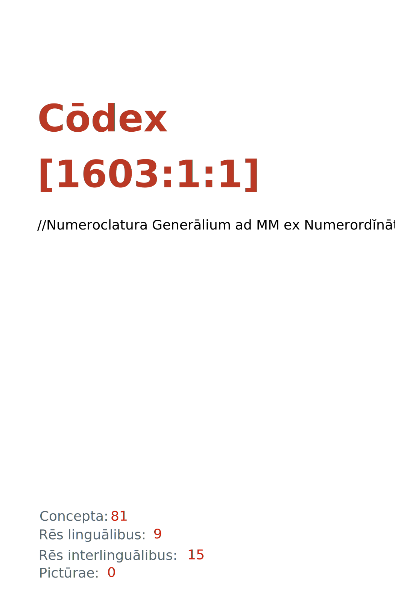

= Cōdex [1603:1:1]: //Numeroclatura Generālium ad MM ex Numerordĭnātĭo//
:doctype: book
:title: Cōdex [1603:1:1]: //Numeroclatura Generālium ad MM ex Numerordĭnātĭo//
:lang: la
:toc: macro
:toclevels: 5
:toc-title: Tabula contentorum
:table-caption: Tabula
:figure-caption: Pictūra
:example-caption: Exemplum
:last-update-label: Renovatio
:version-label: Versiō
:appendix-caption: Appendix
:source-highlighter: rouge
:warning-caption: Hic sunt dracones
:tip-caption: Commendātum
:front-cover-image: : //Numeroclatura Generālium ad MM ex Numerordĭnātĭo//",1050,1600]

{nbsp} +
{nbsp} +
[quote]
**Dedicação ao Domínio Público significa que cada grande problema comum só precisa ser resolvido uma vez**

'''

[%header,cols="25h,~a"]
|===
|
Rēs interlinguālibus
|
Factum

|
scrīptor
|
EticaAI

|
/cōdex pūblicandī/
|
EticaAI

|
/publication date/@eng-Latn
|
2022-01-01

|
numerus editionis
|
2022-05-26T22:39:03

|
/SPDX license ID/@eng-Latn
|
CC0-1.0

|
spōnsor
|
pro bonō publicō

|===

ifndef::backend-epub3[]
<<<
toc::[]
<<<
endif::[]

[id=0_999_1603_1]
== Praefātiō 

Rēs linguālibus (1)::
  Lingua Anglica (Abecedarium Latinum):::
    _**Cōdex [1603:1:1]**_ é o formato de livro dos dados estruturados legíveis por máquina do grupo de dicionários _**[1603:1:1] //Numeroclatura Generālium ad MM ex Numerordĭnātĭo//**_, que são distribuídos para os implementadores usarem em aplicativos externos. Este livro pretende ser um recurso avançado para outros lexicógrafos e tradutores de terminologia, inclusive para detectar e relatar inconsistências. Ele pode, no entanto, ser usado como um dicionário ad hoc se não houver trabalho derivado focado em suas necessidades específicas.
    +++  +++
    **SOBRE LEXICOGRAFIA**
    +++  +++
    A lexicografia prática é a arte ou ofício de compilar, escrever e editar dicionários. O básico não é muito diferente de um milênio atrás: ainda é um trabalho muito humano e criativo. É preciso ser humilde: a maioria dos erros de tradutores, na verdade, não é culpa do tradutor, mas falhas metodológicas. Certificar-se de uma ideia de origem do que um conceito representa, mesmo que signifique reescrever e simplificar, anexar fotos, mostrar exemplos, fazer o que for para que seja entendido, faz com que até mesmo tradutores não profissionais que se preocupam com sua própria língua entreguem melhor resultados do que qualquer alternativa. Em outras palavras: mesmo as chamadas melhores práticas da indústria de pagar tradutores e revisores profissionais não podem superar termos de origem já mal explicados.
    +++  +++
    **SOBRE TIPOS DE DICIONÁRIOS QUE ESTAMOS COMPILANDO**
    +++  +++
    Estamos preocupados com um grupo de idéias (chamamos isso de grupo de dicionários de conceitos) que podem ser divididos em partes menores, revisados quanto a inconsistências, aprimorados para definições e depois traduzidos por voluntários. Códigos interlinguais, como o que poderia ser usado na troca de dados real, também são adicionados a cada conceito. Ambos os glossários, interfaces de usuário (como rótulos na coleta de dados) e, em alguns casos, até códigos padrão para o que iria em um campo de dados podem ser compilados dessa maneira.
    +++  +++
    Como a lista completa de dicionários-prototípicos e dicionários minimamente utilizáveis é enorme, um modo de citar público-alvos típicos é o seguinte:
    +++  +++
    . Ajuda humanitária
    . Ajuda ao desenvolvimento
    . Direitos humanos
    . Socorro militar (ou conceitos relacionados a conflitos e resolução de conflitos)
    +++  +++
    Os itens 1, 2 e 4 https://en.m.wikipedia.org/wiki/Humanitarian-Development_Nexus[são algumas vezes referidos como _nexus_] e são frequentemente encontrados ajudando _crise humanitária_. Já que a maioria dos colaboradores cujas ideias e críticas válidas são voluntárias, então 3 (direitos humanos, como na Anistia Internacional) para diferenciar do humanitarismo (como o Movimento da Cruz Vermelha é referência).
    +++  +++
    Observe que **dicionários não são guias de uso**. As instruções, quando existem, são principalmente dedicadas a lexicógrafos e tradutores.
    +++  +++
    **/PRO BONŌ PUBLICŌ/@lat-Latn**
    +++  +++
    As pessoas lexicógrafas deste trabalho são voluntárias, fazendo-o gratuitamente, pro bonō publicō, e não aceitam doações por causa dos dicionários reutilizáveis ​​de todos. O trabalho anterior existente muitas vezes é baseado em livros antigos de domínio público. A maioria dos tradutores de terminologia já seriam voluntários porque acreditam em uma causa. A melhor maneira de inspirar a colaboração é sermos nós mesmos exemplos.
    +++  +++
    Há um aspecto não moralista, bastante simples de entender: quão caro seria pagar pelo trabalho de todos considerando que é viável em mais de 200 idiomas? A logística para decidir quem deve ser pago, depois a transferência de dinheiro em todo o mundo (pode incluir pessoas de países embargados), depois os mecanismos tradicionais de auditoria para verificar o uso indevido que os doadores esperam, existe? Em terminologia especial (os próprios termos do dicionário) e tantas línguas, não existe dinheiro suficiente nem humanos interessados ​​em ser coordenadores.

<<<

== Methodī ex cōdice
=== Methodī ex dictiōnāriōrum corde
Rēs interlinguālibus (1)::
  /scope and content/@eng-Latn:::
    /The global indexof every entry point of group of dictionaries./@eng-Latn

=== Rēs dē factō in dictiōnāriīs
==== Concepta: 88

==== Rēs linguālibus: 5

[%header,cols="15h,25a,~,17"]
|===
|
Cōdex linguae
|
Glotto cōdicī +++ +++ ISO 639-3 +++ +++ Wiki QID cōdicī
|
Nōmen Latīnum
|
Concepta

|
mul-Zyyy
|

+++ +++
https://iso639-3.sil.org/code/mul[mul]
+++ +++ 
|
Linguae multiplīs (Scrīptum incognitō)
|
82

|
ben-Beng
|
https://glottolog.org/resource/languoid/id/beng1280[beng1280]
+++ +++
https://iso639-3.sil.org/code/ben[ben]
+++ +++ https://www.wikidata.org/wiki/Q9610[Q9610]
|
Lingua Bengali (/ISO 15924 Beng/)
|
2

|
rus-Cyrl
|
https://glottolog.org/resource/languoid/id/russ1263[russ1263]
+++ +++
https://iso639-3.sil.org/code/rus[rus]
+++ +++ https://www.wikidata.org/wiki/Q7737[Q7737]
|
Lingua Russica (Abecedarium Cyrillicum)
|
3

|
lat-Latn
|
https://glottolog.org/resource/languoid/id/lati1261[lati1261]
+++ +++
https://iso639-3.sil.org/code/lat[lat]
+++ +++ https://www.wikidata.org/wiki/Q397[Q397]
|
Lingua Latina (Abecedarium Latinum)
|
28

|
eng-Latn
|
https://glottolog.org/resource/languoid/id/stan1293[stan1293]
+++ +++
https://iso639-3.sil.org/code/eng[eng]
+++ +++ https://www.wikidata.org/wiki/Q1860[Q1860]
|
Lingua Anglica (Abecedarium Latinum)
|
2

|===

==== Rēs interlinguālibus: 11
Rēs::
  /publication date/@eng-Latn:::
    Rēs interlinguālibus::::
      /Wiki P/;;
        https://www.wikidata.org/wiki/Property:P577[P577]

      ix_hxlix;;
        ix_wikip577

      ix_hxlvoc;;
        v_wiki_p_577

    Rēs linguālibus::::
      Lingua Latina (Abecedarium Latinum);;
        +++/publication date/@eng-Latn+++

      #item+rem+definitionem+i_eng+is_latn;;
        Date or point in time when a work was first published or released

      #item+rem+definitionem+i_por+is_latn;;
        Data ou ponto no tempo em que um trabalho foi publicado ou lançado pela primeira vez

  scrīptor:::
    Rēs interlinguālibus::::
      /Wiki P/;;
        https://www.wikidata.org/wiki/Property:P50[P50]

      ix_hxlix;;
        ix_wikip50

      ix_hxlvoc;;
        v_wiki_p_50

    Rēs linguālibus::::
      Lingua Latina (Abecedarium Latinum);;
        +++scrīptor+++

      #item+rem+definitionem+i_eng+is_latn;;
        Main creator(s) of a written work (use on works, not humans)

      #item+rem+definitionem+i_por+is_latn;;
        Principais criadores de uma obra escrita (uso em obras, não em humanos)

  spōnsor:::
    Rēs interlinguālibus::::
      /Wiki P/;;
        https://www.wikidata.org/wiki/Property:P859[P859]

      ix_hxlix;;
        ix_wikip859

      ix_hxlvoc;;
        v_wiki_p_859

    Rēs linguālibus::::
      Lingua Latina (Abecedarium Latinum);;
        +++spōnsor+++

      #item+rem+definitionem+i_eng+is_latn;;
        organization or individual that sponsors this item

      #item+rem+definitionem+i_por+is_latn;;
        organização ou indivíduo que patrocina este item

  Numerordĭnātĭo:::
    Rēs interlinguālibus::::
      ix_hxlix;;
        ix_n1603

      ix_hxlvoc;;
        v_n1603

    Rēs linguālibus::::
      Lingua Latina (Abecedarium Latinum);;
        +++Numerordĭnātĭo+++

      #item+rem+definitionem+i_eng+is_latn;;
        a generic strategy of arranging numbers in an taxonomy-like explicit way

      #item+rem+definitionem+i_por+is_latn;;
        uma estratégia genérica de organizar os números de maneira explícita como taxonomia

  numerus editionis:::
    Rēs interlinguālibus::::
      /Wiki P/;;
        https://www.wikidata.org/wiki/Property:P393[P393]

      ix_hxlix;;
        ix_wikip393

      ix_hxlvoc;;
        v_wiki_p_393

    Rēs linguālibus::::
      Lingua Latina (Abecedarium Latinum);;
        +++numerus editionis+++

      #item+rem+definitionem+i_eng+is_latn;;
        number of an edition (first, second, ... as 1, 2, ...) or event

      #item+rem+definitionem+i_por+is_latn;;
        número de uma edição (primeira, segunda, ... como 1, 2, ...) ou evento

  //Cōdex annotātiōnibus internālibus//:::
    Rēs interlinguālibus::::
      ix_hxlix;;
        ix_n1603ia

    Rēs linguālibus::::
      Lingua Latina (Abecedarium Latinum);;
        +++//Cōdex annotātiōnibus internālibus//+++

      #item+rem+definitionem+i_eng+is_latn;;
        Internal annotations of a codex. List of items. Used on 1603_1_1 as undocumented tags to manage how dictionaries are exported

      #item+rem+definitionem+i_por+is_latn;;
        Anotações internas de um códice. Lista de itens. Usado em 1603_1_1 como tags não documentadas para gerenciar como os dicionários são exportados

  /SPDX license ID/@eng-Latn:::
    Rēs interlinguālibus::::
      /Wiki P/;;
        https://www.wikidata.org/wiki/Property:P2479[P2479]

      /rēgulam/;;
        [0-9A-Za-z\.\-]{3,36}[+]?

      /formatter URL/@eng-Latn;;
        https://spdx.org/licenses/$1.html

      ix_hxlix;;
        ix_wikip2479

      ix_hxlvoc;;
        v_wiki_p_2479

    Rēs linguālibus::::
      Lingua Latina (Abecedarium Latinum);;
        +++/SPDX license ID/@eng-Latn+++

      #item+rem+definitionem+i_eng+is_latn;;
        SPDX license identifier

      #item+rem+definitionem+i_por+is_latn;;
        identificador de licença SPDX

  /scope and content/@eng-Latn:::
    Rēs interlinguālibus::::
      /Wiki P/;;
        https://www.wikidata.org/wiki/Property:P7535[P7535]

      ix_hxlix;;
        ix_wikip7535

      ix_hxlvoc;;
        v_wiki_p_7535

    Rēs linguālibus::::
      Lingua Latina (Abecedarium Latinum);;
        +++/scope and content/@eng-Latn+++

      #item+rem+definitionem+i_eng+is_latn;;
        a summary statement providing an overview of the archival collection

      #item+rem+definitionem+i_por+is_latn;;
        uma declaração resumida fornecendo uma visão geral da coleção de arquivo

  /cōdex pūblicandī/:::
    Rēs interlinguālibus::::
      /Wiki P/;;
        https://www.wikidata.org/wiki/Property:P123[P123]

      ix_hxlix;;
        ix_wikip123

      ix_hxlvoc;;
        v_wiki_p_123

    Rēs linguālibus::::
      Lingua Latina (Abecedarium Latinum);;
        +++/cōdex pūblicandī/+++

      #item+rem+definitionem+i_eng+is_latn;;
        organization or person responsible for publishing books, periodicals, printed music, podcasts, games or software

      #item+rem+definitionem+i_por+is_latn;;
        organização ou pessoa responsável pela publicação de livros, periódicos, música impressa, podcasts, jogos ou software

  /Wiki QID/:::
    Rēs interlinguālibus::::
      /rēgulam/;;
        Q[1-9]\d*

      ix_hxlix;;
        ix_wikiq

      ix_hxlvoc;;
        v_wiki_q

    Rēs linguālibus::::
      Lingua Latina (Abecedarium Latinum);;
        +++/Wiki QID/+++

      #item+rem+definitionem+i_eng+is_latn;;
        QID (or Q number) is the unique identifier of a data item on Wikidata, comprising the letter "Q" followed by one or more digits. It is used to help people and machines understand the difference between items with the same or similar names e.g there are several places in the world called London and many people called James Smith. This number appears next to the name at the top of each Wikidata item.

      #item+rem+definitionem+i_por+is_latn;;
        QID (ou número Q) é o identificador único de um item de dados no Wikidata, composto pela letra "Q" seguida por um ou mais dígitos. Ele é usado para ajudar pessoas e máquinas a entender a diferença entre itens com nomes iguais ou semelhantes, por exemplo, existem vários lugares no mundo chamados Londres e muitas pessoas chamadas James Smith. Este número aparece ao lado do nome na parte superior de cada item do Wikidata.

<<<

== Archīa

Rēs linguālibus (1)::
  Lingua Anglica (Abecedarium Latinum):::
    **Informações de contexto**: ignorando por um momento o fato de ter várias traduções (e otimizadas para receber contribuições regularmente, não _apenas_ um trabalho estático), então a diferença real no fluxo de trabalho usado para gerar cada grupo de dicionários em um Cōdex como este é o seguinte fato: **fornecemos formatos de arquivos estruturados legíveis por máquina mesmo quando os equivalentes em _idiomas internacionais_, como o inglês, não possuem para áreas como ajuda humanitária, ajuda ao desenvolvimento e direitos humanos**. Os mais próximos desse multilinguismo (fora da Wikimedia) são o SEMIeu da União Europeia (até 24 idiomas), mas mesmo assim têm problemas ao compartilhar traduções em todos os idiomas. As traduções das Nações Unidas (até 6 idiomas, raramente mais) não estão disponíveis por agências humanitárias para ajudar nas traduções de terminologia.
    +++  +++
    **Implicação prática**: os documentos de texto em _Archīa prō cōdice_ (tradução literal em inglês: _File for book_) são alternativas a este formato de livro que são altamente automatizados usando apenas o formato de dados. No entanto, os formatos legíveis por máquina em _Archīa prō dictiōnāriīs_ (tradução literal em inglês: _Arquivos para dicionários_) são o foco e recomendados para trabalhos derivados e destinados a mitigar erros humanos adicionais. Podemos até criar novos formatos a pedido! O objetivo aqui é permitir tradutores de terminologia e uso de produção onde isso tenha um impacto positivo.

=== Archīa prō dictiōnāriīs: 1

==== 1603_1_1.no1.tm.hxl.csv

Rēs interlinguālibus::
  /download link/@eng-Latn::: link:1603_1_1.no1.tm.hxl.csv[1603_1_1.no1.tm.hxl.csv]
Rēs linguālibus::
  Lingua Anglica (Abecedarium Latinum):::
    /Numerordinatio no contêiner HXLTM/

=== Archīa prō cōdice: 2

==== 1603_1_1.mul-Latn.codex.adoc

Rēs interlinguālibus::
  /download link/@eng-Latn::: link:1603_1_1.mul-Latn.codex.adoc[1603_1_1.mul-Latn.codex.adoc]
  /reference URL/@eng-Latn:::
    https://docs.asciidoctor.org/

Rēs linguālibus::
  Lingua Anglica (Abecedarium Latinum):::
    AsciiDoc é um formato de autoria de texto simples (ou seja, linguagem de marcação leve) para escrever conteúdo técnico, como documentação, artigos e livros.

==== 1603_1_1.mul-Latn.codex.pdf

Rēs interlinguālibus::
  /download link/@eng-Latn::: link:1603_1_1.mul-Latn.codex.pdf[1603_1_1.mul-Latn.codex.pdf]
  /reference URL/@eng-Latn:::
    https://www.adobe.com/content/dam/acom/en/devnet/pdf/pdfs/PDF32000_2008.pdf

Rēs linguālibus::
  Lingua Anglica (Abecedarium Latinum):::
    Portable Document Format (PDF), padronizado como ISO 32000, é um formato de arquivo desenvolvido pela Adobe em 1992 para apresentar documentos, incluindo formatação de texto e imagens, de maneira independente do software aplicativo, hardware e sistemas operacionais.

<<<

[.text-center]

Dictiōnāria initiīs

<<<

== //Numeroclatura Generālium ad MM ex Numerordĭnātĭo//
<<<

[id='1']
=== [`1`] //Meta dictiōnārium//

Rēs interlinguālibus (1)::
  Numerordĭnātĭo:::
    1603:1

Rēs linguālibus (1)::
  Linguae multiplīs (Scrīptum incognitō):::
    //Meta dictiōnārium//

[id='1_1']
==== [`1_1`] //Numeroclatura Generālium ad MM ex Numerordĭnātĭo//

Rēs interlinguālibus (2)::
  Numerordĭnātĭo:::
    1603:1:1

  //Cōdex annotātiōnibus internālibus//:::
    internale-100|origo_per_amanuenses-100|publicum-10

Rēs linguālibus (1)::
  Linguae multiplīs (Scrīptum incognitō):::
    //Numeroclatura Generālium ad MM ex Numerordĭnātĭo//

[id='1_2']
==== [`1_2`] /Dictiōnāria dē symbolī numerīs/

Rēs interlinguālibus (1)::
  Numerordĭnātĭo:::
    1603:1:2

Rēs linguālibus (2)::
  Linguae multiplīs (Scrīptum incognitō):::
    /Dictiōnāria dē symbolī numerīs/

  Lingua Latina (Abecedarium Latinum):::
    +++/Dictiōnāria dē symbolī numerīs/+++

[id='1_3']
==== [`1_3`] /Dictiōnāria dē symbolī ab systemata scrīpta/

Rēs interlinguālibus (1)::
  Numerordĭnātĭo:::
    1603:1:3

Rēs linguālibus (2)::
  Linguae multiplīs (Scrīptum incognitō):::
    /Dictiōnāria dē symbolī ab systemata scrīpta/

  Lingua Latina (Abecedarium Latinum):::
    +++/Dictiōnāria dē symbolī ab systemata scrīpta/+++

[id='1_4']
==== [`1_4`] /Dictiōnāria dē systemata scrīpta/

Rēs interlinguālibus (1)::
  Numerordĭnātĭo:::
    1603:1:4

Rēs linguālibus (2)::
  Linguae multiplīs (Scrīptum incognitō):::
    /Dictiōnāria dē systemata scrīpta/

  Lingua Latina (Abecedarium Latinum):::
    +++/Dictiōnāria dē systemata scrīpta/+++

[id='1_5']
==== [`1_5`] Concept of language

Rēs interlinguālibus (1)::
  Numerordĭnātĭo:::
    1603:1:5

Rēs linguālibus (1)::
  Linguae multiplīs (Scrīptum incognitō):::
    Concept of language

[id='1_6']
==== [`1_6`] /Dictiōnāria dē terminī typīs/

Rēs interlinguālibus (2)::
  Numerordĭnātĭo:::
    1603:1:6

  //Cōdex annotātiōnibus internālibus//:::
    internale-20|publicum-10

Rēs linguālibus (1)::
  Linguae multiplīs (Scrīptum incognitō):::
    /Dictiōnāria dē terminī typīs/

[id='1_7']
==== [`1_7`] //Dictiōnāria basibus dē rēs interlinguīs//

Rēs interlinguālibus (2)::
  Numerordĭnātĭo:::
    1603:1:7

  //Cōdex annotātiōnibus internālibus//:::
    internale-90|publicum-10

Rēs linguālibus (1)::
  Linguae multiplīs (Scrīptum incognitō):::
    //Dictiōnāria basibus dē rēs interlinguīs//

[id='1_10']
==== [`1_10`] //(Reserved namespace to document numeric suffixes)//

Rēs interlinguālibus (1)::
  Numerordĭnātĭo:::
    1603:1:10

Rēs linguālibus (1)::
  Linguae multiplīs (Scrīptum incognitō):::
    //(Reserved namespace to document numeric suffixes)//

[id='1_13']
==== [`1_13`] 

Rēs interlinguālibus (1)::
  Numerordĭnātĭo:::
    1603:1:13

Rēs linguālibus (1)::
  Linguae multiplīs (Scrīptum incognitō):::
    [13] 1603:13 HXL Normae

[id='1_13_22']
===== [`1_13_22`] //Pre-build list of all +v_* attributes on 1603//

Rēs interlinguālibus (1)::
  Numerordĭnātĭo:::
    1603:1:13:22

Rēs linguālibus (2)::
  Linguae multiplīs (Scrīptum incognitō):::
    //Pre-build list of all +v_* attributes on 1603//

  Linguae multiplīs (Scrīptum incognitō):::
    [22] V

[id='1_13_24']
===== [`1_13_24`] //Pre-build list of all +ix_* attributes on 1603//

Rēs interlinguālibus (1)::
  Numerordĭnātĭo:::
    1603:1:13:24

Rēs linguālibus (2)::
  Linguae multiplīs (Scrīptum incognitō):::
    //Pre-build list of all +ix_* attributes on 1603//

  Linguae multiplīs (Scrīptum incognitō):::
    [24] X

[id='1_20']
==== [`1_20`] Concept of number, prebuild tables

Rēs interlinguālibus (1)::
  Numerordĭnātĭo:::
    1603:1:20

Rēs linguālibus (1)::
  Linguae multiplīs (Scrīptum incognitō):::
    Concept of number, prebuild tables

[id='1_51']
==== [`1_51`] //Dictiōnāria Linguārum ad MMXXII ex Numerordĭnātĭo//

Rēs interlinguālibus (2)::
  Numerordĭnātĭo:::
    1603:1:51

  //Cōdex annotātiōnibus internālibus//:::
    internale-90|publicum-10

Rēs linguālibus (2)::
  Linguae multiplīs (Scrīptum incognitō):::
    //Dictiōnāria Linguārum//

  Lingua Latina (Abecedarium Latinum):::
    +++//Dictiōnāria Linguārum ad MMXXII ex Numerordĭnātĭo//+++

[id='1_99']
==== [`1_99`] Nōtitiae temporāriōrum circā librārium

Rēs interlinguālibus (2)::
  Numerordĭnātĭo:::
    1603:1:99

  //Cōdex annotātiōnibus internālibus//:::
    internale-20|publicum-1

Rēs linguālibus (1)::
  Linguae multiplīs (Scrīptum incognitō):::
    Nōtitiae temporāriōrum circā librārium

[id='1_101']
==== [`1_101`] //Dictiōnāria Archīōrum ad MMXXII ex Numerordĭnātĭo//

Rēs interlinguālibus (2)::
  Numerordĭnātĭo:::
    1603:1:101

  //Cōdex annotātiōnibus internālibus//:::
    experimentum-50|internale-20

Rēs linguālibus (2)::
  Linguae multiplīs (Scrīptum incognitō):::
    //Dictiōnāria Archīōrum ad MMXXII ex Numerordĭnātĭo//

  Lingua Latina (Abecedarium Latinum):::
    +++//Dictiōnāria Archīōrum ad MMXXII ex Numerordĭnātĭo//+++

[id='1_2020']
==== [`1_2020`] //Guia rápido de lexicografia para colaboradores//@por-Latn

Rēs interlinguālibus (2)::
  Numerordĭnātĭo:::
    1603:1:2020

  //Cōdex annotātiōnibus internālibus//:::
    internale-100|publicum-10

Rēs linguālibus (1)::
  Linguae multiplīs (Scrīptum incognitō):::
    //Guia rápido de lexicografia para colaboradores//@por-Latn

[id='1_8000']
==== [`1_8000`] //Dicionários de lista de potenciais futuros dicionários//@por-Latn

Rēs interlinguālibus (2)::
  Numerordĭnātĭo:::
    1603:1:8000

  //Cōdex annotātiōnibus internālibus//:::
    internale-50|publicum-30

Rēs linguālibus (1)::
  Linguae multiplīs (Scrīptum incognitō):::
    //Dicionários de lista de potenciais futuros dicionários//@por-Latn

<<<

[id='3']
=== [`3`] Commūnitās scientiae

Rēs interlinguālibus (2)::
  Numerordĭnātĭo:::
    1603:3

  /Wiki QID/:::
    https://www.wikidata.org/wiki/Q1093434[Q1093434]

Rēs linguālibus (5)::
  Linguae multiplīs (Scrīptum incognitō):::
    Commūnitās scientiae

  Linguae multiplīs (Scrīptum incognitō):::
    [2003] Wikipedia

  Lingua Latina (Abecedarium Latinum):::
    +++Commūnitās scientiae+++

  #item+rem+i_arb+is_arab:::
    بعلم المواطنين

  Lingua Russica (Abecedarium Cyrillicum):::
    +++Гражданская наука+++

[id='3_12']
==== [`3_12`] Vicidata

Rēs interlinguālibus (2)::
  Numerordĭnātĭo:::
    1603:3:12

  /Wiki QID/:::
    https://www.wikidata.org/wiki/Q2013[Q2013]

Rēs linguālibus (3)::
  Linguae multiplīs (Scrīptum incognitō):::
    Vicidata

  Linguae multiplīs (Scrīptum incognitō):::
    [2012] Wikidata

  Lingua Latina (Abecedarium Latinum):::
    +++Vicidata+++

[id='3_12_6']
===== [`3_12_6`] //Speciālis collēctiōnī de Vicidata Proprietātī//

Rēs interlinguālibus (2)::
  Numerordĭnātĭo:::
    1603:3:12:6

  /Wiki QID/:::
    https://www.wikidata.org/wiki/Q18616576[Q18616576]

Rēs linguālibus (3)::
  Linguae multiplīs (Scrīptum incognitō):::
    //Speciālis collēctiōnī de Vicidata Proprietātī//

  Linguae multiplīs (Scrīptum incognitō):::
    [6] (16 - 10) P

  Lingua Latina (Abecedarium Latinum):::
    +++//Speciālis collēctiōnī de Vicidata Proprietātī//+++

[id='3_12_16']
===== [`3_12_16`] Vicidata Proprietātī

Rēs interlinguālibus (2)::
  Numerordĭnātĭo:::
    1603:3:12:16

  /Wiki QID/:::
    https://www.wikidata.org/wiki/Q18616576[Q18616576]

Rēs linguālibus (3)::
  Linguae multiplīs (Scrīptum incognitō):::
    Vicidata Proprietātī

  Linguae multiplīs (Scrīptum incognitō):::
    [16] P

  Lingua Latina (Abecedarium Latinum):::
    +++Vicidata Proprietātī+++

[id='3_12_17']
===== [`3_12_17`] Vicidata rēs identitāte

Rēs interlinguālibus (2)::
  Numerordĭnātĭo:::
    1603:3:12:17

  /Wiki QID/:::
    https://www.wikidata.org/wiki/Q43649390[Q43649390]

Rēs linguālibus (3)::
  Linguae multiplīs (Scrīptum incognitō):::
    Vicidata rēs identitāte

  Linguae multiplīs (Scrīptum incognitō):::
    [17] Q

  Lingua Latina (Abecedarium Latinum):::
    +++Vicidata rēs identitāte+++

[id='3_1603']
==== [`3_1603`] /Communitary translations via Wikidata/

Rēs interlinguālibus (1)::
  Numerordĭnātĭo:::
    1603:3:1603

Rēs linguālibus (1)::
  Linguae multiplīs (Scrīptum incognitō):::
    /Communitary translations via Wikidata/

[id='3_1603_45']
===== [`3_1603_45`] 

Rēs interlinguālibus (1)::
  Numerordĭnātĭo:::
    1603:3:1603:45

[id='3_1603_45_1']
====== [`3_1603_45_1`] 

Rēs interlinguālibus (1)::
  Numerordĭnātĭo:::
    1603:3:1603:45:1

<<<

[id='13']
=== [`13`] HXL Normae

Rēs interlinguālibus (1)::
  Numerordĭnātĭo:::
    1603:13

Rēs linguālibus (4)::
  Linguae multiplīs (Scrīptum incognitō):::
    HXL Normae

  Linguae multiplīs (Scrīptum incognitō):::
    [2013-12-01] HXL Standard

  Linguae multiplīs (Scrīptum incognitō):::
    https://www.elrha.org/wp-content/uploads/2017/05/hif-alnap-unocha-exchange-language-case-study-2016-1.pdf

  Lingua Latina (Abecedarium Latinum):::
    +++HXL Normae+++

[id='13_1603']
==== [`13_1603`] /HXL replacement maps to other namespaces/@eng-Latn

Rēs interlinguālibus (1)::
  Numerordĭnātĭo:::
    1603:13:1603

Rēs linguālibus (1)::
  Linguae multiplīs (Scrīptum incognitō):::
    /HXL replacement maps to other namespaces/@eng-Latn

[id='13_1603_49']
===== [`13_1603_49`] /HXL replacement maps to UN m49 from other namespaces/@eng-Latn

Rēs interlinguālibus (1)::
  Numerordĭnātĭo:::
    1603:13:1603:49

Rēs linguālibus (1)::
  Linguae multiplīs (Scrīptum incognitō):::
    /HXL replacement maps to UN m49 from other namespaces/@eng-Latn

<<<

[id='14']
=== [`14`] //Librārium mīlitārī//

Rēs interlinguālibus (1)::
  Numerordĭnātĭo:::
    1603:14

Rēs linguālibus (2)::
  Linguae multiplīs (Scrīptum incognitō):::
    //Librārium mīlitārī//

  Linguae multiplīs (Scrīptum incognitō):::
    [14] 1914, Primum bellum mundanum

[id='14_997']
==== [`14_997`] //Dictiōnāria dē relevāminibus per bellīs//

Rēs interlinguālibus (1)::
  Numerordĭnātĭo:::
    1603:14:997

Rēs linguālibus (1)::
  Linguae multiplīs (Scrīptum incognitō):::
    //Dictiōnāria dē relevāminibus per bellīs//

<<<

[id='23']
=== [`23`] //Librārium lēgī//

Rēs interlinguālibus (1)::
  Numerordĭnātĭo:::
    1603:23

Rēs linguālibus (1)::
  Linguae multiplīs (Scrīptum incognitō):::
    //Librārium lēgī//

[id='23_21']
==== [`23_21`] //Dictiōnāria dē Iurum humanorum defensor//

Rēs interlinguālibus (1)::
  Numerordĭnātĭo:::
    1603:23:21

Rēs linguālibus (1)::
  Linguae multiplīs (Scrīptum incognitō):::
    //Dictiōnāria dē Iurum humanorum defensor//

[id='23_36']
==== [`23_36`] //Dictiōnāria dē intraimperiīs lēgisperītīs per lēgēs certiōrātū//

Rēs interlinguālibus (1)::
  Numerordĭnātĭo:::
    1603:23:36

Rēs linguālibus (1)::
  Linguae multiplīs (Scrīptum incognitō):::
    //Dictiōnāria dē intraimperiīs lēgisperītīs per lēgēs certiōrātū//

<<<

[id='25']
=== [`25`] Mīlitāris scientiae

Rēs interlinguālibus (2)::
  Numerordĭnātĭo:::
    1603:25

  /Wiki QID/:::
    https://www.wikidata.org/wiki/Q11190[Q11190]

Rēs linguālibus (7)::
  Linguae multiplīs (Scrīptum incognitō):::
    Medicina

  Linguae multiplīs (Scrīptum incognitō):::
    [1025] قانون در طب

  Linguae multiplīs (Scrīptum incognitō):::
    https://archive.org/details/AlQaawnoonFiTTwibb/Al-Qaawnoon%20fi-t-Twibb/mode/2up

  Lingua Latina (Abecedarium Latinum):::
    +++Mīlitāris scientiae+++

  #item+rem+i_arb+is_arab:::
    علوم عسكرية

  Lingua Russica (Abecedarium Cyrillicum):::
    +++Военная наука+++

  Lingua Bengali (/ISO 15924 Beng/):::
    +++সামরিক বিজ্ঞান+++

[id='25_1']
==== [`25_1`] /dictiōnāria dē partes corporis humani/

Rēs interlinguālibus (2)::
  Numerordĭnātĭo:::
    1603:25:1

  //Cōdex annotātiōnibus internālibus//:::
    publicum-30|victionarium_q-50

Rēs linguālibus (2)::
  Linguae multiplīs (Scrīptum incognitō):::
    //dictiōnāria dē partes corporis humani//

  Lingua Latina (Abecedarium Latinum):::
    +++/dictiōnāria dē partes corporis humani/+++

<<<

[id='32']
=== [`32`] /Translitteratio librāriīs/

Rēs interlinguālibus (2)::
  Numerordĭnātĭo:::
    1603:32

  /Wiki QID/:::
    https://www.wikidata.org/wiki/Q134550[Q134550]

Rēs linguālibus (2)::
  Linguae multiplīs (Scrīptum incognitō):::
    /Translitteratio librāriīs/

  Linguae multiplīs (Scrīptum incognitō):::
    [32] Translitteratio; T=20, L=12; 20 + 12 = 32

<<<

[id='42']
=== [`42`] Forēnsis scientiae

Rēs interlinguālibus (2)::
  Numerordĭnātĭo:::
    1603:42

  /Wiki QID/:::
    https://www.wikidata.org/wiki/Q192386[Q192386]

Rēs linguālibus (7)::
  Linguae multiplīs (Scrīptum incognitō):::
    Mīlitāris scientiae

  Linguae multiplīs (Scrīptum incognitō):::
    [142] (142 -100) 魏伯陽 

  Linguae multiplīs (Scrīptum incognitō):::
    https://archive.org/search.php?query=title%3A%28%E6%AD%A6%E7%B6%93%E7%B8%BD%E8%A6%81%29

  Lingua Latina (Abecedarium Latinum):::
    +++Forēnsis scientiae+++

  #item+rem+i_arb+is_arab:::
    علم الأدلة الجنائية

  Lingua Russica (Abecedarium Cyrillicum):::
    +++Криминалистическая экспертиза+++

  Lingua Bengali (/ISO 15924 Beng/):::
    +++ফরেনসিক বিজ্ঞান+++

<<<

[id='44']
=== [`44`] Forēnsis scientiae

Rēs interlinguālibus (2)::
  Numerordĭnātĭo:::
    1603:44

  /Wiki QID/:::
    https://www.wikidata.org/wiki/Q495304[Q495304]

Rēs linguālibus (2)::
  Linguae multiplīs (Scrīptum incognitō):::
    Forēnsis scientiae

  Linguae multiplīs (Scrīptum incognitō):::
    [42] Antistius ex Caesar post mortī, circa 42-03-15 BC

[id='44_1']
==== [`44_1`] //dictiōnāria dē post mortis condici//

Rēs interlinguālibus (2)::
  Numerordĭnātĭo:::
    1603:44:1

  /Wiki QID/:::
    https://www.wikidata.org/wiki/Q99312209[Q99312209]

Rēs linguālibus (1)::
  Linguae multiplīs (Scrīptum incognitō):::
    //dictiōnāria dē post mortis condici//

[id='44_86']
==== [`44_86`] //Dictiōnāria basibus dē tortūrīs//

Rēs interlinguālibus (3)::
  Numerordĭnātĭo:::
    1603:44:86

  //Cōdex annotātiōnibus internālibus//:::
    experimentum-50|publicum-30|victionarium_q-50

  /Wiki QID/:::
    https://www.wikidata.org/wiki/Q132781[Q132781]

Rēs linguālibus (1)::
  Linguae multiplīs (Scrīptum incognitō):::
    //Dictiōnāria basibus dē tortūrīs//

[id='44_101']
==== [`44_101`] /Dictiōnāria basibus dē sceleribus contrā persōnam/

Rēs interlinguālibus (2)::
  Numerordĭnātĭo:::
    1603:44:101

  //Cōdex annotātiōnibus internālibus//:::
    experimentum-50|publicum-30|victionarium_q-50

Rēs linguālibus (1)::
  Linguae multiplīs (Scrīptum incognitō):::
    /Dictiōnāria basibus dē sceleribus contrā persōnam/

[id='44_111']
==== [`44_111`] /Dictiōnāria basibus dē sceleribus contrā ūnam commūnitātem ab rēctōribus/

Rēs interlinguālibus (2)::
  Numerordĭnātĭo:::
    1603:44:111

  //Cōdex annotātiōnibus internālibus//:::
    experimentum-50|publicum-30|victionarium_q-50

Rēs linguālibus (1)::
  Linguae multiplīs (Scrīptum incognitō):::
    /Dictiōnāria basibus dē sceleribus contrā ūnam commūnitātem ab rēctōribus/

[id='44_142']
==== [`44_142`] //dictiōnāria dē vulnera ab arma ignifera//

Rēs interlinguālibus (1)::
  Numerordĭnātĭo:::
    1603:44:142

Rēs linguālibus (2)::
  Linguae multiplīs (Scrīptum incognitō):::
    //dictiōnāria dē vulnera ab arma ignifera//

  Linguae multiplīs (Scrīptum incognitō):::
    [142] 魏伯陽 

<<<

[id='45']
=== [`45`] (Interimperia) Locus cōdicī

Rēs interlinguālibus (1)::
  Numerordĭnātĭo:::
    1603:45

Rēs linguālibus (3)::
  Linguae multiplīs (Scrīptum incognitō):::
    Normās interimperia

  Linguae multiplīs (Scrīptum incognitō):::
    [1945-10-24] Fundatio de Nationes Unitae

  Lingua Latina (Abecedarium Latinum):::
    +++(Interimperia) Locus cōdicī+++

[id='45_1']
==== [`45_1`] //dictiōnāria dē hūmānitātēs interimperia//

Rēs interlinguālibus (2)::
  Numerordĭnātĭo:::
    1603:45:1

  //Cōdex annotātiōnibus internālibus//:::
    emphasis-50|publicum-70|victionarium_q-50

Rēs linguālibus (1)::
  Linguae multiplīs (Scrīptum incognitō):::
    //dictiōnāria dē hūmānitātēs interimperia//

[id='45_16']
==== [`45_16`] (Interimperia) Locus cōdicī

Rēs interlinguālibus (2)::
  Numerordĭnātĭo:::
    1603:45:16

  /Wiki QID/:::
    https://www.wikidata.org/wiki/Q7200235[Q7200235]

Rēs linguālibus (3)::
  Linguae multiplīs (Scrīptum incognitō):::
    (Interimperia) Locus cōdicī

  Linguae multiplīs (Scrīptum incognitō):::
    [16] P

  Linguae multiplīs (Scrīptum incognitō):::
    https://en.wikipedia.org/wiki/Common_Operational_Datasets#P-codes

[id='45_16_?']
===== [`45_16_?`] 

Rēs interlinguālibus (2)::
  Numerordĭnātĭo:::
    1603:45:16:?

  ix_regex:::
    \1=[1603:45:49]

[id='45_16_?_0']
====== [`45_16_?_0`] //imperium territōrium//

Rēs interlinguālibus (2)::
  Numerordĭnātĭo:::
    1603:45:16:?:0

  ix_regex:::
    \1=[1603:45:49]

Rēs linguālibus (2)::
  Linguae multiplīs (Scrīptum incognitō):::
    //imperium territōrium//

  Lingua Latina (Abecedarium Latinum):::
    +++//imperium territōrium//+++

[id='45_16_?_1']
====== [`45_16_?_1`] //Infraimperium territōria ōrdō 1//

Rēs interlinguālibus (2)::
  Numerordĭnātĭo:::
    1603:45:16:?:1

  ix_regex:::
    \1=[1603:45:49]

Rēs linguālibus (2)::
  Linguae multiplīs (Scrīptum incognitō):::
    //Infraimperium territōria ōrdō 1//

  Lingua Latina (Abecedarium Latinum):::
    +++//Infraimperium territōria ōrdō 1//+++

[id='45_16_?_2']
====== [`45_16_?_2`] //Infraimperium territōria ōrdō 2//

Rēs interlinguālibus (2)::
  Numerordĭnātĭo:::
    1603:45:16:?:2

  ix_regex:::
    \1=[1603:45:49]

Rēs linguālibus (2)::
  Linguae multiplīs (Scrīptum incognitō):::
    //Infraimperium territōria ōrdō 2//

  Lingua Latina (Abecedarium Latinum):::
    +++//Infraimperium territōria ōrdō 2//+++

[id='45_16_?_3']
====== [`45_16_?_3`] //Infraimperium territōria ōrdō 3//

Rēs interlinguālibus (2)::
  Numerordĭnātĭo:::
    1603:45:16:?:3

  ix_regex:::
    \1=[1603:45:49]

Rēs linguālibus (2)::
  Linguae multiplīs (Scrīptum incognitō):::
    //Infraimperium territōria ōrdō 3//

  Lingua Latina (Abecedarium Latinum):::
    +++//Infraimperium territōria ōrdō 3//+++

[id='45_16_?_4']
====== [`45_16_?_4`] //Infraimperium territōria ōrdō 4//

Rēs interlinguālibus (2)::
  Numerordĭnātĭo:::
    1603:45:16:?:4

  ix_regex:::
    \1=[1603:45:49]

Rēs linguālibus (2)::
  Linguae multiplīs (Scrīptum incognitō):::
    //Infraimperium territōria ōrdō 4//

  Lingua Latina (Abecedarium Latinum):::
    +++//Infraimperium territōria ōrdō 4//+++

[id='45_16_?_5']
====== [`45_16_?_5`] //Infraimperium territōria ōrdō 5//

Rēs interlinguālibus (2)::
  Numerordĭnātĭo:::
    1603:45:16:?:5

  ix_regex:::
    \1=[1603:45:49]

Rēs linguālibus (2)::
  Linguae multiplīs (Scrīptum incognitō):::
    //Infraimperium territōria ōrdō 5//

  Lingua Latina (Abecedarium Latinum):::
    +++//Infraimperium territōria ōrdō 5//+++

[id='45_16_?_6']
====== [`45_16_?_6`] //Infraimperium territōria ōrdō 6//

Rēs interlinguālibus (2)::
  Numerordĭnātĭo:::
    1603:45:16:?:6

  ix_regex:::
    \1=[1603:45:49]

Rēs linguālibus (2)::
  Linguae multiplīs (Scrīptum incognitō):::
    //Infraimperium territōria ōrdō 6//

  Lingua Latina (Abecedarium Latinum):::
    +++//Infraimperium territōria ōrdō 6//+++

[id='45_16_?_21_?']
======= [`45_16_?_21_?`] (Interimperia) Locus cōdicī; exāctō (A1...A6)

Rēs interlinguālibus (2)::
  Numerordĭnātĭo:::
    1603:45:16:?:21:?

  ix_regex:::
    \1=[1603:45:49] \2=[1603:45:16:916] 

Rēs linguālibus (3)::
  Linguae multiplīs (Scrīptum incognitō):::
    (Interimperia) Locus cōdicī; exāctō (A1...A6)

  Linguae multiplīs (Scrīptum incognitō):::
    [21] (0 + 1 + 2 + 3 + 4 + 5 + 6)

  Lingua Latina (Abecedarium Latinum):::
    +++(Interimperia) Locus cōdicī; exāctō (A1...A6)+++

[id='45_16_76_2']
====== [`45_16_76_2`] 

Rēs interlinguālibus (2)::
  Numerordĭnātĭo:::
    1603:45:16:76:2

  //Cōdex annotātiōnibus internālibus//:::
    experimentum-50|origo_per_automata-50

[id='45_16_900']
===== [`45_16_900`] [private use] Entire world public P-Codes Adm 0 (>110)

Rēs interlinguālibus (1)::
  Numerordĭnātĭo:::
    1603:45:16:900

Rēs linguālibus (1)::
  Linguae multiplīs (Scrīptum incognitō):::
    [private use] Entire world public P-Codes Adm 0 (>110)

[id='45_16_901']
===== [`45_16_901`] [private use] Entire world public P-Codes A.1 (>2500)

Rēs interlinguālibus (1)::
  Numerordĭnātĭo:::
    1603:45:16:901

Rēs linguālibus (1)::
  Linguae multiplīs (Scrīptum incognitō):::
    [private use] Entire world public P-Codes A.1 (>2500)

[id='45_16_902']
===== [`45_16_902`] [private use] Entire world public P-Codes A.2 (>33700)

Rēs interlinguālibus (1)::
  Numerordĭnātĭo:::
    1603:45:16:902

Rēs linguālibus (1)::
  Linguae multiplīs (Scrīptum incognitō):::
    [private use] Entire world public P-Codes A.2 (>33700)

[id='45_16_903']
===== [`45_16_903`] [private use] Entire world public P-Codes A.3 (>130500)

Rēs interlinguālibus (1)::
  Numerordĭnātĭo:::
    1603:45:16:903

Rēs linguālibus (1)::
  Linguae multiplīs (Scrīptum incognitō):::
    [private use] Entire world public P-Codes A.3 (>130500)

[id='45_16_904']
===== [`45_16_904`] [private use] Entire world public P-Codes A.4 (>265000)

Rēs interlinguālibus (1)::
  Numerordĭnātĭo:::
    1603:45:16:904

Rēs linguālibus (1)::
  Linguae multiplīs (Scrīptum incognitō):::
    [private use] Entire world public P-Codes A.4 (>265000)

[id='45_16_905']
===== [`45_16_905`] [private use] Entire world public P-Codes A.5

Rēs interlinguālibus (1)::
  Numerordĭnātĭo:::
    1603:45:16:905

Rēs linguālibus (1)::
  Linguae multiplīs (Scrīptum incognitō):::
    [private use] Entire world public P-Codes A.5

[id='45_16_906']
===== [`45_16_906`] [private use] Entire world public P-Codes A.6

Rēs interlinguālibus (1)::
  Numerordĭnātĭo:::
    1603:45:16:906

Rēs linguālibus (1)::
  Linguae multiplīs (Scrīptum incognitō):::
    [private use] Entire world public P-Codes A.6

[id='45_16_916']
===== [`45_16_916`] [meta] UN OCHA P-Code *WITHOUT* ISO 3166-1 prefix

Rēs interlinguālibus (1)::
  Numerordĭnātĭo:::
    1603:45:16:916

Rēs linguālibus (1)::
  Linguae multiplīs (Scrīptum incognitō):::
    [meta] UN OCHA P-Code *WITHOUT* ISO 3166-1 prefix

[id='45_16_921']
===== [`45_16_921`] [private use] Entire world public P-Codes A.0 + A1, +A.2 + A.3 + A.4 + A5 + A.6 (> 430000)

Rēs interlinguālibus (1)::
  Numerordĭnātĭo:::
    1603:45:16:921

Rēs linguālibus (2)::
  Linguae multiplīs (Scrīptum incognitō):::
    [private use] Entire world public P-Codes A.0 + A1, +A.2 + A.3 + A.4 + A5 + A.6 (> 430000)

  Linguae multiplīs (Scrīptum incognitō):::
    [921] (0 + 1 + 2 + 3 + 4 + 5 + 6 + 900)

[id='45_19']
==== [`45_19`] Dictiōnāria dē locī generibus

Rēs interlinguālibus (2)::
  Numerordĭnātĭo:::
    1603:45:19

  //Cōdex annotātiōnibus internālibus//:::
    publicum-30|victionarium_q-50

Rēs linguālibus (1)::
  Linguae multiplīs (Scrīptum incognitō):::
    Dictiōnāria dē locī generibus

[id='45_31']
==== [`45_31`] Dictiōnāria dē calamitātibus

Rēs interlinguālibus (2)::
  Numerordĭnātĭo:::
    1603:45:31

  //Cōdex annotātiōnibus internālibus//:::
    emphasis-50|publicum-70|victionarium_q-50

Rēs linguālibus (1)::
  Linguae multiplīs (Scrīptum incognitō):::
    Dictiōnāria dē calamitātibus

[id='45_49']
==== [`45_49`] //Imperia et regiōnēs territōria cōdicēs//

Rēs interlinguālibus (2)::
  Numerordĭnātĭo:::
    1603:45:49

  //Cōdex annotātiōnibus internālibus//:::
    experimentum-50|origo_per_automata-50

Rēs linguālibus (4)::
  Linguae multiplīs (Scrīptum incognitō):::
    //Imperia et regiōnēs territōria cōdicēs//

  Linguae multiplīs (Scrīptum incognitō):::
    [49] UN M49

  Linguae multiplīs (Scrīptum incognitō):::
    https://unstats.un.org/unsd/publication/SeriesM/Series_M49_(1970)_en-fr.pdf

  Lingua Latina (Abecedarium Latinum):::
    +++//Imperia et regiōnēs territōria cōdicēs//+++

[id='45_95']
==== [`45_95`] //Dictiōnāria dē abūsīs interimperiīs contrā cīvēs ex auxiliātiō//

Rēs interlinguālibus (1)::
  Numerordĭnātĭo:::
    1603:45:95

Rēs linguālibus (1)::
  Linguae multiplīs (Scrīptum incognitō):::
    //Dictiōnāria dē abūsīs interimperiīs contrā cīvēs ex auxiliātiō//

[id='45_994']
==== [`45_994`] //Dictiōnāria dē Development aid//

Rēs interlinguālibus (1)::
  Numerordĭnātĭo:::
    1603:45:994

Rēs linguālibus (1)::
  Linguae multiplīs (Scrīptum incognitō):::
    //Dictiōnāria dē Development aid//

<<<

[id='47']
=== [`47`] Normās interindustriās

Rēs interlinguālibus (2)::
  Numerordĭnātĭo:::
    1603:47

  /Wiki QID/:::
    https://www.wikidata.org/wiki/Q1334738[Q1334738]

Rēs linguālibus (4)::
  Linguae multiplīs (Scrīptum incognitō):::
    Normās interindustriās

  Linguae multiplīs (Scrīptum incognitō):::
    [1947-02-23] ISO

  Lingua Latina (Abecedarium Latinum):::
    +++Normās interindustriās+++

  #item+rem+i_arb+is_arab:::
    /معايير دولية/

<<<

[id='63']
=== [`63`] //Librārium hūmānitātī strictae//

Rēs interlinguālibus (1)::
  Numerordĭnātĭo:::
    1603:63

Rēs linguālibus (1)::
  Linguae multiplīs (Scrīptum incognitō):::
    //Librārium hūmānitātī strictae//

[id='63_1']
==== [`63_1`] //Dictiōnāria basibus dē auxiliīs hūmānitātibus strictīs//

Rēs interlinguālibus (1)::
  Numerordĭnātĭo:::
    1603:63:1

Rēs linguālibus (1)::
  Linguae multiplīs (Scrīptum incognitō):::
    //Dictiōnāria basibus dē auxiliīs hūmānitātibus strictīs//

[id='45_49_?']
===== [`45_49_?`] 

Rēs interlinguālibus (2)::
  Numerordĭnātĭo:::
    1603:45:49:?

  ix_regex:::
    \1=[1603:45:49]

[id='63_49_76']
===== [`63_49_76`] //Cadastro Nacional de Estabelecimentos de Saúde (CNES)//@por-Latn

Rēs interlinguālibus (2)::
  Numerordĭnātĭo:::
    1603:63:49:76

  //Cōdex annotātiōnibus internālibus//:::
    experimentum-50|origo_per_automata-50

Rēs linguālibus (1)::
  Linguae multiplīs (Scrīptum incognitō):::
    //Cadastro Nacional de Estabelecimentos de Saúde (CNES)//@por-Latn

[id='63_101']
==== [`63_101`] //Dictiōnāria basibus dē rēbus vītālibus necessāriīs//

Rēs interlinguālibus (2)::
  Numerordĭnātĭo:::
    1603:63:101

  //Cōdex annotātiōnibus internālibus//:::
    emphasis-50|publicum-70|victionarium_q-50

Rēs linguālibus (1)::
  Linguae multiplīs (Scrīptum incognitō):::
    //Dictiōnāria basibus dē rēbus vītālibus necessāriīs//

<<<

[id='64']
=== [`64`] /Dictiōnāria dē aquīs et aliae/

Rēs interlinguālibus (1)::
  Numerordĭnātĭo:::
    1603:64

Rēs linguālibus (1)::
  Linguae multiplīs (Scrīptum incognitō):::
    /Dictiōnāria dē aquīs et aliae/

[id='64_41']
==== [`64_41`] //Dictiōnāria basibus dē perītiae per susurrōs vītālēs//

Rēs interlinguālibus (2)::
  Numerordĭnātĭo:::
    1603:64:41

  //Cōdex annotātiōnibus internālibus//:::
    publicum-30|victionarium_q-50

Rēs linguālibus (1)::
  Linguae multiplīs (Scrīptum incognitō):::
    //Dictiōnāria basibus dē perītiae per susurrōs vītālēs//

[id='64_604']
==== [`64_604`] //Dictiōnāria dē aquīs et sānātiōnibus ex līmpidīs//

Rēs interlinguālibus (3)::
  Numerordĭnātĭo:::
    1603:64:604

  //Cōdex annotātiōnibus internālibus//:::
    publicum-30|victionarium_q-50

  /Wiki QID/:::
    https://www.wikidata.org/wiki/Q2552246[Q2552246]

Rēs linguālibus (1)::
  Linguae multiplīs (Scrīptum incognitō):::
    //Dictiōnāria dē aquīs et sānātiōnibus ex līmpidīs//

<<<

[id='84']
=== [`84`] Dentālis scientiae

Rēs interlinguālibus (1)::
  Numerordĭnātĭo:::
    1603:84

Rēs linguālibus (3)::
  Linguae multiplīs (Scrīptum incognitō):::
    Dentālis scientiae

  Lingua Latina (Abecedarium Latinum):::
    +++Dentālis scientiae+++

  #item+rem+i_arb+is_arab:::
    طب الأسنان

[id='84_1']
==== [`84_1`] /Dictiōnāria dēntālium/

Rēs interlinguālibus (3)::
  Numerordĭnātĭo:::
    1603:84:1

  //Cōdex annotātiōnibus internālibus//:::
    publicum-30|victionarium_q-50

  /Wiki QID/:::
    https://www.wikidata.org/wiki/Q10627714[Q10627714]

Rēs linguālibus (2)::
  Linguae multiplīs (Scrīptum incognitō):::
    /Dictiōnāria dēntālium/

  Lingua Latina (Abecedarium Latinum):::
    +++/Dictiōnāria dēntālium/+++

<<<

[id='99']
=== [`99`] /Temporary public numeric namespace/@eng-Latn

Rēs interlinguālibus (1)::
  Numerordĭnātĭo:::
    1603:99

Rēs linguālibus (1)::
  Linguae multiplīs (Scrīptum incognitō):::
    /Temporary public numeric namespace/@eng-Latn

[id='99_123']
==== [`99_123`] /Code golf/@eng-Latn

Rēs interlinguālibus (2)::
  Numerordĭnātĭo:::
    1603:99:123

  //Cōdex annotātiōnibus internālibus//:::
    experimentum-90|publicum-10|victionarium_q-50

Rēs linguālibus (1)::
  Linguae multiplīs (Scrīptum incognitō):::
    /Code golf/@eng-Latn

[id='99_876']
==== [`99_876`] //Human sexuality (meta dictionaries)//@eng-Latn

Rēs interlinguālibus (3)::
  Numerordĭnātĭo:::
    1603:99:876

  //Cōdex annotātiōnibus internālibus//:::
    experimentum-90|publicum-10

  /Wiki QID/:::
    https://www.wikidata.org/wiki/Q154136[Q154136]

Rēs linguālibus (1)::
  Linguae multiplīs (Scrīptum incognitō):::
    //Human sexuality (meta dictionaries)//@eng-Latn

[id='99_987']
==== [`99_987`] //Personal name nomenclature//

Rēs interlinguālibus (2)::
  Numerordĭnātĭo:::
    1603:99:987

  //Cōdex annotātiōnibus internālibus//:::
    experimentum-90|publicum-10

Rēs linguālibus (1)::
  Linguae multiplīs (Scrīptum incognitō):::
    //Personal name nomenclature//

<<<

[id='999999']
=== [`999999`] Data temporāriīs

Rēs interlinguālibus (1)::
  Numerordĭnātĭo:::
    1603:999999

Rēs linguālibus (2)::
  Linguae multiplīs (Scrīptum incognitō):::
    Data temporāriīs

  Lingua Latina (Abecedarium Latinum):::
    +++Data temporāriīs+++

<<<

[id='999999999']
=== [`999999999`] /Non data files (used for software which generate data)/

Rēs interlinguālibus (1)::
  Numerordĭnātĭo:::
    1603:999999999

Rēs linguālibus (1)::
  Linguae multiplīs (Scrīptum incognitō):::
    /Non data files (used for software which generate data)/

<<<

[.text-center]

Dictiōnāria fīnālī

<<<

== Notā bene

=== [PRECISAMOS DE AJUDA] O PDF gerado não tem as fontes corretas para todos os idiomas

Rēs linguālibus::
  Lingua Lusitana (Abecedarium Latinum):::
    Primeiro, desculpe se isso afeta seu idioma favorito :(. Estamos trabalhando nisso, mas ainda não estamos aperfeiçoando a geração de livros em tantos idiomas ao mesmo tempo.
    Se você tiver fontes instaladas em seu computador, provavelmente ainda poderá copiar e colar da versão eBook.
    Observe que todos os formatos destinados ao processamento de máquina funcionarão bem.

=== [eBook com Wikidata Q] Quero ajudar! Alguma tradução está faltando ou está errada! Como muda-la?

Rēs linguālibus::
  Lingua Lusitana (Abecedarium Latinum):::
    A maioria (mas não todos) os conceitos estão usando o Wikidata Q. Na verdade, na maioria das vezes melhoramos o Wikidata enquanto preparamos os dicionários! Verifique se o conceito exato que você deseja tem um Q ID e clique nele. Lá você pode adicionar traduções.
    A próxima versão (provavelmente semanal) terá seus envios sem a necessidade de nos contatar diretamente.

=== [eBook com Wikidata Q] Posso encontrar o conceito Wikidata, mas não consigo editar!

Rēs linguālibus::
  Lingua Lusitana (Abecedarium Latinum):::
    Embora o Wikidata seja mais flexível do que o da Wikipedia (por exemplo, permite conceitos sem a necessidade de criar páginas da Wikipedia), mesmo o Wikidata pode ter conceitos que exigem a criação de uma conta e não permitem edição anônima. Criar tal conta e confirmar e-mail é mais rápido do que pedir que outra pessoa faça isso por você.
    No entanto, embora o vandalismo no Wikidata seja raro, muito poucos conceitos exigirão uma conta com mais contribuições e não criada muito recentemente. Se este for o seu caso, ajude com os que você pode fazer sozinho e o resto peça para outra pessoa adicionar a você.

=== Ouvi dizer que há interesse em ter o Cōdex além da língua latina! Como fazer?!

Rēs linguālibus::
  Lingua Lusitana (Abecedarium Latinum):::
    Por favor, entre em contato conosco. Este livro usa latim (às vezes _latim macarrónico_) para documentar todos os outros idiomas, mas obviamente podemos automatizar a geração de livros para outros usando outros sistemas de escrita e algum idioma de referência. Precisamos de ajuda especial com sistemas de escrita como Bengali, Devanagari e Tamil. Para scripts da direita para a esquerda, apesar de poder renderizar o texto, a impressão do livro exigirá um modelo diferente. Apenas substituir o latim não funcionará, por isso estamos abertos a ideias para proporcionar uma ótima experiência ao usuário!

<<<

