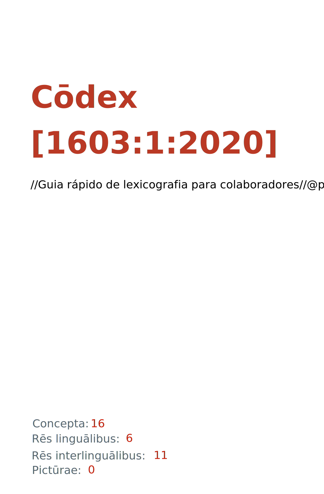

= Cōdex [1603:1:2020]: //Guia rápido de lexicografia para colaboradores//@por-Latn
:doctype: book
:title: Cōdex [1603:1:2020]: //Guia rápido de lexicografia para colaboradores//@por-Latn
:lang: la
:toc: macro
:toclevels: 5
:toc-title: Tabula contentorum
:table-caption: Tabula
:figure-caption: Pictūra
:example-caption: Exemplum
:last-update-label: Renovatio
:version-label: Versiō
:appendix-caption: Appendix
:source-highlighter: rouge
:warning-caption: Hic sunt dracones
:tip-caption: Commendātum
:front-cover-image: : //Guia rápido de lexicografia para colaboradores//@por-Latn",1050,1600]

{nbsp} +
{nbsp} +
[quote]
**Dedicação ao Domínio Público significa que cada grande problema comum só precisa ser resolvido uma vez**

'''

[%header,cols="25h,~a"]
|===
|
Rēs interlinguālibus
|
Factum

|
/dictiōnārium ēditōrī/
|
EticaAI

|
/publication date/@eng-Latn
|
2022-04-21

|
numerus editionis
|
2022-04-29T02:04:48

|
/SPDX license ID/@eng-Latn
|
CC0-1.0

|
spōnsor
|
pro bonō publicō

|===

ifndef::backend-epub3[]
<<<
toc::[]
<<<
endif::[]

[id=0_999_1603_1]
== Praefātiō 

Rēs linguālibus (1)::
  Lingua Anglica (Abecedarium Latinum):::
    _**Cōdex [1603:1:2020]**_ é o formato de livro dos dados estruturados legíveis por máquina do grupo de dicionários _**[1603:1:2020] //Guia rápido de lexicografia para colaboradores//@por-Latn**_, que são distribuídos para os implementadores usarem em aplicativos externos. Este livro pretende ser um recurso avançado para outros lexicógrafos e tradutores de terminologia, inclusive para detectar e relatar inconsistências. Ele pode, no entanto, ser usado como um dicionário ad hoc se não houver trabalho derivado focado em suas necessidades específicas.
    +++  +++
    **SOBRE LEXICOGRAFIA**
    +++  +++
    A lexicografia prática é a arte ou ofício de compilar, escrever e editar dicionários. O básico não é muito diferente de um milênio atrás: ainda é um trabalho muito humano e criativo. É preciso ser humilde: a maioria dos erros de tradutores, na verdade, não é culpa do tradutor, mas falhas metodológicas. Certificar-se de uma ideia de origem do que um conceito representa, mesmo que signifique reescrever e simplificar, anexar fotos, mostrar exemplos, fazer o que for para que seja entendido, faz com que até mesmo tradutores não profissionais que se preocupam com sua própria língua entreguem melhor resultados do que qualquer alternativa. Em outras palavras: mesmo as chamadas melhores práticas da indústria de pagar tradutores e revisores profissionais não podem superar termos de origem já mal explicados.
    +++  +++
    **SOBRE TIPOS DE DICIONÁRIOS QUE ESTAMOS COMPILANDO**
    +++  +++
    Estamos preocupados com um grupo de idéias (chamamos isso de grupo de dicionários de conceitos) que podem ser divididos em partes menores, revisados quanto a inconsistências, aprimorados para definições e depois traduzidos por voluntários. Códigos interlinguais, como o que poderia ser usado na troca de dados real, também são adicionados a cada conceito. Ambos os glossários, interfaces de usuário (como rótulos na coleta de dados) e, em alguns casos, até códigos padrão para o que iria em um campo de dados podem ser compilados dessa maneira.
    +++  +++
    Como a lista completa de dicionários-prototípicos e dicionários minimamente utilizáveis é enorme, um modo de citar público-alvos típicos é o seguinte:
    +++  +++
    . Ajuda humanitária
    . Ajuda ao desenvolvimento
    . Direitos humanos
    . Socorro militar (ou conceitos relacionados a conflitos e resolução de conflitos)
    +++  +++
    Os itens 1, 2 e 4 https://en.m.wikipedia.org/wiki/Humanitarian-Development_Nexus[são algumas vezes referidos como _nexus_] e são frequentemente encontrados ajudando _crise humanitária_. Já que a maioria dos colaboradores cujas ideias e críticas válidas são voluntárias, então 3 (direitos humanos, como na Anistia Internacional) para diferenciar do humanitarismo (como o Movimento da Cruz Vermelha é referência).
    +++  +++
    Observe que **dicionários não são guias de uso**. As instruções, quando existem, são principalmente dedicadas a lexicógrafos e tradutores.
    +++  +++
    **/PRO BONŌ PUBLICŌ/@lat-Latn**
    +++  +++
    As pessoas lexicógrafas deste trabalho são voluntárias, fazendo-o gratuitamente, pro bonō publicō, e não aceitam doações por causa dos dicionários reutilizáveis ​​de todos. O trabalho anterior existente muitas vezes é baseado em livros antigos de domínio público. A maioria dos tradutores de terminologia já seriam voluntários porque acreditam em uma causa. A melhor maneira de inspirar a colaboração é sermos nós mesmos exemplos.
    +++  +++
    Há um aspecto não moralista, bastante simples de entender: quão caro seria pagar pelo trabalho de todos considerando que é viável em mais de 200 idiomas? A logística para decidir quem deve ser pago, depois a transferência de dinheiro em todo o mundo (pode incluir pessoas de países embargados), depois os mecanismos tradicionais de auditoria para verificar o uso indevido que os doadores esperam, existe? Em terminologia especial (os próprios termos do dicionário) e tantas línguas, não existe dinheiro suficiente nem humanos interessados ​​em ser coordenadores.

<<<

== Methodī ex cōdice
=== Methodī ex dictiōnāriōrum corde
Rēs interlinguālibus (1)::
  /scope and content/@eng-Latn:::
    //Guia rápido de lexicografia para colaboradores//@por-Latn

=== Rēs dē factō in dictiōnāriīs
==== Concepta: 16

==== Rēs linguālibus: 3

[%header,cols="15h,25a,~,17"]
|===
|
Cōdex linguae
|
Glotto cōdicī +++ +++ ISO 639-3 +++ +++ Wiki QID cōdicī
|
Nōmen Latīnum
|
Concepta

|
mul-Zyyy
|

+++ +++
https://iso639-3.sil.org/code/mul[mul]
+++ +++ 
|
Linguae multiplīs (Scrīptum incognitō)
|
11

|
por-Latn
|
https://glottolog.org/resource/languoid/id/port1283[port1283]
+++ +++
https://iso639-3.sil.org/code/por[por]
+++ +++ https://www.wikidata.org/wiki/Q5146[Q5146]
|
Lingua Lusitana (Abecedarium Latinum)
|
13

|
eng-Latn
|
https://glottolog.org/resource/languoid/id/stan1293[stan1293]
+++ +++
https://iso639-3.sil.org/code/eng[eng]
+++ +++ https://www.wikidata.org/wiki/Q1860[Q1860]
|
Lingua Anglica (Abecedarium Latinum)
|
2

|===

==== Rēs interlinguālibus: 6
Rēs::
  /dictiōnārium ēditōrī/:::
    Rēs interlinguālibus::::
      /Wiki P/;;
        https://www.wikidata.org/wiki/Property:P98[P98]

      ix_hxlix;;
        ix_wikip98

      ix_hxlvoc;;
        v_wiki_p_98

    Rēs linguālibus::::
      Lingua Latina (Abecedarium Latinum);;
        +++/dictiōnārium ēditōrī/+++

      Lingua Anglica (Abecedarium Latinum);;
        +++editor of a compiled work such as a book or a periodical (newspaper or an academic journal)+++

      Lingua Lusitana (Abecedarium Latinum);;
        +++editor de um trabalho compilado, como um livro ou um periódico (jornal ou revista acadêmica)+++

  spōnsor:::
    Rēs interlinguālibus::::
      /Wiki P/;;
        https://www.wikidata.org/wiki/Property:P859[P859]

      ix_hxlix;;
        ix_wikip859

      ix_hxlvoc;;
        v_wiki_p_859

    Rēs linguālibus::::
      Lingua Latina (Abecedarium Latinum);;
        +++spōnsor+++

      Lingua Anglica (Abecedarium Latinum);;
        +++organization or individual that sponsors this item+++

      Lingua Lusitana (Abecedarium Latinum);;
        +++organização ou indivíduo que patrocina este item+++

  /scope and content/@eng-Latn:::
    Rēs interlinguālibus::::
      /Wiki P/;;
        https://www.wikidata.org/wiki/Property:P7535[P7535]

      ix_hxlix;;
        ix_wikip7535

      ix_hxlvoc;;
        v_wiki_p_7535

    Rēs linguālibus::::
      Lingua Latina (Abecedarium Latinum);;
        +++/scope and content/@eng-Latn+++

      Lingua Anglica (Abecedarium Latinum);;
        +++a summary statement providing an overview of the archival collection+++

      Lingua Lusitana (Abecedarium Latinum);;
        +++uma declaração resumida fornecendo uma visão geral da coleção de arquivo+++

  /publication date/@eng-Latn:::
    Rēs interlinguālibus::::
      /Wiki P/;;
        https://www.wikidata.org/wiki/Property:P577[P577]

      ix_hxlix;;
        ix_wikip577

      ix_hxlvoc;;
        v_wiki_p_577

    Rēs linguālibus::::
      Lingua Latina (Abecedarium Latinum);;
        +++/publication date/@eng-Latn+++

      Lingua Anglica (Abecedarium Latinum);;
        +++Date or point in time when a work was first published or released+++

      Lingua Lusitana (Abecedarium Latinum);;
        +++Data ou ponto no tempo em que um trabalho foi publicado ou lançado pela primeira vez+++

  /SPDX license ID/@eng-Latn:::
    Rēs interlinguālibus::::
      /Wiki P/;;
        https://www.wikidata.org/wiki/Property:P2479[P2479]

      /rēgulam/;;
        [0-9A-Za-z\.\-]{3,36}[+]?

      /formatter URL/@eng-Latn;;
        https://spdx.org/licenses/$1.html

      ix_hxlix;;
        ix_wikip2479

      ix_hxlvoc;;
        v_wiki_p_2479

    Rēs linguālibus::::
      Lingua Latina (Abecedarium Latinum);;
        +++/SPDX license ID/@eng-Latn+++

      Lingua Anglica (Abecedarium Latinum);;
        +++SPDX license identifier+++

      Lingua Lusitana (Abecedarium Latinum);;
        +++identificador de licença SPDX+++

  numerus editionis:::
    Rēs interlinguālibus::::
      /Wiki P/;;
        https://www.wikidata.org/wiki/Property:P393[P393]

      ix_hxlix;;
        ix_wikip393

      ix_hxlvoc;;
        v_wiki_p_393

    Rēs linguālibus::::
      Lingua Latina (Abecedarium Latinum);;
        +++numerus editionis+++

      Lingua Anglica (Abecedarium Latinum);;
        +++number of an edition (first, second, ... as 1, 2, ...) or event+++

      Lingua Lusitana (Abecedarium Latinum);;
        +++número de uma edição (primeira, segunda, ... como 1, 2, ...) ou evento+++

<<<

== Archīa

Rēs linguālibus (1)::
  Lingua Anglica (Abecedarium Latinum):::
    **Informações de contexto**: ignorando por um momento o fato de ter várias traduções (e otimizadas para receber contribuições regularmente, não _apenas_ um trabalho estático), então a diferença real no fluxo de trabalho usado para gerar cada grupo de dicionários em um Cōdex como este é o seguinte fato: **fornecemos formatos de arquivos estruturados legíveis por máquina mesmo quando os equivalentes em _idiomas internacionais_, como o inglês, não possuem para áreas como ajuda humanitária, ajuda ao desenvolvimento e direitos humanos**. Os mais próximos desse multilinguismo (fora da Wikimedia) são o SEMIeu da União Europeia (até 24 idiomas), mas mesmo assim têm problemas ao compartilhar traduções em todos os idiomas. As traduções das Nações Unidas (até 6 idiomas, raramente mais) não estão disponíveis por agências humanitárias para ajudar nas traduções de terminologia.
    +++  +++
    **Implicação prática**: os documentos de texto em _Archīa prō cōdice_ (tradução literal em inglês: _File for book_) são alternativas a este formato de livro que são altamente automatizados usando apenas o formato de dados. No entanto, os formatos legíveis por máquina em _Archīa prō dictiōnāriīs_ (tradução literal em inglês: _Arquivos para dicionários_) são o foco e recomendados para trabalhos derivados e destinados a mitigar erros humanos adicionais. Podemos até criar novos formatos a pedido! O objetivo aqui é permitir tradutores de terminologia e uso de produção onde isso tenha um impacto positivo.

=== Archīa prō dictiōnāriīs: 1

==== 1603_1_2020.no1.tm.hxl.csv

Rēs interlinguālibus::
  /download link/@eng-Latn::: link:1603_1_2020.no1.tm.hxl.csv[1603_1_2020.no1.tm.hxl.csv]
Rēs linguālibus::
  Lingua Anglica (Abecedarium Latinum):::
    /Numerordinatio no contêiner HXLTM/

=== Archīa prō cōdice: 2

==== 1603_1_2020.mul-Latn.codex.adoc

Rēs interlinguālibus::
  /download link/@eng-Latn::: link:1603_1_2020.mul-Latn.codex.adoc[1603_1_2020.mul-Latn.codex.adoc]
  /reference URL/@eng-Latn:::
    https://docs.asciidoctor.org/

Rēs linguālibus::
  Lingua Anglica (Abecedarium Latinum):::
    AsciiDoc é um formato de autoria de texto simples (ou seja, linguagem de marcação leve) para escrever conteúdo técnico, como documentação, artigos e livros.

==== 1603_1_2020.mul-Latn.codex.pdf

Rēs interlinguālibus::
  /download link/@eng-Latn::: link:1603_1_2020.mul-Latn.codex.pdf[1603_1_2020.mul-Latn.codex.pdf]
  /reference URL/@eng-Latn:::
    https://www.adobe.com/content/dam/acom/en/devnet/pdf/pdfs/PDF32000_2008.pdf

Rēs linguālibus::
  Lingua Anglica (Abecedarium Latinum):::
    Portable Document Format (PDF), padronizado como ISO 32000, é um formato de arquivo desenvolvido pela Adobe em 1992 para apresentar documentos, incluindo formatação de texto e imagens, de maneira independente do software aplicativo, hardware e sistemas operacionais.

<<<

[.text-center]

Dictiōnāria initiīs

<<<

== //Guia rápido de lexicografia para colaboradores//@por-Latn
<<<

[id='1']
=== [`1`] /introdução/@por-Latn

Rēs linguālibus (1)::
  Linguae multiplīs (Scrīptum incognitō):::
    /introdução/@por-Latn

[id='1_1']
==== [`1_1`] pro bonō publicō

Rēs linguālibus (2)::
  Linguae multiplīs (Scrīptum incognitō):::
    pro bonō publicō

  Lingua Lusitana (Abecedarium Latinum):::
    +++Nosso trabalho é pro bonō publicō e, exceto quando realmente for inviável, o resultado da lexicografia (que, apesar de toda automação, é criativo) é licenciado em domínio público. Tal decisão é feita maximizando o impacto de colaboradores de todas as etapas de dicionários.+++

[id='1_2']
==== [`1_2`] /aliviar o sofrimento humano/@por-Latn

Rēs linguālibus (2)::
  Linguae multiplīs (Scrīptum incognitō):::
    /aliviar o sofrimento humano/@por-Latn

  Lingua Lusitana (Abecedarium Latinum):::
    +++A _ação humanitária_ é uma ética urgente e limitada de proteção e assistência in extremis. Não é a estritamente equivalente à _direitos humanos_, nem a mesma coisa que _ajuda ao desenvolvimento_, nem ações de _manutenção_ de paz ou de _construção de paz_. Mesmo que decisão sobre necessidade de dicionários seja inspirada em um público-alvo ou genérica de uma área de conhecimento, é inviável prever se apenas aquele público tem tal necessidade antes de dicionários já existirem.+++

[id='1_3']
==== [`1_3`] /lexicografia também envolve empirismo/@por-Latn

Rēs linguālibus (2)::
  Linguae multiplīs (Scrīptum incognitō):::
    /lexicografia também envolve empirismo/@por-Latn

  Lingua Lusitana (Abecedarium Latinum):::
    +++Lexicografia prática é sobre compilar (sentido: reunir de diversas fontes) dicionários que atendem necessidades dos usuários. A maioria dos dicionários tradicionais são evoluções de trabalhos de séculos atrás: existe alguma referência do que melhorar. Mas o processo de criação de qualquer dicionário realmente novo, não apenas é um evento raro, mas necessariamente um processo empírico.+++

[id='1_4']
==== [`1_4`] /dicionários internacionalizáveis/@por-Latn

Rēs linguālibus (2)::
  Linguae multiplīs (Scrīptum incognitō):::
    /dicionários internacionalizáveis/@por-Latn

  Lingua Lusitana (Abecedarium Latinum):::
    +++Nossa prática lexicográfica usa como chaveamento conceito abstrato (sentido imediatamente perceptível: uso de números para organizar ideias). Isso otimiza criação por padrão de simultaneamente dicionários multilíngues, e/ou dicionários de nomenclaturas científicas e/ou dicionários de códigos interlinguais (sentido: identificadores controlados por entidades externas) e/ou dicionários com anexos (exemplos: atlas de anatomia e atlas de ciência forense). Mesmo usos mais simples, como conversão de informações em outras mídias (como livros, exemplos de formulários de dados, sugestões de especialistas da área) feitas em uma língua (tipicamente a que tem mais especialistas ajudando) para formato de arquivos que usamos está otimizada para internacionalização (sentido: facilidade para ser traduzida/localizada em outra regiões do mundo).+++

[id='1_5']
==== [`1_5`] /dicionários especializados/@por-Latn

Rēs linguālibus (2)::
  Linguae multiplīs (Scrīptum incognitō):::
    /dicionários especializados/@por-Latn

  Lingua Lusitana (Abecedarium Latinum):::
    +++O resultado de um dicionário típico que que ficamos é mais próximo do que pessoa leiga esperaria de uma tabela de códigos de uma ISO (poucos conceitos; porém potencialmente altíssima quantidade de informações associadas, como traduções de voluntários) do que um dicionário tradicional monolingual ou bilingual (milhares de termos; muito complexo associar mais que duas línguas). Extrair glossários (monolingual e linguais) ou código de troca de dados (como o que seria armazenado em banco de dados) e a respectiva legenda na língua natural para uso em formulários de troca de dados são exemplos de uso. Até mesmo um dicionário com média completude (até 100 línguas) que somos capazes de compilar contém muito mais informações do que ferramentas que desenvolvedor médio da áreas de tecnologia conseguiriam usar, o que explica nossa intenção de cooperar também com intermediários.+++

<<<

[id='5']
=== [`5`] /foco/@por-Latn

Rēs linguālibus (1)::
  Linguae multiplīs (Scrīptum incognitō):::
    /foco/@por-Latn

[id='5_1']
==== [`5_1`] 

Rēs linguālibus (1)::
  Lingua Lusitana (Abecedarium Latinum):::
    +++Nosso foco são conceitos em que ao menos o grupo de dicionários que os contém haveria pelo menos em teoria uma demanda para troca de dados internacional, e a compilação lexicográfica, mesmo antes de chamada pública, tem chance de atrair colaboração de voluntários de todo mundo caso seja viável estarem minimamente prontos.+++

[id='5_1_1']
===== [`5_1_1`] esse quam vidērī

Rēs linguālibus (2)::
  Linguae multiplīs (Scrīptum incognitō):::
    esse quam vidērī

  Lingua Lusitana (Abecedarium Latinum):::
    +++Cada grupo de dicionários não precisa ter _nome chamativo_ ou perder tempo (que deveria ser empregado preparando os conceitos e explicações para desambiguá-lo de outros) tentando provar sua necessidade para quem já não é especialista ou trabalha diretamente com tais trocas de dados.+++

<<<

[id='10']
=== [`10`] /organização de conceitos/@por-Latn

Rēs linguālibus (2)::
  Linguae multiplīs (Scrīptum incognitō):::
    /organização de conceitos/@por-Latn

  Lingua Lusitana (Abecedarium Latinum):::
    +++Da organização de conceitos+++

[id='10_1']
==== [`10_1`] numerordĭnātĭo

Rēs linguālibus (2)::
  Linguae multiplīs (Scrīptum incognitō):::
    numerordĭnātĭo

  Lingua Lusitana (Abecedarium Latinum):::
    +++Numerordĭnātĭo (latim contemporâneo; tradução literal: ordenamento/organização numérica) é a ação de aplicar taxonomia (sentido: método de organizar ideias) usando números. Nossa implementação é uma alternativa ao uso de latim em nomenclatura científica: permite organizar nossa biblioteca de grupos de dicionários e, opcionalmente, subdivisões adicionais em cada dicionário de forma ágil. Isso minimiza o estresse de dar nome às coisas antes de ficar claro o que são, enquanto é facilmente conversível outros sistemas numéricos mesmo que colaboradores ao redor do mundo não entendem sistemas de escrita das informações iniciais.+++

[id='10_1_1']
===== [`10_1_1`] 

Rēs linguālibus (1)::
  Lingua Lusitana (Abecedarium Latinum):::
    +++Na lógica numerordĭnātĭo, conceitos dentro de um mesmo agrupamento (isto é, tem exatamente os mesmos ancestrais em comum) obrigatoriamente devem ter alguma razão lógica para estarem juntos baseada no que era conhecido no momento dessa decisão. Tal escolha não pode ser arbitrária. Porém o número de descendentes e quantos níveis de descendentes não é algo que precisa ser perfeitamente distribuído.+++

[id='10_1_2']
===== [`10_1_2`] 

Rēs linguālibus (1)::
  Lingua Lusitana (Abecedarium Latinum):::
    +++Na lógica numerordĭnātĭo, por padrão deve-se assumir que os números escolhidos para conceitos dos mesmos ancestrais (isto é, conceitos irmãos) não são relevantes para ordem de importância entre os seus pares. Por exemplo: identificadores 9, 90 e 900, mesmo que tipicamente ferramentas mostrem um ordenamento (algo que aconteceria em um dicionário chaveado por palavras) não deve assumir que 900 é _melhor_ que 9, nem que 9 é mais antigo que 900. Pessoa responsável de catalogar pode documentar para si e para futuros responsáveis como foi feita escolhas anteriores e até sugestões de como distribuir novos números, porém, semelhante à abordagem em nomenclatura científica, é algo que pouco importa para usuários finais.+++

<<<

[id='99']
=== [`99`] /Informações triviais/@por-Latn

Rēs linguālibus (1)::
  Linguae multiplīs (Scrīptum incognitō):::
    /Informações triviais/@por-Latn

[id='99_1']
==== [`99_1`] 

Rēs linguālibus (1)::
  Lingua Lusitana (Abecedarium Latinum):::
    +++O padrão é usar plural de dicionário para cada agrupamento porque cada agrupamento pode conter outros dicionários. Uma forma em português de usar singular é chamar de _o grupo de dicionário_.+++

[id='99_2']
==== [`99_2`] 

Rēs linguālibus (1)::
  Lingua Lusitana (Abecedarium Latinum):::
    +++/Cōdex/@lat-Latn, em tradução literal _livro_, é singular. Porém essa abordagem é usada para formatos textuais, _impressos_, que além do grupo de dicionários em foco, também usa outros dicionários para se explicar.+++

<<<

[.text-center]

Dictiōnāria fīnālī

<<<

== Notā bene

=== [PRECISAMOS DE AJUDA] O PDF gerado não tem as fontes corretas para todos os idiomas

Rēs linguālibus::
  Lingua Lusitana (Abecedarium Latinum):::
    Primeiro, desculpe se isso afeta seu idioma favorito :(. Estamos trabalhando nisso, mas ainda não estamos aperfeiçoando a geração de livros em tantos idiomas ao mesmo tempo.
    Se você tiver fontes instaladas em seu computador, provavelmente ainda poderá copiar e colar da versão eBook.
    Observe que todos os formatos destinados ao processamento de máquina funcionarão bem.

=== [eBook com Wikidata Q] Quero ajudar! Alguma tradução está faltando ou está errada! Como muda-la?

Rēs linguālibus::
  Lingua Lusitana (Abecedarium Latinum):::
    A maioria (mas não todos) os conceitos estão usando o Wikidata Q. Na verdade, na maioria das vezes melhoramos o Wikidata enquanto preparamos os dicionários! Verifique se o conceito exato que você deseja tem um Q ID e clique nele. Lá você pode adicionar traduções.
    A próxima versão (provavelmente semanal) terá seus envios sem a necessidade de nos contatar diretamente.

=== [eBook com Wikidata Q] Posso encontrar o conceito Wikidata, mas não consigo editar!

Rēs linguālibus::
  Lingua Lusitana (Abecedarium Latinum):::
    Embora o Wikidata seja mais flexível do que o da Wikipedia (por exemplo, permite conceitos sem a necessidade de criar páginas da Wikipedia), mesmo o Wikidata pode ter conceitos que exigem a criação de uma conta e não permitem edição anônima. Criar tal conta e confirmar e-mail é mais rápido do que pedir que outra pessoa faça isso por você.
    No entanto, embora o vandalismo no Wikidata seja raro, muito poucos conceitos exigirão uma conta com mais contribuições e não criada muito recentemente. Se este for o seu caso, ajude com os que você pode fazer sozinho e o resto peça para outra pessoa adicionar a você.

=== Ouvi dizer que há interesse em ter o Cōdex além da língua latina! Como fazer?!

Rēs linguālibus::
  Lingua Lusitana (Abecedarium Latinum):::
    Por favor, entre em contato conosco. Este livro usa latim (às vezes _latim macarrónico_) para documentar todos os outros idiomas, mas obviamente podemos automatizar a geração de livros para outros usando outros sistemas de escrita e algum idioma de referência. Precisamos de ajuda especial com sistemas de escrita como Bengali, Devanagari e Tamil. Para scripts da direita para a esquerda, apesar de poder renderizar o texto, a impressão do livro exigirá um modelo diferente. Apenas substituir o latim não funcionará, por isso estamos abertos a ideias para proporcionar uma ótima experiência ao usuário!

<<<

