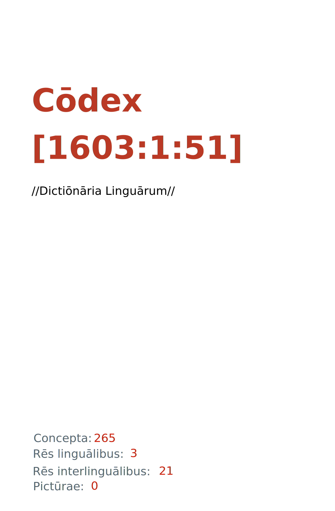

= Cōdex [1603:1:51]: //Dictiōnāria Linguārum//
:doctype: book
:title: Cōdex [1603:1:51]: //Dictiōnāria Linguārum//
:lang: la
:toc: macro
:toclevels: 5
:toc-title: Tabula contentorum
:table-caption: Tabula
:figure-caption: Pictūra
:example-caption: Exemplum
:last-update-label: Renovatio
:version-label: Versiō
:appendix-caption: Appendix
:source-highlighter: rouge
:warning-caption: Hic sunt dracones
:tip-caption: Commendātum
:front-cover-image: : //Dictiōnāria Linguārum//",1050,1600]

{nbsp} +
{nbsp} +
[quote]
/**Public domain means that each major common issue only needs to be resolved once**/@eng-Latn

'''

[%header,cols="25h,~a"]
|===
|
Rēs interlinguālibus
|
Factum

|
scrīptor
|
Multiplicēs scrīptōribus

|
/cōdex pūblicandī/
|
EticaAI

|
/publication date/@eng-Latn
|
2022-01-01

|
numerus editionis
|
2022-04-18T16:03:25

|
/SPDX license ID/@eng-Latn
|
CC0-1.0

|
/reference URL/@eng-Latn
|
https://github.com/EticaAI/multilingual-lexicography/issues/9

|===

ifndef::backend-epub3[]
<<<
toc::[]
<<<
endif::[]

[id=0_999_1603_1]
== Praefātiō 

Rēs linguālibus::
  Lingua Anglica (Abecedarium Latinum):::
    _**Cōdex [1603:1:51]**_ is the book format of the machine-readable dictionaries _**[1603:1:51] //Dictiōnāria Linguārum//**_, which are distributed for implementers on external applications. This book is intended as an advanced resource for other lexicographers and terminology translators, including detect and report inconsistencies. It can, however, be used as an ad hoc dictionary if there is not derived work focused on your specific needs.
    +++  +++
    **ABOUT LEXICOGRAPHY**
    +++  +++
    Practical lexicography is the art or craft of compiling, writing and editing dictionaries. The basics are not far different than a millennia ago: it is still a very humane, creative work. It is necessary to be humble: most of the translator's mistakes are, in fact, not the translator's fault, but methodological flaws. Making sure of a source idea of what a concept represents, even if it means rewrite and make simpler, annex pictures, show examples, do whatever to make it be understood, makes even non-professional translators that care about their own language deliver better results than any alternative. In other words: even the so-called industry best practices of paying professional translators and reviewers cannot overcome already poorly explained source terms.
    +++  +++
    **ABOUT TYPES OF DICTIONARIES WE'RE COMPILING**
    +++  +++
    We're concerned with a group of ideas (we call it a group of dictionaries of concepts) which can be broken into smaller parts, reviewed for inconsistencies, improved for definitions, and then be translated by volunteers. Interlingual codes, such as what could be used on actual data exchange, are also added to each concept. Both glossaries, user interfaces (such as labels on data collection) and in some cases even standard codes for what would go on a data field could be compiled this way.
    +++  +++
    Since the full list of prototypal-dictionaries and dictionaries is huge, one way cited by objective audiences is the following:
    +++  +++
    . Humanitarian aid
    . Development aid
    . Human rights
    . Military relief (or conflict and conflict-resolution related concepts)
    +++  +++
    The itens 1, 2 and 4 https://en.m.wikipedia.org/wiki/Humanitarian-Development_Nexus[are sometimes referred as _nexus_] and are often found helping _humanitarian crisis_. Since most contributors whose ideas and valid criticism are volunteers, then 3 (human rights, as in International Amnesty) to differentiate from humanitarianism (such as Red Cross Movement is reference).
    +++  +++
    Note that **dictionaries are not usage guides**. Instructions, when they exist, are mostly dedicated to lexicographers and translators.
    +++  +++
    **/PRO BONŌ PUBLICŌ/@lat-Latn**
    +++  +++
    The lexicographers of this work are both volunteers, doing it for free, pro bonō publicō, and don't accept donations for the sake of everyone's reusable dictionaries. Existing previous work often is based on old public domain books. Most terminology translators already would be volunteers because they believe in a cause. The best way to inspire collaboration is to be examples ourselves.
    +++  +++
    There's a non-moralistic aspect, fairly simple to understand: how expensive would it be to pay for everyone's work considering it is feasible over 200 languages? The logistics to decide who should be paid, then worldwide cash transfer (may include people from embargoed countries), then traditional auditing mechanisms to check misuse donors expect, exist? In special terminology (dictionary terms themselves) and so many languages, neither sufficient money nor humans interested in being coordinators exist.

<<<

== Methodī ex cōdice
=== Methodī ex dictiōnāriōrum corde
NOTE: #`0_1603_1_7_2616_7535` ?#

=== Rēs dē factō in dictiōnāriīs
==== Concepta: 265

==== Rēs linguālibus: 2

[%header,cols="15h,25a,~,17"]
|===
|
Cōdex linguae
|
Glotto cōdicī +++ +++ ISO 639-3 +++ +++ Wiki QID cōdicī
|
Nōmen Latīnum
|
Concepta

|
lat-Latn
|
https://glottolog.org/resource/languoid/id/lati1261[lati1261]
+++ +++
https://iso639-3.sil.org/code/lat[lat]
+++ +++ https://www.wikidata.org/wiki/Q397[Q397]
|
Lingua Latina (Abecedarium Latinum)
|
265

|
eng-Latn
|
https://glottolog.org/resource/languoid/id/stan1293[stan1293]
+++ +++
https://iso639-3.sil.org/code/eng[eng]
+++ +++ https://www.wikidata.org/wiki/Q1860[Q1860]
|
Lingua Anglica (Abecedarium Latinum)
|
2

|===

==== Rēs interlinguālibus: 14
Rēs::
  /SPDX license ID/@eng-Latn:::
    Rēs interlinguālibus::::
      /Wiki P/;;
        https://www.wikidata.org/wiki/Property:P2479[P2479]

      /rēgulam/;;
        [0-9A-Za-z\.\-]{3,36}[+]?

      /formatter URL/@eng-Latn;;
        https://spdx.org/licenses/$1.html

      ix_hxlix;;
        ix_wikip2479

      ix_hxlvoc;;
        v_wiki_p_2479

    Rēs linguālibus::::
      Lingua Latina (Abecedarium Latinum);;
        +++/SPDX license ID/@eng-Latn+++

      Lingua Anglica (Abecedarium Latinum);;
        +++SPDX license identifier+++

  /reference URL/@eng-Latn:::
    Rēs interlinguālibus::::
      /Wiki P/;;
        https://www.wikidata.org/wiki/Property:P854[P854]

      ix_hxlix;;
        ix_wikip854

      ix_hxlvoc;;
        v_wiki_p_854

    Rēs linguālibus::::
      Lingua Latina (Abecedarium Latinum);;
        +++/reference URL/@eng-Latn+++

      Lingua Anglica (Abecedarium Latinum);;
        +++should be used for Internet URLs as references+++

  numerus editionis:::
    Rēs interlinguālibus::::
      /Wiki P/;;
        https://www.wikidata.org/wiki/Property:P393[P393]

      ix_hxlix;;
        ix_wikip393

      ix_hxlvoc;;
        v_wiki_p_393

    Rēs linguālibus::::
      Lingua Latina (Abecedarium Latinum);;
        +++numerus editionis+++

      Lingua Anglica (Abecedarium Latinum);;
        +++number of an edition (first, second, ... as 1, 2, ...) or event+++

  /Normalized CSV-like identifier; suffix affinity (lat: suffīxum)/:::
    Rēs interlinguālibus::::
      ix_hxlix;;
        ix_csvsffxm

      ix_hxlvoc;;
        v_csv_suffixum

    Rēs linguālibus::::
      Lingua Latina (Abecedarium Latinum);;
        +++/Normalized CSV-like identifier; suffix affinity (lat: suffīxum)/+++

      Lingua Anglica (Abecedarium Latinum);;
        +++/Normalized CSV-like identifier; suffix affinity (lat: suffīxum)/+++

  /publication date/@eng-Latn:::
    Rēs interlinguālibus::::
      /Wiki P/;;
        https://www.wikidata.org/wiki/Property:P577[P577]

      ix_hxlix;;
        ix_wikip577

      ix_hxlvoc;;
        v_wiki_p_577

    Rēs linguālibus::::
      Lingua Latina (Abecedarium Latinum);;
        +++/publication date/@eng-Latn+++

      Lingua Anglica (Abecedarium Latinum);;
        +++Date or point in time when a work was first published or released+++

  /HXL Standard, attributes only/:::
    Rēs interlinguālibus::::
      ix_hxlix;;
        ix_hxla

      ix_hxlvoc;;
        v_hxl_a

    Rēs linguālibus::::
      Lingua Latina (Abecedarium Latinum);;
        +++/HXL Standard, attributes only/+++

      Lingua Anglica (Abecedarium Latinum);;
        +++/HXL Standard, attributes only/+++

  /cōdex pūblicandī/:::
    Rēs interlinguālibus::::
      /Wiki P/;;
        https://www.wikidata.org/wiki/Property:P123[P123]

      ix_hxlix;;
        ix_wikip123

      ix_hxlvoc;;
        v_wiki_p_123

    Rēs linguālibus::::
      Lingua Latina (Abecedarium Latinum);;
        +++/cōdex pūblicandī/+++

      Lingua Anglica (Abecedarium Latinum);;
        +++organization or person responsible for publishing books, periodicals, printed music, podcasts, games or software+++

  scrīptor:::
    Rēs interlinguālibus::::
      /Wiki P/;;
        https://www.wikidata.org/wiki/Property:P50[P50]

      ix_hxlix;;
        ix_wikip50

      ix_hxlvoc;;
        v_wiki_p_50

    Rēs linguālibus::::
      Lingua Latina (Abecedarium Latinum);;
        +++scrīptor+++

      Lingua Anglica (Abecedarium Latinum);;
        +++Main creator(s) of a written work (use on works, not humans)+++

<<<

== Archīa

Rēs linguālibus::
  Lingua Anglica (Abecedarium Latinum):::
    **Context information**: ignoring for a moment the fact of having several translations (and optimized to receive contributions on a regular basis, not _just_ an static work), then the actual groundbreaking difference on the workflow used to generate every dictionaries on Cōdex such as this one are the following fact: **we provide machine readable formats even when the equivalents on _international languages_, such as English, don't have for areas such as humanitarian aid, development aid and human rights**. The closest to such multilingualism (outside Wikimedia) are European Union SEMICeu (up to 24 languages), but even then have issues while sharing translations on all languages. United Nations translations (up to 6 languages, rarely more) are not available by humanitarian agencies to help with terminology translations.
    +++  +++
    **Practical implication**: the text documents on _Archīa prō cōdice_ (literal English translation: _File for book_) are alternatives to this book format which are heavily automated using only the data format. However, the machine-readable formats on _Archīa prō dictiōnāriīs_ (literal English translation: _Files for dictionaries_) are the focus and recommended for derived works and intended for mitigating additional human errors. We can even create new formats by request! The goal here is both to allow terminology translators and production usage where it makes an impact.

=== Archīa prō dictiōnāriīs: 1

==== 1603_1_51.no1.tm.hxl.csv

Rēs interlinguālibus::
  /download link/@eng-Latn::: link:1603_1_51.no1.tm.hxl.csv[1603_1_51.no1.tm.hxl.csv]
Rēs linguālibus::
  Lingua Anglica (Abecedarium Latinum):::
    /Numerordinatio on HXLTM container/

=== Archīa prō cōdice: 2

==== 1603_1_51.mul-Latn.codex.adoc

Rēs interlinguālibus::
  /download link/@eng-Latn::: link:1603_1_51.mul-Latn.codex.adoc[1603_1_51.mul-Latn.codex.adoc]
  /reference URL/@eng-Latn:::
    https://docs.asciidoctor.org/

Rēs linguālibus::
  Lingua Anglica (Abecedarium Latinum):::
    AsciiDoc is a plain text authoring format (i.e., lightweight markup language) for writing technical content such as documentation, articles, and books.

==== 1603_1_51.mul-Latn.codex.pdf

Rēs interlinguālibus::
  /download link/@eng-Latn::: link:1603_1_51.mul-Latn.codex.pdf[1603_1_51.mul-Latn.codex.pdf]
  /reference URL/@eng-Latn:::
    https://www.adobe.com/content/dam/acom/en/devnet/pdf/pdfs/PDF32000_2008.pdf

Rēs linguālibus::
  Lingua Anglica (Abecedarium Latinum):::
    Portable Document Format (PDF), standardized as ISO 32000, is a file format developed by Adobe in 1992 to present documents, including text formatting and images, in a manner independent of application software, hardware, and operating systems.

<<<

[.text-center]

Dictiōnāria initiīs

<<<

== //Dictiōnāria Linguārum//
<<<

[id='1']
=== [`1`] Conceptus cōdicī (Non scrīptum linguae)

Rēs interlinguālibus::
  ix_uid:::
    qcc-Zxxx

  /Normalized CSV-like identifier; suffix affinity (lat: suffīxum)/:::
    __i_qcc__is_zxxx

  /HXL Standard, attributes only/:::
    +i_qcc+is_zxxx

Rēs linguālibus::
  Lingua Latina (Abecedarium Latinum):::
    +++Conceptus cōdicī (Non scrīptum linguae)+++

<<<

[id='10']
=== [`10`] Linguae multiplīs (Scrīptum incognitō)

Rēs interlinguālibus::
  ix_uid:::
    mul-Zyyy

  /Normalized CSV-like identifier; suffix affinity (lat: suffīxum)/:::
    __i_mul__is_zyyy

  /HXL Standard, attributes only/:::
    +i_mul+is_zyyy

  ix_iso639p3a3:::
    mul

Rēs linguālibus::
  Lingua Latina (Abecedarium Latinum):::
    +++Linguae multiplīs (Scrīptum incognitō)+++

<<<

[id='11']
=== [`11`] Macrolingua Arabica (Abecedarium Arabicum)

Rēs interlinguālibus::
  ix_uid:::
    ara-Arab

  /Normalized CSV-like identifier; suffix affinity (lat: suffīxum)/:::
    __i_ara__is_arab

  /HXL Standard, attributes only/:::
    +i_ara+is_arab

  ix_wikiq+ix_linguam:::
    Q13955

  ix_wikiq+ix_scriptum:::
    Q8196

  ix_wikilngm:::
    ar

  ix_glottocode:::
    arab1395

  ix_iso639p3a3:::
    ara

Rēs linguālibus::
  Lingua Latina (Abecedarium Latinum):::
    +++Macrolingua Arabica (Abecedarium Arabicum)+++

<<<

[id='12']
=== [`12`] Lingua Armenia (Alphabetum Armenium)

Rēs interlinguālibus::
  ix_uid:::
    hye-Armn

  /Normalized CSV-like identifier; suffix affinity (lat: suffīxum)/:::
    __i_hye__is_armn

  /HXL Standard, attributes only/:::
    +i_hye+is_armn

  ix_wikiq+ix_linguam:::
    Q8785

  ix_wikiq+ix_scriptum:::
    Q11932

  ix_wikilngm:::
    hy

  ix_glottocode:::
    nucl1235

  ix_iso639p3a3:::
    hye

Rēs linguālibus::
  Lingua Latina (Abecedarium Latinum):::
    +++Lingua Armenia (Alphabetum Armenium)+++

<<<

[id='13']
=== [`13`] Lingua Bengali (/ISO 15924 Beng/)

Rēs interlinguālibus::
  ix_uid:::
    ben-Beng

  /Normalized CSV-like identifier; suffix affinity (lat: suffīxum)/:::
    __i_ben__is_beng

  /HXL Standard, attributes only/:::
    +i_ben+is_beng

  ix_wikiq+ix_linguam:::
    Q9610

  ix_wikiq+ix_scriptum:::
    Q756802

  ix_wikilngm:::
    bn

  ix_glottocode:::
    beng1280

  ix_iso639p3a3:::
    ben

Rēs linguālibus::
  Lingua Latina (Abecedarium Latinum):::
    +++Lingua Bengali (/ISO 15924 Beng/)+++

<<<

[id='14']
=== [`14`] Lingua Russica (Abecedarium Cyrillicum)

Rēs interlinguālibus::
  ix_uid:::
    rus-Cyrl

  /Normalized CSV-like identifier; suffix affinity (lat: suffīxum)/:::
    __i_rus__is_cyrl

  /HXL Standard, attributes only/:::
    +i_rus+is_cyrl

  ix_wikiq+ix_linguam:::
    Q7737

  ix_wikiq+ix_scriptum:::
    Q8209

  ix_wikilngm:::
    ru

  ix_glottocode:::
    russ1263

  ix_iso639p3a3:::
    rus

Rēs linguālibus::
  Lingua Latina (Abecedarium Latinum):::
    +++Lingua Russica (Abecedarium Cyrillicum)+++

<<<

[id='15']
=== [`15`] Lingua Hindica (Devanāgarī)

Rēs interlinguālibus::
  ix_uid:::
    hin-Deva

  /Normalized CSV-like identifier; suffix affinity (lat: suffīxum)/:::
    __i_hin__is_deva

  /HXL Standard, attributes only/:::
    +i_hin+is_deva

  ix_wikiq+ix_linguam:::
    Q1568

  ix_wikiq+ix_scriptum:::
    Q38592

  ix_wikilngm:::
    hi

  ix_glottocode:::
    hind1269

  ix_iso639p3a3:::
    hin

Rēs linguālibus::
  Lingua Latina (Abecedarium Latinum):::
    +++Lingua Hindica (Devanāgarī)+++

<<<

[id='16']
=== [`16`] Lingua Amharica (/ISO 15924 Ethi/)

Rēs interlinguālibus::
  ix_uid:::
    amh-Ethi

  /Normalized CSV-like identifier; suffix affinity (lat: suffīxum)/:::
    __i_amh__is_ethi

  /HXL Standard, attributes only/:::
    +i_amh+is_ethi

  ix_wikiq+ix_linguam:::
    Q28244

  ix_wikiq+ix_scriptum:::
    Q257634

  ix_wikilngm:::
    am

  ix_glottocode:::
    amha1245

  ix_iso639p3a3:::
    amh

Rēs linguālibus::
  Lingua Latina (Abecedarium Latinum):::
    +++Lingua Amharica (/ISO 15924 Ethi/)+++

<<<

[id='17']
=== [`17`] Lingua Georgiana (Abecedarium Georgianum)

Rēs interlinguālibus::
  ix_uid:::
    kat-Geor

  /Normalized CSV-like identifier; suffix affinity (lat: suffīxum)/:::
    __i_kat__is_geor

  /HXL Standard, attributes only/:::
    +i_kat+is_geor

  ix_wikiq+ix_linguam:::
    Q8108

  ix_wikiq+ix_scriptum:::
    Q161428

  ix_wikilngm:::
    ka

  ix_glottocode:::
    nucl1302

  ix_iso639p3a3:::
    kat

Rēs linguālibus::
  Lingua Latina (Abecedarium Latinum):::
    +++Lingua Georgiana (Abecedarium Georgianum)+++

<<<

[id='18']
=== [`18`] Lingua Graeca antiqua (Alphabetum Graecum)

Rēs interlinguālibus::
  ix_uid:::
    grc-Grek

  /Normalized CSV-like identifier; suffix affinity (lat: suffīxum)/:::
    __i_grc__is_grek

  /HXL Standard, attributes only/:::
    +i_grc+is_grek

  ix_wikiq+ix_linguam:::
    Q35497

  ix_wikiq+ix_scriptum:::
    Q8216

  ix_wikilngm:::
    grc

  ix_glottocode:::
    anci1242

  ix_iso639p3a3:::
    grc

Rēs linguālibus::
  Lingua Latina (Abecedarium Latinum):::
    +++Lingua Graeca antiqua (Alphabetum Graecum)+++

<<<

[id='19']
=== [`19`] Lingua Gujaratensis (/ISO 15924 Gujr/)

Rēs interlinguālibus::
  ix_uid:::
    guj-Gujr

  /Normalized CSV-like identifier; suffix affinity (lat: suffīxum)/:::
    __i_guj__is_gujr

  /HXL Standard, attributes only/:::
    +i_guj+is_gujr

  ix_wikiq+ix_linguam:::
    Q5137

  ix_wikiq+ix_scriptum:::
    Q733944

  ix_wikilngm:::
    gu

  ix_glottocode:::
    guja1252

  ix_iso639p3a3:::
    guj

Rēs linguālibus::
  Lingua Latina (Abecedarium Latinum):::
    +++Lingua Gujaratensis (/ISO 15924 Gujr/)+++

<<<

[id='20']
=== [`20`] Lingua Paniabica (/ISO 15924 Guru/)

Rēs interlinguālibus::
  ix_uid:::
    pan-Guru

  /Normalized CSV-like identifier; suffix affinity (lat: suffīxum)/:::
    __i_pan__is_guru

  /HXL Standard, attributes only/:::
    +i_pan+is_guru

  ix_wikiq+ix_linguam:::
    Q58635

  ix_wikiq+ix_scriptum:::
    Q689894

  ix_wikilngm:::
    pa

  ix_glottocode:::
    panj1256

  ix_iso639p3a3:::
    pan

Rēs linguālibus::
  Lingua Latina (Abecedarium Latinum):::
    +++Lingua Paniabica (/ISO 15924 Guru/)+++

<<<

[id='21']
=== [`21`] Lingua Cannadica (/ISO 15924 Knda/)

Rēs interlinguālibus::
  ix_uid:::
    kan-Knda

  /Normalized CSV-like identifier; suffix affinity (lat: suffīxum)/:::
    __i_kan__is_knda

  /HXL Standard, attributes only/:::
    +i_kan+is_knda

  ix_wikiq+ix_linguam:::
    Q33673

  ix_wikiq+ix_scriptum:::
    Q839666

  ix_wikilngm:::
    kn

  ix_glottocode:::
    nucl1305

  ix_iso639p3a3:::
    kan

Rēs linguālibus::
  Lingua Latina (Abecedarium Latinum):::
    +++Lingua Cannadica (/ISO 15924 Knda/)+++

<<<

[id='22']
=== [`22`] Lingua Coreana (Abecedarium Coreanum)

Rēs interlinguālibus::
  ix_uid:::
    kor-Hang

  /Normalized CSV-like identifier; suffix affinity (lat: suffīxum)/:::
    __i_kor__is_hang

  /HXL Standard, attributes only/:::
    +i_kor+is_hang

  ix_wikiq+ix_linguam:::
    Q9176

  ix_wikiq+ix_scriptum:::
    Q8222

  ix_wikilngm:::
    ko

  ix_glottocode:::
    kore1280

  ix_iso639p3a3:::
    kor

Rēs linguālibus::
  Lingua Latina (Abecedarium Latinum):::
    +++Lingua Coreana (Abecedarium Coreanum)+++

<<<

[id='23']
=== [`23`] Lingua Sinica classica (/ISO 15924 Hant/)

Rēs interlinguālibus::
  ix_uid:::
    lzh-Hant

  /Normalized CSV-like identifier; suffix affinity (lat: suffīxum)/:::
    __i_lzh__is_hant

  /HXL Standard, attributes only/:::
    +i_lzh+is_hant

  ix_wikiq+ix_linguam:::
    Q37041

  ix_wikiq+ix_scriptum:::
    Q178528

  ix_wikilngm:::
    lzh

  ix_glottocode:::
    lite1248

  ix_iso639p3a3:::
    lzh

Rēs linguālibus::
  Lingua Latina (Abecedarium Latinum):::
    +++Lingua Sinica classica (/ISO 15924 Hant/)+++

<<<

[id='24']
=== [`24`] Lingua Hebraica (Alphabetum Hebraicum)

Rēs interlinguālibus::
  ix_uid:::
    heb-Hebr

  /Normalized CSV-like identifier; suffix affinity (lat: suffīxum)/:::
    __i_heb__is_hebr

  /HXL Standard, attributes only/:::
    +i_heb+is_hebr

  ix_wikiq+ix_linguam:::
    Q9288

  ix_wikiq+ix_scriptum:::
    Q33513

  ix_wikilngm:::
    he

  ix_glottocode:::
    hebr1245

  ix_iso639p3a3:::
    heb

Rēs linguālibus::
  Lingua Latina (Abecedarium Latinum):::
    +++Lingua Hebraica (Alphabetum Hebraicum)+++

<<<

[id='25']
=== [`25`] Lingua Khmer (/ISO 15924 Khmr/)

Rēs interlinguālibus::
  ix_uid:::
    khm-Khmr

  /Normalized CSV-like identifier; suffix affinity (lat: suffīxum)/:::
    __i_khm__is_khmr

  /HXL Standard, attributes only/:::
    +i_khm+is_khmr

  ix_wikiq+ix_linguam:::
    Q9205

  ix_wikiq+ix_scriptum:::
    Q1054190

  ix_wikilngm:::
    km

  ix_glottocode:::
    cent1989

  ix_iso639p3a3:::
    khm

Rēs linguālibus::
  Lingua Latina (Abecedarium Latinum):::
    +++Lingua Khmer (/ISO 15924 Khmr/)+++

<<<

[id='26']
=== [`26`] /Lao language/ (/ISO 15924 Laoo/)

Rēs interlinguālibus::
  ix_uid:::
    lao-Laoo

  /Normalized CSV-like identifier; suffix affinity (lat: suffīxum)/:::
    __i_lao__is_laoo

  /HXL Standard, attributes only/:::
    +i_lao+is_laoo

  ix_wikiq+ix_linguam:::
    Q9211

  ix_wikiq+ix_scriptum:::
    Q1815229

  ix_wikilngm:::
    lo

  ix_glottocode:::
    laoo1244

  ix_iso639p3a3:::
    lao

Rēs linguālibus::
  Lingua Latina (Abecedarium Latinum):::
    +++/Lao language/ (/ISO 15924 Laoo/)+++

<<<

[id='27']
=== [`27`] Lingua Latina (Abecedarium Latinum)

Rēs interlinguālibus::
  ix_uid:::
    lat-Latn

  /Normalized CSV-like identifier; suffix affinity (lat: suffīxum)/:::
    __i_lat__is_latn

  /HXL Standard, attributes only/:::
    +i_lat+is_latn

  ix_wikiq+ix_linguam:::
    Q397

  ix_wikiq+ix_scriptum:::
    Q8229

  ix_wikilngm:::
    la

  ix_glottocode:::
    lati1261

  ix_iso639p3a3:::
    lat

Rēs linguālibus::
  Lingua Latina (Abecedarium Latinum):::
    +++Lingua Latina (Abecedarium Latinum)+++

<<<

[id='28']
=== [`28`] Lingua Meitei (/ISO 15924 Mtei/)

Rēs interlinguālibus::
  ix_uid:::
    mni-Mtei

  /Normalized CSV-like identifier; suffix affinity (lat: suffīxum)/:::
    __i_mni__is_mtei

  /HXL Standard, attributes only/:::
    +i_mni+is_mtei

  ix_wikiq+ix_linguam:::
    Q33868

  ix_wikiq+ix_scriptum:::
    Q2981413

  ix_wikilngm:::
    mni

  ix_glottocode:::
    mani1292

  ix_iso639p3a3:::
    mni

Rēs linguālibus::
  Lingua Latina (Abecedarium Latinum):::
    +++Lingua Meitei (/ISO 15924 Mtei/)+++

<<<

[id='29']
=== [`29`] /Mon language/ (/ISO 15924 Mymr/)

Rēs interlinguālibus::
  ix_uid:::
    mnw-Mymr

  /Normalized CSV-like identifier; suffix affinity (lat: suffīxum)/:::
    __i_mnw__is_mymr

  /HXL Standard, attributes only/:::
    +i_mnw+is_mymr

  ix_wikiq+ix_linguam:::
    Q13349

  ix_wikiq+ix_scriptum:::
    Q43887939

  ix_wikilngm:::
    mnw

  ix_glottocode:::
    monn1252

  ix_iso639p3a3:::
    mnw

Rēs linguālibus::
  Lingua Latina (Abecedarium Latinum):::
    +++/Mon language/ (/ISO 15924 Mymr/)+++

<<<

[id='30']
=== [`30`] /N'Ko/ (/ISO 15924 Nkoo/)

Rēs interlinguālibus::
  ix_uid:::
    nqo-Nkoo

  /Normalized CSV-like identifier; suffix affinity (lat: suffīxum)/:::
    __i_nqo__is_nkoo

  /HXL Standard, attributes only/:::
    +i_nqo+is_nkoo

  ix_wikiq+ix_linguam:::
    Q18546266

  ix_wikiq+ix_scriptum:::
    Q1062587

  ix_wikilngm:::
    nqo

  ix_glottocode:::
    nkoa1234

  ix_iso639p3a3:::
    nqo

Rēs linguālibus::
  Lingua Latina (Abecedarium Latinum):::
    +++/N'Ko/ (/ISO 15924 Nkoo/)+++

<<<

[id='31']
=== [`31`] Lingua Santali (/ISO 15924 Olck/)

Rēs interlinguālibus::
  ix_uid:::
    sat-Olck

  /Normalized CSV-like identifier; suffix affinity (lat: suffīxum)/:::
    __i_sat__is_olck

  /HXL Standard, attributes only/:::
    +i_sat+is_olck

  ix_wikiq+ix_linguam:::
    Q33965

  ix_wikiq+ix_scriptum:::
    Q201688

  ix_wikilngm:::
    sat

  ix_glottocode:::
    sant1410

  ix_iso639p3a3:::
    sat

Rēs linguālibus::
  Lingua Latina (Abecedarium Latinum):::
    +++Lingua Santali (/ISO 15924 Olck/)+++

<<<

[id='32']
=== [`32`] Macrolingua Orissensis (/ISO 15924 Orya/)

Rēs interlinguālibus::
  ix_uid:::
    ori-Orya

  /Normalized CSV-like identifier; suffix affinity (lat: suffīxum)/:::
    __i_ori__is_orya

  /HXL Standard, attributes only/:::
    +i_ori+is_orya

  ix_wikiq+ix_linguam:::
    Q33810

  ix_wikiq+ix_scriptum:::
    Q1760127

  ix_wikilngm:::
    or

  ix_iso639p3a3:::
    ori

Rēs linguālibus::
  Lingua Latina (Abecedarium Latinum):::
    +++Macrolingua Orissensis (/ISO 15924 Orya/)+++

<<<

[id='33']
=== [`33`] Lingua Singhalensis (/ISO 15924 Sinh/)

Rēs interlinguālibus::
  ix_uid:::
    sin-Sinh

  /Normalized CSV-like identifier; suffix affinity (lat: suffīxum)/:::
    __i_sin__is_sinh

  /HXL Standard, attributes only/:::
    +i_sin+is_sinh

  ix_wikiq+ix_linguam:::
    Q13267

  ix_wikiq+ix_scriptum:::
    Q1574992

  ix_wikilngm:::
    si

  ix_glottocode:::
    sinh1246

  ix_iso639p3a3:::
    sin

Rēs linguālibus::
  Lingua Latina (Abecedarium Latinum):::
    +++Lingua Singhalensis (/ISO 15924 Sinh/)+++

<<<

[id='34']
=== [`34`] Lingua Tamulica (/ISO 15924 Taml/)

Rēs interlinguālibus::
  ix_uid:::
    tam-Taml

  /Normalized CSV-like identifier; suffix affinity (lat: suffīxum)/:::
    __i_tam__is_taml

  /HXL Standard, attributes only/:::
    +i_tam+is_taml

  ix_wikiq+ix_linguam:::
    Q5885

  ix_wikiq+ix_scriptum:::
    Q26803

  ix_wikilngm:::
    ta

  ix_glottocode:::
    tami1289

  ix_iso639p3a3:::
    tam

Rēs linguālibus::
  Lingua Latina (Abecedarium Latinum):::
    +++Lingua Tamulica (/ISO 15924 Taml/)+++

<<<

[id='35']
=== [`35`] Lingua Telingana (/ISO 15924 Telu/)

Rēs interlinguālibus::
  ix_uid:::
    tel-Telu

  /Normalized CSV-like identifier; suffix affinity (lat: suffīxum)/:::
    __i_tel__is_telu

  /HXL Standard, attributes only/:::
    +i_tel+is_telu

  ix_wikiq+ix_linguam:::
    Q8097

  ix_wikiq+ix_scriptum:::
    Q570450

  ix_wikilngm:::
    te

  ix_glottocode:::
    telu1262

  ix_iso639p3a3:::
    tel

Rēs linguālibus::
  Lingua Latina (Abecedarium Latinum):::
    +++Lingua Telingana (/ISO 15924 Telu/)+++

<<<

[id='36']
=== [`36`] Lingua Dhivehi (/ISO 15924 Thaa/)

Rēs interlinguālibus::
  ix_uid:::
    div-Thaa

  /Normalized CSV-like identifier; suffix affinity (lat: suffīxum)/:::
    __i_div__is_thaa

  /HXL Standard, attributes only/:::
    +i_div+is_thaa

  ix_wikiq+ix_linguam:::
    Q32656

  ix_wikiq+ix_scriptum:::
    Q877906

  ix_wikilngm:::
    dv

  ix_glottocode:::
    dhiv1236

  ix_iso639p3a3:::
    div

Rēs linguālibus::
  Lingua Latina (Abecedarium Latinum):::
    +++Lingua Dhivehi (/ISO 15924 Thaa/)+++

<<<

[id='37']
=== [`37`] Lingua Thai (/ISO 15924 Thai/)

Rēs interlinguālibus::
  ix_uid:::
    tha-Thai

  /Normalized CSV-like identifier; suffix affinity (lat: suffīxum)/:::
    __i_tha__is_thai

  /HXL Standard, attributes only/:::
    +i_tha+is_thai

  ix_wikiq+ix_linguam:::
    Q9217

  ix_wikiq+ix_scriptum:::
    Q236376

  ix_wikilngm:::
    th

  ix_glottocode:::
    thai1261

  ix_iso639p3a3:::
    tha

Rēs linguālibus::
  Lingua Latina (Abecedarium Latinum):::
    +++Lingua Thai (/ISO 15924 Thai/)+++

<<<

[id='38']
=== [`38`] Lingua Tibetana (Scriptura Tibetana)

Rēs interlinguālibus::
  ix_uid:::
    bod-Tibt

  /Normalized CSV-like identifier; suffix affinity (lat: suffīxum)/:::
    __i_bod__is_tibt

  /HXL Standard, attributes only/:::
    +i_bod+is_tibt

  ix_wikiq+ix_linguam:::
    Q34271

  ix_wikiq+ix_scriptum:::
    Q46861

  ix_wikilngm:::
    bo

  ix_glottocode:::
    tibe1272

  ix_iso639p3a3:::
    bod

Rēs linguālibus::
  Lingua Latina (Abecedarium Latinum):::
    +++Lingua Tibetana (Scriptura Tibetana)+++

<<<

[id='39']
=== [`39`] Lingua Sanscrita (/ISO 15924 Zyyy/)

Rēs interlinguālibus::
  ix_uid:::
    san-Zyyy

  /Normalized CSV-like identifier; suffix affinity (lat: suffīxum)/:::
    __i_san__is_zyyy

  /HXL Standard, attributes only/:::
    +i_san+is_zyyy

  ix_wikiq+ix_linguam:::
    Q11059

  ix_wikilngm:::
    sa

  ix_glottocode:::
    sans1269

  ix_iso639p3a3:::
    san

Rēs linguālibus::
  Lingua Latina (Abecedarium Latinum):::
    +++Lingua Sanscrita (/ISO 15924 Zyyy/)+++

<<<

[id='40']
=== [`40`] /Macrolingua Sinicae (/ISO 15924 Zyyy/)/

Rēs interlinguālibus::
  ix_uid:::
    zho-Zyyy

  /Normalized CSV-like identifier; suffix affinity (lat: suffīxum)/:::
    __i_zho__is_zyyy

  /HXL Standard, attributes only/:::
    +i_zho+is_zyyy

  ix_wikiq+ix_linguam:::
    Q7850

  ix_wikilngm:::
    zh

  ix_glottocode:::
    sini1245

  ix_iso639p3a3:::
    zho

Rēs linguālibus::
  Lingua Latina (Abecedarium Latinum):::
    +++/Macrolingua Sinicae (/ISO 15924 Zyyy/)/+++

<<<

[id='100']
=== [`100`] Lingua Lusitana (Abecedarium Latinum)

Rēs interlinguālibus::
  ix_uid:::
    por-Latn

  /Normalized CSV-like identifier; suffix affinity (lat: suffīxum)/:::
    __i_por__is_latn

  /HXL Standard, attributes only/:::
    +i_por+is_latn

  ix_wikiq+ix_linguam:::
    Q5146

  ix_wikiq+ix_scriptum:::
    Q8229

  ix_wikilngm:::
    pt

  ix_glottocode:::
    port1283

  ix_iso639p3a3:::
    por

Rēs linguālibus::
  Lingua Latina (Abecedarium Latinum):::
    +++Lingua Lusitana (Abecedarium Latinum)+++

<<<

[id='101']
=== [`101`] Lingua Anglica (Abecedarium Latinum)

Rēs interlinguālibus::
  ix_uid:::
    eng-Latn

  /Normalized CSV-like identifier; suffix affinity (lat: suffīxum)/:::
    __i_eng__is_latn

  /HXL Standard, attributes only/:::
    +i_eng+is_latn

  ix_wikiq+ix_linguam:::
    Q1860

  ix_wikiq+ix_scriptum:::
    Q8229

  ix_wikilngm:::
    en

  ix_glottocode:::
    stan1293

  ix_iso639p3a3:::
    eng

Rēs linguālibus::
  Lingua Latina (Abecedarium Latinum):::
    +++Lingua Anglica (Abecedarium Latinum)+++

<<<

[id='102']
=== [`102`] Lingua Francogallica (Abecedarium Latinum)

Rēs interlinguālibus::
  ix_uid:::
    fra-Latn

  /Normalized CSV-like identifier; suffix affinity (lat: suffīxum)/:::
    __i_fra__is_latn

  /HXL Standard, attributes only/:::
    +i_fra+is_latn

  ix_wikiq+ix_linguam:::
    Q150

  ix_wikiq+ix_scriptum:::
    Q8229

  ix_wikilngm:::
    fr

  ix_glottocode:::
    stan1290

  ix_iso639p3a3:::
    fra

Rēs linguālibus::
  Lingua Latina (Abecedarium Latinum):::
    +++Lingua Francogallica (Abecedarium Latinum)+++

<<<

[id='103']
=== [`103`] Lingua Batavica (Abecedarium Latinum)

Rēs interlinguālibus::
  ix_uid:::
    nld-Latn

  /Normalized CSV-like identifier; suffix affinity (lat: suffīxum)/:::
    __i_nld__is_latn

  /HXL Standard, attributes only/:::
    +i_nld+is_latn

  ix_wikiq+ix_linguam:::
    Q7411

  ix_wikiq+ix_scriptum:::
    Q8229

  ix_wikilngm:::
    nl

  ix_glottocode:::
    mode1257

  ix_iso639p3a3:::
    nld

Rēs linguālibus::
  Lingua Latina (Abecedarium Latinum):::
    +++Lingua Batavica (Abecedarium Latinum)+++

<<<

[id='104']
=== [`104`] Lingua Germanica (Abecedarium Latinum)

Rēs interlinguālibus::
  ix_uid:::
    deu-Latn

  /Normalized CSV-like identifier; suffix affinity (lat: suffīxum)/:::
    __i_deu__is_latn

  /HXL Standard, attributes only/:::
    +i_deu+is_latn

  ix_wikiq+ix_linguam:::
    Q188

  ix_wikiq+ix_scriptum:::
    Q8229

  ix_wikilngm:::
    de

  ix_glottocode:::
    stan1295

  ix_iso639p3a3:::
    deu

Rēs linguālibus::
  Lingua Latina (Abecedarium Latinum):::
    +++Lingua Germanica (Abecedarium Latinum)+++

<<<

[id='105']
=== [`105`] Lingua Hispanica (Abecedarium Latinum)

Rēs interlinguālibus::
  ix_uid:::
    spa-Latn

  /Normalized CSV-like identifier; suffix affinity (lat: suffīxum)/:::
    __i_spa__is_latn

  /HXL Standard, attributes only/:::
    +i_spa+is_latn

  ix_wikiq+ix_linguam:::
    Q1321

  ix_wikiq+ix_scriptum:::
    Q8229

  ix_wikilngm:::
    es

  ix_glottocode:::
    stan1288

  ix_iso639p3a3:::
    spa

Rēs linguālibus::
  Lingua Latina (Abecedarium Latinum):::
    +++Lingua Hispanica (Abecedarium Latinum)+++

<<<

[id='106']
=== [`106`] Lingua Italiana (Abecedarium Latinum)

Rēs interlinguālibus::
  ix_uid:::
    ita-Latn

  /Normalized CSV-like identifier; suffix affinity (lat: suffīxum)/:::
    __i_ita__is_latn

  /HXL Standard, attributes only/:::
    +i_ita+is_latn

  ix_wikiq+ix_linguam:::
    Q652

  ix_wikiq+ix_scriptum:::
    Q8229

  ix_wikilngm:::
    it

  ix_glottocode:::
    ital1282

  ix_iso639p3a3:::
    ita

Rēs linguālibus::
  Lingua Latina (Abecedarium Latinum):::
    +++Lingua Italiana (Abecedarium Latinum)+++

<<<

[id='107']
=== [`107`] Lingua Hibernica (Abecedarium Latinum)

Rēs interlinguālibus::
  ix_uid:::
    gle-Latn

  /Normalized CSV-like identifier; suffix affinity (lat: suffīxum)/:::
    __i_gle__is_latn

  /HXL Standard, attributes only/:::
    +i_gle+is_latn

  ix_wikiq+ix_linguam:::
    Q9142

  ix_wikiq+ix_scriptum:::
    Q8229

  ix_wikilngm:::
    ga

  ix_glottocode:::
    iris1253

  ix_iso639p3a3:::
    gle

Rēs linguālibus::
  Lingua Latina (Abecedarium Latinum):::
    +++Lingua Hibernica (Abecedarium Latinum)+++

<<<

[id='108']
=== [`108`] Lingua Suecica (Abecedarium Latinum)

Rēs interlinguālibus::
  ix_uid:::
    swe-Latn

  /Normalized CSV-like identifier; suffix affinity (lat: suffīxum)/:::
    __i_swe__is_latn

  /HXL Standard, attributes only/:::
    +i_swe+is_latn

  ix_wikiq+ix_linguam:::
    Q9027

  ix_wikiq+ix_scriptum:::
    Q8229

  ix_wikilngm:::
    sv

  ix_glottocode:::
    swed1254

  ix_iso639p3a3:::
    swe

Rēs linguālibus::
  Lingua Latina (Abecedarium Latinum):::
    +++Lingua Suecica (Abecedarium Latinum)+++

<<<

[id='109']
=== [`109`] Lingua Caebuana (Abecedarium Latinum)

Rēs interlinguālibus::
  ix_uid:::
    ceb-Latn

  /Normalized CSV-like identifier; suffix affinity (lat: suffīxum)/:::
    __i_ceb__is_latn

  /HXL Standard, attributes only/:::
    +i_ceb+is_latn

  ix_wikiq+ix_linguam:::
    Q33239

  ix_wikiq+ix_scriptum:::
    Q8229

  ix_wikilngm:::
    ceb

  ix_glottocode:::
    cebu1242

  ix_iso639p3a3:::
    ceb

Rēs linguālibus::
  Lingua Latina (Abecedarium Latinum):::
    +++Lingua Caebuana (Abecedarium Latinum)+++

<<<

[id='110']
=== [`110`] Macrolingua Albanica (/Abecedarium Latinum/)

Rēs interlinguālibus::
  ix_uid:::
    sqi-Latn

  /Normalized CSV-like identifier; suffix affinity (lat: suffīxum)/:::
    __i_sqi__is_latn

  /HXL Standard, attributes only/:::
    +i_sqi+is_latn

  ix_wikiq+ix_linguam:::
    Q8748

  ix_wikiq+ix_scriptum:::
    Q8229

  ix_wikilngm:::
    sq

  ix_glottocode:::
    alba1267

  ix_iso639p3a3:::
    sqi

Rēs linguālibus::
  Lingua Latina (Abecedarium Latinum):::
    +++Macrolingua Albanica (/Abecedarium Latinum/)+++

<<<

[id='111']
=== [`111`] Lingua Polonica (Abecedarium Latinum)

Rēs interlinguālibus::
  ix_uid:::
    pol-Latn

  /Normalized CSV-like identifier; suffix affinity (lat: suffīxum)/:::
    __i_pol__is_latn

  /HXL Standard, attributes only/:::
    +i_pol+is_latn

  ix_wikiq+ix_linguam:::
    Q809

  ix_wikiq+ix_scriptum:::
    Q8229

  ix_wikilngm:::
    pl

  ix_glottocode:::
    poli1260

  ix_iso639p3a3:::
    pol

Rēs linguālibus::
  Lingua Latina (Abecedarium Latinum):::
    +++Lingua Polonica (Abecedarium Latinum)+++

<<<

[id='112']
=== [`112`] Lingua Finnica (Abecedarium Latinum)

Rēs interlinguālibus::
  ix_uid:::
    fin-Latn

  /Normalized CSV-like identifier; suffix affinity (lat: suffīxum)/:::
    __i_fin__is_latn

  /HXL Standard, attributes only/:::
    +i_fin+is_latn

  ix_wikiq+ix_linguam:::
    Q1412

  ix_wikiq+ix_scriptum:::
    Q8229

  ix_wikilngm:::
    fi

  ix_glottocode:::
    finn1318

  ix_iso639p3a3:::
    fin

Rēs linguālibus::
  Lingua Latina (Abecedarium Latinum):::
    +++Lingua Finnica (Abecedarium Latinum)+++

<<<

[id='113']
=== [`113`] Lingua Dacoromanica (Abecedarium Latinum)

Rēs interlinguālibus::
  ix_uid:::
    ron-Latn

  /Normalized CSV-like identifier; suffix affinity (lat: suffīxum)/:::
    __i_ron__is_latn

  /HXL Standard, attributes only/:::
    +i_ron+is_latn

  ix_wikiq+ix_linguam:::
    Q7913

  ix_wikiq+ix_scriptum:::
    Q8229

  ix_wikilngm:::
    ro

  ix_glottocode:::
    roma1327

  ix_iso639p3a3:::
    ron

Rēs linguālibus::
  Lingua Latina (Abecedarium Latinum):::
    +++Lingua Dacoromanica (Abecedarium Latinum)+++

<<<

[id='114']
=== [`114`] Lingua Vietnamensis (Abecedarium Latinum)

Rēs interlinguālibus::
  ix_uid:::
    vie-Latn

  /Normalized CSV-like identifier; suffix affinity (lat: suffīxum)/:::
    __i_vie__is_latn

  /HXL Standard, attributes only/:::
    +i_vie+is_latn

  ix_wikiq+ix_linguam:::
    Q9199

  ix_wikiq+ix_scriptum:::
    Q9199

  ix_wikilngm:::
    vi

  ix_glottocode:::
    viet1252

  ix_iso639p3a3:::
    vie

Rēs linguālibus::
  Lingua Latina (Abecedarium Latinum):::
    +++Lingua Vietnamensis (Abecedarium Latinum)+++

<<<

[id='115']
=== [`115`] Lingua Catalana (Abecedarium Latinum)

Rēs interlinguālibus::
  ix_uid:::
    cat-Latn

  /Normalized CSV-like identifier; suffix affinity (lat: suffīxum)/:::
    __i_cat__is_latn

  /HXL Standard, attributes only/:::
    +i_cat+is_latn

  ix_wikiq+ix_linguam:::
    Q7026

  ix_wikiq+ix_scriptum:::
    Q8229

  ix_wikilngm:::
    ca

  ix_glottocode:::
    stan1289

  ix_iso639p3a3:::
    cat

Rēs linguālibus::
  Lingua Latina (Abecedarium Latinum):::
    +++Lingua Catalana (Abecedarium Latinum)+++

<<<

[id='116']
=== [`116`] Lingua Ucrainica (Abecedarium Cyrillicum)

Rēs interlinguālibus::
  ix_uid:::
    ukr-Cyrl

  /Normalized CSV-like identifier; suffix affinity (lat: suffīxum)/:::
    __i_ukr__is_cyrl

  /HXL Standard, attributes only/:::
    +i_ukr+is_cyrl

  ix_wikiq+ix_linguam:::
    Q8798

  ix_wikiq+ix_scriptum:::
    Q8209

  ix_wikilngm:::
    uk

  ix_glottocode:::
    ukra1253

  ix_iso639p3a3:::
    ukr

Rēs linguālibus::
  Lingua Latina (Abecedarium Latinum):::
    +++Lingua Ucrainica (Abecedarium Cyrillicum)+++

<<<

[id='117']
=== [`117`] Lingua Bulgarica (Abecedarium Cyrillicum)

Rēs interlinguālibus::
  ix_uid:::
    bul-Cyrl

  /Normalized CSV-like identifier; suffix affinity (lat: suffīxum)/:::
    __i_bul__is_cyrl

  /HXL Standard, attributes only/:::
    +i_bul+is_cyrl

  ix_wikiq+ix_linguam:::
    Q7918

  ix_wikiq+ix_scriptum:::
    Q8209

  ix_wikilngm:::
    bg

  ix_glottocode:::
    bulg1262

  ix_iso639p3a3:::
    bul

Rēs linguālibus::
  Lingua Latina (Abecedarium Latinum):::
    +++Lingua Bulgarica (Abecedarium Cyrillicum)+++

<<<

[id='118']
=== [`118`] Lingua Slovena (Abecedarium Latinum)

Rēs interlinguālibus::
  ix_uid:::
    slv-Latn

  /Normalized CSV-like identifier; suffix affinity (lat: suffīxum)/:::
    __i_slv__is_latn

  /HXL Standard, attributes only/:::
    +i_slv+is_latn

  ix_wikiq+ix_linguam:::
    Q9063

  ix_wikiq+ix_scriptum:::
    Q8229

  ix_wikilngm:::
    sl

  ix_glottocode:::
    slov1268

  ix_iso639p3a3:::
    slv

Rēs linguālibus::
  Lingua Latina (Abecedarium Latinum):::
    +++Lingua Slovena (Abecedarium Latinum)+++

<<<

[id='119']
=== [`119`] /Waray language/ (Abecedarium Latinum)

Rēs interlinguālibus::
  ix_uid:::
    war-Latn

  /Normalized CSV-like identifier; suffix affinity (lat: suffīxum)/:::
    __i_war__is_latn

  /HXL Standard, attributes only/:::
    +i_war+is_latn

  ix_wikiq+ix_linguam:::
    Q34279

  ix_wikiq+ix_scriptum:::
    Q8229

  ix_wikilngm:::
    war

  ix_glottocode:::
    wara1300

  ix_iso639p3a3:::
    war

Rēs linguālibus::
  Lingua Latina (Abecedarium Latinum):::
    +++/Waray language/ (Abecedarium Latinum)+++

<<<

[id='120']
=== [`120`] /Bokmål/ (Abecedarium Latinum)

Rēs interlinguālibus::
  ix_uid:::
    nob-Latn

  /Normalized CSV-like identifier; suffix affinity (lat: suffīxum)/:::
    __i_nob__is_latn

  /HXL Standard, attributes only/:::
    +i_nob+is_latn

  ix_wikiq+ix_linguam:::
    Q25167

  ix_wikiq+ix_scriptum:::
    Q8229

  ix_wikilngm:::
    nb

  ix_glottocode:::
    norw1259

  ix_iso639p3a3:::
    nob

Rēs linguālibus::
  Lingua Latina (Abecedarium Latinum):::
    +++/Bokmål/ (Abecedarium Latinum)+++

<<<

[id='121']
=== [`121`] Lingua Bohemica (Abecedarium Latinum)

Rēs interlinguālibus::
  ix_uid:::
    ces-Latn

  /Normalized CSV-like identifier; suffix affinity (lat: suffīxum)/:::
    __i_ces__is_latn

  /HXL Standard, attributes only/:::
    +i_ces+is_latn

  ix_wikiq+ix_linguam:::
    Q9056

  ix_wikiq+ix_scriptum:::
    Q8229

  ix_wikilngm:::
    cs

  ix_glottocode:::
    czec1258

  ix_iso639p3a3:::
    ces

Rēs linguālibus::
  Lingua Latina (Abecedarium Latinum):::
    +++Lingua Bohemica (Abecedarium Latinum)+++

<<<

[id='122']
=== [`122`] Lingua Danica (Abecedarium Latinum)

Rēs interlinguālibus::
  ix_uid:::
    dan-Latn

  /Normalized CSV-like identifier; suffix affinity (lat: suffīxum)/:::
    __i_dan__is_latn

  /HXL Standard, attributes only/:::
    +i_dan+is_latn

  ix_wikiq+ix_linguam:::
    Q9035

  ix_wikiq+ix_scriptum:::
    Q8229

  ix_wikilngm:::
    da

  ix_glottocode:::
    dani1285

  ix_iso639p3a3:::
    dan

Rēs linguālibus::
  Lingua Latina (Abecedarium Latinum):::
    +++Lingua Danica (Abecedarium Latinum)+++

<<<

[id='123']
=== [`123`] Lingua Iaponica (Scriptura Iaponica)

Rēs interlinguālibus::
  ix_uid:::
    jpn-Jpan

  /Normalized CSV-like identifier; suffix affinity (lat: suffīxum)/:::
    __i_jpn__is_jpan

  /HXL Standard, attributes only/:::
    +i_jpn+is_jpan

  ix_wikiq+ix_linguam:::
    Q5287

  ix_wikiq+ix_scriptum:::
    Q190502

  ix_wikilngm:::
    ja

  ix_glottocode:::
    nucl1643

  ix_iso639p3a3:::
    jpn

Rēs linguālibus::
  Lingua Latina (Abecedarium Latinum):::
    +++Lingua Iaponica (Scriptura Iaponica)+++

<<<

[id='124']
=== [`124`] /Nynorsk/ (Abecedarium Latinum)

Rēs interlinguālibus::
  ix_uid:::
    nno-Latn

  /Normalized CSV-like identifier; suffix affinity (lat: suffīxum)/:::
    __i_nno__is_latn

  /HXL Standard, attributes only/:::
    +i_nno+is_latn

  ix_wikiq+ix_linguam:::
    Q25164

  ix_wikiq+ix_scriptum:::
    Q8229

  ix_wikilngm:::
    nn

  ix_glottocode:::
    norw1262

  ix_iso639p3a3:::
    nno

Rēs linguālibus::
  Lingua Latina (Abecedarium Latinum):::
    +++/Nynorsk/ (Abecedarium Latinum)+++

<<<

[id='125']
=== [`125`] Lingua Malabarica (/Malayalam script/)

Rēs interlinguālibus::
  ix_uid:::
    mal-Mlym

  /Normalized CSV-like identifier; suffix affinity (lat: suffīxum)/:::
    __i_mal__is_mlym

  /HXL Standard, attributes only/:::
    +i_mal+is_mlym

  ix_wikiq+ix_linguam:::
    Q36236

  ix_wikiq+ix_scriptum:::
    Q1164129

  ix_wikilngm:::
    ml

  ix_glottocode:::
    mala1464

  ix_iso639p3a3:::
    mal

Rēs linguālibus::
  Lingua Latina (Abecedarium Latinum):::
    +++Lingua Malabarica (/Malayalam script/)+++

<<<

[id='126']
=== [`126`] Lingua Indonesiana (Abecedarium Latinum)

Rēs interlinguālibus::
  ix_uid:::
    ind-Latn

  /Normalized CSV-like identifier; suffix affinity (lat: suffīxum)/:::
    __i_ind__is_latn

  /HXL Standard, attributes only/:::
    +i_ind+is_latn

  ix_wikiq+ix_linguam:::
    Q9240

  ix_wikiq+ix_scriptum:::
    Q8229

  ix_wikilngm:::
    id

  ix_glottocode:::
    indo1316

  ix_iso639p3a3:::
    ind

Rēs linguālibus::
  Lingua Latina (Abecedarium Latinum):::
    +++Lingua Indonesiana (Abecedarium Latinum)+++

<<<

[id='127']
=== [`127`] Macrolingua Persica (//Abecedarium Arabicum//)

Rēs interlinguālibus::
  ix_uid:::
    fas-Zyyy

  /Normalized CSV-like identifier; suffix affinity (lat: suffīxum)/:::
    __i_fas__is_zyyy

  /HXL Standard, attributes only/:::
    +i_fas+is_zyyy

  ix_wikiq+ix_linguam:::
    Q9168

  ix_wikilngm:::
    fa

  ix_iso639p3a3:::
    fas

Rēs linguālibus::
  Lingua Latina (Abecedarium Latinum):::
    +++Macrolingua Persica (//Abecedarium Arabicum//)+++

<<<

[id='128']
=== [`128`] Lingua Hungarica (Abecedarium Latinum)

Rēs interlinguālibus::
  ix_uid:::
    hun-Latn

  /Normalized CSV-like identifier; suffix affinity (lat: suffīxum)/:::
    __i_hun__is_latn

  /HXL Standard, attributes only/:::
    +i_hun+is_latn

  ix_wikiq+ix_linguam:::
    Q9067

  ix_wikiq+ix_scriptum:::
    Q8229

  ix_wikilngm:::
    hu

  ix_glottocode:::
    hung1274

  ix_iso639p3a3:::
    hun

Rēs linguālibus::
  Lingua Latina (Abecedarium Latinum):::
    +++Lingua Hungarica (Abecedarium Latinum)+++

<<<

[id='129']
=== [`129`] Lingua Vasconica (Abecedarium Latinum)

Rēs interlinguālibus::
  ix_uid:::
    eus-Latn

  /Normalized CSV-like identifier; suffix affinity (lat: suffīxum)/:::
    __i_eus__is_latn

  /HXL Standard, attributes only/:::
    +i_eus+is_latn

  ix_wikiq+ix_linguam:::
    Q8752

  ix_wikiq+ix_scriptum:::
    Q8229

  ix_wikilngm:::
    eu

  ix_glottocode:::
    basq1248

  ix_iso639p3a3:::
    eus

Rēs linguālibus::
  Lingua Latina (Abecedarium Latinum):::
    +++Lingua Vasconica (Abecedarium Latinum)+++

<<<

[id='130']
=== [`130`] Lingua Cambrica (Abecedarium Latinum)

Rēs interlinguālibus::
  ix_uid:::
    cym-Latn

  /Normalized CSV-like identifier; suffix affinity (lat: suffīxum)/:::
    __i_cym__is_latn

  /HXL Standard, attributes only/:::
    +i_cym+is_latn

  ix_wikiq+ix_linguam:::
    Q9309

  ix_wikiq+ix_scriptum:::
    Q8229

  ix_wikilngm:::
    cy

  ix_glottocode:::
    wels1247

  ix_iso639p3a3:::
    cym

Rēs linguālibus::
  Lingua Latina (Abecedarium Latinum):::
    +++Lingua Cambrica (Abecedarium Latinum)+++

<<<

[id='131']
=== [`131`] Lingua Gallaica (Abecedarium Latinum)

Rēs interlinguālibus::
  ix_uid:::
    glg-Latn

  /Normalized CSV-like identifier; suffix affinity (lat: suffīxum)/:::
    __i_glg__is_latn

  /HXL Standard, attributes only/:::
    +i_glg+is_latn

  ix_wikiq+ix_linguam:::
    Q9307

  ix_wikiq+ix_scriptum:::
    Q8229

  ix_wikilngm:::
    gl

  ix_glottocode:::
    gali1258

  ix_iso639p3a3:::
    glg

Rēs linguālibus::
  Lingua Latina (Abecedarium Latinum):::
    +++Lingua Gallaica (Abecedarium Latinum)+++

<<<

[id='132']
=== [`132`] Lingua Slovaca (Abecedarium Latinum)

Rēs interlinguālibus::
  ix_uid:::
    slk-Latn

  /Normalized CSV-like identifier; suffix affinity (lat: suffīxum)/:::
    __i_slk__is_latn

  /HXL Standard, attributes only/:::
    +i_slk+is_latn

  ix_wikiq+ix_linguam:::
    Q9058

  ix_wikiq+ix_scriptum:::
    Q8229

  ix_wikilngm:::
    sk

  ix_glottocode:::
    slov1269

  ix_iso639p3a3:::
    slk

Rēs linguālibus::
  Lingua Latina (Abecedarium Latinum):::
    +++Lingua Slovaca (Abecedarium Latinum)+++

<<<

[id='133']
=== [`133`] Lingua Esperantica (Abecedarium Latinum)

Rēs interlinguālibus::
  ix_uid:::
    epo-Latn

  /Normalized CSV-like identifier; suffix affinity (lat: suffīxum)/:::
    __i_epo__is_latn

  /HXL Standard, attributes only/:::
    +i_epo+is_latn

  ix_wikiq+ix_linguam:::
    Q143

  ix_wikiq+ix_scriptum:::
    Q8229

  ix_wikilngm:::
    eo

  ix_glottocode:::
    espe1235

  ix_iso639p3a3:::
    epo

Rēs linguālibus::
  Lingua Latina (Abecedarium Latinum):::
    +++Lingua Esperantica (Abecedarium Latinum)+++

<<<

[id='134']
=== [`134`] Macrolingua Malayana (/ISO 15924 Zyyy/)

Rēs interlinguālibus::
  ix_uid:::
    msa-Zyyy

  /Normalized CSV-like identifier; suffix affinity (lat: suffīxum)/:::
    __i_msa__is_zyyy

  /HXL Standard, attributes only/:::
    +i_msa+is_zyyy

  ix_wikiq+ix_linguam:::
    Q9237

  ix_wikilngm:::
    ms

  ix_iso639p3a3:::
    msa

Rēs linguālibus::
  Lingua Latina (Abecedarium Latinum):::
    +++Macrolingua Malayana (/ISO 15924 Zyyy/)+++

<<<

[id='135']
=== [`135`] Macrolingua Estonica (Abecedarium Latinum)

Rēs interlinguālibus::
  ix_uid:::
    est-Latn

  /Normalized CSV-like identifier; suffix affinity (lat: suffīxum)/:::
    __i_est__is_latn

  /HXL Standard, attributes only/:::
    +i_est+is_latn

  ix_wikiq+ix_linguam:::
    Q9072

  ix_wikiq+ix_scriptum:::
    Q8229

  ix_wikilngm:::
    et

  ix_iso639p3a3:::
    est

Rēs linguālibus::
  Lingua Latina (Abecedarium Latinum):::
    +++Macrolingua Estonica (Abecedarium Latinum)+++

<<<

[id='136']
=== [`136`] Lingua Croatica (Abecedarium Latinum)

Rēs interlinguālibus::
  ix_uid:::
    hrv-Latn

  /Normalized CSV-like identifier; suffix affinity (lat: suffīxum)/:::
    __i_hrv__is_latn

  /HXL Standard, attributes only/:::
    +i_hrv+is_latn

  ix_wikiq+ix_linguam:::
    Q6654

  ix_wikiq+ix_scriptum:::
    Q8229

  ix_wikilngm:::
    hr

  ix_glottocode:::
    croa1245

  ix_iso639p3a3:::
    hrv

Rēs linguālibus::
  Lingua Latina (Abecedarium Latinum):::
    +++Lingua Croatica (Abecedarium Latinum)+++

<<<

[id='137']
=== [`137`] Lingua Turcica (Abecedarium Latinum)

Rēs interlinguālibus::
  ix_uid:::
    tur-Latn

  /Normalized CSV-like identifier; suffix affinity (lat: suffīxum)/:::
    __i_tur__is_latn

  /HXL Standard, attributes only/:::
    +i_tur+is_latn

  ix_wikiq+ix_linguam:::
    Q256

  ix_wikiq+ix_scriptum:::
    Q8229

  ix_wikilngm:::
    tr

  ix_glottocode:::
    nucl1301

  ix_iso639p3a3:::
    tur

Rēs linguālibus::
  Lingua Latina (Abecedarium Latinum):::
    +++Lingua Turcica (Abecedarium Latinum)+++

<<<

[id='138']
=== [`138`] Lingua Saxonica (Abecedarium Latinum)

Rēs interlinguālibus::
  ix_uid:::
    nds-Latn

  /Normalized CSV-like identifier; suffix affinity (lat: suffīxum)/:::
    __i_nds__is_latn

  /HXL Standard, attributes only/:::
    +i_nds+is_latn

  ix_wikiq+ix_linguam:::
    Q25433

  ix_wikiq+ix_scriptum:::
    Q8229

  ix_wikilngm:::
    nds

  ix_glottocode:::
    lowg1239

  ix_iso639p3a3:::
    nds

Rēs linguālibus::
  Lingua Latina (Abecedarium Latinum):::
    +++Lingua Saxonica (Abecedarium Latinum)+++

<<<

[id='139']
=== [`139`] Lingua Occitana (Abecedarium Latinum)

Rēs interlinguālibus::
  ix_uid:::
    oci-Latn

  /Normalized CSV-like identifier; suffix affinity (lat: suffīxum)/:::
    __i_oci__is_latn

  /HXL Standard, attributes only/:::
    +i_oci+is_latn

  ix_wikiq+ix_linguam:::
    Q14185

  ix_wikiq+ix_scriptum:::
    Q8229

  ix_wikilngm:::
    oc

  ix_glottocode:::
    occi1239

  ix_iso639p3a3:::
    oci

Rēs linguālibus::
  Lingua Latina (Abecedarium Latinum):::
    +++Lingua Occitana (Abecedarium Latinum)+++

<<<

[id='140']
=== [`140`] //Simplified Chinese// (/ISO 15924 Hans/)

Rēs interlinguālibus::
  ix_uid:::
    zho-Hans

  /Normalized CSV-like identifier; suffix affinity (lat: suffīxum)/:::
    __i_zho__is_hans

  /HXL Standard, attributes only/:::
    +i_zho+is_hans

  ix_wikiq+ix_linguam:::
    Q13414913

  ix_wikilngm:::
    zh-Hans

  ix_iso639p3a3:::
    zho

Rēs linguālibus::
  Lingua Latina (Abecedarium Latinum):::
    +++//Simplified Chinese// (/ISO 15924 Hans/)+++

<<<

[id='141']
=== [`141`] Lingua Britonica (Abecedarium Latinum)

Rēs interlinguālibus::
  ix_uid:::
    bre-Latn

  /Normalized CSV-like identifier; suffix affinity (lat: suffīxum)/:::
    __i_bre__is_latn

  /HXL Standard, attributes only/:::
    +i_bre+is_latn

  ix_wikiq+ix_linguam:::
    Q12107

  ix_wikiq+ix_scriptum:::
    Q8229

  ix_wikilngm:::
    br

  ix_glottocode:::
    bret1244

  ix_iso639p3a3:::
    bre

Rēs linguālibus::
  Lingua Latina (Abecedarium Latinum):::
    +++Lingua Britonica (Abecedarium Latinum)+++

<<<

[id='142']
=== [`142`] /Egyptian Arabic/ (Abecedarium Arabicum)

Rēs interlinguālibus::
  ix_uid:::
    arz-Latn

  /Normalized CSV-like identifier; suffix affinity (lat: suffīxum)/:::
    __i_arz__is_latn

  /HXL Standard, attributes only/:::
    +i_arz+is_latn

  ix_wikiq+ix_linguam:::
    Q29919

  ix_wikiq+ix_scriptum:::
    Q8196

  ix_wikilngm:::
    arz

  ix_glottocode:::
    egyp1253

  ix_iso639p3a3:::
    arz

Rēs linguālibus::
  Lingua Latina (Abecedarium Latinum):::
    +++/Egyptian Arabic/ (Abecedarium Arabicum)+++

<<<

[id='143']
=== [`143`] Lingua Batava Capitensis (Abecedarium Latinum)

Rēs interlinguālibus::
  ix_uid:::
    afr-Latn

  /Normalized CSV-like identifier; suffix affinity (lat: suffīxum)/:::
    __i_afr__is_latn

  /HXL Standard, attributes only/:::
    +i_afr+is_latn

  ix_wikiq+ix_linguam:::
    Q14196

  ix_wikiq+ix_scriptum:::
    Q8229

  ix_wikilngm:::
    af

  ix_glottocode:::
    afri1274

  ix_iso639p3a3:::
    afr

Rēs linguālibus::
  Lingua Latina (Abecedarium Latinum):::
    +++Lingua Batava Capitensis (Abecedarium Latinum)+++

<<<

[id='144']
=== [`144`] Lingua Luxemburgensis (Abecedarium Latinum)

Rēs interlinguālibus::
  ix_uid:::
    ltz-Latn

  /Normalized CSV-like identifier; suffix affinity (lat: suffīxum)/:::
    __i_ltz__is_latn

  /HXL Standard, attributes only/:::
    +i_ltz+is_latn

  ix_wikiq+ix_linguam:::
    Q9051

  ix_wikiq+ix_scriptum:::
    Q8229

  ix_wikilngm:::
    lb

  ix_glottocode:::
    luxe1241

  ix_iso639p3a3:::
    ltz

Rēs linguālibus::
  Lingua Latina (Abecedarium Latinum):::
    +++Lingua Luxemburgensis (Abecedarium Latinum)+++

<<<

[id='145']
=== [`145`] Lingua Scotica quae Teutonica (Abecedarium Latinum)

Rēs interlinguālibus::
  ix_uid:::
    sco-Latn

  /Normalized CSV-like identifier; suffix affinity (lat: suffīxum)/:::
    __i_sco__is_latn

  /HXL Standard, attributes only/:::
    +i_sco+is_latn

  ix_wikiq+ix_linguam:::
    Q14549

  ix_wikiq+ix_scriptum:::
    Q8229

  ix_wikilngm:::
    sco

  ix_glottocode:::
    scot1243

  ix_iso639p3a3:::
    sco

Rēs linguālibus::
  Lingua Latina (Abecedarium Latinum):::
    +++Lingua Scotica quae Teutonica (Abecedarium Latinum)+++

<<<

[id='146']
=== [`146`] Lingua Bavarica (Abecedarium Latinum)

Rēs interlinguālibus::
  ix_uid:::
    bar-Latn

  /Normalized CSV-like identifier; suffix affinity (lat: suffīxum)/:::
    __i_bar__is_latn

  /HXL Standard, attributes only/:::
    +i_bar+is_latn

  ix_wikiq+ix_linguam:::
    Q29540

  ix_wikiq+ix_scriptum:::
    Q8229

  ix_wikilngm:::
    bar

  ix_glottocode:::
    bava1246

  ix_iso639p3a3:::
    bar

Rēs linguālibus::
  Lingua Latina (Abecedarium Latinum):::
    +++Lingua Bavarica (Abecedarium Latinum)+++

<<<

[id='147']
=== [`147`] Lingua Aragonensis (Abecedarium Latinum)

Rēs interlinguālibus::
  ix_uid:::
    arg-Latn

  /Normalized CSV-like identifier; suffix affinity (lat: suffīxum)/:::
    __i_arg__is_latn

  /HXL Standard, attributes only/:::
    +i_arg+is_latn

  ix_wikiq+ix_linguam:::
    Q8765

  ix_wikiq+ix_scriptum:::
    Q8229

  ix_wikilngm:::
    an

  ix_glottocode:::
    arag1245

  ix_iso639p3a3:::
    arg

Rēs linguālibus::
  Lingua Latina (Abecedarium Latinum):::
    +++Lingua Aragonensis (Abecedarium Latinum)+++

<<<

[id='148']
=== [`148`] //Traditional Chinese// (/ISO 15924 Hant/)

Rēs interlinguālibus::
  ix_uid:::
    zho-Hant

  /Normalized CSV-like identifier; suffix affinity (lat: suffīxum)/:::
    __i_zho__is_hant

  /HXL Standard, attributes only/:::
    +i_zho+is_hant

  ix_wikiq+ix_linguam:::
    Q18130932

  ix_wikilngm:::
    zh-hant

  ix_iso639p3a3:::
    zho

Rēs linguālibus::
  Lingua Latina (Abecedarium Latinum):::
    +++//Traditional Chinese// (/ISO 15924 Hant/)+++

<<<

[id='149']
=== [`149`] /lingua Papiamentica/ (Abecedarium Latinum)

Rēs interlinguālibus::
  ix_uid:::
    pap-Latn

  /Normalized CSV-like identifier; suffix affinity (lat: suffīxum)/:::
    __i_pap__is_latn

  /HXL Standard, attributes only/:::
    +i_pap+is_latn

  ix_wikiq+ix_linguam:::
    Q33856

  ix_wikiq+ix_scriptum:::
    Q8229

  ix_wikilngm:::
    pap

  ix_glottocode:::
    papi1253

  ix_iso639p3a3:::
    pap

Rēs linguālibus::
  Lingua Latina (Abecedarium Latinum):::
    +++/lingua Papiamentica/ (Abecedarium Latinum)+++

<<<

[id='150']
=== [`150`] Lingua Corsica (Abecedarium Latinum)

Rēs interlinguālibus::
  ix_uid:::
    cos-Latn

  /Normalized CSV-like identifier; suffix affinity (lat: suffīxum)/:::
    __i_cos__is_latn

  /HXL Standard, attributes only/:::
    +i_cos+is_latn

  ix_wikiq+ix_linguam:::
    Q33111

  ix_wikiq+ix_scriptum:::
    Q8229

  ix_wikilngm:::
    co

  ix_glottocode:::
    cors1241

  ix_iso639p3a3:::
    cos

Rēs linguālibus::
  Lingua Latina (Abecedarium Latinum):::
    +++Lingua Corsica (Abecedarium Latinum)+++

<<<

[id='152']
=== [`152`] Dialecti Alemannicae (Abecedarium Latinum)

Rēs interlinguālibus::
  ix_uid:::
    gsw-Latn

  /Normalized CSV-like identifier; suffix affinity (lat: suffīxum)/:::
    __i_gsw__is_latn

  /HXL Standard, attributes only/:::
    +i_gsw+is_latn

  ix_wikiq+ix_linguam:::
    Q131339

  ix_wikiq+ix_scriptum:::
    Q8229

  ix_wikilngm:::
    gsw

  ix_glottocode:::
    swis1247

  ix_iso639p3a3:::
    gsw

Rēs linguālibus::
  Lingua Latina (Abecedarium Latinum):::
    +++Dialecti Alemannicae (Abecedarium Latinum)+++

<<<

[id='154']
=== [`154`] Lingua Islandica (Abecedarium Latinum)

Rēs interlinguālibus::
  ix_uid:::
    isl-Latn

  /Normalized CSV-like identifier; suffix affinity (lat: suffīxum)/:::
    __i_isl__is_latn

  /HXL Standard, attributes only/:::
    +i_isl+is_latn

  ix_wikiq+ix_linguam:::
    Q294

  ix_wikiq+ix_scriptum:::
    Q8229

  ix_wikilngm:::
    is

  ix_glottocode:::
    icel1247

  ix_iso639p3a3:::
    isl

Rēs linguālibus::
  Lingua Latina (Abecedarium Latinum):::
    +++Lingua Islandica (Abecedarium Latinum)+++

<<<

[id='156']
=== [`156`] /Minangkabau language/ (Abecedarium Latinum)

Rēs interlinguālibus::
  ix_uid:::
    min-Latn

  /Normalized CSV-like identifier; suffix affinity (lat: suffīxum)/:::
    __i_min__is_latn

  /HXL Standard, attributes only/:::
    +i_min+is_latn

  ix_wikiq+ix_linguam:::
    Q13324

  ix_wikiq+ix_scriptum:::
    Q8229

  ix_wikilngm:::
    min

  ix_glottocode:::
    mina1268

  ix_iso639p3a3:::
    min

Rēs linguālibus::
  Lingua Latina (Abecedarium Latinum):::
    +++/Minangkabau language/ (Abecedarium Latinum)+++

<<<

[id='157']
=== [`157`] Lingua Rhaetica (Abecedarium Latinum)

Rēs interlinguālibus::
  ix_uid:::
    roh-Latn

  /Normalized CSV-like identifier; suffix affinity (lat: suffīxum)/:::
    __i_roh__is_latn

  /HXL Standard, attributes only/:::
    +i_roh+is_latn

  ix_wikiq+ix_linguam:::
    Q13199

  ix_wikiq+ix_scriptum:::
    Q8229

  ix_wikilngm:::
    rm

  ix_glottocode:::
    roma1326

  ix_iso639p3a3:::
    roh

Rēs linguālibus::
  Lingua Latina (Abecedarium Latinum):::
    +++Lingua Rhaetica (Abecedarium Latinum)+++

<<<

[id='159']
=== [`159`] Lingua Veneta (Abecedarium Latinum)

Rēs interlinguālibus::
  ix_uid:::
    vec-Latn

  /Normalized CSV-like identifier; suffix affinity (lat: suffīxum)/:::
    __i_vec__is_latn

  /HXL Standard, attributes only/:::
    +i_vec+is_latn

  ix_wikiq+ix_linguam:::
    Q32724

  ix_wikiq+ix_scriptum:::
    Q8229

  ix_wikilngm:::
    vec

  ix_glottocode:::
    vene1258

  ix_iso639p3a3:::
    vec

Rēs linguālibus::
  Lingua Latina (Abecedarium Latinum):::
    +++Lingua Veneta (Abecedarium Latinum)+++

<<<

[id='160']
=== [`160`] Lingua Pedemontana (Abecedarium Latinum)

Rēs interlinguālibus::
  ix_uid:::
    pms-Latn

  /Normalized CSV-like identifier; suffix affinity (lat: suffīxum)/:::
    __i_pms__is_latn

  /HXL Standard, attributes only/:::
    +i_pms+is_latn

  ix_wikiq+ix_linguam:::
    Q15085

  ix_wikiq+ix_scriptum:::
    Q8229

  ix_wikilngm:::
    pms

  ix_glottocode:::
    piem1238

  ix_iso639p3a3:::
    pms

Rēs linguālibus::
  Lingua Latina (Abecedarium Latinum):::
    +++Lingua Pedemontana (Abecedarium Latinum)+++

<<<

[id='161']
=== [`161`] Lingua Sicula (Abecedarium Latinum)

Rēs interlinguālibus::
  ix_uid:::
    scn-Latn

  /Normalized CSV-like identifier; suffix affinity (lat: suffīxum)/:::
    __i_scn__is_latn

  /HXL Standard, attributes only/:::
    +i_scn+is_latn

  ix_wikiq+ix_linguam:::
    Q33973

  ix_wikiq+ix_scriptum:::
    Q8229

  ix_wikilngm:::
    scn

  ix_glottocode:::
    sici1248

  ix_iso639p3a3:::
    scn

Rēs linguālibus::
  Lingua Latina (Abecedarium Latinum):::
    +++Lingua Sicula (Abecedarium Latinum)+++

<<<

[id='162']
=== [`162`] Macrolingua Sarda (Abecedarium Latinum)

Rēs interlinguālibus::
  ix_uid:::
    srd-Latn

  /Normalized CSV-like identifier; suffix affinity (lat: suffīxum)/:::
    __i_srd__is_latn

  /HXL Standard, attributes only/:::
    +i_srd+is_latn

  ix_wikiq+ix_linguam:::
    Q33976

  ix_wikiq+ix_scriptum:::
    Q8229

  ix_wikilngm:::
    sc

  ix_iso639p3a3:::
    srd

Rēs linguālibus::
  Lingua Latina (Abecedarium Latinum):::
    +++Macrolingua Sarda (Abecedarium Latinum)+++

<<<

[id='163']
=== [`163`] Lingua Scotica seu Scotica Gadelica (Abecedarium Latinum)

Rēs interlinguālibus::
  ix_uid:::
    gla-Latn

  /Normalized CSV-like identifier; suffix affinity (lat: suffīxum)/:::
    __i_gla__is_latn

  /HXL Standard, attributes only/:::
    +i_gla+is_latn

  ix_wikiq+ix_linguam:::
    Q9314

  ix_wikiq+ix_scriptum:::
    Q8229

  ix_wikilngm:::
    gd

  ix_glottocode:::
    scot1245

  ix_iso639p3a3:::
    gla

Rēs linguālibus::
  Lingua Latina (Abecedarium Latinum):::
    +++Lingua Scotica seu Scotica Gadelica (Abecedarium Latinum)+++

<<<

[id='164']
=== [`164`] Lingua Limburgica (Abecedarium Latinum)

Rēs interlinguālibus::
  ix_uid:::
    lim-Latn

  /Normalized CSV-like identifier; suffix affinity (lat: suffīxum)/:::
    __i_lim__is_latn

  /HXL Standard, attributes only/:::
    +i_lim+is_latn

  ix_wikiq+ix_linguam:::
    Q102172

  ix_wikiq+ix_scriptum:::
    Q8229

  ix_wikilngm:::
    li

  ix_glottocode:::
    limb1263

  ix_iso639p3a3:::
    lim

Rēs linguālibus::
  Lingua Latina (Abecedarium Latinum):::
    +++Lingua Limburgica (Abecedarium Latinum)+++

<<<

[id='165']
=== [`165`] Lingua Vallonica (Abecedarium Latinum)

Rēs interlinguālibus::
  ix_uid:::
    wln-Latn

  /Normalized CSV-like identifier; suffix affinity (lat: suffīxum)/:::
    __i_wln__is_latn

  /HXL Standard, attributes only/:::
    +i_wln+is_latn

  ix_wikiq+ix_linguam:::
    Q34219

  ix_wikiq+ix_scriptum:::
    Q8229

  ix_wikilngm:::
    wa

  ix_glottocode:::
    wall1255

  ix_iso639p3a3:::
    wln

Rēs linguālibus::
  Lingua Latina (Abecedarium Latinum):::
    +++Lingua Vallonica (Abecedarium Latinum)+++

<<<

[id='166']
=== [`166`] /Serbian/ (Abecedarium Latinum)

Rēs interlinguālibus::
  ix_uid:::
    srp-Latn

  /Normalized CSV-like identifier; suffix affinity (lat: suffīxum)/:::
    __i_srp__is_latn

  /HXL Standard, attributes only/:::
    +i_srp+is_latn

  ix_wikiq+ix_linguam:::
    Q21161949

  ix_wikiq+ix_scriptum:::
    Q8229

  ix_wikilngm:::
    sr-el

  ix_glottocode:::
    serb1264

  ix_iso639p3a3:::
    srp

Rēs linguālibus::
  Lingua Latina (Abecedarium Latinum):::
    +++/Serbian/ (Abecedarium Latinum)+++

<<<

[id='167']
=== [`167`] /West Flemish/ (Abecedarium Latinum)

Rēs interlinguālibus::
  ix_uid:::
    vls-Latn

  /Normalized CSV-like identifier; suffix affinity (lat: suffīxum)/:::
    __i_vls__is_latn

  /HXL Standard, attributes only/:::
    +i_vls+is_latn

  ix_wikiq+ix_linguam:::
    Q100103

  ix_wikiq+ix_scriptum:::
    Q8229

  ix_wikilngm:::
    vls

  ix_glottocode:::
    vlaa1240

  ix_iso639p3a3:::
    vls

Rēs linguālibus::
  Lingua Latina (Abecedarium Latinum):::
    +++/West Flemish/ (Abecedarium Latinum)+++

<<<

[id='168']
=== [`168`] Lingua Neapolitana (Abecedarium Latinum)

Rēs interlinguālibus::
  ix_uid:::
    nap-Latn

  /Normalized CSV-like identifier; suffix affinity (lat: suffīxum)/:::
    __i_nap__is_latn

  /HXL Standard, attributes only/:::
    +i_nap+is_latn

  ix_wikiq+ix_linguam:::
    Q33845

  ix_wikiq+ix_scriptum:::
    Q8229

  ix_wikilngm:::
    nap

  ix_glottocode:::
    neap1235

  ix_iso639p3a3:::
    nap

Rēs linguālibus::
  Lingua Latina (Abecedarium Latinum):::
    +++Lingua Neapolitana (Abecedarium Latinum)+++

<<<

[id='169']
=== [`169`] Lingua Ligustica (Abecedarium Latinum)

Rēs interlinguālibus::
  ix_uid:::
    lij-Latn

  /Normalized CSV-like identifier; suffix affinity (lat: suffīxum)/:::
    __i_lij__is_latn

  /HXL Standard, attributes only/:::
    +i_lij+is_latn

  ix_wikiq+ix_linguam:::
    Q36106

  ix_wikiq+ix_scriptum:::
    Q8229

  ix_wikilngm:::
    lij

  ix_glottocode:::
    ligu1248

  ix_iso639p3a3:::
    lij

Rēs linguālibus::
  Lingua Latina (Abecedarium Latinum):::
    +++Lingua Ligustica (Abecedarium Latinum)+++

<<<

[id='170']
=== [`170`] Lingua Foroiuliensis (Abecedarium Latinum)

Rēs interlinguālibus::
  ix_uid:::
    fur-Latn

  /Normalized CSV-like identifier; suffix affinity (lat: suffīxum)/:::
    __i_fur__is_latn

  /HXL Standard, attributes only/:::
    +i_fur+is_latn

  ix_wikiq+ix_linguam:::
    Q33441

  ix_wikiq+ix_scriptum:::
    Q8229

  ix_wikilngm:::
    fur

  ix_glottocode:::
    friu1240

  ix_iso639p3a3:::
    fur

Rēs linguālibus::
  Lingua Latina (Abecedarium Latinum):::
    +++Lingua Foroiuliensis (Abecedarium Latinum)+++

<<<

[id='171']
=== [`171`] Lingua Picardica (Abecedarium Latinum)

Rēs interlinguālibus::
  ix_uid:::
    pcd-Latn

  /Normalized CSV-like identifier; suffix affinity (lat: suffīxum)/:::
    __i_pcd__is_latn

  /HXL Standard, attributes only/:::
    +i_pcd+is_latn

  ix_wikiq+ix_linguam:::
    Q34024

  ix_wikiq+ix_scriptum:::
    Q8229

  ix_wikilngm:::
    pcd

  ix_glottocode:::
    pica1241

  ix_iso639p3a3:::
    pcd

Rēs linguālibus::
  Lingua Latina (Abecedarium Latinum):::
    +++Lingua Picardica (Abecedarium Latinum)+++

<<<

[id='172']
=== [`172`] /Wolof language/ (Abecedarium Latinum)

Rēs interlinguālibus::
  ix_uid:::
    wol-Latn

  /Normalized CSV-like identifier; suffix affinity (lat: suffīxum)/:::
    __i_wol__is_latn

  /HXL Standard, attributes only/:::
    +i_wol+is_latn

  ix_wikiq+ix_linguam:::
    Q34257

  ix_wikiq+ix_scriptum:::
    Q8229

  ix_wikilngm:::
    wo

  ix_glottocode:::
    nucl1347

  ix_iso639p3a3:::
    wol

Rēs linguālibus::
  Lingua Latina (Abecedarium Latinum):::
    +++/Wolof language/ (Abecedarium Latinum)+++

<<<

[id='173']
=== [`173`] /Kongo macrolanguage/ (Abecedarium Latinum)

Rēs interlinguālibus::
  ix_uid:::
    kon-Latn

  /Normalized CSV-like identifier; suffix affinity (lat: suffīxum)/:::
    __i_kon__is_latn

  /HXL Standard, attributes only/:::
    +i_kon+is_latn

  ix_wikiq+ix_linguam:::
    Q33702

  ix_wikiq+ix_scriptum:::
    Q8229

  ix_wikilngm:::
    kg

  ix_iso639p3a3:::
    kon

Rēs linguālibus::
  Lingua Latina (Abecedarium Latinum):::
    +++/Kongo macrolanguage/ (Abecedarium Latinum)+++

<<<

[id='174']
=== [`174`] Lingua Arpitanica (Abecedarium Latinum)

Rēs interlinguālibus::
  ix_uid:::
    frp-Latn

  /Normalized CSV-like identifier; suffix affinity (lat: suffīxum)/:::
    __i_frp__is_latn

  /HXL Standard, attributes only/:::
    +i_frp+is_latn

  ix_wikiq+ix_linguam:::
    Q15087

  ix_wikiq+ix_scriptum:::
    Q8229

  ix_wikilngm:::
    frp

  ix_glottocode:::
    fran1260

  ix_iso639p3a3:::
    frp

Rēs linguālibus::
  Lingua Latina (Abecedarium Latinum):::
    +++Lingua Arpitanica (Abecedarium Latinum)+++

<<<

[id='176']
=== [`176`] //Macrolingua Wu// (/ISO 15924 Zyyy/)

Rēs interlinguālibus::
  ix_uid:::
    wuu-Zyyy

  /Normalized CSV-like identifier; suffix affinity (lat: suffīxum)/:::
    __i_wuu__is_zyyy

  /HXL Standard, attributes only/:::
    +i_wuu+is_zyyy

  ix_wikiq+ix_linguam:::
    Q34290

  ix_wikilngm:::
    wuu

  ix_glottocode:::
    wuch1236

  ix_iso639p3a3:::
    wuu

Rēs linguālibus::
  Lingua Latina (Abecedarium Latinum):::
    +++//Macrolingua Wu// (/ISO 15924 Zyyy/)+++

<<<

[id='177']
=== [`177`] Lingua Serbica (Abecedarium Cyrillicum)

Rēs interlinguālibus::
  ix_uid:::
    srp-Cyrl

  /Normalized CSV-like identifier; suffix affinity (lat: suffīxum)/:::
    __i_srp__is_cyrl

  /HXL Standard, attributes only/:::
    +i_srp+is_cyrl

  ix_wikiq+ix_linguam:::
    Q9299

  ix_wikiq+ix_scriptum:::
    Q8209

  ix_wikilngm:::
    sr

  ix_glottocode:::
    serb1264

  ix_iso639p3a3:::
    srp

Rēs linguālibus::
  Lingua Latina (Abecedarium Latinum):::
    +++Lingua Serbica (Abecedarium Cyrillicum)+++

<<<

[id='179']
=== [`179`] Lingua Urdu (Abecedarium Arabicum)

Rēs interlinguālibus::
  ix_uid:::
    urd-Arab

  /Normalized CSV-like identifier; suffix affinity (lat: suffīxum)/:::
    __i_urd__is_arab

  /HXL Standard, attributes only/:::
    +i_urd+is_arab

  ix_wikiq+ix_linguam:::
    Q1617

  ix_wikiq+ix_scriptum:::
    Q8196

  ix_wikilngm:::
    ur

  ix_glottocode:::
    urdu1245

  ix_iso639p3a3:::
    urd

Rēs linguālibus::
  Lingua Latina (Abecedarium Latinum):::
    +++Lingua Urdu (Abecedarium Arabicum)+++

<<<

[id='181']
=== [`181`] Lingua Gan (/ISO 15924 Zyyy/)

Rēs interlinguālibus::
  ix_uid:::
    gan-Zyyy

  /Normalized CSV-like identifier; suffix affinity (lat: suffīxum)/:::
    __i_gan__is_zyyy

  /HXL Standard, attributes only/:::
    +i_gan+is_zyyy

  ix_wikiq+ix_linguam:::
    Q33475

  ix_wikilngm:::
    gan

  ix_glottocode:::
    ganc1239

  ix_iso639p3a3:::
    gan

Rēs linguālibus::
  Lingua Latina (Abecedarium Latinum):::
    +++Lingua Gan (/ISO 15924 Zyyy/)+++

<<<

[id='182']
=== [`182`] Lingua Lithuanica (Abecedarium Latinum)

Rēs interlinguālibus::
  ix_uid:::
    lit-Latn

  /Normalized CSV-like identifier; suffix affinity (lat: suffīxum)/:::
    __i_lit__is_latn

  /HXL Standard, attributes only/:::
    +i_lit+is_latn

  ix_wikiq+ix_linguam:::
    Q9083

  ix_wikiq+ix_scriptum:::
    Q8229

  ix_wikilngm:::
    lt

  ix_glottocode:::
    lith1251

  ix_iso639p3a3:::
    lit

Rēs linguālibus::
  Lingua Latina (Abecedarium Latinum):::
    +++Lingua Lithuanica (Abecedarium Latinum)+++

<<<

[id='183']
=== [`183`] Lingua Gan (/ISO 15924 Hans/)

Rēs interlinguālibus::
  ix_uid:::
    gan-Hans

  /Normalized CSV-like identifier; suffix affinity (lat: suffīxum)/:::
    __i_gan__is_hans

  /HXL Standard, attributes only/:::
    +i_gan+is_hans

  ix_wikiq+ix_linguam:::
    Q64427344

  ix_wikilngm:::
    gan-hans

  ix_glottocode:::
    ganc1239

  ix_iso639p3a3:::
    gan

Rēs linguālibus::
  Lingua Latina (Abecedarium Latinum):::
    +++Lingua Gan (/ISO 15924 Hans/)+++

<<<

[id='184']
=== [`184`] Macrolingua Serbocroatica (Abecedarium Latinum)

Rēs interlinguālibus::
  ix_uid:::
    hbs-Latn

  /Normalized CSV-like identifier; suffix affinity (lat: suffīxum)/:::
    __i_hbs__is_latn

  /HXL Standard, attributes only/:::
    +i_hbs+is_latn

  ix_wikiq+ix_linguam:::
    Q9301

  ix_wikiq+ix_scriptum:::
    Q8229

  ix_wikilngm:::
    sh

  ix_glottocode:::
    sout1528

  ix_iso639p3a3:::
    hbs

Rēs linguālibus::
  Lingua Latina (Abecedarium Latinum):::
    +++Macrolingua Serbocroatica (Abecedarium Latinum)+++

<<<

[id='185']
=== [`185`] Macrolingua Lettonica (Abecedarium Latinum)

Rēs interlinguālibus::
  ix_uid:::
    lav-Latn

  /Normalized CSV-like identifier; suffix affinity (lat: suffīxum)/:::
    __i_lav__is_latn

  /HXL Standard, attributes only/:::
    +i_lav+is_latn

  ix_wikiq+ix_linguam:::
    Q9078

  ix_wikiq+ix_scriptum:::
    Q8229

  ix_wikilngm:::
    lv

  ix_glottocode:::
    latv1249

  ix_iso639p3a3:::
    lav

Rēs linguālibus::
  Lingua Latina (Abecedarium Latinum):::
    +++Macrolingua Lettonica (Abecedarium Latinum)+++

<<<

[id='186']
=== [`186`] Lingua Bosnica (Abecedarium Latinum)

Rēs interlinguālibus::
  ix_uid:::
    bos-Latn

  /Normalized CSV-like identifier; suffix affinity (lat: suffīxum)/:::
    __i_bos__is_latn

  /HXL Standard, attributes only/:::
    +i_bos+is_latn

  ix_wikiq+ix_linguam:::
    Q9303

  ix_wikiq+ix_scriptum:::
    Q8229

  ix_wikilngm:::
    bs

  ix_glottocode:::
    bosn1245

  ix_iso639p3a3:::
    bos

Rēs linguālibus::
  Lingua Latina (Abecedarium Latinum):::
    +++Lingua Bosnica (Abecedarium Latinum)+++

<<<

[id='187']
=== [`187`] /Sranan Tongo/ (Abecedarium Latinum)

Rēs interlinguālibus::
  ix_uid:::
    srn-Latn

  /Normalized CSV-like identifier; suffix affinity (lat: suffīxum)/:::
    __i_srn__is_latn

  /HXL Standard, attributes only/:::
    +i_srn+is_latn

  ix_wikiq+ix_linguam:::
    Q33989

  ix_wikiq+ix_scriptum:::
    Q8229

  ix_wikilngm:::
    srn

  ix_glottocode:::
    sran1240

  ix_iso639p3a3:::
    srn

Rēs linguālibus::
  Lingua Latina (Abecedarium Latinum):::
    +++/Sranan Tongo/ (Abecedarium Latinum)+++

<<<

[id='188']
=== [`188`] /South Azerbaijani/ (Abecedarium Arabicum)

Rēs interlinguālibus::
  ix_uid:::
    azb-Arab

  /Normalized CSV-like identifier; suffix affinity (lat: suffīxum)/:::
    __i_azb__is_arab

  /HXL Standard, attributes only/:::
    +i_azb+is_arab

  ix_wikiq+ix_linguam:::
    Q3449805

  ix_wikiq+ix_scriptum:::
    Q8196

  ix_wikilngm:::
    azb

  ix_glottocode:::
    sout2697

  ix_iso639p3a3:::
    azb

Rēs linguālibus::
  Lingua Latina (Abecedarium Latinum):::
    +++/South Azerbaijani/ (Abecedarium Arabicum)+++

<<<

[id='189']
=== [`189`] Lingua Iavanica (Abecedarium Latinum)

Rēs interlinguālibus::
  ix_uid:::
    jav-Latn

  /Normalized CSV-like identifier; suffix affinity (lat: suffīxum)/:::
    __i_jav__is_latn

  /HXL Standard, attributes only/:::
    +i_jav+is_latn

  ix_wikiq+ix_linguam:::
    Q33549

  ix_wikiq+ix_scriptum:::
    Q8229

  ix_wikilngm:::
    jv

  ix_glottocode:::
    java1254

  ix_iso639p3a3:::
    jav

Rēs linguālibus::
  Lingua Latina (Abecedarium Latinum):::
    +++Lingua Iavanica (Abecedarium Latinum)+++

<<<

[id='190']
=== [`190`] Lingua Neograeca (Alphabetum Graecum)

Rēs interlinguālibus::
  ix_uid:::
    ell-Grek

  /Normalized CSV-like identifier; suffix affinity (lat: suffīxum)/:::
    __i_ell__is_grek

  /HXL Standard, attributes only/:::
    +i_ell+is_grek

  ix_wikiq+ix_linguam:::
    Q36510

  ix_wikiq+ix_scriptum:::
    Q8216

  ix_wikilngm:::
    el

  ix_glottocode:::
    mode1248

  ix_iso639p3a3:::
    ell

Rēs linguālibus::
  Lingua Latina (Abecedarium Latinum):::
    +++Lingua Neograeca (Alphabetum Graecum)+++

<<<

[id='191']
=== [`191`] /Sundanese language/ (Abecedarium Latinum)

Rēs interlinguālibus::
  ix_uid:::
    sun-Latn

  /Normalized CSV-like identifier; suffix affinity (lat: suffīxum)/:::
    __i_sun__is_latn

  /HXL Standard, attributes only/:::
    +i_sun+is_latn

  ix_wikiq+ix_linguam:::
    Q34002

  ix_wikiq+ix_scriptum:::
    Q8229

  ix_wikilngm:::
    su

  ix_glottocode:::
    sund1252

  ix_iso639p3a3:::
    sun

Rēs linguālibus::
  Lingua Latina (Abecedarium Latinum):::
    +++/Sundanese language/ (Abecedarium Latinum)+++

<<<

[id='192']
=== [`192`] Lingua Frisice occidentalis (Abecedarium Latinum)

Rēs interlinguālibus::
  ix_uid:::
    fry-Latn

  /Normalized CSV-like identifier; suffix affinity (lat: suffīxum)/:::
    __i_fry__is_latn

  /HXL Standard, attributes only/:::
    +i_fry+is_latn

  ix_wikiq+ix_linguam:::
    Q27175

  ix_wikiq+ix_scriptum:::
    Q8229

  ix_wikilngm:::
    fy

  ix_glottocode:::
    west2354

  ix_iso639p3a3:::
    fry

Rēs linguālibus::
  Lingua Latina (Abecedarium Latinum):::
    +++Lingua Frisice occidentalis (Abecedarium Latinum)+++

<<<

[id='193']
=== [`193`] /Acehnese language/ (Abecedarium Latinum)

Rēs interlinguālibus::
  ix_uid:::
    ace-Latn

  /Normalized CSV-like identifier; suffix affinity (lat: suffīxum)/:::
    __i_ace__is_latn

  /HXL Standard, attributes only/:::
    +i_ace+is_latn

  ix_wikiq+ix_linguam:::
    Q27683

  ix_wikiq+ix_scriptum:::
    Q8229

  ix_wikilngm:::
    ace

  ix_glottocode:::
    achi1257

  ix_iso639p3a3:::
    ace

Rēs linguālibus::
  Lingua Latina (Abecedarium Latinum):::
    +++/Acehnese language/ (Abecedarium Latinum)+++

<<<

[id='194']
=== [`194`] Lingua creola Iamaicana (Abecedarium Latinum)

Rēs interlinguālibus::
  ix_uid:::
    jam-Latn

  /Normalized CSV-like identifier; suffix affinity (lat: suffīxum)/:::
    __i_jam__is_latn

  /HXL Standard, attributes only/:::
    +i_jam+is_latn

  ix_wikiq+ix_linguam:::
    Q35939

  ix_wikiq+ix_scriptum:::
    Q8229

  ix_wikilngm:::
    jam

  ix_glottocode:::
    jama1262

  ix_iso639p3a3:::
    jam

Rēs linguālibus::
  Lingua Latina (Abecedarium Latinum):::
    +++Lingua creola Iamaicana (Abecedarium Latinum)+++

<<<

[id='195']
=== [`195`] Lingua Tsetsenica (Abecedarium Cyrillicum)

Rēs interlinguālibus::
  ix_uid:::
    che-Cyrl

  /Normalized CSV-like identifier; suffix affinity (lat: suffīxum)/:::
    __i_che__is_cyrl

  /HXL Standard, attributes only/:::
    +i_che+is_cyrl

  ix_wikiq+ix_linguam:::
    Q33350

  ix_wikiq+ix_scriptum:::
    Q8209

  ix_wikilngm:::
    ce

  ix_glottocode:::
    chec1245

  ix_iso639p3a3:::
    che

Rēs linguālibus::
  Lingua Latina (Abecedarium Latinum):::
    +++Lingua Tsetsenica (Abecedarium Cyrillicum)+++

<<<

[id='196']
=== [`196`] Lingua Ruthenica Alba (Abecedarium Cyrillicum)

Rēs interlinguālibus::
  ix_uid:::
    bel-Cyrl

  /Normalized CSV-like identifier; suffix affinity (lat: suffīxum)/:::
    __i_bel__is_cyrl

  /HXL Standard, attributes only/:::
    +i_bel+is_cyrl

  ix_wikiq+ix_linguam:::
    Q9091

  ix_wikiq+ix_scriptum:::
    Q8209

  ix_wikilngm:::
    be

  ix_glottocode:::
    bela1254

  ix_iso639p3a3:::
    bel

Rēs linguālibus::
  Lingua Latina (Abecedarium Latinum):::
    +++Lingua Ruthenica Alba (Abecedarium Cyrillicum)+++

<<<

[id='197']
=== [`197`] /Kabyle language/ (Abecedarium Latinum)

Rēs interlinguālibus::
  ix_uid:::
    kab-Latn

  /Normalized CSV-like identifier; suffix affinity (lat: suffīxum)/:::
    __i_kab__is_latn

  /HXL Standard, attributes only/:::
    +i_kab+is_latn

  ix_wikiq+ix_linguam:::
    Q35853

  ix_wikiq+ix_scriptum:::
    Q8229

  ix_wikilngm:::
    kab

  ix_glottocode:::
    kaby1243

  ix_iso639p3a3:::
    kab

Rēs linguālibus::
  Lingua Latina (Abecedarium Latinum):::
    +++/Kabyle language/ (Abecedarium Latinum)+++

<<<

[id='198']
=== [`198`] Lingua Faeroensis (Abecedarium Latinum)

Rēs interlinguālibus::
  ix_uid:::
    fao-Latn

  /Normalized CSV-like identifier; suffix affinity (lat: suffīxum)/:::
    __i_fao__is_latn

  /HXL Standard, attributes only/:::
    +i_fao+is_latn

  ix_wikiq+ix_linguam:::
    Q25258

  ix_wikiq+ix_scriptum:::
    Q8229

  ix_wikilngm:::
    fo

  ix_glottocode:::
    faro1244

  ix_iso639p3a3:::
    fao

Rēs linguālibus::
  Lingua Latina (Abecedarium Latinum):::
    +++Lingua Faeroensis (Abecedarium Latinum)+++

<<<

[id='199']
=== [`199`] /East Franconian German/ (Abecedarium Latinum)

Rēs interlinguālibus::
  ix_uid:::
    vmf-Latn

  /Normalized CSV-like identifier; suffix affinity (lat: suffīxum)/:::
    __i_vmf__is_latn

  /HXL Standard, attributes only/:::
    +i_vmf+is_latn

  ix_wikiq+ix_linguam:::
    Q497345

  ix_wikiq+ix_scriptum:::
    Q8229

  ix_wikilngm:::
    vmf

  ix_glottocode:::
    main1267

  ix_iso639p3a3:::
    vmf

Rēs linguālibus::
  Lingua Latina (Abecedarium Latinum):::
    +++/East Franconian German/ (Abecedarium Latinum)+++

<<<

[id='200']
=== [`200`] /Bambara language/ (/ISO 15924 Zyyy/)

Rēs interlinguālibus::
  ix_uid:::
    bam-Zyyy

  /Normalized CSV-like identifier; suffix affinity (lat: suffīxum)/:::
    __i_bam__is_zyyy

  /HXL Standard, attributes only/:::
    +i_bam+is_zyyy

  ix_wikiq+ix_linguam:::
    Q33243

  ix_wikilngm:::
    bm

  ix_glottocode:::
    bamb1269

  ix_iso639p3a3:::
    bam

Rēs linguālibus::
  Lingua Latina (Abecedarium Latinum):::
    +++/Bambara language/ (/ISO 15924 Zyyy/)+++

<<<

[id='201']
=== [`201`] Lingua Francogallica Ludoviciana (Abecedarium Latinum)

Rēs interlinguālibus::
  ix_uid:::
    frc-Latn

  /Normalized CSV-like identifier; suffix affinity (lat: suffīxum)/:::
    __i_frc__is_latn

  /HXL Standard, attributes only/:::
    +i_frc+is_latn

  ix_wikiq+ix_linguam:::
    Q3083213

  ix_wikiq+ix_scriptum:::
    Q8229

  ix_wikilngm:::
    frc

  ix_glottocode:::
    caju1236

  ix_iso639p3a3:::
    frc

Rēs linguālibus::
  Lingua Latina (Abecedarium Latinum):::
    +++Lingua Francogallica Ludoviciana (Abecedarium Latinum)+++

<<<

[id='202']
=== [`202`] Lingua Prussica (Abecedarium Latinum)

Rēs interlinguālibus::
  ix_uid:::
    prg-Latn

  /Normalized CSV-like identifier; suffix affinity (lat: suffīxum)/:::
    __i_prg__is_latn

  /HXL Standard, attributes only/:::
    +i_prg+is_latn

  ix_wikiq+ix_linguam:::
    Q35501

  ix_wikiq+ix_scriptum:::
    Q8229

  ix_wikilngm:::
    prg

  ix_glottocode:::
    prus1238

  ix_iso639p3a3:::
    prg

Rēs linguālibus::
  Lingua Latina (Abecedarium Latinum):::
    +++Lingua Prussica (Abecedarium Latinum)+++

<<<

[id='203']
=== [`203`] Langobardus sermo (Abecedarium Latinum)

Rēs interlinguālibus::
  ix_uid:::
    lmo-Latn

  /Normalized CSV-like identifier; suffix affinity (lat: suffīxum)/:::
    __i_lmo__is_latn

  /HXL Standard, attributes only/:::
    +i_lmo+is_latn

  ix_wikiq+ix_linguam:::
    Q33754

  ix_wikiq+ix_scriptum:::
    Q8229

  ix_wikilngm:::
    lmo

  ix_glottocode:::
    lomb1257

  ix_iso639p3a3:::
    lmo

Rēs linguālibus::
  Lingua Latina (Abecedarium Latinum):::
    +++Langobardus sermo (Abecedarium Latinum)+++

<<<

[id='204']
=== [`204`] Lingua Marathica (Devanāgarī)

Rēs interlinguālibus::
  ix_uid:::
    mar-Deva

  /Normalized CSV-like identifier; suffix affinity (lat: suffīxum)/:::
    __i_mar__is_deva

  /HXL Standard, attributes only/:::
    +i_mar+is_deva

  ix_wikiq+ix_linguam:::
    Q1571

  ix_wikiq+ix_scriptum:::
    Q38592

  ix_wikilngm:::
    mr

  ix_glottocode:::
    mara1378

  ix_iso639p3a3:::
    mar

Rēs linguālibus::
  Lingua Latina (Abecedarium Latinum):::
    +++Lingua Marathica (Devanāgarī)+++

<<<

[id='205']
=== [`205`] Lingua Adygeica (Abecedarium Cyrillicum)

Rēs interlinguālibus::
  ix_uid:::
    ady-Cyrl

  /Normalized CSV-like identifier; suffix affinity (lat: suffīxum)/:::
    __i_ady__is_cyrl

  /HXL Standard, attributes only/:::
    +i_ady+is_cyrl

  ix_wikiq+ix_linguam:::
    Q27776

  ix_wikiq+ix_scriptum:::
    Q8209

  ix_wikilngm:::
    ady

  ix_glottocode:::
    adyg1241

  ix_iso639p3a3:::
    ady

Rēs linguālibus::
  Lingua Latina (Abecedarium Latinum):::
    +++Lingua Adygeica (Abecedarium Cyrillicum)+++

<<<

[id='206']
=== [`206`] /Moroccan Arabic/ (Abecedarium Arabicum)

Rēs interlinguālibus::
  ix_uid:::
    ary-Arab

  /Normalized CSV-like identifier; suffix affinity (lat: suffīxum)/:::
    __i_ary__is_arab

  /HXL Standard, attributes only/:::
    +i_ary+is_arab

  ix_wikiq+ix_linguam:::
    Q56426

  ix_wikiq+ix_scriptum:::
    Q8196

  ix_wikilngm:::
    ary

  ix_glottocode:::
    moro1292

  ix_iso639p3a3:::
    ary

Rēs linguālibus::
  Lingua Latina (Abecedarium Latinum):::
    +++/Moroccan Arabic/ (Abecedarium Arabicum)+++

<<<

[id='207']
=== [`207`] /Awadhi/ (Devanāgarī)

Rēs interlinguālibus::
  ix_uid:::
    awa-Deva

  /Normalized CSV-like identifier; suffix affinity (lat: suffīxum)/:::
    __i_awa__is_deva

  /HXL Standard, attributes only/:::
    +i_awa+is_deva

  ix_wikiq+ix_linguam:::
    Q29579

  ix_wikiq+ix_scriptum:::
    Q38592

  ix_wikilngm:::
    awa

  ix_glottocode:::
    awad1243

  ix_iso639p3a3:::
    awa

Rēs linguālibus::
  Lingua Latina (Abecedarium Latinum):::
    +++/Awadhi/ (Devanāgarī)+++

<<<

[id='208']
=== [`208`] /Balinese/ (Abecedarium Latinum)

Rēs interlinguālibus::
  ix_uid:::
    ban-Latn

  /Normalized CSV-like identifier; suffix affinity (lat: suffīxum)/:::
    __i_ban__is_latn

  /HXL Standard, attributes only/:::
    +i_ban+is_latn

  ix_wikiq+ix_linguam:::
    Q33070

  ix_wikiq+ix_scriptum:::
    Q8229

  ix_wikilngm:::
    ban

  ix_glottocode:::
    bali1278

  ix_iso639p3a3:::
    ban

Rēs linguālibus::
  Lingua Latina (Abecedarium Latinum):::
    +++/Balinese/ (Abecedarium Latinum)+++

<<<

[id='209']
=== [`209`] Lingua Asturiana (Abecedarium Latinum)

Rēs interlinguālibus::
  ix_uid:::
    ast-Latn

  /Normalized CSV-like identifier; suffix affinity (lat: suffīxum)/:::
    __i_ast__is_latn

  /HXL Standard, attributes only/:::
    +i_ast+is_latn

  ix_wikiq+ix_linguam:::
    Q29507

  ix_wikiq+ix_scriptum:::
    Q8229

  ix_wikilngm:::
    ast

  ix_glottocode:::
    astu1245

  ix_iso639p3a3:::
    ast

Rēs linguālibus::
  Lingua Latina (Abecedarium Latinum):::
    +++Lingua Asturiana (Abecedarium Latinum)+++

<<<

[id='210']
=== [`210`] /Central Bikol/  (Abecedarium Latinum)

Rēs interlinguālibus::
  ix_uid:::
    bcl-Latn

  /Normalized CSV-like identifier; suffix affinity (lat: suffīxum)/:::
    __i_bcl__is_latn

  /HXL Standard, attributes only/:::
    +i_bcl+is_latn

  ix_wikiq+ix_linguam:::
    Q33284

  ix_wikiq+ix_scriptum:::
    Q8229

  ix_wikilngm:::
    bcl

  ix_glottocode:::
    cent2087

  ix_iso639p3a3:::
    bcl

Rēs linguālibus::
  Lingua Latina (Abecedarium Latinum):::
    +++/Central Bikol/  (Abecedarium Latinum)+++

<<<

[id='211']
=== [`211`] Lingua Bhojpuri (Devanāgarī)

Rēs interlinguālibus::
  ix_uid:::
    bho-Deva

  /Normalized CSV-like identifier; suffix affinity (lat: suffīxum)/:::
    __i_bho__is_deva

  /HXL Standard, attributes only/:::
    +i_bho+is_deva

  ix_wikiq+ix_linguam:::
    Q33268

  ix_wikiq+ix_scriptum:::
    Q38592

  ix_wikilngm:::
    bho

  ix_glottocode:::
    bhoj1244

  ix_iso639p3a3:::
    bho

Rēs linguālibus::
  Lingua Latina (Abecedarium Latinum):::
    +++Lingua Bhojpuri (Devanāgarī)+++

<<<

[id='212']
=== [`212`] Lingua Bisnupriya (/ISO 15924 Beng/)

Rēs interlinguālibus::
  ix_uid:::
    bpy-Beng

  /Normalized CSV-like identifier; suffix affinity (lat: suffīxum)/:::
    __i_bpy__is_beng

  /HXL Standard, attributes only/:::
    +i_bpy+is_beng

  ix_wikiq+ix_linguam:::
    Q37059

  ix_wikiq+ix_scriptum:::
    Q756802

  ix_wikilngm:::
    bpy

  ix_glottocode:::
    bish1244

  ix_iso639p3a3:::
    bpy

Rēs linguālibus::
  Lingua Latina (Abecedarium Latinum):::
    +++Lingua Bisnupriya (/ISO 15924 Beng/)+++

<<<

[id='213']
=== [`213`] Lingua Buriatica (Abecedarium Cyrillicum)

Rēs interlinguālibus::
  ix_uid:::
    bxr-Cyrl

  /Normalized CSV-like identifier; suffix affinity (lat: suffīxum)/:::
    __i_bxr__is_cyrl

  /HXL Standard, attributes only/:::
    +i_bxr+is_cyrl

  ix_wikiq+ix_linguam:::
    Q33120

  ix_wikiq+ix_scriptum:::
    Q8209

  ix_wikilngm:::
    bxr

  ix_glottocode:::
    russ1264

  ix_iso639p3a3:::
    bxr

Rēs linguālibus::
  Lingua Latina (Abecedarium Latinum):::
    +++Lingua Buriatica (Abecedarium Cyrillicum)+++

<<<

[id='214']
=== [`214`] /Min Dong Chinese/ (/ISO 15924 Zyyy/)

Rēs interlinguālibus::
  ix_uid:::
    cdo-Zyyy

  /Normalized CSV-like identifier; suffix affinity (lat: suffīxum)/:::
    __i_cdo__is_zyyy

  /HXL Standard, attributes only/:::
    +i_cdo+is_zyyy

  ix_wikiq+ix_linguam:::
    Q36455

  ix_wikilngm:::
    cdo

  ix_glottocode:::
    mind1253

  ix_iso639p3a3:::
    cdo

Rēs linguālibus::
  Lingua Latina (Abecedarium Latinum):::
    +++/Min Dong Chinese/ (/ISO 15924 Zyyy/)+++

<<<

[id='216']
=== [`216`] Lingua Zazaca (Abecedarium Latinum)

Rēs interlinguālibus::
  ix_uid:::
    diq-Latn

  /Normalized CSV-like identifier; suffix affinity (lat: suffīxum)/:::
    __i_diq__is_latn

  /HXL Standard, attributes only/:::
    +i_diq+is_latn

  ix_wikiq+ix_linguam:::
    Q10199

  ix_wikiq+ix_scriptum:::
    Q8229

  ix_wikilngm:::
    diq

  ix_glottocode:::
    diml1238

  ix_iso639p3a3:::
    diq

Rēs linguālibus::
  Lingua Latina (Abecedarium Latinum):::
    +++Lingua Zazaca (Abecedarium Latinum)+++

<<<

[id='217']
=== [`217`] /Lower Sorbian/ (Abecedarium Latinum)

Rēs interlinguālibus::
  ix_uid:::
    dsb-Latn

  /Normalized CSV-like identifier; suffix affinity (lat: suffīxum)/:::
    __i_dsb__is_latn

  /HXL Standard, attributes only/:::
    +i_dsb+is_latn

  ix_wikiq+ix_linguam:::
    Q13286

  ix_wikiq+ix_scriptum:::
    Q8229

  ix_wikilngm:::
    dsb

  ix_glottocode:::
    lowe1385

  ix_iso639p3a3:::
    dsb

Rēs linguālibus::
  Lingua Latina (Abecedarium Latinum):::
    +++/Lower Sorbian/ (Abecedarium Latinum)+++

<<<

[id='219']
=== [`219`] Lingua Extremadurensis (Abecedarium Latinum)

Rēs interlinguālibus::
  ix_uid:::
    ext-Latn

  /Normalized CSV-like identifier; suffix affinity (lat: suffīxum)/:::
    __i_ext__is_latn

  /HXL Standard, attributes only/:::
    +i_ext+is_latn

  ix_wikiq+ix_linguam:::
    Q30007

  ix_wikiq+ix_scriptum:::
    Q8229

  ix_wikilngm:::
    ext

  ix_glottocode:::
    extr1243

  ix_iso639p3a3:::
    ext

Rēs linguālibus::
  Lingua Latina (Abecedarium Latinum):::
    +++Lingua Extremadurensis (Abecedarium Latinum)+++

<<<

[id='220']
=== [`220`] /Guianese Creole French/ (Abecedarium Latinum)

Rēs interlinguālibus::
  ix_uid:::
    gcr-Latn

  /Normalized CSV-like identifier; suffix affinity (lat: suffīxum)/:::
    __i_gcr__is_latn

  /HXL Standard, attributes only/:::
    +i_gcr+is_latn

  ix_wikiq+ix_linguam:::
    Q1363072

  ix_wikiq+ix_scriptum:::
    Q8229

  ix_wikilngm:::
    gcr

  ix_glottocode:::
    guia1246

  ix_iso639p3a3:::
    gcr

Rēs linguālibus::
  Lingua Latina (Abecedarium Latinum):::
    +++/Guianese Creole French/ (Abecedarium Latinum)+++

<<<

[id='221']
=== [`221`] /Goan Konkani/ (/ISO 15924 Zyyy/)

Rēs interlinguālibus::
  ix_uid:::
    gom-Zyyy

  /Normalized CSV-like identifier; suffix affinity (lat: suffīxum)/:::
    __i_gom__is_zyyy

  /HXL Standard, attributes only/:::
    +i_gom+is_zyyy

  ix_wikiq+ix_linguam:::
    Q5575236

  ix_wikilngm:::
    gom

  ix_glottocode:::
    goan1235

  ix_iso639p3a3:::
    gom

Rēs linguālibus::
  Lingua Latina (Abecedarium Latinum):::
    +++/Goan Konkani/ (/ISO 15924 Zyyy/)+++

<<<

[id='222']
=== [`222`] /Northern Frisian/ (Abecedarium Latinum)

Rēs interlinguālibus::
  ix_uid:::
    frr-latn

  /Normalized CSV-like identifier; suffix affinity (lat: suffīxum)/:::
    __i_frr__is_latn

  /HXL Standard, attributes only/:::
    +i_frr+is_latn

  ix_wikiq+ix_linguam:::
    Q28224

  ix_wikiq+ix_scriptum:::
    Q8229

  ix_wikilngm:::
    frr

  ix_glottocode:::
    nort2626

  ix_iso639p3a3:::
    frr

Rēs linguālibus::
  Lingua Latina (Abecedarium Latinum):::
    +++/Northern Frisian/ (Abecedarium Latinum)+++

<<<

[id='223']
=== [`223`] /Hakka Chinese/ (/ISO 15924 Zyyy/)

Rēs interlinguālibus::
  ix_uid:::
    hak-Zyyy

  /Normalized CSV-like identifier; suffix affinity (lat: suffīxum)/:::
    __i_hak__is_zyyy

  /HXL Standard, attributes only/:::
    +i_hak+is_zyyy

  ix_wikiq+ix_linguam:::
    Q33375

  ix_wikilngm:::
    hak

  ix_glottocode:::
    hakk1236

  ix_iso639p3a3:::
    hak

Rēs linguālibus::
  Lingua Latina (Abecedarium Latinum):::
    +++/Hakka Chinese/ (/ISO 15924 Zyyy/)+++

<<<

[id='224']
=== [`224`] Lingua Hindi Vitiensis (/ISO 15924 Zyyy/)

Rēs interlinguālibus::
  ix_uid:::
    hif-Zyyy

  /Normalized CSV-like identifier; suffix affinity (lat: suffīxum)/:::
    __i_hif__is_zyyy

  /HXL Standard, attributes only/:::
    +i_hif+is_zyyy

  ix_wikiq+ix_linguam:::
    Q46728

  ix_wikilngm:::
    hif

  ix_glottocode:::
    fiji1242

  ix_iso639p3a3:::
    hif

Rēs linguālibus::
  Lingua Latina (Abecedarium Latinum):::
    +++Lingua Hindi Vitiensis (/ISO 15924 Zyyy/)+++

<<<

[id='225']
=== [`225`] /Upper Sorbian/ (Abecedarium Latinum)

Rēs interlinguālibus::
  ix_uid:::
    hsb-Latn

  /Normalized CSV-like identifier; suffix affinity (lat: suffīxum)/:::
    __i_hsb__is_latn

  /HXL Standard, attributes only/:::
    +i_hsb+is_latn

  ix_wikiq+ix_linguam:::
    Q13248

  ix_wikiq+ix_scriptum:::
    Q8229

  ix_wikilngm:::
    hsb

  ix_glottocode:::
    uppe1395

  ix_iso639p3a3:::
    hsb

Rēs linguālibus::
  Lingua Latina (Abecedarium Latinum):::
    +++/Upper Sorbian/ (Abecedarium Latinum)+++

<<<

[id='226']
=== [`226`] /Western Armenian/ (Alphabetum Armenium)

Rēs interlinguālibus::
  ix_uid:::
    hyw-Armn

  /Normalized CSV-like identifier; suffix affinity (lat: suffīxum)/:::
    __i_hyw__is_armn

  /HXL Standard, attributes only/:::
    +i_hyw+is_armn

  ix_wikiq+ix_linguam:::
    Q180945

  ix_wikiq+ix_scriptum:::
    Q11932

  ix_wikilngm:::
    hyw

  ix_glottocode:::
    homs1234

  ix_iso639p3a3:::
    hyw

Rēs linguālibus::
  Lingua Latina (Abecedarium Latinum):::
    +++/Western Armenian/ (Alphabetum Armenium)+++

<<<

[id='227']
=== [`227`] Lingua Ilocana (Abecedarium Latinum)

Rēs interlinguālibus::
  ix_uid:::
    ilo-Latn

  /Normalized CSV-like identifier; suffix affinity (lat: suffīxum)/:::
    __i_ilo__is_latn

  /HXL Standard, attributes only/:::
    +i_ilo+is_latn

  ix_wikiq+ix_linguam:::
    Q35936

  ix_wikiq+ix_scriptum:::
    Q8229

  ix_wikilngm:::
    ilo

  ix_glottocode:::
    ilok1237

  ix_iso639p3a3:::
    ilo

Rēs linguālibus::
  Lingua Latina (Abecedarium Latinum):::
    +++Lingua Ilocana (Abecedarium Latinum)+++

<<<

[id='228']
=== [`228`] Lingua Ingussica (Abecedarium Cyrillicum)

Rēs interlinguālibus::
  ix_uid:::
    inh-Cyrl

  /Normalized CSV-like identifier; suffix affinity (lat: suffīxum)/:::
    __i_inh__is_cyrl

  /HXL Standard, attributes only/:::
    +i_inh+is_cyrl

  ix_wikiq+ix_linguam:::
    Q33509

  ix_wikiq+ix_scriptum:::
    Q8209

  ix_wikilngm:::
    inh

  ix_glottocode:::
    ingu1240

  ix_iso639p3a3:::
    inh

Rēs linguālibus::
  Lingua Latina (Abecedarium Latinum):::
    +++Lingua Ingussica (Abecedarium Cyrillicum)+++

<<<

[id='229']
=== [`229`] Lingua Karakalpakensis (Abecedarium Latinum)

Rēs interlinguālibus::
  ix_uid:::
    kaa-Latn

  /Normalized CSV-like identifier; suffix affinity (lat: suffīxum)/:::
    __i_kaa__is_latn

  /HXL Standard, attributes only/:::
    +i_kaa+is_latn

  ix_wikiq+ix_linguam:::
    Q33541

  ix_wikiq+ix_scriptum:::
    Q8229

  ix_wikilngm:::
    kaa

  ix_glottocode:::
    kara1467

  ix_iso639p3a3:::
    kaa

Rēs linguālibus::
  Lingua Latina (Abecedarium Latinum):::
    +++Lingua Karakalpakensis (Abecedarium Latinum)+++

<<<

[id='230']
=== [`230`] Lingua Cabardino-Circassica (Abecedarium Cyrillicum)

Rēs interlinguālibus::
  ix_uid:::
    kbd-Cyrl

  /Normalized CSV-like identifier; suffix affinity (lat: suffīxum)/:::
    __i_kbd__is_cyrl

  /HXL Standard, attributes only/:::
    +i_kbd+is_cyrl

  ix_wikiq+ix_linguam:::
    Q33522

  ix_wikiq+ix_scriptum:::
    Q8209

  ix_wikilngm:::
    kbd

  ix_glottocode:::
    kaba1278

  ix_iso639p3a3:::
    kbd

Rēs linguālibus::
  Lingua Latina (Abecedarium Latinum):::
    +++Lingua Cabardino-Circassica (Abecedarium Cyrillicum)+++

<<<

[id='231']
=== [`231`] /Kabiye language/ (Abecedarium Latinum)

Rēs interlinguālibus::
  ix_uid:::
    kbp-Latn

  /Normalized CSV-like identifier; suffix affinity (lat: suffīxum)/:::
    __i_kbp__is_latn

  /HXL Standard, attributes only/:::
    +i_kbp+is_latn

  ix_wikiq+ix_linguam:::
    Q35475

  ix_wikiq+ix_scriptum:::
    Q8229

  ix_wikilngm:::
    kbp

  ix_glottocode:::
    kabi1261

  ix_iso639p3a3:::
    kbp

Rēs linguālibus::
  Lingua Latina (Abecedarium Latinum):::
    +++/Kabiye language/ (Abecedarium Latinum)+++

<<<

[id='232']
=== [`232`] Lingua Maithili (Devanāgarī)

Rēs interlinguālibus::
  ix_uid:::
    mai-Deva

  /Normalized CSV-like identifier; suffix affinity (lat: suffīxum)/:::
    __i_mai__is_deva

  /HXL Standard, attributes only/:::
    +i_mai+is_deva

  ix_wikiq+ix_linguam:::
    Q36109

  ix_wikiq+ix_scriptum:::
    Q38592

  ix_wikilngm:::
    mai

  ix_glottocode:::
    mait1250

  ix_iso639p3a3:::
    mai

Rēs linguālibus::
  Lingua Latina (Abecedarium Latinum):::
    +++Lingua Maithili (Devanāgarī)+++

<<<

[id='233']
=== [`233`] Lingua Mari pratensis (Abecedarium Cyrillicum)

Rēs interlinguālibus::
  ix_uid:::
    mhr-Cyrl

  /Normalized CSV-like identifier; suffix affinity (lat: suffīxum)/:::
    __i_mhr__is_cyrl

  /HXL Standard, attributes only/:::
    +i_mhr+is_cyrl

  ix_wikiq+ix_linguam:::
    Q3906614

  ix_wikiq+ix_scriptum:::
    Q8209

  ix_wikilngm:::
    mhr

  ix_glottocode:::
    east2328

  ix_iso639p3a3:::
    mhr

Rēs linguālibus::
  Lingua Latina (Abecedarium Latinum):::
    +++Lingua Mari pratensis (Abecedarium Cyrillicum)+++

<<<

[id='234']
=== [`234`] Lingua Mirandica (Abecedarium Latinum)

Rēs interlinguālibus::
  ix_uid:::
    mwl-Latn

  /Normalized CSV-like identifier; suffix affinity (lat: suffīxum)/:::
    __i_mwl__is_latn

  /HXL Standard, attributes only/:::
    +i_mwl+is_latn

  ix_wikiq+ix_linguam:::
    Q13330

  ix_wikiq+ix_scriptum:::
    Q8229

  ix_wikilngm:::
    mwl

  ix_glottocode:::
    mira1251

  ix_iso639p3a3:::
    mwl

Rēs linguālibus::
  Lingua Latina (Abecedarium Latinum):::
    +++Lingua Mirandica (Abecedarium Latinum)+++

<<<

[id='235']
=== [`235`] /Mazanderani language/ (Abecedarium Arabicum)

Rēs interlinguālibus::
  ix_uid:::
    mzn-Arab

  /Normalized CSV-like identifier; suffix affinity (lat: suffīxum)/:::
    __i_mzn__is_arab

  /HXL Standard, attributes only/:::
    +i_mzn+is_arab

  ix_wikiq+ix_linguam:::
    Q13356

  ix_wikiq+ix_scriptum:::
    Q8196

  ix_wikilngm:::
    mzn

  ix_glottocode:::
    maza1291

  ix_iso639p3a3:::
    mzn

Rēs linguālibus::
  Lingua Latina (Abecedarium Latinum):::
    +++/Mazanderani language/ (Abecedarium Arabicum)+++

<<<

[id='236']
=== [`236`] Lingua Navatlaca (Abecedarium Latinum)

Rēs interlinguālibus::
  ix_uid:::
    nah-Latn

  /Normalized CSV-like identifier; suffix affinity (lat: suffīxum)/:::
    __i_nah__is_latn

  /HXL Standard, attributes only/:::
    +i_nah+is_latn

  ix_wikiq+ix_linguam:::
    Q13300

  ix_wikiq+ix_scriptum:::
    Q8229

  ix_wikilngm:::
    nah

  ix_iso639p3a3:::
    nah

Rēs linguālibus::
  Lingua Latina (Abecedarium Latinum):::
    +++Lingua Navatlaca (Abecedarium Latinum)+++

<<<

[id='237']
=== [`237`] /Min Nan Chinese/ (Abecedarium Latinum)

Rēs interlinguālibus::
  ix_uid:::
    nan-Latn

  /Normalized CSV-like identifier; suffix affinity (lat: suffīxum)/:::
    __i_nan__is_latn

  /HXL Standard, attributes only/:::
    +i_nan+is_latn

  ix_wikiq+ix_linguam:::
    Q36495

  ix_wikiq+ix_scriptum:::
    Q8229

  ix_wikilngm:::
    nan

  ix_glottocode:::
    minn1241

  ix_iso639p3a3:::
    nan

Rēs linguālibus::
  Lingua Latina (Abecedarium Latinum):::
    +++/Min Nan Chinese/ (Abecedarium Latinum)+++

<<<

[id='238']
=== [`238`] Lingua Newari (Devanāgarī)

Rēs interlinguālibus::
  ix_uid:::
    new-Deva

  /Normalized CSV-like identifier; suffix affinity (lat: suffīxum)/:::
    __i_new__is_deva

  /HXL Standard, attributes only/:::
    +i_new+is_deva

  ix_wikiq+ix_linguam:::
    Q33979

  ix_wikiq+ix_scriptum:::
    Q38592

  ix_wikilngm:::
    new

  ix_glottocode:::
    newa1246

  ix_iso639p3a3:::
    new

Rēs linguālibus::
  Lingua Latina (Abecedarium Latinum):::
    +++Lingua Newari (Devanāgarī)+++

<<<

[id='239']
=== [`239`] /Kapampangan language/ (Abecedarium Latinum)

Rēs interlinguālibus::
  ix_uid:::
    pam-Latn

  /Normalized CSV-like identifier; suffix affinity (lat: suffīxum)/:::
    __i_pam__is_latn

  /HXL Standard, attributes only/:::
    +i_pam+is_latn

  ix_wikiq+ix_linguam:::
    Q36121

  ix_wikiq+ix_scriptum:::
    Q8229

  ix_wikilngm:::
    pam

  ix_glottocode:::
    pamp1243

  ix_iso639p3a3:::
    pam

Rēs linguālibus::
  Lingua Latina (Abecedarium Latinum):::
    +++/Kapampangan language/ (Abecedarium Latinum)+++

<<<

[id='240']
=== [`240`] /Palatine German language/ (Abecedarium Latinum)

Rēs interlinguālibus::
  ix_uid:::
    pfl-Latn

  /Normalized CSV-like identifier; suffix affinity (lat: suffīxum)/:::
    __i_pfl__is_latn

  /HXL Standard, attributes only/:::
    +i_pfl+is_latn

  ix_wikiq+ix_linguam:::
    Q23014

  ix_wikiq+ix_scriptum:::
    Q8229

  ix_wikilngm:::
    pfl

  ix_glottocode:::
    pala1330

  ix_iso639p3a3:::
    pfl

Rēs linguālibus::
  Lingua Latina (Abecedarium Latinum):::
    +++/Palatine German language/ (Abecedarium Latinum)+++

<<<

[id='241']
=== [`241`] Lingua Paniabica occidentalis (Abecedarium Arabicum)

Rēs interlinguālibus::
  ix_uid:::
    pnb-Arab

  /Normalized CSV-like identifier; suffix affinity (lat: suffīxum)/:::
    __i_pnb__is_arab

  /HXL Standard, attributes only/:::
    +i_pnb+is_arab

  ix_wikiq+ix_linguam:::
    Q1389492

  ix_wikiq+ix_scriptum:::
    Q8196

  ix_wikilngm:::
    pnb

  ix_glottocode:::
    west2386

  ix_iso639p3a3:::
    pnb

Rēs linguālibus::
  Lingua Latina (Abecedarium Latinum):::
    +++Lingua Paniabica occidentalis (Abecedarium Arabicum)+++

<<<

[id='242']
=== [`242`] Lingua Rusinica (Abecedarium Cyrillicum)

Rēs interlinguālibus::
  ix_uid:::
    rue-Cyrl

  /Normalized CSV-like identifier; suffix affinity (lat: suffīxum)/:::
    __i_rue__is_cyrl

  /HXL Standard, attributes only/:::
    +i_rue+is_cyrl

  ix_wikiq+ix_linguam:::
    Q26245

  ix_wikiq+ix_scriptum:::
    Q8209

  ix_wikilngm:::
    rue

  ix_glottocode:::
    rusy1239

  ix_iso639p3a3:::
    rue

Rēs linguālibus::
  Lingua Latina (Abecedarium Latinum):::
    +++Lingua Rusinica (Abecedarium Cyrillicum)+++

<<<

[id='243']
=== [`243`] Lingua aromanian (Abecedarium Latinum)

Rēs interlinguālibus::
  ix_uid:::
    rup-Latn

  /Normalized CSV-like identifier; suffix affinity (lat: suffīxum)/:::
    __i_rup__is_latn

  /HXL Standard, attributes only/:::
    +i_rup+is_latn

  ix_wikiq+ix_linguam:::
    Q29316

  ix_wikiq+ix_scriptum:::
    Q8229

  ix_wikilngm:::
    rup

  ix_glottocode:::
    arom1237

  ix_iso639p3a3:::
    rup

Rēs linguālibus::
  Lingua Latina (Abecedarium Latinum):::
    +++Lingua aromanian (Abecedarium Latinum)+++

<<<

[id='244']
=== [`244`] Lingua Iacutica (Abecedarium Cyrillicum)

Rēs interlinguālibus::
  ix_uid:::
    sah-Cyrl

  /Normalized CSV-like identifier; suffix affinity (lat: suffīxum)/:::
    __i_sah__is_cyrl

  /HXL Standard, attributes only/:::
    +i_sah+is_cyrl

  ix_wikiq+ix_linguam:::
    Q34299

  ix_wikiq+ix_scriptum:::
    Q8209

  ix_wikilngm:::
    sah

  ix_glottocode:::
    yaku1245

  ix_iso639p3a3:::
    sah

Rēs linguālibus::
  Lingua Latina (Abecedarium Latinum):::
    +++Lingua Iacutica (Abecedarium Cyrillicum)+++

<<<

[id='245']
=== [`245`] Lingua Samogitica (Abecedarium Latinum)

Rēs interlinguālibus::
  ix_uid:::
    sgs-Latn

  /Normalized CSV-like identifier; suffix affinity (lat: suffīxum)/:::
    __i_sgs__is_latn

  /HXL Standard, attributes only/:::
    +i_sgs+is_latn

  ix_wikiq+ix_linguam:::
    Q213434

  ix_wikiq+ix_scriptum:::
    Q8229

  ix_wikilngm:::
    sgs

  ix_glottocode:::
    samo1265

  ix_iso639p3a3:::
    sgs

Rēs linguālibus::
  Lingua Latina (Abecedarium Latinum):::
    +++Lingua Samogitica (Abecedarium Latinum)+++

<<<

[id='246']
=== [`246`] Shilha language (/ISO 15924 Zyyy/)

Rēs interlinguālibus::
  ix_uid:::
    shi-Zyyy

  /Normalized CSV-like identifier; suffix affinity (lat: suffīxum)/:::
    __i_shi__is_zyyy

  /HXL Standard, attributes only/:::
    +i_shi+is_zyyy

  ix_wikiq+ix_linguam:::
    Q34152

  ix_wikilngm:::
    shi

  ix_glottocode:::
    tach1250

  ix_iso639p3a3:::
    shi

Rēs linguālibus::
  Lingua Latina (Abecedarium Latinum):::
    +++Shilha language (/ISO 15924 Zyyy/)+++

<<<

[id='247']
=== [`247`] Lingua Shan (/ISO 15924 Mymr/)

Rēs interlinguālibus::
  ix_uid:::
    shn-Mymr

  /Normalized CSV-like identifier; suffix affinity (lat: suffīxum)/:::
    __i_shn__is_mymr

  /HXL Standard, attributes only/:::
    +i_shn+is_mymr

  ix_wikiq+ix_linguam:::
    Q56482

  ix_wikiq+ix_scriptum:::
    Q43887939

  ix_wikilngm:::
    shn

  ix_glottocode:::
    shan1277

  ix_iso639p3a3:::
    shn

Rēs linguālibus::
  Lingua Latina (Abecedarium Latinum):::
    +++Lingua Shan (/ISO 15924 Mymr/)+++

<<<

[id='248']
=== [`248`] /Inari Sami/ (Abecedarium Latinum)

Rēs interlinguālibus::
  ix_uid:::
    smn-Latn

  /Normalized CSV-like identifier; suffix affinity (lat: suffīxum)/:::
    __i_smn__is_latn

  /HXL Standard, attributes only/:::
    +i_smn+is_latn

  ix_wikiq+ix_linguam:::
    Q33462

  ix_wikiq+ix_scriptum:::
    Q8229

  ix_wikilngm:::
    smn

  ix_glottocode:::
    inar1241

  ix_iso639p3a3:::
    smn

Rēs linguālibus::
  Lingua Latina (Abecedarium Latinum):::
    +++/Inari Sami/ (Abecedarium Latinum)+++

<<<

[id='249']
=== [`249`] /Saterland Frisian language/ (Abecedarium Latinum)

Rēs interlinguālibus::
  ix_uid:::
    stq-Latn

  /Normalized CSV-like identifier; suffix affinity (lat: suffīxum)/:::
    __i_stq__is_latn

  /HXL Standard, attributes only/:::
    +i_stq+is_latn

  ix_wikiq+ix_linguam:::
    Q27154

  ix_wikiq+ix_scriptum:::
    Q8229

  ix_wikilngm:::
    stq

  ix_glottocode:::
    sate1242

  ix_iso639p3a3:::
    stq

Rēs linguālibus::
  Lingua Latina (Abecedarium Latinum):::
    +++/Saterland Frisian language/ (Abecedarium Latinum)+++

<<<

[id='250']
=== [`250`] Lingua Silesica (Abecedarium Latinum)

Rēs interlinguālibus::
  ix_uid:::
    szl-Latn

  /Normalized CSV-like identifier; suffix affinity (lat: suffīxum)/:::
    __i_szl__is_latn

  /HXL Standard, attributes only/:::
    +i_szl+is_latn

  ix_wikiq+ix_linguam:::
    Q30319

  ix_wikiq+ix_scriptum:::
    Q8229

  ix_wikilngm:::
    szl

  ix_glottocode:::
    sile1253

  ix_iso639p3a3:::
    szl

Rēs linguālibus::
  Lingua Latina (Abecedarium Latinum):::
    +++Lingua Silesica (Abecedarium Latinum)+++

<<<

[id='251']
=== [`251`] Lingua Tuluva (/ISO 15924 Zyyy/)

Rēs interlinguālibus::
  ix_uid:::
    tcy-Zyyy

  /Normalized CSV-like identifier; suffix affinity (lat: suffīxum)/:::
    __i_tcy__is_zyyy

  /HXL Standard, attributes only/:::
    +i_tcy+is_zyyy

  ix_wikiq+ix_linguam:::
    Q34251

  ix_wikilngm:::
    tcy

  ix_glottocode:::
    tulu1258

  ix_iso639p3a3:::
    tcy

Rēs linguālibus::
  Lingua Latina (Abecedarium Latinum):::
    +++Lingua Tuluva (/ISO 15924 Zyyy/)+++

<<<

[id='252']
=== [`252`] Lingua Udmurtica (Abecedarium Cyrillicum)

Rēs interlinguālibus::
  ix_uid:::
    udm-Cyrl

  /Normalized CSV-like identifier; suffix affinity (lat: suffīxum)/:::
    __i_udm__is_cyrl

  /HXL Standard, attributes only/:::
    +i_udm+is_cyrl

  ix_wikiq+ix_linguam:::
    Q13238

  ix_wikiq+ix_scriptum:::
    Q8209

  ix_wikilngm:::
    udm

  ix_glottocode:::
    udmu1245

  ix_iso639p3a3:::
    udm

Rēs linguālibus::
  Lingua Latina (Abecedarium Latinum):::
    +++Lingua Udmurtica (Abecedarium Cyrillicum)+++

<<<

[id='253']
=== [`253`] Lingua Vepsica (Abecedarium Latinum)

Rēs interlinguālibus::
  ix_uid:::
    vep-Latn

  /Normalized CSV-like identifier; suffix affinity (lat: suffīxum)/:::
    __i_vep__is_latn

  /HXL Standard, attributes only/:::
    +i_vep+is_latn

  ix_wikiq+ix_linguam:::
    Q32747

  ix_wikiq+ix_scriptum:::
    Q8229

  ix_wikilngm:::
    vep

  ix_glottocode:::
    veps1250

  ix_iso639p3a3:::
    vep

Rēs linguālibus::
  Lingua Latina (Abecedarium Latinum):::
    +++Lingua Vepsica (Abecedarium Latinum)+++

<<<

[id='254']
=== [`254`] Lingua Voruvica (Abecedarium Latinum)

Rēs interlinguālibus::
  ix_uid:::
    vro-Latn

  /Normalized CSV-like identifier; suffix affinity (lat: suffīxum)/:::
    __i_vro__is_latn

  /HXL Standard, attributes only/:::
    +i_vro+is_latn

  ix_wikiq+ix_linguam:::
    Q32762

  ix_wikiq+ix_scriptum:::
    Q8229

  ix_wikilngm:::
    vro

  ix_glottocode:::
    sout2679

  ix_iso639p3a3:::
    vro

Rēs linguālibus::
  Lingua Latina (Abecedarium Latinum):::
    +++Lingua Voruvica (Abecedarium Latinum)+++

<<<

[id='255']
=== [`255`] Lingua Yue (/ISO 15924 Zyyy/)

Rēs interlinguālibus::
  ix_uid:::
    yue-Zyyy

  /Normalized CSV-like identifier; suffix affinity (lat: suffīxum)/:::
    __i_yue__is_zyyy

  /HXL Standard, attributes only/:::
    +i_yue+is_zyyy

  ix_wikiq+ix_linguam:::
    Q7033959

  ix_wikilngm:::
    yue

  ix_glottocode:::
    yuec1235

  ix_iso639p3a3:::
    yue

Rēs linguālibus::
  Lingua Latina (Abecedarium Latinum):::
    +++Lingua Yue (/ISO 15924 Zyyy/)+++

<<<

[id='256']
=== [`256`] Lingua Tatarica Crimensis (Abecedarium Latinum)

Rēs interlinguālibus::
  ix_uid:::
    crh-Latn

  /Normalized CSV-like identifier; suffix affinity (lat: suffīxum)/:::
    __i_crh__is_latn

  /HXL Standard, attributes only/:::
    +i_crh+is_latn

  ix_wikiq+ix_linguam:::
    Q107557485

  ix_wikiq+ix_scriptum:::
    Q8229

  ix_wikilngm:::
    crh-latn

  ix_glottocode:::
    crim1257

  ix_iso639p3a3:::
    crh

Rēs linguālibus::
  Lingua Latina (Abecedarium Latinum):::
    +++Lingua Tatarica Crimensis (Abecedarium Latinum)+++

<<<

[id='257']
=== [`257`] Lingua Tatarica Crimensis (Abecedarium Cyrillicum)

Rēs interlinguālibus::
  ix_uid:::
    crh-Cyrl

  /Normalized CSV-like identifier; suffix affinity (lat: suffīxum)/:::
    __i_crh__is_cyrl

  /HXL Standard, attributes only/:::
    +i_crh+is_cyrl

  ix_wikiq+ix_linguam:::
    Q107557467

  ix_wikiq+ix_scriptum:::
    Q8209

  ix_wikilngm:::
    crh-cyrl

  ix_glottocode:::
    crim1257

Rēs linguālibus::
  Lingua Latina (Abecedarium Latinum):::
    +++Lingua Tatarica Crimensis (Abecedarium Cyrillicum)+++

<<<

[id='258']
=== [`258`] Lingua Iudaeo-Hispanica (/ISO 15924 Zyyy/)

Rēs interlinguālibus::
  ix_uid:::
    lad-Zyyy

  /Normalized CSV-like identifier; suffix affinity (lat: suffīxum)/:::
    __i_lad__is_zyyy

  /HXL Standard, attributes only/:::
    +i_lad+is_zyyy

  ix_wikiq+ix_linguam:::
    Q36196

  ix_wikilngm:::
    lad

  ix_glottocode:::
    ladi1251

  ix_iso639p3a3:::
    lad

Rēs linguālibus::
  Lingua Latina (Abecedarium Latinum):::
    +++Lingua Iudaeo-Hispanica (/ISO 15924 Zyyy/)+++

<<<

[id='259']
=== [`259`] Lingua Lesghica (Abecedarium Cyrillicum)

Rēs interlinguālibus::
  ix_uid:::
    lez-Cyrl

  /Normalized CSV-like identifier; suffix affinity (lat: suffīxum)/:::
    __i_lez__is_cyrl

  /HXL Standard, attributes only/:::
    +i_lez+is_cyrl

  ix_wikiq+ix_linguam:::
    Q31746

  ix_wikiq+ix_scriptum:::
    Q8209

  ix_wikilngm:::
    lez

  ix_glottocode:::
    lezg1247

  ix_iso639p3a3:::
    lez

Rēs linguālibus::
  Lingua Latina (Abecedarium Latinum):::
    +++Lingua Lesghica (Abecedarium Cyrillicum)+++

<<<

[id='260']
=== [`260`] Macrolingua Suahelica (Abecedarium Latinum)

Rēs interlinguālibus::
  ix_uid:::
    swa-Latn

  /Normalized CSV-like identifier; suffix affinity (lat: suffīxum)/:::
    __i_swa__is_latn

  /HXL Standard, attributes only/:::
    +i_swa+is_latn

  ix_wikiq+ix_linguam:::
    Q7838

  ix_wikiq+ix_scriptum:::
    Q8229

  ix_wikilngm:::
    sw

  ix_iso639p3a3:::
    swa

Rēs linguālibus::
  Lingua Latina (Abecedarium Latinum):::
    +++Macrolingua Suahelica (Abecedarium Latinum)+++

<<<

[id='261']
=== [`261`] /Zhuang languages/ (/ISO 15924 Zyyy/)

Rēs interlinguālibus::
  ix_uid:::
    zha-Zyyy

  /Normalized CSV-like identifier; suffix affinity (lat: suffīxum)/:::
    __i_zha__is_zyyy

  /HXL Standard, attributes only/:::
    +i_zha+is_zyyy

  ix_wikiq+ix_linguam:::
    Q13216

  ix_wikilngm:::
    za

  ix_glottocode:::
    nort3180

  ix_iso639p3a3:::
    zha

Rēs linguālibus::
  Lingua Latina (Abecedarium Latinum):::
    +++/Zhuang languages/ (/ISO 15924 Zyyy/)+++

<<<

[id='262']
=== [`262`] Lingua yoruba (Abecedarium Latinum)

Rēs interlinguālibus::
  ix_uid:::
    yor-Latn

  /Normalized CSV-like identifier; suffix affinity (lat: suffīxum)/:::
    __i_yor__is_latn

  /HXL Standard, attributes only/:::
    +i_yor+is_latn

  ix_wikiq+ix_linguam:::
    Q34311

  ix_wikiq+ix_scriptum:::
    Q8229

  ix_wikilngm:::
    yo

  ix_glottocode:::
    yoru1245

  ix_iso639p3a3:::
    yor

Rēs linguālibus::
  Lingua Latina (Abecedarium Latinum):::
    +++Lingua yoruba (Abecedarium Latinum)+++

<<<

[id='263']
=== [`263`] Macrolingua Iudaeo-Germanica (Alphabetum Hebraicum)

Rēs interlinguālibus::
  ix_uid:::
    yid-Hebr

  /Normalized CSV-like identifier; suffix affinity (lat: suffīxum)/:::
    __i_yid__is_hebr

  /HXL Standard, attributes only/:::
    +i_yid+is_hebr

  ix_wikiq+ix_linguam:::
    Q8641

  ix_wikiq+ix_scriptum:::
    Q33513

  ix_wikilngm:::
    yi

  ix_glottocode:::
    yidd1255

  ix_iso639p3a3:::
    yid

Rēs linguālibus::
  Lingua Latina (Abecedarium Latinum):::
    +++Macrolingua Iudaeo-Germanica (Alphabetum Hebraicum)+++

<<<

[id='264']
=== [`264`] Lingua Xosana (Abecedarium Latinum)

Rēs interlinguālibus::
  ix_uid:::
    xho-Latn

  /Normalized CSV-like identifier; suffix affinity (lat: suffīxum)/:::
    __i_xho__is_latn

  /HXL Standard, attributes only/:::
    +i_xho+is_latn

  ix_wikiq+ix_linguam:::
    Q13218

  ix_wikiq+ix_scriptum:::
    Q8229

  ix_wikilngm:::
    xh

  ix_glottocode:::
    xhos1239

  ix_iso639p3a3:::
    xho

Rēs linguālibus::
  Lingua Latina (Abecedarium Latinum):::
    +++Lingua Xosana (Abecedarium Latinum)+++

<<<

[id='265']
=== [`265`] Macrolingua Uzbecica (Abecedarium Latinum)

Rēs interlinguālibus::
  ix_uid:::
    uzb-Latn

  /Normalized CSV-like identifier; suffix affinity (lat: suffīxum)/:::
    __i_uzb__is_latn

  /HXL Standard, attributes only/:::
    +i_uzb+is_latn

  ix_wikiq+ix_linguam:::
    Q9264

  ix_wikiq+ix_scriptum:::
    Q8229

  ix_wikilngm:::
    uz

  ix_glottocode:::
    uzbe1247

  ix_iso639p3a3:::
    uzb

Rēs linguālibus::
  Lingua Latina (Abecedarium Latinum):::
    +++Macrolingua Uzbecica (Abecedarium Latinum)+++

<<<

[id='266']
=== [`266`] Lingua Uigurica (/ISO 15924 Zyyy/)

Rēs interlinguālibus::
  ix_uid:::
    uig-Zyyy

  /Normalized CSV-like identifier; suffix affinity (lat: suffīxum)/:::
    __i_uig__is_zyyy

  /HXL Standard, attributes only/:::
    +i_uig+is_zyyy

  ix_wikiq+ix_linguam:::
    Q13263

  ix_wikilngm:::
    ug

  ix_glottocode:::
    uigh1240

  ix_iso639p3a3:::
    uig

Rēs linguālibus::
  Lingua Latina (Abecedarium Latinum):::
    +++Lingua Uigurica (/ISO 15924 Zyyy/)+++

<<<

[id='267']
=== [`267`] Lingua Uigurica (Abecedarium Arabicum)

Rēs interlinguālibus::
  ix_uid:::
    uig-Arab

  /Normalized CSV-like identifier; suffix affinity (lat: suffīxum)/:::
    __i_uig__is_arab

  /HXL Standard, attributes only/:::
    +i_uig+is_arab

  ix_wikiq+ix_linguam:::
    Q22338135

  ix_wikiq+ix_scriptum:::
    Q8196

  ix_wikilngm:::
    ug-arab

  ix_glottocode:::
    uigh1240

  ix_iso639p3a3:::
    uig

Rēs linguālibus::
  Lingua Latina (Abecedarium Latinum):::
    +++Lingua Uigurica (Abecedarium Arabicum)+++

<<<

[id='268']
=== [`268`] Lingua Uigurica (Abecedarium Latinum)

Rēs interlinguālibus::
  ix_uid:::
    uig-Latn

  /Normalized CSV-like identifier; suffix affinity (lat: suffīxum)/:::
    __i_uig__is_latn

  /HXL Standard, attributes only/:::
    +i_uig+is_latn

  ix_wikiq+ix_linguam:::
    Q22338145

  ix_wikiq+ix_scriptum:::
    Q8229

  ix_wikilngm:::
    ug-latn

  ix_glottocode:::
    uigh1240

  ix_iso639p3a3:::
    uig

Rēs linguālibus::
  Lingua Latina (Abecedarium Latinum):::
    +++Lingua Uigurica (Abecedarium Latinum)+++

<<<

[id='269']
=== [`269`] Lingua Tatarica (/ISO 15924 Zyyy/)

Rēs interlinguālibus::
  ix_uid:::
    tat-Zyyy

  /Normalized CSV-like identifier; suffix affinity (lat: suffīxum)/:::
    __i_tat__is_zyyy

  /HXL Standard, attributes only/:::
    +i_tat+is_zyyy

  ix_wikiq+ix_linguam:::
    Q25285

  ix_wikilngm:::
    tt

  ix_glottocode:::
    tata1255

  ix_iso639p3a3:::
    tat

Rēs linguālibus::
  Lingua Latina (Abecedarium Latinum):::
    +++Lingua Tatarica (/ISO 15924 Zyyy/)+++

<<<

[id='270']
=== [`270`] Lingua Tatarica (Abecedarium Cyrillicum)

Rēs interlinguālibus::
  ix_uid:::
    tat-Cyrl

  /Normalized CSV-like identifier; suffix affinity (lat: suffīxum)/:::
    __i_tat__is_cyrl

  /HXL Standard, attributes only/:::
    +i_tat+is_cyrl

  ix_wikiq+ix_linguam:::
    Q39132549

  ix_wikiq+ix_scriptum:::
    Q8209

  ix_wikilngm:::
    tt-cyrl

  ix_glottocode:::
    tata1255

  ix_iso639p3a3:::
    tat

Rēs linguālibus::
  Lingua Latina (Abecedarium Latinum):::
    +++Lingua Tatarica (Abecedarium Cyrillicum)+++

<<<

[id='271']
=== [`271`] Lingua Tatarica (Abecedarium Latinum)

Rēs interlinguālibus::
  ix_uid:::
    tat-Latn

  /Normalized CSV-like identifier; suffix affinity (lat: suffīxum)/:::
    __i_tat__is_latn

  /HXL Standard, attributes only/:::
    +i_tat+is_latn

  ix_wikiq+ix_linguam:::
    Q39134544

  ix_wikiq+ix_scriptum:::
    Q8229

  ix_wikilngm:::
    tt-latn

  ix_glottocode:::
    tata1255

  ix_iso639p3a3:::
    tat

Rēs linguālibus::
  Lingua Latina (Abecedarium Latinum):::
    +++Lingua Tatarica (Abecedarium Latinum)+++

<<<

[id='272']
=== [`272`] /Tsonga language/ (Abecedarium Latinum)

Rēs interlinguālibus::
  ix_uid:::
    tso-Latn

  /Normalized CSV-like identifier; suffix affinity (lat: suffīxum)/:::
    __i_tso__is_latn

  /HXL Standard, attributes only/:::
    +i_tso+is_latn

  ix_wikiq+ix_linguam:::
    Q34327

  ix_wikiq+ix_scriptum:::
    Q8229

  ix_wikilngm:::
    ts

  ix_glottocode:::
    tson1249

  ix_iso639p3a3:::
    tso

Rēs linguālibus::
  Lingua Latina (Abecedarium Latinum):::
    +++/Tsonga language/ (Abecedarium Latinum)+++

<<<

[id='273']
=== [`273`] Lingua Tagalog (Abecedarium Latinum)

Rēs interlinguālibus::
  ix_uid:::
    tgl-Latn

  /Normalized CSV-like identifier; suffix affinity (lat: suffīxum)/:::
    __i_tgl__is_latn

  /HXL Standard, attributes only/:::
    +i_tgl+is_latn

  ix_wikiq+ix_linguam:::
    Q34057

  ix_wikiq+ix_scriptum:::
    Q8229

  ix_wikilngm:::
    tl

  ix_glottocode:::
    taga1270

  ix_iso639p3a3:::
    tgl

Rēs linguālibus::
  Lingua Latina (Abecedarium Latinum):::
    +++Lingua Tagalog (Abecedarium Latinum)+++

<<<

[id='274']
=== [`274`] Lingua Turcomannica (Abecedarium Latinum)

Rēs interlinguālibus::
  ix_uid:::
    tuk-Latn

  /Normalized CSV-like identifier; suffix affinity (lat: suffīxum)/:::
    __i_tuk__is_latn

  /HXL Standard, attributes only/:::
    +i_tuk+is_latn

  ix_wikiq+ix_linguam:::
    Q9267

  ix_wikiq+ix_scriptum:::
    Q8229

  ix_wikilngm:::
    tk

  ix_glottocode:::
    turk1304

  ix_iso639p3a3:::
    tuk

Rēs linguālibus::
  Lingua Latina (Abecedarium Latinum):::
    +++Lingua Turcomannica (Abecedarium Latinum)+++

<<<

[id='275']
=== [`275`] Lingua Abasgica (Abecedarium Cyrillicum)

Rēs interlinguālibus::
  ix_uid:::
    abk-Cyrl

  /Normalized CSV-like identifier; suffix affinity (lat: suffīxum)/:::
    __i_abk__is_cyrl

  /HXL Standard, attributes only/:::
    +i_abk+is_cyrl

  ix_wikiq+ix_linguam:::
    Q5111

  ix_wikiq+ix_scriptum:::
    Q8209

  ix_wikilngm:::
    ab

  ix_glottocode:::
    abkh1244

  ix_iso639p3a3:::
    abk

Rēs linguālibus::
  Lingua Latina (Abecedarium Latinum):::
    +++Lingua Abasgica (Abecedarium Cyrillicum)+++

<<<

[id='276']
=== [`276`] Lingua Assamica (/ISO 15924 Beng/)

Rēs interlinguālibus::
  ix_uid:::
    asm-Beng

  /Normalized CSV-like identifier; suffix affinity (lat: suffīxum)/:::
    __i_asm__is_beng

  /HXL Standard, attributes only/:::
    +i_asm+is_beng

  ix_wikiq+ix_linguam:::
    Q29401

  ix_wikiq+ix_scriptum:::
    Q756802

  ix_wikilngm:::
    as

  ix_glottocode:::
    assa1263

  ix_iso639p3a3:::
    asm

Rēs linguālibus::
  Lingua Latina (Abecedarium Latinum):::
    +++Lingua Assamica (/ISO 15924 Beng/)+++

<<<

[id='277']
=== [`277`] Lingua Avarica (Abecedarium Cyrillicum)

Rēs interlinguālibus::
  ix_uid:::
    ava-Cyrl

  /Normalized CSV-like identifier; suffix affinity (lat: suffīxum)/:::
    __i_ava__is_cyrl

  /HXL Standard, attributes only/:::
    +i_ava+is_cyrl

  ix_wikiq+ix_linguam:::
    Q29561

  ix_wikiq+ix_scriptum:::
    Q8209

  ix_wikilngm:::
    av

  ix_glottocode:::
    avar1256

  ix_iso639p3a3:::
    ava

Rēs linguālibus::
  Lingua Latina (Abecedarium Latinum):::
    +++Lingua Avarica (Abecedarium Cyrillicum)+++

<<<

[id='278']
=== [`278`] Macrolingua Atropatenica (Abecedarium Latinum)

Rēs interlinguālibus::
  ix_uid:::
    aze-Latn

  /Normalized CSV-like identifier; suffix affinity (lat: suffīxum)/:::
    __i_aze__is_latn

  /HXL Standard, attributes only/:::
    +i_aze+is_latn

  ix_wikiq+ix_linguam:::
    Q9292

  ix_wikiq+ix_scriptum:::
    Q8229

  ix_wikilngm:::
    az

  ix_iso639p3a3:::
    aze

Rēs linguālibus::
  Lingua Latina (Abecedarium Latinum):::
    +++Macrolingua Atropatenica (Abecedarium Latinum)+++

<<<

[id='279']
=== [`279`] Macrolingua Atropatenica (Abecedarium Cyrillicum)

Rēs interlinguālibus::
  ix_uid:::
    aze-Cyrl

  /Normalized CSV-like identifier; suffix affinity (lat: suffīxum)/:::
    __i_aze__is_cyrl

  /HXL Standard, attributes only/:::
    +i_aze+is_cyrl

  ix_wikiq+ix_linguam:::
    Q107549766

  ix_wikiq+ix_scriptum:::
    Q8209

  ix_wikilngm:::
    az-cyrl

  ix_iso639p3a3:::
    aze

Rēs linguālibus::
  Lingua Latina (Abecedarium Latinum):::
    +++Macrolingua Atropatenica (Abecedarium Cyrillicum)+++

<<<

[id='280']
=== [`280`] Lingua Baschkirica (Abecedarium Cyrillicum)

Rēs interlinguālibus::
  ix_uid:::
    bak-Cyrl

  /Normalized CSV-like identifier; suffix affinity (lat: suffīxum)/:::
    __i_bak__is_cyrl

  /HXL Standard, attributes only/:::
    +i_bak+is_cyrl

  ix_wikiq+ix_linguam:::
    Q13389

  ix_wikiq+ix_scriptum:::
    Q8209

  ix_wikilngm:::
    ba

  ix_glottocode:::
    bash1264

  ix_iso639p3a3:::
    bak

Rēs linguālibus::
  Lingua Latina (Abecedarium Latinum):::
    +++Lingua Baschkirica (Abecedarium Cyrillicum)+++

<<<

[id='281']
=== [`281`] Lingua Bislama (Abecedarium Latinum)

Rēs interlinguālibus::
  ix_uid:::
    bis-Latn

  /Normalized CSV-like identifier; suffix affinity (lat: suffīxum)/:::
    __i_bis__is_latn

  /HXL Standard, attributes only/:::
    +i_bis+is_latn

  ix_wikiq+ix_linguam:::
    Q35452

  ix_wikiq+ix_scriptum:::
    Q8229

  ix_wikilngm:::
    bi

  ix_glottocode:::
    bisl1239

  ix_iso639p3a3:::
    bis

Rēs linguālibus::
  Lingua Latina (Abecedarium Latinum):::
    +++Lingua Bislama (Abecedarium Latinum)+++

<<<

[id='282']
=== [`282`] Lingua Tschuvaschica (Abecedarium Cyrillicum)

Rēs interlinguālibus::
  ix_uid:::
    chv-Cyrl

  /Normalized CSV-like identifier; suffix affinity (lat: suffīxum)/:::
    __i_chv__is_cyrl

  /HXL Standard, attributes only/:::
    +i_chv+is_cyrl

  ix_wikiq+ix_linguam:::
    Q33348

  ix_wikiq+ix_scriptum:::
    Q8209

  ix_wikilngm:::
    cv

  ix_glottocode:::
    chuv1255

  ix_iso639p3a3:::
    chv

Rēs linguālibus::
  Lingua Latina (Abecedarium Latinum):::
    +++Lingua Tschuvaschica (Abecedarium Cyrillicum)+++

<<<

[id='283']
=== [`283`] Macrolingua Guaranica (Abecedarium Latinum)

Rēs interlinguālibus::
  ix_uid:::
    grn-Latn

  /Normalized CSV-like identifier; suffix affinity (lat: suffīxum)/:::
    __i_grn__is_latn

  /HXL Standard, attributes only/:::
    +i_grn+is_latn

  ix_wikiq+ix_linguam:::
    Q35876

  ix_wikiq+ix_scriptum:::
    Q8229

  ix_wikilngm:::
    gn

  ix_iso639p3a3:::
    grn

Rēs linguālibus::
  Lingua Latina (Abecedarium Latinum):::
    +++Macrolingua Guaranica (Abecedarium Latinum)+++

<<<

[id='284']
=== [`284`] Lingua Monensis (Abecedarium Latinum)

Rēs interlinguālibus::
  ix_uid:::
    glv-Latn

  /Normalized CSV-like identifier; suffix affinity (lat: suffīxum)/:::
    __i_glv__is_latn

  /HXL Standard, attributes only/:::
    +i_glv+is_latn

  ix_wikiq+ix_linguam:::
    Q12175

  ix_wikiq+ix_scriptum:::
    Q8229

  ix_wikilngm:::
    gv

  ix_glottocode:::
    manx1243

  ix_iso639p3a3:::
    glv

Rēs linguālibus::
  Lingua Latina (Abecedarium Latinum):::
    +++Lingua Monensis (Abecedarium Latinum)+++

<<<

[id='285']
=== [`285`] Lingua Haussana (Abecedarium Latinum)

Rēs interlinguālibus::
  ix_uid:::
    hau-Latn

  /Normalized CSV-like identifier; suffix affinity (lat: suffīxum)/:::
    __i_hau__is_latn

  /HXL Standard, attributes only/:::
    +i_hau+is_latn

  ix_wikiq+ix_linguam:::
    Q56475

  ix_wikiq+ix_scriptum:::
    Q8229

  ix_wikilngm:::
    ha

  ix_glottocode:::
    haus1257

  ix_iso639p3a3:::
    hau

Rēs linguālibus::
  Lingua Latina (Abecedarium Latinum):::
    +++Lingua Haussana (Abecedarium Latinum)+++

<<<

[id='286']
=== [`286`] Lingua creola Haitiana (Abecedarium Latinum)

Rēs interlinguālibus::
  ix_uid:::
    hat-Latn

  /Normalized CSV-like identifier; suffix affinity (lat: suffīxum)/:::
    __i_hat__is_latn

  /HXL Standard, attributes only/:::
    +i_hat+is_latn

  ix_wikiq+ix_linguam:::
    Q33491

  ix_wikiq+ix_scriptum:::
    Q8229

  ix_wikilngm:::
    ht

  ix_glottocode:::
    hait1244

  ix_iso639p3a3:::
    hat

Rēs linguālibus::
  Lingua Latina (Abecedarium Latinum):::
    +++Lingua creola Haitiana (Abecedarium Latinum)+++

<<<

[id='287']
=== [`287`] Lingua Mingrelica (Abecedarium Georgianum)

Rēs interlinguālibus::
  ix_uid:::
    xmf-Geor

  /Normalized CSV-like identifier; suffix affinity (lat: suffīxum)/:::
    __i_xmf__is_geor

  /HXL Standard, attributes only/:::
    +i_xmf+is_geor

  ix_wikiq+ix_linguam:::
    Q13359

  ix_wikiq+ix_scriptum:::
    Q161428

  ix_wikilngm:::
    xmf

  ix_glottocode:::
    ming1252

  ix_iso639p3a3:::
    xmf

Rēs linguālibus::
  Lingua Latina (Abecedarium Latinum):::
    +++Lingua Mingrelica (Abecedarium Georgianum)+++

<<<

[id='288']
=== [`288`] Lingua Kazachica (/ISO 15924 Zyyy/)

Rēs interlinguālibus::
  ix_uid:::
    kaz-Zyyy

  /Normalized CSV-like identifier; suffix affinity (lat: suffīxum)/:::
    __i_kaz__is_zyyy

  /HXL Standard, attributes only/:::
    +i_kaz+is_zyyy

  ix_wikiq+ix_linguam:::
    Q9252

  ix_wikilngm:::
    kk

  ix_glottocode:::
    kaza1248

  ix_iso639p3a3:::
    kaz

Rēs linguālibus::
  Lingua Latina (Abecedarium Latinum):::
    +++Lingua Kazachica (/ISO 15924 Zyyy/)+++

<<<

[id='289']
=== [`289`] Lingua Kazachica (Abecedarium Arabicum)

Rēs interlinguālibus::
  ix_uid:::
    kaz-Arab

  /Normalized CSV-like identifier; suffix affinity (lat: suffīxum)/:::
    __i_kaz__is_arab

  /HXL Standard, attributes only/:::
    +i_kaz+is_arab

  ix_wikiq+ix_linguam:::
    Q64362991

  ix_wikiq+ix_scriptum:::
    Q8196

  ix_wikilngm:::
    kk-arab

  ix_glottocode:::
    kaza1248

  ix_iso639p3a3:::
    kaz

Rēs linguālibus::
  Lingua Latina (Abecedarium Latinum):::
    +++Lingua Kazachica (Abecedarium Arabicum)+++

<<<

[id='290']
=== [`290`] Lingua Kazachica (Abecedarium Cyrillicum)

Rēs interlinguālibus::
  ix_uid:::
    kaz-Cyrl

  /Normalized CSV-like identifier; suffix affinity (lat: suffīxum)/:::
    __i_kaz__is_cyrl

  /HXL Standard, attributes only/:::
    +i_kaz+is_cyrl

  ix_wikiq+ix_linguam:::
    Q64362992

  ix_wikiq+ix_scriptum:::
    Q8209

  ix_wikilngm:::
    kk-cyrl

  ix_glottocode:::
    kaza1248

  ix_iso639p3a3:::
    kaz

Rēs linguālibus::
  Lingua Latina (Abecedarium Latinum):::
    +++Lingua Kazachica (Abecedarium Cyrillicum)+++

<<<

[id='291']
=== [`291`] Lingua Kazachica (Abecedarium Latinum)

Rēs interlinguālibus::
  ix_uid:::
    kaz-Latn

  /Normalized CSV-like identifier; suffix affinity (lat: suffīxum)/:::
    __i_kaz__is_latn

  /HXL Standard, attributes only/:::
    +i_kaz+is_latn

  ix_wikiq+ix_linguam:::
    Q64362993

  ix_wikiq+ix_scriptum:::
    Q8229

  ix_wikilngm:::
    kk-latn

  ix_glottocode:::
    kaza1248

  ix_iso639p3a3:::
    kaz

Rēs linguālibus::
  Lingua Latina (Abecedarium Latinum):::
    +++Lingua Kazachica (Abecedarium Latinum)+++

<<<

[id='292']
=== [`292`] Lingua Groenlandica (Abecedarium Latinum)

Rēs interlinguālibus::
  ix_uid:::
    kal-Latn

  /Normalized CSV-like identifier; suffix affinity (lat: suffīxum)/:::
    __i_kal__is_latn

  /HXL Standard, attributes only/:::
    +i_kal+is_latn

  ix_wikiq+ix_linguam:::
    Q25355

  ix_wikiq+ix_scriptum:::
    Q8229

  ix_wikilngm:::
    kl

  ix_glottocode:::
    kala1399

  ix_iso639p3a3:::
    kal

Rēs linguālibus::
  Lingua Latina (Abecedarium Latinum):::
    +++Lingua Groenlandica (Abecedarium Latinum)+++

<<<

[id='293']
=== [`293`] Lingua Karaczaevo-Balcarica (Abecedarium Cyrillicum)

Rēs interlinguālibus::
  ix_uid:::
    krc-Cyrl

  /Normalized CSV-like identifier; suffix affinity (lat: suffīxum)/:::
    __i_krc__is_cyrl

  /HXL Standard, attributes only/:::
    +i_krc+is_cyrl

  ix_wikiq+ix_linguam:::
    Q33714

  ix_wikiq+ix_scriptum:::
    Q8209

  ix_wikilngm:::
    krc

  ix_glottocode:::
    kara1465

  ix_iso639p3a3:::
    krc

Rēs linguālibus::
  Lingua Latina (Abecedarium Latinum):::
    +++Lingua Karaczaevo-Balcarica (Abecedarium Cyrillicum)+++

<<<

[id='294']
=== [`294`] Macrolingua Curdica (/ISO 15924 Zyyy/)

Rēs interlinguālibus::
  ix_uid:::
    kur-Zyyy

  /Normalized CSV-like identifier; suffix affinity (lat: suffīxum)/:::
    __i_kur__is_zyyy

  /HXL Standard, attributes only/:::
    +i_kur+is_zyyy

  ix_wikiq+ix_linguam:::
    Q36368

  ix_wikilngm:::
    ku

  ix_glottocode:::
    kurd1259

  ix_iso639p3a3:::
    kur

Rēs linguālibus::
  Lingua Latina (Abecedarium Latinum):::
    +++Macrolingua Curdica (/ISO 15924 Zyyy/)+++

<<<

[id='295']
=== [`295`] Macrolingua Curdica (Abecedarium Arabicum)

Rēs interlinguālibus::
  ix_uid:::
    kur-Arab

  /Normalized CSV-like identifier; suffix affinity (lat: suffīxum)/:::
    __i_kur__is_arab

  /HXL Standard, attributes only/:::
    +i_kur+is_arab

  ix_wikiq+ix_linguam:::
    Q64362996

  ix_wikiq+ix_scriptum:::
    Q8196

  ix_wikilngm:::
    ku-arab

  ix_iso639p3a3:::
    kur

Rēs linguālibus::
  Lingua Latina (Abecedarium Latinum):::
    +++Macrolingua Curdica (Abecedarium Arabicum)+++

<<<

[id='296']
=== [`296`] Macrolingua Curdica (Abecedarium Latinum)

Rēs interlinguālibus::
  ix_uid:::
    kur-Latn

  /Normalized CSV-like identifier; suffix affinity (lat: suffīxum)/:::
    __i_kur__is_latn

  /HXL Standard, attributes only/:::
    +i_kur+is_latn

  ix_wikiq+ix_linguam:::
    Q64362997

  ix_wikiq+ix_scriptum:::
    Q8229

  ix_wikilngm:::
    ku-latn

  ix_iso639p3a3:::
    kur

Rēs linguālibus::
  Lingua Latina (Abecedarium Latinum):::
    +++Macrolingua Curdica (Abecedarium Latinum)+++

<<<

[id='297']
=== [`297`] /Northern Kurdish/ (/ISO 15924 Zyyy/)

Rēs interlinguālibus::
  ix_uid:::
    kmr-Zyyy

  /Normalized CSV-like identifier; suffix affinity (lat: suffīxum)/:::
    __i_kmr__is_zyyy

  /HXL Standard, attributes only/:::
    +i_kmr+is_zyyy

  ix_wikiq+ix_linguam:::
    Q36163

  ix_glottocode:::
    nort2641

  ix_iso639p3a3:::
    kmr

Rēs linguālibus::
  Lingua Latina (Abecedarium Latinum):::
    +++/Northern Kurdish/ (/ISO 15924 Zyyy/)+++

<<<

[id='298']
=== [`298`] /Central Kurdish/ (Abecedarium Arabicum)

Rēs interlinguālibus::
  ix_uid:::
    ckb-Arab

  /Normalized CSV-like identifier; suffix affinity (lat: suffīxum)/:::
    __i_ckb__is_arab

  /HXL Standard, attributes only/:::
    +i_ckb+is_arab

  ix_wikiq+ix_linguam:::
    Q36811

  ix_wikiq+ix_scriptum:::
    Q8196

  ix_wikilngm:::
    ckb

  ix_glottocode:::
    cent1972

  ix_iso639p3a3:::
    ckb

Rēs linguālibus::
  Lingua Latina (Abecedarium Latinum):::
    +++/Central Kurdish/ (Abecedarium Arabicum)+++

<<<

[id='299']
=== [`299`] /Southern Kurdish/ (Abecedarium Arabicum)

Rēs interlinguālibus::
  ix_uid:::
    sdh-Arab

  /Normalized CSV-like identifier; suffix affinity (lat: suffīxum)/:::
    __i_sdh__is_arab

  /HXL Standard, attributes only/:::
    +i_sdh+is_arab

  ix_wikiq+ix_linguam:::
    Q1496597

  ix_wikiq+ix_scriptum:::
    Q8196

  ix_wikilngm:::
    sdh

  ix_glottocode:::
    sout2640

  ix_iso639p3a3:::
    sdh

Rēs linguālibus::
  Lingua Latina (Abecedarium Latinum):::
    +++/Southern Kurdish/ (Abecedarium Arabicum)+++

<<<

[id='300']
=== [`300`] Macrolingua Komiensis (Abecedarium Cyrillicum)

Rēs interlinguālibus::
  ix_uid:::
    kpv-Cyrl

  /Normalized CSV-like identifier; suffix affinity (lat: suffīxum)/:::
    __i_kpv__is_cyrl

  /HXL Standard, attributes only/:::
    +i_kpv+is_cyrl

  ix_wikiq+ix_linguam:::
    Q36126

  ix_wikiq+ix_scriptum:::
    Q8209

  ix_wikilngm:::
    kv

  ix_glottocode:::
    komi1268

  ix_iso639p3a3:::
    kpv

Rēs linguālibus::
  Lingua Latina (Abecedarium Latinum):::
    +++Macrolingua Komiensis (Abecedarium Cyrillicum)+++

<<<

[id='301']
=== [`301`] /Permyak language/ (Abecedarium Cyrillicum)

Rēs interlinguālibus::
  ix_uid:::
    koi-Cyrl

  /Normalized CSV-like identifier; suffix affinity (lat: suffīxum)/:::
    __i_koi__is_cyrl

  /HXL Standard, attributes only/:::
    +i_koi+is_cyrl

  ix_wikiq+ix_linguam:::
    Q56318

  ix_wikiq+ix_scriptum:::
    Q8209

  ix_wikilngm:::
    koi

  ix_glottocode:::
    komi1269

  ix_iso639p3a3:::
    koi

Rēs linguālibus::
  Lingua Latina (Abecedarium Latinum):::
    +++/Permyak language/ (Abecedarium Cyrillicum)+++

<<<

[id='302']
=== [`302`] Lingua Cornubica (Abecedarium Latinum)

Rēs interlinguālibus::
  ix_uid:::
    cor-Latn

  /Normalized CSV-like identifier; suffix affinity (lat: suffīxum)/:::
    __i_cor__is_latn

  /HXL Standard, attributes only/:::
    +i_cor+is_latn

  ix_wikiq+ix_linguam:::
    Q25289

  ix_wikiq+ix_scriptum:::
    Q8229

  ix_wikilngm:::
    kw

  ix_glottocode:::
    corn1251

  ix_iso639p3a3:::
    cor

Rēs linguālibus::
  Lingua Latina (Abecedarium Latinum):::
    +++Lingua Cornubica (Abecedarium Latinum)+++

<<<

[id='303']
=== [`303`] Lingua Kyrgyzensis (/ISO 15924 Zyyy/)

Rēs interlinguālibus::
  ix_uid:::
    kir-Zyyy

  /Normalized CSV-like identifier; suffix affinity (lat: suffīxum)/:::
    __i_kir__is_zyyy

  /HXL Standard, attributes only/:::
    +i_kir+is_zyyy

  ix_wikiq+ix_linguam:::
    Q9255

  ix_wikilngm:::
    ky

  ix_glottocode:::
    kirg1245

  ix_iso639p3a3:::
    kir

Rēs linguālibus::
  Lingua Latina (Abecedarium Latinum):::
    +++Lingua Kyrgyzensis (/ISO 15924 Zyyy/)+++

<<<

[id='304']
=== [`304`] Lingua Kyrgyzensis (Abecedarium Arabicum)

Rēs interlinguālibus::
  ix_uid:::
    kir-Arab

  /Normalized CSV-like identifier; suffix affinity (lat: suffīxum)/:::
    __i_kir__is_arab

  /HXL Standard, attributes only/:::
    +i_kir+is_arab

  ix_wikiq+ix_linguam:::
    Q95397566

  ix_wikiq+ix_scriptum:::
    Q8196

  ix_wikilngm:::
    ky-arab

  ix_glottocode:::
    kirg1245

  ix_iso639p3a3:::
    kir

Rēs linguālibus::
  Lingua Latina (Abecedarium Latinum):::
    +++Lingua Kyrgyzensis (Abecedarium Arabicum)+++

<<<

[id='305']
=== [`305`] Lingua Kyrgyzensis (Abecedarium Cyrillicum)

Rēs interlinguālibus::
  ix_uid:::
    kir-Cyrl

  /Normalized CSV-like identifier; suffix affinity (lat: suffīxum)/:::
    __i_kir__is_cyrl

  /HXL Standard, attributes only/:::
    +i_kir+is_cyrl

  ix_wikiq+ix_linguam:::
    Q94989582

  ix_wikiq+ix_scriptum:::
    Q8209

  ix_wikilngm:::
    ky-cyrl

  ix_glottocode:::
    kirg1245

  ix_iso639p3a3:::
    kir

Rēs linguālibus::
  Lingua Latina (Abecedarium Latinum):::
    +++Lingua Kyrgyzensis (Abecedarium Cyrillicum)+++

<<<

[id='306']
=== [`306`] /Lingua Ladina-Dolomiana/ (Abecedarium Latinum)

Rēs interlinguālibus::
  ix_uid:::
    lld-Latn

  /Normalized CSV-like identifier; suffix affinity (lat: suffīxum)/:::
    __i_lld__is_latn

  /HXL Standard, attributes only/:::
    +i_lld+is_latn

  ix_wikiq+ix_linguam:::
    Q36202

  ix_wikiq+ix_scriptum:::
    Q8229

  ix_wikilngm:::
    lld

  ix_glottocode:::
    ladi1250

  ix_iso639p3a3:::
    lld

Rēs linguālibus::
  Lingua Latina (Abecedarium Latinum):::
    +++/Lingua Ladina-Dolomiana/ (Abecedarium Latinum)+++

<<<

[id='307']
=== [`307`] /Lingala/ (Abecedarium Latinum)

Rēs interlinguālibus::
  ix_uid:::
    lin-Latn

  /Normalized CSV-like identifier; suffix affinity (lat: suffīxum)/:::
    __i_lin__is_latn

  /HXL Standard, attributes only/:::
    +i_lin+is_latn

  ix_wikiq+ix_linguam:::
    Q36217

  ix_wikiq+ix_scriptum:::
    Q8229

  ix_wikilngm:::
    ln

  ix_glottocode:::
    ling1263

  ix_iso639p3a3:::
    lin

Rēs linguālibus::
  Lingua Latina (Abecedarium Latinum):::
    +++/Lingala/ (Abecedarium Latinum)+++

<<<

[id='308']
=== [`308`] Macrolingua Malagasiensis (Abecedarium Latinum)

Rēs interlinguālibus::
  ix_uid:::
    mlg-Latn

  /Normalized CSV-like identifier; suffix affinity (lat: suffīxum)/:::
    __i_mlg__is_latn

  /HXL Standard, attributes only/:::
    +i_mlg+is_latn

  ix_wikiq+ix_linguam:::
    Q7930

  ix_wikiq+ix_scriptum:::
    Q8229

  ix_wikilngm:::
    mg

  ix_iso639p3a3:::
    mlg

Rēs linguālibus::
  Lingua Latina (Abecedarium Latinum):::
    +++Macrolingua Malagasiensis (Abecedarium Latinum)+++

<<<

[id='309']
=== [`309`] Lingua Macedonica (Abecedarium Cyrillicum)

Rēs interlinguālibus::
  ix_uid:::
    mkd-Cyrl

  /Normalized CSV-like identifier; suffix affinity (lat: suffīxum)/:::
    __i_mkd__is_cyrl

  /HXL Standard, attributes only/:::
    +i_mkd+is_cyrl

  ix_wikiq+ix_linguam:::
    Q9296

  ix_wikiq+ix_scriptum:::
    Q8209

  ix_wikilngm:::
    mk

  ix_glottocode:::
    mace1250

  ix_iso639p3a3:::
    mkd

Rēs linguālibus::
  Lingua Latina (Abecedarium Latinum):::
    +++Lingua Macedonica (Abecedarium Cyrillicum)+++

<<<

[id='310']
=== [`310`] Macrolingua Mongolica (Abecedarium Cyrillicum)

Rēs interlinguālibus::
  ix_uid:::
    mon-Cyrl

  /Normalized CSV-like identifier; suffix affinity (lat: suffīxum)/:::
    __i_mon__is_cyrl

  /HXL Standard, attributes only/:::
    +i_mon+is_cyrl

  ix_wikiq+ix_linguam:::
    Q9246

  ix_wikiq+ix_scriptum:::
    Q8209

  ix_wikilngm:::
    mn

  ix_glottocode:::
    mong1331

  ix_iso639p3a3:::
    mon

Rēs linguālibus::
  Lingua Latina (Abecedarium Latinum):::
    +++Macrolingua Mongolica (Abecedarium Cyrillicum)+++

<<<

[id='311']
=== [`311`] Lingua Melitensis (Abecedarium Latinum)

Rēs interlinguālibus::
  ix_uid:::
    mlt-Latn

  /Normalized CSV-like identifier; suffix affinity (lat: suffīxum)/:::
    __i_mlt__is_latn

  /HXL Standard, attributes only/:::
    +i_mlt+is_latn

  ix_wikiq+ix_linguam:::
    Q9166

  ix_wikiq+ix_scriptum:::
    Q8229

  ix_wikilngm:::
    mt

  ix_glottocode:::
    malt1254

  ix_iso639p3a3:::
    mlt

Rēs linguālibus::
  Lingua Latina (Abecedarium Latinum):::
    +++Lingua Melitensis (Abecedarium Latinum)+++

<<<

[id='312']
=== [`312`] Lingua Birmanica (/ISO 15924 Mymr/)

Rēs interlinguālibus::
  ix_uid:::
    mya-Mymr

  /Normalized CSV-like identifier; suffix affinity (lat: suffīxum)/:::
    __i_mya__is_mymr

  /HXL Standard, attributes only/:::
    +i_mya+is_mymr

  ix_wikiq+ix_linguam:::
    Q9228

  ix_wikiq+ix_scriptum:::
    Q43887939

  ix_wikilngm:::
    my

  ix_glottocode:::
    nucl1310

  ix_iso639p3a3:::
    mya

Rēs linguālibus::
  Lingua Latina (Abecedarium Latinum):::
    +++Lingua Birmanica (/ISO 15924 Mymr/)+++

<<<

[id='313']
=== [`313`] /Tavoyan dialects/ (/ISO 15924 Mymr/)

Rēs interlinguālibus::
  ix_uid:::
    tvn-Mymr

  /Normalized CSV-like identifier; suffix affinity (lat: suffīxum)/:::
    __i_tvn__is_mymr

  /HXL Standard, attributes only/:::
    +i_tvn+is_mymr

  ix_wikiq+ix_linguam:::
    Q7689158

  ix_wikiq+ix_scriptum:::
    Q43887939

  ix_wikilngm:::
    tvn

  ix_glottocode:::
    tavo1242

  ix_iso639p3a3:::
    tvn

Rēs linguālibus::
  Lingua Latina (Abecedarium Latinum):::
    +++/Tavoyan dialects/ (/ISO 15924 Mymr/)+++

<<<

[id='314']
=== [`314`] /Arakanese language/ (/ISO 15924 Mymr/)

Rēs interlinguālibus::
  ix_uid:::
    rki-Mymr

  /Normalized CSV-like identifier; suffix affinity (lat: suffīxum)/:::
    __i_rki__is_mymr

  /HXL Standard, attributes only/:::
    +i_rki+is_mymr

  ix_wikiq+ix_linguam:::
    Q3450749

  ix_wikiq+ix_scriptum:::
    Q43887939

  ix_wikilngm:::
    rki

  ix_glottocode:::
    rakh1245

  ix_iso639p3a3:::
    rki

Rēs linguālibus::
  Lingua Latina (Abecedarium Latinum):::
    +++/Arakanese language/ (/ISO 15924 Mymr/)+++

<<<

[id='315']
=== [`315`] Macrolingua Nepalensis (Devanāgarī)

Rēs interlinguālibus::
  ix_uid:::
    nep-Deva

  /Normalized CSV-like identifier; suffix affinity (lat: suffīxum)/:::
    __i_nep__is_deva

  /HXL Standard, attributes only/:::
    +i_nep+is_deva

  ix_wikiq+ix_linguam:::
    Q33823

  ix_wikiq+ix_scriptum:::
    Q38592

  ix_wikilngm:::
    ne

  ix_glottocode:::
    east1436

  ix_iso639p3a3:::
    nep

Rēs linguālibus::
  Lingua Latina (Abecedarium Latinum):::
    +++Macrolingua Nepalensis (Devanāgarī)+++

<<<

[id='316']
=== [`316`] /Dotyali/ (Devanāgarī)

Rēs interlinguālibus::
  ix_uid:::
    dty-Deva

  /Normalized CSV-like identifier; suffix affinity (lat: suffīxum)/:::
    __i_dty__is_deva

  /HXL Standard, attributes only/:::
    +i_dty+is_deva

  ix_wikiq+ix_linguam:::
    Q18415595

  ix_wikiq+ix_scriptum:::
    Q38592

  ix_wikilngm:::
    dty

  ix_glottocode:::
    doty1234

  ix_iso639p3a3:::
    dty

Rēs linguālibus::
  Lingua Latina (Abecedarium Latinum):::
    +++/Dotyali/ (Devanāgarī)+++

<<<

[id='317']
=== [`317`] /Navajo/ (Abecedarium Arabicum)

Rēs interlinguālibus::
  ix_uid:::
    nav-Latn

  /Normalized CSV-like identifier; suffix affinity (lat: suffīxum)/:::
    __i_nav__is_latn

  /HXL Standard, attributes only/:::
    +i_nav+is_latn

  ix_wikiq+ix_linguam:::
    Q13310

  ix_wikiq+ix_scriptum:::
    Q8229

  ix_wikilngm:::
    nv

  ix_glottocode:::
    nava1243

  ix_iso639p3a3:::
    nav

Rēs linguālibus::
  Lingua Latina (Abecedarium Latinum):::
    +++/Navajo/ (Abecedarium Arabicum)+++

<<<

[id='318']
=== [`318`] Lingua Ossetica (Abecedarium Cyrillicum)

Rēs interlinguālibus::
  ix_uid:::
    oss-Cyrl

  /Normalized CSV-like identifier; suffix affinity (lat: suffīxum)/:::
    __i_oss__is_cyrl

  /HXL Standard, attributes only/:::
    +i_oss+is_cyrl

  ix_wikiq+ix_linguam:::
    Q33968

  ix_wikiq+ix_scriptum:::
    Q8209

  ix_wikilngm:::
    os

  ix_glottocode:::
    iron1242

  ix_iso639p3a3:::
    oss

Rēs linguālibus::
  Lingua Latina (Abecedarium Latinum):::
    +++Lingua Ossetica (Abecedarium Cyrillicum)+++

<<<

[id='319']
=== [`319`] Macrolingua Afganica (Abecedarium Arabicum)

Rēs interlinguālibus::
  ix_uid:::
    pus-Arab

  /Normalized CSV-like identifier; suffix affinity (lat: suffīxum)/:::
    __i_pus__is_arab

  /HXL Standard, attributes only/:::
    +i_pus+is_arab

  ix_wikiq+ix_linguam:::
    Q58680

  ix_wikiq+ix_scriptum:::
    Q8229

  ix_wikilngm:::
    ps

  ix_glottocode:::
    nucl1276

  ix_iso639p3a3:::
    pus

Rēs linguālibus::
  Lingua Latina (Abecedarium Latinum):::
    +++Macrolingua Afganica (Abecedarium Arabicum)+++

<<<

[id='320']
=== [`320`] Macrolinguae Quechuae (Abecedarium Latinum)

Rēs interlinguālibus::
  ix_uid:::
    que-Latn

  /Normalized CSV-like identifier; suffix affinity (lat: suffīxum)/:::
    __i_que__is_latn

  /HXL Standard, attributes only/:::
    +i_que+is_latn

  ix_wikiq+ix_linguam:::
    Q5218

  ix_wikiq+ix_scriptum:::
    Q8229

  ix_wikilngm:::
    qu

  ix_iso639p3a3:::
    que

Rēs linguālibus::
  Lingua Latina (Abecedarium Latinum):::
    +++Macrolinguae Quechuae (Abecedarium Latinum)+++

<<<

[id='321']
=== [`321`] /Kinyarwanda/ (Abecedarium Latinum)

Rēs interlinguālibus::
  ix_uid:::
    kin-Latn

  /Normalized CSV-like identifier; suffix affinity (lat: suffīxum)/:::
    __i_kin__is_latn

  /HXL Standard, attributes only/:::
    +i_kin+is_latn

  ix_wikiq+ix_linguam:::
    Q33573

  ix_wikiq+ix_scriptum:::
    Q8229

  ix_wikilngm:::
    rw

  ix_glottocode:::
    kiny1244

  ix_iso639p3a3:::
    kin

Rēs linguālibus::
  Lingua Latina (Abecedarium Latinum):::
    +++/Kinyarwanda/ (Abecedarium Latinum)+++

<<<

[id='322']
=== [`322`] Lingua Sindhuica (Abecedarium Arabicum)

Rēs interlinguālibus::
  ix_uid:::
    snd-Arab

  /Normalized CSV-like identifier; suffix affinity (lat: suffīxum)/:::
    __i_snd__is_arab

  /HXL Standard, attributes only/:::
    +i_snd+is_arab

  ix_wikiq+ix_linguam:::
    Q33997

  ix_wikiq+ix_scriptum:::
    Q8229

  ix_wikilngm:::
    sd

  ix_glottocode:::
    sind1272

  ix_iso639p3a3:::
    snd

Rēs linguālibus::
  Lingua Latina (Abecedarium Latinum):::
    +++Lingua Sindhuica (Abecedarium Arabicum)+++

<<<

[id='323']
=== [`323`] Lingua Samica septentrionalis (Abecedarium Latinum)

Rēs interlinguālibus::
  ix_uid:::
    sme-Latn

  /Normalized CSV-like identifier; suffix affinity (lat: suffīxum)/:::
    __i_sme__is_latn

  /HXL Standard, attributes only/:::
    +i_sme+is_latn

  ix_wikiq+ix_linguam:::
    Q33947

  ix_wikiq+ix_scriptum:::
    Q8229

  ix_wikilngm:::
    se

  ix_glottocode:::
    nort2671

  ix_iso639p3a3:::
    sme

Rēs linguālibus::
  Lingua Latina (Abecedarium Latinum):::
    +++Lingua Samica septentrionalis (Abecedarium Latinum)+++

<<<

[id='324']
=== [`324`] Lingua Samoana (Abecedarium Latinum)

Rēs interlinguālibus::
  ix_uid:::
    smo-Latn

  /Normalized CSV-like identifier; suffix affinity (lat: suffīxum)/:::
    __i_smo__is_latn

  /HXL Standard, attributes only/:::
    +i_smo+is_latn

  ix_wikiq+ix_linguam:::
    Q34011

  ix_wikiq+ix_scriptum:::
    Q8229

  ix_wikilngm:::
    sm

  ix_glottocode:::
    samo1305

  ix_iso639p3a3:::
    smo

Rēs linguālibus::
  Lingua Latina (Abecedarium Latinum):::
    +++Lingua Samoana (Abecedarium Latinum)+++

<<<

[id='325']
=== [`325`] /Shona/ (Abecedarium Latinum)

Rēs interlinguālibus::
  ix_uid:::
    sna-Latn

  /Normalized CSV-like identifier; suffix affinity (lat: suffīxum)/:::
    __i_sna__is_latn

  /HXL Standard, attributes only/:::
    +i_sna+is_latn

  ix_wikiq+ix_linguam:::
    Q34004

  ix_wikiq+ix_scriptum:::
    Q8229

  ix_wikilngm:::
    sn

  ix_glottocode:::
    shon1251

  ix_iso639p3a3:::
    sna

Rēs linguālibus::
  Lingua Latina (Abecedarium Latinum):::
    +++/Shona/ (Abecedarium Latinum)+++

<<<

[id='326']
=== [`326`] Lingua Somalica (Abecedarium Latinum)

Rēs interlinguālibus::
  ix_uid:::
    som-Latn

  /Normalized CSV-like identifier; suffix affinity (lat: suffīxum)/:::
    __i_som__is_latn

  /HXL Standard, attributes only/:::
    +i_som+is_latn

  ix_wikiq+ix_linguam:::
    Q13275

  ix_wikiq+ix_scriptum:::
    Q8229

  ix_wikilngm:::
    so

  ix_glottocode:::
    soma1255

  ix_iso639p3a3:::
    som

Rēs linguālibus::
  Lingua Latina (Abecedarium Latinum):::
    +++Lingua Somalica (Abecedarium Latinum)+++

<<<

[id='327']
=== [`327`] /Swati/ (Abecedarium Latinum)

Rēs interlinguālibus::
  ix_uid:::
    ssw-Latn

  /Normalized CSV-like identifier; suffix affinity (lat: suffīxum)/:::
    __i_ssw__is_latn

  /HXL Standard, attributes only/:::
    +i_ssw+is_latn

  ix_wikiq+ix_linguam:::
    Q34014

  ix_wikiq+ix_scriptum:::
    Q8229

  ix_wikilngm:::
    ss

  ix_glottocode:::
    swat1243

  ix_iso639p3a3:::
    ssw

Rēs linguālibus::
  Lingua Latina (Abecedarium Latinum):::
    +++/Swati/ (Abecedarium Latinum)+++

<<<

[id='328']
=== [`328`] Lingua Tadzikica (/ISO 15924 Zyyy/)

Rēs interlinguālibus::
  ix_uid:::
    tgk-Zyyy

  /Normalized CSV-like identifier; suffix affinity (lat: suffīxum)/:::
    __i_tgk__is_zyyy

  /HXL Standard, attributes only/:::
    +i_tgk+is_zyyy

  ix_wikiq+ix_linguam:::
    Q9260

  ix_wikilngm:::
    tg

  ix_glottocode:::
    taji1245

  ix_iso639p3a3:::
    tgk

Rēs linguālibus::
  Lingua Latina (Abecedarium Latinum):::
    +++Lingua Tadzikica (/ISO 15924 Zyyy/)+++

<<<

[id='329']
=== [`329`] Lingua Tadzikica (Abecedarium Cyrillicum)

Rēs interlinguālibus::
  ix_uid:::
    tgk-Cyrl

  /Normalized CSV-like identifier; suffix affinity (lat: suffīxum)/:::
    __i_tgk__is_cyrl

  /HXL Standard, attributes only/:::
    +i_tgk+is_cyrl

  ix_wikiq+ix_linguam:::
    Q64363004

  ix_wikiq+ix_scriptum:::
    Q8209

  ix_wikilngm:::
    tg-cyrl

  ix_glottocode:::
    taji1245

Rēs linguālibus::
  Lingua Latina (Abecedarium Latinum):::
    +++Lingua Tadzikica (Abecedarium Cyrillicum)+++

<<<

[id='330']
=== [`330`] Lingua Tadzikica (Abecedarium Latinum)

Rēs interlinguālibus::
  ix_uid:::
    tgk-Latn

  /Normalized CSV-like identifier; suffix affinity (lat: suffīxum)/:::
    __i_tgk__is_latn

  /HXL Standard, attributes only/:::
    +i_tgk+is_latn

  ix_wikiq+ix_linguam:::
    Q64363005

  ix_wikiq+ix_scriptum:::
    Q8229

  ix_wikilngm:::
    tg-latn

  ix_glottocode:::
    taji1245

Rēs linguālibus::
  Lingua Latina (Abecedarium Latinum):::
    +++Lingua Tadzikica (Abecedarium Latinum)+++

<<<

[id='399']
=== [`399`] Lingua Zuluana (Abecedarium Latinum)

Rēs interlinguālibus::
  ix_uid:::
    zul-Latn

  /Normalized CSV-like identifier; suffix affinity (lat: suffīxum)/:::
    __i_zul__is_latn

  /HXL Standard, attributes only/:::
    +i_zul+is_latn

  ix_wikiq+ix_linguam:::
    Q10179

  ix_wikiq+ix_scriptum:::
    Q8229

  ix_wikilngm:::
    zu

  ix_glottocode:::
    zulu1248

  ix_iso639p3a3:::
    zul

Rēs linguālibus::
  Lingua Latina (Abecedarium Latinum):::
    +++Lingua Zuluana (Abecedarium Latinum)+++

<<<

[id='800']
=== [`800`] Volapük (Abecedarium Latinum)

Rēs interlinguālibus::
  ix_uid:::
    vol-Latn

  /Normalized CSV-like identifier; suffix affinity (lat: suffīxum)/:::
    __i_vol__is_latn

  /HXL Standard, attributes only/:::
    +i_vol+is_latn

  ix_wikiq+ix_linguam:::
    Q36986

  ix_wikiq+ix_scriptum:::
    Q8229

  ix_wikilngm:::
    vo

  ix_glottocode:::
    vola1234

  ix_iso639p3a3:::
    vol

Rēs linguālibus::
  Lingua Latina (Abecedarium Latinum):::
    +++Volapük (Abecedarium Latinum)+++

<<<

[id='801']
=== [`801`] Interlingua (Abecedarium Latinum)

Rēs interlinguālibus::
  ix_uid:::
    ina-Latn

  /Normalized CSV-like identifier; suffix affinity (lat: suffīxum)/:::
    __i_ina__is_latn

  /HXL Standard, attributes only/:::
    +i_ina+is_latn

  ix_wikiq+ix_linguam:::
    Q35934

  ix_wikiq+ix_scriptum:::
    Q8229

  ix_wikilngm:::
    ia

  ix_glottocode:::
    inte1239

  ix_iso639p3a3:::
    ina

Rēs linguālibus::
  Lingua Latina (Abecedarium Latinum):::
    +++Interlingua (Abecedarium Latinum)+++

<<<

[id='802']
=== [`802`] Lingua Occidental (Abecedarium Latinum)

Rēs interlinguālibus::
  ix_uid:::
    ile-Latn

  /Normalized CSV-like identifier; suffix affinity (lat: suffīxum)/:::
    __i_ile__is_latn

  /HXL Standard, attributes only/:::
    +i_ile+is_latn

  ix_wikiq+ix_linguam:::
    Q35850

  ix_wikiq+ix_scriptum:::
    Q8229

  ix_wikilngm:::
    ie

  ix_glottocode:::
    inte1260

  ix_iso639p3a3:::
    ile

Rēs linguālibus::
  Lingua Latina (Abecedarium Latinum):::
    +++Lingua Occidental (Abecedarium Latinum)+++

<<<

[id='803']
=== [`803`] Lojban (Abecedarium Latinum)

Rēs interlinguālibus::
  ix_uid:::
    jbo-Latn

  /Normalized CSV-like identifier; suffix affinity (lat: suffīxum)/:::
    __i_jbo__is_latn

  /HXL Standard, attributes only/:::
    +i_jbo+is_latn

  ix_wikiq+ix_linguam:::
    Q36350

  ix_wikiq+ix_scriptum:::
    Q8229

  ix_wikilngm:::
    jbo

  ix_glottocode:::
    lojb1234

  ix_iso639p3a3:::
    jbo

Rēs linguālibus::
  Lingua Latina (Abecedarium Latinum):::
    +++Lojban (Abecedarium Latinum)+++

<<<

[id='804']
=== [`804`] Lingua Novial (Abecedarium Latinum)

Rēs interlinguālibus::
  ix_uid:::
    nov-Latn

  /Normalized CSV-like identifier; suffix affinity (lat: suffīxum)/:::
    __i_nov__is_latn

  /HXL Standard, attributes only/:::
    +i_nov+is_latn

  ix_wikiq+ix_linguam:::
    Q36738

  ix_wikiq+ix_scriptum:::
    Q8229

  ix_wikilngm:::
    nov

  ix_glottocode:::
    novi1234

  ix_iso639p3a3:::
    nov

Rēs linguālibus::
  Lingua Latina (Abecedarium Latinum):::
    +++Lingua Novial (Abecedarium Latinum)+++

<<<

[id='805']
=== [`805`] Ido (Abecedarium Latinum)

Rēs interlinguālibus::
  ix_uid:::
    ido-Latn

  /Normalized CSV-like identifier; suffix affinity (lat: suffīxum)/:::
    __i_ido__is_latn

  /HXL Standard, attributes only/:::
    +i_ido+is_latn

  ix_wikiq+ix_linguam:::
    Q35224

  ix_wikiq+ix_scriptum:::
    Q8229

  ix_wikilngm:::
    io

  ix_glottocode:::
    idoo1234

  ix_iso639p3a3:::
    ido

Rēs linguālibus::
  Lingua Latina (Abecedarium Latinum):::
    +++Ido (Abecedarium Latinum)+++

<<<

[id='806']
=== [`806`] Lingua Franca Nova (Abecedarium Latinum)

Rēs interlinguālibus::
  ix_uid:::
    lfn-Latn

  /Normalized CSV-like identifier; suffix affinity (lat: suffīxum)/:::
    __i_lfn__is_latn

  /HXL Standard, attributes only/:::
    +i_lfn+is_latn

  ix_wikiq+ix_linguam:::
    Q146803

  ix_wikiq+ix_scriptum:::
    Q8229

  ix_wikilngm:::
    lfn

  ix_glottocode:::
    ling1267

  ix_iso639p3a3:::
    lfn

Rēs linguālibus::
  Lingua Latina (Abecedarium Latinum):::
    +++Lingua Franca Nova (Abecedarium Latinum)+++

<<<

[id='900']
=== [`900`] /multiple languages/ (?)

Rēs interlinguālibus::
  ix_uid:::
    mul-Zxxx

  /Normalized CSV-like identifier; suffix affinity (lat: suffīxum)/:::
    __i_mul__is_zxxx

  /HXL Standard, attributes only/:::
    +i_mul+is_zxxx

  ix_wikiq+ix_linguam:::
    Q20923490

  ix_wikilngm:::
    mul

  ix_iso639p3a3:::
    mul

Rēs linguālibus::
  Lingua Latina (Abecedarium Latinum):::
    +++/multiple languages/ (?)+++

<<<

[id='901']
=== [`901`] /undetermined language/ (?)

Rēs interlinguālibus::
  ix_uid:::
    und-Zxxx

  /Normalized CSV-like identifier; suffix affinity (lat: suffīxum)/:::
    __i_und__is_zxxx

  /HXL Standard, attributes only/:::
    +i_und+is_zxxx

  ix_wikiq+ix_linguam:::
    Q22282914

  ix_wikilngm:::
    und

  ix_iso639p3a3:::
    und

Rēs linguālibus::
  Lingua Latina (Abecedarium Latinum):::
    +++/undetermined language/ (?)+++

<<<

[id='902']
=== [`902`] /no linguistic content/ (?)

Rēs interlinguālibus::
  ix_uid:::
    zxx-Zxxx

  /Normalized CSV-like identifier; suffix affinity (lat: suffīxum)/:::
    __i_zxx__is_zxxx

  /HXL Standard, attributes only/:::
    +i_zxx+is_zxxx

  ix_wikiq+ix_linguam:::
    Q22282939

  ix_wikilngm:::
    zxx

  ix_iso639p3a3:::
    zxx

Rēs linguālibus::
  Lingua Latina (Abecedarium Latinum):::
    +++/no linguistic content/ (?)+++

<<<

[.text-center]

Dictiōnāria fīnālī

<<<

== Notā bene

=== /[HELP WANTED] Generated PDF don't have right fonts for all languages/@eng-Latn

Rēs linguālibus::
  Lingua Anglica (Abecedarium Latinum):::
    First, sorry if this affects your loved language. We're working on this, but we are still not perfected.
    If you have fonts installed on your computer, you very likely can still copy and paste from the eBook version.
    Please note that all formats intended for machine processing will work fine.

=== /[Book with Wikidata Q] I want to help! Some translation is missing or is wrong! How to change it?/@eng-Latn

Rēs linguālibus::
  Lingua Anglica (Abecedarium Latinum):::
    Most (but not all) concepts are using Wikidata Q. In fact, most of the time we improve Wikidata while preparing the dictionaries. Please check if the exact concept you want have a Q ID then click. There you can add translations.
    The next release (likely weekly) will have your submissions without need to contact us directly.

=== /[Book with Wikidata Q] I can find the Wikidata concept, but I'm unable to edit!/@eng-Latn

Rēs linguālibus::
  Lingua Anglica (Abecedarium Latinum):::
    While Wikidata is more flexible than Wikipedia's (for example, it allows concepts without need to create Wikipedia pages) even Wikidata can have concepts which require creating an account and don't allow anonymous editing. Creating such an account and confirming email is faster than asking someone else's do it for you.
    However, while vandalism on Wikidata is rare, very few concepts will require an account with more contributions and not created very recently. If this is your case, help with the ones you can do alone and the rest ask someone else to add to you.

=== /I heard there is an interest in having Cōdex beyond Latin language! How to do it?!/@eng-Latn

Rēs linguālibus::
  Lingua Anglica (Abecedarium Latinum):::
    Please contact us. This book uses Latin (sometimes _dog Latin_) to document all other languages, but we obviously can automated generation of books for others using other writing systems and some reference language. We need special help with writing systems such as Bengali, Devanagari and Tamil. For Right to Left scripts, despite being able to render the text, the book printing will require a different template. Only replacing Latin will not work, so we're open to ideas to make a great user experience!

<<<

