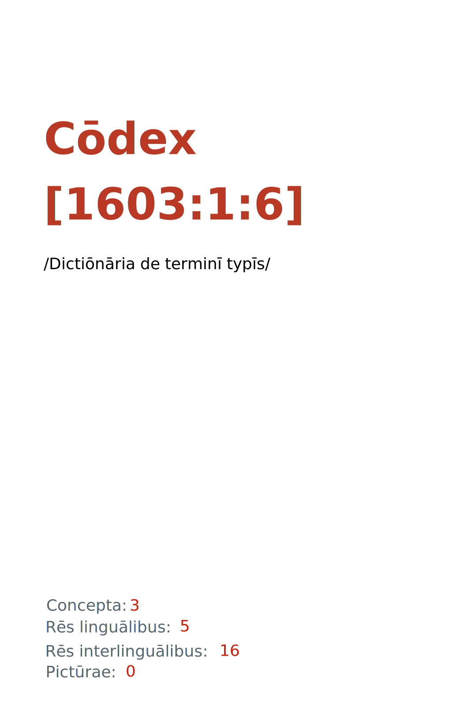

= Cōdex [1603:1:6]: /Dictiōnāria de terminī typīs/
:doctype: book
:title: Cōdex [1603:1:6]: /Dictiōnāria de terminī typīs/
:lang: la
:toc: macro
:toclevels: 5
:toc-title: Tabula contentorum
:table-caption: Tabula
:figure-caption: Pictūra
:example-caption: Exemplum
:last-update-label: Renovatio
:version-label: Versiō
:appendix-caption: Appendix
:source-highlighter: rouge
:warning-caption: Hic sunt dracones
:tip-caption: Commendātum
:front-cover-image: : /Dictiōnāria de terminī typīs/",1050,1600]

{nbsp} +
{nbsp} +
[quote]
/**Public domain means that each major common issue only needs to be resolved once**/@eng-Latn

'''

[%header,cols="25h,~a"]
|===
|
Rēs interlinguālibus
|
Factum

|
scrīptor
|
EticaAI

|
/dictiōnārium ēditōrī/
|
EticaAI

|
/cōdex pūblicandī/
|
EticaAI

|
/publication date/@eng-Latn
|
2022-01-01

|
numerus editionis
|
2022-04-19T20:46:35

|
/SPDX license ID/@eng-Latn
|
CC0-1.0

|
/reference URL/@eng-Latn
|
https://github.com/EticaAI/multilingual-lexicography/issues/16

|===

ifndef::backend-epub3[]
<<<
toc::[]
<<<
endif::[]

[id=0_999_1603_1]
== Praefātiō 

Rēs linguālibus::
  Lingua Anglica (Abecedarium Latinum):::
    _**Cōdex [1603:1:6]**_ is the book format of the machine-readable dictionaries _**[1603:1:6] /Dictiōnāria de terminī typīs/**_, which are distributed for implementers on external applications. This book is intended as an advanced resource for other lexicographers and terminology translators, including detect and report inconsistencies. It can, however, be used as an ad hoc dictionary if there is not derived work focused on your specific needs.
    +++  +++
    **ABOUT LEXICOGRAPHY**
    +++  +++
    Practical lexicography is the art or craft of compiling, writing and editing dictionaries. The basics are not far different than a millennia ago: it is still a very humane, creative work. It is necessary to be humble: most of the translator's mistakes are, in fact, not the translator's fault, but methodological flaws. Making sure of a source idea of what a concept represents, even if it means rewrite and make simpler, annex pictures, show examples, do whatever to make it be understood, makes even non-professional translators that care about their own language deliver better results than any alternative. In other words: even the so-called industry best practices of paying professional translators and reviewers cannot overcome already poorly explained source terms.
    +++  +++
    **ABOUT TYPES OF DICTIONARIES WE'RE COMPILING**
    +++  +++
    We're concerned with a group of ideas (we call it a group of dictionaries of concepts) which can be broken into smaller parts, reviewed for inconsistencies, improved for definitions, and then be translated by volunteers. Interlingual codes, such as what could be used on actual data exchange, are also added to each concept. Both glossaries, user interfaces (such as labels on data collection) and in some cases even standard codes for what would go on a data field could be compiled this way.
    +++  +++
    Since the full list of prototypal-dictionaries and dictionaries is huge, one way cited by objective audiences is the following:
    +++  +++
    . Humanitarian aid
    . Development aid
    . Human rights
    . Military relief (or conflict and conflict-resolution related concepts)
    +++  +++
    The itens 1, 2 and 4 https://en.m.wikipedia.org/wiki/Humanitarian-Development_Nexus[are sometimes referred as _nexus_] and are often found helping _humanitarian crisis_. Since most contributors whose ideas and valid criticism are volunteers, then 3 (human rights, as in International Amnesty) to differentiate from humanitarianism (such as Red Cross Movement is reference).
    +++  +++
    Note that **dictionaries are not usage guides**. Instructions, when they exist, are mostly dedicated to lexicographers and translators.
    +++  +++
    **/PRO BONŌ PUBLICŌ/@lat-Latn**
    +++  +++
    The lexicographers of this work are both volunteers, doing it for free, pro bonō publicō, and don't accept donations for the sake of everyone's reusable dictionaries. Existing previous work often is based on old public domain books. Most terminology translators already would be volunteers because they believe in a cause. The best way to inspire collaboration is to be examples ourselves.
    +++  +++
    There's a non-moralistic aspect, fairly simple to understand: how expensive would it be to pay for everyone's work considering it is feasible over 200 languages? The logistics to decide who should be paid, then worldwide cash transfer (may include people from embargoed countries), then traditional auditing mechanisms to check misuse donors expect, exist? In special terminology (dictionary terms themselves) and so many languages, neither sufficient money nor humans interested in being coordinators exist.

<<<

== Methodī ex cōdice
=== Methodī ex dictiōnāriōrum corde
NOTE: #`0_1603_1_7_2616_7535` ?#

=== Rēs dē factō in dictiōnāriīs
==== Concepta: 3

==== Rēs linguālibus: 2

[%header,cols="15h,25a,~,17"]
|===
|
Cōdex linguae
|
Glotto cōdicī +++ +++ ISO 639-3 +++ +++ Wiki QID cōdicī
|
Nōmen Latīnum
|
Concepta

|
mul-Zyyy
|

+++ +++
https://iso639-3.sil.org/code/mul[mul]
+++ +++ 
|
Linguae multiplīs (Scrīptum incognitō)
|
3

|
eng-Latn
|
https://glottolog.org/resource/languoid/id/stan1293[stan1293]
+++ +++
https://iso639-3.sil.org/code/eng[eng]
+++ +++ https://www.wikidata.org/wiki/Q1860[Q1860]
|
Lingua Anglica (Abecedarium Latinum)
|
2

|===

==== Rēs interlinguālibus: 9
Rēs::
  /cōdex pūblicandī/:::
    Rēs interlinguālibus::::
      /Wiki P/;;
        https://www.wikidata.org/wiki/Property:P123[P123]

      ix_hxlix;;
        ix_wikip123

      ix_hxlvoc;;
        v_wiki_p_123

    Rēs linguālibus::::
      Lingua Latina (Abecedarium Latinum);;
        +++/cōdex pūblicandī/+++

      Lingua Anglica (Abecedarium Latinum);;
        +++organization or person responsible for publishing books, periodicals, printed music, podcasts, games or software+++

  UNESCO thēsaurus:::
    Rēs interlinguālibus::::
      /Wiki P/;;
        https://www.wikidata.org/wiki/Property:P3916[P3916]

      /rēgulam/;;
        concept[1-9]\d*

      /formatter URL/@eng-Latn;;
        http://vocabularies.unesco.org/thesaurus/$1

      ix_hxlix;;
        ix_wikip3916

      ix_hxlvoc;;
        v_wiki_p_3916

    Rēs linguālibus::::
      Lingua Latina (Abecedarium Latinum);;
        +++UNESCO thēsaurus+++

      Lingua Anglica (Abecedarium Latinum);;
        +++The UNESCO Thesaurus is a controlled and structured list of terms used in subject analysis and retrieval of documents and publications in the fields of education, culture, natural sciences, social and human sciences, communication and information. Continuously enriched and updated, its multidisciplinary terminology reflects the evolution of UNESCO's programmes and activities.+++

  /reference URL/@eng-Latn:::
    Rēs interlinguālibus::::
      /Wiki P/;;
        https://www.wikidata.org/wiki/Property:P854[P854]

      ix_hxlix;;
        ix_wikip854

      ix_hxlvoc;;
        v_wiki_p_854

    Rēs linguālibus::::
      Lingua Latina (Abecedarium Latinum);;
        +++/reference URL/@eng-Latn+++

      Lingua Anglica (Abecedarium Latinum);;
        +++should be used for Internet URLs as references+++

  /SPDX license ID/@eng-Latn:::
    Rēs interlinguālibus::::
      /Wiki P/;;
        https://www.wikidata.org/wiki/Property:P2479[P2479]

      /rēgulam/;;
        [0-9A-Za-z\.\-]{3,36}[+]?

      /formatter URL/@eng-Latn;;
        https://spdx.org/licenses/$1.html

      ix_hxlix;;
        ix_wikip2479

      ix_hxlvoc;;
        v_wiki_p_2479

    Rēs linguālibus::::
      Lingua Latina (Abecedarium Latinum);;
        +++/SPDX license ID/@eng-Latn+++

      Lingua Anglica (Abecedarium Latinum);;
        +++SPDX license identifier+++

  scrīptor:::
    Rēs interlinguālibus::::
      /Wiki P/;;
        https://www.wikidata.org/wiki/Property:P50[P50]

      ix_hxlix;;
        ix_wikip50

      ix_hxlvoc;;
        v_wiki_p_50

    Rēs linguālibus::::
      Lingua Latina (Abecedarium Latinum);;
        +++scrīptor+++

      Lingua Anglica (Abecedarium Latinum);;
        +++Main creator(s) of a written work (use on works, not humans)+++

  /dictiōnārium ēditōrī/:::
    Rēs interlinguālibus::::
      /Wiki P/;;
        https://www.wikidata.org/wiki/Property:P98[P98]

      ix_hxlix;;
        ix_wikip98

      ix_hxlvoc;;
        v_wiki_p_98

    Rēs linguālibus::::
      Lingua Latina (Abecedarium Latinum);;
        +++/dictiōnārium ēditōrī/+++

      Lingua Anglica (Abecedarium Latinum);;
        +++editor of a compiled work such as a book or a periodical (newspaper or an academic journal)+++

  numerus editionis:::
    Rēs interlinguālibus::::
      /Wiki P/;;
        https://www.wikidata.org/wiki/Property:P393[P393]

      ix_hxlix;;
        ix_wikip393

      ix_hxlvoc;;
        v_wiki_p_393

    Rēs linguālibus::::
      Lingua Latina (Abecedarium Latinum);;
        +++numerus editionis+++

      Lingua Anglica (Abecedarium Latinum);;
        +++number of an edition (first, second, ... as 1, 2, ...) or event+++

  /Wiki QID/:::
    Rēs interlinguālibus::::
      /rēgulam/;;
        Q[1-9]\d*

      ix_hxlix;;
        ix_wikiq

      ix_hxlvoc;;
        v_wiki_q

    Rēs linguālibus::::
      Lingua Latina (Abecedarium Latinum);;
        +++/Wiki QID/+++

      Lingua Anglica (Abecedarium Latinum);;
        +++QID (or Q number) is the unique identifier of a data item on Wikidata, comprising the letter "Q" followed by one or more digits. It is used to help people and machines understand the difference between items with the same or similar names e.g there are several places in the world called London and many people called James Smith. This number appears next to the name at the top of each Wikidata item.+++

  /publication date/@eng-Latn:::
    Rēs interlinguālibus::::
      /Wiki P/;;
        https://www.wikidata.org/wiki/Property:P577[P577]

      ix_hxlix;;
        ix_wikip577

      ix_hxlvoc;;
        v_wiki_p_577

    Rēs linguālibus::::
      Lingua Latina (Abecedarium Latinum);;
        +++/publication date/@eng-Latn+++

      Lingua Anglica (Abecedarium Latinum);;
        +++Date or point in time when a work was first published or released+++

<<<

== Archīa

Rēs linguālibus::
  Lingua Anglica (Abecedarium Latinum):::
    **Context information**: ignoring for a moment the fact of having several translations (and optimized to receive contributions on a regular basis, not _just_ an static work), then the actual groundbreaking difference on the workflow used to generate every dictionaries on Cōdex such as this one are the following fact: **we provide machine readable formats even when the equivalents on _international languages_, such as English, don't have for areas such as humanitarian aid, development aid and human rights**. The closest to such multilingualism (outside Wikimedia) are European Union SEMICeu (up to 24 languages), but even then have issues while sharing translations on all languages. United Nations translations (up to 6 languages, rarely more) are not available by humanitarian agencies to help with terminology translations.
    +++  +++
    **Practical implication**: the text documents on _Archīa prō cōdice_ (literal English translation: _File for book_) are alternatives to this book format which are heavily automated using only the data format. However, the machine-readable formats on _Archīa prō dictiōnāriīs_ (literal English translation: _Files for dictionaries_) are the focus and recommended for derived works and intended for mitigating additional human errors. We can even create new formats by request! The goal here is both to allow terminology translators and production usage where it makes an impact.

=== Archīa prō dictiōnāriīs: 2

==== 1603_1_6.no1.tm.hxl.csv

Rēs interlinguālibus::
  /download link/@eng-Latn::: link:1603_1_6.no1.tm.hxl.csv[1603_1_6.no1.tm.hxl.csv]
Rēs linguālibus::
  Lingua Anglica (Abecedarium Latinum):::
    /Numerordinatio on HXLTM container/

==== 1603_1_6.no11.tbx

Rēs interlinguālibus::
  /download link/@eng-Latn::: link:1603_1_6.no11.tbx[1603_1_6.no11.tbx]
  /reference URL/@eng-Latn:::
    http://www.terminorgs.net/downloads/TBX_Basic_Version_3.1.pdf

Rēs linguālibus::
  Lingua Anglica (Abecedarium Latinum):::
    TBX-Basic is a terminological markup language (TML) that is a lighter version of TBX-Default, the TML that is defined in ISO 30042. TBX-Basic is designed for the localization industry and is based on information from surveys and studies that were conducted by the LISA Term SIG about the types of terminology data that the localization industry requires.

==== 1603_1_6.no11.tmx

Rēs interlinguālibus::
  /download link/@eng-Latn::: link:1603_1_6.no11.tmx[1603_1_6.no11.tmx]
  /reference URL/@eng-Latn:::
    https://www.gala-global.org/tmx-14b

Rēs linguālibus::
  Lingua Anglica (Abecedarium Latinum):::
    The purpose of the Translation Memory eXchange format (TMX) format is to provide a standard method to describe translation memory data that is being exchanged among tools and/or translation vendors, while introducing little or no loss of critical data during the process

=== Archīa prō cōdice: 1

==== 1603_1_6.mul-Latn.codex.adoc

Rēs interlinguālibus::
  /download link/@eng-Latn::: link:1603_1_6.mul-Latn.codex.adoc[1603_1_6.mul-Latn.codex.adoc]
  /reference URL/@eng-Latn:::
    https://docs.asciidoctor.org/

Rēs linguālibus::
  Lingua Anglica (Abecedarium Latinum):::
    AsciiDoc is a plain text authoring format (i.e., lightweight markup language) for writing technical content such as documentation, articles, and books.

<<<

[.text-center]

Dictiōnāria initiīs

<<<

== /Dictiōnāria de terminī typīs/
<<<

[id='102786']
=== [`102786`] abbreviātiō

Rēs interlinguālibus::
  /Wiki QID/:::
    https://www.wikidata.org/wiki/Q102786[Q102786]

  UNESCO thēsaurus:::
    http://vocabularies.unesco.org/thesaurus/concept988[concept988]

Rēs linguālibus::
  Linguae multiplīs (Scrīptum incognitō):::
    abbreviātiō

<<<

[id='101244']
=== [`101244`] //acronymum//

Rēs interlinguālibus::
  /Wiki QID/:::
    https://www.wikidata.org/wiki/Q101244[Q101244]

  UNESCO thēsaurus:::
    http://vocabularies.unesco.org/thesaurus/concept989[concept989]

Rēs linguālibus::
  Linguae multiplīs (Scrīptum incognitō):::
    //acronymum//

<<<

[id='1']
=== [`1`] dēfīnītiō

Rēs linguālibus::
  Linguae multiplīs (Scrīptum incognitō):::
    dēfīnītiō

  Linguae multiplīs (Scrīptum incognitō):::
    https://en.wiktionary.org/wiki/definitio#Latin

<<<

[.text-center]

Dictiōnāria fīnālī

<<<

== Notā bene

=== /[HELP WANTED] Generated PDF don't have right fonts for all languages/@eng-Latn

Rēs linguālibus::
  Lingua Anglica (Abecedarium Latinum):::
    First, sorry if this affects your loved language. We're working on this, but we are still not perfected.
    If you have fonts installed on your computer, you very likely can still copy and paste from the eBook version.
    Please note that all formats intended for machine processing will work fine.

=== /[Book with Wikidata Q] I want to help! Some translation is missing or is wrong! How to change it?/@eng-Latn

Rēs linguālibus::
  Lingua Anglica (Abecedarium Latinum):::
    Most (but not all) concepts are using Wikidata Q. In fact, most of the time we improve Wikidata while preparing the dictionaries. Please check if the exact concept you want have a Q ID then click. There you can add translations.
    The next release (likely weekly) will have your submissions without need to contact us directly.

=== /[Book with Wikidata Q] I can find the Wikidata concept, but I'm unable to edit!/@eng-Latn

Rēs linguālibus::
  Lingua Anglica (Abecedarium Latinum):::
    While Wikidata is more flexible than Wikipedia's (for example, it allows concepts without need to create Wikipedia pages) even Wikidata can have concepts which require creating an account and don't allow anonymous editing. Creating such an account and confirming email is faster than asking someone else's do it for you.
    However, while vandalism on Wikidata is rare, very few concepts will require an account with more contributions and not created very recently. If this is your case, help with the ones you can do alone and the rest ask someone else to add to you.

=== /I heard there is an interest in having Cōdex beyond Latin language! How to do it?!/@eng-Latn

Rēs linguālibus::
  Lingua Anglica (Abecedarium Latinum):::
    Please contact us. This book uses Latin (sometimes _dog Latin_) to document all other languages, but we obviously can automated generation of books for others using other writing systems and some reference language. We need special help with writing systems such as Bengali, Devanagari and Tamil. For Right to Left scripts, despite being able to render the text, the book printing will require a different template. Only replacing Latin will not work, so we're open to ideas to make a great user experience!

<<<

