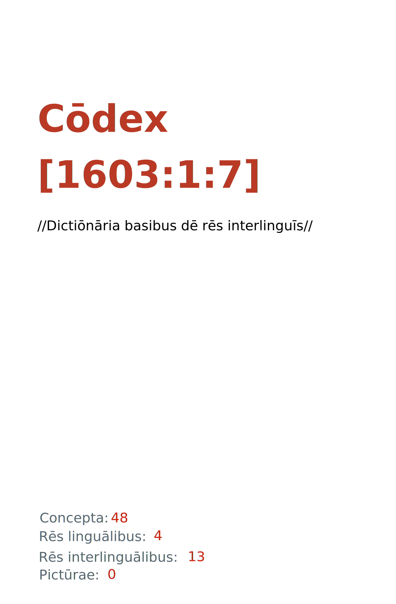

= Cōdex [1603:1:7]: //Dictiōnāria basibus dē rēs interlinguīs//
:doctype: book
:title: Cōdex [1603:1:7]: //Dictiōnāria basibus dē rēs interlinguīs//
:lang: la
:toc: macro
:toclevels: 5
:toc-title: Tabula contentorum
:table-caption: Tabula
:figure-caption: Pictūra
:example-caption: Exemplum
:last-update-label: Renovatio
:version-label: Versiō
:appendix-caption: Appendix
:source-highlighter: rouge
:warning-caption: Hic sunt dracones
:tip-caption: Commendātum
:front-cover-image: : //Dictiōnāria basibus dē rēs interlinguīs//",1050,1600]

{nbsp} +
{nbsp} +
[quote]
/**Public domain means that each major common issue only needs to be resolved once**/@eng-Latn

'''

[%header,cols="25h,~a"]
|===
|
Rēs interlinguālibus
|
Factum

|
/dictiōnārium ēditōrī/
|
EticaAI

|
/cōdex pūblicandī/
|
EticaAI

|
/publication date/@eng-Latn
|
2022-01-01

|
numerus editionis
|
2022-04-18T14:25:53

|
/SPDX license ID/@eng-Latn
|
CC0-1.0

|
spōnsor
|
pro bonō publicō

|===

ifndef::backend-epub3[]
<<<
toc::[]
<<<
endif::[]

[id=0_999_1603_1]
== Praefātiō 

Rēs linguālibus::
  Lingua Anglica (Abecedarium Latinum):::
    _**Cōdex [1603:1:7]**_ is the book format of the machine-readable dictionaries _**[1603:1:7] //Dictiōnāria basibus dē rēs interlinguīs//**_, which are distributed for implementers on external applications. This book is intended as an advanced resource for other lexicographers and terminology translators, including detect and report inconsistencies. It can, however, be used as an ad hoc dictionary if there is not derived work focused on your specific needs.
    +++  +++
    **ABOUT LEXICOGRAPHY**
    +++  +++
    Practical lexicography is the art or craft of compiling, writing and editing dictionaries. The basics are not far different than a millennia ago: it is still a very humane, creative work. It is necessary to be humble: most of the translator's mistakes are, in fact, not the translator's fault, but methodological flaws. Making sure of a source idea of what a concept represents, even if it means rewrite and make simpler, annex pictures, show examples, do whatever to make it be understood, makes even non-professional translators that care about their own language deliver better results than any alternative. In other words: even the so-called industry best practices of paying professional translators and reviewers cannot overcome already poorly explained source terms.
    +++  +++
    **ABOUT TYPES OF DICTIONARIES WE'RE COMPILING**
    +++  +++
    We're concerned with a group of ideas (we call it a group of dictionaries of concepts) which can be broken into smaller parts, reviewed for inconsistencies, improved for definitions, and then be translated by volunteers. Interlingual codes, such as what could be used on actual data exchange, are also added to each concept. Both glossaries, user interfaces (such as labels on data collection) and in some cases even standard codes for what would go on a data field could be compiled this way.
    +++  +++
    Since the full list of prototypal-dictionaries and dictionaries is huge, one way cited by objective audiences is the following:
    +++  +++
    . Humanitarian aid
    . Development aid
    . Human rights
    . Military relief (or conflict and conflict-resolution related concepts)
    +++  +++
    The itens 1, 2 and 4 https://en.m.wikipedia.org/wiki/Humanitarian-Development_Nexus[are sometimes referred as _nexus_] and are often found helping _humanitarian crisis_. Since most contributors whose ideas and valid criticism are volunteers, then 3 (human rights, as in International Amnesty) to differentiate from humanitarianism (such as Red Cross Movement is reference).
    +++  +++
    Note that **dictionaries are not usage guides**. Instructions, when they exist, are mostly dedicated to lexicographers and translators.
    +++  +++
    **/PRO BONŌ PUBLICŌ/@lat-Latn**
    +++  +++
    The lexicographers of this work are both volunteers, doing it for free, pro bonō publicō, and don't accept donations for the sake of everyone's reusable dictionaries. Existing previous work often is based on old public domain books. Most terminology translators already would be volunteers because they believe in a cause. The best way to inspire collaboration is to be examples ourselves.
    +++  +++
    There's a non-moralistic aspect, fairly simple to understand: how expensive would it be to pay for everyone's work considering it is feasible over 200 languages? The logistics to decide who should be paid, then worldwide cash transfer (may include people from embargoed countries), then traditional auditing mechanisms to check misuse donors expect, exist? In special terminology (dictionary terms themselves) and so many languages, neither sufficient money nor humans interested in being coordinators exist.

<<<

== Methodī ex cōdice
=== Methodī ex dictiōnāriōrum corde
Rēs interlinguālibus::
  /scope and content/@eng-Latn:::
    This Numerodinatio namespace contains dictionaries related to bare minimum interlingual concepts used to understand Numerodinatio tables.
    +++  +++
    The decision making is mostly based on what is very essential to explain other tables.

=== Rēs dē factō in dictiōnāriīs
==== Concepta: 48

==== Rēs linguālibus: 2

[%header,cols="15h,25a,~,17"]
|===
|
Cōdex linguae
|
Glotto cōdicī +++ +++ ISO 639-3 +++ +++ Wiki QID cōdicī
|
Nōmen Latīnum
|
Concepta

|
lat-Latn
|
https://glottolog.org/resource/languoid/id/lati1261[lati1261]
+++ +++
https://iso639-3.sil.org/code/lat[lat]
+++ +++ https://www.wikidata.org/wiki/Q397[Q397]
|
Lingua Latina (Abecedarium Latinum)
|
48

|
eng-Latn
|
https://glottolog.org/resource/languoid/id/stan1293[stan1293]
+++ +++
https://iso639-3.sil.org/code/eng[eng]
+++ +++ https://www.wikidata.org/wiki/Q1860[Q1860]
|
Lingua Anglica (Abecedarium Latinum)
|
2

|===

==== Rēs interlinguālibus: 13
Rēs::
  /dictiōnārium ēditōrī/:::
    Rēs interlinguālibus::::
      /Wiki P/;;
        https://www.wikidata.org/wiki/Property:P98[P98]

      ix_hxlix;;
        ix_wikip98

      ix_hxlvoc;;
        v_wiki_p_98

    Rēs linguālibus::::
      Lingua Latina (Abecedarium Latinum);;
        +++/dictiōnārium ēditōrī/+++

      Lingua Anglica (Abecedarium Latinum);;
        +++editor of a compiled work such as a book or a periodical (newspaper or an academic journal)+++

  /SPDX license ID/@eng-Latn:::
    Rēs interlinguālibus::::
      /Wiki P/;;
        https://www.wikidata.org/wiki/Property:P2479[P2479]

      /rēgulam/;;
        [0-9A-Za-z\.\-]{3,36}[+]?

      /formatter URL/@eng-Latn;;
        https://spdx.org/licenses/$1.html

      ix_hxlix;;
        ix_wikip2479

      ix_hxlvoc;;
        v_wiki_p_2479

    Rēs linguālibus::::
      Lingua Latina (Abecedarium Latinum);;
        +++/SPDX license ID/@eng-Latn+++

      Lingua Anglica (Abecedarium Latinum);;
        +++SPDX license identifier+++

  /publication date/@eng-Latn:::
    Rēs interlinguālibus::::
      /Wiki P/;;
        https://www.wikidata.org/wiki/Property:P577[P577]

      ix_hxlix;;
        ix_wikip577

      ix_hxlvoc;;
        v_wiki_p_577

    Rēs linguālibus::::
      Lingua Latina (Abecedarium Latinum);;
        +++/publication date/@eng-Latn+++

      Lingua Anglica (Abecedarium Latinum);;
        +++Date or point in time when a work was first published or released+++

  /cōdex pūblicandī/:::
    Rēs interlinguālibus::::
      /Wiki P/;;
        https://www.wikidata.org/wiki/Property:P123[P123]

      ix_hxlix;;
        ix_wikip123

      ix_hxlvoc;;
        v_wiki_p_123

    Rēs linguālibus::::
      Lingua Latina (Abecedarium Latinum);;
        +++/cōdex pūblicandī/+++

      Lingua Anglica (Abecedarium Latinum);;
        +++organization or person responsible for publishing books, periodicals, printed music, podcasts, games or software+++

  /scope and content/@eng-Latn:::
    Rēs interlinguālibus::::
      /Wiki P/;;
        https://www.wikidata.org/wiki/Property:P7535[P7535]

      ix_hxlix;;
        ix_wikip7535

      ix_hxlvoc;;
        v_wiki_p_7535

    Rēs linguālibus::::
      Lingua Latina (Abecedarium Latinum);;
        +++/scope and content/@eng-Latn+++

      Lingua Anglica (Abecedarium Latinum);;
        +++a summary statement providing an overview of the archival collection+++

  /rēgulam/:::
    Rēs interlinguālibus::::
      /Wiki QID/;;
        https://www.wikidata.org/wiki/Q185612[Q185612]

      ix_hxlix;;
        ix_regulam

      ix_hxlvoc;;
        v_regex

    Rēs linguālibus::::
      Lingua Latina (Abecedarium Latinum);;
        +++/rēgulam/+++

  /Wiki P/:::
    Rēs interlinguālibus::::
      /rēgulam/;;
        P[1-9]\d*

      ix_hxlix;;
        ix_wikip

      ix_hxlvoc;;
        v_wiki_p

    Rēs linguālibus::::
      Lingua Latina (Abecedarium Latinum);;
        +++/Wiki P/+++

      Lingua Anglica (Abecedarium Latinum);;
        +++Property (also attribute) describes the data value of a statement and can be thought of as a category of data, for example "color" for the data value "blue". Properties, when paired with values, form a statement in Wikidata. Properties are also used in qualifiers. Properties have their own pages on Wikidata and are connected to items, resulting in a linked data structure.+++

  /formatter URL/@eng-Latn:::
    Rēs interlinguālibus::::
      /Wiki P/;;
        https://www.wikidata.org/wiki/Property:P1630[P1630]

      ix_hxlix;;
        ix_wikip1630

      ix_hxlvoc;;
        v_wiki_p_1630

    Rēs linguālibus::::
      Lingua Latina (Abecedarium Latinum);;
        +++/formatter URL/@eng-Latn+++

      Lingua Anglica (Abecedarium Latinum);;
        +++web page URL; URI template from which "$1" can be automatically replaced with the effective property value on items. If the site goes offline, set it to deprecated rank. If the formatter url changes, add a new statement with preferred rank.+++

  numerus editionis:::
    Rēs interlinguālibus::::
      /Wiki P/;;
        https://www.wikidata.org/wiki/Property:P393[P393]

      ix_hxlix;;
        ix_wikip393

      ix_hxlvoc;;
        v_wiki_p_393

    Rēs linguālibus::::
      Lingua Latina (Abecedarium Latinum);;
        +++numerus editionis+++

      Lingua Anglica (Abecedarium Latinum);;
        +++number of an edition (first, second, ... as 1, 2, ...) or event+++

  spōnsor:::
    Rēs interlinguālibus::::
      /Wiki P/;;
        https://www.wikidata.org/wiki/Property:P859[P859]

      ix_hxlix;;
        ix_wikip859

      ix_hxlvoc;;
        v_wiki_p_859

    Rēs linguālibus::::
      Lingua Latina (Abecedarium Latinum);;
        +++spōnsor+++

      Lingua Anglica (Abecedarium Latinum);;
        +++organization or individual that sponsors this item+++

  /Wiki QID/:::
    Rēs interlinguālibus::::
      /rēgulam/;;
        Q[1-9]\d*

      ix_hxlix;;
        ix_wikiq

      ix_hxlvoc;;
        v_wiki_q

    Rēs linguālibus::::
      Lingua Latina (Abecedarium Latinum);;
        +++/Wiki QID/+++

      Lingua Anglica (Abecedarium Latinum);;
        +++QID (or Q number) is the unique identifier of a data item on Wikidata, comprising the letter "Q" followed by one or more digits. It is used to help people and machines understand the difference between items with the same or similar names e.g there are several places in the world called London and many people called James Smith. This number appears next to the name at the top of each Wikidata item.+++

<<<

== Archīa

Rēs linguālibus::
  Lingua Anglica (Abecedarium Latinum):::
    **Context information**: ignoring for a moment the fact of having several translations (and optimized to receive contributions on a regular basis, not _just_ an static work), then the actual groundbreaking difference on the workflow used to generate every dictionaries on Cōdex such as this one are the following fact: **we provide machine readable formats even when the equivalents on _international languages_, such as English, don't have for areas such as humanitarian aid, development aid and human rights**. The closest to such multilingualism (outside Wikimedia) are European Union SEMICeu (up to 24 languages), but even then have issues while sharing translations on all languages. United Nations translations (up to 6 languages, rarely more) are not available by humanitarian agencies to help with terminology translations.
    +++  +++
    **Practical implication**: the text documents on _Archīa prō cōdice_ (literal English translation: _File for book_) are alternatives to this book format which are heavily automated using only the data format. However, the machine-readable formats on _Archīa prō dictiōnāriīs_ (literal English translation: _Files for dictionaries_) are the focus and recommended for derived works and intended for mitigating additional human errors. We can even create new formats by request! The goal here is both to allow terminology translators and production usage where it makes an impact.

=== Archīa prō dictiōnāriīs: 1

==== 1603_1_7.no1.tm.hxl.csv

Rēs interlinguālibus::
  /download link/@eng-Latn::: link:1603_1_7.no1.tm.hxl.csv[1603_1_7.no1.tm.hxl.csv]
Rēs linguālibus::
  Lingua Anglica (Abecedarium Latinum):::
    /Numerordinatio on HXLTM container/

=== Archīa prō cōdice: 1

==== 1603_1_7.mul-Latn.codex.adoc

Rēs interlinguālibus::
  /download link/@eng-Latn::: link:1603_1_7.mul-Latn.codex.adoc[1603_1_7.mul-Latn.codex.adoc]
  /reference URL/@eng-Latn:::
    https://docs.asciidoctor.org/

Rēs linguālibus::
  Lingua Anglica (Abecedarium Latinum):::
    AsciiDoc is a plain text authoring format (i.e., lightweight markup language) for writing technical content such as documentation, articles, and books.

<<<

[.text-center]

Dictiōnāria initiīs

<<<

== //Dictiōnāria basibus dē rēs interlinguīs//
<<<

[id='1']
=== [`1`] /Generic numeric namespace/

Rēs linguālibus::
  Lingua Latina (Abecedarium Latinum):::
    +++/Generic numeric namespace/+++

[id='1_1']
==== [`1_1`] Cōdex factō

Rēs interlinguālibus::
  ix_hxlix:::
    ix_codexfacto

  ix_hxlvoc:::
    v_codex_facto

Rēs linguālibus::
  Lingua Latina (Abecedarium Latinum):::
    +++Cōdex factō+++

[id='1_2']
==== [`1_2`] Numerordĭnātĭo

Rēs interlinguālibus::
  ix_hxlix:::
    ix_n1603

  ix_hxlvoc:::
    v_n1603

Rēs linguālibus::
  Lingua Latina (Abecedarium Latinum):::
    +++Numerordĭnātĭo+++

  Lingua Anglica (Abecedarium Latinum):::
    +++a generic strategy of arranging numbers in an taxonomy-like explicit way+++

[id='1_3']
==== [`1_3`] Dictiōnāria

Rēs linguālibus::
  Lingua Latina (Abecedarium Latinum):::
    +++Dictiōnāria+++

[id='1_4']
==== [`1_4`] Dictiōnāria necessitātibus

Rēs interlinguālibus::
  ix_hxlix:::
    ix_dctnrnncssttbs

  ix_hxlvoc:::
    v_dictionaria_necessitatibus

Rēs linguālibus::
  Lingua Latina (Abecedarium Latinum):::
    +++Dictiōnāria necessitātibus+++

  Lingua Anglica (Abecedarium Latinum):::
    +++Dictionaries groups required by this work.+++

[id='1_91']
==== [`1_91`] /Wiki QID/

Rēs interlinguālibus::
  /rēgulam/:::
    Q[1-9]\d*

  ix_hxlix:::
    ix_wikiq

  ix_hxlvoc:::
    v_wiki_q

Rēs linguālibus::
  Lingua Latina (Abecedarium Latinum):::
    +++/Wiki QID/+++

  Lingua Anglica (Abecedarium Latinum):::
    +++QID (or Q number) is the unique identifier of a data item on Wikidata, comprising the letter "Q" followed by one or more digits. It is used to help people and machines understand the difference between items with the same or similar names e.g there are several places in the world called London and many people called James Smith. This number appears next to the name at the top of each Wikidata item.+++

[id='1_92']
==== [`1_92`] /Wiki P/

Rēs interlinguālibus::
  /rēgulam/:::
    P[1-9]\d*

  ix_hxlix:::
    ix_wikip

  ix_hxlvoc:::
    v_wiki_p

Rēs linguālibus::
  Lingua Latina (Abecedarium Latinum):::
    +++/Wiki P/+++

  Lingua Anglica (Abecedarium Latinum):::
    +++Property (also attribute) describes the data value of a statement and can be thought of as a category of data, for example "color" for the data value "blue". Properties, when paired with values, form a statement in Wikidata. Properties are also used in qualifiers. Properties have their own pages on Wikidata and are connected to items, resulting in a linked data structure.+++

[id='1_93']
==== [`1_93`] /Wiki LID/

Rēs interlinguālibus::
  ix_hxlix:::
    ix_wikil

  ix_hxlvoc:::
    v_wiki_l

Rēs linguālibus::
  Lingua Latina (Abecedarium Latinum):::
    +++/Wiki LID/+++

  Lingua Anglica (Abecedarium Latinum):::
    +++LID (or L number) The identifier for a lexeme entity in Wikidata, comprising the letter "L" followed by one or more digits.+++

[id='1_95']
==== [`1_95`] /rēgulam/

Rēs interlinguālibus::
  /Wiki QID/:::
    https://www.wikidata.org/wiki/Q185612[Q185612]

  ix_hxlix:::
    ix_regulam

  ix_hxlvoc:::
    v_regex

Rēs linguālibus::
  Lingua Latina (Abecedarium Latinum):::
    +++/rēgulam/+++

[id='1_96']
==== [`1_96`] //Cōdex annotātiōnibus internālibus//

Rēs interlinguālibus::
  ix_hxlix:::
    ix_n1603ia

Rēs linguālibus::
  Lingua Latina (Abecedarium Latinum):::
    +++//Cōdex annotātiōnibus internālibus//+++

  Lingua Anglica (Abecedarium Latinum):::
    +++Internal annotations of a codex. List of items. Used on 1603_1_1 as undocumented tags to manage how dictionaries are exported+++

[id='1_97']
==== [`1_97`] //opus papȳrō ex 1603//

Rēs interlinguālibus::
  ix_hxlix:::
    ix_n1603op

Rēs linguālibus::
  Lingua Latina (Abecedarium Latinum):::
    +++//opus papȳrō ex 1603//+++

  Lingua Anglica (Abecedarium Latinum):::
    +++Workfsheet index Used on 1603_1_1 as undocumented feature to manage where the main table should be extracted+++

[id='1_200']
==== [`1_200`] /HXL Standard, hashtag, base tab, or attribute (but not readable header)/

Rēs interlinguālibus::
  ix_hxlix:::
    ix_hxl

  ix_hxlvoc:::
    v_hxl

Rēs linguālibus::
  Lingua Latina (Abecedarium Latinum):::
    +++/HXL Standard, hashtag, base tab, or attribute (but not readable header)/+++

  Lingua Anglica (Abecedarium Latinum):::
    +++/HXL Standard, hashtag, base tab, or attribute (but not readable header)/+++

[id='1_201']
==== [`1_201`] /HXL Standard, full hashtag/

Rēs interlinguālibus::
  ix_hxlix:::
    ix_hxlhstg

  ix_hxlvoc:::
    v_hxl_hashtag

Rēs linguālibus::
  Lingua Latina (Abecedarium Latinum):::
    +++/HXL Standard, full hashtag/+++

  Lingua Anglica (Abecedarium Latinum):::
    +++/HXL Standard, full hashtag/+++

[id='1_202']
==== [`1_202`] /HXL Standard, human readable header (lat: caput)/

Rēs interlinguālibus::
  ix_hxlix:::
    ix_hxlcpt

  ix_hxlvoc:::
    v_hxl_caput

Rēs linguālibus::
  Lingua Latina (Abecedarium Latinum):::
    +++/HXL Standard, human readable header (lat: caput)/+++

  Lingua Anglica (Abecedarium Latinum):::
    +++/HXL Standard, human readable header (lat: caput)/+++

[id='1_203']
==== [`1_203`] /HXL Standard, base hashtag only/

Rēs interlinguālibus::
  ix_hxlix:::
    ix_hxlt

  ix_hxlvoc:::
    v_hxl_t

Rēs linguālibus::
  Lingua Latina (Abecedarium Latinum):::
    +++/HXL Standard, base hashtag only/+++

  Lingua Anglica (Abecedarium Latinum):::
    +++/HXL Standard, base hashtag only/+++

[id='1_204']
==== [`1_204`] /HXL Standard, attributes only/

Rēs interlinguālibus::
  ix_hxlix:::
    ix_hxla

  ix_hxlvoc:::
    v_hxl_a

Rēs linguālibus::
  Lingua Latina (Abecedarium Latinum):::
    +++/HXL Standard, attributes only/+++

  Lingua Anglica (Abecedarium Latinum):::
    +++/HXL Standard, attributes only/+++

[id='1_205']
==== [`1_205`] /Normalized CSV-like header; full header, only prefix or only suffix/

Rēs interlinguālibus::
  ix_hxlix:::
    ix_csv

  ix_hxlvoc:::
    v_csv

Rēs linguālibus::
  Lingua Latina (Abecedarium Latinum):::
    +++/Normalized CSV-like header; full header, only prefix or only suffix/+++

  Lingua Anglica (Abecedarium Latinum):::
    +++/Normalized CSV-like header; full header, only prefix or only suffix/+++

[id='1_206']
==== [`1_206`] /Normalized CSV-like identifier; prefix affinity (lat: praefīxum)/

Rēs interlinguālibus::
  ix_hxlix:::
    ix_csvprfxu

  ix_hxlvoc:::
    v_csv_praefixum

Rēs linguālibus::
  Lingua Latina (Abecedarium Latinum):::
    +++/Normalized CSV-like identifier; prefix affinity (lat: praefīxum)/+++

  Lingua Anglica (Abecedarium Latinum):::
    +++/Normalized CSV-like identifier; prefix affinity (lat: praefīxum)/+++

[id='1_207']
==== [`1_207`] /Normalized CSV-like identifier; suffix affinity (lat: suffīxum)/

Rēs interlinguālibus::
  ix_hxlix:::
    ix_csvsffxm

  ix_hxlvoc:::
    v_csv_suffixum

Rēs linguālibus::
  Lingua Latina (Abecedarium Latinum):::
    +++/Normalized CSV-like identifier; suffix affinity (lat: suffīxum)/+++

  Lingua Anglica (Abecedarium Latinum):::
    +++/Normalized CSV-like identifier; suffix affinity (lat: suffīxum)/+++

[id='1_208']
==== [`1_208`] /GLIDE hazard code/

Rēs interlinguālibus::
  ix_hxlix:::
    ix_glidehc

Rēs linguālibus::
  Lingua Latina (Abecedarium Latinum):::
    +++/GLIDE hazard code/+++

<<<

[id='2616']
=== [`2616`] /Wikidata P local numeric namespace/

Rēs linguālibus::
  Lingua Latina (Abecedarium Latinum):::
    +++/Wikidata P local numeric namespace/+++

[id='2616_50']
==== [`2616_50`] scrīptor

Rēs interlinguālibus::
  /Wiki P/:::
    https://www.wikidata.org/wiki/Property:P50[P50]

  ix_hxlix:::
    ix_wikip50

  ix_hxlvoc:::
    v_wiki_p_50

Rēs linguālibus::
  Lingua Latina (Abecedarium Latinum):::
    +++scrīptor+++

  Lingua Anglica (Abecedarium Latinum):::
    +++Main creator(s) of a written work (use on works, not humans)+++

[id='2616_98']
==== [`2616_98`] /dictiōnārium ēditōrī/

Rēs interlinguālibus::
  /Wiki P/:::
    https://www.wikidata.org/wiki/Property:P98[P98]

  ix_hxlix:::
    ix_wikip98

  ix_hxlvoc:::
    v_wiki_p_98

Rēs linguālibus::
  Lingua Latina (Abecedarium Latinum):::
    +++/dictiōnārium ēditōrī/+++

  Lingua Anglica (Abecedarium Latinum):::
    +++editor of a compiled work such as a book or a periodical (newspaper or an academic journal)+++

[id='2616_110']
==== [`2616_110`] pictor

Rēs interlinguālibus::
  /Wiki P/:::
    https://www.wikidata.org/wiki/Property:P110[P110]

  ix_hxlix:::
    ix_wikip110

  ix_hxlvoc:::
    v_wiki_p_110

Rēs linguālibus::
  Lingua Latina (Abecedarium Latinum):::
    +++pictor+++

  Lingua Anglica (Abecedarium Latinum):::
    +++Person drawing the pictures or taking the photographs in a book+++

[id='2616_123']
==== [`2616_123`] /cōdex pūblicandī/

Rēs interlinguālibus::
  /Wiki P/:::
    https://www.wikidata.org/wiki/Property:P123[P123]

  ix_hxlix:::
    ix_wikip123

  ix_hxlvoc:::
    v_wiki_p_123

Rēs linguālibus::
  Lingua Latina (Abecedarium Latinum):::
    +++/cōdex pūblicandī/+++

  Lingua Anglica (Abecedarium Latinum):::
    +++organization or person responsible for publishing books, periodicals, printed music, podcasts, games or software+++

[id='2616_393']
==== [`2616_393`] numerus editionis

Rēs interlinguālibus::
  /Wiki P/:::
    https://www.wikidata.org/wiki/Property:P393[P393]

  ix_hxlix:::
    ix_wikip393

  ix_hxlvoc:::
    v_wiki_p_393

Rēs linguālibus::
  Lingua Latina (Abecedarium Latinum):::
    +++numerus editionis+++

  Lingua Anglica (Abecedarium Latinum):::
    +++number of an edition (first, second, ... as 1, 2, ...) or event+++

[id='2616_487']
==== [`2616_487`] //unicodex pūnctō//

Rēs interlinguālibus::
  /Wiki P/:::
    https://www.wikidata.org/wiki/Property:P487[P487]

  /formatter URL/@eng-Latn:::
    https://util.unicode.org/UnicodeJsps/character.jsp?a=$1

  ix_hxlix:::
    ix_wikip487

  ix_hxlvoc:::
    v_wiki_p_487

Rēs linguālibus::
  Lingua Latina (Abecedarium Latinum):::
    +++//unicodex pūnctō//+++

  Lingua Anglica (Abecedarium Latinum):::
    +++Unicode character representing the item+++

[id='2616_577']
==== [`2616_577`] /publication date/@eng-Latn

Rēs interlinguālibus::
  /Wiki P/:::
    https://www.wikidata.org/wiki/Property:P577[P577]

  ix_hxlix:::
    ix_wikip577

  ix_hxlvoc:::
    v_wiki_p_577

Rēs linguālibus::
  Lingua Latina (Abecedarium Latinum):::
    +++/publication date/@eng-Latn+++

  Lingua Anglica (Abecedarium Latinum):::
    +++Date or point in time when a work was first published or released+++

[id='2616_655']
==== [`2616_655`] /translator/@eng-Latn

Rēs interlinguālibus::
  /Wiki P/:::
    https://www.wikidata.org/wiki/Property:P655[P655]

  ix_hxlix:::
    ix_wikip655

  ix_hxlvoc:::
    v_wiki_p_655

Rēs linguālibus::
  Lingua Latina (Abecedarium Latinum):::
    +++/translator/@eng-Latn+++

  Lingua Anglica (Abecedarium Latinum):::
    +++agent who adapts any kind of written text from one language to another+++

[id='2616_854']
==== [`2616_854`] /reference URL/@eng-Latn

Rēs interlinguālibus::
  /Wiki P/:::
    https://www.wikidata.org/wiki/Property:P854[P854]

  ix_hxlix:::
    ix_wikip854

  ix_hxlvoc:::
    v_wiki_p_854

Rēs linguālibus::
  Lingua Latina (Abecedarium Latinum):::
    +++/reference URL/@eng-Latn+++

  Lingua Anglica (Abecedarium Latinum):::
    +++should be used for Internet URLs as references+++

[id='2616_856']
==== [`2616_856`] /official website/@eng-Latn

Rēs interlinguālibus::
  /Wiki P/:::
    https://www.wikidata.org/wiki/Property:P856[P856]

  ix_hxlix:::
    ix_wikip856

  ix_hxlvoc:::
    v_wiki_p_856

Rēs linguālibus::
  Lingua Latina (Abecedarium Latinum):::
    +++/official website/@eng-Latn+++

  Lingua Anglica (Abecedarium Latinum):::
    +++URL of the official page of an item (current or former) [if the page changes, add an additional statement with preferred rank. Do not remove the former URL]+++

[id='2616_859']
==== [`2616_859`] spōnsor

Rēs interlinguālibus::
  /Wiki P/:::
    https://www.wikidata.org/wiki/Property:P859[P859]

  ix_hxlix:::
    ix_wikip859

  ix_hxlvoc:::
    v_wiki_p_859

Rēs linguālibus::
  Lingua Latina (Abecedarium Latinum):::
    +++spōnsor+++

  Lingua Anglica (Abecedarium Latinum):::
    +++organization or individual that sponsors this item+++

[id='2616_1476']
==== [`2616_1476`] titulus

Rēs interlinguālibus::
  /Wiki P/:::
    https://www.wikidata.org/wiki/Property:P1476[P1476]

  ix_hxlix:::
    ix_wikip1476

  ix_hxlvoc:::
    v_wiki_p_1476

Rēs linguālibus::
  Lingua Latina (Abecedarium Latinum):::
    +++titulus+++

  Lingua Anglica (Abecedarium Latinum):::
    +++published name of a work, such as a newspaper article, a literary work, piece of music, a website, or a performance work+++

[id='2616_1323']
==== [`2616_1323`] Terminologia Anatomica 98 ID

Rēs interlinguālibus::
  /Wiki P/:::
    https://www.wikidata.org/wiki/Property:P1323[P1323]

  /rēgulam/:::
    A\d{2}\.\d\.\d{2}\.\d{3}[FM]?

  /formatter URL/@eng-Latn:::
    https://wikidata-externalid-url.toolforge.org/?p=1323&url_prefix=https:%2F%2Fwww.unifr.ch%2Fifaa%2FPublic%2FEntryPage%2FTA98%20Tree%2FEntity%20TA98%20EN%2F&url_suffix=%20Entity%20TA98%20EN.htm&id=$1

  ix_hxlix:::
    ix_wikip1323

  ix_hxlvoc:::
    v_wiki_p_1323

Rēs linguālibus::
  Lingua Latina (Abecedarium Latinum):::
    +++Terminologia Anatomica 98 ID+++

  Lingua Anglica (Abecedarium Latinum):::
    +++Terminologia Anatomica (1998 edition) human anatomical terminology identifier+++

[id='2616_1324']
==== [`2616_1324`] /source code repository/@eng-Latn

Rēs interlinguālibus::
  /Wiki P/:::
    https://www.wikidata.org/wiki/Property:P1324[P1324]

  ix_hxlix:::
    ix_wikip1324

  ix_hxlvoc:::
    v_wiki_p_1324

Rēs linguālibus::
  Lingua Latina (Abecedarium Latinum):::
    +++/source code repository/@eng-Latn+++

  Lingua Anglica (Abecedarium Latinum):::
    +++public source code repository+++

[id='2616_1630']
==== [`2616_1630`] /formatter URL/@eng-Latn

Rēs interlinguālibus::
  /Wiki P/:::
    https://www.wikidata.org/wiki/Property:P1630[P1630]

  ix_hxlix:::
    ix_wikip1630

  ix_hxlvoc:::
    v_wiki_p_1630

Rēs linguālibus::
  Lingua Latina (Abecedarium Latinum):::
    +++/formatter URL/@eng-Latn+++

  Lingua Anglica (Abecedarium Latinum):::
    +++web page URL; URI template from which "$1" can be automatically replaced with the effective property value on items. If the site goes offline, set it to deprecated rank. If the formatter url changes, add a new statement with preferred rank.+++

[id='2616_1889']
==== [`2616_1889`] /different from/@eng-Latn

Rēs interlinguālibus::
  /Wiki P/:::
    https://www.wikidata.org/wiki/Property:P1889[P1889]

  ix_hxlix:::
    ix_wikip1889

  ix_hxlvoc:::
    v_wiki_p_1889

Rēs linguālibus::
  Lingua Latina (Abecedarium Latinum):::
    +++/different from/@eng-Latn+++

  Lingua Anglica (Abecedarium Latinum):::
    +++item that is different from another item, with which it may be confused+++

[id='2616_2479']
==== [`2616_2479`] /SPDX license ID/@eng-Latn

Rēs interlinguālibus::
  /Wiki P/:::
    https://www.wikidata.org/wiki/Property:P2479[P2479]

  /rēgulam/:::
    [0-9A-Za-z\.\-]{3,36}[+]?

  /formatter URL/@eng-Latn:::
    https://spdx.org/licenses/$1.html

  ix_hxlix:::
    ix_wikip2479

  ix_hxlvoc:::
    v_wiki_p_2479

Rēs linguālibus::
  Lingua Latina (Abecedarium Latinum):::
    +++/SPDX license ID/@eng-Latn+++

  Lingua Anglica (Abecedarium Latinum):::
    +++SPDX license identifier+++

[id='2616_2699']
==== [`2616_2699`] URL

Rēs interlinguālibus::
  /Wiki P/:::
    https://www.wikidata.org/wiki/Property:P2699[P2699]

  ix_hxlix:::
    ix_wikip2699

  ix_hxlvoc:::
    v_wiki_p_2699

Rēs linguālibus::
  Lingua Latina (Abecedarium Latinum):::
    +++URL+++

  Lingua Anglica (Abecedarium Latinum):::
    +++location of a resource+++

[id='2616_3916']
==== [`2616_3916`] UNESCO thēsaurus

Rēs interlinguālibus::
  /Wiki P/:::
    https://www.wikidata.org/wiki/Property:P3916[P3916]

  /rēgulam/:::
    concept[1-9]\d*

  /formatter URL/@eng-Latn:::
    http://vocabularies.unesco.org/thesaurus/$1

  ix_hxlix:::
    ix_wikip3916

  ix_hxlvoc:::
    v_wiki_p_3916

Rēs linguālibus::
  Lingua Latina (Abecedarium Latinum):::
    +++UNESCO thēsaurus+++

  Lingua Anglica (Abecedarium Latinum):::
    +++The UNESCO Thesaurus is a controlled and structured list of terms used in subject analysis and retrieval of documents and publications in the fields of education, culture, natural sciences, social and human sciences, communication and information. Continuously enriched and updated, its multidisciplinary terminology reflects the evolution of UNESCO's programmes and activities.+++

[id='2616_3982']
==== [`2616_3982`] /Terminologia Anatomica 98 Latin preferred term/@eng-Latn

Rēs interlinguālibus::
  /Wiki P/:::
    https://www.wikidata.org/wiki/Property:P3982[P3982]

  ix_hxlix:::
    ix_wikip3982

  ix_hxlvoc:::
    v_wiki_p_3982

Rēs linguālibus::
  Lingua Latina (Abecedarium Latinum):::
    +++/Terminologia Anatomica 98 Latin preferred term/@eng-Latn+++

  Lingua Anglica (Abecedarium Latinum):::
    +++Latin name for anatomical subject as described in Terminologia Anatomica 98+++

[id='2616_4354']
==== [`2616_4354`] /search formatter URL/@eng-Latn

Rēs interlinguālibus::
  /Wiki P/:::
    https://www.wikidata.org/wiki/Property:P4354[P4354]

  ix_hxlix:::
    ix_wikip4354

  ix_hxlvoc:::
    v_wiki_p_4354

Rēs linguālibus::
  Lingua Latina (Abecedarium Latinum):::
    +++/search formatter URL/@eng-Latn+++

  Lingua Anglica (Abecedarium Latinum):::
    +++web page search URL; URI template from which "$1" can be automatically replaced with the string to be searched for. $1 can be whatever you want.+++

[id='2616_4945']
==== [`2616_4945`] /download link/@eng-Latn

Rēs interlinguālibus::
  /Wiki P/:::
    https://www.wikidata.org/wiki/Property:P4945[P4945]

  ix_hxlix:::
    ix_wikip4945

  ix_hxlvoc:::
    v_wiki_p_4945

Rēs linguālibus::
  Lingua Latina (Abecedarium Latinum):::
    +++/download link/@eng-Latn+++

  Lingua Anglica (Abecedarium Latinum):::
    +++URL which can be used to download a work+++

[id='2616_7470']
==== [`2616_7470`] /URN formatter/@eng-Latn

Rēs interlinguālibus::
  /Wiki P/:::
    https://www.wikidata.org/wiki/Property:P7470[P7470]

  ix_hxlix:::
    ix_wikip7470

  ix_hxlvoc:::
    v_wiki_p_7470

Rēs linguālibus::
  Lingua Latina (Abecedarium Latinum):::
    +++/URN formatter/@eng-Latn+++

  Lingua Anglica (Abecedarium Latinum):::
    +++formatter to generate Uniform Resource Name (URN) from property value. Include $1 to be replaced with property value+++

[id='2616_7535']
==== [`2616_7535`] /scope and content/@eng-Latn

Rēs interlinguālibus::
  /Wiki P/:::
    https://www.wikidata.org/wiki/Property:P7535[P7535]

  ix_hxlix:::
    ix_wikip7535

  ix_hxlvoc:::
    v_wiki_p_7535

Rēs linguālibus::
  Lingua Latina (Abecedarium Latinum):::
    +++/scope and content/@eng-Latn+++

  Lingua Anglica (Abecedarium Latinum):::
    +++a summary statement providing an overview of the archival collection+++

<<<

[id='2617']
=== [`2617`] /Wikidata Q local numeric namespace/@eng-Latn

Rēs interlinguālibus::
  ix_hxlix:::
    ix_wikiq9289584

  ix_hxlvoc:::
    v_wiki_q_9289584

Rēs linguālibus::
  Lingua Latina (Abecedarium Latinum):::
    +++/Wikidata Q local numeric namespace/@eng-Latn+++

[id='2617_355217']
==== [`2617_355217`] /to-do list/@eng-Latn

Rēs interlinguālibus::
  /Wiki QID/:::
    https://www.wikidata.org/wiki/Q355217[Q355217]

  ix_hxlix:::
    ix_wikiq355217

  ix_hxlvoc:::
    v_wiki_q_355217

Rēs linguālibus::
  Lingua Latina (Abecedarium Latinum):::
    +++/to-do list/@eng-Latn+++

  Lingua Anglica (Abecedarium Latinum):::
    +++time management - procedures to process pending tasks and appointments within the available period+++

[id='2617_9289584']
==== [`2617_9289584`] caveat lector

Rēs interlinguālibus::
  /Wiki QID/:::
    https://www.wikidata.org/wiki/Q9289584[Q9289584]

  ix_hxlix:::
    ix_wikiq9289584

  ix_hxlvoc:::
    v_wiki_q_9289584

Rēs linguālibus::
  Lingua Latina (Abecedarium Latinum):::
    +++caveat lector+++

  Lingua Anglica (Abecedarium Latinum):::
    +++Caveat lector is a Latin phrase meaning "let the reader beware"+++

<<<

[.text-center]

Dictiōnāria fīnālī

<<<

== Notā bene

=== /[HELP WANTED] Generated PDF don't have right fonts for all languages/@eng-Latn

Rēs linguālibus::
  Lingua Anglica (Abecedarium Latinum):::
    First, sorry if this affects your loved language. We're working on this, but we are still not perfected.
    If you have fonts installed on your computer, you very likely can still copy and paste from the eBook version.
    Please note that all formats intended for machine processing will work fine.

=== /[Book with Wikidata Q] I want to help! Some translation is missing or is wrong! How to change it?/@eng-Latn

Rēs linguālibus::
  Lingua Anglica (Abecedarium Latinum):::
    Most (but not all) concepts are using Wikidata Q. In fact, most of the time we improve Wikidata while preparing the dictionaries. Please check if the exact concept you want have a Q ID then click. There you can add translations.
    The next release (likely weekly) will have your submissions without need to contact us directly.

=== /[Book with Wikidata Q] I can find the Wikidata concept, but I'm unable to edit!/@eng-Latn

Rēs linguālibus::
  Lingua Anglica (Abecedarium Latinum):::
    While Wikidata is more flexible than Wikipedia's (for example, it allows concepts without need to create Wikipedia pages) even Wikidata can have concepts which require creating an account and don't allow anonymous editing. Creating such an account and confirming email is faster than asking someone else's do it for you.
    However, while vandalism on Wikidata is rare, very few concepts will require an account with more contributions and not created very recently. If this is your case, help with the ones you can do alone and the rest ask someone else to add to you.

=== /I heard there is an interest in having Cōdex beyond Latin language! How to do it?!/@eng-Latn

Rēs linguālibus::
  Lingua Anglica (Abecedarium Latinum):::
    Please contact us. This book uses Latin (sometimes _dog Latin_) to document all other languages, but we obviously can automated generation of books for others using other writing systems and some reference language. We need special help with writing systems such as Bengali, Devanagari and Tamil. For Right to Left scripts, despite being able to render the text, the book printing will require a different template. Only replacing Latin will not work, so we're open to ideas to make a great user experience!

<<<

