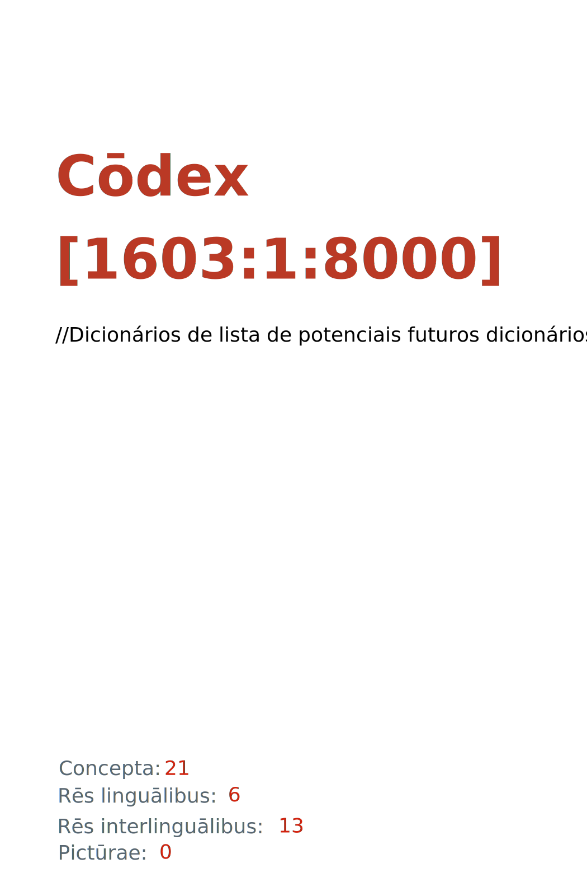

= Cōdex [1603:1:8000]: //Dicionários de lista de potenciais futuros dicionários//@por-Latn
:doctype: book
:title: Cōdex [1603:1:8000]: //Dicionários de lista de potenciais futuros dicionários//@por-Latn
:lang: la
:toc: macro
:toclevels: 5
:toc-title: Tabula contentorum
:table-caption: Tabula
:figure-caption: Pictūra
:example-caption: Exemplum
:last-update-label: Renovatio
:version-label: Versiō
:appendix-caption: Appendix
:source-highlighter: rouge
:warning-caption: Hic sunt dracones
:tip-caption: Commendātum
:front-cover-image: : //Dicionários de lista de potenciais futuros dicionários//@por-Latn",1050,1600]

{nbsp} +
{nbsp} +
[quote]
**Dedicação ao Domínio Público significa que cada grande problema comum só precisa ser resolvido uma vez**

'''

[%header,cols="25h,~a"]
|===
|
Rēs interlinguālibus
|
Factum

|
/dictiōnārium ēditōrī/
|
EticaAI

|
/publication date/@eng-Latn
|
2022-04-24

|
numerus editionis
|
2022-04-24T10:57:01

|
/SPDX license ID/@eng-Latn
|
CC0-1.0

|
spōnsor
|
pro bonō publicō

|===

ifndef::backend-epub3[]
<<<
toc::[]
<<<
endif::[]

[id=0_999_1603_1]
== Praefātiō 

Rēs linguālibus (1)::
  Lingua Anglica (Abecedarium Latinum):::
    _**Cōdex [1603:1:8000]**_ é o formato de livro dos dados estruturados legíveis por máquina do grupo de dicionários _**[1603:1:8000] //Dicionários de lista de potenciais futuros dicionários//@por-Latn**_, que são distribuídos para os implementadores usarem em aplicativos externos. Este livro pretende ser um recurso avançado para outros lexicógrafos e tradutores de terminologia, inclusive para detectar e relatar inconsistências. Ele pode, no entanto, ser usado como um dicionário ad hoc se não houver trabalho derivado focado em suas necessidades específicas.
    +++  +++
    **SOBRE LEXICOGRAFIA**
    +++  +++
    A lexicografia prática é a arte ou ofício de compilar, escrever e editar dicionários. O básico não é muito diferente de um milênio atrás: ainda é um trabalho muito humano e criativo. É preciso ser humilde: a maioria dos erros de tradutores, na verdade, não é culpa do tradutor, mas falhas metodológicas. Certificar-se de uma ideia de origem do que um conceito representa, mesmo que signifique reescrever e simplificar, anexar fotos, mostrar exemplos, fazer o que for para que seja entendido, faz com que até mesmo tradutores não profissionais que se preocupam com sua própria língua entreguem melhor resultados do que qualquer alternativa. Em outras palavras: mesmo as chamadas melhores práticas da indústria de pagar tradutores e revisores profissionais não podem superar termos de origem já mal explicados.
    +++  +++
    **SOBRE TIPOS DE DICIONÁRIOS QUE ESTAMOS COMPILANDO**
    +++  +++
    Estamos preocupados com um grupo de idéias (chamamos isso de grupo de dicionários de conceitos) que podem ser divididos em partes menores, revisados quanto a inconsistências, aprimorados para definições e depois traduzidos por voluntários. Códigos interlinguais, como o que poderia ser usado na troca de dados real, também são adicionados a cada conceito. Ambos os glossários, interfaces de usuário (como rótulos na coleta de dados) e, em alguns casos, até códigos padrão para o que iria em um campo de dados podem ser compilados dessa maneira.
    +++  +++
    Como a lista completa de dicionários-prototípicos e dicionários minimamente utilizáveis é enorme, um modo de citar público-alvos típicos é o seguinte:
    +++  +++
    . Ajuda humanitária
    . Ajuda ao desenvolvimento
    . Direitos humanos
    . Socorro militar (ou conceitos relacionados a conflitos e resolução de conflitos)
    +++  +++
    Os itens 1, 2 e 4 https://en.m.wikipedia.org/wiki/Humanitarian-Development_Nexus[são algumas vezes referidos como _nexus_] e são frequentemente encontrados ajudando _crise humanitária_. Já que a maioria dos colaboradores cujas ideias e críticas válidas são voluntárias, então 3 (direitos humanos, como na Anistia Internacional) para diferenciar do humanitarismo (como o Movimento da Cruz Vermelha é referência).
    +++  +++
    Observe que **dicionários não são guias de uso**. As instruções, quando existem, são principalmente dedicadas a lexicógrafos e tradutores.
    +++  +++
    **/PRO BONŌ PUBLICŌ/@lat-Latn**
    +++  +++
    As pessoas lexicógrafas deste trabalho são voluntárias, fazendo-o gratuitamente, pro bonō publicō, e não aceitam doações por causa dos dicionários reutilizáveis ​​de todos. O trabalho anterior existente muitas vezes é baseado em livros antigos de domínio público. A maioria dos tradutores de terminologia já seriam voluntários porque acreditam em uma causa. A melhor maneira de inspirar a colaboração é sermos nós mesmos exemplos.
    +++  +++
    Há um aspecto não moralista, bastante simples de entender: quão caro seria pagar pelo trabalho de todos considerando que é viável em mais de 200 idiomas? A logística para decidir quem deve ser pago, depois a transferência de dinheiro em todo o mundo (pode incluir pessoas de países embargados), depois os mecanismos tradicionais de auditoria para verificar o uso indevido que os doadores esperam, existe? Em terminologia especial (os próprios termos do dicionário) e tantas línguas, não existe dinheiro suficiente nem humanos interessados ​​em ser coordenadores.

<<<

== Methodī ex cōdice
=== Methodī ex dictiōnāriōrum corde
Rēs interlinguālibus (1)::
  /scope and content/@eng-Latn:::
    //Dicionários de lista de potenciais futuros dicionários//@por-Latn

=== Rēs dē factō in dictiōnāriīs
==== Concepta: 21

==== Rēs linguālibus: 3

[%header,cols="15h,25a,~,17"]
|===
|
Cōdex linguae
|
Glotto cōdicī +++ +++ ISO 639-3 +++ +++ Wiki QID cōdicī
|
Nōmen Latīnum
|
Concepta

|
mul-Zyyy
|

+++ +++
https://iso639-3.sil.org/code/mul[mul]
+++ +++ 
|
Linguae multiplīs (Scrīptum incognitō)
|
21

|
por-Latn
|
https://glottolog.org/resource/languoid/id/port1283[port1283]
+++ +++
https://iso639-3.sil.org/code/por[por]
+++ +++ https://www.wikidata.org/wiki/Q5146[Q5146]
|
Lingua Lusitana (Abecedarium Latinum)
|
2

|
eng-Latn
|
https://glottolog.org/resource/languoid/id/stan1293[stan1293]
+++ +++
https://iso639-3.sil.org/code/eng[eng]
+++ +++ https://www.wikidata.org/wiki/Q1860[Q1860]
|
Lingua Anglica (Abecedarium Latinum)
|
2

|===

==== Rēs interlinguālibus: 8
Rēs::
  numerus editionis:::
    Rēs interlinguālibus::::
      /Wiki P/;;
        https://www.wikidata.org/wiki/Property:P393[P393]

      ix_hxlix;;
        ix_wikip393

      ix_hxlvoc;;
        v_wiki_p_393

    Rēs linguālibus::::
      Lingua Latina (Abecedarium Latinum);;
        +++numerus editionis+++

      Lingua Anglica (Abecedarium Latinum);;
        +++number of an edition (first, second, ... as 1, 2, ...) or event+++

      Lingua Lusitana (Abecedarium Latinum);;
        +++número de uma edição (primeira, segunda, ... como 1, 2, ...) ou evento+++

  /SPDX license ID/@eng-Latn:::
    Rēs interlinguālibus::::
      /Wiki P/;;
        https://www.wikidata.org/wiki/Property:P2479[P2479]

      /rēgulam/;;
        [0-9A-Za-z\.\-]{3,36}[+]?

      /formatter URL/@eng-Latn;;
        https://spdx.org/licenses/$1.html

      ix_hxlix;;
        ix_wikip2479

      ix_hxlvoc;;
        v_wiki_p_2479

    Rēs linguālibus::::
      Lingua Latina (Abecedarium Latinum);;
        +++/SPDX license ID/@eng-Latn+++

      Lingua Anglica (Abecedarium Latinum);;
        +++SPDX license identifier+++

      Lingua Lusitana (Abecedarium Latinum);;
        +++identificador de licença SPDX+++

  /dictiōnārium ēditōrī/:::
    Rēs interlinguālibus::::
      /Wiki P/;;
        https://www.wikidata.org/wiki/Property:P98[P98]

      ix_hxlix;;
        ix_wikip98

      ix_hxlvoc;;
        v_wiki_p_98

    Rēs linguālibus::::
      Lingua Latina (Abecedarium Latinum);;
        +++/dictiōnārium ēditōrī/+++

      Lingua Anglica (Abecedarium Latinum);;
        +++editor of a compiled work such as a book or a periodical (newspaper or an academic journal)+++

      Lingua Lusitana (Abecedarium Latinum);;
        +++editor de um trabalho compilado, como um livro ou um periódico (jornal ou revista acadêmica)+++

  /Wiki QID/:::
    Rēs interlinguālibus::::
      /rēgulam/;;
        Q[1-9]\d*

      ix_hxlix;;
        ix_wikiq

      ix_hxlvoc;;
        v_wiki_q

    Rēs linguālibus::::
      Lingua Latina (Abecedarium Latinum);;
        +++/Wiki QID/+++

      Lingua Anglica (Abecedarium Latinum);;
        +++QID (or Q number) is the unique identifier of a data item on Wikidata, comprising the letter "Q" followed by one or more digits. It is used to help people and machines understand the difference between items with the same or similar names e.g there are several places in the world called London and many people called James Smith. This number appears next to the name at the top of each Wikidata item.+++

      Lingua Lusitana (Abecedarium Latinum);;
        +++QID (ou número Q) é o identificador único de um item de dados no Wikidata, composto pela letra "Q" seguida por um ou mais dígitos. Ele é usado para ajudar pessoas e máquinas a entender a diferença entre itens com nomes iguais ou semelhantes, por exemplo, existem vários lugares no mundo chamados Londres e muitas pessoas chamadas James Smith. Este número aparece ao lado do nome na parte superior de cada item do Wikidata.+++

  spōnsor:::
    Rēs interlinguālibus::::
      /Wiki P/;;
        https://www.wikidata.org/wiki/Property:P859[P859]

      ix_hxlix;;
        ix_wikip859

      ix_hxlvoc;;
        v_wiki_p_859

    Rēs linguālibus::::
      Lingua Latina (Abecedarium Latinum);;
        +++spōnsor+++

      Lingua Anglica (Abecedarium Latinum);;
        +++organization or individual that sponsors this item+++

      Lingua Lusitana (Abecedarium Latinum);;
        +++organização ou indivíduo que patrocina este item+++

  /publication date/@eng-Latn:::
    Rēs interlinguālibus::::
      /Wiki P/;;
        https://www.wikidata.org/wiki/Property:P577[P577]

      ix_hxlix;;
        ix_wikip577

      ix_hxlvoc;;
        v_wiki_p_577

    Rēs linguālibus::::
      Lingua Latina (Abecedarium Latinum);;
        +++/publication date/@eng-Latn+++

      Lingua Anglica (Abecedarium Latinum);;
        +++Date or point in time when a work was first published or released+++

      Lingua Lusitana (Abecedarium Latinum);;
        +++Data ou ponto no tempo em que um trabalho foi publicado ou lançado pela primeira vez+++

  Numerordĭnātĭo:::
    Rēs interlinguālibus::::
      ix_hxlix;;
        ix_n1603

      ix_hxlvoc;;
        v_n1603

    Rēs linguālibus::::
      Lingua Latina (Abecedarium Latinum);;
        +++Numerordĭnātĭo+++

      Lingua Anglica (Abecedarium Latinum);;
        +++a generic strategy of arranging numbers in an taxonomy-like explicit way+++

      Lingua Lusitana (Abecedarium Latinum);;
        +++uma estratégia genérica de organizar os números de maneira explícita como taxonomia+++

  /scope and content/@eng-Latn:::
    Rēs interlinguālibus::::
      /Wiki P/;;
        https://www.wikidata.org/wiki/Property:P7535[P7535]

      ix_hxlix;;
        ix_wikip7535

      ix_hxlvoc;;
        v_wiki_p_7535

    Rēs linguālibus::::
      Lingua Latina (Abecedarium Latinum);;
        +++/scope and content/@eng-Latn+++

      Lingua Anglica (Abecedarium Latinum);;
        +++a summary statement providing an overview of the archival collection+++

      Lingua Lusitana (Abecedarium Latinum);;
        +++uma declaração resumida fornecendo uma visão geral da coleção de arquivo+++

<<<

== Archīa

Rēs linguālibus (1)::
  Lingua Anglica (Abecedarium Latinum):::
    **Informações de contexto**: ignorando por um momento o fato de ter várias traduções (e otimizadas para receber contribuições regularmente, não _apenas_ um trabalho estático), então a diferença real no fluxo de trabalho usado para gerar cada grupo de dicionários em um Cōdex como este é o seguinte fato: **fornecemos formatos de arquivos estruturados legíveis por máquina mesmo quando os equivalentes em _idiomas internacionais_, como o inglês, não possuem para áreas como ajuda humanitária, ajuda ao desenvolvimento e direitos humanos**. Os mais próximos desse multilinguismo (fora da Wikimedia) são o SEMIeu da União Europeia (até 24 idiomas), mas mesmo assim têm problemas ao compartilhar traduções em todos os idiomas. As traduções das Nações Unidas (até 6 idiomas, raramente mais) não estão disponíveis por agências humanitárias para ajudar nas traduções de terminologia.
    +++  +++
    **Implicação prática**: os documentos de texto em _Archīa prō cōdice_ (tradução literal em inglês: _File for book_) são alternativas a este formato de livro que são altamente automatizados usando apenas o formato de dados. No entanto, os formatos legíveis por máquina em _Archīa prō dictiōnāriīs_ (tradução literal em inglês: _Arquivos para dicionários_) são o foco e recomendados para trabalhos derivados e destinados a mitigar erros humanos adicionais. Podemos até criar novos formatos a pedido! O objetivo aqui é permitir tradutores de terminologia e uso de produção onde isso tenha um impacto positivo.

=== Archīa prō dictiōnāriīs: 1

==== 1603_1_8000.no1.tm.hxl.csv

Rēs interlinguālibus::
  /download link/@eng-Latn::: link:1603_1_8000.no1.tm.hxl.csv[1603_1_8000.no1.tm.hxl.csv]
Rēs linguālibus::
  Lingua Anglica (Abecedarium Latinum):::
    /Numerordinatio no contêiner HXLTM/

=== Archīa prō cōdice: 2

==== 1603_1_8000.mul-Latn.codex.adoc

Rēs interlinguālibus::
  /download link/@eng-Latn::: link:1603_1_8000.mul-Latn.codex.adoc[1603_1_8000.mul-Latn.codex.adoc]
  /reference URL/@eng-Latn:::
    https://docs.asciidoctor.org/

Rēs linguālibus::
  Lingua Anglica (Abecedarium Latinum):::
    AsciiDoc é um formato de autoria de texto simples (ou seja, linguagem de marcação leve) para escrever conteúdo técnico, como documentação, artigos e livros.

==== 1603_1_8000.mul-Latn.codex.pdf

Rēs interlinguālibus::
  /download link/@eng-Latn::: link:1603_1_8000.mul-Latn.codex.pdf[1603_1_8000.mul-Latn.codex.pdf]
  /reference URL/@eng-Latn:::
    https://www.adobe.com/content/dam/acom/en/devnet/pdf/pdfs/PDF32000_2008.pdf

Rēs linguālibus::
  Lingua Anglica (Abecedarium Latinum):::
    Portable Document Format (PDF), padronizado como ISO 32000, é um formato de arquivo desenvolvido pela Adobe em 1992 para apresentar documentos, incluindo formatação de texto e imagens, de maneira independente do software aplicativo, hardware e sistemas operacionais.

<<<

[.text-center]

Dictiōnāria initiīs

<<<

== //Dicionários de lista de potenciais futuros dicionários//@por-Latn
<<<

[id='1']
=== [`1`] /Dicionários internos/@por-latn

Rēs linguālibus (1)::
  Linguae multiplīs (Scrīptum incognitō):::
    /Dicionários internos/@por-latn

<<<

[id='100']
=== [`100`] /Estatística/@por-Latn

Rēs linguālibus (1)::
  Linguae multiplīs (Scrīptum incognitō):::
    /Estatística/@por-Latn

[id='100_1']
==== [`100_1`] /Escala de classificação/@por-Latn

Rēs interlinguālibus (1)::
  /Wiki QID/:::
    https://www.wikidata.org/wiki/Q7295720[Q7295720]

Rēs linguālibus (1)::
  Linguae multiplīs (Scrīptum incognitō):::
    /Escala de classificação/@por-Latn

[id='100_1_5']
===== [`100_1_5`] /Escala Likert/@por-Latn

Rēs interlinguālibus (1)::
  /Wiki QID/:::
    https://www.wikidata.org/wiki/Q617473[Q617473]

Rēs linguālibus (1)::
  Linguae multiplīs (Scrīptum incognitō):::
    /Escala Likert/@por-Latn

[id='100_1_10']
===== [`100_1_10`] /Escala de um a dez/@por-Latn

Rēs interlinguālibus (1)::
  /Wiki QID/:::
    https://www.wikidata.org/wiki/Q7429725[Q7429725]

Rēs linguālibus (1)::
  Linguae multiplīs (Scrīptum incognitō):::
    /Escala de um a dez/@por-Latn

<<<

[id='200']
=== [`200`] /Grupo étnico/@por-Latn

Rēs interlinguālibus (1)::
  /Wiki QID/:::
    https://www.wikidata.org/wiki/Q41710[Q41710]

Rēs linguālibus (1)::
  Linguae multiplīs (Scrīptum incognitō):::
    /Grupo étnico/@por-Latn

[id='200_1']
==== [`200_1`] /Lista de grupos étnicos/@por-Latn

Rēs interlinguālibus (1)::
  /Wiki QID/:::
    https://www.wikidata.org/wiki/Q780000[Q780000]

Rēs linguālibus (1)::
  Linguae multiplīs (Scrīptum incognitō):::
    /Lista de grupos étnicos/@por-Latn

<<<

[id='320']
=== [`320`] /Transliteração/@por-Latn

Rēs interlinguālibus (1)::
  /Wiki QID/:::
    https://www.wikidata.org/wiki/Q134550[Q134550]

Rēs linguālibus (1)::
  Linguae multiplīs (Scrīptum incognitō):::
    /Transliteração/@por-Latn

[id='320_1']
==== [`320_1`] /Romanização do grego/@por-Latn

Rēs interlinguālibus (1)::
  /Wiki QID/:::
    https://www.wikidata.org/wiki/Q466126[Q466126]

Rēs linguālibus (1)::
  Linguae multiplīs (Scrīptum incognitō):::
    /Romanização do grego/@por-Latn

[id='320_2']
==== [`320_2`] /Romanização do russo/@por-Latn

Rēs interlinguālibus (1)::
  /Wiki QID/:::
    https://www.wikidata.org/wiki/Q6453319[Q6453319]

Rēs linguālibus (1)::
  Linguae multiplīs (Scrīptum incognitō):::
    /Romanização do russo/@por-Latn

<<<

[id='440']
=== [`440`] /Ciência forense/@por-Latn

Rēs interlinguālibus (1)::
  /Wiki QID/:::
    https://www.wikidata.org/wiki/Q495304[Q495304]

Rēs linguālibus (2)::
  Linguae multiplīs (Scrīptum incognitō):::
    /Ciência forense/@por-Latn

  Lingua Lusitana (Abecedarium Latinum):::
    Todos os dicionários criados em [1603:42] são sobre ciência forense. Embora a área seja vasta, o ideal é ter ajuda para decidir o que tem mais seria mais óbvio/fácil de priorizar para codificar eventos relevantes que também ocorrem como evidências para crimes de guerra e crimes contra a humanidade, o que implica em crimes que envolvem principalmente sinais assassinato intencional. Algumas informações:
    +++  +++
    . Sinais de mortes recentes (seja pela quantidade de corpos, ou pela falta de experiência de quem coleta evidências) não têm chance de perícia aprofundada de médico legista, então o que acaba sendo relevante são fotos (provavelmente tiradas por alguém da comunidade local e está em estado de choque).
    . Perícias meses (normalmente anos depois) da exumação de covas coletivas e feitas por especialistas internacionais são uma ferramenta comum muito que tem validade mais aceita em investigações criminais. No caso de quantidade alta de locais, a exemplo do que aconteceu no genocídio de Ruanda em 1994 (mais de meio milhão de pessoas), a exumação é feita por amostragem: perícia detalhada de um ou poucos locais exemplares (e não perícia rasa de muitos locais).
    . Típicamente quem comete o crime assume sair impunemente, age com brutalidade, e não faz questão de esconder (ou não sabe) detalhes que seriam óbvios em perícia. Normalmente não há governo funcional na região, e o acesso de investigadores será bloqueado principalmente se não for viável a argumentação de que é uma ação de grupo opositor.
    . (...)

<<<

[id='876']
=== [`876`] /Sexualidade humana/@por-Latn

Rēs interlinguālibus (2)::
  /Wiki QID/:::
    https://www.wikidata.org/wiki/Q154136[Q154136]

  Numerordĭnātĭo:::
    1604_99_876

Rēs linguālibus (1)::
  Linguae multiplīs (Scrīptum incognitō):::
    /Sexualidade humana/@por-Latn

[id='876_2']
==== [`876_2`] /Sexo biológico/@por-Latn

Rēs interlinguālibus (1)::
  /Wiki QID/:::
    https://www.wikidata.org/wiki/Q290[Q290]

Rēs linguālibus (1)::
  Linguae multiplīs (Scrīptum incognitō):::
    /Sexo biológico/@por-Latn

[id='876_3']
==== [`876_3`] /Identidade de gênero/@por-Latn

Rēs interlinguālibus (1)::
  /Wiki QID/:::
    https://www.wikidata.org/wiki/Q48264[Q48264]

Rēs linguālibus (1)::
  Linguae multiplīs (Scrīptum incognitō):::
    /Identidade de gênero/@por-Latn

[id='876_4']
==== [`876_4`] //Dictionaries of grammatical gender//

Rēs interlinguālibus (1)::
  /Wiki QID/:::
    https://www.wikidata.org/wiki/Q162378[Q162378]

Rēs linguālibus (1)::
  Linguae multiplīs (Scrīptum incognitō):::
    //Dictionaries of grammatical gender//

[id='876_5']
==== [`876_5`] //Dictionaries of third-person pronouns//

Rēs linguālibus (1)::
  Linguae multiplīs (Scrīptum incognitō):::
    //Dictionaries of third-person pronouns//

<<<

[id='3000']
=== [`3000`] /Divisão administrativa/@por-Latn

Rēs interlinguālibus (1)::
  /Wiki QID/:::
    https://www.wikidata.org/wiki/Q56061[Q56061]

Rēs linguālibus (1)::
  Linguae multiplīs (Scrīptum incognitō):::
    /Divisão administrativa/@por-Latn

[id='3000_1']
==== [`3000_1`] /Lista de Estados soberanos/@por-Latn

Rēs interlinguālibus (1)::
  /Wiki QID/:::
    https://www.wikidata.org/wiki/Q11750[Q11750]

Rēs linguālibus (1)::
  Linguae multiplīs (Scrīptum incognitō):::
    /Lista de Estados soberanos/@por-Latn

<<<

[id='8000']
=== [`8000`] /Não categorizado/@por-Latn

Rēs linguālibus (1)::
  Linguae multiplīs (Scrīptum incognitō):::
    /Não categorizado/@por-Latn

[id='8000_1']
==== [`8000_1`] /Coleção de perguntas sobre percepções de comunidade afetada sobre ajuda humanitária/@por-Latn

Rēs linguālibus (2)::
  Linguae multiplīs (Scrīptum incognitō):::
    /Coleção de perguntas sobre percepções de comunidade afetada sobre ajuda humanitária/@por-Latn

  Lingua Lusitana (Abecedarium Latinum):::
    +++Discussão iniciada em https://twitter.com/fititnt/status/1516516585149767683 (comunidade do twitter, requer convite). Exemplos de relatório: https://groundtruthsolutions.org/wp-content/uploads/2021/11/GTS_Haiti_H2H_April_2022_EN.pdf+++

[id='8000_2']
==== [`8000_2`] Dictiōnāria dē generibus grammaticīs

Rēs interlinguālibus (1)::
  /Wiki QID/:::
    https://www.wikidata.org/wiki/Q162378[Q162378]

Rēs linguālibus (1)::
  Linguae multiplīs (Scrīptum incognitō):::
    Dictiōnāria dē generibus grammaticīs

<<<

[.text-center]

Dictiōnāria fīnālī

<<<

== Notā bene

=== [PRECISAMOS DE AJUDA] O PDF gerado não tem as fontes corretas para todos os idiomas

Rēs linguālibus::
  Lingua Lusitana (Abecedarium Latinum):::
    Primeiro, desculpe se isso afeta seu idioma favorito :(. Estamos trabalhando nisso, mas ainda não estamos aperfeiçoando a geração de livros em tantos idiomas ao mesmo tempo.
    Se você tiver fontes instaladas em seu computador, provavelmente ainda poderá copiar e colar da versão eBook.
    Observe que todos os formatos destinados ao processamento de máquina funcionarão bem.

=== [eBook com Wikidata Q] Quero ajudar! Alguma tradução está faltando ou está errada! Como muda-la?

Rēs linguālibus::
  Lingua Lusitana (Abecedarium Latinum):::
    A maioria (mas não todos) os conceitos estão usando o Wikidata Q. Na verdade, na maioria das vezes melhoramos o Wikidata enquanto preparamos os dicionários! Verifique se o conceito exato que você deseja tem um Q ID e clique nele. Lá você pode adicionar traduções.
    A próxima versão (provavelmente semanal) terá seus envios sem a necessidade de nos contatar diretamente.

=== [eBook com Wikidata Q] Posso encontrar o conceito Wikidata, mas não consigo editar!

Rēs linguālibus::
  Lingua Lusitana (Abecedarium Latinum):::
    Embora o Wikidata seja mais flexível do que o da Wikipedia (por exemplo, permite conceitos sem a necessidade de criar páginas da Wikipedia), mesmo o Wikidata pode ter conceitos que exigem a criação de uma conta e não permitem edição anônima. Criar tal conta e confirmar e-mail é mais rápido do que pedir que outra pessoa faça isso por você.
    No entanto, embora o vandalismo no Wikidata seja raro, muito poucos conceitos exigirão uma conta com mais contribuições e não criada muito recentemente. Se este for o seu caso, ajude com os que você pode fazer sozinho e o resto peça para outra pessoa adicionar a você.

=== Ouvi dizer que há interesse em ter o Cōdex além da língua latina! Como fazer?!

Rēs linguālibus::
  Lingua Lusitana (Abecedarium Latinum):::
    Por favor, entre em contato conosco. Este livro usa latim (às vezes _latim macarrónico_) para documentar todos os outros idiomas, mas obviamente podemos automatizar a geração de livros para outros usando outros sistemas de escrita e algum idioma de referência. Precisamos de ajuda especial com sistemas de escrita como Bengali, Devanagari e Tamil. Para scripts da direita para a esquerda, apesar de poder renderizar o texto, a impressão do livro exigirá um modelo diferente. Apenas substituir o latim não funcionará, por isso estamos abertos a ideias para proporcionar uma ótima experiência ao usuário!

<<<

