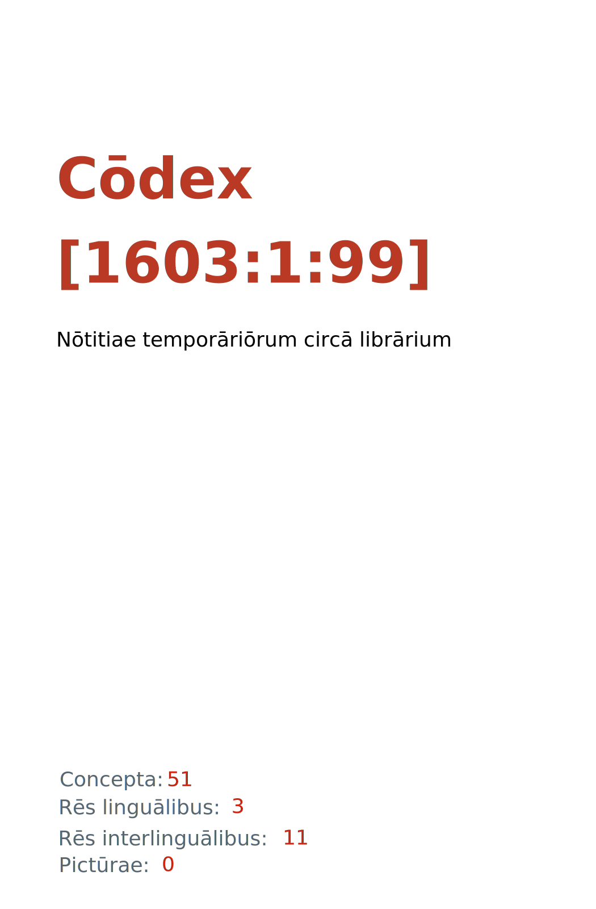

= Cōdex [1603:1:99]: Nōtitiae temporāriōrum circā librārium
:doctype: book
:title: Cōdex [1603:1:99]: Nōtitiae temporāriōrum circā librārium
:lang: la
:toc: macro
:toclevels: 5
:toc-title: Tabula contentorum
:table-caption: Tabula
:figure-caption: Pictūra
:example-caption: Exemplum
:last-update-label: Renovatio
:version-label: Versiō
:appendix-caption: Appendix
:source-highlighter: rouge
:warning-caption: Hic sunt dracones
:tip-caption: Commendātum
:front-cover-image: : Nōtitiae temporāriōrum circā librārium",1050,1600]

{nbsp} +
{nbsp} +
[quote]
/**Public domain means that each major common issue only needs to be resolved once**/@eng-Latn

'''

[%header,cols="25h,~a"]
|===
|
Rēs interlinguālibus
|
Factum

|
scrīptor
|
EticaAI

|
/cōdex pūblicandī/
|
EticaAI

|
/publication date/@eng-Latn
|
2022-04-14

|
numerus editionis
|
2022-04-19T21:52:48

|
/SPDX license ID/@eng-Latn
|
CC0-1.0

|===

ifndef::backend-epub3[]
<<<
toc::[]
<<<
endif::[]

[id=0_999_1603_1]
== Praefātiō 

Rēs linguālibus::
  Lingua Anglica (Abecedarium Latinum):::
    _**Cōdex [1603:1:99]**_ is the book format of the machine-readable dictionaries _**[1603:1:99] Nōtitiae temporāriōrum circā librārium**_, which are distributed for implementers on external applications. This book is intended as an advanced resource for other lexicographers and terminology translators, including detect and report inconsistencies. It can, however, be used as an ad hoc dictionary if there is not derived work focused on your specific needs.
    +++  +++
    **ABOUT LEXICOGRAPHY**
    +++  +++
    Practical lexicography is the art or craft of compiling, writing and editing dictionaries. The basics are not far different than a millennia ago: it is still a very humane, creative work. It is necessary to be humble: most of the translator's mistakes are, in fact, not the translator's fault, but methodological flaws. Making sure of a source idea of what a concept represents, even if it means rewrite and make simpler, annex pictures, show examples, do whatever to make it be understood, makes even non-professional translators that care about their own language deliver better results than any alternative. In other words: even the so-called industry best practices of paying professional translators and reviewers cannot overcome already poorly explained source terms.
    +++  +++
    **ABOUT TYPES OF DICTIONARIES WE'RE COMPILING**
    +++  +++
    We're concerned with a group of ideas (we call it a group of dictionaries of concepts) which can be broken into smaller parts, reviewed for inconsistencies, improved for definitions, and then be translated by volunteers. Interlingual codes, such as what could be used on actual data exchange, are also added to each concept. Both glossaries, user interfaces (such as labels on data collection) and in some cases even standard codes for what would go on a data field could be compiled this way.
    +++  +++
    Since the full list of prototypal-dictionaries and dictionaries is huge, one way cited by objective audiences is the following:
    +++  +++
    . Humanitarian aid
    . Development aid
    . Human rights
    . Military relief (or conflict and conflict-resolution related concepts)
    +++  +++
    The itens 1, 2 and 4 https://en.m.wikipedia.org/wiki/Humanitarian-Development_Nexus[are sometimes referred as _nexus_] and are often found helping _humanitarian crisis_. Since most contributors whose ideas and valid criticism are volunteers, then 3 (human rights, as in International Amnesty) to differentiate from humanitarianism (such as Red Cross Movement is reference).
    +++  +++
    Note that **dictionaries are not usage guides**. Instructions, when they exist, are mostly dedicated to lexicographers and translators.
    +++  +++
    **/PRO BONŌ PUBLICŌ/@lat-Latn**
    +++  +++
    The lexicographers of this work are both volunteers, doing it for free, pro bonō publicō, and don't accept donations for the sake of everyone's reusable dictionaries. Existing previous work often is based on old public domain books. Most terminology translators already would be volunteers because they believe in a cause. The best way to inspire collaboration is to be examples ourselves.
    +++  +++
    There's a non-moralistic aspect, fairly simple to understand: how expensive would it be to pay for everyone's work considering it is feasible over 200 languages? The logistics to decide who should be paid, then worldwide cash transfer (may include people from embargoed countries), then traditional auditing mechanisms to check misuse donors expect, exist? In special terminology (dictionary terms themselves) and so many languages, neither sufficient money nor humans interested in being coordinators exist.

<<<

== Methodī ex cōdice
=== Methodī ex dictiōnāriōrum corde
Rēs interlinguālibus::
  /scope and content/@eng-Latn:::
    /Temporary information about the library. Used to store on spreadsheets (not on code) messages not translated yet on dedicated dictionaries. Not intented for external use/@eng-Latn

=== Rēs dē factō in dictiōnāriīs
==== Concepta: 51

==== Rēs linguālibus: 1

[%header,cols="15h,25a,~,17"]
|===
|
Cōdex linguae
|
Glotto cōdicī +++ +++ ISO 639-3 +++ +++ Wiki QID cōdicī
|
Nōmen Latīnum
|
Concepta

|
eng-Latn
|
https://glottolog.org/resource/languoid/id/stan1293[stan1293]
+++ +++
https://iso639-3.sil.org/code/eng[eng]
+++ +++ https://www.wikidata.org/wiki/Q1860[Q1860]
|
Lingua Anglica (Abecedarium Latinum)
|
53

|===

==== Rēs interlinguālibus: 6
Rēs::
  scrīptor:::
    Rēs interlinguālibus::::
      /Wiki P/;;
        https://www.wikidata.org/wiki/Property:P50[P50]

      ix_hxlix;;
        ix_wikip50

      ix_hxlvoc;;
        v_wiki_p_50

    Rēs linguālibus::::
      Lingua Latina (Abecedarium Latinum);;
        +++scrīptor+++

      Lingua Anglica (Abecedarium Latinum);;
        +++Main creator(s) of a written work (use on works, not humans)+++

  /publication date/@eng-Latn:::
    Rēs interlinguālibus::::
      /Wiki P/;;
        https://www.wikidata.org/wiki/Property:P577[P577]

      ix_hxlix;;
        ix_wikip577

      ix_hxlvoc;;
        v_wiki_p_577

    Rēs linguālibus::::
      Lingua Latina (Abecedarium Latinum);;
        +++/publication date/@eng-Latn+++

      Lingua Anglica (Abecedarium Latinum);;
        +++Date or point in time when a work was first published or released+++

  /scope and content/@eng-Latn:::
    Rēs interlinguālibus::::
      /Wiki P/;;
        https://www.wikidata.org/wiki/Property:P7535[P7535]

      ix_hxlix;;
        ix_wikip7535

      ix_hxlvoc;;
        v_wiki_p_7535

    Rēs linguālibus::::
      Lingua Latina (Abecedarium Latinum);;
        +++/scope and content/@eng-Latn+++

      Lingua Anglica (Abecedarium Latinum);;
        +++a summary statement providing an overview of the archival collection+++

  /SPDX license ID/@eng-Latn:::
    Rēs interlinguālibus::::
      /Wiki P/;;
        https://www.wikidata.org/wiki/Property:P2479[P2479]

      /rēgulam/;;
        [0-9A-Za-z\.\-]{3,36}[+]?

      /formatter URL/@eng-Latn;;
        https://spdx.org/licenses/$1.html

      ix_hxlix;;
        ix_wikip2479

      ix_hxlvoc;;
        v_wiki_p_2479

    Rēs linguālibus::::
      Lingua Latina (Abecedarium Latinum);;
        +++/SPDX license ID/@eng-Latn+++

      Lingua Anglica (Abecedarium Latinum);;
        +++SPDX license identifier+++

  numerus editionis:::
    Rēs interlinguālibus::::
      /Wiki P/;;
        https://www.wikidata.org/wiki/Property:P393[P393]

      ix_hxlix;;
        ix_wikip393

      ix_hxlvoc;;
        v_wiki_p_393

    Rēs linguālibus::::
      Lingua Latina (Abecedarium Latinum);;
        +++numerus editionis+++

      Lingua Anglica (Abecedarium Latinum);;
        +++number of an edition (first, second, ... as 1, 2, ...) or event+++

  /cōdex pūblicandī/:::
    Rēs interlinguālibus::::
      /Wiki P/;;
        https://www.wikidata.org/wiki/Property:P123[P123]

      ix_hxlix;;
        ix_wikip123

      ix_hxlvoc;;
        v_wiki_p_123

    Rēs linguālibus::::
      Lingua Latina (Abecedarium Latinum);;
        +++/cōdex pūblicandī/+++

      Lingua Anglica (Abecedarium Latinum);;
        +++organization or person responsible for publishing books, periodicals, printed music, podcasts, games or software+++

<<<

== Archīa

Rēs linguālibus::
  Lingua Anglica (Abecedarium Latinum):::
    **Context information**: ignoring for a moment the fact of having several translations (and optimized to receive contributions on a regular basis, not _just_ an static work), then the actual groundbreaking difference on the workflow used to generate every dictionaries on Cōdex such as this one are the following fact: **we provide machine readable formats even when the equivalents on _international languages_, such as English, don't have for areas such as humanitarian aid, development aid and human rights**. The closest to such multilingualism (outside Wikimedia) are European Union SEMICeu (up to 24 languages), but even then have issues while sharing translations on all languages. United Nations translations (up to 6 languages, rarely more) are not available by humanitarian agencies to help with terminology translations.
    +++  +++
    **Practical implication**: the text documents on _Archīa prō cōdice_ (literal English translation: _File for book_) are alternatives to this book format which are heavily automated using only the data format. However, the machine-readable formats on _Archīa prō dictiōnāriīs_ (literal English translation: _Files for dictionaries_) are the focus and recommended for derived works and intended for mitigating additional human errors. We can even create new formats by request! The goal here is both to allow terminology translators and production usage where it makes an impact.

=== Archīa prō dictiōnāriīs: 1

==== 1603_1_99.no1.tm.hxl.csv

Rēs interlinguālibus::
  /download link/@eng-Latn::: link:1603_1_99.no1.tm.hxl.csv[1603_1_99.no1.tm.hxl.csv]
Rēs linguālibus::
  Lingua Anglica (Abecedarium Latinum):::
    /Numerordinatio on HXLTM container/

=== Archīa prō cōdice: 2

==== 1603_1_99.mul-Latn.codex.adoc

Rēs interlinguālibus::
  /download link/@eng-Latn::: link:1603_1_99.mul-Latn.codex.adoc[1603_1_99.mul-Latn.codex.adoc]
  /reference URL/@eng-Latn:::
    https://docs.asciidoctor.org/

Rēs linguālibus::
  Lingua Anglica (Abecedarium Latinum):::
    AsciiDoc is a plain text authoring format (i.e., lightweight markup language) for writing technical content such as documentation, articles, and books.

==== 1603_1_99.mul-Latn.codex.pdf

Rēs interlinguālibus::
  /download link/@eng-Latn::: link:1603_1_99.mul-Latn.codex.pdf[1603_1_99.mul-Latn.codex.pdf]
  /reference URL/@eng-Latn:::
    https://www.adobe.com/content/dam/acom/en/devnet/pdf/pdfs/PDF32000_2008.pdf

Rēs linguālibus::
  Lingua Anglica (Abecedarium Latinum):::
    Portable Document Format (PDF), standardized as ISO 32000, is a file format developed by Adobe in 1992 to present documents, including text formatting and images, in a manner independent of application software, hardware, and operating systems.

<<<

[.text-center]

Dictiōnāria initiīs

<<<

== Nōtitiae temporāriōrum circā librārium
<<<

[id='1']
=== [`1`] /fīat lūx!/@eng-Latn

Rēs linguālibus::
  Lingua Anglica (Abecedarium Latinum):::
    +++fīat lūx!+++

<<<

[id='2']
=== [`2`] //@eng-Latn

Rēs linguālibus::
  Lingua Anglica (Abecedarium Latinum):::
    ++++++

<<<

[id='3']
=== [`3`] /The result of this section is a preview. We're aware it is not well (Abecedarium formatted for a book format. Sorry for the temporary inconvenience./@eng-Latn

Rēs linguālibus::
  Lingua Anglica (Abecedarium Latinum):::
    +++The result of this section is a preview. We're aware it is not well (Abecedarium formatted for a book format. Sorry for the temporary inconvenience.+++

<<<

[id='10']
=== [`10`] //General text hardcoded on the 1603_1.py//@eng-Latn

Rēs linguālibus::
  Lingua Anglica (Abecedarium Latinum):::
    +++/General text hardcoded on the 1603_1.py/+++

[id='10_1']
==== [`10_1`] /_**Cōdex [{0}]**_ is the book format of the machine-readable dictionaries _**[{0}] {1}**_, which are distributed for implementers on external applications. This book is intended as an advanced resource for other lexicographers and terminology translators, including detect and report inconsistencies. It can, however, be used as an ad hoc dictionary if there is not derived work focused on your specific needs.\n\n**ABOUT LEXICOGRAPHY**\n\nPractical lexicography is the art or craft of compiling, writing and editing dictionaries. The basics are not far different than a millennia ago: it is still a very humane, creative work. It is necessary to be humble: most of the translator's mistakes are, in fact, not the translator's fault, but methodological flaws. Making sure of a source idea of what a concept represents, even if it means rewrite and make simpler, annex pictures, show examples, do whatever to make it be understood, makes even non-professional translators that care about their own language deliver better results than any alternative. In other words: even the so-called industry best practices of paying professional translators and reviewers cannot overcome already poorly explained source terms.\n\n**ABOUT TYPES OF DICTIONARIES WE'RE COMPILING**\n\nWe're concerned with a group of ideas (we call it a group of dictionaries of concepts) which can be broken into smaller parts, reviewed for inconsistencies, improved for definitions, and then be translated by volunteers. Interlingual codes, such as what could be used on actual data exchange, are also added to each concept. Both glossaries, user interfaces (such as labels on data collection) and in some cases even standard codes for what would go on a data field could be compiled this way.\n\nSince the full list of prototypal-dictionaries and dictionaries is huge, one way cited by objective audiences is the following:\n\n. Humanitarian aid\n. Development aid\n. Human rights\n. Military relief (or conflict and conflict-resolution related concepts)\n\nThe itens 1, 2 and 4 https://en.m.wikipedia.org/wiki/Humanitarian-Development_Nexus[are sometimes referred as _nexus_] and are often found helping _humanitarian crisis_. Since most contributors whose ideas and valid criticism are volunteers, then 3 (human rights, as in International Amnesty) to differentiate from humanitarianism (such as Red Cross Movement is reference).\n\nNote that **dictionaries are not usage guides**. Instructions, when they exist, are mostly dedicated to lexicographers and translators.\n\n**/PRO BONŌ PUBLICŌ/@lat-Latn**\n\nThe lexicographers of this work are both volunteers, doing it for free, pro bonō publicō, and don't accept donations for the sake of everyone's reusable dictionaries. Existing previous work often is based on old public domain books. Most terminology translators already would be volunteers because they believe in a cause. The best way to inspire collaboration is to be examples ourselves.\n\nThere's a non-moralistic aspect, fairly simple to understand: how expensive would it be to pay for everyone's work considering it is feasible over 200 languages? The logistics to decide who should be paid, then worldwide cash transfer (may include people from embargoed countries), then traditional auditing mechanisms to check misuse donors expect, exist? In special terminology (dictionary terms themselves) and so many languages, neither sufficient money nor humans interested in being coordinators exist./@eng-Latn

Rēs linguālibus::
  Lingua Anglica (Abecedarium Latinum):::
    +++_**Cōdex [{0}]**_ is the book format of the machine-readable dictionaries _**[{0}] {1}**_, which are distributed for implementers on external applications. This book is intended as an advanced resource for other lexicographers and terminology translators, including detect and report inconsistencies. It can, however, be used as an ad hoc dictionary if there is not derived work focused on your specific needs.
    +++  +++
    **ABOUT LEXICOGRAPHY**
    +++  +++
    Practical lexicography is the art or craft of compiling, writing and editing dictionaries. The basics are not far different than a millennia ago: it is still a very humane, creative work. It is necessary to be humble: most of the translator's mistakes are, in fact, not the translator's fault, but methodological flaws. Making sure of a source idea of what a concept represents, even if it means rewrite and make simpler, annex pictures, show examples, do whatever to make it be understood, makes even non-professional translators that care about their own language deliver better results than any alternative. In other words: even the so-called industry best practices of paying professional translators and reviewers cannot overcome already poorly explained source terms.
    +++  +++
    **ABOUT TYPES OF DICTIONARIES WE'RE COMPILING**
    +++  +++
    We're concerned with a group of ideas (we call it a group of dictionaries of concepts) which can be broken into smaller parts, reviewed for inconsistencies, improved for definitions, and then be translated by volunteers. Interlingual codes, such as what could be used on actual data exchange, are also added to each concept. Both glossaries, user interfaces (such as labels on data collection) and in some cases even standard codes for what would go on a data field could be compiled this way.
    +++  +++
    Since the full list of prototypal-dictionaries and dictionaries is huge, one way cited by objective audiences is the following:
    +++  +++
    . Humanitarian aid\n. Development aid\n. Human rights\n. Military relief (or conflict and conflict-resolution related concepts)
    +++  +++
    The itens 1, 2 and 4 https://en.m.wikipedia.org/wiki/Humanitarian-Development_Nexus[are sometimes referred as _nexus_] and are often found helping _humanitarian crisis_. Since most contributors whose ideas and valid criticism are volunteers, then 3 (human rights, as in International Amnesty) to differentiate from humanitarianism (such as Red Cross Movement is reference).
    +++  +++
    Note that **dictionaries are not usage guides**. Instructions, when they exist, are mostly dedicated to lexicographers and translators.
    +++  +++
    **/PRO BONŌ PUBLICŌ/@lat-Latn**
    +++  +++
    The lexicographers of this work are both volunteers, doing it for free, pro bonō publicō, and don't accept donations for the sake of everyone's reusable dictionaries. Existing previous work often is based on old public domain books. Most terminology translators already would be volunteers because they believe in a cause. The best way to inspire collaboration is to be examples ourselves.
    +++  +++
    There's a non-moralistic aspect, fairly simple to understand: how expensive would it be to pay for everyone's work considering it is feasible over 200 languages? The logistics to decide who should be paid, then worldwide cash transfer (may include people from embargoed countries), then traditional auditing mechanisms to check misuse donors expect, exist? In special terminology (dictionary terms themselves) and so many languages, neither sufficient money nor humans interested in being coordinators exist.+++

[id='10_1_0']
===== [`10_1_0`] /_**Cōdex [{0}]**_ is the book format of the machine-readable dictionaries _**[{0}] {1}**_, which are distributed for implementers on external applications. This book is intended as an advanced resource for other lexicographers and terminology translators, including detect and report inconsistencies. It can, however, be used as an ad hoc dictionary if there is not derived work focused on your specific needs.\n\n**ABOUT LEXICOGRAPHY**\n\nPractical lexicography is the art or craft of compiling, writing and editing dictionaries. The basics are not far different than a millennia ago: it is still a very humane, creative work. It is necessary to be humble: most of the translator's mistakes are, in fact, not the translator's fault, but methodological flaws. Making sure of a source idea of what a concept represents, even if it means rewrite and make simpler, annex pictures, show examples, do whatever to make it be understood, makes even non-professional translators that care about their own language deliver better results than any alternative. In other words: even the so-called industry best practices of paying professional translators and reviewers cannot overcome already poorly explained source terms.\n\n**ABOUT TYPES OF DICTIONARIES WE'RE COMPILING**\n\nWe're concerned with a group of ideas (we call it a group of dictionaries of concepts) which can be broken into smaller parts, reviewed for inconsistencies, improved for definitions, and then be translated by volunteers. Interlingual codes, such as what could be used on actual data exchange, are also added to each concept. Both glossaries, user interfaces (such as labels on data collection) and in some cases even standard codes for what would go on a data field could be compiled this way.\n\nSince the full list of prototypal-dictionaries and dictionaries is huge, one way cited by objective audiences is the following:\n\n1. Humanitarian aid2. Development aid\n3. Human rights\n4. Military relief (or conflict and conflict-resolution related concepts)\n\n// -\n\nThe itens 1, 2 and 4 https://en.m.wikipedia.org/wiki/Humanitarian-Development_Nexus[are sometimes referred as _nexus_] and are often found helping _humanitarian crisis_. Since most contributors whose ideas and valid criticism are volunteers, then 3 (human rights, as in International Amnesty) to differentiate from humanitarianism (such as Red Cross Movement is reference).\n\nNote that **dictionaries are not usage guides**. Instructions, when they exist, are mostly dedicated to lexicographers and translators.\n\n///\n**BUT ARE SPECIALIZED DICTIONARIES NECESSARY AT ALL?**\n\nThis preface text is generated with every Cōdex version, so this may be a prototype/draft one (which means not a good example), but the answer is: yes. But a _very boring yes_. References about decision making on dictionaries are very scarce through centuries, but a quick summary on this topic: **any dictionary compilation to be useful should be based on _de facto_ users needs, which is different from typical validation**.\n\nOur dictionaries are strongly focused on multilingualism but as 2022, maybe the close discussion at international level would be https://en.m.wikipedia.org/wiki/Localisation_(humanitarian_practice)[Localisation (humanitarian practice)]. However, _localisation_ on these discussions is a different sense than https://en.m.wikipedia.org/wiki/Internationalization_and_localization[Internationalization and localization], which is more aligned with use of these works on software.\n///\n**/PRO BONŌ PUBLICŌ/@lat-Latn**\n\nThe lexicographers of this work not only are volunteers doing it for free but they don't accept donations for the sake of everyone's reusable dictionaries. Existing previous work often is based on old public domain books and most terminology translators already would be volunteers because they believe in a cause. The best way to inspire collaboration is to be examples ourselves.\n\nThere's a non-moralistic aspect, fairly simple to understand: how expensive would it be to pay for everyone's work considering it is feasible over 200 languages? The logistics to decide who should be paid, then **worldwide** cash transfer (may include people from embargoed countries), then traditional auditing mechanisms to check misuse donors expect, exist? In special terminology (dictionary terms themselves) and so many languages, neither money nor humans interested in being coordinators exist.\n\nResuming: don't worth the trouble to be paid for this on such scale languages./@eng-Latn

Rēs linguālibus::
  Lingua Anglica (Abecedarium Latinum):::
    +++_**Cōdex [{0}]**_ is the book format of the machine-readable dictionaries _**[{0}] {1}**_, which are distributed for implementers on external applications. This book is intended as an advanced resource for other lexicographers and terminology translators, including detect and report inconsistencies. It can, however, be used as an ad hoc dictionary if there is not derived work focused on your specific needs.
    +++  +++
    **ABOUT LEXICOGRAPHY**
    +++  +++
    Practical lexicography is the art or craft of compiling, writing and editing dictionaries. The basics are not far different than a millennia ago: it is still a very humane, creative work. It is necessary to be humble: most of the translator's mistakes are, in fact, not the translator's fault, but methodological flaws. Making sure of a source idea of what a concept represents, even if it means rewrite and make simpler, annex pictures, show examples, do whatever to make it be understood, makes even non-professional translators that care about their own language deliver better results than any alternative. In other words: even the so-called industry best practices of paying professional translators and reviewers cannot overcome already poorly explained source terms.
    +++  +++
    **ABOUT TYPES OF DICTIONARIES WE'RE COMPILING**
    +++  +++
    We're concerned with a group of ideas (we call it a group of dictionaries of concepts) which can be broken into smaller parts, reviewed for inconsistencies, improved for definitions, and then be translated by volunteers. Interlingual codes, such as what could be used on actual data exchange, are also added to each concept. Both glossaries, user interfaces (such as labels on data collection) and in some cases even standard codes for what would go on a data field could be compiled this way.
    +++  +++
    Since the full list of prototypal-dictionaries and dictionaries is huge, one way cited by objective audiences is the following:
    +++  +++
    1. Humanitarian aid2. Development aid\n3. Human rights\n4. Military relief (or conflict and conflict-resolution related concepts)
    +++  +++
    // -
    +++  +++
    The itens 1, 2 and 4 https://en.m.wikipedia.org/wiki/Humanitarian-Development_Nexus[are sometimes referred as _nexus_] and are often found helping _humanitarian crisis_. Since most contributors whose ideas and valid criticism are volunteers, then 3 (human rights, as in International Amnesty) to differentiate from humanitarianism (such as Red Cross Movement is reference).
    +++  +++
    Note that **dictionaries are not usage guides**. Instructions, when they exist, are mostly dedicated to lexicographers and translators.
    +++  +++
    ////\n**BUT ARE SPECIALIZED DICTIONARIES NECESSARY AT ALL?**
    +++  +++
    This preface text is generated with every Cōdex version, so this may be a prototype/draft one (which means not a good example), but the answer is: yes. But a _very boring yes_. References about decision making on dictionaries are very scarce through centuries, but a quick summary on this topic: **any dictionary compilation to be useful should be based on _de facto_ users needs, which is different from typical validation**.
    +++  +++
    Our dictionaries are strongly focused on multilingualism but as 2022, maybe the close discussion at international level would be https://en.m.wikipedia.org/wiki/Localisation_(humanitarian_practice)[Localisation (humanitarian practice)]. However, _localisation_ on these discussions is a different sense than https://en.m.wikipedia.org/wiki/Internationalization_and_localization[Internationalization and localization], which is more aligned with use of these works on software.\n////\n**/PRO BONŌ PUBLICŌ/@lat-Latn**
    +++  +++
    The lexicographers of this work not only are volunteers doing it for free but they don't accept donations for the sake of everyone's reusable dictionaries. Existing previous work often is based on old public domain books and most terminology translators already would be volunteers because they believe in a cause. The best way to inspire collaboration is to be examples ourselves.
    +++  +++
    There's a non-moralistic aspect, fairly simple to understand: how expensive would it be to pay for everyone's work considering it is feasible over 200 languages? The logistics to decide who should be paid, then **worldwide** cash transfer (may include people from embargoed countries), then traditional auditing mechanisms to check misuse donors expect, exist? In special terminology (dictionary terms themselves) and so many languages, neither money nor humans interested in being coordinators exist.
    +++  +++
    Resuming: don't worth the trouble to be paid for this on such scale languages.+++

[id='10_2']
==== [`10_2`] /**Context information**: ignoring for a moment the fact of having several translations (and optimized to receive contributions on a regular basis, not _just_ an static work), then the actual groundbreaking difference on the workflow used to generate every dictionaries on Cōdex such as this one are the following fact: **we provide machine readable formats even when the equivalents on _international languages_, such as English, don't have for areas such as humanitarian aid, development aid and human rights**. The closest to such multilingualism (outside Wikimedia) are European Union SEMICeu (up to 24 languages), but even then have issues while sharing translations on all languages. United Nations translations (up to 6 languages, rarely more) are not available by humanitarian agencies to help with terminology translations.\n\n**Practical implication**: the text documents on _Archīa prō cōdice_ (literal English translation: _File for book_) are alternatives to this book format which are heavily automated using only the data format. However, the machine-readable formats on _Archīa prō dictiōnāriīs_ (literal English translation: _Files for dictionaries_) are the focus and recommended for derived works and intended for mitigating additional human errors. We can even create new formats by request! The goal here is both to allow terminology translators and production usage where it makes an impact./@eng-Latn

Rēs linguālibus::
  Lingua Anglica (Abecedarium Latinum):::
    +++**Context information**: ignoring for a moment the fact of having several translations (and optimized to receive contributions on a regular basis, not _just_ an static work), then the actual groundbreaking difference on the workflow used to generate every dictionaries on Cōdex such as this one are the following fact: **we provide machine readable formats even when the equivalents on _international languages_, such as English, don't have for areas such as humanitarian aid, development aid and human rights**. The closest to such multilingualism (outside Wikimedia) are European Union SEMICeu (up to 24 languages), but even then have issues while sharing translations on all languages. United Nations translations (up to 6 languages, rarely more) are not available by humanitarian agencies to help with terminology translations.
    +++  +++
    **Practical implication**: the text documents on _Archīa prō cōdice_ (literal English translation: _File for book_) are alternatives to this book format which are heavily automated using only the data format. However, the machine-readable formats on _Archīa prō dictiōnāriīs_ (literal English translation: _Files for dictionaries_) are the focus and recommended for derived works and intended for mitigating additional human errors. We can even create new formats by request! The goal here is both to allow terminology translators and production usage where it makes an impact.+++

[id='10_2_0']
===== [`10_2_0`] /Every book comes with several files both for book format (with (Abecedarium additional information) and machine-readable formats with Latinum) documentation of how to process them. If you receive this file and cannot find the alternatives, ask the human who provide this file./@eng-Latn

Rēs linguālibus::
  Lingua Anglica (Abecedarium Latinum):::
    +++Every book comes with several files both for book format (with (Abecedarium additional information) and machine-readable formats with Latinum) documentation of how to process them. If you receive this file and cannot find the alternatives, ask the human who provide this file.+++

[id='10_3']
==== [`10_3`] /WARNING: Unless you are working with a natural language you understand it\'s letters and symbols, it is strongly advised to use automation to generate derived works. Keep manual human steps at minimum: if something goes wrong at least one or more languages can be used to verify mistakes. It's not at all necessary _know all languages_, but working with writing systems you don't understand is risky: copy and paste strategy can cause _additional_ human errors and is unlikely to get human review as fast as you would need./@eng-Latn

Rēs linguālibus::
  Lingua Anglica (Abecedarium Latinum):::
    +++WARNING: Unless you are working with a natural language you understand it\'s letters and symbols, it is strongly advised to use automation to generate derived works. Keep manual human steps at minimum: if something goes wrong at least one or more languages can be used to verify mistakes. It's not at all necessary _know all languages_, but working with writing systems you don't understand is risky: copy and paste strategy can cause _additional_ human errors and is unlikely to get human review as fast as you would need.+++

[id='10_4']
==== [`10_4`] /TIP: The Asciidoctor (.adoc) is better at copy and pasting! It can be converted to other text formats./@eng-Latn

Rēs linguālibus::
  Lingua Anglica (Abecedarium Latinum):::
    +++TIP: The Asciidoctor (.adoc) is better at copy and pasting! It can be converted to other text formats.+++

[id='10_5']
==== [`10_5`] /NOTE: /At the moment, there is no workflow to use https://www.wikidata.org/wiki/Wikidata:Lexicographical_data[Wikidata lexicographical data], which actually could be used as storage for stricter nomenclature. The current implementations use only Wikidata concepts, the Q-items./@eng-Latn/@eng-Latn

Rēs linguālibus::
  Lingua Anglica (Abecedarium Latinum):::
    +++NOTE: /At the moment, there is no workflow to use https://www.wikidata.org/wiki/Wikidata:Lexicographical_data[Wikidata lexicographical data], which actually could be used as storage for stricter nomenclature. The current implementations use only Wikidata concepts, the Q-items./@eng-Latn+++

[id='10_6']
==== [`10_6`] /The ***[{1}] {2}*** uses Wikidata as one strategy to conciliate language terms for one or more of it's concepts.\n\nThis means that this book, and related dictionaries data files require periodic updates to, at bare minimum, synchronize and re-share up to date translations./@eng-Latn

Rēs linguālibus::
  Lingua Anglica (Abecedarium Latinum):::
    +++The ***[{1}] {2}*** uses Wikidata as one strategy to conciliate language terms for one or more of it's concepts.
    +++  +++
    This means that this book, and related dictionaries data files require periodic updates to, at bare minimum, synchronize and re-share up to date translations.+++

[id='10_7']
==== [`10_7`] /**How reliable are the community translations (Wikidata source)?**\n\nThe short, default answer is: **they are reliable**, even in cases of no authoritative translations for each subject.\n\nAs reference, it is likely a professional translator (without access to Wikipedia or Internal terminology bases of the control organizations) would deliver lower quality results if you do blind tests. This is possible because not just the average public, but even terminologists and professional translators help Wikipedia (and implicitly Wikidata).\n\nHowever, even when the result is correct, the current version needs improved differentiation, at minimum, acronym and long form. For major organizations, features such as __P1813 short names__ exist, but are not yet compiled with the current dataset./@eng-Latn

Rēs linguālibus::
  Lingua Anglica (Abecedarium Latinum):::
    +++**How reliable are the community translations (Wikidata source)?**
    +++  +++
    The short, default answer is: **they are reliable**, even in cases of no authoritative translations for each subject.
    +++  +++
    As reference, it is likely a professional translator (without access to Wikipedia or Internal terminology bases of the control organizations) would deliver lower quality results if you do blind tests. This is possible because not just the average public, but even terminologists and professional translators help Wikipedia (and implicitly Wikidata).
    +++  +++
    However, even when the result is correct, the current version needs improved differentiation, at minimum, acronym and long form. For major organizations, features such as __P1813 short names__ exist, but are not yet compiled with the current dataset.+++

[id='10_8']
==== [`10_8`] /**Major reasons for "wrong translations" are not translators fault**\n\nTIP: As a rule of thumb, for already very defined concepts where you, as human, can manually verify one or more translated terms as a decent result, the other translations are likely to be acceptable. Dictionaries with edge cases (such as disputed territory names) would have further explanation.\n\nThe main reason for "wrong translations" are poorly defined concepts used to explain for community translators how to generate terminology translations. This would make existing translations from Wikidata (used not just by us) inconsistent. The second reason is if the dictionaries use translations for concepts without a strict match; in other words, if we make stricter definitions of what concept means but reuse Wikidada less exact terms. There are also issues when entire languages are encoded with wrong codes. Note that all these cases **wrong translations are strictly NOT translators fault, but lexicography fault**.\n\nIt is still possible to have strict translation level errors. But even if we point users how to correct Wikidata/Wikipedia (based on better contextual explanation of a concept, such as this book), the requirements to say the previous term was objectively a wrong human translation error (if following our seriousness on dictionary-building) are very high./@eng-Latn

Rēs linguālibus::
  Lingua Anglica (Abecedarium Latinum):::
    +++**Major reasons for "wrong translations" are not translators fault**
    +++  +++
    TIP: As a rule of thumb, for already very defined concepts where you, as human, can manually verify one or more translated terms as a decent result, the other translations are likely to be acceptable. Dictionaries with edge cases (such as disputed territory names) would have further explanation.
    +++  +++
    The main reason for "wrong translations" are poorly defined concepts used to explain for community translators how to generate terminology translations. This would make existing translations from Wikidata (used not just by us) inconsistent. The second reason is if the dictionaries use translations for concepts without a strict match; in other words, if we make stricter definitions of what concept means but reuse Wikidada less exact terms. There are also issues when entire languages are encoded with wrong codes. Note that all these cases **wrong translations are strictly NOT translators fault, but lexicography fault**.
    +++  +++
    It is still possible to have strict translation level errors. But even if we point users how to correct Wikidata/Wikipedia (based on better contextual explanation of a concept, such as this book), the requirements to say the previous term was objectively a wrong human translation error (if following our seriousness on dictionary-building) are very high.+++

[id='10_9']
==== [`10_9`] /From the point of view of data conciliation, the following methodology is used to release the terminology translations with the main concept table.\n\n. The main handcrafted lexicographical table (explained on previous topic), also provided on `{0}.no1.tm.hxl.csv`, may reference Wiki QID.\n. Every unique QID of  `{0}.no1.tm.hxl.csv`, together with language codes from [`1603:1:51`] (which requires knowing human languages), is used to prepare an SPARQL query optimized to run on https://query.wikidata.org/[Wikidata Query Service]. The query is so huge that it is not viable to "Try it" links (URL overlong), such https://www.wikidata.org/wiki/Wikidata:SPARQL_query_service/queries/examples[as what you would find on Wikidata Tutorials], ***but*** it works!\n.. Note that the knowledge is free, the translations are there, but the multilingual humanitarian needs may lack people to prepare the files and shares then for general use.\n. The query result, with all QIDs and term labels, is shared as `{0}.wikiq.tm.hxl.csv`\n. The community reviewed translations of each singular QID is pre-compiled on an individual file `{0}.wikiq.tm.hxl.csv`\n. `{0}.no1.tm.hxl.csv` plus `{0}.wikiq.tm.hxl.csv` created `{0}.no11.tm.hxl.csv`/@eng-Latn

Rēs linguālibus::
  Lingua Anglica (Abecedarium Latinum):::
    +++From the point of view of data conciliation, the following methodology is used to release the terminology translations with the main concept table.
    +++  +++
    . The main handcrafted lexicographical table (explained on previous topic), also provided on `{0}.no1.tm.hxl.csv`, may reference Wiki QID.\n. Every unique QID of  `{0}.no1.tm.hxl.csv`, together with language codes from [`1603:1:51`] (which requires knowing human languages), is used to prepare an SPARQL query optimized to run on https://query.wikidata.org/[Wikidata Query Service]. The query is so huge that it is not viable to "Try it" links (URL overlong), such https://www.wikidata.org/wiki/Wikidata:SPARQL_query_service/queries/examples[as what you would find on Wikidata Tutorials], ***but*** it works!\n.. Note that the knowledge is free, the translations are there, but the multilingual humanitarian needs may lack people to prepare the files and shares then for general use.\n. The query result, with all QIDs and term labels, is shared as `{0}.wikiq.tm.hxl.csv`\n. The community reviewed translations of each singular QID is pre-compiled on an individual file `{0}.wikiq.tm.hxl.csv`\n. `{0}.no1.tm.hxl.csv` plus `{0}.wikiq.tm.hxl.csv` created `{0}.no11.tm.hxl.csv`+++

[id='10_10']
==== [`10_10`] /This section explains the methodology of this book and it's machine readable formats. For your convenience the information used to explain the concepts (such as natural language and interlingual codes) which appears in this book are also summarized here. This approach is done both for reviews not needing to open other books (or deal with machine readable files) and also to spot errors on other dictionaries. +++  +++ About how the book and the dictionaries are compiled, a division of "baseline concept table" and (when relevant for a codex) "translations conciliation" is given different methodologies. +++  +++ Every book contains at minimum the baseline concept table and explanation of the used fields. This approach helps to release dictionaries faster while ensuring both humans and machines can know what to expect even when they are not ready to receive translations./@eng-Latn

Rēs linguālibus::
  Lingua Anglica (Abecedarium Latinum):::
    +++This section explains the methodology of this book and it's machine readable formats. For your convenience the information used to explain the concepts (such as natural language and interlingual codes) which appears in this book are also summarized here. This approach is done both for reviews not needing to open other books (or deal with machine readable files) and also to spot errors on other dictionaries. +++  +++ About how the book and the dictionaries are compiled, a division of "baseline concept table" and (when relevant for a codex) "translations conciliation" is given different methodologies. +++  +++ Every book contains at minimum the baseline concept table and explanation of the used fields. This approach helps to release dictionaries faster while ensuring both humans and machines can know what to expect even when they are not ready to receive translations.+++

[id='10_11']
==== [`10_11`] /While the previous section presented the linguistic information (e.g. natural languages list) from [[1603:1:51]] restricted to what this book edition de facto has, this section gives a quick summary of Interlinguistic Information of [[1603:1:7]]. By Interlinguistic, it can be either true, language neutral codes (such as numbers) or computer codes which actually are mnemonics using some non neutral writing system. Interlinguistic, in the worst case, means some sort of _external identifier_ likely to be usable as a machine readable identifier.\n\nThe next section, **Archīa** (literal English translation: Files) will only show [[{0}]] direct related files. But the complete [[1603:1:51]] and [[1603:1:7]] are available and licensed under public domain which makes them very friendly to derived works while mitigating implementers _additional_ errors./@eng-Latn

Rēs linguālibus::
  Lingua Anglica (Abecedarium Latinum):::
    +++While the previous section presented the linguistic information (e.g. natural languages list) from [[1603:1:51]] restricted to what this book edition de facto has, this section gives a quick summary of Interlinguistic Information of [[1603:1:7]]. By Interlinguistic, it can be either true, language neutral codes (such as numbers) or computer codes which actually are mnemonics using some non neutral writing system. Interlinguistic, in the worst case, means some sort of _external identifier_ likely to be usable as a machine readable identifier.
    +++  +++
    The next section, **Archīa** (literal English translation: Files) will only show [[{0}]] direct related files. But the complete [[1603:1:51]] and [[1603:1:7]] are available and licensed under public domain which makes them very friendly to derived works while mitigating implementers _additional_ errors.+++

[id='10_12']
==== [`10_12`] /Ignoring for a moment the fact of having several translations (and optimized to receive contributions on a regular basis), then the actual groundbreaking difference every dictionaries on Cōdex such as this one are the following fact: **we provide well documented machine readable formats** even when the equivalents in English don't have./@eng-Latn

Rēs linguālibus::
  Lingua Anglica (Abecedarium Latinum):::
    +++Ignoring for a moment the fact of having several translations (and optimized to receive contributions on a regular basis), then the actual groundbreaking difference every dictionaries on Cōdex such as this one are the following fact: **we provide well documented machine readable formats** even when the equivalents in English don't have.+++

<<<

[id='20']
=== [`20`] /Desambiguation betwen dictionaries/@eng-Latn

Rēs linguālibus::
  Lingua Anglica (Abecedarium Latinum):::
    +++Desambiguation betwen dictionaries+++

[id='20_1']
==== [`20_1`] /\n\n**RELATED DICTIONARIES**\n\n\nThis namespace of dictionaries have related (but not equal) actors which may _help_ other humans using different strategies. The differentiation between then is **very** relevant as this affects perception of neutrality when _help_ is done.\n\n\n**1603:63:1** //Dictiōnāria basibus dē auxiliīs hūmānitātibus strictīs//\n\nThis is stricter and more well know type of humanitarian aid. It MUST focus on immediate needs, which differentiate them from development aid.\n\n\n**[1603:26:21]** //Dictiōnāria dē Iurum humanorum defensor//\n\nThis is the most generic type of human rights defender. In addition to defend some type of human rights, MUST not cause intentional harm to other human beings unless in self defense and not disproportional immediate to the danger.\n\n\n**[1603:26:36]** //Dictiōnāria dē intraimperiīs lēgisperītīs per lēgēs certiōrātū//\n\nThis is a very strict type of **1603:26:21**. The main difference are the modi operandi : uses own country laws or it's signed international treaties to defend specific cases or reforms on country judicial system.\n\n**[1603:45:997]** //(needs be boostrapped)//\n\nDevelopment aid, while may be practiced as part of humanitarian operations to reduce likelihood of future need from foreigner help to do humanitarian aid, is not the same as humanitarian aid. \n\n\n**[1603:14:997]** //Dictiōnāria dē relevāminibus per bellīs//\n\nMilitary relief is a type of intervention on a foreign country justified on reduce individual human suffering which already is not considered a formal peacekeeping operation./@eng-Latn

Rēs linguālibus::
  Lingua Anglica (Abecedarium Latinum):::
    +++
    +++  +++
    **RELATED DICTIONARIES**
    +++  +++
    \nThis namespace of dictionaries have related (but not equal) actors which may _help_ other humans using different strategies. The differentiation between then is **very** relevant as this affects perception of neutrality when _help_ is done.
    +++  +++
    \n**1603:63:1** //Dictiōnāria basibus dē auxiliīs hūmānitātibus strictīs//
    +++  +++
    This is stricter and more well know type of humanitarian aid. It MUST focus on immediate needs, which differentiate them from development aid.
    +++  +++
    \n**[1603:26:21]** //Dictiōnāria dē Iurum humanorum defensor//
    +++  +++
    This is the most generic type of human rights defender. In addition to defend some type of human rights, MUST not cause intentional harm to other human beings unless in self defense and not disproportional immediate to the danger.
    +++  +++
    \n**[1603:26:36]** //Dictiōnāria dē intraimperiīs lēgisperītīs per lēgēs certiōrātū//
    +++  +++
    This is a very strict type of **1603:26:21**. The main difference are the modi operandi : uses own country laws or it's signed international treaties to defend specific cases or reforms on country judicial system.
    +++  +++
    **[1603:45:997]** //(needs be boostrapped)//
    +++  +++
    Development aid, while may be practiced as part of humanitarian operations to reduce likelihood of future need from foreigner help to do humanitarian aid, is not the same as humanitarian aid. 
    +++  +++
    \n**[1603:14:997]** //Dictiōnāria dē relevāminibus per bellīs//
    +++  +++
    Military relief is a type of intervention on a foreign country justified on reduce individual human suffering which already is not considered a formal peacekeeping operation.+++

<<<

[id='50']
=== [`50`] /Quotes and other messages/@eng-Latn

Rēs linguālibus::
  Lingua Anglica (Abecedarium Latinum):::
    +++Quotes and other messages+++

[id='50_1']
==== [`50_1`] //**Public domain means that each major common issue only needs to be resolved once**/@eng-Latn/@eng-Latn

Rēs linguālibus::
  Lingua Anglica (Abecedarium Latinum):::
    +++/**Public domain means that each major common issue only needs to be resolved once**/@eng-Latn+++

<<<

[id='100']
=== [`100`] /Notāte bene/@eng-Latn

Rēs linguālibus::
  Lingua Anglica (Abecedarium Latinum):::
    +++Notāte bene+++

[id='100_1']
==== [`100_1`] //[HELP WANTED] Generated PDF don't have right fonts for all languages/@eng-Latn/@eng-Latn

Rēs linguālibus::
  Lingua Anglica (Abecedarium Latinum):::
    +++/[HELP WANTED] Generated PDF don't have right fonts for all languages/@eng-Latn+++

[id='100_1_1']
===== [`100_1_1`] /First, sorry if this affects your loved language. We're working on this, but we are still not perfected.\nIf you have fonts installed on your computer, you very likely can still copy and paste from the eBook version.\nPlease note that all formats intended for machine processing will work fine./@eng-Latn

Rēs linguālibus::
  Lingua Anglica (Abecedarium Latinum):::
    +++First, sorry if this affects your loved language. We're working on this, but we are still not perfected.\nIf you have fonts installed on your computer, you very likely can still copy and paste from the eBook version.\nPlease note that all formats intended for machine processing will work fine.+++

[id='100_2']
==== [`100_2`] //[Book with Wikidata Q] I want to help! Some translation is missing or is wrong! How to change it?/@eng-Latn/@eng-Latn

Rēs linguālibus::
  Lingua Anglica (Abecedarium Latinum):::
    +++/[Book with Wikidata Q] I want to help! Some translation is missing or is wrong! How to change it?/@eng-Latn+++

[id='100_2_1']
===== [`100_2_1`] /Most (but not all) concepts are using Wikidata Q. In fact, most of the time we improve Wikidata while preparing the dictionaries. Please check if the exact concept you want have a Q ID then click. There you can add translations.\nThe next release (likely weekly) will have your submissions without need to contact us directly./@eng-Latn

Rēs linguālibus::
  Lingua Anglica (Abecedarium Latinum):::
    +++Most (but not all) concepts are using Wikidata Q. In fact, most of the time we improve Wikidata while preparing the dictionaries. Please check if the exact concept you want have a Q ID then click. There you can add translations.\nThe next release (likely weekly) will have your submissions without need to contact us directly.+++

[id='100_3']
==== [`100_3`] //[Book with Wikidata Q] I can find the Wikidata concept, but I'm unable to edit!/@eng-Latn/@eng-Latn

Rēs linguālibus::
  Lingua Anglica (Abecedarium Latinum):::
    +++/[Book with Wikidata Q] I can find the Wikidata concept, but I'm unable to edit!/@eng-Latn+++

[id='100_3_1']
===== [`100_3_1`] /While Wikidata is more flexible than Wikipedia's (for example, it allows concepts without need to create Wikipedia pages) even Wikidata can have concepts which require creating an account and don't allow anonymous editing. Creating such an account and confirming email is faster than asking someone else's do it for you.\nHowever, while vandalism on Wikidata is rare, very few concepts will require an account with more contributions and not created very recently. If this is your case, help with the ones you can do alone and the rest ask someone else to add to you./@eng-Latn

Rēs linguālibus::
  Lingua Anglica (Abecedarium Latinum):::
    +++While Wikidata is more flexible than Wikipedia's (for example, it allows concepts without need to create Wikipedia pages) even Wikidata can have concepts which require creating an account and don't allow anonymous editing. Creating such an account and confirming email is faster than asking someone else's do it for you.\nHowever, while vandalism on Wikidata is rare, very few concepts will require an account with more contributions and not created very recently. If this is your case, help with the ones you can do alone and the rest ask someone else to add to you.+++

[id='100_4']
==== [`100_4`] //I heard there is an interest in having Cōdex beyond Latin language! How to do it?!/@eng-Latn/@eng-Latn

Rēs linguālibus::
  Lingua Anglica (Abecedarium Latinum):::
    +++/I heard there is an interest in having Cōdex beyond Latin language! How to do it?!/@eng-Latn+++

[id='100_4_1']
===== [`100_4_1`] /Please contact us. This book uses Latin (sometimes _dog Latin_) to document all other languages, but we obviously can automated generation of books for others using other writing systems and some reference language. We need special help with writing systems such as Bengali, Devanagari and Tamil. For Right to Left scripts, despite being able to render the text, the book printing will require a different template. Only replacing Latin will not work, so we're open to ideas to make a great user experience!/@eng-Latn

Rēs linguālibus::
  Lingua Anglica (Abecedarium Latinum):::
    +++Please contact us. This book uses Latin (sometimes _dog Latin_) to document all other languages, but we obviously can automated generation of books for others using other writing systems and some reference language. We need special help with writing systems such as Bengali, Devanagari and Tamil. For Right to Left scripts, despite being able to render the text, the book printing will require a different template. Only replacing Latin will not work, so we're open to ideas to make a great user experience!+++

<<<

[id='101']
=== [`101`] /TODO move to 1603_1_101 (archives) here temporary/@eng-Latn

Rēs linguālibus::
  Lingua Anglica (Abecedarium Latinum):::
    +++TODO move to 1603_1_101 (archives) here temporary+++

[id='101_1']
==== [`101_1`] //Numerordinatio on HXLTM container//@eng-Latn

Rēs linguālibus::
  Lingua Anglica (Abecedarium Latinum):::
    +++/Numerordinatio on HXLTM container/+++

[id='101_2']
==== [`101_2`] //Numerordinatio on HXLTM container (expanded with terminology translations)//@eng-Latn

Rēs linguālibus::
  Lingua Anglica (Abecedarium Latinum):::
    +++/Numerordinatio on HXLTM container (expanded with terminology translations)/+++

[id='101_3']
==== [`101_3`] //Metadata about no1.tm.hxl.csv//@eng-Latn

Rēs linguālibus::
  Lingua Anglica (Abecedarium Latinum):::
    +++/Metadata about no1.tm.hxl.csv/+++

[id='101_4']
==== [`101_4`] //Metadata about tm.hxl.csv//@eng-Latn

Rēs linguālibus::
  Lingua Anglica (Abecedarium Latinum):::
    +++/Metadata about tm.hxl.csv/+++

[id='101_5']
==== [`101_5`] //Metadata about annexes (local namespace)//@eng-Latn

Rēs linguālibus::
  Lingua Anglica (Abecedarium Latinum):::
    +++/Metadata about annexes (local namespace)/+++

[id='101_6']
==== [`101_6`] /HXLTM dialect of HXLStandard on CSV RFC 4180. wikiq means #item+conceptum+codicem are strictly Wikidata QIDs./@eng-Latn

Rēs linguālibus::
  Lingua Anglica (Abecedarium Latinum):::
    +++HXLTM dialect of HXLStandard on CSV RFC 4180. wikiq means #item+conceptum+codicem are strictly Wikidata QIDs.+++

[id='101_6_854']
===== [`101_6_854`] /https://hxltm.etica.ai//@eng-Latn

Rēs linguālibus::
  Lingua Anglica (Abecedarium Latinum):::
    +++https://hxltm.etica.ai/+++

[id='101_7']
==== [`101_7`] /TODO no11.xml/@eng-Latn

Rēs linguālibus::
  Lingua Anglica (Abecedarium Latinum):::
    +++TODO no11.xml+++

[id='101_7_854']
===== [`101_7_854`] /https://hxltm.etica.ai//@eng-Latn

Rēs linguālibus::
  Lingua Anglica (Abecedarium Latinum):::
    +++https://hxltm.etica.ai/+++

[id='101_8']
==== [`101_8`] /TBX-Basic is a terminological markup language (TML) that is a lighter version of TBX-Default, the TML that is defined in ISO 30042. TBX-Basic is designed for the localization industry and is based on information from surveys and studies that were conducted by the LISA Term SIG about the types of terminology data that the localization industry requires./@eng-Latn

Rēs linguālibus::
  Lingua Anglica (Abecedarium Latinum):::
    +++TBX-Basic is a terminological markup language (TML) that is a lighter version of TBX-Default, the TML that is defined in ISO 30042. TBX-Basic is designed for the localization industry and is based on information from surveys and studies that were conducted by the LISA Term SIG about the types of terminology data that the localization industry requires.+++

[id='101_8_854']
===== [`101_8_854`] /http://www.terminorgs.net/downloads/TBX_Basic_Version_3.1.pdf/@eng-Latn

Rēs linguālibus::
  Lingua Anglica (Abecedarium Latinum):::
    +++http://www.terminorgs.net/downloads/TBX_Basic_Version_3.1.pdf+++

[id='101_9']
==== [`101_9`] /The purpose of the Translation Memory eXchange format (TMX) format is to provide a standard method to describe translation memory data that is being exchanged among tools and/or translation vendors, while introducing little or no loss of critical data during the process/@eng-Latn

Rēs linguālibus::
  Lingua Anglica (Abecedarium Latinum):::
    +++The purpose of the Translation Memory eXchange format (TMX) format is to provide a standard method to describe translation memory data that is being exchanged among tools and/or translation vendors, while introducing little or no loss of critical data during the process+++

[id='101_9_854']
===== [`101_9_854`] /https://www.gala-global.org/tmx-14b/@eng-Latn

Rēs linguālibus::
  Lingua Anglica (Abecedarium Latinum):::
    +++https://www.gala-global.org/tmx-14b+++

[id='101_10']
==== [`101_10`] /AsciiDoc is a plain text authoring format (i.e., lightweight markup language) for writing technical content such as documentation, articles, and books./@eng-Latn

Rēs linguālibus::
  Lingua Anglica (Abecedarium Latinum):::
    +++AsciiDoc is a plain text authoring format (i.e., lightweight markup language) for writing technical content such as documentation, articles, and books.+++

[id='101_10_854']
===== [`101_10_854`] /https://docs.asciidoctor.org//@eng-Latn

Rēs linguālibus::
  Lingua Anglica (Abecedarium Latinum):::
    +++https://docs.asciidoctor.org/+++

[id='101_11']
==== [`101_11`] /Portable Document Format (PDF), standardized as ISO 32000, is a file format developed by Adobe in 1992 to present documents, including text formatting and images, in a manner independent of application software, hardware, and operating systems./@eng-Latn

Rēs linguālibus::
  Lingua Anglica (Abecedarium Latinum):::
    +++Portable Document Format (PDF), standardized as ISO 32000, is a file format developed by Adobe in 1992 to present documents, including text formatting and images, in a manner independent of application software, hardware, and operating systems.+++

[id='101_11_854']
===== [`101_11_854`] /https://www.adobe.com/content/dam/acom/en/devnet/pdf/pdfs/PDF32000_2008.pdf/@eng-Latn

Rēs linguālibus::
  Lingua Anglica (Abecedarium Latinum):::
    +++https://www.adobe.com/content/dam/acom/en/devnet/pdf/pdfs/PDF32000_2008.pdf+++

<<<

[id='999']
=== [`999`] /@TODOs/@eng-Latn

Rēs linguālibus::
  Lingua Anglica (Abecedarium Latinum):::
    +++@TODOs+++

[id='999_1']
==== [`999_1`] /Add links to codex to search by last edits on Q itens on the current book. See https://wikidata-todo.toolforge.org/sparql_rc.php?/@eng-Latn

Rēs linguālibus::
  Lingua Anglica (Abecedarium Latinum):::
    +++Add links to codex to search by last edits on Q itens on the current book. See https://wikidata-todo.toolforge.org/sparql_rc.php?+++

<<<

[.text-center]

Dictiōnāria fīnālī

<<<

== Notā bene

=== /[HELP WANTED] Generated PDF don't have right fonts for all languages/@eng-Latn

Rēs linguālibus::
  Lingua Anglica (Abecedarium Latinum):::
    First, sorry if this affects your loved language. We're working on this, but we are still not perfected.
    If you have fonts installed on your computer, you very likely can still copy and paste from the eBook version.
    Please note that all formats intended for machine processing will work fine.

=== /[Book with Wikidata Q] I want to help! Some translation is missing or is wrong! How to change it?/@eng-Latn

Rēs linguālibus::
  Lingua Anglica (Abecedarium Latinum):::
    Most (but not all) concepts are using Wikidata Q. In fact, most of the time we improve Wikidata while preparing the dictionaries. Please check if the exact concept you want have a Q ID then click. There you can add translations.
    The next release (likely weekly) will have your submissions without need to contact us directly.

=== /[Book with Wikidata Q] I can find the Wikidata concept, but I'm unable to edit!/@eng-Latn

Rēs linguālibus::
  Lingua Anglica (Abecedarium Latinum):::
    While Wikidata is more flexible than Wikipedia's (for example, it allows concepts without need to create Wikipedia pages) even Wikidata can have concepts which require creating an account and don't allow anonymous editing. Creating such an account and confirming email is faster than asking someone else's do it for you.
    However, while vandalism on Wikidata is rare, very few concepts will require an account with more contributions and not created very recently. If this is your case, help with the ones you can do alone and the rest ask someone else to add to you.

=== /I heard there is an interest in having Cōdex beyond Latin language! How to do it?!/@eng-Latn

Rēs linguālibus::
  Lingua Anglica (Abecedarium Latinum):::
    Please contact us. This book uses Latin (sometimes _dog Latin_) to document all other languages, but we obviously can automated generation of books for others using other writing systems and some reference language. We need special help with writing systems such as Bengali, Devanagari and Tamil. For Right to Left scripts, despite being able to render the text, the book printing will require a different template. Only replacing Latin will not work, so we're open to ideas to make a great user experience!

<<<

