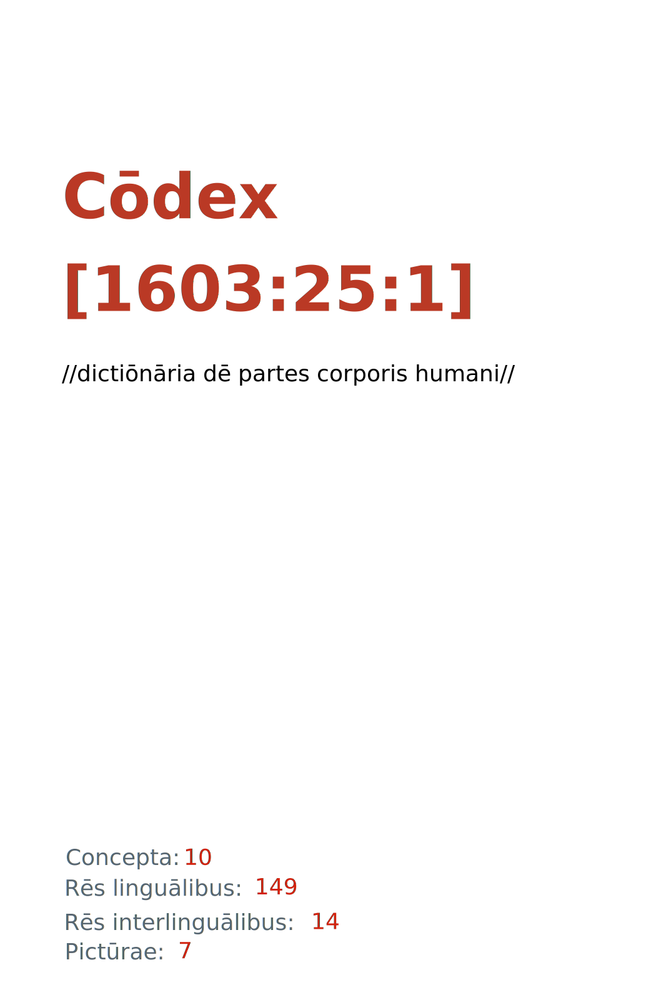

= Cōdex [1603:25:1]: //dictiōnāria dē partes corporis humani//
:doctype: book
:title: Cōdex [1603:25:1]: //dictiōnāria dē partes corporis humani//
:lang: la
:toc: macro
:toclevels: 5
:toc-title: Tabula contentorum
:table-caption: Tabula
:figure-caption: Pictūra
:example-caption: Exemplum
:last-update-label: Renovatio
:version-label: Versiō
:appendix-caption: Appendix
:source-highlighter: rouge
:warning-caption: Hic sunt dracones
:tip-caption: Commendātum
:front-cover-image: : //dictiōnāria dē partes corporis humani//",1050,1600]

{nbsp} +
{nbsp} +
[quote]
**Dedicação ao Domínio Público significa que cada grande problema comum só precisa ser resolvido uma vez**

'''

[%header,cols="25h,~a"]
|===
|
Rēs interlinguālibus
|
Factum

|
scrīptor
|
Multiplicēs scrīptōribus

|
/cōdex pūblicandī/
|
EticaAI

|
/publication date/@eng-Latn
|
2022-01-27

|
numerus editionis
|
2022-05-02T05:26:40

|
/SPDX license ID/@eng-Latn
|
CC-PDDC

|
/reference URL/@eng-Latn
|
https://github.com/EticaAI/multilingual-lexicography/issues/11

|===

ifndef::backend-epub3[]
<<<
toc::[]
<<<
endif::[]

[id=0_999_1603_1]
== Praefātiō 

Rēs linguālibus (1)::
  Lingua Anglica (Abecedarium Latinum):::
    _**Cōdex [1603:25:1]**_ é o formato de livro dos dados estruturados legíveis por máquina do grupo de dicionários _**[1603:25:1] //dictiōnāria dē partes corporis humani//**_, que são distribuídos para os implementadores usarem em aplicativos externos. Este livro pretende ser um recurso avançado para outros lexicógrafos e tradutores de terminologia, inclusive para detectar e relatar inconsistências. Ele pode, no entanto, ser usado como um dicionário ad hoc se não houver trabalho derivado focado em suas necessidades específicas.
    +++  +++
    **SOBRE LEXICOGRAFIA**
    +++  +++
    A lexicografia prática é a arte ou ofício de compilar, escrever e editar dicionários. O básico não é muito diferente de um milênio atrás: ainda é um trabalho muito humano e criativo. É preciso ser humilde: a maioria dos erros de tradutores, na verdade, não é culpa do tradutor, mas falhas metodológicas. Certificar-se de uma ideia de origem do que um conceito representa, mesmo que signifique reescrever e simplificar, anexar fotos, mostrar exemplos, fazer o que for para que seja entendido, faz com que até mesmo tradutores não profissionais que se preocupam com sua própria língua entreguem melhor resultados do que qualquer alternativa. Em outras palavras: mesmo as chamadas melhores práticas da indústria de pagar tradutores e revisores profissionais não podem superar termos de origem já mal explicados.
    +++  +++
    **SOBRE TIPOS DE DICIONÁRIOS QUE ESTAMOS COMPILANDO**
    +++  +++
    Estamos preocupados com um grupo de idéias (chamamos isso de grupo de dicionários de conceitos) que podem ser divididos em partes menores, revisados quanto a inconsistências, aprimorados para definições e depois traduzidos por voluntários. Códigos interlinguais, como o que poderia ser usado na troca de dados real, também são adicionados a cada conceito. Ambos os glossários, interfaces de usuário (como rótulos na coleta de dados) e, em alguns casos, até códigos padrão para o que iria em um campo de dados podem ser compilados dessa maneira.
    +++  +++
    Como a lista completa de dicionários-prototípicos e dicionários minimamente utilizáveis é enorme, um modo de citar público-alvos típicos é o seguinte:
    +++  +++
    . Ajuda humanitária
    . Ajuda ao desenvolvimento
    . Direitos humanos
    . Socorro militar (ou conceitos relacionados a conflitos e resolução de conflitos)
    +++  +++
    Os itens 1, 2 e 4 https://en.m.wikipedia.org/wiki/Humanitarian-Development_Nexus[são algumas vezes referidos como _nexus_] e são frequentemente encontrados ajudando _crise humanitária_. Já que a maioria dos colaboradores cujas ideias e críticas válidas são voluntárias, então 3 (direitos humanos, como na Anistia Internacional) para diferenciar do humanitarismo (como o Movimento da Cruz Vermelha é referência).
    +++  +++
    Observe que **dicionários não são guias de uso**. As instruções, quando existem, são principalmente dedicadas a lexicógrafos e tradutores.
    +++  +++
    **/PRO BONŌ PUBLICŌ/@lat-Latn**
    +++  +++
    As pessoas lexicógrafas deste trabalho são voluntárias, fazendo-o gratuitamente, pro bonō publicō, e não aceitam doações por causa dos dicionários reutilizáveis ​​de todos. O trabalho anterior existente muitas vezes é baseado em livros antigos de domínio público. A maioria dos tradutores de terminologia já seriam voluntários porque acreditam em uma causa. A melhor maneira de inspirar a colaboração é sermos nós mesmos exemplos.
    +++  +++
    Há um aspecto não moralista, bastante simples de entender: quão caro seria pagar pelo trabalho de todos considerando que é viável em mais de 200 idiomas? A logística para decidir quem deve ser pago, depois a transferência de dinheiro em todo o mundo (pode incluir pessoas de países embargados), depois os mecanismos tradicionais de auditoria para verificar o uso indevido que os doadores esperam, existe? Em terminologia especial (os próprios termos do dicionário) e tantas línguas, não existe dinheiro suficiente nem humanos interessados ​​em ser coordenadores.

<<<

== Methodī ex cōdice
=== Methodī ex dictiōnāriōrum corde
Rēs interlinguālibus (1)::
  /scope and content/@eng-Latn:::
    This Numerodinatio namespace contains dictionaries related to general human body parts. Latin (while a natural language) actually is used as interlingual code. It's mostly based on Basle Nomina Anatomica 1895 ("BNA1895") and, if any difference, archaic terms are replaced with Terminologia Anatomica 95 ("TA95").
    +++  +++
    Compared to BNA1895 and TA95, 1603:25:1 is a very small subset, mostly a map to external body parts.

=== Methodī ex verbīs in dictiōnāriīs
NOTE: /No momento, não há fluxo de trabalho para usar https://www.wikidata.org/wiki/Wikidata:Lexicographical_data[Wikidata lexicographical data], que na verdade poderia ser usado como armazenamento para nomenclatura mais rigorosa. As implementações atuais usam apenas conceitos do Wikidata, os Q-items./@eng-Latn

==== Methodī ex verbīs in Vicidata (Q modō)
Rēs linguālibus (1)::
  Lingua Anglica (Abecedarium Latinum):::
    O ***[1603:25:1] //dictiōnāria dē partes corporis humani//*** usa o Wikidata como uma estratégia para conciliar termos linguísticos para um ou mais de seus conceitos.
    +++  +++
    Isso significa que este livro e os arquivos de dados de dicionários relacionados requerem atualizações periódicas para , no mínimo, sincronize e compartilhe novamente as traduções atualizadas.
    +++  +++
    **Qual a confiabilidade das traduções da comunidade (fonte Wikidata)?**
    +++  +++
    A resposta curta padrão é: **elas são confiáveis**, mesmo nos casos de não haver traduções oficiais para cada assunto.
    +++  +++
    Como referência, é provável que um tradutor profissional (sem acesso à Wikipedia ou bases de terminologia interna das organizações de controle) forneça resultados de qualidade inferior se você fizer testes cegos. Isso é possível porque não apenas o público médio, mas também terminólogos e tradutores profissionais ajudam a Wikipédia (e implicitamente o Wikidata).
    +++  +++
    No entanto, mesmo quando o resultado está correto, a versão atual precisa de diferenciação aprimorada, no mínimo, sigla e forma longa . Para grandes organizações, existem recursos como __P1813 nomes curtos__, mas ainda não foram compilados com o conjunto de dados atual.
    +++  +++
    **Os principais motivos para "traduções erradas" não são culpa dos tradutores**
    +++  +++
    DICA: Como regra geral, para conceitos já muito definidos em que você, como humano, pode verificar manualmente um ou mais termos traduzidos como um resultado decente, as outras traduções provavelmente serão aceitáveis. Dicionários com casos extremos (como nomes de territórios em disputa) teriam mais explicações.
    +++  +++
    A principal razão para "traduções erradas" são conceitos mal definidos usados ​​para explicar aos tradutores da comunidade como gerar traduções de terminologia. Isso tornaria as traduções existentes do Wikidata (usadas não apenas por nós) inconsistentes. A segunda razão é se os dicionários usam traduções para conceitos sem uma correspondência estrita; em outras palavras, se fizermos definições mais estritas do que significa conceito, mas reutilizarmos termos menos exatos da Wikidada. Também há problemas quando idiomas inteiros são codificados com códigos errados. Observe que todos esses casos **traduções erradas NÃO são estritamente culpa do tradutor, mas sim da lexicografia**.
    +++  +++
    Ainda é possível ter erros estritos no nível de tradução. Mas mesmo que indiquemos aos usuários como corrigir o Wikidata/Wikipedia (com base na melhor explicação contextual de um conceito, como este livro), os requisitos para dizer que o termo anterior foi objetivamente um erro de tradução humana errado (se seguir nossa seriedade na construção de dicionário) são muito elevados.
    +++  +++
    Do ponto de vista da conciliação de dados, a seguinte metodologia é utilizada para publicar as traduções da terminologia com a tabela de conceitos principais.
    +++  +++
    . A principal tabela lexicográfica artesanal (explicada no tópico anterior), também fornecida em `1603_25_1.no1.tm.hxl.csv`, pode fazer referência ao Wiki QID.
    . Cada QID exclusivo de `1603_25_1.no1.tm.hxl.csv`, juntamente com códigos de idioma de [`1603:1:51`] (que requer conhecimento de idiomas humanos), é usado para preparar uma consulta SPARQL otimizada para execução em https://query.wikidata.org/[Wikidata Query Service]. A consulta é tão grande que não é viável para links "Try it" (URL longo), como https://www.wikidata.org/wiki/Wikidata:SPARQL_query_service/queries/examples[como o que você encontraria nos Tutoriais Wikidata ], ***mas*** funciona!
    .. Note que o conhecimento é gratuito, as traduções estão lá, mas as necessidades humanitárias multilíngues podem faltar pessoas para preparar os arquivos e compartilhar do que para uso geral.
    . O resultado da consulta, com todos os QIDs e rótulos de termos, é compartilhado como `1603_25_1.wikiq.tm.hxl.csv`
    . As traduções revisadas pela comunidade de cada QID singular são pré-compiladas em um arquivo individual `1603_25_1.wikiq.tm.hxl.csv`
    . `1603_25_1.no1.tm.hxl.csv` mais `1603_25_1.wikiq.tm.hxl.csv` criado `1603_25_1.no11.tm.hxl.csv`

=== Rēs dē factō in dictiōnāriīs
==== Concepta: 10

==== Rēs linguālibus: 147

[%header,cols="15h,25a,~,17"]
|===
|
Cōdex linguae
|
Glotto cōdicī +++ +++ ISO 639-3 +++ +++ Wiki QID cōdicī
|
Nōmen Latīnum
|
Concepta

|
ara-Arab
|
https://glottolog.org/resource/languoid/id/arab1395[arab1395]
+++ +++
https://iso639-3.sil.org/code/ara[ara]
+++ +++ https://www.wikidata.org/wiki/Q13955[Q13955]
|
Macrolingua Arabica (Abecedarium Arabicum)
|
8

|
hye-Armn
|
https://glottolog.org/resource/languoid/id/nucl1235[nucl1235]
+++ +++
https://iso639-3.sil.org/code/hye[hye]
+++ +++ https://www.wikidata.org/wiki/Q8785[Q8785]
|
Lingua Armenia (Alphabetum Armenium)
|
5

|
ben-Beng
|
https://glottolog.org/resource/languoid/id/beng1280[beng1280]
+++ +++
https://iso639-3.sil.org/code/ben[ben]
+++ +++ https://www.wikidata.org/wiki/Q9610[Q9610]
|
Lingua Bengali (/ISO 15924 Beng/)
|
5

|
rus-Cyrl
|
https://glottolog.org/resource/languoid/id/russ1263[russ1263]
+++ +++
https://iso639-3.sil.org/code/rus[rus]
+++ +++ https://www.wikidata.org/wiki/Q7737[Q7737]
|
Lingua Russica (Abecedarium Cyrillicum)
|
7

|
hin-Deva
|
https://glottolog.org/resource/languoid/id/hind1269[hind1269]
+++ +++
https://iso639-3.sil.org/code/hin[hin]
+++ +++ https://www.wikidata.org/wiki/Q1568[Q1568]
|
Lingua Hindica (Devanāgarī)
|
6

|
kat-Geor
|
https://glottolog.org/resource/languoid/id/nucl1302[nucl1302]
+++ +++
https://iso639-3.sil.org/code/kat[kat]
+++ +++ https://www.wikidata.org/wiki/Q8108[Q8108]
|
Lingua Georgiana (Abecedarium Georgianum)
|
3

|
pan-Guru
|
https://glottolog.org/resource/languoid/id/panj1256[panj1256]
+++ +++
https://iso639-3.sil.org/code/pan[pan]
+++ +++ https://www.wikidata.org/wiki/Q58635[Q58635]
|
Lingua Paniabica (/ISO 15924 Guru/)
|
2

|
kan-Knda
|
https://glottolog.org/resource/languoid/id/nucl1305[nucl1305]
+++ +++
https://iso639-3.sil.org/code/kan[kan]
+++ +++ https://www.wikidata.org/wiki/Q33673[Q33673]
|
Lingua Cannadica (/ISO 15924 Knda/)
|
5

|
kor-Hang
|
https://glottolog.org/resource/languoid/id/kore1280[kore1280]
+++ +++
https://iso639-3.sil.org/code/kor[kor]
+++ +++ https://www.wikidata.org/wiki/Q9176[Q9176]
|
Lingua Coreana (Abecedarium Coreanum)
|
6

|
lzh-Hant
|
https://glottolog.org/resource/languoid/id/lite1248[lite1248]
+++ +++
https://iso639-3.sil.org/code/lzh[lzh]
+++ +++ https://www.wikidata.org/wiki/Q37041[Q37041]
|
Lingua Sinica classica (/ISO 15924 Hant/)
|
2

|
heb-Hebr
|
https://glottolog.org/resource/languoid/id/hebr1245[hebr1245]
+++ +++
https://iso639-3.sil.org/code/heb[heb]
+++ +++ https://www.wikidata.org/wiki/Q9288[Q9288]
|
Lingua Hebraica (Alphabetum Hebraicum)
|
7

|
lat-Latn
|
https://glottolog.org/resource/languoid/id/lati1261[lati1261]
+++ +++
https://iso639-3.sil.org/code/lat[lat]
+++ +++ https://www.wikidata.org/wiki/Q397[Q397]
|
Lingua Latina (Abecedarium Latinum)
|
8

|
sat-Olck
|
https://glottolog.org/resource/languoid/id/sant1410[sant1410]
+++ +++
https://iso639-3.sil.org/code/sat[sat]
+++ +++ https://www.wikidata.org/wiki/Q33965[Q33965]
|
Lingua Santali (/ISO 15924 Olck/)
|
3

|
ori-Orya
|

+++ +++
https://iso639-3.sil.org/code/ori[ori]
+++ +++ https://www.wikidata.org/wiki/Q33810[Q33810]
|
Macrolingua Orissensis (/ISO 15924 Orya/)
|
2

|
sin-Sinh
|
https://glottolog.org/resource/languoid/id/sinh1246[sinh1246]
+++ +++
https://iso639-3.sil.org/code/sin[sin]
+++ +++ https://www.wikidata.org/wiki/Q13267[Q13267]
|
Lingua Singhalensis (/ISO 15924 Sinh/)
|
1

|
tam-Taml
|
https://glottolog.org/resource/languoid/id/tami1289[tami1289]
+++ +++
https://iso639-3.sil.org/code/tam[tam]
+++ +++ https://www.wikidata.org/wiki/Q5885[Q5885]
|
Lingua Tamulica (/ISO 15924 Taml/)
|
3

|
tel-Telu
|
https://glottolog.org/resource/languoid/id/telu1262[telu1262]
+++ +++
https://iso639-3.sil.org/code/tel[tel]
+++ +++ https://www.wikidata.org/wiki/Q8097[Q8097]
|
Lingua Telingana (/ISO 15924 Telu/)
|
6

|
div-Thaa
|
https://glottolog.org/resource/languoid/id/dhiv1236[dhiv1236]
+++ +++
https://iso639-3.sil.org/code/div[div]
+++ +++ https://www.wikidata.org/wiki/Q32656[Q32656]
|
Lingua Dhivehi (/ISO 15924 Thaa/)
|
1

|
tha-Thai
|
https://glottolog.org/resource/languoid/id/thai1261[thai1261]
+++ +++
https://iso639-3.sil.org/code/tha[tha]
+++ +++ https://www.wikidata.org/wiki/Q9217[Q9217]
|
Lingua Thai (/ISO 15924 Thai/)
|
6

|
bod-Tibt
|
https://glottolog.org/resource/languoid/id/tibe1272[tibe1272]
+++ +++
https://iso639-3.sil.org/code/bod[bod]
+++ +++ https://www.wikidata.org/wiki/Q34271[Q34271]
|
Lingua Tibetana (Scriptura Tibetana)
|
2

|
san-Zyyy
|
https://glottolog.org/resource/languoid/id/sans1269[sans1269]
+++ +++
https://iso639-3.sil.org/code/san[san]
+++ +++ https://www.wikidata.org/wiki/Q11059[Q11059]
|
Lingua Sanscrita (/ISO 15924 Zyyy/)
|
5

|
zho-Zyyy
|
https://glottolog.org/resource/languoid/id/sini1245[sini1245]
+++ +++
https://iso639-3.sil.org/code/zho[zho]
+++ +++ https://www.wikidata.org/wiki/Q7850[Q7850]
|
/Macrolingua Sinicae (/ISO 15924 Zyyy/)/
|
7

|
por-Latn
|
https://glottolog.org/resource/languoid/id/port1283[port1283]
+++ +++
https://iso639-3.sil.org/code/por[por]
+++ +++ https://www.wikidata.org/wiki/Q5146[Q5146]
|
Lingua Lusitana (Abecedarium Latinum)
|
8

|
eng-Latn
|
https://glottolog.org/resource/languoid/id/stan1293[stan1293]
+++ +++
https://iso639-3.sil.org/code/eng[eng]
+++ +++ https://www.wikidata.org/wiki/Q1860[Q1860]
|
Lingua Anglica (Abecedarium Latinum)
|
11

|
fra-Latn
|
https://glottolog.org/resource/languoid/id/stan1290[stan1290]
+++ +++
https://iso639-3.sil.org/code/fra[fra]
+++ +++ https://www.wikidata.org/wiki/Q150[Q150]
|
Lingua Francogallica (Abecedarium Latinum)
|
8

|
nld-Latn
|
https://glottolog.org/resource/languoid/id/mode1257[mode1257]
+++ +++
https://iso639-3.sil.org/code/nld[nld]
+++ +++ https://www.wikidata.org/wiki/Q7411[Q7411]
|
Lingua Batavica (Abecedarium Latinum)
|
7

|
deu-Latn
|
https://glottolog.org/resource/languoid/id/stan1295[stan1295]
+++ +++
https://iso639-3.sil.org/code/deu[deu]
+++ +++ https://www.wikidata.org/wiki/Q188[Q188]
|
Lingua Germanica (Abecedarium Latinum)
|
8

|
spa-Latn
|
https://glottolog.org/resource/languoid/id/stan1288[stan1288]
+++ +++
https://iso639-3.sil.org/code/spa[spa]
+++ +++ https://www.wikidata.org/wiki/Q1321[Q1321]
|
Lingua Hispanica (Abecedarium Latinum)
|
8

|
ita-Latn
|
https://glottolog.org/resource/languoid/id/ital1282[ital1282]
+++ +++
https://iso639-3.sil.org/code/ita[ita]
+++ +++ https://www.wikidata.org/wiki/Q652[Q652]
|
Lingua Italiana (Abecedarium Latinum)
|
8

|
gle-Latn
|
https://glottolog.org/resource/languoid/id/iris1253[iris1253]
+++ +++
https://iso639-3.sil.org/code/gle[gle]
+++ +++ https://www.wikidata.org/wiki/Q9142[Q9142]
|
Lingua Hibernica (Abecedarium Latinum)
|
5

|
swe-Latn
|
https://glottolog.org/resource/languoid/id/swed1254[swed1254]
+++ +++
https://iso639-3.sil.org/code/swe[swe]
+++ +++ https://www.wikidata.org/wiki/Q9027[Q9027]
|
Lingua Suecica (Abecedarium Latinum)
|
7

|
sqi-Latn
|
https://glottolog.org/resource/languoid/id/alba1267[alba1267]
+++ +++
https://iso639-3.sil.org/code/sqi[sqi]
+++ +++ https://www.wikidata.org/wiki/Q8748[Q8748]
|
Macrolingua Albanica (/Abecedarium Latinum/)
|
2

|
pol-Latn
|
https://glottolog.org/resource/languoid/id/poli1260[poli1260]
+++ +++
https://iso639-3.sil.org/code/pol[pol]
+++ +++ https://www.wikidata.org/wiki/Q809[Q809]
|
Lingua Polonica (Abecedarium Latinum)
|
8

|
fin-Latn
|
https://glottolog.org/resource/languoid/id/finn1318[finn1318]
+++ +++
https://iso639-3.sil.org/code/fin[fin]
+++ +++ https://www.wikidata.org/wiki/Q1412[Q1412]
|
Lingua Finnica (Abecedarium Latinum)
|
7

|
ron-Latn
|
https://glottolog.org/resource/languoid/id/roma1327[roma1327]
+++ +++
https://iso639-3.sil.org/code/ron[ron]
+++ +++ https://www.wikidata.org/wiki/Q7913[Q7913]
|
Lingua Dacoromanica (Abecedarium Latinum)
|
5

|
vie-Latn
|
https://glottolog.org/resource/languoid/id/viet1252[viet1252]
+++ +++
https://iso639-3.sil.org/code/vie[vie]
+++ +++ https://www.wikidata.org/wiki/Q9199[Q9199]
|
Lingua Vietnamensis (Abecedarium Latinum)
|
7

|
cat-Latn
|
https://glottolog.org/resource/languoid/id/stan1289[stan1289]
+++ +++
https://iso639-3.sil.org/code/cat[cat]
+++ +++ https://www.wikidata.org/wiki/Q7026[Q7026]
|
Lingua Catalana (Abecedarium Latinum)
|
8

|
ukr-Cyrl
|
https://glottolog.org/resource/languoid/id/ukra1253[ukra1253]
+++ +++
https://iso639-3.sil.org/code/ukr[ukr]
+++ +++ https://www.wikidata.org/wiki/Q8798[Q8798]
|
Lingua Ucrainica (Abecedarium Cyrillicum)
|
7

|
bul-Cyrl
|
https://glottolog.org/resource/languoid/id/bulg1262[bulg1262]
+++ +++
https://iso639-3.sil.org/code/bul[bul]
+++ +++ https://www.wikidata.org/wiki/Q7918[Q7918]
|
Lingua Bulgarica (Abecedarium Cyrillicum)
|
6

|
slv-Latn
|
https://glottolog.org/resource/languoid/id/slov1268[slov1268]
+++ +++
https://iso639-3.sil.org/code/slv[slv]
+++ +++ https://www.wikidata.org/wiki/Q9063[Q9063]
|
Lingua Slovena (Abecedarium Latinum)
|
4

|
war-Latn
|
https://glottolog.org/resource/languoid/id/wara1300[wara1300]
+++ +++
https://iso639-3.sil.org/code/war[war]
+++ +++ https://www.wikidata.org/wiki/Q34279[Q34279]
|
/Waray language/ (Abecedarium Latinum)
|
5

|
nob-Latn
|
https://glottolog.org/resource/languoid/id/norw1259[norw1259]
+++ +++
https://iso639-3.sil.org/code/nob[nob]
+++ +++ https://www.wikidata.org/wiki/Q25167[Q25167]
|
/Bokmål/ (Abecedarium Latinum)
|
7

|
ces-Latn
|
https://glottolog.org/resource/languoid/id/czec1258[czec1258]
+++ +++
https://iso639-3.sil.org/code/ces[ces]
+++ +++ https://www.wikidata.org/wiki/Q9056[Q9056]
|
Lingua Bohemica (Abecedarium Latinum)
|
7

|
dan-Latn
|
https://glottolog.org/resource/languoid/id/dani1285[dani1285]
+++ +++
https://iso639-3.sil.org/code/dan[dan]
+++ +++ https://www.wikidata.org/wiki/Q9035[Q9035]
|
Lingua Danica (Abecedarium Latinum)
|
7

|
jpn-Jpan
|
https://glottolog.org/resource/languoid/id/nucl1643[nucl1643]
+++ +++
https://iso639-3.sil.org/code/jpn[jpn]
+++ +++ https://www.wikidata.org/wiki/Q5287[Q5287]
|
Lingua Iaponica (Scriptura Iaponica)
|
8

|
nno-Latn
|
https://glottolog.org/resource/languoid/id/norw1262[norw1262]
+++ +++
https://iso639-3.sil.org/code/nno[nno]
+++ +++ https://www.wikidata.org/wiki/Q25164[Q25164]
|
/Nynorsk/ (Abecedarium Latinum)
|
8

|
mal-Mlym
|
https://glottolog.org/resource/languoid/id/mala1464[mala1464]
+++ +++
https://iso639-3.sil.org/code/mal[mal]
+++ +++ https://www.wikidata.org/wiki/Q36236[Q36236]
|
Lingua Malabarica (/Malayalam script/)
|
1

|
ind-Latn
|
https://glottolog.org/resource/languoid/id/indo1316[indo1316]
+++ +++
https://iso639-3.sil.org/code/ind[ind]
+++ +++ https://www.wikidata.org/wiki/Q9240[Q9240]
|
Lingua Indonesiana (Abecedarium Latinum)
|
6

|
fas-Zyyy
|

+++ +++
https://iso639-3.sil.org/code/fas[fas]
+++ +++ https://www.wikidata.org/wiki/Q9168[Q9168]
|
Macrolingua Persica (//Abecedarium Arabicum//)
|
7

|
hun-Latn
|
https://glottolog.org/resource/languoid/id/hung1274[hung1274]
+++ +++
https://iso639-3.sil.org/code/hun[hun]
+++ +++ https://www.wikidata.org/wiki/Q9067[Q9067]
|
Lingua Hungarica (Abecedarium Latinum)
|
6

|
eus-Latn
|
https://glottolog.org/resource/languoid/id/basq1248[basq1248]
+++ +++
https://iso639-3.sil.org/code/eus[eus]
+++ +++ https://www.wikidata.org/wiki/Q8752[Q8752]
|
Lingua Vasconica (Abecedarium Latinum)
|
7

|
cym-Latn
|
https://glottolog.org/resource/languoid/id/wels1247[wels1247]
+++ +++
https://iso639-3.sil.org/code/cym[cym]
+++ +++ https://www.wikidata.org/wiki/Q9309[Q9309]
|
Lingua Cambrica (Abecedarium Latinum)
|
6

|
glg-Latn
|
https://glottolog.org/resource/languoid/id/gali1258[gali1258]
+++ +++
https://iso639-3.sil.org/code/glg[glg]
+++ +++ https://www.wikidata.org/wiki/Q9307[Q9307]
|
Lingua Gallaica (Abecedarium Latinum)
|
7

|
slk-Latn
|
https://glottolog.org/resource/languoid/id/slov1269[slov1269]
+++ +++
https://iso639-3.sil.org/code/slk[slk]
+++ +++ https://www.wikidata.org/wiki/Q9058[Q9058]
|
Lingua Slovaca (Abecedarium Latinum)
|
5

|
epo-Latn
|
https://glottolog.org/resource/languoid/id/espe1235[espe1235]
+++ +++
https://iso639-3.sil.org/code/epo[epo]
+++ +++ https://www.wikidata.org/wiki/Q143[Q143]
|
Lingua Esperantica (Abecedarium Latinum)
|
7

|
msa-Zyyy
|

+++ +++
https://iso639-3.sil.org/code/msa[msa]
+++ +++ https://www.wikidata.org/wiki/Q9237[Q9237]
|
Macrolingua Malayana (/ISO 15924 Zyyy/)
|
5

|
est-Latn
|

+++ +++
https://iso639-3.sil.org/code/est[est]
+++ +++ https://www.wikidata.org/wiki/Q9072[Q9072]
|
Macrolingua Estonica (Abecedarium Latinum)
|
6

|
hrv-Latn
|
https://glottolog.org/resource/languoid/id/croa1245[croa1245]
+++ +++
https://iso639-3.sil.org/code/hrv[hrv]
+++ +++ https://www.wikidata.org/wiki/Q6654[Q6654]
|
Lingua Croatica (Abecedarium Latinum)
|
6

|
tur-Latn
|
https://glottolog.org/resource/languoid/id/nucl1301[nucl1301]
+++ +++
https://iso639-3.sil.org/code/tur[tur]
+++ +++ https://www.wikidata.org/wiki/Q256[Q256]
|
Lingua Turcica (Abecedarium Latinum)
|
6

|
nds-Latn
|
https://glottolog.org/resource/languoid/id/lowg1239[lowg1239]
+++ +++
https://iso639-3.sil.org/code/nds[nds]
+++ +++ https://www.wikidata.org/wiki/Q25433[Q25433]
|
Lingua Saxonica (Abecedarium Latinum)
|
4

|
oci-Latn
|
https://glottolog.org/resource/languoid/id/occi1239[occi1239]
+++ +++
https://iso639-3.sil.org/code/oci[oci]
+++ +++ https://www.wikidata.org/wiki/Q14185[Q14185]
|
Lingua Occitana (Abecedarium Latinum)
|
4

|
bre-Latn
|
https://glottolog.org/resource/languoid/id/bret1244[bret1244]
+++ +++
https://iso639-3.sil.org/code/bre[bre]
+++ +++ https://www.wikidata.org/wiki/Q12107[Q12107]
|
Lingua Britonica (Abecedarium Latinum)
|
5

|
afr-Latn
|
https://glottolog.org/resource/languoid/id/afri1274[afri1274]
+++ +++
https://iso639-3.sil.org/code/afr[afr]
+++ +++ https://www.wikidata.org/wiki/Q14196[Q14196]
|
Lingua Batava Capitensis (Abecedarium Latinum)
|
4

|
ltz-Latn
|
https://glottolog.org/resource/languoid/id/luxe1241[luxe1241]
+++ +++
https://iso639-3.sil.org/code/ltz[ltz]
+++ +++ https://www.wikidata.org/wiki/Q9051[Q9051]
|
Lingua Luxemburgensis (Abecedarium Latinum)
|
2

|
sco-Latn
|
https://glottolog.org/resource/languoid/id/scot1243[scot1243]
+++ +++
https://iso639-3.sil.org/code/sco[sco]
+++ +++ https://www.wikidata.org/wiki/Q14549[Q14549]
|
Lingua Scotica quae Teutonica (Abecedarium Latinum)
|
1

|
bar-Latn
|
https://glottolog.org/resource/languoid/id/bava1246[bava1246]
+++ +++
https://iso639-3.sil.org/code/bar[bar]
+++ +++ https://www.wikidata.org/wiki/Q29540[Q29540]
|
Lingua Bavarica (Abecedarium Latinum)
|
1

|
arg-Latn
|
https://glottolog.org/resource/languoid/id/arag1245[arag1245]
+++ +++
https://iso639-3.sil.org/code/arg[arg]
+++ +++ https://www.wikidata.org/wiki/Q8765[Q8765]
|
Lingua Aragonensis (Abecedarium Latinum)
|
5

|
zho-Hant
|

+++ +++
https://iso639-3.sil.org/code/zho[zho]
+++ +++ https://www.wikidata.org/wiki/Q18130932[Q18130932]
|
//Traditional Chinese// (/ISO 15924 Hant/)
|
4

|
cos-Latn
|
https://glottolog.org/resource/languoid/id/cors1241[cors1241]
+++ +++
https://iso639-3.sil.org/code/cos[cos]
+++ +++ https://www.wikidata.org/wiki/Q33111[Q33111]
|
Lingua Corsica (Abecedarium Latinum)
|
1

|
isl-Latn
|
https://glottolog.org/resource/languoid/id/icel1247[icel1247]
+++ +++
https://iso639-3.sil.org/code/isl[isl]
+++ +++ https://www.wikidata.org/wiki/Q294[Q294]
|
Lingua Islandica (Abecedarium Latinum)
|
4

|
scn-Latn
|
https://glottolog.org/resource/languoid/id/sici1248[sici1248]
+++ +++
https://iso639-3.sil.org/code/scn[scn]
+++ +++ https://www.wikidata.org/wiki/Q33973[Q33973]
|
Lingua Sicula (Abecedarium Latinum)
|
3

|
gla-Latn
|
https://glottolog.org/resource/languoid/id/scot1245[scot1245]
+++ +++
https://iso639-3.sil.org/code/gla[gla]
+++ +++ https://www.wikidata.org/wiki/Q9314[Q9314]
|
Lingua Scotica seu Scotica Gadelica (Abecedarium Latinum)
|
4

|
lim-Latn
|
https://glottolog.org/resource/languoid/id/limb1263[limb1263]
+++ +++
https://iso639-3.sil.org/code/lim[lim]
+++ +++ https://www.wikidata.org/wiki/Q102172[Q102172]
|
Lingua Limburgica (Abecedarium Latinum)
|
1

|
wln-Latn
|
https://glottolog.org/resource/languoid/id/wall1255[wall1255]
+++ +++
https://iso639-3.sil.org/code/wln[wln]
+++ +++ https://www.wikidata.org/wiki/Q34219[Q34219]
|
Lingua Vallonica (Abecedarium Latinum)
|
1

|
srp-Latn
|
https://glottolog.org/resource/languoid/id/serb1264[serb1264]
+++ +++
https://iso639-3.sil.org/code/srp[srp]
+++ +++ https://www.wikidata.org/wiki/Q21161949[Q21161949]
|
/Serbian/ (Abecedarium Latinum)
|
3

|
vls-Latn
|
https://glottolog.org/resource/languoid/id/vlaa1240[vlaa1240]
+++ +++
https://iso639-3.sil.org/code/vls[vls]
+++ +++ https://www.wikidata.org/wiki/Q100103[Q100103]
|
/West Flemish/ (Abecedarium Latinum)
|
2

|
wuu-Zyyy
|
https://glottolog.org/resource/languoid/id/wuch1236[wuch1236]
+++ +++
https://iso639-3.sil.org/code/wuu[wuu]
+++ +++ https://www.wikidata.org/wiki/Q34290[Q34290]
|
//Macrolingua Wu// (/ISO 15924 Zyyy/)
|
6

|
srp-Cyrl
|
https://glottolog.org/resource/languoid/id/serb1264[serb1264]
+++ +++
https://iso639-3.sil.org/code/srp[srp]
+++ +++ https://www.wikidata.org/wiki/Q9299[Q9299]
|
Lingua Serbica (Abecedarium Cyrillicum)
|
7

|
urd-Arab
|
https://glottolog.org/resource/languoid/id/urdu1245[urdu1245]
+++ +++
https://iso639-3.sil.org/code/urd[urd]
+++ +++ https://www.wikidata.org/wiki/Q1617[Q1617]
|
Lingua Urdu (Abecedarium Arabicum)
|
3

|
gan-Zyyy
|
https://glottolog.org/resource/languoid/id/ganc1239[ganc1239]
+++ +++
https://iso639-3.sil.org/code/gan[gan]
+++ +++ https://www.wikidata.org/wiki/Q33475[Q33475]
|
Lingua Gan (/ISO 15924 Zyyy/)
|
1

|
lit-Latn
|
https://glottolog.org/resource/languoid/id/lith1251[lith1251]
+++ +++
https://iso639-3.sil.org/code/lit[lit]
+++ +++ https://www.wikidata.org/wiki/Q9083[Q9083]
|
Lingua Lithuanica (Abecedarium Latinum)
|
7

|
hbs-Latn
|
https://glottolog.org/resource/languoid/id/sout1528[sout1528]
+++ +++
https://iso639-3.sil.org/code/hbs[hbs]
+++ +++ https://www.wikidata.org/wiki/Q9301[Q9301]
|
Macrolingua Serbocroatica (Abecedarium Latinum)
|
5

|
lav-Latn
|
https://glottolog.org/resource/languoid/id/latv1249[latv1249]
+++ +++
https://iso639-3.sil.org/code/lav[lav]
+++ +++ https://www.wikidata.org/wiki/Q9078[Q9078]
|
Macrolingua Lettonica (Abecedarium Latinum)
|
6

|
bos-Latn
|
https://glottolog.org/resource/languoid/id/bosn1245[bosn1245]
+++ +++
https://iso639-3.sil.org/code/bos[bos]
+++ +++ https://www.wikidata.org/wiki/Q9303[Q9303]
|
Lingua Bosnica (Abecedarium Latinum)
|
3

|
azb-Arab
|
https://glottolog.org/resource/languoid/id/sout2697[sout2697]
+++ +++
https://iso639-3.sil.org/code/azb[azb]
+++ +++ https://www.wikidata.org/wiki/Q3449805[Q3449805]
|
/South Azerbaijani/ (Abecedarium Arabicum)
|
1

|
jav-Latn
|
https://glottolog.org/resource/languoid/id/java1254[java1254]
+++ +++
https://iso639-3.sil.org/code/jav[jav]
+++ +++ https://www.wikidata.org/wiki/Q33549[Q33549]
|
Lingua Iavanica (Abecedarium Latinum)
|
3

|
ell-Grek
|
https://glottolog.org/resource/languoid/id/mode1248[mode1248]
+++ +++
https://iso639-3.sil.org/code/ell[ell]
+++ +++ https://www.wikidata.org/wiki/Q36510[Q36510]
|
Lingua Neograeca (Alphabetum Graecum)
|
5

|
sun-Latn
|
https://glottolog.org/resource/languoid/id/sund1252[sund1252]
+++ +++
https://iso639-3.sil.org/code/sun[sun]
+++ +++ https://www.wikidata.org/wiki/Q34002[Q34002]
|
/Sundanese language/ (Abecedarium Latinum)
|
2

|
fry-Latn
|
https://glottolog.org/resource/languoid/id/west2354[west2354]
+++ +++
https://iso639-3.sil.org/code/fry[fry]
+++ +++ https://www.wikidata.org/wiki/Q27175[Q27175]
|
Lingua Frisice occidentalis (Abecedarium Latinum)
|
3

|
bel-Cyrl
|
https://glottolog.org/resource/languoid/id/bela1254[bela1254]
+++ +++
https://iso639-3.sil.org/code/bel[bel]
+++ +++ https://www.wikidata.org/wiki/Q9091[Q9091]
|
Lingua Ruthenica Alba (Abecedarium Cyrillicum)
|
6

|
kab-Latn
|
https://glottolog.org/resource/languoid/id/kaby1243[kaby1243]
+++ +++
https://iso639-3.sil.org/code/kab[kab]
+++ +++ https://www.wikidata.org/wiki/Q35853[Q35853]
|
/Kabyle language/ (Abecedarium Latinum)
|
5

|
lmo-Latn
|
https://glottolog.org/resource/languoid/id/lomb1257[lomb1257]
+++ +++
https://iso639-3.sil.org/code/lmo[lmo]
+++ +++ https://www.wikidata.org/wiki/Q33754[Q33754]
|
Langobardus sermo (Abecedarium Latinum)
|
2

|
mar-Deva
|
https://glottolog.org/resource/languoid/id/mara1378[mara1378]
+++ +++
https://iso639-3.sil.org/code/mar[mar]
+++ +++ https://www.wikidata.org/wiki/Q1571[Q1571]
|
Lingua Marathica (Devanāgarī)
|
1

|
ast-Latn
|
https://glottolog.org/resource/languoid/id/astu1245[astu1245]
+++ +++
https://iso639-3.sil.org/code/ast[ast]
+++ +++ https://www.wikidata.org/wiki/Q29507[Q29507]
|
Lingua Asturiana (Abecedarium Latinum)
|
4

|
cdo-Zyyy
|
https://glottolog.org/resource/languoid/id/mind1253[mind1253]
+++ +++
https://iso639-3.sil.org/code/cdo[cdo]
+++ +++ https://www.wikidata.org/wiki/Q36455[Q36455]
|
/Min Dong Chinese/ (/ISO 15924 Zyyy/)
|
4

|
diq-Latn
|
https://glottolog.org/resource/languoid/id/diml1238[diml1238]
+++ +++
https://iso639-3.sil.org/code/diq[diq]
+++ +++ https://www.wikidata.org/wiki/Q10199[Q10199]
|
Lingua Zazaca (Abecedarium Latinum)
|
3

|
ext-Latn
|
https://glottolog.org/resource/languoid/id/extr1243[extr1243]
+++ +++
https://iso639-3.sil.org/code/ext[ext]
+++ +++ https://www.wikidata.org/wiki/Q30007[Q30007]
|
Lingua Extremadurensis (Abecedarium Latinum)
|
1

|
hak-Zyyy
|
https://glottolog.org/resource/languoid/id/hakk1236[hakk1236]
+++ +++
https://iso639-3.sil.org/code/hak[hak]
+++ +++ https://www.wikidata.org/wiki/Q33375[Q33375]
|
/Hakka Chinese/ (/ISO 15924 Zyyy/)
|
3

|
hsb-Latn
|
https://glottolog.org/resource/languoid/id/uppe1395[uppe1395]
+++ +++
https://iso639-3.sil.org/code/hsb[hsb]
+++ +++ https://www.wikidata.org/wiki/Q13248[Q13248]
|
/Upper Sorbian/ (Abecedarium Latinum)
|
3

|
ilo-Latn
|
https://glottolog.org/resource/languoid/id/ilok1237[ilok1237]
+++ +++
https://iso639-3.sil.org/code/ilo[ilo]
+++ +++ https://www.wikidata.org/wiki/Q35936[Q35936]
|
Lingua Ilocana (Abecedarium Latinum)
|
1

|
mzn-Arab
|
https://glottolog.org/resource/languoid/id/maza1291[maza1291]
+++ +++
https://iso639-3.sil.org/code/mzn[mzn]
+++ +++ https://www.wikidata.org/wiki/Q13356[Q13356]
|
/Mazanderani language/ (Abecedarium Arabicum)
|
3

|
nah-Latn
|

+++ +++
https://iso639-3.sil.org/code/nah[nah]
+++ +++ https://www.wikidata.org/wiki/Q13300[Q13300]
|
Lingua Navatlaca (Abecedarium Latinum)
|
1

|
nan-Latn
|
https://glottolog.org/resource/languoid/id/minn1241[minn1241]
+++ +++
https://iso639-3.sil.org/code/nan[nan]
+++ +++ https://www.wikidata.org/wiki/Q36495[Q36495]
|
/Min Nan Chinese/ (Abecedarium Latinum)
|
5

|
new-Deva
|
https://glottolog.org/resource/languoid/id/newa1246[newa1246]
+++ +++
https://iso639-3.sil.org/code/new[new]
+++ +++ https://www.wikidata.org/wiki/Q33979[Q33979]
|
Lingua Newari (Devanāgarī)
|
1

|
pam-Latn
|
https://glottolog.org/resource/languoid/id/pamp1243[pamp1243]
+++ +++
https://iso639-3.sil.org/code/pam[pam]
+++ +++ https://www.wikidata.org/wiki/Q36121[Q36121]
|
/Kapampangan language/ (Abecedarium Latinum)
|
2

|
pnb-Arab
|
https://glottolog.org/resource/languoid/id/west2386[west2386]
+++ +++
https://iso639-3.sil.org/code/pnb[pnb]
+++ +++ https://www.wikidata.org/wiki/Q1389492[Q1389492]
|
Lingua Paniabica occidentalis (Abecedarium Arabicum)
|
1

|
sgs-Latn
|
https://glottolog.org/resource/languoid/id/samo1265[samo1265]
+++ +++
https://iso639-3.sil.org/code/sgs[sgs]
+++ +++ https://www.wikidata.org/wiki/Q213434[Q213434]
|
Lingua Samogitica (Abecedarium Latinum)
|
3

|
shi-Zyyy
|
https://glottolog.org/resource/languoid/id/tach1250[tach1250]
+++ +++
https://iso639-3.sil.org/code/shi[shi]
+++ +++ https://www.wikidata.org/wiki/Q34152[Q34152]
|
Shilha language (/ISO 15924 Zyyy/)
|
3

|
vep-Latn
|
https://glottolog.org/resource/languoid/id/veps1250[veps1250]
+++ +++
https://iso639-3.sil.org/code/vep[vep]
+++ +++ https://www.wikidata.org/wiki/Q32747[Q32747]
|
Lingua Vepsica (Abecedarium Latinum)
|
2

|
yue-Zyyy
|
https://glottolog.org/resource/languoid/id/yuec1235[yuec1235]
+++ +++
https://iso639-3.sil.org/code/yue[yue]
+++ +++ https://www.wikidata.org/wiki/Q7033959[Q7033959]
|
Lingua Yue (/ISO 15924 Zyyy/)
|
8

|
swa-Latn
|

+++ +++
https://iso639-3.sil.org/code/swa[swa]
+++ +++ https://www.wikidata.org/wiki/Q7838[Q7838]
|
Macrolingua Suahelica (Abecedarium Latinum)
|
4

|
zha-Zyyy
|
https://glottolog.org/resource/languoid/id/nort3180[nort3180]
+++ +++
https://iso639-3.sil.org/code/zha[zha]
+++ +++ https://www.wikidata.org/wiki/Q13216[Q13216]
|
/Zhuang languages/ (/ISO 15924 Zyyy/)
|
3

|
yid-Hebr
|
https://glottolog.org/resource/languoid/id/yidd1255[yidd1255]
+++ +++
https://iso639-3.sil.org/code/yid[yid]
+++ +++ https://www.wikidata.org/wiki/Q8641[Q8641]
|
Macrolingua Iudaeo-Germanica (Alphabetum Hebraicum)
|
4

|
xho-Latn
|
https://glottolog.org/resource/languoid/id/xhos1239[xhos1239]
+++ +++
https://iso639-3.sil.org/code/xho[xho]
+++ +++ https://www.wikidata.org/wiki/Q13218[Q13218]
|
Lingua Xosana (Abecedarium Latinum)
|
1

|
uzb-Latn
|
https://glottolog.org/resource/languoid/id/uzbe1247[uzbe1247]
+++ +++
https://iso639-3.sil.org/code/uzb[uzb]
+++ +++ https://www.wikidata.org/wiki/Q9264[Q9264]
|
Macrolingua Uzbecica (Abecedarium Latinum)
|
3

|
uig-Zyyy
|
https://glottolog.org/resource/languoid/id/uigh1240[uigh1240]
+++ +++
https://iso639-3.sil.org/code/uig[uig]
+++ +++ https://www.wikidata.org/wiki/Q13263[Q13263]
|
Lingua Uigurica (/ISO 15924 Zyyy/)
|
5

|
tat-Zyyy
|
https://glottolog.org/resource/languoid/id/tata1255[tata1255]
+++ +++
https://iso639-3.sil.org/code/tat[tat]
+++ +++ https://www.wikidata.org/wiki/Q25285[Q25285]
|
Lingua Tatarica (/ISO 15924 Zyyy/)
|
2

|
tat-Cyrl
|
https://glottolog.org/resource/languoid/id/tata1255[tata1255]
+++ +++
https://iso639-3.sil.org/code/tat[tat]
+++ +++ https://www.wikidata.org/wiki/Q39132549[Q39132549]
|
Lingua Tatarica (Abecedarium Cyrillicum)
|
2

|
tgl-Latn
|
https://glottolog.org/resource/languoid/id/taga1270[taga1270]
+++ +++
https://iso639-3.sil.org/code/tgl[tgl]
+++ +++ https://www.wikidata.org/wiki/Q34057[Q34057]
|
Lingua Tagalog (Abecedarium Latinum)
|
6

|
ava-Cyrl
|
https://glottolog.org/resource/languoid/id/avar1256[avar1256]
+++ +++
https://iso639-3.sil.org/code/ava[ava]
+++ +++ https://www.wikidata.org/wiki/Q29561[Q29561]
|
Lingua Avarica (Abecedarium Cyrillicum)
|
6

|
aze-Latn
|

+++ +++
https://iso639-3.sil.org/code/aze[aze]
+++ +++ https://www.wikidata.org/wiki/Q9292[Q9292]
|
Macrolingua Atropatenica (Abecedarium Latinum)
|
5

|
bak-Cyrl
|
https://glottolog.org/resource/languoid/id/bash1264[bash1264]
+++ +++
https://iso639-3.sil.org/code/bak[bak]
+++ +++ https://www.wikidata.org/wiki/Q13389[Q13389]
|
Lingua Baschkirica (Abecedarium Cyrillicum)
|
1

|
chv-Cyrl
|
https://glottolog.org/resource/languoid/id/chuv1255[chuv1255]
+++ +++
https://iso639-3.sil.org/code/chv[chv]
+++ +++ https://www.wikidata.org/wiki/Q33348[Q33348]
|
Lingua Tschuvaschica (Abecedarium Cyrillicum)
|
5

|
grn-Latn
|

+++ +++
https://iso639-3.sil.org/code/grn[grn]
+++ +++ https://www.wikidata.org/wiki/Q35876[Q35876]
|
Macrolingua Guaranica (Abecedarium Latinum)
|
4

|
glv-Latn
|
https://glottolog.org/resource/languoid/id/manx1243[manx1243]
+++ +++
https://iso639-3.sil.org/code/glv[glv]
+++ +++ https://www.wikidata.org/wiki/Q12175[Q12175]
|
Lingua Monensis (Abecedarium Latinum)
|
1

|
hat-Latn
|
https://glottolog.org/resource/languoid/id/hait1244[hait1244]
+++ +++
https://iso639-3.sil.org/code/hat[hat]
+++ +++ https://www.wikidata.org/wiki/Q33491[Q33491]
|
Lingua creola Haitiana (Abecedarium Latinum)
|
3

|
xmf-Geor
|
https://glottolog.org/resource/languoid/id/ming1252[ming1252]
+++ +++
https://iso639-3.sil.org/code/xmf[xmf]
+++ +++ https://www.wikidata.org/wiki/Q13359[Q13359]
|
Lingua Mingrelica (Abecedarium Georgianum)
|
5

|
kaz-Zyyy
|
https://glottolog.org/resource/languoid/id/kaza1248[kaza1248]
+++ +++
https://iso639-3.sil.org/code/kaz[kaz]
+++ +++ https://www.wikidata.org/wiki/Q9252[Q9252]
|
Lingua Kazachica (/ISO 15924 Zyyy/)
|
4

|
kaz-Arab
|
https://glottolog.org/resource/languoid/id/kaza1248[kaza1248]
+++ +++
https://iso639-3.sil.org/code/kaz[kaz]
+++ +++ https://www.wikidata.org/wiki/Q64362991[Q64362991]
|
Lingua Kazachica (Abecedarium Arabicum)
|
1

|
kaz-Cyrl
|
https://glottolog.org/resource/languoid/id/kaza1248[kaza1248]
+++ +++
https://iso639-3.sil.org/code/kaz[kaz]
+++ +++ https://www.wikidata.org/wiki/Q64362992[Q64362992]
|
Lingua Kazachica (Abecedarium Cyrillicum)
|
1

|
kaz-Latn
|
https://glottolog.org/resource/languoid/id/kaza1248[kaza1248]
+++ +++
https://iso639-3.sil.org/code/kaz[kaz]
+++ +++ https://www.wikidata.org/wiki/Q64362993[Q64362993]
|
Lingua Kazachica (Abecedarium Latinum)
|
1

|
kur-Zyyy
|
https://glottolog.org/resource/languoid/id/kurd1259[kurd1259]
+++ +++
https://iso639-3.sil.org/code/kur[kur]
+++ +++ https://www.wikidata.org/wiki/Q36368[Q36368]
|
Macrolingua Curdica (/ISO 15924 Zyyy/)
|
4

|
kur-Arab
|

+++ +++
https://iso639-3.sil.org/code/kur[kur]
+++ +++ https://www.wikidata.org/wiki/Q64362996[Q64362996]
|
Macrolingua Curdica (Abecedarium Arabicum)
|
2

|
kur-Latn
|

+++ +++
https://iso639-3.sil.org/code/kur[kur]
+++ +++ https://www.wikidata.org/wiki/Q64362997[Q64362997]
|
Macrolingua Curdica (Abecedarium Latinum)
|
2

|
ckb-Arab
|
https://glottolog.org/resource/languoid/id/cent1972[cent1972]
+++ +++
https://iso639-3.sil.org/code/ckb[ckb]
+++ +++ https://www.wikidata.org/wiki/Q36811[Q36811]
|
/Central Kurdish/ (Abecedarium Arabicum)
|
4

|
kir-Zyyy
|
https://glottolog.org/resource/languoid/id/kirg1245[kirg1245]
+++ +++
https://iso639-3.sil.org/code/kir[kir]
+++ +++ https://www.wikidata.org/wiki/Q9255[Q9255]
|
Lingua Kyrgyzensis (/ISO 15924 Zyyy/)
|
2

|
lin-Latn
|
https://glottolog.org/resource/languoid/id/ling1263[ling1263]
+++ +++
https://iso639-3.sil.org/code/lin[lin]
+++ +++ https://www.wikidata.org/wiki/Q36217[Q36217]
|
/Lingala/ (Abecedarium Latinum)
|
4

|
mkd-Cyrl
|
https://glottolog.org/resource/languoid/id/mace1250[mace1250]
+++ +++
https://iso639-3.sil.org/code/mkd[mkd]
+++ +++ https://www.wikidata.org/wiki/Q9296[Q9296]
|
Lingua Macedonica (Abecedarium Cyrillicum)
|
7

|
nep-Deva
|
https://glottolog.org/resource/languoid/id/east1436[east1436]
+++ +++
https://iso639-3.sil.org/code/nep[nep]
+++ +++ https://www.wikidata.org/wiki/Q33823[Q33823]
|
Macrolingua Nepalensis (Devanāgarī)
|
3

|
pus-Arab
|
https://glottolog.org/resource/languoid/id/nucl1276[nucl1276]
+++ +++
https://iso639-3.sil.org/code/pus[pus]
+++ +++ https://www.wikidata.org/wiki/Q58680[Q58680]
|
Macrolingua Afganica (Abecedarium Arabicum)
|
3

|
que-Latn
|

+++ +++
https://iso639-3.sil.org/code/que[que]
+++ +++ https://www.wikidata.org/wiki/Q5218[Q5218]
|
Macrolinguae Quechuae (Abecedarium Latinum)
|
4

|
sme-Latn
|
https://glottolog.org/resource/languoid/id/nort2671[nort2671]
+++ +++
https://iso639-3.sil.org/code/sme[sme]
+++ +++ https://www.wikidata.org/wiki/Q33947[Q33947]
|
Lingua Samica septentrionalis (Abecedarium Latinum)
|
1

|
sna-Latn
|
https://glottolog.org/resource/languoid/id/shon1251[shon1251]
+++ +++
https://iso639-3.sil.org/code/sna[sna]
+++ +++ https://www.wikidata.org/wiki/Q34004[Q34004]
|
/Shona/ (Abecedarium Latinum)
|
2

|
som-Latn
|
https://glottolog.org/resource/languoid/id/soma1255[soma1255]
+++ +++
https://iso639-3.sil.org/code/som[som]
+++ +++ https://www.wikidata.org/wiki/Q13275[Q13275]
|
Lingua Somalica (Abecedarium Latinum)
|
4

|
ina-Latn
|
https://glottolog.org/resource/languoid/id/inte1239[inte1239]
+++ +++
https://iso639-3.sil.org/code/ina[ina]
+++ +++ https://www.wikidata.org/wiki/Q35934[Q35934]
|
Interlingua (Abecedarium Latinum)
|
2

|
ido-Latn
|
https://glottolog.org/resource/languoid/id/idoo1234[idoo1234]
+++ +++
https://iso639-3.sil.org/code/ido[ido]
+++ +++ https://www.wikidata.org/wiki/Q35224[Q35224]
|
Ido (Abecedarium Latinum)
|
5

|
lfn-Latn
|
https://glottolog.org/resource/languoid/id/ling1267[ling1267]
+++ +++
https://iso639-3.sil.org/code/lfn[lfn]
+++ +++ https://www.wikidata.org/wiki/Q146803[Q146803]
|
Lingua Franca Nova (Abecedarium Latinum)
|
4

|===

==== Rēs interlinguālibus: 11
Rēs::
  /scope and content/@eng-Latn:::
    Rēs interlinguālibus::::
      /Wiki P/;;
        https://www.wikidata.org/wiki/Property:P7535[P7535]

      ix_hxlix;;
        ix_wikip7535

      ix_hxlvoc;;
        v_wiki_p_7535

    Rēs linguālibus::::
      Lingua Latina (Abecedarium Latinum);;
        +++/scope and content/@eng-Latn+++

      Lingua Anglica (Abecedarium Latinum);;
        +++a summary statement providing an overview of the archival collection+++

      Lingua Lusitana (Abecedarium Latinum);;
        +++uma declaração resumida fornecendo uma visão geral da coleção de arquivo+++

  Terminologia Anatomica 98 ID:::
    Rēs interlinguālibus::::
      /Wiki P/;;
        https://www.wikidata.org/wiki/Property:P1323[P1323]

      /rēgulam/;;
        A\d{2}\.\d\.\d{2}\.\d{3}[FM]?

      /formatter URL/@eng-Latn;;
        https://wikidata-externalid-url.toolforge.org/?p=1323&url_prefix=https:%2F%2Fwww.unifr.ch%2Fifaa%2FPublic%2FEntryPage%2FTA98%20Tree%2FEntity%20TA98%20EN%2F&url_suffix=%20Entity%20TA98%20EN.htm&id=$1

      ix_hxlix;;
        ix_wikip1323

      ix_hxlvoc;;
        v_wiki_p_1323

    Rēs linguālibus::::
      Lingua Latina (Abecedarium Latinum);;
        +++Terminologia Anatomica 98 ID+++

      Lingua Anglica (Abecedarium Latinum);;
        +++Terminologia Anatomica (1998 edition) human anatomical terminology identifier+++

      Lingua Lusitana (Abecedarium Latinum);;
        +++Terminologia Anatomica (edição de 1998) identificador de terminologia anatômica humana+++

  /SPDX license ID/@eng-Latn:::
    Rēs interlinguālibus::::
      /Wiki P/;;
        https://www.wikidata.org/wiki/Property:P2479[P2479]

      /rēgulam/;;
        [0-9A-Za-z\.\-]{3,36}[+]?

      /formatter URL/@eng-Latn;;
        https://spdx.org/licenses/$1.html

      ix_hxlix;;
        ix_wikip2479

      ix_hxlvoc;;
        v_wiki_p_2479

    Rēs linguālibus::::
      Lingua Latina (Abecedarium Latinum);;
        +++/SPDX license ID/@eng-Latn+++

      Lingua Anglica (Abecedarium Latinum);;
        +++SPDX license identifier+++

      Lingua Lusitana (Abecedarium Latinum);;
        +++identificador de licença SPDX+++

  numerus editionis:::
    Rēs interlinguālibus::::
      /Wiki P/;;
        https://www.wikidata.org/wiki/Property:P393[P393]

      ix_hxlix;;
        ix_wikip393

      ix_hxlvoc;;
        v_wiki_p_393

    Rēs linguālibus::::
      Lingua Latina (Abecedarium Latinum);;
        +++numerus editionis+++

      Lingua Anglica (Abecedarium Latinum);;
        +++number of an edition (first, second, ... as 1, 2, ...) or event+++

      Lingua Lusitana (Abecedarium Latinum);;
        +++número de uma edição (primeira, segunda, ... como 1, 2, ...) ou evento+++

  /Wiki QID/:::
    Rēs interlinguālibus::::
      /rēgulam/;;
        Q[1-9]\d*

      ix_hxlix;;
        ix_wikiq

      ix_hxlvoc;;
        v_wiki_q

    Rēs linguālibus::::
      Lingua Latina (Abecedarium Latinum);;
        +++/Wiki QID/+++

      Lingua Anglica (Abecedarium Latinum);;
        +++QID (or Q number) is the unique identifier of a data item on Wikidata, comprising the letter "Q" followed by one or more digits. It is used to help people and machines understand the difference between items with the same or similar names e.g there are several places in the world called London and many people called James Smith. This number appears next to the name at the top of each Wikidata item.+++

      Lingua Lusitana (Abecedarium Latinum);;
        +++QID (ou número Q) é o identificador único de um item de dados no Wikidata, composto pela letra "Q" seguida por um ou mais dígitos. Ele é usado para ajudar pessoas e máquinas a entender a diferença entre itens com nomes iguais ou semelhantes, por exemplo, existem vários lugares no mundo chamados Londres e muitas pessoas chamadas James Smith. Este número aparece ao lado do nome na parte superior de cada item do Wikidata.+++

  /publication date/@eng-Latn:::
    Rēs interlinguālibus::::
      /Wiki P/;;
        https://www.wikidata.org/wiki/Property:P577[P577]

      ix_hxlix;;
        ix_wikip577

      ix_hxlvoc;;
        v_wiki_p_577

    Rēs linguālibus::::
      Lingua Latina (Abecedarium Latinum);;
        +++/publication date/@eng-Latn+++

      Lingua Anglica (Abecedarium Latinum);;
        +++Date or point in time when a work was first published or released+++

      Lingua Lusitana (Abecedarium Latinum);;
        +++Data ou ponto no tempo em que um trabalho foi publicado ou lançado pela primeira vez+++

  /cōdex pūblicandī/:::
    Rēs interlinguālibus::::
      /Wiki P/;;
        https://www.wikidata.org/wiki/Property:P123[P123]

      ix_hxlix;;
        ix_wikip123

      ix_hxlvoc;;
        v_wiki_p_123

    Rēs linguālibus::::
      Lingua Latina (Abecedarium Latinum);;
        +++/cōdex pūblicandī/+++

      Lingua Anglica (Abecedarium Latinum);;
        +++organization or person responsible for publishing books, periodicals, printed music, podcasts, games or software+++

      Lingua Lusitana (Abecedarium Latinum);;
        +++organização ou pessoa responsável pela publicação de livros, periódicos, música impressa, podcasts, jogos ou software+++

  scrīptor:::
    Rēs interlinguālibus::::
      /Wiki P/;;
        https://www.wikidata.org/wiki/Property:P50[P50]

      ix_hxlix;;
        ix_wikip50

      ix_hxlvoc;;
        v_wiki_p_50

    Rēs linguālibus::::
      Lingua Latina (Abecedarium Latinum);;
        +++scrīptor+++

      Lingua Anglica (Abecedarium Latinum);;
        +++Main creator(s) of a written work (use on works, not humans)+++

      Lingua Lusitana (Abecedarium Latinum);;
        +++Principais criadores de uma obra escrita (uso em obras, não em humanos)+++

  /reference URL/@eng-Latn:::
    Rēs interlinguālibus::::
      /Wiki P/;;
        https://www.wikidata.org/wiki/Property:P854[P854]

      ix_hxlix;;
        ix_wikip854

      ix_hxlvoc;;
        v_wiki_p_854

    Rēs linguālibus::::
      Lingua Latina (Abecedarium Latinum);;
        +++/reference URL/@eng-Latn+++

      Lingua Anglica (Abecedarium Latinum);;
        +++should be used for Internet URLs as references+++

      Lingua Lusitana (Abecedarium Latinum);;
        +++deve ser usado para URLs da Internet como referências+++

<<<

== Archīa

Rēs linguālibus (1)::
  Lingua Anglica (Abecedarium Latinum):::
    **Informações de contexto**: ignorando por um momento o fato de ter várias traduções (e otimizadas para receber contribuições regularmente, não _apenas_ um trabalho estático), então a diferença real no fluxo de trabalho usado para gerar cada grupo de dicionários em um Cōdex como este é o seguinte fato: **fornecemos formatos de arquivos estruturados legíveis por máquina mesmo quando os equivalentes em _idiomas internacionais_, como o inglês, não possuem para áreas como ajuda humanitária, ajuda ao desenvolvimento e direitos humanos**. Os mais próximos desse multilinguismo (fora da Wikimedia) são o SEMIeu da União Europeia (até 24 idiomas), mas mesmo assim têm problemas ao compartilhar traduções em todos os idiomas. As traduções das Nações Unidas (até 6 idiomas, raramente mais) não estão disponíveis por agências humanitárias para ajudar nas traduções de terminologia.
    +++  +++
    **Implicação prática**: os documentos de texto em _Archīa prō cōdice_ (tradução literal em inglês: _File for book_) são alternativas a este formato de livro que são altamente automatizados usando apenas o formato de dados. No entanto, os formatos legíveis por máquina em _Archīa prō dictiōnāriīs_ (tradução literal em inglês: _Arquivos para dicionários_) são o foco e recomendados para trabalhos derivados e destinados a mitigar erros humanos adicionais. Podemos até criar novos formatos a pedido! O objetivo aqui é permitir tradutores de terminologia e uso de produção onde isso tenha um impacto positivo.

=== Archīa prō dictiōnāriīs: 4

==== 1603_25_1.no1.tm.hxl.csv

Rēs interlinguālibus::
  /download link/@eng-Latn::: link:1603_25_1.no1.tm.hxl.csv[1603_25_1.no1.tm.hxl.csv]
Rēs linguālibus::
  Lingua Anglica (Abecedarium Latinum):::
    /Numerordinatio no contêiner HXLTM/

==== 1603_25_1.no11.tm.hxl.csv

Rēs interlinguālibus::
  /download link/@eng-Latn::: link:1603_25_1.no11.tm.hxl.csv[1603_25_1.no11.tm.hxl.csv]
Rēs linguālibus::
  Lingua Anglica (Abecedarium Latinum):::
    /Numerordinatio no contêiner HXLTM (expandido com traduções de terminologia)/

==== 1603_25_1.wikiq.tm.hxl.csv

Rēs interlinguālibus::
  /download link/@eng-Latn::: link:1603_25_1.wikiq.tm.hxl.csv[1603_25_1.wikiq.tm.hxl.csv]
  /reference URL/@eng-Latn:::
    https://hxltm.etica.ai/

Rēs linguālibus::
  Lingua Anglica (Abecedarium Latinum):::
    Dialeto HXLTM do Padrão HXL em CSV RFC 4180. Resumidamente: wikiq significa que #item+conceptum+codicem são estritamente Wikidata QIDs.

==== 1603_25_1.no11.tbx

Rēs interlinguālibus::
  /download link/@eng-Latn::: link:1603_25_1.no11.tbx[1603_25_1.no11.tbx]
  /reference URL/@eng-Latn:::
    http://www.terminorgs.net/downloads/TBX_Basic_Version_3.1.pdf

Rēs linguālibus::
  Lingua Anglica (Abecedarium Latinum):::
    TBX-Basic é uma linguagem de marcação terminológica (TML) que é uma versão mais leve de TBX-Default, a TML que é definida na ISO 30042. TBX-Basic é projetada para o setor de localização e é baseada em informações de pesquisas e estudos que foram conduzida pelo LISA Term SIG sobre os tipos de dados de terminologia que o setor de localização exige.

==== 1603_25_1.no11.tmx

Rēs interlinguālibus::
  /download link/@eng-Latn::: link:1603_25_1.no11.tmx[1603_25_1.no11.tmx]
  /reference URL/@eng-Latn:::
    https://www.gala-global.org/tmx-14b

Rēs linguālibus::
  Lingua Anglica (Abecedarium Latinum):::
    O objetivo do formato Translation Memory eXchange (TMX) é fornecer um método padrão para descrever dados de memória de tradução que estão sendo trocados entre ferramentas e/ou fornecedores de tradução, ao mesmo tempo em que introduz pouca ou nenhuma perda de dados críticos durante o processo

=== Archīa prō cōdice: 1

==== 1603_25_1.mul-Latn.codex.adoc

Rēs interlinguālibus::
  /download link/@eng-Latn::: link:1603_25_1.mul-Latn.codex.adoc[1603_25_1.mul-Latn.codex.adoc]
  /reference URL/@eng-Latn:::
    https://docs.asciidoctor.org/

Rēs linguālibus::
  Lingua Anglica (Abecedarium Latinum):::
    AsciiDoc é um formato de autoria de texto simples (ou seja, linguagem de marcação leve) para escrever conteúdo técnico, como documentação, artigos e livros.

<<<

[.text-center]

Dictiōnāria initiīs

<<<

== //dictiōnāria dē partes corporis humani//
image::1603_25_1.~2/0~2.png[title="++Sine nomine++"]

Sine nomine

image::1603_25_1.~2/0~3.png[title="++Sine nomine++"]

Sine nomine

image::1603_25_1.~2/0~9.png[title="++Sine nomine++"]

Sine nomine

image::1603_25_1.~2/0~1.png[title="++Sine nomine++"]

Sine nomine

<<<

[id='1']
=== [`1`] Caput humanum

Rēs interlinguālibus (4)::
  Terminologia Anatomica 98 ID:::
    A01.1.00.001

  ix_hxlix:::
    ix_n1603n25n1caput

  ix_hxlvoc:::
    v_n1603_25_1_caput

  /Wiki QID/:::
    https://www.wikidata.org/wiki/Q3409626[Q3409626]

Rēs linguālibus (46)::
  Lingua Latina (Abecedarium Latinum):::
    +++caput+++

  Macrolingua Arabica (Abecedarium Arabicum):::
    +++رأس الإنسان+++

  Lingua Bengali (/ISO 15924 Beng/):::
    +++মানুষের মাথা+++

  Lingua Russica (Abecedarium Cyrillicum):::
    +++голова человека+++

  Lingua Cannadica (/ISO 15924 Knda/):::
    +++ಮಾನವನ ತಲೆ+++

  Lingua Hebraica (Alphabetum Hebraicum):::
    +++ראש אנושי+++

  Lingua Latina (Abecedarium Latinum):::
    +++Caput humanum+++

  Lingua Thai (/ISO 15924 Thai/):::
    +++ศรีษะมนุษย์+++

  Lingua Sanscrita (/ISO 15924 Zyyy/):::
    +++शिरः+++

  /Macrolingua Sinicae (/ISO 15924 Zyyy/)/:::
    +++人類頭部+++

  Lingua Lusitana (Abecedarium Latinum):::
    +++cabeça humana+++

  Lingua Anglica (Abecedarium Latinum):::
    +++human head+++

  Lingua Francogallica (Abecedarium Latinum):::
    +++tête humaine+++

  Lingua Batavica (Abecedarium Latinum):::
    +++menselijk hoofd+++

  Lingua Germanica (Abecedarium Latinum):::
    +++Kopf des Menschen+++

  Lingua Hispanica (Abecedarium Latinum):::
    +++cabeza humana+++

  Lingua Italiana (Abecedarium Latinum):::
    +++testa umana+++

  Lingua Suecica (Abecedarium Latinum):::
    +++människohuvud+++

  Lingua Polonica (Abecedarium Latinum):::
    +++głowa człowieka+++

  Lingua Vietnamensis (Abecedarium Latinum):::
    +++đầu người+++

  Lingua Catalana (Abecedarium Latinum):::
    +++cap humà+++

  Lingua Ucrainica (Abecedarium Cyrillicum):::
    +++голова людини+++

  /Bokmål/ (Abecedarium Latinum):::
    +++menneskehode+++

  Lingua Bohemica (Abecedarium Latinum):::
    +++hlava+++

  Lingua Danica (Abecedarium Latinum):::
    +++menneskehovede+++

  Lingua Iaponica (Scriptura Iaponica):::
    +++ヒトの頭+++

  /Nynorsk/ (Abecedarium Latinum):::
    +++menneskehovud+++

  Macrolingua Persica (//Abecedarium Arabicum//):::
    +++سر انسان+++

  Lingua Hungarica (Abecedarium Latinum):::
    +++emberi fej+++

  Lingua Cambrica (Abecedarium Latinum):::
    +++pen dynol+++

  Lingua Esperantica (Abecedarium Latinum):::
    +++homa kapo+++

  Macrolingua Malayana (/ISO 15924 Zyyy/):::
    +++kepala manusia+++

  //Traditional Chinese// (/ISO 15924 Hant/):::
    +++人類頭部+++

  Lingua Corsica (Abecedarium Latinum):::
    +++Capu+++

  /Serbian/ (Abecedarium Latinum):::
    +++ljudska glava+++

  Lingua Serbica (Abecedarium Cyrillicum):::
    +++људска глава+++

  Lingua Ruthenica Alba (Abecedarium Cyrillicum):::
    +++галава чалавека+++

  /Kabyle language/ (Abecedarium Latinum):::
    +++Aqerru+++

  /Upper Sorbian/ (Abecedarium Latinum):::
    +++hłowa+++

  Lingua Yue (/ISO 15924 Zyyy/):::
    +++人頭+++

  Lingua Tatarica (/ISO 15924 Zyyy/):::
    +++кеше башы+++

  Lingua Tatarica (Abecedarium Cyrillicum):::
    +++кеше башы+++

  Lingua Baschkirica (Abecedarium Cyrillicum):::
    +++кеше башы+++

  Lingua Macedonica (Abecedarium Cyrillicum):::
    +++човечка глава+++

  Macrolingua Afganica (Abecedarium Arabicum):::
    +++انساني کوپړۍ+++

  Interlingua (Abecedarium Latinum):::
    +++capite human+++

[id='1_1']
==== [`1_1`] sinciput

Rēs interlinguālibus (4)::
  Terminologia Anatomica 98 ID:::
    A01.1.00.002

  ix_hxlix:::
    ix_n1603n25n1sinciput

  ix_hxlvoc:::
    v_n1603_25_1_sinciput

  /Wiki QID/:::
    https://www.wikidata.org/wiki/Q41055[Q41055]

Rēs linguālibus (100)::
  Lingua Latina (Abecedarium Latinum):::
    +++sinciput+++

  Macrolingua Arabica (Abecedarium Arabicum):::
    +++جبهة+++

  Lingua Armenia (Alphabetum Armenium):::
    +++Ճակատ (մարմնի մաս)+++

  Lingua Bengali (/ISO 15924 Beng/):::
    +++কপাল+++

  Lingua Russica (Abecedarium Cyrillicum):::
    +++лоб+++

  Lingua Hindica (Devanāgarī):::
    +++ललाट+++

  Lingua Georgiana (Abecedarium Georgianum):::
    +++შუბლი+++

  Lingua Cannadica (/ISO 15924 Knda/):::
    +++ಹಣೆ+++

  Lingua Coreana (Abecedarium Coreanum):::
    +++이마+++

  Lingua Sinica classica (/ISO 15924 Hant/):::
    +++顙+++

  Lingua Hebraica (Alphabetum Hebraicum):::
    +++מצח+++

  Lingua Latina (Abecedarium Latinum):::
    +++sinciput+++

  Lingua Santali (/ISO 15924 Olck/):::
    +++ᱢᱚᱞᱚᱝ+++

  Lingua Telingana (/ISO 15924 Telu/):::
    +++నుదురు+++

  Lingua Dhivehi (/ISO 15924 Thaa/):::
    +++ނިއްކުރި+++

  Lingua Tibetana (Scriptura Tibetana):::
    +++དཔྲལ་བ།+++

  Lingua Sanscrita (/ISO 15924 Zyyy/):::
    +++ललाटम्+++

  /Macrolingua Sinicae (/ISO 15924 Zyyy/)/:::
    +++前额+++

  Lingua Lusitana (Abecedarium Latinum):::
    +++testa+++

  Lingua Anglica (Abecedarium Latinum):::
    +++forehead+++

  Lingua Francogallica (Abecedarium Latinum):::
    +++front+++

  Lingua Batavica (Abecedarium Latinum):::
    +++voorhoofd+++

  Lingua Germanica (Abecedarium Latinum):::
    +++Stirn+++

  Lingua Hispanica (Abecedarium Latinum):::
    +++frente+++

  Lingua Italiana (Abecedarium Latinum):::
    +++fronte+++

  Lingua Hibernica (Abecedarium Latinum):::
    +++Éadan+++

  Lingua Suecica (Abecedarium Latinum):::
    +++panna+++

  Lingua Polonica (Abecedarium Latinum):::
    +++czoło+++

  Lingua Finnica (Abecedarium Latinum):::
    +++otsa+++

  Lingua Dacoromanica (Abecedarium Latinum):::
    +++Frunte+++

  Lingua Vietnamensis (Abecedarium Latinum):::
    +++trán+++

  Lingua Catalana (Abecedarium Latinum):::
    +++front+++

  Lingua Ucrainica (Abecedarium Cyrillicum):::
    +++Чоло+++

  Lingua Bulgarica (Abecedarium Cyrillicum):::
    +++Чело+++

  /Waray language/ (Abecedarium Latinum):::
    +++Agtáng+++

  /Bokmål/ (Abecedarium Latinum):::
    +++panne+++

  Lingua Bohemica (Abecedarium Latinum):::
    +++čelo+++

  Lingua Danica (Abecedarium Latinum):::
    +++pande+++

  Lingua Iaponica (Scriptura Iaponica):::
    +++額+++

  /Nynorsk/ (Abecedarium Latinum):::
    +++panne+++

  Lingua Malabarica (/Malayalam script/):::
    +++നെറ്റി+++

  Lingua Indonesiana (Abecedarium Latinum):::
    +++Dahi+++

  Macrolingua Persica (//Abecedarium Arabicum//):::
    +++پیشانی+++

  Lingua Hungarica (Abecedarium Latinum):::
    +++Homlok+++

  Lingua Vasconica (Abecedarium Latinum):::
    +++Bekoki+++

  Lingua Cambrica (Abecedarium Latinum):::
    +++Talcen+++

  Lingua Gallaica (Abecedarium Latinum):::
    +++Testa+++

  Lingua Slovaca (Abecedarium Latinum):::
    +++Čelo+++

  Lingua Esperantica (Abecedarium Latinum):::
    +++frunto+++

  Macrolingua Malayana (/ISO 15924 Zyyy/):::
    +++dahi+++

  Macrolingua Estonica (Abecedarium Latinum):::
    +++Laup+++

  Lingua Croatica (Abecedarium Latinum):::
    +++Čelo+++

  Lingua Turcica (Abecedarium Latinum):::
    +++Alın+++

  Lingua Saxonica (Abecedarium Latinum):::
    +++Steern+++

  Lingua Occitana (Abecedarium Latinum):::
    +++Front+++

  Lingua Britonica (Abecedarium Latinum):::
    +++Tal+++

  Lingua Aragonensis (Abecedarium Latinum):::
    +++Frent+++

  Lingua Islandica (Abecedarium Latinum):::
    +++enni+++

  Lingua Sicula (Abecedarium Latinum):::
    +++Frunti+++

  Lingua Scotica seu Scotica Gadelica (Abecedarium Latinum):::
    +++Bathais+++

  //Macrolingua Wu// (/ISO 15924 Zyyy/):::
    +++额骨头+++

  Lingua Serbica (Abecedarium Cyrillicum):::
    +++Чело+++

  Lingua Urdu (Abecedarium Arabicum):::
    +++پیشانی+++

  Lingua Gan (/ISO 15924 Zyyy/):::
    +++天門+++

  Lingua Lithuanica (Abecedarium Latinum):::
    +++Kakta+++

  Macrolingua Serbocroatica (Abecedarium Latinum):::
    +++Čelo+++

  Macrolingua Lettonica (Abecedarium Latinum):::
    +++piere+++

  Lingua Iavanica (Abecedarium Latinum):::
    +++Bathuk+++

  Lingua Neograeca (Alphabetum Graecum):::
    +++μέτωπο+++

  Lingua Frisice occidentalis (Abecedarium Latinum):::
    +++Foarholle+++

  Lingua Ruthenica Alba (Abecedarium Cyrillicum):::
    +++Лоб+++

  Lingua Marathica (Devanāgarī):::
    +++कपाळ+++

  /Min Dong Chinese/ (/ISO 15924 Zyyy/):::
    +++Ngiăh+++

  Lingua Zazaca (Abecedarium Latinum):::
    +++Çare+++

  /Upper Sorbian/ (Abecedarium Latinum):::
    +++čoło+++

  /Mazanderani language/ (Abecedarium Arabicum):::
    +++سیال+++

  /Min Nan Chinese/ (Abecedarium Latinum):::
    +++Thâu-hia̍h+++

  /Kapampangan language/ (Abecedarium Latinum):::
    +++Kanwan+++

  Lingua Paniabica occidentalis (Abecedarium Arabicum):::
    +++متھا+++

  Lingua Samogitica (Abecedarium Latinum):::
    +++Kakta+++

  Shilha language (/ISO 15924 Zyyy/):::
    +++ignzi+++

  Lingua Yue (/ISO 15924 Zyyy/):::
    +++額頭+++

  Macrolingua Suahelica (Abecedarium Latinum):::
    +++Paji la uso+++

  Macrolingua Iudaeo-Germanica (Alphabetum Hebraicum):::
    +++שטערן+++

  Lingua Uigurica (/ISO 15924 Zyyy/):::
    +++ماڭلاي+++

  Lingua Tagalog (Abecedarium Latinum):::
    +++Noo+++

  Lingua Avarica (Abecedarium Cyrillicum):::
    +++Нодо+++

  Macrolingua Atropatenica (Abecedarium Latinum):::
    +++Alın+++

  Lingua Tschuvaschica (Abecedarium Cyrillicum):::
    +++Çамка+++

  Macrolingua Guaranica (Abecedarium Latinum):::
    +++Syva+++

  Lingua creola Haitiana (Abecedarium Latinum):::
    +++Fwon+++

  Lingua Mingrelica (Abecedarium Georgianum):::
    +++ჸვა+++

  /Central Kurdish/ (Abecedarium Arabicum):::
    +++تەوێڵ+++

  /Lingala/ (Abecedarium Latinum):::
    +++Eboló+++

  Lingua Macedonica (Abecedarium Cyrillicum):::
    +++чело+++

  Macrolinguae Quechuae (Abecedarium Latinum):::
    +++Mat'i+++

  Lingua Samica septentrionalis (Abecedarium Latinum):::
    +++gállu+++

  /Shona/ (Abecedarium Latinum):::
    +++Huma+++

  Lingua Somalica (Abecedarium Latinum):::
    +++Foodda+++

  Lingua Franca Nova (Abecedarium Latinum):::
    +++Fronte+++

[id='1_2']
==== [`1_2`] occiput

Rēs interlinguālibus (4)::
  Terminologia Anatomica 98 ID:::
    A01.1.00.003

  ix_hxlix:::
    ix_n1603n25n1occiput

  ix_hxlvoc:::
    v_n1603_25_1_occiput

  /Wiki QID/:::
    https://www.wikidata.org/wiki/Q3321315[Q3321315]

Rēs linguālibus (21)::
  Lingua Latina (Abecedarium Latinum):::
    +++occiput+++

  Macrolingua Arabica (Abecedarium Arabicum):::
    +++مؤخر الرأس+++

  Lingua Georgiana (Abecedarium Georgianum):::
    +++კეფა+++

  Lingua Latina (Abecedarium Latinum):::
    +++occiput+++

  Lingua Thai (/ISO 15924 Thai/):::
    +++ท้ายทอย+++

  Lingua Lusitana (Abecedarium Latinum):::
    +++Occipício+++

  Lingua Anglica (Abecedarium Latinum):::
    +++occiput+++

  Lingua Francogallica (Abecedarium Latinum):::
    +++occiput+++

  Lingua Germanica (Abecedarium Latinum):::
    +++Occiput+++

  Lingua Hispanica (Abecedarium Latinum):::
    +++Occipucio+++

  Lingua Italiana (Abecedarium Latinum):::
    +++occipite+++

  Lingua Polonica (Abecedarium Latinum):::
    +++Potylica+++

  Lingua Finnica (Abecedarium Latinum):::
    +++Takaraivo+++

  Lingua Catalana (Abecedarium Latinum):::
    +++Occípit+++

  Lingua Iaponica (Scriptura Iaponica):::
    +++後頭部+++

  /Nynorsk/ (Abecedarium Latinum):::
    +++bakhovud+++

  Lingua Vasconica (Abecedarium Latinum):::
    +++Okzipuzio+++

  Lingua Gallaica (Abecedarium Latinum):::
    +++Occipicio+++

  Lingua Lithuanica (Abecedarium Latinum):::
    +++Pakaušis+++

  Lingua Yue (/ISO 15924 Zyyy/):::
    +++後尾枕+++

  Lingua Mingrelica (Abecedarium Georgianum):::
    +++ოჸულე+++

<<<

[id='2']
=== [`2`] 

Rēs interlinguālibus (2)::
  ix_hxlix:::
    ix_n1603n25n1collum

  ix_hxlvoc:::
    v_n1603_25_1_collum

Rēs pictūrīs::
* **2~1**
+
image::1603_25_1.~1/2~1.png[title="++Sine nomine++"]

Rēs linguālibus (1)::
  Lingua Latina (Abecedarium Latinum):::
    +++collum+++

<<<

[id='3']
=== [`3`] Truncus

Rēs interlinguālibus (4)::
  Terminologia Anatomica 98 ID:::
    A01.1.00.013

  ix_hxlix:::
    ix_n1603n25n1truncus

  ix_hxlvoc:::
    v_n1603_25_1_truncus

  /Wiki QID/:::
    https://www.wikidata.org/wiki/Q160695[Q160695]

Rēs pictūrīs::
* **3~1**
+
image::1603_25_1.~1/3~1.gif[title="++Sine nomine++"]

Rēs linguālibus (74)::
  Lingua Latina (Abecedarium Latinum):::
    +++truncus+++

  Macrolingua Arabica (Abecedarium Arabicum):::
    +++جذع+++

  Lingua Russica (Abecedarium Cyrillicum):::
    +++туловище+++

  Lingua Hindica (Devanāgarī):::
    +++धड़+++

  Lingua Cannadica (/ISO 15924 Knda/):::
    +++ಮುಂಡ+++

  Lingua Coreana (Abecedarium Coreanum):::
    +++몸통+++

  Lingua Hebraica (Alphabetum Hebraicum):::
    +++גו+++

  Lingua Latina (Abecedarium Latinum):::
    +++Truncus+++

  Lingua Telingana (/ISO 15924 Telu/):::
    +++మొండెం+++

  Lingua Thai (/ISO 15924 Thai/):::
    +++ลำตัว+++

  /Macrolingua Sinicae (/ISO 15924 Zyyy/)/:::
    +++軀幹+++

  Lingua Lusitana (Abecedarium Latinum):::
    +++tronco+++

  Lingua Anglica (Abecedarium Latinum):::
    +++torso+++

  Lingua Francogallica (Abecedarium Latinum):::
    +++tronc+++

  Lingua Batavica (Abecedarium Latinum):::
    +++romp+++

  Lingua Germanica (Abecedarium Latinum):::
    +++Rumpf+++

  Lingua Hispanica (Abecedarium Latinum):::
    +++tronco+++

  Lingua Italiana (Abecedarium Latinum):::
    +++tronco+++

  Lingua Hibernica (Abecedarium Latinum):::
    +++Tóracs+++

  Lingua Suecica (Abecedarium Latinum):::
    +++torso+++

  Lingua Polonica (Abecedarium Latinum):::
    +++tułów+++

  Lingua Finnica (Abecedarium Latinum):::
    +++torso+++

  Lingua Dacoromanica (Abecedarium Latinum):::
    +++Trunchi+++

  Lingua Vietnamensis (Abecedarium Latinum):::
    +++thân mình+++

  Lingua Catalana (Abecedarium Latinum):::
    +++tronc+++

  Lingua Ucrainica (Abecedarium Cyrillicum):::
    +++Тулуб+++

  Lingua Bulgarica (Abecedarium Cyrillicum):::
    +++Туловище+++

  Lingua Slovena (Abecedarium Latinum):::
    +++Torzo+++

  /Bokmål/ (Abecedarium Latinum):::
    +++torso+++

  Lingua Bohemica (Abecedarium Latinum):::
    +++trup+++

  Lingua Danica (Abecedarium Latinum):::
    +++Torso+++

  Lingua Iaponica (Scriptura Iaponica):::
    +++胴体+++

  /Nynorsk/ (Abecedarium Latinum):::
    +++truncus+++

  Lingua Indonesiana (Abecedarium Latinum):::
    +++Trunkus+++

  Macrolingua Persica (//Abecedarium Arabicum//):::
    +++تنه+++

  Lingua Hungarica (Abecedarium Latinum):::
    +++Torzó+++

  Lingua Vasconica (Abecedarium Latinum):::
    +++Gorputz-enbor+++

  Lingua Gallaica (Abecedarium Latinum):::
    +++Tronco+++

  Lingua Slovaca (Abecedarium Latinum):::
    +++Trup+++

  Lingua Esperantica (Abecedarium Latinum):::
    +++torso+++

  Macrolingua Estonica (Abecedarium Latinum):::
    +++Kere+++

  Lingua Croatica (Abecedarium Latinum):::
    +++Torzo+++

  Lingua Turcica (Abecedarium Latinum):::
    +++Gövde+++

  Lingua Occitana (Abecedarium Latinum):::
    +++Tronc+++

  Lingua Batava Capitensis (Abecedarium Latinum):::
    +++Torso+++

  Lingua Aragonensis (Abecedarium Latinum):::
    +++Tronco+++

  //Traditional Chinese// (/ISO 15924 Hant/):::
    +++軀幹+++

  Lingua Scotica seu Scotica Gadelica (Abecedarium Latinum):::
    +++Colann+++

  /Serbian/ (Abecedarium Latinum):::
    +++Torzo+++

  //Macrolingua Wu// (/ISO 15924 Zyyy/):::
    +++躯干+++

  Lingua Serbica (Abecedarium Cyrillicum):::
    +++Торзо+++

  Lingua Urdu (Abecedarium Arabicum):::
    +++دھڑ+++

  Lingua Lithuanica (Abecedarium Latinum):::
    +++Liemuo+++

  Macrolingua Serbocroatica (Abecedarium Latinum):::
    +++Torzo+++

  Macrolingua Lettonica (Abecedarium Latinum):::
    +++rumpis+++

  Lingua Bosnica (Abecedarium Latinum):::
    +++Torzo+++

  /South Azerbaijani/ (Abecedarium Arabicum):::
    +++گؤوده(اینسان)+++

  Lingua Ruthenica Alba (Abecedarium Cyrillicum):::
    +++Тулава+++

  /Kabyle language/ (Abecedarium Latinum):::
    +++Igiger+++

  /Min Nan Chinese/ (Abecedarium Latinum):::
    +++Tōng-thé+++

  Lingua Yue (/ISO 15924 Zyyy/):::
    +++軀幹+++

  Macrolingua Suahelica (Abecedarium Latinum):::
    +++Kiwiliwili+++

  Lingua Xosana (Abecedarium Latinum):::
    +++Isibhukubhuku somzimba+++

  Lingua Uigurica (/ISO 15924 Zyyy/):::
    +++گەۋدە+++

  Lingua Tagalog (Abecedarium Latinum):::
    +++Punungkatawan+++

  Lingua Avarica (Abecedarium Cyrillicum):::
    +++Рачелкъай-2+++

  Lingua Tschuvaschica (Abecedarium Cyrillicum):::
    +++Çанçурăм+++

  Macrolingua Curdica (/ISO 15924 Zyyy/):::
    +++Laşqolik+++

  Macrolingua Curdica (Abecedarium Arabicum):::
    +++لاشقۆلک+++

  Macrolingua Curdica (Abecedarium Latinum):::
    +++Laşqolik+++

  Lingua Macedonica (Abecedarium Cyrillicum):::
    +++труп+++

  Macrolingua Afganica (Abecedarium Arabicum):::
    +++اتره+++

  Lingua Somalica (Abecedarium Latinum):::
    +++Ubuc+++

  Ido (Abecedarium Latinum):::
    +++Torso+++

[id='3_1']
==== [`3_1`] Pectus

Rēs interlinguālibus (4)::
  Terminologia Anatomica 98 ID:::
    A01.1.00.014

  ix_hxlix:::
    ix_n1603n25n1thorax

  ix_hxlvoc:::
    v_n1603_25_1_thorax

  /Wiki QID/:::
    https://www.wikidata.org/wiki/Q9645[Q9645]

Rēs linguālibus (105)::
  Lingua Latina (Abecedarium Latinum):::
    +++thorax+++

  Macrolingua Arabica (Abecedarium Arabicum):::
    +++صدر+++

  Lingua Armenia (Alphabetum Armenium):::
    +++Կրծքավանդակ+++

  Lingua Bengali (/ISO 15924 Beng/):::
    +++বক্ষ+++

  Lingua Russica (Abecedarium Cyrillicum):::
    +++грудная клетка+++

  Lingua Hindica (Devanāgarī):::
    +++छाती+++

  Lingua Paniabica (/ISO 15924 Guru/):::
    +++ਹਿੱਕ+++

  Lingua Cannadica (/ISO 15924 Knda/):::
    +++ಎದೆ+++

  Lingua Coreana (Abecedarium Coreanum):::
    +++가슴+++

  Lingua Hebraica (Alphabetum Hebraicum):::
    +++בית החזה+++

  Lingua Latina (Abecedarium Latinum):::
    +++Pectus+++

  Lingua Santali (/ISO 15924 Olck/):::
    +++ᱠᱚᱲᱟᱢ+++

  Macrolingua Orissensis (/ISO 15924 Orya/):::
    +++ଛାତି+++

  Lingua Tamulica (/ISO 15924 Taml/):::
    +++மார்பு+++

  Lingua Telingana (/ISO 15924 Telu/):::
    +++ఛాతీ+++

  Lingua Thai (/ISO 15924 Thai/):::
    +++ทรวงอก+++

  Lingua Tibetana (Scriptura Tibetana):::
    +++བྲང་ཁོག+++

  Lingua Sanscrita (/ISO 15924 Zyyy/):::
    +++वक्षःस्थलम्+++

  /Macrolingua Sinicae (/ISO 15924 Zyyy/)/:::
    +++胸部+++

  Lingua Lusitana (Abecedarium Latinum):::
    +++peito+++

  Lingua Anglica (Abecedarium Latinum):::
    +++thorax+++

  Lingua Francogallica (Abecedarium Latinum):::
    +++torse+++

  Lingua Batavica (Abecedarium Latinum):::
    +++Borstkas+++

  Lingua Germanica (Abecedarium Latinum):::
    +++Brust+++

  Lingua Hispanica (Abecedarium Latinum):::
    +++torso+++

  Lingua Italiana (Abecedarium Latinum):::
    +++petto+++

  Lingua Hibernica (Abecedarium Latinum):::
    +++Cliabhrach+++

  Lingua Suecica (Abecedarium Latinum):::
    +++bröst+++

  Lingua Polonica (Abecedarium Latinum):::
    +++klatka piersiowa+++

  Lingua Finnica (Abecedarium Latinum):::
    +++Rinta+++

  Lingua Vietnamensis (Abecedarium Latinum):::
    +++Ngực+++

  Lingua Catalana (Abecedarium Latinum):::
    +++tors+++

  Lingua Ucrainica (Abecedarium Cyrillicum):::
    +++грудна клітка+++

  Lingua Bulgarica (Abecedarium Cyrillicum):::
    +++гръден кош+++

  Lingua Slovena (Abecedarium Latinum):::
    +++Prsni koš+++

  /Waray language/ (Abecedarium Latinum):::
    +++Dughán+++

  /Bokmål/ (Abecedarium Latinum):::
    +++bryst+++

  Lingua Bohemica (Abecedarium Latinum):::
    +++hrudník+++

  Lingua Danica (Abecedarium Latinum):::
    +++Brystkasse+++

  Lingua Iaponica (Scriptura Iaponica):::
    +++胸+++

  /Nynorsk/ (Abecedarium Latinum):::
    +++bryst+++

  Lingua Indonesiana (Abecedarium Latinum):::
    +++Dada+++

  Macrolingua Persica (//Abecedarium Arabicum//):::
    +++سینه+++

  Lingua Hungarica (Abecedarium Latinum):::
    +++mellkas+++

  Lingua Vasconica (Abecedarium Latinum):::
    +++Torax+++

  Lingua Cambrica (Abecedarium Latinum):::
    +++Thoracs+++

  Lingua Gallaica (Abecedarium Latinum):::
    +++Peito+++

  Lingua Slovaca (Abecedarium Latinum):::
    +++Hrudník+++

  Lingua Esperantica (Abecedarium Latinum):::
    +++brusto+++

  Macrolingua Malayana (/ISO 15924 Zyyy/):::
    +++dada+++

  Macrolingua Estonica (Abecedarium Latinum):::
    +++rind+++

  Lingua Croatica (Abecedarium Latinum):::
    +++Prsni koš+++

  Lingua Turcica (Abecedarium Latinum):::
    +++göğüs+++

  Lingua Saxonica (Abecedarium Latinum):::
    +++Bost (Liev)+++

  Lingua Occitana (Abecedarium Latinum):::
    +++Torax+++

  Lingua Britonica (Abecedarium Latinum):::
    +++Bruched+++

  Lingua Batava Capitensis (Abecedarium Latinum):::
    +++bors+++

  Lingua Luxemburgensis (Abecedarium Latinum):::
    +++Broscht+++

  Lingua Aragonensis (Abecedarium Latinum):::
    +++Tórax+++

  Lingua Islandica (Abecedarium Latinum):::
    +++Frambolur+++

  Lingua Scotica seu Scotica Gadelica (Abecedarium Latinum):::
    +++Broilleach+++

  Lingua Vallonica (Abecedarium Latinum):::
    +++Cofe coistrece+++

  //Macrolingua Wu// (/ISO 15924 Zyyy/):::
    +++胸+++

  Lingua Serbica (Abecedarium Cyrillicum):::
    +++груди+++

  Lingua Urdu (Abecedarium Arabicum):::
    +++سینہ+++

  Lingua Lithuanica (Abecedarium Latinum):::
    +++Krūtinė+++

  Macrolingua Serbocroatica (Abecedarium Latinum):::
    +++Prsni koš+++

  Macrolingua Lettonica (Abecedarium Latinum):::
    +++krūškurvis+++

  Lingua Neograeca (Alphabetum Graecum):::
    +++θώρακας+++

  Lingua Ruthenica Alba (Abecedarium Cyrillicum):::
    +++грудная клетка+++

  /Kabyle language/ (Abecedarium Latinum):::
    +++Idmaren+++

  Lingua Asturiana (Abecedarium Latinum):::
    +++Tórax+++

  /Min Dong Chinese/ (/ISO 15924 Zyyy/):::
    +++Sĭng-găng+++

  /Hakka Chinese/ (/ISO 15924 Zyyy/):::
    +++Hiûng-thòng+++

  Lingua Ilocana (Abecedarium Latinum):::
    +++barukong+++

  /Mazanderani language/ (Abecedarium Arabicum):::
    +++سنه+++

  /Min Nan Chinese/ (Abecedarium Latinum):::
    +++Heng-khám+++

  Lingua Newari (Devanāgarī):::
    +++नुगःपा+++

  /Kapampangan language/ (Abecedarium Latinum):::
    +++Salu+++

  Lingua Samogitica (Abecedarium Latinum):::
    +++Krauklėnė+++

  Shilha language (/ISO 15924 Zyyy/):::
    +++idmarn+++

  Lingua Vepsica (Abecedarium Latinum):::
    +++Rind+++

  Lingua Yue (/ISO 15924 Zyyy/):::
    +++胸+++

  Macrolingua Suahelica (Abecedarium Latinum):::
    +++Kifua+++

  /Zhuang languages/ (/ISO 15924 Zyyy/):::
    +++Aek+++

  Macrolingua Iudaeo-Germanica (Alphabetum Hebraicum):::
    +++ברוסטקאסטן+++

  Macrolingua Uzbecica (Abecedarium Latinum):::
    +++Koʻkrak qafasi+++

  Lingua Uigurica (/ISO 15924 Zyyy/):::
    +++تۆش+++

  Lingua Tagalog (Abecedarium Latinum):::
    +++Dibdib+++

  Lingua Avarica (Abecedarium Cyrillicum):::
    +++Керен+++

  Macrolingua Atropatenica (Abecedarium Latinum):::
    +++toraks+++

  Macrolingua Guaranica (Abecedarium Latinum):::
    +++Pyti'a+++

  Lingua Monensis (Abecedarium Latinum):::
    +++Cleeau+++

  Lingua Kazachica (/ISO 15924 Zyyy/):::
    +++Көкірек қуысы анатомиясы+++

  Macrolingua Curdica (/ISO 15924 Zyyy/):::
    +++sing+++

  /Central Kurdish/ (Abecedarium Arabicum):::
    +++سینگ+++

  Lingua Kyrgyzensis (/ISO 15924 Zyyy/):::
    +++Көкүрөк+++

  /Lingala/ (Abecedarium Latinum):::
    +++Bontólo+++

  Lingua Macedonica (Abecedarium Cyrillicum):::
    +++Граден кош+++

  Macrolingua Nepalensis (Devanāgarī):::
    +++छाति+++

  Macrolinguae Quechuae (Abecedarium Latinum):::
    +++Qhasqu+++

  /Shona/ (Abecedarium Latinum):::
    +++Chipfuva+++

  Lingua Somalica (Abecedarium Latinum):::
    +++Sakaar+++

  Ido (Abecedarium Latinum):::
    +++Torako+++

  Lingua Franca Nova (Abecedarium Latinum):::
    +++Torax+++

[id='3_2']
==== [`3_2`] Abdomen

Rēs interlinguālibus (4)::
  Terminologia Anatomica 98 ID:::
    A01.1.00.016

  ix_hxlix:::
    ix_n1603n25n1abdomen

  ix_hxlvoc:::
    v_n1603_25_1_abdomen

  /Wiki QID/:::
    https://www.wikidata.org/wiki/Q9597[Q9597]

Rēs linguālibus (111)::
  Lingua Latina (Abecedarium Latinum):::
    +++abdomen+++

  Macrolingua Arabica (Abecedarium Arabicum):::
    +++بطن+++

  Lingua Armenia (Alphabetum Armenium):::
    +++Որովայն+++

  Lingua Bengali (/ISO 15924 Beng/):::
    +++উদর+++

  Lingua Russica (Abecedarium Cyrillicum):::
    +++живот+++

  Lingua Hindica (Devanāgarī):::
    +++उदर+++

  Lingua Cannadica (/ISO 15924 Knda/):::
    +++ಉದರ+++

  Lingua Coreana (Abecedarium Coreanum):::
    +++배+++

  Lingua Sinica classica (/ISO 15924 Hant/):::
    +++腹+++

  Lingua Hebraica (Alphabetum Hebraicum):::
    +++בטן+++

  Lingua Latina (Abecedarium Latinum):::
    +++Abdomen+++

  Lingua Tamulica (/ISO 15924 Taml/):::
    +++வயிறு+++

  Lingua Telingana (/ISO 15924 Telu/):::
    +++ఉదరము+++

  Lingua Thai (/ISO 15924 Thai/):::
    +++ท้อง+++

  Lingua Sanscrita (/ISO 15924 Zyyy/):::
    +++नाभिः+++

  /Macrolingua Sinicae (/ISO 15924 Zyyy/)/:::
    +++腹+++

  Lingua Lusitana (Abecedarium Latinum):::
    +++abdómen+++

  Lingua Anglica (Abecedarium Latinum):::
    +++abdomen+++

  Lingua Francogallica (Abecedarium Latinum):::
    +++abdomen+++

  Lingua Batavica (Abecedarium Latinum):::
    +++buik+++

  Lingua Germanica (Abecedarium Latinum):::
    +++Abdomen+++

  Lingua Hispanica (Abecedarium Latinum):::
    +++abdomen+++

  Lingua Italiana (Abecedarium Latinum):::
    +++addome+++

  Lingua Hibernica (Abecedarium Latinum):::
    +++Abdóman+++

  Lingua Suecica (Abecedarium Latinum):::
    +++buken+++

  Macrolingua Albanica (/Abecedarium Latinum/):::
    +++Abdomeni+++

  Lingua Polonica (Abecedarium Latinum):::
    +++brzuch+++

  Lingua Finnica (Abecedarium Latinum):::
    +++Vatsa+++

  Lingua Dacoromanica (Abecedarium Latinum):::
    +++abdomen+++

  Lingua Vietnamensis (Abecedarium Latinum):::
    +++bụng+++

  Lingua Catalana (Abecedarium Latinum):::
    +++abdomen+++

  Lingua Ucrainica (Abecedarium Cyrillicum):::
    +++живіт+++

  Lingua Bulgarica (Abecedarium Cyrillicum):::
    +++Корем+++

  Lingua Slovena (Abecedarium Latinum):::
    +++Trebuh+++

  /Waray language/ (Abecedarium Latinum):::
    +++Puson+++

  /Bokmål/ (Abecedarium Latinum):::
    +++buk+++

  Lingua Bohemica (Abecedarium Latinum):::
    +++břicho+++

  Lingua Danica (Abecedarium Latinum):::
    +++Bughule+++

  Lingua Iaponica (Scriptura Iaponica):::
    +++腹+++

  /Nynorsk/ (Abecedarium Latinum):::
    +++abdomen+++

  Lingua Indonesiana (Abecedarium Latinum):::
    +++Abdomen+++

  Macrolingua Persica (//Abecedarium Arabicum//):::
    +++شکم+++

  Lingua Hungarica (Abecedarium Latinum):::
    +++Has+++

  Lingua Vasconica (Abecedarium Latinum):::
    +++Abdomen+++

  Lingua Cambrica (Abecedarium Latinum):::
    +++Abdomen+++

  Lingua Gallaica (Abecedarium Latinum):::
    +++Abdome+++

  Lingua Slovaca (Abecedarium Latinum):::
    +++Brucho (stavovce)+++

  Lingua Esperantica (Abecedarium Latinum):::
    +++ventro+++

  Macrolingua Malayana (/ISO 15924 Zyyy/):::
    +++Abdomen+++

  Macrolingua Estonica (Abecedarium Latinum):::
    +++Kõht+++

  Lingua Croatica (Abecedarium Latinum):::
    +++Trbuh+++

  Lingua Turcica (Abecedarium Latinum):::
    +++Karın+++

  Lingua Saxonica (Abecedarium Latinum):::
    +++Buuk+++

  Lingua Occitana (Abecedarium Latinum):::
    +++Abdomèn+++

  Lingua Britonica (Abecedarium Latinum):::
    +++Kof+++

  Lingua Batava Capitensis (Abecedarium Latinum):::
    +++Abdomen+++

  Lingua Aragonensis (Abecedarium Latinum):::
    +++Abdomen+++

  Lingua Islandica (Abecedarium Latinum):::
    +++Afturbolur+++

  Lingua Sicula (Abecedarium Latinum):::
    +++Panza+++

  Lingua Scotica seu Scotica Gadelica (Abecedarium Latinum):::
    +++Balg+++

  Lingua Limburgica (Abecedarium Latinum):::
    +++Boek+++

  /Serbian/ (Abecedarium Latinum):::
    +++trbuh+++

  /West Flemish/ (Abecedarium Latinum):::
    +++Buuk+++

  //Macrolingua Wu// (/ISO 15924 Zyyy/):::
    +++腹+++

  Lingua Serbica (Abecedarium Cyrillicum):::
    +++трбух+++

  Lingua Lithuanica (Abecedarium Latinum):::
    +++Pilvelis+++

  Macrolingua Serbocroatica (Abecedarium Latinum):::
    +++Trbuh+++

  Macrolingua Lettonica (Abecedarium Latinum):::
    +++Vēders+++

  Lingua Iavanica (Abecedarium Latinum):::
    +++Weteng+++

  Lingua Neograeca (Alphabetum Graecum):::
    +++κοιλιά+++

  /Sundanese language/ (Abecedarium Latinum):::
    +++Beuteung+++

  Lingua Frisice occidentalis (Abecedarium Latinum):::
    +++búk+++

  Lingua Ruthenica Alba (Abecedarium Cyrillicum):::
    +++брушка+++

  /Kabyle language/ (Abecedarium Latinum):::
    +++Adis+++

  Langobardus sermo (Abecedarium Latinum):::
    +++Venter+++

  Lingua Asturiana (Abecedarium Latinum):::
    +++Abdome+++

  /Min Dong Chinese/ (/ISO 15924 Zyyy/):::
    +++Bók-lō̤+++

  Lingua Zazaca (Abecedarium Latinum):::
    +++Vêre+++

  Lingua Extremadurensis (Abecedarium Latinum):::
    +++Abdomin+++

  /Hakka Chinese/ (/ISO 15924 Zyyy/):::
    +++Tú-sṳ́+++

  /Upper Sorbian/ (Abecedarium Latinum):::
    +++brjuch+++

  /Mazanderani language/ (Abecedarium Arabicum):::
    +++اشکم+++

  Lingua Navatlaca (Abecedarium Latinum):::
    +++Xillāntli+++

  /Min Nan Chinese/ (Abecedarium Latinum):::
    +++Pak-tó͘+++

  Lingua Vepsica (Abecedarium Latinum):::
    +++Koht+++

  Lingua Yue (/ISO 15924 Zyyy/):::
    +++腹+++

  /Zhuang languages/ (/ISO 15924 Zyyy/):::
    +++Dungx+++

  Macrolingua Iudaeo-Germanica (Alphabetum Hebraicum):::
    +++בויך+++

  Macrolingua Uzbecica (Abecedarium Latinum):::
    +++Abdomen+++

  Lingua Uigurica (/ISO 15924 Zyyy/):::
    +++قورساق قىسم+++

  Lingua Tatarica (/ISO 15924 Zyyy/):::
    +++корсак+++

  Lingua Tatarica (Abecedarium Cyrillicum):::
    +++корсак+++

  Lingua Tagalog (Abecedarium Latinum):::
    +++Puson+++

  Lingua Avarica (Abecedarium Cyrillicum):::
    +++Чехь+++

  Macrolingua Atropatenica (Abecedarium Latinum):::
    +++Abdomen+++

  Lingua Tschuvaschica (Abecedarium Cyrillicum):::
    +++Хырăм+++

  Macrolingua Guaranica (Abecedarium Latinum):::
    +++Tyeguy+++

  Lingua creola Haitiana (Abecedarium Latinum):::
    +++Vant+++

  Lingua Mingrelica (Abecedarium Georgianum):::
    +++ქვარა+++

  Lingua Kazachica (/ISO 15924 Zyyy/):::
    +++Абдомен+++

  Macrolingua Curdica (/ISO 15924 Zyyy/):::
    +++zikekelên+++

  /Central Kurdish/ (Abecedarium Arabicum):::
    +++زگ+++

  Lingua Kyrgyzensis (/ISO 15924 Zyyy/):::
    +++Абдомен+++

  /Lingala/ (Abecedarium Latinum):::
    +++Libumu+++

  Lingua Macedonica (Abecedarium Cyrillicum):::
    +++стомак+++

  Macrolingua Nepalensis (Devanāgarī):::
    +++कम्मर+++

  Macrolingua Afganica (Abecedarium Arabicum):::
    +++گېډه+++

  Macrolinguae Quechuae (Abecedarium Latinum):::
    +++Wiksa+++

  Interlingua (Abecedarium Latinum):::
    +++Abdomine+++

  Ido (Abecedarium Latinum):::
    +++abdomino+++

  Lingua Franca Nova (Abecedarium Latinum):::
    +++adomen+++

[id='3_3']
==== [`3_3`] Pelvis

Rēs interlinguālibus (4)::
  Terminologia Anatomica 98 ID:::
    A01.1.00.017

  ix_hxlix:::
    ix_n1603n25n1pelvis

  ix_hxlvoc:::
    v_n1603_25_1_pelvis

  /Wiki QID/:::
    https://www.wikidata.org/wiki/Q713102[Q713102]

Rēs linguālibus (75)::
  Lingua Latina (Abecedarium Latinum):::
    +++pelvis+++

  Macrolingua Arabica (Abecedarium Arabicum):::
    +++حوض+++

  Lingua Armenia (Alphabetum Armenium):::
    +++Կոնք+++

  Lingua Bengali (/ISO 15924 Beng/):::
    +++শ্রোণিচক্র+++

  Lingua Russica (Abecedarium Cyrillicum):::
    +++таз+++

  Lingua Hindica (Devanāgarī):::
    +++कूल्हा+++

  Lingua Coreana (Abecedarium Coreanum):::
    +++골반+++

  Lingua Hebraica (Alphabetum Hebraicum):::
    +++אגן+++

  Lingua Latina (Abecedarium Latinum):::
    +++Pelvis+++

  Lingua Singhalensis (/ISO 15924 Sinh/):::
    +++ශ්රෝණිය+++

  Lingua Tamulica (/ISO 15924 Taml/):::
    +++இடுப்பு வளையம்+++

  Lingua Telingana (/ISO 15924 Telu/):::
    +++శ్రోణి మేఖల+++

  Lingua Thai (/ISO 15924 Thai/):::
    +++เชิงกราน+++

  /Macrolingua Sinicae (/ISO 15924 Zyyy/)/:::
    +++骨盆+++

  Lingua Lusitana (Abecedarium Latinum):::
    +++bacia+++

  Lingua Anglica (Abecedarium Latinum):::
    +++pelvis+++

  Lingua Francogallica (Abecedarium Latinum):::
    +++bassin+++

  Lingua Batavica (Abecedarium Latinum):::
    +++bekken+++

  Lingua Germanica (Abecedarium Latinum):::
    +++Becken+++

  Lingua Hispanica (Abecedarium Latinum):::
    +++pelvis+++

  Lingua Italiana (Abecedarium Latinum):::
    +++bacino+++

  Lingua Hibernica (Abecedarium Latinum):::
    +++Peilbheas+++

  Lingua Suecica (Abecedarium Latinum):::
    +++bäcken+++

  Macrolingua Albanica (/Abecedarium Latinum/):::
    +++legeni i njeriut+++

  Lingua Polonica (Abecedarium Latinum):::
    +++kość miedniczna+++

  Lingua Finnica (Abecedarium Latinum):::
    +++Lantio+++

  Lingua Dacoromanica (Abecedarium Latinum):::
    +++Pelvis+++

  Lingua Vietnamensis (Abecedarium Latinum):::
    +++Khung chậu+++

  Lingua Catalana (Abecedarium Latinum):::
    +++pelvis+++

  Lingua Ucrainica (Abecedarium Cyrillicum):::
    +++таз+++

  Lingua Bulgarica (Abecedarium Cyrillicum):::
    +++Таз+++

  Lingua Slovena (Abecedarium Latinum):::
    +++Medenica+++

  /Waray language/ (Abecedarium Latinum):::
    +++Pelvis+++

  /Bokmål/ (Abecedarium Latinum):::
    +++bekken+++

  Lingua Bohemica (Abecedarium Latinum):::
    +++pánev+++

  Lingua Danica (Abecedarium Latinum):::
    +++Bækken+++

  Lingua Iaponica (Scriptura Iaponica):::
    +++骨盤+++

  /Nynorsk/ (Abecedarium Latinum):::
    +++bekken+++

  Lingua Indonesiana (Abecedarium Latinum):::
    +++Pelvis+++

  Macrolingua Persica (//Abecedarium Arabicum//):::
    +++لگن خاصره+++

  Lingua Hungarica (Abecedarium Latinum):::
    +++Csontos medence+++

  Lingua Vasconica (Abecedarium Latinum):::
    +++Pelbis+++

  Lingua Cambrica (Abecedarium Latinum):::
    +++Pelfis+++

  Lingua Gallaica (Abecedarium Latinum):::
    +++Pelve+++

  Lingua Slovaca (Abecedarium Latinum):::
    +++Panva+++

  Lingua Esperantica (Abecedarium Latinum):::
    +++pelvo+++

  Macrolingua Malayana (/ISO 15924 Zyyy/):::
    +++Pelvis+++

  Macrolingua Estonica (Abecedarium Latinum):::
    +++Vaagen+++

  Lingua Croatica (Abecedarium Latinum):::
    +++Zdjelica+++

  Lingua Turcica (Abecedarium Latinum):::
    +++pelvis+++

  Lingua Britonica (Abecedarium Latinum):::
    +++Lestr+++

  Lingua Batava Capitensis (Abecedarium Latinum):::
    +++bekken+++

  Lingua Luxemburgensis (Abecedarium Latinum):::
    +++Becken+++

  //Traditional Chinese// (/ISO 15924 Hant/):::
    +++骨盆+++

  Lingua Islandica (Abecedarium Latinum):::
    +++Mjaðmagrind+++

  //Macrolingua Wu// (/ISO 15924 Zyyy/):::
    +++骨盆+++

  Lingua Serbica (Abecedarium Cyrillicum):::
    +++Karlica+++

  Lingua Lithuanica (Abecedarium Latinum):::
    +++Kaulinis dubuo+++

  Macrolingua Serbocroatica (Abecedarium Latinum):::
    +++Zdjelica+++

  Macrolingua Lettonica (Abecedarium Latinum):::
    +++iegurnis+++

  Lingua Bosnica (Abecedarium Latinum):::
    +++Karlica+++

  Lingua Neograeca (Alphabetum Graecum):::
    +++Λεκάνη+++

  Lingua Asturiana (Abecedarium Latinum):::
    +++Maxana+++

  Lingua Yue (/ISO 15924 Zyyy/):::
    +++躉+++

  Macrolingua Uzbecica (Abecedarium Latinum):::
    +++Chanoq+++

  Lingua Uigurica (/ISO 15924 Zyyy/):::
    +++يانپاش+++

  Lingua Tagalog (Abecedarium Latinum):::
    +++Balakang+++

  Lingua Avarica (Abecedarium Cyrillicum):::
    +++РохокъотӀялъул ракьа+++

  Macrolingua Atropatenica (Abecedarium Latinum):::
    +++Çanaq+++

  Lingua Tschuvaschica (Abecedarium Cyrillicum):::
    +++Сутана́+++

  Lingua Mingrelica (Abecedarium Georgianum):::
    +++კინჭიხე+++

  Lingua Kazachica (/ISO 15924 Zyyy/):::
    +++Жамбас белдеуі+++

  /Central Kurdish/ (Abecedarium Arabicum):::
    +++سمت+++

  Lingua Macedonica (Abecedarium Cyrillicum):::
    +++карлица+++

  Ido (Abecedarium Latinum):::
    +++Pelvo+++

[id='3_4']
==== [`3_4`] Dorsum

Rēs interlinguālibus (4)::
  Terminologia Anatomica 98 ID:::
    A01.1.00.018

  ix_hxlix:::
    ix_n1603n25n1dorsum

  ix_hxlvoc:::
    v_n1603_25_1_dorsum

  /Wiki QID/:::
    https://www.wikidata.org/wiki/Q133279[Q133279]

Rēs pictūrīs::
* **3_4~1**
+
image::1603_25_1.~1/3_4~1.png[title="++Sine nomine++"]

Rēs linguālibus (97)::
  Lingua Latina (Abecedarium Latinum):::
    +++dorsum+++

  Macrolingua Arabica (Abecedarium Arabicum):::
    +++ظهر+++

  Lingua Armenia (Alphabetum Armenium):::
    +++մեջք+++

  Lingua Russica (Abecedarium Cyrillicum):::
    +++спина+++

  Lingua Hindica (Devanāgarī):::
    +++मानव पीठ+++

  Lingua Georgiana (Abecedarium Georgianum):::
    +++ზურგი+++

  Lingua Paniabica (/ISO 15924 Guru/):::
    +++ਢੂੰਹੀ+++

  Lingua Coreana (Abecedarium Coreanum):::
    +++등+++

  Lingua Hebraica (Alphabetum Hebraicum):::
    +++גב+++

  Lingua Latina (Abecedarium Latinum):::
    +++Dorsum+++

  Lingua Santali (/ISO 15924 Olck/):::
    +++ᱫᱮᱭᱟ+++

  Macrolingua Orissensis (/ISO 15924 Orya/):::
    +++ପିଠି+++

  Lingua Telingana (/ISO 15924 Telu/):::
    +++వీపు+++

  Lingua Sanscrita (/ISO 15924 Zyyy/):::
    +++पृष्ठभागः+++

  /Macrolingua Sinicae (/ISO 15924 Zyyy/)/:::
    +++背+++

  Lingua Lusitana (Abecedarium Latinum):::
    +++costas+++

  Lingua Anglica (Abecedarium Latinum):::
    +++back+++

  Lingua Francogallica (Abecedarium Latinum):::
    +++dos+++

  Lingua Batavica (Abecedarium Latinum):::
    +++rug+++

  Lingua Germanica (Abecedarium Latinum):::
    +++Rücken+++

  Lingua Hispanica (Abecedarium Latinum):::
    +++espalda+++

  Lingua Italiana (Abecedarium Latinum):::
    +++schiena+++

  Lingua Suecica (Abecedarium Latinum):::
    +++rygg+++

  Lingua Polonica (Abecedarium Latinum):::
    +++plecy+++

  Lingua Finnica (Abecedarium Latinum):::
    +++selkä+++

  Lingua Dacoromanica (Abecedarium Latinum):::
    +++Spate+++

  Lingua Vietnamensis (Abecedarium Latinum):::
    +++Lưng người+++

  Lingua Catalana (Abecedarium Latinum):::
    +++esquena+++

  Lingua Ucrainica (Abecedarium Cyrillicum):::
    +++спина+++

  Lingua Bulgarica (Abecedarium Cyrillicum):::
    +++Гръб+++

  /Waray language/ (Abecedarium Latinum):::
    +++Bungkog+++

  /Bokmål/ (Abecedarium Latinum):::
    +++rygg+++

  Lingua Bohemica (Abecedarium Latinum):::
    +++záda+++

  Lingua Danica (Abecedarium Latinum):::
    +++ryg+++

  Lingua Iaponica (Scriptura Iaponica):::
    +++背中+++

  /Nynorsk/ (Abecedarium Latinum):::
    +++rygg+++

  Lingua Indonesiana (Abecedarium Latinum):::
    +++Punggung+++

  Macrolingua Persica (//Abecedarium Arabicum//):::
    +++پشت انسان+++

  Lingua Vasconica (Abecedarium Latinum):::
    +++Bizkar+++

  Lingua Cambrica (Abecedarium Latinum):::
    +++Cefn+++

  Lingua Gallaica (Abecedarium Latinum):::
    +++Costas+++

  Lingua Esperantica (Abecedarium Latinum):::
    +++dorso+++

  Macrolingua Estonica (Abecedarium Latinum):::
    +++Selg+++

  Lingua Croatica (Abecedarium Latinum):::
    +++Leđa+++

  Lingua Turcica (Abecedarium Latinum):::
    +++Sırt+++

  Lingua Saxonica (Abecedarium Latinum):::
    +++Rügg+++

  Lingua Britonica (Abecedarium Latinum):::
    +++Kein+++

  Lingua Scotica quae Teutonica (Abecedarium Latinum):::
    +++back+++

  Lingua Bavarica (Abecedarium Latinum):::
    +++Greids+++

  Lingua Aragonensis (Abecedarium Latinum):::
    +++Esquena+++

  //Traditional Chinese// (/ISO 15924 Hant/):::
    +++背+++

  Lingua Sicula (Abecedarium Latinum):::
    +++Schina+++

  /West Flemish/ (Abecedarium Latinum):::
    +++Rik+++

  //Macrolingua Wu// (/ISO 15924 Zyyy/):::
    +++背+++

  Lingua Serbica (Abecedarium Cyrillicum):::
    +++леђа+++

  Lingua Lithuanica (Abecedarium Latinum):::
    +++Nugara+++

  Macrolingua Lettonica (Abecedarium Latinum):::
    +++mugura+++

  Lingua Bosnica (Abecedarium Latinum):::
    +++Leđa+++

  Lingua Iavanica (Abecedarium Latinum):::
    +++Geger+++

  Lingua Neograeca (Alphabetum Graecum):::
    +++Πλάτη+++

  /Sundanese language/ (Abecedarium Latinum):::
    +++Tonggong+++

  Lingua Frisice occidentalis (Abecedarium Latinum):::
    +++Rêch+++

  Lingua Ruthenica Alba (Abecedarium Cyrillicum):::
    +++спіна+++

  /Kabyle language/ (Abecedarium Latinum):::
    +++Azagur+++

  Langobardus sermo (Abecedarium Latinum):::
    +++S'cena+++

  Lingua Asturiana (Abecedarium Latinum):::
    +++llombu+++

  /Min Dong Chinese/ (/ISO 15924 Zyyy/):::
    +++Piăng+++

  Lingua Zazaca (Abecedarium Latinum):::
    +++Miyane+++

  /Hakka Chinese/ (/ISO 15924 Zyyy/):::
    +++Poi-nòng+++

  /Min Nan Chinese/ (Abecedarium Latinum):::
    +++Poē+++

  Lingua Samogitica (Abecedarium Latinum):::
    +++Nogara+++

  Shilha language (/ISO 15924 Zyyy/):::
    +++tadawt+++

  Lingua Yue (/ISO 15924 Zyyy/):::
    +++背脊+++

  Macrolingua Suahelica (Abecedarium Latinum):::
    +++Mgongo+++

  /Zhuang languages/ (/ISO 15924 Zyyy/):::
    +++Laeng+++

  Macrolingua Iudaeo-Germanica (Alphabetum Hebraicum):::
    +++רוקן+++

  Lingua Tagalog (Abecedarium Latinum):::
    +++Likod ng tao+++

  Lingua Avarica (Abecedarium Cyrillicum):::
    +++Мугъ+++

  Macrolingua Atropatenica (Abecedarium Latinum):::
    +++Bel (insan)+++

  Lingua Tschuvaschica (Abecedarium Cyrillicum):::
    +++Çурăм+++

  Macrolingua Guaranica (Abecedarium Latinum):::
    +++Atukupe+++

  Lingua creola Haitiana (Abecedarium Latinum):::
    +++Do+++

  Lingua Mingrelica (Abecedarium Georgianum):::
    +++ოჭიში+++

  Lingua Kazachica (/ISO 15924 Zyyy/):::
    +++Арқа+++

  Lingua Kazachica (Abecedarium Arabicum):::
    +++ارقا+++

  Lingua Kazachica (Abecedarium Cyrillicum):::
    +++Арқа+++

  Lingua Kazachica (Abecedarium Latinum):::
    +++Arqa+++

  Macrolingua Curdica (/ISO 15924 Zyyy/):::
    +++Pişt+++

  Macrolingua Curdica (Abecedarium Arabicum):::
    +++پشت+++

  Macrolingua Curdica (Abecedarium Latinum):::
    +++Pişt+++

  /Lingala/ (Abecedarium Latinum):::
    +++Mokɔngɔ+++

  Lingua Macedonica (Abecedarium Cyrillicum):::
    +++грб+++

  Macrolingua Nepalensis (Devanāgarī):::
    +++ढाड+++

  Macrolinguae Quechuae (Abecedarium Latinum):::
    +++Wasa+++

  Lingua Somalica (Abecedarium Latinum):::
    +++Dhabar+++

  Ido (Abecedarium Latinum):::
    +++Dorso+++

  Lingua Franca Nova (Abecedarium Latinum):::
    +++Dorso+++

<<<

[id='4']
=== [`4`] 

Rēs interlinguālibus (2)::
  ix_hxlix:::
    ix_n1603n25n1extremitates

  ix_hxlvoc:::
    v_n1603_25_1_extremitates

Rēs linguālibus (1)::
  Lingua Latina (Abecedarium Latinum):::
    +++extremitates+++

<<<

[.text-center]

Dictiōnāria fīnālī

<<<

== Notā bene

=== [PRECISAMOS DE AJUDA] O PDF gerado não tem as fontes corretas para todos os idiomas

Rēs linguālibus::
  Lingua Lusitana (Abecedarium Latinum):::
    Primeiro, desculpe se isso afeta seu idioma favorito :(. Estamos trabalhando nisso, mas ainda não estamos aperfeiçoando a geração de livros em tantos idiomas ao mesmo tempo.
    Se você tiver fontes instaladas em seu computador, provavelmente ainda poderá copiar e colar da versão eBook.
    Observe que todos os formatos destinados ao processamento de máquina funcionarão bem.

=== [eBook com Wikidata Q] Quero ajudar! Alguma tradução está faltando ou está errada! Como muda-la?

Rēs linguālibus::
  Lingua Lusitana (Abecedarium Latinum):::
    A maioria (mas não todos) os conceitos estão usando o Wikidata Q. Na verdade, na maioria das vezes melhoramos o Wikidata enquanto preparamos os dicionários! Verifique se o conceito exato que você deseja tem um Q ID e clique nele. Lá você pode adicionar traduções.
    A próxima versão (provavelmente semanal) terá seus envios sem a necessidade de nos contatar diretamente.

=== [eBook com Wikidata Q] Posso encontrar o conceito Wikidata, mas não consigo editar!

Rēs linguālibus::
  Lingua Lusitana (Abecedarium Latinum):::
    Embora o Wikidata seja mais flexível do que o da Wikipedia (por exemplo, permite conceitos sem a necessidade de criar páginas da Wikipedia), mesmo o Wikidata pode ter conceitos que exigem a criação de uma conta e não permitem edição anônima. Criar tal conta e confirmar e-mail é mais rápido do que pedir que outra pessoa faça isso por você.
    No entanto, embora o vandalismo no Wikidata seja raro, muito poucos conceitos exigirão uma conta com mais contribuições e não criada muito recentemente. Se este for o seu caso, ajude com os que você pode fazer sozinho e o resto peça para outra pessoa adicionar a você.

=== Ouvi dizer que há interesse em ter o Cōdex além da língua latina! Como fazer?!

Rēs linguālibus::
  Lingua Lusitana (Abecedarium Latinum):::
    Por favor, entre em contato conosco. Este livro usa latim (às vezes _latim macarrónico_) para documentar todos os outros idiomas, mas obviamente podemos automatizar a geração de livros para outros usando outros sistemas de escrita e algum idioma de referência. Precisamos de ajuda especial com sistemas de escrita como Bengali, Devanagari e Tamil. Para scripts da direita para a esquerda, apesar de poder renderizar o texto, a impressão do livro exigirá um modelo diferente. Apenas substituir o latim não funcionará, por isso estamos abertos a ideias para proporcionar uma ótima experiência ao usuário!

<<<

