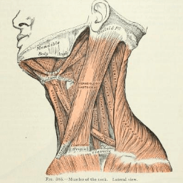
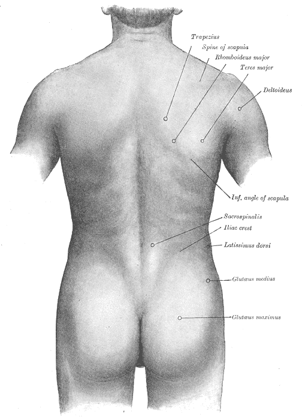

= Cōdex [1603:25:1]: //dictiōnāria de partes corporis humani//
:doctype: book
:title: Cōdex [1603:25:1]: //dictiōnāria de partes corporis humani//
:lang: la
:toc:
:toclevels: 4
:toc-title: Tabula contentorum
:table-caption: Tabula
:figure-caption: Pictūra
:example-caption: Exemplum
:last-update-label: Renovatio
:version-label: Versiō
:appendix-caption: Appendix

toc::[]
[id=0_999_1603_1]
== Praefātiō 

=== //Cōdex trānslātiōnēs//

[%header,cols="~,~"]
|===
| Lingua de verba
| Verba de conceptiō
| Linguae multiplīs (Scrīptum incognitō)
| +++//dictiōnāria de partes corporis humani//+++

| Lingua Latina (Abecedarium Latinum)
| +++/dictiōnāria de partes corporis humani/+++

|===
=== //Rēs interlinguālibus//

[%header,cols="~,~"]
|===
| Non lingua
| //Rēs interlinguālibus//

| Numerordĭnātĭo
| 1603:25:1

|===

=== Linguae in cōdex: 43
Tōtālis linguae in cōdex: 43

[%header,cols="~,~,~,~,~"]
|===
| Cōdex linguae
| Glotto cōdicī
| ISO 639-3
| Wiki QID cōdicī
| Nōmen Latīnum

| mul-Zyyy
| 
| 
| 
| Linguae multiplīs (Scrīptum incognitō)

| ara-Arab
| https://glottolog.org/resource/languoid/id/arab1395[arab1395]
| https://iso639-3.sil.org/code/ara[ara]
| https://www.wikidata.org/wiki/Q13955[Q13955]
| Macrolingua Arabica (Abecedarium Arabicum)

| ben-Beng
| https://glottolog.org/resource/languoid/id/beng1280[beng1280]
| https://iso639-3.sil.org/code/ben[ben]
| https://www.wikidata.org/wiki/Q9610[Q9610]
| Lingua Bengali (?)

| lat-Latn
| https://glottolog.org/resource/languoid/id/lati1261[lati1261]
| https://iso639-3.sil.org/code/lat[lat]
| https://www.wikidata.org/wiki/Q397[Q397]
| Lingua Latina (Abecedarium Latinum)

| rus-Cyrl
| https://glottolog.org/resource/languoid/id/russ1263[russ1263]
| https://iso639-3.sil.org/code/rus[rus]
| https://www.wikidata.org/wiki/Q7737[Q7737]
| Lingua Russica (Abecedarium Cyrillicum)

| san-Zzzz
| https://glottolog.org/resource/languoid/id/sans1269[sans1269]
| https://iso639-3.sil.org/code/san[san]
| https://www.wikidata.org/wiki/Q11059[Q11059]
| Lingua Sanscrita

| por-Latn
| https://glottolog.org/resource/languoid/id/port1283[port1283]
| https://iso639-3.sil.org/code/por[por]
| https://www.wikidata.org/wiki/Q5146[Q5146]
| Lingua Lusitana (Abecedarium Latinum)

| eng-Latn
| https://glottolog.org/resource/languoid/id/stan1293[stan1293]
| https://iso639-3.sil.org/code/eng[eng]
| https://www.wikidata.org/wiki/Q1860[Q1860]
| Lingua Anglica (Abecedarium Latinum)

| fra-Latn
| https://glottolog.org/resource/languoid/id/stan1290[stan1290]
| https://iso639-3.sil.org/code/fra[fra]
| https://www.wikidata.org/wiki/Q150[Q150]
| Lingua Francogallica (Abecedarium Latinum)

| nld-Latn
| https://glottolog.org/resource/languoid/id/mode1257[mode1257]
| https://iso639-3.sil.org/code/nld[nld]
| https://www.wikidata.org/wiki/Q7411[Q7411]
| Lingua Batavica (Abecedarium Latinum)

| deu-Latn
| https://glottolog.org/resource/languoid/id/stan1295[stan1295]
| https://iso639-3.sil.org/code/deu[deu]
| https://www.wikidata.org/wiki/Q188[Q188]
| Lingua Germanica (Abecedarium Latinum)

| spa-Latn
| https://glottolog.org/resource/languoid/id/stan1288[stan1288]
| https://iso639-3.sil.org/code/spa[spa]
| https://www.wikidata.org/wiki/Q1321[Q1321]
| Lingua Hispanica (Abecedarium Latinum)

| ita-Latn
| https://glottolog.org/resource/languoid/id/ital1282[ital1282]
| https://iso639-3.sil.org/code/ita[ita]
| https://www.wikidata.org/wiki/Q652[Q652]
| Lingua Italiana (Abecedarium Latinum)

| gle-Latn
| https://glottolog.org/resource/languoid/id/iris1253[iris1253]
| https://iso639-3.sil.org/code/gle[gle]
| https://www.wikidata.org/wiki/Q9142[Q9142]
| Lingua Hibernica (Abecedarium Latinum)

| swe-Latn
| https://glottolog.org/resource/languoid/id/swed1254[swed1254]
| https://iso639-3.sil.org/code/swe[swe]
| https://www.wikidata.org/wiki/Q9027[Q9027]
| Lingua Suecica (Abecedarium Latinum)

| sqi-Latn
| https://glottolog.org/resource/languoid/id/alba1267[alba1267]
| https://iso639-3.sil.org/code/sqi[sqi]
| https://www.wikidata.org/wiki/Q8748[Q8748]
| Macrolingua Albanica (Abecedarium Latinum)

| pol-Latn
| https://glottolog.org/resource/languoid/id/poli1260[poli1260]
| https://iso639-3.sil.org/code/pol[pol]
| https://www.wikidata.org/wiki/Q809[Q809]
| Lingua Polonica (Abecedarium Latinum)

| fin-Latn
| https://glottolog.org/resource/languoid/id/finn1318[finn1318]
| https://iso639-3.sil.org/code/fin[fin]
| https://www.wikidata.org/wiki/Q1412[Q1412]
| Lingua Finnica (Abecedarium Latinum)

| ron-Latn
| https://glottolog.org/resource/languoid/id/roma1327[roma1327]
| https://iso639-3.sil.org/code/ron[ron]
| https://www.wikidata.org/wiki/Q7913[Q7913]
| Lingua Dacoromanica (Abecedarium Latinum)

| vie-Latn
| https://glottolog.org/resource/languoid/id/viet1252[viet1252]
| https://iso639-3.sil.org/code/vie[vie]
| https://www.wikidata.org/wiki/Q9199[Q9199]
| Lingua Vietnamensis (Abecedarium Latinum)

| cat-Latn
| https://glottolog.org/resource/languoid/id/stan1289[stan1289]
| https://iso639-3.sil.org/code/cat[cat]
| https://www.wikidata.org/wiki/Q7026[Q7026]
| Lingua Catalana (Abecedarium Latinum)

| ukr-Cyrl
| https://glottolog.org/resource/languoid/id/ukra1253[ukra1253]
| https://iso639-3.sil.org/code/ukr[ukr]
| https://www.wikidata.org/wiki/Q8798[Q8798]
| Lingua Ucrainica (Abecedarium Cyrillicum)

| bul-Cyrl
| https://glottolog.org/resource/languoid/id/bulg1262[bulg1262]
| https://iso639-3.sil.org/code/bul[bul]
| https://www.wikidata.org/wiki/Q7918[Q7918]
| Lingua Bulgarica (Abecedarium Cyrillicum)

| slv-Latn
| https://glottolog.org/resource/languoid/id/slov1268[slov1268]
| https://iso639-3.sil.org/code/slv[slv]
| https://www.wikidata.org/wiki/Q9063[Q9063]
| Lingua Slovena (Abecedarium Latinum)

| war-Latn
| https://glottolog.org/resource/languoid/id/wara1300[wara1300]
| https://iso639-3.sil.org/code/war[war]
| https://www.wikidata.org/wiki/Q34279[Q34279]
| /Waray language/ (Abecedarium Latinum)

| nob-Latn
| https://glottolog.org/resource/languoid/id/norw1259[norw1259]
| https://iso639-3.sil.org/code/nob[nob]
| https://www.wikidata.org/wiki/Q25167[Q25167]
| /Bokmål/ (Abecedarium Latinum)

| ces-Latn
| https://glottolog.org/resource/languoid/id/czec1258[czec1258]
| https://iso639-3.sil.org/code/ces[ces]
| https://www.wikidata.org/wiki/Q9056[Q9056]
| Lingua Bohemica (Abecedarium Latinum)

| dan-Latn
| https://glottolog.org/resource/languoid/id/dani1285[dani1285]
| https://iso639-3.sil.org/code/dan[dan]
| https://www.wikidata.org/wiki/Q9035[Q9035]
| Lingua Danica (Abecedarium Latinum)

| jpn-Jpan
| https://glottolog.org/resource/languoid/id/nucl1643[nucl1643]
| https://iso639-3.sil.org/code/jpn[jpn]
| https://www.wikidata.org/wiki/Q5287[Q5287]
| Lingua Iaponica (Scriptura Iaponica)

| nno-Latn
| https://glottolog.org/resource/languoid/id/norw1262[norw1262]
| https://iso639-3.sil.org/code/nno[nno]
| https://www.wikidata.org/wiki/Q25164[Q25164]
| /Nynorsk/ (Abecedarium Latinum)

| mal-Mlym
| https://glottolog.org/resource/languoid/id/mala1464[mala1464]
| https://iso639-3.sil.org/code/mal[mal]
| https://www.wikidata.org/wiki/Q36236[Q36236]
| Lingua Malabarica (/Malayalam script/)

| ind-Latn
| https://glottolog.org/resource/languoid/id/indo1316[indo1316]
| https://iso639-3.sil.org/code/ind[ind]
| https://www.wikidata.org/wiki/Q9240[Q9240]
| Lingua Indonesiana (Abecedarium Latinum)

| fas-Zzzz
| 
| https://iso639-3.sil.org/code/fas[fas]
| https://www.wikidata.org/wiki/Q9168[Q9168]
| Macrolingua Persica (Abecedarium Arabicum)

| hun-Latn
| https://glottolog.org/resource/languoid/id/hung1274[hung1274]
| https://iso639-3.sil.org/code/hun[hun]
| https://www.wikidata.org/wiki/Q9067[Q9067]
| Lingua Hungarica (Abecedarium Latinum)

| eus-Latn
| https://glottolog.org/resource/languoid/id/basq1248[basq1248]
| https://iso639-3.sil.org/code/eus[eus]
| https://www.wikidata.org/wiki/Q8752[Q8752]
| Lingua Vasconica (Abecedarium Latinum)

| cym-Latn
| https://glottolog.org/resource/languoid/id/wels1247[wels1247]
| https://iso639-3.sil.org/code/cym[cym]
| https://www.wikidata.org/wiki/Q9309[Q9309]
| Lingua Cambrica (Abecedarium Latinum)

| glg-Latn
| https://glottolog.org/resource/languoid/id/gali1258[gali1258]
| https://iso639-3.sil.org/code/glg[glg]
| https://www.wikidata.org/wiki/Q9307[Q9307]
| Lingua Gallaica (Abecedarium Latinum)

| slk-Latn
| https://glottolog.org/resource/languoid/id/slov1269[slov1269]
| https://iso639-3.sil.org/code/slk[slk]
| https://www.wikidata.org/wiki/Q9058[Q9058]
| Lingua Slovaca (Abecedarium Latinum)

| epo-Latn
| https://glottolog.org/resource/languoid/id/espe1235[espe1235]
| https://iso639-3.sil.org/code/epo[epo]
| https://www.wikidata.org/wiki/Q143[Q143]
| Lingua Esperantica (Abecedarium Latinum)

| msa-Zzzz
| 
| https://iso639-3.sil.org/code/msa[msa]
| https://www.wikidata.org/wiki/Q9237[Q9237]
| Macrolingua Malayana (?)

| est-Latn
| 
| https://iso639-3.sil.org/code/est[est]
| https://www.wikidata.org/wiki/Q9072[Q9072]
| Macrolingua Estonica (Abecedarium Latinum)

| hrv-Latn
| https://glottolog.org/resource/languoid/id/croa1245[croa1245]
| https://iso639-3.sil.org/code/hrv[hrv]
| https://www.wikidata.org/wiki/Q6654[Q6654]
| Lingua Croatica (Abecedarium Latinum)

| ina-Latn
| https://glottolog.org/resource/languoid/id/inte1239[inte1239]
| https://iso639-3.sil.org/code/ina[ina]
| https://www.wikidata.org/wiki/Q35934[Q35934]
| Interlingua (Abecedarium Latinum)

|===

=== Interlinguae in cōdex: 2
Tōtālis linguae in cōdex: 2

[%header,cols="~,~,~,~,~"]
|===
| Interlinguae
| /Wiki P/
| ISO 639-3
| Nōmen Latīnum
| Definitionem

| ix_n1603
| 
| 
| Numerordĭnātĭo
| a generic strategy of arranging numbers in an taxonomy-like explicit way

| ix_wikiq
| 
| 
| /Wiki QID/
| QID (or Q number) is the unique identifier of a data item on Wikidata, comprising the letter "Q" followed by one or more digits. It is used to help people and machines understand the difference between items with the same or similar names e.g there are several places in the world called London and many people called James Smith. This number appears next to the name at the top of each Wikidata item.

|===

== //dictiōnāria de partes corporis humani//
[discrete]
==== Annexa
[discrete]
===== Pictūrae
image::1603_25_1.~2/0~2.png[title="1543 De humani corporis fabrica libri septem  [CC-PDDC]"]

link:https://archive.org/details/bub_gb_5Xby3nxU3XMC[1543 De humani corporis fabrica libri septem  [CC-PDDC]]

image::1603_25_1.~2/0~3.png[title="1543 De humani corporis fabrica libri septem  [CC-PDDC]"]

link:https://archive.org/details/bub_gb_5Xby3nxU3XMC[1543 De humani corporis fabrica libri septem  [CC-PDDC]]

image::1603_25_1.~2/0~9.png[title="1543 De humani corporis fabrica libri septem  [CC-PDDC]"]

link:https://archive.org/details/bub_gb_5Xby3nxU3XMC[1543 De humani corporis fabrica libri septem  [CC-PDDC]]

image::1603_25_1.~2/0~1.png[title="1543 De humani corporis fabrica libri septem  [CC-PDDC]"]

link:https://archive.org/details/bub_gb_5Xby3nxU3XMC[1543 De humani corporis fabrica libri septem  [CC-PDDC]]

[id='1']
=== [`1`] caput humanum

[%header,cols="~,~"]
|===
| Non lingua
| //Rēs interlinguālibus//

| /Wiki QID/
| https://www.wikidata.org/wiki/Q3409626[Q3409626]

| #item+rem+i_qcc+is_zxxx+ix_ta98
| link:++https://ifaa.unifr.ch/Public/EntryPage/TA98%20Tree/Entity%20TA98%20EN/01.1.00.001%20Entity%20TA98%20EN.htm++[A01.1.00.001]

| /HXL Standard, hashtag, base tab, or attribute (but not readable header)/
| ix_n1603n25n1caput

| /HXL Standard, hashtag, base tab, or attribute (but not readable header)/
| v_n1603_25_1_caput

|===

[%header,cols="~,~"]
|===
| Lingua de verba
| Verba de conceptiō
| Lingua Latina (Abecedarium Latinum)
| +++caput humanum+++

| Macrolingua Arabica (Abecedarium Arabicum)
| +++رأس الإنسان+++

| Lingua Bengali (?)
| +++মানুষের মাথা+++

| Lingua Russica (Abecedarium Cyrillicum)
| +++голова человека+++

| Lingua Sanscrita
| +++शिरः+++

| Lingua Lusitana (Abecedarium Latinum)
| +++cabeça humana+++

| Lingua Anglica (Abecedarium Latinum)
| +++human head+++

| Lingua Francogallica (Abecedarium Latinum)
| +++tête humaine+++

| Lingua Batavica (Abecedarium Latinum)
| +++menselijk hoofd+++

| Lingua Germanica (Abecedarium Latinum)
| +++kopf des menschen+++

| Lingua Hispanica (Abecedarium Latinum)
| +++cabeza humana+++

| Lingua Italiana (Abecedarium Latinum)
| +++testa umana+++

| Lingua Suecica (Abecedarium Latinum)
| +++människohuvud+++

| Lingua Polonica (Abecedarium Latinum)
| +++głowa człowieka+++

| Lingua Vietnamensis (Abecedarium Latinum)
| +++đầu người+++

| Lingua Catalana (Abecedarium Latinum)
| +++cap humà+++

| Lingua Ucrainica (Abecedarium Cyrillicum)
| +++голова людини+++

| /Bokmål/ (Abecedarium Latinum)
| +++menneskehode+++

| Lingua Bohemica (Abecedarium Latinum)
| +++hlava+++

| Lingua Danica (Abecedarium Latinum)
| +++menneskehovede+++

| Lingua Iaponica (Scriptura Iaponica)
| +++ヒトの頭+++

| /Nynorsk/ (Abecedarium Latinum)
| +++menneskehovud+++

| Macrolingua Persica (Abecedarium Arabicum)
| +++سر انسان+++

| Lingua Hungarica (Abecedarium Latinum)
| +++emberi fej+++

| Lingua Cambrica (Abecedarium Latinum)
| +++pen dynol+++

| Lingua Esperantica (Abecedarium Latinum)
| +++homa kapo+++

| Macrolingua Malayana (?)
| +++kepala manusia+++

| Interlingua (Abecedarium Latinum)
| +++capite human+++

|===

[id='1_1']
==== [`1_1`] sinciput

[%header,cols="~,~"]
|===
| Non lingua
| //Rēs interlinguālibus//

| /Wiki QID/
| https://www.wikidata.org/wiki/Q41055[Q41055]

| #item+rem+i_qcc+is_zxxx+ix_ta98
| link:++https://ifaa.unifr.ch/Public/EntryPage/TA98%20Tree/Entity%20TA98%20EN/01.1.00.002%20Entity%20TA98%20EN.htm++[A01.1.00.002]

| /HXL Standard, hashtag, base tab, or attribute (but not readable header)/
| ix_n1603n25n1sinciput

| /HXL Standard, hashtag, base tab, or attribute (but not readable header)/
| v_n1603_25_1_sinciput

|===

[%header,cols="~,~"]
|===
| Lingua de verba
| Verba de conceptiō
| Lingua Latina (Abecedarium Latinum)
| +++sinciput+++

| Macrolingua Arabica (Abecedarium Arabicum)
| +++جبهة+++

| Lingua Russica (Abecedarium Cyrillicum)
| +++лоб+++

| Lingua Sanscrita
| +++ललाटम्+++

| Lingua Lusitana (Abecedarium Latinum)
| +++testa+++

| Lingua Anglica (Abecedarium Latinum)
| +++forehead+++

| Lingua Francogallica (Abecedarium Latinum)
| +++front+++

| Lingua Batavica (Abecedarium Latinum)
| +++voorhoofd+++

| Lingua Germanica (Abecedarium Latinum)
| +++stirn+++

| Lingua Hispanica (Abecedarium Latinum)
| +++frente+++

| Lingua Italiana (Abecedarium Latinum)
| +++fronte+++

| Lingua Hibernica (Abecedarium Latinum)
| +++éadan+++

| Lingua Suecica (Abecedarium Latinum)
| +++panna+++

| Lingua Polonica (Abecedarium Latinum)
| +++czoło+++

| Lingua Finnica (Abecedarium Latinum)
| +++otsa+++

| Lingua Dacoromanica (Abecedarium Latinum)
| +++frunte+++

| Lingua Vietnamensis (Abecedarium Latinum)
| +++trán+++

| Lingua Catalana (Abecedarium Latinum)
| +++front+++

| Lingua Ucrainica (Abecedarium Cyrillicum)
| +++чоло+++

| Lingua Bulgarica (Abecedarium Cyrillicum)
| +++чело+++

| /Waray language/ (Abecedarium Latinum)
| +++agtáng+++

| /Bokmål/ (Abecedarium Latinum)
| +++panne+++

| Lingua Bohemica (Abecedarium Latinum)
| +++čelo+++

| Lingua Danica (Abecedarium Latinum)
| +++pande+++

| Lingua Iaponica (Scriptura Iaponica)
| +++額+++

| /Nynorsk/ (Abecedarium Latinum)
| +++panne+++

| Lingua Malabarica (/Malayalam script/)
| +++നെറ്റി+++

| Lingua Indonesiana (Abecedarium Latinum)
| +++dahi+++

| Macrolingua Persica (Abecedarium Arabicum)
| +++پیشانی+++

| Lingua Hungarica (Abecedarium Latinum)
| +++homlok+++

| Lingua Vasconica (Abecedarium Latinum)
| +++bekoki+++

| Lingua Cambrica (Abecedarium Latinum)
| +++talcen+++

| Lingua Gallaica (Abecedarium Latinum)
| +++testa+++

| Lingua Slovaca (Abecedarium Latinum)
| +++čelo+++

| Lingua Esperantica (Abecedarium Latinum)
| +++frunto+++

| Macrolingua Malayana (?)
| +++dahi+++

| Macrolingua Estonica (Abecedarium Latinum)
| +++laup+++

| Lingua Croatica (Abecedarium Latinum)
| +++čelo+++

|===

[id='1_2']
==== [`1_2`] occiput

[%header,cols="~,~"]
|===
| Non lingua
| //Rēs interlinguālibus//

| /Wiki QID/
| https://www.wikidata.org/wiki/Q3321315[Q3321315]

| #item+rem+i_qcc+is_zxxx+ix_ta98
| link:++https://ifaa.unifr.ch/Public/EntryPage/TA98%20Tree/Entity%20TA98%20EN/01.1.00.003%20Entity%20TA98%20EN.htm++[A01.1.00.003]

| /HXL Standard, hashtag, base tab, or attribute (but not readable header)/
| ix_n1603n25n1occiput

| /HXL Standard, hashtag, base tab, or attribute (but not readable header)/
| v_n1603_25_1_occiput

|===

[%header,cols="~,~"]
|===
| Lingua de verba
| Verba de conceptiō
| Lingua Latina (Abecedarium Latinum)
| +++occiput+++

| Macrolingua Arabica (Abecedarium Arabicum)
| +++مؤخر الرأس+++

| Lingua Lusitana (Abecedarium Latinum)
| +++occipício+++

| Lingua Anglica (Abecedarium Latinum)
| +++occiput+++

| Lingua Francogallica (Abecedarium Latinum)
| +++occiput+++

| Lingua Germanica (Abecedarium Latinum)
| +++occiput+++

| Lingua Hispanica (Abecedarium Latinum)
| +++occipucio+++

| Lingua Italiana (Abecedarium Latinum)
| +++occipite+++

| Lingua Polonica (Abecedarium Latinum)
| +++potylica+++

| Lingua Finnica (Abecedarium Latinum)
| +++takaraivo+++

| Lingua Catalana (Abecedarium Latinum)
| +++occípit+++

| Lingua Iaponica (Scriptura Iaponica)
| +++後頭部+++

| /Nynorsk/ (Abecedarium Latinum)
| +++bakhovud+++

| Lingua Vasconica (Abecedarium Latinum)
| +++okzipuzio+++

| Lingua Gallaica (Abecedarium Latinum)
| +++occipicio+++

|===

[id='2']
=== [`2`] 

[%header,cols="~,~"]
|===
| Non lingua
| //Rēs interlinguālibus//

| /HXL Standard, hashtag, base tab, or attribute (but not readable header)/
| ix_n1603n25n1collum

| /HXL Standard, hashtag, base tab, or attribute (but not readable header)/
| v_n1603_25_1_collum

|===

[discrete]
==== Annexa
[discrete]
===== Pictūrae
"]

link:https://archive.org/details/anatomyofhumanbo1918gray[Henry Vandyke Carter 1858 Gray's Anatomy  [CC-PDDC]]

[id='3']
=== [`3`] truncus

[%header,cols="~,~"]
|===
| Non lingua
| //Rēs interlinguālibus//

| /Wiki QID/
| https://www.wikidata.org/wiki/Q160695[Q160695]

| #item+rem+i_qcc+is_zxxx+ix_ta98
| link:++https://ifaa.unifr.ch/Public/EntryPage/TA98%20Tree/Entity%20TA98%20EN/01.1.00.013%20Entity%20TA98%20EN.htm++[A01.1.00.013]

| /HXL Standard, hashtag, base tab, or attribute (but not readable header)/
| ix_n1603n25n1truncus

| /HXL Standard, hashtag, base tab, or attribute (but not readable header)/
| v_n1603_25_1_truncus

|===

[%header,cols="~,~"]
|===
| Lingua de verba
| Verba de conceptiō
| Lingua Latina (Abecedarium Latinum)
| +++truncus+++

| Macrolingua Arabica (Abecedarium Arabicum)
| +++جذع+++

| Lingua Russica (Abecedarium Cyrillicum)
| +++туловище+++

| Lingua Lusitana (Abecedarium Latinum)
| +++tronco+++

| Lingua Anglica (Abecedarium Latinum)
| +++torso+++

| Lingua Francogallica (Abecedarium Latinum)
| +++tronc+++

| Lingua Batavica (Abecedarium Latinum)
| +++romp+++

| Lingua Germanica (Abecedarium Latinum)
| +++rumpf+++

| Lingua Hispanica (Abecedarium Latinum)
| +++tronco+++

| Lingua Italiana (Abecedarium Latinum)
| +++tronco+++

| Lingua Hibernica (Abecedarium Latinum)
| +++tóracs+++

| Lingua Suecica (Abecedarium Latinum)
| +++torso+++

| Lingua Polonica (Abecedarium Latinum)
| +++tułów+++

| Lingua Finnica (Abecedarium Latinum)
| +++torso+++

| Lingua Dacoromanica (Abecedarium Latinum)
| +++trunchi+++

| Lingua Vietnamensis (Abecedarium Latinum)
| +++thân mình+++

| Lingua Catalana (Abecedarium Latinum)
| +++tronc+++

| Lingua Ucrainica (Abecedarium Cyrillicum)
| +++тулуб+++

| Lingua Bulgarica (Abecedarium Cyrillicum)
| +++туловище+++

| Lingua Slovena (Abecedarium Latinum)
| +++torzo+++

| /Bokmål/ (Abecedarium Latinum)
| +++torso+++

| Lingua Bohemica (Abecedarium Latinum)
| +++trup+++

| Lingua Danica (Abecedarium Latinum)
| +++torso+++

| Lingua Iaponica (Scriptura Iaponica)
| +++胴体+++

| /Nynorsk/ (Abecedarium Latinum)
| +++truncus+++

| Lingua Indonesiana (Abecedarium Latinum)
| +++trunkus+++

| Macrolingua Persica (Abecedarium Arabicum)
| +++تنه+++

| Lingua Hungarica (Abecedarium Latinum)
| +++torzó+++

| Lingua Vasconica (Abecedarium Latinum)
| +++gorputz-enbor+++

| Lingua Gallaica (Abecedarium Latinum)
| +++tronco+++

| Lingua Slovaca (Abecedarium Latinum)
| +++trup+++

| Lingua Esperantica (Abecedarium Latinum)
| +++torso+++

| Macrolingua Estonica (Abecedarium Latinum)
| +++kere+++

| Lingua Croatica (Abecedarium Latinum)
| +++torzo+++

|===

[discrete]
==== Annexa
[discrete]
===== Pictūrae
image::1603_25_1.~1/3~1.gif[title="Henry Vandyke Carter 1858 Gray's Anatomy  [CC-PDDC]"]

link:https://archive.org/details/anatomyofhumanbo1918gray[Henry Vandyke Carter 1858 Gray's Anatomy  [CC-PDDC]]

[id='3_1']
==== [`3_1`] pectus

[%header,cols="~,~"]
|===
| Non lingua
| //Rēs interlinguālibus//

| /Wiki QID/
| https://www.wikidata.org/wiki/Q9645[Q9645]

| #item+rem+i_qcc+is_zxxx+ix_ta98
| link:++https://ifaa.unifr.ch/Public/EntryPage/TA98%20Tree/Entity%20TA98%20EN/01.1.00.014%20Entity%20TA98%20EN.htm++[A01.1.00.014]

| /HXL Standard, hashtag, base tab, or attribute (but not readable header)/
| ix_n1603n25n1thorax

| /HXL Standard, hashtag, base tab, or attribute (but not readable header)/
| v_n1603_25_1_thorax

|===

[%header,cols="~,~"]
|===
| Lingua de verba
| Verba de conceptiō
| Lingua Latina (Abecedarium Latinum)
| +++pectus+++

| Macrolingua Arabica (Abecedarium Arabicum)
| +++صدر+++

| Lingua Bengali (?)
| +++বক্ষ+++

| Lingua Russica (Abecedarium Cyrillicum)
| +++торакс+++

| Lingua Sanscrita
| +++वक्षःस्थलम्+++

| Lingua Lusitana (Abecedarium Latinum)
| +++peito+++

| Lingua Anglica (Abecedarium Latinum)
| +++thorax+++

| Lingua Francogallica (Abecedarium Latinum)
| +++torse+++

| Lingua Batavica (Abecedarium Latinum)
| +++borstkas+++

| Lingua Germanica (Abecedarium Latinum)
| +++brust+++

| Lingua Hispanica (Abecedarium Latinum)
| +++torso+++

| Lingua Italiana (Abecedarium Latinum)
| +++petto+++

| Lingua Hibernica (Abecedarium Latinum)
| +++cliabhrach+++

| Lingua Suecica (Abecedarium Latinum)
| +++bröst+++

| Lingua Polonica (Abecedarium Latinum)
| +++klatka piersiowa+++

| Lingua Finnica (Abecedarium Latinum)
| +++rinta+++

| Lingua Vietnamensis (Abecedarium Latinum)
| +++ngực+++

| Lingua Catalana (Abecedarium Latinum)
| +++tors+++

| Lingua Ucrainica (Abecedarium Cyrillicum)
| +++грудна клітка+++

| Lingua Bulgarica (Abecedarium Cyrillicum)
| +++гръден кош+++

| Lingua Slovena (Abecedarium Latinum)
| +++prsni koš+++

| /Waray language/ (Abecedarium Latinum)
| +++dughán+++

| /Bokmål/ (Abecedarium Latinum)
| +++bryst+++

| Lingua Bohemica (Abecedarium Latinum)
| +++hrudník+++

| Lingua Danica (Abecedarium Latinum)
| +++brystkasse+++

| Lingua Iaponica (Scriptura Iaponica)
| +++胸+++

| /Nynorsk/ (Abecedarium Latinum)
| +++bryst+++

| Lingua Indonesiana (Abecedarium Latinum)
| +++dada+++

| Macrolingua Persica (Abecedarium Arabicum)
| +++سینه+++

| Lingua Hungarica (Abecedarium Latinum)
| +++mellkas+++

| Lingua Vasconica (Abecedarium Latinum)
| +++torax+++

| Lingua Cambrica (Abecedarium Latinum)
| +++thoracs+++

| Lingua Gallaica (Abecedarium Latinum)
| +++peito+++

| Lingua Slovaca (Abecedarium Latinum)
| +++hrudník+++

| Lingua Esperantica (Abecedarium Latinum)
| +++brusto+++

| Macrolingua Malayana (?)
| +++dada+++

| Macrolingua Estonica (Abecedarium Latinum)
| +++rind+++

| Lingua Croatica (Abecedarium Latinum)
| +++prsni koš+++

|===

[id='3_2']
==== [`3_2`] abdomen

[%header,cols="~,~"]
|===
| Non lingua
| //Rēs interlinguālibus//

| /Wiki QID/
| https://www.wikidata.org/wiki/Q9597[Q9597]

| #item+rem+i_qcc+is_zxxx+ix_ta98
| link:++https://ifaa.unifr.ch/Public/EntryPage/TA98%20Tree/Entity%20TA98%20EN/01.1.00.016%20Entity%20TA98%20EN.htm++[A01.1.00.016]

| /HXL Standard, hashtag, base tab, or attribute (but not readable header)/
| ix_n1603n25n1abdomen

| /HXL Standard, hashtag, base tab, or attribute (but not readable header)/
| v_n1603_25_1_abdomen

|===

[%header,cols="~,~"]
|===
| Lingua de verba
| Verba de conceptiō
| Lingua Latina (Abecedarium Latinum)
| +++abdomen+++

| Macrolingua Arabica (Abecedarium Arabicum)
| +++بطن+++

| Lingua Bengali (?)
| +++উদর+++

| Lingua Russica (Abecedarium Cyrillicum)
| +++живот+++

| Lingua Sanscrita
| +++नाभिः+++

| Lingua Lusitana (Abecedarium Latinum)
| +++abdómen+++

| Lingua Anglica (Abecedarium Latinum)
| +++abdomen+++

| Lingua Francogallica (Abecedarium Latinum)
| +++abdomen+++

| Lingua Batavica (Abecedarium Latinum)
| +++buik+++

| Lingua Germanica (Abecedarium Latinum)
| +++abdomen+++

| Lingua Hispanica (Abecedarium Latinum)
| +++abdomen+++

| Lingua Italiana (Abecedarium Latinum)
| +++addome+++

| Lingua Hibernica (Abecedarium Latinum)
| +++abdóman+++

| Lingua Suecica (Abecedarium Latinum)
| +++buken+++

| Macrolingua Albanica (Abecedarium Latinum)
| +++abdomeni+++

| Lingua Polonica (Abecedarium Latinum)
| +++brzuch+++

| Lingua Finnica (Abecedarium Latinum)
| +++vatsa+++

| Lingua Dacoromanica (Abecedarium Latinum)
| +++abdomen+++

| Lingua Vietnamensis (Abecedarium Latinum)
| +++bụng+++

| Lingua Catalana (Abecedarium Latinum)
| +++abdomen+++

| Lingua Ucrainica (Abecedarium Cyrillicum)
| +++живіт+++

| Lingua Bulgarica (Abecedarium Cyrillicum)
| +++корем+++

| Lingua Slovena (Abecedarium Latinum)
| +++trebuh+++

| /Waray language/ (Abecedarium Latinum)
| +++puson+++

| /Bokmål/ (Abecedarium Latinum)
| +++abdomen+++

| Lingua Bohemica (Abecedarium Latinum)
| +++břicho+++

| Lingua Danica (Abecedarium Latinum)
| +++bughule+++

| Lingua Iaponica (Scriptura Iaponica)
| +++腹+++

| /Nynorsk/ (Abecedarium Latinum)
| +++abdomen+++

| Lingua Indonesiana (Abecedarium Latinum)
| +++abdomen+++

| Macrolingua Persica (Abecedarium Arabicum)
| +++شکم+++

| Lingua Hungarica (Abecedarium Latinum)
| +++has+++

| Lingua Vasconica (Abecedarium Latinum)
| +++abdomen+++

| Lingua Cambrica (Abecedarium Latinum)
| +++abdomen+++

| Lingua Gallaica (Abecedarium Latinum)
| +++abdome+++

| Lingua Slovaca (Abecedarium Latinum)
| +++brucho (stavovce)+++

| Lingua Esperantica (Abecedarium Latinum)
| +++ventro+++

| Macrolingua Malayana (?)
| +++Abdomen+++

| Macrolingua Estonica (Abecedarium Latinum)
| +++kõht+++

| Lingua Croatica (Abecedarium Latinum)
| +++trbuh+++

| Interlingua (Abecedarium Latinum)
| +++abdomine+++

|===

[id='3_3']
==== [`3_3`] pelvis

[%header,cols="~,~"]
|===
| Non lingua
| //Rēs interlinguālibus//

| /Wiki QID/
| https://www.wikidata.org/wiki/Q713102[Q713102]

| #item+rem+i_qcc+is_zxxx+ix_ta98
| link:++https://ifaa.unifr.ch/Public/EntryPage/TA98%20Tree/Entity%20TA98%20EN/01.1.00.017%20Entity%20TA98%20EN.htm++[A01.1.00.017]

| /HXL Standard, hashtag, base tab, or attribute (but not readable header)/
| ix_n1603n25n1pelvis

| /HXL Standard, hashtag, base tab, or attribute (but not readable header)/
| v_n1603_25_1_pelvis

|===

[%header,cols="~,~"]
|===
| Lingua de verba
| Verba de conceptiō
| Lingua Latina (Abecedarium Latinum)
| +++pelvis+++

| Macrolingua Arabica (Abecedarium Arabicum)
| +++حوض+++

| Lingua Bengali (?)
| +++শ্রোণিচক্র+++

| Lingua Russica (Abecedarium Cyrillicum)
| +++таз+++

| Lingua Lusitana (Abecedarium Latinum)
| +++bacia+++

| Lingua Anglica (Abecedarium Latinum)
| +++pelvis+++

| Lingua Francogallica (Abecedarium Latinum)
| +++bassin+++

| Lingua Batavica (Abecedarium Latinum)
| +++bekken+++

| Lingua Germanica (Abecedarium Latinum)
| +++becken+++

| Lingua Hispanica (Abecedarium Latinum)
| +++pelvis+++

| Lingua Italiana (Abecedarium Latinum)
| +++bacino+++

| Lingua Hibernica (Abecedarium Latinum)
| +++peilbheas+++

| Lingua Suecica (Abecedarium Latinum)
| +++bäcken+++

| Macrolingua Albanica (Abecedarium Latinum)
| +++legeni i njeriut+++

| Lingua Polonica (Abecedarium Latinum)
| +++kość miedniczna+++

| Lingua Finnica (Abecedarium Latinum)
| +++lantio+++

| Lingua Dacoromanica (Abecedarium Latinum)
| +++pelvis+++

| Lingua Vietnamensis (Abecedarium Latinum)
| +++khung chậu+++

| Lingua Catalana (Abecedarium Latinum)
| +++pelvis+++

| Lingua Ucrainica (Abecedarium Cyrillicum)
| +++таз+++

| Lingua Bulgarica (Abecedarium Cyrillicum)
| +++таз+++

| Lingua Slovena (Abecedarium Latinum)
| +++medenica+++

| /Waray language/ (Abecedarium Latinum)
| +++pelvis+++

| /Bokmål/ (Abecedarium Latinum)
| +++bekken+++

| Lingua Bohemica (Abecedarium Latinum)
| +++pánev+++

| Lingua Danica (Abecedarium Latinum)
| +++bækken+++

| Lingua Iaponica (Scriptura Iaponica)
| +++骨盤+++

| /Nynorsk/ (Abecedarium Latinum)
| +++bekken+++

| Lingua Indonesiana (Abecedarium Latinum)
| +++pelvis+++

| Macrolingua Persica (Abecedarium Arabicum)
| +++لگن خاصره+++

| Lingua Hungarica (Abecedarium Latinum)
| +++csontos medence+++

| Lingua Vasconica (Abecedarium Latinum)
| +++pelbis+++

| Lingua Cambrica (Abecedarium Latinum)
| +++pelfis+++

| Lingua Gallaica (Abecedarium Latinum)
| +++pelve+++

| Lingua Slovaca (Abecedarium Latinum)
| +++panva+++

| Lingua Esperantica (Abecedarium Latinum)
| +++pelvo+++

| Macrolingua Malayana (?)
| +++Pelvis+++

| Macrolingua Estonica (Abecedarium Latinum)
| +++vaagen+++

| Lingua Croatica (Abecedarium Latinum)
| +++zdjelica+++

|===

[id='3_4']
==== [`3_4`] dorsum

[%header,cols="~,~"]
|===
| Non lingua
| //Rēs interlinguālibus//

| /Wiki QID/
| https://www.wikidata.org/wiki/Q133279[Q133279]

| #item+rem+i_qcc+is_zxxx+ix_ta98
| link:++https://ifaa.unifr.ch/Public/EntryPage/TA98%20Tree/Entity%20TA98%20EN/01.1.00.018%20Entity%20TA98%20EN.htm++[A01.1.00.018]

| /HXL Standard, hashtag, base tab, or attribute (but not readable header)/
| ix_n1603n25n1dorsum

| /HXL Standard, hashtag, base tab, or attribute (but not readable header)/
| v_n1603_25_1_dorsum

|===

[%header,cols="~,~"]
|===
| Lingua de verba
| Verba de conceptiō
| Lingua Latina (Abecedarium Latinum)
| +++dorsum+++

| Macrolingua Arabica (Abecedarium Arabicum)
| +++ظهر+++

| Lingua Russica (Abecedarium Cyrillicum)
| +++спина+++

| Lingua Sanscrita
| +++पृष्ठभागः+++

| Lingua Lusitana (Abecedarium Latinum)
| +++costas+++

| Lingua Anglica (Abecedarium Latinum)
| +++back+++

| Lingua Francogallica (Abecedarium Latinum)
| +++dos+++

| Lingua Batavica (Abecedarium Latinum)
| +++rug+++

| Lingua Germanica (Abecedarium Latinum)
| +++rücken+++

| Lingua Hispanica (Abecedarium Latinum)
| +++espalda+++

| Lingua Italiana (Abecedarium Latinum)
| +++schiena+++

| Lingua Suecica (Abecedarium Latinum)
| +++rygg+++

| Lingua Polonica (Abecedarium Latinum)
| +++plecy+++

| Lingua Finnica (Abecedarium Latinum)
| +++selkä+++

| Lingua Dacoromanica (Abecedarium Latinum)
| +++spate+++

| Lingua Vietnamensis (Abecedarium Latinum)
| +++lưng người+++

| Lingua Catalana (Abecedarium Latinum)
| +++esquena+++

| Lingua Ucrainica (Abecedarium Cyrillicum)
| +++спина+++

| Lingua Bulgarica (Abecedarium Cyrillicum)
| +++гръб+++

| /Waray language/ (Abecedarium Latinum)
| +++bungkog+++

| /Bokmål/ (Abecedarium Latinum)
| +++rygg+++

| Lingua Bohemica (Abecedarium Latinum)
| +++záda+++

| Lingua Danica (Abecedarium Latinum)
| +++ryg+++

| Lingua Iaponica (Scriptura Iaponica)
| +++背中+++

| /Nynorsk/ (Abecedarium Latinum)
| +++rygg+++

| Lingua Indonesiana (Abecedarium Latinum)
| +++punggung+++

| Macrolingua Persica (Abecedarium Arabicum)
| +++پشت انسان+++

| Lingua Vasconica (Abecedarium Latinum)
| +++bizkar+++

| Lingua Cambrica (Abecedarium Latinum)
| +++cefn+++

| Lingua Gallaica (Abecedarium Latinum)
| +++costas+++

| Lingua Esperantica (Abecedarium Latinum)
| +++dorso+++

| Macrolingua Estonica (Abecedarium Latinum)
| +++selg+++

| Lingua Croatica (Abecedarium Latinum)
| +++leđa+++

|===

[discrete]
===== Annexa
[discrete]
====== Pictūrae
"]

link:https://archive.org/details/anatomyofhumanbo1918gray[Henry Vandyke Carter 1858 Gray's Anatomy  [CC-PDDC]]

[id='4']
=== [`4`] 

[%header,cols="~,~"]
|===
| Non lingua
| //Rēs interlinguālibus//

| /HXL Standard, hashtag, base tab, or attribute (but not readable header)/
| ix_n1603n25n1extremitates

| /HXL Standard, hashtag, base tab, or attribute (but not readable header)/
| v_n1603_25_1_extremitates

|===

[appendix]
= //Open issues on exported PDF format//@eng-Latn

=== //Documentation about how to use the machine-readable dictionaries//@eng-Latn

Is necessary to give a quick introduction (or at least mention) the files generated with this implementer documentation.

=== //Missing fonts to render all term variants//@eng-Latn
The generated PDF does not include all necessary fonts.
Here potential strategy to fix it https://github.com/asciidoctor/asciidoctor-pdf/blob/main/docs/theming-guide.adoc#custom-fonts

=== //Reliability statuses//@eng-Latn

Currently, the reliability of numeric statuses are not well explained on PDF version.
