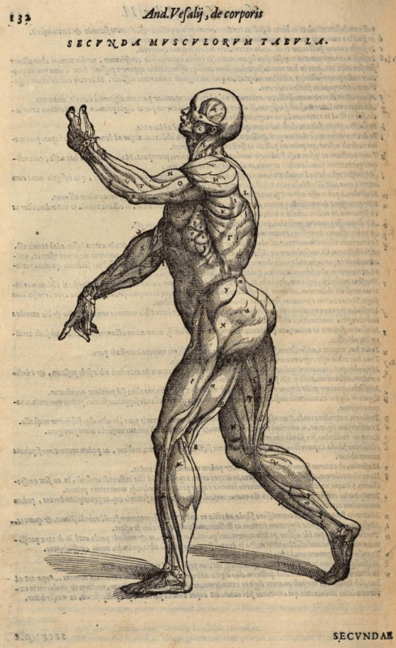
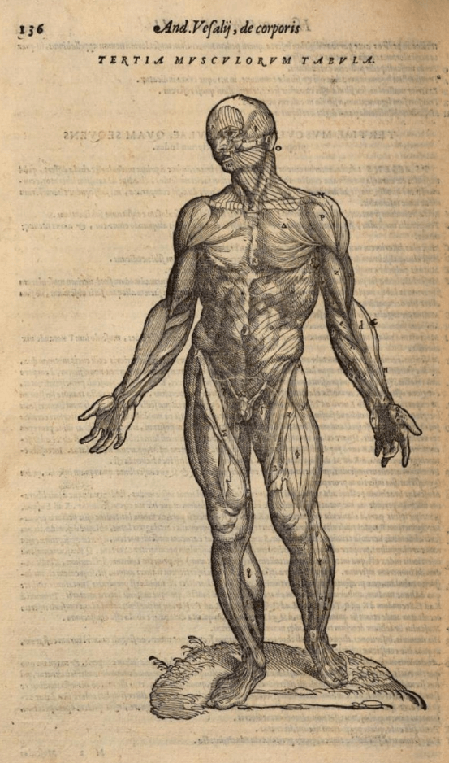

= Cōdex [1603:25:1]: //dictiōnāria de partes corporis humani//
:doctype: book
:title: Cōdex [1603:25:1]: //dictiōnāria de partes corporis humani//
:lang: la
:toc:
:toclevels: 4
:toc-title: Tabula contentorum
:table-caption: Tabula
:figure-caption: Pictūra
:example-caption: Exemplum
:last-update-label: Renovatio
:version-label: Versiō
:appendix-caption: Appendix
:source-highlighter: rouge
:warning-caption: Hic sunt dracones
:tip-caption: Commendātum

{nbsp} +
{nbsp} +
{nbsp} +
{nbsp} +
{nbsp} +
{nbsp} +
{nbsp} +
{nbsp} +
{nbsp} +
{nbsp} +
{nbsp} +
{nbsp} +
{nbsp} +
{nbsp} +
{nbsp} +
{nbsp} +
{nbsp} +
{nbsp} +
{nbsp} +
{nbsp} +
[quote]
/**Public domain means that each major common issue only needs to be resolved once**/@eng-Latn

<<<
toc::[]

[id=0_999_1603_1]
== Praefātiō 

[%header,cols="25h,~a"]
|===
|
Lingua de verba
|
Verba de conceptiō

|
Lingua Anglica (Abecedarium Latinum)
|
_**Cōdex [1603:25:1]**_ is the book format of the machine-readable dictionaries _**[1603:25:1] //dictiōnāria de partes corporis humani//**_, which are distributed for implementers on external applications. This book is intended as advanced resource for other lexicographers and terminology translators, including detect and report inconsistencies.

Practical lexicography is the art or craft of compiling, writing and editing dictionaries. The basics are not far different than a millennia ago: it is still a very humane, creative work. It is necessary to be humble: most of the translator's mistakes are, in fact, not translator's fault, but methodological flaws. Making sure of a source idea of what a concept represents, even if it means rewrite and make simpler, annex pictures, show examples, do whatever to make it be understood, makes even non-professional translators that care about their own language deliver better results than any alternative. In other words: even the so-called industry best practices of paying professional translators and reviewers cannot overcome already poorly explained source terms.

The initiative behind this compilation is also doing other dictionaries and accepts new suggestions of relevant topics on data exchange for humanitarian use. All have in common the fact that both have human translations and (if any) external interlingual codes related to each concept while making the end result explicitly already ready to be usable on average softwares. Naturally, each book version gives extensive explanations for collaborators on how to correct itself which become part of the next weekly release.

|===

[%header,cols="25h,~a"]
|===
|
Rēs interlinguālibus
|
Factum

|
scrīptor
|
https://www.wikidata.org/wiki/Property:Multiplicēs scrīptōribus[Multiplicēs scrīptōribus]

|
/cōdex pūblicandī/
|
https://www.wikidata.org/wiki/Property:EticaAI[EticaAI]

|
/publication date/@eng-Latn
|
https://www.wikidata.org/wiki/Property:2022-01-27[2022-01-27]

|
numerus editionis
|
https://www.wikidata.org/wiki/Property:2022-02-26T23:30:26[2022-02-26T23:30:26]

|
/SPDX license ID/@eng-Latn
|
https://www.wikidata.org/wiki/Property:CC-PDDC[CC-PDDC]

|
/reference URL/@eng-Latn
|
https://www.wikidata.org/wiki/Property:https://github.com/EticaAI/multilingual-lexicography/issues/11[https://github.com/EticaAI/multilingual-lexicography/issues/11]

|===

<<<

== Methodī ex cōdice
=== Methodī ex dictiōnāriōrum corde

[%header,cols="25h,~a"]
|===
|
Rēs interlinguālibus
|
Factum

|
/scope and content/@eng-Latn
|
https://www.wikidata.org/wiki/Property:This Numerodinatio namespace contains dictionaries related to general human body parts. Latin (while a natural language) actually is used as interlingual code. It's mostly based on Basle Nomina Anatomica 1895 ("BNA1895") and, if any difference, archaic terms are replaced with Terminologia Anatomica 95 ("TA95").

Compared to BNA1895 and TA95, 1603:25:1 is a very small subset, mostly a map to external body parts.

All work on the main concept tables is manually compiled and reviewed by EticaAI.[This Numerodinatio namespace contains dictionaries related to general human body parts. Latin (while a natural language) actually is used as interlingual code. It's mostly based on Basle Nomina Anatomica 1895 ("BNA1895") and, if any difference, archaic terms are replaced with Terminologia Anatomica 95 ("TA95").

Compared to BNA1895 and TA95, 1603:25:1 is a very small subset, mostly a map to external body parts.

All work on the main concept tables is manually compiled and reviewed by EticaAI.]

|===

=== Methodī ex verbīs in dictiōnāriīs
NOTE: /At the moment, there is no workflow to use https://www.wikidata.org/wiki/Wikidata:Lexicographical_data[Wikidata lexicographical data], which actually could be used as storage for stricter nomenclature. The current implementations use only Wikidata concepts, the Q-items./@eng-Latn

==== Methodī ex verbīs in Vicidata (Q modō)
[%header,cols="25h,~a"]
|===
|
Lingua de verba
|
Verba de conceptiō

|
Lingua Anglica (Abecedarium Latinum)
|
The ***[1603:25:1] //dictiōnāria de partes corporis humani//*** uses Wikidata as one strategy to conciliate language terms for one or more of it's concepts.

This means that this book, and related dictionaries data files require periodic updates to, at bare minimum, synchronize and re-share up to date translations.

|
Lingua Anglica (Abecedarium Latinum)
|
**How reliable are the community translations (Wikidata source)?**

The short, default answer is: **they are reliable**, even in cases of no authoritative translations for each subject.

As reference, it is likely a professional translator (without access to Wikipedia or Internal terminology bases of the control organizations) would deliver lower quality results if you do blind tests. This is possible because not just the average public, but even terminologists and professional translators help Wikipedia (and implicitly Wikidata).

However, even when the result is correct, the current version needs improved differentiation, at minimum, acronym and long form. For major organizations, features such as __P1813 short names__ exist, but are not yet compiled with the current dataset.

|
Lingua Anglica (Abecedarium Latinum)
|
**Major reasons for "wrong translations" are not translators fault**

TIP: As a rule of thumb, for already very defined concepts where you, as human, can manually verify one or more translated terms as a decent result, the other translations are likely to be acceptable. Dictionaries with edge cases (such as disputed territory names) would have further explanation.

NOTE: Both at concept level and (as general statistics) book level, is planned to have indication concept likelihood of being well understood for very stricter translations initiatives.

The main reason for "wrong translations" are poorly defined concepts used to explain for community translators how to generate terminology translations. This would make existing translations from Wikidata (used not just by us) inconsistent. The second reason is if the dictionaries use translations for concepts without a strict match; in other words, if we make stricter definitions of what concept means but reuse Wikidada less exact terms. There are also issues when entire languages are encoded with wrong codes. Note that all these cases **wrong translations are strictly NOT translators fault, but lexicography fault**.

It is still possible to have strict translation level errors. But even if we point users how to correct Wikidata/Wikipedia (based on better contextual explanation of a concept, such as this book), the requirements to say the previous term was objectively a wrong human translation error (if following our seriousness on dictionary-building) are very high.

|
Lingua Anglica (Abecedarium Latinum)
|
From the point of view of data conciliation, the following methodology is used to release the terminology translations with the main concept table.

. The main handcrafted lexicographical table (explained on previous topic), also provided on `1603_25_1.no1.tm.hxl.csv`, may reference Wiki QID.
. Every unique QID of  `1603_25_1.no1.tm.hxl.csv`, together with language codes from [`1603:1:51`] (which requires knowing human languages), is used to prepare an SPARQL query optimized to run on https://query.wikidata.org/[Wikidata Query Service]. The query is so huge that it is not viable to "Try it" links (URL overlong), such https://www.wikidata.org/wiki/Wikidata:SPARQL_query_service/queries/examples[as what you would find on Wikidata Tutorials], ***but*** it works!
.. Note that the knowledge is free, the translations are there, but the multilingual humanitarian needs may lack people to prepare the files and shares then for general use.
. The query result, with all QIDs and term labels, is shared as `1603_25_1.wikiq.tm.hxl.csv`
. The community reviewed translations of each singular QID is pre-compiled on an individual file `1603_25_1.wikiq.tm.hxl.csv`
. `1603_25_1.no1.tm.hxl.csv` plus `1603_25_1.wikiq.tm.hxl.csv` created `1603_25_1.no11.tm.hxl.csv`

|===

=== Rēs dē factō in dictiōnāriīs
==== Concepta: 10

==== Rēs linguālibus: 42

[%header,cols="15h,25a,~,15"]
|===
|
Cōdex linguae
|
Glotto cōdicī +++ +++ ISO 639-3 +++ +++ Wiki QID cōdicī
|
Nōmen Latīnum
|
Concepta

|
ara-Arab
|
https://glottolog.org/resource/languoid/id/arab1395[arab1395]
+++ +++
https://iso639-3.sil.org/code/ara[ara]
+++ +++ https://www.wikidata.org/wiki/Q13955[Q13955]
|
Macrolingua Arabica (/Abecedarium Arabicum/)
|
8

|
ben-Beng
|
https://glottolog.org/resource/languoid/id/beng1280[beng1280]
+++ +++
https://iso639-3.sil.org/code/ben[ben]
+++ +++ https://www.wikidata.org/wiki/Q9610[Q9610]
|
Lingua Bengali (/Bengali script/)
|
4

|
rus-Cyrl
|
https://glottolog.org/resource/languoid/id/russ1263[russ1263]
+++ +++
https://iso639-3.sil.org/code/rus[rus]
+++ +++ https://www.wikidata.org/wiki/Q7737[Q7737]
|
Lingua Russica (Abecedarium Cyrillicum)
|
7

|
lat-Latn
|
https://glottolog.org/resource/languoid/id/lati1261[lati1261]
+++ +++
https://iso639-3.sil.org/code/lat[lat]
+++ +++ https://www.wikidata.org/wiki/Q397[Q397]
|
Lingua Latina (Abecedarium Latinum)
|
8

|
san-Zzzz
|
https://glottolog.org/resource/languoid/id/sans1269[sans1269]
+++ +++
https://iso639-3.sil.org/code/san[san]
+++ +++ https://www.wikidata.org/wiki/Q11059[Q11059]
|
Lingua Sanscrita  (?)
|
5

|
por-Latn
|
https://glottolog.org/resource/languoid/id/port1283[port1283]
+++ +++
https://iso639-3.sil.org/code/por[por]
+++ +++ https://www.wikidata.org/wiki/Q5146[Q5146]
|
Lingua Lusitana (Abecedarium Latinum)
|
8

|
eng-Latn
|
https://glottolog.org/resource/languoid/id/stan1293[stan1293]
+++ +++
https://iso639-3.sil.org/code/eng[eng]
+++ +++ https://www.wikidata.org/wiki/Q1860[Q1860]
|
Lingua Anglica (Abecedarium Latinum)
|
8

|
fra-Latn
|
https://glottolog.org/resource/languoid/id/stan1290[stan1290]
+++ +++
https://iso639-3.sil.org/code/fra[fra]
+++ +++ https://www.wikidata.org/wiki/Q150[Q150]
|
Lingua Francogallica (Abecedarium Latinum)
|
8

|
nld-Latn
|
https://glottolog.org/resource/languoid/id/mode1257[mode1257]
+++ +++
https://iso639-3.sil.org/code/nld[nld]
+++ +++ https://www.wikidata.org/wiki/Q7411[Q7411]
|
Lingua Batavica (Abecedarium Latinum)
|
7

|
deu-Latn
|
https://glottolog.org/resource/languoid/id/stan1295[stan1295]
+++ +++
https://iso639-3.sil.org/code/deu[deu]
+++ +++ https://www.wikidata.org/wiki/Q188[Q188]
|
Lingua Germanica (Abecedarium Latinum)
|
8

|
spa-Latn
|
https://glottolog.org/resource/languoid/id/stan1288[stan1288]
+++ +++
https://iso639-3.sil.org/code/spa[spa]
+++ +++ https://www.wikidata.org/wiki/Q1321[Q1321]
|
Lingua Hispanica (Abecedarium Latinum)
|
8

|
ita-Latn
|
https://glottolog.org/resource/languoid/id/ital1282[ital1282]
+++ +++
https://iso639-3.sil.org/code/ita[ita]
+++ +++ https://www.wikidata.org/wiki/Q652[Q652]
|
Lingua Italiana (Abecedarium Latinum)
|
8

|
gle-Latn
|
https://glottolog.org/resource/languoid/id/iris1253[iris1253]
+++ +++
https://iso639-3.sil.org/code/gle[gle]
+++ +++ https://www.wikidata.org/wiki/Q9142[Q9142]
|
Lingua Hibernica (Abecedarium Latinum)
|
5

|
swe-Latn
|
https://glottolog.org/resource/languoid/id/swed1254[swed1254]
+++ +++
https://iso639-3.sil.org/code/swe[swe]
+++ +++ https://www.wikidata.org/wiki/Q9027[Q9027]
|
Lingua Suecica (Abecedarium Latinum)
|
7

|
sqi-Latn
|
https://glottolog.org/resource/languoid/id/alba1267[alba1267]
+++ +++
https://iso639-3.sil.org/code/sqi[sqi]
+++ +++ https://www.wikidata.org/wiki/Q8748[Q8748]
|
Macrolingua Albanica (/Abecedarium Latinum/)
|
2

|
pol-Latn
|
https://glottolog.org/resource/languoid/id/poli1260[poli1260]
+++ +++
https://iso639-3.sil.org/code/pol[pol]
+++ +++ https://www.wikidata.org/wiki/Q809[Q809]
|
Lingua Polonica (Abecedarium Latinum)
|
8

|
fin-Latn
|
https://glottolog.org/resource/languoid/id/finn1318[finn1318]
+++ +++
https://iso639-3.sil.org/code/fin[fin]
+++ +++ https://www.wikidata.org/wiki/Q1412[Q1412]
|
Lingua Finnica (Abecedarium Latinum)
|
7

|
ron-Latn
|
https://glottolog.org/resource/languoid/id/roma1327[roma1327]
+++ +++
https://iso639-3.sil.org/code/ron[ron]
+++ +++ https://www.wikidata.org/wiki/Q7913[Q7913]
|
Lingua Dacoromanica (Abecedarium Latinum)
|
5

|
vie-Latn
|
https://glottolog.org/resource/languoid/id/viet1252[viet1252]
+++ +++
https://iso639-3.sil.org/code/vie[vie]
+++ +++ https://www.wikidata.org/wiki/Q9199[Q9199]
|
Lingua Vietnamensis (Abecedarium Latinum)
|
7

|
cat-Latn
|
https://glottolog.org/resource/languoid/id/stan1289[stan1289]
+++ +++
https://iso639-3.sil.org/code/cat[cat]
+++ +++ https://www.wikidata.org/wiki/Q7026[Q7026]
|
Lingua Catalana (Abecedarium Latinum)
|
8

|
ukr-Cyrl
|
https://glottolog.org/resource/languoid/id/ukra1253[ukra1253]
+++ +++
https://iso639-3.sil.org/code/ukr[ukr]
+++ +++ https://www.wikidata.org/wiki/Q8798[Q8798]
|
Lingua Ucrainica (Abecedarium Cyrillicum)
|
7

|
bul-Cyrl
|
https://glottolog.org/resource/languoid/id/bulg1262[bulg1262]
+++ +++
https://iso639-3.sil.org/code/bul[bul]
+++ +++ https://www.wikidata.org/wiki/Q7918[Q7918]
|
Lingua Bulgarica (Abecedarium Cyrillicum)
|
6

|
slv-Latn
|
https://glottolog.org/resource/languoid/id/slov1268[slov1268]
+++ +++
https://iso639-3.sil.org/code/slv[slv]
+++ +++ https://www.wikidata.org/wiki/Q9063[Q9063]
|
Lingua Slovena (Abecedarium Latinum)
|
4

|
war-Latn
|
https://glottolog.org/resource/languoid/id/wara1300[wara1300]
+++ +++
https://iso639-3.sil.org/code/war[war]
+++ +++ https://www.wikidata.org/wiki/Q34279[Q34279]
|
/Waray language/ (Abecedarium Latinum)
|
5

|
nob-Latn
|
https://glottolog.org/resource/languoid/id/norw1259[norw1259]
+++ +++
https://iso639-3.sil.org/code/nob[nob]
+++ +++ https://www.wikidata.org/wiki/Q25167[Q25167]
|
/Bokmål/ (Abecedarium Latinum)
|
7

|
ces-Latn
|
https://glottolog.org/resource/languoid/id/czec1258[czec1258]
+++ +++
https://iso639-3.sil.org/code/ces[ces]
+++ +++ https://www.wikidata.org/wiki/Q9056[Q9056]
|
Lingua Bohemica (Abecedarium Latinum)
|
7

|
dan-Latn
|
https://glottolog.org/resource/languoid/id/dani1285[dani1285]
+++ +++
https://iso639-3.sil.org/code/dan[dan]
+++ +++ https://www.wikidata.org/wiki/Q9035[Q9035]
|
Lingua Danica (Abecedarium Latinum)
|
7

|
jpn-Jpan
|
https://glottolog.org/resource/languoid/id/nucl1643[nucl1643]
+++ +++
https://iso639-3.sil.org/code/jpn[jpn]
+++ +++ https://www.wikidata.org/wiki/Q5287[Q5287]
|
Lingua Iaponica (Scriptura Iaponica)
|
8

|
nno-Latn
|
https://glottolog.org/resource/languoid/id/norw1262[norw1262]
+++ +++
https://iso639-3.sil.org/code/nno[nno]
+++ +++ https://www.wikidata.org/wiki/Q25164[Q25164]
|
/Nynorsk/ (Abecedarium Latinum)
|
8

|
mal-Mlym
|
https://glottolog.org/resource/languoid/id/mala1464[mala1464]
+++ +++
https://iso639-3.sil.org/code/mal[mal]
+++ +++ https://www.wikidata.org/wiki/Q36236[Q36236]
|
Lingua Malabarica (/Malayalam script/)
|
1

|
ind-Latn
|
https://glottolog.org/resource/languoid/id/indo1316[indo1316]
+++ +++
https://iso639-3.sil.org/code/ind[ind]
+++ +++ https://www.wikidata.org/wiki/Q9240[Q9240]
|
Lingua Indonesiana (Abecedarium Latinum)
|
6

|
fas-Zzzz
|

+++ +++
https://iso639-3.sil.org/code/fas[fas]
+++ +++ https://www.wikidata.org/wiki/Q9168[Q9168]
|
Macrolingua Persica (//Abecedarium Arabicum//)
|
7

|
hun-Latn
|
https://glottolog.org/resource/languoid/id/hung1274[hung1274]
+++ +++
https://iso639-3.sil.org/code/hun[hun]
+++ +++ https://www.wikidata.org/wiki/Q9067[Q9067]
|
Lingua Hungarica (Abecedarium Latinum)
|
6

|
eus-Latn
|
https://glottolog.org/resource/languoid/id/basq1248[basq1248]
+++ +++
https://iso639-3.sil.org/code/eus[eus]
+++ +++ https://www.wikidata.org/wiki/Q8752[Q8752]
|
Lingua Vasconica (Abecedarium Latinum)
|
7

|
cym-Latn
|
https://glottolog.org/resource/languoid/id/wels1247[wels1247]
+++ +++
https://iso639-3.sil.org/code/cym[cym]
+++ +++ https://www.wikidata.org/wiki/Q9309[Q9309]
|
Lingua Cambrica (Abecedarium Latinum)
|
6

|
glg-Latn
|
https://glottolog.org/resource/languoid/id/gali1258[gali1258]
+++ +++
https://iso639-3.sil.org/code/glg[glg]
+++ +++ https://www.wikidata.org/wiki/Q9307[Q9307]
|
Lingua Gallaica (Abecedarium Latinum)
|
7

|
slk-Latn
|
https://glottolog.org/resource/languoid/id/slov1269[slov1269]
+++ +++
https://iso639-3.sil.org/code/slk[slk]
+++ +++ https://www.wikidata.org/wiki/Q9058[Q9058]
|
Lingua Slovaca (Abecedarium Latinum)
|
5

|
epo-Latn
|
https://glottolog.org/resource/languoid/id/espe1235[espe1235]
+++ +++
https://iso639-3.sil.org/code/epo[epo]
+++ +++ https://www.wikidata.org/wiki/Q143[Q143]
|
Lingua Esperantica (Abecedarium Latinum)
|
7

|
msa-Zzzz
|

+++ +++
https://iso639-3.sil.org/code/msa[msa]
+++ +++ https://www.wikidata.org/wiki/Q9237[Q9237]
|
Macrolingua Malayana (?)
|
5

|
est-Latn
|

+++ +++
https://iso639-3.sil.org/code/est[est]
+++ +++ https://www.wikidata.org/wiki/Q9072[Q9072]
|
Macrolingua Estonica (Abecedarium Latinum)
|
6

|
hrv-Latn
|
https://glottolog.org/resource/languoid/id/croa1245[croa1245]
+++ +++
https://iso639-3.sil.org/code/hrv[hrv]
+++ +++ https://www.wikidata.org/wiki/Q6654[Q6654]
|
Lingua Croatica (Abecedarium Latinum)
|
6

|
ina-Latn
|
https://glottolog.org/resource/languoid/id/inte1239[inte1239]
+++ +++
https://iso639-3.sil.org/code/ina[ina]
+++ +++ https://www.wikidata.org/wiki/Q35934[Q35934]
|
Interlingua (Abecedarium Latinum)
|
2

|===

==== Rēs interlinguālibus: 9
[%header,cols="25h,~a"]
|===
|
Lingua de verba
|
Verba de conceptiō

|
Lingua Anglica (Abecedarium Latinum)
|
The result of this section is a preview. We're aware it is not well formatted for a book format. Sorry for the temporary inconvenience.

|===

/Wiki QID/::
#item+rem+i_lat+is_latn::: /Wiki QID/
#item+rem+i_qcc+is_zxxx+ix_regulam::: Q[1-9]\d*
#item+rem+i_qcc+is_zxxx+ix_hxlix::: ix_wikiq
#item+rem+i_qcc+is_zxxx+ix_hxlvoc::: v_wiki_q
#item+rem+definitionem+i_eng+is_latn::: QID (or Q number) is the unique identifier of a data item on Wikidata, comprising the letter "Q" followed by one or more digits. It is used to help people and machines understand the difference between items with the same or similar names e.g there are several places in the world called London and many people called James Smith. This number appears next to the name at the top of each Wikidata item.

scrīptor::
#item+rem+i_lat+is_latn::: scrīptor
#item+rem+i_qcc+is_zxxx+ix_wikip::: P50
#item+rem+i_qcc+is_zxxx+ix_hxlix::: ix_wikip50
#item+rem+i_qcc+is_zxxx+ix_hxlvoc::: v_wiki_p_50
#item+rem+definitionem+i_eng+is_latn::: Main creator(s) of a written work (use on works, not humans)

/cōdex pūblicandī/::
#item+rem+i_lat+is_latn::: /cōdex pūblicandī/
#item+rem+i_qcc+is_zxxx+ix_wikip::: P123
#item+rem+i_qcc+is_zxxx+ix_hxlix::: ix_wikip123
#item+rem+i_qcc+is_zxxx+ix_hxlvoc::: v_wiki_p_123
#item+rem+definitionem+i_eng+is_latn::: organization or person responsible for publishing books, periodicals, printed music, podcasts, games or software

numerus editionis::
#item+rem+i_lat+is_latn::: numerus editionis
#item+rem+i_qcc+is_zxxx+ix_wikip::: P393
#item+rem+i_qcc+is_zxxx+ix_hxlix::: ix_wikip393
#item+rem+i_qcc+is_zxxx+ix_hxlvoc::: v_wiki_p_393
#item+rem+definitionem+i_eng+is_latn::: number of an edition (first, second, ... as 1, 2, ...) or event

/publication date/@eng-Latn::
#item+rem+i_lat+is_latn::: /publication date/@eng-Latn
#item+rem+i_qcc+is_zxxx+ix_wikip::: P577
#item+rem+i_qcc+is_zxxx+ix_hxlix::: ix_wikip577
#item+rem+i_qcc+is_zxxx+ix_hxlvoc::: v_wiki_p_577
#item+rem+definitionem+i_eng+is_latn::: Date or point in time when a work was first published or released

/reference URL/@eng-Latn::
#item+rem+i_lat+is_latn::: /reference URL/@eng-Latn
#item+rem+i_qcc+is_zxxx+ix_wikip::: P854
#item+rem+i_qcc+is_zxxx+ix_hxlix::: ix_wikip854
#item+rem+i_qcc+is_zxxx+ix_hxlvoc::: v_wiki_p_854
#item+rem+definitionem+i_eng+is_latn::: should be used for Internet URLs as references

Terminologia Anatomica 98 ID::
#item+rem+i_lat+is_latn::: Terminologia Anatomica 98 ID
#item+rem+i_qcc+is_zxxx+ix_wikip::: P1323
#item+rem+i_qcc+is_zxxx+ix_regulam::: A\d{2}\.\d\.\d{2}\.\d{3}[FM]?
#item+rem+i_qcc+is_zxxx+ix_wikip1630::: https://wikidata-externalid-url.toolforge.org/?p=1323&url_prefix=https:%2F%2Fwww.unifr.ch%2Fifaa%2FPublic%2FEntryPage%2FTA98%20Tree%2FEntity%20TA98%20EN%2F&url_suffix=%20Entity%20TA98%20EN.htm&id=$1
#item+rem+i_qcc+is_zxxx+ix_hxlix::: ix_wikip1323
#item+rem+i_qcc+is_zxxx+ix_hxlvoc::: v_wiki_p_1323
#item+rem+definitionem+i_eng+is_latn::: Terminologia Anatomica (1998 edition) human anatomical terminology identifier

/SPDX license ID/@eng-Latn::
#item+rem+i_lat+is_latn::: /SPDX license ID/@eng-Latn
#item+rem+i_qcc+is_zxxx+ix_wikip::: P2479
#item+rem+i_qcc+is_zxxx+ix_regulam::: [0-9A-Za-z\.\-]{3,36}[+]?
#item+rem+i_qcc+is_zxxx+ix_wikip1630::: https://spdx.org/licenses/$1.html
#item+rem+i_qcc+is_zxxx+ix_hxlix::: ix_wikip2479
#item+rem+i_qcc+is_zxxx+ix_hxlvoc::: v_wiki_p_2479
#item+rem+definitionem+i_eng+is_latn::: SPDX license identifier

/scope and content/@eng-Latn::
#item+rem+i_lat+is_latn::: /scope and content/@eng-Latn
#item+rem+i_qcc+is_zxxx+ix_wikip::: P7535
#item+rem+i_qcc+is_zxxx+ix_hxlix::: ix_wikip7535
#item+rem+i_qcc+is_zxxx+ix_hxlvoc::: v_wiki_p_7535
#item+rem+definitionem+i_eng+is_latn::: a summary statement providing an overview of the archival collection

<<<

== Archīa

[%header,cols="25h,~a"]
|===
|
Lingua de verba
|
Verba de conceptiō

|
Lingua Anglica (Abecedarium Latinum)
|
Every book comes with several files both for book format (with (Abecedarium additional information) and machine-readable formats with Latinum) documentation of how to process them. If you receive this file and cannot find the alternatives, ask the human who provide this file.

|===

=== Archīa prō dictiōnāriīs: 3

[%header,cols="25h,~a"]
|===
|
Lingua de verba
|
Verba de conceptiō

|
Lingua Anglica (Abecedarium Latinum)
|
TIP: Is recommended to use the files on this section to  generate derived works.

|===

==== 1603_25_1.no1.tm.hxl.csv

NOTE: link:1603_25_1.no1.tm.hxl.csv[1603_25_1.no1.tm.hxl.csv]

[%header,cols="25h,~a"]
|===
|
Lingua de verba
|
Verba de conceptiō

|
Lingua Anglica (Abecedarium Latinum)
|
/Numerordinatio on HXLTM container/

|===

==== 1603_25_1.no11.tm.hxl.csv

NOTE: link:1603_25_1.no11.tm.hxl.csv[1603_25_1.no11.tm.hxl.csv]

[%header,cols="25h,~a"]
|===
|
Lingua de verba
|
Verba de conceptiō

|
Lingua Anglica (Abecedarium Latinum)
|
/Numerordinatio on HXLTM container (expanded with terminology translations)/

|===

==== 1603_25_1.wikiq.tm.hxl.csv

NOTE: link:1603_25_1.wikiq.tm.hxl.csv[1603_25_1.wikiq.tm.hxl.csv]

[%header,cols="25h,~a"]
|===
|
Rēs interlinguālibus
|
Factum

|
/reference URL/@eng-Latn
|
https://www.wikidata.org/wiki/Property:https://hxltm.etica.ai/[https://hxltm.etica.ai/]

|===

[%header,cols="25h,~a"]
|===
|
Lingua de verba
|
Verba de conceptiō

|
Lingua Anglica (Abecedarium Latinum)
|
HXLTM dialect of HXLStandard on CSV RFC 4180. wikiq means #item+conceptum+codicem are strictly Wikidata QIDs.

|===

=== Archīa prō cōdice: 2

[%header,cols="25h,~a"]
|===
|
Lingua de verba
|
Verba de conceptiō

|
Lingua Anglica (Abecedarium Latinum)
|
WARNING: Unless you are working with a natural language you understand it\'s letters and symbols, it is strongly advised to use automation to generate derived works. Keep manual human steps at minimum: if something goes wrong at least one or more languages can be used to verify mistakes. It's not at all necessary _know all languages_, but working with writing systems you don't understand is risky: copy and paste strategy can cause _additional_ human errors and is unlikely to get human review as fast as you would need.

|
Lingua Anglica (Abecedarium Latinum)
|
TIP: The Asciidoctor (.adoc) is better at copy and pasting! It can be converted to other text formats.

|===

==== 1603_25_1.mul-Latn.codex.adoc

NOTE: link:1603_25_1.mul-Latn.codex.adoc[1603_25_1.mul-Latn.codex.adoc]

[%header,cols="25h,~a"]
|===
|
Rēs interlinguālibus
|
Factum

|
/reference URL/@eng-Latn
|
https://www.wikidata.org/wiki/Property:https://asciidoctor.org/docs/[https://asciidoctor.org/docs/]

|===

==== 1603_25_1.mul-Latn.codex.pdf

NOTE: link:1603_25_1.mul-Latn.codex.pdf[1603_25_1.mul-Latn.codex.pdf]

<<<

== //dictiōnāria de partes corporis humani//
[discrete]
==== Annexa
[discrete]
===== Pictūrae
image::1603_25_1.~2/0~2.png[title="1543 De humani corporis fabrica libri septem  [CC-PDDC]"]

link:https://archive.org/details/bub_gb_5Xby3nxU3XMC[1543 De humani corporis fabrica libri septem  [CC-PDDC]]

"]

link:https://archive.org/details/bub_gb_5Xby3nxU3XMC[1543 De humani corporis fabrica libri septem  [CC-PDDC]]

image::1603_25_1.~2/0~9.png[title="1543 De humani corporis fabrica libri septem  [CC-PDDC]"]

link:https://archive.org/details/bub_gb_5Xby3nxU3XMC[1543 De humani corporis fabrica libri septem  [CC-PDDC]]

"]

link:https://archive.org/details/bub_gb_5Xby3nxU3XMC[1543 De humani corporis fabrica libri septem  [CC-PDDC]]

[id='1']
=== [`1`] caput humanum

[%header,cols="25h,~a"]
|===
|
Rēs interlinguālibus
|
Factum

|
/Wiki QID/
|
https://www.wikidata.org/wiki/Q3409626[Q3409626]

|
Terminologia Anatomica 98 ID
|
https://www.wikidata.org/wiki/Property:A01.1.00.001[A01.1.00.001]

|
ix_hxlix
|
ix_n1603n25n1caput

|
ix_hxlvoc
|
v_n1603_25_1_caput

|===

[%header,cols="~,~"]
|===
| Lingua de verba
| Verba de conceptiō
| Lingua Latina (Abecedarium Latinum)
| +++caput humanum+++

| Macrolingua Arabica (/Abecedarium Arabicum/)
| +++رأس الإنسان+++

| Lingua Bengali (/Bengali script/)
| +++মানুষের মাথা+++

| Lingua Russica (Abecedarium Cyrillicum)
| +++голова человека+++

| Lingua Sanscrita  (?)
| +++शिरः+++

| Lingua Lusitana (Abecedarium Latinum)
| +++cabeça humana+++

| Lingua Anglica (Abecedarium Latinum)
| +++human head+++

| Lingua Francogallica (Abecedarium Latinum)
| +++tête humaine+++

| Lingua Batavica (Abecedarium Latinum)
| +++menselijk hoofd+++

| Lingua Germanica (Abecedarium Latinum)
| +++kopf des menschen+++

| Lingua Hispanica (Abecedarium Latinum)
| +++cabeza humana+++

| Lingua Italiana (Abecedarium Latinum)
| +++testa umana+++

| Lingua Suecica (Abecedarium Latinum)
| +++människohuvud+++

| Lingua Polonica (Abecedarium Latinum)
| +++głowa człowieka+++

| Lingua Vietnamensis (Abecedarium Latinum)
| +++đầu người+++

| Lingua Catalana (Abecedarium Latinum)
| +++cap humà+++

| Lingua Ucrainica (Abecedarium Cyrillicum)
| +++голова людини+++

| /Bokmål/ (Abecedarium Latinum)
| +++menneskehode+++

| Lingua Bohemica (Abecedarium Latinum)
| +++hlava+++

| Lingua Danica (Abecedarium Latinum)
| +++menneskehovede+++

| Lingua Iaponica (Scriptura Iaponica)
| +++ヒトの頭+++

| /Nynorsk/ (Abecedarium Latinum)
| +++menneskehovud+++

| Macrolingua Persica (//Abecedarium Arabicum//)
| +++سر انسان+++

| Lingua Hungarica (Abecedarium Latinum)
| +++emberi fej+++

| Lingua Cambrica (Abecedarium Latinum)
| +++pen dynol+++

| Lingua Esperantica (Abecedarium Latinum)
| +++homa kapo+++

| Macrolingua Malayana (?)
| +++kepala manusia+++

| Interlingua (Abecedarium Latinum)
| +++capite human+++

|===

[id='1_1']
==== [`1_1`] sinciput

[%header,cols="25h,~a"]
|===
|
Rēs interlinguālibus
|
Factum

|
/Wiki QID/
|
https://www.wikidata.org/wiki/Q41055[Q41055]

|
Terminologia Anatomica 98 ID
|
https://www.wikidata.org/wiki/Property:A01.1.00.002[A01.1.00.002]

|
ix_hxlix
|
ix_n1603n25n1sinciput

|
ix_hxlvoc
|
v_n1603_25_1_sinciput

|===

[%header,cols="~,~"]
|===
| Lingua de verba
| Verba de conceptiō
| Lingua Latina (Abecedarium Latinum)
| +++sinciput+++

| Macrolingua Arabica (/Abecedarium Arabicum/)
| +++جبهة+++

| Lingua Russica (Abecedarium Cyrillicum)
| +++лоб+++

| Lingua Sanscrita  (?)
| +++ललाटम्+++

| Lingua Lusitana (Abecedarium Latinum)
| +++testa+++

| Lingua Anglica (Abecedarium Latinum)
| +++forehead+++

| Lingua Francogallica (Abecedarium Latinum)
| +++front+++

| Lingua Batavica (Abecedarium Latinum)
| +++voorhoofd+++

| Lingua Germanica (Abecedarium Latinum)
| +++stirn+++

| Lingua Hispanica (Abecedarium Latinum)
| +++frente+++

| Lingua Italiana (Abecedarium Latinum)
| +++fronte+++

| Lingua Hibernica (Abecedarium Latinum)
| +++éadan+++

| Lingua Suecica (Abecedarium Latinum)
| +++panna+++

| Lingua Polonica (Abecedarium Latinum)
| +++czoło+++

| Lingua Finnica (Abecedarium Latinum)
| +++otsa+++

| Lingua Dacoromanica (Abecedarium Latinum)
| +++frunte+++

| Lingua Vietnamensis (Abecedarium Latinum)
| +++trán+++

| Lingua Catalana (Abecedarium Latinum)
| +++front+++

| Lingua Ucrainica (Abecedarium Cyrillicum)
| +++чоло+++

| Lingua Bulgarica (Abecedarium Cyrillicum)
| +++чело+++

| /Waray language/ (Abecedarium Latinum)
| +++agtáng+++

| /Bokmål/ (Abecedarium Latinum)
| +++panne+++

| Lingua Bohemica (Abecedarium Latinum)
| +++čelo+++

| Lingua Danica (Abecedarium Latinum)
| +++pande+++

| Lingua Iaponica (Scriptura Iaponica)
| +++額+++

| /Nynorsk/ (Abecedarium Latinum)
| +++panne+++

| Lingua Malabarica (/Malayalam script/)
| +++നെറ്റി+++

| Lingua Indonesiana (Abecedarium Latinum)
| +++dahi+++

| Macrolingua Persica (//Abecedarium Arabicum//)
| +++پیشانی+++

| Lingua Hungarica (Abecedarium Latinum)
| +++homlok+++

| Lingua Vasconica (Abecedarium Latinum)
| +++bekoki+++

| Lingua Cambrica (Abecedarium Latinum)
| +++talcen+++

| Lingua Gallaica (Abecedarium Latinum)
| +++testa+++

| Lingua Slovaca (Abecedarium Latinum)
| +++čelo+++

| Lingua Esperantica (Abecedarium Latinum)
| +++frunto+++

| Macrolingua Malayana (?)
| +++dahi+++

| Macrolingua Estonica (Abecedarium Latinum)
| +++laup+++

| Lingua Croatica (Abecedarium Latinum)
| +++čelo+++

|===

[id='1_2']
==== [`1_2`] occiput

[%header,cols="25h,~a"]
|===
|
Rēs interlinguālibus
|
Factum

|
/Wiki QID/
|
https://www.wikidata.org/wiki/Q3321315[Q3321315]

|
Terminologia Anatomica 98 ID
|
https://www.wikidata.org/wiki/Property:A01.1.00.003[A01.1.00.003]

|
ix_hxlix
|
ix_n1603n25n1occiput

|
ix_hxlvoc
|
v_n1603_25_1_occiput

|===

[%header,cols="~,~"]
|===
| Lingua de verba
| Verba de conceptiō
| Lingua Latina (Abecedarium Latinum)
| +++occiput+++

| Macrolingua Arabica (/Abecedarium Arabicum/)
| +++مؤخر الرأس+++

| Lingua Lusitana (Abecedarium Latinum)
| +++occipício+++

| Lingua Anglica (Abecedarium Latinum)
| +++occiput+++

| Lingua Francogallica (Abecedarium Latinum)
| +++occiput+++

| Lingua Germanica (Abecedarium Latinum)
| +++occiput+++

| Lingua Hispanica (Abecedarium Latinum)
| +++occipucio+++

| Lingua Italiana (Abecedarium Latinum)
| +++occipite+++

| Lingua Polonica (Abecedarium Latinum)
| +++potylica+++

| Lingua Finnica (Abecedarium Latinum)
| +++takaraivo+++

| Lingua Catalana (Abecedarium Latinum)
| +++occípit+++

| Lingua Iaponica (Scriptura Iaponica)
| +++後頭部+++

| /Nynorsk/ (Abecedarium Latinum)
| +++bakhovud+++

| Lingua Vasconica (Abecedarium Latinum)
| +++okzipuzio+++

| Lingua Gallaica (Abecedarium Latinum)
| +++occipicio+++

|===

[id='2']
=== [`2`] 

[%header,cols="25h,~a"]
|===
|
Rēs interlinguālibus
|
Factum

|
ix_hxlix
|
ix_n1603n25n1collum

|
ix_hxlvoc
|
v_n1603_25_1_collum

|===

[discrete]
==== Annexa
[discrete]
===== Pictūrae
image::1603_25_1.~1/2~1.png[title="Henry Vandyke Carter 1858 Gray's Anatomy  [CC-PDDC]"]

link:https://archive.org/details/anatomyofhumanbo1918gray[Henry Vandyke Carter 1858 Gray's Anatomy  [CC-PDDC]]

[id='3']
=== [`3`] truncus

[%header,cols="25h,~a"]
|===
|
Rēs interlinguālibus
|
Factum

|
/Wiki QID/
|
https://www.wikidata.org/wiki/Q160695[Q160695]

|
Terminologia Anatomica 98 ID
|
https://www.wikidata.org/wiki/Property:A01.1.00.013[A01.1.00.013]

|
ix_hxlix
|
ix_n1603n25n1truncus

|
ix_hxlvoc
|
v_n1603_25_1_truncus

|===

[%header,cols="~,~"]
|===
| Lingua de verba
| Verba de conceptiō
| Lingua Latina (Abecedarium Latinum)
| +++truncus+++

| Macrolingua Arabica (/Abecedarium Arabicum/)
| +++جذع+++

| Lingua Russica (Abecedarium Cyrillicum)
| +++туловище+++

| Lingua Lusitana (Abecedarium Latinum)
| +++tronco+++

| Lingua Anglica (Abecedarium Latinum)
| +++torso+++

| Lingua Francogallica (Abecedarium Latinum)
| +++tronc+++

| Lingua Batavica (Abecedarium Latinum)
| +++romp+++

| Lingua Germanica (Abecedarium Latinum)
| +++rumpf+++

| Lingua Hispanica (Abecedarium Latinum)
| +++tronco+++

| Lingua Italiana (Abecedarium Latinum)
| +++tronco+++

| Lingua Hibernica (Abecedarium Latinum)
| +++tóracs+++

| Lingua Suecica (Abecedarium Latinum)
| +++torso+++

| Lingua Polonica (Abecedarium Latinum)
| +++tułów+++

| Lingua Finnica (Abecedarium Latinum)
| +++torso+++

| Lingua Dacoromanica (Abecedarium Latinum)
| +++trunchi+++

| Lingua Vietnamensis (Abecedarium Latinum)
| +++thân mình+++

| Lingua Catalana (Abecedarium Latinum)
| +++tronc+++

| Lingua Ucrainica (Abecedarium Cyrillicum)
| +++тулуб+++

| Lingua Bulgarica (Abecedarium Cyrillicum)
| +++туловище+++

| Lingua Slovena (Abecedarium Latinum)
| +++torzo+++

| /Bokmål/ (Abecedarium Latinum)
| +++torso+++

| Lingua Bohemica (Abecedarium Latinum)
| +++trup+++

| Lingua Danica (Abecedarium Latinum)
| +++torso+++

| Lingua Iaponica (Scriptura Iaponica)
| +++胴体+++

| /Nynorsk/ (Abecedarium Latinum)
| +++truncus+++

| Lingua Indonesiana (Abecedarium Latinum)
| +++trunkus+++

| Macrolingua Persica (//Abecedarium Arabicum//)
| +++تنه+++

| Lingua Hungarica (Abecedarium Latinum)
| +++torzó+++

| Lingua Vasconica (Abecedarium Latinum)
| +++gorputz-enbor+++

| Lingua Gallaica (Abecedarium Latinum)
| +++tronco+++

| Lingua Slovaca (Abecedarium Latinum)
| +++trup+++

| Lingua Esperantica (Abecedarium Latinum)
| +++torso+++

| Macrolingua Estonica (Abecedarium Latinum)
| +++kere+++

| Lingua Croatica (Abecedarium Latinum)
| +++torzo+++

|===

[discrete]
==== Annexa
[discrete]
===== Pictūrae
image::1603_25_1.~1/3~1.gif[title="Henry Vandyke Carter 1858 Gray's Anatomy  [CC-PDDC]"]

link:https://archive.org/details/anatomyofhumanbo1918gray[Henry Vandyke Carter 1858 Gray's Anatomy  [CC-PDDC]]

[id='3_1']
==== [`3_1`] pectus

[%header,cols="25h,~a"]
|===
|
Rēs interlinguālibus
|
Factum

|
/Wiki QID/
|
https://www.wikidata.org/wiki/Q9645[Q9645]

|
Terminologia Anatomica 98 ID
|
https://www.wikidata.org/wiki/Property:A01.1.00.014[A01.1.00.014]

|
ix_hxlix
|
ix_n1603n25n1thorax

|
ix_hxlvoc
|
v_n1603_25_1_thorax

|===

[%header,cols="~,~"]
|===
| Lingua de verba
| Verba de conceptiō
| Lingua Latina (Abecedarium Latinum)
| +++pectus+++

| Macrolingua Arabica (/Abecedarium Arabicum/)
| +++صدر+++

| Lingua Bengali (/Bengali script/)
| +++বক্ষ+++

| Lingua Russica (Abecedarium Cyrillicum)
| +++торакс+++

| Lingua Sanscrita  (?)
| +++वक्षःस्थलम्+++

| Lingua Lusitana (Abecedarium Latinum)
| +++peito+++

| Lingua Anglica (Abecedarium Latinum)
| +++thorax+++

| Lingua Francogallica (Abecedarium Latinum)
| +++torse+++

| Lingua Batavica (Abecedarium Latinum)
| +++borstkas+++

| Lingua Germanica (Abecedarium Latinum)
| +++brust+++

| Lingua Hispanica (Abecedarium Latinum)
| +++torso+++

| Lingua Italiana (Abecedarium Latinum)
| +++petto+++

| Lingua Hibernica (Abecedarium Latinum)
| +++cliabhrach+++

| Lingua Suecica (Abecedarium Latinum)
| +++bröst+++

| Lingua Polonica (Abecedarium Latinum)
| +++klatka piersiowa+++

| Lingua Finnica (Abecedarium Latinum)
| +++rinta+++

| Lingua Vietnamensis (Abecedarium Latinum)
| +++ngực+++

| Lingua Catalana (Abecedarium Latinum)
| +++tors+++

| Lingua Ucrainica (Abecedarium Cyrillicum)
| +++грудна клітка+++

| Lingua Bulgarica (Abecedarium Cyrillicum)
| +++гръден кош+++

| Lingua Slovena (Abecedarium Latinum)
| +++prsni koš+++

| /Waray language/ (Abecedarium Latinum)
| +++dughán+++

| /Bokmål/ (Abecedarium Latinum)
| +++bryst+++

| Lingua Bohemica (Abecedarium Latinum)
| +++hrudník+++

| Lingua Danica (Abecedarium Latinum)
| +++brystkasse+++

| Lingua Iaponica (Scriptura Iaponica)
| +++胸+++

| /Nynorsk/ (Abecedarium Latinum)
| +++bryst+++

| Lingua Indonesiana (Abecedarium Latinum)
| +++dada+++

| Macrolingua Persica (//Abecedarium Arabicum//)
| +++سینه+++

| Lingua Hungarica (Abecedarium Latinum)
| +++mellkas+++

| Lingua Vasconica (Abecedarium Latinum)
| +++torax+++

| Lingua Cambrica (Abecedarium Latinum)
| +++thoracs+++

| Lingua Gallaica (Abecedarium Latinum)
| +++peito+++

| Lingua Slovaca (Abecedarium Latinum)
| +++hrudník+++

| Lingua Esperantica (Abecedarium Latinum)
| +++brusto+++

| Macrolingua Malayana (?)
| +++dada+++

| Macrolingua Estonica (Abecedarium Latinum)
| +++rind+++

| Lingua Croatica (Abecedarium Latinum)
| +++prsni koš+++

|===

[id='3_2']
==== [`3_2`] abdomen

[%header,cols="25h,~a"]
|===
|
Rēs interlinguālibus
|
Factum

|
/Wiki QID/
|
https://www.wikidata.org/wiki/Q9597[Q9597]

|
Terminologia Anatomica 98 ID
|
https://www.wikidata.org/wiki/Property:A01.1.00.016[A01.1.00.016]

|
ix_hxlix
|
ix_n1603n25n1abdomen

|
ix_hxlvoc
|
v_n1603_25_1_abdomen

|===

[%header,cols="~,~"]
|===
| Lingua de verba
| Verba de conceptiō
| Lingua Latina (Abecedarium Latinum)
| +++abdomen+++

| Macrolingua Arabica (/Abecedarium Arabicum/)
| +++بطن+++

| Lingua Bengali (/Bengali script/)
| +++উদর+++

| Lingua Russica (Abecedarium Cyrillicum)
| +++живот+++

| Lingua Sanscrita  (?)
| +++नाभिः+++

| Lingua Lusitana (Abecedarium Latinum)
| +++abdómen+++

| Lingua Anglica (Abecedarium Latinum)
| +++abdomen+++

| Lingua Francogallica (Abecedarium Latinum)
| +++abdomen+++

| Lingua Batavica (Abecedarium Latinum)
| +++buik+++

| Lingua Germanica (Abecedarium Latinum)
| +++abdomen+++

| Lingua Hispanica (Abecedarium Latinum)
| +++abdomen+++

| Lingua Italiana (Abecedarium Latinum)
| +++addome+++

| Lingua Hibernica (Abecedarium Latinum)
| +++abdóman+++

| Lingua Suecica (Abecedarium Latinum)
| +++buken+++

| Macrolingua Albanica (/Abecedarium Latinum/)
| +++abdomeni+++

| Lingua Polonica (Abecedarium Latinum)
| +++brzuch+++

| Lingua Finnica (Abecedarium Latinum)
| +++vatsa+++

| Lingua Dacoromanica (Abecedarium Latinum)
| +++abdomen+++

| Lingua Vietnamensis (Abecedarium Latinum)
| +++bụng+++

| Lingua Catalana (Abecedarium Latinum)
| +++abdomen+++

| Lingua Ucrainica (Abecedarium Cyrillicum)
| +++живіт+++

| Lingua Bulgarica (Abecedarium Cyrillicum)
| +++корем+++

| Lingua Slovena (Abecedarium Latinum)
| +++trebuh+++

| /Waray language/ (Abecedarium Latinum)
| +++puson+++

| /Bokmål/ (Abecedarium Latinum)
| +++abdomen+++

| Lingua Bohemica (Abecedarium Latinum)
| +++břicho+++

| Lingua Danica (Abecedarium Latinum)
| +++bughule+++

| Lingua Iaponica (Scriptura Iaponica)
| +++腹+++

| /Nynorsk/ (Abecedarium Latinum)
| +++abdomen+++

| Lingua Indonesiana (Abecedarium Latinum)
| +++abdomen+++

| Macrolingua Persica (//Abecedarium Arabicum//)
| +++شکم+++

| Lingua Hungarica (Abecedarium Latinum)
| +++has+++

| Lingua Vasconica (Abecedarium Latinum)
| +++abdomen+++

| Lingua Cambrica (Abecedarium Latinum)
| +++abdomen+++

| Lingua Gallaica (Abecedarium Latinum)
| +++abdome+++

| Lingua Slovaca (Abecedarium Latinum)
| +++brucho (stavovce)+++

| Lingua Esperantica (Abecedarium Latinum)
| +++ventro+++

| Macrolingua Malayana (?)
| +++Abdomen+++

| Macrolingua Estonica (Abecedarium Latinum)
| +++kõht+++

| Lingua Croatica (Abecedarium Latinum)
| +++trbuh+++

| Interlingua (Abecedarium Latinum)
| +++abdomine+++

|===

[id='3_3']
==== [`3_3`] pelvis

[%header,cols="25h,~a"]
|===
|
Rēs interlinguālibus
|
Factum

|
/Wiki QID/
|
https://www.wikidata.org/wiki/Q713102[Q713102]

|
Terminologia Anatomica 98 ID
|
https://www.wikidata.org/wiki/Property:A01.1.00.017[A01.1.00.017]

|
ix_hxlix
|
ix_n1603n25n1pelvis

|
ix_hxlvoc
|
v_n1603_25_1_pelvis

|===

[%header,cols="~,~"]
|===
| Lingua de verba
| Verba de conceptiō
| Lingua Latina (Abecedarium Latinum)
| +++pelvis+++

| Macrolingua Arabica (/Abecedarium Arabicum/)
| +++حوض+++

| Lingua Bengali (/Bengali script/)
| +++শ্রোণিচক্র+++

| Lingua Russica (Abecedarium Cyrillicum)
| +++таз+++

| Lingua Lusitana (Abecedarium Latinum)
| +++bacia+++

| Lingua Anglica (Abecedarium Latinum)
| +++pelvis+++

| Lingua Francogallica (Abecedarium Latinum)
| +++bassin+++

| Lingua Batavica (Abecedarium Latinum)
| +++bekken+++

| Lingua Germanica (Abecedarium Latinum)
| +++becken+++

| Lingua Hispanica (Abecedarium Latinum)
| +++pelvis+++

| Lingua Italiana (Abecedarium Latinum)
| +++bacino+++

| Lingua Hibernica (Abecedarium Latinum)
| +++peilbheas+++

| Lingua Suecica (Abecedarium Latinum)
| +++bäcken+++

| Macrolingua Albanica (/Abecedarium Latinum/)
| +++legeni i njeriut+++

| Lingua Polonica (Abecedarium Latinum)
| +++kość miedniczna+++

| Lingua Finnica (Abecedarium Latinum)
| +++lantio+++

| Lingua Dacoromanica (Abecedarium Latinum)
| +++pelvis+++

| Lingua Vietnamensis (Abecedarium Latinum)
| +++khung chậu+++

| Lingua Catalana (Abecedarium Latinum)
| +++pelvis+++

| Lingua Ucrainica (Abecedarium Cyrillicum)
| +++таз+++

| Lingua Bulgarica (Abecedarium Cyrillicum)
| +++таз+++

| Lingua Slovena (Abecedarium Latinum)
| +++medenica+++

| /Waray language/ (Abecedarium Latinum)
| +++pelvis+++

| /Bokmål/ (Abecedarium Latinum)
| +++bekken+++

| Lingua Bohemica (Abecedarium Latinum)
| +++pánev+++

| Lingua Danica (Abecedarium Latinum)
| +++bækken+++

| Lingua Iaponica (Scriptura Iaponica)
| +++骨盤+++

| /Nynorsk/ (Abecedarium Latinum)
| +++bekken+++

| Lingua Indonesiana (Abecedarium Latinum)
| +++pelvis+++

| Macrolingua Persica (//Abecedarium Arabicum//)
| +++لگن خاصره+++

| Lingua Hungarica (Abecedarium Latinum)
| +++csontos medence+++

| Lingua Vasconica (Abecedarium Latinum)
| +++pelbis+++

| Lingua Cambrica (Abecedarium Latinum)
| +++pelfis+++

| Lingua Gallaica (Abecedarium Latinum)
| +++pelve+++

| Lingua Slovaca (Abecedarium Latinum)
| +++panva+++

| Lingua Esperantica (Abecedarium Latinum)
| +++pelvo+++

| Macrolingua Malayana (?)
| +++Pelvis+++

| Macrolingua Estonica (Abecedarium Latinum)
| +++vaagen+++

| Lingua Croatica (Abecedarium Latinum)
| +++zdjelica+++

|===

[id='3_4']
==== [`3_4`] dorsum

[%header,cols="25h,~a"]
|===
|
Rēs interlinguālibus
|
Factum

|
/Wiki QID/
|
https://www.wikidata.org/wiki/Q133279[Q133279]

|
Terminologia Anatomica 98 ID
|
https://www.wikidata.org/wiki/Property:A01.1.00.018[A01.1.00.018]

|
ix_hxlix
|
ix_n1603n25n1dorsum

|
ix_hxlvoc
|
v_n1603_25_1_dorsum

|===

[%header,cols="~,~"]
|===
| Lingua de verba
| Verba de conceptiō
| Lingua Latina (Abecedarium Latinum)
| +++dorsum+++

| Macrolingua Arabica (/Abecedarium Arabicum/)
| +++ظهر+++

| Lingua Russica (Abecedarium Cyrillicum)
| +++спина+++

| Lingua Sanscrita  (?)
| +++पृष्ठभागः+++

| Lingua Lusitana (Abecedarium Latinum)
| +++costas+++

| Lingua Anglica (Abecedarium Latinum)
| +++back+++

| Lingua Francogallica (Abecedarium Latinum)
| +++dos+++

| Lingua Batavica (Abecedarium Latinum)
| +++rug+++

| Lingua Germanica (Abecedarium Latinum)
| +++rücken+++

| Lingua Hispanica (Abecedarium Latinum)
| +++espalda+++

| Lingua Italiana (Abecedarium Latinum)
| +++schiena+++

| Lingua Suecica (Abecedarium Latinum)
| +++rygg+++

| Lingua Polonica (Abecedarium Latinum)
| +++plecy+++

| Lingua Finnica (Abecedarium Latinum)
| +++selkä+++

| Lingua Dacoromanica (Abecedarium Latinum)
| +++spate+++

| Lingua Vietnamensis (Abecedarium Latinum)
| +++lưng người+++

| Lingua Catalana (Abecedarium Latinum)
| +++esquena+++

| Lingua Ucrainica (Abecedarium Cyrillicum)
| +++спина+++

| Lingua Bulgarica (Abecedarium Cyrillicum)
| +++гръб+++

| /Waray language/ (Abecedarium Latinum)
| +++bungkog+++

| /Bokmål/ (Abecedarium Latinum)
| +++rygg+++

| Lingua Bohemica (Abecedarium Latinum)
| +++záda+++

| Lingua Danica (Abecedarium Latinum)
| +++ryg+++

| Lingua Iaponica (Scriptura Iaponica)
| +++背中+++

| /Nynorsk/ (Abecedarium Latinum)
| +++rygg+++

| Lingua Indonesiana (Abecedarium Latinum)
| +++punggung+++

| Macrolingua Persica (//Abecedarium Arabicum//)
| +++پشت انسان+++

| Lingua Vasconica (Abecedarium Latinum)
| +++bizkar+++

| Lingua Cambrica (Abecedarium Latinum)
| +++cefn+++

| Lingua Gallaica (Abecedarium Latinum)
| +++costas+++

| Lingua Esperantica (Abecedarium Latinum)
| +++dorso+++

| Macrolingua Estonica (Abecedarium Latinum)
| +++selg+++

| Lingua Croatica (Abecedarium Latinum)
| +++leđa+++

|===

[discrete]
===== Annexa
[discrete]
====== Pictūrae
image::1603_25_1.~1/3_4~1.png[title="Henry Vandyke Carter 1858 Gray's Anatomy  [CC-PDDC]"]

link:https://archive.org/details/anatomyofhumanbo1918gray[Henry Vandyke Carter 1858 Gray's Anatomy  [CC-PDDC]]

[id='4']
=== [`4`] 

[%header,cols="25h,~a"]
|===
|
Rēs interlinguālibus
|
Factum

|
ix_hxlix
|
ix_n1603n25n1extremitates

|
ix_hxlvoc
|
v_n1603_25_1_extremitates

|===

<<<

