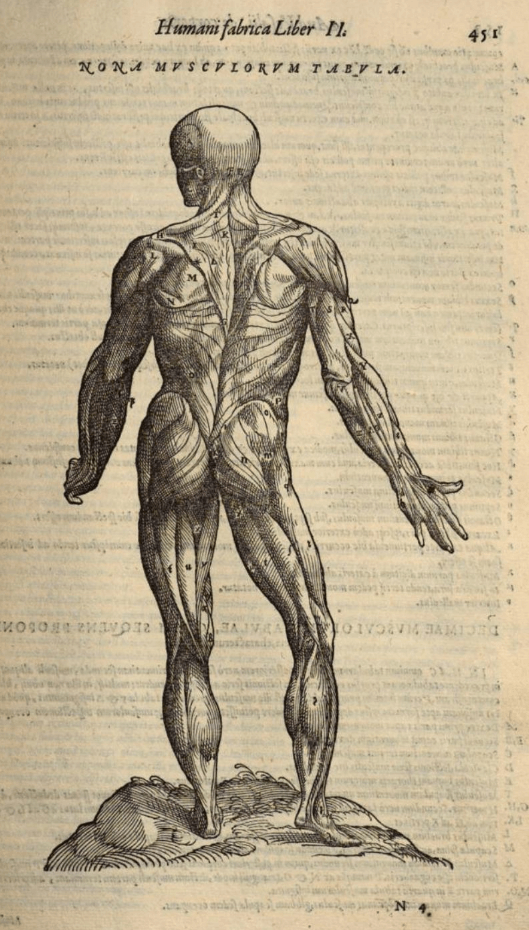
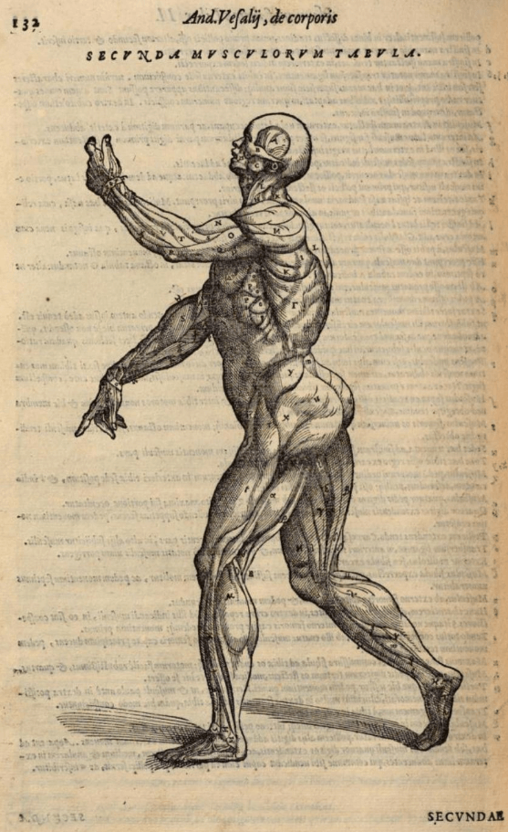
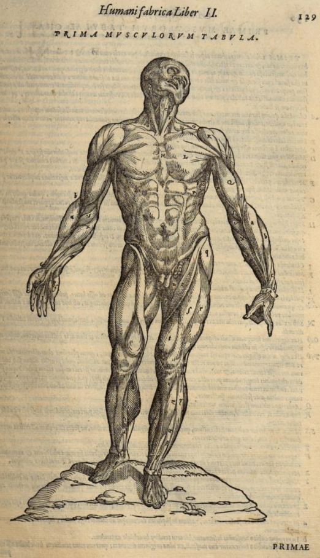
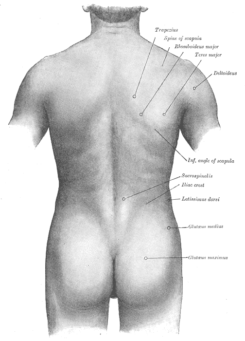
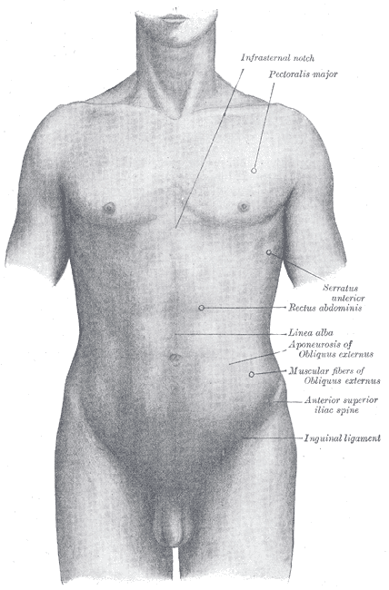
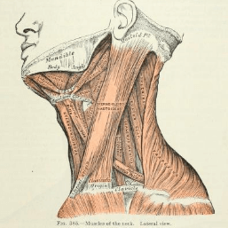

# [`1603:25:1`] //dictiōnāria de partes corporis humani//

🔎1603:25:1🔍

  <dl>
    <dt>#item+conceptum+numerordinatio</dt>
    <dd>1603:1:1:25:1</dd>
    <dt>#item+conceptum+codicem</dt>
    <dd>25_1</dd>
    <dt>#status+conceptum+definitionem</dt>
    <dd>50</dd>
    <dt>#status+conceptum+codicem</dt>
    <dd>50</dd>
    <dt>#item+rem+i_qcc+is_zxxx+ix_n1603</dt>
    <dd>1603:25:1</dd>
    <dt>#item+rem+i_mul+is_zyyy</dt>
    <dd>//dictiōnāria de partes corporis humani//</dd>
    <dt>#item+rem+i_lat+is_latn</dt>
    <dd>/dictiōnāria de partes corporis humani/</dd>
  </dl>

<!-- {'de_codex': '1603_25_1', 'sarcinae': []} -->

----

- <a href='#1'>[1] /caput humanum/@lat-Latn</a>
  - <a href='#1_1'>[1_1] /sinciput/@lat-Latn</a>
  - <a href='#1_2'>[1_2] /occiput/@lat-Latn</a>
- <a href='#2'>[2] </a>
- <a href='#3'>[3] /truncus/@lat-Latn</a>
  - <a href='#3_1'>[3_1] /pectus/@lat-Latn</a>
  - <a href='#3_2'>[3_2] /abdomen/@lat-Latn</a>
  - <a href='#3_3'>[3_3] /pelvis/@lat-Latn</a>
  - <a href='#3_4'>[3_4] /dorsum/@lat-Latn</a>
- <a href='#4'>[4] </a>

----

## [`1`] /caput humanum/@lat-Latn

<a id='1' href='#1'>§ 1</a>

<progress value='60' max='100' title='definitionem: 60/100'>60/100</progress>	<progress value='60' max='100' title='cōdex stabilitātī: 60/100'>60/100</progress>	<ul>	<li><a href='https://www.wikidata.org/wiki/Q3409626'>Q3409626</a></li>	</ul>

🔎1🔍

  <dl>
    <dt>#item+conceptum+numerordinatio</dt>
    <dd>1603:25:1:1</dd>
    <dt>#item+conceptum+codicem</dt>
    <dd>1</dd>
    <dt>#status+conceptum+definitionem</dt>
    <dd>60</dd>
    <dt>#status+conceptum+codicem</dt>
    <dd>60</dd>
    <dt>#item+rem+i_lat+is_latn</dt>
    <dd>caput humanum</dd>
    <dt>#item+rem+i_qcc+is_zxxx+ix_wikiq</dt>
    <dd>Q3409626</dd>
    <dt>#item+rem+i_qcc+is_zxxx+ix_ta98</dt>
    <dd>A01.1.00.001</dd>
    <dt>#item+rem+i_qcc+is_zxxx+ix_hxlix</dt>
    <dd>ix_n1603n25n1caput</dd>
    <dt>#item+rem+i_qcc+is_zxxx+ix_hxlvoc</dt>
    <dd>v_n1603_25_1_caput</dd>
    <dt>#item+rem+i_ara+is_arab</dt>
    <dd>رأس الإنسان</dd>
    <dt>#item+rem+i_ben+is_beng</dt>
    <dd>মানুষের মাথা</dd>
    <dt>#item+rem+i_rus+is_cyrl</dt>
    <dd>голова человека</dd>
    <dt>#item+rem+i_san+is_zzzz</dt>
    <dd>शिरः</dd>
    <dt>#item+rem+i_por+is_latn</dt>
    <dd>cabeça humana</dd>
    <dt>#item+rem+i_eng+is_latn</dt>
    <dd>human head</dd>
    <dt>#item+rem+i_fra+is_latn</dt>
    <dd>tête humaine</dd>
    <dt>#item+rem+i_nld+is_latn</dt>
    <dd>menselijk hoofd</dd>
    <dt>#item+rem+i_deu+is_latn</dt>
    <dd>kopf des menschen</dd>
    <dt>#item+rem+i_spa+is_latn</dt>
    <dd>cabeza humana</dd>
    <dt>#item+rem+i_ita+is_latn</dt>
    <dd>testa umana</dd>
    <dt>#item+rem+i_swe+is_latn</dt>
    <dd>människohuvud</dd>
    <dt>#item+rem+i_pol+is_latn</dt>
    <dd>głowa człowieka</dd>
    <dt>#item+rem+i_vie+is_latn</dt>
    <dd>đầu người</dd>
    <dt>#item+rem+i_cat+is_latn</dt>
    <dd>cap humà</dd>
    <dt>#item+rem+i_ukr+is_cyrl</dt>
    <dd>голова людини</dd>
    <dt>#item+rem+i_nob+is_latn</dt>
    <dd>menneskehode</dd>
    <dt>#item+rem+i_ces+is_latn</dt>
    <dd>hlava</dd>
    <dt>#item+rem+i_dan+is_latn</dt>
    <dd>menneskehovede</dd>
    <dt>#item+rem+i_jpn+is_jpan</dt>
    <dd>ヒトの頭</dd>
    <dt>#item+rem+i_nno+is_latn</dt>
    <dd>menneskehovud</dd>
    <dt>#item+rem+i_fas+is_zzzz</dt>
    <dd>سر انسان</dd>
    <dt>#item+rem+i_hun+is_latn</dt>
    <dd>emberi fej</dd>
    <dt>#item+rem+i_cym+is_latn</dt>
    <dd>pen dynol</dd>
    <dt>#item+rem+i_epo+is_latn</dt>
    <dd>homa kapo</dd>
    <dt>#item+rem+i_msa+is_zzzz</dt>
    <dd>kepala manusia</dd>
    <dt>#item+rem+i_ina+is_latn</dt>
    <dd>capite human</dd>
  </dl>

### [`1_1`] /sinciput/@lat-Latn

<a id='1_1' href='#1_1'>§ 1_1</a>

<progress value='60' max='100' title='definitionem: 60/100'>60/100</progress>	<progress value='19' max='100' title='cōdex stabilitātī: 19/100'>19/100</progress>	<ul>	<li><a href='https://www.wikidata.org/wiki/Q41055'>Q41055</a></li>	</ul>

🔎1_1🔍

  <dl>
    <dt>#item+conceptum+numerordinatio</dt>
    <dd>1603:25:1:1:1</dd>
    <dt>#item+conceptum+codicem</dt>
    <dd>1_1</dd>
    <dt>#status+conceptum+definitionem</dt>
    <dd>60</dd>
    <dt>#status+conceptum+codicem</dt>
    <dd>19</dd>
    <dt>#item+rem+i_lat+is_latn</dt>
    <dd>sinciput</dd>
    <dt>#item+rem+i_qcc+is_zxxx+ix_wikiq</dt>
    <dd>Q41055</dd>
    <dt>#item+rem+i_qcc+is_zxxx+ix_ta98</dt>
    <dd>A01.1.00.002</dd>
    <dt>#item+rem+i_qcc+is_zxxx+ix_hxlix</dt>
    <dd>ix_n1603n25n1sinciput</dd>
    <dt>#item+rem+i_qcc+is_zxxx+ix_hxlvoc</dt>
    <dd>v_n1603_25_1_sinciput</dd>
    <dt>#item+rem+i_ara+is_arab</dt>
    <dd>جبهة</dd>
    <dt>#item+rem+i_rus+is_cyrl</dt>
    <dd>лоб</dd>
    <dt>#item+rem+i_san+is_zzzz</dt>
    <dd>ललाटम्</dd>
    <dt>#item+rem+i_por+is_latn</dt>
    <dd>testa</dd>
    <dt>#item+rem+i_eng+is_latn</dt>
    <dd>forehead</dd>
    <dt>#item+rem+i_fra+is_latn</dt>
    <dd>front</dd>
    <dt>#item+rem+i_nld+is_latn</dt>
    <dd>voorhoofd</dd>
    <dt>#item+rem+i_deu+is_latn</dt>
    <dd>stirn</dd>
    <dt>#item+rem+i_spa+is_latn</dt>
    <dd>frente</dd>
    <dt>#item+rem+i_ita+is_latn</dt>
    <dd>fronte</dd>
    <dt>#item+rem+i_gle+is_latn</dt>
    <dd>éadan</dd>
    <dt>#item+rem+i_swe+is_latn</dt>
    <dd>panna</dd>
    <dt>#item+rem+i_pol+is_latn</dt>
    <dd>czoło</dd>
    <dt>#item+rem+i_fin+is_latn</dt>
    <dd>otsa</dd>
    <dt>#item+rem+i_ron+is_latn</dt>
    <dd>frunte</dd>
    <dt>#item+rem+i_vie+is_latn</dt>
    <dd>trán</dd>
    <dt>#item+rem+i_cat+is_latn</dt>
    <dd>front</dd>
    <dt>#item+rem+i_ukr+is_cyrl</dt>
    <dd>чоло</dd>
    <dt>#item+rem+i_bul+is_cyrl</dt>
    <dd>чело</dd>
    <dt>#item+rem+i_war+is_latn</dt>
    <dd>agtáng</dd>
    <dt>#item+rem+i_nob+is_latn</dt>
    <dd>panne</dd>
    <dt>#item+rem+i_ces+is_latn</dt>
    <dd>čelo</dd>
    <dt>#item+rem+i_dan+is_latn</dt>
    <dd>pande</dd>
    <dt>#item+rem+i_jpn+is_jpan</dt>
    <dd>額</dd>
    <dt>#item+rem+i_nno+is_latn</dt>
    <dd>panne</dd>
    <dt>#item+rem+i_mal+is_mlym</dt>
    <dd>നെറ്റി</dd>
    <dt>#item+rem+i_ind+is_latn</dt>
    <dd>dahi</dd>
    <dt>#item+rem+i_fas+is_zzzz</dt>
    <dd>پیشانی</dd>
    <dt>#item+rem+i_hun+is_latn</dt>
    <dd>homlok</dd>
    <dt>#item+rem+i_eus+is_latn</dt>
    <dd>bekoki</dd>
    <dt>#item+rem+i_cym+is_latn</dt>
    <dd>talcen</dd>
    <dt>#item+rem+i_glg+is_latn</dt>
    <dd>testa</dd>
    <dt>#item+rem+i_slk+is_latn</dt>
    <dd>čelo</dd>
    <dt>#item+rem+i_epo+is_latn</dt>
    <dd>frunto</dd>
    <dt>#item+rem+i_msa+is_zzzz</dt>
    <dd>dahi</dd>
    <dt>#item+rem+i_est+is_latn</dt>
    <dd>laup</dd>
    <dt>#item+rem+i_hrv+is_latn</dt>
    <dd>čelo</dd>
  </dl>

### [`1_2`] /occiput/@lat-Latn

<a id='1_2' href='#1_2'>§ 1_2</a>

<progress value='60' max='100' title='definitionem: 60/100'>60/100</progress>	<progress value='19' max='100' title='cōdex stabilitātī: 19/100'>19/100</progress>	<ul>	<li><a href='https://www.wikidata.org/wiki/Q3321315'>Q3321315</a></li>	</ul>

🔎1_2🔍

  <dl>
    <dt>#item+conceptum+numerordinatio</dt>
    <dd>1603:25:1:1:2</dd>
    <dt>#item+conceptum+codicem</dt>
    <dd>1_2</dd>
    <dt>#status+conceptum+definitionem</dt>
    <dd>60</dd>
    <dt>#status+conceptum+codicem</dt>
    <dd>19</dd>
    <dt>#item+rem+i_lat+is_latn</dt>
    <dd>occiput</dd>
    <dt>#item+rem+i_qcc+is_zxxx+ix_wikiq</dt>
    <dd>Q3321315</dd>
    <dt>#item+rem+i_qcc+is_zxxx+ix_ta98</dt>
    <dd>A01.1.00.003</dd>
    <dt>#item+rem+i_qcc+is_zxxx+ix_hxlix</dt>
    <dd>ix_n1603n25n1occiput</dd>
    <dt>#item+rem+i_qcc+is_zxxx+ix_hxlvoc</dt>
    <dd>v_n1603_25_1_occiput</dd>
    <dt>#item+rem+i_ara+is_arab</dt>
    <dd>مؤخر الرأس</dd>
    <dt>#item+rem+i_por+is_latn</dt>
    <dd>occipício</dd>
    <dt>#item+rem+i_eng+is_latn</dt>
    <dd>occiput</dd>
    <dt>#item+rem+i_fra+is_latn</dt>
    <dd>occiput</dd>
    <dt>#item+rem+i_deu+is_latn</dt>
    <dd>occiput</dd>
    <dt>#item+rem+i_spa+is_latn</dt>
    <dd>occipucio</dd>
    <dt>#item+rem+i_ita+is_latn</dt>
    <dd>occipite</dd>
    <dt>#item+rem+i_pol+is_latn</dt>
    <dd>potylica</dd>
    <dt>#item+rem+i_fin+is_latn</dt>
    <dd>takaraivo</dd>
    <dt>#item+rem+i_cat+is_latn</dt>
    <dd>occípit</dd>
    <dt>#item+rem+i_jpn+is_jpan</dt>
    <dd>後頭部</dd>
    <dt>#item+rem+i_nno+is_latn</dt>
    <dd>bakhovud</dd>
    <dt>#item+rem+i_eus+is_latn</dt>
    <dd>okzipuzio</dd>
    <dt>#item+rem+i_glg+is_latn</dt>
    <dd>occipicio</dd>
  </dl>

## [`2`] 

<a id='2' href='#2'>§ 2</a>

<progress value='60' max='100' title='definitionem: 60/100'>60/100</progress>	<progress value='60' max='100' title='cōdex stabilitātī: 60/100'>60/100</progress>	<ul>	</ul>

🔎2🔍

  <dl>
    <dt>#item+conceptum+numerordinatio</dt>
    <dd>1603:25:1:2</dd>
    <dt>#item+conceptum+codicem</dt>
    <dd>2</dd>
    <dt>#status+conceptum+definitionem</dt>
    <dd>60</dd>
    <dt>#status+conceptum+codicem</dt>
    <dd>60</dd>
    <dt>#item+rem+i_qcc+is_zxxx+ix_hxlix</dt>
    <dd>ix_n1603n25n1collum</dd>
    <dt>#item+rem+i_qcc+is_zxxx+ix_hxlvoc</dt>
    <dd>v_n1603_25_1_collum</dd>
  </dl>

## [`3`] /truncus/@lat-Latn

<a id='3' href='#3'>§ 3</a>

<progress value='60' max='100' title='definitionem: 60/100'>60/100</progress>	<progress value='60' max='100' title='cōdex stabilitātī: 60/100'>60/100</progress>	<ul>	<li><a href='https://www.wikidata.org/wiki/Q160695'>Q160695</a></li>	</ul>

🔎3🔍

  <dl>
    <dt>#item+conceptum+numerordinatio</dt>
    <dd>1603:25:1:3</dd>
    <dt>#item+conceptum+codicem</dt>
    <dd>3</dd>
    <dt>#status+conceptum+definitionem</dt>
    <dd>60</dd>
    <dt>#status+conceptum+codicem</dt>
    <dd>60</dd>
    <dt>#item+rem+i_lat+is_latn</dt>
    <dd>truncus</dd>
    <dt>#item+rem+i_qcc+is_zxxx+ix_wikiq</dt>
    <dd>Q160695</dd>
    <dt>#item+rem+i_qcc+is_zxxx+ix_ta98</dt>
    <dd>A01.1.00.013</dd>
    <dt>#item+rem+i_qcc+is_zxxx+ix_hxlix</dt>
    <dd>ix_n1603n25n1truncus</dd>
    <dt>#item+rem+i_qcc+is_zxxx+ix_hxlvoc</dt>
    <dd>v_n1603_25_1_truncus</dd>
    <dt>#item+rem+i_ara+is_arab</dt>
    <dd>جذع</dd>
    <dt>#item+rem+i_rus+is_cyrl</dt>
    <dd>туловище</dd>
    <dt>#item+rem+i_por+is_latn</dt>
    <dd>tronco</dd>
    <dt>#item+rem+i_eng+is_latn</dt>
    <dd>torso</dd>
    <dt>#item+rem+i_fra+is_latn</dt>
    <dd>tronc</dd>
    <dt>#item+rem+i_nld+is_latn</dt>
    <dd>romp</dd>
    <dt>#item+rem+i_deu+is_latn</dt>
    <dd>rumpf</dd>
    <dt>#item+rem+i_spa+is_latn</dt>
    <dd>tronco</dd>
    <dt>#item+rem+i_ita+is_latn</dt>
    <dd>tronco</dd>
    <dt>#item+rem+i_gle+is_latn</dt>
    <dd>tóracs</dd>
    <dt>#item+rem+i_swe+is_latn</dt>
    <dd>torso</dd>
    <dt>#item+rem+i_pol+is_latn</dt>
    <dd>tułów</dd>
    <dt>#item+rem+i_fin+is_latn</dt>
    <dd>torso</dd>
    <dt>#item+rem+i_ron+is_latn</dt>
    <dd>trunchi</dd>
    <dt>#item+rem+i_vie+is_latn</dt>
    <dd>thân mình</dd>
    <dt>#item+rem+i_cat+is_latn</dt>
    <dd>tronc</dd>
    <dt>#item+rem+i_ukr+is_cyrl</dt>
    <dd>тулуб</dd>
    <dt>#item+rem+i_bul+is_cyrl</dt>
    <dd>туловище</dd>
    <dt>#item+rem+i_slv+is_latn</dt>
    <dd>torzo</dd>
    <dt>#item+rem+i_nob+is_latn</dt>
    <dd>torso</dd>
    <dt>#item+rem+i_ces+is_latn</dt>
    <dd>trup</dd>
    <dt>#item+rem+i_dan+is_latn</dt>
    <dd>torso</dd>
    <dt>#item+rem+i_jpn+is_jpan</dt>
    <dd>胴体</dd>
    <dt>#item+rem+i_nno+is_latn</dt>
    <dd>truncus</dd>
    <dt>#item+rem+i_ind+is_latn</dt>
    <dd>trunkus</dd>
    <dt>#item+rem+i_fas+is_zzzz</dt>
    <dd>تنه</dd>
    <dt>#item+rem+i_hun+is_latn</dt>
    <dd>torzó</dd>
    <dt>#item+rem+i_eus+is_latn</dt>
    <dd>gorputz-enbor</dd>
    <dt>#item+rem+i_glg+is_latn</dt>
    <dd>tronco</dd>
    <dt>#item+rem+i_slk+is_latn</dt>
    <dd>trup</dd>
    <dt>#item+rem+i_epo+is_latn</dt>
    <dd>torso</dd>
    <dt>#item+rem+i_est+is_latn</dt>
    <dd>kere</dd>
    <dt>#item+rem+i_hrv+is_latn</dt>
    <dd>torzo</dd>
  </dl>

### [`3_1`] /pectus/@lat-Latn

<a id='3_1' href='#3_1'>§ 3_1</a>

<progress value='60' max='100' title='definitionem: 60/100'>60/100</progress>	<progress value='19' max='100' title='cōdex stabilitātī: 19/100'>19/100</progress>	<ul>	<li><a href='https://www.wikidata.org/wiki/Q9645'>Q9645</a></li>	</ul>

🔎3_1🔍

  <dl>
    <dt>#item+conceptum+numerordinatio</dt>
    <dd>1603:25:1:3:1</dd>
    <dt>#item+conceptum+codicem</dt>
    <dd>3_1</dd>
    <dt>#status+conceptum+definitionem</dt>
    <dd>60</dd>
    <dt>#status+conceptum+codicem</dt>
    <dd>19</dd>
    <dt>#item+rem+i_lat+is_latn</dt>
    <dd>pectus</dd>
    <dt>#item+rem+i_qcc+is_zxxx+ix_wikiq</dt>
    <dd>Q9645</dd>
    <dt>#item+rem+i_qcc+is_zxxx+ix_ta98</dt>
    <dd>A01.1.00.014</dd>
    <dt>#item+rem+i_qcc+is_zxxx+ix_hxlix</dt>
    <dd>ix_n1603n25n1thorax</dd>
    <dt>#item+rem+i_qcc+is_zxxx+ix_hxlvoc</dt>
    <dd>v_n1603_25_1_thorax</dd>
    <dt>#item+rem+i_ara+is_arab</dt>
    <dd>صدر</dd>
    <dt>#item+rem+i_ben+is_beng</dt>
    <dd>বক্ষ</dd>
    <dt>#item+rem+i_rus+is_cyrl</dt>
    <dd>торакс</dd>
    <dt>#item+rem+i_san+is_zzzz</dt>
    <dd>वक्षःस्थलम्</dd>
    <dt>#item+rem+i_por+is_latn</dt>
    <dd>peito</dd>
    <dt>#item+rem+i_eng+is_latn</dt>
    <dd>thorax</dd>
    <dt>#item+rem+i_fra+is_latn</dt>
    <dd>torse</dd>
    <dt>#item+rem+i_nld+is_latn</dt>
    <dd>borstkas</dd>
    <dt>#item+rem+i_deu+is_latn</dt>
    <dd>brust</dd>
    <dt>#item+rem+i_spa+is_latn</dt>
    <dd>torso</dd>
    <dt>#item+rem+i_ita+is_latn</dt>
    <dd>petto</dd>
    <dt>#item+rem+i_gle+is_latn</dt>
    <dd>cliabhrach</dd>
    <dt>#item+rem+i_swe+is_latn</dt>
    <dd>bröst</dd>
    <dt>#item+rem+i_pol+is_latn</dt>
    <dd>klatka piersiowa</dd>
    <dt>#item+rem+i_fin+is_latn</dt>
    <dd>rinta</dd>
    <dt>#item+rem+i_vie+is_latn</dt>
    <dd>ngực</dd>
    <dt>#item+rem+i_cat+is_latn</dt>
    <dd>tors</dd>
    <dt>#item+rem+i_ukr+is_cyrl</dt>
    <dd>грудна клітка</dd>
    <dt>#item+rem+i_bul+is_cyrl</dt>
    <dd>гръден кош</dd>
    <dt>#item+rem+i_slv+is_latn</dt>
    <dd>prsni koš</dd>
    <dt>#item+rem+i_war+is_latn</dt>
    <dd>dughán</dd>
    <dt>#item+rem+i_nob+is_latn</dt>
    <dd>bryst</dd>
    <dt>#item+rem+i_ces+is_latn</dt>
    <dd>hrudník</dd>
    <dt>#item+rem+i_dan+is_latn</dt>
    <dd>brystkasse</dd>
    <dt>#item+rem+i_jpn+is_jpan</dt>
    <dd>胸</dd>
    <dt>#item+rem+i_nno+is_latn</dt>
    <dd>bryst</dd>
    <dt>#item+rem+i_ind+is_latn</dt>
    <dd>dada</dd>
    <dt>#item+rem+i_fas+is_zzzz</dt>
    <dd>سینه</dd>
    <dt>#item+rem+i_hun+is_latn</dt>
    <dd>mellkas</dd>
    <dt>#item+rem+i_eus+is_latn</dt>
    <dd>torax</dd>
    <dt>#item+rem+i_cym+is_latn</dt>
    <dd>thoracs</dd>
    <dt>#item+rem+i_glg+is_latn</dt>
    <dd>peito</dd>
    <dt>#item+rem+i_slk+is_latn</dt>
    <dd>hrudník</dd>
    <dt>#item+rem+i_epo+is_latn</dt>
    <dd>brusto</dd>
    <dt>#item+rem+i_msa+is_zzzz</dt>
    <dd>dada</dd>
    <dt>#item+rem+i_est+is_latn</dt>
    <dd>rind</dd>
    <dt>#item+rem+i_hrv+is_latn</dt>
    <dd>prsni koš</dd>
  </dl>

### [`3_2`] /abdomen/@lat-Latn

<a id='3_2' href='#3_2'>§ 3_2</a>

<progress value='60' max='100' title='definitionem: 60/100'>60/100</progress>	<progress value='19' max='100' title='cōdex stabilitātī: 19/100'>19/100</progress>	<ul>	<li><a href='https://www.wikidata.org/wiki/Q9597'>Q9597</a></li>	</ul>

🔎3_2🔍

  <dl>
    <dt>#item+conceptum+numerordinatio</dt>
    <dd>1603:25:1:3:2</dd>
    <dt>#item+conceptum+codicem</dt>
    <dd>3_2</dd>
    <dt>#status+conceptum+definitionem</dt>
    <dd>60</dd>
    <dt>#status+conceptum+codicem</dt>
    <dd>19</dd>
    <dt>#item+rem+i_lat+is_latn</dt>
    <dd>abdomen</dd>
    <dt>#item+rem+i_qcc+is_zxxx+ix_wikiq</dt>
    <dd>Q9597</dd>
    <dt>#item+rem+i_qcc+is_zxxx+ix_ta98</dt>
    <dd>A01.1.00.016</dd>
    <dt>#item+rem+i_qcc+is_zxxx+ix_hxlix</dt>
    <dd>ix_n1603n25n1abdomen</dd>
    <dt>#item+rem+i_qcc+is_zxxx+ix_hxlvoc</dt>
    <dd>v_n1603_25_1_abdomen</dd>
    <dt>#item+rem+i_ara+is_arab</dt>
    <dd>بطن</dd>
    <dt>#item+rem+i_ben+is_beng</dt>
    <dd>উদর</dd>
    <dt>#item+rem+i_rus+is_cyrl</dt>
    <dd>живот</dd>
    <dt>#item+rem+i_san+is_zzzz</dt>
    <dd>नाभिः</dd>
    <dt>#item+rem+i_por+is_latn</dt>
    <dd>abdómen</dd>
    <dt>#item+rem+i_eng+is_latn</dt>
    <dd>abdomen</dd>
    <dt>#item+rem+i_fra+is_latn</dt>
    <dd>abdomen</dd>
    <dt>#item+rem+i_nld+is_latn</dt>
    <dd>buik</dd>
    <dt>#item+rem+i_deu+is_latn</dt>
    <dd>abdomen</dd>
    <dt>#item+rem+i_spa+is_latn</dt>
    <dd>abdomen</dd>
    <dt>#item+rem+i_ita+is_latn</dt>
    <dd>addome</dd>
    <dt>#item+rem+i_gle+is_latn</dt>
    <dd>abdóman</dd>
    <dt>#item+rem+i_swe+is_latn</dt>
    <dd>buken</dd>
    <dt>#item+rem+i_sqi+is_latn</dt>
    <dd>abdomeni</dd>
    <dt>#item+rem+i_pol+is_latn</dt>
    <dd>brzuch</dd>
    <dt>#item+rem+i_fin+is_latn</dt>
    <dd>vatsa</dd>
    <dt>#item+rem+i_ron+is_latn</dt>
    <dd>abdomen</dd>
    <dt>#item+rem+i_vie+is_latn</dt>
    <dd>bụng</dd>
    <dt>#item+rem+i_cat+is_latn</dt>
    <dd>abdomen</dd>
    <dt>#item+rem+i_ukr+is_cyrl</dt>
    <dd>живіт</dd>
    <dt>#item+rem+i_bul+is_cyrl</dt>
    <dd>корем</dd>
    <dt>#item+rem+i_slv+is_latn</dt>
    <dd>trebuh</dd>
    <dt>#item+rem+i_war+is_latn</dt>
    <dd>puson</dd>
    <dt>#item+rem+i_nob+is_latn</dt>
    <dd>abdomen</dd>
    <dt>#item+rem+i_ces+is_latn</dt>
    <dd>břicho</dd>
    <dt>#item+rem+i_dan+is_latn</dt>
    <dd>bughule</dd>
    <dt>#item+rem+i_jpn+is_jpan</dt>
    <dd>腹</dd>
    <dt>#item+rem+i_nno+is_latn</dt>
    <dd>abdomen</dd>
    <dt>#item+rem+i_ind+is_latn</dt>
    <dd>abdomen</dd>
    <dt>#item+rem+i_fas+is_zzzz</dt>
    <dd>شکم</dd>
    <dt>#item+rem+i_hun+is_latn</dt>
    <dd>has</dd>
    <dt>#item+rem+i_eus+is_latn</dt>
    <dd>abdomen</dd>
    <dt>#item+rem+i_cym+is_latn</dt>
    <dd>abdomen</dd>
    <dt>#item+rem+i_glg+is_latn</dt>
    <dd>abdome</dd>
    <dt>#item+rem+i_slk+is_latn</dt>
    <dd>brucho (stavovce)</dd>
    <dt>#item+rem+i_epo+is_latn</dt>
    <dd>ventro</dd>
    <dt>#item+rem+i_msa+is_zzzz</dt>
    <dd>Abdomen</dd>
    <dt>#item+rem+i_est+is_latn</dt>
    <dd>kõht</dd>
    <dt>#item+rem+i_hrv+is_latn</dt>
    <dd>trbuh</dd>
    <dt>#item+rem+i_ina+is_latn</dt>
    <dd>abdomine</dd>
  </dl>

### [`3_3`] /pelvis/@lat-Latn

<a id='3_3' href='#3_3'>§ 3_3</a>

<progress value='60' max='100' title='definitionem: 60/100'>60/100</progress>	<progress value='19' max='100' title='cōdex stabilitātī: 19/100'>19/100</progress>	<ul>	<li><a href='https://www.wikidata.org/wiki/Q713102'>Q713102</a></li>	</ul>

🔎3_3🔍

  <dl>
    <dt>#item+conceptum+numerordinatio</dt>
    <dd>1603:25:1:3:3</dd>
    <dt>#item+conceptum+codicem</dt>
    <dd>3_3</dd>
    <dt>#status+conceptum+definitionem</dt>
    <dd>60</dd>
    <dt>#status+conceptum+codicem</dt>
    <dd>19</dd>
    <dt>#item+rem+i_lat+is_latn</dt>
    <dd>pelvis</dd>
    <dt>#item+rem+i_qcc+is_zxxx+ix_wikiq</dt>
    <dd>Q713102</dd>
    <dt>#item+rem+i_qcc+is_zxxx+ix_ta98</dt>
    <dd>A01.1.00.017</dd>
    <dt>#item+rem+i_qcc+is_zxxx+ix_hxlix</dt>
    <dd>ix_n1603n25n1pelvis</dd>
    <dt>#item+rem+i_qcc+is_zxxx+ix_hxlvoc</dt>
    <dd>v_n1603_25_1_pelvis</dd>
    <dt>#item+rem+i_ara+is_arab</dt>
    <dd>حوض</dd>
    <dt>#item+rem+i_ben+is_beng</dt>
    <dd>শ্রোণিচক্র</dd>
    <dt>#item+rem+i_rus+is_cyrl</dt>
    <dd>таз</dd>
    <dt>#item+rem+i_por+is_latn</dt>
    <dd>bacia</dd>
    <dt>#item+rem+i_eng+is_latn</dt>
    <dd>pelvis</dd>
    <dt>#item+rem+i_fra+is_latn</dt>
    <dd>bassin</dd>
    <dt>#item+rem+i_nld+is_latn</dt>
    <dd>bekken</dd>
    <dt>#item+rem+i_deu+is_latn</dt>
    <dd>becken</dd>
    <dt>#item+rem+i_spa+is_latn</dt>
    <dd>pelvis</dd>
    <dt>#item+rem+i_ita+is_latn</dt>
    <dd>bacino</dd>
    <dt>#item+rem+i_gle+is_latn</dt>
    <dd>peilbheas</dd>
    <dt>#item+rem+i_swe+is_latn</dt>
    <dd>bäcken</dd>
    <dt>#item+rem+i_sqi+is_latn</dt>
    <dd>legeni i njeriut</dd>
    <dt>#item+rem+i_pol+is_latn</dt>
    <dd>kość miedniczna</dd>
    <dt>#item+rem+i_fin+is_latn</dt>
    <dd>lantio</dd>
    <dt>#item+rem+i_ron+is_latn</dt>
    <dd>pelvis</dd>
    <dt>#item+rem+i_vie+is_latn</dt>
    <dd>khung chậu</dd>
    <dt>#item+rem+i_cat+is_latn</dt>
    <dd>pelvis</dd>
    <dt>#item+rem+i_ukr+is_cyrl</dt>
    <dd>таз</dd>
    <dt>#item+rem+i_bul+is_cyrl</dt>
    <dd>таз</dd>
    <dt>#item+rem+i_slv+is_latn</dt>
    <dd>medenica</dd>
    <dt>#item+rem+i_war+is_latn</dt>
    <dd>pelvis</dd>
    <dt>#item+rem+i_nob+is_latn</dt>
    <dd>bekken</dd>
    <dt>#item+rem+i_ces+is_latn</dt>
    <dd>pánev</dd>
    <dt>#item+rem+i_dan+is_latn</dt>
    <dd>bækken</dd>
    <dt>#item+rem+i_jpn+is_jpan</dt>
    <dd>骨盤</dd>
    <dt>#item+rem+i_nno+is_latn</dt>
    <dd>bekken</dd>
    <dt>#item+rem+i_ind+is_latn</dt>
    <dd>pelvis</dd>
    <dt>#item+rem+i_fas+is_zzzz</dt>
    <dd>لگن خاصره</dd>
    <dt>#item+rem+i_hun+is_latn</dt>
    <dd>csontos medence</dd>
    <dt>#item+rem+i_eus+is_latn</dt>
    <dd>pelbis</dd>
    <dt>#item+rem+i_cym+is_latn</dt>
    <dd>pelfis</dd>
    <dt>#item+rem+i_glg+is_latn</dt>
    <dd>pelve</dd>
    <dt>#item+rem+i_slk+is_latn</dt>
    <dd>panva</dd>
    <dt>#item+rem+i_epo+is_latn</dt>
    <dd>pelvo</dd>
    <dt>#item+rem+i_msa+is_zzzz</dt>
    <dd>Pelvis</dd>
    <dt>#item+rem+i_est+is_latn</dt>
    <dd>vaagen</dd>
    <dt>#item+rem+i_hrv+is_latn</dt>
    <dd>zdjelica</dd>
  </dl>

### [`3_4`] /dorsum/@lat-Latn

<a id='3_4' href='#3_4'>§ 3_4</a>

<progress value='60' max='100' title='definitionem: 60/100'>60/100</progress>	<progress value='19' max='100' title='cōdex stabilitātī: 19/100'>19/100</progress>	<ul>	<li><a href='https://www.wikidata.org/wiki/Q133279'>Q133279</a></li>	</ul>

🔎3_4🔍

  <dl>
    <dt>#item+conceptum+numerordinatio</dt>
    <dd>1603:25:1:3:4</dd>
    <dt>#item+conceptum+codicem</dt>
    <dd>3_4</dd>
    <dt>#status+conceptum+definitionem</dt>
    <dd>60</dd>
    <dt>#status+conceptum+codicem</dt>
    <dd>19</dd>
    <dt>#item+rem+i_lat+is_latn</dt>
    <dd>dorsum</dd>
    <dt>#item+rem+i_qcc+is_zxxx+ix_wikiq</dt>
    <dd>Q133279</dd>
    <dt>#item+rem+i_qcc+is_zxxx+ix_ta98</dt>
    <dd>A01.1.00.018</dd>
    <dt>#item+rem+i_qcc+is_zxxx+ix_hxlix</dt>
    <dd>ix_n1603n25n1dorsum</dd>
    <dt>#item+rem+i_qcc+is_zxxx+ix_hxlvoc</dt>
    <dd>v_n1603_25_1_dorsum</dd>
    <dt>#item+rem+i_ara+is_arab</dt>
    <dd>ظهر</dd>
    <dt>#item+rem+i_rus+is_cyrl</dt>
    <dd>спина</dd>
    <dt>#item+rem+i_san+is_zzzz</dt>
    <dd>पृष्ठभागः</dd>
    <dt>#item+rem+i_por+is_latn</dt>
    <dd>costas</dd>
    <dt>#item+rem+i_eng+is_latn</dt>
    <dd>back</dd>
    <dt>#item+rem+i_fra+is_latn</dt>
    <dd>dos</dd>
    <dt>#item+rem+i_nld+is_latn</dt>
    <dd>rug</dd>
    <dt>#item+rem+i_deu+is_latn</dt>
    <dd>rücken</dd>
    <dt>#item+rem+i_spa+is_latn</dt>
    <dd>espalda</dd>
    <dt>#item+rem+i_ita+is_latn</dt>
    <dd>schiena</dd>
    <dt>#item+rem+i_swe+is_latn</dt>
    <dd>rygg</dd>
    <dt>#item+rem+i_pol+is_latn</dt>
    <dd>plecy</dd>
    <dt>#item+rem+i_fin+is_latn</dt>
    <dd>selkä</dd>
    <dt>#item+rem+i_ron+is_latn</dt>
    <dd>spate</dd>
    <dt>#item+rem+i_vie+is_latn</dt>
    <dd>lưng người</dd>
    <dt>#item+rem+i_cat+is_latn</dt>
    <dd>esquena</dd>
    <dt>#item+rem+i_ukr+is_cyrl</dt>
    <dd>спина</dd>
    <dt>#item+rem+i_bul+is_cyrl</dt>
    <dd>гръб</dd>
    <dt>#item+rem+i_war+is_latn</dt>
    <dd>bungkog</dd>
    <dt>#item+rem+i_nob+is_latn</dt>
    <dd>rygg</dd>
    <dt>#item+rem+i_ces+is_latn</dt>
    <dd>záda</dd>
    <dt>#item+rem+i_dan+is_latn</dt>
    <dd>ryg</dd>
    <dt>#item+rem+i_jpn+is_jpan</dt>
    <dd>背中</dd>
    <dt>#item+rem+i_nno+is_latn</dt>
    <dd>rygg</dd>
    <dt>#item+rem+i_ind+is_latn</dt>
    <dd>punggung</dd>
    <dt>#item+rem+i_fas+is_zzzz</dt>
    <dd>پشت انسان</dd>
    <dt>#item+rem+i_eus+is_latn</dt>
    <dd>bizkar</dd>
    <dt>#item+rem+i_cym+is_latn</dt>
    <dd>cefn</dd>
    <dt>#item+rem+i_glg+is_latn</dt>
    <dd>costas</dd>
    <dt>#item+rem+i_epo+is_latn</dt>
    <dd>dorso</dd>
    <dt>#item+rem+i_est+is_latn</dt>
    <dd>selg</dd>
    <dt>#item+rem+i_hrv+is_latn</dt>
    <dd>leđa</dd>
  </dl>

## [`4`] 

<a id='4' href='#4'>§ 4</a>

<progress value='60' max='100' title='definitionem: 60/100'>60/100</progress>	<progress value='50' max='100' title='cōdex stabilitātī: 50/100'>50/100</progress>	<ul>	</ul>

🔎4🔍

  <dl>
    <dt>#item+conceptum+numerordinatio</dt>
    <dd>1603:25:1:4</dd>
    <dt>#item+conceptum+codicem</dt>
    <dd>4</dd>
    <dt>#status+conceptum+definitionem</dt>
    <dd>60</dd>
    <dt>#status+conceptum+codicem</dt>
    <dd>50</dd>
    <dt>#item+rem+i_qcc+is_zxxx+ix_hxlix</dt>
    <dd>ix_n1603n25n1extremitates</dd>
    <dt>#item+rem+i_qcc+is_zxxx+ix_hxlvoc</dt>
    <dd>v_n1603_25_1_extremitates</dd>
  </dl>

