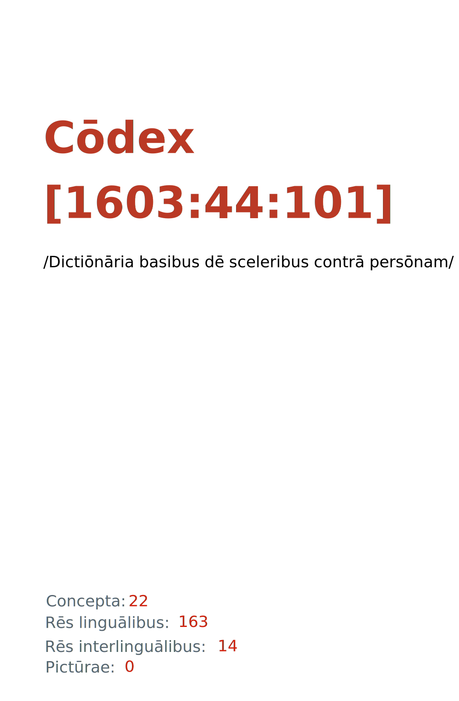

= Cōdex [1603:44:101]: /Dictiōnāria basibus dē sceleribus contrā persōnam/
:doctype: book
:title: Cōdex [1603:44:101]: /Dictiōnāria basibus dē sceleribus contrā persōnam/
:lang: la
:toc: macro
:toclevels: 5
:toc-title: Tabula contentorum
:table-caption: Tabula
:figure-caption: Pictūra
:example-caption: Exemplum
:last-update-label: Renovatio
:version-label: Versiō
:appendix-caption: Appendix
:source-highlighter: rouge
:warning-caption: Hic sunt dracones
:tip-caption: Commendātum
:front-cover-image: : /Dictiōnāria basibus dē sceleribus contrā persōnam/",1050,1600]

{nbsp} +
{nbsp} +
[quote]
/**Public domain means that each major common issue only needs to be resolved once**/@eng-Latn

'''

[%header,cols="25h,~a"]
|===
|
Rēs interlinguālibus
|
Factum

|
scrīptor
|
EticaAI

|
/cōdex pūblicandī/
|
EticaAI

|
/publication date/@eng-Latn
|
2022-03-12

|
numerus editionis
|
2022-04-17T13:02:21

|
/SPDX license ID/@eng-Latn
|
CC0-1.0

|===

ifndef::backend-epub3[]
<<<
toc::[]
<<<
endif::[]

[id=0_999_1603_1]
== Praefātiō 

Rēs linguālibus::
  Lingua Anglica (Abecedarium Latinum):::
    _**Cōdex [1603:44:101]**_ is the book format of the machine-readable dictionaries _**[1603:44:101] /Dictiōnāria basibus dē sceleribus contrā persōnam/**_, which are distributed for implementers on external applications. This book is intended as an advanced resource for other lexicographers and terminology translators, including detect and report inconsistencies. It can, however, be used as an ad hoc dictionary if there is not derived work focused on your specific needs.
    +++  +++
    **ABOUT LEXICOGRAPHY**
    +++  +++
    Practical lexicography is the art or craft of compiling, writing and editing dictionaries. The basics are not far different than a millennia ago: it is still a very humane, creative work. It is necessary to be humble: most of the translator's mistakes are, in fact, not the translator's fault, but methodological flaws. Making sure of a source idea of what a concept represents, even if it means rewrite and make simpler, annex pictures, show examples, do whatever to make it be understood, makes even non-professional translators that care about their own language deliver better results than any alternative. In other words: even the so-called industry best practices of paying professional translators and reviewers cannot overcome already poorly explained source terms.
    +++  +++
    **ABOUT TYPES OF DICTIONARIES WE'RE COMPILING**
    +++  +++
    We're concerned with a group of ideas (we call it a group of dictionaries of concepts) which can be broken into smaller parts, reviewed for inconsistencies, improved for definitions, and then be translated by volunteers. Interlingual codes, such as what could be used on actual data exchange, are also added to each concept. Both glossaries, user interfaces (such as labels on data collection) and in some cases even standard codes for what would go on a data field could be compiled this way.
    +++  +++
    Since the full list of prototypal-dictionaries and dictionaries is huge, one way cited by objective audiences is the following:
    +++  +++
    . Humanitarian aid
    . Development aid
    . Human rights
    . Military relief (or conflict and conflict-resolution related concepts)
    +++  +++
    The itens 1, 2 and 4 https://en.m.wikipedia.org/wiki/Humanitarian-Development_Nexus[are sometimes referred as _nexus_] and are often found helping _humanitarian crisis_. Since most contributors whose ideas and valid criticism are volunteers, then 3 (human rights, as in International Amnesty) to differentiate from humanitarianism (such as Red Cross Movement is reference).
    +++  +++
    Note that **dictionaries are not usage guides**. Instructions, when they exist, are mostly dedicated to lexicographers and translators.
    +++  +++
    **/PRO BONŌ PUBLICŌ/@lat-Latn**
    +++  +++
    The lexicographers of this work are both volunteers, doing it for free, pro bonō publicō, and don't accept donations for the sake of everyone's reusable dictionaries. Existing previous work often is based on old public domain books. Most terminology translators already would be volunteers because they believe in a cause. The best way to inspire collaboration is to be examples ourselves.
    +++  +++
    There's a non-moralistic aspect, fairly simple to understand: how expensive would it be to pay for everyone's work considering it is feasible over 200 languages? The logistics to decide who should be paid, then worldwide cash transfer (may include people from embargoed countries), then traditional auditing mechanisms to check misuse donors expect, exist? In special terminology (dictionary terms themselves) and so many languages, neither sufficient money nor humans interested in being coordinators exist.

<<<

== Methodī ex cōdice
=== Methodī ex dictiōnāriōrum corde
Rēs interlinguālibus::
  /scope and content/@eng-Latn:::
    `+//Dictiōnāria basibus de scielus contrā persōnam//+` (literal English translation: _Basic dictionaries about crimes against person_; person on singular) contains basic (id est, not fully detailed) concepts about crimes against humans at mostly at individual level and crimes against group of humans without intent of exterminate entire community (which have e dedicated dictionaries) for non-political reasons.

==== Referentia
Referēns 1::
  /reference URL/@eng-Latn:::
    link:https://www.youtube.com/watch?v=s_-YueQMLRU[]
  Linguae multiplīs (Scrīptum incognitō):::
    /TODO document/@eng-Latn

Referēns 2::
  /reference URL/@eng-Latn:::
    link:https://www.ohchr.org/EN/NewsEvents/Pages/DisplayNews.aspx?NewsID=27756&LangID=E[]
  Linguae multiplīs (Scrīptum incognitō):::
    /TODO document/@eng-Latn

=== Methodī ex verbīs in dictiōnāriīs
NOTE: /At the moment, there is no workflow to use https://www.wikidata.org/wiki/Wikidata:Lexicographical_data[Wikidata lexicographical data], which actually could be used as storage for stricter nomenclature. The current implementations use only Wikidata concepts, the Q-items./@eng-Latn

==== Methodī ex verbīs in Vicidata (Q modō)
Rēs linguālibus::
  Lingua Anglica (Abecedarium Latinum):::
    The ***[1603:44:101] /Dictiōnāria basibus dē sceleribus contrā persōnam/*** uses Wikidata as one strategy to conciliate language terms for one or more of it's concepts.
    +++  +++
    This means that this book, and related dictionaries data files require periodic updates to, at bare minimum, synchronize and re-share up to date translations.
    +++  +++
    **How reliable are the community translations (Wikidata source)?**
    +++  +++
    The short, default answer is: **they are reliable**, even in cases of no authoritative translations for each subject.
    +++  +++
    As reference, it is likely a professional translator (without access to Wikipedia or Internal terminology bases of the control organizations) would deliver lower quality results if you do blind tests. This is possible because not just the average public, but even terminologists and professional translators help Wikipedia (and implicitly Wikidata).
    +++  +++
    However, even when the result is correct, the current version needs improved differentiation, at minimum, acronym and long form. For major organizations, features such as __P1813 short names__ exist, but are not yet compiled with the current dataset.
    +++  +++
    **Major reasons for "wrong translations" are not translators fault**
    +++  +++
    TIP: As a rule of thumb, for already very defined concepts where you, as human, can manually verify one or more translated terms as a decent result, the other translations are likely to be acceptable. Dictionaries with edge cases (such as disputed territory names) would have further explanation.
    +++  +++
    The main reason for "wrong translations" are poorly defined concepts used to explain for community translators how to generate terminology translations. This would make existing translations from Wikidata (used not just by us) inconsistent. The second reason is if the dictionaries use translations for concepts without a strict match; in other words, if we make stricter definitions of what concept means but reuse Wikidada less exact terms. There are also issues when entire languages are encoded with wrong codes. Note that all these cases **wrong translations are strictly NOT translators fault, but lexicography fault**.
    +++  +++
    It is still possible to have strict translation level errors. But even if we point users how to correct Wikidata/Wikipedia (based on better contextual explanation of a concept, such as this book), the requirements to say the previous term was objectively a wrong human translation error (if following our seriousness on dictionary-building) are very high.
    +++  +++
    From the point of view of data conciliation, the following methodology is used to release the terminology translations with the main concept table.
    +++  +++
    . The main handcrafted lexicographical table (explained on previous topic), also provided on `1603_44_101.no1.tm.hxl.csv`, may reference Wiki QID.
    . Every unique QID of  `1603_44_101.no1.tm.hxl.csv`, together with language codes from [`1603:1:51`] (which requires knowing human languages), is used to prepare an SPARQL query optimized to run on https://query.wikidata.org/[Wikidata Query Service]. The query is so huge that it is not viable to "Try it" links (URL overlong), such https://www.wikidata.org/wiki/Wikidata:SPARQL_query_service/queries/examples[as what you would find on Wikidata Tutorials], ***but*** it works!
    .. Note that the knowledge is free, the translations are there, but the multilingual humanitarian needs may lack people to prepare the files and shares then for general use.
    . The query result, with all QIDs and term labels, is shared as `1603_44_101.wikiq.tm.hxl.csv`
    . The community reviewed translations of each singular QID is pre-compiled on an individual file `1603_44_101.wikiq.tm.hxl.csv`
    . `1603_44_101.no1.tm.hxl.csv` plus `1603_44_101.wikiq.tm.hxl.csv` created `1603_44_101.no11.tm.hxl.csv`

=== Rēs dē factō in dictiōnāriīs
==== Concepta: 22

==== Rēs linguālibus: 161

[%header,cols="15h,25a,~,17"]
|===
|
Cōdex linguae
|
Glotto cōdicī +++ +++ ISO 639-3 +++ +++ Wiki QID cōdicī
|
Nōmen Latīnum
|
Concepta

|
mul-Zyyy
|

+++ +++
https://iso639-3.sil.org/code/mul[mul]
+++ +++ 
|
Linguae multiplīs (Scrīptum incognitō)
|
23

|
ara-Arab
|
https://glottolog.org/resource/languoid/id/arab1395[arab1395]
+++ +++
https://iso639-3.sil.org/code/ara[ara]
+++ +++ https://www.wikidata.org/wiki/Q13955[Q13955]
|
Macrolingua Arabica (Abecedarium Arabicum)
|
17

|
hye-Armn
|
https://glottolog.org/resource/languoid/id/nucl1235[nucl1235]
+++ +++
https://iso639-3.sil.org/code/hye[hye]
+++ +++ https://www.wikidata.org/wiki/Q8785[Q8785]
|
Lingua Armenia (Alphabetum Armenium)
|
9

|
ben-Beng
|
https://glottolog.org/resource/languoid/id/beng1280[beng1280]
+++ +++
https://iso639-3.sil.org/code/ben[ben]
+++ +++ https://www.wikidata.org/wiki/Q9610[Q9610]
|
Lingua Bengali (/ISO 15924 Beng/)
|
11

|
rus-Cyrl
|
https://glottolog.org/resource/languoid/id/russ1263[russ1263]
+++ +++
https://iso639-3.sil.org/code/rus[rus]
+++ +++ https://www.wikidata.org/wiki/Q7737[Q7737]
|
Lingua Russica (Abecedarium Cyrillicum)
|
18

|
hin-Deva
|
https://glottolog.org/resource/languoid/id/hind1269[hind1269]
+++ +++
https://iso639-3.sil.org/code/hin[hin]
+++ +++ https://www.wikidata.org/wiki/Q1568[Q1568]
|
Lingua Hindica (Devanāgarī)
|
8

|
kat-Geor
|
https://glottolog.org/resource/languoid/id/nucl1302[nucl1302]
+++ +++
https://iso639-3.sil.org/code/kat[kat]
+++ +++ https://www.wikidata.org/wiki/Q8108[Q8108]
|
Lingua Georgiana (Abecedarium Georgianum)
|
5

|
guj-Gujr
|
https://glottolog.org/resource/languoid/id/guja1252[guja1252]
+++ +++
https://iso639-3.sil.org/code/guj[guj]
+++ +++ https://www.wikidata.org/wiki/Q5137[Q5137]
|
Lingua Gujaratensis (/ISO 15924 Gujr/)
|
4

|
pan-Guru
|
https://glottolog.org/resource/languoid/id/panj1256[panj1256]
+++ +++
https://iso639-3.sil.org/code/pan[pan]
+++ +++ https://www.wikidata.org/wiki/Q58635[Q58635]
|
Lingua Paniabica (/ISO 15924 Guru/)
|
8

|
kan-Knda
|
https://glottolog.org/resource/languoid/id/nucl1305[nucl1305]
+++ +++
https://iso639-3.sil.org/code/kan[kan]
+++ +++ https://www.wikidata.org/wiki/Q33673[Q33673]
|
Lingua Cannadica (/ISO 15924 Knda/)
|
3

|
kor-Hang
|
https://glottolog.org/resource/languoid/id/kore1280[kore1280]
+++ +++
https://iso639-3.sil.org/code/kor[kor]
+++ +++ https://www.wikidata.org/wiki/Q9176[Q9176]
|
Lingua Coreana (Abecedarium Coreanum)
|
15

|
lzh-Hant
|
https://glottolog.org/resource/languoid/id/lite1248[lite1248]
+++ +++
https://iso639-3.sil.org/code/lzh[lzh]
+++ +++ https://www.wikidata.org/wiki/Q37041[Q37041]
|
Lingua Sinica classica (/ISO 15924 Hant/)
|
1

|
heb-Hebr
|
https://glottolog.org/resource/languoid/id/hebr1245[hebr1245]
+++ +++
https://iso639-3.sil.org/code/heb[heb]
+++ +++ https://www.wikidata.org/wiki/Q9288[Q9288]
|
Lingua Hebraica (Alphabetum Hebraicum)
|
15

|
lat-Latn
|
https://glottolog.org/resource/languoid/id/lati1261[lati1261]
+++ +++
https://iso639-3.sil.org/code/lat[lat]
+++ +++ https://www.wikidata.org/wiki/Q397[Q397]
|
Lingua Latina (Abecedarium Latinum)
|
6

|
nqo-Nkoo
|
https://glottolog.org/resource/languoid/id/nkoa1234[nkoa1234]
+++ +++
https://iso639-3.sil.org/code/nqo[nqo]
+++ +++ https://www.wikidata.org/wiki/Q18546266[Q18546266]
|
/N'Ko/ (/ISO 15924 Nkoo/)
|
3

|
sat-Olck
|
https://glottolog.org/resource/languoid/id/sant1410[sant1410]
+++ +++
https://iso639-3.sil.org/code/sat[sat]
+++ +++ https://www.wikidata.org/wiki/Q33965[Q33965]
|
Lingua Santali (/ISO 15924 Olck/)
|
1

|
ori-Orya
|

+++ +++
https://iso639-3.sil.org/code/ori[ori]
+++ +++ https://www.wikidata.org/wiki/Q33810[Q33810]
|
Macrolingua Orissensis (/ISO 15924 Orya/)
|
3

|
sin-Sinh
|
https://glottolog.org/resource/languoid/id/sinh1246[sinh1246]
+++ +++
https://iso639-3.sil.org/code/sin[sin]
+++ +++ https://www.wikidata.org/wiki/Q13267[Q13267]
|
Lingua Singhalensis (/ISO 15924 Sinh/)
|
6

|
tam-Taml
|
https://glottolog.org/resource/languoid/id/tami1289[tami1289]
+++ +++
https://iso639-3.sil.org/code/tam[tam]
+++ +++ https://www.wikidata.org/wiki/Q5885[Q5885]
|
Lingua Tamulica (/ISO 15924 Taml/)
|
10

|
tel-Telu
|
https://glottolog.org/resource/languoid/id/telu1262[telu1262]
+++ +++
https://iso639-3.sil.org/code/tel[tel]
+++ +++ https://www.wikidata.org/wiki/Q8097[Q8097]
|
Lingua Telingana (/ISO 15924 Telu/)
|
5

|
tha-Thai
|
https://glottolog.org/resource/languoid/id/thai1261[thai1261]
+++ +++
https://iso639-3.sil.org/code/tha[tha]
+++ +++ https://www.wikidata.org/wiki/Q9217[Q9217]
|
Lingua Thai (/ISO 15924 Thai/)
|
7

|
bod-Tibt
|
https://glottolog.org/resource/languoid/id/tibe1272[tibe1272]
+++ +++
https://iso639-3.sil.org/code/bod[bod]
+++ +++ https://www.wikidata.org/wiki/Q34271[Q34271]
|
Lingua Tibetana (Scriptura Tibetana)
|
2

|
zho-Zyyy
|
https://glottolog.org/resource/languoid/id/sini1245[sini1245]
+++ +++
https://iso639-3.sil.org/code/zho[zho]
+++ +++ https://www.wikidata.org/wiki/Q7850[Q7850]
|
/Macrolingua Sinicae (/ISO 15924 Zyyy/)/
|
18

|
por-Latn
|
https://glottolog.org/resource/languoid/id/port1283[port1283]
+++ +++
https://iso639-3.sil.org/code/por[por]
+++ +++ https://www.wikidata.org/wiki/Q5146[Q5146]
|
Lingua Lusitana (Abecedarium Latinum)
|
14

|
eng-Latn
|
https://glottolog.org/resource/languoid/id/stan1293[stan1293]
+++ +++
https://iso639-3.sil.org/code/eng[eng]
+++ +++ https://www.wikidata.org/wiki/Q1860[Q1860]
|
Lingua Anglica (Abecedarium Latinum)
|
22

|
fra-Latn
|
https://glottolog.org/resource/languoid/id/stan1290[stan1290]
+++ +++
https://iso639-3.sil.org/code/fra[fra]
+++ +++ https://www.wikidata.org/wiki/Q150[Q150]
|
Lingua Francogallica (Abecedarium Latinum)
|
18

|
nld-Latn
|
https://glottolog.org/resource/languoid/id/mode1257[mode1257]
+++ +++
https://iso639-3.sil.org/code/nld[nld]
+++ +++ https://www.wikidata.org/wiki/Q7411[Q7411]
|
Lingua Batavica (Abecedarium Latinum)
|
16

|
deu-Latn
|
https://glottolog.org/resource/languoid/id/stan1295[stan1295]
+++ +++
https://iso639-3.sil.org/code/deu[deu]
+++ +++ https://www.wikidata.org/wiki/Q188[Q188]
|
Lingua Germanica (Abecedarium Latinum)
|
18

|
spa-Latn
|
https://glottolog.org/resource/languoid/id/stan1288[stan1288]
+++ +++
https://iso639-3.sil.org/code/spa[spa]
+++ +++ https://www.wikidata.org/wiki/Q1321[Q1321]
|
Lingua Hispanica (Abecedarium Latinum)
|
18

|
ita-Latn
|
https://glottolog.org/resource/languoid/id/ital1282[ital1282]
+++ +++
https://iso639-3.sil.org/code/ita[ita]
+++ +++ https://www.wikidata.org/wiki/Q652[Q652]
|
Lingua Italiana (Abecedarium Latinum)
|
15

|
gle-Latn
|
https://glottolog.org/resource/languoid/id/iris1253[iris1253]
+++ +++
https://iso639-3.sil.org/code/gle[gle]
+++ +++ https://www.wikidata.org/wiki/Q9142[Q9142]
|
Lingua Hibernica (Abecedarium Latinum)
|
9

|
swe-Latn
|
https://glottolog.org/resource/languoid/id/swed1254[swed1254]
+++ +++
https://iso639-3.sil.org/code/swe[swe]
+++ +++ https://www.wikidata.org/wiki/Q9027[Q9027]
|
Lingua Suecica (Abecedarium Latinum)
|
13

|
sqi-Latn
|
https://glottolog.org/resource/languoid/id/alba1267[alba1267]
+++ +++
https://iso639-3.sil.org/code/sqi[sqi]
+++ +++ https://www.wikidata.org/wiki/Q8748[Q8748]
|
Macrolingua Albanica (/Abecedarium Latinum/)
|
2

|
pol-Latn
|
https://glottolog.org/resource/languoid/id/poli1260[poli1260]
+++ +++
https://iso639-3.sil.org/code/pol[pol]
+++ +++ https://www.wikidata.org/wiki/Q809[Q809]
|
Lingua Polonica (Abecedarium Latinum)
|
13

|
fin-Latn
|
https://glottolog.org/resource/languoid/id/finn1318[finn1318]
+++ +++
https://iso639-3.sil.org/code/fin[fin]
+++ +++ https://www.wikidata.org/wiki/Q1412[Q1412]
|
Lingua Finnica (Abecedarium Latinum)
|
13

|
ron-Latn
|
https://glottolog.org/resource/languoid/id/roma1327[roma1327]
+++ +++
https://iso639-3.sil.org/code/ron[ron]
+++ +++ https://www.wikidata.org/wiki/Q7913[Q7913]
|
Lingua Dacoromanica (Abecedarium Latinum)
|
9

|
vie-Latn
|
https://glottolog.org/resource/languoid/id/viet1252[viet1252]
+++ +++
https://iso639-3.sil.org/code/vie[vie]
+++ +++ https://www.wikidata.org/wiki/Q9199[Q9199]
|
Lingua Vietnamensis (Abecedarium Latinum)
|
10

|
cat-Latn
|
https://glottolog.org/resource/languoid/id/stan1289[stan1289]
+++ +++
https://iso639-3.sil.org/code/cat[cat]
+++ +++ https://www.wikidata.org/wiki/Q7026[Q7026]
|
Lingua Catalana (Abecedarium Latinum)
|
18

|
ukr-Cyrl
|
https://glottolog.org/resource/languoid/id/ukra1253[ukra1253]
+++ +++
https://iso639-3.sil.org/code/ukr[ukr]
+++ +++ https://www.wikidata.org/wiki/Q8798[Q8798]
|
Lingua Ucrainica (Abecedarium Cyrillicum)
|
12

|
bul-Cyrl
|
https://glottolog.org/resource/languoid/id/bulg1262[bulg1262]
+++ +++
https://iso639-3.sil.org/code/bul[bul]
+++ +++ https://www.wikidata.org/wiki/Q7918[Q7918]
|
Lingua Bulgarica (Abecedarium Cyrillicum)
|
9

|
slv-Latn
|
https://glottolog.org/resource/languoid/id/slov1268[slov1268]
+++ +++
https://iso639-3.sil.org/code/slv[slv]
+++ +++ https://www.wikidata.org/wiki/Q9063[Q9063]
|
Lingua Slovena (Abecedarium Latinum)
|
10

|
war-Latn
|
https://glottolog.org/resource/languoid/id/wara1300[wara1300]
+++ +++
https://iso639-3.sil.org/code/war[war]
+++ +++ https://www.wikidata.org/wiki/Q34279[Q34279]
|
/Waray language/ (Abecedarium Latinum)
|
1

|
nob-Latn
|
https://glottolog.org/resource/languoid/id/norw1259[norw1259]
+++ +++
https://iso639-3.sil.org/code/nob[nob]
+++ +++ https://www.wikidata.org/wiki/Q25167[Q25167]
|
/Bokmål/ (Abecedarium Latinum)
|
10

|
ces-Latn
|
https://glottolog.org/resource/languoid/id/czec1258[czec1258]
+++ +++
https://iso639-3.sil.org/code/ces[ces]
+++ +++ https://www.wikidata.org/wiki/Q9056[Q9056]
|
Lingua Bohemica (Abecedarium Latinum)
|
13

|
dan-Latn
|
https://glottolog.org/resource/languoid/id/dani1285[dani1285]
+++ +++
https://iso639-3.sil.org/code/dan[dan]
+++ +++ https://www.wikidata.org/wiki/Q9035[Q9035]
|
Lingua Danica (Abecedarium Latinum)
|
14

|
jpn-Jpan
|
https://glottolog.org/resource/languoid/id/nucl1643[nucl1643]
+++ +++
https://iso639-3.sil.org/code/jpn[jpn]
+++ +++ https://www.wikidata.org/wiki/Q5287[Q5287]
|
Lingua Iaponica (Scriptura Iaponica)
|
17

|
nno-Latn
|
https://glottolog.org/resource/languoid/id/norw1262[norw1262]
+++ +++
https://iso639-3.sil.org/code/nno[nno]
+++ +++ https://www.wikidata.org/wiki/Q25164[Q25164]
|
/Nynorsk/ (Abecedarium Latinum)
|
4

|
mal-Mlym
|
https://glottolog.org/resource/languoid/id/mala1464[mala1464]
+++ +++
https://iso639-3.sil.org/code/mal[mal]
+++ +++ https://www.wikidata.org/wiki/Q36236[Q36236]
|
Lingua Malabarica (/Malayalam script/)
|
5

|
ind-Latn
|
https://glottolog.org/resource/languoid/id/indo1316[indo1316]
+++ +++
https://iso639-3.sil.org/code/ind[ind]
+++ +++ https://www.wikidata.org/wiki/Q9240[Q9240]
|
Lingua Indonesiana (Abecedarium Latinum)
|
15

|
fas-Zyyy
|

+++ +++
https://iso639-3.sil.org/code/fas[fas]
+++ +++ https://www.wikidata.org/wiki/Q9168[Q9168]
|
Macrolingua Persica (//Abecedarium Arabicum//)
|
15

|
hun-Latn
|
https://glottolog.org/resource/languoid/id/hung1274[hung1274]
+++ +++
https://iso639-3.sil.org/code/hun[hun]
+++ +++ https://www.wikidata.org/wiki/Q9067[Q9067]
|
Lingua Hungarica (Abecedarium Latinum)
|
9

|
eus-Latn
|
https://glottolog.org/resource/languoid/id/basq1248[basq1248]
+++ +++
https://iso639-3.sil.org/code/eus[eus]
+++ +++ https://www.wikidata.org/wiki/Q8752[Q8752]
|
Lingua Vasconica (Abecedarium Latinum)
|
9

|
cym-Latn
|
https://glottolog.org/resource/languoid/id/wels1247[wels1247]
+++ +++
https://iso639-3.sil.org/code/cym[cym]
+++ +++ https://www.wikidata.org/wiki/Q9309[Q9309]
|
Lingua Cambrica (Abecedarium Latinum)
|
5

|
glg-Latn
|
https://glottolog.org/resource/languoid/id/gali1258[gali1258]
+++ +++
https://iso639-3.sil.org/code/glg[glg]
+++ +++ https://www.wikidata.org/wiki/Q9307[Q9307]
|
Lingua Gallaica (Abecedarium Latinum)
|
9

|
slk-Latn
|
https://glottolog.org/resource/languoid/id/slov1269[slov1269]
+++ +++
https://iso639-3.sil.org/code/slk[slk]
+++ +++ https://www.wikidata.org/wiki/Q9058[Q9058]
|
Lingua Slovaca (Abecedarium Latinum)
|
4

|
epo-Latn
|
https://glottolog.org/resource/languoid/id/espe1235[espe1235]
+++ +++
https://iso639-3.sil.org/code/epo[epo]
+++ +++ https://www.wikidata.org/wiki/Q143[Q143]
|
Lingua Esperantica (Abecedarium Latinum)
|
14

|
msa-Zyyy
|

+++ +++
https://iso639-3.sil.org/code/msa[msa]
+++ +++ https://www.wikidata.org/wiki/Q9237[Q9237]
|
Macrolingua Malayana (/ISO 15924 Zyyy/)
|
9

|
est-Latn
|

+++ +++
https://iso639-3.sil.org/code/est[est]
+++ +++ https://www.wikidata.org/wiki/Q9072[Q9072]
|
Macrolingua Estonica (Abecedarium Latinum)
|
7

|
hrv-Latn
|
https://glottolog.org/resource/languoid/id/croa1245[croa1245]
+++ +++
https://iso639-3.sil.org/code/hrv[hrv]
+++ +++ https://www.wikidata.org/wiki/Q6654[Q6654]
|
Lingua Croatica (Abecedarium Latinum)
|
7

|
tur-Latn
|
https://glottolog.org/resource/languoid/id/nucl1301[nucl1301]
+++ +++
https://iso639-3.sil.org/code/tur[tur]
+++ +++ https://www.wikidata.org/wiki/Q256[Q256]
|
Lingua Turcica (Abecedarium Latinum)
|
11

|
oci-Latn
|
https://glottolog.org/resource/languoid/id/occi1239[occi1239]
+++ +++
https://iso639-3.sil.org/code/oci[oci]
+++ +++ https://www.wikidata.org/wiki/Q14185[Q14185]
|
Lingua Occitana (Abecedarium Latinum)
|
4

|
bre-Latn
|
https://glottolog.org/resource/languoid/id/bret1244[bret1244]
+++ +++
https://iso639-3.sil.org/code/bre[bre]
+++ +++ https://www.wikidata.org/wiki/Q12107[Q12107]
|
Lingua Britonica (Abecedarium Latinum)
|
4

|
arz-Latn
|
https://glottolog.org/resource/languoid/id/egyp1253[egyp1253]
+++ +++
https://iso639-3.sil.org/code/arz[arz]
+++ +++ https://www.wikidata.org/wiki/Q29919[Q29919]
|
/Egyptian Arabic/ (Abecedarium Arabicum)
|
3

|
afr-Latn
|
https://glottolog.org/resource/languoid/id/afri1274[afri1274]
+++ +++
https://iso639-3.sil.org/code/afr[afr]
+++ +++ https://www.wikidata.org/wiki/Q14196[Q14196]
|
Lingua Batava Capitensis (Abecedarium Latinum)
|
4

|
ltz-Latn
|
https://glottolog.org/resource/languoid/id/luxe1241[luxe1241]
+++ +++
https://iso639-3.sil.org/code/ltz[ltz]
+++ +++ https://www.wikidata.org/wiki/Q9051[Q9051]
|
Lingua Luxemburgensis (Abecedarium Latinum)
|
4

|
sco-Latn
|
https://glottolog.org/resource/languoid/id/scot1243[scot1243]
+++ +++
https://iso639-3.sil.org/code/sco[sco]
+++ +++ https://www.wikidata.org/wiki/Q14549[Q14549]
|
Lingua Scotica quae Teutonica (Abecedarium Latinum)
|
4

|
bar-Latn
|
https://glottolog.org/resource/languoid/id/bava1246[bava1246]
+++ +++
https://iso639-3.sil.org/code/bar[bar]
+++ +++ https://www.wikidata.org/wiki/Q29540[Q29540]
|
Lingua Bavarica (Abecedarium Latinum)
|
1

|
arg-Latn
|
https://glottolog.org/resource/languoid/id/arag1245[arag1245]
+++ +++
https://iso639-3.sil.org/code/arg[arg]
+++ +++ https://www.wikidata.org/wiki/Q8765[Q8765]
|
Lingua Aragonensis (Abecedarium Latinum)
|
1

|
zho-Hant
|

+++ +++
https://iso639-3.sil.org/code/zho[zho]
+++ +++ https://www.wikidata.org/wiki/Q18130932[Q18130932]
|
//Traditional Chinese// (/ISO 15924 Hant/)
|
12

|
gsw-Latn
|
https://glottolog.org/resource/languoid/id/swis1247[swis1247]
+++ +++
https://iso639-3.sil.org/code/gsw[gsw]
+++ +++ https://www.wikidata.org/wiki/Q131339[Q131339]
|
Dialecti Alemannicae (Abecedarium Latinum)
|
1

|
isl-Latn
|
https://glottolog.org/resource/languoid/id/icel1247[icel1247]
+++ +++
https://iso639-3.sil.org/code/isl[isl]
+++ +++ https://www.wikidata.org/wiki/Q294[Q294]
|
Lingua Islandica (Abecedarium Latinum)
|
6

|
vec-Latn
|
https://glottolog.org/resource/languoid/id/vene1258[vene1258]
+++ +++
https://iso639-3.sil.org/code/vec[vec]
+++ +++ https://www.wikidata.org/wiki/Q32724[Q32724]
|
Lingua Veneta (Abecedarium Latinum)
|
1

|
pms-Latn
|
https://glottolog.org/resource/languoid/id/piem1238[piem1238]
+++ +++
https://iso639-3.sil.org/code/pms[pms]
+++ +++ https://www.wikidata.org/wiki/Q15085[Q15085]
|
Lingua Pedemontana (Abecedarium Latinum)
|
1

|
scn-Latn
|
https://glottolog.org/resource/languoid/id/sici1248[sici1248]
+++ +++
https://iso639-3.sil.org/code/scn[scn]
+++ +++ https://www.wikidata.org/wiki/Q33973[Q33973]
|
Lingua Sicula (Abecedarium Latinum)
|
3

|
srd-Latn
|

+++ +++
https://iso639-3.sil.org/code/srd[srd]
+++ +++ https://www.wikidata.org/wiki/Q33976[Q33976]
|
Macrolingua Sarda (Abecedarium Latinum)
|
2

|
gla-Latn
|
https://glottolog.org/resource/languoid/id/scot1245[scot1245]
+++ +++
https://iso639-3.sil.org/code/gla[gla]
+++ +++ https://www.wikidata.org/wiki/Q9314[Q9314]
|
Lingua Scotica seu Scotica Gadelica (Abecedarium Latinum)
|
3

|
lim-Latn
|
https://glottolog.org/resource/languoid/id/limb1263[limb1263]
+++ +++
https://iso639-3.sil.org/code/lim[lim]
+++ +++ https://www.wikidata.org/wiki/Q102172[Q102172]
|
Lingua Limburgica (Abecedarium Latinum)
|
2

|
wln-Latn
|
https://glottolog.org/resource/languoid/id/wall1255[wall1255]
+++ +++
https://iso639-3.sil.org/code/wln[wln]
+++ +++ https://www.wikidata.org/wiki/Q34219[Q34219]
|
Lingua Vallonica (Abecedarium Latinum)
|
3

|
srp-Latn
|
https://glottolog.org/resource/languoid/id/serb1264[serb1264]
+++ +++
https://iso639-3.sil.org/code/srp[srp]
+++ +++ https://www.wikidata.org/wiki/Q21161949[Q21161949]
|
/Serbian/ (Abecedarium Latinum)
|
3

|
wol-Latn
|
https://glottolog.org/resource/languoid/id/nucl1347[nucl1347]
+++ +++
https://iso639-3.sil.org/code/wol[wol]
+++ +++ https://www.wikidata.org/wiki/Q34257[Q34257]
|
/Wolof language/ (Abecedarium Latinum)
|
1

|
frp-Latn
|
https://glottolog.org/resource/languoid/id/fran1260[fran1260]
+++ +++
https://iso639-3.sil.org/code/frp[frp]
+++ +++ https://www.wikidata.org/wiki/Q15087[Q15087]
|
Lingua Arpitanica (Abecedarium Latinum)
|
1

|
wuu-Zyyy
|
https://glottolog.org/resource/languoid/id/wuch1236[wuch1236]
+++ +++
https://iso639-3.sil.org/code/wuu[wuu]
+++ +++ https://www.wikidata.org/wiki/Q34290[Q34290]
|
//Macrolingua Wu// (/ISO 15924 Zyyy/)
|
5

|
srp-Cyrl
|
https://glottolog.org/resource/languoid/id/serb1264[serb1264]
+++ +++
https://iso639-3.sil.org/code/srp[srp]
+++ +++ https://www.wikidata.org/wiki/Q9299[Q9299]
|
Lingua Serbica (Abecedarium Cyrillicum)
|
13

|
urd-Arab
|
https://glottolog.org/resource/languoid/id/urdu1245[urdu1245]
+++ +++
https://iso639-3.sil.org/code/urd[urd]
+++ +++ https://www.wikidata.org/wiki/Q1617[Q1617]
|
Lingua Urdu (Abecedarium Arabicum)
|
11

|
gan-Zyyy
|
https://glottolog.org/resource/languoid/id/ganc1239[ganc1239]
+++ +++
https://iso639-3.sil.org/code/gan[gan]
+++ +++ https://www.wikidata.org/wiki/Q33475[Q33475]
|
Lingua Gan (/ISO 15924 Zyyy/)
|
1

|
lit-Latn
|
https://glottolog.org/resource/languoid/id/lith1251[lith1251]
+++ +++
https://iso639-3.sil.org/code/lit[lit]
+++ +++ https://www.wikidata.org/wiki/Q9083[Q9083]
|
Lingua Lithuanica (Abecedarium Latinum)
|
8

|
hbs-Latn
|
https://glottolog.org/resource/languoid/id/sout1528[sout1528]
+++ +++
https://iso639-3.sil.org/code/hbs[hbs]
+++ +++ https://www.wikidata.org/wiki/Q9301[Q9301]
|
Macrolingua Serbocroatica (Abecedarium Latinum)
|
5

|
lav-Latn
|
https://glottolog.org/resource/languoid/id/latv1249[latv1249]
+++ +++
https://iso639-3.sil.org/code/lav[lav]
+++ +++ https://www.wikidata.org/wiki/Q9078[Q9078]
|
Macrolingua Lettonica (Abecedarium Latinum)
|
6

|
bos-Latn
|
https://glottolog.org/resource/languoid/id/bosn1245[bosn1245]
+++ +++
https://iso639-3.sil.org/code/bos[bos]
+++ +++ https://www.wikidata.org/wiki/Q9303[Q9303]
|
Lingua Bosnica (Abecedarium Latinum)
|
6

|
azb-Arab
|
https://glottolog.org/resource/languoid/id/sout2697[sout2697]
+++ +++
https://iso639-3.sil.org/code/azb[azb]
+++ +++ https://www.wikidata.org/wiki/Q3449805[Q3449805]
|
/South Azerbaijani/ (Abecedarium Arabicum)
|
1

|
jav-Latn
|
https://glottolog.org/resource/languoid/id/java1254[java1254]
+++ +++
https://iso639-3.sil.org/code/jav[jav]
+++ +++ https://www.wikidata.org/wiki/Q33549[Q33549]
|
Lingua Iavanica (Abecedarium Latinum)
|
2

|
ell-Grek
|
https://glottolog.org/resource/languoid/id/mode1248[mode1248]
+++ +++
https://iso639-3.sil.org/code/ell[ell]
+++ +++ https://www.wikidata.org/wiki/Q36510[Q36510]
|
Lingua Neograeca (Alphabetum Graecum)
|
10

|
sun-Latn
|
https://glottolog.org/resource/languoid/id/sund1252[sund1252]
+++ +++
https://iso639-3.sil.org/code/sun[sun]
+++ +++ https://www.wikidata.org/wiki/Q34002[Q34002]
|
/Sundanese language/ (Abecedarium Latinum)
|
1

|
fry-Latn
|
https://glottolog.org/resource/languoid/id/west2354[west2354]
+++ +++
https://iso639-3.sil.org/code/fry[fry]
+++ +++ https://www.wikidata.org/wiki/Q27175[Q27175]
|
Lingua Frisice occidentalis (Abecedarium Latinum)
|
10

|
jam-Latn
|
https://glottolog.org/resource/languoid/id/jama1262[jama1262]
+++ +++
https://iso639-3.sil.org/code/jam[jam]
+++ +++ https://www.wikidata.org/wiki/Q35939[Q35939]
|
Lingua creola Iamaicana (Abecedarium Latinum)
|
1

|
che-Cyrl
|
https://glottolog.org/resource/languoid/id/chec1245[chec1245]
+++ +++
https://iso639-3.sil.org/code/che[che]
+++ +++ https://www.wikidata.org/wiki/Q33350[Q33350]
|
Lingua Tsetsenica (Abecedarium Cyrillicum)
|
2

|
bel-Cyrl
|
https://glottolog.org/resource/languoid/id/bela1254[bela1254]
+++ +++
https://iso639-3.sil.org/code/bel[bel]
+++ +++ https://www.wikidata.org/wiki/Q9091[Q9091]
|
Lingua Ruthenica Alba (Abecedarium Cyrillicum)
|
6

|
kab-Latn
|
https://glottolog.org/resource/languoid/id/kaby1243[kaby1243]
+++ +++
https://iso639-3.sil.org/code/kab[kab]
+++ +++ https://www.wikidata.org/wiki/Q35853[Q35853]
|
/Kabyle language/ (Abecedarium Latinum)
|
2

|
fao-Latn
|
https://glottolog.org/resource/languoid/id/faro1244[faro1244]
+++ +++
https://iso639-3.sil.org/code/fao[fao]
+++ +++ https://www.wikidata.org/wiki/Q25258[Q25258]
|
Lingua Faeroensis (Abecedarium Latinum)
|
1

|
mar-Deva
|
https://glottolog.org/resource/languoid/id/mara1378[mara1378]
+++ +++
https://iso639-3.sil.org/code/mar[mar]
+++ +++ https://www.wikidata.org/wiki/Q1571[Q1571]
|
Lingua Marathica (Devanāgarī)
|
5

|
ary-Arab
|
https://glottolog.org/resource/languoid/id/moro1292[moro1292]
+++ +++
https://iso639-3.sil.org/code/ary[ary]
+++ +++ https://www.wikidata.org/wiki/Q56426[Q56426]
|
/Moroccan Arabic/ (Abecedarium Arabicum)
|
2

|
ast-Latn
|
https://glottolog.org/resource/languoid/id/astu1245[astu1245]
+++ +++
https://iso639-3.sil.org/code/ast[ast]
+++ +++ https://www.wikidata.org/wiki/Q29507[Q29507]
|
Lingua Asturiana (Abecedarium Latinum)
|
4

|
bcl-Latn
|
https://glottolog.org/resource/languoid/id/cent2087[cent2087]
+++ +++
https://iso639-3.sil.org/code/bcl[bcl]
+++ +++ https://www.wikidata.org/wiki/Q33284[Q33284]
|
/Central Bikol/  (Abecedarium Latinum)
|
1

|
bho-Deva
|
https://glottolog.org/resource/languoid/id/bhoj1244[bhoj1244]
+++ +++
https://iso639-3.sil.org/code/bho[bho]
+++ +++ https://www.wikidata.org/wiki/Q33268[Q33268]
|
Lingua Bhojpuri (Devanāgarī)
|
1

|
bxr-Cyrl
|
https://glottolog.org/resource/languoid/id/russ1264[russ1264]
+++ +++
https://iso639-3.sil.org/code/bxr[bxr]
+++ +++ https://www.wikidata.org/wiki/Q33120[Q33120]
|
Lingua Buriatica (Abecedarium Cyrillicum)
|
1

|
cdo-Zyyy
|
https://glottolog.org/resource/languoid/id/mind1253[mind1253]
+++ +++
https://iso639-3.sil.org/code/cdo[cdo]
+++ +++ https://www.wikidata.org/wiki/Q36455[Q36455]
|
/Min Dong Chinese/ (/ISO 15924 Zyyy/)
|
2

|
diq-Latn
|
https://glottolog.org/resource/languoid/id/diml1238[diml1238]
+++ +++
https://iso639-3.sil.org/code/diq[diq]
+++ +++ https://www.wikidata.org/wiki/Q10199[Q10199]
|
Lingua Zazaca (Abecedarium Latinum)
|
3

|
dsb-Latn
|
https://glottolog.org/resource/languoid/id/lowe1385[lowe1385]
+++ +++
https://iso639-3.sil.org/code/dsb[dsb]
+++ +++ https://www.wikidata.org/wiki/Q13286[Q13286]
|
/Lower Sorbian/ (Abecedarium Latinum)
|
2

|
gcr-Latn
|
https://glottolog.org/resource/languoid/id/guia1246[guia1246]
+++ +++
https://iso639-3.sil.org/code/gcr[gcr]
+++ +++ https://www.wikidata.org/wiki/Q1363072[Q1363072]
|
/Guianese Creole French/ (Abecedarium Latinum)
|
1

|
hak-Zyyy
|
https://glottolog.org/resource/languoid/id/hakk1236[hakk1236]
+++ +++
https://iso639-3.sil.org/code/hak[hak]
+++ +++ https://www.wikidata.org/wiki/Q33375[Q33375]
|
/Hakka Chinese/ (/ISO 15924 Zyyy/)
|
1

|
hif-Zyyy
|
https://glottolog.org/resource/languoid/id/fiji1242[fiji1242]
+++ +++
https://iso639-3.sil.org/code/hif[hif]
+++ +++ https://www.wikidata.org/wiki/Q46728[Q46728]
|
Lingua Hindi Vitiensis (/ISO 15924 Zyyy/)
|
1

|
hsb-Latn
|
https://glottolog.org/resource/languoid/id/uppe1395[uppe1395]
+++ +++
https://iso639-3.sil.org/code/hsb[hsb]
+++ +++ https://www.wikidata.org/wiki/Q13248[Q13248]
|
/Upper Sorbian/ (Abecedarium Latinum)
|
1

|
ilo-Latn
|
https://glottolog.org/resource/languoid/id/ilok1237[ilok1237]
+++ +++
https://iso639-3.sil.org/code/ilo[ilo]
+++ +++ https://www.wikidata.org/wiki/Q35936[Q35936]
|
Lingua Ilocana (Abecedarium Latinum)
|
1

|
inh-Cyrl
|
https://glottolog.org/resource/languoid/id/ingu1240[ingu1240]
+++ +++
https://iso639-3.sil.org/code/inh[inh]
+++ +++ https://www.wikidata.org/wiki/Q33509[Q33509]
|
Lingua Ingussica (Abecedarium Cyrillicum)
|
1

|
mai-Deva
|
https://glottolog.org/resource/languoid/id/mait1250[mait1250]
+++ +++
https://iso639-3.sil.org/code/mai[mai]
+++ +++ https://www.wikidata.org/wiki/Q36109[Q36109]
|
Lingua Maithili (Devanāgarī)
|
4

|
nan-Latn
|
https://glottolog.org/resource/languoid/id/minn1241[minn1241]
+++ +++
https://iso639-3.sil.org/code/nan[nan]
+++ +++ https://www.wikidata.org/wiki/Q36495[Q36495]
|
/Min Nan Chinese/ (Abecedarium Latinum)
|
3

|
new-Deva
|
https://glottolog.org/resource/languoid/id/newa1246[newa1246]
+++ +++
https://iso639-3.sil.org/code/new[new]
+++ +++ https://www.wikidata.org/wiki/Q33979[Q33979]
|
Lingua Newari (Devanāgarī)
|
2

|
pnb-Arab
|
https://glottolog.org/resource/languoid/id/west2386[west2386]
+++ +++
https://iso639-3.sil.org/code/pnb[pnb]
+++ +++ https://www.wikidata.org/wiki/Q1389492[Q1389492]
|
Lingua Paniabica occidentalis (Abecedarium Arabicum)
|
7

|
sah-Cyrl
|
https://glottolog.org/resource/languoid/id/yaku1245[yaku1245]
+++ +++
https://iso639-3.sil.org/code/sah[sah]
+++ +++ https://www.wikidata.org/wiki/Q34299[Q34299]
|
Lingua Iacutica (Abecedarium Cyrillicum)
|
1

|
sgs-Latn
|
https://glottolog.org/resource/languoid/id/samo1265[samo1265]
+++ +++
https://iso639-3.sil.org/code/sgs[sgs]
+++ +++ https://www.wikidata.org/wiki/Q213434[Q213434]
|
Lingua Samogitica (Abecedarium Latinum)
|
1

|
smn-Latn
|
https://glottolog.org/resource/languoid/id/inar1241[inar1241]
+++ +++
https://iso639-3.sil.org/code/smn[smn]
+++ +++ https://www.wikidata.org/wiki/Q33462[Q33462]
|
/Inari Sami/ (Abecedarium Latinum)
|
3

|
vro-Latn
|
https://glottolog.org/resource/languoid/id/sout2679[sout2679]
+++ +++
https://iso639-3.sil.org/code/vro[vro]
+++ +++ https://www.wikidata.org/wiki/Q32762[Q32762]
|
Lingua Voruvica (Abecedarium Latinum)
|
1

|
yue-Zyyy
|
https://glottolog.org/resource/languoid/id/yuec1235[yuec1235]
+++ +++
https://iso639-3.sil.org/code/yue[yue]
+++ +++ https://www.wikidata.org/wiki/Q7033959[Q7033959]
|
Lingua Yue (/ISO 15924 Zyyy/)
|
7

|
lez-Cyrl
|
https://glottolog.org/resource/languoid/id/lezg1247[lezg1247]
+++ +++
https://iso639-3.sil.org/code/lez[lez]
+++ +++ https://www.wikidata.org/wiki/Q31746[Q31746]
|
Lingua Lesghica (Abecedarium Cyrillicum)
|
1

|
swa-Latn
|

+++ +++
https://iso639-3.sil.org/code/swa[swa]
+++ +++ https://www.wikidata.org/wiki/Q7838[Q7838]
|
Macrolingua Suahelica (Abecedarium Latinum)
|
4

|
zha-Zyyy
|
https://glottolog.org/resource/languoid/id/nort3180[nort3180]
+++ +++
https://iso639-3.sil.org/code/zha[zha]
+++ +++ https://www.wikidata.org/wiki/Q13216[Q13216]
|
/Zhuang languages/ (/ISO 15924 Zyyy/)
|
2

|
yid-Hebr
|
https://glottolog.org/resource/languoid/id/yidd1255[yidd1255]
+++ +++
https://iso639-3.sil.org/code/yid[yid]
+++ +++ https://www.wikidata.org/wiki/Q8641[Q8641]
|
Macrolingua Iudaeo-Germanica (Alphabetum Hebraicum)
|
4

|
uzb-Latn
|
https://glottolog.org/resource/languoid/id/uzbe1247[uzbe1247]
+++ +++
https://iso639-3.sil.org/code/uzb[uzb]
+++ +++ https://www.wikidata.org/wiki/Q9264[Q9264]
|
Macrolingua Uzbecica (Abecedarium Latinum)
|
1

|
tat-Zyyy
|
https://glottolog.org/resource/languoid/id/tata1255[tata1255]
+++ +++
https://iso639-3.sil.org/code/tat[tat]
+++ +++ https://www.wikidata.org/wiki/Q25285[Q25285]
|
Lingua Tatarica (/ISO 15924 Zyyy/)
|
3

|
tat-Cyrl
|
https://glottolog.org/resource/languoid/id/tata1255[tata1255]
+++ +++
https://iso639-3.sil.org/code/tat[tat]
+++ +++ https://www.wikidata.org/wiki/Q39132549[Q39132549]
|
Lingua Tatarica (Abecedarium Cyrillicum)
|
2

|
tat-Latn
|
https://glottolog.org/resource/languoid/id/tata1255[tata1255]
+++ +++
https://iso639-3.sil.org/code/tat[tat]
+++ +++ https://www.wikidata.org/wiki/Q39134544[Q39134544]
|
Lingua Tatarica (Abecedarium Latinum)
|
2

|
tgl-Latn
|
https://glottolog.org/resource/languoid/id/taga1270[taga1270]
+++ +++
https://iso639-3.sil.org/code/tgl[tgl]
+++ +++ https://www.wikidata.org/wiki/Q34057[Q34057]
|
Lingua Tagalog (Abecedarium Latinum)
|
6

|
asm-Beng
|
https://glottolog.org/resource/languoid/id/assa1263[assa1263]
+++ +++
https://iso639-3.sil.org/code/asm[asm]
+++ +++ https://www.wikidata.org/wiki/Q29401[Q29401]
|
Lingua Assamica (/ISO 15924 Beng/)
|
3

|
aze-Latn
|

+++ +++
https://iso639-3.sil.org/code/aze[aze]
+++ +++ https://www.wikidata.org/wiki/Q9292[Q9292]
|
Macrolingua Atropatenica (Abecedarium Latinum)
|
7

|
bak-Cyrl
|
https://glottolog.org/resource/languoid/id/bash1264[bash1264]
+++ +++
https://iso639-3.sil.org/code/bak[bak]
+++ +++ https://www.wikidata.org/wiki/Q13389[Q13389]
|
Lingua Baschkirica (Abecedarium Cyrillicum)
|
3

|
chv-Cyrl
|
https://glottolog.org/resource/languoid/id/chuv1255[chuv1255]
+++ +++
https://iso639-3.sil.org/code/chv[chv]
+++ +++ https://www.wikidata.org/wiki/Q33348[Q33348]
|
Lingua Tschuvaschica (Abecedarium Cyrillicum)
|
1

|
grn-Latn
|

+++ +++
https://iso639-3.sil.org/code/grn[grn]
+++ +++ https://www.wikidata.org/wiki/Q35876[Q35876]
|
Macrolingua Guaranica (Abecedarium Latinum)
|
3

|
hau-Latn
|
https://glottolog.org/resource/languoid/id/haus1257[haus1257]
+++ +++
https://iso639-3.sil.org/code/hau[hau]
+++ +++ https://www.wikidata.org/wiki/Q56475[Q56475]
|
Lingua Haussana (Abecedarium Latinum)
|
3

|
hat-Latn
|
https://glottolog.org/resource/languoid/id/hait1244[hait1244]
+++ +++
https://iso639-3.sil.org/code/hat[hat]
+++ +++ https://www.wikidata.org/wiki/Q33491[Q33491]
|
Lingua creola Haitiana (Abecedarium Latinum)
|
2

|
kaz-Zyyy
|
https://glottolog.org/resource/languoid/id/kaza1248[kaza1248]
+++ +++
https://iso639-3.sil.org/code/kaz[kaz]
+++ +++ https://www.wikidata.org/wiki/Q9252[Q9252]
|
Lingua Kazachica (/ISO 15924 Zyyy/)
|
4

|
kur-Zyyy
|
https://glottolog.org/resource/languoid/id/kurd1259[kurd1259]
+++ +++
https://iso639-3.sil.org/code/kur[kur]
+++ +++ https://www.wikidata.org/wiki/Q36368[Q36368]
|
Macrolingua Curdica (/ISO 15924 Zyyy/)
|
2

|
ckb-Arab
|
https://glottolog.org/resource/languoid/id/cent1972[cent1972]
+++ +++
https://iso639-3.sil.org/code/ckb[ckb]
+++ +++ https://www.wikidata.org/wiki/Q36811[Q36811]
|
/Central Kurdish/ (Abecedarium Arabicum)
|
4

|
kir-Zyyy
|
https://glottolog.org/resource/languoid/id/kirg1245[kirg1245]
+++ +++
https://iso639-3.sil.org/code/kir[kir]
+++ +++ https://www.wikidata.org/wiki/Q9255[Q9255]
|
Lingua Kyrgyzensis (/ISO 15924 Zyyy/)
|
1

|
mkd-Cyrl
|
https://glottolog.org/resource/languoid/id/mace1250[mace1250]
+++ +++
https://iso639-3.sil.org/code/mkd[mkd]
+++ +++ https://www.wikidata.org/wiki/Q9296[Q9296]
|
Lingua Macedonica (Abecedarium Cyrillicum)
|
7

|
mon-Cyrl
|
https://glottolog.org/resource/languoid/id/mong1331[mong1331]
+++ +++
https://iso639-3.sil.org/code/mon[mon]
+++ +++ https://www.wikidata.org/wiki/Q9246[Q9246]
|
Macrolingua Mongolica (Abecedarium Cyrillicum)
|
1

|
mlt-Latn
|
https://glottolog.org/resource/languoid/id/malt1254[malt1254]
+++ +++
https://iso639-3.sil.org/code/mlt[mlt]
+++ +++ https://www.wikidata.org/wiki/Q9166[Q9166]
|
Lingua Melitensis (Abecedarium Latinum)
|
4

|
mya-Mymr
|
https://glottolog.org/resource/languoid/id/nucl1310[nucl1310]
+++ +++
https://iso639-3.sil.org/code/mya[mya]
+++ +++ https://www.wikidata.org/wiki/Q9228[Q9228]
|
Lingua Birmanica (/ISO 15924 Mymr/)
|
2

|
nep-Deva
|
https://glottolog.org/resource/languoid/id/east1436[east1436]
+++ +++
https://iso639-3.sil.org/code/nep[nep]
+++ +++ https://www.wikidata.org/wiki/Q33823[Q33823]
|
Macrolingua Nepalensis (Devanāgarī)
|
7

|
oss-Cyrl
|
https://glottolog.org/resource/languoid/id/iron1242[iron1242]
+++ +++
https://iso639-3.sil.org/code/oss[oss]
+++ +++ https://www.wikidata.org/wiki/Q33968[Q33968]
|
Lingua Ossetica (Abecedarium Cyrillicum)
|
1

|
pus-Arab
|
https://glottolog.org/resource/languoid/id/nucl1276[nucl1276]
+++ +++
https://iso639-3.sil.org/code/pus[pus]
+++ +++ https://www.wikidata.org/wiki/Q58680[Q58680]
|
Macrolingua Afganica (Abecedarium Arabicum)
|
3

|
que-Latn
|

+++ +++
https://iso639-3.sil.org/code/que[que]
+++ +++ https://www.wikidata.org/wiki/Q5218[Q5218]
|
Macrolinguae Quechuae (Abecedarium Latinum)
|
3

|
snd-Arab
|
https://glottolog.org/resource/languoid/id/sind1272[sind1272]
+++ +++
https://iso639-3.sil.org/code/snd[snd]
+++ +++ https://www.wikidata.org/wiki/Q33997[Q33997]
|
Lingua Sindhuica (Abecedarium Arabicum)
|
4

|
sme-Latn
|
https://glottolog.org/resource/languoid/id/nort2671[nort2671]
+++ +++
https://iso639-3.sil.org/code/sme[sme]
+++ +++ https://www.wikidata.org/wiki/Q33947[Q33947]
|
Lingua Samica septentrionalis (Abecedarium Latinum)
|
3

|
sna-Latn
|
https://glottolog.org/resource/languoid/id/shon1251[shon1251]
+++ +++
https://iso639-3.sil.org/code/sna[sna]
+++ +++ https://www.wikidata.org/wiki/Q34004[Q34004]
|
/Shona/ (Abecedarium Latinum)
|
1

|
som-Latn
|
https://glottolog.org/resource/languoid/id/soma1255[soma1255]
+++ +++
https://iso639-3.sil.org/code/som[som]
+++ +++ https://www.wikidata.org/wiki/Q13275[Q13275]
|
Lingua Somalica (Abecedarium Latinum)
|
2

|
tgk-Zyyy
|
https://glottolog.org/resource/languoid/id/taji1245[taji1245]
+++ +++
https://iso639-3.sil.org/code/tgk[tgk]
+++ +++ https://www.wikidata.org/wiki/Q9260[Q9260]
|
Lingua Tadzikica (/ISO 15924 Zyyy/)
|
3

|
zul-Latn
|
https://glottolog.org/resource/languoid/id/zulu1248[zulu1248]
+++ +++
https://iso639-3.sil.org/code/zul[zul]
+++ +++ https://www.wikidata.org/wiki/Q10179[Q10179]
|
Lingua Zuluana (Abecedarium Latinum)
|
1

|
ina-Latn
|
https://glottolog.org/resource/languoid/id/inte1239[inte1239]
+++ +++
https://iso639-3.sil.org/code/ina[ina]
+++ +++ https://www.wikidata.org/wiki/Q35934[Q35934]
|
Interlingua (Abecedarium Latinum)
|
1

|
ile-Latn
|
https://glottolog.org/resource/languoid/id/inte1260[inte1260]
+++ +++
https://iso639-3.sil.org/code/ile[ile]
+++ +++ https://www.wikidata.org/wiki/Q35850[Q35850]
|
Lingua Occidental (Abecedarium Latinum)
|
1

|
ido-Latn
|
https://glottolog.org/resource/languoid/id/idoo1234[idoo1234]
+++ +++
https://iso639-3.sil.org/code/ido[ido]
+++ +++ https://www.wikidata.org/wiki/Q35224[Q35224]
|
Ido (Abecedarium Latinum)
|
3

|
lfn-Latn
|
https://glottolog.org/resource/languoid/id/ling1267[ling1267]
+++ +++
https://iso639-3.sil.org/code/lfn[lfn]
+++ +++ https://www.wikidata.org/wiki/Q146803[Q146803]
|
Lingua Franca Nova (Abecedarium Latinum)
|
1

|===

==== Rēs interlinguālibus: 9
Rēs::
  Numerordĭnātĭo:::
    Rēs interlinguālibus::::
      ix_hxlix;;
        ix_n1603

      ix_hxlvoc;;
        v_n1603

    Rēs linguālibus::::
      Lingua Latina (Abecedarium Latinum);;
        +++Numerordĭnātĭo+++

      Lingua Anglica (Abecedarium Latinum);;
        +++a generic strategy of arranging numbers in an taxonomy-like explicit way+++

  /SPDX license ID/@eng-Latn:::
    Rēs interlinguālibus::::
      /Wiki P/;;
        https://www.wikidata.org/wiki/Property:P2479[P2479]

      /rēgulam/;;
        [0-9A-Za-z\.\-]{3,36}[+]?

      /formatter URL/@eng-Latn;;
        https://spdx.org/licenses/$1.html

      ix_hxlix;;
        ix_wikip2479

      ix_hxlvoc;;
        v_wiki_p_2479

    Rēs linguālibus::::
      Lingua Latina (Abecedarium Latinum);;
        +++/SPDX license ID/@eng-Latn+++

      Lingua Anglica (Abecedarium Latinum);;
        +++SPDX license identifier+++

  numerus editionis:::
    Rēs interlinguālibus::::
      /Wiki P/;;
        https://www.wikidata.org/wiki/Property:P393[P393]

      ix_hxlix;;
        ix_wikip393

      ix_hxlvoc;;
        v_wiki_p_393

    Rēs linguālibus::::
      Lingua Latina (Abecedarium Latinum);;
        +++numerus editionis+++

      Lingua Anglica (Abecedarium Latinum);;
        +++number of an edition (first, second, ... as 1, 2, ...) or event+++

  /Wiki QID/:::
    Rēs interlinguālibus::::
      /rēgulam/;;
        Q[1-9]\d*

      ix_hxlix;;
        ix_wikiq

      ix_hxlvoc;;
        v_wiki_q

    Rēs linguālibus::::
      Lingua Latina (Abecedarium Latinum);;
        +++/Wiki QID/+++

      Lingua Anglica (Abecedarium Latinum);;
        +++QID (or Q number) is the unique identifier of a data item on Wikidata, comprising the letter "Q" followed by one or more digits. It is used to help people and machines understand the difference between items with the same or similar names e.g there are several places in the world called London and many people called James Smith. This number appears next to the name at the top of each Wikidata item.+++

  /scope and content/@eng-Latn:::
    Rēs interlinguālibus::::
      /Wiki P/;;
        https://www.wikidata.org/wiki/Property:P7535[P7535]

      ix_hxlix;;
        ix_wikip7535

      ix_hxlvoc;;
        v_wiki_p_7535

    Rēs linguālibus::::
      Lingua Latina (Abecedarium Latinum);;
        +++/scope and content/@eng-Latn+++

      Lingua Anglica (Abecedarium Latinum);;
        +++a summary statement providing an overview of the archival collection+++

  /cōdex pūblicandī/:::
    Rēs interlinguālibus::::
      /Wiki P/;;
        https://www.wikidata.org/wiki/Property:P123[P123]

      ix_hxlix;;
        ix_wikip123

      ix_hxlvoc;;
        v_wiki_p_123

    Rēs linguālibus::::
      Lingua Latina (Abecedarium Latinum);;
        +++/cōdex pūblicandī/+++

      Lingua Anglica (Abecedarium Latinum);;
        +++organization or person responsible for publishing books, periodicals, printed music, podcasts, games or software+++

  scrīptor:::
    Rēs interlinguālibus::::
      /Wiki P/;;
        https://www.wikidata.org/wiki/Property:P50[P50]

      ix_hxlix;;
        ix_wikip50

      ix_hxlvoc;;
        v_wiki_p_50

    Rēs linguālibus::::
      Lingua Latina (Abecedarium Latinum);;
        +++scrīptor+++

      Lingua Anglica (Abecedarium Latinum);;
        +++Main creator(s) of a written work (use on works, not humans)+++

  /publication date/@eng-Latn:::
    Rēs interlinguālibus::::
      /Wiki P/;;
        https://www.wikidata.org/wiki/Property:P577[P577]

      ix_hxlix;;
        ix_wikip577

      ix_hxlvoc;;
        v_wiki_p_577

    Rēs linguālibus::::
      Lingua Latina (Abecedarium Latinum);;
        +++/publication date/@eng-Latn+++

      Lingua Anglica (Abecedarium Latinum);;
        +++Date or point in time when a work was first published or released+++

<<<

== Archīa

Rēs linguālibus::
  Lingua Anglica (Abecedarium Latinum):::
    **Context information**: ignoring for a moment the fact of having several translations (and optimized to receive contributions on a regular basis, not _just_ an static work), then the actual groundbreaking difference on the workflow used to generate every dictionaries on Cōdex such as this one are the following fact: **we provide machine readable formats even when the equivalents on _international languages_, such as English, don't have for areas such as humanitarian aid, development aid and human rights**. The closest to such multilingualism (outside Wikimedia) are European Union SEMICeu (up to 24 languages), but even then have issues while sharing translations on all languages. United Nations translations (up to 6 languages, rarely more) are not available by humanitarian agencies to help with terminology translations.
    +++  +++
    **Practical implication**: the text documents on _Archīa prō cōdice_ (literal English translation: _File for book_) are alternatives to this book format which are heavily automated using only the data format. However, the machine-readable formats on _Archīa prō dictiōnāriīs_ (literal English translation: _Files for dictionaries_) are the focus and recommended for derived works and intended for mitigating additional human errors. We can even create new formats by request! The goal here is both to allow terminology translators and production usage where it makes an impact.

=== Archīa prō dictiōnāriīs: 4

==== 1603_44_101.no1.tm.hxl.csv

Rēs interlinguālibus::
  /download link/@eng-Latn::: link:1603_44_101.no1.tm.hxl.csv[1603_44_101.no1.tm.hxl.csv]
Rēs linguālibus::
  Lingua Anglica (Abecedarium Latinum):::
    /Numerordinatio on HXLTM container/

==== 1603_44_101.no11.tm.hxl.csv

Rēs interlinguālibus::
  /download link/@eng-Latn::: link:1603_44_101.no11.tm.hxl.csv[1603_44_101.no11.tm.hxl.csv]
Rēs linguālibus::
  Lingua Anglica (Abecedarium Latinum):::
    /Numerordinatio on HXLTM container (expanded with terminology translations)/

==== 1603_44_101.wikiq.tm.hxl.csv

Rēs interlinguālibus::
  /download link/@eng-Latn::: link:1603_44_101.wikiq.tm.hxl.csv[1603_44_101.wikiq.tm.hxl.csv]
  /reference URL/@eng-Latn:::
    https://hxltm.etica.ai/

Rēs linguālibus::
  Lingua Anglica (Abecedarium Latinum):::
    HXLTM dialect of HXLStandard on CSV RFC 4180. wikiq means #item+conceptum+codicem are strictly Wikidata QIDs.

==== 1603_44_101.no11.tbx

Rēs interlinguālibus::
  /download link/@eng-Latn::: link:1603_44_101.no11.tbx[1603_44_101.no11.tbx]
  /reference URL/@eng-Latn:::
    http://www.terminorgs.net/downloads/TBX_Basic_Version_3.1.pdf

Rēs linguālibus::
  Lingua Anglica (Abecedarium Latinum):::
    TBX-Basic is a terminological markup language (TML) that is a lighter version of TBX-Default, the TML that is defined in ISO 30042. TBX-Basic is designed for the localization industry and is based on information from surveys and studies that were conducted by the LISA Term SIG about the types of terminology data that the localization industry requires.

==== 1603_44_101.no11.tmx

Rēs interlinguālibus::
  /download link/@eng-Latn::: link:1603_44_101.no11.tmx[1603_44_101.no11.tmx]
  /reference URL/@eng-Latn:::
    https://www.gala-global.org/tmx-14b

Rēs linguālibus::
  Lingua Anglica (Abecedarium Latinum):::
    The purpose of the Translation Memory eXchange format (TMX) format is to provide a standard method to describe translation memory data that is being exchanged among tools and/or translation vendors, while introducing little or no loss of critical data during the process

=== Archīa prō cōdice: 2

==== 1603_44_101.mul-Latn.codex.adoc

Rēs interlinguālibus::
  /download link/@eng-Latn::: link:1603_44_101.mul-Latn.codex.adoc[1603_44_101.mul-Latn.codex.adoc]
  /reference URL/@eng-Latn:::
    https://docs.asciidoctor.org/

Rēs linguālibus::
  Lingua Anglica (Abecedarium Latinum):::
    AsciiDoc is a plain text authoring format (i.e., lightweight markup language) for writing technical content such as documentation, articles, and books.

==== 1603_44_101.mul-Latn.codex.pdf

Rēs interlinguālibus::
  /download link/@eng-Latn::: link:1603_44_101.mul-Latn.codex.pdf[1603_44_101.mul-Latn.codex.pdf]
  /reference URL/@eng-Latn:::
    https://www.adobe.com/content/dam/acom/en/devnet/pdf/pdfs/PDF32000_2008.pdf

Rēs linguālibus::
  Lingua Anglica (Abecedarium Latinum):::
    Portable Document Format (PDF), standardized as ISO 32000, is a file format developed by Adobe in 1992 to present documents, including text formatting and images, in a manner independent of application software, hardware, and operating systems.

== Externīs
=== Dictiōnāria necessitātibus
==== [1603:44:86] //Dictiōnāria basibus dē tortūrīs//
Rēs interlinguālibus::
  Numerordĭnātĭo:::
    1603:44:86

  ix_n1603op:::
    22

  /Wiki QID/:::
    https://www.wikidata.org/wiki/Q132781[Q132781]

Rēs linguālibus::
  Linguae multiplīs (Scrīptum incognitō):::
    //Dictiōnāria basibus dē tortūrīs//

<<<

<<<

[.text-center]

Dictiōnāria initiīs

<<<

== /Dictiōnāria basibus dē sceleribus contrā persōnam/
<<<

[id='100']
=== [`100`] /psychological, generic/@eng-Latn

Rēs linguālibus::
  Linguae multiplīs (Scrīptum incognitō):::
    /psychological, generic/@eng-Latn

[id='100_1']
==== [`100_1`] /blackmail/@eng-Latn

Rēs interlinguālibus::
  /Wiki QID/:::
    https://www.wikidata.org/wiki/Q34284[Q34284]

Rēs linguālibus::
  Linguae multiplīs (Scrīptum incognitō):::
    /blackmail || coercion based on threat of revealing information/@eng-Latn

  Macrolingua Arabica (Abecedarium Arabicum):::
    +++ابتزاز+++

  Lingua Armenia (Alphabetum Armenium):::
    +++Շորթագործություն+++

  Lingua Bengali (/ISO 15924 Beng/):::
    +++ব্ল্যাকমেইল+++

  Lingua Russica (Abecedarium Cyrillicum):::
    +++Шантаж+++

  Lingua Hindica (Devanāgarī):::
    +++भयदोहन+++

  Lingua Hebraica (Alphabetum Hebraicum):::
    +++סחיטה+++

  Lingua Tamulica (/ISO 15924 Taml/):::
    +++கப்பம்+++

  Lingua Thai (/ISO 15924 Thai/):::
    +++การรีดเอาทรัพย์+++

  /Macrolingua Sinicae (/ISO 15924 Zyyy/)/:::
    +++勒索+++

  Lingua Lusitana (Abecedarium Latinum):::
    +++chantagem+++

  Lingua Anglica (Abecedarium Latinum):::
    +++blackmail+++

  Lingua Francogallica (Abecedarium Latinum):::
    +++chantage+++

  Lingua Batavica (Abecedarium Latinum):::
    +++chantage+++

  Lingua Germanica (Abecedarium Latinum):::
    +++Chantage+++

  Lingua Hispanica (Abecedarium Latinum):::
    +++chantaje+++

  Lingua Italiana (Abecedarium Latinum):::
    +++estorsione+++

  Lingua Suecica (Abecedarium Latinum):::
    +++utpressning+++

  Lingua Polonica (Abecedarium Latinum):::
    +++Szantaż+++

  Lingua Finnica (Abecedarium Latinum):::
    +++kiristys+++

  Lingua Dacoromanica (Abecedarium Latinum):::
    +++Șantaj+++

  Lingua Vietnamensis (Abecedarium Latinum):::
    +++Tống tiền+++

  Lingua Catalana (Abecedarium Latinum):::
    +++xantatge+++

  Lingua Ucrainica (Abecedarium Cyrillicum):::
    +++Шантаж+++

  Lingua Bulgarica (Abecedarium Cyrillicum):::
    +++Шантаж+++

  Lingua Slovena (Abecedarium Latinum):::
    +++Izsiljevanje+++

  /Bokmål/ (Abecedarium Latinum):::
    +++utpressing+++

  Lingua Bohemica (Abecedarium Latinum):::
    +++vydírání+++

  Lingua Danica (Abecedarium Latinum):::
    +++afpresning+++

  Lingua Iaponica (Scriptura Iaponica):::
    +++ゆすり+++

  Lingua Indonesiana (Abecedarium Latinum):::
    +++pemerasan+++

  Macrolingua Persica (//Abecedarium Arabicum//):::
    +++شانتاژ+++

  Lingua Hungarica (Abecedarium Latinum):::
    +++zsarolás+++

  Lingua Vasconica (Abecedarium Latinum):::
    +++Xantaia+++

  Lingua Esperantica (Abecedarium Latinum):::
    +++ĉantaĝo+++

  Macrolingua Malayana (/ISO 15924 Zyyy/):::
    +++Peras ugut+++

  Macrolingua Estonica (Abecedarium Latinum):::
    +++Šantaaž+++

  Lingua Turcica (Abecedarium Latinum):::
    +++Şantaj+++

  Lingua Serbica (Abecedarium Cyrillicum):::
    +++уцена+++

  Lingua Urdu (Abecedarium Arabicum):::
    +++بلیک میل+++

  Lingua Lithuanica (Abecedarium Latinum):::
    +++Šantažas+++

  Lingua Neograeca (Alphabetum Graecum):::
    +++εκβιασμός+++

  Lingua Frisice occidentalis (Abecedarium Latinum):::
    +++Sjantaazje+++

  Lingua Ruthenica Alba (Abecedarium Cyrillicum):::
    +++Шантаж+++

  Macrolingua Atropatenica (Abecedarium Latinum):::
    +++şantaj+++

  Lingua Tschuvaschica (Abecedarium Cyrillicum):::
    +++Шантаж+++

  Lingua Kazachica (/ISO 15924 Zyyy/):::
    +++Шантаж+++

<<<

[id='300']
=== [`300`] Mercatus hominum

Rēs interlinguālibus::
  /Wiki QID/:::
    https://www.wikidata.org/wiki/Q181784[Q181784]

Rēs linguālibus::
  Linguae multiplīs (Scrīptum incognitō):::
    /human trafficking || trade of humans for the purpose of forced labor, sexual slavery, or commercial sexual exploitation for the trafficker or others/@eng-Latn

  Macrolingua Arabica (Abecedarium Arabicum):::
    +++الاتجار بالبشر+++

  Lingua Armenia (Alphabetum Armenium):::
    +++թրաֆիքինգ+++

  Lingua Bengali (/ISO 15924 Beng/):::
    +++মানব পাচার+++

  Lingua Russica (Abecedarium Cyrillicum):::
    +++торговля людьми+++

  Lingua Hindica (Devanāgarī):::
    +++मानव तस्करी+++

  Lingua Georgiana (Abecedarium Georgianum):::
    +++ტრეფიკინგი+++

  Lingua Paniabica (/ISO 15924 Guru/):::
    +++ਮਨੁੱਖੀ ਤਸਕਰੀ+++

  Lingua Coreana (Abecedarium Coreanum):::
    +++인신매매+++

  Lingua Hebraica (Alphabetum Hebraicum):::
    +++סחר בבני אדם+++

  Lingua Latina (Abecedarium Latinum):::
    +++Mercatus hominum+++

  Lingua Tamulica (/ISO 15924 Taml/):::
    +++மாந்தக் கடத்துகை+++

  /Macrolingua Sinicae (/ISO 15924 Zyyy/)/:::
    +++人口贩卖+++

  Lingua Lusitana (Abecedarium Latinum):::
    +++tráfico de pessoas+++

  Lingua Anglica (Abecedarium Latinum):::
    +++human trafficking+++

  Lingua Francogallica (Abecedarium Latinum):::
    +++trafic d'êtres humains+++

  Lingua Batavica (Abecedarium Latinum):::
    +++mensenhandel+++

  Lingua Germanica (Abecedarium Latinum):::
    +++Menschenhandel+++

  Lingua Hispanica (Abecedarium Latinum):::
    +++trata de personas+++

  Lingua Italiana (Abecedarium Latinum):::
    +++traffico di esseri umani+++

  Lingua Hibernica (Abecedarium Latinum):::
    +++gáinneáil ar dhaoine+++

  Lingua Suecica (Abecedarium Latinum):::
    +++människohandel+++

  Macrolingua Albanica (/Abecedarium Latinum/):::
    +++trafikim njerëzor+++

  Lingua Polonica (Abecedarium Latinum):::
    +++handel ludźmi+++

  Lingua Finnica (Abecedarium Latinum):::
    +++ihmiskauppa+++

  Lingua Dacoromanica (Abecedarium Latinum):::
    +++trafic de persoane+++

  Lingua Vietnamensis (Abecedarium Latinum):::
    +++buôn người+++

  Lingua Catalana (Abecedarium Latinum):::
    +++tràfic de persones+++

  Lingua Ucrainica (Abecedarium Cyrillicum):::
    +++торгівля людьми+++

  Lingua Bulgarica (Abecedarium Cyrillicum):::
    +++трафик на хора+++

  Lingua Slovena (Abecedarium Latinum):::
    +++trgovina z ljudmi+++

  /Bokmål/ (Abecedarium Latinum):::
    +++menneskehandel+++

  Lingua Bohemica (Abecedarium Latinum):::
    +++obchod s lidmi+++

  Lingua Danica (Abecedarium Latinum):::
    +++menneskehandel+++

  Lingua Iaponica (Scriptura Iaponica):::
    +++人身売買+++

  /Nynorsk/ (Abecedarium Latinum):::
    +++menneskehandel+++

  Lingua Indonesiana (Abecedarium Latinum):::
    +++perdagangan manusia+++

  Macrolingua Persica (//Abecedarium Arabicum//):::
    +++قاچاق انسان+++

  Lingua Hungarica (Abecedarium Latinum):::
    +++emberkereskedelem+++

  Lingua Vasconica (Abecedarium Latinum):::
    +++gizakien salerosketa+++

  Lingua Cambrica (Abecedarium Latinum):::
    +++masnachu pobl+++

  Lingua Gallaica (Abecedarium Latinum):::
    +++tráfico de persoas+++

  Lingua Slovaca (Abecedarium Latinum):::
    +++obchodovanie s ľuďmi+++

  Lingua Esperantica (Abecedarium Latinum):::
    +++homokomerco+++

  Macrolingua Malayana (/ISO 15924 Zyyy/):::
    +++pemerdagangan manusia+++

  Macrolingua Estonica (Abecedarium Latinum):::
    +++inimkaubandus+++

  Lingua Croatica (Abecedarium Latinum):::
    +++trgovanje ljudima+++

  Lingua Turcica (Abecedarium Latinum):::
    +++İnsan ticareti+++

  Lingua Britonica (Abecedarium Latinum):::
    +++trafikerezh tud+++

  Lingua Batava Capitensis (Abecedarium Latinum):::
    +++HU+++

  //Traditional Chinese// (/ISO 15924 Hant/):::
    +++人口販賣+++

  Lingua Islandica (Abecedarium Latinum):::
    +++mansal+++

  /Serbian/ (Abecedarium Latinum):::
    +++trgovina ljudima+++

  //Macrolingua Wu// (/ISO 15924 Zyyy/):::
    +++人口贩卖+++

  Lingua Serbica (Abecedarium Cyrillicum):::
    +++трговина људима+++

  Lingua Urdu (Abecedarium Arabicum):::
    +++انسانی بازارکاری+++

  Lingua Lithuanica (Abecedarium Latinum):::
    +++prekyba žmonėmis+++

  Macrolingua Lettonica (Abecedarium Latinum):::
    +++cilvēku tirdzniecība+++

  Lingua Neograeca (Alphabetum Graecum):::
    +++ανθρώπινη εμπορία+++

  Lingua Frisice occidentalis (Abecedarium Latinum):::
    +++minskehannel+++

  Lingua Ruthenica Alba (Abecedarium Cyrillicum):::
    +++гандаль людзьмі+++

  /Moroccan Arabic/ (Abecedarium Arabicum):::
    +++طرافيك د بنادم+++

  Lingua Maithili (Devanāgarī):::
    +++मानव तस्करी+++

  Lingua Tagalog (Abecedarium Latinum):::
    +++pangangalakal ng tao+++

  Macrolingua Atropatenica (Abecedarium Latinum):::
    +++Traffikinq+++

  /Central Kurdish/ (Abecedarium Arabicum):::
    +++بازرگانیی مرۆڤ+++

  Lingua Macedonica (Abecedarium Cyrillicum):::
    +++трговија со луѓе+++

  Lingua Melitensis (Abecedarium Latinum):::
    +++traffikar tal-bnedmin+++

  Lingua Birmanica (/ISO 15924 Mymr/):::
    +++လူကုန်ကူးခြင်း+++

  Macrolingua Nepalensis (Devanāgarī):::
    +++चेलीबेटी बेचबिखन+++

  Lingua Somalica (Abecedarium Latinum):::
    +++aafda tahriibka+++

  Lingua Franca Nova (Abecedarium Latinum):::
    +++trafica de persones+++

<<<

[id='400']
=== [`400`] mors voluntaria

Rēs interlinguālibus::
  /Wiki QID/:::
    https://www.wikidata.org/wiki/Q10737[Q10737]

Rēs linguālibus::
  Linguae multiplīs (Scrīptum incognitō):::
    /suicide || intentional act of causing one's own death/@eng-Latn

  Macrolingua Arabica (Abecedarium Arabicum):::
    +++انتحار+++

  Lingua Armenia (Alphabetum Armenium):::
    +++ինքնասպանություն+++

  Lingua Bengali (/ISO 15924 Beng/):::
    +++আত্মহত্যা+++

  Lingua Russica (Abecedarium Cyrillicum):::
    +++самоубийство+++

  Lingua Hindica (Devanāgarī):::
    +++आत्महत्या+++

  Lingua Georgiana (Abecedarium Georgianum):::
    +++თვითმკვლელობა+++

  Lingua Gujaratensis (/ISO 15924 Gujr/):::
    +++આત્મહત્યા+++

  Lingua Paniabica (/ISO 15924 Guru/):::
    +++ਖ਼ੁਦਕੁਸ਼ੀ+++

  Lingua Cannadica (/ISO 15924 Knda/):::
    +++ಆತ್ಮಹತ್ಯೆ+++

  Lingua Coreana (Abecedarium Coreanum):::
    +++자살+++

  Lingua Sinica classica (/ISO 15924 Hant/):::
    +++自殺+++

  Lingua Hebraica (Alphabetum Hebraicum):::
    +++התאבדות+++

  Lingua Latina (Abecedarium Latinum):::
    +++mors voluntaria+++

  /N'Ko/ (/ISO 15924 Nkoo/):::
    +++ߖߘߍ߬ߝߊ߮+++

  Lingua Santali (/ISO 15924 Olck/):::
    +++ᱡᱤᱣᱤ ᱟᱞᱟᱭ+++

  Macrolingua Orissensis (/ISO 15924 Orya/):::
    +++ଆତ୍ମହତ୍ୟା+++

  Lingua Singhalensis (/ISO 15924 Sinh/):::
    +++සියදිවි නසාගැනීම+++

  Lingua Tamulica (/ISO 15924 Taml/):::
    +++தற்கொலை+++

  Lingua Telingana (/ISO 15924 Telu/):::
    +++ఆత్మహత్య+++

  Lingua Thai (/ISO 15924 Thai/):::
    +++การฆ่าตัวตาย+++

  Lingua Tibetana (Scriptura Tibetana):::
    +++རང་ཤི་རྒྱབ་པ།+++

  /Macrolingua Sinicae (/ISO 15924 Zyyy/)/:::
    +++自殺+++

  Lingua Lusitana (Abecedarium Latinum):::
    +++suicídio+++

  Lingua Anglica (Abecedarium Latinum):::
    +++suicide+++

  Lingua Francogallica (Abecedarium Latinum):::
    +++suicide+++

  Lingua Batavica (Abecedarium Latinum):::
    +++zelfdoding+++

  Lingua Germanica (Abecedarium Latinum):::
    +++Suizid+++

  Lingua Hispanica (Abecedarium Latinum):::
    +++suicidio+++

  Lingua Italiana (Abecedarium Latinum):::
    +++suicidio+++

  Lingua Hibernica (Abecedarium Latinum):::
    +++Féinmharú+++

  Lingua Suecica (Abecedarium Latinum):::
    +++självmord+++

  Macrolingua Albanica (/Abecedarium Latinum/):::
    +++Vetëvrasja+++

  Lingua Polonica (Abecedarium Latinum):::
    +++samobójstwo+++

  Lingua Finnica (Abecedarium Latinum):::
    +++itsemurha+++

  Lingua Dacoromanica (Abecedarium Latinum):::
    +++sinucidere+++

  Lingua Vietnamensis (Abecedarium Latinum):::
    +++tự sát+++

  Lingua Catalana (Abecedarium Latinum):::
    +++suïcidi+++

  Lingua Ucrainica (Abecedarium Cyrillicum):::
    +++самогубство+++

  Lingua Bulgarica (Abecedarium Cyrillicum):::
    +++самоубийство+++

  Lingua Slovena (Abecedarium Latinum):::
    +++samomor+++

  /Waray language/ (Abecedarium Latinum):::
    +++Unay+++

  /Bokmål/ (Abecedarium Latinum):::
    +++selvmord+++

  Lingua Bohemica (Abecedarium Latinum):::
    +++sebevražda+++

  Lingua Danica (Abecedarium Latinum):::
    +++selvmord+++

  Lingua Iaponica (Scriptura Iaponica):::
    +++自殺+++

  /Nynorsk/ (Abecedarium Latinum):::
    +++sjølvmord+++

  Lingua Malabarica (/Malayalam script/):::
    +++ആത്മഹത്യ+++

  Lingua Indonesiana (Abecedarium Latinum):::
    +++bunuh diri+++

  Macrolingua Persica (//Abecedarium Arabicum//):::
    +++خودکشی+++

  Lingua Hungarica (Abecedarium Latinum):::
    +++öngyilkosság+++

  Lingua Vasconica (Abecedarium Latinum):::
    +++suizidio+++

  Lingua Cambrica (Abecedarium Latinum):::
    +++hunanladdiad+++

  Lingua Gallaica (Abecedarium Latinum):::
    +++suicidio+++

  Lingua Slovaca (Abecedarium Latinum):::
    +++samovražda+++

  Lingua Esperantica (Abecedarium Latinum):::
    +++sinmortigo+++

  Macrolingua Malayana (/ISO 15924 Zyyy/):::
    +++Bunuh diri+++

  Macrolingua Estonica (Abecedarium Latinum):::
    +++enesetapp+++

  Lingua Croatica (Abecedarium Latinum):::
    +++samoubojstvo+++

  Lingua Turcica (Abecedarium Latinum):::
    +++intihar+++

  Lingua Occitana (Abecedarium Latinum):::
    +++Suicidi+++

  Lingua Britonica (Abecedarium Latinum):::
    +++Emlazh+++

  Lingua Batava Capitensis (Abecedarium Latinum):::
    +++Selfmoord+++

  Lingua Luxemburgensis (Abecedarium Latinum):::
    +++Suizid+++

  Lingua Scotica quae Teutonica (Abecedarium Latinum):::
    +++suicide+++

  Lingua Bavarica (Abecedarium Latinum):::
    +++Freidoud+++

  Lingua Aragonensis (Abecedarium Latinum):::
    +++suicidio+++

  //Traditional Chinese// (/ISO 15924 Hant/):::
    +++自殺+++

  Dialecti Alemannicae (Abecedarium Latinum):::
    +++Suizid+++

  Lingua Islandica (Abecedarium Latinum):::
    +++Sjálfsmorð+++

  Lingua Veneta (Abecedarium Latinum):::
    +++suicìdio+++

  Lingua Sicula (Abecedarium Latinum):::
    +++suicidiu+++

  Macrolingua Sarda (Abecedarium Latinum):::
    +++Suitzìdiu+++

  Lingua Scotica seu Scotica Gadelica (Abecedarium Latinum):::
    +++fèin-mhurt+++

  Lingua Limburgica (Abecedarium Latinum):::
    +++Zelfmaord+++

  Lingua Vallonica (Abecedarium Latinum):::
    +++Metaedje a fén d' lu-minme+++

  /Wolof language/ (Abecedarium Latinum):::
    +++Xaru+++

  //Macrolingua Wu// (/ISO 15924 Zyyy/):::
    +++自杀+++

  Lingua Serbica (Abecedarium Cyrillicum):::
    +++самоубиство+++

  Lingua Urdu (Abecedarium Arabicum):::
    +++خود کشی+++

  Lingua Lithuanica (Abecedarium Latinum):::
    +++Savižudybė+++

  Macrolingua Serbocroatica (Abecedarium Latinum):::
    +++Samoubistvo+++

  Macrolingua Lettonica (Abecedarium Latinum):::
    +++pašnāvība+++

  Lingua Bosnica (Abecedarium Latinum):::
    +++Samoubistvo+++

  /South Azerbaijani/ (Abecedarium Arabicum):::
    +++اینتیحار+++

  Lingua Iavanica (Abecedarium Latinum):::
    +++Nglalu+++

  Lingua Neograeca (Alphabetum Graecum):::
    +++αυτοκτονία+++

  /Sundanese language/ (Abecedarium Latinum):::
    +++Nelasan maneh+++

  Lingua Frisice occidentalis (Abecedarium Latinum):::
    +++Selsmoard+++

  Lingua creola Iamaicana (Abecedarium Latinum):::
    +++Suisaid+++

  Lingua Tsetsenica (Abecedarium Cyrillicum):::
    +++Ша-шен дер+++

  Lingua Ruthenica Alba (Abecedarium Cyrillicum):::
    +++самагубства+++

  /Kabyle language/ (Abecedarium Latinum):::
    +++Anɣiman+++

  Lingua Faeroensis (Abecedarium Latinum):::
    +++Sjálvmorð+++

  Lingua Marathica (Devanāgarī):::
    +++आत्महत्या+++

  Lingua Asturiana (Abecedarium Latinum):::
    +++suicidiu+++

  /Central Bikol/  (Abecedarium Latinum):::
    +++Paghugot+++

  Lingua Buriatica (Abecedarium Cyrillicum):::
    +++Амяа хорлолто+++

  Lingua Zazaca (Abecedarium Latinum):::
    +++Xokıştış+++

  /Guianese Creole French/ (Abecedarium Latinum):::
    +++Sousid+++

  Lingua Hindi Vitiensis (/ISO 15924 Zyyy/):::
    +++Suicide+++

  Lingua Ilocana (Abecedarium Latinum):::
    +++panagpakamatay+++

  Lingua Ingussica (Abecedarium Cyrillicum):::
    +++Ше ше вер+++

  /Min Nan Chinese/ (Abecedarium Latinum):::
    +++Chū-sat+++

  Lingua Newari (Devanāgarī):::
    +++आत्महत्या+++

  Lingua Paniabica occidentalis (Abecedarium Arabicum):::
    +++خودکشی+++

  Lingua Iacutica (Abecedarium Cyrillicum):::
    +++Бэйэҕэ тиийинии+++

  Lingua Samogitica (Abecedarium Latinum):::
    +++Savėžodībė+++

  /Inari Sami/ (Abecedarium Latinum):::
    +++jiešsorme+++

  Lingua Voruvica (Abecedarium Latinum):::
    +++Hindätapminõ+++

  Lingua Yue (/ISO 15924 Zyyy/):::
    +++自殺+++

  Lingua Lesghica (Abecedarium Cyrillicum):::
    +++Вичи-вич кьин+++

  Macrolingua Suahelica (Abecedarium Latinum):::
    +++Jiua+++

  /Zhuang languages/ (/ISO 15924 Zyyy/):::
    +++Gaggaj+++

  Macrolingua Iudaeo-Germanica (Alphabetum Hebraicum):::
    +++זעלבסטמארד+++

  Macrolingua Uzbecica (Abecedarium Latinum):::
    +++Xudkushlik+++

  Lingua Tatarica (/ISO 15924 Zyyy/):::
    +++үз-үзенә кул салу+++

  Lingua Tagalog (Abecedarium Latinum):::
    +++Pagpapatiwakal+++

  Lingua Assamica (/ISO 15924 Beng/):::
    +++আত্মহত্যা+++

  Macrolingua Atropatenica (Abecedarium Latinum):::
    +++intihar+++

  Lingua Baschkirica (Abecedarium Cyrillicum):::
    +++Үҙ-үҙеңә ҡул һалыу+++

  Macrolingua Guaranica (Abecedarium Latinum):::
    +++Jejukaha+++

  Lingua Haussana (Abecedarium Latinum):::
    +++Kisan kai+++

  Lingua creola Haitiana (Abecedarium Latinum):::
    +++swisid+++

  Lingua Kazachica (/ISO 15924 Zyyy/):::
    +++Өзін-өзі өлтіру+++

  Macrolingua Curdica (/ISO 15924 Zyyy/):::
    +++xwekuştin+++

  /Central Kurdish/ (Abecedarium Arabicum):::
    +++خۆکوژی+++

  Lingua Kyrgyzensis (/ISO 15924 Zyyy/):::
    +++Өзүнүн жанын кыюу+++

  Lingua Macedonica (Abecedarium Cyrillicum):::
    +++самоубиство+++

  Macrolingua Mongolica (Abecedarium Cyrillicum):::
    +++Амиа егүүтгэх+++

  Lingua Melitensis (Abecedarium Latinum):::
    +++suwiċidju+++

  Lingua Birmanica (/ISO 15924 Mymr/):::
    +++မိမိကိုယ်ကို သတ်သေခြင်း+++

  Macrolingua Nepalensis (Devanāgarī):::
    +++आत्महत्या+++

  Lingua Ossetica (Abecedarium Cyrillicum):::
    +++хиамарын+++

  Macrolingua Afganica (Abecedarium Arabicum):::
    +++ځان وژنه+++

  Macrolinguae Quechuae (Abecedarium Latinum):::
    +++Sipikuy+++

  Lingua Sindhuica (Abecedarium Arabicum):::
    +++خودڪشي+++

  Lingua Samica septentrionalis (Abecedarium Latinum):::
    +++iešsoardin+++

  Lingua Somalica (Abecedarium Latinum):::
    +++Ismidaamin+++

  Lingua Tadzikica (/ISO 15924 Zyyy/):::
    +++худкушӣ+++

  Lingua Occidental (Abecedarium Latinum):::
    +++Suicidie+++

  Ido (Abecedarium Latinum):::
    +++su-ocido+++

<<<

[id='500']
=== [`500`] Homicidium

Rēs interlinguālibus::
  /Wiki QID/:::
    https://www.wikidata.org/wiki/Q149086[Q149086]

  /scope and content/@eng-Latn:::
    /#TODO get more itens from https://en.wikipedia.org/wiki/Template:Homicide#/@eng-Latn

Rēs linguālibus::
  Linguae multiplīs (Scrīptum incognitō):::
    /homicide (generic) || killing of a human being by another human being/@eng-Latn

  Macrolingua Arabica (Abecedarium Arabicum):::
    +++جريمة قتل+++

  Lingua Armenia (Alphabetum Armenium):::
    +++մարդասպանություն+++

  Lingua Bengali (/ISO 15924 Beng/):::
    +++নরহত্যা+++

  Lingua Russica (Abecedarium Cyrillicum):::
    +++гомицид+++

  Lingua Hindica (Devanāgarī):::
    +++मानव हत्या+++

  Lingua Georgiana (Abecedarium Georgianum):::
    +++ჰომიციდი+++

  Lingua Gujaratensis (/ISO 15924 Gujr/):::
    +++માનવ હત્યા+++

  Lingua Coreana (Abecedarium Coreanum):::
    +++살인+++

  Lingua Hebraica (Alphabetum Hebraicum):::
    +++הריגה+++

  Lingua Latina (Abecedarium Latinum):::
    +++Homicidium+++

  /N'Ko/ (/ISO 15924 Nkoo/):::
    +++ߡߐ߰ߝߊ߮+++

  Macrolingua Orissensis (/ISO 15924 Orya/):::
    +++ହତ୍ୟା+++

  Lingua Singhalensis (/ISO 15924 Sinh/):::
    +++මනුෂ්යඝාතන+++

  Lingua Tamulica (/ISO 15924 Taml/):::
    +++கொலை+++

  Lingua Telingana (/ISO 15924 Telu/):::
    +++మానవ హత్య+++

  /Macrolingua Sinicae (/ISO 15924 Zyyy/)/:::
    +++杀人+++

  Lingua Lusitana (Abecedarium Latinum):::
    +++homicídio+++

  Lingua Anglica (Abecedarium Latinum):::
    +++homicide+++

  Lingua Francogallica (Abecedarium Latinum):::
    +++homicide+++

  Lingua Batavica (Abecedarium Latinum):::
    +++levensberoving+++

  Lingua Germanica (Abecedarium Latinum):::
    +++Tötung eines Menschen+++

  Lingua Hispanica (Abecedarium Latinum):::
    +++homicidio+++

  Lingua Italiana (Abecedarium Latinum):::
    +++omicidio+++

  Lingua Hibernica (Abecedarium Latinum):::
    +++dúnmharú+++

  Lingua Suecica (Abecedarium Latinum):::
    +++dråp+++

  Lingua Polonica (Abecedarium Latinum):::
    +++zabójstwo+++

  Lingua Finnica (Abecedarium Latinum):::
    +++henkirikos+++

  Lingua Dacoromanica (Abecedarium Latinum):::
    +++omor+++

  Lingua Vietnamensis (Abecedarium Latinum):::
    +++sát hại+++

  Lingua Catalana (Abecedarium Latinum):::
    +++homicidi+++

  Lingua Ucrainica (Abecedarium Cyrillicum):::
    +++вбивство+++

  Lingua Bulgarica (Abecedarium Cyrillicum):::
    +++убийство+++

  Lingua Slovena (Abecedarium Latinum):::
    +++umor+++

  /Bokmål/ (Abecedarium Latinum):::
    +++drap+++

  Lingua Bohemica (Abecedarium Latinum):::
    +++zabití člověka člověkem+++

  Lingua Danica (Abecedarium Latinum):::
    +++drab+++

  Lingua Iaponica (Scriptura Iaponica):::
    +++殺人+++

  Lingua Malabarica (/Malayalam script/):::
    +++നരഹത്യ+++

  Lingua Indonesiana (Abecedarium Latinum):::
    +++pembunuhan+++

  Macrolingua Persica (//Abecedarium Arabicum//):::
    +++قتل+++

  Lingua Hungarica (Abecedarium Latinum):::
    +++emberölés+++

  Lingua Vasconica (Abecedarium Latinum):::
    +++giza hilketa+++

  Lingua Cambrica (Abecedarium Latinum):::
    +++dynladdiad+++

  Lingua Gallaica (Abecedarium Latinum):::
    +++homicidio+++

  Lingua Esperantica (Abecedarium Latinum):::
    +++hommortigo+++

  Macrolingua Malayana (/ISO 15924 Zyyy/):::
    +++pembunuhan+++

  Macrolingua Estonica (Abecedarium Latinum):::
    +++mõrv+++

  Lingua Croatica (Abecedarium Latinum):::
    +++Ubojstvo+++

  Lingua Turcica (Abecedarium Latinum):::
    +++cinayet+++

  Lingua Occitana (Abecedarium Latinum):::
    +++Omicidi+++

  /Egyptian Arabic/ (Abecedarium Arabicum):::
    +++جريمه قتل+++

  Lingua Luxemburgensis (Abecedarium Latinum):::
    +++Muerd+++

  Lingua Scotica quae Teutonica (Abecedarium Latinum):::
    +++homicide+++

  //Traditional Chinese// (/ISO 15924 Hant/):::
    +++殺害+++

  Lingua Sicula (Abecedarium Latinum):::
    +++ammazzatina+++

  Macrolingua Sarda (Abecedarium Latinum):::
    +++mortorzu+++

  Lingua Scotica seu Scotica Gadelica (Abecedarium Latinum):::
    +++murt duine+++

  /Serbian/ (Abecedarium Latinum):::
    +++homicid+++

  //Macrolingua Wu// (/ISO 15924 Zyyy/):::
    +++殺人+++

  Lingua Serbica (Abecedarium Cyrillicum):::
    +++хомицид+++

  Lingua Urdu (Abecedarium Arabicum):::
    +++قتل+++

  Lingua Gan (/ISO 15924 Zyyy/):::
    +++殺人+++

  Lingua Lithuanica (Abecedarium Latinum):::
    +++Žmogžudys+++

  Macrolingua Lettonica (Abecedarium Latinum):::
    +++cilvēka nonāvēšana+++

  Lingua Bosnica (Abecedarium Latinum):::
    +++Ubistvo+++

  Lingua Neograeca (Alphabetum Graecum):::
    +++ανθρωποκτονία+++

  Lingua Ruthenica Alba (Abecedarium Cyrillicum):::
    +++забойства+++

  /Kabyle language/ (Abecedarium Latinum):::
    +++Timenɣiwt+++

  Lingua Marathica (Devanāgarī):::
    +++खून+++

  /Moroccan Arabic/ (Abecedarium Arabicum):::
    +++قتيلة+++

  Lingua Asturiana (Abecedarium Latinum):::
    +++homicidiu+++

  /Min Dong Chinese/ (/ISO 15924 Zyyy/):::
    +++Tài-nè̤ng+++

  /Lower Sorbian/ (Abecedarium Latinum):::
    +++Zabijanstwo+++

  /Hakka Chinese/ (/ISO 15924 Zyyy/):::
    +++Sat-ngìn+++

  /Min Nan Chinese/ (Abecedarium Latinum):::
    +++Thâi-lâng+++

  Lingua Paniabica occidentalis (Abecedarium Arabicum):::
    +++مردم کشی+++

  Lingua Yue (/ISO 15924 Zyyy/):::
    +++殺人+++

  Macrolingua Suahelica (Abecedarium Latinum):::
    +++Uuaji+++

  Macrolingua Iudaeo-Germanica (Alphabetum Hebraicum):::
    +++מארד+++

  Lingua Tatarica (/ISO 15924 Zyyy/):::
    +++һомицид+++

  Lingua Tatarica (Abecedarium Cyrillicum):::
    +++һомицид+++

  Lingua Tatarica (Abecedarium Latinum):::
    +++homitsid+++

  Macrolingua Atropatenica (Abecedarium Latinum):::
    +++qətl+++

  Lingua Baschkirica (Abecedarium Cyrillicum):::
    +++һомицид+++

  Macrolingua Guaranica (Abecedarium Latinum):::
    +++ojejuka chupe+++

  Lingua Haussana (Abecedarium Latinum):::
    +++kisan kai+++

  Lingua Kazachica (/ISO 15924 Zyyy/):::
    +++өлтіру+++

  Macrolingua Curdica (/ISO 15924 Zyyy/):::
    +++mêrkujî+++

  Lingua Macedonica (Abecedarium Cyrillicum):::
    +++убиство+++

  Lingua Melitensis (Abecedarium Latinum):::
    +++omiċidju+++

  Macrolingua Nepalensis (Devanāgarī):::
    +++मानव हत्या+++

  Macrolingua Afganica (Abecedarium Arabicum):::
    +++وژنه+++

  Lingua Tadzikica (/ISO 15924 Zyyy/):::
    +++қатл+++

  Ido (Abecedarium Latinum):::
    +++homocido+++

[id='500_1']
==== [`500_1`] Caedes

Rēs interlinguālibus::
  /Wiki QID/:::
    https://www.wikidata.org/wiki/Q132821[Q132821]

Rēs linguālibus::
  Linguae multiplīs (Scrīptum incognitō):::
    /murder || unlawful killing of a human with malice aforethought/@eng-Latn

  Macrolingua Arabica (Abecedarium Arabicum):::
    +++قتل عمد+++

  Lingua Armenia (Alphabetum Armenium):::
    +++սպանություն+++

  Lingua Bengali (/ISO 15924 Beng/):::
    +++খুন+++

  Lingua Russica (Abecedarium Cyrillicum):::
    +++убийство+++

  Lingua Hindica (Devanāgarī):::
    +++हत्या+++

  Lingua Georgiana (Abecedarium Georgianum):::
    +++მკვლელობა+++

  Lingua Gujaratensis (/ISO 15924 Gujr/):::
    +++હત્યા+++

  Lingua Paniabica (/ISO 15924 Guru/):::
    +++ਕਤਲ+++

  Lingua Cannadica (/ISO 15924 Knda/):::
    +++ಕೊಲೆ+++

  Lingua Coreana (Abecedarium Coreanum):::
    +++모살+++

  Lingua Hebraica (Alphabetum Hebraicum):::
    +++רצח+++

  Lingua Latina (Abecedarium Latinum):::
    +++Caedes+++

  Macrolingua Orissensis (/ISO 15924 Orya/):::
    +++ହତ୍ୟା+++

  Lingua Singhalensis (/ISO 15924 Sinh/):::
    +++මිනීමැරීම්+++

  Lingua Tamulica (/ISO 15924 Taml/):::
    +++கொலை+++

  Lingua Telingana (/ISO 15924 Telu/):::
    +++హత్య+++

  Lingua Thai (/ISO 15924 Thai/):::
    +++การฆ่าคน+++

  /Macrolingua Sinicae (/ISO 15924 Zyyy/)/:::
    +++謀殺+++

  Lingua Lusitana (Abecedarium Latinum):::
    +++assassínio+++

  Lingua Anglica (Abecedarium Latinum):::
    +++murder+++

  Lingua Francogallica (Abecedarium Latinum):::
    +++meurtre+++

  Lingua Batavica (Abecedarium Latinum):::
    +++moord+++

  Lingua Germanica (Abecedarium Latinum):::
    +++Mord+++

  Lingua Hispanica (Abecedarium Latinum):::
    +++asesinato+++

  Lingua Italiana (Abecedarium Latinum):::
    +++omicidio volontario+++

  Lingua Hibernica (Abecedarium Latinum):::
    +++dúnmharú+++

  Lingua Suecica (Abecedarium Latinum):::
    +++mord+++

  Lingua Polonica (Abecedarium Latinum):::
    +++morderstwo+++

  Lingua Finnica (Abecedarium Latinum):::
    +++murha+++

  Lingua Dacoromanica (Abecedarium Latinum):::
    +++crimă+++

  Lingua Vietnamensis (Abecedarium Latinum):::
    +++giết người+++

  Lingua Catalana (Abecedarium Latinum):::
    +++assassinat+++

  Lingua Ucrainica (Abecedarium Cyrillicum):::
    +++умисне вбивство+++

  Lingua Bulgarica (Abecedarium Cyrillicum):::
    +++убийство+++

  Lingua Slovena (Abecedarium Latinum):::
    +++umor+++

  /Bokmål/ (Abecedarium Latinum):::
    +++drap+++

  Lingua Bohemica (Abecedarium Latinum):::
    +++vražda+++

  Lingua Danica (Abecedarium Latinum):::
    +++mord+++

  Lingua Iaponica (Scriptura Iaponica):::
    +++謀殺+++

  /Nynorsk/ (Abecedarium Latinum):::
    +++drap+++

  Lingua Malabarica (/Malayalam script/):::
    +++കൊലപാതകം+++

  Lingua Indonesiana (Abecedarium Latinum):::
    +++pembunuhan+++

  Macrolingua Persica (//Abecedarium Arabicum//):::
    +++آدمکشی+++

  Lingua Hungarica (Abecedarium Latinum):::
    +++gyilkosság+++

  Lingua Vasconica (Abecedarium Latinum):::
    +++erailketa+++

  Lingua Cambrica (Abecedarium Latinum):::
    +++llofruddiaeth+++

  Lingua Gallaica (Abecedarium Latinum):::
    +++asasinato+++

  Lingua Slovaca (Abecedarium Latinum):::
    +++vražda+++

  Lingua Esperantica (Abecedarium Latinum):::
    +++murdo+++

  Macrolingua Malayana (/ISO 15924 Zyyy/):::
    +++pembunuhan+++

  Macrolingua Estonica (Abecedarium Latinum):::
    +++mõrv+++

  Lingua Croatica (Abecedarium Latinum):::
    +++Teško ubojstvo+++

  Lingua Turcica (Abecedarium Latinum):::
    +++cinayet+++

  Lingua Occitana (Abecedarium Latinum):::
    +++assassinat+++

  /Egyptian Arabic/ (Abecedarium Arabicum):::
    +++قتل+++

  Lingua Batava Capitensis (Abecedarium Latinum):::
    +++moord+++

  Lingua Luxemburgensis (Abecedarium Latinum):::
    +++Muerd+++

  Lingua Scotica quae Teutonica (Abecedarium Latinum):::
    +++murther+++

  //Traditional Chinese// (/ISO 15924 Hant/):::
    +++謀殺+++

  Lingua Islandica (Abecedarium Latinum):::
    +++Morð+++

  Lingua Pedemontana (Abecedarium Latinum):::
    +++sassinament+++

  Lingua Sicula (Abecedarium Latinum):::
    +++omicidiu+++

  Lingua Scotica seu Scotica Gadelica (Abecedarium Latinum):::
    +++murt+++

  Lingua Vallonica (Abecedarium Latinum):::
    +++moude+++

  /Serbian/ (Abecedarium Latinum):::
    +++ubistvo+++

  //Macrolingua Wu// (/ISO 15924 Zyyy/):::
    +++谋杀+++

  Lingua Serbica (Abecedarium Cyrillicum):::
    +++убиство+++

  Lingua Urdu (Abecedarium Arabicum):::
    +++قتل+++

  Lingua Lithuanica (Abecedarium Latinum):::
    +++nužudymas+++

  Macrolingua Serbocroatica (Abecedarium Latinum):::
    +++ubistvo+++

  Macrolingua Lettonica (Abecedarium Latinum):::
    +++slepkavība+++

  Lingua Bosnica (Abecedarium Latinum):::
    +++Ubistvo+++

  Lingua Neograeca (Alphabetum Graecum):::
    +++δολοφονία+++

  Lingua Frisice occidentalis (Abecedarium Latinum):::
    +++moard+++

  Lingua Tsetsenica (Abecedarium Cyrillicum):::
    +++Дер+++

  Lingua Ruthenica Alba (Abecedarium Cyrillicum):::
    +++забойства+++

  Lingua Marathica (Devanāgarī):::
    +++खून+++

  Lingua Asturiana (Abecedarium Latinum):::
    +++asesinatu+++

  Lingua Bhojpuri (Devanāgarī):::
    +++हत्या+++

  /Lower Sorbian/ (Abecedarium Latinum):::
    +++Mordarstwo+++

  /Upper Sorbian/ (Abecedarium Latinum):::
    +++mordarstwo+++

  /Min Nan Chinese/ (Abecedarium Latinum):::
    +++Bô͘-sat+++

  Lingua Newari (Devanāgarī):::
    +++हत्या+++

  Lingua Paniabica occidentalis (Abecedarium Arabicum):::
    +++قتل+++

  Lingua Yue (/ISO 15924 Zyyy/):::
    +++謀殺罪+++

  Macrolingua Suahelica (Abecedarium Latinum):::
    +++Kuua kwa kukusudia+++

  Macrolingua Iudaeo-Germanica (Alphabetum Hebraicum):::
    +++מארד+++

  Lingua Tatarica (/ISO 15924 Zyyy/):::
    +++үтерү+++

  Lingua Tatarica (Abecedarium Cyrillicum):::
    +++үтерү+++

  Lingua Tatarica (Abecedarium Latinum):::
    +++üterü+++

  Lingua Tagalog (Abecedarium Latinum):::
    +++pagpaslang+++

  Macrolingua Atropatenica (Abecedarium Latinum):::
    +++qətl+++

  Lingua Baschkirica (Abecedarium Cyrillicum):::
    +++Үлтереү+++

  Lingua Haussana (Abecedarium Latinum):::
    +++kisa+++

  Lingua Macedonica (Abecedarium Cyrillicum):::
    +++убиство+++

  Macrolingua Nepalensis (Devanāgarī):::
    +++हत्या+++

  Macrolinguae Quechuae (Abecedarium Latinum):::
    +++runa sipiy+++

  Lingua Sindhuica (Abecedarium Arabicum):::
    +++قتل+++

  /Shona/ (Abecedarium Latinum):::
    +++Mhondi+++

  Lingua Tadzikica (/ISO 15924 Zyyy/):::
    +++қатл+++

  Interlingua (Abecedarium Latinum):::
    +++assassinato+++

[id='500_2']
==== [`500_2`] /manslaughter/@eng-Latn

Rēs interlinguālibus::
  /Wiki QID/:::
    https://www.wikidata.org/wiki/Q3882220[Q3882220]

  /scope and content/@eng-Latn:::
    /#TODO some languages use _negligent homicide_ and _manslaughter_ as synonymous. Not ideal#/@eng-Latn

Rēs linguālibus::
  Linguae multiplīs (Scrīptum incognitō):::
    /manslaughter || crime of killing of a human being by another human being, less serious than murder/@eng-Latn

  Lingua Russica (Abecedarium Cyrillicum):::
    +++непредумышленное убийство+++

  Lingua Gujaratensis (/ISO 15924 Gujr/):::
    +++વધ+++

  Lingua Coreana (Abecedarium Coreanum):::
    +++맨슬로터+++

  Lingua Hebraica (Alphabetum Hebraicum):::
    +++הריגה+++

  Lingua Singhalensis (/ISO 15924 Sinh/):::
    +++මිනීමැරුම් නොවන සාවද්ය මනුෂ්යඝාතන+++

  Lingua Thai (/ISO 15924 Thai/):::
    +++การฆาตกรรม+++

  /Macrolingua Sinicae (/ISO 15924 Zyyy/)/:::
    +++誤殺+++

  Lingua Lusitana (Abecedarium Latinum):::
    +++Crime culposo+++

  Lingua Anglica (Abecedarium Latinum):::
    +++manslaughter+++

  Lingua Francogallica (Abecedarium Latinum):::
    +++homicide+++

  Lingua Batavica (Abecedarium Latinum):::
    +++doodslag+++

  Lingua Germanica (Abecedarium Latinum):::
    +++Totschlag+++

  Lingua Hispanica (Abecedarium Latinum):::
    +++homicidio preterintencional+++

  Lingua Italiana (Abecedarium Latinum):::
    +++omicidio preterintenzionale+++

  Lingua Hibernica (Abecedarium Latinum):::
    +++Dúnorgain+++

  Lingua Suecica (Abecedarium Latinum):::
    +++dråp+++

  Lingua Finnica (Abecedarium Latinum):::
    +++tappo+++

  Lingua Vietnamensis (Abecedarium Latinum):::
    +++ngộ sát+++

  Lingua Catalana (Abecedarium Latinum):::
    +++homicidi preterintencional+++

  Lingua Slovena (Abecedarium Latinum):::
    +++Uboj+++

  Lingua Bohemica (Abecedarium Latinum):::
    +++zabití+++

  Lingua Danica (Abecedarium Latinum):::
    +++manddrab+++

  Lingua Iaponica (Scriptura Iaponica):::
    +++故殺+++

  Lingua Indonesiana (Abecedarium Latinum):::
    +++Pembunuhan tidak berencana+++

  Macrolingua Persica (//Abecedarium Arabicum//):::
    +++قتل شبه عمد+++

  Lingua Esperantica (Abecedarium Latinum):::
    +++hommortigo+++

  //Traditional Chinese// (/ISO 15924 Hant/):::
    +++一般殺人罪+++

  Lingua Islandica (Abecedarium Latinum):::
    +++Manndráp+++

  Lingua Serbica (Abecedarium Cyrillicum):::
    +++убиство+++

  Macrolingua Lettonica (Abecedarium Latinum):::
    +++nogalināšana bez nodoma+++

  Lingua Neograeca (Alphabetum Graecum):::
    +++φόνος+++

  Lingua Yue (/ISO 15924 Zyyy/):::
    +++誤殺+++

  Lingua Macedonica (Abecedarium Cyrillicum):::
    +++Убиство без умисла+++

[id='500_2_1']
===== [`500_2_1`] /voluntary manslaughter/@eng-Latn

Rēs interlinguālibus::
  /Wiki QID/:::
    https://www.wikidata.org/wiki/Q1295558[Q1295558]

Rēs linguālibus::
  Linguae multiplīs (Scrīptum incognitō):::
    /voluntary manslaughter || homicide where the offender had no prior intent to kill and acted during "the heat of passion"/@eng-Latn

  Lingua Russica (Abecedarium Cyrillicum):::
    +++убийство, совершённое в состоянии аффекта+++

  Lingua Coreana (Abecedarium Coreanum):::
    +++우발적 살인+++

  /Macrolingua Sinicae (/ISO 15924 Zyyy/)/:::
    +++蓄意誤殺+++

  Lingua Anglica (Abecedarium Latinum):::
    +++voluntary manslaughter+++

  Lingua Francogallica (Abecedarium Latinum):::
    +++homicide volontaire+++

  Lingua Batavica (Abecedarium Latinum):::
    +++vrijwillige doodslag+++

  Lingua Germanica (Abecedarium Latinum):::
    +++Voluntary Manslaughter+++

  Lingua Hispanica (Abecedarium Latinum):::
    +++homicidio voluntario+++

  Lingua Italiana (Abecedarium Latinum):::
    +++omicidio colposo+++

  Lingua Polonica (Abecedarium Latinum):::
    +++zabójstwo w afekcie+++

  Lingua Catalana (Abecedarium Latinum):::
    +++homicidi voluntari+++

  Lingua Danica (Abecedarium Latinum):::
    +++frivilligt dødslag+++

  Lingua Iaponica (Scriptura Iaponica):::
    +++故意故殺+++

  Lingua Esperantica (Abecedarium Latinum):::
    +++vola hommortigo+++

  //Traditional Chinese// (/ISO 15924 Hant/):::
    +++蓄意誤殺+++

[id='500_2_2']
===== [`500_2_2`] /involuntary manslaughter/@eng-Latn

Rēs interlinguālibus::
  /Wiki QID/:::
    https://www.wikidata.org/wiki/Q118322[Q118322]

Rēs linguālibus::
  Linguae multiplīs (Scrīptum incognitō):::
    /involuntary manslaughter || unlawful killing of another human with no intent to kill/@eng-Latn

  Macrolingua Arabica (Abecedarium Arabicum):::
    +++قتل خطأ+++

  Lingua Russica (Abecedarium Cyrillicum):::
    +++непредумышленной убийство+++

  Lingua Coreana (Abecedarium Coreanum):::
    +++살인+++

  Lingua Hebraica (Alphabetum Hebraicum):::
    +++הריגה+++

  Lingua Singhalensis (/ISO 15924 Sinh/):::
    +++මිනීමැරුම් නොවන මනුෂ්යඝාතන+++

  /Macrolingua Sinicae (/ISO 15924 Zyyy/)/:::
    +++誤殺+++

  Lingua Anglica (Abecedarium Latinum):::
    +++involuntary manslaughter+++

  Lingua Francogallica (Abecedarium Latinum):::
    +++violences volontaires ayant entraîné la mort sans l'intention de la donner+++

  Lingua Batavica (Abecedarium Latinum):::
    +++doodslag (Engeland en Wales)+++

  Lingua Germanica (Abecedarium Latinum):::
    +++Involuntary manslaughter+++

  Lingua Hispanica (Abecedarium Latinum):::
    +++homicidio involuntario+++

  Lingua Italiana (Abecedarium Latinum):::
    +++omicidio preterintenzionale+++

  Lingua Hibernica (Abecedarium Latinum):::
    +++Dúnorgain+++

  Lingua Suecica (Abecedarium Latinum):::
    +++dråp+++

  Lingua Finnica (Abecedarium Latinum):::
    +++Tappo+++

  Lingua Catalana (Abecedarium Latinum):::
    +++homicidi involuntari+++

  Lingua Slovena (Abecedarium Latinum):::
    +++uboj+++

  Lingua Bohemica (Abecedarium Latinum):::
    +++zabití+++

  Lingua Danica (Abecedarium Latinum):::
    +++uagtsomt manddrab+++

  Lingua Iaponica (Scriptura Iaponica):::
    +++非故意故殺+++

  Macrolingua Persica (//Abecedarium Arabicum//):::
    +++قتل غیرعمد+++

  Lingua Hungarica (Abecedarium Latinum):::
    +++emberölés+++

  Lingua Esperantica (Abecedarium Latinum):::
    +++neintenca mortigo+++

  Lingua Islandica (Abecedarium Latinum):::
    +++Manndráp+++

  Lingua Serbica (Abecedarium Cyrillicum):::
    +++убиство+++

  Lingua Neograeca (Alphabetum Graecum):::
    +++δολοφονία χωρίς πρόθεση+++

  Lingua Zazaca (Abecedarium Latinum):::
    +++Qetl kerdış+++

  Lingua Macedonica (Abecedarium Cyrillicum):::
    +++убиство без умисла+++

[id='500_3']
==== [`500_3`] /negligent homicide/@eng-Latn

Rēs interlinguālibus::
  /Wiki QID/:::
    https://www.wikidata.org/wiki/Q641449[Q641449]

  /scope and content/@eng-Latn:::
    /#TODO some languages use _negligent homicide_ and _manslaughter_ as synonymous. Not ideal#/@eng-Latn

Rēs linguālibus::
  Linguae multiplīs (Scrīptum incognitō):::
    /negligent homicide || homicide caused by the negligence of another/@eng-Latn

  Macrolingua Arabica (Abecedarium Arabicum):::
    +++قتل باهمال+++

  Lingua Russica (Abecedarium Cyrillicum):::
    +++причинение смерти по неосторожности+++

  Lingua Coreana (Abecedarium Coreanum):::
    +++과실치사상죄+++

  /Macrolingua Sinicae (/ISO 15924 Zyyy/)/:::
    +++過失致死+++

  Lingua Lusitana (Abecedarium Latinum):::
    +++Homicídio culposo+++

  Lingua Anglica (Abecedarium Latinum):::
    +++negligent homicide+++

  Lingua Francogallica (Abecedarium Latinum):::
    +++homicide involontaire+++

  Lingua Batavica (Abecedarium Latinum):::
    +++dood door schuld+++

  Lingua Germanica (Abecedarium Latinum):::
    +++fahrlässige Tötung+++

  Lingua Hispanica (Abecedarium Latinum):::
    +++homicidio negligente+++

  Lingua Italiana (Abecedarium Latinum):::
    +++omicidio colposo+++

  Lingua Suecica (Abecedarium Latinum):::
    +++vållande till annans död+++

  Lingua Polonica (Abecedarium Latinum):::
    +++Nieumyślne spowodowanie śmierci+++

  Lingua Finnica (Abecedarium Latinum):::
    +++kuolemantuottamus+++

  Lingua Catalana (Abecedarium Latinum):::
    +++homicidi involuntari+++

  /Bokmål/ (Abecedarium Latinum):::
    +++uaktsomt drap+++

  Lingua Bohemica (Abecedarium Latinum):::
    +++usmrcení z nedbalosti+++

  Lingua Iaponica (Scriptura Iaponica):::
    +++過失致死+++

  Lingua Esperantica (Abecedarium Latinum):::
    +++senatenta murdo+++

  //Traditional Chinese// (/ISO 15924 Hant/):::
    +++過失致死+++

  Lingua Serbica (Abecedarium Cyrillicum):::
    +++убиство из нехата+++

  Lingua Neograeca (Alphabetum Graecum):::
    +++ανθρωποκτονία από αμέλεια+++

<<<

[id='501']
=== [`501`] /homicide (killing of family)/@eng-Latn

Rēs interlinguālibus::
  /scope and content/@eng-Latn:::
    /#TODO extract more concepts from https://en.wikipedia.org/wiki/List_of_types_of_killing#/@eng-Latn

Rēs linguālibus::
  Linguae multiplīs (Scrīptum incognitō):::
    /homicide (killing of family)/@eng-Latn

[id='501_1']
==== [`501_1`] Homicidium honorabile

Rēs interlinguālibus::
  /Wiki QID/:::
    https://www.wikidata.org/wiki/Q2691275[Q2691275]

Rēs linguālibus::
  Linguae multiplīs (Scrīptum incognitō):::
    /honor killing || homicide of a member of a family or social group by other members, due to the belief that the victim has brought dishonor upon the family or community/@eng-Latn

  Macrolingua Arabica (Abecedarium Arabicum):::
    +++جريمة الشرف+++

  Lingua Armenia (Alphabetum Armenium):::
    +++Պատվի սպանություն+++

  Lingua Bengali (/ISO 15924 Beng/):::
    +++সম্মান রক্ষার্থে হত্যা+++

  Lingua Russica (Abecedarium Cyrillicum):::
    +++убийство чести+++

  Lingua Hindica (Devanāgarī):::
    +++सम्मान हत्या+++

  Lingua Paniabica (/ISO 15924 Guru/):::
    +++ਅਣਖ ਦੀ ਖਾਤਰ ਕਤਲ+++

  Lingua Coreana (Abecedarium Coreanum):::
    +++명예살인+++

  Lingua Hebraica (Alphabetum Hebraicum):::
    +++רצח על חילול כבוד המשפחה+++

  Lingua Latina (Abecedarium Latinum):::
    +++Homicidium honorabile+++

  Lingua Tamulica (/ISO 15924 Taml/):::
    +++கெளரவக் கொலை+++

  Lingua Telingana (/ISO 15924 Telu/):::
    +++పరువు హత్యలు+++

  /Macrolingua Sinicae (/ISO 15924 Zyyy/)/:::
    +++名譽殺人+++

  Lingua Lusitana (Abecedarium Latinum):::
    +++crime de honra+++

  Lingua Anglica (Abecedarium Latinum):::
    +++honor killing+++

  Lingua Francogallica (Abecedarium Latinum):::
    +++crime d'honneur+++

  Lingua Batavica (Abecedarium Latinum):::
    +++eerwraak+++

  Lingua Germanica (Abecedarium Latinum):::
    +++Ehrenmord+++

  Lingua Hispanica (Abecedarium Latinum):::
    +++crimen de honor+++

  Lingua Italiana (Abecedarium Latinum):::
    +++delitto d'onore+++

  Lingua Hibernica (Abecedarium Latinum):::
    +++marú onóra+++

  Lingua Suecica (Abecedarium Latinum):::
    +++hedersmord+++

  Lingua Polonica (Abecedarium Latinum):::
    +++zabójstwo honorowe+++

  Lingua Finnica (Abecedarium Latinum):::
    +++kunniamurha+++

  Lingua Dacoromanica (Abecedarium Latinum):::
    +++crimă de onoare+++

  Lingua Vietnamensis (Abecedarium Latinum):::
    +++giết người vì danh dự+++

  Lingua Catalana (Abecedarium Latinum):::
    +++crim d'honor+++

  Lingua Ucrainica (Abecedarium Cyrillicum):::
    +++вбивство честі+++

  Lingua Bulgarica (Abecedarium Cyrillicum):::
    +++убийство на честта+++

  /Bokmål/ (Abecedarium Latinum):::
    +++æresdrap+++

  Lingua Bohemica (Abecedarium Latinum):::
    +++vražda ze cti+++

  Lingua Danica (Abecedarium Latinum):::
    +++Æresdrab+++

  Lingua Iaponica (Scriptura Iaponica):::
    +++名誉の殺人+++

  Lingua Malabarica (/Malayalam script/):::
    +++അഭിമാനക്കൊല+++

  Lingua Indonesiana (Abecedarium Latinum):::
    +++pembunuhan kehormatan+++

  Macrolingua Persica (//Abecedarium Arabicum//):::
    +++قتل ناموسی+++

  Lingua Hungarica (Abecedarium Latinum):::
    +++becsületgyilkosság+++

  Lingua Gallaica (Abecedarium Latinum):::
    +++crime de honra+++

  Lingua Esperantica (Abecedarium Latinum):::
    +++honormurdo+++

  Macrolingua Malayana (/ISO 15924 Zyyy/):::
    +++pembunuhan kehormatan+++

  Lingua Croatica (Abecedarium Latinum):::
    +++ubojstvo zbog časti+++

  Lingua Turcica (Abecedarium Latinum):::
    +++töre ve namus suçları+++

  //Traditional Chinese// (/ISO 15924 Hant/):::
    +++名譽殺人+++

  Lingua Vallonica (Abecedarium Latinum):::
    +++moude d' oneur+++

  Lingua Urdu (Abecedarium Arabicum):::
    +++کارو کاری+++

  Lingua Frisice occidentalis (Abecedarium Latinum):::
    +++Earwraak+++

  Lingua Zazaca (Abecedarium Latinum):::
    +++cınayetê namusi+++

  Lingua Paniabica occidentalis (Abecedarium Arabicum):::
    +++ناموسی قتل+++

  Lingua Assamica (/ISO 15924 Beng/):::
    +++সম্মান ৰক্ষাৰ্থে হত্যা+++

  Macrolingua Atropatenica (Abecedarium Latinum):::
    +++namus qətli+++

  /Central Kurdish/ (Abecedarium Arabicum):::
    +++کوشتن لەسەر نامووس+++

  Lingua Sindhuica (Abecedarium Arabicum):::
    +++ڪارو ڪاري+++

<<<

[id='503']
=== [`503`] /extra-judicial killing/@eng-Latn

Rēs interlinguālibus::
  /Wiki QID/:::
    https://www.wikidata.org/wiki/Q2717573[Q2717573]

Rēs linguālibus::
  Linguae multiplīs (Scrīptum incognitō):::
    /extra-judicial killing || intentional and unlawful killings of individuals by state actors without judicial process/@eng-Latn

  Macrolingua Arabica (Abecedarium Arabicum):::
    +++إعدام لاقضائي+++

  Lingua Bengali (/ISO 15924 Beng/):::
    +++বিচার বহির্ভূত হত্যাকাণ্ড+++

  Lingua Russica (Abecedarium Cyrillicum):::
    +++внесудебное убийство+++

  Lingua Coreana (Abecedarium Coreanum):::
    +++초법적 살인+++

  Lingua Hebraica (Alphabetum Hebraicum):::
    +++הוצאה להורג ללא משפט+++

  Lingua Tamulica (/ISO 15924 Taml/):::
    +++சட்டத்துக்குப் புறம்பான கொலைகள்+++

  Lingua Thai (/ISO 15924 Thai/):::
    +++วิสามัญฆาตกรรม+++

  /Macrolingua Sinicae (/ISO 15924 Zyyy/)/:::
    +++法外處決+++

  Lingua Lusitana (Abecedarium Latinum):::
    +++execução extrajudicial+++

  Lingua Anglica (Abecedarium Latinum):::
    +++extra-judicial killing+++

  Lingua Francogallica (Abecedarium Latinum):::
    +++exécution extrajudiciaire+++

  Lingua Batavica (Abecedarium Latinum):::
    +++extralegale executie+++

  Lingua Germanica (Abecedarium Latinum):::
    +++extralegale Hinrichtung+++

  Lingua Hispanica (Abecedarium Latinum):::
    +++ejecución extrajudicial+++

  Lingua Italiana (Abecedarium Latinum):::
    +++esecuzione stragiudiziale+++

  Lingua Catalana (Abecedarium Latinum):::
    +++execució extrajudicial+++

  Lingua Ucrainica (Abecedarium Cyrillicum):::
    +++позасудова страта+++

  Lingua Slovena (Abecedarium Latinum):::
    +++zunajsodni uboj+++

  Lingua Danica (Abecedarium Latinum):::
    +++udenretslig drab+++

  Lingua Iaponica (Scriptura Iaponica):::
    +++超法規的殺人+++

  Lingua Indonesiana (Abecedarium Latinum):::
    +++Pembunuhan di luar hukum+++

  Macrolingua Persica (//Abecedarium Arabicum//):::
    +++اعدام فراقضایی+++

  Lingua Esperantica (Abecedarium Latinum):::
    +++eksterjura hommortigo+++

  Lingua Serbica (Abecedarium Cyrillicum):::
    +++вансудско погубљење+++

  Lingua Urdu (Abecedarium Arabicum):::
    +++ماورائے عدالت قتل+++

  Lingua Tagalog (Abecedarium Latinum):::
    +++extrajudicial killing+++

  Lingua Melitensis (Abecedarium Latinum):::
    +++qtil straġudizzjali+++

  Lingua Sindhuica (Abecedarium Arabicum):::
    +++ماورائي عدالت قتل+++

[id='503_1']
==== [`503_1`] /targeted killing/@eng-Latn

Rēs interlinguālibus::
  /Wiki QID/:::
    https://www.wikidata.org/wiki/Q1642263[Q1642263]

Rēs linguālibus::
  Linguae multiplīs (Scrīptum incognitō):::
    /targeted killing || form of assassination carried by governments against their perceived enemies/@eng-Latn

  Macrolingua Arabica (Abecedarium Arabicum):::
    +++قتل مستهدف+++

  Lingua Armenia (Alphabetum Armenium):::
    +++Նպատակային սպանություններ+++

  Lingua Russica (Abecedarium Cyrillicum):::
    +++целевое убийство+++

  Lingua Hebraica (Alphabetum Hebraicum):::
    +++סיכול ממוקד+++

  /Macrolingua Sinicae (/ISO 15924 Zyyy/)/:::
    +++目標追殺+++

  Lingua Anglica (Abecedarium Latinum):::
    +++targeted killing+++

  Lingua Francogallica (Abecedarium Latinum):::
    +++assassinat ciblé+++

  Lingua Germanica (Abecedarium Latinum):::
    +++gezielte Tötung+++

  Lingua Hispanica (Abecedarium Latinum):::
    +++asesinato selectivo+++

  Lingua Italiana (Abecedarium Latinum):::
    +++omicidio mirato+++

  Lingua Polonica (Abecedarium Latinum):::
    +++Selektywna eliminacja+++

  Lingua Catalana (Abecedarium Latinum):::
    +++assassinat selectiu+++

  Lingua Bohemica (Abecedarium Latinum):::
    +++Cílené zabíjení+++

  Lingua Iaponica (Scriptura Iaponica):::
    +++標的殺害+++

  Lingua Indonesiana (Abecedarium Latinum):::
    +++Pembunuhan yang ditargetkan+++

  Macrolingua Persica (//Abecedarium Arabicum//):::
    +++قتل هدفمند+++

  Lingua Croatica (Abecedarium Latinum):::
    +++Ciljano ubijanje+++

  Lingua Urdu (Abecedarium Arabicum):::
    +++تہدّفی قتل+++

  Macrolingua Serbocroatica (Abecedarium Latinum):::
    +++Ciljano ubijanje+++

<<<

[id='700']
=== [`700`] /sexual and gender-based violence (except killing)/@eng-Latn

Rēs linguālibus::
  Linguae multiplīs (Scrīptum incognitō):::
    /sexual and gender-based violence (except killing)/@eng-Latn

[id='700_1']
==== [`700_1`] /sexual violence/@eng-Latn

Rēs interlinguālibus::
  /Wiki QID/:::
    https://www.wikidata.org/wiki/Q558075[Q558075]

Rēs linguālibus::
  Linguae multiplīs (Scrīptum incognitō):::
    /sexual violence/@eng-Latn

  Macrolingua Arabica (Abecedarium Arabicum):::
    +++عنف جنسي+++

  Lingua Armenia (Alphabetum Armenium):::
    +++Սեռական բռնություն+++

  Lingua Bengali (/ISO 15924 Beng/):::
    +++যৌন সহিংসতা+++

  Lingua Russica (Abecedarium Cyrillicum):::
    +++сексуальное насилие+++

  Lingua Hindica (Devanāgarī):::
    +++यौन हिंसा+++

  Lingua Paniabica (/ISO 15924 Guru/):::
    +++ਜਿਨਸੀ ਹਿੰਸਾ+++

  Lingua Coreana (Abecedarium Coreanum):::
    +++성폭력+++

  Lingua Hebraica (Alphabetum Hebraicum):::
    +++אלימות מינית+++

  Lingua Singhalensis (/ISO 15924 Sinh/):::
    +++ලිංගික ප් රචන්ඩත්වය+++

  Lingua Tamulica (/ISO 15924 Taml/):::
    +++பாலியல் வன்முறை+++

  /Macrolingua Sinicae (/ISO 15924 Zyyy/)/:::
    +++性暴力+++

  Lingua Lusitana (Abecedarium Latinum):::
    +++violência sexual+++

  Lingua Anglica (Abecedarium Latinum):::
    +++sexual violence+++

  Lingua Francogallica (Abecedarium Latinum):::
    +++violence sexuelle+++

  Lingua Batavica (Abecedarium Latinum):::
    +++seksueel geweld+++

  Lingua Germanica (Abecedarium Latinum):::
    +++sexualisierte Gewalt+++

  Lingua Hispanica (Abecedarium Latinum):::
    +++violencia sexual+++

  Lingua Italiana (Abecedarium Latinum):::
    +++violenza sessuale+++

  Lingua Hibernica (Abecedarium Latinum):::
    +++foréigean gnéasach+++

  Lingua Suecica (Abecedarium Latinum):::
    +++sexuellt våld+++

  Lingua Polonica (Abecedarium Latinum):::
    +++przemoc seksualna+++

  Lingua Finnica (Abecedarium Latinum):::
    +++seksuaalinen väkivalta+++

  Lingua Dacoromanica (Abecedarium Latinum):::
    +++violență sexuală+++

  Lingua Vietnamensis (Abecedarium Latinum):::
    +++Bạo lực tình dục+++

  Lingua Catalana (Abecedarium Latinum):::
    +++violència sexual+++

  Lingua Ucrainica (Abecedarium Cyrillicum):::
    +++сексуальне насилля+++

  Lingua Bulgarica (Abecedarium Cyrillicum):::
    +++Сексуално насилие+++

  Lingua Slovena (Abecedarium Latinum):::
    +++Spolno nasilje+++

  /Bokmål/ (Abecedarium Latinum):::
    +++seksualisert vold+++

  Lingua Danica (Abecedarium Latinum):::
    +++seksuel vold+++

  Lingua Iaponica (Scriptura Iaponica):::
    +++性的暴力+++

  Macrolingua Persica (//Abecedarium Arabicum//):::
    +++خشونت جنسی+++

  Lingua Hungarica (Abecedarium Latinum):::
    +++szexuális erőszak+++

  Lingua Vasconica (Abecedarium Latinum):::
    +++Sexu indarkeria+++

  Lingua Gallaica (Abecedarium Latinum):::
    +++Violencia sexual+++

  Lingua Esperantica (Abecedarium Latinum):::
    +++seksa violento+++

  Macrolingua Estonica (Abecedarium Latinum):::
    +++seksuaalne vägivald+++

  Lingua Turcica (Abecedarium Latinum):::
    +++Cinsel şiddet+++

  //Traditional Chinese// (/ISO 15924 Hant/):::
    +++性暴力+++

  Lingua Serbica (Abecedarium Cyrillicum):::
    +++Сексуално насиљe+++

  Lingua Urdu (Abecedarium Arabicum):::
    +++جنسی تشدد+++

  Lingua Lithuanica (Abecedarium Latinum):::
    +++Seksualinė prievarta+++

  Lingua Bosnica (Abecedarium Latinum):::
    +++Seksualno nasilje+++

  Lingua Neograeca (Alphabetum Graecum):::
    +++σεξουαλική βία+++

  Lingua Maithili (Devanāgarī):::
    +++यौन हिंसा+++

  Lingua Paniabica occidentalis (Abecedarium Arabicum):::
    +++جنسی تشدد+++

  /Inari Sami/ (Abecedarium Latinum):::
    +++seksuaallâš viehâväldi+++

  Lingua Yue (/ISO 15924 Zyyy/):::
    +++色魔+++

  Macrolingua Nepalensis (Devanāgarī):::
    +++यौन हिंसा+++

  Lingua Samica septentrionalis (Abecedarium Latinum):::
    +++seksuálalaš veahkaváldi+++

[id='700_10']
==== [`700_10`] Stuprum

Rēs interlinguālibus::
  /Wiki QID/:::
    https://www.wikidata.org/wiki/Q47092[Q47092]

  /scope and content/@eng-Latn:::
    /#TODO extract more concepts from https://en.wikipedia.org/wiki/Types_of_rape#/@eng-Latn

Rēs linguālibus::
  Linguae multiplīs (Scrīptum incognitō):::
    /rape/@eng-Latn

  Macrolingua Arabica (Abecedarium Arabicum):::
    +++اغتصاب+++

  Lingua Armenia (Alphabetum Armenium):::
    +++Բռնաբարություն+++

  Lingua Bengali (/ISO 15924 Beng/):::
    +++ধর্ষণ+++

  Lingua Russica (Abecedarium Cyrillicum):::
    +++изнасилование+++

  Lingua Hindica (Devanāgarī):::
    +++बलात्कार+++

  Lingua Georgiana (Abecedarium Georgianum):::
    +++გაუპატიურება+++

  Lingua Paniabica (/ISO 15924 Guru/):::
    +++ਜਬਰ-ਜਨਾਹ+++

  Lingua Cannadica (/ISO 15924 Knda/):::
    +++ಬಲಾತ್ಕಾರದ ಸಂಭೋಗ+++

  Lingua Coreana (Abecedarium Coreanum):::
    +++강간+++

  Lingua Hebraica (Alphabetum Hebraicum):::
    +++אונס+++

  Lingua Latina (Abecedarium Latinum):::
    +++Stuprum+++

  /N'Ko/ (/ISO 15924 Nkoo/):::
    +++ߗߍ߬ߜߊ߬ߣߊ߲߬ߦߊ+++

  Lingua Tamulica (/ISO 15924 Taml/):::
    +++வன்கலவி+++

  Lingua Telingana (/ISO 15924 Telu/):::
    +++మానభంగం+++

  Lingua Thai (/ISO 15924 Thai/):::
    +++การข่มขืนกระทำชำเรา+++

  Lingua Tibetana (Scriptura Tibetana):::
    +++བཙན་གཡེམ།+++

  /Macrolingua Sinicae (/ISO 15924 Zyyy/)/:::
    +++强奸+++

  Lingua Lusitana (Abecedarium Latinum):::
    +++violação+++

  Lingua Anglica (Abecedarium Latinum):::
    +++rape+++

  Lingua Francogallica (Abecedarium Latinum):::
    +++viol+++

  Lingua Batavica (Abecedarium Latinum):::
    +++verkrachting+++

  Lingua Germanica (Abecedarium Latinum):::
    +++Vergewaltigung+++

  Lingua Hispanica (Abecedarium Latinum):::
    +++violación+++

  Lingua Italiana (Abecedarium Latinum):::
    +++violenza sessuale+++

  Lingua Hibernica (Abecedarium Latinum):::
    +++éigniú+++

  Lingua Suecica (Abecedarium Latinum):::
    +++våldtäkt+++

  Lingua Polonica (Abecedarium Latinum):::
    +++zgwałcenie+++

  Lingua Finnica (Abecedarium Latinum):::
    +++raiskaus+++

  Lingua Dacoromanica (Abecedarium Latinum):::
    +++viol+++

  Lingua Vietnamensis (Abecedarium Latinum):::
    +++hiếp dâm+++

  Lingua Catalana (Abecedarium Latinum):::
    +++violació+++

  Lingua Ucrainica (Abecedarium Cyrillicum):::
    +++зґвалтування+++

  Lingua Bulgarica (Abecedarium Cyrillicum):::
    +++Изнасилване+++

  Lingua Slovena (Abecedarium Latinum):::
    +++Posilstvo+++

  /Bokmål/ (Abecedarium Latinum):::
    +++voldtekt+++

  Lingua Bohemica (Abecedarium Latinum):::
    +++znásilnění+++

  Lingua Danica (Abecedarium Latinum):::
    +++voldtægt+++

  Lingua Iaponica (Scriptura Iaponica):::
    +++強姦+++

  /Nynorsk/ (Abecedarium Latinum):::
    +++valdtekt+++

  Lingua Malabarica (/Malayalam script/):::
    +++ബലാത്സംഗം+++

  Lingua Indonesiana (Abecedarium Latinum):::
    +++pemerkosaan+++

  Macrolingua Persica (//Abecedarium Arabicum//):::
    +++تجاوز جنسی+++

  Lingua Hungarica (Abecedarium Latinum):::
    +++nemi erőszak+++

  Lingua Vasconica (Abecedarium Latinum):::
    +++Bortxaketa+++

  Lingua Cambrica (Abecedarium Latinum):::
    +++Trais rhywiol+++

  Lingua Gallaica (Abecedarium Latinum):::
    +++Violación+++

  Lingua Slovaca (Abecedarium Latinum):::
    +++Znásilnenie+++

  Lingua Esperantica (Abecedarium Latinum):::
    +++seksatenco+++

  Macrolingua Malayana (/ISO 15924 Zyyy/):::
    +++Rogol+++

  Macrolingua Estonica (Abecedarium Latinum):::
    +++vägistamine+++

  Lingua Croatica (Abecedarium Latinum):::
    +++Silovanje+++

  Lingua Turcica (Abecedarium Latinum):::
    +++ırza geçme+++

  Lingua Occitana (Abecedarium Latinum):::
    +++Viòl+++

  Lingua Britonica (Abecedarium Latinum):::
    +++Gwallerezh+++

  /Egyptian Arabic/ (Abecedarium Arabicum):::
    +++اغتصاب+++

  Lingua Batava Capitensis (Abecedarium Latinum):::
    +++verkragting+++

  Lingua Luxemburgensis (Abecedarium Latinum):::
    +++Vergewaltegung+++

  Lingua Scotica quae Teutonica (Abecedarium Latinum):::
    +++rape+++

  //Traditional Chinese// (/ISO 15924 Hant/):::
    +++強姦+++

  Lingua Islandica (Abecedarium Latinum):::
    +++Nauðgun+++

  Lingua Limburgica (Abecedarium Latinum):::
    +++Verkrachting+++

  Lingua Arpitanica (Abecedarium Latinum):::
    +++Viol+++

  //Macrolingua Wu// (/ISO 15924 Zyyy/):::
    +++强奸+++

  Lingua Serbica (Abecedarium Cyrillicum):::
    +++силовање+++

  Lingua Urdu (Abecedarium Arabicum):::
    +++عصمت دری+++

  Lingua Lithuanica (Abecedarium Latinum):::
    +++Išprievartavimas+++

  Macrolingua Serbocroatica (Abecedarium Latinum):::
    +++Silovanje+++

  Macrolingua Lettonica (Abecedarium Latinum):::
    +++Izvarošana+++

  Lingua Bosnica (Abecedarium Latinum):::
    +++Silovanje+++

  Lingua Iavanica (Abecedarium Latinum):::
    +++Ruda peksa+++

  Lingua Neograeca (Alphabetum Graecum):::
    +++βιασμός+++

  Lingua Frisice occidentalis (Abecedarium Latinum):::
    +++ferkrêfting+++

  Lingua Ruthenica Alba (Abecedarium Cyrillicum):::
    +++Згвалтаванне+++

  Lingua Marathica (Devanāgarī):::
    +++बलात्कार+++

  Lingua Asturiana (Abecedarium Latinum):::
    +++Violación+++

  /Min Dong Chinese/ (/ISO 15924 Zyyy/):::
    +++Giòng-găng+++

  Lingua Maithili (Devanāgarī):::
    +++बलात्कार+++

  Lingua Paniabica occidentalis (Abecedarium Arabicum):::
    +++عصمت دری+++

  Lingua Yue (/ISO 15924 Zyyy/):::
    +++強姦+++

  Macrolingua Suahelica (Abecedarium Latinum):::
    +++Ubakaji+++

  /Zhuang languages/ (/ISO 15924 Zyyy/):::
    +++Gaemhbeg+++

  Macrolingua Iudaeo-Germanica (Alphabetum Hebraicum):::
    +++פארגעוואלדיגונג+++

  Lingua Tagalog (Abecedarium Latinum):::
    +++Panggagahasa+++

  Lingua Assamica (/ISO 15924 Beng/):::
    +++ধৰ্ষণ+++

  Macrolingua Atropatenica (Abecedarium Latinum):::
    +++Zorlama+++

  Macrolingua Guaranica (Abecedarium Latinum):::
    +++Poreno rairõme+++

  Lingua creola Haitiana (Abecedarium Latinum):::
    +++Kadejak+++

  Lingua Kazachica (/ISO 15924 Zyyy/):::
    +++Зорлау+++

  /Central Kurdish/ (Abecedarium Arabicum):::
    +++دەستدرێژیی سێکسی+++

  Macrolingua Nepalensis (Devanāgarī):::
    +++बलात्कार+++

  Macrolingua Afganica (Abecedarium Arabicum):::
    +++جنسي تېری+++

  Macrolinguae Quechuae (Abecedarium Latinum):::
    +++Yuquspa allquchay+++

  Lingua Zuluana (Abecedarium Latinum):::
    +++Ukudlwengula+++

  Ido (Abecedarium Latinum):::
    +++violaco+++

[id='700_10_1']
===== [`700_10_1`] /statutory rape/@eng-Latn

Rēs interlinguālibus::
  /Wiki QID/:::
    https://www.wikidata.org/wiki/Q1968926[Q1968926]

Rēs linguālibus::
  Linguae multiplīs (Scrīptum incognitō):::
    /statutory rape/@eng-Latn

  Macrolingua Arabica (Abecedarium Arabicum):::
    +++اغتصاب قانوني+++

  Lingua Russica (Abecedarium Cyrillicum):::
    +++растление+++

  Lingua Coreana (Abecedarium Coreanum):::
    +++의제강간+++

  Lingua Hebraica (Alphabetum Hebraicum):::
    +++אונס סטטוטורי+++

  /Macrolingua Sinicae (/ISO 15924 Zyyy/)/:::
    +++法定强奸+++

  Lingua Anglica (Abecedarium Latinum):::
    +++statutory rape+++

  Lingua Francogallica (Abecedarium Latinum):::
    +++atteinte sexuelle sur mineur+++

  Lingua Germanica (Abecedarium Latinum):::
    +++sexueller Missbrauch von Jugendlichen+++

  Lingua Hispanica (Abecedarium Latinum):::
    +++estupro+++

  Lingua Catalana (Abecedarium Latinum):::
    +++estupre+++

  Lingua Ucrainica (Abecedarium Cyrillicum):::
    +++розбещення+++

  /Bokmål/ (Abecedarium Latinum):::
    +++seksuell omgang med midreårige+++

  Lingua Iaponica (Scriptura Iaponica):::
    +++法定強姦+++

  Lingua Indonesiana (Abecedarium Latinum):::
    +++Pemerkosaan statutori+++

  Macrolingua Persica (//Abecedarium Arabicum//):::
    +++تجاوز قانونی+++

  Macrolingua Malayana (/ISO 15924 Zyyy/):::
    +++Rogol statutori+++

  Lingua Turcica (Abecedarium Latinum):::
    +++Hukuken tecavüz+++

  Lingua Lithuanica (Abecedarium Latinum):::
    +++Išžaginimas+++

  Macrolingua Serbocroatica (Abecedarium Latinum):::
    +++Silovanje po slovu zakona+++

  Lingua Frisice occidentalis (Abecedarium Latinum):::
    +++Statutory rape+++

  Lingua Macedonica (Abecedarium Cyrillicum):::
    +++Полов напад врз малолетник+++

[id='700_10_1_1']
====== [`700_10_1_1`] /child grooming/@eng-Latn

Rēs interlinguālibus::
  /Wiki QID/:::
    https://www.wikidata.org/wiki/Q1147070[Q1147070]

Rēs linguālibus::
  Linguae multiplīs (Scrīptum incognitō):::
    /child grooming/@eng-Latn

  Macrolingua Arabica (Abecedarium Arabicum):::
    +++استمالة الأطفال+++

  Lingua Russica (Abecedarium Cyrillicum):::
    +++Груминг детей+++

  Lingua Thai (/ISO 15924 Thai/):::
    +++การเตรียมเด็กเพื่อทารุณกรรมทางเพศ+++

  /Macrolingua Sinicae (/ISO 15924 Zyyy/)/:::
    +++兒童性誘拐+++

  Lingua Lusitana (Abecedarium Latinum):::
    +++corrupção de menores+++

  Lingua Anglica (Abecedarium Latinum):::
    +++child grooming+++

  Lingua Francogallica (Abecedarium Latinum):::
    +++Sollicitation d’enfants à des fins sexuelles+++

  Lingua Batavica (Abecedarium Latinum):::
    +++grooming+++

  Lingua Germanica (Abecedarium Latinum):::
    +++child grooming+++

  Lingua Hispanica (Abecedarium Latinum):::
    +++grooming+++

  Lingua Suecica (Abecedarium Latinum):::
    +++gromning+++

  Lingua Polonica (Abecedarium Latinum):::
    +++Child grooming+++

  Lingua Finnica (Abecedarium Latinum):::
    +++grooming+++

  Lingua Catalana (Abecedarium Latinum):::
    +++ciberassetjament pedòfil+++

  Lingua Ucrainica (Abecedarium Cyrillicum):::
    +++Грумінг+++

  Lingua Bulgarica (Abecedarium Cyrillicum):::
    +++Грууминг+++

  Lingua Bohemica (Abecedarium Latinum):::
    +++Grooming+++

  Lingua Danica (Abecedarium Latinum):::
    +++grooming+++

  Lingua Indonesiana (Abecedarium Latinum):::
    +++Perawatan anak+++

  Lingua Vasconica (Abecedarium Latinum):::
    +++Grooming+++

  Lingua Gallaica (Abecedarium Latinum):::
    +++Grooming+++

  Macrolingua Malayana (/ISO 15924 Zyyy/):::
    +++Antun kanak-kanak+++

  //Traditional Chinese// (/ISO 15924 Hant/):::
    +++兒童性誘拐+++

  Lingua Serbica (Abecedarium Cyrillicum):::
    +++Педофилско зближавање+++

  Lingua Bosnica (Abecedarium Latinum):::
    +++Pedofilsko zbližavanje+++

  Lingua Frisice occidentalis (Abecedarium Latinum):::
    +++Child grooming+++

  /Inari Sami/ (Abecedarium Latinum):::
    +++grooming+++

  Lingua Tagalog (Abecedarium Latinum):::
    +++Child grooming+++

  Lingua Samica septentrionalis (Abecedarium Latinum):::
    +++grooming+++

[id='700_10_2']
===== [`700_10_2`] /unacknowledged rape/@eng-Latn

Rēs interlinguālibus::
  /Wiki QID/:::
    https://www.wikidata.org/wiki/Q23807951[Q23807951]

Rēs linguālibus::
  Linguae multiplīs (Scrīptum incognitō):::
    /unacknowledged rape/@eng-Latn

  Macrolingua Arabica (Abecedarium Arabicum):::
    +++اغتصاب غير ملحوظ+++

  Lingua Anglica (Abecedarium Latinum):::
    +++Unacknowledged rape+++

  Lingua Indonesiana (Abecedarium Latinum):::
    +++Pemerkosaan yang tak diakui+++

[id='700_10_4']
===== [`700_10_4`] /corrective rape/@eng-Latn

Rēs interlinguālibus::
  /Wiki QID/:::
    https://www.wikidata.org/wiki/Q1135287[Q1135287]

Rēs linguālibus::
  Linguae multiplīs (Scrīptum incognitō):::
    /corrective rape || hate crime in which a person is raped because of their perceived sexual or gender orientation/@eng-Latn

  Macrolingua Arabica (Abecedarium Arabicum):::
    +++اغتصاب تصحيحي+++

  Lingua Bengali (/ISO 15924 Beng/):::
    +++সংশোধনী ধর্ষণ+++

  Lingua Russica (Abecedarium Cyrillicum):::
    +++Корректирующее изнасилование+++

  Lingua Paniabica (/ISO 15924 Guru/):::
    +++ਸੁਧਾਰਾਤਮਕ ਬਲਾਤਕਾਰ+++

  Lingua Coreana (Abecedarium Coreanum):::
    +++교간+++

  Lingua Hebraica (Alphabetum Hebraicum):::
    +++אונס מתקן+++

  /Macrolingua Sinicae (/ISO 15924 Zyyy/)/:::
    +++姦改+++

  Lingua Lusitana (Abecedarium Latinum):::
    +++estupro corretivo+++

  Lingua Anglica (Abecedarium Latinum):::
    +++corrective rape+++

  Lingua Francogallica (Abecedarium Latinum):::
    +++viol correctif+++

  Lingua Batavica (Abecedarium Latinum):::
    +++correctieve verkrachting+++

  Lingua Germanica (Abecedarium Latinum):::
    +++Corrective rape+++

  Lingua Hispanica (Abecedarium Latinum):::
    +++violación correctiva+++

  Lingua Italiana (Abecedarium Latinum):::
    +++stupro correttivo+++

  Lingua Polonica (Abecedarium Latinum):::
    +++Gwałt naprawczy+++

  Lingua Vietnamensis (Abecedarium Latinum):::
    +++Hiếp dâm trừng phạt+++

  Lingua Catalana (Abecedarium Latinum):::
    +++Violació correctiva+++

  Lingua Ucrainica (Abecedarium Cyrillicum):::
    +++Корекційне зґвалтування+++

  Lingua Bohemica (Abecedarium Latinum):::
    +++nápravné znásilnění+++

  Lingua Iaponica (Scriptura Iaponica):::
    +++矯正レイプ+++

  Lingua Indonesiana (Abecedarium Latinum):::
    +++Pemerkosaan korektif+++

  Macrolingua Persica (//Abecedarium Arabicum//):::
    +++تجاوز اصلاحی+++

  Lingua Vasconica (Abecedarium Latinum):::
    +++Bortxaketa zuzengarri+++

  Lingua Esperantica (Abecedarium Latinum):::
    +++korekta seksatenco+++

  Lingua Turcica (Abecedarium Latinum):::
    +++Düzeltici tecavüz+++

  Lingua Britonica (Abecedarium Latinum):::
    +++Gwallerezh reizhañ+++

  Lingua Serbica (Abecedarium Cyrillicum):::
    +++Корективно силовање+++

  Lingua Frisice occidentalis (Abecedarium Latinum):::
    +++korrektive ferkrêfting+++

[id='700_10_10']
===== [`700_10_10`] /gang rape/@eng-Latn

Rēs interlinguālibus::
  /Wiki QID/:::
    https://www.wikidata.org/wiki/Q8192354[Q8192354]

Rēs linguālibus::
  Linguae multiplīs (Scrīptum incognitō):::
    /gang rape/@eng-Latn

  Macrolingua Arabica (Abecedarium Arabicum):::
    +++إغتصاب جماعي+++

  Lingua Bengali (/ISO 15924 Beng/):::
    +++গণধর্ষণ+++

  Lingua Russica (Abecedarium Cyrillicum):::
    +++групповое изнасилование+++

  Lingua Paniabica (/ISO 15924 Guru/):::
    +++ਸਮੂਹਿਕ ਬਲਾਤਕਾਰ+++

  Lingua Coreana (Abecedarium Coreanum):::
    +++윤간+++

  Lingua Hebraica (Alphabetum Hebraicum):::
    +++אונס קבוצתי+++

  Lingua Tamulica (/ISO 15924 Taml/):::
    +++குழு பாலியல் வல்லுறவு+++

  /Macrolingua Sinicae (/ISO 15924 Zyyy/)/:::
    +++輪姦+++

  Lingua Lusitana (Abecedarium Latinum):::
    +++violação em grupo+++

  Lingua Anglica (Abecedarium Latinum):::
    +++gang rape+++

  Lingua Francogallica (Abecedarium Latinum):::
    +++viol collectif+++

  Lingua Batavica (Abecedarium Latinum):::
    +++groepsverkrachting+++

  Lingua Germanica (Abecedarium Latinum):::
    +++Gruppenvergewaltigung+++

  Lingua Hispanica (Abecedarium Latinum):::
    +++violación en grupo+++

  Lingua Suecica (Abecedarium Latinum):::
    +++gruppvåldtäkt+++

  Lingua Finnica (Abecedarium Latinum):::
    +++joukkoraiskaus+++

  Lingua Dacoromanica (Abecedarium Latinum):::
    +++viol în grup+++

  Lingua Catalana (Abecedarium Latinum):::
    +++violació col·lectiva+++

  Lingua Danica (Abecedarium Latinum):::
    +++massevoldtægt+++

  Lingua Iaponica (Scriptura Iaponica):::
    +++輪姦+++

  Lingua Indonesiana (Abecedarium Latinum):::
    +++Pemerkosaan berkelompok+++

  Macrolingua Persica (//Abecedarium Arabicum//):::
    +++تجاوز گروهی+++

  Lingua Gallaica (Abecedarium Latinum):::
    +++violación en grupo+++

  Lingua Turcica (Abecedarium Latinum):::
    +++toplu tecavüz+++

  //Traditional Chinese// (/ISO 15924 Hant/):::
    +++輪姦+++

  Lingua Urdu (Abecedarium Arabicum):::
    +++اجتماعی آبروریزی+++

  Lingua Frisice occidentalis (Abecedarium Latinum):::
    +++Groepsferkrêfting+++

  Lingua Marathica (Devanāgarī):::
    +++सामूहिक बलात्कार+++

  Lingua Maithili (Devanāgarī):::
    +++सामूहिक बलात्कार+++

  Lingua Paniabica occidentalis (Abecedarium Arabicum):::
    +++اجتماعی آبروریزی+++

  Lingua Yue (/ISO 15924 Zyyy/):::
    +++輪大米+++

  Macrolingua Nepalensis (Devanāgarī):::
    +++सामुहिक बलात्कार+++

<<<

[.text-center]

Dictiōnāria fīnālī

<<<

== Notā bene

=== /[HELP WANTED] Generated PDF don't have right fonts for all languages/@eng-Latn

Rēs linguālibus::
  Lingua Anglica (Abecedarium Latinum):::
    First, sorry if this affects your loved language. We're working on this, but we are still not perfected.
    If you have fonts installed on your computer, you very likely can still copy and paste from the eBook version.
    Please note that all formats intended for machine processing will work fine.

=== /[Book with Wikidata Q] I want to help! Some translation is missing or is wrong! How to change it?/@eng-Latn

Rēs linguālibus::
  Lingua Anglica (Abecedarium Latinum):::
    Most (but not all) concepts are using Wikidata Q. In fact, most of the time we improve Wikidata while preparing the dictionaries. Please check if the exact concept you want have a Q ID then click. There you can add translations.
    The next release (likely weekly) will have your submissions without need to contact us directly.

=== /[Book with Wikidata Q] I can find the Wikidata concept, but I'm unable to edit!/@eng-Latn

Rēs linguālibus::
  Lingua Anglica (Abecedarium Latinum):::
    While Wikidata is more flexible than Wikipedia's (for example, it allows concepts without need to create Wikipedia pages) even Wikidata can have concepts which require creating an account and don't allow anonymous editing. Creating such an account and confirming email is faster than asking someone else's do it for you.
    However, while vandalism on Wikidata is rare, very few concepts will require an account with more contributions and not created very recently. If this is your case, help with the ones you can do alone and the rest ask someone else to add to you.

=== /I heard there is an interest in having Cōdex beyond Latin language! How to do it?!/@eng-Latn

Rēs linguālibus::
  Lingua Anglica (Abecedarium Latinum):::
    Please contact us. This book uses Latin (sometimes _dog Latin_) to document all other languages, but we obviously can automated generation of books for others using other writing systems and some reference language. We need special help with writing systems such as Bengali, Devanagari and Tamil. For Right to Left scripts, despite being able to render the text, the book printing will require a different template. Only replacing Latin will not work, so we're open to ideas to make a great user experience!

<<<

