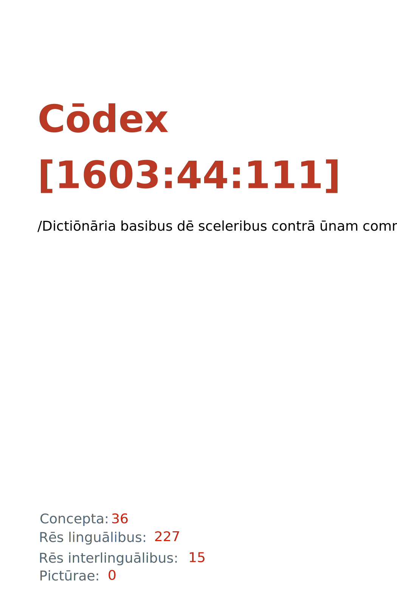

= Cōdex [1603:44:111]: /Dictiōnāria basibus dē sceleribus contrā ūnam commūnitātem ab rēctōribus/
:doctype: book
:title: Cōdex [1603:44:111]: /Dictiōnāria basibus dē sceleribus contrā ūnam commūnitātem ab rēctōribus/
:lang: la
:toc: macro
:toclevels: 5
:toc-title: Tabula contentorum
:table-caption: Tabula
:figure-caption: Pictūra
:example-caption: Exemplum
:last-update-label: Renovatio
:version-label: Versiō
:appendix-caption: Appendix
:source-highlighter: rouge
:warning-caption: Hic sunt dracones
:tip-caption: Commendātum
:front-cover-image: : /Dictiōnāria basibus dē sceleribus contrā ūnam commūnitātem ab rēctōribus/",1050,1600]

{nbsp} +
{nbsp} +
[quote]
**Dedicação ao Domínio Público significa que cada grande problema comum só precisa ser resolvido uma vez**

'''

[%header,cols="25h,~a"]
|===
|
Rēs interlinguālibus
|
Factum

|
/translator/@eng-Latn
|
Vicidata

|
/dictiōnārium ēditōrī/
|
EticaAI

|
/publication date/@eng-Latn
|
2022-03-12

|
numerus editionis
|
2022-05-11T22:22:42

|
/SPDX license ID/@eng-Latn
|
CC0-1.0

|
spōnsor
|
pro bonō publicō

|===

ifndef::backend-epub3[]
<<<
toc::[]
<<<
endif::[]

[id=0_999_1603_1]
== Praefātiō 

Rēs linguālibus (1)::
  Lingua Anglica (Abecedarium Latinum):::
    _**Cōdex [1603:44:111]**_ é o formato de livro dos dados estruturados legíveis por máquina do grupo de dicionários _**[1603:44:111] /Dictiōnāria basibus dē sceleribus contrā ūnam commūnitātem ab rēctōribus/**_, que são distribuídos para os implementadores usarem em aplicativos externos. Este livro pretende ser um recurso avançado para outros lexicógrafos e tradutores de terminologia, inclusive para detectar e relatar inconsistências. Ele pode, no entanto, ser usado como um dicionário ad hoc se não houver trabalho derivado focado em suas necessidades específicas.
    +++  +++
    **SOBRE LEXICOGRAFIA**
    +++  +++
    A lexicografia prática é a arte ou ofício de compilar, escrever e editar dicionários. O básico não é muito diferente de um milênio atrás: ainda é um trabalho muito humano e criativo. É preciso ser humilde: a maioria dos erros de tradutores, na verdade, não é culpa do tradutor, mas falhas metodológicas. Certificar-se de uma ideia de origem do que um conceito representa, mesmo que signifique reescrever e simplificar, anexar fotos, mostrar exemplos, fazer o que for para que seja entendido, faz com que até mesmo tradutores não profissionais que se preocupam com sua própria língua entreguem melhor resultados do que qualquer alternativa. Em outras palavras: mesmo as chamadas melhores práticas da indústria de pagar tradutores e revisores profissionais não podem superar termos de origem já mal explicados.
    +++  +++
    **SOBRE TIPOS DE DICIONÁRIOS QUE ESTAMOS COMPILANDO**
    +++  +++
    Estamos preocupados com um grupo de idéias (chamamos isso de grupo de dicionários de conceitos) que podem ser divididos em partes menores, revisados quanto a inconsistências, aprimorados para definições e depois traduzidos por voluntários. Códigos interlinguais, como o que poderia ser usado na troca de dados real, também são adicionados a cada conceito. Ambos os glossários, interfaces de usuário (como rótulos na coleta de dados) e, em alguns casos, até códigos padrão para o que iria em um campo de dados podem ser compilados dessa maneira.
    +++  +++
    Como a lista completa de dicionários-prototípicos e dicionários minimamente utilizáveis é enorme, um modo de citar público-alvos típicos é o seguinte:
    +++  +++
    . Ajuda humanitária
    . Ajuda ao desenvolvimento
    . Direitos humanos
    . Socorro militar (ou conceitos relacionados a conflitos e resolução de conflitos)
    +++  +++
    Os itens 1, 2 e 4 https://en.m.wikipedia.org/wiki/Humanitarian-Development_Nexus[são algumas vezes referidos como _nexus_] e são frequentemente encontrados ajudando _crise humanitária_. Já que a maioria dos colaboradores cujas ideias e críticas válidas são voluntárias, então 3 (direitos humanos, como na Anistia Internacional) para diferenciar do humanitarismo (como o Movimento da Cruz Vermelha é referência).
    +++  +++
    Observe que **dicionários não são guias de uso**. As instruções, quando existem, são principalmente dedicadas a lexicógrafos e tradutores.
    +++  +++
    **/PRO BONŌ PUBLICŌ/@lat-Latn**
    +++  +++
    As pessoas lexicógrafas deste trabalho são voluntárias, fazendo-o gratuitamente, pro bonō publicō, e não aceitam doações por causa dos dicionários reutilizáveis ​​de todos. O trabalho anterior existente muitas vezes é baseado em livros antigos de domínio público. A maioria dos tradutores de terminologia já seriam voluntários porque acreditam em uma causa. A melhor maneira de inspirar a colaboração é sermos nós mesmos exemplos.
    +++  +++
    Há um aspecto não moralista, bastante simples de entender: quão caro seria pagar pelo trabalho de todos considerando que é viável em mais de 200 idiomas? A logística para decidir quem deve ser pago, depois a transferência de dinheiro em todo o mundo (pode incluir pessoas de países embargados), depois os mecanismos tradicionais de auditoria para verificar o uso indevido que os doadores esperam, existe? Em terminologia especial (os próprios termos do dicionário) e tantas línguas, não existe dinheiro suficiente nem humanos interessados ​​em ser coordenadores.

<<<

== Methodī ex cōdice
=== Methodī ex dictiōnāriōrum corde
Rēs interlinguālibus (1)::
  /scope and content/@eng-Latn:::
    `+/Dictiōnāria basibus dē sceleribus contrā ūnam commūnitātem ab rēctōribus/+` (literal English translation: _Basic dictionaries about crimes against one community by rulers_) contains basic (id est, not fully detailed) concepts about crimes against **one** community of humans because of their membership (de facto or perceived) to be part of the community by rulers (which are supposed to protect a reign which that community is part of). 
    +++  +++
    A more well known term to describe the concepts here could be _Crimes against humanity_, however both [[1603:44:101]] and [[1603:44:111]] intentionally avoid terminology in Latin based on the root term _human_ to avoid confusion while having freedom to be stricter.

==== Referentia
Referēns 1::
  /reference URL/@eng-Latn:::
    link:urn:1603:44:101[]
  Linguae multiplīs (Scrīptum incognitō):::
    /The _[1603:44:101] //Dictiōnāria basibus de scielus contrā persōnam// _is the group of dictionaries focused at individual level/@eng-Latn

=== Methodī ex verbīs in dictiōnāriīs
NOTE: /No momento, não há fluxo de trabalho para usar https://www.wikidata.org/wiki/Wikidata:Lexicographical_data[Wikidata lexicographical data], que na verdade poderia ser usado como armazenamento para nomenclatura mais rigorosa. As implementações atuais usam apenas conceitos do Wikidata, os Q-items./@eng-Latn

==== Methodī ex verbīs in Vicidata (Q modō)
Rēs linguālibus (1)::
  Lingua Anglica (Abecedarium Latinum):::
    O ***[1603:44:111] /Dictiōnāria basibus dē sceleribus contrā ūnam commūnitātem ab rēctōribus/*** usa o Wikidata como uma estratégia para conciliar termos linguísticos para um ou mais de seus conceitos.
    +++  +++
    Isso significa que este livro e os arquivos de dados de dicionários relacionados requerem atualizações periódicas para , no mínimo, sincronize e compartilhe novamente as traduções atualizadas.
    +++  +++
    **Qual a confiabilidade das traduções da comunidade (fonte Wikidata)?**
    +++  +++
    A resposta curta padrão é: **elas são confiáveis**, mesmo nos casos de não haver traduções oficiais para cada assunto.
    +++  +++
    Como referência, é provável que um tradutor profissional (sem acesso à Wikipedia ou bases de terminologia interna das organizações de controle) forneça resultados de qualidade inferior se você fizer testes cegos. Isso é possível porque não apenas o público médio, mas também terminólogos e tradutores profissionais ajudam a Wikipédia (e implicitamente o Wikidata).
    +++  +++
    No entanto, mesmo quando o resultado está correto, a versão atual precisa de diferenciação aprimorada, no mínimo, sigla e forma longa . Para grandes organizações, existem recursos como __P1813 nomes curtos__, mas ainda não foram compilados com o conjunto de dados atual.
    +++  +++
    **Os principais motivos para "traduções erradas" não são culpa dos tradutores**
    +++  +++
    DICA: Como regra geral, para conceitos já muito definidos em que você, como humano, pode verificar manualmente um ou mais termos traduzidos como um resultado decente, as outras traduções provavelmente serão aceitáveis. Dicionários com casos extremos (como nomes de territórios em disputa) teriam mais explicações.
    +++  +++
    A principal razão para "traduções erradas" são conceitos mal definidos usados ​​para explicar aos tradutores da comunidade como gerar traduções de terminologia. Isso tornaria as traduções existentes do Wikidata (usadas não apenas por nós) inconsistentes. A segunda razão é se os dicionários usam traduções para conceitos sem uma correspondência estrita; em outras palavras, se fizermos definições mais estritas do que significa conceito, mas reutilizarmos termos menos exatos da Wikidada. Também há problemas quando idiomas inteiros são codificados com códigos errados. Observe que todos esses casos **traduções erradas NÃO são estritamente culpa do tradutor, mas sim da lexicografia**.
    +++  +++
    Ainda é possível ter erros estritos no nível de tradução. Mas mesmo que indiquemos aos usuários como corrigir o Wikidata/Wikipedia (com base na melhor explicação contextual de um conceito, como este livro), os requisitos para dizer que o termo anterior foi objetivamente um erro de tradução humana errado (se seguir nossa seriedade na construção de dicionário) são muito elevados.
    +++  +++
    Do ponto de vista da conciliação de dados, a seguinte metodologia é utilizada para publicar as traduções da terminologia com a tabela de conceitos principais.
    +++  +++
    . A principal tabela lexicográfica artesanal (explicada no tópico anterior), também fornecida em `1603_44_111.no1.tm.hxl.csv`, pode fazer referência ao Wiki QID.
    . Cada QID exclusivo de `1603_44_111.no1.tm.hxl.csv`, juntamente com códigos de idioma de [`1603:1:51`] (que requer conhecimento de idiomas humanos), é usado para preparar uma consulta SPARQL otimizada para execução em https://query.wikidata.org/[Wikidata Query Service]. A consulta é tão grande que não é viável para links "Try it" (URL longo), como https://www.wikidata.org/wiki/Wikidata:SPARQL_query_service/queries/examples[como o que você encontraria nos Tutoriais Wikidata ], ***mas*** funciona!
    .. Note que o conhecimento é gratuito, as traduções estão lá, mas as necessidades humanitárias multilíngues podem faltar pessoas para preparar os arquivos e compartilhar do que para uso geral.
    . O resultado da consulta, com todos os QIDs e rótulos de termos, é compartilhado como `1603_44_111.wikiq.tm.hxl.csv`
    . As traduções revisadas pela comunidade de cada QID singular são pré-compiladas em um arquivo individual `1603_44_111.wikiq.tm.hxl.csv`
    . `1603_44_111.no1.tm.hxl.csv` mais `1603_44_111.wikiq.tm.hxl.csv` criado `1603_44_111.no11.tm.hxl.csv`

=== Rēs dē factō in dictiōnāriīs
==== Concepta: 36

==== Rēs linguālibus: 225

[%header,cols="15h,25a,~,17"]
|===
|
Cōdex linguae
|
Glotto cōdicī +++ +++ ISO 639-3 +++ +++ Wiki QID cōdicī
|
Nōmen Latīnum
|
Concepta

|
mul-Zyyy
|

+++ +++
https://iso639-3.sil.org/code/mul[mul]
+++ +++ 
|
Linguae multiplīs (Scrīptum incognitō)
|
38

|
ara-Arab
|
https://glottolog.org/resource/languoid/id/arab1395[arab1395]
+++ +++
https://iso639-3.sil.org/code/ara[ara]
+++ +++ https://www.wikidata.org/wiki/Q13955[Q13955]
|
Macrolingua Arabica (Abecedarium Arabicum)
|
28

|
hye-Armn
|
https://glottolog.org/resource/languoid/id/nucl1235[nucl1235]
+++ +++
https://iso639-3.sil.org/code/hye[hye]
+++ +++ https://www.wikidata.org/wiki/Q8785[Q8785]
|
Lingua Armenia (Alphabetum Armenium)
|
17

|
ben-Beng
|
https://glottolog.org/resource/languoid/id/beng1280[beng1280]
+++ +++
https://iso639-3.sil.org/code/ben[ben]
+++ +++ https://www.wikidata.org/wiki/Q9610[Q9610]
|
Lingua Bengali (/ISO 15924 Beng/)
|
13

|
rus-Cyrl
|
https://glottolog.org/resource/languoid/id/russ1263[russ1263]
+++ +++
https://iso639-3.sil.org/code/rus[rus]
+++ +++ https://www.wikidata.org/wiki/Q7737[Q7737]
|
Lingua Russica (Abecedarium Cyrillicum)
|
27

|
hin-Deva
|
https://glottolog.org/resource/languoid/id/hind1269[hind1269]
+++ +++
https://iso639-3.sil.org/code/hin[hin]
+++ +++ https://www.wikidata.org/wiki/Q1568[Q1568]
|
Lingua Hindica (Devanāgarī)
|
13

|
amh-Ethi
|
https://glottolog.org/resource/languoid/id/amha1245[amha1245]
+++ +++
https://iso639-3.sil.org/code/amh[amh]
+++ +++ https://www.wikidata.org/wiki/Q28244[Q28244]
|
Lingua Amharica (/ISO 15924 Ethi/)
|
4

|
kat-Geor
|
https://glottolog.org/resource/languoid/id/nucl1302[nucl1302]
+++ +++
https://iso639-3.sil.org/code/kat[kat]
+++ +++ https://www.wikidata.org/wiki/Q8108[Q8108]
|
Lingua Georgiana (Abecedarium Georgianum)
|
13

|
guj-Gujr
|
https://glottolog.org/resource/languoid/id/guja1252[guja1252]
+++ +++
https://iso639-3.sil.org/code/guj[guj]
+++ +++ https://www.wikidata.org/wiki/Q5137[Q5137]
|
Lingua Gujaratensis (/ISO 15924 Gujr/)
|
4

|
pan-Guru
|
https://glottolog.org/resource/languoid/id/panj1256[panj1256]
+++ +++
https://iso639-3.sil.org/code/pan[pan]
+++ +++ https://www.wikidata.org/wiki/Q58635[Q58635]
|
Lingua Paniabica (/ISO 15924 Guru/)
|
7

|
kan-Knda
|
https://glottolog.org/resource/languoid/id/nucl1305[nucl1305]
+++ +++
https://iso639-3.sil.org/code/kan[kan]
+++ +++ https://www.wikidata.org/wiki/Q33673[Q33673]
|
Lingua Cannadica (/ISO 15924 Knda/)
|
7

|
kor-Hang
|
https://glottolog.org/resource/languoid/id/kore1280[kore1280]
+++ +++
https://iso639-3.sil.org/code/kor[kor]
+++ +++ https://www.wikidata.org/wiki/Q9176[Q9176]
|
Lingua Coreana (Abecedarium Coreanum)
|
25

|
lzh-Hant
|
https://glottolog.org/resource/languoid/id/lite1248[lite1248]
+++ +++
https://iso639-3.sil.org/code/lzh[lzh]
+++ +++ https://www.wikidata.org/wiki/Q37041[Q37041]
|
Lingua Sinica classica (/ISO 15924 Hant/)
|
4

|
heb-Hebr
|
https://glottolog.org/resource/languoid/id/hebr1245[hebr1245]
+++ +++
https://iso639-3.sil.org/code/heb[heb]
+++ +++ https://www.wikidata.org/wiki/Q9288[Q9288]
|
Lingua Hebraica (Alphabetum Hebraicum)
|
25

|
khm-Khmr
|
https://glottolog.org/resource/languoid/id/cent1989[cent1989]
+++ +++
https://iso639-3.sil.org/code/khm[khm]
+++ +++ https://www.wikidata.org/wiki/Q9205[Q9205]
|
Lingua Khmer (/ISO 15924 Khmr/)
|
4

|
lao-Laoo
|
https://glottolog.org/resource/languoid/id/laoo1244[laoo1244]
+++ +++
https://iso639-3.sil.org/code/lao[lao]
+++ +++ https://www.wikidata.org/wiki/Q9211[Q9211]
|
/Lao language/ (/ISO 15924 Laoo/)
|
1

|
lat-Latn
|
https://glottolog.org/resource/languoid/id/lati1261[lati1261]
+++ +++
https://iso639-3.sil.org/code/lat[lat]
+++ +++ https://www.wikidata.org/wiki/Q397[Q397]
|
Lingua Latina (Abecedarium Latinum)
|
15

|
mni-Mtei
|
https://glottolog.org/resource/languoid/id/mani1292[mani1292]
+++ +++
https://iso639-3.sil.org/code/mni[mni]
+++ +++ https://www.wikidata.org/wiki/Q33868[Q33868]
|
Lingua Meitei (/ISO 15924 Mtei/)
|
1

|
mnw-Mymr
|
https://glottolog.org/resource/languoid/id/monn1252[monn1252]
+++ +++
https://iso639-3.sil.org/code/mnw[mnw]
+++ +++ https://www.wikidata.org/wiki/Q13349[Q13349]
|
/Mon language/ (/ISO 15924 Mymr/)
|
2

|
nqo-Nkoo
|
https://glottolog.org/resource/languoid/id/nkoa1234[nkoa1234]
+++ +++
https://iso639-3.sil.org/code/nqo[nqo]
+++ +++ https://www.wikidata.org/wiki/Q18546266[Q18546266]
|
/N'Ko/ (/ISO 15924 Nkoo/)
|
6

|
sat-Olck
|
https://glottolog.org/resource/languoid/id/sant1410[sant1410]
+++ +++
https://iso639-3.sil.org/code/sat[sat]
+++ +++ https://www.wikidata.org/wiki/Q33965[Q33965]
|
Lingua Santali (/ISO 15924 Olck/)
|
2

|
ori-Orya
|

+++ +++
https://iso639-3.sil.org/code/ori[ori]
+++ +++ https://www.wikidata.org/wiki/Q33810[Q33810]
|
Macrolingua Orissensis (/ISO 15924 Orya/)
|
5

|
sin-Sinh
|
https://glottolog.org/resource/languoid/id/sinh1246[sinh1246]
+++ +++
https://iso639-3.sil.org/code/sin[sin]
+++ +++ https://www.wikidata.org/wiki/Q13267[Q13267]
|
Lingua Singhalensis (/ISO 15924 Sinh/)
|
8

|
tam-Taml
|
https://glottolog.org/resource/languoid/id/tami1289[tami1289]
+++ +++
https://iso639-3.sil.org/code/tam[tam]
+++ +++ https://www.wikidata.org/wiki/Q5885[Q5885]
|
Lingua Tamulica (/ISO 15924 Taml/)
|
15

|
tel-Telu
|
https://glottolog.org/resource/languoid/id/telu1262[telu1262]
+++ +++
https://iso639-3.sil.org/code/tel[tel]
+++ +++ https://www.wikidata.org/wiki/Q8097[Q8097]
|
Lingua Telingana (/ISO 15924 Telu/)
|
5

|
tha-Thai
|
https://glottolog.org/resource/languoid/id/thai1261[thai1261]
+++ +++
https://iso639-3.sil.org/code/tha[tha]
+++ +++ https://www.wikidata.org/wiki/Q9217[Q9217]
|
Lingua Thai (/ISO 15924 Thai/)
|
19

|
bod-Tibt
|
https://glottolog.org/resource/languoid/id/tibe1272[tibe1272]
+++ +++
https://iso639-3.sil.org/code/bod[bod]
+++ +++ https://www.wikidata.org/wiki/Q34271[Q34271]
|
Lingua Tibetana (Scriptura Tibetana)
|
1

|
san-Zyyy
|
https://glottolog.org/resource/languoid/id/sans1269[sans1269]
+++ +++
https://iso639-3.sil.org/code/san[san]
+++ +++ https://www.wikidata.org/wiki/Q11059[Q11059]
|
Lingua Sanscrita (/ISO 15924 Zyyy/)
|
3

|
zho-Zyyy
|
https://glottolog.org/resource/languoid/id/sini1245[sini1245]
+++ +++
https://iso639-3.sil.org/code/zho[zho]
+++ +++ https://www.wikidata.org/wiki/Q7850[Q7850]
|
/Macrolingua Sinicae (/ISO 15924 Zyyy/)/
|
27

|
por-Latn
|
https://glottolog.org/resource/languoid/id/port1283[port1283]
+++ +++
https://iso639-3.sil.org/code/por[por]
+++ +++ https://www.wikidata.org/wiki/Q5146[Q5146]
|
Lingua Lusitana (Abecedarium Latinum)
|
24

|
eng-Latn
|
https://glottolog.org/resource/languoid/id/stan1293[stan1293]
+++ +++
https://iso639-3.sil.org/code/eng[eng]
+++ +++ https://www.wikidata.org/wiki/Q1860[Q1860]
|
Lingua Anglica (Abecedarium Latinum)
|
34

|
fra-Latn
|
https://glottolog.org/resource/languoid/id/stan1290[stan1290]
+++ +++
https://iso639-3.sil.org/code/fra[fra]
+++ +++ https://www.wikidata.org/wiki/Q150[Q150]
|
Lingua Francogallica (Abecedarium Latinum)
|
28

|
nld-Latn
|
https://glottolog.org/resource/languoid/id/mode1257[mode1257]
+++ +++
https://iso639-3.sil.org/code/nld[nld]
+++ +++ https://www.wikidata.org/wiki/Q7411[Q7411]
|
Lingua Batavica (Abecedarium Latinum)
|
28

|
deu-Latn
|
https://glottolog.org/resource/languoid/id/stan1295[stan1295]
+++ +++
https://iso639-3.sil.org/code/deu[deu]
+++ +++ https://www.wikidata.org/wiki/Q188[Q188]
|
Lingua Germanica (Abecedarium Latinum)
|
27

|
spa-Latn
|
https://glottolog.org/resource/languoid/id/stan1288[stan1288]
+++ +++
https://iso639-3.sil.org/code/spa[spa]
+++ +++ https://www.wikidata.org/wiki/Q1321[Q1321]
|
Lingua Hispanica (Abecedarium Latinum)
|
30

|
ita-Latn
|
https://glottolog.org/resource/languoid/id/ital1282[ital1282]
+++ +++
https://iso639-3.sil.org/code/ita[ita]
+++ +++ https://www.wikidata.org/wiki/Q652[Q652]
|
Lingua Italiana (Abecedarium Latinum)
|
24

|
gle-Latn
|
https://glottolog.org/resource/languoid/id/iris1253[iris1253]
+++ +++
https://iso639-3.sil.org/code/gle[gle]
+++ +++ https://www.wikidata.org/wiki/Q9142[Q9142]
|
Lingua Hibernica (Abecedarium Latinum)
|
13

|
swe-Latn
|
https://glottolog.org/resource/languoid/id/swed1254[swed1254]
+++ +++
https://iso639-3.sil.org/code/swe[swe]
+++ +++ https://www.wikidata.org/wiki/Q9027[Q9027]
|
Lingua Suecica (Abecedarium Latinum)
|
22

|
ceb-Latn
|
https://glottolog.org/resource/languoid/id/cebu1242[cebu1242]
+++ +++
https://iso639-3.sil.org/code/ceb[ceb]
+++ +++ https://www.wikidata.org/wiki/Q33239[Q33239]
|
Lingua Caebuana (Abecedarium Latinum)
|
1

|
sqi-Latn
|
https://glottolog.org/resource/languoid/id/alba1267[alba1267]
+++ +++
https://iso639-3.sil.org/code/sqi[sqi]
+++ +++ https://www.wikidata.org/wiki/Q8748[Q8748]
|
Macrolingua Albanica (/Abecedarium Latinum/)
|
10

|
pol-Latn
|
https://glottolog.org/resource/languoid/id/poli1260[poli1260]
+++ +++
https://iso639-3.sil.org/code/pol[pol]
+++ +++ https://www.wikidata.org/wiki/Q809[Q809]
|
Lingua Polonica (Abecedarium Latinum)
|
23

|
fin-Latn
|
https://glottolog.org/resource/languoid/id/finn1318[finn1318]
+++ +++
https://iso639-3.sil.org/code/fin[fin]
+++ +++ https://www.wikidata.org/wiki/Q1412[Q1412]
|
Lingua Finnica (Abecedarium Latinum)
|
21

|
ron-Latn
|
https://glottolog.org/resource/languoid/id/roma1327[roma1327]
+++ +++
https://iso639-3.sil.org/code/ron[ron]
+++ +++ https://www.wikidata.org/wiki/Q7913[Q7913]
|
Lingua Dacoromanica (Abecedarium Latinum)
|
21

|
vie-Latn
|
https://glottolog.org/resource/languoid/id/viet1252[viet1252]
+++ +++
https://iso639-3.sil.org/code/vie[vie]
+++ +++ https://www.wikidata.org/wiki/Q9199[Q9199]
|
Lingua Vietnamensis (Abecedarium Latinum)
|
21

|
cat-Latn
|
https://glottolog.org/resource/languoid/id/stan1289[stan1289]
+++ +++
https://iso639-3.sil.org/code/cat[cat]
+++ +++ https://www.wikidata.org/wiki/Q7026[Q7026]
|
Lingua Catalana (Abecedarium Latinum)
|
23

|
ukr-Cyrl
|
https://glottolog.org/resource/languoid/id/ukra1253[ukra1253]
+++ +++
https://iso639-3.sil.org/code/ukr[ukr]
+++ +++ https://www.wikidata.org/wiki/Q8798[Q8798]
|
Lingua Ucrainica (Abecedarium Cyrillicum)
|
27

|
bul-Cyrl
|
https://glottolog.org/resource/languoid/id/bulg1262[bulg1262]
+++ +++
https://iso639-3.sil.org/code/bul[bul]
+++ +++ https://www.wikidata.org/wiki/Q7918[Q7918]
|
Lingua Bulgarica (Abecedarium Cyrillicum)
|
18

|
slv-Latn
|
https://glottolog.org/resource/languoid/id/slov1268[slov1268]
+++ +++
https://iso639-3.sil.org/code/slv[slv]
+++ +++ https://www.wikidata.org/wiki/Q9063[Q9063]
|
Lingua Slovena (Abecedarium Latinum)
|
15

|
war-Latn
|
https://glottolog.org/resource/languoid/id/wara1300[wara1300]
+++ +++
https://iso639-3.sil.org/code/war[war]
+++ +++ https://www.wikidata.org/wiki/Q34279[Q34279]
|
/Waray language/ (Abecedarium Latinum)
|
5

|
nob-Latn
|
https://glottolog.org/resource/languoid/id/norw1259[norw1259]
+++ +++
https://iso639-3.sil.org/code/nob[nob]
+++ +++ https://www.wikidata.org/wiki/Q25167[Q25167]
|
/Bokmål/ (Abecedarium Latinum)
|
21

|
ces-Latn
|
https://glottolog.org/resource/languoid/id/czec1258[czec1258]
+++ +++
https://iso639-3.sil.org/code/ces[ces]
+++ +++ https://www.wikidata.org/wiki/Q9056[Q9056]
|
Lingua Bohemica (Abecedarium Latinum)
|
24

|
dan-Latn
|
https://glottolog.org/resource/languoid/id/dani1285[dani1285]
+++ +++
https://iso639-3.sil.org/code/dan[dan]
+++ +++ https://www.wikidata.org/wiki/Q9035[Q9035]
|
Lingua Danica (Abecedarium Latinum)
|
20

|
jpn-Jpan
|
https://glottolog.org/resource/languoid/id/nucl1643[nucl1643]
+++ +++
https://iso639-3.sil.org/code/jpn[jpn]
+++ +++ https://www.wikidata.org/wiki/Q5287[Q5287]
|
Lingua Iaponica (Scriptura Iaponica)
|
27

|
nno-Latn
|
https://glottolog.org/resource/languoid/id/norw1262[norw1262]
+++ +++
https://iso639-3.sil.org/code/nno[nno]
+++ +++ https://www.wikidata.org/wiki/Q25164[Q25164]
|
/Nynorsk/ (Abecedarium Latinum)
|
16

|
mal-Mlym
|
https://glottolog.org/resource/languoid/id/mala1464[mala1464]
+++ +++
https://iso639-3.sil.org/code/mal[mal]
+++ +++ https://www.wikidata.org/wiki/Q36236[Q36236]
|
Lingua Malabarica (/Malayalam script/)
|
7

|
ind-Latn
|
https://glottolog.org/resource/languoid/id/indo1316[indo1316]
+++ +++
https://iso639-3.sil.org/code/ind[ind]
+++ +++ https://www.wikidata.org/wiki/Q9240[Q9240]
|
Lingua Indonesiana (Abecedarium Latinum)
|
26

|
fas-Zyyy
|

+++ +++
https://iso639-3.sil.org/code/fas[fas]
+++ +++ https://www.wikidata.org/wiki/Q9168[Q9168]
|
Macrolingua Persica (//Abecedarium Arabicum//)
|
24

|
hun-Latn
|
https://glottolog.org/resource/languoid/id/hung1274[hung1274]
+++ +++
https://iso639-3.sil.org/code/hun[hun]
+++ +++ https://www.wikidata.org/wiki/Q9067[Q9067]
|
Lingua Hungarica (Abecedarium Latinum)
|
18

|
eus-Latn
|
https://glottolog.org/resource/languoid/id/basq1248[basq1248]
+++ +++
https://iso639-3.sil.org/code/eus[eus]
+++ +++ https://www.wikidata.org/wiki/Q8752[Q8752]
|
Lingua Vasconica (Abecedarium Latinum)
|
15

|
cym-Latn
|
https://glottolog.org/resource/languoid/id/wels1247[wels1247]
+++ +++
https://iso639-3.sil.org/code/cym[cym]
+++ +++ https://www.wikidata.org/wiki/Q9309[Q9309]
|
Lingua Cambrica (Abecedarium Latinum)
|
12

|
glg-Latn
|
https://glottolog.org/resource/languoid/id/gali1258[gali1258]
+++ +++
https://iso639-3.sil.org/code/glg[glg]
+++ +++ https://www.wikidata.org/wiki/Q9307[Q9307]
|
Lingua Gallaica (Abecedarium Latinum)
|
13

|
slk-Latn
|
https://glottolog.org/resource/languoid/id/slov1269[slov1269]
+++ +++
https://iso639-3.sil.org/code/slk[slk]
+++ +++ https://www.wikidata.org/wiki/Q9058[Q9058]
|
Lingua Slovaca (Abecedarium Latinum)
|
13

|
epo-Latn
|
https://glottolog.org/resource/languoid/id/espe1235[espe1235]
+++ +++
https://iso639-3.sil.org/code/epo[epo]
+++ +++ https://www.wikidata.org/wiki/Q143[Q143]
|
Lingua Esperantica (Abecedarium Latinum)
|
21

|
msa-Zyyy
|

+++ +++
https://iso639-3.sil.org/code/msa[msa]
+++ +++ https://www.wikidata.org/wiki/Q9237[Q9237]
|
Macrolingua Malayana (/ISO 15924 Zyyy/)
|
19

|
est-Latn
|

+++ +++
https://iso639-3.sil.org/code/est[est]
+++ +++ https://www.wikidata.org/wiki/Q9072[Q9072]
|
Macrolingua Estonica (Abecedarium Latinum)
|
18

|
hrv-Latn
|
https://glottolog.org/resource/languoid/id/croa1245[croa1245]
+++ +++
https://iso639-3.sil.org/code/hrv[hrv]
+++ +++ https://www.wikidata.org/wiki/Q6654[Q6654]
|
Lingua Croatica (Abecedarium Latinum)
|
16

|
tur-Latn
|
https://glottolog.org/resource/languoid/id/nucl1301[nucl1301]
+++ +++
https://iso639-3.sil.org/code/tur[tur]
+++ +++ https://www.wikidata.org/wiki/Q256[Q256]
|
Lingua Turcica (Abecedarium Latinum)
|
26

|
nds-Latn
|
https://glottolog.org/resource/languoid/id/lowg1239[lowg1239]
+++ +++
https://iso639-3.sil.org/code/nds[nds]
+++ +++ https://www.wikidata.org/wiki/Q25433[Q25433]
|
Lingua Saxonica (Abecedarium Latinum)
|
5

|
oci-Latn
|
https://glottolog.org/resource/languoid/id/occi1239[occi1239]
+++ +++
https://iso639-3.sil.org/code/oci[oci]
+++ +++ https://www.wikidata.org/wiki/Q14185[Q14185]
|
Lingua Occitana (Abecedarium Latinum)
|
9

|
bre-Latn
|
https://glottolog.org/resource/languoid/id/bret1244[bret1244]
+++ +++
https://iso639-3.sil.org/code/bre[bre]
+++ +++ https://www.wikidata.org/wiki/Q12107[Q12107]
|
Lingua Britonica (Abecedarium Latinum)
|
9

|
arz-Latn
|
https://glottolog.org/resource/languoid/id/egyp1253[egyp1253]
+++ +++
https://iso639-3.sil.org/code/arz[arz]
+++ +++ https://www.wikidata.org/wiki/Q29919[Q29919]
|
/Egyptian Arabic/ (Abecedarium Arabicum)
|
8

|
afr-Latn
|
https://glottolog.org/resource/languoid/id/afri1274[afri1274]
+++ +++
https://iso639-3.sil.org/code/afr[afr]
+++ +++ https://www.wikidata.org/wiki/Q14196[Q14196]
|
Lingua Batava Capitensis (Abecedarium Latinum)
|
9

|
ltz-Latn
|
https://glottolog.org/resource/languoid/id/luxe1241[luxe1241]
+++ +++
https://iso639-3.sil.org/code/ltz[ltz]
+++ +++ https://www.wikidata.org/wiki/Q9051[Q9051]
|
Lingua Luxemburgensis (Abecedarium Latinum)
|
8

|
sco-Latn
|
https://glottolog.org/resource/languoid/id/scot1243[scot1243]
+++ +++
https://iso639-3.sil.org/code/sco[sco]
+++ +++ https://www.wikidata.org/wiki/Q14549[Q14549]
|
Lingua Scotica quae Teutonica (Abecedarium Latinum)
|
9

|
bar-Latn
|
https://glottolog.org/resource/languoid/id/bava1246[bava1246]
+++ +++
https://iso639-3.sil.org/code/bar[bar]
+++ +++ https://www.wikidata.org/wiki/Q29540[Q29540]
|
Lingua Bavarica (Abecedarium Latinum)
|
4

|
arg-Latn
|
https://glottolog.org/resource/languoid/id/arag1245[arag1245]
+++ +++
https://iso639-3.sil.org/code/arg[arg]
+++ +++ https://www.wikidata.org/wiki/Q8765[Q8765]
|
Lingua Aragonensis (Abecedarium Latinum)
|
3

|
zho-Hant
|

+++ +++
https://iso639-3.sil.org/code/zho[zho]
+++ +++ https://www.wikidata.org/wiki/Q18130932[Q18130932]
|
//Traditional Chinese// (/ISO 15924 Hant/)
|
19

|
pap-Latn
|
https://glottolog.org/resource/languoid/id/papi1253[papi1253]
+++ +++
https://iso639-3.sil.org/code/pap[pap]
+++ +++ https://www.wikidata.org/wiki/Q33856[Q33856]
|
/lingua Papiamentica/ (Abecedarium Latinum)
|
4

|
cos-Latn
|
https://glottolog.org/resource/languoid/id/cors1241[cors1241]
+++ +++
https://iso639-3.sil.org/code/cos[cos]
+++ +++ https://www.wikidata.org/wiki/Q33111[Q33111]
|
Lingua Corsica (Abecedarium Latinum)
|
2

|
gsw-Latn
|
https://glottolog.org/resource/languoid/id/swis1247[swis1247]
+++ +++
https://iso639-3.sil.org/code/gsw[gsw]
+++ +++ https://www.wikidata.org/wiki/Q131339[Q131339]
|
Dialecti Alemannicae (Abecedarium Latinum)
|
7

|
isl-Latn
|
https://glottolog.org/resource/languoid/id/icel1247[icel1247]
+++ +++
https://iso639-3.sil.org/code/isl[isl]
+++ +++ https://www.wikidata.org/wiki/Q294[Q294]
|
Lingua Islandica (Abecedarium Latinum)
|
12

|
min-Latn
|
https://glottolog.org/resource/languoid/id/mina1268[mina1268]
+++ +++
https://iso639-3.sil.org/code/min[min]
+++ +++ https://www.wikidata.org/wiki/Q13324[Q13324]
|
/Minangkabau language/ (Abecedarium Latinum)
|
2

|
roh-Latn
|
https://glottolog.org/resource/languoid/id/roma1326[roma1326]
+++ +++
https://iso639-3.sil.org/code/roh[roh]
+++ +++ https://www.wikidata.org/wiki/Q13199[Q13199]
|
Lingua Rhaetica (Abecedarium Latinum)
|
2

|
vec-Latn
|
https://glottolog.org/resource/languoid/id/vene1258[vene1258]
+++ +++
https://iso639-3.sil.org/code/vec[vec]
+++ +++ https://www.wikidata.org/wiki/Q32724[Q32724]
|
Lingua Veneta (Abecedarium Latinum)
|
11

|
pms-Latn
|
https://glottolog.org/resource/languoid/id/piem1238[piem1238]
+++ +++
https://iso639-3.sil.org/code/pms[pms]
+++ +++ https://www.wikidata.org/wiki/Q15085[Q15085]
|
Lingua Pedemontana (Abecedarium Latinum)
|
2

|
scn-Latn
|
https://glottolog.org/resource/languoid/id/sici1248[sici1248]
+++ +++
https://iso639-3.sil.org/code/scn[scn]
+++ +++ https://www.wikidata.org/wiki/Q33973[Q33973]
|
Lingua Sicula (Abecedarium Latinum)
|
5

|
srd-Latn
|

+++ +++
https://iso639-3.sil.org/code/srd[srd]
+++ +++ https://www.wikidata.org/wiki/Q33976[Q33976]
|
Macrolingua Sarda (Abecedarium Latinum)
|
3

|
gla-Latn
|
https://glottolog.org/resource/languoid/id/scot1245[scot1245]
+++ +++
https://iso639-3.sil.org/code/gla[gla]
+++ +++ https://www.wikidata.org/wiki/Q9314[Q9314]
|
Lingua Scotica seu Scotica Gadelica (Abecedarium Latinum)
|
7

|
lim-Latn
|
https://glottolog.org/resource/languoid/id/limb1263[limb1263]
+++ +++
https://iso639-3.sil.org/code/lim[lim]
+++ +++ https://www.wikidata.org/wiki/Q102172[Q102172]
|
Lingua Limburgica (Abecedarium Latinum)
|
9

|
wln-Latn
|
https://glottolog.org/resource/languoid/id/wall1255[wall1255]
+++ +++
https://iso639-3.sil.org/code/wln[wln]
+++ +++ https://www.wikidata.org/wiki/Q34219[Q34219]
|
Lingua Vallonica (Abecedarium Latinum)
|
4

|
srp-Latn
|
https://glottolog.org/resource/languoid/id/serb1264[serb1264]
+++ +++
https://iso639-3.sil.org/code/srp[srp]
+++ +++ https://www.wikidata.org/wiki/Q21161949[Q21161949]
|
/Serbian/ (Abecedarium Latinum)
|
10

|
nap-Latn
|
https://glottolog.org/resource/languoid/id/neap1235[neap1235]
+++ +++
https://iso639-3.sil.org/code/nap[nap]
+++ +++ https://www.wikidata.org/wiki/Q33845[Q33845]
|
Lingua Neapolitana (Abecedarium Latinum)
|
1

|
lij-Latn
|
https://glottolog.org/resource/languoid/id/ligu1248[ligu1248]
+++ +++
https://iso639-3.sil.org/code/lij[lij]
+++ +++ https://www.wikidata.org/wiki/Q36106[Q36106]
|
Lingua Ligustica (Abecedarium Latinum)
|
3

|
fur-Latn
|
https://glottolog.org/resource/languoid/id/friu1240[friu1240]
+++ +++
https://iso639-3.sil.org/code/fur[fur]
+++ +++ https://www.wikidata.org/wiki/Q33441[Q33441]
|
Lingua Foroiuliensis (Abecedarium Latinum)
|
1

|
kon-Latn
|

+++ +++
https://iso639-3.sil.org/code/kon[kon]
+++ +++ https://www.wikidata.org/wiki/Q33702[Q33702]
|
/Kongo macrolanguage/ (Abecedarium Latinum)
|
1

|
frp-Latn
|
https://glottolog.org/resource/languoid/id/fran1260[fran1260]
+++ +++
https://iso639-3.sil.org/code/frp[frp]
+++ +++ https://www.wikidata.org/wiki/Q15087[Q15087]
|
Lingua Arpitanica (Abecedarium Latinum)
|
1

|
wuu-Zyyy
|
https://glottolog.org/resource/languoid/id/wuch1236[wuch1236]
+++ +++
https://iso639-3.sil.org/code/wuu[wuu]
+++ +++ https://www.wikidata.org/wiki/Q34290[Q34290]
|
//Macrolingua Wu// (/ISO 15924 Zyyy/)
|
12

|
srp-Cyrl
|
https://glottolog.org/resource/languoid/id/serb1264[serb1264]
+++ +++
https://iso639-3.sil.org/code/srp[srp]
+++ +++ https://www.wikidata.org/wiki/Q9299[Q9299]
|
Lingua Serbica (Abecedarium Cyrillicum)
|
20

|
urd-Arab
|
https://glottolog.org/resource/languoid/id/urdu1245[urdu1245]
+++ +++
https://iso639-3.sil.org/code/urd[urd]
+++ +++ https://www.wikidata.org/wiki/Q1617[Q1617]
|
Lingua Urdu (Abecedarium Arabicum)
|
12

|
gan-Zyyy
|
https://glottolog.org/resource/languoid/id/ganc1239[ganc1239]
+++ +++
https://iso639-3.sil.org/code/gan[gan]
+++ +++ https://www.wikidata.org/wiki/Q33475[Q33475]
|
Lingua Gan (/ISO 15924 Zyyy/)
|
2

|
lit-Latn
|
https://glottolog.org/resource/languoid/id/lith1251[lith1251]
+++ +++
https://iso639-3.sil.org/code/lit[lit]
+++ +++ https://www.wikidata.org/wiki/Q9083[Q9083]
|
Lingua Lithuanica (Abecedarium Latinum)
|
17

|
hbs-Latn
|
https://glottolog.org/resource/languoid/id/sout1528[sout1528]
+++ +++
https://iso639-3.sil.org/code/hbs[hbs]
+++ +++ https://www.wikidata.org/wiki/Q9301[Q9301]
|
Macrolingua Serbocroatica (Abecedarium Latinum)
|
17

|
lav-Latn
|
https://glottolog.org/resource/languoid/id/latv1249[latv1249]
+++ +++
https://iso639-3.sil.org/code/lav[lav]
+++ +++ https://www.wikidata.org/wiki/Q9078[Q9078]
|
Macrolingua Lettonica (Abecedarium Latinum)
|
15

|
bos-Latn
|
https://glottolog.org/resource/languoid/id/bosn1245[bosn1245]
+++ +++
https://iso639-3.sil.org/code/bos[bos]
+++ +++ https://www.wikidata.org/wiki/Q9303[Q9303]
|
Lingua Bosnica (Abecedarium Latinum)
|
10

|
azb-Arab
|
https://glottolog.org/resource/languoid/id/sout2697[sout2697]
+++ +++
https://iso639-3.sil.org/code/azb[azb]
+++ +++ https://www.wikidata.org/wiki/Q3449805[Q3449805]
|
/South Azerbaijani/ (Abecedarium Arabicum)
|
6

|
jav-Latn
|
https://glottolog.org/resource/languoid/id/java1254[java1254]
+++ +++
https://iso639-3.sil.org/code/jav[jav]
+++ +++ https://www.wikidata.org/wiki/Q33549[Q33549]
|
Lingua Iavanica (Abecedarium Latinum)
|
6

|
ell-Grek
|
https://glottolog.org/resource/languoid/id/mode1248[mode1248]
+++ +++
https://iso639-3.sil.org/code/ell[ell]
+++ +++ https://www.wikidata.org/wiki/Q36510[Q36510]
|
Lingua Neograeca (Alphabetum Graecum)
|
22

|
sun-Latn
|
https://glottolog.org/resource/languoid/id/sund1252[sund1252]
+++ +++
https://iso639-3.sil.org/code/sun[sun]
+++ +++ https://www.wikidata.org/wiki/Q34002[Q34002]
|
/Sundanese language/ (Abecedarium Latinum)
|
2

|
fry-Latn
|
https://glottolog.org/resource/languoid/id/west2354[west2354]
+++ +++
https://iso639-3.sil.org/code/fry[fry]
+++ +++ https://www.wikidata.org/wiki/Q27175[Q27175]
|
Lingua Frisice occidentalis (Abecedarium Latinum)
|
10

|
ace-Latn
|
https://glottolog.org/resource/languoid/id/achi1257[achi1257]
+++ +++
https://iso639-3.sil.org/code/ace[ace]
+++ +++ https://www.wikidata.org/wiki/Q27683[Q27683]
|
/Acehnese language/ (Abecedarium Latinum)
|
1

|
jam-Latn
|
https://glottolog.org/resource/languoid/id/jama1262[jama1262]
+++ +++
https://iso639-3.sil.org/code/jam[jam]
+++ +++ https://www.wikidata.org/wiki/Q35939[Q35939]
|
Lingua creola Iamaicana (Abecedarium Latinum)
|
1

|
che-Cyrl
|
https://glottolog.org/resource/languoid/id/chec1245[chec1245]
+++ +++
https://iso639-3.sil.org/code/che[che]
+++ +++ https://www.wikidata.org/wiki/Q33350[Q33350]
|
Lingua Tsetsenica (Abecedarium Cyrillicum)
|
4

|
bel-Cyrl
|
https://glottolog.org/resource/languoid/id/bela1254[bela1254]
+++ +++
https://iso639-3.sil.org/code/bel[bel]
+++ +++ https://www.wikidata.org/wiki/Q9091[Q9091]
|
Lingua Ruthenica Alba (Abecedarium Cyrillicum)
|
13

|
kab-Latn
|
https://glottolog.org/resource/languoid/id/kaby1243[kaby1243]
+++ +++
https://iso639-3.sil.org/code/kab[kab]
+++ +++ https://www.wikidata.org/wiki/Q35853[Q35853]
|
/Kabyle language/ (Abecedarium Latinum)
|
6

|
fao-Latn
|
https://glottolog.org/resource/languoid/id/faro1244[faro1244]
+++ +++
https://iso639-3.sil.org/code/fao[fao]
+++ +++ https://www.wikidata.org/wiki/Q25258[Q25258]
|
Lingua Faeroensis (Abecedarium Latinum)
|
2

|
bam-Zyyy
|
https://glottolog.org/resource/languoid/id/bamb1269[bamb1269]
+++ +++
https://iso639-3.sil.org/code/bam[bam]
+++ +++ https://www.wikidata.org/wiki/Q33243[Q33243]
|
/Bambara language/ (/ISO 15924 Zyyy/)
|
2

|
lmo-Latn
|
https://glottolog.org/resource/languoid/id/lomb1257[lomb1257]
+++ +++
https://iso639-3.sil.org/code/lmo[lmo]
+++ +++ https://www.wikidata.org/wiki/Q33754[Q33754]
|
Langobardus sermo (Abecedarium Latinum)
|
4

|
mar-Deva
|
https://glottolog.org/resource/languoid/id/mara1378[mara1378]
+++ +++
https://iso639-3.sil.org/code/mar[mar]
+++ +++ https://www.wikidata.org/wiki/Q1571[Q1571]
|
Lingua Marathica (Devanāgarī)
|
9

|
ary-Arab
|
https://glottolog.org/resource/languoid/id/moro1292[moro1292]
+++ +++
https://iso639-3.sil.org/code/ary[ary]
+++ +++ https://www.wikidata.org/wiki/Q56426[Q56426]
|
/Moroccan Arabic/ (Abecedarium Arabicum)
|
1

|
awa-Deva
|
https://glottolog.org/resource/languoid/id/awad1243[awad1243]
+++ +++
https://iso639-3.sil.org/code/awa[awa]
+++ +++ https://www.wikidata.org/wiki/Q29579[Q29579]
|
/Awadhi/ (Devanāgarī)
|
1

|
ast-Latn
|
https://glottolog.org/resource/languoid/id/astu1245[astu1245]
+++ +++
https://iso639-3.sil.org/code/ast[ast]
+++ +++ https://www.wikidata.org/wiki/Q29507[Q29507]
|
Lingua Asturiana (Abecedarium Latinum)
|
12

|
bcl-Latn
|
https://glottolog.org/resource/languoid/id/cent2087[cent2087]
+++ +++
https://iso639-3.sil.org/code/bcl[bcl]
+++ +++ https://www.wikidata.org/wiki/Q33284[Q33284]
|
/Central Bikol/  (Abecedarium Latinum)
|
1

|
bho-Deva
|
https://glottolog.org/resource/languoid/id/bhoj1244[bhoj1244]
+++ +++
https://iso639-3.sil.org/code/bho[bho]
+++ +++ https://www.wikidata.org/wiki/Q33268[Q33268]
|
Lingua Bhojpuri (Devanāgarī)
|
3

|
bpy-Beng
|
https://glottolog.org/resource/languoid/id/bish1244[bish1244]
+++ +++
https://iso639-3.sil.org/code/bpy[bpy]
+++ +++ https://www.wikidata.org/wiki/Q37059[Q37059]
|
Lingua Bisnupriya (/ISO 15924 Beng/)
|
1

|
bxr-Cyrl
|
https://glottolog.org/resource/languoid/id/russ1264[russ1264]
+++ +++
https://iso639-3.sil.org/code/bxr[bxr]
+++ +++ https://www.wikidata.org/wiki/Q33120[Q33120]
|
Lingua Buriatica (Abecedarium Cyrillicum)
|
4

|
cdo-Zyyy
|
https://glottolog.org/resource/languoid/id/mind1253[mind1253]
+++ +++
https://iso639-3.sil.org/code/cdo[cdo]
+++ +++ https://www.wikidata.org/wiki/Q36455[Q36455]
|
/Min Dong Chinese/ (/ISO 15924 Zyyy/)
|
2

|
diq-Latn
|
https://glottolog.org/resource/languoid/id/diml1238[diml1238]
+++ +++
https://iso639-3.sil.org/code/diq[diq]
+++ +++ https://www.wikidata.org/wiki/Q10199[Q10199]
|
Lingua Zazaca (Abecedarium Latinum)
|
9

|
ext-Latn
|
https://glottolog.org/resource/languoid/id/extr1243[extr1243]
+++ +++
https://iso639-3.sil.org/code/ext[ext]
+++ +++ https://www.wikidata.org/wiki/Q30007[Q30007]
|
Lingua Extremadurensis (Abecedarium Latinum)
|
2

|
gcr-Latn
|
https://glottolog.org/resource/languoid/id/guia1246[guia1246]
+++ +++
https://iso639-3.sil.org/code/gcr[gcr]
+++ +++ https://www.wikidata.org/wiki/Q1363072[Q1363072]
|
/Guianese Creole French/ (Abecedarium Latinum)
|
4

|
gom-Zyyy
|
https://glottolog.org/resource/languoid/id/goan1235[goan1235]
+++ +++
https://iso639-3.sil.org/code/gom[gom]
+++ +++ https://www.wikidata.org/wiki/Q5575236[Q5575236]
|
/Goan Konkani/ (/ISO 15924 Zyyy/)
|
1

|
frr-latn
|
https://glottolog.org/resource/languoid/id/nort2626[nort2626]
+++ +++
https://iso639-3.sil.org/code/frr[frr]
+++ +++ https://www.wikidata.org/wiki/Q28224[Q28224]
|
/Northern Frisian/ (Abecedarium Latinum)
|
0

|
hak-Zyyy
|
https://glottolog.org/resource/languoid/id/hakk1236[hakk1236]
+++ +++
https://iso639-3.sil.org/code/hak[hak]
+++ +++ https://www.wikidata.org/wiki/Q33375[Q33375]
|
/Hakka Chinese/ (/ISO 15924 Zyyy/)
|
3

|
hif-Zyyy
|
https://glottolog.org/resource/languoid/id/fiji1242[fiji1242]
+++ +++
https://iso639-3.sil.org/code/hif[hif]
+++ +++ https://www.wikidata.org/wiki/Q46728[Q46728]
|
Lingua Hindi Vitiensis (/ISO 15924 Zyyy/)
|
2

|
hsb-Latn
|
https://glottolog.org/resource/languoid/id/uppe1395[uppe1395]
+++ +++
https://iso639-3.sil.org/code/hsb[hsb]
+++ +++ https://www.wikidata.org/wiki/Q13248[Q13248]
|
/Upper Sorbian/ (Abecedarium Latinum)
|
8

|
hyw-Armn
|
https://glottolog.org/resource/languoid/id/homs1234[homs1234]
+++ +++
https://iso639-3.sil.org/code/hyw[hyw]
+++ +++ https://www.wikidata.org/wiki/Q180945[Q180945]
|
/Western Armenian/ (Alphabetum Armenium)
|
3

|
ilo-Latn
|
https://glottolog.org/resource/languoid/id/ilok1237[ilok1237]
+++ +++
https://iso639-3.sil.org/code/ilo[ilo]
+++ +++ https://www.wikidata.org/wiki/Q35936[Q35936]
|
Lingua Ilocana (Abecedarium Latinum)
|
6

|
inh-Cyrl
|
https://glottolog.org/resource/languoid/id/ingu1240[ingu1240]
+++ +++
https://iso639-3.sil.org/code/inh[inh]
+++ +++ https://www.wikidata.org/wiki/Q33509[Q33509]
|
Lingua Ingussica (Abecedarium Cyrillicum)
|
1

|
kaa-Latn
|
https://glottolog.org/resource/languoid/id/kara1467[kara1467]
+++ +++
https://iso639-3.sil.org/code/kaa[kaa]
+++ +++ https://www.wikidata.org/wiki/Q33541[Q33541]
|
Lingua Karakalpakensis (Abecedarium Latinum)
|
3

|
kbp-Latn
|
https://glottolog.org/resource/languoid/id/kabi1261[kabi1261]
+++ +++
https://iso639-3.sil.org/code/kbp[kbp]
+++ +++ https://www.wikidata.org/wiki/Q35475[Q35475]
|
/Kabiye language/ (Abecedarium Latinum)
|
1

|
mai-Deva
|
https://glottolog.org/resource/languoid/id/mait1250[mait1250]
+++ +++
https://iso639-3.sil.org/code/mai[mai]
+++ +++ https://www.wikidata.org/wiki/Q36109[Q36109]
|
Lingua Maithili (Devanāgarī)
|
1

|
mhr-Cyrl
|
https://glottolog.org/resource/languoid/id/east2328[east2328]
+++ +++
https://iso639-3.sil.org/code/mhr[mhr]
+++ +++ https://www.wikidata.org/wiki/Q3906614[Q3906614]
|
Lingua Mari pratensis (Abecedarium Cyrillicum)
|
3

|
mwl-Latn
|
https://glottolog.org/resource/languoid/id/mira1251[mira1251]
+++ +++
https://iso639-3.sil.org/code/mwl[mwl]
+++ +++ https://www.wikidata.org/wiki/Q13330[Q13330]
|
Lingua Mirandica (Abecedarium Latinum)
|
3

|
mzn-Arab
|
https://glottolog.org/resource/languoid/id/maza1291[maza1291]
+++ +++
https://iso639-3.sil.org/code/mzn[mzn]
+++ +++ https://www.wikidata.org/wiki/Q13356[Q13356]
|
/Mazanderani language/ (Abecedarium Arabicum)
|
1

|
nah-Latn
|

+++ +++
https://iso639-3.sil.org/code/nah[nah]
+++ +++ https://www.wikidata.org/wiki/Q13300[Q13300]
|
Lingua Navatlaca (Abecedarium Latinum)
|
2

|
nan-Latn
|
https://glottolog.org/resource/languoid/id/minn1241[minn1241]
+++ +++
https://iso639-3.sil.org/code/nan[nan]
+++ +++ https://www.wikidata.org/wiki/Q36495[Q36495]
|
/Min Nan Chinese/ (Abecedarium Latinum)
|
9

|
new-Deva
|
https://glottolog.org/resource/languoid/id/newa1246[newa1246]
+++ +++
https://iso639-3.sil.org/code/new[new]
+++ +++ https://www.wikidata.org/wiki/Q33979[Q33979]
|
Lingua Newari (Devanāgarī)
|
3

|
pam-Latn
|
https://glottolog.org/resource/languoid/id/pamp1243[pamp1243]
+++ +++
https://iso639-3.sil.org/code/pam[pam]
+++ +++ https://www.wikidata.org/wiki/Q36121[Q36121]
|
/Kapampangan language/ (Abecedarium Latinum)
|
1

|
pfl-Latn
|
https://glottolog.org/resource/languoid/id/pala1330[pala1330]
+++ +++
https://iso639-3.sil.org/code/pfl[pfl]
+++ +++ https://www.wikidata.org/wiki/Q23014[Q23014]
|
/Palatine German language/ (Abecedarium Latinum)
|
1

|
pnb-Arab
|
https://glottolog.org/resource/languoid/id/west2386[west2386]
+++ +++
https://iso639-3.sil.org/code/pnb[pnb]
+++ +++ https://www.wikidata.org/wiki/Q1389492[Q1389492]
|
Lingua Paniabica occidentalis (Abecedarium Arabicum)
|
5

|
rue-Cyrl
|
https://glottolog.org/resource/languoid/id/rusy1239[rusy1239]
+++ +++
https://iso639-3.sil.org/code/rue[rue]
+++ +++ https://www.wikidata.org/wiki/Q26245[Q26245]
|
Lingua Rusinica (Abecedarium Cyrillicum)
|
6

|
rup-Latn
|
https://glottolog.org/resource/languoid/id/arom1237[arom1237]
+++ +++
https://iso639-3.sil.org/code/rup[rup]
+++ +++ https://www.wikidata.org/wiki/Q29316[Q29316]
|
Lingua aromanian (Abecedarium Latinum)
|
1

|
sah-Cyrl
|
https://glottolog.org/resource/languoid/id/yaku1245[yaku1245]
+++ +++
https://iso639-3.sil.org/code/sah[sah]
+++ +++ https://www.wikidata.org/wiki/Q34299[Q34299]
|
Lingua Iacutica (Abecedarium Cyrillicum)
|
4

|
sgs-Latn
|
https://glottolog.org/resource/languoid/id/samo1265[samo1265]
+++ +++
https://iso639-3.sil.org/code/sgs[sgs]
+++ +++ https://www.wikidata.org/wiki/Q213434[Q213434]
|
Lingua Samogitica (Abecedarium Latinum)
|
3

|
shi-Zyyy
|
https://glottolog.org/resource/languoid/id/tach1250[tach1250]
+++ +++
https://iso639-3.sil.org/code/shi[shi]
+++ +++ https://www.wikidata.org/wiki/Q34152[Q34152]
|
Shilha language (/ISO 15924 Zyyy/)
|
1

|
shn-Mymr
|
https://glottolog.org/resource/languoid/id/shan1277[shan1277]
+++ +++
https://iso639-3.sil.org/code/shn[shn]
+++ +++ https://www.wikidata.org/wiki/Q56482[Q56482]
|
Lingua Shan (/ISO 15924 Mymr/)
|
1

|
smn-Latn
|
https://glottolog.org/resource/languoid/id/inar1241[inar1241]
+++ +++
https://iso639-3.sil.org/code/smn[smn]
+++ +++ https://www.wikidata.org/wiki/Q33462[Q33462]
|
/Inari Sami/ (Abecedarium Latinum)
|
6

|
stq-Latn
|
https://glottolog.org/resource/languoid/id/sate1242[sate1242]
+++ +++
https://iso639-3.sil.org/code/stq[stq]
+++ +++ https://www.wikidata.org/wiki/Q27154[Q27154]
|
/Saterland Frisian language/ (Abecedarium Latinum)
|
1

|
szl-Latn
|
https://glottolog.org/resource/languoid/id/sile1253[sile1253]
+++ +++
https://iso639-3.sil.org/code/szl[szl]
+++ +++ https://www.wikidata.org/wiki/Q30319[Q30319]
|
Lingua Silesica (Abecedarium Latinum)
|
3

|
udm-Cyrl
|
https://glottolog.org/resource/languoid/id/udmu1245[udmu1245]
+++ +++
https://iso639-3.sil.org/code/udm[udm]
+++ +++ https://www.wikidata.org/wiki/Q13238[Q13238]
|
Lingua Udmurtica (Abecedarium Cyrillicum)
|
3

|
vep-Latn
|
https://glottolog.org/resource/languoid/id/veps1250[veps1250]
+++ +++
https://iso639-3.sil.org/code/vep[vep]
+++ +++ https://www.wikidata.org/wiki/Q32747[Q32747]
|
Lingua Vepsica (Abecedarium Latinum)
|
1

|
vro-Latn
|
https://glottolog.org/resource/languoid/id/sout2679[sout2679]
+++ +++
https://iso639-3.sil.org/code/vro[vro]
+++ +++ https://www.wikidata.org/wiki/Q32762[Q32762]
|
Lingua Voruvica (Abecedarium Latinum)
|
1

|
yue-Zyyy
|
https://glottolog.org/resource/languoid/id/yuec1235[yuec1235]
+++ +++
https://iso639-3.sil.org/code/yue[yue]
+++ +++ https://www.wikidata.org/wiki/Q7033959[Q7033959]
|
Lingua Yue (/ISO 15924 Zyyy/)
|
12

|
crh-Latn
|
https://glottolog.org/resource/languoid/id/crim1257[crim1257]
+++ +++
https://iso639-3.sil.org/code/crh[crh]
+++ +++ https://www.wikidata.org/wiki/Q107557485[Q107557485]
|
Lingua Tatarica Crimensis (Abecedarium Latinum)
|
1

|
lad-Zyyy
|
https://glottolog.org/resource/languoid/id/ladi1251[ladi1251]
+++ +++
https://iso639-3.sil.org/code/lad[lad]
+++ +++ https://www.wikidata.org/wiki/Q36196[Q36196]
|
Lingua Iudaeo-Hispanica (/ISO 15924 Zyyy/)
|
1

|
lez-Cyrl
|
https://glottolog.org/resource/languoid/id/lezg1247[lezg1247]
+++ +++
https://iso639-3.sil.org/code/lez[lez]
+++ +++ https://www.wikidata.org/wiki/Q31746[Q31746]
|
Lingua Lesghica (Abecedarium Cyrillicum)
|
1

|
swa-Latn
|

+++ +++
https://iso639-3.sil.org/code/swa[swa]
+++ +++ https://www.wikidata.org/wiki/Q7838[Q7838]
|
Macrolingua Suahelica (Abecedarium Latinum)
|
9

|
yor-Latn
|
https://glottolog.org/resource/languoid/id/yoru1245[yoru1245]
+++ +++
https://iso639-3.sil.org/code/yor[yor]
+++ +++ https://www.wikidata.org/wiki/Q34311[Q34311]
|
Lingua yoruba (Abecedarium Latinum)
|
7

|
yid-Hebr
|
https://glottolog.org/resource/languoid/id/yidd1255[yidd1255]
+++ +++
https://iso639-3.sil.org/code/yid[yid]
+++ +++ https://www.wikidata.org/wiki/Q8641[Q8641]
|
Macrolingua Iudaeo-Germanica (Alphabetum Hebraicum)
|
7

|
uzb-Latn
|
https://glottolog.org/resource/languoid/id/uzbe1247[uzbe1247]
+++ +++
https://iso639-3.sil.org/code/uzb[uzb]
+++ +++ https://www.wikidata.org/wiki/Q9264[Q9264]
|
Macrolingua Uzbecica (Abecedarium Latinum)
|
11

|
uig-Zyyy
|
https://glottolog.org/resource/languoid/id/uigh1240[uigh1240]
+++ +++
https://iso639-3.sil.org/code/uig[uig]
+++ +++ https://www.wikidata.org/wiki/Q13263[Q13263]
|
Lingua Uigurica (/ISO 15924 Zyyy/)
|
3

|
tat-Zyyy
|
https://glottolog.org/resource/languoid/id/tata1255[tata1255]
+++ +++
https://iso639-3.sil.org/code/tat[tat]
+++ +++ https://www.wikidata.org/wiki/Q25285[Q25285]
|
Lingua Tatarica (/ISO 15924 Zyyy/)
|
12

|
tat-Cyrl
|
https://glottolog.org/resource/languoid/id/tata1255[tata1255]
+++ +++
https://iso639-3.sil.org/code/tat[tat]
+++ +++ https://www.wikidata.org/wiki/Q39132549[Q39132549]
|
Lingua Tatarica (Abecedarium Cyrillicum)
|
6

|
tat-Latn
|
https://glottolog.org/resource/languoid/id/tata1255[tata1255]
+++ +++
https://iso639-3.sil.org/code/tat[tat]
+++ +++ https://www.wikidata.org/wiki/Q39134544[Q39134544]
|
Lingua Tatarica (Abecedarium Latinum)
|
1

|
tso-Latn
|
https://glottolog.org/resource/languoid/id/tson1249[tson1249]
+++ +++
https://iso639-3.sil.org/code/tso[tso]
+++ +++ https://www.wikidata.org/wiki/Q34327[Q34327]
|
/Tsonga language/ (Abecedarium Latinum)
|
1

|
tgl-Latn
|
https://glottolog.org/resource/languoid/id/taga1270[taga1270]
+++ +++
https://iso639-3.sil.org/code/tgl[tgl]
+++ +++ https://www.wikidata.org/wiki/Q34057[Q34057]
|
Lingua Tagalog (Abecedarium Latinum)
|
10

|
tuk-Latn
|
https://glottolog.org/resource/languoid/id/turk1304[turk1304]
+++ +++
https://iso639-3.sil.org/code/tuk[tuk]
+++ +++ https://www.wikidata.org/wiki/Q9267[Q9267]
|
Lingua Turcomannica (Abecedarium Latinum)
|
2

|
abk-Cyrl
|
https://glottolog.org/resource/languoid/id/abkh1244[abkh1244]
+++ +++
https://iso639-3.sil.org/code/abk[abk]
+++ +++ https://www.wikidata.org/wiki/Q5111[Q5111]
|
Lingua Abasgica (Abecedarium Cyrillicum)
|
2

|
asm-Beng
|
https://glottolog.org/resource/languoid/id/assa1263[assa1263]
+++ +++
https://iso639-3.sil.org/code/asm[asm]
+++ +++ https://www.wikidata.org/wiki/Q29401[Q29401]
|
Lingua Assamica (/ISO 15924 Beng/)
|
3

|
aze-Latn
|

+++ +++
https://iso639-3.sil.org/code/aze[aze]
+++ +++ https://www.wikidata.org/wiki/Q9292[Q9292]
|
Macrolingua Atropatenica (Abecedarium Latinum)
|
19

|
bak-Cyrl
|
https://glottolog.org/resource/languoid/id/bash1264[bash1264]
+++ +++
https://iso639-3.sil.org/code/bak[bak]
+++ +++ https://www.wikidata.org/wiki/Q13389[Q13389]
|
Lingua Baschkirica (Abecedarium Cyrillicum)
|
8

|
chv-Cyrl
|
https://glottolog.org/resource/languoid/id/chuv1255[chuv1255]
+++ +++
https://iso639-3.sil.org/code/chv[chv]
+++ +++ https://www.wikidata.org/wiki/Q33348[Q33348]
|
Lingua Tschuvaschica (Abecedarium Cyrillicum)
|
5

|
grn-Latn
|

+++ +++
https://iso639-3.sil.org/code/grn[grn]
+++ +++ https://www.wikidata.org/wiki/Q35876[Q35876]
|
Macrolingua Guaranica (Abecedarium Latinum)
|
5

|
glv-Latn
|
https://glottolog.org/resource/languoid/id/manx1243[manx1243]
+++ +++
https://iso639-3.sil.org/code/glv[glv]
+++ +++ https://www.wikidata.org/wiki/Q12175[Q12175]
|
Lingua Monensis (Abecedarium Latinum)
|
4

|
hau-Latn
|
https://glottolog.org/resource/languoid/id/haus1257[haus1257]
+++ +++
https://iso639-3.sil.org/code/hau[hau]
+++ +++ https://www.wikidata.org/wiki/Q56475[Q56475]
|
Lingua Haussana (Abecedarium Latinum)
|
8

|
hat-Latn
|
https://glottolog.org/resource/languoid/id/hait1244[hait1244]
+++ +++
https://iso639-3.sil.org/code/hat[hat]
+++ +++ https://www.wikidata.org/wiki/Q33491[Q33491]
|
Lingua creola Haitiana (Abecedarium Latinum)
|
6

|
xmf-Geor
|
https://glottolog.org/resource/languoid/id/ming1252[ming1252]
+++ +++
https://iso639-3.sil.org/code/xmf[xmf]
+++ +++ https://www.wikidata.org/wiki/Q13359[Q13359]
|
Lingua Mingrelica (Abecedarium Georgianum)
|
5

|
kaz-Zyyy
|
https://glottolog.org/resource/languoid/id/kaza1248[kaza1248]
+++ +++
https://iso639-3.sil.org/code/kaz[kaz]
+++ +++ https://www.wikidata.org/wiki/Q9252[Q9252]
|
Lingua Kazachica (/ISO 15924 Zyyy/)
|
10

|
kaz-Arab
|
https://glottolog.org/resource/languoid/id/kaza1248[kaza1248]
+++ +++
https://iso639-3.sil.org/code/kaz[kaz]
+++ +++ https://www.wikidata.org/wiki/Q64362991[Q64362991]
|
Lingua Kazachica (Abecedarium Arabicum)
|
2

|
kaz-Cyrl
|
https://glottolog.org/resource/languoid/id/kaza1248[kaza1248]
+++ +++
https://iso639-3.sil.org/code/kaz[kaz]
+++ +++ https://www.wikidata.org/wiki/Q64362992[Q64362992]
|
Lingua Kazachica (Abecedarium Cyrillicum)
|
2

|
kaz-Latn
|
https://glottolog.org/resource/languoid/id/kaza1248[kaza1248]
+++ +++
https://iso639-3.sil.org/code/kaz[kaz]
+++ +++ https://www.wikidata.org/wiki/Q64362993[Q64362993]
|
Lingua Kazachica (Abecedarium Latinum)
|
2

|
kal-Latn
|
https://glottolog.org/resource/languoid/id/kala1399[kala1399]
+++ +++
https://iso639-3.sil.org/code/kal[kal]
+++ +++ https://www.wikidata.org/wiki/Q25355[Q25355]
|
Lingua Groenlandica (Abecedarium Latinum)
|
1

|
krc-Cyrl
|
https://glottolog.org/resource/languoid/id/kara1465[kara1465]
+++ +++
https://iso639-3.sil.org/code/krc[krc]
+++ +++ https://www.wikidata.org/wiki/Q33714[Q33714]
|
Lingua Karaczaevo-Balcarica (Abecedarium Cyrillicum)
|
4

|
kur-Zyyy
|
https://glottolog.org/resource/languoid/id/kurd1259[kurd1259]
+++ +++
https://iso639-3.sil.org/code/kur[kur]
+++ +++ https://www.wikidata.org/wiki/Q36368[Q36368]
|
Macrolingua Curdica (/ISO 15924 Zyyy/)
|
7

|
kur-Latn
|

+++ +++
https://iso639-3.sil.org/code/kur[kur]
+++ +++ https://www.wikidata.org/wiki/Q64362997[Q64362997]
|
Macrolingua Curdica (Abecedarium Latinum)
|
4

|
ckb-Arab
|
https://glottolog.org/resource/languoid/id/cent1972[cent1972]
+++ +++
https://iso639-3.sil.org/code/ckb[ckb]
+++ +++ https://www.wikidata.org/wiki/Q36811[Q36811]
|
/Central Kurdish/ (Abecedarium Arabicum)
|
13

|
cor-Latn
|
https://glottolog.org/resource/languoid/id/corn1251[corn1251]
+++ +++
https://iso639-3.sil.org/code/cor[cor]
+++ +++ https://www.wikidata.org/wiki/Q25289[Q25289]
|
Lingua Cornubica (Abecedarium Latinum)
|
5

|
kir-Zyyy
|
https://glottolog.org/resource/languoid/id/kirg1245[kirg1245]
+++ +++
https://iso639-3.sil.org/code/kir[kir]
+++ +++ https://www.wikidata.org/wiki/Q9255[Q9255]
|
Lingua Kyrgyzensis (/ISO 15924 Zyyy/)
|
9

|
lld-Latn
|
https://glottolog.org/resource/languoid/id/ladi1250[ladi1250]
+++ +++
https://iso639-3.sil.org/code/lld[lld]
+++ +++ https://www.wikidata.org/wiki/Q36202[Q36202]
|
/Lingua Ladina-Dolomiana/ (Abecedarium Latinum)
|
3

|
lin-Latn
|
https://glottolog.org/resource/languoid/id/ling1263[ling1263]
+++ +++
https://iso639-3.sil.org/code/lin[lin]
+++ +++ https://www.wikidata.org/wiki/Q36217[Q36217]
|
/Lingala/ (Abecedarium Latinum)
|
4

|
mlg-Latn
|

+++ +++
https://iso639-3.sil.org/code/mlg[mlg]
+++ +++ https://www.wikidata.org/wiki/Q7930[Q7930]
|
Macrolingua Malagasiensis (Abecedarium Latinum)
|
4

|
mkd-Cyrl
|
https://glottolog.org/resource/languoid/id/mace1250[mace1250]
+++ +++
https://iso639-3.sil.org/code/mkd[mkd]
+++ +++ https://www.wikidata.org/wiki/Q9296[Q9296]
|
Lingua Macedonica (Abecedarium Cyrillicum)
|
13

|
mon-Cyrl
|
https://glottolog.org/resource/languoid/id/mong1331[mong1331]
+++ +++
https://iso639-3.sil.org/code/mon[mon]
+++ +++ https://www.wikidata.org/wiki/Q9246[Q9246]
|
Macrolingua Mongolica (Abecedarium Cyrillicum)
|
6

|
mlt-Latn
|
https://glottolog.org/resource/languoid/id/malt1254[malt1254]
+++ +++
https://iso639-3.sil.org/code/mlt[mlt]
+++ +++ https://www.wikidata.org/wiki/Q9166[Q9166]
|
Lingua Melitensis (Abecedarium Latinum)
|
6

|
mya-Mymr
|
https://glottolog.org/resource/languoid/id/nucl1310[nucl1310]
+++ +++
https://iso639-3.sil.org/code/mya[mya]
+++ +++ https://www.wikidata.org/wiki/Q9228[Q9228]
|
Lingua Birmanica (/ISO 15924 Mymr/)
|
8

|
nep-Deva
|
https://glottolog.org/resource/languoid/id/east1436[east1436]
+++ +++
https://iso639-3.sil.org/code/nep[nep]
+++ +++ https://www.wikidata.org/wiki/Q33823[Q33823]
|
Macrolingua Nepalensis (Devanāgarī)
|
8

|
dty-Deva
|
https://glottolog.org/resource/languoid/id/doty1234[doty1234]
+++ +++
https://iso639-3.sil.org/code/dty[dty]
+++ +++ https://www.wikidata.org/wiki/Q18415595[Q18415595]
|
/Dotyali/ (Devanāgarī)
|
1

|
oss-Cyrl
|
https://glottolog.org/resource/languoid/id/iron1242[iron1242]
+++ +++
https://iso639-3.sil.org/code/oss[oss]
+++ +++ https://www.wikidata.org/wiki/Q33968[Q33968]
|
Lingua Ossetica (Abecedarium Cyrillicum)
|
2

|
pus-Arab
|
https://glottolog.org/resource/languoid/id/nucl1276[nucl1276]
+++ +++
https://iso639-3.sil.org/code/pus[pus]
+++ +++ https://www.wikidata.org/wiki/Q58680[Q58680]
|
Macrolingua Afganica (Abecedarium Arabicum)
|
9

|
que-Latn
|

+++ +++
https://iso639-3.sil.org/code/que[que]
+++ +++ https://www.wikidata.org/wiki/Q5218[Q5218]
|
Macrolinguae Quechuae (Abecedarium Latinum)
|
5

|
snd-Arab
|
https://glottolog.org/resource/languoid/id/sind1272[sind1272]
+++ +++
https://iso639-3.sil.org/code/snd[snd]
+++ +++ https://www.wikidata.org/wiki/Q33997[Q33997]
|
Lingua Sindhuica (Abecedarium Arabicum)
|
6

|
sme-Latn
|
https://glottolog.org/resource/languoid/id/nort2671[nort2671]
+++ +++
https://iso639-3.sil.org/code/sme[sme]
+++ +++ https://www.wikidata.org/wiki/Q33947[Q33947]
|
Lingua Samica septentrionalis (Abecedarium Latinum)
|
6

|
smo-Latn
|
https://glottolog.org/resource/languoid/id/samo1305[samo1305]
+++ +++
https://iso639-3.sil.org/code/smo[smo]
+++ +++ https://www.wikidata.org/wiki/Q34011[Q34011]
|
Lingua Samoana (Abecedarium Latinum)
|
1

|
sna-Latn
|
https://glottolog.org/resource/languoid/id/shon1251[shon1251]
+++ +++
https://iso639-3.sil.org/code/sna[sna]
+++ +++ https://www.wikidata.org/wiki/Q34004[Q34004]
|
/Shona/ (Abecedarium Latinum)
|
5

|
som-Latn
|
https://glottolog.org/resource/languoid/id/soma1255[soma1255]
+++ +++
https://iso639-3.sil.org/code/som[som]
+++ +++ https://www.wikidata.org/wiki/Q13275[Q13275]
|
Lingua Somalica (Abecedarium Latinum)
|
4

|
ssw-Latn
|
https://glottolog.org/resource/languoid/id/swat1243[swat1243]
+++ +++
https://iso639-3.sil.org/code/ssw[ssw]
+++ +++ https://www.wikidata.org/wiki/Q34014[Q34014]
|
/Swati/ (Abecedarium Latinum)
|
1

|
tgk-Zyyy
|
https://glottolog.org/resource/languoid/id/taji1245[taji1245]
+++ +++
https://iso639-3.sil.org/code/tgk[tgk]
+++ +++ https://www.wikidata.org/wiki/Q9260[Q9260]
|
Lingua Tadzikica (/ISO 15924 Zyyy/)
|
7

|
tgk-Cyrl
|
https://glottolog.org/resource/languoid/id/taji1245[taji1245]
+++ +++

+++ +++ https://www.wikidata.org/wiki/Q64363004[Q64363004]
|
Lingua Tadzikica (Abecedarium Cyrillicum)
|
1

|
zul-Latn
|
https://glottolog.org/resource/languoid/id/zulu1248[zulu1248]
+++ +++
https://iso639-3.sil.org/code/zul[zul]
+++ +++ https://www.wikidata.org/wiki/Q10179[Q10179]
|
Lingua Zuluana (Abecedarium Latinum)
|
1

|
vol-Latn
|
https://glottolog.org/resource/languoid/id/vola1234[vola1234]
+++ +++
https://iso639-3.sil.org/code/vol[vol]
+++ +++ https://www.wikidata.org/wiki/Q36986[Q36986]
|
Volapük (Abecedarium Latinum)
|
3

|
ina-Latn
|
https://glottolog.org/resource/languoid/id/inte1239[inte1239]
+++ +++
https://iso639-3.sil.org/code/ina[ina]
+++ +++ https://www.wikidata.org/wiki/Q35934[Q35934]
|
Interlingua (Abecedarium Latinum)
|
6

|
ile-Latn
|
https://glottolog.org/resource/languoid/id/inte1260[inte1260]
+++ +++
https://iso639-3.sil.org/code/ile[ile]
+++ +++ https://www.wikidata.org/wiki/Q35850[Q35850]
|
Lingua Occidental (Abecedarium Latinum)
|
3

|
jbo-Latn
|
https://glottolog.org/resource/languoid/id/lojb1234[lojb1234]
+++ +++
https://iso639-3.sil.org/code/jbo[jbo]
+++ +++ https://www.wikidata.org/wiki/Q36350[Q36350]
|
Lojban (Abecedarium Latinum)
|
1

|
nov-Latn
|
https://glottolog.org/resource/languoid/id/novi1234[novi1234]
+++ +++
https://iso639-3.sil.org/code/nov[nov]
+++ +++ https://www.wikidata.org/wiki/Q36738[Q36738]
|
Lingua Novial (Abecedarium Latinum)
|
1

|
ido-Latn
|
https://glottolog.org/resource/languoid/id/idoo1234[idoo1234]
+++ +++
https://iso639-3.sil.org/code/ido[ido]
+++ +++ https://www.wikidata.org/wiki/Q35224[Q35224]
|
Ido (Abecedarium Latinum)
|
7

|
lfn-Latn
|
https://glottolog.org/resource/languoid/id/ling1267[ling1267]
+++ +++
https://iso639-3.sil.org/code/lfn[lfn]
+++ +++ https://www.wikidata.org/wiki/Q146803[Q146803]
|
Lingua Franca Nova (Abecedarium Latinum)
|
4

|===

==== Rēs interlinguālibus: 10
Rēs::
  /translator/@eng-Latn:::
    Rēs interlinguālibus::::
      /Wiki P/;;
        https://www.wikidata.org/wiki/Property:P655[P655]

      ix_hxlix;;
        ix_wikip655

      ix_hxlvoc;;
        v_wiki_p_655

    Rēs linguālibus::::
      Lingua Latina (Abecedarium Latinum);;
        +++/translator/@eng-Latn+++

      Lingua Anglica (Abecedarium Latinum);;
        +++agent who adapts any kind of written text from one language to another+++

      Lingua Lusitana (Abecedarium Latinum);;
        +++agente que adapta qualquer tipo de texto escrito de um idioma para outro+++

  /scope and content/@eng-Latn:::
    Rēs interlinguālibus::::
      /Wiki P/;;
        https://www.wikidata.org/wiki/Property:P7535[P7535]

      ix_hxlix;;
        ix_wikip7535

      ix_hxlvoc;;
        v_wiki_p_7535

    Rēs linguālibus::::
      Lingua Latina (Abecedarium Latinum);;
        +++/scope and content/@eng-Latn+++

      Lingua Anglica (Abecedarium Latinum);;
        +++a summary statement providing an overview of the archival collection+++

      Lingua Lusitana (Abecedarium Latinum);;
        +++uma declaração resumida fornecendo uma visão geral da coleção de arquivo+++

  //Cōdex annotātiōnibus internālibus//:::
    Rēs interlinguālibus::::
      ix_hxlix;;
        ix_n1603ia

    Rēs linguālibus::::
      Lingua Latina (Abecedarium Latinum);;
        +++//Cōdex annotātiōnibus internālibus//+++

      Lingua Anglica (Abecedarium Latinum);;
        +++Internal annotations of a codex. List of items. Used on 1603_1_1 as undocumented tags to manage how dictionaries are exported+++

      Lingua Lusitana (Abecedarium Latinum);;
        +++Anotações internas de um códice. Lista de itens. Usado em 1603_1_1 como tags não documentadas para gerenciar como os dicionários são exportados+++

  /Wiki QID/:::
    Rēs interlinguālibus::::
      /rēgulam/;;
        Q[1-9]\d*

      ix_hxlix;;
        ix_wikiq

      ix_hxlvoc;;
        v_wiki_q

    Rēs linguālibus::::
      Lingua Latina (Abecedarium Latinum);;
        +++/Wiki QID/+++

      Lingua Anglica (Abecedarium Latinum);;
        +++QID (or Q number) is the unique identifier of a data item on Wikidata, comprising the letter "Q" followed by one or more digits. It is used to help people and machines understand the difference between items with the same or similar names e.g there are several places in the world called London and many people called James Smith. This number appears next to the name at the top of each Wikidata item.+++

      Lingua Lusitana (Abecedarium Latinum);;
        +++QID (ou número Q) é o identificador único de um item de dados no Wikidata, composto pela letra "Q" seguida por um ou mais dígitos. Ele é usado para ajudar pessoas e máquinas a entender a diferença entre itens com nomes iguais ou semelhantes, por exemplo, existem vários lugares no mundo chamados Londres e muitas pessoas chamadas James Smith. Este número aparece ao lado do nome na parte superior de cada item do Wikidata.+++

  numerus editionis:::
    Rēs interlinguālibus::::
      /Wiki P/;;
        https://www.wikidata.org/wiki/Property:P393[P393]

      ix_hxlix;;
        ix_wikip393

      ix_hxlvoc;;
        v_wiki_p_393

    Rēs linguālibus::::
      Lingua Latina (Abecedarium Latinum);;
        +++numerus editionis+++

      Lingua Anglica (Abecedarium Latinum);;
        +++number of an edition (first, second, ... as 1, 2, ...) or event+++

      Lingua Lusitana (Abecedarium Latinum);;
        +++número de uma edição (primeira, segunda, ... como 1, 2, ...) ou evento+++

  spōnsor:::
    Rēs interlinguālibus::::
      /Wiki P/;;
        https://www.wikidata.org/wiki/Property:P859[P859]

      ix_hxlix;;
        ix_wikip859

      ix_hxlvoc;;
        v_wiki_p_859

    Rēs linguālibus::::
      Lingua Latina (Abecedarium Latinum);;
        +++spōnsor+++

      Lingua Anglica (Abecedarium Latinum);;
        +++organization or individual that sponsors this item+++

      Lingua Lusitana (Abecedarium Latinum);;
        +++organização ou indivíduo que patrocina este item+++

  /publication date/@eng-Latn:::
    Rēs interlinguālibus::::
      /Wiki P/;;
        https://www.wikidata.org/wiki/Property:P577[P577]

      ix_hxlix;;
        ix_wikip577

      ix_hxlvoc;;
        v_wiki_p_577

    Rēs linguālibus::::
      Lingua Latina (Abecedarium Latinum);;
        +++/publication date/@eng-Latn+++

      Lingua Anglica (Abecedarium Latinum);;
        +++Date or point in time when a work was first published or released+++

      Lingua Lusitana (Abecedarium Latinum);;
        +++Data ou ponto no tempo em que um trabalho foi publicado ou lançado pela primeira vez+++

  /SPDX license ID/@eng-Latn:::
    Rēs interlinguālibus::::
      /Wiki P/;;
        https://www.wikidata.org/wiki/Property:P2479[P2479]

      /rēgulam/;;
        [0-9A-Za-z\.\-]{3,36}[+]?

      /formatter URL/@eng-Latn;;
        https://spdx.org/licenses/$1.html

      ix_hxlix;;
        ix_wikip2479

      ix_hxlvoc;;
        v_wiki_p_2479

    Rēs linguālibus::::
      Lingua Latina (Abecedarium Latinum);;
        +++/SPDX license ID/@eng-Latn+++

      Lingua Anglica (Abecedarium Latinum);;
        +++SPDX license identifier+++

      Lingua Lusitana (Abecedarium Latinum);;
        +++identificador de licença SPDX+++

  Numerordĭnātĭo:::
    Rēs interlinguālibus::::
      ix_hxlix;;
        ix_n1603

      ix_hxlvoc;;
        v_n1603

    Rēs linguālibus::::
      Lingua Latina (Abecedarium Latinum);;
        +++Numerordĭnātĭo+++

      Lingua Anglica (Abecedarium Latinum);;
        +++a generic strategy of arranging numbers in an taxonomy-like explicit way+++

      Lingua Lusitana (Abecedarium Latinum);;
        +++uma estratégia genérica de organizar os números de maneira explícita como taxonomia+++

  /dictiōnārium ēditōrī/:::
    Rēs interlinguālibus::::
      /Wiki P/;;
        https://www.wikidata.org/wiki/Property:P98[P98]

      ix_hxlix;;
        ix_wikip98

      ix_hxlvoc;;
        v_wiki_p_98

    Rēs linguālibus::::
      Lingua Latina (Abecedarium Latinum);;
        +++/dictiōnārium ēditōrī/+++

      Lingua Anglica (Abecedarium Latinum);;
        +++editor of a compiled work such as a book or a periodical (newspaper or an academic journal)+++

      Lingua Lusitana (Abecedarium Latinum);;
        +++editor de um trabalho compilado, como um livro ou um periódico (jornal ou revista acadêmica)+++

<<<

== Archīa

Rēs linguālibus (1)::
  Lingua Anglica (Abecedarium Latinum):::
    **Informações de contexto**: ignorando por um momento o fato de ter várias traduções (e otimizadas para receber contribuições regularmente, não _apenas_ um trabalho estático), então a diferença real no fluxo de trabalho usado para gerar cada grupo de dicionários em um Cōdex como este é o seguinte fato: **fornecemos formatos de arquivos estruturados legíveis por máquina mesmo quando os equivalentes em _idiomas internacionais_, como o inglês, não possuem para áreas como ajuda humanitária, ajuda ao desenvolvimento e direitos humanos**. Os mais próximos desse multilinguismo (fora da Wikimedia) são o SEMIeu da União Europeia (até 24 idiomas), mas mesmo assim têm problemas ao compartilhar traduções em todos os idiomas. As traduções das Nações Unidas (até 6 idiomas, raramente mais) não estão disponíveis por agências humanitárias para ajudar nas traduções de terminologia.
    +++  +++
    **Implicação prática**: os documentos de texto em _Archīa prō cōdice_ (tradução literal em inglês: _File for book_) são alternativas a este formato de livro que são altamente automatizados usando apenas o formato de dados. No entanto, os formatos legíveis por máquina em _Archīa prō dictiōnāriīs_ (tradução literal em inglês: _Arquivos para dicionários_) são o foco e recomendados para trabalhos derivados e destinados a mitigar erros humanos adicionais. Podemos até criar novos formatos a pedido! O objetivo aqui é permitir tradutores de terminologia e uso de produção onde isso tenha um impacto positivo.

=== Archīa prō dictiōnāriīs: 4

==== 1603_44_111.no1.tm.hxl.csv

Rēs interlinguālibus::
  /download link/@eng-Latn::: link:1603_44_111.no1.tm.hxl.csv[1603_44_111.no1.tm.hxl.csv]
Rēs linguālibus::
  Lingua Anglica (Abecedarium Latinum):::
    /Numerordinatio no contêiner HXLTM/

==== 1603_44_111.no11.tm.hxl.csv

Rēs interlinguālibus::
  /download link/@eng-Latn::: link:1603_44_111.no11.tm.hxl.csv[1603_44_111.no11.tm.hxl.csv]
Rēs linguālibus::
  Lingua Anglica (Abecedarium Latinum):::
    /Numerordinatio no contêiner HXLTM (expandido com traduções de terminologia)/

==== 1603_44_111.wikiq.tm.hxl.csv

Rēs interlinguālibus::
  /download link/@eng-Latn::: link:1603_44_111.wikiq.tm.hxl.csv[1603_44_111.wikiq.tm.hxl.csv]
  /reference URL/@eng-Latn:::
    https://hxltm.etica.ai/

Rēs linguālibus::
  Lingua Anglica (Abecedarium Latinum):::
    Dialeto HXLTM do Padrão HXL em CSV RFC 4180. Resumidamente: wikiq significa que #item+conceptum+codicem são estritamente Wikidata QIDs.

==== 1603_44_111.no11.tbx

Rēs interlinguālibus::
  /download link/@eng-Latn::: link:1603_44_111.no11.tbx[1603_44_111.no11.tbx]
  /reference URL/@eng-Latn:::
    http://www.terminorgs.net/downloads/TBX_Basic_Version_3.1.pdf

Rēs linguālibus::
  Lingua Anglica (Abecedarium Latinum):::
    TBX-Basic é uma linguagem de marcação terminológica (TML) que é uma versão mais leve de TBX-Default, a TML que é definida na ISO 30042. TBX-Basic é projetada para o setor de localização e é baseada em informações de pesquisas e estudos que foram conduzida pelo LISA Term SIG sobre os tipos de dados de terminologia que o setor de localização exige.

==== 1603_44_111.no11.tmx

Rēs interlinguālibus::
  /download link/@eng-Latn::: link:1603_44_111.no11.tmx[1603_44_111.no11.tmx]
  /reference URL/@eng-Latn:::
    https://www.gala-global.org/tmx-14b

Rēs linguālibus::
  Lingua Anglica (Abecedarium Latinum):::
    O objetivo do formato Translation Memory eXchange (TMX) é fornecer um método padrão para descrever dados de memória de tradução que estão sendo trocados entre ferramentas e/ou fornecedores de tradução, ao mesmo tempo em que introduz pouca ou nenhuma perda de dados críticos durante o processo

=== Archīa prō cōdice: 2

==== 1603_44_111.mul-Latn.codex.adoc

Rēs interlinguālibus::
  /download link/@eng-Latn::: link:1603_44_111.mul-Latn.codex.adoc[1603_44_111.mul-Latn.codex.adoc]
  /reference URL/@eng-Latn:::
    https://docs.asciidoctor.org/

Rēs linguālibus::
  Lingua Anglica (Abecedarium Latinum):::
    AsciiDoc é um formato de autoria de texto simples (ou seja, linguagem de marcação leve) para escrever conteúdo técnico, como documentação, artigos e livros.

==== 1603_44_111.mul-Latn.codex.pdf

Rēs interlinguālibus::
  /download link/@eng-Latn::: link:1603_44_111.mul-Latn.codex.pdf[1603_44_111.mul-Latn.codex.pdf]
  /reference URL/@eng-Latn:::
    https://www.adobe.com/content/dam/acom/en/devnet/pdf/pdfs/PDF32000_2008.pdf

Rēs linguālibus::
  Lingua Anglica (Abecedarium Latinum):::
    Portable Document Format (PDF), padronizado como ISO 32000, é um formato de arquivo desenvolvido pela Adobe em 1992 para apresentar documentos, incluindo formatação de texto e imagens, de maneira independente do software aplicativo, hardware e sistemas operacionais.

== Externīs
=== Dictiōnāria necessitātibus
==== [1603:44:101] /Dictiōnāria basibus dē sceleribus contrā persōnam/
Rēs interlinguālibus (2)::
  Numerordĭnātĭo:::
    1603:44:101

  //Cōdex annotātiōnibus internālibus//:::
    experimentum-50|publicum-30|victionarium_q-50

Rēs linguālibus (1)::
  Linguae multiplīs (Scrīptum incognitō):::
    /Dictiōnāria basibus dē sceleribus contrā persōnam/

==== [1603:44:86] //Dictiōnāria basibus dē tortūrīs//
Rēs interlinguālibus (3)::
  Numerordĭnātĭo:::
    1603:44:86

  //Cōdex annotātiōnibus internālibus//:::
    experimentum-50|publicum-30|victionarium_q-50

  /Wiki QID/:::
    https://www.wikidata.org/wiki/Q132781[Q132781]

Rēs linguālibus (1)::
  Linguae multiplīs (Scrīptum incognitō):::
    //Dictiōnāria basibus dē tortūrīs//

<<<

<<<

[.text-center]

Dictiōnāria initiīs

<<<

== /Dictiōnāria basibus dē sceleribus contrā ūnam commūnitātem ab rēctōribus/
<<<

[id='11']
=== [`11`] //commūnitātēs generibus//

Rēs linguālibus (1)::
  Linguae multiplīs (Scrīptum incognitō):::
    //commūnitātēs generibus || different types of communities (inside the dictionary)//

[id='11_1']
==== [`11_1`] Ethnos

Rēs interlinguālibus (2)::
  /scope and content/@eng-Latn:::
    /#Nationality is redundant with use of ethnicity#/@eng-Latn

  /Wiki QID/:::
    https://www.wikidata.org/wiki/Q41710[Q41710]

Rēs linguālibus (120)::
  Linguae multiplīs (Scrīptum incognitō):::
    ethnos || est circulus hominum qui ipsi inter se per ligamina identificant quae eos ab aliis circulis distinguunt

  Macrolingua Arabica (Abecedarium Arabicum):::
    +++مجموعة عرقية+++

  Lingua Armenia (Alphabetum Armenium):::
    +++Էթնոս+++

  Lingua Bengali (/ISO 15924 Beng/):::
    +++নৃগোষ্ঠী+++

  Lingua Russica (Abecedarium Cyrillicum):::
    +++этническая группа+++

  Lingua Hindica (Devanāgarī):::
    +++जातीय समूह+++

  Lingua Amharica (/ISO 15924 Ethi/):::
    +++ብሄር+++

  Lingua Georgiana (Abecedarium Georgianum):::
    +++ეთნოსი+++

  Lingua Gujaratensis (/ISO 15924 Gujr/):::
    +++વંશીય જૂથ+++

  Lingua Paniabica (/ISO 15924 Guru/):::
    +++ਕੌਮੀਅਤ+++

  Lingua Cannadica (/ISO 15924 Knda/):::
    +++ಜನಾಂಗೀಯ ಗುಂಪುಗಳು+++

  Lingua Coreana (Abecedarium Coreanum):::
    +++민족+++

  Lingua Sinica classica (/ISO 15924 Hant/):::
    +++種人+++

  Lingua Hebraica (Alphabetum Hebraicum):::
    +++קבוצה אתנית+++

  Lingua Khmer (/ISO 15924 Khmr/):::
    +++ក្រុមជនជាតិ+++

  Lingua Latina (Abecedarium Latinum):::
    +++Ethnos+++

  /N'Ko/ (/ISO 15924 Nkoo/):::
    +++ߛߌߦߊ+++

  Lingua Singhalensis (/ISO 15924 Sinh/):::
    +++වාර්ගික කණ්ඩායම+++

  Lingua Tamulica (/ISO 15924 Taml/):::
    +++இனக் குழு+++

  Lingua Thai (/ISO 15924 Thai/):::
    +++กลุ่มชาติพันธุ์+++

  /Macrolingua Sinicae (/ISO 15924 Zyyy/)/:::
    +++族群+++

  Lingua Lusitana (Abecedarium Latinum):::
    +++grupo étnico+++

  Lingua Anglica (Abecedarium Latinum):::
    +++ethnic group+++

  Lingua Francogallica (Abecedarium Latinum):::
    +++ethnie+++

  Lingua Batavica (Abecedarium Latinum):::
    +++etnische groep+++

  Lingua Germanica (Abecedarium Latinum):::
    +++Ethnie+++

  Lingua Hispanica (Abecedarium Latinum):::
    +++etnia+++

  Lingua Italiana (Abecedarium Latinum):::
    +++etnia+++

  Lingua Hibernica (Abecedarium Latinum):::
    +++grúpa eitneach+++

  Lingua Suecica (Abecedarium Latinum):::
    +++etnisk grupp+++

  Macrolingua Albanica (/Abecedarium Latinum/):::
    +++grup etnik+++

  Lingua Polonica (Abecedarium Latinum):::
    +++grupa etniczna+++

  Lingua Finnica (Abecedarium Latinum):::
    +++etninen ryhmä+++

  Lingua Dacoromanica (Abecedarium Latinum):::
    +++grup etnic+++

  Lingua Vietnamensis (Abecedarium Latinum):::
    +++sắc tộc+++

  Lingua Catalana (Abecedarium Latinum):::
    +++ètnia+++

  Lingua Ucrainica (Abecedarium Cyrillicum):::
    +++етнічна група+++

  Lingua Bulgarica (Abecedarium Cyrillicum):::
    +++етническа група+++

  Lingua Slovena (Abecedarium Latinum):::
    +++etnična skupina+++

  /Bokmål/ (Abecedarium Latinum):::
    +++etnisk gruppe+++

  Lingua Bohemica (Abecedarium Latinum):::
    +++etnikum+++

  Lingua Danica (Abecedarium Latinum):::
    +++etnisk gruppe+++

  Lingua Iaponica (Scriptura Iaponica):::
    +++民族+++

  /Nynorsk/ (Abecedarium Latinum):::
    +++etnisk folkegruppe+++

  Lingua Indonesiana (Abecedarium Latinum):::
    +++suku bangsa+++

  Macrolingua Persica (//Abecedarium Arabicum//):::
    +++قومیت+++

  Lingua Hungarica (Abecedarium Latinum):::
    +++etnikum+++

  Lingua Vasconica (Abecedarium Latinum):::
    +++etnia+++

  Lingua Cambrica (Abecedarium Latinum):::
    +++grŵp ethnig+++

  Lingua Gallaica (Abecedarium Latinum):::
    +++etnia+++

  Lingua Slovaca (Abecedarium Latinum):::
    +++etnikum+++

  Lingua Esperantica (Abecedarium Latinum):::
    +++etno+++

  Macrolingua Malayana (/ISO 15924 Zyyy/):::
    +++kelompok etnik+++

  Macrolingua Estonica (Abecedarium Latinum):::
    +++rahvus+++

  Lingua Croatica (Abecedarium Latinum):::
    +++etnička skupina+++

  Lingua Turcica (Abecedarium Latinum):::
    +++etnik gruplar+++

  Lingua Occitana (Abecedarium Latinum):::
    +++etnia+++

  /Egyptian Arabic/ (Abecedarium Arabicum):::
    +++مجموعه عرقيه+++

  Lingua Batava Capitensis (Abecedarium Latinum):::
    +++etniese groep+++

  Lingua Luxemburgensis (Abecedarium Latinum):::
    +++Ethnie+++

  Lingua Scotica quae Teutonica (Abecedarium Latinum):::
    +++ethnic group+++

  //Traditional Chinese// (/ISO 15924 Hant/):::
    +++族群+++

  Dialecti Alemannicae (Abecedarium Latinum):::
    +++Ethnie+++

  Lingua Islandica (Abecedarium Latinum):::
    +++Þjóðarbrot+++

  /Minangkabau language/ (Abecedarium Latinum):::
    +++kalompok etnik+++

  Lingua Veneta (Abecedarium Latinum):::
    +++etnia+++

  Lingua Sicula (Abecedarium Latinum):::
    +++etnìa+++

  Lingua Scotica seu Scotica Gadelica (Abecedarium Latinum):::
    +++buidheann cinneachail+++

  Lingua Limburgica (Abecedarium Latinum):::
    +++Etniciteit+++

  //Macrolingua Wu// (/ISO 15924 Zyyy/):::
    +++族群+++

  Lingua Serbica (Abecedarium Cyrillicum):::
    +++етничка група+++

  Lingua Urdu (Abecedarium Arabicum):::
    +++نسلی گروہ+++

  Lingua Lithuanica (Abecedarium Latinum):::
    +++etninė grupė+++

  Macrolingua Serbocroatica (Abecedarium Latinum):::
    +++etnička grupa+++

  Macrolingua Lettonica (Abecedarium Latinum):::
    +++etniskā grupa+++

  Lingua Bosnica (Abecedarium Latinum):::
    +++etnička grupa+++

  /South Azerbaijani/ (Abecedarium Arabicum):::
    +++ائتنیک قوروپ+++

  Lingua Iavanica (Abecedarium Latinum):::
    +++suku bangsa+++

  Lingua Neograeca (Alphabetum Graecum):::
    +++εθνοτική ομάδα+++

  /Sundanese language/ (Abecedarium Latinum):::
    +++kelompok étnik+++

  Lingua Frisice occidentalis (Abecedarium Latinum):::
    +++etnisiteit+++

  Lingua Ruthenica Alba (Abecedarium Cyrillicum):::
    +++этнас+++

  /Kabyle language/ (Abecedarium Latinum):::
    +++azdar+++

  Lingua Marathica (Devanāgarī):::
    +++वांशिक समूह+++

  Lingua Asturiana (Abecedarium Latinum):::
    +++etnia+++

  Lingua Bhojpuri (Devanāgarī):::
    +++नृजातीय समूह+++

  Lingua Zazaca (Abecedarium Latinum):::
    +++gruba etnike+++

  /Upper Sorbian/ (Abecedarium Latinum):::
    +++etniska skupina+++

  Lingua Ilocana (Abecedarium Latinum):::
    +++grupo ti etniko+++

  /Min Nan Chinese/ (Abecedarium Latinum):::
    +++cho̍k-kûn+++

  Lingua Rusinica (Abecedarium Cyrillicum):::
    +++етнічна ґрупа+++

  Lingua Shan (/ISO 15924 Mymr/):::
    +++ၸၢဝ်းၶိူဝ်း+++

  Lingua Yue (/ISO 15924 Zyyy/):::
    +++族裔+++

  Lingua yoruba (Abecedarium Latinum):::
    +++ẹ̀yà+++

  Macrolingua Iudaeo-Germanica (Alphabetum Hebraicum):::
    +++עטנישע גרופע+++

  Macrolingua Uzbecica (Abecedarium Latinum):::
    +++etnik guruh+++

  Lingua Tatarica (/ISO 15924 Zyyy/):::
    +++этник төркем+++

  Lingua Tatarica (Abecedarium Cyrillicum):::
    +++этник төркем+++

  Lingua Tagalog (Abecedarium Latinum):::
    +++pangkat etniko+++

  Lingua Abasgica (Abecedarium Cyrillicum):::
    +++аетнос+++

  Macrolingua Atropatenica (Abecedarium Latinum):::
    +++etnikon+++

  Lingua Baschkirica (Abecedarium Cyrillicum):::
    +++этнос+++

  Macrolingua Guaranica (Abecedarium Latinum):::
    +++ypykue+++

  Lingua Monensis (Abecedarium Latinum):::
    +++possan kynneeagh+++

  Lingua Haussana (Abecedarium Latinum):::
    +++ƙabila+++

  Lingua Mingrelica (Abecedarium Georgianum):::
    +++ეთნოსი+++

  Macrolingua Curdica (/ISO 15924 Zyyy/):::
    +++komên etnîkî+++

  /Central Kurdish/ (Abecedarium Arabicum):::
    +++گروپی ڕەگەزی+++

  Lingua Cornubica (Abecedarium Latinum):::
    +++bagas ethnek+++

  Lingua Kyrgyzensis (/ISO 15924 Zyyy/):::
    +++этнос+++

  Macrolingua Malagasiensis (Abecedarium Latinum):::
    +++vondrom-poko+++

  Lingua Macedonica (Abecedarium Cyrillicum):::
    +++народност+++

  Macrolingua Mongolica (Abecedarium Cyrillicum):::
    +++Ястан+++

  Lingua Birmanica (/ISO 15924 Mymr/):::
    +++လူမျိုးစု+++

  Macrolingua Afganica (Abecedarium Arabicum):::
    +++توکمډله+++

  Lingua Sindhuica (Abecedarium Arabicum):::
    +++نسلي گروھ+++

  /Shona/ (Abecedarium Latinum):::
    +++rudzi+++

  Lingua Tadzikica (/ISO 15924 Zyyy/):::
    +++гурӯҳи қавмӣ+++

  Lingua Tadzikica (Abecedarium Cyrillicum):::
    +++гурӯҳи этникӣ+++

  Lingua Franca Nova (Abecedarium Latinum):::
    +++Etnico+++

[id='11_1_1']
===== [`11_1_1`] religio

Rēs interlinguālibus (1)::
  /Wiki QID/:::
    https://www.wikidata.org/wiki/Q9174[Q9174]

Rēs linguālibus (206)::
  Linguae multiplīs (Scrīptum incognitō):::
    religio || sive res divinae est ordinata systematum opinionum, systematum culturae, cosmotheoriarumque congeries, quae humanitatem cum rebus sacris et aliquando moralitate coniungit

  Macrolingua Arabica (Abecedarium Arabicum):::
    +++دين+++

  Lingua Armenia (Alphabetum Armenium):::
    +++կրոն+++

  Lingua Bengali (/ISO 15924 Beng/):::
    +++ধর্ম+++

  Lingua Russica (Abecedarium Cyrillicum):::
    +++религия+++

  Lingua Hindica (Devanāgarī):::
    +++धर्म+++

  Lingua Amharica (/ISO 15924 Ethi/):::
    +++ሃይማኖት+++

  Lingua Georgiana (Abecedarium Georgianum):::
    +++რელიგია+++

  Lingua Paniabica (/ISO 15924 Guru/):::
    +++ਧਰਮ+++

  Lingua Cannadica (/ISO 15924 Knda/):::
    +++ಧರ್ಮ+++

  Lingua Coreana (Abecedarium Coreanum):::
    +++종교+++

  Lingua Sinica classica (/ISO 15924 Hant/):::
    +++宗教+++

  Lingua Hebraica (Alphabetum Hebraicum):::
    +++דת+++

  Lingua Khmer (/ISO 15924 Khmr/):::
    +++សាសនា+++

  /Lao language/ (/ISO 15924 Laoo/):::
    +++ສາດສະໜາ+++

  Lingua Latina (Abecedarium Latinum):::
    +++religio+++

  /Mon language/ (/ISO 15924 Mymr/):::
    +++ဘာသာ+++

  /N'Ko/ (/ISO 15924 Nkoo/):::
    +++ߣߊߡߎ߲+++

  Lingua Santali (/ISO 15924 Olck/):::
    +++ᱫᱷᱚᱨᱚᱢ+++

  Macrolingua Orissensis (/ISO 15924 Orya/):::
    +++ଧର୍ମ+++

  Lingua Singhalensis (/ISO 15924 Sinh/):::
    +++ආගම+++

  Lingua Tamulica (/ISO 15924 Taml/):::
    +++சமயம்+++

  Lingua Telingana (/ISO 15924 Telu/):::
    +++మతం+++

  Lingua Thai (/ISO 15924 Thai/):::
    +++ศาสนา+++

  Lingua Tibetana (Scriptura Tibetana):::
    +++ཆོས་ལུགས།+++

  Lingua Sanscrita (/ISO 15924 Zyyy/):::
    +++धर्मशास्त्रप्रविभागः+++

  /Macrolingua Sinicae (/ISO 15924 Zyyy/)/:::
    +++宗教+++

  Lingua Lusitana (Abecedarium Latinum):::
    +++religião+++

  Lingua Anglica (Abecedarium Latinum):::
    +++religion+++

  Lingua Francogallica (Abecedarium Latinum):::
    +++religion+++

  Lingua Batavica (Abecedarium Latinum):::
    +++religie+++

  Lingua Germanica (Abecedarium Latinum):::
    +++Religion+++

  Lingua Hispanica (Abecedarium Latinum):::
    +++religión+++

  Lingua Italiana (Abecedarium Latinum):::
    +++religione+++

  Lingua Hibernica (Abecedarium Latinum):::
    +++creideamh+++

  Lingua Suecica (Abecedarium Latinum):::
    +++religion+++

  Lingua Caebuana (Abecedarium Latinum):::
    +++tinuohan+++

  Macrolingua Albanica (/Abecedarium Latinum/):::
    +++feja+++

  Lingua Polonica (Abecedarium Latinum):::
    +++religia+++

  Lingua Finnica (Abecedarium Latinum):::
    +++uskonto+++

  Lingua Dacoromanica (Abecedarium Latinum):::
    +++religie+++

  Lingua Vietnamensis (Abecedarium Latinum):::
    +++tôn giáo+++

  Lingua Catalana (Abecedarium Latinum):::
    +++religió+++

  Lingua Ucrainica (Abecedarium Cyrillicum):::
    +++релігія+++

  Lingua Bulgarica (Abecedarium Cyrillicum):::
    +++религия+++

  Lingua Slovena (Abecedarium Latinum):::
    +++religija+++

  /Waray language/ (Abecedarium Latinum):::
    +++relihiyón+++

  /Bokmål/ (Abecedarium Latinum):::
    +++religion+++

  Lingua Bohemica (Abecedarium Latinum):::
    +++náboženství+++

  Lingua Danica (Abecedarium Latinum):::
    +++religion+++

  Lingua Iaponica (Scriptura Iaponica):::
    +++宗教+++

  /Nynorsk/ (Abecedarium Latinum):::
    +++religion+++

  Lingua Malabarica (/Malayalam script/):::
    +++മതം+++

  Lingua Indonesiana (Abecedarium Latinum):::
    +++agama+++

  Macrolingua Persica (//Abecedarium Arabicum//):::
    +++دین+++

  Lingua Hungarica (Abecedarium Latinum):::
    +++vallás+++

  Lingua Vasconica (Abecedarium Latinum):::
    +++erlijio+++

  Lingua Cambrica (Abecedarium Latinum):::
    +++crefydd+++

  Lingua Gallaica (Abecedarium Latinum):::
    +++relixión+++

  Lingua Slovaca (Abecedarium Latinum):::
    +++náboženstvo+++

  Lingua Esperantica (Abecedarium Latinum):::
    +++religio+++

  Macrolingua Malayana (/ISO 15924 Zyyy/):::
    +++agama+++

  Macrolingua Estonica (Abecedarium Latinum):::
    +++religioon+++

  Lingua Croatica (Abecedarium Latinum):::
    +++religija+++

  Lingua Turcica (Abecedarium Latinum):::
    +++din+++

  Lingua Saxonica (Abecedarium Latinum):::
    +++Religion+++

  Lingua Occitana (Abecedarium Latinum):::
    +++religion+++

  Lingua Britonica (Abecedarium Latinum):::
    +++relijion+++

  /Egyptian Arabic/ (Abecedarium Arabicum):::
    +++دين+++

  Lingua Batava Capitensis (Abecedarium Latinum):::
    +++religie+++

  Lingua Luxemburgensis (Abecedarium Latinum):::
    +++Relioun+++

  Lingua Scotica quae Teutonica (Abecedarium Latinum):::
    +++releegion+++

  Lingua Bavarica (Abecedarium Latinum):::
    +++Religion+++

  Lingua Aragonensis (Abecedarium Latinum):::
    +++relichión+++

  //Traditional Chinese// (/ISO 15924 Hant/):::
    +++宗教+++

  /lingua Papiamentica/ (Abecedarium Latinum):::
    +++religion+++

  Lingua Corsica (Abecedarium Latinum):::
    +++riligioni+++

  Dialecti Alemannicae (Abecedarium Latinum):::
    +++Religioo+++

  Lingua Islandica (Abecedarium Latinum):::
    +++trúarbrögð+++

  /Minangkabau language/ (Abecedarium Latinum):::
    +++agamo+++

  Lingua Rhaetica (Abecedarium Latinum):::
    +++religiun+++

  Lingua Veneta (Abecedarium Latinum):::
    +++rełijon+++

  Lingua Pedemontana (Abecedarium Latinum):::
    +++religion+++

  Lingua Sicula (Abecedarium Latinum):::
    +++riliggioni+++

  Macrolingua Sarda (Abecedarium Latinum):::
    +++religione+++

  Lingua Scotica seu Scotica Gadelica (Abecedarium Latinum):::
    +++creideamh+++

  Lingua Limburgica (Abecedarium Latinum):::
    +++religie+++

  Lingua Vallonica (Abecedarium Latinum):::
    +++rilidjons+++

  Lingua Neapolitana (Abecedarium Latinum):::
    +++religgione+++

  Lingua Ligustica (Abecedarium Latinum):::
    +++religion+++

  Lingua Foroiuliensis (Abecedarium Latinum):::
    +++religjon+++

  /Kongo macrolanguage/ (Abecedarium Latinum):::
    +++lukwikilu+++

  Lingua Arpitanica (Abecedarium Latinum):::
    +++religion+++

  //Macrolingua Wu// (/ISO 15924 Zyyy/):::
    +++宗教+++

  Lingua Serbica (Abecedarium Cyrillicum):::
    +++религија+++

  Lingua Urdu (Abecedarium Arabicum):::
    +++مذہب+++

  Lingua Gan (/ISO 15924 Zyyy/):::
    +++宗教+++

  Lingua Lithuanica (Abecedarium Latinum):::
    +++religija+++

  Macrolingua Serbocroatica (Abecedarium Latinum):::
    +++religija+++

  Macrolingua Lettonica (Abecedarium Latinum):::
    +++reliģija+++

  Lingua Bosnica (Abecedarium Latinum):::
    +++religija+++

  /South Azerbaijani/ (Abecedarium Arabicum):::
    +++دین+++

  Lingua Iavanica (Abecedarium Latinum):::
    +++agama+++

  Lingua Neograeca (Alphabetum Graecum):::
    +++θρησκεία+++

  /Sundanese language/ (Abecedarium Latinum):::
    +++agama+++

  Lingua Frisice occidentalis (Abecedarium Latinum):::
    +++religy+++

  /Acehnese language/ (Abecedarium Latinum):::
    +++agama+++

  Lingua creola Iamaicana (Abecedarium Latinum):::
    +++rilijan+++

  Lingua Tsetsenica (Abecedarium Cyrillicum):::
    +++дин+++

  Lingua Ruthenica Alba (Abecedarium Cyrillicum):::
    +++рэлігія+++

  /Kabyle language/ (Abecedarium Latinum):::
    +++asɣan+++

  Lingua Faeroensis (Abecedarium Latinum):::
    +++átrúnaður+++

  /Bambara language/ (/ISO 15924 Zyyy/):::
    +++diinɛ+++

  Langobardus sermo (Abecedarium Latinum):::
    +++religion+++

  Lingua Marathica (Devanāgarī):::
    +++धर्म+++

  Lingua Asturiana (Abecedarium Latinum):::
    +++relixón+++

  /Central Bikol/  (Abecedarium Latinum):::
    +++relihiyon+++

  Lingua Bisnupriya (/ISO 15924 Beng/):::
    +++ধর্ম+++

  Lingua Buriatica (Abecedarium Cyrillicum):::
    +++шажан+++

  /Min Dong Chinese/ (/ISO 15924 Zyyy/):::
    +++cŭng-gáu+++

  Lingua Zazaca (Abecedarium Latinum):::
    +++din+++

  Lingua Extremadurensis (Abecedarium Latinum):::
    +++religión+++

  /Guianese Creole French/ (Abecedarium Latinum):::
    +++rélijyon+++

  /Goan Konkani/ (/ISO 15924 Zyyy/):::
    +++धर्म+++

  /Northern Frisian/ (Abecedarium Latinum):::
    +++religioon+++

  /Hakka Chinese/ (/ISO 15924 Zyyy/):::
    +++chûng-kau+++

  Lingua Hindi Vitiensis (/ISO 15924 Zyyy/):::
    +++dharam+++

  /Upper Sorbian/ (Abecedarium Latinum):::
    +++nabožina+++

  Lingua Ilocana (Abecedarium Latinum):::
    +++relihion+++

  Lingua Ingussica (Abecedarium Cyrillicum):::
    +++ди+++

  Lingua Karakalpakensis (Abecedarium Latinum):::
    +++din+++

  Lingua Mari pratensis (Abecedarium Cyrillicum):::
    +++юмынйӱла+++

  Lingua Mirandica (Abecedarium Latinum):::
    +++religion+++

  /Mazanderani language/ (Abecedarium Arabicum):::
    +++دین+++

  Lingua Navatlaca (Abecedarium Latinum):::
    +++teōmatiliztli+++

  /Min Nan Chinese/ (Abecedarium Latinum):::
    +++chong-kàu+++

  Lingua Newari (Devanāgarī):::
    +++धर्म+++

  /Kapampangan language/ (Abecedarium Latinum):::
    +++kasalpantayanan+++

  Lingua Paniabica occidentalis (Abecedarium Arabicum):::
    +++مت+++

  Lingua Rusinica (Abecedarium Cyrillicum):::
    +++реліґія+++

  Lingua aromanian (Abecedarium Latinum):::
    +++religie+++

  Lingua Iacutica (Abecedarium Cyrillicum):::
    +++итэҕэл+++

  Lingua Samogitica (Abecedarium Latinum):::
    +++viera+++

  Shilha language (/ISO 15924 Zyyy/):::
    +++Asgd+++

  /Inari Sami/ (Abecedarium Latinum):::
    +++oskoldâh+++

  /Saterland Frisian language/ (Abecedarium Latinum):::
    +++Religion+++

  Lingua Silesica (Abecedarium Latinum):::
    +++religijo+++

  Lingua Vepsica (Abecedarium Latinum):::
    +++religii+++

  Lingua Voruvica (Abecedarium Latinum):::
    +++usk+++

  Lingua Yue (/ISO 15924 Zyyy/):::
    +++宗教+++

  Lingua Iudaeo-Hispanica (/ISO 15924 Zyyy/):::
    +++relijion+++

  Lingua Lesghica (Abecedarium Cyrillicum):::
    +++дин+++

  Macrolingua Suahelica (Abecedarium Latinum):::
    +++dini+++

  Lingua yoruba (Abecedarium Latinum):::
    +++ẹ̀sìn+++

  Macrolingua Iudaeo-Germanica (Alphabetum Hebraicum):::
    +++רעליגיע+++

  Macrolingua Uzbecica (Abecedarium Latinum):::
    +++din+++

  Lingua Uigurica (/ISO 15924 Zyyy/):::
    +++ئىسلام+++

  Lingua Tatarica (/ISO 15924 Zyyy/):::
    +++дин+++

  Lingua Tatarica (Abecedarium Cyrillicum):::
    +++дин+++

  Lingua Tatarica (Abecedarium Latinum):::
    +++din+++

  /Tsonga language/ (Abecedarium Latinum):::
    +++vukhongeri+++

  Lingua Tagalog (Abecedarium Latinum):::
    +++relihiyon+++

  Lingua Turcomannica (Abecedarium Latinum):::
    +++din+++

  Lingua Abasgica (Abecedarium Cyrillicum):::
    +++адин+++

  Lingua Assamica (/ISO 15924 Beng/):::
    +++ধৰ্ম+++

  Macrolingua Atropatenica (Abecedarium Latinum):::
    +++din+++

  Lingua Baschkirica (Abecedarium Cyrillicum):::
    +++Дин+++

  Lingua Tschuvaschica (Abecedarium Cyrillicum):::
    +++тĕн+++

  Macrolingua Guaranica (Abecedarium Latinum):::
    +++tupãrape+++

  Lingua Monensis (Abecedarium Latinum):::
    +++craueeaght+++

  Lingua Haussana (Abecedarium Latinum):::
    +++addini+++

  Lingua creola Haitiana (Abecedarium Latinum):::
    +++relijyon+++

  Lingua Mingrelica (Abecedarium Georgianum):::
    +++რელიგია+++

  Lingua Kazachica (/ISO 15924 Zyyy/):::
    +++дін+++

  Lingua Groenlandica (Abecedarium Latinum):::
    +++upperisarsiorneq+++

  Macrolingua Curdica (/ISO 15924 Zyyy/):::
    +++ol+++

  Macrolingua Curdica (Abecedarium Latinum):::
    +++ol+++

  /Central Kurdish/ (Abecedarium Arabicum):::
    +++ئایین+++

  Lingua Cornubica (Abecedarium Latinum):::
    +++kryjyans+++

  Lingua Kyrgyzensis (/ISO 15924 Zyyy/):::
    +++дин+++

  /Lingua Ladina-Dolomiana/ (Abecedarium Latinum):::
    +++religion+++

  /Lingala/ (Abecedarium Latinum):::
    +++bonzámbe+++

  Macrolingua Malagasiensis (Abecedarium Latinum):::
    +++fivavahana+++

  Lingua Macedonica (Abecedarium Cyrillicum):::
    +++религија+++

  Macrolingua Mongolica (Abecedarium Cyrillicum):::
    +++шашин+++

  Lingua Melitensis (Abecedarium Latinum):::
    +++reliġjon+++

  Lingua Birmanica (/ISO 15924 Mymr/):::
    +++ဘာသာတရား+++

  Macrolingua Nepalensis (Devanāgarī):::
    +++धर्म+++

  /Dotyali/ (Devanāgarī):::
    +++धर्म+++

  Lingua Ossetica (Abecedarium Cyrillicum):::
    +++дин+++

  Macrolingua Afganica (Abecedarium Arabicum):::
    +++مذهب+++

  Macrolinguae Quechuae (Abecedarium Latinum):::
    +++iñiy+++

  Lingua Sindhuica (Abecedarium Arabicum):::
    +++مذهب+++

  Lingua Samica septentrionalis (Abecedarium Latinum):::
    +++oskkoldat+++

  /Shona/ (Abecedarium Latinum):::
    +++chinamato+++

  Lingua Somalica (Abecedarium Latinum):::
    +++diin+++

  /Swati/ (Abecedarium Latinum):::
    +++lukholo+++

  Lingua Tadzikica (/ISO 15924 Zyyy/):::
    +++дин+++

  Lingua Zuluana (Abecedarium Latinum):::
    +++Inkolo+++

  Volapük (Abecedarium Latinum):::
    +++rel+++

  Interlingua (Abecedarium Latinum):::
    +++religion+++

  Lingua Occidental (Abecedarium Latinum):::
    +++religion+++

  Lojban (Abecedarium Latinum):::
    +++lijda+++

  Lingua Novial (Abecedarium Latinum):::
    +++religione+++

  Ido (Abecedarium Latinum):::
    +++religio+++

  Lingua Franca Nova (Abecedarium Latinum):::
    +++relijio+++

[id='11_2']
==== [`11_2`] rassa

Rēs interlinguālibus (1)::
  /Wiki QID/:::
    https://www.wikidata.org/wiki/Q3254959[Q3254959]

Rēs linguālibus (86)::
  Linguae multiplīs (Scrīptum incognitō):::
    rassa || est discriptio sociologica humani generis e quibusdam notis externis natura instructis, sicut coloribus cutis.

  Macrolingua Arabica (Abecedarium Arabicum):::
    +++العرق+++

  Lingua Armenia (Alphabetum Armenium):::
    +++Ռասա+++

  Lingua Russica (Abecedarium Cyrillicum):::
    +++раса+++

  Lingua Hindica (Devanāgarī):::
    +++मानव प्रजातियां+++

  Lingua Georgiana (Abecedarium Georgianum):::
    +++რასები და ეთნიკური შემადგენლობა+++

  Lingua Coreana (Abecedarium Coreanum):::
    +++인종+++

  Lingua Sinica classica (/ISO 15924 Hant/):::
    +++人種+++

  Lingua Hebraica (Alphabetum Hebraicum):::
    +++גזע+++

  Lingua Latina (Abecedarium Latinum):::
    +++rassa+++

  Lingua Singhalensis (/ISO 15924 Sinh/):::
    +++ජනවර්ග+++

  Lingua Tamulica (/ISO 15924 Taml/):::
    +++இனம்+++

  Lingua Thai (/ISO 15924 Thai/):::
    +++เชื้อชาติ+++

  /Macrolingua Sinicae (/ISO 15924 Zyyy/)/:::
    +++人種+++

  Lingua Lusitana (Abecedarium Latinum):::
    +++raças humanas+++

  Lingua Anglica (Abecedarium Latinum):::
    +++race+++

  Lingua Francogallica (Abecedarium Latinum):::
    +++race humaine+++

  Lingua Batavica (Abecedarium Latinum):::
    +++menselijk ras+++

  Lingua Germanica (Abecedarium Latinum):::
    +++Rasse+++

  Lingua Hispanica (Abecedarium Latinum):::
    +++raza+++

  Lingua Italiana (Abecedarium Latinum):::
    +++Razza+++

  Lingua Suecica (Abecedarium Latinum):::
    +++människoraser+++

  Macrolingua Albanica (/Abecedarium Latinum/):::
    +++Fisi+++

  Lingua Polonica (Abecedarium Latinum):::
    +++rasa człowieka+++

  Lingua Finnica (Abecedarium Latinum):::
    +++Ihmisrotu+++

  Lingua Dacoromanica (Abecedarium Latinum):::
    +++Rase umane+++

  Lingua Vietnamensis (Abecedarium Latinum):::
    +++Chủng tộc+++

  Lingua Catalana (Abecedarium Latinum):::
    +++raça+++

  Lingua Ucrainica (Abecedarium Cyrillicum):::
    +++раса+++

  Lingua Bulgarica (Abecedarium Cyrillicum):::
    +++Раса+++

  Lingua Slovena (Abecedarium Latinum):::
    +++Rasa+++

  /Waray language/ (Abecedarium Latinum):::
    +++Lahi+++

  /Bokmål/ (Abecedarium Latinum):::
    +++menneskerase+++

  Lingua Bohemica (Abecedarium Latinum):::
    +++lidská rasa+++

  Lingua Danica (Abecedarium Latinum):::
    +++racelære+++

  Lingua Iaponica (Scriptura Iaponica):::
    +++人種+++

  /Nynorsk/ (Abecedarium Latinum):::
    +++menneskerase+++

  Lingua Indonesiana (Abecedarium Latinum):::
    +++ras manusia+++

  Macrolingua Persica (//Abecedarium Arabicum//):::
    +++نژاد (انسان)+++

  Lingua Hungarica (Abecedarium Latinum):::
    +++nagyrassz+++

  Lingua Vasconica (Abecedarium Latinum):::
    +++Arraza+++

  Lingua Cambrica (Abecedarium Latinum):::
    +++Hil+++

  Lingua Gallaica (Abecedarium Latinum):::
    +++Raza+++

  Lingua Slovaca (Abecedarium Latinum):::
    +++Rasa+++

  Lingua Esperantica (Abecedarium Latinum):::
    +++raso+++

  Macrolingua Malayana (/ISO 15924 Zyyy/):::
    +++kaum+++

  Macrolingua Estonica (Abecedarium Latinum):::
    +++Rass+++

  Lingua Croatica (Abecedarium Latinum):::
    +++Rasa+++

  Lingua Turcica (Abecedarium Latinum):::
    +++Irk+++

  Lingua Saxonica (Abecedarium Latinum):::
    +++Raaß+++

  /Egyptian Arabic/ (Abecedarium Arabicum):::
    +++سلاله بشريه+++

  Lingua Luxemburgensis (Abecedarium Latinum):::
    +++Rass+++

  Lingua Scotica quae Teutonica (Abecedarium Latinum):::
    +++race+++

  //Traditional Chinese// (/ISO 15924 Hant/):::
    +++人種+++

  Lingua Islandica (Abecedarium Latinum):::
    +++Kynþáttur+++

  /Serbian/ (Abecedarium Latinum):::
    +++rasa+++

  //Macrolingua Wu// (/ISO 15924 Zyyy/):::
    +++人种+++

  Lingua Serbica (Abecedarium Cyrillicum):::
    +++раса+++

  Lingua Urdu (Abecedarium Arabicum):::
    +++نسل+++

  Lingua Lithuanica (Abecedarium Latinum):::
    +++Rasė+++

  Macrolingua Serbocroatica (Abecedarium Latinum):::
    +++Rasa+++

  Macrolingua Lettonica (Abecedarium Latinum):::
    +++rase+++

  Lingua Bosnica (Abecedarium Latinum):::
    +++Rasa+++

  Lingua Neograeca (Alphabetum Graecum):::
    +++φυλή+++

  Lingua Frisice occidentalis (Abecedarium Latinum):::
    +++Ras+++

  Lingua Ruthenica Alba (Abecedarium Cyrillicum):::
    +++раса+++

  Lingua Marathica (Devanāgarī):::
    +++वंश+++

  Lingua Asturiana (Abecedarium Latinum):::
    +++Raza+++

  Lingua Bhojpuri (Devanāgarī):::
    +++मानव प्रजाति+++

  /Min Nan Chinese/ (Abecedarium Latinum):::
    +++Jîn-chéng+++

  Lingua Rusinica (Abecedarium Cyrillicum):::
    +++Людскы расы+++

  Lingua Yue (/ISO 15924 Zyyy/):::
    +++人種+++

  Macrolingua Uzbecica (Abecedarium Latinum):::
    +++Irqlar+++

  Lingua Tatarica (/ISO 15924 Zyyy/):::
    +++Раса+++

  Lingua Tagalog (Abecedarium Latinum):::
    +++Lahi+++

  Lingua Baschkirica (Abecedarium Cyrillicum):::
    +++Категория:Расалар+++

  Lingua creola Haitiana (Abecedarium Latinum):::
    +++Ras+++

  Lingua Kazachica (/ISO 15924 Zyyy/):::
    +++Нәсіл+++

  /Central Kurdish/ (Abecedarium Arabicum):::
    +++تۆرەمە (مرۆڤ)+++

  Lingua Kyrgyzensis (/ISO 15924 Zyyy/):::
    +++Раса+++

  Lingua Macedonica (Abecedarium Cyrillicum):::
    +++раса+++

  Macrolingua Afganica (Abecedarium Arabicum):::
    +++نژاد (انساني ډل بندي)+++

  Macrolinguae Quechuae (Abecedarium Latinum):::
    +++Rasa+++

  /Shona/ (Abecedarium Latinum):::
    +++Ganda+++

  Lingua Tadzikica (/ISO 15924 Zyyy/):::
    +++Нажод+++

  Ido (Abecedarium Latinum):::
    +++Homala raso+++

<<<

[id='19']
=== [`19`] //non commūnitātēs generibus//

Rēs linguālibus (1)::
  Linguae multiplīs (Scrīptum incognitō):::
    //non commūnitātēs generibus || different types of NOT communities (used to avoid confusion)// 

[id='19_1']
==== [`19_1`] Factio politica

Rēs interlinguālibus (1)::
  /Wiki QID/:::
    https://www.wikidata.org/wiki/Q7278[Q7278]

Rēs linguālibus (147)::
  Linguae multiplīs (Scrīptum incognitō):::
    factio politica || est societas civilis quae pondus politicum intra gubernationem vel administratio digestanem adfectat, plerumque in certaminibus electoralibus certando

  Macrolingua Arabica (Abecedarium Arabicum):::
    +++حزب سياسي+++

  Lingua Armenia (Alphabetum Armenium):::
    +++կուսակցություն+++

  Lingua Bengali (/ISO 15924 Beng/):::
    +++রাজনৈতিক দল+++

  Lingua Russica (Abecedarium Cyrillicum):::
    +++политическая партия+++

  Lingua Hindica (Devanāgarī):::
    +++राजनीतिक दल+++

  Lingua Georgiana (Abecedarium Georgianum):::
    +++პოლიტიკური პარტია+++

  Lingua Gujaratensis (/ISO 15924 Gujr/):::
    +++રાજકીય પક્ષ+++

  Lingua Paniabica (/ISO 15924 Guru/):::
    +++ਰਾਜਨੀਤਕ ਪਾਰਟੀ+++

  Lingua Cannadica (/ISO 15924 Knda/):::
    +++ರಾಜಕೀಯ ಪಕ್ಷ+++

  Lingua Coreana (Abecedarium Coreanum):::
    +++정당+++

  Lingua Hebraica (Alphabetum Hebraicum):::
    +++מפלגה+++

  Lingua Latina (Abecedarium Latinum):::
    +++Factio politica+++

  /N'Ko/ (/ISO 15924 Nkoo/):::
    +++ߓߘߍ߬ߓߘߍ߬ߟߌ߬ ߞߙߎߞߊ+++

  Macrolingua Orissensis (/ISO 15924 Orya/):::
    +++ରାଜନୀତିକ ଦଳ+++

  Lingua Singhalensis (/ISO 15924 Sinh/):::
    +++දේශපාලන පක්ෂ ක්රම+++

  Lingua Tamulica (/ISO 15924 Taml/):::
    +++அரசியல் கட்சி+++

  Lingua Telingana (/ISO 15924 Telu/):::
    +++రాజకీయ పార్టీ+++

  Lingua Thai (/ISO 15924 Thai/):::
    +++พรรคการเมือง+++

  Lingua Sanscrita (/ISO 15924 Zyyy/):::
    +++राजनैतिकदलम्+++

  /Macrolingua Sinicae (/ISO 15924 Zyyy/)/:::
    +++政黨+++

  Lingua Lusitana (Abecedarium Latinum):::
    +++partido político+++

  Lingua Anglica (Abecedarium Latinum):::
    +++political party+++

  Lingua Francogallica (Abecedarium Latinum):::
    +++parti politique+++

  Lingua Batavica (Abecedarium Latinum):::
    +++politieke partij+++

  Lingua Germanica (Abecedarium Latinum):::
    +++politische Partei+++

  Lingua Hispanica (Abecedarium Latinum):::
    +++partido político+++

  Lingua Italiana (Abecedarium Latinum):::
    +++partito politico+++

  Lingua Hibernica (Abecedarium Latinum):::
    +++páirtí polaitíochta+++

  Lingua Suecica (Abecedarium Latinum):::
    +++politiskt parti+++

  Macrolingua Albanica (/Abecedarium Latinum/):::
    +++parti politike+++

  Lingua Polonica (Abecedarium Latinum):::
    +++partia polityczna+++

  Lingua Finnica (Abecedarium Latinum):::
    +++puolue+++

  Lingua Dacoromanica (Abecedarium Latinum):::
    +++partid politic+++

  Lingua Vietnamensis (Abecedarium Latinum):::
    +++đảng phái chính trị+++

  Lingua Catalana (Abecedarium Latinum):::
    +++partit polític+++

  Lingua Ucrainica (Abecedarium Cyrillicum):::
    +++політична партія+++

  Lingua Bulgarica (Abecedarium Cyrillicum):::
    +++политическа партия+++

  Lingua Slovena (Abecedarium Latinum):::
    +++Politična stranka+++

  /Waray language/ (Abecedarium Latinum):::
    +++Partido politikal+++

  /Bokmål/ (Abecedarium Latinum):::
    +++politisk parti+++

  Lingua Bohemica (Abecedarium Latinum):::
    +++politická strana+++

  Lingua Danica (Abecedarium Latinum):::
    +++politisk parti+++

  Lingua Iaponica (Scriptura Iaponica):::
    +++政党+++

  /Nynorsk/ (Abecedarium Latinum):::
    +++politisk parti+++

  Lingua Malabarica (/Malayalam script/):::
    +++രാഷ്ട്രീയ പാർട്ടി+++

  Lingua Indonesiana (Abecedarium Latinum):::
    +++partai politik+++

  Macrolingua Persica (//Abecedarium Arabicum//):::
    +++حزب+++

  Lingua Hungarica (Abecedarium Latinum):::
    +++párt+++

  Lingua Vasconica (Abecedarium Latinum):::
    +++alderdi politiko+++

  Lingua Cambrica (Abecedarium Latinum):::
    +++plaid wleidyddol+++

  Lingua Gallaica (Abecedarium Latinum):::
    +++partido político+++

  Lingua Slovaca (Abecedarium Latinum):::
    +++politická strana+++

  Lingua Esperantica (Abecedarium Latinum):::
    +++partio+++

  Macrolingua Malayana (/ISO 15924 Zyyy/):::
    +++parti politik+++

  Macrolingua Estonica (Abecedarium Latinum):::
    +++erakond+++

  Lingua Croatica (Abecedarium Latinum):::
    +++Politička stranka+++

  Lingua Turcica (Abecedarium Latinum):::
    +++siyasi parti+++

  Lingua Saxonica (Abecedarium Latinum):::
    +++Politsche Partei+++

  Lingua Occitana (Abecedarium Latinum):::
    +++partit politic+++

  Lingua Britonica (Abecedarium Latinum):::
    +++Strollad politikel+++

  /Egyptian Arabic/ (Abecedarium Arabicum):::
    +++حزب سياسى+++

  Lingua Batava Capitensis (Abecedarium Latinum):::
    +++politieke party+++

  Lingua Luxemburgensis (Abecedarium Latinum):::
    +++Politesch Partei+++

  Lingua Scotica quae Teutonica (Abecedarium Latinum):::
    +++poleetical pairty+++

  Lingua Bavarica (Abecedarium Latinum):::
    +++politische Partei+++

  Lingua Aragonensis (Abecedarium Latinum):::
    +++partito politico+++

  //Traditional Chinese// (/ISO 15924 Hant/):::
    +++政黨+++

  /lingua Papiamentica/ (Abecedarium Latinum):::
    +++partido polítiko+++

  Dialecti Alemannicae (Abecedarium Latinum):::
    +++Partei+++

  Lingua Islandica (Abecedarium Latinum):::
    +++Stjórnmálaflokkur+++

  Lingua Veneta (Abecedarium Latinum):::
    +++partio pułìtego+++

  Lingua Pedemontana (Abecedarium Latinum):::
    +++Partì polìtich+++

  Lingua Sicula (Abecedarium Latinum):::
    +++partitu pulìticu+++

  Lingua Scotica seu Scotica Gadelica (Abecedarium Latinum):::
    +++Pàrtaidh phoileatagach+++

  Lingua Limburgica (Abecedarium Latinum):::
    +++Politische partie+++

  /Serbian/ (Abecedarium Latinum):::
    +++politička stranka+++

  //Macrolingua Wu// (/ISO 15924 Zyyy/):::
    +++政党+++

  Lingua Serbica (Abecedarium Cyrillicum):::
    +++политичка партија+++

  Lingua Urdu (Abecedarium Arabicum):::
    +++سیاسی جماعت+++

  Lingua Lithuanica (Abecedarium Latinum):::
    +++Politinė partija+++

  Macrolingua Serbocroatica (Abecedarium Latinum):::
    +++politička stranka+++

  Macrolingua Lettonica (Abecedarium Latinum):::
    +++politiskā partija+++

  Lingua Bosnica (Abecedarium Latinum):::
    +++politička stranka+++

  /South Azerbaijani/ (Abecedarium Arabicum):::
    +++حیزب+++

  Lingua Iavanica (Abecedarium Latinum):::
    +++Partai pulitik+++

  Lingua Neograeca (Alphabetum Graecum):::
    +++πολιτικό κόμμα+++

  Lingua Frisice occidentalis (Abecedarium Latinum):::
    +++politike partij+++

  Lingua Tsetsenica (Abecedarium Cyrillicum):::
    +++Политикин парти+++

  Lingua Ruthenica Alba (Abecedarium Cyrillicum):::
    +++палітычная партыя+++

  /Kabyle language/ (Abecedarium Latinum):::
    +++akabar asertay+++

  Langobardus sermo (Abecedarium Latinum):::
    +++Partii politegh+++

  Lingua Marathica (Devanāgarī):::
    +++राजकीय पक्ष+++

  Lingua Asturiana (Abecedarium Latinum):::
    +++partíu políticu+++

  Lingua Buriatica (Abecedarium Cyrillicum):::
    +++Улас түрын нам+++

  Lingua Zazaca (Abecedarium Latinum):::
    +++Partiy+++

  /Guianese Creole French/ (Abecedarium Latinum):::
    +++Pati politik+++

  Lingua Hindi Vitiensis (/ISO 15924 Zyyy/):::
    +++Rajnetic dal+++

  /Upper Sorbian/ (Abecedarium Latinum):::
    +++politiska strona+++

  /Western Armenian/ (Alphabetum Armenium):::
    +++Կուսակցութիւն+++

  Lingua Ilocana (Abecedarium Latinum):::
    +++Partido politiko+++

  /Min Nan Chinese/ (Abecedarium Latinum):::
    +++Chèng-tóng+++

  Lingua Newari (Devanāgarī):::
    +++दल+++

  /Palatine German language/ (Abecedarium Latinum):::
    +++Bolidischi Pardai+++

  Lingua Paniabica occidentalis (Abecedarium Arabicum):::
    +++سیاسی پارٹی+++

  Lingua Rusinica (Abecedarium Cyrillicum):::
    +++Політічна партія+++

  Lingua Iacutica (Abecedarium Cyrillicum):::
    +++Политика партията+++

  Lingua Samogitica (Abecedarium Latinum):::
    +++Puolitėnė partėjė+++

  /Inari Sami/ (Abecedarium Latinum):::
    +++piäládâh+++

  Lingua Silesica (Abecedarium Latinum):::
    +++Politycznŏ partyjŏ+++

  Lingua Udmurtica (Abecedarium Cyrillicum):::
    +++политик парти+++

  Lingua Yue (/ISO 15924 Zyyy/):::
    +++政黨+++

  Macrolingua Suahelica (Abecedarium Latinum):::
    +++Chama cha kisiasa+++

  Lingua yoruba (Abecedarium Latinum):::
    +++Ẹgbẹ́ olóṣèlú+++

  Macrolingua Iudaeo-Germanica (Alphabetum Hebraicum):::
    +++פאליטישע פארטיי+++

  Macrolingua Uzbecica (Abecedarium Latinum):::
    +++Siyosiy partiyalar+++

  Lingua Tatarica (/ISO 15924 Zyyy/):::
    +++сәяси фирка+++

  Lingua Tatarica (Abecedarium Cyrillicum):::
    +++сәяси фирка+++

  Lingua Tagalog (Abecedarium Latinum):::
    +++partidong politikal+++

  Lingua Assamica (/ISO 15924 Beng/):::
    +++ৰাজনৈতিক দল+++

  Macrolingua Atropatenica (Abecedarium Latinum):::
    +++siyasi partiya+++

  Lingua Baschkirica (Abecedarium Cyrillicum):::
    +++Сәйәси фирҡә+++

  Macrolingua Guaranica (Abecedarium Latinum):::
    +++Aty ojokuaikuaáva+++

  Lingua Haussana (Abecedarium Latinum):::
    +++jam'iyyar siyasa+++

  Lingua creola Haitiana (Abecedarium Latinum):::
    +++Pati politik+++

  Lingua Mingrelica (Abecedarium Georgianum):::
    +++პოლიტიკური პარტია+++

  Lingua Kazachica (/ISO 15924 Zyyy/):::
    +++Саяси партия+++

  Lingua Karaczaevo-Balcarica (Abecedarium Cyrillicum):::
    +++Политика партия+++

  Macrolingua Curdica (Abecedarium Latinum):::
    +++partiya siyasî+++

  /Central Kurdish/ (Abecedarium Arabicum):::
    +++حیزب+++

  Lingua Cornubica (Abecedarium Latinum):::
    +++parti politek+++

  Lingua Kyrgyzensis (/ISO 15924 Zyyy/):::
    +++Саясий партия+++

  /Lingua Ladina-Dolomiana/ (Abecedarium Latinum):::
    +++Partit+++

  /Lingala/ (Abecedarium Latinum):::
    +++Lingómbá lya politíki+++

  Macrolingua Malagasiensis (Abecedarium Latinum):::
    +++Antoko politika+++

  Lingua Macedonica (Abecedarium Cyrillicum):::
    +++политичка партија+++

  Macrolingua Mongolica (Abecedarium Cyrillicum):::
    +++Улс төрийн нам+++

  Lingua Melitensis (Abecedarium Latinum):::
    +++partit politiku+++

  Lingua Birmanica (/ISO 15924 Mymr/):::
    +++နိုင်ငံရေးပါတီ+++

  Macrolingua Nepalensis (Devanāgarī):::
    +++राजनैतिक दल+++

  Macrolingua Afganica (Abecedarium Arabicum):::
    +++سياسي گوند+++

  Macrolinguae Quechuae (Abecedarium Latinum):::
    +++Partidu+++

  Lingua Samica septentrionalis (Abecedarium Latinum):::
    +++bellodat+++

  Lingua Somalica (Abecedarium Latinum):::
    +++Xisbi+++

  Lingua Tadzikica (/ISO 15924 Zyyy/):::
    +++ҳизби сиёсӣ+++

  Interlingua (Abecedarium Latinum):::
    +++partito politic+++

  Lingua Occidental (Abecedarium Latinum):::
    +++Political partise+++

<<<

[id='21']
=== [`21`] //rēctōrēs generibus//

Rēs linguālibus (1)::
  Linguae multiplīs (Scrīptum incognitō):::
    //rēctōrēs generibus || different types of rules (inside the dictionary)//

[id='21_1']
==== [`21_1`] Dux civitatis

Rēs interlinguālibus (1)::
  /Wiki QID/:::
    https://www.wikidata.org/wiki/Q48352[Q48352]

Rēs linguālibus (110)::
  Linguae multiplīs (Scrīptum incognitō):::
    /head of state || official who holds the highest-ranked executive position in a sovereign state/@eng-Latn

  Macrolingua Arabica (Abecedarium Arabicum):::
    +++رأس الدولة+++

  Lingua Armenia (Alphabetum Armenium):::
    +++պետության գլուխ+++

  Lingua Bengali (/ISO 15924 Beng/):::
    +++রাষ্ট্রপ্রধান+++

  Lingua Russica (Abecedarium Cyrillicum):::
    +++глава государства+++

  Lingua Hindica (Devanāgarī):::
    +++राष्ट्रप्रमुख+++

  Lingua Georgiana (Abecedarium Georgianum):::
    +++სახელმწიფოს მეთაური+++

  Lingua Coreana (Abecedarium Coreanum):::
    +++국가원수+++

  Lingua Hebraica (Alphabetum Hebraicum):::
    +++ראש מדינה+++

  Lingua Khmer (/ISO 15924 Khmr/):::
    +++ប្រមុខរដ្ឋ+++

  Lingua Latina (Abecedarium Latinum):::
    +++Dux civitatis+++

  /N'Ko/ (/ISO 15924 Nkoo/):::
    +++ߞߊ߬ߝߏ ߞߎ߲߬ߕߌ߮+++

  Macrolingua Orissensis (/ISO 15924 Orya/):::
    +++ରାଷ୍ଟ୍ରମୁଖ୍ୟ+++

  Lingua Singhalensis (/ISO 15924 Sinh/):::
    +++රාජ්ය නායක+++

  Lingua Tamulica (/ISO 15924 Taml/):::
    +++நாட்டுத் தலைவர்+++

  Lingua Thai (/ISO 15924 Thai/):::
    +++ประมุขแห่งรัฐ+++

  /Macrolingua Sinicae (/ISO 15924 Zyyy/)/:::
    +++國家元首+++

  Lingua Lusitana (Abecedarium Latinum):::
    +++chefe de Estado+++

  Lingua Anglica (Abecedarium Latinum):::
    +++head of state+++

  Lingua Francogallica (Abecedarium Latinum):::
    +++chef d'État+++

  Lingua Batavica (Abecedarium Latinum):::
    +++staatshoofd+++

  Lingua Germanica (Abecedarium Latinum):::
    +++Staatsoberhaupt+++

  Lingua Hispanica (Abecedarium Latinum):::
    +++jefe de Estado+++

  Lingua Italiana (Abecedarium Latinum):::
    +++capo di Stato+++

  Lingua Hibernica (Abecedarium Latinum):::
    +++ceann stáit+++

  Lingua Suecica (Abecedarium Latinum):::
    +++statschef+++

  Macrolingua Albanica (/Abecedarium Latinum/):::
    +++Kreu i shtetit+++

  Lingua Polonica (Abecedarium Latinum):::
    +++głowa państwa+++

  Lingua Finnica (Abecedarium Latinum):::
    +++valtionpäämies+++

  Lingua Dacoromanica (Abecedarium Latinum):::
    +++șef de stat+++

  Lingua Vietnamensis (Abecedarium Latinum):::
    +++nguyên thủ quốc gia+++

  Lingua Catalana (Abecedarium Latinum):::
    +++cap d'estat+++

  Lingua Ucrainica (Abecedarium Cyrillicum):::
    +++голова держави+++

  Lingua Bulgarica (Abecedarium Cyrillicum):::
    +++Държавен глава+++

  Lingua Slovena (Abecedarium Latinum):::
    +++Vodja države+++

  /Bokmål/ (Abecedarium Latinum):::
    +++statsoverhode+++

  Lingua Bohemica (Abecedarium Latinum):::
    +++hlava státu+++

  Lingua Danica (Abecedarium Latinum):::
    +++statsoverhoved+++

  Lingua Iaponica (Scriptura Iaponica):::
    +++元首+++

  /Nynorsk/ (Abecedarium Latinum):::
    +++statsoverhovud+++

  Lingua Malabarica (/Malayalam script/):::
    +++രാഷ്ട്രത്തലവൻ+++

  Lingua Indonesiana (Abecedarium Latinum):::
    +++Kepala negara+++

  Macrolingua Persica (//Abecedarium Arabicum//):::
    +++رئیس دولت+++

  Lingua Hungarica (Abecedarium Latinum):::
    +++államfő+++

  Lingua Vasconica (Abecedarium Latinum):::
    +++estatuburu+++

  Lingua Cambrica (Abecedarium Latinum):::
    +++pennaeth y wladwriaeth+++

  Lingua Gallaica (Abecedarium Latinum):::
    +++xefe de Estado+++

  Lingua Slovaca (Abecedarium Latinum):::
    +++hlava štátu+++

  Lingua Esperantica (Abecedarium Latinum):::
    +++ŝtatestro+++

  Macrolingua Malayana (/ISO 15924 Zyyy/):::
    +++ketua negara+++

  Macrolingua Estonica (Abecedarium Latinum):::
    +++riigipea+++

  Lingua Croatica (Abecedarium Latinum):::
    +++poglavar države+++

  Lingua Turcica (Abecedarium Latinum):::
    +++Devlet başkanı+++

  Lingua Saxonica (Abecedarium Latinum):::
    +++Staatshööft+++

  Lingua Occitana (Abecedarium Latinum):::
    +++Cap d'Estat+++

  /Egyptian Arabic/ (Abecedarium Arabicum):::
    +++راس دوله+++

  Lingua Batava Capitensis (Abecedarium Latinum):::
    +++staatshoof+++

  Lingua Scotica quae Teutonica (Abecedarium Latinum):::
    +++heid o state+++

  Lingua Bavarica (Abecedarium Latinum):::
    +++Stååtsobahaupt+++

  //Traditional Chinese// (/ISO 15924 Hant/):::
    +++國家元首+++

  Dialecti Alemannicae (Abecedarium Latinum):::
    +++Staatsoberhaupt+++

  Lingua Islandica (Abecedarium Latinum):::
    +++þjóðhöfðingi+++

  Lingua Veneta (Abecedarium Latinum):::
    +++cao de Stato+++

  Lingua Sicula (Abecedarium Latinum):::
    +++Capu di statu+++

  Lingua Scotica seu Scotica Gadelica (Abecedarium Latinum):::
    +++ceann stàite+++

  Lingua Limburgica (Abecedarium Latinum):::
    +++Sjtaotshouf+++

  //Macrolingua Wu// (/ISO 15924 Zyyy/):::
    +++国家元首+++

  Lingua Serbica (Abecedarium Cyrillicum):::
    +++шеф државе+++

  Lingua Urdu (Abecedarium Arabicum):::
    +++سربراہ ریاست+++

  Lingua Lithuanica (Abecedarium Latinum):::
    +++valstybės vadovas+++

  Macrolingua Serbocroatica (Abecedarium Latinum):::
    +++Šef države+++

  Macrolingua Lettonica (Abecedarium Latinum):::
    +++valsts vadītājs+++

  Lingua Bosnica (Abecedarium Latinum):::
    +++Šef države+++

  Lingua Neograeca (Alphabetum Graecum):::
    +++αρχηγός κράτους+++

  Lingua Frisice occidentalis (Abecedarium Latinum):::
    +++Steatshaad+++

  Lingua Ruthenica Alba (Abecedarium Cyrillicum):::
    +++кіраўнік дзяржавы+++

  Langobardus sermo (Abecedarium Latinum):::
    +++Capo de Stat+++

  Lingua Marathica (Devanāgarī):::
    +++राष्ट्रप्रमुख+++

  Lingua Asturiana (Abecedarium Latinum):::
    +++xefe d'Estáu+++

  Lingua Buriatica (Abecedarium Cyrillicum):::
    +++Түрын тэргүүн+++

  Lingua Zazaca (Abecedarium Latinum):::
    +++Serdarê dewlete+++

  /Guianese Creole French/ (Abecedarium Latinum):::
    +++Chèf di Léta+++

  Lingua Ilocana (Abecedarium Latinum):::
    +++daulo ti estado+++

  /Min Nan Chinese/ (Abecedarium Latinum):::
    +++Goân-siú+++

  /Inari Sami/ (Abecedarium Latinum):::
    +++staatâhovdâ+++

  Lingua Yue (/ISO 15924 Zyyy/):::
    +++元首+++

  Macrolingua Suahelica (Abecedarium Latinum):::
    +++Mkuu wa dola+++

  Lingua yoruba (Abecedarium Latinum):::
    +++olórí orílẹ̀-èdè+++

  Macrolingua Uzbecica (Abecedarium Latinum):::
    +++Davlat boshligʻi+++

  Lingua Tatarica (/ISO 15924 Zyyy/):::
    +++дәүләт башлыгы+++

  Lingua Tatarica (Abecedarium Cyrillicum):::
    +++дәүләт башлыгы+++

  Lingua Tagalog (Abecedarium Latinum):::
    +++Pinuno ng estado+++

  Macrolingua Atropatenica (Abecedarium Latinum):::
    +++dövlət başçısı+++

  Lingua Baschkirica (Abecedarium Cyrillicum):::
    +++дәүләт башлығы+++

  Lingua Tschuvaschica (Abecedarium Cyrillicum):::
    +++Патшалăх пуçлăхĕ+++

  Lingua Haussana (Abecedarium Latinum):::
    +++shugaban ƙasar+++

  Lingua Kazachica (/ISO 15924 Zyyy/):::
    +++Елбасы+++

  Lingua Karaczaevo-Balcarica (Abecedarium Cyrillicum):::
    +++Къралны башчысы+++

  Macrolingua Curdica (/ISO 15924 Zyyy/):::
    +++serokdewlet+++

  Macrolingua Curdica (Abecedarium Latinum):::
    +++serokdewlet+++

  /Central Kurdish/ (Abecedarium Arabicum):::
    +++سەرۆکی دەوڵەت+++

  Lingua Kyrgyzensis (/ISO 15924 Zyyy/):::
    +++Мамлекет башчысы+++

  /Lingala/ (Abecedarium Latinum):::
    +++Mokambi-ekólo+++

  Lingua Macedonica (Abecedarium Cyrillicum):::
    +++шеф на државата+++

  Macrolingua Mongolica (Abecedarium Cyrillicum):::
    +++Төрийн тэргүүн+++

  Lingua Birmanica (/ISO 15924 Mymr/):::
    +++နိုင်ငံတော်၏ ခေါင်းဆောင်+++

  Macrolingua Nepalensis (Devanāgarī):::
    +++राष्ट्रप्रमुख+++

  Macrolingua Afganica (Abecedarium Arabicum):::
    +++هېوادمشر+++

  Lingua Samica septentrionalis (Abecedarium Latinum):::
    +++stáhtaoaivámuš+++

  Ido (Abecedarium Latinum):::
    +++chefo di stato+++

[id='21_2']
==== [`21_2`] Dux gubernationis

Rēs interlinguālibus (1)::
  /Wiki QID/:::
    https://www.wikidata.org/wiki/Q2285706[Q2285706]

Rēs linguālibus (83)::
  Linguae multiplīs (Scrīptum incognitō):::
    /head of government || chief officer of the executive branch of a government/@eng-Latn

  Macrolingua Arabica (Abecedarium Arabicum):::
    +++رئيس حكومة+++

  Lingua Russica (Abecedarium Cyrillicum):::
    +++глава правительства+++

  Lingua Hindica (Devanāgarī):::
    +++शासनप्रमुख+++

  Lingua Cannadica (/ISO 15924 Knda/):::
    +++ಸರ್ಕಾರದ ಮುಖ್ಯಸ್ಥ+++

  Lingua Coreana (Abecedarium Coreanum):::
    +++행정부 수반+++

  Lingua Hebraica (Alphabetum Hebraicum):::
    +++ראש הרשות המבצעת+++

  Lingua Latina (Abecedarium Latinum):::
    +++Dux gubernationis+++

  Lingua Singhalensis (/ISO 15924 Sinh/):::
    +++ආණ්ඩු ප්රධානී+++

  Lingua Tamulica (/ISO 15924 Taml/):::
    +++அரசுத் தலைவர்+++

  Lingua Telingana (/ISO 15924 Telu/):::
    +++ప్రభుత్వాధినేత+++

  Lingua Thai (/ISO 15924 Thai/):::
    +++หัวหน้ารัฐบาล+++

  Lingua Sanscrita (/ISO 15924 Zyyy/):::
    +++शासनस्य शिरस्+++

  /Macrolingua Sinicae (/ISO 15924 Zyyy/)/:::
    +++政府首脑+++

  Lingua Lusitana (Abecedarium Latinum):::
    +++chefe de governo+++

  Lingua Anglica (Abecedarium Latinum):::
    +++head of government+++

  Lingua Francogallica (Abecedarium Latinum):::
    +++chef de gouvernement+++

  Lingua Batavica (Abecedarium Latinum):::
    +++regeringsleider+++

  Lingua Germanica (Abecedarium Latinum):::
    +++Regierungschef+++

  Lingua Hispanica (Abecedarium Latinum):::
    +++jefe de Gobierno+++

  Lingua Italiana (Abecedarium Latinum):::
    +++capo del governo+++

  Lingua Hibernica (Abecedarium Latinum):::
    +++Ceannaire rialtais+++

  Lingua Suecica (Abecedarium Latinum):::
    +++regeringschef+++

  Macrolingua Albanica (/Abecedarium Latinum/):::
    +++Kreu i qeverisë+++

  Lingua Polonica (Abecedarium Latinum):::
    +++szef rządu+++

  Lingua Finnica (Abecedarium Latinum):::
    +++hallituksen päämies+++

  Lingua Dacoromanica (Abecedarium Latinum):::
    +++Șef de guvern+++

  Lingua Vietnamensis (Abecedarium Latinum):::
    +++người đứng đầu chính phủ+++

  Lingua Catalana (Abecedarium Latinum):::
    +++cap de govern+++

  Lingua Ucrainica (Abecedarium Cyrillicum):::
    +++голова уряду+++

  Lingua Slovena (Abecedarium Latinum):::
    +++predsednik vlade+++

  /Bokmål/ (Abecedarium Latinum):::
    +++regjeringssjef+++

  Lingua Bohemica (Abecedarium Latinum):::
    +++hlavní představitel exekutivní moci+++

  Lingua Danica (Abecedarium Latinum):::
    +++regeringschef+++

  Lingua Iaponica (Scriptura Iaponica):::
    +++政府の長+++

  /Nynorsk/ (Abecedarium Latinum):::
    +++regjeringssjef+++

  Lingua Indonesiana (Abecedarium Latinum):::
    +++kepala pemerintahan+++

  Macrolingua Persica (//Abecedarium Arabicum//):::
    +++رئیس حکومت+++

  Lingua Hungarica (Abecedarium Latinum):::
    +++kormányfő+++

  Lingua Vasconica (Abecedarium Latinum):::
    +++gobernuburua+++

  Lingua Cambrica (Abecedarium Latinum):::
    +++pennaeth llywodraeth+++

  Lingua Gallaica (Abecedarium Latinum):::
    +++Xefe de goberno+++

  Lingua Esperantica (Abecedarium Latinum):::
    +++ĉefministro+++

  Macrolingua Malayana (/ISO 15924 Zyyy/):::
    +++ketua kerajaan+++

  Macrolingua Estonica (Abecedarium Latinum):::
    +++Valitsusjuht+++

  Lingua Turcica (Abecedarium Latinum):::
    +++Hükûmet başkanı+++

  Lingua Occitana (Abecedarium Latinum):::
    +++cap de govèrn+++

  Lingua Luxemburgensis (Abecedarium Latinum):::
    +++Regierungschef+++

  Lingua Scotica quae Teutonica (Abecedarium Latinum):::
    +++heid o govrenment+++

  //Traditional Chinese// (/ISO 15924 Hant/):::
    +++政府首腦+++

  Dialecti Alemannicae (Abecedarium Latinum):::
    +++Regierigsschef+++

  Lingua Islandica (Abecedarium Latinum):::
    +++Ríkisstjórnarleiðtogi+++

  Lingua Veneta (Abecedarium Latinum):::
    +++cao del goerno+++

  Lingua Scotica seu Scotica Gadelica (Abecedarium Latinum):::
    +++ceannard an riaghaltais+++

  //Macrolingua Wu// (/ISO 15924 Zyyy/):::
    +++政府首脑+++

  Lingua Serbica (Abecedarium Cyrillicum):::
    +++шеф владе+++

  Lingua Urdu (Abecedarium Arabicum):::
    +++سربراہ حکومت+++

  Lingua Lithuanica (Abecedarium Latinum):::
    +++Ministras pirmininkas+++

  Macrolingua Serbocroatica (Abecedarium Latinum):::
    +++Šef vlade+++

  Macrolingua Lettonica (Abecedarium Latinum):::
    +++valdības galva+++

  Lingua Neograeca (Alphabetum Graecum):::
    +++επικεφαλής κυβέρνησης+++

  Lingua Ruthenica Alba (Abecedarium Cyrillicum):::
    +++кіраўнік урада+++

  Lingua Asturiana (Abecedarium Latinum):::
    +++xefe de Gobiernu+++

  /Hakka Chinese/ (/ISO 15924 Zyyy/):::
    +++Chúng-lî+++

  /Upper Sorbian/ (Abecedarium Latinum):::
    +++šef knježerstwa+++

  Lingua Ilocana (Abecedarium Latinum):::
    +++daulo ti gobierno+++

  Lingua Maithili (Devanāgarī):::
    +++शासन प्रमुख+++

  Lingua Mari pratensis (Abecedarium Cyrillicum):::
    +++Виктервуй+++

  Lingua Yue (/ISO 15924 Zyyy/):::
    +++政府首長+++

  Lingua yoruba (Abecedarium Latinum):::
    +++Olórí ìjọba+++

  Lingua Tatarica (/ISO 15924 Zyyy/):::
    +++хөкүмәт башлыгы+++

  Lingua Tagalog (Abecedarium Latinum):::
    +++Pinuno ng pamahalaan+++

  Macrolingua Atropatenica (Abecedarium Latinum):::
    +++hökumət başçısı+++

  Lingua Baschkirica (Abecedarium Cyrillicum):::
    +++хөкүмәт башлығы+++

  Lingua Haussana (Abecedarium Latinum):::
    +++shugaban gwamnati+++

  Lingua Kazachica (/ISO 15924 Zyyy/):::
    +++Үкімет басшысы+++

  Lingua Karaczaevo-Balcarica (Abecedarium Cyrillicum):::
    +++Правительствону башчысы+++

  /Central Kurdish/ (Abecedarium Arabicum):::
    +++سەرۆکی حکوومەت+++

  Lingua Macedonica (Abecedarium Cyrillicum):::
    +++шеф на влада+++

  Lingua Birmanica (/ISO 15924 Mymr/):::
    +++အစိုးရအဖွဲ့၏ ခေါင်းဆောင်+++

  Macrolingua Nepalensis (Devanāgarī):::
    +++सरकार प्रमुख+++

  Macrolingua Afganica (Abecedarium Arabicum):::
    +++حکومت مشر+++

  Ido (Abecedarium Latinum):::
    +++Chefo di guvernerio+++

[id='21_3']
==== [`21_3`] Praeses

Rēs interlinguālibus (1)::
  /Wiki QID/:::
    https://www.wikidata.org/wiki/Q30461[Q30461]

Rēs linguālibus (151)::
  Linguae multiplīs (Scrīptum incognitō):::
    /president || leader of a country or part of a country, usually in republics/@eng-Latn

  Macrolingua Arabica (Abecedarium Arabicum):::
    +++رئيس+++

  Lingua Armenia (Alphabetum Armenium):::
    +++նախագահ+++

  Lingua Bengali (/ISO 15924 Beng/):::
    +++রাষ্ট্রপতি+++

  Lingua Russica (Abecedarium Cyrillicum):::
    +++президент+++

  Lingua Hindica (Devanāgarī):::
    +++राष्ट्रपति+++

  Lingua Amharica (/ISO 15924 Ethi/):::
    +++ፕሬዝዳንት+++

  Lingua Georgiana (Abecedarium Georgianum):::
    +++პრეზიდენტი+++

  Lingua Paniabica (/ISO 15924 Guru/):::
    +++ਰਾਸ਼ਟਰਪਤੀ+++

  Lingua Cannadica (/ISO 15924 Knda/):::
    +++ರಾಷ್ಟ್ರಪತಿ+++

  Lingua Coreana (Abecedarium Coreanum):::
    +++대통령+++

  Lingua Sinica classica (/ISO 15924 Hant/):::
    +++總統+++

  Lingua Hebraica (Alphabetum Hebraicum):::
    +++נשיא+++

  Lingua Latina (Abecedarium Latinum):::
    +++Praeses+++

  /N'Ko/ (/ISO 15924 Nkoo/):::
    +++ߞߊ߲ߕߌ߮+++

  Macrolingua Orissensis (/ISO 15924 Orya/):::
    +++ରାଷ୍ଟ୍ରପତି+++

  Lingua Tamulica (/ISO 15924 Taml/):::
    +++குடியரசுத் தலைவர்+++

  Lingua Telingana (/ISO 15924 Telu/):::
    +++అధ్యక్షుడు+++

  Lingua Thai (/ISO 15924 Thai/):::
    +++ประธานาธิบดี+++

  /Macrolingua Sinicae (/ISO 15924 Zyyy/)/:::
    +++总统+++

  Lingua Lusitana (Abecedarium Latinum):::
    +++presidente+++

  Lingua Anglica (Abecedarium Latinum):::
    +++president+++

  Lingua Francogallica (Abecedarium Latinum):::
    +++président+++

  Lingua Batavica (Abecedarium Latinum):::
    +++president+++

  Lingua Germanica (Abecedarium Latinum):::
    +++Präsident+++

  Lingua Hispanica (Abecedarium Latinum):::
    +++presidente+++

  Lingua Italiana (Abecedarium Latinum):::
    +++presidente+++

  Lingua Hibernica (Abecedarium Latinum):::
    +++uachtarán+++

  Lingua Suecica (Abecedarium Latinum):::
    +++president+++

  Macrolingua Albanica (/Abecedarium Latinum/):::
    +++president+++

  Lingua Polonica (Abecedarium Latinum):::
    +++prezydent+++

  Lingua Finnica (Abecedarium Latinum):::
    +++presidentti+++

  Lingua Dacoromanica (Abecedarium Latinum):::
    +++președinte+++

  Lingua Vietnamensis (Abecedarium Latinum):::
    +++tổng thống+++

  Lingua Catalana (Abecedarium Latinum):::
    +++president+++

  Lingua Ucrainica (Abecedarium Cyrillicum):::
    +++президент+++

  Lingua Bulgarica (Abecedarium Cyrillicum):::
    +++Президент+++

  Lingua Slovena (Abecedarium Latinum):::
    +++Predsednik+++

  /Waray language/ (Abecedarium Latinum):::
    +++Mangulo+++

  /Bokmål/ (Abecedarium Latinum):::
    +++president+++

  Lingua Bohemica (Abecedarium Latinum):::
    +++prezident+++

  Lingua Danica (Abecedarium Latinum):::
    +++præsident+++

  Lingua Iaponica (Scriptura Iaponica):::
    +++大統領+++

  /Nynorsk/ (Abecedarium Latinum):::
    +++president+++

  Lingua Malabarica (/Malayalam script/):::
    +++പ്രസിഡന്റ്+++

  Lingua Indonesiana (Abecedarium Latinum):::
    +++presiden+++

  Macrolingua Persica (//Abecedarium Arabicum//):::
    +++رئیسجمهور+++

  Lingua Hungarica (Abecedarium Latinum):::
    +++elnök+++

  Lingua Vasconica (Abecedarium Latinum):::
    +++lehendakari+++

  Lingua Cambrica (Abecedarium Latinum):::
    +++arlywydd+++

  Lingua Gallaica (Abecedarium Latinum):::
    +++Presidente+++

  Lingua Slovaca (Abecedarium Latinum):::
    +++prezident+++

  Lingua Esperantica (Abecedarium Latinum):::
    +++prezidanto+++

  Macrolingua Malayana (/ISO 15924 Zyyy/):::
    +++presiden+++

  Macrolingua Estonica (Abecedarium Latinum):::
    +++president+++

  Lingua Croatica (Abecedarium Latinum):::
    +++Predsjednik+++

  Lingua Turcica (Abecedarium Latinum):::
    +++Başkan+++

  Lingua Occitana (Abecedarium Latinum):::
    +++president+++

  Lingua Britonica (Abecedarium Latinum):::
    +++Prezidant+++

  /Egyptian Arabic/ (Abecedarium Arabicum):::
    +++رئيس+++

  Lingua Batava Capitensis (Abecedarium Latinum):::
    +++president+++

  Lingua Luxemburgensis (Abecedarium Latinum):::
    +++President+++

  Lingua Scotica quae Teutonica (Abecedarium Latinum):::
    +++Preses+++

  Lingua Aragonensis (Abecedarium Latinum):::
    +++President+++

  //Traditional Chinese// (/ISO 15924 Hant/):::
    +++總統+++

  /lingua Papiamentica/ (Abecedarium Latinum):::
    +++presidente+++

  Lingua Islandica (Abecedarium Latinum):::
    +++Forseti+++

  Lingua Veneta (Abecedarium Latinum):::
    +++Presidente+++

  Lingua Scotica seu Scotica Gadelica (Abecedarium Latinum):::
    +++ceann-suidhe+++

  Lingua Limburgica (Abecedarium Latinum):::
    +++President+++

  /Serbian/ (Abecedarium Latinum):::
    +++predsednik+++

  Lingua Ligustica (Abecedarium Latinum):::
    +++prescidénte+++

  //Macrolingua Wu// (/ISO 15924 Zyyy/):::
    +++总统+++

  Lingua Serbica (Abecedarium Cyrillicum):::
    +++председник+++

  Lingua Urdu (Abecedarium Arabicum):::
    +++صدر+++

  Lingua Gan (/ISO 15924 Zyyy/):::
    +++總統+++

  Lingua Lithuanica (Abecedarium Latinum):::
    +++Prezidentas+++

  Macrolingua Serbocroatica (Abecedarium Latinum):::
    +++Predsjednik+++

  Macrolingua Lettonica (Abecedarium Latinum):::
    +++prezidents+++

  Lingua Bosnica (Abecedarium Latinum):::
    +++predsjednik+++

  /South Azerbaijani/ (Abecedarium Arabicum):::
    +++باشخان+++

  Lingua Iavanica (Abecedarium Latinum):::
    +++Présidhèn+++

  Lingua Neograeca (Alphabetum Graecum):::
    +++πρόεδρος+++

  Lingua Frisice occidentalis (Abecedarium Latinum):::
    +++presidint+++

  Lingua Tsetsenica (Abecedarium Cyrillicum):::
    +++Президент+++

  Lingua Ruthenica Alba (Abecedarium Cyrillicum):::
    +++прэзідэнт+++

  /Kabyle language/ (Abecedarium Latinum):::
    +++aselway+++

  /Bambara language/ (/ISO 15924 Zyyy/):::
    +++Jamanatigi+++

  Lingua Marathica (Devanāgarī):::
    +++राष्ट्राध्यक्ष+++

  /Awadhi/ (Devanāgarī):::
    +++राष्ट्रपति+++

  Lingua Asturiana (Abecedarium Latinum):::
    +++presidente+++

  Lingua Bhojpuri (Devanāgarī):::
    +++राष्ट्रपति+++

  Lingua Buriatica (Abecedarium Cyrillicum):::
    +++Түрын тэргүүн+++

  /Min Dong Chinese/ (/ISO 15924 Zyyy/):::
    +++Cūng-tūng+++

  /Guianese Creole French/ (Abecedarium Latinum):::
    +++Prézidan+++

  /Northern Frisian/ (Abecedarium Latinum):::
    +++President+++

  /Hakka Chinese/ (/ISO 15924 Zyyy/):::
    +++Chúng-thúng+++

  /Upper Sorbian/ (Abecedarium Latinum):::
    +++Prezident+++

  /Western Armenian/ (Alphabetum Armenium):::
    +++Նախագահ+++

  Lingua Ilocana (Abecedarium Latinum):::
    +++Presidente+++

  Lingua Karakalpakensis (Abecedarium Latinum):::
    +++Prezident+++

  Lingua Mari pratensis (Abecedarium Cyrillicum):::
    +++президент+++

  Lingua Navatlaca (Abecedarium Latinum):::
    +++Tlahtohcātēīxiptla+++

  /Min Nan Chinese/ (Abecedarium Latinum):::
    +++Chóng-thóng+++

  Lingua Paniabica occidentalis (Abecedarium Arabicum):::
    +++صدر+++

  Lingua Rusinica (Abecedarium Cyrillicum):::
    +++Презідент+++

  Lingua Iacutica (Abecedarium Cyrillicum):::
    +++Бэрэсидьиэн+++

  /Inari Sami/ (Abecedarium Latinum):::
    +++president+++

  Lingua Udmurtica (Abecedarium Cyrillicum):::
    +++азьмурт+++

  Lingua Yue (/ISO 15924 Zyyy/):::
    +++總統+++

  Lingua Tatarica Crimensis (Abecedarium Latinum):::
    +++prezident+++

  Macrolingua Suahelica (Abecedarium Latinum):::
    +++Rais+++

  Lingua yoruba (Abecedarium Latinum):::
    +++Ààrẹ+++

  Macrolingua Iudaeo-Germanica (Alphabetum Hebraicum):::
    +++פרעזידענט+++

  Macrolingua Uzbecica (Abecedarium Latinum):::
    +++Prezident+++

  Lingua Tatarica (/ISO 15924 Zyyy/):::
    +++президент+++

  Lingua Tatarica (Abecedarium Cyrillicum):::
    +++президент+++

  Lingua Tagalog (Abecedarium Latinum):::
    +++Pangulo+++

  Lingua Turcomannica (Abecedarium Latinum):::
    +++Prezident+++

  Macrolingua Atropatenica (Abecedarium Latinum):::
    +++prezident+++

  Lingua Baschkirica (Abecedarium Cyrillicum):::
    +++президент+++

  Lingua Tschuvaschica (Abecedarium Cyrillicum):::
    +++Президент+++

  Macrolingua Guaranica (Abecedarium Latinum):::
    +++tendota+++

  Lingua Monensis (Abecedarium Latinum):::
    +++Eaghtyrane+++

  Lingua Haussana (Abecedarium Latinum):::
    +++shugaba+++

  Lingua creola Haitiana (Abecedarium Latinum):::
    +++Prezidan+++

  Lingua Mingrelica (Abecedarium Georgianum):::
    +++პრეზიდენტი+++

  Lingua Kazachica (/ISO 15924 Zyyy/):::
    +++Президент+++

  Lingua Karaczaevo-Balcarica (Abecedarium Cyrillicum):::
    +++Президент+++

  Macrolingua Curdica (/ISO 15924 Zyyy/):::
    +++serokkomar+++

  Macrolingua Curdica (Abecedarium Latinum):::
    +++serokkomar+++

  /Central Kurdish/ (Abecedarium Arabicum):::
    +++سەرۆک+++

  Lingua Cornubica (Abecedarium Latinum):::
    +++lewydh+++

  Lingua Kyrgyzensis (/ISO 15924 Zyyy/):::
    +++Мамлекет башчысы+++

  /Lingala/ (Abecedarium Latinum):::
    +++Prezidá+++

  Macrolingua Malagasiensis (Abecedarium Latinum):::
    +++filoha+++

  Lingua Macedonica (Abecedarium Cyrillicum):::
    +++претседател+++

  Macrolingua Mongolica (Abecedarium Cyrillicum):::
    +++Ерөнхийлөгч+++

  Lingua Melitensis (Abecedarium Latinum):::
    +++President+++

  Lingua Birmanica (/ISO 15924 Mymr/):::
    +++သမ္မတ (အစိုးရရာထူး)+++

  Macrolingua Nepalensis (Devanāgarī):::
    +++राष्ट्रपति+++

  Lingua Ossetica (Abecedarium Cyrillicum):::
    +++Президент+++

  Macrolingua Afganica (Abecedarium Arabicum):::
    +++ولسمشر+++

  Macrolinguae Quechuae (Abecedarium Latinum):::
    +++Umalliq+++

  Lingua Samica septentrionalis (Abecedarium Latinum):::
    +++presideanta+++

  Lingua Samoana (Abecedarium Latinum):::
    +++Peresitene+++

  Lingua Somalica (Abecedarium Latinum):::
    +++Madaxweyne+++

  Lingua Tadzikica (/ISO 15924 Zyyy/):::
    +++Президент+++

  Volapük (Abecedarium Latinum):::
    +++presidan+++

  Interlingua (Abecedarium Latinum):::
    +++Presidente+++

  Ido (Abecedarium Latinum):::
    +++prezidanto+++

[id='21_4']
==== [`21_4`] Rex

Rēs interlinguālibus (1)::
  /Wiki QID/:::
    https://www.wikidata.org/wiki/Q12097[Q12097]

Rēs linguālibus (132)::
  Linguae multiplīs (Scrīptum incognitō):::
    /king || title given to the name of a male monarch/@eng-Latn

  Macrolingua Arabica (Abecedarium Arabicum):::
    +++ملك+++

  Lingua Armenia (Alphabetum Armenium):::
    +++թագավոր+++

  Lingua Bengali (/ISO 15924 Beng/):::
    +++রাজা+++

  Lingua Russica (Abecedarium Cyrillicum):::
    +++король+++

  Lingua Hindica (Devanāgarī):::
    +++राजा+++

  Lingua Amharica (/ISO 15924 Ethi/):::
    +++ንጉሥ+++

  Lingua Georgiana (Abecedarium Georgianum):::
    +++მეფე+++

  Lingua Gujaratensis (/ISO 15924 Gujr/):::
    +++રાજા+++

  Lingua Cannadica (/ISO 15924 Knda/):::
    +++ಅರಸ+++

  Lingua Coreana (Abecedarium Coreanum):::
    +++왕+++

  Lingua Hebraica (Alphabetum Hebraicum):::
    +++מלך+++

  Lingua Khmer (/ISO 15924 Khmr/):::
    +++ព្រះមហាក្សត្រ+++

  Lingua Latina (Abecedarium Latinum):::
    +++Rex+++

  Lingua Meitei (/ISO 15924 Mtei/):::
    +++ꯅꯤꯡꯊꯧ+++

  /N'Ko/ (/ISO 15924 Nkoo/):::
    +++ߡߊ߲߬ߛߊ+++

  Lingua Santali (/ISO 15924 Olck/):::
    +++ᱨᱟᱡᱟ+++

  Macrolingua Orissensis (/ISO 15924 Orya/):::
    +++ରାଜା+++

  Lingua Tamulica (/ISO 15924 Taml/):::
    +++அரசன்+++

  Lingua Telingana (/ISO 15924 Telu/):::
    +++మహారాజు+++

  Lingua Thai (/ISO 15924 Thai/):::
    +++พระราชา+++

  /Macrolingua Sinicae (/ISO 15924 Zyyy/)/:::
    +++王+++

  Lingua Lusitana (Abecedarium Latinum):::
    +++rei+++

  Lingua Anglica (Abecedarium Latinum):::
    +++king+++

  Lingua Francogallica (Abecedarium Latinum):::
    +++roi+++

  Lingua Batavica (Abecedarium Latinum):::
    +++koning+++

  Lingua Germanica (Abecedarium Latinum):::
    +++König+++

  Lingua Hispanica (Abecedarium Latinum):::
    +++rey+++

  Lingua Italiana (Abecedarium Latinum):::
    +++re+++

  Lingua Hibernica (Abecedarium Latinum):::
    +++rí+++

  Lingua Suecica (Abecedarium Latinum):::
    +++kung+++

  Macrolingua Albanica (/Abecedarium Latinum/):::
    +++Mbreti+++

  Lingua Polonica (Abecedarium Latinum):::
    +++król+++

  Lingua Finnica (Abecedarium Latinum):::
    +++kuningas+++

  Lingua Dacoromanica (Abecedarium Latinum):::
    +++rege+++

  Lingua Vietnamensis (Abecedarium Latinum):::
    +++vương+++

  Lingua Catalana (Abecedarium Latinum):::
    +++rei+++

  Lingua Ucrainica (Abecedarium Cyrillicum):::
    +++король+++

  Lingua Bulgarica (Abecedarium Cyrillicum):::
    +++Крал+++

  Lingua Slovena (Abecedarium Latinum):::
    +++kralj+++

  /Bokmål/ (Abecedarium Latinum):::
    +++konge+++

  Lingua Bohemica (Abecedarium Latinum):::
    +++král+++

  Lingua Danica (Abecedarium Latinum):::
    +++konge+++

  Lingua Iaponica (Scriptura Iaponica):::
    +++王+++

  /Nynorsk/ (Abecedarium Latinum):::
    +++konge+++

  Lingua Indonesiana (Abecedarium Latinum):::
    +++Raja+++

  Macrolingua Persica (//Abecedarium Arabicum//):::
    +++شاه+++

  Lingua Hungarica (Abecedarium Latinum):::
    +++király+++

  Lingua Vasconica (Abecedarium Latinum):::
    +++errege+++

  Lingua Cambrica (Abecedarium Latinum):::
    +++brenin+++

  Lingua Gallaica (Abecedarium Latinum):::
    +++rei+++

  Lingua Slovaca (Abecedarium Latinum):::
    +++kráľ+++

  Lingua Esperantica (Abecedarium Latinum):::
    +++reĝo+++

  Macrolingua Malayana (/ISO 15924 Zyyy/):::
    +++raja+++

  Macrolingua Estonica (Abecedarium Latinum):::
    +++kuningas+++

  Lingua Croatica (Abecedarium Latinum):::
    +++kralj+++

  Lingua Turcica (Abecedarium Latinum):::
    +++kral+++

  Lingua Saxonica (Abecedarium Latinum):::
    +++König+++

  Lingua Britonica (Abecedarium Latinum):::
    +++Roue+++

  /Egyptian Arabic/ (Abecedarium Arabicum):::
    +++ملك+++

  Lingua Batava Capitensis (Abecedarium Latinum):::
    +++koning+++

  Lingua Luxemburgensis (Abecedarium Latinum):::
    +++Kinnek+++

  Lingua Scotica quae Teutonica (Abecedarium Latinum):::
    +++king+++

  Lingua Bavarica (Abecedarium Latinum):::
    +++Kini+++

  //Traditional Chinese// (/ISO 15924 Hant/):::
    +++王+++

  /lingua Papiamentica/ (Abecedarium Latinum):::
    +++Rei+++

  Lingua Corsica (Abecedarium Latinum):::
    +++Rè+++

  Dialecti Alemannicae (Abecedarium Latinum):::
    +++König+++

  Lingua Islandica (Abecedarium Latinum):::
    +++Konungur+++

  Lingua Veneta (Abecedarium Latinum):::
    +++Re+++

  Lingua Sicula (Abecedarium Latinum):::
    +++re+++

  Lingua Scotica seu Scotica Gadelica (Abecedarium Latinum):::
    +++rìgh+++

  Lingua Limburgica (Abecedarium Latinum):::
    +++Keuning+++

  //Macrolingua Wu// (/ISO 15924 Zyyy/):::
    +++国王+++

  Lingua Serbica (Abecedarium Cyrillicum):::
    +++краљ+++

  Lingua Urdu (Abecedarium Arabicum):::
    +++بادشاہ+++

  Lingua Lithuanica (Abecedarium Latinum):::
    +++Karalius+++

  Macrolingua Serbocroatica (Abecedarium Latinum):::
    +++kralj+++

  Macrolingua Lettonica (Abecedarium Latinum):::
    +++karalis+++

  Lingua Bosnica (Abecedarium Latinum):::
    +++kralj+++

  /South Azerbaijani/ (Abecedarium Arabicum):::
    +++شاه+++

  Lingua Neograeca (Alphabetum Graecum):::
    +++βασιλέας+++

  Lingua Frisice occidentalis (Abecedarium Latinum):::
    +++kening+++

  Lingua Tsetsenica (Abecedarium Cyrillicum):::
    +++Паччахь+++

  Lingua Ruthenica Alba (Abecedarium Cyrillicum):::
    +++кароль+++

  /Kabyle language/ (Abecedarium Latinum):::
    +++Agellid+++

  Langobardus sermo (Abecedarium Latinum):::
    +++Re+++

  Lingua Marathica (Devanāgarī):::
    +++राजा+++

  /Moroccan Arabic/ (Abecedarium Arabicum):::
    +++ماليك+++

  Lingua Asturiana (Abecedarium Latinum):::
    +++rei+++

  Lingua Zazaca (Abecedarium Latinum):::
    +++Qıral+++

  Lingua Extremadurensis (Abecedarium Latinum):::
    +++rei+++

  /Northern Frisian/ (Abecedarium Latinum):::
    +++Könang+++

  /Upper Sorbian/ (Abecedarium Latinum):::
    +++kral+++

  Lingua Mirandica (Abecedarium Latinum):::
    +++Rei+++

  /Min Nan Chinese/ (Abecedarium Latinum):::
    +++Ông+++

  Lingua Paniabica occidentalis (Abecedarium Arabicum):::
    +++بادشاہ+++

  Lingua Samogitica (Abecedarium Latinum):::
    +++Karalios+++

  /Inari Sami/ (Abecedarium Latinum):::
    +++kunâgâs+++

  Lingua Silesica (Abecedarium Latinum):::
    +++Krůl+++

  Lingua Udmurtica (Abecedarium Cyrillicum):::
    +++Король+++

  Lingua Yue (/ISO 15924 Zyyy/):::
    +++王+++

  Macrolingua Suahelica (Abecedarium Latinum):::
    +++Mfalme+++

  Lingua yoruba (Abecedarium Latinum):::
    +++Ọba+++

  Macrolingua Iudaeo-Germanica (Alphabetum Hebraicum):::
    +++מלך+++

  Macrolingua Uzbecica (Abecedarium Latinum):::
    +++Qirol+++

  Lingua Tatarica (/ISO 15924 Zyyy/):::
    +++кыйрал+++

  Lingua Tatarica (Abecedarium Cyrillicum):::
    +++кыйрал+++

  Lingua Tagalog (Abecedarium Latinum):::
    +++Hari+++

  Macrolingua Atropatenica (Abecedarium Latinum):::
    +++Kral+++

  Lingua Tschuvaschica (Abecedarium Cyrillicum):::
    +++Король+++

  Macrolingua Guaranica (Abecedarium Latinum):::
    +++mburuvichavete+++

  Lingua Haussana (Abecedarium Latinum):::
    +++sarki+++

  Lingua creola Haitiana (Abecedarium Latinum):::
    +++Wa+++

  Macrolingua Curdica (/ISO 15924 Zyyy/):::
    +++Key+++

  /Central Kurdish/ (Abecedarium Arabicum):::
    +++شا+++

  Lingua Cornubica (Abecedarium Latinum):::
    +++myghtern+++

  Lingua Macedonica (Abecedarium Cyrillicum):::
    +++крал+++

  Macrolingua Mongolica (Abecedarium Cyrillicum):::
    +++Ван+++

  Lingua Birmanica (/ISO 15924 Mymr/):::
    +++မင်းတရား+++

  Macrolingua Nepalensis (Devanāgarī):::
    +++राजा+++

  Macrolingua Afganica (Abecedarium Arabicum):::
    +++پاچا+++

  Macrolinguae Quechuae (Abecedarium Latinum):::
    +++Qhapaq+++

  Lingua Sindhuica (Abecedarium Arabicum):::
    +++بادشاھ+++

  Lingua Samica septentrionalis (Abecedarium Latinum):::
    +++gonagas+++

  /Shona/ (Abecedarium Latinum):::
    +++Mambo+++

  Lingua Somalica (Abecedarium Latinum):::
    +++Boqortooyo+++

  Lingua Tadzikica (/ISO 15924 Zyyy/):::
    +++шоҳ+++

  Volapük (Abecedarium Latinum):::
    +++hireg+++

  Interlingua (Abecedarium Latinum):::
    +++Rege+++

  Lingua Occidental (Abecedarium Latinum):::
    +++Rey+++

  Ido (Abecedarium Latinum):::
    +++rejulo+++

<<<

[id='31']
=== [`31`] Pactio

Rēs interlinguālibus (1)::
  /Wiki QID/:::
    https://www.wikidata.org/wiki/Q131569[Q131569]

Rēs linguālibus (89)::
  Linguae multiplīs (Scrīptum incognitō):::
    /treaty || express agreement under international law entered into by actors in international law/@eng-Latn

  Macrolingua Arabica (Abecedarium Arabicum):::
    +++معاهدة+++

  Lingua Armenia (Alphabetum Armenium):::
    +++Միջազգային պայմանագիր+++

  Lingua Russica (Abecedarium Cyrillicum):::
    +++международный договор+++

  Lingua Hindica (Devanāgarī):::
    +++सन्धि+++

  Lingua Georgiana (Abecedarium Georgianum):::
    +++საერთაშორისო ხელშეკრულება+++

  Lingua Paniabica (/ISO 15924 Guru/):::
    +++ਸੁਲ੍ਹਾਨਾਮਾ+++

  Lingua Coreana (Abecedarium Coreanum):::
    +++조약+++

  Lingua Hebraica (Alphabetum Hebraicum):::
    +++אמנה+++

  Lingua Latina (Abecedarium Latinum):::
    +++Pactio+++

  Lingua Thai (/ISO 15924 Thai/):::
    +++สนธิสัญญา+++

  /Macrolingua Sinicae (/ISO 15924 Zyyy/)/:::
    +++条约+++

  Lingua Lusitana (Abecedarium Latinum):::
    +++tratado+++

  Lingua Anglica (Abecedarium Latinum):::
    +++treaty+++

  Lingua Francogallica (Abecedarium Latinum):::
    +++traité+++

  Lingua Batavica (Abecedarium Latinum):::
    +++verdrag+++

  Lingua Germanica (Abecedarium Latinum):::
    +++völkerrechtlicher Vertrag+++

  Lingua Hispanica (Abecedarium Latinum):::
    +++tratado+++

  Lingua Italiana (Abecedarium Latinum):::
    +++trattato internazionale+++

  Lingua Hibernica (Abecedarium Latinum):::
    +++conradh+++

  Lingua Suecica (Abecedarium Latinum):::
    +++traktat+++

  Lingua Polonica (Abecedarium Latinum):::
    +++umowa międzynarodowa+++

  Lingua Finnica (Abecedarium Latinum):::
    +++valtiosopimus+++

  Lingua Dacoromanica (Abecedarium Latinum):::
    +++tratat+++

  Lingua Vietnamensis (Abecedarium Latinum):::
    +++hiệp ước+++

  Lingua Catalana (Abecedarium Latinum):::
    +++tractat internacional+++

  Lingua Ucrainica (Abecedarium Cyrillicum):::
    +++міжнародний договір+++

  Lingua Bulgarica (Abecedarium Cyrillicum):::
    +++Международен договор+++

  Lingua Slovena (Abecedarium Latinum):::
    +++Mednarodna pogodba+++

  /Bokmål/ (Abecedarium Latinum):::
    +++traktat+++

  Lingua Bohemica (Abecedarium Latinum):::
    +++mezinárodní smlouva+++

  Lingua Danica (Abecedarium Latinum):::
    +++traktat+++

  Lingua Iaponica (Scriptura Iaponica):::
    +++条約+++

  /Nynorsk/ (Abecedarium Latinum):::
    +++traktat+++

  Lingua Malabarica (/Malayalam script/):::
    +++ഉടമ്പടി+++

  Lingua Indonesiana (Abecedarium Latinum):::
    +++perjanjian internasional+++

  Macrolingua Persica (//Abecedarium Arabicum//):::
    +++معاهده+++

  Lingua Hungarica (Abecedarium Latinum):::
    +++nemzetközi szerződés+++

  Lingua Vasconica (Abecedarium Latinum):::
    +++tratatu+++

  Lingua Cambrica (Abecedarium Latinum):::
    +++cytundeb+++

  Lingua Gallaica (Abecedarium Latinum):::
    +++Tratado internacional+++

  Lingua Slovaca (Abecedarium Latinum):::
    +++medzinárodná zmluva+++

  Lingua Esperantica (Abecedarium Latinum):::
    +++traktato+++

  Macrolingua Malayana (/ISO 15924 Zyyy/):::
    +++perjanjian+++

  Macrolingua Estonica (Abecedarium Latinum):::
    +++rahvusvaheline leping+++

  Lingua Croatica (Abecedarium Latinum):::
    +++Međunarodni ugovor+++

  Lingua Turcica (Abecedarium Latinum):::
    +++antlaşma+++

  Lingua Occitana (Abecedarium Latinum):::
    +++Tractat+++

  Lingua Britonica (Abecedarium Latinum):::
    +++Feur-emglev etrebroadel+++

  Lingua Batava Capitensis (Abecedarium Latinum):::
    +++verdrag+++

  Lingua Luxemburgensis (Abecedarium Latinum):::
    +++vëlkerrechtleche Vertrag+++

  Lingua Scotica quae Teutonica (Abecedarium Latinum):::
    +++treaty+++

  //Traditional Chinese// (/ISO 15924 Hant/):::
    +++條約+++

  Lingua Islandica (Abecedarium Latinum):::
    +++Þjóðréttarsamningur+++

  Lingua Veneta (Abecedarium Latinum):::
    +++tratà internasionałe+++

  Lingua Limburgica (Abecedarium Latinum):::
    +++Verdraag+++

  Lingua Vallonica (Abecedarium Latinum):::
    +++Cossina+++

  /Serbian/ (Abecedarium Latinum):::
    +++međunarodni ugovor+++

  //Macrolingua Wu// (/ISO 15924 Zyyy/):::
    +++条约+++

  Lingua Serbica (Abecedarium Cyrillicum):::
    +++међународни уговор+++

  Lingua Urdu (Abecedarium Arabicum):::
    +++بین الاقوامی معاہدہ+++

  Lingua Lithuanica (Abecedarium Latinum):::
    +++Tarptautinė sutartis+++

  Macrolingua Serbocroatica (Abecedarium Latinum):::
    +++Međunarodni ugovor+++

  Macrolingua Lettonica (Abecedarium Latinum):::
    +++starptautisks līgums+++

  /South Azerbaijani/ (Abecedarium Arabicum):::
    +++موعاهیده+++

  Lingua Iavanica (Abecedarium Latinum):::
    +++Prajanjèn Internasional+++

  Lingua Neograeca (Alphabetum Graecum):::
    +++διεθνής συνθήκη+++

  Lingua Frisice occidentalis (Abecedarium Latinum):::
    +++Ferdrach+++

  Lingua Ruthenica Alba (Abecedarium Cyrillicum):::
    +++міжнародны дагавор+++

  Lingua Faeroensis (Abecedarium Latinum):::
    +++Altjóða sáttmáli+++

  Lingua Marathica (Devanāgarī):::
    +++करार+++

  Lingua Asturiana (Abecedarium Latinum):::
    +++tratáu+++

  Lingua Karakalpakensis (Abecedarium Latinum):::
    +++Xalıqaralıq sha'rtnama+++

  /Kabiye language/ (Abecedarium Latinum):::
    +++Ɖama nɩnaʊ takayaɣ+++

  /Min Nan Chinese/ (Abecedarium Latinum):::
    +++Tiâu-iok+++

  Lingua Yue (/ISO 15924 Zyyy/):::
    +++條約+++

  Macrolingua Iudaeo-Germanica (Alphabetum Hebraicum):::
    +++אפמאך+++

  Macrolingua Uzbecica (Abecedarium Latinum):::
    +++Shartnoma+++

  Lingua Tatarica (/ISO 15924 Zyyy/):::
    +++халыкара килешү+++

  Macrolingua Atropatenica (Abecedarium Latinum):::
    +++Beynəlxalq müqavilələr haqqında+++

  Lingua Haussana (Abecedarium Latinum):::
    +++yarjejeniya+++

  Lingua creola Haitiana (Abecedarium Latinum):::
    +++Pak+++

  Lingua Kazachica (/ISO 15924 Zyyy/):::
    +++Халықаралық келiсiмдер+++

  Lingua Kazachica (Abecedarium Arabicum):::
    +++حالىقارالىق كەلiسiمدەر+++

  Lingua Kazachica (Abecedarium Cyrillicum):::
    +++Халықаралық келісімдер+++

  Lingua Kazachica (Abecedarium Latinum):::
    +++Xalıqaralıq kelisimder+++

  Macrolingua Curdica (/ISO 15924 Zyyy/):::
    +++Peyman+++

  Lingua Macedonica (Abecedarium Cyrillicum):::
    +++меѓународен договор+++

  Lingua Melitensis (Abecedarium Latinum):::
    +++trattat+++

[id='31_18410']
==== [`31_18410`] /Treaty for the Suppression of the African Slave Trade/@eng-Latn

Rēs interlinguālibus (1)::
  /Wiki QID/:::
    https://www.wikidata.org/wiki/Q85810586[Q85810586]

Rēs linguālibus (3)::
  Linguae multiplīs (Scrīptum incognitō):::
    /Treaty for the Suppression of the African Slave Trade/@eng-Latn

  Lingua Anglica (Abecedarium Latinum):::
    +++Treaty for the Suppression of the African Slave Trade+++

  Lingua Francogallica (Abecedarium Latinum):::
    +++Traité relatif à la suppression de la traite des nègres+++

[id='31_18990']
==== [`31_18990`] /Hague Conventions of 1899 and 1907/@eng-Latn

Rēs interlinguālibus (1)::
  /Wiki QID/:::
    https://www.wikidata.org/wiki/Q388037[Q388037]

Rēs linguālibus (43)::
  Linguae multiplīs (Scrīptum incognitō):::
    /Hague Conventions of 1899 and 1907/@eng-Latn

  Macrolingua Arabica (Abecedarium Arabicum):::
    +++اتفاقيتا لاهاي 1899 و1907+++

  Lingua Russica (Abecedarium Cyrillicum):::
    +++Гаагские конвенции и декларации+++

  Lingua Coreana (Abecedarium Coreanum):::
    +++만국평화회의+++

  Lingua Hebraica (Alphabetum Hebraicum):::
    +++אמנות האג+++

  /Macrolingua Sinicae (/ISO 15924 Zyyy/)/:::
    +++海牙公约+++

  Lingua Lusitana (Abecedarium Latinum):::
    +++Convenções da Haia+++

  Lingua Anglica (Abecedarium Latinum):::
    +++Hague Convention+++

  Lingua Francogallica (Abecedarium Latinum):::
    +++Première conférence de La Haye+++

  Lingua Batavica (Abecedarium Latinum):::
    +++Vredesconferentie van Den Haag+++

  Lingua Germanica (Abecedarium Latinum):::
    +++Haager Friedenskonferenzen+++

  Lingua Hispanica (Abecedarium Latinum):::
    +++Conferencias de la Haya de 1899 y 1907+++

  Lingua Italiana (Abecedarium Latinum):::
    +++Convenzione dell'Aia+++

  Lingua Hibernica (Abecedarium Latinum):::
    +++Coinbhinsiúin na Háige 1899 agus 1907+++

  Lingua Suecica (Abecedarium Latinum):::
    +++Haagkonventionen+++

  Lingua Polonica (Abecedarium Latinum):::
    +++Konwencje haskie+++

  Lingua Finnica (Abecedarium Latinum):::
    +++Haagin sopimus+++

  Lingua Dacoromanica (Abecedarium Latinum):::
    +++Convențiile de la Haga din 1899 și 1907+++

  Lingua Vietnamensis (Abecedarium Latinum):::
    +++Các công ước Den Haag 1899 và 1907+++

  Lingua Catalana (Abecedarium Latinum):::
    +++conferències de La Haia de 1899 i 1907+++

  Lingua Ucrainica (Abecedarium Cyrillicum):::
    +++Гаазькі конвенції та декларації 1899 і 1907+++

  Lingua Bulgarica (Abecedarium Cyrillicum):::
    +++Хагски конвенции+++

  Lingua Slovena (Abecedarium Latinum):::
    +++Haaški konvenciji leta 1899 in leta 1907+++

  /Bokmål/ (Abecedarium Latinum):::
    +++Haag-konvensjonene av 1899 og 1907+++

  Lingua Bohemica (Abecedarium Latinum):::
    +++Haagské úmluvy+++

  Lingua Danica (Abecedarium Latinum):::
    +++Haagerfredskonferencerne+++

  Lingua Iaponica (Scriptura Iaponica):::
    +++ハーグ条約+++

  Lingua Indonesiana (Abecedarium Latinum):::
    +++Konvensi Den Haag 1899 dan 1907+++

  Macrolingua Persica (//Abecedarium Arabicum//):::
    +++کنوانسیونهای ۱۸۹۹ و ۱۹۰۷ لاهه+++

  Lingua Hungarica (Abecedarium Latinum):::
    +++Hágai egyezmények+++

  Lingua Vasconica (Abecedarium Latinum):::
    +++Hagako Konferentziak eta Konbentzioak+++

  Lingua Esperantica (Abecedarium Latinum):::
    +++Traktatoj de Hago+++

  Macrolingua Estonica (Abecedarium Latinum):::
    +++Haagi konventsioon+++

  Lingua Croatica (Abecedarium Latinum):::
    +++Haaške konvencije+++

  Lingua Turcica (Abecedarium Latinum):::
    +++I. Lahey Sözleşmesi+++

  //Traditional Chinese// (/ISO 15924 Hant/):::
    +++海牙公約+++

  /Serbian/ (Abecedarium Latinum):::
    +++Haške konvencije+++

  //Macrolingua Wu// (/ISO 15924 Zyyy/):::
    +++海牙公约+++

  Lingua Serbica (Abecedarium Cyrillicum):::
    +++Хашке конвенције+++

  Lingua Neograeca (Alphabetum Graecum):::
    +++Συμβάσεις της Χάγης του 1899 και του 1907+++

  Lingua Ruthenica Alba (Abecedarium Cyrillicum):::
    +++Гаагскія канвенцыі і дэкларацыі (1899 і 1907)+++

  Macrolingua Uzbecica (Abecedarium Latinum):::
    +++Gaaga konvensiyalari+++

  Macrolingua Atropatenica (Abecedarium Latinum):::
    +++Haaqa konvensiyaları və bəyannamələri (1899 və 1907)+++

[id='31_19220']
==== [`31_19220`] /Washington Naval Treaty/@eng-Latn

Rēs interlinguālibus (1)::
  /Wiki QID/:::
    https://www.wikidata.org/wiki/Q696550[Q696550]

Rēs linguālibus (31)::
  Linguae multiplīs (Scrīptum incognitō):::
    /Washington Naval Treaty/@eng-Latn

  Macrolingua Arabica (Abecedarium Arabicum):::
    +++معاهدة واشنطن البحرية+++

  Lingua Russica (Abecedarium Cyrillicum):::
    +++Вашингтонское морское соглашение+++

  Lingua Coreana (Abecedarium Coreanum):::
    +++워싱턴 해군 군축 조약+++

  Lingua Hebraica (Alphabetum Hebraicum):::
    +++אמנת וושינגטון+++

  Lingua Thai (/ISO 15924 Thai/):::
    +++สนธิสัญญานาวิกวอชิงตัน+++

  /Macrolingua Sinicae (/ISO 15924 Zyyy/)/:::
    +++华盛顿海军条约+++

  Lingua Lusitana (Abecedarium Latinum):::
    +++Tratado Naval de Washington de 1922+++

  Lingua Anglica (Abecedarium Latinum):::
    +++Washington Naval Treaty+++

  Lingua Francogallica (Abecedarium Latinum):::
    +++traité naval de Washington+++

  Lingua Batavica (Abecedarium Latinum):::
    +++Verdrag van Washington+++

  Lingua Germanica (Abecedarium Latinum):::
    +++Washingtoner Flottenabkommen+++

  Lingua Hispanica (Abecedarium Latinum):::
    +++Tratado naval de Washington+++

  Lingua Italiana (Abecedarium Latinum):::
    +++trattato navale di Washington+++

  Lingua Polonica (Abecedarium Latinum):::
    +++Traktat waszyngtoński+++

  Lingua Finnica (Abecedarium Latinum):::
    +++Washingtonin laivastosopimus+++

  Lingua Vietnamensis (Abecedarium Latinum):::
    +++Hiệp ước Hải quân Washington+++

  Lingua Catalana (Abecedarium Latinum):::
    +++Tractat Naval de Washington+++

  Lingua Ucrainica (Abecedarium Cyrillicum):::
    +++Вашингтонська морська угода 1922 року+++

  Lingua Bohemica (Abecedarium Latinum):::
    +++Washingtonská smlouva+++

  Lingua Iaponica (Scriptura Iaponica):::
    +++ワシントン海軍軍縮条約+++

  Lingua Indonesiana (Abecedarium Latinum):::
    +++Traktat Angkatan Laut Washington+++

  Macrolingua Persica (//Abecedarium Arabicum//):::
    +++پیمان نیروی دریایی واشنگتن+++

  Lingua Hungarica (Abecedarium Latinum):::
    +++Washingtoni haditengerészeti szerződés+++

  Lingua Slovaca (Abecedarium Latinum):::
    +++Washingtonská zmluva+++

  Lingua Esperantica (Abecedarium Latinum):::
    +++Mararmea Traktato de Vaŝingtono+++

  Lingua Turcica (Abecedarium Latinum):::
    +++Washington Denizcilik Antlaşması+++

  //Traditional Chinese// (/ISO 15924 Hant/):::
    +++華盛頓海軍條約+++

  /Serbian/ (Abecedarium Latinum):::
    +++Vašingtonski pomorski sporazum+++

  Lingua Serbica (Abecedarium Cyrillicum):::
    +++Вашингтонски поморски споразум+++

  Lingua Yue (/ISO 15924 Zyyy/):::
    +++華盛頓公約+++

[id='31_19250']
==== [`31_19250`] /Locarno Treaties/@eng-Latn

Rēs interlinguālibus (1)::
  /Wiki QID/:::
    https://www.wikidata.org/wiki/Q152925[Q152925]

Rēs linguālibus (44)::
  Linguae multiplīs (Scrīptum incognitō):::
    /Locarno Treaties/@eng-Latn

  Macrolingua Arabica (Abecedarium Arabicum):::
    +++معاهدة لوكارنو+++

  Lingua Armenia (Alphabetum Armenium):::
    +++Լոկառնոյի պայմանագրեր+++

  Lingua Russica (Abecedarium Cyrillicum):::
    +++Локарнские договоры+++

  Lingua Coreana (Abecedarium Coreanum):::
    +++로카르노 조약+++

  Lingua Hebraica (Alphabetum Hebraicum):::
    +++הסכמי לוקרנו+++

  Lingua Thai (/ISO 15924 Thai/):::
    +++สนธิสัญญาโลคาร์โน+++

  /Macrolingua Sinicae (/ISO 15924 Zyyy/)/:::
    +++罗加诺公约+++

  Lingua Lusitana (Abecedarium Latinum):::
    +++Tratados de Locarno+++

  Lingua Anglica (Abecedarium Latinum):::
    +++Locarno Treaties+++

  Lingua Francogallica (Abecedarium Latinum):::
    +++accords de Locarno+++

  Lingua Batavica (Abecedarium Latinum):::
    +++Verdrag van Locarno+++

  Lingua Germanica (Abecedarium Latinum):::
    +++Verträge von Locarno+++

  Lingua Hispanica (Abecedarium Latinum):::
    +++Tratados de Locarno+++

  Lingua Italiana (Abecedarium Latinum):::
    +++patto di Locarno+++

  Lingua Suecica (Abecedarium Latinum):::
    +++Locarnofördragen+++

  Lingua Polonica (Abecedarium Latinum):::
    +++Traktat z Locarno+++

  Lingua Finnica (Abecedarium Latinum):::
    +++Locarnon sopimukset+++

  Lingua Dacoromanica (Abecedarium Latinum):::
    +++Tratatele de la Locarno+++

  Lingua Catalana (Abecedarium Latinum):::
    +++Tractat de Locarno+++

  Lingua Ucrainica (Abecedarium Cyrillicum):::
    +++Локарнський договір+++

  Lingua Bulgarica (Abecedarium Cyrillicum):::
    +++Договори от Локарно+++

  /Bokmål/ (Abecedarium Latinum):::
    +++Locarnotraktaten+++

  Lingua Bohemica (Abecedarium Latinum):::
    +++Locarnské dohody+++

  Lingua Danica (Abecedarium Latinum):::
    +++Locarnotraktaten+++

  Lingua Iaponica (Scriptura Iaponica):::
    +++ロカルノ条約+++

  /Nynorsk/ (Abecedarium Latinum):::
    +++Locarnoavtalen+++

  Lingua Indonesiana (Abecedarium Latinum):::
    +++Perjanjian Locarno+++

  Macrolingua Persica (//Abecedarium Arabicum//):::
    +++پیمان لوکارنو+++

  Lingua Hungarica (Abecedarium Latinum):::
    +++Locarnói egyezmény+++

  Lingua Vasconica (Abecedarium Latinum):::
    +++Locarnoko itunak+++

  Lingua Esperantica (Abecedarium Latinum):::
    +++Traktatoj de Locarno+++

  Macrolingua Malayana (/ISO 15924 Zyyy/):::
    +++Perjanjian Locarno+++

  Macrolingua Estonica (Abecedarium Latinum):::
    +++Locarno konverents+++

  Lingua Turcica (Abecedarium Latinum):::
    +++Locarno Antlaşması+++

  //Traditional Chinese// (/ISO 15924 Hant/):::
    +++羅加諾公約+++

  Lingua Limburgica (Abecedarium Latinum):::
    +++Verdrage vaan Locarno+++

  Lingua Serbica (Abecedarium Cyrillicum):::
    +++Споразуми из Локарна+++

  Lingua Lithuanica (Abecedarium Latinum):::
    +++Lokarno sutartys+++

  Macrolingua Serbocroatica (Abecedarium Latinum):::
    +++Ugovori iz Locarna+++

  Macrolingua Lettonica (Abecedarium Latinum):::
    +++Lokarno līgumi+++

  Lingua Neograeca (Alphabetum Graecum):::
    +++Συνθήκες του Λοκάρνο+++

  Macrolingua Atropatenica (Abecedarium Latinum):::
    +++Lokarno sazişləri+++

  Lingua Kyrgyzensis (/ISO 15924 Zyyy/):::
    +++Локарно келишимдери+++

[id='21_19290']
==== [`21_19290`] /Convention relative to the Treatment of Prisoners of War, Geneva July 27, 1929/@eng-Latn

Rēs interlinguālibus (1)::
  /Wiki QID/:::
    https://www.wikidata.org/wiki/Q2594768[Q2594768]

Rēs linguālibus (18)::
  Linguae multiplīs (Scrīptum incognitō):::
    /Convention relative to the Treatment of Prisoners of War, Geneva July 27, 1929/@eng-Latn

  Macrolingua Arabica (Abecedarium Arabicum):::
    +++اتفاقية جنيف (1929)+++

  Lingua Russica (Abecedarium Cyrillicum):::
    +++Конвенция об обращении с военнопленными+++

  Lingua Coreana (Abecedarium Coreanum):::
    +++제네바 협약+++

  /Macrolingua Sinicae (/ISO 15924 Zyyy/)/:::
    +++日内瓦公约+++

  Lingua Anglica (Abecedarium Latinum):::
    +++Geneva Convention on Prisoners of War+++

  Lingua Francogallica (Abecedarium Latinum):::
    +++Convention de Genève sur les prisonniers de guerre+++

  Lingua Batavica (Abecedarium Latinum):::
    +++Derde Geneefse Conventie+++

  Lingua Germanica (Abecedarium Latinum):::
    +++Abkommen über die Behandlung der Kriegsgefangenen+++

  Lingua Hispanica (Abecedarium Latinum):::
    +++Convenio de Ginebra+++

  Lingua Ucrainica (Abecedarium Cyrillicum):::
    +++Конвенція про поводження з військовополоненими 1929+++

  Lingua Bulgarica (Abecedarium Cyrillicum):::
    +++Женевска конвенция (Трета) относно третирането на военнопленниците от 12 август 1949 година+++

  Lingua Bohemica (Abecedarium Latinum):::
    +++Třetí Ženevská úmluva o ochraně obětí války+++

  Lingua Iaponica (Scriptura Iaponica):::
    +++俘虜の待遇に関する条約+++

  Lingua Indonesiana (Abecedarium Latinum):::
    +++Konvensi Jenewa (1929)+++

  Macrolingua Malayana (/ISO 15924 Zyyy/):::
    +++Konvensyen Geneva (1929)+++

  Macrolingua Estonica (Abecedarium Latinum):::
    +++Kolmas Genfi konventsioon+++

  Lingua Neograeca (Alphabetum Graecum):::
    +++Σύμβαση της Γενεύης (1929)+++

[id='21_19490']
==== [`21_19490`] /Third Geneva Convention (1949)/@eng-Latn

Rēs interlinguālibus (1)::
  /Wiki QID/:::
    https://www.wikidata.org/wiki/Q3984882[Q3984882]

Rēs linguālibus (18)::
  Linguae multiplīs (Scrīptum incognitō):::
    /Third Geneva Convention (1949)/@eng-Latn

  Macrolingua Arabica (Abecedarium Arabicum):::
    +++اتفاقية جنيف الثالثة+++

  Lingua Armenia (Alphabetum Armenium):::
    +++Ժնևի երրորդ կոնվենցիա+++

  Lingua Russica (Abecedarium Cyrillicum):::
    +++Третья женевская конвенция+++

  Lingua Hebraica (Alphabetum Hebraicum):::
    +++אמנת ז'נבה השלישית+++

  Lingua Anglica (Abecedarium Latinum):::
    +++Third Geneva Convention+++

  Lingua Francogallica (Abecedarium Latinum):::
    +++Troisième Convention de Genève+++

  Lingua Batavica (Abecedarium Latinum):::
    +++Third Geneva Convention+++

  Lingua Hispanica (Abecedarium Latinum):::
    +++Tercer Convenio de Ginebra+++

  Lingua Italiana (Abecedarium Latinum):::
    +++terza Convenzione di Ginevra+++

  Lingua Suecica (Abecedarium Latinum):::
    +++Tredje Genèvekonventionen+++

  Lingua Dacoromanica (Abecedarium Latinum):::
    +++Convenția de la Geneva (1949)+++

  Lingua Vietnamensis (Abecedarium Latinum):::
    +++Công ước Genève về đối xử nhân đạo với tù binh, hàng binh chiến tranh+++

  Lingua Ucrainica (Abecedarium Cyrillicum):::
    +++Третя женевська конвенція+++

  Lingua Bulgarica (Abecedarium Cyrillicum):::
    +++Женевска конвенция (Трета) относно третирането на военнопленниците от 12 август 1949 година+++

  Lingua Bohemica (Abecedarium Latinum):::
    +++Třetí Ženevská úmluva+++

  Lingua Iaponica (Scriptura Iaponica):::
    +++第3ジュネーヴ条約+++

  Lingua Turcica (Abecedarium Latinum):::
    +++III. Cenevre Sözleşmesi+++

[id='31_19510']
==== [`31_19510`] Conventio de genocidio avertendo ac puniendo

Rēs interlinguālibus (1)::
  /Wiki QID/:::
    https://www.wikidata.org/wiki/Q865344[Q865344]

Rēs linguālibus (39)::
  Linguae multiplīs (Scrīptum incognitō):::
    /Convention on the Prevention and Punishment of the Crime of Genocide (CPPCG)/@eng-Latn

  Macrolingua Arabica (Abecedarium Arabicum):::
    +++اتفاقية الإبادة الجماعية+++

  Lingua Armenia (Alphabetum Armenium):::
    +++Ցեղասպանության հանցագործությունը կանխելու և դրա համար պատժի մասին կոնվենցիա+++

  Lingua Russica (Abecedarium Cyrillicum):::
    +++Конвенция о предупреждении преступления геноцида и наказании за него+++

  Lingua Coreana (Abecedarium Coreanum):::
    +++집단 학살죄의 방지와 처벌에 관한 협약+++

  Lingua Hebraica (Alphabetum Hebraicum):::
    +++אמנת האו"ם בדבר מניעת רצח עם+++

  Lingua Latina (Abecedarium Latinum):::
    +++Conventio de genocidio avertendo ac puniendo+++

  Lingua Tamulica (/ISO 15924 Taml/):::
    +++இனப்படுகொலை குற்றத்தை தடுப்பது, தண்டிப்பது தொடர்பான உடன்படிக்கை+++

  Lingua Thai (/ISO 15924 Thai/):::
    +++อนุสัญญาว่าด้วยการป้องกันและลงโทษความผิดอาญาฐานฆ่าล้างเผ่าพันธุ์+++

  /Macrolingua Sinicae (/ISO 15924 Zyyy/)/:::
    +++防止及惩治灭绝种族罪公约+++

  Lingua Lusitana (Abecedarium Latinum):::
    +++Convenção para a Prevenção e a Repressão do Crime de Genocídio+++

  Lingua Anglica (Abecedarium Latinum):::
    +++Genocide Convention+++

  Lingua Francogallica (Abecedarium Latinum):::
    +++Convention pour la prévention et la répression du crime de génocide+++

  Lingua Batavica (Abecedarium Latinum):::
    +++Genocideverdrag+++

  Lingua Germanica (Abecedarium Latinum):::
    +++Konvention über die Verhütung und Bestrafung des Völkermordes+++

  Lingua Hispanica (Abecedarium Latinum):::
    +++Convención para la Prevención y la Sanción del Delito de Genocidio+++

  Lingua Italiana (Abecedarium Latinum):::
    +++convenzione sul genocidio+++

  Lingua Suecica (Abecedarium Latinum):::
    +++Folkmordskonventionen+++

  Lingua Polonica (Abecedarium Latinum):::
    +++Konwencja ONZ w sprawie zapobiegania i karania zbrodni ludobójstwa+++

  Lingua Vietnamensis (Abecedarium Latinum):::
    +++Công ước về Ngăn ngừa và Trừng phạt tội Diệt chủng+++

  Lingua Ucrainica (Abecedarium Cyrillicum):::
    +++Конвенція про запобігання злочину геноциду та покарання за нього+++

  Lingua Bulgarica (Abecedarium Cyrillicum):::
    +++Конвенция за предотвратяване и наказване на престъплението геноцид от 1948 година+++

  /Bokmål/ (Abecedarium Latinum):::
    +++Folkemordkonvensjonen+++

  Lingua Bohemica (Abecedarium Latinum):::
    +++Úmluva o zabránění a trestání zločinu genocidia+++

  Lingua Danica (Abecedarium Latinum):::
    +++FN's folkedrabskonvention+++

  Lingua Iaponica (Scriptura Iaponica):::
    +++ジェノサイド条約+++

  Lingua Indonesiana (Abecedarium Latinum):::
    +++Konvensi Genosida+++

  Macrolingua Persica (//Abecedarium Arabicum//):::
    +++کنوانسیون نسلکشی+++

  Lingua Gallaica (Abecedarium Latinum):::
    +++Convención para a Prevención e a Sanción do Delito de Xenocidio+++

  Lingua Esperantica (Abecedarium Latinum):::
    +++Konvencio por la Prevento kaj Puno de la Krimo Genocido+++

  Lingua Turcica (Abecedarium Latinum):::
    +++Soykırım Suçunun Önlenmesi ve Cezalandırılması Sözleşmesi+++

  //Traditional Chinese// (/ISO 15924 Hant/):::
    +++防止及懲治危害種族罪公約+++

  Lingua Serbica (Abecedarium Cyrillicum):::
    +++Конвенција о спречавању и кажњавању злочина геноцида+++

  Macrolingua Serbocroatica (Abecedarium Latinum):::
    +++Konvencija o sprečavanju i kažnjavanju zločina genocida iz 1948. godine+++

  Lingua Uigurica (/ISO 15924 Zyyy/):::
    +++ئىرقى قىرغىنچىلىق+++

  Lingua Tatarica (/ISO 15924 Zyyy/):::
    +++Геноцид җинаятенә юл куймау һәм аны кылучыларны җәзалау турында конвенциясе+++

  Macrolingua Atropatenica (Abecedarium Latinum):::
    +++Soyqırım cinayətinin qarşısının alınması və cəzalandırılması haqqında Konvensiya+++

  /Central Kurdish/ (Abecedarium Arabicum):::
    +++پەیمانامەی کۆمەڵکوژی+++

  Lingua Macedonica (Abecedarium Cyrillicum):::
    +++Конвенција за геноцид+++

[id='31_19680']
==== [`31_19680`] /Treaty on the Non-Proliferation of Nuclear Weapons/@eng-Latn

Rēs interlinguālibus (1)::
  /Wiki QID/:::
    https://www.wikidata.org/wiki/Q186444[Q186444]

Rēs linguālibus (67)::
  Linguae multiplīs (Scrīptum incognitō):::
    /Treaty on the Non-Proliferation of Nuclear Weapons/@eng-Latn

  Macrolingua Arabica (Abecedarium Arabicum):::
    +++معاهدة الحد من انتشار الأسلحة النووية+++

  Lingua Armenia (Alphabetum Armenium):::
    +++Միջուկային զենքի չտարածման մասին պայմանագիր+++

  Lingua Bengali (/ISO 15924 Beng/):::
    +++পারমাণবিক অস্ত্রের বিস্তার নিয়ন্ত্রণ চুক্তি+++

  Lingua Russica (Abecedarium Cyrillicum):::
    +++Договор о нераспространении ядерного оружия+++

  Lingua Hindica (Devanāgarī):::
    +++परमाणु अप्रसार संधि+++

  Lingua Georgiana (Abecedarium Georgianum):::
    +++ბირთვული იარაღის გაუვრცელებლობის ხელშეკრულება+++

  Lingua Gujaratensis (/ISO 15924 Gujr/):::
    +++અણુ અપ્રસાર સંધિ+++

  Lingua Paniabica (/ISO 15924 Guru/):::
    +++ਪਰਮਾਣੂ ਹਥਿਆਰ ਨਾ-ਪਲਰਨ ਸਮਝੌਤਾ+++

  Lingua Cannadica (/ISO 15924 Knda/):::
    +++ಪರಮಾಣು ಪ್ರಸರಣ-ಮಾಡದಿರುವ ಒಡಂಬಡಿಕೆ+++

  Lingua Coreana (Abecedarium Coreanum):::
    +++핵확산금지조약+++

  Lingua Hebraica (Alphabetum Hebraicum):::
    +++האמנה למניעת הפצת נשק גרעיני+++

  Lingua Tamulica (/ISO 15924 Taml/):::
    +++அணுக்கருப் பரவாமை ஒப்பந்தம்+++

  Lingua Thai (/ISO 15924 Thai/):::
    +++สนธิสัญญาไม่แพร่ขยายอาวุธนิวเคลียร์+++

  /Macrolingua Sinicae (/ISO 15924 Zyyy/)/:::
    +++不扩散核武器条约+++

  Lingua Lusitana (Abecedarium Latinum):::
    +++Tratado de Não Proliferação de Armas Nucleares+++

  Lingua Anglica (Abecedarium Latinum):::
    +++Treaty on the Non-Proliferation of Nuclear Weapons+++

  Lingua Francogallica (Abecedarium Latinum):::
    +++traité sur la non-prolifération des armes nucléaires+++

  Lingua Batavica (Abecedarium Latinum):::
    +++non-proliferatieverdrag+++

  Lingua Germanica (Abecedarium Latinum):::
    +++Atomwaffensperrvertrag+++

  Lingua Hispanica (Abecedarium Latinum):::
    +++Tratado de No Proliferación Nuclear+++

  Lingua Italiana (Abecedarium Latinum):::
    +++trattato di non proliferazione nucleare+++

  Lingua Hibernica (Abecedarium Latinum):::
    +++Conradh in aghaidh Iomadú Núicléach (1968)+++

  Lingua Suecica (Abecedarium Latinum):::
    +++Icke-spridningsavtalet+++

  Lingua Polonica (Abecedarium Latinum):::
    +++Układ o nierozprzestrzenianiu broni jądrowej+++

  Lingua Dacoromanica (Abecedarium Latinum):::
    +++Tratatul de Neproliferare Nucleară+++

  Lingua Vietnamensis (Abecedarium Latinum):::
    +++Hiệp ước không phổ biến vũ khí hạt nhân+++

  Lingua Catalana (Abecedarium Latinum):::
    +++Tractat de No Proliferació Nuclear+++

  Lingua Ucrainica (Abecedarium Cyrillicum):::
    +++Договір про нерозповсюдження ядерної зброї+++

  Lingua Bulgarica (Abecedarium Cyrillicum):::
    +++Договор за неразпространение на ядрените оръжия+++

  Lingua Slovena (Abecedarium Latinum):::
    +++Pogodba o neširjenju jedrskega orožja+++

  /Bokmål/ (Abecedarium Latinum):::
    +++Ikkespredningsavtalen+++

  Lingua Bohemica (Abecedarium Latinum):::
    +++Smlouva o nešíření jaderných zbraní+++

  Lingua Danica (Abecedarium Latinum):::
    +++Traktaten om ikke-spredning af kernevåben+++

  Lingua Iaponica (Scriptura Iaponica):::
    +++核拡散防止条約+++

  /Nynorsk/ (Abecedarium Latinum):::
    +++Ikkjespreiingsavtalen+++

  Lingua Indonesiana (Abecedarium Latinum):::
    +++Perjanjian Nonproliferasi Nuklir+++

  Macrolingua Persica (//Abecedarium Arabicum//):::
    +++پیماننامه منع گسترش سلاحهای هستهای+++

  Lingua Hungarica (Abecedarium Latinum):::
    +++atomsorompó szerződés+++

  Lingua Vasconica (Abecedarium Latinum):::
    +++Arma Nuklearren Ez Ugaritze Hitzarmena+++

  Lingua Slovaca (Abecedarium Latinum):::
    +++Zmluva o nešírení jadrových zbraní+++

  Lingua Esperantica (Abecedarium Latinum):::
    +++Traktato pri Nuklea Ne-disvastiĝo+++

  Macrolingua Malayana (/ISO 15924 Zyyy/):::
    +++Perjanjian Pengawalan Senjata Nuklear+++

  Macrolingua Estonica (Abecedarium Latinum):::
    +++Tuumarelvade leviku tõkestamise leping+++

  Lingua Turcica (Abecedarium Latinum):::
    +++Nükleer Silahların Yayılmasının Önlenmesi Antlaşması+++

  //Traditional Chinese// (/ISO 15924 Hant/):::
    +++不擴散核武器條約+++

  Lingua Islandica (Abecedarium Latinum):::
    +++Samningur um að dreifa ekki kjarnavopnum+++

  Lingua Veneta (Abecedarium Latinum):::
    +++Tratà de No-Prołifarasion Nucleare+++

  //Macrolingua Wu// (/ISO 15924 Zyyy/):::
    +++弗扩散核武器条约+++

  Lingua Serbica (Abecedarium Cyrillicum):::
    +++Споразум о неширењу нуклеарног наоружања+++

  Lingua Urdu (Abecedarium Arabicum):::
    +++معاہدہ جوہری عدم پھیلاؤ+++

  Lingua Lithuanica (Abecedarium Latinum):::
    +++Branduolinio ginklo neplatinimo sutartis+++

  Macrolingua Lettonica (Abecedarium Latinum):::
    +++Kodolieroču neizplatīšanas līgums+++

  Lingua Neograeca (Alphabetum Graecum):::
    +++Συνθήκη μη διάδοσης πυρηνικών όπλων+++

  Lingua Ruthenica Alba (Abecedarium Cyrillicum):::
    +++Дагавор аб нераспаўсюджванні ядзернай зброі+++

  Lingua Marathica (Devanāgarī):::
    +++अण्वस्त्र प्रसारबंदी करार+++

  Lingua Asturiana (Abecedarium Latinum):::
    +++Tratáu de Non Proliferación Nuclear+++

  Lingua Paniabica occidentalis (Abecedarium Arabicum):::
    +++معاہدہ جوہری عدم پھیلاؤ+++

  Macrolingua Uzbecica (Abecedarium Latinum):::
    +++Yadro qurolini tarqatmaslik toʻgʻrisidagi shartnoma+++

  Lingua Tatarica (/ISO 15924 Zyyy/):::
    +++Атом-төш коралларының таратылмау турында килешү+++

  Macrolingua Atropatenica (Abecedarium Latinum):::
    +++Nüvə Silahlarının Qarşısının Alınması Müqaviləsi+++

  Lingua Kazachica (/ISO 15924 Zyyy/):::
    +++Ядролық қаруды таратпау туралы келісім+++

  Lingua Kazachica (Abecedarium Arabicum):::
    +++يادرولىق قارۋدى تاراتپاۋ تۋرالى كەلىسىم+++

  Lingua Kazachica (Abecedarium Cyrillicum):::
    +++Ядролық қаруды таратпау туралы келісім+++

  Lingua Kazachica (Abecedarium Latinum):::
    +++Yadrolıq qarwdı taratpaw twralı kelisim+++

  Lingua Macedonica (Abecedarium Cyrillicum):::
    +++Договор за неширење на нуклеарно оружје+++

  Lingua Birmanica (/ISO 15924 Mymr/):::
    +++နျူကလီးယားလက်နက်မပြန့်ပွားရေးစာချုပ်+++

[id='31_19690']
==== [`31_19690`] Conventio Internationalis de Abrogatione in omni forma Discriminationis Gentis

Rēs interlinguālibus (1)::
  /Wiki QID/:::
    https://www.wikidata.org/wiki/Q743306[Q743306]

Rēs linguālibus (32)::
  Linguae multiplīs (Scrīptum incognitō):::
    /International Convention on the Elimination of All Forms of Racial Discrimination (ICERD)/@eng-Latn

  Macrolingua Arabica (Abecedarium Arabicum):::
    +++الاتفاقية الدولية للقضاء على جميع أشكال التمييز العنصري+++

  Lingua Armenia (Alphabetum Armenium):::
    +++Ռասայական խտրականության բոլոր ձևերի վերացման մասին միջազգային կոնվենցիա+++

  Lingua Russica (Abecedarium Cyrillicum):::
    +++Международная конвенция о ликвидации всех форм расовой дискриминации+++

  Lingua Coreana (Abecedarium Coreanum):::
    +++모든 형태의 인종차별 철폐에 관한 국제협약+++

  Lingua Hebraica (Alphabetum Hebraicum):::
    +++האמנה הבינלאומית בדבר ביעור כל צורות האפליה הגזעית+++

  Lingua Latina (Abecedarium Latinum):::
    +++Conventio Internationalis de Abrogatione in omni forma Discriminationis Gentis+++

  Lingua Tamulica (/ISO 15924 Taml/):::
    +++அனைத்துவகை இனத்துவ பாகுப்பாட்டையும் ஒழிப்பதற்கான அனைத்துலக உடன்படிக்கை+++

  /Macrolingua Sinicae (/ISO 15924 Zyyy/)/:::
    +++消除一切形式种族歧视国际公约+++

  Lingua Lusitana (Abecedarium Latinum):::
    +++Convenção Internacional sobre a Eliminação de todas as Formas de Discriminação Racial+++

  Lingua Anglica (Abecedarium Latinum):::
    +++International Convention on the Elimination of All Forms of Racial Discrimination+++

  Lingua Francogallica (Abecedarium Latinum):::
    +++Convention internationale sur l'élimination de toutes les formes de discrimination raciale+++

  Lingua Batavica (Abecedarium Latinum):::
    +++Internationaal Verdrag inzake de uitbanning van elke vorm van rassendiscriminatie+++

  Lingua Germanica (Abecedarium Latinum):::
    +++Internationales Übereinkommen zur Beseitigung jeder Form von Rassendiskriminierung+++

  Lingua Hispanica (Abecedarium Latinum):::
    +++Convención Internacional sobre la Eliminación de todas las Formas de Discriminación Racial+++

  Lingua Italiana (Abecedarium Latinum):::
    +++convenzione internazionale sull'eliminazione di ogni forma di discriminazione razziale+++

  Lingua Suecica (Abecedarium Latinum):::
    +++Rasdiskrimineringskonventionen+++

  Lingua Finnica (Abecedarium Latinum):::
    +++Kaikkinaisen rotusyrjinnän poistamista koskeva yleissopimus+++

  Lingua Vietnamensis (Abecedarium Latinum):::
    +++Công ước quốc tế về xóa bỏ mọi hình thức phân biệt chủng tộc+++

  Lingua Ucrainica (Abecedarium Cyrillicum):::
    +++Міжнародна конвенція про ліквідацію всіх форм расової дискримінації+++

  /Bokmål/ (Abecedarium Latinum):::
    +++Den internasjonale konvensjon om eliminering av alle former for rasediskriminering+++

  Lingua Iaponica (Scriptura Iaponica):::
    +++あらゆる形態の人種差別の撤廃に関する国際条約+++

  Lingua Indonesiana (Abecedarium Latinum):::
    +++Konvensi Internasional tentang Penghapusan Segala Bentuk Diskriminasi Rasial+++

  Macrolingua Persica (//Abecedarium Arabicum//):::
    +++معاهده بینالمللی محو همه اشکال تبعیض نژادی+++

  Macrolingua Malayana (/ISO 15924 Zyyy/):::
    +++Konvensyen Penghapusan Segala Bentuk Diskriminasi Ras Antarabangsa+++

  Lingua Turcica (Abecedarium Latinum):::
    +++Her Türlü Irk Ayrımcılığının Ortadan Kaldırılmasına İlişkin Uluslararası Sözleşme+++

  Macrolingua Lettonica (Abecedarium Latinum):::
    +++Starptautiskā konvencija par jebkuras rasu diskriminācijas izskaušanu+++

  Lingua Bosnica (Abecedarium Latinum):::
    +++Međunarodna konvencija o uklanjanju svih oblika rasne diskriminacije+++

  Lingua Neograeca (Alphabetum Graecum):::
    +++Διεθνής Σύμβαση για την Κατάργηση Κάθε Μορφής Φυλετικών Διακρίσεων+++

  Macrolingua Suahelica (Abecedarium Latinum):::
    +++Makubaliano ya kimataifa ya kutokomeza vitendo vyote vya ubaguzi wa rangi+++

  Macrolingua Atropatenica (Abecedarium Latinum):::
    +++İrqi Ayrı-seçkiliyin Bütün Formalarının Ləğvi haqqında Beynəlxalq Konvensiya+++

  /Central Kurdish/ (Abecedarium Arabicum):::
    +++پەیماننامەی نێونەتەوەییی نەھێشتنی ھەموو شێوەکانی جیاکاریی ڕەگەزی+++

[id='31_19720']
==== [`31_19720`] Pactio de armis biologicis

Rēs interlinguālibus (1)::
  /Wiki QID/:::
    https://www.wikidata.org/wiki/Q803887[Q803887]

Rēs linguālibus (27)::
  Linguae multiplīs (Scrīptum incognitō):::
    /Convention on the Prohibition of the Development, Production and Stockpiling of Bacteriological (Biological) and Toxin Weapons and on their Destruction/@eng-latn

  Macrolingua Arabica (Abecedarium Arabicum):::
    +++معاهدة حظر الأسلحة البيولوجية+++

  Lingua Russica (Abecedarium Cyrillicum):::
    +++Конвенция о биологическом оружии+++

  Lingua Coreana (Abecedarium Coreanum):::
    +++생물무기금지협약+++

  Lingua Hebraica (Alphabetum Hebraicum):::
    +++אמנת הנשק הביולוגי+++

  Lingua Latina (Abecedarium Latinum):::
    +++Pactio de armis biologicis+++

  Lingua Thai (/ISO 15924 Thai/):::
    +++อนุสัญญาห้ามอาวุธชีวภาพ+++

  /Macrolingua Sinicae (/ISO 15924 Zyyy/)/:::
    +++禁止生物武器公約+++

  Lingua Lusitana (Abecedarium Latinum):::
    +++Convenção sobre as Armas Biológicas+++

  Lingua Anglica (Abecedarium Latinum):::
    +++Biological Weapons Convention+++

  Lingua Francogallica (Abecedarium Latinum):::
    +++Convention sur l'interdiction des armes biologiques+++

  Lingua Batavica (Abecedarium Latinum):::
    +++Verdrag biologische wapens+++

  Lingua Germanica (Abecedarium Latinum):::
    +++Biowaffenkonvention+++

  Lingua Hispanica (Abecedarium Latinum):::
    +++Convención sobre armas biológicas+++

  Lingua Italiana (Abecedarium Latinum):::
    +++convenzione per le armi biologiche+++

  Lingua Polonica (Abecedarium Latinum):::
    +++Konwencja o broni biologicznej+++

  Lingua Finnica (Abecedarium Latinum):::
    +++Bioasekonventio+++

  Lingua Catalana (Abecedarium Latinum):::
    +++Convenció sobre Armes Biològiques+++

  Lingua Ucrainica (Abecedarium Cyrillicum):::
    +++Конвенція про біологічну зброю+++

  Lingua Bohemica (Abecedarium Latinum):::
    +++Úmluva o zákazu biologických zbraní+++

  Lingua Iaponica (Scriptura Iaponica):::
    +++生物兵器禁止条約+++

  Lingua Indonesiana (Abecedarium Latinum):::
    +++Konvensi Senjata Biologi+++

  Lingua Hungarica (Abecedarium Latinum):::
    +++Biológiai- és toxinfegyver-tilalmi egyezmény+++

  Lingua Esperantica (Abecedarium Latinum):::
    +++Konvencio pri Biologiaj Armiloj+++

  Macrolingua Estonica (Abecedarium Latinum):::
    +++Bioloogiliste relvade konventsioon+++

  Lingua Turcica (Abecedarium Latinum):::
    +++Biyolojik Silahlar Sözleşmesi+++

  Lingua Batava Capitensis (Abecedarium Latinum):::
    +++Biologiese Wapenkonvensie+++

[id='31_19930']
==== [`31_19930`] Pactio de Armis Chemicis

Rēs interlinguālibus (1)::
  /Wiki QID/:::
    https://www.wikidata.org/wiki/Q547896[Q547896]

Rēs linguālibus (46)::
  Linguae multiplīs (Scrīptum incognitō):::
    /Convention on the Prohibition of the Development, Production, Stockpiling and Use of Chemical Weapons and on their Destruction/@eng-Latn

  Macrolingua Arabica (Abecedarium Arabicum):::
    +++مؤتمر الأسلحة الكيميائية+++

  Lingua Bengali (/ISO 15924 Beng/):::
    +++রাসায়নিক অস্ত্র চুক্তি+++

  Lingua Russica (Abecedarium Cyrillicum):::
    +++Конвенция о запрещении химического оружия+++

  Lingua Coreana (Abecedarium Coreanum):::
    +++화학 무기 금지 조약+++

  Lingua Hebraica (Alphabetum Hebraicum):::
    +++אמנת הנשק הכימי+++

  Lingua Latina (Abecedarium Latinum):::
    +++Pactio de Armis Chemicis+++

  Lingua Tamulica (/ISO 15924 Taml/):::
    +++வேதி ஆயுத உடன்படிக்கை+++

  Lingua Thai (/ISO 15924 Thai/):::
    +++อนุสัญญาว่าด้วยอาวุธเคมี+++

  /Macrolingua Sinicae (/ISO 15924 Zyyy/)/:::
    +++禁止化学武器公约+++

  Lingua Lusitana (Abecedarium Latinum):::
    +++Convenção sobre Armas Químicas+++

  Lingua Anglica (Abecedarium Latinum):::
    +++Chemical Weapons Convention+++

  Lingua Francogallica (Abecedarium Latinum):::
    +++Convention sur l'interdiction des armes chimiques+++

  Lingua Batavica (Abecedarium Latinum):::
    +++Verdrag chemische wapens+++

  Lingua Germanica (Abecedarium Latinum):::
    +++Chemiewaffenkonvention+++

  Lingua Hispanica (Abecedarium Latinum):::
    +++Convención sobre Armas Químicas+++

  Lingua Italiana (Abecedarium Latinum):::
    +++convenzione sulle armi chimiche+++

  Lingua Suecica (Abecedarium Latinum):::
    +++Konventionen om förbud mot kemiska vapen+++

  Lingua Polonica (Abecedarium Latinum):::
    +++Konwencja o zakazie broni chemicznej+++

  Lingua Finnica (Abecedarium Latinum):::
    +++Kemiallisten aseiden kieltosopimus+++

  Lingua Dacoromanica (Abecedarium Latinum):::
    +++Convenția privind Interzicerea Armelor Chimice+++

  Lingua Vietnamensis (Abecedarium Latinum):::
    +++Công ước Vũ khí Hóa học+++

  Lingua Catalana (Abecedarium Latinum):::
    +++Convenció sobre Armes Químiques+++

  Lingua Ucrainica (Abecedarium Cyrillicum):::
    +++Конвенція про хімічну зброю+++

  Lingua Bulgarica (Abecedarium Cyrillicum):::
    +++Конвенция за химическите оръжия+++

  /Bokmål/ (Abecedarium Latinum):::
    +++Kjemivåpenkonvensjonen+++

  Lingua Bohemica (Abecedarium Latinum):::
    +++Úmluva o chemických zbraních+++

  Lingua Danica (Abecedarium Latinum):::
    +++Konventionen om kemiske våben+++

  Lingua Iaponica (Scriptura Iaponica):::
    +++化学兵器禁止条約+++

  /Nynorsk/ (Abecedarium Latinum):::
    +++Kjemivåpen-konvensjonen+++

  Lingua Indonesiana (Abecedarium Latinum):::
    +++Konvensi Senjata Kimia+++

  Macrolingua Persica (//Abecedarium Arabicum//):::
    +++کنوانسیون بینالمللی منع جنگافزارهای شیمیایی+++

  Lingua Slovaca (Abecedarium Latinum):::
    +++Dohovor o chemických zbraniach+++

  Lingua Esperantica (Abecedarium Latinum):::
    +++Konvencio pri Kemiaj Armiloj+++

  Macrolingua Malayana (/ISO 15924 Zyyy/):::
    +++Konvensyen Senjata Kimia+++

  Macrolingua Estonica (Abecedarium Latinum):::
    +++Keemiarelvade keelustamise konventsioon+++

  Lingua Croatica (Abecedarium Latinum):::
    +++Konvencija o kemijskom oružju+++

  Lingua Turcica (Abecedarium Latinum):::
    +++Kimyasal Silahlar Sözleşmesi+++

  Lingua Islandica (Abecedarium Latinum):::
    +++Efnavopnasamningurinn+++

  Lingua Serbica (Abecedarium Cyrillicum):::
    +++Konvencija o hemijskom oružju+++

  Lingua Urdu (Abecedarium Arabicum):::
    +++کیمیائی ہتھیار اجلاس+++

  Lingua Lithuanica (Abecedarium Latinum):::
    +++Cheminio ginklo konvencija+++

  Macrolingua Serbocroatica (Abecedarium Latinum):::
    +++Konvencija o hemijskom oružju+++

  Macrolingua Lettonica (Abecedarium Latinum):::
    +++Ķīmisko ieroču konvencija+++

  Lingua Neograeca (Alphabetum Graecum):::
    +++Σύμβαση για την κατάργηση των χημικών όπλων+++

  Macrolingua Suahelica (Abecedarium Latinum):::
    +++CWC+++

[id='31_19960']
==== [`31_19960`] /Comprehensive Nuclear-Test-Ban Treaty (CTBT)/@eng-Latn

Rēs interlinguālibus (1)::
  /Wiki QID/:::
    https://www.wikidata.org/wiki/Q521306[Q521306]

Rēs linguālibus (31)::
  Linguae multiplīs (Scrīptum incognitō):::
    /Comprehensive Nuclear-Test-Ban Treaty (CTBT)/@eng-Latn

  Macrolingua Arabica (Abecedarium Arabicum):::
    +++معاهدة الحظر الشامل للتجارب النووية+++

  Lingua Bengali (/ISO 15924 Beng/):::
    +++সর্বব্যাপী পারমাণবিক পরীক্ষা নিষিদ্ধকরণ চুক্তি+++

  Lingua Russica (Abecedarium Cyrillicum):::
    +++Договор о всеобъемлющем запрещении ядерных испытаний+++

  Lingua Hindica (Devanāgarī):::
    +++व्यापक परमाणु परीक्षण प्रतिबंध संधि+++

  Lingua Coreana (Abecedarium Coreanum):::
    +++포괄적 핵실험 금지 조약+++

  Lingua Hebraica (Alphabetum Hebraicum):::
    +++האמנה למניעת ניסויים גרעיניים+++

  Lingua Tamulica (/ISO 15924 Taml/):::
    +++முழுமையான அணுகுண்டு சோதனைத் தடை உடன்பாடு+++

  /Macrolingua Sinicae (/ISO 15924 Zyyy/)/:::
    +++全面禁止核试验条约+++

  Lingua Lusitana (Abecedarium Latinum):::
    +++Tratado de Interdição Completa de Ensaios Nucleares+++

  Lingua Anglica (Abecedarium Latinum):::
    +++Comprehensive Nuclear-Test-Ban Treaty+++

  Lingua Francogallica (Abecedarium Latinum):::
    +++traité d'interdiction complète des essais nucléaires+++

  Lingua Batavica (Abecedarium Latinum):::
    +++Kernstopverdrag+++

  Lingua Germanica (Abecedarium Latinum):::
    +++Kernwaffenteststopp-Vertrag+++

  Lingua Hispanica (Abecedarium Latinum):::
    +++Tratado de Prohibición Completa de los Ensayos Nucleares+++

  Lingua Italiana (Abecedarium Latinum):::
    +++trattato sulla messa al bando totale degli esperimenti nucleari+++

  Lingua Hibernica (Abecedarium Latinum):::
    +++Conradh um Chosc Cuimsitheach ar Thrialacha Núicléacha+++

  Lingua Suecica (Abecedarium Latinum):::
    +++fullständiga provstoppsavtalet+++

  Lingua Polonica (Abecedarium Latinum):::
    +++Traktat o całkowitym zakazie prób z bronią jądrową+++

  Lingua Finnica (Abecedarium Latinum):::
    +++Ydinkoekieltosopimus+++

  Lingua Vietnamensis (Abecedarium Latinum):::
    +++Hiệp ước Cấm thử Hạt nhân Toàn diện+++

  Lingua Ucrainica (Abecedarium Cyrillicum):::
    +++Договір про всеосяжну заборону ядерних випробувань+++

  /Bokmål/ (Abecedarium Latinum):::
    +++Prøvestansavtalen+++

  Lingua Iaponica (Scriptura Iaponica):::
    +++包括的核実験禁止条約+++

  Lingua Indonesiana (Abecedarium Latinum):::
    +++Traktat Pelarangan Menyeluruh Uji-coba Nuklir+++

  Macrolingua Persica (//Abecedarium Arabicum//):::
    +++پیمان منع جامع آزمایش هستهای+++

  Lingua Turcica (Abecedarium Latinum):::
    +++Kapsamlı Nükleer Deneme Yasağı Antlaşması+++

  Lingua Neograeca (Alphabetum Graecum):::
    +++Συνθήκη πλήρους απαγόρευσης των πυρηνικών δοκιμών+++

  Lingua Tagalog (Abecedarium Latinum):::
    +++Tratado sa Buong Pagbawal ng mga Pagsusubok Nuklear+++

  Macrolingua Atropatenica (Abecedarium Latinum):::
    +++Hərtərəfli Nüvə Sınağına Qadağa Müqaviləsi+++

  Lingua Kazachica (/ISO 15924 Zyyy/):::
    +++Ядролық қаруларды сынауға тыйым салу туралы келісім+++

[id='31_19970']
==== [`31_19970`] Pactio de Bombis Subterraneis Interdicendis

Rēs interlinguālibus (1)::
  /Wiki QID/:::
    https://www.wikidata.org/wiki/Q570224[Q570224]

Rēs linguālibus (34)::
  Linguae multiplīs (Scrīptum incognitō):::
    /Convention on the Prohibition of the Use, Stockpiling, Production and Transfer of Anti-Personnel Mines and on their Destruction/@eng-Latn

  Macrolingua Arabica (Abecedarium Arabicum):::
    +++اتفاقية أوتاوا+++

  Lingua Russica (Abecedarium Cyrillicum):::
    +++Оттавский договор+++

  Lingua Coreana (Abecedarium Coreanum):::
    +++오타와 협약+++

  Lingua Hebraica (Alphabetum Hebraicum):::
    +++אמנת אוטווה+++

  Lingua Latina (Abecedarium Latinum):::
    +++Pactio de Bombis Subterraneis Interdicendis+++

  /Macrolingua Sinicae (/ISO 15924 Zyyy/)/:::
    +++渥太华条约+++

  Lingua Lusitana (Abecedarium Latinum):::
    +++Tratado de Ottawa+++

  Lingua Anglica (Abecedarium Latinum):::
    +++Ottawa Treaty+++

  Lingua Francogallica (Abecedarium Latinum):::
    +++Convention sur l'interdiction des mines antipersonnel+++

  Lingua Batavica (Abecedarium Latinum):::
    +++Ottawa-conventie+++

  Lingua Germanica (Abecedarium Latinum):::
    +++Übereinkommen über das Verbot des Einsatzes, der Lagerung, der Herstellung und der Weitergabe von Antipersonenminen und über deren Vernichtung+++

  Lingua Hispanica (Abecedarium Latinum):::
    +++Convención sobre la prohibición de minas antipersonales+++

  Lingua Italiana (Abecedarium Latinum):::
    +++trattato di Ottawa+++

  Lingua Suecica (Abecedarium Latinum):::
    +++Ottawafördraget+++

  Lingua Polonica (Abecedarium Latinum):::
    +++Traktat ottawski+++

  Lingua Finnica (Abecedarium Latinum):::
    +++Ottawan sopimus+++

  Lingua Dacoromanica (Abecedarium Latinum):::
    +++Tratatul de la Ottawa+++

  Lingua Vietnamensis (Abecedarium Latinum):::
    +++Hiệp định chống mìn sát thương cá nhân Ottawa+++

  Lingua Catalana (Abecedarium Latinum):::
    +++Tractat d'Ottawa+++

  Lingua Ucrainica (Abecedarium Cyrillicum):::
    +++Оттавська конвенція+++

  /Bokmål/ (Abecedarium Latinum):::
    +++Minekonvensjonen+++

  Lingua Bohemica (Abecedarium Latinum):::
    +++Ottawská úmluva+++

  Lingua Danica (Abecedarium Latinum):::
    +++Ottawa-konventionen+++

  Lingua Iaponica (Scriptura Iaponica):::
    +++対人地雷の使用、貯蔵、生産及び移譲の禁止並びに廃棄に関する条約+++

  Lingua Indonesiana (Abecedarium Latinum):::
    +++Traktat Ottawa+++

  Macrolingua Persica (//Abecedarium Arabicum//):::
    +++پیمان اتاوا+++

  Lingua Esperantica (Abecedarium Latinum):::
    +++Traktato de Otavo+++

  Macrolingua Malayana (/ISO 15924 Zyyy/):::
    +++Perjanjian Ottawa+++

  Lingua Croatica (Abecedarium Latinum):::
    +++Otavska konvencija+++

  Lingua Turcica (Abecedarium Latinum):::
    +++Ottawa Antlaşması+++

  Lingua Ligustica (Abecedarium Latinum):::
    +++Trattâto de Ottawa+++

  Lingua Neograeca (Alphabetum Graecum):::
    +++Συνθήκη της Οττάβα+++

  Lingua Mirandica (Abecedarium Latinum):::
    +++Tratado de Ottawa+++

[id='31_19980']
==== [`31_19980`] /Rome Statute of the International Criminal Court/@eng-Latn

Rēs interlinguālibus (1)::
  /Wiki QID/:::
    https://www.wikidata.org/wiki/Q838958[Q838958]

Rēs linguālibus (42)::
  Linguae multiplīs (Scrīptum incognitō):::
    /Rome Statute of the International Criminal Court/@eng-Latn

  Macrolingua Arabica (Abecedarium Arabicum):::
    +++نظام روما الأساسي للمحكمة الجنائية الدولية+++

  Lingua Armenia (Alphabetum Armenium):::
    +++Միջազգային քրեական դատարանի Հռոմի ստատուտը+++

  Lingua Russica (Abecedarium Cyrillicum):::
    +++Римский статут Международного уголовного суда+++

  Lingua Coreana (Abecedarium Coreanum):::
    +++국제형사재판소에 관한 로마 규정+++

  Lingua Hebraica (Alphabetum Hebraicum):::
    +++אמנת רומא+++

  Lingua Thai (/ISO 15924 Thai/):::
    +++ธรรมนูญกรุงโรมว่าด้วยศาลอาญาระหว่างประเทศ+++

  /Macrolingua Sinicae (/ISO 15924 Zyyy/)/:::
    +++国际刑事法院罗马规约+++

  Lingua Lusitana (Abecedarium Latinum):::
    +++Estatuto de Roma+++

  Lingua Anglica (Abecedarium Latinum):::
    +++Rome Statute of the International Criminal Court+++

  Lingua Francogallica (Abecedarium Latinum):::
    +++Statut de Rome+++

  Lingua Batavica (Abecedarium Latinum):::
    +++Statuut van Rome inzake het Internationaal Strafhof+++

  Lingua Germanica (Abecedarium Latinum):::
    +++Römisches Statut des Internationalen Strafgerichtshofs+++

  Lingua Hispanica (Abecedarium Latinum):::
    +++Estatuto de Roma+++

  Lingua Italiana (Abecedarium Latinum):::
    +++Statuto di Roma+++

  Lingua Suecica (Abecedarium Latinum):::
    +++Romstadgan för Internationella brottmålsdomstolen+++

  Lingua Polonica (Abecedarium Latinum):::
    +++Rzymski Statut Międzynarodowego Trybunału Karnego+++

  Lingua Dacoromanica (Abecedarium Latinum):::
    +++Statutul de la Roma al Curții Penale Internaționale+++

  Lingua Catalana (Abecedarium Latinum):::
    +++Estatut de Roma+++

  Lingua Ucrainica (Abecedarium Cyrillicum):::
    +++Римський статут Міжнародного кримінального суду+++

  Lingua Bulgarica (Abecedarium Cyrillicum):::
    +++Римски статут на Международния наказателен съд от 17 юли 1998 година+++

  Lingua Slovena (Abecedarium Latinum):::
    +++Rimski statut Mednarodnega kazenskega sodišča+++

  Lingua Bohemica (Abecedarium Latinum):::
    +++Římský statut Mezinárodního trestního soudu+++

  Lingua Danica (Abecedarium Latinum):::
    +++Rom-statutten+++

  Lingua Iaponica (Scriptura Iaponica):::
    +++国際刑事裁判所ローマ規程+++

  Lingua Indonesiana (Abecedarium Latinum):::
    +++Statuta Roma Pengadilan Kejahatan Internasional+++

  Macrolingua Persica (//Abecedarium Arabicum//):::
    +++دیوان کیفری بینالمللی برمبنای اساسنامه رم+++

  Lingua Gallaica (Abecedarium Latinum):::
    +++Estatuto de Roma+++

  Lingua Esperantica (Abecedarium Latinum):::
    +++Statuto de Romo+++

  Macrolingua Malayana (/ISO 15924 Zyyy/):::
    +++Statut Rom Mahkamah Jenayah Antarabangsa+++

  Macrolingua Estonica (Abecedarium Latinum):::
    +++Rahvusvahelise Kriminaalkohtu Rooma statuut+++

  Lingua Croatica (Abecedarium Latinum):::
    +++Rimski statut Međunarodnoga kaznenog suda+++

  Lingua Turcica (Abecedarium Latinum):::
    +++Roma Statüsü+++

  //Traditional Chinese// (/ISO 15924 Hant/):::
    +++國際刑事法院羅馬規約+++

  Lingua Veneta (Abecedarium Latinum):::
    +++Statuto de Roma+++

  /Serbian/ (Abecedarium Latinum):::
    +++Rimski statut Međunarodnog krivičnog suda+++

  Lingua Serbica (Abecedarium Cyrillicum):::
    +++Римски статут Међународног кривичног суда+++

  Lingua Lithuanica (Abecedarium Latinum):::
    +++Romos Statutas+++

  Macrolingua Serbocroatica (Abecedarium Latinum):::
    +++Rimski statut Međunarodnog krivičnog suda+++

  Lingua Neograeca (Alphabetum Graecum):::
    +++Καταστατικό της Ρώμης για το Διεθνές Ποινικό Δικαστήριο+++

  Macrolingua Atropatenica (Abecedarium Latinum):::
    +++Roma Statusu+++

  Macrolingua Nepalensis (Devanāgarī):::
    +++रोम सन्धि+++

[id='31_999999']
==== [`31_999999`] /list of treaties/@eng-Latn

Rēs interlinguālibus (1)::
  /Wiki QID/:::
    https://www.wikidata.org/wiki/Q394073[Q394073]

Rēs linguālibus (23)::
  Linguae multiplīs (Scrīptum incognitō):::
    /list of treaties/@eng-Latn

  Lingua Bengali (/ISO 15924 Beng/):::
    +++চুক্তিসমূহের তালিকা+++

  Lingua Russica (Abecedarium Cyrillicum):::
    +++Список мирных договоров+++

  Lingua Hindica (Devanāgarī):::
    +++सन्धियों की सूची+++

  Lingua Georgiana (Abecedarium Georgianum):::
    +++სამშვიდობო ხელშეკრულებების სია+++

  Lingua Thai (/ISO 15924 Thai/):::
    +++รายชื่อสนธิสัญญา+++

  /Macrolingua Sinicae (/ISO 15924 Zyyy/)/:::
    +++條約列表+++

  Lingua Lusitana (Abecedarium Latinum):::
    +++Lista de tratados+++

  Lingua Anglica (Abecedarium Latinum):::
    +++list of treaties+++

  Lingua Francogallica (Abecedarium Latinum):::
    +++liste de traités+++

  Lingua Batavica (Abecedarium Latinum):::
    +++lijst van verdragen+++

  Lingua Germanica (Abecedarium Latinum):::
    +++Liste bedeutender Friedensschlüsse+++

  Lingua Hispanica (Abecedarium Latinum):::
    +++Anexo:Tratados internacionales+++

  Lingua Dacoromanica (Abecedarium Latinum):::
    +++Listă de tratate+++

  Lingua Catalana (Abecedarium Latinum):::
    +++Llista de tractats internacionals+++

  Lingua Iaponica (Scriptura Iaponica):::
    +++条約の一覧+++

  Lingua Indonesiana (Abecedarium Latinum):::
    +++Daftar perjanjian+++

  Macrolingua Persica (//Abecedarium Arabicum//):::
    +++list of treaties+++

  Lingua Croatica (Abecedarium Latinum):::
    +++Popis mirovnih sporazuma+++

  Lingua Turcica (Abecedarium Latinum):::
    +++Antlaşmalar listesi+++

  Lingua Britonica (Abecedarium Latinum):::
    +++Roll ar feurioù-emglev etrebroadel pennañ+++

  //Traditional Chinese// (/ISO 15924 Hant/):::
    +++條約列表+++

  Macrolingua Atropatenica (Abecedarium Latinum):::
    +++Sülh müqavilələrinin siyahısı+++

<<<

[id='100']
=== [`100`] Generis occidio

Rēs interlinguālibus (1)::
  /Wiki QID/:::
    https://www.wikidata.org/wiki/Q41397[Q41397]

Rēs linguālibus (113)::
  Linguae multiplīs (Scrīptum incognitō):::
    /genocide || systematic destruction of all or a significant part of a racial, ethnic, religious or national group/@eng-Latn

  Macrolingua Arabica (Abecedarium Arabicum):::
    +++إبادة جماعية+++

  Lingua Armenia (Alphabetum Armenium):::
    +++ցեղասպանություն+++

  Lingua Bengali (/ISO 15924 Beng/):::
    +++পরিকল্পিত গণহত্যা+++

  Lingua Russica (Abecedarium Cyrillicum):::
    +++геноцид+++

  Lingua Hindica (Devanāgarī):::
    +++नरसंहार+++

  Lingua Georgiana (Abecedarium Georgianum):::
    +++გენოციდი+++

  Lingua Paniabica (/ISO 15924 Guru/):::
    +++ਨਸਲਕੁਸ਼ੀ+++

  Lingua Coreana (Abecedarium Coreanum):::
    +++집단학살+++

  Lingua Hebraica (Alphabetum Hebraicum):::
    +++רצח עם+++

  Lingua Latina (Abecedarium Latinum):::
    +++Generis occidio+++

  /Mon language/ (/ISO 15924 Mymr/):::
    +++ဂမ္စိုတ်ကမၠက်ဂကူ+++

  Lingua Singhalensis (/ISO 15924 Sinh/):::
    +++වර්ග සංහාරය+++

  Lingua Tamulica (/ISO 15924 Taml/):::
    +++இனப்படுகொலை+++

  Lingua Thai (/ISO 15924 Thai/):::
    +++การฆ่าล้างเผ่าพันธุ์+++

  /Macrolingua Sinicae (/ISO 15924 Zyyy/)/:::
    +++种族灭绝+++

  Lingua Lusitana (Abecedarium Latinum):::
    +++genocídio+++

  Lingua Anglica (Abecedarium Latinum):::
    +++genocide+++

  Lingua Francogallica (Abecedarium Latinum):::
    +++génocide+++

  Lingua Batavica (Abecedarium Latinum):::
    +++genocide+++

  Lingua Germanica (Abecedarium Latinum):::
    +++Völkermord+++

  Lingua Hispanica (Abecedarium Latinum):::
    +++genocidio+++

  Lingua Italiana (Abecedarium Latinum):::
    +++genocidio+++

  Lingua Hibernica (Abecedarium Latinum):::
    +++Cinedhíothú+++

  Lingua Suecica (Abecedarium Latinum):::
    +++folkmord+++

  Macrolingua Albanica (/Abecedarium Latinum/):::
    +++gjenocid+++

  Lingua Polonica (Abecedarium Latinum):::
    +++ludobójstwo+++

  Lingua Finnica (Abecedarium Latinum):::
    +++kansanmurha+++

  Lingua Dacoromanica (Abecedarium Latinum):::
    +++genocid+++

  Lingua Vietnamensis (Abecedarium Latinum):::
    +++Diệt chủng+++

  Lingua Catalana (Abecedarium Latinum):::
    +++genocidi+++

  Lingua Ucrainica (Abecedarium Cyrillicum):::
    +++геноцид+++

  Lingua Bulgarica (Abecedarium Cyrillicum):::
    +++геноцид+++

  Lingua Slovena (Abecedarium Latinum):::
    +++genocid+++

  /Waray language/ (Abecedarium Latinum):::
    +++Henosidyo+++

  /Bokmål/ (Abecedarium Latinum):::
    +++folkemord+++

  Lingua Bohemica (Abecedarium Latinum):::
    +++genocida+++

  Lingua Danica (Abecedarium Latinum):::
    +++folkedrab+++

  Lingua Iaponica (Scriptura Iaponica):::
    +++ジェノサイド+++

  /Nynorsk/ (Abecedarium Latinum):::
    +++folkemord+++

  Lingua Malabarica (/Malayalam script/):::
    +++വംശഹത്യ+++

  Lingua Indonesiana (Abecedarium Latinum):::
    +++Genosida+++

  Macrolingua Persica (//Abecedarium Arabicum//):::
    +++نسلکشی+++

  Lingua Hungarica (Abecedarium Latinum):::
    +++népirtás+++

  Lingua Vasconica (Abecedarium Latinum):::
    +++genozidio+++

  Lingua Cambrica (Abecedarium Latinum):::
    +++hil-laddiad+++

  Lingua Gallaica (Abecedarium Latinum):::
    +++Xenocidio+++

  Lingua Slovaca (Abecedarium Latinum):::
    +++Genocída+++

  Lingua Esperantica (Abecedarium Latinum):::
    +++genocido+++

  Macrolingua Malayana (/ISO 15924 Zyyy/):::
    +++Pembasmian kaum+++

  Macrolingua Estonica (Abecedarium Latinum):::
    +++genotsiid+++

  Lingua Croatica (Abecedarium Latinum):::
    +++Genocid+++

  Lingua Turcica (Abecedarium Latinum):::
    +++Soykırım+++

  Lingua Occitana (Abecedarium Latinum):::
    +++Genocidi+++

  Lingua Britonica (Abecedarium Latinum):::
    +++gouennlazh+++

  /Egyptian Arabic/ (Abecedarium Arabicum):::
    +++ابادة الشعوب+++

  Lingua Batava Capitensis (Abecedarium Latinum):::
    +++Volksmoord+++

  //Traditional Chinese// (/ISO 15924 Hant/):::
    +++種族滅絕+++

  Dialecti Alemannicae (Abecedarium Latinum):::
    +++Völkermord+++

  Lingua Islandica (Abecedarium Latinum):::
    +++Þjóðarmorð+++

  Lingua Rhaetica (Abecedarium Latinum):::
    +++Genocid+++

  Lingua Veneta (Abecedarium Latinum):::
    +++Zenosìdio+++

  Macrolingua Sarda (Abecedarium Latinum):::
    +++Genotzìdiu+++

  Lingua Limburgica (Abecedarium Latinum):::
    +++Genocide+++

  Lingua Vallonica (Abecedarium Latinum):::
    +++Djenocide+++

  //Macrolingua Wu// (/ISO 15924 Zyyy/):::
    +++种族灭绝+++

  Lingua Serbica (Abecedarium Cyrillicum):::
    +++геноцид+++

  Lingua Urdu (Abecedarium Arabicum):::
    +++نسل کشی+++

  Lingua Lithuanica (Abecedarium Latinum):::
    +++Genocidas+++

  Macrolingua Serbocroatica (Abecedarium Latinum):::
    +++Genocid+++

  Macrolingua Lettonica (Abecedarium Latinum):::
    +++genocīds+++

  Lingua Bosnica (Abecedarium Latinum):::
    +++Genocid+++

  Lingua Iavanica (Abecedarium Latinum):::
    +++Genosida+++

  Lingua Neograeca (Alphabetum Graecum):::
    +++γενοκτονία+++

  Lingua Frisice occidentalis (Abecedarium Latinum):::
    +++Genoside+++

  Lingua Ruthenica Alba (Abecedarium Cyrillicum):::
    +++генацыд+++

  /Kabyle language/ (Abecedarium Latinum):::
    +++tanɣaɣreft+++

  Lingua Asturiana (Abecedarium Latinum):::
    +++Xenocidiu+++

  Lingua Zazaca (Abecedarium Latinum):::
    +++Cênosid+++

  /Upper Sorbian/ (Abecedarium Latinum):::
    +++ludomordarstwo+++

  /Western Armenian/ (Alphabetum Armenium):::
    +++Ցեղասպանութիւն+++

  /Min Nan Chinese/ (Abecedarium Latinum):::
    +++Chéng-cho̍k bia̍t-choa̍t+++

  Lingua Rusinica (Abecedarium Cyrillicum):::
    +++Ґеноцід+++

  Lingua Iacutica (Abecedarium Cyrillicum):::
    +++Гэноцид+++

  /Inari Sami/ (Abecedarium Latinum):::
    +++aalmugmorhe+++

  Lingua Yue (/ISO 15924 Zyyy/):::
    +++種族滅絕+++

  Macrolingua Suahelica (Abecedarium Latinum):::
    +++mauaji ya kimbari+++

  Macrolingua Iudaeo-Germanica (Alphabetum Hebraicum):::
    +++פעלקער מארד+++

  Macrolingua Uzbecica (Abecedarium Latinum):::
    +++Genotsid+++

  Lingua Uigurica (/ISO 15924 Zyyy/):::
    +++ئېرىقى_قىرغىنچىلىق+++

  Lingua Tatarica (/ISO 15924 Zyyy/):::
    +++гинасыт+++

  Lingua Tagalog (Abecedarium Latinum):::
    +++Pagpatay ng lahi+++

  Lingua Assamica (/ISO 15924 Beng/):::
    +++নৰসংহাৰ+++

  Macrolingua Atropatenica (Abecedarium Latinum):::
    +++Soyqırım+++

  Lingua Baschkirica (Abecedarium Cyrillicum):::
    +++геноцид+++

  Lingua Tschuvaschica (Abecedarium Cyrillicum):::
    +++Геноцид+++

  Lingua Monensis (Abecedarium Latinum):::
    +++kynney-ghunverys+++

  Lingua Mingrelica (Abecedarium Georgianum):::
    +++გენოციდი+++

  Lingua Kazachica (/ISO 15924 Zyyy/):::
    +++Геноцид+++

  Macrolingua Curdica (/ISO 15924 Zyyy/):::
    +++Jenosîd+++

  /Central Kurdish/ (Abecedarium Arabicum):::
    +++جینۆساید+++

  Lingua Kyrgyzensis (/ISO 15924 Zyyy/):::
    +++Геноцид+++

  /Lingua Ladina-Dolomiana/ (Abecedarium Latinum):::
    +++Genozide+++

  Lingua Macedonica (Abecedarium Cyrillicum):::
    +++геноцид+++

  Lingua Melitensis (Abecedarium Latinum):::
    +++ġenoċidju+++

  Macrolingua Nepalensis (Devanāgarī):::
    +++नरसंहार+++

  Macrolingua Afganica (Abecedarium Arabicum):::
    +++نسل وژنه+++

  Lingua Sindhuica (Abecedarium Arabicum):::
    +++قتل عام+++

  Lingua Samica septentrionalis (Abecedarium Latinum):::
    +++álbmotgoddin+++

  Lingua Tadzikica (/ISO 15924 Zyyy/):::
    +++Генотсид+++

  Interlingua (Abecedarium Latinum):::
    +++genocidio+++

  Ido (Abecedarium Latinum):::
    +++Gentocido+++

  Lingua Franca Nova (Abecedarium Latinum):::
    +++Jenoside+++

[id='100_1']
==== [`100_1`] /ethnic genocide/

Rēs linguālibus (1)::
  Linguae multiplīs (Scrīptum incognitō):::
    /ethnic genocide/

<<<

[id='102']
=== [`102`] /ethnic cleansing/@eng-Latn

Rēs interlinguālibus (1)::
  /Wiki QID/:::
    https://www.wikidata.org/wiki/Q154278[Q154278]

Rēs linguālibus (67)::
  Linguae multiplīs (Scrīptum incognitō):::
    /ethnic cleansing || systematic removal of a certain ethnic or religious group/@eng-Latn

  Macrolingua Arabica (Abecedarium Arabicum):::
    +++تطهير عرقي+++

  Lingua Armenia (Alphabetum Armenium):::
    +++էթնիկ զտում+++

  Lingua Bengali (/ISO 15924 Beng/):::
    +++নৃগোষ্ঠীগত উচ্ছেদ+++

  Lingua Russica (Abecedarium Cyrillicum):::
    +++этнические чистки+++

  Lingua Georgiana (Abecedarium Georgianum):::
    +++ეთნიკური წმენდა+++

  Lingua Coreana (Abecedarium Coreanum):::
    +++인종청소+++

  Lingua Hebraica (Alphabetum Hebraicum):::
    +++טיהור אתני+++

  Lingua Singhalensis (/ISO 15924 Sinh/):::
    +++ජනවර්ග මුලිනුපුටාදැමීම්+++

  Lingua Tamulica (/ISO 15924 Taml/):::
    +++இனக்கருவறுப்பு+++

  /Macrolingua Sinicae (/ISO 15924 Zyyy/)/:::
    +++种族清洗+++

  Lingua Lusitana (Abecedarium Latinum):::
    +++limpeza étnica+++

  Lingua Anglica (Abecedarium Latinum):::
    +++ethnic cleansing+++

  Lingua Francogallica (Abecedarium Latinum):::
    +++nettoyage ethnique+++

  Lingua Batavica (Abecedarium Latinum):::
    +++etnische zuivering+++

  Lingua Germanica (Abecedarium Latinum):::
    +++ethnische Säuberung+++

  Lingua Hispanica (Abecedarium Latinum):::
    +++limpieza étnica+++

  Lingua Italiana (Abecedarium Latinum):::
    +++pulizia etnica+++

  Lingua Hibernica (Abecedarium Latinum):::
    +++glanadh eitneach+++

  Lingua Suecica (Abecedarium Latinum):::
    +++etnisk rensning+++

  Macrolingua Albanica (/Abecedarium Latinum/):::
    +++spastrim etnik+++

  Lingua Polonica (Abecedarium Latinum):::
    +++czystka etniczna+++

  Lingua Finnica (Abecedarium Latinum):::
    +++etninen puhdistus+++

  Lingua Dacoromanica (Abecedarium Latinum):::
    +++purificare etnică+++

  Lingua Vietnamensis (Abecedarium Latinum):::
    +++Thanh trừng sắc tộc+++

  Lingua Catalana (Abecedarium Latinum):::
    +++neteja ètnica+++

  Lingua Ucrainica (Abecedarium Cyrillicum):::
    +++етнічна чистка+++

  Lingua Bulgarica (Abecedarium Cyrillicum):::
    +++етническо прочистване+++

  Lingua Slovena (Abecedarium Latinum):::
    +++etnično čiščenje+++

  /Bokmål/ (Abecedarium Latinum):::
    +++etnisk rensing+++

  Lingua Bohemica (Abecedarium Latinum):::
    +++etnická čistka+++

  Lingua Danica (Abecedarium Latinum):::
    +++etnisk udrensning+++

  Lingua Iaponica (Scriptura Iaponica):::
    +++民族浄化+++

  /Nynorsk/ (Abecedarium Latinum):::
    +++etnisk reinsing+++

  Lingua Indonesiana (Abecedarium Latinum):::
    +++Pembersihan etnis+++

  Macrolingua Persica (//Abecedarium Arabicum//):::
    +++پاکسازی قومی+++

  Lingua Hungarica (Abecedarium Latinum):::
    +++etnikai tisztogatás+++

  Lingua Vasconica (Abecedarium Latinum):::
    +++garbiketa etniko+++

  Lingua Cambrica (Abecedarium Latinum):::
    +++Carthu ethnig+++

  Lingua Gallaica (Abecedarium Latinum):::
    +++Limpeza étnica+++

  Lingua Slovaca (Abecedarium Latinum):::
    +++etnická čistka+++

  Lingua Esperantica (Abecedarium Latinum):::
    +++etna purigado+++

  Macrolingua Estonica (Abecedarium Latinum):::
    +++etniline puhastus+++

  Lingua Croatica (Abecedarium Latinum):::
    +++Etničko čišćenje+++

  Lingua Turcica (Abecedarium Latinum):::
    +++etnik temizlik+++

  //Traditional Chinese// (/ISO 15924 Hant/):::
    +++種族清洗+++

  Macrolingua Sarda (Abecedarium Latinum):::
    +++Limpiadura ètnica+++

  Lingua Vallonica (Abecedarium Latinum):::
    +++Schuraedje etnike+++

  /Serbian/ (Abecedarium Latinum):::
    +++Etničko čišćenje+++

  Lingua Serbica (Abecedarium Cyrillicum):::
    +++Етничко чишћење+++

  Lingua Lithuanica (Abecedarium Latinum):::
    +++etninis valymas+++

  Macrolingua Serbocroatica (Abecedarium Latinum):::
    +++Etničko čišćenje+++

  Macrolingua Lettonica (Abecedarium Latinum):::
    +++etniskā tīrīšana+++

  Lingua Bosnica (Abecedarium Latinum):::
    +++etničko čišćenje+++

  Lingua Neograeca (Alphabetum Graecum):::
    +++εθνοκάθαρση+++

  Lingua Asturiana (Abecedarium Latinum):::
    +++Llimpieza étnica+++

  Lingua Zazaca (Abecedarium Latinum):::
    +++Pakkerdışo etnik+++

  /Upper Sorbian/ (Abecedarium Latinum):::
    +++etniske ćišćenje+++

  Lingua Yue (/ISO 15924 Zyyy/):::
    +++種族清洗+++

  Macrolingua Suahelica (Abecedarium Latinum):::
    +++Utakaso wa kikabila+++

  Macrolingua Atropatenica (Abecedarium Latinum):::
    +++Etnik təmizləmələr+++

  /Central Kurdish/ (Abecedarium Arabicum):::
    +++پاکتاوی نەژادی+++

  Lingua Macedonica (Abecedarium Cyrillicum):::
    +++етничко чистење+++

  Lingua Melitensis (Abecedarium Latinum):::
    +++tindif etniku+++

  Lingua Sindhuica (Abecedarium Arabicum):::
    +++نسلي صفايو+++

  Interlingua (Abecedarium Latinum):::
    +++Depuration ethnic+++

  Lingua Franca Nova (Abecedarium Latinum):::
    +++Limpi etnical+++

<<<

[id='103']
=== [`103`] /concentration camp/@eng-Latn

Rēs interlinguālibus (1)::
  /Wiki QID/:::
    https://www.wikidata.org/wiki/Q1668049[Q1668049]

Rēs linguālibus (30)::
  Linguae multiplīs (Scrīptum incognitō):::
    /concentration camp || imprisonment or confinement of groups of people without trial/@eng-Latn

  Macrolingua Arabica (Abecedarium Arabicum):::
    +++معسكر اعتقال+++

  Lingua Russica (Abecedarium Cyrillicum):::
    +++интернирование+++

  Lingua Coreana (Abecedarium Coreanum):::
    +++강제 수용소+++

  /Macrolingua Sinicae (/ISO 15924 Zyyy/)/:::
    +++遷徙營+++

  Lingua Anglica (Abecedarium Latinum):::
    +++internment+++

  Lingua Francogallica (Abecedarium Latinum):::
    +++internement+++

  Lingua Batavica (Abecedarium Latinum):::
    +++internering+++

  Lingua Germanica (Abecedarium Latinum):::
    +++Internierung+++

  Lingua Hispanica (Abecedarium Latinum):::
    +++Internamiento+++

  Lingua Polonica (Abecedarium Latinum):::
    +++internowanie+++

  Lingua Finnica (Abecedarium Latinum):::
    +++Internointi+++

  Lingua Dacoromanica (Abecedarium Latinum):::
    +++Internare+++

  Lingua Catalana (Abecedarium Latinum):::
    +++internament+++

  Lingua Ucrainica (Abecedarium Cyrillicum):::
    +++Інтернування+++

  /Bokmål/ (Abecedarium Latinum):::
    +++internering+++

  Lingua Bohemica (Abecedarium Latinum):::
    +++Internace+++

  Lingua Danica (Abecedarium Latinum):::
    +++internering+++

  Lingua Iaponica (Scriptura Iaponica):::
    +++拘禁+++

  /Nynorsk/ (Abecedarium Latinum):::
    +++Internering+++

  Lingua Malabarica (/Malayalam script/):::
    +++കോൺസൺട്രേഷൻ ക്യാമ്പ്+++

  Lingua Indonesiana (Abecedarium Latinum):::
    +++Interniran+++

  Macrolingua Persica (//Abecedarium Arabicum//):::
    +++توقیف+++

  Lingua Hungarica (Abecedarium Latinum):::
    +++Internálás+++

  Macrolingua Malayana (/ISO 15924 Zyyy/):::
    +++Penahanan+++

  Lingua Britonica (Abecedarium Latinum):::
    +++Kamp-bac'h nazi+++

  Lingua Lithuanica (Abecedarium Latinum):::
    +++Internavimas+++

  Lingua Neograeca (Alphabetum Graecum):::
    +++εγκλεισμός+++

  Lingua Kyrgyzensis (/ISO 15924 Zyyy/):::
    +++Интернирлөө+++

  Lingua Sindhuica (Abecedarium Arabicum):::
    +++ڪنسنٽريشن ڪيمپس+++

<<<

[id='104']
=== [`104`] /extermination camp/@ger-Latn

Rēs interlinguālibus (1)::
  /Wiki QID/:::
    https://www.wikidata.org/wiki/Q153813[Q153813]

Rēs linguālibus (54)::
  Linguae multiplīs (Scrīptum incognitō):::
    /extermination camp || extermination camps (German: Vernichtungslager), also called death camps (Todeslager), or killing centers (Tötungszentren)/@ger-Latn

  Macrolingua Arabica (Abecedarium Arabicum):::
    +++معسكر إبادة+++

  Lingua Armenia (Alphabetum Armenium):::
    +++մահվան ճամբարներ+++

  Lingua Bengali (/ISO 15924 Beng/):::
    +++নির্মূল শিবির+++

  Lingua Russica (Abecedarium Cyrillicum):::
    +++лагерь смерти+++

  Lingua Georgiana (Abecedarium Georgianum):::
    +++სიკვდილის ბანაკი+++

  Lingua Coreana (Abecedarium Coreanum):::
    +++절멸 수용소+++

  Lingua Hebraica (Alphabetum Hebraicum):::
    +++מחנה השמדה+++

  Lingua Thai (/ISO 15924 Thai/):::
    +++ค่ายมรณะ+++

  /Macrolingua Sinicae (/ISO 15924 Zyyy/)/:::
    +++滅絕營+++

  Lingua Lusitana (Abecedarium Latinum):::
    +++campo de extermínio+++

  Lingua Anglica (Abecedarium Latinum):::
    +++extermination camp+++

  Lingua Francogallica (Abecedarium Latinum):::
    +++camp d'extermination nazi+++

  Lingua Batavica (Abecedarium Latinum):::
    +++vernietigingskamp+++

  Lingua Germanica (Abecedarium Latinum):::
    +++Vernichtungslager+++

  Lingua Hispanica (Abecedarium Latinum):::
    +++campo de exterminio+++

  Lingua Italiana (Abecedarium Latinum):::
    +++campo di sterminio+++

  Lingua Suecica (Abecedarium Latinum):::
    +++förintelseläger+++

  Lingua Polonica (Abecedarium Latinum):::
    +++obóz zagłady+++

  Lingua Finnica (Abecedarium Latinum):::
    +++tuhoamisleiri+++

  Lingua Dacoromanica (Abecedarium Latinum):::
    +++lagăr de exterminare+++

  Lingua Vietnamensis (Abecedarium Latinum):::
    +++Trại hành quyết+++

  Lingua Catalana (Abecedarium Latinum):::
    +++camp d'extermini+++

  Lingua Ucrainica (Abecedarium Cyrillicum):::
    +++табір смерті+++

  Lingua Slovena (Abecedarium Latinum):::
    +++koncentracijsko taborišče+++

  /Bokmål/ (Abecedarium Latinum):::
    +++tilintetgjørelsesleir+++

  Lingua Bohemica (Abecedarium Latinum):::
    +++vyhlazovací tábor+++

  Lingua Danica (Abecedarium Latinum):::
    +++Udryddelseslejr+++

  Lingua Iaponica (Scriptura Iaponica):::
    +++絶滅収容所+++

  /Nynorsk/ (Abecedarium Latinum):::
    +++dødsleir+++

  Lingua Indonesiana (Abecedarium Latinum):::
    +++Kamp pemusnahan+++

  Macrolingua Persica (//Abecedarium Arabicum//):::
    +++اردوگاه مرگ+++

  Lingua Hungarica (Abecedarium Latinum):::
    +++megsemmisítő tábor+++

  Lingua Vasconica (Abecedarium Latinum):::
    +++Sarraski-esparru+++

  Lingua Cambrica (Abecedarium Latinum):::
    +++gwersyll difa+++

  Lingua Esperantica (Abecedarium Latinum):::
    +++ekstermejo+++

  Macrolingua Malayana (/ISO 15924 Zyyy/):::
    +++Kem penghapusan+++

  Lingua Croatica (Abecedarium Latinum):::
    +++Logor smrti+++

  Lingua Turcica (Abecedarium Latinum):::
    +++İmha kampı+++

  Lingua Occitana (Abecedarium Latinum):::
    +++Camp d'exterminacion+++

  Lingua Britonica (Abecedarium Latinum):::
    +++Kamp-diouennañ+++

  //Traditional Chinese// (/ISO 15924 Hant/):::
    +++滅絕營+++

  /Serbian/ (Abecedarium Latinum):::
    +++logor smrti+++

  Lingua Serbica (Abecedarium Cyrillicum):::
    +++логор смрти+++

  Lingua Lithuanica (Abecedarium Latinum):::
    +++Naikinimo stovykla+++

  Macrolingua Serbocroatica (Abecedarium Latinum):::
    +++Logor smrti+++

  Lingua Neograeca (Alphabetum Graecum):::
    +++Ναζιστικά στρατόπεδα εξόντωσης+++

  Lingua Frisice occidentalis (Abecedarium Latinum):::
    +++ferneatigingskamp+++

  Lingua Ruthenica Alba (Abecedarium Cyrillicum):::
    +++лагер смерці+++

  Lingua Zazaca (Abecedarium Latinum):::
    +++Kampê qırkerdışi+++

  Lingua Newari (Devanāgarī):::
    +++स्याइगु क्याम्प+++

  Macrolingua Atropatenica (Abecedarium Latinum):::
    +++Ölüm düşərgəsi+++

  /Central Kurdish/ (Abecedarium Arabicum):::
    +++کۆمەڵگەی لەناوبردن+++

  /Shona/ (Abecedarium Latinum):::
    +++Kamba dzekuuraya+++

<<<

[id='99999999']
=== [`99999999`] //other//

Rēs linguālibus (1)::
  Linguae multiplīs (Scrīptum incognitō):::
    //other//

[id='99999999_5097924']
==== [`99999999_5097924`] /Child sexual abuse by UN peacekeepers/

Rēs interlinguālibus (1)::
  /Wiki QID/:::
    https://www.wikidata.org/wiki/Q5097924[Q5097924]

Rēs linguālibus (6)::
  Linguae multiplīs (Scrīptum incognitō):::
    /Child sexual abuse by UN peacekeepers/

  Macrolingua Arabica (Abecedarium Arabicum):::
    +++الاعتداء الجنسي على الأطفال من قبل قوات حفظ السلام التابعة للأمم المتحدة+++

  /Macrolingua Sinicae (/ISO 15924 Zyyy/)/:::
    +++联合国维和部队的儿童性虐待行径+++

  Lingua Anglica (Abecedarium Latinum):::
    +++Child sexual abuse by UN peacekeepers+++

  Lingua Hispanica (Abecedarium Latinum):::
    +++Casos de abusos sexuales cometidos por el personal de la ONU+++

  Lingua Catalana (Abecedarium Latinum):::
    +++Casos d'abusos sexuals comesos pel personal de l'Organització de les Nacions Unides+++

<<<

[id='30315193']
=== [`30315193`] /Minnesota Protocol/

Rēs interlinguālibus (1)::
  /Wiki QID/:::
    https://www.wikidata.org/wiki/Q30315193[Q30315193]

Rēs linguālibus (3)::
  Linguae multiplīs (Scrīptum incognitō):::
    /Minnesota Protocol/

  Lingua Anglica (Abecedarium Latinum):::
    +++Minnesota Protocol+++

  Lingua Hispanica (Abecedarium Latinum):::
    +++Protocolo de Minnesota+++

<<<

[id='2120363']
=== [`2120363`] /Istanbul Protocol/

Rēs interlinguālibus (1)::
  /Wiki QID/:::
    https://www.wikidata.org/wiki/Q2120363[Q2120363]

Rēs linguālibus (13)::
  Linguae multiplīs (Scrīptum incognitō):::
    /Istanbul Protocol/

  Macrolingua Arabica (Abecedarium Arabicum):::
    +++بروتوكول إسطنبول+++

  Lingua Hebraica (Alphabetum Hebraicum):::
    +++פרוטוקול איסטנבול+++

  Lingua Anglica (Abecedarium Latinum):::
    +++Istanbul Protocol+++

  Lingua Batavica (Abecedarium Latinum):::
    +++Istanboel-protocol+++

  Lingua Germanica (Abecedarium Latinum):::
    +++Istanbul-Protokoll+++

  Lingua Hispanica (Abecedarium Latinum):::
    +++Protocolo de Estambul+++

  Lingua Ucrainica (Abecedarium Cyrillicum):::
    +++Стамбульський протокол+++

  Lingua Turcica (Abecedarium Latinum):::
    +++İstanbul Protokolü+++

  /Serbian/ (Abecedarium Latinum):::
    +++Istanbulski protokol+++

  Lingua Serbica (Abecedarium Cyrillicum):::
    +++Istanbulski protokol+++

  Macrolingua Serbocroatica (Abecedarium Latinum):::
    +++Istanbulski protokol+++

  Lingua Zazaca (Abecedarium Latinum):::
    +++Protokolê Estanboli+++

<<<

[.text-center]

Dictiōnāria fīnālī

<<<

== Notā bene

=== [PRECISAMOS DE AJUDA] O PDF gerado não tem as fontes corretas para todos os idiomas

Rēs linguālibus::
  Lingua Lusitana (Abecedarium Latinum):::
    Primeiro, desculpe se isso afeta seu idioma favorito :(. Estamos trabalhando nisso, mas ainda não estamos aperfeiçoando a geração de livros em tantos idiomas ao mesmo tempo.
    Se você tiver fontes instaladas em seu computador, provavelmente ainda poderá copiar e colar da versão eBook.
    Observe que todos os formatos destinados ao processamento de máquina funcionarão bem.

=== [eBook com Wikidata Q] Quero ajudar! Alguma tradução está faltando ou está errada! Como muda-la?

Rēs linguālibus::
  Lingua Lusitana (Abecedarium Latinum):::
    A maioria (mas não todos) os conceitos estão usando o Wikidata Q. Na verdade, na maioria das vezes melhoramos o Wikidata enquanto preparamos os dicionários! Verifique se o conceito exato que você deseja tem um Q ID e clique nele. Lá você pode adicionar traduções.
    A próxima versão (provavelmente semanal) terá seus envios sem a necessidade de nos contatar diretamente.

=== [eBook com Wikidata Q] Posso encontrar o conceito Wikidata, mas não consigo editar!

Rēs linguālibus::
  Lingua Lusitana (Abecedarium Latinum):::
    Embora o Wikidata seja mais flexível do que o da Wikipedia (por exemplo, permite conceitos sem a necessidade de criar páginas da Wikipedia), mesmo o Wikidata pode ter conceitos que exigem a criação de uma conta e não permitem edição anônima. Criar tal conta e confirmar e-mail é mais rápido do que pedir que outra pessoa faça isso por você.
    No entanto, embora o vandalismo no Wikidata seja raro, muito poucos conceitos exigirão uma conta com mais contribuições e não criada muito recentemente. Se este for o seu caso, ajude com os que você pode fazer sozinho e o resto peça para outra pessoa adicionar a você.

=== Ouvi dizer que há interesse em ter o Cōdex além da língua latina! Como fazer?!

Rēs linguālibus::
  Lingua Lusitana (Abecedarium Latinum):::
    Por favor, entre em contato conosco. Este livro usa latim (às vezes _latim macarrónico_) para documentar todos os outros idiomas, mas obviamente podemos automatizar a geração de livros para outros usando outros sistemas de escrita e algum idioma de referência. Precisamos de ajuda especial com sistemas de escrita como Bengali, Devanagari e Tamil. Para scripts da direita para a esquerda, apesar de poder renderizar o texto, a impressão do livro exigirá um modelo diferente. Apenas substituir o latim não funcionará, por isso estamos abertos a ideias para proporcionar uma ótima experiência ao usuário!

<<<

