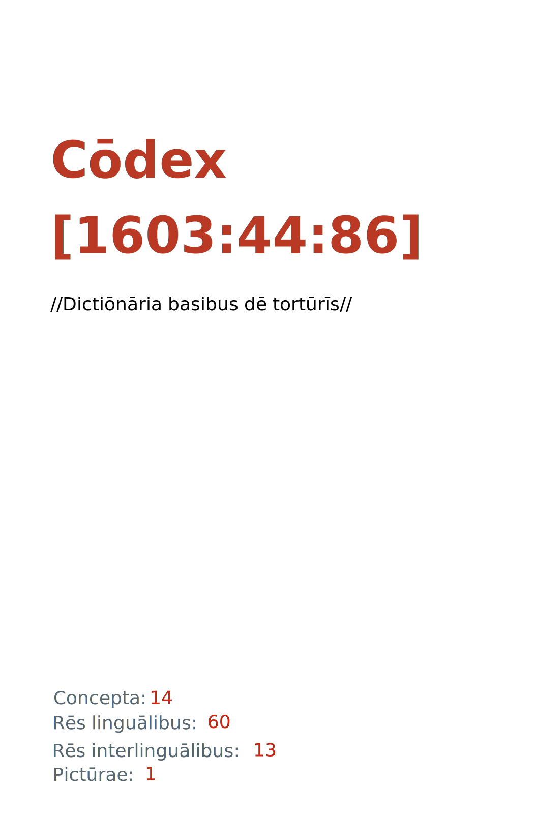

= Cōdex [1603:44:86]: //Dictiōnāria basibus dē tortūrīs//
:doctype: book
:title: Cōdex [1603:44:86]: //Dictiōnāria basibus dē tortūrīs//
:lang: la
:toc: macro
:toclevels: 5
:toc-title: Tabula contentorum
:table-caption: Tabula
:figure-caption: Pictūra
:example-caption: Exemplum
:last-update-label: Renovatio
:version-label: Versiō
:appendix-caption: Appendix
:source-highlighter: rouge
:warning-caption: Hic sunt dracones
:tip-caption: Commendātum
:front-cover-image: : //Dictiōnāria basibus dē tortūrīs//",1050,1600]

{nbsp} +
{nbsp} +
[quote]
/**Public domain means that each major common issue only needs to be resolved once**/@eng-Latn

'''

[%header,cols="25h,~a"]
|===
|
Rēs interlinguālibus
|
Factum

|
/translator/@eng-Latn
|
Vicidata

|
/dictiōnārium ēditōrī/
|
EticaAI

|
/publication date/@eng-Latn
|
2022-03-13

|
numerus editionis
|
2022-03-15T00:21:37

|
/SPDX license ID/@eng-Latn
|
CC0-1.0

|
spōnsor
|
pro bonō publicō

|===

ifndef::backend-epub3[]
<<<
toc::[]
<<<
endif::[]

[id=0_999_1603_1]
== Praefātiō 

Rēs linguālibus::
  Lingua Anglica (Abecedarium Latinum):::
    _**Cōdex [1603:44:86]**_ is the book format of the machine-readable dictionaries _**[1603:44:86] //Dictiōnāria basibus dē tortūrīs//**_, which are distributed for implementers on external applications. This book is intended as an advanced resource for other lexicographers and terminology translators, including detect and report inconsistencies. It can, however, be used as an ad hoc dictionary if there is not derived work focused on your specific needs.
    +++  +++
    **ABOUT LEXICOGRAPHY**
    +++  +++
    Practical lexicography is the art or craft of compiling, writing and editing dictionaries. The basics are not far different than a millennia ago: it is still a very humane, creative work. It is necessary to be humble: most of the translator's mistakes are, in fact, not the translator's fault, but methodological flaws. Making sure of a source idea of what a concept represents, even if it means rewrite and make simpler, annex pictures, show examples, do whatever to make it be understood, makes even non-professional translators that care about their own language deliver better results than any alternative. In other words: even the so-called industry best practices of paying professional translators and reviewers cannot overcome already poorly explained source terms.
    +++  +++
    **ABOUT TYPES OF DICTIONARIES WE'RE COMPILING**
    +++  +++
    We're concerned with a group of ideas (we call it a group of dictionaries of concepts) which can be broken into smaller parts, reviewed for inconsistencies, improved for definitions, and then be translated by volunteers. Interlingual codes, such as what could be used on actual data exchange, are also added to each concept. Both glossaries, user interfaces (such as labels on data collection) and in some cases even standard codes for what would go on a data field could be compiled this way.
    +++  +++
    Since the full list of prototypal-dictionaries and dictionaries is huge, one way cited by objective audiences is the following:
    +++  +++
    ....
    1. Humanitarian aid
    2. Development aid
    3. Human rights
    4. Military relief (or conflict and conflict-resolution related concepts)
    ....
    +++  +++
    The itens 1, 2 and 4 https://en.m.wikipedia.org/wiki/Humanitarian-Development_Nexus[are sometimes referred as _nexus_] and are often found helping _humanitarian crisis_. Since most contributors whose ideas and valid criticism are volunteers, then 3 (human rights, as in International Amnesty) to differentiate from humanitarianism (such as Red Cross Movement is reference).
    +++  +++
    Note that **dictionaries are not usage guides**. Instructions, when they exist, are mostly dedicated to lexicographers and translators.
    +++  +++
    **/PRO BONŌ PUBLICŌ/@lat-Latn**
    +++  +++
    The lexicographers of this work are both volunteers, doing it for free, pro bonō publicō, and don't accept donations for the sake of everyone's reusable dictionaries. Existing previous work often is based on old public domain books. Most terminology translators already would be volunteers because they believe in a cause. The best way to inspire collaboration is to be examples ourselves.
    +++  +++
    There's a non-moralistic aspect, fairly simple to understand: how expensive would it be to pay for everyone's work considering it is feasible over 200 languages? The logistics to decide who should be paid, then worldwide cash transfer (may include people from embargoed countries), then traditional auditing mechanisms to check misuse donors expect, exist? In special terminology (dictionary terms themselves) and so many languages, neither sufficient money nor humans interested in being coordinators exist.

<<<

== Methodī ex cōdice
=== Methodī ex dictiōnāriōrum corde
Rēs interlinguālibus::
  /scope and content/@eng-Latn:::
    #TODO 1603_44_86 //Dictiōnāria basibus dē tortūrīs modīs//#

==== Referentia
Referēns 1::
  /reference URL/@eng-Latn:::
    link:urn:1603:44:101[]
  Linguae multiplīs (Scrīptum incognitō):::
    /The _[1603:44:101] //Dictiōnāria basibus de scielus contrā persōnam// _is the group of dictionaries focused at individual level/@eng-Latn

=== Methodī ex verbīs in dictiōnāriīs
NOTE: /At the moment, there is no workflow to use https://www.wikidata.org/wiki/Wikidata:Lexicographical_data[Wikidata lexicographical data], which actually could be used as storage for stricter nomenclature. The current implementations use only Wikidata concepts, the Q-items./@eng-Latn

==== Methodī ex verbīs in Vicidata (Q modō)
Rēs linguālibus::
  Lingua Anglica (Abecedarium Latinum):::
    The ***[1603:44:86] //Dictiōnāria basibus dē tortūrīs//*** uses Wikidata as one strategy to conciliate language terms for one or more of it's concepts.
    +++  +++
    This means that this book, and related dictionaries data files require periodic updates to, at bare minimum, synchronize and re-share up to date translations.
    +++  +++
    **How reliable are the community translations (Wikidata source)?**
    +++  +++
    The short, default answer is: **they are reliable**, even in cases of no authoritative translations for each subject.
    +++  +++
    As reference, it is likely a professional translator (without access to Wikipedia or Internal terminology bases of the control organizations) would deliver lower quality results if you do blind tests. This is possible because not just the average public, but even terminologists and professional translators help Wikipedia (and implicitly Wikidata).
    +++  +++
    However, even when the result is correct, the current version needs improved differentiation, at minimum, acronym and long form. For major organizations, features such as __P1813 short names__ exist, but are not yet compiled with the current dataset.
    +++  +++
    **Major reasons for "wrong translations" are not translators fault**
    +++  +++
    TIP: As a rule of thumb, for already very defined concepts where you, as human, can manually verify one or more translated terms as a decent result, the other translations are likely to be acceptable. Dictionaries with edge cases (such as disputed territory names) would have further explanation.
    +++  +++
    The main reason for "wrong translations" are poorly defined concepts used to explain for community translators how to generate terminology translations. This would make existing translations from Wikidata (used not just by us) inconsistent. The second reason is if the dictionaries use translations for concepts without a strict match; in other words, if we make stricter definitions of what concept means but reuse Wikidada less exact terms. There are also issues when entire languages are encoded with wrong codes. Note that all these cases **wrong translations are strictly NOT translators fault, but lexicography fault**.
    +++  +++
    It is still possible to have strict translation level errors. But even if we point users how to correct Wikidata/Wikipedia (based on better contextual explanation of a concept, such as this book), the requirements to say the previous term was objectively a wrong human translation error (if following our seriousness on dictionary-building) are very high.
    +++  +++
    From the point of view of data conciliation, the following methodology is used to release the terminology translations with the main concept table.
    +++  +++
    . The main handcrafted lexicographical table (explained on previous topic), also provided on `1603_44_86.no1.tm.hxl.csv`, may reference Wiki QID.
    . Every unique QID of  `1603_44_86.no1.tm.hxl.csv`, together with language codes from [`1603:1:51`] (which requires knowing human languages), is used to prepare an SPARQL query optimized to run on https://query.wikidata.org/[Wikidata Query Service]. The query is so huge that it is not viable to "Try it" links (URL overlong), such https://www.wikidata.org/wiki/Wikidata:SPARQL_query_service/queries/examples[as what you would find on Wikidata Tutorials], ***but*** it works!
    .. Note that the knowledge is free, the translations are there, but the multilingual humanitarian needs may lack people to prepare the files and shares then for general use.
    . The query result, with all QIDs and term labels, is shared as `1603_44_86.wikiq.tm.hxl.csv`
    . The community reviewed translations of each singular QID is pre-compiled on an individual file `1603_44_86.wikiq.tm.hxl.csv`
    . `1603_44_86.no1.tm.hxl.csv` plus `1603_44_86.wikiq.tm.hxl.csv` created `1603_44_86.no11.tm.hxl.csv`

=== Rēs dē factō in dictiōnāriīs
==== Concepta: 20

==== Rēs linguālibus: 14

[%header,cols="15h,25a,~,17"]
|===
|
Cōdex linguae
|
Glotto cōdicī +++ +++ ISO 639-3 +++ +++ Wiki QID cōdicī
|
Nōmen Latīnum
|
Concepta

|
mul-Zyyy
|

+++ +++
https://iso639-3.sil.org/code/mul[mul]
+++ +++ 
|
Linguae multiplīs (Scrīptum incognitō)
|
20

|
ara-Arab
|
https://glottolog.org/resource/languoid/id/arab1395[arab1395]
+++ +++
https://iso639-3.sil.org/code/ara[ara]
+++ +++ https://www.wikidata.org/wiki/Q13955[Q13955]
|
Macrolingua Arabica (/Abecedarium Arabicum/)
|
2

|
heb-Hebr
|
https://glottolog.org/resource/languoid/id/hebr1245[hebr1245]
+++ +++
https://iso639-3.sil.org/code/heb[heb]
+++ +++ https://www.wikidata.org/wiki/Q9288[Q9288]
|
Lingua Hebraica (Alphabetum Hebraicum)
|
1

|
zho-Zzzz
|
https://glottolog.org/resource/languoid/id/sini1245[sini1245]
+++ +++
https://iso639-3.sil.org/code/zho[zho]
+++ +++ https://www.wikidata.org/wiki/Q7850[Q7850]
|
/Macrolingua Sinicae (?)/
|
1

|
eng-Latn
|
https://glottolog.org/resource/languoid/id/stan1293[stan1293]
+++ +++
https://iso639-3.sil.org/code/eng[eng]
+++ +++ https://www.wikidata.org/wiki/Q1860[Q1860]
|
Lingua Anglica (Abecedarium Latinum)
|
6

|
nld-Latn
|
https://glottolog.org/resource/languoid/id/mode1257[mode1257]
+++ +++
https://iso639-3.sil.org/code/nld[nld]
+++ +++ https://www.wikidata.org/wiki/Q7411[Q7411]
|
Lingua Batavica (Abecedarium Latinum)
|
1

|
deu-Latn
|
https://glottolog.org/resource/languoid/id/stan1295[stan1295]
+++ +++
https://iso639-3.sil.org/code/deu[deu]
+++ +++ https://www.wikidata.org/wiki/Q188[Q188]
|
Lingua Germanica (Abecedarium Latinum)
|
1

|
spa-Latn
|
https://glottolog.org/resource/languoid/id/stan1288[stan1288]
+++ +++
https://iso639-3.sil.org/code/spa[spa]
+++ +++ https://www.wikidata.org/wiki/Q1321[Q1321]
|
Lingua Hispanica (Abecedarium Latinum)
|
3

|
cat-Latn
|
https://glottolog.org/resource/languoid/id/stan1289[stan1289]
+++ +++
https://iso639-3.sil.org/code/cat[cat]
+++ +++ https://www.wikidata.org/wiki/Q7026[Q7026]
|
Lingua Catalana (Abecedarium Latinum)
|
1

|
ukr-Cyrl
|
https://glottolog.org/resource/languoid/id/ukra1253[ukra1253]
+++ +++
https://iso639-3.sil.org/code/ukr[ukr]
+++ +++ https://www.wikidata.org/wiki/Q8798[Q8798]
|
Lingua Ucrainica (Abecedarium Cyrillicum)
|
1

|
tur-Latn
|
https://glottolog.org/resource/languoid/id/nucl1301[nucl1301]
+++ +++
https://iso639-3.sil.org/code/tur[tur]
+++ +++ https://www.wikidata.org/wiki/Q256[Q256]
|
Lingua Turcica (Abecedarium Latinum)
|
1

|
srp-Latn
|
https://glottolog.org/resource/languoid/id/serb1264[serb1264]
+++ +++
https://iso639-3.sil.org/code/srp[srp]
+++ +++ https://www.wikidata.org/wiki/Q21161949[Q21161949]
|
/Serbian/ (Abecedarium Latinum)
|
1

|
srp-Cyrl
|
https://glottolog.org/resource/languoid/id/serb1264[serb1264]
+++ +++
https://iso639-3.sil.org/code/srp[srp]
+++ +++ https://www.wikidata.org/wiki/Q9299[Q9299]
|
Lingua Serbica (Abecedarium Cyrillicum)
|
1

|
hbs-Latn
|
https://glottolog.org/resource/languoid/id/sout1528[sout1528]
+++ +++
https://iso639-3.sil.org/code/hbs[hbs]
+++ +++ https://www.wikidata.org/wiki/Q9301[Q9301]
|
Macrolingua Serbocroatica (Abecedarium Latinum)
|
1

|===

==== Rēs interlinguālibus: 8
Rēs::
  /publication date/@eng-Latn:::
    Rēs interlinguālibus::::
      /Wiki P/;;
        https://www.wikidata.org/wiki/Property:P577[P577]

      ix_hxlix;;
        ix_wikip577

      ix_hxlvoc;;
        v_wiki_p_577

    Rēs linguālibus::::
      Lingua Latina (Abecedarium Latinum);;
        +++/publication date/@eng-Latn+++

      Lingua Anglica (Abecedarium Latinum);;
        +++Date or point in time when a work was first published or released+++

  /Wiki QID/:::
    Rēs interlinguālibus::::
      /rēgulam/;;
        Q[1-9]\d*

      ix_hxlix;;
        ix_wikiq

      ix_hxlvoc;;
        v_wiki_q

    Rēs linguālibus::::
      Lingua Latina (Abecedarium Latinum);;
        +++/Wiki QID/+++

      Lingua Anglica (Abecedarium Latinum);;
        +++QID (or Q number) is the unique identifier of a data item on Wikidata, comprising the letter "Q" followed by one or more digits. It is used to help people and machines understand the difference between items with the same or similar names e.g there are several places in the world called London and many people called James Smith. This number appears next to the name at the top of each Wikidata item.+++

  spōnsor:::
    Rēs interlinguālibus::::
      /Wiki P/;;
        https://www.wikidata.org/wiki/Property:P859[P859]

      ix_hxlix;;
        ix_wikip859

      ix_hxlvoc;;
        v_wiki_p_859

    Rēs linguālibus::::
      Lingua Latina (Abecedarium Latinum);;
        +++spōnsor+++

      Lingua Anglica (Abecedarium Latinum);;
        +++organization or individual that sponsors this item+++

  /SPDX license ID/@eng-Latn:::
    Rēs interlinguālibus::::
      /Wiki P/;;
        https://www.wikidata.org/wiki/Property:P2479[P2479]

      /rēgulam/;;
        [0-9A-Za-z\.\-]{3,36}[+]?

      /formatter URL/@eng-Latn;;
        https://spdx.org/licenses/$1.html

      ix_hxlix;;
        ix_wikip2479

      ix_hxlvoc;;
        v_wiki_p_2479

    Rēs linguālibus::::
      Lingua Latina (Abecedarium Latinum);;
        +++/SPDX license ID/@eng-Latn+++

      Lingua Anglica (Abecedarium Latinum);;
        +++SPDX license identifier+++

  /scope and content/@eng-Latn:::
    Rēs interlinguālibus::::
      /Wiki P/;;
        https://www.wikidata.org/wiki/Property:P7535[P7535]

      ix_hxlix;;
        ix_wikip7535

      ix_hxlvoc;;
        v_wiki_p_7535

    Rēs linguālibus::::
      Lingua Latina (Abecedarium Latinum);;
        +++/scope and content/@eng-Latn+++

      Lingua Anglica (Abecedarium Latinum);;
        +++a summary statement providing an overview of the archival collection+++

  numerus editionis:::
    Rēs interlinguālibus::::
      /Wiki P/;;
        https://www.wikidata.org/wiki/Property:P393[P393]

      ix_hxlix;;
        ix_wikip393

      ix_hxlvoc;;
        v_wiki_p_393

    Rēs linguālibus::::
      Lingua Latina (Abecedarium Latinum);;
        +++numerus editionis+++

      Lingua Anglica (Abecedarium Latinum);;
        +++number of an edition (first, second, ... as 1, 2, ...) or event+++

  /dictiōnārium ēditōrī/:::
    Rēs interlinguālibus::::
      /Wiki P/;;
        https://www.wikidata.org/wiki/Property:P98[P98]

      ix_hxlix;;
        ix_wikip98

      ix_hxlvoc;;
        v_wiki_p_98

    Rēs linguālibus::::
      Lingua Latina (Abecedarium Latinum);;
        +++/dictiōnārium ēditōrī/+++

      Lingua Anglica (Abecedarium Latinum);;
        +++editor of a compiled work such as a book or a periodical (newspaper or an academic journal)+++

  /translator/@eng-Latn:::
    Rēs interlinguālibus::::
      /Wiki P/;;
        https://www.wikidata.org/wiki/Property:P655[P655]

      ix_hxlix;;
        ix_wikip655

      ix_hxlvoc;;
        v_wiki_p_655

    Rēs linguālibus::::
      Lingua Latina (Abecedarium Latinum);;
        +++/translator/@eng-Latn+++

      Lingua Anglica (Abecedarium Latinum);;
        +++agent who adapts any kind of written text from one language to another+++

<<<

== Archīa

Rēs linguālibus::
  Lingua Anglica (Abecedarium Latinum):::
    **Context information**: ignoring for a moment the fact of having several translations (and optimized to receive contributions on a regular basis, not _just_ an static work), then the actual groundbreaking difference on the workflow used to generate every dictionaries on Cōdex such as this one are the following fact: **we provide machine readable formats even when the equivalents on _international languages_, such as English, don't have for areas such as humanitarian aid, development aid and human rights**. The closest to such multilingualism (outside Wikimedia) are European Union SEMICeu (up to 24 languages), but even then have issues while sharing translations on all languages. United Nations translations (up to 6 languages, rarely more) are not available by humanitarian agencies to help with terminology translations.
    +++  +++
    **Practical implication**: the text documents on _Archīa prō cōdice_ (literal English translation: _File for book_) are alternatives to this book format which are heavily automated using only the data format. However, the machine-readable formats on _Archīa prō dictiōnāriīs_ (literal English translation: _Files for dictionaries_) are the focus and recommended for derived works and intended for mitigating additional human errors. We can even create new formats by request! The goal here is both to allow terminology translators and production usage where it makes an impact.

=== Archīa prō dictiōnāriīs: 4

==== 1603_44_86.no1.tm.hxl.csv

Rēs interlinguālibus::
  /download link/@eng-Latn::: link:1603_44_86.no1.tm.hxl.csv[1603_44_86.no1.tm.hxl.csv]
Rēs linguālibus::
  Lingua Anglica (Abecedarium Latinum):::
    /Numerordinatio on HXLTM container/

==== 1603_44_86.no11.tm.hxl.csv

Rēs interlinguālibus::
  /download link/@eng-Latn::: link:1603_44_86.no11.tm.hxl.csv[1603_44_86.no11.tm.hxl.csv]
Rēs linguālibus::
  Lingua Anglica (Abecedarium Latinum):::
    /Numerordinatio on HXLTM container (expanded with terminology translations)/

==== 1603_44_86.wikiq.tm.hxl.csv

Rēs interlinguālibus::
  /download link/@eng-Latn::: link:1603_44_86.wikiq.tm.hxl.csv[1603_44_86.wikiq.tm.hxl.csv]
  /reference URL/@eng-Latn:::
    https://hxltm.etica.ai/

Rēs linguālibus::
  Lingua Anglica (Abecedarium Latinum):::
    HXLTM dialect of HXLStandard on CSV RFC 4180. wikiq means #item+conceptum+codicem are strictly Wikidata QIDs.

==== 1603_44_86.no11.tbx

Rēs interlinguālibus::
  /download link/@eng-Latn::: link:1603_44_86.no11.tbx[1603_44_86.no11.tbx]
  /reference URL/@eng-Latn:::
    http://www.terminorgs.net/downloads/TBX_Basic_Version_3.1.pdf

Rēs linguālibus::
  Lingua Anglica (Abecedarium Latinum):::
    TBX-Basic is a terminological markup language (TML) that is a lighter version of TBX-Default, the TML that is defined in ISO 30042. TBX-Basic is designed for the localization industry and is based on information from surveys and studies that were conducted by the LISA Term SIG about the types of terminology data that the localization industry requires.

==== 1603_44_86.no11.tmx

Rēs interlinguālibus::
  /download link/@eng-Latn::: link:1603_44_86.no11.tmx[1603_44_86.no11.tmx]
  /reference URL/@eng-Latn:::
    https://www.gala-global.org/tmx-14b

Rēs linguālibus::
  Lingua Anglica (Abecedarium Latinum):::
    The purpose of the Translation Memory eXchange format (TMX) format is to provide a standard method to describe translation memory data that is being exchanged among tools and/or translation vendors, while introducing little or no loss of critical data during the process

=== Archīa prō cōdice: 1

==== 1603_44_86.mul-Latn.codex.adoc

Rēs interlinguālibus::
  /download link/@eng-Latn::: link:1603_44_86.mul-Latn.codex.adoc[1603_44_86.mul-Latn.codex.adoc]
  /reference URL/@eng-Latn:::
    https://docs.asciidoctor.org/

Rēs linguālibus::
  Lingua Anglica (Abecedarium Latinum):::
    AsciiDoc is a plain text authoring format (i.e., lightweight markup language) for writing technical content such as documentation, articles, and books.

<<<

[.text-center]

Dictiōnāria initiīs

<<<

== //Dictiōnāria basibus dē tortūrīs//
<<<

[id='1']
=== [`1`] //list of methods of torture//

Rēs linguālibus::
  Linguae multiplīs (Scrīptum incognitō):::
    //list of methods of torture//

<<<

[id='100']
=== [`100`] /psychological torture methods/@eng-Latn

Rēs linguālibus::
  Linguae multiplīs (Scrīptum incognitō):::
    /psychological torture methods/@eng-Latn

[id='100_1']
==== [`100_1`] /sensory deprivation/@eng-Latn

Rēs pictūrīs::
* **100_1~1** (link:++https://commons.wikimedia.org/wiki/File:Camp_x-ray_detainees.jpg++[fōns 100_1~1 🔗])
+
++"]

Rēs linguālibus::
  Linguae multiplīs (Scrīptum incognitō):::
    /sensory deprivation || the act of deliberately removing or reducing stimuli/@eng-Latn

[id='100_1_1']
===== [`100_1_1`] /white torture/@eng-Latn

Rēs linguālibus::
  Linguae multiplīs (Scrīptum incognitō):::
    /white torture || method of psychological torture utilizing sensory deprivation/@eng-Latn

[id='100_2']
==== [`100_2`] /music in psychological operations/@eng-Latn

Rēs linguālibus::
  Linguae multiplīs (Scrīptum incognitō):::
    /music in psychological operations/@eng-Latn

[id='100_2_1']
===== [`100_2_1`] /sound of fingernails scraping chalkboard/@eng-Latn

Rēs linguālibus::
  Linguae multiplīs (Scrīptum incognitō):::
    /sound of fingernails scraping chalkboard/@eng-Latn

[id='100_991']
==== [`100_991`] /blackmail/@eng-Latn

Rēs linguālibus::
  Linguae multiplīs (Scrīptum incognitō):::
    /blackmail || coercion based on threat of revealing information/@eng-Latn

[id='100_992']
==== [`100_992`] /sleep deprivation/@eng-Latn

Rēs linguālibus::
  Linguae multiplīs (Scrīptum incognitō):::
    /sleep deprivation || condition of not having enough sleep/@eng-Latn

<<<

[id='200']
=== [`200`] /physical torture methods/@eng-Latn

Rēs linguālibus::
  Linguae multiplīs (Scrīptum incognitō):::
    /physical torture methods/@eng-Latn

[id='200_1']
==== [`200_1`] /waterboarding/@eng-Latn

Rēs linguālibus::
  Linguae multiplīs (Scrīptum incognitō):::
    /waterboarding || drowning simulating torture method/@eng-Latn

<<<

[id='210']
=== [`210`] /sexual assault/@eng-Latn

Rēs linguālibus::
  Linguae multiplīs (Scrīptum incognitō):::
    /sexual assault || act of coercing or physically forcing a person to engage in sexual activity/@eng-Latn

[id='210_1']
==== [`210_1`] /rape/@eng-Latn

Rēs linguālibus::
  Linguae multiplīs (Scrīptum incognitō):::
    /rape || type of sexual assault usually involving sexual intercourse without consent/@eng-Latn

<<<

[id='300']
=== [`300`] /other, need classification/@eng-Latn

Rēs linguālibus::
  Linguae multiplīs (Scrīptum incognitō):::
    /other, need classification/@eng-Latn

[id='300_1']
==== [`300_1`] /medical torture/@eng-Latn

Rēs linguālibus::
  Linguae multiplīs (Scrīptum incognitō):::
    /medical torture/@eng-Latn

[id='300_2']
==== [`300_2`] /patient abuse/@eng-Latn

Rēs linguālibus::
  Linguae multiplīs (Scrīptum incognitō):::
    /patient abuse || action or failure to act which causes unreasonable suffering, misery or harm to the patient/@eng-Latn

[id='300_3']
==== [`300_3`] /truth drug/@eng-Latn

Rēs linguālibus::
  Linguae multiplīs (Scrīptum incognitō):::
    /truth drug || class of psychoactive drug (not actually scientific)/@eng-Latn

<<<

[id='99999999']
=== [`99999999`] //other//

Rēs linguālibus::
  Linguae multiplīs (Scrīptum incognitō):::
    //other//

[id='99999999_5097924']
==== [`99999999_5097924`] /Child sexual abuse by UN peacekeepers/

Rēs interlinguālibus::
  /Wiki QID/:::
    https://www.wikidata.org/wiki/Q5097924[Q5097924]

Rēs linguālibus::
  Linguae multiplīs (Scrīptum incognitō):::
    /Child sexual abuse by UN peacekeepers/

  Macrolingua Arabica (/Abecedarium Arabicum/):::
    +++الاعتداء الجنسي على الأطفال من قبل قوات حفظ السلام التابعة للأمم المتحدة+++

  /Macrolingua Sinicae (?)/:::
    +++联合国维和部队的儿童性虐待行径+++

  Lingua Anglica (Abecedarium Latinum):::
    +++Child sexual abuse by UN peacekeepers+++

  Lingua Hispanica (Abecedarium Latinum):::
    +++Casos de abusos sexuales cometidos por el personal de la ONU+++

  Lingua Catalana (Abecedarium Latinum):::
    +++Casos d'abusos sexuals comesos pel personal de l'Organització de les Nacions Unides+++

<<<

[id='30315193']
=== [`30315193`] /Minnesota Protocol/

Rēs interlinguālibus::
  /Wiki QID/:::
    https://www.wikidata.org/wiki/Q30315193[Q30315193]

Rēs linguālibus::
  Linguae multiplīs (Scrīptum incognitō):::
    /Minnesota Protocol/

  Lingua Anglica (Abecedarium Latinum):::
    +++Minnesota Protocol+++

  Lingua Hispanica (Abecedarium Latinum):::
    +++Protocolo de Minnesota+++

<<<

[id='2120363']
=== [`2120363`] /Istanbul Protocol/

Rēs interlinguālibus::
  /Wiki QID/:::
    https://www.wikidata.org/wiki/Q2120363[Q2120363]

Rēs linguālibus::
  Linguae multiplīs (Scrīptum incognitō):::
    /Istanbul Protocol/

  Macrolingua Arabica (/Abecedarium Arabicum/):::
    +++بروتوكول إسطنبول+++

  Lingua Hebraica (Alphabetum Hebraicum):::
    +++פרוטוקול איסטנבול+++

  Lingua Anglica (Abecedarium Latinum):::
    +++Istanbul Protocol+++

  Lingua Batavica (Abecedarium Latinum):::
    +++Istanboel-protocol+++

  Lingua Germanica (Abecedarium Latinum):::
    +++Istanbul-Protokoll+++

  Lingua Hispanica (Abecedarium Latinum):::
    +++Protocolo de Estambul+++

  Lingua Ucrainica (Abecedarium Cyrillicum):::
    +++Стамбульський протокол+++

  Lingua Turcica (Abecedarium Latinum):::
    +++İstanbul Protokolü+++

  /Serbian/ (Abecedarium Latinum):::
    +++Istanbulski protokol+++

  Lingua Serbica (Abecedarium Cyrillicum):::
    +++Istanbulski protokol+++

  Macrolingua Serbocroatica (Abecedarium Latinum):::
    +++Istanbulski protokol+++

<<<

[.text-center]

Dictiōnāria fīnālī

<<<

== Notā bene

=== /[HELP WANTED] Generated PDF don't have right fonts for all languages/@eng-Latn

Rēs linguālibus::
  Lingua Anglica (Abecedarium Latinum):::
    First, sorry if this affects your loved language. We're working on this, but we are still not perfected.
    If you have fonts installed on your computer, you very likely can still copy and paste from the eBook version.
    Please note that all formats intended for machine processing will work fine.

=== /[Book with Wikidata Q] I want to help! Some translation is missing or is wrong! How to change it?/@eng-Latn

Rēs linguālibus::
  Lingua Anglica (Abecedarium Latinum):::
    Most (but not all) concepts are using Wikidata Q. In fact, most of the time we improve Wikidata while preparing the dictionaries. Please check if the exact concept you want have a Q ID then click. There you can add translations.
    The next release (likely weekly) will have your submissions without need to contact us directly.

=== /[Book with Wikidata Q] I can find the Wikidata concept, but I'm unable to edit!/@eng-Latn

Rēs linguālibus::
  Lingua Anglica (Abecedarium Latinum):::
    While Wikidata is more flexible than Wikipedia's (for example, it allows concepts without need to create Wikipedia pages) even Wikidata can have concepts which require creating an account and don't allow anonymous editing. Creating such an account and confirming email is faster than asking someone else's do it for you.
    However, while vandalism on Wikidata is rare, very few concepts will require an account with more contributions and not created very recently. If this is your case, help with the ones you can do alone and the rest ask someone else to add to you.

=== /I heard there is an interest in having Cōdex beyond Latin language! How to do it?!/@eng-Latn

Rēs linguālibus::
  Lingua Anglica (Abecedarium Latinum):::
    Please contact us. This book uses Latin (sometimes _dog Latin_) to document all other languages, but we obviously can automated generation of books for others using other writing systems and some reference language. We need special help with writing systems such as Bengali, Devanagari and Tamil. For Right to Left scripts, despite being able to render the text, the book printing will require a different template. Only replacing Latin will not work, so we're open to ideas to make a great user experience!

<<<

