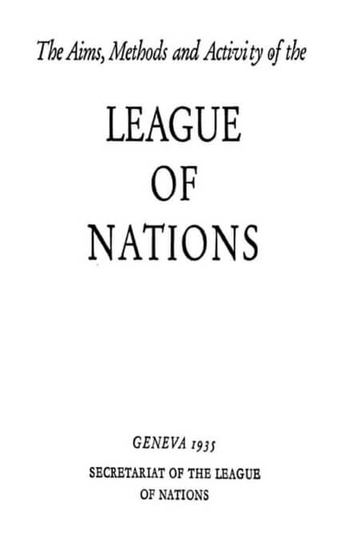

= Cōdex [1603:45:1]: //dictiōnāria de hūmānitātēs interimperia//
:doctype: book
:title: Cōdex [1603:45:1]: //dictiōnāria de hūmānitātēs interimperia//
:lang: la
:toc: macro
:toclevels: 5
:toc-title: Tabula contentorum
:table-caption: Tabula
:figure-caption: Pictūra
:example-caption: Exemplum
:last-update-label: Renovatio
:version-label: Versiō
:appendix-caption: Appendix
:source-highlighter: rouge
:warning-caption: Hic sunt dracones
:tip-caption: Commendātum

{nbsp} +
{nbsp} +
[quote]
/**Public domain means that each major common issue only needs to be resolved once**/@eng-Latn

'''

[%header,cols="25h,~a"]
|===
|
Rēs interlinguālibus
|
Factum

|
scrīptor
|
Multiplicēs scrīptōribus

|
/translator/@eng-Latn
|
Vicidata

|
/cōdex pūblicandī/
|
EticaAI

|
/publication date/@eng-Latn
|
2022-01-18

|
numerus editionis
|
2022-04-16T23:59:33

|
/SPDX license ID/@eng-Latn
|
CC0-1.0

|
spōnsor
|
pro bonō publicō

|===

ifndef::backend-epub3[]
<<<
toc::[]
<<<
endif::[]

[id=0_999_1603_1]
== Praefātiō 

Rēs linguālibus::
  Lingua Anglica (Abecedarium Latinum):::
    _**Cōdex [1603:45:1]**_ is the book format of the machine-readable dictionaries _**[1603:45:1] //dictiōnāria de hūmānitātēs interimperia//**_, which are distributed for implementers on external applications. This book is intended as an advanced resource for other lexicographers and terminology translators, including detect and report inconsistencies. It can, however, be used as an ad hoc dictionary if there is not derived work focused on your specific needs.
    +++  +++
    **ABOUT LEXICOGRAPHY**
    +++  +++
    Practical lexicography is the art or craft of compiling, writing and editing dictionaries. The basics are not far different than a millennia ago: it is still a very humane, creative work. It is necessary to be humble: most of the translator's mistakes are, in fact, not the translator's fault, but methodological flaws. Making sure of a source idea of what a concept represents, even if it means rewrite and make simpler, annex pictures, show examples, do whatever to make it be understood, makes even non-professional translators that care about their own language deliver better results than any alternative. In other words: even the so-called industry best practices of paying professional translators and reviewers cannot overcome already poorly explained source terms.
    +++  +++
    **ABOUT TYPES OF DICTIONARIES WE'RE COMPILING**
    +++  +++
    We're concerned with a group of ideas (we call it a group of dictionaries of concepts) which can be broken into smaller parts, reviewed for inconsistencies, improved for definitions, and then be translated by volunteers. Interlingual codes, such as what could be used on actual data exchange, are also added to each concept. Both glossaries, user interfaces (such as labels on data collection) and in some cases even standard codes for what would go on a data field could be compiled this way.
    +++  +++
    Since the full list of prototypal-dictionaries and dictionaries is huge, one way cited by objective audiences is the following:
    +++  +++
    . Humanitarian aid
    . Development aid
    . Human rights
    . Military relief (or conflict and conflict-resolution related concepts)
    +++  +++
    The itens 1, 2 and 4 https://en.m.wikipedia.org/wiki/Humanitarian-Development_Nexus[are sometimes referred as _nexus_] and are often found helping _humanitarian crisis_. Since most contributors whose ideas and valid criticism are volunteers, then 3 (human rights, as in International Amnesty) to differentiate from humanitarianism (such as Red Cross Movement is reference).
    +++  +++
    Note that **dictionaries are not usage guides**. Instructions, when they exist, are mostly dedicated to lexicographers and translators.
    +++  +++
    **/PRO BONŌ PUBLICŌ/@lat-Latn**
    +++  +++
    The lexicographers of this work are both volunteers, doing it for free, pro bonō publicō, and don't accept donations for the sake of everyone's reusable dictionaries. Existing previous work often is based on old public domain books. Most terminology translators already would be volunteers because they believe in a cause. The best way to inspire collaboration is to be examples ourselves.
    +++  +++
    There's a non-moralistic aspect, fairly simple to understand: how expensive would it be to pay for everyone's work considering it is feasible over 200 languages? The logistics to decide who should be paid, then worldwide cash transfer (may include people from embargoed countries), then traditional auditing mechanisms to check misuse donors expect, exist? In special terminology (dictionary terms themselves) and so many languages, neither sufficient money nor humans interested in being coordinators exist.

<<<

== Methodī ex cōdice
=== Methodī ex dictiōnāriōrum corde
Rēs interlinguālibus::
  /scope and content/@eng-Latn:::
    The decision making behind the concept dictionaries was lingual terminology translations and interlingual codes for organizations which often are mentioned in humanitarian areas.
    +++  +++
    **UN System**
    +++  +++
    The dictionary contains an incomplete list of concepts of the UN System. 
    +++  +++
    **National Red Cross and Red Crescent Societies**
    +++  +++
    The dictionaries contain National Red Cross and Red Crescent concepts. It uses UN m49 as key, which can actually contain concepts that do not have valid national organizations because they are not strictly a country. The concepts which do are a country and have translations may also not be at a given moment be acknowledged by the International Red Cross and Red Crescent.
    +++  +++
    **Subnational Red Cross and Red Crescent Societies**
    +++  +++
    The dictionaries here do not list subnational organizations. However, we do have standardized suggestions on how to decide a code for then: use the UN P-Code without the ISO 3166-1 letter prefix, but organize the subnational under the UN m49. Example:
    +++  +++
    . National Red Cross of Brazil
    .. Code: 63_76
    ... Numerodinatio: 1603:45:1:63:76
    . Subnational; Minas Gerais, Brazil
    .. UN P Code: BR33
    ... Code: 63_76_33
    ... Numerodinatio: 1603:45:1:63:76:33
    +++  +++
    Some organizations which are not valid national Red Cross and Red Crescent (because they are not strictly independent counties) can encode them with this strategy.
    +++  +++
    **Other humanitarian organizations are missing**
    We're still adding organizations which are neither UN or Red Cross. However, we're likely to keep this focused on humanitarian aid and have development aid. Human rights and humanitarian relief organizations will not be added here

==== Caveat lector
Rēs interlinguālibus::
  /Wikidata Q local numeric namespace/@eng-Latn:::
    **Do not use [1603:45:1] to automate import on Wikidata**. Volunteers can use this as reference for what is missing, but all work is already done via the Wikidata site, reviewing item by item.

==== Referentia
Referēns 1::
  /reference URL/@eng-Latn:::
    link:https://www.un.org/en/about-us/un-system[]
  Linguae multiplīs (Scrīptum incognitō):::
    /Authorative reference for United Nations related concepts. Incomplete. HTML format/@eng-Latn

Referēns 2::
  /reference URL/@eng-Latn:::
    link:https://www.un.org/sites/un2.un.org/files/un_system_chart.pdf[]
  Linguae multiplīs (Scrīptum incognitō):::
    /Authorative reference for United Nations related concepts. Incomplete. PDF format./@eng-Latn

Referēns 3::
  /reference URL/@eng-Latn:::
    link:https://data.ifrc.org/fdrs/national-societies[]
  Linguae multiplīs (Scrīptum incognitō):::
    /Authorative reference for Red Cross National Societies. (We sincronize using Wikidata, not this site)/@eng-Latn

Referēns 4::
  /reference URL/@eng-Latn:::
    link:https://www.wikidata.org/wiki/Wikidata:WikiProject_IFRC[]
  Linguae multiplīs (Scrīptum incognitō):::
    Wikidata:WikiProject IFRC. More volunteers are welcome!

Referēns 5::
  /reference URL/@eng-Latn:::
    link:https://www.wikidata.org/wiki/Wikidata:WikiProject_Humanitarian_Wikidata[]
  Linguae multiplīs (Scrīptum incognitō):::
    Wikidata:WikiProject Humanitarian Wikidata. More volunteers are welcome!

Referēns 6::
  /reference URL/@eng-Latn:::
    link:https://www.wikidata.org/w/index.php?search=M%C3%A9decins+Sans+Fronti%C3%A8res[]
  Linguae multiplīs (Scrīptum incognitō):::
    /To do: get more MSFs from Wikidata (several are not on Wikipedia, BUT are on Wikidata)/@eng-Latn

Referēns 7::
  /reference URL/@eng-Latn:::
    link:https://reliefweb.int/organizations[]
  Linguae multiplīs (Scrīptum incognitō):::
    /To do: review this list for more organizations/@eng-Latn

=== Methodī ex verbīs in dictiōnāriīs
NOTE: /At the moment, there is no workflow to use https://www.wikidata.org/wiki/Wikidata:Lexicographical_data[Wikidata lexicographical data], which actually could be used as storage for stricter nomenclature. The current implementations use only Wikidata concepts, the Q-items./@eng-Latn

==== Methodī ex verbīs in Vicidata (Q modō)
Rēs linguālibus::
  Lingua Anglica (Abecedarium Latinum):::
    The ***[1603:45:1] //dictiōnāria de hūmānitātēs interimperia//*** uses Wikidata as one strategy to conciliate language terms for one or more of it's concepts.
    +++  +++
    This means that this book, and related dictionaries data files require periodic updates to, at bare minimum, synchronize and re-share up to date translations.
    +++  +++
    **How reliable are the community translations (Wikidata source)?**
    +++  +++
    The short, default answer is: **they are reliable**, even in cases of no authoritative translations for each subject.
    +++  +++
    As reference, it is likely a professional translator (without access to Wikipedia or Internal terminology bases of the control organizations) would deliver lower quality results if you do blind tests. This is possible because not just the average public, but even terminologists and professional translators help Wikipedia (and implicitly Wikidata).
    +++  +++
    However, even when the result is correct, the current version needs improved differentiation, at minimum, acronym and long form. For major organizations, features such as __P1813 short names__ exist, but are not yet compiled with the current dataset.
    +++  +++
    **Major reasons for "wrong translations" are not translators fault**
    +++  +++
    TIP: As a rule of thumb, for already very defined concepts where you, as human, can manually verify one or more translated terms as a decent result, the other translations are likely to be acceptable. Dictionaries with edge cases (such as disputed territory names) would have further explanation.
    +++  +++
    The main reason for "wrong translations" are poorly defined concepts used to explain for community translators how to generate terminology translations. This would make existing translations from Wikidata (used not just by us) inconsistent. The second reason is if the dictionaries use translations for concepts without a strict match; in other words, if we make stricter definitions of what concept means but reuse Wikidada less exact terms. There are also issues when entire languages are encoded with wrong codes. Note that all these cases **wrong translations are strictly NOT translators fault, but lexicography fault**.
    +++  +++
    It is still possible to have strict translation level errors. But even if we point users how to correct Wikidata/Wikipedia (based on better contextual explanation of a concept, such as this book), the requirements to say the previous term was objectively a wrong human translation error (if following our seriousness on dictionary-building) are very high.
    +++  +++
    From the point of view of data conciliation, the following methodology is used to release the terminology translations with the main concept table.
    +++  +++
    . The main handcrafted lexicographical table (explained on previous topic), also provided on `1603_45_1.no1.tm.hxl.csv`, may reference Wiki QID.
    . Every unique QID of  `1603_45_1.no1.tm.hxl.csv`, together with language codes from [`1603:1:51`] (which requires knowing human languages), is used to prepare an SPARQL query optimized to run on https://query.wikidata.org/[Wikidata Query Service]. The query is so huge that it is not viable to "Try it" links (URL overlong), such https://www.wikidata.org/wiki/Wikidata:SPARQL_query_service/queries/examples[as what you would find on Wikidata Tutorials], ***but*** it works!
    .. Note that the knowledge is free, the translations are there, but the multilingual humanitarian needs may lack people to prepare the files and shares then for general use.
    . The query result, with all QIDs and term labels, is shared as `1603_45_1.wikiq.tm.hxl.csv`
    . The community reviewed translations of each singular QID is pre-compiled on an individual file `1603_45_1.wikiq.tm.hxl.csv`
    . `1603_45_1.no1.tm.hxl.csv` plus `1603_45_1.wikiq.tm.hxl.csv` created `1603_45_1.no11.tm.hxl.csv`

=== Rēs dē factō in dictiōnāriīs
==== Concepta: 347

==== Rēs linguālibus: 241

[%header,cols="15h,25a,~,17"]
|===
|
Cōdex linguae
|
Glotto cōdicī +++ +++ ISO 639-3 +++ +++ Wiki QID cōdicī
|
Nōmen Latīnum
|
Concepta

|
mul-Zyyy
|

+++ +++
https://iso639-3.sil.org/code/mul[mul]
+++ +++ 
|
Linguae multiplīs (Scrīptum incognitō)
|
12

|
ara-Arab
|
https://glottolog.org/resource/languoid/id/arab1395[arab1395]
+++ +++
https://iso639-3.sil.org/code/ara[ara]
+++ +++ https://www.wikidata.org/wiki/Q13955[Q13955]
|
Macrolingua Arabica (Abecedarium Arabicum)
|
121

|
hye-Armn
|
https://glottolog.org/resource/languoid/id/nucl1235[nucl1235]
+++ +++
https://iso639-3.sil.org/code/hye[hye]
+++ +++ https://www.wikidata.org/wiki/Q8785[Q8785]
|
Lingua Armenia (Alphabetum Armenium)
|
44

|
ben-Beng
|
https://glottolog.org/resource/languoid/id/beng1280[beng1280]
+++ +++
https://iso639-3.sil.org/code/ben[ben]
+++ +++ https://www.wikidata.org/wiki/Q9610[Q9610]
|
Lingua Bengali (/ISO 15924 Beng/)
|
36

|
rus-Cyrl
|
https://glottolog.org/resource/languoid/id/russ1263[russ1263]
+++ +++
https://iso639-3.sil.org/code/rus[rus]
+++ +++ https://www.wikidata.org/wiki/Q7737[Q7737]
|
Lingua Russica (Abecedarium Cyrillicum)
|
74

|
hin-Deva
|
https://glottolog.org/resource/languoid/id/hind1269[hind1269]
+++ +++
https://iso639-3.sil.org/code/hin[hin]
+++ +++ https://www.wikidata.org/wiki/Q1568[Q1568]
|
Lingua Hindica (Devanāgarī)
|
44

|
amh-Ethi
|
https://glottolog.org/resource/languoid/id/amha1245[amha1245]
+++ +++
https://iso639-3.sil.org/code/amh[amh]
+++ +++ https://www.wikidata.org/wiki/Q28244[Q28244]
|
Lingua Amharica (/ISO 15924 Ethi/)
|
6

|
kat-Geor
|
https://glottolog.org/resource/languoid/id/nucl1302[nucl1302]
+++ +++
https://iso639-3.sil.org/code/kat[kat]
+++ +++ https://www.wikidata.org/wiki/Q8108[Q8108]
|
Lingua Georgiana (Abecedarium Georgianum)
|
33

|
guj-Gujr
|
https://glottolog.org/resource/languoid/id/guja1252[guja1252]
+++ +++
https://iso639-3.sil.org/code/guj[guj]
+++ +++ https://www.wikidata.org/wiki/Q5137[Q5137]
|
Lingua Gujaratensis (/ISO 15924 Gujr/)
|
4

|
pan-Guru
|
https://glottolog.org/resource/languoid/id/panj1256[panj1256]
+++ +++
https://iso639-3.sil.org/code/pan[pan]
+++ +++ https://www.wikidata.org/wiki/Q58635[Q58635]
|
Lingua Paniabica (/ISO 15924 Guru/)
|
15

|
kan-Knda
|
https://glottolog.org/resource/languoid/id/nucl1305[nucl1305]
+++ +++
https://iso639-3.sil.org/code/kan[kan]
+++ +++ https://www.wikidata.org/wiki/Q33673[Q33673]
|
Lingua Cannadica (/ISO 15924 Knda/)
|
15

|
kor-Hang
|
https://glottolog.org/resource/languoid/id/kore1280[kore1280]
+++ +++
https://iso639-3.sil.org/code/kor[kor]
+++ +++ https://www.wikidata.org/wiki/Q9176[Q9176]
|
Lingua Coreana (Abecedarium Coreanum)
|
57

|
lzh-Hant
|
https://glottolog.org/resource/languoid/id/lite1248[lite1248]
+++ +++
https://iso639-3.sil.org/code/lzh[lzh]
+++ +++ https://www.wikidata.org/wiki/Q37041[Q37041]
|
Lingua Sinica classica (/ISO 15924 Hant/)
|
6

|
heb-Hebr
|
https://glottolog.org/resource/languoid/id/hebr1245[hebr1245]
+++ +++
https://iso639-3.sil.org/code/heb[heb]
+++ +++ https://www.wikidata.org/wiki/Q9288[Q9288]
|
Lingua Hebraica (Alphabetum Hebraicum)
|
58

|
khm-Khmr
|
https://glottolog.org/resource/languoid/id/cent1989[cent1989]
+++ +++
https://iso639-3.sil.org/code/khm[khm]
+++ +++ https://www.wikidata.org/wiki/Q9205[Q9205]
|
Lingua Khmer (/ISO 15924 Khmr/)
|
12

|
lao-Laoo
|
https://glottolog.org/resource/languoid/id/laoo1244[laoo1244]
+++ +++
https://iso639-3.sil.org/code/lao[lao]
+++ +++ https://www.wikidata.org/wiki/Q9211[Q9211]
|
/Lao language/ (/ISO 15924 Laoo/)
|
6

|
lat-Latn
|
https://glottolog.org/resource/languoid/id/lati1261[lati1261]
+++ +++
https://iso639-3.sil.org/code/lat[lat]
+++ +++ https://www.wikidata.org/wiki/Q397[Q397]
|
Lingua Latina (Abecedarium Latinum)
|
31

|
mni-Mtei
|
https://glottolog.org/resource/languoid/id/mani1292[mani1292]
+++ +++
https://iso639-3.sil.org/code/mni[mni]
+++ +++ https://www.wikidata.org/wiki/Q33868[Q33868]
|
Lingua Meitei (/ISO 15924 Mtei/)
|
1

|
mnw-Mymr
|
https://glottolog.org/resource/languoid/id/monn1252[monn1252]
+++ +++
https://iso639-3.sil.org/code/mnw[mnw]
+++ +++ https://www.wikidata.org/wiki/Q13349[Q13349]
|
/Mon language/ (/ISO 15924 Mymr/)
|
2

|
nqo-Nkoo
|
https://glottolog.org/resource/languoid/id/nkoa1234[nkoa1234]
+++ +++
https://iso639-3.sil.org/code/nqo[nqo]
+++ +++ https://www.wikidata.org/wiki/Q18546266[Q18546266]
|
/N'Ko/ (/ISO 15924 Nkoo/)
|
2

|
sat-Olck
|
https://glottolog.org/resource/languoid/id/sant1410[sant1410]
+++ +++
https://iso639-3.sil.org/code/sat[sat]
+++ +++ https://www.wikidata.org/wiki/Q33965[Q33965]
|
Lingua Santali (/ISO 15924 Olck/)
|
6

|
ori-Orya
|

+++ +++
https://iso639-3.sil.org/code/ori[ori]
+++ +++ https://www.wikidata.org/wiki/Q33810[Q33810]
|
Macrolingua Orissensis (/ISO 15924 Orya/)
|
3

|
sin-Sinh
|
https://glottolog.org/resource/languoid/id/sinh1246[sinh1246]
+++ +++
https://iso639-3.sil.org/code/sin[sin]
+++ +++ https://www.wikidata.org/wiki/Q13267[Q13267]
|
Lingua Singhalensis (/ISO 15924 Sinh/)
|
13

|
tam-Taml
|
https://glottolog.org/resource/languoid/id/tami1289[tami1289]
+++ +++
https://iso639-3.sil.org/code/tam[tam]
+++ +++ https://www.wikidata.org/wiki/Q5885[Q5885]
|
Lingua Tamulica (/ISO 15924 Taml/)
|
43

|
tel-Telu
|
https://glottolog.org/resource/languoid/id/telu1262[telu1262]
+++ +++
https://iso639-3.sil.org/code/tel[tel]
+++ +++ https://www.wikidata.org/wiki/Q8097[Q8097]
|
Lingua Telingana (/ISO 15924 Telu/)
|
12

|
div-Thaa
|
https://glottolog.org/resource/languoid/id/dhiv1236[dhiv1236]
+++ +++
https://iso639-3.sil.org/code/div[div]
+++ +++ https://www.wikidata.org/wiki/Q32656[Q32656]
|
Lingua Dhivehi (/ISO 15924 Thaa/)
|
2

|
tha-Thai
|
https://glottolog.org/resource/languoid/id/thai1261[thai1261]
+++ +++
https://iso639-3.sil.org/code/tha[tha]
+++ +++ https://www.wikidata.org/wiki/Q9217[Q9217]
|
Lingua Thai (/ISO 15924 Thai/)
|
42

|
bod-Tibt
|
https://glottolog.org/resource/languoid/id/tibe1272[tibe1272]
+++ +++
https://iso639-3.sil.org/code/bod[bod]
+++ +++ https://www.wikidata.org/wiki/Q34271[Q34271]
|
Lingua Tibetana (Scriptura Tibetana)
|
2

|
san-Zyyy
|
https://glottolog.org/resource/languoid/id/sans1269[sans1269]
+++ +++
https://iso639-3.sil.org/code/san[san]
+++ +++ https://www.wikidata.org/wiki/Q11059[Q11059]
|
Lingua Sanscrita (/ISO 15924 Zyyy/)
|
6

|
zho-Zyyy
|
https://glottolog.org/resource/languoid/id/sini1245[sini1245]
+++ +++
https://iso639-3.sil.org/code/zho[zho]
+++ +++ https://www.wikidata.org/wiki/Q7850[Q7850]
|
/Macrolingua Sinicae (/ISO 15924 Zyyy/)/
|
96

|
por-Latn
|
https://glottolog.org/resource/languoid/id/port1283[port1283]
+++ +++
https://iso639-3.sil.org/code/por[por]
+++ +++ https://www.wikidata.org/wiki/Q5146[Q5146]
|
Lingua Lusitana (Abecedarium Latinum)
|
67

|
eng-Latn
|
https://glottolog.org/resource/languoid/id/stan1293[stan1293]
+++ +++
https://iso639-3.sil.org/code/eng[eng]
+++ +++ https://www.wikidata.org/wiki/Q1860[Q1860]
|
Lingua Anglica (Abecedarium Latinum)
|
189

|
fra-Latn
|
https://glottolog.org/resource/languoid/id/stan1290[stan1290]
+++ +++
https://iso639-3.sil.org/code/fra[fra]
+++ +++ https://www.wikidata.org/wiki/Q150[Q150]
|
Lingua Francogallica (Abecedarium Latinum)
|
179

|
nld-Latn
|
https://glottolog.org/resource/languoid/id/mode1257[mode1257]
+++ +++
https://iso639-3.sil.org/code/nld[nld]
+++ +++ https://www.wikidata.org/wiki/Q7411[Q7411]
|
Lingua Batavica (Abecedarium Latinum)
|
62

|
deu-Latn
|
https://glottolog.org/resource/languoid/id/stan1295[stan1295]
+++ +++
https://iso639-3.sil.org/code/deu[deu]
+++ +++ https://www.wikidata.org/wiki/Q188[Q188]
|
Lingua Germanica (Abecedarium Latinum)
|
96

|
spa-Latn
|
https://glottolog.org/resource/languoid/id/stan1288[stan1288]
+++ +++
https://iso639-3.sil.org/code/spa[spa]
+++ +++ https://www.wikidata.org/wiki/Q1321[Q1321]
|
Lingua Hispanica (Abecedarium Latinum)
|
178

|
ita-Latn
|
https://glottolog.org/resource/languoid/id/ital1282[ital1282]
+++ +++
https://iso639-3.sil.org/code/ita[ita]
+++ +++ https://www.wikidata.org/wiki/Q652[Q652]
|
Lingua Italiana (Abecedarium Latinum)
|
110

|
gle-Latn
|
https://glottolog.org/resource/languoid/id/iris1253[iris1253]
+++ +++
https://iso639-3.sil.org/code/gle[gle]
+++ +++ https://www.wikidata.org/wiki/Q9142[Q9142]
|
Lingua Hibernica (Abecedarium Latinum)
|
14

|
swe-Latn
|
https://glottolog.org/resource/languoid/id/swed1254[swed1254]
+++ +++
https://iso639-3.sil.org/code/swe[swe]
+++ +++ https://www.wikidata.org/wiki/Q9027[Q9027]
|
Lingua Suecica (Abecedarium Latinum)
|
54

|
ceb-Latn
|
https://glottolog.org/resource/languoid/id/cebu1242[cebu1242]
+++ +++
https://iso639-3.sil.org/code/ceb[ceb]
+++ +++ https://www.wikidata.org/wiki/Q33239[Q33239]
|
Lingua Caebuana (Abecedarium Latinum)
|
1

|
sqi-Latn
|
https://glottolog.org/resource/languoid/id/alba1267[alba1267]
+++ +++
https://iso639-3.sil.org/code/sqi[sqi]
+++ +++ https://www.wikidata.org/wiki/Q8748[Q8748]
|
Macrolingua Albanica (/Abecedarium Latinum/)
|
31

|
pol-Latn
|
https://glottolog.org/resource/languoid/id/poli1260[poli1260]
+++ +++
https://iso639-3.sil.org/code/pol[pol]
+++ +++ https://www.wikidata.org/wiki/Q809[Q809]
|
Lingua Polonica (Abecedarium Latinum)
|
57

|
fin-Latn
|
https://glottolog.org/resource/languoid/id/finn1318[finn1318]
+++ +++
https://iso639-3.sil.org/code/fin[fin]
+++ +++ https://www.wikidata.org/wiki/Q1412[Q1412]
|
Lingua Finnica (Abecedarium Latinum)
|
53

|
ron-Latn
|
https://glottolog.org/resource/languoid/id/roma1327[roma1327]
+++ +++
https://iso639-3.sil.org/code/ron[ron]
+++ +++ https://www.wikidata.org/wiki/Q7913[Q7913]
|
Lingua Dacoromanica (Abecedarium Latinum)
|
40

|
vie-Latn
|
https://glottolog.org/resource/languoid/id/viet1252[viet1252]
+++ +++
https://iso639-3.sil.org/code/vie[vie]
+++ +++ https://www.wikidata.org/wiki/Q9199[Q9199]
|
Lingua Vietnamensis (Abecedarium Latinum)
|
53

|
cat-Latn
|
https://glottolog.org/resource/languoid/id/stan1289[stan1289]
+++ +++
https://iso639-3.sil.org/code/cat[cat]
+++ +++ https://www.wikidata.org/wiki/Q7026[Q7026]
|
Lingua Catalana (Abecedarium Latinum)
|
64

|
ukr-Cyrl
|
https://glottolog.org/resource/languoid/id/ukra1253[ukra1253]
+++ +++
https://iso639-3.sil.org/code/ukr[ukr]
+++ +++ https://www.wikidata.org/wiki/Q8798[Q8798]
|
Lingua Ucrainica (Abecedarium Cyrillicum)
|
58

|
bul-Cyrl
|
https://glottolog.org/resource/languoid/id/bulg1262[bulg1262]
+++ +++
https://iso639-3.sil.org/code/bul[bul]
+++ +++ https://www.wikidata.org/wiki/Q7918[Q7918]
|
Lingua Bulgarica (Abecedarium Cyrillicum)
|
38

|
slv-Latn
|
https://glottolog.org/resource/languoid/id/slov1268[slov1268]
+++ +++
https://iso639-3.sil.org/code/slv[slv]
+++ +++ https://www.wikidata.org/wiki/Q9063[Q9063]
|
Lingua Slovena (Abecedarium Latinum)
|
30

|
war-Latn
|
https://glottolog.org/resource/languoid/id/wara1300[wara1300]
+++ +++
https://iso639-3.sil.org/code/war[war]
+++ +++ https://www.wikidata.org/wiki/Q34279[Q34279]
|
/Waray language/ (Abecedarium Latinum)
|
7

|
nob-Latn
|
https://glottolog.org/resource/languoid/id/norw1259[norw1259]
+++ +++
https://iso639-3.sil.org/code/nob[nob]
+++ +++ https://www.wikidata.org/wiki/Q25167[Q25167]
|
/Bokmål/ (Abecedarium Latinum)
|
56

|
ces-Latn
|
https://glottolog.org/resource/languoid/id/czec1258[czec1258]
+++ +++
https://iso639-3.sil.org/code/ces[ces]
+++ +++ https://www.wikidata.org/wiki/Q9056[Q9056]
|
Lingua Bohemica (Abecedarium Latinum)
|
48

|
dan-Latn
|
https://glottolog.org/resource/languoid/id/dani1285[dani1285]
+++ +++
https://iso639-3.sil.org/code/dan[dan]
+++ +++ https://www.wikidata.org/wiki/Q9035[Q9035]
|
Lingua Danica (Abecedarium Latinum)
|
42

|
jpn-Jpan
|
https://glottolog.org/resource/languoid/id/nucl1643[nucl1643]
+++ +++
https://iso639-3.sil.org/code/jpn[jpn]
+++ +++ https://www.wikidata.org/wiki/Q5287[Q5287]
|
Lingua Iaponica (Scriptura Iaponica)
|
139

|
nno-Latn
|
https://glottolog.org/resource/languoid/id/norw1262[norw1262]
+++ +++
https://iso639-3.sil.org/code/nno[nno]
+++ +++ https://www.wikidata.org/wiki/Q25164[Q25164]
|
/Nynorsk/ (Abecedarium Latinum)
|
36

|
mal-Mlym
|
https://glottolog.org/resource/languoid/id/mala1464[mala1464]
+++ +++
https://iso639-3.sil.org/code/mal[mal]
+++ +++ https://www.wikidata.org/wiki/Q36236[Q36236]
|
Lingua Malabarica (/Malayalam script/)
|
29

|
ind-Latn
|
https://glottolog.org/resource/languoid/id/indo1316[indo1316]
+++ +++
https://iso639-3.sil.org/code/ind[ind]
+++ +++ https://www.wikidata.org/wiki/Q9240[Q9240]
|
Lingua Indonesiana (Abecedarium Latinum)
|
69

|
fas-Zyyy
|

+++ +++
https://iso639-3.sil.org/code/fas[fas]
+++ +++ https://www.wikidata.org/wiki/Q9168[Q9168]
|
Macrolingua Persica (//Abecedarium Arabicum//)
|
73

|
hun-Latn
|
https://glottolog.org/resource/languoid/id/hung1274[hung1274]
+++ +++
https://iso639-3.sil.org/code/hun[hun]
+++ +++ https://www.wikidata.org/wiki/Q9067[Q9067]
|
Lingua Hungarica (Abecedarium Latinum)
|
37

|
eus-Latn
|
https://glottolog.org/resource/languoid/id/basq1248[basq1248]
+++ +++
https://iso639-3.sil.org/code/eus[eus]
+++ +++ https://www.wikidata.org/wiki/Q8752[Q8752]
|
Lingua Vasconica (Abecedarium Latinum)
|
34

|
cym-Latn
|
https://glottolog.org/resource/languoid/id/wels1247[wels1247]
+++ +++
https://iso639-3.sil.org/code/cym[cym]
+++ +++ https://www.wikidata.org/wiki/Q9309[Q9309]
|
Lingua Cambrica (Abecedarium Latinum)
|
26

|
glg-Latn
|
https://glottolog.org/resource/languoid/id/gali1258[gali1258]
+++ +++
https://iso639-3.sil.org/code/glg[glg]
+++ +++ https://www.wikidata.org/wiki/Q9307[Q9307]
|
Lingua Gallaica (Abecedarium Latinum)
|
27

|
slk-Latn
|
https://glottolog.org/resource/languoid/id/slov1269[slov1269]
+++ +++
https://iso639-3.sil.org/code/slk[slk]
+++ +++ https://www.wikidata.org/wiki/Q9058[Q9058]
|
Lingua Slovaca (Abecedarium Latinum)
|
36

|
epo-Latn
|
https://glottolog.org/resource/languoid/id/espe1235[espe1235]
+++ +++
https://iso639-3.sil.org/code/epo[epo]
+++ +++ https://www.wikidata.org/wiki/Q143[Q143]
|
Lingua Esperantica (Abecedarium Latinum)
|
113

|
msa-Zyyy
|

+++ +++
https://iso639-3.sil.org/code/msa[msa]
+++ +++ https://www.wikidata.org/wiki/Q9237[Q9237]
|
Macrolingua Malayana (/ISO 15924 Zyyy/)
|
48

|
est-Latn
|

+++ +++
https://iso639-3.sil.org/code/est[est]
+++ +++ https://www.wikidata.org/wiki/Q9072[Q9072]
|
Macrolingua Estonica (Abecedarium Latinum)
|
37

|
hrv-Latn
|
https://glottolog.org/resource/languoid/id/croa1245[croa1245]
+++ +++
https://iso639-3.sil.org/code/hrv[hrv]
+++ +++ https://www.wikidata.org/wiki/Q6654[Q6654]
|
Lingua Croatica (Abecedarium Latinum)
|
39

|
tur-Latn
|
https://glottolog.org/resource/languoid/id/nucl1301[nucl1301]
+++ +++
https://iso639-3.sil.org/code/tur[tur]
+++ +++ https://www.wikidata.org/wiki/Q256[Q256]
|
Lingua Turcica (Abecedarium Latinum)
|
55

|
nds-Latn
|
https://glottolog.org/resource/languoid/id/lowg1239[lowg1239]
+++ +++
https://iso639-3.sil.org/code/nds[nds]
+++ +++ https://www.wikidata.org/wiki/Q25433[Q25433]
|
Lingua Saxonica (Abecedarium Latinum)
|
11

|
oci-Latn
|
https://glottolog.org/resource/languoid/id/occi1239[occi1239]
+++ +++
https://iso639-3.sil.org/code/oci[oci]
+++ +++ https://www.wikidata.org/wiki/Q14185[Q14185]
|
Lingua Occitana (Abecedarium Latinum)
|
17

|
bre-Latn
|
https://glottolog.org/resource/languoid/id/bret1244[bret1244]
+++ +++
https://iso639-3.sil.org/code/bre[bre]
+++ +++ https://www.wikidata.org/wiki/Q12107[Q12107]
|
Lingua Britonica (Abecedarium Latinum)
|
15

|
arz-Latn
|
https://glottolog.org/resource/languoid/id/egyp1253[egyp1253]
+++ +++
https://iso639-3.sil.org/code/arz[arz]
+++ +++ https://www.wikidata.org/wiki/Q29919[Q29919]
|
/Egyptian Arabic/ (Abecedarium Arabicum)
|
113

|
afr-Latn
|
https://glottolog.org/resource/languoid/id/afri1274[afri1274]
+++ +++
https://iso639-3.sil.org/code/afr[afr]
+++ +++ https://www.wikidata.org/wiki/Q14196[Q14196]
|
Lingua Batava Capitensis (Abecedarium Latinum)
|
13

|
ltz-Latn
|
https://glottolog.org/resource/languoid/id/luxe1241[luxe1241]
+++ +++
https://iso639-3.sil.org/code/ltz[ltz]
+++ +++ https://www.wikidata.org/wiki/Q9051[Q9051]
|
Lingua Luxemburgensis (Abecedarium Latinum)
|
18

|
sco-Latn
|
https://glottolog.org/resource/languoid/id/scot1243[scot1243]
+++ +++
https://iso639-3.sil.org/code/sco[sco]
+++ +++ https://www.wikidata.org/wiki/Q14549[Q14549]
|
Lingua Scotica quae Teutonica (Abecedarium Latinum)
|
11

|
bar-Latn
|
https://glottolog.org/resource/languoid/id/bava1246[bava1246]
+++ +++
https://iso639-3.sil.org/code/bar[bar]
+++ +++ https://www.wikidata.org/wiki/Q29540[Q29540]
|
Lingua Bavarica (Abecedarium Latinum)
|
3

|
arg-Latn
|
https://glottolog.org/resource/languoid/id/arag1245[arag1245]
+++ +++
https://iso639-3.sil.org/code/arg[arg]
+++ +++ https://www.wikidata.org/wiki/Q8765[Q8765]
|
Lingua Aragonensis (Abecedarium Latinum)
|
8

|
zho-Hant
|

+++ +++
https://iso639-3.sil.org/code/zho[zho]
+++ +++ https://www.wikidata.org/wiki/Q18130932[Q18130932]
|
//Traditional Chinese// (/ISO 15924 Hant/)
|
59

|
pap-Latn
|
https://glottolog.org/resource/languoid/id/papi1253[papi1253]
+++ +++
https://iso639-3.sil.org/code/pap[pap]
+++ +++ https://www.wikidata.org/wiki/Q33856[Q33856]
|
/lingua Papiamentica/ (Abecedarium Latinum)
|
3

|
cos-Latn
|
https://glottolog.org/resource/languoid/id/cors1241[cors1241]
+++ +++
https://iso639-3.sil.org/code/cos[cos]
+++ +++ https://www.wikidata.org/wiki/Q33111[Q33111]
|
Lingua Corsica (Abecedarium Latinum)
|
1

|
gsw-Latn
|
https://glottolog.org/resource/languoid/id/swis1247[swis1247]
+++ +++
https://iso639-3.sil.org/code/gsw[gsw]
+++ +++ https://www.wikidata.org/wiki/Q131339[Q131339]
|
Dialecti Alemannicae (Abecedarium Latinum)
|
14

|
isl-Latn
|
https://glottolog.org/resource/languoid/id/icel1247[icel1247]
+++ +++
https://iso639-3.sil.org/code/isl[isl]
+++ +++ https://www.wikidata.org/wiki/Q294[Q294]
|
Lingua Islandica (Abecedarium Latinum)
|
39

|
min-Latn
|
https://glottolog.org/resource/languoid/id/mina1268[mina1268]
+++ +++
https://iso639-3.sil.org/code/min[min]
+++ +++ https://www.wikidata.org/wiki/Q13324[Q13324]
|
/Minangkabau language/ (Abecedarium Latinum)
|
6

|
roh-Latn
|
https://glottolog.org/resource/languoid/id/roma1326[roma1326]
+++ +++
https://iso639-3.sil.org/code/roh[roh]
+++ +++ https://www.wikidata.org/wiki/Q13199[Q13199]
|
Lingua Rhaetica (Abecedarium Latinum)
|
7

|
vec-Latn
|
https://glottolog.org/resource/languoid/id/vene1258[vene1258]
+++ +++
https://iso639-3.sil.org/code/vec[vec]
+++ +++ https://www.wikidata.org/wiki/Q32724[Q32724]
|
Lingua Veneta (Abecedarium Latinum)
|
30

|
pms-Latn
|
https://glottolog.org/resource/languoid/id/piem1238[piem1238]
+++ +++
https://iso639-3.sil.org/code/pms[pms]
+++ +++ https://www.wikidata.org/wiki/Q15085[Q15085]
|
Lingua Pedemontana (Abecedarium Latinum)
|
11

|
scn-Latn
|
https://glottolog.org/resource/languoid/id/sici1248[sici1248]
+++ +++
https://iso639-3.sil.org/code/scn[scn]
+++ +++ https://www.wikidata.org/wiki/Q33973[Q33973]
|
Lingua Sicula (Abecedarium Latinum)
|
8

|
srd-Latn
|

+++ +++
https://iso639-3.sil.org/code/srd[srd]
+++ +++ https://www.wikidata.org/wiki/Q33976[Q33976]
|
Macrolingua Sarda (Abecedarium Latinum)
|
7

|
gla-Latn
|
https://glottolog.org/resource/languoid/id/scot1245[scot1245]
+++ +++
https://iso639-3.sil.org/code/gla[gla]
+++ +++ https://www.wikidata.org/wiki/Q9314[Q9314]
|
Lingua Scotica seu Scotica Gadelica (Abecedarium Latinum)
|
2

|
lim-Latn
|
https://glottolog.org/resource/languoid/id/limb1263[limb1263]
+++ +++
https://iso639-3.sil.org/code/lim[lim]
+++ +++ https://www.wikidata.org/wiki/Q102172[Q102172]
|
Lingua Limburgica (Abecedarium Latinum)
|
8

|
wln-Latn
|
https://glottolog.org/resource/languoid/id/wall1255[wall1255]
+++ +++
https://iso639-3.sil.org/code/wln[wln]
+++ +++ https://www.wikidata.org/wiki/Q34219[Q34219]
|
Lingua Vallonica (Abecedarium Latinum)
|
5

|
srp-Latn
|
https://glottolog.org/resource/languoid/id/serb1264[serb1264]
+++ +++
https://iso639-3.sil.org/code/srp[srp]
+++ +++ https://www.wikidata.org/wiki/Q21161949[Q21161949]
|
/Serbian/ (Abecedarium Latinum)
|
23

|
vls-Latn
|
https://glottolog.org/resource/languoid/id/vlaa1240[vlaa1240]
+++ +++
https://iso639-3.sil.org/code/vls[vls]
+++ +++ https://www.wikidata.org/wiki/Q100103[Q100103]
|
/West Flemish/ (Abecedarium Latinum)
|
2

|
nap-Latn
|
https://glottolog.org/resource/languoid/id/neap1235[neap1235]
+++ +++
https://iso639-3.sil.org/code/nap[nap]
+++ +++ https://www.wikidata.org/wiki/Q33845[Q33845]
|
Lingua Neapolitana (Abecedarium Latinum)
|
4

|
lij-Latn
|
https://glottolog.org/resource/languoid/id/ligu1248[ligu1248]
+++ +++
https://iso639-3.sil.org/code/lij[lij]
+++ +++ https://www.wikidata.org/wiki/Q36106[Q36106]
|
Lingua Ligustica (Abecedarium Latinum)
|
3

|
fur-Latn
|
https://glottolog.org/resource/languoid/id/friu1240[friu1240]
+++ +++
https://iso639-3.sil.org/code/fur[fur]
+++ +++ https://www.wikidata.org/wiki/Q33441[Q33441]
|
Lingua Foroiuliensis (Abecedarium Latinum)
|
4

|
pcd-Latn
|
https://glottolog.org/resource/languoid/id/pica1241[pica1241]
+++ +++
https://iso639-3.sil.org/code/pcd[pcd]
+++ +++ https://www.wikidata.org/wiki/Q34024[Q34024]
|
Lingua Picardica (Abecedarium Latinum)
|
1

|
wol-Latn
|
https://glottolog.org/resource/languoid/id/nucl1347[nucl1347]
+++ +++
https://iso639-3.sil.org/code/wol[wol]
+++ +++ https://www.wikidata.org/wiki/Q34257[Q34257]
|
/Wolof language/ (Abecedarium Latinum)
|
2

|
kon-Latn
|

+++ +++
https://iso639-3.sil.org/code/kon[kon]
+++ +++ https://www.wikidata.org/wiki/Q33702[Q33702]
|
/Kongo macrolanguage/ (Abecedarium Latinum)
|
1

|
frp-Latn
|
https://glottolog.org/resource/languoid/id/fran1260[fran1260]
+++ +++
https://iso639-3.sil.org/code/frp[frp]
+++ +++ https://www.wikidata.org/wiki/Q15087[Q15087]
|
Lingua Arpitanica (Abecedarium Latinum)
|
11

|
wuu-Zyyy
|
https://glottolog.org/resource/languoid/id/wuch1236[wuch1236]
+++ +++
https://iso639-3.sil.org/code/wuu[wuu]
+++ +++ https://www.wikidata.org/wiki/Q34290[Q34290]
|
//Macrolingua Wu// (/ISO 15924 Zyyy/)
|
29

|
srp-Cyrl
|
https://glottolog.org/resource/languoid/id/serb1264[serb1264]
+++ +++
https://iso639-3.sil.org/code/srp[srp]
+++ +++ https://www.wikidata.org/wiki/Q9299[Q9299]
|
Lingua Serbica (Abecedarium Cyrillicum)
|
48

|
urd-Arab
|
https://glottolog.org/resource/languoid/id/urdu1245[urdu1245]
+++ +++
https://iso639-3.sil.org/code/urd[urd]
+++ +++ https://www.wikidata.org/wiki/Q1617[Q1617]
|
Lingua Urdu (Abecedarium Arabicum)
|
34

|
gan-Zyyy
|
https://glottolog.org/resource/languoid/id/ganc1239[ganc1239]
+++ +++
https://iso639-3.sil.org/code/gan[gan]
+++ +++ https://www.wikidata.org/wiki/Q33475[Q33475]
|
Lingua Gan (/ISO 15924 Zyyy/)
|
1

|
lit-Latn
|
https://glottolog.org/resource/languoid/id/lith1251[lith1251]
+++ +++
https://iso639-3.sil.org/code/lit[lit]
+++ +++ https://www.wikidata.org/wiki/Q9083[Q9083]
|
Lingua Lithuanica (Abecedarium Latinum)
|
28

|
hbs-Latn
|
https://glottolog.org/resource/languoid/id/sout1528[sout1528]
+++ +++
https://iso639-3.sil.org/code/hbs[hbs]
+++ +++ https://www.wikidata.org/wiki/Q9301[Q9301]
|
Macrolingua Serbocroatica (Abecedarium Latinum)
|
35

|
lav-Latn
|
https://glottolog.org/resource/languoid/id/latv1249[latv1249]
+++ +++
https://iso639-3.sil.org/code/lav[lav]
+++ +++ https://www.wikidata.org/wiki/Q9078[Q9078]
|
Macrolingua Lettonica (Abecedarium Latinum)
|
28

|
bos-Latn
|
https://glottolog.org/resource/languoid/id/bosn1245[bosn1245]
+++ +++
https://iso639-3.sil.org/code/bos[bos]
+++ +++ https://www.wikidata.org/wiki/Q9303[Q9303]
|
Lingua Bosnica (Abecedarium Latinum)
|
29

|
azb-Arab
|
https://glottolog.org/resource/languoid/id/sout2697[sout2697]
+++ +++
https://iso639-3.sil.org/code/azb[azb]
+++ +++ https://www.wikidata.org/wiki/Q3449805[Q3449805]
|
/South Azerbaijani/ (Abecedarium Arabicum)
|
13

|
jav-Latn
|
https://glottolog.org/resource/languoid/id/java1254[java1254]
+++ +++
https://iso639-3.sil.org/code/jav[jav]
+++ +++ https://www.wikidata.org/wiki/Q33549[Q33549]
|
Lingua Iavanica (Abecedarium Latinum)
|
31

|
ell-Grek
|
https://glottolog.org/resource/languoid/id/mode1248[mode1248]
+++ +++
https://iso639-3.sil.org/code/ell[ell]
+++ +++ https://www.wikidata.org/wiki/Q36510[Q36510]
|
Lingua Neograeca (Alphabetum Graecum)
|
35

|
sun-Latn
|
https://glottolog.org/resource/languoid/id/sund1252[sund1252]
+++ +++
https://iso639-3.sil.org/code/sun[sun]
+++ +++ https://www.wikidata.org/wiki/Q34002[Q34002]
|
/Sundanese language/ (Abecedarium Latinum)
|
8

|
fry-Latn
|
https://glottolog.org/resource/languoid/id/west2354[west2354]
+++ +++
https://iso639-3.sil.org/code/fry[fry]
+++ +++ https://www.wikidata.org/wiki/Q27175[Q27175]
|
Lingua Frisice occidentalis (Abecedarium Latinum)
|
10

|
ace-Latn
|
https://glottolog.org/resource/languoid/id/achi1257[achi1257]
+++ +++
https://iso639-3.sil.org/code/ace[ace]
+++ +++ https://www.wikidata.org/wiki/Q27683[Q27683]
|
/Acehnese language/ (Abecedarium Latinum)
|
1

|
jam-Latn
|
https://glottolog.org/resource/languoid/id/jama1262[jama1262]
+++ +++
https://iso639-3.sil.org/code/jam[jam]
+++ +++ https://www.wikidata.org/wiki/Q35939[Q35939]
|
Lingua creola Iamaicana (Abecedarium Latinum)
|
4

|
che-Cyrl
|
https://glottolog.org/resource/languoid/id/chec1245[chec1245]
+++ +++
https://iso639-3.sil.org/code/che[che]
+++ +++ https://www.wikidata.org/wiki/Q33350[Q33350]
|
Lingua Tsetsenica (Abecedarium Cyrillicum)
|
7

|
bel-Cyrl
|
https://glottolog.org/resource/languoid/id/bela1254[bela1254]
+++ +++
https://iso639-3.sil.org/code/bel[bel]
+++ +++ https://www.wikidata.org/wiki/Q9091[Q9091]
|
Lingua Ruthenica Alba (Abecedarium Cyrillicum)
|
33

|
kab-Latn
|
https://glottolog.org/resource/languoid/id/kaby1243[kaby1243]
+++ +++
https://iso639-3.sil.org/code/kab[kab]
+++ +++ https://www.wikidata.org/wiki/Q35853[Q35853]
|
/Kabyle language/ (Abecedarium Latinum)
|
7

|
fao-Latn
|
https://glottolog.org/resource/languoid/id/faro1244[faro1244]
+++ +++
https://iso639-3.sil.org/code/fao[fao]
+++ +++ https://www.wikidata.org/wiki/Q25258[Q25258]
|
Lingua Faeroensis (Abecedarium Latinum)
|
15

|
bam-Zyyy
|
https://glottolog.org/resource/languoid/id/bamb1269[bamb1269]
+++ +++
https://iso639-3.sil.org/code/bam[bam]
+++ +++ https://www.wikidata.org/wiki/Q33243[Q33243]
|
/Bambara language/ (/ISO 15924 Zyyy/)
|
3

|
lmo-Latn
|
https://glottolog.org/resource/languoid/id/lomb1257[lomb1257]
+++ +++
https://iso639-3.sil.org/code/lmo[lmo]
+++ +++ https://www.wikidata.org/wiki/Q33754[Q33754]
|
Langobardus sermo (Abecedarium Latinum)
|
4

|
mar-Deva
|
https://glottolog.org/resource/languoid/id/mara1378[mara1378]
+++ +++
https://iso639-3.sil.org/code/mar[mar]
+++ +++ https://www.wikidata.org/wiki/Q1571[Q1571]
|
Lingua Marathica (Devanāgarī)
|
19

|
ady-Cyrl
|
https://glottolog.org/resource/languoid/id/adyg1241[adyg1241]
+++ +++
https://iso639-3.sil.org/code/ady[ady]
+++ +++ https://www.wikidata.org/wiki/Q27776[Q27776]
|
Lingua Adygeica (Abecedarium Cyrillicum)
|
1

|
ary-Arab
|
https://glottolog.org/resource/languoid/id/moro1292[moro1292]
+++ +++
https://iso639-3.sil.org/code/ary[ary]
+++ +++ https://www.wikidata.org/wiki/Q56426[Q56426]
|
/Moroccan Arabic/ (Abecedarium Arabicum)
|
5

|
awa-Deva
|
https://glottolog.org/resource/languoid/id/awad1243[awad1243]
+++ +++
https://iso639-3.sil.org/code/awa[awa]
+++ +++ https://www.wikidata.org/wiki/Q29579[Q29579]
|
/Awadhi/ (Devanāgarī)
|
1

|
ban-Latn
|
https://glottolog.org/resource/languoid/id/bali1278[bali1278]
+++ +++
https://iso639-3.sil.org/code/ban[ban]
+++ +++ https://www.wikidata.org/wiki/Q33070[Q33070]
|
/Balinese/ (Abecedarium Latinum)
|
10

|
ast-Latn
|
https://glottolog.org/resource/languoid/id/astu1245[astu1245]
+++ +++
https://iso639-3.sil.org/code/ast[ast]
+++ +++ https://www.wikidata.org/wiki/Q29507[Q29507]
|
Lingua Asturiana (Abecedarium Latinum)
|
31

|
bcl-Latn
|
https://glottolog.org/resource/languoid/id/cent2087[cent2087]
+++ +++
https://iso639-3.sil.org/code/bcl[bcl]
+++ +++ https://www.wikidata.org/wiki/Q33284[Q33284]
|
/Central Bikol/  (Abecedarium Latinum)
|
3

|
bho-Deva
|
https://glottolog.org/resource/languoid/id/bhoj1244[bhoj1244]
+++ +++
https://iso639-3.sil.org/code/bho[bho]
+++ +++ https://www.wikidata.org/wiki/Q33268[Q33268]
|
Lingua Bhojpuri (Devanāgarī)
|
4

|
bpy-Beng
|
https://glottolog.org/resource/languoid/id/bish1244[bish1244]
+++ +++
https://iso639-3.sil.org/code/bpy[bpy]
+++ +++ https://www.wikidata.org/wiki/Q37059[Q37059]
|
Lingua Bisnupriya (/ISO 15924 Beng/)
|
1

|
bxr-Cyrl
|
https://glottolog.org/resource/languoid/id/russ1264[russ1264]
+++ +++
https://iso639-3.sil.org/code/bxr[bxr]
+++ +++ https://www.wikidata.org/wiki/Q33120[Q33120]
|
Lingua Buriatica (Abecedarium Cyrillicum)
|
2

|
cdo-Zyyy
|
https://glottolog.org/resource/languoid/id/mind1253[mind1253]
+++ +++
https://iso639-3.sil.org/code/cdo[cdo]
+++ +++ https://www.wikidata.org/wiki/Q36455[Q36455]
|
/Min Dong Chinese/ (/ISO 15924 Zyyy/)
|
1

|
diq-Latn
|
https://glottolog.org/resource/languoid/id/diml1238[diml1238]
+++ +++
https://iso639-3.sil.org/code/diq[diq]
+++ +++ https://www.wikidata.org/wiki/Q10199[Q10199]
|
Lingua Zazaca (Abecedarium Latinum)
|
2

|
dsb-Latn
|
https://glottolog.org/resource/languoid/id/lowe1385[lowe1385]
+++ +++
https://iso639-3.sil.org/code/dsb[dsb]
+++ +++ https://www.wikidata.org/wiki/Q13286[Q13286]
|
/Lower Sorbian/ (Abecedarium Latinum)
|
1

|
ext-Latn
|
https://glottolog.org/resource/languoid/id/extr1243[extr1243]
+++ +++
https://iso639-3.sil.org/code/ext[ext]
+++ +++ https://www.wikidata.org/wiki/Q30007[Q30007]
|
Lingua Extremadurensis (Abecedarium Latinum)
|
3

|
gcr-Latn
|
https://glottolog.org/resource/languoid/id/guia1246[guia1246]
+++ +++
https://iso639-3.sil.org/code/gcr[gcr]
+++ +++ https://www.wikidata.org/wiki/Q1363072[Q1363072]
|
/Guianese Creole French/ (Abecedarium Latinum)
|
5

|
gom-Zyyy
|
https://glottolog.org/resource/languoid/id/goan1235[goan1235]
+++ +++
https://iso639-3.sil.org/code/gom[gom]
+++ +++ https://www.wikidata.org/wiki/Q5575236[Q5575236]
|
/Goan Konkani/ (/ISO 15924 Zyyy/)
|
1

|
frr-latn
|
https://glottolog.org/resource/languoid/id/nort2626[nort2626]
+++ +++
https://iso639-3.sil.org/code/frr[frr]
+++ +++ https://www.wikidata.org/wiki/Q28224[Q28224]
|
/Northern Frisian/ (Abecedarium Latinum)
|
0

|
hak-Zyyy
|
https://glottolog.org/resource/languoid/id/hakk1236[hakk1236]
+++ +++
https://iso639-3.sil.org/code/hak[hak]
+++ +++ https://www.wikidata.org/wiki/Q33375[Q33375]
|
/Hakka Chinese/ (/ISO 15924 Zyyy/)
|
4

|
hif-Zyyy
|
https://glottolog.org/resource/languoid/id/fiji1242[fiji1242]
+++ +++
https://iso639-3.sil.org/code/hif[hif]
+++ +++ https://www.wikidata.org/wiki/Q46728[Q46728]
|
Lingua Hindi Vitiensis (/ISO 15924 Zyyy/)
|
7

|
hsb-Latn
|
https://glottolog.org/resource/languoid/id/uppe1395[uppe1395]
+++ +++
https://iso639-3.sil.org/code/hsb[hsb]
+++ +++ https://www.wikidata.org/wiki/Q13248[Q13248]
|
/Upper Sorbian/ (Abecedarium Latinum)
|
2

|
hyw-Armn
|
https://glottolog.org/resource/languoid/id/homs1234[homs1234]
+++ +++
https://iso639-3.sil.org/code/hyw[hyw]
+++ +++ https://www.wikidata.org/wiki/Q180945[Q180945]
|
/Western Armenian/ (Alphabetum Armenium)
|
9

|
ilo-Latn
|
https://glottolog.org/resource/languoid/id/ilok1237[ilok1237]
+++ +++
https://iso639-3.sil.org/code/ilo[ilo]
+++ +++ https://www.wikidata.org/wiki/Q35936[Q35936]
|
Lingua Ilocana (Abecedarium Latinum)
|
7

|
inh-Cyrl
|
https://glottolog.org/resource/languoid/id/ingu1240[ingu1240]
+++ +++
https://iso639-3.sil.org/code/inh[inh]
+++ +++ https://www.wikidata.org/wiki/Q33509[Q33509]
|
Lingua Ingussica (Abecedarium Cyrillicum)
|
2

|
kaa-Latn
|
https://glottolog.org/resource/languoid/id/kara1467[kara1467]
+++ +++
https://iso639-3.sil.org/code/kaa[kaa]
+++ +++ https://www.wikidata.org/wiki/Q33541[Q33541]
|
Lingua Karakalpakensis (Abecedarium Latinum)
|
1

|
kbd-Cyrl
|
https://glottolog.org/resource/languoid/id/kaba1278[kaba1278]
+++ +++
https://iso639-3.sil.org/code/kbd[kbd]
+++ +++ https://www.wikidata.org/wiki/Q33522[Q33522]
|
Lingua Cabardino-Circassica (Abecedarium Cyrillicum)
|
2

|
kbp-Latn
|
https://glottolog.org/resource/languoid/id/kabi1261[kabi1261]
+++ +++
https://iso639-3.sil.org/code/kbp[kbp]
+++ +++ https://www.wikidata.org/wiki/Q35475[Q35475]
|
/Kabiye language/ (Abecedarium Latinum)
|
4

|
mai-Deva
|
https://glottolog.org/resource/languoid/id/mait1250[mait1250]
+++ +++
https://iso639-3.sil.org/code/mai[mai]
+++ +++ https://www.wikidata.org/wiki/Q36109[Q36109]
|
Lingua Maithili (Devanāgarī)
|
10

|
mhr-Cyrl
|
https://glottolog.org/resource/languoid/id/east2328[east2328]
+++ +++
https://iso639-3.sil.org/code/mhr[mhr]
+++ +++ https://www.wikidata.org/wiki/Q3906614[Q3906614]
|
Lingua Mari pratensis (Abecedarium Cyrillicum)
|
1

|
mwl-Latn
|
https://glottolog.org/resource/languoid/id/mira1251[mira1251]
+++ +++
https://iso639-3.sil.org/code/mwl[mwl]
+++ +++ https://www.wikidata.org/wiki/Q13330[Q13330]
|
Lingua Mirandica (Abecedarium Latinum)
|
5

|
mzn-Arab
|
https://glottolog.org/resource/languoid/id/maza1291[maza1291]
+++ +++
https://iso639-3.sil.org/code/mzn[mzn]
+++ +++ https://www.wikidata.org/wiki/Q13356[Q13356]
|
/Mazanderani language/ (Abecedarium Arabicum)
|
4

|
nah-Latn
|

+++ +++
https://iso639-3.sil.org/code/nah[nah]
+++ +++ https://www.wikidata.org/wiki/Q13300[Q13300]
|
Lingua Navatlaca (Abecedarium Latinum)
|
1

|
nan-Latn
|
https://glottolog.org/resource/languoid/id/minn1241[minn1241]
+++ +++
https://iso639-3.sil.org/code/nan[nan]
+++ +++ https://www.wikidata.org/wiki/Q36495[Q36495]
|
/Min Nan Chinese/ (Abecedarium Latinum)
|
16

|
new-Deva
|
https://glottolog.org/resource/languoid/id/newa1246[newa1246]
+++ +++
https://iso639-3.sil.org/code/new[new]
+++ +++ https://www.wikidata.org/wiki/Q33979[Q33979]
|
Lingua Newari (Devanāgarī)
|
7

|
pam-Latn
|
https://glottolog.org/resource/languoid/id/pamp1243[pamp1243]
+++ +++
https://iso639-3.sil.org/code/pam[pam]
+++ +++ https://www.wikidata.org/wiki/Q36121[Q36121]
|
/Kapampangan language/ (Abecedarium Latinum)
|
1

|
pfl-Latn
|
https://glottolog.org/resource/languoid/id/pala1330[pala1330]
+++ +++
https://iso639-3.sil.org/code/pfl[pfl]
+++ +++ https://www.wikidata.org/wiki/Q23014[Q23014]
|
/Palatine German language/ (Abecedarium Latinum)
|
1

|
pnb-Arab
|
https://glottolog.org/resource/languoid/id/west2386[west2386]
+++ +++
https://iso639-3.sil.org/code/pnb[pnb]
+++ +++ https://www.wikidata.org/wiki/Q1389492[Q1389492]
|
Lingua Paniabica occidentalis (Abecedarium Arabicum)
|
26

|
rue-Cyrl
|
https://glottolog.org/resource/languoid/id/rusy1239[rusy1239]
+++ +++
https://iso639-3.sil.org/code/rue[rue]
+++ +++ https://www.wikidata.org/wiki/Q26245[Q26245]
|
Lingua Rusinica (Abecedarium Cyrillicum)
|
11

|
rup-Latn
|
https://glottolog.org/resource/languoid/id/arom1237[arom1237]
+++ +++
https://iso639-3.sil.org/code/rup[rup]
+++ +++ https://www.wikidata.org/wiki/Q29316[Q29316]
|
Lingua aromanian (Abecedarium Latinum)
|
1

|
sah-Cyrl
|
https://glottolog.org/resource/languoid/id/yaku1245[yaku1245]
+++ +++
https://iso639-3.sil.org/code/sah[sah]
+++ +++ https://www.wikidata.org/wiki/Q34299[Q34299]
|
Lingua Iacutica (Abecedarium Cyrillicum)
|
12

|
sgs-Latn
|
https://glottolog.org/resource/languoid/id/samo1265[samo1265]
+++ +++
https://iso639-3.sil.org/code/sgs[sgs]
+++ +++ https://www.wikidata.org/wiki/Q213434[Q213434]
|
Lingua Samogitica (Abecedarium Latinum)
|
9

|
shi-Zyyy
|
https://glottolog.org/resource/languoid/id/tach1250[tach1250]
+++ +++
https://iso639-3.sil.org/code/shi[shi]
+++ +++ https://www.wikidata.org/wiki/Q34152[Q34152]
|
Shilha language (/ISO 15924 Zyyy/)
|
2

|
shn-Mymr
|
https://glottolog.org/resource/languoid/id/shan1277[shan1277]
+++ +++
https://iso639-3.sil.org/code/shn[shn]
+++ +++ https://www.wikidata.org/wiki/Q56482[Q56482]
|
Lingua Shan (/ISO 15924 Mymr/)
|
3

|
smn-Latn
|
https://glottolog.org/resource/languoid/id/inar1241[inar1241]
+++ +++
https://iso639-3.sil.org/code/smn[smn]
+++ +++ https://www.wikidata.org/wiki/Q33462[Q33462]
|
/Inari Sami/ (Abecedarium Latinum)
|
5

|
stq-Latn
|
https://glottolog.org/resource/languoid/id/sate1242[sate1242]
+++ +++
https://iso639-3.sil.org/code/stq[stq]
+++ +++ https://www.wikidata.org/wiki/Q27154[Q27154]
|
/Saterland Frisian language/ (Abecedarium Latinum)
|
2

|
szl-Latn
|
https://glottolog.org/resource/languoid/id/sile1253[sile1253]
+++ +++
https://iso639-3.sil.org/code/szl[szl]
+++ +++ https://www.wikidata.org/wiki/Q30319[Q30319]
|
Lingua Silesica (Abecedarium Latinum)
|
2

|
tcy-Zyyy
|
https://glottolog.org/resource/languoid/id/tulu1258[tulu1258]
+++ +++
https://iso639-3.sil.org/code/tcy[tcy]
+++ +++ https://www.wikidata.org/wiki/Q34251[Q34251]
|
Lingua Tuluva (/ISO 15924 Zyyy/)
|
2

|
udm-Cyrl
|
https://glottolog.org/resource/languoid/id/udmu1245[udmu1245]
+++ +++
https://iso639-3.sil.org/code/udm[udm]
+++ +++ https://www.wikidata.org/wiki/Q13238[Q13238]
|
Lingua Udmurtica (Abecedarium Cyrillicum)
|
2

|
vep-Latn
|
https://glottolog.org/resource/languoid/id/veps1250[veps1250]
+++ +++
https://iso639-3.sil.org/code/vep[vep]
+++ +++ https://www.wikidata.org/wiki/Q32747[Q32747]
|
Lingua Vepsica (Abecedarium Latinum)
|
4

|
vro-Latn
|
https://glottolog.org/resource/languoid/id/sout2679[sout2679]
+++ +++
https://iso639-3.sil.org/code/vro[vro]
+++ +++ https://www.wikidata.org/wiki/Q32762[Q32762]
|
Lingua Voruvica (Abecedarium Latinum)
|
7

|
yue-Zyyy
|
https://glottolog.org/resource/languoid/id/yuec1235[yuec1235]
+++ +++
https://iso639-3.sil.org/code/yue[yue]
+++ +++ https://www.wikidata.org/wiki/Q7033959[Q7033959]
|
Lingua Yue (/ISO 15924 Zyyy/)
|
21

|
crh-Latn
|
https://glottolog.org/resource/languoid/id/crim1257[crim1257]
+++ +++
https://iso639-3.sil.org/code/crh[crh]
+++ +++ https://www.wikidata.org/wiki/Q107557485[Q107557485]
|
Lingua Tatarica Crimensis (Abecedarium Latinum)
|
3

|
lad-Zyyy
|
https://glottolog.org/resource/languoid/id/ladi1251[ladi1251]
+++ +++
https://iso639-3.sil.org/code/lad[lad]
+++ +++ https://www.wikidata.org/wiki/Q36196[Q36196]
|
Lingua Iudaeo-Hispanica (/ISO 15924 Zyyy/)
|
3

|
lez-Cyrl
|
https://glottolog.org/resource/languoid/id/lezg1247[lezg1247]
+++ +++
https://iso639-3.sil.org/code/lez[lez]
+++ +++ https://www.wikidata.org/wiki/Q31746[Q31746]
|
Lingua Lesghica (Abecedarium Cyrillicum)
|
1

|
swa-Latn
|

+++ +++
https://iso639-3.sil.org/code/swa[swa]
+++ +++ https://www.wikidata.org/wiki/Q7838[Q7838]
|
Macrolingua Suahelica (Abecedarium Latinum)
|
35

|
zha-Zyyy
|
https://glottolog.org/resource/languoid/id/nort3180[nort3180]
+++ +++
https://iso639-3.sil.org/code/zha[zha]
+++ +++ https://www.wikidata.org/wiki/Q13216[Q13216]
|
/Zhuang languages/ (/ISO 15924 Zyyy/)
|
1

|
yor-Latn
|
https://glottolog.org/resource/languoid/id/yoru1245[yoru1245]
+++ +++
https://iso639-3.sil.org/code/yor[yor]
+++ +++ https://www.wikidata.org/wiki/Q34311[Q34311]
|
Lingua yoruba (Abecedarium Latinum)
|
18

|
yid-Hebr
|
https://glottolog.org/resource/languoid/id/yidd1255[yidd1255]
+++ +++
https://iso639-3.sil.org/code/yid[yid]
+++ +++ https://www.wikidata.org/wiki/Q8641[Q8641]
|
Macrolingua Iudaeo-Germanica (Alphabetum Hebraicum)
|
10

|
xho-Latn
|
https://glottolog.org/resource/languoid/id/xhos1239[xhos1239]
+++ +++
https://iso639-3.sil.org/code/xho[xho]
+++ +++ https://www.wikidata.org/wiki/Q13218[Q13218]
|
Lingua Xosana (Abecedarium Latinum)
|
3

|
uzb-Latn
|
https://glottolog.org/resource/languoid/id/uzbe1247[uzbe1247]
+++ +++
https://iso639-3.sil.org/code/uzb[uzb]
+++ +++ https://www.wikidata.org/wiki/Q9264[Q9264]
|
Macrolingua Uzbecica (Abecedarium Latinum)
|
17

|
uig-Zyyy
|
https://glottolog.org/resource/languoid/id/uigh1240[uigh1240]
+++ +++
https://iso639-3.sil.org/code/uig[uig]
+++ +++ https://www.wikidata.org/wiki/Q13263[Q13263]
|
Lingua Uigurica (/ISO 15924 Zyyy/)
|
8

|
tat-Zyyy
|
https://glottolog.org/resource/languoid/id/tata1255[tata1255]
+++ +++
https://iso639-3.sil.org/code/tat[tat]
+++ +++ https://www.wikidata.org/wiki/Q25285[Q25285]
|
Lingua Tatarica (/ISO 15924 Zyyy/)
|
35

|
tat-Cyrl
|
https://glottolog.org/resource/languoid/id/tata1255[tata1255]
+++ +++
https://iso639-3.sil.org/code/tat[tat]
+++ +++ https://www.wikidata.org/wiki/Q39132549[Q39132549]
|
Lingua Tatarica (Abecedarium Cyrillicum)
|
2

|
tso-Latn
|
https://glottolog.org/resource/languoid/id/tson1249[tson1249]
+++ +++
https://iso639-3.sil.org/code/tso[tso]
+++ +++ https://www.wikidata.org/wiki/Q34327[Q34327]
|
/Tsonga language/ (Abecedarium Latinum)
|
1

|
tgl-Latn
|
https://glottolog.org/resource/languoid/id/taga1270[taga1270]
+++ +++
https://iso639-3.sil.org/code/tgl[tgl]
+++ +++ https://www.wikidata.org/wiki/Q34057[Q34057]
|
Lingua Tagalog (Abecedarium Latinum)
|
15

|
tuk-Latn
|
https://glottolog.org/resource/languoid/id/turk1304[turk1304]
+++ +++
https://iso639-3.sil.org/code/tuk[tuk]
+++ +++ https://www.wikidata.org/wiki/Q9267[Q9267]
|
Lingua Turcomannica (Abecedarium Latinum)
|
5

|
abk-Cyrl
|
https://glottolog.org/resource/languoid/id/abkh1244[abkh1244]
+++ +++
https://iso639-3.sil.org/code/abk[abk]
+++ +++ https://www.wikidata.org/wiki/Q5111[Q5111]
|
Lingua Abasgica (Abecedarium Cyrillicum)
|
10

|
asm-Beng
|
https://glottolog.org/resource/languoid/id/assa1263[assa1263]
+++ +++
https://iso639-3.sil.org/code/asm[asm]
+++ +++ https://www.wikidata.org/wiki/Q29401[Q29401]
|
Lingua Assamica (/ISO 15924 Beng/)
|
9

|
ava-Cyrl
|
https://glottolog.org/resource/languoid/id/avar1256[avar1256]
+++ +++
https://iso639-3.sil.org/code/ava[ava]
+++ +++ https://www.wikidata.org/wiki/Q29561[Q29561]
|
Lingua Avarica (Abecedarium Cyrillicum)
|
3

|
aze-Latn
|

+++ +++
https://iso639-3.sil.org/code/aze[aze]
+++ +++ https://www.wikidata.org/wiki/Q9292[Q9292]
|
Macrolingua Atropatenica (Abecedarium Latinum)
|
61

|
bak-Cyrl
|
https://glottolog.org/resource/languoid/id/bash1264[bash1264]
+++ +++
https://iso639-3.sil.org/code/bak[bak]
+++ +++ https://www.wikidata.org/wiki/Q13389[Q13389]
|
Lingua Baschkirica (Abecedarium Cyrillicum)
|
11

|
bis-Latn
|
https://glottolog.org/resource/languoid/id/bisl1239[bisl1239]
+++ +++
https://iso639-3.sil.org/code/bis[bis]
+++ +++ https://www.wikidata.org/wiki/Q35452[Q35452]
|
Lingua Bislama (Abecedarium Latinum)
|
3

|
chv-Cyrl
|
https://glottolog.org/resource/languoid/id/chuv1255[chuv1255]
+++ +++
https://iso639-3.sil.org/code/chv[chv]
+++ +++ https://www.wikidata.org/wiki/Q33348[Q33348]
|
Lingua Tschuvaschica (Abecedarium Cyrillicum)
|
3

|
grn-Latn
|

+++ +++
https://iso639-3.sil.org/code/grn[grn]
+++ +++ https://www.wikidata.org/wiki/Q35876[Q35876]
|
Macrolingua Guaranica (Abecedarium Latinum)
|
3

|
glv-Latn
|
https://glottolog.org/resource/languoid/id/manx1243[manx1243]
+++ +++
https://iso639-3.sil.org/code/glv[glv]
+++ +++ https://www.wikidata.org/wiki/Q12175[Q12175]
|
Lingua Monensis (Abecedarium Latinum)
|
2

|
hau-Latn
|
https://glottolog.org/resource/languoid/id/haus1257[haus1257]
+++ +++
https://iso639-3.sil.org/code/hau[hau]
+++ +++ https://www.wikidata.org/wiki/Q56475[Q56475]
|
Lingua Haussana (Abecedarium Latinum)
|
7

|
hat-Latn
|
https://glottolog.org/resource/languoid/id/hait1244[hait1244]
+++ +++
https://iso639-3.sil.org/code/hat[hat]
+++ +++ https://www.wikidata.org/wiki/Q33491[Q33491]
|
Lingua creola Haitiana (Abecedarium Latinum)
|
4

|
xmf-Geor
|
https://glottolog.org/resource/languoid/id/ming1252[ming1252]
+++ +++
https://iso639-3.sil.org/code/xmf[xmf]
+++ +++ https://www.wikidata.org/wiki/Q13359[Q13359]
|
Lingua Mingrelica (Abecedarium Georgianum)
|
8

|
kaz-Zyyy
|
https://glottolog.org/resource/languoid/id/kaza1248[kaza1248]
+++ +++
https://iso639-3.sil.org/code/kaz[kaz]
+++ +++ https://www.wikidata.org/wiki/Q9252[Q9252]
|
Lingua Kazachica (/ISO 15924 Zyyy/)
|
28

|
kaz-Arab
|
https://glottolog.org/resource/languoid/id/kaza1248[kaza1248]
+++ +++
https://iso639-3.sil.org/code/kaz[kaz]
+++ +++ https://www.wikidata.org/wiki/Q64362991[Q64362991]
|
Lingua Kazachica (Abecedarium Arabicum)
|
9

|
kaz-Cyrl
|
https://glottolog.org/resource/languoid/id/kaza1248[kaza1248]
+++ +++
https://iso639-3.sil.org/code/kaz[kaz]
+++ +++ https://www.wikidata.org/wiki/Q64362992[Q64362992]
|
Lingua Kazachica (Abecedarium Cyrillicum)
|
9

|
kaz-Latn
|
https://glottolog.org/resource/languoid/id/kaza1248[kaza1248]
+++ +++
https://iso639-3.sil.org/code/kaz[kaz]
+++ +++ https://www.wikidata.org/wiki/Q64362993[Q64362993]
|
Lingua Kazachica (Abecedarium Latinum)
|
9

|
kal-Latn
|
https://glottolog.org/resource/languoid/id/kala1399[kala1399]
+++ +++
https://iso639-3.sil.org/code/kal[kal]
+++ +++ https://www.wikidata.org/wiki/Q25355[Q25355]
|
Lingua Groenlandica (Abecedarium Latinum)
|
2

|
krc-Cyrl
|
https://glottolog.org/resource/languoid/id/kara1465[kara1465]
+++ +++
https://iso639-3.sil.org/code/krc[krc]
+++ +++ https://www.wikidata.org/wiki/Q33714[Q33714]
|
Lingua Karaczaevo-Balcarica (Abecedarium Cyrillicum)
|
9

|
kur-Zyyy
|
https://glottolog.org/resource/languoid/id/kurd1259[kurd1259]
+++ +++
https://iso639-3.sil.org/code/kur[kur]
+++ +++ https://www.wikidata.org/wiki/Q36368[Q36368]
|
Macrolingua Curdica (/ISO 15924 Zyyy/)
|
11

|
kur-Arab
|

+++ +++
https://iso639-3.sil.org/code/kur[kur]
+++ +++ https://www.wikidata.org/wiki/Q64362996[Q64362996]
|
Macrolingua Curdica (Abecedarium Arabicum)
|
1

|
kur-Latn
|

+++ +++
https://iso639-3.sil.org/code/kur[kur]
+++ +++ https://www.wikidata.org/wiki/Q64362997[Q64362997]
|
Macrolingua Curdica (Abecedarium Latinum)
|
1

|
ckb-Arab
|
https://glottolog.org/resource/languoid/id/cent1972[cent1972]
+++ +++
https://iso639-3.sil.org/code/ckb[ckb]
+++ +++ https://www.wikidata.org/wiki/Q36811[Q36811]
|
/Central Kurdish/ (Abecedarium Arabicum)
|
35

|
kpv-Cyrl
|
https://glottolog.org/resource/languoid/id/komi1268[komi1268]
+++ +++
https://iso639-3.sil.org/code/kpv[kpv]
+++ +++ https://www.wikidata.org/wiki/Q36126[Q36126]
|
Macrolingua Komiensis (Abecedarium Cyrillicum)
|
1

|
cor-Latn
|
https://glottolog.org/resource/languoid/id/corn1251[corn1251]
+++ +++
https://iso639-3.sil.org/code/cor[cor]
+++ +++ https://www.wikidata.org/wiki/Q25289[Q25289]
|
Lingua Cornubica (Abecedarium Latinum)
|
5

|
kir-Zyyy
|
https://glottolog.org/resource/languoid/id/kirg1245[kirg1245]
+++ +++
https://iso639-3.sil.org/code/kir[kir]
+++ +++ https://www.wikidata.org/wiki/Q9255[Q9255]
|
Lingua Kyrgyzensis (/ISO 15924 Zyyy/)
|
16

|
lld-Latn
|
https://glottolog.org/resource/languoid/id/ladi1250[ladi1250]
+++ +++
https://iso639-3.sil.org/code/lld[lld]
+++ +++ https://www.wikidata.org/wiki/Q36202[Q36202]
|
/Lingua Ladina-Dolomiana/ (Abecedarium Latinum)
|
3

|
lin-Latn
|
https://glottolog.org/resource/languoid/id/ling1263[ling1263]
+++ +++
https://iso639-3.sil.org/code/lin[lin]
+++ +++ https://www.wikidata.org/wiki/Q36217[Q36217]
|
/Lingala/ (Abecedarium Latinum)
|
3

|
mlg-Latn
|

+++ +++
https://iso639-3.sil.org/code/mlg[mlg]
+++ +++ https://www.wikidata.org/wiki/Q7930[Q7930]
|
Macrolingua Malagasiensis (Abecedarium Latinum)
|
8

|
mkd-Cyrl
|
https://glottolog.org/resource/languoid/id/mace1250[mace1250]
+++ +++
https://iso639-3.sil.org/code/mkd[mkd]
+++ +++ https://www.wikidata.org/wiki/Q9296[Q9296]
|
Lingua Macedonica (Abecedarium Cyrillicum)
|
39

|
mon-Cyrl
|
https://glottolog.org/resource/languoid/id/mong1331[mong1331]
+++ +++
https://iso639-3.sil.org/code/mon[mon]
+++ +++ https://www.wikidata.org/wiki/Q9246[Q9246]
|
Macrolingua Mongolica (Abecedarium Cyrillicum)
|
15

|
mlt-Latn
|
https://glottolog.org/resource/languoid/id/malt1254[malt1254]
+++ +++
https://iso639-3.sil.org/code/mlt[mlt]
+++ +++ https://www.wikidata.org/wiki/Q9166[Q9166]
|
Lingua Melitensis (Abecedarium Latinum)
|
3

|
mya-Mymr
|
https://glottolog.org/resource/languoid/id/nucl1310[nucl1310]
+++ +++
https://iso639-3.sil.org/code/mya[mya]
+++ +++ https://www.wikidata.org/wiki/Q9228[Q9228]
|
Lingua Birmanica (/ISO 15924 Mymr/)
|
36

|
nep-Deva
|
https://glottolog.org/resource/languoid/id/east1436[east1436]
+++ +++
https://iso639-3.sil.org/code/nep[nep]
+++ +++ https://www.wikidata.org/wiki/Q33823[Q33823]
|
Macrolingua Nepalensis (Devanāgarī)
|
24

|
dty-Deva
|
https://glottolog.org/resource/languoid/id/doty1234[doty1234]
+++ +++
https://iso639-3.sil.org/code/dty[dty]
+++ +++ https://www.wikidata.org/wiki/Q18415595[Q18415595]
|
/Dotyali/ (Devanāgarī)
|
2

|
nav-Latn
|
https://glottolog.org/resource/languoid/id/nava1243[nava1243]
+++ +++
https://iso639-3.sil.org/code/nav[nav]
+++ +++ https://www.wikidata.org/wiki/Q13310[Q13310]
|
/Navajo/ (Abecedarium Arabicum)
|
1

|
oss-Cyrl
|
https://glottolog.org/resource/languoid/id/iron1242[iron1242]
+++ +++
https://iso639-3.sil.org/code/oss[oss]
+++ +++ https://www.wikidata.org/wiki/Q33968[Q33968]
|
Lingua Ossetica (Abecedarium Cyrillicum)
|
3

|
pus-Arab
|
https://glottolog.org/resource/languoid/id/nucl1276[nucl1276]
+++ +++
https://iso639-3.sil.org/code/pus[pus]
+++ +++ https://www.wikidata.org/wiki/Q58680[Q58680]
|
Macrolingua Afganica (Abecedarium Arabicum)
|
11

|
que-Latn
|

+++ +++
https://iso639-3.sil.org/code/que[que]
+++ +++ https://www.wikidata.org/wiki/Q5218[Q5218]
|
Macrolinguae Quechuae (Abecedarium Latinum)
|
5

|
kin-Latn
|
https://glottolog.org/resource/languoid/id/kiny1244[kiny1244]
+++ +++
https://iso639-3.sil.org/code/kin[kin]
+++ +++ https://www.wikidata.org/wiki/Q33573[Q33573]
|
/Kinyarwanda/ (Abecedarium Latinum)
|
3

|
snd-Arab
|
https://glottolog.org/resource/languoid/id/sind1272[sind1272]
+++ +++
https://iso639-3.sil.org/code/snd[snd]
+++ +++ https://www.wikidata.org/wiki/Q33997[Q33997]
|
Lingua Sindhuica (Abecedarium Arabicum)
|
12

|
sme-Latn
|
https://glottolog.org/resource/languoid/id/nort2671[nort2671]
+++ +++
https://iso639-3.sil.org/code/sme[sme]
+++ +++ https://www.wikidata.org/wiki/Q33947[Q33947]
|
Lingua Samica septentrionalis (Abecedarium Latinum)
|
13

|
smo-Latn
|
https://glottolog.org/resource/languoid/id/samo1305[samo1305]
+++ +++
https://iso639-3.sil.org/code/smo[smo]
+++ +++ https://www.wikidata.org/wiki/Q34011[Q34011]
|
Lingua Samoana (Abecedarium Latinum)
|
1

|
sna-Latn
|
https://glottolog.org/resource/languoid/id/shon1251[shon1251]
+++ +++
https://iso639-3.sil.org/code/sna[sna]
+++ +++ https://www.wikidata.org/wiki/Q34004[Q34004]
|
/Shona/ (Abecedarium Latinum)
|
3

|
som-Latn
|
https://glottolog.org/resource/languoid/id/soma1255[soma1255]
+++ +++
https://iso639-3.sil.org/code/som[som]
+++ +++ https://www.wikidata.org/wiki/Q13275[Q13275]
|
Lingua Somalica (Abecedarium Latinum)
|
36

|
ssw-Latn
|
https://glottolog.org/resource/languoid/id/swat1243[swat1243]
+++ +++
https://iso639-3.sil.org/code/ssw[ssw]
+++ +++ https://www.wikidata.org/wiki/Q34014[Q34014]
|
/Swati/ (Abecedarium Latinum)
|
1

|
tgk-Zyyy
|
https://glottolog.org/resource/languoid/id/taji1245[taji1245]
+++ +++
https://iso639-3.sil.org/code/tgk[tgk]
+++ +++ https://www.wikidata.org/wiki/Q9260[Q9260]
|
Lingua Tadzikica (/ISO 15924 Zyyy/)
|
9

|
tgk-Cyrl
|
https://glottolog.org/resource/languoid/id/taji1245[taji1245]
+++ +++

+++ +++ https://www.wikidata.org/wiki/Q64363004[Q64363004]
|
Lingua Tadzikica (Abecedarium Cyrillicum)
|
2

|
zul-Latn
|
https://glottolog.org/resource/languoid/id/zulu1248[zulu1248]
+++ +++
https://iso639-3.sil.org/code/zul[zul]
+++ +++ https://www.wikidata.org/wiki/Q10179[Q10179]
|
Lingua Zuluana (Abecedarium Latinum)
|
3

|
vol-Latn
|
https://glottolog.org/resource/languoid/id/vola1234[vola1234]
+++ +++
https://iso639-3.sil.org/code/vol[vol]
+++ +++ https://www.wikidata.org/wiki/Q36986[Q36986]
|
Volapük (Abecedarium Latinum)
|
2

|
ina-Latn
|
https://glottolog.org/resource/languoid/id/inte1239[inte1239]
+++ +++
https://iso639-3.sil.org/code/ina[ina]
+++ +++ https://www.wikidata.org/wiki/Q35934[Q35934]
|
Interlingua (Abecedarium Latinum)
|
11

|
ile-Latn
|
https://glottolog.org/resource/languoid/id/inte1260[inte1260]
+++ +++
https://iso639-3.sil.org/code/ile[ile]
+++ +++ https://www.wikidata.org/wiki/Q35850[Q35850]
|
Lingua Occidental (Abecedarium Latinum)
|
5

|
jbo-Latn
|
https://glottolog.org/resource/languoid/id/lojb1234[lojb1234]
+++ +++
https://iso639-3.sil.org/code/jbo[jbo]
+++ +++ https://www.wikidata.org/wiki/Q36350[Q36350]
|
Lojban (Abecedarium Latinum)
|
1

|
nov-Latn
|
https://glottolog.org/resource/languoid/id/novi1234[novi1234]
+++ +++
https://iso639-3.sil.org/code/nov[nov]
+++ +++ https://www.wikidata.org/wiki/Q36738[Q36738]
|
Lingua Novial (Abecedarium Latinum)
|
1

|
ido-Latn
|
https://glottolog.org/resource/languoid/id/idoo1234[idoo1234]
+++ +++
https://iso639-3.sil.org/code/ido[ido]
+++ +++ https://www.wikidata.org/wiki/Q35224[Q35224]
|
Ido (Abecedarium Latinum)
|
15

|
lfn-Latn
|
https://glottolog.org/resource/languoid/id/ling1267[ling1267]
+++ +++
https://iso639-3.sil.org/code/lfn[lfn]
+++ +++ https://www.wikidata.org/wiki/Q146803[Q146803]
|
Lingua Franca Nova (Abecedarium Latinum)
|
5

|===

==== Rēs interlinguālibus: 10
Rēs::
  /SPDX license ID/@eng-Latn:::
    Rēs interlinguālibus::::
      /Wiki P/;;
        https://www.wikidata.org/wiki/Property:P2479[P2479]

      /rēgulam/;;
        [0-9A-Za-z\.\-]{3,36}[+]?

      /formatter URL/@eng-Latn;;
        https://spdx.org/licenses/$1.html

      ix_hxlix;;
        ix_wikip2479

      ix_hxlvoc;;
        v_wiki_p_2479

    Rēs linguālibus::::
      Lingua Latina (Abecedarium Latinum);;
        +++/SPDX license ID/@eng-Latn+++

      Lingua Anglica (Abecedarium Latinum);;
        +++SPDX license identifier+++

  /translator/@eng-Latn:::
    Rēs interlinguālibus::::
      /Wiki P/;;
        https://www.wikidata.org/wiki/Property:P655[P655]

      ix_hxlix;;
        ix_wikip655

      ix_hxlvoc;;
        v_wiki_p_655

    Rēs linguālibus::::
      Lingua Latina (Abecedarium Latinum);;
        +++/translator/@eng-Latn+++

      Lingua Anglica (Abecedarium Latinum);;
        +++agent who adapts any kind of written text from one language to another+++

  /cōdex pūblicandī/:::
    Rēs interlinguālibus::::
      /Wiki P/;;
        https://www.wikidata.org/wiki/Property:P123[P123]

      ix_hxlix;;
        ix_wikip123

      ix_hxlvoc;;
        v_wiki_p_123

    Rēs linguālibus::::
      Lingua Latina (Abecedarium Latinum);;
        +++/cōdex pūblicandī/+++

      Lingua Anglica (Abecedarium Latinum);;
        +++organization or person responsible for publishing books, periodicals, printed music, podcasts, games or software+++

  /Wiki QID/:::
    Rēs interlinguālibus::::
      /rēgulam/;;
        Q[1-9]\d*

      ix_hxlix;;
        ix_wikiq

      ix_hxlvoc;;
        v_wiki_q

    Rēs linguālibus::::
      Lingua Latina (Abecedarium Latinum);;
        +++/Wiki QID/+++

      Lingua Anglica (Abecedarium Latinum);;
        +++QID (or Q number) is the unique identifier of a data item on Wikidata, comprising the letter "Q" followed by one or more digits. It is used to help people and machines understand the difference between items with the same or similar names e.g there are several places in the world called London and many people called James Smith. This number appears next to the name at the top of each Wikidata item.+++

  spōnsor:::
    Rēs interlinguālibus::::
      /Wiki P/;;
        https://www.wikidata.org/wiki/Property:P859[P859]

      ix_hxlix;;
        ix_wikip859

      ix_hxlvoc;;
        v_wiki_p_859

    Rēs linguālibus::::
      Lingua Latina (Abecedarium Latinum);;
        +++spōnsor+++

      Lingua Anglica (Abecedarium Latinum);;
        +++organization or individual that sponsors this item+++

  numerus editionis:::
    Rēs interlinguālibus::::
      /Wiki P/;;
        https://www.wikidata.org/wiki/Property:P393[P393]

      ix_hxlix;;
        ix_wikip393

      ix_hxlvoc;;
        v_wiki_p_393

    Rēs linguālibus::::
      Lingua Latina (Abecedarium Latinum);;
        +++numerus editionis+++

      Lingua Anglica (Abecedarium Latinum);;
        +++number of an edition (first, second, ... as 1, 2, ...) or event+++

  scrīptor:::
    Rēs interlinguālibus::::
      /Wiki P/;;
        https://www.wikidata.org/wiki/Property:P50[P50]

      ix_hxlix;;
        ix_wikip50

      ix_hxlvoc;;
        v_wiki_p_50

    Rēs linguālibus::::
      Lingua Latina (Abecedarium Latinum);;
        +++scrīptor+++

      Lingua Anglica (Abecedarium Latinum);;
        +++Main creator(s) of a written work (use on works, not humans)+++

  /publication date/@eng-Latn:::
    Rēs interlinguālibus::::
      /Wiki P/;;
        https://www.wikidata.org/wiki/Property:P577[P577]

      ix_hxlix;;
        ix_wikip577

      ix_hxlvoc;;
        v_wiki_p_577

    Rēs linguālibus::::
      Lingua Latina (Abecedarium Latinum);;
        +++/publication date/@eng-Latn+++

      Lingua Anglica (Abecedarium Latinum);;
        +++Date or point in time when a work was first published or released+++

  /Wikidata Q local numeric namespace/@eng-Latn:::
    Rēs interlinguālibus::::
      ix_hxlix;;
        ix_wikiq9289584

      ix_hxlvoc;;
        v_wiki_q_9289584

    Rēs linguālibus::::
      Lingua Latina (Abecedarium Latinum);;
        +++/Wikidata Q local numeric namespace/@eng-Latn+++

  /scope and content/@eng-Latn:::
    Rēs interlinguālibus::::
      /Wiki P/;;
        https://www.wikidata.org/wiki/Property:P7535[P7535]

      ix_hxlix;;
        ix_wikip7535

      ix_hxlvoc;;
        v_wiki_p_7535

    Rēs linguālibus::::
      Lingua Latina (Abecedarium Latinum);;
        +++/scope and content/@eng-Latn+++

      Lingua Anglica (Abecedarium Latinum);;
        +++a summary statement providing an overview of the archival collection+++

<<<

== Archīa

Rēs linguālibus::
  Lingua Anglica (Abecedarium Latinum):::
    **Context information**: ignoring for a moment the fact of having several translations (and optimized to receive contributions on a regular basis, not _just_ an static work), then the actual groundbreaking difference on the workflow used to generate every dictionaries on Cōdex such as this one are the following fact: **we provide machine readable formats even when the equivalents on _international languages_, such as English, don't have for areas such as humanitarian aid, development aid and human rights**. The closest to such multilingualism (outside Wikimedia) are European Union SEMICeu (up to 24 languages), but even then have issues while sharing translations on all languages. United Nations translations (up to 6 languages, rarely more) are not available by humanitarian agencies to help with terminology translations.
    +++  +++
    **Practical implication**: the text documents on _Archīa prō cōdice_ (literal English translation: _File for book_) are alternatives to this book format which are heavily automated using only the data format. However, the machine-readable formats on _Archīa prō dictiōnāriīs_ (literal English translation: _Files for dictionaries_) are the focus and recommended for derived works and intended for mitigating additional human errors. We can even create new formats by request! The goal here is both to allow terminology translators and production usage where it makes an impact.

=== Archīa prō dictiōnāriīs: 4

==== 1603_45_1.no1.tm.hxl.csv

Rēs interlinguālibus::
  /download link/@eng-Latn::: link:1603_45_1.no1.tm.hxl.csv[1603_45_1.no1.tm.hxl.csv]
Rēs linguālibus::
  Lingua Anglica (Abecedarium Latinum):::
    /Numerordinatio on HXLTM container/

==== 1603_45_1.no11.tm.hxl.csv

Rēs interlinguālibus::
  /download link/@eng-Latn::: link:1603_45_1.no11.tm.hxl.csv[1603_45_1.no11.tm.hxl.csv]
Rēs linguālibus::
  Lingua Anglica (Abecedarium Latinum):::
    /Numerordinatio on HXLTM container (expanded with terminology translations)/

==== 1603_45_1.wikiq.tm.hxl.csv

Rēs interlinguālibus::
  /download link/@eng-Latn::: link:1603_45_1.wikiq.tm.hxl.csv[1603_45_1.wikiq.tm.hxl.csv]
  /reference URL/@eng-Latn:::
    https://hxltm.etica.ai/

Rēs linguālibus::
  Lingua Anglica (Abecedarium Latinum):::
    HXLTM dialect of HXLStandard on CSV RFC 4180. wikiq means #item+conceptum+codicem are strictly Wikidata QIDs.

==== 1603_45_1.no11.xml

Rēs interlinguālibus::
  /download link/@eng-Latn::: link:1603_45_1.no11.xml[1603_45_1.no11.xml]
  /reference URL/@eng-Latn:::
    https://hxltm.etica.ai/

Rēs linguālibus::
  Lingua Anglica (Abecedarium Latinum):::
    TODO no11.xml

==== 1603_45_1.no11.tbx

Rēs interlinguālibus::
  /download link/@eng-Latn::: link:1603_45_1.no11.tbx[1603_45_1.no11.tbx]
  /reference URL/@eng-Latn:::
    http://www.terminorgs.net/downloads/TBX_Basic_Version_3.1.pdf

Rēs linguālibus::
  Lingua Anglica (Abecedarium Latinum):::
    TBX-Basic is a terminological markup language (TML) that is a lighter version of TBX-Default, the TML that is defined in ISO 30042. TBX-Basic is designed for the localization industry and is based on information from surveys and studies that were conducted by the LISA Term SIG about the types of terminology data that the localization industry requires.

==== 1603_45_1.no11.tmx

Rēs interlinguālibus::
  /download link/@eng-Latn::: link:1603_45_1.no11.tmx[1603_45_1.no11.tmx]
  /reference URL/@eng-Latn:::
    https://www.gala-global.org/tmx-14b

Rēs linguālibus::
  Lingua Anglica (Abecedarium Latinum):::
    The purpose of the Translation Memory eXchange format (TMX) format is to provide a standard method to describe translation memory data that is being exchanged among tools and/or translation vendors, while introducing little or no loss of critical data during the process

=== Archīa prō cōdice: 2

==== 1603_45_1.mul-Latn.codex.adoc

Rēs interlinguālibus::
  /download link/@eng-Latn::: link:1603_45_1.mul-Latn.codex.adoc[1603_45_1.mul-Latn.codex.adoc]
  /reference URL/@eng-Latn:::
    https://docs.asciidoctor.org/

Rēs linguālibus::
  Lingua Anglica (Abecedarium Latinum):::
    AsciiDoc is a plain text authoring format (i.e., lightweight markup language) for writing technical content such as documentation, articles, and books.

==== 1603_45_1.mul-Latn.codex.pdf

Rēs interlinguālibus::
  /download link/@eng-Latn::: link:1603_45_1.mul-Latn.codex.pdf[1603_45_1.mul-Latn.codex.pdf]
  /reference URL/@eng-Latn:::
    https://www.adobe.com/content/dam/acom/en/devnet/pdf/pdfs/PDF32000_2008.pdf

Rēs linguālibus::
  Lingua Anglica (Abecedarium Latinum):::
    Portable Document Format (PDF), standardized as ISO 32000, is a file format developed by Adobe in 1992 to present documents, including text formatting and images, in a manner independent of application software, hardware, and operating systems.

<<<

[.text-center]

Dictiōnāria initiīs

<<<

== //dictiōnāria de hūmānitātēs interimperia//
<<<

[id='1']
=== [`1`] /Base namespace: UN itself (dedicated namespace)/@eng-Latn

Rēs pictūrīs::
* **1~1** (link:++https://archive.org/details/in.ernet.dli.2015.206441++[fōns 1~1 🔗])
+
++"]

Rēs linguālibus::
  Linguae multiplīs (Scrīptum incognitō):::
    /Base namespace: UN itself (dedicated namespace)/@eng-Latn

[id='1_1']
==== [`1_1`] Societas Civitatum

Rēs interlinguālibus::
  /Wiki QID/:::
    https://www.wikidata.org/wiki/Q38130[Q38130]

Rēs linguālibus::
  Lingua Anglica (Abecedarium Latinum):::
    +++League of Nations+++

  Macrolingua Arabica (Abecedarium Arabicum):::
    +++عصبة الأمم+++

  Lingua Armenia (Alphabetum Armenium):::
    +++Ազգերի լիգա+++

  Lingua Bengali (/ISO 15924 Beng/):::
    +++সম্মিলিত জাতিপুঞ্জ+++

  Lingua Russica (Abecedarium Cyrillicum):::
    +++Лига Наций+++

  Lingua Hindica (Devanāgarī):::
    +++राष्ट्र संघ+++

  Lingua Georgiana (Abecedarium Georgianum):::
    +++ერთა ლიგა+++

  Lingua Paniabica (/ISO 15924 Guru/):::
    +++ਲੀਗ ਆਫ਼ ਨੇਸ਼ਨਜ਼+++

  Lingua Coreana (Abecedarium Coreanum):::
    +++국제 연맹+++

  Lingua Sinica classica (/ISO 15924 Hant/):::
    +++國際聯盟+++

  Lingua Hebraica (Alphabetum Hebraicum):::
    +++חבר הלאומים+++

  Lingua Latina (Abecedarium Latinum):::
    +++Societas Civitatum+++

  Lingua Singhalensis (/ISO 15924 Sinh/):::
    +++ජාතීන්ගේ සංගමය+++

  Lingua Tamulica (/ISO 15924 Taml/):::
    +++உலக நாடுகள் சங்கம்+++

  Lingua Telingana (/ISO 15924 Telu/):::
    +++నానాజాతి సమితి+++

  Lingua Thai (/ISO 15924 Thai/):::
    +++สันนิบาตชาติ+++

  /Macrolingua Sinicae (/ISO 15924 Zyyy/)/:::
    +++國際聯盟+++

  Lingua Lusitana (Abecedarium Latinum):::
    +++Sociedade das Nações+++

  Lingua Anglica (Abecedarium Latinum):::
    +++League of Nations+++

  Lingua Francogallica (Abecedarium Latinum):::
    +++Société des Nations+++

  Lingua Batavica (Abecedarium Latinum):::
    +++Volkenbond+++

  Lingua Germanica (Abecedarium Latinum):::
    +++Völkerbund+++

  Lingua Hispanica (Abecedarium Latinum):::
    +++Sociedad de las Naciones+++

  Lingua Italiana (Abecedarium Latinum):::
    +++Società delle Nazioni+++

  Lingua Hibernica (Abecedarium Latinum):::
    +++Conradh na Náisiún+++

  Lingua Suecica (Abecedarium Latinum):::
    +++Nationernas förbund+++

  Macrolingua Albanica (/Abecedarium Latinum/):::
    +++Lidhja e Kombeve+++

  Lingua Polonica (Abecedarium Latinum):::
    +++Liga Narodów+++

  Lingua Finnica (Abecedarium Latinum):::
    +++Kansainliitto+++

  Lingua Dacoromanica (Abecedarium Latinum):::
    +++Societatea Națiunilor+++

  Lingua Vietnamensis (Abecedarium Latinum):::
    +++Hội Quốc Liên+++

  Lingua Catalana (Abecedarium Latinum):::
    +++Societat de Nacions+++

  Lingua Ucrainica (Abecedarium Cyrillicum):::
    +++Ліга Націй+++

  Lingua Bulgarica (Abecedarium Cyrillicum):::
    +++Общество на народите+++

  Lingua Slovena (Abecedarium Latinum):::
    +++Društvo narodov+++

  /Bokmål/ (Abecedarium Latinum):::
    +++Folkeforbundet+++

  Lingua Bohemica (Abecedarium Latinum):::
    +++Společnost národů+++

  Lingua Danica (Abecedarium Latinum):::
    +++Folkeforbundet+++

  Lingua Iaponica (Scriptura Iaponica):::
    +++国際連盟+++

  /Nynorsk/ (Abecedarium Latinum):::
    +++Folkeforbundet+++

  Lingua Malabarica (/Malayalam script/):::
    +++സർവ്വരാജ്യസഖ്യം+++

  Lingua Indonesiana (Abecedarium Latinum):::
    +++Liga Bangsa-Bangsa+++

  Macrolingua Persica (//Abecedarium Arabicum//):::
    +++جامعه ملل+++

  Lingua Hungarica (Abecedarium Latinum):::
    +++Nemzetek Szövetsége+++

  Lingua Vasconica (Abecedarium Latinum):::
    +++Nazioen Liga+++

  Lingua Cambrica (Abecedarium Latinum):::
    +++Cynghrair y Cenhedloedd+++

  Lingua Gallaica (Abecedarium Latinum):::
    +++Liga das Nacións+++

  Lingua Slovaca (Abecedarium Latinum):::
    +++Spoločnosť národov+++

  Lingua Esperantica (Abecedarium Latinum):::
    +++Ligo de Nacioj+++

  Macrolingua Malayana (/ISO 15924 Zyyy/):::
    +++Liga Bangsa+++

  Macrolingua Estonica (Abecedarium Latinum):::
    +++Rahvasteliit+++

  Lingua Croatica (Abecedarium Latinum):::
    +++Liga naroda+++

  Lingua Turcica (Abecedarium Latinum):::
    +++Milletler Cemiyeti+++

  Lingua Occitana (Abecedarium Latinum):::
    +++Societat dei Nacions+++

  Lingua Britonica (Abecedarium Latinum):::
    +++Kevredigezh ar Broadoù+++

  /Egyptian Arabic/ (Abecedarium Arabicum):::
    +++عصبة الامم+++

  Lingua Batava Capitensis (Abecedarium Latinum):::
    +++Volkebond+++

  Lingua Luxemburgensis (Abecedarium Latinum):::
    +++Vëlkerbond+++

  //Traditional Chinese// (/ISO 15924 Hant/):::
    +++國際聯盟+++

  Dialecti Alemannicae (Abecedarium Latinum):::
    +++Völkerbund+++

  Lingua Islandica (Abecedarium Latinum):::
    +++Þjóðabandalagið+++

  Lingua Rhaetica (Abecedarium Latinum):::
    +++Societad da las naziuns+++

  Lingua Veneta (Abecedarium Latinum):::
    +++Socetà de łe Nasion+++

  Lingua Sicula (Abecedarium Latinum):::
    +++Sucità dî Nazzioni+++

  Macrolingua Sarda (Abecedarium Latinum):::
    +++Sotziedade de Natziones+++

  Lingua Limburgica (Abecedarium Latinum):::
    +++Volkerbóndj+++

  //Macrolingua Wu// (/ISO 15924 Zyyy/):::
    +++国际联盟+++

  Lingua Serbica (Abecedarium Cyrillicum):::
    +++Друштво народа+++

  Lingua Urdu (Abecedarium Arabicum):::
    +++جمعیت الاقوام+++

  Lingua Lithuanica (Abecedarium Latinum):::
    +++Tautų Sąjunga+++

  Macrolingua Serbocroatica (Abecedarium Latinum):::
    +++Liga naroda+++

  Macrolingua Lettonica (Abecedarium Latinum):::
    +++Tautu Savienība+++

  Lingua Bosnica (Abecedarium Latinum):::
    +++Društvo naroda+++

  /South Azerbaijani/ (Abecedarium Arabicum):::
    +++میللتلر لیقاسی+++

  Lingua Iavanica (Abecedarium Latinum):::
    +++Polkenbon+++

  Lingua Neograeca (Alphabetum Graecum):::
    +++Κοινωνία των Εθνών+++

  Lingua Frisice occidentalis (Abecedarium Latinum):::
    +++Folkebûn+++

  Lingua Ruthenica Alba (Abecedarium Cyrillicum):::
    +++Ліга Нацый+++

  Lingua Marathica (Devanāgarī):::
    +++लीग ऑफ नेशन्स+++

  /Balinese/ (Abecedarium Latinum):::
    +++Liga Wangsa-Wangsa+++

  Lingua Asturiana (Abecedarium Latinum):::
    +++Sociedá de Naciones+++

  Lingua Zazaca (Abecedarium Latinum):::
    +++Cemiyetê Mılletan+++

  /Min Nan Chinese/ (Abecedarium Latinum):::
    +++Kok-chè Liân-bêng+++

  Lingua Paniabica occidentalis (Abecedarium Arabicum):::
    +++لیگ آف نیشنز+++

  Lingua Rusinica (Abecedarium Cyrillicum):::
    +++Лига Народох+++

  Lingua Iacutica (Abecedarium Cyrillicum):::
    +++Нациялар Лигалара+++

  Lingua Yue (/ISO 15924 Zyyy/):::
    +++國際聯盟+++

  Macrolingua Suahelica (Abecedarium Latinum):::
    +++Shirikisho la Mataifa+++

  Macrolingua Iudaeo-Germanica (Alphabetum Hebraicum):::
    +++פעלקער-ליגע+++

  Macrolingua Uzbecica (Abecedarium Latinum):::
    +++Millatlar ligasi+++

  Lingua Tatarica (/ISO 15924 Zyyy/):::
    +++Милләтләр Лигасы+++

  Lingua Assamica (/ISO 15924 Beng/):::
    +++জাতিসংঘ+++

  Macrolingua Atropatenica (Abecedarium Latinum):::
    +++Millətlər Liqası+++

  Lingua Kazachica (/ISO 15924 Zyyy/):::
    +++Ұлттар Лигасы+++

  Lingua Karaczaevo-Balcarica (Abecedarium Cyrillicum):::
    +++Миллетлени Лигасы+++

  /Central Kurdish/ (Abecedarium Arabicum):::
    +++کۆمەڵەی نەتەوەکان+++

  Lingua Macedonica (Abecedarium Cyrillicum):::
    +++Друштво на народите+++

  Macrolingua Mongolica (Abecedarium Cyrillicum):::
    +++Үндэстнүүдийн Лиг+++

  Lingua Birmanica (/ISO 15924 Mymr/):::
    +++နိုင်ငံပေါင်းချုပ် အသင်းကြီး+++

  Macrolingua Nepalensis (Devanāgarī):::
    +++राष्ट्र सङ्घ+++

  Lingua Ossetica (Abecedarium Cyrillicum):::
    +++Нациты Лигæ+++

  Macrolingua Afganica (Abecedarium Arabicum):::
    +++د ملتونو لیګ+++

  Lingua Somalica (Abecedarium Latinum):::
    +++Midowga Umadaha+++

  Ido (Abecedarium Latinum):::
    +++Ligo di la nacioni+++

[id='1_2']
==== [`1_2`] /United Nations Office at Geneva/@eng-Latn

Rēs interlinguālibus::
  /Wiki QID/:::
    https://www.wikidata.org/wiki/Q680212[Q680212]

Rēs linguālibus::
  Lingua Anglica (Abecedarium Latinum):::
    +++UNOG+++

  Lingua Anglica (Abecedarium Latinum):::
    +++United Nations Office at Geneva+++

  Macrolingua Arabica (Abecedarium Arabicum):::
    +++مكتب الأمم المتحدة في جنيف+++

  Lingua Russica (Abecedarium Cyrillicum):::
    +++Отделение ООН в Женеве+++

  Lingua Coreana (Abecedarium Coreanum):::
    +++유엔 제네바 사무국+++

  Lingua Hebraica (Alphabetum Hebraicum):::
    +++ז'נבה+++

  Lingua Tamulica (/ISO 15924 Taml/):::
    +++ஐக்கிய நாடுகள் ஜெனீவா அலுவலகம்+++

  /Macrolingua Sinicae (/ISO 15924 Zyyy/)/:::
    +++联合国日内瓦办事处+++

  Lingua Lusitana (Abecedarium Latinum):::
    +++Escritório das Nações Unidas em Genebra+++

  Lingua Anglica (Abecedarium Latinum):::
    +++United Nations Office at Geneva+++

  Lingua Francogallica (Abecedarium Latinum):::
    +++Office des Nations Unies à Genève+++

  Lingua Batavica (Abecedarium Latinum):::
    +++Kantoor van de Verenigde Naties in Genève+++

  Lingua Germanica (Abecedarium Latinum):::
    +++Büro der Vereinten Nationen in Genf+++

  Lingua Hispanica (Abecedarium Latinum):::
    +++Oficina de la Organización de las Naciones Unidas en Ginebra+++

  Lingua Italiana (Abecedarium Latinum):::
    +++Ufficio delle Nazioni Unite a Ginevra+++

  Lingua Suecica (Abecedarium Latinum):::
    +++Förenta nationernas kontor i Genève+++

  Lingua Dacoromanica (Abecedarium Latinum):::
    +++Biroul Națiunilor Unite de la Geneva+++

  Lingua Vietnamensis (Abecedarium Latinum):::
    +++Trụ sở Liên Hợp Quốc tại Genève+++

  Lingua Catalana (Abecedarium Latinum):::
    +++United Nations Office at Geneva+++

  Lingua Danica (Abecedarium Latinum):::
    +++FN's kontor i Genéve+++

  Lingua Iaponica (Scriptura Iaponica):::
    +++国際連合ジュネーブ事務局+++

  Lingua Indonesiana (Abecedarium Latinum):::
    +++Kantor Perserikatan Bangsa-Bangsa di Jenewa+++

  Macrolingua Persica (//Abecedarium Arabicum//):::
    +++دفتر سازمان ملل متحد در ژنو+++

  Lingua Croatica (Abecedarium Latinum):::
    +++Ured Ujedinjenih naroda u Ženevi+++

  Lingua Turcica (Abecedarium Latinum):::
    +++Birleşmiş Milletler Cenevre Ofisi+++

  Lingua Serbica (Abecedarium Cyrillicum):::
    +++Канцеларија Уједињених нација у Женеви+++

  Lingua Urdu (Abecedarium Arabicum):::
    +++اقوام متحدہ جنیوا دفتر+++

  Lingua Tatarica (/ISO 15924 Zyyy/):::
    +++Берләшкән Милләтләрнең Женева офисы+++

[id='1_3']
==== [`1_3`] Consociatio Nationum

Rēs interlinguālibus::
  /Wiki QID/:::
    https://www.wikidata.org/wiki/Q1065[Q1065]

Rēs linguālibus::
  Lingua Anglica (Abecedarium Latinum):::
    +++UN+++

  Lingua Anglica (Abecedarium Latinum):::
    +++United Nations+++

  Macrolingua Arabica (Abecedarium Arabicum):::
    +++الأمم المتحدة+++

  Lingua Armenia (Alphabetum Armenium):::
    +++Միավորված ազգերի կազմակերպություն+++

  Lingua Bengali (/ISO 15924 Beng/):::
    +++জাতিসংঘ+++

  Lingua Russica (Abecedarium Cyrillicum):::
    +++Организация Объединённых Наций+++

  Lingua Hindica (Devanāgarī):::
    +++संयुक्त राष्ट्र+++

  Lingua Amharica (/ISO 15924 Ethi/):::
    +++የተባበሩት መንግስታት+++

  Lingua Georgiana (Abecedarium Georgianum):::
    +++გაერთიანებული ერების ორგანიზაცია+++

  Lingua Gujaratensis (/ISO 15924 Gujr/):::
    +++સંયુક્ત રાષ્ટ્રસંઘ+++

  Lingua Paniabica (/ISO 15924 Guru/):::
    +++ਸੰਯੁਕਤ ਰਾਸ਼ਟਰ+++

  Lingua Cannadica (/ISO 15924 Knda/):::
    +++ಸಂಯುಕ್ತ ರಾಷ್ಟ್ರ ಸಂಸ್ಥೆ+++

  Lingua Coreana (Abecedarium Coreanum):::
    +++유엔+++

  Lingua Sinica classica (/ISO 15924 Hant/):::
    +++聯合國+++

  Lingua Hebraica (Alphabetum Hebraicum):::
    +++האומות המאוחדות+++

  Lingua Khmer (/ISO 15924 Khmr/):::
    +++អង្គការសហប្រជាជាតិ+++

  /Lao language/ (/ISO 15924 Laoo/):::
    +++ສະຫະປະຊາຊາດ+++

  Lingua Latina (Abecedarium Latinum):::
    +++Consociatio Nationum+++

  Lingua Meitei (/ISO 15924 Mtei/):::
    +++ꯃꯅꯤꯡꯇꯝꯂꯕ ꯂꯩꯄꯥꯛ+++

  /Mon language/ (/ISO 15924 Mymr/):::
    +++ကုလသမဂ္ဂ+++

  /N'Ko/ (/ISO 15924 Nkoo/):::
    +++ߡߊ߲߬ߕߏ߲߫ ߘߍ߬ߣߍ߲+++

  Lingua Santali (/ISO 15924 Olck/):::
    +++ᱡᱟᱹᱛᱤ ᱜᱟᱫᱮᱞ+++

  Macrolingua Orissensis (/ISO 15924 Orya/):::
    +++ଜାତିସଂଘ+++

  Lingua Singhalensis (/ISO 15924 Sinh/):::
    +++එක්සත් ජාතීන්ගේ සංවිධානය+++

  Lingua Tamulica (/ISO 15924 Taml/):::
    +++ஐக்கிய நாடுகள்+++

  Lingua Telingana (/ISO 15924 Telu/):::
    +++ఐక్యరాజ్య సమితి+++

  Lingua Dhivehi (/ISO 15924 Thaa/):::
    +++އެކުވެރި ދައުލަތްތައް+++

  Lingua Thai (/ISO 15924 Thai/):::
    +++สหประชาชาติ+++

  Lingua Tibetana (Scriptura Tibetana):::
    +++མཉམ་འབྲེལ་རྒྱལ་ཚོགས།+++

  Lingua Sanscrita (/ISO 15924 Zyyy/):::
    +++संयुक्तराष्ट्रसंघः+++

  /Macrolingua Sinicae (/ISO 15924 Zyyy/)/:::
    +++聯合國+++

  Lingua Lusitana (Abecedarium Latinum):::
    +++Organização das Nações Unidas+++

  Lingua Anglica (Abecedarium Latinum):::
    +++United Nations+++

  Lingua Francogallica (Abecedarium Latinum):::
    +++Organisation des Nations unies+++

  Lingua Batavica (Abecedarium Latinum):::
    +++Verenigde Naties+++

  Lingua Germanica (Abecedarium Latinum):::
    +++Vereinte Nationen+++

  Lingua Hispanica (Abecedarium Latinum):::
    +++Organización de las Naciones Unidas+++

  Lingua Italiana (Abecedarium Latinum):::
    +++Organizzazione delle Nazioni Unite+++

  Lingua Hibernica (Abecedarium Latinum):::
    +++Náisiúin Aontaithe+++

  Lingua Suecica (Abecedarium Latinum):::
    +++Förenta nationerna+++

  Lingua Caebuana (Abecedarium Latinum):::
    +++Hiniusang mga Nasod+++

  Macrolingua Albanica (/Abecedarium Latinum/):::
    +++Organizata e Kombeve të Bashkuara+++

  Lingua Polonica (Abecedarium Latinum):::
    +++Organizacja Narodów Zjednoczonych+++

  Lingua Finnica (Abecedarium Latinum):::
    +++Yhdistyneet kansakunnat+++

  Lingua Dacoromanica (Abecedarium Latinum):::
    +++Organizația Națiunilor Unite+++

  Lingua Vietnamensis (Abecedarium Latinum):::
    +++Liên Hợp Quốc+++

  Lingua Catalana (Abecedarium Latinum):::
    +++Organització de les Nacions Unides+++

  Lingua Ucrainica (Abecedarium Cyrillicum):::
    +++Організація Об’єднаних Націй+++

  Lingua Bulgarica (Abecedarium Cyrillicum):::
    +++Организация на обединените нации+++

  Lingua Slovena (Abecedarium Latinum):::
    +++Organizacija združenih narodov+++

  /Waray language/ (Abecedarium Latinum):::
    +++Nagkaurusa nga mga Nasod+++

  /Bokmål/ (Abecedarium Latinum):::
    +++De forente nasjoner+++

  Lingua Bohemica (Abecedarium Latinum):::
    +++Organizace spojených národů+++

  Lingua Danica (Abecedarium Latinum):::
    +++Forenede Nationer+++

  Lingua Iaponica (Scriptura Iaponica):::
    +++国際連合+++

  /Nynorsk/ (Abecedarium Latinum):::
    +++Dei sameinte nasjonane+++

  Lingua Malabarica (/Malayalam script/):::
    +++ഐക്യരാഷ്ട്രസഭ+++

  Lingua Indonesiana (Abecedarium Latinum):::
    +++Perserikatan Bangsa-Bangsa+++

  Macrolingua Persica (//Abecedarium Arabicum//):::
    +++سازمان ملل متحد+++

  Lingua Hungarica (Abecedarium Latinum):::
    +++Egyesült Nemzetek Szervezete+++

  Lingua Vasconica (Abecedarium Latinum):::
    +++Nazio Batuen Erakundea+++

  Lingua Cambrica (Abecedarium Latinum):::
    +++Y Cenhedloedd Unedig+++

  Lingua Gallaica (Abecedarium Latinum):::
    +++ONU+++

  Lingua Slovaca (Abecedarium Latinum):::
    +++Organizácia Spojených národov+++

  Lingua Esperantica (Abecedarium Latinum):::
    +++Unuiĝintaj Nacioj+++

  Macrolingua Malayana (/ISO 15924 Zyyy/):::
    +++Pertubuhan Bangsa-Bangsa Bersatu+++

  Macrolingua Estonica (Abecedarium Latinum):::
    +++Ühinenud Rahvaste Organisatsioon+++

  Lingua Croatica (Abecedarium Latinum):::
    +++Ujedinjeni narodi+++

  Lingua Turcica (Abecedarium Latinum):::
    +++Birleşmiş Milletler+++

  Lingua Saxonica (Abecedarium Latinum):::
    +++Vereente Natschonen+++

  Lingua Occitana (Abecedarium Latinum):::
    +++Organizacion de las Nacions Unidas+++

  Lingua Britonica (Abecedarium Latinum):::
    +++Aozadur ar Broadoù Unanet+++

  /Egyptian Arabic/ (Abecedarium Arabicum):::
    +++الأمم المتحده+++

  Lingua Batava Capitensis (Abecedarium Latinum):::
    +++Verenigde Nasies+++

  Lingua Luxemburgensis (Abecedarium Latinum):::
    +++Vereent Natiounen+++

  Lingua Scotica quae Teutonica (Abecedarium Latinum):::
    +++Unitit Naitions+++

  Lingua Bavarica (Abecedarium Latinum):::
    +++UNO+++

  Lingua Aragonensis (Abecedarium Latinum):::
    +++Organización d'as Nacions Unitas+++

  //Traditional Chinese// (/ISO 15924 Hant/):::
    +++聯合國+++

  /lingua Papiamentica/ (Abecedarium Latinum):::
    +++Nashonan Uni+++

  Dialecti Alemannicae (Abecedarium Latinum):::
    +++Vereinti Natione+++

  Lingua Islandica (Abecedarium Latinum):::
    +++Sameinuðu þjóðirnar+++

  /Minangkabau language/ (Abecedarium Latinum):::
    +++Pasarikatan Banso-Banso+++

  Lingua Rhaetica (Abecedarium Latinum):::
    +++Organisaziun da las Naziuns unidas+++

  Lingua Veneta (Abecedarium Latinum):::
    +++Organizasion de łe Nasion Unie+++

  Lingua Pedemontana (Abecedarium Latinum):::
    +++Organisassion dle Nassion Unìe+++

  Lingua Sicula (Abecedarium Latinum):::
    +++Nazzioni Uniti+++

  Macrolingua Sarda (Abecedarium Latinum):::
    +++ONU+++

  Lingua Scotica seu Scotica Gadelica (Abecedarium Latinum):::
    +++Na Dùthchannan Aonaichte+++

  Lingua Limburgica (Abecedarium Latinum):::
    +++Verenigde Naties+++

  Lingua Vallonica (Abecedarium Latinum):::
    +++Organizåcion des Nåcions uneyes+++

  /Serbian/ (Abecedarium Latinum):::
    +++Organizacija ujedinjenih nacija+++

  Lingua Neapolitana (Abecedarium Latinum):::
    +++ONU+++

  Lingua Ligustica (Abecedarium Latinum):::
    +++Organizaçion d'e Naçioin Unïe+++

  Lingua Foroiuliensis (Abecedarium Latinum):::
    +++Organizazion des Nazions Unidis+++

  /Wolof language/ (Abecedarium Latinum):::
    +++Kureelu Mbootayu Xeet yi+++

  Lingua Arpitanica (Abecedarium Latinum):::
    +++Organisacion des Nacions unies+++

  //Macrolingua Wu// (/ISO 15924 Zyyy/):::
    +++联合国+++

  Lingua Serbica (Abecedarium Cyrillicum):::
    +++Организација уједињених нација+++

  Lingua Urdu (Abecedarium Arabicum):::
    +++اقوام متحدہ+++

  Lingua Gan (/ISO 15924 Zyyy/):::
    +++聯合國+++

  Lingua Lithuanica (Abecedarium Latinum):::
    +++Jungtinių Tautų Organizacija+++

  Macrolingua Serbocroatica (Abecedarium Latinum):::
    +++Ujedinjeni narodi+++

  Macrolingua Lettonica (Abecedarium Latinum):::
    +++Apvienoto Nāciju Organizācija+++

  Lingua Bosnica (Abecedarium Latinum):::
    +++Ujedinjene nacije+++

  /South Azerbaijani/ (Abecedarium Arabicum):::
    +++بیرلشمیش میلّتلر تشکیلاتی+++

  Lingua Iavanica (Abecedarium Latinum):::
    +++Perserikatan Bangsa-Bangsa+++

  Lingua Neograeca (Alphabetum Graecum):::
    +++Οργανισμός Ηνωμένων Εθνών+++

  /Sundanese language/ (Abecedarium Latinum):::
    +++Perserikatan Bangsa-Bangsa+++

  Lingua Frisice occidentalis (Abecedarium Latinum):::
    +++Feriene Naasjes+++

  Lingua creola Iamaicana (Abecedarium Latinum):::
    +++Yunaitid Nieshan+++

  Lingua Tsetsenica (Abecedarium Cyrillicum):::
    +++Вовшахкхетта Къаьмнийн Организаци+++

  Lingua Ruthenica Alba (Abecedarium Cyrillicum):::
    +++Арганізацыя Аб’яднаных Нацый+++

  /Kabyle language/ (Abecedarium Latinum):::
    +++Tuddsa n Yeɣlanen Yeddukklen+++

  Lingua Faeroensis (Abecedarium Latinum):::
    +++ST+++

  Langobardus sermo (Abecedarium Latinum):::
    +++Urganizaziun di Naziun Ünii+++

  Lingua Marathica (Devanāgarī):::
    +++संयुक्त राष्ट्रे+++

  Lingua Adygeica (Abecedarium Cyrillicum):::
    +++Дунэе Лъэпкъ Организацие+++

  /Moroccan Arabic/ (Abecedarium Arabicum):::
    +++لأمم لمتحدة+++

  /Awadhi/ (Devanāgarī):::
    +++संयुक्त राष्ट्र+++

  /Balinese/ (Abecedarium Latinum):::
    +++Perserikatan Bangsa-Bangsa+++

  Lingua Asturiana (Abecedarium Latinum):::
    +++Organización de les Naciones Xuníes+++

  /Central Bikol/  (Abecedarium Latinum):::
    +++Nagkakasararong Nacion+++

  Lingua Bhojpuri (Devanāgarī):::
    +++यूनाइटेड नेशंस+++

  Lingua Bisnupriya (/ISO 15924 Beng/):::
    +++জাতিসংঘ+++

  Lingua Buriatica (Abecedarium Cyrillicum):::
    +++Нэгэдэмэл Үндэhэнэй Байгуулга+++

  /Min Dong Chinese/ (/ISO 15924 Zyyy/):::
    +++Lièng-hăk-guók+++

  Lingua Zazaca (Abecedarium Latinum):::
    +++Mıletê Yewbiyayey+++

  /Lower Sorbian/ (Abecedarium Latinum):::
    +++Zjadnośone narody+++

  Lingua Extremadurensis (Abecedarium Latinum):::
    +++Nacionis Unias+++

  /Guianese Creole French/ (Abecedarium Latinum):::
    +++Organizasyon di sé Nasyonzini+++

  /Goan Konkani/ (/ISO 15924 Zyyy/):::
    +++संयुक्त राश्ट्रसंघटना+++

  /Northern Frisian/ (Abecedarium Latinum):::
    +++Feriand Natjuunen+++

  /Hakka Chinese/ (/ISO 15924 Zyyy/):::
    +++Lièn-ha̍p-koet+++

  Lingua Hindi Vitiensis (/ISO 15924 Zyyy/):::
    +++United Nations+++

  /Upper Sorbian/ (Abecedarium Latinum):::
    +++Zjednoćene narody+++

  /Western Armenian/ (Alphabetum Armenium):::
    +++Միացեալ Ազգերու Կազմակերպութիւն+++

  Lingua Ilocana (Abecedarium Latinum):::
    +++Dagiti Nagkaykaysa a Pagilian+++

  Lingua Ingussica (Abecedarium Cyrillicum):::
    +++Цхьанкхийттача Къамий Организаци+++

  Lingua Karakalpakensis (Abecedarium Latinum):::
    +++Birlesken Milletler Sho'lkemı+++

  Lingua Cabardino-Circassica (Abecedarium Cyrillicum):::
    +++Лъэпкъ Зэгуэтхэр+++

  /Kabiye language/ (Abecedarium Latinum):::
    +++ONU ŋgbɛyɛ+++

  Lingua Maithili (Devanāgarī):::
    +++संयुक्त राष्ट्र सङ्घ+++

  Lingua Mari pratensis (Abecedarium Cyrillicum):::
    +++Иктыш ушнышо Наций-влак Организаций+++

  Lingua Mirandica (Abecedarium Latinum):::
    +++Naciones Ounidas+++

  /Mazanderani language/ (Abecedarium Arabicum):::
    +++متحد ملل سازمان+++

  Lingua Navatlaca (Abecedarium Latinum):::
    +++Tlacetilīlli Tlācatiyān+++

  /Min Nan Chinese/ (Abecedarium Latinum):::
    +++Liân-ha̍p-kok+++

  Lingua Newari (Devanāgarī):::
    +++संयुक्त राष्ट्र संघ+++

  /Kapampangan language/ (Abecedarium Latinum):::
    +++Misasanmetung a Bangsa+++

  /Palatine German language/ (Abecedarium Latinum):::
    +++Verainde Nadsione+++

  Lingua Paniabica occidentalis (Abecedarium Arabicum):::
    +++یونائیٹڈ نیشنز+++

  Lingua Rusinica (Abecedarium Cyrillicum):::
    +++Орґанізація Зъєдноченых Націй+++

  Lingua aromanian (Abecedarium Latinum):::
    +++Natsiile Unite+++

  Lingua Iacutica (Abecedarium Cyrillicum):::
    +++Холбоһуктаах Нациялар Тэрилтэлэрэ+++

  Lingua Samogitica (Abecedarium Latinum):::
    +++Jongtėniu Tautū Uorganėzacėjė+++

  Shilha language (/ISO 15924 Zyyy/):::
    +++Tamuni n Timtta+++

  Lingua Shan (/ISO 15924 Mymr/):::
    +++ၸၢတ်ႈၸိုင်ႈလုမ်ႈၾႃႉ+++

  /Inari Sami/ (Abecedarium Latinum):::
    +++Ovtâstum aalmugeh+++

  /Saterland Frisian language/ (Abecedarium Latinum):::
    +++Fereende Natione+++

  Lingua Silesica (Abecedarium Latinum):::
    +++Ôrganizacyjŏ Zjydnoczōnych Nacyjōw+++

  Lingua Tuluva (/ISO 15924 Zyyy/):::
    +++ವಿಶ್ವ ಸ೦ಸ್ಟೆ+++

  Lingua Udmurtica (Abecedarium Cyrillicum):::
    +++Огазеяськем Нациослэн Организацизы+++

  Lingua Vepsica (Abecedarium Latinum):::
    +++Ühtenzoittud Rahvahiden Organizacii+++

  Lingua Voruvica (Abecedarium Latinum):::
    +++Ütistünüq Rahvaq+++

  Lingua Yue (/ISO 15924 Zyyy/):::
    +++聯合國+++

  Lingua Tatarica Crimensis (Abecedarium Latinum):::
    +++Birleşken Milletler Teşkilâtı+++

  Lingua Iudaeo-Hispanica (/ISO 15924 Zyyy/):::
    +++Nasyones Unidas+++

  Lingua Lesghica (Abecedarium Cyrillicum):::
    +++Садхьанвай миллетрин тешкилат+++

  Macrolingua Suahelica (Abecedarium Latinum):::
    +++Umoja wa Mataifa+++

  /Zhuang languages/ (/ISO 15924 Zyyy/):::
    +++Lenzhozgoz+++

  Lingua yoruba (Abecedarium Latinum):::
    +++Àgbájọ Orílẹ̀-èdè Aṣòkan+++

  Macrolingua Iudaeo-Germanica (Alphabetum Hebraicum):::
    +++פאראייניגטע פעלקער+++

  Lingua Xosana (Abecedarium Latinum):::
    +++Izizwe ezimanyeneyo+++

  Macrolingua Uzbecica (Abecedarium Latinum):::
    +++Birlashgan Millatlar Tashkiloti+++

  Lingua Uigurica (/ISO 15924 Zyyy/):::
    +++بىرلەشكەن دۆلەتلەر تەشكىلاتى+++

  Lingua Tatarica (/ISO 15924 Zyyy/):::
    +++Берләшкән Милләтләр Оешмасы+++

  /Tsonga language/ (Abecedarium Latinum):::
    +++Matiko la ma hlanganeke+++

  Lingua Tagalog (Abecedarium Latinum):::
    +++Mga Nagkakaisang Bansa+++

  Lingua Turcomannica (Abecedarium Latinum):::
    +++Birleşen Milletler Guramasy+++

  Lingua Abasgica (Abecedarium Cyrillicum):::
    +++Еидгылоу Амилаҭқәа Рорганизациа+++

  Lingua Assamica (/ISO 15924 Beng/):::
    +++ৰাষ্ট্ৰসংঘ+++

  Lingua Avarica (Abecedarium Cyrillicum):::
    +++Цолъарал Миллатазул ГІуцІцІи+++

  Macrolingua Atropatenica (Abecedarium Latinum):::
    +++Birləşmiş Millətlər Təşkilatı+++

  Lingua Baschkirica (Abecedarium Cyrillicum):::
    +++Берләшкән Милләттәр Ойошмаһы+++

  Lingua Bislama (Abecedarium Latinum):::
    +++Yunaeted Nesen+++

  Lingua Tschuvaschica (Abecedarium Cyrillicum):::
    +++Пĕрлешнĕ Нацисен Организацийĕ+++

  Macrolingua Guaranica (Abecedarium Latinum):::
    +++Tetãnguéra Joaju+++

  Lingua Monensis (Abecedarium Latinum):::
    +++Ny h-Ashoonyn Unnaneysit+++

  Lingua Haussana (Abecedarium Latinum):::
    +++Majalisar Ɗinkin Duniya+++

  Lingua creola Haitiana (Abecedarium Latinum):::
    +++ONI+++

  Lingua Mingrelica (Abecedarium Georgianum):::
    +++გოართოიანაფილი ერეფიშ ორგანიზაცია+++

  Lingua Kazachica (/ISO 15924 Zyyy/):::
    +++Біріккен Ұлттар Ұйымы+++

  Lingua Groenlandica (Abecedarium Latinum):::
    +++FN+++

  Lingua Karaczaevo-Balcarica (Abecedarium Cyrillicum):::
    +++Бирлешген Миллетлени Организациясы+++

  Macrolingua Curdica (/ISO 15924 Zyyy/):::
    +++Neteweyên Yekbûyî+++

  /Central Kurdish/ (Abecedarium Arabicum):::
    +++نەتەوە یەکگرتووەکان+++

  Macrolingua Komiensis (Abecedarium Cyrillicum):::
    +++Ӧтувтчӧм Войтыръяслӧн Котыр+++

  Lingua Cornubica (Abecedarium Latinum):::
    +++Kenedhlow Unys+++

  Lingua Kyrgyzensis (/ISO 15924 Zyyy/):::
    +++Бириккен Улуттар Уюму+++

  /Lingua Ladina-Dolomiana/ (Abecedarium Latinum):::
    +++ONU+++

  /Lingala/ (Abecedarium Latinum):::
    +++Lisangá lya Bikólo bya Molɔ́ngɔ́+++

  Macrolingua Malagasiensis (Abecedarium Latinum):::
    +++Firenena Mikambana+++

  Lingua Macedonica (Abecedarium Cyrillicum):::
    +++Обединети нации+++

  Macrolingua Mongolica (Abecedarium Cyrillicum):::
    +++Нэгдсэн Үндэстний Байгууллага+++

  Lingua Melitensis (Abecedarium Latinum):::
    +++Ġnus Magħquda+++

  Lingua Birmanica (/ISO 15924 Mymr/):::
    +++ကုလသမဂ္ဂ+++

  Macrolingua Nepalensis (Devanāgarī):::
    +++संयुक्त राष्ट्र संघ+++

  /Dotyali/ (Devanāgarī):::
    +++संयुक्त राष्ट्र संघ+++

  /Navajo/ (Abecedarium Arabicum):::
    +++Nahasdzáán Bikáaʼgi Kéyah Naaznilgo Ałhidadiidzooígíí+++

  Lingua Ossetica (Abecedarium Cyrillicum):::
    +++Иугонд Нациты Организаци+++

  Macrolingua Afganica (Abecedarium Arabicum):::
    +++ملگري ملتونه+++

  Macrolinguae Quechuae (Abecedarium Latinum):::
    +++Huñusqa Nasyunkuna+++

  /Kinyarwanda/ (Abecedarium Latinum):::
    +++Umuryango w’Abibumye+++

  Lingua Sindhuica (Abecedarium Arabicum):::
    +++گڏيل قومون+++

  Lingua Samica septentrionalis (Abecedarium Latinum):::
    +++Ovttastuvvan našuvnnat+++

  Lingua Samoana (Abecedarium Latinum):::
    +++Malo Aufaatasi+++

  /Shona/ (Abecedarium Latinum):::
    +++Mubatanidzwa weNyika Pasirose+++

  Lingua Somalica (Abecedarium Latinum):::
    +++Qaramada Midoobay+++

  /Swati/ (Abecedarium Latinum):::
    +++Mhlabuhlangene+++

  Lingua Tadzikica (/ISO 15924 Zyyy/):::
    +++Созмони Милали Муттаҳид+++

  Lingua Tadzikica (Abecedarium Cyrillicum):::
    +++Созмони Милали Муттаҳид+++

  Lingua Zuluana (Abecedarium Latinum):::
    +++Amazwe Ohlangeneyo+++

  Volapük (Abecedarium Latinum):::
    +++Nogan Netas Pebalöl+++

  Interlingua (Abecedarium Latinum):::
    +++Organisation del Nationes Unite+++

  Lingua Occidental (Abecedarium Latinum):::
    +++Organisation del Unit Nationes+++

  Lojban (Abecedarium Latinum):::
    +++gunma natmi+++

  Lingua Novial (Abecedarium Latinum):::
    +++Unionati Nationes+++

  Ido (Abecedarium Latinum):::
    +++Unioninta Nacioni+++

  Lingua Franca Nova (Abecedarium Latinum):::
    +++Nasiones Unida+++

[id='1_4']
==== [`1_4`] /Headquarters of the United Nations/@eng-Latn

Rēs interlinguālibus::
  /Wiki QID/:::
    https://www.wikidata.org/wiki/Q11297[Q11297]

Rēs linguālibus::
  Lingua Anglica (Abecedarium Latinum):::
    +++Headquarters of the United Nations+++

  Macrolingua Arabica (Abecedarium Arabicum):::
    +++مقر الأمم المتحدة+++

  Lingua Armenia (Alphabetum Armenium):::
    +++ՄԱԿ-ի գլխավոր գրասենյակ+++

  Lingua Bengali (/ISO 15924 Beng/):::
    +++জাতিসংঘ সদর দপ্তর+++

  Lingua Russica (Abecedarium Cyrillicum):::
    +++штаб-квартира ООН+++

  Lingua Hindica (Devanāgarī):::
    +++संयुक्त राष्ट्र मुख्यालय+++

  Lingua Georgiana (Abecedarium Georgianum):::
    +++გაეროს შტაბ-ბინა+++

  Lingua Coreana (Abecedarium Coreanum):::
    +++유엔 본부+++

  Lingua Hebraica (Alphabetum Hebraicum):::
    +++בניין האומות המאוחדות+++

  Lingua Singhalensis (/ISO 15924 Sinh/):::
    +++එක්සත් ජාතීන්ගේ සංවිධානයේ මුලස්ථානය+++

  Lingua Tamulica (/ISO 15924 Taml/):::
    +++ஐக்கிய நாடுகள் தலைமையகம்+++

  Lingua Thai (/ISO 15924 Thai/):::
    +++สำนักงานใหญ่สหประชาชาติ+++

  /Macrolingua Sinicae (/ISO 15924 Zyyy/)/:::
    +++联合国总部大楼+++

  Lingua Lusitana (Abecedarium Latinum):::
    +++Sede da Organização das Nações Unidas+++

  Lingua Anglica (Abecedarium Latinum):::
    +++Headquarters of the United Nations+++

  Lingua Francogallica (Abecedarium Latinum):::
    +++Siège des Nations unies+++

  Lingua Batavica (Abecedarium Latinum):::
    +++Hoofdkwartier van de Verenigde Naties+++

  Lingua Germanica (Abecedarium Latinum):::
    +++UNO-Hauptquartier+++

  Lingua Hispanica (Abecedarium Latinum):::
    +++Sede de la Organización de las Naciones Unidas+++

  Lingua Italiana (Abecedarium Latinum):::
    +++Ufficio delle Nazioni Unite a New York+++

  Lingua Suecica (Abecedarium Latinum):::
    +++Förenta nationernas högkvarter+++

  Macrolingua Albanica (/Abecedarium Latinum/):::
    +++Selia e Kombeve të Bashkuara+++

  Lingua Polonica (Abecedarium Latinum):::
    +++Kwatera główna ONZ+++

  Lingua Finnica (Abecedarium Latinum):::
    +++Yhdistyneiden kansakuntien päämaja+++

  Lingua Dacoromanica (Abecedarium Latinum):::
    +++Sediul Central al Națiunilor Unite+++

  Lingua Vietnamensis (Abecedarium Latinum):::
    +++Trụ sở Liên Hợp Quốc+++

  Lingua Catalana (Abecedarium Latinum):::
    +++seu de les Nacions Unides+++

  Lingua Ucrainica (Abecedarium Cyrillicum):::
    +++Штаб-квартира ООН+++

  /Bokmål/ (Abecedarium Latinum):::
    +++FN-bygningen+++

  Lingua Bohemica (Abecedarium Latinum):::
    +++Budova Organizace spojených národů+++

  Lingua Danica (Abecedarium Latinum):::
    +++FN's hovedkvarter+++

  Lingua Iaponica (Scriptura Iaponica):::
    +++国際連合本部ビル+++

  /Nynorsk/ (Abecedarium Latinum):::
    +++SN-bygningen+++

  Lingua Indonesiana (Abecedarium Latinum):::
    +++Markas Besar Perserikatan Bangsa-Bangsa+++

  Macrolingua Persica (//Abecedarium Arabicum//):::
    +++مقر سازمان ملل متحد+++

  Lingua Hungarica (Abecedarium Latinum):::
    +++ENSZ-székház+++

  Lingua Vasconica (Abecedarium Latinum):::
    +++Nazio Batuen Egoitza+++

  Lingua Cambrica (Abecedarium Latinum):::
    +++Pencadlys y Cenhedloedd Unedig+++

  Lingua Esperantica (Abecedarium Latinum):::
    +++Sidejo de UN+++

  Macrolingua Malayana (/ISO 15924 Zyyy/):::
    +++Ibu pejabat Pertubuhan Bangsa-Bangsa Bersatu+++

  Macrolingua Estonica (Abecedarium Latinum):::
    +++ÜRO peakorter+++

  Lingua Croatica (Abecedarium Latinum):::
    +++Sjedište Ujedinjenih naroda+++

  Lingua Turcica (Abecedarium Latinum):::
    +++Birleşmiş Milletler Genel Merkezi+++

  Lingua Occitana (Abecedarium Latinum):::
    +++Sèti de l'ONU+++

  Lingua Scotica quae Teutonica (Abecedarium Latinum):::
    +++Heidquarters o the Unitit Naitions+++

  Lingua Islandica (Abecedarium Latinum):::
    +++Höfuðstöðvar Sameinuðu þjóðanna+++

  Lingua Pedemontana (Abecedarium Latinum):::
    +++Palass ëd Véder dle Nassion Unìe+++

  Lingua Serbica (Abecedarium Cyrillicum):::
    +++Седиште Уједињених нација+++

  Macrolingua Serbocroatica (Abecedarium Latinum):::
    +++Sjedište Ujedinjenih naroda+++

  Lingua Bosnica (Abecedarium Latinum):::
    +++Sjedište Ujedinjenih naroda+++

  Lingua Ruthenica Alba (Abecedarium Cyrillicum):::
    +++Штаб-кватэра ААН+++

  Lingua Tatarica (/ISO 15924 Zyyy/):::
    +++Берләшкән Милләтләр баш-фатиры+++

  Macrolingua Atropatenica (Abecedarium Latinum):::
    +++Birləşmiş Millətlər Təşkilatının Baş Qərargahı+++

  Lingua Macedonica (Abecedarium Cyrillicum):::
    +++Седиште на Обединетите нации+++

  Lingua Somalica (Abecedarium Latinum):::
    +++Xarunta Sare Qaramada Midoobay+++

[id='1_5']
==== [`1_5`] /United Nations Office at Geneva/@eng-Latn

Rēs interlinguālibus::
  /Wiki QID/:::
    https://www.wikidata.org/wiki/Q680212[Q680212]

Rēs linguālibus::
  Lingua Anglica (Abecedarium Latinum):::
    +++UNOV+++

  Lingua Anglica (Abecedarium Latinum):::
    +++United Nations Office at Vienna+++

  Macrolingua Arabica (Abecedarium Arabicum):::
    +++مكتب الأمم المتحدة في جنيف+++

  Lingua Russica (Abecedarium Cyrillicum):::
    +++Отделение ООН в Женеве+++

  Lingua Coreana (Abecedarium Coreanum):::
    +++유엔 제네바 사무국+++

  Lingua Hebraica (Alphabetum Hebraicum):::
    +++ז'נבה+++

  Lingua Tamulica (/ISO 15924 Taml/):::
    +++ஐக்கிய நாடுகள் ஜெனீவா அலுவலகம்+++

  /Macrolingua Sinicae (/ISO 15924 Zyyy/)/:::
    +++联合国日内瓦办事处+++

  Lingua Lusitana (Abecedarium Latinum):::
    +++Escritório das Nações Unidas em Genebra+++

  Lingua Anglica (Abecedarium Latinum):::
    +++United Nations Office at Geneva+++

  Lingua Francogallica (Abecedarium Latinum):::
    +++Office des Nations Unies à Genève+++

  Lingua Batavica (Abecedarium Latinum):::
    +++Kantoor van de Verenigde Naties in Genève+++

  Lingua Germanica (Abecedarium Latinum):::
    +++Büro der Vereinten Nationen in Genf+++

  Lingua Hispanica (Abecedarium Latinum):::
    +++Oficina de la Organización de las Naciones Unidas en Ginebra+++

  Lingua Italiana (Abecedarium Latinum):::
    +++Ufficio delle Nazioni Unite a Ginevra+++

  Lingua Suecica (Abecedarium Latinum):::
    +++Förenta nationernas kontor i Genève+++

  Lingua Dacoromanica (Abecedarium Latinum):::
    +++Biroul Națiunilor Unite de la Geneva+++

  Lingua Vietnamensis (Abecedarium Latinum):::
    +++Trụ sở Liên Hợp Quốc tại Genève+++

  Lingua Catalana (Abecedarium Latinum):::
    +++United Nations Office at Geneva+++

  Lingua Danica (Abecedarium Latinum):::
    +++FN's kontor i Genéve+++

  Lingua Iaponica (Scriptura Iaponica):::
    +++国際連合ジュネーブ事務局+++

  Lingua Indonesiana (Abecedarium Latinum):::
    +++Kantor Perserikatan Bangsa-Bangsa di Jenewa+++

  Macrolingua Persica (//Abecedarium Arabicum//):::
    +++دفتر سازمان ملل متحد در ژنو+++

  Lingua Croatica (Abecedarium Latinum):::
    +++Ured Ujedinjenih naroda u Ženevi+++

  Lingua Turcica (Abecedarium Latinum):::
    +++Birleşmiş Milletler Cenevre Ofisi+++

  Lingua Serbica (Abecedarium Cyrillicum):::
    +++Канцеларија Уједињених нација у Женеви+++

  Lingua Urdu (Abecedarium Arabicum):::
    +++اقوام متحدہ جنیوا دفتر+++

  Lingua Tatarica (/ISO 15924 Zyyy/):::
    +++Берләшкән Милләтләрнең Женева офисы+++

[id='1_6']
==== [`1_6`] /United Nations Office at Nairobi/@eng-Latn

Rēs interlinguālibus::
  /Wiki QID/:::
    https://www.wikidata.org/wiki/Q1021627[Q1021627]

Rēs linguālibus::
  Lingua Anglica (Abecedarium Latinum):::
    +++UNON+++

  Lingua Anglica (Abecedarium Latinum):::
    +++United Nations Office at Nairobi+++

  Macrolingua Arabica (Abecedarium Arabicum):::
    +++مكتب الأمم المتحدة في نيروبي+++

  Lingua Hindica (Devanāgarī):::
    +++संयुक्त राष्ट्र कार्यालय, नैरोबी+++

  Lingua Coreana (Abecedarium Coreanum):::
    +++유엔 나이로비 사무국+++

  Lingua Tamulica (/ISO 15924 Taml/):::
    +++ஐக்கிய நாடுகள் நைரோபி அலுவலகம்+++

  /Macrolingua Sinicae (/ISO 15924 Zyyy/)/:::
    +++联合国内罗毕办事处+++

  Lingua Lusitana (Abecedarium Latinum):::
    +++Escritório das Nações Unidas em Nairóbi+++

  Lingua Anglica (Abecedarium Latinum):::
    +++United Nations Office at Nairobi+++

  Lingua Francogallica (Abecedarium Latinum):::
    +++Office des Nations unies à Nairobi+++

  Lingua Germanica (Abecedarium Latinum):::
    +++Büro der Vereinten Nationen in Nairobi+++

  Lingua Hispanica (Abecedarium Latinum):::
    +++Oficina de las Naciones Unidas en Nairobi+++

  Lingua Italiana (Abecedarium Latinum):::
    +++Ufficio delle Nazioni Unite a Nairobi+++

  Lingua Suecica (Abecedarium Latinum):::
    +++Förenta nationernas kontor i Nairobi+++

  Lingua Dacoromanica (Abecedarium Latinum):::
    +++Biroul Națiunilor Unite de la Nairobi+++

  Lingua Vietnamensis (Abecedarium Latinum):::
    +++Trụ sở Liên Hiệp Quốc tại Nairobi+++

  Lingua Iaponica (Scriptura Iaponica):::
    +++国際連合ナイロビ事務局+++

  Lingua Indonesiana (Abecedarium Latinum):::
    +++Kantor Perserikatan Bangsa-Bangsa di Nairobi+++

  Lingua Esperantica (Abecedarium Latinum):::
    +++Ofico de la Unuiĝintaj Nacioj en Najrobio+++

  Lingua Serbica (Abecedarium Cyrillicum):::
    +++Канцеларија ОУН у Најробију+++

<<<

[id='2']
=== [`2`] /Base namespace: UN Specialized Agencies/@eng-Latn

Rēs interlinguālibus::
  /Wiki QID/:::
    https://www.wikidata.org/wiki/Q15925165[Q15925165]

Rēs linguālibus::
  Linguae multiplīs (Scrīptum incognitō):::
    /Base namespace: UN Specialized Agencies/@eng-Latn

  Lingua Anglica (Abecedarium Latinum):::
    +++The UN specialized agencies are autonomous international organizations working with the United Nations. All were brought into relationship with the UN through negotiated agreements. Some existed before the First World War. Some were associated with the League of Nations. Others were created almost simultaneously with the UN. Others were created by the UN to meet emerging needs.+++

  Macrolingua Arabica (Abecedarium Arabicum):::
    +++وكالة متخصصة تابعة للأمم المتحدة+++

  Lingua Armenia (Alphabetum Armenium):::
    +++ՄԱԿ-ի մասնագիտացված գործակալություն+++

  Lingua Russica (Abecedarium Cyrillicum):::
    +++специализированное агентство ООН+++

  Lingua Coreana (Abecedarium Coreanum):::
    +++유엔의 기구+++

  /Macrolingua Sinicae (/ISO 15924 Zyyy/)/:::
    +++聯合國專門機構+++

  Lingua Anglica (Abecedarium Latinum):::
    +++specialized agency of the United Nations+++

  Lingua Francogallica (Abecedarium Latinum):::
    +++institution spécialisée des Nations unies+++

  Lingua Batavica (Abecedarium Latinum):::
    +++Gespecialiseerde organisatie van de Verenigde Naties+++

  Lingua Germanica (Abecedarium Latinum):::
    +++UN-Sonderorganisation+++

  Lingua Hispanica (Abecedarium Latinum):::
    +++agencia de la ONU+++

  Lingua Italiana (Abecedarium Latinum):::
    +++agenzia ONU+++

  Lingua Polonica (Abecedarium Latinum):::
    +++specjalistyczna agencja ONZ+++

  Lingua Vietnamensis (Abecedarium Latinum):::
    +++cơ quan chuyên môn của Liên Hợp Quốc+++

  Lingua Catalana (Abecedarium Latinum):::
    +++agència de l'ONU+++

  Lingua Ucrainica (Abecedarium Cyrillicum):::
    +++спеціалізоване агентство ООН+++

  /Bokmål/ (Abecedarium Latinum):::
    +++FN-byrå+++

  Lingua Bohemica (Abecedarium Latinum):::
    +++specializovaná agentura OSN+++

  Lingua Iaponica (Scriptura Iaponica):::
    +++国際連合の専門機関+++

  /Nynorsk/ (Abecedarium Latinum):::
    +++særorganisasjon i Dei sameinte nasjonane+++

  Lingua Vasconica (Abecedarium Latinum):::
    +++Nazio Batuen agentzia espezializatua+++

  Lingua Slovaca (Abecedarium Latinum):::
    +++špecializovaná agentúra OSN+++

  Lingua Esperantica (Abecedarium Latinum):::
    +++faka institucio de Unuiĝintaj Nacioj+++

  Macrolingua Estonica (Abecedarium Latinum):::
    +++ÜRO eriagentuur+++

  //Traditional Chinese// (/ISO 15924 Hant/):::
    +++聯合國專門機構+++

  Lingua Veneta (Abecedarium Latinum):::
    +++ajensia de l'ONU+++

  Lingua Serbica (Abecedarium Cyrillicum):::
    +++специјализована агенција Организације уједињених нација+++

  Lingua Asturiana (Abecedarium Latinum):::
    +++axencia especializada de les Naciones Xuníes+++

  /Western Armenian/ (Alphabetum Armenium):::
    +++ՄԱԿ-ի մասնագիտացուած գործակալութիւն+++

  Lingua Cornubica (Abecedarium Latinum):::
    +++mayn arbennigys an Kenedhlow Unys+++

[id='2_2']
==== [`2_2`] Organizatio Alimentaria et Agriculturalis

Rēs interlinguālibus::
  /Wiki QID/:::
    https://www.wikidata.org/wiki/Q82151[Q82151]

Rēs pictūrīs::
* **2_2~2** (link:++https://www.fao.org/3/CA1176EN/ca1176en.pdf++[fōns 2_2~2 🔗])
+
image::1603_45_1.~1/2_2~2.png[title="++Book Cover 2018  [CC-PDDC]++"]
* **2_2~1** (link:++https://www.lebensmittelbuch.at/++[fōns 2_2~1 🔗])
+
image::1603_45_1.~1/2_2~1.jpg[title="++Book Cover 1911  [CC-PDDC]++"]

Rēs linguālibus::
  Lingua Anglica (Abecedarium Latinum):::
    +++FAO+++

  Lingua Anglica (Abecedarium Latinum):::
    +++Food and Agriculture Organization+++

  Lingua Anglica (Abecedarium Latinum):::
    +++The Food and Agriculture Organization leads international efforts to fight hunger. It is both a forum for negotiating agreements between developing and developed countries and a source of technical knowledge and information to aid development.+++

  Macrolingua Arabica (Abecedarium Arabicum):::
    +++منظمة الأغذية والزراعة+++

  Lingua Armenia (Alphabetum Armenium):::
    +++ՄԱԿ-ի պարենի և գյուղատնտեսության կազմակերպություն+++

  Lingua Bengali (/ISO 15924 Beng/):::
    +++খাদ্য ও কৃষি সংস্থা+++

  Lingua Russica (Abecedarium Cyrillicum):::
    +++Продовольственная и сельскохозяйственная организация ООН+++

  Lingua Hindica (Devanāgarī):::
    +++संयुक्त राष्ट्र खाद्य एवं कृषि संगठन+++

  Lingua Georgiana (Abecedarium Georgianum):::
    +++გაეროს სურსათისა და სოფლის მეურნეობის ორგანიზაცია+++

  Lingua Cannadica (/ISO 15924 Knda/):::
    +++ಆಹಾರ ಮತ್ತು ಕೃಷಿ ಸಂಘಟನೆ+++

  Lingua Coreana (Abecedarium Coreanum):::
    +++식량 농업 기구+++

  Lingua Hebraica (Alphabetum Hebraicum):::
    +++ארגון המזון והחקלאות+++

  Lingua Khmer (/ISO 15924 Khmr/):::
    +++FAO+++

  Lingua Latina (Abecedarium Latinum):::
    +++Organizatio Alimentaria et Agriculturalis+++

  Lingua Tamulica (/ISO 15924 Taml/):::
    +++ஐக்கிய நாடுகளின் உணவு மற்றும் வேளாண்மை அமைப்பு+++

  Lingua Telingana (/ISO 15924 Telu/):::
    +++ఆహార మరియు వ్యవసాయ సంస్థ+++

  Lingua Thai (/ISO 15924 Thai/):::
    +++องค์การอาหารและการเกษตรแห่งสหประชาชาติ+++

  /Macrolingua Sinicae (/ISO 15924 Zyyy/)/:::
    +++联合国粮食及农业组织+++

  Lingua Lusitana (Abecedarium Latinum):::
    +++Organização das Nações Unidas para Agricultura e Alimentação+++

  Lingua Anglica (Abecedarium Latinum):::
    +++Food and Agriculture Organization+++

  Lingua Francogallica (Abecedarium Latinum):::
    +++Organisation des Nations unies pour l'alimentation et l'agriculture+++

  Lingua Batavica (Abecedarium Latinum):::
    +++Voedsel- en Landbouworganisatie+++

  Lingua Germanica (Abecedarium Latinum):::
    +++Ernährungs- und Landwirtschaftsorganisation der Vereinten Nationen+++

  Lingua Hispanica (Abecedarium Latinum):::
    +++Organización de las Naciones Unidas para la Alimentación y la Agricultura+++

  Lingua Italiana (Abecedarium Latinum):::
    +++Organizzazione delle Nazioni Unite per l'alimentazione e l'agricoltura+++

  Lingua Hibernica (Abecedarium Latinum):::
    +++Eagraíocht Bhia agus Talmhaíochta+++

  Lingua Suecica (Abecedarium Latinum):::
    +++FN:s livsmedels- och jordbruksorganisation+++

  Macrolingua Albanica (/Abecedarium Latinum/):::
    +++Organizata e Ushqimit dhe Bujqësisë+++

  Lingua Polonica (Abecedarium Latinum):::
    +++Organizacja Narodów Zjednoczonych do spraw Wyżywienia i Rolnictwa+++

  Lingua Finnica (Abecedarium Latinum):::
    +++Yhdistyneiden kansakuntien elintarvike- ja maatalousjärjestö+++

  Lingua Dacoromanica (Abecedarium Latinum):::
    +++Organizația pentru Alimentație și Agricultură+++

  Lingua Vietnamensis (Abecedarium Latinum):::
    +++Tổ chức Lương thực và Nông nghiệp Liên Hợp Quốc+++

  Lingua Catalana (Abecedarium Latinum):::
    +++Organització de les Nacions Unides per a l'Agricultura i l'Alimentació+++

  Lingua Ucrainica (Abecedarium Cyrillicum):::
    +++Продовольча та сільськогосподарська організація ООН+++

  Lingua Bulgarica (Abecedarium Cyrillicum):::
    +++Организация по прехрана и земеделие+++

  Lingua Slovena (Abecedarium Latinum):::
    +++Organizacija Združenih narodov za prehrano in kmetijstvo+++

  /Bokmål/ (Abecedarium Latinum):::
    +++FNs organisasjon for ernæring og landbruk+++

  Lingua Bohemica (Abecedarium Latinum):::
    +++Organizace pro výživu a zemědělství+++

  Lingua Danica (Abecedarium Latinum):::
    +++FAO+++

  Lingua Iaponica (Scriptura Iaponica):::
    +++国際連合食糧農業機関+++

  /Nynorsk/ (Abecedarium Latinum):::
    +++FAO+++

  Lingua Malabarica (/Malayalam script/):::
    +++ഭക്ഷ്യ കാർഷിക സംഘടന+++

  Lingua Indonesiana (Abecedarium Latinum):::
    +++Organisasi Pangan dan Pertanian+++

  Macrolingua Persica (//Abecedarium Arabicum//):::
    +++فائو+++

  Lingua Hungarica (Abecedarium Latinum):::
    +++ENSZ Élelmezésügyi és Mezőgazdasági Szervezete+++

  Lingua Vasconica (Abecedarium Latinum):::
    +++FAO+++

  Lingua Gallaica (Abecedarium Latinum):::
    +++Organización das Nacións Unidas para a Alimentación e a Agricultura+++

  Lingua Slovaca (Abecedarium Latinum):::
    +++Organizácia pre výživu a poľnohospodárstvo+++

  Lingua Esperantica (Abecedarium Latinum):::
    +++Organizaĵo pri Nutrado kaj Agrikulturo+++

  Macrolingua Malayana (/ISO 15924 Zyyy/):::
    +++Pertubuhan Makanan dan Pertanian+++

  Macrolingua Estonica (Abecedarium Latinum):::
    +++ÜRO Toidu- ja Põllumajandusorganisatsioon+++

  Lingua Croatica (Abecedarium Latinum):::
    +++Organizacija za prehranu i poljoprivredu+++

  Lingua Turcica (Abecedarium Latinum):::
    +++Gıda ve Tarım Örgütü+++

  /Egyptian Arabic/ (Abecedarium Arabicum):::
    +++منظمة الاغذيه والزراعه+++

  //Traditional Chinese// (/ISO 15924 Hant/):::
    +++聯合國糧食及農業組織+++

  Lingua Islandica (Abecedarium Latinum):::
    +++Matvæla- og landbúnaðarstofnun Sameinuðu þjóðanna+++

  Lingua Veneta (Abecedarium Latinum):::
    +++Organizasion de łe Nasion Unie de l'Agricultura e Ałimentasion+++

  Lingua Pedemontana (Abecedarium Latinum):::
    +++FAO+++

  Macrolingua Sarda (Abecedarium Latinum):::
    +++Organizatzione de sas Natziones Unidas pro sa Massaria e su Nudriamentu+++

  Lingua Neapolitana (Abecedarium Latinum):::
    +++FAO+++

  //Macrolingua Wu// (/ISO 15924 Zyyy/):::
    +++联合国粮食搭农业组织+++

  Lingua Serbica (Abecedarium Cyrillicum):::
    +++Организација за храну и пољопривреду+++

  Lingua Urdu (Abecedarium Arabicum):::
    +++ادارہ برائے خوراک و زراعت+++

  Lingua Lithuanica (Abecedarium Latinum):::
    +++Jungtinių Tautų maisto ir žemės ūkio organizacija+++

  Macrolingua Serbocroatica (Abecedarium Latinum):::
    +++Organizacija za prehranu i poljoprivredu+++

  Macrolingua Lettonica (Abecedarium Latinum):::
    +++Pārtikas un lauksaimniecības organizācija+++

  Lingua Bosnica (Abecedarium Latinum):::
    +++FAO+++

  Lingua Iavanica (Abecedarium Latinum):::
    +++FAO+++

  Lingua Neograeca (Alphabetum Graecum):::
    +++Διεθνής Οργάνωση Τροφίμων και Γεωργίας+++

  /Kabyle language/ (Abecedarium Latinum):::
    +++Tuddsa n Yeɣlanen Yeddukklen i wučči d tmekrazt+++

  Lingua Faeroensis (Abecedarium Latinum):::
    +++FAO+++

  Lingua Marathica (Devanāgarī):::
    +++खाद्य व कृषी संस्था+++

  /Balinese/ (Abecedarium Latinum):::
    +++Organisasi Pangan miwah Partanian+++

  Lingua Asturiana (Abecedarium Latinum):::
    +++Organización de les Naciones Xuníes pa l'Alimentación y l'Agricultura+++

  /Northern Frisian/ (Abecedarium Latinum):::
    +++Food and Agriculture Organization+++

  /Western Armenian/ (Alphabetum Armenium):::
    +++Պարէնի Համաշխարհային Ծրագիր+++

  Lingua Paniabica occidentalis (Abecedarium Arabicum):::
    +++ادارہ برائے خوراک تے زراعت+++

  Macrolingua Suahelica (Abecedarium Latinum):::
    +++Shirika la Chakula na Kilimo la Umoja wa Mataifa+++

  Lingua yoruba (Abecedarium Latinum):::
    +++Food and Agriculture Organization of the United Nations+++

  Macrolingua Uzbecica (Abecedarium Latinum):::
    +++Birlashgan millatlar tashkilotining oziq- ovqat va qishloq xoʻjaligi tashkiloti+++

  Lingua Tatarica (/ISO 15924 Zyyy/):::
    +++Азык-төлек һәм авыл хуҗалыгы оешмасы+++

  Lingua Tagalog (Abecedarium Latinum):::
    +++Organisasyon ng Pagkain at Agrikultura+++

  Lingua Assamica (/ISO 15924 Beng/):::
    +++খাদ্য আৰু কৃষি সংস্থা+++

  Macrolingua Atropatenica (Abecedarium Latinum):::
    +++BMT-nin Ərzaq və Kənd Təsərrüfatı Təşkilatı+++

  Lingua Kazachica (/ISO 15924 Zyyy/):::
    +++ФАО+++

  /Central Kurdish/ (Abecedarium Arabicum):::
    +++ڕێکخراوەی خۆراک و کشتوکاڵ+++

  Lingua Kyrgyzensis (/ISO 15924 Zyyy/):::
    +++БУУ Азык-түлүк жана Айыл-чарба Маселелери боюнча Уюму+++

  Macrolingua Malagasiensis (Abecedarium Latinum):::
    +++Fikambanana erantanin'ny Sakafo sy ny Fambolena+++

  Lingua Macedonica (Abecedarium Cyrillicum):::
    +++Организација за исхрана и земјоделство на ООН+++

  Lingua Birmanica (/ISO 15924 Mymr/):::
    +++အက်ဖ်အေအို+++

  Macrolingua Nepalensis (Devanāgarī):::
    +++खाद्य एवं कृषि संगठन+++

  Macrolingua Afganica (Abecedarium Arabicum):::
    +++د خوړو او کرهڼې سازمان+++

  /Shona/ (Abecedarium Latinum):::
    +++Sangano reKurima neChokudya+++

  Lingua Somalica (Abecedarium Latinum):::
    +++Ururka Cuntada iyo Dalaga+++

[id='2_3']
==== [`2_3`] /International Civil Aviation Organization/@eng-Latn

Rēs interlinguālibus::
  /Wiki QID/:::
    https://www.wikidata.org/wiki/Q125761[Q125761]

Rēs linguālibus::
  Lingua Anglica (Abecedarium Latinum):::
    +++ICAO+++

  Lingua Anglica (Abecedarium Latinum):::
    +++International Civil Aviation Organization+++

  Lingua Anglica (Abecedarium Latinum):::
    +++The International Civil Aviation Organization develops standards for global air transport and assists its 192 Member States in sharing the world’s skies to their socio-economic benefit.+++

  Macrolingua Arabica (Abecedarium Arabicum):::
    +++منظمة الطيران المدني الدولي+++

  Lingua Armenia (Alphabetum Armenium):::
    +++Քաղաքացիական ավիացիայի միջազգային կազմակերպություն+++

  Lingua Bengali (/ISO 15924 Beng/):::
    +++আন্তর্জাতিক বেসামরিক বিমান চলাচল সংস্থা+++

  Lingua Russica (Abecedarium Cyrillicum):::
    +++Международная организация гражданской авиации+++

  Lingua Hindica (Devanāgarī):::
    +++अन्तर्राष्ट्रीय नागर विमानन संगठन+++

  Lingua Georgiana (Abecedarium Georgianum):::
    +++სამოქალაქო ავიაციის საერთაშორისო ორგანიზაცია+++

  Lingua Cannadica (/ISO 15924 Knda/):::
    +++ಅಂತರರಾಷ್ಟ್ರೀಯ ನಾಗರಿಕ ವಿಮಾನಯಾನ ಸಂಸ್ಥೆ+++

  Lingua Coreana (Abecedarium Coreanum):::
    +++국제 민간 항공 기구+++

  Lingua Hebraica (Alphabetum Hebraicum):::
    +++הארגון הבינלאומי לתעופה אזרחית+++

  Lingua Tamulica (/ISO 15924 Taml/):::
    +++பன்னாட்டு குடிசார் வான்பயண அமைப்பு+++

  Lingua Thai (/ISO 15924 Thai/):::
    +++องค์การการบินพลเรือนระหว่างประเทศ+++

  /Macrolingua Sinicae (/ISO 15924 Zyyy/)/:::
    +++国际民用航空组织+++

  Lingua Lusitana (Abecedarium Latinum):::
    +++Organização da Aviação Civil Internacional+++

  Lingua Anglica (Abecedarium Latinum):::
    +++International Civil Aviation Organization+++

  Lingua Francogallica (Abecedarium Latinum):::
    +++Organisation de l'aviation civile internationale+++

  Lingua Batavica (Abecedarium Latinum):::
    +++Internationale Burgerluchtvaartorganisatie+++

  Lingua Germanica (Abecedarium Latinum):::
    +++Internationale Zivilluftfahrt-Organisation+++

  Lingua Hispanica (Abecedarium Latinum):::
    +++Organización de Aviación Civil Internacional+++

  Lingua Italiana (Abecedarium Latinum):::
    +++Organizzazione Internazionale dell'Aviazione Civile+++

  Lingua Suecica (Abecedarium Latinum):::
    +++Internationella civila luftfartsorganisationen+++

  Macrolingua Albanica (/Abecedarium Latinum/):::
    +++Organizata Ndërkombëtare e Aviacionit Civil+++

  Lingua Polonica (Abecedarium Latinum):::
    +++Organizacja Międzynarodowego Lotnictwa Cywilnego+++

  Lingua Finnica (Abecedarium Latinum):::
    +++Kansainvälinen siviili-ilmailujärjestö+++

  Lingua Dacoromanica (Abecedarium Latinum):::
    +++Organizația Internațională a Aviației Civile+++

  Lingua Vietnamensis (Abecedarium Latinum):::
    +++Tổ chức Hàng không Dân dụng Quốc tế+++

  Lingua Catalana (Abecedarium Latinum):::
    +++Organització d'Aviació Civil Internacional+++

  Lingua Ucrainica (Abecedarium Cyrillicum):::
    +++Міжнародна організація цивільної авіації+++

  Lingua Bulgarica (Abecedarium Cyrillicum):::
    +++Международна организация за гражданска авиация+++

  /Bokmål/ (Abecedarium Latinum):::
    +++Den internasjonale organisasjonen for sivil luftfart+++

  Lingua Bohemica (Abecedarium Latinum):::
    +++Mezinárodní organizace pro civilní letectví+++

  Lingua Danica (Abecedarium Latinum):::
    +++International Civil Aviation Organisation+++

  Lingua Iaponica (Scriptura Iaponica):::
    +++国際民間航空機関+++

  /Nynorsk/ (Abecedarium Latinum):::
    +++Den internasjonale organisasjonen for sivil luftfart+++

  Lingua Malabarica (/Malayalam script/):::
    +++അന്താരാഷ്ട്ര സിവിൽ വ്യോമയാന സംഘടന+++

  Lingua Indonesiana (Abecedarium Latinum):::
    +++Organisasi Penerbangan Sipil Internasional+++

  Macrolingua Persica (//Abecedarium Arabicum//):::
    +++ایکائو+++

  Lingua Hungarica (Abecedarium Latinum):::
    +++Nemzetközi Polgári Repülési Szervezet+++

  Lingua Vasconica (Abecedarium Latinum):::
    +++Hegazkineria Zibilaren Nazioarteko Erakundea+++

  Lingua Gallaica (Abecedarium Latinum):::
    +++Organización de Aviación Civil Internacional+++

  Lingua Slovaca (Abecedarium Latinum):::
    +++Medzinárodná organizácia pre civilné letectvo+++

  Lingua Esperantica (Abecedarium Latinum):::
    +++Internacia Civila Aviada Organizo+++

  Macrolingua Malayana (/ISO 15924 Zyyy/):::
    +++Pertubuhan Penerbangan Awam Antarabangsa+++

  Macrolingua Estonica (Abecedarium Latinum):::
    +++Rahvusvaheline Tsiviillennunduse Organisatsioon+++

  Lingua Croatica (Abecedarium Latinum):::
    +++Organizacija međunarodnog civilnog zrakoplovstva+++

  Lingua Turcica (Abecedarium Latinum):::
    +++Uluslararası Sivil Havacılık Örgütü+++

  Lingua Occitana (Abecedarium Latinum):::
    +++Organizacion de l'Aviacion Civila Internacionala+++

  /Egyptian Arabic/ (Abecedarium Arabicum):::
    +++منظمة الطيران المدنى الدولى+++

  Lingua Batava Capitensis (Abecedarium Latinum):::
    +++Internasionale Burgerlugvaartorganisasie+++

  Lingua Luxemburgensis (Abecedarium Latinum):::
    +++International Zivilloftfaart-Organisatioun+++

  //Traditional Chinese// (/ISO 15924 Hant/):::
    +++國際民航組織+++

  Lingua Islandica (Abecedarium Latinum):::
    +++Alþjóðaflugmálastofnunin+++

  Lingua Veneta (Abecedarium Latinum):::
    +++Organizaison Internaionałe de Aviasion Siviłe+++

  /Serbian/ (Abecedarium Latinum):::
    +++Organizacija međunarodnog civilnog vazduhoplovstva+++

  //Macrolingua Wu// (/ISO 15924 Zyyy/):::
    +++国际民用航空组织+++

  Lingua Serbica (Abecedarium Cyrillicum):::
    +++Организација међународног цивилног ваздухопловства+++

  Lingua Urdu (Abecedarium Arabicum):::
    +++بین الاقوامی شہری ہوا بازی تنظیم+++

  Lingua Lithuanica (Abecedarium Latinum):::
    +++Tarptautinė civilinės aviacijos organizacija+++

  Macrolingua Serbocroatica (Abecedarium Latinum):::
    +++ICAO+++

  Macrolingua Lettonica (Abecedarium Latinum):::
    +++Starptautiskā civilās aviācijas organizācija+++

  Lingua Bosnica (Abecedarium Latinum):::
    +++Organizacija međunarodne civilne avijacije+++

  Lingua Iavanica (Abecedarium Latinum):::
    +++ICAO+++

  Lingua Neograeca (Alphabetum Graecum):::
    +++Διεθνής Οργανισμός Πολιτικής Αεροπορίας+++

  /Sundanese language/ (Abecedarium Latinum):::
    +++International Civil Aviation Organization+++

  Lingua Frisice occidentalis (Abecedarium Latinum):::
    +++Ynternasjonale Boargerloftfeartorganisaasje+++

  Lingua Ruthenica Alba (Abecedarium Cyrillicum):::
    +++Міжнародная арганізацыя грамадзянскай авіяцыі+++

  Lingua Marathica (Devanāgarī):::
    +++आंतरराष्ट्रीय नागरी उड्डाण संस्था+++

  Lingua Asturiana (Abecedarium Latinum):::
    +++Organización d'Aviación Civil Internacional+++

  Lingua Maithili (Devanāgarī):::
    +++अन्तर्राष्ट्रिय नागरिक उड्डयन सङ्गठन+++

  Lingua Paniabica occidentalis (Abecedarium Arabicum):::
    +++بین الاقوامی شہری ہوا بازی تنظیم+++

  Lingua Yue (/ISO 15924 Zyyy/):::
    +++國際民航組織+++

  Lingua Turcomannica (Abecedarium Latinum):::
    +++IKAO+++

  Macrolingua Atropatenica (Abecedarium Latinum):::
    +++Beynəlxalq Mülki Aviasiya Təşkilatı+++

  Lingua Mingrelica (Abecedarium Georgianum):::
    +++ომენოღალე ავიაციაშ ოერეფოშქაშე ორგანიზაცია+++

  Lingua Kazachica (/ISO 15924 Zyyy/):::
    +++Халықаралық азаматтық авиация ұйымы+++

  Lingua Kazachica (Abecedarium Arabicum):::
    +++حالىقارالىق ازاماتتىق اۆىياتسىييا ۇيىمى+++

  Lingua Kazachica (Abecedarium Cyrillicum):::
    +++Халықаралық азаматтық авиация ұйымы+++

  Lingua Kazachica (Abecedarium Latinum):::
    +++Xalıqaralıq azamattıq avïacïya uýımı+++

  /Central Kurdish/ (Abecedarium Arabicum):::
    +++ڕێکخراوەی نێونەتەوەییی فڕۆکەوانیی مەدەنی+++

  Macrolingua Malagasiensis (Abecedarium Latinum):::
    +++Fikambanan'ny mpampiasa sidina anabakabaka sivily iraisam-pirenena+++

  Lingua Macedonica (Abecedarium Cyrillicum):::
    +++Меѓународна организација за цивилно воздухопловство+++

  Lingua Birmanica (/ISO 15924 Mymr/):::
    +++ICAO+++

  Macrolingua Nepalensis (Devanāgarī):::
    +++अन्तर्राष्ट्रिय नागरिक उड्डयन संगठन+++

  Lingua Somalica (Abecedarium Latinum):::
    +++ICAO+++

[id='2_4']
==== [`2_4`] /International Fund for Agricultural Development/@eng-Latn

Rēs interlinguālibus::
  /Wiki QID/:::
    https://www.wikidata.org/wiki/Q689859[Q689859]

Rēs linguālibus::
  Lingua Anglica (Abecedarium Latinum):::
    +++IFAD+++

  Lingua Anglica (Abecedarium Latinum):::
    +++International Fund for Agricultural Development+++

  Lingua Anglica (Abecedarium Latinum):::
    +++The International Fund for Agricultural Development, since it was created in 1977, has focused exclusively on rural poverty reduction, working with poor rural populations in developing countries to eliminate poverty, hunger and malnutrition; raise their productivity and incomes; and improve the quality of their lives+++

  Macrolingua Arabica (Abecedarium Arabicum):::
    +++الصندوق الدولي للتنمية الزراعية+++

  Lingua Armenia (Alphabetum Armenium):::
    +++Գյուղատնտեսական զարգացման միջազգային հիմնադրամ+++

  Lingua Russica (Abecedarium Cyrillicum):::
    +++Международный фонд сельскохозяйственного развития+++

  Lingua Hindica (Devanāgarī):::
    +++अंतर्राष्ट्रीय कृषि विकास कोष+++

  Lingua Georgiana (Abecedarium Georgianum):::
    +++სოფლის მეურნეობის განვითარების საერთაშორისო ფონდი+++

  Lingua Coreana (Abecedarium Coreanum):::
    +++국제 농업 개발 기금+++

  Lingua Hebraica (Alphabetum Hebraicum):::
    +++הקרן הבינלאומית לפיתוח חקלאי+++

  /Macrolingua Sinicae (/ISO 15924 Zyyy/)/:::
    +++國際農業發展基金+++

  Lingua Lusitana (Abecedarium Latinum):::
    +++Fundo Internacional de Desenvolvimento Agrícola+++

  Lingua Anglica (Abecedarium Latinum):::
    +++International Fund for Agricultural Development+++

  Lingua Francogallica (Abecedarium Latinum):::
    +++Fonds international de développement agricole+++

  Lingua Batavica (Abecedarium Latinum):::
    +++Internationaal Fonds voor Landbouwontwikkeling+++

  Lingua Germanica (Abecedarium Latinum):::
    +++Internationaler Fonds für landwirtschaftliche Entwicklung+++

  Lingua Hispanica (Abecedarium Latinum):::
    +++Fondo Internacional de Desarrollo Agrícola+++

  Lingua Italiana (Abecedarium Latinum):::
    +++Fondo Internazionale per lo Sviluppo Agricolo+++

  Lingua Suecica (Abecedarium Latinum):::
    +++Internationella fonden för jordbruksutveckling+++

  Macrolingua Albanica (/Abecedarium Latinum/):::
    +++IFAD+++

  Lingua Polonica (Abecedarium Latinum):::
    +++Międzynarodowy Fundusz Rozwoju Rolnictwa+++

  Lingua Finnica (Abecedarium Latinum):::
    +++Kansainvälinen maatalousrahasto+++

  Lingua Dacoromanica (Abecedarium Latinum):::
    +++Fondul Internațional pentru Dezvoltarea Agricolă+++

  Lingua Vietnamensis (Abecedarium Latinum):::
    +++Quỹ quốc tế về phát triển nông nghiệp+++

  Lingua Catalana (Abecedarium Latinum):::
    +++Fons Internacional per al Desenvolupament Agrícola+++

  Lingua Ucrainica (Abecedarium Cyrillicum):::
    +++Міжнародний фонд сільськогосподарського розвитку+++

  Lingua Bulgarica (Abecedarium Cyrillicum):::
    +++Международен фонд за развитие на селското стопанство+++

  /Bokmål/ (Abecedarium Latinum):::
    +++Det internasjonale fondet for jordbruksutvikling+++

  Lingua Bohemica (Abecedarium Latinum):::
    +++Mezinárodní fond pro zemědělský rozvoj+++

  Lingua Iaponica (Scriptura Iaponica):::
    +++国際農業開発基金+++

  Lingua Indonesiana (Abecedarium Latinum):::
    +++Dana Internasional untuk Pengembangan Pertanian+++

  Macrolingua Persica (//Abecedarium Arabicum//):::
    +++صندوق بینالمللی توسعه کشاورزی+++

  Lingua Esperantica (Abecedarium Latinum):::
    +++Internacia Fonduso por Agrikultura Disvolviĝo+++

  Lingua Croatica (Abecedarium Latinum):::
    +++Međunarodni fond za poljoprivredni razvoj+++

  Lingua Turcica (Abecedarium Latinum):::
    +++Uluslararası Tarımsal Kalkınma Fonu+++

  //Traditional Chinese// (/ISO 15924 Hant/):::
    +++國際農業發展基金+++

  Lingua Islandica (Abecedarium Latinum):::
    +++Alþjóðasjóður um þróun landbúnaðar+++

  Lingua Veneta (Abecedarium Latinum):::
    +++Fondo Internasionałe de Desviłupo Agrìcuło+++

  /Serbian/ (Abecedarium Latinum):::
    +++Međunarodni fond za poljoprivredni razvoj+++

  Lingua Serbica (Abecedarium Cyrillicum):::
    +++Међународни фонд за пољопривредни развој+++

  Macrolingua Serbocroatica (Abecedarium Latinum):::
    +++Međunarodni fond za poljoprivredni razvoj+++

  Lingua Bosnica (Abecedarium Latinum):::
    +++Međunarodni fond za poljoprivredni razvoj+++

  Lingua Asturiana (Abecedarium Latinum):::
    +++Fondu Internacional del Desarrollu Agrícola+++

  Lingua Yue (/ISO 15924 Zyyy/):::
    +++國際農業發展基金+++

  Macrolingua Suahelica (Abecedarium Latinum):::
    +++Mfuko wa kimataifa wa maendeleo ya kilimo+++

  Lingua Tagalog (Abecedarium Latinum):::
    +++Pandaigdigang Pondo para sa Kaunlarang Agrikultural+++

  Macrolingua Atropatenica (Abecedarium Latinum):::
    +++Beynəlxalq Kənd Təsərrüfatının İnkişafı Fondu+++

  Lingua Kazachica (/ISO 15924 Zyyy/):::
    +++Халықаралық ауыл шаруашылығын дамыту қоры+++

  Lingua Kazachica (Abecedarium Arabicum):::
    +++حالىقارالىق اۋىل شارۋاشىلىعىن دامىتۋ قورى+++

  Lingua Kazachica (Abecedarium Cyrillicum):::
    +++Халықаралық ауыл шаруашылығын дамыту қоры+++

  Lingua Kazachica (Abecedarium Latinum):::
    +++Xalıqaralıq awıl şarwaşılığın damıtw qorı+++

  Lingua Birmanica (/ISO 15924 Mymr/):::
    +++IFAD+++

  Macrolingua Nepalensis (Devanāgarī):::
    +++अंतर्राष्ट्रीय कृषि विकास कोष+++

[id='3_5']
==== [`3_5`] Societas Internationalis Laboris

Rēs interlinguālibus::
  /Wiki QID/:::
    https://www.wikidata.org/wiki/Q54129[Q54129]

Rēs linguālibus::
  Lingua Anglica (Abecedarium Latinum):::
    +++ILO+++

  Lingua Anglica (Abecedarium Latinum):::
    +++International Labor Organization+++

  Lingua Anglica (Abecedarium Latinum):::
    +++The International Labor Organization promotes international labor rights by formulating international standards on the freedom to associate, collective bargaining, the abolition of forced labor, and equality of opportunity and treatment.+++

  Macrolingua Arabica (Abecedarium Arabicum):::
    +++منظمة العمل الدولية+++

  Lingua Armenia (Alphabetum Armenium):::
    +++Աշխատանքի միջազգային կազմակերպություն+++

  Lingua Bengali (/ISO 15924 Beng/):::
    +++আন্তর্জাতিক শ্রম সংস্থা+++

  Lingua Russica (Abecedarium Cyrillicum):::
    +++Международная организация труда+++

  Lingua Hindica (Devanāgarī):::
    +++अंतरराष्ट्रीय श्रम संघ+++

  Lingua Georgiana (Abecedarium Georgianum):::
    +++შრომის საერთაშორისო ორგანიზაცია+++

  Lingua Paniabica (/ISO 15924 Guru/):::
    +++ਕੌਮਾਂਤਰੀ ਮਜ਼ਦੂਰ ਜੱਥੇਬੰਦੀ+++

  Lingua Cannadica (/ISO 15924 Knda/):::
    +++ಅಂತಾರಾಷ್ಟ್ರೀಯ ಕಾರ್ಮಿಕ ಸಂಸ್ಥೆ+++

  Lingua Coreana (Abecedarium Coreanum):::
    +++국제노동기구+++

  Lingua Hebraica (Alphabetum Hebraicum):::
    +++ארגון העבודה הבינלאומי+++

  /Lao language/ (/ISO 15924 Laoo/):::
    +++labour sypply+++

  Lingua Latina (Abecedarium Latinum):::
    +++Societas Internationalis Laboris+++

  Lingua Singhalensis (/ISO 15924 Sinh/):::
    +++ලෝක කම්කරු සංවිධානය+++

  Lingua Tamulica (/ISO 15924 Taml/):::
    +++பன்னாட்டு தொழிலாளர் அமைப்பு+++

  Lingua Telingana (/ISO 15924 Telu/):::
    +++International Labour Organization+++

  Lingua Thai (/ISO 15924 Thai/):::
    +++องค์การแรงงานระหว่างประเทศ+++

  /Macrolingua Sinicae (/ISO 15924 Zyyy/)/:::
    +++國際勞工組織+++

  Lingua Lusitana (Abecedarium Latinum):::
    +++Organização Internacional do Trabalho+++

  Lingua Anglica (Abecedarium Latinum):::
    +++International Labour Organization+++

  Lingua Francogallica (Abecedarium Latinum):::
    +++Organisation internationale du travail+++

  Lingua Batavica (Abecedarium Latinum):::
    +++Internationale Arbeidsorganisatie+++

  Lingua Germanica (Abecedarium Latinum):::
    +++Internationale Arbeitsorganisation+++

  Lingua Hispanica (Abecedarium Latinum):::
    +++Organización Internacional del Trabajo+++

  Lingua Italiana (Abecedarium Latinum):::
    +++Organizzazione internazionale del lavoro+++

  Lingua Suecica (Abecedarium Latinum):::
    +++Internationella arbetsorganisationen+++

  Macrolingua Albanica (/Abecedarium Latinum/):::
    +++organizata nderkombetare e punes+++

  Lingua Polonica (Abecedarium Latinum):::
    +++Międzynarodowa Organizacja Pracy+++

  Lingua Finnica (Abecedarium Latinum):::
    +++Kansainvälinen työjärjestö+++

  Lingua Dacoromanica (Abecedarium Latinum):::
    +++Organizația Internațională a Muncii+++

  Lingua Vietnamensis (Abecedarium Latinum):::
    +++Tổ chức Lao động Quốc tế+++

  Lingua Catalana (Abecedarium Latinum):::
    +++Organització Internacional del Treball+++

  Lingua Ucrainica (Abecedarium Cyrillicum):::
    +++Міжнародна організація праці+++

  Lingua Bulgarica (Abecedarium Cyrillicum):::
    +++Международна организация на труда+++

  Lingua Slovena (Abecedarium Latinum):::
    +++Mednarodna organizacija dela+++

  /Bokmål/ (Abecedarium Latinum):::
    +++Den internasjonale arbeidsorganisasjonen+++

  Lingua Bohemica (Abecedarium Latinum):::
    +++Mezinárodní organizace práce+++

  Lingua Danica (Abecedarium Latinum):::
    +++International Labour Organization+++

  Lingua Iaponica (Scriptura Iaponica):::
    +++国際労働機関+++

  /Nynorsk/ (Abecedarium Latinum):::
    +++Den internasjonale arbeidsorganisasjonen+++

  Lingua Malabarica (/Malayalam script/):::
    +++അന്താരാഷ്ട്ര തൊഴിൽ സംഘടന+++

  Lingua Indonesiana (Abecedarium Latinum):::
    +++Organisasi Buruh Internasional+++

  Macrolingua Persica (//Abecedarium Arabicum//):::
    +++سازمان بینالمللی کار+++

  Lingua Hungarica (Abecedarium Latinum):::
    +++Nemzetközi Munkaügyi Szervezet+++

  Lingua Vasconica (Abecedarium Latinum):::
    +++Nazioarteko Lan Erakundea+++

  Lingua Gallaica (Abecedarium Latinum):::
    +++Organización Internacional do Traballo+++

  Lingua Slovaca (Abecedarium Latinum):::
    +++Medzinárodná organizácia práce+++

  Lingua Esperantica (Abecedarium Latinum):::
    +++Internacia Organizaĵo de Laboro+++

  Macrolingua Malayana (/ISO 15924 Zyyy/):::
    +++Pertubuhan Buruh Antarabangsa+++

  Macrolingua Estonica (Abecedarium Latinum):::
    +++Rahvusvaheline Tööorganisatsioon+++

  Lingua Croatica (Abecedarium Latinum):::
    +++Međunarodna organizacija rada+++

  Lingua Turcica (Abecedarium Latinum):::
    +++Uluslararası Çalışma Örgütü+++

  Lingua Occitana (Abecedarium Latinum):::
    +++Organizacion Internacionala del Trabalh+++

  Lingua Islandica (Abecedarium Latinum):::
    +++Alþjóðavinnumálastofnunin+++

  Lingua Veneta (Abecedarium Latinum):::
    +++Organizasion Internasionałe del Laoro+++

  Lingua Sicula (Abecedarium Latinum):::
    +++BIT+++

  /Serbian/ (Abecedarium Latinum):::
    +++Međunarodna organizacija rada+++

  //Macrolingua Wu// (/ISO 15924 Zyyy/):::
    +++国际劳工组织+++

  Lingua Serbica (Abecedarium Cyrillicum):::
    +++Међународна организација рада+++

  Lingua Urdu (Abecedarium Arabicum):::
    +++عالمی ادارہ محنت+++

  Macrolingua Serbocroatica (Abecedarium Latinum):::
    +++Međunarodna organizacija rada+++

  Macrolingua Lettonica (Abecedarium Latinum):::
    +++Starptautiskā Darba organizācija+++

  Lingua Bosnica (Abecedarium Latinum):::
    +++Međunarodna organizacija rada+++

  /South Azerbaijani/ (Abecedarium Arabicum):::
    +++بین المللی ایش تشکیلاتی+++

  Lingua Iavanica (Abecedarium Latinum):::
    +++ILO+++

  Lingua Neograeca (Alphabetum Graecum):::
    +++Διεθνής Οργάνωση Εργασίας+++

  Lingua Ruthenica Alba (Abecedarium Cyrillicum):::
    +++Міжнародная арганізацыя працы+++

  Lingua Marathica (Devanāgarī):::
    +++आंतरराष्ट्रीय मजूर संस्था+++

  /Balinese/ (Abecedarium Latinum):::
    +++Organisasi Swakirtti Internasional+++

  Lingua Asturiana (Abecedarium Latinum):::
    +++Organización Internacional del Trabayu+++

  Lingua Maithili (Devanāgarī):::
    +++अन्तर्राष्ट्रिय श्रम संगठन+++

  Lingua Paniabica occidentalis (Abecedarium Arabicum):::
    +++انٹرنیشنل مزدور سنگت+++

  Lingua Iacutica (Abecedarium Cyrillicum):::
    +++Үлэ норуоттар ыккардыларынааҕы тэрилтэтэ+++

  Macrolingua Suahelica (Abecedarium Latinum):::
    +++Shirika la kimataifa la kazi+++

  Lingua yoruba (Abecedarium Latinum):::
    +++Àgbájọ Òṣìṣẹ́ Káríayé+++

  Macrolingua Uzbecica (Abecedarium Latinum):::
    +++Xalqaro mehnat tashkiloti+++

  Lingua Tagalog (Abecedarium Latinum):::
    +++Pandaigdigang Organisasyon sa Paggawa+++

  Macrolingua Atropatenica (Abecedarium Latinum):::
    +++Beynəlxalq Əmək Təşkilatı+++

  Lingua Bislama (Abecedarium Latinum):::
    +++Oganaesesen blong ol Leba Raonwol+++

  Lingua Kazachica (/ISO 15924 Zyyy/):::
    +++Халықаралық еңбек ұйымы+++

  Macrolingua Curdica (/ISO 15924 Zyyy/):::
    +++ILO+++

  /Central Kurdish/ (Abecedarium Arabicum):::
    +++ڕێکخراوەی نێونەتەوەییی کار+++

  Lingua Macedonica (Abecedarium Cyrillicum):::
    +++Меѓународна организација на трудот+++

  Lingua Birmanica (/ISO 15924 Mymr/):::
    +++အပြည်ပြည်ဆိုင်ရာ အလုပ်သမားအဖွဲ့+++

  Macrolingua Nepalensis (Devanāgarī):::
    +++अन्तरराष्ट्रिय श्रम संगठन+++

  Lingua Somalica (Abecedarium Latinum):::
    +++Ururka Shaqaalaha Aduunka+++

  Ido (Abecedarium Latinum):::
    +++Internaciona Organizuro pri Laboro+++

[id='2_6']
==== [`2_6`] Aerarium Monetarium Internationale

Rēs interlinguālibus::
  /Wiki QID/:::
    https://www.wikidata.org/wiki/Q7804[Q7804]

Rēs linguālibus::
  Lingua Anglica (Abecedarium Latinum):::
    +++IMF+++

  Lingua Anglica (Abecedarium Latinum):::
    +++International Monetary Fund+++

  Lingua Anglica (Abecedarium Latinum):::
    +++The International Monetary Fund fosters economic growth and employment by providing temporary financial assistance to countries to help ease balance of payments adjustment and technical assistance. The IMF currently has $28 billion in outstanding loans to 74 nations.+++

  Macrolingua Arabica (Abecedarium Arabicum):::
    +++صندوق النقد الدولي+++

  Lingua Armenia (Alphabetum Armenium):::
    +++Արժույթի միջազգային հիմնադրամ+++

  Lingua Bengali (/ISO 15924 Beng/):::
    +++আন্তর্জাতিক মুদ্রা তহবিল+++

  Lingua Russica (Abecedarium Cyrillicum):::
    +++Международный валютный фонд+++

  Lingua Hindica (Devanāgarī):::
    +++अन्तर्राष्ट्रीय मुद्रा कोष+++

  Lingua Amharica (/ISO 15924 Ethi/):::
    +++አለም አቀፍ ገንዘባዊ መዝገብ+++

  Lingua Georgiana (Abecedarium Georgianum):::
    +++საერთაშორისო სავალუტო ფონდი+++

  Lingua Paniabica (/ISO 15924 Guru/):::
    +++ਅੰਤਰਰਾਸ਼ਟਰੀ ਮਾਲੀ ਪੂੰਜੀ+++

  Lingua Cannadica (/ISO 15924 Knda/):::
    +++ಅಂತರರಾಷ್ಟ್ರೀಯ ಹಣಕಾಸು ಸಂಸ್ಥೆ+++

  Lingua Coreana (Abecedarium Coreanum):::
    +++국제 통화 기금+++

  Lingua Hebraica (Alphabetum Hebraicum):::
    +++קרן המטבע הבינלאומית+++

  Lingua Khmer (/ISO 15924 Khmr/):::
    +++មូលនិធិ រូបិយវត្ថុ អន្តរជាតិ+++

  /Lao language/ (/ISO 15924 Laoo/):::
    +++ກອງທືນການເງີນລະຫວ່າງປະເທດ+++

  Lingua Latina (Abecedarium Latinum):::
    +++Aerarium Monetarium Internationale+++

  Lingua Santali (/ISO 15924 Olck/):::
    +++ᱡᱮᱜᱮᱛ ᱠᱟᱹᱣᱰᱤ ᱛᱚᱦᱚᱵᱤᱞ+++

  Lingua Singhalensis (/ISO 15924 Sinh/):::
    +++අන්තර්ජාතික මූල්ය අරමුදල+++

  Lingua Tamulica (/ISO 15924 Taml/):::
    +++அனைத்துலக நாணய நிதியம்+++

  Lingua Telingana (/ISO 15924 Telu/):::
    +++అంతర్జాతీయ ద్రవ్య నిధి+++

  Lingua Thai (/ISO 15924 Thai/):::
    +++กองทุนการเงินระหว่างประเทศ+++

  /Macrolingua Sinicae (/ISO 15924 Zyyy/)/:::
    +++國際貨幣基金組織+++

  Lingua Lusitana (Abecedarium Latinum):::
    +++Fundo Monetário Internacional+++

  Lingua Anglica (Abecedarium Latinum):::
    +++International Monetary Fund+++

  Lingua Francogallica (Abecedarium Latinum):::
    +++Fonds monétaire international+++

  Lingua Batavica (Abecedarium Latinum):::
    +++Internationaal Monetair Fonds+++

  Lingua Germanica (Abecedarium Latinum):::
    +++Internationaler Währungsfonds+++

  Lingua Hispanica (Abecedarium Latinum):::
    +++Fondo Monetario Internacional+++

  Lingua Italiana (Abecedarium Latinum):::
    +++Fondo Monetario Internazionale+++

  Lingua Hibernica (Abecedarium Latinum):::
    +++Ciste Airgeadaíochta Idirnáisiúnta+++

  Lingua Suecica (Abecedarium Latinum):::
    +++Internationella valutafonden+++

  Macrolingua Albanica (/Abecedarium Latinum/):::
    +++Fondi Monetar Ndërkombëtar+++

  Lingua Polonica (Abecedarium Latinum):::
    +++Międzynarodowy Fundusz Walutowy+++

  Lingua Finnica (Abecedarium Latinum):::
    +++Kansainvälinen valuuttarahasto+++

  Lingua Dacoromanica (Abecedarium Latinum):::
    +++Fondul Monetar Internațional+++

  Lingua Vietnamensis (Abecedarium Latinum):::
    +++Quỹ Tiền tệ Quốc tế+++

  Lingua Catalana (Abecedarium Latinum):::
    +++Fons Monetari Internacional+++

  Lingua Ucrainica (Abecedarium Cyrillicum):::
    +++Міжнародний валютний фонд+++

  Lingua Bulgarica (Abecedarium Cyrillicum):::
    +++Международен валутен фонд+++

  Lingua Slovena (Abecedarium Latinum):::
    +++Mednarodni denarni sklad+++

  /Waray language/ (Abecedarium Latinum):::
    +++Kanasodnon Pondo han Pananalapi+++

  /Bokmål/ (Abecedarium Latinum):::
    +++Det internasjonale pengefondet+++

  Lingua Bohemica (Abecedarium Latinum):::
    +++Mezinárodní měnový fond+++

  Lingua Danica (Abecedarium Latinum):::
    +++Internationale Valutafond+++

  Lingua Iaponica (Scriptura Iaponica):::
    +++国際通貨基金+++

  /Nynorsk/ (Abecedarium Latinum):::
    +++Det internasjonale pengefondet+++

  Lingua Malabarica (/Malayalam script/):::
    +++അന്താരാഷ്ട്ര നാണയനിധി+++

  Lingua Indonesiana (Abecedarium Latinum):::
    +++Dana Moneter Internasional+++

  Macrolingua Persica (//Abecedarium Arabicum//):::
    +++صندوق بینالمللی پول+++

  Lingua Hungarica (Abecedarium Latinum):::
    +++Nemzetközi Valutaalap+++

  Lingua Vasconica (Abecedarium Latinum):::
    +++Nazioarteko Diru Funtsa+++

  Lingua Cambrica (Abecedarium Latinum):::
    +++Cronfa Ariannol Ryngwladol+++

  Lingua Gallaica (Abecedarium Latinum):::
    +++Fondo Monetario Internacional+++

  Lingua Slovaca (Abecedarium Latinum):::
    +++Medzinárodný menový fond+++

  Lingua Esperantica (Abecedarium Latinum):::
    +++Internacia Monunua Fonduso+++

  Macrolingua Malayana (/ISO 15924 Zyyy/):::
    +++Tabung Kewangan Antarabangsa+++

  Macrolingua Estonica (Abecedarium Latinum):::
    +++Rahvusvaheline Valuutafond+++

  Lingua Croatica (Abecedarium Latinum):::
    +++Međunarodni monetarni fond+++

  Lingua Turcica (Abecedarium Latinum):::
    +++Uluslararası Para Fonu+++

  Lingua Saxonica (Abecedarium Latinum):::
    +++Internatschonal Geldfonds+++

  Lingua Occitana (Abecedarium Latinum):::
    +++Fons Monetari Internacional+++

  Lingua Britonica (Abecedarium Latinum):::
    +++Font Moneizel Etrebroadel+++

  /Egyptian Arabic/ (Abecedarium Arabicum):::
    +++صندوق النقد الدولى+++

  Lingua Batava Capitensis (Abecedarium Latinum):::
    +++Internasionale Monetêre Fonds+++

  Lingua Luxemburgensis (Abecedarium Latinum):::
    +++Internationale Wärungsfong+++

  Lingua Aragonensis (Abecedarium Latinum):::
    +++Fundo Monetario Internacional+++

  //Traditional Chinese// (/ISO 15924 Hant/):::
    +++國際貨幣基金組織+++

  Dialecti Alemannicae (Abecedarium Latinum):::
    +++Internationaler Währungsfonds+++

  Lingua Islandica (Abecedarium Latinum):::
    +++Alþjóðagjaldeyrissjóðurinn+++

  Lingua Rhaetica (Abecedarium Latinum):::
    +++Fond monetar internaziunal+++

  Lingua Veneta (Abecedarium Latinum):::
    +++Fondo Monetàrio Internasionałe+++

  Lingua Pedemontana (Abecedarium Latinum):::
    +++Fond Monedari Antërnassional+++

  Lingua Sicula (Abecedarium Latinum):::
    +++Funnu Munitariu Ntirnazziunali+++

  /Serbian/ (Abecedarium Latinum):::
    +++Međunarodni monetarni fond+++

  //Macrolingua Wu// (/ISO 15924 Zyyy/):::
    +++国际货币基金组织+++

  Lingua Serbica (Abecedarium Cyrillicum):::
    +++Међународни монетарни фонд+++

  Lingua Urdu (Abecedarium Arabicum):::
    +++بین الاقوامی مالیاتی فنڈ+++

  Lingua Lithuanica (Abecedarium Latinum):::
    +++Tarptautinis valiutos fondas+++

  Macrolingua Serbocroatica (Abecedarium Latinum):::
    +++Međunarodni monetarni fond+++

  Macrolingua Lettonica (Abecedarium Latinum):::
    +++Starptautiskais Valūtas fonds+++

  Lingua Bosnica (Abecedarium Latinum):::
    +++Međunarodni monetarni fond+++

  /South Azerbaijani/ (Abecedarium Arabicum):::
    +++اولوسلارآراسی پول صندوقو+++

  Lingua Iavanica (Abecedarium Latinum):::
    +++IMF+++

  Lingua Neograeca (Alphabetum Graecum):::
    +++Διεθνές Νομισματικό Ταμείο+++

  Lingua Frisice occidentalis (Abecedarium Latinum):::
    +++Ynternasjonaal Monetêr Fûns+++

  Lingua Tsetsenica (Abecedarium Cyrillicum):::
    +++Халкъашна юккъера валютан фонд+++

  Lingua Ruthenica Alba (Abecedarium Cyrillicum):::
    +++Міжнародны валютны фонд+++

  Lingua Faeroensis (Abecedarium Latinum):::
    +++Altjóða Gjaldoyragrunnurin+++

  /Bambara language/ (/ISO 15924 Zyyy/):::
    +++Jɛnselekenaani Wariko Kondo+++

  Lingua Marathica (Devanāgarī):::
    +++आंतरराष्ट्रीय नाणेनिधी+++

  /Moroccan Arabic/ (Abecedarium Arabicum):::
    +++صندوق النقد الدولي+++

  Lingua Asturiana (Abecedarium Latinum):::
    +++Fondu Monetariu Internacional+++

  /Guianese Creole French/ (Abecedarium Latinum):::
    +++Fon monétèr enternasyonal+++

  /Northern Frisian/ (Abecedarium Latinum):::
    +++IWF+++

  Lingua Hindi Vitiensis (/ISO 15924 Zyyy/):::
    +++International Monetary Fund+++

  Lingua Ilocana (Abecedarium Latinum):::
    +++Sangalubongan a Pundo ti Panguartaan+++

  Lingua Maithili (Devanāgarī):::
    +++अन्तर्राष्ट्रिय आर्थिक कोष+++

  /Min Nan Chinese/ (Abecedarium Latinum):::
    +++Kok-chè Hoè-pè Ki-kim+++

  Lingua Newari (Devanāgarī):::
    +++अन्तराष्ट्रीय मुद्रा कोष+++

  Lingua Paniabica occidentalis (Abecedarium Arabicum):::
    +++انٹرنیشنل مونیٹری فنڈ+++

  Lingua Rusinica (Abecedarium Cyrillicum):::
    +++Міджінародный меновый фонд+++

  Lingua Iacutica (Abecedarium Cyrillicum):::
    +++Аан дойдутааҕы харчы пуондата+++

  Lingua Samogitica (Abecedarium Latinum):::
    +++Tarptautėnis valiotas fuonds+++

  Lingua Vepsica (Abecedarium Latinum):::
    +++Rahvahidenkeskeine valütfond+++

  Lingua Voruvica (Abecedarium Latinum):::
    +++Riikevaihõlinõ Rahafond+++

  Lingua Yue (/ISO 15924 Zyyy/):::
    +++國際貨幣基金組織+++

  Macrolingua Suahelica (Abecedarium Latinum):::
    +++IMF+++

  Lingua yoruba (Abecedarium Latinum):::
    +++Àjọ Ètò Owó Káríayé+++

  Macrolingua Iudaeo-Germanica (Alphabetum Hebraicum):::
    +++אינטערנאציאנאלער געלטפאנד+++

  Macrolingua Uzbecica (Abecedarium Latinum):::
    +++Xalqaro Valyuta Jamgʻarmasi+++

  Lingua Uigurica (/ISO 15924 Zyyy/):::
    +++خەلقئارا پۇل فوندى تەشكىلاتى+++

  Lingua Tatarica (/ISO 15924 Zyyy/):::
    +++Xalıqara valüta fondı+++

  Lingua Tagalog (Abecedarium Latinum):::
    +++Pandaigdigang Pondong Pananalapi+++

  Lingua Assamica (/ISO 15924 Beng/):::
    +++আন্তঃৰাষ্ট্ৰীয় মুদ্ৰা নিধি+++

  Lingua Avarica (Abecedarium Cyrillicum):::
    +++Халкъаздагьоркьосеб валюталъул фонд+++

  Macrolingua Atropatenica (Abecedarium Latinum):::
    +++Beynəlxalq Valyuta Fondu+++

  Lingua Baschkirica (Abecedarium Cyrillicum):::
    +++Халыҡ-ара валюта фонды+++

  Lingua Kazachica (/ISO 15924 Zyyy/):::
    +++Халықаралық пұл қоры+++

  Lingua Karaczaevo-Balcarica (Abecedarium Cyrillicum):::
    +++Халкъла Арасы Ачха Фонд+++

  Macrolingua Curdica (/ISO 15924 Zyyy/):::
    +++IMF+++

  /Central Kurdish/ (Abecedarium Arabicum):::
    +++سندووقی نێونەتەوەییی پارە+++

  Lingua Kyrgyzensis (/ISO 15924 Zyyy/):::
    +++Эларалык валюта фонду (эвф)+++

  Lingua Macedonica (Abecedarium Cyrillicum):::
    +++Меѓународен монетарен фонд+++

  Macrolingua Mongolica (Abecedarium Cyrillicum):::
    +++Олон Улсын Валютын Сан+++

  Lingua Birmanica (/ISO 15924 Mymr/):::
    +++အပြည်ပြည်ဆိုင်ရာ ငွေကြေးရန်ပုံငွေအဖွဲ့+++

  Macrolingua Nepalensis (Devanāgarī):::
    +++अन्तर्राष्ट्रीय आर्थिक कोष+++

  Macrolingua Afganica (Abecedarium Arabicum):::
    +++د پیسو نړیوال صندق+++

  Macrolinguae Quechuae (Abecedarium Latinum):::
    +++Mamallaqtapura Qullqi Qullqa+++

  /Kinyarwanda/ (Abecedarium Latinum):::
    +++Ikigega Mpuzamahanga cy’Imari+++

  Lingua Sindhuica (Abecedarium Arabicum):::
    +++انٽرنيشنل مانيٽري فنڊ+++

  Lingua Samica septentrionalis (Abecedarium Latinum):::
    +++Riikkaidgaskasaš ruhtafoanda+++

  Lingua Somalica (Abecedarium Latinum):::
    +++IMF+++

  Interlingua (Abecedarium Latinum):::
    +++Fundo Monetari International+++

  Ido (Abecedarium Latinum):::
    +++Internaciona Monetala Fonduro+++

[id='2_7']
==== [`2_7`] /International Maritime Organization/@eng-Latn

Rēs interlinguālibus::
  /Wiki QID/:::
    https://www.wikidata.org/wiki/Q201054[Q201054]

Rēs linguālibus::
  Lingua Anglica (Abecedarium Latinum):::
    +++IMO+++

  Lingua Anglica (Abecedarium Latinum):::
    +++International Maritime Organization+++

  Lingua Anglica (Abecedarium Latinum):::
    +++The International Maritime Organization has created a comprehensive shipping regulatory framework, addressing safety and environmental concerns, legal matters, technical cooperation, security, and efficiency.+++

  Macrolingua Arabica (Abecedarium Arabicum):::
    +++المنظمة البحرية الدولية+++

  Lingua Armenia (Alphabetum Armenium):::
    +++Ծովագնացության միջազգային կազմակերպություն+++

  Lingua Russica (Abecedarium Cyrillicum):::
    +++Международная морская организация+++

  Lingua Hindica (Devanāgarī):::
    +++अंतरराष्ट्रीय समुद्री संगठन+++

  Lingua Coreana (Abecedarium Coreanum):::
    +++국제해사기구+++

  Lingua Hebraica (Alphabetum Hebraicum):::
    +++ארגון הימאות הבינלאומי+++

  Lingua Tamulica (/ISO 15924 Taml/):::
    +++பன்னாட்டு கடல்சார் அமைப்பு+++

  /Macrolingua Sinicae (/ISO 15924 Zyyy/)/:::
    +++國際海事組織+++

  Lingua Lusitana (Abecedarium Latinum):::
    +++Organização Marítima Internacional+++

  Lingua Anglica (Abecedarium Latinum):::
    +++International Maritime Organization+++

  Lingua Francogallica (Abecedarium Latinum):::
    +++Organisation maritime internationale+++

  Lingua Batavica (Abecedarium Latinum):::
    +++Internationale Maritieme Organisatie+++

  Lingua Germanica (Abecedarium Latinum):::
    +++Internationale Seeschifffahrts-Organisation+++

  Lingua Hispanica (Abecedarium Latinum):::
    +++Organización Marítima Internacional+++

  Lingua Italiana (Abecedarium Latinum):::
    +++Organizzazione marittima internazionale+++

  Lingua Suecica (Abecedarium Latinum):::
    +++Internationella sjöfartsorganisationen+++

  Lingua Polonica (Abecedarium Latinum):::
    +++Międzynarodowa Organizacja Morska+++

  Lingua Finnica (Abecedarium Latinum):::
    +++Kansainvälinen merenkulkujärjestö+++

  Lingua Dacoromanica (Abecedarium Latinum):::
    +++Organizația Maritimă Internațională+++

  Lingua Vietnamensis (Abecedarium Latinum):::
    +++Tổ chức Hàng hải Quốc tế+++

  Lingua Catalana (Abecedarium Latinum):::
    +++Organització Marítima Internacional+++

  Lingua Ucrainica (Abecedarium Cyrillicum):::
    +++Міжнародна морська організація+++

  Lingua Bulgarica (Abecedarium Cyrillicum):::
    +++Международна морска организация+++

  Lingua Slovena (Abecedarium Latinum):::
    +++Mednarodna pomorska organizacija+++

  /Bokmål/ (Abecedarium Latinum):::
    +++Den internasjonale sjøfartsorganisasjonen+++

  Lingua Bohemica (Abecedarium Latinum):::
    +++Mezinárodní námořní organizace+++

  Lingua Danica (Abecedarium Latinum):::
    +++International Maritime Organization+++

  Lingua Iaponica (Scriptura Iaponica):::
    +++国際海事機関+++

  /Nynorsk/ (Abecedarium Latinum):::
    +++International Maritime Organization+++

  Lingua Malabarica (/Malayalam script/):::
    +++അന്താരാഷ്ട്ര മാരിടൈം സംഘടന+++

  Lingua Indonesiana (Abecedarium Latinum):::
    +++Organisasi Maritim Internasional+++

  Macrolingua Persica (//Abecedarium Arabicum//):::
    +++سازمان بینالمللی دریانوردی+++

  Lingua Hungarica (Abecedarium Latinum):::
    +++Nemzetközi Tengerészeti Szervezet+++

  Lingua Vasconica (Abecedarium Latinum):::
    +++Nazioarteko Itsas Erakundea+++

  Lingua Cambrica (Abecedarium Latinum):::
    +++Y Sefydliad Arforol Rhyngwladol+++

  Lingua Gallaica (Abecedarium Latinum):::
    +++Organización Marítima Internacional+++

  Lingua Slovaca (Abecedarium Latinum):::
    +++Medzinárodná námorná organizácia+++

  Lingua Esperantica (Abecedarium Latinum):::
    +++Internacia Mara Organizo+++

  Macrolingua Malayana (/ISO 15924 Zyyy/):::
    +++Pertubuhan Maritim Antarabangsa+++

  Macrolingua Estonica (Abecedarium Latinum):::
    +++Rahvusvaheline Mereorganisatsioon+++

  Lingua Turcica (Abecedarium Latinum):::
    +++Uluslararası Denizcilik Örgütü+++

  //Traditional Chinese// (/ISO 15924 Hant/):::
    +++國際海事組織+++

  Lingua Islandica (Abecedarium Latinum):::
    +++Alþjóðasiglingamálastofnunin+++

  Lingua Veneta (Abecedarium Latinum):::
    +++Organizasion Marìtema Internasionałe+++

  /Serbian/ (Abecedarium Latinum):::
    +++Međunarodna pomorska organizacija+++

  Lingua Serbica (Abecedarium Cyrillicum):::
    +++Међународна поморска организација+++

  Lingua Urdu (Abecedarium Arabicum):::
    +++بین الاقوامی بحری تنظیم+++

  Lingua Lithuanica (Abecedarium Latinum):::
    +++Tarptautinė jūrų organizacija+++

  Lingua Bosnica (Abecedarium Latinum):::
    +++Međunarodna pomorska organizacija+++

  Lingua Neograeca (Alphabetum Graecum):::
    +++Διεθνής Οργανισμός Ναυσιπλοΐας+++

  Lingua Ruthenica Alba (Abecedarium Cyrillicum):::
    +++Міжнародная марская арганізацыя+++

  Lingua Asturiana (Abecedarium Latinum):::
    +++Organización Marítima Internacional+++

  Macrolingua Atropatenica (Abecedarium Latinum):::
    +++Beynəlxalq Dəniz Təşkilatı+++

  /Central Kurdish/ (Abecedarium Arabicum):::
    +++ڕێکخراوەی نێونەتەوەییی دەریاوانی+++

  Lingua Kyrgyzensis (/ISO 15924 Zyyy/):::
    +++Эларалык деңиз уюму (эду)+++

  Lingua Macedonica (Abecedarium Cyrillicum):::
    +++Меѓународна поморска организација+++

  Lingua Birmanica (/ISO 15924 Mymr/):::
    +++IMO+++

  Lingua Somalica (Abecedarium Latinum):::
    +++Ururka Badaha Aduunka+++

[id='2_8']
==== [`2_8`] Unio Internationalis Telecommunicationis

Rēs interlinguālibus::
  /Wiki QID/:::
    https://www.wikidata.org/wiki/Q376150[Q376150]

Rēs linguālibus::
  Lingua Anglica (Abecedarium Latinum):::
    +++ITU+++

  Lingua Anglica (Abecedarium Latinum):::
    +++International Telecommunication Union+++

  Lingua Anglica (Abecedarium Latinum):::
    +++The International Telecommunication Union is the United Nations specialized agency for information and communication technologies. It is committed to connecting all the world's people – wherever they live and whatever their means. Through our work, we protect and support everyone's fundamental right to communicate+++

  Macrolingua Arabica (Abecedarium Arabicum):::
    +++الاتحاد الدولي للاتصالات+++

  Lingua Armenia (Alphabetum Armenium):::
    +++Հեռահաղորդակցության միջազգային միություն+++

  Lingua Bengali (/ISO 15924 Beng/):::
    +++আন্তর্জাতিক টেলিযোগাযোগ ইউনিয়ন+++

  Lingua Russica (Abecedarium Cyrillicum):::
    +++Международный союз электросвязи+++

  Lingua Hindica (Devanāgarī):::
    +++अन्तर्राष्ट्रीय दूरसंचार संघ+++

  Lingua Georgiana (Abecedarium Georgianum):::
    +++საერთაშორისო ტელეკომუნიკაციების კავშირი+++

  Lingua Coreana (Abecedarium Coreanum):::
    +++국제전기통신연합+++

  Lingua Hebraica (Alphabetum Hebraicum):::
    +++איגוד הטלקומוניקציה הבינלאומי+++

  /Lao language/ (/ISO 15924 Laoo/):::
    +++ສະຫະພາບໂທລະຄົມມະນາຄົມ+++

  Lingua Latina (Abecedarium Latinum):::
    +++Unio Internationalis Telecommunicationis+++

  Lingua Tamulica (/ISO 15924 Taml/):::
    +++பன்னாட்டுத் தொலைத்தொடர்பு ஒன்றியம்+++

  Lingua Thai (/ISO 15924 Thai/):::
    +++สหภาพโทรคมนาคมระหว่างประเทศ+++

  /Macrolingua Sinicae (/ISO 15924 Zyyy/)/:::
    +++國際電信聯盟+++

  Lingua Lusitana (Abecedarium Latinum):::
    +++União Internacional de Telecomunicações+++

  Lingua Anglica (Abecedarium Latinum):::
    +++International Telecommunication Union+++

  Lingua Francogallica (Abecedarium Latinum):::
    +++Union internationale des télécommunications+++

  Lingua Batavica (Abecedarium Latinum):::
    +++Internationale Telecommunicatie-unie+++

  Lingua Germanica (Abecedarium Latinum):::
    +++Internationale Fernmeldeunion+++

  Lingua Hispanica (Abecedarium Latinum):::
    +++Unión Internacional de Telecomunicaciones+++

  Lingua Italiana (Abecedarium Latinum):::
    +++Unione internazionale delle telecomunicazioni+++

  Lingua Hibernica (Abecedarium Latinum):::
    +++Aontas Idirnáisiúnta Teileachumarsáide+++

  Lingua Suecica (Abecedarium Latinum):::
    +++Internationella teleunionen+++

  Macrolingua Albanica (/Abecedarium Latinum/):::
    +++Bashkimi Ndërkombëtar i Telekomunikacionit+++

  Lingua Polonica (Abecedarium Latinum):::
    +++Międzynarodowy Związek Telekomunikacyjny+++

  Lingua Finnica (Abecedarium Latinum):::
    +++Kansainvälinen televiestintäliitto+++

  Lingua Dacoromanica (Abecedarium Latinum):::
    +++Uniunea Internațională pentru Telecomunicații+++

  Lingua Vietnamensis (Abecedarium Latinum):::
    +++Liên minh Viễn thông Quốc tế+++

  Lingua Catalana (Abecedarium Latinum):::
    +++Unió Internacional de Telecomunicacions+++

  Lingua Ucrainica (Abecedarium Cyrillicum):::
    +++Міжнародний союз електрозв’язку+++

  Lingua Bulgarica (Abecedarium Cyrillicum):::
    +++Международен съюз по телекомуникации+++

  Lingua Slovena (Abecedarium Latinum):::
    +++Mednarodna telekomunikacijska zveza+++

  /Bokmål/ (Abecedarium Latinum):::
    +++Den internasjonale telekommunikasjonsunion+++

  Lingua Bohemica (Abecedarium Latinum):::
    +++Mezinárodní telekomunikační unie+++

  Lingua Danica (Abecedarium Latinum):::
    +++International Telecommunication Union+++

  Lingua Iaponica (Scriptura Iaponica):::
    +++国際電気通信連合+++

  /Nynorsk/ (Abecedarium Latinum):::
    +++Den internasjonale teleunionen+++

  Lingua Malabarica (/Malayalam script/):::
    +++ഇന്റർനാഷണൽ ടെലികമ്യൂണിക്കേഷൻ യൂണിയൻ+++

  Lingua Indonesiana (Abecedarium Latinum):::
    +++Uni Telekomunikasi Internasional+++

  Macrolingua Persica (//Abecedarium Arabicum//):::
    +++اتحادیه بینالمللی مخابرات+++

  Lingua Hungarica (Abecedarium Latinum):::
    +++Nemzetközi Távközlési Egyesület+++

  Lingua Vasconica (Abecedarium Latinum):::
    +++Telekomunikazioen Batasun Internazionala+++

  Lingua Gallaica (Abecedarium Latinum):::
    +++Unión Internacional de Telecomunicacións+++

  Lingua Slovaca (Abecedarium Latinum):::
    +++Medzinárodná telekomunikačná únia+++

  Lingua Esperantica (Abecedarium Latinum):::
    +++Internacia Telekomunika Unio+++

  Macrolingua Malayana (/ISO 15924 Zyyy/):::
    +++Kesatuan Telekomunikasi Antarabangsa+++

  Macrolingua Estonica (Abecedarium Latinum):::
    +++Rahvusvaheline Telekommunikatsiooni Liit+++

  Lingua Croatica (Abecedarium Latinum):::
    +++Međunarodna telekomunikacijska unija+++

  Lingua Turcica (Abecedarium Latinum):::
    +++Uluslararası Telekomünikasyon Birliği+++

  Lingua Britonica (Abecedarium Latinum):::
    +++International Telecommunication Union+++

  Lingua Batava Capitensis (Abecedarium Latinum):::
    +++ITU+++

  Lingua Scotica quae Teutonica (Abecedarium Latinum):::
    +++Internaitional Telecommunication Union+++

  //Traditional Chinese// (/ISO 15924 Hant/):::
    +++國際電信聯盟+++

  Lingua Islandica (Abecedarium Latinum):::
    +++Alþjóðafjarskiptasambandið+++

  Lingua Veneta (Abecedarium Latinum):::
    +++Union Internasionałe de Tełecomunicasion+++

  /Serbian/ (Abecedarium Latinum):::
    +++Međunarodna telekomunikacijska unija+++

  //Macrolingua Wu// (/ISO 15924 Zyyy/):::
    +++国际电信联盟+++

  Lingua Serbica (Abecedarium Cyrillicum):::
    +++Међународна телекомуникацијска унија+++

  Lingua Urdu (Abecedarium Arabicum):::
    +++عالمی ٹیلی مواصلاتی اتحاد+++

  Lingua Lithuanica (Abecedarium Latinum):::
    +++Tarptautinė telekomunikacijų sąjunga+++

  Macrolingua Serbocroatica (Abecedarium Latinum):::
    +++Internacionalna telekomunikacijska unija+++

  Macrolingua Lettonica (Abecedarium Latinum):::
    +++Starptautiskā telekomunikāciju savienība+++

  Lingua Bosnica (Abecedarium Latinum):::
    +++Međunarodna telekomunikaciona unija+++

  Lingua Iavanica (Abecedarium Latinum):::
    +++ITU+++

  Lingua Neograeca (Alphabetum Graecum):::
    +++Διεθνής Ένωση Τηλεπικοινωνιών+++

  /Sundanese language/ (Abecedarium Latinum):::
    +++International Telecommunication Union+++

  Lingua Ruthenica Alba (Abecedarium Cyrillicum):::
    +++Міжнародны саюз электрасувязі+++

  Lingua Asturiana (Abecedarium Latinum):::
    +++Xunión Internacional de Telecomunicaciones+++

  Lingua Rusinica (Abecedarium Cyrillicum):::
    +++ITU+++

  Lingua Voruvica (Abecedarium Latinum):::
    +++Rahvidõvaihõlinõ Telekommunikatsiooni Liit+++

  Macrolingua Suahelica (Abecedarium Latinum):::
    +++Muungano wa Kimataifa wa Mawasiliano+++

  Lingua Tatarica (/ISO 15924 Zyyy/):::
    +++Халыкара иликтер элемтәсе береге+++

  Macrolingua Atropatenica (Abecedarium Latinum):::
    +++Beynəlxalq telekomunikasiya ittifaqı+++

  Lingua Kazachica (/ISO 15924 Zyyy/):::
    +++Халықаралық электр байланысы одағы+++

  Lingua Kyrgyzensis (/ISO 15924 Zyyy/):::
    +++Электр байланышынын эл аралык союзу+++

  Lingua Macedonica (Abecedarium Cyrillicum):::
    +++Меѓународен телекомуникациски сојуз+++

  Lingua Birmanica (/ISO 15924 Mymr/):::
    +++အိုင်တီယူ+++

  Macrolingua Nepalensis (Devanāgarī):::
    +++अंतर्राष्ट्रीय दूरसंचार संघ+++

  Lingua Sindhuica (Abecedarium Arabicum):::
    +++بين الاقوامي برقياتي رابطائي اتحاد+++

  Lingua Somalica (Abecedarium Latinum):::
    +++Midowga Warisgaarsiinta Caalamiga+++

[id='2_9']
==== [`2_9`] Societas Educativa, Scientifica, et Culturalis Consocietatis Nationum

Rēs interlinguālibus::
  /Wiki QID/:::
    https://www.wikidata.org/wiki/Q7809[Q7809]

Rēs linguālibus::
  Lingua Anglica (Abecedarium Latinum):::
    +++UNESCO+++

  Lingua Anglica (Abecedarium Latinum):::
    +++United Nations Educational, Scientific and Cultural Organization+++

  Lingua Anglica (Abecedarium Latinum):::
    +++The United Nations Educational, Scientific and Cultural Organization focuses on everything from teacher training to helping improve education worldwide to protecting important historical and cultural sites around the world. +++

  Macrolingua Arabica (Abecedarium Arabicum):::
    +++يونسكو+++

  Lingua Armenia (Alphabetum Armenium):::
    +++ՅՈՒՆԵՍԿՕ+++

  Lingua Bengali (/ISO 15924 Beng/):::
    +++জাতিসংঘ শিক্ষা, বিজ্ঞান ও সংস্কৃতি সংস্থা+++

  Lingua Russica (Abecedarium Cyrillicum):::
    +++ЮНЕСКО+++

  Lingua Hindica (Devanāgarī):::
    +++संयुक्त राष्ट्र शैक्षिक, वैज्ञानिक और सांस्कृतिक संगठन+++

  Lingua Amharica (/ISO 15924 Ethi/):::
    +++ዩኔስኮ+++

  Lingua Georgiana (Abecedarium Georgianum):::
    +++იუნესკო+++

  Lingua Paniabica (/ISO 15924 Guru/):::
    +++ਯੂਨੇਸਕੋ+++

  Lingua Cannadica (/ISO 15924 Knda/):::
    +++ವಿಶ್ವಸಂಸ್ಥೆಯ ಶೈಕ್ಷಣಿಕ, ವೈಜ್ಞಾನಿಕ ಮತ್ತು ಸಾಂಸ್ಕೃತಿಕ ಆಯೋಗ+++

  Lingua Coreana (Abecedarium Coreanum):::
    +++유네스코+++

  Lingua Hebraica (Alphabetum Hebraicum):::
    +++אונסק"ו+++

  Lingua Khmer (/ISO 15924 Khmr/):::
    +++យូណេស្កូ+++

  /Lao language/ (/ISO 15924 Laoo/):::
    +++Unesco+++

  Lingua Latina (Abecedarium Latinum):::
    +++Societas Educativa, Scientifica, et Culturalis Consocietatis Nationum+++

  /N'Ko/ (/ISO 15924 Nkoo/):::
    +++ߎߣߍߛߞߏ߫+++

  Lingua Santali (/ISO 15924 Olck/):::
    +++ᱭᱩᱱᱮᱥᱠᱚ+++

  Macrolingua Orissensis (/ISO 15924 Orya/):::
    +++ୟୁନେସ୍କୋ+++

  Lingua Singhalensis (/ISO 15924 Sinh/):::
    +++යුනෙස්කෝ+++

  Lingua Tamulica (/ISO 15924 Taml/):::
    +++ஐக்கிய நாடுகள் கல்வி, அறிவியல், பண்பாட்டு நிறுவனம்+++

  Lingua Telingana (/ISO 15924 Telu/):::
    +++యునెస్కో+++

  Lingua Thai (/ISO 15924 Thai/):::
    +++องค์การการศึกษา วิทยาศาสตร์ และวัฒนธรรมแห่งสหประชาชาติ+++

  Lingua Sanscrita (/ISO 15924 Zyyy/):::
    +++विश्व संस्थानस्य शैक्षणिक, वैज्ञानिक, सांस्कृतिक संस्थानम्+++

  /Macrolingua Sinicae (/ISO 15924 Zyyy/)/:::
    +++聯合國教育、科學與文化組織+++

  Lingua Lusitana (Abecedarium Latinum):::
    +++UNESCO+++

  Lingua Anglica (Abecedarium Latinum):::
    +++UNESCO+++

  Lingua Francogallica (Abecedarium Latinum):::
    +++UNESCO+++

  Lingua Batavica (Abecedarium Latinum):::
    +++UNESCO+++

  Lingua Germanica (Abecedarium Latinum):::
    +++UNESCO+++

  Lingua Hispanica (Abecedarium Latinum):::
    +++Unesco+++

  Lingua Italiana (Abecedarium Latinum):::
    +++UNESCO+++

  Lingua Hibernica (Abecedarium Latinum):::
    +++EOECNA+++

  Lingua Suecica (Abecedarium Latinum):::
    +++Unesco+++

  Macrolingua Albanica (/Abecedarium Latinum/):::
    +++UNESCO+++

  Lingua Polonica (Abecedarium Latinum):::
    +++UNESCO+++

  Lingua Finnica (Abecedarium Latinum):::
    +++Unesco+++

  Lingua Dacoromanica (Abecedarium Latinum):::
    +++Organizația Națiunilor Unite pentru Educație, Știință și Cultură+++

  Lingua Vietnamensis (Abecedarium Latinum):::
    +++Tổ chức Giáo dục, Khoa học và Văn hóa Liên Hợp Quốc+++

  Lingua Catalana (Abecedarium Latinum):::
    +++UNESCO+++

  Lingua Ucrainica (Abecedarium Cyrillicum):::
    +++ЮНЕСКО+++

  Lingua Bulgarica (Abecedarium Cyrillicum):::
    +++ЮНЕСКО+++

  Lingua Slovena (Abecedarium Latinum):::
    +++Organizacija Združenih narodov za izobraževanje, znanost in kulturo+++

  /Waray language/ (Abecedarium Latinum):::
    +++UNESCO+++

  /Bokmål/ (Abecedarium Latinum):::
    +++UNESCO+++

  Lingua Bohemica (Abecedarium Latinum):::
    +++UNESCO+++

  Lingua Danica (Abecedarium Latinum):::
    +++UNESCO+++

  Lingua Iaponica (Scriptura Iaponica):::
    +++国際連合教育科学文化機関+++

  /Nynorsk/ (Abecedarium Latinum):::
    +++UNESCO+++

  Lingua Malabarica (/Malayalam script/):::
    +++യുനെസ്കോ+++

  Lingua Indonesiana (Abecedarium Latinum):::
    +++Organisasi Pendidikan, Keilmuan, dan Kebudayaan PBB+++

  Macrolingua Persica (//Abecedarium Arabicum//):::
    +++یونسکو+++

  Lingua Hungarica (Abecedarium Latinum):::
    +++UNESCO+++

  Lingua Vasconica (Abecedarium Latinum):::
    +++UNESCO+++

  Lingua Cambrica (Abecedarium Latinum):::
    +++UNESCO+++

  Lingua Gallaica (Abecedarium Latinum):::
    +++UNESCO+++

  Lingua Slovaca (Abecedarium Latinum):::
    +++Organizácia Spojených národov pre vzdelávanie, vedu a kultúru+++

  Lingua Esperantica (Abecedarium Latinum):::
    +++Unesko+++

  Macrolingua Malayana (/ISO 15924 Zyyy/):::
    +++Pertubuhan Pelajaran, Sains, dan Kebudayaan Bangsa-Bangsa Bersatu+++

  Macrolingua Estonica (Abecedarium Latinum):::
    +++Ühinenud Rahvaste Hariduse, Teaduse ja Kultuuri Organisatsioon+++

  Lingua Croatica (Abecedarium Latinum):::
    +++UNESCO+++

  Lingua Turcica (Abecedarium Latinum):::
    +++UNESCO+++

  Lingua Saxonica (Abecedarium Latinum):::
    +++UNESCO+++

  Lingua Occitana (Abecedarium Latinum):::
    +++UNESCO+++

  Lingua Britonica (Abecedarium Latinum):::
    +++UNESCO+++

  /Egyptian Arabic/ (Abecedarium Arabicum):::
    +++يونيسكو+++

  Lingua Batava Capitensis (Abecedarium Latinum):::
    +++UNESCO+++

  Lingua Luxemburgensis (Abecedarium Latinum):::
    +++UNESCO+++

  Lingua Scotica quae Teutonica (Abecedarium Latinum):::
    +++UNESCO+++

  Lingua Bavarica (Abecedarium Latinum):::
    +++UNESCO+++

  Lingua Aragonensis (Abecedarium Latinum):::
    +++Unesco+++

  //Traditional Chinese// (/ISO 15924 Hant/):::
    +++聯合國教育、科學與文化組織+++

  /lingua Papiamentica/ (Abecedarium Latinum):::
    +++UNESCO+++

  Dialecti Alemannicae (Abecedarium Latinum):::
    +++UNESCO+++

  Lingua Islandica (Abecedarium Latinum):::
    +++Mennta-, vísinda- og menningarstofnun Sameinuðu þjóðanna+++

  Lingua Rhaetica (Abecedarium Latinum):::
    +++UNESCO+++

  Lingua Veneta (Abecedarium Latinum):::
    +++UNESCO+++

  Lingua Pedemontana (Abecedarium Latinum):::
    +++UNESCO+++

  Lingua Sicula (Abecedarium Latinum):::
    +++UNESCO+++

  Macrolingua Sarda (Abecedarium Latinum):::
    +++UNESCO+++

  Lingua Limburgica (Abecedarium Latinum):::
    +++UNESCO+++

  /West Flemish/ (Abecedarium Latinum):::
    +++UNESCO+++

  Lingua Neapolitana (Abecedarium Latinum):::
    +++Organizzazione d''e Nazzione Aunite pe ll'Aducazione, 'a Scienza e 'a Cultura+++

  Lingua Ligustica (Abecedarium Latinum):::
    +++UNESCO+++

  Lingua Arpitanica (Abecedarium Latinum):::
    +++Organisacion de les Nacions unies por l’èducacion, la science et la cultura+++

  //Macrolingua Wu// (/ISO 15924 Zyyy/):::
    +++联合国教育科学文化组织+++

  Lingua Serbica (Abecedarium Cyrillicum):::
    +++Унеско+++

  Lingua Urdu (Abecedarium Arabicum):::
    +++یونیسکو+++

  Lingua Lithuanica (Abecedarium Latinum):::
    +++UNESCO+++

  Macrolingua Serbocroatica (Abecedarium Latinum):::
    +++UNESCO+++

  Macrolingua Lettonica (Abecedarium Latinum):::
    +++UNESCO+++

  Lingua Bosnica (Abecedarium Latinum):::
    +++UNESCO+++

  /South Azerbaijani/ (Abecedarium Arabicum):::
    +++یونئسکو+++

  Lingua Iavanica (Abecedarium Latinum):::
    +++UNESCO+++

  Lingua Neograeca (Alphabetum Graecum):::
    +++Εκπαιδευτική Επιστημονική και Πολιτιστική Οργάνωση των Ηνωμένων Εθνών+++

  Lingua Frisice occidentalis (Abecedarium Latinum):::
    +++UNESCO+++

  Lingua Tsetsenica (Abecedarium Cyrillicum):::
    +++ЮНЕСКО+++

  Lingua Ruthenica Alba (Abecedarium Cyrillicum):::
    +++Арганізацыя ААН па пытаннях адукацыі, навукі і культуры+++

  /Kabyle language/ (Abecedarium Latinum):::
    +++Unesco+++

  Lingua Faeroensis (Abecedarium Latinum):::
    +++UNESCO+++

  Langobardus sermo (Abecedarium Latinum):::
    +++UNESCO+++

  Lingua Marathica (Devanāgarī):::
    +++युनेस्को+++

  /Moroccan Arabic/ (Abecedarium Arabicum):::
    +++ليونيسكو+++

  /Balinese/ (Abecedarium Latinum):::
    +++UNESCO+++

  Lingua Asturiana (Abecedarium Latinum):::
    +++UNESCO+++

  Lingua Bhojpuri (Devanāgarī):::
    +++यूनेस्को+++

  Lingua Extremadurensis (Abecedarium Latinum):::
    +++UNESCO+++

  /Northern Frisian/ (Abecedarium Latinum):::
    +++UNESCO+++

  Lingua Hindi Vitiensis (/ISO 15924 Zyyy/):::
    +++UNESCO+++

  /Upper Sorbian/ (Abecedarium Latinum):::
    +++UNESCO+++

  /Western Armenian/ (Alphabetum Armenium):::
    +++ԵՈՒՆԵՍՔՕ+++

  Lingua Ilocana (Abecedarium Latinum):::
    +++UNESCO+++

  Lingua Cabardino-Circassica (Abecedarium Cyrillicum):::
    +++Лъэпкъ Зэгуэт Организациэ еджэныгъэм, шъэныгъэм, културэм пылъ+++

  /Kabiye language/ (Abecedarium Latinum):::
    +++UNESCO ŋgbɛyɛ+++

  Lingua Maithili (Devanāgarī):::
    +++युनेस्को+++

  Lingua Mirandica (Abecedarium Latinum):::
    +++Ourganizaçon de las Naciones Ounidas pa la Eiducaçon, la Ciéncia i la Cultura+++

  /Mazanderani language/ (Abecedarium Arabicum):::
    +++یونسکو+++

  /Min Nan Chinese/ (Abecedarium Latinum):::
    +++UNESCO+++

  Lingua Newari (Devanāgarī):::
    +++युनेस्को+++

  Lingua Paniabica occidentalis (Abecedarium Arabicum):::
    +++یونیسکو+++

  Lingua Rusinica (Abecedarium Cyrillicum):::
    +++ЮНЕСКО+++

  Lingua Iacutica (Abecedarium Cyrillicum):::
    +++ЮНЕСКО+++

  Lingua Samogitica (Abecedarium Latinum):::
    +++UNESCO+++

  Shilha language (/ISO 15924 Zyyy/):::
    +++Tamaddast n timtta imunn i usgmi, tamassant d tadlsa (MMMSMD)+++

  /Saterland Frisian language/ (Abecedarium Latinum):::
    +++UNESCO+++

  Lingua Udmurtica (Abecedarium Cyrillicum):::
    +++ЮНЕСКО+++

  Lingua Vepsica (Abecedarium Latinum):::
    +++UNESCO+++

  Lingua Yue (/ISO 15924 Zyyy/):::
    +++聯合國教育科學文化組織+++

  Lingua Iudaeo-Hispanica (/ISO 15924 Zyyy/):::
    +++UNESCO+++

  Macrolingua Suahelica (Abecedarium Latinum):::
    +++UNESCO+++

  Lingua yoruba (Abecedarium Latinum):::
    +++UNESCO+++

  Macrolingua Iudaeo-Germanica (Alphabetum Hebraicum):::
    +++אונעסקא+++

  Lingua Xosana (Abecedarium Latinum):::
    +++I-UNESCO+++

  Macrolingua Uzbecica (Abecedarium Latinum):::
    +++UNESCO+++

  Lingua Uigurica (/ISO 15924 Zyyy/):::
    +++YUNËSKO+++

  Lingua Tatarica (/ISO 15924 Zyyy/):::
    +++Мәгариф, фән һәм мәдәният сораулары буенча Берләшкән Милләтләр Оешмасы+++

  Lingua Tatarica (Abecedarium Cyrillicum):::
    +++Мәгариф, фән һәм мәдәният сораулары буенча Берләшкән Милләтләр Оешмасы+++

  Lingua Tagalog (Abecedarium Latinum):::
    +++UNESCO+++

  Lingua Abasgica (Abecedarium Cyrillicum):::
    +++ИУНЕСКО+++

  Lingua Assamica (/ISO 15924 Beng/):::
    +++ৰাষ্ট্ৰসংঘ শিক্ষা, বিজ্ঞান আৰু সংস্কৃতি সংস্থা+++

  Macrolingua Atropatenica (Abecedarium Latinum):::
    +++UNESCO+++

  Lingua Baschkirica (Abecedarium Cyrillicum):::
    +++ЮНЕСКО+++

  Lingua Tschuvaschica (Abecedarium Cyrillicum):::
    +++ЮНЕСКО+++

  Macrolingua Guaranica (Abecedarium Latinum):::
    +++Unesco+++

  Lingua Haussana (Abecedarium Latinum):::
    +++UNESCO+++

  Lingua creola Haitiana (Abecedarium Latinum):::
    +++INESKO+++

  Lingua Mingrelica (Abecedarium Georgianum):::
    +++იუნესკო+++

  Lingua Kazachica (/ISO 15924 Zyyy/):::
    +++ЮНЕСКО+++

  Lingua Karaczaevo-Balcarica (Abecedarium Cyrillicum):::
    +++Бирлешген Миллетлени окъуудан, илмудан эмда культурадан организациясы+++

  Macrolingua Curdica (/ISO 15924 Zyyy/):::
    +++UNESCO+++

  /Central Kurdish/ (Abecedarium Arabicum):::
    +++یوونێسکۆ+++

  Lingua Cornubica (Abecedarium Latinum):::
    +++UNESCO+++

  Lingua Kyrgyzensis (/ISO 15924 Zyyy/):::
    +++ЮНЕСКО+++

  /Lingua Ladina-Dolomiana/ (Abecedarium Latinum):::
    +++UNESCO+++

  /Lingala/ (Abecedarium Latinum):::
    +++Lingómbá lya Botángísí Nzebi mpé Liyébi lya Bikólo Bínsɔ+++

  Macrolingua Malagasiensis (Abecedarium Latinum):::
    +++UNESCO+++

  Lingua Macedonica (Abecedarium Cyrillicum):::
    +++УНЕСКО+++

  Macrolingua Mongolica (Abecedarium Cyrillicum):::
    +++ЮНЕСКО+++

  Lingua Melitensis (Abecedarium Latinum):::
    +++UNESCO+++

  Lingua Birmanica (/ISO 15924 Mymr/):::
    +++ယူနက်စကို+++

  Macrolingua Nepalensis (Devanāgarī):::
    +++युनेस्को+++

  Macrolingua Afganica (Abecedarium Arabicum):::
    +++يونيسکو+++

  Macrolinguae Quechuae (Abecedarium Latinum):::
    +++UNESCO+++

  Lingua Sindhuica (Abecedarium Arabicum):::
    +++يونيسڪو+++

  Lingua Somalica (Abecedarium Latinum):::
    +++UNESCO+++

  Lingua Tadzikica (/ISO 15924 Zyyy/):::
    +++ЮНЕСКО+++

  Interlingua (Abecedarium Latinum):::
    +++UNESCO+++

  Lingua Occidental (Abecedarium Latinum):::
    +++UNESCO+++

  Ido (Abecedarium Latinum):::
    +++UNESCO+++

  Lingua Franca Nova (Abecedarium Latinum):::
    +++La Organiza de Educa, Siensa, e Cultur de la NU+++

[id='2_10']
==== [`2_10`] /United Nations Industrial Development Organization/@eng-Latn

Rēs interlinguālibus::
  /Wiki QID/:::
    https://www.wikidata.org/wiki/Q386120[Q386120]

Rēs linguālibus::
  Lingua Anglica (Abecedarium Latinum):::
    +++UNIDO+++

  Lingua Anglica (Abecedarium Latinum):::
    +++United Nations Industrial Development Organization+++

  Lingua Anglica (Abecedarium Latinum):::
    +++The United Nations Industrial Development Organization is the specialized agency of the United Nations that promotes industrial development for poverty reduction, inclusive globalization and environmental sustainability.+++

  Macrolingua Arabica (Abecedarium Arabicum):::
    +++منظمة الأمم المتحدة للتنمية الصناعية+++

  Lingua Armenia (Alphabetum Armenium):::
    +++ՄԱԿ-ի Արդյունաբերական զարգացման կազմակերպություն+++

  Lingua Bengali (/ISO 15924 Beng/):::
    +++জাতিসংঘ শিল্প উন্নয়ন সংস্থা+++

  Lingua Russica (Abecedarium Cyrillicum):::
    +++ЮНИДО+++

  Lingua Hindica (Devanāgarī):::
    +++संयुक्त राष्ट्र औद्योगिक विकास संगठन+++

  Lingua Gujaratensis (/ISO 15924 Gujr/):::
    +++યુનાઇટેડ નેશન્સ ઇન્ડસ્ટ્રીયલ ડેવલપમેન્ટ ઓર્ગેનાઇઝેશન+++

  Lingua Paniabica (/ISO 15924 Guru/):::
    +++ਸੰਯੁਕਤ ਰਾਸ਼ਟਰ ਉਦਯੋਗਿਕ ਵਿਕਾਸ ਸੰਸਥਾ+++

  Lingua Coreana (Abecedarium Coreanum):::
    +++국제 연합 공업 개발 기구+++

  Lingua Hebraica (Alphabetum Hebraicum):::
    +++האומות המאוחדות+++

  Lingua Thai (/ISO 15924 Thai/):::
    +++องค์การพัฒนาอุตสาหกรรมแห่งสหประชาชาติ+++

  /Macrolingua Sinicae (/ISO 15924 Zyyy/)/:::
    +++联合国工业发展组织+++

  Lingua Lusitana (Abecedarium Latinum):::
    +++Organização das Nações Unidas para o Desenvolvimento Industrial+++

  Lingua Anglica (Abecedarium Latinum):::
    +++United Nations Industrial Development Organization+++

  Lingua Francogallica (Abecedarium Latinum):::
    +++Organisation des Nations unies pour le développement industriel+++

  Lingua Batavica (Abecedarium Latinum):::
    +++United Nations Industrial Development Organization+++

  Lingua Germanica (Abecedarium Latinum):::
    +++Organisation der Vereinten Nationen für industrielle Entwicklung+++

  Lingua Hispanica (Abecedarium Latinum):::
    +++Organización de las Naciones Unidas para el Desarrollo Industrial+++

  Lingua Italiana (Abecedarium Latinum):::
    +++Organizzazione delle Nazioni Unite per lo Sviluppo Industriale+++

  Lingua Suecica (Abecedarium Latinum):::
    +++United Nations Industrial Development Organization+++

  Lingua Polonica (Abecedarium Latinum):::
    +++Organizacja Narodów Zjednoczonych do spraw Rozwoju Przemysłowego+++

  Lingua Finnica (Abecedarium Latinum):::
    +++Yhdistyneiden kansakuntien teollistamisjärjestö+++

  Lingua Vietnamensis (Abecedarium Latinum):::
    +++Tổ chức Phát triển Công nghiệp Liên Hợp Quốc+++

  Lingua Catalana (Abecedarium Latinum):::
    +++Organització de les Nacions Unides per al Desenvolupament Industrial+++

  Lingua Ucrainica (Abecedarium Cyrillicum):::
    +++Організація Об'єднаних Націй з промислового розвитку+++

  Lingua Bulgarica (Abecedarium Cyrillicum):::
    +++Организация на ООН за промишлено развитие+++

  Lingua Slovena (Abecedarium Latinum):::
    +++Organizacija Združenih narodov za industrijski razvoj+++

  /Bokmål/ (Abecedarium Latinum):::
    +++FNs organisasjon for industriell utvikling+++

  Lingua Bohemica (Abecedarium Latinum):::
    +++Organizace OSN pro průmyslový rozvoj+++

  Lingua Danica (Abecedarium Latinum):::
    +++UNIDO+++

  Lingua Iaponica (Scriptura Iaponica):::
    +++国際連合工業開発機関+++

  Lingua Indonesiana (Abecedarium Latinum):::
    +++Organisasi Pengembangan Industri Perserikatan Bangsa-Bangsa+++

  Macrolingua Persica (//Abecedarium Arabicum//):::
    +++یونیدو+++

  Lingua Hungarica (Abecedarium Latinum):::
    +++Az ENSZ Iparfejlesztési Szervezete+++

  Lingua Slovaca (Abecedarium Latinum):::
    +++Organizácia Spojených národov pre priemyselný rozvoj+++

  Lingua Esperantica (Abecedarium Latinum):::
    +++OUNID+++

  Lingua Turcica (Abecedarium Latinum):::
    +++Birleşmiş Milletler Sınai Kalkınma Örgütü+++

  Lingua Islandica (Abecedarium Latinum):::
    +++Iðnþróunarstofnun Sameinuðu þjóðanna+++

  Lingua Veneta (Abecedarium Latinum):::
    +++Organizasion ONU par el Desviłupo Industriałe+++

  /Serbian/ (Abecedarium Latinum):::
    +++unido organizacija+++

  Lingua Serbica (Abecedarium Cyrillicum):::
    +++Организација ОУН за индустријски развој+++

  Macrolingua Serbocroatica (Abecedarium Latinum):::
    +++UNIDO+++

  Lingua Bosnica (Abecedarium Latinum):::
    +++UNIDO+++

  Lingua Asturiana (Abecedarium Latinum):::
    +++Organización de les Naciones Xuníes pal Desenvolvimientu Industrial+++

  Macrolingua Suahelica (Abecedarium Latinum):::
    +++UNIDO+++

  Macrolingua Uzbecica (Abecedarium Latinum):::
    +++Birlashgan millatlar tashkilotining sanoatni rivojlantirish tashkiloti+++

  Macrolingua Atropatenica (Abecedarium Latinum):::
    +++Sənaye inkişafı üzrə Birləşmiş Millətlərin Təşkilatı+++

  Lingua Kazachica (/ISO 15924 Zyyy/):::
    +++ЮНИДО+++

  Lingua Kazachica (Abecedarium Arabicum):::
    +++يۋنىيدو+++

  Lingua Kazachica (Abecedarium Cyrillicum):::
    +++ЮНИДО+++

  Lingua Kazachica (Abecedarium Latinum):::
    +++YUNÏDO+++

  /Central Kurdish/ (Abecedarium Arabicum):::
    +++ڕێکخراوەی گەشەپێدانی پیشەسازی نەتەوە یەکگرتووەکان+++

  Macrolingua Mongolica (Abecedarium Cyrillicum):::
    +++United Nations Industrial Development Organization+++

  Lingua Birmanica (/ISO 15924 Mymr/):::
    +++ယူနီဒို+++

  Macrolingua Nepalensis (Devanāgarī):::
    +++संयुक्त राष्ट्र औद्योगिक विकास संगठन+++

  Lingua Somalica (Abecedarium Latinum):::
    +++Ururka Horumarinta Warshedaha Qaramada Midoobay+++

[id='2_11']
==== [`2_11`] /World Tourism Organization/@eng-Latn

Rēs interlinguālibus::
  /Wiki QID/:::
    https://www.wikidata.org/wiki/Q61923[Q61923]

Rēs linguālibus::
  Lingua Anglica (Abecedarium Latinum):::
    +++UNWTO+++

  Lingua Anglica (Abecedarium Latinum):::
    +++World Tourism Organization+++

  Lingua Anglica (Abecedarium Latinum):::
    +++The World Tourism Organization is the United Nations agency responsible for the promotion of responsible, sustainable and universally accessible tourism.+++

  Macrolingua Arabica (Abecedarium Arabicum):::
    +++منظمة السياحة العالمية+++

  Lingua Armenia (Alphabetum Armenium):::
    +++Համաշխարհային զբոսաշրջային կազմակերպություն+++

  Lingua Bengali (/ISO 15924 Beng/):::
    +++বিশ্ব পর্যটন সংস্থা+++

  Lingua Russica (Abecedarium Cyrillicum):::
    +++Всемирная туристская организация+++

  Lingua Hindica (Devanāgarī):::
    +++विश्व पर्यटन संगठन+++

  Lingua Georgiana (Abecedarium Georgianum):::
    +++მსოფლიო ტურიზმის ორგანიზაცია+++

  Lingua Coreana (Abecedarium Coreanum):::
    +++세계 관광 기구+++

  Lingua Hebraica (Alphabetum Hebraicum):::
    +++ארגון התיירות העולמי+++

  /Macrolingua Sinicae (/ISO 15924 Zyyy/)/:::
    +++世界旅游组织+++

  Lingua Lusitana (Abecedarium Latinum):::
    +++Organização Mundial de Turismo+++

  Lingua Anglica (Abecedarium Latinum):::
    +++World Tourism Organization+++

  Lingua Francogallica (Abecedarium Latinum):::
    +++Organisation mondiale du tourisme+++

  Lingua Batavica (Abecedarium Latinum):::
    +++World Tourism Organization+++

  Lingua Germanica (Abecedarium Latinum):::
    +++Welttourismusorganisation+++

  Lingua Hispanica (Abecedarium Latinum):::
    +++Organización Mundial del Turismo+++

  Lingua Italiana (Abecedarium Latinum):::
    +++Organizzazione Mondiale del Turismo+++

  Lingua Suecica (Abecedarium Latinum):::
    +++Världsturismorganisationen+++

  Macrolingua Albanica (/Abecedarium Latinum/):::
    +++Organizata Botërore e Turizmit+++

  Lingua Polonica (Abecedarium Latinum):::
    +++Światowa Organizacja Turystyki+++

  Lingua Finnica (Abecedarium Latinum):::
    +++Maailman matkailujärjestö+++

  Lingua Dacoromanica (Abecedarium Latinum):::
    +++Organizația Mondială a Turismului+++

  Lingua Vietnamensis (Abecedarium Latinum):::
    +++Tổ chức Du lịch Thế giới+++

  Lingua Catalana (Abecedarium Latinum):::
    +++Organització Mundial de Turisme+++

  Lingua Ucrainica (Abecedarium Cyrillicum):::
    +++Всесвітня туристична організація+++

  Lingua Bulgarica (Abecedarium Cyrillicum):::
    +++Световна организация по туризъм+++

  Lingua Slovena (Abecedarium Latinum):::
    +++Svetovna turistična organizacija+++

  /Bokmål/ (Abecedarium Latinum):::
    +++Verdens turismeorganisasjon+++

  Lingua Bohemica (Abecedarium Latinum):::
    +++Světová organizace cestovního ruchu+++

  Lingua Iaponica (Scriptura Iaponica):::
    +++世界観光機関+++

  Lingua Malabarica (/Malayalam script/):::
    +++യുണൈറ്റഡ് നേഷൻസ് വേൾഡ് ടൂറിസം ഓർഗനൈസേഷൻ+++

  Lingua Indonesiana (Abecedarium Latinum):::
    +++Organisasi Pariwisata Dunia+++

  Macrolingua Persica (//Abecedarium Arabicum//):::
    +++سازمان جهانی گردشگری+++

  Lingua Hungarica (Abecedarium Latinum):::
    +++Turisztikai Világszervezet+++

  Lingua Vasconica (Abecedarium Latinum):::
    +++Turismoaren Mundu Erakundea+++

  Lingua Gallaica (Abecedarium Latinum):::
    +++Organización Mundial do Turismo+++

  Lingua Slovaca (Abecedarium Latinum):::
    +++UNWTO+++

  Lingua Esperantica (Abecedarium Latinum):::
    +++Monda Organizaĵo pri Turismo+++

  Macrolingua Malayana (/ISO 15924 Zyyy/):::
    +++Pertubuhan Pelancongan Dunia+++

  Macrolingua Estonica (Abecedarium Latinum):::
    +++Maailma Turismiorganisatsioon+++

  Lingua Croatica (Abecedarium Latinum):::
    +++Svjetska turistička organizacija+++

  Lingua Turcica (Abecedarium Latinum):::
    +++Dünya Turizm Örgütü+++

  /Egyptian Arabic/ (Abecedarium Arabicum):::
    +++منظمة السياحه العالميه+++

  Lingua Islandica (Abecedarium Latinum):::
    +++Alþjóðaferðamálasamtökin+++

  Lingua Veneta (Abecedarium Latinum):::
    +++Organizasion Mondiałe del Turismo+++

  Lingua Foroiuliensis (Abecedarium Latinum):::
    +++Organizazion Mondiâl dal Turisim+++

  //Macrolingua Wu// (/ISO 15924 Zyyy/):::
    +++世界旅游组织+++

  Lingua Serbica (Abecedarium Cyrillicum):::
    +++Светска туристичка организација+++

  Lingua Urdu (Abecedarium Arabicum):::
    +++عالمی سیاحت تنظیم+++

  Lingua Lithuanica (Abecedarium Latinum):::
    +++Jungtinių Tautų Pasaulio turizmo organizacija+++

  Macrolingua Serbocroatica (Abecedarium Latinum):::
    +++Svetska turistička organizacija+++

  Macrolingua Lettonica (Abecedarium Latinum):::
    +++Pasaules Tūrisma organizācija+++

  Lingua Bosnica (Abecedarium Latinum):::
    +++Svjetska turistička organizacija+++

  Lingua Neograeca (Alphabetum Graecum):::
    +++Παγκόσμιος Οργανισμός Τουρισμού+++

  /Balinese/ (Abecedarium Latinum):::
    +++Organisasi Pariwisata Gumi+++

  /Northern Frisian/ (Abecedarium Latinum):::
    +++UNWTO+++

  /Western Armenian/ (Alphabetum Armenium):::
    +++Համաշխարհային Զբօսաշրջային Կազմակերպութիւն+++

  Lingua Paniabica occidentalis (Abecedarium Arabicum):::
    +++عالمی سیاحت تنظیم+++

  Macrolingua Suahelica (Abecedarium Latinum):::
    +++Shirika la Utalii Duniani+++

  Lingua Tatarica (/ISO 15924 Zyyy/):::
    +++Бөтендөнья туризм оешмасы+++

  Macrolingua Atropatenica (Abecedarium Latinum):::
    +++Ümumdünya Turizm Təşkilatı+++

  Lingua Mingrelica (Abecedarium Georgianum):::
    +++მოსოფელიშ ტურიზმიშ ორგანიზაცია+++

  Lingua Kazachica (/ISO 15924 Zyyy/):::
    +++Дүниежүзілік туристік ұйым+++

  /Central Kurdish/ (Abecedarium Arabicum):::
    +++ڕێکخراوەی جێھانی گەشتیاری+++

  Lingua Macedonica (Abecedarium Cyrillicum):::
    +++Светска туристичка организација+++

  Lingua Somalica (Abecedarium Latinum):::
    +++Ururka Dalxiiska Dunida+++

[id='2_12']
==== [`2_12`] Societas mundi epistularum

Rēs interlinguālibus::
  /Wiki QID/:::
    https://www.wikidata.org/wiki/Q17495[Q17495]

Rēs linguālibus::
  Lingua Anglica (Abecedarium Latinum):::
    +++UPU+++

  Lingua Anglica (Abecedarium Latinum):::
    +++Universal Postal Union+++

  Lingua Anglica (Abecedarium Latinum):::
    +++The Universal Postal Union is the primary forum for cooperation between postal sector players. It  helps to ensure a truly universal network of up-to-date products and services.+++

  Macrolingua Arabica (Abecedarium Arabicum):::
    +++الاتحاد البريدي العالمي+++

  Lingua Armenia (Alphabetum Armenium):::
    +++Համաշխարհային փոստային միություն+++

  Lingua Bengali (/ISO 15924 Beng/):::
    +++বিশ্ব ডাক ইউনিয়ন+++

  Lingua Russica (Abecedarium Cyrillicum):::
    +++Всемирный почтовый союз+++

  Lingua Hindica (Devanāgarī):::
    +++वैश्विक डाक संघ+++

  Lingua Coreana (Abecedarium Coreanum):::
    +++만국 우편 연합+++

  Lingua Hebraica (Alphabetum Hebraicum):::
    +++איגוד הדואר העולמי+++

  Lingua Latina (Abecedarium Latinum):::
    +++Societas mundi epistularum+++

  Lingua Tamulica (/ISO 15924 Taml/):::
    +++அனைத்துலக அஞ்சல் ஒன்றியம்+++

  Lingua Thai (/ISO 15924 Thai/):::
    +++สหภาพไปรษณีย์สากล+++

  /Macrolingua Sinicae (/ISO 15924 Zyyy/)/:::
    +++萬國郵政聯盟+++

  Lingua Lusitana (Abecedarium Latinum):::
    +++União Postal Universal+++

  Lingua Anglica (Abecedarium Latinum):::
    +++Universal Postal Union+++

  Lingua Francogallica (Abecedarium Latinum):::
    +++Union postale universelle+++

  Lingua Batavica (Abecedarium Latinum):::
    +++Wereldpostunie+++

  Lingua Germanica (Abecedarium Latinum):::
    +++Weltpostverein+++

  Lingua Hispanica (Abecedarium Latinum):::
    +++Unión Postal Universal+++

  Lingua Italiana (Abecedarium Latinum):::
    +++Unione Postale Universale+++

  Lingua Suecica (Abecedarium Latinum):::
    +++Världspostföreningen+++

  Lingua Polonica (Abecedarium Latinum):::
    +++Światowy Związek Pocztowy+++

  Lingua Finnica (Abecedarium Latinum):::
    +++Maailman postiliitto+++

  Lingua Dacoromanica (Abecedarium Latinum):::
    +++Uniunea Poștală Universală+++

  Lingua Vietnamensis (Abecedarium Latinum):::
    +++Liên minh Bưu chính Quốc tế+++

  Lingua Catalana (Abecedarium Latinum):::
    +++Unió Postal Universal+++

  Lingua Ucrainica (Abecedarium Cyrillicum):::
    +++Universal Postal Union+++

  Lingua Bulgarica (Abecedarium Cyrillicum):::
    +++Световен пощенски съюз+++

  Lingua Slovena (Abecedarium Latinum):::
    +++Svetovna poštna zveza+++

  /Bokmål/ (Abecedarium Latinum):::
    +++Verdenspostforeningen+++

  Lingua Bohemica (Abecedarium Latinum):::
    +++Světová poštovní unie+++

  Lingua Danica (Abecedarium Latinum):::
    +++Verdenspostforeningen+++

  Lingua Iaponica (Scriptura Iaponica):::
    +++万国郵便連合+++

  /Nynorsk/ (Abecedarium Latinum):::
    +++Verdspostforeininga+++

  Lingua Indonesiana (Abecedarium Latinum):::
    +++Kesatuan Pos Sedunia+++

  Macrolingua Persica (//Abecedarium Arabicum//):::
    +++اتحادیه جهانی پست+++

  Lingua Hungarica (Abecedarium Latinum):::
    +++Egyetemes Postaegyesület+++

  Lingua Vasconica (Abecedarium Latinum):::
    +++Posta Batasun Unibertsala+++

  Lingua Slovaca (Abecedarium Latinum):::
    +++Svetová poštová únia+++

  Lingua Esperantica (Abecedarium Latinum):::
    +++Universala Poŝta Unio+++

  Macrolingua Malayana (/ISO 15924 Zyyy/):::
    +++Kesatuan Pos Sedunia+++

  Macrolingua Estonica (Abecedarium Latinum):::
    +++Ülemaailmne Postiliit+++

  Lingua Croatica (Abecedarium Latinum):::
    +++Svjetska poštanska unija+++

  Lingua Turcica (Abecedarium Latinum):::
    +++Dünya Posta Birliği+++

  Lingua Saxonica (Abecedarium Latinum):::
    +++Weltpostvereen+++

  Lingua Britonica (Abecedarium Latinum):::
    +++Unvaniezh Postoù ar Bed+++

  Lingua Batava Capitensis (Abecedarium Latinum):::
    +++Wêreldposunie+++

  Lingua Luxemburgensis (Abecedarium Latinum):::
    +++Weltpostveräin+++

  Lingua Scotica quae Teutonica (Abecedarium Latinum):::
    +++Universal Postal Union+++

  Lingua Islandica (Abecedarium Latinum):::
    +++Alþjóðapóstsambandið+++

  Lingua Veneta (Abecedarium Latinum):::
    +++Union Postałe Universałe+++

  //Macrolingua Wu// (/ISO 15924 Zyyy/):::
    +++万国邮政联盟+++

  Lingua Serbica (Abecedarium Cyrillicum):::
    +++Светски поштански савез+++

  Lingua Urdu (Abecedarium Arabicum):::
    +++عالمی ڈاک اتحاد+++

  Macrolingua Serbocroatica (Abecedarium Latinum):::
    +++Svetski poštanski savez+++

  Lingua Bosnica (Abecedarium Latinum):::
    +++Svjetska poštanska unija+++

  Lingua Iavanica (Abecedarium Latinum):::
    +++UPU+++

  Lingua Neograeca (Alphabetum Graecum):::
    +++Παγκόσμια Ταχυδρομική Ένωση+++

  Lingua Ruthenica Alba (Abecedarium Cyrillicum):::
    +++Сусветны паштовы саюз+++

  Lingua Asturiana (Abecedarium Latinum):::
    +++Xunión Postal Universal+++

  Lingua Paniabica occidentalis (Abecedarium Arabicum):::
    +++عالمی ڈاک اتحاد+++

  Lingua Rusinica (Abecedarium Cyrillicum):::
    +++Свѣтова поштова уния+++

  Lingua Yue (/ISO 15924 Zyyy/):::
    +++萬國郵政聯盟+++

  Macrolingua Suahelica (Abecedarium Latinum):::
    +++Shirika la Posta Duniani+++

  Macrolingua Uzbecica (Abecedarium Latinum):::
    +++Jahon pochta ittifoqi+++

  Lingua Tatarica (/ISO 15924 Zyyy/):::
    +++Бөтендөнья почта берлеге+++

  Macrolingua Atropatenica (Abecedarium Latinum):::
    +++Ümumdünya poçt ittifaqı+++

  Lingua Kazachica (/ISO 15924 Zyyy/):::
    +++Дүниежүзілік пошта одағы+++

  /Central Kurdish/ (Abecedarium Arabicum):::
    +++یەکێتیی جیھانی پۆست+++

  Lingua Macedonica (Abecedarium Cyrillicum):::
    +++Светски поштенски сојуз+++

  Lingua Birmanica (/ISO 15924 Mymr/):::
    +++UPU+++

  Macrolingua Nepalensis (Devanāgarī):::
    +++वैश्विक डाक संघ+++

  Lingua Samica septentrionalis (Abecedarium Latinum):::
    +++Máilmmi poastalihttu+++

[id='2_13']
==== [`2_13`] Consociatio Mundialis Sanitatis

Rēs interlinguālibus::
  /Wiki QID/:::
    https://www.wikidata.org/wiki/Q7817[Q7817]

Rēs linguālibus::
  Lingua Anglica (Abecedarium Latinum):::
    +++WHO+++

  Lingua Anglica (Abecedarium Latinum):::
    +++World Health Organization+++

  Lingua Anglica (Abecedarium Latinum):::
    +++The World Health Organization is the directing and coordinating authority on international health within the United Nations system. The objective of WHO is the attainment by all peoples of the highest possible level of health. Health, as defined in the WHO Constitution, is a state of complete physical, mental and social well-being and not merely the absence of disease or infirmity.+++

  Macrolingua Arabica (Abecedarium Arabicum):::
    +++منظمة الصحة العالمية+++

  Lingua Armenia (Alphabetum Armenium):::
    +++Առողջապահության համաշխարհային կազմակերպություն+++

  Lingua Bengali (/ISO 15924 Beng/):::
    +++বিশ্ব স্বাস্থ্য সংস্থা+++

  Lingua Russica (Abecedarium Cyrillicum):::
    +++Всемирная организация здравоохранения+++

  Lingua Hindica (Devanāgarī):::
    +++विश्व स्वास्थ्य संगठन+++

  Lingua Amharica (/ISO 15924 Ethi/):::
    +++የአለም ጤና ድርጅት+++

  Lingua Georgiana (Abecedarium Georgianum):::
    +++ჯანდაცვის მსოფლიო ორგანიზაცია+++

  Lingua Paniabica (/ISO 15924 Guru/):::
    +++ਵਿਸ਼ਵ ਸਿਹਤ ਸੰਗਠਨ+++

  Lingua Cannadica (/ISO 15924 Knda/):::
    +++ವಿಶ್ವ ಆರೋಗ್ಯ ಸಂಘಟನೆ+++

  Lingua Coreana (Abecedarium Coreanum):::
    +++세계보건기구+++

  Lingua Sinica classica (/ISO 15924 Hant/):::
    +++世界衛生組織+++

  Lingua Hebraica (Alphabetum Hebraicum):::
    +++ארגון הבריאות העולמי+++

  Lingua Khmer (/ISO 15924 Khmr/):::
    +++អង្គការសុខភាពពិភពលោក+++

  Lingua Latina (Abecedarium Latinum):::
    +++Consociatio Mundialis Sanitatis+++

  Macrolingua Orissensis (/ISO 15924 Orya/):::
    +++ବିଶ୍ଵ ସ୍ଵାସ୍ଥ୍ୟ ସଂଗଠନ+++

  Lingua Singhalensis (/ISO 15924 Sinh/):::
    +++ලෝක සෞඛ්ය සංවිධානය+++

  Lingua Tamulica (/ISO 15924 Taml/):::
    +++உலக சுகாதார அமைப்பு+++

  Lingua Telingana (/ISO 15924 Telu/):::
    +++ప్రపంచ ఆరోగ్య సంస్థ+++

  Lingua Thai (/ISO 15924 Thai/):::
    +++องค์การอนามัยโลก+++

  Lingua Tibetana (Scriptura Tibetana):::
    +++རྒྱལ་སྤྱིའི་འཕྲོད་བསྟེན་སྒྲིག་འཛུགས།+++

  Lingua Sanscrita (/ISO 15924 Zyyy/):::
    +++विश्वस्वास्थ्यसंस्था+++

  /Macrolingua Sinicae (/ISO 15924 Zyyy/)/:::
    +++世界衛生組織+++

  Lingua Lusitana (Abecedarium Latinum):::
    +++Organização Mundial de Saúde+++

  Lingua Anglica (Abecedarium Latinum):::
    +++World Health Organization+++

  Lingua Francogallica (Abecedarium Latinum):::
    +++Organisation mondiale de la santé+++

  Lingua Batavica (Abecedarium Latinum):::
    +++Wereldgezondheidsorganisatie+++

  Lingua Germanica (Abecedarium Latinum):::
    +++Weltgesundheitsorganisation+++

  Lingua Hispanica (Abecedarium Latinum):::
    +++Organización Mundial de la Salud+++

  Lingua Italiana (Abecedarium Latinum):::
    +++Organizzazione Mondiale della Sanità+++

  Lingua Hibernica (Abecedarium Latinum):::
    +++Eagraíocht Dhomhanda Sláinte+++

  Lingua Suecica (Abecedarium Latinum):::
    +++Världshälsoorganisationen+++

  Macrolingua Albanica (/Abecedarium Latinum/):::
    +++Organizata Botërore e Shëndetësisë+++

  Lingua Polonica (Abecedarium Latinum):::
    +++Światowa Organizacja Zdrowia+++

  Lingua Finnica (Abecedarium Latinum):::
    +++Maailman terveysjärjestö+++

  Lingua Dacoromanica (Abecedarium Latinum):::
    +++Organizația Mondială a Sănătății+++

  Lingua Vietnamensis (Abecedarium Latinum):::
    +++Tổ chức Y tế Thế giới+++

  Lingua Catalana (Abecedarium Latinum):::
    +++Organització Mundial de la Salut+++

  Lingua Ucrainica (Abecedarium Cyrillicum):::
    +++Всесвітня організація охорони здоров'я+++

  Lingua Bulgarica (Abecedarium Cyrillicum):::
    +++Световна здравна организация+++

  Lingua Slovena (Abecedarium Latinum):::
    +++Svetovna zdravstvena organizacija+++

  /Waray language/ (Abecedarium Latinum):::
    +++Kalibutanon nga Katig-uban han Kalibsógan+++

  /Bokmål/ (Abecedarium Latinum):::
    +++Verdens helseorganisasjon+++

  Lingua Bohemica (Abecedarium Latinum):::
    +++Světová zdravotnická organizace+++

  Lingua Danica (Abecedarium Latinum):::
    +++WHO+++

  Lingua Iaponica (Scriptura Iaponica):::
    +++世界保健機関+++

  /Nynorsk/ (Abecedarium Latinum):::
    +++Verdsorganisasjonen for helse+++

  Lingua Malabarica (/Malayalam script/):::
    +++ലോകാരോഗ്യസംഘടന+++

  Lingua Indonesiana (Abecedarium Latinum):::
    +++Organisasi Kesehatan Dunia+++

  Macrolingua Persica (//Abecedarium Arabicum//):::
    +++سازمان بهداشت جهانی+++

  Lingua Hungarica (Abecedarium Latinum):::
    +++Egészségügyi Világszervezet+++

  Lingua Vasconica (Abecedarium Latinum):::
    +++Osasunaren Mundu Erakundea+++

  Lingua Cambrica (Abecedarium Latinum):::
    +++Cyfundrefn Iechyd y Byd+++

  Lingua Gallaica (Abecedarium Latinum):::
    +++Organización Mundial da Saúde+++

  Lingua Slovaca (Abecedarium Latinum):::
    +++Svetová zdravotnícka organizácia+++

  Lingua Esperantica (Abecedarium Latinum):::
    +++Monda Organizaĵo pri Sano+++

  Macrolingua Malayana (/ISO 15924 Zyyy/):::
    +++Pertubuhan Kesihatan Sedunia+++

  Macrolingua Estonica (Abecedarium Latinum):::
    +++Maailma Terviseorganisatsioon+++

  Lingua Croatica (Abecedarium Latinum):::
    +++Svjetska zdravstvena organizacija+++

  Lingua Turcica (Abecedarium Latinum):::
    +++Dünya Sağlık Örgütü+++

  Lingua Saxonica (Abecedarium Latinum):::
    +++Organisatschoon för Weltgesundheit+++

  Lingua Occitana (Abecedarium Latinum):::
    +++Organizacion Mondiala de la Santat+++

  Lingua Britonica (Abecedarium Latinum):::
    +++Aozadur Bedel ar Yec'hed+++

  /Egyptian Arabic/ (Abecedarium Arabicum):::
    +++منظمة الصحه العالميه+++

  Lingua Batava Capitensis (Abecedarium Latinum):::
    +++Wêreldgesondheidsorganisasie+++

  Lingua Luxemburgensis (Abecedarium Latinum):::
    +++Weltgesondheetsorganisatioun+++

  Lingua Aragonensis (Abecedarium Latinum):::
    +++Organización Mundial d'a Salut+++

  //Traditional Chinese// (/ISO 15924 Hant/):::
    +++世界衛生組織+++

  /lingua Papiamentica/ (Abecedarium Latinum):::
    +++Organisashon Mundial di Salú+++

  Dialecti Alemannicae (Abecedarium Latinum):::
    +++Weltgesundheitsorganisation+++

  Lingua Islandica (Abecedarium Latinum):::
    +++Alþjóðaheilbrigðismálastofnunin+++

  /Minangkabau language/ (Abecedarium Latinum):::
    +++Organisasi Kasihatan Dunia+++

  Lingua Veneta (Abecedarium Latinum):::
    +++Organizasion mondiałe de ła sanità+++

  Lingua Pedemontana (Abecedarium Latinum):::
    +++Organisassion Mondial ëd la Sanità+++

  Lingua Sicula (Abecedarium Latinum):::
    +++Urganizzazioni Munniali dâ Saluti+++

  Macrolingua Sarda (Abecedarium Latinum):::
    +++Organizatzione Mundiale de sa Salude+++

  Lingua Limburgica (Abecedarium Latinum):::
    +++Werreldgezóndjheidsorganisaasje+++

  Lingua Arpitanica (Abecedarium Latinum):::
    +++Organisacion mondiâla de la sandât+++

  //Macrolingua Wu// (/ISO 15924 Zyyy/):::
    +++世界卫生组织+++

  Lingua Serbica (Abecedarium Cyrillicum):::
    +++Светска здравствена организација+++

  Lingua Urdu (Abecedarium Arabicum):::
    +++عالمی ادارہ صحت+++

  Lingua Lithuanica (Abecedarium Latinum):::
    +++Pasaulio sveikatos organizacija+++

  Macrolingua Serbocroatica (Abecedarium Latinum):::
    +++WHO+++

  Macrolingua Lettonica (Abecedarium Latinum):::
    +++Pasaules Veselības organizācija+++

  Lingua Bosnica (Abecedarium Latinum):::
    +++Svjetska zdravstvena organizacija+++

  /South Azerbaijani/ (Abecedarium Arabicum):::
    +++عوموم دونیا ساغلیق تشکیلاتی+++

  Lingua Iavanica (Abecedarium Latinum):::
    +++WHO+++

  Lingua Neograeca (Alphabetum Graecum):::
    +++Παγκόσμιος Οργανισμός Υγείας+++

  /Sundanese language/ (Abecedarium Latinum):::
    +++Organisasi Kaséhatan Dunya+++

  Lingua Frisice occidentalis (Abecedarium Latinum):::
    +++Wrâldsûnensorganisaasje+++

  Lingua creola Iamaicana (Abecedarium Latinum):::
    +++Wol Elt Aaganizieshan+++

  Lingua Tsetsenica (Abecedarium Cyrillicum):::
    +++Дерригдуьненан могушалла Ӏалашъяран организаци+++

  Lingua Ruthenica Alba (Abecedarium Cyrillicum):::
    +++Сусветная арганізацыя аховы здароўя+++

  /Kabyle language/ (Abecedarium Latinum):::
    +++Tuddsa tamadlant n tdawsa+++

  Lingua Faeroensis (Abecedarium Latinum):::
    +++Heims Heilsustovnurin+++

  Langobardus sermo (Abecedarium Latinum):::
    +++Urganizazziun mundiala da la Santaa+++

  Lingua Marathica (Devanāgarī):::
    +++विश्व स्वास्थ्य संस्था+++

  /Balinese/ (Abecedarium Latinum):::
    +++Organisasi Kakénakan Gumi+++

  Lingua Asturiana (Abecedarium Latinum):::
    +++Organización Mundial de la Salú+++

  /Central Bikol/  (Abecedarium Latinum):::
    +++Pankinaban na Organisasyon nin Salud+++

  Lingua Bhojpuri (Devanāgarī):::
    +++बिस्व स्वास्थ संगठन+++

  Lingua Buriatica (Abecedarium Cyrillicum):::
    +++Дэлхэйн элүүр мэндын байгуулга+++

  /Guianese Creole French/ (Abecedarium Latinum):::
    +++Organizasyon mondyal di santé+++

  /Northern Frisian/ (Abecedarium Latinum):::
    +++WHO+++

  /Hakka Chinese/ (/ISO 15924 Zyyy/):::
    +++Sṳ-kie Ví-sên Chû-chṳt+++

  Lingua Hindi Vitiensis (/ISO 15924 Zyyy/):::
    +++World Health Organization+++

  Lingua Ilocana (Abecedarium Latinum):::
    +++Gunglo ti Salun-at ti Lubong+++

  /Kabiye language/ (Abecedarium Latinum):::
    +++OMS ŋgbɛyɛ+++

  /Min Nan Chinese/ (Abecedarium Latinum):::
    +++Sè-kài Ōe-seng Cho͘-chit+++

  Lingua Newari (Devanāgarī):::
    +++वर्ल्ड हेल्थ अर्गेनाइजेसन+++

  Lingua Paniabica occidentalis (Abecedarium Arabicum):::
    +++ورلڈ ہیلتھ آرگنائزیشن+++

  Lingua Rusinica (Abecedarium Cyrillicum):::
    +++Світова орґанізація охороны здоровя+++

  Lingua Iacutica (Abecedarium Cyrillicum):::
    +++Доруобуйа аан дойдутааҕы тэрилтэтэ+++

  Lingua Samogitica (Abecedarium Latinum):::
    +++Svieta sveikatas uorganėzacėjė+++

  Lingua Shan (/ISO 15924 Mymr/):::
    +++ၸုမ်းပၢႆးယူႇလီလုမ်ႈၾႃႉ+++

  /Inari Sami/ (Abecedarium Latinum):::
    +++Maailm tiervâsvuotâorganisaatio+++

  Lingua Silesica (Abecedarium Latinum):::
    +++Światowŏ Ôrganizacyjŏ Zdrowiŏ+++

  Lingua Voruvica (Abecedarium Latinum):::
    +++Maailma Tervüseorganisats'uun+++

  Lingua Yue (/ISO 15924 Zyyy/):::
    +++世界衞生組織+++

  Macrolingua Suahelica (Abecedarium Latinum):::
    +++Shirika la Afya Duniani+++

  Lingua yoruba (Abecedarium Latinum):::
    +++World Health Organization+++

  Macrolingua Iudaeo-Germanica (Alphabetum Hebraicum):::
    +++װעלט געזונט ארגאניזאציע+++

  Macrolingua Uzbecica (Abecedarium Latinum):::
    +++Jahon sogʻliqni saqlash tashkiloti+++

  Lingua Uigurica (/ISO 15924 Zyyy/):::
    +++دۇنيا سەھىيە تەشكىلاتى+++

  Lingua Tatarica (/ISO 15924 Zyyy/):::
    +++Бөтендөнья сәламәтлек оешмасы+++

  Lingua Tatarica (Abecedarium Cyrillicum):::
    +++Бөтендөнья сәламәтлек оешмасы+++

  Lingua Tagalog (Abecedarium Latinum):::
    +++Samahan ng Pandaigdigang Kalusugan+++

  Lingua Turcomannica (Abecedarium Latinum):::
    +++Bütindünýä Saglyk Guramasy+++

  Lingua Abasgica (Abecedarium Cyrillicum):::
    +++Агәабзиарахьчара адунеизегьтәи аиҿкаара+++

  Lingua Assamica (/ISO 15924 Beng/):::
    +++বিশ্ব স্বাস্থ্য সংস্থা+++

  Macrolingua Atropatenica (Abecedarium Latinum):::
    +++Ümumdünya Səhiyyə Təşkilatı+++

  Lingua Baschkirica (Abecedarium Cyrillicum):::
    +++Бөтә донъя һаулыҡ һаҡлау ойошмаһы+++

  Lingua Bislama (Abecedarium Latinum):::
    +++Wol Helt Ogenaesesen+++

  Lingua Tschuvaschica (Abecedarium Cyrillicum):::
    +++Пĕтĕм тĕнчери сывлăха сыхлас йĕркелӳ+++

  Macrolingua Guaranica (Abecedarium Latinum):::
    +++Tesãi Arapygua Atyguasu+++

  Lingua Haussana (Abecedarium Latinum):::
    +++Hukumar Lafiya ta Duniya+++

  Lingua creola Haitiana (Abecedarium Latinum):::
    +++Òganizasyon Mondyal Lasante+++

  Lingua Mingrelica (Abecedarium Georgianum):::
    +++ჭყანთხილუაშ მოსოფელიშ ორგანიზაცია+++

  Lingua Kazachica (/ISO 15924 Zyyy/):::
    +++Дүниежүзілік денсаулық сақтау ұйымы+++

  Lingua Groenlandica (Abecedarium Latinum):::
    +++WHO+++

  Lingua Karaczaevo-Balcarica (Abecedarium Cyrillicum):::
    +++Дуния саулукъ организация+++

  Macrolingua Curdica (/ISO 15924 Zyyy/):::
    +++Rêxistina Tenduristiya Cîhanê+++

  /Central Kurdish/ (Abecedarium Arabicum):::
    +++ڕێکخراوەی تەندروستیی جیھانی+++

  Lingua Cornubica (Abecedarium Latinum):::
    +++Kowethyans Yeghes an Bys+++

  Lingua Kyrgyzensis (/ISO 15924 Zyyy/):::
    +++Бүткүл дүйнөлүк саламаттык сактоо уюму+++

  Macrolingua Malagasiensis (Abecedarium Latinum):::
    +++Fikambanana erantanin'ny fahasalamana+++

  Lingua Macedonica (Abecedarium Cyrillicum):::
    +++Светска здравствена организација+++

  Macrolingua Mongolica (Abecedarium Cyrillicum):::
    +++Дэлхийн Эрүүл Мэндийн Байгууллага+++

  Lingua Melitensis (Abecedarium Latinum):::
    +++L-Għaqda Dinjija tas-Saħħa+++

  Lingua Birmanica (/ISO 15924 Mymr/):::
    +++ကမ္ဘာ့ကျန်းမာရေးအဖွဲ့+++

  Macrolingua Nepalensis (Devanāgarī):::
    +++विश्व स्वास्थ्य संगठन+++

  /Dotyali/ (Devanāgarī):::
    +++विश्व स्वास्थ्य सङ्गठन+++

  Lingua Ossetica (Abecedarium Cyrillicum):::
    +++Æнæниздзинад хъахъхъæныны æппæтдунеон организаци+++

  Macrolingua Afganica (Abecedarium Arabicum):::
    +++د روغتيا نړيوال سازمان+++

  Lingua Sindhuica (Abecedarium Arabicum):::
    +++ورلڊ هيلٿ آرگنائيزيشن+++

  Lingua Samica septentrionalis (Abecedarium Latinum):::
    +++Máilmmi dearvvasvuohtaorganisašuvdna+++

  /Shona/ (Abecedarium Latinum):::
    +++Sangano reHutano Pasirose+++

  Lingua Somalica (Abecedarium Latinum):::
    +++Ururka Caafimaadka Aduunka+++

  Lingua Tadzikica (/ISO 15924 Zyyy/):::
    +++Созмони Ҷаҳонии Беҳдошт+++

  Lingua Tadzikica (Abecedarium Cyrillicum):::
    +++Sozmoni jahonii behdosht+++

  Interlingua (Abecedarium Latinum):::
    +++Organisation Mundial del Sanitate+++

  Lingua Occidental (Abecedarium Latinum):::
    +++Mundal Organisation del Sanitá+++

  Ido (Abecedarium Latinum):::
    +++Mondala organizuro di saneso+++

  Lingua Franca Nova (Abecedarium Latinum):::
    +++Organiza Mundal de Sania+++

[id='2_14']
==== [`2_14`] /World Intellectual Property Organization/@eng-Latn

Rēs interlinguālibus::
  /Wiki QID/:::
    https://www.wikidata.org/wiki/Q177773[Q177773]

Rēs linguālibus::
  Lingua Anglica (Abecedarium Latinum):::
    +++WIPO+++

  Lingua Anglica (Abecedarium Latinum):::
    +++World Intellectual Property Organization+++

  Lingua Anglica (Abecedarium Latinum):::
    +++The World Intellectual Property Organization protects intellectual property throughout the world through 23 international treaties.+++

  Macrolingua Arabica (Abecedarium Arabicum):::
    +++المنظمة العالمية للملكية الفكرية+++

  Lingua Armenia (Alphabetum Armenium):::
    +++Մտավոր սեփականության համաշխարհային կազմակերպություն+++

  Lingua Bengali (/ISO 15924 Beng/):::
    +++বিশ্ব কৃতিস্বত্ব কর্তৃপক্ষ+++

  Lingua Russica (Abecedarium Cyrillicum):::
    +++Всемирная организация интеллектуальной собственности+++

  Lingua Coreana (Abecedarium Coreanum):::
    +++세계 지식 재산권 기구+++

  Lingua Hebraica (Alphabetum Hebraicum):::
    +++הארגון העולמי לקניין רוחני+++

  Lingua Tamulica (/ISO 15924 Taml/):::
    +++உலக அறிவுசார் சொத்து நிறுவனம்+++

  Lingua Thai (/ISO 15924 Thai/):::
    +++องค์การทรัพย์สินทางปัญญาแห่งโลก+++

  /Macrolingua Sinicae (/ISO 15924 Zyyy/)/:::
    +++世界知识产权组织+++

  Lingua Lusitana (Abecedarium Latinum):::
    +++Organização Mundial da Propriedade Intelectual+++

  Lingua Anglica (Abecedarium Latinum):::
    +++World Intellectual Property Organization+++

  Lingua Francogallica (Abecedarium Latinum):::
    +++Organisation mondiale de la propriété intellectuelle+++

  Lingua Batavica (Abecedarium Latinum):::
    +++Wereldorganisatie voor de Intellectuele Eigendom+++

  Lingua Germanica (Abecedarium Latinum):::
    +++Weltorganisation für geistiges Eigentum+++

  Lingua Hispanica (Abecedarium Latinum):::
    +++Organización Mundial de la Propiedad Intelectual+++

  Lingua Italiana (Abecedarium Latinum):::
    +++Organizzazione Mondiale per la Proprietà Intellettuale+++

  Lingua Suecica (Abecedarium Latinum):::
    +++World Intellectual Property Organization+++

  Lingua Polonica (Abecedarium Latinum):::
    +++Światowa Organizacja Własności Intelektualnej+++

  Lingua Finnica (Abecedarium Latinum):::
    +++Maailman henkisen omaisuuden järjestö+++

  Lingua Dacoromanica (Abecedarium Latinum):::
    +++Organizația Mondială a Proprietății Intelectuale+++

  Lingua Vietnamensis (Abecedarium Latinum):::
    +++Tổ chức Sở hữu Trí tuệ Thế giới+++

  Lingua Catalana (Abecedarium Latinum):::
    +++Organització Mundial de la Propietat Intel·lectual+++

  Lingua Ucrainica (Abecedarium Cyrillicum):::
    +++Всесвітня організація інтелектуальної власності+++

  Lingua Bulgarica (Abecedarium Cyrillicum):::
    +++Световна организация за интелектуална собственост+++

  Lingua Slovena (Abecedarium Latinum):::
    +++Svetovna organizacija za intelektualno lastnino+++

  /Bokmål/ (Abecedarium Latinum):::
    +++Den internasjonale opphavsrettsorganisasjonen+++

  Lingua Bohemica (Abecedarium Latinum):::
    +++Světová organizace duševního vlastnictví+++

  Lingua Danica (Abecedarium Latinum):::
    +++World Intellectual Property Organization+++

  Lingua Iaponica (Scriptura Iaponica):::
    +++世界知的所有権機関+++

  /Nynorsk/ (Abecedarium Latinum):::
    +++Verdsorganisasjonen for immateriell eigedomsrett+++

  Lingua Malabarica (/Malayalam script/):::
    +++ലോക ബൗദ്ധിക സ്വത്തവകാശ സംഘടന+++

  Lingua Indonesiana (Abecedarium Latinum):::
    +++Organisasi Hak atas Kekayaan Intelektual Dunia+++

  Macrolingua Persica (//Abecedarium Arabicum//):::
    +++سازمان جهانی مالکیت فکری+++

  Lingua Hungarica (Abecedarium Latinum):::
    +++Szellemi Tulajdon Világszervezete+++

  Lingua Vasconica (Abecedarium Latinum):::
    +++Jabetza Intelektualaren Mundu Erakundea+++

  Lingua Gallaica (Abecedarium Latinum):::
    +++Organización Mundial da Propiedade Intelectual+++

  Lingua Slovaca (Abecedarium Latinum):::
    +++Svetová organizácia duševného vlastníctva+++

  Lingua Esperantica (Abecedarium Latinum):::
    +++Monda Organizaĵo de Intelekta Propraĵo+++

  Macrolingua Malayana (/ISO 15924 Zyyy/):::
    +++Pertubuhan Harta Intelek Sedunia+++

  Macrolingua Estonica (Abecedarium Latinum):::
    +++Maailma Intellektuaalse Omandi Organisatsioon+++

  Lingua Croatica (Abecedarium Latinum):::
    +++Svjetska organizacija za intelektualno vlasništvo+++

  Lingua Turcica (Abecedarium Latinum):::
    +++Dünya Fikri Mülkiyet Örgütü+++

  Lingua Occitana (Abecedarium Latinum):::
    +++Organizacion Mondiala de la Proprietat Intellectuala+++

  //Traditional Chinese// (/ISO 15924 Hant/):::
    +++世界智慧財產權組織+++

  Lingua Islandica (Abecedarium Latinum):::
    +++Alþjóðahugverkastofnunin+++

  Lingua Veneta (Abecedarium Latinum):::
    +++Organizasion Mondiałe de ła Propietà Intełetuałe+++

  /Serbian/ (Abecedarium Latinum):::
    +++Svetska organizacija za intelektualnu svojinu+++

  Lingua Serbica (Abecedarium Cyrillicum):::
    +++Светска организација за интелектуалну својину+++

  Lingua Urdu (Abecedarium Arabicum):::
    +++عالمی تنظیم برائے فکری ملکیت+++

  Lingua Bosnica (Abecedarium Latinum):::
    +++Svjetska organizacija za intelektualno vlasništvo+++

  Lingua Neograeca (Alphabetum Graecum):::
    +++Παγκόσμιος Οργανισμός Διανοητικής Ιδιοκτησίας+++

  Lingua Ruthenica Alba (Abecedarium Cyrillicum):::
    +++Сусветная арганізацыя інтэлектуальнай уласнасці+++

  Lingua Asturiana (Abecedarium Latinum):::
    +++Organización Mundial de la Propiedá Intelectual+++

  Lingua Paniabica occidentalis (Abecedarium Arabicum):::
    +++عالمی تنظیم برائے فکری ملکیت+++

  Lingua Tatarica (/ISO 15924 Zyyy/):::
    +++Бөтендөнья интеллектуаль милек оешмасы+++

  Macrolingua Atropatenica (Abecedarium Latinum):::
    +++Ümümdünya Əqli Mülkiyyət Təşkilatı+++

  Lingua Kazachica (/ISO 15924 Zyyy/):::
    +++Зияткерлік меншік жөніндегі дүниежүзілік ұйым+++

  Lingua Kazachica (Abecedarium Arabicum):::
    +++زىيياتكەرلىك مەنشىك جونىندەگى دۇنىييەجۇزىلىك ۇيىم+++

  Lingua Kazachica (Abecedarium Cyrillicum):::
    +++Зияткерлік меншік жөніндегі дүниежүзілік ұйым+++

  Lingua Kazachica (Abecedarium Latinum):::
    +++Zïyatkerlik menşik jönindegi dünïyejüzilik uýım+++

  Lingua Kyrgyzensis (/ISO 15924 Zyyy/):::
    +++Бүткүл Дүйнөлүк Интеллектуалдык Менчик Уюму+++

  Lingua Macedonica (Abecedarium Cyrillicum):::
    +++Светска организација за интелектуална сопственост+++

  Lingua Birmanica (/ISO 15924 Mymr/):::
    +++ဒဗလျူအိုင်ပီအို+++

  Macrolingua Nepalensis (Devanāgarī):::
    +++विश्व वौद्धिक सम्पति संगठन+++

  Lingua Samica septentrionalis (Abecedarium Latinum):::
    +++Máilmmi vuoiŋŋalaš opmodaga organisašuvdna+++

  Lingua Somalica (Abecedarium Latinum):::
    +++Ururka Mulkiyada Garaadka Aduunka+++

[id='2_15']
==== [`2_15`] Organizatio meteorologica mundi

Rēs interlinguālibus::
  /Wiki QID/:::
    https://www.wikidata.org/wiki/Q170424[Q170424]

Rēs linguālibus::
  Lingua Anglica (Abecedarium Latinum):::
    +++WMO+++

  Lingua Anglica (Abecedarium Latinum):::
    +++World Meteorological Organization+++

  Lingua Anglica (Abecedarium Latinum):::
    +++The World Meteorological Organization facilitates the free international exchange of meteorological data and information and the furtherance of its use in aviation, shipping, security, and agriculture, among other things.+++

  Macrolingua Arabica (Abecedarium Arabicum):::
    +++المنظمة العالمية للأرصاد الجوية+++

  Lingua Armenia (Alphabetum Armenium):::
    +++Համաշխարհային օդերևութաբանական կազմակերպություն+++

  Lingua Bengali (/ISO 15924 Beng/):::
    +++বিশ্ব আবহাওয়া সংস্থা+++

  Lingua Russica (Abecedarium Cyrillicum):::
    +++Всемирная метеорологическая организация+++

  Lingua Hindica (Devanāgarī):::
    +++विश्व मौसम विज्ञान संगठन+++

  Lingua Georgiana (Abecedarium Georgianum):::
    +++მსოფლიო მეტეოროლოგიური ორგანიზაცია+++

  Lingua Coreana (Abecedarium Coreanum):::
    +++세계 기상 기구+++

  Lingua Sinica classica (/ISO 15924 Hant/):::
    +++世氣公會+++

  Lingua Hebraica (Alphabetum Hebraicum):::
    +++הארגון המטאורולוגי העולמי+++

  Lingua Latina (Abecedarium Latinum):::
    +++Organizatio meteorologica mundi+++

  Lingua Singhalensis (/ISO 15924 Sinh/):::
    +++ලෝක කාලගුණ විද්යා සංවිධානය+++

  Lingua Tamulica (/ISO 15924 Taml/):::
    +++உலக வானிலையியல் அமைப்பு+++

  Lingua Thai (/ISO 15924 Thai/):::
    +++องค์การอุตุนิยมวิทยาโลก+++

  /Macrolingua Sinicae (/ISO 15924 Zyyy/)/:::
    +++世界气象组织+++

  Lingua Lusitana (Abecedarium Latinum):::
    +++Organização Meteorológica Mundial+++

  Lingua Anglica (Abecedarium Latinum):::
    +++World Meteorological Organization+++

  Lingua Francogallica (Abecedarium Latinum):::
    +++Organisation météorologique mondiale+++

  Lingua Batavica (Abecedarium Latinum):::
    +++Wereld Meteorologische Organisatie+++

  Lingua Germanica (Abecedarium Latinum):::
    +++Weltorganisation für Meteorologie+++

  Lingua Hispanica (Abecedarium Latinum):::
    +++Organización Meteorológica Mundial+++

  Lingua Italiana (Abecedarium Latinum):::
    +++Organizzazione Meteorologica Mondiale+++

  Lingua Suecica (Abecedarium Latinum):::
    +++Meteorologiska världsorganisationen+++

  Macrolingua Albanica (/Abecedarium Latinum/):::
    +++Dita Ndërkombëtare Meteorologjike+++

  Lingua Polonica (Abecedarium Latinum):::
    +++Światowa Organizacja Meteorologiczna+++

  Lingua Finnica (Abecedarium Latinum):::
    +++Maailman ilmatieteen järjestö+++

  Lingua Dacoromanica (Abecedarium Latinum):::
    +++Organizația Meteorologică Mondială+++

  Lingua Vietnamensis (Abecedarium Latinum):::
    +++Tổ chức Khí tượng Thế giới+++

  Lingua Catalana (Abecedarium Latinum):::
    +++Organització Meteorològica Mundial+++

  Lingua Ucrainica (Abecedarium Cyrillicum):::
    +++Всесвітня метеорологічна організація+++

  Lingua Bulgarica (Abecedarium Cyrillicum):::
    +++Световна метеорологична организация+++

  /Bokmål/ (Abecedarium Latinum):::
    +++Verdens meteorologiorganisasjon+++

  Lingua Bohemica (Abecedarium Latinum):::
    +++Světová meteorologická organizace+++

  Lingua Iaponica (Scriptura Iaponica):::
    +++世界気象機関+++

  /Nynorsk/ (Abecedarium Latinum):::
    +++Verdas meteorologiorganisasjon+++

  Lingua Malabarica (/Malayalam script/):::
    +++ആഗോള ആർദ്രോഷ്ണാവസ്ഥാ നിരീക്ഷണം+++

  Lingua Indonesiana (Abecedarium Latinum):::
    +++Organisasi Meteorologi Dunia+++

  Macrolingua Persica (//Abecedarium Arabicum//):::
    +++سازمان جهانی هواشناسی+++

  Lingua Hungarica (Abecedarium Latinum):::
    +++Meteorológiai Világszervezet+++

  Lingua Vasconica (Abecedarium Latinum):::
    +++Munduko Meteorologia Erakundea+++

  Lingua Gallaica (Abecedarium Latinum):::
    +++Organización Meteorolóxica Mundial+++

  Lingua Slovaca (Abecedarium Latinum):::
    +++Svetová meteorologická organizácia+++

  Lingua Esperantica (Abecedarium Latinum):::
    +++Monda Organizaĵo pri Meteologio+++

  Macrolingua Malayana (/ISO 15924 Zyyy/):::
    +++Pertubuhan Meteorologi Sedunia+++

  Macrolingua Estonica (Abecedarium Latinum):::
    +++Maailma Meteoroloogiaorganisatsioon+++

  Lingua Croatica (Abecedarium Latinum):::
    +++Svjetska meteorološka organizacija+++

  Lingua Turcica (Abecedarium Latinum):::
    +++Dünya Meteoroloji Örgütü+++

  Lingua Occitana (Abecedarium Latinum):::
    +++Organizacion Meteorologica Mondiala+++

  Lingua Scotica quae Teutonica (Abecedarium Latinum):::
    +++Warld Meteorological Organisation+++

  //Traditional Chinese// (/ISO 15924 Hant/):::
    +++世界氣象組織+++

  Lingua Islandica (Abecedarium Latinum):::
    +++Alþjóðaveðurfræðistofnunin+++

  Lingua Veneta (Abecedarium Latinum):::
    +++Organizasion Meteorołòzega Mondiałe+++

  /Serbian/ (Abecedarium Latinum):::
    +++Svetska meteorološka organizacija+++

  //Macrolingua Wu// (/ISO 15924 Zyyy/):::
    +++世界气象组织+++

  Lingua Serbica (Abecedarium Cyrillicum):::
    +++Светска метеоролошка организација+++

  Lingua Urdu (Abecedarium Arabicum):::
    +++عالمی موسمیاتی تنظیم+++

  Macrolingua Lettonica (Abecedarium Latinum):::
    +++Pasaules Meteoroloģijas organizācija+++

  Lingua Bosnica (Abecedarium Latinum):::
    +++Svjetska meteorološka organizacija+++

  Lingua Iavanica (Abecedarium Latinum):::
    +++WMO+++

  Lingua Neograeca (Alphabetum Graecum):::
    +++Παγκόσμιος Μετεωρολογικός Οργανισμός+++

  Lingua Ruthenica Alba (Abecedarium Cyrillicum):::
    +++Сусветная метэаралагічная арганізацыя+++

  Lingua Asturiana (Abecedarium Latinum):::
    +++Organización Meteorolóxica Mundial+++

  /Min Nan Chinese/ (Abecedarium Latinum):::
    +++Sè-kài Khì-siōng Cho͘-chit+++

  Lingua Paniabica occidentalis (Abecedarium Arabicum):::
    +++عالمی موسمیاتی تنظیم+++

  Lingua Yue (/ISO 15924 Zyyy/):::
    +++世界氣象組織+++

  Macrolingua Suahelica (Abecedarium Latinum):::
    +++Shirika la Hali ya Hewa ya Dunia+++

  Lingua Tatarica (/ISO 15924 Zyyy/):::
    +++Бөтендөнья метеорология оешмасы+++

  Macrolingua Atropatenica (Abecedarium Latinum):::
    +++Ümumdünya Meteorologiya Təşkilatı+++

  Lingua Kazachica (/ISO 15924 Zyyy/):::
    +++Дүниежүзілік метеорологиялық ұйым+++

  Lingua Kazachica (Abecedarium Arabicum):::
    +++دۇنىييەجۇزىلىك مەتەورولوگىييالىق ۇيىم+++

  Lingua Kazachica (Abecedarium Cyrillicum):::
    +++Дүниежүзілік метеорологиялық ұйым+++

  Lingua Kazachica (Abecedarium Latinum):::
    +++Dünïyejüzilik meteorologïyalıq uýım+++

  /Central Kurdish/ (Abecedarium Arabicum):::
    +++ڕێکخراوەی جیھانیی کەش و ھەوا+++

  Lingua Macedonica (Abecedarium Cyrillicum):::
    +++Светска метеоролошка организација+++

  Macrolingua Mongolica (Abecedarium Cyrillicum):::
    +++Дэлхийн Цаг Уур Судлалын Байгууллага+++

  Lingua Birmanica (/ISO 15924 Mymr/):::
    +++ကမ္ဘာ့ မိုးလေဝသအဖွဲ့+++

  Lingua Samica septentrionalis (Abecedarium Latinum):::
    +++Máilmmi dálkedieđalaš organisašuvdna+++

  Lingua Somalica (Abecedarium Latinum):::
    +++Ururka Sadaasha Hawada Aduunka+++

[id='2_16']
==== [`2_16`] Argentaria Mundana

Rēs interlinguālibus::
  /Wiki QID/:::
    https://www.wikidata.org/wiki/Q7164[Q7164]

Rēs linguālibus::
  Lingua Anglica (Abecedarium Latinum):::
    +++WORLD BANK+++

  Lingua Anglica (Abecedarium Latinum):::
    +++World Bank+++

  Lingua Anglica (Abecedarium Latinum):::
    +++The World Bank focuses on poverty reduction and the improvement of living standards worldwide by providing low-interest loans, interest-free credit, and grants to developing countries for education, health, infrastructure, and communications, among other things. The World Bank works in over 100 countries.+++

  Macrolingua Arabica (Abecedarium Arabicum):::
    +++البنك الدولي+++

  Lingua Armenia (Alphabetum Armenium):::
    +++Համաշխարհային բանկ+++

  Lingua Bengali (/ISO 15924 Beng/):::
    +++বিশ্ব ব্যাংক+++

  Lingua Russica (Abecedarium Cyrillicum):::
    +++Всемирный банк+++

  Lingua Hindica (Devanāgarī):::
    +++विश्व बैंक+++

  Lingua Amharica (/ISO 15924 Ethi/):::
    +++የአለም ባንክ+++

  Lingua Georgiana (Abecedarium Georgianum):::
    +++მსოფლიო ბანკი+++

  Lingua Gujaratensis (/ISO 15924 Gujr/):::
    +++વિશ્વ બેંક+++

  Lingua Paniabica (/ISO 15924 Guru/):::
    +++ਵਿਸ਼ਵ ਬੈਂਕ+++

  Lingua Cannadica (/ISO 15924 Knda/):::
    +++ಅಂತಾರಾಷ್ಟ್ರೀಯ ಪುನಾರಚನೆ ಮತ್ತು ಅಭಿವೃದ್ಧಿ ಬ್ಯಾಂಕು+++

  Lingua Coreana (Abecedarium Coreanum):::
    +++세계은행+++

  Lingua Hebraica (Alphabetum Hebraicum):::
    +++הבנק העולמי+++

  Lingua Khmer (/ISO 15924 Khmr/):::
    +++ធនាគារពិភពលោក+++

  Lingua Latina (Abecedarium Latinum):::
    +++Argentaria Mundana+++

  Lingua Santali (/ISO 15924 Olck/):::
    +++ᱵᱤᱥᱥᱚ ᱵᱮᱝᱠ+++

  Lingua Singhalensis (/ISO 15924 Sinh/):::
    +++ලෝක බැංකුව+++

  Lingua Tamulica (/ISO 15924 Taml/):::
    +++உலக வங்கி+++

  Lingua Telingana (/ISO 15924 Telu/):::
    +++ప్రపంచబ్యాంకు+++

  Lingua Thai (/ISO 15924 Thai/):::
    +++ธนาคารโลก+++

  /Macrolingua Sinicae (/ISO 15924 Zyyy/)/:::
    +++世界銀行+++

  Lingua Lusitana (Abecedarium Latinum):::
    +++Banco Mundial+++

  Lingua Anglica (Abecedarium Latinum):::
    +++World Bank+++

  Lingua Francogallica (Abecedarium Latinum):::
    +++Banque mondiale+++

  Lingua Batavica (Abecedarium Latinum):::
    +++Wereldbank+++

  Lingua Germanica (Abecedarium Latinum):::
    +++Weltbank+++

  Lingua Hispanica (Abecedarium Latinum):::
    +++Banco Mundial+++

  Lingua Italiana (Abecedarium Latinum):::
    +++Banca Mondiale+++

  Lingua Suecica (Abecedarium Latinum):::
    +++Världsbanken+++

  Macrolingua Albanica (/Abecedarium Latinum/):::
    +++Banka Botërore+++

  Lingua Polonica (Abecedarium Latinum):::
    +++Bank Światowy+++

  Lingua Finnica (Abecedarium Latinum):::
    +++Maailmanpankki+++

  Lingua Dacoromanica (Abecedarium Latinum):::
    +++Banca Mondială+++

  Lingua Vietnamensis (Abecedarium Latinum):::
    +++Ngân hàng Thế giới+++

  Lingua Catalana (Abecedarium Latinum):::
    +++Banc Mundial+++

  Lingua Ucrainica (Abecedarium Cyrillicum):::
    +++Світовий банк+++

  Lingua Bulgarica (Abecedarium Cyrillicum):::
    +++Световна банка+++

  Lingua Slovena (Abecedarium Latinum):::
    +++Svetovna banka+++

  /Waray language/ (Abecedarium Latinum):::
    +++Kalibutanon nga Bangko+++

  /Bokmål/ (Abecedarium Latinum):::
    +++Verdensbanken+++

  Lingua Bohemica (Abecedarium Latinum):::
    +++Světová banka+++

  Lingua Danica (Abecedarium Latinum):::
    +++Verdensbanken+++

  Lingua Iaponica (Scriptura Iaponica):::
    +++世界銀行+++

  /Nynorsk/ (Abecedarium Latinum):::
    +++Verdsbanken+++

  Lingua Malabarica (/Malayalam script/):::
    +++ലോക ബാങ്ക്+++

  Lingua Indonesiana (Abecedarium Latinum):::
    +++Bank Dunia+++

  Macrolingua Persica (//Abecedarium Arabicum//):::
    +++بانک جهانی+++

  Lingua Hungarica (Abecedarium Latinum):::
    +++Világbank+++

  Lingua Vasconica (Abecedarium Latinum):::
    +++Munduko Bankua+++

  Lingua Cambrica (Abecedarium Latinum):::
    +++Banc y Byd+++

  Lingua Gallaica (Abecedarium Latinum):::
    +++Banco Mundial+++

  Lingua Slovaca (Abecedarium Latinum):::
    +++Svetová banka+++

  Lingua Esperantica (Abecedarium Latinum):::
    +++Monda Banko+++

  Macrolingua Malayana (/ISO 15924 Zyyy/):::
    +++Bank Dunia+++

  Macrolingua Estonica (Abecedarium Latinum):::
    +++Maailmapank+++

  Lingua Croatica (Abecedarium Latinum):::
    +++Svjetska banka+++

  Lingua Turcica (Abecedarium Latinum):::
    +++Dünya Bankası+++

  Lingua Occitana (Abecedarium Latinum):::
    +++Banca Mondiala+++

  Lingua Britonica (Abecedarium Latinum):::
    +++Bank-bed+++

  /Egyptian Arabic/ (Abecedarium Arabicum):::
    +++مجموعة البنك الدولي+++

  Lingua Batava Capitensis (Abecedarium Latinum):::
    +++Wêreldbank+++

  Lingua Luxemburgensis (Abecedarium Latinum):::
    +++Weltbank+++

  Lingua Aragonensis (Abecedarium Latinum):::
    +++Banco Mundial+++

  //Traditional Chinese// (/ISO 15924 Hant/):::
    +++世界銀行+++

  Dialecti Alemannicae (Abecedarium Latinum):::
    +++Weltbank+++

  Lingua Islandica (Abecedarium Latinum):::
    +++Alþjóðabankinn+++

  Lingua Veneta (Abecedarium Latinum):::
    +++Banca Mondiałe+++

  Lingua Pedemontana (Abecedarium Latinum):::
    +++Banca Mondial+++

  Lingua Limburgica (Abecedarium Latinum):::
    +++Werreldbank+++

  /Serbian/ (Abecedarium Latinum):::
    +++Svetska banka+++

  Lingua Foroiuliensis (Abecedarium Latinum):::
    +++Bancje Mondiâl+++

  //Macrolingua Wu// (/ISO 15924 Zyyy/):::
    +++世界银行+++

  Lingua Serbica (Abecedarium Cyrillicum):::
    +++Светска банка+++

  Lingua Urdu (Abecedarium Arabicum):::
    +++عالمی بنک+++

  Lingua Lithuanica (Abecedarium Latinum):::
    +++Pasaulio Bankas+++

  Macrolingua Serbocroatica (Abecedarium Latinum):::
    +++Svjetska banka+++

  Macrolingua Lettonica (Abecedarium Latinum):::
    +++Pasaules Banka+++

  Lingua Bosnica (Abecedarium Latinum):::
    +++Svjetska banka+++

  /South Azerbaijani/ (Abecedarium Arabicum):::
    +++دونیا بانکی+++

  Lingua Iavanica (Abecedarium Latinum):::
    +++Bank Donya+++

  Lingua Neograeca (Alphabetum Graecum):::
    +++Παγκόσμια Τράπεζα+++

  Lingua Frisice occidentalis (Abecedarium Latinum):::
    +++Wrâldbank+++

  Lingua Tsetsenica (Abecedarium Cyrillicum):::
    +++Дерригдуьненан банк+++

  Lingua Ruthenica Alba (Abecedarium Cyrillicum):::
    +++Сусветны банк+++

  /Bambara language/ (/ISO 15924 Zyyy/):::
    +++Dunia Wariso+++

  Lingua Marathica (Devanāgarī):::
    +++जागतिक बँक+++

  /Moroccan Arabic/ (Abecedarium Arabicum):::
    +++لبنك الدولي+++

  Lingua Asturiana (Abecedarium Latinum):::
    +++Bancu Mundial+++

  /Northern Frisian/ (Abecedarium Latinum):::
    +++Weltbeenk+++

  /Hakka Chinese/ (/ISO 15924 Zyyy/):::
    +++Sṳ-kie Ngiùn-hòng Si̍p-thòn+++

  Lingua Hindi Vitiensis (/ISO 15924 Zyyy/):::
    +++World Bank Group+++

  Lingua Ilocana (Abecedarium Latinum):::
    +++Banko ti Lubong+++

  /Min Nan Chinese/ (Abecedarium Latinum):::
    +++Sè-kài Gûn-hâng+++

  Lingua Newari (Devanāgarī):::
    +++वर्ल्ड बैंक ग्रुप+++

  Lingua Paniabica occidentalis (Abecedarium Arabicum):::
    +++عالمی بنک+++

  Lingua Rusinica (Abecedarium Cyrillicum):::
    +++Світова банка+++

  Lingua Iacutica (Abecedarium Cyrillicum):::
    +++Аан дойду Баана+++

  Lingua Samogitica (Abecedarium Latinum):::
    +++Svieta Banks+++

  Lingua Shan (/ISO 15924 Mymr/):::
    +++ယေးငိုၼ်းလုမ်ႈၾႃႉ+++

  Lingua Vepsica (Abecedarium Latinum):::
    +++Mail'man bank+++

  Lingua Yue (/ISO 15924 Zyyy/):::
    +++世界銀行+++

  Lingua Tatarica Crimensis (Abecedarium Latinum):::
    +++Dünya bankı+++

  Macrolingua Suahelica (Abecedarium Latinum):::
    +++Benki ya Dunia+++

  Macrolingua Iudaeo-Germanica (Alphabetum Hebraicum):::
    +++וועלט באנק+++

  Macrolingua Uzbecica (Abecedarium Latinum):::
    +++Jahon banki+++

  Lingua Uigurica (/ISO 15924 Zyyy/):::
    +++دۇنيا بانكىسى+++

  Lingua Tatarica (/ISO 15924 Zyyy/):::
    +++Бөтендөнья банкы+++

  Lingua Tagalog (Abecedarium Latinum):::
    +++Bangkong Pandaigdig+++

  Lingua Assamica (/ISO 15924 Beng/):::
    +++বিশ্ব বেংক+++

  Macrolingua Atropatenica (Abecedarium Latinum):::
    +++Dünya Bankı+++

  Lingua Baschkirica (Abecedarium Cyrillicum):::
    +++Донъя банкы+++

  Lingua Haussana (Abecedarium Latinum):::
    +++Bankin Duniya+++

  Lingua Kazachica (/ISO 15924 Zyyy/):::
    +++Дүниежүзілік банк+++

  Lingua Karaczaevo-Balcarica (Abecedarium Cyrillicum):::
    +++Дуния банк+++

  /Central Kurdish/ (Abecedarium Arabicum):::
    +++بانکی جیھانی+++

  Lingua Kyrgyzensis (/ISO 15924 Zyyy/):::
    +++Бүткүл дүйнөлүк банк+++

  Lingua Macedonica (Abecedarium Cyrillicum):::
    +++Светска банка+++

  Macrolingua Mongolica (Abecedarium Cyrillicum):::
    +++Дэлхийн банк+++

  Lingua Birmanica (/ISO 15924 Mymr/):::
    +++ကမ္ဘာ့ဘဏ်+++

  Macrolingua Nepalensis (Devanāgarī):::
    +++विश्व बैंक+++

  Macrolingua Afganica (Abecedarium Arabicum):::
    +++نړیوال بانک+++

  Macrolinguae Quechuae (Abecedarium Latinum):::
    +++Pacha Qullqiwasi+++

  Lingua Sindhuica (Abecedarium Arabicum):::
    +++ورلڊ بينڪ+++

  Lingua Samica septentrionalis (Abecedarium Latinum):::
    +++Máilmmibáŋku+++

  Lingua Zuluana (Abecedarium Latinum):::
    +++IBhange woMhlaba+++

<<<

[id='3']
=== [`3`] /Base namespace: UN Funds and Programmes/@eng-Latn

Rēs linguālibus::
  Linguae multiplīs (Scrīptum incognitō):::
    /Base namespace: UN Funds and Programmes/@eng-Latn

[id='3_17']
==== [`3_17`] Programma Consociationis Nationum pro Evolutione

Rēs interlinguālibus::
  /Wiki QID/:::
    https://www.wikidata.org/wiki/Q161718[Q161718]

Rēs linguālibus::
  Lingua Anglica (Abecedarium Latinum):::
    +++UNDP+++

  Lingua Anglica (Abecedarium Latinum):::
    +++United Nations Development Programme+++

  Lingua Anglica (Abecedarium Latinum):::
    +++The United Nations Development Programme (UNDP) works in nearly 170 countries and territories, helping to eradicate poverty, reduce inequalities and build resilience so countries can sustain progress. As the UN’s development agency, UNDP plays a critical role in helping countries achieve the Sustainable Development Goals.+++

  Macrolingua Arabica (Abecedarium Arabicum):::
    +++برنامج الأمم المتحدة الإنمائي+++

  Lingua Armenia (Alphabetum Armenium):::
    +++Միավորված ազգերի կազմակերպության զարգացման ծրագիր+++

  Lingua Bengali (/ISO 15924 Beng/):::
    +++জাতিসংঘ উন্নয়ন কর্মসূচী+++

  Lingua Russica (Abecedarium Cyrillicum):::
    +++Программа развития ООН+++

  Lingua Hindica (Devanāgarī):::
    +++संयुक्त राष्ट्र विकास कार्यक्रम+++

  Lingua Georgiana (Abecedarium Georgianum):::
    +++გაეროს განვითარების პროგრამა+++

  Lingua Coreana (Abecedarium Coreanum):::
    +++유엔 개발 계획+++

  Lingua Hebraica (Alphabetum Hebraicum):::
    +++UNDP+++

  Lingua Khmer (/ISO 15924 Khmr/):::
    +++កម្មវិធីអភិវឌ្ឍន៍សហប្រជាជាតិ+++

  Lingua Latina (Abecedarium Latinum):::
    +++Programma Consociationis Nationum pro Evolutione+++

  Lingua Singhalensis (/ISO 15924 Sinh/):::
    +++එක්සත් ජාතීන්ගේ සංවර්ධන වැඩසටහන+++

  Lingua Tamulica (/ISO 15924 Taml/):::
    +++ஐக்கிய நாடுகள் வளர்ச்சித் திட்டம்+++

  Lingua Thai (/ISO 15924 Thai/):::
    +++สำนักงานโครงการพัฒนาแห่งสหประชาชาติ+++

  /Macrolingua Sinicae (/ISO 15924 Zyyy/)/:::
    +++联合国开发计划署+++

  Lingua Lusitana (Abecedarium Latinum):::
    +++Programa das Nações Unidas para o Desenvolvimento+++

  Lingua Anglica (Abecedarium Latinum):::
    +++United Nations Development Programme+++

  Lingua Francogallica (Abecedarium Latinum):::
    +++Programme des Nations unies pour le développement+++

  Lingua Batavica (Abecedarium Latinum):::
    +++VN-Ontwikkelingsprogramma+++

  Lingua Germanica (Abecedarium Latinum):::
    +++Entwicklungsprogramm der Vereinten Nationen+++

  Lingua Hispanica (Abecedarium Latinum):::
    +++Programa de las Naciones Unidas para el Desarrollo+++

  Lingua Italiana (Abecedarium Latinum):::
    +++Programma delle Nazioni Unite per lo Sviluppo+++

  Lingua Suecica (Abecedarium Latinum):::
    +++FN:s utvecklingsprogram+++

  Macrolingua Albanica (/Abecedarium Latinum/):::
    +++United Nation Development Program+++

  Lingua Polonica (Abecedarium Latinum):::
    +++Program Narodów Zjednoczonych ds. Rozwoju+++

  Lingua Finnica (Abecedarium Latinum):::
    +++Yhdistyneiden kansakuntien kehitysohjelma+++

  Lingua Dacoromanica (Abecedarium Latinum):::
    +++Programul Națiunilor Unite pentru Dezvoltare+++

  Lingua Vietnamensis (Abecedarium Latinum):::
    +++Chương trình Phát triển Liên Hợp Quốc+++

  Lingua Catalana (Abecedarium Latinum):::
    +++Programa de les Nacions Unides per al Desenvolupament+++

  Lingua Ucrainica (Abecedarium Cyrillicum):::
    +++Програма розвитку ООН+++

  Lingua Bulgarica (Abecedarium Cyrillicum):::
    +++Програма на ООН за развитие+++

  /Bokmål/ (Abecedarium Latinum):::
    +++FNs utviklingsprogram+++

  Lingua Bohemica (Abecedarium Latinum):::
    +++Rozvojový program OSN+++

  Lingua Danica (Abecedarium Latinum):::
    +++UNDP+++

  Lingua Iaponica (Scriptura Iaponica):::
    +++国際連合開発計画+++

  Lingua Indonesiana (Abecedarium Latinum):::
    +++Program Pembangunan Perserikatan Bangsa-Bangsa+++

  Macrolingua Persica (//Abecedarium Arabicum//):::
    +++برنامه عمران ملل متحد+++

  Lingua Hungarica (Abecedarium Latinum):::
    +++Az ENSZ Fejlesztési Programja+++

  Lingua Cambrica (Abecedarium Latinum):::
    +++Rhaglen Datblygu'r Cenhedloedd Unedig+++

  Lingua Gallaica (Abecedarium Latinum):::
    +++Programa das Nacións Unidas para o Desenvolvemento+++

  Lingua Slovaca (Abecedarium Latinum):::
    +++Rozvojový program Spojených národov+++

  Lingua Esperantica (Abecedarium Latinum):::
    +++Programo de la Unuiĝintaj Nacioj pri Disvolvado+++

  Macrolingua Malayana (/ISO 15924 Zyyy/):::
    +++Program Pembangunan Pertubuhan Bangsa-Bangsa Bersatu+++

  Macrolingua Estonica (Abecedarium Latinum):::
    +++ÜRO Arenguprogramm+++

  Lingua Croatica (Abecedarium Latinum):::
    +++Program Ujedinjenih naroda za razvoj+++

  Lingua Turcica (Abecedarium Latinum):::
    +++Birleşmiş Milletler Kalkınma Programı+++

  Lingua Britonica (Abecedarium Latinum):::
    +++United Nations Development Programme+++

  //Traditional Chinese// (/ISO 15924 Hant/):::
    +++聯合國開發計劃署+++

  /Minangkabau language/ (Abecedarium Latinum):::
    +++United Nations Development Programme+++

  Lingua Veneta (Abecedarium Latinum):::
    +++Programa de l'ONU par el Desviłupo+++

  /Serbian/ (Abecedarium Latinum):::
    +++Program Ujedinjenih nacija za razvoj+++

  //Macrolingua Wu// (/ISO 15924 Zyyy/):::
    +++联合国开发计划署+++

  Lingua Serbica (Abecedarium Cyrillicum):::
    +++Програм Организације уједињених нација за развој+++

  Lingua Urdu (Abecedarium Arabicum):::
    +++اقوام متحدہ ترقیاتی پروگرام+++

  Lingua Lithuanica (Abecedarium Latinum):::
    +++Jungtinių Tautų plėtros programa+++

  Macrolingua Serbocroatica (Abecedarium Latinum):::
    +++Program Ujedinjenih naroda za razvoj+++

  Macrolingua Lettonica (Abecedarium Latinum):::
    +++ANO Attīstības programma+++

  Lingua Bosnica (Abecedarium Latinum):::
    +++UNDP+++

  Lingua Iavanica (Abecedarium Latinum):::
    +++UNDP+++

  Lingua Neograeca (Alphabetum Graecum):::
    +++Πρόγραμμα των Ηνωμένων Εθνών για την Ανάπτυξη+++

  Lingua Ruthenica Alba (Abecedarium Cyrillicum):::
    +++Праграма развіцця ААН+++

  Lingua Marathica (Devanāgarī):::
    +++संयुक्त राष्ट्रे विकास कार्यक्रम+++

  Lingua Asturiana (Abecedarium Latinum):::
    +++Programa de les Naciones Xuníes pal Desenvolvimientu+++

  /Northern Frisian/ (Abecedarium Latinum):::
    +++Program faan a Feriand Natjuunen för't widjerkemen+++

  Lingua Paniabica occidentalis (Abecedarium Arabicum):::
    +++اقوام متحدہ ترقیاتی پروگرام+++

  Lingua Tatarica Crimensis (Abecedarium Latinum):::
    +++Birleşken milletlerniñ İnkişaf programması+++

  Macrolingua Suahelica (Abecedarium Latinum):::
    +++UNDP+++

  Lingua yoruba (Abecedarium Latinum):::
    +++United Nations Development Programme+++

  Lingua Abasgica (Abecedarium Cyrillicum):::
    +++ООН Аҿиара Апрограмма+++

  Macrolingua Atropatenica (Abecedarium Latinum):::
    +++BMT-nin İnkişaf proqramı+++

  Lingua Kazachica (/ISO 15924 Zyyy/):::
    +++БҰҰ-ның даму жөніндегі бағдарламасы+++

  Lingua Kazachica (Abecedarium Arabicum):::
    +++بۇۇ-نىڭ دامۋ جونىندەگى باعدارلاماسى+++

  Lingua Kazachica (Abecedarium Cyrillicum):::
    +++БҰҰ-ның даму жөніндегі бағдарламасы+++

  Lingua Kazachica (Abecedarium Latinum):::
    +++BUU-nıñ damw jönindegi bağdarlaması+++

  /Central Kurdish/ (Abecedarium Arabicum):::
    +++بەرنامەی پەرەپێدانی نەتەوە یەکگرتووەکان+++

  Lingua Kyrgyzensis (/ISO 15924 Zyyy/):::
    +++БУУ Өнүктүрүү Программасы+++

  Lingua Macedonica (Abecedarium Cyrillicum):::
    +++УНДП+++

  Lingua Birmanica (/ISO 15924 Mymr/):::
    +++ကုလသမဂ္ဂ ဖွံ့ဖြိုးမှု အစီအစဉ်+++

  Lingua Somalica (Abecedarium Latinum):::
    +++Barnamijka Horumarka Qaramada Midoobay+++

[id='3_18']
==== [`3_18`] Programma circumiectale Nationum Unitarum

Rēs interlinguālibus::
  /Wiki QID/:::
    https://www.wikidata.org/wiki/Q182016[Q182016]

Rēs linguālibus::
  Lingua Anglica (Abecedarium Latinum):::
    +++UNEP+++

  Lingua Anglica (Abecedarium Latinum):::
    +++United Nations Environment Programme+++

  Lingua Anglica (Abecedarium Latinum):::
    +++The United Nations Environment Programme (UNEP) established in 1972, is the voice for the environment within the United Nations system. UNEP acts as a catalyst, advocate, educator and facilitator to promote the wise use and sustainable development of the global environment.+++

  Macrolingua Arabica (Abecedarium Arabicum):::
    +++برنامج الأمم المتحدة للبيئة+++

  Lingua Armenia (Alphabetum Armenium):::
    +++UNEP+++

  Lingua Russica (Abecedarium Cyrillicum):::
    +++Программа ООН по окружающей среде+++

  Lingua Hindica (Devanāgarī):::
    +++संयुक्त राष्ट्र पर्यावरण कार्यक्रम+++

  Lingua Georgiana (Abecedarium Georgianum):::
    +++გაეროს გარემოსდაცვითი პროგრამა+++

  Lingua Coreana (Abecedarium Coreanum):::
    +++유엔 환경 계획+++

  Lingua Hebraica (Alphabetum Hebraicum):::
    +++התוכנית הסביבתית של האו"ם+++

  Lingua Latina (Abecedarium Latinum):::
    +++Programma circumiectale Nationum Unitarum+++

  Lingua Tamulica (/ISO 15924 Taml/):::
    +++ஐக்கிய நாடுகள் சூழல் திட்டம்+++

  Lingua Thai (/ISO 15924 Thai/):::
    +++โครงการสิ่งแวดล้อมแห่งสหประชาชาติ+++

  /Macrolingua Sinicae (/ISO 15924 Zyyy/)/:::
    +++联合国环境署+++

  Lingua Lusitana (Abecedarium Latinum):::
    +++Programa das Nações Unidas para o Meio Ambiente+++

  Lingua Anglica (Abecedarium Latinum):::
    +++United Nations Environment Programme+++

  Lingua Francogallica (Abecedarium Latinum):::
    +++Programme des Nations unies pour l'environnement+++

  Lingua Batavica (Abecedarium Latinum):::
    +++VN-Milieuprogramma+++

  Lingua Germanica (Abecedarium Latinum):::
    +++Umweltprogramm der Vereinten Nationen+++

  Lingua Hispanica (Abecedarium Latinum):::
    +++Programa de las Naciones Unidas para el Medio Ambiente+++

  Lingua Italiana (Abecedarium Latinum):::
    +++Programma delle Nazioni Unite per l'Ambiente+++

  Lingua Suecica (Abecedarium Latinum):::
    +++FN:s miljöprogram+++

  Lingua Polonica (Abecedarium Latinum):::
    +++Program Środowiskowy Organizacji Narodów Zjednoczonych+++

  Lingua Finnica (Abecedarium Latinum):::
    +++Yhdistyneiden kansakuntien ympäristöohjelma+++

  Lingua Vietnamensis (Abecedarium Latinum):::
    +++Chương trình Môi trường Liên Hợp Quốc+++

  Lingua Catalana (Abecedarium Latinum):::
    +++Programa de les Nacions Unides per al Medi Ambient+++

  Lingua Ucrainica (Abecedarium Cyrillicum):::
    +++Програма ООН по навколишньому середовищу+++

  Lingua Bulgarica (Abecedarium Cyrillicum):::
    +++Програма на ООН за околната среда+++

  /Bokmål/ (Abecedarium Latinum):::
    +++FNs miljøprogram+++

  Lingua Bohemica (Abecedarium Latinum):::
    +++Program OSN pro životní prostředí+++

  Lingua Danica (Abecedarium Latinum):::
    +++United Nations Environment Programme+++

  Lingua Iaponica (Scriptura Iaponica):::
    +++国際連合環境計画+++

  /Nynorsk/ (Abecedarium Latinum):::
    +++Miljøprogrammet til SN+++

  Lingua Malabarica (/Malayalam script/):::
    +++യുണൈറ്റഡ് നേഷൻസ് എൻവിറോണ്മെന്റ് പ്രോഗ്രാം+++

  Lingua Indonesiana (Abecedarium Latinum):::
    +++Program Lingkungan Perserikatan Bangsa-Bangsa+++

  Macrolingua Persica (//Abecedarium Arabicum//):::
    +++برنامه محیط زیست ملل متحد+++

  Lingua Hungarica (Abecedarium Latinum):::
    +++Az ENSZ Környezetvédelmi Programja+++

  Lingua Vasconica (Abecedarium Latinum):::
    +++Nazio Batuen Ingurumen Programa+++

  Lingua Slovaca (Abecedarium Latinum):::
    +++Program Spojených národov pre životné prostredie+++

  Lingua Esperantica (Abecedarium Latinum):::
    +++Mediprogramo de Unuiĝintaj Nacioj+++

  Macrolingua Malayana (/ISO 15924 Zyyy/):::
    +++Program Alam Sekitar Pertubuhan Bangsa-Bangsa Bersatu+++

  Macrolingua Estonica (Abecedarium Latinum):::
    +++ÜRO Keskkonnaprogramm+++

  Lingua Turcica (Abecedarium Latinum):::
    +++Birleşmiş Milletler Çevre Programı+++

  //Traditional Chinese// (/ISO 15924 Hant/):::
    +++聯合國環境署+++

  Lingua Islandica (Abecedarium Latinum):::
    +++Umhverfisstofnun Sameinuðu Þjóðanna+++

  Lingua Serbica (Abecedarium Cyrillicum):::
    +++Програм Уједињених нација за животну средину+++

  Lingua Lithuanica (Abecedarium Latinum):::
    +++Jungtinių Tautų Aplinkos apsaugos programa+++

  Lingua Iavanica (Abecedarium Latinum):::
    +++UNEP+++

  Lingua Neograeca (Alphabetum Graecum):::
    +++Περιβαλλοντολογικό Πρόγραμμα των Ηνωμένων Εθνών+++

  Macrolingua Suahelica (Abecedarium Latinum):::
    +++UNEP+++

  Macrolingua Atropatenica (Abecedarium Latinum):::
    +++BMT-in Ətraf Mühit Proqramı+++

  Lingua Kazachica (/ISO 15924 Zyyy/):::
    +++Біріккен ұлттар ұйымының айналадағы орта жөніндегі бағдарламасы+++

  Lingua Kazachica (Abecedarium Arabicum):::
    +++بىرىككەن ۇلتتار ۇيىمىنىڭ اينالاداعى ورتا جونىندەگى باعدارلاماسى+++

  Lingua Kazachica (Abecedarium Cyrillicum):::
    +++Біріккен ұлттар ұйымының айналадағы орта жөніндегі бағдарламасы+++

  Lingua Kazachica (Abecedarium Latinum):::
    +++Birikken ulttar uýımınıñ aýnaladağı orta jönindegi bağdarlaması+++

  /Central Kurdish/ (Abecedarium Arabicum):::
    +++بەرنامەی ژینگەی نەتەوە یەکگرتووەکان+++

  Lingua Macedonica (Abecedarium Cyrillicum):::
    +++Програма на ООН за животната средина+++

  Lingua Birmanica (/ISO 15924 Mymr/):::
    +++ကုလသမဂ္ဂ ပတ်ဝန်းကျင်အစီအစဉ်+++

  Lingua Sindhuica (Abecedarium Arabicum):::
    +++گڏيل قومن جي ماحولياتي پروگرام جو ادارو+++

  Lingua Somalica (Abecedarium Latinum):::
    +++Barnamijka Deegaanka Qaramada Midoobay+++

[id='3_19']
==== [`3_19`] /United Nations Population Fund/@eng-Latn

Rēs interlinguālibus::
  /Wiki QID/:::
    https://www.wikidata.org/wiki/Q623036[Q623036]

Rēs linguālibus::
  Lingua Anglica (Abecedarium Latinum):::
    +++UNFPA+++

  Lingua Anglica (Abecedarium Latinum):::
    +++United Nations Population Fund+++

  Lingua Anglica (Abecedarium Latinum):::
    +++The United Nations Population Fund (UNFPA) is the lead UN agency for delivering a world where every pregnancy is wanted, every birth is safe, and every young person's potential is fulfilled.+++

  Macrolingua Arabica (Abecedarium Arabicum):::
    +++صندوق الأمم المتحدة للسكان+++

  Lingua Armenia (Alphabetum Armenium):::
    +++ՄԱԿ-ի բնակչության հիմնադրամ+++

  Lingua Russica (Abecedarium Cyrillicum):::
    +++Фонд ООН в области народонаселения+++

  Lingua Hindica (Devanāgarī):::
    +++संयुक्त राष्ट्र जनसंख्या कोष+++

  Lingua Coreana (Abecedarium Coreanum):::
    +++유엔 인구 기금+++

  Lingua Hebraica (Alphabetum Hebraicum):::
    +++קרן האומות המאוחדות+++

  Lingua Thai (/ISO 15924 Thai/):::
    +++กองทุนประชากรแห่งสหประชาชาติ+++

  /Macrolingua Sinicae (/ISO 15924 Zyyy/)/:::
    +++聯合國人口基金會+++

  Lingua Lusitana (Abecedarium Latinum):::
    +++Fundo de População das Nações Unidas+++

  Lingua Anglica (Abecedarium Latinum):::
    +++United Nations Population Fund+++

  Lingua Francogallica (Abecedarium Latinum):::
    +++Fonds des Nations unies pour la population+++

  Lingua Batavica (Abecedarium Latinum):::
    +++Bevolkingsfonds van de Verenigde Naties+++

  Lingua Germanica (Abecedarium Latinum):::
    +++Bevölkerungsfonds der Vereinten Nationen+++

  Lingua Hispanica (Abecedarium Latinum):::
    +++Fondo de Población de las Naciones Unidas+++

  Lingua Italiana (Abecedarium Latinum):::
    +++Fondo delle Nazioni Unite per la Popolazione+++

  Lingua Suecica (Abecedarium Latinum):::
    +++FN:s befolkningsfond+++

  Macrolingua Albanica (/Abecedarium Latinum/):::
    +++United Nation Fund for Population+++

  Lingua Polonica (Abecedarium Latinum):::
    +++Fundusz Ludnościowy Narodów Zjednoczonych+++

  Lingua Finnica (Abecedarium Latinum):::
    +++UNFPA+++

  Lingua Vietnamensis (Abecedarium Latinum):::
    +++Quỹ Dân số Liên Hợp Quốc+++

  Lingua Catalana (Abecedarium Latinum):::
    +++Fons de Població de les Naciones Unides+++

  Lingua Ucrainica (Abecedarium Cyrillicum):::
    +++Фонд народонаселення ООН+++

  Lingua Bulgarica (Abecedarium Cyrillicum):::
    +++Фонд на ООН за населението+++

  /Bokmål/ (Abecedarium Latinum):::
    +++FNs befolkningsfond+++

  Lingua Bohemica (Abecedarium Latinum):::
    +++Populační fond OSN+++

  Lingua Danica (Abecedarium Latinum):::
    +++UNFPA+++

  Lingua Iaponica (Scriptura Iaponica):::
    +++国際連合人口基金+++

  Lingua Malabarica (/Malayalam script/):::
    +++ഐക്യരാഷ്ട്ര ജനസംഖ്യാ ഫണ്ട്+++

  Lingua Indonesiana (Abecedarium Latinum):::
    +++Dana Penduduk Perserikatan Bangsa-Bangsa+++

  Macrolingua Persica (//Abecedarium Arabicum//):::
    +++صندوق جمعیت سازمان ملل متحد+++

  Lingua Slovaca (Abecedarium Latinum):::
    +++Populačný fond Spojených národov+++

  Macrolingua Malayana (/ISO 15924 Zyyy/):::
    +++Tabung Kependudukan Pertubuhan Bangsa-Bangsa Bersatu+++

  Lingua Turcica (Abecedarium Latinum):::
    +++Birleşmiş Milletler Nüfus Fonu+++

  Lingua Islandica (Abecedarium Latinum):::
    +++Mannfjöldasjóður Sameinuðu þjóðanna+++

  Lingua Iavanica (Abecedarium Latinum):::
    +++UNFPA+++

  Lingua Ruthenica Alba (Abecedarium Cyrillicum):::
    +++Фонд ААН у галіне народанасельніцтва+++

  /Min Nan Chinese/ (Abecedarium Latinum):::
    +++Liân-ha̍p-kok Jîn-kháu Ki-kim+++

  Macrolingua Suahelica (Abecedarium Latinum):::
    +++UNFPA+++

  Lingua yoruba (Abecedarium Latinum):::
    +++United Nations Population Fund+++

  /Central Kurdish/ (Abecedarium Arabicum):::
    +++سندووقی دانیشتووانی نەتەوە یەکگرتووەکان+++

  Lingua Macedonica (Abecedarium Cyrillicum):::
    +++Фонд за население на Обединетите нации+++

  Macrolingua Mongolica (Abecedarium Cyrillicum):::
    +++НҮБ-ын Хүн амын сан+++

  Lingua Birmanica (/ISO 15924 Mymr/):::
    +++ကုလသမဂ္ဂ လူဦးရေဆိုင်ရာ လုပ်ငန်းရန်ပုံငွေအဖွဲ့+++

  Lingua Somalica (Abecedarium Latinum):::
    +++Maalgelinta Dadka Qaramada Midoobay+++

[id='3_20']
==== [`3_20`] /United Nations Human Settlements Programme (UN-Habitat)/@eng-Latn

Rēs interlinguālibus::
  /Wiki QID/:::
    https://www.wikidata.org/wiki/Q487883[Q487883]

Rēs linguālibus::
  Lingua Anglica (Abecedarium Latinum):::
    +++UN-HABITAT+++

  Lingua Anglica (Abecedarium Latinum):::
    +++United Nations Human Settlements Programme+++

  Lingua Anglica (Abecedarium Latinum):::
    +++The mission of the United Nations Human Settlements Programme (UN-HABITAT) is to promote socially and environmentally sustainable human settlements development and the achievement of adequate shelter for all.+++

  Macrolingua Arabica (Abecedarium Arabicum):::
    +++برنامج الامم المتحدة للمستوطنات البشرية+++

  Lingua Armenia (Alphabetum Armenium):::
    +++ՄԱԿ-ի Մարդկային բնակավայրերի ծրագիր+++

  Lingua Russica (Abecedarium Cyrillicum):::
    +++Программа ООН по населённым пунктам+++

  Lingua Hindica (Devanāgarī):::
    +++मानव अधिवासन हेतु संयुक्त राष्ट्र केन्द्र+++

  Lingua Coreana (Abecedarium Coreanum):::
    +++유엔 인간 주거 계획+++

  Lingua Hebraica (Alphabetum Hebraicum):::
    +++תוכנית ההתיישבות האנושית של האו"ם+++

  Lingua Tamulica (/ISO 15924 Taml/):::
    +++ஐக்கிய நாடுகளின் குடிசார் அமைப்பு+++

  /Macrolingua Sinicae (/ISO 15924 Zyyy/)/:::
    +++聯合國人居署+++

  Lingua Lusitana (Abecedarium Latinum):::
    +++Programa das Nações Unidas para os Assentamentos Humanos+++

  Lingua Anglica (Abecedarium Latinum):::
    +++United Nations Human Settlements Programme (UN-Habitat)+++

  Lingua Francogallica (Abecedarium Latinum):::
    +++Programme des Nations unies pour les établissements humains+++

  Lingua Batavica (Abecedarium Latinum):::
    +++United Nations Human Settlements Programme+++

  Lingua Germanica (Abecedarium Latinum):::
    +++HABITAT+++

  Lingua Hispanica (Abecedarium Latinum):::
    +++Programa de Naciones Unidas para los Asentamientos Humanos+++

  Lingua Italiana (Abecedarium Latinum):::
    +++Programma delle Nazioni Unite per gli Insediamenti Umani+++

  Lingua Suecica (Abecedarium Latinum):::
    +++FN:s program för boende- och bebyggelsefrågor+++

  Lingua Polonica (Abecedarium Latinum):::
    +++UN-HABITAT+++

  Lingua Finnica (Abecedarium Latinum):::
    +++Yhdistyneiden kansakuntien asuinyhdyskuntaohjelma+++

  Lingua Vietnamensis (Abecedarium Latinum):::
    +++Chương trình Nhân cư Liên Hiệp Quốc+++

  Lingua Catalana (Abecedarium Latinum):::
    +++Programa de Nacions Unides per als Assentaments Humans+++

  Lingua Ucrainica (Abecedarium Cyrillicum):::
    +++Програма ООН з населених пунктів+++

  /Bokmål/ (Abecedarium Latinum):::
    +++FNs bosettingsprogram+++

  Lingua Iaponica (Scriptura Iaponica):::
    +++国際連合人間居住計画+++

  Lingua Indonesiana (Abecedarium Latinum):::
    +++United Nations Human Settlements Programme+++

  Lingua Hungarica (Abecedarium Latinum):::
    +++UN-HABITAT+++

  Macrolingua Malayana (/ISO 15924 Zyyy/):::
    +++Program Penempatan Manusia Pertubuhan Bangsa-Bangsa Bersatu+++

  Lingua Turcica (Abecedarium Latinum):::
    +++Birleşmiş Milletler İnsan Yerleşimleri Programı+++

  //Traditional Chinese// (/ISO 15924 Hant/):::
    +++聯合國人居署+++

  /Serbian/ (Abecedarium Latinum):::
    +++Program OUN za ljudska naselja+++

  Lingua Serbica (Abecedarium Cyrillicum):::
    +++Програм ОУН за људска насеља+++

  Lingua Iavanica (Abecedarium Latinum):::
    +++UN-HABITAT+++

  Lingua yoruba (Abecedarium Latinum):::
    +++United Nations Human Settlements Programme+++

  Lingua Tatarica (/ISO 15924 Zyyy/):::
    +++Торак пунктлары буенча БМО программасы+++

  Lingua Somalica (Abecedarium Latinum):::
    +++Barnamijka Deegaanka Dadka Qaramada Midoobay+++

[id='3_21']
==== [`3_21`] UNICEF

Rēs interlinguālibus::
  /Wiki QID/:::
    https://www.wikidata.org/wiki/Q740308[Q740308]

Rēs linguālibus::
  Lingua Anglica (Abecedarium Latinum):::
    +++UNICEF+++

  Lingua Anglica (Abecedarium Latinum):::
    +++United Nations Children's Fund+++

  Lingua Anglica (Abecedarium Latinum):::
    +++The United Nations Children's Fund (UNICEF) works in 190 countries and territories to save children’s lives, to defend their rights, and to help them fulfil their potential, from early childhood through adolescence.+++

  Macrolingua Arabica (Abecedarium Arabicum):::
    +++يونسيف+++

  Lingua Armenia (Alphabetum Armenium):::
    +++ՅՈՒՆԻՍԵՖ+++

  Lingua Bengali (/ISO 15924 Beng/):::
    +++ইউনিসেফ+++

  Lingua Russica (Abecedarium Cyrillicum):::
    +++ЮНИСЕФ+++

  Lingua Hindica (Devanāgarī):::
    +++यूनिसेफ+++

  Lingua Georgiana (Abecedarium Georgianum):::
    +++გაეროს ბავშვთა ფონდი+++

  Lingua Paniabica (/ISO 15924 Guru/):::
    +++ਯੂਨੀਸੇਫ+++

  Lingua Coreana (Abecedarium Coreanum):::
    +++유니세프+++

  Lingua Hebraica (Alphabetum Hebraicum):::
    +++קרן החירום הבין-לאומית של האומות המאוחדות לילדים+++

  Lingua Latina (Abecedarium Latinum):::
    +++UNICEF+++

  Lingua Tamulica (/ISO 15924 Taml/):::
    +++ஐக்கிய நாடுகளின் சிறுவர் நிதியம்+++

  Lingua Thai (/ISO 15924 Thai/):::
    +++กองทุนเพื่อเด็กแห่งสหประชาชาติ+++

  /Macrolingua Sinicae (/ISO 15924 Zyyy/)/:::
    +++聯合國兒童基金會+++

  Lingua Lusitana (Abecedarium Latinum):::
    +++Fundo das Nações Unidas para a Infância+++

  Lingua Anglica (Abecedarium Latinum):::
    +++UNICEF+++

  Lingua Francogallica (Abecedarium Latinum):::
    +++Fonds des Nations unies pour l'enfance+++

  Lingua Batavica (Abecedarium Latinum):::
    +++UNICEF+++

  Lingua Germanica (Abecedarium Latinum):::
    +++UNICEF+++

  Lingua Hispanica (Abecedarium Latinum):::
    +++UNICEF+++

  Lingua Italiana (Abecedarium Latinum):::
    +++Fondo delle Nazioni Unite per l'infanzia+++

  Lingua Hibernica (Abecedarium Latinum):::
    +++UNICEF+++

  Lingua Suecica (Abecedarium Latinum):::
    +++Unicef+++

  Macrolingua Albanica (/Abecedarium Latinum/):::
    +++UNICEF+++

  Lingua Polonica (Abecedarium Latinum):::
    +++UNICEF+++

  Lingua Finnica (Abecedarium Latinum):::
    +++UNICEF+++

  Lingua Dacoromanica (Abecedarium Latinum):::
    +++UNICEF+++

  Lingua Vietnamensis (Abecedarium Latinum):::
    +++Quỹ Nhi đồng Liên Hợp Quốc+++

  Lingua Catalana (Abecedarium Latinum):::
    +++Fons de Nacions Unides per a la infància+++

  Lingua Ucrainica (Abecedarium Cyrillicum):::
    +++ЮНІСЕФ+++

  Lingua Bulgarica (Abecedarium Cyrillicum):::
    +++УНИЦЕФ+++

  Lingua Slovena (Abecedarium Latinum):::
    +++Sklad Združenih narodov za otroke+++

  /Bokmål/ (Abecedarium Latinum):::
    +++UNICEF+++

  Lingua Bohemica (Abecedarium Latinum):::
    +++Dětský fond Organizace spojených národů+++

  Lingua Danica (Abecedarium Latinum):::
    +++UNICEF+++

  Lingua Iaponica (Scriptura Iaponica):::
    +++国際連合児童基金+++

  /Nynorsk/ (Abecedarium Latinum):::
    +++UNICEF+++

  Lingua Malabarica (/Malayalam script/):::
    +++യൂനിസെഫ്+++

  Lingua Indonesiana (Abecedarium Latinum):::
    +++Dana Anak-anak Perserikatan Bangsa-Bangsa+++

  Macrolingua Persica (//Abecedarium Arabicum//):::
    +++یونیسف+++

  Lingua Hungarica (Abecedarium Latinum):::
    +++UNICEF+++

  Lingua Vasconica (Abecedarium Latinum):::
    +++Haurren Laguntzarako Nazio Batuen Funtsa+++

  Lingua Cambrica (Abecedarium Latinum):::
    +++UNICEF+++

  Lingua Gallaica (Abecedarium Latinum):::
    +++UNICEF+++

  Lingua Slovaca (Abecedarium Latinum):::
    +++Detský fond OSN+++

  Lingua Esperantica (Abecedarium Latinum):::
    +++UNICEF+++

  Macrolingua Malayana (/ISO 15924 Zyyy/):::
    +++Tabung Kanak-kanak Pertubuhan Bangsa-Bangsa Bersatu+++

  Macrolingua Estonica (Abecedarium Latinum):::
    +++UNICEF+++

  Lingua Croatica (Abecedarium Latinum):::
    +++UNICEF+++

  Lingua Turcica (Abecedarium Latinum):::
    +++UNICEF+++

  Lingua Saxonica (Abecedarium Latinum):::
    +++UNICEF+++

  Lingua Occitana (Abecedarium Latinum):::
    +++UNICEF+++

  Lingua Britonica (Abecedarium Latinum):::
    +++UNICEF+++

  /Egyptian Arabic/ (Abecedarium Arabicum):::
    +++يونيسيف+++

  Lingua Batava Capitensis (Abecedarium Latinum):::
    +++UNICEF+++

  Lingua Luxemburgensis (Abecedarium Latinum):::
    +++UNICEF+++

  Lingua Scotica quae Teutonica (Abecedarium Latinum):::
    +++UNICEF+++

  Lingua Bavarica (Abecedarium Latinum):::
    +++UNICEF+++

  Lingua Aragonensis (Abecedarium Latinum):::
    +++UNICEF+++

  //Traditional Chinese// (/ISO 15924 Hant/):::
    +++聯合國兒童基金會+++

  Lingua Corsica (Abecedarium Latinum):::
    +++UNICEF+++

  Dialecti Alemannicae (Abecedarium Latinum):::
    +++UNICEF+++

  Lingua Islandica (Abecedarium Latinum):::
    +++Barnahjálp Sameinuðu þjóðanna+++

  /Minangkabau language/ (Abecedarium Latinum):::
    +++UNICEF+++

  Lingua Rhaetica (Abecedarium Latinum):::
    +++UNICEF+++

  Lingua Veneta (Abecedarium Latinum):::
    +++UNICEF+++

  Lingua Pedemontana (Abecedarium Latinum):::
    +++UNICEF+++

  Lingua Sicula (Abecedarium Latinum):::
    +++UNICEF+++

  Macrolingua Sarda (Abecedarium Latinum):::
    +++UNICEF+++

  Lingua Scotica seu Scotica Gadelica (Abecedarium Latinum):::
    +++UNICEF+++

  Lingua Limburgica (Abecedarium Latinum):::
    +++UNICEF+++

  Lingua Vallonica (Abecedarium Latinum):::
    +++UNICEF+++

  /Serbian/ (Abecedarium Latinum):::
    +++UNICEF+++

  /West Flemish/ (Abecedarium Latinum):::
    +++UNICEF+++

  Lingua Neapolitana (Abecedarium Latinum):::
    +++UNICEF+++

  Lingua Ligustica (Abecedarium Latinum):::
    +++UNICEF+++

  Lingua Foroiuliensis (Abecedarium Latinum):::
    +++UNICEF+++

  Lingua Picardica (Abecedarium Latinum):::
    +++UNICEF+++

  /Wolof language/ (Abecedarium Latinum):::
    +++UNICEF+++

  /Kongo macrolanguage/ (Abecedarium Latinum):::
    +++UNICEF+++

  Lingua Arpitanica (Abecedarium Latinum):::
    +++UNICEF+++

  //Macrolingua Wu// (/ISO 15924 Zyyy/):::
    +++联合国儿童基金会+++

  Lingua Serbica (Abecedarium Cyrillicum):::
    +++Уницеф+++

  Lingua Urdu (Abecedarium Arabicum):::
    +++یونیسف+++

  Lingua Lithuanica (Abecedarium Latinum):::
    +++Jungtinių Tautų Vaikų fondas+++

  Macrolingua Serbocroatica (Abecedarium Latinum):::
    +++UNICEF+++

  Macrolingua Lettonica (Abecedarium Latinum):::
    +++UNICEF+++

  Lingua Bosnica (Abecedarium Latinum):::
    +++UNICEF+++

  Lingua Iavanica (Abecedarium Latinum):::
    +++UNICEF+++

  Lingua Neograeca (Alphabetum Graecum):::
    +++UNICEF+++

  Lingua Ruthenica Alba (Abecedarium Cyrillicum):::
    +++Дзіцячы фонд ААН+++

  Lingua Faeroensis (Abecedarium Latinum):::
    +++UNICEF+++

  Lingua Marathica (Devanāgarī):::
    +++युनिसेफ+++

  /Balinese/ (Abecedarium Latinum):::
    +++UNICEF+++

  Lingua Asturiana (Abecedarium Latinum):::
    +++Unicef+++

  /Western Armenian/ (Alphabetum Armenium):::
    +++Եունիսեֆ+++

  Lingua Mirandica (Abecedarium Latinum):::
    +++Fondo de las Naciones Ounidas para la Anfáncia+++

  /Min Nan Chinese/ (Abecedarium Latinum):::
    +++Liân-ha̍p-kok Jî-tông Ki-kim-hōe+++

  Lingua Paniabica occidentalis (Abecedarium Arabicum):::
    +++یونیسف+++

  Lingua Iacutica (Abecedarium Cyrillicum):::
    +++ХНТ Оҕо пуондата+++

  Lingua Voruvica (Abecedarium Latinum):::
    +++UNICEF+++

  Lingua Yue (/ISO 15924 Zyyy/):::
    +++聯合國兒童基金會+++

  Macrolingua Suahelica (Abecedarium Latinum):::
    +++UNICEF+++

  Lingua yoruba (Abecedarium Latinum):::
    +++UNICEF+++

  Macrolingua Uzbecica (Abecedarium Latinum):::
    +++Birlashgan millatlar tashkilotining bolalar jamgʻarmasi+++

  Lingua Tatarica (/ISO 15924 Zyyy/):::
    +++ЮНИСЕФ+++

  Lingua Tagalog (Abecedarium Latinum):::
    +++UNICEF+++

  Lingua Abasgica (Abecedarium Cyrillicum):::
    +++Еиду Амилаҭқәа Реиҿкаара Ахәыҷтәы фонд+++

  Macrolingua Atropatenica (Abecedarium Latinum):::
    +++UNICEF+++

  Lingua Haussana (Abecedarium Latinum):::
    +++UNICEF+++

  Lingua creola Haitiana (Abecedarium Latinum):::
    +++UNICEF+++

  Lingua Kazachica (/ISO 15924 Zyyy/):::
    +++ЮНИСЕФ+++

  Lingua Karaczaevo-Balcarica (Abecedarium Cyrillicum):::
    +++БМО-ну сабий фонду+++

  Macrolingua Curdica (/ISO 15924 Zyyy/):::
    +++UNICEF+++

  /Central Kurdish/ (Abecedarium Arabicum):::
    +++یوونیسێف+++

  Lingua Kyrgyzensis (/ISO 15924 Zyyy/):::
    +++БУУнун Балдардын Укуктары жөнүндө Конвенциясы+++

  Macrolingua Malagasiensis (Abecedarium Latinum):::
    +++UNICEF+++

  Lingua Macedonica (Abecedarium Cyrillicum):::
    +++УНИЦЕФ+++

  Macrolingua Mongolica (Abecedarium Cyrillicum):::
    +++НҮБ-ын Хүүхдийн Сан+++

  Lingua Birmanica (/ISO 15924 Mymr/):::
    +++ယူနီဆက်ဖ်+++

  Macrolinguae Quechuae (Abecedarium Latinum):::
    +++UNICEF+++

  Lingua Sindhuica (Abecedarium Arabicum):::
    +++يونيسيف+++

  Lingua Somalica (Abecedarium Latinum):::
    +++UNICEF+++

  Lingua Tadzikica (/ISO 15924 Zyyy/):::
    +++ЮНИСЕФ+++

  Lingua Zuluana (Abecedarium Latinum):::
    +++UNICEF+++

  Volapük (Abecedarium Latinum):::
    +++UNICEF+++

  Interlingua (Abecedarium Latinum):::
    +++UNICEF+++

  Lingua Occidental (Abecedarium Latinum):::
    +++UNICEF+++

  Ido (Abecedarium Latinum):::
    +++UNICEF+++

  Lingua Franca Nova (Abecedarium Latinum):::
    +++United Nations Children's Fund+++

[id='3_22']
==== [`3_22`] Programma mundiale alimenti

Rēs interlinguālibus::
  /Wiki QID/:::
    https://www.wikidata.org/wiki/Q204344[Q204344]

Rēs linguālibus::
  Lingua Anglica (Abecedarium Latinum):::
    +++WFP+++

  Lingua Anglica (Abecedarium Latinum):::
    +++World Food Programme+++

  Lingua Anglica (Abecedarium Latinum):::
    +++The World Food Programme aims to eradicate hunger and malnutrition. The world’s largest humanitarian agency, WFP helps almost 100 million people in approximately 88 countries with assistance every year through food or cash distributions and more. The World Food Programme was awarded the Nobel Peace Prize in 2020. +++

  Macrolingua Arabica (Abecedarium Arabicum):::
    +++برنامج الأغذية العالمي+++

  Lingua Armenia (Alphabetum Armenium):::
    +++Պարենի համաշխարհային ծրագիր+++

  Lingua Bengali (/ISO 15924 Beng/):::
    +++বিশ্ব খাদ্য কর্মসূচি+++

  Lingua Russica (Abecedarium Cyrillicum):::
    +++Всемирная продовольственная программа+++

  Lingua Hindica (Devanāgarī):::
    +++विश्व खाद्य कार्यक्रम+++

  Lingua Georgiana (Abecedarium Georgianum):::
    +++მსოფლიო სასურსათო საბჭო+++

  Lingua Coreana (Abecedarium Coreanum):::
    +++세계 식량 계획+++

  Lingua Hebraica (Alphabetum Hebraicum):::
    +++תוכנית המזון העולמית+++

  Lingua Khmer (/ISO 15924 Khmr/):::
    +++កម្មវិធីស្បៀងអាហារពិភពលោក+++

  Lingua Latina (Abecedarium Latinum):::
    +++Programma mundiale alimenti+++

  Lingua Singhalensis (/ISO 15924 Sinh/):::
    +++ලෝක ආහාර වැඩසටහන+++

  Lingua Tamulica (/ISO 15924 Taml/):::
    +++உலக உணவுத் திட்டம்+++

  Lingua Thai (/ISO 15924 Thai/):::
    +++โครงการอาหารโลก+++

  /Macrolingua Sinicae (/ISO 15924 Zyyy/)/:::
    +++世界糧食計劃署+++

  Lingua Lusitana (Abecedarium Latinum):::
    +++Programa Alimentar Mundial+++

  Lingua Anglica (Abecedarium Latinum):::
    +++World Food Programme+++

  Lingua Francogallica (Abecedarium Latinum):::
    +++Programme alimentaire mondial+++

  Lingua Batavica (Abecedarium Latinum):::
    +++Wereldvoedselprogramma+++

  Lingua Germanica (Abecedarium Latinum):::
    +++Welternährungsprogramm der Vereinten Nationen+++

  Lingua Hispanica (Abecedarium Latinum):::
    +++Programa Mundial de Alimentos+++

  Lingua Italiana (Abecedarium Latinum):::
    +++Programma Alimentare Mondiale+++

  Lingua Suecica (Abecedarium Latinum):::
    +++Världslivsmedelsprogrammet+++

  Macrolingua Albanica (/Abecedarium Latinum/):::
    +++Programi Botëror i Ushqimit+++

  Lingua Polonica (Abecedarium Latinum):::
    +++Światowy Program Żywnościowy+++

  Lingua Finnica (Abecedarium Latinum):::
    +++Maailman ruokaohjelma+++

  Lingua Dacoromanica (Abecedarium Latinum):::
    +++Programul Alimentar Mondial+++

  Lingua Vietnamensis (Abecedarium Latinum):::
    +++Chương trình Lương thực Thế giới+++

  Lingua Catalana (Abecedarium Latinum):::
    +++Programa Mundial d'Aliments+++

  Lingua Ucrainica (Abecedarium Cyrillicum):::
    +++Всесвітня продовольча програма+++

  Lingua Bulgarica (Abecedarium Cyrillicum):::
    +++Световна продоволствена програма+++

  Lingua Slovena (Abecedarium Latinum):::
    +++Svetovni program za hrano+++

  /Bokmål/ (Abecedarium Latinum):::
    +++Verdens matvareprogram+++

  Lingua Bohemica (Abecedarium Latinum):::
    +++Světový potravinový program+++

  Lingua Danica (Abecedarium Latinum):::
    +++WFP+++

  Lingua Iaponica (Scriptura Iaponica):::
    +++国際連合世界食糧計画+++

  Lingua Malabarica (/Malayalam script/):::
    +++ലോകഭക്ഷ്യപദ്ധതി+++

  Lingua Indonesiana (Abecedarium Latinum):::
    +++Program Pangan Dunia+++

  Macrolingua Persica (//Abecedarium Arabicum//):::
    +++برنامه جهانی غذا+++

  Lingua Hungarica (Abecedarium Latinum):::
    +++Világélelmezési Program+++

  Lingua Esperantica (Abecedarium Latinum):::
    +++Monda Nutraĵa Programo+++

  Macrolingua Malayana (/ISO 15924 Zyyy/):::
    +++Program Makanan Sedunia+++

  Macrolingua Estonica (Abecedarium Latinum):::
    +++Maailma Toiduprogramm+++

  Lingua Croatica (Abecedarium Latinum):::
    +++Svjetski program za hranu+++

  Lingua Turcica (Abecedarium Latinum):::
    +++Dünya Gıda Programı+++

  Lingua Saxonica (Abecedarium Latinum):::
    +++UN World Food Programme+++

  Lingua Luxemburgensis (Abecedarium Latinum):::
    +++Welternierungsprogramm+++

  //Traditional Chinese// (/ISO 15924 Hant/):::
    +++世界糧食計劃署+++

  Lingua Islandica (Abecedarium Latinum):::
    +++Matvælaáætlun Sameinuðu þjóðanna+++

  Lingua Pedemontana (Abecedarium Latinum):::
    +++Programa Alimentar Mondial+++

  /Serbian/ (Abecedarium Latinum):::
    +++Svetski program za hranu+++

  //Macrolingua Wu// (/ISO 15924 Zyyy/):::
    +++世界粮食计划署+++

  Lingua Serbica (Abecedarium Cyrillicum):::
    +++Светски програм за храну+++

  Lingua Urdu (Abecedarium Arabicum):::
    +++عالمی غذائی پروگرام+++

  Lingua Lithuanica (Abecedarium Latinum):::
    +++Pasaulinė maisto programa+++

  Macrolingua Lettonica (Abecedarium Latinum):::
    +++Pasaules Pārtikas programma+++

  Lingua Bosnica (Abecedarium Latinum):::
    +++Svjetski program za hranu+++

  Lingua Iavanica (Abecedarium Latinum):::
    +++Program Pangan Donya+++

  Lingua Neograeca (Alphabetum Graecum):::
    +++Παγκόσμιο Πρόγραμμα Σίτισης+++

  Lingua Ruthenica Alba (Abecedarium Cyrillicum):::
    +++Сусветная харчовая праграма+++

  Lingua Faeroensis (Abecedarium Latinum):::
    +++WFP+++

  Lingua Maithili (Devanāgarī):::
    +++विश्व खाद्य कार्यक्रम+++

  Lingua Paniabica occidentalis (Abecedarium Arabicum):::
    +++عالمی غذائی پروگرام+++

  Lingua Samogitica (Abecedarium Latinum):::
    +++WFP+++

  /Inari Sami/ (Abecedarium Latinum):::
    +++Maailm purrâmušohjelm+++

  Macrolingua Suahelica (Abecedarium Latinum):::
    +++Shirika la Mpango wa Chakula Duniani+++

  Lingua Tatarica (/ISO 15924 Zyyy/):::
    +++Бөтендөнья ризык программасы+++

  Lingua Tagalog (Abecedarium Latinum):::
    +++Pandaigdigang Programa sa Pagkain+++

  Lingua Assamica (/ISO 15924 Beng/):::
    +++বিশ্ব খাদ্য কাৰ্যসূচী+++

  Macrolingua Atropatenica (Abecedarium Latinum):::
    +++Dünya Qida Proqramı+++

  /Central Kurdish/ (Abecedarium Arabicum):::
    +++بەرنامەی جیھانی خۆراک+++

  Lingua Macedonica (Abecedarium Cyrillicum):::
    +++Светска програма за храна+++

  Lingua Birmanica (/ISO 15924 Mymr/):::
    +++ကမ္ဘာ့စားနပ်ရိက္ခာ အစီအစဉ်+++

  Macrolingua Nepalensis (Devanāgarī):::
    +++विश्व खाद्य कार्यक्रम+++

  Lingua Samica septentrionalis (Abecedarium Latinum):::
    +++Máilmmi biebmoprográmma+++

  Lingua Somalica (Abecedarium Latinum):::
    +++Hayada Cuntada Aduunka+++

<<<

[id='4']
=== [`4`] /Base namespace: Other Entities and Bodies directly related to UN/@eng-Latn

Rēs linguālibus::
  Linguae multiplīs (Scrīptum incognitō):::
    /Base namespace: Other Entities and Bodies directly related to UN/@eng-Latn

[id='4_23']
==== [`4_23`] /Joint United Nations Programme on HIV/AIDS/@eng-Latn

Rēs interlinguālibus::
  /Wiki QID/:::
    https://www.wikidata.org/wiki/Q588982[Q588982]

Rēs linguālibus::
  Lingua Anglica (Abecedarium Latinum):::
    +++UNAIDS+++

  Lingua Anglica (Abecedarium Latinum):::
    +++Joint United Nations Programme on HIV/AIDS+++

  Lingua Anglica (Abecedarium Latinum):::
    +++The Joint United Nations Programme on HIV/AIDS (UNAIDS) leads and inspires the world to achieve its shared vision of zero new HIV infections, zero discrimination and zero AIDS-related deaths. UNAIDS unites the efforts of 11 UN organizations—UNHCR, UNICEF, WFP, UNDP, UNFPA, UNODC, UN Women, ILO, UNESCO, WHO and the World Bank—and works closely with global and national partners towards ending the AIDS epidemic by 2030 as part of the Sustainable Development Goals.+++

  Macrolingua Arabica (Abecedarium Arabicum):::
    +++برنامج الأمم المتحدة المشترك لفيروس نقص المناعة البشرية/الإيدز+++

  Lingua Russica (Abecedarium Cyrillicum):::
    +++Объединённая программа Организации Объединённых Наций по ВИЧ/СПИД+++

  Lingua Coreana (Abecedarium Coreanum):::
    +++유엔 에이즈 합동 계획+++

  Lingua Hebraica (Alphabetum Hebraicum):::
    +++איידס+++

  /Macrolingua Sinicae (/ISO 15924 Zyyy/)/:::
    +++联合国艾滋病规划署+++

  Lingua Lusitana (Abecedarium Latinum):::
    +++UNAIDS+++

  Lingua Anglica (Abecedarium Latinum):::
    +++Joint United Nations Programme on HIV/AIDS+++

  Lingua Francogallica (Abecedarium Latinum):::
    +++ONUSIDA+++

  Lingua Batavica (Abecedarium Latinum):::
    +++UNAIDS+++

  Lingua Germanica (Abecedarium Latinum):::
    +++UNAIDS+++

  Lingua Hispanica (Abecedarium Latinum):::
    +++Programa Conjunto de las Naciones Unidas sobre el VIH/sida+++

  Lingua Italiana (Abecedarium Latinum):::
    +++Programma delle Nazioni Unite per l'AIDS/HIV+++

  Lingua Suecica (Abecedarium Latinum):::
    +++Star for Life+++

  Macrolingua Albanica (/Abecedarium Latinum/):::
    +++UNAIDS+++

  Lingua Polonica (Abecedarium Latinum):::
    +++UNAIDS+++

  Lingua Finnica (Abecedarium Latinum):::
    +++UNAIDS+++

  Lingua Vietnamensis (Abecedarium Latinum):::
    +++Chương trình phối hợp của Liên Hợp Quốc về HIV/AIDS+++

  Lingua Catalana (Abecedarium Latinum):::
    +++Programa Conjunt de les Nacions Unides sobre el VIH/sida+++

  Lingua Ucrainica (Abecedarium Cyrillicum):::
    +++Об'єднана програма Організації Об'єднаних Націй з ВІЛ/СНІД+++

  /Bokmål/ (Abecedarium Latinum):::
    +++UNAIDS+++

  Lingua Bohemica (Abecedarium Latinum):::
    +++UNAIDS+++

  Lingua Danica (Abecedarium Latinum):::
    +++UNAIDS+++

  Lingua Iaponica (Scriptura Iaponica):::
    +++国際連合エイズ合同計画+++

  Lingua Malabarica (/Malayalam script/):::
    +++യുഎൻഎയ്ഡ്സ്+++

  Lingua Indonesiana (Abecedarium Latinum):::
    +++UNAIDS+++

  Macrolingua Persica (//Abecedarium Arabicum//):::
    +++برنامه مشترک ملل متحد در زمینه ایدز+++

  Lingua Slovaca (Abecedarium Latinum):::
    +++UNAIDS+++

  Lingua Croatica (Abecedarium Latinum):::
    +++Zajednički program Ujedinjenih naroda za HIV i AIDS+++

  Macrolingua Serbocroatica (Abecedarium Latinum):::
    +++UNAIDS+++

  Macrolingua Suahelica (Abecedarium Latinum):::
    +++UNAIDS+++

  Lingua yoruba (Abecedarium Latinum):::
    +++Joint United Nations Programme on HIV/AIDS+++

  Macrolingua Atropatenica (Abecedarium Latinum):::
    +++Birləşmiş Millətlər Təşkilatının HİV/QİÇS üzrə proqramı+++

  Lingua Somalica (Abecedarium Latinum):::
    +++Barnamijka Iskuxidhka HIV/AIDS Qaramada Midoobay+++

[id='4_24']
==== [`4_24`] Curator supremus Consociationis Nationum pro Exsulibus

Rēs interlinguālibus::
  /Wiki QID/:::
    https://www.wikidata.org/wiki/Q132551[Q132551]

Rēs linguālibus::
  Lingua Anglica (Abecedarium Latinum):::
    +++UNHCR+++

  Lingua Anglica (Abecedarium Latinum):::
    +++United Nations High Commissioner for Refugees+++

  Lingua Anglica (Abecedarium Latinum):::
    +++The United Nations High Commissioner for Refugees – UNHCR protects refugees worldwide and facilitates their return home or resettlement.+++

  Macrolingua Arabica (Abecedarium Arabicum):::
    +++المفوضية السامية للأمم المتحدة لشؤون اللاجئين+++

  Lingua Armenia (Alphabetum Armenium):::
    +++ՄԱԿ-ի փախստականների հարցերով գերագույն հանձնակատար+++

  Lingua Bengali (/ISO 15924 Beng/):::
    +++জাতিসংঘ শরণার্থীবিষয়ক হাইকমিশনার+++

  Lingua Russica (Abecedarium Cyrillicum):::
    +++Управление Верховного комиссара ООН по делам беженцев+++

  Lingua Hindica (Devanāgarī):::
    +++शरणार्थियो हेतु संयुक्त राष्ट्र उच्चायुक्त का कार्यलय+++

  Lingua Georgiana (Abecedarium Georgianum):::
    +++გაეროს ლტოლვილთა უმაღლესი კომისარიატი+++

  Lingua Coreana (Abecedarium Coreanum):::
    +++유엔 난민 기구+++

  Lingua Hebraica (Alphabetum Hebraicum):::
    +++נציבות האו"ם לפליטים+++

  Lingua Latina (Abecedarium Latinum):::
    +++Curator supremus Consociationis Nationum pro Exsulibus+++

  Lingua Tamulica (/ISO 15924 Taml/):::
    +++அகதிகளுக்கான ஐக்கிய நாடுகளின் ஆணையம்+++

  Lingua Thai (/ISO 15924 Thai/):::
    +++ข้าหลวงใหญ่ผู้ลี้ภัยแห่งสหประชาชาติ+++

  /Macrolingua Sinicae (/ISO 15924 Zyyy/)/:::
    +++联合国难民署+++

  Lingua Lusitana (Abecedarium Latinum):::
    +++Alto Comissariado das Nações Unidas para os Refugiados+++

  Lingua Anglica (Abecedarium Latinum):::
    +++United Nations High Commissioner for Refugees+++

  Lingua Francogallica (Abecedarium Latinum):::
    +++Haut Commissariat des Nations unies pour les réfugiés+++

  Lingua Batavica (Abecedarium Latinum):::
    +++Hoge Commissariaat voor Vluchtelingen+++

  Lingua Germanica (Abecedarium Latinum):::
    +++Hoher Flüchtlingskommissar der Vereinten Nationen+++

  Lingua Hispanica (Abecedarium Latinum):::
    +++Alto Comisionado de las Naciones Unidas para los Refugiados+++

  Lingua Italiana (Abecedarium Latinum):::
    +++Alto Commissariato delle Nazioni Unite per i Rifugiati+++

  Lingua Hibernica (Abecedarium Latinum):::
    +++Ardchoimisinéir na Náisiún Aontaithe um Dhídeanaithe+++

  Lingua Suecica (Abecedarium Latinum):::
    +++FN:s flyktingkommissariat+++

  Macrolingua Albanica (/Abecedarium Latinum/):::
    +++UNHCR+++

  Lingua Polonica (Abecedarium Latinum):::
    +++Wysoki Komisarz Narodów Zjednoczonych do spraw Uchodźców+++

  Lingua Finnica (Abecedarium Latinum):::
    +++Yhdistyneiden kansakuntien pakolaisjärjestö+++

  Lingua Dacoromanica (Abecedarium Latinum):::
    +++Înaltul Comisariat al Națiunilor Unite pentru Refugiați+++

  Lingua Vietnamensis (Abecedarium Latinum):::
    +++Cao ủy Liên Hợp Quốc về người tị nạn+++

  Lingua Catalana (Abecedarium Latinum):::
    +++Alt Comissionat de les Nacions Unides per als Refugiats+++

  Lingua Ucrainica (Abecedarium Cyrillicum):::
    +++Управління Верховного комісара ООН у справах біженців+++

  Lingua Bulgarica (Abecedarium Cyrillicum):::
    +++Върховен комисариат на ООН за бежанците+++

  Lingua Slovena (Abecedarium Latinum):::
    +++Visoki komisariat Združenih narodov za begunce+++

  /Bokmål/ (Abecedarium Latinum):::
    +++FNs høykommissær for flyktninger+++

  Lingua Bohemica (Abecedarium Latinum):::
    +++Úřad Vysokého komisaře OSN pro uprchlíky+++

  Lingua Danica (Abecedarium Latinum):::
    +++FN's Flygtningehøjkommissariat+++

  Lingua Iaponica (Scriptura Iaponica):::
    +++国際連合難民高等弁務官事務所+++

  /Nynorsk/ (Abecedarium Latinum):::
    +++SN sin høgkommissær for flyktningar+++

  Lingua Indonesiana (Abecedarium Latinum):::
    +++Komisioner Tinggi PBB untuk Pengungsi+++

  Macrolingua Persica (//Abecedarium Arabicum//):::
    +++کمیساریای عالی سازمان ملل برای پناهندگان+++

  Lingua Hungarica (Abecedarium Latinum):::
    +++Az ENSZ Menekültügyi Főbiztosa+++

  Lingua Vasconica (Abecedarium Latinum):::
    +++ACNUR+++

  Lingua Gallaica (Abecedarium Latinum):::
    +++Alto Comisionado das Nacións Unidas para os Refuxiados+++

  Lingua Slovaca (Abecedarium Latinum):::
    +++Úrad vysokého komisára OSN pre utečencov+++

  Lingua Esperantica (Abecedarium Latinum):::
    +++Oficejo de Supera komisaro de UN por rifuĝintoj+++

  Macrolingua Malayana (/ISO 15924 Zyyy/):::
    +++Pesuruhjaya Tinggi Pertubuhan Bangsa-Bangsa Bersatu untuk Pelarian+++

  Macrolingua Estonica (Abecedarium Latinum):::
    +++ÜRO pagulaste ülemvoliniku amet+++

  Lingua Croatica (Abecedarium Latinum):::
    +++UNHCR+++

  Lingua Turcica (Abecedarium Latinum):::
    +++Birleşmiş Milletler Mülteciler Yüksek Komiserliği+++

  //Traditional Chinese// (/ISO 15924 Hant/):::
    +++聯合國難民署+++

  Lingua Islandica (Abecedarium Latinum):::
    +++Flóttamannastofnun Sameinuðu þjóðanna+++

  Lingua Veneta (Abecedarium Latinum):::
    +++Alto Comisarià ONU par i Refuzai+++

  /Serbian/ (Abecedarium Latinum):::
    +++Visoki komesarijat OUN za izbeglice+++

  //Macrolingua Wu// (/ISO 15924 Zyyy/):::
    +++联合国难民署+++

  Lingua Serbica (Abecedarium Cyrillicum):::
    +++Високи комесаријат ОУН за избеглице+++

  Lingua Urdu (Abecedarium Arabicum):::
    +++اقوام متحدہ کے اعلیٰ کمشنر برائے مہاجرین+++

  Macrolingua Serbocroatica (Abecedarium Latinum):::
    +++Visoki komesarijat Ujedinjenih nacija za izbeglice+++

  Macrolingua Lettonica (Abecedarium Latinum):::
    +++ANO Augstais komisārs bēgļu jautājumos+++

  Lingua Iavanica (Abecedarium Latinum):::
    +++Komisi Dhuwur tumrap Pengungsi Perserikatan Bangsa-Bangsa+++

  Lingua Neograeca (Alphabetum Graecum):::
    +++Ύπατη Αρμοστεία του ΟΗΕ για τους Πρόσφυγες+++

  Lingua Ruthenica Alba (Abecedarium Cyrillicum):::
    +++Упраўленне Вярхоўнага камісара Арганізацыі Аб'яднаных Нацый па справах бежанцаў+++

  /Bambara language/ (/ISO 15924 Zyyy/):::
    +++Djamana dékourou sanfe bada bon ka fada dogona+++

  Lingua Marathica (Devanāgarī):::
    +++संयुक्त राष्ट्रे निर्वासित उच्चायुक्त+++

  /Western Armenian/ (Alphabetum Armenium):::
    +++ՄԱԿ-ի Փախստականներու Հարցերով Գերագոյն Յանձնակատարի Գրասենեակ+++

  Lingua Paniabica occidentalis (Abecedarium Arabicum):::
    +++معاجراں لئی یونائیٹڈ نیشنز دفتر+++

  Macrolingua Suahelica (Abecedarium Latinum):::
    +++UNHCR+++

  Lingua yoruba (Abecedarium Latinum):::
    +++United Nations High Commissioner for Refugees+++

  Lingua Uigurica (/ISO 15924 Zyyy/):::
    +++بىرلەشكەن دۆلەتلەر تەشكىلاتى مۇساپىرلار مەھكىمىسى+++

  Lingua Tatarica (/ISO 15924 Zyyy/):::
    +++Качаклар буенча Берләшкән Милләтләр Оешмасы баш комиссары идаралыгы+++

  Macrolingua Atropatenica (Abecedarium Latinum):::
    +++Birləşmiş Millətlər Təşkilatının Qaçqınlar üzrə Ali Komissarlığı+++

  Lingua Baschkirica (Abecedarium Cyrillicum):::
    +++Ҡасаҡтар буйынса Берләшкән Милләттәр Ойошмаһы Юғары Комиссары Идаралығы+++

  Lingua Kazachica (/ISO 15924 Zyyy/):::
    +++Біріккен Ұлттар Ұйымының босқындар ісі жөніндегі жоғарғы комиссарының басқармасы+++

  Macrolingua Curdica (/ISO 15924 Zyyy/):::
    +++Komîseriya Bilind a Penaberan a Neteweyên Yekbûyî+++

  Macrolingua Curdica (Abecedarium Arabicum):::
    +++کۆمیسەریا بلندئا پەنابەرانئا نەتەوەیێن یەکبوویی+++

  Macrolingua Curdica (Abecedarium Latinum):::
    +++Komîseriya Bilind a Penaberan a Neteweyên Yekbûyî+++

  /Central Kurdish/ (Abecedarium Arabicum):::
    +++کۆمیساریای باڵای نەتەوە یەکگرتووەکان بۆ پەنابەران+++

  Lingua Kyrgyzensis (/ISO 15924 Zyyy/):::
    +++Бириккен Улуттар Уюмунун качкындар боюнча Жогорку комиссары+++

  Lingua Macedonica (Abecedarium Cyrillicum):::
    +++УНХЦР+++

  Lingua Birmanica (/ISO 15924 Mymr/):::
    +++ယူအင်အိပ်ချ်စီအာ+++

  Lingua Somalica (Abecedarium Latinum):::
    +++Gudida Sare Qoxootiga Qaramada Midoobay+++

  Interlingua (Abecedarium Latinum):::
    +++Alte Commissariato del Nationes Unite pro le Refugiatos+++

  Ido (Abecedarium Latinum):::
    +++Supra Komitato dil Unionita Nacioni pri Refujanti+++

[id='4_25']
==== [`4_25`] /United Nations Institute for Disarmament Research/@eng-Latn

Rēs interlinguālibus::
  /Wiki QID/:::
    https://www.wikidata.org/wiki/Q3152150[Q3152150]

Rēs linguālibus::
  Lingua Anglica (Abecedarium Latinum):::
    +++UNIDIR+++

  Lingua Anglica (Abecedarium Latinum):::
    +++United Nations Institute for Disarmament Research+++

  Lingua Anglica (Abecedarium Latinum):::
    +++The United Nations Institute for Disarmament Research is a voluntarily funded autonomous institute within the United Nations. An impartial actor, the Institute generates ideas and promotes action on disarmament and security. UNIDIR brings together states, international organizations, civil society, the private sector and academia to work together—internationally, regionally and locally—to build and implement creative solutions that will benefit all states and peoples.+++

  Macrolingua Arabica (Abecedarium Arabicum):::
    +++معهد الأمم المتحدة لبحوث نزع السلاح+++

  Lingua Russica (Abecedarium Cyrillicum):::
    +++Институт Организации Объединенных Наций по исследованию проблем разоружения+++

  Lingua Thai (/ISO 15924 Thai/):::
    +++สถาบันวิจัยเพื่อการลดอาวุธแห่งสหประชาชาติ+++

  /Macrolingua Sinicae (/ISO 15924 Zyyy/)/:::
    +++聯合國裁軍研究所+++

  Lingua Anglica (Abecedarium Latinum):::
    +++United Nations Institute for Disarmament Research+++

  Lingua Francogallica (Abecedarium Latinum):::
    +++Institut des Nations unies pour la recherche sur le désarmement+++

  Lingua Batavica (Abecedarium Latinum):::
    +++United Nations Institute for Disarmament Research+++

  Lingua Germanica (Abecedarium Latinum):::
    +++UN-Institut für Abrüstungsforschung+++

  Lingua Italiana (Abecedarium Latinum):::
    +++Istituto di ricerca delle Nazioni Unite sul disarmo+++

  Lingua Ucrainica (Abecedarium Cyrillicum):::
    +++Інститут ООН з дослідження проблем роззброєння+++

  /Bokmål/ (Abecedarium Latinum):::
    +++UNIDIR+++

  Lingua Iaponica (Scriptura Iaponica):::
    +++国連軍縮研究所+++

  Macrolingua Persica (//Abecedarium Arabicum//):::
    +++نهاد سازمان ملل متحد برای پژوهش خلع سلاح+++

  Macrolingua Suahelica (Abecedarium Latinum):::
    +++UNIDIR+++

  Lingua Macedonica (Abecedarium Cyrillicum):::
    +++Институт на Обединетите нации за истражување на разоружување+++

  Lingua Somalica (Abecedarium Latinum):::
    +++Machadka Cilmibaadhista Hubkadhigista Qaramada Midoobay+++

[id='4_26']
==== [`4_26`] /United Nations Institute for Training and Research/@eng-Latn

Rēs interlinguālibus::
  /Wiki QID/:::
    https://www.wikidata.org/wiki/Q131878[Q131878]

Rēs linguālibus::
  Lingua Anglica (Abecedarium Latinum):::
    +++UNITAR+++

  Lingua Anglica (Abecedarium Latinum):::
    +++United Nations Institute for Training and Research+++

  Lingua Anglica (Abecedarium Latinum):::
    +++An autonomous UN body established in 1963, the United Nations Institute for Training and Research is a training arm of the United Nations System, and has the mandate to enhance the effectiveness of the UN through diplomatic training, and to increase the impact of national actions through public awareness-raising, education and training of public policy officials. +++

  Macrolingua Arabica (Abecedarium Arabicum):::
    +++معهد الأمم المتحدة للتدريب والبحث+++

  Lingua Russica (Abecedarium Cyrillicum):::
    +++Учебный и научно-исследовательский институт ООН+++

  Lingua Hebraica (Alphabetum Hebraicum):::
    +++מכון האומות המאוחדות להדרכה ולמחקר+++

  /Macrolingua Sinicae (/ISO 15924 Zyyy/)/:::
    +++聯合國訓練與研究機構+++

  Lingua Lusitana (Abecedarium Latinum):::
    +++Instituto das Nações Unidas para Formação e Pesquisa+++

  Lingua Anglica (Abecedarium Latinum):::
    +++United Nations Institute for Training and Research+++

  Lingua Francogallica (Abecedarium Latinum):::
    +++Institut des Nations unies pour la formation et la recherche+++

  Lingua Batavica (Abecedarium Latinum):::
    +++United Nations Institute for Training and Research+++

  Lingua Germanica (Abecedarium Latinum):::
    +++Ausbildungs- und Forschungsinstitut der Vereinten Nationen+++

  Lingua Hispanica (Abecedarium Latinum):::
    +++Instituto de las Naciones Unidas para la Formación y la Investigación+++

  Lingua Italiana (Abecedarium Latinum):::
    +++Istituto delle Nazioni Unite per la formazione e la ricerca+++

  Lingua Polonica (Abecedarium Latinum):::
    +++Instytut ONZ do spraw Badań i Szkoleń+++

  Lingua Catalana (Abecedarium Latinum):::
    +++Institut de les Nacions Unides per a la Formació i la Recerca+++

  Lingua Iaponica (Scriptura Iaponica):::
    +++国際連合訓練調査研究所+++

  Lingua Indonesiana (Abecedarium Latinum):::
    +++UNITAR+++

  //Traditional Chinese// (/ISO 15924 Hant/):::
    +++聯合國訓練與研究機構+++

  Lingua Serbica (Abecedarium Cyrillicum):::
    +++Институт за обуку и истраживање Организације уједињених нација+++

  /Central Kurdish/ (Abecedarium Arabicum):::
    +++پەیمانگای ڕاھێنان و توێژینەوەی نەتەوە یەکگرتووەکان+++

  Lingua Macedonica (Abecedarium Cyrillicum):::
    +++Институт за обука и истражување на Обединетите нации+++

  Lingua Somalica (Abecedarium Latinum):::
    +++Machadka Cilmibaadhista iyo Tababarka Qaramada Midoobay+++

[id='4_27']
==== [`4_27`] /United Nations Office for Project Services/@eng-Latn

Rēs interlinguālibus::
  /Wiki QID/:::
    https://www.wikidata.org/wiki/Q2531088[Q2531088]

Rēs linguālibus::
  Lingua Anglica (Abecedarium Latinum):::
    +++UNOPS+++

  Lingua Anglica (Abecedarium Latinum):::
    +++United Nations Office for Project Services+++

  Lingua Anglica (Abecedarium Latinum):::
    +++The mission of the United Nations Office for Project Services is to help people build better lives and help countries achieve peace and sustainable development. UNOPS helps the UN, governments and other partners to manage projects, and deliver sustainable infrastructure and procurement in an efficient way.+++

  Macrolingua Arabica (Abecedarium Arabicum):::
    +++مكتب الأمم المتحدة لخدمة المشروعات+++

  Lingua Russica (Abecedarium Cyrillicum):::
    +++Управление ООН по обслуживанию проектов+++

  Lingua Coreana (Abecedarium Coreanum):::
    +++유엔 프로젝트 서비스 사무국+++

  Lingua Hebraica (Alphabetum Hebraicum):::
    +++המשרד לסיוע פרויקטאלי+++

  Lingua Tamulica (/ISO 15924 Taml/):::
    +++ஐக்கிய நாடுகளின் திட்ட அமுலாக்க அலுவலகம்+++

  /Macrolingua Sinicae (/ISO 15924 Zyyy/)/:::
    +++聯合國專案事務廳+++

  Lingua Lusitana (Abecedarium Latinum):::
    +++Escritório das Nações Unidas de Serviços para Projetos+++

  Lingua Anglica (Abecedarium Latinum):::
    +++United Nations Office for Project Services+++

  Lingua Francogallica (Abecedarium Latinum):::
    +++bureau des Nations unies pour les services d'appui aux projets+++

  Lingua Batavica (Abecedarium Latinum):::
    +++Kantoor voor Projectdiensten van de Verenigde Naties+++

  Lingua Germanica (Abecedarium Latinum):::
    +++Büro für Projektdienste der Vereinten Nationen+++

  Lingua Hispanica (Abecedarium Latinum):::
    +++Oficina de las Naciones Unidas de Servicios para Proyectos+++

  Lingua Italiana (Abecedarium Latinum):::
    +++Ufficio delle Nazioni Unite per i Servizi ed i Progetti+++

  Lingua Iaponica (Scriptura Iaponica):::
    +++国際連合プロジェクトサービス機関+++

  //Traditional Chinese// (/ISO 15924 Hant/):::
    +++聯合國專案事務廳+++

[id='4_28']
==== [`4_28`] Procuratio Auxilii Operumque pro Profugis Palaestinis in Oriente Propinquo Consociationis Nationum

Rēs interlinguālibus::
  /Wiki QID/:::
    https://www.wikidata.org/wiki/Q846656[Q846656]

Rēs linguālibus::
  Lingua Anglica (Abecedarium Latinum):::
    +++UNRWA+++

  Lingua Anglica (Abecedarium Latinum):::
    +++United Nations Relief and Works Agency for Palestine Refugees in the Near East+++

  Lingua Anglica (Abecedarium Latinum):::
    +++The United Nations Relief and Works Agency for Palestine Refugees in the Near East has contributed to the welfare and human development of four generations of Palestine refugees. It’s services encompass education, health care, relief and social services, camp infrastructure and improvement, microfinance and emergency assistance, including in times of armed conflict.  It reports only to the UN General Assembly.+++

  Macrolingua Arabica (Abecedarium Arabicum):::
    +++وكالة الأمم المتحدة لإغاثة وتشغيل اللاجئين الفلسطينيين في الشرق الأدنى+++

  Lingua Armenia (Alphabetum Armenium):::
    +++ՄԱԿ-ի Մերձավոր Արևելքում Պաղեստինի փախստականների օգնության և աշխատանքների գործակալություն+++

  Lingua Russica (Abecedarium Cyrillicum):::
    +++Ближневосточное агентство ООН для помощи палестинским беженцам и организации работ+++

  Lingua Hindica (Devanāgarī):::
    +++यूएनआरडब्लूए+++

  Lingua Coreana (Abecedarium Coreanum):::
    +++유엔 팔레스타인 난민 구호 사업 기구+++

  Lingua Hebraica (Alphabetum Hebraicum):::
    +++אונר"א+++

  Lingua Latina (Abecedarium Latinum):::
    +++Procuratio Auxilii Operumque pro Profugis Palaestinis in Oriente Propinquo Consociationis Nationum+++

  /Macrolingua Sinicae (/ISO 15924 Zyyy/)/:::
    +++聯合國救濟暨工程處+++

  Lingua Lusitana (Abecedarium Latinum):::
    +++Agência das Nações Unidas de Assistência aos Refugiados da Palestina no Próximo Oriente+++

  Lingua Anglica (Abecedarium Latinum):::
    +++United Nations Relief and Works Agency for Palestine Refugees in the Near East+++

  Lingua Francogallica (Abecedarium Latinum):::
    +++Office de secours et de travaux des Nations unies pour les réfugiés de Palestine dans le Proche-Orient+++

  Lingua Batavica (Abecedarium Latinum):::
    +++United Nations Relief and Works Agency for Palestine Refugees in the Near East+++

  Lingua Germanica (Abecedarium Latinum):::
    +++Hilfswerk der Vereinten Nationen für Palästina-Flüchtlinge im Nahen Osten+++

  Lingua Hispanica (Abecedarium Latinum):::
    +++Agencia de Naciones Unidas para los Refugiados de Palestina en Oriente Próximo+++

  Lingua Italiana (Abecedarium Latinum):::
    +++UNRWA+++

  Lingua Suecica (Abecedarium Latinum):::
    +++FN:s hjälporganisation för Palestinaflyktingar+++

  Lingua Polonica (Abecedarium Latinum):::
    +++UNRWA+++

  Lingua Finnica (Abecedarium Latinum):::
    +++UNRWA+++

  Lingua Dacoromanica (Abecedarium Latinum):::
    +++UNRWA+++

  Lingua Catalana (Abecedarium Latinum):::
    +++Agència de les Nacions Unides per als Refugiats de Palestina al Pròxim Orient+++

  Lingua Bulgarica (Abecedarium Cyrillicum):::
    +++Агенция за подпомагане на палестинските бежанци+++

  /Bokmål/ (Abecedarium Latinum):::
    +++FNs hjelpeorganisasjon for palestinske flyktninger i Midtøsten+++

  Lingua Bohemica (Abecedarium Latinum):::
    +++Úřad OSN pro palestinské uprchlíky na Blízkém východě+++

  Lingua Danica (Abecedarium Latinum):::
    +++FNs hjælpeorganisation for palæstinensiske flygtninge i Mellemøsten+++

  Lingua Iaponica (Scriptura Iaponica):::
    +++国際連合パレスチナ難民救済事業機関+++

  Lingua Indonesiana (Abecedarium Latinum):::
    +++United Nations Relief and Works Agency for Palestine Refugees in the Near East+++

  Macrolingua Persica (//Abecedarium Arabicum//):::
    +++آژانس امداد و اقدام سازمان ملل متحد برای آوارگان فلسطینی در خاور نزدیک+++

  Lingua Vasconica (Abecedarium Latinum):::
    +++Ekialde Hurbileko Palestinar Iheslariei Laguntzeko Nazio Batuen Agentzia+++

  Lingua Cambrica (Abecedarium Latinum):::
    +++UNRWA+++

  Lingua Esperantica (Abecedarium Latinum):::
    +++Agentejo de la Unuiĝintaj Nacioj por la Palestinaj Rifuĝintoj+++

  Macrolingua Malayana (/ISO 15924 Zyyy/):::
    +++UNRWA+++

  Lingua Turcica (Abecedarium Latinum):::
    +++Birleşmiş Milletler Yakındoğu Filistin Mültecilerine Yardım Ajansı+++

  //Traditional Chinese// (/ISO 15924 Hant/):::
    +++聯合國駐東巴勒斯坦難民救濟處+++

  Lingua Iavanica (Abecedarium Latinum):::
    +++UNRWA+++

  Macrolingua Suahelica (Abecedarium Latinum):::
    +++UNRWA+++

  Lingua Birmanica (/ISO 15924 Mymr/):::
    +++UNRWA+++

[id='4_29']
==== [`4_29`] /United Nations System Staff College/@eng-Latn

Rēs interlinguālibus::
  /Wiki QID/:::
    https://www.wikidata.org/wiki/Q16959083[Q16959083]

Rēs linguālibus::
  Lingua Anglica (Abecedarium Latinum):::
    +++UNSSC+++

  Lingua Anglica (Abecedarium Latinum):::
    +++United Nations System Staff College+++

  Lingua Anglica (Abecedarium Latinum):::
    +++The United Nations System Staff College is the learning organization of the United Nations system. It designs and delivers learning programmes for staff of the UN system and its partners. It helps the United Nations become more effective by fostering a common leadership and management culture across the system.+++

  Macrolingua Arabica (Abecedarium Arabicum):::
    +++كلية موظفي منظومة الأمم المتحدة+++

  /Macrolingua Sinicae (/ISO 15924 Zyyy/)/:::
    +++聯合國職員學院+++

  Lingua Lusitana (Abecedarium Latinum):::
    +++Colégio de Pessoal do Sistema das Nações Unidas+++

  Lingua Anglica (Abecedarium Latinum):::
    +++United Nations System Staff College+++

  Lingua Hispanica (Abecedarium Latinum):::
    +++Escuela Superior del Personal del Sistema de las Naciones Unidas+++

  Lingua Macedonica (Abecedarium Cyrillicum):::
    +++Системски колеџ на Обединетите нации+++

[id='4_30']
==== [`4_30`] /United Nations University/@eng-Latn

Rēs interlinguālibus::
  /Wiki QID/:::
    https://www.wikidata.org/wiki/Q492442[Q492442]

Rēs linguālibus::
  Lingua Anglica (Abecedarium Latinum):::
    +++UNU+++

  Lingua Anglica (Abecedarium Latinum):::
    +++United Nations University+++

  Lingua Anglica (Abecedarium Latinum):::
    +++The United Nations University was established by the UN General Assembly with the mandate to conduct “research into the pressing global problems of human survival, development and welfare.” Today, the University comprises 14 research and training institutes in 12 countries. As the think tank of the UN system, UNU provides policymakers with high-quality, evidence-based research and pragmatic advice.+++

  Macrolingua Arabica (Abecedarium Arabicum):::
    +++جامعة الأمم المتحدة+++

  Lingua Armenia (Alphabetum Armenium):::
    +++ՄԱԿ-ի համալսարան+++

  Lingua Bengali (/ISO 15924 Beng/):::
    +++জাতিসংঘ বিশ্ববিদ্যালয়+++

  Lingua Russica (Abecedarium Cyrillicum):::
    +++Университет ООН+++

  Lingua Hindica (Devanāgarī):::
    +++संयुक्त राष्ट्र विश्वविद्यालय+++

  Lingua Cannadica (/ISO 15924 Knda/):::
    +++ಸಂಯುಕ್ತ ರಾಷ್ಟ್ರೀಯ ವಿಶ್ವವಿದ್ಯಾಲಯ+++

  Lingua Coreana (Abecedarium Coreanum):::
    +++국제 연합 대학교+++

  Lingua Hebraica (Alphabetum Hebraicum):::
    +++אוניברסיטת האומות המאוחדות+++

  Lingua Thai (/ISO 15924 Thai/):::
    +++มหาวิทยาลัยสหประชาชาติ+++

  Lingua Sanscrita (/ISO 15924 Zyyy/):::
    +++उनितेद् नतिओन्स् विश्वविद्यालय+++

  /Macrolingua Sinicae (/ISO 15924 Zyyy/)/:::
    +++联合国大学+++

  Lingua Lusitana (Abecedarium Latinum):::
    +++Universidade das Nações Unidas+++

  Lingua Anglica (Abecedarium Latinum):::
    +++United Nations University+++

  Lingua Francogallica (Abecedarium Latinum):::
    +++université des Nations unies+++

  Lingua Batavica (Abecedarium Latinum):::
    +++Universiteit van de Verenigde Naties+++

  Lingua Germanica (Abecedarium Latinum):::
    +++Universität der Vereinten Nationen+++

  Lingua Hispanica (Abecedarium Latinum):::
    +++Universidad de Naciones Unidas+++

  Lingua Italiana (Abecedarium Latinum):::
    +++Università delle Nazioni Unite+++

  Lingua Suecica (Abecedarium Latinum):::
    +++FN-universitetet+++

  Lingua Polonica (Abecedarium Latinum):::
    +++Uniwersytet Narodów Zjednoczonych+++

  Lingua Vietnamensis (Abecedarium Latinum):::
    +++Đại học Liên Hiệp Quốc+++

  Lingua Catalana (Abecedarium Latinum):::
    +++United Nations University+++

  /Bokmål/ (Abecedarium Latinum):::
    +++United Nations University+++

  Lingua Bohemica (Abecedarium Latinum):::
    +++Univerzita OSN+++

  Lingua Iaponica (Scriptura Iaponica):::
    +++国際連合大学+++

  Lingua Indonesiana (Abecedarium Latinum):::
    +++Universitas Perserikatan Bangsa Bangsa+++

  Macrolingua Persica (//Abecedarium Arabicum//):::
    +++دانشگاه سازمان ملل+++

  Lingua Hungarica (Abecedarium Latinum):::
    +++ENSZ Egyetem+++

  Lingua Esperantica (Abecedarium Latinum):::
    +++Universitato de la Unuiĝintaj Nacioj+++

  Macrolingua Malayana (/ISO 15924 Zyyy/):::
    +++Universiti Pertubuhan Bangsa-Bangsa Bersatu+++

  Lingua Croatica (Abecedarium Latinum):::
    +++Sveučilište Ujedinjenih naroda+++

  Lingua Turcica (Abecedarium Latinum):::
    +++Birleşmiş Milletler Üniversitesi+++

  //Traditional Chinese// (/ISO 15924 Hant/):::
    +++聯合國大學+++

  Lingua Islandica (Abecedarium Latinum):::
    +++Háskóli Sameinuðu þjóðanna+++

  Lingua Veneta (Abecedarium Latinum):::
    +++Università de łe Nasion Unie+++

  //Macrolingua Wu// (/ISO 15924 Zyyy/):::
    +++联合国大学+++

  Macrolingua Serbocroatica (Abecedarium Latinum):::
    +++Univerzitet Ujedinjenih nacija+++

  Lingua yoruba (Abecedarium Latinum):::
    +++United Nations University+++

  Lingua Tatarica (/ISO 15924 Zyyy/):::
    +++Берләшкән Милләтләр университеты+++

  /Central Kurdish/ (Abecedarium Arabicum):::
    +++زانستگەی نەتەوە یەکگرتووەکان+++

  Lingua Macedonica (Abecedarium Cyrillicum):::
    +++Универзитет на Обединетите нации+++

  Lingua Birmanica (/ISO 15924 Mymr/):::
    +++ကုလသမဂ္ဂ တက္ကသိုလ်+++

[id='4_31']
==== [`4_31`] CN Mulieres

Rēs interlinguālibus::
  /Wiki QID/:::
    https://www.wikidata.org/wiki/Q641576[Q641576]

Rēs linguālibus::
  Lingua Anglica (Abecedarium Latinum):::
    +++UN WOMEN+++

  Lingua Anglica (Abecedarium Latinum):::
    +++UN Women+++

  Lingua Anglica (Abecedarium Latinum):::
    +++UN Women merges and builds on the important work of four previously distinct parts of the UN system, which focus exclusively on gender equality and women’s empowerment.+++

  Macrolingua Arabica (Abecedarium Arabicum):::
    +++هيئة الأمم المتحدة للمرأة+++

  Lingua Armenia (Alphabetum Armenium):::
    +++ՄԱԿ-ի Գենդերային հավասարության և կանանց հզորացման կառույց+++

  Lingua Bengali (/ISO 15924 Beng/):::
    +++ইউএন ওমেন+++

  Lingua Russica (Abecedarium Cyrillicum):::
    +++ООН-Женщины+++

  Lingua Hindica (Devanāgarī):::
    +++संयुक्त राष्ट्र महिला+++

  Lingua Georgiana (Abecedarium Georgianum):::
    +++უნ წომენ+++

  Lingua Coreana (Abecedarium Coreanum):::
    +++유엔 여성기구+++

  Lingua Hebraica (Alphabetum Hebraicum):::
    +++ארגון האו"ם לשיויון והעצמת נשים+++

  Lingua Latina (Abecedarium Latinum):::
    +++CN Mulieres+++

  Lingua Tamulica (/ISO 15924 Taml/):::
    +++ஐ. நா. பெண்+++

  Lingua Thai (/ISO 15924 Thai/):::
    +++องค์การเพื่อสตรีแห่งสหประชาชาติ+++

  /Macrolingua Sinicae (/ISO 15924 Zyyy/)/:::
    +++联合国妇女权能署+++

  Lingua Lusitana (Abecedarium Latinum):::
    +++ONU Mulheres+++

  Lingua Anglica (Abecedarium Latinum):::
    +++UN Women+++

  Lingua Francogallica (Abecedarium Latinum):::
    +++ONU Femmes+++

  Lingua Batavica (Abecedarium Latinum):::
    +++UN Women+++

  Lingua Germanica (Abecedarium Latinum):::
    +++UN Women+++

  Lingua Hispanica (Abecedarium Latinum):::
    +++ONU Mujeres+++

  Lingua Italiana (Abecedarium Latinum):::
    +++Entità delle Nazioni Unite per l'uguaglianza di genere e l'empowerment delle donne+++

  Lingua Suecica (Abecedarium Latinum):::
    +++UN-Women+++

  Lingua Polonica (Abecedarium Latinum):::
    +++ONZ Kobiety+++

  Lingua Finnica (Abecedarium Latinum):::
    +++UN Women+++

  Lingua Dacoromanica (Abecedarium Latinum):::
    +++UN Women+++

  Lingua Vietnamensis (Abecedarium Latinum):::
    +++Phụ nữ Liên Hiệp Quốc+++

  Lingua Catalana (Abecedarium Latinum):::
    +++ONU Dones+++

  Lingua Ucrainica (Abecedarium Cyrillicum):::
    +++ООН-Жінки+++

  /Bokmål/ (Abecedarium Latinum):::
    +++UN Women+++

  Lingua Danica (Abecedarium Latinum):::
    +++UN Women+++

  Lingua Iaponica (Scriptura Iaponica):::
    +++UNウィメン+++

  Lingua Malabarica (/Malayalam script/):::
    +++യു.എൻ വിമൻ+++

  Lingua Indonesiana (Abecedarium Latinum):::
    +++UN Women+++

  Macrolingua Persica (//Abecedarium Arabicum//):::
    +++زنان سازمان ملل+++

  Lingua Cambrica (Abecedarium Latinum):::
    +++'UN Women'+++

  Lingua Gallaica (Abecedarium Latinum):::
    +++ONU Mulleres+++

  Lingua Croatica (Abecedarium Latinum):::
    +++UN Women+++

  Lingua Turcica (Abecedarium Latinum):::
    +++BM Kadın Birimi+++

  //Traditional Chinese// (/ISO 15924 Hant/):::
    +++聯合國婦女權能署+++

  Lingua Islandica (Abecedarium Latinum):::
    +++UN Women+++

  Macrolingua Serbocroatica (Abecedarium Latinum):::
    +++UN Women+++

  Lingua Bosnica (Abecedarium Latinum):::
    +++UN Women+++

  Lingua Asturiana (Abecedarium Latinum):::
    +++ONX Muyeres+++

  Lingua Tatarica (/ISO 15924 Zyyy/):::
    +++БМО-Хатын кызлар+++

  /Central Kurdish/ (Abecedarium Arabicum):::
    +++ژنانی نەتەوە یەکگرتووەکان+++

  Lingua Birmanica (/ISO 15924 Mymr/):::
    +++ကုလသမဂ္ဂ အမျိုးသမီးများ ဖွံ့ဖြိုးတိုးတက်ရေး ရန်ပုံငွေအဖွဲ့+++

  Lingua Somalica (Abecedarium Latinum):::
    +++Haweenka Qaramada Midoobay+++

<<<

[id='5']
=== [`5`] /Base namespace: Related Organizations direct related to UN/@eng-Latn

Rēs linguālibus::
  Linguae multiplīs (Scrīptum incognitō):::
    /Base namespace: Related Organizations direct related to UN/@eng-Latn

  Lingua Anglica (Abecedarium Latinum):::
    +++Lexicographers note: is not fully clear difference betwen 'Other Entities and Bodies ' and 'Related Organizations' on https://www.un.org/en/about-us/un-system on 2021-01-18. However the local identifier is intentionally unique across namespaces 1,2,3,4,5 to allow any future reestructure+++

[id='5_32']
==== [`5_32`] /Comprehensive Nuclear-Test-Ban Treaty Organization/@eng-Latn

Rēs interlinguālibus::
  /Wiki QID/:::
    https://www.wikidata.org/wiki/Q356694[Q356694]

Rēs linguālibus::
  Lingua Anglica (Abecedarium Latinum):::
    +++CTBTO+++

  Lingua Anglica (Abecedarium Latinum):::
    +++Preparatory Commission for the Comprehensive Nuclear-Test-Ban Treaty Organization+++

  Lingua Anglica (Abecedarium Latinum):::
    +++The Preparatory Commission for the Comprehensive Nuclear-Test-Ban Treaty Organization promotes the Comprehensive Nuclear-Test-Ban Treaty (which is not yet in force) and the build-up of the verification regime so that it is operational when the Treaty enters into force.+++

  Macrolingua Arabica (Abecedarium Arabicum):::
    +++منظمة معاهدة الحظر الشامل للتجارب النووية+++

  Lingua Russica (Abecedarium Cyrillicum):::
    +++Организация Договора о всеобъемлющем запрещении ядерных испытаний+++

  Lingua Hebraica (Alphabetum Hebraicum):::
    +++ארגון האמנה לאיסור ניסויים גרעיניים+++

  /Macrolingua Sinicae (/ISO 15924 Zyyy/)/:::
    +++全面禁止核子試爆條約組織+++

  Lingua Anglica (Abecedarium Latinum):::
    +++Comprehensive Nuclear-Test-Ban Treaty Organization+++

  Lingua Francogallica (Abecedarium Latinum):::
    +++Organisation du traité d'interdiction complète des essais nucléaires+++

  Lingua Germanica (Abecedarium Latinum):::
    +++Organisation des Vertrags über das umfassende Verbot von Nuklearversuchen+++

  Lingua Hispanica (Abecedarium Latinum):::
    +++Organización del Tratado de Prohibición Completa de los Ensayos Nucleares+++

  Lingua Vietnamensis (Abecedarium Latinum):::
    +++Tổ chức Hiệp ước Cấm thử Hạt nhân Toàn diện+++

  Lingua Catalana (Abecedarium Latinum):::
    +++Organització del Tractat de Prohibició Completa dels Assajos Nuclears+++

  /Bokmål/ (Abecedarium Latinum):::
    +++Organisasjonen for prøvestansavtalen+++

  Lingua Iaponica (Scriptura Iaponica):::
    +++包括的核実験禁止条約機構+++

  Lingua Indonesiana (Abecedarium Latinum):::
    +++Comprehensive Nuclear-Test-Ban Treaty Organization+++

  Macrolingua Malayana (/ISO 15924 Zyyy/):::
    +++Pertubuhan Perjanjian Larangan Ujian Nuklear Menyeluruh+++

  Lingua Veneta (Abecedarium Latinum):::
    +++Organizasion del Tratà de Proibision Totałe dei Test Nucleari+++

[id='5_33']
==== [`5_33`] Societas Internationalis pro Energia Atomica

Rēs interlinguālibus::
  /Wiki QID/:::
    https://www.wikidata.org/wiki/Q41984[Q41984]

Rēs linguālibus::
  Lingua Anglica (Abecedarium Latinum):::
    +++IAEA+++

  Lingua Anglica (Abecedarium Latinum):::
    +++International Atomic Energy Agency+++

  Lingua Anglica (Abecedarium Latinum):::
    +++The International Atomic Energy Agency, is the world's centre for cooperation in the nuclear field. The Agency works with its Member States and multiple partners worldwide to promote the safe, secure and peaceful use of nuclear technologies.+++

  Macrolingua Arabica (Abecedarium Arabicum):::
    +++الوكالة الدولية للطاقة الذرية+++

  Lingua Armenia (Alphabetum Armenium):::
    +++Ատոմային էներգիայի միջազգային գործակալություն+++

  Lingua Bengali (/ISO 15924 Beng/):::
    +++আন্তর্জাতিক পরমাণু শক্তি সংস্থা+++

  Lingua Russica (Abecedarium Cyrillicum):::
    +++Международное агентство по атомной энергии+++

  Lingua Hindica (Devanāgarī):::
    +++अन्तर्राष्ट्रीय परमाणु ऊर्जा अभिकरण+++

  Lingua Georgiana (Abecedarium Georgianum):::
    +++ატომური ენერგიის საერთაშორისო სააგენტო+++

  Lingua Paniabica (/ISO 15924 Guru/):::
    +++ਅੰਤਰਰਾਸ਼ਟਰੀ ਪਰਮਾਣੁ ਊਰਜਾ ਅਦਾਰਾ+++

  Lingua Cannadica (/ISO 15924 Knda/):::
    +++ಅಂತರರಾಷ್ಟ್ರೀಯ ಅಣುಶಕ್ತಿ ಪ್ರಾಧಿಕಾರ+++

  Lingua Coreana (Abecedarium Coreanum):::
    +++국제 원자력 기구+++

  Lingua Hebraica (Alphabetum Hebraicum):::
    +++הסוכנות הבינלאומית לאנרגיה אטומית+++

  Lingua Latina (Abecedarium Latinum):::
    +++Societas Internationalis pro Energia Atomica+++

  Lingua Tamulica (/ISO 15924 Taml/):::
    +++பன்னாட்டு அணுசக்தி முகமையகம்+++

  Lingua Telingana (/ISO 15924 Telu/):::
    +++అంతర్జాతీయ అణు శక్తి మండలి+++

  Lingua Thai (/ISO 15924 Thai/):::
    +++ทบวงการพลังงานปรมาณูระหว่างประเทศ+++

  Lingua Sanscrita (/ISO 15924 Zyyy/):::
    +++अन्ताराष्ट्रिय-अणु-ऊर्जा-परिषत्+++

  /Macrolingua Sinicae (/ISO 15924 Zyyy/)/:::
    +++国际原子能机构+++

  Lingua Lusitana (Abecedarium Latinum):::
    +++Agência Internacional de Energia Atómica+++

  Lingua Anglica (Abecedarium Latinum):::
    +++International Atomic Energy Agency+++

  Lingua Francogallica (Abecedarium Latinum):::
    +++Agence internationale de l'énergie atomique+++

  Lingua Batavica (Abecedarium Latinum):::
    +++Internationaal Atoomenergieagentschap+++

  Lingua Germanica (Abecedarium Latinum):::
    +++Internationale Atomenergie-Organisation+++

  Lingua Hispanica (Abecedarium Latinum):::
    +++Organismo Internacional de Energía Atómica+++

  Lingua Italiana (Abecedarium Latinum):::
    +++Agenzia internazionale per l'energia atomica+++

  Lingua Hibernica (Abecedarium Latinum):::
    +++Gníomhaireacht Idirnáisiúnta Fuinnimh Adamhaigh+++

  Lingua Suecica (Abecedarium Latinum):::
    +++Internationella atomenergiorganet+++

  Lingua Polonica (Abecedarium Latinum):::
    +++Międzynarodowa Agencja Energii Atomowej+++

  Lingua Finnica (Abecedarium Latinum):::
    +++Kansainvälinen atomienergiajärjestö+++

  Lingua Dacoromanica (Abecedarium Latinum):::
    +++Agenția Internațională pentru Energie Atomică+++

  Lingua Vietnamensis (Abecedarium Latinum):::
    +++Cơ quan Năng lượng Nguyên tử Quốc tế+++

  Lingua Catalana (Abecedarium Latinum):::
    +++Agència Internacional de l'Energia Atòmica+++

  Lingua Ucrainica (Abecedarium Cyrillicum):::
    +++Міжнародне агентство з атомної енергії+++

  Lingua Bulgarica (Abecedarium Cyrillicum):::
    +++Международна агенция за атомна енергия+++

  Lingua Slovena (Abecedarium Latinum):::
    +++Mednarodna agencija za jedrsko energijo+++

  /Bokmål/ (Abecedarium Latinum):::
    +++Det internasjonale atomenergibyrået+++

  Lingua Bohemica (Abecedarium Latinum):::
    +++Mezinárodní agentura pro atomovou energii+++

  Lingua Danica (Abecedarium Latinum):::
    +++Det Internationale Atomenergiagentur+++

  Lingua Iaponica (Scriptura Iaponica):::
    +++国際原子力機関+++

  /Nynorsk/ (Abecedarium Latinum):::
    +++Det internasjonale atomenergibyrået+++

  Lingua Malabarica (/Malayalam script/):::
    +++അന്താരാഷ്ട്ര ആണവോർജ്ജസമിതി+++

  Lingua Indonesiana (Abecedarium Latinum):::
    +++Badan Tenaga Atom Internasional+++

  Macrolingua Persica (//Abecedarium Arabicum//):::
    +++آژانس بینالمللی انرژی اتمی+++

  Lingua Hungarica (Abecedarium Latinum):::
    +++Nemzetközi Atomenergia-ügynökség+++

  Lingua Vasconica (Abecedarium Latinum):::
    +++Energia Atomikoaren Nazioarteko Agentzia+++

  Lingua Cambrica (Abecedarium Latinum):::
    +++Yr Asiantaeth Ynni Atomig Ryngwladol+++

  Lingua Gallaica (Abecedarium Latinum):::
    +++Axencia Internacional da Enerxía Atómica+++

  Lingua Slovaca (Abecedarium Latinum):::
    +++Medzinárodná agentúra pre atómovú energiu+++

  Lingua Esperantica (Abecedarium Latinum):::
    +++Internacia Atomenergia Organizo+++

  Macrolingua Malayana (/ISO 15924 Zyyy/):::
    +++Agensi Tenaga Atom Antarabangsa+++

  Macrolingua Estonica (Abecedarium Latinum):::
    +++Rahvusvaheline Aatomienergia Agentuur+++

  Lingua Croatica (Abecedarium Latinum):::
    +++Međunarodna agencija za atomsku energiju+++

  Lingua Turcica (Abecedarium Latinum):::
    +++Uluslararası Atom Enerjisi Kurumu+++

  Lingua Saxonica (Abecedarium Latinum):::
    +++Internatschonale Atomenergie-Organisatschoon+++

  Lingua Occitana (Abecedarium Latinum):::
    +++Agéncia Internacionala de l'Energia Atomica+++

  Lingua Britonica (Abecedarium Latinum):::
    +++Ajañs Etrebroadel an Energiezh Atomek+++

  /Egyptian Arabic/ (Abecedarium Arabicum):::
    +++وكالة الطاقه الذريه الدوليه+++

  Lingua Luxemburgensis (Abecedarium Latinum):::
    +++International Agence fir Atomenergie+++

  Lingua Islandica (Abecedarium Latinum):::
    +++Alþjóðakjarnorkumálastofnunin+++

  Lingua Veneta (Abecedarium Latinum):::
    +++Ajensia internasionałe par l'enerzia atòmega+++

  //Macrolingua Wu// (/ISO 15924 Zyyy/):::
    +++国际原子能机构+++

  Lingua Serbica (Abecedarium Cyrillicum):::
    +++Међународна агенција за нуклеарну енергију+++

  Lingua Urdu (Abecedarium Arabicum):::
    +++عالمی ادارہ برائے نیوکلیائی توانائی+++

  Lingua Lithuanica (Abecedarium Latinum):::
    +++Tarptautinė atominės energijos agentūra+++

  Macrolingua Serbocroatica (Abecedarium Latinum):::
    +++IAEA+++

  Macrolingua Lettonica (Abecedarium Latinum):::
    +++Starptautiskā Atomenerģijas aģentūra+++

  Lingua Bosnica (Abecedarium Latinum):::
    +++Međunarodna agencija za atomsku energiju+++

  /South Azerbaijani/ (Abecedarium Arabicum):::
    +++میلتلر آراسی آتوم انرژیسی آژانسی+++

  Lingua Neograeca (Alphabetum Graecum):::
    +++Διεθνής Οργάνωση Ατομικής Ενέργειας+++

  /Sundanese language/ (Abecedarium Latinum):::
    +++Badan Tanaga Atom Internasional+++

  Lingua Ruthenica Alba (Abecedarium Cyrillicum):::
    +++Міжнароднае агенцтва па атамнай энергіі+++

  Lingua Faeroensis (Abecedarium Latinum):::
    +++IAEA+++

  Lingua Marathica (Devanāgarī):::
    +++आंतरराष्ट्रीय अणुऊर्जा संस्था+++

  /Balinese/ (Abecedarium Latinum):::
    +++Badan Wasa Atom Internasional+++

  Lingua Asturiana (Abecedarium Latinum):::
    +++IAEA+++

  /Min Nan Chinese/ (Abecedarium Latinum):::
    +++Kok-chè Goân-chú Lêng-goân Ki-kò͘+++

  Lingua Paniabica occidentalis (Abecedarium Arabicum):::
    +++عالمی ادارہ برائے نیوکلیائی توانائی+++

  Lingua Iacutica (Abecedarium Cyrillicum):::
    +++МАГАТЭ+++

  Lingua Samogitica (Abecedarium Latinum):::
    +++Tarptautėnė atuomėnės energėjės agentūra+++

  Lingua Voruvica (Abecedarium Latinum):::
    +++Riikevaihõlinõ Säsüväe Agõntuur+++

  Lingua Yue (/ISO 15924 Zyyy/):::
    +++國際原子能機構+++

  Macrolingua Suahelica (Abecedarium Latinum):::
    +++Shirika la Kimataifa la Nishati ya Nyuklia+++

  Lingua yoruba (Abecedarium Latinum):::
    +++Àgbájọ Akáríayé Okun Átọ́mù+++

  Macrolingua Uzbecica (Abecedarium Latinum):::
    +++Atom energiyasi boʻyicha xalqaro agentlik+++

  Lingua Uigurica (/ISO 15924 Zyyy/):::
    +++خەلقئارا ئاتوم ئېنېرگىيەسى ئورگىنى+++

  Lingua Abasgica (Abecedarium Cyrillicum):::
    +++Атомтә фымца азы Жәларбжьаратәи амаҵзура+++

  Macrolingua Atropatenica (Abecedarium Latinum):::
    +++Atom Enerjisi üzrə Beynəlxalq Agentlik+++

  Lingua Kazachica (/ISO 15924 Zyyy/):::
    +++Атом қуаты халықаралық агенттігі+++

  Macrolingua Curdica (/ISO 15924 Zyyy/):::
    +++IAEA+++

  /Central Kurdish/ (Abecedarium Arabicum):::
    +++ئاژانسی نێونەتەوەیی وزەی ئەتۆمی+++

  Lingua Kyrgyzensis (/ISO 15924 Zyyy/):::
    +++Атом кубаты боюнча Эл-аралык агенттик+++

  Lingua Macedonica (Abecedarium Cyrillicum):::
    +++Меѓународна агенција за атомска енергија+++

  Macrolingua Mongolica (Abecedarium Cyrillicum):::
    +++Олон Улсын Атомын Энергийн Агентлаг+++

  Lingua Birmanica (/ISO 15924 Mymr/):::
    +++အိုင်အေအီးအေ+++

  Macrolingua Nepalensis (Devanāgarī):::
    +++अन्तर्राष्ट्रीय परमाणु ऊर्जा अभिकरण+++

  Lingua Somalica (Abecedarium Latinum):::
    +++Wakaalada Awooda Atomik Aduunka+++

  Ido (Abecedarium Latinum):::
    +++IAEA+++

  Lingua Franca Nova (Abecedarium Latinum):::
    +++Ajenteria Internasional de Enerjia Atomal+++

[id='5_34']
==== [`5_34`] Consociatio Internationalis pro Migratione

Rēs interlinguālibus::
  /Wiki QID/:::
    https://www.wikidata.org/wiki/Q472311[Q472311]

Rēs linguālibus::
  Lingua Anglica (Abecedarium Latinum):::
    +++IOM+++

  Lingua Anglica (Abecedarium Latinum):::
    +++International Organization for Migration+++

  Lingua Anglica (Abecedarium Latinum):::
    +++The International Organization for Migration works to help ensure the orderly and humane management of migration, to promote international cooperation on migration issues, to assist in the search for practical solutions to migration problems and to provide humanitarian assistance to migrants in need, including refugees and internally displaced people.+++

  Macrolingua Arabica (Abecedarium Arabicum):::
    +++منظمة الهجرة الدولية+++

  Lingua Russica (Abecedarium Cyrillicum):::
    +++Международная организация по миграции+++

  Lingua Hindica (Devanāgarī):::
    +++प्रवासन हेतु अंतरराष्ट्रीय संगठन+++

  Lingua Georgiana (Abecedarium Georgianum):::
    +++მიგრაციის საერთაშორისო ორგანიზაცია+++

  Lingua Coreana (Abecedarium Coreanum):::
    +++국제이주기구+++

  Lingua Hebraica (Alphabetum Hebraicum):::
    +++ארגון ההגירה הבינלאומי+++

  Lingua Latina (Abecedarium Latinum):::
    +++Consociatio Internationalis pro Migratione+++

  Lingua Tamulica (/ISO 15924 Taml/):::
    +++புலம்பெயர்தல் தொடர்பான சர்வதேச அமைப்பு+++

  Lingua Thai (/ISO 15924 Thai/):::
    +++องค์การระหว่างประเทศเพื่อการโยกย้ายถิ่นฐาน+++

  /Macrolingua Sinicae (/ISO 15924 Zyyy/)/:::
    +++國際移民組織+++

  Lingua Lusitana (Abecedarium Latinum):::
    +++Organização Internacional para as Migrações+++

  Lingua Anglica (Abecedarium Latinum):::
    +++International Organization for Migration+++

  Lingua Francogallica (Abecedarium Latinum):::
    +++Organisation internationale pour les migrations+++

  Lingua Batavica (Abecedarium Latinum):::
    +++Internationale Organisatie voor Migratie+++

  Lingua Germanica (Abecedarium Latinum):::
    +++Internationale Organisation für Migration+++

  Lingua Hispanica (Abecedarium Latinum):::
    +++Organización Internacional para las Migraciones+++

  Lingua Italiana (Abecedarium Latinum):::
    +++Organizzazione Internazionale per le Migrazioni+++

  Macrolingua Albanica (/Abecedarium Latinum/):::
    +++IOM+++

  Lingua Polonica (Abecedarium Latinum):::
    +++Międzynarodowa Organizacja ds. Migracji+++

  Lingua Finnica (Abecedarium Latinum):::
    +++Kansainvälinen siirtolaisjärjestö+++

  Lingua Vietnamensis (Abecedarium Latinum):::
    +++Tổ chức Di trú Quốc tế+++

  Lingua Catalana (Abecedarium Latinum):::
    +++Organització Internacional de les Migracions+++

  Lingua Ucrainica (Abecedarium Cyrillicum):::
    +++Міжнародна організація з міграції+++

  Lingua Bulgarica (Abecedarium Cyrillicum):::
    +++Международна организация за миграция+++

  /Bokmål/ (Abecedarium Latinum):::
    +++Den internasjonale organisasjonen for migrasjon+++

  Lingua Bohemica (Abecedarium Latinum):::
    +++Mezinárodní organizace pro migraci+++

  Lingua Danica (Abecedarium Latinum):::
    +++International Organization for Migration+++

  Lingua Iaponica (Scriptura Iaponica):::
    +++国際移住機関+++

  /Nynorsk/ (Abecedarium Latinum):::
    +++International Organization for Migration+++

  Lingua Indonesiana (Abecedarium Latinum):::
    +++Organisasi Internasional untuk Migrasi+++

  Macrolingua Persica (//Abecedarium Arabicum//):::
    +++سازمان بینالمللی مهاجرت+++

  Lingua Slovaca (Abecedarium Latinum):::
    +++Medzinárodná organizácia pre migráciu+++

  Lingua Esperantica (Abecedarium Latinum):::
    +++Internacia Organizo por Migradoj+++

  Macrolingua Estonica (Abecedarium Latinum):::
    +++Rahvusvaheline Migratsiooniorganisatsioon+++

  Lingua Croatica (Abecedarium Latinum):::
    +++Međunarodna organizacija za migracije+++

  Lingua Turcica (Abecedarium Latinum):::
    +++Uluslararası Göç Örgütü+++

  //Traditional Chinese// (/ISO 15924 Hant/):::
    +++國際移民組織+++

  Lingua Veneta (Abecedarium Latinum):::
    +++Organizasion Internasionałe de łe Migrasion+++

  /Serbian/ (Abecedarium Latinum):::
    +++Međunarodna organizacija za migracije+++

  Lingua Serbica (Abecedarium Cyrillicum):::
    +++Међународна организација за миграције+++

  Lingua Lithuanica (Abecedarium Latinum):::
    +++Tarptautinė Migracijos Organizacija+++

  Lingua Neograeca (Alphabetum Graecum):::
    +++Διεθνής Οργανισμός Μετανάστευσης+++

  Lingua Asturiana (Abecedarium Latinum):::
    +++Organización Internacional pa les Migraciones+++

  Lingua Kazachica (/ISO 15924 Zyyy/):::
    +++Миграция бойынша халықаралық ұйым+++

  Lingua Kazachica (Abecedarium Arabicum):::
    +++مىيگراتسىييا بويىنشا حالىقارالىق ۇيىم+++

  Lingua Kazachica (Abecedarium Cyrillicum):::
    +++Миграция бойынша халықаралық ұйым+++

  Lingua Kazachica (Abecedarium Latinum):::
    +++Mïgracïya boýınşa xalıqaralıq uýım+++

  /Lingala/ (Abecedarium Latinum):::
    +++Lisangá lya nkóta na bokei o mitili+++

  Lingua Birmanica (/ISO 15924 Mymr/):::
    +++ရွှေ့ပြောင်းသွားလာ နေထိုင်ခြင်းဆိုင်ရာ နိုင်ငံတကာအဖွဲ့အစည်း+++

[id='5_35']
==== [`5_35`] /International Trade Centre/@eng-Latn

Rēs interlinguālibus::
  /Wiki QID/:::
    https://www.wikidata.org/wiki/Q1184878[Q1184878]

Rēs linguālibus::
  Lingua Anglica (Abecedarium Latinum):::
    +++ITC+++

  Lingua Anglica (Abecedarium Latinum):::
    +++International Trade Centre+++

  Lingua Anglica (Abecedarium Latinum):::
    +++The International Trade Centre (ITC) is the only development agency that is fully dedicated to supporting the internationalization of small and medium-sized enterprises (SMEs). Established in 1964, the ITC is the joint agency of the World Trade Organization and the United Nations.+++

  Macrolingua Arabica (Abecedarium Arabicum):::
    +++مركز التجارة الدولي+++

  Lingua Russica (Abecedarium Cyrillicum):::
    +++Международный торговый центр+++

  Lingua Hindica (Devanāgarī):::
    +++अन्तरराष्ट्रीय व्यापार केन्द्र+++

  Lingua Coreana (Abecedarium Coreanum):::
    +++국제 무역 센터+++

  /Macrolingua Sinicae (/ISO 15924 Zyyy/)/:::
    +++国际贸易中心+++

  Lingua Anglica (Abecedarium Latinum):::
    +++International Trade Centre+++

  Lingua Francogallica (Abecedarium Latinum):::
    +++Centre du commerce international+++

  Lingua Germanica (Abecedarium Latinum):::
    +++Internationales Handelszentrum (ITC)+++

  Lingua Hispanica (Abecedarium Latinum):::
    +++Centro de Comercio Internacional+++

  Lingua Italiana (Abecedarium Latinum):::
    +++Centro internazionale del commercio+++

  Lingua Suecica (Abecedarium Latinum):::
    +++Internationella handelscentret+++

  Lingua Vietnamensis (Abecedarium Latinum):::
    +++Trung tâm Thương mại Quốc tế+++

  Lingua Catalana (Abecedarium Latinum):::
    +++Centre de Comerç Internacional+++

  Lingua Ucrainica (Abecedarium Cyrillicum):::
    +++Міжнародний торговий центр+++

  Lingua Iaponica (Scriptura Iaponica):::
    +++国際貿易センター+++

  Lingua Vasconica (Abecedarium Latinum):::
    +++Nazioarteko Merkataritza Zentroa+++

  Macrolingua Malayana (/ISO 15924 Zyyy/):::
    +++Pusat Perdagangan Antarabangsa+++

  /Egyptian Arabic/ (Abecedarium Arabicum):::
    +++مركز التجاره الدولى+++

  Lingua Islandica (Abecedarium Latinum):::
    +++Alþjóðaviðskiptamiðstöðin+++

  Lingua Bhojpuri (Devanāgarī):::
    +++अन्तर्राष्ट्रिय व्यापार केन्द्र+++

  Lingua Maithili (Devanāgarī):::
    +++अन्तर्राष्ट्रिय व्यापार केन्द्र+++

  Macrolingua Atropatenica (Abecedarium Latinum):::
    +++Beynəlxalq Ticarət Mərkəzi+++

  /Central Kurdish/ (Abecedarium Arabicum):::
    +++ناوەندی نێونەتەوەییی بازرگانی+++

  Macrolingua Nepalensis (Devanāgarī):::
    +++अन्तर्राष्ट्रिय व्यापार केन्द्र+++

  Lingua Somalica (Abecedarium Latinum):::
    +++Xarunta Ganacsiga Aduunka+++

[id='5_36']
==== [`5_36`] Organizatio ad arma chemica interdicenda

Rēs interlinguālibus::
  /Wiki QID/:::
    https://www.wikidata.org/wiki/Q842490[Q842490]

Rēs linguālibus::
  Lingua Anglica (Abecedarium Latinum):::
    +++OPCW+++

  Lingua Anglica (Abecedarium Latinum):::
    +++Organisation for the Prohibition of Chemical Weapons+++

  Lingua Anglica (Abecedarium Latinum):::
    +++The Organisation for the Prohibition of Chemical Weapons is the implementing body of the Chemical Weapons Convention (CWC), which entered into force in 1997. OPCW Member States work together to achieve a world free of chemical weapons.+++

  Macrolingua Arabica (Abecedarium Arabicum):::
    +++منظمة حظر الأسلحة الكيميائية+++

  Lingua Armenia (Alphabetum Armenium):::
    +++Քիմիական զենքի արգելման կազմակերպություն+++

  Lingua Bengali (/ISO 15924 Beng/):::
    +++আন্তর্জাতিক রাসায়নিক অস্ত্র নিরস্ত্রীকরণ সংস্থা+++

  Lingua Russica (Abecedarium Cyrillicum):::
    +++Организация по запрещению химического оружия+++

  Lingua Hindica (Devanāgarī):::
    +++रासायनिक हथियार निषेध संगठन+++

  Lingua Georgiana (Abecedarium Georgianum):::
    +++ქიმიური იარაღის აკრძალვის ორგანიზაცია+++

  Lingua Paniabica (/ISO 15924 Guru/):::
    +++ਕੈਮੀਕਲ ਹਥਿਆਰਾਂ ਦੀ ਮਨਾਹੀ ਲਈ ਸੰਗਠਨ+++

  Lingua Cannadica (/ISO 15924 Knda/):::
    +++ಒಪಿಸಿಡಬ್ಲೂ+++

  Lingua Coreana (Abecedarium Coreanum):::
    +++화학 무기 금지 기구+++

  Lingua Hebraica (Alphabetum Hebraicum):::
    +++הארגון למניעת הפצת נשק כימי+++

  Lingua Latina (Abecedarium Latinum):::
    +++Organizatio ad arma chemica interdicenda+++

  Lingua Tamulica (/ISO 15924 Taml/):::
    +++வேதி ஆயுதங்களின் தடைக்கான அமைப்பு+++

  Lingua Thai (/ISO 15924 Thai/):::
    +++องค์การห้ามอาวุธเคมี+++

  /Macrolingua Sinicae (/ISO 15924 Zyyy/)/:::
    +++禁止化學武器組織+++

  Lingua Lusitana (Abecedarium Latinum):::
    +++Organização para a Proibição de Armas Químicas+++

  Lingua Anglica (Abecedarium Latinum):::
    +++Organisation for the Prohibition of Chemical Weapons+++

  Lingua Francogallica (Abecedarium Latinum):::
    +++Organisation pour l'interdiction des armes chimiques+++

  Lingua Batavica (Abecedarium Latinum):::
    +++Organisatie voor het Verbod op Chemische Wapens+++

  Lingua Germanica (Abecedarium Latinum):::
    +++Organisation für das Verbot chemischer Waffen+++

  Lingua Hispanica (Abecedarium Latinum):::
    +++Organización para la Prohibición de Armas Químicas+++

  Lingua Italiana (Abecedarium Latinum):::
    +++Organizzazione per la proibizione delle armi chimiche+++

  Lingua Suecica (Abecedarium Latinum):::
    +++Organisationen för förbud mot kemiska vapen+++

  Lingua Polonica (Abecedarium Latinum):::
    +++Organizacja ds. Zakazu Broni Chemicznej+++

  Lingua Finnica (Abecedarium Latinum):::
    +++Kemiallisten aseiden kieltojärjestö+++

  Lingua Dacoromanica (Abecedarium Latinum):::
    +++Organizația pentru Interzicerea Armelor Chimice+++

  Lingua Vietnamensis (Abecedarium Latinum):::
    +++Tổ chức Cấm Vũ khí Hóa học+++

  Lingua Catalana (Abecedarium Latinum):::
    +++Organització per la Prohibició de les Armes Químiques+++

  Lingua Ucrainica (Abecedarium Cyrillicum):::
    +++Організація із заборони хімічної зброї+++

  Lingua Slovena (Abecedarium Latinum):::
    +++Organizacija za prepoved kemičnega orožja+++

  /Bokmål/ (Abecedarium Latinum):::
    +++Organisasjonen for forbud mot kjemiske våpen+++

  Lingua Bohemica (Abecedarium Latinum):::
    +++Organizace pro zákaz chemických zbraní+++

  Lingua Danica (Abecedarium Latinum):::
    +++Organisationen for forbud mod kemiske våben+++

  Lingua Iaponica (Scriptura Iaponica):::
    +++化学兵器禁止機関+++

  /Nynorsk/ (Abecedarium Latinum):::
    +++Organisasjonen for forbod mot kjemiske våpen+++

  Lingua Malabarica (/Malayalam script/):::
    +++രാസായുധ നിരോധന സംഘടന+++

  Lingua Indonesiana (Abecedarium Latinum):::
    +++Organisasi Pelarangan Senjata Kimia+++

  Macrolingua Persica (//Abecedarium Arabicum//):::
    +++سازمان بازدارندگی از بهکارگیری جنگافزارهای شیمیایی+++

  Lingua Hungarica (Abecedarium Latinum):::
    +++Vegyifegyver-tilalmi Szervezet+++

  Lingua Vasconica (Abecedarium Latinum):::
    +++Arma Kimikoak Debekatzeko Erakundea+++

  Lingua Slovaca (Abecedarium Latinum):::
    +++Organizácia pre zákaz chemických zbraní+++

  Lingua Esperantica (Abecedarium Latinum):::
    +++Organizaĵo por la Malpermeso de Kemiaj Armiloj+++

  Macrolingua Malayana (/ISO 15924 Zyyy/):::
    +++Pertubuhan Larangan Senjata Kimia+++

  Macrolingua Estonica (Abecedarium Latinum):::
    +++Keemiarelvade Keelustamise Organisatsioon+++

  Lingua Croatica (Abecedarium Latinum):::
    +++Organizacija za zabranu kemijskog oružja+++

  Lingua Turcica (Abecedarium Latinum):::
    +++Kimyasal Silahların Yasaklanması Örgütü+++

  Lingua Saxonica (Abecedarium Latinum):::
    +++Organization for the Prohibition of Chemical Weapons+++

  Lingua Luxemburgensis (Abecedarium Latinum):::
    +++Organisatioun fir de Verbuet vu chemesche Waffen+++

  Lingua Scotica quae Teutonica (Abecedarium Latinum):::
    +++Organisation for the Prohibition o Chemical Weapons+++

  //Traditional Chinese// (/ISO 15924 Hant/):::
    +++禁止化學武器組織+++

  Dialecti Alemannicae (Abecedarium Latinum):::
    +++Organisation fir s Verbot vu chemische Waffe+++

  Lingua Islandica (Abecedarium Latinum):::
    +++Stofnunin um bann við efnavopnum+++

  Lingua Veneta (Abecedarium Latinum):::
    +++Organizasion par ła Proibision de łe Arme Chìmeghe+++

  /Serbian/ (Abecedarium Latinum):::
    +++Organizacija za zabranu hemijskog oružja+++

  //Macrolingua Wu// (/ISO 15924 Zyyy/):::
    +++禁止化学武器组织+++

  Lingua Serbica (Abecedarium Cyrillicum):::
    +++Организација за забрану хемијског оружја+++

  Lingua Urdu (Abecedarium Arabicum):::
    +++تنظیم برائے ممانعت کیمیائی ہتھیار+++

  Lingua Lithuanica (Abecedarium Latinum):::
    +++Cheminio ginklo draudimo organizacija+++

  Macrolingua Serbocroatica (Abecedarium Latinum):::
    +++Organizacija za zabranu hemijskog oružja+++

  Macrolingua Lettonica (Abecedarium Latinum):::
    +++Ķīmisko ieroču aizlieguma organizācija+++

  /Sundanese language/ (Abecedarium Latinum):::
    +++Organisasi keur Palarangan Pakarang Kimia+++

  Lingua Ruthenica Alba (Abecedarium Cyrillicum):::
    +++Арганізацыя па забароне хімічнай зброі+++

  Lingua Faeroensis (Abecedarium Latinum):::
    +++OPCW+++

  Lingua Asturiana (Abecedarium Latinum):::
    +++Organización para la Prohibición d'Armes Químiques+++

  /Mazanderani language/ (Abecedarium Arabicum):::
    +++شیمیایی اسلحهئون بازدارندگی سازمان+++

  Lingua yoruba (Abecedarium Latinum):::
    +++Àgbájọ fún Ìdènà àwọn Ohun Ìjagun Ògùn Olóró+++

  Lingua Tatarica (/ISO 15924 Zyyy/):::
    +++Химик коралларны тыю оешмасы+++

  Macrolingua Atropatenica (Abecedarium Latinum):::
    +++Kimyəvi Silahların Qadağan edilməsi Təşkilatı+++

  Lingua Kazachica (/ISO 15924 Zyyy/):::
    +++Химиялық қаруға тыйым салу ұйымы+++

  Lingua Macedonica (Abecedarium Cyrillicum):::
    +++Организација за забрана на хемиско оружје+++

  Ido (Abecedarium Latinum):::
    +++Organizuro por l'Interdikto di Kemial Armi+++

[id='5_37']
==== [`5_37`] /UNFCCC secretariat/@eng-Latn

Rēs interlinguālibus::
  /Wiki QID/:::
    https://www.wikidata.org/wiki/Q104150918[Q104150918]

Rēs linguālibus::
  Lingua Anglica (Abecedarium Latinum):::
    +++UNFCCC+++

  Lingua Anglica (Abecedarium Latinum):::
    +++UNFCCC Secretariat+++

  Lingua Anglica (Abecedarium Latinum):::
    +++The UNFCCC Secretariat (UN Climate Change) was established in 1992 when countries adopted the United Nations Framework Convention on Climate Change (UNFCCC). With the subsequent adoption of the Kyoto Protocol  in 1997 and the Paris Agreement  in 2015, Parties to these three agreements have progressively reaffirmed the Secretariat’s role as the United Nations entity tasked with supporting the global response to the threat of climate change.+++

  Lingua Anglica (Abecedarium Latinum):::
    +++UNFCCC secretariat+++

  Lingua Germanica (Abecedarium Latinum):::
    +++UNFCC-Sekretariat+++

[id='5_38']
==== [`5_38`] Syndicatus Mercaturae Mundanae

Rēs interlinguālibus::
  /Wiki QID/:::
    https://www.wikidata.org/wiki/Q7825[Q7825]

Rēs linguālibus::
  Lingua Anglica (Abecedarium Latinum):::
    +++WTO+++

  Lingua Anglica (Abecedarium Latinum):::
    +++World Trade Organization+++

  Lingua Anglica (Abecedarium Latinum):::
    +++The World Trade Organization is a forum for governments to negotiate trade agreements, and a place where member governments try to sort out the trade problems they face with each other.+++

  Macrolingua Arabica (Abecedarium Arabicum):::
    +++منظمة التجارة العالمية+++

  Lingua Armenia (Alphabetum Armenium):::
    +++Առևտրի Համաշխարհային Կազմակերպություն+++

  Lingua Bengali (/ISO 15924 Beng/):::
    +++বিশ্ব বাণিজ্য সংস্থা+++

  Lingua Russica (Abecedarium Cyrillicum):::
    +++Всемирная торговая организация+++

  Lingua Hindica (Devanāgarī):::
    +++विश्व व्यापार संगठन+++

  Lingua Amharica (/ISO 15924 Ethi/):::
    +++የአለም ንግድ ድርጅት+++

  Lingua Georgiana (Abecedarium Georgianum):::
    +++მსოფლიო სავაჭრო ორგანიზაცია+++

  Lingua Gujaratensis (/ISO 15924 Gujr/):::
    +++વિશ્વ વેપાર સંગઠન+++

  Lingua Paniabica (/ISO 15924 Guru/):::
    +++ਡਬਲਿਊ ਟੀ ਓ+++

  Lingua Cannadica (/ISO 15924 Knda/):::
    +++ವಿಶ್ವ ವ್ಯಾಪಾರ ಸಂಸ್ಥೆ+++

  Lingua Coreana (Abecedarium Coreanum):::
    +++세계무역기구+++

  Lingua Hebraica (Alphabetum Hebraicum):::
    +++ארגון הסחר העולמי+++

  Lingua Khmer (/ISO 15924 Khmr/):::
    +++អង្គការពាណិជ្ជកម្មពិភពលោក+++

  Lingua Latina (Abecedarium Latinum):::
    +++Syndicatus Mercaturae Mundanae+++

  Lingua Santali (/ISO 15924 Olck/):::
    +++ᱡᱮᱜᱮᱫ ᱵᱮᱯᱟᱨᱤ ᱜᱟᱶᱛᱟ+++

  Lingua Singhalensis (/ISO 15924 Sinh/):::
    +++ලෝක වෙළෙඳ සංවිධානය+++

  Lingua Tamulica (/ISO 15924 Taml/):::
    +++உலக வணிக அமைப்பு+++

  Lingua Telingana (/ISO 15924 Telu/):::
    +++ప్రపంచ వాణిజ్య సంస్థ+++

  Lingua Thai (/ISO 15924 Thai/):::
    +++องค์การการค้าโลก+++

  /Macrolingua Sinicae (/ISO 15924 Zyyy/)/:::
    +++世界贸易组织+++

  Lingua Lusitana (Abecedarium Latinum):::
    +++Organização Mundial do Comércio+++

  Lingua Anglica (Abecedarium Latinum):::
    +++World Trade Organization+++

  Lingua Francogallica (Abecedarium Latinum):::
    +++Organisation mondiale du commerce+++

  Lingua Batavica (Abecedarium Latinum):::
    +++Wereldhandelsorganisatie+++

  Lingua Germanica (Abecedarium Latinum):::
    +++Welthandelsorganisation+++

  Lingua Hispanica (Abecedarium Latinum):::
    +++Organización Mundial del Comercio+++

  Lingua Italiana (Abecedarium Latinum):::
    +++Organizzazione mondiale del commercio+++

  Lingua Hibernica (Abecedarium Latinum):::
    +++An Eagraíocht Dhomhanda Trádála+++

  Lingua Suecica (Abecedarium Latinum):::
    +++Världshandelsorganisationen+++

  Macrolingua Albanica (/Abecedarium Latinum/):::
    +++Organizata Botërore e Tregtisë+++

  Lingua Polonica (Abecedarium Latinum):::
    +++Światowa Organizacja Handlu+++

  Lingua Finnica (Abecedarium Latinum):::
    +++Maailman kauppajärjestö+++

  Lingua Dacoromanica (Abecedarium Latinum):::
    +++Organizația Mondială a Comerțului+++

  Lingua Vietnamensis (Abecedarium Latinum):::
    +++Tổ chức Thương mại Thế giới+++

  Lingua Catalana (Abecedarium Latinum):::
    +++Organització Mundial del Comerç+++

  Lingua Ucrainica (Abecedarium Cyrillicum):::
    +++Світова організація торгівлі+++

  Lingua Bulgarica (Abecedarium Cyrillicum):::
    +++Световна търговска организация+++

  Lingua Slovena (Abecedarium Latinum):::
    +++Svetovna trgovinska organizacija+++

  /Waray language/ (Abecedarium Latinum):::
    +++Kalibutanon nga Katig-uban han Pan-negosyohan+++

  /Bokmål/ (Abecedarium Latinum):::
    +++Verdens handelsorganisasjon+++

  Lingua Bohemica (Abecedarium Latinum):::
    +++Světová obchodní organizace+++

  Lingua Danica (Abecedarium Latinum):::
    +++WTO+++

  Lingua Iaponica (Scriptura Iaponica):::
    +++世界貿易機関+++

  /Nynorsk/ (Abecedarium Latinum):::
    +++Verdshandelsorganisasjonen+++

  Lingua Malabarica (/Malayalam script/):::
    +++ലോക വ്യാപാര സംഘടന+++

  Lingua Indonesiana (Abecedarium Latinum):::
    +++Organisasi Perdagangan Dunia+++

  Macrolingua Persica (//Abecedarium Arabicum//):::
    +++سازمان تجارت جهانی+++

  Lingua Hungarica (Abecedarium Latinum):::
    +++Kereskedelmi Világszervezet+++

  Lingua Vasconica (Abecedarium Latinum):::
    +++Merkataritzaren Mundu Erakundea+++

  Lingua Cambrica (Abecedarium Latinum):::
    +++Cyfundrefn Masnach y Byd+++

  Lingua Gallaica (Abecedarium Latinum):::
    +++Organización Mundial do Comercio+++

  Lingua Slovaca (Abecedarium Latinum):::
    +++Svetová obchodná organizácia+++

  Lingua Esperantica (Abecedarium Latinum):::
    +++Monda Organizaĵo pri Komerco+++

  Macrolingua Malayana (/ISO 15924 Zyyy/):::
    +++Pertubuhan Perdagangan Sedunia+++

  Macrolingua Estonica (Abecedarium Latinum):::
    +++Maailma Kaubandusorganisatsioon+++

  Lingua Croatica (Abecedarium Latinum):::
    +++Svjetska trgovinska organizacija+++

  Lingua Turcica (Abecedarium Latinum):::
    +++Dünya Ticaret Örgütü+++

  Lingua Saxonica (Abecedarium Latinum):::
    +++Welthannelsorganisatschoon+++

  Lingua Occitana (Abecedarium Latinum):::
    +++Organizacion Mondiala del Comèrci+++

  Lingua Britonica (Abecedarium Latinum):::
    +++Aozadur Bedel ar C'henwerzh+++

  /Egyptian Arabic/ (Abecedarium Arabicum):::
    +++منظمة التجارة العالمية+++

  Lingua Batava Capitensis (Abecedarium Latinum):::
    +++Wêreldhandelsorganisasie+++

  Lingua Luxemburgensis (Abecedarium Latinum):::
    +++WTO+++

  Lingua Scotica quae Teutonica (Abecedarium Latinum):::
    +++Warld Tred Organisation+++

  Lingua Aragonensis (Abecedarium Latinum):::
    +++Organización Mundial d'o Comercio+++

  //Traditional Chinese// (/ISO 15924 Hant/):::
    +++世界貿易組織+++

  Dialecti Alemannicae (Abecedarium Latinum):::
    +++Welthandelsorganisation+++

  Lingua Islandica (Abecedarium Latinum):::
    +++Alþjóðaviðskiptastofnunin+++

  /Minangkabau language/ (Abecedarium Latinum):::
    +++Organisasi Padagangan Dunia+++

  Lingua Rhaetica (Abecedarium Latinum):::
    +++Organisaziun mundiala da commerzi+++

  Lingua Veneta (Abecedarium Latinum):::
    +++Organizasion mondiałe del comerso+++

  Lingua Pedemontana (Abecedarium Latinum):::
    +++Organisassion Mondial dël Comersi+++

  Lingua Limburgica (Abecedarium Latinum):::
    +++Werreldhanjelsorganisaasje+++

  Lingua Vallonica (Abecedarium Latinum):::
    +++Adjinçnance pol Comiece daegnrece+++

  /Serbian/ (Abecedarium Latinum):::
    +++Svetska trgovinska organizacija+++

  Lingua Arpitanica (Abecedarium Latinum):::
    +++Organisacion mondiâla du commerce+++

  //Macrolingua Wu// (/ISO 15924 Zyyy/):::
    +++世界贸易组织+++

  Lingua Serbica (Abecedarium Cyrillicum):::
    +++Светска трговинска организација+++

  Lingua Urdu (Abecedarium Arabicum):::
    +++عالمی تجارتی ادارہ+++

  Lingua Lithuanica (Abecedarium Latinum):::
    +++Pasaulio Prekybos Organizacija+++

  Macrolingua Serbocroatica (Abecedarium Latinum):::
    +++Svjetska trgovinska organizacija+++

  Macrolingua Lettonica (Abecedarium Latinum):::
    +++Pasaules Tirdzniecības organizācija+++

  Lingua Bosnica (Abecedarium Latinum):::
    +++Svjetska trgovačka organizacija+++

  /South Azerbaijani/ (Abecedarium Arabicum):::
    +++دونیا تیجارت قورومو+++

  Lingua Iavanica (Abecedarium Latinum):::
    +++Organisasi Perdagangan Donya+++

  Lingua Neograeca (Alphabetum Graecum):::
    +++Παγκόσμιος Οργανισμός Εμπορίου+++

  Lingua Frisice occidentalis (Abecedarium Latinum):::
    +++Wrâldhannelsorganisaasje+++

  Lingua creola Iamaicana (Abecedarium Latinum):::
    +++Wol Chried Aaganizieshan+++

  Lingua Tsetsenica (Abecedarium Cyrillicum):::
    +++Дерригдуьненан мах лелабан организаци+++

  Lingua Ruthenica Alba (Abecedarium Cyrillicum):::
    +++Сусветная гандлёвая арганізацыя+++

  Lingua Faeroensis (Abecedarium Latinum):::
    +++Heimshandilsfelagsskapurin+++

  Lingua Marathica (Devanāgarī):::
    +++जागतिक व्यापार संघटना+++

  /Moroccan Arabic/ (Abecedarium Arabicum):::
    +++منضمة التجارة لعالمية+++

  /Balinese/ (Abecedarium Latinum):::
    +++Organisasi Padagangan Gumi+++

  Lingua Asturiana (Abecedarium Latinum):::
    +++Organización Mundial del Comerciu+++

  /Guianese Creole French/ (Abecedarium Latinum):::
    +++Organizasyon mondyal di komers+++

  /Hakka Chinese/ (/ISO 15924 Zyyy/):::
    +++Sṳ-kie Mo-yi Chû-chṳt+++

  Lingua Hindi Vitiensis (/ISO 15924 Zyyy/):::
    +++World Trade Organization+++

  Lingua Ilocana (Abecedarium Latinum):::
    +++Gunglo ti Komersio ti Lubong+++

  Lingua Maithili (Devanāgarī):::
    +++विश्व व्यापार सङ्गठन+++

  Lingua Mirandica (Abecedarium Latinum):::
    +++Ourganizaçon Mundial de l Quemércio+++

  /Min Nan Chinese/ (Abecedarium Latinum):::
    +++Sè-kài Bō͘-e̍k Cho͘-chit+++

  Lingua Newari (Devanāgarī):::
    +++वर्ल्ड ट्रेड अर्गेनाइजेसन+++

  Lingua Paniabica occidentalis (Abecedarium Arabicum):::
    +++ورلڈ ٹریڈ آرگنائزیشن+++

  Lingua Rusinica (Abecedarium Cyrillicum):::
    +++Світова торгова орґанізація+++

  Lingua Iacutica (Abecedarium Cyrillicum):::
    +++Аан дойдутааҕы эргиэн тэрилтэтэ+++

  Lingua Samogitica (Abecedarium Latinum):::
    +++Svieta prekības organėzacėjė+++

  Lingua Yue (/ISO 15924 Zyyy/):::
    +++世界貿易組織+++

  Macrolingua Suahelica (Abecedarium Latinum):::
    +++Shirika la Biashara Duniani+++

  Lingua yoruba (Abecedarium Latinum):::
    +++Àgbájọ Ìsòwò Àgbáyé+++

  Macrolingua Iudaeo-Germanica (Alphabetum Hebraicum):::
    +++וועלט האנדל ארגאניזאציע+++

  Macrolingua Uzbecica (Abecedarium Latinum):::
    +++WTO+++

  Lingua Uigurica (/ISO 15924 Zyyy/):::
    +++دۇنيا سودا تەشكىلاتى+++

  Lingua Tatarica (/ISO 15924 Zyyy/):::
    +++Бөтендөнья сәүдә оешмасы+++

  Lingua Tagalog (Abecedarium Latinum):::
    +++Organisasyon ng Pandaigdigang Pangangalakal+++

  Lingua Turcomannica (Abecedarium Latinum):::
    +++Bütindünýä Söwda Guramasy+++

  Lingua Assamica (/ISO 15924 Beng/):::
    +++বিশ্ব বাণিজ্য সংস্থা+++

  Macrolingua Atropatenica (Abecedarium Latinum):::
    +++Ümumdünya Ticarət Təşkilatı+++

  Lingua Baschkirica (Abecedarium Cyrillicum):::
    +++Бөтә донъя сауҙа ойошмаһы+++

  Lingua Kazachica (/ISO 15924 Zyyy/):::
    +++Дүниежүзілік сауда ұйымы+++

  Lingua Karaczaevo-Balcarica (Abecedarium Cyrillicum):::
    +++Дуния сатыу-алыу организация+++

  /Central Kurdish/ (Abecedarium Arabicum):::
    +++ڕێکخراوەی بازرگانیی جیھانی+++

  Lingua Cornubica (Abecedarium Latinum):::
    +++Kowethyans Kenwerth an Bys+++

  Lingua Kyrgyzensis (/ISO 15924 Zyyy/):::
    +++Бүткүл Дүйнөлүк Соода Уюму+++

  Lingua Macedonica (Abecedarium Cyrillicum):::
    +++Светска трговска организација+++

  Macrolingua Mongolica (Abecedarium Cyrillicum):::
    +++Дэлхийн Худалдааны Байгууллага+++

  Lingua Birmanica (/ISO 15924 Mymr/):::
    +++ကမ္ဘာ့ကုန်သွယ်ရေးအဖွဲ့+++

  Macrolingua Nepalensis (Devanāgarī):::
    +++विश्व व्यापार संगठन+++

  Macrolingua Afganica (Abecedarium Arabicum):::
    +++د سوداګرۍ نړيوال سازمان+++

  Lingua Sindhuica (Abecedarium Arabicum):::
    +++عالمي واپار جي تنظيم+++

  Lingua Samica septentrionalis (Abecedarium Latinum):::
    +++Máilmmi gávpeorganisašuvdna+++

  Lingua Tadzikica (/ISO 15924 Zyyy/):::
    +++Созмони Ҷаҳонии Тиҷорат+++

  Interlingua (Abecedarium Latinum):::
    +++Organisation Mundial del Commercio+++

  Lingua Occidental (Abecedarium Latinum):::
    +++Mundal Organisation del Comercie+++

  Ido (Abecedarium Latinum):::
    +++Mondal organizuro pri komerco+++

<<<

[id='6']
=== [`6`] /Base namespace: Departments and Offices of UN Secretariat/@eng-Latn

Rēs linguālibus::
  Linguae multiplīs (Scrīptum incognitō):::
    /Base namespace: Departments and Offices of UN Secretariat/@eng-Latn

  Lingua Anglica (Abecedarium Latinum):::
    +++Initial concepts extract from https://www.un.org/sites/un2.un.org/files/un_system_chart.pdf+++

[id='6_39']
==== [`6_39`] /Ethics Office/@eng-Latn

Rēs linguālibus::
  Lingua Anglica (Abecedarium Latinum):::
    +++Ethics Office+++

[id='6_40']
==== [`6_40`] /United Nations Ombudsman and Mediation Services/@eng-Latn

Rēs linguālibus::
  Lingua Anglica (Abecedarium Latinum):::
    +++United Nations Ombudsman and Mediation Services+++

[id='6_41']
==== [`6_41`] /Office of Administration of Justice/@eng-Latn

Rēs linguālibus::
  Lingua Anglica (Abecedarium Latinum):::
    +++Office of Administration of Justice+++

[id='6_42']
==== [`6_42`] /Development Coordination Office/@eng-Latn

Rēs linguālibus::
  Lingua Anglica (Abecedarium Latinum):::
    +++DCO+++

  Lingua Anglica (Abecedarium Latinum):::
    +++Development Coordination Office+++

[id='6_43']
==== [`6_43`] /Department of Economic and Social Affairs/@eng-Latn

Rēs linguālibus::
  Lingua Anglica (Abecedarium Latinum):::
    +++DESA+++

  Lingua Anglica (Abecedarium Latinum):::
    +++Department of Economic and Social Affairs+++

[id='6_44']
==== [`6_44`] /Department for General Assembly and Conference Management/@eng-Latn

Rēs linguālibus::
  Lingua Anglica (Abecedarium Latinum):::
    +++DGACM+++

  Lingua Anglica (Abecedarium Latinum):::
    +++Department for General Assembly and Conference Management+++

[id='6_45']
==== [`6_45`] /Department of Global Communications/@eng-Latn

Rēs linguālibus::
  Lingua Anglica (Abecedarium Latinum):::
    +++DGC+++

  Lingua Anglica (Abecedarium Latinum):::
    +++Department of Global Communications+++

[id='6_46']
==== [`6_46`] /Department of Management Strategy, Policy and Compliance/@eng-Latn

Rēs linguālibus::
  Lingua Anglica (Abecedarium Latinum):::
    +++DMSPC+++

  Lingua Anglica (Abecedarium Latinum):::
    +++Department of Management Strategy, Policy and Compliance+++

[id='6_47']
==== [`6_47`] /Department of Operational Support/@eng-Latn

Rēs linguālibus::
  Lingua Anglica (Abecedarium Latinum):::
    +++DOS+++

  Lingua Anglica (Abecedarium Latinum):::
    +++Department of Operational Support+++

[id='6_48']
==== [`6_48`] /Department of Peace Operations/@eng-Latn

Rēs linguālibus::
  Lingua Anglica (Abecedarium Latinum):::
    +++DPO+++

  Lingua Anglica (Abecedarium Latinum):::
    +++Department of Peace Operations+++

[id='6_49']
==== [`6_49`] /Department of Political and Peacebuilding Affairs/@eng-Latn

Rēs linguālibus::
  Lingua Anglica (Abecedarium Latinum):::
    +++DPPA+++

  Lingua Anglica (Abecedarium Latinum):::
    +++Department of Political and Peacebuilding Affairs+++

[id='6_50']
==== [`6_50`] /Department of Safety and Security/@eng-Latn

Rēs linguālibus::
  Lingua Anglica (Abecedarium Latinum):::
    +++DSS+++

  Lingua Anglica (Abecedarium Latinum):::
    +++Department of Safety and Security+++

[id='6_51']
==== [`6_51`] Officium Coordinationis Rerum Humanitariarum

Rēs interlinguālibus::
  /Wiki QID/:::
    https://www.wikidata.org/wiki/Q1065854[Q1065854]

Rēs linguālibus::
  Lingua Anglica (Abecedarium Latinum):::
    +++OCHA+++

  Lingua Anglica (Abecedarium Latinum):::
    +++Office for the Coordination of Humanitarian Affairs+++

  Macrolingua Arabica (Abecedarium Arabicum):::
    +++مكتب الأمم المتحدة لتنسيق الشؤون الإنسانية+++

  Lingua Armenia (Alphabetum Armenium):::
    +++Հումանիտար հարցերի համակարգման վարչություն+++

  Lingua Russica (Abecedarium Cyrillicum):::
    +++Управление по координации гуманитарных вопросов+++

  Lingua Coreana (Abecedarium Coreanum):::
    +++국제 연합 인도주의업무조정국+++

  Lingua Hebraica (Alphabetum Hebraicum):::
    +++משרד האו"ם לתיאום עניינים הומניטריים+++

  Lingua Latina (Abecedarium Latinum):::
    +++Officium Coordinationis Rerum Humanitariarum+++

  Lingua Tamulica (/ISO 15924 Taml/):::
    +++மனிதாபிமானப் பணிகளை ஒருங்கிணைக்கும் ஐக்கிய நாடுகளின் அலுவலகம்+++

  Lingua Thai (/ISO 15924 Thai/):::
    +++สำนักงานเพื่อการประสานงานด้านมนุษยธรรมแห่งสหประชาชาติ+++

  /Macrolingua Sinicae (/ISO 15924 Zyyy/)/:::
    +++聯合國人道事務協調廳+++

  Lingua Lusitana (Abecedarium Latinum):::
    +++Escritório das Nações Unidas para a Coordenação de Assuntos Humanitários+++

  Lingua Anglica (Abecedarium Latinum):::
    +++United Nations Office for the Coordination of Humanitarian Affairs+++

  Lingua Francogallica (Abecedarium Latinum):::
    +++bureau de la coordination des affaires humanitaires+++

  Lingua Batavica (Abecedarium Latinum):::
    +++Bureau voor de coördinatie van humanitaire zaken+++

  Lingua Germanica (Abecedarium Latinum):::
    +++United Nations Office for the Coordination of Humanitarian Affairs+++

  Lingua Hispanica (Abecedarium Latinum):::
    +++Oficina Para la Coordinación de Asuntos Humanitarios OCHA+++

  Lingua Italiana (Abecedarium Latinum):::
    +++Ufficio delle Nazioni Unite per gli Affari Umanitari+++

  Lingua Suecica (Abecedarium Latinum):::
    +++United Nations Office for the Coordination of Humanitarian Affairs+++

  Lingua Polonica (Abecedarium Latinum):::
    +++Biuro Narodów Zjednoczonych ds. Koordynacji Pomocy Humanitarnej+++

  Lingua Finnica (Abecedarium Latinum):::
    +++Yhdistyneiden kansakuntien humanitaaristen asioiden koordinointitoimisto+++

  Lingua Vietnamensis (Abecedarium Latinum):::
    +++Văn phòng Điều phối các vấn đề Nhân đạo Liên Hợp Quốc+++

  Lingua Catalana (Abecedarium Latinum):::
    +++Oficina de les Nacions Unides per a la Coordinació d'Assumptes Humanitaris+++

  Lingua Ucrainica (Abecedarium Cyrillicum):::
    +++Офіс ООН з координації гуманітарних питань+++

  /Bokmål/ (Abecedarium Latinum):::
    +++FNs kontor for koordinering av humanitær innsats+++

  Lingua Bohemica (Abecedarium Latinum):::
    +++Úřad pro koordinaci humanitárních záležitostí+++

  Lingua Danica (Abecedarium Latinum):::
    +++FN's Kontor for Koordinering af Humanitære Anliggender+++

  Lingua Iaponica (Scriptura Iaponica):::
    +++国際連合人道問題調整事務所+++

  /Nynorsk/ (Abecedarium Latinum):::
    +++FNs kontor for koordinering av humanitær innsats+++

  Lingua Indonesiana (Abecedarium Latinum):::
    +++Kantor Koordinasi Urusan Kemanusiaan PBB+++

  Lingua Esperantica (Abecedarium Latinum):::
    +++Oficejo de Unuiĝintaj Nacioj por Kunordigo de Homaj Aferoj+++

  Macrolingua Estonica (Abecedarium Latinum):::
    +++ÜRO Humanitaarasjade Koordinatsioonibüroo+++

  Lingua Turcica (Abecedarium Latinum):::
    +++Birleşmiş Milletler İnsani Yardım Koordinasyon Ofisi+++

  //Traditional Chinese// (/ISO 15924 Hant/):::
    +++聯合國人道主義事務協調辦公室+++

  Lingua Serbica (Abecedarium Cyrillicum):::
    +++Канцеларија Уједињених нација за координацију хуманитарних питања+++

  Macrolingua Suahelica (Abecedarium Latinum):::
    +++Ofisi ya Umoja wa Mataifa kwa Shughuli za Hisani+++

  Lingua yoruba (Abecedarium Latinum):::
    +++Office for the Coordination of Humanitarian Affairs+++

  Lingua Tatarica (/ISO 15924 Zyyy/):::
    +++Берләшкән Милләтләрнең Гуманитар мәсьәләләрне координацияләү бюросы+++

[id='6_52']
==== [`6_52`] /Office of Counter-Terrorism/@eng-Latn

Rēs linguālibus::
  Lingua Anglica (Abecedarium Latinum):::
    +++OCT+++

  Lingua Anglica (Abecedarium Latinum):::
    +++Office of Counter-Terrorism+++

[id='6_53']
==== [`6_53`] /Office for Disarmament Affairs/@eng-Latn

Rēs linguālibus::
  Lingua Anglica (Abecedarium Latinum):::
    +++ODA+++

  Lingua Anglica (Abecedarium Latinum):::
    +++Office for Disarmament Affairs+++

[id='6_54']
==== [`6_54`] Curator supremus Consociationis Nationum pro Iuribus Humanis

Rēs interlinguālibus::
  /Wiki QID/:::
    https://www.wikidata.org/wiki/Q656812[Q656812]

Rēs linguālibus::
  Lingua Anglica (Abecedarium Latinum):::
    +++OHCHR+++

  Lingua Anglica (Abecedarium Latinum):::
    +++Office of the United Nations High Commissioner for Human Rights+++

  Macrolingua Arabica (Abecedarium Arabicum):::
    +++المفوضية السامية للأمم المتحدة لحقوق الإنسان+++

  Lingua Armenia (Alphabetum Armenium):::
    +++ՄԱԿ-ի մարդու իրավունքների գերագույն հանձնակատարի գրասենյակ+++

  Lingua Russica (Abecedarium Cyrillicum):::
    +++Управление Верховного комиссара ООН по правам человека+++

  Lingua Hindica (Devanāgarī):::
    +++संयुक्त राष्ट्र मानवाधिकार उच्चायुक्त कार्यालय+++

  Lingua Georgiana (Abecedarium Georgianum):::
    +++გაეროს ადამიანის უფლებათა უმაღლესი კომისრის ოფისი+++

  Lingua Coreana (Abecedarium Coreanum):::
    +++유엔 인권 고등판무관 사무소+++

  Lingua Hebraica (Alphabetum Hebraicum):::
    +++משרד הנציב העליון של האו"ם לזכויות האדם+++

  Lingua Khmer (/ISO 15924 Khmr/):::
    +++ឧត្តមស្នងការអង្គការសហប្រជាជាតិទទួលបន្ទុកសិទ្ធិមនុស្ស+++

  Lingua Latina (Abecedarium Latinum):::
    +++Curator supremus Consociationis Nationum pro Iuribus Humanis+++

  Lingua Tamulica (/ISO 15924 Taml/):::
    +++ஐக்கிய நாடுகள் மனித உரிமைகள் ஆணையம்+++

  Lingua Thai (/ISO 15924 Thai/):::
    +++สำนักงานข้าหลวงใหญ่สิทธิมนุษยชนแห่งสหประชาชาติ+++

  /Macrolingua Sinicae (/ISO 15924 Zyyy/)/:::
    +++聯合國人權事務高級專員辦事處+++

  Lingua Lusitana (Abecedarium Latinum):::
    +++Escritório do Alto Comissário das Nações Unidas para os Direitos Humanos+++

  Lingua Anglica (Abecedarium Latinum):::
    +++Office of the High Commissioner for Human Rights+++

  Lingua Francogallica (Abecedarium Latinum):::
    +++Haut-Commissariat des Nations unies aux droits de l'homme+++

  Lingua Batavica (Abecedarium Latinum):::
    +++United Nations High Commissioner for Human Rights+++

  Lingua Germanica (Abecedarium Latinum):::
    +++Hoher Kommissar der Vereinten Nationen für Menschenrechte+++

  Lingua Hispanica (Abecedarium Latinum):::
    +++Oficina del Alto Comisionado de las Naciones Unidas para los Derechos Humanos+++

  Lingua Italiana (Abecedarium Latinum):::
    +++Alto Commissariato delle Nazioni Unite per i Diritti Umani+++

  Lingua Suecica (Abecedarium Latinum):::
    +++Kontoret för FN:s högkommissarie för mänskliga rättigheter+++

  Lingua Polonica (Abecedarium Latinum):::
    +++Wysoki Komisarz Narodów Zjednoczonych do spraw Praw Człowieka+++

  Lingua Finnica (Abecedarium Latinum):::
    +++Yhdistyneiden kansakuntien ihmisoikeuskomissaarin korkean edustajan toimisto+++

  Lingua Dacoromanica (Abecedarium Latinum):::
    +++Înaltul Comisar al ONU pentru drepturile omului+++

  Lingua Vietnamensis (Abecedarium Latinum):::
    +++Văn phòng Cao ủy Nhân quyền Liên Hợp Quốc+++

  Lingua Catalana (Abecedarium Latinum):::
    +++Oficina de l'Alt Comissariat de les Nacions Unides per als Drets Humans+++

  Lingua Ucrainica (Abecedarium Cyrillicum):::
    +++Управління Верховного комісара ООН з прав людини+++

  Lingua Bulgarica (Abecedarium Cyrillicum):::
    +++Служба на Върховния комисар за правата на човека+++

  /Bokmål/ (Abecedarium Latinum):::
    +++FNs høykommissær for menneskerettigheter+++

  Lingua Bohemica (Abecedarium Latinum):::
    +++Úřad Vysokého komisaře OSN pro lidská práva+++

  Lingua Danica (Abecedarium Latinum):::
    +++Sekretariatet for FN's højkommissær for menneskerettigheder+++

  Lingua Iaponica (Scriptura Iaponica):::
    +++国際連合人権高等弁務官事務所+++

  /Nynorsk/ (Abecedarium Latinum):::
    +++SN sin høgkommissær for menneskerettar+++

  Lingua Malabarica (/Malayalam script/):::
    +++ഓഫീസ് ഓഫ് ഹൈക്കമ്മീഷണർ ഫോർ ഹ്യൂമൻ റൈറ്റ്സ്+++

  Lingua Indonesiana (Abecedarium Latinum):::
    +++Kantor Komisaris Tinggi PBB untuk Hak Asasi Manusia+++

  Macrolingua Persica (//Abecedarium Arabicum//):::
    +++کمیساریای عالی حقوق بشر در سازمان ملل متحد+++

  Lingua Vasconica (Abecedarium Latinum):::
    +++Nazio Batuen Giza Eskubideetarako Goi Mandatariaren Bulegoa+++

  Lingua Cambrica (Abecedarium Latinum):::
    +++Swyddfa'r Uchel Gomisiynydd Hawliau Dynol+++

  Lingua Esperantica (Abecedarium Latinum):::
    +++Alta Komisaro de la Unuiĝintaj Nacioj pri Homaj Rajtoj+++

  Macrolingua Malayana (/ISO 15924 Zyyy/):::
    +++Pesuruhjaya Tinggi Hak Asasi Manusia Pertubuhan Bangsa-Bangsa Bersatu+++

  Macrolingua Estonica (Abecedarium Latinum):::
    +++ÜRO Inimõiguste Ülemvoliniku Amet+++

  Lingua Croatica (Abecedarium Latinum):::
    +++Visoki povjerenik Ujedinjenih naroda za ljudska prava+++

  Lingua Turcica (Abecedarium Latinum):::
    +++Birleşmiş Milletler İnsan Hakları Yüksek Komiserliği+++

  //Traditional Chinese// (/ISO 15924 Hant/):::
    +++聯合國人權事務高級專員辦事處+++

  /Serbian/ (Abecedarium Latinum):::
    +++Visoki komesarijat OUN za ljudska prava+++

  Lingua Serbica (Abecedarium Cyrillicum):::
    +++Високи комесаријат ОУН за људска права+++

  Lingua Urdu (Abecedarium Arabicum):::
    +++اقوام متحدہ کے اعلیٰ کمشنر برائے انسانی حقوق+++

  Macrolingua Serbocroatica (Abecedarium Latinum):::
    +++Visoki povjerenik za ljudska prava UN-a+++

  Lingua Neograeca (Alphabetum Graecum):::
    +++Ύπατος Αρμοστής του ΟΗΕ για τα ανθρώπινα δικαιώματα+++

  Lingua Ruthenica Alba (Abecedarium Cyrillicum):::
    +++Упраўленне Вярхоўнага камісара ААН па правах чалавека+++

  Macrolingua Suahelica (Abecedarium Latinum):::
    +++Ofisi ya kamishna mkuu wa haki za binadamu+++

  Lingua Tatarica (/ISO 15924 Zyyy/):::
    +++БМО Кеше хокуклары буенча югары комиссары идарәсе+++

  /Central Kurdish/ (Abecedarium Arabicum):::
    +++نووسینگەی کۆمیسیارانی باڵای نەتەوە یەکگرتووەکان بۆ مافی مرۆڤ+++

  Lingua Macedonica (Abecedarium Cyrillicum):::
    +++Канцеларијата на Високиот комесар за човекови права на Обединетите нации+++

  Lingua Somalica (Abecedarium Latinum):::
    +++Xafiiska Gudiga Sare Xuquuqda Dadka Qaramada Midoobay+++

[id='6_55']
==== [`6_55`] /Office of Internal Oversight Services/@eng-Latn

Rēs linguālibus::
  Lingua Anglica (Abecedarium Latinum):::
    +++OIOS+++

  Lingua Anglica (Abecedarium Latinum):::
    +++Office of Internal Oversight Services+++

[id='6_56']
==== [`6_56`] /Office of Legal Affairs/@eng-Latn

Rēs linguālibus::
  Lingua Anglica (Abecedarium Latinum):::
    +++OLA+++

  Lingua Anglica (Abecedarium Latinum):::
    +++Office of Legal Affairs+++

[id='6_57']
==== [`6_57`] /Office for Outer Space Affairs/@eng-Latn

Rēs linguālibus::
  Lingua Anglica (Abecedarium Latinum):::
    +++OOSA+++

  Lingua Anglica (Abecedarium Latinum):::
    +++Office for Outer Space Affairs+++

[id='6_58']
==== [`6_58`] /Office of the Special Adviser on Africa/@eng-Latn

Rēs linguālibus::
  Lingua Anglica (Abecedarium Latinum):::
    +++OSAA+++

  Lingua Anglica (Abecedarium Latinum):::
    +++Office of the Special Adviser on Africa+++

[id='6_59']
==== [`6_59`] /Office of the Special Representative of the SecretaryGeneral for Children and Armed Conflict/@eng-Latn

Rēs linguālibus::
  Lingua Anglica (Abecedarium Latinum):::
    +++SRSG/CAAC+++

  Lingua Anglica (Abecedarium Latinum):::
    +++Office of the Special Representative of the SecretaryGeneral for Children and Armed Conflict+++

[id='6_60']
==== [`6_60`] /Office of the Special Representative of the SecretaryGeneral on Sexual Violence in Conflict/@eng-Latn

Rēs linguālibus::
  Lingua Anglica (Abecedarium Latinum):::
    +++SRSG/SVC+++

  Lingua Anglica (Abecedarium Latinum):::
    +++Office of the Special Representative of the SecretaryGeneral on Sexual Violence in Conflict+++

[id='6_61']
==== [`6_61`] /Office of the Special Representative of the SecretaryGeneral on Violence Against Children/@eng-Latn

Rēs linguālibus::
  Lingua Anglica (Abecedarium Latinum):::
    +++SRSG/VAC+++

  Lingua Anglica (Abecedarium Latinum):::
    +++Office of the Special Representative of the SecretaryGeneral on Violence Against Children+++

[id='6_62']
==== [`6_62`] /United Nations Office for Disaster Risk Reduction/@eng-Latn

Rēs interlinguālibus::
  /Wiki QID/:::
    https://www.wikidata.org/wiki/Q7888446[Q7888446]

Rēs linguālibus::
  Lingua Anglica (Abecedarium Latinum):::
    +++UNDRR+++

  Lingua Anglica (Abecedarium Latinum):::
    +++United Nations Office for Disaster Risk Reduction+++

  Macrolingua Arabica (Abecedarium Arabicum):::
    +++مكتب الأمم المتحدة للحد من مخاطر الكوارث+++

  Lingua Russica (Abecedarium Cyrillicum):::
    +++ООН — Снижение рисков стихийных бедствий+++

  Lingua Coreana (Abecedarium Coreanum):::
    +++유엔 재해 위험 감소 사무국+++

  Lingua Hebraica (Alphabetum Hebraicum):::
    +++משרד האו"ם להפחתת סיכונים באסון+++

  /Macrolingua Sinicae (/ISO 15924 Zyyy/)/:::
    +++聯合國減少災害風險辦公室+++

  Lingua Lusitana (Abecedarium Latinum):::
    +++Estratégia Internacional das Nações Unidas para a Redução de Desastres+++

  Lingua Anglica (Abecedarium Latinum):::
    +++United Nations Office for Disaster Risk Reduction+++

  Lingua Francogallica (Abecedarium Latinum):::
    +++United Nations International Strategy for Disaster Reduction+++

  Lingua Hispanica (Abecedarium Latinum):::
    +++Oficina de las Naciones Unidas para la Reducción del Riesgo de Desastres+++

  Lingua Polonica (Abecedarium Latinum):::
    +++Międzynarodowa strategia ONZ na rzecz ograniczania zakresu klęsk żywiołowych+++

  Lingua Finnica (Abecedarium Latinum):::
    +++United Nations Office for Disaster Risk Reduction+++

  /Bokmål/ (Abecedarium Latinum):::
    +++FNs organ for katastrofeforebygging+++

  Lingua Iaponica (Scriptura Iaponica):::
    +++国連国際防災戦略+++

  Macrolingua Malayana (/ISO 15924 Zyyy/):::
    +++Pejabat Pertubuhan Bangsa-Bangsa Bersatu untuk Pengurangan Risiko Bencana+++

  Macrolingua Estonica (Abecedarium Latinum):::
    +++ÜRO katastroofiohu vähendamise amet+++

  //Traditional Chinese// (/ISO 15924 Hant/):::
    +++聯合國國際減災戰略祕書處+++

  Lingua Tatarica (/ISO 15924 Zyyy/):::
    +++БМО — Табигый һәләкатьләр рискларын әзәйтү+++

[id='6_63']
==== [`6_63`] Officium Consociationis Nationum de Medicamentis et Scelere

Rēs interlinguālibus::
  /Wiki QID/:::
    https://www.wikidata.org/wiki/Q636107[Q636107]

Rēs linguālibus::
  Lingua Anglica (Abecedarium Latinum):::
    +++UNODC+++

  Lingua Anglica (Abecedarium Latinum):::
    +++United Nations Office on Drugs and Crime+++

  Macrolingua Arabica (Abecedarium Arabicum):::
    +++مكتب الأمم المتحدة المعني بالمخدرات والجريمة+++

  Lingua Armenia (Alphabetum Armenium):::
    +++ՄԱԿ-ի Թմրամիջոցների և հանցագործության դեմ պայքարի գրասենյակ+++

  Lingua Russica (Abecedarium Cyrillicum):::
    +++Управление ООН по наркотикам и преступности+++

  Lingua Hindica (Devanāgarī):::
    +++संयुक्त राष्ट्र अंतरराष्ट्रीय मादक पदार्थ नियंत्रण कार्यक्रम+++

  Lingua Coreana (Abecedarium Coreanum):::
    +++유엔 마약 범죄 사무소+++

  Lingua Hebraica (Alphabetum Hebraicum):::
    +++משרד האומות המאוחדות למאבק בסמים ובפשיעה+++

  Lingua Latina (Abecedarium Latinum):::
    +++Officium Consociationis Nationum de Medicamentis et Scelere+++

  Lingua Thai (/ISO 15924 Thai/):::
    +++สำนักงานว่าด้วยยาเสพติดและอาชญากรรมแห่งสหประชาชาติ+++

  /Macrolingua Sinicae (/ISO 15924 Zyyy/)/:::
    +++聯合國毒品和犯罪問題辦公室+++

  Lingua Lusitana (Abecedarium Latinum):::
    +++Escritório das Nações Unidas sobre Drogas e Crime+++

  Lingua Anglica (Abecedarium Latinum):::
    +++United Nations Office on Drugs and Crime+++

  Lingua Francogallica (Abecedarium Latinum):::
    +++Office des Nations unies contre les drogues et le crime+++

  Lingua Batavica (Abecedarium Latinum):::
    +++United Nations Office on Drugs and Crime+++

  Lingua Germanica (Abecedarium Latinum):::
    +++Büro der Vereinten Nationen für Drogen- und Verbrechensbekämpfung+++

  Lingua Hispanica (Abecedarium Latinum):::
    +++Oficina de Naciones Unidas contra la Droga y el Delito+++

  Lingua Italiana (Abecedarium Latinum):::
    +++Ufficio delle Nazioni Unite per il Controllo della Droga e la Prevenzione del Crimine+++

  Lingua Suecica (Abecedarium Latinum):::
    +++FN:s kontor för narkotikakontroll och förebyggande av brott+++

  Lingua Finnica (Abecedarium Latinum):::
    +++YK:n huumeiden ja rikollisuuden torjunnasta vastaava toimisto+++

  Lingua Vietnamensis (Abecedarium Latinum):::
    +++Văn phòng Liên Hiệp Quốc về chống Ma túy và Tội phạm+++

  Lingua Catalana (Abecedarium Latinum):::
    +++Oficina de Nacions Unides contra la Droga i el Delicte+++

  Lingua Ucrainica (Abecedarium Cyrillicum):::
    +++Управління ООН з наркотиків і злочинності+++

  Lingua Bulgarica (Abecedarium Cyrillicum):::
    +++Служба на ООН по наркотиците и престъпността+++

  /Bokmål/ (Abecedarium Latinum):::
    +++FNs kontor for narkotika og kriminalitet+++

  Lingua Danica (Abecedarium Latinum):::
    +++United Nations Office on Drugs and Crime+++

  Lingua Iaponica (Scriptura Iaponica):::
    +++国際連合薬物犯罪事務所+++

  Lingua Indonesiana (Abecedarium Latinum):::
    +++Kantor PBB Urusan Narkoba dan Kejahatan+++

  Macrolingua Persica (//Abecedarium Arabicum//):::
    +++دفتر مقابله با مواد مخدر و جرم سازمان ملل متحد+++

  Lingua Esperantica (Abecedarium Latinum):::
    +++Oficejo de Unuiĝintaj Nacioj pri Narkotaĵoj kaj Krimo+++

  Macrolingua Malayana (/ISO 15924 Zyyy/):::
    +++Pejabat Pertubuhan Bangsa-Bangsa Bersatu mengenai Dadah dan Jenayah+++

  Macrolingua Estonica (Abecedarium Latinum):::
    +++ÜRO Uimastite ja Kuritegevuse Büroo+++

  Lingua Turcica (Abecedarium Latinum):::
    +++Birleşmiş Milletler Uyuşturucu ve Suç Ofisi+++

  Lingua Urdu (Abecedarium Arabicum):::
    +++دفتر اقوام متحدہ برائے منشیات و جرائم+++

  Lingua Ruthenica Alba (Abecedarium Cyrillicum):::
    +++Упраўленне ААН па наркотыках і злачыннасці+++

  Lingua Paniabica occidentalis (Abecedarium Arabicum):::
    +++دفتر اقوام متحدہ برائے منشیات و جرائم+++

  Macrolingua Suahelica (Abecedarium Latinum):::
    +++UNODC+++

  Lingua Tatarica (/ISO 15924 Zyyy/):::
    +++Берләшкән Милләтләрнең наркотиклар һәм җинаятьчелеккә каршылык офисы+++

  Macrolingua Atropatenica (Abecedarium Latinum):::
    +++Birləşmiş Millətlər Təşkilatının Narkotik və Cinayətkarlıqla Mübarizə İdarəsi+++

  /Central Kurdish/ (Abecedarium Arabicum):::
    +++نووسینگەی نەتەوە یەکگرتووەکان بۆ ماددە ھۆشبەرەکان و تاوان+++

  Lingua Birmanica (/ISO 15924 Mymr/):::
    +++ကုလသမဂ္ဂ အပြည်ပြည်ဆိုင်ရာ မူးယစ်ဆေးဝါးထိန်းချုပ်ရေး အစီအစဉ်+++

[id='6_65']
==== [`6_65`] /United Nations Office of the High Representative for the Least Developed Countries, Landlocked Developing Countries and Small Island Developing States/@eng-Latn

Rēs interlinguālibus::
  /Wiki QID/:::
    https://www.wikidata.org/wiki/Q7888481[Q7888481]

Rēs linguālibus::
  Lingua Anglica (Abecedarium Latinum):::
    +++UN-OHRLLS+++

  Lingua Anglica (Abecedarium Latinum):::
    +++Office of the High Representative for the Least Developed Countries, Landlocked Developing Countries and Small Island Developing States+++

  Macrolingua Arabica (Abecedarium Arabicum):::
    +++مكتب الممثل السامي للأمم المتحدة لأقل البلدان نموا و البلدان النامية غير الساحلية و الدول الجزرية الصغيرة النامية+++

  Lingua Russica (Abecedarium Cyrillicum):::
    +++КВПНРМ+++

  /Macrolingua Sinicae (/ISO 15924 Zyyy/)/:::
    +++聯合國最不發達國家、內陸發展中國家和小島嶼發展中國家高級代表辦公室+++

  Lingua Anglica (Abecedarium Latinum):::
    +++United Nations Office of the High Representative for the Least Developed Countries, Landlocked Developing Countries and Small Island Developing States+++

  Lingua Francogallica (Abecedarium Latinum):::
    +++bureau du Haut Représentant des Nations Unies pour les pays les moins avancés, les pays en développement sans littoral et les petits États insulaires en développement+++

  Lingua Hispanica (Abecedarium Latinum):::
    +++OHRLLS+++

  Lingua Italiana (Abecedarium Latinum):::
    +++Ufficio dell'Alto rappresentante delle Nazioni Unite per i paesi meno sviluppati, i paesi in via di sviluppo senza sbocco sul mare e i piccoli stati insulari in via di sviluppo+++

  Lingua Ucrainica (Abecedarium Cyrillicum):::
    +++UN-OHRLLS+++

  Lingua Iaponica (Scriptura Iaponica):::
    +++国際連合後発開発途上国、内陸開発途上国、小島嶼国開発途上国担当上級代表事務所+++

  Macrolingua Persica (//Abecedarium Arabicum//):::
    +++دفتر نماینده عالی سازمان ملل متحد برای کشورهای توسعهنیافته، کشورهای در حال توسعه محصور در خشکی و کشورهای جزیرهای کوچک در حال توسعه+++

  //Traditional Chinese// (/ISO 15924 Hant/):::
    +++聯合國最不已開發國家、內陸發展中國家和小島嶼發展中國家高階代表辦事處+++

[id='6_67']
==== [`6_67`] /United Nations Office for Partnerships/@eng-Latn

Rēs linguālibus::
  Lingua Anglica (Abecedarium Latinum):::
    +++UNOP+++

  Lingua Anglica (Abecedarium Latinum):::
    +++United Nations Office for Partnerships+++

<<<

[id='9']
=== [`9`] /Base namespace: private use namespace/@eng-Latn

Rēs linguālibus::
  Linguae multiplīs (Scrīptum incognitō):::
    /Base namespace: private use namespace/@eng-Latn

  Lingua Anglica (Abecedarium Latinum):::
    +++No restriction on reuse of numbers exist on this private namespace. (currently is used as draft for agencies without number)+++

[id='9_1']
==== [`9_1`] /United Nations Postal Administration/@eng-Latn

Rēs interlinguālibus::
  /Wiki QID/:::
    https://www.wikidata.org/wiki/Q1577943[Q1577943]

Rēs linguālibus::
  Lingua Anglica (Abecedarium Latinum):::
    +++United Nations Postal Administration+++

  Macrolingua Arabica (Abecedarium Arabicum):::
    +++الإدارة البريدية للأمم المتحدة+++

  Lingua Russica (Abecedarium Cyrillicum):::
    +++Почтовая администрация ООН+++

  /Macrolingua Sinicae (/ISO 15924 Zyyy/)/:::
    +++聯合國郵政管理處+++

  Lingua Anglica (Abecedarium Latinum):::
    +++United Nations Postal Administration+++

  Lingua Francogallica (Abecedarium Latinum):::
    +++Administration postale des Nations unies+++

  Lingua Germanica (Abecedarium Latinum):::
    +++Postverwaltung der Vereinten Nationen+++

  Lingua Hispanica (Abecedarium Latinum):::
    +++Administración Postal de las Naciones Unidas+++

  Lingua Italiana (Abecedarium Latinum):::
    +++Amministrazione Postale delle Nazioni Unite+++

  Lingua Ucrainica (Abecedarium Cyrillicum):::
    +++Поштова адміністрація ООН+++

  Lingua Iaponica (Scriptura Iaponica):::
    +++国際連合郵便+++

  Macrolingua Malayana (/ISO 15924 Zyyy/):::
    +++Pentadbiran Pos Pertubuhan Bangsa-Bangsa Bersatu+++

  Lingua Tatarica (/ISO 15924 Zyyy/):::
    +++Берләшкән Милләтләр Почта администрациясе+++

[id='9_2']
==== [`9_2`] /United Nations Research Institute For Social Development/@eng-Latn

Rēs interlinguālibus::
  /Wiki QID/:::
    https://www.wikidata.org/wiki/Q962612[Q962612]

Rēs linguālibus::
  Lingua Anglica (Abecedarium Latinum):::
    +++United Nations Research Institute For Social Development+++

  Macrolingua Arabica (Abecedarium Arabicum):::
    +++معهد الأمم المتحدة لبحوث التنمية الاجتماعية+++

  Lingua Russica (Abecedarium Cyrillicum):::
    +++Научно-исследовательский институт социального развития ООН+++

  /Macrolingua Sinicae (/ISO 15924 Zyyy/)/:::
    +++聯合國社會發展研究所+++

  Lingua Lusitana (Abecedarium Latinum):::
    +++Instituto de Pesquisa das Nações Unidas para o Desenvolvimento Social+++

  Lingua Anglica (Abecedarium Latinum):::
    +++United Nations Research Institute For Social Development+++

  Lingua Francogallica (Abecedarium Latinum):::
    +++Institut de recherche des Nations unies pour le développement social+++

  Lingua Batavica (Abecedarium Latinum):::
    +++United Nations Research Institute For Social Development+++

  Lingua Germanica (Abecedarium Latinum):::
    +++UN-Forschungsinstitut für soziale Entwicklung+++

  Lingua Hispanica (Abecedarium Latinum):::
    +++Instituto de Investigación de las Naciones Unidas para el Desarrollo Social+++

  Lingua Italiana (Abecedarium Latinum):::
    +++Istituto di ricerca delle Nazioni Unite per lo sviluppo sociale+++

  Lingua Polonica (Abecedarium Latinum):::
    +++UNRISD+++

  Lingua Vietnamensis (Abecedarium Latinum):::
    +++Viện Nghiên cứu Phát triển xã hội Liên Hợp Quốc+++

  Lingua Catalana (Abecedarium Latinum):::
    +++Instituto de Investigaciones de las Naciones Unidas para el Desarrollo Social+++

  Lingua Ucrainica (Abecedarium Cyrillicum):::
    +++Науково-дослідницький інститут соціального розвитку Організації об'єднаних націй+++

  Lingua Iaponica (Scriptura Iaponica):::
    +++国連社会開発研究所+++

  Lingua Serbica (Abecedarium Cyrillicum):::
    +++Институт за социјални развој Ораганизације уједињених нација+++

  Macrolingua Suahelica (Abecedarium Latinum):::
    +++UNRISD+++

  /Central Kurdish/ (Abecedarium Arabicum):::
    +++پەیمانگای توێژینەوە بۆ پەرەسەندنی کۆمەڵایەتی نەتەوە یەکگرتووەکان+++

  Lingua Macedonica (Abecedarium Cyrillicum):::
    +++Институт за социјален развој на Обединетите нации+++

[id='9_3']
==== [`9_3`] Concilium Salutis

Rēs interlinguālibus::
  /Wiki QID/:::
    https://www.wikidata.org/wiki/Q37470[Q37470]

Rēs linguālibus::
  Lingua Anglica (Abecedarium Latinum):::
    +++United Nations Security Council+++

  Macrolingua Arabica (Abecedarium Arabicum):::
    +++مجلس الأمن التابع للأمم المتحدة+++

  Lingua Armenia (Alphabetum Armenium):::
    +++ՄԱԿ-ի Անվտանգության Խորհուրդ+++

  Lingua Bengali (/ISO 15924 Beng/):::
    +++জাতিসংঘ নিরাপত্তা পরিষদ+++

  Lingua Russica (Abecedarium Cyrillicum):::
    +++Совет Безопасности ООН+++

  Lingua Hindica (Devanāgarī):::
    +++संयुक्त राष्ट्र सुरक्षा परिषद+++

  Lingua Georgiana (Abecedarium Georgianum):::
    +++გაეროს უშიშროების საბჭო+++

  Lingua Paniabica (/ISO 15924 Guru/):::
    +++ਸੰਯੁਕਤ ਰਾਸ਼ਟਰ ਸੁਰੱਖਿਆ ਕੌਂਸਲ+++

  Lingua Cannadica (/ISO 15924 Knda/):::
    +++ವಿಶ್ವಸಂಸ್ಥೆಯ ಭದ್ರತಾ ಮಂಡಳಿ+++

  Lingua Coreana (Abecedarium Coreanum):::
    +++유엔 안전 보장 이사회+++

  Lingua Sinica classica (/ISO 15924 Hant/):::
    +++聯合國安全理事會+++

  Lingua Hebraica (Alphabetum Hebraicum):::
    +++מועצת הביטחון+++

  Lingua Khmer (/ISO 15924 Khmr/):::
    +++ក្រុមប្រឹក្សាសន្តិសុខ អង្គការសហប្រជាជាតិ+++

  Lingua Latina (Abecedarium Latinum):::
    +++Concilium Salutis+++

  /Mon language/ (/ISO 15924 Mymr/):::
    +++ကံင်သဳဂီုကၠီု+++

  Lingua Singhalensis (/ISO 15924 Sinh/):::
    +++එක්සත් ජාතීන්ගේ ආරක්ෂක මණ්ඩලය+++

  Lingua Tamulica (/ISO 15924 Taml/):::
    +++ஐக்கிய நாடுகள் பாதுகாப்பு அவை+++

  Lingua Telingana (/ISO 15924 Telu/):::
    +++ఐక్యరాజ్య సమితి భద్రతా మండలి+++

  Lingua Thai (/ISO 15924 Thai/):::
    +++คณะมนตรีความมั่นคงแห่งสหประชาชาติ+++

  /Macrolingua Sinicae (/ISO 15924 Zyyy/)/:::
    +++联合国安全理事会+++

  Lingua Lusitana (Abecedarium Latinum):::
    +++Conselho de Segurança das Nações Unidas+++

  Lingua Anglica (Abecedarium Latinum):::
    +++United Nations Security Council+++

  Lingua Francogallica (Abecedarium Latinum):::
    +++Conseil de sécurité des Nations unies+++

  Lingua Batavica (Abecedarium Latinum):::
    +++Veiligheidsraad van de Verenigde Naties+++

  Lingua Germanica (Abecedarium Latinum):::
    +++Sicherheitsrat der Vereinten Nationen+++

  Lingua Hispanica (Abecedarium Latinum):::
    +++Consejo de Seguridad de las Naciones Unidas+++

  Lingua Italiana (Abecedarium Latinum):::
    +++Consiglio di sicurezza delle Nazioni Unite+++

  Lingua Hibernica (Abecedarium Latinum):::
    +++Comhairle Slándála na Náisiún Aontaithe+++

  Lingua Suecica (Abecedarium Latinum):::
    +++FN:s säkerhetsråd+++

  Macrolingua Albanica (/Abecedarium Latinum/):::
    +++Këshilli i Sigurimit i Organizatës së Kombeve të Bashkuara+++

  Lingua Polonica (Abecedarium Latinum):::
    +++Rada Bezpieczeństwa ONZ+++

  Lingua Finnica (Abecedarium Latinum):::
    +++Yhdistyneiden kansakuntien turvallisuusneuvosto+++

  Lingua Dacoromanica (Abecedarium Latinum):::
    +++Consiliul de Securitate al ONU+++

  Lingua Vietnamensis (Abecedarium Latinum):::
    +++Hội đồng Bảo an Liên Hợp Quốc+++

  Lingua Catalana (Abecedarium Latinum):::
    +++Consell de Seguretat de l'ONU+++

  Lingua Ucrainica (Abecedarium Cyrillicum):::
    +++Рада Безпеки ООН+++

  Lingua Bulgarica (Abecedarium Cyrillicum):::
    +++Съвет за сигурност на ООН+++

  Lingua Slovena (Abecedarium Latinum):::
    +++Varnostni svet OZN+++

  /Bokmål/ (Abecedarium Latinum):::
    +++FNs sikkerhetsråd+++

  Lingua Bohemica (Abecedarium Latinum):::
    +++Rada bezpečnosti OSN+++

  Lingua Danica (Abecedarium Latinum):::
    +++FN's sikkerhedsråd+++

  Lingua Iaponica (Scriptura Iaponica):::
    +++国際連合安全保障理事会+++

  /Nynorsk/ (Abecedarium Latinum):::
    +++Tryggingsrådet i Dei sameinte nasjonane+++

  Lingua Malabarica (/Malayalam script/):::
    +++ഐക്യരാഷ്ട്രസഭ സുരക്ഷാസമിതി+++

  Lingua Indonesiana (Abecedarium Latinum):::
    +++Dewan Keamanan Perserikatan Bangsa-Bangsa+++

  Macrolingua Persica (//Abecedarium Arabicum//):::
    +++شورای امنیت سازمان ملل متحد+++

  Lingua Hungarica (Abecedarium Latinum):::
    +++Egyesült Nemzetek Szervezete Biztonsági Tanácsa+++

  Lingua Vasconica (Abecedarium Latinum):::
    +++Nazio Batuen Segurtasun Kontseilua+++

  Lingua Cambrica (Abecedarium Latinum):::
    +++Cyngor Diogelwch y Cenhedloedd Unedig+++

  Lingua Gallaica (Abecedarium Latinum):::
    +++Consello de Seguridade das Nacións Unidas+++

  Lingua Slovaca (Abecedarium Latinum):::
    +++Bezpečnostná rada Organizácie Spojených národov+++

  Lingua Esperantica (Abecedarium Latinum):::
    +++Konsilio de Sekureco de Unuiĝintaj Nacioj+++

  Macrolingua Malayana (/ISO 15924 Zyyy/):::
    +++Majlis Keselamatan Pertubuhan Bangsa-Bangsa Bersatu+++

  Macrolingua Estonica (Abecedarium Latinum):::
    +++ÜRO Julgeolekunõukogu+++

  Lingua Croatica (Abecedarium Latinum):::
    +++Vijeće sigurnosti Ujedinjenih naroda+++

  Lingua Turcica (Abecedarium Latinum):::
    +++Birleşmiş Milletler Güvenlik Konseyi+++

  Lingua Occitana (Abecedarium Latinum):::
    +++Conselh de Securitat de las Nacions Unidas+++

  Lingua Britonica (Abecedarium Latinum):::
    +++Kuzul Surentez ar Broadoù Unanet+++

  /Egyptian Arabic/ (Abecedarium Arabicum):::
    +++مجلس الامن+++

  Lingua Luxemburgensis (Abecedarium Latinum):::
    +++Sécherheetsrot vun de Vereenten Natiounen+++

  Lingua Scotica quae Teutonica (Abecedarium Latinum):::
    +++Unitit Naitions Security Cooncil+++

  //Traditional Chinese// (/ISO 15924 Hant/):::
    +++聯合國安全理事會+++

  Dialecti Alemannicae (Abecedarium Latinum):::
    +++Dr Sicherheitsroot vo de Vereinte Natione+++

  Lingua Islandica (Abecedarium Latinum):::
    +++Öryggisráð Sameinuðu þjóðanna+++

  /Minangkabau language/ (Abecedarium Latinum):::
    +++Dewan Kaamanan Pasarikatan Banso-Banso+++

  Lingua Veneta (Abecedarium Latinum):::
    +++Consejo de Seguresa de l'ONU+++

  Lingua Arpitanica (Abecedarium Latinum):::
    +++Consèly de sècuritât des Nacions unies+++

  //Macrolingua Wu// (/ISO 15924 Zyyy/):::
    +++联合国安理会+++

  Lingua Serbica (Abecedarium Cyrillicum):::
    +++Савет безбедности Организације уједињених нација+++

  Lingua Urdu (Abecedarium Arabicum):::
    +++سلامتی کونسل+++

  Lingua Lithuanica (Abecedarium Latinum):::
    +++Jungtinių Tautų Saugumo Taryba+++

  Macrolingua Serbocroatica (Abecedarium Latinum):::
    +++Savet bezbednosti Ujedinjenih nacija+++

  Macrolingua Lettonica (Abecedarium Latinum):::
    +++ANO Drošības padome+++

  Lingua Bosnica (Abecedarium Latinum):::
    +++Vijeće sigurnosti Ujedinjenih naroda+++

  /South Azerbaijani/ (Abecedarium Arabicum):::
    +++بیرلشمیش میلتلر گوونلیک شوراسی+++

  Lingua Iavanica (Abecedarium Latinum):::
    +++Dhéwan Kaamanan PBB+++

  Lingua Neograeca (Alphabetum Graecum):::
    +++Συμβούλιο Ασφαλείας Ηνωμένων Εθνών+++

  Lingua Ruthenica Alba (Abecedarium Cyrillicum):::
    +++Савет Бяспекі ААН+++

  /Kabyle language/ (Abecedarium Latinum):::
    +++Aseqqamu n Tɣellist n Yeɣlanen Yeddukklen+++

  Lingua Faeroensis (Abecedarium Latinum):::
    +++Trygdarráð ST+++

  Lingua Marathica (Devanāgarī):::
    +++संयुक्त राष्ट्रे सुरक्षा परिषद+++

  Lingua Asturiana (Abecedarium Latinum):::
    +++Conseyu de Seguridá de les Naciones Xuníes+++

  /Western Armenian/ (Alphabetum Armenium):::
    +++ՄԱԿ-ի Ապահովութեան Խորհուրդ+++

  Lingua Maithili (Devanāgarī):::
    +++संयुक्त राष्ट्र सुरक्षा परिषद+++

  /Mazanderani language/ (Abecedarium Arabicum):::
    +++امنیت شورا+++

  /Min Nan Chinese/ (Abecedarium Latinum):::
    +++An-chôan Lí-sū-hōe+++

  Lingua Paniabica occidentalis (Abecedarium Arabicum):::
    +++بچاؤ پریہا+++

  Lingua Rusinica (Abecedarium Cyrillicum):::
    +++Рада безпечности ОЗН+++

  Lingua Tuluva (/ISO 15924 Zyyy/):::
    +++ಭದ್ರತಾ ಮ೦ಡಳಿ+++

  Lingua Yue (/ISO 15924 Zyyy/):::
    +++聯合國安全理事會+++

  Macrolingua Suahelica (Abecedarium Latinum):::
    +++Baraza la Usalama la Umoja wa Mataifa+++

  Lingua yoruba (Abecedarium Latinum):::
    +++United Nations Security Council+++

  Macrolingua Iudaeo-Germanica (Alphabetum Hebraicum):::
    +++זיכערהייטס ראט+++

  Lingua Xosana (Abecedarium Latinum):::
    +++Ibhunga lezokhuseleko leZizwe eziManyeneyo+++

  Macrolingua Uzbecica (Abecedarium Latinum):::
    +++Birlashgan millatlar tashkilotining xavfsizlik kengashi+++

  Lingua Tatarica (/ISO 15924 Zyyy/):::
    +++БМО Иминлек Шурасы+++

  Lingua Tagalog (Abecedarium Latinum):::
    +++Kapulungang Panseguridad ng mga Nagkakaisang Bansa+++

  Lingua Avarica (Abecedarium Cyrillicum):::
    +++Цолъарал Миллатазул ГІуцІцІиялъул ХІинкъибукІунгутІиялъул Совет+++

  Macrolingua Atropatenica (Abecedarium Latinum):::
    +++Birləşmiş Millətlər Təşkilatının Təhlükəsizlik Şurası+++

  Lingua Baschkirica (Abecedarium Cyrillicum):::
    +++БMO-ның Именлек Советы+++

  Lingua Mingrelica (Abecedarium Georgianum):::
    +++გოეროშ უშქურანჯალაშ სხუნუ+++

  Lingua Kazachica (/ISO 15924 Zyyy/):::
    +++Біріккен Ұлттар Ұйымының Қауіпсіздік Кеңесі+++

  Macrolingua Curdica (/ISO 15924 Zyyy/):::
    +++Konseya Ewlekariyê ya Neteweyên Yekbûyî+++

  /Central Kurdish/ (Abecedarium Arabicum):::
    +++ئەنجومەنی ئاسایشی نەتەوە یەکگرتووەکان+++

  Macrolingua Malagasiensis (Abecedarium Latinum):::
    +++Filankevi-pilaminan'ny Firenena Mikambana+++

  Lingua Macedonica (Abecedarium Cyrillicum):::
    +++Совет за безбедност на ООН+++

  Macrolingua Mongolica (Abecedarium Cyrillicum):::
    +++НҮБ-ын Аюулгүйн Зөвлөл+++

  Lingua Birmanica (/ISO 15924 Mymr/):::
    +++ကုလသမဂ္ဂ လုံခြုံရေးကောင်စီ+++

  Macrolingua Nepalensis (Devanāgarī):::
    +++संयुक्त राष्ट्र सुरक्षा परिषद+++

  Lingua Somalica (Abecedarium Latinum):::
    +++Golaha Amniga Qaramada Midoobay+++

  Lingua Tadzikica (/ISO 15924 Zyyy/):::
    +++Шӯрои Амнияти Созмони Милали Муттаҳид+++

  Interlingua (Abecedarium Latinum):::
    +++Consilio de Securitate del Nationes Unite+++

  Ido (Abecedarium Latinum):::
    +++Sekureso-Konsilistaro dil Unionita Nacioni+++

[id='9_4']
==== [`9_4`] Communis Conventus Consociationis Nationum

Rēs interlinguālibus::
  /Wiki QID/:::
    https://www.wikidata.org/wiki/Q47423[Q47423]

Rēs linguālibus::
  Lingua Anglica (Abecedarium Latinum):::
    +++United Nations General Assembly+++

  Macrolingua Arabica (Abecedarium Arabicum):::
    +++الجمعية العامة للأمم المتحدة+++

  Lingua Armenia (Alphabetum Armenium):::
    +++Միացյալ ազգերի կազմակերպության գլխավոր ասամբլեա+++

  Lingua Bengali (/ISO 15924 Beng/):::
    +++জাতিসংঘ সাধারণ পরিষদ+++

  Lingua Russica (Abecedarium Cyrillicum):::
    +++Генеральная Ассамблея ООН+++

  Lingua Hindica (Devanāgarī):::
    +++संयुक्त राष्ट्र महासभा+++

  Lingua Georgiana (Abecedarium Georgianum):::
    +++გაეროს გენერალური ასამბლეა+++

  Lingua Coreana (Abecedarium Coreanum):::
    +++유엔 총회+++

  Lingua Sinica classica (/ISO 15924 Hant/):::
    +++聯合國大會+++

  Lingua Hebraica (Alphabetum Hebraicum):::
    +++העצרת הכללית של האומות המאוחדות+++

  Lingua Latina (Abecedarium Latinum):::
    +++Communis Conventus Consociationis Nationum+++

  Lingua Tamulica (/ISO 15924 Taml/):::
    +++ஐக்கிய நாடுகள் பொதுச் சபை+++

  Lingua Thai (/ISO 15924 Thai/):::
    +++สมัชชาใหญ่แห่งสหประชาชาติ+++

  /Macrolingua Sinicae (/ISO 15924 Zyyy/)/:::
    +++聯合國大會+++

  Lingua Lusitana (Abecedarium Latinum):::
    +++Assembleia Geral das Nações Unidas+++

  Lingua Anglica (Abecedarium Latinum):::
    +++United Nations General Assembly+++

  Lingua Francogallica (Abecedarium Latinum):::
    +++Assemblée générale des Nations unies+++

  Lingua Batavica (Abecedarium Latinum):::
    +++Algemene Vergadering van de Verenigde Naties+++

  Lingua Germanica (Abecedarium Latinum):::
    +++Generalversammlung der Vereinten Nationen+++

  Lingua Hispanica (Abecedarium Latinum):::
    +++Asamblea General de las Naciones Unidas+++

  Lingua Italiana (Abecedarium Latinum):::
    +++Assemblea generale delle Nazioni Unite+++

  Lingua Suecica (Abecedarium Latinum):::
    +++FN:s generalförsamling+++

  Macrolingua Albanica (/Abecedarium Latinum/):::
    +++United Nations General Assembly+++

  Lingua Polonica (Abecedarium Latinum):::
    +++Zgromadzenie Ogólne ONZ+++

  Lingua Finnica (Abecedarium Latinum):::
    +++Yhdistyneiden kansakuntien yleiskokous+++

  Lingua Dacoromanica (Abecedarium Latinum):::
    +++Adunarea Generală a Națiunilor Unite+++

  Lingua Vietnamensis (Abecedarium Latinum):::
    +++Đại Hội đồng Liên Hợp Quốc+++

  Lingua Catalana (Abecedarium Latinum):::
    +++Assemblea General de les Nacions Unides+++

  Lingua Ucrainica (Abecedarium Cyrillicum):::
    +++Генеральна Асамблея ООН+++

  Lingua Bulgarica (Abecedarium Cyrillicum):::
    +++Общо събрание на ООН+++

  Lingua Slovena (Abecedarium Latinum):::
    +++Generalna skupščina OZN+++

  /Bokmål/ (Abecedarium Latinum):::
    +++FNs generalforsamling+++

  Lingua Bohemica (Abecedarium Latinum):::
    +++Valné shromáždění OSN+++

  Lingua Danica (Abecedarium Latinum):::
    +++FN's generalforsamling+++

  Lingua Iaponica (Scriptura Iaponica):::
    +++国際連合総会+++

  /Nynorsk/ (Abecedarium Latinum):::
    +++Generalforsamlinga til SN+++

  Lingua Malabarica (/Malayalam script/):::
    +++ഐക്യരാഷ്ട്ര പൊതുസഭ+++

  Lingua Indonesiana (Abecedarium Latinum):::
    +++Majelis Umum Perserikatan Bangsa-Bangsa+++

  Macrolingua Persica (//Abecedarium Arabicum//):::
    +++مجمع عمومی سازمان ملل متحد+++

  Lingua Hungarica (Abecedarium Latinum):::
    +++Az Egyesült Nemzetek Szervezete Közgyűlése+++

  Lingua Vasconica (Abecedarium Latinum):::
    +++Nazio Batuen Batzar Nagusia+++

  Lingua Cambrica (Abecedarium Latinum):::
    +++Cynulliad Cyffredinol y Cenhedloedd Unedig+++

  Lingua Gallaica (Abecedarium Latinum):::
    +++Asemblea Xeral das Nacións Unidas+++

  Lingua Slovaca (Abecedarium Latinum):::
    +++Valné zhromaždenie Organizácie Spojených národov+++

  Lingua Esperantica (Abecedarium Latinum):::
    +++Ĝenerala Asembleo de Unuiĝintaj Nacioj+++

  Macrolingua Malayana (/ISO 15924 Zyyy/):::
    +++Perhimpunan Agung Pertubuhan Bangsa-Bangsa Bersatu+++

  Macrolingua Estonica (Abecedarium Latinum):::
    +++Ühinenud Rahvaste Organisatsiooni Peaassamblee+++

  Lingua Croatica (Abecedarium Latinum):::
    +++Opća skupština Ujedinjenih naroda+++

  Lingua Turcica (Abecedarium Latinum):::
    +++Birleşmiş Milletler Genel Kurulu+++

  /Egyptian Arabic/ (Abecedarium Arabicum):::
    +++الجمعيه العامه للامم المتحده+++

  Lingua Batava Capitensis (Abecedarium Latinum):::
    +++Algemene Vergadering van die Verenigde Nasies+++

  //Traditional Chinese// (/ISO 15924 Hant/):::
    +++聯合國大會+++

  Dialecti Alemannicae (Abecedarium Latinum):::
    +++D Generalversammlig vo de Vereinte Natione+++

  Lingua Islandica (Abecedarium Latinum):::
    +++Allsherjarþing Sameinuðu þjóðanna+++

  Lingua Veneta (Abecedarium Latinum):::
    +++Asenblea Zenerałe de łe Nasion Unie+++

  Lingua Vallonica (Abecedarium Latinum):::
    +++Assimblêye djeneråle di l' ONU+++

  Lingua Arpitanica (Abecedarium Latinum):::
    +++Assemblâ g·ènèrala de l’ONU+++

  //Macrolingua Wu// (/ISO 15924 Zyyy/):::
    +++联合国大会+++

  Lingua Serbica (Abecedarium Cyrillicum):::
    +++Генерална скупштина Организације уједињених нација+++

  Lingua Urdu (Abecedarium Arabicum):::
    +++اقوام متحدہ جنرل اسمبلی+++

  Lingua Lithuanica (Abecedarium Latinum):::
    +++Jungtinių Tautų Generalinė Asamblėja+++

  Macrolingua Serbocroatica (Abecedarium Latinum):::
    +++Generalna skupština Ujedinjenih naroda+++

  Macrolingua Lettonica (Abecedarium Latinum):::
    +++ANO Ģenerālā Asambleja+++

  Lingua Bosnica (Abecedarium Latinum):::
    +++Generalna skupština UN-a+++

  Lingua Iavanica (Abecedarium Latinum):::
    +++Sidang Umum PBB+++

  Lingua Neograeca (Alphabetum Graecum):::
    +++Γενική Συνέλευση του Οργανισμού Ηνωμένων Εθνών+++

  /Sundanese language/ (Abecedarium Latinum):::
    +++Majelis Umum Pasarikatan Bangsa-Bangsa+++

  Lingua Ruthenica Alba (Abecedarium Cyrillicum):::
    +++Генеральная Асамблея ААН+++

  /Kabyle language/ (Abecedarium Latinum):::
    +++Agraw amatu n yeɣlanen yeddukklen+++

  Lingua Faeroensis (Abecedarium Latinum):::
    +++Aðalfundur Sameindu Tjóða+++

  Lingua Marathica (Devanāgarī):::
    +++संयुक्त राष्ट्रे आमसभा+++

  Lingua Asturiana (Abecedarium Latinum):::
    +++Asamblea Xeneral de les Naciones Xuníes+++

  Lingua Ingussica (Abecedarium Cyrillicum):::
    +++Цхьанкхийттача Къамий Организаце Генеральни Ассамблей+++

  Lingua Maithili (Devanāgarī):::
    +++संयुक्त राष्ट्र महासभा+++

  /Min Nan Chinese/ (Abecedarium Latinum):::
    +++Liân-ha̍p-kok Tāi-hōe+++

  Lingua Paniabica occidentalis (Abecedarium Arabicum):::
    +++اقوام متحدہ جنرل اسمبلی+++

  Lingua Yue (/ISO 15924 Zyyy/):::
    +++聯合國大會+++

  Macrolingua Suahelica (Abecedarium Latinum):::
    +++Mkutano Mkuu wa Umoja wa Mataifa+++

  Macrolingua Uzbecica (Abecedarium Latinum):::
    +++Birlashgan Millatlar Tashkilotining Bosh Assambleyasi+++

  Lingua Tatarica (/ISO 15924 Zyyy/):::
    +++Berläşkän Millätlär Ğomumi Assambleyäse+++

  Lingua Abasgica (Abecedarium Cyrillicum):::
    +++Еиду амилаҭқәа реиҿкаара Ассамблеиа хада+++

  Macrolingua Atropatenica (Abecedarium Latinum):::
    +++Birləşmiş Millətlər Təşkilatının Baş Məclisi+++

  Lingua Baschkirica (Abecedarium Cyrillicum):::
    +++БМО-ның Генераль Ассамблеяһы+++

  Lingua Mingrelica (Abecedarium Georgianum):::
    +++გოეროშ გენერალური ასამბლეა+++

  Lingua Kazachica (/ISO 15924 Zyyy/):::
    +++Біріккен Ұлттар Ұйымының Бас Ассамблеясы+++

  /Central Kurdish/ (Abecedarium Arabicum):::
    +++کۆڕی گشتیی نەتەوە یەکگرتووەکان+++

  Lingua Macedonica (Abecedarium Cyrillicum):::
    +++Генерално собрание на ООН+++

  Macrolingua Mongolica (Abecedarium Cyrillicum):::
    +++НҮБ-ын Ерөнхий Ассамблей+++

  Lingua Birmanica (/ISO 15924 Mymr/):::
    +++ကုလသမဂ္ဂ အထွေထွေညီလာခံ+++

  Macrolingua Nepalensis (Devanāgarī):::
    +++संयुक्त राष्ट्र महासभा+++

  Lingua Sindhuica (Abecedarium Arabicum):::
    +++گڏيل قومون جنرل اسيمبلي+++

  Lingua Samica septentrionalis (Abecedarium Latinum):::
    +++ON generálačoahkkin+++

  Lingua Somalica (Abecedarium Latinum):::
    +++Golaha Sare Qaramada Midoobay+++

  Lingua Tadzikica (/ISO 15924 Zyyy/):::
    +++Ассамблеяи Генералии Созмони Милали Муттаҳид+++

  Interlingua (Abecedarium Latinum):::
    +++Assemblea General del Nationes Unite+++

[id='9_5']
==== [`9_5`] Consociationis Nationum Oeconomicum Socialiumque Consilium

Rēs interlinguālibus::
  /Wiki QID/:::
    https://www.wikidata.org/wiki/Q170075[Q170075]

Rēs linguālibus::
  Lingua Anglica (Abecedarium Latinum):::
    +++United Nations Economic and Social Council+++

  Macrolingua Arabica (Abecedarium Arabicum):::
    +++المجلس الاقتصادي والاجتماعي للأمم المتحدة+++

  Lingua Armenia (Alphabetum Armenium):::
    +++ՄԱԿ-ի տնտեսական և սոցիալական խորհուրդ+++

  Lingua Bengali (/ISO 15924 Beng/):::
    +++জাতিসংঘ অর্থনৈতিক ও সামাজিক পরিষদ+++

  Lingua Russica (Abecedarium Cyrillicum):::
    +++Экономический и Социальный Совет ООН+++

  Lingua Hindica (Devanāgarī):::
    +++संयुक्त राष्ट्र आर्थिक एवं सामाजिक परिषद+++

  Lingua Georgiana (Abecedarium Georgianum):::
    +++გაეროს ეკონომიკური და სოციალური საბჭო+++

  Lingua Coreana (Abecedarium Coreanum):::
    +++유엔 경제 사회 이사회+++

  Lingua Hebraica (Alphabetum Hebraicum):::
    +++המועצה הכלכלית חברתית של האומות המאוחדות+++

  Lingua Latina (Abecedarium Latinum):::
    +++Consociationis Nationum Oeconomicum Socialiumque Consilium+++

  Lingua Tamulica (/ISO 15924 Taml/):::
    +++ஐக்கிய நாடுகள் பொருளாதார மற்றும் சமூக சபை+++

  Lingua Thai (/ISO 15924 Thai/):::
    +++คณะมนตรีเศรษฐกิจและสังคมแห่งสหประชาชาติ+++

  /Macrolingua Sinicae (/ISO 15924 Zyyy/)/:::
    +++聯合國經濟及社會理事會+++

  Lingua Lusitana (Abecedarium Latinum):::
    +++Conselho Económico e Social das Nações Unidas+++

  Lingua Anglica (Abecedarium Latinum):::
    +++United Nations Economic and Social Council+++

  Lingua Francogallica (Abecedarium Latinum):::
    +++Conseil économique et social des Nations unies+++

  Lingua Batavica (Abecedarium Latinum):::
    +++Economische en Sociale Raad van de Verenigde Naties+++

  Lingua Germanica (Abecedarium Latinum):::
    +++Wirtschafts- und Sozialrat der Vereinten Nationen+++

  Lingua Hispanica (Abecedarium Latinum):::
    +++Consejo Económico y Social de las Naciones Unidas+++

  Lingua Italiana (Abecedarium Latinum):::
    +++Consiglio economico e sociale delle Nazioni Unite+++

  Lingua Suecica (Abecedarium Latinum):::
    +++FN:s ekonomiska och sociala råd+++

  Macrolingua Albanica (/Abecedarium Latinum/):::
    +++Këshilli Ekonomik dhe Social i Kombeve të Bashkuara+++

  Lingua Polonica (Abecedarium Latinum):::
    +++Rada Gospodarcza i Społeczna ONZ+++

  Lingua Finnica (Abecedarium Latinum):::
    +++Yhdistyneiden kansakuntien talous- ja sosiaalineuvosto+++

  Lingua Dacoromanica (Abecedarium Latinum):::
    +++Consiliul Economic și Social al Națiunilor Unite+++

  Lingua Vietnamensis (Abecedarium Latinum):::
    +++Hội đồng Kinh tế và Xã hội Liên Hợp Quốc+++

  Lingua Catalana (Abecedarium Latinum):::
    +++Consell Econòmic i Social de l'ONU+++

  Lingua Ucrainica (Abecedarium Cyrillicum):::
    +++Економічна і соціальна рада ООН+++

  Lingua Bulgarica (Abecedarium Cyrillicum):::
    +++Икономически и социален съвет на ООН+++

  Lingua Slovena (Abecedarium Latinum):::
    +++Ekonomski in socialni svet OZN+++

  /Bokmål/ (Abecedarium Latinum):::
    +++FNs økonomiske og sosiale råd+++

  Lingua Bohemica (Abecedarium Latinum):::
    +++Ekonomická a sociální rada OSN+++

  Lingua Danica (Abecedarium Latinum):::
    +++FN's økonomiske og sociale råd+++

  Lingua Iaponica (Scriptura Iaponica):::
    +++国際連合経済社会理事会+++

  Lingua Indonesiana (Abecedarium Latinum):::
    +++Dewan Ekonomi dan Sosial Perserikatan Bangsa-Bangsa+++

  Macrolingua Persica (//Abecedarium Arabicum//):::
    +++شورای اقتصادی و اجتماعی سازمان ملل متحد+++

  Lingua Vasconica (Abecedarium Latinum):::
    +++Ekonomia eta Gizarte Kontseilua+++

  Lingua Cambrica (Abecedarium Latinum):::
    +++Cyngor Economaidd a Chymdeithasol y Cenhedloedd Unedig+++

  Lingua Gallaica (Abecedarium Latinum):::
    +++Consello Económico e Social das Nacións Unidas+++

  Lingua Esperantica (Abecedarium Latinum):::
    +++Ekonomia kaj Socia Konsilio de Unuiĝintaj Nacioj+++

  Macrolingua Malayana (/ISO 15924 Zyyy/):::
    +++Majlis Ekonomi dan Sosial Pertubuhan Bangsa-Bangsa Bersatu+++

  Macrolingua Estonica (Abecedarium Latinum):::
    +++ÜRO Majandus- ja Sotsiaalnõukogu+++

  Lingua Turcica (Abecedarium Latinum):::
    +++Birleşmiş Milletler Ekonomik ve Sosyal Konseyi+++

  /Egyptian Arabic/ (Abecedarium Arabicum):::
    +++المجلس الاقتصادى والاجتماعى+++

  //Traditional Chinese// (/ISO 15924 Hant/):::
    +++聯合國經濟及社會理事會+++

  Lingua Islandica (Abecedarium Latinum):::
    +++Efnahags- og félagsmálaráð Sameinuðu þjóðanna+++

  /Serbian/ (Abecedarium Latinum):::
    +++Ekonomski i socijalni savet Organizacije ujedinjenih nacija+++

  Lingua Arpitanica (Abecedarium Latinum):::
    +++Consèly èconomico et sociâl de l’ONU+++

  //Macrolingua Wu// (/ISO 15924 Zyyy/):::
    +++联合国经济搭社会理事会+++

  Lingua Serbica (Abecedarium Cyrillicum):::
    +++Економски и социјални савет Организације уједињених нација+++

  Lingua Urdu (Abecedarium Arabicum):::
    +++اقوام متحدہ اقتصادی اور سماجی کونسل+++

  Lingua Lithuanica (Abecedarium Latinum):::
    +++Jungtinių Tautų Ekonominė ir socialinė taryba+++

  Macrolingua Serbocroatica (Abecedarium Latinum):::
    +++Ekonomski i socijalni savjet Ujedinjenih naroda+++

  Macrolingua Lettonica (Abecedarium Latinum):::
    +++ANO Ekonomikas un sociālo lietu padome+++

  Lingua Iavanica (Abecedarium Latinum):::
    +++Dhéwan Ékonomi lan Sosial PBB+++

  Lingua Neograeca (Alphabetum Graecum):::
    +++Οικονομικό και Κοινωνικό Συμβούλιο του ΟΗΕ+++

  Lingua Ruthenica Alba (Abecedarium Cyrillicum):::
    +++Эканамічны і сацыяльны савет ААН+++

  /Kabyle language/ (Abecedarium Latinum):::
    +++Aseqqamu adamsan d imetti n Yiɣlanen Yeddukklen+++

  Lingua Faeroensis (Abecedarium Latinum):::
    +++Búskapar- og Almannaráðið í ST+++

  Lingua Marathica (Devanāgarī):::
    +++संयुक्त राष्ट्रे आर्थिक व सामाजिक परिषद+++

  Lingua Asturiana (Abecedarium Latinum):::
    +++Conseyu Económicu y Social de les Naciones Xuníes+++

  Lingua Paniabica occidentalis (Abecedarium Arabicum):::
    +++اقوام متحدہ اقتصادی تے سماجی کونسل+++

  Macrolingua Suahelica (Abecedarium Latinum):::
    +++ECOSOC+++

  Macrolingua Uzbecica (Abecedarium Latinum):::
    +++Birlashgan millatlar tashkilotining iqtisodiy va ijtimoiy kengashi+++

  Lingua Tatarica (/ISO 15924 Zyyy/):::
    +++БМО Икътисади һәм иҗтимагый шурасы+++

  Macrolingua Atropatenica (Abecedarium Latinum):::
    +++Birləşmiş Millətlər Təşkilatının İqtisadi və Sosial Şurası+++

  Lingua Mingrelica (Abecedarium Georgianum):::
    +++გოეროშ ეკონომიკური დო სოციალური სხუნუ+++

  Lingua Kazachica (/ISO 15924 Zyyy/):::
    +++Экосос+++

  Lingua Kazachica (Abecedarium Arabicum):::
    +++ەكوسوس+++

  Lingua Kazachica (Abecedarium Cyrillicum):::
    +++Экосос+++

  Lingua Kazachica (Abecedarium Latinum):::
    +++Ékosos+++

  /Central Kurdish/ (Abecedarium Arabicum):::
    +++ئەنجومەنی ئابووری و کۆمەڵایەتیی نەتەوە یەکگرتووەکان+++

  Lingua Macedonica (Abecedarium Cyrillicum):::
    +++Економски и социјален совет+++

  Macrolingua Nepalensis (Devanāgarī):::
    +++संयुक्त राष्ट्र आर्थिक एवं सामाजिक परिषद+++

  Lingua Sindhuica (Abecedarium Arabicum):::
    +++گڏيل قومن جي معاشي ۽ سماجي ڪائونسل+++

  Lingua Somalica (Abecedarium Latinum):::
    +++Golaha Dhaqaalaha iyo Bulshada Qaramada Midoobay+++

  Interlingua (Abecedarium Latinum):::
    +++Consilio Economic e Social del Nationes Unite+++

[id='9_6']
==== [`9_6`] /United Nations Secretariat/@eng-Latn

Rēs interlinguālibus::
  /Wiki QID/:::
    https://www.wikidata.org/wiki/Q220563[Q220563]

Rēs linguālibus::
  Lingua Anglica (Abecedarium Latinum):::
    +++United Nations Secretariat+++

  Macrolingua Arabica (Abecedarium Arabicum):::
    +++الأمانة العامة للأمم المتحدة+++

  Lingua Bengali (/ISO 15924 Beng/):::
    +++জাতিসংঘ সচিবালয়+++

  Lingua Russica (Abecedarium Cyrillicum):::
    +++Секретариат ООН+++

  Lingua Hindica (Devanāgarī):::
    +++संयुक्त राष्ट्र सचिवालय+++

  Lingua Cannadica (/ISO 15924 Knda/):::
    +++ಸಂಯುಕ್ತ ರಾಷ್ಟ್ರ ಸಚಿವಾಲಯ+++

  Lingua Coreana (Abecedarium Coreanum):::
    +++유엔 사무국+++

  Lingua Hebraica (Alphabetum Hebraicum):::
    +++מזכירות האומות המאוחדות+++

  Lingua Tamulica (/ISO 15924 Taml/):::
    +++ஐக்கிய நாடுகள் செயலகம்+++

  Lingua Thai (/ISO 15924 Thai/):::
    +++สำนักเลขาธิการสหประชาชาติ+++

  /Macrolingua Sinicae (/ISO 15924 Zyyy/)/:::
    +++联合国秘书处+++

  Lingua Lusitana (Abecedarium Latinum):::
    +++Secretariado das Nações Unidas+++

  Lingua Anglica (Abecedarium Latinum):::
    +++United Nations Secretariat+++

  Lingua Francogallica (Abecedarium Latinum):::
    +++Secrétariat des Nations unies+++

  Lingua Batavica (Abecedarium Latinum):::
    +++Secretariaat van de Verenigde Naties+++

  Lingua Germanica (Abecedarium Latinum):::
    +++UN-Sekretariat+++

  Lingua Hispanica (Abecedarium Latinum):::
    +++Secretaría general de Naciones Unidas+++

  Lingua Italiana (Abecedarium Latinum):::
    +++Segretariato delle Nazioni Unite+++

  Lingua Suecica (Abecedarium Latinum):::
    +++FN-sekretariatet+++

  Lingua Polonica (Abecedarium Latinum):::
    +++Sekretariat ONZ+++

  Lingua Finnica (Abecedarium Latinum):::
    +++Yhdistyneiden kansakuntien sihteeristö+++

  Lingua Dacoromanica (Abecedarium Latinum):::
    +++Secretariatul Națiunilor Unite+++

  Lingua Vietnamensis (Abecedarium Latinum):::
    +++Ban Thư ký Liên Hợp Quốc+++

  Lingua Catalana (Abecedarium Latinum):::
    +++Secretariat de l'ONU+++

  Lingua Ucrainica (Abecedarium Cyrillicum):::
    +++Секретаріат ООН+++

  Lingua Bulgarica (Abecedarium Cyrillicum):::
    +++Секретариат на ООН+++

  Lingua Slovena (Abecedarium Latinum):::
    +++Sekretariat OZN+++

  /Bokmål/ (Abecedarium Latinum):::
    +++FN-sekretariatet+++

  Lingua Bohemica (Abecedarium Latinum):::
    +++Sekretariát OSN+++

  Lingua Danica (Abecedarium Latinum):::
    +++FN-sekretariatet+++

  Lingua Iaponica (Scriptura Iaponica):::
    +++国際連合事務局+++

  /Nynorsk/ (Abecedarium Latinum):::
    +++Sekretariatet i Dei sameinte nasjonane+++

  Lingua Indonesiana (Abecedarium Latinum):::
    +++Sekretariat Perserikatan Bangsa-Bangsa+++

  Macrolingua Persica (//Abecedarium Arabicum//):::
    +++دبیرخانه سازمان ملل متحد+++

  Lingua Hungarica (Abecedarium Latinum):::
    +++Az ENSZ Titkársága+++

  Lingua Vasconica (Abecedarium Latinum):::
    +++Nazio Batuen Erakundeko Idazkaritza+++

  Lingua Cambrica (Abecedarium Latinum):::
    +++Ysgrifenyddiaeth y Cenhedloedd Unedig+++

  Lingua Gallaica (Abecedarium Latinum):::
    +++Secretariado das Nacións Unidas+++

  Lingua Esperantica (Abecedarium Latinum):::
    +++Sekretariejo de la Unuiĝintaj Nacioj+++

  Macrolingua Malayana (/ISO 15924 Zyyy/):::
    +++Sekretariat Pertubuhan Bangsa-Bangsa Bersatu+++

  Lingua Croatica (Abecedarium Latinum):::
    +++Tajništvo Ujedinjenih naroda+++

  Lingua Turcica (Abecedarium Latinum):::
    +++Birleşmiş Milletler Sekreterliği+++

  Lingua Occitana (Abecedarium Latinum):::
    +++Secretària General de las Nacions Unidas+++

  //Traditional Chinese// (/ISO 15924 Hant/):::
    +++聯合國秘書處+++

  Dialecti Alemannicae (Abecedarium Latinum):::
    +++UN-Sekretariat+++

  Lingua Islandica (Abecedarium Latinum):::
    +++Aðalskrifstofa Sameinuðu þjóðanna+++

  /Serbian/ (Abecedarium Latinum):::
    +++Sekretarijat Organizacije ujedinjenih nacija+++

  Lingua Arpitanica (Abecedarium Latinum):::
    +++Secrètariat de l’ONU+++

  //Macrolingua Wu// (/ISO 15924 Zyyy/):::
    +++联合国秘书处+++

  Lingua Serbica (Abecedarium Cyrillicum):::
    +++Секретаријат Организације уједињених нација+++

  Lingua Urdu (Abecedarium Arabicum):::
    +++اقوام متحدہ سیکریٹریٹ+++

  Lingua Lithuanica (Abecedarium Latinum):::
    +++Jungtinių Tautų Sekretoriatas+++

  Macrolingua Serbocroatica (Abecedarium Latinum):::
    +++Sekretarijat Ujedinjenih naroda+++

  Macrolingua Lettonica (Abecedarium Latinum):::
    +++ANO sekretariāts+++

  Lingua Iavanica (Abecedarium Latinum):::
    +++Sekretariat PBB+++

  Lingua Neograeca (Alphabetum Graecum):::
    +++Γενική Γραμματεία του ΟΗΕ+++

  Lingua Ruthenica Alba (Abecedarium Cyrillicum):::
    +++Сакратарыят ААН+++

  Lingua Faeroensis (Abecedarium Latinum):::
    +++Aðalskrivstovan í ST+++

  Lingua Asturiana (Abecedarium Latinum):::
    +++Secretaría Xeneral de Naciones Xuníes+++

  Lingua Paniabica occidentalis (Abecedarium Arabicum):::
    +++اقوام متحدہ سیکریٹریٹ+++

  /Inari Sami/ (Abecedarium Latinum):::
    +++Ovtâstum aalmugij čäällimkodde+++

  Lingua Tatarica (/ISO 15924 Zyyy/):::
    +++Берләшкән Милләтләр Секретариаты+++

  Macrolingua Atropatenica (Abecedarium Latinum):::
    +++Birləşmiş Millətlər Təşkilatının Katibliyi+++

  Lingua Baschkirica (Abecedarium Cyrillicum):::
    +++БМО Секретариаты+++

  /Central Kurdish/ (Abecedarium Arabicum):::
    +++نووسینگەی نەتەوە یەکگرتووەکان+++

  Lingua Macedonica (Abecedarium Cyrillicum):::
    +++Секретаријат на Обединетите нации+++

  Macrolingua Nepalensis (Devanāgarī):::
    +++संयुक्त राष्ट्र सचिवालय+++

  Lingua Samica septentrionalis (Abecedarium Latinum):::
    +++Ovttastuvvan našuvnnaid čállingoddi+++

  Lingua Somalica (Abecedarium Latinum):::
    +++Xoghaynta Qaramada Midoobay+++

[id='9_7']
==== [`9_7`] /International Court of Justice/@eng-Latn

Rēs linguālibus::
  Lingua Anglica (Abecedarium Latinum):::
    +++International Court of Justice+++

[id='9_8']
==== [`9_8`] /United Nations Trusteeship Council/@eng-Latn

Rēs interlinguālibus::
  /Wiki QID/:::
    https://www.wikidata.org/wiki/Q219693[Q219693]

Rēs linguālibus::
  Lingua Anglica (Abecedarium Latinum):::
    +++United Nations Trusteeship Council+++

  Macrolingua Arabica (Abecedarium Arabicum):::
    +++مجلس الوصاية التابع للأمم المتحدة+++

  Lingua Bengali (/ISO 15924 Beng/):::
    +++জাতিসংঘ অছি পরিষদ+++

  Lingua Russica (Abecedarium Cyrillicum):::
    +++Совет по опеке ООН+++

  Lingua Hindica (Devanāgarī):::
    +++संयुक्त राष्ट्र न्यास परिषद+++

  Lingua Georgiana (Abecedarium Georgianum):::
    +++გაეროს სამეურვეო საბჭო+++

  Lingua Coreana (Abecedarium Coreanum):::
    +++유엔 신탁 통치 이사회+++

  Lingua Hebraica (Alphabetum Hebraicum):::
    +++מועצת הנאמנות של האומות המאוחדות+++

  Lingua Tamulica (/ISO 15924 Taml/):::
    +++ஐக்கிய நாடுகள் பொறுப்பாட்சி மன்றம்+++

  Lingua Thai (/ISO 15924 Thai/):::
    +++คณะมนตรีภาวะทรัสตีแห่งสหประชาชาติ+++

  /Macrolingua Sinicae (/ISO 15924 Zyyy/)/:::
    +++聯合國託管理事會+++

  Lingua Lusitana (Abecedarium Latinum):::
    +++Conselho de Administração Fiduciária das Nações Unidas+++

  Lingua Anglica (Abecedarium Latinum):::
    +++United Nations Trusteeship Council+++

  Lingua Francogallica (Abecedarium Latinum):::
    +++Conseil de tutelle des Nations unies+++

  Lingua Batavica (Abecedarium Latinum):::
    +++Trustschapsraad+++

  Lingua Germanica (Abecedarium Latinum):::
    +++Trusteeship Council+++

  Lingua Hispanica (Abecedarium Latinum):::
    +++Consejo de Administración Fiduciaria de las Naciones Unidas+++

  Lingua Italiana (Abecedarium Latinum):::
    +++Consiglio di amministrazione fiduciaria delle Nazioni Unite+++

  Lingua Suecica (Abecedarium Latinum):::
    +++FN:s förvaltarskapsråd+++

  Lingua Polonica (Abecedarium Latinum):::
    +++Rada Powiernicza ONZ+++

  Lingua Finnica (Abecedarium Latinum):::
    +++Huoltohallintoneuvosto+++

  Lingua Vietnamensis (Abecedarium Latinum):::
    +++Hội đồng Ủy trị Liên Hợp Quốc+++

  Lingua Catalana (Abecedarium Latinum):::
    +++Consell d'Administració Fiduciària de les Nacions Unides+++

  Lingua Ucrainica (Abecedarium Cyrillicum):::
    +++Рада з Опіки ООН+++

  Lingua Bulgarica (Abecedarium Cyrillicum):::
    +++Съвет за попечителство на ООН+++

  Lingua Slovena (Abecedarium Latinum):::
    +++Skrbniški svet OZN+++

  /Bokmål/ (Abecedarium Latinum):::
    +++FNs forvaltningsråd+++

  Lingua Bohemica (Abecedarium Latinum):::
    +++Poručenská rada OSN+++

  Lingua Danica (Abecedarium Latinum):::
    +++FN's forvaltningsråd+++

  Lingua Iaponica (Scriptura Iaponica):::
    +++国際連合信託統治理事会+++

  Lingua Malabarica (/Malayalam script/):::
    +++യുണൈറ്റഡ് നേഷൻസ് ട്രസ്റ്റീഷിപ്പ് കൗൺസിൽ+++

  Lingua Indonesiana (Abecedarium Latinum):::
    +++Dewan Perwalian Perserikatan Bangsa-Bangsa+++

  Macrolingua Persica (//Abecedarium Arabicum//):::
    +++شورای قیمومت سازمان ملل متحد+++

  Lingua Hungarica (Abecedarium Latinum):::
    +++Egyesült Nemzetek Szervezete Gyámsági Tanácsa+++

  Lingua Cambrica (Abecedarium Latinum):::
    +++Cyngor Ymddiriedolaeth y Cenhedloedd Unedig+++

  Lingua Slovaca (Abecedarium Latinum):::
    +++Zverenecká rada OSN+++

  Lingua Esperantica (Abecedarium Latinum):::
    +++Konsilio de Kuratorado de la Unuiĝintaj Nacioj+++

  Macrolingua Malayana (/ISO 15924 Zyyy/):::
    +++Majlis Peramanahan Pertubuhan Bangsa-Bangsa Bersatu+++

  Lingua Turcica (Abecedarium Latinum):::
    +++Birleşmiş Milletler Vesayet Konseyi+++

  /Egyptian Arabic/ (Abecedarium Arabicum):::
    +++مجلس الوصايه+++

  //Traditional Chinese// (/ISO 15924 Hant/):::
    +++聯合國託管理事會+++

  Lingua Islandica (Abecedarium Latinum):::
    +++Gæsluverndarráð Sameinuðu þjóðanna+++

  /Serbian/ (Abecedarium Latinum):::
    +++Starateljski savet Organizacije ujedinjenih nacija+++

  Lingua Arpitanica (Abecedarium Latinum):::
    +++Consèly de tutèla de l’ONU+++

  Lingua Serbica (Abecedarium Cyrillicum):::
    +++Старатељски савет Организације уједињених нација+++

  Lingua Urdu (Abecedarium Arabicum):::
    +++اقوام متحدہ ٹرسٹی شپ کونسل+++

  Macrolingua Serbocroatica (Abecedarium Latinum):::
    +++Starateljski savjet Ujedinjenih naroda+++

  Macrolingua Lettonica (Abecedarium Latinum):::
    +++ANO Aizgādnības padome+++

  Lingua Iavanica (Abecedarium Latinum):::
    +++Dewan Perwalian PBB+++

  Lingua Neograeca (Alphabetum Graecum):::
    +++Συμβούλιο Κηδεμονιών+++

  Macrolingua Atropatenica (Abecedarium Latinum):::
    +++Birləşmiş Millətlər Təşkilatının Qəyyumluq Şurası+++

  Lingua Monensis (Abecedarium Latinum):::
    +++Coonseil Hreishteilaght ny h-Ashoonyn Unnaneysit+++

  /Central Kurdish/ (Abecedarium Arabicum):::
    +++ئەنجوومەنی سەرپەرشتی نەتەوە یەکگرتووەکان+++

  Lingua Macedonica (Abecedarium Cyrillicum):::
    +++Совет за старателство на ООН+++

  Lingua Birmanica (/ISO 15924 Mymr/):::
    +++ကုလသမဂ္ဂ နယ်မြေထိန်းသိမ်းရေးကောင်စီ+++

  Macrolingua Nepalensis (Devanāgarī):::
    +++संयुक्त राष्ट्र जिम्मा जमानी परिषद+++

  Lingua Somalica (Abecedarium Latinum):::
    +++Golaha Kalsoonida Qaramada Midoobay+++

[id='9_9']
==== [`9_9`] /United Nations Humanitarian Air Service/@eng-Latn

Rēs interlinguālibus::
  /Wiki QID/:::
    https://www.wikidata.org/wiki/Q1437488[Q1437488]

Rēs linguālibus::
  Lingua Anglica (Abecedarium Latinum):::
    +++UNHAS+++

  Lingua Anglica (Abecedarium Latinum):::
    +++United Nations Humanitarian Air Service+++

  Macrolingua Arabica (Abecedarium Arabicum):::
    +++الخدمة الجوية الإنسانية للأمم المتحدة+++

  Lingua Tamulica (/ISO 15924 Taml/):::
    +++ஐக்கிய நாடுகளின் மனிதாபிமான விமானச் சேவை+++

  /Macrolingua Sinicae (/ISO 15924 Zyyy/)/:::
    +++聯合國人權組織航空服務+++

  Lingua Anglica (Abecedarium Latinum):::
    +++United Nations Humanitarian Air Service+++

  Lingua Francogallica (Abecedarium Latinum):::
    +++Service aérien d’aide humanitaire des Nations Unies+++

  Lingua Germanica (Abecedarium Latinum):::
    +++Humanitärer Flugdienst der Vereinten Nationen+++

  Lingua Hispanica (Abecedarium Latinum):::
    +++Servicio Humanitario Aéreo de las Naciones Unidas+++

  Lingua Iaponica (Scriptura Iaponica):::
    +++国連人道支援航空サービス+++

  //Traditional Chinese// (/ISO 15924 Hant/):::
    +++聯合國人道支援航空+++

<<<

[id='10']
=== [`10`] /Base namespace: UN official member states (maybe remove later?)/@eng-Latn

Rēs linguālibus::
  Linguae multiplīs (Scrīptum incognitō):::
    /Base namespace: UN official member states (maybe remove later?)/@eng-Latn

  Lingua Anglica (Abecedarium Latinum):::
    +++Subnamespaces for 10 are by UN m49 numeric key. See https://en.wikipedia.org/wiki/UN_M49. The table show only examples: 4, the first UN m49, means Afghanistan; 894, the last UN m49, means Zambia. Caveat: //tern name// and local code generated from UN m49; some values here are non-applicable such as reference to regions which are not independent countries.+++

[id='10_4']
==== [`10_4`] //Afghanistan//@eng-Latn

Rēs linguālibus::
  Lingua Anglica (Abecedarium Latinum):::
    +++/Afghanistan/+++

[id='10_894']
==== [`10_894`] //Zambia//@eng-Latn

Rēs linguālibus::
  Lingua Anglica (Abecedarium Latinum):::
    +++/Zambia/+++

<<<

[id='63']
=== [`63`] Internationalis Crucis Rubrae Falcisque Rubrae Motus

Rēs interlinguālibus::
  /Wiki QID/:::
    https://www.wikidata.org/wiki/Q7178[Q7178]

Rēs pictūrīs::
* **63~1** (link:++https://commons.wikimedia.org/wiki/File:Gabriel_Nicolet_-_Portrait_of_a_Nurse_from_the_Red_Cross.jpg++[fōns 63~1 🔗])
+
++"]

Rēs linguālibus::
  Linguae multiplīs (Scrīptum incognitō):::
    /Base namespace: Red Cross and Red Crescent Movement/@eng-Latn

  Lingua Anglica (Abecedarium Latinum):::
    +++Caveat: //tern name// and local code generated from UN m49; some values here are non-applicable such as reference to regions which are not independent countries.+++

  Lingua Anglica (Abecedarium Latinum):::
    +++Subnamespaces for 63 are by UN m49 numeric key. See https://en.wikipedia.org/wiki/UN_M49. 1 means world (so ICRC); 4, the first UN m49, means Afghanistan; 894, the last UN m49, means Zambia.+++

  Macrolingua Arabica (Abecedarium Arabicum):::
    +++جمعية الصليب والهلال الأحمر+++

  Lingua Armenia (Alphabetum Armenium):::
    +++Կարմիր խաչ+++

  Lingua Bengali (/ISO 15924 Beng/):::
    +++আন্তর্জাতিক রেড ক্রস ও রেড ক্রিসেন্ট আন্দোলন+++

  Lingua Russica (Abecedarium Cyrillicum):::
    +++Международное движение Красного Креста и Красного Полумесяца+++

  Lingua Hindica (Devanāgarī):::
    +++इंटरनेशनल रेड क्रॉस एवं रेड क्रेसेन्ट मोवमेंट+++

  Lingua Georgiana (Abecedarium Georgianum):::
    +++წითელი ჯვრისა და წითელი ნახევარმთვარის საერთაშორისო მოძრაობა+++

  Lingua Paniabica (/ISO 15924 Guru/):::
    +++ਰੈੱਡ ਕਰਾਸ+++

  Lingua Coreana (Abecedarium Coreanum):::
    +++국제 적십자·적신월 운동+++

  Lingua Hebraica (Alphabetum Hebraicum):::
    +++הצלב האדום+++

  Lingua Latina (Abecedarium Latinum):::
    +++Internationalis Crucis Rubrae Falcisque Rubrae Motus+++

  Lingua Santali (/ISO 15924 Olck/):::
    +++ᱨᱮᱰᱠᱨᱳᱥ+++

  Lingua Tamulica (/ISO 15924 Taml/):::
    +++பன்னாட்டு செஞ்சிலுவை மற்றும் செம்பிறை இயக்கம்+++

  Lingua Telingana (/ISO 15924 Telu/):::
    +++రెడ్క్రాస్+++

  Lingua Thai (/ISO 15924 Thai/):::
    +++กาชาด+++

  Lingua Sanscrita (/ISO 15924 Zyyy/):::
    +++विश्व रेड्क्रास दिनम्+++

  /Macrolingua Sinicae (/ISO 15924 Zyyy/)/:::
    +++國際紅十字與紅新月運動+++

  Lingua Lusitana (Abecedarium Latinum):::
    +++Movimento Internacional da Cruz Vermelha e do Crescente Vermelho+++

  Lingua Anglica (Abecedarium Latinum):::
    +++International Red Cross and Red Crescent Movement+++

  Lingua Francogallica (Abecedarium Latinum):::
    +++Mouvement international de la Croix-Rouge et du Croissant-Rouge+++

  Lingua Batavica (Abecedarium Latinum):::
    +++Internationale Rode Kruis en Rode Halve Maan-beweging+++

  Lingua Germanica (Abecedarium Latinum):::
    +++Internationale Rotkreuz- und Rothalbmond-Bewegung+++

  Lingua Hispanica (Abecedarium Latinum):::
    +++Movimiento Internacional de la Cruz Roja y de la Media Luna Roja+++

  Lingua Italiana (Abecedarium Latinum):::
    +++Croce Rossa e Mezzaluna Rossa Internazionale+++

  Lingua Suecica (Abecedarium Latinum):::
    +++Röda Korset+++

  Macrolingua Albanica (/Abecedarium Latinum/):::
    +++Lëvizja ndërkombëtare e Kryqit të Kuq dhe Gjysmëhënës së Kuqe+++

  Lingua Polonica (Abecedarium Latinum):::
    +++Międzynarodowy Ruch Czerwonego Krzyża i Czerwonego Półksiężyca+++

  Lingua Finnica (Abecedarium Latinum):::
    +++Punaisen Ristin ja Punaisen Puolikuun kansainvälinen liike+++

  Lingua Dacoromanica (Abecedarium Latinum):::
    +++Mișcarea Internațională de Cruce Roșie și Semilună Roșie+++

  Lingua Vietnamensis (Abecedarium Latinum):::
    +++Phong trào Chữ thập đỏ và Trăng lưỡi liềm đỏ quốc tế+++

  Lingua Catalana (Abecedarium Latinum):::
    +++Moviment Internacional de la Creu Roja i la Mitja Lluna Roja+++

  Lingua Ucrainica (Abecedarium Cyrillicum):::
    +++Міжнародний рух Червоного Хреста і Червоного Півмісяця+++

  Lingua Bulgarica (Abecedarium Cyrillicum):::
    +++Международно движение на Червения кръст и Червения полумесец+++

  Lingua Slovena (Abecedarium Latinum):::
    +++Rdeči križ+++

  /Waray language/ (Abecedarium Latinum):::
    +++Gios Kanasoran han Pula nga Krus ngan Pula nga Bulan+++

  /Bokmål/ (Abecedarium Latinum):::
    +++Røde Kors+++

  Lingua Bohemica (Abecedarium Latinum):::
    +++Mezinárodní hnutí Červeného kříže a Červeného půlměsíce+++

  Lingua Danica (Abecedarium Latinum):::
    +++Røde Kors+++

  Lingua Iaponica (Scriptura Iaponica):::
    +++赤十字社+++

  /Nynorsk/ (Abecedarium Latinum):::
    +++Raudekrossen+++

  Lingua Malabarica (/Malayalam script/):::
    +++റെഡ്ക്രോസ്+++

  Lingua Indonesiana (Abecedarium Latinum):::
    +++Gerakan Internasional Palang Merah dan Bulan Sabit Merah+++

  Macrolingua Persica (//Abecedarium Arabicum//):::
    +++نهضت بینالمللی صلیب سرخ و هلال احمر+++

  Lingua Hungarica (Abecedarium Latinum):::
    +++Nemzetközi Vöröskereszt+++

  Lingua Vasconica (Abecedarium Latinum):::
    +++Gurutze Gorria+++

  Lingua Cambrica (Abecedarium Latinum):::
    +++Mudiad Rhyngwladol y Groes Goch a'r Cilgant Coch+++

  Lingua Gallaica (Abecedarium Latinum):::
    +++Movemento Internacional da Cruz Vermella e da Media Lúa Vermella+++

  Lingua Slovaca (Abecedarium Latinum):::
    +++Červený kríž+++

  Lingua Esperantica (Abecedarium Latinum):::
    +++Ruĝa Kruco+++

  Macrolingua Malayana (/ISO 15924 Zyyy/):::
    +++Gerakan Palang Merah dan Bulan Sabit Merah Antarabangsa+++

  Macrolingua Estonica (Abecedarium Latinum):::
    +++Rahvusvaheline Punane Rist+++

  Lingua Croatica (Abecedarium Latinum):::
    +++Međunarodni Crveni križ+++

  Lingua Turcica (Abecedarium Latinum):::
    +++Uluslararası Kızılhaç ve Kızılay Hareketi+++

  Lingua Occitana (Abecedarium Latinum):::
    +++Crotz Roja+++

  Lingua Britonica (Abecedarium Latinum):::
    +++Luskad Etrebroadel ar Groaz Ruz hag ar C'hreskloar Ruz+++

  /Egyptian Arabic/ (Abecedarium Arabicum):::
    +++الصليب الأحمر+++

  Lingua Batava Capitensis (Abecedarium Latinum):::
    +++Rooi Kruis+++

  Lingua Aragonensis (Abecedarium Latinum):::
    +++Cruz Roya+++

  Dialecti Alemannicae (Abecedarium Latinum):::
    +++Internationale Rotkreuz- und Rothalbmond-Bewegung+++

  Lingua Islandica (Abecedarium Latinum):::
    +++Rauði krossinn+++

  Lingua Veneta (Abecedarium Latinum):::
    +++Croze Rosa e Mezałuna Rosa+++

  Lingua Pedemontana (Abecedarium Latinum):::
    +++Cros Rossa Antërnassional e Moviment ëd la Mesa Lun-a+++

  Lingua Sicula (Abecedarium Latinum):::
    +++Cruci Russa+++

  Lingua Limburgica (Abecedarium Latinum):::
    +++Internasjenaal Roead Kruuts+++

  Lingua Vallonica (Abecedarium Latinum):::
    +++Federåcion des soces del Rodje Croes et do Rodje Crexhant+++

  //Macrolingua Wu// (/ISO 15924 Zyyy/):::
    +++国际红十字搭红新月运动+++

  Lingua Serbica (Abecedarium Cyrillicum):::
    +++Црвени крст+++

  Lingua Urdu (Abecedarium Arabicum):::
    +++ریڈ کراس+++

  Lingua Lithuanica (Abecedarium Latinum):::
    +++Tarptautinis Raudonojo Kryžiaus ir Raudonojo Pusmėnulio Judėjimas+++

  Macrolingua Serbocroatica (Abecedarium Latinum):::
    +++Crveni križ+++

  Macrolingua Lettonica (Abecedarium Latinum):::
    +++Starptautiskā Sarkanā Krusta un Sarkanā Pusmēness kustība+++

  Lingua Bosnica (Abecedarium Latinum):::
    +++Međunarodni pokret Crveni krst i Crveni polumjesec+++

  /South Azerbaijani/ (Abecedarium Arabicum):::
    +++قیزیل آی+++

  Lingua Neograeca (Alphabetum Graecum):::
    +++Διεθνές Κίνημα Ερυθρού Σταυρού και Ερυθράς Ημισελήνου+++

  Lingua Frisice occidentalis (Abecedarium Latinum):::
    +++Reade Krús+++

  /Acehnese language/ (Abecedarium Latinum):::
    +++Palang Mirah+++

  Lingua creola Iamaicana (Abecedarium Latinum):::
    +++Intanashinal Red Kraas ah Red Krisent Muuvment+++

  Lingua Tsetsenica (Abecedarium Cyrillicum):::
    +++Халкъашна юккъера ЦӀен ЖӀарин а, ЦӀен Беттасан а болам+++

  Lingua Ruthenica Alba (Abecedarium Cyrillicum):::
    +++Міжнародны рух Чырвонага Крыжа і Чырвонага Паўмесяца+++

  Lingua Faeroensis (Abecedarium Latinum):::
    +++Reyði Krossur+++

  Langobardus sermo (Abecedarium Latinum):::
    +++Moviment Internazional de la Cros Rossa e de la Mezzaluna Rossa+++

  Lingua Marathica (Devanāgarī):::
    +++आंतरराष्ट्रीय रेड क्रॉस व रेड क्रिसेंट चळवळ+++

  Lingua Asturiana (Abecedarium Latinum):::
    +++Cruz roxa+++

  Lingua Extremadurensis (Abecedarium Latinum):::
    +++Crus Colorá+++

  /Guianese Creole French/ (Abecedarium Latinum):::
    +++Mouvman enternasyonal di Krwa-Rouj é di Krwasan-Rouj+++

  Lingua Hindi Vitiensis (/ISO 15924 Zyyy/):::
    +++International Red Cross and Red Crescent Movement+++

  /Western Armenian/ (Alphabetum Armenium):::
    +++Կարմիր Խաչ+++

  Lingua Ilocana (Abecedarium Latinum):::
    +++Sangalubongan a Tignay ti Nalabbasit a Krus ken Nalabbasit nga Immindayon+++

  /Min Nan Chinese/ (Abecedarium Latinum):::
    +++Kok-chè Âng Si̍p-jī kap Âng Goe̍h-bâi Ūn-tōng+++

  Lingua Newari (Devanāgarī):::
    +++अन्तरराष्ट्रीय रेडक्रस् व रेड क्रेसेन्ट मुभमेन्ट+++

  Lingua Paniabica occidentalis (Abecedarium Arabicum):::
    +++رتہ کراس+++

  Lingua Rusinica (Abecedarium Cyrillicum):::
    +++Міджінародный рух Червеного Хреста і Червеного Півмісяця+++

  Lingua Iacutica (Abecedarium Cyrillicum):::
    +++Аан дойдутааҕы Кыһыл Кириэс уонна Кыһыл Ый хамсааһыннара+++

  Lingua Samogitica (Abecedarium Latinum):::
    +++Terptautėnis Rauduonuojė Krīžiaus ė Rauduonuojė Posmienolė Kustiejėms+++

  Lingua Voruvica (Abecedarium Latinum):::
    +++Riikevaihõlinõ Verevä Risti ja Verevä Puulkuu Liikminõ+++

  Lingua Yue (/ISO 15924 Zyyy/):::
    +++紅十字會+++

  Macrolingua Suahelica (Abecedarium Latinum):::
    +++Shirika za msalaba mwekundu na hilali nyekundu+++

  Macrolingua Iudaeo-Germanica (Alphabetum Hebraicum):::
    +++רויטער קרייץ+++

  Macrolingua Uzbecica (Abecedarium Latinum):::
    +++Xalqaro Qizil Xoch va Qizil Yarim oy harakati+++

  Lingua Tatarica (/ISO 15924 Zyyy/):::
    +++Xalıqara Qızıl Xaç häm Yarımay xäräkäte+++

  Lingua Tagalog (Abecedarium Latinum):::
    +++Kilusang Pandaigdig ng Krus na Pula at Gasuklay na Pula+++

  Lingua Abasgica (Abecedarium Cyrillicum):::
    +++Аџьар Ҟаҧшь+++

  Macrolingua Atropatenica (Abecedarium Latinum):::
    +++Beynəlxalq Qırmızı Xaç və Qırmızı Aypara Hərəkatı+++

  Lingua Baschkirica (Abecedarium Cyrillicum):::
    +++Ҡыҙыл Тәре һәм Ҡыҙыл Ярым Ай халыҡ-ара ойошмаһы+++

  Lingua Kazachica (/ISO 15924 Zyyy/):::
    +++Қызыл крест және қызыл ай халықаралық қозғалысы+++

  /Central Kurdish/ (Abecedarium Arabicum):::
    +++بزووتنەوەی نێونەتەوەییی خاچ و مانگی سوور+++

  Lingua Kyrgyzensis (/ISO 15924 Zyyy/):::
    +++Эл аралык Кызыл Крест Комитети+++

  Macrolingua Malagasiensis (Abecedarium Latinum):::
    +++Hetsika Lakroa Mena sy Tsinlambolana Mena iraisam-pirenena+++

  Lingua Macedonica (Abecedarium Cyrillicum):::
    +++Црвен крст и Црвена полумесечина+++

  Macrolingua Mongolica (Abecedarium Cyrillicum):::
    +++Олон Улсын Улаан Загалмай+++

  Lingua Birmanica (/ISO 15924 Mymr/):::
    +++ကမ္ဘာ့ကြက်ခြေနီနေ့+++

  Macrolingua Afganica (Abecedarium Arabicum):::
    +++د سره صليب او سرې مياشتې نړيوال غورځنګ+++

  Lingua Somalica (Abecedarium Latinum):::
    +++Hay'ada laanqayrta cas+++

  Lingua Tadzikica (/ISO 15924 Zyyy/):::
    +++Ҷунбиши Ҷаҳонии Салиби Сурх ва Ҳилоли Аҳмар+++

  Interlingua (Abecedarium Latinum):::
    +++Movimento International del Cruce Rubie e del Crescente Rubie+++

  Ido (Abecedarium Latinum):::
    +++Reda Kruco+++

[id='63_1']
==== [`63_1`] Consilium internationale Crucis Rubrae

Rēs interlinguālibus::
  /Wiki QID/:::
    https://www.wikidata.org/wiki/Q5987345[Q5987345]

Rēs linguālibus::
  Lingua Anglica (Abecedarium Latinum):::
    +++ICRC+++

  Lingua Anglica (Abecedarium Latinum):::
    +++International Red Cross and Red Crescent Movement+++

  Macrolingua Arabica (Abecedarium Arabicum):::
    +++اللجنة الدولية للصليب الأحمر+++

  Lingua Armenia (Alphabetum Armenium):::
    +++Կարմիր խաչի միջազգային կոմիտե+++

  Lingua Bengali (/ISO 15924 Beng/):::
    +++আন্তর্জাতিক রেড ক্রস কমিটি+++

  Lingua Russica (Abecedarium Cyrillicum):::
    +++Международный комитет Красного Креста+++

  Lingua Hindica (Devanāgarī):::
    +++अंतर्राष्ट्रीय रेड क्रॉस समिति+++

  Lingua Georgiana (Abecedarium Georgianum):::
    +++წითელი ჯვრის საერთაშორისო კომიტეტი+++

  Lingua Paniabica (/ISO 15924 Guru/):::
    +++ਅੰਤਰਰਾਸ਼ਟਰੀ ਰੈਡ ਕ੍ਰੌਸ ਕਮੇਟੀ+++

  Lingua Cannadica (/ISO 15924 Knda/):::
    +++ಅಂತರರಾಷ್ಟ್ರೀಯ ರೆಡ್ ಕ್ರಾಸ್ ಸಂಸ್ಥೆ+++

  Lingua Coreana (Abecedarium Coreanum):::
    +++국제 적십자 위원회+++

  Lingua Hebraica (Alphabetum Hebraicum):::
    +++הוועד הבינלאומי של הצלב האדום+++

  Lingua Latina (Abecedarium Latinum):::
    +++Consilium internationale Crucis Rubrae+++

  Lingua Thai (/ISO 15924 Thai/):::
    +++คณะกรรมการกาชาดระหว่างประเทศ+++

  /Macrolingua Sinicae (/ISO 15924 Zyyy/)/:::
    +++红十字国际委员会+++

  Lingua Lusitana (Abecedarium Latinum):::
    +++Comitê Internacional da Cruz Vermelha+++

  Lingua Anglica (Abecedarium Latinum):::
    +++International Committee of the Red Cross+++

  Lingua Francogallica (Abecedarium Latinum):::
    +++Comité international de la Croix-Rouge+++

  Lingua Batavica (Abecedarium Latinum):::
    +++Internationaal Comité van het Rode Kruis+++

  Lingua Germanica (Abecedarium Latinum):::
    +++Internationales Komitee vom Roten Kreuz+++

  Lingua Hispanica (Abecedarium Latinum):::
    +++Comité Internacional de la Cruz Roja+++

  Lingua Italiana (Abecedarium Latinum):::
    +++Comitato internazionale della Croce Rossa+++

  Lingua Suecica (Abecedarium Latinum):::
    +++Internationella Rödakorskommittén+++

  Macrolingua Albanica (/Abecedarium Latinum/):::
    +++Komiteti Ndërkombëtar i Kryqit të Kuq+++

  Lingua Polonica (Abecedarium Latinum):::
    +++Międzynarodowy Komitet Czerwonego Krzyża+++

  Lingua Finnica (Abecedarium Latinum):::
    +++Punaisen Ristin kansainvälinen komitea+++

  Lingua Dacoromanica (Abecedarium Latinum):::
    +++Comitetul Internațional al Crucii Roșii+++

  Lingua Vietnamensis (Abecedarium Latinum):::
    +++Ủy ban Chữ thập đỏ quốc tế+++

  Lingua Catalana (Abecedarium Latinum):::
    +++Comitè Internacional de la Creu Roja+++

  Lingua Ucrainica (Abecedarium Cyrillicum):::
    +++Міжнародний комітет Червоного Хреста+++

  Lingua Bulgarica (Abecedarium Cyrillicum):::
    +++Международен комитет на Червения кръст+++

  Lingua Slovena (Abecedarium Latinum):::
    +++Mednarodni odbor Rdečega križa+++

  /Bokmål/ (Abecedarium Latinum):::
    +++Den internasjonale Røde Kors-komiteen+++

  Lingua Bohemica (Abecedarium Latinum):::
    +++Mezinárodní výbor Červeného kříže+++

  Lingua Danica (Abecedarium Latinum):::
    +++Den internationale Røde Kors Komité+++

  Lingua Iaponica (Scriptura Iaponica):::
    +++赤十字国際委員会+++

  /Nynorsk/ (Abecedarium Latinum):::
    +++Den internasjonale Raudekross-komiteen+++

  Lingua Indonesiana (Abecedarium Latinum):::
    +++Komite Internasional Palang Merah+++

  Macrolingua Persica (//Abecedarium Arabicum//):::
    +++کمیته بینالمللی صلیب سرخ+++

  Lingua Hungarica (Abecedarium Latinum):::
    +++Nemzetközi Vöröskereszt+++

  Lingua Vasconica (Abecedarium Latinum):::
    +++Gurutze Gorriaren Nazioarteko Batzordea+++

  Lingua Slovaca (Abecedarium Latinum):::
    +++Mednarodni komite Rdečega križa+++

  Lingua Esperantica (Abecedarium Latinum):::
    +++Internacia Komitato de la Ruĝa Kruco+++

  Macrolingua Malayana (/ISO 15924 Zyyy/):::
    +++Jawatankuasa Antarabangsa Palang Merah+++

  Macrolingua Estonica (Abecedarium Latinum):::
    +++Rahvusvaheline Punase Risti Komitee+++

  Lingua Croatica (Abecedarium Latinum):::
    +++Međunarodni odbor Crvenog križa+++

  Lingua Turcica (Abecedarium Latinum):::
    +++Uluslararası Kızılhaç Komitesi+++

  /Egyptian Arabic/ (Abecedarium Arabicum):::
    +++اللجنه الدوليه للصليب الاحمر (ICRC)+++

  //Traditional Chinese// (/ISO 15924 Hant/):::
    +++紅十字會青年團+++

  Lingua Islandica (Abecedarium Latinum):::
    +++Alþjóðaráð Rauða krossins og Rauða hálfmánans+++

  Lingua Arpitanica (Abecedarium Latinum):::
    +++Comitât entèrnacionâl de la Crouèx-Roge+++

  //Macrolingua Wu// (/ISO 15924 Zyyy/):::
    +++红十字国际委员会+++

  Lingua Serbica (Abecedarium Cyrillicum):::
    +++Међународни комитет Црвеног крста+++

  Lingua Urdu (Abecedarium Arabicum):::
    +++عالمی کمیٹی برائے صلیب احمر+++

  Macrolingua Serbocroatica (Abecedarium Latinum):::
    +++Međunarodni odbor Crvenog križa+++

  Macrolingua Lettonica (Abecedarium Latinum):::
    +++Starptautiskā Sarkanā Krusta komiteja+++

  /South Azerbaijani/ (Abecedarium Arabicum):::
    +++میلتلرآراسی قیزیل صلیب کمیتهسی+++

  Lingua Neograeca (Alphabetum Graecum):::
    +++Διεθνής Επιτροπή του Ερυθρού Σταυρού+++

  Lingua Frisice occidentalis (Abecedarium Latinum):::
    +++Ynternasjonale Reade Krús+++

  Lingua Ruthenica Alba (Abecedarium Cyrillicum):::
    +++Міжнародны камітэт Чырвонага Крыжа+++

  /Kabiye language/ (Abecedarium Latinum):::
    +++Kamaŋaɣ kɩsɛɛmaɣ ŋgbɛyɛ+++

  Lingua Mirandica (Abecedarium Latinum):::
    +++Comité Anternacional de la Cruç Burmeilha+++

  /Min Nan Chinese/ (Abecedarium Latinum):::
    +++Âng-si̍p-jī Kok-chè Úi-oân-hōe+++

  Lingua Iacutica (Abecedarium Cyrillicum):::
    +++Кыһыл кириэс аан дойдутааҕы кэмитиэтэ+++

  Macrolingua Suahelica (Abecedarium Latinum):::
    +++Kamati ya Kimataifa ya Msalaba Mwekundu+++

  Lingua Tatarica (/ISO 15924 Zyyy/):::
    +++Халыкара Кызыл Хач комитеты+++

  Lingua Abasgica (Abecedarium Cyrillicum):::
    +++Аџьар Ҟаԥшь Жәларбжьаратәи Аилак+++

  Lingua Haussana (Abecedarium Latinum):::
    +++Kungiyar Agaji Ta Red Cross Ta Duniya+++

  Lingua Karaczaevo-Balcarica (Abecedarium Cyrillicum):::
    +++Къызыл Къачны халкъла арасы комитети+++

  Macrolingua Curdica (/ISO 15924 Zyyy/):::
    +++Xaça Sor+++

  Lingua Kyrgyzensis (/ISO 15924 Zyyy/):::
    +++Эл аралык Кызыл Крест Комитети+++

  /Lingua Ladina-Dolomiana/ (Abecedarium Latinum):::
    +++Comitat internazionèl de la Crousc Chécena+++

  Lingua Macedonica (Abecedarium Cyrillicum):::
    +++Меѓународен комитет на Црвениот крст+++

  Lingua Birmanica (/ISO 15924 Mymr/):::
    +++အပြည်ပြည်ဆိုင်ရာ ကြက်ခြေနီ ကော်မတီ+++

  Macrolingua Afganica (Abecedarium Arabicum):::
    +++د سره صليب نړيواله کوميټه+++

  Lingua Sindhuica (Abecedarium Arabicum):::
    +++عالمي ريڊڪراس ڪاميٽي+++

  Lingua Tadzikica (/ISO 15924 Zyyy/):::
    +++Кумитаи байналмиллалии Салиби Сурх+++

  Ido (Abecedarium Latinum):::
    +++Internaciona Komitato di la Reda Kruco en Genève+++

[id='63_8']
==== [`63_8`] /Albanian Red Cross/@eng-Latn

Rēs interlinguālibus::
  /Wiki QID/:::
    https://www.wikidata.org/wiki/Q3338590[Q3338590]

Rēs linguālibus::
  Lingua Anglica (Abecedarium Latinum):::
    +++//Red Cross and Red Crescent of Albania//+++

  Macrolingua Arabica (Abecedarium Arabicum):::
    +++الصليب الأحمر الألباني+++

  Lingua Anglica (Abecedarium Latinum):::
    +++Albanian Red Cross+++

  Lingua Francogallica (Abecedarium Latinum):::
    +++Croix-Rouge albanienne+++

  Lingua Hispanica (Abecedarium Latinum):::
    +++Cruz Roja de Albania+++

  Lingua Italiana (Abecedarium Latinum):::
    +++Croce Rossa albanese+++

  Macrolingua Albanica (/Abecedarium Latinum/):::
    +++Kryqi i Kuq Shqiptar+++

  Lingua Iaponica (Scriptura Iaponica):::
    +++アルバニア赤十字+++

  Lingua Indonesiana (Abecedarium Latinum):::
    +++Palang Merah Albania+++

  Macrolingua Persica (//Abecedarium Arabicum//):::
    +++صلیب سرخ آلبانی+++

  Lingua Esperantica (Abecedarium Latinum):::
    +++Albana Ruĝa Kruco+++

  /Egyptian Arabic/ (Abecedarium Arabicum):::
    +++الصليب الاحمر الالبانى+++

[id='63_10']
==== [`63_10`] //Red Cross and Red Crescent of Antarctica//@eng-Latn

Rēs linguālibus::
  Lingua Anglica (Abecedarium Latinum):::
    +++//Red Cross and Red Crescent of Antarctica//+++

[id='63_12']
==== [`63_12`] //Red Cross and Red Crescent of Algeria//@eng-Latn

Rēs linguālibus::
  Lingua Anglica (Abecedarium Latinum):::
    +++//Red Cross and Red Crescent of Algeria//+++

[id='63_16']
==== [`63_16`] //Red Cross and Red Crescent of American Samoa//@eng-Latn

Rēs linguālibus::
  Lingua Anglica (Abecedarium Latinum):::
    +++//Red Cross and Red Crescent of American Samoa//+++

[id='63_20']
==== [`63_20`] /Andorra Red Cross/@eng-Latn

Rēs interlinguālibus::
  /Wiki QID/:::
    https://www.wikidata.org/wiki/Q3697999[Q3697999]

Rēs linguālibus::
  Lingua Anglica (Abecedarium Latinum):::
    +++//Red Cross and Red Crescent of Andorra//+++

  Macrolingua Arabica (Abecedarium Arabicum):::
    +++الصليب الأحمر في أندورا+++

  Lingua Anglica (Abecedarium Latinum):::
    +++Andorra Red Cross+++

  Lingua Francogallica (Abecedarium Latinum):::
    +++Croix-Rouge d'Andorre+++

  Lingua Germanica (Abecedarium Latinum):::
    +++Andorranisches Rotes Kreuz+++

  Lingua Hispanica (Abecedarium Latinum):::
    +++Cruz Roja Andorrana+++

  Lingua Italiana (Abecedarium Latinum):::
    +++Croce Rossa andorrana+++

  Lingua Catalana (Abecedarium Latinum):::
    +++Creu Roja Andorrana+++

  Lingua Iaponica (Scriptura Iaponica):::
    +++アンドラ赤十字+++

  Macrolingua Persica (//Abecedarium Arabicum//):::
    +++صلیب سرخ آندورا+++

  Lingua Esperantica (Abecedarium Latinum):::
    +++Andora Ruĝa Kruco+++

  /Egyptian Arabic/ (Abecedarium Arabicum):::
    +++الصليب الاحمر فى اندورا+++

  Macrolingua Atropatenica (Abecedarium Latinum):::
    +++Andorra Qırmızı Xaç Cəmiyyəti+++

[id='63_24']
==== [`63_24`] /Angola Red Cross/@eng-Latn

Rēs interlinguālibus::
  /Wiki QID/:::
    https://www.wikidata.org/wiki/Q3698001[Q3698001]

Rēs linguālibus::
  Lingua Anglica (Abecedarium Latinum):::
    +++//Red Cross and Red Crescent of Angola//+++

  Macrolingua Arabica (Abecedarium Arabicum):::
    +++الصليب الأحمر الأنغولي+++

  Lingua Lusitana (Abecedarium Latinum):::
    +++Cruz Vermelha de Angola+++

  Lingua Anglica (Abecedarium Latinum):::
    +++Angola Red Cross+++

  Lingua Francogallica (Abecedarium Latinum):::
    +++Croix-Rouge angolaise+++

  Lingua Hispanica (Abecedarium Latinum):::
    +++Cruz Roja de Angola+++

  Lingua Italiana (Abecedarium Latinum):::
    +++Croce Rossa angolana+++

  Lingua Iaponica (Scriptura Iaponica):::
    +++アンゴラ赤十字+++

  Macrolingua Persica (//Abecedarium Arabicum//):::
    +++صلیب سرخ آنگولا+++

  Lingua Esperantica (Abecedarium Latinum):::
    +++Angola Ruĝa Kruco+++

  /Egyptian Arabic/ (Abecedarium Arabicum):::
    +++الصليب الاحمر الانجولى+++

  Macrolingua Atropatenica (Abecedarium Latinum):::
    +++Anqola Qırmızı Xaç Cəmiyyəti+++

[id='63_28']
==== [`63_28`] //Red Cross and Red Crescent of Antigua and Barbuda//@eng-Latn

Rēs linguālibus::
  Lingua Anglica (Abecedarium Latinum):::
    +++//Red Cross and Red Crescent of Antigua and Barbuda//+++

[id='63_31']
==== [`63_31`] /Azerbaijan Red Crescent Society/@eng-Latn

Rēs interlinguālibus::
  /Wiki QID/:::
    https://www.wikidata.org/wiki/Q23806133[Q23806133]

Rēs linguālibus::
  Lingua Anglica (Abecedarium Latinum):::
    +++//Red Cross and Red Crescent of Azerbaijan//+++

  Macrolingua Arabica (Abecedarium Arabicum):::
    +++جمعية الصليب الأحمر أذربيجان+++

  Lingua Armenia (Alphabetum Armenium):::
    +++Ադրբեջանի Կարմիր մահիկի ընկերություն+++

  Lingua Anglica (Abecedarium Latinum):::
    +++Azerbaijan Red Crescent Society+++

  Lingua Francogallica (Abecedarium Latinum):::
    +++La Société du Croissant-Rouge d'Azerbaïdjan+++

  Lingua Hispanica (Abecedarium Latinum):::
    +++Sociedad de la Media Luna de Azerbaiyán+++

  /Bokmål/ (Abecedarium Latinum):::
    +++Aserbajdsjansk Røde Halvmåne+++

  Lingua Danica (Abecedarium Latinum):::
    +++Aserbajdsjansk Røde Halvmåne+++

  /Nynorsk/ (Abecedarium Latinum):::
    +++Azərbaycan Qızıl Aypara Cəmiyyəti+++

  Macrolingua Persica (//Abecedarium Arabicum//):::
    +++جمعیت هلال احمر آذربایجان+++

  Lingua Esperantica (Abecedarium Latinum):::
    +++Azerbajĝana Ruĝa Krescento+++

  Lingua Turcica (Abecedarium Latinum):::
    +++Azerbaycan Kızılay Derneği+++

  /Egyptian Arabic/ (Abecedarium Arabicum):::
    +++جمعية الصليب الاحمر اذربيجان+++

  Lingua Luxemburgensis (Abecedarium Latinum):::
    +++Roude-Croissant-Gesellschaft vun Aserbaidschan+++

  Macrolingua Atropatenica (Abecedarium Latinum):::
    +++Azərbaycan Qızıl Aypara Cəmiyyəti+++

[id='63_32']
==== [`63_32`] /Argentine Red Cross/@eng-Latn

Rēs interlinguālibus::
  /Wiki QID/:::
    https://www.wikidata.org/wiki/Q47070765[Q47070765]

Rēs linguālibus::
  Lingua Anglica (Abecedarium Latinum):::
    +++//Red Cross and Red Crescent of Argentina//+++

  Macrolingua Arabica (Abecedarium Arabicum):::
    +++الصليب الأحمر الارجنتيني+++

  Lingua Anglica (Abecedarium Latinum):::
    +++Argentine Red Cross+++

  Lingua Francogallica (Abecedarium Latinum):::
    +++Croix-Rouge argentine+++

  Lingua Germanica (Abecedarium Latinum):::
    +++Cruz Roja Argentina+++

  Lingua Hispanica (Abecedarium Latinum):::
    +++Cruz Roja Argentina+++

  Lingua Esperantica (Abecedarium Latinum):::
    +++Argentina Ruĝa Kruco+++

  /Egyptian Arabic/ (Abecedarium Arabicum):::
    +++الصليب الاحمر الارجنتينى+++

  Macrolingua Atropatenica (Abecedarium Latinum):::
    +++Argentina Qırmızı Xaç Cəmiyyəti+++

[id='63_36']
==== [`63_36`] /Australian Red Cross/@eng-Latn

Rēs interlinguālibus::
  /Wiki QID/:::
    https://www.wikidata.org/wiki/Q4824610[Q4824610]

Rēs linguālibus::
  Lingua Anglica (Abecedarium Latinum):::
    +++//Red Cross and Red Crescent of Australia//+++

  Macrolingua Arabica (Abecedarium Arabicum):::
    +++الصليب الأحمر الأسترالي+++

  /Macrolingua Sinicae (/ISO 15924 Zyyy/)/:::
    +++澳大利亞紅十字會+++

  Lingua Lusitana (Abecedarium Latinum):::
    +++Cruz Vermelha Australiana+++

  Lingua Anglica (Abecedarium Latinum):::
    +++Australian Red Cross+++

  Lingua Francogallica (Abecedarium Latinum):::
    +++Croix-Rouge australienne+++

  Lingua Germanica (Abecedarium Latinum):::
    +++Australisches Rotes Kreuz+++

  Lingua Hispanica (Abecedarium Latinum):::
    +++Cruz Roja Australiana+++

  Lingua Italiana (Abecedarium Latinum):::
    +++Croce Rossa australiana+++

  Lingua Iaponica (Scriptura Iaponica):::
    +++オーストラリア赤十字社+++

  Lingua Esperantica (Abecedarium Latinum):::
    +++Aŭstralia Ruĝa Kruco+++

  Lingua Turcica (Abecedarium Latinum):::
    +++Avustralya Kızılhaçı+++

  /Egyptian Arabic/ (Abecedarium Arabicum):::
    +++الصليب الاحمر الاسترالى+++

  Lingua Yue (/ISO 15924 Zyyy/):::
    +++澳洲紅十字會+++

  Macrolingua Atropatenica (Abecedarium Latinum):::
    +++Avstraliya Qırmızı Xaç Cəmiyyəti+++

[id='63_40']
==== [`63_40`] /Austrian Red Cross/@eng-Latn

Rēs interlinguālibus::
  /Wiki QID/:::
    https://www.wikidata.org/wiki/Q168276[Q168276]

Rēs linguālibus::
  Lingua Anglica (Abecedarium Latinum):::
    +++//Red Cross and Red Crescent of Austria//+++

  Macrolingua Arabica (Abecedarium Arabicum):::
    +++الصليب الأحمر النمساوي+++

  Lingua Anglica (Abecedarium Latinum):::
    +++Austrian Red Cross+++

  Lingua Francogallica (Abecedarium Latinum):::
    +++Croix-Rouge autrichienne+++

  Lingua Germanica (Abecedarium Latinum):::
    +++Österreichisches Rotes Kreuz+++

  Lingua Hispanica (Abecedarium Latinum):::
    +++Cruz Roja Austríaca+++

  Lingua Italiana (Abecedarium Latinum):::
    +++Croce Rossa austriaca+++

  Lingua Catalana (Abecedarium Latinum):::
    +++Creu Roja Austríaca+++

  Lingua Iaponica (Scriptura Iaponica):::
    +++オーストリア赤十字社+++

  /Nynorsk/ (Abecedarium Latinum):::
    +++Österreichisches Rotes Kreuz+++

  Lingua Esperantica (Abecedarium Latinum):::
    +++Aŭstria Ruĝa Kruco+++

  /Egyptian Arabic/ (Abecedarium Arabicum):::
    +++الصليب الاحمر النمساوى+++

[id='63_44']
==== [`63_44`] //Red Cross and Red Crescent of Bahamas//@eng-Latn

Rēs linguālibus::
  Lingua Anglica (Abecedarium Latinum):::
    +++//Red Cross and Red Crescent of Bahamas//+++

[id='63_48']
==== [`63_48`] /Bahrain Red Crescent Society/@eng-Latn

Rēs interlinguālibus::
  /Wiki QID/:::
    https://www.wikidata.org/wiki/Q4842756[Q4842756]

Rēs linguālibus::
  Lingua Anglica (Abecedarium Latinum):::
    +++//Red Cross and Red Crescent of Bahrain//+++

  Macrolingua Arabica (Abecedarium Arabicum):::
    +++جمعية الهلال الأحمر البحريني+++

  Lingua Tamulica (/ISO 15924 Taml/):::
    +++பகுரைன் செம்பிறைச் சங்கம்+++

  Lingua Anglica (Abecedarium Latinum):::
    +++Bahrain Red Crescent Society+++

  Lingua Francogallica (Abecedarium Latinum):::
    +++Société du Croissant-Rouge de Bahreïn+++

  Lingua Hispanica (Abecedarium Latinum):::
    +++Sociedad de la Media Luna Roja de Bahrein+++

  Lingua Iaponica (Scriptura Iaponica):::
    +++バーレーン赤新月社+++

  Lingua Indonesiana (Abecedarium Latinum):::
    +++Bulan Sabit Merah Bahrain+++

  Lingua Esperantica (Abecedarium Latinum):::
    +++Barejna Ruĝa Krescento+++

  /Egyptian Arabic/ (Abecedarium Arabicum):::
    +++جمعية الهلال الاحمر البحرينى+++

  Macrolingua Atropatenica (Abecedarium Latinum):::
    +++Bəhreyn Qırmızı Aypara Cəmiyyəti+++

[id='63_50']
==== [`63_50`] /Bangladesh Red Crescent Society/@eng-Latn

Rēs interlinguālibus::
  /Wiki QID/:::
    https://www.wikidata.org/wiki/Q4855370[Q4855370]

Rēs linguālibus::
  Lingua Anglica (Abecedarium Latinum):::
    +++//Red Cross and Red Crescent of Bangladesh//+++

  Macrolingua Arabica (Abecedarium Arabicum):::
    +++جمعية الهلال الأحمر+++

  Lingua Bengali (/ISO 15924 Beng/):::
    +++বাংলাদেশ রেডক্রিসেন্ট সোসাইটি+++

  Lingua Anglica (Abecedarium Latinum):::
    +++Bangladesh Red Crescent Society+++

  Lingua Francogallica (Abecedarium Latinum):::
    +++Croissant-Rouge du Bangladesh+++

  Lingua Hispanica (Abecedarium Latinum):::
    +++Media Luna Roja de Bangladesh+++

  Lingua Iaponica (Scriptura Iaponica):::
    +++バングラデシュ赤新月社+++

  Lingua Indonesiana (Abecedarium Latinum):::
    +++Bulan Sabit Merah Bangladesh+++

  Lingua Esperantica (Abecedarium Latinum):::
    +++Bangladeŝa Ruĝa Krescento+++

  /Egyptian Arabic/ (Abecedarium Arabicum):::
    +++جمعية الهلال الاحمر+++

  Macrolingua Atropatenica (Abecedarium Latinum):::
    +++Banqladeş Qırmızı Aypara Cəmiyyəti+++

[id='63_51']
==== [`63_51`] /Armenian Red Cross Society/@eng-Latn

Rēs interlinguālibus::
  /Wiki QID/:::
    https://www.wikidata.org/wiki/Q4793221[Q4793221]

Rēs linguālibus::
  Lingua Anglica (Abecedarium Latinum):::
    +++//Red Cross and Red Crescent of Armenia//+++

  Macrolingua Arabica (Abecedarium Arabicum):::
    +++جمعية الصليب الأحمر الأرميني+++

  Lingua Armenia (Alphabetum Armenium):::
    +++Հայկական Կարմիր խաչի+++

  Lingua Anglica (Abecedarium Latinum):::
    +++Armenian Red Cross Society+++

  Lingua Francogallica (Abecedarium Latinum):::
    +++Société de la Croix-Rouge arménienne+++

  Lingua Hispanica (Abecedarium Latinum):::
    +++Sociedad de la Cruz Roja de Armenia+++

  Lingua Iaponica (Scriptura Iaponica):::
    +++アルメニア赤十字社+++

  Macrolingua Persica (//Abecedarium Arabicum//):::
    +++صلیب سرخ ارمنستان+++

  Lingua Esperantica (Abecedarium Latinum):::
    +++Armenia Ruĝa Kruco+++

[id='63_52']
==== [`63_52`] /Barbados Red Cross Society/@eng-Latn

Rēs interlinguālibus::
  /Wiki QID/:::
    https://www.wikidata.org/wiki/Q4858618[Q4858618]

Rēs linguālibus::
  Lingua Anglica (Abecedarium Latinum):::
    +++//Red Cross and Red Crescent of Barbados//+++

  Lingua Anglica (Abecedarium Latinum):::
    +++Barbados Red Cross Society+++

  Lingua Francogallica (Abecedarium Latinum):::
    +++Croix-Rouge de la Barbade+++

  Lingua Hispanica (Abecedarium Latinum):::
    +++Cruz Roja de Barbados+++

  Lingua Iaponica (Scriptura Iaponica):::
    +++バルバドス赤十字社+++

  Lingua Esperantica (Abecedarium Latinum):::
    +++Barbada Ruĝa Kruco+++

  Macrolingua Atropatenica (Abecedarium Latinum):::
    +++Barbados Qırmızı Xaç Cəmiyyəti+++

[id='63_56']
==== [`63_56`] /Belgian Red Cross/@eng-Latn

Rēs interlinguālibus::
  /Wiki QID/:::
    https://www.wikidata.org/wiki/Q2537361[Q2537361]

Rēs linguālibus::
  Lingua Anglica (Abecedarium Latinum):::
    +++//Red Cross and Red Crescent of Belgium//+++

  Macrolingua Arabica (Abecedarium Arabicum):::
    +++الصليب الأحمر البلجيكي+++

  Lingua Lusitana (Abecedarium Latinum):::
    +++Cruz Vermelha Belga+++

  Lingua Anglica (Abecedarium Latinum):::
    +++Belgian Red Cross+++

  Lingua Francogallica (Abecedarium Latinum):::
    +++Croix-Rouge de Belgique+++

  Lingua Batavica (Abecedarium Latinum):::
    +++Rode Kruis België+++

  Lingua Germanica (Abecedarium Latinum):::
    +++Belgisches Rotes Kreuz+++

  Lingua Hispanica (Abecedarium Latinum):::
    +++Cruz Roja de Bélgica+++

  Lingua Italiana (Abecedarium Latinum):::
    +++Croce Rossa del Belgio+++

  Lingua Iaponica (Scriptura Iaponica):::
    +++ベルギー赤十字+++

  Macrolingua Persica (//Abecedarium Arabicum//):::
    +++صلیب سرخ بلژیک+++

  Lingua Esperantica (Abecedarium Latinum):::
    +++Belgia Ruĝa Kruco+++

  /Egyptian Arabic/ (Abecedarium Arabicum):::
    +++الصليب الاحمر البلجيكى+++

[id='63_60']
==== [`63_60`] //Red Cross and Red Crescent of Bermuda//@eng-Latn

Rēs linguālibus::
  Lingua Anglica (Abecedarium Latinum):::
    +++//Red Cross and Red Crescent of Bermuda//+++

[id='63_64']
==== [`63_64`] //Red Cross and Red Crescent of Bhutan//@eng-Latn

Rēs linguālibus::
  Lingua Anglica (Abecedarium Latinum):::
    +++//Red Cross and Red Crescent of Bhutan//+++

[id='63_68']
==== [`63_68`] /Bolivian Red Cross/@eng-Latn

Rēs interlinguālibus::
  /Wiki QID/:::
    https://www.wikidata.org/wiki/Q4939585[Q4939585]

Rēs linguālibus::
  Lingua Anglica (Abecedarium Latinum):::
    +++//Red Cross and Red Crescent of Bolivia (Plurinational State of)//+++

  Macrolingua Arabica (Abecedarium Arabicum):::
    +++الصليب الأحمر في بوليفيا+++

  Lingua Anglica (Abecedarium Latinum):::
    +++Bolivian Red Cross+++

  Lingua Francogallica (Abecedarium Latinum):::
    +++Croix-Rouge bolivienne+++

  Lingua Hispanica (Abecedarium Latinum):::
    +++Cruz Roja Boliviana+++

  Lingua Iaponica (Scriptura Iaponica):::
    +++ボリビア赤十字+++

  Macrolingua Persica (//Abecedarium Arabicum//):::
    +++صلیب سرخ بولیوی+++

  Lingua Esperantica (Abecedarium Latinum):::
    +++Bolivia Ruĝa Kruco+++

  /Egyptian Arabic/ (Abecedarium Arabicum):::
    +++الصليب الاحمر فى بوليفيا+++

[id='63_70']
==== [`63_70`] /Red Cross Society of Bosnia and Herzegovina/@eng-Latn

Rēs interlinguālibus::
  /Wiki QID/:::
    https://www.wikidata.org/wiki/Q7303962[Q7303962]

Rēs linguālibus::
  Lingua Anglica (Abecedarium Latinum):::
    +++//Red Cross and Red Crescent of Bosnia and Herzegovina//+++

  Lingua Hebraica (Alphabetum Hebraicum):::
    +++חברת הצלב האדום בבוסניה והרצגובינה+++

  Lingua Anglica (Abecedarium Latinum):::
    +++Red Cross Society of Bosnia and Herzegovina+++

  Lingua Francogallica (Abecedarium Latinum):::
    +++Société de la Croix-Rouge de Bosnie-Herzégovine+++

  Lingua Hispanica (Abecedarium Latinum):::
    +++Cruz Roja de Bosnia y Herzegovina+++

  Lingua Bosnica (Abecedarium Latinum):::
    +++Društvo crvenog krsta/križa BiH+++

[id='63_72']
==== [`63_72`] /Botswana Red Cross Society/@eng-Latn

Rēs interlinguālibus::
  /Wiki QID/:::
    https://www.wikidata.org/wiki/Q592646[Q592646]

Rēs linguālibus::
  Lingua Anglica (Abecedarium Latinum):::
    +++//Red Cross and Red Crescent of Botswana//+++

  Macrolingua Arabica (Abecedarium Arabicum):::
    +++الصليب الأحمر في بوتسوانا+++

  Lingua Anglica (Abecedarium Latinum):::
    +++Botswana Red Cross Society+++

  Lingua Francogallica (Abecedarium Latinum):::
    +++Société de la Croix-Rouge du Botswana+++

  Lingua Hispanica (Abecedarium Latinum):::
    +++Sociedad de la Cruz Roja de Botsuana+++

  Lingua Italiana (Abecedarium Latinum):::
    +++Croce Rossa del Botswana+++

  Lingua Iaponica (Scriptura Iaponica):::
    +++ボツワナ赤十字社+++

  Macrolingua Persica (//Abecedarium Arabicum//):::
    +++صلیب سرخ بوتسوانا+++

  Lingua Esperantica (Abecedarium Latinum):::
    +++Bocvana Ruĝa Kruco+++

[id='63_74']
==== [`63_74`] //Red Cross and Red Crescent of Bouvet Island//@eng-Latn

Rēs linguālibus::
  Lingua Anglica (Abecedarium Latinum):::
    +++//Red Cross and Red Crescent of Bouvet Island//+++

[id='63_76']
==== [`63_76`] /Brazilian Red Cross/@eng-Latn

Rēs interlinguālibus::
  /Wiki QID/:::
    https://www.wikidata.org/wiki/Q47072433[Q47072433]

Rēs linguālibus::
  Lingua Anglica (Abecedarium Latinum):::
    +++//Red Cross and Red Crescent of Brazil//+++

  Macrolingua Arabica (Abecedarium Arabicum):::
    +++الصليب الأحمر البرازيلي+++

  Lingua Lusitana (Abecedarium Latinum):::
    +++Cruz Vermelha Brasileira+++

  Lingua Anglica (Abecedarium Latinum):::
    +++Brazilian Red Cross+++

  Lingua Francogallica (Abecedarium Latinum):::
    +++Croix-Rouge brésilienne+++

  Lingua Hispanica (Abecedarium Latinum):::
    +++Cruz Roja Brasileña+++

  Lingua Italiana (Abecedarium Latinum):::
    +++Croce Rossa brasiliana+++

  Lingua Esperantica (Abecedarium Latinum):::
    +++Brazila Ruĝa Kruco+++

  /Egyptian Arabic/ (Abecedarium Arabicum):::
    +++الصليب الاحمر البرازيلى+++

  Macrolingua Atropatenica (Abecedarium Latinum):::
    +++Braziliya Qırmızı Xaç Cəmiyyəti+++

[id='63_84']
==== [`63_84`] /Belize Red Cross Society/@eng-Latn

Rēs interlinguālibus::
  /Wiki QID/:::
    https://www.wikidata.org/wiki/Q4882979[Q4882979]

Rēs linguālibus::
  Lingua Anglica (Abecedarium Latinum):::
    +++//Red Cross and Red Crescent of Belize//+++

  Lingua Anglica (Abecedarium Latinum):::
    +++Belize Red Cross Society+++

  Lingua Francogallica (Abecedarium Latinum):::
    +++Société de la Croix-Rouge du Belize+++

  Lingua Hispanica (Abecedarium Latinum):::
    +++Sociedad de la Cruz Roja de Belice+++

  Lingua Iaponica (Scriptura Iaponica):::
    +++ベリーズ赤十字社+++

[id='63_86']
==== [`63_86`] //Red Cross and Red Crescent of British Indian Ocean Territory//@eng-Latn

Rēs linguālibus::
  Lingua Anglica (Abecedarium Latinum):::
    +++//Red Cross and Red Crescent of British Indian Ocean Territory//+++

[id='63_90']
==== [`63_90`] //Red Cross and Red Crescent of Solomon Islands//@eng-Latn

Rēs linguālibus::
  Lingua Anglica (Abecedarium Latinum):::
    +++//Red Cross and Red Crescent of Solomon Islands//+++

[id='63_92']
==== [`63_92`] //Red Cross and Red Crescent of British Virgin Islands//@eng-Latn

Rēs linguālibus::
  Lingua Anglica (Abecedarium Latinum):::
    +++//Red Cross and Red Crescent of British Virgin Islands//+++

[id='63_96']
==== [`63_96`] /Brunei Darussalam Red Crescent Society/@eng-Latn

Rēs interlinguālibus::
  /Wiki QID/:::
    https://www.wikidata.org/wiki/Q4978914[Q4978914]

Rēs linguālibus::
  Lingua Anglica (Abecedarium Latinum):::
    +++//Red Cross and Red Crescent of Brunei Darussalam//+++

  Macrolingua Arabica (Abecedarium Arabicum):::
    +++جمعية الهلال الأحمر في برناوي+++

  Lingua Anglica (Abecedarium Latinum):::
    +++Brunei Darussalam Red Crescent Society+++

  Lingua Francogallica (Abecedarium Latinum):::
    +++Croissant-Rouge de Brunéi+++

  Lingua Hispanica (Abecedarium Latinum):::
    +++Media Luna Roja de Brunei+++

  Lingua Iaponica (Scriptura Iaponica):::
    +++ブルネイ・ダルサラーム赤新月社+++

  Macrolingua Persica (//Abecedarium Arabicum//):::
    +++جمعیت هلال احمر برونئی+++

  Lingua Esperantica (Abecedarium Latinum):::
    +++Bruneja Ruĝa Krescento+++

  Macrolingua Malayana (/ISO 15924 Zyyy/):::
    +++Persatuan Bulan Sabit Merah Negara Brunei Darussalam+++

  /Egyptian Arabic/ (Abecedarium Arabicum):::
    +++جمعية الهلال الاحمر فى برناوى+++

[id='63_100']
==== [`63_100`] /Bulgarian Red Cross/@eng-Latn

Rēs interlinguālibus::
  /Wiki QID/:::
    https://www.wikidata.org/wiki/Q4996223[Q4996223]

Rēs linguālibus::
  Lingua Anglica (Abecedarium Latinum):::
    +++//Red Cross and Red Crescent of Bulgaria//+++

  Macrolingua Arabica (Abecedarium Arabicum):::
    +++الصليب الأحمر البلغاري+++

  Lingua Anglica (Abecedarium Latinum):::
    +++Bulgarian Red Cross+++

  Lingua Francogallica (Abecedarium Latinum):::
    +++Croix-Rouge bulgare+++

  Lingua Hispanica (Abecedarium Latinum):::
    +++Cruz Roja Búlgara+++

  Lingua Ucrainica (Abecedarium Cyrillicum):::
    +++Червоний Хрест Болгарії+++

  Lingua Bulgarica (Abecedarium Cyrillicum):::
    +++Български червен кръст+++

  Lingua Iaponica (Scriptura Iaponica):::
    +++ブルガリア赤十字+++

  Lingua Cambrica (Abecedarium Latinum):::
    +++Croes Goch Bwlgaria+++

  Lingua Esperantica (Abecedarium Latinum):::
    +++Bulgara Ruĝa Kruco+++

  /Egyptian Arabic/ (Abecedarium Arabicum):::
    +++الصليب الاحمر البلجارى+++

[id='63_104']
==== [`63_104`] /Myanmar Red Cross Society/@eng-Latn

Rēs interlinguālibus::
  /Wiki QID/:::
    https://www.wikidata.org/wiki/Q6946772[Q6946772]

Rēs linguālibus::
  Lingua Anglica (Abecedarium Latinum):::
    +++//Red Cross and Red Crescent of Myanmar//+++

  Lingua Anglica (Abecedarium Latinum):::
    +++Myanmar Red Cross Society+++

  Lingua Francogallica (Abecedarium Latinum):::
    +++Croix-Rouge du Myanmar+++

  Lingua Hispanica (Abecedarium Latinum):::
    +++Cruz Roja de Myanmar+++

  Lingua Birmanica (/ISO 15924 Mymr/):::
    +++မြန်မာနိုင်ငံ ကြက်ခြေနီ အသင်း+++

[id='63_108']
==== [`63_108`] /Burundi Red Cross/@eng-Latn

Rēs interlinguālibus::
  /Wiki QID/:::
    https://www.wikidata.org/wiki/Q3698010[Q3698010]

Rēs linguālibus::
  Lingua Anglica (Abecedarium Latinum):::
    +++//Red Cross and Red Crescent of Burundi//+++

  Macrolingua Arabica (Abecedarium Arabicum):::
    +++الصليب الأحمر البوروندي+++

  Lingua Anglica (Abecedarium Latinum):::
    +++Burundi Red Cross+++

  Lingua Francogallica (Abecedarium Latinum):::
    +++Croix-Rouge du Burundi+++

  Lingua Hispanica (Abecedarium Latinum):::
    +++Cruz Roja de Burundi+++

  Lingua Italiana (Abecedarium Latinum):::
    +++Croce Rossa del Burundi+++

  Lingua Iaponica (Scriptura Iaponica):::
    +++ブルンディ赤十字+++

  Macrolingua Persica (//Abecedarium Arabicum//):::
    +++صلیب سرخ بوروندی+++

  Lingua Esperantica (Abecedarium Latinum):::
    +++Burunda Ruĝa Kruco+++

  /Egyptian Arabic/ (Abecedarium Arabicum):::
    +++الصليب الاحمر البوروندى+++

[id='63_112']
==== [`63_112`] /Belarus Red Cross/@eng-Latn

Rēs interlinguālibus::
  /Wiki QID/:::
    https://www.wikidata.org/wiki/Q6468414[Q6468414]

Rēs linguālibus::
  Lingua Anglica (Abecedarium Latinum):::
    +++//Red Cross and Red Crescent of Belarus//+++

  Macrolingua Arabica (Abecedarium Arabicum):::
    +++الصليب الأحمر البيلاروسي+++

  Lingua Russica (Abecedarium Cyrillicum):::
    +++Белорусский Красный Крест+++

  /Macrolingua Sinicae (/ISO 15924 Zyyy/)/:::
    +++白俄羅斯紅十字會+++

  Lingua Anglica (Abecedarium Latinum):::
    +++Belarus Red Cross+++

  Lingua Francogallica (Abecedarium Latinum):::
    +++Croix-Rouge du Bélarus+++

  Lingua Hispanica (Abecedarium Latinum):::
    +++Cruz Roja de Belarús+++

  Lingua Esperantica (Abecedarium Latinum):::
    +++Belarusa Ruĝa Kruco+++

  /Egyptian Arabic/ (Abecedarium Arabicum):::
    +++الصليب الاحمر البيلاروسى+++

  Lingua Ruthenica Alba (Abecedarium Cyrillicum):::
    +++Беларускае таварыства Чырвонага Крыжа+++

  Macrolingua Atropatenica (Abecedarium Latinum):::
    +++Belarus Qırmızı Xaç Cəmiyyəti+++

[id='63_116']
==== [`63_116`] /Cambodian Red Cross/@eng-Latn

Rēs interlinguālibus::
  /Wiki QID/:::
    https://www.wikidata.org/wiki/Q5025173[Q5025173]

Rēs linguālibus::
  Lingua Anglica (Abecedarium Latinum):::
    +++//Red Cross and Red Crescent of Cambodia//+++

  Lingua Russica (Abecedarium Cyrillicum):::
    +++Камбоджийский Красный Крест+++

  Lingua Khmer (/ISO 15924 Khmr/):::
    +++កាកបាទក្រហមកម្ពុជា+++

  Lingua Anglica (Abecedarium Latinum):::
    +++Cambodian Red Cross+++

  Lingua Francogallica (Abecedarium Latinum):::
    +++Croix-Rouge cambodgienne+++

  Lingua Hispanica (Abecedarium Latinum):::
    +++Cruz Roja de Camboya+++

  Lingua Vietnamensis (Abecedarium Latinum):::
    +++Hội Chữ thập đỏ Campuchia+++

  Lingua Iaponica (Scriptura Iaponica):::
    +++カンボジア赤十字社+++

  Lingua Indonesiana (Abecedarium Latinum):::
    +++Palang Merah Kamboja+++

  Lingua Esperantica (Abecedarium Latinum):::
    +++Kamboĝa Ruĝa Kruco+++

  /Egyptian Arabic/ (Abecedarium Arabicum):::
    +++الصليب الاحمر الكمبودى+++

[id='63_120']
==== [`63_120`] /Cameroon Red Cross Society/@eng-Latn

Rēs interlinguālibus::
  /Wiki QID/:::
    https://www.wikidata.org/wiki/Q3698003[Q3698003]

Rēs linguālibus::
  Lingua Anglica (Abecedarium Latinum):::
    +++//Red Cross and Red Crescent of Cameroon//+++

  Macrolingua Arabica (Abecedarium Arabicum):::
    +++جمعية الصليب الأحمر الكاميروني+++

  Lingua Anglica (Abecedarium Latinum):::
    +++Cameroon Red Cross Society+++

  Lingua Francogallica (Abecedarium Latinum):::
    +++Croix-Rouge camerounaise+++

  Lingua Hispanica (Abecedarium Latinum):::
    +++Cruz Roja del Camerún+++

  Lingua Italiana (Abecedarium Latinum):::
    +++Croce Rossa camerunese+++

  Lingua Iaponica (Scriptura Iaponica):::
    +++カメルーン赤十字社+++

  Lingua Esperantica (Abecedarium Latinum):::
    +++Kameruna Ruĝa Kruco+++

[id='63_124']
==== [`63_124`] /Canadian Red Cross/@eng-Latn

Rēs interlinguālibus::
  /Wiki QID/:::
    https://www.wikidata.org/wiki/Q5030521[Q5030521]

Rēs linguālibus::
  Lingua Anglica (Abecedarium Latinum):::
    +++//Red Cross and Red Crescent of Canada//+++

  /Macrolingua Sinicae (/ISO 15924 Zyyy/)/:::
    +++加拿大紅十字會+++

  Lingua Anglica (Abecedarium Latinum):::
    +++Canadian Red Cross+++

  Lingua Francogallica (Abecedarium Latinum):::
    +++Croix-Rouge canadienne+++

  Lingua Germanica (Abecedarium Latinum):::
    +++Kanadisches Rotes Kreuz+++

  Lingua Hispanica (Abecedarium Latinum):::
    +++Sociedad Canadiense de la Cruz Roja+++

  Lingua Italiana (Abecedarium Latinum):::
    +++Croce Rossa canadese+++

  Lingua Ucrainica (Abecedarium Cyrillicum):::
    +++Червоний Хрест Канади+++

  Lingua Iaponica (Scriptura Iaponica):::
    +++カナダ赤十字+++

  Lingua Esperantica (Abecedarium Latinum):::
    +++Kanada Ruĝa Kruco+++

  /Egyptian Arabic/ (Abecedarium Arabicum):::
    +++الصليب الاحمر الكندى+++

[id='63_132']
==== [`63_132`] /Red Cross of Cape Verde/@eng-Latn

Rēs interlinguālibus::
  /Wiki QID/:::
    https://www.wikidata.org/wiki/Q3698034[Q3698034]

Rēs linguālibus::
  Lingua Anglica (Abecedarium Latinum):::
    +++//Red Cross and Red Crescent of Cabo Verde//+++

  Lingua Lusitana (Abecedarium Latinum):::
    +++Cruz Vermelha de Cabo Verde+++

  Lingua Anglica (Abecedarium Latinum):::
    +++Red Cross of Cape Verde+++

  Lingua Francogallica (Abecedarium Latinum):::
    +++Croix-Rouge du Cap-Vert+++

  Lingua Hispanica (Abecedarium Latinum):::
    +++Cruz Roja de Cabo Verde+++

  Lingua Italiana (Abecedarium Latinum):::
    +++Croce Rossa di Capo Verde+++

  Lingua Iaponica (Scriptura Iaponica):::
    +++カーボベルデ赤十字+++

  /Egyptian Arabic/ (Abecedarium Arabicum):::
    +++الصليب الاحمر فى الراس الاخضر+++

[id='63_136']
==== [`63_136`] //Red Cross and Red Crescent of Cayman Islands//@eng-Latn

Rēs linguālibus::
  Lingua Anglica (Abecedarium Latinum):::
    +++//Red Cross and Red Crescent of Cayman Islands//+++

[id='63_140']
==== [`63_140`] /Central African Red Cross Society/@eng-Latn

Rēs interlinguālibus::
  /Wiki QID/:::
    https://www.wikidata.org/wiki/Q3698005[Q3698005]

Rēs linguālibus::
  Lingua Anglica (Abecedarium Latinum):::
    +++//Red Cross and Red Crescent of Central African Republic//+++

  Lingua Anglica (Abecedarium Latinum):::
    +++Central African Red Cross Society+++

  Lingua Francogallica (Abecedarium Latinum):::
    +++Société de la Croix-Rouge centrafricaine+++

  Lingua Hispanica (Abecedarium Latinum):::
    +++Sociedad de la Cruz Roja Centroafricana+++

  Lingua Italiana (Abecedarium Latinum):::
    +++Croce Rossa centrafricana+++

  Lingua Iaponica (Scriptura Iaponica):::
    +++中央アフリカ赤十字社+++

  /Egyptian Arabic/ (Abecedarium Arabicum):::
    +++جمعية الصليب الاحمر لافريقيا الوسطى+++

[id='63_144']
==== [`63_144`] //Red Cross and Red Crescent of Sri Lanka//@eng-Latn

Rēs linguālibus::
  Lingua Anglica (Abecedarium Latinum):::
    +++//Red Cross and Red Crescent of Sri Lanka//+++

[id='63_148']
==== [`63_148`] /Red Cross of Chad/@eng-Latn

Rēs interlinguālibus::
  /Wiki QID/:::
    https://www.wikidata.org/wiki/Q3698011[Q3698011]

Rēs linguālibus::
  Lingua Anglica (Abecedarium Latinum):::
    +++//Red Cross and Red Crescent of Chad//+++

  Macrolingua Arabica (Abecedarium Arabicum):::
    +++الصليب الأحمر في تشاد+++

  Lingua Anglica (Abecedarium Latinum):::
    +++Red Cross of Chad+++

  Lingua Francogallica (Abecedarium Latinum):::
    +++Croix-Rouge du Tchad+++

  Lingua Hispanica (Abecedarium Latinum):::
    +++Cruz Roja de Chad+++

  Lingua Italiana (Abecedarium Latinum):::
    +++Croce Rossa del Ciad+++

  Lingua Iaponica (Scriptura Iaponica):::
    +++チャド赤十字+++

  Macrolingua Persica (//Abecedarium Arabicum//):::
    +++صلیب سرخ چاد+++

  /Egyptian Arabic/ (Abecedarium Arabicum):::
    +++الصليب الاحمر فى تشاد+++

[id='63_152']
==== [`63_152`] //Red Cross and Red Crescent of Chile//@eng-Latn

Rēs linguālibus::
  Lingua Anglica (Abecedarium Latinum):::
    +++//Red Cross and Red Crescent of Chile//+++

[id='63_156']
==== [`63_156`] /Red Cross Society of China/@eng-Latn

Rēs interlinguālibus::
  /Wiki QID/:::
    https://www.wikidata.org/wiki/Q908277[Q908277]

Rēs linguālibus::
  Lingua Anglica (Abecedarium Latinum):::
    +++//Red Cross and Red Crescent of China//+++

  Macrolingua Arabica (Abecedarium Arabicum):::
    +++جمعية الصليب الأحمر الصينية+++

  Lingua Russica (Abecedarium Cyrillicum):::
    +++Общество Красного Креста Китая+++

  Lingua Coreana (Abecedarium Coreanum):::
    +++중국 적십자사+++

  /Macrolingua Sinicae (/ISO 15924 Zyyy/)/:::
    +++中国红十字会+++

  Lingua Anglica (Abecedarium Latinum):::
    +++Red Cross Society of China+++

  Lingua Francogallica (Abecedarium Latinum):::
    +++Croix-Rouge chinoise+++

  Lingua Hispanica (Abecedarium Latinum):::
    +++Cruz Roja China+++

  Lingua Iaponica (Scriptura Iaponica):::
    +++中国紅十字会+++

  Lingua Indonesiana (Abecedarium Latinum):::
    +++Palang Merah Tiongkok+++

  Lingua Esperantica (Abecedarium Latinum):::
    +++Ĉina Ruĝa Kruco+++

  /Egyptian Arabic/ (Abecedarium Arabicum):::
    +++جمعية الصليب الاحمر الصينيه+++

  //Traditional Chinese// (/ISO 15924 Hant/):::
    +++中國紅十字會+++

  //Macrolingua Wu// (/ISO 15924 Zyyy/):::
    +++中国红十字会+++

[id='63_158']
==== [`63_158`] //Red Cross and Red Crescent of Taiwan (Province of China)//@eng-Latn

Rēs linguālibus::
  Lingua Anglica (Abecedarium Latinum):::
    +++//Red Cross and Red Crescent of Taiwan (Province of China)//+++

[id='63_162']
==== [`63_162`] //Red Cross and Red Crescent of Christmas Island//@eng-Latn

Rēs linguālibus::
  Lingua Anglica (Abecedarium Latinum):::
    +++//Red Cross and Red Crescent of Christmas Island//+++

[id='63_166']
==== [`63_166`] //Red Cross and Red Crescent of Cocos (Keeling) Islands//@eng-Latn

Rēs linguālibus::
  Lingua Anglica (Abecedarium Latinum):::
    +++//Red Cross and Red Crescent of Cocos (Keeling) Islands//+++

[id='63_170']
==== [`63_170`] /Colombian Red Cross Society/@eng-Latn

Rēs interlinguālibus::
  /Wiki QID/:::
    https://www.wikidata.org/wiki/Q5147946[Q5147946]

Rēs linguālibus::
  Lingua Anglica (Abecedarium Latinum):::
    +++//Red Cross and Red Crescent of Colombia//+++

  Lingua Anglica (Abecedarium Latinum):::
    +++Colombian Red Cross Society+++

  Lingua Francogallica (Abecedarium Latinum):::
    +++Société de la Croix-Rouge colombienne+++

  Lingua Hispanica (Abecedarium Latinum):::
    +++Cruz Roja Colombiana+++

  Lingua Iaponica (Scriptura Iaponica):::
    +++コロンビア赤十字社+++

  Lingua Esperantica (Abecedarium Latinum):::
    +++Kolombia Ruĝa Kruco+++

  /Egyptian Arabic/ (Abecedarium Arabicum):::
    +++جمعية الصليب الاحمر الكولومبى+++

[id='63_174']
==== [`63_174`] /Comoros Red Crescent/@eng-Latn

Rēs interlinguālibus::
  /Wiki QID/:::
    https://www.wikidata.org/wiki/Q3855841[Q3855841]

Rēs linguālibus::
  Lingua Anglica (Abecedarium Latinum):::
    +++//Red Cross and Red Crescent of Comoros//+++

  Macrolingua Arabica (Abecedarium Arabicum):::
    +++جمعية الهلال الأحمر في جزر القمر+++

  Lingua Anglica (Abecedarium Latinum):::
    +++Comoros Red Crescent+++

  Lingua Francogallica (Abecedarium Latinum):::
    +++Croissant-Rouge comorien+++

  Lingua Hispanica (Abecedarium Latinum):::
    +++Media Luna Roja de Las Comoras+++

  Lingua Italiana (Abecedarium Latinum):::
    +++Mezzaluna Rossa comoriana+++

  Lingua Iaponica (Scriptura Iaponica):::
    +++コモロ赤新月+++

  Lingua Turcica (Abecedarium Latinum):::
    +++Komorlar Kızılayı+++

[id='63_175']
==== [`63_175`] //Red Cross and Red Crescent of Mayotte//@eng-Latn

Rēs linguālibus::
  Lingua Anglica (Abecedarium Latinum):::
    +++//Red Cross and Red Crescent of Mayotte//+++

[id='63_178']
==== [`63_178`] //Red Cross and Red Crescent of Congo//@eng-Latn

Rēs linguālibus::
  Lingua Anglica (Abecedarium Latinum):::
    +++//Red Cross and Red Crescent of Congo//+++

[id='63_180']
==== [`63_180`] /Red Cross of the Democratic Republic of Congo/@eng-Latn

Rēs interlinguālibus::
  /Wiki QID/:::
    https://www.wikidata.org/wiki/Q3698029[Q3698029]

Rēs linguālibus::
  Lingua Anglica (Abecedarium Latinum):::
    +++//Red Cross and Red Crescent of Democratic Republic of the Congo//+++

  Lingua Anglica (Abecedarium Latinum):::
    +++Red Cross of the Democratic Republic of Congo+++

  Lingua Francogallica (Abecedarium Latinum):::
    +++Croix-Rouge de la République démocratique du Congo+++

  Lingua Hispanica (Abecedarium Latinum):::
    +++Cruz Roja de la República Democrática del Congo+++

  Lingua Italiana (Abecedarium Latinum):::
    +++Croce Rossa della Repubblica Democratica del Congo+++

  Lingua Iaponica (Scriptura Iaponica):::
    +++コンゴ民主共和国赤十字+++

[id='63_184']
==== [`63_184`] //Red Cross and Red Crescent of Cook Islands//@eng-Latn

Rēs linguālibus::
  Lingua Anglica (Abecedarium Latinum):::
    +++//Red Cross and Red Crescent of Cook Islands//+++

[id='63_188']
==== [`63_188`] //Red Cross and Red Crescent of Costa Rica//@eng-Latn

Rēs linguālibus::
  Lingua Anglica (Abecedarium Latinum):::
    +++//Red Cross and Red Crescent of Costa Rica//+++

[id='63_191']
==== [`63_191`] /Croatian Red Cross/@eng-Latn

Rēs interlinguālibus::
  /Wiki QID/:::
    https://www.wikidata.org/wiki/Q5187150[Q5187150]

Rēs linguālibus::
  Lingua Anglica (Abecedarium Latinum):::
    +++//Red Cross and Red Crescent of Croatia//+++

  Lingua Anglica (Abecedarium Latinum):::
    +++Croatian Red Cross+++

  Lingua Francogallica (Abecedarium Latinum):::
    +++Croix-Rouge croate+++

  Lingua Hispanica (Abecedarium Latinum):::
    +++Cruz Roja de Croacia+++

  Lingua Dacoromanica (Abecedarium Latinum):::
    +++Crucea Roșie Croată+++

  Lingua Iaponica (Scriptura Iaponica):::
    +++クロアチア赤十字社+++

  Lingua Croatica (Abecedarium Latinum):::
    +++Hrvatski crveni križ+++

[id='63_192']
==== [`63_192`] //Red Cross and Red Crescent of Cuba//@eng-Latn

Rēs linguālibus::
  Lingua Anglica (Abecedarium Latinum):::
    +++//Red Cross and Red Crescent of Cuba//+++

[id='63_196']
==== [`63_196`] /Cyprus Red Cross/@eng-Latn

Rēs interlinguālibus::
  /Wiki QID/:::
    https://www.wikidata.org/wiki/Q3698036[Q3698036]

Rēs linguālibus::
  Lingua Anglica (Abecedarium Latinum):::
    +++//Red Cross and Red Crescent of Cyprus//+++

  Lingua Anglica (Abecedarium Latinum):::
    +++Cyprus Red Cross+++

  Lingua Francogallica (Abecedarium Latinum):::
    +++Croix-Rouge chypriote+++

  Lingua Hispanica (Abecedarium Latinum):::
    +++Cruz Roja de Chipre+++

  Lingua Italiana (Abecedarium Latinum):::
    +++Croce Rossa di Cipro+++

  Lingua Iaponica (Scriptura Iaponica):::
    +++キプロス赤十字+++

  Lingua Neograeca (Alphabetum Graecum):::
    +++Κυπριακός Ερυθρός Σταυρός+++

[id='63_203']
==== [`63_203`] //Red Cross and Red Crescent of Czechia//@eng-Latn

Rēs linguālibus::
  Lingua Anglica (Abecedarium Latinum):::
    +++//Red Cross and Red Crescent of Czechia//+++

[id='63_204']
==== [`63_204`] /Red Cross of Benin/@eng-Latn

Rēs interlinguālibus::
  /Wiki QID/:::
    https://www.wikidata.org/wiki/Q3698009[Q3698009]

Rēs linguālibus::
  Lingua Anglica (Abecedarium Latinum):::
    +++//Red Cross and Red Crescent of Benin//+++

  Macrolingua Arabica (Abecedarium Arabicum):::
    +++الصليب الأحمر في بنين+++

  Lingua Anglica (Abecedarium Latinum):::
    +++Red Cross of Benin+++

  Lingua Francogallica (Abecedarium Latinum):::
    +++Croix Rouge Béninoise+++

  Lingua Hispanica (Abecedarium Latinum):::
    +++Cruz Roja de Benin+++

  Lingua Italiana (Abecedarium Latinum):::
    +++Croce Rossa del Benin+++

  Lingua Iaponica (Scriptura Iaponica):::
    +++ベナン赤十字+++

  Macrolingua Persica (//Abecedarium Arabicum//):::
    +++صلیب سرخ بنین+++

  Lingua Esperantica (Abecedarium Latinum):::
    +++Benina Ruĝa Kruco+++

[id='63_208']
==== [`63_208`] //Red Cross and Red Crescent of Denmark//@eng-Latn

Rēs linguālibus::
  Lingua Anglica (Abecedarium Latinum):::
    +++//Red Cross and Red Crescent of Denmark//+++

[id='63_212']
==== [`63_212`] /Dominica Red Cross Society/@eng-Latn

Rēs interlinguālibus::
  /Wiki QID/:::
    https://www.wikidata.org/wiki/Q5290699[Q5290699]

Rēs linguālibus::
  Lingua Anglica (Abecedarium Latinum):::
    +++//Red Cross and Red Crescent of Dominica//+++

  Lingua Anglica (Abecedarium Latinum):::
    +++Dominica Red Cross Society+++

  Lingua Francogallica (Abecedarium Latinum):::
    +++Société de la Croix-Rouge de la Dominique+++

  Lingua Hispanica (Abecedarium Latinum):::
    +++Sociedad de la Cruz Roja de Dominica+++

  Lingua Iaponica (Scriptura Iaponica):::
    +++ドミニカ赤十字社+++

  /Egyptian Arabic/ (Abecedarium Arabicum):::
    +++جمعية الصليب الاحمر فى دومينيكا+++

[id='63_214']
==== [`63_214`] /Dominican Red Cross/@eng-Latn

Rēs interlinguālibus::
  /Wiki QID/:::
    https://www.wikidata.org/wiki/Q56289825[Q56289825]

Rēs linguālibus::
  Lingua Anglica (Abecedarium Latinum):::
    +++//Red Cross and Red Crescent of Dominican Republic//+++

  Lingua Anglica (Abecedarium Latinum):::
    +++Dominican Red Cross+++

  Lingua Francogallica (Abecedarium Latinum):::
    +++Croix-Rouge dominicaine+++

  Lingua Hispanica (Abecedarium Latinum):::
    +++Cruz Roja Dominicana+++

[id='63_218']
==== [`63_218`] //Red Cross and Red Crescent of Ecuador//@eng-Latn

Rēs linguālibus::
  Lingua Anglica (Abecedarium Latinum):::
    +++//Red Cross and Red Crescent of Ecuador//+++

[id='63_222']
==== [`63_222`] //Red Cross and Red Crescent of El Salvador//@eng-Latn

Rēs linguālibus::
  Lingua Anglica (Abecedarium Latinum):::
    +++//Red Cross and Red Crescent of El Salvador//+++

[id='63_226']
==== [`63_226`] //Red Cross and Red Crescent of Equatorial Guinea//@eng-Latn

Rēs linguālibus::
  Lingua Anglica (Abecedarium Latinum):::
    +++//Red Cross and Red Crescent of Equatorial Guinea//+++

[id='63_231']
==== [`63_231`] /Ethiopian Red Cross Society/@eng-Latn

Rēs interlinguālibus::
  /Wiki QID/:::
    https://www.wikidata.org/wiki/Q3698039[Q3698039]

Rēs linguālibus::
  Lingua Anglica (Abecedarium Latinum):::
    +++//Red Cross and Red Crescent of Ethiopia//+++

  Macrolingua Arabica (Abecedarium Arabicum):::
    +++جمعية الصليب الأحمر الإثيوبية+++

  Lingua Anglica (Abecedarium Latinum):::
    +++Ethiopian Red Cross Society+++

  Lingua Francogallica (Abecedarium Latinum):::
    +++Croix-Rouge éthiopienne+++

  Lingua Hispanica (Abecedarium Latinum):::
    +++Cruz Roja Etíope+++

  Lingua Italiana (Abecedarium Latinum):::
    +++Croce Rossa etiope+++

  Lingua Iaponica (Scriptura Iaponica):::
    +++エチオピア赤十字社+++

  Macrolingua Persica (//Abecedarium Arabicum//):::
    +++صلیب سرخ اتیوپی+++

  /Egyptian Arabic/ (Abecedarium Arabicum):::
    +++جمعية الصليب الاحمر الاثيوبيه+++

[id='63_232']
==== [`63_232`] //Red Cross and Red Crescent of Eritrea//@eng-Latn

Rēs linguālibus::
  Lingua Anglica (Abecedarium Latinum):::
    +++//Red Cross and Red Crescent of Eritrea//+++

[id='63_233']
==== [`63_233`] //Red Cross and Red Crescent of Estonia//@eng-Latn

Rēs linguālibus::
  Lingua Anglica (Abecedarium Latinum):::
    +++//Red Cross and Red Crescent of Estonia//+++

[id='63_234']
==== [`63_234`] //Red Cross and Red Crescent of Faroe Islands//@eng-Latn

Rēs linguālibus::
  Lingua Anglica (Abecedarium Latinum):::
    +++//Red Cross and Red Crescent of Faroe Islands//+++

[id='63_238']
==== [`63_238`] //Red Cross and Red Crescent of Falkland Islands (Malvinas)//@eng-Latn

Rēs linguālibus::
  Lingua Anglica (Abecedarium Latinum):::
    +++//Red Cross and Red Crescent of Falkland Islands (Malvinas)//+++

[id='63_239']
==== [`63_239`] //Red Cross and Red Crescent of South Georgia and the South Sandwich Islands//@eng-Latn

Rēs linguālibus::
  Lingua Anglica (Abecedarium Latinum):::
    +++//Red Cross and Red Crescent of South Georgia and the South Sandwich Islands//+++

[id='63_242']
==== [`63_242`] //Red Cross and Red Crescent of Fiji//@eng-Latn

Rēs linguālibus::
  Lingua Anglica (Abecedarium Latinum):::
    +++//Red Cross and Red Crescent of Fiji//+++

[id='63_246']
==== [`63_246`] /Finnish Red Cross/@eng-Latn

Rēs interlinguālibus::
  /Wiki QID/:::
    https://www.wikidata.org/wiki/Q409603[Q409603]

Rēs linguālibus::
  Lingua Anglica (Abecedarium Latinum):::
    +++//Red Cross and Red Crescent of Finland//+++

  Lingua Russica (Abecedarium Cyrillicum):::
    +++Финский Красный Крест+++

  /Macrolingua Sinicae (/ISO 15924 Zyyy/)/:::
    +++芬兰红十字会+++

  Lingua Anglica (Abecedarium Latinum):::
    +++Finnish Red Cross+++

  Lingua Francogallica (Abecedarium Latinum):::
    +++Croix-Rouge finlandaise+++

  Lingua Germanica (Abecedarium Latinum):::
    +++Finnisches Rotes Kreuz+++

  Lingua Hispanica (Abecedarium Latinum):::
    +++Cruz Roja Finlandesa+++

  Lingua Italiana (Abecedarium Latinum):::
    +++Croce Rossa finlandese+++

  Lingua Suecica (Abecedarium Latinum):::
    +++Finlands Röda Kors+++

  Lingua Finnica (Abecedarium Latinum):::
    +++Suomen Punainen Risti+++

  Lingua Iaponica (Scriptura Iaponica):::
    +++フィンランド赤十字社+++

  Lingua Esperantica (Abecedarium Latinum):::
    +++Finna Ruĝa Kruco+++

  /Egyptian Arabic/ (Abecedarium Arabicum):::
    +++الصليب الاحمر الفنلندى+++

  //Traditional Chinese// (/ISO 15924 Hant/):::
    +++芬蘭紅十字會+++

  /Inari Sami/ (Abecedarium Latinum):::
    +++Suomâ Ruopsis Ristâ+++

  Lingua Samica septentrionalis (Abecedarium Latinum):::
    +++Suoma Rukses Ruossa+++

[id='63_250']
==== [`63_250`] /French Red Cross/@eng-Latn

Rēs interlinguālibus::
  /Wiki QID/:::
    https://www.wikidata.org/wiki/Q3003244[Q3003244]

Rēs linguālibus::
  Lingua Anglica (Abecedarium Latinum):::
    +++//Red Cross and Red Crescent of France//+++

  Macrolingua Arabica (Abecedarium Arabicum):::
    +++الصليب الأحمر الفرنسي+++

  Lingua Lusitana (Abecedarium Latinum):::
    +++Cruz Vermelha Francesa+++

  Lingua Anglica (Abecedarium Latinum):::
    +++French Red Cross+++

  Lingua Francogallica (Abecedarium Latinum):::
    +++Croix-Rouge française+++

  Lingua Germanica (Abecedarium Latinum):::
    +++Französisches Rotes Kreuz+++

  Lingua Hispanica (Abecedarium Latinum):::
    +++Cruz Roja Francesa+++

  Lingua Italiana (Abecedarium Latinum):::
    +++Croce Rossa francese+++

  Lingua Polonica (Abecedarium Latinum):::
    +++Francuski Czerwony Krzyż+++

  Lingua Dacoromanica (Abecedarium Latinum):::
    +++Crucea Roșie Franceză+++

  Lingua Catalana (Abecedarium Latinum):::
    +++Creu Roja Francesa+++

  Lingua Iaponica (Scriptura Iaponica):::
    +++フランス赤十字社+++

  Lingua Slovaca (Abecedarium Latinum):::
    +++Francúzsky Červený kríž+++

  Lingua Esperantica (Abecedarium Latinum):::
    +++Franca Ruĝa Kruco+++

  Lingua Croatica (Abecedarium Latinum):::
    +++Francuski Crveni križ+++

  /Egyptian Arabic/ (Abecedarium Arabicum):::
    +++الصليب الاحمر الفرنسى+++

  Lingua Serbica (Abecedarium Cyrillicum):::
    +++Француски Црвени крст+++

[id='63_254']
==== [`63_254`] //Red Cross and Red Crescent of French Guiana//@eng-Latn

Rēs linguālibus::
  Lingua Anglica (Abecedarium Latinum):::
    +++//Red Cross and Red Crescent of French Guiana//+++

[id='63_258']
==== [`63_258`] //Red Cross and Red Crescent of French Polynesia//@eng-Latn

Rēs linguālibus::
  Lingua Anglica (Abecedarium Latinum):::
    +++//Red Cross and Red Crescent of French Polynesia//+++

[id='63_260']
==== [`63_260`] //Red Cross and Red Crescent of French Southern and Antarctic Territories//@eng-Latn

Rēs linguālibus::
  Lingua Anglica (Abecedarium Latinum):::
    +++//Red Cross and Red Crescent of French Southern and Antarctic Territories//+++

[id='63_262']
==== [`63_262`] //Red Cross and Red Crescent of Djibouti//@eng-Latn

Rēs linguālibus::
  Lingua Anglica (Abecedarium Latinum):::
    +++//Red Cross and Red Crescent of Djibouti//+++

[id='63_266']
==== [`63_266`] //Red Cross and Red Crescent of Gabon//@eng-Latn

Rēs linguālibus::
  Lingua Anglica (Abecedarium Latinum):::
    +++//Red Cross and Red Crescent of Gabon//+++

[id='63_268']
==== [`63_268`] //Red Cross and Red Crescent of Georgia//@eng-Latn

Rēs linguālibus::
  Lingua Anglica (Abecedarium Latinum):::
    +++//Red Cross and Red Crescent of Georgia//+++

[id='63_270']
==== [`63_270`] //Red Cross and Red Crescent of Gambia//@eng-Latn

Rēs linguālibus::
  Lingua Anglica (Abecedarium Latinum):::
    +++//Red Cross and Red Crescent of Gambia//+++

[id='63_275']
==== [`63_275`] /Palestine Red Crescent Society/@eng-Latn

Rēs interlinguālibus::
  /Wiki QID/:::
    https://www.wikidata.org/wiki/Q2917392[Q2917392]

Rēs linguālibus::
  Lingua Anglica (Abecedarium Latinum):::
    +++//Red Cross and Red Crescent of State of Palestine//+++

  Macrolingua Arabica (Abecedarium Arabicum):::
    +++جمعية الهلال الأحمر الفلسطيني+++

  Lingua Hebraica (Alphabetum Hebraicum):::
    +++הסהר האדום הפלסטיני+++

  /Macrolingua Sinicae (/ISO 15924 Zyyy/)/:::
    +++巴勒斯坦红新月会+++

  Lingua Anglica (Abecedarium Latinum):::
    +++Palestine Red Crescent Society+++

  Lingua Francogallica (Abecedarium Latinum):::
    +++Croissant-Rouge palestinien+++

  Lingua Hispanica (Abecedarium Latinum):::
    +++Media Luna Roja Palestina+++

  Lingua Iaponica (Scriptura Iaponica):::
    +++パレスチナ赤新月社+++

  Lingua Indonesiana (Abecedarium Latinum):::
    +++Perhimpunan Bulan Sabit Merah Palestina+++

  Macrolingua Persica (//Abecedarium Arabicum//):::
    +++جمعیت هلال احمر فلسطین+++

  Lingua Esperantica (Abecedarium Latinum):::
    +++Palestina Ruĝa Krescento+++

  Macrolingua Malayana (/ISO 15924 Zyyy/):::
    +++Persatuan Bulan Sabit Merah Palestin+++

  Lingua Iavanica (Abecedarium Latinum):::
    +++Rembulan Sabit Abang Palèstina+++

[id='63_276']
==== [`63_276`] //Red Cross and Red Crescent of Germany//@eng-Latn

Rēs linguālibus::
  Lingua Anglica (Abecedarium Latinum):::
    +++//Red Cross and Red Crescent of Germany//+++

[id='63_288']
==== [`63_288`] //Red Cross and Red Crescent of Ghana//@eng-Latn

Rēs linguālibus::
  Lingua Anglica (Abecedarium Latinum):::
    +++//Red Cross and Red Crescent of Ghana//+++

[id='63_292']
==== [`63_292`] //Red Cross and Red Crescent of Gibraltar//@eng-Latn

Rēs linguālibus::
  Lingua Anglica (Abecedarium Latinum):::
    +++//Red Cross and Red Crescent of Gibraltar//+++

[id='63_296']
==== [`63_296`] /Kiribati Red Cross Society/@eng-Latn

Rēs interlinguālibus::
  /Wiki QID/:::
    https://www.wikidata.org/wiki/Q6415104[Q6415104]

Rēs linguālibus::
  Lingua Anglica (Abecedarium Latinum):::
    +++//Red Cross and Red Crescent of Kiribati//+++

  Lingua Anglica (Abecedarium Latinum):::
    +++Kiribati Red Cross Society+++

  Lingua Francogallica (Abecedarium Latinum):::
    +++Croix-Rouge de Kiribati+++

  Lingua Hispanica (Abecedarium Latinum):::
    +++Cruz Roja de Kiribati+++

  /Egyptian Arabic/ (Abecedarium Arabicum):::
    +++جمعية الصليب الاحمر كيريباتى+++

[id='63_300']
==== [`63_300`] //Red Cross and Red Crescent of Greece//@eng-Latn

Rēs linguālibus::
  Lingua Anglica (Abecedarium Latinum):::
    +++//Red Cross and Red Crescent of Greece//+++

[id='63_304']
==== [`63_304`] //Red Cross and Red Crescent of Greenland//@eng-Latn

Rēs linguālibus::
  Lingua Anglica (Abecedarium Latinum):::
    +++//Red Cross and Red Crescent of Greenland//+++

[id='63_308']
==== [`63_308`] //Red Cross and Red Crescent of Grenada//@eng-Latn

Rēs linguālibus::
  Lingua Anglica (Abecedarium Latinum):::
    +++//Red Cross and Red Crescent of Grenada//+++

[id='63_312']
==== [`63_312`] //Red Cross and Red Crescent of Guadeloupe//@eng-Latn

Rēs linguālibus::
  Lingua Anglica (Abecedarium Latinum):::
    +++//Red Cross and Red Crescent of Guadeloupe//+++

[id='63_316']
==== [`63_316`] //Red Cross and Red Crescent of Guam//@eng-Latn

Rēs linguālibus::
  Lingua Anglica (Abecedarium Latinum):::
    +++//Red Cross and Red Crescent of Guam//+++

[id='63_320']
==== [`63_320`] //Red Cross and Red Crescent of Guatemala//@eng-Latn

Rēs linguālibus::
  Lingua Anglica (Abecedarium Latinum):::
    +++//Red Cross and Red Crescent of Guatemala//+++

[id='63_324']
==== [`63_324`] //Red Cross and Red Crescent of Guinea//@eng-Latn

Rēs linguālibus::
  Lingua Anglica (Abecedarium Latinum):::
    +++//Red Cross and Red Crescent of Guinea//+++

[id='63_328']
==== [`63_328`] //Red Cross and Red Crescent of Guyana//@eng-Latn

Rēs linguālibus::
  Lingua Anglica (Abecedarium Latinum):::
    +++//Red Cross and Red Crescent of Guyana//+++

[id='63_332']
==== [`63_332`] //Red Cross and Red Crescent of Haiti//@eng-Latn

Rēs linguālibus::
  Lingua Anglica (Abecedarium Latinum):::
    +++//Red Cross and Red Crescent of Haiti//+++

[id='63_334']
==== [`63_334`] //Red Cross and Red Crescent of Heard Island and McDonald Islands//@eng-Latn

Rēs linguālibus::
  Lingua Anglica (Abecedarium Latinum):::
    +++//Red Cross and Red Crescent of Heard Island and McDonald Islands//+++

[id='63_336']
==== [`63_336`] //Red Cross and Red Crescent of Holy See//@eng-Latn

Rēs linguālibus::
  Lingua Anglica (Abecedarium Latinum):::
    +++//Red Cross and Red Crescent of Holy See//+++

[id='63_340']
==== [`63_340`] /Honduran Red Cross/@eng-Latn

Rēs interlinguālibus::
  /Wiki QID/:::
    https://www.wikidata.org/wiki/Q16553811[Q16553811]

Rēs linguālibus::
  Lingua Anglica (Abecedarium Latinum):::
    +++//Red Cross and Red Crescent of Honduras//+++

  Lingua Anglica (Abecedarium Latinum):::
    +++Honduran Red Cross+++

  Lingua Francogallica (Abecedarium Latinum):::
    +++Croix-Rouge du Honduras+++

  Lingua Hispanica (Abecedarium Latinum):::
    +++Cruz Roja Hondureña+++

  /Egyptian Arabic/ (Abecedarium Arabicum):::
    +++الصليب الاحمر الهندوراسى+++

[id='63_344']
==== [`63_344`] /Hong Kong Red Cross/@eng-Latn

Rēs interlinguālibus::
  /Wiki QID/:::
    https://www.wikidata.org/wiki/Q840469[Q840469]

Rēs linguālibus::
  Lingua Anglica (Abecedarium Latinum):::
    +++//Red Cross and Red Crescent of China, Hong Kong Special Administrative Region//+++

  Macrolingua Arabica (Abecedarium Arabicum):::
    +++الصليب الأحمر في هونغ كونغ+++

  Lingua Thai (/ISO 15924 Thai/):::
    +++กาชาดฮ่องกง+++

  /Macrolingua Sinicae (/ISO 15924 Zyyy/)/:::
    +++香港紅十字會+++

  Lingua Anglica (Abecedarium Latinum):::
    +++Hong Kong Red Cross+++

  Lingua Iaponica (Scriptura Iaponica):::
    +++香港紅十字会+++

  /Egyptian Arabic/ (Abecedarium Arabicum):::
    +++الصليب الاحمر فى هونج كونج+++

  //Traditional Chinese// (/ISO 15924 Hant/):::
    +++香港紅十字會+++

  Lingua Yue (/ISO 15924 Zyyy/):::
    +++香港紅十字會+++

[id='63_348']
==== [`63_348`] //Red Cross and Red Crescent of Hungary//@eng-Latn

Rēs linguālibus::
  Lingua Anglica (Abecedarium Latinum):::
    +++//Red Cross and Red Crescent of Hungary//+++

[id='63_352']
==== [`63_352`] /Icelandic Red Cross/@eng-Latn

Rēs interlinguālibus::
  /Wiki QID/:::
    https://www.wikidata.org/wiki/Q5985772[Q5985772]

Rēs linguālibus::
  Lingua Anglica (Abecedarium Latinum):::
    +++//Red Cross and Red Crescent of Iceland//+++

  Lingua Anglica (Abecedarium Latinum):::
    +++Icelandic Red Cross+++

  Lingua Francogallica (Abecedarium Latinum):::
    +++Croix-Rouge islandaise+++

  Lingua Germanica (Abecedarium Latinum):::
    +++Isländisches Rotes Kreuz+++

  Lingua Hispanica (Abecedarium Latinum):::
    +++Cruz Roja Islandesa+++

  Lingua Iaponica (Scriptura Iaponica):::
    +++アイスランド赤十字+++

  /Egyptian Arabic/ (Abecedarium Arabicum):::
    +++الصليب الاحمر الآيسلندى+++

  Lingua Islandica (Abecedarium Latinum):::
    +++Rauði krossinn á Íslandi+++

[id='63_356']
==== [`63_356`] /Indian Red Cross Society/@eng-Latn

Rēs interlinguālibus::
  /Wiki QID/:::
    https://www.wikidata.org/wiki/Q16237727[Q16237727]

Rēs linguālibus::
  Lingua Anglica (Abecedarium Latinum):::
    +++//Red Cross and Red Crescent of India//+++

  Lingua Tamulica (/ISO 15924 Taml/):::
    +++இந்திய செஞ்சிலுவைச் சங்கம்+++

  /Macrolingua Sinicae (/ISO 15924 Zyyy/)/:::
    +++印度紅十字會+++

  Lingua Anglica (Abecedarium Latinum):::
    +++Indian Red Cross Society+++

  Lingua Francogallica (Abecedarium Latinum):::
    +++Croix-Rouge de l'Inde+++

  Lingua Hispanica (Abecedarium Latinum):::
    +++Cruz Roja de la India+++

  Lingua Italiana (Abecedarium Latinum):::
    +++Società indiana della Croce Rossa+++

  Lingua Iaponica (Scriptura Iaponica):::
    +++インド赤十字社+++

  Lingua Indonesiana (Abecedarium Latinum):::
    +++Palang Merah India+++

  Lingua Esperantica (Abecedarium Latinum):::
    +++Barata Ruĝa Kruco+++

  /Egyptian Arabic/ (Abecedarium Arabicum):::
    +++جمعية الصليب الاحمر الهنديه+++

  Macrolingua Atropatenica (Abecedarium Latinum):::
    +++Hindistan Qırmızı Xaç Cəmiyyəti+++

[id='63_360']
==== [`63_360`] /Indonesian Red Cross Society/@eng-Latn

Rēs interlinguālibus::
  /Wiki QID/:::
    https://www.wikidata.org/wiki/Q3003251[Q3003251]

Rēs linguālibus::
  Lingua Anglica (Abecedarium Latinum):::
    +++//Red Cross and Red Crescent of Indonesia//+++

  Macrolingua Arabica (Abecedarium Arabicum):::
    +++جمعية الصليب الأحمر الإندونيسية+++

  /Macrolingua Sinicae (/ISO 15924 Zyyy/)/:::
    +++印尼红十字会+++

  Lingua Anglica (Abecedarium Latinum):::
    +++Indonesian Red Cross Society+++

  Lingua Francogallica (Abecedarium Latinum):::
    +++Croix-Rouge indonésienne+++

  Lingua Hispanica (Abecedarium Latinum):::
    +++Cruz Roja Indonesia+++

  Lingua Italiana (Abecedarium Latinum):::
    +++Croce Rossa indonesiana+++

  Lingua Iaponica (Scriptura Iaponica):::
    +++インドネシア赤十字+++

  Lingua Indonesiana (Abecedarium Latinum):::
    +++Palang Merah Indonesia+++

  Lingua Esperantica (Abecedarium Latinum):::
    +++Indonezia Ruĝa Kruco+++

  /Egyptian Arabic/ (Abecedarium Arabicum):::
    +++جمعية الصليب الاحمر الاندونيسيه+++

  //Traditional Chinese// (/ISO 15924 Hant/):::
    +++印尼紅十字協會+++

  Lingua Iavanica (Abecedarium Latinum):::
    +++Palang Merah Indonésia+++

  /Sundanese language/ (Abecedarium Latinum):::
    +++Palang Merah Indonesia+++

[id='63_364']
==== [`63_364`] /Red Crescent Society of the Islamic Republic of Iran/@eng-Latn

Rēs interlinguālibus::
  /Wiki QID/:::
    https://www.wikidata.org/wiki/Q7303956[Q7303956]

Rēs linguālibus::
  Lingua Anglica (Abecedarium Latinum):::
    +++//Red Cross and Red Crescent of Iran (Islamic Republic of)//+++

  Macrolingua Arabica (Abecedarium Arabicum):::
    +++جمعية الهلال الأحمر الإيراني+++

  Lingua Russica (Abecedarium Cyrillicum):::
    +++Общество Красного Полумесяца Исламской Республики Иран+++

  /Macrolingua Sinicae (/ISO 15924 Zyyy/)/:::
    +++伊朗紅新月會+++

  Lingua Anglica (Abecedarium Latinum):::
    +++Red Crescent Society of the Islamic Republic of Iran+++

  Lingua Francogallica (Abecedarium Latinum):::
    +++Croissant-Rouge iranien+++

  Lingua Germanica (Abecedarium Latinum):::
    +++Iranischer Roter Halbmond+++

  Lingua Hispanica (Abecedarium Latinum):::
    +++Media Luna Roja Iraní+++

  Lingua Iaponica (Scriptura Iaponica):::
    +++イラン赤新月社+++

  Lingua Indonesiana (Abecedarium Latinum):::
    +++Masyarakat Bulan Sabit Merah Iran+++

  Macrolingua Persica (//Abecedarium Arabicum//):::
    +++جمعیت هلال احمر جمهوری اسلامی ایران+++

  Lingua Esperantica (Abecedarium Latinum):::
    +++Irana Ruĝa Krescento+++

  Lingua Turcica (Abecedarium Latinum):::
    +++İran Kızılayı+++

  /Egyptian Arabic/ (Abecedarium Arabicum):::
    +++جمعية الهلال الاحمر الايرانى+++

  //Traditional Chinese// (/ISO 15924 Hant/):::
    +++伊朗伊斯蘭共和國紅新月會+++

  Lingua Lithuanica (Abecedarium Latinum):::
    +++Irano raudonasis pusmėnulis+++

[id='63_368']
==== [`63_368`] /Iraqi Red Crescent Society/@eng-Latn

Rēs interlinguālibus::
  /Wiki QID/:::
    https://www.wikidata.org/wiki/Q6068065[Q6068065]

Rēs linguālibus::
  Lingua Anglica (Abecedarium Latinum):::
    +++//Red Cross and Red Crescent of Iraq//+++

  Macrolingua Arabica (Abecedarium Arabicum):::
    +++جمعية الهلال الأحمر العراقي+++

  /Macrolingua Sinicae (/ISO 15924 Zyyy/)/:::
    +++伊拉克紅新月會+++

  Lingua Anglica (Abecedarium Latinum):::
    +++Iraqi Red Crescent Society+++

  Lingua Francogallica (Abecedarium Latinum):::
    +++Croissant-Rouge de l'Iraq+++

  Lingua Germanica (Abecedarium Latinum):::
    +++Irakischer Roter Halbmond+++

  Lingua Hispanica (Abecedarium Latinum):::
    +++Media Luna Roja del Iraq+++

  Lingua Iaponica (Scriptura Iaponica):::
    +++イラク赤新月社+++

  Macrolingua Persica (//Abecedarium Arabicum//):::
    +++جمعیت هلال احمر عراق+++

  Lingua Esperantica (Abecedarium Latinum):::
    +++Iraka Ruĝa Krescento+++

  /Egyptian Arabic/ (Abecedarium Arabicum):::
    +++جمعية الهلال الاحمر العراقى+++

  Lingua Lithuanica (Abecedarium Latinum):::
    +++Irako raudonasis pusmėnulis+++

[id='63_372']
==== [`63_372`] /Irish Red Cross/@eng-Latn

Rēs interlinguālibus::
  /Wiki QID/:::
    https://www.wikidata.org/wiki/Q11282482[Q11282482]

Rēs linguālibus::
  Lingua Anglica (Abecedarium Latinum):::
    +++//Red Cross and Red Crescent of Ireland//+++

  Lingua Anglica (Abecedarium Latinum):::
    +++Irish Red Cross+++

  Lingua Francogallica (Abecedarium Latinum):::
    +++Croix-Rouge irlandaise+++

  Lingua Hispanica (Abecedarium Latinum):::
    +++Cruz Roja Irlandesa+++

  Lingua Hibernica (Abecedarium Latinum):::
    +++Crois Dhearg na hÉireann+++

  /Bokmål/ (Abecedarium Latinum):::
    +++Irlands røde kors+++

  Lingua Iaponica (Scriptura Iaponica):::
    +++アイルランド赤十字社+++

  /Egyptian Arabic/ (Abecedarium Arabicum):::
    +++الصليب الاحمر الايرلندى+++

  Macrolingua Atropatenica (Abecedarium Latinum):::
    +++İrlandiya Qırmızı Xaç Cəmiyyəti+++

[id='63_376']
==== [`63_376`] /Magen David Adom/@eng-Latn

Rēs interlinguālibus::
  /Wiki QID/:::
    https://www.wikidata.org/wiki/Q577902[Q577902]

Rēs linguālibus::
  Lingua Anglica (Abecedarium Latinum):::
    +++//Red Cross and Red Crescent of Israel//+++

  Macrolingua Arabica (Abecedarium Arabicum):::
    +++نجمة داوود الحمراء+++

  Lingua Russica (Abecedarium Cyrillicum):::
    +++Маген Давид Адом+++

  Lingua Georgiana (Abecedarium Georgianum):::
    +++მაგენ დავიდ ადომი+++

  Lingua Hebraica (Alphabetum Hebraicum):::
    +++מגן דוד אדום+++

  /Macrolingua Sinicae (/ISO 15924 Zyyy/)/:::
    +++以色列红大卫盾会+++

  Lingua Lusitana (Abecedarium Latinum):::
    +++Magen David Adom+++

  Lingua Anglica (Abecedarium Latinum):::
    +++Magen David Adom+++

  Lingua Francogallica (Abecedarium Latinum):::
    +++Israël - Magen David Adom d'Israël+++

  Lingua Batavica (Abecedarium Latinum):::
    +++Magen David Adom+++

  Lingua Germanica (Abecedarium Latinum):::
    +++Magen David Adom+++

  Lingua Hispanica (Abecedarium Latinum):::
    +++Maguén David Adom+++

  Lingua Italiana (Abecedarium Latinum):::
    +++Magen David Adom+++

  Lingua Suecica (Abecedarium Latinum):::
    +++Magen David Adom+++

  Lingua Finnica (Abecedarium Latinum):::
    +++Magen David Adom+++

  Lingua Catalana (Abecedarium Latinum):::
    +++Maguen David Adom+++

  /Bokmål/ (Abecedarium Latinum):::
    +++Magen David Adom+++

  Lingua Bohemica (Abecedarium Latinum):::
    +++Magen David Adom+++

  Lingua Iaponica (Scriptura Iaponica):::
    +++マーゲン・ダビド公社+++

  Lingua Indonesiana (Abecedarium Latinum):::
    +++Magen David Adom+++

  Macrolingua Persica (//Abecedarium Arabicum//):::
    +++ستاره داوود سرخ+++

  Lingua Slovaca (Abecedarium Latinum):::
    +++Magen David Adom+++

  Lingua Esperantica (Abecedarium Latinum):::
    +++Magen David Adom+++

  Lingua Turcica (Abecedarium Latinum):::
    +++Kızılkalkan+++

  /Egyptian Arabic/ (Abecedarium Arabicum):::
    +++نجمة داوود الحمراء+++

  Lingua Serbica (Abecedarium Cyrillicum):::
    +++Црвена Давидова звезда+++

  Macrolingua Serbocroatica (Abecedarium Latinum):::
    +++Crvena Davidova zvijezda+++

  /South Azerbaijani/ (Abecedarium Arabicum):::
    +++قیزیل قالخان+++

  Lingua Iavanica (Abecedarium Latinum):::
    +++Magen David Adom+++

  Lingua Ruthenica Alba (Abecedarium Cyrillicum):::
    +++Маген Давід Адом+++

  Lingua Iudaeo-Hispanica (/ISO 15924 Zyyy/):::
    +++Magen David Adom+++

  Macrolingua Iudaeo-Germanica (Alphabetum Hebraicum):::
    +++מגן דוד אדום+++

  Lingua Tagalog (Abecedarium Latinum):::
    +++Magen David Adom+++

[id='63_380']
==== [`63_380`] /Italian Red Cross/@eng-Latn

Rēs interlinguālibus::
  /Wiki QID/:::
    https://www.wikidata.org/wiki/Q913903[Q913903]

Rēs linguālibus::
  Lingua Anglica (Abecedarium Latinum):::
    +++//Red Cross and Red Crescent of Italy//+++

  Macrolingua Arabica (Abecedarium Arabicum):::
    +++الصليب الأحمر الإيطالي+++

  /Macrolingua Sinicae (/ISO 15924 Zyyy/)/:::
    +++意大利红十字会+++

  Lingua Anglica (Abecedarium Latinum):::
    +++Italian Red Cross+++

  Lingua Francogallica (Abecedarium Latinum):::
    +++Croix-Rouge italienne+++

  Lingua Batavica (Abecedarium Latinum):::
    +++Italian Red Cross+++

  Lingua Germanica (Abecedarium Latinum):::
    +++Italienisches Rotes Kreuz+++

  Lingua Hispanica (Abecedarium Latinum):::
    +++Cruz Roja Italiana+++

  Lingua Italiana (Abecedarium Latinum):::
    +++Croce Rossa Italiana+++

  Lingua Catalana (Abecedarium Latinum):::
    +++Creu Roja Italiana+++

  Lingua Ucrainica (Abecedarium Cyrillicum):::
    +++Червоний Хрест Італії+++

  Lingua Iaponica (Scriptura Iaponica):::
    +++イタリア赤十字社+++

  Lingua Hungarica (Abecedarium Latinum):::
    +++Olasz Vöröskereszt+++

  Lingua Esperantica (Abecedarium Latinum):::
    +++Itala Ruĝa Kruco+++

  /Egyptian Arabic/ (Abecedarium Arabicum):::
    +++الصليب الاحمر الايطالى+++

  //Traditional Chinese// (/ISO 15924 Hant/):::
    +++義大利紅十字會+++

  Macrolingua Sarda (Abecedarium Latinum):::
    +++Croce Rossa Italiana+++

[id='63_384']
==== [`63_384`] //Red Cross and Red Crescent of Côte d'Ivoire//@eng-Latn

Rēs linguālibus::
  Lingua Anglica (Abecedarium Latinum):::
    +++//Red Cross and Red Crescent of Côte d'Ivoire//+++

[id='63_388']
==== [`63_388`] /Jamaica Red Cross/@eng-Latn

Rēs interlinguālibus::
  /Wiki QID/:::
    https://www.wikidata.org/wiki/Q99543779[Q99543779]

Rēs linguālibus::
  Lingua Anglica (Abecedarium Latinum):::
    +++//Red Cross and Red Crescent of Jamaica//+++

  Lingua Anglica (Abecedarium Latinum):::
    +++Jamaica Red Cross+++

  Lingua Francogallica (Abecedarium Latinum):::
    +++Croix-Rouge de la Jamaïque+++

  Lingua Hispanica (Abecedarium Latinum):::
    +++Cruz Roja de Jamaica+++

  /Egyptian Arabic/ (Abecedarium Arabicum):::
    +++الصليب الاحمر الجامايكى+++

[id='63_392']
==== [`63_392`] /Japanese Red Cross Society/@eng-Latn

Rēs interlinguālibus::
  /Wiki QID/:::
    https://www.wikidata.org/wiki/Q4538440[Q4538440]

Rēs linguālibus::
  Lingua Anglica (Abecedarium Latinum):::
    +++//Red Cross and Red Crescent of Japan//+++

  Macrolingua Arabica (Abecedarium Arabicum):::
    +++الصليب الأحمر الياباني+++

  Lingua Russica (Abecedarium Cyrillicum):::
    +++Японский Красный Крест+++

  Lingua Coreana (Abecedarium Coreanum):::
    +++일본 적십자사+++

  /Macrolingua Sinicae (/ISO 15924 Zyyy/)/:::
    +++日本赤十字社+++

  Lingua Anglica (Abecedarium Latinum):::
    +++Japanese Red Cross Society+++

  Lingua Francogallica (Abecedarium Latinum):::
    +++Société de la Croix-Rouge du Japon+++

  Lingua Germanica (Abecedarium Latinum):::
    +++Japanisches Rotes Kreuz+++

  Lingua Hispanica (Abecedarium Latinum):::
    +++Sociedad de la Cruz Roja Japonesa+++

  Lingua Italiana (Abecedarium Latinum):::
    +++Società della Croce Rossa giapponese+++

  Lingua Polonica (Abecedarium Latinum):::
    +++Japoński Czerwony Krzyż+++

  Lingua Iaponica (Scriptura Iaponica):::
    +++日本赤十字社+++

  Macrolingua Persica (//Abecedarium Arabicum//):::
    +++انجمن صلیب سرخ ژاپن+++

  Lingua Hungarica (Abecedarium Latinum):::
    +++Japán Vöröskereszt+++

  Lingua Cambrica (Abecedarium Latinum):::
    +++Y Groes Goch i Siapan+++

  Lingua Esperantica (Abecedarium Latinum):::
    +++Japania Ruĝa Kruco+++

  Macrolingua Malayana (/ISO 15924 Zyyy/):::
    +++Persatuan Palang Merah Jepun+++

  Lingua Turcica (Abecedarium Latinum):::
    +++Japon Kızılhaçı+++

  //Traditional Chinese// (/ISO 15924 Hant/):::
    +++日本紅十字會+++

[id='63_398']
==== [`63_398`] //Red Cross and Red Crescent of Kazakhstan//@eng-Latn

Rēs linguālibus::
  Lingua Anglica (Abecedarium Latinum):::
    +++//Red Cross and Red Crescent of Kazakhstan//+++

[id='63_400']
==== [`63_400`] //Red Cross and Red Crescent of Jordan//@eng-Latn

Rēs linguālibus::
  Lingua Anglica (Abecedarium Latinum):::
    +++//Red Cross and Red Crescent of Jordan//+++

[id='63_404']
==== [`63_404`] /Kenya Red Cross Society/@eng-Latn

Rēs interlinguālibus::
  /Wiki QID/:::
    https://www.wikidata.org/wiki/Q3698016[Q3698016]

Rēs linguālibus::
  Lingua Anglica (Abecedarium Latinum):::
    +++//Red Cross and Red Crescent of Kenya//+++

  Macrolingua Arabica (Abecedarium Arabicum):::
    +++الصليب الأحمر الكيني+++

  /Macrolingua Sinicae (/ISO 15924 Zyyy/)/:::
    +++肯亞紅十字會+++

  Lingua Anglica (Abecedarium Latinum):::
    +++Kenya Red Cross Society+++

  Lingua Francogallica (Abecedarium Latinum):::
    +++Croix-Rouge du Kenya+++

  Lingua Batavica (Abecedarium Latinum):::
    +++Kenya Red Cross Society+++

  Lingua Hispanica (Abecedarium Latinum):::
    +++Cruz Roja de Kenya+++

  Lingua Italiana (Abecedarium Latinum):::
    +++Croce Rossa del Kenya+++

  Lingua Iaponica (Scriptura Iaponica):::
    +++ケニア赤十字社+++

  Lingua Esperantica (Abecedarium Latinum):::
    +++Kenja Ruĝa Kruco+++

  Macrolingua Malayana (/ISO 15924 Zyyy/):::
    +++Persatuan Palang Merah Kenya+++

  /Egyptian Arabic/ (Abecedarium Arabicum):::
    +++الصليب الاحمر الكينى+++

[id='63_408']
==== [`63_408`] /Red Cross Society of the Democratic People's Republic of Korea/@eng-Latn

Rēs interlinguālibus::
  /Wiki QID/:::
    https://www.wikidata.org/wiki/Q3698023[Q3698023]

Rēs linguālibus::
  Lingua Anglica (Abecedarium Latinum):::
    +++//Red Cross and Red Crescent of Democratic People's Republic of Korea//+++

  Lingua Coreana (Abecedarium Coreanum):::
    +++조선민주주의인민공화국적십자회+++

  /Macrolingua Sinicae (/ISO 15924 Zyyy/)/:::
    +++朝鲜民主主义人民共和国红十字会+++

  Lingua Anglica (Abecedarium Latinum):::
    +++Red Cross Society of the Democratic People's Republic of Korea+++

  Lingua Francogallica (Abecedarium Latinum):::
    +++Société de la Croix-Rouge de la République populaire démocratique de Corée+++

  Lingua Hispanica (Abecedarium Latinum):::
    +++Sociedad de la Cruz Roja de la República Popular Democrática de Corea+++

  Lingua Italiana (Abecedarium Latinum):::
    +++Croce Rossa della Corea del Nord+++

  Lingua Iaponica (Scriptura Iaponica):::
    +++朝鮮赤十字会+++

  Lingua Indonesiana (Abecedarium Latinum):::
    +++Perhimpunan Palang Merah Republik Rakyat Demokratik Korea+++

[id='63_410']
==== [`63_410`] /Republic of Korea National Red Cross/@eng-Latn

Rēs interlinguālibus::
  /Wiki QID/:::
    https://www.wikidata.org/wiki/Q7314493[Q7314493]

Rēs linguālibus::
  Lingua Anglica (Abecedarium Latinum):::
    +++//Red Cross and Red Crescent of Republic of Korea//+++

  Macrolingua Arabica (Abecedarium Arabicum):::
    +++جمعية الصليب الأحمر الكورية الجنوبية+++

  Lingua Coreana (Abecedarium Coreanum):::
    +++대한적십자사+++

  /Macrolingua Sinicae (/ISO 15924 Zyyy/)/:::
    +++大韓紅十字會+++

  Lingua Anglica (Abecedarium Latinum):::
    +++Republic of Korea National Red Cross+++

  Lingua Francogallica (Abecedarium Latinum):::
    +++Croix-Rouge de la République de Corée+++

  Lingua Germanica (Abecedarium Latinum):::
    +++Koreaisches Rotes Kreuz+++

  Lingua Hispanica (Abecedarium Latinum):::
    +++Cruz Roja de la República de Corea+++

  Lingua Italiana (Abecedarium Latinum):::
    +++Società Nazionale della Croce Rossa della Repubblica di Corea+++

  Lingua Iaponica (Scriptura Iaponica):::
    +++大韓赤十字社+++

  Lingua Indonesiana (Abecedarium Latinum):::
    +++Palang Merah Korea+++

  Lingua Esperantica (Abecedarium Latinum):::
    +++Korea Ruĝa Kruco+++

  /Egyptian Arabic/ (Abecedarium Arabicum):::
    +++جمعية الصليب الاحمر الكوريه الجنوبيه+++

  //Traditional Chinese// (/ISO 15924 Hant/):::
    +++大韓紅十字會+++

[id='63_414']
==== [`63_414`] /Kuwait Red Crescent Society/@eng-Latn

Rēs interlinguālibus::
  /Wiki QID/:::
    https://www.wikidata.org/wiki/Q6448872[Q6448872]

Rēs linguālibus::
  Lingua Anglica (Abecedarium Latinum):::
    +++//Red Cross and Red Crescent of Kuwait//+++

  Macrolingua Arabica (Abecedarium Arabicum):::
    +++الهلال الأحمر الكويتي+++

  Lingua Anglica (Abecedarium Latinum):::
    +++Kuwait Red Crescent Society+++

  Lingua Francogallica (Abecedarium Latinum):::
    +++Croissant-Rouge du Koweït+++

  Lingua Hispanica (Abecedarium Latinum):::
    +++Media Luna Roja de Kuwait+++

  Lingua Esperantica (Abecedarium Latinum):::
    +++Kuvajta Ruĝa Krescento+++

[id='63_417']
==== [`63_417`] //Red Cross and Red Crescent of Kyrgyzstan//@eng-Latn

Rēs linguālibus::
  Lingua Anglica (Abecedarium Latinum):::
    +++//Red Cross and Red Crescent of Kyrgyzstan//+++

[id='63_418']
==== [`63_418`] /Lao Red Cross Society/@eng-Latn

Rēs interlinguālibus::
  /Wiki QID/:::
    https://www.wikidata.org/wiki/Q6487795[Q6487795]

Rēs linguālibus::
  Lingua Anglica (Abecedarium Latinum):::
    +++//Red Cross and Red Crescent of Lao People's Democratic Republic//+++

  Lingua Anglica (Abecedarium Latinum):::
    +++Lao Red Cross Society+++

  Lingua Francogallica (Abecedarium Latinum):::
    +++Croix-Rouge lao+++

  Lingua Hispanica (Abecedarium Latinum):::
    +++Cruz Roja de Lao+++

  Lingua Vietnamensis (Abecedarium Latinum):::
    +++Hội Chữ thập đỏ Lào+++

  /Egyptian Arabic/ (Abecedarium Arabicum):::
    +++جمعية لاو للصليب الاحمر+++

[id='63_422']
==== [`63_422`] /Lebanese Red Cross/@eng-Latn

Rēs interlinguālibus::
  /Wiki QID/:::
    https://www.wikidata.org/wiki/Q12189470[Q12189470]

Rēs linguālibus::
  Lingua Anglica (Abecedarium Latinum):::
    +++//Red Cross and Red Crescent of Lebanon//+++

  Macrolingua Arabica (Abecedarium Arabicum):::
    +++الصليب الأحمر اللبناني+++

  Lingua Bengali (/ISO 15924 Beng/):::
    +++লেবাননের রেড ক্রস+++

  Lingua Hebraica (Alphabetum Hebraicum):::
    +++הצלב האדום הלבנוני+++

  Lingua Lusitana (Abecedarium Latinum):::
    +++Cruz Vermelha Libanesa+++

  Lingua Anglica (Abecedarium Latinum):::
    +++Lebanese Red Cross+++

  Lingua Francogallica (Abecedarium Latinum):::
    +++Croix-Rouge libanaise+++

  Lingua Hispanica (Abecedarium Latinum):::
    +++Cruz Roja Libanesa+++

  Lingua Italiana (Abecedarium Latinum):::
    +++Croce Rossa libanese+++

  Lingua Indonesiana (Abecedarium Latinum):::
    +++Palang Merah Lebanon+++

  /Egyptian Arabic/ (Abecedarium Arabicum):::
    +++الصليب الاحمر اللبنانى+++

  Lingua Iavanica (Abecedarium Latinum):::
    +++Palang Abang Libanon+++

[id='63_426']
==== [`63_426`] //Red Cross and Red Crescent of Lesotho//@eng-Latn

Rēs linguālibus::
  Lingua Anglica (Abecedarium Latinum):::
    +++//Red Cross and Red Crescent of Lesotho//+++

[id='63_428']
==== [`63_428`] /Latvian Red Cross/@eng-Latn

Rēs interlinguālibus::
  /Wiki QID/:::
    https://www.wikidata.org/wiki/Q4254881[Q4254881]

Rēs linguālibus::
  Lingua Anglica (Abecedarium Latinum):::
    +++//Red Cross and Red Crescent of Latvia//+++

  Lingua Russica (Abecedarium Cyrillicum):::
    +++Латвийский Красный Крест+++

  Lingua Anglica (Abecedarium Latinum):::
    +++Latvian Red Cross+++

  Lingua Francogallica (Abecedarium Latinum):::
    +++Croix-Rouge lettone+++

  Lingua Germanica (Abecedarium Latinum):::
    +++Lettisches Rotes Kreuz+++

  Lingua Hispanica (Abecedarium Latinum):::
    +++Cruz Roja Letona+++

  Lingua Finnica (Abecedarium Latinum):::
    +++Latvian Punainen Risti+++

  Lingua Iaponica (Scriptura Iaponica):::
    +++ラトヴィア赤十字+++

  Lingua Esperantica (Abecedarium Latinum):::
    +++Latva Ruĝa Kruco+++

  /Egyptian Arabic/ (Abecedarium Arabicum):::
    +++الصليب الاحمر اللاتفى+++

  Macrolingua Lettonica (Abecedarium Latinum):::
    +++Latvijas Sarkanais Krusts+++

[id='63_430']
==== [`63_430`] //Red Cross and Red Crescent of Liberia//@eng-Latn

Rēs linguālibus::
  Lingua Anglica (Abecedarium Latinum):::
    +++//Red Cross and Red Crescent of Liberia//+++

[id='63_434']
==== [`63_434`] //Red Cross and Red Crescent of Libya//@eng-Latn

Rēs linguālibus::
  Lingua Anglica (Abecedarium Latinum):::
    +++//Red Cross and Red Crescent of Libya//+++

[id='63_438']
==== [`63_438`] //Red Cross and Red Crescent of Liechtenstein//@eng-Latn

Rēs linguālibus::
  Lingua Anglica (Abecedarium Latinum):::
    +++//Red Cross and Red Crescent of Liechtenstein//+++

[id='63_440']
==== [`63_440`] /Lithuanian Red Cross Society/@eng-Latn

Rēs interlinguālibus::
  /Wiki QID/:::
    https://www.wikidata.org/wiki/Q6648412[Q6648412]

Rēs linguālibus::
  Lingua Anglica (Abecedarium Latinum):::
    +++//Red Cross and Red Crescent of Lithuania//+++

  /Macrolingua Sinicae (/ISO 15924 Zyyy/)/:::
    +++立陶宛紅十字會+++

  Lingua Anglica (Abecedarium Latinum):::
    +++Lithuanian Red Cross Society+++

  Lingua Francogallica (Abecedarium Latinum):::
    +++Croix-Rouge lituanienne+++

  Lingua Germanica (Abecedarium Latinum):::
    +++Litauisches Rotes Kreuz+++

  Lingua Hispanica (Abecedarium Latinum):::
    +++Cruz Roja Lituana+++

  Lingua Esperantica (Abecedarium Latinum):::
    +++Litova Ruĝa Kruco+++

  Lingua Lithuanica (Abecedarium Latinum):::
    +++Lietuvos Raudonasis kryžius+++

[id='63_442']
==== [`63_442`] /Luxembourg Red Cross/@eng-Latn

Rēs interlinguālibus::
  /Wiki QID/:::
    https://www.wikidata.org/wiki/Q13102234[Q13102234]

Rēs linguālibus::
  Lingua Anglica (Abecedarium Latinum):::
    +++//Red Cross and Red Crescent of Luxembourg//+++

  Lingua Anglica (Abecedarium Latinum):::
    +++Luxembourg Red Cross+++

  Lingua Francogallica (Abecedarium Latinum):::
    +++Croix-Rouge luxembourgeoise+++

  Lingua Germanica (Abecedarium Latinum):::
    +++Luxemburger Rotes Kreuz+++

  Lingua Hispanica (Abecedarium Latinum):::
    +++Cruz Roja de Luxemburgo+++

  /Egyptian Arabic/ (Abecedarium Arabicum):::
    +++الصليب الاحمر فى لوكسمبورج+++

  Lingua Luxemburgensis (Abecedarium Latinum):::
    +++Croix-Rouge luxembourgeoise+++

[id='63_446']
==== [`63_446`] /Macau Red Cross/@eng-Latn

Rēs interlinguālibus::
  /Wiki QID/:::
    https://www.wikidata.org/wiki/Q20063812[Q20063812]

Rēs linguālibus::
  Lingua Anglica (Abecedarium Latinum):::
    +++//Red Cross and Red Crescent of China, Macao Special Administrative Region//+++

  /Macrolingua Sinicae (/ISO 15924 Zyyy/)/:::
    +++澳門紅十字會+++

  Lingua Lusitana (Abecedarium Latinum):::
    +++Cruz Vermelha de Macau+++

  Lingua Anglica (Abecedarium Latinum):::
    +++Macau Red Cross+++

  Lingua Iaponica (Scriptura Iaponica):::
    +++マカオ紅十字会+++

[id='63_450']
==== [`63_450`] //Red Cross and Red Crescent of Madagascar//@eng-Latn

Rēs linguālibus::
  Lingua Anglica (Abecedarium Latinum):::
    +++//Red Cross and Red Crescent of Madagascar//+++

[id='63_454']
==== [`63_454`] //Red Cross and Red Crescent of Malawi//@eng-Latn

Rēs linguālibus::
  Lingua Anglica (Abecedarium Latinum):::
    +++//Red Cross and Red Crescent of Malawi//+++

[id='63_458']
==== [`63_458`] /Malaysian Red Crescent Society/@eng-Latn

Rēs interlinguālibus::
  /Wiki QID/:::
    https://www.wikidata.org/wiki/Q6742015[Q6742015]

Rēs linguālibus::
  Lingua Anglica (Abecedarium Latinum):::
    +++//Red Cross and Red Crescent of Malaysia//+++

  Macrolingua Arabica (Abecedarium Arabicum):::
    +++جمعية الهلال الأحمر الماليزي+++

  /Macrolingua Sinicae (/ISO 15924 Zyyy/)/:::
    +++馬來西亞紅十字會+++

  Lingua Anglica (Abecedarium Latinum):::
    +++Malaysian Red Crescent Society+++

  Lingua Francogallica (Abecedarium Latinum):::
    +++Croissant-Rouge de Malaisie+++

  Lingua Hispanica (Abecedarium Latinum):::
    +++Media Luna Roja de Malasia+++

  Lingua Indonesiana (Abecedarium Latinum):::
    +++Persatuan Bulan Sabit Merah Malaysia+++

  Lingua Esperantica (Abecedarium Latinum):::
    +++Malajzia Ruĝa Krescento+++

  Macrolingua Malayana (/ISO 15924 Zyyy/):::
    +++Persatuan Bulan Sabit Merah Malaysia+++

  /Egyptian Arabic/ (Abecedarium Arabicum):::
    +++جمعية الهلال الاحمر الماليزى+++

[id='63_462']
==== [`63_462`] /Maldivian Red Crescent/@eng-Latn

Rēs interlinguālibus::
  /Wiki QID/:::
    https://www.wikidata.org/wiki/Q6742837[Q6742837]

Rēs linguālibus::
  Lingua Anglica (Abecedarium Latinum):::
    +++//Red Cross and Red Crescent of Maldives//+++

  Macrolingua Arabica (Abecedarium Arabicum):::
    +++الهلال الأحمر المالديفي+++

  Lingua Dhivehi (/ISO 15924 Thaa/):::
    +++ދިވެހި ރެޑް ކްރެސެންޓް+++

  Lingua Anglica (Abecedarium Latinum):::
    +++Maldivian Red Crescent+++

  Lingua Francogallica (Abecedarium Latinum):::
    +++Croissant-Rouge des Maldives+++

  Lingua Hispanica (Abecedarium Latinum):::
    +++Media Luna Roja de Maldivas+++

  /Egyptian Arabic/ (Abecedarium Arabicum):::
    +++الهلال الاحمر المالديفى+++

[id='63_466']
==== [`63_466`] /Mali Red Cross/@eng-Latn

Rēs interlinguālibus::
  /Wiki QID/:::
    https://www.wikidata.org/wiki/Q963785[Q963785]

Rēs linguālibus::
  Lingua Anglica (Abecedarium Latinum):::
    +++//Red Cross and Red Crescent of Mali//+++

  Macrolingua Arabica (Abecedarium Arabicum):::
    +++الصليب الأحمر المالي+++

  Lingua Anglica (Abecedarium Latinum):::
    +++Mali Red Cross+++

  Lingua Francogallica (Abecedarium Latinum):::
    +++Croix-Rouge malienne+++

  Lingua Hispanica (Abecedarium Latinum):::
    +++Cruz Roja Maliense+++

  Lingua Italiana (Abecedarium Latinum):::
    +++Croce Rossa del Mali+++

  Lingua Iaponica (Scriptura Iaponica):::
    +++マリ赤十字+++

  Macrolingua Persica (//Abecedarium Arabicum//):::
    +++صلیب سرخ مالی+++

  /Egyptian Arabic/ (Abecedarium Arabicum):::
    +++الصليب الاحمر المالى+++

[id='63_470']
==== [`63_470`] //Red Cross and Red Crescent of Malta//@eng-Latn

Rēs linguālibus::
  Lingua Anglica (Abecedarium Latinum):::
    +++//Red Cross and Red Crescent of Malta//+++

[id='63_474']
==== [`63_474`] //Red Cross and Red Crescent of Martinique//@eng-Latn

Rēs linguālibus::
  Lingua Anglica (Abecedarium Latinum):::
    +++//Red Cross and Red Crescent of Martinique//+++

[id='63_478']
==== [`63_478`] //Red Cross and Red Crescent of Mauritania//@eng-Latn

Rēs linguālibus::
  Lingua Anglica (Abecedarium Latinum):::
    +++//Red Cross and Red Crescent of Mauritania//+++

[id='63_480']
==== [`63_480`] //Red Cross and Red Crescent of Mauritius//@eng-Latn

Rēs linguālibus::
  Lingua Anglica (Abecedarium Latinum):::
    +++//Red Cross and Red Crescent of Mauritius//+++

[id='63_484']
==== [`63_484`] /Mexican Red Cross/@eng-Latn

Rēs interlinguālibus::
  /Wiki QID/:::
    https://www.wikidata.org/wiki/Q5792387[Q5792387]

Rēs linguālibus::
  Lingua Anglica (Abecedarium Latinum):::
    +++//Red Cross and Red Crescent of Mexico//+++

  /Macrolingua Sinicae (/ISO 15924 Zyyy/)/:::
    +++墨西哥红十字会+++

  Lingua Anglica (Abecedarium Latinum):::
    +++Mexican Red Cross+++

  Lingua Francogallica (Abecedarium Latinum):::
    +++Croix-Rouge mexicaine+++

  Lingua Germanica (Abecedarium Latinum):::
    +++Mexikanisches Rotes Kreuz+++

  Lingua Hispanica (Abecedarium Latinum):::
    +++Cruz Roja Mexicana+++

  Lingua Iaponica (Scriptura Iaponica):::
    +++メキシコ赤十字社+++

  Lingua Esperantica (Abecedarium Latinum):::
    +++Meksika Ruĝa Kruco+++

  /Egyptian Arabic/ (Abecedarium Arabicum):::
    +++الصليب الاحمر المكسيكى+++

  //Traditional Chinese// (/ISO 15924 Hant/):::
    +++墨西哥紅十字會+++

[id='63_492']
==== [`63_492`] //Red Cross and Red Crescent of Monaco//@eng-Latn

Rēs linguālibus::
  Lingua Anglica (Abecedarium Latinum):::
    +++//Red Cross and Red Crescent of Monaco//+++

[id='63_496']
==== [`63_496`] //Red Cross and Red Crescent of Mongolia//@eng-Latn

Rēs linguālibus::
  Lingua Anglica (Abecedarium Latinum):::
    +++//Red Cross and Red Crescent of Mongolia//+++

[id='63_498']
==== [`63_498`] //Red Cross and Red Crescent of Republic of Moldova//@eng-Latn

Rēs linguālibus::
  Lingua Anglica (Abecedarium Latinum):::
    +++//Red Cross and Red Crescent of Republic of Moldova//+++

[id='63_499']
==== [`63_499`] //Red Cross and Red Crescent of Montenegro//@eng-Latn

Rēs linguālibus::
  Lingua Anglica (Abecedarium Latinum):::
    +++//Red Cross and Red Crescent of Montenegro//+++

[id='63_500']
==== [`63_500`] //Red Cross and Red Crescent of Montserrat//@eng-Latn

Rēs linguālibus::
  Lingua Anglica (Abecedarium Latinum):::
    +++//Red Cross and Red Crescent of Montserrat//+++

[id='63_504']
==== [`63_504`] //Red Cross and Red Crescent of Morocco//@eng-Latn

Rēs linguālibus::
  Lingua Anglica (Abecedarium Latinum):::
    +++//Red Cross and Red Crescent of Morocco//+++

[id='63_508']
==== [`63_508`] //Red Cross and Red Crescent of Mozambique//@eng-Latn

Rēs linguālibus::
  Lingua Anglica (Abecedarium Latinum):::
    +++//Red Cross and Red Crescent of Mozambique//+++

[id='63_512']
==== [`63_512`] //Red Cross and Red Crescent of Oman//@eng-Latn

Rēs linguālibus::
  Lingua Anglica (Abecedarium Latinum):::
    +++//Red Cross and Red Crescent of Oman//+++

[id='63_516']
==== [`63_516`] /Namibia Red Cross Society/@eng-Latn

Rēs interlinguālibus::
  /Wiki QID/:::
    https://www.wikidata.org/wiki/Q260961[Q260961]

Rēs linguālibus::
  Lingua Anglica (Abecedarium Latinum):::
    +++//Red Cross and Red Crescent of Namibia//+++

  Lingua Anglica (Abecedarium Latinum):::
    +++Namibia Red Cross Society+++

  Lingua Francogallica (Abecedarium Latinum):::
    +++Croix-Rouge de Namibie+++

  Lingua Hispanica (Abecedarium Latinum):::
    +++Cruz Roja de Namibia+++

  Lingua Italiana (Abecedarium Latinum):::
    +++Croce Rossa della Namibia+++

  Lingua Iaponica (Scriptura Iaponica):::
    +++ナミビア赤十字社+++

  Lingua Esperantica (Abecedarium Latinum):::
    +++Namibia Ruĝa Kruco+++

  /Egyptian Arabic/ (Abecedarium Arabicum):::
    +++جمعية الصليب الاحمر فى ناميبيا+++

[id='63_520']
==== [`63_520`] //Red Cross and Red Crescent of Nauru//@eng-Latn

Rēs linguālibus::
  Lingua Anglica (Abecedarium Latinum):::
    +++//Red Cross and Red Crescent of Nauru//+++

[id='63_524']
==== [`63_524`] /Nepal Red Cross Society/@eng-Latn

Rēs interlinguālibus::
  /Wiki QID/:::
    https://www.wikidata.org/wiki/Q6994401[Q6994401]

Rēs linguālibus::
  Lingua Anglica (Abecedarium Latinum):::
    +++//Red Cross and Red Crescent of Nepal//+++

  Lingua Anglica (Abecedarium Latinum):::
    +++Nepal Red Cross Society+++

  Lingua Francogallica (Abecedarium Latinum):::
    +++Croix-Rouge du Népal+++

  Lingua Hispanica (Abecedarium Latinum):::
    +++Cruz Roja Nepalesa+++

  /Egyptian Arabic/ (Abecedarium Arabicum):::
    +++جمعية الصليب الاحمر النيبالى+++

  Macrolingua Nepalensis (Devanāgarī):::
    +++नेपाल रेडक्रस सोसाइटी+++

[id='63_528']
==== [`63_528`] /The Netherlands Red Cross/@eng-Latn

Rēs interlinguālibus::
  /Wiki QID/:::
    https://www.wikidata.org/wiki/Q16238073[Q16238073]

Rēs linguālibus::
  Lingua Anglica (Abecedarium Latinum):::
    +++//Red Cross and Red Crescent of Netherlands//+++

  Lingua Russica (Abecedarium Cyrillicum):::
    +++Красный Крест Нидерландов+++

  Lingua Anglica (Abecedarium Latinum):::
    +++The Netherlands Red Cross+++

  Lingua Francogallica (Abecedarium Latinum):::
    +++Croix-Rouge néerlandaise+++

  Lingua Batavica (Abecedarium Latinum):::
    +++Het Nederlandse Rode Kruis+++

  Lingua Hispanica (Abecedarium Latinum):::
    +++Cruz Roja Neerlandesa+++

  Lingua Italiana (Abecedarium Latinum):::
    +++Croce Rossa neerlandese+++

  Lingua Ucrainica (Abecedarium Cyrillicum):::
    +++Червоний Хрест Нідерландів+++

  Lingua Esperantica (Abecedarium Latinum):::
    +++Nederlanda Ruĝa Kruco+++

  /Egyptian Arabic/ (Abecedarium Arabicum):::
    +++الصليب الاحمر الهولندى+++

[id='63_531']
==== [`63_531`] //Red Cross and Red Crescent of Curaçao//@eng-Latn

Rēs linguālibus::
  Lingua Anglica (Abecedarium Latinum):::
    +++//Red Cross and Red Crescent of Curaçao//+++

[id='63_533']
==== [`63_533`] //Red Cross and Red Crescent of Aruba//@eng-Latn

Rēs linguālibus::
  Lingua Anglica (Abecedarium Latinum):::
    +++//Red Cross and Red Crescent of Aruba//+++

[id='63_534']
==== [`63_534`] //Red Cross and Red Crescent of Sint Maarten (Dutch part)//@eng-Latn

Rēs linguālibus::
  Lingua Anglica (Abecedarium Latinum):::
    +++//Red Cross and Red Crescent of Sint Maarten (Dutch part)//+++

[id='63_535']
==== [`63_535`] //Red Cross and Red Crescent of Bonaire, Sint Eustatius and Saba//@eng-Latn

Rēs linguālibus::
  Lingua Anglica (Abecedarium Latinum):::
    +++//Red Cross and Red Crescent of Bonaire, Sint Eustatius and Saba//+++

[id='63_540']
==== [`63_540`] //Red Cross and Red Crescent of New Caledonia//@eng-Latn

Rēs linguālibus::
  Lingua Anglica (Abecedarium Latinum):::
    +++//Red Cross and Red Crescent of New Caledonia//+++

[id='63_548']
==== [`63_548`] /Vanuatu Red Cross Society/@eng-Latn

Rēs interlinguālibus::
  /Wiki QID/:::
    https://www.wikidata.org/wiki/Q7915237[Q7915237]

Rēs linguālibus::
  Lingua Anglica (Abecedarium Latinum):::
    +++//Red Cross and Red Crescent of Vanuatu//+++

  Lingua Anglica (Abecedarium Latinum):::
    +++Vanuatu Red Cross Society+++

  Lingua Francogallica (Abecedarium Latinum):::
    +++Croix-Rouge de Vanuatu+++

  Lingua Hispanica (Abecedarium Latinum):::
    +++Cruz Roja de Vanuatu+++

  /Egyptian Arabic/ (Abecedarium Arabicum):::
    +++جمعية الصليب الاحمر بفانواتو+++

  Macrolingua Atropatenica (Abecedarium Latinum):::
    +++Vanuatu Qırmızı Xaç Cəmiyyəti+++

[id='63_554']
==== [`63_554`] /New Zealand Red Cross/@eng-Latn

Rēs interlinguālibus::
  /Wiki QID/:::
    https://www.wikidata.org/wiki/Q7015611[Q7015611]

Rēs linguālibus::
  Lingua Anglica (Abecedarium Latinum):::
    +++//Red Cross and Red Crescent of New Zealand//+++

  Lingua Anglica (Abecedarium Latinum):::
    +++New Zealand Red Cross+++

  Lingua Francogallica (Abecedarium Latinum):::
    +++Croix-Rouge néo-zélandaise+++

  Lingua Germanica (Abecedarium Latinum):::
    +++Neuseeländisches Rotes Kreuz+++

  Lingua Hispanica (Abecedarium Latinum):::
    +++Cruz Roja Neozelandesa+++

  Lingua Iaponica (Scriptura Iaponica):::
    +++ニュージーランド赤十字社+++

  Lingua Esperantica (Abecedarium Latinum):::
    +++Novzelanda Ruĝa Kruco+++

  /Egyptian Arabic/ (Abecedarium Arabicum):::
    +++الصليب الاحمر النيوزيلندى+++

[id='63_558']
==== [`63_558`] /Nicaraguan Red Cross/@eng-Latn

Rēs interlinguālibus::
  /Wiki QID/:::
    https://www.wikidata.org/wiki/Q7024453[Q7024453]

Rēs linguālibus::
  Lingua Anglica (Abecedarium Latinum):::
    +++//Red Cross and Red Crescent of Nicaragua//+++

  Lingua Anglica (Abecedarium Latinum):::
    +++Nicaraguan Red Cross+++

  Lingua Francogallica (Abecedarium Latinum):::
    +++Croix-Rouge du Nicaragua+++

  Lingua Hispanica (Abecedarium Latinum):::
    +++Cruz Roja Nicaragüense+++

  /Egyptian Arabic/ (Abecedarium Arabicum):::
    +++الصليب الاحمر النيكاراجوى+++

[id='63_562']
==== [`63_562`] /Red Cross Society of Niger/@eng-Latn

Rēs interlinguālibus::
  /Wiki QID/:::
    https://www.wikidata.org/wiki/Q3698021[Q3698021]

Rēs linguālibus::
  Lingua Anglica (Abecedarium Latinum):::
    +++//Red Cross and Red Crescent of Niger//+++

  Lingua Anglica (Abecedarium Latinum):::
    +++Red Cross Society of Niger+++

  Lingua Francogallica (Abecedarium Latinum):::
    +++Croix-Rouge nigérienne+++

  Lingua Hispanica (Abecedarium Latinum):::
    +++Cruz Roja de Níger+++

  Lingua Italiana (Abecedarium Latinum):::
    +++Croce Rossa del Niger+++

  Lingua Iaponica (Scriptura Iaponica):::
    +++ニジェール赤十字社+++

[id='63_566']
==== [`63_566`] /Nigerian Red Cross Society/@eng-Latn

Rēs interlinguālibus::
  /Wiki QID/:::
    https://www.wikidata.org/wiki/Q3698044[Q3698044]

Rēs linguālibus::
  Lingua Anglica (Abecedarium Latinum):::
    +++//Red Cross and Red Crescent of Nigeria//+++

  Lingua Anglica (Abecedarium Latinum):::
    +++Nigerian Red Cross Society+++

  Lingua Francogallica (Abecedarium Latinum):::
    +++Croix-Rouge du Nigéria+++

  Lingua Germanica (Abecedarium Latinum):::
    +++Nigerianisches Rotes Kreuz+++

  Lingua Hispanica (Abecedarium Latinum):::
    +++Cruz Roja de Nigeria+++

  Lingua Italiana (Abecedarium Latinum):::
    +++Croce Rossa nigeriana+++

  Lingua Iaponica (Scriptura Iaponica):::
    +++ナイジェリア赤十字社+++

  Lingua Esperantica (Abecedarium Latinum):::
    +++Niĝeria Ruĝa Kruco+++

  /Egyptian Arabic/ (Abecedarium Arabicum):::
    +++جمعية الصليب الاحمر النيجيرى+++

  Lingua Haussana (Abecedarium Latinum):::
    +++Kungiyar Red Cross ta Najeriya+++

[id='63_570']
==== [`63_570`] //Red Cross and Red Crescent of Niue//@eng-Latn

Rēs linguālibus::
  Lingua Anglica (Abecedarium Latinum):::
    +++//Red Cross and Red Crescent of Niue//+++

[id='63_574']
==== [`63_574`] //Red Cross and Red Crescent of Norfolk Island//@eng-Latn

Rēs linguālibus::
  Lingua Anglica (Abecedarium Latinum):::
    +++//Red Cross and Red Crescent of Norfolk Island//+++

[id='63_578']
==== [`63_578`] /Norwegian Red Cross/@eng-Latn

Rēs interlinguālibus::
  /Wiki QID/:::
    https://www.wikidata.org/wiki/Q927391[Q927391]

Rēs linguālibus::
  Lingua Anglica (Abecedarium Latinum):::
    +++//Red Cross and Red Crescent of Norway//+++

  Macrolingua Arabica (Abecedarium Arabicum):::
    +++الهلال الاحمر النرويجي+++

  Lingua Russica (Abecedarium Cyrillicum):::
    +++Норвежский Красный Крест+++

  /Macrolingua Sinicae (/ISO 15924 Zyyy/)/:::
    +++挪威红十字+++

  Lingua Anglica (Abecedarium Latinum):::
    +++Norwegian Red Cross+++

  Lingua Francogallica (Abecedarium Latinum):::
    +++Croix-Rouge de Norvège+++

  Lingua Germanica (Abecedarium Latinum):::
    +++Norwegisches Rotes Kreuz+++

  Lingua Hispanica (Abecedarium Latinum):::
    +++Cruz Roja Noruega+++

  Lingua Italiana (Abecedarium Latinum):::
    +++Croce Rossa norvegese+++

  Lingua Suecica (Abecedarium Latinum):::
    +++Norges Røde Kors+++

  Lingua Finnica (Abecedarium Latinum):::
    +++Norjan Punainen Risti+++

  Lingua Catalana (Abecedarium Latinum):::
    +++Creu Roja Noruega+++

  /Bokmål/ (Abecedarium Latinum):::
    +++Norges Røde Kors+++

  Lingua Bohemica (Abecedarium Latinum):::
    +++Norský červený kříž+++

  Lingua Iaponica (Scriptura Iaponica):::
    +++ノルウェー赤十字+++

  /Nynorsk/ (Abecedarium Latinum):::
    +++Norges Røde Kors+++

  Lingua Esperantica (Abecedarium Latinum):::
    +++Norvega Ruĝa Kruco+++

  /Egyptian Arabic/ (Abecedarium Arabicum):::
    +++الهلال الاحمر النرويجى+++

  //Traditional Chinese// (/ISO 15924 Hant/):::
    +++挪威紅十字+++

  Lingua Samica septentrionalis (Abecedarium Latinum):::
    +++Norgga Ruksesruossa+++

[id='63_581']
==== [`63_581`] //Red Cross and Red Crescent of United States Minor Outlying Islands (the)//@eng-Latn

Rēs linguālibus::
  Lingua Anglica (Abecedarium Latinum):::
    +++//Red Cross and Red Crescent of United States Minor Outlying Islands (the)//+++

[id='63_583']
==== [`63_583`] //Red Cross and Red Crescent of Micronesia (Federated States of)//@eng-Latn

Rēs linguālibus::
  Lingua Anglica (Abecedarium Latinum):::
    +++//Red Cross and Red Crescent of Micronesia (Federated States of)//+++

[id='63_584']
==== [`63_584`] //Red Cross and Red Crescent of Marshall Islands//@eng-Latn

Rēs linguālibus::
  Lingua Anglica (Abecedarium Latinum):::
    +++//Red Cross and Red Crescent of Marshall Islands//+++

[id='63_585']
==== [`63_585`] /Palau Red Cross Society/@eng-Latn

Rēs interlinguālibus::
  /Wiki QID/:::
    https://www.wikidata.org/wiki/Q7126862[Q7126862]

Rēs linguālibus::
  Lingua Anglica (Abecedarium Latinum):::
    +++//Red Cross and Red Crescent of Palau//+++

  Lingua Anglica (Abecedarium Latinum):::
    +++Palau Red Cross Society+++

  Lingua Francogallica (Abecedarium Latinum):::
    +++Croix-Rouge des Palaos+++

  Lingua Hispanica (Abecedarium Latinum):::
    +++Cruz Roja de Palau+++

  /Egyptian Arabic/ (Abecedarium Arabicum):::
    +++جمعية الصليب الاحمر بالاو+++

[id='63_586']
==== [`63_586`] /Pakistan Red Crescent Society/@eng-Latn

Rēs interlinguālibus::
  /Wiki QID/:::
    https://www.wikidata.org/wiki/Q7125686[Q7125686]

Rēs linguālibus::
  Lingua Anglica (Abecedarium Latinum):::
    +++//Red Cross and Red Crescent of Pakistan//+++

  Macrolingua Arabica (Abecedarium Arabicum):::
    +++الهلال الأحمر الباكستاني+++

  Lingua Anglica (Abecedarium Latinum):::
    +++Pakistan Red Crescent Society+++

  Lingua Francogallica (Abecedarium Latinum):::
    +++Croissant-Rouge du Pakistan+++

  Lingua Hispanica (Abecedarium Latinum):::
    +++Media Luna Roja de Pakistán+++

  Lingua Italiana (Abecedarium Latinum):::
    +++Società della Mezzaluna Rossa del Pakistan+++

  Lingua Esperantica (Abecedarium Latinum):::
    +++Pakistana Ruĝa Krescento+++

  /Egyptian Arabic/ (Abecedarium Arabicum):::
    +++الهلال الاحمر الباكستانى+++

  Macrolingua Atropatenica (Abecedarium Latinum):::
    +++Pakistan Qırmızı Aypara Cəmiyyəti+++

[id='63_591']
==== [`63_591`] //Red Cross and Red Crescent of Panama//@eng-Latn

Rēs linguālibus::
  Lingua Anglica (Abecedarium Latinum):::
    +++//Red Cross and Red Crescent of Panama//+++

[id='63_598']
==== [`63_598`] /Papua New Guinea Red Cross Society/@eng-Latn

Rēs interlinguālibus::
  /Wiki QID/:::
    https://www.wikidata.org/wiki/Q7133163[Q7133163]

Rēs linguālibus::
  Lingua Anglica (Abecedarium Latinum):::
    +++//Red Cross and Red Crescent of Papua New Guinea//+++

  Macrolingua Arabica (Abecedarium Arabicum):::
    +++جمعية الصليب الأحمر في بابوا غينيا الجديدة+++

  Lingua Anglica (Abecedarium Latinum):::
    +++Papua New Guinea Red Cross Society+++

  Lingua Francogallica (Abecedarium Latinum):::
    +++Croix-Rouge de Papouasie-Nouvelle-Guinée+++

  Lingua Hispanica (Abecedarium Latinum):::
    +++Cruz Roja de Papua Nueva Guinea+++

  Lingua Italiana (Abecedarium Latinum):::
    +++Società della Croce Rossa di Papua Nuova Guinea+++

  Macrolingua Persica (//Abecedarium Arabicum//):::
    +++صلیب سرخ پاپوآ گینه نو+++

[id='63_600']
==== [`63_600`] //Red Cross and Red Crescent of Paraguay//@eng-Latn

Rēs linguālibus::
  Lingua Anglica (Abecedarium Latinum):::
    +++//Red Cross and Red Crescent of Paraguay//+++

[id='63_604']
==== [`63_604`] //Red Cross and Red Crescent of Peru//@eng-Latn

Rēs linguālibus::
  Lingua Anglica (Abecedarium Latinum):::
    +++//Red Cross and Red Crescent of Peru//+++

[id='63_608']
==== [`63_608`] /Philippine Red Cross/@eng-Latn

Rēs interlinguālibus::
  /Wiki QID/:::
    https://www.wikidata.org/wiki/Q14472988[Q14472988]

Rēs linguālibus::
  Lingua Anglica (Abecedarium Latinum):::
    +++//Red Cross and Red Crescent of Philippines//+++

  /Macrolingua Sinicae (/ISO 15924 Zyyy/)/:::
    +++菲律宾红十字会+++

  Lingua Anglica (Abecedarium Latinum):::
    +++Philippine Red Cross+++

  Lingua Francogallica (Abecedarium Latinum):::
    +++Croix-Rouge philippine+++

  Lingua Hispanica (Abecedarium Latinum):::
    +++Cruz Roja de Filipinas+++

  Lingua Italiana (Abecedarium Latinum):::
    +++Croce Rossa Nazionale delle Filippine+++

  Lingua Iaponica (Scriptura Iaponica):::
    +++フィリピン赤十字社+++

  Lingua Indonesiana (Abecedarium Latinum):::
    +++Palang Merah Filipina+++

  Lingua Esperantica (Abecedarium Latinum):::
    +++Filipina Ruĝa Kruco+++

  /Egyptian Arabic/ (Abecedarium Arabicum):::
    +++الصليب الاحمر الفلبينى+++

  //Traditional Chinese// (/ISO 15924 Hant/):::
    +++菲律賓紅十字會+++

  /Central Bikol/  (Abecedarium Latinum):::
    +++Krus na Pula kan Filipinas+++

  Lingua Tagalog (Abecedarium Latinum):::
    +++Krus na Pula ng Pilipinas+++

[id='63_612']
==== [`63_612`] //Red Cross and Red Crescent of Pitcairn//@eng-Latn

Rēs linguālibus::
  Lingua Anglica (Abecedarium Latinum):::
    +++//Red Cross and Red Crescent of Pitcairn//+++

[id='63_616']
==== [`63_616`] /Polish Red Cross/@eng-Latn

Rēs interlinguālibus::
  /Wiki QID/:::
    https://www.wikidata.org/wiki/Q6127600[Q6127600]

Rēs linguālibus::
  Lingua Anglica (Abecedarium Latinum):::
    +++//Red Cross and Red Crescent of Poland//+++

  Lingua Russica (Abecedarium Cyrillicum):::
    +++Польский Красный Крест+++

  /Macrolingua Sinicae (/ISO 15924 Zyyy/)/:::
    +++波兰红十字会+++

  Lingua Anglica (Abecedarium Latinum):::
    +++Polish Red Cross+++

  Lingua Francogallica (Abecedarium Latinum):::
    +++Croix-Rouge polonaise+++

  Lingua Germanica (Abecedarium Latinum):::
    +++Polnisches Rotes Kreuz+++

  Lingua Hispanica (Abecedarium Latinum):::
    +++Cruz Roja Polaca+++

  Lingua Italiana (Abecedarium Latinum):::
    +++Croce Rossa polacca+++

  Lingua Polonica (Abecedarium Latinum):::
    +++Polski Czerwony Krzyż+++

  Lingua Bohemica (Abecedarium Latinum):::
    +++Polský červený kříž+++

  Lingua Iaponica (Scriptura Iaponica):::
    +++ポーランド赤十字社+++

  Lingua Esperantica (Abecedarium Latinum):::
    +++Pola Ruĝa Kruco+++

  /Egyptian Arabic/ (Abecedarium Arabicum):::
    +++الصليب الاحمر البولندى+++

  //Traditional Chinese// (/ISO 15924 Hant/):::
    +++波蘭紅十字會+++

[id='63_620']
==== [`63_620`] //Red Cross and Red Crescent of Portugal//@eng-Latn

Rēs linguālibus::
  Lingua Anglica (Abecedarium Latinum):::
    +++//Red Cross and Red Crescent of Portugal//+++

[id='63_624']
==== [`63_624`] //Red Cross and Red Crescent of Guinea-Bissau//@eng-Latn

Rēs linguālibus::
  Lingua Anglica (Abecedarium Latinum):::
    +++//Red Cross and Red Crescent of Guinea-Bissau//+++

[id='63_626']
==== [`63_626`] //Red Cross and Red Crescent of Timor-Leste//@eng-Latn

Rēs linguālibus::
  Lingua Anglica (Abecedarium Latinum):::
    +++//Red Cross and Red Crescent of Timor-Leste//+++

[id='63_630']
==== [`63_630`] //Red Cross and Red Crescent of Puerto Rico//@eng-Latn

Rēs linguālibus::
  Lingua Anglica (Abecedarium Latinum):::
    +++//Red Cross and Red Crescent of Puerto Rico//+++

[id='63_634']
==== [`63_634`] /Qatar Red Crescent Society/@eng-Latn

Rēs interlinguālibus::
  /Wiki QID/:::
    https://www.wikidata.org/wiki/Q7267117[Q7267117]

Rēs linguālibus::
  Lingua Anglica (Abecedarium Latinum):::
    +++//Red Cross and Red Crescent of Qatar//+++

  Macrolingua Arabica (Abecedarium Arabicum):::
    +++جمعية الهلال الأحمر القطري+++

  /Macrolingua Sinicae (/ISO 15924 Zyyy/)/:::
    +++卡塔爾紅新月會+++

  Lingua Anglica (Abecedarium Latinum):::
    +++Qatar Red Crescent Society+++

  Lingua Francogallica (Abecedarium Latinum):::
    +++Croissant-Rouge du Qatar+++

  Lingua Hispanica (Abecedarium Latinum):::
    +++Media Luna Roja de Qatar+++

  Lingua Esperantica (Abecedarium Latinum):::
    +++Katara Ruĝa Krescento+++

  /Egyptian Arabic/ (Abecedarium Arabicum):::
    +++جمعية الهلال الاحمر القطرى+++

  //Traditional Chinese// (/ISO 15924 Hant/):::
    +++卡達紅新月會+++

[id='63_638']
==== [`63_638`] //Red Cross and Red Crescent of Réunion//@eng-Latn

Rēs linguālibus::
  Lingua Anglica (Abecedarium Latinum):::
    +++//Red Cross and Red Crescent of Réunion//+++

[id='63_642']
==== [`63_642`] /Romanian Red Cross/@eng-Latn

Rēs interlinguālibus::
  /Wiki QID/:::
    https://www.wikidata.org/wiki/Q7362571[Q7362571]

Rēs linguālibus::
  Lingua Anglica (Abecedarium Latinum):::
    +++//Red Cross and Red Crescent of Romania//+++

  Lingua Anglica (Abecedarium Latinum):::
    +++Romanian Red Cross+++

  Lingua Francogallica (Abecedarium Latinum):::
    +++Croix-Rouge de Roumanie+++

  Lingua Hispanica (Abecedarium Latinum):::
    +++Cruz Roja de Rumanía+++

  Lingua Italiana (Abecedarium Latinum):::
    +++Croce Rossa Rumena+++

  Lingua Dacoromanica (Abecedarium Latinum):::
    +++Societatea Națională de Cruce Roșie din România+++

  Lingua Iaponica (Scriptura Iaponica):::
    +++ルーマニア赤十字社+++

  /Egyptian Arabic/ (Abecedarium Arabicum):::
    +++الصليب الاحمر الرومانى+++

[id='63_643']
==== [`63_643`] /Russian Red Cross Society/@eng-Latn

Rēs interlinguālibus::
  /Wiki QID/:::
    https://www.wikidata.org/wiki/Q4398040[Q4398040]

Rēs linguālibus::
  Lingua Anglica (Abecedarium Latinum):::
    +++//Red Cross and Red Crescent of Russian Federation//+++

  Lingua Russica (Abecedarium Cyrillicum):::
    +++Российский Красный Крест+++

  Lingua Anglica (Abecedarium Latinum):::
    +++Russian Red Cross Society+++

  Lingua Francogallica (Abecedarium Latinum):::
    +++Croix Rouge russe+++

  Lingua Germanica (Abecedarium Latinum):::
    +++Russische Rotkreuzgesellschaft+++

  Lingua Hispanica (Abecedarium Latinum):::
    +++Sociedad de la Cruz Roja de la Federación de Rusia+++

  Lingua Polonica (Abecedarium Latinum):::
    +++Rosyjski Czerwony Krzyż+++

  Lingua Ucrainica (Abecedarium Cyrillicum):::
    +++Російське товариство Червоного Хреста+++

  /Bokmål/ (Abecedarium Latinum):::
    +++russisk Røde Kors+++

  Lingua Iaponica (Scriptura Iaponica):::
    +++ロシア赤十字社+++

  Lingua Esperantica (Abecedarium Latinum):::
    +++Rusia Ruĝa Kruco+++

  /Egyptian Arabic/ (Abecedarium Arabicum):::
    +++جمعية الصليب الاحمر الروسى+++

[id='63_646']
==== [`63_646`] /Rwandan Red Cross/@eng-Latn

Rēs interlinguālibus::
  /Wiki QID/:::
    https://www.wikidata.org/wiki/Q3698045[Q3698045]

Rēs linguālibus::
  Lingua Anglica (Abecedarium Latinum):::
    +++//Red Cross and Red Crescent of Rwanda//+++

  Lingua Anglica (Abecedarium Latinum):::
    +++Rwandan Red Cross+++

  Lingua Francogallica (Abecedarium Latinum):::
    +++Croix-Rouge rwandaise+++

  Lingua Hispanica (Abecedarium Latinum):::
    +++Cruz Roja Ruandesa+++

  Lingua Italiana (Abecedarium Latinum):::
    +++Croce Rossa ruandese+++

  Lingua Iaponica (Scriptura Iaponica):::
    +++ルワンダ赤十字+++

[id='63_652']
==== [`63_652`] //Red Cross and Red Crescent of Saint Barthélemy//@eng-Latn

Rēs linguālibus::
  Lingua Anglica (Abecedarium Latinum):::
    +++//Red Cross and Red Crescent of Saint Barthélemy//+++

[id='63_654']
==== [`63_654`] //Red Cross and Red Crescent of Saint Helena//@eng-Latn

Rēs linguālibus::
  Lingua Anglica (Abecedarium Latinum):::
    +++//Red Cross and Red Crescent of Saint Helena//+++

[id='63_659']
==== [`63_659`] /Saint Kitts and Nevis Red Cross Society/@eng-Latn

Rēs interlinguālibus::
  /Wiki QID/:::
    https://www.wikidata.org/wiki/Q7401605[Q7401605]

Rēs linguālibus::
  Lingua Anglica (Abecedarium Latinum):::
    +++//Red Cross and Red Crescent of Saint Kitts and Nevis//+++

  Lingua Anglica (Abecedarium Latinum):::
    +++Saint Kitts and Nevis Red Cross Society+++

  Lingua Francogallica (Abecedarium Latinum):::
    +++Croix-Rouge de Saint-Kitts-et-Nevis+++

  Lingua Hispanica (Abecedarium Latinum):::
    +++Cruz Roja de Saint Kitts y Nevis+++

  /Egyptian Arabic/ (Abecedarium Arabicum):::
    +++جمعية الصليب الاحمر فى سانت كيتس و نيفيس+++

[id='63_660']
==== [`63_660`] //Red Cross and Red Crescent of Anguilla//@eng-Latn

Rēs linguālibus::
  Lingua Anglica (Abecedarium Latinum):::
    +++//Red Cross and Red Crescent of Anguilla//+++

[id='63_662']
==== [`63_662`] /Saint Lucia Red Cross/@eng-Latn

Rēs interlinguālibus::
  /Wiki QID/:::
    https://www.wikidata.org/wiki/Q7401698[Q7401698]

Rēs linguālibus::
  Lingua Anglica (Abecedarium Latinum):::
    +++//Red Cross and Red Crescent of Saint Lucia//+++

  Lingua Anglica (Abecedarium Latinum):::
    +++Saint Lucia Red Cross+++

  Lingua Francogallica (Abecedarium Latinum):::
    +++Croix-Rouge de Sainte-Lucie+++

  Lingua Hispanica (Abecedarium Latinum):::
    +++Cruz Roja de Santa Lucía+++

  /Egyptian Arabic/ (Abecedarium Arabicum):::
    +++الصليب الاحمر فى سانت لوسيا+++

[id='63_663']
==== [`63_663`] //Red Cross and Red Crescent of Saint Martin (French part)//@eng-Latn

Rēs linguālibus::
  Lingua Anglica (Abecedarium Latinum):::
    +++//Red Cross and Red Crescent of Saint Martin (French part)//+++

[id='63_666']
==== [`63_666`] //Red Cross and Red Crescent of Saint Pierre and Miquelon//@eng-Latn

Rēs linguālibus::
  Lingua Anglica (Abecedarium Latinum):::
    +++//Red Cross and Red Crescent of Saint Pierre and Miquelon//+++

[id='63_670']
==== [`63_670`] //Red Cross and Red Crescent of Saint Vincent and The Grenadines//@eng-Latn

Rēs linguālibus::
  Lingua Anglica (Abecedarium Latinum):::
    +++//Red Cross and Red Crescent of Saint Vincent and The Grenadines//+++

[id='63_674']
==== [`63_674`] //Red Cross and Red Crescent of San Marino//@eng-Latn

Rēs linguālibus::
  Lingua Anglica (Abecedarium Latinum):::
    +++//Red Cross and Red Crescent of San Marino//+++

[id='63_678']
==== [`63_678`] /São Tomé and Príncipe Red Cross/@eng-Latn

Rēs interlinguālibus::
  /Wiki QID/:::
    https://www.wikidata.org/wiki/Q7665722[Q7665722]

Rēs linguālibus::
  Lingua Anglica (Abecedarium Latinum):::
    +++//Red Cross and Red Crescent of Sao Tome and Principe//+++

  Lingua Lusitana (Abecedarium Latinum):::
    +++Cruz Vermelha de São Tomé e Príncipe+++

  Lingua Anglica (Abecedarium Latinum):::
    +++São Tomé and Príncipe Red Cross+++

  Lingua Francogallica (Abecedarium Latinum):::
    +++Croix-Rouge de Sao Tomé-et-Principe+++

  Lingua Hispanica (Abecedarium Latinum):::
    +++Cruz Roja de Santo Tomé y Príncipe+++

  /Egyptian Arabic/ (Abecedarium Arabicum):::
    +++الصليب الاحمر فى ساو تومى وبرينسيبى+++

[id='63_682']
==== [`63_682`] /Saudi Red Crescent Authority/@eng-Latn

Rēs interlinguālibus::
  /Wiki QID/:::
    https://www.wikidata.org/wiki/Q2080022[Q2080022]

Rēs linguālibus::
  Lingua Anglica (Abecedarium Latinum):::
    +++//Red Cross and Red Crescent of Saudi Arabia//+++

  Macrolingua Arabica (Abecedarium Arabicum):::
    +++الهلال الأحمر السعودي+++

  Lingua Anglica (Abecedarium Latinum):::
    +++Saudi Red Crescent Authority+++

  Lingua Francogallica (Abecedarium Latinum):::
    +++Croissant-Rouge de l'Arabie saoudite+++

  Lingua Batavica (Abecedarium Latinum):::
    +++Saudi Red Crescent Authority+++

  Lingua Hispanica (Abecedarium Latinum):::
    +++Media Luna Roja de Arabia Saudí+++

  Lingua Italiana (Abecedarium Latinum):::
    +++Mezzaluna Rossa saudita+++

  Lingua Iaponica (Scriptura Iaponica):::
    +++サウジ赤新月社+++

  Macrolingua Persica (//Abecedarium Arabicum//):::
    +++جمعیت هلال احمر عربستان سعودی+++

  Lingua Esperantica (Abecedarium Latinum):::
    +++Ruĝa Krescento de Sauda Arabio+++

  /Egyptian Arabic/ (Abecedarium Arabicum):::
    +++الهلال الاحمر السعودى+++

  Lingua Asturiana (Abecedarium Latinum):::
    +++Saudi Red Crescent Authority+++

[id='63_686']
==== [`63_686`] /Senegalese Red Cross Society/@eng-Latn

Rēs interlinguālibus::
  /Wiki QID/:::
    https://www.wikidata.org/wiki/Q3003248[Q3003248]

Rēs linguālibus::
  Lingua Anglica (Abecedarium Latinum):::
    +++//Red Cross and Red Crescent of Senegal//+++

  Macrolingua Arabica (Abecedarium Arabicum):::
    +++جمعية الصليب الأحمر السنغالية+++

  Lingua Anglica (Abecedarium Latinum):::
    +++Senegalese Red Cross Society+++

  Lingua Francogallica (Abecedarium Latinum):::
    +++Croix-Rouge sénégalaise+++

  Lingua Hispanica (Abecedarium Latinum):::
    +++Cruz Roja Senegalesa+++

  Lingua Iaponica (Scriptura Iaponica):::
    +++セネガル赤十字社+++

  Macrolingua Persica (//Abecedarium Arabicum//):::
    +++صلیب سرخ سنگال+++

  Lingua Esperantica (Abecedarium Latinum):::
    +++Senegala Ruĝa Kruco+++

  /Egyptian Arabic/ (Abecedarium Arabicum):::
    +++جمعية الصليب الاحمر السنجاليه+++

[id='63_688']
==== [`63_688`] /Red Cross of Serbia/@eng-Latn

Rēs interlinguālibus::
  /Wiki QID/:::
    https://www.wikidata.org/wiki/Q20011251[Q20011251]

Rēs linguālibus::
  Lingua Anglica (Abecedarium Latinum):::
    +++//Red Cross and Red Crescent of Serbia//+++

  Lingua Lusitana (Abecedarium Latinum):::
    +++Cruz Vermelha da Sérvia+++

  Lingua Anglica (Abecedarium Latinum):::
    +++Red Cross of Serbia+++

  Lingua Francogallica (Abecedarium Latinum):::
    +++Croix-Rouge de Serbie+++

  Lingua Germanica (Abecedarium Latinum):::
    +++Rotes Kreuz von Serbien+++

  Lingua Hispanica (Abecedarium Latinum):::
    +++Cruz Roja de Serbia+++

  Lingua Iaponica (Scriptura Iaponica):::
    +++セルビア赤十字社+++

  /Egyptian Arabic/ (Abecedarium Arabicum):::
    +++الصليب الاحمر الصربى+++

  Lingua Serbica (Abecedarium Cyrillicum):::
    +++Црвени крст Србије+++

  Macrolingua Serbocroatica (Abecedarium Latinum):::
    +++Crveni krst Srbije+++

[id='63_690']
==== [`63_690`] //Red Cross and Red Crescent of Seychelles//@eng-Latn

Rēs linguālibus::
  Lingua Anglica (Abecedarium Latinum):::
    +++//Red Cross and Red Crescent of Seychelles//+++

[id='63_694']
==== [`63_694`] /Sierra Leone Red Cross Society/@eng-Latn

Rēs interlinguālibus::
  /Wiki QID/:::
    https://www.wikidata.org/wiki/Q7511423[Q7511423]

Rēs linguālibus::
  Lingua Anglica (Abecedarium Latinum):::
    +++//Red Cross and Red Crescent of Sierra Leone//+++

  Lingua Anglica (Abecedarium Latinum):::
    +++Sierra Leone Red Cross Society+++

  Lingua Francogallica (Abecedarium Latinum):::
    +++Croix-Rouge de Sierra Leone+++

  Lingua Germanica (Abecedarium Latinum):::
    +++Sierra-leonisches Rotes Kreuz+++

  Lingua Hispanica (Abecedarium Latinum):::
    +++Cruz Roja de Sierra Leona+++

  /Egyptian Arabic/ (Abecedarium Arabicum):::
    +++جمعية الصليب الاحمر فى سيراليون+++

[id='63_702']
==== [`63_702`] /Singapore Red Cross/@eng-Latn

Rēs interlinguālibus::
  /Wiki QID/:::
    https://www.wikidata.org/wiki/Q7523102[Q7523102]

Rēs linguālibus::
  Lingua Anglica (Abecedarium Latinum):::
    +++//Red Cross and Red Crescent of Singapore//+++

  /Macrolingua Sinicae (/ISO 15924 Zyyy/)/:::
    +++新加坡紅十字會+++

  Lingua Anglica (Abecedarium Latinum):::
    +++Singapore Red Cross+++

  Lingua Francogallica (Abecedarium Latinum):::
    +++Société de la Croix-Rouge de Singapour+++

  Lingua Hispanica (Abecedarium Latinum):::
    +++Sociedad de la Cruz Roja de Singapur+++

  Lingua Iaponica (Scriptura Iaponica):::
    +++シンガポール赤十字社+++

  Lingua Esperantica (Abecedarium Latinum):::
    +++Singapura Ruĝa Kruco+++

  /Egyptian Arabic/ (Abecedarium Arabicum):::
    +++الصليب الاحمر السنجابورى+++

[id='63_703']
==== [`63_703`] //Red Cross and Red Crescent of Slovakia//@eng-Latn

Rēs linguālibus::
  Lingua Anglica (Abecedarium Latinum):::
    +++//Red Cross and Red Crescent of Slovakia//+++

[id='63_704']
==== [`63_704`] /Red Cross of Viet Nam/@eng-Latn

Rēs interlinguālibus::
  /Wiki QID/:::
    https://www.wikidata.org/wiki/Q10772254[Q10772254]

Rēs linguālibus::
  Lingua Anglica (Abecedarium Latinum):::
    +++//Red Cross and Red Crescent of Viet Nam//+++

  Macrolingua Arabica (Abecedarium Arabicum):::
    +++الصليب الأحمر الفيتنامي+++

  /Macrolingua Sinicae (/ISO 15924 Zyyy/)/:::
    +++越南𧹼十字會+++

  Lingua Anglica (Abecedarium Latinum):::
    +++Red Cross of Viet Nam+++

  Lingua Francogallica (Abecedarium Latinum):::
    +++Croix-Rouge du Viet Nam+++

  Lingua Hispanica (Abecedarium Latinum):::
    +++Cruz Roja de Viet Nam+++

  Lingua Vietnamensis (Abecedarium Latinum):::
    +++Hội Chữ thập đỏ Việt Nam+++

  Lingua Iaponica (Scriptura Iaponica):::
    +++ベトナム赤十字会+++

  Lingua Esperantica (Abecedarium Latinum):::
    +++Vjetnama Ruĝa Kruco+++

  Macrolingua Atropatenica (Abecedarium Latinum):::
    +++Vyetnam Qırmızı Xaç Cəmiyyəti+++

[id='63_705']
==== [`63_705`] /Slovenian Red Cross/@eng-Latn

Rēs interlinguālibus::
  /Wiki QID/:::
    https://www.wikidata.org/wiki/Q12800001[Q12800001]

Rēs linguālibus::
  Lingua Anglica (Abecedarium Latinum):::
    +++//Red Cross and Red Crescent of Slovenia//+++

  Lingua Anglica (Abecedarium Latinum):::
    +++Slovenian Red Cross+++

  Lingua Francogallica (Abecedarium Latinum):::
    +++Croix-Rouge slovène+++

  Lingua Germanica (Abecedarium Latinum):::
    +++Slowenisches Rotes Kreuz+++

  Lingua Hispanica (Abecedarium Latinum):::
    +++Cruz Roja de Eslovenia+++

  Lingua Italiana (Abecedarium Latinum):::
    +++Croce Rossa della Slovenia+++

  Lingua Slovena (Abecedarium Latinum):::
    +++Rdeči križ Slovenije+++

  Lingua Hungarica (Abecedarium Latinum):::
    +++Szlovén Vöröskereszt+++

  /Egyptian Arabic/ (Abecedarium Arabicum):::
    +++الصليب الاحمر السلوفينى+++

[id='63_706']
==== [`63_706`] /Somali Red Crescent Society/@eng-Latn

Rēs interlinguālibus::
  /Wiki QID/:::
    https://www.wikidata.org/wiki/Q7559151[Q7559151]

Rēs linguālibus::
  Lingua Anglica (Abecedarium Latinum):::
    +++//Red Cross and Red Crescent of Somalia//+++

  Macrolingua Arabica (Abecedarium Arabicum):::
    +++الهلال الأحمر الصومالي+++

  Lingua Anglica (Abecedarium Latinum):::
    +++Somali Red Crescent Society+++

  Lingua Francogallica (Abecedarium Latinum):::
    +++Croissant-Rouge de Somalie+++

  Lingua Hispanica (Abecedarium Latinum):::
    +++Media Luna Roja Somalí+++

  Lingua Iaponica (Scriptura Iaponica):::
    +++ソマリ赤十字協会+++

  Lingua Indonesiana (Abecedarium Latinum):::
    +++Bulan Sabit Merah Somalia+++

  /Egyptian Arabic/ (Abecedarium Arabicum):::
    +++الهلال الاحمر الصومالى+++

[id='63_710']
==== [`63_710`] //Red Cross and Red Crescent of South Africa//@eng-Latn

Rēs linguālibus::
  Lingua Anglica (Abecedarium Latinum):::
    +++//Red Cross and Red Crescent of South Africa//+++

[id='63_716']
==== [`63_716`] /Zimbabwe Red Cross Society/@eng-Latn

Rēs interlinguālibus::
  /Wiki QID/:::
    https://www.wikidata.org/wiki/Q8072007[Q8072007]

Rēs linguālibus::
  Lingua Anglica (Abecedarium Latinum):::
    +++//Red Cross and Red Crescent of Zimbabwe//+++

  Macrolingua Arabica (Abecedarium Arabicum):::
    +++جمعية الصليب الأحمر في زيمبابوي+++

  Lingua Anglica (Abecedarium Latinum):::
    +++Zimbabwe Red Cross Society+++

  Lingua Francogallica (Abecedarium Latinum):::
    +++Croix-Rouge du Zimbabwe+++

  Lingua Hispanica (Abecedarium Latinum):::
    +++Cruz Roja de Zimbabue+++

  Lingua Iaponica (Scriptura Iaponica):::
    +++ジンバブエ赤十字社+++

  Macrolingua Persica (//Abecedarium Arabicum//):::
    +++صلیب سرخ زیمبابوه+++

  /Egyptian Arabic/ (Abecedarium Arabicum):::
    +++جمعية الصليب الاحمر فى زيمبابوى+++

  Macrolingua Atropatenica (Abecedarium Latinum):::
    +++Zimbabve Qırmızı Xaç Cəmiyyəti+++

[id='63_724']
==== [`63_724`] /Spanish Red Cross/@eng-Latn

Rēs interlinguālibus::
  /Wiki QID/:::
    https://www.wikidata.org/wiki/Q5792382[Q5792382]

Rēs linguālibus::
  Lingua Anglica (Abecedarium Latinum):::
    +++//Red Cross and Red Crescent of Spain//+++

  Lingua Lusitana (Abecedarium Latinum):::
    +++Cruz Vermelha Espanhola+++

  Lingua Anglica (Abecedarium Latinum):::
    +++Spanish Red Cross+++

  Lingua Francogallica (Abecedarium Latinum):::
    +++Croix-Rouge espagnole+++

  Lingua Hispanica (Abecedarium Latinum):::
    +++Cruz Roja Española+++

  Lingua Finnica (Abecedarium Latinum):::
    +++Espanjan Punainen Risti+++

  Lingua Catalana (Abecedarium Latinum):::
    +++Creu Roja Espanyola+++

  Lingua Iaponica (Scriptura Iaponica):::
    +++スペイン赤十字+++

  Lingua Vasconica (Abecedarium Latinum):::
    +++Espainiako Gurutze Gorria+++

  Lingua Gallaica (Abecedarium Latinum):::
    +++Cruz Vermella Española+++

  Lingua Esperantica (Abecedarium Latinum):::
    +++Hispana Ruĝa Kruco+++

  /Egyptian Arabic/ (Abecedarium Arabicum):::
    +++الصليب الاحمر الاسبانى+++

[id='63_728']
==== [`63_728`] //Red Cross and Red Crescent of South Sudan//@eng-Latn

Rēs linguālibus::
  Lingua Anglica (Abecedarium Latinum):::
    +++//Red Cross and Red Crescent of South Sudan//+++

[id='63_729']
==== [`63_729`] /Sudanese Red Crescent Society/@eng-Latn

Rēs interlinguālibus::
  /Wiki QID/:::
    https://www.wikidata.org/wiki/Q7633372[Q7633372]

Rēs linguālibus::
  Lingua Anglica (Abecedarium Latinum):::
    +++//Red Cross and Red Crescent of Sudan//+++

  Macrolingua Arabica (Abecedarium Arabicum):::
    +++جمعية الهلال الأحمر السوداني+++

  Lingua Anglica (Abecedarium Latinum):::
    +++Sudanese Red Crescent Society+++

  Lingua Francogallica (Abecedarium Latinum):::
    +++Croissant-Rouge soudanais+++

  Lingua Hispanica (Abecedarium Latinum):::
    +++Media Luna Roja Sudanesa+++

  Lingua Esperantica (Abecedarium Latinum):::
    +++Sudana Ruĝa Krescento+++

  /Egyptian Arabic/ (Abecedarium Arabicum):::
    +++جمعية الهلال الاحمر السودانى+++

[id='63_732']
==== [`63_732`] //Red Cross and Red Crescent of Western Sahara//@eng-Latn

Rēs linguālibus::
  Lingua Anglica (Abecedarium Latinum):::
    +++//Red Cross and Red Crescent of Western Sahara//+++

[id='63_740']
==== [`63_740`] //Red Cross and Red Crescent of Suriname//@eng-Latn

Rēs linguālibus::
  Lingua Anglica (Abecedarium Latinum):::
    +++//Red Cross and Red Crescent of Suriname//+++

[id='63_744']
==== [`63_744`] //Red Cross and Red Crescent of Svalbard and Jan Mayen Islands//@eng-Latn

Rēs linguālibus::
  Lingua Anglica (Abecedarium Latinum):::
    +++//Red Cross and Red Crescent of Svalbard and Jan Mayen Islands//+++

[id='63_748']
==== [`63_748`] //Red Cross and Red Crescent of Kingdom of Eswatini//@eng-Latn

Rēs linguālibus::
  Lingua Anglica (Abecedarium Latinum):::
    +++//Red Cross and Red Crescent of Kingdom of Eswatini//+++

[id='63_752']
==== [`63_752`] /Swedish Red Cross/@eng-Latn

Rēs interlinguālibus::
  /Wiki QID/:::
    https://www.wikidata.org/wiki/Q18333444[Q18333444]

Rēs linguālibus::
  Lingua Anglica (Abecedarium Latinum):::
    +++//Red Cross and Red Crescent of Sweden//+++

  /Macrolingua Sinicae (/ISO 15924 Zyyy/)/:::
    +++瑞典红十字+++

  Lingua Anglica (Abecedarium Latinum):::
    +++Swedish Red Cross+++

  Lingua Francogallica (Abecedarium Latinum):::
    +++Croix-Rouge suédoise+++

  Lingua Germanica (Abecedarium Latinum):::
    +++Schwedisches Rotes Kreuz+++

  Lingua Hispanica (Abecedarium Latinum):::
    +++Cruz Roja Sueca+++

  Lingua Italiana (Abecedarium Latinum):::
    +++Croce Rossa svedese+++

  Lingua Suecica (Abecedarium Latinum):::
    +++Svenska Röda Korset+++

  Lingua Finnica (Abecedarium Latinum):::
    +++Ruotsin Punainen Risti+++

  /Bokmål/ (Abecedarium Latinum):::
    +++Svensk Røde Kors+++

  Lingua Esperantica (Abecedarium Latinum):::
    +++Sveda Ruĝa Kruco+++

  /Egyptian Arabic/ (Abecedarium Arabicum):::
    +++الصليب الاحمر السويدى+++

  //Traditional Chinese// (/ISO 15924 Hant/):::
    +++瑞典紅十字+++

  Macrolingua Atropatenica (Abecedarium Latinum):::
    +++İsveç Qırmızı Xaç Cəmiyyəti+++

[id='63_756']
==== [`63_756`] /Swiss Red Cross/@eng-Latn

Rēs interlinguālibus::
  /Wiki QID/:::
    https://www.wikidata.org/wiki/Q456988[Q456988]

Rēs linguālibus::
  Lingua Anglica (Abecedarium Latinum):::
    +++//Red Cross and Red Crescent of Switzerland//+++

  Macrolingua Arabica (Abecedarium Arabicum):::
    +++الصليب الأحمر السويسري+++

  Lingua Bengali (/ISO 15924 Beng/):::
    +++সুইস রেডক্রস+++

  Lingua Russica (Abecedarium Cyrillicum):::
    +++Красный Крест Швейцарии+++

  Lingua Hebraica (Alphabetum Hebraicum):::
    +++הצלב האדום השווייצרי+++

  Lingua Anglica (Abecedarium Latinum):::
    +++Swiss Red Cross+++

  Lingua Francogallica (Abecedarium Latinum):::
    +++Croix-Rouge suisse+++

  Lingua Batavica (Abecedarium Latinum):::
    +++Swiss Red Cross+++

  Lingua Germanica (Abecedarium Latinum):::
    +++Schweizerisches Rotes Kreuz+++

  Lingua Hispanica (Abecedarium Latinum):::
    +++Cruz Roja Suiza+++

  Lingua Italiana (Abecedarium Latinum):::
    +++Croce Rossa svizzera+++

  Lingua Ucrainica (Abecedarium Cyrillicum):::
    +++Червоний Хрест Швейцарії+++

  Lingua Iaponica (Scriptura Iaponica):::
    +++スイス赤十字社+++

  /Nynorsk/ (Abecedarium Latinum):::
    +++Schweizerisches Rotes Kreuz+++

  Lingua Esperantica (Abecedarium Latinum):::
    +++Svislanda Ruĝa Kruco+++

  /Egyptian Arabic/ (Abecedarium Arabicum):::
    +++الصليب الاحمر السويسرى+++

  Lingua Rhaetica (Abecedarium Latinum):::
    +++Crusch Cotschna Svizra+++

[id='63_760']
==== [`63_760`] /Syrian Arab Red Crescent/@eng-Latn

Rēs interlinguālibus::
  /Wiki QID/:::
    https://www.wikidata.org/wiki/Q7663208[Q7663208]

Rēs linguālibus::
  Lingua Anglica (Abecedarium Latinum):::
    +++//Red Cross and Red Crescent of Syrian Arab Republic//+++

  Macrolingua Arabica (Abecedarium Arabicum):::
    +++الهلال الأحمر العربي السوري+++

  Lingua Hebraica (Alphabetum Hebraicum):::
    +++הסהר האדום הערבי הסורי+++

  Lingua Anglica (Abecedarium Latinum):::
    +++Syrian Arab Red Crescent+++

  Lingua Francogallica (Abecedarium Latinum):::
    +++Croissant-Rouge arabe syrien+++

  Lingua Germanica (Abecedarium Latinum):::
    +++Syrisch-Arabischer Roter Halbmond+++

  Lingua Hispanica (Abecedarium Latinum):::
    +++Media Luna Roja Arabe Siria+++

  Lingua Catalana (Abecedarium Latinum):::
    +++Mitja lluna roja siriana+++

  Macrolingua Persica (//Abecedarium Arabicum//):::
    +++جمعیت هلال احمر سوریه+++

  /Egyptian Arabic/ (Abecedarium Arabicum):::
    +++الهلال الاحمر العربى السورى+++

  Macrolingua Atropatenica (Abecedarium Latinum):::
    +++Suriya Ərəb Qırmızı Aypara Cəmiyyəti+++

[id='63_762']
==== [`63_762`] //Red Cross and Red Crescent of Tajikistan//@eng-Latn

Rēs linguālibus::
  Lingua Anglica (Abecedarium Latinum):::
    +++//Red Cross and Red Crescent of Tajikistan//+++

[id='63_764']
==== [`63_764`] /Thai Red Cross Society/@eng-Latn

Rēs interlinguālibus::
  /Wiki QID/:::
    https://www.wikidata.org/wiki/Q4922087[Q4922087]

Rēs linguālibus::
  Lingua Anglica (Abecedarium Latinum):::
    +++//Red Cross and Red Crescent of Thailand//+++

  Lingua Hebraica (Alphabetum Hebraicum):::
    +++הצלב האדום התאילנדי+++

  /Lao language/ (/ISO 15924 Laoo/):::
    +++ສະພາກາຊາດໄທ+++

  Lingua Thai (/ISO 15924 Thai/):::
    +++สภากาชาดไทย+++

  /Macrolingua Sinicae (/ISO 15924 Zyyy/)/:::
    +++泰国红十字会+++

  Lingua Anglica (Abecedarium Latinum):::
    +++Thai Red Cross Society+++

  Lingua Francogallica (Abecedarium Latinum):::
    +++Croix-Rouge thaïlandaise+++

  Lingua Batavica (Abecedarium Latinum):::
    +++Thai Red Cross Society+++

  Lingua Germanica (Abecedarium Latinum):::
    +++Thai Red Cross Society+++

  Lingua Hispanica (Abecedarium Latinum):::
    +++Cruz Roja Tailandesa+++

  Lingua Italiana (Abecedarium Latinum):::
    +++Società thailandese della Croce Rossa+++

  Macrolingua Albanica (/Abecedarium Latinum/):::
    +++Thai Red Cross Society+++

  Lingua Finnica (Abecedarium Latinum):::
    +++Thai Red Cross Society+++

  Lingua Iaponica (Scriptura Iaponica):::
    +++タイ赤十字社+++

  Lingua Malabarica (/Malayalam script/):::
    +++Thai Red Cross Society+++

  Lingua Esperantica (Abecedarium Latinum):::
    +++Tajlanda Ruĝa Kruco+++

  /Egyptian Arabic/ (Abecedarium Arabicum):::
    +++جمعية الصليب الاحمر التايلانديه+++

  //Traditional Chinese// (/ISO 15924 Hant/):::
    +++泰國紅十字會+++

[id='63_768']
==== [`63_768`] /Togolese Red Cross/@eng-Latn

Rēs interlinguālibus::
  /Wiki QID/:::
    https://www.wikidata.org/wiki/Q7813206[Q7813206]

Rēs linguālibus::
  Lingua Anglica (Abecedarium Latinum):::
    +++//Red Cross and Red Crescent of Togo//+++

  Lingua Anglica (Abecedarium Latinum):::
    +++Togolese Red Cross+++

  Lingua Francogallica (Abecedarium Latinum):::
    +++Croix-Rouge togolaise+++

  Lingua Hispanica (Abecedarium Latinum):::
    +++Cruz Roja Togolesa+++

[id='63_772']
==== [`63_772`] //Red Cross and Red Crescent of Tokelau//@eng-Latn

Rēs linguālibus::
  Lingua Anglica (Abecedarium Latinum):::
    +++//Red Cross and Red Crescent of Tokelau//+++

[id='63_776']
==== [`63_776`] /Tonga Red Cross Society/@eng-Latn

Rēs interlinguālibus::
  /Wiki QID/:::
    https://www.wikidata.org/wiki/Q7820968[Q7820968]

Rēs linguālibus::
  Lingua Anglica (Abecedarium Latinum):::
    +++//Red Cross and Red Crescent of Tonga//+++

  Lingua Anglica (Abecedarium Latinum):::
    +++Tonga Red Cross Society+++

  Lingua Francogallica (Abecedarium Latinum):::
    +++Croix-Rouge des Tonga+++

  Lingua Hispanica (Abecedarium Latinum):::
    +++Cruz Roja de Tonga+++

  /Egyptian Arabic/ (Abecedarium Arabicum):::
    +++جمعية الصليب الاحمر فى تونجا+++

  Macrolingua Atropatenica (Abecedarium Latinum):::
    +++Tonqa Qırmızı Xaç Cəmiyyəti+++

[id='63_780']
==== [`63_780`] /Trinidad and Tobago Red Cross Society/@eng-Latn

Rēs interlinguālibus::
  /Wiki QID/:::
    https://www.wikidata.org/wiki/Q16238476[Q16238476]

Rēs linguālibus::
  Lingua Anglica (Abecedarium Latinum):::
    +++//Red Cross and Red Crescent of Trinidad and Tobago//+++

  Lingua Anglica (Abecedarium Latinum):::
    +++Trinidad and Tobago Red Cross Society+++

  Lingua Francogallica (Abecedarium Latinum):::
    +++Croix-Rouge de Trinité-et-Tobago+++

  Lingua Hispanica (Abecedarium Latinum):::
    +++Cruz Roja de Trinidad y Tabago+++

[id='63_784']
==== [`63_784`] /Emirates Red Crescent/@eng-Latn

Rēs interlinguālibus::
  /Wiki QID/:::
    https://www.wikidata.org/wiki/Q7303955[Q7303955]

Rēs linguālibus::
  Lingua Anglica (Abecedarium Latinum):::
    +++//Red Cross and Red Crescent of United Arab Emirates//+++

  Macrolingua Arabica (Abecedarium Arabicum):::
    +++الهلال الأحمر الإماراتي+++

  /Macrolingua Sinicae (/ISO 15924 Zyyy/)/:::
    +++阿联酋红新月会+++

  Lingua Anglica (Abecedarium Latinum):::
    +++Emirates Red Crescent+++

  Lingua Francogallica (Abecedarium Latinum):::
    +++Société du Croissant-Rouge des Émirats arabes unis+++

  Lingua Hispanica (Abecedarium Latinum):::
    +++Sociedad de la Media Luna Roja de los Emiratos Arabes Unidos+++

  Lingua Italiana (Abecedarium Latinum):::
    +++Mezzaluna Rossa degli Emirati Arabi Uniti+++

  Lingua Iaponica (Scriptura Iaponica):::
    +++アラブ首長国連邦赤新月社+++

  Lingua Indonesiana (Abecedarium Latinum):::
    +++Bulan Sabit Merah Uni Emirat Arab+++

  Macrolingua Persica (//Abecedarium Arabicum//):::
    +++جمعیت هلال احمر امارات متحده عربی+++

  Lingua Esperantica (Abecedarium Latinum):::
    +++Ruĝa Krescento de la Unuiĝintaj Arabaj Emirlandoj+++

  /Egyptian Arabic/ (Abecedarium Arabicum):::
    +++الهلال الاحمر الاماراتى+++

  //Traditional Chinese// (/ISO 15924 Hant/):::
    +++阿拉伯聯合大公國紅新月會+++

  Macrolingua Atropatenica (Abecedarium Latinum):::
    +++BƏƏ-nin Qırmızı Aypara Cəmiyyəti+++

[id='63_788']
==== [`63_788`] /Tunisian Red Crescent/@eng-Latn

Rēs interlinguālibus::
  /Wiki QID/:::
    https://www.wikidata.org/wiki/Q12194677[Q12194677]

Rēs linguālibus::
  Lingua Anglica (Abecedarium Latinum):::
    +++//Red Cross and Red Crescent of Tunisia//+++

  Macrolingua Arabica (Abecedarium Arabicum):::
    +++الهلال الأحمر التونسي+++

  Lingua Anglica (Abecedarium Latinum):::
    +++Tunisian Red Crescent+++

  Lingua Francogallica (Abecedarium Latinum):::
    +++Croissant-Rouge tunisien+++

  Lingua Hispanica (Abecedarium Latinum):::
    +++Media Luna Roja Tunecina+++

  Lingua Indonesiana (Abecedarium Latinum):::
    +++Bulan Sabit Merah Tunisia+++

  Lingua Esperantica (Abecedarium Latinum):::
    +++Tunizia Ruĝa Krescento+++

  /Egyptian Arabic/ (Abecedarium Arabicum):::
    +++الهلال الاحمر التونسى+++

[id='63_792']
==== [`63_792`] /Turkish Red Crescent/@eng-Latn

Rēs interlinguālibus::
  /Wiki QID/:::
    https://www.wikidata.org/wiki/Q1059602[Q1059602]

Rēs linguālibus::
  Lingua Anglica (Abecedarium Latinum):::
    +++//Red Cross and Red Crescent of Turkey//+++

  Macrolingua Arabica (Abecedarium Arabicum):::
    +++الهلال الأحمر التركي+++

  Lingua Armenia (Alphabetum Armenium):::
    +++Թուրքական Կարմիր կիսալուսին+++

  Lingua Russica (Abecedarium Cyrillicum):::
    +++Турецкий Красный Полумесяц+++

  Lingua Coreana (Abecedarium Coreanum):::
    +++터키 적신월+++

  /Macrolingua Sinicae (/ISO 15924 Zyyy/)/:::
    +++土耳其紅十字會+++

  Lingua Anglica (Abecedarium Latinum):::
    +++Turkish Red Crescent+++

  Lingua Francogallica (Abecedarium Latinum):::
    +++Société du Croissant-Rouge turc+++

  Lingua Germanica (Abecedarium Latinum):::
    +++Türkischer Roter Halbmond+++

  Lingua Hispanica (Abecedarium Latinum):::
    +++Medialuna Roja Turca+++

  Lingua Italiana (Abecedarium Latinum):::
    +++Mezzaluna Rossa turca+++

  Lingua Polonica (Abecedarium Latinum):::
    +++Turecki Czerwony Półksiężyc+++

  Lingua Catalana (Abecedarium Latinum):::
    +++Kızılay+++

  Lingua Bohemica (Abecedarium Latinum):::
    +++Turecký červený půlměsíc+++

  Lingua Iaponica (Scriptura Iaponica):::
    +++トルコ赤新月社+++

  Lingua Indonesiana (Abecedarium Latinum):::
    +++Bulan Sabit Merah Turki+++

  Lingua Esperantica (Abecedarium Latinum):::
    +++Turkia Ruĝa Krescento+++

  Lingua Turcica (Abecedarium Latinum):::
    +++Türk Kızılayı+++

  /Egyptian Arabic/ (Abecedarium Arabicum):::
    +++الهلال الاحمر التركى+++

  Lingua Neograeca (Alphabetum Graecum):::
    +++Τουρκική Ερυθρά Ημισέληνος+++

  Lingua Tatarica (/ISO 15924 Zyyy/):::
    +++Төркия Кызыл ярымае+++

  Macrolingua Atropatenica (Abecedarium Latinum):::
    +++Türk Qırmızı Aypara Cəmiyyəti+++

[id='63_795']
==== [`63_795`] /Red Crescent Society of Turkmenistan/@eng-Latn

Rēs interlinguālibus::
  /Wiki QID/:::
    https://www.wikidata.org/wiki/Q7303954[Q7303954]

Rēs linguālibus::
  Lingua Anglica (Abecedarium Latinum):::
    +++//Red Cross and Red Crescent of Turkmenistan//+++

  Lingua Anglica (Abecedarium Latinum):::
    +++Red Crescent Society of Turkmenistan+++

  Lingua Francogallica (Abecedarium Latinum):::
    +++Société du Croissant-Rouge du Turkménistan+++

  Lingua Hispanica (Abecedarium Latinum):::
    +++Media Luna Roja de Turkmenistán+++

  Lingua Italiana (Abecedarium Latinum):::
    +++Società della Mezzaluna Rossa del Turkmenistan+++

  Lingua Esperantica (Abecedarium Latinum):::
    +++Turkmenia Ruĝa Krescento+++

  Lingua Turcica (Abecedarium Latinum):::
    +++Türkmenistan Kızılay Derneği+++

  /Egyptian Arabic/ (Abecedarium Arabicum):::
    +++جمعية الهلال الاحمر لتركمانستان+++

  Lingua Turcomannica (Abecedarium Latinum):::
    +++Türkmenistanyň Gyzyl Ýarymaý Milli jemgyýeti+++

  Macrolingua Atropatenica (Abecedarium Latinum):::
    +++Türkmənistan Qırmızı Aypara Cəmiyyəti+++

[id='63_796']
==== [`63_796`] //Red Cross and Red Crescent of Turks and Caicos Islands//@eng-Latn

Rēs linguālibus::
  Lingua Anglica (Abecedarium Latinum):::
    +++//Red Cross and Red Crescent of Turks and Caicos Islands//+++

[id='63_798']
==== [`63_798`] //Red Cross and Red Crescent of Tuvalu//@eng-Latn

Rēs linguālibus::
  Lingua Anglica (Abecedarium Latinum):::
    +++//Red Cross and Red Crescent of Tuvalu//+++

[id='63_800']
==== [`63_800`] /Uganda Red Cross Society/@eng-Latn

Rēs interlinguālibus::
  /Wiki QID/:::
    https://www.wikidata.org/wiki/Q2473903[Q2473903]

Rēs linguālibus::
  Lingua Anglica (Abecedarium Latinum):::
    +++//Red Cross and Red Crescent of Uganda//+++

  Lingua Anglica (Abecedarium Latinum):::
    +++Uganda Red Cross Society+++

  Lingua Francogallica (Abecedarium Latinum):::
    +++Croix-Rouge de l'Ouganda+++

  Lingua Germanica (Abecedarium Latinum):::
    +++Ugandisches Rotes Kreuz+++

  Lingua Hispanica (Abecedarium Latinum):::
    +++Cruz Roja de Uganda+++

  Lingua Italiana (Abecedarium Latinum):::
    +++Società della Croce Rossa d'Uganda+++

  Lingua Iaponica (Scriptura Iaponica):::
    +++ウガンダ赤十字社+++

  /Egyptian Arabic/ (Abecedarium Arabicum):::
    +++جمعية الصليب الاحمر الاوجندى+++

  Macrolingua Atropatenica (Abecedarium Latinum):::
    +++Uqanda Qırmızı Xaç Cəmiyyəti+++

[id='63_804']
==== [`63_804`] /Ukrainian Red Cross Society/@eng-Latn

Rēs interlinguālibus::
  /Wiki QID/:::
    https://www.wikidata.org/wiki/Q9364596[Q9364596]

Rēs linguālibus::
  Lingua Anglica (Abecedarium Latinum):::
    +++//Red Cross and Red Crescent of Ukraine//+++

  Macrolingua Arabica (Abecedarium Arabicum):::
    +++جمعية الصليب الأحمر الأوكرانية+++

  Lingua Russica (Abecedarium Cyrillicum):::
    +++Общество Красного Креста Украины+++

  Lingua Thai (/ISO 15924 Thai/):::
    +++สภากาชาดยูเครน+++

  /Macrolingua Sinicae (/ISO 15924 Zyyy/)/:::
    +++烏克蘭紅十字會+++

  Lingua Anglica (Abecedarium Latinum):::
    +++Ukrainian Red Cross Society+++

  Lingua Francogallica (Abecedarium Latinum):::
    +++Société de la Croix-Rouge d'Ukraine+++

  Lingua Hispanica (Abecedarium Latinum):::
    +++Sociedad de la Cruz Roja de Ucrania+++

  Lingua Polonica (Abecedarium Latinum):::
    +++Ukraiński Czerwony Krzyż+++

  Lingua Ucrainica (Abecedarium Cyrillicum):::
    +++Товариство Червоного Хреста України+++

  Lingua Iaponica (Scriptura Iaponica):::
    +++ウクライナ赤十字社+++

  Lingua Esperantica (Abecedarium Latinum):::
    +++Ukraina Ruĝa Kruco+++

  /Egyptian Arabic/ (Abecedarium Arabicum):::
    +++جمعية الصليب الاحمر الاوكرانيه+++

  Macrolingua Atropatenica (Abecedarium Latinum):::
    +++Ukrayna Qırmızı Xaç Cəmiyyəti+++

[id='63_807']
==== [`63_807`] //Red Cross and Red Crescent of Republic of North Macedonia//@eng-Latn

Rēs linguālibus::
  Lingua Anglica (Abecedarium Latinum):::
    +++//Red Cross and Red Crescent of Republic of North Macedonia//+++

[id='63_818']
==== [`63_818`] //Red Cross and Red Crescent of Egypt//@eng-Latn

Rēs linguālibus::
  Lingua Anglica (Abecedarium Latinum):::
    +++//Red Cross and Red Crescent of Egypt//+++

[id='63_826']
==== [`63_826`] /British Red Cross/@eng-Latn

Rēs interlinguālibus::
  /Wiki QID/:::
    https://www.wikidata.org/wiki/Q4970966[Q4970966]

Rēs linguālibus::
  Lingua Anglica (Abecedarium Latinum):::
    +++//Red Cross and Red Crescent of United Kingdom of Great Britain and Northern Ireland//+++

  Macrolingua Arabica (Abecedarium Arabicum):::
    +++الصليب الأحمر البريطاني+++

  /Macrolingua Sinicae (/ISO 15924 Zyyy/)/:::
    +++英國紅十字會+++

  Lingua Anglica (Abecedarium Latinum):::
    +++British Red Cross+++

  Lingua Francogallica (Abecedarium Latinum):::
    +++Croix-Rouge britannique+++

  Lingua Germanica (Abecedarium Latinum):::
    +++British Red Cross+++

  Lingua Hispanica (Abecedarium Latinum):::
    +++Cruz Roja Británica+++

  Lingua Italiana (Abecedarium Latinum):::
    +++Croce Rossa britannica+++

  Lingua Catalana (Abecedarium Latinum):::
    +++Creu Roja Britànica+++

  Lingua Ucrainica (Abecedarium Cyrillicum):::
    +++Червоний Хрест Великої Британії+++

  /Bokmål/ (Abecedarium Latinum):::
    +++British Red Cross Society+++

  Lingua Iaponica (Scriptura Iaponica):::
    +++英国赤十字社+++

  Lingua Cambrica (Abecedarium Latinum):::
    +++y Groes Goch Brydeinig+++

  Lingua Esperantica (Abecedarium Latinum):::
    +++Brita Ruĝa Kruco+++

  /Egyptian Arabic/ (Abecedarium Arabicum):::
    +++الصليب الاحمر البريطانى+++

  //Traditional Chinese// (/ISO 15924 Hant/):::
    +++不列顛紅十字+++

  Lingua Yue (/ISO 15924 Zyyy/):::
    +++英國紅十字會+++

[id='63_831']
==== [`63_831`] //Red Cross and Red Crescent of Guernsey//@eng-Latn

Rēs linguālibus::
  Lingua Anglica (Abecedarium Latinum):::
    +++//Red Cross and Red Crescent of Guernsey//+++

[id='63_832']
==== [`63_832`] //Red Cross and Red Crescent of Jersey//@eng-Latn

Rēs linguālibus::
  Lingua Anglica (Abecedarium Latinum):::
    +++//Red Cross and Red Crescent of Jersey//+++

[id='63_833']
==== [`63_833`] //Red Cross and Red Crescent of Isle of Man//@eng-Latn

Rēs linguālibus::
  Lingua Anglica (Abecedarium Latinum):::
    +++//Red Cross and Red Crescent of Isle of Man//+++

[id='63_834']
==== [`63_834`] //Red Cross and Red Crescent of United Republic of Tanzania//@eng-Latn

Rēs linguālibus::
  Lingua Anglica (Abecedarium Latinum):::
    +++//Red Cross and Red Crescent of United Republic of Tanzania//+++

[id='63_840']
==== [`63_840`] /American Red Cross/@eng-Latn

Rēs interlinguālibus::
  /Wiki QID/:::
    https://www.wikidata.org/wiki/Q470110[Q470110]

Rēs linguālibus::
  Lingua Anglica (Abecedarium Latinum):::
    +++//Red Cross and Red Crescent of United States of America//+++

  Macrolingua Arabica (Abecedarium Arabicum):::
    +++الصليب الأحمر الأمريكي+++

  Lingua Russica (Abecedarium Cyrillicum):::
    +++Американский Красный Крест+++

  Lingua Hindica (Devanāgarī):::
    +++american red cross+++

  Lingua Coreana (Abecedarium Coreanum):::
    +++미국 적십자사+++

  Lingua Hebraica (Alphabetum Hebraicum):::
    +++ארגון הצלב האדום האמריקאי+++

  /Macrolingua Sinicae (/ISO 15924 Zyyy/)/:::
    +++美國紅十字會+++

  Lingua Lusitana (Abecedarium Latinum):::
    +++Cruz Vermelha Americana+++

  Lingua Anglica (Abecedarium Latinum):::
    +++American Red Cross+++

  Lingua Francogallica (Abecedarium Latinum):::
    +++Croix-Rouge américaine+++

  Lingua Batavica (Abecedarium Latinum):::
    +++American Red Cross+++

  Lingua Germanica (Abecedarium Latinum):::
    +++Amerikanisches Rotes Kreuz+++

  Lingua Hispanica (Abecedarium Latinum):::
    +++Cruz Roja Americana+++

  Lingua Italiana (Abecedarium Latinum):::
    +++Croce Rossa Americana+++

  Lingua Suecica (Abecedarium Latinum):::
    +++Amerikanska röda korset+++

  Lingua Polonica (Abecedarium Latinum):::
    +++Amerykański Czerwony Krzyż+++

  Lingua Finnica (Abecedarium Latinum):::
    +++Amerikan Punainen Risti+++

  Lingua Ucrainica (Abecedarium Cyrillicum):::
    +++Американський Червоний Хрест+++

  /Bokmål/ (Abecedarium Latinum):::
    +++American Red Cross+++

  Lingua Iaponica (Scriptura Iaponica):::
    +++アメリカ赤十字社+++

  /Nynorsk/ (Abecedarium Latinum):::
    +++American Red Cross+++

  Lingua Indonesiana (Abecedarium Latinum):::
    +++Palang Merah Amerika Serikat+++

  Macrolingua Persica (//Abecedarium Arabicum//):::
    +++صلیب سرخ آمریکا+++

  Lingua Cambrica (Abecedarium Latinum):::
    +++Croes Goch America+++

  Lingua Esperantica (Abecedarium Latinum):::
    +++Usona Ruĝa Kruco+++

  Macrolingua Malayana (/ISO 15924 Zyyy/):::
    +++Palang Merah Amerika+++

  Macrolingua Estonica (Abecedarium Latinum):::
    +++Ameerika Punane Rist+++

  Lingua Turcica (Abecedarium Latinum):::
    +++Amerikan Kızılhaçı+++

  /Egyptian Arabic/ (Abecedarium Arabicum):::
    +++الصليب الاحمر الامريكى+++

  //Traditional Chinese// (/ISO 15924 Hant/):::
    +++美國紅十字+++

  Lingua Yue (/ISO 15924 Zyyy/):::
    +++美國紅十字會+++

[id='63_854']
==== [`63_854`] /Burkinabé Red Cross Society/@eng-Latn

Rēs interlinguālibus::
  /Wiki QID/:::
    https://www.wikidata.org/wiki/Q3697997[Q3697997]

Rēs linguālibus::
  Lingua Anglica (Abecedarium Latinum):::
    +++//Red Cross and Red Crescent of Burkina Faso//+++

  /Macrolingua Sinicae (/ISO 15924 Zyyy/)/:::
    +++布基納法索红十字會+++

  Lingua Anglica (Abecedarium Latinum):::
    +++Burkinabé Red Cross Society+++

  Lingua Francogallica (Abecedarium Latinum):::
    +++Croix-Rouge burkinabè+++

  Lingua Hispanica (Abecedarium Latinum):::
    +++Cruz Roja de Burkina Faso+++

  Lingua Italiana (Abecedarium Latinum):::
    +++Croce Rossa Burkinabé+++

  Lingua Iaponica (Scriptura Iaponica):::
    +++ブルキナファソ赤十字社+++

  Lingua Esperantica (Abecedarium Latinum):::
    +++Burkina Ruĝa Kruco+++

  //Traditional Chinese// (/ISO 15924 Hant/):::
    +++布吉納法索紅十字會+++

[id='63_858']
==== [`63_858`] //Red Cross and Red Crescent of Uruguay//@eng-Latn

Rēs linguālibus::
  Lingua Anglica (Abecedarium Latinum):::
    +++//Red Cross and Red Crescent of Uruguay//+++

[id='63_860']
==== [`63_860`] //Red Cross and Red Crescent of Uzbekistan//@eng-Latn

Rēs linguālibus::
  Lingua Anglica (Abecedarium Latinum):::
    +++//Red Cross and Red Crescent of Uzbekistan//+++

[id='63_862']
==== [`63_862`] //Red Cross and Red Crescent of Venezuela (Bolivarian Republic of)//@eng-Latn

Rēs linguālibus::
  Lingua Anglica (Abecedarium Latinum):::
    +++//Red Cross and Red Crescent of Venezuela (Bolivarian Republic of)//+++

[id='63_876']
==== [`63_876`] //Red Cross and Red Crescent of Wallis and Futuna Islands//@eng-Latn

Rēs linguālibus::
  Lingua Anglica (Abecedarium Latinum):::
    +++//Red Cross and Red Crescent of Wallis and Futuna Islands//+++

[id='63_882']
==== [`63_882`] /Samoa Red Cross Society/@eng-Latn

Rēs interlinguālibus::
  /Wiki QID/:::
    https://www.wikidata.org/wiki/Q7409910[Q7409910]

Rēs linguālibus::
  Lingua Anglica (Abecedarium Latinum):::
    +++//Red Cross and Red Crescent of Samoa//+++

  Lingua Anglica (Abecedarium Latinum):::
    +++Samoa Red Cross Society+++

  Lingua Francogallica (Abecedarium Latinum):::
    +++Croix-Rouge de Samoa+++

  Lingua Hispanica (Abecedarium Latinum):::
    +++Cruz Roja de Samoa+++

  /Egyptian Arabic/ (Abecedarium Arabicum):::
    +++جمعية الصليب الاحمر فى ساموا+++

[id='63_887']
==== [`63_887`] /Yemen Red Crescent Society/@eng-Latn

Rēs interlinguālibus::
  /Wiki QID/:::
    https://www.wikidata.org/wiki/Q85816683[Q85816683]

Rēs linguālibus::
  Lingua Anglica (Abecedarium Latinum):::
    +++//Red Cross and Red Crescent of Yemen//+++

  Macrolingua Arabica (Abecedarium Arabicum):::
    +++جمعية الهلال الأحمر اليمني+++

  Lingua Anglica (Abecedarium Latinum):::
    +++Yemen Red Crescent Society+++

  Lingua Francogallica (Abecedarium Latinum):::
    +++Croissant-Rouge du Yémen+++

  Lingua Hispanica (Abecedarium Latinum):::
    +++Media Luna Roja de Yemen+++

  /Egyptian Arabic/ (Abecedarium Arabicum):::
    +++جمعية الهلال الاحمر اليمنى+++

[id='63_894']
==== [`63_894`] /Zambia Red Cross Society/@eng-Latn

Rēs interlinguālibus::
  /Wiki QID/:::
    https://www.wikidata.org/wiki/Q8065682[Q8065682]

Rēs linguālibus::
  Lingua Anglica (Abecedarium Latinum):::
    +++//Red Cross and Red Crescent of Zambia//+++

  Lingua Anglica (Abecedarium Latinum):::
    +++Zambia Red Cross Society+++

  Lingua Francogallica (Abecedarium Latinum):::
    +++Croix-Rouge de Zambie+++

  Lingua Hispanica (Abecedarium Latinum):::
    +++Cruz Roja de Zambia+++

  /Egyptian Arabic/ (Abecedarium Arabicum):::
    +++جمعية الصليب الاحمر فى زامبيا+++

  Macrolingua Atropatenica (Abecedarium Latinum):::
    +++Zambiya Qırmızı Xaç Cəmiyyəti+++

[id='63_999']
==== [`63_999`] /list of Red Cross and Red Crescent Societies/@eng-Latn

Rēs interlinguālibus::
  /Wiki QID/:::
    https://www.wikidata.org/wiki/Q1483344[Q1483344]

Rēs linguālibus::
  Lingua Anglica (Abecedarium Latinum):::
    +++/list of Red Cross and Red Crescent Societies/@eng-Latn+++

  Macrolingua Arabica (Abecedarium Arabicum):::
    +++قائمة جمعيات الهلال الأحمر والصليب الأحمر+++

  Lingua Russica (Abecedarium Cyrillicum):::
    +++Список национальных обществ Красного Креста и Красного Полумесяца+++

  /Macrolingua Sinicae (/ISO 15924 Zyyy/)/:::
    +++紅十字會與紅新月會列表+++

  Lingua Anglica (Abecedarium Latinum):::
    +++list of Red Cross and Red Crescent Societies+++

  Lingua Francogallica (Abecedarium Latinum):::
    +++liste des associations des Croix-Rouges et des Croissants-Rouges+++

  Lingua Germanica (Abecedarium Latinum):::
    +++Liste der nationalen Rotkreuz- und Rothalbmond-Gesellschaften+++

  Lingua Hispanica (Abecedarium Latinum):::
    +++lista de Sociedades Nacionales de la Cruz Roja y la Media Luna Roja+++

  Lingua Italiana (Abecedarium Latinum):::
    +++Società di Croce Rossa e Mezzaluna Rossa Internazionale+++

  Macrolingua Albanica (/Abecedarium Latinum/):::
    +++Lista e Shoqërive të Kryqit të Kuq+++

  Lingua Catalana (Abecedarium Latinum):::
    +++Societats Nacionals de la Creu Roja i la Mitja Lluna Roja+++

  Lingua Ucrainica (Abecedarium Cyrillicum):::
    +++Список національних товариств Червоного Хреста та Червоного Півмісяця+++

  Lingua Bohemica (Abecedarium Latinum):::
    +++Seznam národních společností Červeného kříže a Červeného půlměsíce+++

  Lingua Iaponica (Scriptura Iaponica):::
    +++国際赤十字赤新月組織一覧+++

  /Egyptian Arabic/ (Abecedarium Arabicum):::
    +++ليستة جمعيات الصليب الاحمر و الهلال الاحمر+++

<<<

[id='71']
=== [`71`] /espace de noms de base de Médecins Sans Frontières/@fra-Latn

Rēs linguālibus::
  Linguae multiplīs (Scrīptum incognitō):::
    /espace de noms de base de Médecins Sans Frontières/@fra-Latn

[id='71_1']
==== [`71_1`] Medici sine Limitibus

Rēs interlinguālibus::
  /Wiki QID/:::
    https://www.wikidata.org/wiki/Q49330[Q49330]

Rēs linguālibus::
  Lingua Anglica (Abecedarium Latinum):::
    +++MSF+++

  Lingua Anglica (Abecedarium Latinum):::
    +++/Médecins Sans Frontières/@fra-Latn+++

  Macrolingua Arabica (Abecedarium Arabicum):::
    +++أطباء بلا حدود+++

  Lingua Armenia (Alphabetum Armenium):::
    +++Բժիշկներ առանց սահմանների+++

  Lingua Bengali (/ISO 15924 Beng/):::
    +++মেদসাঁ সঁ ফ্রোঁতিয়ের+++

  Lingua Russica (Abecedarium Cyrillicum):::
    +++Врачи без границ+++

  Lingua Hindica (Devanāgarī):::
    +++मेड्सें सां फ्रंटियेर+++

  Lingua Georgiana (Abecedarium Georgianum):::
    +++ექიმები საზღვრებს გარეშე+++

  Lingua Coreana (Abecedarium Coreanum):::
    +++국경없는의사회+++

  Lingua Hebraica (Alphabetum Hebraicum):::
    +++רופאים ללא גבולות+++

  Lingua Latina (Abecedarium Latinum):::
    +++Medici sine Limitibus+++

  Lingua Tamulica (/ISO 15924 Taml/):::
    +++எல்லைகளற்ற மருத்துவர்கள்+++

  Lingua Thai (/ISO 15924 Thai/):::
    +++องค์การแพทย์ไร้พรมแดน+++

  /Macrolingua Sinicae (/ISO 15924 Zyyy/)/:::
    +++無國界醫生+++

  Lingua Lusitana (Abecedarium Latinum):::
    +++Médicos sem Fronteiras+++

  Lingua Anglica (Abecedarium Latinum):::
    +++Médecins Sans Frontières+++

  Lingua Francogallica (Abecedarium Latinum):::
    +++Médecins sans frontières+++

  Lingua Batavica (Abecedarium Latinum):::
    +++Artsen zonder Grenzen+++

  Lingua Germanica (Abecedarium Latinum):::
    +++Ärzte ohne Grenzen+++

  Lingua Hispanica (Abecedarium Latinum):::
    +++Médicos Sin Fronteras+++

  Lingua Italiana (Abecedarium Latinum):::
    +++Medici Senza Frontiere+++

  Lingua Hibernica (Abecedarium Latinum):::
    +++Médecins sans Frontiéres+++

  Lingua Suecica (Abecedarium Latinum):::
    +++Läkare utan gränser+++

  Macrolingua Albanica (/Abecedarium Latinum/):::
    +++Doctors Without Borders+++

  Lingua Polonica (Abecedarium Latinum):::
    +++Lekarze bez Granic+++

  Lingua Finnica (Abecedarium Latinum):::
    +++Lääkärit ilman rajoja+++

  Lingua Dacoromanica (Abecedarium Latinum):::
    +++Medicii fără frontiere+++

  Lingua Vietnamensis (Abecedarium Latinum):::
    +++Bác sĩ không biên giới+++

  Lingua Catalana (Abecedarium Latinum):::
    +++Metges Sense Fronteres+++

  Lingua Ucrainica (Abecedarium Cyrillicum):::
    +++Лікарі без кордонів+++

  Lingua Bulgarica (Abecedarium Cyrillicum):::
    +++Лекари без граници+++

  Lingua Slovena (Abecedarium Latinum):::
    +++Zdravniki brez meja+++

  /Bokmål/ (Abecedarium Latinum):::
    +++Leger Uten Grenser+++

  Lingua Bohemica (Abecedarium Latinum):::
    +++Lékaři bez hranic+++

  Lingua Danica (Abecedarium Latinum):::
    +++Læger uden Grænser+++

  Lingua Iaponica (Scriptura Iaponica):::
    +++国境なき医師団+++

  /Nynorsk/ (Abecedarium Latinum):::
    +++Lækjarar Utan Grenser+++

  Lingua Indonesiana (Abecedarium Latinum):::
    +++Dokter Lintas Batas+++

  Macrolingua Persica (//Abecedarium Arabicum//):::
    +++پزشکان بدون مرز+++

  Lingua Hungarica (Abecedarium Latinum):::
    +++Orvosok Határok Nélkül+++

  Lingua Vasconica (Abecedarium Latinum):::
    +++Mugarik Gabeko Medikuak+++

  Lingua Cambrica (Abecedarium Latinum):::
    +++Médecins Sans Frontières+++

  Lingua Gallaica (Abecedarium Latinum):::
    +++Médicos Sen Fronteiras+++

  Lingua Slovaca (Abecedarium Latinum):::
    +++Lekári bez hraníc+++

  Lingua Esperantica (Abecedarium Latinum):::
    +++Kuracistoj sen landlimoj+++

  Macrolingua Malayana (/ISO 15924 Zyyy/):::
    +++Doktor Tanpa Sempadan+++

  Macrolingua Estonica (Abecedarium Latinum):::
    +++Piirideta Arstid+++

  Lingua Croatica (Abecedarium Latinum):::
    +++Liječnici bez granica+++

  Lingua Turcica (Abecedarium Latinum):::
    +++Médecins Sans Frontières+++

  Lingua Saxonica (Abecedarium Latinum):::
    +++Dokters ahn Grenzen+++

  Lingua Britonica (Abecedarium Latinum):::
    +++Médecins Sans Frontières+++

  Lingua Luxemburgensis (Abecedarium Latinum):::
    +++Médecins sans frontières+++

  Lingua Scotica quae Teutonica (Abecedarium Latinum):::
    +++Médecins Sans Frontières+++

  //Traditional Chinese// (/ISO 15924 Hant/):::
    +++無國界醫生+++

  Dialecti Alemannicae (Abecedarium Latinum):::
    +++Ärzt ohni Grenze+++

  Lingua Islandica (Abecedarium Latinum):::
    +++Læknar án landamæra+++

  //Macrolingua Wu// (/ISO 15924 Zyyy/):::
    +++无国界医生+++

  Lingua Serbica (Abecedarium Cyrillicum):::
    +++Лекари без граница+++

  Lingua Urdu (Abecedarium Arabicum):::
    +++میڈیسن سانس فرنٹیرس+++

  Lingua Lithuanica (Abecedarium Latinum):::
    +++Gydytojai be sienų+++

  Macrolingua Serbocroatica (Abecedarium Latinum):::
    +++Lekari bez granica+++

  Macrolingua Lettonica (Abecedarium Latinum):::
    +++Ārsti bez robežām+++

  Lingua Bosnica (Abecedarium Latinum):::
    +++Médecins Sans Frontières+++

  Lingua Iavanica (Abecedarium Latinum):::
    +++Médecins Sans Frontières+++

  Lingua Neograeca (Alphabetum Graecum):::
    +++Γιατροί Χωρίς Σύνορα+++

  Lingua Ruthenica Alba (Abecedarium Cyrillicum):::
    +++Урачы без межаў+++

  Lingua Marathica (Devanāgarī):::
    +++मेड्सें सां फ्रंटियेर+++

  Lingua Asturiana (Abecedarium Latinum):::
    +++Médicos Ensin Fronteres+++

  /Min Nan Chinese/ (Abecedarium Latinum):::
    +++Bô-kok-kài I-seng+++

  Lingua Paniabica occidentalis (Abecedarium Arabicum):::
    +++میڈیسن سانس فرنٹیرس+++

  Lingua Yue (/ISO 15924 Zyyy/):::
    +++無國界醫生+++

  Macrolingua Suahelica (Abecedarium Latinum):::
    +++Madaktari wasio na Mipaka-MSF+++

  Lingua Abasgica (Abecedarium Cyrillicum):::
    +++Иҳәаадоу аҳақьымцәа+++

  Macrolingua Atropatenica (Abecedarium Latinum):::
    +++Sərhədsiz Həkimlər+++

  Macrolingua Curdica (/ISO 15924 Zyyy/):::
    +++Bijîşkên Sînornenas+++

  Lingua Macedonica (Abecedarium Cyrillicum):::
    +++Лекари без граници+++

  Lingua Birmanica (/ISO 15924 Mymr/):::
    +++နယ်စည်းမထားဆရာဝန်များအဖွဲ့+++

  Macrolingua Afganica (Abecedarium Arabicum):::
    +++بی پولی ډاکتران+++

  /Kinyarwanda/ (Abecedarium Latinum):::
    +++Abavuzi Batagira Umupaka+++

  Lingua Somalica (Abecedarium Latinum):::
    +++Dhakhaatiirta Bilaaxuduudaa+++

  Ido (Abecedarium Latinum):::
    +++Médecins Sans Frontières+++

<<<

[id='80']
=== [`80`] /espace de noms de base de Médecins du Monde/@fra-Latn

Rēs linguālibus::
  Linguae multiplīs (Scrīptum incognitō):::
    /espace de noms de base de Médecins du Monde/@fra-Latn

[id='80_1']
==== [`80_1`] /Médecins du Monde/@eng-Latn

Rēs interlinguālibus::
  /Wiki QID/:::
    https://www.wikidata.org/wiki/Q256538[Q256538]

Rēs linguālibus::
  Lingua Anglica (Abecedarium Latinum):::
    +++MdM+++

  Lingua Anglica (Abecedarium Latinum):::
    +++/Médecins du Monde/@fra-Latn+++

  Macrolingua Arabica (Abecedarium Arabicum):::
    +++أطباء العالم+++

  Lingua Russica (Abecedarium Cyrillicum):::
    +++Medecines du monde+++

  Lingua Lusitana (Abecedarium Latinum):::
    +++Médicos do Mundo+++

  Lingua Anglica (Abecedarium Latinum):::
    +++Médecins du Monde+++

  Lingua Francogallica (Abecedarium Latinum):::
    +++Médecins du monde+++

  Lingua Batavica (Abecedarium Latinum):::
    +++Médecins du Monde+++

  Lingua Germanica (Abecedarium Latinum):::
    +++Ärzte der Welt+++

  Lingua Hispanica (Abecedarium Latinum):::
    +++Médicos del Mundo+++

  Lingua Suecica (Abecedarium Latinum):::
    +++Läkare i Världen+++

  Lingua Polonica (Abecedarium Latinum):::
    +++Lekarze Świata+++

  Lingua Finnica (Abecedarium Latinum):::
    +++Médecins du Monde+++

  Lingua Catalana (Abecedarium Latinum):::
    +++Metges del Món+++

  Lingua Iaponica (Scriptura Iaponica):::
    +++世界の医療団+++

  Lingua Esperantica (Abecedarium Latinum):::
    +++Kuracistoj tutmondaj+++

  Lingua Luxemburgensis (Abecedarium Latinum):::
    +++Médecins du monde+++

  Lingua Serbica (Abecedarium Cyrillicum):::
    +++Лекари света+++

  Lingua Neograeca (Alphabetum Graecum):::
    +++Γιατροί του Κόσμου+++

[id='80_56']
==== [`80_56`] /Médecins Sans Frontières/@eng-Latn

Rēs interlinguālibus::
  /Wiki QID/:::
    https://www.wikidata.org/wiki/Q50356735[Q50356735]

Rēs linguālibus::
  Lingua Anglica (Abecedarium Latinum):::
    +++//Médecins Sans Frontières de Belgique//@fra-Latn+++

  Lingua Anglica (Abecedarium Latinum):::
    +++Médecins Sans Frontières+++

  Lingua Batavica (Abecedarium Latinum):::
    +++Artsen Zonder Grenzen+++

[id='80_276']
==== [`80_276`] /Ärzte ohne Grenzen/@eng-Latn

Rēs interlinguālibus::
  /Wiki QID/:::
    https://www.wikidata.org/wiki/Q68487687[Q68487687]

Rēs linguālibus::
  Lingua Anglica (Abecedarium Latinum):::
    +++//Ärzte ohne Grenzen//@ger-Latn+++

  Lingua Anglica (Abecedarium Latinum):::
    +++Ärzte ohne Grenzen+++

  Lingua Francogallica (Abecedarium Latinum):::
    +++Ärzte ohne Grenzen+++

  Lingua Germanica (Abecedarium Latinum):::
    +++Ärzte ohne Grenzen+++

  Lingua Polonica (Abecedarium Latinum):::
    +++Ärzte ohne Grenzen+++

  Lingua Catalana (Abecedarium Latinum):::
    +++Ärzte ohne Grenzen+++

  Lingua Bohemica (Abecedarium Latinum):::
    +++Ärzte ohne Grenzen+++

  Lingua Slovaca (Abecedarium Latinum):::
    +++Ärzte ohne Grenzen+++

  Lingua Croatica (Abecedarium Latinum):::
    +++Ärzte ohne Grenzen+++

[id='80_710']
==== [`80_710`] /Doctors Without Borders/@eng-Latn

Rēs interlinguālibus::
  /Wiki QID/:::
    https://www.wikidata.org/wiki/Q50356736[Q50356736]

Rēs linguālibus::
  Lingua Anglica (Abecedarium Latinum):::
    +++//Doctors Without Borders of South Africa//@eng-Latn+++

  Lingua Anglica (Abecedarium Latinum):::
    +++Doctors Without Borders+++

[id='80_800']
==== [`80_800`] /Médecins Sans Frontières/@eng-Latn

Rēs interlinguālibus::
  /Wiki QID/:::
    https://www.wikidata.org/wiki/Q50036601[Q50036601]

Rēs linguālibus::
  Lingua Anglica (Abecedarium Latinum):::
    +++//Médecins Sans Frontières de Ouganda//@fra-Latn+++

  Lingua Anglica (Abecedarium Latinum):::
    +++Médecins Sans Frontières+++

<<<

[id='93']
=== [`93`] /espace de noms de base de Traducteurs Sans Frontières/@fra-Latn

Rēs linguālibus::
  Linguae multiplīs (Scrīptum incognitō):::
    /espace de noms de base de Traducteurs Sans Frontières/@fra-Latn

[id='93_1']
==== [`93_1`] /Translators Without Borders/@eng-Latn

Rēs interlinguālibus::
  /Wiki QID/:::
    https://www.wikidata.org/wiki/Q3110900[Q3110900]

Rēs linguālibus::
  Lingua Anglica (Abecedarium Latinum):::
    +++TWB+++

  Lingua Anglica (Abecedarium Latinum):::
    +++/Translators without Borders/@eng-Latn+++

  Macrolingua Arabica (Abecedarium Arabicum):::
    +++مترجمون بلا حدود+++

  Lingua Tamulica (/ISO 15924 Taml/):::
    +++எல்லைகளற்ற மொழிபெயர்ப்பாளர்கள்+++

  /Macrolingua Sinicae (/ISO 15924 Zyyy/)/:::
    +++無國界譯者+++

  Lingua Lusitana (Abecedarium Latinum):::
    +++Translators Without Borders+++

  Lingua Anglica (Abecedarium Latinum):::
    +++Translators Without Borders+++

  Lingua Francogallica (Abecedarium Latinum):::
    +++Traducteurs sans frontières+++

  Lingua Germanica (Abecedarium Latinum):::
    +++Übersetzer ohne Grenzen+++

  Lingua Hispanica (Abecedarium Latinum):::
    +++Traductores Sin Fronteras+++

  Lingua Suecica (Abecedarium Latinum):::
    +++Översättare utan gränser+++

  Lingua Polonica (Abecedarium Latinum):::
    +++Tłumacze bez granic+++

  Lingua Slovena (Abecedarium Latinum):::
    +++Prevajalci brez meja+++

  Lingua Iaponica (Scriptura Iaponica):::
    +++国境なき翻訳者団+++

  Macrolingua Persica (//Abecedarium Arabicum//):::
    +++مترجمان بدون مرز+++

  Lingua Esperantica (Abecedarium Latinum):::
    +++Tradukistoj sen landlimoj+++

  Lingua Turcica (Abecedarium Latinum):::
    +++Sınır Tanımayan Çevirmenler+++

  Lingua Islandica (Abecedarium Latinum):::
    +++Þýðendur án landamæra+++

<<<

[.text-center]

Dictiōnāria fīnālī

<<<

== Notā bene

=== /[HELP WANTED] Generated PDF don't have right fonts for all languages/@eng-Latn

Rēs linguālibus::
  Lingua Anglica (Abecedarium Latinum):::
    First, sorry if this affects your loved language. We're working on this, but we are still not perfected.
    If you have fonts installed on your computer, you very likely can still copy and paste from the eBook version.
    Please note that all formats intended for machine processing will work fine.

=== /[Book with Wikidata Q] I want to help! Some translation is missing or is wrong! How to change it?/@eng-Latn

Rēs linguālibus::
  Lingua Anglica (Abecedarium Latinum):::
    Most (but not all) concepts are using Wikidata Q. In fact, most of the time we improve Wikidata while preparing the dictionaries. Please check if the exact concept you want have a Q ID then click. There you can add translations.
    The next release (likely weekly) will have your submissions without need to contact us directly.

=== /[Book with Wikidata Q] I can find the Wikidata concept, but I'm unable to edit!/@eng-Latn

Rēs linguālibus::
  Lingua Anglica (Abecedarium Latinum):::
    While Wikidata is more flexible than Wikipedia's (for example, it allows concepts without need to create Wikipedia pages) even Wikidata can have concepts which require creating an account and don't allow anonymous editing. Creating such an account and confirming email is faster than asking someone else's do it for you.
    However, while vandalism on Wikidata is rare, very few concepts will require an account with more contributions and not created very recently. If this is your case, help with the ones you can do alone and the rest ask someone else to add to you.

=== /I heard there is an interest in having Cōdex beyond Latin language! How to do it?!/@eng-Latn

Rēs linguālibus::
  Lingua Anglica (Abecedarium Latinum):::
    Please contact us. This book uses Latin (sometimes _dog Latin_) to document all other languages, but we obviously can automated generation of books for others using other writing systems and some reference language. We need special help with writing systems such as Bengali, Devanagari and Tamil. For Right to Left scripts, despite being able to render the text, the book printing will require a different template. Only replacing Latin will not work, so we're open to ideas to make a great user experience!

<<<

