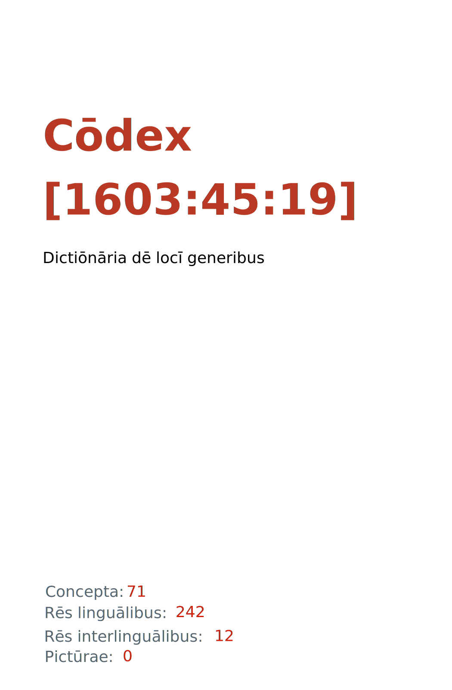

= Cōdex [1603:45:19]: Dictiōnāria dē locī generibus
:doctype: book
:title: Cōdex [1603:45:19]: Dictiōnāria dē locī generibus
:lang: la
:toc: macro
:toclevels: 5
:toc-title: Tabula contentorum
:table-caption: Tabula
:figure-caption: Pictūra
:example-caption: Exemplum
:last-update-label: Renovatio
:version-label: Versiō
:appendix-caption: Appendix
:source-highlighter: rouge
:warning-caption: Hic sunt dracones
:tip-caption: Commendātum
:front-cover-image: : Dictiōnāria dē locī generibus",1050,1600]

{nbsp} +
{nbsp} +
[quote]
**Dedicação ao Domínio Público significa que cada grande problema comum só precisa ser resolvido uma vez**

'''

[%header,cols="25h,~a"]
|===
|
Rēs interlinguālibus
|
Factum

|
scrīptor
|
EticaAI

|
/cōdex pūblicandī/
|
EticaAI

|
/publication date/@eng-Latn
|
2022-04-22

|
numerus editionis
|
2022-06-10T11:57:27

|
/SPDX license ID/@eng-Latn
|
CC0-1.0

|===

ifndef::backend-epub3[]
<<<
toc::[]
<<<
endif::[]

[id=0_999_1603_1]
== Praefātiō 

Rēs linguālibus (1)::
  Lingua Anglica (Abecedarium Latinum):::
    _**Cōdex [1603:45:19]**_ é o formato de livro dos dados estruturados legíveis por máquina do grupo de dicionários _**[1603:45:19] Dictiōnāria dē locī generibus**_, que são distribuídos para os implementadores usarem em aplicativos externos. Este livro pretende ser um recurso avançado para outros lexicógrafos e tradutores de terminologia, inclusive para detectar e relatar inconsistências. Ele pode, no entanto, ser usado como um dicionário ad hoc se não houver trabalho derivado focado em suas necessidades específicas.
    +++  +++
    **SOBRE LEXICOGRAFIA**
    +++  +++
    A lexicografia prática é a arte ou ofício de compilar, escrever e editar dicionários. O básico não é muito diferente de um milênio atrás: ainda é um trabalho muito humano e criativo. É preciso ser humilde: a maioria dos erros de tradutores, na verdade, não é culpa do tradutor, mas falhas metodológicas. Certificar-se de uma ideia de origem do que um conceito representa, mesmo que signifique reescrever e simplificar, anexar fotos, mostrar exemplos, fazer o que for para que seja entendido, faz com que até mesmo tradutores não profissionais que se preocupam com sua própria língua entreguem melhor resultados do que qualquer alternativa. Em outras palavras: mesmo as chamadas melhores práticas da indústria de pagar tradutores e revisores profissionais não podem superar termos de origem já mal explicados.
    +++  +++
    **SOBRE TIPOS DE DICIONÁRIOS QUE ESTAMOS COMPILANDO**
    +++  +++
    Estamos preocupados com um grupo de idéias (chamamos isso de grupo de dicionários de conceitos) que podem ser divididos em partes menores, revisados quanto a inconsistências, aprimorados para definições e depois traduzidos por voluntários. Códigos interlinguais, como o que poderia ser usado na troca de dados real, também são adicionados a cada conceito. Ambos os glossários, interfaces de usuário (como rótulos na coleta de dados) e, em alguns casos, até códigos padrão para o que iria em um campo de dados podem ser compilados dessa maneira.
    +++  +++
    Como a lista completa de dicionários-prototípicos e dicionários minimamente utilizáveis é enorme, um modo de citar público-alvos típicos é o seguinte:
    +++  +++
    . Ajuda humanitária
    . Ajuda ao desenvolvimento
    . Direitos humanos
    . Socorro militar (ou conceitos relacionados a conflitos e resolução de conflitos)
    +++  +++
    Os itens 1, 2 e 4 https://en.m.wikipedia.org/wiki/Humanitarian-Development_Nexus[são algumas vezes referidos como _nexus_] e são frequentemente encontrados ajudando _crise humanitária_. Já que a maioria dos colaboradores cujas ideias e críticas válidas são voluntárias, então 3 (direitos humanos, como na Anistia Internacional) para diferenciar do humanitarismo (como o Movimento da Cruz Vermelha é referência).
    +++  +++
    Observe que **dicionários não são guias de uso**. As instruções, quando existem, são principalmente dedicadas a lexicógrafos e tradutores.
    +++  +++
    **/PRO BONŌ PUBLICŌ/@lat-Latn**
    +++  +++
    As pessoas lexicógrafas deste trabalho são voluntárias, fazendo-o gratuitamente, pro bonō publicō, e não aceitam doações por causa dos dicionários reutilizáveis ​​de todos. O trabalho anterior existente muitas vezes é baseado em livros antigos de domínio público. A maioria dos tradutores de terminologia já seriam voluntários porque acreditam em uma causa. A melhor maneira de inspirar a colaboração é sermos nós mesmos exemplos.
    +++  +++
    Há um aspecto não moralista, bastante simples de entender: quão caro seria pagar pelo trabalho de todos considerando que é viável em mais de 200 idiomas? A logística para decidir quem deve ser pago, depois a transferência de dinheiro em todo o mundo (pode incluir pessoas de países embargados), depois os mecanismos tradicionais de auditoria para verificar o uso indevido que os doadores esperam, existe? Em terminologia especial (os próprios termos do dicionário) e tantas línguas, não existe dinheiro suficiente nem humanos interessados ​​em ser coordenadores.

<<<

== Methodī ex cōdice
=== Methodī ex dictiōnāriōrum corde
Rēs interlinguālibus (1)::
  /scope and content/@eng-Latn:::
    //Dictionaries of places (generic, superficial, non-specialized)//
    +++  +++
    
    TODO: continue from https://en.wikipedia.org/wiki/List_of_building_types
    +++  +++
    
    https://en.wikipedia.org/wiki/Nonbuilding_structure

=== Methodī ex verbīs in dictiōnāriīs
NOTE: /No momento, não há fluxo de trabalho para usar https://www.wikidata.org/wiki/Wikidata:Lexicographical_data[Wikidata lexicographical data], que na verdade poderia ser usado como armazenamento para nomenclatura mais rigorosa. As implementações atuais usam apenas conceitos do Wikidata, os Q-items./@eng-Latn

==== Methodī ex verbīs in Vicidata (Q modō)
Rēs linguālibus (1)::
  Lingua Anglica (Abecedarium Latinum):::
    O ***[1603:45:19] Dictiōnāria dē locī generibus*** usa o Wikidata como uma estratégia para conciliar termos linguísticos para um ou mais de seus conceitos.
    +++  +++
    Isso significa que este livro e os arquivos de dados de dicionários relacionados requerem atualizações periódicas para , no mínimo, sincronize e compartilhe novamente as traduções atualizadas.
    +++  +++
    **Qual a confiabilidade das traduções da comunidade (fonte Wikidata)?**
    +++  +++
    A resposta curta padrão é: **elas são confiáveis**, mesmo nos casos de não haver traduções oficiais para cada assunto.
    +++  +++
    Como referência, é provável que um tradutor profissional (sem acesso à Wikipedia ou bases de terminologia interna das organizações de controle) forneça resultados de qualidade inferior se você fizer testes cegos. Isso é possível porque não apenas o público médio, mas também terminólogos e tradutores profissionais ajudam a Wikipédia (e implicitamente o Wikidata).
    +++  +++
    No entanto, mesmo quando o resultado está correto, a versão atual precisa de diferenciação aprimorada, no mínimo, sigla e forma longa . Para grandes organizações, existem recursos como __P1813 nomes curtos__, mas ainda não foram compilados com o conjunto de dados atual.
    +++  +++
    **Os principais motivos para "traduções erradas" não são culpa dos tradutores**
    +++  +++
    DICA: Como regra geral, para conceitos já muito definidos em que você, como humano, pode verificar manualmente um ou mais termos traduzidos como um resultado decente, as outras traduções provavelmente serão aceitáveis. Dicionários com casos extremos (como nomes de territórios em disputa) teriam mais explicações.
    +++  +++
    A principal razão para "traduções erradas" são conceitos mal definidos usados ​​para explicar aos tradutores da comunidade como gerar traduções de terminologia. Isso tornaria as traduções existentes do Wikidata (usadas não apenas por nós) inconsistentes. A segunda razão é se os dicionários usam traduções para conceitos sem uma correspondência estrita; em outras palavras, se fizermos definições mais estritas do que significa conceito, mas reutilizarmos termos menos exatos da Wikidada. Também há problemas quando idiomas inteiros são codificados com códigos errados. Observe que todos esses casos **traduções erradas NÃO são estritamente culpa do tradutor, mas sim da lexicografia**.
    +++  +++
    Ainda é possível ter erros estritos no nível de tradução. Mas mesmo que indiquemos aos usuários como corrigir o Wikidata/Wikipedia (com base na melhor explicação contextual de um conceito, como este livro), os requisitos para dizer que o termo anterior foi objetivamente um erro de tradução humana errado (se seguir nossa seriedade na construção de dicionário) são muito elevados.
    +++  +++
    Do ponto de vista da conciliação de dados, a seguinte metodologia é utilizada para publicar as traduções da terminologia com a tabela de conceitos principais.
    +++  +++
    . A principal tabela lexicográfica artesanal (explicada no tópico anterior), também fornecida em `1603_45_19.no1.tm.hxl.csv`, pode fazer referência ao Wiki QID.
    . Cada QID exclusivo de `1603_45_19.no1.tm.hxl.csv`, juntamente com códigos de idioma de [`1603:1:51`] (que requer conhecimento de idiomas humanos), é usado para preparar uma consulta SPARQL otimizada para execução em https://query.wikidata.org/[Wikidata Query Service]. A consulta é tão grande que não é viável para links "Try it" (URL longo), como https://www.wikidata.org/wiki/Wikidata:SPARQL_query_service/queries/examples[como o que você encontraria nos Tutoriais Wikidata ], ***mas*** funciona!
    .. Note que o conhecimento é gratuito, as traduções estão lá, mas as necessidades humanitárias multilíngues podem faltar pessoas para preparar os arquivos e compartilhar do que para uso geral.
    . O resultado da consulta, com todos os QIDs e rótulos de termos, é compartilhado como `1603_45_19.wikiq.tm.hxl.csv`
    . As traduções revisadas pela comunidade de cada QID singular são pré-compiladas em um arquivo individual `1603_45_19.wikiq.tm.hxl.csv`
    . `1603_45_19.no1.tm.hxl.csv` mais `1603_45_19.wikiq.tm.hxl.csv` criado `1603_45_19.no11.tm.hxl.csv`

=== Rēs dē factō in dictiōnāriīs
==== Concepta: 71

==== Rēs linguālibus: 240

[%header,cols="15h,25a,~,17"]
|===
|
Cōdex linguae
|
Glotto cōdicī +++ +++ ISO 639-3 +++ +++ Wiki QID cōdicī
|
Nōmen Latīnum
|
Concepta

|
mul-Zyyy
|

+++ +++
https://iso639-3.sil.org/code/mul[mul]
+++ +++ 
|
Linguae multiplīs (Scrīptum incognitō)
|
71

|
ara-Arab
|
https://glottolog.org/resource/languoid/id/arab1395[arab1395]
+++ +++
https://iso639-3.sil.org/code/ara[ara]
+++ +++ https://www.wikidata.org/wiki/Q13955[Q13955]
|
Macrolingua Arabica (Abecedarium Arabicum)
|
62

|
hye-Armn
|
https://glottolog.org/resource/languoid/id/nucl1235[nucl1235]
+++ +++
https://iso639-3.sil.org/code/hye[hye]
+++ +++ https://www.wikidata.org/wiki/Q8785[Q8785]
|
Lingua Armenia (Alphabetum Armenium)
|
46

|
ben-Beng
|
https://glottolog.org/resource/languoid/id/beng1280[beng1280]
+++ +++
https://iso639-3.sil.org/code/ben[ben]
+++ +++ https://www.wikidata.org/wiki/Q9610[Q9610]
|
Lingua Bengali (/ISO 15924 Beng/)
|
40

|
rus-Cyrl
|
https://glottolog.org/resource/languoid/id/russ1263[russ1263]
+++ +++
https://iso639-3.sil.org/code/rus[rus]
+++ +++ https://www.wikidata.org/wiki/Q7737[Q7737]
|
Lingua Russica (Abecedarium Cyrillicum)
|
63

|
hin-Deva
|
https://glottolog.org/resource/languoid/id/hind1269[hind1269]
+++ +++
https://iso639-3.sil.org/code/hin[hin]
+++ +++ https://www.wikidata.org/wiki/Q1568[Q1568]
|
Lingua Hindica (Devanāgarī)
|
40

|
amh-Ethi
|
https://glottolog.org/resource/languoid/id/amha1245[amha1245]
+++ +++
https://iso639-3.sil.org/code/amh[amh]
+++ +++ https://www.wikidata.org/wiki/Q28244[Q28244]
|
Lingua Amharica (/ISO 15924 Ethi/)
|
9

|
kat-Geor
|
https://glottolog.org/resource/languoid/id/nucl1302[nucl1302]
+++ +++
https://iso639-3.sil.org/code/kat[kat]
+++ +++ https://www.wikidata.org/wiki/Q8108[Q8108]
|
Lingua Georgiana (Abecedarium Georgianum)
|
26

|
guj-Gujr
|
https://glottolog.org/resource/languoid/id/guja1252[guja1252]
+++ +++
https://iso639-3.sil.org/code/guj[guj]
+++ +++ https://www.wikidata.org/wiki/Q5137[Q5137]
|
Lingua Gujaratensis (/ISO 15924 Gujr/)
|
19

|
pan-Guru
|
https://glottolog.org/resource/languoid/id/panj1256[panj1256]
+++ +++
https://iso639-3.sil.org/code/pan[pan]
+++ +++ https://www.wikidata.org/wiki/Q58635[Q58635]
|
Lingua Paniabica (/ISO 15924 Guru/)
|
27

|
kan-Knda
|
https://glottolog.org/resource/languoid/id/nucl1305[nucl1305]
+++ +++
https://iso639-3.sil.org/code/kan[kan]
+++ +++ https://www.wikidata.org/wiki/Q33673[Q33673]
|
Lingua Cannadica (/ISO 15924 Knda/)
|
29

|
kor-Hang
|
https://glottolog.org/resource/languoid/id/kore1280[kore1280]
+++ +++
https://iso639-3.sil.org/code/kor[kor]
+++ +++ https://www.wikidata.org/wiki/Q9176[Q9176]
|
Lingua Coreana (Abecedarium Coreanum)
|
57

|
lzh-Hant
|
https://glottolog.org/resource/languoid/id/lite1248[lite1248]
+++ +++
https://iso639-3.sil.org/code/lzh[lzh]
+++ +++ https://www.wikidata.org/wiki/Q37041[Q37041]
|
Lingua Sinica classica (/ISO 15924 Hant/)
|
14

|
heb-Hebr
|
https://glottolog.org/resource/languoid/id/hebr1245[hebr1245]
+++ +++
https://iso639-3.sil.org/code/heb[heb]
+++ +++ https://www.wikidata.org/wiki/Q9288[Q9288]
|
Lingua Hebraica (Alphabetum Hebraicum)
|
57

|
khm-Khmr
|
https://glottolog.org/resource/languoid/id/cent1989[cent1989]
+++ +++
https://iso639-3.sil.org/code/khm[khm]
+++ +++ https://www.wikidata.org/wiki/Q9205[Q9205]
|
Lingua Khmer (/ISO 15924 Khmr/)
|
5

|
lao-Laoo
|
https://glottolog.org/resource/languoid/id/laoo1244[laoo1244]
+++ +++
https://iso639-3.sil.org/code/lao[lao]
+++ +++ https://www.wikidata.org/wiki/Q9211[Q9211]
|
/Lao language/ (/ISO 15924 Laoo/)
|
10

|
lat-Latn
|
https://glottolog.org/resource/languoid/id/lati1261[lati1261]
+++ +++
https://iso639-3.sil.org/code/lat[lat]
+++ +++ https://www.wikidata.org/wiki/Q397[Q397]
|
Lingua Latina (Abecedarium Latinum)
|
35

|
mni-Mtei
|
https://glottolog.org/resource/languoid/id/mani1292[mani1292]
+++ +++
https://iso639-3.sil.org/code/mni[mni]
+++ +++ https://www.wikidata.org/wiki/Q33868[Q33868]
|
Lingua Meitei (/ISO 15924 Mtei/)
|
4

|
mnw-Mymr
|
https://glottolog.org/resource/languoid/id/monn1252[monn1252]
+++ +++
https://iso639-3.sil.org/code/mnw[mnw]
+++ +++ https://www.wikidata.org/wiki/Q13349[Q13349]
|
/Mon language/ (/ISO 15924 Mymr/)
|
6

|
nqo-Nkoo
|
https://glottolog.org/resource/languoid/id/nkoa1234[nkoa1234]
+++ +++
https://iso639-3.sil.org/code/nqo[nqo]
+++ +++ https://www.wikidata.org/wiki/Q18546266[Q18546266]
|
/N'Ko/ (/ISO 15924 Nkoo/)
|
5

|
sat-Olck
|
https://glottolog.org/resource/languoid/id/sant1410[sant1410]
+++ +++
https://iso639-3.sil.org/code/sat[sat]
+++ +++ https://www.wikidata.org/wiki/Q33965[Q33965]
|
Lingua Santali (/ISO 15924 Olck/)
|
9

|
ori-Orya
|

+++ +++
https://iso639-3.sil.org/code/ori[ori]
+++ +++ https://www.wikidata.org/wiki/Q33810[Q33810]
|
Macrolingua Orissensis (/ISO 15924 Orya/)
|
13

|
sin-Sinh
|
https://glottolog.org/resource/languoid/id/sinh1246[sinh1246]
+++ +++
https://iso639-3.sil.org/code/sin[sin]
+++ +++ https://www.wikidata.org/wiki/Q13267[Q13267]
|
Lingua Singhalensis (/ISO 15924 Sinh/)
|
19

|
tam-Taml
|
https://glottolog.org/resource/languoid/id/tami1289[tami1289]
+++ +++
https://iso639-3.sil.org/code/tam[tam]
+++ +++ https://www.wikidata.org/wiki/Q5885[Q5885]
|
Lingua Tamulica (/ISO 15924 Taml/)
|
41

|
tel-Telu
|
https://glottolog.org/resource/languoid/id/telu1262[telu1262]
+++ +++
https://iso639-3.sil.org/code/tel[tel]
+++ +++ https://www.wikidata.org/wiki/Q8097[Q8097]
|
Lingua Telingana (/ISO 15924 Telu/)
|
26

|
tha-Thai
|
https://glottolog.org/resource/languoid/id/thai1261[thai1261]
+++ +++
https://iso639-3.sil.org/code/tha[tha]
+++ +++ https://www.wikidata.org/wiki/Q9217[Q9217]
|
Lingua Thai (/ISO 15924 Thai/)
|
39

|
bod-Tibt
|
https://glottolog.org/resource/languoid/id/tibe1272[tibe1272]
+++ +++
https://iso639-3.sil.org/code/bod[bod]
+++ +++ https://www.wikidata.org/wiki/Q34271[Q34271]
|
Lingua Tibetana (Scriptura Tibetana)
|
7

|
san-Zyyy
|
https://glottolog.org/resource/languoid/id/sans1269[sans1269]
+++ +++
https://iso639-3.sil.org/code/san[san]
+++ +++ https://www.wikidata.org/wiki/Q11059[Q11059]
|
Lingua Sanscrita (/ISO 15924 Zyyy/)
|
7

|
zho-Zyyy
|
https://glottolog.org/resource/languoid/id/sini1245[sini1245]
+++ +++
https://iso639-3.sil.org/code/zho[zho]
+++ +++ https://www.wikidata.org/wiki/Q7850[Q7850]
|
/Macrolingua Sinicae (/ISO 15924 Zyyy/)/
|
66

|
por-Latn
|
https://glottolog.org/resource/languoid/id/port1283[port1283]
+++ +++
https://iso639-3.sil.org/code/por[por]
+++ +++ https://www.wikidata.org/wiki/Q5146[Q5146]
|
Lingua Lusitana (Abecedarium Latinum)
|
59

|
eng-Latn
|
https://glottolog.org/resource/languoid/id/stan1293[stan1293]
+++ +++
https://iso639-3.sil.org/code/eng[eng]
+++ +++ https://www.wikidata.org/wiki/Q1860[Q1860]
|
Lingua Anglica (Abecedarium Latinum)
|
73

|
fra-Latn
|
https://glottolog.org/resource/languoid/id/stan1290[stan1290]
+++ +++
https://iso639-3.sil.org/code/fra[fra]
+++ +++ https://www.wikidata.org/wiki/Q150[Q150]
|
Lingua Francogallica (Abecedarium Latinum)
|
67

|
nld-Latn
|
https://glottolog.org/resource/languoid/id/mode1257[mode1257]
+++ +++
https://iso639-3.sil.org/code/nld[nld]
+++ +++ https://www.wikidata.org/wiki/Q7411[Q7411]
|
Lingua Batavica (Abecedarium Latinum)
|
65

|
deu-Latn
|
https://glottolog.org/resource/languoid/id/stan1295[stan1295]
+++ +++
https://iso639-3.sil.org/code/deu[deu]
+++ +++ https://www.wikidata.org/wiki/Q188[Q188]
|
Lingua Germanica (Abecedarium Latinum)
|
68

|
spa-Latn
|
https://glottolog.org/resource/languoid/id/stan1288[stan1288]
+++ +++
https://iso639-3.sil.org/code/spa[spa]
+++ +++ https://www.wikidata.org/wiki/Q1321[Q1321]
|
Lingua Hispanica (Abecedarium Latinum)
|
62

|
ita-Latn
|
https://glottolog.org/resource/languoid/id/ital1282[ital1282]
+++ +++
https://iso639-3.sil.org/code/ita[ita]
+++ +++ https://www.wikidata.org/wiki/Q652[Q652]
|
Lingua Italiana (Abecedarium Latinum)
|
62

|
gle-Latn
|
https://glottolog.org/resource/languoid/id/iris1253[iris1253]
+++ +++
https://iso639-3.sil.org/code/gle[gle]
+++ +++ https://www.wikidata.org/wiki/Q9142[Q9142]
|
Lingua Hibernica (Abecedarium Latinum)
|
38

|
swe-Latn
|
https://glottolog.org/resource/languoid/id/swed1254[swed1254]
+++ +++
https://iso639-3.sil.org/code/swe[swe]
+++ +++ https://www.wikidata.org/wiki/Q9027[Q9027]
|
Lingua Suecica (Abecedarium Latinum)
|
65

|
ceb-Latn
|
https://glottolog.org/resource/languoid/id/cebu1242[cebu1242]
+++ +++
https://iso639-3.sil.org/code/ceb[ceb]
+++ +++ https://www.wikidata.org/wiki/Q33239[Q33239]
|
Lingua Caebuana (Abecedarium Latinum)
|
11

|
sqi-Latn
|
https://glottolog.org/resource/languoid/id/alba1267[alba1267]
+++ +++
https://iso639-3.sil.org/code/sqi[sqi]
+++ +++ https://www.wikidata.org/wiki/Q8748[Q8748]
|
Macrolingua Albanica (/Abecedarium Latinum/)
|
34

|
pol-Latn
|
https://glottolog.org/resource/languoid/id/poli1260[poli1260]
+++ +++
https://iso639-3.sil.org/code/pol[pol]
+++ +++ https://www.wikidata.org/wiki/Q809[Q809]
|
Lingua Polonica (Abecedarium Latinum)
|
59

|
fin-Latn
|
https://glottolog.org/resource/languoid/id/finn1318[finn1318]
+++ +++
https://iso639-3.sil.org/code/fin[fin]
+++ +++ https://www.wikidata.org/wiki/Q1412[Q1412]
|
Lingua Finnica (Abecedarium Latinum)
|
59

|
ron-Latn
|
https://glottolog.org/resource/languoid/id/roma1327[roma1327]
+++ +++
https://iso639-3.sil.org/code/ron[ron]
+++ +++ https://www.wikidata.org/wiki/Q7913[Q7913]
|
Lingua Dacoromanica (Abecedarium Latinum)
|
44

|
vie-Latn
|
https://glottolog.org/resource/languoid/id/viet1252[viet1252]
+++ +++
https://iso639-3.sil.org/code/vie[vie]
+++ +++ https://www.wikidata.org/wiki/Q9199[Q9199]
|
Lingua Vietnamensis (Abecedarium Latinum)
|
49

|
cat-Latn
|
https://glottolog.org/resource/languoid/id/stan1289[stan1289]
+++ +++
https://iso639-3.sil.org/code/cat[cat]
+++ +++ https://www.wikidata.org/wiki/Q7026[Q7026]
|
Lingua Catalana (Abecedarium Latinum)
|
61

|
ukr-Cyrl
|
https://glottolog.org/resource/languoid/id/ukra1253[ukra1253]
+++ +++
https://iso639-3.sil.org/code/ukr[ukr]
+++ +++ https://www.wikidata.org/wiki/Q8798[Q8798]
|
Lingua Ucrainica (Abecedarium Cyrillicum)
|
59

|
bul-Cyrl
|
https://glottolog.org/resource/languoid/id/bulg1262[bulg1262]
+++ +++
https://iso639-3.sil.org/code/bul[bul]
+++ +++ https://www.wikidata.org/wiki/Q7918[Q7918]
|
Lingua Bulgarica (Abecedarium Cyrillicum)
|
48

|
slv-Latn
|
https://glottolog.org/resource/languoid/id/slov1268[slov1268]
+++ +++
https://iso639-3.sil.org/code/slv[slv]
+++ +++ https://www.wikidata.org/wiki/Q9063[Q9063]
|
Lingua Slovena (Abecedarium Latinum)
|
43

|
war-Latn
|
https://glottolog.org/resource/languoid/id/wara1300[wara1300]
+++ +++
https://iso639-3.sil.org/code/war[war]
+++ +++ https://www.wikidata.org/wiki/Q34279[Q34279]
|
/Waray language/ (Abecedarium Latinum)
|
25

|
nob-Latn
|
https://glottolog.org/resource/languoid/id/norw1259[norw1259]
+++ +++
https://iso639-3.sil.org/code/nob[nob]
+++ +++ https://www.wikidata.org/wiki/Q25167[Q25167]
|
/Bokmål/ (Abecedarium Latinum)
|
62

|
ces-Latn
|
https://glottolog.org/resource/languoid/id/czec1258[czec1258]
+++ +++
https://iso639-3.sil.org/code/ces[ces]
+++ +++ https://www.wikidata.org/wiki/Q9056[Q9056]
|
Lingua Bohemica (Abecedarium Latinum)
|
60

|
dan-Latn
|
https://glottolog.org/resource/languoid/id/dani1285[dani1285]
+++ +++
https://iso639-3.sil.org/code/dan[dan]
+++ +++ https://www.wikidata.org/wiki/Q9035[Q9035]
|
Lingua Danica (Abecedarium Latinum)
|
57

|
jpn-Jpan
|
https://glottolog.org/resource/languoid/id/nucl1643[nucl1643]
+++ +++
https://iso639-3.sil.org/code/jpn[jpn]
+++ +++ https://www.wikidata.org/wiki/Q5287[Q5287]
|
Lingua Iaponica (Scriptura Iaponica)
|
63

|
nno-Latn
|
https://glottolog.org/resource/languoid/id/norw1262[norw1262]
+++ +++
https://iso639-3.sil.org/code/nno[nno]
+++ +++ https://www.wikidata.org/wiki/Q25164[Q25164]
|
/Nynorsk/ (Abecedarium Latinum)
|
46

|
mal-Mlym
|
https://glottolog.org/resource/languoid/id/mala1464[mala1464]
+++ +++
https://iso639-3.sil.org/code/mal[mal]
+++ +++ https://www.wikidata.org/wiki/Q36236[Q36236]
|
Lingua Malabarica (/Malayalam script/)
|
34

|
ind-Latn
|
https://glottolog.org/resource/languoid/id/indo1316[indo1316]
+++ +++
https://iso639-3.sil.org/code/ind[ind]
+++ +++ https://www.wikidata.org/wiki/Q9240[Q9240]
|
Lingua Indonesiana (Abecedarium Latinum)
|
55

|
fas-Zyyy
|

+++ +++
https://iso639-3.sil.org/code/fas[fas]
+++ +++ https://www.wikidata.org/wiki/Q9168[Q9168]
|
Macrolingua Persica (//Abecedarium Arabicum//)
|
57

|
hun-Latn
|
https://glottolog.org/resource/languoid/id/hung1274[hung1274]
+++ +++
https://iso639-3.sil.org/code/hun[hun]
+++ +++ https://www.wikidata.org/wiki/Q9067[Q9067]
|
Lingua Hungarica (Abecedarium Latinum)
|
47

|
eus-Latn
|
https://glottolog.org/resource/languoid/id/basq1248[basq1248]
+++ +++
https://iso639-3.sil.org/code/eus[eus]
+++ +++ https://www.wikidata.org/wiki/Q8752[Q8752]
|
Lingua Vasconica (Abecedarium Latinum)
|
50

|
cym-Latn
|
https://glottolog.org/resource/languoid/id/wels1247[wels1247]
+++ +++
https://iso639-3.sil.org/code/cym[cym]
+++ +++ https://www.wikidata.org/wiki/Q9309[Q9309]
|
Lingua Cambrica (Abecedarium Latinum)
|
44

|
glg-Latn
|
https://glottolog.org/resource/languoid/id/gali1258[gali1258]
+++ +++
https://iso639-3.sil.org/code/glg[glg]
+++ +++ https://www.wikidata.org/wiki/Q9307[Q9307]
|
Lingua Gallaica (Abecedarium Latinum)
|
41

|
slk-Latn
|
https://glottolog.org/resource/languoid/id/slov1269[slov1269]
+++ +++
https://iso639-3.sil.org/code/slk[slk]
+++ +++ https://www.wikidata.org/wiki/Q9058[Q9058]
|
Lingua Slovaca (Abecedarium Latinum)
|
43

|
epo-Latn
|
https://glottolog.org/resource/languoid/id/espe1235[espe1235]
+++ +++
https://iso639-3.sil.org/code/epo[epo]
+++ +++ https://www.wikidata.org/wiki/Q143[Q143]
|
Lingua Esperantica (Abecedarium Latinum)
|
62

|
msa-Zyyy
|

+++ +++
https://iso639-3.sil.org/code/msa[msa]
+++ +++ https://www.wikidata.org/wiki/Q9237[Q9237]
|
Macrolingua Malayana (/ISO 15924 Zyyy/)
|
45

|
est-Latn
|

+++ +++
https://iso639-3.sil.org/code/est[est]
+++ +++ https://www.wikidata.org/wiki/Q9072[Q9072]
|
Macrolingua Estonica (Abecedarium Latinum)
|
50

|
hrv-Latn
|
https://glottolog.org/resource/languoid/id/croa1245[croa1245]
+++ +++
https://iso639-3.sil.org/code/hrv[hrv]
+++ +++ https://www.wikidata.org/wiki/Q6654[Q6654]
|
Lingua Croatica (Abecedarium Latinum)
|
40

|
tur-Latn
|
https://glottolog.org/resource/languoid/id/nucl1301[nucl1301]
+++ +++
https://iso639-3.sil.org/code/tur[tur]
+++ +++ https://www.wikidata.org/wiki/Q256[Q256]
|
Lingua Turcica (Abecedarium Latinum)
|
58

|
nds-Latn
|
https://glottolog.org/resource/languoid/id/lowg1239[lowg1239]
+++ +++
https://iso639-3.sil.org/code/nds[nds]
+++ +++ https://www.wikidata.org/wiki/Q25433[Q25433]
|
Lingua Saxonica (Abecedarium Latinum)
|
19

|
oci-Latn
|
https://glottolog.org/resource/languoid/id/occi1239[occi1239]
+++ +++
https://iso639-3.sil.org/code/oci[oci]
+++ +++ https://www.wikidata.org/wiki/Q14185[Q14185]
|
Lingua Occitana (Abecedarium Latinum)
|
28

|
bre-Latn
|
https://glottolog.org/resource/languoid/id/bret1244[bret1244]
+++ +++
https://iso639-3.sil.org/code/bre[bre]
+++ +++ https://www.wikidata.org/wiki/Q12107[Q12107]
|
Lingua Britonica (Abecedarium Latinum)
|
23

|
arz-Latn
|
https://glottolog.org/resource/languoid/id/egyp1253[egyp1253]
+++ +++
https://iso639-3.sil.org/code/arz[arz]
+++ +++ https://www.wikidata.org/wiki/Q29919[Q29919]
|
/Egyptian Arabic/ (Abecedarium Arabicum)
|
13

|
afr-Latn
|
https://glottolog.org/resource/languoid/id/afri1274[afri1274]
+++ +++
https://iso639-3.sil.org/code/afr[afr]
+++ +++ https://www.wikidata.org/wiki/Q14196[Q14196]
|
Lingua Batava Capitensis (Abecedarium Latinum)
|
31

|
ltz-Latn
|
https://glottolog.org/resource/languoid/id/luxe1241[luxe1241]
+++ +++
https://iso639-3.sil.org/code/ltz[ltz]
+++ +++ https://www.wikidata.org/wiki/Q9051[Q9051]
|
Lingua Luxemburgensis (Abecedarium Latinum)
|
34

|
sco-Latn
|
https://glottolog.org/resource/languoid/id/scot1243[scot1243]
+++ +++
https://iso639-3.sil.org/code/sco[sco]
+++ +++ https://www.wikidata.org/wiki/Q14549[Q14549]
|
Lingua Scotica quae Teutonica (Abecedarium Latinum)
|
23

|
bar-Latn
|
https://glottolog.org/resource/languoid/id/bava1246[bava1246]
+++ +++
https://iso639-3.sil.org/code/bar[bar]
+++ +++ https://www.wikidata.org/wiki/Q29540[Q29540]
|
Lingua Bavarica (Abecedarium Latinum)
|
11

|
arg-Latn
|
https://glottolog.org/resource/languoid/id/arag1245[arag1245]
+++ +++
https://iso639-3.sil.org/code/arg[arg]
+++ +++ https://www.wikidata.org/wiki/Q8765[Q8765]
|
Lingua Aragonensis (Abecedarium Latinum)
|
22

|
zho-Hant
|

+++ +++
https://iso639-3.sil.org/code/zho[zho]
+++ +++ https://www.wikidata.org/wiki/Q18130932[Q18130932]
|
//Traditional Chinese// (/ISO 15924 Hant/)
|
48

|
pap-Latn
|
https://glottolog.org/resource/languoid/id/papi1253[papi1253]
+++ +++
https://iso639-3.sil.org/code/pap[pap]
+++ +++ https://www.wikidata.org/wiki/Q33856[Q33856]
|
/lingua Papiamentica/ (Abecedarium Latinum)
|
5

|
cos-Latn
|
https://glottolog.org/resource/languoid/id/cors1241[cors1241]
+++ +++
https://iso639-3.sil.org/code/cos[cos]
+++ +++ https://www.wikidata.org/wiki/Q33111[Q33111]
|
Lingua Corsica (Abecedarium Latinum)
|
4

|
gsw-Latn
|
https://glottolog.org/resource/languoid/id/swis1247[swis1247]
+++ +++
https://iso639-3.sil.org/code/gsw[gsw]
+++ +++ https://www.wikidata.org/wiki/Q131339[Q131339]
|
Dialecti Alemannicae (Abecedarium Latinum)
|
24

|
isl-Latn
|
https://glottolog.org/resource/languoid/id/icel1247[icel1247]
+++ +++
https://iso639-3.sil.org/code/isl[isl]
+++ +++ https://www.wikidata.org/wiki/Q294[Q294]
|
Lingua Islandica (Abecedarium Latinum)
|
27

|
min-Latn
|
https://glottolog.org/resource/languoid/id/mina1268[mina1268]
+++ +++
https://iso639-3.sil.org/code/min[min]
+++ +++ https://www.wikidata.org/wiki/Q13324[Q13324]
|
/Minangkabau language/ (Abecedarium Latinum)
|
8

|
roh-Latn
|
https://glottolog.org/resource/languoid/id/roma1326[roma1326]
+++ +++
https://iso639-3.sil.org/code/roh[roh]
+++ +++ https://www.wikidata.org/wiki/Q13199[Q13199]
|
Lingua Rhaetica (Abecedarium Latinum)
|
4

|
vec-Latn
|
https://glottolog.org/resource/languoid/id/vene1258[vene1258]
+++ +++
https://iso639-3.sil.org/code/vec[vec]
+++ +++ https://www.wikidata.org/wiki/Q32724[Q32724]
|
Lingua Veneta (Abecedarium Latinum)
|
27

|
pms-Latn
|
https://glottolog.org/resource/languoid/id/piem1238[piem1238]
+++ +++
https://iso639-3.sil.org/code/pms[pms]
+++ +++ https://www.wikidata.org/wiki/Q15085[Q15085]
|
Lingua Pedemontana (Abecedarium Latinum)
|
5

|
scn-Latn
|
https://glottolog.org/resource/languoid/id/sici1248[sici1248]
+++ +++
https://iso639-3.sil.org/code/scn[scn]
+++ +++ https://www.wikidata.org/wiki/Q33973[Q33973]
|
Lingua Sicula (Abecedarium Latinum)
|
27

|
srd-Latn
|

+++ +++
https://iso639-3.sil.org/code/srd[srd]
+++ +++ https://www.wikidata.org/wiki/Q33976[Q33976]
|
Macrolingua Sarda (Abecedarium Latinum)
|
7

|
gla-Latn
|
https://glottolog.org/resource/languoid/id/scot1245[scot1245]
+++ +++
https://iso639-3.sil.org/code/gla[gla]
+++ +++ https://www.wikidata.org/wiki/Q9314[Q9314]
|
Lingua Scotica seu Scotica Gadelica (Abecedarium Latinum)
|
16

|
lim-Latn
|
https://glottolog.org/resource/languoid/id/limb1263[limb1263]
+++ +++
https://iso639-3.sil.org/code/lim[lim]
+++ +++ https://www.wikidata.org/wiki/Q102172[Q102172]
|
Lingua Limburgica (Abecedarium Latinum)
|
17

|
wln-Latn
|
https://glottolog.org/resource/languoid/id/wall1255[wall1255]
+++ +++
https://iso639-3.sil.org/code/wln[wln]
+++ +++ https://www.wikidata.org/wiki/Q34219[Q34219]
|
Lingua Vallonica (Abecedarium Latinum)
|
15

|
srp-Latn
|
https://glottolog.org/resource/languoid/id/serb1264[serb1264]
+++ +++
https://iso639-3.sil.org/code/srp[srp]
+++ +++ https://www.wikidata.org/wiki/Q21161949[Q21161949]
|
/Serbian/ (Abecedarium Latinum)
|
31

|
vls-Latn
|
https://glottolog.org/resource/languoid/id/vlaa1240[vlaa1240]
+++ +++
https://iso639-3.sil.org/code/vls[vls]
+++ +++ https://www.wikidata.org/wiki/Q100103[Q100103]
|
/West Flemish/ (Abecedarium Latinum)
|
10

|
nap-Latn
|
https://glottolog.org/resource/languoid/id/neap1235[neap1235]
+++ +++
https://iso639-3.sil.org/code/nap[nap]
+++ +++ https://www.wikidata.org/wiki/Q33845[Q33845]
|
Lingua Neapolitana (Abecedarium Latinum)
|
4

|
lij-Latn
|
https://glottolog.org/resource/languoid/id/ligu1248[ligu1248]
+++ +++
https://iso639-3.sil.org/code/lij[lij]
+++ +++ https://www.wikidata.org/wiki/Q36106[Q36106]
|
Lingua Ligustica (Abecedarium Latinum)
|
5

|
fur-Latn
|
https://glottolog.org/resource/languoid/id/friu1240[friu1240]
+++ +++
https://iso639-3.sil.org/code/fur[fur]
+++ +++ https://www.wikidata.org/wiki/Q33441[Q33441]
|
Lingua Foroiuliensis (Abecedarium Latinum)
|
7

|
pcd-Latn
|
https://glottolog.org/resource/languoid/id/pica1241[pica1241]
+++ +++
https://iso639-3.sil.org/code/pcd[pcd]
+++ +++ https://www.wikidata.org/wiki/Q34024[Q34024]
|
Lingua Picardica (Abecedarium Latinum)
|
3

|
wol-Latn
|
https://glottolog.org/resource/languoid/id/nucl1347[nucl1347]
+++ +++
https://iso639-3.sil.org/code/wol[wol]
+++ +++ https://www.wikidata.org/wiki/Q34257[Q34257]
|
/Wolof language/ (Abecedarium Latinum)
|
1

|
kon-Latn
|

+++ +++
https://iso639-3.sil.org/code/kon[kon]
+++ +++ https://www.wikidata.org/wiki/Q33702[Q33702]
|
/Kongo macrolanguage/ (Abecedarium Latinum)
|
1

|
frp-Latn
|
https://glottolog.org/resource/languoid/id/fran1260[fran1260]
+++ +++
https://iso639-3.sil.org/code/frp[frp]
+++ +++ https://www.wikidata.org/wiki/Q15087[Q15087]
|
Lingua Arpitanica (Abecedarium Latinum)
|
9

|
wuu-Zyyy
|
https://glottolog.org/resource/languoid/id/wuch1236[wuch1236]
+++ +++
https://iso639-3.sil.org/code/wuu[wuu]
+++ +++ https://www.wikidata.org/wiki/Q34290[Q34290]
|
//Macrolingua Wu// (/ISO 15924 Zyyy/)
|
32

|
srp-Cyrl
|
https://glottolog.org/resource/languoid/id/serb1264[serb1264]
+++ +++
https://iso639-3.sil.org/code/srp[srp]
+++ +++ https://www.wikidata.org/wiki/Q9299[Q9299]
|
Lingua Serbica (Abecedarium Cyrillicum)
|
50

|
urd-Arab
|
https://glottolog.org/resource/languoid/id/urdu1245[urdu1245]
+++ +++
https://iso639-3.sil.org/code/urd[urd]
+++ +++ https://www.wikidata.org/wiki/Q1617[Q1617]
|
Lingua Urdu (Abecedarium Arabicum)
|
41

|
gan-Zyyy
|
https://glottolog.org/resource/languoid/id/ganc1239[ganc1239]
+++ +++
https://iso639-3.sil.org/code/gan[gan]
+++ +++ https://www.wikidata.org/wiki/Q33475[Q33475]
|
Lingua Gan (/ISO 15924 Zyyy/)
|
7

|
lit-Latn
|
https://glottolog.org/resource/languoid/id/lith1251[lith1251]
+++ +++
https://iso639-3.sil.org/code/lit[lit]
+++ +++ https://www.wikidata.org/wiki/Q9083[Q9083]
|
Lingua Lithuanica (Abecedarium Latinum)
|
37

|
gan-Hans
|
https://glottolog.org/resource/languoid/id/ganc1239[ganc1239]
+++ +++
https://iso639-3.sil.org/code/gan[gan]
+++ +++ https://www.wikidata.org/wiki/Q64427344[Q64427344]
|
Lingua Gan (/ISO 15924 Hans/)
|
1

|
hbs-Latn
|
https://glottolog.org/resource/languoid/id/sout1528[sout1528]
+++ +++
https://iso639-3.sil.org/code/hbs[hbs]
+++ +++ https://www.wikidata.org/wiki/Q9301[Q9301]
|
Macrolingua Serbocroatica (Abecedarium Latinum)
|
47

|
lav-Latn
|
https://glottolog.org/resource/languoid/id/latv1249[latv1249]
+++ +++
https://iso639-3.sil.org/code/lav[lav]
+++ +++ https://www.wikidata.org/wiki/Q9078[Q9078]
|
Macrolingua Lettonica (Abecedarium Latinum)
|
37

|
bos-Latn
|
https://glottolog.org/resource/languoid/id/bosn1245[bosn1245]
+++ +++
https://iso639-3.sil.org/code/bos[bos]
+++ +++ https://www.wikidata.org/wiki/Q9303[Q9303]
|
Lingua Bosnica (Abecedarium Latinum)
|
25

|
azb-Arab
|
https://glottolog.org/resource/languoid/id/sout2697[sout2697]
+++ +++
https://iso639-3.sil.org/code/azb[azb]
+++ +++ https://www.wikidata.org/wiki/Q3449805[Q3449805]
|
/South Azerbaijani/ (Abecedarium Arabicum)
|
16

|
jav-Latn
|
https://glottolog.org/resource/languoid/id/java1254[java1254]
+++ +++
https://iso639-3.sil.org/code/jav[jav]
+++ +++ https://www.wikidata.org/wiki/Q33549[Q33549]
|
Lingua Iavanica (Abecedarium Latinum)
|
21

|
ell-Grek
|
https://glottolog.org/resource/languoid/id/mode1248[mode1248]
+++ +++
https://iso639-3.sil.org/code/ell[ell]
+++ +++ https://www.wikidata.org/wiki/Q36510[Q36510]
|
Lingua Neograeca (Alphabetum Graecum)
|
53

|
sun-Latn
|
https://glottolog.org/resource/languoid/id/sund1252[sund1252]
+++ +++
https://iso639-3.sil.org/code/sun[sun]
+++ +++ https://www.wikidata.org/wiki/Q34002[Q34002]
|
/Sundanese language/ (Abecedarium Latinum)
|
16

|
fry-Latn
|
https://glottolog.org/resource/languoid/id/west2354[west2354]
+++ +++
https://iso639-3.sil.org/code/fry[fry]
+++ +++ https://www.wikidata.org/wiki/Q27175[Q27175]
|
Lingua Frisice occidentalis (Abecedarium Latinum)
|
30

|
ace-Latn
|
https://glottolog.org/resource/languoid/id/achi1257[achi1257]
+++ +++
https://iso639-3.sil.org/code/ace[ace]
+++ +++ https://www.wikidata.org/wiki/Q27683[Q27683]
|
/Acehnese language/ (Abecedarium Latinum)
|
4

|
jam-Latn
|
https://glottolog.org/resource/languoid/id/jama1262[jama1262]
+++ +++
https://iso639-3.sil.org/code/jam[jam]
+++ +++ https://www.wikidata.org/wiki/Q35939[Q35939]
|
Lingua creola Iamaicana (Abecedarium Latinum)
|
7

|
che-Cyrl
|
https://glottolog.org/resource/languoid/id/chec1245[chec1245]
+++ +++
https://iso639-3.sil.org/code/che[che]
+++ +++ https://www.wikidata.org/wiki/Q33350[Q33350]
|
Lingua Tsetsenica (Abecedarium Cyrillicum)
|
10

|
bel-Cyrl
|
https://glottolog.org/resource/languoid/id/bela1254[bela1254]
+++ +++
https://iso639-3.sil.org/code/bel[bel]
+++ +++ https://www.wikidata.org/wiki/Q9091[Q9091]
|
Lingua Ruthenica Alba (Abecedarium Cyrillicum)
|
45

|
kab-Latn
|
https://glottolog.org/resource/languoid/id/kaby1243[kaby1243]
+++ +++
https://iso639-3.sil.org/code/kab[kab]
+++ +++ https://www.wikidata.org/wiki/Q35853[Q35853]
|
/Kabyle language/ (Abecedarium Latinum)
|
10

|
fao-Latn
|
https://glottolog.org/resource/languoid/id/faro1244[faro1244]
+++ +++
https://iso639-3.sil.org/code/fao[fao]
+++ +++ https://www.wikidata.org/wiki/Q25258[Q25258]
|
Lingua Faeroensis (Abecedarium Latinum)
|
9

|
vmf-Latn
|
https://glottolog.org/resource/languoid/id/main1267[main1267]
+++ +++
https://iso639-3.sil.org/code/vmf[vmf]
+++ +++ https://www.wikidata.org/wiki/Q497345[Q497345]
|
/East Franconian German/ (Abecedarium Latinum)
|
1

|
bam-Zyyy
|
https://glottolog.org/resource/languoid/id/bamb1269[bamb1269]
+++ +++
https://iso639-3.sil.org/code/bam[bam]
+++ +++ https://www.wikidata.org/wiki/Q33243[Q33243]
|
/Bambara language/ (/ISO 15924 Zyyy/)
|
3

|
lmo-Latn
|
https://glottolog.org/resource/languoid/id/lomb1257[lomb1257]
+++ +++
https://iso639-3.sil.org/code/lmo[lmo]
+++ +++ https://www.wikidata.org/wiki/Q33754[Q33754]
|
Langobardus sermo (Abecedarium Latinum)
|
13

|
mar-Deva
|
https://glottolog.org/resource/languoid/id/mara1378[mara1378]
+++ +++
https://iso639-3.sil.org/code/mar[mar]
+++ +++ https://www.wikidata.org/wiki/Q1571[Q1571]
|
Lingua Marathica (Devanāgarī)
|
25

|
ady-Cyrl
|
https://glottolog.org/resource/languoid/id/adyg1241[adyg1241]
+++ +++
https://iso639-3.sil.org/code/ady[ady]
+++ +++ https://www.wikidata.org/wiki/Q27776[Q27776]
|
Lingua Adygeica (Abecedarium Cyrillicum)
|
1

|
ary-Arab
|
https://glottolog.org/resource/languoid/id/moro1292[moro1292]
+++ +++
https://iso639-3.sil.org/code/ary[ary]
+++ +++ https://www.wikidata.org/wiki/Q56426[Q56426]
|
/Moroccan Arabic/ (Abecedarium Arabicum)
|
3

|
awa-Deva
|
https://glottolog.org/resource/languoid/id/awad1243[awad1243]
+++ +++
https://iso639-3.sil.org/code/awa[awa]
+++ +++ https://www.wikidata.org/wiki/Q29579[Q29579]
|
/Awadhi/ (Devanāgarī)
|
2

|
ban-Latn
|
https://glottolog.org/resource/languoid/id/bali1278[bali1278]
+++ +++
https://iso639-3.sil.org/code/ban[ban]
+++ +++ https://www.wikidata.org/wiki/Q33070[Q33070]
|
/Balinese/ (Abecedarium Latinum)
|
2

|
ast-Latn
|
https://glottolog.org/resource/languoid/id/astu1245[astu1245]
+++ +++
https://iso639-3.sil.org/code/ast[ast]
+++ +++ https://www.wikidata.org/wiki/Q29507[Q29507]
|
Lingua Asturiana (Abecedarium Latinum)
|
35

|
bcl-Latn
|
https://glottolog.org/resource/languoid/id/cent2087[cent2087]
+++ +++
https://iso639-3.sil.org/code/bcl[bcl]
+++ +++ https://www.wikidata.org/wiki/Q33284[Q33284]
|
/Central Bikol/  (Abecedarium Latinum)
|
8

|
bho-Deva
|
https://glottolog.org/resource/languoid/id/bhoj1244[bhoj1244]
+++ +++
https://iso639-3.sil.org/code/bho[bho]
+++ +++ https://www.wikidata.org/wiki/Q33268[Q33268]
|
Lingua Bhojpuri (Devanāgarī)
|
13

|
bpy-Beng
|
https://glottolog.org/resource/languoid/id/bish1244[bish1244]
+++ +++
https://iso639-3.sil.org/code/bpy[bpy]
+++ +++ https://www.wikidata.org/wiki/Q37059[Q37059]
|
Lingua Bisnupriya (/ISO 15924 Beng/)
|
2

|
bxr-Cyrl
|
https://glottolog.org/resource/languoid/id/russ1264[russ1264]
+++ +++
https://iso639-3.sil.org/code/bxr[bxr]
+++ +++ https://www.wikidata.org/wiki/Q33120[Q33120]
|
Lingua Buriatica (Abecedarium Cyrillicum)
|
12

|
cdo-Zyyy
|
https://glottolog.org/resource/languoid/id/mind1253[mind1253]
+++ +++
https://iso639-3.sil.org/code/cdo[cdo]
+++ +++ https://www.wikidata.org/wiki/Q36455[Q36455]
|
/Min Dong Chinese/ (/ISO 15924 Zyyy/)
|
8

|
diq-Latn
|
https://glottolog.org/resource/languoid/id/diml1238[diml1238]
+++ +++
https://iso639-3.sil.org/code/diq[diq]
+++ +++ https://www.wikidata.org/wiki/Q10199[Q10199]
|
Lingua Zazaca (Abecedarium Latinum)
|
16

|
ext-Latn
|
https://glottolog.org/resource/languoid/id/extr1243[extr1243]
+++ +++
https://iso639-3.sil.org/code/ext[ext]
+++ +++ https://www.wikidata.org/wiki/Q30007[Q30007]
|
Lingua Extremadurensis (Abecedarium Latinum)
|
10

|
gcr-Latn
|
https://glottolog.org/resource/languoid/id/guia1246[guia1246]
+++ +++
https://iso639-3.sil.org/code/gcr[gcr]
+++ +++ https://www.wikidata.org/wiki/Q1363072[Q1363072]
|
/Guianese Creole French/ (Abecedarium Latinum)
|
8

|
gom-Zyyy
|
https://glottolog.org/resource/languoid/id/goan1235[goan1235]
+++ +++
https://iso639-3.sil.org/code/gom[gom]
+++ +++ https://www.wikidata.org/wiki/Q5575236[Q5575236]
|
/Goan Konkani/ (/ISO 15924 Zyyy/)
|
3

|
frr-latn
|
https://glottolog.org/resource/languoid/id/nort2626[nort2626]
+++ +++
https://iso639-3.sil.org/code/frr[frr]
+++ +++ https://www.wikidata.org/wiki/Q28224[Q28224]
|
/Northern Frisian/ (Abecedarium Latinum)
|
0

|
hak-Zyyy
|
https://glottolog.org/resource/languoid/id/hakk1236[hakk1236]
+++ +++
https://iso639-3.sil.org/code/hak[hak]
+++ +++ https://www.wikidata.org/wiki/Q33375[Q33375]
|
/Hakka Chinese/ (/ISO 15924 Zyyy/)
|
10

|
hif-Zyyy
|
https://glottolog.org/resource/languoid/id/fiji1242[fiji1242]
+++ +++
https://iso639-3.sil.org/code/hif[hif]
+++ +++ https://www.wikidata.org/wiki/Q46728[Q46728]
|
Lingua Hindi Vitiensis (/ISO 15924 Zyyy/)
|
6

|
hsb-Latn
|
https://glottolog.org/resource/languoid/id/uppe1395[uppe1395]
+++ +++
https://iso639-3.sil.org/code/hsb[hsb]
+++ +++ https://www.wikidata.org/wiki/Q13248[Q13248]
|
/Upper Sorbian/ (Abecedarium Latinum)
|
21

|
hyw-Armn
|
https://glottolog.org/resource/languoid/id/homs1234[homs1234]
+++ +++
https://iso639-3.sil.org/code/hyw[hyw]
+++ +++ https://www.wikidata.org/wiki/Q180945[Q180945]
|
/Western Armenian/ (Alphabetum Armenium)
|
8

|
ilo-Latn
|
https://glottolog.org/resource/languoid/id/ilok1237[ilok1237]
+++ +++
https://iso639-3.sil.org/code/ilo[ilo]
+++ +++ https://www.wikidata.org/wiki/Q35936[Q35936]
|
Lingua Ilocana (Abecedarium Latinum)
|
7

|
inh-Cyrl
|
https://glottolog.org/resource/languoid/id/ingu1240[ingu1240]
+++ +++
https://iso639-3.sil.org/code/inh[inh]
+++ +++ https://www.wikidata.org/wiki/Q33509[Q33509]
|
Lingua Ingussica (Abecedarium Cyrillicum)
|
6

|
kaa-Latn
|
https://glottolog.org/resource/languoid/id/kara1467[kara1467]
+++ +++
https://iso639-3.sil.org/code/kaa[kaa]
+++ +++ https://www.wikidata.org/wiki/Q33541[Q33541]
|
Lingua Karakalpakensis (Abecedarium Latinum)
|
4

|
kbp-Latn
|
https://glottolog.org/resource/languoid/id/kabi1261[kabi1261]
+++ +++
https://iso639-3.sil.org/code/kbp[kbp]
+++ +++ https://www.wikidata.org/wiki/Q35475[Q35475]
|
/Kabiye language/ (Abecedarium Latinum)
|
4

|
mai-Deva
|
https://glottolog.org/resource/languoid/id/mait1250[mait1250]
+++ +++
https://iso639-3.sil.org/code/mai[mai]
+++ +++ https://www.wikidata.org/wiki/Q36109[Q36109]
|
Lingua Maithili (Devanāgarī)
|
7

|
mhr-Cyrl
|
https://glottolog.org/resource/languoid/id/east2328[east2328]
+++ +++
https://iso639-3.sil.org/code/mhr[mhr]
+++ +++ https://www.wikidata.org/wiki/Q3906614[Q3906614]
|
Lingua Mari pratensis (Abecedarium Cyrillicum)
|
12

|
mwl-Latn
|
https://glottolog.org/resource/languoid/id/mira1251[mira1251]
+++ +++
https://iso639-3.sil.org/code/mwl[mwl]
+++ +++ https://www.wikidata.org/wiki/Q13330[Q13330]
|
Lingua Mirandica (Abecedarium Latinum)
|
8

|
mzn-Arab
|
https://glottolog.org/resource/languoid/id/maza1291[maza1291]
+++ +++
https://iso639-3.sil.org/code/mzn[mzn]
+++ +++ https://www.wikidata.org/wiki/Q13356[Q13356]
|
/Mazanderani language/ (Abecedarium Arabicum)
|
3

|
nah-Latn
|

+++ +++
https://iso639-3.sil.org/code/nah[nah]
+++ +++ https://www.wikidata.org/wiki/Q13300[Q13300]
|
Lingua Navatlaca (Abecedarium Latinum)
|
8

|
nan-Latn
|
https://glottolog.org/resource/languoid/id/minn1241[minn1241]
+++ +++
https://iso639-3.sil.org/code/nan[nan]
+++ +++ https://www.wikidata.org/wiki/Q36495[Q36495]
|
/Min Nan Chinese/ (Abecedarium Latinum)
|
24

|
new-Deva
|
https://glottolog.org/resource/languoid/id/newa1246[newa1246]
+++ +++
https://iso639-3.sil.org/code/new[new]
+++ +++ https://www.wikidata.org/wiki/Q33979[Q33979]
|
Lingua Newari (Devanāgarī)
|
9

|
pam-Latn
|
https://glottolog.org/resource/languoid/id/pamp1243[pamp1243]
+++ +++
https://iso639-3.sil.org/code/pam[pam]
+++ +++ https://www.wikidata.org/wiki/Q36121[Q36121]
|
/Kapampangan language/ (Abecedarium Latinum)
|
6

|
pfl-Latn
|
https://glottolog.org/resource/languoid/id/pala1330[pala1330]
+++ +++
https://iso639-3.sil.org/code/pfl[pfl]
+++ +++ https://www.wikidata.org/wiki/Q23014[Q23014]
|
/Palatine German language/ (Abecedarium Latinum)
|
2

|
pnb-Arab
|
https://glottolog.org/resource/languoid/id/west2386[west2386]
+++ +++
https://iso639-3.sil.org/code/pnb[pnb]
+++ +++ https://www.wikidata.org/wiki/Q1389492[Q1389492]
|
Lingua Paniabica occidentalis (Abecedarium Arabicum)
|
24

|
rue-Cyrl
|
https://glottolog.org/resource/languoid/id/rusy1239[rusy1239]
+++ +++
https://iso639-3.sil.org/code/rue[rue]
+++ +++ https://www.wikidata.org/wiki/Q26245[Q26245]
|
Lingua Rusinica (Abecedarium Cyrillicum)
|
13

|
rup-Latn
|
https://glottolog.org/resource/languoid/id/arom1237[arom1237]
+++ +++
https://iso639-3.sil.org/code/rup[rup]
+++ +++ https://www.wikidata.org/wiki/Q29316[Q29316]
|
Lingua aromanian (Abecedarium Latinum)
|
7

|
sah-Cyrl
|
https://glottolog.org/resource/languoid/id/yaku1245[yaku1245]
+++ +++
https://iso639-3.sil.org/code/sah[sah]
+++ +++ https://www.wikidata.org/wiki/Q34299[Q34299]
|
Lingua Iacutica (Abecedarium Cyrillicum)
|
8

|
sgs-Latn
|
https://glottolog.org/resource/languoid/id/samo1265[samo1265]
+++ +++
https://iso639-3.sil.org/code/sgs[sgs]
+++ +++ https://www.wikidata.org/wiki/Q213434[Q213434]
|
Lingua Samogitica (Abecedarium Latinum)
|
18

|
shi-Zyyy
|
https://glottolog.org/resource/languoid/id/tach1250[tach1250]
+++ +++
https://iso639-3.sil.org/code/shi[shi]
+++ +++ https://www.wikidata.org/wiki/Q34152[Q34152]
|
Shilha language (/ISO 15924 Zyyy/)
|
7

|
shn-Mymr
|
https://glottolog.org/resource/languoid/id/shan1277[shan1277]
+++ +++
https://iso639-3.sil.org/code/shn[shn]
+++ +++ https://www.wikidata.org/wiki/Q56482[Q56482]
|
Lingua Shan (/ISO 15924 Mymr/)
|
2

|
smn-Latn
|
https://glottolog.org/resource/languoid/id/inar1241[inar1241]
+++ +++
https://iso639-3.sil.org/code/smn[smn]
+++ +++ https://www.wikidata.org/wiki/Q33462[Q33462]
|
/Inari Sami/ (Abecedarium Latinum)
|
19

|
stq-Latn
|
https://glottolog.org/resource/languoid/id/sate1242[sate1242]
+++ +++
https://iso639-3.sil.org/code/stq[stq]
+++ +++ https://www.wikidata.org/wiki/Q27154[Q27154]
|
/Saterland Frisian language/ (Abecedarium Latinum)
|
6

|
szl-Latn
|
https://glottolog.org/resource/languoid/id/sile1253[sile1253]
+++ +++
https://iso639-3.sil.org/code/szl[szl]
+++ +++ https://www.wikidata.org/wiki/Q30319[Q30319]
|
Lingua Silesica (Abecedarium Latinum)
|
5

|
tcy-Zyyy
|
https://glottolog.org/resource/languoid/id/tulu1258[tulu1258]
+++ +++
https://iso639-3.sil.org/code/tcy[tcy]
+++ +++ https://www.wikidata.org/wiki/Q34251[Q34251]
|
Lingua Tuluva (/ISO 15924 Zyyy/)
|
3

|
udm-Cyrl
|
https://glottolog.org/resource/languoid/id/udmu1245[udmu1245]
+++ +++
https://iso639-3.sil.org/code/udm[udm]
+++ +++ https://www.wikidata.org/wiki/Q13238[Q13238]
|
Lingua Udmurtica (Abecedarium Cyrillicum)
|
2

|
vep-Latn
|
https://glottolog.org/resource/languoid/id/veps1250[veps1250]
+++ +++
https://iso639-3.sil.org/code/vep[vep]
+++ +++ https://www.wikidata.org/wiki/Q32747[Q32747]
|
Lingua Vepsica (Abecedarium Latinum)
|
5

|
vro-Latn
|
https://glottolog.org/resource/languoid/id/sout2679[sout2679]
+++ +++
https://iso639-3.sil.org/code/vro[vro]
+++ +++ https://www.wikidata.org/wiki/Q32762[Q32762]
|
Lingua Voruvica (Abecedarium Latinum)
|
8

|
yue-Zyyy
|
https://glottolog.org/resource/languoid/id/yuec1235[yuec1235]
+++ +++
https://iso639-3.sil.org/code/yue[yue]
+++ +++ https://www.wikidata.org/wiki/Q7033959[Q7033959]
|
Lingua Yue (/ISO 15924 Zyyy/)
|
43

|
lad-Zyyy
|
https://glottolog.org/resource/languoid/id/ladi1251[ladi1251]
+++ +++
https://iso639-3.sil.org/code/lad[lad]
+++ +++ https://www.wikidata.org/wiki/Q36196[Q36196]
|
Lingua Iudaeo-Hispanica (/ISO 15924 Zyyy/)
|
10

|
lez-Cyrl
|
https://glottolog.org/resource/languoid/id/lezg1247[lezg1247]
+++ +++
https://iso639-3.sil.org/code/lez[lez]
+++ +++ https://www.wikidata.org/wiki/Q31746[Q31746]
|
Lingua Lesghica (Abecedarium Cyrillicum)
|
2

|
swa-Latn
|

+++ +++
https://iso639-3.sil.org/code/swa[swa]
+++ +++ https://www.wikidata.org/wiki/Q7838[Q7838]
|
Macrolingua Suahelica (Abecedarium Latinum)
|
25

|
zha-Zyyy
|
https://glottolog.org/resource/languoid/id/nort3180[nort3180]
+++ +++
https://iso639-3.sil.org/code/zha[zha]
+++ +++ https://www.wikidata.org/wiki/Q13216[Q13216]
|
/Zhuang languages/ (/ISO 15924 Zyyy/)
|
6

|
yor-Latn
|
https://glottolog.org/resource/languoid/id/yoru1245[yoru1245]
+++ +++
https://iso639-3.sil.org/code/yor[yor]
+++ +++ https://www.wikidata.org/wiki/Q34311[Q34311]
|
Lingua yoruba (Abecedarium Latinum)
|
8

|
yid-Hebr
|
https://glottolog.org/resource/languoid/id/yidd1255[yidd1255]
+++ +++
https://iso639-3.sil.org/code/yid[yid]
+++ +++ https://www.wikidata.org/wiki/Q8641[Q8641]
|
Macrolingua Iudaeo-Germanica (Alphabetum Hebraicum)
|
20

|
xho-Latn
|
https://glottolog.org/resource/languoid/id/xhos1239[xhos1239]
+++ +++
https://iso639-3.sil.org/code/xho[xho]
+++ +++ https://www.wikidata.org/wiki/Q13218[Q13218]
|
Lingua Xosana (Abecedarium Latinum)
|
4

|
uzb-Latn
|
https://glottolog.org/resource/languoid/id/uzbe1247[uzbe1247]
+++ +++
https://iso639-3.sil.org/code/uzb[uzb]
+++ +++ https://www.wikidata.org/wiki/Q9264[Q9264]
|
Macrolingua Uzbecica (Abecedarium Latinum)
|
33

|
uig-Zyyy
|
https://glottolog.org/resource/languoid/id/uigh1240[uigh1240]
+++ +++
https://iso639-3.sil.org/code/uig[uig]
+++ +++ https://www.wikidata.org/wiki/Q13263[Q13263]
|
Lingua Uigurica (/ISO 15924 Zyyy/)
|
3

|
uig-Latn
|
https://glottolog.org/resource/languoid/id/uigh1240[uigh1240]
+++ +++
https://iso639-3.sil.org/code/uig[uig]
+++ +++ https://www.wikidata.org/wiki/Q22338145[Q22338145]
|
Lingua Uigurica (Abecedarium Latinum)
|
1

|
tat-Zyyy
|
https://glottolog.org/resource/languoid/id/tata1255[tata1255]
+++ +++
https://iso639-3.sil.org/code/tat[tat]
+++ +++ https://www.wikidata.org/wiki/Q25285[Q25285]
|
Lingua Tatarica (/ISO 15924 Zyyy/)
|
31

|
tat-Cyrl
|
https://glottolog.org/resource/languoid/id/tata1255[tata1255]
+++ +++
https://iso639-3.sil.org/code/tat[tat]
+++ +++ https://www.wikidata.org/wiki/Q39132549[Q39132549]
|
Lingua Tatarica (Abecedarium Cyrillicum)
|
20

|
tat-Latn
|
https://glottolog.org/resource/languoid/id/tata1255[tata1255]
+++ +++
https://iso639-3.sil.org/code/tat[tat]
+++ +++ https://www.wikidata.org/wiki/Q39134544[Q39134544]
|
Lingua Tatarica (Abecedarium Latinum)
|
3

|
tso-Latn
|
https://glottolog.org/resource/languoid/id/tson1249[tson1249]
+++ +++
https://iso639-3.sil.org/code/tso[tso]
+++ +++ https://www.wikidata.org/wiki/Q34327[Q34327]
|
/Tsonga language/ (Abecedarium Latinum)
|
5

|
tgl-Latn
|
https://glottolog.org/resource/languoid/id/taga1270[taga1270]
+++ +++
https://iso639-3.sil.org/code/tgl[tgl]
+++ +++ https://www.wikidata.org/wiki/Q34057[Q34057]
|
Lingua Tagalog (Abecedarium Latinum)
|
28

|
tuk-Latn
|
https://glottolog.org/resource/languoid/id/turk1304[turk1304]
+++ +++
https://iso639-3.sil.org/code/tuk[tuk]
+++ +++ https://www.wikidata.org/wiki/Q9267[Q9267]
|
Lingua Turcomannica (Abecedarium Latinum)
|
8

|
abk-Cyrl
|
https://glottolog.org/resource/languoid/id/abkh1244[abkh1244]
+++ +++
https://iso639-3.sil.org/code/abk[abk]
+++ +++ https://www.wikidata.org/wiki/Q5111[Q5111]
|
Lingua Abasgica (Abecedarium Cyrillicum)
|
2

|
asm-Beng
|
https://glottolog.org/resource/languoid/id/assa1263[assa1263]
+++ +++
https://iso639-3.sil.org/code/asm[asm]
+++ +++ https://www.wikidata.org/wiki/Q29401[Q29401]
|
Lingua Assamica (/ISO 15924 Beng/)
|
8

|
ava-Cyrl
|
https://glottolog.org/resource/languoid/id/avar1256[avar1256]
+++ +++
https://iso639-3.sil.org/code/ava[ava]
+++ +++ https://www.wikidata.org/wiki/Q29561[Q29561]
|
Lingua Avarica (Abecedarium Cyrillicum)
|
3

|
aze-Latn
|

+++ +++
https://iso639-3.sil.org/code/aze[aze]
+++ +++ https://www.wikidata.org/wiki/Q9292[Q9292]
|
Macrolingua Atropatenica (Abecedarium Latinum)
|
33

|
bak-Cyrl
|
https://glottolog.org/resource/languoid/id/bash1264[bash1264]
+++ +++
https://iso639-3.sil.org/code/bak[bak]
+++ +++ https://www.wikidata.org/wiki/Q13389[Q13389]
|
Lingua Baschkirica (Abecedarium Cyrillicum)
|
16

|
bis-Latn
|
https://glottolog.org/resource/languoid/id/bisl1239[bisl1239]
+++ +++
https://iso639-3.sil.org/code/bis[bis]
+++ +++ https://www.wikidata.org/wiki/Q35452[Q35452]
|
Lingua Bislama (Abecedarium Latinum)
|
2

|
chv-Cyrl
|
https://glottolog.org/resource/languoid/id/chuv1255[chuv1255]
+++ +++
https://iso639-3.sil.org/code/chv[chv]
+++ +++ https://www.wikidata.org/wiki/Q33348[Q33348]
|
Lingua Tschuvaschica (Abecedarium Cyrillicum)
|
17

|
grn-Latn
|

+++ +++
https://iso639-3.sil.org/code/grn[grn]
+++ +++ https://www.wikidata.org/wiki/Q35876[Q35876]
|
Macrolingua Guaranica (Abecedarium Latinum)
|
10

|
glv-Latn
|
https://glottolog.org/resource/languoid/id/manx1243[manx1243]
+++ +++
https://iso639-3.sil.org/code/glv[glv]
+++ +++ https://www.wikidata.org/wiki/Q12175[Q12175]
|
Lingua Monensis (Abecedarium Latinum)
|
8

|
hau-Latn
|
https://glottolog.org/resource/languoid/id/haus1257[haus1257]
+++ +++
https://iso639-3.sil.org/code/hau[hau]
+++ +++ https://www.wikidata.org/wiki/Q56475[Q56475]
|
Lingua Haussana (Abecedarium Latinum)
|
17

|
hat-Latn
|
https://glottolog.org/resource/languoid/id/hait1244[hait1244]
+++ +++
https://iso639-3.sil.org/code/hat[hat]
+++ +++ https://www.wikidata.org/wiki/Q33491[Q33491]
|
Lingua creola Haitiana (Abecedarium Latinum)
|
11

|
xmf-Geor
|
https://glottolog.org/resource/languoid/id/ming1252[ming1252]
+++ +++
https://iso639-3.sil.org/code/xmf[xmf]
+++ +++ https://www.wikidata.org/wiki/Q13359[Q13359]
|
Lingua Mingrelica (Abecedarium Georgianum)
|
13

|
kaz-Zyyy
|
https://glottolog.org/resource/languoid/id/kaza1248[kaza1248]
+++ +++
https://iso639-3.sil.org/code/kaz[kaz]
+++ +++ https://www.wikidata.org/wiki/Q9252[Q9252]
|
Lingua Kazachica (/ISO 15924 Zyyy/)
|
32

|
kaz-Arab
|
https://glottolog.org/resource/languoid/id/kaza1248[kaza1248]
+++ +++
https://iso639-3.sil.org/code/kaz[kaz]
+++ +++ https://www.wikidata.org/wiki/Q64362991[Q64362991]
|
Lingua Kazachica (Abecedarium Arabicum)
|
8

|
kaz-Cyrl
|
https://glottolog.org/resource/languoid/id/kaza1248[kaza1248]
+++ +++
https://iso639-3.sil.org/code/kaz[kaz]
+++ +++ https://www.wikidata.org/wiki/Q64362992[Q64362992]
|
Lingua Kazachica (Abecedarium Cyrillicum)
|
8

|
kaz-Latn
|
https://glottolog.org/resource/languoid/id/kaza1248[kaza1248]
+++ +++
https://iso639-3.sil.org/code/kaz[kaz]
+++ +++ https://www.wikidata.org/wiki/Q64362993[Q64362993]
|
Lingua Kazachica (Abecedarium Latinum)
|
8

|
kal-Latn
|
https://glottolog.org/resource/languoid/id/kala1399[kala1399]
+++ +++
https://iso639-3.sil.org/code/kal[kal]
+++ +++ https://www.wikidata.org/wiki/Q25355[Q25355]
|
Lingua Groenlandica (Abecedarium Latinum)
|
5

|
krc-Cyrl
|
https://glottolog.org/resource/languoid/id/kara1465[kara1465]
+++ +++
https://iso639-3.sil.org/code/krc[krc]
+++ +++ https://www.wikidata.org/wiki/Q33714[Q33714]
|
Lingua Karaczaevo-Balcarica (Abecedarium Cyrillicum)
|
3

|
kur-Zyyy
|
https://glottolog.org/resource/languoid/id/kurd1259[kurd1259]
+++ +++
https://iso639-3.sil.org/code/kur[kur]
+++ +++ https://www.wikidata.org/wiki/Q36368[Q36368]
|
Macrolingua Curdica (/ISO 15924 Zyyy/)
|
14

|
kur-Arab
|

+++ +++
https://iso639-3.sil.org/code/kur[kur]
+++ +++ https://www.wikidata.org/wiki/Q64362996[Q64362996]
|
Macrolingua Curdica (Abecedarium Arabicum)
|
1

|
kur-Latn
|

+++ +++
https://iso639-3.sil.org/code/kur[kur]
+++ +++ https://www.wikidata.org/wiki/Q64362997[Q64362997]
|
Macrolingua Curdica (Abecedarium Latinum)
|
8

|
ckb-Arab
|
https://glottolog.org/resource/languoid/id/cent1972[cent1972]
+++ +++
https://iso639-3.sil.org/code/ckb[ckb]
+++ +++ https://www.wikidata.org/wiki/Q36811[Q36811]
|
/Central Kurdish/ (Abecedarium Arabicum)
|
16

|
kpv-Cyrl
|
https://glottolog.org/resource/languoid/id/komi1268[komi1268]
+++ +++
https://iso639-3.sil.org/code/kpv[kpv]
+++ +++ https://www.wikidata.org/wiki/Q36126[Q36126]
|
Macrolingua Komiensis (Abecedarium Cyrillicum)
|
2

|
cor-Latn
|
https://glottolog.org/resource/languoid/id/corn1251[corn1251]
+++ +++
https://iso639-3.sil.org/code/cor[cor]
+++ +++ https://www.wikidata.org/wiki/Q25289[Q25289]
|
Lingua Cornubica (Abecedarium Latinum)
|
9

|
kir-Zyyy
|
https://glottolog.org/resource/languoid/id/kirg1245[kirg1245]
+++ +++
https://iso639-3.sil.org/code/kir[kir]
+++ +++ https://www.wikidata.org/wiki/Q9255[Q9255]
|
Lingua Kyrgyzensis (/ISO 15924 Zyyy/)
|
24

|
lld-Latn
|
https://glottolog.org/resource/languoid/id/ladi1250[ladi1250]
+++ +++
https://iso639-3.sil.org/code/lld[lld]
+++ +++ https://www.wikidata.org/wiki/Q36202[Q36202]
|
/Lingua Ladina-Dolomiana/ (Abecedarium Latinum)
|
5

|
lin-Latn
|
https://glottolog.org/resource/languoid/id/ling1263[ling1263]
+++ +++
https://iso639-3.sil.org/code/lin[lin]
+++ +++ https://www.wikidata.org/wiki/Q36217[Q36217]
|
/Lingala/ (Abecedarium Latinum)
|
13

|
mlg-Latn
|

+++ +++
https://iso639-3.sil.org/code/mlg[mlg]
+++ +++ https://www.wikidata.org/wiki/Q7930[Q7930]
|
Macrolingua Malagasiensis (Abecedarium Latinum)
|
12

|
mkd-Cyrl
|
https://glottolog.org/resource/languoid/id/mace1250[mace1250]
+++ +++
https://iso639-3.sil.org/code/mkd[mkd]
+++ +++ https://www.wikidata.org/wiki/Q9296[Q9296]
|
Lingua Macedonica (Abecedarium Cyrillicum)
|
44

|
mon-Cyrl
|
https://glottolog.org/resource/languoid/id/mong1331[mong1331]
+++ +++
https://iso639-3.sil.org/code/mon[mon]
+++ +++ https://www.wikidata.org/wiki/Q9246[Q9246]
|
Macrolingua Mongolica (Abecedarium Cyrillicum)
|
7

|
mlt-Latn
|
https://glottolog.org/resource/languoid/id/malt1254[malt1254]
+++ +++
https://iso639-3.sil.org/code/mlt[mlt]
+++ +++ https://www.wikidata.org/wiki/Q9166[Q9166]
|
Lingua Melitensis (Abecedarium Latinum)
|
10

|
mya-Mymr
|
https://glottolog.org/resource/languoid/id/nucl1310[nucl1310]
+++ +++
https://iso639-3.sil.org/code/mya[mya]
+++ +++ https://www.wikidata.org/wiki/Q9228[Q9228]
|
Lingua Birmanica (/ISO 15924 Mymr/)
|
16

|
nep-Deva
|
https://glottolog.org/resource/languoid/id/east1436[east1436]
+++ +++
https://iso639-3.sil.org/code/nep[nep]
+++ +++ https://www.wikidata.org/wiki/Q33823[Q33823]
|
Macrolingua Nepalensis (Devanāgarī)
|
20

|
dty-Deva
|
https://glottolog.org/resource/languoid/id/doty1234[doty1234]
+++ +++
https://iso639-3.sil.org/code/dty[dty]
+++ +++ https://www.wikidata.org/wiki/Q18415595[Q18415595]
|
/Dotyali/ (Devanāgarī)
|
1

|
oss-Cyrl
|
https://glottolog.org/resource/languoid/id/iron1242[iron1242]
+++ +++
https://iso639-3.sil.org/code/oss[oss]
+++ +++ https://www.wikidata.org/wiki/Q33968[Q33968]
|
Lingua Ossetica (Abecedarium Cyrillicum)
|
7

|
pus-Arab
|
https://glottolog.org/resource/languoid/id/nucl1276[nucl1276]
+++ +++
https://iso639-3.sil.org/code/pus[pus]
+++ +++ https://www.wikidata.org/wiki/Q58680[Q58680]
|
Macrolingua Afganica (Abecedarium Arabicum)
|
12

|
que-Latn
|

+++ +++
https://iso639-3.sil.org/code/que[que]
+++ +++ https://www.wikidata.org/wiki/Q5218[Q5218]
|
Macrolinguae Quechuae (Abecedarium Latinum)
|
17

|
kin-Latn
|
https://glottolog.org/resource/languoid/id/kiny1244[kiny1244]
+++ +++
https://iso639-3.sil.org/code/kin[kin]
+++ +++ https://www.wikidata.org/wiki/Q33573[Q33573]
|
/Kinyarwanda/ (Abecedarium Latinum)
|
3

|
snd-Arab
|
https://glottolog.org/resource/languoid/id/sind1272[sind1272]
+++ +++
https://iso639-3.sil.org/code/snd[snd]
+++ +++ https://www.wikidata.org/wiki/Q33997[Q33997]
|
Lingua Sindhuica (Abecedarium Arabicum)
|
15

|
sme-Latn
|
https://glottolog.org/resource/languoid/id/nort2671[nort2671]
+++ +++
https://iso639-3.sil.org/code/sme[sme]
+++ +++ https://www.wikidata.org/wiki/Q33947[Q33947]
|
Lingua Samica septentrionalis (Abecedarium Latinum)
|
26

|
smo-Latn
|
https://glottolog.org/resource/languoid/id/samo1305[samo1305]
+++ +++
https://iso639-3.sil.org/code/smo[smo]
+++ +++ https://www.wikidata.org/wiki/Q34011[Q34011]
|
Lingua Samoana (Abecedarium Latinum)
|
4

|
sna-Latn
|
https://glottolog.org/resource/languoid/id/shon1251[shon1251]
+++ +++
https://iso639-3.sil.org/code/sna[sna]
+++ +++ https://www.wikidata.org/wiki/Q34004[Q34004]
|
/Shona/ (Abecedarium Latinum)
|
10

|
som-Latn
|
https://glottolog.org/resource/languoid/id/soma1255[soma1255]
+++ +++
https://iso639-3.sil.org/code/som[som]
+++ +++ https://www.wikidata.org/wiki/Q13275[Q13275]
|
Lingua Somalica (Abecedarium Latinum)
|
12

|
ssw-Latn
|
https://glottolog.org/resource/languoid/id/swat1243[swat1243]
+++ +++
https://iso639-3.sil.org/code/ssw[ssw]
+++ +++ https://www.wikidata.org/wiki/Q34014[Q34014]
|
/Swati/ (Abecedarium Latinum)
|
1

|
tgk-Zyyy
|
https://glottolog.org/resource/languoid/id/taji1245[taji1245]
+++ +++
https://iso639-3.sil.org/code/tgk[tgk]
+++ +++ https://www.wikidata.org/wiki/Q9260[Q9260]
|
Lingua Tadzikica (/ISO 15924 Zyyy/)
|
26

|
tgk-Cyrl
|
https://glottolog.org/resource/languoid/id/taji1245[taji1245]
+++ +++

+++ +++ https://www.wikidata.org/wiki/Q64363004[Q64363004]
|
Lingua Tadzikica (Abecedarium Cyrillicum)
|
1

|
zul-Latn
|
https://glottolog.org/resource/languoid/id/zulu1248[zulu1248]
+++ +++
https://iso639-3.sil.org/code/zul[zul]
+++ +++ https://www.wikidata.org/wiki/Q10179[Q10179]
|
Lingua Zuluana (Abecedarium Latinum)
|
5

|
vol-Latn
|
https://glottolog.org/resource/languoid/id/vola1234[vola1234]
+++ +++
https://iso639-3.sil.org/code/vol[vol]
+++ +++ https://www.wikidata.org/wiki/Q36986[Q36986]
|
Volapük (Abecedarium Latinum)
|
3

|
ina-Latn
|
https://glottolog.org/resource/languoid/id/inte1239[inte1239]
+++ +++
https://iso639-3.sil.org/code/ina[ina]
+++ +++ https://www.wikidata.org/wiki/Q35934[Q35934]
|
Interlingua (Abecedarium Latinum)
|
22

|
ile-Latn
|
https://glottolog.org/resource/languoid/id/inte1260[inte1260]
+++ +++
https://iso639-3.sil.org/code/ile[ile]
+++ +++ https://www.wikidata.org/wiki/Q35850[Q35850]
|
Lingua Occidental (Abecedarium Latinum)
|
8

|
jbo-Latn
|
https://glottolog.org/resource/languoid/id/lojb1234[lojb1234]
+++ +++
https://iso639-3.sil.org/code/jbo[jbo]
+++ +++ https://www.wikidata.org/wiki/Q36350[Q36350]
|
Lojban (Abecedarium Latinum)
|
4

|
nov-Latn
|
https://glottolog.org/resource/languoid/id/novi1234[novi1234]
+++ +++
https://iso639-3.sil.org/code/nov[nov]
+++ +++ https://www.wikidata.org/wiki/Q36738[Q36738]
|
Lingua Novial (Abecedarium Latinum)
|
4

|
ido-Latn
|
https://glottolog.org/resource/languoid/id/idoo1234[idoo1234]
+++ +++
https://iso639-3.sil.org/code/ido[ido]
+++ +++ https://www.wikidata.org/wiki/Q35224[Q35224]
|
Ido (Abecedarium Latinum)
|
24

|
lfn-Latn
|
https://glottolog.org/resource/languoid/id/ling1267[ling1267]
+++ +++
https://iso639-3.sil.org/code/lfn[lfn]
+++ +++ https://www.wikidata.org/wiki/Q146803[Q146803]
|
Lingua Franca Nova (Abecedarium Latinum)
|
10

|===

==== Rēs interlinguālibus: 7
Rēs::
  /cōdex pūblicandī/:::
    Rēs interlinguālibus::::
      /Wiki P/;;
        https://www.wikidata.org/wiki/Property:P123[P123]

      ix_hxlix;;
        ix_wikip123

      ix_hxlvoc;;
        v_wiki_p_123

    Rēs linguālibus::::
      Lingua Latina (Abecedarium Latinum);;
        +++/cōdex pūblicandī/+++

      #item+rem+definitionem+i_eng+is_latn;;
        organization or person responsible for publishing books, periodicals, printed music, podcasts, games or software

      #item+rem+definitionem+i_por+is_latn;;
        organização ou pessoa responsável pela publicação de livros, periódicos, música impressa, podcasts, jogos ou software

  /scope and content/@eng-Latn:::
    Rēs interlinguālibus::::
      /Wiki P/;;
        https://www.wikidata.org/wiki/Property:P7535[P7535]

      ix_hxlix;;
        ix_wikip7535

      ix_hxlvoc;;
        v_wiki_p_7535

    Rēs linguālibus::::
      Lingua Latina (Abecedarium Latinum);;
        +++/scope and content/@eng-Latn+++

      #item+rem+definitionem+i_eng+is_latn;;
        a summary statement providing an overview of the archival collection

      #item+rem+definitionem+i_por+is_latn;;
        uma declaração resumida fornecendo uma visão geral da coleção de arquivo

  /Wiki QID/:::
    Rēs interlinguālibus::::
      /rēgulam/;;
        Q[1-9]\d*

      ix_hxlix;;
        ix_wikiq

      ix_hxlvoc;;
        v_wiki_q

    Rēs linguālibus::::
      Lingua Latina (Abecedarium Latinum);;
        +++/Wiki QID/+++

      #item+rem+definitionem+i_eng+is_latn;;
        QID (or Q number) is the unique identifier of a data item on Wikidata, comprising the letter "Q" followed by one or more digits. It is used to help people and machines understand the difference between items with the same or similar names e.g there are several places in the world called London and many people called James Smith. This number appears next to the name at the top of each Wikidata item.

      #item+rem+definitionem+i_por+is_latn;;
        QID (ou número Q) é o identificador único de um item de dados no Wikidata, composto pela letra "Q" seguida por um ou mais dígitos. Ele é usado para ajudar pessoas e máquinas a entender a diferença entre itens com nomes iguais ou semelhantes, por exemplo, existem vários lugares no mundo chamados Londres e muitas pessoas chamadas James Smith. Este número aparece ao lado do nome na parte superior de cada item do Wikidata.

  /publication date/@eng-Latn:::
    Rēs interlinguālibus::::
      /Wiki P/;;
        https://www.wikidata.org/wiki/Property:P577[P577]

      ix_hxlix;;
        ix_wikip577

      ix_hxlvoc;;
        v_wiki_p_577

    Rēs linguālibus::::
      Lingua Latina (Abecedarium Latinum);;
        +++/publication date/@eng-Latn+++

      #item+rem+definitionem+i_eng+is_latn;;
        Date or point in time when a work was first published or released

      #item+rem+definitionem+i_por+is_latn;;
        Data ou ponto no tempo em que um trabalho foi publicado ou lançado pela primeira vez

  numerus editionis:::
    Rēs interlinguālibus::::
      /Wiki P/;;
        https://www.wikidata.org/wiki/Property:P393[P393]

      ix_hxlix;;
        ix_wikip393

      ix_hxlvoc;;
        v_wiki_p_393

    Rēs linguālibus::::
      Lingua Latina (Abecedarium Latinum);;
        +++numerus editionis+++

      #item+rem+definitionem+i_eng+is_latn;;
        number of an edition (first, second, ... as 1, 2, ...) or event

      #item+rem+definitionem+i_por+is_latn;;
        número de uma edição (primeira, segunda, ... como 1, 2, ...) ou evento

  /SPDX license ID/@eng-Latn:::
    Rēs interlinguālibus::::
      /Wiki P/;;
        https://www.wikidata.org/wiki/Property:P2479[P2479]

      /rēgulam/;;
        [0-9A-Za-z\.\-]{3,36}[+]?

      /formatter URL/@eng-Latn;;
        https://spdx.org/licenses/$1.html

      ix_hxlix;;
        ix_wikip2479

      ix_hxlvoc;;
        v_wiki_p_2479

    Rēs linguālibus::::
      Lingua Latina (Abecedarium Latinum);;
        +++/SPDX license ID/@eng-Latn+++

      #item+rem+definitionem+i_eng+is_latn;;
        SPDX license identifier

      #item+rem+definitionem+i_por+is_latn;;
        identificador de licença SPDX

  scrīptor:::
    Rēs interlinguālibus::::
      /Wiki P/;;
        https://www.wikidata.org/wiki/Property:P50[P50]

      ix_hxlix;;
        ix_wikip50

      ix_hxlvoc;;
        v_wiki_p_50

    Rēs linguālibus::::
      Lingua Latina (Abecedarium Latinum);;
        +++scrīptor+++

      #item+rem+definitionem+i_eng+is_latn;;
        Main creator(s) of a written work (use on works, not humans)

      #item+rem+definitionem+i_por+is_latn;;
        Principais criadores de uma obra escrita (uso em obras, não em humanos)

<<<

== Archīa

Rēs linguālibus (1)::
  Lingua Anglica (Abecedarium Latinum):::
    **Informações de contexto**: ignorando por um momento o fato de ter várias traduções (e otimizadas para receber contribuições regularmente, não _apenas_ um trabalho estático), então a diferença real no fluxo de trabalho usado para gerar cada grupo de dicionários em um Cōdex como este é o seguinte fato: **fornecemos formatos de arquivos estruturados legíveis por máquina mesmo quando os equivalentes em _idiomas internacionais_, como o inglês, não possuem para áreas como ajuda humanitária, ajuda ao desenvolvimento e direitos humanos**. Os mais próximos desse multilinguismo (fora da Wikimedia) são o SEMIeu da União Europeia (até 24 idiomas), mas mesmo assim têm problemas ao compartilhar traduções em todos os idiomas. As traduções das Nações Unidas (até 6 idiomas, raramente mais) não estão disponíveis por agências humanitárias para ajudar nas traduções de terminologia.
    +++  +++
    **Implicação prática**: os documentos de texto em _Archīa prō cōdice_ (tradução literal em inglês: _File for book_) são alternativas a este formato de livro que são altamente automatizados usando apenas o formato de dados. No entanto, os formatos legíveis por máquina em _Archīa prō dictiōnāriīs_ (tradução literal em inglês: _Arquivos para dicionários_) são o foco e recomendados para trabalhos derivados e destinados a mitigar erros humanos adicionais. Podemos até criar novos formatos a pedido! O objetivo aqui é permitir tradutores de terminologia e uso de produção onde isso tenha um impacto positivo.

=== Archīa prō dictiōnāriīs: 4

==== 1603_45_19.no1.tm.hxl.csv

Rēs interlinguālibus::
  /download link/@eng-Latn::: link:1603_45_19.no1.tm.hxl.csv[1603_45_19.no1.tm.hxl.csv]
Rēs linguālibus::
  Lingua Anglica (Abecedarium Latinum):::
    /Numerordinatio no contêiner HXLTM/

==== 1603_45_19.no11.tm.hxl.csv

Rēs interlinguālibus::
  /download link/@eng-Latn::: link:1603_45_19.no11.tm.hxl.csv[1603_45_19.no11.tm.hxl.csv]
Rēs linguālibus::
  Lingua Anglica (Abecedarium Latinum):::
    /Numerordinatio no contêiner HXLTM (expandido com traduções de terminologia)/

==== 1603_45_19.wikiq.tm.hxl.csv

Rēs interlinguālibus::
  /download link/@eng-Latn::: link:1603_45_19.wikiq.tm.hxl.csv[1603_45_19.wikiq.tm.hxl.csv]
  /reference URL/@eng-Latn:::
    https://hxltm.etica.ai/

Rēs linguālibus::
  Lingua Anglica (Abecedarium Latinum):::
    Dialeto HXLTM do Padrão HXL em CSV RFC 4180. Resumidamente: wikiq significa que #item+conceptum+codicem são estritamente Wikidata QIDs.

==== 1603_45_19.no11.tbx

Rēs interlinguālibus::
  /download link/@eng-Latn::: link:1603_45_19.no11.tbx[1603_45_19.no11.tbx]
  /reference URL/@eng-Latn:::
    http://www.terminorgs.net/downloads/TBX_Basic_Version_3.1.pdf

Rēs linguālibus::
  Lingua Anglica (Abecedarium Latinum):::
    TBX-Basic é uma linguagem de marcação terminológica (TML) que é uma versão mais leve de TBX-Default, a TML que é definida na ISO 30042. TBX-Basic é projetada para o setor de localização e é baseada em informações de pesquisas e estudos que foram conduzida pelo LISA Term SIG sobre os tipos de dados de terminologia que o setor de localização exige.

==== 1603_45_19.no11.tmx

Rēs interlinguālibus::
  /download link/@eng-Latn::: link:1603_45_19.no11.tmx[1603_45_19.no11.tmx]
  /reference URL/@eng-Latn:::
    https://www.gala-global.org/tmx-14b

Rēs linguālibus::
  Lingua Anglica (Abecedarium Latinum):::
    O objetivo do formato Translation Memory eXchange (TMX) é fornecer um método padrão para descrever dados de memória de tradução que estão sendo trocados entre ferramentas e/ou fornecedores de tradução, ao mesmo tempo em que introduz pouca ou nenhuma perda de dados críticos durante o processo

=== Archīa prō cōdice: 2

==== 1603_45_19.mul-Latn.codex.adoc

Rēs interlinguālibus::
  /download link/@eng-Latn::: link:1603_45_19.mul-Latn.codex.adoc[1603_45_19.mul-Latn.codex.adoc]
  /reference URL/@eng-Latn:::
    https://docs.asciidoctor.org/

Rēs linguālibus::
  Lingua Anglica (Abecedarium Latinum):::
    AsciiDoc é um formato de autoria de texto simples (ou seja, linguagem de marcação leve) para escrever conteúdo técnico, como documentação, artigos e livros.

==== 1603_45_19.mul-Latn.codex.pdf

Rēs interlinguālibus::
  /download link/@eng-Latn::: link:1603_45_19.mul-Latn.codex.pdf[1603_45_19.mul-Latn.codex.pdf]
  /reference URL/@eng-Latn:::
    https://www.adobe.com/content/dam/acom/en/devnet/pdf/pdfs/PDF32000_2008.pdf

Rēs linguālibus::
  Lingua Anglica (Abecedarium Latinum):::
    Portable Document Format (PDF), padronizado como ISO 32000, é um formato de arquivo desenvolvido pela Adobe em 1992 para apresentar documentos, incluindo formatação de texto e imagens, de maneira independente do software aplicativo, hardware e sistemas operacionais.

<<<

[.text-center]

Dictiōnāria initiīs

<<<

== Dictiōnāria dē locī generibus
<<<

[id='17']
=== [`17`] /Wikidata QIDs/

Rēs linguālibus (1)::
  Linguae multiplīs (Scrīptum incognitō):::
    /Wikidata QIDs/

[id='17_7188']
==== [`17_7188`] Rectio

Rēs interlinguālibus (1)::
  /Wiki QID/:::
    https://www.wikidata.org/wiki/Q7188[Q7188]

Rēs linguālibus (155)::
  Linguae multiplīs (Scrīptum incognitō):::
    /government - system or group of people governing an organized community, often a state/

  Macrolingua Arabica (Abecedarium Arabicum):::
    +++حكومة+++

  Lingua Armenia (Alphabetum Armenium):::
    +++կառավարություն+++

  Lingua Bengali (/ISO 15924 Beng/):::
    +++সরকার+++

  Lingua Russica (Abecedarium Cyrillicum):::
    +++правительство+++

  Lingua Hindica (Devanāgarī):::
    +++सरकार+++

  Lingua Amharica (/ISO 15924 Ethi/):::
    +++መንግሥት+++

  Lingua Georgiana (Abecedarium Georgianum):::
    +++მთავრობა+++

  Lingua Gujaratensis (/ISO 15924 Gujr/):::
    +++સરકાર+++

  Lingua Paniabica (/ISO 15924 Guru/):::
    +++ਸਰਕਾਰ+++

  Lingua Cannadica (/ISO 15924 Knda/):::
    +++ಸರಕಾರ+++

  Lingua Coreana (Abecedarium Coreanum):::
    +++정부+++

  Lingua Sinica classica (/ISO 15924 Hant/):::
    +++政府+++

  Lingua Hebraica (Alphabetum Hebraicum):::
    +++ממשלה+++

  Lingua Khmer (/ISO 15924 Khmr/):::
    +++រដ្ឋាភិបាល+++

  /Lao language/ (/ISO 15924 Laoo/):::
    +++ລັດຖະບານ+++

  Lingua Latina (Abecedarium Latinum):::
    +++Rectio+++

  Lingua Santali (/ISO 15924 Olck/):::
    +++ᱥᱚᱨᱠᱟᱨ+++

  Macrolingua Orissensis (/ISO 15924 Orya/):::
    +++ସରକାର+++

  Lingua Singhalensis (/ISO 15924 Sinh/):::
    +++ආණ්ඩුව+++

  Lingua Tamulica (/ISO 15924 Taml/):::
    +++அரசாங்கம்+++

  Lingua Telingana (/ISO 15924 Telu/):::
    +++ప్రభుత్వం+++

  Lingua Thai (/ISO 15924 Thai/):::
    +++รัฐบาล+++

  /Macrolingua Sinicae (/ISO 15924 Zyyy/)/:::
    +++政府+++

  Lingua Lusitana (Abecedarium Latinum):::
    +++governo+++

  Lingua Anglica (Abecedarium Latinum):::
    +++government+++

  Lingua Francogallica (Abecedarium Latinum):::
    +++gouvernement+++

  Lingua Batavica (Abecedarium Latinum):::
    +++regering+++

  Lingua Germanica (Abecedarium Latinum):::
    +++Regierung+++

  Lingua Hispanica (Abecedarium Latinum):::
    +++Gobierno+++

  Lingua Italiana (Abecedarium Latinum):::
    +++governo+++

  Lingua Hibernica (Abecedarium Latinum):::
    +++rialtas+++

  Lingua Suecica (Abecedarium Latinum):::
    +++regering+++

  Lingua Caebuana (Abecedarium Latinum):::
    +++kagamhanan+++

  Macrolingua Albanica (/Abecedarium Latinum/):::
    +++Qeveria+++

  Lingua Polonica (Abecedarium Latinum):::
    +++rząd+++

  Lingua Finnica (Abecedarium Latinum):::
    +++hallitus+++

  Lingua Dacoromanica (Abecedarium Latinum):::
    +++guvern+++

  Lingua Vietnamensis (Abecedarium Latinum):::
    +++chính phủ+++

  Lingua Catalana (Abecedarium Latinum):::
    +++govern+++

  Lingua Ucrainica (Abecedarium Cyrillicum):::
    +++уряд+++

  Lingua Bulgarica (Abecedarium Cyrillicum):::
    +++Държавно управление+++

  Lingua Slovena (Abecedarium Latinum):::
    +++Vladavina+++

  /Waray language/ (Abecedarium Latinum):::
    +++Punuan+++

  /Bokmål/ (Abecedarium Latinum):::
    +++styresmakt+++

  Lingua Bohemica (Abecedarium Latinum):::
    +++vláda+++

  Lingua Danica (Abecedarium Latinum):::
    +++regering+++

  Lingua Iaponica (Scriptura Iaponica):::
    +++政府+++

  /Nynorsk/ (Abecedarium Latinum):::
    +++styresmakt+++

  Lingua Malabarica (/Malayalam script/):::
    +++സർക്കാർ+++

  Lingua Indonesiana (Abecedarium Latinum):::
    +++pemerintah+++

  Macrolingua Persica (//Abecedarium Arabicum//):::
    +++حکومت+++

  Lingua Hungarica (Abecedarium Latinum):::
    +++kormányzat+++

  Lingua Vasconica (Abecedarium Latinum):::
    +++gobernu+++

  Lingua Cambrica (Abecedarium Latinum):::
    +++llywodraeth+++

  Lingua Gallaica (Abecedarium Latinum):::
    +++goberno+++

  Lingua Slovaca (Abecedarium Latinum):::
    +++vláda+++

  Lingua Esperantica (Abecedarium Latinum):::
    +++registaro+++

  Macrolingua Malayana (/ISO 15924 Zyyy/):::
    +++kerajaan+++

  Macrolingua Estonica (Abecedarium Latinum):::
    +++valitsus+++

  Lingua Croatica (Abecedarium Latinum):::
    +++Vlada+++

  Lingua Turcica (Abecedarium Latinum):::
    +++hükûmet+++

  Lingua Occitana (Abecedarium Latinum):::
    +++govèrn+++

  Lingua Britonica (Abecedarium Latinum):::
    +++Gouarnamant+++

  /Egyptian Arabic/ (Abecedarium Arabicum):::
    +++حكومه+++

  Lingua Batava Capitensis (Abecedarium Latinum):::
    +++Regering+++

  Lingua Luxemburgensis (Abecedarium Latinum):::
    +++Regierung+++

  Lingua Scotica quae Teutonica (Abecedarium Latinum):::
    +++govrenment+++

  Lingua Aragonensis (Abecedarium Latinum):::
    +++Gubierno+++

  //Traditional Chinese// (/ISO 15924 Hant/):::
    +++政府+++

  /lingua Papiamentica/ (Abecedarium Latinum):::
    +++gobièrnu+++

  Dialecti Alemannicae (Abecedarium Latinum):::
    +++Regierung+++

  Lingua Islandica (Abecedarium Latinum):::
    +++stjórnarfar+++

  /Minangkabau language/ (Abecedarium Latinum):::
    +++pamarentah+++

  Lingua Veneta (Abecedarium Latinum):::
    +++Goerno+++

  Lingua Pedemontana (Abecedarium Latinum):::
    +++Govern+++

  Lingua Sicula (Abecedarium Latinum):::
    +++Cuvernu+++

  Lingua Scotica seu Scotica Gadelica (Abecedarium Latinum):::
    +++Riaghaltas+++

  Lingua Limburgica (Abecedarium Latinum):::
    +++Regering+++

  //Macrolingua Wu// (/ISO 15924 Zyyy/):::
    +++政府+++

  Lingua Serbica (Abecedarium Cyrillicum):::
    +++влада+++

  Lingua Urdu (Abecedarium Arabicum):::
    +++حکومت+++

  Lingua Lithuanica (Abecedarium Latinum):::
    +++Ministrų kabinetas+++

  Macrolingua Serbocroatica (Abecedarium Latinum):::
    +++Vlada+++

  Macrolingua Lettonica (Abecedarium Latinum):::
    +++valdība+++

  Lingua Bosnica (Abecedarium Latinum):::
    +++vlada+++

  /South Azerbaijani/ (Abecedarium Arabicum):::
    +++حؤکومت+++

  Lingua Iavanica (Abecedarium Latinum):::
    +++pamaréntah+++

  Lingua Neograeca (Alphabetum Graecum):::
    +++κυβέρνηση+++

  /Sundanese language/ (Abecedarium Latinum):::
    +++pamaréntah+++

  Lingua Frisice occidentalis (Abecedarium Latinum):::
    +++Regear+++

  Lingua creola Iamaicana (Abecedarium Latinum):::
    +++Gobament+++

  Lingua Tsetsenica (Abecedarium Cyrillicum):::
    +++Мехкан урхалла+++

  Lingua Ruthenica Alba (Abecedarium Cyrillicum):::
    +++урад+++

  Lingua Faeroensis (Abecedarium Latinum):::
    +++stjórn+++

  Langobardus sermo (Abecedarium Latinum):::
    +++Governo+++

  Lingua Marathica (Devanāgarī):::
    +++सरकार+++

  Lingua Asturiana (Abecedarium Latinum):::
    +++Gobiernu+++

  Lingua Buriatica (Abecedarium Cyrillicum):::
    +++Засаглал+++

  Lingua Zazaca (Abecedarium Latinum):::
    +++Hıkumat+++

  Lingua Extremadurensis (Abecedarium Latinum):::
    +++Goviernu+++

  /Guianese Creole French/ (Abecedarium Latinum):::
    +++Gouvernman+++

  Lingua Hindi Vitiensis (/ISO 15924 Zyyy/):::
    +++Sarkar+++

  Lingua Ilocana (Abecedarium Latinum):::
    +++Gobierno+++

  Lingua Maithili (Devanāgarī):::
    +++सरकार+++

  Lingua Mirandica (Abecedarium Latinum):::
    +++Goberno+++

  /Min Nan Chinese/ (Abecedarium Latinum):::
    +++Chèng-hú+++

  Lingua Newari (Devanāgarī):::
    +++सरकार+++

  Lingua Paniabica occidentalis (Abecedarium Arabicum):::
    +++سرکار+++

  Lingua Rusinica (Abecedarium Cyrillicum):::
    +++Влада+++

  Lingua aromanian (Abecedarium Latinum):::
    +++Chivernisi+++

  Lingua Iacutica (Abecedarium Cyrillicum):::
    +++Дьаhалта+++

  Lingua Shan (/ISO 15924 Mymr/):::
    +++လူင်ပွင်ၸိုင်ႈ+++

  /Inari Sami/ (Abecedarium Latinum):::
    +++haldâttâs+++

  Lingua Yue (/ISO 15924 Zyyy/):::
    +++政府+++

  Macrolingua Suahelica (Abecedarium Latinum):::
    +++Serikali+++

  /Zhuang languages/ (/ISO 15924 Zyyy/):::
    +++Cwngfuj+++

  Lingua yoruba (Abecedarium Latinum):::
    +++Ìjọba+++

  Macrolingua Iudaeo-Germanica (Alphabetum Hebraicum):::
    +++רעגירונג+++

  Macrolingua Uzbecica (Abecedarium Latinum):::
    +++Hukumat+++

  Lingua Tatarica (/ISO 15924 Zyyy/):::
    +++хөкүмәт+++

  Lingua Tatarica (Abecedarium Cyrillicum):::
    +++хөкүмәт+++

  /Tsonga language/ (Abecedarium Latinum):::
    +++Hulumendhe+++

  Lingua Tagalog (Abecedarium Latinum):::
    +++Pamahalaan+++

  Lingua Assamica (/ISO 15924 Beng/):::
    +++চৰকাৰ+++

  Lingua Avarica (Abecedarium Cyrillicum):::
    +++ХІукумат+++

  Macrolingua Atropatenica (Abecedarium Latinum):::
    +++Hökumət+++

  Lingua Baschkirica (Abecedarium Cyrillicum):::
    +++Хөкүмәт+++

  Lingua Monensis (Abecedarium Latinum):::
    +++Reiltys+++

  Lingua Haussana (Abecedarium Latinum):::
    +++gwamnati+++

  Lingua creola Haitiana (Abecedarium Latinum):::
    +++Gouvènman+++

  Lingua Mingrelica (Abecedarium Georgianum):::
    +++თარობა+++

  Lingua Kazachica (/ISO 15924 Zyyy/):::
    +++Кабинет+++

  Lingua Groenlandica (Abecedarium Latinum):::
    +++Naalakkersueriaaseq+++

  Lingua Karaczaevo-Balcarica (Abecedarium Cyrillicum):::
    +++Правительство+++

  Macrolingua Curdica (/ISO 15924 Zyyy/):::
    +++Xwermend+++

  /Central Kurdish/ (Abecedarium Arabicum):::
    +++حکوومەت+++

  Lingua Cornubica (Abecedarium Latinum):::
    +++Governans+++

  Lingua Kyrgyzensis (/ISO 15924 Zyyy/):::
    +++Өкмөт+++

  /Lingua Ladina-Dolomiana/ (Abecedarium Latinum):::
    +++Guviern+++

  /Lingala/ (Abecedarium Latinum):::
    +++Guvɛnɛmá+++

  Macrolingua Malagasiensis (Abecedarium Latinum):::
    +++Governemanta+++

  Lingua Macedonica (Abecedarium Cyrillicum):::
    +++влада+++

  Macrolingua Mongolica (Abecedarium Cyrillicum):::
    +++Засаглал+++

  Lingua Melitensis (Abecedarium Latinum):::
    +++gvern+++

  Lingua Birmanica (/ISO 15924 Mymr/):::
    +++အစိုးရ+++

  Macrolingua Nepalensis (Devanāgarī):::
    +++सरकार+++

  Macrolingua Afganica (Abecedarium Arabicum):::
    +++حکومت+++

  Lingua Sindhuica (Abecedarium Arabicum):::
    +++حڪومت+++

  Lingua Samica septentrionalis (Abecedarium Latinum):::
    +++ráđđehus+++

  /Shona/ (Abecedarium Latinum):::
    +++Hurumende+++

  Lingua Tadzikica (/ISO 15924 Zyyy/):::
    +++ҳукумат+++

  Interlingua (Abecedarium Latinum):::
    +++Governamento+++

  Lingua Occidental (Abecedarium Latinum):::
    +++Guvernament+++

  Ido (Abecedarium Latinum):::
    +++Guvernerio+++

[id='17_7188_35054']
===== [`17_7188_35054`] /post office - customer service facility of a postal system/

Rēs interlinguālibus (1)::
  /Wiki QID/:::
    https://www.wikidata.org/wiki/Q35054[Q35054]

Rēs linguālibus (59)::
  Linguae multiplīs (Scrīptum incognitō):::
    /post office - customer service facility of a postal system/

  Macrolingua Arabica (Abecedarium Arabicum):::
    +++مكتب بريد+++

  Lingua Bengali (/ISO 15924 Beng/):::
    +++ডাকঘর+++

  Lingua Russica (Abecedarium Cyrillicum):::
    +++почтовое отделение+++

  Lingua Hindica (Devanāgarī):::
    +++डाकघर+++

  Lingua Coreana (Abecedarium Coreanum):::
    +++우체국+++

  Lingua Sinica classica (/ISO 15924 Hant/):::
    +++郵局+++

  Lingua Hebraica (Alphabetum Hebraicum):::
    +++בית דואר+++

  Lingua Tamulica (/ISO 15924 Taml/):::
    +++அஞ்சலகம்+++

  Lingua Telingana (/ISO 15924 Telu/):::
    +++పోస్టాఫీసు+++

  Lingua Thai (/ISO 15924 Thai/):::
    +++ที่ทำการไปรษณีย์+++

  /Macrolingua Sinicae (/ISO 15924 Zyyy/)/:::
    +++郵政局+++

  Lingua Lusitana (Abecedarium Latinum):::
    +++posto de correio+++

  Lingua Anglica (Abecedarium Latinum):::
    +++post office+++

  Lingua Francogallica (Abecedarium Latinum):::
    +++bureau de poste+++

  Lingua Batavica (Abecedarium Latinum):::
    +++postkantoor+++

  Lingua Germanica (Abecedarium Latinum):::
    +++Postfiliale+++

  Lingua Hispanica (Abecedarium Latinum):::
    +++oficina de correos+++

  Lingua Italiana (Abecedarium Latinum):::
    +++ufficio postale+++

  Lingua Hibernica (Abecedarium Latinum):::
    +++oifig an phoist+++

  Lingua Suecica (Abecedarium Latinum):::
    +++postkontor+++

  Lingua Polonica (Abecedarium Latinum):::
    +++placówka pocztowa+++

  Lingua Finnica (Abecedarium Latinum):::
    +++postitoimisto+++

  Lingua Vietnamensis (Abecedarium Latinum):::
    +++bưu điện+++

  Lingua Catalana (Abecedarium Latinum):::
    +++oficina de correus+++

  Lingua Ucrainica (Abecedarium Cyrillicum):::
    +++поштове відділення+++

  Lingua Bulgarica (Abecedarium Cyrillicum):::
    +++пощенска станция+++

  /Bokmål/ (Abecedarium Latinum):::
    +++postkontor+++

  Lingua Bohemica (Abecedarium Latinum):::
    +++pošta+++

  Lingua Danica (Abecedarium Latinum):::
    +++postkontor+++

  Lingua Iaponica (Scriptura Iaponica):::
    +++郵便局+++

  /Nynorsk/ (Abecedarium Latinum):::
    +++Postkontor+++

  Lingua Malabarica (/Malayalam script/):::
    +++പോസ്റ്റ് ഓഫീസ്+++

  Lingua Indonesiana (Abecedarium Latinum):::
    +++Kantor pos+++

  Macrolingua Persica (//Abecedarium Arabicum//):::
    +++اداره پست+++

  Lingua Hungarica (Abecedarium Latinum):::
    +++postahivatal+++

  Lingua Vasconica (Abecedarium Latinum):::
    +++postetxe+++

  Lingua Cambrica (Abecedarium Latinum):::
    +++swyddfa bost+++

  Lingua Esperantica (Abecedarium Latinum):::
    +++poŝtejo+++

  Macrolingua Estonica (Abecedarium Latinum):::
    +++postkontor+++

  Lingua Croatica (Abecedarium Latinum):::
    +++poštanski ured+++

  Lingua Turcica (Abecedarium Latinum):::
    +++Postane+++

  Lingua Batava Capitensis (Abecedarium Latinum):::
    +++Poskantoor+++

  //Traditional Chinese// (/ISO 15924 Hant/):::
    +++郵政局+++

  Lingua Sicula (Abecedarium Latinum):::
    +++ufficiu pustali+++

  Lingua Urdu (Abecedarium Arabicum):::
    +++ڈاک خانہ+++

  Macrolingua Serbocroatica (Abecedarium Latinum):::
    +++poštanski ured+++

  Lingua Iavanica (Abecedarium Latinum):::
    +++Kantor Pos+++

  Lingua Neograeca (Alphabetum Graecum):::
    +++ταχυδρομείο+++

  /Sundanese language/ (Abecedarium Latinum):::
    +++Kantor pos+++

  Lingua Ruthenica Alba (Abecedarium Cyrillicum):::
    +++паштовае аддзяленне+++

  Lingua Paniabica occidentalis (Abecedarium Arabicum):::
    +++ٹپال+++

  Lingua Yue (/ISO 15924 Zyyy/):::
    +++郵局+++

  Lingua Tatarica (/ISO 15924 Zyyy/):::
    +++почта бүлеге+++

  Lingua Tagalog (Abecedarium Latinum):::
    +++Padalahang-liham+++

  Lingua Assamica (/ISO 15924 Beng/):::
    +++ডাকঘৰ+++

  Lingua Tschuvaschica (Abecedarium Cyrillicum):::
    +++Почтă уйрăмĕ+++

  Lingua Haussana (Abecedarium Latinum):::
    +++gidan waya+++

  Lingua Sindhuica (Abecedarium Arabicum):::
    +++ٽپال گھر+++

[id='17_7188_701632']
===== [`17_7188_701632`] /municipal council - local government of a municipality/

Rēs interlinguālibus (1)::
  /Wiki QID/:::
    https://www.wikidata.org/wiki/Q701632[Q701632]

Rēs linguālibus (42)::
  Linguae multiplīs (Scrīptum incognitō):::
    /municipal council - local government of a municipality/

  Macrolingua Arabica (Abecedarium Arabicum):::
    +++مجلس المدينة+++

  Lingua Russica (Abecedarium Cyrillicum):::
    +++муниципальный совет+++

  Lingua Hindica (Devanāgarī):::
    +++नगरपालिका परिषद+++

  Lingua Hebraica (Alphabetum Hebraicum):::
    +++מועצת עיר+++

  /Macrolingua Sinicae (/ISO 15924 Zyyy/)/:::
    +++市政委员会+++

  Lingua Lusitana (Abecedarium Latinum):::
    +++conselho municipal+++

  Lingua Anglica (Abecedarium Latinum):::
    +++municipal council+++

  Lingua Francogallica (Abecedarium Latinum):::
    +++conseil municipal+++

  Lingua Batavica (Abecedarium Latinum):::
    +++gemeenteraad+++

  Lingua Germanica (Abecedarium Latinum):::
    +++Gemeinderat+++

  Lingua Hispanica (Abecedarium Latinum):::
    +++concejo municipal+++

  Lingua Italiana (Abecedarium Latinum):::
    +++consiglio municipale+++

  Lingua Hibernica (Abecedarium Latinum):::
    +++comhairle bhardasach+++

  Lingua Suecica (Abecedarium Latinum):::
    +++kommunestyre+++

  Lingua Finnica (Abecedarium Latinum):::
    +++kunnanvaltuusto+++

  Lingua Catalana (Abecedarium Latinum):::
    +++consell municipal+++

  /Bokmål/ (Abecedarium Latinum):::
    +++kommunestyre+++

  Lingua Bohemica (Abecedarium Latinum):::
    +++rada obce+++

  Lingua Danica (Abecedarium Latinum):::
    +++kommunalbestyrelse+++

  Lingua Iaponica (Scriptura Iaponica):::
    +++自治体政府+++

  /Nynorsk/ (Abecedarium Latinum):::
    +++Kommunestyre+++

  Lingua Vasconica (Abecedarium Latinum):::
    +++udalbatza+++

  Lingua Slovaca (Abecedarium Latinum):::
    +++zastupiteľstvo+++

  Lingua Esperantica (Abecedarium Latinum):::
    +++municipa konsilio+++

  Macrolingua Malayana (/ISO 15924 Zyyy/):::
    +++Majlis Bandar+++

  Macrolingua Estonica (Abecedarium Latinum):::
    +++kohaliku omavalitsuse volikogu+++

  Lingua Croatica (Abecedarium Latinum):::
    +++Općinsko vijeće+++

  Lingua Turcica (Abecedarium Latinum):::
    +++Belediye Meclisi+++

  Lingua Saxonica (Abecedarium Latinum):::
    +++Gemeenraad+++

  Lingua Scotica quae Teutonica (Abecedarium Latinum):::
    +++municipal cooncil+++

  Lingua Bavarica (Abecedarium Latinum):::
    +++Gmoaroud+++

  //Traditional Chinese// (/ISO 15924 Hant/):::
    +++市政委員會+++

  Dialecti Alemannicae (Abecedarium Latinum):::
    +++Gmoidrot+++

  Lingua Islandica (Abecedarium Latinum):::
    +++Sveitarstjórn+++

  Lingua Veneta (Abecedarium Latinum):::
    +++Zónta Comunałe+++

  /Serbian/ (Abecedarium Latinum):::
    +++skupština opštine+++

  Lingua Serbica (Abecedarium Cyrillicum):::
    +++скупштина општине+++

  Lingua Urdu (Abecedarium Arabicum):::
    +++بلدیاتی کاؤنسل+++

  Lingua Neograeca (Alphabetum Graecum):::
    +++Δημοτικό συμβούλιο+++

  Lingua Frisice occidentalis (Abecedarium Latinum):::
    +++Gemeenteried+++

  /Upper Sorbian/ (Abecedarium Latinum):::
    +++gmejnska rada+++

[id='17_7188_7843791']
===== [`17_7188_7843791`] /consulate - small official office of one country in another country/

Rēs interlinguālibus (1)::
  /Wiki QID/:::
    https://www.wikidata.org/wiki/Q7843791[Q7843791]

Rēs linguālibus (48)::
  Linguae multiplīs (Scrīptum incognitō):::
    /consulate - small official office of one country in another country/

  Macrolingua Arabica (Abecedarium Arabicum):::
    +++قنصلية+++

  Lingua Armenia (Alphabetum Armenium):::
    +++հյուպատոսություն+++

  Lingua Russica (Abecedarium Cyrillicum):::
    +++консульство+++

  Lingua Coreana (Abecedarium Coreanum):::
    +++영사관+++

  Lingua Hebraica (Alphabetum Hebraicum):::
    +++קונסוליה+++

  /Macrolingua Sinicae (/ISO 15924 Zyyy/)/:::
    +++领事馆+++

  Lingua Lusitana (Abecedarium Latinum):::
    +++consulado+++

  Lingua Anglica (Abecedarium Latinum):::
    +++consulate+++

  Lingua Francogallica (Abecedarium Latinum):::
    +++consulat+++

  Lingua Batavica (Abecedarium Latinum):::
    +++consulaat+++

  Lingua Germanica (Abecedarium Latinum):::
    +++Konsulat+++

  Lingua Hispanica (Abecedarium Latinum):::
    +++consulado+++

  Lingua Italiana (Abecedarium Latinum):::
    +++Consolato+++

  Lingua Suecica (Abecedarium Latinum):::
    +++konsulat+++

  Lingua Polonica (Abecedarium Latinum):::
    +++Urząd konsularny+++

  Lingua Finnica (Abecedarium Latinum):::
    +++konsulaatti+++

  Lingua Dacoromanica (Abecedarium Latinum):::
    +++consulat+++

  Lingua Vietnamensis (Abecedarium Latinum):::
    +++Lãnh sự quán+++

  Lingua Catalana (Abecedarium Latinum):::
    +++consolat+++

  Lingua Ucrainica (Abecedarium Cyrillicum):::
    +++консульство+++

  Lingua Bulgarica (Abecedarium Cyrillicum):::
    +++консулство+++

  Lingua Slovena (Abecedarium Latinum):::
    +++konzulat+++

  /Bokmål/ (Abecedarium Latinum):::
    +++konsulat+++

  Lingua Bohemica (Abecedarium Latinum):::
    +++konzulát+++

  Lingua Danica (Abecedarium Latinum):::
    +++Konsulat+++

  Lingua Iaponica (Scriptura Iaponica):::
    +++領事館+++

  /Nynorsk/ (Abecedarium Latinum):::
    +++konsulat+++

  Lingua Hungarica (Abecedarium Latinum):::
    +++konzulátus+++

  Lingua Vasconica (Abecedarium Latinum):::
    +++Kontsulatu+++

  Lingua Esperantica (Abecedarium Latinum):::
    +++konsulejo+++

  Macrolingua Malayana (/ISO 15924 Zyyy/):::
    +++konsulat+++

  Macrolingua Estonica (Abecedarium Latinum):::
    +++Konsulaat+++

  Lingua Turcica (Abecedarium Latinum):::
    +++konsolosluk+++

  Lingua Luxemburgensis (Abecedarium Latinum):::
    +++Konsulat+++

  //Traditional Chinese// (/ISO 15924 Hant/):::
    +++領事館+++

  Lingua Limburgica (Abecedarium Latinum):::
    +++Consulaat+++

  Lingua Serbica (Abecedarium Cyrillicum):::
    +++конзулат+++

  Macrolingua Serbocroatica (Abecedarium Latinum):::
    +++konzulat+++

  Macrolingua Lettonica (Abecedarium Latinum):::
    +++konsulāts+++

  Lingua Neograeca (Alphabetum Graecum):::
    +++προξενείο+++

  Lingua Frisice occidentalis (Abecedarium Latinum):::
    +++Konsulaat+++

  Lingua Ruthenica Alba (Abecedarium Cyrillicum):::
    +++консульства+++

  /Min Nan Chinese/ (Abecedarium Latinum):::
    +++Léng-sū-koán+++

  Macrolingua Uzbecica (Abecedarium Latinum):::
    +++Konsullik+++

  Lingua Tatarica (/ISO 15924 Zyyy/):::
    +++Консуллык+++

  Lingua Avarica (Abecedarium Cyrillicum):::
    +++Консуллъи+++

  Macrolingua Nepalensis (Devanāgarī):::
    +++वाणिज्य दूतावास+++

[id='17_7188_25550691']
===== [`17_7188_25550691`] Curia municipalis

Rēs interlinguālibus (1)::
  /Wiki QID/:::
    https://www.wikidata.org/wiki/Q25550691[Q25550691]

Rēs linguālibus (53)::
  Linguae multiplīs (Scrīptum incognitō):::
    /town hall - chief administrative building of a municipality/

  Macrolingua Arabica (Abecedarium Arabicum):::
    +++مبنى بلدية+++

  Lingua Russica (Abecedarium Cyrillicum):::
    +++Дом общины+++

  Lingua Coreana (Abecedarium Coreanum):::
    +++지방 관청+++

  Lingua Hebraica (Alphabetum Hebraicum):::
    +++בניין ממשל מקומי+++

  Lingua Latina (Abecedarium Latinum):::
    +++Curia municipalis+++

  /Macrolingua Sinicae (/ISO 15924 Zyyy/)/:::
    +++地方政府大樓+++

  Lingua Lusitana (Abecedarium Latinum):::
    +++sede de governo local+++

  Lingua Anglica (Abecedarium Latinum):::
    +++town hall+++

  Lingua Francogallica (Abecedarium Latinum):::
    +++hôtel de ville+++

  Lingua Batavica (Abecedarium Latinum):::
    +++gemeentehuis+++

  Lingua Germanica (Abecedarium Latinum):::
    +++Gemeindehaus+++

  Lingua Hispanica (Abecedarium Latinum):::
    +++sede de gobierno local+++

  Lingua Italiana (Abecedarium Latinum):::
    +++municipio+++

  Lingua Suecica (Abecedarium Latinum):::
    +++kommunhus+++

  Lingua Polonica (Abecedarium Latinum):::
    +++ratusz+++

  Lingua Finnica (Abecedarium Latinum):::
    +++kunnantalo+++

  Lingua Vietnamensis (Abecedarium Latinum):::
    +++tòa thị chính+++

  Lingua Catalana (Abecedarium Latinum):::
    +++seu del govern local+++

  Lingua Ucrainica (Abecedarium Cyrillicum):::
    +++Ратуша+++

  /Bokmål/ (Abecedarium Latinum):::
    +++kommunehus+++

  Lingua Bohemica (Abecedarium Latinum):::
    +++obecní dům+++

  Lingua Iaponica (Scriptura Iaponica):::
    +++役所+++

  Macrolingua Persica (//Abecedarium Arabicum//):::
    +++تالار شهر+++

  Lingua Hungarica (Abecedarium Latinum):::
    +++városháza+++

  Lingua Vasconica (Abecedarium Latinum):::
    +++udal gobernuko egoitza+++

  Lingua Gallaica (Abecedarium Latinum):::
    +++sede do goberno local+++

  Lingua Slovaca (Abecedarium Latinum):::
    +++obecný dom+++

  Lingua Esperantica (Abecedarium Latinum):::
    +++municipa administrejo+++

  Macrolingua Estonica (Abecedarium Latinum):::
    +++vallamaja+++

  Lingua Turcica (Abecedarium Latinum):::
    +++belediye binası+++

  Lingua Occitana (Abecedarium Latinum):::
    +++Ostal de comuna+++

  Lingua Britonica (Abecedarium Latinum):::
    +++ti-kêr+++

  Lingua Luxemburgensis (Abecedarium Latinum):::
    +++Gemengenhaus+++

  Lingua Scotica quae Teutonica (Abecedarium Latinum):::
    +++seat o local govrenment+++

  Lingua Aragonensis (Abecedarium Latinum):::
    +++Casa d'a Villa+++

  //Traditional Chinese// (/ISO 15924 Hant/):::
    +++地方政府大樓+++

  /West Flemish/ (Abecedarium Latinum):::
    +++Gemêentuus+++

  Lingua Arpitanica (Abecedarium Latinum):::
    +++Mèrie+++

  //Macrolingua Wu// (/ISO 15924 Zyyy/):::
    +++地方政府大楼+++

  Lingua Serbica (Abecedarium Cyrillicum):::
    +++градска кућа+++

  Macrolingua Serbocroatica (Abecedarium Latinum):::
    +++gradska vijećnica+++

  Lingua Neograeca (Alphabetum Graecum):::
    +++Δημαρχείο+++

  Lingua Frisice occidentalis (Abecedarium Latinum):::
    +++Gemeentehûs+++

  Lingua Ruthenica Alba (Abecedarium Cyrillicum):::
    +++Ратуша+++

  Lingua Asturiana (Abecedarium Latinum):::
    +++Casa Conceyu+++

  /Central Bikol/  (Abecedarium Latinum):::
    +++Munisipyo+++

  /Inari Sami/ (Abecedarium Latinum):::
    +++kieldâtáálu+++

  Lingua Yue (/ISO 15924 Zyyy/):::
    +++大會堂+++

  Lingua Tagalog (Abecedarium Latinum):::
    +++City Hall+++

  Macrolingua Atropatenica (Abecedarium Latinum):::
    +++Ratuşa+++

  Lingua Samica septentrionalis (Abecedarium Latinum):::
    +++gielddadállu+++

  Interlingua (Abecedarium Latinum):::
    +++Casa municipal+++

[id='17_7590']
==== [`17_7590`] Vectura

Rēs interlinguālibus (1)::
  /Wiki QID/:::
    https://www.wikidata.org/wiki/Q7590[Q7590]

Rēs linguālibus (146)::
  Linguae multiplīs (Scrīptum incognitō):::
    /transport - human-directed movement of things or people between locations/

  Macrolingua Arabica (Abecedarium Arabicum):::
    +++نقل+++

  Lingua Armenia (Alphabetum Armenium):::
    +++Տրանսպորտ+++

  Lingua Bengali (/ISO 15924 Beng/):::
    +++পরিবহন+++

  Lingua Russica (Abecedarium Cyrillicum):::
    +++транспорт+++

  Lingua Hindica (Devanāgarī):::
    +++परिवहन+++

  Lingua Amharica (/ISO 15924 Ethi/):::
    +++ማጓጓዝ+++

  Lingua Georgiana (Abecedarium Georgianum):::
    +++ტრანსპორტი+++

  Lingua Paniabica (/ISO 15924 Guru/):::
    +++ਢੋਆ-ਢੁਆਈ+++

  Lingua Cannadica (/ISO 15924 Knda/):::
    +++ಸಾರಿಗೆ+++

  Lingua Coreana (Abecedarium Coreanum):::
    +++운송+++

  Lingua Hebraica (Alphabetum Hebraicum):::
    +++תחבורה+++

  Lingua Latina (Abecedarium Latinum):::
    +++Vectura+++

  Lingua Tamulica (/ISO 15924 Taml/):::
    +++போக்குவரத்து+++

  Lingua Telingana (/ISO 15924 Telu/):::
    +++రోడ్డు రవాణా సౌకర్యాలు+++

  Lingua Thai (/ISO 15924 Thai/):::
    +++การขนส่ง+++

  Lingua Sanscrita (/ISO 15924 Zyyy/):::
    +++परिवहन+++

  /Macrolingua Sinicae (/ISO 15924 Zyyy/)/:::
    +++运输+++

  Lingua Lusitana (Abecedarium Latinum):::
    +++transporte+++

  Lingua Anglica (Abecedarium Latinum):::
    +++transport+++

  Lingua Francogallica (Abecedarium Latinum):::
    +++transport+++

  Lingua Batavica (Abecedarium Latinum):::
    +++vervoer+++

  Lingua Germanica (Abecedarium Latinum):::
    +++Transport+++

  Lingua Hispanica (Abecedarium Latinum):::
    +++transporte+++

  Lingua Italiana (Abecedarium Latinum):::
    +++trasporto+++

  Lingua Hibernica (Abecedarium Latinum):::
    +++Iompar+++

  Lingua Suecica (Abecedarium Latinum):::
    +++transport+++

  Macrolingua Albanica (/Abecedarium Latinum/):::
    +++transport+++

  Lingua Polonica (Abecedarium Latinum):::
    +++transport+++

  Lingua Finnica (Abecedarium Latinum):::
    +++liikenne+++

  Lingua Dacoromanica (Abecedarium Latinum):::
    +++Transport+++

  Lingua Vietnamensis (Abecedarium Latinum):::
    +++vận tải+++

  Lingua Catalana (Abecedarium Latinum):::
    +++transport+++

  Lingua Ucrainica (Abecedarium Cyrillicum):::
    +++транспорт+++

  Lingua Bulgarica (Abecedarium Cyrillicum):::
    +++Транспорт+++

  Lingua Slovena (Abecedarium Latinum):::
    +++promet+++

  /Waray language/ (Abecedarium Latinum):::
    +++Panakayan+++

  /Bokmål/ (Abecedarium Latinum):::
    +++transport+++

  Lingua Bohemica (Abecedarium Latinum):::
    +++doprava+++

  Lingua Danica (Abecedarium Latinum):::
    +++transport+++

  Lingua Iaponica (Scriptura Iaponica):::
    +++交通+++

  /Nynorsk/ (Abecedarium Latinum):::
    +++transport+++

  Lingua Malabarica (/Malayalam script/):::
    +++ഗതാഗതം+++

  Lingua Indonesiana (Abecedarium Latinum):::
    +++Transportasi+++

  Macrolingua Persica (//Abecedarium Arabicum//):::
    +++ترابری+++

  Lingua Hungarica (Abecedarium Latinum):::
    +++szállítás+++

  Lingua Vasconica (Abecedarium Latinum):::
    +++Garraio+++

  Lingua Cambrica (Abecedarium Latinum):::
    +++cludiant+++

  Lingua Gallaica (Abecedarium Latinum):::
    +++transporte+++

  Lingua Slovaca (Abecedarium Latinum):::
    +++doprava+++

  Lingua Esperantica (Abecedarium Latinum):::
    +++transporto+++

  Macrolingua Malayana (/ISO 15924 Zyyy/):::
    +++pengangkutan+++

  Macrolingua Estonica (Abecedarium Latinum):::
    +++transport+++

  Lingua Croatica (Abecedarium Latinum):::
    +++promet+++

  Lingua Turcica (Abecedarium Latinum):::
    +++ulaşım+++

  Lingua Saxonica (Abecedarium Latinum):::
    +++Verkehr+++

  Lingua Occitana (Abecedarium Latinum):::
    +++transpòrt+++

  Lingua Britonica (Abecedarium Latinum):::
    +++Treuzdougerezh+++

  Lingua Batava Capitensis (Abecedarium Latinum):::
    +++Vervoer+++

  Lingua Luxemburgensis (Abecedarium Latinum):::
    +++Transport+++

  Lingua Scotica quae Teutonica (Abecedarium Latinum):::
    +++transport+++

  Lingua Aragonensis (Abecedarium Latinum):::
    +++Transporte+++

  //Traditional Chinese// (/ISO 15924 Hant/):::
    +++運輸+++

  Dialecti Alemannicae (Abecedarium Latinum):::
    +++Verkehr+++

  Lingua Islandica (Abecedarium Latinum):::
    +++Samgöngur+++

  /Minangkabau language/ (Abecedarium Latinum):::
    +++Transportasi+++

  Lingua Veneta (Abecedarium Latinum):::
    +++Trasporto+++

  Lingua Sicula (Abecedarium Latinum):::
    +++Trasporti+++

  Macrolingua Sarda (Abecedarium Latinum):::
    +++Trasportu+++

  Lingua Scotica seu Scotica Gadelica (Abecedarium Latinum):::
    +++Giùlan+++

  Lingua Limburgica (Abecedarium Latinum):::
    +++Verveur+++

  /Serbian/ (Abecedarium Latinum):::
    +++prevoz+++

  Lingua Neapolitana (Abecedarium Latinum):::
    +++Traspuorte+++

  Lingua Foroiuliensis (Abecedarium Latinum):::
    +++Traspuart+++

  //Macrolingua Wu// (/ISO 15924 Zyyy/):::
    +++运输+++

  Lingua Serbica (Abecedarium Cyrillicum):::
    +++превоз+++

  Lingua Urdu (Abecedarium Arabicum):::
    +++ٹرانسپورٹ+++

  Lingua Gan (/ISO 15924 Zyyy/):::
    +++運輸+++

  Lingua Lithuanica (Abecedarium Latinum):::
    +++Transportas+++

  Macrolingua Serbocroatica (Abecedarium Latinum):::
    +++transport+++

  Macrolingua Lettonica (Abecedarium Latinum):::
    +++transports+++

  Lingua Bosnica (Abecedarium Latinum):::
    +++Saobraćaj+++

  /South Azerbaijani/ (Abecedarium Arabicum):::
    +++نقلییات+++

  Lingua Iavanica (Abecedarium Latinum):::
    +++Transportasi+++

  Lingua Neograeca (Alphabetum Graecum):::
    +++Μεταφορές+++

  /Sundanese language/ (Abecedarium Latinum):::
    +++Angkutan+++

  Lingua Frisice occidentalis (Abecedarium Latinum):::
    +++Transport+++

  Lingua creola Iamaicana (Abecedarium Latinum):::
    +++Chanspuot+++

  Lingua Tsetsenica (Abecedarium Cyrillicum):::
    +++Транспорт+++

  Lingua Ruthenica Alba (Abecedarium Cyrillicum):::
    +++транспарт+++

  /Kabyle language/ (Abecedarium Latinum):::
    +++Amesni+++

  /Bambara language/ (/ISO 15924 Zyyy/):::
    +++Dònìni+++

  Lingua Marathica (Devanāgarī):::
    +++दळणवळण+++

  /Moroccan Arabic/ (Abecedarium Arabicum):::
    +++لمركوب+++

  Lingua Asturiana (Abecedarium Latinum):::
    +++Tresporte+++

  Lingua Bhojpuri (Devanāgarī):::
    +++परिवहन+++

  Lingua Zazaca (Abecedarium Latinum):::
    +++Naqliyeci+++

  Lingua Extremadurensis (Abecedarium Latinum):::
    +++Transporti+++

  /Guianese Creole French/ (Abecedarium Latinum):::
    +++Transpò+++

  /Northern Frisian/ (Abecedarium Latinum):::
    +++Ferkiar+++

  Lingua Hindi Vitiensis (/ISO 15924 Zyyy/):::
    +++Transport+++

  /Upper Sorbian/ (Abecedarium Latinum):::
    +++wobchad+++

  Lingua Mari pratensis (Abecedarium Cyrillicum):::
    +++транспорт+++

  Lingua Mirandica (Abecedarium Latinum):::
    +++Trasporte+++

  Lingua Navatlaca (Abecedarium Latinum):::
    +++Huaznenqui+++

  /Min Nan Chinese/ (Abecedarium Latinum):::
    +++Kau-thong+++

  Lingua Paniabica occidentalis (Abecedarium Arabicum):::
    +++ٹرانسپورٹ+++

  Lingua Rusinica (Abecedarium Cyrillicum):::
    +++Транспорт+++

  Lingua Samogitica (Abecedarium Latinum):::
    +++Transpuorts+++

  /Saterland Frisian language/ (Abecedarium Latinum):::
    +++Ferkier+++

  Lingua Voruvica (Abecedarium Latinum):::
    +++Transport+++

  Lingua Yue (/ISO 15924 Zyyy/):::
    +++運輸+++

  Lingua Iudaeo-Hispanica (/ISO 15924 Zyyy/):::
    +++Transporte+++

  Macrolingua Suahelica (Abecedarium Latinum):::
    +++Usafiri+++

  Lingua yoruba (Abecedarium Latinum):::
    +++ìṣípòpadà+++

  Macrolingua Iudaeo-Germanica (Alphabetum Hebraicum):::
    +++טראַנספּאָרט+++

  Macrolingua Uzbecica (Abecedarium Latinum):::
    +++Transport+++

  Lingua Tatarica (/ISO 15924 Zyyy/):::
    +++транспырт+++

  Lingua Tatarica (Abecedarium Cyrillicum):::
    +++транспорт+++

  /Tsonga language/ (Abecedarium Latinum):::
    +++Vutleketli+++

  Lingua Tagalog (Abecedarium Latinum):::
    +++Transportasyon+++

  Lingua Turcomannica (Abecedarium Latinum):::
    +++Ulag we aragatnaşyk+++

  Lingua Abasgica (Abecedarium Cyrillicum):::
    +++Атранспорт+++

  Macrolingua Atropatenica (Abecedarium Latinum):::
    +++Nəqliyyat+++

  Lingua Baschkirica (Abecedarium Cyrillicum):::
    +++транспорт+++

  Lingua Tschuvaschica (Abecedarium Cyrillicum):::
    +++Çул-йĕр+++

  Lingua Monensis (Abecedarium Latinum):::
    +++Arraghey+++

  Lingua creola Haitiana (Abecedarium Latinum):::
    +++Transpò+++

  Lingua Mingrelica (Abecedarium Georgianum):::
    +++ტრანსპორტი+++

  Lingua Kazachica (/ISO 15924 Zyyy/):::
    +++Көлік+++

  Lingua Groenlandica (Abecedarium Latinum):::
    +++Angallassissutit+++

  /Central Kurdish/ (Abecedarium Arabicum):::
    +++گواستنەوە+++

  Lingua Cornubica (Abecedarium Latinum):::
    +++Treusporth+++

  Lingua Kyrgyzensis (/ISO 15924 Zyyy/):::
    +++Транспорт+++

  Macrolingua Malagasiensis (Abecedarium Latinum):::
    +++Fitaterana+++

  Lingua Macedonica (Abecedarium Cyrillicum):::
    +++превоз+++

  Lingua Birmanica (/ISO 15924 Mymr/):::
    +++သယ်ယူပို့ဆောင်ရေး+++

  Lingua Ossetica (Abecedarium Cyrillicum):::
    +++Транспорт+++

  Macrolingua Afganica (Abecedarium Arabicum):::
    +++لېږدچارې+++

  Macrolinguae Quechuae (Abecedarium Latinum):::
    +++Apaykachay+++

  Lingua Samica septentrionalis (Abecedarium Latinum):::
    +++johtolat+++

  /Shona/ (Abecedarium Latinum):::
    +++Kututa+++

  Lingua Somalica (Abecedarium Latinum):::
    +++Gaadiidka Dadweynaha+++

  Lingua Tadzikica (/ISO 15924 Zyyy/):::
    +++Нақлиёт+++

  Interlingua (Abecedarium Latinum):::
    +++Transporto+++

  Lingua Franca Nova (Abecedarium Latinum):::
    +++Transporta+++

[id='17_7590_5503']
===== [`17_7590_5503`] Ferrivia subterranea

Rēs interlinguālibus (1)::
  /Wiki QID/:::
    https://www.wikidata.org/wiki/Q5503[Q5503]

Rēs linguālibus (109)::
  Linguae multiplīs (Scrīptum incognitō):::
    /rapid transit - high-capacity public transport generally used in urban areas/

  Macrolingua Arabica (Abecedarium Arabicum):::
    +++نظام النقل السريع+++

  Lingua Armenia (Alphabetum Armenium):::
    +++մետրոպոլիտեն+++

  Lingua Bengali (/ISO 15924 Beng/):::
    +++দ্রুতগামী গণপরিবহন ব্যবস্থা+++

  Lingua Russica (Abecedarium Cyrillicum):::
    +++метрополитен+++

  Lingua Hindica (Devanāgarī):::
    +++भूमिगत रेल+++

  Lingua Georgiana (Abecedarium Georgianum):::
    +++მეტროპოლიტენი+++

  Lingua Cannadica (/ISO 15924 Knda/):::
    +++ಮೆಟ್ರೋ ರೈಲು+++

  Lingua Coreana (Abecedarium Coreanum):::
    +++지하철+++

  Lingua Hebraica (Alphabetum Hebraicum):::
    +++רכבת תחתית+++

  Lingua Latina (Abecedarium Latinum):::
    +++Ferrivia subterranea+++

  Lingua Tamulica (/ISO 15924 Taml/):::
    +++விரைவுப் போக்குவரத்து+++

  Lingua Telingana (/ISO 15924 Telu/):::
    +++మెట్రోరైలు+++

  Lingua Thai (/ISO 15924 Thai/):::
    +++ระบบขนส่งมวลชนความเร็วสูง+++

  /Macrolingua Sinicae (/ISO 15924 Zyyy/)/:::
    +++地鐵+++

  Lingua Lusitana (Abecedarium Latinum):::
    +++metropolitano+++

  Lingua Anglica (Abecedarium Latinum):::
    +++rapid transit+++

  Lingua Francogallica (Abecedarium Latinum):::
    +++métro+++

  Lingua Batavica (Abecedarium Latinum):::
    +++metrosysteem+++

  Lingua Germanica (Abecedarium Latinum):::
    +++U-Bahn+++

  Lingua Hispanica (Abecedarium Latinum):::
    +++metro+++

  Lingua Italiana (Abecedarium Latinum):::
    +++metropolitana+++

  Lingua Hibernica (Abecedarium Latinum):::
    +++Córas mear-idirthurais+++

  Lingua Suecica (Abecedarium Latinum):::
    +++tunnelbana+++

  Lingua Polonica (Abecedarium Latinum):::
    +++metro+++

  Lingua Finnica (Abecedarium Latinum):::
    +++metro+++

  Lingua Dacoromanica (Abecedarium Latinum):::
    +++Metrou+++

  Lingua Vietnamensis (Abecedarium Latinum):::
    +++tàu điện ngầm+++

  Lingua Catalana (Abecedarium Latinum):::
    +++metro+++

  Lingua Ucrainica (Abecedarium Cyrillicum):::
    +++метрополітен+++

  Lingua Bulgarica (Abecedarium Cyrillicum):::
    +++Метро+++

  Lingua Slovena (Abecedarium Latinum):::
    +++Podzemna železnica+++

  /Waray language/ (Abecedarium Latinum):::
    +++Metro+++

  /Bokmål/ (Abecedarium Latinum):::
    +++tunnelbane+++

  Lingua Bohemica (Abecedarium Latinum):::
    +++metro+++

  Lingua Danica (Abecedarium Latinum):::
    +++undergrundsbane+++

  Lingua Iaponica (Scriptura Iaponica):::
    +++地下鉄+++

  /Nynorsk/ (Abecedarium Latinum):::
    +++Tunnelbane+++

  Lingua Malabarica (/Malayalam script/):::
    +++അതിവേഗഗതാഗതം+++

  Lingua Indonesiana (Abecedarium Latinum):::
    +++Angkutan cepat+++

  Macrolingua Persica (//Abecedarium Arabicum//):::
    +++مترو+++

  Lingua Hungarica (Abecedarium Latinum):::
    +++metró+++

  Lingua Vasconica (Abecedarium Latinum):::
    +++Metro+++

  Lingua Cambrica (Abecedarium Latinum):::
    +++trafnidiaeth gyflym+++

  Lingua Gallaica (Abecedarium Latinum):::
    +++Metro+++

  Lingua Slovaca (Abecedarium Latinum):::
    +++Metro+++

  Lingua Esperantica (Abecedarium Latinum):::
    +++metroo+++

  Macrolingua Malayana (/ISO 15924 Zyyy/):::
    +++alihan laju+++

  Macrolingua Estonica (Abecedarium Latinum):::
    +++Metroo+++

  Lingua Croatica (Abecedarium Latinum):::
    +++Podzemna željeznica+++

  Lingua Turcica (Abecedarium Latinum):::
    +++metro+++

  Lingua Occitana (Abecedarium Latinum):::
    +++mètro+++

  Lingua Britonica (Abecedarium Latinum):::
    +++metro+++

  Lingua Batava Capitensis (Abecedarium Latinum):::
    +++Moltrein+++

  Lingua Luxemburgensis (Abecedarium Latinum):::
    +++Metro+++

  Lingua Scotica quae Teutonica (Abecedarium Latinum):::
    +++subterranean rapid transit+++

  //Traditional Chinese// (/ISO 15924 Hant/):::
    +++捷運+++

  Lingua Islandica (Abecedarium Latinum):::
    +++Snarlest+++

  Lingua Rhaetica (Abecedarium Latinum):::
    +++Metro+++

  Lingua Sicula (Abecedarium Latinum):::
    +++metrupulitana+++

  Lingua Limburgica (Abecedarium Latinum):::
    +++Oondergróndse+++

  /Serbian/ (Abecedarium Latinum):::
    +++sistem metroa+++

  Lingua Arpitanica (Abecedarium Latinum):::
    +++Metrô+++

  //Macrolingua Wu// (/ISO 15924 Zyyy/):::
    +++地铁+++

  Lingua Serbica (Abecedarium Cyrillicum):::
    +++метро+++

  Lingua Urdu (Abecedarium Arabicum):::
    +++میٹرو+++

  Lingua Lithuanica (Abecedarium Latinum):::
    +++Metropolitenas+++

  Macrolingua Serbocroatica (Abecedarium Latinum):::
    +++metro+++

  Macrolingua Lettonica (Abecedarium Latinum):::
    +++metro+++

  /South Azerbaijani/ (Abecedarium Arabicum):::
    +++مترو+++

  Lingua Neograeca (Alphabetum Graecum):::
    +++μετρό+++

  Lingua Frisice occidentalis (Abecedarium Latinum):::
    +++Metro+++

  Lingua Ruthenica Alba (Abecedarium Cyrillicum):::
    +++Метрапалітэн+++

  Langobardus sermo (Abecedarium Latinum):::
    +++Metropolitana+++

  Lingua Marathica (Devanāgarī):::
    +++जलद वाहतूक+++

  Lingua Asturiana (Abecedarium Latinum):::
    +++metro+++

  /Min Dong Chinese/ (/ISO 15924 Zyyy/):::
    +++Dê-tiék+++

  Lingua Zazaca (Abecedarium Latinum):::
    +++Metro+++

  Lingua Karakalpakensis (Abecedarium Latinum):::
    +++Metro+++

  Lingua Mari pratensis (Abecedarium Cyrillicum):::
    +++Метрополитен+++

  Lingua Mirandica (Abecedarium Latinum):::
    +++Metro+++

  Lingua Navatlaca (Abecedarium Latinum):::
    +++Tepozocuilin+++

  /Min Nan Chinese/ (Abecedarium Latinum):::
    +++Chia̍t-ūn+++

  Lingua Rusinica (Abecedarium Cyrillicum):::
    +++Метро+++

  Lingua Iacutica (Abecedarium Cyrillicum):::
    +++Метро+++

  Lingua Udmurtica (Abecedarium Cyrillicum):::
    +++Метрополитен+++

  Lingua Yue (/ISO 15924 Zyyy/):::
    +++地鐵+++

  Lingua Iudaeo-Hispanica (/ISO 15924 Zyyy/):::
    +++Metro+++

  Macrolingua Iudaeo-Germanica (Alphabetum Hebraicum):::
    +++אונטערגרונט באן+++

  Macrolingua Uzbecica (Abecedarium Latinum):::
    +++Metropoliten+++

  Lingua Tatarica (/ISO 15924 Zyyy/):::
    +++митра́+++

  Lingua Tagalog (Abecedarium Latinum):::
    +++Metro+++

  Macrolingua Atropatenica (Abecedarium Latinum):::
    +++Metro+++

  Lingua Tschuvaschica (Abecedarium Cyrillicum):::
    +++Метрополитен+++

  Lingua Monensis (Abecedarium Latinum):::
    +++Traen fo-halloo+++

  Lingua Mingrelica (Abecedarium Georgianum):::
    +++მეტროპოლიტენი+++

  Lingua Kazachica (/ISO 15924 Zyyy/):::
    +++Метро+++

  Macrolingua Curdica (/ISO 15924 Zyyy/):::
    +++B-Ban+++

  Macrolingua Komiensis (Abecedarium Cyrillicum):::
    +++Метрополитен+++

  Lingua Kyrgyzensis (/ISO 15924 Zyyy/):::
    +++Метро+++

  Lingua Macedonica (Abecedarium Cyrillicum):::
    +++подземна железница+++

  Macrolingua Mongolica (Abecedarium Cyrillicum):::
    +++Метро+++

  Lingua Birmanica (/ISO 15924 Mymr/):::
    +++မြေအောက်မီးရထား+++

  Macrolingua Afganica (Abecedarium Arabicum):::
    +++ميترو+++

  Lingua Samica septentrionalis (Abecedarium Latinum):::
    +++Metro+++

  Lingua Tadzikica (/ISO 15924 Zyyy/):::
    +++Метро+++

  Interlingua (Abecedarium Latinum):::
    +++Ferrovia metropolitan+++

  Lingua Occidental (Abecedarium Latinum):::
    +++Relvia subterran+++

  Ido (Abecedarium Latinum):::
    +++Urbala fervoyo+++

[id='17_7590_55488']
===== [`17_7590_55488`] statio ferriviaria

Rēs interlinguālibus (1)::
  /Wiki QID/:::
    https://www.wikidata.org/wiki/Q55488[Q55488]

Rēs linguālibus (114)::
  Linguae multiplīs (Scrīptum incognitō):::
    /railway station - railway facility where trains regularly stop to load or unload passengers and/or freight/

  Macrolingua Arabica (Abecedarium Arabicum):::
    +++محطة قطار+++

  Lingua Armenia (Alphabetum Armenium):::
    +++երկաթուղային կայարան+++

  Lingua Bengali (/ISO 15924 Beng/):::
    +++রেলওয়ে স্টেশন+++

  Lingua Russica (Abecedarium Cyrillicum):::
    +++железнодорожная станция+++

  Lingua Hindica (Devanāgarī):::
    +++रेलवे स्टेशन+++

  Lingua Georgiana (Abecedarium Georgianum):::
    +++რკინიგზის სადგური+++

  Lingua Gujaratensis (/ISO 15924 Gujr/):::
    +++રેલ્વે સ્ટેશન+++

  Lingua Paniabica (/ISO 15924 Guru/):::
    +++ਰੇਲਵੇ ਸਟੇਸ਼ਨ+++

  Lingua Cannadica (/ISO 15924 Knda/):::
    +++ರೈಲು ನಿಲ್ದಾಣ+++

  Lingua Coreana (Abecedarium Coreanum):::
    +++철도역+++

  Lingua Hebraica (Alphabetum Hebraicum):::
    +++תחנת רכבת+++

  /Lao language/ (/ISO 15924 Laoo/):::
    +++ສະຖານີລົດໄຟ+++

  Lingua Latina (Abecedarium Latinum):::
    +++statio ferriviaria+++

  Lingua Santali (/ISO 15924 Olck/):::
    +++ᱨᱮᱞᱣᱮ ᱥᱴᱮᱥᱚᱱ+++

  Macrolingua Orissensis (/ISO 15924 Orya/):::
    +++ରେଳ ଷ୍ଟେସନ+++

  Lingua Tamulica (/ISO 15924 Taml/):::
    +++தொடருந்து நிலையம்+++

  Lingua Telingana (/ISO 15924 Telu/):::
    +++రైల్వే స్టేషను+++

  Lingua Thai (/ISO 15924 Thai/):::
    +++สถานีรถไฟ+++

  /Macrolingua Sinicae (/ISO 15924 Zyyy/)/:::
    +++鐵路車站+++

  Lingua Lusitana (Abecedarium Latinum):::
    +++estação ferroviária+++

  Lingua Anglica (Abecedarium Latinum):::
    +++railway station+++

  Lingua Francogallica (Abecedarium Latinum):::
    +++gare ferroviaire+++

  Lingua Batavica (Abecedarium Latinum):::
    +++spoorwegstation+++

  Lingua Germanica (Abecedarium Latinum):::
    +++Bahnhof+++

  Lingua Hispanica (Abecedarium Latinum):::
    +++estación de ferrocarril+++

  Lingua Italiana (Abecedarium Latinum):::
    +++stazione ferroviaria+++

  Lingua Hibernica (Abecedarium Latinum):::
    +++stáisiún traenach+++

  Lingua Suecica (Abecedarium Latinum):::
    +++järnvägsstation+++

  Macrolingua Albanica (/Abecedarium Latinum/):::
    +++Stacioni hekurudhor+++

  Lingua Polonica (Abecedarium Latinum):::
    +++stacja kolejowa+++

  Lingua Finnica (Abecedarium Latinum):::
    +++rautatieasema+++

  Lingua Dacoromanica (Abecedarium Latinum):::
    +++gară+++

  Lingua Vietnamensis (Abecedarium Latinum):::
    +++ga đường sắt+++

  Lingua Catalana (Abecedarium Latinum):::
    +++estació de ferrocarril+++

  Lingua Ucrainica (Abecedarium Cyrillicum):::
    +++залізнична станція+++

  Lingua Bulgarica (Abecedarium Cyrillicum):::
    +++железопътна гара+++

  Lingua Slovena (Abecedarium Latinum):::
    +++železniška postaja+++

  /Bokmål/ (Abecedarium Latinum):::
    +++jernbanestasjon+++

  Lingua Bohemica (Abecedarium Latinum):::
    +++železniční stanice+++

  Lingua Danica (Abecedarium Latinum):::
    +++jernbanestation+++

  Lingua Iaponica (Scriptura Iaponica):::
    +++鉄道駅+++

  /Nynorsk/ (Abecedarium Latinum):::
    +++jarnbanestasjon+++

  Lingua Malabarica (/Malayalam script/):::
    +++റെയിൽവേ സ്റ്റേഷൻ+++

  Lingua Indonesiana (Abecedarium Latinum):::
    +++stasiun kereta api+++

  Macrolingua Persica (//Abecedarium Arabicum//):::
    +++ایستگاه قطار+++

  Lingua Hungarica (Abecedarium Latinum):::
    +++vasútállomás+++

  Lingua Vasconica (Abecedarium Latinum):::
    +++tren geltoki+++

  Lingua Cambrica (Abecedarium Latinum):::
    +++gorsaf reilffordd+++

  Lingua Gallaica (Abecedarium Latinum):::
    +++estación de ferrocarril+++

  Lingua Slovaca (Abecedarium Latinum):::
    +++železničná stanica+++

  Lingua Esperantica (Abecedarium Latinum):::
    +++fervoja stacidomo+++

  Macrolingua Malayana (/ISO 15924 Zyyy/):::
    +++stesen kereta api+++

  Macrolingua Estonica (Abecedarium Latinum):::
    +++raudteejaam+++

  Lingua Croatica (Abecedarium Latinum):::
    +++željeznički kolodvor+++

  Lingua Turcica (Abecedarium Latinum):::
    +++tren istasyonu+++

  Lingua Saxonica (Abecedarium Latinum):::
    +++Bahnhoff+++

  Lingua Occitana (Abecedarium Latinum):::
    +++gara ferroviària+++

  Lingua Britonica (Abecedarium Latinum):::
    +++porzh-houarn+++

  /Egyptian Arabic/ (Abecedarium Arabicum):::
    +++محطة قطر+++

  Lingua Batava Capitensis (Abecedarium Latinum):::
    +++Spoorwegstasie+++

  Lingua Luxemburgensis (Abecedarium Latinum):::
    +++Gare+++

  Lingua Aragonensis (Abecedarium Latinum):::
    +++gara+++

  //Traditional Chinese// (/ISO 15924 Hant/):::
    +++鐵路車站+++

  Dialecti Alemannicae (Abecedarium Latinum):::
    +++Bahnhof+++

  Lingua Islandica (Abecedarium Latinum):::
    +++lestarstöð+++

  Lingua Veneta (Abecedarium Latinum):::
    +++stasion feroviària+++

  Lingua Sicula (Abecedarium Latinum):::
    +++stazzioni dû trenu+++

  Lingua Scotica seu Scotica Gadelica (Abecedarium Latinum):::
    +++stèisean-rèile+++

  Lingua Limburgica (Abecedarium Latinum):::
    +++Sjtasie (halte)+++

  Lingua Vallonica (Abecedarium Latinum):::
    +++Gåre di trén+++

  /Serbian/ (Abecedarium Latinum):::
    +++železnička stanica+++

  /West Flemish/ (Abecedarium Latinum):::
    +++stoatie+++

  Lingua Ligustica (Abecedarium Latinum):::
    +++Staçión feroviària+++

  //Macrolingua Wu// (/ISO 15924 Zyyy/):::
    +++火车站+++

  Lingua Serbica (Abecedarium Cyrillicum):::
    +++жељезничка станица+++

  Lingua Urdu (Abecedarium Arabicum):::
    +++ریلوے اسٹیشن+++

  Lingua Lithuanica (Abecedarium Latinum):::
    +++Geležinkelio stotis+++

  Macrolingua Serbocroatica (Abecedarium Latinum):::
    +++željeznička stanica+++

  Macrolingua Lettonica (Abecedarium Latinum):::
    +++dzelzceļa stacija+++

  Lingua Bosnica (Abecedarium Latinum):::
    +++željeznička stanica+++

  Lingua Iavanica (Abecedarium Latinum):::
    +++setatsiyun sepur+++

  Lingua Neograeca (Alphabetum Graecum):::
    +++σιδηροδρομικός σταθμός+++

  /Sundanese language/ (Abecedarium Latinum):::
    +++stasion karéta api+++

  Lingua Frisice occidentalis (Abecedarium Latinum):::
    +++Spoarstasjon+++

  Lingua Ruthenica Alba (Abecedarium Cyrillicum):::
    +++чыгуначная станцыя+++

  Langobardus sermo (Abecedarium Latinum):::
    +++stazion feroviaria+++

  Lingua Marathica (Devanāgarī):::
    +++रेल्वे स्थानक+++

  Lingua Asturiana (Abecedarium Latinum):::
    +++estación de ferrocarril+++

  /Upper Sorbian/ (Abecedarium Latinum):::
    +++dwórnišćo+++

  /Min Nan Chinese/ (Abecedarium Latinum):::
    +++hóe-chhia-thâu+++

  /Kapampangan language/ (Abecedarium Latinum):::
    +++Estasyun ning tren+++

  Lingua Paniabica occidentalis (Abecedarium Arabicum):::
    +++ریلوے سٹیشن+++

  Lingua Samogitica (Abecedarium Latinum):::
    +++Gelžkėlė stuotės+++

  Shilha language (/ISO 15924 Zyyy/):::
    +++asrs n ulaway+++

  Lingua Silesica (Abecedarium Latinum):::
    +++banhow+++

  Lingua Yue (/ISO 15924 Zyyy/):::
    +++火車站+++

  Macrolingua Suahelica (Abecedarium Latinum):::
    +++Kituo cha reli+++

  Macrolingua Iudaeo-Germanica (Alphabetum Hebraicum):::
    +++באן סטאנציע+++

  Macrolingua Uzbecica (Abecedarium Latinum):::
    +++Temir yoʻl stansiyasi+++

  Lingua Tatarica (/ISO 15924 Zyyy/):::
    +++тимер юл станциясе+++

  Lingua Tagalog (Abecedarium Latinum):::
    +++estasyon ng tren+++

  Macrolingua Atropatenica (Abecedarium Latinum):::
    +++dəmiryol stansiyası+++

  Lingua Baschkirica (Abecedarium Cyrillicum):::
    +++тимер юл станциясе+++

  Lingua Tschuvaschica (Abecedarium Cyrillicum):::
    +++Чукун çул вокзалĕ+++

  Lingua Haussana (Abecedarium Latinum):::
    +++tashar jirgin ƙasa+++

  /Central Kurdish/ (Abecedarium Arabicum):::
    +++وێستگەی شەمەندەفەر+++

  /Lingua Ladina-Dolomiana/ (Abecedarium Latinum):::
    +++Stazion dla ferata+++

  Lingua Macedonica (Abecedarium Cyrillicum):::
    +++железничка станица+++

  Macrolinguae Quechuae (Abecedarium Latinum):::
    +++Kaynaku+++

  Lingua Sindhuica (Abecedarium Arabicum):::
    +++ٽرين اسٽيشن+++

  Lingua Samica septentrionalis (Abecedarium Latinum):::
    +++togastašuvdna+++

  Lingua Tadzikica (/ISO 15924 Zyyy/):::
    +++стантсияи роҳи оҳан+++

  Interlingua (Abecedarium Latinum):::
    +++station ferroviari+++

[id='17_7590_39715']
===== [`17_7590_39715`] pharus

Rēs interlinguālibus (1)::
  /Wiki QID/:::
    https://www.wikidata.org/wiki/Q39715[Q39715]

Rēs linguālibus (105)::
  Linguae multiplīs (Scrīptum incognitō):::
    /lighthouse - structure designed to emit light to aid navigation/

  Macrolingua Arabica (Abecedarium Arabicum):::
    +++منارة+++

  Lingua Armenia (Alphabetum Armenium):::
    +++փարոս+++

  Lingua Bengali (/ISO 15924 Beng/):::
    +++বাতিঘর+++

  Lingua Russica (Abecedarium Cyrillicum):::
    +++маяк+++

  Lingua Hindica (Devanāgarī):::
    +++प्रकाशस्तम्भ+++

  Lingua Gujaratensis (/ISO 15924 Gujr/):::
    +++દીવાદાંડી+++

  Lingua Paniabica (/ISO 15924 Guru/):::
    +++ਚਾਨਣ ਮੁਨਾਰਾ+++

  Lingua Coreana (Abecedarium Coreanum):::
    +++등대+++

  Lingua Hebraica (Alphabetum Hebraicum):::
    +++מגדלור+++

  Lingua Latina (Abecedarium Latinum):::
    +++pharus+++

  Macrolingua Orissensis (/ISO 15924 Orya/):::
    +++ବତିଘର+++

  Lingua Tamulica (/ISO 15924 Taml/):::
    +++கலங்கரை விளக்கம்+++

  Lingua Telingana (/ISO 15924 Telu/):::
    +++దీపస్తంభం+++

  Lingua Thai (/ISO 15924 Thai/):::
    +++ประภาคาร+++

  /Macrolingua Sinicae (/ISO 15924 Zyyy/)/:::
    +++灯塔+++

  Lingua Lusitana (Abecedarium Latinum):::
    +++farol+++

  Lingua Anglica (Abecedarium Latinum):::
    +++lighthouse+++

  Lingua Francogallica (Abecedarium Latinum):::
    +++phare+++

  Lingua Batavica (Abecedarium Latinum):::
    +++vuurtoren+++

  Lingua Germanica (Abecedarium Latinum):::
    +++Leuchtturm+++

  Lingua Hispanica (Abecedarium Latinum):::
    +++faro+++

  Lingua Italiana (Abecedarium Latinum):::
    +++faro+++

  Lingua Hibernica (Abecedarium Latinum):::
    +++teach solais+++

  Lingua Suecica (Abecedarium Latinum):::
    +++fyr+++

  Macrolingua Albanica (/Abecedarium Latinum/):::
    +++fanar+++

  Lingua Polonica (Abecedarium Latinum):::
    +++latarnia morska+++

  Lingua Finnica (Abecedarium Latinum):::
    +++majakka+++

  Lingua Dacoromanica (Abecedarium Latinum):::
    +++far+++

  Lingua Vietnamensis (Abecedarium Latinum):::
    +++hải đăng+++

  Lingua Catalana (Abecedarium Latinum):::
    +++far+++

  Lingua Ucrainica (Abecedarium Cyrillicum):::
    +++маяк+++

  Lingua Bulgarica (Abecedarium Cyrillicum):::
    +++морски фар+++

  Lingua Slovena (Abecedarium Latinum):::
    +++svetilnik+++

  /Waray language/ (Abecedarium Latinum):::
    +++parola+++

  /Bokmål/ (Abecedarium Latinum):::
    +++fyr+++

  Lingua Bohemica (Abecedarium Latinum):::
    +++maják+++

  Lingua Danica (Abecedarium Latinum):::
    +++fyr+++

  Lingua Iaponica (Scriptura Iaponica):::
    +++灯台+++

  /Nynorsk/ (Abecedarium Latinum):::
    +++fyr+++

  Lingua Malabarica (/Malayalam script/):::
    +++വിളക്കുമാടം+++

  Lingua Indonesiana (Abecedarium Latinum):::
    +++mercusuar+++

  Macrolingua Persica (//Abecedarium Arabicum//):::
    +++فانوس دریایی+++

  Lingua Hungarica (Abecedarium Latinum):::
    +++világítótorony+++

  Lingua Vasconica (Abecedarium Latinum):::
    +++itsasargi+++

  Lingua Cambrica (Abecedarium Latinum):::
    +++goleudy+++

  Lingua Gallaica (Abecedarium Latinum):::
    +++faro+++

  Lingua Slovaca (Abecedarium Latinum):::
    +++maják+++

  Lingua Esperantica (Abecedarium Latinum):::
    +++lumturo+++

  Macrolingua Malayana (/ISO 15924 Zyyy/):::
    +++rumah api+++

  Macrolingua Estonica (Abecedarium Latinum):::
    +++tuletorn+++

  Lingua Croatica (Abecedarium Latinum):::
    +++svjetionik+++

  Lingua Turcica (Abecedarium Latinum):::
    +++deniz feneri+++

  Lingua Saxonica (Abecedarium Latinum):::
    +++Füürtoorn+++

  Lingua Occitana (Abecedarium Latinum):::
    +++far+++

  Lingua Britonica (Abecedarium Latinum):::
    +++tour-tan+++

  Lingua Batava Capitensis (Abecedarium Latinum):::
    +++vuurtoring+++

  Lingua Luxemburgensis (Abecedarium Latinum):::
    +++liichttuerm+++

  Lingua Aragonensis (Abecedarium Latinum):::
    +++faro+++

  //Traditional Chinese// (/ISO 15924 Hant/):::
    +++燈塔+++

  Dialecti Alemannicae (Abecedarium Latinum):::
    +++Lüchtturm+++

  Lingua Islandica (Abecedarium Latinum):::
    +++viti+++

  Lingua Veneta (Abecedarium Latinum):::
    +++faro+++

  Macrolingua Sarda (Abecedarium Latinum):::
    +++Faru+++

  Lingua Scotica seu Scotica Gadelica (Abecedarium Latinum):::
    +++taigh-solais+++

  Lingua Limburgica (Abecedarium Latinum):::
    +++Vuurtore+++

  /West Flemish/ (Abecedarium Latinum):::
    +++viertorre+++

  //Macrolingua Wu// (/ISO 15924 Zyyy/):::
    +++灯塔+++

  Lingua Serbica (Abecedarium Cyrillicum):::
    +++светионик+++

  Lingua Urdu (Abecedarium Arabicum):::
    +++روشنی کا مینار+++

  Lingua Lithuanica (Abecedarium Latinum):::
    +++Švyturys+++

  Macrolingua Serbocroatica (Abecedarium Latinum):::
    +++svjetionik+++

  Macrolingua Lettonica (Abecedarium Latinum):::
    +++bāka+++

  Lingua Bosnica (Abecedarium Latinum):::
    +++svjetionik+++

  Lingua Iavanica (Abecedarium Latinum):::
    +++mercusuar+++

  Lingua Neograeca (Alphabetum Graecum):::
    +++φάρος+++

  Lingua Frisice occidentalis (Abecedarium Latinum):::
    +++fjoertoer+++

  Lingua Tsetsenica (Abecedarium Cyrillicum):::
    +++маяк+++

  Lingua Ruthenica Alba (Abecedarium Cyrillicum):::
    +++маяк+++

  Lingua Marathica (Devanāgarī):::
    +++दीपगृह+++

  Lingua Asturiana (Abecedarium Latinum):::
    +++faru+++

  /Min Nan Chinese/ (Abecedarium Latinum):::
    +++Teng-thah+++

  Lingua Newari (Devanāgarī):::
    +++जःछेँ+++

  Lingua Paniabica occidentalis (Abecedarium Arabicum):::
    +++چانن گھر+++

  Lingua Rusinica (Abecedarium Cyrillicum):::
    +++Маяк+++

  Lingua Samogitica (Abecedarium Latinum):::
    +++Švītorīs+++

  /Inari Sami/ (Abecedarium Latinum):::
    +++čuovâtornâ+++

  /Saterland Frisian language/ (Abecedarium Latinum):::
    +++Ljuchttouden+++

  Lingua Yue (/ISO 15924 Zyyy/):::
    +++燈塔+++

  Macrolingua Suahelica (Abecedarium Latinum):::
    +++Mnara wa taa+++

  Macrolingua Uzbecica (Abecedarium Latinum):::
    +++Mayoq+++

  Lingua Tagalog (Abecedarium Latinum):::
    +++parola+++

  Macrolingua Atropatenica (Abecedarium Latinum):::
    +++mayak+++

  Lingua Tschuvaschica (Abecedarium Cyrillicum):::
    +++Çуткăç+++

  Macrolingua Guaranica (Abecedarium Latinum):::
    +++para tesapeha+++

  Lingua Kazachica (/ISO 15924 Zyyy/):::
    +++Шамшырақ+++

  Lingua Kyrgyzensis (/ISO 15924 Zyyy/):::
    +++Маяк+++

  Lingua Macedonica (Abecedarium Cyrillicum):::
    +++светилник+++

  Lingua Birmanica (/ISO 15924 Mymr/):::
    +++မီးပြတိုက်+++

  Macrolingua Nepalensis (Devanāgarī):::
    +++प्रकाशघर+++

  Lingua Ossetica (Abecedarium Cyrillicum):::
    +++маяк+++

  Macrolinguae Quechuae (Abecedarium Latinum):::
    +++pharu+++

  Lingua Samica septentrionalis (Abecedarium Latinum):::
    +++čuovgatoardna+++

  Interlingua (Abecedarium Latinum):::
    +++pharo+++

  Ido (Abecedarium Latinum):::
    +++faro+++

[id='17_7590_190928']
===== [`17_7590_190928`] Navale

Rēs interlinguālibus (1)::
  /Wiki QID/:::
    https://www.wikidata.org/wiki/Q190928[Q190928]

Rēs linguālibus (56)::
  Linguae multiplīs (Scrīptum incognitō):::
    /shipyard - place where ships are repaired and built/

  Macrolingua Arabica (Abecedarium Arabicum):::
    +++حوض بناء سفن+++

  Lingua Armenia (Alphabetum Armenium):::
    +++Նավանորոգարան+++

  Lingua Bengali (/ISO 15924 Beng/):::
    +++পোতাঙ্গন+++

  Lingua Russica (Abecedarium Cyrillicum):::
    +++верфь+++

  Lingua Hindica (Devanāgarī):::
    +++डॉकयार्ड+++

  Lingua Coreana (Abecedarium Coreanum):::
    +++조선소+++

  Lingua Hebraica (Alphabetum Hebraicum):::
    +++מספנה+++

  Lingua Latina (Abecedarium Latinum):::
    +++Navale+++

  Lingua Thai (/ISO 15924 Thai/):::
    +++อู่ต่อเรือ+++

  /Macrolingua Sinicae (/ISO 15924 Zyyy/)/:::
    +++造船厂+++

  Lingua Lusitana (Abecedarium Latinum):::
    +++estaleiro+++

  Lingua Anglica (Abecedarium Latinum):::
    +++shipyard+++

  Lingua Francogallica (Abecedarium Latinum):::
    +++chantier naval+++

  Lingua Batavica (Abecedarium Latinum):::
    +++scheepswerf+++

  Lingua Germanica (Abecedarium Latinum):::
    +++Werft+++

  Lingua Hispanica (Abecedarium Latinum):::
    +++astillero naval+++

  Lingua Italiana (Abecedarium Latinum):::
    +++cantiere navale+++

  Lingua Suecica (Abecedarium Latinum):::
    +++skeppsvarv+++

  Macrolingua Albanica (/Abecedarium Latinum/):::
    +++Kantieri detar+++

  Lingua Polonica (Abecedarium Latinum):::
    +++stocznia+++

  Lingua Finnica (Abecedarium Latinum):::
    +++telakka+++

  Lingua Dacoromanica (Abecedarium Latinum):::
    +++Șantier naval+++

  Lingua Catalana (Abecedarium Latinum):::
    +++drassana+++

  Lingua Ucrainica (Abecedarium Cyrillicum):::
    +++Корабельня+++

  Lingua Bulgarica (Abecedarium Cyrillicum):::
    +++Корабостроителница+++

  Lingua Slovena (Abecedarium Latinum):::
    +++Ladjedelnica+++

  /Bokmål/ (Abecedarium Latinum):::
    +++skipsverft+++

  Lingua Bohemica (Abecedarium Latinum):::
    +++loděnice+++

  Lingua Danica (Abecedarium Latinum):::
    +++værft+++

  Lingua Iaponica (Scriptura Iaponica):::
    +++造船所+++

  /Nynorsk/ (Abecedarium Latinum):::
    +++verft+++

  Lingua Indonesiana (Abecedarium Latinum):::
    +++galangan kapal+++

  Macrolingua Persica (//Abecedarium Arabicum//):::
    +++کارخانه کشتیسازی+++

  Lingua Vasconica (Abecedarium Latinum):::
    +++ontziola+++

  Lingua Cambrica (Abecedarium Latinum):::
    +++iard longau+++

  Lingua Gallaica (Abecedarium Latinum):::
    +++Estaleiro+++

  Lingua Slovaca (Abecedarium Latinum):::
    +++Lodenica+++

  Lingua Esperantica (Abecedarium Latinum):::
    +++ŝipfarejo+++

  Macrolingua Malayana (/ISO 15924 Zyyy/):::
    +++Limbungan kapal+++

  Macrolingua Estonica (Abecedarium Latinum):::
    +++Laevatehas+++

  Lingua Croatica (Abecedarium Latinum):::
    +++Brodogradilište+++

  Lingua Turcica (Abecedarium Latinum):::
    +++Tersane+++

  Lingua Scotica quae Teutonica (Abecedarium Latinum):::
    +++shipyard+++

  Lingua Islandica (Abecedarium Latinum):::
    +++Slippur+++

  Lingua Sicula (Abecedarium Latinum):::
    +++canteri navali+++

  /Serbian/ (Abecedarium Latinum):::
    +++Brodogradilište+++

  Lingua Arpitanica (Abecedarium Latinum):::
    +++Chantiér navâl+++

  Lingua Serbica (Abecedarium Cyrillicum):::
    +++бродоградилиште+++

  Macrolingua Serbocroatica (Abecedarium Latinum):::
    +++brodogradilište+++

  Lingua Neograeca (Alphabetum Graecum):::
    +++ναυπηγείο+++

  Lingua Ruthenica Alba (Abecedarium Cyrillicum):::
    +++Верф+++

  Lingua Asturiana (Abecedarium Latinum):::
    +++astilleru+++

  Lingua Yue (/ISO 15924 Zyyy/):::
    +++船塢+++

  Lingua Tagalog (Abecedarium Latinum):::
    +++Dahikan+++

  Lingua Macedonica (Abecedarium Cyrillicum):::
    +++бродоградилиште+++

[id='17_7590_192375']
===== [`17_7590_192375`] /hangar - closed structure to hold aircraft or spacecraft in protective storage/

Rēs interlinguālibus (1)::
  /Wiki QID/:::
    https://www.wikidata.org/wiki/Q192375[Q192375]

Rēs linguālibus (56)::
  Linguae multiplīs (Scrīptum incognitō):::
    /hangar - closed structure to hold aircraft or spacecraft in protective storage/

  Macrolingua Arabica (Abecedarium Arabicum):::
    +++حظيرة طائرات+++

  Lingua Russica (Abecedarium Cyrillicum):::
    +++ангар+++

  Lingua Georgiana (Abecedarium Georgianum):::
    +++ანგარი+++

  Lingua Coreana (Abecedarium Coreanum):::
    +++격납고+++

  Lingua Hebraica (Alphabetum Hebraicum):::
    +++האנגר+++

  /Macrolingua Sinicae (/ISO 15924 Zyyy/)/:::
    +++飞机库+++

  Lingua Lusitana (Abecedarium Latinum):::
    +++hangar+++

  Lingua Anglica (Abecedarium Latinum):::
    +++hangar+++

  Lingua Francogallica (Abecedarium Latinum):::
    +++hangar+++

  Lingua Batavica (Abecedarium Latinum):::
    +++hangar+++

  Lingua Germanica (Abecedarium Latinum):::
    +++Hangar+++

  Lingua Hispanica (Abecedarium Latinum):::
    +++hangar+++

  Lingua Italiana (Abecedarium Latinum):::
    +++hangar+++

  Lingua Suecica (Abecedarium Latinum):::
    +++hangar+++

  Macrolingua Albanica (/Abecedarium Latinum/):::
    +++Hangari+++

  Lingua Polonica (Abecedarium Latinum):::
    +++hangar+++

  Lingua Finnica (Abecedarium Latinum):::
    +++lentokonehalli+++

  Lingua Dacoromanica (Abecedarium Latinum):::
    +++Hangar+++

  Lingua Vietnamensis (Abecedarium Latinum):::
    +++Xưởng cất máy bay+++

  Lingua Catalana (Abecedarium Latinum):::
    +++hangar+++

  Lingua Ucrainica (Abecedarium Cyrillicum):::
    +++Ангар+++

  Lingua Bulgarica (Abecedarium Cyrillicum):::
    +++Хангар+++

  Lingua Slovena (Abecedarium Latinum):::
    +++Hangar+++

  /Bokmål/ (Abecedarium Latinum):::
    +++hangar+++

  Lingua Bohemica (Abecedarium Latinum):::
    +++hangár+++

  Lingua Danica (Abecedarium Latinum):::
    +++Hangar+++

  Lingua Iaponica (Scriptura Iaponica):::
    +++格納庫+++

  /Nynorsk/ (Abecedarium Latinum):::
    +++Hangar+++

  Lingua Indonesiana (Abecedarium Latinum):::
    +++Hangar+++

  Macrolingua Persica (//Abecedarium Arabicum//):::
    +++آشیانه+++

  Lingua Vasconica (Abecedarium Latinum):::
    +++hangar+++

  Lingua Gallaica (Abecedarium Latinum):::
    +++Hangar+++

  Lingua Slovaca (Abecedarium Latinum):::
    +++Hangár+++

  Lingua Esperantica (Abecedarium Latinum):::
    +++hangaro+++

  Macrolingua Malayana (/ISO 15924 Zyyy/):::
    +++Hangar+++

  Macrolingua Estonica (Abecedarium Latinum):::
    +++angaar+++

  Lingua Croatica (Abecedarium Latinum):::
    +++Spremište za zrakoplove+++

  Lingua Turcica (Abecedarium Latinum):::
    +++Hangar+++

  Lingua Sicula (Abecedarium Latinum):::
    +++hangar+++

  /Serbian/ (Abecedarium Latinum):::
    +++hangar+++

  Lingua Serbica (Abecedarium Cyrillicum):::
    +++хангар+++

  Lingua Lithuanica (Abecedarium Latinum):::
    +++Angaras+++

  Macrolingua Serbocroatica (Abecedarium Latinum):::
    +++hangar+++

  Lingua Asturiana (Abecedarium Latinum):::
    +++Hangar+++

  Lingua Samogitica (Abecedarium Latinum):::
    +++Angars+++

  Macrolingua Iudaeo-Germanica (Alphabetum Hebraicum):::
    +++האנגאר+++

  Macrolingua Uzbecica (Abecedarium Latinum):::
    +++Angar+++

  Lingua Kazachica (/ISO 15924 Zyyy/):::
    +++Ангар+++

  Lingua Kazachica (Abecedarium Arabicum):::
    +++انگار+++

  Lingua Kazachica (Abecedarium Cyrillicum):::
    +++Ангар+++

  Lingua Kazachica (Abecedarium Latinum):::
    +++Angar+++

  Lingua Kyrgyzensis (/ISO 15924 Zyyy/):::
    +++Ангар+++

  Lingua Macedonica (Abecedarium Cyrillicum):::
    +++хангар+++

  Lingua Tadzikica (/ISO 15924 Zyyy/):::
    +++Ангар+++

  Ido (Abecedarium Latinum):::
    +++Hangaro+++

[id='17_7590_494829']
===== [`17_7590_494829`] /bus station - structure, larger than a bus stop, where city or intercity buses stop to pick up and drop off passengers/

Rēs interlinguālibus (1)::
  /Wiki QID/:::
    https://www.wikidata.org/wiki/Q494829[Q494829]

Rēs linguālibus (78)::
  Linguae multiplīs (Scrīptum incognitō):::
    /bus station - structure, larger than a bus stop, where city or intercity buses stop to pick up and drop off passengers/

  Macrolingua Arabica (Abecedarium Arabicum):::
    +++موقف حافلات+++

  Lingua Armenia (Alphabetum Armenium):::
    +++ավտոկայան+++

  Lingua Bengali (/ISO 15924 Beng/):::
    +++বাস স্টেশন+++

  Lingua Russica (Abecedarium Cyrillicum):::
    +++автостанция+++

  Lingua Georgiana (Abecedarium Georgianum):::
    +++ავტოვაგზალი+++

  Lingua Paniabica (/ISO 15924 Guru/):::
    +++ਬੱਸ ਅੱਡਾ+++

  Lingua Coreana (Abecedarium Coreanum):::
    +++버스 터미널+++

  Lingua Hebraica (Alphabetum Hebraicum):::
    +++מסוף אוטובוסים+++

  Lingua Tamulica (/ISO 15924 Taml/):::
    +++பேருந்து நிலையம்+++

  Lingua Telingana (/ISO 15924 Telu/):::
    +++బస్ స్టేషన్+++

  Lingua Thai (/ISO 15924 Thai/):::
    +++สถานีรถโดยสารประจำทาง+++

  /Macrolingua Sinicae (/ISO 15924 Zyyy/)/:::
    +++巴士车站+++

  Lingua Lusitana (Abecedarium Latinum):::
    +++estação de autocarros+++

  Lingua Anglica (Abecedarium Latinum):::
    +++bus station+++

  Lingua Francogallica (Abecedarium Latinum):::
    +++gare routière+++

  Lingua Batavica (Abecedarium Latinum):::
    +++busstation+++

  Lingua Germanica (Abecedarium Latinum):::
    +++Busbahnhof+++

  Lingua Hispanica (Abecedarium Latinum):::
    +++estación de autobús+++

  Lingua Italiana (Abecedarium Latinum):::
    +++autostazione+++

  Lingua Hibernica (Abecedarium Latinum):::
    +++stáisiún bus+++

  Lingua Suecica (Abecedarium Latinum):::
    +++busstation+++

  Macrolingua Albanica (/Abecedarium Latinum/):::
    +++Stacion autobusi+++

  Lingua Polonica (Abecedarium Latinum):::
    +++dworzec autobusowy+++

  Lingua Finnica (Abecedarium Latinum):::
    +++linja-autoasema+++

  Lingua Dacoromanica (Abecedarium Latinum):::
    +++autogară+++

  Lingua Vietnamensis (Abecedarium Latinum):::
    +++trạm xe buýt+++

  Lingua Catalana (Abecedarium Latinum):::
    +++estació d'autobusos+++

  Lingua Ucrainica (Abecedarium Cyrillicum):::
    +++автовокзал+++

  Lingua Bulgarica (Abecedarium Cyrillicum):::
    +++автогара+++

  /Bokmål/ (Abecedarium Latinum):::
    +++busstasjon+++

  Lingua Bohemica (Abecedarium Latinum):::
    +++autobusové nádraží+++

  Lingua Danica (Abecedarium Latinum):::
    +++busterminal+++

  Lingua Iaponica (Scriptura Iaponica):::
    +++バスステーション+++

  /Nynorsk/ (Abecedarium Latinum):::
    +++busstasjon+++

  Lingua Malabarica (/Malayalam script/):::
    +++ബസ് സ്റ്റേഷൻ+++

  Lingua Indonesiana (Abecedarium Latinum):::
    +++terminal bus+++

  Macrolingua Persica (//Abecedarium Arabicum//):::
    +++پایانه اتوبوس رانی+++

  Lingua Hungarica (Abecedarium Latinum):::
    +++autóbusz-állomás+++

  Lingua Vasconica (Abecedarium Latinum):::
    +++autobus geltokia+++

  Lingua Cambrica (Abecedarium Latinum):::
    +++gorsaf fysiau+++

  Lingua Gallaica (Abecedarium Latinum):::
    +++estación de autobuses+++

  Lingua Slovaca (Abecedarium Latinum):::
    +++autobusová stanica+++

  Lingua Esperantica (Abecedarium Latinum):::
    +++busstacio+++

  Macrolingua Malayana (/ISO 15924 Zyyy/):::
    +++stesen bas+++

  Macrolingua Estonica (Abecedarium Latinum):::
    +++bussijaam+++

  Lingua Croatica (Abecedarium Latinum):::
    +++autobusni kolodvor+++

  Lingua Turcica (Abecedarium Latinum):::
    +++otogar+++

  Lingua Bavarica (Abecedarium Latinum):::
    +++Busbahnhof+++

  //Traditional Chinese// (/ISO 15924 Hant/):::
    +++公車站+++

  Lingua Sicula (Abecedarium Latinum):::
    +++stazzioni di l'autubbussu+++

  /Serbian/ (Abecedarium Latinum):::
    +++autobuska stanica+++

  //Macrolingua Wu// (/ISO 15924 Zyyy/):::
    +++公交车站+++

  Lingua Serbica (Abecedarium Cyrillicum):::
    +++аутобуска станица+++

  Lingua Urdu (Abecedarium Arabicum):::
    +++بس اسٹیشن+++

  Lingua Lithuanica (Abecedarium Latinum):::
    +++autobusų stotis+++

  Macrolingua Serbocroatica (Abecedarium Latinum):::
    +++autobusni kolodvor+++

  Macrolingua Lettonica (Abecedarium Latinum):::
    +++autoosta+++

  Lingua Bosnica (Abecedarium Latinum):::
    +++autobuska stanica+++

  Lingua Neograeca (Alphabetum Graecum):::
    +++Σταθμός λεωφορείων+++

  Lingua Ruthenica Alba (Abecedarium Cyrillicum):::
    +++аўтастанцыя+++

  Lingua Asturiana (Abecedarium Latinum):::
    +++Estación d'autobús+++

  Lingua Extremadurensis (Abecedarium Latinum):::
    +++estación d'autubusis+++

  Lingua Samogitica (Abecedarium Latinum):::
    +++kelėivėniu stacėjė+++

  Lingua Yue (/ISO 15924 Zyyy/):::
    +++巴士車站+++

  Macrolingua Uzbecica (Abecedarium Latinum):::
    +++Avtovokzal+++

  Lingua Tatarica (/ISO 15924 Zyyy/):::
    +++афтастанса+++

  Lingua Tagalog (Abecedarium Latinum):::
    +++himpilan ng bus+++

  Lingua Haussana (Abecedarium Latinum):::
    +++tashar bas+++

  Lingua Kazachica (/ISO 15924 Zyyy/):::
    +++Автовокзал+++

  Lingua Kazachica (Abecedarium Arabicum):::
    +++اۆتوۆوكزال+++

  Lingua Kazachica (Abecedarium Cyrillicum):::
    +++Автовокзал+++

  Lingua Kazachica (Abecedarium Latinum):::
    +++Avtovokzal+++

  /Central Kurdish/ (Abecedarium Arabicum):::
    +++وێستگەی پاس+++

  Lingua Samica septentrionalis (Abecedarium Latinum):::
    +++bussestašuvdna+++

  Lingua Somalica (Abecedarium Latinum):::
    +++Busteejo+++

  Lingua Tadzikica (/ISO 15924 Zyyy/):::
    +++Автовокзал+++

  Lingua Zuluana (Abecedarium Latinum):::
    +++Isiteshi sebhasi+++

[id='17_7590_1395196']
===== [`17_7590_1395196`] /taxicab stand - queue area and pick-up point for taxis/

Rēs interlinguālibus (1)::
  /Wiki QID/:::
    https://www.wikidata.org/wiki/Q1395196[Q1395196]

Rēs linguālibus (15)::
  Linguae multiplīs (Scrīptum incognitō):::
    /taxicab stand - queue area and pick-up point for taxis/

  Lingua Russica (Abecedarium Cyrillicum):::
    +++очередь такси+++

  Lingua Coreana (Abecedarium Coreanum):::
    +++택시 승차장+++

  /Macrolingua Sinicae (/ISO 15924 Zyyy/)/:::
    +++的士站+++

  Lingua Anglica (Abecedarium Latinum):::
    +++taxicab stand+++

  Lingua Francogallica (Abecedarium Latinum):::
    +++station de taxis+++

  Lingua Batavica (Abecedarium Latinum):::
    +++Taxistandplaats+++

  Lingua Germanica (Abecedarium Latinum):::
    +++Taxistand+++

  Lingua Polonica (Abecedarium Latinum):::
    +++Postój taksówek+++

  Lingua Catalana (Abecedarium Latinum):::
    +++estació de taxis+++

  Lingua Bohemica (Abecedarium Latinum):::
    +++Stanoviště taxislužby+++

  Lingua Iaponica (Scriptura Iaponica):::
    +++タクシースタンド+++

  Lingua Hungarica (Abecedarium Latinum):::
    +++taxiállomás+++

  Lingua Turcica (Abecedarium Latinum):::
    +++Taksi durağı+++

  Lingua Yue (/ISO 15924 Zyyy/):::
    +++的士站+++

[id='17_7590_1248784']
===== [`17_7590_1248784`] Aëroportus

Rēs interlinguālibus (1)::
  /Wiki QID/:::
    https://www.wikidata.org/wiki/Q1248784[Q1248784]

Rēs linguālibus (134)::
  Linguae multiplīs (Scrīptum incognitō):::
    /airport - location where aircraft take off and land with extended support facilities, mostly for commercial air transport/

  Macrolingua Arabica (Abecedarium Arabicum):::
    +++مطار+++

  Lingua Armenia (Alphabetum Armenium):::
    +++Օդանավակայան+++

  Lingua Bengali (/ISO 15924 Beng/):::
    +++বিমানবন্দর+++

  Lingua Russica (Abecedarium Cyrillicum):::
    +++аэропорт+++

  Lingua Hindica (Devanāgarī):::
    +++विमानक्षेत्र+++

  Lingua Georgiana (Abecedarium Georgianum):::
    +++აეროპორტი+++

  Lingua Gujaratensis (/ISO 15924 Gujr/):::
    +++હવાઈમથક+++

  Lingua Paniabica (/ISO 15924 Guru/):::
    +++ਹਵਾਈ ਅੱਡਾ+++

  Lingua Cannadica (/ISO 15924 Knda/):::
    +++ವಿಮಾನ ನಿಲ್ದಾಣ+++

  Lingua Coreana (Abecedarium Coreanum):::
    +++공항+++

  Lingua Hebraica (Alphabetum Hebraicum):::
    +++שדה תעופה+++

  /Lao language/ (/ISO 15924 Laoo/):::
    +++ເດີ່ນຍົນ+++

  Lingua Latina (Abecedarium Latinum):::
    +++Aëroportus+++

  Macrolingua Orissensis (/ISO 15924 Orya/):::
    +++ବିମାନବନ୍ଦର+++

  Lingua Tamulica (/ISO 15924 Taml/):::
    +++வானூர்தி நிலையம்+++

  Lingua Telingana (/ISO 15924 Telu/):::
    +++విమానాశ్రయం+++

  Lingua Thai (/ISO 15924 Thai/):::
    +++ท่าอากาศยาน+++

  /Macrolingua Sinicae (/ISO 15924 Zyyy/)/:::
    +++機場+++

  Lingua Lusitana (Abecedarium Latinum):::
    +++aeroporto+++

  Lingua Anglica (Abecedarium Latinum):::
    +++airport+++

  Lingua Francogallica (Abecedarium Latinum):::
    +++aéroport+++

  Lingua Batavica (Abecedarium Latinum):::
    +++luchthaven+++

  Lingua Germanica (Abecedarium Latinum):::
    +++Flughafen+++

  Lingua Hispanica (Abecedarium Latinum):::
    +++aeropuerto+++

  Lingua Italiana (Abecedarium Latinum):::
    +++aeroporto+++

  Lingua Hibernica (Abecedarium Latinum):::
    +++aerfort+++

  Lingua Suecica (Abecedarium Latinum):::
    +++flygplats+++

  Lingua Caebuana (Abecedarium Latinum):::
    +++Tugpahanan+++

  Macrolingua Albanica (/Abecedarium Latinum/):::
    +++Aeroporti+++

  Lingua Polonica (Abecedarium Latinum):::
    +++port lotniczy+++

  Lingua Finnica (Abecedarium Latinum):::
    +++lentoasema+++

  Lingua Dacoromanica (Abecedarium Latinum):::
    +++aeroport+++

  Lingua Vietnamensis (Abecedarium Latinum):::
    +++sân bay+++

  Lingua Catalana (Abecedarium Latinum):::
    +++aeroport+++

  Lingua Ucrainica (Abecedarium Cyrillicum):::
    +++аеропорт+++

  Lingua Bulgarica (Abecedarium Cyrillicum):::
    +++Летище+++

  Lingua Slovena (Abecedarium Latinum):::
    +++letališče+++

  /Waray language/ (Abecedarium Latinum):::
    +++Luparan+++

  /Bokmål/ (Abecedarium Latinum):::
    +++flyplass+++

  Lingua Bohemica (Abecedarium Latinum):::
    +++letiště+++

  Lingua Danica (Abecedarium Latinum):::
    +++lufthavn+++

  Lingua Iaponica (Scriptura Iaponica):::
    +++空港+++

  /Nynorsk/ (Abecedarium Latinum):::
    +++lufthamn+++

  Lingua Malabarica (/Malayalam script/):::
    +++വിമാനത്താവളം+++

  Lingua Indonesiana (Abecedarium Latinum):::
    +++bandar udara+++

  Macrolingua Persica (//Abecedarium Arabicum//):::
    +++فرودگاه+++

  Lingua Hungarica (Abecedarium Latinum):::
    +++repülőtér+++

  Lingua Vasconica (Abecedarium Latinum):::
    +++aireportu+++

  Lingua Cambrica (Abecedarium Latinum):::
    +++maes awyr+++

  Lingua Gallaica (Abecedarium Latinum):::
    +++aeroporto+++

  Lingua Slovaca (Abecedarium Latinum):::
    +++letisko+++

  Lingua Esperantica (Abecedarium Latinum):::
    +++flughaveno+++

  Macrolingua Malayana (/ISO 15924 Zyyy/):::
    +++lapangan terbang+++

  Macrolingua Estonica (Abecedarium Latinum):::
    +++lennujaam+++

  Lingua Croatica (Abecedarium Latinum):::
    +++zračna luka+++

  Lingua Turcica (Abecedarium Latinum):::
    +++havalimanı+++

  Lingua Saxonica (Abecedarium Latinum):::
    +++Flegerhaven+++

  Lingua Occitana (Abecedarium Latinum):::
    +++Aeropòrt+++

  Lingua Britonica (Abecedarium Latinum):::
    +++aerborzh+++

  Lingua Batava Capitensis (Abecedarium Latinum):::
    +++Lughawe+++

  Lingua Luxemburgensis (Abecedarium Latinum):::
    +++Fluchhafen+++

  Lingua Scotica quae Teutonica (Abecedarium Latinum):::
    +++airport+++

  Lingua Aragonensis (Abecedarium Latinum):::
    +++Aeropuerto+++

  //Traditional Chinese// (/ISO 15924 Hant/):::
    +++機場+++

  Lingua Islandica (Abecedarium Latinum):::
    +++flugvöllur+++

  /Minangkabau language/ (Abecedarium Latinum):::
    +++Palabuahan udaro+++

  Lingua Veneta (Abecedarium Latinum):::
    +++aeroporto+++

  Lingua Sicula (Abecedarium Latinum):::
    +++ariuportu+++

  Lingua Scotica seu Scotica Gadelica (Abecedarium Latinum):::
    +++port-adhair+++

  Lingua Limburgica (Abecedarium Latinum):::
    +++Lochhave+++

  /West Flemish/ (Abecedarium Latinum):::
    +++vliegpling+++

  //Macrolingua Wu// (/ISO 15924 Zyyy/):::
    +++机场+++

  Lingua Serbica (Abecedarium Cyrillicum):::
    +++аеродром+++

  Lingua Urdu (Abecedarium Arabicum):::
    +++ہوائی اڈا+++

  Lingua Lithuanica (Abecedarium Latinum):::
    +++Oro uostas+++

  Macrolingua Serbocroatica (Abecedarium Latinum):::
    +++aerodrom+++

  Macrolingua Lettonica (Abecedarium Latinum):::
    +++lidosta+++

  Lingua Bosnica (Abecedarium Latinum):::
    +++Aerodrom+++

  /South Azerbaijani/ (Abecedarium Arabicum):::
    +++طیاره مئیدانی+++

  Lingua Iavanica (Abecedarium Latinum):::
    +++papan anggegana+++

  Lingua Neograeca (Alphabetum Graecum):::
    +++αερολιμένας+++

  /Sundanese language/ (Abecedarium Latinum):::
    +++Bandar udara+++

  Lingua Frisice occidentalis (Abecedarium Latinum):::
    +++lofthaven+++

  Lingua Ruthenica Alba (Abecedarium Cyrillicum):::
    +++аэрапорт+++

  Lingua Marathica (Devanāgarī):::
    +++विमानतळ+++

  /Balinese/ (Abecedarium Latinum):::
    +++Bandar udara+++

  Lingua Asturiana (Abecedarium Latinum):::
    +++aeropuertu+++

  Lingua Bhojpuri (Devanāgarī):::
    +++हवाईअड्डा+++

  Lingua Buriatica (Abecedarium Cyrillicum):::
    +++Ниидэхэ онгосын буудал+++

  Lingua Zazaca (Abecedarium Latinum):::
    +++Hewaherun+++

  /Hakka Chinese/ (/ISO 15924 Zyyy/):::
    +++Kî-chhòng+++

  /Upper Sorbian/ (Abecedarium Latinum):::
    +++lětanišćo+++

  /Western Armenian/ (Alphabetum Armenium):::
    +++Օդակայան+++

  Lingua Karakalpakensis (Abecedarium Latinum):::
    +++Aeroport+++

  Lingua Mari pratensis (Abecedarium Cyrillicum):::
    +++аэропорт+++

  Lingua Navatlaca (Abecedarium Latinum):::
    +++Ehēcalquixohuayān+++

  /Min Nan Chinese/ (Abecedarium Latinum):::
    +++Khong-káng+++

  Lingua Paniabica occidentalis (Abecedarium Arabicum):::
    +++ہوائی اڈا+++

  Lingua Samogitica (Abecedarium Latinum):::
    +++Uora ousts+++

  Shilha language (/ISO 15924 Zyyy/):::
    +++azagʷz+++

  /Inari Sami/ (Abecedarium Latinum):::
    +++kirdemkieddi+++

  Lingua Yue (/ISO 15924 Zyyy/):::
    +++飛機場+++

  Lingua Iudaeo-Hispanica (/ISO 15924 Zyyy/):::
    +++Ayroporto+++

  Macrolingua Suahelica (Abecedarium Latinum):::
    +++uwanja wa ndege+++

  Macrolingua Iudaeo-Germanica (Alphabetum Hebraicum):::
    +++פליפעלד+++

  Macrolingua Uzbecica (Abecedarium Latinum):::
    +++Aeroport+++

  Lingua Tatarica (/ISO 15924 Zyyy/):::
    +++Һава аланы+++

  Lingua Tagalog (Abecedarium Latinum):::
    +++Paliparan+++

  Macrolingua Atropatenica (Abecedarium Latinum):::
    +++Aeroport+++

  Lingua Baschkirica (Abecedarium Cyrillicum):::
    +++Аэропорттар+++

  Macrolingua Guaranica (Abecedarium Latinum):::
    +++Pepo'atãrupa+++

  Lingua Haussana (Abecedarium Latinum):::
    +++filin jirgin sama+++

  Lingua creola Haitiana (Abecedarium Latinum):::
    +++Ayeropò+++

  Lingua Mingrelica (Abecedarium Georgianum):::
    +++აეროპორტი+++

  Lingua Kazachica (/ISO 15924 Zyyy/):::
    +++Әуежай+++

  Macrolingua Curdica (Abecedarium Latinum):::
    +++balafirgeh+++

  /Central Kurdish/ (Abecedarium Arabicum):::
    +++فڕۆکەخانە+++

  Macrolingua Komiensis (Abecedarium Cyrillicum):::
    +++Аэропорт+++

  Lingua Kyrgyzensis (/ISO 15924 Zyyy/):::
    +++Аэропорт+++

  /Lingala/ (Abecedarium Latinum):::
    +++Libándá lya Ndáko ya mpɛ́pɔ+++

  Lingua Macedonica (Abecedarium Cyrillicum):::
    +++аеродром+++

  Macrolingua Mongolica (Abecedarium Cyrillicum):::
    +++Нисэх онгоцны буудал+++

  Lingua Melitensis (Abecedarium Latinum):::
    +++ajruport+++

  Lingua Birmanica (/ISO 15924 Mymr/):::
    +++လေယာဉ်ကွင်း+++

  Macrolingua Nepalensis (Devanāgarī):::
    +++विमानस्थल+++

  Macrolinguae Quechuae (Abecedarium Latinum):::
    +++Antanka pampa+++

  Lingua Sindhuica (Abecedarium Arabicum):::
    +++ھوائي اڏو+++

  Lingua Samica septentrionalis (Abecedarium Latinum):::
    +++girdišillju+++

  Lingua Somalica (Abecedarium Latinum):::
    +++Gego diyaarad+++

  Lingua Tadzikica (/ISO 15924 Zyyy/):::
    +++Фурудгоҳ+++

  Lingua Tadzikica (Abecedarium Cyrillicum):::
    +++фурудгоҳ+++

  Interlingua (Abecedarium Latinum):::
    +++aeroporto+++

  Ido (Abecedarium Latinum):::
    +++Aeroportuo+++

[id='17_7590_1777951']
===== [`17_7590_1777951`] /boathouse - /building for storage of boats/

Rēs interlinguālibus (1)::
  /Wiki QID/:::
    https://www.wikidata.org/wiki/Q1777951[Q1777951]

Rēs linguālibus (16)::
  Linguae multiplīs (Scrīptum incognitō):::
    /boathouse - /building for storage of boats/

  Lingua Coreana (Abecedarium Coreanum):::
    +++정고+++

  Lingua Hebraica (Alphabetum Hebraicum):::
    +++בית סירות+++

  Lingua Tamulica (/ISO 15924 Taml/):::
    +++படகுவீடு+++

  Lingua Anglica (Abecedarium Latinum):::
    +++boathouse+++

  Lingua Francogallica (Abecedarium Latinum):::
    +++hangar à bateaux+++

  Lingua Batavica (Abecedarium Latinum):::
    +++botenhuis+++

  Lingua Germanica (Abecedarium Latinum):::
    +++Bootshaus+++

  Lingua Suecica (Abecedarium Latinum):::
    +++båthus+++

  Lingua Finnica (Abecedarium Latinum):::
    +++Venevaja+++

  /Bokmål/ (Abecedarium Latinum):::
    +++naust+++

  Lingua Danica (Abecedarium Latinum):::
    +++Naust+++

  /Nynorsk/ (Abecedarium Latinum):::
    +++naust+++

  Lingua Esperantica (Abecedarium Latinum):::
    +++Boatremizo+++

  Macrolingua Estonica (Abecedarium Latinum):::
    +++Paadikuur+++

  Lingua Lithuanica (Abecedarium Latinum):::
    +++Elingas+++

[id='17_7590_13218805']
===== [`17_7590_13218805`] /multistorey car park - building designed for car parking and where there are a number of floors or levels on which parking takes place/

Rēs interlinguālibus (1)::
  /Wiki QID/:::
    https://www.wikidata.org/wiki/Q13218805[Q13218805]

Rēs linguālibus (31)::
  Linguae multiplīs (Scrīptum incognitō):::
    /multistorey car park - building designed for car parking and where there are a number of floors or levels on which parking takes place/

  Macrolingua Arabica (Abecedarium Arabicum):::
    +++موقف سيارات متعدد الطوابق+++

  Lingua Russica (Abecedarium Cyrillicum):::
    +++Механизированная автомобильная стоянка+++

  Lingua Coreana (Abecedarium Coreanum):::
    +++주차장 건물+++

  /Macrolingua Sinicae (/ISO 15924 Zyyy/)/:::
    +++多層停車場+++

  Lingua Lusitana (Abecedarium Latinum):::
    +++silo-auto+++

  Lingua Anglica (Abecedarium Latinum):::
    +++multistorey car park+++

  Lingua Francogallica (Abecedarium Latinum):::
    +++stationnement étagé+++

  Lingua Batavica (Abecedarium Latinum):::
    +++parkeergarage+++

  Lingua Germanica (Abecedarium Latinum):::
    +++Parkhaus+++

  Lingua Italiana (Abecedarium Latinum):::
    +++autosilo+++

  Lingua Suecica (Abecedarium Latinum):::
    +++parkeringshus+++

  Lingua Finnica (Abecedarium Latinum):::
    +++pysäköintitalo+++

  Lingua Dacoromanica (Abecedarium Latinum):::
    +++parcare supraetajată+++

  Lingua Vietnamensis (Abecedarium Latinum):::
    +++Bãi đậu xe nhiều tầng+++

  /Bokmål/ (Abecedarium Latinum):::
    +++parkeringshus+++

  Lingua Bohemica (Abecedarium Latinum):::
    +++parkovací dům+++

  Lingua Danica (Abecedarium Latinum):::
    +++parkeringshus+++

  Lingua Iaponica (Scriptura Iaponica):::
    +++立体駐車場+++

  Lingua Indonesiana (Abecedarium Latinum):::
    +++Gedung parkir+++

  Macrolingua Persica (//Abecedarium Arabicum//):::
    +++پارکینگ طبقاتی+++

  Lingua Cambrica (Abecedarium Latinum):::
    +++maes parcio aml-lawr+++

  Lingua Gallaica (Abecedarium Latinum):::
    +++Aparcadoiro+++

  Lingua Esperantica (Abecedarium Latinum):::
    +++pluretaĝa parkumejo+++

  Lingua Turcica (Abecedarium Latinum):::
    +++çok katlı otopark+++

  Lingua Batava Capitensis (Abecedarium Latinum):::
    +++Parkade+++

  //Traditional Chinese// (/ISO 15924 Hant/):::
    +++停車樓+++

  Lingua Lithuanica (Abecedarium Latinum):::
    +++Daugiaaukštė stovėjimo aikštelė+++

  Lingua Frisice occidentalis (Abecedarium Latinum):::
    +++Parkeargaraazje+++

  Lingua Yue (/ISO 15924 Zyyy/):::
    +++多層停車場+++

  Lingua Macedonica (Abecedarium Cyrillicum):::
    +++катна гаража+++

[id='17_8434']
==== [`17_8434`] Educatio

Rēs interlinguālibus (1)::
  /Wiki QID/:::
    https://www.wikidata.org/wiki/Q8434[Q8434]

Rēs linguālibus (177)::
  Linguae multiplīs (Scrīptum incognitō):::
    /education - learning in which knowledge and skills are transferred through teaching/

  Macrolingua Arabica (Abecedarium Arabicum):::
    +++تعليم+++

  Lingua Armenia (Alphabetum Armenium):::
    +++կրթություն+++

  Lingua Bengali (/ISO 15924 Beng/):::
    +++শিক্ষা+++

  Lingua Russica (Abecedarium Cyrillicum):::
    +++образование+++

  Lingua Hindica (Devanāgarī):::
    +++शिक्षा+++

  Lingua Amharica (/ISO 15924 Ethi/):::
    +++ትምህርት+++

  Lingua Georgiana (Abecedarium Georgianum):::
    +++განათლება+++

  Lingua Gujaratensis (/ISO 15924 Gujr/):::
    +++શિક્ષણ+++

  Lingua Paniabica (/ISO 15924 Guru/):::
    +++ਸਿੱਖਿਆ+++

  Lingua Cannadica (/ISO 15924 Knda/):::
    +++ಶಿಕ್ಷಣ+++

  Lingua Coreana (Abecedarium Coreanum):::
    +++교육+++

  Lingua Sinica classica (/ISO 15924 Hant/):::
    +++教學+++

  Lingua Hebraica (Alphabetum Hebraicum):::
    +++חינוך+++

  Lingua Khmer (/ISO 15924 Khmr/):::
    +++ការអប់រំ+++

  /Lao language/ (/ISO 15924 Laoo/):::
    +++ການສຶກສາ+++

  Lingua Latina (Abecedarium Latinum):::
    +++Educatio+++

  /Mon language/ (/ISO 15924 Mymr/):::
    +++ပရေၚ်ပညာ+++

  Lingua Santali (/ISO 15924 Olck/):::
    +++ᱥᱮᱪᱮᱫ+++

  Lingua Singhalensis (/ISO 15924 Sinh/):::
    +++අධ්යාපනය+++

  Lingua Tamulica (/ISO 15924 Taml/):::
    +++கல்வி+++

  Lingua Telingana (/ISO 15924 Telu/):::
    +++విద్య+++

  Lingua Thai (/ISO 15924 Thai/):::
    +++การศึกษา+++

  Lingua Tibetana (Scriptura Tibetana):::
    +++སློབ་གསོ།+++

  Lingua Sanscrita (/ISO 15924 Zyyy/):::
    +++education+++

  /Macrolingua Sinicae (/ISO 15924 Zyyy/)/:::
    +++教育+++

  Lingua Lusitana (Abecedarium Latinum):::
    +++educação+++

  Lingua Anglica (Abecedarium Latinum):::
    +++education+++

  Lingua Francogallica (Abecedarium Latinum):::
    +++éducation+++

  Lingua Batavica (Abecedarium Latinum):::
    +++onderwijs+++

  Lingua Germanica (Abecedarium Latinum):::
    +++Ausbildung+++

  Lingua Hispanica (Abecedarium Latinum):::
    +++educación+++

  Lingua Italiana (Abecedarium Latinum):::
    +++educazione+++

  Lingua Hibernica (Abecedarium Latinum):::
    +++oideachas+++

  Lingua Suecica (Abecedarium Latinum):::
    +++utbildning+++

  Lingua Caebuana (Abecedarium Latinum):::
    +++Edukasyon+++

  Macrolingua Albanica (/Abecedarium Latinum/):::
    +++arsimim+++

  Lingua Polonica (Abecedarium Latinum):::
    +++edukacja+++

  Lingua Finnica (Abecedarium Latinum):::
    +++koulutus+++

  Lingua Dacoromanica (Abecedarium Latinum):::
    +++educație+++

  Lingua Vietnamensis (Abecedarium Latinum):::
    +++giáo dục+++

  Lingua Catalana (Abecedarium Latinum):::
    +++educació+++

  Lingua Ucrainica (Abecedarium Cyrillicum):::
    +++освіта+++

  Lingua Bulgarica (Abecedarium Cyrillicum):::
    +++образование+++

  Lingua Slovena (Abecedarium Latinum):::
    +++izobraževanje+++

  /Waray language/ (Abecedarium Latinum):::
    +++Pag-aram+++

  /Bokmål/ (Abecedarium Latinum):::
    +++utdanning+++

  Lingua Bohemica (Abecedarium Latinum):::
    +++vzdělávání+++

  Lingua Danica (Abecedarium Latinum):::
    +++uddannelse+++

  Lingua Iaponica (Scriptura Iaponica):::
    +++教育+++

  /Nynorsk/ (Abecedarium Latinum):::
    +++utdanning+++

  Lingua Malabarica (/Malayalam script/):::
    +++വിദ്യാഭ്യാസം+++

  Lingua Indonesiana (Abecedarium Latinum):::
    +++pendidikan+++

  Macrolingua Persica (//Abecedarium Arabicum//):::
    +++آموزش و پرورش+++

  Lingua Hungarica (Abecedarium Latinum):::
    +++oktatás+++

  Lingua Vasconica (Abecedarium Latinum):::
    +++hezkuntza+++

  Lingua Cambrica (Abecedarium Latinum):::
    +++addysg+++

  Lingua Gallaica (Abecedarium Latinum):::
    +++educación+++

  Lingua Slovaca (Abecedarium Latinum):::
    +++Vzdelanie+++

  Lingua Esperantica (Abecedarium Latinum):::
    +++eduko+++

  Macrolingua Malayana (/ISO 15924 Zyyy/):::
    +++pendidikan+++

  Macrolingua Estonica (Abecedarium Latinum):::
    +++haridus+++

  Lingua Croatica (Abecedarium Latinum):::
    +++obrazovanje+++

  Lingua Turcica (Abecedarium Latinum):::
    +++eğitim+++

  Lingua Saxonica (Abecedarium Latinum):::
    +++Bildung+++

  Lingua Occitana (Abecedarium Latinum):::
    +++educacion+++

  Lingua Britonica (Abecedarium Latinum):::
    +++desaverezh+++

  Lingua Batava Capitensis (Abecedarium Latinum):::
    +++Onderwys+++

  Lingua Luxemburgensis (Abecedarium Latinum):::
    +++Educatioun+++

  Lingua Scotica quae Teutonica (Abecedarium Latinum):::
    +++eddication+++

  Lingua Aragonensis (Abecedarium Latinum):::
    +++Educación+++

  //Traditional Chinese// (/ISO 15924 Hant/):::
    +++教育+++

  Lingua Corsica (Abecedarium Latinum):::
    +++Educazioni+++

  Dialecti Alemannicae (Abecedarium Latinum):::
    +++Usbildig+++

  Lingua Islandica (Abecedarium Latinum):::
    +++menntun+++

  Lingua Veneta (Abecedarium Latinum):::
    +++Educasion+++

  Lingua Pedemontana (Abecedarium Latinum):::
    +++Educassion+++

  Lingua Sicula (Abecedarium Latinum):::
    +++Aducazzioni+++

  Macrolingua Sarda (Abecedarium Latinum):::
    +++Educatzione+++

  Lingua Scotica seu Scotica Gadelica (Abecedarium Latinum):::
    +++Foghlam+++

  Lingua Limburgica (Abecedarium Latinum):::
    +++Óngerwies+++

  /Serbian/ (Abecedarium Latinum):::
    +++obrazovanje+++

  Lingua Neapolitana (Abecedarium Latinum):::
    +++Aducazzione+++

  Lingua Foroiuliensis (Abecedarium Latinum):::
    +++Educazion+++

  Lingua Picardica (Abecedarium Latinum):::
    +++Éducacion+++

  Lingua Arpitanica (Abecedarium Latinum):::
    +++Èducacion+++

  //Macrolingua Wu// (/ISO 15924 Zyyy/):::
    +++教育+++

  Lingua Serbica (Abecedarium Cyrillicum):::
    +++образовање+++

  Lingua Urdu (Abecedarium Arabicum):::
    +++تعلیم+++

  Lingua Lithuanica (Abecedarium Latinum):::
    +++Švietimas+++

  Macrolingua Serbocroatica (Abecedarium Latinum):::
    +++obrazovanje+++

  Macrolingua Lettonica (Abecedarium Latinum):::
    +++izglītība+++

  Lingua Bosnica (Abecedarium Latinum):::
    +++Obrazovanje+++

  /South Azerbaijani/ (Abecedarium Arabicum):::
    +++تحصیل+++

  Lingua Iavanica (Abecedarium Latinum):::
    +++Pendhidhikan+++

  Lingua Neograeca (Alphabetum Graecum):::
    +++εκπαίδευση+++

  /Sundanese language/ (Abecedarium Latinum):::
    +++Atikan+++

  Lingua Frisice occidentalis (Abecedarium Latinum):::
    +++Underwiis+++

  Lingua creola Iamaicana (Abecedarium Latinum):::
    +++Edikieshan+++

  Lingua Tsetsenica (Abecedarium Cyrillicum):::
    +++Дешар+++

  Lingua Ruthenica Alba (Abecedarium Cyrillicum):::
    +++адукацыя+++

  Lingua Faeroensis (Abecedarium Latinum):::
    +++útbúgving+++

  Lingua Marathica (Devanāgarī):::
    +++शिक्षण+++

  /Moroccan Arabic/ (Abecedarium Arabicum):::
    +++تعليم+++

  /Awadhi/ (Devanāgarī):::
    +++शिक्षा+++

  Lingua Asturiana (Abecedarium Latinum):::
    +++educación+++

  /Central Bikol/  (Abecedarium Latinum):::
    +++Edukasyon+++

  Lingua Bhojpuri (Devanāgarī):::
    +++शिक्षा+++

  Lingua Buriatica (Abecedarium Cyrillicum):::
    +++Болбосорол+++

  /Min Dong Chinese/ (/ISO 15924 Zyyy/):::
    +++Gáu-ṳ̆k+++

  Lingua Extremadurensis (Abecedarium Latinum):::
    +++Educación+++

  /Guianese Creole French/ (Abecedarium Latinum):::
    +++Édikasyon+++

  /Hakka Chinese/ (/ISO 15924 Zyyy/):::
    +++Kau-yuk+++

  Lingua Hindi Vitiensis (/ISO 15924 Zyyy/):::
    +++Parrhai+++

  /Upper Sorbian/ (Abecedarium Latinum):::
    +++wukubłanje+++

  /Western Armenian/ (Alphabetum Armenium):::
    +++կրթութիւն+++

  Lingua Ilocana (Abecedarium Latinum):::
    +++Edukasion+++

  Lingua Ingussica (Abecedarium Cyrillicum):::
    +++Дешар+++

  Lingua Maithili (Devanāgarī):::
    +++शिक्षा+++

  Lingua Mirandica (Abecedarium Latinum):::
    +++Eiducaçon+++

  /Min Nan Chinese/ (Abecedarium Latinum):::
    +++Kàu-io̍k+++

  Lingua Newari (Devanāgarī):::
    +++शिक्षा+++

  /Kapampangan language/ (Abecedarium Latinum):::
    +++Pamipagaral+++

  Lingua Paniabica occidentalis (Abecedarium Arabicum):::
    +++تعلیم+++

  Lingua Rusinica (Abecedarium Cyrillicum):::
    +++Ошколованя+++

  Lingua Iacutica (Abecedarium Cyrillicum):::
    +++Үөрэҕирии+++

  Lingua Samogitica (Abecedarium Latinum):::
    +++Švėitėms+++

  Lingua Vepsica (Abecedarium Latinum):::
    +++Openduz+++

  Lingua Voruvica (Abecedarium Latinum):::
    +++Koolitus+++

  Lingua Yue (/ISO 15924 Zyyy/):::
    +++教育+++

  Macrolingua Suahelica (Abecedarium Latinum):::
    +++elimu+++

  /Zhuang languages/ (/ISO 15924 Zyyy/):::
    +++Gyauyuz+++

  Lingua yoruba (Abecedarium Latinum):::
    +++ẹ̀kọ́+++

  Macrolingua Iudaeo-Germanica (Alphabetum Hebraicum):::
    +++חינוך+++

  Lingua Xosana (Abecedarium Latinum):::
    +++Imfundo+++

  Macrolingua Uzbecica (Abecedarium Latinum):::
    +++Taʼlim+++

  Lingua Tatarica (/ISO 15924 Zyyy/):::
    +++мәгариф+++

  Lingua Tatarica (Abecedarium Cyrillicum):::
    +++мәгариф+++

  /Tsonga language/ (Abecedarium Latinum):::
    +++Dyondzo+++

  Lingua Tagalog (Abecedarium Latinum):::
    +++Edukasyon+++

  Lingua Turcomannica (Abecedarium Latinum):::
    +++Bilim+++

  Lingua Assamica (/ISO 15924 Beng/):::
    +++শিক্ষা+++

  Macrolingua Atropatenica (Abecedarium Latinum):::
    +++təhsil+++

  Lingua Baschkirica (Abecedarium Cyrillicum):::
    +++Мәғариф+++

  Lingua Tschuvaschica (Abecedarium Cyrillicum):::
    +++Вĕрентÿ+++

  Lingua Monensis (Abecedarium Latinum):::
    +++ynsagh+++

  Lingua Haussana (Abecedarium Latinum):::
    +++Karantarwa+++

  Lingua creola Haitiana (Abecedarium Latinum):::
    +++Edikasyon timoun+++

  Lingua Kazachica (/ISO 15924 Zyyy/):::
    +++Білім беру+++

  Lingua Groenlandica (Abecedarium Latinum):::
    +++Ilinniartitaaneq+++

  Lingua Karaczaevo-Balcarica (Abecedarium Cyrillicum):::
    +++Окъуу+++

  Macrolingua Curdica (/ISO 15924 Zyyy/):::
    +++perwerde+++

  /Central Kurdish/ (Abecedarium Arabicum):::
    +++پەروەردە+++

  Lingua Cornubica (Abecedarium Latinum):::
    +++Adhyskans+++

  Lingua Kyrgyzensis (/ISO 15924 Zyyy/):::
    +++Билим берүү+++

  /Lingua Ladina-Dolomiana/ (Abecedarium Latinum):::
    +++Educaziun+++

  Macrolingua Malagasiensis (Abecedarium Latinum):::
    +++Fanabeazana+++

  Lingua Macedonica (Abecedarium Cyrillicum):::
    +++образование+++

  Macrolingua Mongolica (Abecedarium Cyrillicum):::
    +++Боловсрол+++

  Lingua Melitensis (Abecedarium Latinum):::
    +++edukazzjoni+++

  Lingua Birmanica (/ISO 15924 Mymr/):::
    +++ပညာရေး+++

  Macrolingua Nepalensis (Devanāgarī):::
    +++शिक्षा+++

  Lingua Ossetica (Abecedarium Cyrillicum):::
    +++ахуырад+++

  Macrolingua Afganica (Abecedarium Arabicum):::
    +++زده کړه+++

  Macrolinguae Quechuae (Abecedarium Latinum):::
    +++Yachay+++

  Lingua Sindhuica (Abecedarium Arabicum):::
    +++تعليم+++

  Lingua Samica septentrionalis (Abecedarium Latinum):::
    +++skuvlejupmi+++

  Lingua Samoana (Abecedarium Latinum):::
    +++Aoaoga+++

  /Shona/ (Abecedarium Latinum):::
    +++Dzidzo+++

  Lingua Somalica (Abecedarium Latinum):::
    +++Waxbarasho+++

  Lingua Tadzikica (/ISO 15924 Zyyy/):::
    +++маориф+++

  Lingua Zuluana (Abecedarium Latinum):::
    +++Imfundo+++

  Volapük (Abecedarium Latinum):::
    +++Dugäl+++

  Interlingua (Abecedarium Latinum):::
    +++Education+++

  Lingua Occidental (Abecedarium Latinum):::
    +++Education+++

  Lingua Novial (Abecedarium Latinum):::
    +++edukatione+++

  Lingua Franca Nova (Abecedarium Latinum):::
    +++Educa+++

[id='17_8434_3914']
===== [`17_8434_3914`] schola

Rēs interlinguālibus (1)::
  /Wiki QID/:::
    https://www.wikidata.org/wiki/Q3914[Q3914]

Rēs linguālibus (163)::
  Linguae multiplīs (Scrīptum incognitō):::
    /school - institution designed to teach students under the direction of school teacher/

  Macrolingua Arabica (Abecedarium Arabicum):::
    +++مدرسة+++

  Lingua Armenia (Alphabetum Armenium):::
    +++դպրոց+++

  Lingua Bengali (/ISO 15924 Beng/):::
    +++বিদ্যালয়+++

  Lingua Russica (Abecedarium Cyrillicum):::
    +++школа+++

  Lingua Hindica (Devanāgarī):::
    +++विद्यालय+++

  Lingua Georgiana (Abecedarium Georgianum):::
    +++სკოლა+++

  Lingua Paniabica (/ISO 15924 Guru/):::
    +++ਸਕੂਲ+++

  Lingua Cannadica (/ISO 15924 Knda/):::
    +++ಶಾಲೆ+++

  Lingua Coreana (Abecedarium Coreanum):::
    +++학교+++

  Lingua Sinica classica (/ISO 15924 Hant/):::
    +++學校+++

  Lingua Hebraica (Alphabetum Hebraicum):::
    +++בית ספר+++

  /Lao language/ (/ISO 15924 Laoo/):::
    +++ໂຮງຮຽນ+++

  Lingua Latina (Abecedarium Latinum):::
    +++schola+++

  /Mon language/ (/ISO 15924 Mymr/):::
    +++ဘာ+++

  /N'Ko/ (/ISO 15924 Nkoo/):::
    +++ߞߊ߬ߙߊ߲߬ߕߊ+++

  Lingua Santali (/ISO 15924 Olck/):::
    +++ᱟᱥᱲᱟ+++

  Macrolingua Orissensis (/ISO 15924 Orya/):::
    +++ବିଦ୍ୟାଳୟ+++

  Lingua Singhalensis (/ISO 15924 Sinh/):::
    +++ඉස්කෝල+++

  Lingua Tamulica (/ISO 15924 Taml/):::
    +++பள்ளிக்கூடம்+++

  Lingua Telingana (/ISO 15924 Telu/):::
    +++బడి+++

  Lingua Thai (/ISO 15924 Thai/):::
    +++โรงเรียน+++

  Lingua Tibetana (Scriptura Tibetana):::
    +++སློབ་གྲྭ།+++

  /Macrolingua Sinicae (/ISO 15924 Zyyy/)/:::
    +++学校+++

  Lingua Lusitana (Abecedarium Latinum):::
    +++escola+++

  Lingua Anglica (Abecedarium Latinum):::
    +++school+++

  Lingua Francogallica (Abecedarium Latinum):::
    +++école+++

  Lingua Batavica (Abecedarium Latinum):::
    +++school+++

  Lingua Germanica (Abecedarium Latinum):::
    +++Schule+++

  Lingua Hispanica (Abecedarium Latinum):::
    +++escuela+++

  Lingua Italiana (Abecedarium Latinum):::
    +++scuola+++

  Lingua Hibernica (Abecedarium Latinum):::
    +++scoil+++

  Lingua Suecica (Abecedarium Latinum):::
    +++skola+++

  Lingua Caebuana (Abecedarium Latinum):::
    +++Tulunghaan+++

  Macrolingua Albanica (/Abecedarium Latinum/):::
    +++shkollë+++

  Lingua Polonica (Abecedarium Latinum):::
    +++szkoła+++

  Lingua Finnica (Abecedarium Latinum):::
    +++koulu+++

  Lingua Dacoromanica (Abecedarium Latinum):::
    +++școală+++

  Lingua Vietnamensis (Abecedarium Latinum):::
    +++trường học+++

  Lingua Catalana (Abecedarium Latinum):::
    +++escola+++

  Lingua Ucrainica (Abecedarium Cyrillicum):::
    +++школа+++

  Lingua Bulgarica (Abecedarium Cyrillicum):::
    +++училище+++

  Lingua Slovena (Abecedarium Latinum):::
    +++šola+++

  /Waray language/ (Abecedarium Latinum):::
    +++Eskwelahan+++

  /Bokmål/ (Abecedarium Latinum):::
    +++skole+++

  Lingua Bohemica (Abecedarium Latinum):::
    +++škola+++

  Lingua Danica (Abecedarium Latinum):::
    +++skole+++

  Lingua Iaponica (Scriptura Iaponica):::
    +++学校+++

  /Nynorsk/ (Abecedarium Latinum):::
    +++skule+++

  Lingua Malabarica (/Malayalam script/):::
    +++വിദ്യാലയം+++

  Lingua Indonesiana (Abecedarium Latinum):::
    +++sekolah+++

  Macrolingua Persica (//Abecedarium Arabicum//):::
    +++مدرسه+++

  Lingua Hungarica (Abecedarium Latinum):::
    +++iskola+++

  Lingua Vasconica (Abecedarium Latinum):::
    +++Eskola+++

  Lingua Cambrica (Abecedarium Latinum):::
    +++ysgol+++

  Lingua Gallaica (Abecedarium Latinum):::
    +++escola+++

  Lingua Slovaca (Abecedarium Latinum):::
    +++škola+++

  Lingua Esperantica (Abecedarium Latinum):::
    +++lernejo+++

  Macrolingua Malayana (/ISO 15924 Zyyy/):::
    +++sekolah+++

  Macrolingua Estonica (Abecedarium Latinum):::
    +++kool+++

  Lingua Croatica (Abecedarium Latinum):::
    +++škola+++

  Lingua Turcica (Abecedarium Latinum):::
    +++okul+++

  Lingua Saxonica (Abecedarium Latinum):::
    +++School+++

  Lingua Occitana (Abecedarium Latinum):::
    +++escòla+++

  Lingua Britonica (Abecedarium Latinum):::
    +++Skol+++

  Lingua Batava Capitensis (Abecedarium Latinum):::
    +++skool+++

  Lingua Luxemburgensis (Abecedarium Latinum):::
    +++Schoul+++

  Lingua Scotica quae Teutonica (Abecedarium Latinum):::
    +++schuil+++

  Lingua Aragonensis (Abecedarium Latinum):::
    +++Escuela+++

  //Traditional Chinese// (/ISO 15924 Hant/):::
    +++學校+++

  Dialecti Alemannicae (Abecedarium Latinum):::
    +++Schuel+++

  Lingua Islandica (Abecedarium Latinum):::
    +++Skóli+++

  Lingua Sicula (Abecedarium Latinum):::
    +++scola+++

  Lingua Scotica seu Scotica Gadelica (Abecedarium Latinum):::
    +++Sgoil+++

  Lingua Vallonica (Abecedarium Latinum):::
    +++Scole+++

  /Serbian/ (Abecedarium Latinum):::
    +++škola+++

  /West Flemish/ (Abecedarium Latinum):::
    +++schole+++

  //Macrolingua Wu// (/ISO 15924 Zyyy/):::
    +++学堂+++

  Lingua Serbica (Abecedarium Cyrillicum):::
    +++школа+++

  Lingua Urdu (Abecedarium Arabicum):::
    +++اسکول+++

  Lingua Lithuanica (Abecedarium Latinum):::
    +++mokykla+++

  Macrolingua Serbocroatica (Abecedarium Latinum):::
    +++škola+++

  Macrolingua Lettonica (Abecedarium Latinum):::
    +++skola+++

  Lingua Bosnica (Abecedarium Latinum):::
    +++Škola+++

  /South Azerbaijani/ (Abecedarium Arabicum):::
    +++مدرسه+++

  Lingua Neograeca (Alphabetum Graecum):::
    +++σχολείο+++

  /Sundanese language/ (Abecedarium Latinum):::
    +++Sakola+++

  Lingua Frisice occidentalis (Abecedarium Latinum):::
    +++skoalle+++

  /Acehnese language/ (Abecedarium Latinum):::
    +++Sikula+++

  Lingua Tsetsenica (Abecedarium Cyrillicum):::
    +++Ишкол+++

  Lingua Ruthenica Alba (Abecedarium Cyrillicum):::
    +++школа+++

  /Kabyle language/ (Abecedarium Latinum):::
    +++aɣerbaz+++

  Lingua Faeroensis (Abecedarium Latinum):::
    +++skúli+++

  Langobardus sermo (Abecedarium Latinum):::
    +++Scöla+++

  Lingua Marathica (Devanāgarī):::
    +++शाळा+++

  Lingua Adygeica (Abecedarium Cyrillicum):::
    +++ЕджапӀэ+++

  Lingua Asturiana (Abecedarium Latinum):::
    +++escuela+++

  /Central Bikol/  (Abecedarium Latinum):::
    +++Eskwelahan+++

  Lingua Bhojpuri (Devanāgarī):::
    +++इस्कूल+++

  Lingua Buriatica (Abecedarium Cyrillicum):::
    +++Һургуули+++

  /Min Dong Chinese/ (/ISO 15924 Zyyy/):::
    +++Hŏk-hâu+++

  Lingua Zazaca (Abecedarium Latinum):::
    +++Mekteb+++

  Lingua Extremadurensis (Abecedarium Latinum):::
    +++Escuela+++

  /Upper Sorbian/ (Abecedarium Latinum):::
    +++šula+++

  /Western Armenian/ (Alphabetum Armenium):::
    +++դպրոց+++

  Lingua Ingussica (Abecedarium Cyrillicum):::
    +++Дешоле+++

  Lingua Maithili (Devanāgarī):::
    +++विद्यालय+++

  Lingua Mari pratensis (Abecedarium Cyrillicum):::
    +++школ+++

  /Min Nan Chinese/ (Abecedarium Latinum):::
    +++Ha̍k-hāu+++

  Lingua Paniabica occidentalis (Abecedarium Arabicum):::
    +++سکول+++

  Lingua Rusinica (Abecedarium Cyrillicum):::
    +++Школа+++

  Lingua aromanian (Abecedarium Latinum):::
    +++Sculii+++

  Lingua Samogitica (Abecedarium Latinum):::
    +++Muokīkla+++

  Shilha language (/ISO 15924 Zyyy/):::
    +++Tinml+++

  /Inari Sami/ (Abecedarium Latinum):::
    +++škovlâ+++

  Lingua Tuluva (/ISO 15924 Zyyy/):::
    +++ಸಾಲೆ+++

  Lingua Vepsica (Abecedarium Latinum):::
    +++Škol+++

  Lingua Voruvica (Abecedarium Latinum):::
    +++Kuul+++

  Lingua Yue (/ISO 15924 Zyyy/):::
    +++學校+++

  Lingua Iudaeo-Hispanica (/ISO 15924 Zyyy/):::
    +++Eskola+++

  Macrolingua Suahelica (Abecedarium Latinum):::
    +++Shule+++

  /Zhuang languages/ (/ISO 15924 Zyyy/):::
    +++Hagdangz+++

  Lingua yoruba (Abecedarium Latinum):::
    +++ilé-ìwé+++

  Macrolingua Iudaeo-Germanica (Alphabetum Hebraicum):::
    +++שולע+++

  Macrolingua Uzbecica (Abecedarium Latinum):::
    +++Maktab+++

  Lingua Uigurica (/ISO 15924 Zyyy/):::
    +++مەكتەپ+++

  Lingua Uigurica (Abecedarium Latinum):::
    +++mektep+++

  Lingua Tatarica (/ISO 15924 Zyyy/):::
    +++мәктәп+++

  Lingua Tatarica (Abecedarium Cyrillicum):::
    +++мәктәп+++

  Lingua Tatarica (Abecedarium Latinum):::
    +++mäktäp+++

  Lingua Tagalog (Abecedarium Latinum):::
    +++Paaralan+++

  Lingua Turcomannica (Abecedarium Latinum):::
    +++Mekdep+++

  Lingua Assamica (/ISO 15924 Beng/):::
    +++বিদ্যালয়+++

  Macrolingua Atropatenica (Abecedarium Latinum):::
    +++məktəb+++

  Lingua Baschkirica (Abecedarium Cyrillicum):::
    +++Мәктәп+++

  Lingua Tschuvaschica (Abecedarium Cyrillicum):::
    +++Шкул+++

  Macrolingua Guaranica (Abecedarium Latinum):::
    +++Mbo'ehao+++

  Lingua Haussana (Abecedarium Latinum):::
    +++makaranta+++

  Lingua creola Haitiana (Abecedarium Latinum):::
    +++Lekòl+++

  Lingua Mingrelica (Abecedarium Georgianum):::
    +++სკოლა+++

  Lingua Kazachica (/ISO 15924 Zyyy/):::
    +++Мектеп+++

  Macrolingua Curdica (/ISO 15924 Zyyy/):::
    +++Dibistan+++

  Macrolingua Curdica (Abecedarium Latinum):::
    +++dibistan+++

  /Central Kurdish/ (Abecedarium Arabicum):::
    +++فێرگە+++

  Lingua Kyrgyzensis (/ISO 15924 Zyyy/):::
    +++Мектеп+++

  /Lingua Ladina-Dolomiana/ (Abecedarium Latinum):::
    +++Scora+++

  /Lingala/ (Abecedarium Latinum):::
    +++Etéyelo+++

  Macrolingua Malagasiensis (Abecedarium Latinum):::
    +++Sekoly+++

  Lingua Macedonica (Abecedarium Cyrillicum):::
    +++училиште+++

  Lingua Melitensis (Abecedarium Latinum):::
    +++skola+++

  Lingua Birmanica (/ISO 15924 Mymr/):::
    +++ကျောင်း+++

  Macrolingua Nepalensis (Devanāgarī):::
    +++विद्यालय+++

  Macrolingua Afganica (Abecedarium Arabicum):::
    +++ښوونځی+++

  Macrolinguae Quechuae (Abecedarium Latinum):::
    +++Yachay wasi+++

  /Kinyarwanda/ (Abecedarium Latinum):::
    +++Ishuri+++

  Lingua Sindhuica (Abecedarium Arabicum):::
    +++مدرسو+++

  Lingua Samica septentrionalis (Abecedarium Latinum):::
    +++skuvla+++

  /Shona/ (Abecedarium Latinum):::
    +++Chikoro+++

  Lingua Somalica (Abecedarium Latinum):::
    +++Dugsi+++

  Lingua Tadzikica (/ISO 15924 Zyyy/):::
    +++Мактаб+++

  Interlingua (Abecedarium Latinum):::
    +++Schola+++

  Lojban (Abecedarium Latinum):::
    +++ckule+++

  Ido (Abecedarium Latinum):::
    +++Skolo+++

[id='17_8434_3918']
===== [`17_8434_3918`] universitas

Rēs interlinguālibus (1)::
  /Wiki QID/:::
    https://www.wikidata.org/wiki/Q3918[Q3918]

Rēs linguālibus (165)::
  Linguae multiplīs (Scrīptum incognitō):::
    /university - academic institution for further education/

  Macrolingua Arabica (Abecedarium Arabicum):::
    +++جامعة+++

  Lingua Armenia (Alphabetum Armenium):::
    +++համալսարան+++

  Lingua Bengali (/ISO 15924 Beng/):::
    +++বিশ্ববিদ্যালয়+++

  Lingua Russica (Abecedarium Cyrillicum):::
    +++университет+++

  Lingua Hindica (Devanāgarī):::
    +++विश्वविद्यालय+++

  Lingua Amharica (/ISO 15924 Ethi/):::
    +++ዩኒቨርሲቲ+++

  Lingua Georgiana (Abecedarium Georgianum):::
    +++უნივერსიტეტი+++

  Lingua Gujaratensis (/ISO 15924 Gujr/):::
    +++વિશ્વવિદ્યાલય+++

  Lingua Paniabica (/ISO 15924 Guru/):::
    +++ਯੂਨੀਵਰਸਿਟੀ+++

  Lingua Cannadica (/ISO 15924 Knda/):::
    +++ವಿಶ್ವವಿದ್ಯಾಲಯ+++

  Lingua Coreana (Abecedarium Coreanum):::
    +++대학+++

  Lingua Sinica classica (/ISO 15924 Hant/):::
    +++大學堂+++

  Lingua Hebraica (Alphabetum Hebraicum):::
    +++אוניברסיטה+++

  /Lao language/ (/ISO 15924 Laoo/):::
    +++ມະຫາວິທະຍາໄລ+++

  Lingua Latina (Abecedarium Latinum):::
    +++universitas+++

  Lingua Meitei (/ISO 15924 Mtei/):::
    +++ꯇꯥꯢꯄꯪ ꯃꯍꯩꯀꯣꯜ+++

  /Mon language/ (/ISO 15924 Mymr/):::
    +++တက္ကသဵု+++

  /N'Ko/ (/ISO 15924 Nkoo/):::
    +++ߖߊ߯ߓߘߊ+++

  Lingua Santali (/ISO 15924 Olck/):::
    +++ᱡᱮᱜᱮᱛ ᱵᱤᱨᱫᱟ.ᱜᱟᱲ+++

  Macrolingua Orissensis (/ISO 15924 Orya/):::
    +++ବିଶ୍ଵବିଦ୍ୟାଳୟ+++

  Lingua Singhalensis (/ISO 15924 Sinh/):::
    +++විශ්වවිද්යාලය+++

  Lingua Tamulica (/ISO 15924 Taml/):::
    +++பல்கலைக்கழகம்+++

  Lingua Telingana (/ISO 15924 Telu/):::
    +++విశ్వవిద్యాలయం+++

  Lingua Thai (/ISO 15924 Thai/):::
    +++มหาวิทยาลัย+++

  Lingua Tibetana (Scriptura Tibetana):::
    +++སློབ་གྲྭ་ཆེན་མོ།+++

  /Macrolingua Sinicae (/ISO 15924 Zyyy/)/:::
    +++大學+++

  Lingua Lusitana (Abecedarium Latinum):::
    +++universidade+++

  Lingua Anglica (Abecedarium Latinum):::
    +++university+++

  Lingua Francogallica (Abecedarium Latinum):::
    +++université+++

  Lingua Batavica (Abecedarium Latinum):::
    +++universiteit+++

  Lingua Germanica (Abecedarium Latinum):::
    +++Universität+++

  Lingua Hispanica (Abecedarium Latinum):::
    +++universidad+++

  Lingua Italiana (Abecedarium Latinum):::
    +++università+++

  Lingua Hibernica (Abecedarium Latinum):::
    +++ollscoil+++

  Lingua Suecica (Abecedarium Latinum):::
    +++universitet+++

  Lingua Caebuana (Abecedarium Latinum):::
    +++Unibersidad+++

  Macrolingua Albanica (/Abecedarium Latinum/):::
    +++universitet+++

  Lingua Polonica (Abecedarium Latinum):::
    +++uniwersytet+++

  Lingua Finnica (Abecedarium Latinum):::
    +++yliopisto+++

  Lingua Dacoromanica (Abecedarium Latinum):::
    +++universitate+++

  Lingua Vietnamensis (Abecedarium Latinum):::
    +++viện đại học+++

  Lingua Catalana (Abecedarium Latinum):::
    +++universitat+++

  Lingua Ucrainica (Abecedarium Cyrillicum):::
    +++університет+++

  Lingua Bulgarica (Abecedarium Cyrillicum):::
    +++университет+++

  Lingua Slovena (Abecedarium Latinum):::
    +++Univerza+++

  /Waray language/ (Abecedarium Latinum):::
    +++Unibersidad+++

  /Bokmål/ (Abecedarium Latinum):::
    +++universitet+++

  Lingua Bohemica (Abecedarium Latinum):::
    +++univerzita+++

  Lingua Danica (Abecedarium Latinum):::
    +++universitet+++

  Lingua Iaponica (Scriptura Iaponica):::
    +++大学+++

  /Nynorsk/ (Abecedarium Latinum):::
    +++universitet+++

  Lingua Malabarica (/Malayalam script/):::
    +++സർവ്വകലാശാല+++

  Lingua Indonesiana (Abecedarium Latinum):::
    +++universitas+++

  Macrolingua Persica (//Abecedarium Arabicum//):::
    +++دانشگاه+++

  Lingua Hungarica (Abecedarium Latinum):::
    +++egyetem+++

  Lingua Vasconica (Abecedarium Latinum):::
    +++unibertsitate+++

  Lingua Cambrica (Abecedarium Latinum):::
    +++prifysgol+++

  Lingua Gallaica (Abecedarium Latinum):::
    +++universidade+++

  Lingua Slovaca (Abecedarium Latinum):::
    +++univerzita+++

  Lingua Esperantica (Abecedarium Latinum):::
    +++universitato+++

  Macrolingua Malayana (/ISO 15924 Zyyy/):::
    +++universiti+++

  Macrolingua Estonica (Abecedarium Latinum):::
    +++ülikool+++

  Lingua Croatica (Abecedarium Latinum):::
    +++sveučilište+++

  Lingua Turcica (Abecedarium Latinum):::
    +++üniversite+++

  Lingua Saxonica (Abecedarium Latinum):::
    +++Universität+++

  Lingua Occitana (Abecedarium Latinum):::
    +++universitat+++

  Lingua Britonica (Abecedarium Latinum):::
    +++skol-veur+++

  /Egyptian Arabic/ (Abecedarium Arabicum):::
    +++جامعه+++

  Lingua Batava Capitensis (Abecedarium Latinum):::
    +++Universiteit+++

  Lingua Luxemburgensis (Abecedarium Latinum):::
    +++Universitéit+++

  Lingua Scotica quae Teutonica (Abecedarium Latinum):::
    +++varsity+++

  Lingua Bavarica (Abecedarium Latinum):::
    +++Uni+++

  Lingua Aragonensis (Abecedarium Latinum):::
    +++Universidat+++

  //Traditional Chinese// (/ISO 15924 Hant/):::
    +++大學+++

  /lingua Papiamentica/ (Abecedarium Latinum):::
    +++Universidat+++

  Lingua Corsica (Abecedarium Latinum):::
    +++Università+++

  Dialecti Alemannicae (Abecedarium Latinum):::
    +++Universitet+++

  Lingua Islandica (Abecedarium Latinum):::
    +++Háskóli+++

  /Minangkabau language/ (Abecedarium Latinum):::
    +++universitas+++

  Lingua Veneta (Abecedarium Latinum):::
    +++università+++

  Lingua Pedemontana (Abecedarium Latinum):::
    +++Università+++

  Lingua Sicula (Abecedarium Latinum):::
    +++univirsitati+++

  Macrolingua Sarda (Abecedarium Latinum):::
    +++Universidade+++

  Lingua Scotica seu Scotica Gadelica (Abecedarium Latinum):::
    +++Oilthigh+++

  Lingua Limburgica (Abecedarium Latinum):::
    +++Universiteit+++

  Lingua Vallonica (Abecedarium Latinum):::
    +++Univiersité+++

  /Serbian/ (Abecedarium Latinum):::
    +++univerzitet+++

  /West Flemish/ (Abecedarium Latinum):::
    +++Universiteit+++

  Lingua Neapolitana (Abecedarium Latinum):::
    +++Uneverzetà+++

  Lingua Foroiuliensis (Abecedarium Latinum):::
    +++Universitât+++

  Lingua Picardica (Abecedarium Latinum):::
    +++Univarsitè+++

  //Macrolingua Wu// (/ISO 15924 Zyyy/):::
    +++大学+++

  Lingua Serbica (Abecedarium Cyrillicum):::
    +++универзитет+++

  Lingua Urdu (Abecedarium Arabicum):::
    +++جامعہ+++

  Lingua Gan (/ISO 15924 Zyyy/):::
    +++大學+++

  Lingua Lithuanica (Abecedarium Latinum):::
    +++Universitetas+++

  Macrolingua Serbocroatica (Abecedarium Latinum):::
    +++univerzitet+++

  Macrolingua Lettonica (Abecedarium Latinum):::
    +++universitāte+++

  Lingua Bosnica (Abecedarium Latinum):::
    +++Univerzitet+++

  /South Azerbaijani/ (Abecedarium Arabicum):::
    +++بیلیم یوردو+++

  Lingua Iavanica (Abecedarium Latinum):::
    +++Universitas+++

  Lingua Neograeca (Alphabetum Graecum):::
    +++πανεπιστήμιο+++

  Lingua Frisice occidentalis (Abecedarium Latinum):::
    +++Universiteit+++

  Lingua Tsetsenica (Abecedarium Cyrillicum):::
    +++Университет+++

  Lingua Ruthenica Alba (Abecedarium Cyrillicum):::
    +++універсітэт+++

  Langobardus sermo (Abecedarium Latinum):::
    +++Universitaa+++

  Lingua Marathica (Devanāgarī):::
    +++विद्यापीठ+++

  Lingua Asturiana (Abecedarium Latinum):::
    +++universidá+++

  /Min Dong Chinese/ (/ISO 15924 Zyyy/):::
    +++Dâi-hŏk+++

  Lingua Zazaca (Abecedarium Latinum):::
    +++Universıte+++

  /Hakka Chinese/ (/ISO 15924 Zyyy/):::
    +++Thai-ho̍k+++

  /Upper Sorbian/ (Abecedarium Latinum):::
    +++uniwersita+++

  Lingua Ilocana (Abecedarium Latinum):::
    +++Unibersidad+++

  Lingua Ingussica (Abecedarium Cyrillicum):::
    +++Университет+++

  Lingua Karakalpakensis (Abecedarium Latinum):::
    +++Universitet+++

  Lingua Mari pratensis (Abecedarium Cyrillicum):::
    +++университет+++

  Lingua Navatlaca (Abecedarium Latinum):::
    +++Huēyitlamachticalli+++

  /Min Nan Chinese/ (Abecedarium Latinum):::
    +++Tāi-ha̍k+++

  Lingua Paniabica occidentalis (Abecedarium Arabicum):::
    +++یونیورسٹی+++

  Shilha language (/ISO 15924 Zyyy/):::
    +++Tasddawit+++

  Lingua Shan (/ISO 15924 Mymr/):::
    +++ၸၼ်ႉၸွမ်+++

  /Inari Sami/ (Abecedarium Latinum):::
    +++ollâopâttâh+++

  /Saterland Frisian language/ (Abecedarium Latinum):::
    +++Universität+++

  Lingua Tuluva (/ISO 15924 Zyyy/):::
    +++ವಿಶ್ವ ವಿದ್ಯಾನಿಲಯ+++

  Lingua Voruvica (Abecedarium Latinum):::
    +++Ülikuul+++

  Lingua Yue (/ISO 15924 Zyyy/):::
    +++大學+++

  Macrolingua Suahelica (Abecedarium Latinum):::
    +++Chuo Kikuu+++

  /Zhuang languages/ (/ISO 15924 Zyyy/):::
    +++Dayoz+++

  Lingua yoruba (Abecedarium Latinum):::
    +++Yunifásítì+++

  Macrolingua Iudaeo-Germanica (Alphabetum Hebraicum):::
    +++אוניווערסיטעט+++

  Macrolingua Uzbecica (Abecedarium Latinum):::
    +++Universitet+++

  Lingua Uigurica (/ISO 15924 Zyyy/):::
    +++ئۇنىۋېرسىتېت (ئالى مەكتەپ)+++

  Lingua Tatarica (/ISO 15924 Zyyy/):::
    +++университет+++

  Lingua Tagalog (Abecedarium Latinum):::
    +++pamantasan+++

  Lingua Turcomannica (Abecedarium Latinum):::
    +++Uniwersitet+++

  Macrolingua Atropatenica (Abecedarium Latinum):::
    +++universitet+++

  Lingua Baschkirica (Abecedarium Cyrillicum):::
    +++университет+++

  Lingua Tschuvaschica (Abecedarium Cyrillicum):::
    +++Университет+++

  Macrolingua Guaranica (Abecedarium Latinum):::
    +++Mbo'ehaovusu+++

  Lingua Haussana (Abecedarium Latinum):::
    +++jami'a+++

  Lingua creola Haitiana (Abecedarium Latinum):::
    +++Inivèsite+++

  Lingua Mingrelica (Abecedarium Georgianum):::
    +++უნივერსიტეტი+++

  Lingua Kazachica (/ISO 15924 Zyyy/):::
    +++Университет+++

  Macrolingua Curdica (/ISO 15924 Zyyy/):::
    +++Zanîngeh+++

  /Central Kurdish/ (Abecedarium Arabicum):::
    +++زانکۆ+++

  Lingua Cornubica (Abecedarium Latinum):::
    +++pennskol+++

  Lingua Kyrgyzensis (/ISO 15924 Zyyy/):::
    +++Университет+++

  /Lingala/ (Abecedarium Latinum):::
    +++Bobɔngɔ́+++

  Macrolingua Malagasiensis (Abecedarium Latinum):::
    +++Oniversite+++

  Lingua Macedonica (Abecedarium Cyrillicum):::
    +++универзитет+++

  Lingua Birmanica (/ISO 15924 Mymr/):::
    +++တက္ကသိုလ်+++

  Macrolingua Nepalensis (Devanāgarī):::
    +++विश्वविद्यालय+++

  Macrolingua Afganica (Abecedarium Arabicum):::
    +++پوهنتون+++

  Macrolinguae Quechuae (Abecedarium Latinum):::
    +++Yachay suntur+++

  Lingua Sindhuica (Abecedarium Arabicum):::
    +++يونيورسٽي+++

  Lingua Samica septentrionalis (Abecedarium Latinum):::
    +++universitehta+++

  Lingua Samoana (Abecedarium Latinum):::
    +++Iunivesitē+++

  Lingua Somalica (Abecedarium Latinum):::
    +++Jaamacad+++

  Lingua Tadzikica (/ISO 15924 Zyyy/):::
    +++донишгоҳ+++

  Interlingua (Abecedarium Latinum):::
    +++universitate+++

  Lingua Occidental (Abecedarium Latinum):::
    +++Universitá+++

  Lingua Novial (Abecedarium Latinum):::
    +++Universitate+++

  Ido (Abecedarium Latinum):::
    +++Universitato+++

  Lingua Franca Nova (Abecedarium Latinum):::
    +++Universia+++

[id='17_8434_9842']
===== [`17_8434_9842`] Ludus litterarius

Rēs interlinguālibus (1)::
  /Wiki QID/:::
    https://www.wikidata.org/wiki/Q9842[Q9842]

Rēs linguālibus (89)::
  Linguae multiplīs (Scrīptum incognitō):::
    /primary school - school in which children receive primary or elementary education from the age of about five to twelve/

  Macrolingua Arabica (Abecedarium Arabicum):::
    +++مدرسة ابتدائية+++

  Lingua Armenia (Alphabetum Armenium):::
    +++տարրական դպրոց+++

  Lingua Bengali (/ISO 15924 Beng/):::
    +++প্রাথমিক বিদ্যালয়+++

  Lingua Russica (Abecedarium Cyrillicum):::
    +++начальная школа+++

  Lingua Georgiana (Abecedarium Georgianum):::
    +++დაწყებითი სკოლა+++

  Lingua Gujaratensis (/ISO 15924 Gujr/):::
    +++પ્રાથમિક શાળા+++

  Lingua Cannadica (/ISO 15924 Knda/):::
    +++ಪ್ರಾಥಮಿಕ ಶಾಲೆ+++

  Lingua Coreana (Abecedarium Coreanum):::
    +++초등학교+++

  Lingua Sinica classica (/ISO 15924 Hant/):::
    +++小學+++

  Lingua Hebraica (Alphabetum Hebraicum):::
    +++בית ספר יסודי+++

  Lingua Latina (Abecedarium Latinum):::
    +++Ludus litterarius+++

  Lingua Tamulica (/ISO 15924 Taml/):::
    +++தொடக்கப்பள்ளி+++

  Lingua Thai (/ISO 15924 Thai/):::
    +++โรงเรียนประถม+++

  /Macrolingua Sinicae (/ISO 15924 Zyyy/)/:::
    +++小学+++

  Lingua Lusitana (Abecedarium Latinum):::
    +++escola primária+++

  Lingua Anglica (Abecedarium Latinum):::
    +++primary school+++

  Lingua Francogallica (Abecedarium Latinum):::
    +++école primaire+++

  Lingua Batavica (Abecedarium Latinum):::
    +++basisschool+++

  Lingua Germanica (Abecedarium Latinum):::
    +++Grundschule+++

  Lingua Hispanica (Abecedarium Latinum):::
    +++escuela primaria+++

  Lingua Italiana (Abecedarium Latinum):::
    +++scuola primaria+++

  Lingua Hibernica (Abecedarium Latinum):::
    +++bunscoil+++

  Lingua Suecica (Abecedarium Latinum):::
    +++grundskola+++

  Macrolingua Albanica (/Abecedarium Latinum/):::
    +++shkollë fillore+++

  Lingua Polonica (Abecedarium Latinum):::
    +++szkoła podstawowa+++

  Lingua Finnica (Abecedarium Latinum):::
    +++ala-aste+++

  Lingua Dacoromanica (Abecedarium Latinum):::
    +++școală elementară+++

  Lingua Vietnamensis (Abecedarium Latinum):::
    +++trường tiểu học+++

  Lingua Catalana (Abecedarium Latinum):::
    +++escola primària+++

  Lingua Ucrainica (Abecedarium Cyrillicum):::
    +++початкова школа+++

  Lingua Bulgarica (Abecedarium Cyrillicum):::
    +++основно училище+++

  Lingua Slovena (Abecedarium Latinum):::
    +++Osnovna šola+++

  /Bokmål/ (Abecedarium Latinum):::
    +++grunnskole+++

  Lingua Bohemica (Abecedarium Latinum):::
    +++základní škola+++

  Lingua Danica (Abecedarium Latinum):::
    +++grundskole+++

  Lingua Iaponica (Scriptura Iaponica):::
    +++小学校+++

  /Nynorsk/ (Abecedarium Latinum):::
    +++Grunnskule+++

  Lingua Malabarica (/Malayalam script/):::
    +++പ്രാഥമിക വിദ്യാലയം+++

  Lingua Indonesiana (Abecedarium Latinum):::
    +++sekolah dasar+++

  Macrolingua Persica (//Abecedarium Arabicum//):::
    +++دبستان+++

  Lingua Hungarica (Abecedarium Latinum):::
    +++általános iskola+++

  Lingua Vasconica (Abecedarium Latinum):::
    +++lehen hezkuntza+++

  Lingua Cambrica (Abecedarium Latinum):::
    +++ysgol gynradd+++

  Lingua Gallaica (Abecedarium Latinum):::
    +++escola primaria+++

  Lingua Slovaca (Abecedarium Latinum):::
    +++základná škola+++

  Lingua Esperantica (Abecedarium Latinum):::
    +++elementa lernejo+++

  Macrolingua Malayana (/ISO 15924 Zyyy/):::
    +++sekolah rendah+++

  Macrolingua Estonica (Abecedarium Latinum):::
    +++algkool+++

  Lingua Croatica (Abecedarium Latinum):::
    +++osnovna škola+++

  Lingua Turcica (Abecedarium Latinum):::
    +++İlkokul+++

  Lingua Saxonica (Abecedarium Latinum):::
    +++Grundschool+++

  Lingua Batava Capitensis (Abecedarium Latinum):::
    +++Laerskool+++

  Lingua Luxemburgensis (Abecedarium Latinum):::
    +++Primärschoul+++

  Lingua Scotica quae Teutonica (Abecedarium Latinum):::
    +++primary schuil+++

  //Traditional Chinese// (/ISO 15924 Hant/):::
    +++小學+++

  Dialecti Alemannicae (Abecedarium Latinum):::
    +++Grundschuel+++

  Lingua Islandica (Abecedarium Latinum):::
    +++Grunnskóli+++

  /Serbian/ (Abecedarium Latinum):::
    +++osnovna škola+++

  //Macrolingua Wu// (/ISO 15924 Zyyy/):::
    +++小学+++

  Lingua Serbica (Abecedarium Cyrillicum):::
    +++основна школа+++

  Lingua Urdu (Abecedarium Arabicum):::
    +++پرائمری اسکول+++

  Lingua Lithuanica (Abecedarium Latinum):::
    +++Pradinė mokykla+++

  Macrolingua Serbocroatica (Abecedarium Latinum):::
    +++osnovna škola+++

  Macrolingua Lettonica (Abecedarium Latinum):::
    +++pamatskola+++

  Lingua Bosnica (Abecedarium Latinum):::
    +++Osnovna škola+++

  Lingua Iavanica (Abecedarium Latinum):::
    +++Sekolah dhasar+++

  Lingua Neograeca (Alphabetum Graecum):::
    +++δημοτικό σχολείο+++

  /Sundanese language/ (Abecedarium Latinum):::
    +++Sakola dasar+++

  Lingua Frisice occidentalis (Abecedarium Latinum):::
    +++Legere skoalle+++

  Lingua Ruthenica Alba (Abecedarium Cyrillicum):::
    +++пачатковая школа+++

  Lingua Marathica (Devanāgarī):::
    +++प्राथमिक शाळा+++

  Lingua Asturiana (Abecedarium Latinum):::
    +++escuela primaria+++

  /Min Dong Chinese/ (/ISO 15924 Zyyy/):::
    +++Siēu-hŏk+++

  Lingua Zazaca (Abecedarium Latinum):::
    +++Mektebo Verên+++

  /Western Armenian/ (Alphabetum Armenium):::
    +++Տարրական վարժարան+++

  /Min Nan Chinese/ (Abecedarium Latinum):::
    +++Sió-ha̍k+++

  /Inari Sami/ (Abecedarium Latinum):::
    +++vyeliškovlâ+++

  Lingua Yue (/ISO 15924 Zyyy/):::
    +++小學+++

  Macrolingua Suahelica (Abecedarium Latinum):::
    +++Shule ya msingi+++

  Lingua Tatarica (/ISO 15924 Zyyy/):::
    +++башлангыч мәктәп+++

  Lingua Tatarica (Abecedarium Cyrillicum):::
    +++башлангыч мәктәп+++

  Lingua Tagalog (Abecedarium Latinum):::
    +++paaralang elementarya+++

  Lingua Monensis (Abecedarium Latinum):::
    +++Bunscoill+++

  Lingua Kyrgyzensis (/ISO 15924 Zyyy/):::
    +++Башталгыч мектеп+++

  Lingua Macedonica (Abecedarium Cyrillicum):::
    +++основно училиште+++

  Macrolinguae Quechuae (Abecedarium Latinum):::
    +++Huch'uy yachay wasi+++

  Lingua Samica septentrionalis (Abecedarium Latinum):::
    +++vuolleskuvla+++

  Lingua Tadzikica (/ISO 15924 Zyyy/):::
    +++Мактаби ибтидоӣ+++

[id='17_8434_159334']
===== [`17_8434_159334`] /secondary school - organization where secondary education is provided/

Rēs interlinguālibus (1)::
  /Wiki QID/:::
    https://www.wikidata.org/wiki/Q159334[Q159334]

Rēs linguālibus (86)::
  Linguae multiplīs (Scrīptum incognitō):::
    /secondary school - organization where secondary education is provided/

  Macrolingua Arabica (Abecedarium Arabicum):::
    +++مدرسة ثانوية+++

  Lingua Armenia (Alphabetum Armenium):::
    +++միջնակարգ դպրոց+++

  Lingua Bengali (/ISO 15924 Beng/):::
    +++মাধ্যমিক বিদ্যালয়+++

  Lingua Russica (Abecedarium Cyrillicum):::
    +++средняя школа+++

  Lingua Georgiana (Abecedarium Georgianum):::
    +++მეორე საფეხურის სკოლა გერმანიაში+++

  Lingua Gujaratensis (/ISO 15924 Gujr/):::
    +++માધ્યમિક શાળા+++

  Lingua Cannadica (/ISO 15924 Knda/):::
    +++ಪ್ರೌಢಶಾಲೆ+++

  Lingua Coreana (Abecedarium Coreanum):::
    +++중등학교+++

  Lingua Sinica classica (/ISO 15924 Hant/):::
    +++中學+++

  Lingua Hebraica (Alphabetum Hebraicum):::
    +++בית ספר תיכון+++

  Lingua Tamulica (/ISO 15924 Taml/):::
    +++மேல்நிலை பள்ளி+++

  Lingua Thai (/ISO 15924 Thai/):::
    +++โรงเรียนมัธยม+++

  /Macrolingua Sinicae (/ISO 15924 Zyyy/)/:::
    +++中学+++

  Lingua Lusitana (Abecedarium Latinum):::
    +++escola secundária+++

  Lingua Anglica (Abecedarium Latinum):::
    +++secondary school+++

  Lingua Francogallica (Abecedarium Latinum):::
    +++école secondaire+++

  Lingua Batavica (Abecedarium Latinum):::
    +++voortgezetonderwijsinstelling+++

  Lingua Germanica (Abecedarium Latinum):::
    +++weiterführende Schule+++

  Lingua Hispanica (Abecedarium Latinum):::
    +++escuela secundaria+++

  Lingua Italiana (Abecedarium Latinum):::
    +++scuola secondaria+++

  Lingua Hibernica (Abecedarium Latinum):::
    +++meánscoil+++

  Lingua Suecica (Abecedarium Latinum):::
    +++skola för sekundärutbildning+++

  Macrolingua Albanica (/Abecedarium Latinum/):::
    +++shkollë e mesme+++

  Lingua Polonica (Abecedarium Latinum):::
    +++szkoła średnia+++

  Lingua Finnica (Abecedarium Latinum):::
    +++toisen asteen oppilaitos+++

  Lingua Dacoromanica (Abecedarium Latinum):::
    +++școală secundară+++

  Lingua Vietnamensis (Abecedarium Latinum):::
    +++trung học+++

  Lingua Catalana (Abecedarium Latinum):::
    +++escola d'educació secundària+++

  Lingua Ucrainica (Abecedarium Cyrillicum):::
    +++середня школа+++

  Lingua Bulgarica (Abecedarium Cyrillicum):::
    +++средно училище+++

  Lingua Slovena (Abecedarium Latinum):::
    +++Srednja šola+++

  /Bokmål/ (Abecedarium Latinum):::
    +++videregående skole+++

  Lingua Bohemica (Abecedarium Latinum):::
    +++střední škola+++

  Lingua Danica (Abecedarium Latinum):::
    +++sekundær uddannelse+++

  Lingua Iaponica (Scriptura Iaponica):::
    +++中等教育学校+++

  /Nynorsk/ (Abecedarium Latinum):::
    +++vidaregåande skule+++

  Lingua Indonesiana (Abecedarium Latinum):::
    +++pendidikan menengah+++

  Macrolingua Persica (//Abecedarium Arabicum//):::
    +++آموزشگاه متوسطه+++

  Lingua Hungarica (Abecedarium Latinum):::
    +++középfokú oktatási intézmény+++

  Lingua Vasconica (Abecedarium Latinum):::
    +++Bigarren hezkuntzako eskola+++

  Lingua Cambrica (Abecedarium Latinum):::
    +++ysgol uwchradd+++

  Lingua Gallaica (Abecedarium Latinum):::
    +++Educación secundaria+++

  Lingua Slovaca (Abecedarium Latinum):::
    +++stredná škola+++

  Lingua Esperantica (Abecedarium Latinum):::
    +++mezlernejo+++

  Macrolingua Malayana (/ISO 15924 Zyyy/):::
    +++sekolah menengah+++

  Macrolingua Estonica (Abecedarium Latinum):::
    +++keskkool+++

  Lingua Croatica (Abecedarium Latinum):::
    +++srednja škola+++

  Lingua Turcica (Abecedarium Latinum):::
    +++lise+++

  Lingua Saxonica (Abecedarium Latinum):::
    +++Sekundärschool+++

  Lingua Occitana (Abecedarium Latinum):::
    +++Educacion segondària+++

  Lingua Britonica (Abecedarium Latinum):::
    +++Skol eil derez+++

  Lingua Batava Capitensis (Abecedarium Latinum):::
    +++Hoërskool+++

  Lingua Luxemburgensis (Abecedarium Latinum):::
    +++Secondaireschoul+++

  Lingua Scotica quae Teutonica (Abecedarium Latinum):::
    +++seicontary schuil+++

  //Traditional Chinese// (/ISO 15924 Hant/):::
    +++中學+++

  /lingua Papiamentica/ (Abecedarium Latinum):::
    +++skol di enseñansa sekundario+++

  Dialecti Alemannicae (Abecedarium Latinum):::
    +++witerfüerendi Schuel+++

  Lingua Scotica seu Scotica Gadelica (Abecedarium Latinum):::
    +++Àrd-sgoil+++

  /Serbian/ (Abecedarium Latinum):::
    +++srednja škola+++

  Lingua Serbica (Abecedarium Cyrillicum):::
    +++средња школа+++

  Lingua Urdu (Abecedarium Arabicum):::
    +++ہائی اسکول+++

  Lingua Lithuanica (Abecedarium Latinum):::
    +++pagrindinė mokykla+++

  Macrolingua Serbocroatica (Abecedarium Latinum):::
    +++srednja škola+++

  Macrolingua Lettonica (Abecedarium Latinum):::
    +++vidusskola+++

  Lingua Bosnica (Abecedarium Latinum):::
    +++Srednja škola+++

  Lingua Iavanica (Abecedarium Latinum):::
    +++Pendhidhikan menengah+++

  Lingua Neograeca (Alphabetum Graecum):::
    +++σχολείο δευτεροβάθμιας εκπαίδευσης+++

  Lingua Ruthenica Alba (Abecedarium Cyrillicum):::
    +++сярэдняя школа+++

  Lingua Marathica (Devanāgarī):::
    +++विटा हायस्कूल+++

  Lingua Zazaca (Abecedarium Latinum):::
    +++Mektebo Serên+++

  /Western Armenian/ (Alphabetum Armenium):::
    +++Միջնակարգ վարժարան+++

  /Min Nan Chinese/ (Abecedarium Latinum):::
    +++Tiong-téng ha̍k-hāu+++

  /Inari Sami/ (Abecedarium Latinum):::
    +++nube tääsi oppâlájádâs+++

  Lingua Yue (/ISO 15924 Zyyy/):::
    +++中學+++

  /Zhuang languages/ (/ISO 15924 Zyyy/):::
    +++cunghyoz+++

  Lingua Tatarica (/ISO 15924 Zyyy/):::
    +++икенчел белем бирү үчриждиниясе+++

  Lingua Tatarica (Abecedarium Cyrillicum):::
    +++урта мәктәп+++

  Lingua Tagalog (Abecedarium Latinum):::
    +++Mataas na paaralan+++

  Lingua Baschkirica (Abecedarium Cyrillicum):::
    +++икенсе белем биреү учреждениеһы+++

  Lingua Cornubica (Abecedarium Latinum):::
    +++skol nessa+++

  Lingua Kyrgyzensis (/ISO 15924 Zyyy/):::
    +++Орто билим+++

  Lingua Macedonica (Abecedarium Cyrillicum):::
    +++средно училиште+++

  Macrolinguae Quechuae (Abecedarium Latinum):::
    +++Chawpi yachay wasi+++

  Lingua Samica septentrionalis (Abecedarium Latinum):::
    +++nuppi dási oahppolágádus+++

  Lingua Tadzikica (/ISO 15924 Zyyy/):::
    +++муассисаи таълимӣ барои дафъи дуюм+++

[id='17_8434_160645']
===== [`17_8434_160645`] Orphanotrophium

Rēs interlinguālibus (1)::
  /Wiki QID/:::
    https://www.wikidata.org/wiki/Q160645[Q160645]

Rēs linguālibus (60)::
  Linguae multiplīs (Scrīptum incognitō):::
    /orphanage - residential institution devoted to the care of orphans/

  Macrolingua Arabica (Abecedarium Arabicum):::
    +++دار الأيتام+++

  Lingua Armenia (Alphabetum Armenium):::
    +++որբանոց+++

  Lingua Bengali (/ISO 15924 Beng/):::
    +++এতিমখানা+++

  Lingua Russica (Abecedarium Cyrillicum):::
    +++сиротский приют+++

  Lingua Paniabica (/ISO 15924 Guru/):::
    +++ਯਤੀਮਖ਼ਾਨਾ+++

  Lingua Coreana (Abecedarium Coreanum):::
    +++고아원+++

  Lingua Hebraica (Alphabetum Hebraicum):::
    +++בית יתומים+++

  Lingua Latina (Abecedarium Latinum):::
    +++Orphanotrophium+++

  /Macrolingua Sinicae (/ISO 15924 Zyyy/)/:::
    +++孤兒院+++

  Lingua Lusitana (Abecedarium Latinum):::
    +++orfanato+++

  Lingua Anglica (Abecedarium Latinum):::
    +++orphanage+++

  Lingua Francogallica (Abecedarium Latinum):::
    +++orphelinat+++

  Lingua Batavica (Abecedarium Latinum):::
    +++weeshuis+++

  Lingua Germanica (Abecedarium Latinum):::
    +++Waisenhaus+++

  Lingua Hispanica (Abecedarium Latinum):::
    +++orfanato+++

  Lingua Italiana (Abecedarium Latinum):::
    +++orfanotrofio+++

  Lingua Hibernica (Abecedarium Latinum):::
    +++Dílleachtlann+++

  Lingua Suecica (Abecedarium Latinum):::
    +++barnhem+++

  Lingua Polonica (Abecedarium Latinum):::
    +++Dom dziecka+++

  Lingua Finnica (Abecedarium Latinum):::
    +++lastenkoti+++

  Lingua Dacoromanica (Abecedarium Latinum):::
    +++Orfelinat+++

  Lingua Vietnamensis (Abecedarium Latinum):::
    +++Trại trẻ mồ côi+++

  Lingua Catalana (Abecedarium Latinum):::
    +++orfenat+++

  Lingua Ucrainica (Abecedarium Cyrillicum):::
    +++дитячий будинок-інтернат+++

  Lingua Slovena (Abecedarium Latinum):::
    +++sirotišnica+++

  /Bokmål/ (Abecedarium Latinum):::
    +++barnehjem+++

  Lingua Bohemica (Abecedarium Latinum):::
    +++sirotčinec+++

  Lingua Danica (Abecedarium Latinum):::
    +++børnehjem+++

  Lingua Iaponica (Scriptura Iaponica):::
    +++孤児院+++

  /Nynorsk/ (Abecedarium Latinum):::
    +++barneheim+++

  Lingua Malabarica (/Malayalam script/):::
    +++അനാഥമന്ദിരം+++

  Lingua Indonesiana (Abecedarium Latinum):::
    +++Panti asuhan+++

  Macrolingua Persica (//Abecedarium Arabicum//):::
    +++پرورشگاه+++

  Lingua Hungarica (Abecedarium Latinum):::
    +++árvaház+++

  Lingua Vasconica (Abecedarium Latinum):::
    +++umezurztegi+++

  Lingua Gallaica (Abecedarium Latinum):::
    +++Orfanato+++

  Lingua Slovaca (Abecedarium Latinum):::
    +++Detský domov+++

  Lingua Esperantica (Abecedarium Latinum):::
    +++orfejo+++

  Macrolingua Estonica (Abecedarium Latinum):::
    +++Asenduskodu+++

  Lingua Turcica (Abecedarium Latinum):::
    +++Orphanage+++

  //Traditional Chinese// (/ISO 15924 Hant/):::
    +++孤兒院+++

  Lingua Serbica (Abecedarium Cyrillicum):::
    +++Sirotište+++

  Lingua Urdu (Abecedarium Arabicum):::
    +++یتیم خانہ+++

  Macrolingua Serbocroatica (Abecedarium Latinum):::
    +++sirotište+++

  Macrolingua Lettonica (Abecedarium Latinum):::
    +++bērnu nams+++

  Lingua Neograeca (Alphabetum Graecum):::
    +++ορφανοτροφείο+++

  Lingua Asturiana (Abecedarium Latinum):::
    +++Orfanatu+++

  Lingua Mari pratensis (Abecedarium Cyrillicum):::
    +++Йочапӧрт+++

  Lingua Yue (/ISO 15924 Zyyy/):::
    +++孤兒院+++

  Lingua Tatarica (/ISO 15924 Zyyy/):::
    +++Ятимнәр йорты+++

  Macrolingua Atropatenica (Abecedarium Latinum):::
    +++Uşaq evi+++

  Lingua Baschkirica (Abecedarium Cyrillicum):::
    +++Балалар йорттары+++

  Lingua Kazachica (/ISO 15924 Zyyy/):::
    +++Балалар үйі+++

  Lingua Kazachica (Abecedarium Arabicum):::
    +++بالالار ٴۇيى+++

  Lingua Kazachica (Abecedarium Cyrillicum):::
    +++Балалар Үйі+++

  Lingua Kazachica (Abecedarium Latinum):::
    +++Balalar Üýi+++

  Macrolingua Curdica (/ISO 15924 Zyyy/):::
    +++Sêwîxane+++

  Lingua Kyrgyzensis (/ISO 15924 Zyyy/):::
    +++Балдар үйү+++

  Lingua Somalica (Abecedarium Latinum):::
    +++Oorfane+++

[id='17_8434_189004']
===== [`17_8434_189004`] Collegium

Rēs interlinguālibus (1)::
  /Wiki QID/:::
    https://www.wikidata.org/wiki/Q189004[Q189004]

Rēs linguālibus (91)::
  Linguae multiplīs (Scrīptum incognitō):::
    /college - higher education institution/

  Macrolingua Arabica (Abecedarium Arabicum):::
    +++كلية+++

  Lingua Armenia (Alphabetum Armenium):::
    +++քոլեջ+++

  Lingua Bengali (/ISO 15924 Beng/):::
    +++কলেজ+++

  Lingua Russica (Abecedarium Cyrillicum):::
    +++колледж+++

  Lingua Hindica (Devanāgarī):::
    +++महाविद्यालय+++

  Lingua Georgiana (Abecedarium Georgianum):::
    +++კოლეჯი+++

  Lingua Gujaratensis (/ISO 15924 Gujr/):::
    +++કોલેજ+++

  Lingua Paniabica (/ISO 15924 Guru/):::
    +++ਕਾਲਜ+++

  Lingua Cannadica (/ISO 15924 Knda/):::
    +++ಕಾಲೇಜು+++

  Lingua Coreana (Abecedarium Coreanum):::
    +++단과대학+++

  Lingua Hebraica (Alphabetum Hebraicum):::
    +++מכללה+++

  Lingua Latina (Abecedarium Latinum):::
    +++Collegium+++

  Macrolingua Orissensis (/ISO 15924 Orya/):::
    +++ମହାବିଦ୍ୟାଳୟ+++

  Lingua Tamulica (/ISO 15924 Taml/):::
    +++கல்லூரி+++

  Lingua Telingana (/ISO 15924 Telu/):::
    +++కళాశాల+++

  Lingua Thai (/ISO 15924 Thai/):::
    +++วิทยาลัย+++

  /Macrolingua Sinicae (/ISO 15924 Zyyy/)/:::
    +++學院+++

  Lingua Lusitana (Abecedarium Latinum):::
    +++colégio+++

  Lingua Anglica (Abecedarium Latinum):::
    +++college+++

  Lingua Francogallica (Abecedarium Latinum):::
    +++collège+++

  Lingua Batavica (Abecedarium Latinum):::
    +++college+++

  Lingua Germanica (Abecedarium Latinum):::
    +++College+++

  Lingua Hispanica (Abecedarium Latinum):::
    +++college+++

  Lingua Italiana (Abecedarium Latinum):::
    +++college+++

  Lingua Hibernica (Abecedarium Latinum):::
    +++coláiste+++

  Lingua Suecica (Abecedarium Latinum):::
    +++college+++

  Lingua Caebuana (Abecedarium Latinum):::
    +++Balay-kaalam+++

  Macrolingua Albanica (/Abecedarium Latinum/):::
    +++Kolegji+++

  Lingua Polonica (Abecedarium Latinum):::
    +++college+++

  Lingua Finnica (Abecedarium Latinum):::
    +++college+++

  Lingua Dacoromanica (Abecedarium Latinum):::
    +++colegiu+++

  Lingua Vietnamensis (Abecedarium Latinum):::
    +++trường cao đẳng+++

  Lingua Catalana (Abecedarium Latinum):::
    +++college+++

  Lingua Ucrainica (Abecedarium Cyrillicum):::
    +++коледж+++

  Lingua Bulgarica (Abecedarium Cyrillicum):::
    +++Колеж+++

  Lingua Slovena (Abecedarium Latinum):::
    +++Kolidž+++

  /Waray language/ (Abecedarium Latinum):::
    +++Kolehiyo+++

  /Bokmål/ (Abecedarium Latinum):::
    +++college+++

  Lingua Bohemica (Abecedarium Latinum):::
    +++kolej+++

  Lingua Danica (Abecedarium Latinum):::
    +++college+++

  Lingua Iaponica (Scriptura Iaponica):::
    +++大学+++

  /Nynorsk/ (Abecedarium Latinum):::
    +++college+++

  Lingua Malabarica (/Malayalam script/):::
    +++കോളേജ്+++

  Lingua Indonesiana (Abecedarium Latinum):::
    +++kolese+++

  Macrolingua Persica (//Abecedarium Arabicum//):::
    +++کالج+++

  Lingua Hungarica (Abecedarium Latinum):::
    +++főiskola+++

  Lingua Vasconica (Abecedarium Latinum):::
    +++college+++

  Lingua Cambrica (Abecedarium Latinum):::
    +++coleg+++

  Lingua Esperantica (Abecedarium Latinum):::
    +++Kolegio+++

  Macrolingua Malayana (/ISO 15924 Zyyy/):::
    +++Kolej+++

  Macrolingua Estonica (Abecedarium Latinum):::
    +++Kolledž+++

  Lingua Turcica (Abecedarium Latinum):::
    +++kolej+++

  Lingua Batava Capitensis (Abecedarium Latinum):::
    +++Kollege+++

  Lingua Luxemburgensis (Abecedarium Latinum):::
    +++College+++

  //Traditional Chinese// (/ISO 15924 Hant/):::
    +++學院+++

  Lingua Veneta (Abecedarium Latinum):::
    +++college+++

  Lingua Sicula (Abecedarium Latinum):::
    +++culleggiu+++

  /Serbian/ (Abecedarium Latinum):::
    +++koledž+++

  //Macrolingua Wu// (/ISO 15924 Zyyy/):::
    +++学院+++

  Lingua Serbica (Abecedarium Cyrillicum):::
    +++колеџ+++

  Lingua Urdu (Abecedarium Arabicum):::
    +++کالج+++

  Lingua Lithuanica (Abecedarium Latinum):::
    +++Koledžas+++

  Macrolingua Serbocroatica (Abecedarium Latinum):::
    +++Koledž+++

  Macrolingua Lettonica (Abecedarium Latinum):::
    +++koledža+++

  Lingua Neograeca (Alphabetum Graecum):::
    +++κολέγιο+++

  Lingua Ruthenica Alba (Abecedarium Cyrillicum):::
    +++каледж+++

  Lingua Marathica (Devanāgarī):::
    +++महाविद्यालय+++

  Lingua Asturiana (Abecedarium Latinum):::
    +++College+++

  Lingua Paniabica occidentalis (Abecedarium Arabicum):::
    +++کالج+++

  Lingua Rusinica (Abecedarium Cyrillicum):::
    +++Коледж+++

  Lingua Yue (/ISO 15924 Zyyy/):::
    +++院校+++

  Macrolingua Suahelica (Abecedarium Latinum):::
    +++Chuo+++

  Macrolingua Iudaeo-Germanica (Alphabetum Hebraicum):::
    +++קאלעדזש+++

  Macrolingua Uzbecica (Abecedarium Latinum):::
    +++Kollej+++

  Lingua Tatarica (/ISO 15924 Zyyy/):::
    +++көллият+++

  Lingua Tatarica (Abecedarium Cyrillicum):::
    +++көллият+++

  Lingua Tagalog (Abecedarium Latinum):::
    +++dalubhasaan+++

  Macrolingua Atropatenica (Abecedarium Latinum):::
    +++kollec+++

  Lingua Kazachica (/ISO 15924 Zyyy/):::
    +++Колледж+++

  Lingua Kazachica (Abecedarium Arabicum):::
    +++كوللەدج+++

  Lingua Kazachica (Abecedarium Cyrillicum):::
    +++Колледж+++

  Lingua Kazachica (Abecedarium Latinum):::
    +++Kolledj+++

  /Central Kurdish/ (Abecedarium Arabicum):::
    +++کۆلێژ+++

  Lingua Kyrgyzensis (/ISO 15924 Zyyy/):::
    +++Коллеж+++

  Lingua Macedonica (Abecedarium Cyrillicum):::
    +++колеџ+++

  Lingua Birmanica (/ISO 15924 Mymr/):::
    +++ကောလိပ်+++

  Macrolingua Nepalensis (Devanāgarī):::
    +++महाविद्यालय+++

  Lingua Sindhuica (Abecedarium Arabicum):::
    +++ڪاليج+++

  Lingua Tadzikica (/ISO 15924 Zyyy/):::
    +++коллеҷ+++

  Ido (Abecedarium Latinum):::
    +++Kolegio+++

[id='17_8434_1076052']
===== [`17_8434_1076052`] /preschool - educational establishment offering early childhood education to children/

Rēs interlinguālibus (1)::
  /Wiki QID/:::
    https://www.wikidata.org/wiki/Q1076052[Q1076052]

Rēs linguālibus (41)::
  Linguae multiplīs (Scrīptum incognitō):::
    /preschool - educational establishment offering early childhood education to children/

  Macrolingua Arabica (Abecedarium Arabicum):::
    +++تعليم قبل مدرسي+++

  Lingua Armenia (Alphabetum Armenium):::
    +++Նախադպրոցական+++

  Lingua Bengali (/ISO 15924 Beng/):::
    +++প্রাক-প্রাথমিক শিক্ষা+++

  Lingua Russica (Abecedarium Cyrillicum):::
    +++Детское дошкольное учреждение+++

  Lingua Hindica (Devanāgarī):::
    +++शिशुशिक्षा+++

  Lingua Coreana (Abecedarium Coreanum):::
    +++취학전 교육+++

  Lingua Singhalensis (/ISO 15924 Sinh/):::
    +++පෙර පාසල්+++

  Lingua Tamulica (/ISO 15924 Taml/):::
    +++மழலையர் பள்ளி+++

  /Macrolingua Sinicae (/ISO 15924 Zyyy/)/:::
    +++學前教育+++

  Lingua Lusitana (Abecedarium Latinum):::
    +++educação infantil+++

  Lingua Anglica (Abecedarium Latinum):::
    +++preschool+++

  Lingua Francogallica (Abecedarium Latinum):::
    +++école préélémentaire+++

  Lingua Germanica (Abecedarium Latinum):::
    +++Vorschule+++

  Lingua Hispanica (Abecedarium Latinum):::
    +++Preprimaria+++

  Lingua Hibernica (Abecedarium Latinum):::
    +++naíonra+++

  Lingua Suecica (Abecedarium Latinum):::
    +++förskola+++

  Macrolingua Albanica (/Abecedarium Latinum/):::
    +++Arsimi parashkollor+++

  Lingua Polonica (Abecedarium Latinum):::
    +++przedszkole+++

  Lingua Finnica (Abecedarium Latinum):::
    +++esikoulu+++

  Lingua Catalana (Abecedarium Latinum):::
    +++preescolar+++

  Lingua Ucrainica (Abecedarium Cyrillicum):::
    +++Дошкільний навчальний заклад+++

  Lingua Bulgarica (Abecedarium Cyrillicum):::
    +++Предучилищно образование+++

  Lingua Slovena (Abecedarium Latinum):::
    +++Mala šola+++

  Lingua Danica (Abecedarium Latinum):::
    +++børnehaveklasse+++

  Lingua Iaponica (Scriptura Iaponica):::
    +++保育学校+++

  Macrolingua Persica (//Abecedarium Arabicum//):::
    +++پیشدبستانی+++

  Lingua Esperantica (Abecedarium Latinum):::
    +++antaŭlerneja edukejo+++

  Macrolingua Malayana (/ISO 15924 Zyyy/):::
    +++Prasekolah+++

  Macrolingua Estonica (Abecedarium Latinum):::
    +++eelkool+++

  Lingua Turcica (Abecedarium Latinum):::
    +++Okul öncesi eğitim+++

  Lingua Batava Capitensis (Abecedarium Latinum):::
    +++Kleuterskool+++

  Lingua Luxemburgensis (Abecedarium Latinum):::
    +++Spillschoul+++

  //Traditional Chinese// (/ISO 15924 Hant/):::
    +++學前教育+++

  Lingua Serbica (Abecedarium Cyrillicum):::
    +++предшколско образовање+++

  Lingua Urdu (Abecedarium Arabicum):::
    +++نرسری اسکول+++

  Macrolingua Lettonica (Abecedarium Latinum):::
    +++pirmsskolas izglītība+++

  Lingua Neograeca (Alphabetum Graecum):::
    +++Προσχολική Αγωγή+++

  Lingua Ruthenica Alba (Abecedarium Cyrillicum):::
    +++Дашкольная ўстанова+++

  Lingua Yue (/ISO 15924 Zyyy/):::
    +++幼兒園+++

  Macrolingua Atropatenica (Abecedarium Latinum):::
    +++məktəbəqədər təhsil+++

[id='17_11451']
==== [`17_11451`] Agricultura

Rēs interlinguālibus (1)::
  /Wiki QID/:::
    https://www.wikidata.org/wiki/Q11451[Q11451]

Rēs linguālibus (182)::
  Linguae multiplīs (Scrīptum incognitō):::
    /agriculture - cultivation of life forms for food, fiber, biofuel and other products used to sustain life/

  Macrolingua Arabica (Abecedarium Arabicum):::
    +++زراعة+++

  Lingua Armenia (Alphabetum Armenium):::
    +++Գյուղատնտեսություն+++

  Lingua Bengali (/ISO 15924 Beng/):::
    +++কৃষিকাজ+++

  Lingua Russica (Abecedarium Cyrillicum):::
    +++сельское хозяйство+++

  Lingua Hindica (Devanāgarī):::
    +++कृषि+++

  Lingua Amharica (/ISO 15924 Ethi/):::
    +++የርሻ ተግባር+++

  Lingua Georgiana (Abecedarium Georgianum):::
    +++სოფლის მეურნეობა+++

  Lingua Gujaratensis (/ISO 15924 Gujr/):::
    +++કૃષિ+++

  Lingua Paniabica (/ISO 15924 Guru/):::
    +++ਖੇਤੀਬਾੜੀ+++

  Lingua Cannadica (/ISO 15924 Knda/):::
    +++ಕೃಷಿ+++

  Lingua Coreana (Abecedarium Coreanum):::
    +++농업+++

  Lingua Sinica classica (/ISO 15924 Hant/):::
    +++農+++

  Lingua Hebraica (Alphabetum Hebraicum):::
    +++חקלאות+++

  Lingua Khmer (/ISO 15924 Khmr/):::
    +++កសិកម្ម+++

  /Lao language/ (/ISO 15924 Laoo/):::
    +++ກະສິກຳ+++

  Lingua Latina (Abecedarium Latinum):::
    +++Agricultura+++

  /Mon language/ (/ISO 15924 Mymr/):::
    +++ပရေင်တဵုလွဳ+++

  Lingua Santali (/ISO 15924 Olck/):::
    +++ᱪᱟᱥ+++

  Macrolingua Orissensis (/ISO 15924 Orya/):::
    +++କୃଷି+++

  Lingua Singhalensis (/ISO 15924 Sinh/):::
    +++කෘෂිකර්මය+++

  Lingua Tamulica (/ISO 15924 Taml/):::
    +++வேளாண்மை+++

  Lingua Telingana (/ISO 15924 Telu/):::
    +++వ్యవసాయం+++

  Lingua Thai (/ISO 15924 Thai/):::
    +++เกษตรกรรม+++

  Lingua Tibetana (Scriptura Tibetana):::
    +++སོ་ནམ།+++

  Lingua Sanscrita (/ISO 15924 Zyyy/):::
    +++कृषिः+++

  /Macrolingua Sinicae (/ISO 15924 Zyyy/)/:::
    +++农业+++

  Lingua Lusitana (Abecedarium Latinum):::
    +++agricultura+++

  Lingua Anglica (Abecedarium Latinum):::
    +++agriculture+++

  Lingua Francogallica (Abecedarium Latinum):::
    +++agriculture+++

  Lingua Batavica (Abecedarium Latinum):::
    +++landbouw+++

  Lingua Germanica (Abecedarium Latinum):::
    +++Landwirtschaft+++

  Lingua Hispanica (Abecedarium Latinum):::
    +++agricultura+++

  Lingua Italiana (Abecedarium Latinum):::
    +++agricoltura+++

  Lingua Hibernica (Abecedarium Latinum):::
    +++talmhaíocht+++

  Lingua Suecica (Abecedarium Latinum):::
    +++jordbruk+++

  Lingua Caebuana (Abecedarium Latinum):::
    +++Agrikultura+++

  Macrolingua Albanica (/Abecedarium Latinum/):::
    +++Agrikultura+++

  Lingua Polonica (Abecedarium Latinum):::
    +++rolnictwo+++

  Lingua Finnica (Abecedarium Latinum):::
    +++maatalous+++

  Lingua Dacoromanica (Abecedarium Latinum):::
    +++Agricultură+++

  Lingua Vietnamensis (Abecedarium Latinum):::
    +++nông nghiệp+++

  Lingua Catalana (Abecedarium Latinum):::
    +++agricultura+++

  Lingua Ucrainica (Abecedarium Cyrillicum):::
    +++сільське господарство+++

  Lingua Bulgarica (Abecedarium Cyrillicum):::
    +++Селско стопанство+++

  Lingua Slovena (Abecedarium Latinum):::
    +++kmetijstvo+++

  /Waray language/ (Abecedarium Latinum):::
    +++Agrikultura+++

  /Bokmål/ (Abecedarium Latinum):::
    +++landbruk+++

  Lingua Bohemica (Abecedarium Latinum):::
    +++zemědělství+++

  Lingua Danica (Abecedarium Latinum):::
    +++landbrug+++

  Lingua Iaponica (Scriptura Iaponica):::
    +++農業+++

  /Nynorsk/ (Abecedarium Latinum):::
    +++landbruk+++

  Lingua Malabarica (/Malayalam script/):::
    +++കൃഷി+++

  Lingua Indonesiana (Abecedarium Latinum):::
    +++Pertanian+++

  Macrolingua Persica (//Abecedarium Arabicum//):::
    +++کشاورزی+++

  Lingua Hungarica (Abecedarium Latinum):::
    +++mezőgazdaság+++

  Lingua Vasconica (Abecedarium Latinum):::
    +++nekazaritza+++

  Lingua Cambrica (Abecedarium Latinum):::
    +++Amaeth+++

  Lingua Gallaica (Abecedarium Latinum):::
    +++agricultura+++

  Lingua Slovaca (Abecedarium Latinum):::
    +++poľnohospodárstvo+++

  Lingua Esperantica (Abecedarium Latinum):::
    +++agrikulturo+++

  Macrolingua Malayana (/ISO 15924 Zyyy/):::
    +++pertanian+++

  Macrolingua Estonica (Abecedarium Latinum):::
    +++põllumajandus+++

  Lingua Croatica (Abecedarium Latinum):::
    +++poljoprivreda+++

  Lingua Turcica (Abecedarium Latinum):::
    +++Tarım+++

  Lingua Saxonica (Abecedarium Latinum):::
    +++Bueree+++

  Lingua Occitana (Abecedarium Latinum):::
    +++Agricultura+++

  Lingua Britonica (Abecedarium Latinum):::
    +++gounezerezh+++

  /Egyptian Arabic/ (Abecedarium Arabicum):::
    +++زراعه+++

  Lingua Batava Capitensis (Abecedarium Latinum):::
    +++landbou+++

  Lingua Luxemburgensis (Abecedarium Latinum):::
    +++Landwirtschaft+++

  Lingua Scotica quae Teutonica (Abecedarium Latinum):::
    +++agricultur+++

  Lingua Bavarica (Abecedarium Latinum):::
    +++Landwiatschoft+++

  Lingua Aragonensis (Abecedarium Latinum):::
    +++Agricultura+++

  Dialecti Alemannicae (Abecedarium Latinum):::
    +++Landwirtschaft+++

  Lingua Islandica (Abecedarium Latinum):::
    +++Landbúnaður+++

  Lingua Rhaetica (Abecedarium Latinum):::
    +++Agricultura+++

  Lingua Veneta (Abecedarium Latinum):::
    +++Agricoltura+++

  Lingua Sicula (Abecedarium Latinum):::
    +++agricultura+++

  Macrolingua Sarda (Abecedarium Latinum):::
    +++Agricultura+++

  Lingua Scotica seu Scotica Gadelica (Abecedarium Latinum):::
    +++Àiteachas+++

  Lingua Limburgica (Abecedarium Latinum):::
    +++Landboew+++

  Lingua Vallonica (Abecedarium Latinum):::
    +++Agricoûteure+++

  Lingua Ligustica (Abecedarium Latinum):::
    +++Agricoltua+++

  Lingua Foroiuliensis (Abecedarium Latinum):::
    +++Agriculture+++

  Lingua Arpitanica (Abecedarium Latinum):::
    +++Agricultura+++

  //Macrolingua Wu// (/ISO 15924 Zyyy/):::
    +++农业+++

  Lingua Serbica (Abecedarium Cyrillicum):::
    +++пољопривреда+++

  Lingua Urdu (Abecedarium Arabicum):::
    +++زراعت+++

  Lingua Lithuanica (Abecedarium Latinum):::
    +++Žemės ūkis+++

  Macrolingua Serbocroatica (Abecedarium Latinum):::
    +++poljoprivreda+++

  Macrolingua Lettonica (Abecedarium Latinum):::
    +++lauksaimniecība+++

  Lingua Bosnica (Abecedarium Latinum):::
    +++Poljoprivreda+++

  /South Azerbaijani/ (Abecedarium Arabicum):::
    +++اکینچیلیک+++

  Lingua Iavanica (Abecedarium Latinum):::
    +++Tetanèn+++

  Lingua Neograeca (Alphabetum Graecum):::
    +++γεωργία+++

  /Sundanese language/ (Abecedarium Latinum):::
    +++Agrikultur+++

  Lingua Frisice occidentalis (Abecedarium Latinum):::
    +++lânbou+++

  Lingua creola Iamaicana (Abecedarium Latinum):::
    +++Agrikolcha+++

  Lingua Tsetsenica (Abecedarium Cyrillicum):::
    +++Юьртабахам+++

  Lingua Ruthenica Alba (Abecedarium Cyrillicum):::
    +++сельская гаспадарка+++

  Lingua Faeroensis (Abecedarium Latinum):::
    +++Landbúnaður+++

  /Bambara language/ (/ISO 15924 Zyyy/):::
    +++Sɛnɛkɛ+++

  Langobardus sermo (Abecedarium Latinum):::
    +++Agricoltura+++

  Lingua Marathica (Devanāgarī):::
    +++शेती+++

  Lingua Asturiana (Abecedarium Latinum):::
    +++Agricultura+++

  /Central Bikol/  (Abecedarium Latinum):::
    +++Pag-ooma+++

  Lingua Bhojpuri (Devanāgarī):::
    +++खेती+++

  Lingua Buriatica (Abecedarium Cyrillicum):::
    +++Хүдөө ажахы+++

  Lingua Zazaca (Abecedarium Latinum):::
    +++Ziraet+++

  Lingua Extremadurensis (Abecedarium Latinum):::
    +++Agricurtura+++

  /Guianese Creole French/ (Abecedarium Latinum):::
    +++Agrikiltir+++

  /Northern Frisian/ (Abecedarium Latinum):::
    +++Büürerei+++

  /Hakka Chinese/ (/ISO 15924 Zyyy/):::
    +++Nùng-ngia̍p+++

  /Upper Sorbian/ (Abecedarium Latinum):::
    +++ratarstwo+++

  Lingua Ilocana (Abecedarium Latinum):::
    +++agrikultura+++

  /Kabiye language/ (Abecedarium Latinum):::
    +++Haɖaʋ+++

  Lingua Maithili (Devanāgarī):::
    +++कृषि+++

  Lingua Mirandica (Abecedarium Latinum):::
    +++Agricultura+++

  /Mazanderani language/ (Abecedarium Arabicum):::
    +++کشاورزی+++

  Lingua Navatlaca (Abecedarium Latinum):::
    +++Mīllahcayōtl+++

  /Min Nan Chinese/ (Abecedarium Latinum):::
    +++Lông-gia̍p+++

  Lingua Newari (Devanāgarī):::
    +++बुँज्या+++

  /Palatine German language/ (Abecedarium Latinum):::
    +++Landwerdschaft+++

  Lingua Paniabica occidentalis (Abecedarium Arabicum):::
    +++وائی بیجی+++

  Lingua Rusinica (Abecedarium Cyrillicum):::
    +++Польногосподарство+++

  Lingua aromanian (Abecedarium Latinum):::
    +++Ayriculturã+++

  Lingua Iacutica (Abecedarium Cyrillicum):::
    +++Агрикултуура+++

  Lingua Samogitica (Abecedarium Latinum):::
    +++Žemies ūkis+++

  /Inari Sami/ (Abecedarium Latinum):::
    +++eennâmtuálu+++

  /Saterland Frisian language/ (Abecedarium Latinum):::
    +++Loundwirtskaft+++

  Lingua Silesica (Abecedarium Latinum):::
    +++Bauerstwo+++

  Lingua Vepsica (Abecedarium Latinum):::
    +++Maižanduz+++

  Lingua Voruvica (Abecedarium Latinum):::
    +++Põllumajandus+++

  Lingua Yue (/ISO 15924 Zyyy/):::
    +++農業+++

  Lingua Iudaeo-Hispanica (/ISO 15924 Zyyy/):::
    +++Agrikultura+++

  Lingua Lesghica (Abecedarium Cyrillicum):::
    +++Хуьруьн майишат+++

  Macrolingua Suahelica (Abecedarium Latinum):::
    +++Kilimo+++

  Macrolingua Iudaeo-Germanica (Alphabetum Hebraicum):::
    +++לאנדווירטשאפט+++

  Lingua Xosana (Abecedarium Latinum):::
    +++Ezolimo+++

  Macrolingua Uzbecica (Abecedarium Latinum):::
    +++Qishloq xoʻjaligi+++

  Lingua Tatarica (/ISO 15924 Zyyy/):::
    +++авыл хуҗалыгы+++

  Lingua Tatarica (Abecedarium Cyrillicum):::
    +++авыл хуҗалыгы+++

  /Tsonga language/ (Abecedarium Latinum):::
    +++Vurimi+++

  Lingua Tagalog (Abecedarium Latinum):::
    +++agrikultura+++

  Lingua Turcomannica (Abecedarium Latinum):::
    +++Oba hojalygy+++

  Lingua Assamica (/ISO 15924 Beng/):::
    +++কৃষি+++

  Macrolingua Atropatenica (Abecedarium Latinum):::
    +++kənd təsərrüfatı+++

  Lingua Baschkirica (Abecedarium Cyrillicum):::
    +++Ауыл хужалығы+++

  Lingua Tschuvaschica (Abecedarium Cyrillicum):::
    +++Ял хуçалăхĕ+++

  Macrolingua Guaranica (Abecedarium Latinum):::
    +++Ñemitỹ+++

  Lingua Monensis (Abecedarium Latinum):::
    +++Eirinys+++

  Lingua Haussana (Abecedarium Latinum):::
    +++Noma+++

  Lingua creola Haitiana (Abecedarium Latinum):::
    +++Agrikilti+++

  Lingua Mingrelica (Abecedarium Georgianum):::
    +++ოფუტეშ მეურნობა+++

  Lingua Kazachica (/ISO 15924 Zyyy/):::
    +++ауыл шаруашылығы+++

  Lingua Groenlandica (Abecedarium Latinum):::
    +++Nunaateqarneq+++

  Macrolingua Curdica (/ISO 15924 Zyyy/):::
    +++Çandinî+++

  Macrolingua Curdica (Abecedarium Latinum):::
    +++kiştûkal+++

  /Central Kurdish/ (Abecedarium Arabicum):::
    +++وەرزێری+++

  Lingua Cornubica (Abecedarium Latinum):::
    +++Ammeth+++

  Lingua Kyrgyzensis (/ISO 15924 Zyyy/):::
    +++Айыл чарба+++

  Macrolingua Malagasiensis (Abecedarium Latinum):::
    +++Fambolena+++

  Lingua Macedonica (Abecedarium Cyrillicum):::
    +++земјоделство+++

  Macrolingua Mongolica (Abecedarium Cyrillicum):::
    +++Хөдөө аж ахуй+++

  Lingua Birmanica (/ISO 15924 Mymr/):::
    +++စိုက်ပျိုးရေး+++

  Macrolingua Nepalensis (Devanāgarī):::
    +++खेती+++

  Lingua Ossetica (Abecedarium Cyrillicum):::
    +++хъæууон хæдзарад+++

  Macrolingua Afganica (Abecedarium Arabicum):::
    +++کرهڼه+++

  Macrolinguae Quechuae (Abecedarium Latinum):::
    +++Allpa llamk'ay+++

  /Kinyarwanda/ (Abecedarium Latinum):::
    +++Ubuhinzi+++

  Lingua Sindhuica (Abecedarium Arabicum):::
    +++زراعت+++

  Lingua Samica septentrionalis (Abecedarium Latinum):::
    +++eanadoallu+++

  /Shona/ (Abecedarium Latinum):::
    +++Kurima+++

  Lingua Somalica (Abecedarium Latinum):::
    +++Beeraha+++

  Lingua Tadzikica (/ISO 15924 Zyyy/):::
    +++Аграрӣ+++

  Interlingua (Abecedarium Latinum):::
    +++Agricultura+++

  Lingua Occidental (Abecedarium Latinum):::
    +++Agricultura+++

  Lojban (Abecedarium Latinum):::
    +++cagygundi+++

  Lingua Novial (Abecedarium Latinum):::
    +++agrikulture+++

  Ido (Abecedarium Latinum):::
    +++agrokultivo+++

  Lingua Franca Nova (Abecedarium Latinum):::
    +++cultiva+++

[id='17_11451_165044']
===== [`17_11451_165044`] Caldarium

Rēs interlinguālibus (1)::
  /Wiki QID/:::
    https://www.wikidata.org/wiki/Q165044[Q165044]

Rēs linguālibus (89)::
  Linguae multiplīs (Scrīptum incognitō):::
    /greenhouse - building in which plants are grown/

  Macrolingua Arabica (Abecedarium Arabicum):::
    +++دفيئة زراعية+++

  Lingua Armenia (Alphabetum Armenium):::
    +++Ջերմատներ+++

  Lingua Bengali (/ISO 15924 Beng/):::
    +++গ্রীনহাউস+++

  Lingua Russica (Abecedarium Cyrillicum):::
    +++Теплица+++

  Lingua Hindica (Devanāgarī):::
    +++ग्रीनहाउस+++

  Lingua Gujaratensis (/ISO 15924 Gujr/):::
    +++ગ્રીન હાઉસ+++

  Lingua Paniabica (/ISO 15924 Guru/):::
    +++ਗਰੀਨ ਹਾਊਸ ਤਕਨੀਕ ਨਾਲ ਬੇਮੌਸਮੀਆ ਸਬਜ਼ੀਆਂ ਦੀ ਪੈਦਾਵਾਰ+++

  Lingua Cannadica (/ISO 15924 Knda/):::
    +++ಹಸಿರುಮನೆ+++

  Lingua Coreana (Abecedarium Coreanum):::
    +++온실+++

  Lingua Hebraica (Alphabetum Hebraicum):::
    +++חממה+++

  Lingua Latina (Abecedarium Latinum):::
    +++Caldarium+++

  Lingua Singhalensis (/ISO 15924 Sinh/):::
    +++හරිතාගාර+++

  Lingua Tamulica (/ISO 15924 Taml/):::
    +++பசுமைக்குடில்+++

  Lingua Telingana (/ISO 15924 Telu/):::
    +++గ్రీన్హౌస్(హరితగృహం)+++

  Lingua Sanscrita (/ISO 15924 Zyyy/):::
    +++हरितगृहम्+++

  /Macrolingua Sinicae (/ISO 15924 Zyyy/)/:::
    +++溫室+++

  Lingua Lusitana (Abecedarium Latinum):::
    +++estufa+++

  Lingua Anglica (Abecedarium Latinum):::
    +++greenhouse+++

  Lingua Francogallica (Abecedarium Latinum):::
    +++serre+++

  Lingua Batavica (Abecedarium Latinum):::
    +++kas+++

  Lingua Germanica (Abecedarium Latinum):::
    +++Gewächshaus+++

  Lingua Hispanica (Abecedarium Latinum):::
    +++invernadero+++

  Lingua Italiana (Abecedarium Latinum):::
    +++serra+++

  Lingua Suecica (Abecedarium Latinum):::
    +++växthus+++

  Macrolingua Albanica (/Abecedarium Latinum/):::
    +++Serra+++

  Lingua Polonica (Abecedarium Latinum):::
    +++szklarnia+++

  Lingua Finnica (Abecedarium Latinum):::
    +++kasvihuone+++

  Lingua Dacoromanica (Abecedarium Latinum):::
    +++Seră+++

  Lingua Vietnamensis (Abecedarium Latinum):::
    +++Nhà kính+++

  Lingua Catalana (Abecedarium Latinum):::
    +++hivernacle+++

  Lingua Ucrainica (Abecedarium Cyrillicum):::
    +++Оранжерея+++

  Lingua Bulgarica (Abecedarium Cyrillicum):::
    +++Парник+++

  /Waray language/ (Abecedarium Latinum):::
    +++Balay-patubuan+++

  /Bokmål/ (Abecedarium Latinum):::
    +++drivhus+++

  Lingua Bohemica (Abecedarium Latinum):::
    +++skleník+++

  Lingua Danica (Abecedarium Latinum):::
    +++drivhus+++

  Lingua Iaponica (Scriptura Iaponica):::
    +++温室+++

  /Nynorsk/ (Abecedarium Latinum):::
    +++veksthus+++

  Lingua Malabarica (/Malayalam script/):::
    +++ഹരിതഗൃഹം+++

  Lingua Indonesiana (Abecedarium Latinum):::
    +++rumah kaca+++

  Macrolingua Persica (//Abecedarium Arabicum//):::
    +++گلخانه+++

  Lingua Hungarica (Abecedarium Latinum):::
    +++üvegház+++

  Lingua Vasconica (Abecedarium Latinum):::
    +++Berotegi+++

  Lingua Cambrica (Abecedarium Latinum):::
    +++tŷ gwydr+++

  Lingua Gallaica (Abecedarium Latinum):::
    +++Invernadoiro+++

  Lingua Slovaca (Abecedarium Latinum):::
    +++Skleník+++

  Lingua Esperantica (Abecedarium Latinum):::
    +++forcejo+++

  Macrolingua Estonica (Abecedarium Latinum):::
    +++Kasvuhoone+++

  Lingua Croatica (Abecedarium Latinum):::
    +++Staklenik+++

  Lingua Turcica (Abecedarium Latinum):::
    +++Sera+++

  Lingua Saxonica (Abecedarium Latinum):::
    +++Drievhuus+++

  Lingua Luxemburgensis (Abecedarium Latinum):::
    +++Zär+++

  //Traditional Chinese// (/ISO 15924 Hant/):::
    +++溫室+++

  Lingua Islandica (Abecedarium Latinum):::
    +++Gróðurhús+++

  Lingua Veneta (Abecedarium Latinum):::
    +++Capano+++

  Lingua Sicula (Abecedarium Latinum):::
    +++Serra+++

  Lingua Vallonica (Abecedarium Latinum):::
    +++Sere+++

  /Serbian/ (Abecedarium Latinum):::
    +++staklena bašta+++

  //Macrolingua Wu// (/ISO 15924 Zyyy/):::
    +++温室+++

  Lingua Serbica (Abecedarium Cyrillicum):::
    +++стаклена башта+++

  Lingua Urdu (Abecedarium Arabicum):::
    +++پود گھر+++

  Lingua Lithuanica (Abecedarium Latinum):::
    +++Šiltnamis+++

  Macrolingua Serbocroatica (Abecedarium Latinum):::
    +++staklenik+++

  Macrolingua Lettonica (Abecedarium Latinum):::
    +++siltumnīca+++

  /South Azerbaijani/ (Abecedarium Arabicum):::
    +++گول خانا+++

  Lingua Iavanica (Abecedarium Latinum):::
    +++Omah kaca+++

  Lingua Neograeca (Alphabetum Graecum):::
    +++Θερμοκήπιο+++

  Lingua Ruthenica Alba (Abecedarium Cyrillicum):::
    +++Цяпліца+++

  Lingua Marathica (Devanāgarī):::
    +++हरितगृह+++

  Lingua Asturiana (Abecedarium Latinum):::
    +++ivernaderu+++

  /Upper Sorbian/ (Abecedarium Latinum):::
    +++rostlinarnja+++

  /Western Armenian/ (Alphabetum Armenium):::
    +++Ջերմոց+++

  Lingua Maithili (Devanāgarī):::
    +++हरित गृह+++

  Lingua Paniabica occidentalis (Abecedarium Arabicum):::
    +++گرین ہاؤس+++

  Lingua Samogitica (Abecedarium Latinum):::
    +++Šiltnomis+++

  Lingua Yue (/ISO 15924 Zyyy/):::
    +++溫室+++

  Macrolingua Uzbecica (Abecedarium Latinum):::
    +++Issiqxona+++

  Lingua Tagalog (Abecedarium Latinum):::
    +++Bahay-patubuan+++

  Macrolingua Atropatenica (Abecedarium Latinum):::
    +++Parnik+++

  Lingua Kazachica (/ISO 15924 Zyyy/):::
    +++Жылыжай+++

  Lingua Kazachica (Abecedarium Arabicum):::
    +++جىلىجاي+++

  Lingua Kazachica (Abecedarium Cyrillicum):::
    +++Жылыжай+++

  Lingua Kazachica (Abecedarium Latinum):::
    +++Jılıjaý+++

  /Central Kurdish/ (Abecedarium Arabicum):::
    +++سەوزەخانە+++

  Lingua Macedonica (Abecedarium Cyrillicum):::
    +++Стаклена градина+++

  Macrolingua Nepalensis (Devanāgarī):::
    +++हरित गृह+++

  Lingua Tadzikica (/ISO 15924 Zyyy/):::
    +++Гармхона+++

  Ido (Abecedarium Latinum):::
    +++Teplico+++

[id='17_11451_213643']
===== [`17_11451_213643`] /silo - structure for storing bulk materials/

Rēs interlinguālibus (1)::
  /Wiki QID/:::
    https://www.wikidata.org/wiki/Q213643[Q213643]

Rēs linguālibus (46)::
  Linguae multiplīs (Scrīptum incognitō):::
    /silo - structure for storing bulk materials/

  Macrolingua Arabica (Abecedarium Arabicum):::
    +++صومعة غلال+++

  Lingua Russica (Abecedarium Cyrillicum):::
    +++Силос (ёмкость)+++

  Lingua Paniabica (/ISO 15924 Guru/):::
    +++ਸਾਇਲੋਰ ਅਨਾਜ ਭੰਡਾਰਣ ਪ੍ਰਣਾਲੀ+++

  Lingua Coreana (Abecedarium Coreanum):::
    +++사일로+++

  Lingua Hebraica (Alphabetum Hebraicum):::
    +++ממגורה+++

  Lingua Tamulica (/ISO 15924 Taml/):::
    +++களஞ்சியம்+++

  /Macrolingua Sinicae (/ISO 15924 Zyyy/)/:::
    +++筒仓+++

  Lingua Lusitana (Abecedarium Latinum):::
    +++silo+++

  Lingua Anglica (Abecedarium Latinum):::
    +++silo+++

  Lingua Francogallica (Abecedarium Latinum):::
    +++silo+++

  Lingua Batavica (Abecedarium Latinum):::
    +++silo+++

  Lingua Germanica (Abecedarium Latinum):::
    +++Silo+++

  Lingua Hispanica (Abecedarium Latinum):::
    +++silo+++

  Lingua Italiana (Abecedarium Latinum):::
    +++silo+++

  Lingua Suecica (Abecedarium Latinum):::
    +++silo+++

  Lingua Polonica (Abecedarium Latinum):::
    +++Silos+++

  Lingua Finnica (Abecedarium Latinum):::
    +++varastosiilo+++

  Lingua Dacoromanica (Abecedarium Latinum):::
    +++siloz+++

  Lingua Vietnamensis (Abecedarium Latinum):::
    +++Silo+++

  Lingua Catalana (Abecedarium Latinum):::
    +++sitja+++

  Lingua Ucrainica (Abecedarium Cyrillicum):::
    +++силос (ємність)+++

  Lingua Bulgarica (Abecedarium Cyrillicum):::
    +++Силоз+++

  /Bokmål/ (Abecedarium Latinum):::
    +++silo+++

  Lingua Bohemica (Abecedarium Latinum):::
    +++silo+++

  Lingua Danica (Abecedarium Latinum):::
    +++silo+++

  Lingua Iaponica (Scriptura Iaponica):::
    +++サイロ+++

  /Nynorsk/ (Abecedarium Latinum):::
    +++silo+++

  Lingua Indonesiana (Abecedarium Latinum):::
    +++Silo+++

  Macrolingua Persica (//Abecedarium Arabicum//):::
    +++سیلو+++

  Lingua Hungarica (Abecedarium Latinum):::
    +++Siló+++

  Lingua Vasconica (Abecedarium Latinum):::
    +++Silo+++

  Lingua Gallaica (Abecedarium Latinum):::
    +++silo+++

  Lingua Esperantica (Abecedarium Latinum):::
    +++turstokejo+++

  Macrolingua Malayana (/ISO 15924 Zyyy/):::
    +++Silo+++

  Lingua Croatica (Abecedarium Latinum):::
    +++Silos+++

  Lingua Turcica (Abecedarium Latinum):::
    +++Silo+++

  Lingua Luxemburgensis (Abecedarium Latinum):::
    +++Silo+++

  Lingua Aragonensis (Abecedarium Latinum):::
    +++Cía+++

  Lingua Veneta (Abecedarium Latinum):::
    +++Siło+++

  //Macrolingua Wu// (/ISO 15924 Zyyy/):::
    +++筒仓+++

  Lingua Serbica (Abecedarium Cyrillicum):::
    +++Silos (poljoprivreda)+++

  Lingua Lithuanica (Abecedarium Latinum):::
    +++Silosinė+++

  Lingua Neograeca (Alphabetum Graecum):::
    +++Σιλό+++

  Lingua Haussana (Abecedarium Latinum):::
    +++Runbu+++

  Ido (Abecedarium Latinum):::
    +++Silo+++

[id='17_11451_489357']
===== [`17_11451_489357`] /farmhouse - chief dwellings attached to farms, particularly a dwelling for the family of a family-owned and -operated farm/

Rēs interlinguālibus (1)::
  /Wiki QID/:::
    https://www.wikidata.org/wiki/Q489357[Q489357]

Rēs linguālibus (33)::
  Linguae multiplīs (Scrīptum incognitō):::
    /farmhouse - chief dwellings attached to farms, particularly a dwelling for the family of a family-owned and -operated farm/

  Macrolingua Arabica (Abecedarium Arabicum):::
    +++حظيرة+++

  Lingua Russica (Abecedarium Cyrillicum):::
    +++фермерский дом+++

  /Macrolingua Sinicae (/ISO 15924 Zyyy/)/:::
    +++農舍+++

  Lingua Lusitana (Abecedarium Latinum):::
    +++casa de campo+++

  Lingua Anglica (Abecedarium Latinum):::
    +++farmhouse+++

  Lingua Francogallica (Abecedarium Latinum):::
    +++corps de ferme+++

  Lingua Batavica (Abecedarium Latinum):::
    +++boerderij+++

  Lingua Germanica (Abecedarium Latinum):::
    +++Bauernhaus+++

  Lingua Hispanica (Abecedarium Latinum):::
    +++casa de campo+++

  Lingua Italiana (Abecedarium Latinum):::
    +++edificio principale di una fattoria+++

  Lingua Hibernica (Abecedarium Latinum):::
    +++teach feirme+++

  Lingua Suecica (Abecedarium Latinum):::
    +++mangårdsbyggnad+++

  Lingua Polonica (Abecedarium Latinum):::
    +++gospodarstwo agroturystyczne+++

  Lingua Finnica (Abecedarium Latinum):::
    +++päärakennus+++

  Lingua Catalana (Abecedarium Latinum):::
    +++masia+++

  Lingua Ucrainica (Abecedarium Cyrillicum):::
    +++Агрооселя+++

  Lingua Slovena (Abecedarium Latinum):::
    +++domačija+++

  /Bokmål/ (Abecedarium Latinum):::
    +++våningshus+++

  Lingua Bohemica (Abecedarium Latinum):::
    +++statek+++

  Lingua Danica (Abecedarium Latinum):::
    +++bondehus+++

  Lingua Iaponica (Scriptura Iaponica):::
    +++ファームハウス+++

  /Nynorsk/ (Abecedarium Latinum):::
    +++våningshus+++

  Lingua Vasconica (Abecedarium Latinum):::
    +++Landetxe+++

  Lingua Cambrica (Abecedarium Latinum):::
    +++ffermdy+++

  Lingua Esperantica (Abecedarium Latinum):::
    +++biendomo+++

  Lingua Saxonica (Abecedarium Latinum):::
    +++Buurnhuus+++

  Lingua Veneta (Abecedarium Latinum):::
    +++Casa rural+++

  Lingua Vallonica (Abecedarium Latinum):::
    +++Cinse+++

  /Serbian/ (Abecedarium Latinum):::
    +++seoska kuća+++

  Lingua Serbica (Abecedarium Cyrillicum):::
    +++сеоска кућа+++

  Lingua Neograeca (Alphabetum Graecum):::
    +++αγροικία+++

  Lingua Frisice occidentalis (Abecedarium Latinum):::
    +++buorkerij+++

[id='17_11451_1303167']
===== [`17_11451_1303167`] Horreum

Rēs interlinguālibus (1)::
  /Wiki QID/:::
    https://www.wikidata.org/wiki/Q1303167[Q1303167]

Rēs linguālibus (67)::
  Linguae multiplīs (Scrīptum incognitō):::
    /barn - agricultural building used for storage and as a covered workplace, may contain a livestock housing section/

  Macrolingua Arabica (Abecedarium Arabicum):::
    +++حظيرة+++

  Lingua Armenia (Alphabetum Armenium):::
    +++գոմ+++

  Lingua Russica (Abecedarium Cyrillicum):::
    +++амбар+++

  Lingua Hindica (Devanāgarī):::
    +++खलिहान+++

  Lingua Cannadica (/ISO 15924 Knda/):::
    +++ಕಣಜ+++

  Lingua Coreana (Abecedarium Coreanum):::
    +++헛간+++

  Lingua Hebraica (Alphabetum Hebraicum):::
    +++אסם+++

  Lingua Latina (Abecedarium Latinum):::
    +++Horreum+++

  Lingua Santali (/ISO 15924 Olck/):::
    +++ᱜᱳᱲᱟ ᱚᱲᱟᱜ+++

  Lingua Tamulica (/ISO 15924 Taml/):::
    +++கொட்டில்+++

  /Macrolingua Sinicae (/ISO 15924 Zyyy/)/:::
    +++穀倉+++

  Lingua Lusitana (Abecedarium Latinum):::
    +++barracão+++

  Lingua Anglica (Abecedarium Latinum):::
    +++barn+++

  Lingua Francogallica (Abecedarium Latinum):::
    +++grange+++

  Lingua Batavica (Abecedarium Latinum):::
    +++schuur+++

  Lingua Germanica (Abecedarium Latinum):::
    +++Scheune+++

  Lingua Hispanica (Abecedarium Latinum):::
    +++galpón+++

  Lingua Italiana (Abecedarium Latinum):::
    +++fienile+++

  Lingua Hibernica (Abecedarium Latinum):::
    +++scioból+++

  Lingua Suecica (Abecedarium Latinum):::
    +++ladugård+++

  Lingua Polonica (Abecedarium Latinum):::
    +++stodoła+++

  Lingua Finnica (Abecedarium Latinum):::
    +++lato+++

  Lingua Dacoromanica (Abecedarium Latinum):::
    +++șură+++

  Lingua Vietnamensis (Abecedarium Latinum):::
    +++Chuồng trại+++

  Lingua Catalana (Abecedarium Latinum):::
    +++pallissa+++

  Lingua Ucrainica (Abecedarium Cyrillicum):::
    +++стодола+++

  Lingua Bulgarica (Abecedarium Cyrillicum):::
    +++Обор+++

  Lingua Slovena (Abecedarium Latinum):::
    +++Skedenj+++

  /Bokmål/ (Abecedarium Latinum):::
    +++løe+++

  Lingua Bohemica (Abecedarium Latinum):::
    +++stodola+++

  Lingua Danica (Abecedarium Latinum):::
    +++lade+++

  Lingua Iaponica (Scriptura Iaponica):::
    +++納屋+++

  /Nynorsk/ (Abecedarium Latinum):::
    +++Løe+++

  Lingua Indonesiana (Abecedarium Latinum):::
    +++Gudang pertanian+++

  Macrolingua Persica (//Abecedarium Arabicum//):::
    +++انبار کاه+++

  Lingua Hungarica (Abecedarium Latinum):::
    +++Csűr+++

  Lingua Vasconica (Abecedarium Latinum):::
    +++Lastategi+++

  Lingua Cambrica (Abecedarium Latinum):::
    +++ysgubor+++

  Lingua Gallaica (Abecedarium Latinum):::
    +++alpendre+++

  Lingua Slovaca (Abecedarium Latinum):::
    +++Stodola+++

  Lingua Esperantica (Abecedarium Latinum):::
    +++garbejo+++

  Macrolingua Malayana (/ISO 15924 Zyyy/):::
    +++Bangsal+++

  Macrolingua Estonica (Abecedarium Latinum):::
    +++küün+++

  Lingua Turcica (Abecedarium Latinum):::
    +++Ahır+++

  Lingua Saxonica (Abecedarium Latinum):::
    +++Schüün+++

  Lingua Luxemburgensis (Abecedarium Latinum):::
    +++Scheier+++

  Lingua Scotica quae Teutonica (Abecedarium Latinum):::
    +++Bern+++

  //Traditional Chinese// (/ISO 15924 Hant/):::
    +++穀倉+++

  Lingua Veneta (Abecedarium Latinum):::
    +++Texa+++

  Lingua Sicula (Abecedarium Latinum):::
    +++Pagghialora+++

  Lingua Limburgica (Abecedarium Latinum):::
    +++Sjuur+++

  Lingua Vallonica (Abecedarium Latinum):::
    +++Tcheri+++

  /Serbian/ (Abecedarium Latinum):::
    +++ambar+++

  //Macrolingua Wu// (/ISO 15924 Zyyy/):::
    +++谷仓+++

  Lingua Serbica (Abecedarium Cyrillicum):::
    +++амбар+++

  Lingua Lithuanica (Abecedarium Latinum):::
    +++Svirnas+++

  Macrolingua Serbocroatica (Abecedarium Latinum):::
    +++Pojata+++

  Macrolingua Lettonica (Abecedarium Latinum):::
    +++klēts+++

  Lingua Neograeca (Alphabetum Graecum):::
    +++αχυρώνας+++

  Lingua Ruthenica Alba (Abecedarium Cyrillicum):::
    +++ёўня+++

  Lingua Asturiana (Abecedarium Latinum):::
    +++Galpón -+++

  Lingua Zazaca (Abecedarium Latinum):::
    +++Enbar+++

  /Upper Sorbian/ (Abecedarium Latinum):::
    +++bróžnja+++

  Lingua Yue (/ISO 15924 Zyyy/):::
    +++穀倉+++

  Lingua Tagalog (Abecedarium Latinum):::
    +++Kamalig+++

  Lingua Macedonica (Abecedarium Cyrillicum):::
    +++амбар+++

[id='17_11451_1349300']
===== [`17_11451_1349300`] /root cellar - structure, usually underground or partially underground, used for storage of vegetables, fruits, nuts, or other foods/

Rēs interlinguālibus (1)::
  /Wiki QID/:::
    https://www.wikidata.org/wiki/Q1349300[Q1349300]

Rēs linguālibus (13)::
  Linguae multiplīs (Scrīptum incognitō):::
    /root cellar - structure, usually underground or partially underground, used for storage of vegetables, fruits, nuts, or other foods/

  Macrolingua Arabica (Abecedarium Arabicum):::
    +++مخزن أرضي+++

  Lingua Russica (Abecedarium Cyrillicum):::
    +++Погреб+++

  /Macrolingua Sinicae (/ISO 15924 Zyyy/)/:::
    +++菜窖+++

  Lingua Anglica (Abecedarium Latinum):::
    +++root cellar+++

  Lingua Francogallica (Abecedarium Latinum):::
    +++caveau à légumes+++

  Lingua Germanica (Abecedarium Latinum):::
    +++Erdkeller+++

  Lingua Hispanica (Abecedarium Latinum):::
    +++bodega de raíces+++

  Lingua Suecica (Abecedarium Latinum):::
    +++jordkällare+++

  Lingua Finnica (Abecedarium Latinum):::
    +++talouskellari+++

  Lingua Ucrainica (Abecedarium Cyrillicum):::
    +++Льох+++

  /Bokmål/ (Abecedarium Latinum):::
    +++potetkjeller+++

  Lingua Luxemburgensis (Abecedarium Latinum):::
    +++Keller+++

[id='17_31207']
==== [`17_31207`] /health care - prevention of disease and promotion of wellbeing/

Rēs interlinguālibus (1)::
  /Wiki QID/:::
    https://www.wikidata.org/wiki/Q31207[Q31207]

Rēs linguālibus (80)::
  Linguae multiplīs (Scrīptum incognitō):::
    /health care - prevention of disease and promotion of wellbeing/

  Macrolingua Arabica (Abecedarium Arabicum):::
    +++رعاية صحية+++

  Lingua Armenia (Alphabetum Armenium):::
    +++Առողջապահություն+++

  Lingua Bengali (/ISO 15924 Beng/):::
    +++স্বাস্থ্যসেবা+++

  Lingua Russica (Abecedarium Cyrillicum):::
    +++здравоохранение+++

  Lingua Hindica (Devanāgarī):::
    +++स्वास्थ्य सेवा+++

  Lingua Paniabica (/ISO 15924 Guru/):::
    +++ਸਿਹਤ ਸੰਭਾਲ+++

  Lingua Coreana (Abecedarium Coreanum):::
    +++의료+++

  Lingua Hebraica (Alphabetum Hebraicum):::
    +++שירותי בריאות+++

  Lingua Singhalensis (/ISO 15924 Sinh/):::
    +++සෞඛ්ය සේවා+++

  Lingua Tamulica (/ISO 15924 Taml/):::
    +++நலம் பேணல்+++

  Lingua Thai (/ISO 15924 Thai/):::
    +++บริการสุขภาพ+++

  /Macrolingua Sinicae (/ISO 15924 Zyyy/)/:::
    +++医疗卫生+++

  Lingua Lusitana (Abecedarium Latinum):::
    +++assistência médica+++

  Lingua Anglica (Abecedarium Latinum):::
    +++health care+++

  Lingua Francogallica (Abecedarium Latinum):::
    +++soins de santé+++

  Lingua Batavica (Abecedarium Latinum):::
    +++gezondheidszorg+++

  Lingua Germanica (Abecedarium Latinum):::
    +++Gesundheitsversorgung+++

  Lingua Hispanica (Abecedarium Latinum):::
    +++asistencia sanitaria+++

  Lingua Italiana (Abecedarium Latinum):::
    +++assistenza sanitaria+++

  Lingua Hibernica (Abecedarium Latinum):::
    +++cúram sláinte+++

  Lingua Suecica (Abecedarium Latinum):::
    +++sjukvård+++

  Macrolingua Albanica (/Abecedarium Latinum/):::
    +++Kujdesi shëndetësor+++

  Lingua Polonica (Abecedarium Latinum):::
    +++opieka zdrowotna+++

  Lingua Finnica (Abecedarium Latinum):::
    +++terveydenhuolto+++

  Lingua Dacoromanica (Abecedarium Latinum):::
    +++asistența medicală+++

  Lingua Vietnamensis (Abecedarium Latinum):::
    +++y tế+++

  Lingua Catalana (Abecedarium Latinum):::
    +++assistència sanitària+++

  Lingua Ucrainica (Abecedarium Cyrillicum):::
    +++охорона здоров'я+++

  Lingua Bulgarica (Abecedarium Cyrillicum):::
    +++Здравеопазване+++

  Lingua Slovena (Abecedarium Latinum):::
    +++Zdravstveno varstvo+++

  /Waray language/ (Abecedarium Latinum):::
    +++Pagmangno hin panlawas+++

  /Bokmål/ (Abecedarium Latinum):::
    +++helsevesen+++

  Lingua Bohemica (Abecedarium Latinum):::
    +++zdravotnictví+++

  Lingua Danica (Abecedarium Latinum):::
    +++sundhedspleje+++

  Lingua Iaponica (Scriptura Iaponica):::
    +++医療+++

  /Nynorsk/ (Abecedarium Latinum):::
    +++helsevesen+++

  Lingua Malabarica (/Malayalam script/):::
    +++ആരോഗ്യ പരിപാലനം+++

  Lingua Indonesiana (Abecedarium Latinum):::
    +++Perawatan kesehatan+++

  Macrolingua Persica (//Abecedarium Arabicum//):::
    +++مراقبت سلامت+++

  Lingua Hungarica (Abecedarium Latinum):::
    +++egészségügyi ellátás+++

  Lingua Vasconica (Abecedarium Latinum):::
    +++osasun-laguntza+++

  Lingua Cambrica (Abecedarium Latinum):::
    +++gofal iechyd+++

  Lingua Gallaica (Abecedarium Latinum):::
    +++Asistencia sanitaria+++

  Lingua Slovaca (Abecedarium Latinum):::
    +++Zdravotníctvo+++

  Lingua Esperantica (Abecedarium Latinum):::
    +++sansistemo+++

  Macrolingua Malayana (/ISO 15924 Zyyy/):::
    +++penjagaan kesihatan+++

  Macrolingua Estonica (Abecedarium Latinum):::
    +++tervishoid+++

  Lingua Croatica (Abecedarium Latinum):::
    +++Zdravstvena zaštita+++

  Lingua Turcica (Abecedarium Latinum):::
    +++sağlık hizmeti+++

  Lingua Occitana (Abecedarium Latinum):::
    +++Sciéncias de la santat+++

  Lingua Scotica quae Teutonica (Abecedarium Latinum):::
    +++heal care+++

  //Traditional Chinese// (/ISO 15924 Hant/):::
    +++醫療衛生+++

  Dialecti Alemannicae (Abecedarium Latinum):::
    +++Gsundheitsversorgig+++

  /Serbian/ (Abecedarium Latinum):::
    +++zdravstvena zaštita+++

  Lingua Serbica (Abecedarium Cyrillicum):::
    +++здравствена заштита+++

  Lingua Urdu (Abecedarium Arabicum):::
    +++صحت کی دیکھ ریکھ+++

  Macrolingua Serbocroatica (Abecedarium Latinum):::
    +++zdravstvena zaštita+++

  Macrolingua Lettonica (Abecedarium Latinum):::
    +++veselības aprūpe+++

  Lingua Bosnica (Abecedarium Latinum):::
    +++zdravstvena zaštita+++

  Lingua Neograeca (Alphabetum Graecum):::
    +++φροντίδα υγείας+++

  Lingua Ruthenica Alba (Abecedarium Cyrillicum):::
    +++ахова здароўя+++

  Lingua Asturiana (Abecedarium Latinum):::
    +++asistencia sanitaria+++

  Lingua Buriatica (Abecedarium Cyrillicum):::
    +++Элүүрые хамгаалга+++

  /Hakka Chinese/ (/ISO 15924 Zyyy/):::
    +++Yî-liàu Ví-sâng+++

  Lingua Paniabica occidentalis (Abecedarium Arabicum):::
    +++صحت دی دیکھ ریکھ+++

  /Inari Sami/ (Abecedarium Latinum):::
    +++tiervâsvuođâhuolâttâs+++

  Lingua Yue (/ISO 15924 Zyyy/):::
    +++健康護理+++

  Macrolingua Iudaeo-Germanica (Alphabetum Hebraicum):::
    +++העלט קעיר+++

  Lingua Tatarica (/ISO 15924 Zyyy/):::
    +++сәламәтлекне саклау+++

  Lingua Tatarica (Abecedarium Cyrillicum):::
    +++сәламәтлекне саклау+++

  Lingua Tagalog (Abecedarium Latinum):::
    +++Pangangalagang pangkalusugan+++

  Lingua Assamica (/ISO 15924 Beng/):::
    +++শ্ৰেণী:স্বাস্থ্যসেৱা+++

  Macrolingua Atropatenica (Abecedarium Latinum):::
    +++Səhiyyə+++

  Lingua Kazachica (/ISO 15924 Zyyy/):::
    +++Денсаулық сақтау+++

  Macrolingua Malagasiensis (Abecedarium Latinum):::
    +++Fitsaboana+++

  Lingua Macedonica (Abecedarium Cyrillicum):::
    +++здравствена заштита+++

  Macrolingua Afganica (Abecedarium Arabicum):::
    +++روغتيايي پاملرنه+++

  Lingua Samica septentrionalis (Abecedarium Latinum):::
    +++dearvvašvuođafuolahus+++

  Ido (Abecedarium Latinum):::
    +++Flegado+++

[id='17_31207_16917']
===== [`17_31207_16917`] Valetudinarium

Rēs interlinguālibus (1)::
  /Wiki QID/:::
    https://www.wikidata.org/wiki/Q16917[Q16917]

Rēs linguālibus (137)::
  Linguae multiplīs (Scrīptum incognitō):::
    /hospital/

  Macrolingua Arabica (Abecedarium Arabicum):::
    +++مستشفى+++

  Lingua Armenia (Alphabetum Armenium):::
    +++Հիվանդանոց+++

  Lingua Bengali (/ISO 15924 Beng/):::
    +++হাসপাতাল+++

  Lingua Russica (Abecedarium Cyrillicum):::
    +++больница+++

  Lingua Hindica (Devanāgarī):::
    +++चिकित्सालय+++

  Lingua Georgiana (Abecedarium Georgianum):::
    +++ჰოსპიტალი+++

  Lingua Gujaratensis (/ISO 15924 Gujr/):::
    +++હોસ્પિટલ+++

  Lingua Paniabica (/ISO 15924 Guru/):::
    +++ਹਸਪਤਾਲ+++

  Lingua Cannadica (/ISO 15924 Knda/):::
    +++ಆಸ್ಪತ್ರೆ+++

  Lingua Coreana (Abecedarium Coreanum):::
    +++병원+++

  Lingua Hebraica (Alphabetum Hebraicum):::
    +++בית חולים+++

  /Lao language/ (/ISO 15924 Laoo/):::
    +++ໂຮງໜໍ+++

  Lingua Latina (Abecedarium Latinum):::
    +++Valetudinarium+++

  Lingua Singhalensis (/ISO 15924 Sinh/):::
    +++ආරෝග්යශාලා හෙවත් රෝහල්+++

  Lingua Tamulica (/ISO 15924 Taml/):::
    +++மருத்துவமனை+++

  Lingua Telingana (/ISO 15924 Telu/):::
    +++వైద్యశాల+++

  Lingua Thai (/ISO 15924 Thai/):::
    +++โรงพยาบาล+++

  /Macrolingua Sinicae (/ISO 15924 Zyyy/)/:::
    +++醫院+++

  Lingua Lusitana (Abecedarium Latinum):::
    +++hospital+++

  Lingua Anglica (Abecedarium Latinum):::
    +++hospital+++

  Lingua Francogallica (Abecedarium Latinum):::
    +++hôpital+++

  Lingua Batavica (Abecedarium Latinum):::
    +++ziekenhuis+++

  Lingua Germanica (Abecedarium Latinum):::
    +++Krankenhaus+++

  Lingua Hispanica (Abecedarium Latinum):::
    +++hospital+++

  Lingua Italiana (Abecedarium Latinum):::
    +++ospedale+++

  Lingua Hibernica (Abecedarium Latinum):::
    +++ospidéal+++

  Lingua Suecica (Abecedarium Latinum):::
    +++sjukhus+++

  Lingua Caebuana (Abecedarium Latinum):::
    +++Ospital+++

  Macrolingua Albanica (/Abecedarium Latinum/):::
    +++Spitali+++

  Lingua Polonica (Abecedarium Latinum):::
    +++szpital+++

  Lingua Finnica (Abecedarium Latinum):::
    +++sairaala+++

  Lingua Dacoromanica (Abecedarium Latinum):::
    +++spital+++

  Lingua Vietnamensis (Abecedarium Latinum):::
    +++bệnh viện+++

  Lingua Catalana (Abecedarium Latinum):::
    +++hospital+++

  Lingua Ucrainica (Abecedarium Cyrillicum):::
    +++лікарня+++

  Lingua Bulgarica (Abecedarium Cyrillicum):::
    +++болница+++

  Lingua Slovena (Abecedarium Latinum):::
    +++Bolnišnica+++

  /Waray language/ (Abecedarium Latinum):::
    +++Baláy-tambalan+++

  /Bokmål/ (Abecedarium Latinum):::
    +++sykehus+++

  Lingua Bohemica (Abecedarium Latinum):::
    +++nemocnice+++

  Lingua Danica (Abecedarium Latinum):::
    +++sygehus+++

  Lingua Iaponica (Scriptura Iaponica):::
    +++病院+++

  /Nynorsk/ (Abecedarium Latinum):::
    +++sjukehus+++

  Lingua Malabarica (/Malayalam script/):::
    +++ആശുപത്രി+++

  Lingua Indonesiana (Abecedarium Latinum):::
    +++rumah sakit+++

  Macrolingua Persica (//Abecedarium Arabicum//):::
    +++بیمارستان+++

  Lingua Hungarica (Abecedarium Latinum):::
    +++kórház+++

  Lingua Vasconica (Abecedarium Latinum):::
    +++ospitale+++

  Lingua Cambrica (Abecedarium Latinum):::
    +++ysbyty+++

  Lingua Gallaica (Abecedarium Latinum):::
    +++hospital+++

  Lingua Slovaca (Abecedarium Latinum):::
    +++nemocnica+++

  Lingua Esperantica (Abecedarium Latinum):::
    +++malsanulejo+++

  Macrolingua Malayana (/ISO 15924 Zyyy/):::
    +++hospital+++

  Macrolingua Estonica (Abecedarium Latinum):::
    +++haigla+++

  Lingua Croatica (Abecedarium Latinum):::
    +++bolnica+++

  Lingua Turcica (Abecedarium Latinum):::
    +++hastane+++

  Lingua Saxonica (Abecedarium Latinum):::
    +++Krankenhuus+++

  Lingua Occitana (Abecedarium Latinum):::
    +++Hospital+++

  Lingua Britonica (Abecedarium Latinum):::
    +++Ospital+++

  /Egyptian Arabic/ (Abecedarium Arabicum):::
    +++المستشفى+++

  Lingua Batava Capitensis (Abecedarium Latinum):::
    +++hospitaal+++

  Lingua Luxemburgensis (Abecedarium Latinum):::
    +++Spidol+++

  Lingua Scotica quae Teutonica (Abecedarium Latinum):::
    +++hospital+++

  Lingua Aragonensis (Abecedarium Latinum):::
    +++Hespital+++

  //Traditional Chinese// (/ISO 15924 Hant/):::
    +++醫院+++

  Dialecti Alemannicae (Abecedarium Latinum):::
    +++Chrankehuus+++

  Lingua Islandica (Abecedarium Latinum):::
    +++sjúkrahús+++

  Lingua Veneta (Abecedarium Latinum):::
    +++Ospeal+++

  Lingua Sicula (Abecedarium Latinum):::
    +++spitali+++

  Lingua Vallonica (Abecedarium Latinum):::
    +++Ospitå+++

  /Serbian/ (Abecedarium Latinum):::
    +++bolnica+++

  /West Flemish/ (Abecedarium Latinum):::
    +++Klinieke+++

  //Macrolingua Wu// (/ISO 15924 Zyyy/):::
    +++医院+++

  Lingua Serbica (Abecedarium Cyrillicum):::
    +++болница+++

  Lingua Urdu (Abecedarium Arabicum):::
    +++شفاخانہ+++

  Lingua Gan (/ISO 15924 Zyyy/):::
    +++病院+++

  Lingua Lithuanica (Abecedarium Latinum):::
    +++ligoninė+++

  Macrolingua Serbocroatica (Abecedarium Latinum):::
    +++bolnica+++

  Macrolingua Lettonica (Abecedarium Latinum):::
    +++slimnīca+++

  Lingua Bosnica (Abecedarium Latinum):::
    +++Bolnica+++

  /South Azerbaijani/ (Abecedarium Arabicum):::
    +++مریضخانا+++

  Lingua Iavanica (Abecedarium Latinum):::
    +++Griya sakit+++

  Lingua Neograeca (Alphabetum Graecum):::
    +++νοσοκομείο+++

  Lingua Frisice occidentalis (Abecedarium Latinum):::
    +++sikehûs+++

  Lingua Tsetsenica (Abecedarium Cyrillicum):::
    +++Лазартни+++

  Lingua Ruthenica Alba (Abecedarium Cyrillicum):::
    +++бальніца+++

  /Kabyle language/ (Abecedarium Latinum):::
    +++Ssbiṭar+++

  Langobardus sermo (Abecedarium Latinum):::
    +++Ospedaa+++

  /Moroccan Arabic/ (Abecedarium Arabicum):::
    +++صبيطار+++

  Lingua Asturiana (Abecedarium Latinum):::
    +++hospital+++

  /Central Bikol/  (Abecedarium Latinum):::
    +++Ospital+++

  Lingua Bhojpuri (Devanāgarī):::
    +++अस्पताल+++

  Lingua Buriatica (Abecedarium Cyrillicum):::
    +++Эмнэлгэ+++

  /Hakka Chinese/ (/ISO 15924 Zyyy/):::
    +++Phiang-yèn+++

  /Upper Sorbian/ (Abecedarium Latinum):::
    +++chorownja+++

  Lingua Mari pratensis (Abecedarium Cyrillicum):::
    +++эмер+++

  /Min Nan Chinese/ (Abecedarium Latinum):::
    +++Pēⁿ-īⁿ+++

  Lingua Paniabica occidentalis (Abecedarium Arabicum):::
    +++ہسپتال+++

  Lingua aromanian (Abecedarium Latinum):::
    +++Spitalu+++

  Shilha language (/ISO 15924 Zyyy/):::
    +++asganfu+++

  /Inari Sami/ (Abecedarium Latinum):::
    +++pyecceiviäsu+++

  Lingua Silesica (Abecedarium Latinum):::
    +++Lazaryt+++

  Lingua Udmurtica (Abecedarium Cyrillicum):::
    +++эмъяськонни+++

  Lingua Yue (/ISO 15924 Zyyy/):::
    +++醫院+++

  Lingua Iudaeo-Hispanica (/ISO 15924 Zyyy/):::
    +++Ospital+++

  Macrolingua Suahelica (Abecedarium Latinum):::
    +++hospitali+++

  Lingua yoruba (Abecedarium Latinum):::
    +++ilé ìwòsàn+++

  Macrolingua Iudaeo-Germanica (Alphabetum Hebraicum):::
    +++שפיטאל+++

  Lingua Xosana (Abecedarium Latinum):::
    +++Isibhedlele+++

  Macrolingua Uzbecica (Abecedarium Latinum):::
    +++Kasalxona+++

  Lingua Tatarica (/ISO 15924 Zyyy/):::
    +++хастаханә+++

  Lingua Tagalog (Abecedarium Latinum):::
    +++ospital+++

  Macrolingua Atropatenica (Abecedarium Latinum):::
    +++xəstəxana+++

  Lingua Tschuvaschica (Abecedarium Cyrillicum):::
    +++Пульница+++

  Macrolingua Guaranica (Abecedarium Latinum):::
    +++Tasyo+++

  Lingua Haussana (Abecedarium Latinum):::
    +++asibiti+++

  Lingua creola Haitiana (Abecedarium Latinum):::
    +++Lopital+++

  Lingua Kazachica (/ISO 15924 Zyyy/):::
    +++Аурухана+++

  Macrolingua Curdica (/ISO 15924 Zyyy/):::
    +++Nexweşxane+++

  /Central Kurdish/ (Abecedarium Arabicum):::
    +++نەخۆشخانە+++

  Lingua Kyrgyzensis (/ISO 15924 Zyyy/):::
    +++Оорукана+++

  /Lingala/ (Abecedarium Latinum):::
    +++Ndáko ya bokɔnɔ+++

  Macrolingua Malagasiensis (Abecedarium Latinum):::
    +++Hopitaly+++

  Lingua Macedonica (Abecedarium Cyrillicum):::
    +++болница+++

  Lingua Melitensis (Abecedarium Latinum):::
    +++sptar+++

  Macrolingua Nepalensis (Devanāgarī):::
    +++अस्पताल+++

  Macrolinguae Quechuae (Abecedarium Latinum):::
    +++Unquna wasi+++

  Lingua Sindhuica (Abecedarium Arabicum):::
    +++اسپتال+++

  Lingua Samica septentrionalis (Abecedarium Latinum):::
    +++buohcceviessu+++

  Lingua Samoana (Abecedarium Latinum):::
    +++Falema'i+++

  /Shona/ (Abecedarium Latinum):::
    +++Chipatara+++

  Lingua Somalica (Abecedarium Latinum):::
    +++Isbitaal+++

  Lingua Tadzikica (/ISO 15924 Zyyy/):::
    +++бемористон+++

  Interlingua (Abecedarium Latinum):::
    +++Hospital+++

  Lingua Occidental (Abecedarium Latinum):::
    +++Hospitale+++

  Ido (Abecedarium Latinum):::
    +++Hospitalo+++

[id='17_31207_210999']
===== [`17_31207_210999`] /psychiatric hospital - hospital treating serious mental disorders/

Rēs interlinguālibus (1)::
  /Wiki QID/:::
    https://www.wikidata.org/wiki/Q210999[Q210999]

Rēs linguālibus (51)::
  Linguae multiplīs (Scrīptum incognitō):::
    /psychiatric hospital - hospital treating serious mental disorders/

  Macrolingua Arabica (Abecedarium Arabicum):::
    +++مستشفى الأمراض النفسية+++

  Lingua Russica (Abecedarium Cyrillicum):::
    +++психиатрическая больница+++

  Lingua Hindica (Devanāgarī):::
    +++मानसिक चिकित्सालय+++

  Lingua Coreana (Abecedarium Coreanum):::
    +++정신병원+++

  Lingua Hebraica (Alphabetum Hebraicum):::
    +++בית חולים פסיכיאטרי+++

  /Macrolingua Sinicae (/ISO 15924 Zyyy/)/:::
    +++精神科医院+++

  Lingua Lusitana (Abecedarium Latinum):::
    +++hospital psiquiátrico+++

  Lingua Anglica (Abecedarium Latinum):::
    +++psychiatric hospital+++

  Lingua Francogallica (Abecedarium Latinum):::
    +++hôpital psychiatrique+++

  Lingua Batavica (Abecedarium Latinum):::
    +++psychiatrisch ziekenhuis+++

  Lingua Germanica (Abecedarium Latinum):::
    +++psychiatrische Klinik+++

  Lingua Hispanica (Abecedarium Latinum):::
    +++hospital psiquiátrico+++

  Lingua Italiana (Abecedarium Latinum):::
    +++ospedale psichiatrico+++

  Lingua Suecica (Abecedarium Latinum):::
    +++mentalsjukhus+++

  Lingua Polonica (Abecedarium Latinum):::
    +++szpital psychiatryczny+++

  Lingua Finnica (Abecedarium Latinum):::
    +++psykiatrinen sairaala+++

  Lingua Dacoromanica (Abecedarium Latinum):::
    +++spital de psihiatrie+++

  Lingua Vietnamensis (Abecedarium Latinum):::
    +++Bệnh viện tâm thần+++

  Lingua Catalana (Abecedarium Latinum):::
    +++hospital psiquiàtric+++

  Lingua Ucrainica (Abecedarium Cyrillicum):::
    +++психіатричний заклад+++

  Lingua Bulgarica (Abecedarium Cyrillicum):::
    +++психиатрична болница+++

  Lingua Slovena (Abecedarium Latinum):::
    +++psihiatrična bolnišnica+++

  /Bokmål/ (Abecedarium Latinum):::
    +++psykiatrisk sykehus+++

  Lingua Bohemica (Abecedarium Latinum):::
    +++psychiatrická nemocnice+++

  Lingua Danica (Abecedarium Latinum):::
    +++psykiatrisk hospital+++

  Lingua Iaponica (Scriptura Iaponica):::
    +++精神科病院+++

  /Nynorsk/ (Abecedarium Latinum):::
    +++psykiatrisk sjukehus+++

  Lingua Indonesiana (Abecedarium Latinum):::
    +++rumah sakit jiwa+++

  Macrolingua Persica (//Abecedarium Arabicum//):::
    +++بیمارستان روانپزشکی+++

  Lingua Hungarica (Abecedarium Latinum):::
    +++zártosztály+++

  Lingua Vasconica (Abecedarium Latinum):::
    +++ospitale psikiatriko+++

  Lingua Gallaica (Abecedarium Latinum):::
    +++hospital psiquiátrico+++

  Lingua Esperantica (Abecedarium Latinum):::
    +++psikiatria hospitalo+++

  Macrolingua Malayana (/ISO 15924 Zyyy/):::
    +++Rumah sakit jiwa+++

  Macrolingua Estonica (Abecedarium Latinum):::
    +++psühhiaatriahaigla+++

  Lingua Croatica (Abecedarium Latinum):::
    +++psihijatrijska bolnica+++

  Lingua Turcica (Abecedarium Latinum):::
    +++Ruh ve sinir hastalıkları hastanesi+++

  //Traditional Chinese// (/ISO 15924 Hant/):::
    +++精神科醫院+++

  Lingua Islandica (Abecedarium Latinum):::
    +++Geðspítali+++

  /Serbian/ (Abecedarium Latinum):::
    +++duševna bolnica+++

  Lingua Serbica (Abecedarium Cyrillicum):::
    +++психијатријска болница+++

  Lingua Urdu (Abecedarium Arabicum):::
    +++دارالنفسیات+++

  Lingua Neograeca (Alphabetum Graecum):::
    +++ψυχιατρείο+++

  Lingua Frisice occidentalis (Abecedarium Latinum):::
    +++psychiatrysk sikehûs+++

  Lingua Ruthenica Alba (Abecedarium Cyrillicum):::
    +++псіхіятрычная бальніца+++

  Langobardus sermo (Abecedarium Latinum):::
    +++Ospedal psichiatregh+++

  Macrolingua Atropatenica (Abecedarium Latinum):::
    +++Ruhi xəstəxana+++

  Macrolingua Curdica (/ISO 15924 Zyyy/):::
    +++Psîkolojiya klînîkê+++

  Macrolingua Curdica (Abecedarium Arabicum):::
    +++پسیکۆلۆژیا کلینیکێ+++

  Macrolingua Curdica (Abecedarium Latinum):::
    +++Psîkolojiya klînîkê+++

[id='17_31207_837142']
===== [`17_31207_837142`] Domus senibus destinata

Rēs interlinguālibus (1)::
  /Wiki QID/:::
    https://www.wikidata.org/wiki/Q837142[Q837142]

Rēs linguālibus (31)::
  Linguae multiplīs (Scrīptum incognitō):::
    /nursing home - /type of residential care/

  Macrolingua Arabica (Abecedarium Arabicum):::
    +++التمريض المنزلي+++

  Lingua Hindica (Devanāgarī):::
    +++नर्सिंग होम+++

  Lingua Latina (Abecedarium Latinum):::
    +++Domus senibus destinata+++

  /Macrolingua Sinicae (/ISO 15924 Zyyy/)/:::
    +++介護老人福祉設施+++

  Lingua Anglica (Abecedarium Latinum):::
    +++nursing home+++

  Lingua Francogallica (Abecedarium Latinum):::
    +++unité de soins de longue durée+++

  Lingua Batavica (Abecedarium Latinum):::
    +++verpleeghuis+++

  Lingua Germanica (Abecedarium Latinum):::
    +++Pflegeheim+++

  Lingua Hispanica (Abecedarium Latinum):::
    +++residencia geriátrica+++

  Lingua Italiana (Abecedarium Latinum):::
    +++casa di riposo+++

  Lingua Suecica (Abecedarium Latinum):::
    +++vårdhem+++

  Lingua Polonica (Abecedarium Latinum):::
    +++Dom pomocy społecznej+++

  Lingua Finnica (Abecedarium Latinum):::
    +++hoitokoti+++

  Lingua Vietnamensis (Abecedarium Latinum):::
    +++Viện dưỡng lão+++

  Lingua Catalana (Abecedarium Latinum):::
    +++residència de gent gran+++

  /Bokmål/ (Abecedarium Latinum):::
    +++sykehjem+++

  Lingua Bohemica (Abecedarium Latinum):::
    +++Dům s pečovatelskou službou+++

  Lingua Iaponica (Scriptura Iaponica):::
    +++ナーシングホーム+++

  /Nynorsk/ (Abecedarium Latinum):::
    +++Sjukeheim+++

  Lingua Indonesiana (Abecedarium Latinum):::
    +++rumah perawatan+++

  Macrolingua Persica (//Abecedarium Arabicum//):::
    +++آسایشگاه+++

  Lingua Hungarica (Abecedarium Latinum):::
    +++idősek otthona+++

  Lingua Vasconica (Abecedarium Latinum):::
    +++geriatriko+++

  Lingua Cambrica (Abecedarium Latinum):::
    +++cartref nyrsio+++

  Lingua Gallaica (Abecedarium Latinum):::
    +++residencia de maiores+++

  Lingua Esperantica (Abecedarium Latinum):::
    +++Maljunulejo+++

  Macrolingua Estonica (Abecedarium Latinum):::
    +++hooldekodu+++

  Lingua Turcica (Abecedarium Latinum):::
    +++Huzurevi+++

  /Upper Sorbian/ (Abecedarium Latinum):::
    +++hladarnja+++

  Lingua Samica septentrionalis (Abecedarium Latinum):::
    +++divššohat+++

[id='17_31207_1774898']
===== [`17_31207_1774898`] /clinic - health care facility, primarily focused on the care of outpatients/

Rēs interlinguālibus (1)::
  /Wiki QID/:::
    https://www.wikidata.org/wiki/Q1774898[Q1774898]

Rēs linguālibus (59)::
  Linguae multiplīs (Scrīptum incognitō):::
    /clinic - health care facility, primarily focused on the care of outpatients/

  Macrolingua Arabica (Abecedarium Arabicum):::
    +++عيادة+++

  Lingua Armenia (Alphabetum Armenium):::
    +++Կլինիկա+++

  Lingua Bengali (/ISO 15924 Beng/):::
    +++চিকিৎসালয়+++

  Lingua Russica (Abecedarium Cyrillicum):::
    +++амбулатория+++

  Lingua Cannadica (/ISO 15924 Knda/):::
    +++ಚಿಕಿತ್ಸಾಲಯ+++

  Lingua Coreana (Abecedarium Coreanum):::
    +++진료소+++

  Lingua Hebraica (Alphabetum Hebraicum):::
    +++מרפאה+++

  /Macrolingua Sinicae (/ISO 15924 Zyyy/)/:::
    +++診所+++

  Lingua Lusitana (Abecedarium Latinum):::
    +++centro de saúde+++

  Lingua Anglica (Abecedarium Latinum):::
    +++clinic+++

  Lingua Francogallica (Abecedarium Latinum):::
    +++clinique+++

  Lingua Batavica (Abecedarium Latinum):::
    +++kliniek+++

  Lingua Germanica (Abecedarium Latinum):::
    +++Klinik+++

  Lingua Hispanica (Abecedarium Latinum):::
    +++clínica+++

  Lingua Italiana (Abecedarium Latinum):::
    +++clinica+++

  Lingua Suecica (Abecedarium Latinum):::
    +++vårdcentral+++

  Macrolingua Albanica (/Abecedarium Latinum/):::
    +++klinika+++

  Lingua Polonica (Abecedarium Latinum):::
    +++przychodnia lekarska+++

  Lingua Finnica (Abecedarium Latinum):::
    +++klinikka+++

  Lingua Dacoromanica (Abecedarium Latinum):::
    +++clinică+++

  Lingua Vietnamensis (Abecedarium Latinum):::
    +++phòng khám+++

  Lingua Catalana (Abecedarium Latinum):::
    +++clínica+++

  Lingua Ucrainica (Abecedarium Cyrillicum):::
    +++амбулаторія+++

  /Bokmål/ (Abecedarium Latinum):::
    +++helsesenter+++

  Lingua Bohemica (Abecedarium Latinum):::
    +++ambulantní klinika+++

  Lingua Danica (Abecedarium Latinum):::
    +++ambulatorium+++

  Lingua Iaponica (Scriptura Iaponica):::
    +++診療所+++

  Lingua Malabarica (/Malayalam script/):::
    +++ക്ലിനിക്ക്+++

  Lingua Indonesiana (Abecedarium Latinum):::
    +++klinik+++

  Macrolingua Persica (//Abecedarium Arabicum//):::
    +++درمانگاه+++

  Lingua Hungarica (Abecedarium Latinum):::
    +++klinika+++

  Lingua Vasconica (Abecedarium Latinum):::
    +++klinika+++

  Lingua Cambrica (Abecedarium Latinum):::
    +++clinig+++

  Lingua Gallaica (Abecedarium Latinum):::
    +++centro de saúde+++

  Lingua Slovaca (Abecedarium Latinum):::
    +++klinika+++

  Lingua Esperantica (Abecedarium Latinum):::
    +++kliniko+++

  Macrolingua Malayana (/ISO 15924 Zyyy/):::
    +++klinik+++

  Macrolingua Estonica (Abecedarium Latinum):::
    +++kliinik+++

  Lingua Croatica (Abecedarium Latinum):::
    +++klinika+++

  Lingua Turcica (Abecedarium Latinum):::
    +++klinik+++

  Lingua Batava Capitensis (Abecedarium Latinum):::
    +++kliniek+++

  Lingua Luxemburgensis (Abecedarium Latinum):::
    +++klinick+++

  //Traditional Chinese// (/ISO 15924 Hant/):::
    +++診所+++

  /Serbian/ (Abecedarium Latinum):::
    +++ambulanta+++

  Lingua Serbica (Abecedarium Cyrillicum):::
    +++амбуланта+++

  Macrolingua Serbocroatica (Abecedarium Latinum):::
    +++ambulanta+++

  Lingua Neograeca (Alphabetum Graecum):::
    +++κλινική+++

  /Kabyle language/ (Abecedarium Latinum):::
    +++tasdusit+++

  /Balinese/ (Abecedarium Latinum):::
    +++klinik+++

  /Min Nan Chinese/ (Abecedarium Latinum):::
    +++chín-só͘+++

  Lingua Yue (/ISO 15924 Zyyy/):::
    +++診所+++

  Macrolingua Uzbecica (Abecedarium Latinum):::
    +++ambulatoriya+++

  Macrolingua Atropatenica (Abecedarium Latinum):::
    +++ambulatoriya+++

  Lingua Kazachica (/ISO 15924 Zyyy/):::
    +++амбулатория+++

  Lingua Kyrgyzensis (/ISO 15924 Zyyy/):::
    +++амбулатория+++

  Lingua Macedonica (Abecedarium Cyrillicum):::
    +++клиника+++

  Lingua Tadzikica (/ISO 15924 Zyyy/):::
    +++амбулатория+++

  Interlingua (Abecedarium Latinum):::
    +++clinica+++

[id='17_8473']
==== [`17_8473`] Vires armatae

Rēs interlinguālibus (1)::
  /Wiki QID/:::
    https://www.wikidata.org/wiki/Q8473[Q8473]

Rēs linguālibus (117)::
  Linguae multiplīs (Scrīptum incognitō):::
    /military - organized body primarily tasked with preparing for and conducting war/

  Macrolingua Arabica (Abecedarium Arabicum):::
    +++عسكرية+++

  Lingua Armenia (Alphabetum Armenium):::
    +++Զինված ուժեր+++

  Lingua Bengali (/ISO 15924 Beng/):::
    +++সামরিক+++

  Lingua Russica (Abecedarium Cyrillicum):::
    +++армия+++

  Lingua Hindica (Devanāgarī):::
    +++सेना+++

  Lingua Gujaratensis (/ISO 15924 Gujr/):::
    +++સૈન્ય+++

  Lingua Paniabica (/ISO 15924 Guru/):::
    +++ਫ਼ੌਜ+++

  Lingua Coreana (Abecedarium Coreanum):::
    +++군대+++

  Lingua Sinica classica (/ISO 15924 Hant/):::
    +++軍+++

  Lingua Hebraica (Alphabetum Hebraicum):::
    +++צבא+++

  Lingua Latina (Abecedarium Latinum):::
    +++Vires armatae+++

  Lingua Singhalensis (/ISO 15924 Sinh/):::
    +++මිලිටරි+++

  Lingua Tamulica (/ISO 15924 Taml/):::
    +++படைத்துறை+++

  Lingua Thai (/ISO 15924 Thai/):::
    +++การทหาร+++

  /Macrolingua Sinicae (/ISO 15924 Zyyy/)/:::
    +++軍隊+++

  Lingua Lusitana (Abecedarium Latinum):::
    +++forças armadas+++

  Lingua Anglica (Abecedarium Latinum):::
    +++military+++

  Lingua Francogallica (Abecedarium Latinum):::
    +++armée+++

  Lingua Batavica (Abecedarium Latinum):::
    +++militairen+++

  Lingua Germanica (Abecedarium Latinum):::
    +++Militär+++

  Lingua Hispanica (Abecedarium Latinum):::
    +++ejército+++

  Lingua Italiana (Abecedarium Latinum):::
    +++forze armate+++

  Lingua Hibernica (Abecedarium Latinum):::
    +++fórsaí míleata+++

  Lingua Suecica (Abecedarium Latinum):::
    +++militär+++

  Macrolingua Albanica (/Abecedarium Latinum/):::
    +++forcat ushtarake+++

  Lingua Polonica (Abecedarium Latinum):::
    +++wojsko+++

  Lingua Finnica (Abecedarium Latinum):::
    +++armeija+++

  Lingua Dacoromanica (Abecedarium Latinum):::
    +++armată+++

  Lingua Vietnamensis (Abecedarium Latinum):::
    +++quân đội+++

  Lingua Catalana (Abecedarium Latinum):::
    +++exèrcit+++

  Lingua Ucrainica (Abecedarium Cyrillicum):::
    +++війська+++

  Lingua Bulgarica (Abecedarium Cyrillicum):::
    +++Въоръжени сили+++

  Lingua Slovena (Abecedarium Latinum):::
    +++vojska+++

  /Waray language/ (Abecedarium Latinum):::
    +++Kasundalohan+++

  /Bokmål/ (Abecedarium Latinum):::
    +++militærvesen+++

  Lingua Bohemica (Abecedarium Latinum):::
    +++vojsko+++

  Lingua Danica (Abecedarium Latinum):::
    +++militær+++

  Lingua Iaponica (Scriptura Iaponica):::
    +++軍隊+++

  /Nynorsk/ (Abecedarium Latinum):::
    +++militærvesen+++

  Lingua Malabarica (/Malayalam script/):::
    +++സൈന്യം+++

  Lingua Indonesiana (Abecedarium Latinum):::
    +++militer+++

  Macrolingua Persica (//Abecedarium Arabicum//):::
    +++نیروی نظامی+++

  Lingua Hungarica (Abecedarium Latinum):::
    +++hadsereg+++

  Lingua Vasconica (Abecedarium Latinum):::
    +++armada+++

  Lingua Cambrica (Abecedarium Latinum):::
    +++lluoedd milwrol+++

  Lingua Gallaica (Abecedarium Latinum):::
    +++militar+++

  Lingua Slovaca (Abecedarium Latinum):::
    +++vojsko+++

  Lingua Esperantica (Abecedarium Latinum):::
    +++armearo+++

  Macrolingua Malayana (/ISO 15924 Zyyy/):::
    +++Ketenteraan+++

  Macrolingua Estonica (Abecedarium Latinum):::
    +++sõjavägi+++

  Lingua Croatica (Abecedarium Latinum):::
    +++vojska+++

  Lingua Turcica (Abecedarium Latinum):::
    +++askeriye+++

  Lingua Saxonica (Abecedarium Latinum):::
    +++Militär+++

  Lingua Occitana (Abecedarium Latinum):::
    +++armada+++

  Lingua Britonica (Abecedarium Latinum):::
    +++lu+++

  Lingua Batava Capitensis (Abecedarium Latinum):::
    +++militêr+++

  Lingua Luxemburgensis (Abecedarium Latinum):::
    +++Militär+++

  Lingua Scotica quae Teutonica (Abecedarium Latinum):::
    +++militar+++

  Lingua Bavarica (Abecedarium Latinum):::
    +++Militär+++

  Lingua Aragonensis (Abecedarium Latinum):::
    +++melitar+++

  //Traditional Chinese// (/ISO 15924 Hant/):::
    +++軍隊+++

  Dialecti Alemannicae (Abecedarium Latinum):::
    +++Militär+++

  Lingua Islandica (Abecedarium Latinum):::
    +++Her+++

  Lingua Rhaetica (Abecedarium Latinum):::
    +++militar+++

  Lingua Veneta (Abecedarium Latinum):::
    +++forse armade+++

  Lingua Pedemontana (Abecedarium Latinum):::
    +++fòrse armà+++

  Lingua Sicula (Abecedarium Latinum):::
    +++milizzia+++

  //Macrolingua Wu// (/ISO 15924 Zyyy/):::
    +++军队+++

  Lingua Serbica (Abecedarium Cyrillicum):::
    +++војска+++

  Lingua Urdu (Abecedarium Arabicum):::
    +++فوج+++

  Lingua Lithuanica (Abecedarium Latinum):::
    +++Kariuomenė+++

  Macrolingua Serbocroatica (Abecedarium Latinum):::
    +++Vojska+++

  Macrolingua Lettonica (Abecedarium Latinum):::
    +++karaspēks+++

  Lingua Bosnica (Abecedarium Latinum):::
    +++Vojska+++

  /South Azerbaijani/ (Abecedarium Arabicum):::
    +++اوردو+++

  Lingua Iavanica (Abecedarium Latinum):::
    +++militèr+++

  Lingua Neograeca (Alphabetum Graecum):::
    +++στράτευμα+++

  Lingua creola Iamaicana (Abecedarium Latinum):::
    +++Milichri+++

  Lingua Ruthenica Alba (Abecedarium Cyrillicum):::
    +++армія+++

  Lingua Faeroensis (Abecedarium Latinum):::
    +++hervaldið+++

  Langobardus sermo (Abecedarium Latinum):::
    +++Forze armade+++

  Lingua Asturiana (Abecedarium Latinum):::
    +++militar+++

  Lingua Buriatica (Abecedarium Cyrillicum):::
    +++Сэрэг+++

  /Min Dong Chinese/ (/ISO 15924 Zyyy/):::
    +++Gŭng-sê̤ṳ+++

  Lingua Extremadurensis (Abecedarium Latinum):::
    +++melital+++

  /Guianese Creole French/ (Abecedarium Latinum):::
    +++Larmé+++

  /Northern Frisian/ (Abecedarium Latinum):::
    +++militeer+++

  /Hakka Chinese/ (/ISO 15924 Zyyy/):::
    +++Kiûn-sṳ+++

  Lingua Hindi Vitiensis (/ISO 15924 Zyyy/):::
    +++Fauj+++

  Lingua Ilocana (Abecedarium Latinum):::
    +++militar+++

  Lingua Mirandica (Abecedarium Latinum):::
    +++melitar+++

  Lingua Paniabica occidentalis (Abecedarium Arabicum):::
    +++فوج+++

  Lingua Voruvica (Abecedarium Latinum):::
    +++Sõandus+++

  Lingua Yue (/ISO 15924 Zyyy/):::
    +++軍隊+++

  Macrolingua Suahelica (Abecedarium Latinum):::
    +++Jeshi+++

  /Zhuang languages/ (/ISO 15924 Zyyy/):::
    +++Ginhsw+++

  Macrolingua Iudaeo-Germanica (Alphabetum Hebraicum):::
    +++מיליטער+++

  Macrolingua Uzbecica (Abecedarium Latinum):::
    +++Armiya+++

  Lingua Tagalog (Abecedarium Latinum):::
    +++Hukbo+++

  Macrolingua Atropatenica (Abecedarium Latinum):::
    +++ordu+++

  Lingua Baschkirica (Abecedarium Cyrillicum):::
    +++Ҡораллы көстәр+++

  Lingua Tschuvaschica (Abecedarium Cyrillicum):::
    +++Хĕçпăшаллă вăйсем+++

  Lingua Mingrelica (Abecedarium Georgianum):::
    +++აკოანჯარაფილი ძალეფი+++

  Lingua Kazachica (/ISO 15924 Zyyy/):::
    +++Әскери күш-қуат+++

  Lingua Karaczaevo-Balcarica (Abecedarium Cyrillicum):::
    +++Сауутлу кючле+++

  /Central Kurdish/ (Abecedarium Arabicum):::
    +++سەربازی+++

  Lingua Cornubica (Abecedarium Latinum):::
    +++Lu+++

  Lingua Kyrgyzensis (/ISO 15924 Zyyy/):::
    +++Куралдуу күчтөр+++

  Lingua Macedonica (Abecedarium Cyrillicum):::
    +++војска+++

  Macrolingua Mongolica (Abecedarium Cyrillicum):::
    +++Цэрэг+++

  Lingua Birmanica (/ISO 15924 Mymr/):::
    +++စစ်ရေးအင်အား+++

  Macrolingua Nepalensis (Devanāgarī):::
    +++सेना+++

  Macrolingua Afganica (Abecedarium Arabicum):::
    +++پوځ+++

  Lingua Sindhuica (Abecedarium Arabicum):::
    +++فوج+++

  Lingua Tadzikica (/ISO 15924 Zyyy/):::
    +++артиш+++

  Interlingua (Abecedarium Latinum):::
    +++fortias armate+++

[id='17_8473_57821']
===== [`17_8473_57821`] Fortalitia

Rēs interlinguālibus (1)::
  /Wiki QID/:::
    https://www.wikidata.org/wiki/Q57821[Q57821]

Rēs linguālibus (87)::
  Linguae multiplīs (Scrīptum incognitō):::
    /fortification - /military constructions and buildings designed for defense in warfare and military bases/

  Macrolingua Arabica (Abecedarium Arabicum):::
    +++تحصين+++

  Lingua Armenia (Alphabetum Armenium):::
    +++ամրաշինություն+++

  Lingua Bengali (/ISO 15924 Beng/):::
    +++দুর্গপ্রাকার+++

  Lingua Russica (Abecedarium Cyrillicum):::
    +++фортификационное сооружение+++

  Lingua Hindica (Devanāgarī):::
    +++किलाबंदी+++

  Lingua Gujaratensis (/ISO 15924 Gujr/):::
    +++કિલ્લો+++

  Lingua Cannadica (/ISO 15924 Knda/):::
    +++ಕೋಟೆ+++

  Lingua Coreana (Abecedarium Coreanum):::
    +++요새+++

  Lingua Hebraica (Alphabetum Hebraicum):::
    +++ביצורים+++

  Lingua Latina (Abecedarium Latinum):::
    +++Fortalitia+++

  Lingua Singhalensis (/ISO 15924 Sinh/):::
    +++බලකොටු+++

  Lingua Tamulica (/ISO 15924 Taml/):::
    +++கோட்டை+++

  Lingua Telingana (/ISO 15924 Telu/):::
    +++కోట+++

  Lingua Thai (/ISO 15924 Thai/):::
    +++ป้อมสนาม+++

  /Macrolingua Sinicae (/ISO 15924 Zyyy/)/:::
    +++防御工事+++

  Lingua Lusitana (Abecedarium Latinum):::
    +++fortificação+++

  Lingua Anglica (Abecedarium Latinum):::
    +++fortification+++

  Lingua Francogallica (Abecedarium Latinum):::
    +++fortification+++

  Lingua Batavica (Abecedarium Latinum):::
    +++fortificatie+++

  Lingua Germanica (Abecedarium Latinum):::
    +++Befestigung+++

  Lingua Hispanica (Abecedarium Latinum):::
    +++fortificación+++

  Lingua Italiana (Abecedarium Latinum):::
    +++fortificazione+++

  Lingua Hibernica (Abecedarium Latinum):::
    +++daingniú+++

  Lingua Suecica (Abecedarium Latinum):::
    +++befästning+++

  Macrolingua Albanica (/Abecedarium Latinum/):::
    +++fortifikatë+++

  Lingua Polonica (Abecedarium Latinum):::
    +++fortyfikacja+++

  Lingua Finnica (Abecedarium Latinum):::
    +++linnoite+++

  Lingua Dacoromanica (Abecedarium Latinum):::
    +++fortificație+++

  Lingua Vietnamensis (Abecedarium Latinum):::
    +++công sự+++

  Lingua Catalana (Abecedarium Latinum):::
    +++fortificació+++

  Lingua Ucrainica (Abecedarium Cyrillicum):::
    +++фортифікаційна споруда+++

  Lingua Bulgarica (Abecedarium Cyrillicum):::
    +++фортификация+++

  Lingua Slovena (Abecedarium Latinum):::
    +++fortifikacija+++

  /Bokmål/ (Abecedarium Latinum):::
    +++befestning+++

  Lingua Bohemica (Abecedarium Latinum):::
    +++opevnění+++

  Lingua Danica (Abecedarium Latinum):::
    +++fæstning+++

  Lingua Iaponica (Scriptura Iaponica):::
    +++築城+++

  /Nynorsk/ (Abecedarium Latinum):::
    +++festning+++

  Lingua Indonesiana (Abecedarium Latinum):::
    +++benteng+++

  Macrolingua Persica (//Abecedarium Arabicum//):::
    +++بارو+++

  Lingua Hungarica (Abecedarium Latinum):::
    +++erődítmény+++

  Lingua Vasconica (Abecedarium Latinum):::
    +++gotorleku+++

  Lingua Cambrica (Abecedarium Latinum):::
    +++amddiffynfa+++

  Lingua Slovaca (Abecedarium Latinum):::
    +++pevnosť+++

  Lingua Esperantica (Abecedarium Latinum):::
    +++fortikaĵo+++

  Macrolingua Malayana (/ISO 15924 Zyyy/):::
    +++perkubuan+++

  Macrolingua Estonica (Abecedarium Latinum):::
    +++kaitserajatis+++

  Lingua Croatica (Abecedarium Latinum):::
    +++utvrdno graditeljstvo+++

  Lingua Turcica (Abecedarium Latinum):::
    +++tahkimat+++

  Lingua Occitana (Abecedarium Latinum):::
    +++fortification+++

  /Egyptian Arabic/ (Abecedarium Arabicum):::
    +++قلعه+++

  Lingua Luxemburgensis (Abecedarium Latinum):::
    +++Befestegung+++

  Lingua Bavarica (Abecedarium Latinum):::
    +++Befestigungswesn+++

  //Traditional Chinese// (/ISO 15924 Hant/):::
    +++防禦工事+++

  Dialecti Alemannicae (Abecedarium Latinum):::
    +++Befestigung+++

  Lingua Islandica (Abecedarium Latinum):::
    +++virki+++

  Lingua Veneta (Abecedarium Latinum):::
    +++fortifegasion+++

  Lingua Sicula (Abecedarium Latinum):::
    +++furtificazzioni+++

  /Serbian/ (Abecedarium Latinum):::
    +++utvrđenje+++

  /West Flemish/ (Abecedarium Latinum):::
    +++Vestienge+++

  //Macrolingua Wu// (/ISO 15924 Zyyy/):::
    +++防御工事+++

  Lingua Serbica (Abecedarium Cyrillicum):::
    +++утврђење+++

  Lingua Urdu (Abecedarium Arabicum):::
    +++قلعہ بندی+++

  Lingua Lithuanica (Abecedarium Latinum):::
    +++fortas+++

  Macrolingua Serbocroatica (Abecedarium Latinum):::
    +++fortifikacija+++

  Macrolingua Lettonica (Abecedarium Latinum):::
    +++nocietinājums+++

  Lingua Neograeca (Alphabetum Graecum):::
    +++οχύρωση+++

  /Sundanese language/ (Abecedarium Latinum):::
    +++kuta+++

  Lingua Ruthenica Alba (Abecedarium Cyrillicum):::
    +++фартыфікацыйнае збудаванне+++

  Lingua Marathica (Devanāgarī):::
    +++दुर्ग+++

  Lingua Asturiana (Abecedarium Latinum):::
    +++fortificación+++

  Lingua Buriatica (Abecedarium Cyrillicum):::
    +++бэхилэлтэ+++

  /Upper Sorbian/ (Abecedarium Latinum):::
    +++wobtwjerdźenje+++

  Lingua Newari (Devanāgarī):::
    +++कोट मण्डल, नेल्लोर जिल्ला+++

  Lingua Paniabica occidentalis (Abecedarium Arabicum):::
    +++قلعہ+++

  Lingua Yue (/ISO 15924 Zyyy/):::
    +++堡壘+++

  Macrolingua Uzbecica (Abecedarium Latinum):::
    +++mudofaa inshootlari+++

  Macrolingua Atropatenica (Abecedarium Latinum):::
    +++İstehkam+++

  Lingua Macedonica (Abecedarium Cyrillicum):::
    +++утврдување+++

  Lingua Melitensis (Abecedarium Latinum):::
    +++fortifikazzjoni+++

  Lingua Birmanica (/ISO 15924 Mymr/):::
    +++ခံတပ်+++

  Macrolinguae Quechuae (Abecedarium Latinum):::
    +++pukara+++

  /Shona/ (Abecedarium Latinum):::
    +++nhare+++

  Interlingua (Abecedarium Latinum):::
    +++fortification+++

  Ido (Abecedarium Latinum):::
    +++fortreso+++

  Lingua Franca Nova (Abecedarium Latinum):::
    +++fortres+++

[id='17_8473_245016']
===== [`17_8473_245016`] Propugnaculum

Rēs interlinguālibus (1)::
  /Wiki QID/:::
    https://www.wikidata.org/wiki/Q245016[Q245016]

Rēs linguālibus (62)::
  Linguae multiplīs (Scrīptum incognitō):::
    /military base - facility directly owned and operated by or for the military/

  Macrolingua Arabica (Abecedarium Arabicum):::
    +++قاعدة عسكرية+++

  Lingua Armenia (Alphabetum Armenium):::
    +++Բազա ռազմական+++

  Lingua Bengali (/ISO 15924 Beng/):::
    +++সামরিক ঘাঁটি+++

  Lingua Russica (Abecedarium Cyrillicum):::
    +++военная база+++

  Lingua Hindica (Devanāgarī):::
    +++सैन्य अड्डा+++

  Lingua Coreana (Abecedarium Coreanum):::
    +++군사 기지+++

  Lingua Hebraica (Alphabetum Hebraicum):::
    +++בסיס צבאי+++

  Lingua Latina (Abecedarium Latinum):::
    +++Propugnaculum+++

  /Macrolingua Sinicae (/ISO 15924 Zyyy/)/:::
    +++军事基地+++

  Lingua Lusitana (Abecedarium Latinum):::
    +++base militar+++

  Lingua Anglica (Abecedarium Latinum):::
    +++military base+++

  Lingua Francogallica (Abecedarium Latinum):::
    +++base militaire+++

  Lingua Batavica (Abecedarium Latinum):::
    +++militaire basis+++

  Lingua Germanica (Abecedarium Latinum):::
    +++Militärbasis+++

  Lingua Hispanica (Abecedarium Latinum):::
    +++base militar+++

  Lingua Italiana (Abecedarium Latinum):::
    +++base militare+++

  Lingua Hibernica (Abecedarium Latinum):::
    +++bunáit mhíleata+++

  Lingua Suecica (Abecedarium Latinum):::
    +++militär anläggning+++

  Lingua Polonica (Abecedarium Latinum):::
    +++baza wojskowa+++

  Lingua Finnica (Abecedarium Latinum):::
    +++sotilasalue+++

  Lingua Dacoromanica (Abecedarium Latinum):::
    +++bază militară+++

  Lingua Vietnamensis (Abecedarium Latinum):::
    +++căn cứ quân sự+++

  Lingua Catalana (Abecedarium Latinum):::
    +++base militar+++

  Lingua Ucrainica (Abecedarium Cyrillicum):::
    +++військова база+++

  Lingua Bulgarica (Abecedarium Cyrillicum):::
    +++военна база+++

  Lingua Slovena (Abecedarium Latinum):::
    +++Vojaška baza+++

  /Bokmål/ (Abecedarium Latinum):::
    +++militærbase+++

  Lingua Bohemica (Abecedarium Latinum):::
    +++vojenská základna+++

  Lingua Danica (Abecedarium Latinum):::
    +++Militærbase+++

  Lingua Iaponica (Scriptura Iaponica):::
    +++軍事基地+++

  Lingua Indonesiana (Abecedarium Latinum):::
    +++pangkalan militer+++

  Macrolingua Persica (//Abecedarium Arabicum//):::
    +++پایگاه نظامی+++

  Lingua Hungarica (Abecedarium Latinum):::
    +++katonai bázis+++

  Lingua Vasconica (Abecedarium Latinum):::
    +++Base militar+++

  Lingua Cambrica (Abecedarium Latinum):::
    +++canolfan filwrol+++

  Lingua Esperantica (Abecedarium Latinum):::
    +++armea bazo+++

  Macrolingua Estonica (Abecedarium Latinum):::
    +++sõjaväelinnak+++

  Lingua Croatica (Abecedarium Latinum):::
    +++vojna baza+++

  Lingua Turcica (Abecedarium Latinum):::
    +++Askerî üs+++

  //Traditional Chinese// (/ISO 15924 Hant/):::
    +++軍事基地+++

  Dialecti Alemannicae (Abecedarium Latinum):::
    +++Militärbasis+++

  Lingua Islandica (Abecedarium Latinum):::
    +++Herstöð+++

  /Serbian/ (Abecedarium Latinum):::
    +++vojna baza+++

  Lingua Serbica (Abecedarium Cyrillicum):::
    +++војна база+++

  Lingua Urdu (Abecedarium Arabicum):::
    +++فوجی اڈا+++

  Macrolingua Serbocroatica (Abecedarium Latinum):::
    +++vojna baza+++

  Macrolingua Lettonica (Abecedarium Latinum):::
    +++karabāze+++

  Lingua Neograeca (Alphabetum Graecum):::
    +++στρατιωτική βάση+++

  Lingua Asturiana (Abecedarium Latinum):::
    +++Base militar+++

  Lingua Buriatica (Abecedarium Cyrillicum):::
    +++Сэрэгэй бааза+++

  /Upper Sorbian/ (Abecedarium Latinum):::
    +++wojerska baza+++

  /Min Nan Chinese/ (Abecedarium Latinum):::
    +++Kun-sū ki-tē+++

  Macrolingua Uzbecica (Abecedarium Latinum):::
    +++Harbiy baza+++

  Lingua Tatarica (/ISO 15924 Zyyy/):::
    +++хәрби нигез+++

  Lingua Tatarica (Abecedarium Cyrillicum):::
    +++хәрби нигез+++

  Macrolingua Atropatenica (Abecedarium Latinum):::
    +++Hərbi baza+++

  Lingua Kazachica (/ISO 15924 Zyyy/):::
    +++Әскери база+++

  Lingua Kazachica (Abecedarium Arabicum):::
    +++اسكەرىي بازا+++

  Lingua Kazachica (Abecedarium Cyrillicum):::
    +++Әскери база+++

  Lingua Kazachica (Abecedarium Latinum):::
    +++Äskerï baza+++

  Lingua Macedonica (Abecedarium Cyrillicum):::
    +++воена база+++

[id='17_9174']
==== [`17_9174`] religio

Rēs interlinguālibus (1)::
  /Wiki QID/:::
    https://www.wikidata.org/wiki/Q9174[Q9174]

Rēs linguālibus (206)::
  Linguae multiplīs (Scrīptum incognitō):::
    /religion - set of beliefs, practices and traditions for a group or community/

  Macrolingua Arabica (Abecedarium Arabicum):::
    +++دين+++

  Lingua Armenia (Alphabetum Armenium):::
    +++կրոն+++

  Lingua Bengali (/ISO 15924 Beng/):::
    +++ধর্ম+++

  Lingua Russica (Abecedarium Cyrillicum):::
    +++религия+++

  Lingua Hindica (Devanāgarī):::
    +++धर्म+++

  Lingua Amharica (/ISO 15924 Ethi/):::
    +++ሃይማኖት+++

  Lingua Georgiana (Abecedarium Georgianum):::
    +++რელიგია+++

  Lingua Paniabica (/ISO 15924 Guru/):::
    +++ਧਰਮ+++

  Lingua Cannadica (/ISO 15924 Knda/):::
    +++ಧರ್ಮ+++

  Lingua Coreana (Abecedarium Coreanum):::
    +++종교+++

  Lingua Sinica classica (/ISO 15924 Hant/):::
    +++宗教+++

  Lingua Hebraica (Alphabetum Hebraicum):::
    +++דת+++

  Lingua Khmer (/ISO 15924 Khmr/):::
    +++សាសនា+++

  /Lao language/ (/ISO 15924 Laoo/):::
    +++ສາດສະໜາ+++

  Lingua Latina (Abecedarium Latinum):::
    +++religio+++

  /Mon language/ (/ISO 15924 Mymr/):::
    +++ဘာသာ+++

  /N'Ko/ (/ISO 15924 Nkoo/):::
    +++ߣߊߡߎ߲+++

  Lingua Santali (/ISO 15924 Olck/):::
    +++ᱫᱷᱚᱨᱚᱢ+++

  Macrolingua Orissensis (/ISO 15924 Orya/):::
    +++ଧର୍ମ+++

  Lingua Singhalensis (/ISO 15924 Sinh/):::
    +++ආගම+++

  Lingua Tamulica (/ISO 15924 Taml/):::
    +++சமயம்+++

  Lingua Telingana (/ISO 15924 Telu/):::
    +++మతం+++

  Lingua Thai (/ISO 15924 Thai/):::
    +++ศาสนา+++

  Lingua Tibetana (Scriptura Tibetana):::
    +++ཆོས་ལུགས།+++

  Lingua Sanscrita (/ISO 15924 Zyyy/):::
    +++धर्मशास्त्रप्रविभागः+++

  /Macrolingua Sinicae (/ISO 15924 Zyyy/)/:::
    +++宗教+++

  Lingua Lusitana (Abecedarium Latinum):::
    +++religião+++

  Lingua Anglica (Abecedarium Latinum):::
    +++religion+++

  Lingua Francogallica (Abecedarium Latinum):::
    +++religion+++

  Lingua Batavica (Abecedarium Latinum):::
    +++religie+++

  Lingua Germanica (Abecedarium Latinum):::
    +++Religion+++

  Lingua Hispanica (Abecedarium Latinum):::
    +++religión+++

  Lingua Italiana (Abecedarium Latinum):::
    +++religione+++

  Lingua Hibernica (Abecedarium Latinum):::
    +++creideamh+++

  Lingua Suecica (Abecedarium Latinum):::
    +++religion+++

  Lingua Caebuana (Abecedarium Latinum):::
    +++tinuohan+++

  Macrolingua Albanica (/Abecedarium Latinum/):::
    +++feja+++

  Lingua Polonica (Abecedarium Latinum):::
    +++religia+++

  Lingua Finnica (Abecedarium Latinum):::
    +++uskonto+++

  Lingua Dacoromanica (Abecedarium Latinum):::
    +++religie+++

  Lingua Vietnamensis (Abecedarium Latinum):::
    +++tôn giáo+++

  Lingua Catalana (Abecedarium Latinum):::
    +++religió+++

  Lingua Ucrainica (Abecedarium Cyrillicum):::
    +++релігія+++

  Lingua Bulgarica (Abecedarium Cyrillicum):::
    +++религия+++

  Lingua Slovena (Abecedarium Latinum):::
    +++religija+++

  /Waray language/ (Abecedarium Latinum):::
    +++relihiyón+++

  /Bokmål/ (Abecedarium Latinum):::
    +++religion+++

  Lingua Bohemica (Abecedarium Latinum):::
    +++náboženství+++

  Lingua Danica (Abecedarium Latinum):::
    +++religion+++

  Lingua Iaponica (Scriptura Iaponica):::
    +++宗教+++

  /Nynorsk/ (Abecedarium Latinum):::
    +++religion+++

  Lingua Malabarica (/Malayalam script/):::
    +++മതം+++

  Lingua Indonesiana (Abecedarium Latinum):::
    +++agama+++

  Macrolingua Persica (//Abecedarium Arabicum//):::
    +++دین+++

  Lingua Hungarica (Abecedarium Latinum):::
    +++vallás+++

  Lingua Vasconica (Abecedarium Latinum):::
    +++erlijio+++

  Lingua Cambrica (Abecedarium Latinum):::
    +++crefydd+++

  Lingua Gallaica (Abecedarium Latinum):::
    +++relixión+++

  Lingua Slovaca (Abecedarium Latinum):::
    +++náboženstvo+++

  Lingua Esperantica (Abecedarium Latinum):::
    +++religio+++

  Macrolingua Malayana (/ISO 15924 Zyyy/):::
    +++agama+++

  Macrolingua Estonica (Abecedarium Latinum):::
    +++religioon+++

  Lingua Croatica (Abecedarium Latinum):::
    +++religija+++

  Lingua Turcica (Abecedarium Latinum):::
    +++din+++

  Lingua Saxonica (Abecedarium Latinum):::
    +++Religion+++

  Lingua Occitana (Abecedarium Latinum):::
    +++religion+++

  Lingua Britonica (Abecedarium Latinum):::
    +++relijion+++

  /Egyptian Arabic/ (Abecedarium Arabicum):::
    +++دين+++

  Lingua Batava Capitensis (Abecedarium Latinum):::
    +++religie+++

  Lingua Luxemburgensis (Abecedarium Latinum):::
    +++Relioun+++

  Lingua Scotica quae Teutonica (Abecedarium Latinum):::
    +++releegion+++

  Lingua Bavarica (Abecedarium Latinum):::
    +++Religion+++

  Lingua Aragonensis (Abecedarium Latinum):::
    +++relichión+++

  //Traditional Chinese// (/ISO 15924 Hant/):::
    +++宗教+++

  /lingua Papiamentica/ (Abecedarium Latinum):::
    +++religion+++

  Lingua Corsica (Abecedarium Latinum):::
    +++riligioni+++

  Dialecti Alemannicae (Abecedarium Latinum):::
    +++Religioo+++

  Lingua Islandica (Abecedarium Latinum):::
    +++trúarbrögð+++

  /Minangkabau language/ (Abecedarium Latinum):::
    +++agamo+++

  Lingua Rhaetica (Abecedarium Latinum):::
    +++religiun+++

  Lingua Veneta (Abecedarium Latinum):::
    +++rełijon+++

  Lingua Pedemontana (Abecedarium Latinum):::
    +++religion+++

  Lingua Sicula (Abecedarium Latinum):::
    +++riliggioni+++

  Macrolingua Sarda (Abecedarium Latinum):::
    +++religione+++

  Lingua Scotica seu Scotica Gadelica (Abecedarium Latinum):::
    +++creideamh+++

  Lingua Limburgica (Abecedarium Latinum):::
    +++religie+++

  Lingua Vallonica (Abecedarium Latinum):::
    +++rilidjons+++

  Lingua Neapolitana (Abecedarium Latinum):::
    +++religgione+++

  Lingua Ligustica (Abecedarium Latinum):::
    +++religion+++

  Lingua Foroiuliensis (Abecedarium Latinum):::
    +++religjon+++

  /Kongo macrolanguage/ (Abecedarium Latinum):::
    +++lukwikilu+++

  Lingua Arpitanica (Abecedarium Latinum):::
    +++religion+++

  //Macrolingua Wu// (/ISO 15924 Zyyy/):::
    +++宗教+++

  Lingua Serbica (Abecedarium Cyrillicum):::
    +++религија+++

  Lingua Urdu (Abecedarium Arabicum):::
    +++مذہب+++

  Lingua Gan (/ISO 15924 Zyyy/):::
    +++宗教+++

  Lingua Lithuanica (Abecedarium Latinum):::
    +++religija+++

  Macrolingua Serbocroatica (Abecedarium Latinum):::
    +++religija+++

  Macrolingua Lettonica (Abecedarium Latinum):::
    +++reliģija+++

  Lingua Bosnica (Abecedarium Latinum):::
    +++religija+++

  /South Azerbaijani/ (Abecedarium Arabicum):::
    +++دین+++

  Lingua Iavanica (Abecedarium Latinum):::
    +++agama+++

  Lingua Neograeca (Alphabetum Graecum):::
    +++θρησκεία+++

  /Sundanese language/ (Abecedarium Latinum):::
    +++agama+++

  Lingua Frisice occidentalis (Abecedarium Latinum):::
    +++religy+++

  /Acehnese language/ (Abecedarium Latinum):::
    +++agama+++

  Lingua creola Iamaicana (Abecedarium Latinum):::
    +++rilijan+++

  Lingua Tsetsenica (Abecedarium Cyrillicum):::
    +++дин+++

  Lingua Ruthenica Alba (Abecedarium Cyrillicum):::
    +++рэлігія+++

  /Kabyle language/ (Abecedarium Latinum):::
    +++asɣan+++

  Lingua Faeroensis (Abecedarium Latinum):::
    +++átrúnaður+++

  /Bambara language/ (/ISO 15924 Zyyy/):::
    +++diinɛ+++

  Langobardus sermo (Abecedarium Latinum):::
    +++religion+++

  Lingua Marathica (Devanāgarī):::
    +++धर्म+++

  Lingua Asturiana (Abecedarium Latinum):::
    +++relixón+++

  /Central Bikol/  (Abecedarium Latinum):::
    +++relihiyon+++

  Lingua Bisnupriya (/ISO 15924 Beng/):::
    +++ধর্ম+++

  Lingua Buriatica (Abecedarium Cyrillicum):::
    +++шажан+++

  /Min Dong Chinese/ (/ISO 15924 Zyyy/):::
    +++cŭng-gáu+++

  Lingua Zazaca (Abecedarium Latinum):::
    +++din+++

  Lingua Extremadurensis (Abecedarium Latinum):::
    +++religión+++

  /Guianese Creole French/ (Abecedarium Latinum):::
    +++rélijyon+++

  /Goan Konkani/ (/ISO 15924 Zyyy/):::
    +++धर्म+++

  /Northern Frisian/ (Abecedarium Latinum):::
    +++religioon+++

  /Hakka Chinese/ (/ISO 15924 Zyyy/):::
    +++chûng-kau+++

  Lingua Hindi Vitiensis (/ISO 15924 Zyyy/):::
    +++dharam+++

  /Upper Sorbian/ (Abecedarium Latinum):::
    +++nabožina+++

  Lingua Ilocana (Abecedarium Latinum):::
    +++relihion+++

  Lingua Ingussica (Abecedarium Cyrillicum):::
    +++ди+++

  Lingua Karakalpakensis (Abecedarium Latinum):::
    +++din+++

  Lingua Mari pratensis (Abecedarium Cyrillicum):::
    +++юмынйӱла+++

  Lingua Mirandica (Abecedarium Latinum):::
    +++religion+++

  /Mazanderani language/ (Abecedarium Arabicum):::
    +++دین+++

  Lingua Navatlaca (Abecedarium Latinum):::
    +++teōmatiliztli+++

  /Min Nan Chinese/ (Abecedarium Latinum):::
    +++chong-kàu+++

  Lingua Newari (Devanāgarī):::
    +++धर्म+++

  /Kapampangan language/ (Abecedarium Latinum):::
    +++kasalpantayanan+++

  Lingua Paniabica occidentalis (Abecedarium Arabicum):::
    +++مت+++

  Lingua Rusinica (Abecedarium Cyrillicum):::
    +++реліґія+++

  Lingua aromanian (Abecedarium Latinum):::
    +++religie+++

  Lingua Iacutica (Abecedarium Cyrillicum):::
    +++итэҕэл+++

  Lingua Samogitica (Abecedarium Latinum):::
    +++viera+++

  Shilha language (/ISO 15924 Zyyy/):::
    +++Asgd+++

  /Inari Sami/ (Abecedarium Latinum):::
    +++oskoldâh+++

  /Saterland Frisian language/ (Abecedarium Latinum):::
    +++Religion+++

  Lingua Silesica (Abecedarium Latinum):::
    +++religijo+++

  Lingua Vepsica (Abecedarium Latinum):::
    +++religii+++

  Lingua Voruvica (Abecedarium Latinum):::
    +++usk+++

  Lingua Yue (/ISO 15924 Zyyy/):::
    +++宗教+++

  Lingua Iudaeo-Hispanica (/ISO 15924 Zyyy/):::
    +++relijion+++

  Lingua Lesghica (Abecedarium Cyrillicum):::
    +++дин+++

  Macrolingua Suahelica (Abecedarium Latinum):::
    +++dini+++

  Lingua yoruba (Abecedarium Latinum):::
    +++ẹ̀sìn+++

  Macrolingua Iudaeo-Germanica (Alphabetum Hebraicum):::
    +++רעליגיע+++

  Macrolingua Uzbecica (Abecedarium Latinum):::
    +++din+++

  Lingua Uigurica (/ISO 15924 Zyyy/):::
    +++ئىسلام+++

  Lingua Tatarica (/ISO 15924 Zyyy/):::
    +++дин+++

  Lingua Tatarica (Abecedarium Cyrillicum):::
    +++дин+++

  Lingua Tatarica (Abecedarium Latinum):::
    +++din+++

  /Tsonga language/ (Abecedarium Latinum):::
    +++vukhongeri+++

  Lingua Tagalog (Abecedarium Latinum):::
    +++relihiyon+++

  Lingua Turcomannica (Abecedarium Latinum):::
    +++din+++

  Lingua Abasgica (Abecedarium Cyrillicum):::
    +++адин+++

  Lingua Assamica (/ISO 15924 Beng/):::
    +++ধৰ্ম+++

  Macrolingua Atropatenica (Abecedarium Latinum):::
    +++din+++

  Lingua Baschkirica (Abecedarium Cyrillicum):::
    +++Дин+++

  Lingua Tschuvaschica (Abecedarium Cyrillicum):::
    +++тĕн+++

  Macrolingua Guaranica (Abecedarium Latinum):::
    +++tupãrape+++

  Lingua Monensis (Abecedarium Latinum):::
    +++craueeaght+++

  Lingua Haussana (Abecedarium Latinum):::
    +++addini+++

  Lingua creola Haitiana (Abecedarium Latinum):::
    +++relijyon+++

  Lingua Mingrelica (Abecedarium Georgianum):::
    +++რელიგია+++

  Lingua Kazachica (/ISO 15924 Zyyy/):::
    +++дін+++

  Lingua Groenlandica (Abecedarium Latinum):::
    +++upperisarsiorneq+++

  Macrolingua Curdica (/ISO 15924 Zyyy/):::
    +++ol+++

  Macrolingua Curdica (Abecedarium Latinum):::
    +++ol+++

  /Central Kurdish/ (Abecedarium Arabicum):::
    +++ئایین+++

  Lingua Cornubica (Abecedarium Latinum):::
    +++kryjyans+++

  Lingua Kyrgyzensis (/ISO 15924 Zyyy/):::
    +++дин+++

  /Lingua Ladina-Dolomiana/ (Abecedarium Latinum):::
    +++religion+++

  /Lingala/ (Abecedarium Latinum):::
    +++bonzámbe+++

  Macrolingua Malagasiensis (Abecedarium Latinum):::
    +++fivavahana+++

  Lingua Macedonica (Abecedarium Cyrillicum):::
    +++религија+++

  Macrolingua Mongolica (Abecedarium Cyrillicum):::
    +++шашин+++

  Lingua Melitensis (Abecedarium Latinum):::
    +++reliġjon+++

  Lingua Birmanica (/ISO 15924 Mymr/):::
    +++ဘာသာတရား+++

  Macrolingua Nepalensis (Devanāgarī):::
    +++धर्म+++

  /Dotyali/ (Devanāgarī):::
    +++धर्म+++

  Lingua Ossetica (Abecedarium Cyrillicum):::
    +++дин+++

  Macrolingua Afganica (Abecedarium Arabicum):::
    +++مذهب+++

  Macrolinguae Quechuae (Abecedarium Latinum):::
    +++iñiy+++

  Lingua Sindhuica (Abecedarium Arabicum):::
    +++مذهب+++

  Lingua Samica septentrionalis (Abecedarium Latinum):::
    +++oskkoldat+++

  /Shona/ (Abecedarium Latinum):::
    +++chinamato+++

  Lingua Somalica (Abecedarium Latinum):::
    +++diin+++

  /Swati/ (Abecedarium Latinum):::
    +++lukholo+++

  Lingua Tadzikica (/ISO 15924 Zyyy/):::
    +++дин+++

  Lingua Zuluana (Abecedarium Latinum):::
    +++Inkolo+++

  Volapük (Abecedarium Latinum):::
    +++rel+++

  Interlingua (Abecedarium Latinum):::
    +++religion+++

  Lingua Occidental (Abecedarium Latinum):::
    +++religion+++

  Lojban (Abecedarium Latinum):::
    +++lijda+++

  Lingua Novial (Abecedarium Latinum):::
    +++religione+++

  Ido (Abecedarium Latinum):::
    +++religio+++

  Lingua Franca Nova (Abecedarium Latinum):::
    +++relijio+++

[id='17_9174_16970']
===== [`17_9174_16970`] Ecclesia

Rēs interlinguālibus (1)::
  /Wiki QID/:::
    https://www.wikidata.org/wiki/Q16970[Q16970]

Rēs linguālibus (150)::
  Linguae multiplīs (Scrīptum incognitō):::
    /church building - building constructed for Christian worship/

  Macrolingua Arabica (Abecedarium Arabicum):::
    +++كنيسة+++

  Lingua Armenia (Alphabetum Armenium):::
    +++եկեղեցի+++

  Lingua Bengali (/ISO 15924 Beng/):::
    +++গির্জা+++

  Lingua Russica (Abecedarium Cyrillicum):::
    +++христианский храм+++

  Lingua Hindica (Devanāgarī):::
    +++गिरजाघर+++

  Lingua Amharica (/ISO 15924 Ethi/):::
    +++ቤተክርስቲያን+++

  Lingua Georgiana (Abecedarium Georgianum):::
    +++ეკლესია+++

  Lingua Paniabica (/ISO 15924 Guru/):::
    +++ਗਿਰਜਾ+++

  Lingua Cannadica (/ISO 15924 Knda/):::
    +++ಚರ್ಚ್+++

  Lingua Coreana (Abecedarium Coreanum):::
    +++교회당+++

  Lingua Hebraica (Alphabetum Hebraicum):::
    +++כנסייה+++

  Lingua Latina (Abecedarium Latinum):::
    +++Ecclesia+++

  Lingua Singhalensis (/ISO 15924 Sinh/):::
    +++ක්රිස්තියානි පල්ලි+++

  Lingua Tamulica (/ISO 15924 Taml/):::
    +++கிறித்தவத் தேவாலயம்+++

  Lingua Telingana (/ISO 15924 Telu/):::
    +++చర్చి+++

  Lingua Thai (/ISO 15924 Thai/):::
    +++คริสต์ศาสนสถาน+++

  /Macrolingua Sinicae (/ISO 15924 Zyyy/)/:::
    +++教堂+++

  Lingua Lusitana (Abecedarium Latinum):::
    +++igreja+++

  Lingua Anglica (Abecedarium Latinum):::
    +++church building+++

  Lingua Francogallica (Abecedarium Latinum):::
    +++église+++

  Lingua Batavica (Abecedarium Latinum):::
    +++kerkgebouw+++

  Lingua Germanica (Abecedarium Latinum):::
    +++Kirchengebäude+++

  Lingua Hispanica (Abecedarium Latinum):::
    +++iglesia+++

  Lingua Italiana (Abecedarium Latinum):::
    +++chiesa+++

  Lingua Hibernica (Abecedarium Latinum):::
    +++eaglais+++

  Lingua Suecica (Abecedarium Latinum):::
    +++kyrka+++

  Lingua Caebuana (Abecedarium Latinum):::
    +++simbahan+++

  Macrolingua Albanica (/Abecedarium Latinum/):::
    +++kishë+++

  Lingua Polonica (Abecedarium Latinum):::
    +++kościół+++

  Lingua Finnica (Abecedarium Latinum):::
    +++kirkko+++

  Lingua Dacoromanica (Abecedarium Latinum):::
    +++biserică+++

  Lingua Vietnamensis (Abecedarium Latinum):::
    +++nhà thờ Kitô giáo+++

  Lingua Catalana (Abecedarium Latinum):::
    +++església+++

  Lingua Ucrainica (Abecedarium Cyrillicum):::
    +++церква+++

  Lingua Bulgarica (Abecedarium Cyrillicum):::
    +++църква+++

  Lingua Slovena (Abecedarium Latinum):::
    +++cerkev+++

  /Waray language/ (Abecedarium Latinum):::
    +++singbahan+++

  /Bokmål/ (Abecedarium Latinum):::
    +++kirke+++

  Lingua Bohemica (Abecedarium Latinum):::
    +++kostel+++

  Lingua Danica (Abecedarium Latinum):::
    +++kirke+++

  Lingua Iaponica (Scriptura Iaponica):::
    +++教会堂+++

  /Nynorsk/ (Abecedarium Latinum):::
    +++kyrkje+++

  Lingua Malabarica (/Malayalam script/):::
    +++കൃസ്ത്യൻ പള്ളി+++

  Lingua Indonesiana (Abecedarium Latinum):::
    +++gereja+++

  Macrolingua Persica (//Abecedarium Arabicum//):::
    +++کلیسا+++

  Lingua Hungarica (Abecedarium Latinum):::
    +++templom+++

  Lingua Vasconica (Abecedarium Latinum):::
    +++eliza+++

  Lingua Cambrica (Abecedarium Latinum):::
    +++eglwys+++

  Lingua Gallaica (Abecedarium Latinum):::
    +++igrexa+++

  Lingua Slovaca (Abecedarium Latinum):::
    +++kostol+++

  Lingua Esperantica (Abecedarium Latinum):::
    +++kristana preĝejo+++

  Macrolingua Malayana (/ISO 15924 Zyyy/):::
    +++bangunan gereja+++

  Macrolingua Estonica (Abecedarium Latinum):::
    +++kirik+++

  Lingua Croatica (Abecedarium Latinum):::
    +++crkva+++

  Lingua Turcica (Abecedarium Latinum):::
    +++kilise+++

  Lingua Saxonica (Abecedarium Latinum):::
    +++Kark+++

  Lingua Occitana (Abecedarium Latinum):::
    +++glèisa+++

  Lingua Britonica (Abecedarium Latinum):::
    +++iliz+++

  /Egyptian Arabic/ (Abecedarium Arabicum):::
    +++كنيسه+++

  Lingua Batava Capitensis (Abecedarium Latinum):::
    +++kerk+++

  Lingua Luxemburgensis (Abecedarium Latinum):::
    +++Kierch+++

  Lingua Scotica quae Teutonica (Abecedarium Latinum):::
    +++kirk+++

  Lingua Bavarica (Abecedarium Latinum):::
    +++Kerng+++

  Lingua Aragonensis (Abecedarium Latinum):::
    +++ilesia+++

  //Traditional Chinese// (/ISO 15924 Hant/):::
    +++教堂+++

  Dialecti Alemannicae (Abecedarium Latinum):::
    +++Chile+++

  Lingua Veneta (Abecedarium Latinum):::
    +++Céxa+++

  Lingua Sicula (Abecedarium Latinum):::
    +++chiesa+++

  Lingua Scotica seu Scotica Gadelica (Abecedarium Latinum):::
    +++eaglais+++

  Lingua Limburgica (Abecedarium Latinum):::
    +++kèrk+++

  Lingua Vallonica (Abecedarium Latinum):::
    +++eglijhe+++

  /Serbian/ (Abecedarium Latinum):::
    +++crkva+++

  /West Flemish/ (Abecedarium Latinum):::
    +++Kerkgebouw+++

  Lingua Ligustica (Abecedarium Latinum):::
    +++gêxa+++

  Lingua Arpitanica (Abecedarium Latinum):::
    +++Égllése (arch·itèctura)+++

  //Macrolingua Wu// (/ISO 15924 Zyyy/):::
    +++敎堂+++

  Lingua Serbica (Abecedarium Cyrillicum):::
    +++црква+++

  Lingua Urdu (Abecedarium Arabicum):::
    +++گرجا گھر+++

  Lingua Lithuanica (Abecedarium Latinum):::
    +++Bažnyčia+++

  Macrolingua Serbocroatica (Abecedarium Latinum):::
    +++crkva+++

  Macrolingua Lettonica (Abecedarium Latinum):::
    +++baznīcas celtne+++

  Lingua Bosnica (Abecedarium Latinum):::
    +++crkva+++

  /South Azerbaijani/ (Abecedarium Arabicum):::
    +++کیلیسا+++

  Lingua Iavanica (Abecedarium Latinum):::
    +++gréja+++

  Lingua Neograeca (Alphabetum Graecum):::
    +++εκκλησία+++

  /Sundanese language/ (Abecedarium Latinum):::
    +++garéja+++

  Lingua Frisice occidentalis (Abecedarium Latinum):::
    +++tsjerke+++

  /Acehnese language/ (Abecedarium Latinum):::
    +++geurija+++

  Lingua Ruthenica Alba (Abecedarium Cyrillicum):::
    +++царква+++

  /Kabyle language/ (Abecedarium Latinum):::
    +++Taglisya (azadaɣ)+++

  Lingua Faeroensis (Abecedarium Latinum):::
    +++kirkja+++

  Langobardus sermo (Abecedarium Latinum):::
    +++Gesa+++

  Lingua Marathica (Devanāgarī):::
    +++चर्च+++

  /Awadhi/ (Devanāgarī):::
    +++गिर्जाघर+++

  Lingua Asturiana (Abecedarium Latinum):::
    +++ilesia+++

  /Central Bikol/  (Abecedarium Latinum):::
    +++Simbahan+++

  Lingua Bhojpuri (Devanāgarī):::
    +++चर्च+++

  Lingua Zazaca (Abecedarium Latinum):::
    +++kılise+++

  /Goan Konkani/ (/ISO 15924 Zyyy/):::
    +++इगर्ज+++

  /Upper Sorbian/ (Abecedarium Latinum):::
    +++cyrkej+++

  Lingua Ingussica (Abecedarium Cyrillicum):::
    +++Киназ+++

  Lingua Maithili (Devanāgarī):::
    +++गिरजाघर+++

  Lingua Mari pratensis (Abecedarium Cyrillicum):::
    +++черке+++

  Lingua Navatlaca (Abecedarium Latinum):::
    +++teōpantli+++

  /Min Nan Chinese/ (Abecedarium Latinum):::
    +++Lé-pài-tn̂g+++

  /Kapampangan language/ (Abecedarium Latinum):::
    +++pisamban+++

  Lingua Paniabica occidentalis (Abecedarium Arabicum):::
    +++گرجا+++

  Lingua Rusinica (Abecedarium Cyrillicum):::
    +++Церьков+++

  Lingua aromanian (Abecedarium Latinum):::
    +++Bisearicâ+++

  Lingua Samogitica (Abecedarium Latinum):::
    +++Bažnīčė+++

  /Inari Sami/ (Abecedarium Latinum):::
    +++kirkko+++

  /Saterland Frisian language/ (Abecedarium Latinum):::
    +++Säärke+++

  Lingua Silesica (Abecedarium Latinum):::
    +++Kośćůł+++

  Lingua Voruvica (Abecedarium Latinum):::
    +++Kerik+++

  Lingua Yue (/ISO 15924 Zyyy/):::
    +++教堂+++

  Lingua Iudaeo-Hispanica (/ISO 15924 Zyyy/):::
    +++kilisia+++

  Macrolingua Suahelica (Abecedarium Latinum):::
    +++kanisa+++

  Macrolingua Iudaeo-Germanica (Alphabetum Hebraicum):::
    +++קלויסטער+++

  Macrolingua Uzbecica (Abecedarium Latinum):::
    +++Cherkov+++

  Lingua Tatarica (/ISO 15924 Zyyy/):::
    +++чиркәү+++

  Lingua Tatarica (Abecedarium Cyrillicum):::
    +++чиркәү+++

  Lingua Tatarica (Abecedarium Latinum):::
    +++çirkäw+++

  Lingua Tagalog (Abecedarium Latinum):::
    +++simbahan+++

  Lingua Avarica (Abecedarium Cyrillicum):::
    +++ГьатІан+++

  Macrolingua Atropatenica (Abecedarium Latinum):::
    +++kilsə+++

  Lingua Baschkirica (Abecedarium Cyrillicum):::
    +++сиркәү+++

  Lingua Bislama (Abecedarium Latinum):::
    +++Jioj+++

  Macrolingua Guaranica (Abecedarium Latinum):::
    +++Tupão+++

  Lingua Monensis (Abecedarium Latinum):::
    +++keeill+++

  Lingua Haussana (Abecedarium Latinum):::
    +++coci+++

  Lingua creola Haitiana (Abecedarium Latinum):::
    +++Legliz+++

  Lingua Mingrelica (Abecedarium Georgianum):::
    +++ოხვამე+++

  Lingua Kazachica (/ISO 15924 Zyyy/):::
    +++Шіркеу+++

  Macrolingua Curdica (/ISO 15924 Zyyy/):::
    +++dêr+++

  Macrolingua Curdica (Abecedarium Latinum):::
    +++dêr+++

  /Lingala/ (Abecedarium Latinum):::
    +++Ndáko Nzámbe+++

  Lingua Macedonica (Abecedarium Cyrillicum):::
    +++црква+++

  Lingua Melitensis (Abecedarium Latinum):::
    +++knisja+++

  Macrolingua Nepalensis (Devanāgarī):::
    +++चर्च+++

  Lingua Ossetica (Abecedarium Cyrillicum):::
    +++Аргъуан+++

  Macrolinguae Quechuae (Abecedarium Latinum):::
    +++Inlisya+++

  Lingua Sindhuica (Abecedarium Arabicum):::
    +++گرجا گهر+++

  Lingua Samica septentrionalis (Abecedarium Latinum):::
    +++girku+++

  Lingua Samoana (Abecedarium Latinum):::
    +++falesa+++

  /Shona/ (Abecedarium Latinum):::
    +++Kereke+++

  Lingua Somalica (Abecedarium Latinum):::
    +++Kaniisad+++

  Lingua Tadzikica (/ISO 15924 Zyyy/):::
    +++маъбад+++

  Interlingua (Abecedarium Latinum):::
    +++ecclesia+++

  Lingua Franca Nova (Abecedarium Latinum):::
    +++Eglesa+++

[id='17_9174_34627']
===== [`17_9174_34627`] synagoga

Rēs interlinguālibus (1)::
  /Wiki QID/:::
    https://www.wikidata.org/wiki/Q34627[Q34627]

Rēs linguālibus (110)::
  Linguae multiplīs (Scrīptum incognitō):::
    /synagogue - Jewish (or rarely Samaritan) house of prayer/

  Macrolingua Arabica (Abecedarium Arabicum):::
    +++كنيس+++

  Lingua Armenia (Alphabetum Armenium):::
    +++սինագոգ+++

  Lingua Bengali (/ISO 15924 Beng/):::
    +++বেইথ নেসেট+++

  Lingua Russica (Abecedarium Cyrillicum):::
    +++синагога+++

  Lingua Hindica (Devanāgarī):::
    +++यहूदी मंदिर+++

  Lingua Georgiana (Abecedarium Georgianum):::
    +++სინაგოგა+++

  Lingua Paniabica (/ISO 15924 Guru/):::
    +++ਸਿਨਾਗੌਗ+++

  Lingua Coreana (Abecedarium Coreanum):::
    +++시나고그+++

  Lingua Hebraica (Alphabetum Hebraicum):::
    +++בית כנסת+++

  Lingua Latina (Abecedarium Latinum):::
    +++synagoga+++

  Lingua Tamulica (/ISO 15924 Taml/):::
    +++தொழுகைக் கூடம்+++

  Lingua Thai (/ISO 15924 Thai/):::
    +++สุเหร่ายิว+++

  /Macrolingua Sinicae (/ISO 15924 Zyyy/)/:::
    +++猶太會堂+++

  Lingua Lusitana (Abecedarium Latinum):::
    +++sinagoga+++

  Lingua Anglica (Abecedarium Latinum):::
    +++synagogue+++

  Lingua Francogallica (Abecedarium Latinum):::
    +++synagogue+++

  Lingua Batavica (Abecedarium Latinum):::
    +++synagoge+++

  Lingua Germanica (Abecedarium Latinum):::
    +++Synagoge+++

  Lingua Hispanica (Abecedarium Latinum):::
    +++sinagoga+++

  Lingua Italiana (Abecedarium Latinum):::
    +++sinagoga+++

  Lingua Hibernica (Abecedarium Latinum):::
    +++sionagóg+++

  Lingua Suecica (Abecedarium Latinum):::
    +++synagoga+++

  Macrolingua Albanica (/Abecedarium Latinum/):::
    +++Sinagoga+++

  Lingua Polonica (Abecedarium Latinum):::
    +++synagoga+++

  Lingua Finnica (Abecedarium Latinum):::
    +++synagoga+++

  Lingua Dacoromanica (Abecedarium Latinum):::
    +++sinagogă+++

  Lingua Vietnamensis (Abecedarium Latinum):::
    +++Hội đường Do Thái giáo+++

  Lingua Catalana (Abecedarium Latinum):::
    +++sinagoga+++

  Lingua Ucrainica (Abecedarium Cyrillicum):::
    +++синагога+++

  Lingua Bulgarica (Abecedarium Cyrillicum):::
    +++Синагога+++

  Lingua Slovena (Abecedarium Latinum):::
    +++sinagoga+++

  /Waray language/ (Abecedarium Latinum):::
    +++sinagoga+++

  /Bokmål/ (Abecedarium Latinum):::
    +++synagoge+++

  Lingua Bohemica (Abecedarium Latinum):::
    +++synagoga+++

  Lingua Danica (Abecedarium Latinum):::
    +++synagoge+++

  Lingua Iaponica (Scriptura Iaponica):::
    +++シナゴーグ+++

  /Nynorsk/ (Abecedarium Latinum):::
    +++synagoge+++

  Lingua Malabarica (/Malayalam script/):::
    +++ജൂതപ്പള്ളി+++

  Lingua Indonesiana (Abecedarium Latinum):::
    +++sinagoge+++

  Macrolingua Persica (//Abecedarium Arabicum//):::
    +++کنیسه+++

  Lingua Hungarica (Abecedarium Latinum):::
    +++zsinagóga+++

  Lingua Vasconica (Abecedarium Latinum):::
    +++sinagoga+++

  Lingua Cambrica (Abecedarium Latinum):::
    +++synagog+++

  Lingua Gallaica (Abecedarium Latinum):::
    +++sinagoga+++

  Lingua Slovaca (Abecedarium Latinum):::
    +++synagóga+++

  Lingua Esperantica (Abecedarium Latinum):::
    +++sinagogo+++

  Macrolingua Malayana (/ISO 15924 Zyyy/):::
    +++saumaah+++

  Macrolingua Estonica (Abecedarium Latinum):::
    +++sünagoog+++

  Lingua Croatica (Abecedarium Latinum):::
    +++sinagoga+++

  Lingua Turcica (Abecedarium Latinum):::
    +++sinagog+++

  Lingua Occitana (Abecedarium Latinum):::
    +++sinagòga+++

  Lingua Britonica (Abecedarium Latinum):::
    +++sinagogenn+++

  /Egyptian Arabic/ (Abecedarium Arabicum):::
    +++كنيس+++

  Lingua Batava Capitensis (Abecedarium Latinum):::
    +++sinagoge+++

  Lingua Luxemburgensis (Abecedarium Latinum):::
    +++Synagog+++

  Lingua Scotica quae Teutonica (Abecedarium Latinum):::
    +++synagogue+++

  Lingua Bavarica (Abecedarium Latinum):::
    +++Synagogn+++

  Lingua Aragonensis (Abecedarium Latinum):::
    +++sinoga+++

  //Traditional Chinese// (/ISO 15924 Hant/):::
    +++猶太會堂+++

  /lingua Papiamentica/ (Abecedarium Latinum):::
    +++Snoa+++

  Dialecti Alemannicae (Abecedarium Latinum):::
    +++Synagoge+++

  Lingua Islandica (Abecedarium Latinum):::
    +++sýnagóga+++

  /Minangkabau language/ (Abecedarium Latinum):::
    +++Sinagoga+++

  Lingua Sicula (Abecedarium Latinum):::
    +++sinagoga+++

  Lingua Scotica seu Scotica Gadelica (Abecedarium Latinum):::
    +++Sìonagoga+++

  Lingua Limburgica (Abecedarium Latinum):::
    +++synagoge+++

  Lingua Arpitanica (Abecedarium Latinum):::
    +++Senagôga+++

  //Macrolingua Wu// (/ISO 15924 Zyyy/):::
    +++犹太会堂+++

  Lingua Serbica (Abecedarium Cyrillicum):::
    +++синагога+++

  Lingua Urdu (Abecedarium Arabicum):::
    +++شول+++

  Lingua Lithuanica (Abecedarium Latinum):::
    +++Sinagoga+++

  Macrolingua Serbocroatica (Abecedarium Latinum):::
    +++sinagoga+++

  Macrolingua Lettonica (Abecedarium Latinum):::
    +++sinagoga+++

  Lingua Bosnica (Abecedarium Latinum):::
    +++sinagoga+++

  Lingua Iavanica (Abecedarium Latinum):::
    +++sinagoga+++

  Lingua Neograeca (Alphabetum Graecum):::
    +++συναγωγή+++

  Lingua Frisice occidentalis (Abecedarium Latinum):::
    +++synagoge+++

  Lingua Ruthenica Alba (Abecedarium Cyrillicum):::
    +++сінагога+++

  /Kabyle language/ (Abecedarium Latinum):::
    +++Tacnuɣa+++

  Lingua Faeroensis (Abecedarium Latinum):::
    +++Sýnagogur+++

  Lingua Marathica (Devanāgarī):::
    +++सिनेगॉग+++

  Lingua Asturiana (Abecedarium Latinum):::
    +++sinagoga+++

  Lingua Bhojpuri (Devanāgarī):::
    +++सिनेगॉग+++

  Lingua Zazaca (Abecedarium Latinum):::
    +++Xevra+++

  /Goan Konkani/ (/ISO 15924 Zyyy/):::
    +++सिनेगॉग+++

  /Upper Sorbian/ (Abecedarium Latinum):::
    +++synagoga+++

  /Kabiye language/ (Abecedarium Latinum):::
    +++Yuda mba naŋ+++

  Lingua Mari pratensis (Abecedarium Cyrillicum):::
    +++синагого+++

  Lingua Mirandica (Abecedarium Latinum):::
    +++sinagoga+++

  Lingua Paniabica occidentalis (Abecedarium Arabicum):::
    +++شول+++

  Lingua Rusinica (Abecedarium Cyrillicum):::
    +++Синаґоґа+++

  Lingua Samogitica (Abecedarium Latinum):::
    +++Sinaguoga+++

  Lingua Yue (/ISO 15924 Zyyy/):::
    +++猶太聚會所+++

  Lingua Iudaeo-Hispanica (/ISO 15924 Zyyy/):::
    +++Sinagoga+++

  Macrolingua Suahelica (Abecedarium Latinum):::
    +++sinagogi+++

  Macrolingua Iudaeo-Germanica (Alphabetum Hebraicum):::
    +++שול+++

  Macrolingua Uzbecica (Abecedarium Latinum):::
    +++Sinagoga+++

  Lingua Tatarica (/ISO 15924 Zyyy/):::
    +++Синагога+++

  Lingua Tagalog (Abecedarium Latinum):::
    +++sinagoga+++

  Macrolingua Atropatenica (Abecedarium Latinum):::
    +++Sinaqoq+++

  Lingua Baschkirica (Abecedarium Cyrillicum):::
    +++синагога+++

  Lingua Kazachica (/ISO 15924 Zyyy/):::
    +++Синагога+++

  Macrolingua Curdica (/ISO 15924 Zyyy/):::
    +++Kinîşt+++

  /Lingala/ (Abecedarium Latinum):::
    +++Sinagóga+++

  Macrolingua Malagasiensis (Abecedarium Latinum):::
    +++Sinagoga+++

  Lingua Macedonica (Abecedarium Cyrillicum):::
    +++синагога+++

  Lingua Samica septentrionalis (Abecedarium Latinum):::
    +++synagoga+++

  Interlingua (Abecedarium Latinum):::
    +++Synagoga+++

  Ido (Abecedarium Latinum):::
    +++Sinagogo+++

[id='17_9174_44539']
===== [`17_9174_44539`] templum

Rēs interlinguālibus (1)::
  /Wiki QID/:::
    https://www.wikidata.org/wiki/Q44539[Q44539]

Rēs linguālibus (106)::
  Linguae multiplīs (Scrīptum incognitō):::
    /temple - structure reserved for religious or spiritual activities/

  Macrolingua Arabica (Abecedarium Arabicum):::
    +++معبد+++

  Lingua Armenia (Alphabetum Armenium):::
    +++տաճար+++

  Lingua Bengali (/ISO 15924 Beng/):::
    +++মন্দির+++

  Lingua Russica (Abecedarium Cyrillicum):::
    +++храм+++

  Lingua Hindica (Devanāgarī):::
    +++मन्दिर+++

  Lingua Amharica (/ISO 15924 Ethi/):::
    +++ቤተ መቅደስ+++

  Lingua Georgiana (Abecedarium Georgianum):::
    +++ტაძარი+++

  Lingua Gujaratensis (/ISO 15924 Gujr/):::
    +++મંદિર+++

  Lingua Paniabica (/ISO 15924 Guru/):::
    +++ਮੰਦਰ+++

  Lingua Cannadica (/ISO 15924 Knda/):::
    +++ದೇವಸ್ಥಾನ+++

  Lingua Coreana (Abecedarium Coreanum):::
    +++사원+++

  Lingua Sinica classica (/ISO 15924 Hant/):::
    +++神廟+++

  Lingua Hebraica (Alphabetum Hebraicum):::
    +++מקדש+++

  Lingua Latina (Abecedarium Latinum):::
    +++templum+++

  Lingua Meitei (/ISO 15924 Mtei/):::
    +++ꯂꯥꯢꯁꯪ+++

  Macrolingua Orissensis (/ISO 15924 Orya/):::
    +++ଦେଉଳ+++

  Lingua Singhalensis (/ISO 15924 Sinh/):::
    +++දේවාල+++

  Lingua Tamulica (/ISO 15924 Taml/):::
    +++கோயில்+++

  Lingua Telingana (/ISO 15924 Telu/):::
    +++దేవాలయం+++

  Lingua Thai (/ISO 15924 Thai/):::
    +++เทวสถาน+++

  Lingua Sanscrita (/ISO 15924 Zyyy/):::
    +++देवालयः+++

  /Macrolingua Sinicae (/ISO 15924 Zyyy/)/:::
    +++神廟+++

  Lingua Lusitana (Abecedarium Latinum):::
    +++templo+++

  Lingua Anglica (Abecedarium Latinum):::
    +++temple+++

  Lingua Francogallica (Abecedarium Latinum):::
    +++temple+++

  Lingua Batavica (Abecedarium Latinum):::
    +++tempel+++

  Lingua Germanica (Abecedarium Latinum):::
    +++Tempel+++

  Lingua Hispanica (Abecedarium Latinum):::
    +++templo+++

  Lingua Italiana (Abecedarium Latinum):::
    +++tempio+++

  Lingua Hibernica (Abecedarium Latinum):::
    +++teampall+++

  Lingua Suecica (Abecedarium Latinum):::
    +++tempel+++

  Macrolingua Albanica (/Abecedarium Latinum/):::
    +++tempull+++

  Lingua Polonica (Abecedarium Latinum):::
    +++świątynia+++

  Lingua Finnica (Abecedarium Latinum):::
    +++temppeli+++

  Lingua Dacoromanica (Abecedarium Latinum):::
    +++templu+++

  Lingua Vietnamensis (Abecedarium Latinum):::
    +++đền+++

  Lingua Catalana (Abecedarium Latinum):::
    +++temple+++

  Lingua Ucrainica (Abecedarium Cyrillicum):::
    +++храм+++

  Lingua Bulgarica (Abecedarium Cyrillicum):::
    +++храм+++

  Lingua Slovena (Abecedarium Latinum):::
    +++tempelj+++

  /Waray language/ (Abecedarium Latinum):::
    +++templo+++

  /Bokmål/ (Abecedarium Latinum):::
    +++tempel+++

  Lingua Bohemica (Abecedarium Latinum):::
    +++chrám+++

  Lingua Danica (Abecedarium Latinum):::
    +++tempel+++

  Lingua Iaponica (Scriptura Iaponica):::
    +++寺院+++

  /Nynorsk/ (Abecedarium Latinum):::
    +++tempel+++

  Lingua Malabarica (/Malayalam script/):::
    +++ക്ഷേത്രം+++

  Lingua Indonesiana (Abecedarium Latinum):::
    +++kuil+++

  Macrolingua Persica (//Abecedarium Arabicum//):::
    +++پرستشگاه+++

  Lingua Hungarica (Abecedarium Latinum):::
    +++templom+++

  Lingua Vasconica (Abecedarium Latinum):::
    +++Tenplu+++

  Lingua Cambrica (Abecedarium Latinum):::
    +++teml+++

  Lingua Gallaica (Abecedarium Latinum):::
    +++templo+++

  Lingua Slovaca (Abecedarium Latinum):::
    +++chrám+++

  Lingua Esperantica (Abecedarium Latinum):::
    +++templo+++

  Macrolingua Malayana (/ISO 15924 Zyyy/):::
    +++rumah berhala+++

  Macrolingua Estonica (Abecedarium Latinum):::
    +++tempel+++

  Lingua Croatica (Abecedarium Latinum):::
    +++hram+++

  Lingua Turcica (Abecedarium Latinum):::
    +++tapınak+++

  Lingua Occitana (Abecedarium Latinum):::
    +++temple+++

  /Egyptian Arabic/ (Abecedarium Arabicum):::
    +++معبد+++

  Lingua Batava Capitensis (Abecedarium Latinum):::
    +++Tempel+++

  //Traditional Chinese// (/ISO 15924 Hant/):::
    +++神廟+++

  Dialecti Alemannicae (Abecedarium Latinum):::
    +++Tämpel+++

  Lingua Scotica seu Scotica Gadelica (Abecedarium Latinum):::
    +++teampall+++

  //Macrolingua Wu// (/ISO 15924 Zyyy/):::
    +++寺+++

  Lingua Serbica (Abecedarium Cyrillicum):::
    +++храм+++

  Lingua Urdu (Abecedarium Arabicum):::
    +++معبد+++

  Lingua Lithuanica (Abecedarium Latinum):::
    +++Šventykla+++

  Macrolingua Serbocroatica (Abecedarium Latinum):::
    +++hram+++

  Macrolingua Lettonica (Abecedarium Latinum):::
    +++templis+++

  Lingua Bosnica (Abecedarium Latinum):::
    +++hram+++

  /South Azerbaijani/ (Abecedarium Arabicum):::
    +++معبد+++

  Lingua Neograeca (Alphabetum Graecum):::
    +++ναός+++

  Lingua Frisice occidentalis (Abecedarium Latinum):::
    +++Timpel+++

  Lingua Ruthenica Alba (Abecedarium Cyrillicum):::
    +++храм+++

  Lingua Marathica (Devanāgarī):::
    +++मंदिर+++

  Lingua Asturiana (Abecedarium Latinum):::
    +++templu+++

  Lingua Bhojpuri (Devanāgarī):::
    +++टेम्पल+++

  Lingua Zazaca (Abecedarium Latinum):::
    +++Perestışge+++

  Lingua Newari (Devanāgarī):::
    +++देगः+++

  Lingua Paniabica occidentalis (Abecedarium Arabicum):::
    +++ہندو مندر+++

  /Inari Sami/ (Abecedarium Latinum):::
    +++temppâl+++

  Lingua Yue (/ISO 15924 Zyyy/):::
    +++廟+++

  Macrolingua Suahelica (Abecedarium Latinum):::
    +++hekalu+++

  Macrolingua Uzbecica (Abecedarium Latinum):::
    +++Ibodatxona+++

  Lingua Tatarica (/ISO 15924 Zyyy/):::
    +++гыйбадәтханә+++

  Lingua Tatarica (Abecedarium Cyrillicum):::
    +++гыйбадәтханә+++

  Lingua Tagalog (Abecedarium Latinum):::
    +++templo+++

  Macrolingua Atropatenica (Abecedarium Latinum):::
    +++Məbəd+++

  Macrolingua Guaranica (Abecedarium Latinum):::
    +++Opy+++

  Lingua Haussana (Abecedarium Latinum):::
    +++majami'a+++

  Lingua Mingrelica (Abecedarium Georgianum):::
    +++ოხიდა+++

  Lingua Kazachica (/ISO 15924 Zyyy/):::
    +++Ғибадатхана+++

  Macrolingua Curdica (/ISO 15924 Zyyy/):::
    +++perestgeh+++

  Macrolingua Curdica (Abecedarium Latinum):::
    +++perestgeh+++

  /Lingala/ (Abecedarium Latinum):::
    +++Tɛmpɛlɔ́+++

  Lingua Macedonica (Abecedarium Cyrillicum):::
    +++храм+++

  Macrolingua Nepalensis (Devanāgarī):::
    +++मन्दिर+++

  Macrolinguae Quechuae (Abecedarium Latinum):::
    +++Manqus wasi+++

  Lingua Samica septentrionalis (Abecedarium Latinum):::
    +++tempel+++

  Lingua Tadzikica (/ISO 15924 Zyyy/):::
    +++Парастишгоҳ+++

  Interlingua (Abecedarium Latinum):::
    +++Templo+++

  Ido (Abecedarium Latinum):::
    +++Templo+++

  Lingua Franca Nova (Abecedarium Latinum):::
    +++Templo+++

[id='17_9174_44613']
===== [`17_9174_44613`] monasterium

Rēs interlinguālibus (1)::
  /Wiki QID/:::
    https://www.wikidata.org/wiki/Q44613[Q44613]

Rēs linguālibus (90)::
  Linguae multiplīs (Scrīptum incognitō):::
    /monastery - complex of buildings comprising the domestic quarters and workplace(s) of monks or nuns/

  Macrolingua Arabica (Abecedarium Arabicum):::
    +++دير+++

  Lingua Armenia (Alphabetum Armenium):::
    +++վանք+++

  Lingua Russica (Abecedarium Cyrillicum):::
    +++монастырь+++

  Lingua Georgiana (Abecedarium Georgianum):::
    +++მონასტერი+++

  Lingua Coreana (Abecedarium Coreanum):::
    +++수도원+++

  Lingua Sinica classica (/ISO 15924 Hant/):::
    +++僧院+++

  Lingua Hebraica (Alphabetum Hebraicum):::
    +++מנזר+++

  Lingua Latina (Abecedarium Latinum):::
    +++monasterium+++

  Lingua Thai (/ISO 15924 Thai/):::
    +++อาราม+++

  /Macrolingua Sinicae (/ISO 15924 Zyyy/)/:::
    +++僧院+++

  Lingua Lusitana (Abecedarium Latinum):::
    +++mosteiro+++

  Lingua Anglica (Abecedarium Latinum):::
    +++monastery+++

  Lingua Francogallica (Abecedarium Latinum):::
    +++monastère+++

  Lingua Batavica (Abecedarium Latinum):::
    +++kloostercomplex+++

  Lingua Germanica (Abecedarium Latinum):::
    +++Kloster+++

  Lingua Hispanica (Abecedarium Latinum):::
    +++monasterio+++

  Lingua Italiana (Abecedarium Latinum):::
    +++monastero+++

  Lingua Hibernica (Abecedarium Latinum):::
    +++mainistir+++

  Lingua Suecica (Abecedarium Latinum):::
    +++kloster+++

  Macrolingua Albanica (/Abecedarium Latinum/):::
    +++Manastiri+++

  Lingua Polonica (Abecedarium Latinum):::
    +++klasztor+++

  Lingua Finnica (Abecedarium Latinum):::
    +++luostari+++

  Lingua Dacoromanica (Abecedarium Latinum):::
    +++mănăstire+++

  Lingua Vietnamensis (Abecedarium Latinum):::
    +++tu viện+++

  Lingua Catalana (Abecedarium Latinum):::
    +++monestir+++

  Lingua Ucrainica (Abecedarium Cyrillicum):::
    +++монастир+++

  Lingua Bulgarica (Abecedarium Cyrillicum):::
    +++манастир+++

  Lingua Slovena (Abecedarium Latinum):::
    +++samostan+++

  /Waray language/ (Abecedarium Latinum):::
    +++monasteryo+++

  /Bokmål/ (Abecedarium Latinum):::
    +++kloster+++

  Lingua Bohemica (Abecedarium Latinum):::
    +++klášter+++

  Lingua Danica (Abecedarium Latinum):::
    +++kloster+++

  Lingua Iaponica (Scriptura Iaponica):::
    +++僧院+++

  /Nynorsk/ (Abecedarium Latinum):::
    +++kloster+++

  Lingua Indonesiana (Abecedarium Latinum):::
    +++biara+++

  Macrolingua Persica (//Abecedarium Arabicum//):::
    +++صومعه+++

  Lingua Hungarica (Abecedarium Latinum):::
    +++kolostor+++

  Lingua Vasconica (Abecedarium Latinum):::
    +++monasterio+++

  Lingua Cambrica (Abecedarium Latinum):::
    +++mynachlog+++

  Lingua Gallaica (Abecedarium Latinum):::
    +++mosteiro+++

  Lingua Slovaca (Abecedarium Latinum):::
    +++kláštor+++

  Lingua Esperantica (Abecedarium Latinum):::
    +++monaĥejo+++

  Macrolingua Malayana (/ISO 15924 Zyyy/):::
    +++biara+++

  Macrolingua Estonica (Abecedarium Latinum):::
    +++klooster+++

  Lingua Croatica (Abecedarium Latinum):::
    +++samostan+++

  Lingua Turcica (Abecedarium Latinum):::
    +++Manastır+++

  Lingua Occitana (Abecedarium Latinum):::
    +++monastèri+++

  Lingua Britonica (Abecedarium Latinum):::
    +++manati+++

  /Egyptian Arabic/ (Abecedarium Arabicum):::
    +++دير+++

  Lingua Batava Capitensis (Abecedarium Latinum):::
    +++klooster+++

  Lingua Luxemburgensis (Abecedarium Latinum):::
    +++Klouschter+++

  Lingua Aragonensis (Abecedarium Latinum):::
    +++monesterio+++

  Dialecti Alemannicae (Abecedarium Latinum):::
    +++Kloster+++

  Lingua Islandica (Abecedarium Latinum):::
    +++klaustur+++

  Lingua Veneta (Abecedarium Latinum):::
    +++monastier+++

  Lingua Limburgica (Abecedarium Latinum):::
    +++kloaster+++

  /Serbian/ (Abecedarium Latinum):::
    +++manastir+++

  Lingua Ligustica (Abecedarium Latinum):::
    +++Monestê+++

  //Macrolingua Wu// (/ISO 15924 Zyyy/):::
    +++僧院+++

  Lingua Serbica (Abecedarium Cyrillicum):::
    +++манастир+++

  Lingua Urdu (Abecedarium Arabicum):::
    +++خانقاہ+++

  Lingua Lithuanica (Abecedarium Latinum):::
    +++Vienuolynas+++

  Macrolingua Serbocroatica (Abecedarium Latinum):::
    +++manastir+++

  Macrolingua Lettonica (Abecedarium Latinum):::
    +++klosteris+++

  Lingua Bosnica (Abecedarium Latinum):::
    +++samostan+++

  Lingua Neograeca (Alphabetum Graecum):::
    +++μοναστήρι+++

  Lingua Frisice occidentalis (Abecedarium Latinum):::
    +++kleaster+++

  Lingua Ruthenica Alba (Abecedarium Cyrillicum):::
    +++манастыр+++

  /East Franconian German/ (Abecedarium Latinum):::
    +++Klôsdär+++

  Lingua Asturiana (Abecedarium Latinum):::
    +++monasteriu+++

  /Upper Sorbian/ (Abecedarium Latinum):::
    +++klóšter+++

  Lingua Ingussica (Abecedarium Cyrillicum):::
    +++Монастырь+++

  Lingua Mari pratensis (Abecedarium Cyrillicum):::
    +++Монастырь+++

  Lingua Rusinica (Abecedarium Cyrillicum):::
    +++Монастырь+++

  Lingua Iacutica (Abecedarium Cyrillicum):::
    +++Манастыыр+++

  Lingua Yue (/ISO 15924 Zyyy/):::
    +++僧院+++

  Macrolingua Suahelica (Abecedarium Latinum):::
    +++monasteri+++

  Macrolingua Uzbecica (Abecedarium Latinum):::
    +++Monastirlar+++

  Lingua Tatarica (/ISO 15924 Zyyy/):::
    +++кәшишханә+++

  Lingua Tatarica (Abecedarium Cyrillicum):::
    +++кәшишханә+++

  Macrolingua Atropatenica (Abecedarium Latinum):::
    +++monastır+++

  Lingua Tschuvaschica (Abecedarium Cyrillicum):::
    +++Мăнастир+++

  Lingua Kazachica (/ISO 15924 Zyyy/):::
    +++Монастырь+++

  Lingua Kyrgyzensis (/ISO 15924 Zyyy/):::
    +++Монастырь+++

  /Lingala/ (Abecedarium Latinum):::
    +++Monasitɛ́lɛ+++

  Lingua Macedonica (Abecedarium Cyrillicum):::
    +++манастир+++

  Lingua Tadzikica (/ISO 15924 Zyyy/):::
    +++Дайр+++

  Interlingua (Abecedarium Latinum):::
    +++monasterio+++

  Lingua Franca Nova (Abecedarium Latinum):::
    +++Monceria+++

[id='17_9174_141140']
===== [`17_9174_141140`] /hussainiya - ceremonial gathering hall in Shia Islam/

Rēs interlinguālibus (1)::
  /Wiki QID/:::
    https://www.wikidata.org/wiki/Q141140[Q141140]

Rēs linguālibus (26)::
  Linguae multiplīs (Scrīptum incognitō):::
    /hussainiya - ceremonial gathering hall in Shia Islam/

  Macrolingua Arabica (Abecedarium Arabicum):::
    +++حسينية+++

  Lingua Bengali (/ISO 15924 Beng/):::
    +++ইমামবাড়া+++

  Lingua Russica (Abecedarium Cyrillicum):::
    +++Хусейния+++

  Lingua Telingana (/ISO 15924 Telu/):::
    +++ఇమాంబారా+++

  Lingua Thai (/ISO 15924 Thai/):::
    +++ฮุซัยนียะหฺ+++

  /Macrolingua Sinicae (/ISO 15924 Zyyy/)/:::
    +++胡塞尼亚+++

  Lingua Anglica (Abecedarium Latinum):::
    +++hussainiya+++

  Lingua Francogallica (Abecedarium Latinum):::
    +++Hosseiniyeh+++

  Lingua Batavica (Abecedarium Latinum):::
    +++Hussainia+++

  Lingua Germanica (Abecedarium Latinum):::
    +++Hussainia+++

  Lingua Hispanica (Abecedarium Latinum):::
    +++Hussainía+++

  Lingua Italiana (Abecedarium Latinum):::
    +++Hussainia+++

  Lingua Suecica (Abecedarium Latinum):::
    +++sorghus+++

  Lingua Catalana (Abecedarium Latinum):::
    +++hussainia+++

  /Bokmål/ (Abecedarium Latinum):::
    +++sorghus+++

  Lingua Danica (Abecedarium Latinum):::
    +++husseiniya+++

  /Nynorsk/ (Abecedarium Latinum):::
    +++Hussainiya+++

  Macrolingua Persica (//Abecedarium Arabicum//):::
    +++حسینیه+++

  Lingua Turcica (Abecedarium Latinum):::
    +++Hüseyniye+++

  Lingua Occitana (Abecedarium Latinum):::
    +++Hussainia+++

  //Traditional Chinese// (/ISO 15924 Hant/):::
    +++胡塞尼亞+++

  Lingua Islandica (Abecedarium Latinum):::
    +++Hussainia+++

  Macrolingua Serbocroatica (Abecedarium Latinum):::
    +++huseinija+++

  Lingua Bhojpuri (Devanāgarī):::
    +++इमामबाड़ा+++

  Macrolingua Atropatenica (Abecedarium Latinum):::
    +++Hüseyniyyə+++

[id='17_9174_199451']
===== [`17_9174_199451`] Pagoda

Rēs interlinguālibus (1)::
  /Wiki QID/:::
    https://www.wikidata.org/wiki/Q199451[Q199451]

Rēs linguālibus (81)::
  Linguae multiplīs (Scrīptum incognitō):::
    /pagoda - tiered tower built in an East Asian style, a kind of decorative garden structure/

  Macrolingua Arabica (Abecedarium Arabicum):::
    +++باغودا+++

  Lingua Armenia (Alphabetum Armenium):::
    +++Պագոդա+++

  Lingua Bengali (/ISO 15924 Beng/):::
    +++প্যাগোডা+++

  Lingua Russica (Abecedarium Cyrillicum):::
    +++пагода+++

  Lingua Hindica (Devanāgarī):::
    +++पगोडा+++

  Lingua Georgiana (Abecedarium Georgianum):::
    +++პაგოდა+++

  Lingua Cannadica (/ISO 15924 Knda/):::
    +++ಪಗೋಡ+++

  Lingua Coreana (Abecedarium Coreanum):::
    +++탑파+++

  Lingua Sinica classica (/ISO 15924 Hant/):::
    +++塔+++

  Lingua Hebraica (Alphabetum Hebraicum):::
    +++פגודה+++

  Lingua Latina (Abecedarium Latinum):::
    +++Pagoda+++

  Lingua Singhalensis (/ISO 15924 Sinh/):::
    +++පැගෝඩා+++

  Lingua Tamulica (/ISO 15924 Taml/):::
    +++பகோடா+++

  Lingua Thai (/ISO 15924 Thai/):::
    +++ถะ+++

  /Macrolingua Sinicae (/ISO 15924 Zyyy/)/:::
    +++塔+++

  Lingua Lusitana (Abecedarium Latinum):::
    +++pagode+++

  Lingua Anglica (Abecedarium Latinum):::
    +++pagoda+++

  Lingua Francogallica (Abecedarium Latinum):::
    +++pagode+++

  Lingua Batavica (Abecedarium Latinum):::
    +++pagode+++

  Lingua Germanica (Abecedarium Latinum):::
    +++Pagode+++

  Lingua Hispanica (Abecedarium Latinum):::
    +++pagoda+++

  Lingua Italiana (Abecedarium Latinum):::
    +++pagoda+++

  Lingua Hibernica (Abecedarium Latinum):::
    +++Pagóda (foirgneamh)+++

  Lingua Suecica (Abecedarium Latinum):::
    +++pagod+++

  Macrolingua Albanica (/Abecedarium Latinum/):::
    +++Pagoda kineze+++

  Lingua Polonica (Abecedarium Latinum):::
    +++Pagoda+++

  Lingua Finnica (Abecedarium Latinum):::
    +++Pagodi+++

  Lingua Dacoromanica (Abecedarium Latinum):::
    +++Pagodă+++

  Lingua Vietnamensis (Abecedarium Latinum):::
    +++tháp+++

  Lingua Catalana (Abecedarium Latinum):::
    +++pagoda+++

  Lingua Ucrainica (Abecedarium Cyrillicum):::
    +++Пагода+++

  Lingua Bulgarica (Abecedarium Cyrillicum):::
    +++Пагода+++

  Lingua Slovena (Abecedarium Latinum):::
    +++Pagoda+++

  /Waray language/ (Abecedarium Latinum):::
    +++Pagoda+++

  /Bokmål/ (Abecedarium Latinum):::
    +++pagode+++

  Lingua Bohemica (Abecedarium Latinum):::
    +++pagoda+++

  Lingua Danica (Abecedarium Latinum):::
    +++Pagode+++

  Lingua Iaponica (Scriptura Iaponica):::
    +++仏塔+++

  /Nynorsk/ (Abecedarium Latinum):::
    +++pagode+++

  Lingua Malabarica (/Malayalam script/):::
    +++പഗോഡ+++

  Lingua Indonesiana (Abecedarium Latinum):::
    +++Pagoda+++

  Macrolingua Persica (//Abecedarium Arabicum//):::
    +++پاگودا+++

  Lingua Hungarica (Abecedarium Latinum):::
    +++Pagoda+++

  Lingua Vasconica (Abecedarium Latinum):::
    +++Pagoda+++

  Lingua Cambrica (Abecedarium Latinum):::
    +++Pagoda+++

  Lingua Gallaica (Abecedarium Latinum):::
    +++Pagode+++

  Lingua Slovaca (Abecedarium Latinum):::
    +++Pagoda+++

  Lingua Esperantica (Abecedarium Latinum):::
    +++pagodo+++

  Macrolingua Malayana (/ISO 15924 Zyyy/):::
    +++Pagoda+++

  Macrolingua Estonica (Abecedarium Latinum):::
    +++Pagood+++

  Lingua Croatica (Abecedarium Latinum):::
    +++Pagoda+++

  Lingua Turcica (Abecedarium Latinum):::
    +++Pagoda+++

  Lingua Occitana (Abecedarium Latinum):::
    +++Pagòda+++

  Lingua Britonica (Abecedarium Latinum):::
    +++pagodenn+++

  Lingua Luxemburgensis (Abecedarium Latinum):::
    +++Pagod+++

  //Traditional Chinese// (/ISO 15924 Hant/):::
    +++塔+++

  /Serbian/ (Abecedarium Latinum):::
    +++Pagoda+++

  //Macrolingua Wu// (/ISO 15924 Zyyy/):::
    +++汉塔+++

  Lingua Serbica (Abecedarium Cyrillicum):::
    +++пагода+++

  Lingua Urdu (Abecedarium Arabicum):::
    +++پگوڈا+++

  Lingua Gan (/ISO 15924 Zyyy/):::
    +++塔+++

  Lingua Lithuanica (Abecedarium Latinum):::
    +++Pagoda+++

  Lingua Gan (/ISO 15924 Hans/):::
    +++塔+++

  Macrolingua Serbocroatica (Abecedarium Latinum):::
    +++Pagoda+++

  Macrolingua Lettonica (Abecedarium Latinum):::
    +++pagoda+++

  Lingua Neograeca (Alphabetum Graecum):::
    +++παγόδα+++

  Lingua Ruthenica Alba (Abecedarium Cyrillicum):::
    +++пагада+++

  Lingua Marathica (Devanāgarī):::
    +++पॅगोडा+++

  Lingua Asturiana (Abecedarium Latinum):::
    +++Pagoda+++

  /Hakka Chinese/ (/ISO 15924 Zyyy/):::
    +++Thap+++

  Lingua Yue (/ISO 15924 Zyyy/):::
    +++塔+++

  Macrolingua Uzbecica (Abecedarium Latinum):::
    +++Pagoda+++

  Macrolingua Atropatenica (Abecedarium Latinum):::
    +++Paqoda+++

  Lingua Kazachica (/ISO 15924 Zyyy/):::
    +++Пагода+++

  Lingua Kyrgyzensis (/ISO 15924 Zyyy/):::
    +++Пагода+++

  Lingua Macedonica (Abecedarium Cyrillicum):::
    +++пагода+++

  Lingua Birmanica (/ISO 15924 Mymr/):::
    +++စေတီ+++

  Macrolingua Nepalensis (Devanāgarī):::
    +++प्यागोडा+++

  Interlingua (Abecedarium Latinum):::
    +++Pagoda+++

  Ido (Abecedarium Latinum):::
    +++Pagodo+++

[id='17_9174_337986']
===== [`17_9174_337986`] Gurduara

Rēs interlinguālibus (1)::
  /Wiki QID/:::
    https://www.wikidata.org/wiki/Q337986[Q337986]

Rēs linguālibus (47)::
  Linguae multiplīs (Scrīptum incognitō):::
    /gurdwara - place of worship in Sikhism/

  Macrolingua Arabica (Abecedarium Arabicum):::
    +++غوردوارا+++

  Lingua Bengali (/ISO 15924 Beng/):::
    +++গুরুদ্বার+++

  Lingua Russica (Abecedarium Cyrillicum):::
    +++Гурдвара+++

  Lingua Hindica (Devanāgarī):::
    +++गुरुद्वारा+++

  Lingua Gujaratensis (/ISO 15924 Gujr/):::
    +++ગુરુદ્વારા+++

  Lingua Paniabica (/ISO 15924 Guru/):::
    +++ਗੁਰਦੁਆਰਾ+++

  Lingua Coreana (Abecedarium Coreanum):::
    +++구루드와라+++

  Lingua Hebraica (Alphabetum Hebraicum):::
    +++גורדווארה+++

  Lingua Latina (Abecedarium Latinum):::
    +++Gurduara+++

  Lingua Tamulica (/ISO 15924 Taml/):::
    +++குருத்துவார்+++

  Lingua Thai (/ISO 15924 Thai/):::
    +++คุรุทวารา+++

  /Macrolingua Sinicae (/ISO 15924 Zyyy/)/:::
    +++锡克教寺庙+++

  Lingua Lusitana (Abecedarium Latinum):::
    +++gurdwara+++

  Lingua Anglica (Abecedarium Latinum):::
    +++gurdwara+++

  Lingua Francogallica (Abecedarium Latinum):::
    +++gurdwara+++

  Lingua Batavica (Abecedarium Latinum):::
    +++Gurdwara+++

  Lingua Germanica (Abecedarium Latinum):::
    +++Gurdwara+++

  Lingua Hispanica (Abecedarium Latinum):::
    +++gurdwara+++

  Lingua Italiana (Abecedarium Latinum):::
    +++Gurdwara+++

  Lingua Hibernica (Abecedarium Latinum):::
    +++Gurdbhara+++

  Lingua Suecica (Abecedarium Latinum):::
    +++gurdwara+++

  Macrolingua Albanica (/Abecedarium Latinum/):::
    +++Gurdvara+++

  Lingua Polonica (Abecedarium Latinum):::
    +++Gurudwara+++

  Lingua Finnica (Abecedarium Latinum):::
    +++Gurdwara+++

  Lingua Catalana (Abecedarium Latinum):::
    +++gurdwara+++

  Lingua Ucrainica (Abecedarium Cyrillicum):::
    +++Ґурдвара+++

  /Bokmål/ (Abecedarium Latinum):::
    +++gurdwara+++

  Lingua Bohemica (Abecedarium Latinum):::
    +++gurudvára+++

  Lingua Danica (Abecedarium Latinum):::
    +++Gurdwara+++

  Lingua Iaponica (Scriptura Iaponica):::
    +++グルドワーラー+++

  /Nynorsk/ (Abecedarium Latinum):::
    +++gurdvara+++

  Lingua Malabarica (/Malayalam script/):::
    +++ഗുരുദ്വാര+++

  Lingua Indonesiana (Abecedarium Latinum):::
    +++Gurdwara+++

  Macrolingua Persica (//Abecedarium Arabicum//):::
    +++گردواره+++

  Lingua Hungarica (Abecedarium Latinum):::
    +++gurdvára+++

  Lingua Vasconica (Abecedarium Latinum):::
    +++Gurdwara+++

  Lingua Esperantica (Abecedarium Latinum):::
    +++sika preĝejo+++

  Macrolingua Malayana (/ISO 15924 Zyyy/):::
    +++Gurdwara+++

  Lingua Turcica (Abecedarium Latinum):::
    +++guru yolu+++

  //Traditional Chinese// (/ISO 15924 Hant/):::
    +++謁師所+++

  Lingua Urdu (Abecedarium Arabicum):::
    +++گردوارہ+++

  Lingua Neograeca (Alphabetum Graecum):::
    +++γκουντβάρα+++

  Lingua Marathica (Devanāgarī):::
    +++गुरूद्वारा+++

  Lingua Paniabica occidentalis (Abecedarium Arabicum):::
    +++گردوارہ+++

  Lingua Iudaeo-Hispanica (/ISO 15924 Zyyy/):::
    +++Gurdwara+++

  Lingua Mingrelica (Abecedarium Georgianum):::
    +++გურდვარა+++

[id='17_9174_697295']
===== [`17_9174_697295`] sanctuarium

Rēs interlinguālibus (1)::
  /Wiki QID/:::
    https://www.wikidata.org/wiki/Q697295[Q697295]

Rēs linguālibus (50)::
  Linguae multiplīs (Scrīptum incognitō):::
    /shrine - /holy or sacred place, which is dedicated to a specific deity

  Macrolingua Arabica (Abecedarium Arabicum):::
    +++ضريح مقدس+++

  Lingua Armenia (Alphabetum Armenium):::
    +++սրբարան+++

  Lingua Bengali (/ISO 15924 Beng/):::
    +++মাজার/দরগাহ+++

  Lingua Russica (Abecedarium Cyrillicum):::
    +++святилище+++

  Lingua Coreana (Abecedarium Coreanum):::
    +++성당+++

  Lingua Hebraica (Alphabetum Hebraicum):::
    +++מקדש+++

  Lingua Latina (Abecedarium Latinum):::
    +++sanctuarium+++

  Lingua Thai (/ISO 15924 Thai/):::
    +++ศาลเจ้า+++

  /Macrolingua Sinicae (/ISO 15924 Zyyy/)/:::
    +++聖祠+++

  Lingua Lusitana (Abecedarium Latinum):::
    +++santuário+++

  Lingua Anglica (Abecedarium Latinum):::
    +++shrine+++

  Lingua Francogallica (Abecedarium Latinum):::
    +++sanctuaire+++

  Lingua Batavica (Abecedarium Latinum):::
    +++schrijn+++

  Lingua Germanica (Abecedarium Latinum):::
    +++Schrein+++

  Lingua Hispanica (Abecedarium Latinum):::
    +++templete+++

  Lingua Italiana (Abecedarium Latinum):::
    +++santuario+++

  Lingua Suecica (Abecedarium Latinum):::
    +++Helgedom+++

  Lingua Polonica (Abecedarium Latinum):::
    +++miejsce święte+++

  Lingua Vietnamensis (Abecedarium Latinum):::
    +++Điện thờ+++

  Lingua Catalana (Abecedarium Latinum):::
    +++templet+++

  Lingua Ucrainica (Abecedarium Cyrillicum):::
    +++святилище+++

  Lingua Bulgarica (Abecedarium Cyrillicum):::
    +++Светилище+++

  Lingua Slovena (Abecedarium Latinum):::
    +++romarsko središče+++

  /Bokmål/ (Abecedarium Latinum):::
    +++skrin+++

  Lingua Bohemica (Abecedarium Latinum):::
    +++svatyně+++

  Lingua Danica (Abecedarium Latinum):::
    +++skrin+++

  Lingua Iaponica (Scriptura Iaponica):::
    +++聖堂+++

  /Nynorsk/ (Abecedarium Latinum):::
    +++skrin+++

  Lingua Indonesiana (Abecedarium Latinum):::
    +++Mazbah+++

  Lingua Hungarica (Abecedarium Latinum):::
    +++kegyhely+++

  Lingua Vasconica (Abecedarium Latinum):::
    +++Santutegi+++

  Lingua Cambrica (Abecedarium Latinum):::
    +++Creirfa+++

  Lingua Gallaica (Abecedarium Latinum):::
    +++Santuario+++

  Lingua Slovaca (Abecedarium Latinum):::
    +++svätyňa+++

  Lingua Esperantica (Abecedarium Latinum):::
    +++sanktejo+++

  Lingua Occitana (Abecedarium Latinum):::
    +++Santuari+++

  //Traditional Chinese// (/ISO 15924 Hant/):::
    +++圣祠+++

  Lingua Limburgica (Abecedarium Latinum):::
    +++Sjrien+++

  Lingua Serbica (Abecedarium Cyrillicum):::
    +++Svetilište+++

  Macrolingua Serbocroatica (Abecedarium Latinum):::
    +++svetište+++

  Macrolingua Lettonica (Abecedarium Latinum):::
    +++svētnīca+++

  Lingua Neograeca (Alphabetum Graecum):::
    +++Εικονοστάσιο στη άκρη του δρόμου+++

  Lingua Frisice occidentalis (Abecedarium Latinum):::
    +++skryn+++

  Lingua Ruthenica Alba (Abecedarium Cyrillicum):::
    +++свяцілішча+++

  Langobardus sermo (Abecedarium Latinum):::
    +++Santüari+++

  Lingua Samogitica (Abecedarium Latinum):::
    +++Kuoplītstolpis+++

  Macrolingua Suahelica (Abecedarium Latinum):::
    +++Patakatifu+++

  Lingua Macedonica (Abecedarium Cyrillicum):::
    +++светилиште+++

  Lingua Ossetica (Abecedarium Cyrillicum):::
    +++Кувæндон+++

[id='17_9174_842402']
===== [`17_9174_842402`] /Hindu temple - house of worship in Hinduism/

Rēs interlinguālibus (1)::
  /Wiki QID/:::
    https://www.wikidata.org/wiki/Q842402[Q842402]

Rēs linguālibus (61)::
  Linguae multiplīs (Scrīptum incognitō):::
    /Hindu temple - house of worship in Hinduism/

  Macrolingua Arabica (Abecedarium Arabicum):::
    +++معبد هندوسي+++

  Lingua Bengali (/ISO 15924 Beng/):::
    +++হিন্দু মন্দির+++

  Lingua Russica (Abecedarium Cyrillicum):::
    +++индуистский храм+++

  Lingua Hindica (Devanāgarī):::
    +++मन्दिर+++

  Lingua Gujaratensis (/ISO 15924 Gujr/):::
    +++હિંદુ મંદિર+++

  Lingua Cannadica (/ISO 15924 Knda/):::
    +++ಹಿಂದೂ ದೇವಸ್ಥಾನ+++

  Lingua Coreana (Abecedarium Coreanum):::
    +++만디르+++

  Lingua Hebraica (Alphabetum Hebraicum):::
    +++מקדש הינדי+++

  Lingua Khmer (/ISO 15924 Khmr/):::
    +++ទេវស្ថាន+++

  Macrolingua Orissensis (/ISO 15924 Orya/):::
    +++ହିନ୍ଦୁ ମନ୍ଦିର+++

  Lingua Singhalensis (/ISO 15924 Sinh/):::
    +++හින්දු දේවාල+++

  Lingua Tamulica (/ISO 15924 Taml/):::
    +++இந்துக் கோயில்+++

  Lingua Telingana (/ISO 15924 Telu/):::
    +++హిందూ దేవాలయాలు+++

  Lingua Thai (/ISO 15924 Thai/):::
    +++โบสถ์พราหมณ์+++

  Lingua Sanscrita (/ISO 15924 Zyyy/):::
    +++हिन्दुदेवालयः+++

  /Macrolingua Sinicae (/ISO 15924 Zyyy/)/:::
    +++印度教神廟+++

  Lingua Lusitana (Abecedarium Latinum):::
    +++templo hindu+++

  Lingua Anglica (Abecedarium Latinum):::
    +++Hindu temple+++

  Lingua Francogallica (Abecedarium Latinum):::
    +++mandir+++

  Lingua Batavica (Abecedarium Latinum):::
    +++hindoeïstische tempel+++

  Lingua Germanica (Abecedarium Latinum):::
    +++Hindutempel+++

  Lingua Hispanica (Abecedarium Latinum):::
    +++mandir+++

  Lingua Italiana (Abecedarium Latinum):::
    +++Mandir+++

  Macrolingua Albanica (/Abecedarium Latinum/):::
    +++Tempulli hindu+++

  Lingua Polonica (Abecedarium Latinum):::
    +++Mandir+++

  Lingua Finnica (Abecedarium Latinum):::
    +++Mandir+++

  Lingua Vietnamensis (Abecedarium Latinum):::
    +++đền Hindu+++

  Lingua Catalana (Abecedarium Latinum):::
    +++Mandir+++

  Lingua Ucrainica (Abecedarium Cyrillicum):::
    +++Мандир+++

  Lingua Bulgarica (Abecedarium Cyrillicum):::
    +++Мандир+++

  /Waray language/ (Abecedarium Latinum):::
    +++Mandir+++

  /Bokmål/ (Abecedarium Latinum):::
    +++hindutempel+++

  Lingua Bohemica (Abecedarium Latinum):::
    +++Mandir+++

  Lingua Danica (Abecedarium Latinum):::
    +++Hinduistiske templer+++

  Lingua Iaponica (Scriptura Iaponica):::
    +++ヒンドゥー教寺院+++

  /Nynorsk/ (Abecedarium Latinum):::
    +++Hindutempel+++

  Lingua Malabarica (/Malayalam script/):::
    +++ഹിന്ദു ക്ഷേത്രം+++

  Lingua Indonesiana (Abecedarium Latinum):::
    +++mandir+++

  Macrolingua Persica (//Abecedarium Arabicum//):::
    +++معبد هندو+++

  Lingua Hungarica (Abecedarium Latinum):::
    +++Hindu templom+++

  Lingua Vasconica (Abecedarium Latinum):::
    +++mandir+++

  Lingua Gallaica (Abecedarium Latinum):::
    +++templo hinduísta+++

  Lingua Esperantica (Abecedarium Latinum):::
    +++hindua preĝejo+++

  Macrolingua Malayana (/ISO 15924 Zyyy/):::
    +++Kuil Hindu+++

  Lingua Croatica (Abecedarium Latinum):::
    +++Indijski hram+++

  Lingua Turcica (Abecedarium Latinum):::
    +++Hindu tapınağı+++

  Lingua Serbica (Abecedarium Cyrillicum):::
    +++хиндуистички храм+++

  Lingua Urdu (Abecedarium Arabicum):::
    +++مندر+++

  Macrolingua Serbocroatica (Abecedarium Latinum):::
    +++hinduistički hram+++

  Lingua Neograeca (Alphabetum Graecum):::
    +++Ινδουιστικός ναός+++

  Lingua Ruthenica Alba (Abecedarium Cyrillicum):::
    +++Індуісцкі храм+++

  Lingua Marathica (Devanāgarī):::
    +++मंदिर+++

  Lingua Bhojpuri (Devanāgarī):::
    +++हिंदू मंदिर+++

  Lingua Maithili (Devanāgarī):::
    +++मन्दिर+++

  Lingua Kazachica (/ISO 15924 Zyyy/):::
    +++Ковил+++

  Lingua Kazachica (Abecedarium Arabicum):::
    +++كوۆىيل+++

  Lingua Kazachica (Abecedarium Cyrillicum):::
    +++Ковил+++

  Lingua Kazachica (Abecedarium Latinum):::
    +++Kovïl+++

  Macrolingua Afganica (Abecedarium Arabicum):::
    +++مندر+++

  Lingua Sindhuica (Abecedarium Arabicum):::
    +++مندر+++

[id='17_80962']
==== [`17_80962`] Ctenotrophia

Rēs interlinguālibus (1)::
  /Wiki QID/:::
    https://www.wikidata.org/wiki/Q80962[Q80962]

Rēs linguālibus (99)::
  Linguae multiplīs (Scrīptum incognitō):::
    /animal husbandry - management of farmed animals by humans/

  Macrolingua Arabica (Abecedarium Arabicum):::
    +++تربية الحيوان+++

  Lingua Armenia (Alphabetum Armenium):::
    +++անասնապահություն+++

  Lingua Bengali (/ISO 15924 Beng/):::
    +++পশুপালনবিদ্যা+++

  Lingua Russica (Abecedarium Cyrillicum):::
    +++животноводство+++

  Lingua Hindica (Devanāgarī):::
    +++पशुपालन+++

  Lingua Georgiana (Abecedarium Georgianum):::
    +++მეცხოველეობა+++

  Lingua Gujaratensis (/ISO 15924 Gujr/):::
    +++પશુપાલન+++

  Lingua Paniabica (/ISO 15924 Guru/):::
    +++ਪਸ਼ੂ ਪਾਲਣ+++

  Lingua Cannadica (/ISO 15924 Knda/):::
    +++ಪಶುಪಾಲನೆ+++

  Lingua Coreana (Abecedarium Coreanum):::
    +++축산+++

  Lingua Hebraica (Alphabetum Hebraicum):::
    +++גידול בעלי חיים+++

  Lingua Latina (Abecedarium Latinum):::
    +++Ctenotrophia+++

  Macrolingua Orissensis (/ISO 15924 Orya/):::
    +++ପଶୁ ପାଳନ+++

  Lingua Singhalensis (/ISO 15924 Sinh/):::
    +++සත්ත්ව පාලනය+++

  Lingua Tamulica (/ISO 15924 Taml/):::
    +++கால்நடை வளர்ப்பு+++

  Lingua Telingana (/ISO 15924 Telu/):::
    +++పశు పోషణ+++

  Lingua Thai (/ISO 15924 Thai/):::
    +++สัตวบาล+++

  Lingua Tibetana (Scriptura Tibetana):::
    +++འབྲོག་ལས།+++

  /Macrolingua Sinicae (/ISO 15924 Zyyy/)/:::
    +++畜牧业+++

  Lingua Lusitana (Abecedarium Latinum):::
    +++pecuária+++

  Lingua Anglica (Abecedarium Latinum):::
    +++animal husbandry+++

  Lingua Francogallica (Abecedarium Latinum):::
    +++élevage+++

  Lingua Batavica (Abecedarium Latinum):::
    +++veeteelt+++

  Lingua Germanica (Abecedarium Latinum):::
    +++Tierhaltung+++

  Lingua Hispanica (Abecedarium Latinum):::
    +++ganadería+++

  Lingua Italiana (Abecedarium Latinum):::
    +++allevamento+++

  Lingua Hibernica (Abecedarium Latinum):::
    +++Feirmeoireacht ainmhithe+++

  Lingua Suecica (Abecedarium Latinum):::
    +++djurskötsel+++

  Macrolingua Albanica (/Abecedarium Latinum/):::
    +++Blegtoria+++

  Lingua Polonica (Abecedarium Latinum):::
    +++chów+++

  Lingua Finnica (Abecedarium Latinum):::
    +++karjanhoito+++

  Lingua Dacoromanica (Abecedarium Latinum):::
    +++creșterea animalelor+++

  Lingua Vietnamensis (Abecedarium Latinum):::
    +++ngành chăn nuôi+++

  Lingua Catalana (Abecedarium Latinum):::
    +++ramaderia+++

  Lingua Ucrainica (Abecedarium Cyrillicum):::
    +++тваринництво+++

  Lingua Bulgarica (Abecedarium Cyrillicum):::
    +++Животновъдство+++

  Lingua Slovena (Abecedarium Latinum):::
    +++Živinoreja+++

  /Waray language/ (Abecedarium Latinum):::
    +++Pag-aalaga hin hayop+++

  /Bokmål/ (Abecedarium Latinum):::
    +++dyrehold+++

  Lingua Bohemica (Abecedarium Latinum):::
    +++chov zvířat+++

  Lingua Danica (Abecedarium Latinum):::
    +++dyrehold+++

  Lingua Iaponica (Scriptura Iaponica):::
    +++畜産+++

  /Nynorsk/ (Abecedarium Latinum):::
    +++dyrehald+++

  Lingua Malabarica (/Malayalam script/):::
    +++കാലി വളർത്തൽ+++

  Lingua Indonesiana (Abecedarium Latinum):::
    +++peternakan+++

  Macrolingua Persica (//Abecedarium Arabicum//):::
    +++دامداری+++

  Lingua Hungarica (Abecedarium Latinum):::
    +++állattenyésztés+++

  Lingua Vasconica (Abecedarium Latinum):::
    +++Abeltzaintza+++

  Lingua Gallaica (Abecedarium Latinum):::
    +++Gandaría+++

  Lingua Slovaca (Abecedarium Latinum):::
    +++Živočíšna výroba+++

  Lingua Esperantica (Abecedarium Latinum):::
    +++bredado+++

  Macrolingua Malayana (/ISO 15924 Zyyy/):::
    +++Penternakan+++

  Macrolingua Estonica (Abecedarium Latinum):::
    +++loomakasvatus+++

  Lingua Croatica (Abecedarium Latinum):::
    +++Stočarstvo+++

  Lingua Turcica (Abecedarium Latinum):::
    +++hayvancılık+++

  Lingua Occitana (Abecedarium Latinum):::
    +++Elevatge+++

  Lingua Aragonensis (Abecedarium Latinum):::
    +++Ganadería+++

  Lingua Islandica (Abecedarium Latinum):::
    +++Búfjárrækt+++

  Lingua Veneta (Abecedarium Latinum):::
    +++Arlevamento+++

  Lingua Vallonica (Abecedarium Latinum):::
    +++aclevaedje+++

  /Serbian/ (Abecedarium Latinum):::
    +++stočarstvo+++

  //Macrolingua Wu// (/ISO 15924 Zyyy/):::
    +++畜牧业+++

  Lingua Serbica (Abecedarium Cyrillicum):::
    +++сточарство+++

  Lingua Urdu (Abecedarium Arabicum):::
    +++جانور پالنا+++

  Lingua Lithuanica (Abecedarium Latinum):::
    +++Gyvulininkystė+++

  Macrolingua Serbocroatica (Abecedarium Latinum):::
    +++Stočarstvo+++

  Macrolingua Lettonica (Abecedarium Latinum):::
    +++lopkopība+++

  Lingua Bosnica (Abecedarium Latinum):::
    +++Stočarstvo+++

  Lingua Iavanica (Abecedarium Latinum):::
    +++Pamiyara+++

  Lingua Neograeca (Alphabetum Graecum):::
    +++Κτηνοτροφία+++

  /Sundanese language/ (Abecedarium Latinum):::
    +++Peternakan+++

  Lingua Frisice occidentalis (Abecedarium Latinum):::
    +++Feefokkerij+++

  Lingua Ruthenica Alba (Abecedarium Cyrillicum):::
    +++жывёлагадоўля+++

  Lingua Asturiana (Abecedarium Latinum):::
    +++Ganadería+++

  Lingua Extremadurensis (Abecedarium Latinum):::
    +++Ganaeria+++

  /Guianese Creole French/ (Abecedarium Latinum):::
    +++Élvaj+++

  /Western Armenian/ (Alphabetum Armenium):::
    +++անասնապահութիւն+++

  /Kabiye language/ (Abecedarium Latinum):::
    +++Ɖɔɖɛ+++

  /Min Nan Chinese/ (Abecedarium Latinum):::
    +++Thiok-bo̍k-gia̍p+++

  Lingua Newari (Devanāgarī):::
    +++जवाःज्या+++

  Lingua Paniabica occidentalis (Abecedarium Arabicum):::
    +++ڈنگر پالݨ+++

  Lingua Yue (/ISO 15924 Zyyy/):::
    +++牧+++

  Macrolingua Suahelica (Abecedarium Latinum):::
    +++Ufugaji+++

  Macrolingua Uzbecica (Abecedarium Latinum):::
    +++Chorvachilik+++

  Lingua Tatarica (/ISO 15924 Zyyy/):::
    +++терлекчелек+++

  Lingua Tatarica (Abecedarium Cyrillicum):::
    +++терлекчелек+++

  Lingua Turcomannica (Abecedarium Latinum):::
    +++Maldarçylyk+++

  Macrolingua Atropatenica (Abecedarium Latinum):::
    +++heyvandarlıq+++

  Lingua Tschuvaschica (Abecedarium Cyrillicum):::
    +++Выльăх ĕрчетни+++

  Lingua Haussana (Abecedarium Latinum):::
    +++Kiwo+++

  Lingua Kazachica (/ISO 15924 Zyyy/):::
    +++Мал шаруашылығы+++

  Lingua Kyrgyzensis (/ISO 15924 Zyyy/):::
    +++Мал чарбачылык+++

  /Lingala/ (Abecedarium Latinum):::
    +++Boyɔ́ngi+++

  Macrolingua Malagasiensis (Abecedarium Latinum):::
    +++Fiompiana+++

  Lingua Macedonica (Abecedarium Cyrillicum):::
    +++сточарство+++

  Macrolingua Nepalensis (Devanāgarī):::
    +++पशुपालन+++

  Macrolingua Afganica (Abecedarium Arabicum):::
    +++مالداري+++

  Ido (Abecedarium Latinum):::
    +++Edukado+++

[id='17_80962_214252']
===== [`17_80962_214252`] /stable - building for horses and other livestock/

Rēs interlinguālibus (1)::
  /Wiki QID/:::
    https://www.wikidata.org/wiki/Q214252[Q214252]

Rēs linguālibus (66)::
  Linguae multiplīs (Scrīptum incognitō):::
    /stable - building for horses and other livestock/

  Macrolingua Arabica (Abecedarium Arabicum):::
    +++إسطبل+++

  Lingua Bengali (/ISO 15924 Beng/):::
    +++আস্তাবল+++

  Lingua Russica (Abecedarium Cyrillicum):::
    +++конюшня+++

  Lingua Hindica (Devanāgarī):::
    +++अस्तबल+++

  Lingua Georgiana (Abecedarium Georgianum):::
    +++საჯინიბო+++

  Lingua Paniabica (/ISO 15924 Guru/):::
    +++ਅਸਤਬਲ+++

  Lingua Cannadica (/ISO 15924 Knda/):::
    +++ಅಶ್ವಶಾಲೆ+++

  Lingua Coreana (Abecedarium Coreanum):::
    +++축사+++

  Lingua Hebraica (Alphabetum Hebraicum):::
    +++אורווה+++

  Lingua Tamulica (/ISO 15924 Taml/):::
    +++குதிரைக் கொட்டில்+++

  /Macrolingua Sinicae (/ISO 15924 Zyyy/)/:::
    +++馬棚+++

  Lingua Lusitana (Abecedarium Latinum):::
    +++cavalariça+++

  Lingua Anglica (Abecedarium Latinum):::
    +++stable+++

  Lingua Francogallica (Abecedarium Latinum):::
    +++écurie+++

  Lingua Batavica (Abecedarium Latinum):::
    +++stal+++

  Lingua Germanica (Abecedarium Latinum):::
    +++Pferdestall+++

  Lingua Hispanica (Abecedarium Latinum):::
    +++caballeriza+++

  Lingua Italiana (Abecedarium Latinum):::
    +++scuderia ippica+++

  Lingua Hibernica (Abecedarium Latinum):::
    +++Stábla+++

  Lingua Suecica (Abecedarium Latinum):::
    +++häststall+++

  Lingua Polonica (Abecedarium Latinum):::
    +++stajnia+++

  Lingua Finnica (Abecedarium Latinum):::
    +++talli+++

  Lingua Dacoromanica (Abecedarium Latinum):::
    +++Grajd+++

  Lingua Catalana (Abecedarium Latinum):::
    +++cavallerissa+++

  Lingua Ucrainica (Abecedarium Cyrillicum):::
    +++Стайня+++

  Lingua Bulgarica (Abecedarium Cyrillicum):::
    +++Конюшня+++

  /Waray language/ (Abecedarium Latinum):::
    +++Kuwadra+++

  /Bokmål/ (Abecedarium Latinum):::
    +++stall+++

  Lingua Bohemica (Abecedarium Latinum):::
    +++konírna+++

  Lingua Danica (Abecedarium Latinum):::
    +++Hesteboks+++

  Lingua Iaponica (Scriptura Iaponica):::
    +++厩舎+++

  /Nynorsk/ (Abecedarium Latinum):::
    +++stall+++

  Lingua Indonesiana (Abecedarium Latinum):::
    +++Kandang kuda+++

  Macrolingua Persica (//Abecedarium Arabicum//):::
    +++اصطبل+++

  Lingua Hungarica (Abecedarium Latinum):::
    +++istálló+++

  Lingua Vasconica (Abecedarium Latinum):::
    +++Ukuilu+++

  Lingua Cambrica (Abecedarium Latinum):::
    +++stabl+++

  Lingua Gallaica (Abecedarium Latinum):::
    +++Corte+++

  Lingua Esperantica (Abecedarium Latinum):::
    +++ĉevalejo+++

  Macrolingua Estonica (Abecedarium Latinum):::
    +++tall+++

  Lingua Croatica (Abecedarium Latinum):::
    +++Ergela+++

  Lingua Turcica (Abecedarium Latinum):::
    +++ahır+++

  Lingua Occitana (Abecedarium Latinum):::
    +++Escudariá+++

  Lingua Britonica (Abecedarium Latinum):::
    +++Marchosi+++

  Lingua Scotica quae Teutonica (Abecedarium Latinum):::
    +++stable+++

  Lingua Aragonensis (Abecedarium Latinum):::
    +++Quadra+++

  Lingua Veneta (Abecedarium Latinum):::
    +++Staol+++

  //Macrolingua Wu// (/ISO 15924 Zyyy/):::
    +++马棚+++

  Lingua Serbica (Abecedarium Cyrillicum):::
    +++Штала+++

  Lingua Lithuanica (Abecedarium Latinum):::
    +++Arklidė+++

  Macrolingua Serbocroatica (Abecedarium Latinum):::
    +++Ergela+++

  Macrolingua Lettonica (Abecedarium Latinum):::
    +++stallis+++

  Lingua Bosnica (Abecedarium Latinum):::
    +++Ergela+++

  Lingua Neograeca (Alphabetum Graecum):::
    +++στάβλος+++

  /Sundanese language/ (Abecedarium Latinum):::
    +++Gedogan+++

  Lingua Ruthenica Alba (Abecedarium Cyrillicum):::
    +++Стайня+++

  Lingua Asturiana (Abecedarium Latinum):::
    +++Caballeriza+++

  Lingua Samogitica (Abecedarium Latinum):::
    +++Arklėninks+++

  Lingua Yue (/ISO 15924 Zyyy/):::
    +++馬房+++

  Lingua Haussana (Abecedarium Latinum):::
    +++Barga+++

  Lingua Kazachica (/ISO 15924 Zyyy/):::
    +++Ат қора+++

  Lingua Kazachica (Abecedarium Arabicum):::
    +++ات قورا+++

  Lingua Kazachica (Abecedarium Cyrillicum):::
    +++Ат қора+++

  Lingua Kazachica (Abecedarium Latinum):::
    +++At qora+++

  Ido (Abecedarium Latinum):::
    +++Manejo+++

[id='17_80962_385557']
===== [`17_80962_385557`] /slaughterhouse - facility where animals are killed for consumption as food products/

Rēs interlinguālibus (1)::
  /Wiki QID/:::
    https://www.wikidata.org/wiki/Q385557[Q385557]

Rēs linguālibus (54)::
  Linguae multiplīs (Scrīptum incognitō):::
    /slaughterhouse - facility where animals are killed for consumption as food products/

  Macrolingua Arabica (Abecedarium Arabicum):::
    +++مسلخ+++

  Lingua Armenia (Alphabetum Armenium):::
    +++Սպանդանոց+++

  Lingua Bengali (/ISO 15924 Beng/):::
    +++জবাইখানা+++

  Lingua Russica (Abecedarium Cyrillicum):::
    +++скотобойня+++

  Lingua Cannadica (/ISO 15924 Knda/):::
    +++ಕಸಾಯಿಖಾನೆ+++

  Lingua Coreana (Abecedarium Coreanum):::
    +++도축장+++

  Lingua Hebraica (Alphabetum Hebraicum):::
    +++בית מטבחיים+++

  Lingua Tamulica (/ISO 15924 Taml/):::
    +++வதைகூடம்+++

  Lingua Thai (/ISO 15924 Thai/):::
    +++โรงฆ่าสัตว์+++

  /Macrolingua Sinicae (/ISO 15924 Zyyy/)/:::
    +++屠房+++

  Lingua Lusitana (Abecedarium Latinum):::
    +++matadouro+++

  Lingua Anglica (Abecedarium Latinum):::
    +++slaughterhouse+++

  Lingua Francogallica (Abecedarium Latinum):::
    +++abattoir+++

  Lingua Batavica (Abecedarium Latinum):::
    +++slachthuis+++

  Lingua Germanica (Abecedarium Latinum):::
    +++Schlachthof+++

  Lingua Hispanica (Abecedarium Latinum):::
    +++matadero+++

  Lingua Italiana (Abecedarium Latinum):::
    +++mattatoio+++

  Lingua Suecica (Abecedarium Latinum):::
    +++slakteri+++

  Lingua Polonica (Abecedarium Latinum):::
    +++ubojnia+++

  Lingua Finnica (Abecedarium Latinum):::
    +++teurastamo+++

  Lingua Dacoromanica (Abecedarium Latinum):::
    +++Abator+++

  Lingua Vietnamensis (Abecedarium Latinum):::
    +++lò sát sinh+++

  Lingua Catalana (Abecedarium Latinum):::
    +++escorxador+++

  Lingua Ucrainica (Abecedarium Cyrillicum):::
    +++Скотобійня+++

  Lingua Bulgarica (Abecedarium Cyrillicum):::
    +++Кланица+++

  Lingua Slovena (Abecedarium Latinum):::
    +++klavnica+++

  /Bokmål/ (Abecedarium Latinum):::
    +++slakteri+++

  Lingua Bohemica (Abecedarium Latinum):::
    +++jatka+++

  Lingua Danica (Abecedarium Latinum):::
    +++slagteri+++

  Lingua Iaponica (Scriptura Iaponica):::
    +++屠畜場+++

  Lingua Indonesiana (Abecedarium Latinum):::
    +++rumah potong hewan+++

  Macrolingua Persica (//Abecedarium Arabicum//):::
    +++کشتار جانوران+++

  Lingua Hungarica (Abecedarium Latinum):::
    +++vágóhíd+++

  Lingua Vasconica (Abecedarium Latinum):::
    +++hiltegi+++

  Lingua Cambrica (Abecedarium Latinum):::
    +++lladd-dy+++

  Lingua Slovaca (Abecedarium Latinum):::
    +++Bitúnok+++

  Lingua Esperantica (Abecedarium Latinum):::
    +++buĉejo+++

  Macrolingua Estonica (Abecedarium Latinum):::
    +++tapamaja+++

  Lingua Turcica (Abecedarium Latinum):::
    +++Mezbaha+++

  Lingua Batava Capitensis (Abecedarium Latinum):::
    +++Slagpale+++

  Lingua Luxemburgensis (Abecedarium Latinum):::
    +++Schluechthaus+++

  //Traditional Chinese// (/ISO 15924 Hant/):::
    +++慕尼黑屠宰場+++

  /Serbian/ (Abecedarium Latinum):::
    +++klanica+++

  Lingua Serbica (Abecedarium Cyrillicum):::
    +++кланица+++

  Lingua Urdu (Abecedarium Arabicum):::
    +++کمیلا+++

  Macrolingua Serbocroatica (Abecedarium Latinum):::
    +++Кланица+++

  Lingua Neograeca (Alphabetum Graecum):::
    +++σφαγείο+++

  /Inari Sami/ (Abecedarium Latinum):::
    +++njuovâdâh+++

  Lingua Yue (/ISO 15924 Zyyy/):::
    +++屠房+++

  Lingua Tatarica (/ISO 15924 Zyyy/):::
    +++сугымханә+++

  Lingua Tagalog (Abecedarium Latinum):::
    +++Lapaan+++

  Lingua Macedonica (Abecedarium Cyrillicum):::
    +++кланица+++

  Lingua Samica septentrionalis (Abecedarium Latinum):::
    +++njuovahat+++

[id='17_80962_861182']
===== [`17_80962_861182`] /poultry farming - part of animal husbandry - chicken farming/

Rēs interlinguālibus (1)::
  /Wiki QID/:::
    https://www.wikidata.org/wiki/Q861182[Q861182]

Rēs linguālibus (47)::
  Linguae multiplīs (Scrīptum incognitō):::
    /poultry farming - part of animal husbandry - chicken farming/

  Macrolingua Arabica (Abecedarium Arabicum):::
    +++تربية الدواجن+++

  Lingua Armenia (Alphabetum Armenium):::
    +++Թռչնաբուծություն+++

  Lingua Russica (Abecedarium Cyrillicum):::
    +++птицеводство+++

  Lingua Hindica (Devanāgarī):::
    +++कुक्कुट पालन+++

  Lingua Paniabica (/ISO 15924 Guru/):::
    +++ਪੋਲਟਰੀ ਫਾਰਮਿੰਗ+++

  Lingua Hebraica (Alphabetum Hebraicum):::
    +++חקלאות עופות+++

  Lingua Tamulica (/ISO 15924 Taml/):::
    +++கோழி வளர்ப்பு+++

  /Macrolingua Sinicae (/ISO 15924 Zyyy/)/:::
    +++養雞+++

  Lingua Lusitana (Abecedarium Latinum):::
    +++Avicultura+++

  Lingua Anglica (Abecedarium Latinum):::
    +++poultry farming+++

  Lingua Francogallica (Abecedarium Latinum):::
    +++élevage de volaille+++

  Lingua Batavica (Abecedarium Latinum):::
    +++pluimveehouderij+++

  Lingua Germanica (Abecedarium Latinum):::
    +++Geflügelproduktion+++

  Lingua Hispanica (Abecedarium Latinum):::
    +++granja avícola+++

  Lingua Italiana (Abecedarium Latinum):::
    +++pollicoltura+++

  Lingua Suecica (Abecedarium Latinum):::
    +++fågeluppfödning+++

  Macrolingua Albanica (/Abecedarium Latinum/):::
    +++Shpendaria+++

  Lingua Polonica (Abecedarium Latinum):::
    +++ferma drobiu+++

  Lingua Vietnamensis (Abecedarium Latinum):::
    +++chăn nuôi gia cầm+++

  Lingua Ucrainica (Abecedarium Cyrillicum):::
    +++птахівництво+++

  Lingua Bohemica (Abecedarium Latinum):::
    +++drůbežnictví+++

  Lingua Iaponica (Scriptura Iaponica):::
    +++養鶏+++

  Lingua Indonesiana (Abecedarium Latinum):::
    +++Peternakan unggas+++

  Macrolingua Persica (//Abecedarium Arabicum//):::
    +++پرورش طیور+++

  Lingua Esperantica (Abecedarium Latinum):::
    +++bredado de kokoj+++

  Macrolingua Malayana (/ISO 15924 Zyyy/):::
    +++Penternakan unggas+++

  Macrolingua Estonica (Abecedarium Latinum):::
    +++linnukasvatus+++

  Lingua Croatica (Abecedarium Latinum):::
    +++Peradarstvo+++

  Lingua Turcica (Abecedarium Latinum):::
    +++Tavukçuluk+++

  Lingua Vallonica (Abecedarium Latinum):::
    +++Aclevaedje di poytreyes+++

  /Serbian/ (Abecedarium Latinum):::
    +++Živinarstvo+++

  Lingua Serbica (Abecedarium Cyrillicum):::
    +++Живинарство+++

  Lingua Urdu (Abecedarium Arabicum):::
    +++مرغبانی+++

  Macrolingua Serbocroatica (Abecedarium Latinum):::
    +++Peradarstvo+++

  Lingua Ruthenica Alba (Abecedarium Cyrillicum):::
    +++птушкагадоўля+++

  Lingua Marathica (Devanāgarī):::
    +++कुक्कुट पालन+++

  Lingua Bhojpuri (Devanāgarī):::
    +++मुर्गी पालन+++

  Macrolingua Suahelica (Abecedarium Latinum):::
    +++Ufugaji wa kuku+++

  Macrolingua Uzbecica (Abecedarium Latinum):::
    +++Parrandachilik+++

  Lingua Tatarica (/ISO 15924 Zyyy/):::
    +++кошчылык+++

  Lingua Tatarica (Abecedarium Cyrillicum):::
    +++кошчылык+++

  Macrolingua Atropatenica (Abecedarium Latinum):::
    +++Quşçuluq+++

  Lingua Macedonica (Abecedarium Cyrillicum):::
    +++Живинарство+++

  Macrolingua Nepalensis (Devanāgarī):::
    +++कुखुरा पालन+++

  /Kinyarwanda/ (Abecedarium Latinum):::
    +++Ubworozi bw’inkoko+++

  Lingua Tadzikica (/ISO 15924 Zyyy/):::
    +++Парандапарварӣ+++

[id='17_80962_1651566']
===== [`17_80962_1651566`] /pigsty - enclosure for pigs/

Rēs interlinguālibus (1)::
  /Wiki QID/:::
    https://www.wikidata.org/wiki/Q1651566[Q1651566]

Rēs linguālibus (32)::
  Linguae multiplīs (Scrīptum incognitō):::
    /pigsty - enclosure for pigs/

  Lingua Armenia (Alphabetum Armenium):::
    +++Խոզանոց+++

  Lingua Russica (Abecedarium Cyrillicum):::
    +++свинарник+++

  Lingua Meitei (/ISO 15924 Mtei/):::
    +++ꯑꯣꯛꯀꯣꯟ+++

  /Macrolingua Sinicae (/ISO 15924 Zyyy/)/:::
    +++豬圈+++

  Lingua Anglica (Abecedarium Latinum):::
    +++pigsty+++

  Lingua Francogallica (Abecedarium Latinum):::
    +++porcherie+++

  Lingua Batavica (Abecedarium Latinum):::
    +++beddenstal+++

  Lingua Germanica (Abecedarium Latinum):::
    +++Schweinestall+++

  Lingua Hispanica (Abecedarium Latinum):::
    +++Pocilga+++

  Lingua Italiana (Abecedarium Latinum):::
    +++porcile+++

  Lingua Suecica (Abecedarium Latinum):::
    +++svinstia+++

  Lingua Polonica (Abecedarium Latinum):::
    +++chlew+++

  Lingua Finnica (Abecedarium Latinum):::
    +++Sikala+++

  Lingua Catalana (Abecedarium Latinum):::
    +++Porcellera+++

  Lingua Ucrainica (Abecedarium Cyrillicum):::
    +++Свинарник+++

  Lingua Bulgarica (Abecedarium Cyrillicum):::
    +++Кочина+++

  /Bokmål/ (Abecedarium Latinum):::
    +++grisehus+++

  Lingua Bohemica (Abecedarium Latinum):::
    +++vepřín+++

  Lingua Danica (Abecedarium Latinum):::
    +++svinestald+++

  Lingua Indonesiana (Abecedarium Latinum):::
    +++Kandang babi+++

  Lingua Vasconica (Abecedarium Latinum):::
    +++Txerritegi+++

  Lingua Cambrica (Abecedarium Latinum):::
    +++cwt mochyn+++

  Lingua Esperantica (Abecedarium Latinum):::
    +++porkostalo+++

  Macrolingua Estonica (Abecedarium Latinum):::
    +++Sigala+++

  Lingua Britonica (Abecedarium Latinum):::
    +++Kraou+++

  Lingua Aragonensis (Abecedarium Latinum):::
    +++Zolle+++

  Lingua Veneta (Abecedarium Latinum):::
    +++Stia+++

  Lingua Sicula (Abecedarium Latinum):::
    +++Purcili+++

  Lingua Lithuanica (Abecedarium Latinum):::
    +++Tvartas+++

  Lingua Iacutica (Abecedarium Cyrillicum):::
    +++Хотон+++

  Lingua Samogitica (Abecedarium Latinum):::
    +++Kūtė+++

[id='17_732717']
==== [`17_732717`] /law enforcement agency - government agency responsible for the enforcement of the laws/

Rēs interlinguālibus (1)::
  /Wiki QID/:::
    https://www.wikidata.org/wiki/Q732717[Q732717]

Rēs linguālibus (39)::
  Linguae multiplīs (Scrīptum incognitō):::
    /law enforcement agency - government agency responsible for the enforcement of the laws/

  Macrolingua Arabica (Abecedarium Arabicum):::
    +++وكالة تطبيق القانون+++

  Lingua Bengali (/ISO 15924 Beng/):::
    +++আইন প্রয়োগকারী সংস্থা+++

  Lingua Russica (Abecedarium Cyrillicum):::
    +++правоохранительные органы+++

  Lingua Hindica (Devanāgarī):::
    +++कानून प्रर्वतन संस्था+++

  Lingua Coreana (Abecedarium Coreanum):::
    +++법집행기관+++

  Lingua Hebraica (Alphabetum Hebraicum):::
    +++סוכנות אכיפת חוק+++

  Lingua Tamulica (/ISO 15924 Taml/):::
    +++சட்ட அமலாக்க முகமை+++

  Lingua Thai (/ISO 15924 Thai/):::
    +++หน่วยงานบังคับใช้กฎหมาย+++

  /Macrolingua Sinicae (/ISO 15924 Zyyy/)/:::
    +++執法機構+++

  Lingua Lusitana (Abecedarium Latinum):::
    +++força de segurança+++

  Lingua Anglica (Abecedarium Latinum):::
    +++law enforcement agency+++

  Lingua Francogallica (Abecedarium Latinum):::
    +++organisme chargé de l'application de la loi+++

  Lingua Batavica (Abecedarium Latinum):::
    +++wetshandhavingsinstantie+++

  Lingua Germanica (Abecedarium Latinum):::
    +++Strafverfolgungsbehörde+++

  Lingua Hispanica (Abecedarium Latinum):::
    +++fuerza del orden+++

  Lingua Italiana (Abecedarium Latinum):::
    +++forza dell'ordine+++

  Lingua Suecica (Abecedarium Latinum):::
    +++polisorgan+++

  Lingua Polonica (Abecedarium Latinum):::
    +++organ ścigania+++

  Lingua Dacoromanica (Abecedarium Latinum):::
    +++forțe de ordine+++

  Lingua Catalana (Abecedarium Latinum):::
    +++força de l'ordre+++

  Lingua Ucrainica (Abecedarium Cyrillicum):::
    +++правоохоронні органи+++

  Lingua Slovena (Abecedarium Latinum):::
    +++Organ pregona+++

  /Bokmål/ (Abecedarium Latinum):::
    +++politistyrke+++

  Lingua Bohemica (Abecedarium Latinum):::
    +++policejní orgán+++

  Lingua Iaponica (Scriptura Iaponica):::
    +++法執行機関+++

  Lingua Malabarica (/Malayalam script/):::
    +++നിയമ പരിപാലന സേന+++

  Lingua Indonesiana (Abecedarium Latinum):::
    +++lembaga penegak hukum+++

  Lingua Esperantica (Abecedarium Latinum):::
    +++registara organizaĵo pri aplikado de leĝo+++

  Macrolingua Malayana (/ISO 15924 Zyyy/):::
    +++agensi penguatkuasaan undang-undang+++

  Lingua Turcica (Abecedarium Latinum):::
    +++Kolluk kuruluşu+++

  Lingua Batava Capitensis (Abecedarium Latinum):::
    +++wetstoepassingsagentskap+++

  //Traditional Chinese// (/ISO 15924 Hant/):::
    +++執法機構+++

  Lingua Neograeca (Alphabetum Graecum):::
    +++υπηρεσία επιβολής του νόμου+++

  Lingua Ruthenica Alba (Abecedarium Cyrillicum):::
    +++праваахоўныя органы+++

  Lingua Marathica (Devanāgarī):::
    +++कायदा अंमलबजावणी संस्था+++

  Macrolingua Uzbecica (Abecedarium Latinum):::
    +++Huquqni muhofaza qilish organlari+++

  Lingua Kazachica (/ISO 15924 Zyyy/):::
    +++Құқық қорғау органдары+++

  Lingua Macedonica (Abecedarium Cyrillicum):::
    +++законоспроведувачки орган+++

[id='17_732717_861951']
===== [`17_732717_861951`] /police station - headquarters for the police of a particular district, from which police officers are dispatched and to which persons under arrest are brought/

Rēs interlinguālibus (1)::
  /Wiki QID/:::
    https://www.wikidata.org/wiki/Q861951[Q861951]

Rēs linguālibus (47)::
  Linguae multiplīs (Scrīptum incognitō):::
    /police station - headquarters for the police of a particular district, from which police officers are dispatched and to which persons under arrest are brought/

  Macrolingua Arabica (Abecedarium Arabicum):::
    +++مركز شرطة+++

  Lingua Russica (Abecedarium Cyrillicum):::
    +++полицейский участок+++

  Lingua Hindica (Devanāgarī):::
    +++थाना+++

  Lingua Coreana (Abecedarium Coreanum):::
    +++경찰서+++

  Lingua Hebraica (Alphabetum Hebraicum):::
    +++תחנת משטרה+++

  /N'Ko/ (/ISO 15924 Nkoo/):::
    +++ߕߐ߲ߓߟߏߡߟߊ߫+++

  Lingua Telingana (/ISO 15924 Telu/):::
    +++రక్షకభట నిలయం+++

  /Macrolingua Sinicae (/ISO 15924 Zyyy/)/:::
    +++警察局+++

  Lingua Lusitana (Abecedarium Latinum):::
    +++esquadra+++

  Lingua Anglica (Abecedarium Latinum):::
    +++police station+++

  Lingua Francogallica (Abecedarium Latinum):::
    +++commissariat de police+++

  Lingua Batavica (Abecedarium Latinum):::
    +++politiebureau+++

  Lingua Germanica (Abecedarium Latinum):::
    +++Polizeidienststelle+++

  Lingua Hispanica (Abecedarium Latinum):::
    +++comisaría+++

  Lingua Italiana (Abecedarium Latinum):::
    +++stazione di polizia+++

  Lingua Suecica (Abecedarium Latinum):::
    +++polisstation+++

  Lingua Polonica (Abecedarium Latinum):::
    +++siedziba policji+++

  Lingua Finnica (Abecedarium Latinum):::
    +++poliisiasema+++

  Lingua Vietnamensis (Abecedarium Latinum):::
    +++sở cảnh sát+++

  Lingua Catalana (Abecedarium Latinum):::
    +++comissaria+++

  Lingua Ucrainica (Abecedarium Cyrillicum):::
    +++поліцейська дільниця+++

  Lingua Slovena (Abecedarium Latinum):::
    +++Policijska postaja+++

  /Bokmål/ (Abecedarium Latinum):::
    +++politistasjon+++

  Lingua Bohemica (Abecedarium Latinum):::
    +++policejní stanice+++

  Lingua Danica (Abecedarium Latinum):::
    +++politistation+++

  Lingua Iaponica (Scriptura Iaponica):::
    +++警察署+++

  /Nynorsk/ (Abecedarium Latinum):::
    +++politistasjon+++

  Lingua Malabarica (/Malayalam script/):::
    +++പോലീസ് സ്റ്റേഷൻ+++

  Lingua Indonesiana (Abecedarium Latinum):::
    +++stasiun kepolisian+++

  Macrolingua Persica (//Abecedarium Arabicum//):::
    +++ایستگاه پلیس+++

  Lingua Cambrica (Abecedarium Latinum):::
    +++gorsaf heddlu+++

  Lingua Slovaca (Abecedarium Latinum):::
    +++Policajná stanica+++

  Lingua Esperantica (Abecedarium Latinum):::
    +++policejo+++

  Macrolingua Malayana (/ISO 15924 Zyyy/):::
    +++balai polis+++

  Lingua Turcica (Abecedarium Latinum):::
    +++Polis karakolu+++

  //Traditional Chinese// (/ISO 15924 Hant/):::
    +++警察局+++

  Lingua Urdu (Abecedarium Arabicum):::
    +++تھانہ+++

  Macrolingua Serbocroatica (Abecedarium Latinum):::
    +++policijska stanica+++

  Lingua Neograeca (Alphabetum Graecum):::
    +++αστυνομικό τμήμα+++

  Lingua Frisice occidentalis (Abecedarium Latinum):::
    +++Plysjeburo+++

  Lingua Ruthenica Alba (Abecedarium Cyrillicum):::
    +++паліцэйскі ўчастак+++

  Lingua Bisnupriya (/ISO 15924 Beng/):::
    +++থানা+++

  /Inari Sami/ (Abecedarium Latinum):::
    +++poolistáálu+++

  Lingua Yue (/ISO 15924 Zyyy/):::
    +++差館+++

  Lingua Samica septentrionalis (Abecedarium Latinum):::
    +++bolesstašuvdna+++

  Lingua Zuluana (Abecedarium Latinum):::
    +++Isiteshi samaPhoyisa+++

[id='17_818670']
==== [`17_818670`] /penology - section of criminology that deals with the philosophy and practice of various societies in their attempts to repress criminal activities, and satisfy public opinion via an appropriate treatment regime for persons convicted of criminal offences/

Rēs interlinguālibus (1)::
  /Wiki QID/:::
    https://www.wikidata.org/wiki/Q818670[Q818670]

Rēs linguālibus (37)::
  Linguae multiplīs (Scrīptum incognitō):::
    /penology - section of criminology that deals with the philosophy and practice of various societies in their attempts to repress criminal activities, and satisfy public opinion via an appropriate treatment regime for persons convicted of criminal offences/

  Macrolingua Arabica (Abecedarium Arabicum):::
    +++علم العقاب+++

  Lingua Armenia (Alphabetum Armenium):::
    +++Ուղղիչ-աշխատանքային հիմնարկ+++

  Lingua Russica (Abecedarium Cyrillicum):::
    +++Пенология+++

  Lingua Hindica (Devanāgarī):::
    +++दण्डशास्त्र+++

  Lingua Coreana (Abecedarium Coreanum):::
    +++행형학+++

  Lingua Hebraica (Alphabetum Hebraicum):::
    +++פנולוגיה+++

  /Macrolingua Sinicae (/ISO 15924 Zyyy/)/:::
    +++刑罰學+++

  Lingua Lusitana (Abecedarium Latinum):::
    +++Penologia+++

  Lingua Anglica (Abecedarium Latinum):::
    +++penology+++

  Lingua Francogallica (Abecedarium Latinum):::
    +++pénologie+++

  Lingua Batavica (Abecedarium Latinum):::
    +++penologie+++

  Lingua Germanica (Abecedarium Latinum):::
    +++Pönologie+++

  Lingua Hispanica (Abecedarium Latinum):::
    +++penología+++

  Lingua Suecica (Abecedarium Latinum):::
    +++penologi+++

  Macrolingua Albanica (/Abecedarium Latinum/):::
    +++Penologjia+++

  Lingua Dacoromanica (Abecedarium Latinum):::
    +++Penologie+++

  Lingua Catalana (Abecedarium Latinum):::
    +++penologia+++

  Lingua Ucrainica (Abecedarium Cyrillicum):::
    +++пенітенціарна система+++

  Lingua Bulgarica (Abecedarium Cyrillicum):::
    +++Пенология+++

  /Bokmål/ (Abecedarium Latinum):::
    +++pønologi+++

  Lingua Bohemica (Abecedarium Latinum):::
    +++penologie+++

  Lingua Malabarica (/Malayalam script/):::
    +++ശിക്ഷാശാസ്ത്രം+++

  Lingua Indonesiana (Abecedarium Latinum):::
    +++Penologi+++

  Macrolingua Persica (//Abecedarium Arabicum//):::
    +++کیفرشناسی+++

  Lingua Cambrica (Abecedarium Latinum):::
    +++Penydeg+++

  Lingua Slovaca (Abecedarium Latinum):::
    +++penológia+++

  Lingua Esperantica (Abecedarium Latinum):::
    +++punologio+++

  Lingua Turcica (Abecedarium Latinum):::
    +++penoloji+++

  //Traditional Chinese// (/ISO 15924 Hant/):::
    +++刑罰學+++

  /Serbian/ (Abecedarium Latinum):::
    +++Penologija+++

  Lingua Serbica (Abecedarium Cyrillicum):::
    +++пенологија+++

  Lingua Lithuanica (Abecedarium Latinum):::
    +++penologija+++

  Lingua Bosnica (Abecedarium Latinum):::
    +++Penologija+++

  Lingua Neograeca (Alphabetum Graecum):::
    +++ποινικολογία+++

  /Min Nan Chinese/ (Abecedarium Latinum):::
    +++Hêng-hoa̍t-ha̍k+++

  Lingua Tadzikica (/ISO 15924 Zyyy/):::
    +++Маркази ислоҳӣ+++

[id='17_818670_40357']
===== [`17_818670_40357`] Carcer

Rēs interlinguālibus (1)::
  /Wiki QID/:::
    https://www.wikidata.org/wiki/Q40357[Q40357]

Rēs linguālibus (109)::
  Linguae multiplīs (Scrīptum incognitō):::
    /prison - place in which people legally are physically confined and usually deprived of a range of personal freedoms/

  Macrolingua Arabica (Abecedarium Arabicum):::
    +++سجن+++

  Lingua Armenia (Alphabetum Armenium):::
    +++բանտ+++

  Lingua Bengali (/ISO 15924 Beng/):::
    +++কারাগার+++

  Lingua Russica (Abecedarium Cyrillicum):::
    +++тюрьма+++

  Lingua Hindica (Devanāgarī):::
    +++कारागार+++

  Lingua Gujaratensis (/ISO 15924 Gujr/):::
    +++કારાગૃહ+++

  Lingua Paniabica (/ISO 15924 Guru/):::
    +++ਜੇਲ੍ਹ+++

  Lingua Cannadica (/ISO 15924 Knda/):::
    +++ಕಾರಾಗೃಹ+++

  Lingua Coreana (Abecedarium Coreanum):::
    +++교도소+++

  Lingua Sinica classica (/ISO 15924 Hant/):::
    +++牢獄+++

  Lingua Hebraica (Alphabetum Hebraicum):::
    +++בית סוהר+++

  Lingua Latina (Abecedarium Latinum):::
    +++Carcer+++

  Lingua Singhalensis (/ISO 15924 Sinh/):::
    +++බන්ධනාගාර+++

  Lingua Tamulica (/ISO 15924 Taml/):::
    +++சிறைச்சாலை+++

  Lingua Telingana (/ISO 15924 Telu/):::
    +++కారాగారం+++

  Lingua Thai (/ISO 15924 Thai/):::
    +++เรือนจำ+++

  /Macrolingua Sinicae (/ISO 15924 Zyyy/)/:::
    +++監獄+++

  Lingua Lusitana (Abecedarium Latinum):::
    +++prisão+++

  Lingua Anglica (Abecedarium Latinum):::
    +++prison+++

  Lingua Francogallica (Abecedarium Latinum):::
    +++prison+++

  Lingua Batavica (Abecedarium Latinum):::
    +++gevangenis+++

  Lingua Germanica (Abecedarium Latinum):::
    +++Gefängnis+++

  Lingua Hispanica (Abecedarium Latinum):::
    +++prisión+++

  Lingua Italiana (Abecedarium Latinum):::
    +++carcere+++

  Lingua Hibernica (Abecedarium Latinum):::
    +++príosún+++

  Lingua Suecica (Abecedarium Latinum):::
    +++anstalt+++

  Lingua Polonica (Abecedarium Latinum):::
    +++zakład karny+++

  Lingua Finnica (Abecedarium Latinum):::
    +++vankila+++

  Lingua Dacoromanica (Abecedarium Latinum):::
    +++închisoare+++

  Lingua Vietnamensis (Abecedarium Latinum):::
    +++nhà tù+++

  Lingua Catalana (Abecedarium Latinum):::
    +++presó+++

  Lingua Ucrainica (Abecedarium Cyrillicum):::
    +++в'язниця+++

  Lingua Bulgarica (Abecedarium Cyrillicum):::
    +++Затвор+++

  Lingua Slovena (Abecedarium Latinum):::
    +++Zapor+++

  /Waray language/ (Abecedarium Latinum):::
    +++Prisuhan+++

  /Bokmål/ (Abecedarium Latinum):::
    +++fengsel+++

  Lingua Bohemica (Abecedarium Latinum):::
    +++věznice+++

  Lingua Danica (Abecedarium Latinum):::
    +++fængsel+++

  Lingua Iaponica (Scriptura Iaponica):::
    +++刑務所+++

  /Nynorsk/ (Abecedarium Latinum):::
    +++fengsel+++

  Lingua Malabarica (/Malayalam script/):::
    +++ജയിൽ+++

  Lingua Indonesiana (Abecedarium Latinum):::
    +++penjara+++

  Macrolingua Persica (//Abecedarium Arabicum//):::
    +++زندان+++

  Lingua Hungarica (Abecedarium Latinum):::
    +++börtön+++

  Lingua Vasconica (Abecedarium Latinum):::
    +++espetxe+++

  Lingua Cambrica (Abecedarium Latinum):::
    +++carchar+++

  Lingua Gallaica (Abecedarium Latinum):::
    +++centro penitenciario+++

  Lingua Slovaca (Abecedarium Latinum):::
    +++Väznica+++

  Lingua Esperantica (Abecedarium Latinum):::
    +++malliberejo+++

  Macrolingua Malayana (/ISO 15924 Zyyy/):::
    +++penjara+++

  Macrolingua Estonica (Abecedarium Latinum):::
    +++vangla+++

  Lingua Croatica (Abecedarium Latinum):::
    +++Zatvor+++

  Lingua Turcica (Abecedarium Latinum):::
    +++cezaevi+++

  Lingua Occitana (Abecedarium Latinum):::
    +++prison+++

  Lingua Britonica (Abecedarium Latinum):::
    +++Toull-bac'h+++

  /Egyptian Arabic/ (Abecedarium Arabicum):::
    +++سجن+++

  Lingua Batava Capitensis (Abecedarium Latinum):::
    +++Tronk+++

  Lingua Luxemburgensis (Abecedarium Latinum):::
    +++Prisong+++

  Lingua Scotica quae Teutonica (Abecedarium Latinum):::
    +++Preeson+++

  Lingua Aragonensis (Abecedarium Latinum):::
    +++Garchola+++

  //Traditional Chinese// (/ISO 15924 Hant/):::
    +++監獄+++

  Lingua Islandica (Abecedarium Latinum):::
    +++Fangelsi+++

  /Minangkabau language/ (Abecedarium Latinum):::
    +++Kandang situmbin+++

  Lingua Veneta (Abecedarium Latinum):::
    +++prezon+++

  Lingua Sicula (Abecedarium Latinum):::
    +++càrciri+++

  Lingua Scotica seu Scotica Gadelica (Abecedarium Latinum):::
    +++Prìosan+++

  Lingua Vallonica (Abecedarium Latinum):::
    +++Prijhon+++

  //Macrolingua Wu// (/ISO 15924 Zyyy/):::
    +++监狱+++

  Lingua Serbica (Abecedarium Cyrillicum):::
    +++затвор+++

  Lingua Urdu (Abecedarium Arabicum):::
    +++قید خانہ+++

  Lingua Gan (/ISO 15924 Zyyy/):::
    +++牢監+++

  Lingua Lithuanica (Abecedarium Latinum):::
    +++kalėjimas+++

  Macrolingua Serbocroatica (Abecedarium Latinum):::
    +++zatvor+++

  Macrolingua Lettonica (Abecedarium Latinum):::
    +++cietums+++

  Lingua Bosnica (Abecedarium Latinum):::
    +++Zatvor+++

  /South Azerbaijani/ (Abecedarium Arabicum):::
    +++زیندان+++

  Lingua Iavanica (Abecedarium Latinum):::
    +++Pakunjaran+++

  Lingua Neograeca (Alphabetum Graecum):::
    +++φυλακή+++

  Lingua Frisice occidentalis (Abecedarium Latinum):::
    +++finzenis+++

  Lingua Ruthenica Alba (Abecedarium Cyrillicum):::
    +++турма+++

  /Kabyle language/ (Abecedarium Latinum):::
    +++Takurmut+++

  Lingua Faeroensis (Abecedarium Latinum):::
    +++Fongsul+++

  Lingua Marathica (Devanāgarī):::
    +++तुरुंग+++

  Lingua Asturiana (Abecedarium Latinum):::
    +++cárcel+++

  /Upper Sorbian/ (Abecedarium Latinum):::
    +++jastwo+++

  /Western Armenian/ (Alphabetum Armenium):::
    +++Բանտ+++

  /Min Nan Chinese/ (Abecedarium Latinum):::
    +++Kaⁿ-ga̍k+++

  Lingua Paniabica occidentalis (Abecedarium Arabicum):::
    +++جیل+++

  Lingua Samogitica (Abecedarium Latinum):::
    +++Kalėnīs+++

  /Inari Sami/ (Abecedarium Latinum):::
    +++faŋgâl+++

  Lingua Yue (/ISO 15924 Zyyy/):::
    +++監獄+++

  Macrolingua Suahelica (Abecedarium Latinum):::
    +++Gereza+++

  Macrolingua Iudaeo-Germanica (Alphabetum Hebraicum):::
    +++טורמע+++

  Macrolingua Uzbecica (Abecedarium Latinum):::
    +++Turma+++

  Lingua Tatarica (/ISO 15924 Zyyy/):::
    +++төрмә+++

  Lingua Tatarica (Abecedarium Cyrillicum):::
    +++төрмә+++

  Macrolingua Atropatenica (Abecedarium Latinum):::
    +++Həbsxana+++

  Lingua Kazachica (/ISO 15924 Zyyy/):::
    +++Абақты+++

  Macrolingua Curdica (/ISO 15924 Zyyy/):::
    +++Girtîgeh+++

  Lingua Kyrgyzensis (/ISO 15924 Zyyy/):::
    +++Түрмө+++

  /Lingala/ (Abecedarium Latinum):::
    +++Bolóko+++

  Lingua Macedonica (Abecedarium Cyrillicum):::
    +++затвор+++

  Lingua Melitensis (Abecedarium Latinum):::
    +++ħabs+++

  Lingua Birmanica (/ISO 15924 Mymr/):::
    +++အကျဉ်းထောင်+++

  Macrolingua Nepalensis (Devanāgarī):::
    +++कारागार+++

  Macrolinguae Quechuae (Abecedarium Latinum):::
    +++Samk'ay wasi+++

  Lingua Samica septentrionalis (Abecedarium Latinum):::
    +++giddagas+++

  Ido (Abecedarium Latinum):::
    +++Karcero+++

[id='17_1307276']
==== [`17_1307276`] /single-family detached home - free-standing residential building/

Rēs interlinguālibus (1)::
  /Wiki QID/:::
    https://www.wikidata.org/wiki/Q1307276[Q1307276]

Rēs linguālibus (27)::
  Linguae multiplīs (Scrīptum incognitō):::
    /single-family detached home - free-standing residential building/

  Lingua Hebraica (Alphabetum Hebraicum):::
    +++בית מגורים למשפחה אחת+++

  /Macrolingua Sinicae (/ISO 15924 Zyyy/)/:::
    +++一戶建+++

  Lingua Lusitana (Abecedarium Latinum):::
    +++casa unifamiliar+++

  Lingua Anglica (Abecedarium Latinum):::
    +++single-family detached home+++

  Lingua Francogallica (Abecedarium Latinum):::
    +++maison unifamiliale+++

  Lingua Batavica (Abecedarium Latinum):::
    +++eengezinswoning+++

  Lingua Germanica (Abecedarium Latinum):::
    +++Einfamilienwohnhaus+++

  Lingua Hispanica (Abecedarium Latinum):::
    +++vivienda unifamiliar+++

  Lingua Italiana (Abecedarium Latinum):::
    +++casa unifamiliare+++

  Lingua Suecica (Abecedarium Latinum):::
    +++småhus+++

  Lingua Polonica (Abecedarium Latinum):::
    +++Budynek mieszkalny jednorodzinny+++

  Lingua Finnica (Abecedarium Latinum):::
    +++omakotitalo+++

  Lingua Catalana (Abecedarium Latinum):::
    +++habitatge unifamiliar+++

  /Bokmål/ (Abecedarium Latinum):::
    +++enebolig+++

  Lingua Bohemica (Abecedarium Latinum):::
    +++rodinný dům+++

  Lingua Danica (Abecedarium Latinum):::
    +++parcelhus+++

  Lingua Iaponica (Scriptura Iaponica):::
    +++一戸建て+++

  Macrolingua Persica (//Abecedarium Arabicum//):::
    +++خانه مستقل+++

  Lingua Cambrica (Abecedarium Latinum):::
    +++cartref i un teulu, yn ei dir ei hun+++

  Lingua Slovaca (Abecedarium Latinum):::
    +++rodinný dom+++

  Lingua Esperantica (Abecedarium Latinum):::
    +++Unufamilia loĝejo+++

  //Traditional Chinese// (/ISO 15924 Hant/):::
    +++一戶建+++

  Dialecti Alemannicae (Abecedarium Latinum):::
    +++Eifamiliehuus+++

  Lingua Neograeca (Alphabetum Graecum):::
    +++μονοκατοικία+++

  /Upper Sorbian/ (Abecedarium Latinum):::
    +++jednoswójbny dom+++

  Lingua Macedonica (Abecedarium Cyrillicum):::
    +++едносемејна куќа+++

[id='17_1307276_3947']
===== [`17_1307276_3947`] domus

Rēs interlinguālibus (1)::
  /Wiki QID/:::
    https://www.wikidata.org/wiki/Q3947[Q3947]

Rēs linguālibus (173)::
  Linguae multiplīs (Scrīptum incognitō):::
    /house - building usually intended for living in/

  Macrolingua Arabica (Abecedarium Arabicum):::
    +++منزل+++

  Lingua Armenia (Alphabetum Armenium):::
    +++բնակելի տուն+++

  Lingua Bengali (/ISO 15924 Beng/):::
    +++ঘর+++

  Lingua Russica (Abecedarium Cyrillicum):::
    +++дом+++

  Lingua Hindica (Devanāgarī):::
    +++घर+++

  Lingua Amharica (/ISO 15924 Ethi/):::
    +++መኖርያ ቤት+++

  Lingua Georgiana (Abecedarium Georgianum):::
    +++სახლი+++

  Lingua Paniabica (/ISO 15924 Guru/):::
    +++ਮਕਾਨ+++

  Lingua Cannadica (/ISO 15924 Knda/):::
    +++ಮನೆ+++

  Lingua Coreana (Abecedarium Coreanum):::
    +++집+++

  Lingua Hebraica (Alphabetum Hebraicum):::
    +++בית מגורים+++

  /Lao language/ (/ISO 15924 Laoo/):::
    +++ເຮືອນ+++

  Lingua Latina (Abecedarium Latinum):::
    +++domus+++

  Lingua Meitei (/ISO 15924 Mtei/):::
    +++ꯌꯨꯝ+++

  /Mon language/ (/ISO 15924 Mymr/):::
    +++သ္ၚိ+++

  /N'Ko/ (/ISO 15924 Nkoo/):::
    +++ߟߎ+++

  Macrolingua Orissensis (/ISO 15924 Orya/):::
    +++ଘର+++

  Lingua Tamulica (/ISO 15924 Taml/):::
    +++வீடு+++

  Lingua Telingana (/ISO 15924 Telu/):::
    +++ఇల్లు+++

  Lingua Thai (/ISO 15924 Thai/):::
    +++บ้าน+++

  Lingua Tibetana (Scriptura Tibetana):::
    +++ནང་།+++

  /Macrolingua Sinicae (/ISO 15924 Zyyy/)/:::
    +++住宅+++

  Lingua Lusitana (Abecedarium Latinum):::
    +++casa+++

  Lingua Anglica (Abecedarium Latinum):::
    +++house+++

  Lingua Francogallica (Abecedarium Latinum):::
    +++maison+++

  Lingua Batavica (Abecedarium Latinum):::
    +++woonhuis+++

  Lingua Germanica (Abecedarium Latinum):::
    +++Haus+++

  Lingua Hispanica (Abecedarium Latinum):::
    +++casa+++

  Lingua Italiana (Abecedarium Latinum):::
    +++casa+++

  Lingua Hibernica (Abecedarium Latinum):::
    +++teach+++

  Lingua Suecica (Abecedarium Latinum):::
    +++hus+++

  Lingua Caebuana (Abecedarium Latinum):::
    +++Balay+++

  Macrolingua Albanica (/Abecedarium Latinum/):::
    +++shtëpi+++

  Lingua Polonica (Abecedarium Latinum):::
    +++dom+++

  Lingua Finnica (Abecedarium Latinum):::
    +++talo+++

  Lingua Dacoromanica (Abecedarium Latinum):::
    +++casă+++

  Lingua Vietnamensis (Abecedarium Latinum):::
    +++nhà ở+++

  Lingua Catalana (Abecedarium Latinum):::
    +++casa+++

  Lingua Ucrainica (Abecedarium Cyrillicum):::
    +++житло+++

  Lingua Bulgarica (Abecedarium Cyrillicum):::
    +++къща+++

  Lingua Slovena (Abecedarium Latinum):::
    +++hiša+++

  /Waray language/ (Abecedarium Latinum):::
    +++baláy+++

  /Bokmål/ (Abecedarium Latinum):::
    +++hus+++

  Lingua Bohemica (Abecedarium Latinum):::
    +++dům+++

  Lingua Danica (Abecedarium Latinum):::
    +++hus+++

  Lingua Iaponica (Scriptura Iaponica):::
    +++住宅+++

  /Nynorsk/ (Abecedarium Latinum):::
    +++hus+++

  Lingua Malabarica (/Malayalam script/):::
    +++വീട്+++

  Lingua Indonesiana (Abecedarium Latinum):::
    +++rumah+++

  Macrolingua Persica (//Abecedarium Arabicum//):::
    +++خانه+++

  Lingua Hungarica (Abecedarium Latinum):::
    +++ház+++

  Lingua Vasconica (Abecedarium Latinum):::
    +++etxe+++

  Lingua Cambrica (Abecedarium Latinum):::
    +++tŷ+++

  Lingua Gallaica (Abecedarium Latinum):::
    +++casa+++

  Lingua Slovaca (Abecedarium Latinum):::
    +++dom+++

  Lingua Esperantica (Abecedarium Latinum):::
    +++domo+++

  Macrolingua Malayana (/ISO 15924 Zyyy/):::
    +++rumah+++

  Macrolingua Estonica (Abecedarium Latinum):::
    +++maja+++

  Lingua Croatica (Abecedarium Latinum):::
    +++kuća+++

  Lingua Turcica (Abecedarium Latinum):::
    +++ev+++

  Lingua Saxonica (Abecedarium Latinum):::
    +++Huus+++

  Lingua Occitana (Abecedarium Latinum):::
    +++ostal+++

  Lingua Britonica (Abecedarium Latinum):::
    +++ti+++

  /Egyptian Arabic/ (Abecedarium Arabicum):::
    +++بيت+++

  Lingua Batava Capitensis (Abecedarium Latinum):::
    +++huis+++

  Lingua Luxemburgensis (Abecedarium Latinum):::
    +++Haus+++

  Lingua Scotica quae Teutonica (Abecedarium Latinum):::
    +++hoose+++

  Lingua Aragonensis (Abecedarium Latinum):::
    +++casa+++

  //Traditional Chinese// (/ISO 15924 Hant/):::
    +++住宅+++

  Lingua Corsica (Abecedarium Latinum):::
    +++casa+++

  Dialecti Alemannicae (Abecedarium Latinum):::
    +++Huus+++

  Lingua Islandica (Abecedarium Latinum):::
    +++hús+++

  /Minangkabau language/ (Abecedarium Latinum):::
    +++rumah+++

  Lingua Veneta (Abecedarium Latinum):::
    +++caza+++

  Lingua Sicula (Abecedarium Latinum):::
    +++casa+++

  Macrolingua Sarda (Abecedarium Latinum):::
    +++domo+++

  Lingua Scotica seu Scotica Gadelica (Abecedarium Latinum):::
    +++taigh+++

  Lingua Limburgica (Abecedarium Latinum):::
    +++hoes+++

  Lingua Vallonica (Abecedarium Latinum):::
    +++måjhon+++

  /Serbian/ (Abecedarium Latinum):::
    +++kuća+++

  /West Flemish/ (Abecedarium Latinum):::
    +++uus+++

  Lingua Foroiuliensis (Abecedarium Latinum):::
    +++cjase+++

  Lingua Picardica (Abecedarium Latinum):::
    +++moaison+++

  /Wolof language/ (Abecedarium Latinum):::
    +++kër+++

  Lingua Arpitanica (Abecedarium Latinum):::
    +++mêson+++

  //Macrolingua Wu// (/ISO 15924 Zyyy/):::
    +++房子+++

  Lingua Serbica (Abecedarium Cyrillicum):::
    +++кућа+++

  Lingua Urdu (Abecedarium Arabicum):::
    +++مکان+++

  Lingua Gan (/ISO 15924 Zyyy/):::
    +++屋+++

  Lingua Lithuanica (Abecedarium Latinum):::
    +++namas+++

  Macrolingua Serbocroatica (Abecedarium Latinum):::
    +++kuća+++

  Macrolingua Lettonica (Abecedarium Latinum):::
    +++māja+++

  Lingua Bosnica (Abecedarium Latinum):::
    +++kuća+++

  /South Azerbaijani/ (Abecedarium Arabicum):::
    +++ائو+++

  Lingua Iavanica (Abecedarium Latinum):::
    +++omah+++

  Lingua Neograeca (Alphabetum Graecum):::
    +++οικία+++

  /Sundanese language/ (Abecedarium Latinum):::
    +++imah+++

  Lingua Frisice occidentalis (Abecedarium Latinum):::
    +++Hûs+++

  /Acehnese language/ (Abecedarium Latinum):::
    +++rumoh+++

  Lingua creola Iamaicana (Abecedarium Latinum):::
    +++ous+++

  Lingua Tsetsenica (Abecedarium Cyrillicum):::
    +++хӏусам+++

  Lingua Ruthenica Alba (Abecedarium Cyrillicum):::
    +++жыллё+++

  /Kabyle language/ (Abecedarium Latinum):::
    +++axxam+++

  Langobardus sermo (Abecedarium Latinum):::
    +++cà+++

  Lingua Asturiana (Abecedarium Latinum):::
    +++casa+++

  /Central Bikol/  (Abecedarium Latinum):::
    +++harong+++

  Lingua Bhojpuri (Devanāgarī):::
    +++मकान+++

  /Min Dong Chinese/ (/ISO 15924 Zyyy/):::
    +++chió+++

  Lingua Zazaca (Abecedarium Latinum):::
    +++keye+++

  Lingua Extremadurensis (Abecedarium Latinum):::
    +++casa+++

  /Guianese Creole French/ (Abecedarium Latinum):::
    +++kaz+++

  /Northern Frisian/ (Abecedarium Latinum):::
    +++hüs+++

  /Hakka Chinese/ (/ISO 15924 Zyyy/):::
    +++vuk+++

  Lingua Hindi Vitiensis (/ISO 15924 Zyyy/):::
    +++ghar+++

  /Upper Sorbian/ (Abecedarium Latinum):::
    +++dom+++

  Lingua Ilocana (Abecedarium Latinum):::
    +++balay+++

  /Kabiye language/ (Abecedarium Latinum):::
    +++ɖɩɣa+++

  Lingua Mari pratensis (Abecedarium Cyrillicum):::
    +++пӧрт+++

  /Mazanderani language/ (Abecedarium Arabicum):::
    +++سره+++

  Lingua Navatlaca (Abecedarium Latinum):::
    +++chāntli+++

  /Min Nan Chinese/ (Abecedarium Latinum):::
    +++chhù+++

  Lingua Newari (Devanāgarī):::
    +++छेँ+++

  /Kapampangan language/ (Abecedarium Latinum):::
    +++bale+++

  /Palatine German language/ (Abecedarium Latinum):::
    +++Haus+++

  Lingua Paniabica occidentalis (Abecedarium Arabicum):::
    +++کعر+++

  Lingua Rusinica (Abecedarium Cyrillicum):::
    +++хыжа+++

  Lingua aromanian (Abecedarium Latinum):::
    +++casâ+++

  Lingua Iacutica (Abecedarium Cyrillicum):::
    +++дьиэ+++

  Lingua Samogitica (Abecedarium Latinum):::
    +++noms+++

  Shilha language (/ISO 15924 Zyyy/):::
    +++tigmmi+++

  Lingua Tuluva (/ISO 15924 Zyyy/):::
    +++ಇಲ್ಲ್+++

  Lingua Vepsica (Abecedarium Latinum):::
    +++eländkodi+++

  Lingua Yue (/ISO 15924 Zyyy/):::
    +++住宅+++

  Macrolingua Suahelica (Abecedarium Latinum):::
    +++nyumba+++

  Lingua yoruba (Abecedarium Latinum):::
    +++ilé+++

  Macrolingua Iudaeo-Germanica (Alphabetum Hebraicum):::
    +++הויז+++

  Lingua Xosana (Abecedarium Latinum):::
    +++indlu+++

  Macrolingua Uzbecica (Abecedarium Latinum):::
    +++turar joy+++

  Lingua Tatarica (/ISO 15924 Zyyy/):::
    +++йорт+++

  Lingua Tatarica (Abecedarium Cyrillicum):::
    +++йорт+++

  Lingua Tagalog (Abecedarium Latinum):::
    +++tahanan+++

  Lingua Assamica (/ISO 15924 Beng/):::
    +++ঘৰ+++

  Macrolingua Atropatenica (Abecedarium Latinum):::
    +++ev+++

  Lingua Baschkirica (Abecedarium Cyrillicum):::
    +++торлаҡ+++

  Lingua Bislama (Abecedarium Latinum):::
    +++haos+++

  Lingua Tschuvaschica (Abecedarium Cyrillicum):::
    +++кил-çурт+++

  Macrolingua Guaranica (Abecedarium Latinum):::
    +++óga+++

  Lingua Haussana (Abecedarium Latinum):::
    +++gida+++

  Lingua creola Haitiana (Abecedarium Latinum):::
    +++kay+++

  Lingua Mingrelica (Abecedarium Georgianum):::
    +++ჸუდე+++

  Lingua Kazachica (/ISO 15924 Zyyy/):::
    +++үй+++

  Macrolingua Curdica (Abecedarium Latinum):::
    +++xanî+++

  /Central Kurdish/ (Abecedarium Arabicum):::
    +++خانوو+++

  Lingua Cornubica (Abecedarium Latinum):::
    +++chy+++

  Lingua Kyrgyzensis (/ISO 15924 Zyyy/):::
    +++турак жай+++

  /Lingala/ (Abecedarium Latinum):::
    +++ndáko+++

  Macrolingua Malagasiensis (Abecedarium Latinum):::
    +++trano+++

  Lingua Macedonica (Abecedarium Cyrillicum):::
    +++куќа+++

  Lingua Melitensis (Abecedarium Latinum):::
    +++dar+++

  Lingua Birmanica (/ISO 15924 Mymr/):::
    +++အိမ်+++

  Macrolingua Nepalensis (Devanāgarī):::
    +++घर+++

  Macrolinguae Quechuae (Abecedarium Latinum):::
    +++wasi+++

  /Shona/ (Abecedarium Latinum):::
    +++Imba+++

  Lingua Somalica (Abecedarium Latinum):::
    +++guri+++

  Lingua Tadzikica (/ISO 15924 Zyyy/):::
    +++хона+++

  Lingua Zuluana (Abecedarium Latinum):::
    +++indlu+++

  Volapük (Abecedarium Latinum):::
    +++dom+++

  Interlingua (Abecedarium Latinum):::
    +++casa+++

  Lingua Occidental (Abecedarium Latinum):::
    +++dom+++

  Lojban (Abecedarium Latinum):::
    +++zdani+++

  Ido (Abecedarium Latinum):::
    +++domo+++

  Lingua Franca Nova (Abecedarium Latinum):::
    +++casa+++

[id='17_1307276_259059']
===== [`17_1307276_259059`] /household - group of one or more people living in the same dwelling and sharing meals or living accommodation; may consist of a single family or other grouping of people/

Rēs interlinguālibus (1)::
  /Wiki QID/:::
    https://www.wikidata.org/wiki/Q259059[Q259059]

Rēs linguālibus (55)::
  Linguae multiplīs (Scrīptum incognitō):::
    /household - group of one or more people living in the same dwelling and sharing meals or living accommodation; may consist of a single family or other grouping of people/

  Macrolingua Arabica (Abecedarium Arabicum):::
    +++مجموعة في نفس المنزل+++

  Lingua Armenia (Alphabetum Armenium):::
    +++Տնային տնտեսություն+++

  Lingua Russica (Abecedarium Cyrillicum):::
    +++Домашнее хозяйство+++

  Lingua Georgiana (Abecedarium Georgianum):::
    +++კომლი+++

  Lingua Hebraica (Alphabetum Hebraicum):::
    +++משק בית+++

  Lingua Thai (/ISO 15924 Thai/):::
    +++ครัวเรือน+++

  /Macrolingua Sinicae (/ISO 15924 Zyyy/)/:::
    +++戶+++

  Lingua Lusitana (Abecedarium Latinum):::
    +++agregado familiar+++

  Lingua Anglica (Abecedarium Latinum):::
    +++household+++

  Lingua Francogallica (Abecedarium Latinum):::
    +++ménage+++

  Lingua Batavica (Abecedarium Latinum):::
    +++huishouden+++

  Lingua Germanica (Abecedarium Latinum):::
    +++Haushalt+++

  Lingua Hispanica (Abecedarium Latinum):::
    +++Núcleo familiar+++

  Lingua Italiana (Abecedarium Latinum):::
    +++nucleo familiare+++

  Lingua Suecica (Abecedarium Latinum):::
    +++hushåll+++

  Lingua Polonica (Abecedarium Latinum):::
    +++Gospodarstwo domowe+++

  Lingua Finnica (Abecedarium Latinum):::
    +++kotitalous+++

  Lingua Vietnamensis (Abecedarium Latinum):::
    +++hộ gia đình+++

  Lingua Catalana (Abecedarium Latinum):::
    +++nucli familiar+++

  Lingua Ucrainica (Abecedarium Cyrillicum):::
    +++домашнє господарство+++

  Lingua Bulgarica (Abecedarium Cyrillicum):::
    +++Домакинство+++

  /Bokmål/ (Abecedarium Latinum):::
    +++husstand+++

  Lingua Bohemica (Abecedarium Latinum):::
    +++domácnost+++

  Lingua Danica (Abecedarium Latinum):::
    +++Hushold+++

  Lingua Iaponica (Scriptura Iaponica):::
    +++世帯+++

  Lingua Indonesiana (Abecedarium Latinum):::
    +++Rumah tangga+++

  Macrolingua Persica (//Abecedarium Arabicum//):::
    +++خانوار+++

  Lingua Hungarica (Abecedarium Latinum):::
    +++háztartás+++

  Lingua Gallaica (Abecedarium Latinum):::
    +++Núcleo familiar+++

  Lingua Slovaca (Abecedarium Latinum):::
    +++Domácnosť+++

  Lingua Esperantica (Abecedarium Latinum):::
    +++ekonomika familio+++

  Macrolingua Malayana (/ISO 15924 Zyyy/):::
    +++isi rumah+++

  Lingua Croatica (Abecedarium Latinum):::
    +++kućanstvo+++

  Lingua Turcica (Abecedarium Latinum):::
    +++Hanehalkı+++

  Lingua Luxemburgensis (Abecedarium Latinum):::
    +++Stot+++

  Lingua Bavarica (Abecedarium Latinum):::
    +++Priwathaushoit+++

  //Traditional Chinese// (/ISO 15924 Hant/):::
    +++戶+++

  Dialecti Alemannicae (Abecedarium Latinum):::
    +++Hushalt+++

  //Macrolingua Wu// (/ISO 15924 Zyyy/):::
    +++户+++

  Lingua Serbica (Abecedarium Cyrillicum):::
    +++Domaćinstvo+++

  Lingua Lithuanica (Abecedarium Latinum):::
    +++Namų ūkis+++

  Macrolingua Serbocroatica (Abecedarium Latinum):::
    +++Domaćinstvo+++

  Macrolingua Lettonica (Abecedarium Latinum):::
    +++Mājsaimniecība+++

  Lingua Frisice occidentalis (Abecedarium Latinum):::
    +++Húshâlding+++

  /Min Nan Chinese/ (Abecedarium Latinum):::
    +++Hō͘+++

  /Inari Sami/ (Abecedarium Latinum):::
    +++tálutuálu+++

  Lingua Yue (/ISO 15924 Zyyy/):::
    +++住戶+++

  Macrolingua Suahelica (Abecedarium Latinum):::
    +++Kaya+++

  Macrolingua Uzbecica (Abecedarium Latinum):::
    +++Xonadon xoʻjaligi+++

  Lingua Tatarica (/ISO 15924 Zyyy/):::
    +++йорт хуҗалыгы+++

  Lingua Tatarica (Abecedarium Cyrillicum):::
    +++йорт хуҗалыгы+++

  Lingua Macedonica (Abecedarium Cyrillicum):::
    +++Домаќинство+++

  Lingua Sindhuica (Abecedarium Arabicum):::
    +++گھراڻو+++

  Lingua Samica septentrionalis (Abecedarium Latinum):::
    +++dállodoallu+++

[id='17_1307276_1335996']
===== [`17_1307276_1335996`] /Studio apartment - is a small apartment (rarely a condo) in which the normal functions of a number of rooms – often the living room, bedroom, and kitchen – are combined into a single room/

Rēs interlinguālibus (1)::
  /Wiki QID/:::
    https://www.wikidata.org/wiki/Q1335996[Q1335996]

Rēs linguālibus (25)::
  Linguae multiplīs (Scrīptum incognitō):::
    /Studio apartment - is a small apartment (rarely a condo) in which the normal functions of a number of rooms – often the living room, bedroom, and kitchen – are combined into a single room/

  Macrolingua Arabica (Abecedarium Arabicum):::
    +++الشقق الصغيرة+++

  Lingua Armenia (Alphabetum Armenium):::
    +++Բնակարան-ստուդիա+++

  Lingua Russica (Abecedarium Cyrillicum):::
    +++квартира-студия+++

  Lingua Coreana (Abecedarium Coreanum):::
    +++원룸 주택+++

  Lingua Lusitana (Abecedarium Latinum):::
    +++Quitinete+++

  Lingua Anglica (Abecedarium Latinum):::
    +++Studio apartment+++

  Lingua Francogallica (Abecedarium Latinum):::
    +++Garçonnière+++

  Lingua Batavica (Abecedarium Latinum):::
    +++Studio+++

  Lingua Germanica (Abecedarium Latinum):::
    +++Garçonnière+++

  Lingua Italiana (Abecedarium Latinum):::
    +++Monolocale+++

  Lingua Polonica (Abecedarium Latinum):::
    +++Kawalerka+++

  Lingua Ucrainica (Abecedarium Cyrillicum):::
    +++квартира-студія+++

  Lingua Bulgarica (Abecedarium Cyrillicum):::
    +++Гарсониера+++

  Lingua Slovena (Abecedarium Latinum):::
    +++Garsonjera+++

  /Bokmål/ (Abecedarium Latinum):::
    +++studioleilighet+++

  Macrolingua Persica (//Abecedarium Arabicum//):::
    +++استودیو ساختمان+++

  Lingua Slovaca (Abecedarium Latinum):::
    +++Garsónka+++

  Macrolingua Estonica (Abecedarium Latinum):::
    +++Stuudiokorter+++

  Lingua Ruthenica Alba (Abecedarium Cyrillicum):::
    +++Кватэра-студыя+++

  Macrolingua Uzbecica (Abecedarium Latinum):::
    +++Kvartira-studiya+++

  Lingua Turcomannica (Abecedarium Latinum):::
    +++Studio-jaýy+++

  Lingua Baschkirica (Abecedarium Cyrillicum):::
    +++студия-фатир+++

  Lingua Macedonica (Abecedarium Cyrillicum):::
    +++Гарсониера+++

  Lingua Tadzikica (/ISO 15924 Zyyy/):::
    +++Ҳуҷра - студия+++

[id='17_1307276_5784097']
===== [`17_1307276_5784097`] Casa

Rēs interlinguālibus (1)::
  /Wiki QID/:::
    https://www.wikidata.org/wiki/Q5784097[Q5784097]

Rēs linguālibus (58)::
  Linguae multiplīs (Scrīptum incognitō):::
    /hut - a small dwelling - generally less complex than that of a house (durable, well-built dwelling) but more so than that of a shelter/ 

  Macrolingua Arabica (Abecedarium Arabicum):::
    +++كوخ+++

  Lingua Armenia (Alphabetum Armenium):::
    +++Խրճիթ+++

  Lingua Russica (Abecedarium Cyrillicum):::
    +++лачуга+++

  Lingua Hindica (Devanāgarī):::
    +++hut house in acient+++

  Lingua Cannadica (/ISO 15924 Knda/):::
    +++ಗುಡಿಸಲು+++

  Lingua Coreana (Abecedarium Coreanum):::
    +++오두막+++

  Lingua Hebraica (Alphabetum Hebraicum):::
    +++בקתה+++

  Lingua Latina (Abecedarium Latinum):::
    +++Casa+++

  Lingua Tamulica (/ISO 15924 Taml/):::
    +++குடிசை+++

  Lingua Telingana (/ISO 15924 Telu/):::
    +++గుడిసె+++

  Lingua Thai (/ISO 15924 Thai/):::
    +++ปอเนาะ+++

  /Macrolingua Sinicae (/ISO 15924 Zyyy/)/:::
    +++小屋+++

  Lingua Lusitana (Abecedarium Latinum):::
    +++cabana+++

  Lingua Anglica (Abecedarium Latinum):::
    +++hut+++

  Lingua Francogallica (Abecedarium Latinum):::
    +++hutte+++

  Lingua Batavica (Abecedarium Latinum):::
    +++hut+++

  Lingua Germanica (Abecedarium Latinum):::
    +++Hütte+++

  Lingua Hispanica (Abecedarium Latinum):::
    +++choza+++

  Lingua Italiana (Abecedarium Latinum):::
    +++capanna+++

  Lingua Hibernica (Abecedarium Latinum):::
    +++Bothán+++

  Lingua Suecica (Abecedarium Latinum):::
    +++koja+++

  Lingua Finnica (Abecedarium Latinum):::
    +++maja+++

  Lingua Vietnamensis (Abecedarium Latinum):::
    +++Túp lều+++

  Lingua Catalana (Abecedarium Latinum):::
    +++barraca+++

  Lingua Ucrainica (Abecedarium Cyrillicum):::
    +++хижа+++

  Lingua Bulgarica (Abecedarium Cyrillicum):::
    +++Колиба+++

  Lingua Slovena (Abecedarium Latinum):::
    +++koča+++

  /Bokmål/ (Abecedarium Latinum):::
    +++hytte+++

  Lingua Bohemica (Abecedarium Latinum):::
    +++koliba+++

  Lingua Iaponica (Scriptura Iaponica):::
    +++小屋+++

  Lingua Malabarica (/Malayalam script/):::
    +++കുടിൽ+++

  Lingua Indonesiana (Abecedarium Latinum):::
    +++Pondok+++

  Macrolingua Persica (//Abecedarium Arabicum//):::
    +++کلبه+++

  Lingua Vasconica (Abecedarium Latinum):::
    +++txabola+++

  Lingua Cambrica (Abecedarium Latinum):::
    +++cut+++

  Lingua Esperantica (Abecedarium Latinum):::
    +++kabano+++

  Macrolingua Malayana (/ISO 15924 Zyyy/):::
    +++pondok+++

  Macrolingua Estonica (Abecedarium Latinum):::
    +++Onn+++

  Lingua Turcica (Abecedarium Latinum):::
    +++Kulübe+++

  Lingua Batava Capitensis (Abecedarium Latinum):::
    +++hut+++

  Lingua Bavarica (Abecedarium Latinum):::
    +++Hittn+++

  Lingua Veneta (Abecedarium Latinum):::
    +++Capana+++

  Lingua Sicula (Abecedarium Latinum):::
    +++Pagghiaru+++

  Lingua Vallonica (Abecedarium Latinum):::
    +++Cahoute+++

  Lingua Serbica (Abecedarium Cyrillicum):::
    +++колиба+++

  Lingua Urdu (Abecedarium Arabicum):::
    +++جھونپڑی+++

  Macrolingua Serbocroatica (Abecedarium Latinum):::
    +++koliba+++

  /Sundanese language/ (Abecedarium Latinum):::
    +++Saung ranggon+++

  /Kabyle language/ (Abecedarium Latinum):::
    +++Ajdaṛ+++

  Lingua Buriatica (Abecedarium Cyrillicum):::
    +++Обоохой+++

  /Kapampangan language/ (Abecedarium Latinum):::
    +++dampâ+++

  Lingua Yue (/ISO 15924 Zyyy/):::
    +++屋仔+++

  Macrolingua Suahelica (Abecedarium Latinum):::
    +++Msonge+++

  Macrolingua Iudaeo-Germanica (Alphabetum Hebraicum):::
    +++הײַזקע+++

  Lingua Tschuvaschica (Abecedarium Cyrillicum):::
    +++Хӳшĕ+++

  Lingua Macedonica (Abecedarium Cyrillicum):::
    +++колиба+++

  Ido (Abecedarium Latinum):::
    +++Kabano+++

[id='17_1498804']
==== [`17_1498804`] /multiple dwellings - multiple separate housing units for residential inhabitants contained within one building or several buildings within one complex/

Rēs interlinguālibus (1)::
  /Wiki QID/:::
    https://www.wikidata.org/wiki/Q1498804[Q1498804]

Rēs linguālibus (25)::
  Linguae multiplīs (Scrīptum incognitō):::
    /multiple dwellings - multiple separate housing units for residential inhabitants contained within one building or several buildings within one complex/

  Lingua Armenia (Alphabetum Armenium):::
    +++բազմաընտանիք բնակելի թաղամաս+++

  Lingua Coreana (Abecedarium Coreanum):::
    +++연립 주택+++

  Lingua Hebraica (Alphabetum Hebraicum):::
    +++מבנה מגורים רב-משפחתי+++

  /Macrolingua Sinicae (/ISO 15924 Zyyy/)/:::
    +++集合住宅+++

  Lingua Lusitana (Abecedarium Latinum):::
    +++residential multi-family+++

  Lingua Anglica (Abecedarium Latinum):::
    +++multiple dwellings+++

  Lingua Francogallica (Abecedarium Latinum):::
    +++habitat collectif+++

  Lingua Batavica (Abecedarium Latinum):::
    +++meergezinswoning+++

  Lingua Germanica (Abecedarium Latinum):::
    +++Mehrfamilienwohnhaus+++

  Lingua Hispanica (Abecedarium Latinum):::
    +++habitat colectivo+++

  Lingua Italiana (Abecedarium Latinum):::
    +++casa multifamiliare+++

  Lingua Suecica (Abecedarium Latinum):::
    +++flerbostadshus+++

  Lingua Polonica (Abecedarium Latinum):::
    +++blok mieszkalny+++

  Lingua Finnica (Abecedarium Latinum):::
    +++usean asunnon talo+++

  Lingua Catalana (Abecedarium Latinum):::
    +++hàbitat col·lectiu+++

  Lingua Danica (Abecedarium Latinum):::
    +++flerfamiliebebyggelse+++

  Lingua Iaponica (Scriptura Iaponica):::
    +++共同住宅+++

  Lingua Indonesiana (Abecedarium Latinum):::
    +++perumahan banyak keluarga+++

  Macrolingua Persica (//Abecedarium Arabicum//):::
    +++سکونتگاه چند خانوادگی+++

  Lingua Esperantica (Abecedarium Latinum):::
    +++Kolektiva loĝejo+++

  //Traditional Chinese// (/ISO 15924 Hant/):::
    +++多戶住宅+++

  Lingua Neograeca (Alphabetum Graecum):::
    +++πολυκατοικία+++

  Lingua Ruthenica Alba (Abecedarium Cyrillicum):::
    +++Даходны дом+++

  Lingua Macedonica (Abecedarium Cyrillicum):::
    +++повеќестанарска зграда+++

[id='17_1498804_161851']
===== [`17_1498804_161851`] /condominium - form of housing tenure and other real property/

Rēs interlinguālibus (1)::
  /Wiki QID/:::
    https://www.wikidata.org/wiki/Q161851[Q161851]

Rēs linguālibus (38)::
  Linguae multiplīs (Scrīptum incognitō):::
    /condominium - form of housing tenure and other real property/

  Macrolingua Arabica (Abecedarium Arabicum):::
    +++مجمع سكني+++

  Lingua Armenia (Alphabetum Armenium):::
    +++Համատիրություն+++

  Lingua Russica (Abecedarium Cyrillicum):::
    +++кондоминиум+++

  Lingua Coreana (Abecedarium Coreanum):::
    +++콘도미니엄+++

  Lingua Hebraica (Alphabetum Hebraicum):::
    +++בית משותף+++

  Lingua Singhalensis (/ISO 15924 Sinh/):::
    +++සහාධිපත්ය+++

  Lingua Thai (/ISO 15924 Thai/):::
    +++อาคารชุด+++

  /Macrolingua Sinicae (/ISO 15924 Zyyy/)/:::
    +++公寓大廈+++

  Lingua Lusitana (Abecedarium Latinum):::
    +++condomínio+++

  Lingua Anglica (Abecedarium Latinum):::
    +++condominium+++

  Lingua Francogallica (Abecedarium Latinum):::
    +++copropriété+++

  Lingua Batavica (Abecedarium Latinum):::
    +++Appartementsrecht+++

  Lingua Germanica (Abecedarium Latinum):::
    +++Eigentumswohnung+++

  Lingua Hispanica (Abecedarium Latinum):::
    +++condominio+++

  Lingua Italiana (Abecedarium Latinum):::
    +++condominio+++

  Lingua Suecica (Abecedarium Latinum):::
    +++ägarlägenhet+++

  Lingua Polonica (Abecedarium Latinum):::
    +++kondominium+++

  Lingua Vietnamensis (Abecedarium Latinum):::
    +++căn hộ cao cấp+++

  Lingua Catalana (Abecedarium Latinum):::
    +++condomini+++

  Lingua Ucrainica (Abecedarium Cyrillicum):::
    +++Асоціація власників жилих будинків+++

  Lingua Bulgarica (Abecedarium Cyrillicum):::
    +++Кондоминиум+++

  Lingua Slovena (Abecedarium Latinum):::
    +++Stanovanjski blok+++

  /Bokmål/ (Abecedarium Latinum):::
    +++eierseksjon+++

  Lingua Bohemica (Abecedarium Latinum):::
    +++kondominium+++

  Lingua Danica (Abecedarium Latinum):::
    +++Ejerlejlighed+++

  Lingua Iaponica (Scriptura Iaponica):::
    +++マンション+++

  Lingua Indonesiana (Abecedarium Latinum):::
    +++Kondominium+++

  Lingua Hungarica (Abecedarium Latinum):::
    +++Társasház+++

  Lingua Slovaca (Abecedarium Latinum):::
    +++Kondomínium+++

  Macrolingua Malayana (/ISO 15924 Zyyy/):::
    +++kondominium+++

  Lingua Croatica (Abecedarium Latinum):::
    +++Kondominij+++

  Lingua Turcica (Abecedarium Latinum):::
    +++Kondominyum+++

  //Traditional Chinese// (/ISO 15924 Hant/):::
    +++公寓大廈+++

  Lingua Foroiuliensis (Abecedarium Latinum):::
    +++Condomini+++

  Lingua Neograeca (Alphabetum Graecum):::
    +++Πολυκατοικία+++

  Lingua Ruthenica Alba (Abecedarium Cyrillicum):::
    +++кандамініум+++

  Lingua Kazachica (/ISO 15924 Zyyy/):::
    +++кондоминум+++

[id='17_1498804_188507']
===== [`17_1498804_188507`] diaeta

Rēs interlinguālibus (1)::
  /Wiki QID/:::
    https://www.wikidata.org/wiki/Q188507[Q188507]

Rēs linguālibus (73)::
  Linguae multiplīs (Scrīptum incognitō):::
    /apartment - self-contained housing unit occupying part of a building/

  Macrolingua Arabica (Abecedarium Arabicum):::
    +++شقة+++

  Lingua Armenia (Alphabetum Armenium):::
    +++Բնակարան+++

  Lingua Russica (Abecedarium Cyrillicum):::
    +++квартира+++

  Lingua Georgiana (Abecedarium Georgianum):::
    +++ბინა+++

  Lingua Cannadica (/ISO 15924 Knda/):::
    +++ಅಪಾರ್ಟ್ಮಂಟ್+++

  Lingua Coreana (Abecedarium Coreanum):::
    +++아파트+++

  Lingua Hebraica (Alphabetum Hebraicum):::
    +++דירה+++

  Lingua Latina (Abecedarium Latinum):::
    +++diaeta+++

  Lingua Santali (/ISO 15924 Olck/):::
    +++ᱠᱟᱱᱰᱦᱟ+++

  Lingua Tamulica (/ISO 15924 Taml/):::
    +++அடுக்குமாடி வீட்டுத்தொகுதி+++

  Lingua Thai (/ISO 15924 Thai/):::
    +++อะพาร์ตเมนต์+++

  /Macrolingua Sinicae (/ISO 15924 Zyyy/)/:::
    +++公寓+++

  Lingua Lusitana (Abecedarium Latinum):::
    +++apartamento+++

  Lingua Anglica (Abecedarium Latinum):::
    +++apartment+++

  Lingua Francogallica (Abecedarium Latinum):::
    +++appartement+++

  Lingua Batavica (Abecedarium Latinum):::
    +++appartement+++

  Lingua Germanica (Abecedarium Latinum):::
    +++Wohnung+++

  Lingua Hispanica (Abecedarium Latinum):::
    +++apartamento+++

  Lingua Italiana (Abecedarium Latinum):::
    +++appartamento+++

  Lingua Hibernica (Abecedarium Latinum):::
    +++Árasán+++

  Lingua Suecica (Abecedarium Latinum):::
    +++lägenhet+++

  Lingua Polonica (Abecedarium Latinum):::
    +++mieszkanie+++

  Lingua Finnica (Abecedarium Latinum):::
    +++huoneisto+++

  Lingua Dacoromanica (Abecedarium Latinum):::
    +++Apartament+++

  Lingua Vietnamensis (Abecedarium Latinum):::
    +++căn chung cư+++

  Lingua Catalana (Abecedarium Latinum):::
    +++apartament+++

  Lingua Ucrainica (Abecedarium Cyrillicum):::
    +++квартира+++

  Lingua Bulgarica (Abecedarium Cyrillicum):::
    +++Апартамент+++

  Lingua Slovena (Abecedarium Latinum):::
    +++Stanovanje+++

  /Bokmål/ (Abecedarium Latinum):::
    +++leilighet+++

  Lingua Bohemica (Abecedarium Latinum):::
    +++byt+++

  Lingua Danica (Abecedarium Latinum):::
    +++lejlighed+++

  Lingua Iaponica (Scriptura Iaponica):::
    +++アパート+++

  Lingua Indonesiana (Abecedarium Latinum):::
    +++apartemen+++

  Macrolingua Persica (//Abecedarium Arabicum//):::
    +++آپارتمان+++

  Lingua Hungarica (Abecedarium Latinum):::
    +++lakás+++

  Lingua Vasconica (Abecedarium Latinum):::
    +++Apartamentu+++

  Lingua Cambrica (Abecedarium Latinum):::
    +++Rhandy+++

  Lingua Gallaica (Abecedarium Latinum):::
    +++Apartamento+++

  Lingua Slovaca (Abecedarium Latinum):::
    +++byt+++

  Lingua Esperantica (Abecedarium Latinum):::
    +++apartamento+++

  Macrolingua Malayana (/ISO 15924 Zyyy/):::
    +++Pangsapuri+++

  Macrolingua Estonica (Abecedarium Latinum):::
    +++Korter+++

  Lingua Turcica (Abecedarium Latinum):::
    +++apartman+++

  Lingua Batava Capitensis (Abecedarium Latinum):::
    +++Woonstel+++

  Lingua Luxemburgensis (Abecedarium Latinum):::
    +++Wunneng+++

  //Traditional Chinese// (/ISO 15924 Hant/):::
    +++公寓+++

  Lingua Islandica (Abecedarium Latinum):::
    +++Íbúð+++

  Lingua Veneta (Abecedarium Latinum):::
    +++Apartamento+++

  Lingua Sicula (Abecedarium Latinum):::
    +++Quartu di casa+++

  /Serbian/ (Abecedarium Latinum):::
    +++stan+++

  //Macrolingua Wu// (/ISO 15924 Zyyy/):::
    +++公寓+++

  Lingua Serbica (Abecedarium Cyrillicum):::
    +++стан+++

  Lingua Urdu (Abecedarium Arabicum):::
    +++فلیٹ+++

  Lingua Lithuanica (Abecedarium Latinum):::
    +++Butas+++

  Macrolingua Serbocroatica (Abecedarium Latinum):::
    +++Stan+++

  Macrolingua Lettonica (Abecedarium Latinum):::
    +++dzīvoklis+++

  Lingua Iavanica (Abecedarium Latinum):::
    +++Apartemèn+++

  Lingua Neograeca (Alphabetum Graecum):::
    +++διαμέρισμα+++

  Lingua Frisice occidentalis (Abecedarium Latinum):::
    +++Appartemint+++

  Lingua Ruthenica Alba (Abecedarium Cyrillicum):::
    +++Кватэра+++

  Lingua Asturiana (Abecedarium Latinum):::
    +++Apartamentu+++

  Lingua Zazaca (Abecedarium Latinum):::
    +++Apartman+++

  /Min Nan Chinese/ (Abecedarium Latinum):::
    +++A-phá-tò+++

  Lingua Yue (/ISO 15924 Zyyy/):::
    +++柏文+++

  Lingua Tatarica (/ISO 15924 Zyyy/):::
    +++фатир+++

  Lingua Tatarica (Abecedarium Cyrillicum):::
    +++фатир+++

  Lingua Tschuvaschica (Abecedarium Cyrillicum):::
    +++Хваттер+++

  /Central Kurdish/ (Abecedarium Arabicum):::
    +++ئەپارتمان+++

  Lingua Kyrgyzensis (/ISO 15924 Zyyy/):::
    +++Батир+++

  Lingua Macedonica (Abecedarium Cyrillicum):::
    +++стан+++

  Ido (Abecedarium Latinum):::
    +++Apartamento+++

[id='17_1722438']
==== [`17_1722438`] /emergency shelter - place for people to live temporarily when they cannot live in their previous residence/

Rēs interlinguālibus (1)::
  /Wiki QID/:::
    https://www.wikidata.org/wiki/Q1722438[Q1722438]

Rēs linguālibus (9)::
  Linguae multiplīs (Scrīptum incognitō):::
    /emergency shelter - place for people to live temporarily when they cannot live in their previous residence/

  Macrolingua Arabica (Abecedarium Arabicum):::
    +++ملجأ الطوارئ+++

  /Macrolingua Sinicae (/ISO 15924 Zyyy/)/:::
    +++臨時房屋+++

  Lingua Anglica (Abecedarium Latinum):::
    +++emergency shelter+++

  Lingua Batavica (Abecedarium Latinum):::
    +++Opvanghuis+++

  Lingua Germanica (Abecedarium Latinum):::
    +++Notunterkunft+++

  Lingua Hispanica (Abecedarium Latinum):::
    +++refugio de emergencia+++

  Lingua Suecica (Abecedarium Latinum):::
    +++nödbostad+++

  Lingua Iaponica (Scriptura Iaponica):::
    +++仮設住宅+++

[id='17_1722438_1451763']
===== [`17_1722438_1451763`] /women's shelter - place of temporary refuge and support for women escaping violent or abusive situations/

Rēs interlinguālibus (1)::
  /Wiki QID/:::
    https://www.wikidata.org/wiki/Q1451763[Q1451763]

Rēs linguālibus (24)::
  Linguae multiplīs (Scrīptum incognitō):::
    /women's shelter - place of temporary refuge and support for women escaping violent or abusive situations/

  Macrolingua Arabica (Abecedarium Arabicum):::
    +++مأوى النساء+++

  Lingua Russica (Abecedarium Cyrillicum):::
    +++Кризисный центр помощи женщинам+++

  Lingua Hebraica (Alphabetum Hebraicum):::
    +++מקלט לנשים מוכות+++

  Lingua Tamulica (/ISO 15924 Taml/):::
    +++பெண்களின் தங்குமிடம்+++

  /Macrolingua Sinicae (/ISO 15924 Zyyy/)/:::
    +++女性庇護所+++

  Lingua Anglica (Abecedarium Latinum):::
    +++women's shelter+++

  Lingua Francogallica (Abecedarium Latinum):::
    +++Refuge pour femmes battues+++

  Lingua Batavica (Abecedarium Latinum):::
    +++Blijf-van-mijn-lijfhuis+++

  Lingua Germanica (Abecedarium Latinum):::
    +++Frauenhaus+++

  Lingua Italiana (Abecedarium Latinum):::
    +++Centri antiviolenza+++

  Lingua Suecica (Abecedarium Latinum):::
    +++kvinnojour+++

  Lingua Finnica (Abecedarium Latinum):::
    +++naisten turvakoti+++

  Lingua Ucrainica (Abecedarium Cyrillicum):::
    +++Притулок для жінок+++

  /Bokmål/ (Abecedarium Latinum):::
    +++krisesenter for kvinnor+++

  Lingua Danica (Abecedarium Latinum):::
    +++kvindekrisecenter+++

  Lingua Iaponica (Scriptura Iaponica):::
    +++DVシェルター+++

  Lingua Indonesiana (Abecedarium Latinum):::
    +++Tempat penampungan wanita+++

  Lingua Esperantica (Abecedarium Latinum):::
    +++rifuĝo por virinoj+++

  Macrolingua Estonica (Abecedarium Latinum):::
    +++naiste turvakodu+++

  Lingua Turcica (Abecedarium Latinum):::
    +++Kadın sığınmaevi+++

  /Inari Sami/ (Abecedarium Latinum):::
    +++nisonij torvopäikki+++

  Lingua Macedonica (Abecedarium Cyrillicum):::
    +++женско прифатилиште+++

  Lingua Samica septentrionalis (Abecedarium Latinum):::
    +++nissoniid dorvoruoktu+++

[id='17_7834471']
==== [`17_7834471`] /Transitional shelter/

Rēs interlinguālibus (1)::
  /Wiki QID/:::
    https://www.wikidata.org/wiki/Q7834471[Q7834471]

Rēs linguālibus (2)::
  Linguae multiplīs (Scrīptum incognitō):::
    /Transitional shelter/

  Lingua Anglica (Abecedarium Latinum):::
    +++Transitional shelter+++

[id='17_7834471_772298']
===== [`17_7834471_772298`] /homeless shelter - /temporary residence for homeless individuals and families

Rēs interlinguālibus (1)::
  /Wiki QID/:::
    https://www.wikidata.org/wiki/Q772298[Q772298]

Rēs linguālibus (17)::
  Linguae multiplīs (Scrīptum incognitō):::
    /homeless shelter - /temporary residence for homeless individuals and families

  Lingua Russica (Abecedarium Cyrillicum):::
    +++Ночлежные дома+++

  /Macrolingua Sinicae (/ISO 15924 Zyyy/)/:::
    +++无家可归者庇护所+++

  Lingua Anglica (Abecedarium Latinum):::
    +++homeless shelter+++

  Lingua Francogallica (Abecedarium Latinum):::
    +++centre d'hébergement et de réinsertion sociale+++

  Lingua Germanica (Abecedarium Latinum):::
    +++Notschlafstelle+++

  Lingua Italiana (Abecedarium Latinum):::
    +++dormitorio+++

  Lingua Suecica (Abecedarium Latinum):::
    +++härbärge+++

  Lingua Polonica (Abecedarium Latinum):::
    +++Schronisko dla bezdomnych+++

  Lingua Finnica (Abecedarium Latinum):::
    +++yömaja+++

  Lingua Dacoromanica (Abecedarium Latinum):::
    +++Adăpost pentru oamenii străzii+++

  Lingua Catalana (Abecedarium Latinum):::
    +++allotjament per a persones sensesostre+++

  Lingua Ucrainica (Abecedarium Cyrillicum):::
    +++Нічліжний будинок+++

  Lingua Bohemica (Abecedarium Latinum):::
    +++noclehárna+++

  Lingua Iaponica (Scriptura Iaponica):::
    +++ホームレス緊急一時宿泊施設+++

  Macrolingua Persica (//Abecedarium Arabicum//):::
    +++پناهگاه افراد بیخانمان+++

  Lingua Esperantica (Abecedarium Latinum):::
    +++rifuĝo por senhejmuloj+++

[id='17_7834471_2681882']
===== [`17_7834471_2681882`] /refugee shelter - structures ranging from the most temporary tent accommodation through transitional shelter to building temporary pics and settlements and include the most basic kind of ad hoc structure/

Rēs interlinguālibus (1)::
  /Wiki QID/:::
    https://www.wikidata.org/wiki/Q2681882[Q2681882]

Rēs linguālibus (6)::
  Linguae multiplīs (Scrīptum incognitō):::
    /refugee shelter - structures ranging from the most temporary tent accommodation through transitional shelter to building temporary pics and settlements and include the most basic kind of ad hoc structure/

  Lingua Coreana (Abecedarium Coreanum):::
    +++피난소+++

  Lingua Anglica (Abecedarium Latinum):::
    +++refugee shelter+++

  Lingua Iaponica (Scriptura Iaponica):::
    +++収容避難場所+++

  Macrolingua Persica (//Abecedarium Arabicum//):::
    +++سرپناه پناهنده+++

  Lingua Batava Capitensis (Abecedarium Latinum):::
    +++Refugee shelter+++

<<<

[.text-center]

Dictiōnāria fīnālī

<<<

== Notā bene

=== [PRECISAMOS DE AJUDA] O PDF gerado não tem as fontes corretas para todos os idiomas

Rēs linguālibus::
  Lingua Lusitana (Abecedarium Latinum):::
    Primeiro, desculpe se isso afeta seu idioma favorito :(. Estamos trabalhando nisso, mas ainda não estamos aperfeiçoando a geração de livros em tantos idiomas ao mesmo tempo.
    Se você tiver fontes instaladas em seu computador, provavelmente ainda poderá copiar e colar da versão eBook.
    Observe que todos os formatos destinados ao processamento de máquina funcionarão bem.

=== [eBook com Wikidata Q] Quero ajudar! Alguma tradução está faltando ou está errada! Como muda-la?

Rēs linguālibus::
  Lingua Lusitana (Abecedarium Latinum):::
    A maioria (mas não todos) os conceitos estão usando o Wikidata Q. Na verdade, na maioria das vezes melhoramos o Wikidata enquanto preparamos os dicionários! Verifique se o conceito exato que você deseja tem um Q ID e clique nele. Lá você pode adicionar traduções.
    A próxima versão (provavelmente semanal) terá seus envios sem a necessidade de nos contatar diretamente.

=== [eBook com Wikidata Q] Posso encontrar o conceito Wikidata, mas não consigo editar!

Rēs linguālibus::
  Lingua Lusitana (Abecedarium Latinum):::
    Embora o Wikidata seja mais flexível do que o da Wikipedia (por exemplo, permite conceitos sem a necessidade de criar páginas da Wikipedia), mesmo o Wikidata pode ter conceitos que exigem a criação de uma conta e não permitem edição anônima. Criar tal conta e confirmar e-mail é mais rápido do que pedir que outra pessoa faça isso por você.
    No entanto, embora o vandalismo no Wikidata seja raro, muito poucos conceitos exigirão uma conta com mais contribuições e não criada muito recentemente. Se este for o seu caso, ajude com os que você pode fazer sozinho e o resto peça para outra pessoa adicionar a você.

=== Ouvi dizer que há interesse em ter o Cōdex além da língua latina! Como fazer?!

Rēs linguālibus::
  Lingua Lusitana (Abecedarium Latinum):::
    Por favor, entre em contato conosco. Este livro usa latim (às vezes _latim macarrónico_) para documentar todos os outros idiomas, mas obviamente podemos automatizar a geração de livros para outros usando outros sistemas de escrita e algum idioma de referência. Precisamos de ajuda especial com sistemas de escrita como Bengali, Devanagari e Tamil. Para scripts da direita para a esquerda, apesar de poder renderizar o texto, a impressão do livro exigirá um modelo diferente. Apenas substituir o latim não funcionará, por isso estamos abertos a ideias para proporcionar uma ótima experiência ao usuário!

<<<

