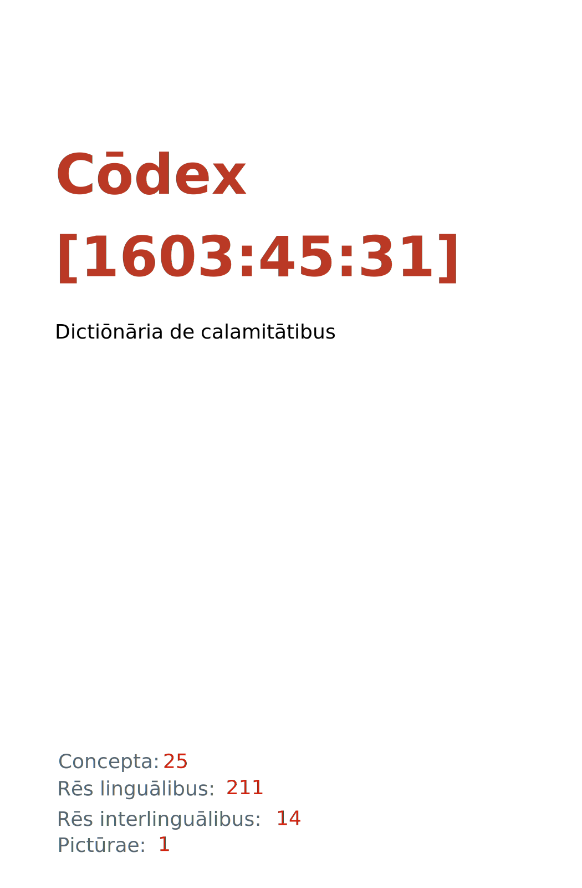

= Cōdex [1603:45:31]: Dictiōnāria dē calamitātibus
:doctype: book
:title: Cōdex [1603:45:31]: Dictiōnāria dē calamitātibus
:lang: la
:toc: macro
:toclevels: 5
:toc-title: Tabula contentorum
:table-caption: Tabula
:figure-caption: Pictūra
:example-caption: Exemplum
:last-update-label: Renovatio
:version-label: Versiō
:appendix-caption: Appendix
:source-highlighter: rouge
:warning-caption: Hic sunt dracones
:tip-caption: Commendātum
:front-cover-image: : Dictiōnāria dē calamitātibus",1050,1600]

{nbsp} +
{nbsp} +
[quote]
**Dedicação ao Domínio Público significa que cada grande problema comum só precisa ser resolvido uma vez**

'''

[%header,cols="25h,~a"]
|===
|
Rēs interlinguālibus
|
Factum

|
scrīptor
|
EticaAI

|
/cōdex pūblicandī/
|
EticaAI

|
/publication date/@eng-Latn
|
2022-04-14

|
numerus editionis
|
2022-04-29T02:05:02

|
/SPDX license ID/@eng-Latn
|
CC0-1.0

|===

ifndef::backend-epub3[]
<<<
toc::[]
<<<
endif::[]

[id=0_999_1603_1]
== Praefātiō 

Rēs linguālibus (1)::
  Lingua Anglica (Abecedarium Latinum):::
    _**Cōdex [1603:45:31]**_ é o formato de livro dos dados estruturados legíveis por máquina do grupo de dicionários _**[1603:45:31] Dictiōnāria dē calamitātibus**_, que são distribuídos para os implementadores usarem em aplicativos externos. Este livro pretende ser um recurso avançado para outros lexicógrafos e tradutores de terminologia, inclusive para detectar e relatar inconsistências. Ele pode, no entanto, ser usado como um dicionário ad hoc se não houver trabalho derivado focado em suas necessidades específicas.
    +++  +++
    **SOBRE LEXICOGRAFIA**
    +++  +++
    A lexicografia prática é a arte ou ofício de compilar, escrever e editar dicionários. O básico não é muito diferente de um milênio atrás: ainda é um trabalho muito humano e criativo. É preciso ser humilde: a maioria dos erros de tradutores, na verdade, não é culpa do tradutor, mas falhas metodológicas. Certificar-se de uma ideia de origem do que um conceito representa, mesmo que signifique reescrever e simplificar, anexar fotos, mostrar exemplos, fazer o que for para que seja entendido, faz com que até mesmo tradutores não profissionais que se preocupam com sua própria língua entreguem melhor resultados do que qualquer alternativa. Em outras palavras: mesmo as chamadas melhores práticas da indústria de pagar tradutores e revisores profissionais não podem superar termos de origem já mal explicados.
    +++  +++
    **SOBRE TIPOS DE DICIONÁRIOS QUE ESTAMOS COMPILANDO**
    +++  +++
    Estamos preocupados com um grupo de idéias (chamamos isso de grupo de dicionários de conceitos) que podem ser divididos em partes menores, revisados quanto a inconsistências, aprimorados para definições e depois traduzidos por voluntários. Códigos interlinguais, como o que poderia ser usado na troca de dados real, também são adicionados a cada conceito. Ambos os glossários, interfaces de usuário (como rótulos na coleta de dados) e, em alguns casos, até códigos padrão para o que iria em um campo de dados podem ser compilados dessa maneira.
    +++  +++
    Como a lista completa de dicionários-prototípicos e dicionários minimamente utilizáveis é enorme, um modo de citar público-alvos típicos é o seguinte:
    +++  +++
    . Ajuda humanitária
    . Ajuda ao desenvolvimento
    . Direitos humanos
    . Socorro militar (ou conceitos relacionados a conflitos e resolução de conflitos)
    +++  +++
    Os itens 1, 2 e 4 https://en.m.wikipedia.org/wiki/Humanitarian-Development_Nexus[são algumas vezes referidos como _nexus_] e são frequentemente encontrados ajudando _crise humanitária_. Já que a maioria dos colaboradores cujas ideias e críticas válidas são voluntárias, então 3 (direitos humanos, como na Anistia Internacional) para diferenciar do humanitarismo (como o Movimento da Cruz Vermelha é referência).
    +++  +++
    Observe que **dicionários não são guias de uso**. As instruções, quando existem, são principalmente dedicadas a lexicógrafos e tradutores.
    +++  +++
    **/PRO BONŌ PUBLICŌ/@lat-Latn**
    +++  +++
    As pessoas lexicógrafas deste trabalho são voluntárias, fazendo-o gratuitamente, pro bonō publicō, e não aceitam doações por causa dos dicionários reutilizáveis ​​de todos. O trabalho anterior existente muitas vezes é baseado em livros antigos de domínio público. A maioria dos tradutores de terminologia já seriam voluntários porque acreditam em uma causa. A melhor maneira de inspirar a colaboração é sermos nós mesmos exemplos.
    +++  +++
    Há um aspecto não moralista, bastante simples de entender: quão caro seria pagar pelo trabalho de todos considerando que é viável em mais de 200 idiomas? A logística para decidir quem deve ser pago, depois a transferência de dinheiro em todo o mundo (pode incluir pessoas de países embargados), depois os mecanismos tradicionais de auditoria para verificar o uso indevido que os doadores esperam, existe? Em terminologia especial (os próprios termos do dicionário) e tantas línguas, não existe dinheiro suficiente nem humanos interessados ​​em ser coordenadores.

<<<

== Methodī ex cōdice
=== Methodī ex dictiōnāriōrum corde
Rēs interlinguālibus (1)::
  /scope and content/@eng-Latn:::
    The decision making behind the concepts of the dictionaries is based mostly on calamities (disasters) commonly cited on emergency response in humanitarian areas. When this is the case, the interlingual external codes will also be added to the concept.
    +++  +++
    The terminology translations are extracted from Wikidata, which means this recommended derived works periodically check for updates.

==== Referentia
Referēns 1::
  /reference URL/@eng-Latn:::
    link:https://reliefweb.int/taxonomy-descriptions#disastertype[]
  Linguae multiplīs (Scrīptum incognitō):::
    /This URL (also recommended as vocabulary by https://vocabulary.unocha.org/) was used as base for initial bootstrapping. We may have more items/@eng-Latn

Referēns 2::
  /reference URL/@eng-Latn:::
    link:https://glidenumber.net/[]
  Linguae multiplīs (Scrīptum incognitō):::
    /The mentioned _GLIDE hazard code_ are used on this page as _event_/@eng-Latn

Referēns 3::
  /reference URL/@eng-Latn:::
    link:https://council.science/wp-content/uploads/2020/06/UNDRR_Hazard-Report_DIGITAL.pdf[]
  Linguae multiplīs (Scrīptum incognitō):::
    /This report (for now) is just a reference. However, it does have more candidates for this group of dictionaries (as long as we safely disambiguate them)/@eng-Latn

Referēns 4::
  /reference URL/@eng-Latn:::
    link:https://www.wikidata.org/wiki/Wikidata:WikiProject_Humanitarian_Wikidata[]
  Linguae multiplīs (Scrīptum incognitō):::
    Wikidata:WikiProject Humanitarian Wikidata. More volunteers are welcome!

=== Methodī ex verbīs in dictiōnāriīs
NOTE: /No momento, não há fluxo de trabalho para usar https://www.wikidata.org/wiki/Wikidata:Lexicographical_data[Wikidata lexicographical data], que na verdade poderia ser usado como armazenamento para nomenclatura mais rigorosa. As implementações atuais usam apenas conceitos do Wikidata, os Q-items./@eng-Latn

==== Methodī ex verbīs in Vicidata (Q modō)
Rēs linguālibus (1)::
  Lingua Anglica (Abecedarium Latinum):::
    O ***[1603:45:31] Dictiōnāria dē calamitātibus*** usa o Wikidata como uma estratégia para conciliar termos linguísticos para um ou mais de seus conceitos.
    +++  +++
    Isso significa que este livro e os arquivos de dados de dicionários relacionados requerem atualizações periódicas para , no mínimo, sincronize e compartilhe novamente as traduções atualizadas.
    +++  +++
    **Qual a confiabilidade das traduções da comunidade (fonte Wikidata)?**
    +++  +++
    A resposta curta padrão é: **elas são confiáveis**, mesmo nos casos de não haver traduções oficiais para cada assunto.
    +++  +++
    Como referência, é provável que um tradutor profissional (sem acesso à Wikipedia ou bases de terminologia interna das organizações de controle) forneça resultados de qualidade inferior se você fizer testes cegos. Isso é possível porque não apenas o público médio, mas também terminólogos e tradutores profissionais ajudam a Wikipédia (e implicitamente o Wikidata).
    +++  +++
    No entanto, mesmo quando o resultado está correto, a versão atual precisa de diferenciação aprimorada, no mínimo, sigla e forma longa . Para grandes organizações, existem recursos como __P1813 nomes curtos__, mas ainda não foram compilados com o conjunto de dados atual.
    +++  +++
    **Os principais motivos para "traduções erradas" não são culpa dos tradutores**
    +++  +++
    DICA: Como regra geral, para conceitos já muito definidos em que você, como humano, pode verificar manualmente um ou mais termos traduzidos como um resultado decente, as outras traduções provavelmente serão aceitáveis. Dicionários com casos extremos (como nomes de territórios em disputa) teriam mais explicações.
    +++  +++
    A principal razão para "traduções erradas" são conceitos mal definidos usados ​​para explicar aos tradutores da comunidade como gerar traduções de terminologia. Isso tornaria as traduções existentes do Wikidata (usadas não apenas por nós) inconsistentes. A segunda razão é se os dicionários usam traduções para conceitos sem uma correspondência estrita; em outras palavras, se fizermos definições mais estritas do que significa conceito, mas reutilizarmos termos menos exatos da Wikidada. Também há problemas quando idiomas inteiros são codificados com códigos errados. Observe que todos esses casos **traduções erradas NÃO são estritamente culpa do tradutor, mas sim da lexicografia**.
    +++  +++
    Ainda é possível ter erros estritos no nível de tradução. Mas mesmo que indiquemos aos usuários como corrigir o Wikidata/Wikipedia (com base na melhor explicação contextual de um conceito, como este livro), os requisitos para dizer que o termo anterior foi objetivamente um erro de tradução humana errado (se seguir nossa seriedade na construção de dicionário) são muito elevados.
    +++  +++
    Do ponto de vista da conciliação de dados, a seguinte metodologia é utilizada para publicar as traduções da terminologia com a tabela de conceitos principais.
    +++  +++
    . A principal tabela lexicográfica artesanal (explicada no tópico anterior), também fornecida em `1603_45_31.no1.tm.hxl.csv`, pode fazer referência ao Wiki QID.
    . Cada QID exclusivo de `1603_45_31.no1.tm.hxl.csv`, juntamente com códigos de idioma de [`1603:1:51`] (que requer conhecimento de idiomas humanos), é usado para preparar uma consulta SPARQL otimizada para execução em https://query.wikidata.org/[Wikidata Query Service]. A consulta é tão grande que não é viável para links "Try it" (URL longo), como https://www.wikidata.org/wiki/Wikidata:SPARQL_query_service/queries/examples[como o que você encontraria nos Tutoriais Wikidata ], ***mas*** funciona!
    .. Note que o conhecimento é gratuito, as traduções estão lá, mas as necessidades humanitárias multilíngues podem faltar pessoas para preparar os arquivos e compartilhar do que para uso geral.
    . O resultado da consulta, com todos os QIDs e rótulos de termos, é compartilhado como `1603_45_31.wikiq.tm.hxl.csv`
    . As traduções revisadas pela comunidade de cada QID singular são pré-compiladas em um arquivo individual `1603_45_31.wikiq.tm.hxl.csv`
    . `1603_45_31.no1.tm.hxl.csv` mais `1603_45_31.wikiq.tm.hxl.csv` criado `1603_45_31.no11.tm.hxl.csv`

=== Rēs dē factō in dictiōnāriīs
==== Concepta: 25

==== Rēs linguālibus: 210

[%header,cols="15h,25a,~,17"]
|===
|
Cōdex linguae
|
Glotto cōdicī +++ +++ ISO 639-3 +++ +++ Wiki QID cōdicī
|
Nōmen Latīnum
|
Concepta

|
mul-Zyyy
|

+++ +++
https://iso639-3.sil.org/code/mul[mul]
+++ +++ 
|
Linguae multiplīs (Scrīptum incognitō)
|
25

|
ara-Arab
|
https://glottolog.org/resource/languoid/id/arab1395[arab1395]
+++ +++
https://iso639-3.sil.org/code/ara[ara]
+++ +++ https://www.wikidata.org/wiki/Q13955[Q13955]
|
Macrolingua Arabica (Abecedarium Arabicum)
|
23

|
hye-Armn
|
https://glottolog.org/resource/languoid/id/nucl1235[nucl1235]
+++ +++
https://iso639-3.sil.org/code/hye[hye]
+++ +++ https://www.wikidata.org/wiki/Q8785[Q8785]
|
Lingua Armenia (Alphabetum Armenium)
|
18

|
ben-Beng
|
https://glottolog.org/resource/languoid/id/beng1280[beng1280]
+++ +++
https://iso639-3.sil.org/code/ben[ben]
+++ +++ https://www.wikidata.org/wiki/Q9610[Q9610]
|
Lingua Bengali (/ISO 15924 Beng/)
|
19

|
rus-Cyrl
|
https://glottolog.org/resource/languoid/id/russ1263[russ1263]
+++ +++
https://iso639-3.sil.org/code/rus[rus]
+++ +++ https://www.wikidata.org/wiki/Q7737[Q7737]
|
Lingua Russica (Abecedarium Cyrillicum)
|
24

|
hin-Deva
|
https://glottolog.org/resource/languoid/id/hind1269[hind1269]
+++ +++
https://iso639-3.sil.org/code/hin[hin]
+++ +++ https://www.wikidata.org/wiki/Q1568[Q1568]
|
Lingua Hindica (Devanāgarī)
|
20

|
amh-Ethi
|
https://glottolog.org/resource/languoid/id/amha1245[amha1245]
+++ +++
https://iso639-3.sil.org/code/amh[amh]
+++ +++ https://www.wikidata.org/wiki/Q28244[Q28244]
|
Lingua Amharica (/ISO 15924 Ethi/)
|
4

|
kat-Geor
|
https://glottolog.org/resource/languoid/id/nucl1302[nucl1302]
+++ +++
https://iso639-3.sil.org/code/kat[kat]
+++ +++ https://www.wikidata.org/wiki/Q8108[Q8108]
|
Lingua Georgiana (Abecedarium Georgianum)
|
14

|
guj-Gujr
|
https://glottolog.org/resource/languoid/id/guja1252[guja1252]
+++ +++
https://iso639-3.sil.org/code/guj[guj]
+++ +++ https://www.wikidata.org/wiki/Q5137[Q5137]
|
Lingua Gujaratensis (/ISO 15924 Gujr/)
|
7

|
pan-Guru
|
https://glottolog.org/resource/languoid/id/panj1256[panj1256]
+++ +++
https://iso639-3.sil.org/code/pan[pan]
+++ +++ https://www.wikidata.org/wiki/Q58635[Q58635]
|
Lingua Paniabica (/ISO 15924 Guru/)
|
11

|
kan-Knda
|
https://glottolog.org/resource/languoid/id/nucl1305[nucl1305]
+++ +++
https://iso639-3.sil.org/code/kan[kan]
+++ +++ https://www.wikidata.org/wiki/Q33673[Q33673]
|
Lingua Cannadica (/ISO 15924 Knda/)
|
10

|
kor-Hang
|
https://glottolog.org/resource/languoid/id/kore1280[kore1280]
+++ +++
https://iso639-3.sil.org/code/kor[kor]
+++ +++ https://www.wikidata.org/wiki/Q9176[Q9176]
|
Lingua Coreana (Abecedarium Coreanum)
|
22

|
lzh-Hant
|
https://glottolog.org/resource/languoid/id/lite1248[lite1248]
+++ +++
https://iso639-3.sil.org/code/lzh[lzh]
+++ +++ https://www.wikidata.org/wiki/Q37041[Q37041]
|
Lingua Sinica classica (/ISO 15924 Hant/)
|
7

|
heb-Hebr
|
https://glottolog.org/resource/languoid/id/hebr1245[hebr1245]
+++ +++
https://iso639-3.sil.org/code/heb[heb]
+++ +++ https://www.wikidata.org/wiki/Q9288[Q9288]
|
Lingua Hebraica (Alphabetum Hebraicum)
|
22

|
khm-Khmr
|
https://glottolog.org/resource/languoid/id/cent1989[cent1989]
+++ +++
https://iso639-3.sil.org/code/khm[khm]
+++ +++ https://www.wikidata.org/wiki/Q9205[Q9205]
|
Lingua Khmer (/ISO 15924 Khmr/)
|
4

|
lao-Laoo
|
https://glottolog.org/resource/languoid/id/laoo1244[laoo1244]
+++ +++
https://iso639-3.sil.org/code/lao[lao]
+++ +++ https://www.wikidata.org/wiki/Q9211[Q9211]
|
/Lao language/ (/ISO 15924 Laoo/)
|
1

|
lat-Latn
|
https://glottolog.org/resource/languoid/id/lati1261[lati1261]
+++ +++
https://iso639-3.sil.org/code/lat[lat]
+++ +++ https://www.wikidata.org/wiki/Q397[Q397]
|
Lingua Latina (Abecedarium Latinum)
|
13

|
mnw-Mymr
|
https://glottolog.org/resource/languoid/id/monn1252[monn1252]
+++ +++
https://iso639-3.sil.org/code/mnw[mnw]
+++ +++ https://www.wikidata.org/wiki/Q13349[Q13349]
|
/Mon language/ (/ISO 15924 Mymr/)
|
1

|
nqo-Nkoo
|
https://glottolog.org/resource/languoid/id/nkoa1234[nkoa1234]
+++ +++
https://iso639-3.sil.org/code/nqo[nqo]
+++ +++ https://www.wikidata.org/wiki/Q18546266[Q18546266]
|
/N'Ko/ (/ISO 15924 Nkoo/)
|
1

|
sat-Olck
|
https://glottolog.org/resource/languoid/id/sant1410[sant1410]
+++ +++
https://iso639-3.sil.org/code/sat[sat]
+++ +++ https://www.wikidata.org/wiki/Q33965[Q33965]
|
Lingua Santali (/ISO 15924 Olck/)
|
2

|
ori-Orya
|

+++ +++
https://iso639-3.sil.org/code/ori[ori]
+++ +++ https://www.wikidata.org/wiki/Q33810[Q33810]
|
Macrolingua Orissensis (/ISO 15924 Orya/)
|
5

|
sin-Sinh
|
https://glottolog.org/resource/languoid/id/sinh1246[sinh1246]
+++ +++
https://iso639-3.sil.org/code/sin[sin]
+++ +++ https://www.wikidata.org/wiki/Q13267[Q13267]
|
Lingua Singhalensis (/ISO 15924 Sinh/)
|
10

|
tam-Taml
|
https://glottolog.org/resource/languoid/id/tami1289[tami1289]
+++ +++
https://iso639-3.sil.org/code/tam[tam]
+++ +++ https://www.wikidata.org/wiki/Q5885[Q5885]
|
Lingua Tamulica (/ISO 15924 Taml/)
|
15

|
tel-Telu
|
https://glottolog.org/resource/languoid/id/telu1262[telu1262]
+++ +++
https://iso639-3.sil.org/code/tel[tel]
+++ +++ https://www.wikidata.org/wiki/Q8097[Q8097]
|
Lingua Telingana (/ISO 15924 Telu/)
|
12

|
tha-Thai
|
https://glottolog.org/resource/languoid/id/thai1261[thai1261]
+++ +++
https://iso639-3.sil.org/code/tha[tha]
+++ +++ https://www.wikidata.org/wiki/Q9217[Q9217]
|
Lingua Thai (/ISO 15924 Thai/)
|
16

|
bod-Tibt
|
https://glottolog.org/resource/languoid/id/tibe1272[tibe1272]
+++ +++
https://iso639-3.sil.org/code/bod[bod]
+++ +++ https://www.wikidata.org/wiki/Q34271[Q34271]
|
Lingua Tibetana (Scriptura Tibetana)
|
1

|
san-Zyyy
|
https://glottolog.org/resource/languoid/id/sans1269[sans1269]
+++ +++
https://iso639-3.sil.org/code/san[san]
+++ +++ https://www.wikidata.org/wiki/Q11059[Q11059]
|
Lingua Sanscrita (/ISO 15924 Zyyy/)
|
7

|
zho-Zyyy
|
https://glottolog.org/resource/languoid/id/sini1245[sini1245]
+++ +++
https://iso639-3.sil.org/code/zho[zho]
+++ +++ https://www.wikidata.org/wiki/Q7850[Q7850]
|
/Macrolingua Sinicae (/ISO 15924 Zyyy/)/
|
25

|
por-Latn
|
https://glottolog.org/resource/languoid/id/port1283[port1283]
+++ +++
https://iso639-3.sil.org/code/por[por]
+++ +++ https://www.wikidata.org/wiki/Q5146[Q5146]
|
Lingua Lusitana (Abecedarium Latinum)
|
24

|
eng-Latn
|
https://glottolog.org/resource/languoid/id/stan1293[stan1293]
+++ +++
https://iso639-3.sil.org/code/eng[eng]
+++ +++ https://www.wikidata.org/wiki/Q1860[Q1860]
|
Lingua Anglica (Abecedarium Latinum)
|
28

|
fra-Latn
|
https://glottolog.org/resource/languoid/id/stan1290[stan1290]
+++ +++
https://iso639-3.sil.org/code/fra[fra]
+++ +++ https://www.wikidata.org/wiki/Q150[Q150]
|
Lingua Francogallica (Abecedarium Latinum)
|
25

|
nld-Latn
|
https://glottolog.org/resource/languoid/id/mode1257[mode1257]
+++ +++
https://iso639-3.sil.org/code/nld[nld]
+++ +++ https://www.wikidata.org/wiki/Q7411[Q7411]
|
Lingua Batavica (Abecedarium Latinum)
|
25

|
deu-Latn
|
https://glottolog.org/resource/languoid/id/stan1295[stan1295]
+++ +++
https://iso639-3.sil.org/code/deu[deu]
+++ +++ https://www.wikidata.org/wiki/Q188[Q188]
|
Lingua Germanica (Abecedarium Latinum)
|
24

|
spa-Latn
|
https://glottolog.org/resource/languoid/id/stan1288[stan1288]
+++ +++
https://iso639-3.sil.org/code/spa[spa]
+++ +++ https://www.wikidata.org/wiki/Q1321[Q1321]
|
Lingua Hispanica (Abecedarium Latinum)
|
25

|
ita-Latn
|
https://glottolog.org/resource/languoid/id/ital1282[ital1282]
+++ +++
https://iso639-3.sil.org/code/ita[ita]
+++ +++ https://www.wikidata.org/wiki/Q652[Q652]
|
Lingua Italiana (Abecedarium Latinum)
|
23

|
gle-Latn
|
https://glottolog.org/resource/languoid/id/iris1253[iris1253]
+++ +++
https://iso639-3.sil.org/code/gle[gle]
+++ +++ https://www.wikidata.org/wiki/Q9142[Q9142]
|
Lingua Hibernica (Abecedarium Latinum)
|
17

|
swe-Latn
|
https://glottolog.org/resource/languoid/id/swed1254[swed1254]
+++ +++
https://iso639-3.sil.org/code/swe[swe]
+++ +++ https://www.wikidata.org/wiki/Q9027[Q9027]
|
Lingua Suecica (Abecedarium Latinum)
|
22

|
ceb-Latn
|
https://glottolog.org/resource/languoid/id/cebu1242[cebu1242]
+++ +++
https://iso639-3.sil.org/code/ceb[ceb]
+++ +++ https://www.wikidata.org/wiki/Q33239[Q33239]
|
Lingua Caebuana (Abecedarium Latinum)
|
3

|
sqi-Latn
|
https://glottolog.org/resource/languoid/id/alba1267[alba1267]
+++ +++
https://iso639-3.sil.org/code/sqi[sqi]
+++ +++ https://www.wikidata.org/wiki/Q8748[Q8748]
|
Macrolingua Albanica (/Abecedarium Latinum/)
|
5

|
pol-Latn
|
https://glottolog.org/resource/languoid/id/poli1260[poli1260]
+++ +++
https://iso639-3.sil.org/code/pol[pol]
+++ +++ https://www.wikidata.org/wiki/Q809[Q809]
|
Lingua Polonica (Abecedarium Latinum)
|
22

|
fin-Latn
|
https://glottolog.org/resource/languoid/id/finn1318[finn1318]
+++ +++
https://iso639-3.sil.org/code/fin[fin]
+++ +++ https://www.wikidata.org/wiki/Q1412[Q1412]
|
Lingua Finnica (Abecedarium Latinum)
|
21

|
ron-Latn
|
https://glottolog.org/resource/languoid/id/roma1327[roma1327]
+++ +++
https://iso639-3.sil.org/code/ron[ron]
+++ +++ https://www.wikidata.org/wiki/Q7913[Q7913]
|
Lingua Dacoromanica (Abecedarium Latinum)
|
21

|
vie-Latn
|
https://glottolog.org/resource/languoid/id/viet1252[viet1252]
+++ +++
https://iso639-3.sil.org/code/vie[vie]
+++ +++ https://www.wikidata.org/wiki/Q9199[Q9199]
|
Lingua Vietnamensis (Abecedarium Latinum)
|
22

|
cat-Latn
|
https://glottolog.org/resource/languoid/id/stan1289[stan1289]
+++ +++
https://iso639-3.sil.org/code/cat[cat]
+++ +++ https://www.wikidata.org/wiki/Q7026[Q7026]
|
Lingua Catalana (Abecedarium Latinum)
|
25

|
ukr-Cyrl
|
https://glottolog.org/resource/languoid/id/ukra1253[ukra1253]
+++ +++
https://iso639-3.sil.org/code/ukr[ukr]
+++ +++ https://www.wikidata.org/wiki/Q8798[Q8798]
|
Lingua Ucrainica (Abecedarium Cyrillicum)
|
22

|
bul-Cyrl
|
https://glottolog.org/resource/languoid/id/bulg1262[bulg1262]
+++ +++
https://iso639-3.sil.org/code/bul[bul]
+++ +++ https://www.wikidata.org/wiki/Q7918[Q7918]
|
Lingua Bulgarica (Abecedarium Cyrillicum)
|
15

|
slv-Latn
|
https://glottolog.org/resource/languoid/id/slov1268[slov1268]
+++ +++
https://iso639-3.sil.org/code/slv[slv]
+++ +++ https://www.wikidata.org/wiki/Q9063[Q9063]
|
Lingua Slovena (Abecedarium Latinum)
|
17

|
war-Latn
|
https://glottolog.org/resource/languoid/id/wara1300[wara1300]
+++ +++
https://iso639-3.sil.org/code/war[war]
+++ +++ https://www.wikidata.org/wiki/Q34279[Q34279]
|
/Waray language/ (Abecedarium Latinum)
|
11

|
nob-Latn
|
https://glottolog.org/resource/languoid/id/norw1259[norw1259]
+++ +++
https://iso639-3.sil.org/code/nob[nob]
+++ +++ https://www.wikidata.org/wiki/Q25167[Q25167]
|
/Bokmål/ (Abecedarium Latinum)
|
23

|
ces-Latn
|
https://glottolog.org/resource/languoid/id/czec1258[czec1258]
+++ +++
https://iso639-3.sil.org/code/ces[ces]
+++ +++ https://www.wikidata.org/wiki/Q9056[Q9056]
|
Lingua Bohemica (Abecedarium Latinum)
|
22

|
dan-Latn
|
https://glottolog.org/resource/languoid/id/dani1285[dani1285]
+++ +++
https://iso639-3.sil.org/code/dan[dan]
+++ +++ https://www.wikidata.org/wiki/Q9035[Q9035]
|
Lingua Danica (Abecedarium Latinum)
|
20

|
jpn-Jpan
|
https://glottolog.org/resource/languoid/id/nucl1643[nucl1643]
+++ +++
https://iso639-3.sil.org/code/jpn[jpn]
+++ +++ https://www.wikidata.org/wiki/Q5287[Q5287]
|
Lingua Iaponica (Scriptura Iaponica)
|
25

|
nno-Latn
|
https://glottolog.org/resource/languoid/id/norw1262[norw1262]
+++ +++
https://iso639-3.sil.org/code/nno[nno]
+++ +++ https://www.wikidata.org/wiki/Q25164[Q25164]
|
/Nynorsk/ (Abecedarium Latinum)
|
20

|
mal-Mlym
|
https://glottolog.org/resource/languoid/id/mala1464[mala1464]
+++ +++
https://iso639-3.sil.org/code/mal[mal]
+++ +++ https://www.wikidata.org/wiki/Q36236[Q36236]
|
Lingua Malabarica (/Malayalam script/)
|
17

|
ind-Latn
|
https://glottolog.org/resource/languoid/id/indo1316[indo1316]
+++ +++
https://iso639-3.sil.org/code/ind[ind]
+++ +++ https://www.wikidata.org/wiki/Q9240[Q9240]
|
Lingua Indonesiana (Abecedarium Latinum)
|
25

|
fas-Zyyy
|

+++ +++
https://iso639-3.sil.org/code/fas[fas]
+++ +++ https://www.wikidata.org/wiki/Q9168[Q9168]
|
Macrolingua Persica (//Abecedarium Arabicum//)
|
22

|
hun-Latn
|
https://glottolog.org/resource/languoid/id/hung1274[hung1274]
+++ +++
https://iso639-3.sil.org/code/hun[hun]
+++ +++ https://www.wikidata.org/wiki/Q9067[Q9067]
|
Lingua Hungarica (Abecedarium Latinum)
|
19

|
eus-Latn
|
https://glottolog.org/resource/languoid/id/basq1248[basq1248]
+++ +++
https://iso639-3.sil.org/code/eus[eus]
+++ +++ https://www.wikidata.org/wiki/Q8752[Q8752]
|
Lingua Vasconica (Abecedarium Latinum)
|
19

|
cym-Latn
|
https://glottolog.org/resource/languoid/id/wels1247[wels1247]
+++ +++
https://iso639-3.sil.org/code/cym[cym]
+++ +++ https://www.wikidata.org/wiki/Q9309[Q9309]
|
Lingua Cambrica (Abecedarium Latinum)
|
15

|
glg-Latn
|
https://glottolog.org/resource/languoid/id/gali1258[gali1258]
+++ +++
https://iso639-3.sil.org/code/glg[glg]
+++ +++ https://www.wikidata.org/wiki/Q9307[Q9307]
|
Lingua Gallaica (Abecedarium Latinum)
|
17

|
slk-Latn
|
https://glottolog.org/resource/languoid/id/slov1269[slov1269]
+++ +++
https://iso639-3.sil.org/code/slk[slk]
+++ +++ https://www.wikidata.org/wiki/Q9058[Q9058]
|
Lingua Slovaca (Abecedarium Latinum)
|
16

|
epo-Latn
|
https://glottolog.org/resource/languoid/id/espe1235[espe1235]
+++ +++
https://iso639-3.sil.org/code/epo[epo]
+++ +++ https://www.wikidata.org/wiki/Q143[Q143]
|
Lingua Esperantica (Abecedarium Latinum)
|
25

|
msa-Zyyy
|

+++ +++
https://iso639-3.sil.org/code/msa[msa]
+++ +++ https://www.wikidata.org/wiki/Q9237[Q9237]
|
Macrolingua Malayana (/ISO 15924 Zyyy/)
|
19

|
est-Latn
|

+++ +++
https://iso639-3.sil.org/code/est[est]
+++ +++ https://www.wikidata.org/wiki/Q9072[Q9072]
|
Macrolingua Estonica (Abecedarium Latinum)
|
19

|
hrv-Latn
|
https://glottolog.org/resource/languoid/id/croa1245[croa1245]
+++ +++
https://iso639-3.sil.org/code/hrv[hrv]
+++ +++ https://www.wikidata.org/wiki/Q6654[Q6654]
|
Lingua Croatica (Abecedarium Latinum)
|
17

|
tur-Latn
|
https://glottolog.org/resource/languoid/id/nucl1301[nucl1301]
+++ +++
https://iso639-3.sil.org/code/tur[tur]
+++ +++ https://www.wikidata.org/wiki/Q256[Q256]
|
Lingua Turcica (Abecedarium Latinum)
|
20

|
nds-Latn
|
https://glottolog.org/resource/languoid/id/lowg1239[lowg1239]
+++ +++
https://iso639-3.sil.org/code/nds[nds]
+++ +++ https://www.wikidata.org/wiki/Q25433[Q25433]
|
Lingua Saxonica (Abecedarium Latinum)
|
9

|
oci-Latn
|
https://glottolog.org/resource/languoid/id/occi1239[occi1239]
+++ +++
https://iso639-3.sil.org/code/oci[oci]
+++ +++ https://www.wikidata.org/wiki/Q14185[Q14185]
|
Lingua Occitana (Abecedarium Latinum)
|
15

|
bre-Latn
|
https://glottolog.org/resource/languoid/id/bret1244[bret1244]
+++ +++
https://iso639-3.sil.org/code/bre[bre]
+++ +++ https://www.wikidata.org/wiki/Q12107[Q12107]
|
Lingua Britonica (Abecedarium Latinum)
|
7

|
arz-Latn
|
https://glottolog.org/resource/languoid/id/egyp1253[egyp1253]
+++ +++
https://iso639-3.sil.org/code/arz[arz]
+++ +++ https://www.wikidata.org/wiki/Q29919[Q29919]
|
/Egyptian Arabic/ (Abecedarium Arabicum)
|
3

|
afr-Latn
|
https://glottolog.org/resource/languoid/id/afri1274[afri1274]
+++ +++
https://iso639-3.sil.org/code/afr[afr]
+++ +++ https://www.wikidata.org/wiki/Q14196[Q14196]
|
Lingua Batava Capitensis (Abecedarium Latinum)
|
13

|
ltz-Latn
|
https://glottolog.org/resource/languoid/id/luxe1241[luxe1241]
+++ +++
https://iso639-3.sil.org/code/ltz[ltz]
+++ +++ https://www.wikidata.org/wiki/Q9051[Q9051]
|
Lingua Luxemburgensis (Abecedarium Latinum)
|
7

|
sco-Latn
|
https://glottolog.org/resource/languoid/id/scot1243[scot1243]
+++ +++
https://iso639-3.sil.org/code/sco[sco]
+++ +++ https://www.wikidata.org/wiki/Q14549[Q14549]
|
Lingua Scotica quae Teutonica (Abecedarium Latinum)
|
8

|
bar-Latn
|
https://glottolog.org/resource/languoid/id/bava1246[bava1246]
+++ +++
https://iso639-3.sil.org/code/bar[bar]
+++ +++ https://www.wikidata.org/wiki/Q29540[Q29540]
|
Lingua Bavarica (Abecedarium Latinum)
|
7

|
arg-Latn
|
https://glottolog.org/resource/languoid/id/arag1245[arag1245]
+++ +++
https://iso639-3.sil.org/code/arg[arg]
+++ +++ https://www.wikidata.org/wiki/Q8765[Q8765]
|
Lingua Aragonensis (Abecedarium Latinum)
|
12

|
zho-Hant
|

+++ +++
https://iso639-3.sil.org/code/zho[zho]
+++ +++ https://www.wikidata.org/wiki/Q18130932[Q18130932]
|
//Traditional Chinese// (/ISO 15924 Hant/)
|
19

|
pap-Latn
|
https://glottolog.org/resource/languoid/id/papi1253[papi1253]
+++ +++
https://iso639-3.sil.org/code/pap[pap]
+++ +++ https://www.wikidata.org/wiki/Q33856[Q33856]
|
/lingua Papiamentica/ (Abecedarium Latinum)
|
5

|
cos-Latn
|
https://glottolog.org/resource/languoid/id/cors1241[cors1241]
+++ +++
https://iso639-3.sil.org/code/cos[cos]
+++ +++ https://www.wikidata.org/wiki/Q33111[Q33111]
|
Lingua Corsica (Abecedarium Latinum)
|
2

|
gsw-Latn
|
https://glottolog.org/resource/languoid/id/swis1247[swis1247]
+++ +++
https://iso639-3.sil.org/code/gsw[gsw]
+++ +++ https://www.wikidata.org/wiki/Q131339[Q131339]
|
Dialecti Alemannicae (Abecedarium Latinum)
|
9

|
isl-Latn
|
https://glottolog.org/resource/languoid/id/icel1247[icel1247]
+++ +++
https://iso639-3.sil.org/code/isl[isl]
+++ +++ https://www.wikidata.org/wiki/Q294[Q294]
|
Lingua Islandica (Abecedarium Latinum)
|
17

|
min-Latn
|
https://glottolog.org/resource/languoid/id/mina1268[mina1268]
+++ +++
https://iso639-3.sil.org/code/min[min]
+++ +++ https://www.wikidata.org/wiki/Q13324[Q13324]
|
/Minangkabau language/ (Abecedarium Latinum)
|
3

|
roh-Latn
|
https://glottolog.org/resource/languoid/id/roma1326[roma1326]
+++ +++
https://iso639-3.sil.org/code/roh[roh]
+++ +++ https://www.wikidata.org/wiki/Q13199[Q13199]
|
Lingua Rhaetica (Abecedarium Latinum)
|
2

|
vec-Latn
|
https://glottolog.org/resource/languoid/id/vene1258[vene1258]
+++ +++
https://iso639-3.sil.org/code/vec[vec]
+++ +++ https://www.wikidata.org/wiki/Q32724[Q32724]
|
Lingua Veneta (Abecedarium Latinum)
|
11

|
pms-Latn
|
https://glottolog.org/resource/languoid/id/piem1238[piem1238]
+++ +++
https://iso639-3.sil.org/code/pms[pms]
+++ +++ https://www.wikidata.org/wiki/Q15085[Q15085]
|
Lingua Pedemontana (Abecedarium Latinum)
|
1

|
scn-Latn
|
https://glottolog.org/resource/languoid/id/sici1248[sici1248]
+++ +++
https://iso639-3.sil.org/code/scn[scn]
+++ +++ https://www.wikidata.org/wiki/Q33973[Q33973]
|
Lingua Sicula (Abecedarium Latinum)
|
11

|
srd-Latn
|

+++ +++
https://iso639-3.sil.org/code/srd[srd]
+++ +++ https://www.wikidata.org/wiki/Q33976[Q33976]
|
Macrolingua Sarda (Abecedarium Latinum)
|
4

|
gla-Latn
|
https://glottolog.org/resource/languoid/id/scot1245[scot1245]
+++ +++
https://iso639-3.sil.org/code/gla[gla]
+++ +++ https://www.wikidata.org/wiki/Q9314[Q9314]
|
Lingua Scotica seu Scotica Gadelica (Abecedarium Latinum)
|
4

|
lim-Latn
|
https://glottolog.org/resource/languoid/id/limb1263[limb1263]
+++ +++
https://iso639-3.sil.org/code/lim[lim]
+++ +++ https://www.wikidata.org/wiki/Q102172[Q102172]
|
Lingua Limburgica (Abecedarium Latinum)
|
8

|
wln-Latn
|
https://glottolog.org/resource/languoid/id/wall1255[wall1255]
+++ +++
https://iso639-3.sil.org/code/wln[wln]
+++ +++ https://www.wikidata.org/wiki/Q34219[Q34219]
|
Lingua Vallonica (Abecedarium Latinum)
|
9

|
srp-Latn
|
https://glottolog.org/resource/languoid/id/serb1264[serb1264]
+++ +++
https://iso639-3.sil.org/code/srp[srp]
+++ +++ https://www.wikidata.org/wiki/Q21161949[Q21161949]
|
/Serbian/ (Abecedarium Latinum)
|
8

|
vls-Latn
|
https://glottolog.org/resource/languoid/id/vlaa1240[vlaa1240]
+++ +++
https://iso639-3.sil.org/code/vls[vls]
+++ +++ https://www.wikidata.org/wiki/Q100103[Q100103]
|
/West Flemish/ (Abecedarium Latinum)
|
2

|
nap-Latn
|
https://glottolog.org/resource/languoid/id/neap1235[neap1235]
+++ +++
https://iso639-3.sil.org/code/nap[nap]
+++ +++ https://www.wikidata.org/wiki/Q33845[Q33845]
|
Lingua Neapolitana (Abecedarium Latinum)
|
3

|
lij-Latn
|
https://glottolog.org/resource/languoid/id/ligu1248[ligu1248]
+++ +++
https://iso639-3.sil.org/code/lij[lij]
+++ +++ https://www.wikidata.org/wiki/Q36106[Q36106]
|
Lingua Ligustica (Abecedarium Latinum)
|
1

|
fur-Latn
|
https://glottolog.org/resource/languoid/id/friu1240[friu1240]
+++ +++
https://iso639-3.sil.org/code/fur[fur]
+++ +++ https://www.wikidata.org/wiki/Q33441[Q33441]
|
Lingua Foroiuliensis (Abecedarium Latinum)
|
2

|
pcd-Latn
|
https://glottolog.org/resource/languoid/id/pica1241[pica1241]
+++ +++
https://iso639-3.sil.org/code/pcd[pcd]
+++ +++ https://www.wikidata.org/wiki/Q34024[Q34024]
|
Lingua Picardica (Abecedarium Latinum)
|
3

|
wol-Latn
|
https://glottolog.org/resource/languoid/id/nucl1347[nucl1347]
+++ +++
https://iso639-3.sil.org/code/wol[wol]
+++ +++ https://www.wikidata.org/wiki/Q34257[Q34257]
|
/Wolof language/ (Abecedarium Latinum)
|
1

|
kon-Latn
|

+++ +++
https://iso639-3.sil.org/code/kon[kon]
+++ +++ https://www.wikidata.org/wiki/Q33702[Q33702]
|
/Kongo macrolanguage/ (Abecedarium Latinum)
|
1

|
frp-Latn
|
https://glottolog.org/resource/languoid/id/fran1260[fran1260]
+++ +++
https://iso639-3.sil.org/code/frp[frp]
+++ +++ https://www.wikidata.org/wiki/Q15087[Q15087]
|
Lingua Arpitanica (Abecedarium Latinum)
|
2

|
wuu-Zyyy
|
https://glottolog.org/resource/languoid/id/wuch1236[wuch1236]
+++ +++
https://iso639-3.sil.org/code/wuu[wuu]
+++ +++ https://www.wikidata.org/wiki/Q34290[Q34290]
|
//Macrolingua Wu// (/ISO 15924 Zyyy/)
|
17

|
srp-Cyrl
|
https://glottolog.org/resource/languoid/id/serb1264[serb1264]
+++ +++
https://iso639-3.sil.org/code/srp[srp]
+++ +++ https://www.wikidata.org/wiki/Q9299[Q9299]
|
Lingua Serbica (Abecedarium Cyrillicum)
|
20

|
urd-Arab
|
https://glottolog.org/resource/languoid/id/urdu1245[urdu1245]
+++ +++
https://iso639-3.sil.org/code/urd[urd]
+++ +++ https://www.wikidata.org/wiki/Q1617[Q1617]
|
Lingua Urdu (Abecedarium Arabicum)
|
13

|
gan-Zyyy
|
https://glottolog.org/resource/languoid/id/ganc1239[ganc1239]
+++ +++
https://iso639-3.sil.org/code/gan[gan]
+++ +++ https://www.wikidata.org/wiki/Q33475[Q33475]
|
Lingua Gan (/ISO 15924 Zyyy/)
|
5

|
lit-Latn
|
https://glottolog.org/resource/languoid/id/lith1251[lith1251]
+++ +++
https://iso639-3.sil.org/code/lit[lit]
+++ +++ https://www.wikidata.org/wiki/Q9083[Q9083]
|
Lingua Lithuanica (Abecedarium Latinum)
|
17

|
gan-Hans
|
https://glottolog.org/resource/languoid/id/ganc1239[ganc1239]
+++ +++
https://iso639-3.sil.org/code/gan[gan]
+++ +++ https://www.wikidata.org/wiki/Q64427344[Q64427344]
|
Lingua Gan (/ISO 15924 Hans/)
|
1

|
hbs-Latn
|
https://glottolog.org/resource/languoid/id/sout1528[sout1528]
+++ +++
https://iso639-3.sil.org/code/hbs[hbs]
+++ +++ https://www.wikidata.org/wiki/Q9301[Q9301]
|
Macrolingua Serbocroatica (Abecedarium Latinum)
|
16

|
lav-Latn
|
https://glottolog.org/resource/languoid/id/latv1249[latv1249]
+++ +++
https://iso639-3.sil.org/code/lav[lav]
+++ +++ https://www.wikidata.org/wiki/Q9078[Q9078]
|
Macrolingua Lettonica (Abecedarium Latinum)
|
16

|
bos-Latn
|
https://glottolog.org/resource/languoid/id/bosn1245[bosn1245]
+++ +++
https://iso639-3.sil.org/code/bos[bos]
+++ +++ https://www.wikidata.org/wiki/Q9303[Q9303]
|
Lingua Bosnica (Abecedarium Latinum)
|
14

|
srn-Latn
|
https://glottolog.org/resource/languoid/id/sran1240[sran1240]
+++ +++
https://iso639-3.sil.org/code/srn[srn]
+++ +++ https://www.wikidata.org/wiki/Q33989[Q33989]
|
/Sranan Tongo/ (Abecedarium Latinum)
|
1

|
azb-Arab
|
https://glottolog.org/resource/languoid/id/sout2697[sout2697]
+++ +++
https://iso639-3.sil.org/code/azb[azb]
+++ +++ https://www.wikidata.org/wiki/Q3449805[Q3449805]
|
/South Azerbaijani/ (Abecedarium Arabicum)
|
5

|
jav-Latn
|
https://glottolog.org/resource/languoid/id/java1254[java1254]
+++ +++
https://iso639-3.sil.org/code/jav[jav]
+++ +++ https://www.wikidata.org/wiki/Q33549[Q33549]
|
Lingua Iavanica (Abecedarium Latinum)
|
6

|
ell-Grek
|
https://glottolog.org/resource/languoid/id/mode1248[mode1248]
+++ +++
https://iso639-3.sil.org/code/ell[ell]
+++ +++ https://www.wikidata.org/wiki/Q36510[Q36510]
|
Lingua Neograeca (Alphabetum Graecum)
|
19

|
sun-Latn
|
https://glottolog.org/resource/languoid/id/sund1252[sund1252]
+++ +++
https://iso639-3.sil.org/code/sun[sun]
+++ +++ https://www.wikidata.org/wiki/Q34002[Q34002]
|
/Sundanese language/ (Abecedarium Latinum)
|
6

|
fry-Latn
|
https://glottolog.org/resource/languoid/id/west2354[west2354]
+++ +++
https://iso639-3.sil.org/code/fry[fry]
+++ +++ https://www.wikidata.org/wiki/Q27175[Q27175]
|
Lingua Frisice occidentalis (Abecedarium Latinum)
|
16

|
ace-Latn
|
https://glottolog.org/resource/languoid/id/achi1257[achi1257]
+++ +++
https://iso639-3.sil.org/code/ace[ace]
+++ +++ https://www.wikidata.org/wiki/Q27683[Q27683]
|
/Acehnese language/ (Abecedarium Latinum)
|
1

|
jam-Latn
|
https://glottolog.org/resource/languoid/id/jama1262[jama1262]
+++ +++
https://iso639-3.sil.org/code/jam[jam]
+++ +++ https://www.wikidata.org/wiki/Q35939[Q35939]
|
Lingua creola Iamaicana (Abecedarium Latinum)
|
3

|
che-Cyrl
|
https://glottolog.org/resource/languoid/id/chec1245[chec1245]
+++ +++
https://iso639-3.sil.org/code/che[che]
+++ +++ https://www.wikidata.org/wiki/Q33350[Q33350]
|
Lingua Tsetsenica (Abecedarium Cyrillicum)
|
2

|
bel-Cyrl
|
https://glottolog.org/resource/languoid/id/bela1254[bela1254]
+++ +++
https://iso639-3.sil.org/code/bel[bel]
+++ +++ https://www.wikidata.org/wiki/Q9091[Q9091]
|
Lingua Ruthenica Alba (Abecedarium Cyrillicum)
|
16

|
kab-Latn
|
https://glottolog.org/resource/languoid/id/kaby1243[kaby1243]
+++ +++
https://iso639-3.sil.org/code/kab[kab]
+++ +++ https://www.wikidata.org/wiki/Q35853[Q35853]
|
/Kabyle language/ (Abecedarium Latinum)
|
5

|
fao-Latn
|
https://glottolog.org/resource/languoid/id/faro1244[faro1244]
+++ +++
https://iso639-3.sil.org/code/fao[fao]
+++ +++ https://www.wikidata.org/wiki/Q25258[Q25258]
|
Lingua Faeroensis (Abecedarium Latinum)
|
5

|
lmo-Latn
|
https://glottolog.org/resource/languoid/id/lomb1257[lomb1257]
+++ +++
https://iso639-3.sil.org/code/lmo[lmo]
+++ +++ https://www.wikidata.org/wiki/Q33754[Q33754]
|
Langobardus sermo (Abecedarium Latinum)
|
5

|
mar-Deva
|
https://glottolog.org/resource/languoid/id/mara1378[mara1378]
+++ +++
https://iso639-3.sil.org/code/mar[mar]
+++ +++ https://www.wikidata.org/wiki/Q1571[Q1571]
|
Lingua Marathica (Devanāgarī)
|
14

|
ban-Latn
|
https://glottolog.org/resource/languoid/id/bali1278[bali1278]
+++ +++
https://iso639-3.sil.org/code/ban[ban]
+++ +++ https://www.wikidata.org/wiki/Q33070[Q33070]
|
/Balinese/ (Abecedarium Latinum)
|
2

|
ast-Latn
|
https://glottolog.org/resource/languoid/id/astu1245[astu1245]
+++ +++
https://iso639-3.sil.org/code/ast[ast]
+++ +++ https://www.wikidata.org/wiki/Q29507[Q29507]
|
Lingua Asturiana (Abecedarium Latinum)
|
16

|
bcl-Latn
|
https://glottolog.org/resource/languoid/id/cent2087[cent2087]
+++ +++
https://iso639-3.sil.org/code/bcl[bcl]
+++ +++ https://www.wikidata.org/wiki/Q33284[Q33284]
|
/Central Bikol/  (Abecedarium Latinum)
|
6

|
bho-Deva
|
https://glottolog.org/resource/languoid/id/bhoj1244[bhoj1244]
+++ +++
https://iso639-3.sil.org/code/bho[bho]
+++ +++ https://www.wikidata.org/wiki/Q33268[Q33268]
|
Lingua Bhojpuri (Devanāgarī)
|
10

|
bxr-Cyrl
|
https://glottolog.org/resource/languoid/id/russ1264[russ1264]
+++ +++
https://iso639-3.sil.org/code/bxr[bxr]
+++ +++ https://www.wikidata.org/wiki/Q33120[Q33120]
|
Lingua Buriatica (Abecedarium Cyrillicum)
|
2

|
cdo-Zyyy
|
https://glottolog.org/resource/languoid/id/mind1253[mind1253]
+++ +++
https://iso639-3.sil.org/code/cdo[cdo]
+++ +++ https://www.wikidata.org/wiki/Q36455[Q36455]
|
/Min Dong Chinese/ (/ISO 15924 Zyyy/)
|
5

|
diq-Latn
|
https://glottolog.org/resource/languoid/id/diml1238[diml1238]
+++ +++
https://iso639-3.sil.org/code/diq[diq]
+++ +++ https://www.wikidata.org/wiki/Q10199[Q10199]
|
Lingua Zazaca (Abecedarium Latinum)
|
5

|
ext-Latn
|
https://glottolog.org/resource/languoid/id/extr1243[extr1243]
+++ +++
https://iso639-3.sil.org/code/ext[ext]
+++ +++ https://www.wikidata.org/wiki/Q30007[Q30007]
|
Lingua Extremadurensis (Abecedarium Latinum)
|
2

|
gcr-Latn
|
https://glottolog.org/resource/languoid/id/guia1246[guia1246]
+++ +++
https://iso639-3.sil.org/code/gcr[gcr]
+++ +++ https://www.wikidata.org/wiki/Q1363072[Q1363072]
|
/Guianese Creole French/ (Abecedarium Latinum)
|
3

|
frr-latn
|
https://glottolog.org/resource/languoid/id/nort2626[nort2626]
+++ +++
https://iso639-3.sil.org/code/frr[frr]
+++ +++ https://www.wikidata.org/wiki/Q28224[Q28224]
|
/Northern Frisian/ (Abecedarium Latinum)
|
0

|
hak-Zyyy
|
https://glottolog.org/resource/languoid/id/hakk1236[hakk1236]
+++ +++
https://iso639-3.sil.org/code/hak[hak]
+++ +++ https://www.wikidata.org/wiki/Q33375[Q33375]
|
/Hakka Chinese/ (/ISO 15924 Zyyy/)
|
2

|
hif-Zyyy
|
https://glottolog.org/resource/languoid/id/fiji1242[fiji1242]
+++ +++
https://iso639-3.sil.org/code/hif[hif]
+++ +++ https://www.wikidata.org/wiki/Q46728[Q46728]
|
Lingua Hindi Vitiensis (/ISO 15924 Zyyy/)
|
1

|
hsb-Latn
|
https://glottolog.org/resource/languoid/id/uppe1395[uppe1395]
+++ +++
https://iso639-3.sil.org/code/hsb[hsb]
+++ +++ https://www.wikidata.org/wiki/Q13248[Q13248]
|
/Upper Sorbian/ (Abecedarium Latinum)
|
3

|
hyw-Armn
|
https://glottolog.org/resource/languoid/id/homs1234[homs1234]
+++ +++
https://iso639-3.sil.org/code/hyw[hyw]
+++ +++ https://www.wikidata.org/wiki/Q180945[Q180945]
|
/Western Armenian/ (Alphabetum Armenium)
|
2

|
ilo-Latn
|
https://glottolog.org/resource/languoid/id/ilok1237[ilok1237]
+++ +++
https://iso639-3.sil.org/code/ilo[ilo]
+++ +++ https://www.wikidata.org/wiki/Q35936[Q35936]
|
Lingua Ilocana (Abecedarium Latinum)
|
6

|
inh-Cyrl
|
https://glottolog.org/resource/languoid/id/ingu1240[ingu1240]
+++ +++
https://iso639-3.sil.org/code/inh[inh]
+++ +++ https://www.wikidata.org/wiki/Q33509[Q33509]
|
Lingua Ingussica (Abecedarium Cyrillicum)
|
2

|
kbd-Cyrl
|
https://glottolog.org/resource/languoid/id/kaba1278[kaba1278]
+++ +++
https://iso639-3.sil.org/code/kbd[kbd]
+++ +++ https://www.wikidata.org/wiki/Q33522[Q33522]
|
Lingua Cabardino-Circassica (Abecedarium Cyrillicum)
|
1

|
kbp-Latn
|
https://glottolog.org/resource/languoid/id/kabi1261[kabi1261]
+++ +++
https://iso639-3.sil.org/code/kbp[kbp]
+++ +++ https://www.wikidata.org/wiki/Q35475[Q35475]
|
/Kabiye language/ (Abecedarium Latinum)
|
5

|
mai-Deva
|
https://glottolog.org/resource/languoid/id/mait1250[mait1250]
+++ +++
https://iso639-3.sil.org/code/mai[mai]
+++ +++ https://www.wikidata.org/wiki/Q36109[Q36109]
|
Lingua Maithili (Devanāgarī)
|
1

|
mwl-Latn
|
https://glottolog.org/resource/languoid/id/mira1251[mira1251]
+++ +++
https://iso639-3.sil.org/code/mwl[mwl]
+++ +++ https://www.wikidata.org/wiki/Q13330[Q13330]
|
Lingua Mirandica (Abecedarium Latinum)
|
5

|
nah-Latn
|

+++ +++
https://iso639-3.sil.org/code/nah[nah]
+++ +++ https://www.wikidata.org/wiki/Q13300[Q13300]
|
Lingua Navatlaca (Abecedarium Latinum)
|
2

|
nan-Latn
|
https://glottolog.org/resource/languoid/id/minn1241[minn1241]
+++ +++
https://iso639-3.sil.org/code/nan[nan]
+++ +++ https://www.wikidata.org/wiki/Q36495[Q36495]
|
/Min Nan Chinese/ (Abecedarium Latinum)
|
12

|
new-Deva
|
https://glottolog.org/resource/languoid/id/newa1246[newa1246]
+++ +++
https://iso639-3.sil.org/code/new[new]
+++ +++ https://www.wikidata.org/wiki/Q33979[Q33979]
|
Lingua Newari (Devanāgarī)
|
4

|
pam-Latn
|
https://glottolog.org/resource/languoid/id/pamp1243[pamp1243]
+++ +++
https://iso639-3.sil.org/code/pam[pam]
+++ +++ https://www.wikidata.org/wiki/Q36121[Q36121]
|
/Kapampangan language/ (Abecedarium Latinum)
|
1

|
pnb-Arab
|
https://glottolog.org/resource/languoid/id/west2386[west2386]
+++ +++
https://iso639-3.sil.org/code/pnb[pnb]
+++ +++ https://www.wikidata.org/wiki/Q1389492[Q1389492]
|
Lingua Paniabica occidentalis (Abecedarium Arabicum)
|
9

|
rue-Cyrl
|
https://glottolog.org/resource/languoid/id/rusy1239[rusy1239]
+++ +++
https://iso639-3.sil.org/code/rue[rue]
+++ +++ https://www.wikidata.org/wiki/Q26245[Q26245]
|
Lingua Rusinica (Abecedarium Cyrillicum)
|
6

|
rup-Latn
|
https://glottolog.org/resource/languoid/id/arom1237[arom1237]
+++ +++
https://iso639-3.sil.org/code/rup[rup]
+++ +++ https://www.wikidata.org/wiki/Q29316[Q29316]
|
Lingua aromanian (Abecedarium Latinum)
|
1

|
sah-Cyrl
|
https://glottolog.org/resource/languoid/id/yaku1245[yaku1245]
+++ +++
https://iso639-3.sil.org/code/sah[sah]
+++ +++ https://www.wikidata.org/wiki/Q34299[Q34299]
|
Lingua Iacutica (Abecedarium Cyrillicum)
|
5

|
sgs-Latn
|
https://glottolog.org/resource/languoid/id/samo1265[samo1265]
+++ +++
https://iso639-3.sil.org/code/sgs[sgs]
+++ +++ https://www.wikidata.org/wiki/Q213434[Q213434]
|
Lingua Samogitica (Abecedarium Latinum)
|
8

|
shi-Zyyy
|
https://glottolog.org/resource/languoid/id/tach1250[tach1250]
+++ +++
https://iso639-3.sil.org/code/shi[shi]
+++ +++ https://www.wikidata.org/wiki/Q34152[Q34152]
|
Shilha language (/ISO 15924 Zyyy/)
|
1

|
smn-Latn
|
https://glottolog.org/resource/languoid/id/inar1241[inar1241]
+++ +++
https://iso639-3.sil.org/code/smn[smn]
+++ +++ https://www.wikidata.org/wiki/Q33462[Q33462]
|
/Inari Sami/ (Abecedarium Latinum)
|
7

|
szl-Latn
|
https://glottolog.org/resource/languoid/id/sile1253[sile1253]
+++ +++
https://iso639-3.sil.org/code/szl[szl]
+++ +++ https://www.wikidata.org/wiki/Q30319[Q30319]
|
Lingua Silesica (Abecedarium Latinum)
|
3

|
vep-Latn
|
https://glottolog.org/resource/languoid/id/veps1250[veps1250]
+++ +++
https://iso639-3.sil.org/code/vep[vep]
+++ +++ https://www.wikidata.org/wiki/Q32747[Q32747]
|
Lingua Vepsica (Abecedarium Latinum)
|
1

|
vro-Latn
|
https://glottolog.org/resource/languoid/id/sout2679[sout2679]
+++ +++
https://iso639-3.sil.org/code/vro[vro]
+++ +++ https://www.wikidata.org/wiki/Q32762[Q32762]
|
Lingua Voruvica (Abecedarium Latinum)
|
6

|
yue-Zyyy
|
https://glottolog.org/resource/languoid/id/yuec1235[yuec1235]
+++ +++
https://iso639-3.sil.org/code/yue[yue]
+++ +++ https://www.wikidata.org/wiki/Q7033959[Q7033959]
|
Lingua Yue (/ISO 15924 Zyyy/)
|
18

|
lez-Cyrl
|
https://glottolog.org/resource/languoid/id/lezg1247[lezg1247]
+++ +++
https://iso639-3.sil.org/code/lez[lez]
+++ +++ https://www.wikidata.org/wiki/Q31746[Q31746]
|
Lingua Lesghica (Abecedarium Cyrillicum)
|
1

|
swa-Latn
|

+++ +++
https://iso639-3.sil.org/code/swa[swa]
+++ +++ https://www.wikidata.org/wiki/Q7838[Q7838]
|
Macrolingua Suahelica (Abecedarium Latinum)
|
12

|
zha-Zyyy
|
https://glottolog.org/resource/languoid/id/nort3180[nort3180]
+++ +++
https://iso639-3.sil.org/code/zha[zha]
+++ +++ https://www.wikidata.org/wiki/Q13216[Q13216]
|
/Zhuang languages/ (/ISO 15924 Zyyy/)
|
4

|
yor-Latn
|
https://glottolog.org/resource/languoid/id/yoru1245[yoru1245]
+++ +++
https://iso639-3.sil.org/code/yor[yor]
+++ +++ https://www.wikidata.org/wiki/Q34311[Q34311]
|
Lingua yoruba (Abecedarium Latinum)
|
2

|
yid-Hebr
|
https://glottolog.org/resource/languoid/id/yidd1255[yidd1255]
+++ +++
https://iso639-3.sil.org/code/yid[yid]
+++ +++ https://www.wikidata.org/wiki/Q8641[Q8641]
|
Macrolingua Iudaeo-Germanica (Alphabetum Hebraicum)
|
13

|
xho-Latn
|
https://glottolog.org/resource/languoid/id/xhos1239[xhos1239]
+++ +++
https://iso639-3.sil.org/code/xho[xho]
+++ +++ https://www.wikidata.org/wiki/Q13218[Q13218]
|
Lingua Xosana (Abecedarium Latinum)
|
2

|
uzb-Latn
|
https://glottolog.org/resource/languoid/id/uzbe1247[uzbe1247]
+++ +++
https://iso639-3.sil.org/code/uzb[uzb]
+++ +++ https://www.wikidata.org/wiki/Q9264[Q9264]
|
Macrolingua Uzbecica (Abecedarium Latinum)
|
11

|
uig-Zyyy
|
https://glottolog.org/resource/languoid/id/uigh1240[uigh1240]
+++ +++
https://iso639-3.sil.org/code/uig[uig]
+++ +++ https://www.wikidata.org/wiki/Q13263[Q13263]
|
Lingua Uigurica (/ISO 15924 Zyyy/)
|
3

|
tat-Zyyy
|
https://glottolog.org/resource/languoid/id/tata1255[tata1255]
+++ +++
https://iso639-3.sil.org/code/tat[tat]
+++ +++ https://www.wikidata.org/wiki/Q25285[Q25285]
|
Lingua Tatarica (/ISO 15924 Zyyy/)
|
10

|
tat-Cyrl
|
https://glottolog.org/resource/languoid/id/tata1255[tata1255]
+++ +++
https://iso639-3.sil.org/code/tat[tat]
+++ +++ https://www.wikidata.org/wiki/Q39132549[Q39132549]
|
Lingua Tatarica (Abecedarium Cyrillicum)
|
2

|
tgl-Latn
|
https://glottolog.org/resource/languoid/id/taga1270[taga1270]
+++ +++
https://iso639-3.sil.org/code/tgl[tgl]
+++ +++ https://www.wikidata.org/wiki/Q34057[Q34057]
|
Lingua Tagalog (Abecedarium Latinum)
|
14

|
asm-Beng
|
https://glottolog.org/resource/languoid/id/assa1263[assa1263]
+++ +++
https://iso639-3.sil.org/code/asm[asm]
+++ +++ https://www.wikidata.org/wiki/Q29401[Q29401]
|
Lingua Assamica (/ISO 15924 Beng/)
|
6

|
aze-Latn
|

+++ +++
https://iso639-3.sil.org/code/aze[aze]
+++ +++ https://www.wikidata.org/wiki/Q9292[Q9292]
|
Macrolingua Atropatenica (Abecedarium Latinum)
|
17

|
bak-Cyrl
|
https://glottolog.org/resource/languoid/id/bash1264[bash1264]
+++ +++
https://iso639-3.sil.org/code/bak[bak]
+++ +++ https://www.wikidata.org/wiki/Q13389[Q13389]
|
Lingua Baschkirica (Abecedarium Cyrillicum)
|
11

|
bis-Latn
|
https://glottolog.org/resource/languoid/id/bisl1239[bisl1239]
+++ +++
https://iso639-3.sil.org/code/bis[bis]
+++ +++ https://www.wikidata.org/wiki/Q35452[Q35452]
|
Lingua Bislama (Abecedarium Latinum)
|
1

|
chv-Cyrl
|
https://glottolog.org/resource/languoid/id/chuv1255[chuv1255]
+++ +++
https://iso639-3.sil.org/code/chv[chv]
+++ +++ https://www.wikidata.org/wiki/Q33348[Q33348]
|
Lingua Tschuvaschica (Abecedarium Cyrillicum)
|
14

|
grn-Latn
|

+++ +++
https://iso639-3.sil.org/code/grn[grn]
+++ +++ https://www.wikidata.org/wiki/Q35876[Q35876]
|
Macrolingua Guaranica (Abecedarium Latinum)
|
4

|
hau-Latn
|
https://glottolog.org/resource/languoid/id/haus1257[haus1257]
+++ +++
https://iso639-3.sil.org/code/hau[hau]
+++ +++ https://www.wikidata.org/wiki/Q56475[Q56475]
|
Lingua Haussana (Abecedarium Latinum)
|
5

|
hat-Latn
|
https://glottolog.org/resource/languoid/id/hait1244[hait1244]
+++ +++
https://iso639-3.sil.org/code/hat[hat]
+++ +++ https://www.wikidata.org/wiki/Q33491[Q33491]
|
Lingua creola Haitiana (Abecedarium Latinum)
|
10

|
xmf-Geor
|
https://glottolog.org/resource/languoid/id/ming1252[ming1252]
+++ +++
https://iso639-3.sil.org/code/xmf[xmf]
+++ +++ https://www.wikidata.org/wiki/Q13359[Q13359]
|
Lingua Mingrelica (Abecedarium Georgianum)
|
10

|
kaz-Zyyy
|
https://glottolog.org/resource/languoid/id/kaza1248[kaza1248]
+++ +++
https://iso639-3.sil.org/code/kaz[kaz]
+++ +++ https://www.wikidata.org/wiki/Q9252[Q9252]
|
Lingua Kazachica (/ISO 15924 Zyyy/)
|
15

|
kaz-Arab
|
https://glottolog.org/resource/languoid/id/kaza1248[kaza1248]
+++ +++
https://iso639-3.sil.org/code/kaz[kaz]
+++ +++ https://www.wikidata.org/wiki/Q64362991[Q64362991]
|
Lingua Kazachica (Abecedarium Arabicum)
|
3

|
kaz-Cyrl
|
https://glottolog.org/resource/languoid/id/kaza1248[kaza1248]
+++ +++
https://iso639-3.sil.org/code/kaz[kaz]
+++ +++ https://www.wikidata.org/wiki/Q64362992[Q64362992]
|
Lingua Kazachica (Abecedarium Cyrillicum)
|
3

|
kaz-Latn
|
https://glottolog.org/resource/languoid/id/kaza1248[kaza1248]
+++ +++
https://iso639-3.sil.org/code/kaz[kaz]
+++ +++ https://www.wikidata.org/wiki/Q64362993[Q64362993]
|
Lingua Kazachica (Abecedarium Latinum)
|
3

|
kal-Latn
|
https://glottolog.org/resource/languoid/id/kala1399[kala1399]
+++ +++
https://iso639-3.sil.org/code/kal[kal]
+++ +++ https://www.wikidata.org/wiki/Q25355[Q25355]
|
Lingua Groenlandica (Abecedarium Latinum)
|
1

|
krc-Cyrl
|
https://glottolog.org/resource/languoid/id/kara1465[kara1465]
+++ +++
https://iso639-3.sil.org/code/krc[krc]
+++ +++ https://www.wikidata.org/wiki/Q33714[Q33714]
|
Lingua Karaczaevo-Balcarica (Abecedarium Cyrillicum)
|
1

|
kur-Zyyy
|
https://glottolog.org/resource/languoid/id/kurd1259[kurd1259]
+++ +++
https://iso639-3.sil.org/code/kur[kur]
+++ +++ https://www.wikidata.org/wiki/Q36368[Q36368]
|
Macrolingua Curdica (/ISO 15924 Zyyy/)
|
7

|
ckb-Arab
|
https://glottolog.org/resource/languoid/id/cent1972[cent1972]
+++ +++
https://iso639-3.sil.org/code/ckb[ckb]
+++ +++ https://www.wikidata.org/wiki/Q36811[Q36811]
|
/Central Kurdish/ (Abecedarium Arabicum)
|
9

|
cor-Latn
|
https://glottolog.org/resource/languoid/id/corn1251[corn1251]
+++ +++
https://iso639-3.sil.org/code/cor[cor]
+++ +++ https://www.wikidata.org/wiki/Q25289[Q25289]
|
Lingua Cornubica (Abecedarium Latinum)
|
1

|
kir-Zyyy
|
https://glottolog.org/resource/languoid/id/kirg1245[kirg1245]
+++ +++
https://iso639-3.sil.org/code/kir[kir]
+++ +++ https://www.wikidata.org/wiki/Q9255[Q9255]
|
Lingua Kyrgyzensis (/ISO 15924 Zyyy/)
|
13

|
lin-Latn
|
https://glottolog.org/resource/languoid/id/ling1263[ling1263]
+++ +++
https://iso639-3.sil.org/code/lin[lin]
+++ +++ https://www.wikidata.org/wiki/Q36217[Q36217]
|
/Lingala/ (Abecedarium Latinum)
|
2

|
mlg-Latn
|

+++ +++
https://iso639-3.sil.org/code/mlg[mlg]
+++ +++ https://www.wikidata.org/wiki/Q7930[Q7930]
|
Macrolingua Malagasiensis (Abecedarium Latinum)
|
3

|
mkd-Cyrl
|
https://glottolog.org/resource/languoid/id/mace1250[mace1250]
+++ +++
https://iso639-3.sil.org/code/mkd[mkd]
+++ +++ https://www.wikidata.org/wiki/Q9296[Q9296]
|
Lingua Macedonica (Abecedarium Cyrillicum)
|
18

|
mon-Cyrl
|
https://glottolog.org/resource/languoid/id/mong1331[mong1331]
+++ +++
https://iso639-3.sil.org/code/mon[mon]
+++ +++ https://www.wikidata.org/wiki/Q9246[Q9246]
|
Macrolingua Mongolica (Abecedarium Cyrillicum)
|
6

|
mya-Mymr
|
https://glottolog.org/resource/languoid/id/nucl1310[nucl1310]
+++ +++
https://iso639-3.sil.org/code/mya[mya]
+++ +++ https://www.wikidata.org/wiki/Q9228[Q9228]
|
Lingua Birmanica (/ISO 15924 Mymr/)
|
8

|
nep-Deva
|
https://glottolog.org/resource/languoid/id/east1436[east1436]
+++ +++
https://iso639-3.sil.org/code/nep[nep]
+++ +++ https://www.wikidata.org/wiki/Q33823[Q33823]
|
Macrolingua Nepalensis (Devanāgarī)
|
13

|
dty-Deva
|
https://glottolog.org/resource/languoid/id/doty1234[doty1234]
+++ +++
https://iso639-3.sil.org/code/dty[dty]
+++ +++ https://www.wikidata.org/wiki/Q18415595[Q18415595]
|
/Dotyali/ (Devanāgarī)
|
4

|
nav-Latn
|
https://glottolog.org/resource/languoid/id/nava1243[nava1243]
+++ +++
https://iso639-3.sil.org/code/nav[nav]
+++ +++ https://www.wikidata.org/wiki/Q13310[Q13310]
|
/Navajo/ (Abecedarium Arabicum)
|
2

|
oss-Cyrl
|
https://glottolog.org/resource/languoid/id/iron1242[iron1242]
+++ +++
https://iso639-3.sil.org/code/oss[oss]
+++ +++ https://www.wikidata.org/wiki/Q33968[Q33968]
|
Lingua Ossetica (Abecedarium Cyrillicum)
|
1

|
pus-Arab
|
https://glottolog.org/resource/languoid/id/nucl1276[nucl1276]
+++ +++
https://iso639-3.sil.org/code/pus[pus]
+++ +++ https://www.wikidata.org/wiki/Q58680[Q58680]
|
Macrolingua Afganica (Abecedarium Arabicum)
|
9

|
que-Latn
|

+++ +++
https://iso639-3.sil.org/code/que[que]
+++ +++ https://www.wikidata.org/wiki/Q5218[Q5218]
|
Macrolinguae Quechuae (Abecedarium Latinum)
|
7

|
kin-Latn
|
https://glottolog.org/resource/languoid/id/kiny1244[kiny1244]
+++ +++
https://iso639-3.sil.org/code/kin[kin]
+++ +++ https://www.wikidata.org/wiki/Q33573[Q33573]
|
/Kinyarwanda/ (Abecedarium Latinum)
|
1

|
snd-Arab
|
https://glottolog.org/resource/languoid/id/sind1272[sind1272]
+++ +++
https://iso639-3.sil.org/code/snd[snd]
+++ +++ https://www.wikidata.org/wiki/Q33997[Q33997]
|
Lingua Sindhuica (Abecedarium Arabicum)
|
3

|
sme-Latn
|
https://glottolog.org/resource/languoid/id/nort2671[nort2671]
+++ +++
https://iso639-3.sil.org/code/sme[sme]
+++ +++ https://www.wikidata.org/wiki/Q33947[Q33947]
|
Lingua Samica septentrionalis (Abecedarium Latinum)
|
8

|
sna-Latn
|
https://glottolog.org/resource/languoid/id/shon1251[shon1251]
+++ +++
https://iso639-3.sil.org/code/sna[sna]
+++ +++ https://www.wikidata.org/wiki/Q34004[Q34004]
|
/Shona/ (Abecedarium Latinum)
|
5

|
som-Latn
|
https://glottolog.org/resource/languoid/id/soma1255[soma1255]
+++ +++
https://iso639-3.sil.org/code/som[som]
+++ +++ https://www.wikidata.org/wiki/Q13275[Q13275]
|
Lingua Somalica (Abecedarium Latinum)
|
5

|
tgk-Zyyy
|
https://glottolog.org/resource/languoid/id/taji1245[taji1245]
+++ +++
https://iso639-3.sil.org/code/tgk[tgk]
+++ +++ https://www.wikidata.org/wiki/Q9260[Q9260]
|
Lingua Tadzikica (/ISO 15924 Zyyy/)
|
5

|
zul-Latn
|
https://glottolog.org/resource/languoid/id/zulu1248[zulu1248]
+++ +++
https://iso639-3.sil.org/code/zul[zul]
+++ +++ https://www.wikidata.org/wiki/Q10179[Q10179]
|
Lingua Zuluana (Abecedarium Latinum)
|
2

|
vol-Latn
|
https://glottolog.org/resource/languoid/id/vola1234[vola1234]
+++ +++
https://iso639-3.sil.org/code/vol[vol]
+++ +++ https://www.wikidata.org/wiki/Q36986[Q36986]
|
Volapük (Abecedarium Latinum)
|
1

|
ina-Latn
|
https://glottolog.org/resource/languoid/id/inte1239[inte1239]
+++ +++
https://iso639-3.sil.org/code/ina[ina]
+++ +++ https://www.wikidata.org/wiki/Q35934[Q35934]
|
Interlingua (Abecedarium Latinum)
|
11

|
ile-Latn
|
https://glottolog.org/resource/languoid/id/inte1260[inte1260]
+++ +++
https://iso639-3.sil.org/code/ile[ile]
+++ +++ https://www.wikidata.org/wiki/Q35850[Q35850]
|
Lingua Occidental (Abecedarium Latinum)
|
2

|
jbo-Latn
|
https://glottolog.org/resource/languoid/id/lojb1234[lojb1234]
+++ +++
https://iso639-3.sil.org/code/jbo[jbo]
+++ +++ https://www.wikidata.org/wiki/Q36350[Q36350]
|
Lojban (Abecedarium Latinum)
|
1

|
ido-Latn
|
https://glottolog.org/resource/languoid/id/idoo1234[idoo1234]
+++ +++
https://iso639-3.sil.org/code/ido[ido]
+++ +++ https://www.wikidata.org/wiki/Q35224[Q35224]
|
Ido (Abecedarium Latinum)
|
7

|
lfn-Latn
|
https://glottolog.org/resource/languoid/id/ling1267[ling1267]
+++ +++
https://iso639-3.sil.org/code/lfn[lfn]
+++ +++ https://www.wikidata.org/wiki/Q146803[Q146803]
|
Lingua Franca Nova (Abecedarium Latinum)
|
1

|===

==== Rēs interlinguālibus: 9
Rēs::
  UNESCO thēsaurus:::
    Rēs interlinguālibus::::
      /Wiki P/;;
        https://www.wikidata.org/wiki/Property:P3916[P3916]

      /rēgulam/;;
        concept[1-9]\d*

      /formatter URL/@eng-Latn;;
        http://vocabularies.unesco.org/thesaurus/$1

      ix_hxlix;;
        ix_wikip3916

      ix_hxlvoc;;
        v_wiki_p_3916

    Rēs linguālibus::::
      Lingua Latina (Abecedarium Latinum);;
        +++UNESCO thēsaurus+++

      Lingua Anglica (Abecedarium Latinum);;
        +++The UNESCO Thesaurus is a controlled and structured list of terms used in subject analysis and retrieval of documents and publications in the fields of education, culture, natural sciences, social and human sciences, communication and information. Continuously enriched and updated, its multidisciplinary terminology reflects the evolution of UNESCO's programmes and activities.+++

      Lingua Lusitana (Abecedarium Latinum);;
        +++O Thesaurus da UNESCO é uma lista controlada e estruturada de termos usados na análise de assuntos e recuperação de documentos e publicações nas áreas de educação, cultura, ciências naturais, ciências sociais e humanas, comunicação e informação. Continuamente enriquecida e atualizada, sua terminologia multidisciplinar reflete a evolução dos programas e atividades da UNESCO.+++

  numerus editionis:::
    Rēs interlinguālibus::::
      /Wiki P/;;
        https://www.wikidata.org/wiki/Property:P393[P393]

      ix_hxlix;;
        ix_wikip393

      ix_hxlvoc;;
        v_wiki_p_393

    Rēs linguālibus::::
      Lingua Latina (Abecedarium Latinum);;
        +++numerus editionis+++

      Lingua Anglica (Abecedarium Latinum);;
        +++number of an edition (first, second, ... as 1, 2, ...) or event+++

      Lingua Lusitana (Abecedarium Latinum);;
        +++número de uma edição (primeira, segunda, ... como 1, 2, ...) ou evento+++

  /scope and content/@eng-Latn:::
    Rēs interlinguālibus::::
      /Wiki P/;;
        https://www.wikidata.org/wiki/Property:P7535[P7535]

      ix_hxlix;;
        ix_wikip7535

      ix_hxlvoc;;
        v_wiki_p_7535

    Rēs linguālibus::::
      Lingua Latina (Abecedarium Latinum);;
        +++/scope and content/@eng-Latn+++

      Lingua Anglica (Abecedarium Latinum);;
        +++a summary statement providing an overview of the archival collection+++

      Lingua Lusitana (Abecedarium Latinum);;
        +++uma declaração resumida fornecendo uma visão geral da coleção de arquivo+++

  /Wiki QID/:::
    Rēs interlinguālibus::::
      /rēgulam/;;
        Q[1-9]\d*

      ix_hxlix;;
        ix_wikiq

      ix_hxlvoc;;
        v_wiki_q

    Rēs linguālibus::::
      Lingua Latina (Abecedarium Latinum);;
        +++/Wiki QID/+++

      Lingua Anglica (Abecedarium Latinum);;
        +++QID (or Q number) is the unique identifier of a data item on Wikidata, comprising the letter "Q" followed by one or more digits. It is used to help people and machines understand the difference between items with the same or similar names e.g there are several places in the world called London and many people called James Smith. This number appears next to the name at the top of each Wikidata item.+++

      Lingua Lusitana (Abecedarium Latinum);;
        +++QID (ou número Q) é o identificador único de um item de dados no Wikidata, composto pela letra "Q" seguida por um ou mais dígitos. Ele é usado para ajudar pessoas e máquinas a entender a diferença entre itens com nomes iguais ou semelhantes, por exemplo, existem vários lugares no mundo chamados Londres e muitas pessoas chamadas James Smith. Este número aparece ao lado do nome na parte superior de cada item do Wikidata.+++

  scrīptor:::
    Rēs interlinguālibus::::
      /Wiki P/;;
        https://www.wikidata.org/wiki/Property:P50[P50]

      ix_hxlix;;
        ix_wikip50

      ix_hxlvoc;;
        v_wiki_p_50

    Rēs linguālibus::::
      Lingua Latina (Abecedarium Latinum);;
        +++scrīptor+++

      Lingua Anglica (Abecedarium Latinum);;
        +++Main creator(s) of a written work (use on works, not humans)+++

      Lingua Lusitana (Abecedarium Latinum);;
        +++Principais criadores de uma obra escrita (uso em obras, não em humanos)+++

  /SPDX license ID/@eng-Latn:::
    Rēs interlinguālibus::::
      /Wiki P/;;
        https://www.wikidata.org/wiki/Property:P2479[P2479]

      /rēgulam/;;
        [0-9A-Za-z\.\-]{3,36}[+]?

      /formatter URL/@eng-Latn;;
        https://spdx.org/licenses/$1.html

      ix_hxlix;;
        ix_wikip2479

      ix_hxlvoc;;
        v_wiki_p_2479

    Rēs linguālibus::::
      Lingua Latina (Abecedarium Latinum);;
        +++/SPDX license ID/@eng-Latn+++

      Lingua Anglica (Abecedarium Latinum);;
        +++SPDX license identifier+++

      Lingua Lusitana (Abecedarium Latinum);;
        +++identificador de licença SPDX+++

  /publication date/@eng-Latn:::
    Rēs interlinguālibus::::
      /Wiki P/;;
        https://www.wikidata.org/wiki/Property:P577[P577]

      ix_hxlix;;
        ix_wikip577

      ix_hxlvoc;;
        v_wiki_p_577

    Rēs linguālibus::::
      Lingua Latina (Abecedarium Latinum);;
        +++/publication date/@eng-Latn+++

      Lingua Anglica (Abecedarium Latinum);;
        +++Date or point in time when a work was first published or released+++

      Lingua Lusitana (Abecedarium Latinum);;
        +++Data ou ponto no tempo em que um trabalho foi publicado ou lançado pela primeira vez+++

  /GLIDE hazard code/:::
    Rēs interlinguālibus::::
      ix_hxlix;;
        ix_glidehc

    Rēs linguālibus::::
      Lingua Latina (Abecedarium Latinum);;
        +++/GLIDE hazard code/+++

  /cōdex pūblicandī/:::
    Rēs interlinguālibus::::
      /Wiki P/;;
        https://www.wikidata.org/wiki/Property:P123[P123]

      ix_hxlix;;
        ix_wikip123

      ix_hxlvoc;;
        v_wiki_p_123

    Rēs linguālibus::::
      Lingua Latina (Abecedarium Latinum);;
        +++/cōdex pūblicandī/+++

      Lingua Anglica (Abecedarium Latinum);;
        +++organization or person responsible for publishing books, periodicals, printed music, podcasts, games or software+++

      Lingua Lusitana (Abecedarium Latinum);;
        +++organização ou pessoa responsável pela publicação de livros, periódicos, música impressa, podcasts, jogos ou software+++

<<<

== Archīa

Rēs linguālibus (1)::
  Lingua Anglica (Abecedarium Latinum):::
    **Informações de contexto**: ignorando por um momento o fato de ter várias traduções (e otimizadas para receber contribuições regularmente, não _apenas_ um trabalho estático), então a diferença real no fluxo de trabalho usado para gerar cada grupo de dicionários em um Cōdex como este é o seguinte fato: **fornecemos formatos de arquivos estruturados legíveis por máquina mesmo quando os equivalentes em _idiomas internacionais_, como o inglês, não possuem para áreas como ajuda humanitária, ajuda ao desenvolvimento e direitos humanos**. Os mais próximos desse multilinguismo (fora da Wikimedia) são o SEMIeu da União Europeia (até 24 idiomas), mas mesmo assim têm problemas ao compartilhar traduções em todos os idiomas. As traduções das Nações Unidas (até 6 idiomas, raramente mais) não estão disponíveis por agências humanitárias para ajudar nas traduções de terminologia.
    +++  +++
    **Implicação prática**: os documentos de texto em _Archīa prō cōdice_ (tradução literal em inglês: _File for book_) são alternativas a este formato de livro que são altamente automatizados usando apenas o formato de dados. No entanto, os formatos legíveis por máquina em _Archīa prō dictiōnāriīs_ (tradução literal em inglês: _Arquivos para dicionários_) são o foco e recomendados para trabalhos derivados e destinados a mitigar erros humanos adicionais. Podemos até criar novos formatos a pedido! O objetivo aqui é permitir tradutores de terminologia e uso de produção onde isso tenha um impacto positivo.

=== Archīa prō dictiōnāriīs: 4

==== 1603_45_31.no1.tm.hxl.csv

Rēs interlinguālibus::
  /download link/@eng-Latn::: link:1603_45_31.no1.tm.hxl.csv[1603_45_31.no1.tm.hxl.csv]
Rēs linguālibus::
  Lingua Anglica (Abecedarium Latinum):::
    /Numerordinatio no contêiner HXLTM/

==== 1603_45_31.no11.tm.hxl.csv

Rēs interlinguālibus::
  /download link/@eng-Latn::: link:1603_45_31.no11.tm.hxl.csv[1603_45_31.no11.tm.hxl.csv]
Rēs linguālibus::
  Lingua Anglica (Abecedarium Latinum):::
    /Numerordinatio no contêiner HXLTM (expandido com traduções de terminologia)/

==== 1603_45_31.wikiq.tm.hxl.csv

Rēs interlinguālibus::
  /download link/@eng-Latn::: link:1603_45_31.wikiq.tm.hxl.csv[1603_45_31.wikiq.tm.hxl.csv]
  /reference URL/@eng-Latn:::
    https://hxltm.etica.ai/

Rēs linguālibus::
  Lingua Anglica (Abecedarium Latinum):::
    Dialeto HXLTM do Padrão HXL em CSV RFC 4180. Resumidamente: wikiq significa que #item+conceptum+codicem são estritamente Wikidata QIDs.

==== 1603_45_31.no11.xml

Rēs interlinguālibus::
  /download link/@eng-Latn::: link:1603_45_31.no11.xml[1603_45_31.no11.xml]
  /reference URL/@eng-Latn:::
    https://hxltm.etica.ai/

Rēs linguālibus::
  Lingua Anglica (Abecedarium Latinum):::
    TODO no11.xml

==== 1603_45_31.no11.tbx

Rēs interlinguālibus::
  /download link/@eng-Latn::: link:1603_45_31.no11.tbx[1603_45_31.no11.tbx]
  /reference URL/@eng-Latn:::
    http://www.terminorgs.net/downloads/TBX_Basic_Version_3.1.pdf

Rēs linguālibus::
  Lingua Anglica (Abecedarium Latinum):::
    TBX-Basic é uma linguagem de marcação terminológica (TML) que é uma versão mais leve de TBX-Default, a TML que é definida na ISO 30042. TBX-Basic é projetada para o setor de localização e é baseada em informações de pesquisas e estudos que foram conduzida pelo LISA Term SIG sobre os tipos de dados de terminologia que o setor de localização exige.

==== 1603_45_31.no11.tmx

Rēs interlinguālibus::
  /download link/@eng-Latn::: link:1603_45_31.no11.tmx[1603_45_31.no11.tmx]
  /reference URL/@eng-Latn:::
    https://www.gala-global.org/tmx-14b

Rēs linguālibus::
  Lingua Anglica (Abecedarium Latinum):::
    O objetivo do formato Translation Memory eXchange (TMX) é fornecer um método padrão para descrever dados de memória de tradução que estão sendo trocados entre ferramentas e/ou fornecedores de tradução, ao mesmo tempo em que introduz pouca ou nenhuma perda de dados críticos durante o processo

=== Archīa prō cōdice: 2

==== 1603_45_31.mul-Latn.codex.adoc

Rēs interlinguālibus::
  /download link/@eng-Latn::: link:1603_45_31.mul-Latn.codex.adoc[1603_45_31.mul-Latn.codex.adoc]
  /reference URL/@eng-Latn:::
    https://docs.asciidoctor.org/

Rēs linguālibus::
  Lingua Anglica (Abecedarium Latinum):::
    AsciiDoc é um formato de autoria de texto simples (ou seja, linguagem de marcação leve) para escrever conteúdo técnico, como documentação, artigos e livros.

==== 1603_45_31.mul-Latn.codex.pdf

Rēs interlinguālibus::
  /download link/@eng-Latn::: link:1603_45_31.mul-Latn.codex.pdf[1603_45_31.mul-Latn.codex.pdf]
  /reference URL/@eng-Latn:::
    https://www.adobe.com/content/dam/acom/en/devnet/pdf/pdfs/PDF32000_2008.pdf

Rēs linguālibus::
  Lingua Anglica (Abecedarium Latinum):::
    Portable Document Format (PDF), padronizado como ISO 32000, é um formato de arquivo desenvolvido pela Adobe em 1992 para apresentar documentos, incluindo formatação de texto e imagens, de maneira independente do software aplicativo, hardware e sistemas operacionais.

<<<

[.text-center]

Dictiōnāria initiīs

<<<

== Dictiōnāria dē calamitātibus
image::1603_45_31.~1/0~1.jpg[title="++Alessandro Sanquirico 1827  [CC-PDDC]++"]

link:++https://en.wikipedia.org/wiki/File:Eruption_of_Vesuvius_from_Pacini%27s_opera_L%27ultimo_giorno_di_Pompei.jpg++[++Alessandro Sanquirico 1827  [CC-PDDC]++]

<<<

[id='1']
=== [`1`] Calamitas

Rēs interlinguālibus (2)::
  UNESCO thēsaurus:::
    http://vocabularies.unesco.org/thesaurus/concept206[concept206]

  /Wiki QID/:::
    https://www.wikidata.org/wiki/Q3839081[Q3839081]

Rēs linguālibus (117)::
  Linguae multiplīs (Scrīptum incognitō):::
    /disaster/

  Macrolingua Arabica (Abecedarium Arabicum):::
    +++كارثة+++

  Lingua Armenia (Alphabetum Armenium):::
    +++աղետ+++

  Lingua Bengali (/ISO 15924 Beng/):::
    +++দুর্যোগ+++

  Lingua Russica (Abecedarium Cyrillicum):::
    +++катастрофа+++

  Lingua Hindica (Devanāgarī):::
    +++आपदा+++

  Lingua Georgiana (Abecedarium Georgianum):::
    +++კატასტროფა+++

  Lingua Cannadica (/ISO 15924 Knda/):::
    +++ವಿಪತ್ತು+++

  Lingua Coreana (Abecedarium Coreanum):::
    +++재난+++

  Lingua Hebraica (Alphabetum Hebraicum):::
    +++אסון+++

  Lingua Khmer (/ISO 15924 Khmr/):::
    +++គ្រោះមហន្តរាយ+++

  Lingua Latina (Abecedarium Latinum):::
    +++Calamitas+++

  Lingua Singhalensis (/ISO 15924 Sinh/):::
    +++ව් යසන+++

  Lingua Thai (/ISO 15924 Thai/):::
    +++ภัยพิบัติ+++

  Lingua Sanscrita (/ISO 15924 Zyyy/):::
    +++Chanakya+++

  /Macrolingua Sinicae (/ISO 15924 Zyyy/)/:::
    +++灾害+++

  Lingua Lusitana (Abecedarium Latinum):::
    +++desastre+++

  Lingua Anglica (Abecedarium Latinum):::
    +++disaster+++

  Lingua Francogallica (Abecedarium Latinum):::
    +++catastrophe+++

  Lingua Batavica (Abecedarium Latinum):::
    +++ramp+++

  Lingua Germanica (Abecedarium Latinum):::
    +++Katastrophe+++

  Lingua Hispanica (Abecedarium Latinum):::
    +++desastre+++

  Lingua Italiana (Abecedarium Latinum):::
    +++disastro+++

  Lingua Hibernica (Abecedarium Latinum):::
    +++tubaiste+++

  Lingua Suecica (Abecedarium Latinum):::
    +++katastrof+++

  Lingua Polonica (Abecedarium Latinum):::
    +++katastrofa+++

  Lingua Finnica (Abecedarium Latinum):::
    +++onnettomuus+++

  Lingua Dacoromanica (Abecedarium Latinum):::
    +++Dezastru+++

  Lingua Vietnamensis (Abecedarium Latinum):::
    +++thảm họa+++

  Lingua Catalana (Abecedarium Latinum):::
    +++desastre+++

  Lingua Ucrainica (Abecedarium Cyrillicum):::
    +++катастрофа+++

  Lingua Bulgarica (Abecedarium Cyrillicum):::
    +++бедствие+++

  Lingua Slovena (Abecedarium Latinum):::
    +++Desastre+++

  /Bokmål/ (Abecedarium Latinum):::
    +++katastrofe+++

  Lingua Bohemica (Abecedarium Latinum):::
    +++katastrofa+++

  Lingua Danica (Abecedarium Latinum):::
    +++katastrofe+++

  Lingua Iaponica (Scriptura Iaponica):::
    +++災害+++

  /Nynorsk/ (Abecedarium Latinum):::
    +++katastrofe+++

  Lingua Malabarica (/Malayalam script/):::
    +++ദുരന്തം+++

  Lingua Indonesiana (Abecedarium Latinum):::
    +++bencana+++

  Macrolingua Persica (//Abecedarium Arabicum//):::
    +++فاجعه+++

  Lingua Hungarica (Abecedarium Latinum):::
    +++baleset+++

  Lingua Vasconica (Abecedarium Latinum):::
    +++hondamen+++

  Lingua Cambrica (Abecedarium Latinum):::
    +++trychineb+++

  Lingua Gallaica (Abecedarium Latinum):::
    +++desastre+++

  Lingua Slovaca (Abecedarium Latinum):::
    +++katastrofa+++

  Lingua Esperantica (Abecedarium Latinum):::
    +++katastrofo+++

  Macrolingua Malayana (/ISO 15924 Zyyy/):::
    +++bencana+++

  Macrolingua Estonica (Abecedarium Latinum):::
    +++Katastroof+++

  Lingua Croatica (Abecedarium Latinum):::
    +++katastrofa+++

  Lingua Turcica (Abecedarium Latinum):::
    +++afet+++

  Lingua Saxonica (Abecedarium Latinum):::
    +++Desastre+++

  Lingua Occitana (Abecedarium Latinum):::
    +++desastre+++

  Lingua Britonica (Abecedarium Latinum):::
    +++desastre+++

  Lingua Batava Capitensis (Abecedarium Latinum):::
    +++desastre+++

  Lingua Luxemburgensis (Abecedarium Latinum):::
    +++Desastre+++

  Lingua Scotica quae Teutonica (Abecedarium Latinum):::
    +++disaster+++

  Lingua Bavarica (Abecedarium Latinum):::
    +++Katastrophen+++

  Lingua Aragonensis (Abecedarium Latinum):::
    +++desastre+++

  //Traditional Chinese// (/ISO 15924 Hant/):::
    +++災害+++

  Lingua Corsica (Abecedarium Latinum):::
    +++desastre+++

  Dialecti Alemannicae (Abecedarium Latinum):::
    +++Katastrophe+++

  Lingua Islandica (Abecedarium Latinum):::
    +++Desastre+++

  /Minangkabau language/ (Abecedarium Latinum):::
    +++Desastre+++

  Lingua Rhaetica (Abecedarium Latinum):::
    +++Desastre+++

  Lingua Veneta (Abecedarium Latinum):::
    +++Desastre+++

  Lingua Pedemontana (Abecedarium Latinum):::
    +++Desastre+++

  Lingua Sicula (Abecedarium Latinum):::
    +++Desastre+++

  Macrolingua Sarda (Abecedarium Latinum):::
    +++Desastre+++

  Lingua Scotica seu Scotica Gadelica (Abecedarium Latinum):::
    +++desastre+++

  Lingua Limburgica (Abecedarium Latinum):::
    +++Desastre+++

  Lingua Vallonica (Abecedarium Latinum):::
    +++Desastre+++

  /Serbian/ (Abecedarium Latinum):::
    +++katastrofa+++

  /West Flemish/ (Abecedarium Latinum):::
    +++Desastre+++

  Lingua Neapolitana (Abecedarium Latinum):::
    +++Desastre+++

  Lingua Ligustica (Abecedarium Latinum):::
    +++Desastre+++

  Lingua Foroiuliensis (Abecedarium Latinum):::
    +++desastre+++

  Lingua Picardica (Abecedarium Latinum):::
    +++Desastre+++

  /Wolof language/ (Abecedarium Latinum):::
    +++Desastre+++

  /Kongo macrolanguage/ (Abecedarium Latinum):::
    +++Desastre+++

  Lingua Arpitanica (Abecedarium Latinum):::
    +++desastre+++

  //Macrolingua Wu// (/ISO 15924 Zyyy/):::
    +++灾害+++

  Lingua Serbica (Abecedarium Cyrillicum):::
    +++катастрофа+++

  Lingua Urdu (Abecedarium Arabicum):::
    +++disaster and there types+++

  Lingua Lithuanica (Abecedarium Latinum):::
    +++Katastrofa+++

  Macrolingua Serbocroatica (Abecedarium Latinum):::
    +++katastrofa+++

  Macrolingua Lettonica (Abecedarium Latinum):::
    +++katastrofa+++

  Lingua Bosnica (Abecedarium Latinum):::
    +++katastrofa+++

  Lingua Neograeca (Alphabetum Graecum):::
    +++καταστροφή+++

  Lingua Frisice occidentalis (Abecedarium Latinum):::
    +++Ramp+++

  Lingua Ruthenica Alba (Abecedarium Cyrillicum):::
    +++катастрофа+++

  Lingua Marathica (Devanāgarī):::
    +++अपघात+++

  Lingua Asturiana (Abecedarium Latinum):::
    +++catástrofe+++

  /Kabiye language/ (Abecedarium Latinum):::
    +++Asɛyʊʊ+++

  Lingua Yue (/ISO 15924 Zyyy/):::
    +++災禍+++

  Macrolingua Suahelica (Abecedarium Latinum):::
    +++Desastre+++

  Macrolingua Iudaeo-Germanica (Alphabetum Hebraicum):::
    +++קאטאסטראף+++

  Lingua Tagalog (Abecedarium Latinum):::
    +++Sakuna+++

  Macrolingua Atropatenica (Abecedarium Latinum):::
    +++fəlakət+++

  Lingua Baschkirica (Abecedarium Cyrillicum):::
    +++афәт+++

  Lingua Tschuvaschica (Abecedarium Cyrillicum):::
    +++Катастрофа+++

  Lingua Haussana (Abecedarium Latinum):::
    +++masifa+++

  Lingua creola Haitiana (Abecedarium Latinum):::
    +++Katastrof+++

  Lingua Kazachica (/ISO 15924 Zyyy/):::
    +++апат+++

  Lingua Kazachica (Abecedarium Arabicum):::
    +++اپات+++

  Lingua Kazachica (Abecedarium Cyrillicum):::
    +++апат+++

  Lingua Kazachica (Abecedarium Latinum):::
    +++apat+++

  Lingua Kyrgyzensis (/ISO 15924 Zyyy/):::
    +++кырсыктар теориясы+++

  Macrolingua Malagasiensis (Abecedarium Latinum):::
    +++Desastre+++

  Lingua Macedonica (Abecedarium Cyrillicum):::
    +++катастрофа+++

  Macrolingua Nepalensis (Devanāgarī):::
    +++विपद्+++

  Lingua Somalica (Abecedarium Latinum):::
    +++Masuubo+++

  Lingua Zuluana (Abecedarium Latinum):::
    +++Desastre+++

  Volapük (Abecedarium Latinum):::
    +++Desastre+++

  Interlingua (Abecedarium Latinum):::
    +++calamitate+++

  Lingua Occidental (Abecedarium Latinum):::
    +++Desastre+++

  Ido (Abecedarium Latinum):::
    +++Dizastro+++

<<<

[id='8065']
=== [`8065`] calamitas naturalis

Rēs interlinguālibus (3)::
  /GLIDE hazard code/:::
    EP

  UNESCO thēsaurus:::
    http://vocabularies.unesco.org/thesaurus/concept4772[concept4772]

  /Wiki QID/:::
    https://www.wikidata.org/wiki/Q8065[Q8065]

Rēs linguālibus (103)::
  Linguae multiplīs (Scrīptum incognitō):::
    /natural disaster/@eng-Latn

  Macrolingua Arabica (Abecedarium Arabicum):::
    +++كارثة طبيعية+++

  Lingua Armenia (Alphabetum Armenium):::
    +++Տարերային աղետներ+++

  Lingua Bengali (/ISO 15924 Beng/):::
    +++প্রাকৃতিক দুর্যোগ+++

  Lingua Russica (Abecedarium Cyrillicum):::
    +++стихийное бедствие+++

  Lingua Hindica (Devanāgarī):::
    +++प्राकृतिक आपदjhjjn+++

  Lingua Georgiana (Abecedarium Georgianum):::
    +++სტიქიური უბედურება+++

  Lingua Gujaratensis (/ISO 15924 Gujr/):::
    +++કુદરતી આફતો+++

  Lingua Paniabica (/ISO 15924 Guru/):::
    +++ਕੁਦਰਤੀ ਤਬਾਹੀ+++

  Lingua Cannadica (/ISO 15924 Knda/):::
    +++ನೈಸರ್ಗಿಕ ವಿಕೋಪ+++

  Lingua Coreana (Abecedarium Coreanum):::
    +++자연재해+++

  Lingua Hebraica (Alphabetum Hebraicum):::
    +++אסון טבע+++

  Lingua Khmer (/ISO 15924 Khmr/):::
    +++គ្រោះមហន្តរាយ+++

  Lingua Latina (Abecedarium Latinum):::
    +++calamitas naturalis+++

  Lingua Tamulica (/ISO 15924 Taml/):::
    +++இயற்கைப் பேரழிவு+++

  Lingua Telingana (/ISO 15924 Telu/):::
    +++ప్రకృతి వైపరీత్యాలు+++

  Lingua Thai (/ISO 15924 Thai/):::
    +++ภัยธรรมชาติ+++

  Lingua Sanscrita (/ISO 15924 Zyyy/):::
    +++प्राकृतिकी आपद्+++

  /Macrolingua Sinicae (/ISO 15924 Zyyy/)/:::
    +++自然灾害+++

  Lingua Lusitana (Abecedarium Latinum):::
    +++desastre natural+++

  Lingua Anglica (Abecedarium Latinum):::
    +++natural disaster+++

  Lingua Francogallica (Abecedarium Latinum):::
    +++catastrophe naturelle+++

  Lingua Batavica (Abecedarium Latinum):::
    +++natuurramp+++

  Lingua Germanica (Abecedarium Latinum):::
    +++Naturkatastrophe+++

  Lingua Hispanica (Abecedarium Latinum):::
    +++desastre natural+++

  Lingua Italiana (Abecedarium Latinum):::
    +++disastro naturale+++

  Lingua Hibernica (Abecedarium Latinum):::
    +++tubaiste nádúrtha+++

  Lingua Suecica (Abecedarium Latinum):::
    +++naturkatastrof+++

  Lingua Polonica (Abecedarium Latinum):::
    +++klęska żywiołowa+++

  Lingua Finnica (Abecedarium Latinum):::
    +++luonnonkatastrofi+++

  Lingua Dacoromanica (Abecedarium Latinum):::
    +++catastrofă naturală+++

  Lingua Vietnamensis (Abecedarium Latinum):::
    +++thiên tai+++

  Lingua Catalana (Abecedarium Latinum):::
    +++catàstrofe natural+++

  Lingua Ucrainica (Abecedarium Cyrillicum):::
    +++стихійне лихо+++

  Lingua Bulgarica (Abecedarium Cyrillicum):::
    +++Природно бедствие+++

  Lingua Slovena (Abecedarium Latinum):::
    +++naravna katastrofa+++

  /Waray language/ (Abecedarium Latinum):::
    +++desastre natural+++

  /Bokmål/ (Abecedarium Latinum):::
    +++naturkatastrofe+++

  Lingua Bohemica (Abecedarium Latinum):::
    +++živelná pohroma+++

  Lingua Danica (Abecedarium Latinum):::
    +++naturkatastrofe+++

  Lingua Iaponica (Scriptura Iaponica):::
    +++自然災害+++

  /Nynorsk/ (Abecedarium Latinum):::
    +++naturkatastrofe+++

  Lingua Malabarica (/Malayalam script/):::
    +++പ്രകൃതിക്ഷോഭം+++

  Lingua Indonesiana (Abecedarium Latinum):::
    +++bencana alam+++

  Macrolingua Persica (//Abecedarium Arabicum//):::
    +++بلایای طبیعی+++

  Lingua Hungarica (Abecedarium Latinum):::
    +++természeti katasztrófa+++

  Lingua Vasconica (Abecedarium Latinum):::
    +++Hondamen natural+++

  Lingua Cambrica (Abecedarium Latinum):::
    +++trychineb naturiol+++

  Lingua Gallaica (Abecedarium Latinum):::
    +++catástrofe natural+++

  Lingua Slovaca (Abecedarium Latinum):::
    +++živelná pohroma+++

  Lingua Esperantica (Abecedarium Latinum):::
    +++naturkatastrofo+++

  Macrolingua Malayana (/ISO 15924 Zyyy/):::
    +++bencana alam+++

  Macrolingua Estonica (Abecedarium Latinum):::
    +++loodusõnnetus+++

  Lingua Croatica (Abecedarium Latinum):::
    +++prirodna katastrofa+++

  Lingua Turcica (Abecedarium Latinum):::
    +++doğal afet+++

  Lingua Saxonica (Abecedarium Latinum):::
    +++Naturkatastroof+++

  Lingua Occitana (Abecedarium Latinum):::
    +++catastròfa naturala+++

  Lingua Batava Capitensis (Abecedarium Latinum):::
    +++natuurramp+++

  Lingua Scotica quae Teutonica (Abecedarium Latinum):::
    +++naitural disaster+++

  Lingua Bavarica (Abecedarium Latinum):::
    +++Natuakatastrophn+++

  Lingua Aragonensis (Abecedarium Latinum):::
    +++desastre naturalu+++

  //Traditional Chinese// (/ISO 15924 Hant/):::
    +++自然災害+++

  Dialecti Alemannicae (Abecedarium Latinum):::
    +++Naturkatastrophe+++

  Lingua Islandica (Abecedarium Latinum):::
    +++náttúruhamfarir+++

  Lingua Veneta (Abecedarium Latinum):::
    +++dezastro naturałe+++

  Lingua Sicula (Abecedarium Latinum):::
    +++disastru+++

  Lingua Limburgica (Abecedarium Latinum):::
    +++Netuurramp+++

  //Macrolingua Wu// (/ISO 15924 Zyyy/):::
    +++天灾+++

  Lingua Serbica (Abecedarium Cyrillicum):::
    +++природна катастрофа+++

  Lingua Urdu (Abecedarium Arabicum):::
    +++قدرتی آفت+++

  Lingua Lithuanica (Abecedarium Latinum):::
    +++stichinė nelaimė+++

  Macrolingua Serbocroatica (Abecedarium Latinum):::
    +++prirodna katastrofa+++

  Macrolingua Lettonica (Abecedarium Latinum):::
    +++dabas katastrofa+++

  Lingua Bosnica (Abecedarium Latinum):::
    +++prirodna katastrofa+++

  Lingua Neograeca (Alphabetum Graecum):::
    +++φυσική καταστροφή+++

  Lingua Frisice occidentalis (Abecedarium Latinum):::
    +++Natoerramp+++

  Lingua Ruthenica Alba (Abecedarium Cyrillicum):::
    +++стыхійнае бедства+++

  Lingua Faeroensis (Abecedarium Latinum):::
    +++náttúruvanlukka+++

  Lingua Marathica (Devanāgarī):::
    +++नैसर्गिक संकट+++

  Lingua Asturiana (Abecedarium Latinum):::
    +++desastre natural+++

  /Northern Frisian/ (Abecedarium Latinum):::
    +++natüürkatastroof+++

  Lingua Ilocana (Abecedarium Latinum):::
    +++masna a didigra+++

  /Min Nan Chinese/ (Abecedarium Latinum):::
    +++Chū-jiân chai-hāi+++

  Lingua Paniabica occidentalis (Abecedarium Arabicum):::
    +++قدرتی تباہی+++

  Lingua Samogitica (Abecedarium Latinum):::
    +++Gomtuos ėškadas+++

  Lingua Yue (/ISO 15924 Zyyy/):::
    +++天災+++

  Macrolingua Suahelica (Abecedarium Latinum):::
    +++Maafa asilia+++

  Macrolingua Iudaeo-Germanica (Alphabetum Hebraicum):::
    +++נאטירלעכע קאטאסטראפע+++

  Lingua Tagalog (Abecedarium Latinum):::
    +++Likas na sakuna+++

  Lingua Assamica (/ISO 15924 Beng/):::
    +++প্ৰাকৃতিক দুৰ্যোগ+++

  Macrolingua Atropatenica (Abecedarium Latinum):::
    +++Təbii fəlakət+++

  Lingua Baschkirica (Abecedarium Cyrillicum):::
    +++Тәбиғәт һәләкәте+++

  Lingua Kazachica (/ISO 15924 Zyyy/):::
    +++Тілсіз қияпат+++

  /Central Kurdish/ (Abecedarium Arabicum):::
    +++کارەساتی سروشتی+++

  Lingua Kyrgyzensis (/ISO 15924 Zyyy/):::
    +++Табият кырсыктары+++

  Lingua Macedonica (Abecedarium Cyrillicum):::
    +++Природна катастрофа+++

  Macrolingua Mongolica (Abecedarium Cyrillicum):::
    +++Байгалийн гамшиг+++

  Lingua Birmanica (/ISO 15924 Mymr/):::
    +++သဘာဝဘေးအန္တရာယ်+++

  Macrolingua Nepalensis (Devanāgarī):::
    +++प्राकृतिक प्रकोप+++

  Macrolingua Afganica (Abecedarium Arabicum):::
    +++طبيعي ناورين+++

  Lingua Sindhuica (Abecedarium Arabicum):::
    +++قدرتي آفت+++

  Lingua Tadzikica (/ISO 15924 Zyyy/):::
    +++Офатҳои табиӣ+++

  Interlingua (Abecedarium Latinum):::
    +++Disastro natural+++

[id='8065_7944']
==== [`8065_7944`] Terrae motus

Rēs interlinguālibus (3)::
  /GLIDE hazard code/:::
    EQ

  UNESCO thēsaurus:::
    http://vocabularies.unesco.org/thesaurus/concept8600[concept8600]

  /Wiki QID/:::
    https://www.wikidata.org/wiki/Q7944[Q7944]

Rēs linguālibus (165)::
  Linguae multiplīs (Scrīptum incognitō):::
    /earthquake || result of a sudden release of energy in the Earth's crust that creates seismic waves/@eng-Latn

  Macrolingua Arabica (Abecedarium Arabicum):::
    +++زلزال+++

  Lingua Armenia (Alphabetum Armenium):::
    +++երկրաշարժ+++

  Lingua Bengali (/ISO 15924 Beng/):::
    +++ভূমিকম্প+++

  Lingua Russica (Abecedarium Cyrillicum):::
    +++Землетрясение+++

  Lingua Hindica (Devanāgarī):::
    +++भूकंप+++

  Lingua Amharica (/ISO 15924 Ethi/):::
    +++የመሬት መንቀጥቀጥ+++

  Lingua Georgiana (Abecedarium Georgianum):::
    +++მიწისძვრა+++

  Lingua Gujaratensis (/ISO 15924 Gujr/):::
    +++ધરતીકંપ+++

  Lingua Paniabica (/ISO 15924 Guru/):::
    +++ਭੁਚਾਲ+++

  Lingua Cannadica (/ISO 15924 Knda/):::
    +++ಭೂಕಂಪ+++

  Lingua Coreana (Abecedarium Coreanum):::
    +++지진+++

  Lingua Sinica classica (/ISO 15924 Hant/):::
    +++地震+++

  Lingua Hebraica (Alphabetum Hebraicum):::
    +++רעידת אדמה+++

  Lingua Khmer (/ISO 15924 Khmr/):::
    +++រញ្ជួយផែនដី+++

  /Lao language/ (/ISO 15924 Laoo/):::
    +++ลาว+++

  Lingua Latina (Abecedarium Latinum):::
    +++Terrae motus+++

  Macrolingua Orissensis (/ISO 15924 Orya/):::
    +++ଭୂମିକମ୍ପ+++

  Lingua Singhalensis (/ISO 15924 Sinh/):::
    +++භූමිකම්පාව+++

  Lingua Tamulica (/ISO 15924 Taml/):::
    +++நிலநடுக்கம்+++

  Lingua Telingana (/ISO 15924 Telu/):::
    +++భూకంపం+++

  Lingua Thai (/ISO 15924 Thai/):::
    +++แผ่นดินไหว+++

  Lingua Sanscrita (/ISO 15924 Zyyy/):::
    +++भूकंप+++

  /Macrolingua Sinicae (/ISO 15924 Zyyy/)/:::
    +++地震+++

  Lingua Lusitana (Abecedarium Latinum):::
    +++sismo+++

  Lingua Anglica (Abecedarium Latinum):::
    +++earthquake+++

  Lingua Francogallica (Abecedarium Latinum):::
    +++séisme+++

  Lingua Batavica (Abecedarium Latinum):::
    +++aardbeving+++

  Lingua Germanica (Abecedarium Latinum):::
    +++Erdbeben+++

  Lingua Hispanica (Abecedarium Latinum):::
    +++terremoto+++

  Lingua Italiana (Abecedarium Latinum):::
    +++terremoto+++

  Lingua Hibernica (Abecedarium Latinum):::
    +++Crith talún+++

  Lingua Suecica (Abecedarium Latinum):::
    +++jordbävning+++

  Lingua Caebuana (Abecedarium Latinum):::
    +++Linog+++

  Macrolingua Albanica (/Abecedarium Latinum/):::
    +++Tërmeti+++

  Lingua Polonica (Abecedarium Latinum):::
    +++trzęsienie ziemi+++

  Lingua Finnica (Abecedarium Latinum):::
    +++maanjäristys+++

  Lingua Dacoromanica (Abecedarium Latinum):::
    +++Cutremur+++

  Lingua Vietnamensis (Abecedarium Latinum):::
    +++Động đất+++

  Lingua Catalana (Abecedarium Latinum):::
    +++terratrèmol+++

  Lingua Ucrainica (Abecedarium Cyrillicum):::
    +++землетрус+++

  Lingua Bulgarica (Abecedarium Cyrillicum):::
    +++Земетресение+++

  Lingua Slovena (Abecedarium Latinum):::
    +++Potres+++

  /Waray language/ (Abecedarium Latinum):::
    +++Linog+++

  /Bokmål/ (Abecedarium Latinum):::
    +++jordskjelv+++

  Lingua Bohemica (Abecedarium Latinum):::
    +++zemětřesení+++

  Lingua Danica (Abecedarium Latinum):::
    +++Jordskælv+++

  Lingua Iaponica (Scriptura Iaponica):::
    +++地震+++

  /Nynorsk/ (Abecedarium Latinum):::
    +++jordskjelv+++

  Lingua Malabarica (/Malayalam script/):::
    +++ഭൂകമ്പം+++

  Lingua Indonesiana (Abecedarium Latinum):::
    +++gempa bumi+++

  Macrolingua Persica (//Abecedarium Arabicum//):::
    +++زمینلرزه+++

  Lingua Hungarica (Abecedarium Latinum):::
    +++földrengés+++

  Lingua Vasconica (Abecedarium Latinum):::
    +++lurrikara+++

  Lingua Cambrica (Abecedarium Latinum):::
    +++Daeargryn+++

  Lingua Gallaica (Abecedarium Latinum):::
    +++terremoto+++

  Lingua Slovaca (Abecedarium Latinum):::
    +++zemetrasenie+++

  Lingua Esperantica (Abecedarium Latinum):::
    +++tertremo+++

  Macrolingua Malayana (/ISO 15924 Zyyy/):::
    +++gempa bumi+++

  Macrolingua Estonica (Abecedarium Latinum):::
    +++maavärin+++

  Lingua Croatica (Abecedarium Latinum):::
    +++Potres+++

  Lingua Turcica (Abecedarium Latinum):::
    +++Deprem+++

  Lingua Saxonica (Abecedarium Latinum):::
    +++Eerdbeven+++

  Lingua Occitana (Abecedarium Latinum):::
    +++Tèrratrem+++

  Lingua Britonica (Abecedarium Latinum):::
    +++Kren-douar+++

  Lingua Batava Capitensis (Abecedarium Latinum):::
    +++Aardbewing+++

  Lingua Luxemburgensis (Abecedarium Latinum):::
    +++Äerdbiewen+++

  Lingua Scotica quae Teutonica (Abecedarium Latinum):::
    +++yirdquauk+++

  Lingua Bavarica (Abecedarium Latinum):::
    +++Eadbebm+++

  Lingua Aragonensis (Abecedarium Latinum):::
    +++Tierratremo+++

  //Traditional Chinese// (/ISO 15924 Hant/):::
    +++地震+++

  /lingua Papiamentica/ (Abecedarium Latinum):::
    +++Terremoto+++

  Lingua Corsica (Abecedarium Latinum):::
    +++Terramotu+++

  Dialecti Alemannicae (Abecedarium Latinum):::
    +++Erdbäbe+++

  Lingua Islandica (Abecedarium Latinum):::
    +++Jarðskjálfti+++

  Lingua Rhaetica (Abecedarium Latinum):::
    +++Terratrembel+++

  Lingua Veneta (Abecedarium Latinum):::
    +++teramoto+++

  Lingua Sicula (Abecedarium Latinum):::
    +++Tirrimotu+++

  Macrolingua Sarda (Abecedarium Latinum):::
    +++Terremotu+++

  Lingua Scotica seu Scotica Gadelica (Abecedarium Latinum):::
    +++Crith-thalmhainn+++

  Lingua Limburgica (Abecedarium Latinum):::
    +++Eerdsjók+++

  Lingua Vallonica (Abecedarium Latinum):::
    +++Tronnmint d' tere+++

  /West Flemish/ (Abecedarium Latinum):::
    +++Eirdbevienge+++

  Lingua Neapolitana (Abecedarium Latinum):::
    +++Tarramut+++

  Lingua Picardica (Abecedarium Latinum):::
    +++Trannerie d'tère+++

  //Macrolingua Wu// (/ISO 15924 Zyyy/):::
    +++地震+++

  Lingua Serbica (Abecedarium Cyrillicum):::
    +++земљотрес+++

  Lingua Urdu (Abecedarium Arabicum):::
    +++زلزلہ+++

  Lingua Gan (/ISO 15924 Zyyy/):::
    +++地震+++

  Lingua Lithuanica (Abecedarium Latinum):::
    +++Žemės drebėjimas+++

  Macrolingua Serbocroatica (Abecedarium Latinum):::
    +++potres+++

  Macrolingua Lettonica (Abecedarium Latinum):::
    +++zemestrīce+++

  Lingua Bosnica (Abecedarium Latinum):::
    +++Potres+++

  /Sranan Tongo/ (Abecedarium Latinum):::
    +++Grontapubeyfi+++

  /South Azerbaijani/ (Abecedarium Arabicum):::
    +++زلزله+++

  Lingua Iavanica (Abecedarium Latinum):::
    +++Lindhu+++

  Lingua Neograeca (Alphabetum Graecum):::
    +++σεισμός+++

  /Sundanese language/ (Abecedarium Latinum):::
    +++Lini+++

  Lingua Frisice occidentalis (Abecedarium Latinum):::
    +++Ierdskodding+++

  Lingua creola Iamaicana (Abecedarium Latinum):::
    +++Oertkwiek+++

  Lingua Ruthenica Alba (Abecedarium Cyrillicum):::
    +++Землетрасенне+++

  Lingua Faeroensis (Abecedarium Latinum):::
    +++Jarðskjálvti+++

  Langobardus sermo (Abecedarium Latinum):::
    +++Terremot+++

  Lingua Marathica (Devanāgarī):::
    +++भूकंप+++

  /Balinese/ (Abecedarium Latinum):::
    +++Linuh+++

  Lingua Asturiana (Abecedarium Latinum):::
    +++Terremotu+++

  /Central Bikol/  (Abecedarium Latinum):::
    +++Linog+++

  Lingua Bhojpuri (Devanāgarī):::
    +++भुइंडोल+++

  Lingua Buriatica (Abecedarium Cyrillicum):::
    +++Газар хүдэлэлгэ+++

  /Min Dong Chinese/ (/ISO 15924 Zyyy/):::
    +++Dê-cīng+++

  Lingua Zazaca (Abecedarium Latinum):::
    +++Erdlerz+++

  Lingua Extremadurensis (Abecedarium Latinum):::
    +++Terremotu+++

  /Guianese Creole French/ (Abecedarium Latinum):::
    +++Séyism+++

  /Northern Frisian/ (Abecedarium Latinum):::
    +++Eerdbeewrin+++

  /Western Armenian/ (Alphabetum Armenium):::
    +++Երկրաշարժ+++

  Lingua Ilocana (Abecedarium Latinum):::
    +++gingined+++

  Lingua Mirandica (Abecedarium Latinum):::
    +++Sismo+++

  Lingua Navatlaca (Abecedarium Latinum):::
    +++Tlālolīniliztli+++

  /Min Nan Chinese/ (Abecedarium Latinum):::
    +++Tē-tāng+++

  Lingua Newari (Devanāgarī):::
    +++भुखा+++

  Lingua Paniabica occidentalis (Abecedarium Arabicum):::
    +++بھونچال+++

  Lingua Rusinica (Abecedarium Cyrillicum):::
    +++Землетрясїня+++

  Lingua Iacutica (Abecedarium Cyrillicum):::
    +++Сир хамсааһына+++

  Lingua Samogitica (Abecedarium Latinum):::
    +++Žemės kustiejėms+++

  /Inari Sami/ (Abecedarium Latinum):::
    +++eennâmtuárgástâs+++

  Lingua Silesica (Abecedarium Latinum):::
    +++Trzyńśyńy źymje+++

  Lingua Voruvica (Abecedarium Latinum):::
    +++Maavärrin+++

  Lingua Yue (/ISO 15924 Zyyy/):::
    +++地震+++

  Lingua Lesghica (Abecedarium Cyrillicum):::
    +++Чилин зурзунар+++

  Macrolingua Suahelica (Abecedarium Latinum):::
    +++Tetemeko la ardhi+++

  /Zhuang languages/ (/ISO 15924 Zyyy/):::
    +++Deihdoengh+++

  Macrolingua Iudaeo-Germanica (Alphabetum Hebraicum):::
    +++ערדציטערניש+++

  Lingua Xosana (Abecedarium Latinum):::
    +++Inyikima+++

  Macrolingua Uzbecica (Abecedarium Latinum):::
    +++Zilzila+++

  Lingua Uigurica (/ISO 15924 Zyyy/):::
    +++يەر تەۋرەش+++

  Lingua Tatarica (/ISO 15924 Zyyy/):::
    +++Җир тетрәү+++

  Lingua Tagalog (Abecedarium Latinum):::
    +++Lindol+++

  Lingua Assamica (/ISO 15924 Beng/):::
    +++ভূমিকম্প+++

  Macrolingua Atropatenica (Abecedarium Latinum):::
    +++Zəlzələ+++

  Lingua Baschkirica (Abecedarium Cyrillicum):::
    +++Ер тетрәү+++

  Lingua Tschuvaschica (Abecedarium Cyrillicum):::
    +++Çĕр чĕтрени+++

  Macrolingua Guaranica (Abecedarium Latinum):::
    +++Yvyryrýi+++

  Lingua Haussana (Abecedarium Latinum):::
    +++girgizar ƙasa+++

  Lingua creola Haitiana (Abecedarium Latinum):::
    +++Tranblemanntè+++

  Lingua Mingrelica (Abecedarium Georgianum):::
    +++დიხაშნწალუა+++

  Lingua Kazachica (/ISO 15924 Zyyy/):::
    +++Жер сілкіну+++

  Macrolingua Curdica (/ISO 15924 Zyyy/):::
    +++Erdhej+++

  /Central Kurdish/ (Abecedarium Arabicum):::
    +++بوومەلەرزە+++

  Lingua Kyrgyzensis (/ISO 15924 Zyyy/):::
    +++Жер титирөө+++

  /Lingala/ (Abecedarium Latinum):::
    +++Moningí+++

  Lingua Macedonica (Abecedarium Cyrillicum):::
    +++земјотрес+++

  Macrolingua Mongolica (Abecedarium Cyrillicum):::
    +++Газар хөдлөлт+++

  Lingua Birmanica (/ISO 15924 Mymr/):::
    +++ငလျင်လှုပ်ခြင်း+++

  Macrolingua Nepalensis (Devanāgarī):::
    +++भुँइचालो+++

  /Dotyali/ (Devanāgarī):::
    +++भूकम्प+++

  /Navajo/ (Abecedarium Arabicum):::
    +++Kéyah haʼdéísná+++

  Macrolingua Afganica (Abecedarium Arabicum):::
    +++رېږدله+++

  Macrolinguae Quechuae (Abecedarium Latinum):::
    +++Pacha kuyuy+++

  /Kinyarwanda/ (Abecedarium Latinum):::
    +++Umutingito+++

  Lingua Samica septentrionalis (Abecedarium Latinum):::
    +++eatnandoarggástus+++

  /Shona/ (Abecedarium Latinum):::
    +++Kundengenyeka kwenyika+++

  Lingua Somalica (Abecedarium Latinum):::
    +++Dhulgariir+++

  Lingua Tadzikica (/ISO 15924 Zyyy/):::
    +++Заминларза+++

  Interlingua (Abecedarium Latinum):::
    +++Seismo+++

  Ido (Abecedarium Latinum):::
    +++Ter-tremo+++

[id='8065_8068']
==== [`8065_8068`] Inundatio

Rēs interlinguālibus (3)::
  /GLIDE hazard code/:::
    FL

  UNESCO thēsaurus:::
    http://vocabularies.unesco.org/thesaurus/concept10949[concept10949]

  /Wiki QID/:::
    https://www.wikidata.org/wiki/Q8068[Q8068]

Rēs linguālibus (142)::
  Linguae multiplīs (Scrīptum incognitō):::
    /flood || overflow of water that submerges land/@eng-Latn

  Macrolingua Arabica (Abecedarium Arabicum):::
    +++فيضان+++

  Lingua Armenia (Alphabetum Armenium):::
    +++Ջրհեղեղ+++

  Lingua Bengali (/ISO 15924 Beng/):::
    +++বন্যা+++

  Lingua Russica (Abecedarium Cyrillicum):::
    +++наводнение+++

  Lingua Hindica (Devanāgarī):::
    +++बाढ़+++

  Lingua Amharica (/ISO 15924 Ethi/):::
    +++ጎርፍ+++

  Lingua Georgiana (Abecedarium Georgianum):::
    +++წყალდიდობა+++

  Lingua Gujaratensis (/ISO 15924 Gujr/):::
    +++પૂર+++

  Lingua Paniabica (/ISO 15924 Guru/):::
    +++ਹੜ੍ਹ+++

  Lingua Cannadica (/ISO 15924 Knda/):::
    +++ಪ್ರವಾಹ+++

  Lingua Coreana (Abecedarium Coreanum):::
    +++홍수+++

  Lingua Sinica classica (/ISO 15924 Hant/):::
    +++水災+++

  Lingua Hebraica (Alphabetum Hebraicum):::
    +++שיטפון+++

  Lingua Latina (Abecedarium Latinum):::
    +++Inundatio+++

  Lingua Santali (/ISO 15924 Olck/):::
    +++ᱵᱟᱱ+++

  Macrolingua Orissensis (/ISO 15924 Orya/):::
    +++ବନ୍ୟା+++

  Lingua Singhalensis (/ISO 15924 Sinh/):::
    +++ගංවතුර+++

  Lingua Tamulica (/ISO 15924 Taml/):::
    +++வெள்ளம்+++

  Lingua Telingana (/ISO 15924 Telu/):::
    +++వరద+++

  Lingua Thai (/ISO 15924 Thai/):::
    +++น้ำท่วม+++

  Lingua Sanscrita (/ISO 15924 Zyyy/):::
    +++प्लावन+++

  /Macrolingua Sinicae (/ISO 15924 Zyyy/)/:::
    +++洪灾+++

  Lingua Lusitana (Abecedarium Latinum):::
    +++inundação+++

  Lingua Anglica (Abecedarium Latinum):::
    +++flood+++

  Lingua Francogallica (Abecedarium Latinum):::
    +++inondation+++

  Lingua Batavica (Abecedarium Latinum):::
    +++overstroming+++

  Lingua Germanica (Abecedarium Latinum):::
    +++Hochwasser+++

  Lingua Hispanica (Abecedarium Latinum):::
    +++inundación+++

  Lingua Italiana (Abecedarium Latinum):::
    +++inondazione+++

  Lingua Hibernica (Abecedarium Latinum):::
    +++Tuile+++

  Lingua Suecica (Abecedarium Latinum):::
    +++översvämning+++

  Lingua Polonica (Abecedarium Latinum):::
    +++powódź+++

  Lingua Finnica (Abecedarium Latinum):::
    +++tulva+++

  Lingua Dacoromanica (Abecedarium Latinum):::
    +++Inundație+++

  Lingua Vietnamensis (Abecedarium Latinum):::
    +++lụt+++

  Lingua Catalana (Abecedarium Latinum):::
    +++inundació+++

  Lingua Ucrainica (Abecedarium Cyrillicum):::
    +++повідь+++

  Lingua Bulgarica (Abecedarium Cyrillicum):::
    +++наводнение+++

  Lingua Slovena (Abecedarium Latinum):::
    +++Poplava+++

  /Waray language/ (Abecedarium Latinum):::
    +++Bahâ+++

  /Bokmål/ (Abecedarium Latinum):::
    +++flom+++

  Lingua Bohemica (Abecedarium Latinum):::
    +++povodeň+++

  Lingua Danica (Abecedarium Latinum):::
    +++oversvømmelse+++

  Lingua Iaponica (Scriptura Iaponica):::
    +++洪水+++

  /Nynorsk/ (Abecedarium Latinum):::
    +++flaum+++

  Lingua Malabarica (/Malayalam script/):::
    +++വെള്ളപ്പൊക്കം+++

  Lingua Indonesiana (Abecedarium Latinum):::
    +++Banjir+++

  Macrolingua Persica (//Abecedarium Arabicum//):::
    +++سیل+++

  Lingua Hungarica (Abecedarium Latinum):::
    +++árvíz+++

  Lingua Vasconica (Abecedarium Latinum):::
    +++uholde+++

  Lingua Cambrica (Abecedarium Latinum):::
    +++Llifogydd+++

  Lingua Gallaica (Abecedarium Latinum):::
    +++Inundación+++

  Lingua Slovaca (Abecedarium Latinum):::
    +++Povodeň+++

  Lingua Esperantica (Abecedarium Latinum):::
    +++inundo+++

  Macrolingua Malayana (/ISO 15924 Zyyy/):::
    +++banjir+++

  Macrolingua Estonica (Abecedarium Latinum):::
    +++üleujutus+++

  Lingua Croatica (Abecedarium Latinum):::
    +++Poplava+++

  Lingua Turcica (Abecedarium Latinum):::
    +++Sel+++

  Lingua Saxonica (Abecedarium Latinum):::
    +++Hoogwater+++

  Lingua Occitana (Abecedarium Latinum):::
    +++Inondacion+++

  Lingua Britonica (Abecedarium Latinum):::
    +++dour-beuz+++

  Lingua Batava Capitensis (Abecedarium Latinum):::
    +++Oorstroming+++

  Lingua Scotica quae Teutonica (Abecedarium Latinum):::
    +++fluid+++

  Lingua Bavarica (Abecedarium Latinum):::
    +++Fluad+++

  Lingua Aragonensis (Abecedarium Latinum):::
    +++Inundación+++

  //Traditional Chinese// (/ISO 15924 Hant/):::
    +++洪災+++

  Dialecti Alemannicae (Abecedarium Latinum):::
    +++Hochwasser+++

  Lingua Islandica (Abecedarium Latinum):::
    +++flóð+++

  Lingua Veneta (Abecedarium Latinum):::
    +++inondasion+++

  Lingua Sicula (Abecedarium Latinum):::
    +++Allavinamentu+++

  Lingua Vallonica (Abecedarium Latinum):::
    +++grossès aiwes+++

  /Serbian/ (Abecedarium Latinum):::
    +++poplava+++

  Lingua Neapolitana (Abecedarium Latinum):::
    +++Alluvione+++

  //Macrolingua Wu// (/ISO 15924 Zyyy/):::
    +++洪水+++

  Lingua Serbica (Abecedarium Cyrillicum):::
    +++поплава+++

  Lingua Urdu (Abecedarium Arabicum):::
    +++سیلاب+++

  Lingua Gan (/ISO 15924 Zyyy/):::
    +++水澇+++

  Lingua Lithuanica (Abecedarium Latinum):::
    +++Potvynis+++

  Macrolingua Serbocroatica (Abecedarium Latinum):::
    +++poplava+++

  Macrolingua Lettonica (Abecedarium Latinum):::
    +++plūdi+++

  Lingua Bosnica (Abecedarium Latinum):::
    +++Poplava+++

  /South Azerbaijani/ (Abecedarium Arabicum):::
    +++داشقین+++

  Lingua Iavanica (Abecedarium Latinum):::
    +++Banjir+++

  Lingua Neograeca (Alphabetum Graecum):::
    +++πλημμύρα+++

  /Sundanese language/ (Abecedarium Latinum):::
    +++Caah+++

  Lingua Frisice occidentalis (Abecedarium Latinum):::
    +++Oerstreaming+++

  Lingua creola Iamaicana (Abecedarium Latinum):::
    +++Flod+++

  Lingua Ruthenica Alba (Abecedarium Cyrillicum):::
    +++паводка+++

  Lingua Faeroensis (Abecedarium Latinum):::
    +++flóð+++

  Lingua Marathica (Devanāgarī):::
    +++पूर+++

  Lingua Asturiana (Abecedarium Latinum):::
    +++Inundación+++

  /Central Bikol/  (Abecedarium Latinum):::
    +++Baha+++

  Lingua Bhojpuri (Devanāgarī):::
    +++बाढ़ि+++

  Lingua Buriatica (Abecedarium Cyrillicum):::
    +++Үер+++

  /Min Dong Chinese/ (/ISO 15924 Zyyy/):::
    +++Cūi-căi+++

  /Guianese Creole French/ (Abecedarium Latinum):::
    +++Inondasyon+++

  /Northern Frisian/ (Abecedarium Latinum):::
    +++Huuchweeder+++

  /Upper Sorbian/ (Abecedarium Latinum):::
    +++wulka woda+++

  Lingua Ilocana (Abecedarium Latinum):::
    +++layus+++

  /Kabiye language/ (Abecedarium Latinum):::
    +++Lɩm wadʋʋ+++

  Lingua Maithili (Devanāgarī):::
    +++बाढ़ि+++

  /Min Nan Chinese/ (Abecedarium Latinum):::
    +++Tōa-chúi+++

  Lingua Newari (Devanāgarī):::
    +++खुसि बाहा+++

  Lingua Paniabica occidentalis (Abecedarium Arabicum):::
    +++ہڑ+++

  Lingua Rusinica (Abecedarium Cyrillicum):::
    +++Повінь+++

  Lingua Samogitica (Abecedarium Latinum):::
    +++Plūds+++

  /Inari Sami/ (Abecedarium Latinum):::
    +++tulve+++

  Lingua Voruvica (Abecedarium Latinum):::
    +++Üleujotus+++

  Lingua Yue (/ISO 15924 Zyyy/):::
    +++洪水+++

  Macrolingua Suahelica (Abecedarium Latinum):::
    +++Mafuriko+++

  /Zhuang languages/ (/ISO 15924 Zyyy/):::
    +++Raemxrongz+++

  Macrolingua Iudaeo-Germanica (Alphabetum Hebraicum):::
    +++פֿאַרפֿלייצונג+++

  Macrolingua Uzbecica (Abecedarium Latinum):::
    +++Toshqin+++

  Lingua Tatarica (/ISO 15924 Zyyy/):::
    +++Су басу+++

  Lingua Tagalog (Abecedarium Latinum):::
    +++Baha+++

  Lingua Assamica (/ISO 15924 Beng/):::
    +++বানপানী+++

  Macrolingua Atropatenica (Abecedarium Latinum):::
    +++Daşqın+++

  Lingua Baschkirica (Abecedarium Cyrillicum):::
    +++Һыу баҫыу+++

  Lingua Tschuvaschica (Abecedarium Cyrillicum):::
    +++Ейӳ+++

  Lingua Haussana (Abecedarium Latinum):::
    +++ambaliya+++

  Lingua creola Haitiana (Abecedarium Latinum):::
    +++Inondasyon+++

  Lingua Mingrelica (Abecedarium Georgianum):::
    +++წყარალა+++

  Lingua Kazachica (/ISO 15924 Zyyy/):::
    +++Сел+++

  Macrolingua Curdica (/ISO 15924 Zyyy/):::
    +++Lehî+++

  /Central Kurdish/ (Abecedarium Arabicum):::
    +++لافاو+++

  Lingua Cornubica (Abecedarium Latinum):::
    +++liv+++

  Lingua Kyrgyzensis (/ISO 15924 Zyyy/):::
    +++Ташкын+++

  Macrolingua Malagasiensis (Abecedarium Latinum):::
    +++Tondra-drano+++

  Lingua Macedonica (Abecedarium Cyrillicum):::
    +++поплава+++

  Macrolingua Mongolica (Abecedarium Cyrillicum):::
    +++Үер+++

  Lingua Birmanica (/ISO 15924 Mymr/):::
    +++ရေကြီးခြင်း+++

  Macrolingua Nepalensis (Devanāgarī):::
    +++बाढी+++

  /Dotyali/ (Devanāgarī):::
    +++बाढी+++

  Macrolingua Afganica (Abecedarium Arabicum):::
    +++سيلاب+++

  Macrolinguae Quechuae (Abecedarium Latinum):::
    +++Nuyuy+++

  Lingua Samica septentrionalis (Abecedarium Latinum):::
    +++dulvi+++

  /Shona/ (Abecedarium Latinum):::
    +++Mafashamo+++

  Lingua Somalica (Abecedarium Latinum):::
    +++Daad+++

  Lingua Tadzikica (/ISO 15924 Zyyy/):::
    +++обхезӣ+++

  Interlingua (Abecedarium Latinum):::
    +++Inundation+++

  Ido (Abecedarium Latinum):::
    +++Diluvio+++

[id='8065_8068_860333']
===== [`8065_8068_860333`] /flash flood/@eng-Latn

Rēs interlinguālibus (2)::
  /GLIDE hazard code/:::
    FF

  /Wiki QID/:::
    https://www.wikidata.org/wiki/Q860333[Q860333]

Rēs linguālibus (31)::
  Linguae multiplīs (Scrīptum incognitō):::
    /flash flood || rapid flooding of low-lying areas, often caused by heavy rain associated with a severe thunderstorm, hurricane, tropical storm, or melt water from ice or snow/@eng-Latn

  Macrolingua Arabica (Abecedarium Arabicum):::
    +++سيل+++

  Lingua Russica (Abecedarium Cyrillicum):::
    +++внезапный паводок+++

  Lingua Hindica (Devanāgarī):::
    +++flash flood+++

  Lingua Hebraica (Alphabetum Hebraicum):::
    +++שיטפון בזק+++

  Lingua Thai (/ISO 15924 Thai/):::
    +++น้ำป่า+++

  /Macrolingua Sinicae (/ISO 15924 Zyyy/)/:::
    +++山洪暴發+++

  Lingua Lusitana (Abecedarium Latinum):::
    +++enchente relâmpago+++

  Lingua Anglica (Abecedarium Latinum):::
    +++flash flood+++

  Lingua Francogallica (Abecedarium Latinum):::
    +++crue soudaine+++

  Lingua Batavica (Abecedarium Latinum):::
    +++stortvloed+++

  Lingua Germanica (Abecedarium Latinum):::
    +++Sturzflut+++

  Lingua Hispanica (Abecedarium Latinum):::
    +++inundación relámpago+++

  Lingua Hibernica (Abecedarium Latinum):::
    +++Maidhm thuile+++

  Lingua Polonica (Abecedarium Latinum):::
    +++Powódź błyskawiczna+++

  Lingua Finnica (Abecedarium Latinum):::
    +++äkkitulva+++

  Lingua Dacoromanica (Abecedarium Latinum):::
    +++Viitură+++

  Lingua Vietnamensis (Abecedarium Latinum):::
    +++Lũ quét+++

  Lingua Catalana (Abecedarium Latinum):::
    +++inundació sobtada+++

  /Waray language/ (Abecedarium Latinum):::
    +++Daralwa+++

  Lingua Bohemica (Abecedarium Latinum):::
    +++blesková povodeň+++

  Lingua Iaponica (Scriptura Iaponica):::
    +++鉄砲水+++

  Lingua Indonesiana (Abecedarium Latinum):::
    +++Banjir Bandang+++

  Macrolingua Persica (//Abecedarium Arabicum//):::
    +++سیل ناگهانی+++

  Lingua Esperantica (Abecedarium Latinum):::
    +++Subita inundo+++

  Lingua Turcica (Abecedarium Latinum):::
    +++Seyelan+++

  Lingua Britonica (Abecedarium Latinum):::
    +++Dic'hlann+++

  Lingua Aragonensis (Abecedarium Latinum):::
    +++Flash flood+++

  //Traditional Chinese// (/ISO 15924 Hant/):::
    +++突發性洪水+++

  /Sundanese language/ (Abecedarium Latinum):::
    +++Caah déngdéng+++

  Lingua Macedonica (Abecedarium Cyrillicum):::
    +++порој+++

[id='8065_8070']
==== [`8065_8070`] Megacyma

Rēs interlinguālibus (3)::
  /GLIDE hazard code/:::
    TS

  UNESCO thēsaurus:::
    http://vocabularies.unesco.org/thesaurus/concept8611[concept8611]

  /Wiki QID/:::
    https://www.wikidata.org/wiki/Q8070[Q8070]

Rēs linguālibus (138)::
  Linguae multiplīs (Scrīptum incognitō):::
    /tsunami || series of water waves caused by the displacement of a large volume of a body of water/@eng-Latn

  Macrolingua Arabica (Abecedarium Arabicum):::
    +++تسونامي+++

  Lingua Armenia (Alphabetum Armenium):::
    +++ցունամի+++

  Lingua Bengali (/ISO 15924 Beng/):::
    +++সুনামি+++

  Lingua Russica (Abecedarium Cyrillicum):::
    +++Цунами+++

  Lingua Hindica (Devanāgarī):::
    +++सूनामी+++

  Lingua Georgiana (Abecedarium Georgianum):::
    +++ცუნამი+++

  Lingua Gujaratensis (/ISO 15924 Gujr/):::
    +++સુનામી+++

  Lingua Paniabica (/ISO 15924 Guru/):::
    +++ਸੁਨਾਮੀ+++

  Lingua Cannadica (/ISO 15924 Knda/):::
    +++ಸುನಾಮಿ+++

  Lingua Coreana (Abecedarium Coreanum):::
    +++지진해일+++

  Lingua Sinica classica (/ISO 15924 Hant/):::
    +++海溢+++

  Lingua Hebraica (Alphabetum Hebraicum):::
    +++צונאמי+++

  Lingua Latina (Abecedarium Latinum):::
    +++Megacyma+++

  Lingua Santali (/ISO 15924 Olck/):::
    +++ᱥᱩᱱᱟᱢᱤ+++

  Macrolingua Orissensis (/ISO 15924 Orya/):::
    +++ସୁନାମି+++

  Lingua Singhalensis (/ISO 15924 Sinh/):::
    +++සුනාමි+++

  Lingua Tamulica (/ISO 15924 Taml/):::
    +++ஆழிப்பேரலை+++

  Lingua Telingana (/ISO 15924 Telu/):::
    +++సునామి+++

  Lingua Thai (/ISO 15924 Thai/):::
    +++คลื่นสึนามิ+++

  Lingua Sanscrita (/ISO 15924 Zyyy/):::
    +++त्सुनामी+++

  /Macrolingua Sinicae (/ISO 15924 Zyyy/)/:::
    +++海啸+++

  Lingua Lusitana (Abecedarium Latinum):::
    +++tsunami+++

  Lingua Anglica (Abecedarium Latinum):::
    +++tsunami+++

  Lingua Francogallica (Abecedarium Latinum):::
    +++tsunami+++

  Lingua Batavica (Abecedarium Latinum):::
    +++tsunami+++

  Lingua Germanica (Abecedarium Latinum):::
    +++Tsunami+++

  Lingua Hispanica (Abecedarium Latinum):::
    +++tsunami+++

  Lingua Italiana (Abecedarium Latinum):::
    +++maremoto+++

  Lingua Hibernica (Abecedarium Latinum):::
    +++Súnámaí+++

  Lingua Suecica (Abecedarium Latinum):::
    +++tsunami+++

  Macrolingua Albanica (/Abecedarium Latinum/):::
    +++Cunami+++

  Lingua Polonica (Abecedarium Latinum):::
    +++tsunami+++

  Lingua Finnica (Abecedarium Latinum):::
    +++Tsunami+++

  Lingua Dacoromanica (Abecedarium Latinum):::
    +++Tsunami+++

  Lingua Vietnamensis (Abecedarium Latinum):::
    +++sóng thần+++

  Lingua Catalana (Abecedarium Latinum):::
    +++tsunami+++

  Lingua Ucrainica (Abecedarium Cyrillicum):::
    +++цунамі+++

  Lingua Bulgarica (Abecedarium Cyrillicum):::
    +++Цунами+++

  Lingua Slovena (Abecedarium Latinum):::
    +++Cunami+++

  /Waray language/ (Abecedarium Latinum):::
    +++Tsunami+++

  /Bokmål/ (Abecedarium Latinum):::
    +++tsunami+++

  Lingua Bohemica (Abecedarium Latinum):::
    +++tsunami+++

  Lingua Danica (Abecedarium Latinum):::
    +++tsunami+++

  Lingua Iaponica (Scriptura Iaponica):::
    +++津波+++

  /Nynorsk/ (Abecedarium Latinum):::
    +++flodbølgje+++

  Lingua Malabarica (/Malayalam script/):::
    +++സുനാമി+++

  Lingua Indonesiana (Abecedarium Latinum):::
    +++tsunami+++

  Macrolingua Persica (//Abecedarium Arabicum//):::
    +++سونامی+++

  Lingua Hungarica (Abecedarium Latinum):::
    +++Cunami+++

  Lingua Vasconica (Abecedarium Latinum):::
    +++tsunami+++

  Lingua Cambrica (Abecedarium Latinum):::
    +++Tsunami+++

  Lingua Gallaica (Abecedarium Latinum):::
    +++Tsunami+++

  Lingua Slovaca (Abecedarium Latinum):::
    +++Cunami+++

  Lingua Esperantica (Abecedarium Latinum):::
    +++cunamo+++

  Macrolingua Malayana (/ISO 15924 Zyyy/):::
    +++tsunami+++

  Macrolingua Estonica (Abecedarium Latinum):::
    +++Tsunami+++

  Lingua Croatica (Abecedarium Latinum):::
    +++Cunami+++

  Lingua Turcica (Abecedarium Latinum):::
    +++tsunami+++

  Lingua Saxonica (Abecedarium Latinum):::
    +++Tsunami+++

  Lingua Occitana (Abecedarium Latinum):::
    +++Tsunami+++

  Lingua Britonica (Abecedarium Latinum):::
    +++Tsunami+++

  Lingua Batava Capitensis (Abecedarium Latinum):::
    +++Tsoenami+++

  Lingua Luxemburgensis (Abecedarium Latinum):::
    +++Tsunami+++

  Lingua Scotica quae Teutonica (Abecedarium Latinum):::
    +++tsunami+++

  Lingua Bavarica (Abecedarium Latinum):::
    +++Tsunami+++

  Lingua Aragonensis (Abecedarium Latinum):::
    +++Tsunami+++

  //Traditional Chinese// (/ISO 15924 Hant/):::
    +++海嘯+++

  /lingua Papiamentica/ (Abecedarium Latinum):::
    +++Tsunami+++

  Dialecti Alemannicae (Abecedarium Latinum):::
    +++Tsunami+++

  Lingua Islandica (Abecedarium Latinum):::
    +++Flóðbylgja+++

  /Minangkabau language/ (Abecedarium Latinum):::
    +++Tsunami+++

  Lingua Veneta (Abecedarium Latinum):::
    +++Tsunami+++

  Lingua Sicula (Abecedarium Latinum):::
    +++Tsunami+++

  Lingua Scotica seu Scotica Gadelica (Abecedarium Latinum):::
    +++Tsunami+++

  Lingua Limburgica (Abecedarium Latinum):::
    +++Tsunami+++

  //Macrolingua Wu// (/ISO 15924 Zyyy/):::
    +++海啸+++

  Lingua Serbica (Abecedarium Cyrillicum):::
    +++цунами+++

  Lingua Urdu (Abecedarium Arabicum):::
    +++جنوبی ايشيا ميں سونامی+++

  Lingua Gan (/ISO 15924 Zyyy/):::
    +++海嘯+++

  Lingua Lithuanica (Abecedarium Latinum):::
    +++Cunamis+++

  Macrolingua Serbocroatica (Abecedarium Latinum):::
    +++Tsunami+++

  Macrolingua Lettonica (Abecedarium Latinum):::
    +++cunami+++

  Lingua Bosnica (Abecedarium Latinum):::
    +++Cunami+++

  /South Azerbaijani/ (Abecedarium Arabicum):::
    +++تسونامی+++

  Lingua Iavanica (Abecedarium Latinum):::
    +++Tsunami+++

  Lingua Neograeca (Alphabetum Graecum):::
    +++Τσουνάμι+++

  /Sundanese language/ (Abecedarium Latinum):::
    +++Sunami+++

  Lingua Frisice occidentalis (Abecedarium Latinum):::
    +++Tsûnamy+++

  /Acehnese language/ (Abecedarium Latinum):::
    +++Ië beuna+++

  Lingua Ruthenica Alba (Abecedarium Cyrillicum):::
    +++Цунамі+++

  /Kabyle language/ (Abecedarium Latinum):::
    +++Tsunami+++

  Lingua Faeroensis (Abecedarium Latinum):::
    +++Flóðaldur+++

  Langobardus sermo (Abecedarium Latinum):::
    +++Tsunami+++

  Lingua Marathica (Devanāgarī):::
    +++त्सुनामी+++

  Lingua Asturiana (Abecedarium Latinum):::
    +++tsunami+++

  /Central Bikol/  (Abecedarium Latinum):::
    +++Dolnop+++

  Lingua Bhojpuri (Devanāgarī):::
    +++सुनामी+++

  /Min Dong Chinese/ (/ISO 15924 Zyyy/):::
    +++Hāi-lâung+++

  Lingua Zazaca (Abecedarium Latinum):::
    +++Tsunami+++

  /Northern Frisian/ (Abecedarium Latinum):::
    +++Tsunami+++

  /Hakka Chinese/ (/ISO 15924 Zyyy/):::
    +++Hói-siau+++

  Lingua Ilocana (Abecedarium Latinum):::
    +++tsunami+++

  /Kabiye language/ (Abecedarium Latinum):::
    +++Cunaami+++

  /Min Nan Chinese/ (Abecedarium Latinum):::
    +++Hái-tiòng+++

  Lingua Newari (Devanāgarī):::
    +++शुनामी+++

  Lingua Paniabica occidentalis (Abecedarium Arabicum):::
    +++سونامی+++

  Lingua Rusinica (Abecedarium Cyrillicum):::
    +++Цунамі+++

  Lingua Iacutica (Abecedarium Cyrillicum):::
    +++Цунами+++

  Lingua Samogitica (Abecedarium Latinum):::
    +++Cunamis+++

  Lingua Voruvica (Abecedarium Latinum):::
    +++Tsunami+++

  Lingua Yue (/ISO 15924 Zyyy/):::
    +++海嘯+++

  Macrolingua Suahelica (Abecedarium Latinum):::
    +++Tsunami+++

  /Zhuang languages/ (/ISO 15924 Zyyy/):::
    +++Haij Rongx+++

  Macrolingua Iudaeo-Germanica (Alphabetum Hebraicum):::
    +++צונאמי+++

  Macrolingua Uzbecica (Abecedarium Latinum):::
    +++Sunami+++

  Lingua Tatarica (/ISO 15924 Zyyy/):::
    +++Цунами+++

  Lingua Tagalog (Abecedarium Latinum):::
    +++Sunami+++

  Lingua Assamica (/ISO 15924 Beng/):::
    +++ছুনামি+++

  Macrolingua Atropatenica (Abecedarium Latinum):::
    +++Sunami+++

  Lingua Baschkirica (Abecedarium Cyrillicum):::
    +++Цунами+++

  Lingua Tschuvaschica (Abecedarium Cyrillicum):::
    +++Цунами+++

  Lingua creola Haitiana (Abecedarium Latinum):::
    +++Radmare+++

  Lingua Mingrelica (Abecedarium Georgianum):::
    +++ცუნამი+++

  Lingua Kazachica (/ISO 15924 Zyyy/):::
    +++Цунами+++

  Macrolingua Curdica (/ISO 15924 Zyyy/):::
    +++Tsunamî+++

  /Central Kurdish/ (Abecedarium Arabicum):::
    +++تسۆنامی+++

  Lingua Kyrgyzensis (/ISO 15924 Zyyy/):::
    +++Цунами+++

  Lingua Macedonica (Abecedarium Cyrillicum):::
    +++Цунами+++

  Macrolingua Mongolica (Abecedarium Cyrillicum):::
    +++Цунами+++

  Lingua Birmanica (/ISO 15924 Mymr/):::
    +++ဆူနာမီ+++

  Macrolingua Nepalensis (Devanāgarī):::
    +++सुनामी+++

  /Dotyali/ (Devanāgarī):::
    +++सुनामी+++

  /Navajo/ (Abecedarium Arabicum):::
    +++Tó nitéél nitságoʼ atságáá+++

  Macrolingua Afganica (Abecedarium Arabicum):::
    +++Quadrati afat+++

  /Shona/ (Abecedarium Latinum):::
    +++Tsunami+++

  Lingua Somalica (Abecedarium Latinum):::
    +++Tsunami+++

  Interlingua (Abecedarium Latinum):::
    +++Tsunami+++

[id='8065_8092']
==== [`8065_8092`] Typhon marinus

Rēs interlinguālibus (2)::
  /GLIDE hazard code/:::
    TC

  /Wiki QID/:::
    https://www.wikidata.org/wiki/Q8092[Q8092]

Rēs linguālibus (122)::
  Linguae multiplīs (Scrīptum incognitō):::
    /tropical cyclone || rapidly rotating storm system characterized by a low-pressure center, a closed low-level atmospheric circulation, strong winds, and a spiral arrangement of thunderstorms that produce heavy rain and/or squalls/@eng-Latn

  Macrolingua Arabica (Abecedarium Arabicum):::
    +++إعصار استوائي+++

  Lingua Armenia (Alphabetum Armenium):::
    +++Արևադարձային ցիկլոն+++

  Lingua Bengali (/ISO 15924 Beng/):::
    +++ক্রান্তীয় ঘূর্ণিঝড়+++

  Lingua Russica (Abecedarium Cyrillicum):::
    +++тропический циклон+++

  Lingua Hindica (Devanāgarī):::
    +++उष्णकटिबंधीय चक्रवात+++

  Lingua Georgiana (Abecedarium Georgianum):::
    +++ტროპიკული ციკლონი+++

  Lingua Paniabica (/ISO 15924 Guru/):::
    +++ਤਪਤ-ਖੰਡੀ ਵਾਵਰੋਲਾ+++

  Lingua Cannadica (/ISO 15924 Knda/):::
    +++ಚಂಡಮಾರುತ+++

  Lingua Coreana (Abecedarium Coreanum):::
    +++열대 저기압+++

  Lingua Sinica classica (/ISO 15924 Hant/):::
    +++熱帶氣旋+++

  Lingua Hebraica (Alphabetum Hebraicum):::
    +++סופה טרופית+++

  Lingua Latina (Abecedarium Latinum):::
    +++Typhon marinus+++

  Macrolingua Orissensis (/ISO 15924 Orya/):::
    +++କ୍ରାନ୍ତୀୟ ଘୂର୍ଣ୍ଣିବାତ୍ୟା+++

  Lingua Singhalensis (/ISO 15924 Sinh/):::
    +++නිවර්තන වැහි කුණාටු+++

  Lingua Tamulica (/ISO 15924 Taml/):::
    +++வெப்ப மண்டலச் சூறாவளி+++

  Lingua Thai (/ISO 15924 Thai/):::
    +++พายุหมุนเขตร้อน+++

  Lingua Sanscrita (/ISO 15924 Zyyy/):::
    +++प्रभञ्जन+++

  /Macrolingua Sinicae (/ISO 15924 Zyyy/)/:::
    +++熱帶氣旋+++

  Lingua Lusitana (Abecedarium Latinum):::
    +++ciclone tropical+++

  Lingua Anglica (Abecedarium Latinum):::
    +++tropical cyclone+++

  Lingua Francogallica (Abecedarium Latinum):::
    +++cyclone tropical+++

  Lingua Batavica (Abecedarium Latinum):::
    +++tropische cycloon+++

  Lingua Germanica (Abecedarium Latinum):::
    +++tropischer Wirbelsturm+++

  Lingua Hispanica (Abecedarium Latinum):::
    +++ciclón tropical+++

  Lingua Italiana (Abecedarium Latinum):::
    +++ciclone tropicale+++

  Lingua Hibernica (Abecedarium Latinum):::
    +++cioclón trópaiceach+++

  Lingua Suecica (Abecedarium Latinum):::
    +++tropisk cyklon+++

  Lingua Caebuana (Abecedarium Latinum):::
    +++Bagyo+++

  Lingua Polonica (Abecedarium Latinum):::
    +++cyklon tropikalny+++

  Lingua Finnica (Abecedarium Latinum):::
    +++trooppinen hirmumyrsky+++

  Lingua Dacoromanica (Abecedarium Latinum):::
    +++ciclon tropical+++

  Lingua Vietnamensis (Abecedarium Latinum):::
    +++xoáy thuận nhiệt đới+++

  Lingua Catalana (Abecedarium Latinum):::
    +++cicló tropical+++

  Lingua Ucrainica (Abecedarium Cyrillicum):::
    +++тропічний циклон+++

  Lingua Bulgarica (Abecedarium Cyrillicum):::
    +++тропически циклон+++

  Lingua Slovena (Abecedarium Latinum):::
    +++tropski ciklon+++

  /Waray language/ (Abecedarium Latinum):::
    +++bagyo+++

  /Bokmål/ (Abecedarium Latinum):::
    +++tropisk syklon+++

  Lingua Bohemica (Abecedarium Latinum):::
    +++tropická cyklóna+++

  Lingua Danica (Abecedarium Latinum):::
    +++tropisk cyklon+++

  Lingua Iaponica (Scriptura Iaponica):::
    +++熱帯低気圧+++

  /Nynorsk/ (Abecedarium Latinum):::
    +++tropisk syklon+++

  Lingua Malabarica (/Malayalam script/):::
    +++ചുഴലിക്കാറ്റ്+++

  Lingua Indonesiana (Abecedarium Latinum):::
    +++siklon tropis+++

  Macrolingua Persica (//Abecedarium Arabicum//):::
    +++توفند+++

  Lingua Hungarica (Abecedarium Latinum):::
    +++trópusi ciklon+++

  Lingua Vasconica (Abecedarium Latinum):::
    +++zikloi tropikal+++

  Lingua Cambrica (Abecedarium Latinum):::
    +++Corwynt+++

  Lingua Gallaica (Abecedarium Latinum):::
    +++ciclón tropical+++

  Lingua Slovaca (Abecedarium Latinum):::
    +++Tropická cyklóna+++

  Lingua Esperantica (Abecedarium Latinum):::
    +++tropika ciklono+++

  Macrolingua Malayana (/ISO 15924 Zyyy/):::
    +++siklon tropika+++

  Macrolingua Estonica (Abecedarium Latinum):::
    +++troopiline tsüklon+++

  Lingua Croatica (Abecedarium Latinum):::
    +++tropska oluja+++

  Lingua Turcica (Abecedarium Latinum):::
    +++Kasırga+++

  Lingua Occitana (Abecedarium Latinum):::
    +++ciclon tropical+++

  Lingua Batava Capitensis (Abecedarium Latinum):::
    +++tropiese sikloon+++

  Lingua Luxemburgensis (Abecedarium Latinum):::
    +++tropesche Wierbelstuerm+++

  Lingua Bavarica (Abecedarium Latinum):::
    +++tropischa Wiabeschtuam+++

  Lingua Aragonensis (Abecedarium Latinum):::
    +++ciclón tropical+++

  //Traditional Chinese// (/ISO 15924 Hant/):::
    +++熱帶氣旋+++

  /lingua Papiamentica/ (Abecedarium Latinum):::
    +++tormenta tropikal+++

  Dialecti Alemannicae (Abecedarium Latinum):::
    +++tropischer Wirbelsturm+++

  Lingua Islandica (Abecedarium Latinum):::
    +++fellibylur+++

  Lingua Veneta (Abecedarium Latinum):::
    +++siclon tropegałe+++

  Lingua Sicula (Abecedarium Latinum):::
    +++cicluni tropicali+++

  //Macrolingua Wu// (/ISO 15924 Zyyy/):::
    +++热带气旋+++

  Lingua Serbica (Abecedarium Cyrillicum):::
    +++тропски циклон+++

  Lingua Urdu (Abecedarium Arabicum):::
    +++طوفان+++

  Lingua Lithuanica (Abecedarium Latinum):::
    +++tropische cyclone+++

  Macrolingua Serbocroatica (Abecedarium Latinum):::
    +++tropski ciklon+++

  Macrolingua Lettonica (Abecedarium Latinum):::
    +++viesuļvētra+++

  Lingua Bosnica (Abecedarium Latinum):::
    +++tropski ciklon+++

  Lingua Iavanica (Abecedarium Latinum):::
    +++siklon tropis+++

  Lingua Neograeca (Alphabetum Graecum):::
    +++Τροπικός κυκλώνας+++

  /Sundanese language/ (Abecedarium Latinum):::
    +++Siklon Tropis+++

  Lingua Frisice occidentalis (Abecedarium Latinum):::
    +++tropyske stoarm+++

  Lingua creola Iamaicana (Abecedarium Latinum):::
    +++Chrapikal saikluon+++

  Lingua Ruthenica Alba (Abecedarium Cyrillicum):::
    +++трапічны цыклон+++

  Lingua Faeroensis (Abecedarium Latinum):::
    +++Ódnir+++

  Langobardus sermo (Abecedarium Latinum):::
    +++Uragan+++

  Lingua Marathica (Devanāgarī):::
    +++हरिकेन+++

  Lingua Asturiana (Abecedarium Latinum):::
    +++ciclón tropical+++

  /Central Bikol/  (Abecedarium Latinum):::
    +++Bagyo+++

  Lingua Bhojpuri (Devanāgarī):::
    +++उष्णकटिबंधी चक्रवात+++

  /Min Dong Chinese/ (/ISO 15924 Zyyy/):::
    +++Hŭng-tăi+++

  Lingua Zazaca (Abecedarium Latinum):::
    +++siklono tropik+++

  /Guianese Creole French/ (Abecedarium Latinum):::
    +++Siklonn tropikal+++

  Lingua Ilocana (Abecedarium Latinum):::
    +++tropikal nga alipugpog+++

  Lingua Mirandica (Abecedarium Latinum):::
    +++ciclone tropical+++

  /Min Nan Chinese/ (Abecedarium Latinum):::
    +++Hong-thai+++

  Lingua Paniabica occidentalis (Abecedarium Arabicum):::
    +++چکھڑ+++

  Lingua Samogitica (Abecedarium Latinum):::
    +++Truopėnis cikluons+++

  Lingua Voruvica (Abecedarium Latinum):::
    +++Marupöörüs+++

  Lingua Yue (/ISO 15924 Zyyy/):::
    +++熱帶氣旋+++

  Macrolingua Suahelica (Abecedarium Latinum):::
    +++Kimbunga+++

  Lingua yoruba (Abecedarium Latinum):::
    +++Ìjìláyípo Ilẹ̀-Olóoru+++

  Macrolingua Iudaeo-Germanica (Alphabetum Hebraicum):::
    +++שטורעם ווינט+++

  Macrolingua Uzbecica (Abecedarium Latinum):::
    +++tropik siklon+++

  Lingua Uigurica (/ISO 15924 Zyyy/):::
    +++ئىسسىق بەلباغ سىكلونى+++

  Lingua Tatarica (/ISO 15924 Zyyy/):::
    +++Гарасат+++

  Lingua Tagalog (Abecedarium Latinum):::
    +++Bagyo+++

  Macrolingua Atropatenica (Abecedarium Latinum):::
    +++tropik siklon+++

  Lingua Baschkirica (Abecedarium Cyrillicum):::
    +++тропик циклон+++

  Lingua Bislama (Abecedarium Latinum):::
    +++Bigwin+++

  Lingua Tschuvaschica (Abecedarium Cyrillicum):::
    +++Çил-тăвăл+++

  Macrolingua Guaranica (Abecedarium Latinum):::
    +++Aravai jere+++

  Lingua creola Haitiana (Abecedarium Latinum):::
    +++siklòn twopikal+++

  Lingua Mingrelica (Abecedarium Georgianum):::
    +++ტროპიკული ციკლონი+++

  Lingua Kazachica (/ISO 15924 Zyyy/):::
    +++тропиктік циклон+++

  Lingua Groenlandica (Abecedarium Latinum):::
    +++isivunguvungu esishisayo+++

  Macrolingua Curdica (/ISO 15924 Zyyy/):::
    +++Bager+++

  /Central Kurdish/ (Abecedarium Arabicum):::
    +++زریانی خولگەیی+++

  Lingua Kyrgyzensis (/ISO 15924 Zyyy/):::
    +++тропик циклону+++

  Lingua Macedonica (Abecedarium Cyrillicum):::
    +++тропски циклон+++

  Macrolingua Mongolica (Abecedarium Cyrillicum):::
    +++тропикийн циклон+++

  Macrolingua Nepalensis (Devanāgarī):::
    +++उष्णदेशीय चक्रवात+++

  Macrolingua Afganica (Abecedarium Arabicum):::
    +++استوايي توپان (د ګردجنې بړبوکۍ توپان)+++

  Macrolinguae Quechuae (Abecedarium Latinum):::
    +++Hatun pillunkuy+++

  Interlingua (Abecedarium Latinum):::
    +++cyclon tropic+++

  Lojban (Abecedarium Latinum):::
    +++vlile carna xamsi brife+++

[id='8065_43059']
==== [`8065_43059`] Ariditas

Rēs interlinguālibus (3)::
  /GLIDE hazard code/:::
    DR

  UNESCO thēsaurus:::
    http://vocabularies.unesco.org/thesaurus/concept2849[concept2849]

  /Wiki QID/:::
    https://www.wikidata.org/wiki/Q43059[Q43059]

Rēs linguālibus (102)::
  Linguae multiplīs (Scrīptum incognitō):::
    /drought || extended period when a region notes a deficiency in its water supply/@eng-Latn

  Macrolingua Arabica (Abecedarium Arabicum):::
    +++جفاف+++

  Lingua Armenia (Alphabetum Armenium):::
    +++Երաշտ+++

  Lingua Bengali (/ISO 15924 Beng/):::
    +++খরা+++

  Lingua Russica (Abecedarium Cyrillicum):::
    +++засуха+++

  Lingua Hindica (Devanāgarī):::
    +++सूखा+++

  Lingua Georgiana (Abecedarium Georgianum):::
    +++გვალვა+++

  Lingua Gujaratensis (/ISO 15924 Gujr/):::
    +++દુકાળ+++

  Lingua Paniabica (/ISO 15924 Guru/):::
    +++ਸੋਕਾ+++

  Lingua Cannadica (/ISO 15924 Knda/):::
    +++ಬರ+++

  Lingua Coreana (Abecedarium Coreanum):::
    +++가뭄+++

  Lingua Sinica classica (/ISO 15924 Hant/):::
    +++旱災+++

  Lingua Hebraica (Alphabetum Hebraicum):::
    +++בצורת+++

  Lingua Latina (Abecedarium Latinum):::
    +++Ariditas+++

  Lingua Singhalensis (/ISO 15924 Sinh/):::
    +++නියඟය+++

  Lingua Tamulica (/ISO 15924 Taml/):::
    +++வறட்சி+++

  Lingua Telingana (/ISO 15924 Telu/):::
    +++అనావృష్టి+++

  Lingua Thai (/ISO 15924 Thai/):::
    +++ภัยแล้ง+++

  /Macrolingua Sinicae (/ISO 15924 Zyyy/)/:::
    +++干旱+++

  Lingua Lusitana (Abecedarium Latinum):::
    +++seca+++

  Lingua Anglica (Abecedarium Latinum):::
    +++drought+++

  Lingua Francogallica (Abecedarium Latinum):::
    +++sécheresse+++

  Lingua Batavica (Abecedarium Latinum):::
    +++droogte+++

  Lingua Germanica (Abecedarium Latinum):::
    +++Dürre+++

  Lingua Hispanica (Abecedarium Latinum):::
    +++sequía+++

  Lingua Italiana (Abecedarium Latinum):::
    +++siccità+++

  Lingua Hibernica (Abecedarium Latinum):::
    +++Triomach+++

  Lingua Suecica (Abecedarium Latinum):::
    +++torka+++

  Lingua Caebuana (Abecedarium Latinum):::
    +++Hulaw+++

  Lingua Polonica (Abecedarium Latinum):::
    +++susza+++

  Lingua Finnica (Abecedarium Latinum):::
    +++kuivuuskausi+++

  Lingua Dacoromanica (Abecedarium Latinum):::
    +++Secetă+++

  Lingua Vietnamensis (Abecedarium Latinum):::
    +++Hạn hán+++

  Lingua Catalana (Abecedarium Latinum):::
    +++sequera+++

  Lingua Ucrainica (Abecedarium Cyrillicum):::
    +++посуха+++

  Lingua Bulgarica (Abecedarium Cyrillicum):::
    +++суша+++

  Lingua Slovena (Abecedarium Latinum):::
    +++Suša+++

  /Bokmål/ (Abecedarium Latinum):::
    +++tørke+++

  Lingua Bohemica (Abecedarium Latinum):::
    +++sucho+++

  Lingua Danica (Abecedarium Latinum):::
    +++tørke+++

  Lingua Iaponica (Scriptura Iaponica):::
    +++干ばつ+++

  /Nynorsk/ (Abecedarium Latinum):::
    +++tørke+++

  Lingua Malabarica (/Malayalam script/):::
    +++വരൾച്ച+++

  Lingua Indonesiana (Abecedarium Latinum):::
    +++Kekeringan+++

  Macrolingua Persica (//Abecedarium Arabicum//):::
    +++خشکسالی+++

  Lingua Hungarica (Abecedarium Latinum):::
    +++aszály+++

  Lingua Vasconica (Abecedarium Latinum):::
    +++Lehorte+++

  Lingua Gallaica (Abecedarium Latinum):::
    +++Seca+++

  Lingua Slovaca (Abecedarium Latinum):::
    +++Sucho+++

  Lingua Esperantica (Abecedarium Latinum):::
    +++trosekeco+++

  Macrolingua Malayana (/ISO 15924 Zyyy/):::
    +++Kemarau+++

  Macrolingua Estonica (Abecedarium Latinum):::
    +++Põud+++

  Lingua Croatica (Abecedarium Latinum):::
    +++Suša+++

  Lingua Turcica (Abecedarium Latinum):::
    +++kuraklık+++

  Lingua Occitana (Abecedarium Latinum):::
    +++Secada+++

  Lingua Britonica (Abecedarium Latinum):::
    +++sec'hor+++

  Lingua Batava Capitensis (Abecedarium Latinum):::
    +++Droogte+++

  Lingua Islandica (Abecedarium Latinum):::
    +++Þurrkar+++

  //Macrolingua Wu// (/ISO 15924 Zyyy/):::
    +++干旱+++

  Lingua Serbica (Abecedarium Cyrillicum):::
    +++суша+++

  Lingua Gan (/ISO 15924 Zyyy/):::
    +++乾旱+++

  Lingua Lithuanica (Abecedarium Latinum):::
    +++Sausra+++

  Macrolingua Serbocroatica (Abecedarium Latinum):::
    +++suša+++

  Macrolingua Lettonica (Abecedarium Latinum):::
    +++Sausums+++

  Lingua Bosnica (Abecedarium Latinum):::
    +++Suša+++

  /South Azerbaijani/ (Abecedarium Arabicum):::
    +++قوراغلیق+++

  Lingua Neograeca (Alphabetum Graecum):::
    +++Ξηρασία+++

  Lingua Frisice occidentalis (Abecedarium Latinum):::
    +++Drûchte+++

  Lingua Ruthenica Alba (Abecedarium Cyrillicum):::
    +++Засуха+++

  /Kabyle language/ (Abecedarium Latinum):::
    +++Takewt+++

  Lingua Marathica (Devanāgarī):::
    +++दुष्काळ+++

  Lingua Asturiana (Abecedarium Latinum):::
    +++Seca+++

  /Central Bikol/  (Abecedarium Latinum):::
    +++Tag-alang+++

  Lingua Bhojpuri (Devanāgarī):::
    +++सूखा+++

  Lingua Cabardino-Circassica (Abecedarium Cyrillicum):::
    +++Уэгъу+++

  Lingua Mirandica (Abecedarium Latinum):::
    +++Seca+++

  /Min Nan Chinese/ (Abecedarium Latinum):::
    +++Khòng-hān+++

  /Kapampangan language/ (Abecedarium Latinum):::
    +++Lawi+++

  Lingua aromanian (Abecedarium Latinum):::
    +++Seațitâ+++

  Lingua Iacutica (Abecedarium Cyrillicum):::
    +++Кураан+++

  Lingua Voruvica (Abecedarium Latinum):::
    +++Põud+++

  Lingua Yue (/ISO 15924 Zyyy/):::
    +++乾旱+++

  Macrolingua Suahelica (Abecedarium Latinum):::
    +++Ukame+++

  Macrolingua Iudaeo-Germanica (Alphabetum Hebraicum):::
    +++טרוקעניש+++

  Macrolingua Uzbecica (Abecedarium Latinum):::
    +++Qurgʻoqchilik+++

  Lingua Tagalog (Abecedarium Latinum):::
    +++Tagtuyot+++

  Macrolingua Atropatenica (Abecedarium Latinum):::
    +++Quraqlıq+++

  Lingua Baschkirica (Abecedarium Cyrillicum):::
    +++Ҡоролоҡ+++

  Lingua Tschuvaschica (Abecedarium Cyrillicum):::
    +++Хăрă+++

  Macrolingua Guaranica (Abecedarium Latinum):::
    +++Kyve'y+++

  Lingua creola Haitiana (Abecedarium Latinum):::
    +++Sechrès+++

  Lingua Mingrelica (Abecedarium Georgianum):::
    +++გოლოფა+++

  Lingua Kazachica (/ISO 15924 Zyyy/):::
    +++Қуаңшылық+++

  Lingua Kyrgyzensis (/ISO 15924 Zyyy/):::
    +++Кургакчылык+++

  Macrolingua Malagasiensis (Abecedarium Latinum):::
    +++Haintany+++

  Lingua Macedonica (Abecedarium Cyrillicum):::
    +++суша+++

  Macrolingua Nepalensis (Devanāgarī):::
    +++अनिकाल+++

  Macrolingua Afganica (Abecedarium Arabicum):::
    +++وچکالي+++

  Macrolinguae Quechuae (Abecedarium Latinum):::
    +++Ch'akiy+++

  /Shona/ (Abecedarium Latinum):::
    +++Shangwa+++

  Lingua Somalica (Abecedarium Latinum):::
    +++Abaar+++

  Interlingua (Abecedarium Latinum):::
    +++Siccitate+++

[id='8065_121742']
==== [`8065_121742`] /storm surge/@eng-Latn

Rēs interlinguālibus (2)::
  /GLIDE hazard code/:::
    SS

  /Wiki QID/:::
    https://www.wikidata.org/wiki/Q121742[Q121742]

Rēs linguālibus (39)::
  Linguae multiplīs (Scrīptum incognitō):::
    /storm surge || a coastal flood or tsunami-like phenomenon of rising water commonly associated with low-pressure weather systems, such as cyclones/@eng-Latn

  Macrolingua Arabica (Abecedarium Arabicum):::
    +++عرام العواصف+++

  Lingua Russica (Abecedarium Cyrillicum):::
    +++штормовой прилив+++

  Lingua Coreana (Abecedarium Coreanum):::
    +++폭풍해일+++

  Lingua Thai (/ISO 15924 Thai/):::
    +++ระดับน้ำสูงขึ้นโดยพายุ+++

  /Macrolingua Sinicae (/ISO 15924 Zyyy/)/:::
    +++风暴潮+++

  Lingua Lusitana (Abecedarium Latinum):::
    +++maré de tempestade+++

  Lingua Anglica (Abecedarium Latinum):::
    +++storm surge+++

  Lingua Francogallica (Abecedarium Latinum):::
    +++onde de tempête+++

  Lingua Batavica (Abecedarium Latinum):::
    +++stormvloed+++

  Lingua Germanica (Abecedarium Latinum):::
    +++Sturmflut+++

  Lingua Hispanica (Abecedarium Latinum):::
    +++marejada ciclónica+++

  Lingua Italiana (Abecedarium Latinum):::
    +++onda di tempesta+++

  Lingua Hibernica (Abecedarium Latinum):::
    +++Borradh stoirme+++

  Lingua Suecica (Abecedarium Latinum):::
    +++stormflod+++

  Lingua Finnica (Abecedarium Latinum):::
    +++Myrskyvuoksi+++

  Lingua Catalana (Abecedarium Latinum):::
    +++maror ciclònica+++

  Lingua Ucrainica (Abecedarium Cyrillicum):::
    +++штормовий приплив+++

  /Waray language/ (Abecedarium Latinum):::
    +++Dulok+++

  /Bokmål/ (Abecedarium Latinum):::
    +++stormflo+++

  Lingua Bohemica (Abecedarium Latinum):::
    +++bouřlivý příliv+++

  Lingua Danica (Abecedarium Latinum):::
    +++stormflod+++

  Lingua Iaponica (Scriptura Iaponica):::
    +++高潮+++

  /Nynorsk/ (Abecedarium Latinum):::
    +++Stormflod+++

  Lingua Indonesiana (Abecedarium Latinum):::
    +++pusuan ribut+++

  Macrolingua Persica (//Abecedarium Arabicum//):::
    +++خیزاب+++

  Lingua Hungarica (Abecedarium Latinum):::
    +++Vihardagály+++

  Lingua Esperantica (Abecedarium Latinum):::
    +++ŝtorminundo+++

  Lingua Turcica (Abecedarium Latinum):::
    +++Fırtına dalgası+++

  Lingua Saxonica (Abecedarium Latinum):::
    +++Stormfloot+++

  Lingua Islandica (Abecedarium Latinum):::
    +++Áhlaðandi+++

  //Macrolingua Wu// (/ISO 15924 Zyyy/):::
    +++风暴潮+++

  Lingua Frisice occidentalis (Abecedarium Latinum):::
    +++Stoarmfloed+++

  Lingua Asturiana (Abecedarium Latinum):::
    +++marexada ciclónica+++

  /Northern Frisian/ (Abecedarium Latinum):::
    +++Sturemflud+++

  Lingua Yue (/ISO 15924 Zyyy/):::
    +++風暴潮+++

  Lingua Tagalog (Abecedarium Latinum):::
    +++daluyong+++

  Lingua creola Haitiana (Abecedarium Latinum):::
    +++Onn tanpèt+++

  Lingua Macedonica (Abecedarium Cyrillicum):::
    +++бурен наплив+++

[id='8065_167903']
==== [`8065_167903`] /landslide/@eng-Latn

Rēs interlinguālibus (3)::
  /GLIDE hazard code/:::
    LS

  UNESCO thēsaurus:::
    http://vocabularies.unesco.org/thesaurus/concept7822[concept7822]

  /Wiki QID/:::
    https://www.wikidata.org/wiki/Q167903[Q167903]

Rēs linguālibus (91)::
  Linguae multiplīs (Scrīptum incognitō):::
    /landslide || type of natural disasters involving ground movements, often caused by slope instability triggered by specific event/@eng-Latn

  Macrolingua Arabica (Abecedarium Arabicum):::
    +++انهيار+++

  Lingua Armenia (Alphabetum Armenium):::
    +++Սողանքներ+++

  Lingua Bengali (/ISO 15924 Beng/):::
    +++ভূমিধস+++

  Lingua Russica (Abecedarium Cyrillicum):::
    +++оползень+++

  Lingua Hindica (Devanāgarī):::
    +++भूस्खलन+++

  Lingua Georgiana (Abecedarium Georgianum):::
    +++მეწყერი+++

  Lingua Gujaratensis (/ISO 15924 Gujr/):::
    +++ભૂસ્ખલન+++

  Lingua Cannadica (/ISO 15924 Knda/):::
    +++ಭೂಕುಸಿತ+++

  Lingua Coreana (Abecedarium Coreanum):::
    +++산사태+++

  Lingua Sinica classica (/ISO 15924 Hant/):::
    +++山崩+++

  Lingua Hebraica (Alphabetum Hebraicum):::
    +++מפולת+++

  Lingua Singhalensis (/ISO 15924 Sinh/):::
    +++නායයෑම+++

  Lingua Tamulica (/ISO 15924 Taml/):::
    +++நிலச்சரிவு+++

  /Macrolingua Sinicae (/ISO 15924 Zyyy/)/:::
    +++山崩+++

  Lingua Lusitana (Abecedarium Latinum):::
    +++deslizamento de terra+++

  Lingua Anglica (Abecedarium Latinum):::
    +++landslide+++

  Lingua Francogallica (Abecedarium Latinum):::
    +++glissement de terrain+++

  Lingua Batavica (Abecedarium Latinum):::
    +++aardverschuiving+++

  Lingua Germanica (Abecedarium Latinum):::
    +++Erdrutsch+++

  Lingua Hispanica (Abecedarium Latinum):::
    +++deslizamiento de tierra+++

  Lingua Italiana (Abecedarium Latinum):::
    +++frana+++

  Lingua Hibernica (Abecedarium Latinum):::
    +++Sciorradh talún+++

  Lingua Suecica (Abecedarium Latinum):::
    +++jordskred+++

  Lingua Polonica (Abecedarium Latinum):::
    +++Osuwisko+++

  Lingua Finnica (Abecedarium Latinum):::
    +++maanvyöry+++

  Lingua Dacoromanica (Abecedarium Latinum):::
    +++Alunecare de teren+++

  Lingua Vietnamensis (Abecedarium Latinum):::
    +++Đất trượt+++

  Lingua Catalana (Abecedarium Latinum):::
    +++esllavissada+++

  Lingua Ucrainica (Abecedarium Cyrillicum):::
    +++зсув ґрунту+++

  Lingua Bulgarica (Abecedarium Cyrillicum):::
    +++Свлачище+++

  Lingua Slovena (Abecedarium Latinum):::
    +++Zemeljski plaz+++

  /Waray language/ (Abecedarium Latinum):::
    +++Pagparik+++

  /Bokmål/ (Abecedarium Latinum):::
    +++jordskred+++

  Lingua Bohemica (Abecedarium Latinum):::
    +++sesuv+++

  Lingua Danica (Abecedarium Latinum):::
    +++jordskred+++

  Lingua Iaponica (Scriptura Iaponica):::
    +++地滑り+++

  /Nynorsk/ (Abecedarium Latinum):::
    +++jordras+++

  Lingua Malabarica (/Malayalam script/):::
    +++മണ്ണിടിച്ചിൽ+++

  Lingua Indonesiana (Abecedarium Latinum):::
    +++tanah longsor+++

  Macrolingua Persica (//Abecedarium Arabicum//):::
    +++سنگریزش+++

  Lingua Hungarica (Abecedarium Latinum):::
    +++földcsuszamlás+++

  Lingua Vasconica (Abecedarium Latinum):::
    +++Luizi+++

  Lingua Cambrica (Abecedarium Latinum):::
    +++tirlithriad+++

  Lingua Slovaca (Abecedarium Latinum):::
    +++Zosuv svahu+++

  Lingua Esperantica (Abecedarium Latinum):::
    +++terglito+++

  Macrolingua Malayana (/ISO 15924 Zyyy/):::
    +++tanah runtuh+++

  Macrolingua Estonica (Abecedarium Latinum):::
    +++maalihe+++

  Lingua Croatica (Abecedarium Latinum):::
    +++Klizište+++

  Lingua Turcica (Abecedarium Latinum):::
    +++heyelan+++

  Lingua Aragonensis (Abecedarium Latinum):::
    +++Torrocata+++

  //Traditional Chinese// (/ISO 15924 Hant/):::
    +++山崩+++

  Lingua Islandica (Abecedarium Latinum):::
    +++Berghlaup+++

  /Serbian/ (Abecedarium Latinum):::
    +++odron+++

  //Macrolingua Wu// (/ISO 15924 Zyyy/):::
    +++山体滑坡+++

  Lingua Serbica (Abecedarium Cyrillicum):::
    +++одрон+++

  Lingua Urdu (Abecedarium Arabicum):::
    +++ہبوط ارض+++

  Lingua Lithuanica (Abecedarium Latinum):::
    +++Nuošliauža+++

  Macrolingua Serbocroatica (Abecedarium Latinum):::
    +++Klizište+++

  Macrolingua Lettonica (Abecedarium Latinum):::
    +++zemes nogruvums+++

  Lingua Bosnica (Abecedarium Latinum):::
    +++Klizište+++

  Lingua Neograeca (Alphabetum Graecum):::
    +++κατολίσθηση+++

  /Sundanese language/ (Abecedarium Latinum):::
    +++Urug+++

  Lingua Frisice occidentalis (Abecedarium Latinum):::
    +++Ierdferskowing+++

  Lingua Ruthenica Alba (Abecedarium Cyrillicum):::
    +++апоўзень+++

  Lingua Marathica (Devanāgarī):::
    +++भूस्खलन+++

  Lingua Asturiana (Abecedarium Latinum):::
    +++Argayu+++

  /Min Nan Chinese/ (Abecedarium Latinum):::
    +++Pang-soaⁿ+++

  Lingua Yue (/ISO 15924 Zyyy/):::
    +++冧山泥+++

  Macrolingua Suahelica (Abecedarium Latinum):::
    +++Miporomoko ya ardhi+++

  Macrolingua Uzbecica (Abecedarium Latinum):::
    +++Togʻ qulashi+++

  Lingua Tatarica (/ISO 15924 Zyyy/):::
    +++Шуышма+++

  Lingua Tagalog (Abecedarium Latinum):::
    +++Pagguho ng lupa+++

  Macrolingua Atropatenica (Abecedarium Latinum):::
    +++Torpaq sürüşməsi+++

  Lingua Tschuvaschica (Abecedarium Cyrillicum):::
    +++Шăвăм+++

  Lingua Haussana (Abecedarium Latinum):::
    +++Zaftarewar ƙasa+++

  Lingua creola Haitiana (Abecedarium Latinum):::
    +++Glisman teren+++

  Lingua Mingrelica (Abecedarium Georgianum):::
    +++მენწყერი+++

  Lingua Kazachica (/ISO 15924 Zyyy/):::
    +++Жылжыма+++

  Lingua Kazachica (Abecedarium Arabicum):::
    +++جىلجىما+++

  Lingua Kazachica (Abecedarium Cyrillicum):::
    +++Жылжыма+++

  Lingua Kazachica (Abecedarium Latinum):::
    +++Jıljıma+++

  /Central Kurdish/ (Abecedarium Arabicum):::
    +++خزانی زەوی+++

  Lingua Kyrgyzensis (/ISO 15924 Zyyy/):::
    +++Жер көчкү+++

  Lingua Macedonica (Abecedarium Cyrillicum):::
    +++свлечиште+++

  Macrolingua Mongolica (Abecedarium Cyrillicum):::
    +++Хөрсний гулсалт+++

  Lingua Birmanica (/ISO 15924 Mymr/):::
    +++မြေပြိုခြင်း+++

  Macrolingua Nepalensis (Devanāgarī):::
    +++भू-क्षय+++

  Macrolinguae Quechuae (Abecedarium Latinum):::
    +++Lluqlla+++

  Lingua Samica septentrionalis (Abecedarium Latinum):::
    +++eanauđas+++

  /Shona/ (Abecedarium Latinum):::
    +++Goromokwa reDunhu+++

[id='8065_167903_7935']
===== [`8065_167903_7935`] Labina nivis

Rēs interlinguālibus (3)::
  /GLIDE hazard code/:::
    AV

  UNESCO thēsaurus:::
    http://vocabularies.unesco.org/thesaurus/concept2118[concept2118]

  /Wiki QID/:::
    https://www.wikidata.org/wiki/Q7935[Q7935]

Rēs linguālibus (117)::
  Linguae multiplīs (Scrīptum incognitō):::
    /avalanche || sudden, drastic flow of snow down a steep slope/@eng-Latn

  Macrolingua Arabica (Abecedarium Arabicum):::
    +++انهيار جليدي+++

  Lingua Armenia (Alphabetum Armenium):::
    +++ձնահյուս+++

  Lingua Bengali (/ISO 15924 Beng/):::
    +++হিমধস+++

  Lingua Russica (Abecedarium Cyrillicum):::
    +++лавина+++

  Lingua Hindica (Devanāgarī):::
    +++हिमप्रपात+++

  Lingua Georgiana (Abecedarium Georgianum):::
    +++ზვავი+++

  Lingua Paniabica (/ISO 15924 Guru/):::
    +++ਬਰਫ਼ੀਲਾ ਰੋੜ੍ਹ+++

  Lingua Coreana (Abecedarium Coreanum):::
    +++눈사태+++

  Lingua Hebraica (Alphabetum Hebraicum):::
    +++מפולת שלגים+++

  Lingua Latina (Abecedarium Latinum):::
    +++Labina nivis+++

  Macrolingua Orissensis (/ISO 15924 Orya/):::
    +++ହିମସ୍ଖଳନ+++

  Lingua Tamulica (/ISO 15924 Taml/):::
    +++பனிச்சரிவு+++

  Lingua Telingana (/ISO 15924 Telu/):::
    +++హిమ సంపాతం+++

  Lingua Thai (/ISO 15924 Thai/):::
    +++หิมะถล่ม+++

  Lingua Sanscrita (/ISO 15924 Zyyy/):::
    +++हिमप्रपात+++

  /Macrolingua Sinicae (/ISO 15924 Zyyy/)/:::
    +++雪崩+++

  Lingua Lusitana (Abecedarium Latinum):::
    +++avalancha+++

  Lingua Anglica (Abecedarium Latinum):::
    +++avalanche+++

  Lingua Francogallica (Abecedarium Latinum):::
    +++avalanche+++

  Lingua Batavica (Abecedarium Latinum):::
    +++sneeuwlawine+++

  Lingua Germanica (Abecedarium Latinum):::
    +++Lawine+++

  Lingua Hispanica (Abecedarium Latinum):::
    +++alud+++

  Lingua Italiana (Abecedarium Latinum):::
    +++valanga+++

  Lingua Hibernica (Abecedarium Latinum):::
    +++Maidhm shléibhe+++

  Lingua Suecica (Abecedarium Latinum):::
    +++lavin+++

  Macrolingua Albanica (/Abecedarium Latinum/):::
    +++Reshpja+++

  Lingua Polonica (Abecedarium Latinum):::
    +++lawina+++

  Lingua Finnica (Abecedarium Latinum):::
    +++lumivyöry+++

  Lingua Dacoromanica (Abecedarium Latinum):::
    +++avalanșă+++

  Lingua Vietnamensis (Abecedarium Latinum):::
    +++Tuyết lở+++

  Lingua Catalana (Abecedarium Latinum):::
    +++allau+++

  Lingua Ucrainica (Abecedarium Cyrillicum):::
    +++Лавина+++

  Lingua Bulgarica (Abecedarium Cyrillicum):::
    +++Лавина+++

  Lingua Slovena (Abecedarium Latinum):::
    +++Plaz+++

  /Waray language/ (Abecedarium Latinum):::
    +++Pagkatimpág+++

  /Bokmål/ (Abecedarium Latinum):::
    +++snøskred+++

  Lingua Bohemica (Abecedarium Latinum):::
    +++lavina+++

  Lingua Danica (Abecedarium Latinum):::
    +++lavine+++

  Lingua Iaponica (Scriptura Iaponica):::
    +++雪崩+++

  /Nynorsk/ (Abecedarium Latinum):::
    +++snøras+++

  Lingua Malabarica (/Malayalam script/):::
    +++ഹിമാനീപതനം+++

  Lingua Indonesiana (Abecedarium Latinum):::
    +++Longsor salju+++

  Macrolingua Persica (//Abecedarium Arabicum//):::
    +++بهمن+++

  Lingua Hungarica (Abecedarium Latinum):::
    +++Lavina+++

  Lingua Vasconica (Abecedarium Latinum):::
    +++Elur-jausi+++

  Lingua Cambrica (Abecedarium Latinum):::
    +++Eirlithriad+++

  Lingua Gallaica (Abecedarium Latinum):::
    +++Avalancha+++

  Lingua Slovaca (Abecedarium Latinum):::
    +++Lavína+++

  Lingua Esperantica (Abecedarium Latinum):::
    +++lavango+++

  Macrolingua Malayana (/ISO 15924 Zyyy/):::
    +++Runtuhan salji+++

  Macrolingua Estonica (Abecedarium Latinum):::
    +++laviin+++

  Lingua Croatica (Abecedarium Latinum):::
    +++Snježna lavina+++

  Lingua Turcica (Abecedarium Latinum):::
    +++çığ+++

  Lingua Saxonica (Abecedarium Latinum):::
    +++Lawine+++

  Lingua Occitana (Abecedarium Latinum):::
    +++Avalanca+++

  Lingua Batava Capitensis (Abecedarium Latinum):::
    +++Sneeustorting+++

  Lingua Bavarica (Abecedarium Latinum):::
    +++Laan+++

  Lingua Aragonensis (Abecedarium Latinum):::
    +++Lurte+++

  Dialecti Alemannicae (Abecedarium Latinum):::
    +++Lawine+++

  Lingua Islandica (Abecedarium Latinum):::
    +++Snjóflóð+++

  Lingua Veneta (Abecedarium Latinum):::
    +++Vałanga+++

  Lingua Sicula (Abecedarium Latinum):::
    +++Lavanca+++

  Lingua Scotica seu Scotica Gadelica (Abecedarium Latinum):::
    +++Maoim-sneachda+++

  Lingua Limburgica (Abecedarium Latinum):::
    +++Lwien+++

  Lingua Arpitanica (Abecedarium Latinum):::
    +++Lavenche+++

  //Macrolingua Wu// (/ISO 15924 Zyyy/):::
    +++雪崩+++

  Lingua Serbica (Abecedarium Cyrillicum):::
    +++снежна лавина+++

  Lingua Urdu (Abecedarium Arabicum):::
    +++برفشار+++

  Lingua Lithuanica (Abecedarium Latinum):::
    +++Lavina+++

  Macrolingua Serbocroatica (Abecedarium Latinum):::
    +++Lavina+++

  Macrolingua Lettonica (Abecedarium Latinum):::
    +++lavīna+++

  Lingua Bosnica (Abecedarium Latinum):::
    +++Lavina+++

  /South Azerbaijani/ (Abecedarium Arabicum):::
    +++چیغ+++

  Lingua Neograeca (Alphabetum Graecum):::
    +++Χιονοστιβάδα+++

  Lingua Tsetsenica (Abecedarium Cyrillicum):::
    +++Лайн хьаьтт+++

  Lingua Ruthenica Alba (Abecedarium Cyrillicum):::
    +++Лавіна+++

  Lingua Marathica (Devanāgarī):::
    +++हिमस्खलन+++

  Lingua Asturiana (Abecedarium Latinum):::
    +++ádene+++

  Lingua Zazaca (Abecedarium Latinum):::
    +++Hewrês+++

  /Northern Frisian/ (Abecedarium Latinum):::
    +++Lawiin+++

  Lingua Hindi Vitiensis (/ISO 15924 Zyyy/):::
    +++Avalanche+++

  Lingua Ingussica (Abecedarium Cyrillicum):::
    +++Хьетт+++

  /Kabiye language/ (Abecedarium Latinum):::
    +++Ɖomba kpada kpada+++

  Lingua Mirandica (Abecedarium Latinum):::
    +++Abalanxa+++

  /Min Nan Chinese/ (Abecedarium Latinum):::
    +++Pang-seh+++

  Lingua Newari (Devanāgarī):::
    +++च्वापुहुर+++

  Lingua Paniabica occidentalis (Abecedarium Arabicum):::
    +++برف دا ہڑ+++

  Lingua Rusinica (Abecedarium Cyrillicum):::
    +++Лавина+++

  Lingua Samogitica (Abecedarium Latinum):::
    +++Snėiga lavėna+++

  /Inari Sami/ (Abecedarium Latinum):::
    +++muotâvierrâm+++

  Lingua Voruvica (Abecedarium Latinum):::
    +++Laviin+++

  Lingua Yue (/ISO 15924 Zyyy/):::
    +++雪崩+++

  Macrolingua Suahelica (Abecedarium Latinum):::
    +++Banguko+++

  Macrolingua Iudaeo-Germanica (Alphabetum Hebraicum):::
    +++לאווינע+++

  Macrolingua Uzbecica (Abecedarium Latinum):::
    +++Koʻchki+++

  Lingua Tatarica (/ISO 15924 Zyyy/):::
    +++Qar işelmäse+++

  Lingua Tagalog (Abecedarium Latinum):::
    +++Pagguho+++

  Lingua Assamica (/ISO 15924 Beng/):::
    +++হিমস্খলন+++

  Macrolingua Atropatenica (Abecedarium Latinum):::
    +++Uçqun+++

  Lingua Baschkirica (Abecedarium Cyrillicum):::
    +++Ҡар ишелмәһе+++

  Lingua Tschuvaschica (Abecedarium Cyrillicum):::
    +++Юр ишĕлĕвĕ+++

  Lingua Mingrelica (Abecedarium Georgianum):::
    +++შვე+++

  Lingua Kazachica (/ISO 15924 Zyyy/):::
    +++Қар және мұз көшкіні+++

  Lingua Karaczaevo-Balcarica (Abecedarium Cyrillicum):::
    +++Кюрт+++

  Macrolingua Curdica (/ISO 15924 Zyyy/):::
    +++Berfende+++

  /Central Kurdish/ (Abecedarium Arabicum):::
    +++هەرەس+++

  Lingua Kyrgyzensis (/ISO 15924 Zyyy/):::
    +++Кар көчкү+++

  Lingua Macedonica (Abecedarium Cyrillicum):::
    +++Лавина+++

  Lingua Birmanica (/ISO 15924 Mymr/):::
    +++အဗဲလန့်ချ်+++

  Macrolingua Nepalensis (Devanāgarī):::
    +++हिम पहिरो+++

  /Dotyali/ (Devanāgarī):::
    +++हिमपहिरो+++

  Macrolingua Afganica (Abecedarium Arabicum):::
    +++يمال+++

  Lingua Samica septentrionalis (Abecedarium Latinum):::
    +++muohtauđas+++

  Lingua Tadzikica (/ISO 15924 Zyyy/):::
    +++Тарма+++

  Interlingua (Abecedarium Latinum):::
    +++Avalanche+++

  Ido (Abecedarium Latinum):::
    +++Avalancho+++

[id='8065_167903_175768']
===== [`8065_167903_175768`] Pelorrhoea

Rēs interlinguālibus (2)::
  /GLIDE hazard code/:::
    MS

  /Wiki QID/:::
    https://www.wikidata.org/wiki/Q175768[Q175768]

Rēs linguālibus (46)::
  Linguae multiplīs (Scrīptum incognitō):::
    /mudflow || form of mass wasting involving very rapid to extremely rapid surging flow of debris that has become partially or fully liquified by the addition of significant amounts of water to the source material/@eng-Latn

  Macrolingua Arabica (Abecedarium Arabicum):::
    +++سريان طيني+++

  Lingua Armenia (Alphabetum Armenium):::
    +++սելավ+++

  Lingua Russica (Abecedarium Cyrillicum):::
    +++сель+++

  Lingua Georgiana (Abecedarium Georgianum):::
    +++ღვარცოფი+++

  Lingua Coreana (Abecedarium Coreanum):::
    +++이류+++

  Lingua Hebraica (Alphabetum Hebraicum):::
    +++מפולת בוץ+++

  Lingua Latina (Abecedarium Latinum):::
    +++Pelorrhoea+++

  Lingua Thai (/ISO 15924 Thai/):::
    +++โคลนถล่ม+++

  /Macrolingua Sinicae (/ISO 15924 Zyyy/)/:::
    +++泥石流+++

  Lingua Lusitana (Abecedarium Latinum):::
    +++fluxo de lama+++

  Lingua Anglica (Abecedarium Latinum):::
    +++mudflow+++

  Lingua Francogallica (Abecedarium Latinum):::
    +++coulée de boue+++

  Lingua Batavica (Abecedarium Latinum):::
    +++modderstroom+++

  Lingua Germanica (Abecedarium Latinum):::
    +++Murgang+++

  Lingua Hispanica (Abecedarium Latinum):::
    +++flujo de lodo+++

  Lingua Italiana (Abecedarium Latinum):::
    +++colata detritica+++

  Lingua Suecica (Abecedarium Latinum):::
    +++Slamström+++

  Lingua Polonica (Abecedarium Latinum):::
    +++Powódź błotna+++

  Lingua Dacoromanica (Abecedarium Latinum):::
    +++Torent noroios+++

  Lingua Catalana (Abecedarium Latinum):::
    +++colada de fang+++

  Lingua Ucrainica (Abecedarium Cyrillicum):::
    +++Сель+++

  /Bokmål/ (Abecedarium Latinum):::
    +++slamstrøm+++

  Lingua Bohemica (Abecedarium Latinum):::
    +++mura+++

  Lingua Iaponica (Scriptura Iaponica):::
    +++土砂災害+++

  /Nynorsk/ (Abecedarium Latinum):::
    +++slamstraum+++

  Lingua Malabarica (/Malayalam script/):::
    +++ഉരുൾപൊട്ടൽ+++

  Lingua Indonesiana (Abecedarium Latinum):::
    +++Banjir lumpur+++

  Macrolingua Persica (//Abecedarium Arabicum//):::
    +++جریان گل+++

  Lingua Esperantica (Abecedarium Latinum):::
    +++ŝliminundo+++

  Macrolingua Malayana (/ISO 15924 Zyyy/):::
    +++Banjir lumpur+++

  Macrolingua Estonica (Abecedarium Latinum):::
    +++Rusuvool+++

  //Traditional Chinese// (/ISO 15924 Hant/):::
    +++泥石流+++

  Lingua Islandica (Abecedarium Latinum):::
    +++Aurskriða+++

  //Macrolingua Wu// (/ISO 15924 Zyyy/):::
    +++泥石流+++

  Lingua Lithuanica (Abecedarium Latinum):::
    +++Purvo nuošliauža+++

  Lingua Neograeca (Alphabetum Graecum):::
    +++λασπολίσθηση+++

  Lingua Frisice occidentalis (Abecedarium Latinum):::
    +++Modderstream+++

  Lingua Ruthenica Alba (Abecedarium Cyrillicum):::
    +++Сель+++

  Lingua Yue (/ISO 15924 Zyyy/):::
    +++泥石流+++

  Macrolingua Uzbecica (Abecedarium Latinum):::
    +++Sel+++

  Lingua Tagalog (Abecedarium Latinum):::
    +++Pagbaha ng putik+++

  Macrolingua Atropatenica (Abecedarium Latinum):::
    +++Sel+++

  Lingua Baschkirica (Abecedarium Cyrillicum):::
    +++Шыуғын+++

  Lingua Tschuvaschica (Abecedarium Cyrillicum):::
    +++Сель+++

  Lingua Kyrgyzensis (/ISO 15924 Zyyy/):::
    +++Сел+++

[id='8065_168983']
==== [`8065_168983`] Incendium

Rēs interlinguālibus (2)::
  /GLIDE hazard code/:::
    FR

  /Wiki QID/:::
    https://www.wikidata.org/wiki/Q168983[Q168983]

Rēs linguālibus (84)::
  Linguae multiplīs (Scrīptum incognitō):::
    /conflagration || large and destructive fire that threatens human life, animal life, health, and/or property/@eng-Latn

  Macrolingua Arabica (Abecedarium Arabicum):::
    +++حريق+++

  Lingua Armenia (Alphabetum Armenium):::
    +++հրդեհ+++

  Lingua Bengali (/ISO 15924 Beng/):::
    +++অগ্নিকাণ্ড+++

  Lingua Russica (Abecedarium Cyrillicum):::
    +++пожар+++

  Lingua Georgiana (Abecedarium Georgianum):::
    +++ხანძარი+++

  Lingua Coreana (Abecedarium Coreanum):::
    +++화재+++

  Lingua Sinica classica (/ISO 15924 Hant/):::
    +++火災+++

  Lingua Hebraica (Alphabetum Hebraicum):::
    +++שריפה+++

  Lingua Latina (Abecedarium Latinum):::
    +++Incendium+++

  Lingua Thai (/ISO 15924 Thai/):::
    +++อัคคีภัย+++

  /Macrolingua Sinicae (/ISO 15924 Zyyy/)/:::
    +++火災+++

  Lingua Lusitana (Abecedarium Latinum):::
    +++incêndio+++

  Lingua Anglica (Abecedarium Latinum):::
    +++conflagration+++

  Lingua Francogallica (Abecedarium Latinum):::
    +++incendie+++

  Lingua Batavica (Abecedarium Latinum):::
    +++brand+++

  Lingua Germanica (Abecedarium Latinum):::
    +++Brand+++

  Lingua Hispanica (Abecedarium Latinum):::
    +++incendio+++

  Lingua Italiana (Abecedarium Latinum):::
    +++incendio+++

  Lingua Suecica (Abecedarium Latinum):::
    +++brand+++

  Lingua Polonica (Abecedarium Latinum):::
    +++pożar+++

  Lingua Finnica (Abecedarium Latinum):::
    +++tulipalo+++

  Lingua Dacoromanica (Abecedarium Latinum):::
    +++incendiu+++

  Lingua Vietnamensis (Abecedarium Latinum):::
    +++hỏa hoạn+++

  Lingua Catalana (Abecedarium Latinum):::
    +++incendi+++

  Lingua Ucrainica (Abecedarium Cyrillicum):::
    +++пожежа+++

  Lingua Bulgarica (Abecedarium Cyrillicum):::
    +++Пожар+++

  Lingua Slovena (Abecedarium Latinum):::
    +++požar+++

  /Bokmål/ (Abecedarium Latinum):::
    +++storbrann+++

  Lingua Bohemica (Abecedarium Latinum):::
    +++požár+++

  Lingua Danica (Abecedarium Latinum):::
    +++brand+++

  Lingua Iaponica (Scriptura Iaponica):::
    +++火災+++

  /Nynorsk/ (Abecedarium Latinum):::
    +++konflagrasjon+++

  Lingua Indonesiana (Abecedarium Latinum):::
    +++kebakaran+++

  Macrolingua Persica (//Abecedarium Arabicum//):::
    +++آتشسوزی+++

  Lingua Hungarica (Abecedarium Latinum):::
    +++tűzvész+++

  Lingua Vasconica (Abecedarium Latinum):::
    +++sute+++

  Lingua Cambrica (Abecedarium Latinum):::
    +++tân mawr+++

  Lingua Gallaica (Abecedarium Latinum):::
    +++incendio+++

  Lingua Slovaca (Abecedarium Latinum):::
    +++požiar+++

  Lingua Esperantica (Abecedarium Latinum):::
    +++incendio+++

  Macrolingua Malayana (/ISO 15924 Zyyy/):::
    +++kebakaran+++

  Macrolingua Estonica (Abecedarium Latinum):::
    +++tulekahju+++

  Lingua Croatica (Abecedarium Latinum):::
    +++požar+++

  Lingua Turcica (Abecedarium Latinum):::
    +++yangın+++

  Lingua Occitana (Abecedarium Latinum):::
    +++Incendi+++

  Lingua Britonica (Abecedarium Latinum):::
    +++Tan-gwall+++

  /Egyptian Arabic/ (Abecedarium Arabicum):::
    +++حريقه+++

  Lingua Batava Capitensis (Abecedarium Latinum):::
    +++Brand+++

  Lingua Aragonensis (Abecedarium Latinum):::
    +++Incendio+++

  //Traditional Chinese// (/ISO 15924 Hant/):::
    +++火災+++

  /lingua Papiamentica/ (Abecedarium Latinum):::
    +++Candela+++

  Lingua Islandica (Abecedarium Latinum):::
    +++Eldsvoði+++

  Lingua Veneta (Abecedarium Latinum):::
    +++inséndio+++

  Lingua Vallonica (Abecedarium Latinum):::
    +++Målfeu+++

  /Serbian/ (Abecedarium Latinum):::
    +++Požar+++

  //Macrolingua Wu// (/ISO 15924 Zyyy/):::
    +++火灾+++

  Lingua Serbica (Abecedarium Cyrillicum):::
    +++пожар+++

  Lingua Urdu (Abecedarium Arabicum):::
    +++آتش زدگی+++

  Lingua Gan (/ISO 15924 Zyyy/):::
    +++著火+++

  Lingua Lithuanica (Abecedarium Latinum):::
    +++Gaisras+++

  Lingua Gan (/ISO 15924 Hans/):::
    +++着火+++

  Macrolingua Serbocroatica (Abecedarium Latinum):::
    +++požar+++

  Macrolingua Lettonica (Abecedarium Latinum):::
    +++ugunsgrēks+++

  Lingua Bosnica (Abecedarium Latinum):::
    +++Požar+++

  Lingua Neograeca (Alphabetum Graecum):::
    +++πυρκαγιά+++

  Lingua Frisice occidentalis (Abecedarium Latinum):::
    +++Brân+++

  Lingua Ruthenica Alba (Abecedarium Cyrillicum):::
    +++пажар+++

  /Kabyle language/ (Abecedarium Latinum):::
    +++Andar+++

  Lingua Marathica (Devanāgarī):::
    +++भीष्म आग+++

  Lingua Asturiana (Abecedarium Latinum):::
    +++quema+++

  /Min Dong Chinese/ (/ISO 15924 Zyyy/):::
    +++Huōi-căi+++

  Lingua Zazaca (Abecedarium Latinum):::
    +++Sewate+++

  /Min Nan Chinese/ (Abecedarium Latinum):::
    +++Hoé-sio+++

  Lingua Samogitica (Abecedarium Latinum):::
    +++Gaisros+++

  Lingua Yue (/ISO 15924 Zyyy/):::
    +++火燭+++

  Macrolingua Iudaeo-Germanica (Alphabetum Hebraicum):::
    +++שריפה+++

  Macrolingua Uzbecica (Abecedarium Latinum):::
    +++Yongʻin+++

  Lingua Tatarica (/ISO 15924 Zyyy/):::
    +++янгын+++

  Lingua Tatarica (Abecedarium Cyrillicum):::
    +++янгын+++

  Macrolingua Atropatenica (Abecedarium Latinum):::
    +++Yanğın+++

  Lingua Kazachica (/ISO 15924 Zyyy/):::
    +++Өрт+++

  Macrolingua Curdica (/ISO 15924 Zyyy/):::
    +++Şewat+++

  Lingua Macedonica (Abecedarium Cyrillicum):::
    +++Пожар+++

[id='8065_168983_169950']
===== [`8065_168983_169950`] /wildfire/@eng-Latn

Rēs interlinguālibus (3)::
  /GLIDE hazard code/:::
    WF

  UNESCO thēsaurus:::
    http://vocabularies.unesco.org/thesaurus/concept10905[concept10905]

  /Wiki QID/:::
    https://www.wikidata.org/wiki/Q169950[Q169950]

Rēs linguālibus (89)::
  Linguae multiplīs (Scrīptum incognitō):::
    /wildfire || uncontrolled fire in an area of combustible vegetation that occurs in the countryside or a wilderness area/@eng-Latn

  Macrolingua Arabica (Abecedarium Arabicum):::
    +++حرائق الغابات+++

  Lingua Armenia (Alphabetum Armenium):::
    +++անտառային հրդեհ+++

  Lingua Bengali (/ISO 15924 Beng/):::
    +++দাবানল+++

  Lingua Russica (Abecedarium Cyrillicum):::
    +++лесной пожар+++

  Lingua Hindica (Devanāgarī):::
    +++दावानल+++

  Lingua Paniabica (/ISO 15924 Guru/):::
    +++ਜੰਗਲੀ ਅੱਗ+++

  Lingua Cannadica (/ISO 15924 Knda/):::
    +++ಕಾಳ್ಗಿಚ್ಚು+++

  Lingua Coreana (Abecedarium Coreanum):::
    +++산불+++

  Lingua Hebraica (Alphabetum Hebraicum):::
    +++שריפת יער+++

  Lingua Khmer (/ISO 15924 Khmr/):::
    +++ភ្លើងឆេះព្រៃ+++

  /N'Ko/ (/ISO 15924 Nkoo/):::
    +++ߥߊ߬ߖߋ߬ߣߌ߲߬ ߕߊ+++

  Lingua Singhalensis (/ISO 15924 Sinh/):::
    +++lawgini+++

  Lingua Tamulica (/ISO 15924 Taml/):::
    +++காட்டுத்தீ+++

  Lingua Telingana (/ISO 15924 Telu/):::
    +++దావానలం+++

  Lingua Thai (/ISO 15924 Thai/):::
    +++ไฟป่า+++

  /Macrolingua Sinicae (/ISO 15924 Zyyy/)/:::
    +++山火+++

  Lingua Lusitana (Abecedarium Latinum):::
    +++incêndio florestal+++

  Lingua Anglica (Abecedarium Latinum):::
    +++wildfire+++

  Lingua Francogallica (Abecedarium Latinum):::
    +++feu de forêt+++

  Lingua Batavica (Abecedarium Latinum):::
    +++natuurbrand+++

  Lingua Germanica (Abecedarium Latinum):::
    +++Lauffeuer+++

  Lingua Hispanica (Abecedarium Latinum):::
    +++incendio forestal+++

  Lingua Italiana (Abecedarium Latinum):::
    +++incendio boschivo+++

  Lingua Hibernica (Abecedarium Latinum):::
    +++Falscaí+++

  Lingua Suecica (Abecedarium Latinum):::
    +++brand i terräng+++

  Lingua Polonica (Abecedarium Latinum):::
    +++pożar lasu+++

  Lingua Finnica (Abecedarium Latinum):::
    +++maastopalo+++

  Lingua Dacoromanica (Abecedarium Latinum):::
    +++Incendiu de pădure+++

  Lingua Vietnamensis (Abecedarium Latinum):::
    +++cháy rừng+++

  Lingua Catalana (Abecedarium Latinum):::
    +++incendi forestal+++

  Lingua Ucrainica (Abecedarium Cyrillicum):::
    +++лісова пожежа+++

  Lingua Bulgarica (Abecedarium Cyrillicum):::
    +++Горски пожар+++

  Lingua Slovena (Abecedarium Latinum):::
    +++Požar v naravi+++

  /Bokmål/ (Abecedarium Latinum):::
    +++skogbrann+++

  Lingua Bohemica (Abecedarium Latinum):::
    +++lesní požár+++

  Lingua Danica (Abecedarium Latinum):::
    +++skovbrand+++

  Lingua Iaponica (Scriptura Iaponica):::
    +++山火事+++

  /Nynorsk/ (Abecedarium Latinum):::
    +++skogbrann+++

  Lingua Malabarica (/Malayalam script/):::
    +++കാട്ടുതീ+++

  Lingua Indonesiana (Abecedarium Latinum):::
    +++Kebakaran liar+++

  Macrolingua Persica (//Abecedarium Arabicum//):::
    +++آتشسوزی جنگل+++

  Lingua Hungarica (Abecedarium Latinum):::
    +++bozóttűz+++

  Lingua Vasconica (Abecedarium Latinum):::
    +++Baso-sute+++

  Lingua Cambrica (Abecedarium Latinum):::
    +++tân gwyllt+++

  Lingua Gallaica (Abecedarium Latinum):::
    +++Incendio forestal+++

  Lingua Esperantica (Abecedarium Latinum):::
    +++arbara incendio+++

  Macrolingua Malayana (/ISO 15924 Zyyy/):::
    +++Kebakaran liar+++

  Macrolingua Estonica (Abecedarium Latinum):::
    +++maastiku·põleng+++

  Lingua Croatica (Abecedarium Latinum):::
    +++Šumski požar+++

  Lingua Turcica (Abecedarium Latinum):::
    +++Orman yangını+++

  Lingua Occitana (Abecedarium Latinum):::
    +++encendi de bòsc+++

  Lingua Scotica quae Teutonica (Abecedarium Latinum):::
    +++Wildfire+++

  //Traditional Chinese// (/ISO 15924 Hant/):::
    +++山火+++

  Lingua Islandica (Abecedarium Latinum):::
    +++Villieldur+++

  Lingua Veneta (Abecedarium Latinum):::
    +++inséndio forestałe+++

  Lingua Vallonica (Abecedarium Latinum):::
    +++Såvadje feu+++

  /Serbian/ (Abecedarium Latinum):::
    +++Šumski požar+++

  //Macrolingua Wu// (/ISO 15924 Zyyy/):::
    +++山火+++

  Lingua Serbica (Abecedarium Cyrillicum):::
    +++шумски пожар+++

  Lingua Urdu (Abecedarium Arabicum):::
    +++جنگلی آگ+++

  Lingua Lithuanica (Abecedarium Latinum):::
    +++Miško gaisras+++

  Macrolingua Serbocroatica (Abecedarium Latinum):::
    +++Šumski požar+++

  Macrolingua Lettonica (Abecedarium Latinum):::
    +++meža ugunsgrēks+++

  Lingua Bosnica (Abecedarium Latinum):::
    +++Šumski požar+++

  Lingua Neograeca (Alphabetum Graecum):::
    +++δασική πυρκαγιά+++

  Lingua Frisice occidentalis (Abecedarium Latinum):::
    +++Natoerbrân+++

  Lingua Ruthenica Alba (Abecedarium Cyrillicum):::
    +++Лясны пажар+++

  Lingua Marathica (Devanāgarī):::
    +++वणवा+++

  Lingua Asturiana (Abecedarium Latinum):::
    +++quema forestal+++

  /Min Nan Chinese/ (Abecedarium Latinum):::
    +++Hóe-sio-soaⁿ+++

  Lingua Paniabica occidentalis (Abecedarium Arabicum):::
    +++جنگلی اگ+++

  Lingua Iacutica (Abecedarium Cyrillicum):::
    +++Тыа умайыыта+++

  /Inari Sami/ (Abecedarium Latinum):::
    +++meccipyellim+++

  Lingua Yue (/ISO 15924 Zyyy/):::
    +++山火+++

  Macrolingua Iudaeo-Germanica (Alphabetum Hebraicum):::
    +++וואלד פייער+++

  Lingua Tatarica (/ISO 15924 Zyyy/):::
    +++урман янгыны+++

  Lingua Tagalog (Abecedarium Latinum):::
    +++Sunog sa gubat+++

  Macrolingua Atropatenica (Abecedarium Latinum):::
    +++meşə yanğını+++

  Lingua Tschuvaschica (Abecedarium Cyrillicum):::
    +++Вăрман пушарĕ+++

  Lingua Kazachica (/ISO 15924 Zyyy/):::
    +++Орман өрті+++

  Lingua Kazachica (Abecedarium Arabicum):::
    +++ورمان ٴورتى+++

  Lingua Kazachica (Abecedarium Cyrillicum):::
    +++Орман өрті+++

  Lingua Kazachica (Abecedarium Latinum):::
    +++Orman örti+++

  Lingua Macedonica (Abecedarium Cyrillicum):::
    +++шумски пожар+++

  Lingua Birmanica (/ISO 15924 Mymr/):::
    +++တောမီး+++

  Macrolingua Nepalensis (Devanāgarī):::
    +++डढेलो+++

  Lingua Samica septentrionalis (Abecedarium Latinum):::
    +++meahccebuollin+++

  Lingua Franca Nova (Abecedarium Latinum):::
    +++Focon savaje+++

[id='8065_215864']
==== [`8065_215864`] /heat wave/@eng-Latn

Rēs interlinguālibus (2)::
  /GLIDE hazard code/:::
    HT

  /Wiki QID/:::
    https://www.wikidata.org/wiki/Q215864[Q215864]

Rēs linguālibus (57)::
  Linguae multiplīs (Scrīptum incognitō):::
    /heat wave || prolonged period of excessively hot weather/@eng-Latn

  Macrolingua Arabica (Abecedarium Arabicum):::
    +++موجة حر+++

  Lingua Bengali (/ISO 15924 Beng/):::
    +++তাপদাহ+++

  Lingua Russica (Abecedarium Cyrillicum):::
    +++жара+++

  Lingua Hindica (Devanāgarī):::
    +++ग्रीष्म लहर+++

  Lingua Coreana (Abecedarium Coreanum):::
    +++폭염+++

  Lingua Hebraica (Alphabetum Hebraicum):::
    +++גל חום+++

  /Macrolingua Sinicae (/ISO 15924 Zyyy/)/:::
    +++热浪+++

  Lingua Lusitana (Abecedarium Latinum):::
    +++onda de calor+++

  Lingua Anglica (Abecedarium Latinum):::
    +++heat wave+++

  Lingua Francogallica (Abecedarium Latinum):::
    +++canicule+++

  Lingua Batavica (Abecedarium Latinum):::
    +++hittegolf+++

  Lingua Germanica (Abecedarium Latinum):::
    +++Hitzewelle+++

  Lingua Hispanica (Abecedarium Latinum):::
    +++ola de calor+++

  Lingua Italiana (Abecedarium Latinum):::
    +++ondata di caldo+++

  Lingua Hibernica (Abecedarium Latinum):::
    +++Tonn teasa+++

  Lingua Suecica (Abecedarium Latinum):::
    +++värmebölja+++

  Lingua Polonica (Abecedarium Latinum):::
    +++upał+++

  Lingua Finnica (Abecedarium Latinum):::
    +++lämpöaalto+++

  Lingua Dacoromanica (Abecedarium Latinum):::
    +++Caniculă+++

  Lingua Vietnamensis (Abecedarium Latinum):::
    +++Sóng nhiệt+++

  Lingua Catalana (Abecedarium Latinum):::
    +++onada de calor+++

  Lingua Ucrainica (Abecedarium Cyrillicum):::
    +++Спека+++

  /Bokmål/ (Abecedarium Latinum):::
    +++hetebølge+++

  Lingua Bohemica (Abecedarium Latinum):::
    +++vlna veder+++

  Lingua Danica (Abecedarium Latinum):::
    +++hedebølge+++

  Lingua Iaponica (Scriptura Iaponica):::
    +++熱波+++

  /Nynorsk/ (Abecedarium Latinum):::
    +++Hetebølgje+++

  Lingua Malabarica (/Malayalam script/):::
    +++ഉഷ്ണതരംഗം+++

  Lingua Indonesiana (Abecedarium Latinum):::
    +++Gelombang panas+++

  Macrolingua Persica (//Abecedarium Arabicum//):::
    +++موج گرما+++

  Lingua Hungarica (Abecedarium Latinum):::
    +++kánikula+++

  Lingua Vasconica (Abecedarium Latinum):::
    +++Bero bolada+++

  Lingua Gallaica (Abecedarium Latinum):::
    +++Vaga de calor+++

  Lingua Esperantica (Abecedarium Latinum):::
    +++varmondo+++

  Macrolingua Malayana (/ISO 15924 Zyyy/):::
    +++Gelombang haba+++

  Macrolingua Estonica (Abecedarium Latinum):::
    +++Kuumalaine+++

  Lingua Croatica (Abecedarium Latinum):::
    +++Toplinski val+++

  Lingua Occitana (Abecedarium Latinum):::
    +++Canicula+++

  //Traditional Chinese// (/ISO 15924 Hant/):::
    +++熱浪+++

  Dialecti Alemannicae (Abecedarium Latinum):::
    +++Hitzewelle+++

  Lingua Sicula (Abecedarium Latinum):::
    +++Suli liuni+++

  Lingua Vallonica (Abecedarium Latinum):::
    +++Waernu+++

  //Macrolingua Wu// (/ISO 15924 Zyyy/):::
    +++热浪+++

  Lingua Serbica (Abecedarium Cyrillicum):::
    +++топлотни талас+++

  Lingua Urdu (Abecedarium Arabicum):::
    +++گرمی کی لہر+++

  Lingua Lithuanica (Abecedarium Latinum):::
    +++Kaitra+++

  Macrolingua Lettonica (Abecedarium Latinum):::
    +++Karstuma vilnis+++

  Lingua Neograeca (Alphabetum Graecum):::
    +++Καύσωνας+++

  Lingua Frisice occidentalis (Abecedarium Latinum):::
    +++hjittenswelle+++

  Lingua Silesica (Abecedarium Latinum):::
    +++Hyca+++

  Lingua Yue (/ISO 15924 Zyyy/):::
    +++熱浪+++

  Lingua Tschuvaschica (Abecedarium Cyrillicum):::
    +++Шăрăх+++

  Lingua Kyrgyzensis (/ISO 15924 Zyyy/):::
    +++Жара+++

  Lingua Macedonica (Abecedarium Cyrillicum):::
    +++топлински бран+++

  Macrolingua Afganica (Abecedarium Arabicum):::
    +++د تودوخې څپه+++

  Ido (Abecedarium Latinum):::
    +++Kanikulo+++

[id='8065_642683']
==== [`8065_642683`] /cold wave/@eng-Latn

Rēs interlinguālibus (2)::
  /GLIDE hazard code/:::
    CW

  /Wiki QID/:::
    https://www.wikidata.org/wiki/Q642683[Q642683]

Rēs linguālibus (34)::
  Linguae multiplīs (Scrīptum incognitō):::
    /cold wave || a period of abnormally cold weather/@eng-Latn

  Macrolingua Arabica (Abecedarium Arabicum):::
    +++موجة برد+++

  Lingua Bengali (/ISO 15924 Beng/):::
    +++শৈত্য প্রবাহ+++

  Lingua Russica (Abecedarium Cyrillicum):::
    +++волна холода+++

  Lingua Hindica (Devanāgarī):::
    +++शीत लहर+++

  Lingua Coreana (Abecedarium Coreanum):::
    +++한파+++

  Lingua Hebraica (Alphabetum Hebraicum):::
    +++גל קור+++

  /Macrolingua Sinicae (/ISO 15924 Zyyy/)/:::
    +++寒潮+++

  Lingua Lusitana (Abecedarium Latinum):::
    +++onda de frio+++

  Lingua Anglica (Abecedarium Latinum):::
    +++cold wave+++

  Lingua Francogallica (Abecedarium Latinum):::
    +++vague de froid+++

  Lingua Batavica (Abecedarium Latinum):::
    +++koudegolf+++

  Lingua Germanica (Abecedarium Latinum):::
    +++Kältewelle+++

  Lingua Hispanica (Abecedarium Latinum):::
    +++ola de frío+++

  Lingua Italiana (Abecedarium Latinum):::
    +++ondata di freddo+++

  Lingua Suecica (Abecedarium Latinum):::
    +++köldvåg+++

  Lingua Vietnamensis (Abecedarium Latinum):::
    +++Sóng lạnh+++

  Lingua Catalana (Abecedarium Latinum):::
    +++fredorada+++

  /Bokmål/ (Abecedarium Latinum):::
    +++kuldebølge+++

  Lingua Danica (Abecedarium Latinum):::
    +++kuldebølge+++

  Lingua Iaponica (Scriptura Iaponica):::
    +++寒波+++

  /Nynorsk/ (Abecedarium Latinum):::
    +++kuldebølgje+++

  Lingua Indonesiana (Abecedarium Latinum):::
    +++Gelombang dingin+++

  Macrolingua Persica (//Abecedarium Arabicum//):::
    +++موج سرما+++

  Lingua Vasconica (Abecedarium Latinum):::
    +++Hotz-bolada+++

  Lingua Esperantica (Abecedarium Latinum):::
    +++malvarma ondo+++

  Macrolingua Malayana (/ISO 15924 Zyyy/):::
    +++gelombang dingin+++

  //Traditional Chinese// (/ISO 15924 Hant/):::
    +++寒潮+++

  Lingua Neograeca (Alphabetum Graecum):::
    +++κύμα ψύχους+++

  Lingua Bhojpuri (Devanāgarī):::
    +++शीतलहरी+++

  /Min Nan Chinese/ (Abecedarium Latinum):::
    +++Hân-liû+++

  Lingua Yue (/ISO 15924 Zyyy/):::
    +++寒潮+++

  Lingua creola Haitiana (Abecedarium Latinum):::
    +++Onn fwa+++

  Macrolingua Nepalensis (Devanāgarī):::
    +++शीतलहर+++

[id='8065_925246']
==== [`8065_925246`] /limnic eruption/@eng-Latn

Rēs interlinguālibus (1)::
  /Wiki QID/:::
    https://www.wikidata.org/wiki/Q925246[Q925246]

Rēs linguālibus (26)::
  Linguae multiplīs (Scrīptum incognitō):::
    /limnic eruption || very rare type of natural disaster in which dissolved carbon dioxide (CO2) suddenly erupts from deep lake waters, forming a gas cloud capable of suffocating wildlife, livestock, and humans/@eng-Latn

  Lingua Armenia (Alphabetum Armenium):::
    +++Լիմնոլոգիական աղետ+++

  Lingua Bengali (/ISO 15924 Beng/):::
    +++লিমনিক উদগিরণ+++

  Lingua Russica (Abecedarium Cyrillicum):::
    +++Лимнологическая катастрофа+++

  Lingua Hebraica (Alphabetum Hebraicum):::
    +++התפרצות מימית+++

  /Macrolingua Sinicae (/ISO 15924 Zyyy/)/:::
    +++湖底噴發+++

  Lingua Lusitana (Abecedarium Latinum):::
    +++erupção límnica+++

  Lingua Anglica (Abecedarium Latinum):::
    +++limnic eruption+++

  Lingua Francogallica (Abecedarium Latinum):::
    +++éruption limnique+++

  Lingua Batavica (Abecedarium Latinum):::
    +++limnische uitbarsting+++

  Lingua Hispanica (Abecedarium Latinum):::
    +++erupción límnica+++

  Lingua Italiana (Abecedarium Latinum):::
    +++eruzione di tipo limnico+++

  Lingua Suecica (Abecedarium Latinum):::
    +++limniskt utbrott+++

  Lingua Polonica (Abecedarium Latinum):::
    +++Erupcja limniczna+++

  Lingua Dacoromanica (Abecedarium Latinum):::
    +++Erupție limnică+++

  Lingua Vietnamensis (Abecedarium Latinum):::
    +++Phun trào CO2+++

  Lingua Catalana (Abecedarium Latinum):::
    +++erupció límnica+++

  Lingua Ucrainica (Abecedarium Cyrillicum):::
    +++Лімнологічна катастрофа+++

  /Bokmål/ (Abecedarium Latinum):::
    +++limnisk utbrudd+++

  Lingua Iaponica (Scriptura Iaponica):::
    +++湖水爆発+++

  Lingua Indonesiana (Abecedarium Latinum):::
    +++Letusan limnik+++

  Lingua Hungarica (Abecedarium Latinum):::
    +++Limnikus kitörés+++

  Lingua Gallaica (Abecedarium Latinum):::
    +++Erupción límnica+++

  Lingua Esperantica (Abecedarium Latinum):::
    +++subita eligo de gaso el lago+++

  Lingua Batava Capitensis (Abecedarium Latinum):::
    +++Limniese uitbarsting+++

  Lingua Serbica (Abecedarium Cyrillicum):::
    +++Лимничка ерупција+++

[id='8065_2857578']
==== [`8065_2857578`] tempestas

Rēs interlinguālibus (2)::
  /GLIDE hazard code/:::
    ST

  /Wiki QID/:::
    https://www.wikidata.org/wiki/Q2857578[Q2857578]

Rēs linguālibus (81)::
  Linguae multiplīs (Scrīptum incognitō):::
    /thunderstorm || a storm characterized by the presence of lightning, usually accompanied by strong winds and often produce heavy rain and sometimes snow, sleet, or hail, but some produce little precipitation or no precipitation at all/@eng-Latn

  Macrolingua Arabica (Abecedarium Arabicum):::
    +++عاصفة رعدية+++

  Lingua Armenia (Alphabetum Armenium):::
    +++ամպրոպ+++

  Lingua Bengali (/ISO 15924 Beng/):::
    +++বজ্রঝড়+++

  Lingua Russica (Abecedarium Cyrillicum):::
    +++гроза+++

  Lingua Hindica (Devanāgarī):::
    +++तड़ितझंझा+++

  Lingua Georgiana (Abecedarium Georgianum):::
    +++ჭექა-ქუხილი+++

  Lingua Paniabica (/ISO 15924 Guru/):::
    +++ਬਿਜਲਈ-ਤੂਫ਼ਾਨ+++

  Lingua Coreana (Abecedarium Coreanum):::
    +++뇌우+++

  Lingua Hebraica (Alphabetum Hebraicum):::
    +++סופת רעמים+++

  Lingua Latina (Abecedarium Latinum):::
    +++tempestas+++

  Lingua Tamulica (/ISO 15924 Taml/):::
    +++இடியுடன் கூடிய மழை+++

  Lingua Telingana (/ISO 15924 Telu/):::
    +++ఉరుములతో కూడిన గాలివాన+++

  Lingua Thai (/ISO 15924 Thai/):::
    +++พายุฟ้าคะนอง+++

  /Macrolingua Sinicae (/ISO 15924 Zyyy/)/:::
    +++雷暴+++

  Lingua Lusitana (Abecedarium Latinum):::
    +++trovoada+++

  Lingua Anglica (Abecedarium Latinum):::
    +++thunderstorm+++

  Lingua Francogallica (Abecedarium Latinum):::
    +++orage+++

  Lingua Batavica (Abecedarium Latinum):::
    +++onweer+++

  Lingua Germanica (Abecedarium Latinum):::
    +++Gewitter+++

  Lingua Hispanica (Abecedarium Latinum):::
    +++tormenta eléctrica+++

  Lingua Italiana (Abecedarium Latinum):::
    +++temporale+++

  Lingua Hibernica (Abecedarium Latinum):::
    +++Stoirm toirní+++

  Lingua Suecica (Abecedarium Latinum):::
    +++åska+++

  Lingua Polonica (Abecedarium Latinum):::
    +++burza+++

  Lingua Finnica (Abecedarium Latinum):::
    +++ukkonen+++

  Lingua Vietnamensis (Abecedarium Latinum):::
    +++bão tố có sấm sét+++

  Lingua Catalana (Abecedarium Latinum):::
    +++tempesta elèctrica+++

  Lingua Ucrainica (Abecedarium Cyrillicum):::
    +++гроза+++

  Lingua Bulgarica (Abecedarium Cyrillicum):::
    +++гръмотевична буря+++

  Lingua Slovena (Abecedarium Latinum):::
    +++Nevihta+++

  /Bokmål/ (Abecedarium Latinum):::
    +++tordenvær+++

  Lingua Bohemica (Abecedarium Latinum):::
    +++bouřka+++

  Lingua Danica (Abecedarium Latinum):::
    +++tordenvejr+++

  Lingua Iaponica (Scriptura Iaponica):::
    +++雷雨+++

  /Nynorsk/ (Abecedarium Latinum):::
    +++torevêr+++

  Lingua Malabarica (/Malayalam script/):::
    +++തണ്ടർസ്റ്റോം+++

  Lingua Indonesiana (Abecedarium Latinum):::
    +++badai petir+++

  Macrolingua Persica (//Abecedarium Arabicum//):::
    +++طوفان تندری+++

  Lingua Hungarica (Abecedarium Latinum):::
    +++zivatar+++

  Lingua Vasconica (Abecedarium Latinum):::
    +++Trumoi-ekaitz+++

  Lingua Cambrica (Abecedarium Latinum):::
    +++storm+++

  Lingua Gallaica (Abecedarium Latinum):::
    +++Treboada+++

  Lingua Slovaca (Abecedarium Latinum):::
    +++Búrka+++

  Lingua Esperantica (Abecedarium Latinum):::
    +++fulmotondro+++

  Macrolingua Malayana (/ISO 15924 Zyyy/):::
    +++Ribut petir+++

  Macrolingua Estonica (Abecedarium Latinum):::
    +++Äike+++

  Lingua Croatica (Abecedarium Latinum):::
    +++Grmljavinska oluja+++

  Lingua Turcica (Abecedarium Latinum):::
    +++oraj+++

  Lingua Saxonica (Abecedarium Latinum):::
    +++Donnerweder+++

  Lingua Occitana (Abecedarium Latinum):::
    +++Auratge+++

  Lingua Batava Capitensis (Abecedarium Latinum):::
    +++Donderstorm+++

  Lingua Luxemburgensis (Abecedarium Latinum):::
    +++Donnerwieder+++

  Lingua Scotica quae Teutonica (Abecedarium Latinum):::
    +++Thunnerstorm+++

  Lingua Aragonensis (Abecedarium Latinum):::
    +++Tronada+++

  Lingua Islandica (Abecedarium Latinum):::
    +++Þrumuveður+++

  Lingua Vallonica (Abecedarium Latinum):::
    +++Oraedje+++

  Lingua Picardica (Abecedarium Latinum):::
    +++Hernu+++

  //Macrolingua Wu// (/ISO 15924 Zyyy/):::
    +++雷暴+++

  Lingua Serbica (Abecedarium Cyrillicum):::
    +++олуја са грмљавином+++

  Lingua Lithuanica (Abecedarium Latinum):::
    +++Perkūnija+++

  Macrolingua Serbocroatica (Abecedarium Latinum):::
    +++Grmljavinska oluja+++

  Macrolingua Lettonica (Abecedarium Latinum):::
    +++negaiss+++

  Lingua Neograeca (Alphabetum Graecum):::
    +++Καταιγίδα+++

  Lingua Frisice occidentalis (Abecedarium Latinum):::
    +++Unwaar+++

  Lingua Ruthenica Alba (Abecedarium Cyrillicum):::
    +++Навальніца+++

  Langobardus sermo (Abecedarium Latinum):::
    +++Temporal+++

  Lingua Marathica (Devanāgarī):::
    +++मेघगर्जनेचे वादळ+++

  Lingua Asturiana (Abecedarium Latinum):::
    +++nube llétrica+++

  Lingua Bhojpuri (Devanāgarī):::
    +++झंझावात+++

  Lingua Paniabica occidentalis (Abecedarium Arabicum):::
    +++طوفان برق و باراں+++

  Lingua Samogitica (Abecedarium Latinum):::
    +++Perkūnėjė+++

  Lingua Yue (/ISO 15924 Zyyy/):::
    +++行雷閃電+++

  Lingua Baschkirica (Abecedarium Cyrillicum):::
    +++Күк күкрәү+++

  Lingua Tschuvaschica (Abecedarium Cyrillicum):::
    +++Аслатиллĕ çумăр+++

  Lingua Mingrelica (Abecedarium Georgianum):::
    +++ტყვაცი დო გურგინი+++

  Lingua Kazachica (/ISO 15924 Zyyy/):::
    +++Найзағай+++

  Lingua Macedonica (Abecedarium Cyrillicum):::
    +++бура со грмотевици+++

  Lingua Birmanica (/ISO 15924 Mymr/):::
    +++လေမုန်တိုင်း+++

  Macrolinguae Quechuae (Abecedarium Latinum):::
    +++Tuyur+++

  Interlingua (Abecedarium Latinum):::
    +++tempesta+++

[id='8065_7692360']
==== [`8065_7692360`] /volcanic eruption/@eng-Latn

Rēs interlinguālibus (3)::
  /GLIDE hazard code/:::
    VO

  UNESCO thēsaurus:::
    http://vocabularies.unesco.org/thesaurus/concept10155[concept10155]

  /Wiki QID/:::
    https://www.wikidata.org/wiki/Q7692360[Q7692360]

Rēs linguālibus (63)::
  Linguae multiplīs (Scrīptum incognitō):::
    /volcanic eruption || violent explosion of energy released by volcanoes/@eng-Latn

  Macrolingua Arabica (Abecedarium Arabicum):::
    +++أنواع الثورات البركانية+++

  Lingua Armenia (Alphabetum Armenium):::
    +++հրաբխի ժայթքում+++

  Lingua Bengali (/ISO 15924 Beng/):::
    +++আগ্নেয়গিরির অগ্ন্যুৎপাতের প্রকারভেদ+++

  Lingua Russica (Abecedarium Cyrillicum):::
    +++извержение вулкана+++

  Lingua Hindica (Devanāgarī):::
    +++ज्वालामुखी विस्फोटों के प्रकार+++

  Lingua Coreana (Abecedarium Coreanum):::
    +++분화+++

  Lingua Hebraica (Alphabetum Hebraicum):::
    +++התפרצות געשית+++

  Lingua Tamulica (/ISO 15924 Taml/):::
    +++எரிமலை வெடிப்பு+++

  Lingua Telingana (/ISO 15924 Telu/):::
    +++అగ్నిపర్వత విస్ఫోటనం+++

  /Macrolingua Sinicae (/ISO 15924 Zyyy/)/:::
    +++火山噴發類型+++

  Lingua Lusitana (Abecedarium Latinum):::
    +++erupção vulcânica+++

  Lingua Anglica (Abecedarium Latinum):::
    +++volcanic eruption+++

  Lingua Francogallica (Abecedarium Latinum):::
    +++éruption volcanique+++

  Lingua Batavica (Abecedarium Latinum):::
    +++eruptie+++

  Lingua Germanica (Abecedarium Latinum):::
    +++Vulkanausbruch+++

  Lingua Hispanica (Abecedarium Latinum):::
    +++erupción volcánica+++

  Lingua Italiana (Abecedarium Latinum):::
    +++eruzione vulcanica+++

  Lingua Hibernica (Abecedarium Latinum):::
    +++Catagóir:Brúchtaí bolcánacha+++

  Lingua Suecica (Abecedarium Latinum):::
    +++vulkanutbrott+++

  Lingua Polonica (Abecedarium Latinum):::
    +++erupcja wulkanu+++

  Lingua Finnica (Abecedarium Latinum):::
    +++tulivuorenpurkaus+++

  Lingua Dacoromanica (Abecedarium Latinum):::
    +++Erupție vulcanică+++

  Lingua Catalana (Abecedarium Latinum):::
    +++erupció volcànica+++

  Lingua Ucrainica (Abecedarium Cyrillicum):::
    +++виверження вулкана+++

  Lingua Slovena (Abecedarium Latinum):::
    +++Tipi vulkanskih izbruhov+++

  /Bokmål/ (Abecedarium Latinum):::
    +++vulkanutbrudd+++

  Lingua Bohemica (Abecedarium Latinum):::
    +++sopečná erupce+++

  Lingua Danica (Abecedarium Latinum):::
    +++vulkanudbrud+++

  Lingua Iaponica (Scriptura Iaponica):::
    +++噴火+++

  /Nynorsk/ (Abecedarium Latinum):::
    +++vulkanutbrot+++

  Lingua Indonesiana (Abecedarium Latinum):::
    +++Gunung meletus+++

  Macrolingua Persica (//Abecedarium Arabicum//):::
    +++فوران آتشفشانی+++

  Lingua Hungarica (Abecedarium Latinum):::
    +++vulkánkitörés+++

  Lingua Vasconica (Abecedarium Latinum):::
    +++Sumendi-erupzio+++

  Lingua Cambrica (Abecedarium Latinum):::
    +++echdoriad folcanig+++

  Lingua Gallaica (Abecedarium Latinum):::
    +++Erupción volcánica+++

  Lingua Slovaca (Abecedarium Latinum):::
    +++Vulkánska erupcia+++

  Lingua Esperantica (Abecedarium Latinum):::
    +++vulkana erupcio+++

  Macrolingua Malayana (/ISO 15924 Zyyy/):::
    +++letusan gunung berapi+++

  Macrolingua Estonica (Abecedarium Latinum):::
    +++vulkaanipurse+++

  Lingua Croatica (Abecedarium Latinum):::
    +++Vulkanska erupcija+++

  Lingua Turcica (Abecedarium Latinum):::
    +++Volkanik Püskürme Şekilleri+++

  Lingua Occitana (Abecedarium Latinum):::
    +++Erupcion volcanica+++

  //Traditional Chinese// (/ISO 15924 Hant/):::
    +++火山噴發類型+++

  Lingua Islandica (Abecedarium Latinum):::
    +++Eldgos+++

  Lingua Sicula (Abecedarium Latinum):::
    +++Eruzzioni+++

  Lingua Limburgica (Abecedarium Latinum):::
    +++Vulkaansoetbersing+++

  Lingua Foroiuliensis (Abecedarium Latinum):::
    +++Eruzion+++

  Lingua Serbica (Abecedarium Cyrillicum):::
    +++вулканска ерупција+++

  Macrolingua Serbocroatica (Abecedarium Latinum):::
    +++Vulkanska erupcija+++

  Macrolingua Lettonica (Abecedarium Latinum):::
    +++vulkāna izvirdums+++

  Lingua Neograeca (Alphabetum Graecum):::
    +++ηφαιστειακή έκρηξη+++

  Lingua Ruthenica Alba (Abecedarium Cyrillicum):::
    +++вывяржэнне вулкана+++

  Lingua Asturiana (Abecedarium Latinum):::
    +++Erupción volcánica+++

  /Inari Sami/ (Abecedarium Latinum):::
    +++tullâvääri russoom+++

  Macrolingua Suahelica (Abecedarium Latinum):::
    +++Mlipuko wa volkeno+++

  Macrolingua Atropatenica (Abecedarium Latinum):::
    +++Vulkan püskürməsi+++

  Macrolingua Guaranica (Abecedarium Latinum):::
    +++Yvyrata ñehẽngue+++

  Lingua Mingrelica (Abecedarium Georgianum):::
    +++ვუკლანიშ ეშაგორგოთუა+++

  Lingua Kazachica (/ISO 15924 Zyyy/):::
    +++Жанартау атқылауы+++

  Lingua Macedonica (Abecedarium Cyrillicum):::
    +++вулкански избув+++

  Lingua Samica septentrionalis (Abecedarium Latinum):::
    +++dollavári russun+++

<<<

[id='44512']
=== [`44512`] Epidemia

Rēs interlinguālibus (3)::
  /GLIDE hazard code/:::
    EP

  UNESCO thēsaurus:::
    http://vocabularies.unesco.org/thesaurus/concept8151[concept8151]

  /Wiki QID/:::
    https://www.wikidata.org/wiki/Q44512[Q44512]

Rēs linguālibus (109)::
  Linguae multiplīs (Scrīptum incognitō):::
    /epidemic || rapid spread of infectious disease to a large number of people in a given population within a short period of time/@eng-Latn

  Macrolingua Arabica (Abecedarium Arabicum):::
    +++وباء+++

  Lingua Armenia (Alphabetum Armenium):::
    +++Համաճարակ+++

  Lingua Bengali (/ISO 15924 Beng/):::
    +++মহামারী+++

  Lingua Russica (Abecedarium Cyrillicum):::
    +++эпидемия+++

  Lingua Hindica (Devanāgarī):::
    +++महामारी+++

  Lingua Amharica (/ISO 15924 Ethi/):::
    +++ወረርሽኝ+++

  Lingua Georgiana (Abecedarium Georgianum):::
    +++ეპიდემია+++

  Lingua Paniabica (/ISO 15924 Guru/):::
    +++ਵਬਾਅ+++

  Lingua Coreana (Abecedarium Coreanum):::
    +++유행병+++

  Lingua Hebraica (Alphabetum Hebraicum):::
    +++מגפה+++

  Lingua Latina (Abecedarium Latinum):::
    +++Epidemia+++

  Lingua Singhalensis (/ISO 15924 Sinh/):::
    +++වසංගත+++

  Lingua Tamulica (/ISO 15924 Taml/):::
    +++கொள்ளைநோய்+++

  Lingua Telingana (/ISO 15924 Telu/):::
    +++మహమ్మారి+++

  Lingua Thai (/ISO 15924 Thai/):::
    +++โรคระบาด+++

  /Macrolingua Sinicae (/ISO 15924 Zyyy/)/:::
    +++流行病+++

  Lingua Lusitana (Abecedarium Latinum):::
    +++epidemia+++

  Lingua Anglica (Abecedarium Latinum):::
    +++epidemic+++

  Lingua Francogallica (Abecedarium Latinum):::
    +++épidémie+++

  Lingua Batavica (Abecedarium Latinum):::
    +++epidemie+++

  Lingua Germanica (Abecedarium Latinum):::
    +++Epidemie+++

  Lingua Hispanica (Abecedarium Latinum):::
    +++epidemia+++

  Lingua Italiana (Abecedarium Latinum):::
    +++epidemia+++

  Lingua Suecica (Abecedarium Latinum):::
    +++epidemi+++

  Macrolingua Albanica (/Abecedarium Latinum/):::
    +++epidemia+++

  Lingua Polonica (Abecedarium Latinum):::
    +++epidemia+++

  Lingua Finnica (Abecedarium Latinum):::
    +++epidemia+++

  Lingua Dacoromanica (Abecedarium Latinum):::
    +++epidemie+++

  Lingua Vietnamensis (Abecedarium Latinum):::
    +++dịch bệnh+++

  Lingua Catalana (Abecedarium Latinum):::
    +++epidèmia+++

  Lingua Ucrainica (Abecedarium Cyrillicum):::
    +++епідемія+++

  Lingua Bulgarica (Abecedarium Cyrillicum):::
    +++епидемия+++

  Lingua Slovena (Abecedarium Latinum):::
    +++epidemija+++

  /Waray language/ (Abecedarium Latinum):::
    +++Epidemya+++

  /Bokmål/ (Abecedarium Latinum):::
    +++epidemi+++

  Lingua Bohemica (Abecedarium Latinum):::
    +++epidemie+++

  Lingua Danica (Abecedarium Latinum):::
    +++epidemi+++

  Lingua Iaponica (Scriptura Iaponica):::
    +++伝染病+++

  /Nynorsk/ (Abecedarium Latinum):::
    +++epidemi+++

  Lingua Indonesiana (Abecedarium Latinum):::
    +++epidemi+++

  Macrolingua Persica (//Abecedarium Arabicum//):::
    +++همهگیری+++

  Lingua Hungarica (Abecedarium Latinum):::
    +++járvány+++

  Lingua Vasconica (Abecedarium Latinum):::
    +++epidemia+++

  Lingua Cambrica (Abecedarium Latinum):::
    +++epidemig+++

  Lingua Gallaica (Abecedarium Latinum):::
    +++epidemia+++

  Lingua Slovaca (Abecedarium Latinum):::
    +++epidémia+++

  Lingua Esperantica (Abecedarium Latinum):::
    +++epidemio+++

  Macrolingua Malayana (/ISO 15924 Zyyy/):::
    +++wabak+++

  Macrolingua Estonica (Abecedarium Latinum):::
    +++epideemia+++

  Lingua Croatica (Abecedarium Latinum):::
    +++epidemija+++

  Lingua Turcica (Abecedarium Latinum):::
    +++salgın+++

  Lingua Saxonica (Abecedarium Latinum):::
    +++Süük+++

  Lingua Occitana (Abecedarium Latinum):::
    +++Epidèmia+++

  /Egyptian Arabic/ (Abecedarium Arabicum):::
    +++وباء+++

  Lingua Batava Capitensis (Abecedarium Latinum):::
    +++epidemie+++

  Lingua Luxemburgensis (Abecedarium Latinum):::
    +++Epidemie+++

  Lingua Scotica quae Teutonica (Abecedarium Latinum):::
    +++epidemic+++

  //Traditional Chinese// (/ISO 15924 Hant/):::
    +++流行病+++

  Lingua Islandica (Abecedarium Latinum):::
    +++farsótt+++

  Lingua Veneta (Abecedarium Latinum):::
    +++Epidemia+++

  Lingua Sicula (Abecedarium Latinum):::
    +++pidimìa+++

  Macrolingua Sarda (Abecedarium Latinum):::
    +++epidèmia+++

  Lingua Limburgica (Abecedarium Latinum):::
    +++Epidemie+++

  Lingua Vallonica (Abecedarium Latinum):::
    +++minêye+++

  //Macrolingua Wu// (/ISO 15924 Zyyy/):::
    +++流行病+++

  Lingua Serbica (Abecedarium Cyrillicum):::
    +++епидемија+++

  Lingua Urdu (Abecedarium Arabicum):::
    +++وبا+++

  Lingua Lithuanica (Abecedarium Latinum):::
    +++epidemija+++

  Macrolingua Serbocroatica (Abecedarium Latinum):::
    +++epidemija+++

  Macrolingua Lettonica (Abecedarium Latinum):::
    +++epidēmija+++

  Lingua Bosnica (Abecedarium Latinum):::
    +++epidemija+++

  Lingua Iavanica (Abecedarium Latinum):::
    +++pandemi+++

  Lingua Neograeca (Alphabetum Graecum):::
    +++Επιδημία+++

  Lingua Frisice occidentalis (Abecedarium Latinum):::
    +++epidemy+++

  Lingua Ruthenica Alba (Abecedarium Cyrillicum):::
    +++эпідэмія+++

  /Kabyle language/ (Abecedarium Latinum):::
    +++Tasakrart+++

  Lingua Marathica (Devanāgarī):::
    +++प्लेग+++

  Lingua Asturiana (Abecedarium Latinum):::
    +++epidemia+++

  Lingua Bhojpuri (Devanāgarī):::
    +++मरी+++

  Lingua Extremadurensis (Abecedarium Latinum):::
    +++andanciu+++

  /Upper Sorbian/ (Abecedarium Latinum):::
    +++epidemija+++

  /Western Armenian/ (Alphabetum Armenium):::
    +++Համաճարակ+++

  Lingua Ingussica (Abecedarium Cyrillicum):::
    +++У+++

  Lingua Rusinica (Abecedarium Cyrillicum):::
    +++епідемія+++

  Shilha language (/ISO 15924 Zyyy/):::
    +++abayyur+++

  /Inari Sami/ (Abecedarium Latinum):::
    +++epidemia+++

  Lingua Yue (/ISO 15924 Zyyy/):::
    +++流行病+++

  Macrolingua Suahelica (Abecedarium Latinum):::
    +++gonjwa+++

  Macrolingua Iudaeo-Germanica (Alphabetum Hebraicum):::
    +++עפידעמיע+++

  Macrolingua Uzbecica (Abecedarium Latinum):::
    +++epidemiya+++

  Lingua Tatarica (/ISO 15924 Zyyy/):::
    +++эпидемия+++

  Lingua Tatarica (Abecedarium Cyrillicum):::
    +++эпидемия+++

  Lingua Tagalog (Abecedarium Latinum):::
    +++salot+++

  Macrolingua Atropatenica (Abecedarium Latinum):::
    +++epidemiya+++

  Lingua Tschuvaschica (Abecedarium Cyrillicum):::
    +++эпидеми+++

  Lingua Haussana (Abecedarium Latinum):::
    +++annoba+++

  Lingua creola Haitiana (Abecedarium Latinum):::
    +++epidemik+++

  Lingua Kazachica (/ISO 15924 Zyyy/):::
    +++эпидемия+++

  /Central Kurdish/ (Abecedarium Arabicum):::
    +++گشتگری+++

  Lingua Kyrgyzensis (/ISO 15924 Zyyy/):::
    +++эпидемия+++

  Lingua Macedonica (Abecedarium Cyrillicum):::
    +++епидемија+++

  Macrolingua Nepalensis (Devanāgarī):::
    +++महामारी+++

  Macrolinguae Quechuae (Abecedarium Latinum):::
    +++unquy mast'akuy+++

  Lingua Sindhuica (Abecedarium Arabicum):::
    +++وبا+++

  Lingua Samica septentrionalis (Abecedarium Latinum):::
    +++epidemiija+++

  Lingua Tadzikica (/ISO 15924 Zyyy/):::
    +++эпидемия+++

  Interlingua (Abecedarium Latinum):::
    +++epidemia+++

  Ido (Abecedarium Latinum):::
    +++epidemio+++

[id='44512_12184']
==== [`44512_12184`] Pandemia

Rēs interlinguālibus (2)::
  UNESCO thēsaurus:::
    http://vocabularies.unesco.org/thesaurus/concept17114[concept17114]

  /Wiki QID/:::
    https://www.wikidata.org/wiki/Q12184[Q12184]

Rēs linguālibus (134)::
  Linguae multiplīs (Scrīptum incognitō):::
    /pandemic || epidemic of infectious disease that has spread across a large region with global health impact/@eng-Latn

  Macrolingua Arabica (Abecedarium Arabicum):::
    +++جائحة+++

  Lingua Armenia (Alphabetum Armenium):::
    +++համավարակ+++

  Lingua Bengali (/ISO 15924 Beng/):::
    +++বৈশ্বিক মহামারী+++

  Lingua Russica (Abecedarium Cyrillicum):::
    +++пандемия+++

  Lingua Hindica (Devanāgarī):::
    +++विश्वमारी+++

  Lingua Amharica (/ISO 15924 Ethi/):::
    +++አለም-አቀፍ ወረርሽኝ+++

  Lingua Georgiana (Abecedarium Georgianum):::
    +++პანდემია+++

  Lingua Gujaratensis (/ISO 15924 Gujr/):::
    +++મહામારી+++

  Lingua Paniabica (/ISO 15924 Guru/):::
    +++ਮਹਾਂਮਾਰੀ+++

  Lingua Coreana (Abecedarium Coreanum):::
    +++범유행+++

  Lingua Hebraica (Alphabetum Hebraicum):::
    +++פנדמיה+++

  Lingua Latina (Abecedarium Latinum):::
    +++Pandemia+++

  /Mon language/ (/ISO 15924 Mymr/):::
    +++ကပ်+++

  Lingua Singhalensis (/ISO 15924 Sinh/):::
    +++මහා වසංගත+++

  Lingua Tamulica (/ISO 15924 Taml/):::
    +++உலகம்பரவுநோய்+++

  Lingua Telingana (/ISO 15924 Telu/):::
    +++విశ్వమారి+++

  Lingua Thai (/ISO 15924 Thai/):::
    +++โรคระบาดทั่ว+++

  Lingua Tibetana (Scriptura Tibetana):::
    +++ཡོངས་ཁྱབ་རིམས་ནད།+++

  /Macrolingua Sinicae (/ISO 15924 Zyyy/)/:::
    +++瘟疫+++

  Lingua Lusitana (Abecedarium Latinum):::
    +++pandemia+++

  Lingua Anglica (Abecedarium Latinum):::
    +++pandemic+++

  Lingua Francogallica (Abecedarium Latinum):::
    +++pandémie+++

  Lingua Batavica (Abecedarium Latinum):::
    +++pandemie+++

  Lingua Germanica (Abecedarium Latinum):::
    +++Pandemie+++

  Lingua Hispanica (Abecedarium Latinum):::
    +++pandemia+++

  Lingua Italiana (Abecedarium Latinum):::
    +++pandemia+++

  Lingua Hibernica (Abecedarium Latinum):::
    +++paindéim+++

  Lingua Suecica (Abecedarium Latinum):::
    +++pandemi+++

  Macrolingua Albanica (/Abecedarium Latinum/):::
    +++pandemia+++

  Lingua Polonica (Abecedarium Latinum):::
    +++pandemia+++

  Lingua Finnica (Abecedarium Latinum):::
    +++pandemia+++

  Lingua Dacoromanica (Abecedarium Latinum):::
    +++pandemie+++

  Lingua Vietnamensis (Abecedarium Latinum):::
    +++Đại dịch+++

  Lingua Catalana (Abecedarium Latinum):::
    +++pandèmia+++

  Lingua Ucrainica (Abecedarium Cyrillicum):::
    +++пандемія+++

  Lingua Bulgarica (Abecedarium Cyrillicum):::
    +++пандемия+++

  Lingua Slovena (Abecedarium Latinum):::
    +++pandemija+++

  /Waray language/ (Abecedarium Latinum):::
    +++pandemya+++

  /Bokmål/ (Abecedarium Latinum):::
    +++pandemi+++

  Lingua Bohemica (Abecedarium Latinum):::
    +++pandemie+++

  Lingua Danica (Abecedarium Latinum):::
    +++pandemi+++

  Lingua Iaponica (Scriptura Iaponica):::
    +++パンデミック+++

  /Nynorsk/ (Abecedarium Latinum):::
    +++pandemi+++

  Lingua Malabarica (/Malayalam script/):::
    +++പാൻഡെമിക്+++

  Lingua Indonesiana (Abecedarium Latinum):::
    +++pandemi+++

  Macrolingua Persica (//Abecedarium Arabicum//):::
    +++همهگیری جهانی+++

  Lingua Hungarica (Abecedarium Latinum):::
    +++pandémia+++

  Lingua Vasconica (Abecedarium Latinum):::
    +++pandemia+++

  Lingua Cambrica (Abecedarium Latinum):::
    +++pandemig+++

  Lingua Gallaica (Abecedarium Latinum):::
    +++pandemia+++

  Lingua Slovaca (Abecedarium Latinum):::
    +++pandémia+++

  Lingua Esperantica (Abecedarium Latinum):::
    +++pandemio+++

  Macrolingua Malayana (/ISO 15924 Zyyy/):::
    +++pandemik+++

  Macrolingua Estonica (Abecedarium Latinum):::
    +++pandeemia+++

  Lingua Croatica (Abecedarium Latinum):::
    +++pandemija+++

  Lingua Turcica (Abecedarium Latinum):::
    +++pandemi+++

  Lingua Occitana (Abecedarium Latinum):::
    +++pandèmia+++

  /Egyptian Arabic/ (Abecedarium Arabicum):::
    +++وباء عالمى+++

  Lingua Batava Capitensis (Abecedarium Latinum):::
    +++pandemie+++

  Lingua Luxemburgensis (Abecedarium Latinum):::
    +++Pandemie+++

  Lingua Aragonensis (Abecedarium Latinum):::
    +++pandemia+++

  //Traditional Chinese// (/ISO 15924 Hant/):::
    +++瘟疫+++

  /lingua Papiamentica/ (Abecedarium Latinum):::
    +++pandemia+++

  Dialecti Alemannicae (Abecedarium Latinum):::
    +++Pandemii+++

  Lingua Islandica (Abecedarium Latinum):::
    +++heimsfaraldur+++

  /Minangkabau language/ (Abecedarium Latinum):::
    +++pandemi+++

  Lingua Veneta (Abecedarium Latinum):::
    +++pandemia+++

  Lingua Sicula (Abecedarium Latinum):::
    +++pidimìa+++

  Macrolingua Sarda (Abecedarium Latinum):::
    +++pandèmia+++

  Lingua Limburgica (Abecedarium Latinum):::
    +++pandemie+++

  Lingua Vallonica (Abecedarium Latinum):::
    +++minêye daegnrece+++

  //Macrolingua Wu// (/ISO 15924 Zyyy/):::
    +++瘟疫+++

  Lingua Serbica (Abecedarium Cyrillicum):::
    +++пандемија+++

  Lingua Urdu (Abecedarium Arabicum):::
    +++عالمگیر وبا+++

  Lingua Lithuanica (Abecedarium Latinum):::
    +++pandemija+++

  Macrolingua Serbocroatica (Abecedarium Latinum):::
    +++pandemija+++

  Macrolingua Lettonica (Abecedarium Latinum):::
    +++pandēmija+++

  Lingua Bosnica (Abecedarium Latinum):::
    +++pandemija+++

  Lingua Iavanica (Abecedarium Latinum):::
    +++pandhémi+++

  Lingua Neograeca (Alphabetum Graecum):::
    +++πανδημία+++

  Lingua Frisice occidentalis (Abecedarium Latinum):::
    +++pandemy+++

  Lingua Tsetsenica (Abecedarium Cyrillicum):::
    +++пандеми+++

  Lingua Ruthenica Alba (Abecedarium Cyrillicum):::
    +++пандэмія+++

  /Kabyle language/ (Abecedarium Latinum):::
    +++arwas+++

  Langobardus sermo (Abecedarium Latinum):::
    +++pandemia+++

  Lingua Marathica (Devanāgarī):::
    +++जागतिक साथ+++

  /Balinese/ (Abecedarium Latinum):::
    +++gagung+++

  Lingua Asturiana (Abecedarium Latinum):::
    +++pandemia+++

  /Central Bikol/  (Abecedarium Latinum):::
    +++pandemya+++

  Lingua Bhojpuri (Devanāgarī):::
    +++महामारी+++

  /Northern Frisian/ (Abecedarium Latinum):::
    +++Pandemii+++

  /Hakka Chinese/ (/ISO 15924 Zyyy/):::
    +++vûn-yi̍t+++

  /Upper Sorbian/ (Abecedarium Latinum):::
    +++pandemija+++

  Lingua Ilocana (Abecedarium Latinum):::
    +++pandemia+++

  Lingua Mirandica (Abecedarium Latinum):::
    +++pandemie+++

  Lingua Navatlaca (Abecedarium Latinum):::
    +++cocoliztli īpan mochīuh nepapan āltepētl+++

  /Min Nan Chinese/ (Abecedarium Latinum):::
    +++un-e̍k+++

  Lingua Paniabica occidentalis (Abecedarium Arabicum):::
    +++وبا+++

  Lingua Rusinica (Abecedarium Cyrillicum):::
    +++пандемія+++

  Lingua Iacutica (Abecedarium Cyrillicum):::
    +++пандемия+++

  /Inari Sami/ (Abecedarium Latinum):::
    +++pandemia+++

  Lingua Silesica (Abecedarium Latinum):::
    +++pandymijŏ+++

  Lingua Vepsica (Abecedarium Latinum):::
    +++pandemii+++

  Lingua Yue (/ISO 15924 Zyyy/):::
    +++瘟疫+++

  Macrolingua Suahelica (Abecedarium Latinum):::
    +++pandemia+++

  /Zhuang languages/ (/ISO 15924 Zyyy/):::
    +++binghraq+++

  Lingua yoruba (Abecedarium Latinum):::
    +++Àjàkáyé-àrùn+++

  Macrolingua Iudaeo-Germanica (Alphabetum Hebraicum):::
    +++פאנדעמיע+++

  Lingua Xosana (Abecedarium Latinum):::
    +++inqaku lesiseko eliphambili lephandemikhi+++

  Macrolingua Uzbecica (Abecedarium Latinum):::
    +++pandemiya+++

  Lingua Uigurica (/ISO 15924 Zyyy/):::
    +++پەندەمىيە+++

  Lingua Tatarica (/ISO 15924 Zyyy/):::
    +++пандемия+++

  Lingua Tagalog (Abecedarium Latinum):::
    +++pandemya+++

  Lingua Assamica (/ISO 15924 Beng/):::
    +++বৈশ্বিক মহামাৰী+++

  Macrolingua Atropatenica (Abecedarium Latinum):::
    +++pandemiya+++

  Lingua Baschkirica (Abecedarium Cyrillicum):::
    +++пандемия+++

  Lingua Tschuvaschica (Abecedarium Cyrillicum):::
    +++пандеми+++

  Lingua Mingrelica (Abecedarium Georgianum):::
    +++პანდემია+++

  Lingua Kazachica (/ISO 15924 Zyyy/):::
    +++індет+++

  Macrolingua Curdica (/ISO 15924 Zyyy/):::
    +++pandemî+++

  /Central Kurdish/ (Abecedarium Arabicum):::
    +++ئاھۆی گشتی+++

  Lingua Kyrgyzensis (/ISO 15924 Zyyy/):::
    +++пандемия+++

  /Lingala/ (Abecedarium Latinum):::
    +++pandemia+++

  Lingua Macedonica (Abecedarium Cyrillicum):::
    +++пандемија+++

  Macrolingua Nepalensis (Devanāgarī):::
    +++विश्वव्यापी महामारी+++

  Lingua Ossetica (Abecedarium Cyrillicum):::
    +++пандеми+++

  Macrolingua Afganica (Abecedarium Arabicum):::
    +++وبا یا ټولنیونه+++

  Lingua Sindhuica (Abecedarium Arabicum):::
    +++عالمگير وبا+++

  Lingua Samica septentrionalis (Abecedarium Latinum):::
    +++pandemiija+++

  Lingua Zuluana (Abecedarium Latinum):::
    +++Ubhubhane+++

  Interlingua (Abecedarium Latinum):::
    +++pandemia+++

  Lingua Occidental (Abecedarium Latinum):::
    +++pandemie+++

  Ido (Abecedarium Latinum):::
    +++pandemio+++

<<<

[id='2920615']
=== [`2920615`] /anthropogenic hazards/

Rēs interlinguālibus (3)::
  /GLIDE hazard code/:::
    AC

  UNESCO thēsaurus:::
    http://vocabularies.unesco.org/thesaurus/concept4770[concept4770]

  /Wiki QID/:::
    https://www.wikidata.org/wiki/Q2920615[Q2920615]

Rēs linguālibus (15)::
  Linguae multiplīs (Scrīptum incognitō):::
    /anthropogenic hazards || any hazard caused by human action or inaction, in contrast with a natural hazard or disaster/

  Lingua Hindica (Devanāgarī):::
    +++Anthropogenic hazard+++

  /Macrolingua Sinicae (/ISO 15924 Zyyy/)/:::
    +++人为灾害+++

  Lingua Anglica (Abecedarium Latinum):::
    +++anthropogenic hazard+++

  Lingua Francogallica (Abecedarium Latinum):::
    +++danger de cause humaine+++

  Lingua Batavica (Abecedarium Latinum):::
    +++antropogene ramp+++

  Lingua Germanica (Abecedarium Latinum):::
    +++menschengemachte Katastrophe+++

  Lingua Hispanica (Abecedarium Latinum):::
    +++desastre provocado por el hombre+++

  Lingua Vietnamensis (Abecedarium Latinum):::
    +++Thảm họa nhân tạo+++

  Lingua Catalana (Abecedarium Latinum):::
    +++perill antropogènic+++

  Lingua Iaponica (Scriptura Iaponica):::
    +++人為的危険+++

  Lingua Malabarica (/Malayalam script/):::
    +++manushya nirmidha apkadangal+++

  Lingua Indonesiana (Abecedarium Latinum):::
    +++Antropogenik+++

  Lingua Esperantica (Abecedarium Latinum):::
    +++home kaŭzita danĝero+++

  //Traditional Chinese// (/ISO 15924 Hant/):::
    +++人為災害+++

[id='2920615_854975']
==== [`2920615_854975`] /bioterrorism/@eng-Latn

Rēs interlinguālibus (1)::
  /Wiki QID/:::
    https://www.wikidata.org/wiki/Q854975[Q854975]

Rēs linguālibus (38)::
  Linguae multiplīs (Scrīptum incognitō):::
    /bioterrorism/@eng-Latn

  Macrolingua Arabica (Abecedarium Arabicum):::
    +++إرهاب بيولوجي+++

  Lingua Bengali (/ISO 15924 Beng/):::
    +++জৈবসন্ত্রাস+++

  Lingua Russica (Abecedarium Cyrillicum):::
    +++Биотерроризм+++

  Lingua Cannadica (/ISO 15924 Knda/):::
    +++ಜೈವಿಕ ಭಯೋತ್ಪಾದನೆ+++

  Lingua Coreana (Abecedarium Coreanum):::
    +++바이오테러리즘+++

  Lingua Hebraica (Alphabetum Hebraicum):::
    +++טרור ביולוגי+++

  /Macrolingua Sinicae (/ISO 15924 Zyyy/)/:::
    +++生物恐怖主義+++

  Lingua Lusitana (Abecedarium Latinum):::
    +++bioterrorismo+++

  Lingua Anglica (Abecedarium Latinum):::
    +++bioterrorism+++

  Lingua Francogallica (Abecedarium Latinum):::
    +++bioterrorisme+++

  Lingua Batavica (Abecedarium Latinum):::
    +++bioterrorisme+++

  Lingua Germanica (Abecedarium Latinum):::
    +++Bioterrorismus+++

  Lingua Hispanica (Abecedarium Latinum):::
    +++bioterrorismo+++

  Lingua Italiana (Abecedarium Latinum):::
    +++bioterrorismo+++

  Lingua Suecica (Abecedarium Latinum):::
    +++bioterrorism+++

  Lingua Polonica (Abecedarium Latinum):::
    +++bioterroryzm+++

  Lingua Finnica (Abecedarium Latinum):::
    +++bioterrorismi+++

  Lingua Dacoromanica (Abecedarium Latinum):::
    +++bioterorism+++

  Lingua Vietnamensis (Abecedarium Latinum):::
    +++Khủng bố sinh học+++

  Lingua Catalana (Abecedarium Latinum):::
    +++bioterrorisme+++

  Lingua Ucrainica (Abecedarium Cyrillicum):::
    +++Біотероризм+++

  Lingua Slovena (Abecedarium Latinum):::
    +++biološki terorizem+++

  /Bokmål/ (Abecedarium Latinum):::
    +++bioterrorisme+++

  Lingua Bohemica (Abecedarium Latinum):::
    +++bioterorismus+++

  Lingua Iaponica (Scriptura Iaponica):::
    +++生物兵器テロリズム+++

  /Nynorsk/ (Abecedarium Latinum):::
    +++bioterrorisme+++

  Lingua Indonesiana (Abecedarium Latinum):::
    +++Bioterorisme+++

  Macrolingua Persica (//Abecedarium Arabicum//):::
    +++بیوتروریسم+++

  Lingua Esperantica (Abecedarium Latinum):::
    +++bioterorismo+++

  Macrolingua Malayana (/ISO 15924 Zyyy/):::
    +++biokeganasan+++

  Macrolingua Estonica (Abecedarium Latinum):::
    +++bioterrorism+++

  Lingua Turcica (Abecedarium Latinum):::
    +++Biyoterör+++

  //Traditional Chinese// (/ISO 15924 Hant/):::
    +++生物恐怖主義+++

  /Serbian/ (Abecedarium Latinum):::
    +++bioterorizam+++

  Lingua Serbica (Abecedarium Cyrillicum):::
    +++Биотероризам+++

  Lingua Lithuanica (Abecedarium Latinum):::
    +++bioterorizmas+++

  Macrolingua Atropatenica (Abecedarium Latinum):::
    +++Bioloji terror+++

[id='2920615_220187']
==== [`2920615_220187`] /oil spill/

Rēs interlinguālibus (2)::
  UNESCO thēsaurus:::
    http://vocabularies.unesco.org/thesaurus/concept6452[concept6452]

  /Wiki QID/:::
    https://www.wikidata.org/wiki/Q220187[Q220187]

Rēs linguālibus (47)::
  Linguae multiplīs (Scrīptum incognitō):::
    /oil spill || release of a liquid petroleum hydrocarbon into the environment, especially marine areas, due to human activity/

  Macrolingua Arabica (Abecedarium Arabicum):::
    +++تسرب نفطي+++

  Lingua Armenia (Alphabetum Armenium):::
    +++նավթի արտահոսք+++

  Lingua Russica (Abecedarium Cyrillicum):::
    +++разлив нефти+++

  Lingua Hindica (Devanāgarī):::
    +++तेल रिसाव+++

  Lingua Coreana (Abecedarium Coreanum):::
    +++기름 유출+++

  Lingua Hebraica (Alphabetum Hebraicum):::
    +++זיהום נפט+++

  Lingua Tamulica (/ISO 15924 Taml/):::
    +++எண்ணெய்க் கசிவு+++

  Lingua Telingana (/ISO 15924 Telu/):::
    +++చమురు ఒలకడం+++

  /Macrolingua Sinicae (/ISO 15924 Zyyy/)/:::
    +++油外洩+++

  Lingua Lusitana (Abecedarium Latinum):::
    +++maré negra+++

  Lingua Anglica (Abecedarium Latinum):::
    +++oil spill+++

  Lingua Francogallica (Abecedarium Latinum):::
    +++marée noire+++

  Lingua Batavica (Abecedarium Latinum):::
    +++olievlek+++

  Lingua Germanica (Abecedarium Latinum):::
    +++Ölverschmutzung+++

  Lingua Hispanica (Abecedarium Latinum):::
    +++derrame de petróleo+++

  Lingua Italiana (Abecedarium Latinum):::
    +++disastro petrolifero+++

  Lingua Hibernica (Abecedarium Latinum):::
    +++Truailliú ola+++

  Lingua Suecica (Abecedarium Latinum):::
    +++oljeutsläpp+++

  Lingua Polonica (Abecedarium Latinum):::
    +++Wyciek ropy naftowej+++

  Lingua Finnica (Abecedarium Latinum):::
    +++Öljyonnettomuus+++

  Lingua Dacoromanica (Abecedarium Latinum):::
    +++scurgere de petrol+++

  Lingua Vietnamensis (Abecedarium Latinum):::
    +++Tràn dầu+++

  Lingua Catalana (Abecedarium Latinum):::
    +++vessament de petroli+++

  Lingua Ucrainica (Abecedarium Cyrillicum):::
    +++Розлив нафти+++

  Lingua Bulgarica (Abecedarium Cyrillicum):::
    +++Нефтен разлив+++

  Lingua Slovena (Abecedarium Latinum):::
    +++Razlitje nafte+++

  /Bokmål/ (Abecedarium Latinum):::
    +++oljeutslipp+++

  Lingua Bohemica (Abecedarium Latinum):::
    +++ropná skvrna+++

  Lingua Danica (Abecedarium Latinum):::
    +++oliekatastrofer+++

  Lingua Iaponica (Scriptura Iaponica):::
    +++石油流出+++

  Lingua Malabarica (/Malayalam script/):::
    +++എണ്ണച്ചോർച്ച+++

  Lingua Indonesiana (Abecedarium Latinum):::
    +++Tumpahan minyak+++

  Macrolingua Persica (//Abecedarium Arabicum//):::
    +++آلودگی نفتی+++

  Lingua Vasconica (Abecedarium Latinum):::
    +++Marea beltz+++

  Lingua Cambrica (Abecedarium Latinum):::
    +++Arllwysiad olew+++

  Lingua Gallaica (Abecedarium Latinum):::
    +++Marea negra+++

  Lingua Slovaca (Abecedarium Latinum):::
    +++Ropná škvrna+++

  Lingua Esperantica (Abecedarium Latinum):::
    +++naftoverŝo+++

  Macrolingua Estonica (Abecedarium Latinum):::
    +++Õlireostus+++

  Lingua Turcica (Abecedarium Latinum):::
    +++Petrol sızıntısı+++

  //Traditional Chinese// (/ISO 15924 Hant/):::
    +++油外洩+++

  /Serbian/ (Abecedarium Latinum):::
    +++Naftna mrlja+++

  Lingua Serbica (Abecedarium Cyrillicum):::
    +++нафтна мрља+++

  Lingua Neograeca (Alphabetum Graecum):::
    +++πετρελαιοκηλίδα+++

  Lingua Bhojpuri (Devanāgarī):::
    +++तेल रिसाव+++

  Macrolingua Iudaeo-Germanica (Alphabetum Hebraicum):::
    +++אויל אויסגיסונג+++

[id='2920615_1620824']
==== [`2920615_1620824`] /nuclear accident/@eng-Latn

Rēs interlinguālibus (2)::
  UNESCO thēsaurus:::
    http://vocabularies.unesco.org/thesaurus/concept10637[concept10637]

  /Wiki QID/:::
    https://www.wikidata.org/wiki/Q1620824[Q1620824]

Rēs linguālibus (38)::
  Linguae multiplīs (Scrīptum incognitō):::
    /nuclear accident/@eng-Latn

  Macrolingua Arabica (Abecedarium Arabicum):::
    +++حوادث نووية وإشعاعية+++

  Lingua Russica (Abecedarium Cyrillicum):::
    +++Радиационная авария+++

  Lingua Hindica (Devanāgarī):::
    +++नाभिकीय एवं विकिरण दुर्घटनाएँ+++

  Lingua Coreana (Abecedarium Coreanum):::
    +++원자력 사고+++

  Lingua Tamulica (/ISO 15924 Taml/):::
    +++அணுவுலை விபத்துகள்+++

  /Macrolingua Sinicae (/ISO 15924 Zyyy/)/:::
    +++核辐射事故+++

  Lingua Lusitana (Abecedarium Latinum):::
    +++acidente nuclear+++

  Lingua Anglica (Abecedarium Latinum):::
    +++nuclear accident+++

  Lingua Francogallica (Abecedarium Latinum):::
    +++accident nucléaire+++

  Lingua Batavica (Abecedarium Latinum):::
    +++kernongeval+++

  Lingua Germanica (Abecedarium Latinum):::
    +++Strahlenunfall+++

  Lingua Hispanica (Abecedarium Latinum):::
    +++accidente nuclear+++

  Lingua Italiana (Abecedarium Latinum):::
    +++incidente nucleare+++

  Lingua Polonica (Abecedarium Latinum):::
    +++wypadek jądrowy+++

  Lingua Finnica (Abecedarium Latinum):::
    +++ydinonnettomuus+++

  Lingua Dacoromanica (Abecedarium Latinum):::
    +++accident nuclear+++

  Lingua Vietnamensis (Abecedarium Latinum):::
    +++Tai nạn hạt nhân và phóng xạ+++

  Lingua Catalana (Abecedarium Latinum):::
    +++accident nuclear+++

  Lingua Ucrainica (Abecedarium Cyrillicum):::
    +++Радіаційна аварія+++

  /Bokmål/ (Abecedarium Latinum):::
    +++kjernekraftulykke+++

  Lingua Bohemica (Abecedarium Latinum):::
    +++jaderná havárie+++

  Lingua Danica (Abecedarium Latinum):::
    +++kernekraftulykke+++

  Lingua Iaponica (Scriptura Iaponica):::
    +++原子力事故+++

  Lingua Malabarica (/Malayalam script/):::
    +++nuclearleakage+++

  Lingua Indonesiana (Abecedarium Latinum):::
    +++Kecelakaan dan insiden nuklir+++

  Lingua Hungarica (Abecedarium Latinum):::
    +++nukleáris katasztrófa+++

  Lingua Vasconica (Abecedarium Latinum):::
    +++Istripu nuklear+++

  Lingua Slovaca (Abecedarium Latinum):::
    +++jadrová havária+++

  Lingua Esperantica (Abecedarium Latinum):::
    +++nuklea aŭ radiada akcidento+++

  Lingua Croatica (Abecedarium Latinum):::
    +++nuklearna nesreća+++

  Lingua Turcica (Abecedarium Latinum):::
    +++nükleer kaza+++

  /Serbian/ (Abecedarium Latinum):::
    +++nuklearna nesreća+++

  Lingua Serbica (Abecedarium Cyrillicum):::
    +++нуклеарна несрећа+++

  Macrolingua Serbocroatica (Abecedarium Latinum):::
    +++nuklearni incident+++

  Lingua Bosnica (Abecedarium Latinum):::
    +++nuklearna nesreća+++

  /Kabiye language/ (Abecedarium Latinum):::
    +++Hɔ hɔzɩŋ kɛgbɛdɛsaɣ+++

  Macrolingua Atropatenica (Abecedarium Latinum):::
    +++Nüvə qəzaları+++

<<<

[.text-center]

Dictiōnāria fīnālī

<<<

== Notā bene

=== [PRECISAMOS DE AJUDA] O PDF gerado não tem as fontes corretas para todos os idiomas

Rēs linguālibus::
  Lingua Lusitana (Abecedarium Latinum):::
    Primeiro, desculpe se isso afeta seu idioma favorito :(. Estamos trabalhando nisso, mas ainda não estamos aperfeiçoando a geração de livros em tantos idiomas ao mesmo tempo.
    Se você tiver fontes instaladas em seu computador, provavelmente ainda poderá copiar e colar da versão eBook.
    Observe que todos os formatos destinados ao processamento de máquina funcionarão bem.

=== [eBook com Wikidata Q] Quero ajudar! Alguma tradução está faltando ou está errada! Como muda-la?

Rēs linguālibus::
  Lingua Lusitana (Abecedarium Latinum):::
    A maioria (mas não todos) os conceitos estão usando o Wikidata Q. Na verdade, na maioria das vezes melhoramos o Wikidata enquanto preparamos os dicionários! Verifique se o conceito exato que você deseja tem um Q ID e clique nele. Lá você pode adicionar traduções.
    A próxima versão (provavelmente semanal) terá seus envios sem a necessidade de nos contatar diretamente.

=== [eBook com Wikidata Q] Posso encontrar o conceito Wikidata, mas não consigo editar!

Rēs linguālibus::
  Lingua Lusitana (Abecedarium Latinum):::
    Embora o Wikidata seja mais flexível do que o da Wikipedia (por exemplo, permite conceitos sem a necessidade de criar páginas da Wikipedia), mesmo o Wikidata pode ter conceitos que exigem a criação de uma conta e não permitem edição anônima. Criar tal conta e confirmar e-mail é mais rápido do que pedir que outra pessoa faça isso por você.
    No entanto, embora o vandalismo no Wikidata seja raro, muito poucos conceitos exigirão uma conta com mais contribuições e não criada muito recentemente. Se este for o seu caso, ajude com os que você pode fazer sozinho e o resto peça para outra pessoa adicionar a você.

=== Ouvi dizer que há interesse em ter o Cōdex além da língua latina! Como fazer?!

Rēs linguālibus::
  Lingua Lusitana (Abecedarium Latinum):::
    Por favor, entre em contato conosco. Este livro usa latim (às vezes _latim macarrónico_) para documentar todos os outros idiomas, mas obviamente podemos automatizar a geração de livros para outros usando outros sistemas de escrita e algum idioma de referência. Precisamos de ajuda especial com sistemas de escrita como Bengali, Devanagari e Tamil. Para scripts da direita para a esquerda, apesar de poder renderizar o texto, a impressão do livro exigirá um modelo diferente. Apenas substituir o latim não funcionará, por isso estamos abertos a ideias para proporcionar uma ótima experiência ao usuário!

<<<

