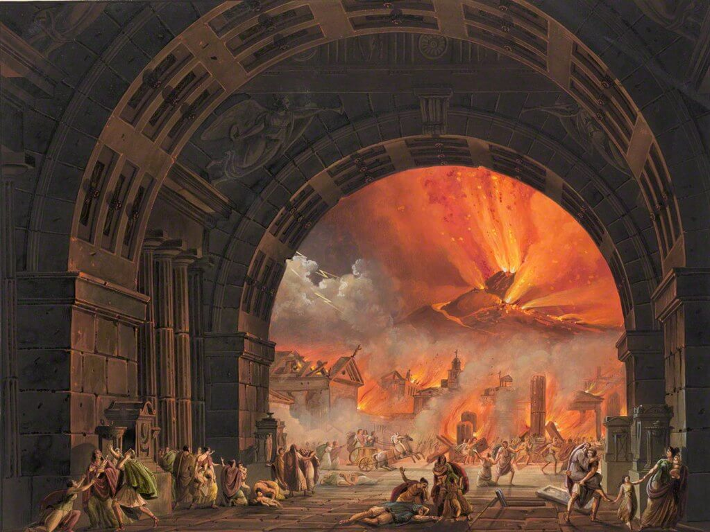

= Cōdex [1603:45:31]: Dictiōnāria de calamitātibus
:doctype: book
:title: Cōdex [1603:45:31]: Dictiōnāria de calamitātibus
:lang: la
:toc:
:toclevels: 4
:toc-title: Tabula contentorum
:table-caption: Tabula
:figure-caption: Pictūra
:example-caption: Exemplum
:last-update-label: Renovatio
:version-label: Versiō
:appendix-caption: Appendix
:source-highlighter: rouge
:warning-caption: Hic sunt dracones
:tip-caption: Commendātum

{nbsp} +
{nbsp} +
{nbsp} +
{nbsp} +
{nbsp} +
{nbsp} +
{nbsp} +
{nbsp} +
{nbsp} +
{nbsp} +
{nbsp} +
{nbsp} +
{nbsp} +
{nbsp} +
{nbsp} +
{nbsp} +
{nbsp} +
{nbsp} +
{nbsp} +
{nbsp} +
[quote]
/**Public domain means that each major common issue only needs to be resolved once**/@eng-Latn

<<<
toc::[]

[id=0_999_1603_1]
== Praefātiō 

[%header,cols="25h,~a"]
|===
|
Lingua de verba
|
Verba de conceptiō

|
Lingua Anglica (Abecedarium Latinum)
|
_**Cōdex [1603:45:31]**_ is the book format of the machine-readable dictionaries _**[1603:45:31] Dictiōnāria de calamitātibus**_, which are distributed for implementers on external applications. This book is intended as advanced resource for other lexicographers and terminology translators, including detect and report inconsistencies.

Practical lexicography is the art or craft of compiling, writing and editing dictionaries. The basics are not far different than a millennia ago: it is still a very humane, creative work. It is necessary to be humble: most of the translator's mistakes are, in fact, not translator's fault, but methodological flaws. Making sure of a source idea of what a concept represents, even if it means rewrite and make simpler, annex pictures, show examples, do whatever to make it be understood, makes even non-professional translators that care about their own language deliver better results than any alternative. In other words: even the so-called industry best practices of paying professional translators and reviewers cannot overcome already poorly explained source terms.

The initiative behind this compilation is also doing other dictionaries and accepts new suggestions of relevant topics on data exchange for humanitarian use. All have in common the fact that both have human translations and (if any) external interlingual codes related to each concept while making the end result explicitly already ready to be usable on average softwares. Naturally, each book version gives extensive explanations for collaborators on how to correct itself which become part of the next weekly release.

|===

[%header,cols="25h,~a"]
|===
|
Rēs interlinguālibus
|
Factum

|
scrīptor
|
EticaAI

|
/cōdex pūblicandī/
|
EticaAI

|
/publication date/@eng-Latn
|
2022-04-14

|
numerus editionis
|
2022-03-03T03:54:28

|
/SPDX license ID/@eng-Latn
|
CC0-1.0

|===

<<<

== Methodī ex cōdice
=== Methodī ex dictiōnāriōrum corde

[%header,cols="25h,~a"]
|===
|
Rēs interlinguālibus
|
Factum

|
/scope and content/@eng-Latn
|
The decision making behind the concepts of the dictionaries is based mostly on calamities (disasters) commonly cited on emergency response in humanitarian areas. When this is the case, the interlingual external codes will also be added to the concept.

The terminology translations are extracted from Wikidata, which means this recommended derived works periodically check for updates.

|===

=== Referentia
Referēns 1::
  /reference URL/@eng-Latn:::
    link:https://reliefweb.int/taxonomy-descriptions#disastertype[]
  Linguae multiplīs (Scrīptum incognitō):::
    /This URL (also recommended as vocabulary by https://vocabulary.unocha.org/) was used as base for initial bootstrapping. We may have more items/@eng-Latn

Referēns 2::
  /reference URL/@eng-Latn:::
    link:https://glidenumber.net/[]
  Linguae multiplīs (Scrīptum incognitō):::
    /The mentioned _GLIDE hazard code_ are used on this page as _event_/@eng-Latn

Referēns 3::
  /reference URL/@eng-Latn:::
    link:https://council.science/wp-content/uploads/2020/06/UNDRR_Hazard-Report_DIGITAL.pdf[]
  Linguae multiplīs (Scrīptum incognitō):::
    /This report (for now) is just a reference. However, it does have more candidates for this group of dictionaries (as long as we safely disambiguate them)/@eng-Latn

Referēns 4::
  /reference URL/@eng-Latn:::
    link:https://www.wikidata.org/wiki/Wikidata:WikiProject_Humanitarian_Wikidata[]
  Linguae multiplīs (Scrīptum incognitō):::
    Wikidata:WikiProject Humanitarian Wikidata. More volunteers are welcome!

=== Methodī ex verbīs in dictiōnāriīs
NOTE: /At the moment, there is no workflow to use https://www.wikidata.org/wiki/Wikidata:Lexicographical_data[Wikidata lexicographical data], which actually could be used as storage for stricter nomenclature. The current implementations use only Wikidata concepts, the Q-items./@eng-Latn

==== Methodī ex verbīs in Vicidata (Q modō)
[%header,cols="25h,~a"]
|===
|
Lingua de verba
|
Verba de conceptiō

|
Lingua Anglica (Abecedarium Latinum)
|
The ***[1603:45:31] Dictiōnāria de calamitātibus*** uses Wikidata as one strategy to conciliate language terms for one or more of it's concepts.

This means that this book, and related dictionaries data files require periodic updates to, at bare minimum, synchronize and re-share up to date translations.

|
Lingua Anglica (Abecedarium Latinum)
|
**How reliable are the community translations (Wikidata source)?**

The short, default answer is: **they are reliable**, even in cases of no authoritative translations for each subject.

As reference, it is likely a professional translator (without access to Wikipedia or Internal terminology bases of the control organizations) would deliver lower quality results if you do blind tests. This is possible because not just the average public, but even terminologists and professional translators help Wikipedia (and implicitly Wikidata).

However, even when the result is correct, the current version needs improved differentiation, at minimum, acronym and long form. For major organizations, features such as __P1813 short names__ exist, but are not yet compiled with the current dataset.

|
Lingua Anglica (Abecedarium Latinum)
|
**Major reasons for "wrong translations" are not translators fault**

TIP: As a rule of thumb, for already very defined concepts where you, as human, can manually verify one or more translated terms as a decent result, the other translations are likely to be acceptable. Dictionaries with edge cases (such as disputed territory names) would have further explanation.

The main reason for "wrong translations" are poorly defined concepts used to explain for community translators how to generate terminology translations. This would make existing translations from Wikidata (used not just by us) inconsistent. The second reason is if the dictionaries use translations for concepts without a strict match; in other words, if we make stricter definitions of what concept means but reuse Wikidada less exact terms. There are also issues when entire languages are encoded with wrong codes. Note that all these cases **wrong translations are strictly NOT translators fault, but lexicography fault**.

It is still possible to have strict translation level errors. But even if we point users how to correct Wikidata/Wikipedia (based on better contextual explanation of a concept, such as this book), the requirements to say the previous term was objectively a wrong human translation error (if following our seriousness on dictionary-building) are very high.

|
Lingua Anglica (Abecedarium Latinum)
|
From the point of view of data conciliation, the following methodology is used to release the terminology translations with the main concept table.

. The main handcrafted lexicographical table (explained on previous topic), also provided on `1603_45_31.no1.tm.hxl.csv`, may reference Wiki QID.
. Every unique QID of  `1603_45_31.no1.tm.hxl.csv`, together with language codes from [`1603:1:51`] (which requires knowing human languages), is used to prepare an SPARQL query optimized to run on https://query.wikidata.org/[Wikidata Query Service]. The query is so huge that it is not viable to "Try it" links (URL overlong), such https://www.wikidata.org/wiki/Wikidata:SPARQL_query_service/queries/examples[as what you would find on Wikidata Tutorials], ***but*** it works!
.. Note that the knowledge is free, the translations are there, but the multilingual humanitarian needs may lack people to prepare the files and shares then for general use.
. The query result, with all QIDs and term labels, is shared as `1603_45_31.wikiq.tm.hxl.csv`
. The community reviewed translations of each singular QID is pre-compiled on an individual file `1603_45_31.wikiq.tm.hxl.csv`
. `1603_45_31.no1.tm.hxl.csv` plus `1603_45_31.wikiq.tm.hxl.csv` created `1603_45_31.no11.tm.hxl.csv`

|===

=== Rēs dē factō in dictiōnāriīs
==== Concepta: 25

==== Rēs linguālibus: 112

[%header,cols="15h,25a,~,15"]
|===
|
Cōdex linguae
|
Glotto cōdicī +++ +++ ISO 639-3 +++ +++ Wiki QID cōdicī
|
Nōmen Latīnum
|
Concepta

|
mul-Zyyy
|

+++ +++
https://iso639-3.sil.org/code/mul[mul]
+++ +++ 
|
Linguae multiplīs (Scrīptum incognitō)
|
25

|
ara-Arab
|
https://glottolog.org/resource/languoid/id/arab1395[arab1395]
+++ +++
https://iso639-3.sil.org/code/ara[ara]
+++ +++ https://www.wikidata.org/wiki/Q13955[Q13955]
|
Macrolingua Arabica (/Abecedarium Arabicum/)
|
23

|
hye-Armn
|
https://glottolog.org/resource/languoid/id/nucl1235[nucl1235]
+++ +++
https://iso639-3.sil.org/code/hye[hye]
+++ +++ https://www.wikidata.org/wiki/Q8785[Q8785]
|
Lingua Armenia (Alphabetum Armenium)
|
18

|
ben-Beng
|
https://glottolog.org/resource/languoid/id/beng1280[beng1280]
+++ +++
https://iso639-3.sil.org/code/ben[ben]
+++ +++ https://www.wikidata.org/wiki/Q9610[Q9610]
|
Lingua Bengali (/Bengali script/)
|
19

|
rus-Cyrl
|
https://glottolog.org/resource/languoid/id/russ1263[russ1263]
+++ +++
https://iso639-3.sil.org/code/rus[rus]
+++ +++ https://www.wikidata.org/wiki/Q7737[Q7737]
|
Lingua Russica (Abecedarium Cyrillicum)
|
24

|
hin-Deva
|
https://glottolog.org/resource/languoid/id/hind1269[hind1269]
+++ +++
https://iso639-3.sil.org/code/hin[hin]
+++ +++ https://www.wikidata.org/wiki/Q1568[Q1568]
|
Lingua Hindica (Devanāgarī)
|
20

|
kan-Knda
|
https://glottolog.org/resource/languoid/id/nucl1305[nucl1305]
+++ +++
https://iso639-3.sil.org/code/kan[kan]
+++ +++ https://www.wikidata.org/wiki/Q33673[Q33673]
|
Lingua Cannadica (/ISO 15924 Knda/)
|
10

|
kor-Hang
|
https://glottolog.org/resource/languoid/id/kore1280[kore1280]
+++ +++
https://iso639-3.sil.org/code/kor[kor]
+++ +++ https://www.wikidata.org/wiki/Q9176[Q9176]
|
Lingua Coreana (Abecedarium Coreanum)
|
22

|
lzh-Hant
|
https://glottolog.org/resource/languoid/id/lite1248[lite1248]
+++ +++
https://iso639-3.sil.org/code/lzh[lzh]
+++ +++ https://www.wikidata.org/wiki/Q37041[Q37041]
|
Lingua Sinica classica (/ISO 15924 Hant/)
|
7

|
heb-Hebr
|
https://glottolog.org/resource/languoid/id/hebr1245[hebr1245]
+++ +++
https://iso639-3.sil.org/code/heb[heb]
+++ +++ https://www.wikidata.org/wiki/Q9288[Q9288]
|
Lingua Hebraica (Alphabetum Hebraicum)
|
22

|
lat-Latn
|
https://glottolog.org/resource/languoid/id/lati1261[lati1261]
+++ +++
https://iso639-3.sil.org/code/lat[lat]
+++ +++ https://www.wikidata.org/wiki/Q397[Q397]
|
Lingua Latina (Abecedarium Latinum)
|
13

|
tam-Taml
|
https://glottolog.org/resource/languoid/id/tami1289[tami1289]
+++ +++
https://iso639-3.sil.org/code/tam[tam]
+++ +++ https://www.wikidata.org/wiki/Q5885[Q5885]
|
Lingua Tamulica (/ISO 15924 Taml/)
|
15

|
tel-Telu
|
https://glottolog.org/resource/languoid/id/telu1262[telu1262]
+++ +++
https://iso639-3.sil.org/code/tel[tel]
+++ +++ https://www.wikidata.org/wiki/Q8097[Q8097]
|
Lingua Telingana (/ISO 15924 Telu/)
|
12

|
tha-Thai
|
https://glottolog.org/resource/languoid/id/thai1261[thai1261]
+++ +++
https://iso639-3.sil.org/code/tha[tha]
+++ +++ https://www.wikidata.org/wiki/Q9217[Q9217]
|
Lingua Thai (/ISO 15924 Thai/)
|
16

|
san-Zzzz
|
https://glottolog.org/resource/languoid/id/sans1269[sans1269]
+++ +++
https://iso639-3.sil.org/code/san[san]
+++ +++ https://www.wikidata.org/wiki/Q11059[Q11059]
|
Lingua Sanscrita  (?)
|
7

|
zho-Zzzz
|
https://glottolog.org/resource/languoid/id/sini1245[sini1245]
+++ +++
https://iso639-3.sil.org/code/zho[zho]
+++ +++ https://www.wikidata.org/wiki/Q7850[Q7850]
|
/Macrolingua Sinicae (?)/
|
25

|
por-Latn
|
https://glottolog.org/resource/languoid/id/port1283[port1283]
+++ +++
https://iso639-3.sil.org/code/por[por]
+++ +++ https://www.wikidata.org/wiki/Q5146[Q5146]
|
Lingua Lusitana (Abecedarium Latinum)
|
24

|
eng-Latn
|
https://glottolog.org/resource/languoid/id/stan1293[stan1293]
+++ +++
https://iso639-3.sil.org/code/eng[eng]
+++ +++ https://www.wikidata.org/wiki/Q1860[Q1860]
|
Lingua Anglica (Abecedarium Latinum)
|
25

|
fra-Latn
|
https://glottolog.org/resource/languoid/id/stan1290[stan1290]
+++ +++
https://iso639-3.sil.org/code/fra[fra]
+++ +++ https://www.wikidata.org/wiki/Q150[Q150]
|
Lingua Francogallica (Abecedarium Latinum)
|
25

|
nld-Latn
|
https://glottolog.org/resource/languoid/id/mode1257[mode1257]
+++ +++
https://iso639-3.sil.org/code/nld[nld]
+++ +++ https://www.wikidata.org/wiki/Q7411[Q7411]
|
Lingua Batavica (Abecedarium Latinum)
|
25

|
deu-Latn
|
https://glottolog.org/resource/languoid/id/stan1295[stan1295]
+++ +++
https://iso639-3.sil.org/code/deu[deu]
+++ +++ https://www.wikidata.org/wiki/Q188[Q188]
|
Lingua Germanica (Abecedarium Latinum)
|
24

|
spa-Latn
|
https://glottolog.org/resource/languoid/id/stan1288[stan1288]
+++ +++
https://iso639-3.sil.org/code/spa[spa]
+++ +++ https://www.wikidata.org/wiki/Q1321[Q1321]
|
Lingua Hispanica (Abecedarium Latinum)
|
25

|
ita-Latn
|
https://glottolog.org/resource/languoid/id/ital1282[ital1282]
+++ +++
https://iso639-3.sil.org/code/ita[ita]
+++ +++ https://www.wikidata.org/wiki/Q652[Q652]
|
Lingua Italiana (Abecedarium Latinum)
|
23

|
gle-Latn
|
https://glottolog.org/resource/languoid/id/iris1253[iris1253]
+++ +++
https://iso639-3.sil.org/code/gle[gle]
+++ +++ https://www.wikidata.org/wiki/Q9142[Q9142]
|
Lingua Hibernica (Abecedarium Latinum)
|
17

|
swe-Latn
|
https://glottolog.org/resource/languoid/id/swed1254[swed1254]
+++ +++
https://iso639-3.sil.org/code/swe[swe]
+++ +++ https://www.wikidata.org/wiki/Q9027[Q9027]
|
Lingua Suecica (Abecedarium Latinum)
|
22

|
ceb-Latn
|
https://glottolog.org/resource/languoid/id/cebu1242[cebu1242]
+++ +++
https://iso639-3.sil.org/code/ceb[ceb]
+++ +++ https://www.wikidata.org/wiki/Q33239[Q33239]
|
Lingua Caebuana (Abecedarium Latinum)
|
3

|
sqi-Latn
|
https://glottolog.org/resource/languoid/id/alba1267[alba1267]
+++ +++
https://iso639-3.sil.org/code/sqi[sqi]
+++ +++ https://www.wikidata.org/wiki/Q8748[Q8748]
|
Macrolingua Albanica (/Abecedarium Latinum/)
|
5

|
pol-Latn
|
https://glottolog.org/resource/languoid/id/poli1260[poli1260]
+++ +++
https://iso639-3.sil.org/code/pol[pol]
+++ +++ https://www.wikidata.org/wiki/Q809[Q809]
|
Lingua Polonica (Abecedarium Latinum)
|
22

|
fin-Latn
|
https://glottolog.org/resource/languoid/id/finn1318[finn1318]
+++ +++
https://iso639-3.sil.org/code/fin[fin]
+++ +++ https://www.wikidata.org/wiki/Q1412[Q1412]
|
Lingua Finnica (Abecedarium Latinum)
|
21

|
ron-Latn
|
https://glottolog.org/resource/languoid/id/roma1327[roma1327]
+++ +++
https://iso639-3.sil.org/code/ron[ron]
+++ +++ https://www.wikidata.org/wiki/Q7913[Q7913]
|
Lingua Dacoromanica (Abecedarium Latinum)
|
21

|
vie-Latn
|
https://glottolog.org/resource/languoid/id/viet1252[viet1252]
+++ +++
https://iso639-3.sil.org/code/vie[vie]
+++ +++ https://www.wikidata.org/wiki/Q9199[Q9199]
|
Lingua Vietnamensis (Abecedarium Latinum)
|
22

|
cat-Latn
|
https://glottolog.org/resource/languoid/id/stan1289[stan1289]
+++ +++
https://iso639-3.sil.org/code/cat[cat]
+++ +++ https://www.wikidata.org/wiki/Q7026[Q7026]
|
Lingua Catalana (Abecedarium Latinum)
|
25

|
ukr-Cyrl
|
https://glottolog.org/resource/languoid/id/ukra1253[ukra1253]
+++ +++
https://iso639-3.sil.org/code/ukr[ukr]
+++ +++ https://www.wikidata.org/wiki/Q8798[Q8798]
|
Lingua Ucrainica (Abecedarium Cyrillicum)
|
22

|
bul-Cyrl
|
https://glottolog.org/resource/languoid/id/bulg1262[bulg1262]
+++ +++
https://iso639-3.sil.org/code/bul[bul]
+++ +++ https://www.wikidata.org/wiki/Q7918[Q7918]
|
Lingua Bulgarica (Abecedarium Cyrillicum)
|
15

|
slv-Latn
|
https://glottolog.org/resource/languoid/id/slov1268[slov1268]
+++ +++
https://iso639-3.sil.org/code/slv[slv]
+++ +++ https://www.wikidata.org/wiki/Q9063[Q9063]
|
Lingua Slovena (Abecedarium Latinum)
|
17

|
war-Latn
|
https://glottolog.org/resource/languoid/id/wara1300[wara1300]
+++ +++
https://iso639-3.sil.org/code/war[war]
+++ +++ https://www.wikidata.org/wiki/Q34279[Q34279]
|
/Waray language/ (Abecedarium Latinum)
|
11

|
nob-Latn
|
https://glottolog.org/resource/languoid/id/norw1259[norw1259]
+++ +++
https://iso639-3.sil.org/code/nob[nob]
+++ +++ https://www.wikidata.org/wiki/Q25167[Q25167]
|
/Bokmål/ (Abecedarium Latinum)
|
23

|
ces-Latn
|
https://glottolog.org/resource/languoid/id/czec1258[czec1258]
+++ +++
https://iso639-3.sil.org/code/ces[ces]
+++ +++ https://www.wikidata.org/wiki/Q9056[Q9056]
|
Lingua Bohemica (Abecedarium Latinum)
|
22

|
dan-Latn
|
https://glottolog.org/resource/languoid/id/dani1285[dani1285]
+++ +++
https://iso639-3.sil.org/code/dan[dan]
+++ +++ https://www.wikidata.org/wiki/Q9035[Q9035]
|
Lingua Danica (Abecedarium Latinum)
|
20

|
jpn-Jpan
|
https://glottolog.org/resource/languoid/id/nucl1643[nucl1643]
+++ +++
https://iso639-3.sil.org/code/jpn[jpn]
+++ +++ https://www.wikidata.org/wiki/Q5287[Q5287]
|
Lingua Iaponica (Scriptura Iaponica)
|
25

|
nno-Latn
|
https://glottolog.org/resource/languoid/id/norw1262[norw1262]
+++ +++
https://iso639-3.sil.org/code/nno[nno]
+++ +++ https://www.wikidata.org/wiki/Q25164[Q25164]
|
/Nynorsk/ (Abecedarium Latinum)
|
20

|
mal-Mlym
|
https://glottolog.org/resource/languoid/id/mala1464[mala1464]
+++ +++
https://iso639-3.sil.org/code/mal[mal]
+++ +++ https://www.wikidata.org/wiki/Q36236[Q36236]
|
Lingua Malabarica (/Malayalam script/)
|
17

|
ind-Latn
|
https://glottolog.org/resource/languoid/id/indo1316[indo1316]
+++ +++
https://iso639-3.sil.org/code/ind[ind]
+++ +++ https://www.wikidata.org/wiki/Q9240[Q9240]
|
Lingua Indonesiana (Abecedarium Latinum)
|
25

|
fas-Zzzz
|

+++ +++
https://iso639-3.sil.org/code/fas[fas]
+++ +++ https://www.wikidata.org/wiki/Q9168[Q9168]
|
Macrolingua Persica (//Abecedarium Arabicum//)
|
22

|
hun-Latn
|
https://glottolog.org/resource/languoid/id/hung1274[hung1274]
+++ +++
https://iso639-3.sil.org/code/hun[hun]
+++ +++ https://www.wikidata.org/wiki/Q9067[Q9067]
|
Lingua Hungarica (Abecedarium Latinum)
|
19

|
eus-Latn
|
https://glottolog.org/resource/languoid/id/basq1248[basq1248]
+++ +++
https://iso639-3.sil.org/code/eus[eus]
+++ +++ https://www.wikidata.org/wiki/Q8752[Q8752]
|
Lingua Vasconica (Abecedarium Latinum)
|
19

|
cym-Latn
|
https://glottolog.org/resource/languoid/id/wels1247[wels1247]
+++ +++
https://iso639-3.sil.org/code/cym[cym]
+++ +++ https://www.wikidata.org/wiki/Q9309[Q9309]
|
Lingua Cambrica (Abecedarium Latinum)
|
15

|
glg-Latn
|
https://glottolog.org/resource/languoid/id/gali1258[gali1258]
+++ +++
https://iso639-3.sil.org/code/glg[glg]
+++ +++ https://www.wikidata.org/wiki/Q9307[Q9307]
|
Lingua Gallaica (Abecedarium Latinum)
|
17

|
slk-Latn
|
https://glottolog.org/resource/languoid/id/slov1269[slov1269]
+++ +++
https://iso639-3.sil.org/code/slk[slk]
+++ +++ https://www.wikidata.org/wiki/Q9058[Q9058]
|
Lingua Slovaca (Abecedarium Latinum)
|
16

|
epo-Latn
|
https://glottolog.org/resource/languoid/id/espe1235[espe1235]
+++ +++
https://iso639-3.sil.org/code/epo[epo]
+++ +++ https://www.wikidata.org/wiki/Q143[Q143]
|
Lingua Esperantica (Abecedarium Latinum)
|
25

|
msa-Zzzz
|

+++ +++
https://iso639-3.sil.org/code/msa[msa]
+++ +++ https://www.wikidata.org/wiki/Q9237[Q9237]
|
Macrolingua Malayana (?)
|
19

|
est-Latn
|

+++ +++
https://iso639-3.sil.org/code/est[est]
+++ +++ https://www.wikidata.org/wiki/Q9072[Q9072]
|
Macrolingua Estonica (Abecedarium Latinum)
|
19

|
hrv-Latn
|
https://glottolog.org/resource/languoid/id/croa1245[croa1245]
+++ +++
https://iso639-3.sil.org/code/hrv[hrv]
+++ +++ https://www.wikidata.org/wiki/Q6654[Q6654]
|
Lingua Croatica (Abecedarium Latinum)
|
17

|
tur-Latn
|
https://glottolog.org/resource/languoid/id/nucl1301[nucl1301]
+++ +++
https://iso639-3.sil.org/code/tur[tur]
+++ +++ https://www.wikidata.org/wiki/Q256[Q256]
|
Lingua Turcica (Abecedarium Latinum)
|
20

|
nds-Latn
|
https://glottolog.org/resource/languoid/id/lowg1239[lowg1239]
+++ +++
https://iso639-3.sil.org/code/nds[nds]
+++ +++ https://www.wikidata.org/wiki/Q25433[Q25433]
|
Lingua Saxonica (Abecedarium Latinum)
|
9

|
oci-Latn
|
https://glottolog.org/resource/languoid/id/occi1239[occi1239]
+++ +++
https://iso639-3.sil.org/code/oci[oci]
+++ +++ https://www.wikidata.org/wiki/Q14185[Q14185]
|
Lingua Occitana (Abecedarium Latinum)
|
15

|
bre-Latn
|
https://glottolog.org/resource/languoid/id/bret1244[bret1244]
+++ +++
https://iso639-3.sil.org/code/bre[bre]
+++ +++ https://www.wikidata.org/wiki/Q12107[Q12107]
|
Lingua Britonica (Abecedarium Latinum)
|
7

|
arz-Latn
|
https://glottolog.org/resource/languoid/id/egyp1253[egyp1253]
+++ +++
https://iso639-3.sil.org/code/arz[arz]
+++ +++ https://www.wikidata.org/wiki/Q29919[Q29919]
|
/Egyptian Arabic/ (/Abecedarium Arabicum/)
|
3

|
afr-Latn
|
https://glottolog.org/resource/languoid/id/afri1274[afri1274]
+++ +++
https://iso639-3.sil.org/code/afr[afr]
+++ +++ https://www.wikidata.org/wiki/Q14196[Q14196]
|
Lingua Batava Capitensis (Abecedarium Latinum)
|
13

|
ltz-Latn
|
https://glottolog.org/resource/languoid/id/luxe1241[luxe1241]
+++ +++
https://iso639-3.sil.org/code/ltz[ltz]
+++ +++ https://www.wikidata.org/wiki/Q9051[Q9051]
|
Lingua Luxemburgensis (Abecedarium Latinum)
|
7

|
sco-Latn
|
https://glottolog.org/resource/languoid/id/scot1243[scot1243]
+++ +++
https://iso639-3.sil.org/code/sco[sco]
+++ +++ https://www.wikidata.org/wiki/Q14549[Q14549]
|
Lingua Scotica quae Teutonica (Abecedarium Latinum)
|
8

|
bar-Latn
|
https://glottolog.org/resource/languoid/id/bava1246[bava1246]
+++ +++
https://iso639-3.sil.org/code/bar[bar]
+++ +++ https://www.wikidata.org/wiki/Q29540[Q29540]
|
Lingua Bavarica (Abecedarium Latinum)
|
7

|
arg-Latn
|
https://glottolog.org/resource/languoid/id/arag1245[arag1245]
+++ +++
https://iso639-3.sil.org/code/arg[arg]
+++ +++ https://www.wikidata.org/wiki/Q8765[Q8765]
|
Lingua Aragonensis (Abecedarium Latinum)
|
12

|
zho-Hant
|

+++ +++
https://iso639-3.sil.org/code/zho[zho]
+++ +++ https://www.wikidata.org/wiki/Q18130932[Q18130932]
|
//Traditional Chinese// (/ISO 15924 Hant/)
|
19

|
pap-Latn
|
https://glottolog.org/resource/languoid/id/papi1253[papi1253]
+++ +++
https://iso639-3.sil.org/code/pap[pap]
+++ +++ https://www.wikidata.org/wiki/Q33856[Q33856]
|
/lingua Papiamentica/ (Abecedarium Latinum)
|
5

|
cos-Latn
|
https://glottolog.org/resource/languoid/id/cors1241[cors1241]
+++ +++
https://iso639-3.sil.org/code/cos[cos]
+++ +++ https://www.wikidata.org/wiki/Q33111[Q33111]
|
Lingua Corsica (Abecedarium Latinum)
|
2

|
gsw-Latn
|
https://glottolog.org/resource/languoid/id/swis1247[swis1247]
+++ +++
https://iso639-3.sil.org/code/gsw[gsw]
+++ +++ https://www.wikidata.org/wiki/Q131339[Q131339]
|
Dialecti Alemannicae (Abecedarium Latinum)
|
9

|
isl-Latn
|
https://glottolog.org/resource/languoid/id/icel1247[icel1247]
+++ +++
https://iso639-3.sil.org/code/isl[isl]
+++ +++ https://www.wikidata.org/wiki/Q294[Q294]
|
Lingua Islandica (Abecedarium Latinum)
|
17

|
min-Latn
|
https://glottolog.org/resource/languoid/id/mina1268[mina1268]
+++ +++
https://iso639-3.sil.org/code/min[min]
+++ +++ https://www.wikidata.org/wiki/Q13324[Q13324]
|
/Minangkabau language/ (Abecedarium Latinum)
|
3

|
roh-Latn
|
https://glottolog.org/resource/languoid/id/roma1326[roma1326]
+++ +++
https://iso639-3.sil.org/code/roh[roh]
+++ +++ https://www.wikidata.org/wiki/Q13199[Q13199]
|
Lingua Rhaetica (Abecedarium Latinum)
|
2

|
vec-Latn
|
https://glottolog.org/resource/languoid/id/vene1258[vene1258]
+++ +++
https://iso639-3.sil.org/code/vec[vec]
+++ +++ https://www.wikidata.org/wiki/Q32724[Q32724]
|
Lingua Veneta (Abecedarium Latinum)
|
11

|
pms-Latn
|
https://glottolog.org/resource/languoid/id/piem1238[piem1238]
+++ +++
https://iso639-3.sil.org/code/pms[pms]
+++ +++ https://www.wikidata.org/wiki/Q15085[Q15085]
|
Lingua Pedemontana (Abecedarium Latinum)
|
1

|
scn-Latn
|
https://glottolog.org/resource/languoid/id/sici1248[sici1248]
+++ +++
https://iso639-3.sil.org/code/scn[scn]
+++ +++ https://www.wikidata.org/wiki/Q33973[Q33973]
|
Lingua Sicula (Abecedarium Latinum)
|
11

|
srd-Latn
|

+++ +++
https://iso639-3.sil.org/code/srd[srd]
+++ +++ https://www.wikidata.org/wiki/Q33976[Q33976]
|
Macrolingua Sarda (Abecedarium Latinum)
|
4

|
gla-Latn
|
https://glottolog.org/resource/languoid/id/scot1245[scot1245]
+++ +++
https://iso639-3.sil.org/code/gla[gla]
+++ +++ https://www.wikidata.org/wiki/Q9314[Q9314]
|
Lingua Scotica seu Scotica Gadelica (Abecedarium Latinum)
|
4

|
lim-Latn
|
https://glottolog.org/resource/languoid/id/limb1263[limb1263]
+++ +++
https://iso639-3.sil.org/code/lim[lim]
+++ +++ https://www.wikidata.org/wiki/Q102172[Q102172]
|
Lingua Limburgica (Abecedarium Latinum)
|
8

|
wln-Latn
|
https://glottolog.org/resource/languoid/id/wall1255[wall1255]
+++ +++
https://iso639-3.sil.org/code/wln[wln]
+++ +++ https://www.wikidata.org/wiki/Q34219[Q34219]
|
Lingua Vallonica
|
9

|
srp-Latn
|
https://glottolog.org/resource/languoid/id/serb1264[serb1264]
+++ +++
https://iso639-3.sil.org/code/srp[srp]
+++ +++ https://www.wikidata.org/wiki/Q21161949[Q21161949]
|
/Serbian/ (Abecedarium Latinum)
|
8

|
vls-Latn
|
https://glottolog.org/resource/languoid/id/vlaa1240[vlaa1240]
+++ +++
https://iso639-3.sil.org/code/vls[vls]
+++ +++ https://www.wikidata.org/wiki/Q100103[Q100103]
|
/West Flemish/ (Abecedarium Latinum)
|
2

|
nap-Latn
|
https://glottolog.org/resource/languoid/id/neap1235[neap1235]
+++ +++
https://iso639-3.sil.org/code/nap[nap]
+++ +++ https://www.wikidata.org/wiki/Q33845[Q33845]
|
Lingua Neapolitana (Abecedarium Latinum)
|
3

|
lij-Latn
|
https://glottolog.org/resource/languoid/id/ligu1248[ligu1248]
+++ +++
https://iso639-3.sil.org/code/lij[lij]
+++ +++ https://www.wikidata.org/wiki/Q36106[Q36106]
|
Lingua Ligustica (Abecedarium Latinum)
|
1

|
fur-Latn
|
https://glottolog.org/resource/languoid/id/friu1240[friu1240]
+++ +++
https://iso639-3.sil.org/code/fur[fur]
+++ +++ https://www.wikidata.org/wiki/Q33441[Q33441]
|
Lingua Foroiuliensis (Abecedarium Latinum)
|
2

|
pcd-Latn
|
https://glottolog.org/resource/languoid/id/pica1241[pica1241]
+++ +++
https://iso639-3.sil.org/code/pcd[pcd]
+++ +++ https://www.wikidata.org/wiki/Q34024[Q34024]
|
Lingua Picardica (Abecedarium Latinum)
|
2

|
wol-Latn
|
https://glottolog.org/resource/languoid/id/nucl1347[nucl1347]
+++ +++
https://iso639-3.sil.org/code/wol[wol]
+++ +++ https://www.wikidata.org/wiki/Q34257[Q34257]
|
/Wolof language/ (Abecedarium Latinum)
|
1

|
kon-Latn
|

+++ +++
https://iso639-3.sil.org/code/kon[kon]
+++ +++ https://www.wikidata.org/wiki/Q33702[Q33702]
|
/Kongo macrolanguage/ (Abecedarium Latinum)
|
1

|
frp-Latn
|
https://glottolog.org/resource/languoid/id/fran1260[fran1260]
+++ +++
https://iso639-3.sil.org/code/frp[frp]
+++ +++ https://www.wikidata.org/wiki/Q15087[Q15087]
|
Lingua Arpitanica
|
2

|
wuu-Zyyy
|
https://glottolog.org/resource/languoid/id/wuch1236[wuch1236]
+++ +++
https://iso639-3.sil.org/code/wuu[wuu]
+++ +++ https://www.wikidata.org/wiki/Q34290[Q34290]
|
//Macrolingua Wu// (/ISO 15924 Zyyy/)
|
17

|
srp-Cyrl
|
https://glottolog.org/resource/languoid/id/serb1264[serb1264]
+++ +++
https://iso639-3.sil.org/code/srp[srp]
+++ +++ https://www.wikidata.org/wiki/Q9299[Q9299]
|
Lingua Serbica (Abecedarium Cyrillicum)
|
20

|
urd-Arab
|
https://glottolog.org/resource/languoid/id/urdu1245[urdu1245]
+++ +++
https://iso639-3.sil.org/code/urd[urd]
+++ +++ https://www.wikidata.org/wiki/Q1617[Q1617]
|
Lingua Urdu (/Abecedarium Arabicum/)
|
13

|
gan-Zyyy
|
https://glottolog.org/resource/languoid/id/ganc1239[ganc1239]
+++ +++
https://iso639-3.sil.org/code/gan[gan]
+++ +++ https://www.wikidata.org/wiki/Q33475[Q33475]
|
Lingua Gan (/ISO 15924 Zyyy/)
|
5

|
lit-Latn
|
https://glottolog.org/resource/languoid/id/lith1251[lith1251]
+++ +++
https://iso639-3.sil.org/code/lit[lit]
+++ +++ https://www.wikidata.org/wiki/Q9083[Q9083]
|
Lingua Lithuanica (Abecedarium Latinum)
|
17

|
hbs-Latn
|
https://glottolog.org/resource/languoid/id/sout1528[sout1528]
+++ +++
https://iso639-3.sil.org/code/hbs[hbs]
+++ +++ https://www.wikidata.org/wiki/Q9301[Q9301]
|
Macrolingua Serbocroatica (Abecedarium Latinum)
|
16

|
lav-Latn
|
https://glottolog.org/resource/languoid/id/latv1249[latv1249]
+++ +++
https://iso639-3.sil.org/code/lav[lav]
+++ +++ https://www.wikidata.org/wiki/Q9078[Q9078]
|
Macrolingua Lettonica (Abecedarium Latinum)
|
16

|
bos-Latn
|
https://glottolog.org/resource/languoid/id/bosn1245[bosn1245]
+++ +++
https://iso639-3.sil.org/code/bos[bos]
+++ +++ https://www.wikidata.org/wiki/Q9303[Q9303]
|
Lingua Bosnica (Abecedarium Latinum)
|
14

|
srn-Latn
|
https://glottolog.org/resource/languoid/id/sran1240[sran1240]
+++ +++
https://iso639-3.sil.org/code/srn[srn]
+++ +++ https://www.wikidata.org/wiki/Q33989[Q33989]
|
/Sranan Tongo/ (Abecedarium Latinum)
|
1

|
azb-Arab
|
https://glottolog.org/resource/languoid/id/sout2697[sout2697]
+++ +++
https://iso639-3.sil.org/code/azb[azb]
+++ +++ https://www.wikidata.org/wiki/Q3449805[Q3449805]
|
/South Azerbaijani/ (/Abecedarium Arabicum/)
|
5

|
jav-Latn
|
https://glottolog.org/resource/languoid/id/java1254[java1254]
+++ +++
https://iso639-3.sil.org/code/jav[jav]
+++ +++ https://www.wikidata.org/wiki/Q33549[Q33549]
|
Lingua Iavanica (Abecedarium Latinum)
|
6

|
ell-Grek
|
https://glottolog.org/resource/languoid/id/mode1248[mode1248]
+++ +++
https://iso639-3.sil.org/code/ell[ell]
+++ +++ https://www.wikidata.org/wiki/Q36510[Q36510]
|
Lingua Neograeca (Alphabetum Graecum)
|
19

|
sun-Latn
|
https://glottolog.org/resource/languoid/id/sund1252[sund1252]
+++ +++
https://iso639-3.sil.org/code/sun[sun]
+++ +++ https://www.wikidata.org/wiki/Q34002[Q34002]
|
/Sundanese language/ (Abecedarium Latinum)
|
6

|
fry-Latn
|
https://glottolog.org/resource/languoid/id/west2354[west2354]
+++ +++
https://iso639-3.sil.org/code/fry[fry]
+++ +++ https://www.wikidata.org/wiki/Q27175[Q27175]
|
Lingua Frisice occidentalis (Abecedarium Latinum)
|
16

|
ace-Latn
|
https://glottolog.org/resource/languoid/id/achi1257[achi1257]
+++ +++
https://iso639-3.sil.org/code/ace[ace]
+++ +++ https://www.wikidata.org/wiki/Q27683[Q27683]
|
/Acehnese language/ (Abecedarium Latinum)
|
1

|
jam-Latn
|
https://glottolog.org/resource/languoid/id/jama1262[jama1262]
+++ +++
https://iso639-3.sil.org/code/jam[jam]
+++ +++ https://www.wikidata.org/wiki/Q35939[Q35939]
|
Lingua creola Iamaicana (Abecedarium Latinum)
|
3

|
che-Cyrl
|
https://glottolog.org/resource/languoid/id/chec1245[chec1245]
+++ +++
https://iso639-3.sil.org/code/che[che]
+++ +++ https://www.wikidata.org/wiki/Q33350[Q33350]
|
Lingua Tsetsenica (Abecedarium Cyrillicum)
|
2

|
bel-Cyrl
|
https://glottolog.org/resource/languoid/id/bela1254[bela1254]
+++ +++
https://iso639-3.sil.org/code/bel[bel]
+++ +++ https://www.wikidata.org/wiki/Q9091[Q9091]
|
Lingua Ruthenica Alba (Abecedarium Cyrillicum)
|
16

|
kab-Latn
|
https://glottolog.org/resource/languoid/id/kaby1243[kaby1243]
+++ +++
https://iso639-3.sil.org/code/kab[kab]
+++ +++ https://www.wikidata.org/wiki/Q35853[Q35853]
|
/Kabyle language/ (Abecedarium Latinum)
|
5

|
fao-Latn
|
https://glottolog.org/resource/languoid/id/faro1244[faro1244]
+++ +++
https://iso639-3.sil.org/code/fao[fao]
+++ +++ https://www.wikidata.org/wiki/Q25258[Q25258]
|
Lingua Faeroensis (Abecedarium Latinum)
|
5

|
lmo-Latn
|
https://glottolog.org/resource/languoid/id/lomb1257[lomb1257]
+++ +++
https://iso639-3.sil.org/code/lmo[lmo]
+++ +++ https://www.wikidata.org/wiki/Q33754[Q33754]
|
Langobardus sermo (Abecedarium Latinum)
|
5

|
mar-Deva
|
https://glottolog.org/resource/languoid/id/mara1378[mara1378]
+++ +++
https://iso639-3.sil.org/code/mar[mar]
+++ +++ https://www.wikidata.org/wiki/Q1571[Q1571]
|
Lingua Marathica (Devanāgarī)
|
14

|
vol-Latn
|
https://glottolog.org/resource/languoid/id/vola1234[vola1234]
+++ +++
https://iso639-3.sil.org/code/vol[vol]
+++ +++ https://www.wikidata.org/wiki/Q36986[Q36986]
|
Volapük (Abecedarium Latinum)
|
1

|
ina-Latn
|
https://glottolog.org/resource/languoid/id/inte1239[inte1239]
+++ +++
https://iso639-3.sil.org/code/ina[ina]
+++ +++ https://www.wikidata.org/wiki/Q35934[Q35934]
|
Interlingua (Abecedarium Latinum)
|
11

|
ile-Latn
|
https://glottolog.org/resource/languoid/id/inte1260[inte1260]
+++ +++
https://iso639-3.sil.org/code/ile[ile]
+++ +++ https://www.wikidata.org/wiki/Q35850[Q35850]
|
Lingua Occidental (Abecedarium Latinum)
|
2

|
zul-Latn
|
https://glottolog.org/resource/languoid/id/zulu1248[zulu1248]
+++ +++
https://iso639-3.sil.org/code/zul[zul]
+++ +++ https://www.wikidata.org/wiki/Q10179[Q10179]
|
Lingua Zuluana (Abecedarium Latinum)
|
2

|===

==== Rēs interlinguālibus: 9
[%header,cols="25h,~a"]
|===
|
Lingua de verba
|
Verba de conceptiō

|
Lingua Anglica (Abecedarium Latinum)
|
The result of this section is a preview. We're aware it is not well formatted for a book format. Sorry for the temporary inconvenience.

|===

/Wiki QID/::
#item+rem+i_qcc+is_zxxx+ix_regulam::: Q[1-9]\d*
#item+rem+i_qcc+is_zxxx+ix_hxlix::: ix_wikiq
#item+rem+i_qcc+is_zxxx+ix_hxlvoc::: v_wiki_q
#item+rem+definitionem+i_eng+is_latn::: QID (or Q number) is the unique identifier of a data item on Wikidata, comprising the letter "Q" followed by one or more digits. It is used to help people and machines understand the difference between items with the same or similar names e.g there are several places in the world called London and many people called James Smith. This number appears next to the name at the top of each Wikidata item.

/GLIDE hazard code/::
#item+rem+i_qcc+is_zxxx+ix_hxlix::: ix_glidehc

scrīptor::
#item+rem+i_qcc+is_zxxx+ix_wikip::: P50
#item+rem+i_qcc+is_zxxx+ix_hxlix::: ix_wikip50
#item+rem+i_qcc+is_zxxx+ix_hxlvoc::: v_wiki_p_50
#item+rem+definitionem+i_eng+is_latn::: Main creator(s) of a written work (use on works, not humans)

/cōdex pūblicandī/::
#item+rem+i_qcc+is_zxxx+ix_wikip::: P123
#item+rem+i_qcc+is_zxxx+ix_hxlix::: ix_wikip123
#item+rem+i_qcc+is_zxxx+ix_hxlvoc::: v_wiki_p_123
#item+rem+definitionem+i_eng+is_latn::: organization or person responsible for publishing books, periodicals, printed music, podcasts, games or software

numerus editionis::
#item+rem+i_qcc+is_zxxx+ix_wikip::: P393
#item+rem+i_qcc+is_zxxx+ix_hxlix::: ix_wikip393
#item+rem+i_qcc+is_zxxx+ix_hxlvoc::: v_wiki_p_393
#item+rem+definitionem+i_eng+is_latn::: number of an edition (first, second, ... as 1, 2, ...) or event

/publication date/@eng-Latn::
#item+rem+i_qcc+is_zxxx+ix_wikip::: P577
#item+rem+i_qcc+is_zxxx+ix_hxlix::: ix_wikip577
#item+rem+i_qcc+is_zxxx+ix_hxlvoc::: v_wiki_p_577
#item+rem+definitionem+i_eng+is_latn::: Date or point in time when a work was first published or released

/SPDX license ID/@eng-Latn::
#item+rem+i_qcc+is_zxxx+ix_wikip::: P2479
#item+rem+i_qcc+is_zxxx+ix_regulam::: [0-9A-Za-z\.\-]{3,36}[+]?
#item+rem+i_qcc+is_zxxx+ix_wikip1630::: https://spdx.org/licenses/$1.html
#item+rem+i_qcc+is_zxxx+ix_hxlix::: ix_wikip2479
#item+rem+i_qcc+is_zxxx+ix_hxlvoc::: v_wiki_p_2479
#item+rem+definitionem+i_eng+is_latn::: SPDX license identifier

UNESCO thēsaurus::
#item+rem+i_qcc+is_zxxx+ix_wikip::: P3916
#item+rem+i_qcc+is_zxxx+ix_regulam::: concept[1-9]\d*
#item+rem+i_qcc+is_zxxx+ix_wikip1630::: http://vocabularies.unesco.org/thesaurus/$1
#item+rem+i_qcc+is_zxxx+ix_hxlix::: ix_wikip3916
#item+rem+i_qcc+is_zxxx+ix_hxlvoc::: v_wiki_p_3916
#item+rem+definitionem+i_eng+is_latn::: The UNESCO Thesaurus is a controlled and structured list of terms used in subject analysis and retrieval of documents and publications in the fields of education, culture, natural sciences, social and human sciences, communication and information. Continuously enriched and updated, its multidisciplinary terminology reflects the evolution of UNESCO's programmes and activities.

/scope and content/@eng-Latn::
#item+rem+i_qcc+is_zxxx+ix_wikip::: P7535
#item+rem+i_qcc+is_zxxx+ix_hxlix::: ix_wikip7535
#item+rem+i_qcc+is_zxxx+ix_hxlvoc::: v_wiki_p_7535
#item+rem+definitionem+i_eng+is_latn::: a summary statement providing an overview of the archival collection

<<<

== Archīa

[%header,cols="25h,~a"]
|===
|
Lingua de verba
|
Verba de conceptiō

|
Lingua Anglica (Abecedarium Latinum)
|
**Context information**: ignoring for a moment the fact of having several translations (and optimized to receive contributions on a regular basis, not _just_ an static work), then the actual groundbreaking difference on the workflow used to generate every dictionaries on Cōdex such as this one are the following fact: **we provide well machine readable formats even when the equivalents on _international languages_, such as English, don't have for areas such as humanitarian aid, development aid and human rights**. The closest to such multilingualism (outside Wikimedia) are European Union SEMICeu (up to 24 languages), but even then have issues while sharing translations on all languages. United Nations translations (up to 6 languages, rarely more) are not available by humanitarian agencies to help with terminology translations.

**Practical implication**: machine-readable formats on _Archīa prō dictiōnāriīs_ (literal English translation: Files for dictionaries) are the focus and recommended for derived works and intended for mitigating additional human errors. We can even create new formats by request. The text documents on _Archīa prō cōdice_ (literal English translation: Files for book) are alternatives to this book format.

|===

=== Archīa prō dictiōnāriīs: 4

==== 1603_45_31.no1.tm.hxl.csv

Rēs interlinguālibus::
  /download link/@eng-Latn::: link:1603_45_31.no1.tm.hxl.csv[1603_45_31.no1.tm.hxl.csv]
Rēs linguālibus::
  Lingua Anglica (Abecedarium Latinum):::
    /Numerordinatio on HXLTM container/

==== 1603_45_31.no11.tm.hxl.csv

Rēs interlinguālibus::
  /download link/@eng-Latn::: link:1603_45_31.no11.tm.hxl.csv[1603_45_31.no11.tm.hxl.csv]
Rēs linguālibus::
  Lingua Anglica (Abecedarium Latinum):::
    /Numerordinatio on HXLTM container (expanded with terminology translations)/

==== 1603_45_31.wikiq.tm.hxl.csv

Rēs interlinguālibus::
  /download link/@eng-Latn::: link:1603_45_31.wikiq.tm.hxl.csv[1603_45_31.wikiq.tm.hxl.csv]
  /reference URL/@eng-Latn:::
    https://hxltm.etica.ai/

Rēs linguālibus::
  Lingua Anglica (Abecedarium Latinum):::
    HXLTM dialect of HXLStandard on CSV RFC 4180. wikiq means #item+conceptum+codicem are strictly Wikidata QIDs.

==== 1603_45_31.no11.tbx

Rēs interlinguālibus::
  /download link/@eng-Latn::: link:1603_45_31.no11.tbx[1603_45_31.no11.tbx]
  /reference URL/@eng-Latn:::
    http://www.terminorgs.net/downloads/TBX_Basic_Version_3.1.pdf

Rēs linguālibus::
  Lingua Anglica (Abecedarium Latinum):::
    TBX-Basic is a terminological markup language (TML) that is a lighter version of TBX-Default, the TML that is defined in ISO 30042. TBX-Basic is designed for the localization industry and is based on information from surveys and studies that were conducted by the LISA Term SIG about the types of terminology data that the localization industry requires.

==== 1603_45_31.no11.tmx

Rēs interlinguālibus::
  /download link/@eng-Latn::: link:1603_45_31.no11.tmx[1603_45_31.no11.tmx]
  /reference URL/@eng-Latn:::
    https://www.gala-global.org/tmx-14b

Rēs linguālibus::
  Lingua Anglica (Abecedarium Latinum):::
    The purpose of the Translation Memory eXchange format (TMX) format is to provide a standard method to describe translation memory data that is being exchanged among tools and/or translation vendors, while introducing little or no loss of critical data during the process

=== Archīa prō cōdice: 2

==== 1603_45_31.mul-Latn.codex.adoc

Rēs interlinguālibus::
  /download link/@eng-Latn::: link:1603_45_31.mul-Latn.codex.adoc[1603_45_31.mul-Latn.codex.adoc]
  /reference URL/@eng-Latn:::
    https://docs.asciidoctor.org/

Rēs linguālibus::
  Lingua Anglica (Abecedarium Latinum):::
    AsciiDoc is a plain text authoring format (i.e., lightweight markup language) for writing technical content such as documentation, articles, and books.

==== 1603_45_31.mul-Latn.codex.pdf

Rēs interlinguālibus::
  /download link/@eng-Latn::: link:1603_45_31.mul-Latn.codex.pdf[1603_45_31.mul-Latn.codex.pdf]
  /reference URL/@eng-Latn:::
    https://en.wikipedia.org/wiki/PDF

Rēs linguālibus::
  Lingua Anglica (Abecedarium Latinum):::
    Portable Document Format (PDF), standardized as ISO 32000, is a file format developed by Adobe in 1992 to present documents, including text formatting and images, in a manner independent of application software, hardware, and operating systems.

<<<

[.text-center]

Dictiōnāria initiīs

<<<

== Dictiōnāria de calamitātibus
++"]

link:++https://en.wikipedia.org/wiki/File:Eruption_of_Vesuvius_from_Pacini%27s_opera_L%27ultimo_giorno_di_Pompei.jpg++[++Alessandro Sanquirico 1827  [CC-PDDC]++]

<<<

[id='1']
=== [`1`] Calamitas

[%header,cols="25h,~a"]
|===
|
Rēs interlinguālibus
|
Factum

|
/Wiki QID/
|
https://www.wikidata.org/wiki/Q3839081[Q3839081]

|
UNESCO thēsaurus
|
http://vocabularies.unesco.org/thesaurus/concept206[concept206]

|===

[%header,cols="~,~"]
|===
| Lingua de verba
| Verba de conceptiō
| Linguae multiplīs (Scrīptum incognitō)
| +++/disaster/+++

| Macrolingua Arabica (/Abecedarium Arabicum/)
| +++كارثة+++

| Lingua Armenia (Alphabetum Armenium)
| +++աղետ+++

| Lingua Bengali (/Bengali script/)
| +++দুর্যোগ+++

| Lingua Russica (Abecedarium Cyrillicum)
| +++катастрофа+++

| Lingua Hindica (Devanāgarī)
| +++आपदा+++

| Lingua Cannadica (/ISO 15924 Knda/)
| +++ವಿಪತ್ತು+++

| Lingua Coreana (Abecedarium Coreanum)
| +++재난+++

| Lingua Hebraica (Alphabetum Hebraicum)
| +++אסון+++

| Lingua Latina (Abecedarium Latinum)
| +++Calamitas+++

| Lingua Thai (/ISO 15924 Thai/)
| +++ภัยพิบัติ+++

| Lingua Sanscrita  (?)
| +++Chanakya+++

| /Macrolingua Sinicae (?)/
| +++灾害+++

| Lingua Lusitana (Abecedarium Latinum)
| +++desastre+++

| Lingua Anglica (Abecedarium Latinum)
| +++disaster+++

| Lingua Francogallica (Abecedarium Latinum)
| +++catastrophe+++

| Lingua Batavica (Abecedarium Latinum)
| +++ramp+++

| Lingua Germanica (Abecedarium Latinum)
| +++Katastrophe+++

| Lingua Hispanica (Abecedarium Latinum)
| +++desastre+++

| Lingua Italiana (Abecedarium Latinum)
| +++disastro+++

| Lingua Hibernica (Abecedarium Latinum)
| +++tubaiste+++

| Lingua Suecica (Abecedarium Latinum)
| +++katastrof+++

| Lingua Polonica (Abecedarium Latinum)
| +++katastrofa+++

| Lingua Finnica (Abecedarium Latinum)
| +++onnettomuus+++

| Lingua Dacoromanica (Abecedarium Latinum)
| +++Dezastru+++

| Lingua Vietnamensis (Abecedarium Latinum)
| +++thảm họa+++

| Lingua Catalana (Abecedarium Latinum)
| +++desastre+++

| Lingua Ucrainica (Abecedarium Cyrillicum)
| +++катастрофа+++

| Lingua Bulgarica (Abecedarium Cyrillicum)
| +++бедствие+++

| Lingua Slovena (Abecedarium Latinum)
| +++Desastre+++

| /Bokmål/ (Abecedarium Latinum)
| +++katastrofe+++

| Lingua Bohemica (Abecedarium Latinum)
| +++katastrofa+++

| Lingua Danica (Abecedarium Latinum)
| +++katastrofe+++

| Lingua Iaponica (Scriptura Iaponica)
| +++災害+++

| /Nynorsk/ (Abecedarium Latinum)
| +++katastrofe+++

| Lingua Malabarica (/Malayalam script/)
| +++ദുരന്തം+++

| Lingua Indonesiana (Abecedarium Latinum)
| +++bencana+++

| Macrolingua Persica (//Abecedarium Arabicum//)
| +++فاجعه+++

| Lingua Hungarica (Abecedarium Latinum)
| +++baleset+++

| Lingua Vasconica (Abecedarium Latinum)
| +++hondamen+++

| Lingua Cambrica (Abecedarium Latinum)
| +++trychineb+++

| Lingua Gallaica (Abecedarium Latinum)
| +++desastre+++

| Lingua Slovaca (Abecedarium Latinum)
| +++Katastrofa+++

| Lingua Esperantica (Abecedarium Latinum)
| +++katastrofo+++

| Macrolingua Malayana (?)
| +++bencana+++

| Macrolingua Estonica (Abecedarium Latinum)
| +++Katastroof+++

| Lingua Croatica (Abecedarium Latinum)
| +++katastrofa+++

| Lingua Turcica (Abecedarium Latinum)
| +++afet+++

| Lingua Saxonica (Abecedarium Latinum)
| +++Desastre+++

| Lingua Occitana (Abecedarium Latinum)
| +++desastre+++

| Lingua Britonica (Abecedarium Latinum)
| +++desastre+++

| Lingua Batava Capitensis (Abecedarium Latinum)
| +++desastre+++

| Lingua Luxemburgensis (Abecedarium Latinum)
| +++Desastre+++

| Lingua Scotica quae Teutonica (Abecedarium Latinum)
| +++disaster+++

| Lingua Bavarica (Abecedarium Latinum)
| +++Katastrophen+++

| Lingua Aragonensis (Abecedarium Latinum)
| +++desastre+++

| //Traditional Chinese// (/ISO 15924 Hant/)
| +++災害+++

| Lingua Corsica (Abecedarium Latinum)
| +++desastre+++

| Dialecti Alemannicae (Abecedarium Latinum)
| +++Katastrophe+++

| Lingua Islandica (Abecedarium Latinum)
| +++Desastre+++

| /Minangkabau language/ (Abecedarium Latinum)
| +++Desastre+++

| Lingua Rhaetica (Abecedarium Latinum)
| +++Desastre+++

| Lingua Veneta (Abecedarium Latinum)
| +++Desastre+++

| Lingua Pedemontana (Abecedarium Latinum)
| +++Desastre+++

| Lingua Sicula (Abecedarium Latinum)
| +++Desastre+++

| Macrolingua Sarda (Abecedarium Latinum)
| +++Desastre+++

| Lingua Scotica seu Scotica Gadelica (Abecedarium Latinum)
| +++desastre+++

| Lingua Limburgica (Abecedarium Latinum)
| +++Desastre+++

| Lingua Vallonica
| +++Desastre+++

| /Serbian/ (Abecedarium Latinum)
| +++katastrofa+++

| /West Flemish/ (Abecedarium Latinum)
| +++Desastre+++

| Lingua Neapolitana (Abecedarium Latinum)
| +++Desastre+++

| Lingua Ligustica (Abecedarium Latinum)
| +++Desastre+++

| Lingua Foroiuliensis (Abecedarium Latinum)
| +++desastre+++

| Lingua Picardica (Abecedarium Latinum)
| +++Desastre+++

| /Wolof language/ (Abecedarium Latinum)
| +++Desastre+++

| /Kongo macrolanguage/ (Abecedarium Latinum)
| +++Desastre+++

| Lingua Arpitanica
| +++desastre+++

| //Macrolingua Wu// (/ISO 15924 Zyyy/)
| +++灾害+++

| Lingua Serbica (Abecedarium Cyrillicum)
| +++катастрофа+++

| Lingua Urdu (/Abecedarium Arabicum/)
| +++disaster and there types+++

| Lingua Lithuanica (Abecedarium Latinum)
| +++Katastrofa+++

| Macrolingua Serbocroatica (Abecedarium Latinum)
| +++katastrofa+++

| Macrolingua Lettonica (Abecedarium Latinum)
| +++katastrofa+++

| Lingua Bosnica (Abecedarium Latinum)
| +++katastrofa+++

| Lingua Neograeca (Alphabetum Graecum)
| +++καταστροφή+++

| Lingua Frisice occidentalis (Abecedarium Latinum)
| +++Ramp+++

| Lingua Ruthenica Alba (Abecedarium Cyrillicum)
| +++катастрофа+++

| Lingua Marathica (Devanāgarī)
| +++अपघात+++

| Volapük (Abecedarium Latinum)
| +++Desastre+++

| Interlingua (Abecedarium Latinum)
| +++calamitate+++

| Lingua Occidental (Abecedarium Latinum)
| +++Desastre+++

| Lingua Zuluana (Abecedarium Latinum)
| +++Desastre+++

|===

<<<

[id='8065']
=== [`8065`] calamitas naturalis

[%header,cols="25h,~a"]
|===
|
Rēs interlinguālibus
|
Factum

|
/Wiki QID/
|
https://www.wikidata.org/wiki/Q8065[Q8065]

|
/GLIDE hazard code/
|
EP

|
UNESCO thēsaurus
|
http://vocabularies.unesco.org/thesaurus/concept4772[concept4772]

|===

[%header,cols="~,~"]
|===
| Lingua de verba
| Verba de conceptiō
| Linguae multiplīs (Scrīptum incognitō)
| +++/natural disaster/@eng-Latn+++

| Macrolingua Arabica (/Abecedarium Arabicum/)
| +++كارثة طبيعية+++

| Lingua Armenia (Alphabetum Armenium)
| +++Տարերային աղետներ+++

| Lingua Bengali (/Bengali script/)
| +++প্রাকৃতিক দুর্যোগ+++

| Lingua Russica (Abecedarium Cyrillicum)
| +++стихийное бедствие+++

| Lingua Hindica (Devanāgarī)
| +++प्राकृतिक आपदjhjjn+++

| Lingua Cannadica (/ISO 15924 Knda/)
| +++ನೈಸರ್ಗಿಕ ವಿಕೋಪ+++

| Lingua Coreana (Abecedarium Coreanum)
| +++자연재해+++

| Lingua Hebraica (Alphabetum Hebraicum)
| +++אסון טבע+++

| Lingua Latina (Abecedarium Latinum)
| +++calamitas naturalis+++

| Lingua Tamulica (/ISO 15924 Taml/)
| +++இயற்கைப் பேரழிவு+++

| Lingua Telingana (/ISO 15924 Telu/)
| +++ప్రకృతి వైపరీత్యాలు+++

| Lingua Thai (/ISO 15924 Thai/)
| +++ภัยธรรมชาติ+++

| Lingua Sanscrita  (?)
| +++प्राकृतिकी आपद्+++

| /Macrolingua Sinicae (?)/
| +++自然灾害+++

| Lingua Lusitana (Abecedarium Latinum)
| +++desastre natural+++

| Lingua Anglica (Abecedarium Latinum)
| +++natural disaster+++

| Lingua Francogallica (Abecedarium Latinum)
| +++catastrophe naturelle+++

| Lingua Batavica (Abecedarium Latinum)
| +++natuurramp+++

| Lingua Germanica (Abecedarium Latinum)
| +++Naturkatastrophe+++

| Lingua Hispanica (Abecedarium Latinum)
| +++desastre natural+++

| Lingua Italiana (Abecedarium Latinum)
| +++disastro naturale+++

| Lingua Hibernica (Abecedarium Latinum)
| +++tubaiste nádúrtha+++

| Lingua Suecica (Abecedarium Latinum)
| +++naturkatastrof+++

| Lingua Polonica (Abecedarium Latinum)
| +++klęska żywiołowa+++

| Lingua Finnica (Abecedarium Latinum)
| +++luonnonkatastrofi+++

| Lingua Dacoromanica (Abecedarium Latinum)
| +++catastrofă naturală+++

| Lingua Vietnamensis (Abecedarium Latinum)
| +++thiên tai+++

| Lingua Catalana (Abecedarium Latinum)
| +++catàstrofe natural+++

| Lingua Ucrainica (Abecedarium Cyrillicum)
| +++стихійне лихо+++

| Lingua Bulgarica (Abecedarium Cyrillicum)
| +++Природно бедствие+++

| Lingua Slovena (Abecedarium Latinum)
| +++naravna katastrofa+++

| /Waray language/ (Abecedarium Latinum)
| +++desastre natural+++

| /Bokmål/ (Abecedarium Latinum)
| +++naturkatastrofe+++

| Lingua Bohemica (Abecedarium Latinum)
| +++živelná pohroma+++

| Lingua Danica (Abecedarium Latinum)
| +++naturkatastrofe+++

| Lingua Iaponica (Scriptura Iaponica)
| +++自然災害+++

| /Nynorsk/ (Abecedarium Latinum)
| +++naturkatastrofe+++

| Lingua Malabarica (/Malayalam script/)
| +++പ്രകൃതിക്ഷോഭം+++

| Lingua Indonesiana (Abecedarium Latinum)
| +++bencana alam+++

| Macrolingua Persica (//Abecedarium Arabicum//)
| +++بلایای طبیعی+++

| Lingua Hungarica (Abecedarium Latinum)
| +++természeti katasztrófa+++

| Lingua Vasconica (Abecedarium Latinum)
| +++Hondamen natural+++

| Lingua Cambrica (Abecedarium Latinum)
| +++trychineb naturiol+++

| Lingua Gallaica (Abecedarium Latinum)
| +++catástrofe natural+++

| Lingua Slovaca (Abecedarium Latinum)
| +++živelná pohroma+++

| Lingua Esperantica (Abecedarium Latinum)
| +++naturkatastrofo+++

| Macrolingua Malayana (?)
| +++bencana alam+++

| Macrolingua Estonica (Abecedarium Latinum)
| +++loodusõnnetus+++

| Lingua Croatica (Abecedarium Latinum)
| +++prirodna katastrofa+++

| Lingua Turcica (Abecedarium Latinum)
| +++doğal afet+++

| Lingua Saxonica (Abecedarium Latinum)
| +++Naturkatastroof+++

| Lingua Occitana (Abecedarium Latinum)
| +++catastròfa naturala+++

| Lingua Batava Capitensis (Abecedarium Latinum)
| +++natuurramp+++

| Lingua Scotica quae Teutonica (Abecedarium Latinum)
| +++naitural disaster+++

| Lingua Bavarica (Abecedarium Latinum)
| +++Natuakatastrophn+++

| Lingua Aragonensis (Abecedarium Latinum)
| +++desastre naturalu+++

| //Traditional Chinese// (/ISO 15924 Hant/)
| +++自然災害+++

| Dialecti Alemannicae (Abecedarium Latinum)
| +++Naturkatastrophe+++

| Lingua Islandica (Abecedarium Latinum)
| +++náttúruhamfarir+++

| Lingua Veneta (Abecedarium Latinum)
| +++dezastro naturałe+++

| Lingua Sicula (Abecedarium Latinum)
| +++disastru+++

| Lingua Limburgica (Abecedarium Latinum)
| +++Netuurramp+++

| //Macrolingua Wu// (/ISO 15924 Zyyy/)
| +++天灾+++

| Lingua Serbica (Abecedarium Cyrillicum)
| +++природна катастрофа+++

| Lingua Urdu (/Abecedarium Arabicum/)
| +++قدرتی آفت+++

| Lingua Lithuanica (Abecedarium Latinum)
| +++stichinė nelaimė+++

| Macrolingua Serbocroatica (Abecedarium Latinum)
| +++prirodna katastrofa+++

| Macrolingua Lettonica (Abecedarium Latinum)
| +++dabas katastrofa+++

| Lingua Bosnica (Abecedarium Latinum)
| +++prirodna katastrofa+++

| Lingua Neograeca (Alphabetum Graecum)
| +++φυσική καταστροφή+++

| Lingua Frisice occidentalis (Abecedarium Latinum)
| +++Natoerramp+++

| Lingua Ruthenica Alba (Abecedarium Cyrillicum)
| +++стыхійнае бедства+++

| Lingua Faeroensis (Abecedarium Latinum)
| +++náttúruvanlukka+++

| Lingua Marathica (Devanāgarī)
| +++नैसर्गिक संकट+++

| Interlingua (Abecedarium Latinum)
| +++Disastro natural+++

|===

[id='8065_7944']
==== [`8065_7944`] Terrae motus

[%header,cols="25h,~a"]
|===
|
Rēs interlinguālibus
|
Factum

|
/Wiki QID/
|
https://www.wikidata.org/wiki/Q7944[Q7944]

|
/GLIDE hazard code/
|
EQ

|
UNESCO thēsaurus
|
http://vocabularies.unesco.org/thesaurus/concept8600[concept8600]

|===

[%header,cols="~,~"]
|===
| Lingua de verba
| Verba de conceptiō
| Linguae multiplīs (Scrīptum incognitō)
| +++/earthquake \|\| result of a sudden release of energy in the Earth's crust that creates seismic waves/@eng-Latn+++

| Macrolingua Arabica (/Abecedarium Arabicum/)
| +++زلزال+++

| Lingua Armenia (Alphabetum Armenium)
| +++երկրաշարժ+++

| Lingua Bengali (/Bengali script/)
| +++ভূমিকম্প+++

| Lingua Russica (Abecedarium Cyrillicum)
| +++Землетрясение+++

| Lingua Hindica (Devanāgarī)
| +++भूकंप+++

| Lingua Cannadica (/ISO 15924 Knda/)
| +++ಭೂಕಂಪ+++

| Lingua Coreana (Abecedarium Coreanum)
| +++지진+++

| Lingua Sinica classica (/ISO 15924 Hant/)
| +++地震+++

| Lingua Hebraica (Alphabetum Hebraicum)
| +++רעידת אדמה+++

| Lingua Latina (Abecedarium Latinum)
| +++Terrae motus+++

| Lingua Tamulica (/ISO 15924 Taml/)
| +++நிலநடுக்கம்+++

| Lingua Telingana (/ISO 15924 Telu/)
| +++భూకంపం+++

| Lingua Thai (/ISO 15924 Thai/)
| +++แผ่นดินไหว+++

| Lingua Sanscrita  (?)
| +++भूकंप+++

| /Macrolingua Sinicae (?)/
| +++地震+++

| Lingua Lusitana (Abecedarium Latinum)
| +++sismo+++

| Lingua Anglica (Abecedarium Latinum)
| +++earthquake+++

| Lingua Francogallica (Abecedarium Latinum)
| +++séisme+++

| Lingua Batavica (Abecedarium Latinum)
| +++aardbeving+++

| Lingua Germanica (Abecedarium Latinum)
| +++Erdbeben+++

| Lingua Hispanica (Abecedarium Latinum)
| +++terremoto+++

| Lingua Italiana (Abecedarium Latinum)
| +++terremoto+++

| Lingua Hibernica (Abecedarium Latinum)
| +++Crith talún+++

| Lingua Suecica (Abecedarium Latinum)
| +++jordbävning+++

| Lingua Caebuana (Abecedarium Latinum)
| +++Linog+++

| Macrolingua Albanica (/Abecedarium Latinum/)
| +++Tërmeti+++

| Lingua Polonica (Abecedarium Latinum)
| +++trzęsienie ziemi+++

| Lingua Finnica (Abecedarium Latinum)
| +++maanjäristys+++

| Lingua Dacoromanica (Abecedarium Latinum)
| +++Cutremur+++

| Lingua Vietnamensis (Abecedarium Latinum)
| +++Động đất+++

| Lingua Catalana (Abecedarium Latinum)
| +++terratrèmol+++

| Lingua Ucrainica (Abecedarium Cyrillicum)
| +++землетрус+++

| Lingua Bulgarica (Abecedarium Cyrillicum)
| +++Земетресение+++

| Lingua Slovena (Abecedarium Latinum)
| +++Potres+++

| /Waray language/ (Abecedarium Latinum)
| +++Linog+++

| /Bokmål/ (Abecedarium Latinum)
| +++jordskjelv+++

| Lingua Bohemica (Abecedarium Latinum)
| +++zemětřesení+++

| Lingua Danica (Abecedarium Latinum)
| +++Jordskælv+++

| Lingua Iaponica (Scriptura Iaponica)
| +++地震+++

| /Nynorsk/ (Abecedarium Latinum)
| +++jordskjelv+++

| Lingua Malabarica (/Malayalam script/)
| +++ഭൂകമ്പം+++

| Lingua Indonesiana (Abecedarium Latinum)
| +++gempa bumi+++

| Macrolingua Persica (//Abecedarium Arabicum//)
| +++زمینلرزه+++

| Lingua Hungarica (Abecedarium Latinum)
| +++földrengés+++

| Lingua Vasconica (Abecedarium Latinum)
| +++lurrikara+++

| Lingua Cambrica (Abecedarium Latinum)
| +++Daeargryn+++

| Lingua Gallaica (Abecedarium Latinum)
| +++terremoto+++

| Lingua Slovaca (Abecedarium Latinum)
| +++zemetrasenie+++

| Lingua Esperantica (Abecedarium Latinum)
| +++tertremo+++

| Macrolingua Malayana (?)
| +++gempa bumi+++

| Macrolingua Estonica (Abecedarium Latinum)
| +++Maavärin+++

| Lingua Croatica (Abecedarium Latinum)
| +++Potres+++

| Lingua Turcica (Abecedarium Latinum)
| +++Deprem+++

| Lingua Saxonica (Abecedarium Latinum)
| +++Eerdbeven+++

| Lingua Occitana (Abecedarium Latinum)
| +++Tèrratrem+++

| Lingua Britonica (Abecedarium Latinum)
| +++Kren-douar+++

| Lingua Batava Capitensis (Abecedarium Latinum)
| +++Aardbewing+++

| Lingua Luxemburgensis (Abecedarium Latinum)
| +++Äerdbiewen+++

| Lingua Scotica quae Teutonica (Abecedarium Latinum)
| +++yirdquauk+++

| Lingua Bavarica (Abecedarium Latinum)
| +++Eadbebm+++

| Lingua Aragonensis (Abecedarium Latinum)
| +++Tierratremo+++

| //Traditional Chinese// (/ISO 15924 Hant/)
| +++地震+++

| /lingua Papiamentica/ (Abecedarium Latinum)
| +++Terremoto+++

| Lingua Corsica (Abecedarium Latinum)
| +++Terramotu+++

| Dialecti Alemannicae (Abecedarium Latinum)
| +++Erdbäbe+++

| Lingua Islandica (Abecedarium Latinum)
| +++Jarðskjálfti+++

| Lingua Rhaetica (Abecedarium Latinum)
| +++Terratrembel+++

| Lingua Veneta (Abecedarium Latinum)
| +++teramoto+++

| Lingua Sicula (Abecedarium Latinum)
| +++Tirrimotu+++

| Macrolingua Sarda (Abecedarium Latinum)
| +++Terremotu+++

| Lingua Scotica seu Scotica Gadelica (Abecedarium Latinum)
| +++Crith-thalmhainn+++

| Lingua Limburgica (Abecedarium Latinum)
| +++Eerdsjók+++

| Lingua Vallonica
| +++Tronnmint d' tere+++

| /West Flemish/ (Abecedarium Latinum)
| +++Eirdbevienge+++

| Lingua Neapolitana (Abecedarium Latinum)
| +++Tarramut+++

| //Macrolingua Wu// (/ISO 15924 Zyyy/)
| +++地震+++

| Lingua Serbica (Abecedarium Cyrillicum)
| +++земљотрес+++

| Lingua Urdu (/Abecedarium Arabicum/)
| +++زلزلہ+++

| Lingua Gan (/ISO 15924 Zyyy/)
| +++地震+++

| Lingua Lithuanica (Abecedarium Latinum)
| +++Žemės drebėjimas+++

| Macrolingua Serbocroatica (Abecedarium Latinum)
| +++potres+++

| Macrolingua Lettonica (Abecedarium Latinum)
| +++zemestrīce+++

| Lingua Bosnica (Abecedarium Latinum)
| +++Potres+++

| /Sranan Tongo/ (Abecedarium Latinum)
| +++Grontapubeyfi+++

| /South Azerbaijani/ (/Abecedarium Arabicum/)
| +++زلزله+++

| Lingua Iavanica (Abecedarium Latinum)
| +++Lindhu+++

| Lingua Neograeca (Alphabetum Graecum)
| +++σεισμός+++

| /Sundanese language/ (Abecedarium Latinum)
| +++Lini+++

| Lingua Frisice occidentalis (Abecedarium Latinum)
| +++Ierdskodding+++

| Lingua creola Iamaicana (Abecedarium Latinum)
| +++Oertkwiek+++

| Lingua Ruthenica Alba (Abecedarium Cyrillicum)
| +++Землетрасенне+++

| Lingua Faeroensis (Abecedarium Latinum)
| +++Jarðskjálvti+++

| Langobardus sermo (Abecedarium Latinum)
| +++Terremot+++

| Lingua Marathica (Devanāgarī)
| +++भूकंप+++

| Interlingua (Abecedarium Latinum)
| +++Seismo+++

|===

[id='8065_8068']
==== [`8065_8068`] Inundatio

[%header,cols="25h,~a"]
|===
|
Rēs interlinguālibus
|
Factum

|
/Wiki QID/
|
https://www.wikidata.org/wiki/Q8068[Q8068]

|
/GLIDE hazard code/
|
FL

|
UNESCO thēsaurus
|
http://vocabularies.unesco.org/thesaurus/concept10949[concept10949]

|===

[%header,cols="~,~"]
|===
| Lingua de verba
| Verba de conceptiō
| Linguae multiplīs (Scrīptum incognitō)
| +++/flood \|\| overflow of water that submerges land/@eng-Latn+++

| Macrolingua Arabica (/Abecedarium Arabicum/)
| +++فيضان+++

| Lingua Armenia (Alphabetum Armenium)
| +++Ջրհեղեղ+++

| Lingua Bengali (/Bengali script/)
| +++বন্যা+++

| Lingua Russica (Abecedarium Cyrillicum)
| +++наводнение+++

| Lingua Hindica (Devanāgarī)
| +++बाढ़+++

| Lingua Cannadica (/ISO 15924 Knda/)
| +++ಪ್ರವಾಹ+++

| Lingua Coreana (Abecedarium Coreanum)
| +++홍수+++

| Lingua Sinica classica (/ISO 15924 Hant/)
| +++水災+++

| Lingua Hebraica (Alphabetum Hebraicum)
| +++שיטפון+++

| Lingua Latina (Abecedarium Latinum)
| +++Inundatio+++

| Lingua Tamulica (/ISO 15924 Taml/)
| +++வெள்ளம்+++

| Lingua Telingana (/ISO 15924 Telu/)
| +++వరద+++

| Lingua Thai (/ISO 15924 Thai/)
| +++น้ำท่วม+++

| Lingua Sanscrita  (?)
| +++प्लावन+++

| /Macrolingua Sinicae (?)/
| +++洪灾+++

| Lingua Lusitana (Abecedarium Latinum)
| +++inundação+++

| Lingua Anglica (Abecedarium Latinum)
| +++flood+++

| Lingua Francogallica (Abecedarium Latinum)
| +++inondation+++

| Lingua Batavica (Abecedarium Latinum)
| +++overstroming+++

| Lingua Germanica (Abecedarium Latinum)
| +++Hochwasser+++

| Lingua Hispanica (Abecedarium Latinum)
| +++inundación+++

| Lingua Italiana (Abecedarium Latinum)
| +++inondazione+++

| Lingua Hibernica (Abecedarium Latinum)
| +++Tuile+++

| Lingua Suecica (Abecedarium Latinum)
| +++översvämning+++

| Lingua Polonica (Abecedarium Latinum)
| +++powódź+++

| Lingua Finnica (Abecedarium Latinum)
| +++tulva+++

| Lingua Dacoromanica (Abecedarium Latinum)
| +++Inundație+++

| Lingua Vietnamensis (Abecedarium Latinum)
| +++lụt+++

| Lingua Catalana (Abecedarium Latinum)
| +++inundació+++

| Lingua Ucrainica (Abecedarium Cyrillicum)
| +++повідь+++

| Lingua Bulgarica (Abecedarium Cyrillicum)
| +++наводнение+++

| Lingua Slovena (Abecedarium Latinum)
| +++Poplava+++

| /Waray language/ (Abecedarium Latinum)
| +++Bahâ+++

| /Bokmål/ (Abecedarium Latinum)
| +++flom+++

| Lingua Bohemica (Abecedarium Latinum)
| +++povodeň+++

| Lingua Danica (Abecedarium Latinum)
| +++oversvømmelse+++

| Lingua Iaponica (Scriptura Iaponica)
| +++洪水+++

| /Nynorsk/ (Abecedarium Latinum)
| +++flaum+++

| Lingua Malabarica (/Malayalam script/)
| +++വെള്ളപ്പൊക്കം+++

| Lingua Indonesiana (Abecedarium Latinum)
| +++Banjir+++

| Macrolingua Persica (//Abecedarium Arabicum//)
| +++سیل+++

| Lingua Hungarica (Abecedarium Latinum)
| +++árvíz+++

| Lingua Vasconica (Abecedarium Latinum)
| +++uholde+++

| Lingua Cambrica (Abecedarium Latinum)
| +++Llifogydd+++

| Lingua Gallaica (Abecedarium Latinum)
| +++Inundación+++

| Lingua Slovaca (Abecedarium Latinum)
| +++Povodeň+++

| Lingua Esperantica (Abecedarium Latinum)
| +++inundo+++

| Macrolingua Malayana (?)
| +++banjir+++

| Macrolingua Estonica (Abecedarium Latinum)
| +++üleujutus+++

| Lingua Croatica (Abecedarium Latinum)
| +++Poplava+++

| Lingua Turcica (Abecedarium Latinum)
| +++Sel+++

| Lingua Saxonica (Abecedarium Latinum)
| +++Hoogwater+++

| Lingua Occitana (Abecedarium Latinum)
| +++Inondacion+++

| Lingua Britonica (Abecedarium Latinum)
| +++Dour-beuz+++

| Lingua Batava Capitensis (Abecedarium Latinum)
| +++Oorstroming+++

| Lingua Scotica quae Teutonica (Abecedarium Latinum)
| +++fluid+++

| Lingua Bavarica (Abecedarium Latinum)
| +++Fluad+++

| Lingua Aragonensis (Abecedarium Latinum)
| +++Inundación+++

| //Traditional Chinese// (/ISO 15924 Hant/)
| +++洪災+++

| Dialecti Alemannicae (Abecedarium Latinum)
| +++Hochwasser+++

| Lingua Islandica (Abecedarium Latinum)
| +++flóð+++

| Lingua Veneta (Abecedarium Latinum)
| +++inondasion+++

| Lingua Sicula (Abecedarium Latinum)
| +++Allavinamentu+++

| Lingua Vallonica
| +++grossès aiwes+++

| /Serbian/ (Abecedarium Latinum)
| +++poplava+++

| Lingua Neapolitana (Abecedarium Latinum)
| +++Alluvione+++

| //Macrolingua Wu// (/ISO 15924 Zyyy/)
| +++洪水+++

| Lingua Serbica (Abecedarium Cyrillicum)
| +++поплава+++

| Lingua Urdu (/Abecedarium Arabicum/)
| +++سیلاب+++

| Lingua Gan (/ISO 15924 Zyyy/)
| +++水澇+++

| Lingua Lithuanica (Abecedarium Latinum)
| +++Potvynis+++

| Macrolingua Serbocroatica (Abecedarium Latinum)
| +++poplava+++

| Macrolingua Lettonica (Abecedarium Latinum)
| +++plūdi+++

| Lingua Bosnica (Abecedarium Latinum)
| +++Poplava+++

| /South Azerbaijani/ (/Abecedarium Arabicum/)
| +++داشقین+++

| Lingua Iavanica (Abecedarium Latinum)
| +++Banjir+++

| Lingua Neograeca (Alphabetum Graecum)
| +++πλημμύρα+++

| /Sundanese language/ (Abecedarium Latinum)
| +++Caah+++

| Lingua Frisice occidentalis (Abecedarium Latinum)
| +++Oerstreaming+++

| Lingua creola Iamaicana (Abecedarium Latinum)
| +++Flod+++

| Lingua Ruthenica Alba (Abecedarium Cyrillicum)
| +++паводка+++

| Lingua Faeroensis (Abecedarium Latinum)
| +++flóð+++

| Lingua Marathica (Devanāgarī)
| +++पूर+++

| Interlingua (Abecedarium Latinum)
| +++Inundation+++

|===

[id='8065_8068_860333']
===== [`8065_8068_860333`] /flash flood/@eng-Latn

[%header,cols="25h,~a"]
|===
|
Rēs interlinguālibus
|
Factum

|
/Wiki QID/
|
https://www.wikidata.org/wiki/Q860333[Q860333]

|
/GLIDE hazard code/
|
FF

|===

[%header,cols="~,~"]
|===
| Lingua de verba
| Verba de conceptiō
| Linguae multiplīs (Scrīptum incognitō)
| +++/flash flood \|\| rapid flooding of low-lying areas, often caused by heavy rain associated with a severe thunderstorm, hurricane, tropical storm, or melt water from ice or snow/@eng-Latn+++

| Macrolingua Arabica (/Abecedarium Arabicum/)
| +++سيل+++

| Lingua Russica (Abecedarium Cyrillicum)
| +++Внезапный паводок+++

| Lingua Hindica (Devanāgarī)
| +++flash flood+++

| Lingua Hebraica (Alphabetum Hebraicum)
| +++שיטפון בזק+++

| Lingua Thai (/ISO 15924 Thai/)
| +++น้ำป่า+++

| /Macrolingua Sinicae (?)/
| +++山洪暴發+++

| Lingua Lusitana (Abecedarium Latinum)
| +++enchente relâmpago+++

| Lingua Anglica (Abecedarium Latinum)
| +++flash flood+++

| Lingua Francogallica (Abecedarium Latinum)
| +++crue soudaine+++

| Lingua Batavica (Abecedarium Latinum)
| +++stortvloed+++

| Lingua Germanica (Abecedarium Latinum)
| +++Sturzflut+++

| Lingua Hispanica (Abecedarium Latinum)
| +++inundación relámpago+++

| Lingua Hibernica (Abecedarium Latinum)
| +++Maidhm thuile+++

| Lingua Polonica (Abecedarium Latinum)
| +++Powódź błyskawiczna+++

| Lingua Finnica (Abecedarium Latinum)
| +++äkkitulva+++

| Lingua Dacoromanica (Abecedarium Latinum)
| +++Viitură+++

| Lingua Vietnamensis (Abecedarium Latinum)
| +++Lũ quét+++

| Lingua Catalana (Abecedarium Latinum)
| +++inundació sobtada+++

| /Waray language/ (Abecedarium Latinum)
| +++Daralwa+++

| Lingua Bohemica (Abecedarium Latinum)
| +++blesková povodeň+++

| Lingua Iaponica (Scriptura Iaponica)
| +++鉄砲水+++

| Lingua Indonesiana (Abecedarium Latinum)
| +++Banjir Bandang+++

| Macrolingua Persica (//Abecedarium Arabicum//)
| +++سیل ناگهانی+++

| Lingua Esperantica (Abecedarium Latinum)
| +++Subita inundo+++

| Lingua Turcica (Abecedarium Latinum)
| +++Seyelan+++

| Lingua Britonica (Abecedarium Latinum)
| +++Dic'hlann+++

| Lingua Aragonensis (Abecedarium Latinum)
| +++Flash flood+++

| //Traditional Chinese// (/ISO 15924 Hant/)
| +++突發性洪水+++

| /Sundanese language/ (Abecedarium Latinum)
| +++Caah déngdéng+++

|===

[id='8065_8070']
==== [`8065_8070`] Megacyma

[%header,cols="25h,~a"]
|===
|
Rēs interlinguālibus
|
Factum

|
/Wiki QID/
|
https://www.wikidata.org/wiki/Q8070[Q8070]

|
/GLIDE hazard code/
|
TS

|
UNESCO thēsaurus
|
http://vocabularies.unesco.org/thesaurus/concept8611[concept8611]

|===

[%header,cols="~,~"]
|===
| Lingua de verba
| Verba de conceptiō
| Linguae multiplīs (Scrīptum incognitō)
| +++/tsunami \|\| series of water waves caused by the displacement of a large volume of a body of water/@eng-Latn+++

| Macrolingua Arabica (/Abecedarium Arabicum/)
| +++تسونامي+++

| Lingua Armenia (Alphabetum Armenium)
| +++ցունամի+++

| Lingua Bengali (/Bengali script/)
| +++সুনামি+++

| Lingua Russica (Abecedarium Cyrillicum)
| +++Цунами+++

| Lingua Hindica (Devanāgarī)
| +++सूनामी+++

| Lingua Cannadica (/ISO 15924 Knda/)
| +++ಸುನಾಮಿ+++

| Lingua Coreana (Abecedarium Coreanum)
| +++지진해일+++

| Lingua Sinica classica (/ISO 15924 Hant/)
| +++海溢+++

| Lingua Hebraica (Alphabetum Hebraicum)
| +++צונאמי+++

| Lingua Latina (Abecedarium Latinum)
| +++Megacyma+++

| Lingua Tamulica (/ISO 15924 Taml/)
| +++ஆழிப்பேரலை+++

| Lingua Telingana (/ISO 15924 Telu/)
| +++సునామి+++

| Lingua Thai (/ISO 15924 Thai/)
| +++คลื่นสึนามิ+++

| Lingua Sanscrita  (?)
| +++त्सुनामी+++

| /Macrolingua Sinicae (?)/
| +++海啸+++

| Lingua Lusitana (Abecedarium Latinum)
| +++tsunami+++

| Lingua Anglica (Abecedarium Latinum)
| +++tsunami+++

| Lingua Francogallica (Abecedarium Latinum)
| +++tsunami+++

| Lingua Batavica (Abecedarium Latinum)
| +++tsunami+++

| Lingua Germanica (Abecedarium Latinum)
| +++Tsunami+++

| Lingua Hispanica (Abecedarium Latinum)
| +++tsunami+++

| Lingua Italiana (Abecedarium Latinum)
| +++maremoto+++

| Lingua Hibernica (Abecedarium Latinum)
| +++Súnámaí+++

| Lingua Suecica (Abecedarium Latinum)
| +++tsunami+++

| Macrolingua Albanica (/Abecedarium Latinum/)
| +++Cunami+++

| Lingua Polonica (Abecedarium Latinum)
| +++tsunami+++

| Lingua Finnica (Abecedarium Latinum)
| +++Tsunami+++

| Lingua Dacoromanica (Abecedarium Latinum)
| +++Tsunami+++

| Lingua Vietnamensis (Abecedarium Latinum)
| +++sóng thần+++

| Lingua Catalana (Abecedarium Latinum)
| +++tsunami+++

| Lingua Ucrainica (Abecedarium Cyrillicum)
| +++цунамі+++

| Lingua Bulgarica (Abecedarium Cyrillicum)
| +++Цунами+++

| Lingua Slovena (Abecedarium Latinum)
| +++Cunami+++

| /Waray language/ (Abecedarium Latinum)
| +++Tsunami+++

| /Bokmål/ (Abecedarium Latinum)
| +++tsunami+++

| Lingua Bohemica (Abecedarium Latinum)
| +++tsunami+++

| Lingua Danica (Abecedarium Latinum)
| +++tsunami+++

| Lingua Iaponica (Scriptura Iaponica)
| +++津波+++

| /Nynorsk/ (Abecedarium Latinum)
| +++flodbølgje+++

| Lingua Malabarica (/Malayalam script/)
| +++സുനാമി+++

| Lingua Indonesiana (Abecedarium Latinum)
| +++tsunami+++

| Macrolingua Persica (//Abecedarium Arabicum//)
| +++سونامی+++

| Lingua Hungarica (Abecedarium Latinum)
| +++Cunami+++

| Lingua Vasconica (Abecedarium Latinum)
| +++tsunami+++

| Lingua Cambrica (Abecedarium Latinum)
| +++Tsunami+++

| Lingua Gallaica (Abecedarium Latinum)
| +++Tsunami+++

| Lingua Slovaca (Abecedarium Latinum)
| +++Cunami+++

| Lingua Esperantica (Abecedarium Latinum)
| +++cunamo+++

| Macrolingua Malayana (?)
| +++tsunami+++

| Macrolingua Estonica (Abecedarium Latinum)
| +++Tsunami+++

| Lingua Croatica (Abecedarium Latinum)
| +++Cunami+++

| Lingua Turcica (Abecedarium Latinum)
| +++tsunami+++

| Lingua Saxonica (Abecedarium Latinum)
| +++Tsunami+++

| Lingua Occitana (Abecedarium Latinum)
| +++Tsunami+++

| Lingua Britonica (Abecedarium Latinum)
| +++Tsunami+++

| Lingua Batava Capitensis (Abecedarium Latinum)
| +++Tsoenami+++

| Lingua Luxemburgensis (Abecedarium Latinum)
| +++Tsunami+++

| Lingua Scotica quae Teutonica (Abecedarium Latinum)
| +++tsunami+++

| Lingua Bavarica (Abecedarium Latinum)
| +++Tsunami+++

| Lingua Aragonensis (Abecedarium Latinum)
| +++Tsunami+++

| //Traditional Chinese// (/ISO 15924 Hant/)
| +++海嘯+++

| /lingua Papiamentica/ (Abecedarium Latinum)
| +++Tsunami+++

| Dialecti Alemannicae (Abecedarium Latinum)
| +++Tsunami+++

| Lingua Islandica (Abecedarium Latinum)
| +++Flóðbylgja+++

| /Minangkabau language/ (Abecedarium Latinum)
| +++Tsunami+++

| Lingua Veneta (Abecedarium Latinum)
| +++Tsunami+++

| Lingua Sicula (Abecedarium Latinum)
| +++Tsunami+++

| Lingua Scotica seu Scotica Gadelica (Abecedarium Latinum)
| +++Tsunami+++

| Lingua Limburgica (Abecedarium Latinum)
| +++Tsunami+++

| //Macrolingua Wu// (/ISO 15924 Zyyy/)
| +++海啸+++

| Lingua Serbica (Abecedarium Cyrillicum)
| +++цунами+++

| Lingua Urdu (/Abecedarium Arabicum/)
| +++جنوبی ايشيا ميں سونامی+++

| Lingua Gan (/ISO 15924 Zyyy/)
| +++海嘯+++

| Lingua Lithuanica (Abecedarium Latinum)
| +++Cunamis+++

| Macrolingua Serbocroatica (Abecedarium Latinum)
| +++Tsunami+++

| Macrolingua Lettonica (Abecedarium Latinum)
| +++cunami+++

| Lingua Bosnica (Abecedarium Latinum)
| +++Cunami+++

| /South Azerbaijani/ (/Abecedarium Arabicum/)
| +++تسونامی+++

| Lingua Iavanica (Abecedarium Latinum)
| +++Tsunami+++

| Lingua Neograeca (Alphabetum Graecum)
| +++Τσουνάμι+++

| /Sundanese language/ (Abecedarium Latinum)
| +++Sunami+++

| Lingua Frisice occidentalis (Abecedarium Latinum)
| +++Tsûnamy+++

| /Acehnese language/ (Abecedarium Latinum)
| +++Ië beuna+++

| Lingua Ruthenica Alba (Abecedarium Cyrillicum)
| +++Цунамі+++

| /Kabyle language/ (Abecedarium Latinum)
| +++Tsunami+++

| Lingua Faeroensis (Abecedarium Latinum)
| +++Flóðaldur+++

| Langobardus sermo (Abecedarium Latinum)
| +++Tsunami+++

| Lingua Marathica (Devanāgarī)
| +++त्सुनामी+++

| Interlingua (Abecedarium Latinum)
| +++Tsunami+++

|===

[id='8065_8092']
==== [`8065_8092`] Typhon marinus

[%header,cols="25h,~a"]
|===
|
Rēs interlinguālibus
|
Factum

|
/Wiki QID/
|
https://www.wikidata.org/wiki/Q8092[Q8092]

|
/GLIDE hazard code/
|
TC

|===

[%header,cols="~,~"]
|===
| Lingua de verba
| Verba de conceptiō
| Linguae multiplīs (Scrīptum incognitō)
| +++/tropical cyclone \|\| rapidly rotating storm system characterized by a low-pressure center, a closed low-level atmospheric circulation, strong winds, and a spiral arrangement of thunderstorms that produce heavy rain and/or squalls/@eng-Latn+++

| Macrolingua Arabica (/Abecedarium Arabicum/)
| +++إعصار استوائي+++

| Lingua Armenia (Alphabetum Armenium)
| +++Արևադարձային ցիկլոն+++

| Lingua Bengali (/Bengali script/)
| +++ক্রান্তীয় ঘূর্ণিঝড়+++

| Lingua Russica (Abecedarium Cyrillicum)
| +++тропический циклон+++

| Lingua Hindica (Devanāgarī)
| +++उष्णकटिबंधीय चक्रवात+++

| Lingua Cannadica (/ISO 15924 Knda/)
| +++ಚಂಡಮಾರುತ+++

| Lingua Coreana (Abecedarium Coreanum)
| +++열대 저기압+++

| Lingua Sinica classica (/ISO 15924 Hant/)
| +++熱帶氣旋+++

| Lingua Hebraica (Alphabetum Hebraicum)
| +++סופה טרופית+++

| Lingua Latina (Abecedarium Latinum)
| +++Typhon marinus+++

| Lingua Tamulica (/ISO 15924 Taml/)
| +++வெப்ப மண்டலச் சூறாவளி+++

| Lingua Thai (/ISO 15924 Thai/)
| +++พายุหมุนเขตร้อน+++

| Lingua Sanscrita  (?)
| +++प्रभञ्जन+++

| /Macrolingua Sinicae (?)/
| +++熱帶氣旋+++

| Lingua Lusitana (Abecedarium Latinum)
| +++ciclone tropical+++

| Lingua Anglica (Abecedarium Latinum)
| +++tropical cyclone+++

| Lingua Francogallica (Abecedarium Latinum)
| +++cyclone tropical+++

| Lingua Batavica (Abecedarium Latinum)
| +++tropische cycloon+++

| Lingua Germanica (Abecedarium Latinum)
| +++tropischer Wirbelsturm+++

| Lingua Hispanica (Abecedarium Latinum)
| +++ciclón tropical+++

| Lingua Italiana (Abecedarium Latinum)
| +++ciclone tropicale+++

| Lingua Hibernica (Abecedarium Latinum)
| +++cioclón trópaiceach+++

| Lingua Suecica (Abecedarium Latinum)
| +++tropisk cyklon+++

| Lingua Caebuana (Abecedarium Latinum)
| +++Bagyo+++

| Lingua Polonica (Abecedarium Latinum)
| +++cyklon tropikalny+++

| Lingua Finnica (Abecedarium Latinum)
| +++trooppinen hirmumyrsky+++

| Lingua Dacoromanica (Abecedarium Latinum)
| +++ciclon tropical+++

| Lingua Vietnamensis (Abecedarium Latinum)
| +++xoáy thuận nhiệt đới+++

| Lingua Catalana (Abecedarium Latinum)
| +++cicló tropical+++

| Lingua Ucrainica (Abecedarium Cyrillicum)
| +++тропічний циклон+++

| Lingua Bulgarica (Abecedarium Cyrillicum)
| +++тропически циклон+++

| Lingua Slovena (Abecedarium Latinum)
| +++tropski ciklon+++

| /Waray language/ (Abecedarium Latinum)
| +++bagyo+++

| /Bokmål/ (Abecedarium Latinum)
| +++tropisk syklon+++

| Lingua Bohemica (Abecedarium Latinum)
| +++tropická cyklóna+++

| Lingua Danica (Abecedarium Latinum)
| +++tropisk cyklon+++

| Lingua Iaponica (Scriptura Iaponica)
| +++熱帯低気圧+++

| /Nynorsk/ (Abecedarium Latinum)
| +++tropisk syklon+++

| Lingua Malabarica (/Malayalam script/)
| +++ചുഴലിക്കാറ്റ്+++

| Lingua Indonesiana (Abecedarium Latinum)
| +++siklon tropis+++

| Macrolingua Persica (//Abecedarium Arabicum//)
| +++توفند+++

| Lingua Hungarica (Abecedarium Latinum)
| +++trópusi ciklon+++

| Lingua Vasconica (Abecedarium Latinum)
| +++zikloi tropikal+++

| Lingua Cambrica (Abecedarium Latinum)
| +++Corwynt+++

| Lingua Gallaica (Abecedarium Latinum)
| +++ciclón tropical+++

| Lingua Slovaca (Abecedarium Latinum)
| +++Tropická cyklóna+++

| Lingua Esperantica (Abecedarium Latinum)
| +++tropika ciklono+++

| Macrolingua Malayana (?)
| +++siklon tropika+++

| Macrolingua Estonica (Abecedarium Latinum)
| +++troopiline tsüklon+++

| Lingua Croatica (Abecedarium Latinum)
| +++tropska oluja+++

| Lingua Turcica (Abecedarium Latinum)
| +++Kasırga+++

| Lingua Occitana (Abecedarium Latinum)
| +++ciclon tropical+++

| Lingua Batava Capitensis (Abecedarium Latinum)
| +++tropiese sikloon+++

| Lingua Luxemburgensis (Abecedarium Latinum)
| +++tropesche Wierbelstuerm+++

| Lingua Bavarica (Abecedarium Latinum)
| +++tropischa Wiabeschtuam+++

| Lingua Aragonensis (Abecedarium Latinum)
| +++ciclón tropical+++

| //Traditional Chinese// (/ISO 15924 Hant/)
| +++熱帶氣旋+++

| /lingua Papiamentica/ (Abecedarium Latinum)
| +++tormenta tropikal+++

| Dialecti Alemannicae (Abecedarium Latinum)
| +++tropischer Wirbelsturm+++

| Lingua Islandica (Abecedarium Latinum)
| +++fellibylur+++

| Lingua Veneta (Abecedarium Latinum)
| +++siclon tropegałe+++

| Lingua Sicula (Abecedarium Latinum)
| +++cicluni tropicali+++

| //Macrolingua Wu// (/ISO 15924 Zyyy/)
| +++热带气旋+++

| Lingua Serbica (Abecedarium Cyrillicum)
| +++тропски циклон+++

| Lingua Urdu (/Abecedarium Arabicum/)
| +++طوفان+++

| Lingua Lithuanica (Abecedarium Latinum)
| +++tropische cyclone+++

| Macrolingua Serbocroatica (Abecedarium Latinum)
| +++tropski ciklon+++

| Macrolingua Lettonica (Abecedarium Latinum)
| +++viesuļvētra+++

| Lingua Bosnica (Abecedarium Latinum)
| +++tropski ciklon+++

| Lingua Iavanica (Abecedarium Latinum)
| +++siklon tropis+++

| Lingua Neograeca (Alphabetum Graecum)
| +++Τροπικός κυκλώνας+++

| /Sundanese language/ (Abecedarium Latinum)
| +++Siklon Tropis+++

| Lingua Frisice occidentalis (Abecedarium Latinum)
| +++tropyske stoarm+++

| Lingua creola Iamaicana (Abecedarium Latinum)
| +++Chrapikal saikluon+++

| Lingua Ruthenica Alba (Abecedarium Cyrillicum)
| +++трапічны цыклон+++

| Lingua Faeroensis (Abecedarium Latinum)
| +++Ódnir+++

| Langobardus sermo (Abecedarium Latinum)
| +++Uragan+++

| Lingua Marathica (Devanāgarī)
| +++हरिकेन+++

| Interlingua (Abecedarium Latinum)
| +++cyclon tropic+++

|===

[id='8065_43059']
==== [`8065_43059`] Ariditas

[%header,cols="25h,~a"]
|===
|
Rēs interlinguālibus
|
Factum

|
/Wiki QID/
|
https://www.wikidata.org/wiki/Q43059[Q43059]

|
/GLIDE hazard code/
|
DR

|
UNESCO thēsaurus
|
http://vocabularies.unesco.org/thesaurus/concept2849[concept2849]

|===

[%header,cols="~,~"]
|===
| Lingua de verba
| Verba de conceptiō
| Linguae multiplīs (Scrīptum incognitō)
| +++/drought \|\| extended period when a region notes a deficiency in its water supply/@eng-Latn+++

| Macrolingua Arabica (/Abecedarium Arabicum/)
| +++جفاف+++

| Lingua Armenia (Alphabetum Armenium)
| +++Երաշտ+++

| Lingua Bengali (/Bengali script/)
| +++খরা+++

| Lingua Russica (Abecedarium Cyrillicum)
| +++засуха+++

| Lingua Hindica (Devanāgarī)
| +++सूखा+++

| Lingua Cannadica (/ISO 15924 Knda/)
| +++ಬರ+++

| Lingua Coreana (Abecedarium Coreanum)
| +++가뭄+++

| Lingua Sinica classica (/ISO 15924 Hant/)
| +++旱災+++

| Lingua Hebraica (Alphabetum Hebraicum)
| +++בצורת+++

| Lingua Latina (Abecedarium Latinum)
| +++Ariditas+++

| Lingua Tamulica (/ISO 15924 Taml/)
| +++வறட்சி+++

| Lingua Telingana (/ISO 15924 Telu/)
| +++అనావృష్టి+++

| Lingua Thai (/ISO 15924 Thai/)
| +++ภัยแล้ง+++

| /Macrolingua Sinicae (?)/
| +++干旱+++

| Lingua Lusitana (Abecedarium Latinum)
| +++seca+++

| Lingua Anglica (Abecedarium Latinum)
| +++drought+++

| Lingua Francogallica (Abecedarium Latinum)
| +++sécheresse+++

| Lingua Batavica (Abecedarium Latinum)
| +++droogte+++

| Lingua Germanica (Abecedarium Latinum)
| +++Dürre+++

| Lingua Hispanica (Abecedarium Latinum)
| +++sequía+++

| Lingua Italiana (Abecedarium Latinum)
| +++siccità+++

| Lingua Hibernica (Abecedarium Latinum)
| +++Triomach+++

| Lingua Suecica (Abecedarium Latinum)
| +++torka+++

| Lingua Caebuana (Abecedarium Latinum)
| +++Hulaw+++

| Lingua Polonica (Abecedarium Latinum)
| +++susza+++

| Lingua Finnica (Abecedarium Latinum)
| +++kuivuuskausi+++

| Lingua Dacoromanica (Abecedarium Latinum)
| +++Secetă+++

| Lingua Vietnamensis (Abecedarium Latinum)
| +++Hạn hán+++

| Lingua Catalana (Abecedarium Latinum)
| +++sequera+++

| Lingua Ucrainica (Abecedarium Cyrillicum)
| +++посуха+++

| Lingua Bulgarica (Abecedarium Cyrillicum)
| +++суша+++

| Lingua Slovena (Abecedarium Latinum)
| +++Suša+++

| /Bokmål/ (Abecedarium Latinum)
| +++tørke+++

| Lingua Bohemica (Abecedarium Latinum)
| +++sucho+++

| Lingua Danica (Abecedarium Latinum)
| +++tørke+++

| Lingua Iaponica (Scriptura Iaponica)
| +++干ばつ+++

| /Nynorsk/ (Abecedarium Latinum)
| +++tørke+++

| Lingua Malabarica (/Malayalam script/)
| +++വരൾച്ച+++

| Lingua Indonesiana (Abecedarium Latinum)
| +++Kekeringan+++

| Macrolingua Persica (//Abecedarium Arabicum//)
| +++خشکسالی+++

| Lingua Hungarica (Abecedarium Latinum)
| +++aszály+++

| Lingua Vasconica (Abecedarium Latinum)
| +++Lehorte+++

| Lingua Gallaica (Abecedarium Latinum)
| +++Seca+++

| Lingua Slovaca (Abecedarium Latinum)
| +++Sucho+++

| Lingua Esperantica (Abecedarium Latinum)
| +++trosekeco+++

| Macrolingua Malayana (?)
| +++Kemarau+++

| Macrolingua Estonica (Abecedarium Latinum)
| +++Põud+++

| Lingua Croatica (Abecedarium Latinum)
| +++Suša+++

| Lingua Turcica (Abecedarium Latinum)
| +++kuraklık+++

| Lingua Occitana (Abecedarium Latinum)
| +++Secada+++

| Lingua Britonica (Abecedarium Latinum)
| +++sec'hor+++

| Lingua Batava Capitensis (Abecedarium Latinum)
| +++Droogte+++

| Lingua Islandica (Abecedarium Latinum)
| +++Þurrkar+++

| //Macrolingua Wu// (/ISO 15924 Zyyy/)
| +++干旱+++

| Lingua Serbica (Abecedarium Cyrillicum)
| +++суша+++

| Lingua Gan (/ISO 15924 Zyyy/)
| +++乾旱+++

| Lingua Lithuanica (Abecedarium Latinum)
| +++Sausra+++

| Macrolingua Serbocroatica (Abecedarium Latinum)
| +++suša+++

| Macrolingua Lettonica (Abecedarium Latinum)
| +++Sausums+++

| Lingua Bosnica (Abecedarium Latinum)
| +++Suša+++

| /South Azerbaijani/ (/Abecedarium Arabicum/)
| +++قوراغلیق+++

| Lingua Neograeca (Alphabetum Graecum)
| +++Ξηρασία+++

| Lingua Frisice occidentalis (Abecedarium Latinum)
| +++Drûchte+++

| Lingua Ruthenica Alba (Abecedarium Cyrillicum)
| +++Засуха+++

| /Kabyle language/ (Abecedarium Latinum)
| +++Takewt+++

| Lingua Marathica (Devanāgarī)
| +++दुष्काळ+++

| Interlingua (Abecedarium Latinum)
| +++Siccitate+++

|===

[id='8065_121742']
==== [`8065_121742`] /storm surge/@eng-Latn

[%header,cols="25h,~a"]
|===
|
Rēs interlinguālibus
|
Factum

|
/Wiki QID/
|
https://www.wikidata.org/wiki/Q121742[Q121742]

|
/GLIDE hazard code/
|
SS

|===

[%header,cols="~,~"]
|===
| Lingua de verba
| Verba de conceptiō
| Linguae multiplīs (Scrīptum incognitō)
| +++/storm surge \|\| a coastal flood or tsunami-like phenomenon of rising water commonly associated with low-pressure weather systems, such as cyclones/@eng-Latn+++

| Macrolingua Arabica (/Abecedarium Arabicum/)
| +++عرام العواصف+++

| Lingua Russica (Abecedarium Cyrillicum)
| +++штормовой прилив+++

| Lingua Coreana (Abecedarium Coreanum)
| +++폭풍해일+++

| Lingua Thai (/ISO 15924 Thai/)
| +++ระดับน้ำสูงขึ้นโดยพายุ+++

| /Macrolingua Sinicae (?)/
| +++风暴潮+++

| Lingua Lusitana (Abecedarium Latinum)
| +++maré de tempestade+++

| Lingua Anglica (Abecedarium Latinum)
| +++storm surge+++

| Lingua Francogallica (Abecedarium Latinum)
| +++onde de tempête+++

| Lingua Batavica (Abecedarium Latinum)
| +++stormvloed+++

| Lingua Germanica (Abecedarium Latinum)
| +++Sturmflut+++

| Lingua Hispanica (Abecedarium Latinum)
| +++marejada ciclónica+++

| Lingua Italiana (Abecedarium Latinum)
| +++onda di tempesta+++

| Lingua Hibernica (Abecedarium Latinum)
| +++Borradh stoirme+++

| Lingua Suecica (Abecedarium Latinum)
| +++stormflod+++

| Lingua Finnica (Abecedarium Latinum)
| +++Myrskyvuoksi+++

| Lingua Catalana (Abecedarium Latinum)
| +++maror ciclònica+++

| Lingua Ucrainica (Abecedarium Cyrillicum)
| +++штормовий приплив+++

| /Waray language/ (Abecedarium Latinum)
| +++Dulok+++

| /Bokmål/ (Abecedarium Latinum)
| +++stormflo+++

| Lingua Bohemica (Abecedarium Latinum)
| +++bouřlivý příliv+++

| Lingua Danica (Abecedarium Latinum)
| +++stormflod+++

| Lingua Iaponica (Scriptura Iaponica)
| +++高潮+++

| /Nynorsk/ (Abecedarium Latinum)
| +++Stormflod+++

| Lingua Indonesiana (Abecedarium Latinum)
| +++pusuan ribut+++

| Macrolingua Persica (//Abecedarium Arabicum//)
| +++خیزاب+++

| Lingua Hungarica (Abecedarium Latinum)
| +++Vihardagály+++

| Lingua Esperantica (Abecedarium Latinum)
| +++ŝtorminundo+++

| Lingua Turcica (Abecedarium Latinum)
| +++Fırtına dalgası+++

| Lingua Saxonica (Abecedarium Latinum)
| +++Stormfloot+++

| Lingua Islandica (Abecedarium Latinum)
| +++Áhlaðandi+++

| //Macrolingua Wu// (/ISO 15924 Zyyy/)
| +++风暴潮+++

| Lingua Frisice occidentalis (Abecedarium Latinum)
| +++Stoarmfloed+++

|===

[id='8065_167903']
==== [`8065_167903`] /landslide/@eng-Latn

[%header,cols="25h,~a"]
|===
|
Rēs interlinguālibus
|
Factum

|
/Wiki QID/
|
https://www.wikidata.org/wiki/Q167903[Q167903]

|
/GLIDE hazard code/
|
LS

|
UNESCO thēsaurus
|
http://vocabularies.unesco.org/thesaurus/concept7822[concept7822]

|===

[%header,cols="~,~"]
|===
| Lingua de verba
| Verba de conceptiō
| Linguae multiplīs (Scrīptum incognitō)
| +++/landslide \|\| type of natural disasters involving ground movements, often caused by slope instability triggered by specific event/@eng-Latn+++

| Macrolingua Arabica (/Abecedarium Arabicum/)
| +++انهيار+++

| Lingua Armenia (Alphabetum Armenium)
| +++Սողանքներ+++

| Lingua Bengali (/Bengali script/)
| +++ভূমিধস+++

| Lingua Russica (Abecedarium Cyrillicum)
| +++оползень+++

| Lingua Hindica (Devanāgarī)
| +++भूस्खलन+++

| Lingua Cannadica (/ISO 15924 Knda/)
| +++ಭೂಕುಸಿತ+++

| Lingua Coreana (Abecedarium Coreanum)
| +++산사태+++

| Lingua Sinica classica (/ISO 15924 Hant/)
| +++山崩+++

| Lingua Hebraica (Alphabetum Hebraicum)
| +++מפולת+++

| Lingua Tamulica (/ISO 15924 Taml/)
| +++நிலச்சரிவு+++

| /Macrolingua Sinicae (?)/
| +++山崩+++

| Lingua Lusitana (Abecedarium Latinum)
| +++deslizamento de terra+++

| Lingua Anglica (Abecedarium Latinum)
| +++landslide+++

| Lingua Francogallica (Abecedarium Latinum)
| +++glissement de terrain+++

| Lingua Batavica (Abecedarium Latinum)
| +++aardverschuiving+++

| Lingua Germanica (Abecedarium Latinum)
| +++Erdrutsch+++

| Lingua Hispanica (Abecedarium Latinum)
| +++deslizamiento de tierra+++

| Lingua Italiana (Abecedarium Latinum)
| +++frana+++

| Lingua Hibernica (Abecedarium Latinum)
| +++Sciorradh talún+++

| Lingua Suecica (Abecedarium Latinum)
| +++jordskred+++

| Lingua Polonica (Abecedarium Latinum)
| +++Osuwisko+++

| Lingua Finnica (Abecedarium Latinum)
| +++maanvyöry+++

| Lingua Dacoromanica (Abecedarium Latinum)
| +++Alunecare de teren+++

| Lingua Vietnamensis (Abecedarium Latinum)
| +++Đất trượt+++

| Lingua Catalana (Abecedarium Latinum)
| +++esllavissada+++

| Lingua Ucrainica (Abecedarium Cyrillicum)
| +++зсув ґрунту+++

| Lingua Bulgarica (Abecedarium Cyrillicum)
| +++Свлачище+++

| Lingua Slovena (Abecedarium Latinum)
| +++Zemeljski plaz+++

| /Waray language/ (Abecedarium Latinum)
| +++Pagparik+++

| /Bokmål/ (Abecedarium Latinum)
| +++jordskred+++

| Lingua Bohemica (Abecedarium Latinum)
| +++sesuv+++

| Lingua Danica (Abecedarium Latinum)
| +++jordskred+++

| Lingua Iaponica (Scriptura Iaponica)
| +++地滑り+++

| /Nynorsk/ (Abecedarium Latinum)
| +++jordras+++

| Lingua Malabarica (/Malayalam script/)
| +++മണ്ണിടിച്ചിൽ+++

| Lingua Indonesiana (Abecedarium Latinum)
| +++tanah longsor+++

| Macrolingua Persica (//Abecedarium Arabicum//)
| +++سنگریزش+++

| Lingua Hungarica (Abecedarium Latinum)
| +++földcsuszamlás+++

| Lingua Vasconica (Abecedarium Latinum)
| +++Luizi+++

| Lingua Cambrica (Abecedarium Latinum)
| +++tirlithriad+++

| Lingua Slovaca (Abecedarium Latinum)
| +++Zosuv svahu+++

| Lingua Esperantica (Abecedarium Latinum)
| +++terglito+++

| Macrolingua Malayana (?)
| +++tanah runtuh+++

| Macrolingua Estonica (Abecedarium Latinum)
| +++maalihe+++

| Lingua Croatica (Abecedarium Latinum)
| +++Klizište+++

| Lingua Turcica (Abecedarium Latinum)
| +++heyelan+++

| Lingua Aragonensis (Abecedarium Latinum)
| +++Torrocata+++

| //Traditional Chinese// (/ISO 15924 Hant/)
| +++山崩+++

| Lingua Islandica (Abecedarium Latinum)
| +++Berghlaup+++

| /Serbian/ (Abecedarium Latinum)
| +++odron+++

| //Macrolingua Wu// (/ISO 15924 Zyyy/)
| +++山体滑坡+++

| Lingua Serbica (Abecedarium Cyrillicum)
| +++одрон+++

| Lingua Urdu (/Abecedarium Arabicum/)
| +++ہبوط ارض+++

| Lingua Lithuanica (Abecedarium Latinum)
| +++Nuošliauža+++

| Macrolingua Serbocroatica (Abecedarium Latinum)
| +++Klizište+++

| Macrolingua Lettonica (Abecedarium Latinum)
| +++zemes nogruvums+++

| Lingua Bosnica (Abecedarium Latinum)
| +++Klizište+++

| Lingua Neograeca (Alphabetum Graecum)
| +++κατολίσθηση+++

| /Sundanese language/ (Abecedarium Latinum)
| +++Urug+++

| Lingua Frisice occidentalis (Abecedarium Latinum)
| +++Ierdferskowing+++

| Lingua Ruthenica Alba (Abecedarium Cyrillicum)
| +++апоўзень+++

| Lingua Marathica (Devanāgarī)
| +++भूस्खलन+++

|===

[id='8065_167903_7935']
===== [`8065_167903_7935`] Labina nivis

[%header,cols="25h,~a"]
|===
|
Rēs interlinguālibus
|
Factum

|
/Wiki QID/
|
https://www.wikidata.org/wiki/Q7935[Q7935]

|
/GLIDE hazard code/
|
AV

|
UNESCO thēsaurus
|
http://vocabularies.unesco.org/thesaurus/concept2118[concept2118]

|===

[%header,cols="~,~"]
|===
| Lingua de verba
| Verba de conceptiō
| Linguae multiplīs (Scrīptum incognitō)
| +++/avalanche \|\| sudden, drastic flow of snow down a steep slope/@eng-Latn+++

| Macrolingua Arabica (/Abecedarium Arabicum/)
| +++انهيار جليدي+++

| Lingua Armenia (Alphabetum Armenium)
| +++ձնահյուս+++

| Lingua Bengali (/Bengali script/)
| +++হিমধস+++

| Lingua Russica (Abecedarium Cyrillicum)
| +++лавина+++

| Lingua Hindica (Devanāgarī)
| +++हिमप्रपात+++

| Lingua Coreana (Abecedarium Coreanum)
| +++눈사태+++

| Lingua Hebraica (Alphabetum Hebraicum)
| +++מפולת שלגים+++

| Lingua Latina (Abecedarium Latinum)
| +++Labina nivis+++

| Lingua Tamulica (/ISO 15924 Taml/)
| +++பனிச்சரிவு+++

| Lingua Telingana (/ISO 15924 Telu/)
| +++హిమ సంపాతం+++

| Lingua Thai (/ISO 15924 Thai/)
| +++หิมะถล่ม+++

| Lingua Sanscrita  (?)
| +++हिमप्रपात+++

| /Macrolingua Sinicae (?)/
| +++雪崩+++

| Lingua Lusitana (Abecedarium Latinum)
| +++avalancha+++

| Lingua Anglica (Abecedarium Latinum)
| +++avalanche+++

| Lingua Francogallica (Abecedarium Latinum)
| +++avalanche+++

| Lingua Batavica (Abecedarium Latinum)
| +++sneeuwlawine+++

| Lingua Germanica (Abecedarium Latinum)
| +++Lawine+++

| Lingua Hispanica (Abecedarium Latinum)
| +++alud+++

| Lingua Italiana (Abecedarium Latinum)
| +++valanga+++

| Lingua Hibernica (Abecedarium Latinum)
| +++Maidhm shléibhe+++

| Lingua Suecica (Abecedarium Latinum)
| +++lavin+++

| Macrolingua Albanica (/Abecedarium Latinum/)
| +++Reshpja+++

| Lingua Polonica (Abecedarium Latinum)
| +++lawina+++

| Lingua Finnica (Abecedarium Latinum)
| +++lumivyöry+++

| Lingua Dacoromanica (Abecedarium Latinum)
| +++avalanșă+++

| Lingua Vietnamensis (Abecedarium Latinum)
| +++Tuyết lở+++

| Lingua Catalana (Abecedarium Latinum)
| +++allau+++

| Lingua Ucrainica (Abecedarium Cyrillicum)
| +++Лавина+++

| Lingua Bulgarica (Abecedarium Cyrillicum)
| +++Лавина+++

| Lingua Slovena (Abecedarium Latinum)
| +++Plaz+++

| /Waray language/ (Abecedarium Latinum)
| +++Pagkatimpág+++

| /Bokmål/ (Abecedarium Latinum)
| +++snøskred+++

| Lingua Bohemica (Abecedarium Latinum)
| +++lavina+++

| Lingua Danica (Abecedarium Latinum)
| +++lavine+++

| Lingua Iaponica (Scriptura Iaponica)
| +++雪崩+++

| /Nynorsk/ (Abecedarium Latinum)
| +++snøras+++

| Lingua Malabarica (/Malayalam script/)
| +++ഹിമാനീപതനം+++

| Lingua Indonesiana (Abecedarium Latinum)
| +++Longsor salju+++

| Macrolingua Persica (//Abecedarium Arabicum//)
| +++بهمن+++

| Lingua Hungarica (Abecedarium Latinum)
| +++Lavina+++

| Lingua Vasconica (Abecedarium Latinum)
| +++Elur-jausi+++

| Lingua Cambrica (Abecedarium Latinum)
| +++Eirlithriad+++

| Lingua Gallaica (Abecedarium Latinum)
| +++Avalancha+++

| Lingua Slovaca (Abecedarium Latinum)
| +++Lavína+++

| Lingua Esperantica (Abecedarium Latinum)
| +++lavango+++

| Macrolingua Malayana (?)
| +++Runtuhan salji+++

| Macrolingua Estonica (Abecedarium Latinum)
| +++laviin+++

| Lingua Croatica (Abecedarium Latinum)
| +++Snježna lavina+++

| Lingua Turcica (Abecedarium Latinum)
| +++çığ+++

| Lingua Saxonica (Abecedarium Latinum)
| +++Lawine+++

| Lingua Occitana (Abecedarium Latinum)
| +++Avalanca+++

| Lingua Batava Capitensis (Abecedarium Latinum)
| +++Sneeustorting+++

| Lingua Bavarica (Abecedarium Latinum)
| +++Laan+++

| Lingua Aragonensis (Abecedarium Latinum)
| +++Lurte+++

| Dialecti Alemannicae (Abecedarium Latinum)
| +++Lawine+++

| Lingua Islandica (Abecedarium Latinum)
| +++Snjóflóð+++

| Lingua Veneta (Abecedarium Latinum)
| +++Vałanga+++

| Lingua Sicula (Abecedarium Latinum)
| +++Lavanca+++

| Lingua Scotica seu Scotica Gadelica (Abecedarium Latinum)
| +++Maoim-sneachda+++

| Lingua Limburgica (Abecedarium Latinum)
| +++Lwien+++

| Lingua Arpitanica
| +++Lavenche+++

| //Macrolingua Wu// (/ISO 15924 Zyyy/)
| +++雪崩+++

| Lingua Serbica (Abecedarium Cyrillicum)
| +++снежна лавина+++

| Lingua Urdu (/Abecedarium Arabicum/)
| +++برفشار+++

| Lingua Lithuanica (Abecedarium Latinum)
| +++Lavina+++

| Macrolingua Serbocroatica (Abecedarium Latinum)
| +++Lavina+++

| Macrolingua Lettonica (Abecedarium Latinum)
| +++lavīna+++

| Lingua Bosnica (Abecedarium Latinum)
| +++Lavina+++

| /South Azerbaijani/ (/Abecedarium Arabicum/)
| +++چیغ+++

| Lingua Neograeca (Alphabetum Graecum)
| +++Χιονοστιβάδα+++

| Lingua Tsetsenica (Abecedarium Cyrillicum)
| +++Лайн хьаьтт+++

| Lingua Ruthenica Alba (Abecedarium Cyrillicum)
| +++Лавіна+++

| Lingua Marathica (Devanāgarī)
| +++हिमस्खलन+++

| Interlingua (Abecedarium Latinum)
| +++Avalanche+++

|===

[id='8065_167903_175768']
===== [`8065_167903_175768`] Pelorrhoea

[%header,cols="25h,~a"]
|===
|
Rēs interlinguālibus
|
Factum

|
/Wiki QID/
|
https://www.wikidata.org/wiki/Q175768[Q175768]

|
/GLIDE hazard code/
|
MS

|===

[%header,cols="~,~"]
|===
| Lingua de verba
| Verba de conceptiō
| Linguae multiplīs (Scrīptum incognitō)
| +++/mudflow \|\| form of mass wasting involving very rapid to extremely rapid surging flow of debris that has become partially or fully liquified by the addition of significant amounts of water to the source material/@eng-Latn+++

| Macrolingua Arabica (/Abecedarium Arabicum/)
| +++سريان طيني+++

| Lingua Armenia (Alphabetum Armenium)
| +++սելավ+++

| Lingua Russica (Abecedarium Cyrillicum)
| +++сель+++

| Lingua Coreana (Abecedarium Coreanum)
| +++이류+++

| Lingua Hebraica (Alphabetum Hebraicum)
| +++מפולת בוץ+++

| Lingua Latina (Abecedarium Latinum)
| +++Pelorrhoea+++

| Lingua Thai (/ISO 15924 Thai/)
| +++โคลนถล่ม+++

| /Macrolingua Sinicae (?)/
| +++泥石流+++

| Lingua Lusitana (Abecedarium Latinum)
| +++fluxo de lama+++

| Lingua Anglica (Abecedarium Latinum)
| +++mudflow+++

| Lingua Francogallica (Abecedarium Latinum)
| +++coulée de boue+++

| Lingua Batavica (Abecedarium Latinum)
| +++modderstroom+++

| Lingua Germanica (Abecedarium Latinum)
| +++Murgang+++

| Lingua Hispanica (Abecedarium Latinum)
| +++flujo de lodo+++

| Lingua Italiana (Abecedarium Latinum)
| +++colata detritica+++

| Lingua Suecica (Abecedarium Latinum)
| +++Slamström+++

| Lingua Polonica (Abecedarium Latinum)
| +++Powódź błotna+++

| Lingua Dacoromanica (Abecedarium Latinum)
| +++Torent noroios+++

| Lingua Catalana (Abecedarium Latinum)
| +++colada de fang+++

| Lingua Ucrainica (Abecedarium Cyrillicum)
| +++Сель+++

| /Bokmål/ (Abecedarium Latinum)
| +++slamstrøm+++

| Lingua Bohemica (Abecedarium Latinum)
| +++mura+++

| Lingua Iaponica (Scriptura Iaponica)
| +++土砂災害+++

| /Nynorsk/ (Abecedarium Latinum)
| +++slamstraum+++

| Lingua Malabarica (/Malayalam script/)
| +++ഉരുൾപൊട്ടൽ+++

| Lingua Indonesiana (Abecedarium Latinum)
| +++Banjir lumpur+++

| Macrolingua Persica (//Abecedarium Arabicum//)
| +++جریان گل+++

| Lingua Esperantica (Abecedarium Latinum)
| +++ŝliminundo+++

| Macrolingua Malayana (?)
| +++Banjir lumpur+++

| Macrolingua Estonica (Abecedarium Latinum)
| +++Rusuvool+++

| //Traditional Chinese// (/ISO 15924 Hant/)
| +++泥石流+++

| Lingua Islandica (Abecedarium Latinum)
| +++Aurskriða+++

| //Macrolingua Wu// (/ISO 15924 Zyyy/)
| +++泥石流+++

| Lingua Lithuanica (Abecedarium Latinum)
| +++Purvo nuošliauža+++

| Lingua Neograeca (Alphabetum Graecum)
| +++λασπολίσθηση+++

| Lingua Frisice occidentalis (Abecedarium Latinum)
| +++Modderstream+++

| Lingua Ruthenica Alba (Abecedarium Cyrillicum)
| +++Сель+++

|===

[id='8065_168983']
==== [`8065_168983`] Incendium

[%header,cols="25h,~a"]
|===
|
Rēs interlinguālibus
|
Factum

|
/Wiki QID/
|
https://www.wikidata.org/wiki/Q168983[Q168983]

|
/GLIDE hazard code/
|
FR

|===

[%header,cols="~,~"]
|===
| Lingua de verba
| Verba de conceptiō
| Linguae multiplīs (Scrīptum incognitō)
| +++/conflagration \|\| large and destructive fire that threatens human life, animal life, health, and/or property/@eng-Latn+++

| Macrolingua Arabica (/Abecedarium Arabicum/)
| +++حريق+++

| Lingua Armenia (Alphabetum Armenium)
| +++հրդեհ+++

| Lingua Bengali (/Bengali script/)
| +++অগ্নিকাণ্ড+++

| Lingua Russica (Abecedarium Cyrillicum)
| +++пожар+++

| Lingua Coreana (Abecedarium Coreanum)
| +++화재+++

| Lingua Sinica classica (/ISO 15924 Hant/)
| +++火災+++

| Lingua Hebraica (Alphabetum Hebraicum)
| +++שריפה+++

| Lingua Latina (Abecedarium Latinum)
| +++Incendium+++

| Lingua Thai (/ISO 15924 Thai/)
| +++อัคคีภัย+++

| /Macrolingua Sinicae (?)/
| +++火災+++

| Lingua Lusitana (Abecedarium Latinum)
| +++incêndio+++

| Lingua Anglica (Abecedarium Latinum)
| +++conflagration+++

| Lingua Francogallica (Abecedarium Latinum)
| +++incendie+++

| Lingua Batavica (Abecedarium Latinum)
| +++brand+++

| Lingua Germanica (Abecedarium Latinum)
| +++Brand+++

| Lingua Hispanica (Abecedarium Latinum)
| +++incendio+++

| Lingua Italiana (Abecedarium Latinum)
| +++incendio+++

| Lingua Suecica (Abecedarium Latinum)
| +++brand+++

| Lingua Polonica (Abecedarium Latinum)
| +++pożar+++

| Lingua Finnica (Abecedarium Latinum)
| +++tulipalo+++

| Lingua Dacoromanica (Abecedarium Latinum)
| +++incendiu+++

| Lingua Vietnamensis (Abecedarium Latinum)
| +++hỏa hoạn+++

| Lingua Catalana (Abecedarium Latinum)
| +++incendi+++

| Lingua Ucrainica (Abecedarium Cyrillicum)
| +++пожежа+++

| Lingua Bulgarica (Abecedarium Cyrillicum)
| +++Пожар+++

| Lingua Slovena (Abecedarium Latinum)
| +++požar+++

| /Bokmål/ (Abecedarium Latinum)
| +++storbrann+++

| Lingua Bohemica (Abecedarium Latinum)
| +++požár+++

| Lingua Danica (Abecedarium Latinum)
| +++brand+++

| Lingua Iaponica (Scriptura Iaponica)
| +++火災+++

| /Nynorsk/ (Abecedarium Latinum)
| +++konflagrasjon+++

| Lingua Indonesiana (Abecedarium Latinum)
| +++kebakaran+++

| Macrolingua Persica (//Abecedarium Arabicum//)
| +++آتشسوزی+++

| Lingua Hungarica (Abecedarium Latinum)
| +++tűzvész+++

| Lingua Vasconica (Abecedarium Latinum)
| +++sute+++

| Lingua Cambrica (Abecedarium Latinum)
| +++tân mawr+++

| Lingua Gallaica (Abecedarium Latinum)
| +++incendio+++

| Lingua Slovaca (Abecedarium Latinum)
| +++požiar+++

| Lingua Esperantica (Abecedarium Latinum)
| +++incendio+++

| Macrolingua Malayana (?)
| +++kebakaran+++

| Macrolingua Estonica (Abecedarium Latinum)
| +++tulekahju+++

| Lingua Croatica (Abecedarium Latinum)
| +++požar+++

| Lingua Turcica (Abecedarium Latinum)
| +++yangın+++

| Lingua Occitana (Abecedarium Latinum)
| +++Incendi+++

| Lingua Britonica (Abecedarium Latinum)
| +++Tan-gwall+++

| /Egyptian Arabic/ (/Abecedarium Arabicum/)
| +++حريقه+++

| Lingua Batava Capitensis (Abecedarium Latinum)
| +++Brand+++

| Lingua Aragonensis (Abecedarium Latinum)
| +++Incendio+++

| //Traditional Chinese// (/ISO 15924 Hant/)
| +++火災+++

| /lingua Papiamentica/ (Abecedarium Latinum)
| +++Candela+++

| Lingua Islandica (Abecedarium Latinum)
| +++Eldsvoði+++

| Lingua Veneta (Abecedarium Latinum)
| +++inséndio+++

| Lingua Vallonica
| +++Målfeu+++

| /Serbian/ (Abecedarium Latinum)
| +++Požar+++

| //Macrolingua Wu// (/ISO 15924 Zyyy/)
| +++火灾+++

| Lingua Serbica (Abecedarium Cyrillicum)
| +++пожар+++

| Lingua Urdu (/Abecedarium Arabicum/)
| +++آتش زدگی+++

| Lingua Gan (/ISO 15924 Zyyy/)
| +++著火+++

| Lingua Lithuanica (Abecedarium Latinum)
| +++Gaisras+++

| Macrolingua Serbocroatica (Abecedarium Latinum)
| +++požar+++

| Macrolingua Lettonica (Abecedarium Latinum)
| +++ugunsgrēks+++

| Lingua Bosnica (Abecedarium Latinum)
| +++Požar+++

| Lingua Neograeca (Alphabetum Graecum)
| +++πυρκαγιά+++

| Lingua Frisice occidentalis (Abecedarium Latinum)
| +++Brân+++

| Lingua Ruthenica Alba (Abecedarium Cyrillicum)
| +++пажар+++

| /Kabyle language/ (Abecedarium Latinum)
| +++Andar+++

| Lingua Marathica (Devanāgarī)
| +++भीष्म आग+++

|===

[id='8065_168983_169950']
===== [`8065_168983_169950`] /wildfire/@eng-Latn

[%header,cols="25h,~a"]
|===
|
Rēs interlinguālibus
|
Factum

|
/Wiki QID/
|
https://www.wikidata.org/wiki/Q169950[Q169950]

|
/GLIDE hazard code/
|
WF

|
UNESCO thēsaurus
|
http://vocabularies.unesco.org/thesaurus/concept10905[concept10905]

|===

[%header,cols="~,~"]
|===
| Lingua de verba
| Verba de conceptiō
| Linguae multiplīs (Scrīptum incognitō)
| +++/wildfire \|\| uncontrolled fire in an area of combustible vegetation that occurs in the countryside or a wilderness area/@eng-Latn+++

| Macrolingua Arabica (/Abecedarium Arabicum/)
| +++حرائق الغابات+++

| Lingua Armenia (Alphabetum Armenium)
| +++Անտառային հրդեհներ+++

| Lingua Bengali (/Bengali script/)
| +++দাবানল+++

| Lingua Russica (Abecedarium Cyrillicum)
| +++лесной пожар+++

| Lingua Hindica (Devanāgarī)
| +++दावानल+++

| Lingua Cannadica (/ISO 15924 Knda/)
| +++ಕಾಳ್ಗಿಚ್ಚು+++

| Lingua Coreana (Abecedarium Coreanum)
| +++산불+++

| Lingua Hebraica (Alphabetum Hebraicum)
| +++שריפת יער+++

| Lingua Tamulica (/ISO 15924 Taml/)
| +++காட்டுத்தீ+++

| Lingua Telingana (/ISO 15924 Telu/)
| +++దావానలం+++

| Lingua Thai (/ISO 15924 Thai/)
| +++ไฟป่า+++

| /Macrolingua Sinicae (?)/
| +++山火+++

| Lingua Lusitana (Abecedarium Latinum)
| +++incêndio florestal+++

| Lingua Anglica (Abecedarium Latinum)
| +++wildfire+++

| Lingua Francogallica (Abecedarium Latinum)
| +++feu de forêt+++

| Lingua Batavica (Abecedarium Latinum)
| +++natuurbrand+++

| Lingua Germanica (Abecedarium Latinum)
| +++Lauffeuer+++

| Lingua Hispanica (Abecedarium Latinum)
| +++incendio forestal+++

| Lingua Italiana (Abecedarium Latinum)
| +++incendio boschivo+++

| Lingua Hibernica (Abecedarium Latinum)
| +++Falscaí+++

| Lingua Suecica (Abecedarium Latinum)
| +++brand i terräng+++

| Lingua Polonica (Abecedarium Latinum)
| +++pożar lasu+++

| Lingua Finnica (Abecedarium Latinum)
| +++maastopalo+++

| Lingua Dacoromanica (Abecedarium Latinum)
| +++Incendiu de pădure+++

| Lingua Vietnamensis (Abecedarium Latinum)
| +++cháy rừng+++

| Lingua Catalana (Abecedarium Latinum)
| +++incendi forestal+++

| Lingua Ucrainica (Abecedarium Cyrillicum)
| +++лісова пожежа+++

| Lingua Bulgarica (Abecedarium Cyrillicum)
| +++Горски пожар+++

| Lingua Slovena (Abecedarium Latinum)
| +++Požar v naravi+++

| /Bokmål/ (Abecedarium Latinum)
| +++skogbrann+++

| Lingua Bohemica (Abecedarium Latinum)
| +++lesní požár+++

| Lingua Danica (Abecedarium Latinum)
| +++skovbrand+++

| Lingua Iaponica (Scriptura Iaponica)
| +++山火事+++

| /Nynorsk/ (Abecedarium Latinum)
| +++skogbrann+++

| Lingua Malabarica (/Malayalam script/)
| +++കാട്ടുതീ+++

| Lingua Indonesiana (Abecedarium Latinum)
| +++Kebakaran liar+++

| Macrolingua Persica (//Abecedarium Arabicum//)
| +++آتشسوزی جنگل+++

| Lingua Hungarica (Abecedarium Latinum)
| +++bozóttűz+++

| Lingua Vasconica (Abecedarium Latinum)
| +++Baso-sute+++

| Lingua Cambrica (Abecedarium Latinum)
| +++tân gwyllt+++

| Lingua Gallaica (Abecedarium Latinum)
| +++Incendio forestal+++

| Lingua Esperantica (Abecedarium Latinum)
| +++arbara incendio+++

| Macrolingua Malayana (?)
| +++Kebakaran liar+++

| Macrolingua Estonica (Abecedarium Latinum)
| +++maastiku·põleng+++

| Lingua Croatica (Abecedarium Latinum)
| +++Šumski požar+++

| Lingua Turcica (Abecedarium Latinum)
| +++Orman yangını+++

| Lingua Occitana (Abecedarium Latinum)
| +++encendi de bòsc+++

| Lingua Scotica quae Teutonica (Abecedarium Latinum)
| +++Wildfire+++

| //Traditional Chinese// (/ISO 15924 Hant/)
| +++山火+++

| Lingua Islandica (Abecedarium Latinum)
| +++Villieldur+++

| Lingua Veneta (Abecedarium Latinum)
| +++inséndio forestałe+++

| Lingua Vallonica
| +++Såvadje feu+++

| /Serbian/ (Abecedarium Latinum)
| +++Šumski požar+++

| //Macrolingua Wu// (/ISO 15924 Zyyy/)
| +++山火+++

| Lingua Serbica (Abecedarium Cyrillicum)
| +++шумски пожар+++

| Lingua Urdu (/Abecedarium Arabicum/)
| +++جنگلی آگ+++

| Lingua Lithuanica (Abecedarium Latinum)
| +++Miško gaisras+++

| Macrolingua Serbocroatica (Abecedarium Latinum)
| +++Šumski požar+++

| Macrolingua Lettonica (Abecedarium Latinum)
| +++meža ugunsgrēks+++

| Lingua Bosnica (Abecedarium Latinum)
| +++Šumski požar+++

| Lingua Neograeca (Alphabetum Graecum)
| +++δασική πυρκαγιά+++

| Lingua Frisice occidentalis (Abecedarium Latinum)
| +++Natoerbrân+++

| Lingua Ruthenica Alba (Abecedarium Cyrillicum)
| +++Лясны пажар+++

| Lingua Marathica (Devanāgarī)
| +++वणवा+++

|===

[id='8065_215864']
==== [`8065_215864`] /heat wave/@eng-Latn

[%header,cols="25h,~a"]
|===
|
Rēs interlinguālibus
|
Factum

|
/Wiki QID/
|
https://www.wikidata.org/wiki/Q215864[Q215864]

|
/GLIDE hazard code/
|
HT

|===

[%header,cols="~,~"]
|===
| Lingua de verba
| Verba de conceptiō
| Linguae multiplīs (Scrīptum incognitō)
| +++/heat wave \|\| prolonged period of excessively hot weather/@eng-Latn+++

| Macrolingua Arabica (/Abecedarium Arabicum/)
| +++موجة حر+++

| Lingua Bengali (/Bengali script/)
| +++তাপদাহ+++

| Lingua Russica (Abecedarium Cyrillicum)
| +++жара+++

| Lingua Hindica (Devanāgarī)
| +++ग्रीष्म लहर+++

| Lingua Coreana (Abecedarium Coreanum)
| +++폭염+++

| Lingua Hebraica (Alphabetum Hebraicum)
| +++גל חום+++

| /Macrolingua Sinicae (?)/
| +++热浪+++

| Lingua Lusitana (Abecedarium Latinum)
| +++onda de calor+++

| Lingua Anglica (Abecedarium Latinum)
| +++heat wave+++

| Lingua Francogallica (Abecedarium Latinum)
| +++canicule+++

| Lingua Batavica (Abecedarium Latinum)
| +++hittegolf+++

| Lingua Germanica (Abecedarium Latinum)
| +++Hitzewelle+++

| Lingua Hispanica (Abecedarium Latinum)
| +++ola de calor+++

| Lingua Italiana (Abecedarium Latinum)
| +++ondata di caldo+++

| Lingua Hibernica (Abecedarium Latinum)
| +++Tonn teasa+++

| Lingua Suecica (Abecedarium Latinum)
| +++värmebölja+++

| Lingua Polonica (Abecedarium Latinum)
| +++upał+++

| Lingua Finnica (Abecedarium Latinum)
| +++lämpöaalto+++

| Lingua Dacoromanica (Abecedarium Latinum)
| +++Caniculă+++

| Lingua Vietnamensis (Abecedarium Latinum)
| +++Sóng nhiệt+++

| Lingua Catalana (Abecedarium Latinum)
| +++onada de calor+++

| Lingua Ucrainica (Abecedarium Cyrillicum)
| +++Спека+++

| /Bokmål/ (Abecedarium Latinum)
| +++hetebølge+++

| Lingua Bohemica (Abecedarium Latinum)
| +++vlna veder+++

| Lingua Danica (Abecedarium Latinum)
| +++hedebølge+++

| Lingua Iaponica (Scriptura Iaponica)
| +++熱波+++

| /Nynorsk/ (Abecedarium Latinum)
| +++Hetebølgje+++

| Lingua Malabarica (/Malayalam script/)
| +++ഉഷ്ണതരംഗം+++

| Lingua Indonesiana (Abecedarium Latinum)
| +++Gelombang panas+++

| Macrolingua Persica (//Abecedarium Arabicum//)
| +++موج گرما+++

| Lingua Hungarica (Abecedarium Latinum)
| +++kánikula+++

| Lingua Vasconica (Abecedarium Latinum)
| +++Bero bolada+++

| Lingua Gallaica (Abecedarium Latinum)
| +++Vaga de calor+++

| Lingua Esperantica (Abecedarium Latinum)
| +++varmondo+++

| Macrolingua Malayana (?)
| +++Gelombang haba+++

| Macrolingua Estonica (Abecedarium Latinum)
| +++Kuumalaine+++

| Lingua Croatica (Abecedarium Latinum)
| +++Toplinski val+++

| Lingua Occitana (Abecedarium Latinum)
| +++Canicula+++

| //Traditional Chinese// (/ISO 15924 Hant/)
| +++熱浪+++

| Dialecti Alemannicae (Abecedarium Latinum)
| +++Hitzewelle+++

| Lingua Sicula (Abecedarium Latinum)
| +++Suli liuni+++

| Lingua Vallonica
| +++Waernu+++

| //Macrolingua Wu// (/ISO 15924 Zyyy/)
| +++热浪+++

| Lingua Serbica (Abecedarium Cyrillicum)
| +++топлотни талас+++

| Lingua Urdu (/Abecedarium Arabicum/)
| +++گرمی کی لہر+++

| Lingua Lithuanica (Abecedarium Latinum)
| +++Kaitra+++

| Macrolingua Lettonica (Abecedarium Latinum)
| +++Karstuma vilnis+++

| Lingua Neograeca (Alphabetum Graecum)
| +++Καύσωνας+++

| Lingua Frisice occidentalis (Abecedarium Latinum)
| +++hjittenswelle+++

|===

[id='8065_642683']
==== [`8065_642683`] /cold wave/@eng-Latn

[%header,cols="25h,~a"]
|===
|
Rēs interlinguālibus
|
Factum

|
/Wiki QID/
|
https://www.wikidata.org/wiki/Q642683[Q642683]

|
/GLIDE hazard code/
|
CW

|===

[%header,cols="~,~"]
|===
| Lingua de verba
| Verba de conceptiō
| Linguae multiplīs (Scrīptum incognitō)
| +++/cold wave \|\| a period of abnormally cold weather/@eng-Latn+++

| Macrolingua Arabica (/Abecedarium Arabicum/)
| +++موجة برد+++

| Lingua Bengali (/Bengali script/)
| +++শৈত্য প্রবাহ+++

| Lingua Russica (Abecedarium Cyrillicum)
| +++волна холода+++

| Lingua Hindica (Devanāgarī)
| +++शीत लहर+++

| Lingua Coreana (Abecedarium Coreanum)
| +++한파+++

| Lingua Hebraica (Alphabetum Hebraicum)
| +++גל קור+++

| /Macrolingua Sinicae (?)/
| +++寒潮+++

| Lingua Lusitana (Abecedarium Latinum)
| +++onda de frio+++

| Lingua Anglica (Abecedarium Latinum)
| +++cold wave+++

| Lingua Francogallica (Abecedarium Latinum)
| +++vague de froid+++

| Lingua Batavica (Abecedarium Latinum)
| +++koudegolf+++

| Lingua Germanica (Abecedarium Latinum)
| +++Kältewelle+++

| Lingua Hispanica (Abecedarium Latinum)
| +++ola de frío+++

| Lingua Italiana (Abecedarium Latinum)
| +++ondata di freddo+++

| Lingua Suecica (Abecedarium Latinum)
| +++köldvåg+++

| Lingua Vietnamensis (Abecedarium Latinum)
| +++Sóng lạnh+++

| Lingua Catalana (Abecedarium Latinum)
| +++fredorada+++

| /Bokmål/ (Abecedarium Latinum)
| +++kuldebølge+++

| Lingua Danica (Abecedarium Latinum)
| +++kuldebølge+++

| Lingua Iaponica (Scriptura Iaponica)
| +++寒波+++

| /Nynorsk/ (Abecedarium Latinum)
| +++kuldebølgje+++

| Lingua Indonesiana (Abecedarium Latinum)
| +++Gelombang dingin+++

| Macrolingua Persica (//Abecedarium Arabicum//)
| +++موج سرما+++

| Lingua Vasconica (Abecedarium Latinum)
| +++Hotz-bolada+++

| Lingua Esperantica (Abecedarium Latinum)
| +++malvarma ondo+++

| Macrolingua Malayana (?)
| +++gelombang dingin+++

| //Traditional Chinese// (/ISO 15924 Hant/)
| +++寒潮+++

| Lingua Neograeca (Alphabetum Graecum)
| +++κύμα ψύχους+++

|===

[id='8065_925246']
==== [`8065_925246`] /limnic eruption/@eng-Latn

[%header,cols="25h,~a"]
|===
|
Rēs interlinguālibus
|
Factum

|
/Wiki QID/
|
https://www.wikidata.org/wiki/Q925246[Q925246]

|===

[%header,cols="~,~"]
|===
| Lingua de verba
| Verba de conceptiō
| Linguae multiplīs (Scrīptum incognitō)
| +++/limnic eruption \|\| very rare type of natural disaster in which dissolved carbon dioxide (CO2) suddenly erupts from deep lake waters, forming a gas cloud capable of suffocating wildlife, livestock, and humans/@eng-Latn+++

| Lingua Armenia (Alphabetum Armenium)
| +++Լիմնոլոգիական աղետ+++

| Lingua Bengali (/Bengali script/)
| +++লিমনিক উদগিরণ+++

| Lingua Russica (Abecedarium Cyrillicum)
| +++Лимнологическая катастрофа+++

| Lingua Hebraica (Alphabetum Hebraicum)
| +++התפרצות מימית+++

| /Macrolingua Sinicae (?)/
| +++湖底噴發+++

| Lingua Lusitana (Abecedarium Latinum)
| +++erupção límnica+++

| Lingua Anglica (Abecedarium Latinum)
| +++limnic eruption+++

| Lingua Francogallica (Abecedarium Latinum)
| +++éruption limnique+++

| Lingua Batavica (Abecedarium Latinum)
| +++limnische uitbarsting+++

| Lingua Hispanica (Abecedarium Latinum)
| +++erupción límnica+++

| Lingua Italiana (Abecedarium Latinum)
| +++eruzione di tipo limnico+++

| Lingua Suecica (Abecedarium Latinum)
| +++limniskt utbrott+++

| Lingua Polonica (Abecedarium Latinum)
| +++Erupcja limniczna+++

| Lingua Dacoromanica (Abecedarium Latinum)
| +++Erupție limnică+++

| Lingua Vietnamensis (Abecedarium Latinum)
| +++Phun trào CO2+++

| Lingua Catalana (Abecedarium Latinum)
| +++erupció límnica+++

| Lingua Ucrainica (Abecedarium Cyrillicum)
| +++Лімнологічна катастрофа+++

| /Bokmål/ (Abecedarium Latinum)
| +++limnisk utbrudd+++

| Lingua Iaponica (Scriptura Iaponica)
| +++湖水爆発+++

| Lingua Indonesiana (Abecedarium Latinum)
| +++Letusan limnik+++

| Lingua Hungarica (Abecedarium Latinum)
| +++Limnikus kitörés+++

| Lingua Gallaica (Abecedarium Latinum)
| +++Erupción límnica+++

| Lingua Esperantica (Abecedarium Latinum)
| +++subita eligo de gaso el lago+++

| Lingua Batava Capitensis (Abecedarium Latinum)
| +++Limniese uitbarsting+++

| Lingua Serbica (Abecedarium Cyrillicum)
| +++Лимничка ерупција+++

|===

[id='8065_2857578']
==== [`8065_2857578`] tempestas

[%header,cols="25h,~a"]
|===
|
Rēs interlinguālibus
|
Factum

|
/Wiki QID/
|
https://www.wikidata.org/wiki/Q2857578[Q2857578]

|
/GLIDE hazard code/
|
ST

|===

[%header,cols="~,~"]
|===
| Lingua de verba
| Verba de conceptiō
| Linguae multiplīs (Scrīptum incognitō)
| +++/thunderstorm \|\| a storm characterized by the presence of lightning, usually accompanied by strong winds and often produce heavy rain and sometimes snow, sleet, or hail, but some produce little precipitation or no precipitation at all/@eng-Latn+++

| Macrolingua Arabica (/Abecedarium Arabicum/)
| +++عاصفة رعدية+++

| Lingua Armenia (Alphabetum Armenium)
| +++ամպրոպ+++

| Lingua Bengali (/Bengali script/)
| +++বজ্রঝড়+++

| Lingua Russica (Abecedarium Cyrillicum)
| +++гроза+++

| Lingua Hindica (Devanāgarī)
| +++तड़ितझंझा+++

| Lingua Coreana (Abecedarium Coreanum)
| +++뇌우+++

| Lingua Hebraica (Alphabetum Hebraicum)
| +++סופת רעמים+++

| Lingua Latina (Abecedarium Latinum)
| +++tempestas+++

| Lingua Tamulica (/ISO 15924 Taml/)
| +++இடியுடன் கூடிய மழை+++

| Lingua Telingana (/ISO 15924 Telu/)
| +++ఉరుములతో కూడిన గాలివాన+++

| Lingua Thai (/ISO 15924 Thai/)
| +++พายุฟ้าคะนอง+++

| /Macrolingua Sinicae (?)/
| +++雷暴+++

| Lingua Lusitana (Abecedarium Latinum)
| +++trovoada+++

| Lingua Anglica (Abecedarium Latinum)
| +++thunderstorm+++

| Lingua Francogallica (Abecedarium Latinum)
| +++orage+++

| Lingua Batavica (Abecedarium Latinum)
| +++onweer+++

| Lingua Germanica (Abecedarium Latinum)
| +++Gewitter+++

| Lingua Hispanica (Abecedarium Latinum)
| +++tormenta eléctrica+++

| Lingua Italiana (Abecedarium Latinum)
| +++temporale+++

| Lingua Hibernica (Abecedarium Latinum)
| +++Stoirm toirní+++

| Lingua Suecica (Abecedarium Latinum)
| +++åska+++

| Lingua Polonica (Abecedarium Latinum)
| +++burza+++

| Lingua Finnica (Abecedarium Latinum)
| +++ukkonen+++

| Lingua Vietnamensis (Abecedarium Latinum)
| +++bão tố có sấm sét+++

| Lingua Catalana (Abecedarium Latinum)
| +++tempesta elèctrica+++

| Lingua Ucrainica (Abecedarium Cyrillicum)
| +++гроза+++

| Lingua Bulgarica (Abecedarium Cyrillicum)
| +++гръмотевична буря+++

| Lingua Slovena (Abecedarium Latinum)
| +++Nevihta+++

| /Bokmål/ (Abecedarium Latinum)
| +++tordenvær+++

| Lingua Bohemica (Abecedarium Latinum)
| +++bouřka+++

| Lingua Danica (Abecedarium Latinum)
| +++tordenvejr+++

| Lingua Iaponica (Scriptura Iaponica)
| +++雷雨+++

| /Nynorsk/ (Abecedarium Latinum)
| +++torevêr+++

| Lingua Malabarica (/Malayalam script/)
| +++തണ്ടർസ്റ്റോം+++

| Lingua Indonesiana (Abecedarium Latinum)
| +++badai petir+++

| Macrolingua Persica (//Abecedarium Arabicum//)
| +++طوفان تندری+++

| Lingua Hungarica (Abecedarium Latinum)
| +++zivatar+++

| Lingua Vasconica (Abecedarium Latinum)
| +++Trumoi-ekaitz+++

| Lingua Cambrica (Abecedarium Latinum)
| +++storm+++

| Lingua Gallaica (Abecedarium Latinum)
| +++Treboada+++

| Lingua Slovaca (Abecedarium Latinum)
| +++Búrka+++

| Lingua Esperantica (Abecedarium Latinum)
| +++fulmotondro+++

| Macrolingua Malayana (?)
| +++Ribut petir+++

| Macrolingua Estonica (Abecedarium Latinum)
| +++Äike+++

| Lingua Croatica (Abecedarium Latinum)
| +++Grmljavinska oluja+++

| Lingua Turcica (Abecedarium Latinum)
| +++oraj+++

| Lingua Saxonica (Abecedarium Latinum)
| +++Donnerweder+++

| Lingua Occitana (Abecedarium Latinum)
| +++Auratge+++

| Lingua Batava Capitensis (Abecedarium Latinum)
| +++Donderstorm+++

| Lingua Luxemburgensis (Abecedarium Latinum)
| +++Donnerwieder+++

| Lingua Scotica quae Teutonica (Abecedarium Latinum)
| +++Thunnerstorm+++

| Lingua Aragonensis (Abecedarium Latinum)
| +++Tronada+++

| Lingua Islandica (Abecedarium Latinum)
| +++Þrumuveður+++

| Lingua Vallonica
| +++Oraedje+++

| Lingua Picardica (Abecedarium Latinum)
| +++Hernu+++

| //Macrolingua Wu// (/ISO 15924 Zyyy/)
| +++雷暴+++

| Lingua Serbica (Abecedarium Cyrillicum)
| +++олуја са грмљавином+++

| Lingua Lithuanica (Abecedarium Latinum)
| +++Perkūnija+++

| Macrolingua Serbocroatica (Abecedarium Latinum)
| +++Grmljavinska oluja+++

| Macrolingua Lettonica (Abecedarium Latinum)
| +++negaiss+++

| Lingua Neograeca (Alphabetum Graecum)
| +++Καταιγίδα+++

| Lingua Frisice occidentalis (Abecedarium Latinum)
| +++Unwaar+++

| Lingua Ruthenica Alba (Abecedarium Cyrillicum)
| +++Навальніца+++

| Langobardus sermo (Abecedarium Latinum)
| +++Temporal+++

| Lingua Marathica (Devanāgarī)
| +++मेघगर्जनेचे वादळ+++

| Interlingua (Abecedarium Latinum)
| +++tempesta+++

|===

[id='8065_7692360']
==== [`8065_7692360`] /volcanic eruption/@eng-Latn

[%header,cols="25h,~a"]
|===
|
Rēs interlinguālibus
|
Factum

|
/Wiki QID/
|
https://www.wikidata.org/wiki/Q7692360[Q7692360]

|
/GLIDE hazard code/
|
VO

|
UNESCO thēsaurus
|
http://vocabularies.unesco.org/thesaurus/concept10155[concept10155]

|===

[%header,cols="~,~"]
|===
| Lingua de verba
| Verba de conceptiō
| Linguae multiplīs (Scrīptum incognitō)
| +++/volcanic eruption \|\| violent explosion of energy released by volcanoes/@eng-Latn+++

| Macrolingua Arabica (/Abecedarium Arabicum/)
| +++أنواع الثورات البركانية+++

| Lingua Armenia (Alphabetum Armenium)
| +++հրաբխի ժայթքում+++

| Lingua Bengali (/Bengali script/)
| +++আগ্নেয়গিরির অগ্ন্যুৎপাতের প্রকারভেদ+++

| Lingua Russica (Abecedarium Cyrillicum)
| +++извержение вулкана+++

| Lingua Hindica (Devanāgarī)
| +++ज्वालामुखी विस्फोटों के प्रकार+++

| Lingua Coreana (Abecedarium Coreanum)
| +++분화+++

| Lingua Hebraica (Alphabetum Hebraicum)
| +++התפרצות געשית+++

| Lingua Tamulica (/ISO 15924 Taml/)
| +++எரிமலை வெடிப்பு+++

| Lingua Telingana (/ISO 15924 Telu/)
| +++అగ్నిపర్వత విస్ఫోటనం+++

| /Macrolingua Sinicae (?)/
| +++火山噴發類型+++

| Lingua Lusitana (Abecedarium Latinum)
| +++erupção vulcânica+++

| Lingua Anglica (Abecedarium Latinum)
| +++volcanic eruption+++

| Lingua Francogallica (Abecedarium Latinum)
| +++éruption volcanique+++

| Lingua Batavica (Abecedarium Latinum)
| +++eruptie+++

| Lingua Germanica (Abecedarium Latinum)
| +++Vulkanausbruch+++

| Lingua Hispanica (Abecedarium Latinum)
| +++erupción volcánica+++

| Lingua Italiana (Abecedarium Latinum)
| +++eruzione vulcanica+++

| Lingua Hibernica (Abecedarium Latinum)
| +++Catagóir:Brúchtaí bolcánacha+++

| Lingua Suecica (Abecedarium Latinum)
| +++vulkanutbrott+++

| Lingua Polonica (Abecedarium Latinum)
| +++erupcja wulkanu+++

| Lingua Finnica (Abecedarium Latinum)
| +++tulivuorenpurkaus+++

| Lingua Dacoromanica (Abecedarium Latinum)
| +++Erupție vulcanică+++

| Lingua Catalana (Abecedarium Latinum)
| +++erupció volcànica+++

| Lingua Ucrainica (Abecedarium Cyrillicum)
| +++виверження вулкана+++

| Lingua Slovena (Abecedarium Latinum)
| +++Tipi vulkanskih izbruhov+++

| /Bokmål/ (Abecedarium Latinum)
| +++vulkanutbrudd+++

| Lingua Bohemica (Abecedarium Latinum)
| +++sopečná erupce+++

| Lingua Danica (Abecedarium Latinum)
| +++vulkanudbrud+++

| Lingua Iaponica (Scriptura Iaponica)
| +++噴火+++

| /Nynorsk/ (Abecedarium Latinum)
| +++vulkanutbrot+++

| Lingua Indonesiana (Abecedarium Latinum)
| +++Gunung meletus+++

| Macrolingua Persica (//Abecedarium Arabicum//)
| +++فوران آتشفشانی+++

| Lingua Hungarica (Abecedarium Latinum)
| +++vulkánkitörés+++

| Lingua Vasconica (Abecedarium Latinum)
| +++Sumendi-erupzio+++

| Lingua Cambrica (Abecedarium Latinum)
| +++echdoriad folcanig+++

| Lingua Gallaica (Abecedarium Latinum)
| +++Erupción volcánica+++

| Lingua Slovaca (Abecedarium Latinum)
| +++Vulkánska erupcia+++

| Lingua Esperantica (Abecedarium Latinum)
| +++vulkana erupcio+++

| Macrolingua Malayana (?)
| +++letusan gunung berapi+++

| Macrolingua Estonica (Abecedarium Latinum)
| +++vulkaanipurse+++

| Lingua Croatica (Abecedarium Latinum)
| +++Vulkanska erupcija+++

| Lingua Turcica (Abecedarium Latinum)
| +++Volkanik Püskürme Şekilleri+++

| Lingua Occitana (Abecedarium Latinum)
| +++Erupcion volcanica+++

| //Traditional Chinese// (/ISO 15924 Hant/)
| +++火山噴發類型+++

| Lingua Islandica (Abecedarium Latinum)
| +++Eldgos+++

| Lingua Sicula (Abecedarium Latinum)
| +++Eruzzioni+++

| Lingua Limburgica (Abecedarium Latinum)
| +++Vulkaansoetbersing+++

| Lingua Foroiuliensis (Abecedarium Latinum)
| +++Eruzion+++

| Lingua Serbica (Abecedarium Cyrillicum)
| +++вулканска ерупција+++

| Macrolingua Serbocroatica (Abecedarium Latinum)
| +++Vulkanska erupcija+++

| Macrolingua Lettonica (Abecedarium Latinum)
| +++vulkāna izvirdums+++

| Lingua Neograeca (Alphabetum Graecum)
| +++ηφαιστειακή έκρηξη+++

| Lingua Ruthenica Alba (Abecedarium Cyrillicum)
| +++вывяржэнне вулкана+++

|===

<<<

[id='44512']
=== [`44512`] Epidemia

[%header,cols="25h,~a"]
|===
|
Rēs interlinguālibus
|
Factum

|
/Wiki QID/
|
https://www.wikidata.org/wiki/Q44512[Q44512]

|
/GLIDE hazard code/
|
EP

|
UNESCO thēsaurus
|
http://vocabularies.unesco.org/thesaurus/concept8151[concept8151]

|===

[%header,cols="~,~"]
|===
| Lingua de verba
| Verba de conceptiō
| Linguae multiplīs (Scrīptum incognitō)
| +++/epidemic \|\| rapid spread of infectious disease to a large number of people in a given population within a short period of time/@eng-Latn+++

| Macrolingua Arabica (/Abecedarium Arabicum/)
| +++وباء+++

| Lingua Armenia (Alphabetum Armenium)
| +++Համաճարակ+++

| Lingua Bengali (/Bengali script/)
| +++মহামারী+++

| Lingua Russica (Abecedarium Cyrillicum)
| +++эпидемия+++

| Lingua Hindica (Devanāgarī)
| +++महामारी+++

| Lingua Coreana (Abecedarium Coreanum)
| +++유행병+++

| Lingua Hebraica (Alphabetum Hebraicum)
| +++מגפה+++

| Lingua Latina (Abecedarium Latinum)
| +++Epidemia+++

| Lingua Tamulica (/ISO 15924 Taml/)
| +++கொள்ளைநோய்+++

| Lingua Telingana (/ISO 15924 Telu/)
| +++మహమ్మారి+++

| Lingua Thai (/ISO 15924 Thai/)
| +++โรคระบาด+++

| /Macrolingua Sinicae (?)/
| +++流行病+++

| Lingua Lusitana (Abecedarium Latinum)
| +++epidemia+++

| Lingua Anglica (Abecedarium Latinum)
| +++epidemic+++

| Lingua Francogallica (Abecedarium Latinum)
| +++épidémie+++

| Lingua Batavica (Abecedarium Latinum)
| +++epidemie+++

| Lingua Germanica (Abecedarium Latinum)
| +++Epidemie+++

| Lingua Hispanica (Abecedarium Latinum)
| +++epidemia+++

| Lingua Italiana (Abecedarium Latinum)
| +++epidemia+++

| Lingua Suecica (Abecedarium Latinum)
| +++epidemi+++

| Macrolingua Albanica (/Abecedarium Latinum/)
| +++epidemia+++

| Lingua Polonica (Abecedarium Latinum)
| +++epidemia+++

| Lingua Finnica (Abecedarium Latinum)
| +++epidemia+++

| Lingua Dacoromanica (Abecedarium Latinum)
| +++epidemie+++

| Lingua Vietnamensis (Abecedarium Latinum)
| +++dịch bệnh+++

| Lingua Catalana (Abecedarium Latinum)
| +++epidèmia+++

| Lingua Ucrainica (Abecedarium Cyrillicum)
| +++епідемія+++

| Lingua Bulgarica (Abecedarium Cyrillicum)
| +++епидемия+++

| Lingua Slovena (Abecedarium Latinum)
| +++epidemija+++

| /Waray language/ (Abecedarium Latinum)
| +++Epidemya+++

| /Bokmål/ (Abecedarium Latinum)
| +++epidemi+++

| Lingua Bohemica (Abecedarium Latinum)
| +++epidemie+++

| Lingua Danica (Abecedarium Latinum)
| +++epidemi+++

| Lingua Iaponica (Scriptura Iaponica)
| +++伝染病+++

| /Nynorsk/ (Abecedarium Latinum)
| +++epidemi+++

| Lingua Indonesiana (Abecedarium Latinum)
| +++epidemi+++

| Macrolingua Persica (//Abecedarium Arabicum//)
| +++همهگیری+++

| Lingua Hungarica (Abecedarium Latinum)
| +++járvány+++

| Lingua Vasconica (Abecedarium Latinum)
| +++epidemia+++

| Lingua Cambrica (Abecedarium Latinum)
| +++epidemig+++

| Lingua Gallaica (Abecedarium Latinum)
| +++epidemia+++

| Lingua Slovaca (Abecedarium Latinum)
| +++epidémia+++

| Lingua Esperantica (Abecedarium Latinum)
| +++epidemio+++

| Macrolingua Malayana (?)
| +++wabak+++

| Macrolingua Estonica (Abecedarium Latinum)
| +++epideemia+++

| Lingua Croatica (Abecedarium Latinum)
| +++epidemija+++

| Lingua Turcica (Abecedarium Latinum)
| +++salgın+++

| Lingua Saxonica (Abecedarium Latinum)
| +++Süük+++

| Lingua Occitana (Abecedarium Latinum)
| +++Epidèmia+++

| /Egyptian Arabic/ (/Abecedarium Arabicum/)
| +++وباء+++

| Lingua Batava Capitensis (Abecedarium Latinum)
| +++epidemie+++

| Lingua Luxemburgensis (Abecedarium Latinum)
| +++Epidemie+++

| Lingua Scotica quae Teutonica (Abecedarium Latinum)
| +++epidemic+++

| //Traditional Chinese// (/ISO 15924 Hant/)
| +++流行病+++

| Lingua Islandica (Abecedarium Latinum)
| +++farsótt+++

| Lingua Veneta (Abecedarium Latinum)
| +++Epidemia+++

| Lingua Sicula (Abecedarium Latinum)
| +++pidimìa+++

| Macrolingua Sarda (Abecedarium Latinum)
| +++epidèmia+++

| Lingua Limburgica (Abecedarium Latinum)
| +++Epidemie+++

| Lingua Vallonica
| +++minêye+++

| //Macrolingua Wu// (/ISO 15924 Zyyy/)
| +++流行病+++

| Lingua Serbica (Abecedarium Cyrillicum)
| +++епидемија+++

| Lingua Urdu (/Abecedarium Arabicum/)
| +++وبا+++

| Lingua Lithuanica (Abecedarium Latinum)
| +++epidemija+++

| Macrolingua Serbocroatica (Abecedarium Latinum)
| +++epidemija+++

| Macrolingua Lettonica (Abecedarium Latinum)
| +++epidēmija+++

| Lingua Bosnica (Abecedarium Latinum)
| +++epidemija+++

| Lingua Iavanica (Abecedarium Latinum)
| +++pandemi+++

| Lingua Neograeca (Alphabetum Graecum)
| +++Επιδημία+++

| Lingua Frisice occidentalis (Abecedarium Latinum)
| +++epidemy+++

| Lingua Ruthenica Alba (Abecedarium Cyrillicum)
| +++эпідэмія+++

| /Kabyle language/ (Abecedarium Latinum)
| +++Tasakrart+++

| Lingua Marathica (Devanāgarī)
| +++प्लेग+++

| Interlingua (Abecedarium Latinum)
| +++epidemia+++

|===

[id='44512_12184']
==== [`44512_12184`] Pandemia

[%header,cols="25h,~a"]
|===
|
Rēs interlinguālibus
|
Factum

|
/Wiki QID/
|
https://www.wikidata.org/wiki/Q12184[Q12184]

|
UNESCO thēsaurus
|
http://vocabularies.unesco.org/thesaurus/concept17114[concept17114]

|===

[%header,cols="~,~"]
|===
| Lingua de verba
| Verba de conceptiō
| Linguae multiplīs (Scrīptum incognitō)
| +++/pandemic \|\| epidemic of infectious disease that has spread across a large region with global health impact/@eng-Latn+++

| Macrolingua Arabica (/Abecedarium Arabicum/)
| +++جائحة+++

| Lingua Armenia (Alphabetum Armenium)
| +++համավարակ+++

| Lingua Bengali (/Bengali script/)
| +++বৈশ্বিক মহামারী+++

| Lingua Russica (Abecedarium Cyrillicum)
| +++пандемия+++

| Lingua Hindica (Devanāgarī)
| +++विश्वमारी+++

| Lingua Coreana (Abecedarium Coreanum)
| +++범유행+++

| Lingua Hebraica (Alphabetum Hebraicum)
| +++פנדמיה+++

| Lingua Latina (Abecedarium Latinum)
| +++Pandemia+++

| Lingua Tamulica (/ISO 15924 Taml/)
| +++உலகம்பரவுநோய்+++

| Lingua Telingana (/ISO 15924 Telu/)
| +++విశ్వమారి+++

| Lingua Thai (/ISO 15924 Thai/)
| +++โรคระบาดทั่ว+++

| /Macrolingua Sinicae (?)/
| +++瘟疫+++

| Lingua Lusitana (Abecedarium Latinum)
| +++pandemia+++

| Lingua Anglica (Abecedarium Latinum)
| +++pandemic+++

| Lingua Francogallica (Abecedarium Latinum)
| +++pandémie+++

| Lingua Batavica (Abecedarium Latinum)
| +++pandemie+++

| Lingua Germanica (Abecedarium Latinum)
| +++Pandemie+++

| Lingua Hispanica (Abecedarium Latinum)
| +++pandemia+++

| Lingua Italiana (Abecedarium Latinum)
| +++pandemia+++

| Lingua Hibernica (Abecedarium Latinum)
| +++Paindéim+++

| Lingua Suecica (Abecedarium Latinum)
| +++pandemi+++

| Macrolingua Albanica (/Abecedarium Latinum/)
| +++Pandemia+++

| Lingua Polonica (Abecedarium Latinum)
| +++pandemia+++

| Lingua Finnica (Abecedarium Latinum)
| +++pandemia+++

| Lingua Dacoromanica (Abecedarium Latinum)
| +++pandemie+++

| Lingua Vietnamensis (Abecedarium Latinum)
| +++Đại dịch+++

| Lingua Catalana (Abecedarium Latinum)
| +++pandèmia+++

| Lingua Ucrainica (Abecedarium Cyrillicum)
| +++пандемія+++

| Lingua Bulgarica (Abecedarium Cyrillicum)
| +++пандемия+++

| Lingua Slovena (Abecedarium Latinum)
| +++Pandemija+++

| /Waray language/ (Abecedarium Latinum)
| +++Pandemya+++

| /Bokmål/ (Abecedarium Latinum)
| +++pandemi+++

| Lingua Bohemica (Abecedarium Latinum)
| +++pandemie+++

| Lingua Danica (Abecedarium Latinum)
| +++pandemi+++

| Lingua Iaponica (Scriptura Iaponica)
| +++パンデミック+++

| /Nynorsk/ (Abecedarium Latinum)
| +++pandemi+++

| Lingua Malabarica (/Malayalam script/)
| +++പാൻഡെമിക്+++

| Lingua Indonesiana (Abecedarium Latinum)
| +++pandemi+++

| Macrolingua Persica (//Abecedarium Arabicum//)
| +++همهگیری جهانی+++

| Lingua Hungarica (Abecedarium Latinum)
| +++Pandémia+++

| Lingua Vasconica (Abecedarium Latinum)
| +++Pandemia+++

| Lingua Cambrica (Abecedarium Latinum)
| +++pandemig+++

| Lingua Gallaica (Abecedarium Latinum)
| +++pandemia+++

| Lingua Slovaca (Abecedarium Latinum)
| +++Pandémia+++

| Lingua Esperantica (Abecedarium Latinum)
| +++pandemio+++

| Macrolingua Malayana (?)
| +++pandemik+++

| Macrolingua Estonica (Abecedarium Latinum)
| +++pandeemia+++

| Lingua Croatica (Abecedarium Latinum)
| +++Pandemija+++

| Lingua Turcica (Abecedarium Latinum)
| +++pandemi+++

| Lingua Occitana (Abecedarium Latinum)
| +++Pandèmia+++

| /Egyptian Arabic/ (/Abecedarium Arabicum/)
| +++وباء عالمى+++

| Lingua Batava Capitensis (Abecedarium Latinum)
| +++pandemie+++

| Lingua Luxemburgensis (Abecedarium Latinum)
| +++Pandemie+++

| Lingua Aragonensis (Abecedarium Latinum)
| +++pandemia+++

| //Traditional Chinese// (/ISO 15924 Hant/)
| +++瘟疫+++

| /lingua Papiamentica/ (Abecedarium Latinum)
| +++Pandemia+++

| Dialecti Alemannicae (Abecedarium Latinum)
| +++Pandemii+++

| Lingua Islandica (Abecedarium Latinum)
| +++Heimsfaraldur+++

| /Minangkabau language/ (Abecedarium Latinum)
| +++Pandemi+++

| Lingua Veneta (Abecedarium Latinum)
| +++Pandemia+++

| Lingua Sicula (Abecedarium Latinum)
| +++Pidimìa+++

| Macrolingua Sarda (Abecedarium Latinum)
| +++Pandèmia+++

| Lingua Limburgica (Abecedarium Latinum)
| +++Pandemie+++

| Lingua Vallonica
| +++Minêye daegnrece+++

| //Macrolingua Wu// (/ISO 15924 Zyyy/)
| +++瘟疫+++

| Lingua Serbica (Abecedarium Cyrillicum)
| +++пандемија+++

| Lingua Urdu (/Abecedarium Arabicum/)
| +++عالمگیر وبا+++

| Lingua Lithuanica (Abecedarium Latinum)
| +++Pandemija+++

| Macrolingua Serbocroatica (Abecedarium Latinum)
| +++Pandemija+++

| Macrolingua Lettonica (Abecedarium Latinum)
| +++pandēmija+++

| Lingua Bosnica (Abecedarium Latinum)
| +++Pandemija+++

| Lingua Iavanica (Abecedarium Latinum)
| +++pandhémi+++

| Lingua Neograeca (Alphabetum Graecum)
| +++Πανδημία+++

| Lingua Frisice occidentalis (Abecedarium Latinum)
| +++pandemy+++

| Lingua Tsetsenica (Abecedarium Cyrillicum)
| +++Пандеми+++

| Lingua Ruthenica Alba (Abecedarium Cyrillicum)
| +++пандэмія+++

| /Kabyle language/ (Abecedarium Latinum)
| +++Arwas+++

| Langobardus sermo (Abecedarium Latinum)
| +++Pandemia+++

| Lingua Marathica (Devanāgarī)
| +++जागतिक साथ+++

| Interlingua (Abecedarium Latinum)
| +++Pandemia+++

| Lingua Occidental (Abecedarium Latinum)
| +++Pandemie+++

| Lingua Zuluana (Abecedarium Latinum)
| +++Ubhubhane+++

|===

<<<

[id='2920615']
=== [`2920615`] /anthropogenic hazards/

[%header,cols="25h,~a"]
|===
|
Rēs interlinguālibus
|
Factum

|
/Wiki QID/
|
https://www.wikidata.org/wiki/Q2920615[Q2920615]

|
/GLIDE hazard code/
|
AC

|
UNESCO thēsaurus
|
http://vocabularies.unesco.org/thesaurus/concept4770[concept4770]

|===

[%header,cols="~,~"]
|===
| Lingua de verba
| Verba de conceptiō
| Linguae multiplīs (Scrīptum incognitō)
| +++/anthropogenic hazards \|\| any hazard caused by human action or inaction, in contrast with a natural hazard or disaster/+++

| Lingua Hindica (Devanāgarī)
| +++Anthropogenic hazard+++

| /Macrolingua Sinicae (?)/
| +++人为灾害+++

| Lingua Anglica (Abecedarium Latinum)
| +++anthropogenic hazard+++

| Lingua Francogallica (Abecedarium Latinum)
| +++danger de cause humaine+++

| Lingua Batavica (Abecedarium Latinum)
| +++antropogene ramp+++

| Lingua Germanica (Abecedarium Latinum)
| +++menschengemachte Katastrophe+++

| Lingua Hispanica (Abecedarium Latinum)
| +++desastre provocado por el hombre+++

| Lingua Vietnamensis (Abecedarium Latinum)
| +++Thảm họa nhân tạo+++

| Lingua Catalana (Abecedarium Latinum)
| +++perill antropogènic+++

| Lingua Iaponica (Scriptura Iaponica)
| +++人為的危険+++

| Lingua Malabarica (/Malayalam script/)
| +++manushya nirmidha apkadangal+++

| Lingua Indonesiana (Abecedarium Latinum)
| +++Antropogenik+++

| Lingua Esperantica (Abecedarium Latinum)
| +++home kaŭzita danĝero+++

| //Traditional Chinese// (/ISO 15924 Hant/)
| +++人為災害+++

|===

[id='2920615_854975']
==== [`2920615_854975`] /bioterrorism/@eng-Latn

[%header,cols="25h,~a"]
|===
|
Rēs interlinguālibus
|
Factum

|
/Wiki QID/
|
https://www.wikidata.org/wiki/Q854975[Q854975]

|===

[%header,cols="~,~"]
|===
| Lingua de verba
| Verba de conceptiō
| Linguae multiplīs (Scrīptum incognitō)
| +++/bioterrorism/@eng-Latn+++

| Macrolingua Arabica (/Abecedarium Arabicum/)
| +++إرهاب بيولوجي+++

| Lingua Bengali (/Bengali script/)
| +++জৈবসন্ত্রাস+++

| Lingua Russica (Abecedarium Cyrillicum)
| +++Биотерроризм+++

| Lingua Cannadica (/ISO 15924 Knda/)
| +++ಜೈವಿಕ ಭಯೋತ್ಪಾದನೆ+++

| Lingua Coreana (Abecedarium Coreanum)
| +++바이오테러리즘+++

| Lingua Hebraica (Alphabetum Hebraicum)
| +++טרור ביולוגי+++

| /Macrolingua Sinicae (?)/
| +++生物恐怖主義+++

| Lingua Lusitana (Abecedarium Latinum)
| +++bioterrorismo+++

| Lingua Anglica (Abecedarium Latinum)
| +++bioterrorism+++

| Lingua Francogallica (Abecedarium Latinum)
| +++bioterrorisme+++

| Lingua Batavica (Abecedarium Latinum)
| +++bioterrorisme+++

| Lingua Germanica (Abecedarium Latinum)
| +++Bioterrorismus+++

| Lingua Hispanica (Abecedarium Latinum)
| +++bioterrorismo+++

| Lingua Italiana (Abecedarium Latinum)
| +++bioterrorismo+++

| Lingua Suecica (Abecedarium Latinum)
| +++bioterrorism+++

| Lingua Polonica (Abecedarium Latinum)
| +++bioterroryzm+++

| Lingua Finnica (Abecedarium Latinum)
| +++bioterrorismi+++

| Lingua Dacoromanica (Abecedarium Latinum)
| +++bioterorism+++

| Lingua Vietnamensis (Abecedarium Latinum)
| +++Khủng bố sinh học+++

| Lingua Catalana (Abecedarium Latinum)
| +++bioterrorisme+++

| Lingua Ucrainica (Abecedarium Cyrillicum)
| +++Біотероризм+++

| Lingua Slovena (Abecedarium Latinum)
| +++biološki terorizem+++

| /Bokmål/ (Abecedarium Latinum)
| +++bioterrorisme+++

| Lingua Bohemica (Abecedarium Latinum)
| +++bioterorismus+++

| Lingua Iaponica (Scriptura Iaponica)
| +++生物兵器テロリズム+++

| /Nynorsk/ (Abecedarium Latinum)
| +++bioterrorisme+++

| Lingua Indonesiana (Abecedarium Latinum)
| +++Bioterorisme+++

| Macrolingua Persica (//Abecedarium Arabicum//)
| +++بیوتروریسم+++

| Lingua Esperantica (Abecedarium Latinum)
| +++bioterorismo+++

| Macrolingua Malayana (?)
| +++biokeganasan+++

| Macrolingua Estonica (Abecedarium Latinum)
| +++bioterrorism+++

| Lingua Turcica (Abecedarium Latinum)
| +++Biyoterör+++

| //Traditional Chinese// (/ISO 15924 Hant/)
| +++生物恐怖主義+++

| /Serbian/ (Abecedarium Latinum)
| +++bioterorizam+++

| Lingua Serbica (Abecedarium Cyrillicum)
| +++Биотероризам+++

| Lingua Lithuanica (Abecedarium Latinum)
| +++bioterorizmas+++

|===

[id='2920615_220187']
==== [`2920615_220187`] /oil spill/

[%header,cols="25h,~a"]
|===
|
Rēs interlinguālibus
|
Factum

|
/Wiki QID/
|
https://www.wikidata.org/wiki/Q220187[Q220187]

|
UNESCO thēsaurus
|
http://vocabularies.unesco.org/thesaurus/concept6452[concept6452]

|===

[%header,cols="~,~"]
|===
| Lingua de verba
| Verba de conceptiō
| Linguae multiplīs (Scrīptum incognitō)
| +++/oil spill \|\| release of a liquid petroleum hydrocarbon into the environment, especially marine areas, due to human activity/+++

| Macrolingua Arabica (/Abecedarium Arabicum/)
| +++تسرب نفطي+++

| Lingua Armenia (Alphabetum Armenium)
| +++նավթի արտահոսք+++

| Lingua Russica (Abecedarium Cyrillicum)
| +++разлив нефти+++

| Lingua Hindica (Devanāgarī)
| +++तेल रिसाव+++

| Lingua Coreana (Abecedarium Coreanum)
| +++기름 유출+++

| Lingua Hebraica (Alphabetum Hebraicum)
| +++זיהום נפט+++

| Lingua Tamulica (/ISO 15924 Taml/)
| +++எண்ணெய்க் கசிவு+++

| Lingua Telingana (/ISO 15924 Telu/)
| +++చమురు ఒలకడం+++

| /Macrolingua Sinicae (?)/
| +++油外洩+++

| Lingua Lusitana (Abecedarium Latinum)
| +++maré negra+++

| Lingua Anglica (Abecedarium Latinum)
| +++oil spill+++

| Lingua Francogallica (Abecedarium Latinum)
| +++marée noire+++

| Lingua Batavica (Abecedarium Latinum)
| +++olievlek+++

| Lingua Germanica (Abecedarium Latinum)
| +++Ölverschmutzung+++

| Lingua Hispanica (Abecedarium Latinum)
| +++derrame de petróleo+++

| Lingua Italiana (Abecedarium Latinum)
| +++disastro petrolifero+++

| Lingua Hibernica (Abecedarium Latinum)
| +++Truailliú ola+++

| Lingua Suecica (Abecedarium Latinum)
| +++oljeutsläpp+++

| Lingua Polonica (Abecedarium Latinum)
| +++Wyciek ropy naftowej+++

| Lingua Finnica (Abecedarium Latinum)
| +++Öljyonnettomuus+++

| Lingua Dacoromanica (Abecedarium Latinum)
| +++scurgere de petrol+++

| Lingua Vietnamensis (Abecedarium Latinum)
| +++Tràn dầu+++

| Lingua Catalana (Abecedarium Latinum)
| +++vessament de petroli+++

| Lingua Ucrainica (Abecedarium Cyrillicum)
| +++Розлив нафти+++

| Lingua Bulgarica (Abecedarium Cyrillicum)
| +++Нефтен разлив+++

| Lingua Slovena (Abecedarium Latinum)
| +++Razlitje nafte+++

| /Bokmål/ (Abecedarium Latinum)
| +++oljeutslipp+++

| Lingua Bohemica (Abecedarium Latinum)
| +++ropná skvrna+++

| Lingua Danica (Abecedarium Latinum)
| +++oliekatastrofer+++

| Lingua Iaponica (Scriptura Iaponica)
| +++石油流出+++

| Lingua Malabarica (/Malayalam script/)
| +++എണ്ണച്ചോർച്ച+++

| Lingua Indonesiana (Abecedarium Latinum)
| +++Tumpahan minyak+++

| Macrolingua Persica (//Abecedarium Arabicum//)
| +++آلودگی نفتی+++

| Lingua Vasconica (Abecedarium Latinum)
| +++Marea beltz+++

| Lingua Cambrica (Abecedarium Latinum)
| +++Arllwysiad olew+++

| Lingua Gallaica (Abecedarium Latinum)
| +++Marea negra+++

| Lingua Slovaca (Abecedarium Latinum)
| +++Ropná škvrna+++

| Lingua Esperantica (Abecedarium Latinum)
| +++naftoverŝo+++

| Macrolingua Estonica (Abecedarium Latinum)
| +++Õlireostus+++

| Lingua Turcica (Abecedarium Latinum)
| +++Petrol sızıntısı+++

| //Traditional Chinese// (/ISO 15924 Hant/)
| +++油外洩+++

| /Serbian/ (Abecedarium Latinum)
| +++Naftna mrlja+++

| Lingua Serbica (Abecedarium Cyrillicum)
| +++нафтна мрља+++

| Lingua Neograeca (Alphabetum Graecum)
| +++πετρελαιοκηλίδα+++

|===

[id='2920615_1620824']
==== [`2920615_1620824`] /nuclear accident/@eng-Latn

[%header,cols="25h,~a"]
|===
|
Rēs interlinguālibus
|
Factum

|
/Wiki QID/
|
https://www.wikidata.org/wiki/Q1620824[Q1620824]

|
UNESCO thēsaurus
|
http://vocabularies.unesco.org/thesaurus/concept10637[concept10637]

|===

[%header,cols="~,~"]
|===
| Lingua de verba
| Verba de conceptiō
| Linguae multiplīs (Scrīptum incognitō)
| +++/nuclear accident/@eng-Latn+++

| Macrolingua Arabica (/Abecedarium Arabicum/)
| +++حوادث نووية وإشعاعية+++

| Lingua Russica (Abecedarium Cyrillicum)
| +++Радиационная авария+++

| Lingua Hindica (Devanāgarī)
| +++नाभिकीय एवं विकिरण दुर्घटनाएँ+++

| Lingua Coreana (Abecedarium Coreanum)
| +++원자력 사고+++

| Lingua Tamulica (/ISO 15924 Taml/)
| +++அணுவுலை விபத்துகள்+++

| /Macrolingua Sinicae (?)/
| +++核辐射事故+++

| Lingua Lusitana (Abecedarium Latinum)
| +++acidente nuclear+++

| Lingua Anglica (Abecedarium Latinum)
| +++nuclear accident+++

| Lingua Francogallica (Abecedarium Latinum)
| +++accident nucléaire+++

| Lingua Batavica (Abecedarium Latinum)
| +++kernongeval+++

| Lingua Germanica (Abecedarium Latinum)
| +++Strahlenunfall+++

| Lingua Hispanica (Abecedarium Latinum)
| +++accidente nuclear+++

| Lingua Italiana (Abecedarium Latinum)
| +++incidente nucleare+++

| Lingua Polonica (Abecedarium Latinum)
| +++wypadek jądrowy+++

| Lingua Finnica (Abecedarium Latinum)
| +++ydinonnettomuus+++

| Lingua Dacoromanica (Abecedarium Latinum)
| +++accident nuclear+++

| Lingua Vietnamensis (Abecedarium Latinum)
| +++Tai nạn hạt nhân và phóng xạ+++

| Lingua Catalana (Abecedarium Latinum)
| +++accident nuclear+++

| Lingua Ucrainica (Abecedarium Cyrillicum)
| +++Радіаційна аварія+++

| /Bokmål/ (Abecedarium Latinum)
| +++kjernekraftulykke+++

| Lingua Bohemica (Abecedarium Latinum)
| +++jaderná havárie+++

| Lingua Danica (Abecedarium Latinum)
| +++kernekraftulykke+++

| Lingua Iaponica (Scriptura Iaponica)
| +++原子力事故+++

| Lingua Malabarica (/Malayalam script/)
| +++nuclearleakage+++

| Lingua Indonesiana (Abecedarium Latinum)
| +++Kecelakaan dan insiden nuklir+++

| Lingua Hungarica (Abecedarium Latinum)
| +++nukleáris katasztrófa+++

| Lingua Vasconica (Abecedarium Latinum)
| +++Istripu nuklear+++

| Lingua Slovaca (Abecedarium Latinum)
| +++jadrová havária+++

| Lingua Esperantica (Abecedarium Latinum)
| +++nuklea aŭ radiada akcidento+++

| Lingua Croatica (Abecedarium Latinum)
| +++nuklearna nesreća+++

| Lingua Turcica (Abecedarium Latinum)
| +++nükleer kaza+++

| /Serbian/ (Abecedarium Latinum)
| +++nuklearna nesreća+++

| Lingua Serbica (Abecedarium Cyrillicum)
| +++нуклеарна несрећа+++

| Macrolingua Serbocroatica (Abecedarium Latinum)
| +++nuklearni incident+++

| Lingua Bosnica (Abecedarium Latinum)
| +++nuklearna nesreća+++

|===

<<<

== Notā bene

=== [HELP WANTED] Generated PDF don't have right fonts for all languages

Rēs linguālibus::
  Lingua Anglica (Abecedarium Latinum):::
    First, sorry if this affects your loved language. We're working on this, but we are still not perfected.
    If you have fonts installed on your computer, you very likely can still copy and paste from the eBook version.
    Please note that all formats intended for machine processing will work fine.

=== [Book with Wikidata Q] I want to help! Some translation is missing or is wrong! How to change it?

Rēs linguālibus::
  Lingua Anglica (Abecedarium Latinum):::
    Most (but not all) concepts are using Wikidata Q. In fact, most of the time we improve Wikidata while preparing the dictionaries. Please check if the exact concept you want have a Q ID then click. There you can add translations.
    The next release (likely weekly) will have your submissions without need to contact us directly.

=== [Book with Wikidata Q] I can find the Wikidata concept, but I'm unable to edit!

Rēs linguālibus::
  Lingua Anglica (Abecedarium Latinum):::
    While Wikidata is more flexible than Wikipedia's (for example, it allows concepts without need to create Wikipedia pages) even Wikidata can have concepts which require creating an account and don't allow anonymous editing. Creating such an account and confirming email is faster than asking someone else's do it for you.
    However, while vandalism on Wikidata is rare, very few concepts will require an account with more contributions and not created very recently. If this is your case, help with the ones you can do alone and the rest ask someone else to add to you.

=== I heard there is an interest in having Cōdex beyond Latin language! How to do it?!

Rēs linguālibus::
  Lingua Anglica (Abecedarium Latinum):::
    Please contact us. This book uses Latin (sometimes _dog Latin_) to document all other languages, but we obviously can automated generation of books for others using other writing systems and some reference language.

<<<

