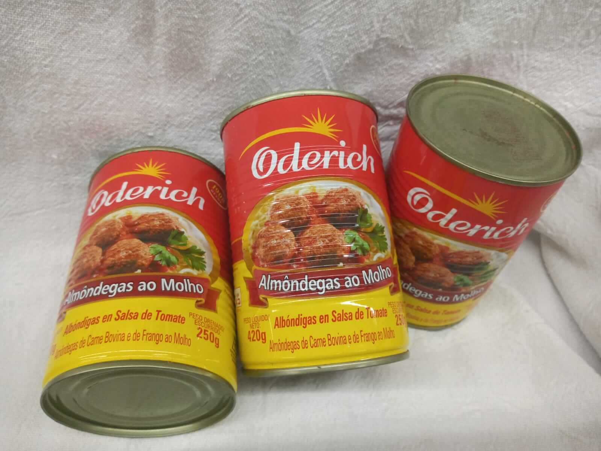

= Cōdex [1603:63:101]: //Dictiōnāria basibus dē rēbus vītālibus necessāriīs//
:doctype: book
:title: Cōdex [1603:63:101]: //Dictiōnāria basibus dē rēbus vītālibus necessāriīs//
:lang: la
:toc: macro
:toclevels: 5
:toc-title: Tabula contentorum
:table-caption: Tabula
:figure-caption: Pictūra
:example-caption: Exemplum
:last-update-label: Renovatio
:version-label: Versiō
:appendix-caption: Appendix
:source-highlighter: rouge
:warning-caption: Hic sunt dracones
:tip-caption: Commendātum
:front-cover-image: image:1603_63_101.mul-Latn.codex.svg["Cōdex [1603_63_101]: //Dictiōnāria basibus dē rēbus vītālibus necessāriīs//",1050,1600]

{nbsp} +
{nbsp} +
[quote]
**Dedicação ao Domínio Público significa que cada grande problema comum só precisa ser resolvido uma vez**

'''

[%header,cols="25h,~a"]
|===
|
Rēs interlinguālibus
|
Factum

|
/translator/@eng-Latn
|
Vicidata

|
/dictiōnārium ēditōrī/
|
EticaAI

|
/publication date/@eng-Latn
|
2022-02-26

|
numerus editionis
|
2022-05-02T05:32:48

|
/SPDX license ID/@eng-Latn
|
CC0-1.0

|
spōnsor
|
pro bonō publicō

|===

ifndef::backend-epub3[]
<<<
toc::[]
<<<
endif::[]

[id=0_999_1603_1]
== Praefātiō 

Rēs linguālibus (1)::
  Lingua Anglica (Abecedarium Latinum):::
    _**Cōdex [1603:63:101]**_ é o formato de livro dos dados estruturados legíveis por máquina do grupo de dicionários _**[1603:63:101] //Dictiōnāria basibus dē rēbus vītālibus necessāriīs//**_, que são distribuídos para os implementadores usarem em aplicativos externos. Este livro pretende ser um recurso avançado para outros lexicógrafos e tradutores de terminologia, inclusive para detectar e relatar inconsistências. Ele pode, no entanto, ser usado como um dicionário ad hoc se não houver trabalho derivado focado em suas necessidades específicas.
    +++  +++
    **SOBRE LEXICOGRAFIA**
    +++  +++
    A lexicografia prática é a arte ou ofício de compilar, escrever e editar dicionários. O básico não é muito diferente de um milênio atrás: ainda é um trabalho muito humano e criativo. É preciso ser humilde: a maioria dos erros de tradutores, na verdade, não é culpa do tradutor, mas falhas metodológicas. Certificar-se de uma ideia de origem do que um conceito representa, mesmo que signifique reescrever e simplificar, anexar fotos, mostrar exemplos, fazer o que for para que seja entendido, faz com que até mesmo tradutores não profissionais que se preocupam com sua própria língua entreguem melhor resultados do que qualquer alternativa. Em outras palavras: mesmo as chamadas melhores práticas da indústria de pagar tradutores e revisores profissionais não podem superar termos de origem já mal explicados.
    +++  +++
    **SOBRE TIPOS DE DICIONÁRIOS QUE ESTAMOS COMPILANDO**
    +++  +++
    Estamos preocupados com um grupo de idéias (chamamos isso de grupo de dicionários de conceitos) que podem ser divididos em partes menores, revisados quanto a inconsistências, aprimorados para definições e depois traduzidos por voluntários. Códigos interlinguais, como o que poderia ser usado na troca de dados real, também são adicionados a cada conceito. Ambos os glossários, interfaces de usuário (como rótulos na coleta de dados) e, em alguns casos, até códigos padrão para o que iria em um campo de dados podem ser compilados dessa maneira.
    +++  +++
    Como a lista completa de dicionários-prototípicos e dicionários minimamente utilizáveis é enorme, um modo de citar público-alvos típicos é o seguinte:
    +++  +++
    . Ajuda humanitária
    . Ajuda ao desenvolvimento
    . Direitos humanos
    . Socorro militar (ou conceitos relacionados a conflitos e resolução de conflitos)
    +++  +++
    Os itens 1, 2 e 4 https://en.m.wikipedia.org/wiki/Humanitarian-Development_Nexus[são algumas vezes referidos como _nexus_] e são frequentemente encontrados ajudando _crise humanitária_. Já que a maioria dos colaboradores cujas ideias e críticas válidas são voluntárias, então 3 (direitos humanos, como na Anistia Internacional) para diferenciar do humanitarismo (como o Movimento da Cruz Vermelha é referência).
    +++  +++
    Observe que **dicionários não são guias de uso**. As instruções, quando existem, são principalmente dedicadas a lexicógrafos e tradutores.
    +++  +++
    **/PRO BONŌ PUBLICŌ/@lat-Latn**
    +++  +++
    As pessoas lexicógrafas deste trabalho são voluntárias, fazendo-o gratuitamente, pro bonō publicō, e não aceitam doações por causa dos dicionários reutilizáveis ​​de todos. O trabalho anterior existente muitas vezes é baseado em livros antigos de domínio público. A maioria dos tradutores de terminologia já seriam voluntários porque acreditam em uma causa. A melhor maneira de inspirar a colaboração é sermos nós mesmos exemplos.
    +++  +++
    Há um aspecto não moralista, bastante simples de entender: quão caro seria pagar pelo trabalho de todos considerando que é viável em mais de 200 idiomas? A logística para decidir quem deve ser pago, depois a transferência de dinheiro em todo o mundo (pode incluir pessoas de países embargados), depois os mecanismos tradicionais de auditoria para verificar o uso indevido que os doadores esperam, existe? Em terminologia especial (os próprios termos do dicionário) e tantas línguas, não existe dinheiro suficiente nem humanos interessados ​​em ser coordenadores.

<<<

== Methodī ex cōdice
=== Methodī ex dictiōnāriōrum corde
Rēs interlinguālibus (1)::
  /scope and content/@eng-Latn:::
    `+//Dictiōnāria basibus dē rēbus vītālibus necessāriīs//+` (literal English translation: _basic dictionaries about necessary vital things_) is a **superficial** compilation of concepts for things (not procedures, nor full implementing guides) which could be _given_ to aid other humans or to whom or what give aid to other humans.
    +++  +++
    Sections 1 to 99, while not concrete things, contain concepts which may be used to decide needs assessment which we do not provide a more specialized dictionary compilation.

==== Caveat lector
Rēs interlinguālibus (1)::
  /Wikidata Q local numeric namespace/@eng-Latn:::
    Traditional paper dictionaries already are not complete enough to explain how their terms should or should not be used, so it should be no surprise that this one, despite having 100's of translations and machine readable alternatives, are also not intended as a use guide. However, compared to other compilations which can focus on narrow areas, this one in particular is below average of self-sufficiency.

==== Referentia
Referēns 1::
  /reference URL/@eng-Latn:::
    link:https://spherestandards.org/handbook/editions/[]
  Linguae multiplīs (Scrīptum incognitō):::
    /The Sphere Standards references are translated in over 30 languages and, not necessarily on this Cōdex, key terms on their references deserve to be on prioritized dictionaries./@eng-Latn

Referēns 2::
  /reference URL/@eng-Latn:::
    link:https://www.wfp.org/wfp-food-basket[]
  Linguae multiplīs (Scrīptum incognitō):::
    /The groups <<555>>, <<556>>, <<557>>, <<558>> and <<559>> are inspired (but not strictly equal) to World Food Programme grouping on 2022 described as 'a staple such as wheat flour or rice', 'lentils, chickpeas or other pulses', 'vegetable oil (fortified with vitamin A and D)', 'sugar' and 'iodized salt'. One example of difference WFP: vegetable oil is a subcategory of <<557>>, not the entire section, because _cooking oil_ is commonly a more generic term/@eng-Latn

Referēns 3::
  /reference URL/@eng-Latn:::
    link:https://www.netflix.com/watch/70112740[]
  Linguae multiplīs (Scrīptum incognitō):::
    The <<9000>> is initially inspired by a calamity response that occurred on 2003-08-19, which is remembered yearly on 19 August as World Humanitarian Day. Sérgio being targeted for things he actually disagreed with is not relevant for the concept collection. However, the fact deaths like this do occur for lack of life-saving equipment and not even any United Nations agencies to this date have multilingual terminology on such items is a clear signal of lack of preparedness for disasters to work with local organizations. 

=== Methodī ex verbīs in dictiōnāriīs
NOTE: /No momento, não há fluxo de trabalho para usar https://www.wikidata.org/wiki/Wikidata:Lexicographical_data[Wikidata lexicographical data], que na verdade poderia ser usado como armazenamento para nomenclatura mais rigorosa. As implementações atuais usam apenas conceitos do Wikidata, os Q-items./@eng-Latn

==== Methodī ex verbīs in Vicidata (Q modō)
Rēs linguālibus (1)::
  Lingua Anglica (Abecedarium Latinum):::
    O ***[1603:63:101] //Dictiōnāria basibus dē rēbus vītālibus necessāriīs//*** usa o Wikidata como uma estratégia para conciliar termos linguísticos para um ou mais de seus conceitos.
    +++  +++
    Isso significa que este livro e os arquivos de dados de dicionários relacionados requerem atualizações periódicas para , no mínimo, sincronize e compartilhe novamente as traduções atualizadas.
    +++  +++
    **Qual a confiabilidade das traduções da comunidade (fonte Wikidata)?**
    +++  +++
    A resposta curta padrão é: **elas são confiáveis**, mesmo nos casos de não haver traduções oficiais para cada assunto.
    +++  +++
    Como referência, é provável que um tradutor profissional (sem acesso à Wikipedia ou bases de terminologia interna das organizações de controle) forneça resultados de qualidade inferior se você fizer testes cegos. Isso é possível porque não apenas o público médio, mas também terminólogos e tradutores profissionais ajudam a Wikipédia (e implicitamente o Wikidata).
    +++  +++
    No entanto, mesmo quando o resultado está correto, a versão atual precisa de diferenciação aprimorada, no mínimo, sigla e forma longa . Para grandes organizações, existem recursos como __P1813 nomes curtos__, mas ainda não foram compilados com o conjunto de dados atual.
    +++  +++
    **Os principais motivos para "traduções erradas" não são culpa dos tradutores**
    +++  +++
    DICA: Como regra geral, para conceitos já muito definidos em que você, como humano, pode verificar manualmente um ou mais termos traduzidos como um resultado decente, as outras traduções provavelmente serão aceitáveis. Dicionários com casos extremos (como nomes de territórios em disputa) teriam mais explicações.
    +++  +++
    A principal razão para "traduções erradas" são conceitos mal definidos usados ​​para explicar aos tradutores da comunidade como gerar traduções de terminologia. Isso tornaria as traduções existentes do Wikidata (usadas não apenas por nós) inconsistentes. A segunda razão é se os dicionários usam traduções para conceitos sem uma correspondência estrita; em outras palavras, se fizermos definições mais estritas do que significa conceito, mas reutilizarmos termos menos exatos da Wikidada. Também há problemas quando idiomas inteiros são codificados com códigos errados. Observe que todos esses casos **traduções erradas NÃO são estritamente culpa do tradutor, mas sim da lexicografia**.
    +++  +++
    Ainda é possível ter erros estritos no nível de tradução. Mas mesmo que indiquemos aos usuários como corrigir o Wikidata/Wikipedia (com base na melhor explicação contextual de um conceito, como este livro), os requisitos para dizer que o termo anterior foi objetivamente um erro de tradução humana errado (se seguir nossa seriedade na construção de dicionário) são muito elevados.
    +++  +++
    Do ponto de vista da conciliação de dados, a seguinte metodologia é utilizada para publicar as traduções da terminologia com a tabela de conceitos principais.
    +++  +++
    . A principal tabela lexicográfica artesanal (explicada no tópico anterior), também fornecida em `1603_63_101.no1.tm.hxl.csv`, pode fazer referência ao Wiki QID.
    . Cada QID exclusivo de `1603_63_101.no1.tm.hxl.csv`, juntamente com códigos de idioma de [`1603:1:51`] (que requer conhecimento de idiomas humanos), é usado para preparar uma consulta SPARQL otimizada para execução em https://query.wikidata.org/[Wikidata Query Service]. A consulta é tão grande que não é viável para links "Try it" (URL longo), como https://www.wikidata.org/wiki/Wikidata:SPARQL_query_service/queries/examples[como o que você encontraria nos Tutoriais Wikidata ], ***mas*** funciona!
    .. Note que o conhecimento é gratuito, as traduções estão lá, mas as necessidades humanitárias multilíngues podem faltar pessoas para preparar os arquivos e compartilhar do que para uso geral.
    . O resultado da consulta, com todos os QIDs e rótulos de termos, é compartilhado como `1603_63_101.wikiq.tm.hxl.csv`
    . As traduções revisadas pela comunidade de cada QID singular são pré-compiladas em um arquivo individual `1603_63_101.wikiq.tm.hxl.csv`
    . `1603_63_101.no1.tm.hxl.csv` mais `1603_63_101.wikiq.tm.hxl.csv` criado `1603_63_101.no11.tm.hxl.csv`

=== Rēs dē factō in dictiōnāriīs
==== Concepta: 332

==== Rēs linguālibus: 248

[%header,cols="15h,25a,~,17"]
|===
|
Cōdex linguae
|
Glotto cōdicī +++ +++ ISO 639-3 +++ +++ Wiki QID cōdicī
|
Nōmen Latīnum
|
Concepta

|
mul-Zyyy
|

+++ +++
https://iso639-3.sil.org/code/mul[mul]
+++ +++ 
|
Linguae multiplīs (Scrīptum incognitō)
|
332

|
ara-Arab
|
https://glottolog.org/resource/languoid/id/arab1395[arab1395]
+++ +++
https://iso639-3.sil.org/code/ara[ara]
+++ +++ https://www.wikidata.org/wiki/Q13955[Q13955]
|
Macrolingua Arabica (Abecedarium Arabicum)
|
268

|
hye-Armn
|
https://glottolog.org/resource/languoid/id/nucl1235[nucl1235]
+++ +++
https://iso639-3.sil.org/code/hye[hye]
+++ +++ https://www.wikidata.org/wiki/Q8785[Q8785]
|
Lingua Armenia (Alphabetum Armenium)
|
165

|
ben-Beng
|
https://glottolog.org/resource/languoid/id/beng1280[beng1280]
+++ +++
https://iso639-3.sil.org/code/ben[ben]
+++ +++ https://www.wikidata.org/wiki/Q9610[Q9610]
|
Lingua Bengali (/ISO 15924 Beng/)
|
134

|
rus-Cyrl
|
https://glottolog.org/resource/languoid/id/russ1263[russ1263]
+++ +++
https://iso639-3.sil.org/code/rus[rus]
+++ +++ https://www.wikidata.org/wiki/Q7737[Q7737]
|
Lingua Russica (Abecedarium Cyrillicum)
|
255

|
hin-Deva
|
https://glottolog.org/resource/languoid/id/hind1269[hind1269]
+++ +++
https://iso639-3.sil.org/code/hin[hin]
+++ +++ https://www.wikidata.org/wiki/Q1568[Q1568]
|
Lingua Hindica (Devanāgarī)
|
155

|
amh-Ethi
|
https://glottolog.org/resource/languoid/id/amha1245[amha1245]
+++ +++
https://iso639-3.sil.org/code/amh[amh]
+++ +++ https://www.wikidata.org/wiki/Q28244[Q28244]
|
Lingua Amharica (/ISO 15924 Ethi/)
|
32

|
kat-Geor
|
https://glottolog.org/resource/languoid/id/nucl1302[nucl1302]
+++ +++
https://iso639-3.sil.org/code/kat[kat]
+++ +++ https://www.wikidata.org/wiki/Q8108[Q8108]
|
Lingua Georgiana (Abecedarium Georgianum)
|
79

|
grc-Grek
|
https://glottolog.org/resource/languoid/id/anci1242[anci1242]
+++ +++
https://iso639-3.sil.org/code/grc[grc]
+++ +++ https://www.wikidata.org/wiki/Q35497[Q35497]
|
Lingua Graeca antiqua (Alphabetum Graecum)
|
3

|
guj-Gujr
|
https://glottolog.org/resource/languoid/id/guja1252[guja1252]
+++ +++
https://iso639-3.sil.org/code/guj[guj]
+++ +++ https://www.wikidata.org/wiki/Q5137[Q5137]
|
Lingua Gujaratensis (/ISO 15924 Gujr/)
|
40

|
pan-Guru
|
https://glottolog.org/resource/languoid/id/panj1256[panj1256]
+++ +++
https://iso639-3.sil.org/code/pan[pan]
+++ +++ https://www.wikidata.org/wiki/Q58635[Q58635]
|
Lingua Paniabica (/ISO 15924 Guru/)
|
83

|
kan-Knda
|
https://glottolog.org/resource/languoid/id/nucl1305[nucl1305]
+++ +++
https://iso639-3.sil.org/code/kan[kan]
+++ +++ https://www.wikidata.org/wiki/Q33673[Q33673]
|
Lingua Cannadica (/ISO 15924 Knda/)
|
100

|
kor-Hang
|
https://glottolog.org/resource/languoid/id/kore1280[kore1280]
+++ +++
https://iso639-3.sil.org/code/kor[kor]
+++ +++ https://www.wikidata.org/wiki/Q9176[Q9176]
|
Lingua Coreana (Abecedarium Coreanum)
|
238

|
lzh-Hant
|
https://glottolog.org/resource/languoid/id/lite1248[lite1248]
+++ +++
https://iso639-3.sil.org/code/lzh[lzh]
+++ +++ https://www.wikidata.org/wiki/Q37041[Q37041]
|
Lingua Sinica classica (/ISO 15924 Hant/)
|
36

|
heb-Hebr
|
https://glottolog.org/resource/languoid/id/hebr1245[hebr1245]
+++ +++
https://iso639-3.sil.org/code/heb[heb]
+++ +++ https://www.wikidata.org/wiki/Q9288[Q9288]
|
Lingua Hebraica (Alphabetum Hebraicum)
|
228

|
khm-Khmr
|
https://glottolog.org/resource/languoid/id/cent1989[cent1989]
+++ +++
https://iso639-3.sil.org/code/khm[khm]
+++ +++ https://www.wikidata.org/wiki/Q9205[Q9205]
|
Lingua Khmer (/ISO 15924 Khmr/)
|
25

|
lao-Laoo
|
https://glottolog.org/resource/languoid/id/laoo1244[laoo1244]
+++ +++
https://iso639-3.sil.org/code/lao[lao]
+++ +++ https://www.wikidata.org/wiki/Q9211[Q9211]
|
/Lao language/ (/ISO 15924 Laoo/)
|
22

|
lat-Latn
|
https://glottolog.org/resource/languoid/id/lati1261[lati1261]
+++ +++
https://iso639-3.sil.org/code/lat[lat]
+++ +++ https://www.wikidata.org/wiki/Q397[Q397]
|
Lingua Latina (Abecedarium Latinum)
|
105

|
mni-Mtei
|
https://glottolog.org/resource/languoid/id/mani1292[mani1292]
+++ +++
https://iso639-3.sil.org/code/mni[mni]
+++ +++ https://www.wikidata.org/wiki/Q33868[Q33868]
|
Lingua Meitei (/ISO 15924 Mtei/)
|
7

|
mnw-Mymr
|
https://glottolog.org/resource/languoid/id/monn1252[monn1252]
+++ +++
https://iso639-3.sil.org/code/mnw[mnw]
+++ +++ https://www.wikidata.org/wiki/Q13349[Q13349]
|
/Mon language/ (/ISO 15924 Mymr/)
|
7

|
nqo-Nkoo
|
https://glottolog.org/resource/languoid/id/nkoa1234[nkoa1234]
+++ +++
https://iso639-3.sil.org/code/nqo[nqo]
+++ +++ https://www.wikidata.org/wiki/Q18546266[Q18546266]
|
/N'Ko/ (/ISO 15924 Nkoo/)
|
12

|
sat-Olck
|
https://glottolog.org/resource/languoid/id/sant1410[sant1410]
+++ +++
https://iso639-3.sil.org/code/sat[sat]
+++ +++ https://www.wikidata.org/wiki/Q33965[Q33965]
|
Lingua Santali (/ISO 15924 Olck/)
|
38

|
ori-Orya
|

+++ +++
https://iso639-3.sil.org/code/ori[ori]
+++ +++ https://www.wikidata.org/wiki/Q33810[Q33810]
|
Macrolingua Orissensis (/ISO 15924 Orya/)
|
82

|
sin-Sinh
|
https://glottolog.org/resource/languoid/id/sinh1246[sinh1246]
+++ +++
https://iso639-3.sil.org/code/sin[sin]
+++ +++ https://www.wikidata.org/wiki/Q13267[Q13267]
|
Lingua Singhalensis (/ISO 15924 Sinh/)
|
61

|
tam-Taml
|
https://glottolog.org/resource/languoid/id/tami1289[tami1289]
+++ +++
https://iso639-3.sil.org/code/tam[tam]
+++ +++ https://www.wikidata.org/wiki/Q5885[Q5885]
|
Lingua Tamulica (/ISO 15924 Taml/)
|
152

|
tel-Telu
|
https://glottolog.org/resource/languoid/id/telu1262[telu1262]
+++ +++
https://iso639-3.sil.org/code/tel[tel]
+++ +++ https://www.wikidata.org/wiki/Q8097[Q8097]
|
Lingua Telingana (/ISO 15924 Telu/)
|
103

|
div-Thaa
|
https://glottolog.org/resource/languoid/id/dhiv1236[dhiv1236]
+++ +++
https://iso639-3.sil.org/code/div[div]
+++ +++ https://www.wikidata.org/wiki/Q32656[Q32656]
|
Lingua Dhivehi (/ISO 15924 Thaa/)
|
27

|
tha-Thai
|
https://glottolog.org/resource/languoid/id/thai1261[thai1261]
+++ +++
https://iso639-3.sil.org/code/tha[tha]
+++ +++ https://www.wikidata.org/wiki/Q9217[Q9217]
|
Lingua Thai (/ISO 15924 Thai/)
|
169

|
bod-Tibt
|
https://glottolog.org/resource/languoid/id/tibe1272[tibe1272]
+++ +++
https://iso639-3.sil.org/code/bod[bod]
+++ +++ https://www.wikidata.org/wiki/Q34271[Q34271]
|
Lingua Tibetana (Scriptura Tibetana)
|
29

|
san-Zyyy
|
https://glottolog.org/resource/languoid/id/sans1269[sans1269]
+++ +++
https://iso639-3.sil.org/code/san[san]
+++ +++ https://www.wikidata.org/wiki/Q11059[Q11059]
|
Lingua Sanscrita (/ISO 15924 Zyyy/)
|
37

|
zho-Zyyy
|
https://glottolog.org/resource/languoid/id/sini1245[sini1245]
+++ +++
https://iso639-3.sil.org/code/zho[zho]
+++ +++ https://www.wikidata.org/wiki/Q7850[Q7850]
|
/Macrolingua Sinicae (/ISO 15924 Zyyy/)/
|
273

|
por-Latn
|
https://glottolog.org/resource/languoid/id/port1283[port1283]
+++ +++
https://iso639-3.sil.org/code/por[por]
+++ +++ https://www.wikidata.org/wiki/Q5146[Q5146]
|
Lingua Lusitana (Abecedarium Latinum)
|
247

|
eng-Latn
|
https://glottolog.org/resource/languoid/id/stan1293[stan1293]
+++ +++
https://iso639-3.sil.org/code/eng[eng]
+++ +++ https://www.wikidata.org/wiki/Q1860[Q1860]
|
Lingua Anglica (Abecedarium Latinum)
|
297

|
fra-Latn
|
https://glottolog.org/resource/languoid/id/stan1290[stan1290]
+++ +++
https://iso639-3.sil.org/code/fra[fra]
+++ +++ https://www.wikidata.org/wiki/Q150[Q150]
|
Lingua Francogallica (Abecedarium Latinum)
|
272

|
nld-Latn
|
https://glottolog.org/resource/languoid/id/mode1257[mode1257]
+++ +++
https://iso639-3.sil.org/code/nld[nld]
+++ +++ https://www.wikidata.org/wiki/Q7411[Q7411]
|
Lingua Batavica (Abecedarium Latinum)
|
248

|
deu-Latn
|
https://glottolog.org/resource/languoid/id/stan1295[stan1295]
+++ +++
https://iso639-3.sil.org/code/deu[deu]
+++ +++ https://www.wikidata.org/wiki/Q188[Q188]
|
Lingua Germanica (Abecedarium Latinum)
|
265

|
spa-Latn
|
https://glottolog.org/resource/languoid/id/stan1288[stan1288]
+++ +++
https://iso639-3.sil.org/code/spa[spa]
+++ +++ https://www.wikidata.org/wiki/Q1321[Q1321]
|
Lingua Hispanica (Abecedarium Latinum)
|
270

|
ita-Latn
|
https://glottolog.org/resource/languoid/id/ital1282[ital1282]
+++ +++
https://iso639-3.sil.org/code/ita[ita]
+++ +++ https://www.wikidata.org/wiki/Q652[Q652]
|
Lingua Italiana (Abecedarium Latinum)
|
249

|
gle-Latn
|
https://glottolog.org/resource/languoid/id/iris1253[iris1253]
+++ +++
https://iso639-3.sil.org/code/gle[gle]
+++ +++ https://www.wikidata.org/wiki/Q9142[Q9142]
|
Lingua Hibernica (Abecedarium Latinum)
|
132

|
swe-Latn
|
https://glottolog.org/resource/languoid/id/swed1254[swed1254]
+++ +++
https://iso639-3.sil.org/code/swe[swe]
+++ +++ https://www.wikidata.org/wiki/Q9027[Q9027]
|
Lingua Suecica (Abecedarium Latinum)
|
232

|
ceb-Latn
|
https://glottolog.org/resource/languoid/id/cebu1242[cebu1242]
+++ +++
https://iso639-3.sil.org/code/ceb[ceb]
+++ +++ https://www.wikidata.org/wiki/Q33239[Q33239]
|
Lingua Caebuana (Abecedarium Latinum)
|
30

|
sqi-Latn
|
https://glottolog.org/resource/languoid/id/alba1267[alba1267]
+++ +++
https://iso639-3.sil.org/code/sqi[sqi]
+++ +++ https://www.wikidata.org/wiki/Q8748[Q8748]
|
Macrolingua Albanica (/Abecedarium Latinum/)
|
94

|
pol-Latn
|
https://glottolog.org/resource/languoid/id/poli1260[poli1260]
+++ +++
https://iso639-3.sil.org/code/pol[pol]
+++ +++ https://www.wikidata.org/wiki/Q809[Q809]
|
Lingua Polonica (Abecedarium Latinum)
|
236

|
fin-Latn
|
https://glottolog.org/resource/languoid/id/finn1318[finn1318]
+++ +++
https://iso639-3.sil.org/code/fin[fin]
+++ +++ https://www.wikidata.org/wiki/Q1412[Q1412]
|
Lingua Finnica (Abecedarium Latinum)
|
231

|
ron-Latn
|
https://glottolog.org/resource/languoid/id/roma1327[roma1327]
+++ +++
https://iso639-3.sil.org/code/ron[ron]
+++ +++ https://www.wikidata.org/wiki/Q7913[Q7913]
|
Lingua Dacoromanica (Abecedarium Latinum)
|
191

|
vie-Latn
|
https://glottolog.org/resource/languoid/id/viet1252[viet1252]
+++ +++
https://iso639-3.sil.org/code/vie[vie]
+++ +++ https://www.wikidata.org/wiki/Q9199[Q9199]
|
Lingua Vietnamensis (Abecedarium Latinum)
|
217

|
cat-Latn
|
https://glottolog.org/resource/languoid/id/stan1289[stan1289]
+++ +++
https://iso639-3.sil.org/code/cat[cat]
+++ +++ https://www.wikidata.org/wiki/Q7026[Q7026]
|
Lingua Catalana (Abecedarium Latinum)
|
247

|
ukr-Cyrl
|
https://glottolog.org/resource/languoid/id/ukra1253[ukra1253]
+++ +++
https://iso639-3.sil.org/code/ukr[ukr]
+++ +++ https://www.wikidata.org/wiki/Q8798[Q8798]
|
Lingua Ucrainica (Abecedarium Cyrillicum)
|
227

|
bul-Cyrl
|
https://glottolog.org/resource/languoid/id/bulg1262[bulg1262]
+++ +++
https://iso639-3.sil.org/code/bul[bul]
+++ +++ https://www.wikidata.org/wiki/Q7918[Q7918]
|
Lingua Bulgarica (Abecedarium Cyrillicum)
|
160

|
slv-Latn
|
https://glottolog.org/resource/languoid/id/slov1268[slov1268]
+++ +++
https://iso639-3.sil.org/code/slv[slv]
+++ +++ https://www.wikidata.org/wiki/Q9063[Q9063]
|
Lingua Slovena (Abecedarium Latinum)
|
143

|
war-Latn
|
https://glottolog.org/resource/languoid/id/wara1300[wara1300]
+++ +++
https://iso639-3.sil.org/code/war[war]
+++ +++ https://www.wikidata.org/wiki/Q34279[Q34279]
|
/Waray language/ (Abecedarium Latinum)
|
61

|
nob-Latn
|
https://glottolog.org/resource/languoid/id/norw1259[norw1259]
+++ +++
https://iso639-3.sil.org/code/nob[nob]
+++ +++ https://www.wikidata.org/wiki/Q25167[Q25167]
|
/Bokmål/ (Abecedarium Latinum)
|
212

|
ces-Latn
|
https://glottolog.org/resource/languoid/id/czec1258[czec1258]
+++ +++
https://iso639-3.sil.org/code/ces[ces]
+++ +++ https://www.wikidata.org/wiki/Q9056[Q9056]
|
Lingua Bohemica (Abecedarium Latinum)
|
226

|
dan-Latn
|
https://glottolog.org/resource/languoid/id/dani1285[dani1285]
+++ +++
https://iso639-3.sil.org/code/dan[dan]
+++ +++ https://www.wikidata.org/wiki/Q9035[Q9035]
|
Lingua Danica (Abecedarium Latinum)
|
207

|
jpn-Jpan
|
https://glottolog.org/resource/languoid/id/nucl1643[nucl1643]
+++ +++
https://iso639-3.sil.org/code/jpn[jpn]
+++ +++ https://www.wikidata.org/wiki/Q5287[Q5287]
|
Lingua Iaponica (Scriptura Iaponica)
|
266

|
nno-Latn
|
https://glottolog.org/resource/languoid/id/norw1262[norw1262]
+++ +++
https://iso639-3.sil.org/code/nno[nno]
+++ +++ https://www.wikidata.org/wiki/Q25164[Q25164]
|
/Nynorsk/ (Abecedarium Latinum)
|
186

|
mal-Mlym
|
https://glottolog.org/resource/languoid/id/mala1464[mala1464]
+++ +++
https://iso639-3.sil.org/code/mal[mal]
+++ +++ https://www.wikidata.org/wiki/Q36236[Q36236]
|
Lingua Malabarica (/Malayalam script/)
|
128

|
ind-Latn
|
https://glottolog.org/resource/languoid/id/indo1316[indo1316]
+++ +++
https://iso639-3.sil.org/code/ind[ind]
+++ +++ https://www.wikidata.org/wiki/Q9240[Q9240]
|
Lingua Indonesiana (Abecedarium Latinum)
|
226

|
fas-Zyyy
|

+++ +++
https://iso639-3.sil.org/code/fas[fas]
+++ +++ https://www.wikidata.org/wiki/Q9168[Q9168]
|
Macrolingua Persica (//Abecedarium Arabicum//)
|
242

|
hun-Latn
|
https://glottolog.org/resource/languoid/id/hung1274[hung1274]
+++ +++
https://iso639-3.sil.org/code/hun[hun]
+++ +++ https://www.wikidata.org/wiki/Q9067[Q9067]
|
Lingua Hungarica (Abecedarium Latinum)
|
180

|
eus-Latn
|
https://glottolog.org/resource/languoid/id/basq1248[basq1248]
+++ +++
https://iso639-3.sil.org/code/eus[eus]
+++ +++ https://www.wikidata.org/wiki/Q8752[Q8752]
|
Lingua Vasconica (Abecedarium Latinum)
|
195

|
cym-Latn
|
https://glottolog.org/resource/languoid/id/wels1247[wels1247]
+++ +++
https://iso639-3.sil.org/code/cym[cym]
+++ +++ https://www.wikidata.org/wiki/Q9309[Q9309]
|
Lingua Cambrica (Abecedarium Latinum)
|
127

|
glg-Latn
|
https://glottolog.org/resource/languoid/id/gali1258[gali1258]
+++ +++
https://iso639-3.sil.org/code/glg[glg]
+++ +++ https://www.wikidata.org/wiki/Q9307[Q9307]
|
Lingua Gallaica (Abecedarium Latinum)
|
154

|
slk-Latn
|
https://glottolog.org/resource/languoid/id/slov1269[slov1269]
+++ +++
https://iso639-3.sil.org/code/slk[slk]
+++ +++ https://www.wikidata.org/wiki/Q9058[Q9058]
|
Lingua Slovaca (Abecedarium Latinum)
|
145

|
epo-Latn
|
https://glottolog.org/resource/languoid/id/espe1235[espe1235]
+++ +++
https://iso639-3.sil.org/code/epo[epo]
+++ +++ https://www.wikidata.org/wiki/Q143[Q143]
|
Lingua Esperantica (Abecedarium Latinum)
|
244

|
msa-Zyyy
|

+++ +++
https://iso639-3.sil.org/code/msa[msa]
+++ +++ https://www.wikidata.org/wiki/Q9237[Q9237]
|
Macrolingua Malayana (/ISO 15924 Zyyy/)
|
194

|
est-Latn
|

+++ +++
https://iso639-3.sil.org/code/est[est]
+++ +++ https://www.wikidata.org/wiki/Q9072[Q9072]
|
Macrolingua Estonica (Abecedarium Latinum)
|
164

|
hrv-Latn
|
https://glottolog.org/resource/languoid/id/croa1245[croa1245]
+++ +++
https://iso639-3.sil.org/code/hrv[hrv]
+++ +++ https://www.wikidata.org/wiki/Q6654[Q6654]
|
Lingua Croatica (Abecedarium Latinum)
|
151

|
tur-Latn
|
https://glottolog.org/resource/languoid/id/nucl1301[nucl1301]
+++ +++
https://iso639-3.sil.org/code/tur[tur]
+++ +++ https://www.wikidata.org/wiki/Q256[Q256]
|
Lingua Turcica (Abecedarium Latinum)
|
208

|
nds-Latn
|
https://glottolog.org/resource/languoid/id/lowg1239[lowg1239]
+++ +++
https://iso639-3.sil.org/code/nds[nds]
+++ +++ https://www.wikidata.org/wiki/Q25433[Q25433]
|
Lingua Saxonica (Abecedarium Latinum)
|
49

|
oci-Latn
|
https://glottolog.org/resource/languoid/id/occi1239[occi1239]
+++ +++
https://iso639-3.sil.org/code/oci[oci]
+++ +++ https://www.wikidata.org/wiki/Q14185[Q14185]
|
Lingua Occitana (Abecedarium Latinum)
|
84

|
bre-Latn
|
https://glottolog.org/resource/languoid/id/bret1244[bret1244]
+++ +++
https://iso639-3.sil.org/code/bre[bre]
+++ +++ https://www.wikidata.org/wiki/Q12107[Q12107]
|
Lingua Britonica (Abecedarium Latinum)
|
72

|
arz-Latn
|
https://glottolog.org/resource/languoid/id/egyp1253[egyp1253]
+++ +++
https://iso639-3.sil.org/code/arz[arz]
+++ +++ https://www.wikidata.org/wiki/Q29919[Q29919]
|
/Egyptian Arabic/ (Abecedarium Arabicum)
|
48

|
afr-Latn
|
https://glottolog.org/resource/languoid/id/afri1274[afri1274]
+++ +++
https://iso639-3.sil.org/code/afr[afr]
+++ +++ https://www.wikidata.org/wiki/Q14196[Q14196]
|
Lingua Batava Capitensis (Abecedarium Latinum)
|
112

|
ltz-Latn
|
https://glottolog.org/resource/languoid/id/luxe1241[luxe1241]
+++ +++
https://iso639-3.sil.org/code/ltz[ltz]
+++ +++ https://www.wikidata.org/wiki/Q9051[Q9051]
|
Lingua Luxemburgensis (Abecedarium Latinum)
|
78

|
sco-Latn
|
https://glottolog.org/resource/languoid/id/scot1243[scot1243]
+++ +++
https://iso639-3.sil.org/code/sco[sco]
+++ +++ https://www.wikidata.org/wiki/Q14549[Q14549]
|
Lingua Scotica quae Teutonica (Abecedarium Latinum)
|
70

|
bar-Latn
|
https://glottolog.org/resource/languoid/id/bava1246[bava1246]
+++ +++
https://iso639-3.sil.org/code/bar[bar]
+++ +++ https://www.wikidata.org/wiki/Q29540[Q29540]
|
Lingua Bavarica (Abecedarium Latinum)
|
44

|
arg-Latn
|
https://glottolog.org/resource/languoid/id/arag1245[arag1245]
+++ +++
https://iso639-3.sil.org/code/arg[arg]
+++ +++ https://www.wikidata.org/wiki/Q8765[Q8765]
|
Lingua Aragonensis (Abecedarium Latinum)
|
64

|
zho-Hant
|

+++ +++
https://iso639-3.sil.org/code/zho[zho]
+++ +++ https://www.wikidata.org/wiki/Q18130932[Q18130932]
|
//Traditional Chinese// (/ISO 15924 Hant/)
|
167

|
pap-Latn
|
https://glottolog.org/resource/languoid/id/papi1253[papi1253]
+++ +++
https://iso639-3.sil.org/code/pap[pap]
+++ +++ https://www.wikidata.org/wiki/Q33856[Q33856]
|
/lingua Papiamentica/ (Abecedarium Latinum)
|
14

|
cos-Latn
|
https://glottolog.org/resource/languoid/id/cors1241[cors1241]
+++ +++
https://iso639-3.sil.org/code/cos[cos]
+++ +++ https://www.wikidata.org/wiki/Q33111[Q33111]
|
Lingua Corsica (Abecedarium Latinum)
|
16

|
gsw-Latn
|
https://glottolog.org/resource/languoid/id/swis1247[swis1247]
+++ +++
https://iso639-3.sil.org/code/gsw[gsw]
+++ +++ https://www.wikidata.org/wiki/Q131339[Q131339]
|
Dialecti Alemannicae (Abecedarium Latinum)
|
44

|
isl-Latn
|
https://glottolog.org/resource/languoid/id/icel1247[icel1247]
+++ +++
https://iso639-3.sil.org/code/isl[isl]
+++ +++ https://www.wikidata.org/wiki/Q294[Q294]
|
Lingua Islandica (Abecedarium Latinum)
|
122

|
min-Latn
|
https://glottolog.org/resource/languoid/id/mina1268[mina1268]
+++ +++
https://iso639-3.sil.org/code/min[min]
+++ +++ https://www.wikidata.org/wiki/Q13324[Q13324]
|
/Minangkabau language/ (Abecedarium Latinum)
|
37

|
roh-Latn
|
https://glottolog.org/resource/languoid/id/roma1326[roma1326]
+++ +++
https://iso639-3.sil.org/code/roh[roh]
+++ +++ https://www.wikidata.org/wiki/Q13199[Q13199]
|
Lingua Rhaetica (Abecedarium Latinum)
|
15

|
vec-Latn
|
https://glottolog.org/resource/languoid/id/vene1258[vene1258]
+++ +++
https://iso639-3.sil.org/code/vec[vec]
+++ +++ https://www.wikidata.org/wiki/Q32724[Q32724]
|
Lingua Veneta (Abecedarium Latinum)
|
64

|
pms-Latn
|
https://glottolog.org/resource/languoid/id/piem1238[piem1238]
+++ +++
https://iso639-3.sil.org/code/pms[pms]
+++ +++ https://www.wikidata.org/wiki/Q15085[Q15085]
|
Lingua Pedemontana (Abecedarium Latinum)
|
15

|
scn-Latn
|
https://glottolog.org/resource/languoid/id/sici1248[sici1248]
+++ +++
https://iso639-3.sil.org/code/scn[scn]
+++ +++ https://www.wikidata.org/wiki/Q33973[Q33973]
|
Lingua Sicula (Abecedarium Latinum)
|
61

|
srd-Latn
|

+++ +++
https://iso639-3.sil.org/code/srd[srd]
+++ +++ https://www.wikidata.org/wiki/Q33976[Q33976]
|
Macrolingua Sarda (Abecedarium Latinum)
|
22

|
gla-Latn
|
https://glottolog.org/resource/languoid/id/scot1245[scot1245]
+++ +++
https://iso639-3.sil.org/code/gla[gla]
+++ +++ https://www.wikidata.org/wiki/Q9314[Q9314]
|
Lingua Scotica seu Scotica Gadelica (Abecedarium Latinum)
|
40

|
lim-Latn
|
https://glottolog.org/resource/languoid/id/limb1263[limb1263]
+++ +++
https://iso639-3.sil.org/code/lim[lim]
+++ +++ https://www.wikidata.org/wiki/Q102172[Q102172]
|
Lingua Limburgica (Abecedarium Latinum)
|
37

|
wln-Latn
|
https://glottolog.org/resource/languoid/id/wall1255[wall1255]
+++ +++
https://iso639-3.sil.org/code/wln[wln]
+++ +++ https://www.wikidata.org/wiki/Q34219[Q34219]
|
Lingua Vallonica (Abecedarium Latinum)
|
46

|
srp-Latn
|
https://glottolog.org/resource/languoid/id/serb1264[serb1264]
+++ +++
https://iso639-3.sil.org/code/srp[srp]
+++ +++ https://www.wikidata.org/wiki/Q21161949[Q21161949]
|
/Serbian/ (Abecedarium Latinum)
|
93

|
vls-Latn
|
https://glottolog.org/resource/languoid/id/vlaa1240[vlaa1240]
+++ +++
https://iso639-3.sil.org/code/vls[vls]
+++ +++ https://www.wikidata.org/wiki/Q100103[Q100103]
|
/West Flemish/ (Abecedarium Latinum)
|
20

|
nap-Latn
|
https://glottolog.org/resource/languoid/id/neap1235[neap1235]
+++ +++
https://iso639-3.sil.org/code/nap[nap]
+++ +++ https://www.wikidata.org/wiki/Q33845[Q33845]
|
Lingua Neapolitana (Abecedarium Latinum)
|
17

|
lij-Latn
|
https://glottolog.org/resource/languoid/id/ligu1248[ligu1248]
+++ +++
https://iso639-3.sil.org/code/lij[lij]
+++ +++ https://www.wikidata.org/wiki/Q36106[Q36106]
|
Lingua Ligustica (Abecedarium Latinum)
|
19

|
fur-Latn
|
https://glottolog.org/resource/languoid/id/friu1240[friu1240]
+++ +++
https://iso639-3.sil.org/code/fur[fur]
+++ +++ https://www.wikidata.org/wiki/Q33441[Q33441]
|
Lingua Foroiuliensis (Abecedarium Latinum)
|
12

|
pcd-Latn
|
https://glottolog.org/resource/languoid/id/pica1241[pica1241]
+++ +++
https://iso639-3.sil.org/code/pcd[pcd]
+++ +++ https://www.wikidata.org/wiki/Q34024[Q34024]
|
Lingua Picardica (Abecedarium Latinum)
|
13

|
wol-Latn
|
https://glottolog.org/resource/languoid/id/nucl1347[nucl1347]
+++ +++
https://iso639-3.sil.org/code/wol[wol]
+++ +++ https://www.wikidata.org/wiki/Q34257[Q34257]
|
/Wolof language/ (Abecedarium Latinum)
|
23

|
kon-Latn
|

+++ +++
https://iso639-3.sil.org/code/kon[kon]
+++ +++ https://www.wikidata.org/wiki/Q33702[Q33702]
|
/Kongo macrolanguage/ (Abecedarium Latinum)
|
12

|
frp-Latn
|
https://glottolog.org/resource/languoid/id/fran1260[fran1260]
+++ +++
https://iso639-3.sil.org/code/frp[frp]
+++ +++ https://www.wikidata.org/wiki/Q15087[Q15087]
|
Lingua Arpitanica (Abecedarium Latinum)
|
9

|
wuu-Zyyy
|
https://glottolog.org/resource/languoid/id/wuch1236[wuch1236]
+++ +++
https://iso639-3.sil.org/code/wuu[wuu]
+++ +++ https://www.wikidata.org/wiki/Q34290[Q34290]
|
//Macrolingua Wu// (/ISO 15924 Zyyy/)
|
125

|
srp-Cyrl
|
https://glottolog.org/resource/languoid/id/serb1264[serb1264]
+++ +++
https://iso639-3.sil.org/code/srp[srp]
+++ +++ https://www.wikidata.org/wiki/Q9299[Q9299]
|
Lingua Serbica (Abecedarium Cyrillicum)
|
198

|
urd-Arab
|
https://glottolog.org/resource/languoid/id/urdu1245[urdu1245]
+++ +++
https://iso639-3.sil.org/code/urd[urd]
+++ +++ https://www.wikidata.org/wiki/Q1617[Q1617]
|
Lingua Urdu (Abecedarium Arabicum)
|
119

|
gan-Zyyy
|
https://glottolog.org/resource/languoid/id/ganc1239[ganc1239]
+++ +++
https://iso639-3.sil.org/code/gan[gan]
+++ +++ https://www.wikidata.org/wiki/Q33475[Q33475]
|
Lingua Gan (/ISO 15924 Zyyy/)
|
24

|
lit-Latn
|
https://glottolog.org/resource/languoid/id/lith1251[lith1251]
+++ +++
https://iso639-3.sil.org/code/lit[lit]
+++ +++ https://www.wikidata.org/wiki/Q9083[Q9083]
|
Lingua Lithuanica (Abecedarium Latinum)
|
148

|
gan-Hans
|
https://glottolog.org/resource/languoid/id/ganc1239[ganc1239]
+++ +++
https://iso639-3.sil.org/code/gan[gan]
+++ +++ https://www.wikidata.org/wiki/Q64427344[Q64427344]
|
Lingua Gan (/ISO 15924 Hans/)
|
3

|
hbs-Latn
|
https://glottolog.org/resource/languoid/id/sout1528[sout1528]
+++ +++
https://iso639-3.sil.org/code/hbs[hbs]
+++ +++ https://www.wikidata.org/wiki/Q9301[Q9301]
|
Macrolingua Serbocroatica (Abecedarium Latinum)
|
144

|
lav-Latn
|
https://glottolog.org/resource/languoid/id/latv1249[latv1249]
+++ +++
https://iso639-3.sil.org/code/lav[lav]
+++ +++ https://www.wikidata.org/wiki/Q9078[Q9078]
|
Macrolingua Lettonica (Abecedarium Latinum)
|
137

|
bos-Latn
|
https://glottolog.org/resource/languoid/id/bosn1245[bosn1245]
+++ +++
https://iso639-3.sil.org/code/bos[bos]
+++ +++ https://www.wikidata.org/wiki/Q9303[Q9303]
|
Lingua Bosnica (Abecedarium Latinum)
|
92

|
srn-Latn
|
https://glottolog.org/resource/languoid/id/sran1240[sran1240]
+++ +++
https://iso639-3.sil.org/code/srn[srn]
+++ +++ https://www.wikidata.org/wiki/Q33989[Q33989]
|
/Sranan Tongo/ (Abecedarium Latinum)
|
12

|
azb-Arab
|
https://glottolog.org/resource/languoid/id/sout2697[sout2697]
+++ +++
https://iso639-3.sil.org/code/azb[azb]
+++ +++ https://www.wikidata.org/wiki/Q3449805[Q3449805]
|
/South Azerbaijani/ (Abecedarium Arabicum)
|
59

|
jav-Latn
|
https://glottolog.org/resource/languoid/id/java1254[java1254]
+++ +++
https://iso639-3.sil.org/code/jav[jav]
+++ +++ https://www.wikidata.org/wiki/Q33549[Q33549]
|
Lingua Iavanica (Abecedarium Latinum)
|
115

|
ell-Grek
|
https://glottolog.org/resource/languoid/id/mode1248[mode1248]
+++ +++
https://iso639-3.sil.org/code/ell[ell]
+++ +++ https://www.wikidata.org/wiki/Q36510[Q36510]
|
Lingua Neograeca (Alphabetum Graecum)
|
190

|
sun-Latn
|
https://glottolog.org/resource/languoid/id/sund1252[sund1252]
+++ +++
https://iso639-3.sil.org/code/sun[sun]
+++ +++ https://www.wikidata.org/wiki/Q34002[Q34002]
|
/Sundanese language/ (Abecedarium Latinum)
|
64

|
fry-Latn
|
https://glottolog.org/resource/languoid/id/west2354[west2354]
+++ +++
https://iso639-3.sil.org/code/fry[fry]
+++ +++ https://www.wikidata.org/wiki/Q27175[Q27175]
|
Lingua Frisice occidentalis (Abecedarium Latinum)
|
53

|
ace-Latn
|
https://glottolog.org/resource/languoid/id/achi1257[achi1257]
+++ +++
https://iso639-3.sil.org/code/ace[ace]
+++ +++ https://www.wikidata.org/wiki/Q27683[Q27683]
|
/Acehnese language/ (Abecedarium Latinum)
|
6

|
jam-Latn
|
https://glottolog.org/resource/languoid/id/jama1262[jama1262]
+++ +++
https://iso639-3.sil.org/code/jam[jam]
+++ +++ https://www.wikidata.org/wiki/Q35939[Q35939]
|
Lingua creola Iamaicana (Abecedarium Latinum)
|
25

|
che-Cyrl
|
https://glottolog.org/resource/languoid/id/chec1245[chec1245]
+++ +++
https://iso639-3.sil.org/code/che[che]
+++ +++ https://www.wikidata.org/wiki/Q33350[Q33350]
|
Lingua Tsetsenica (Abecedarium Cyrillicum)
|
34

|
bel-Cyrl
|
https://glottolog.org/resource/languoid/id/bela1254[bela1254]
+++ +++
https://iso639-3.sil.org/code/bel[bel]
+++ +++ https://www.wikidata.org/wiki/Q9091[Q9091]
|
Lingua Ruthenica Alba (Abecedarium Cyrillicum)
|
135

|
kab-Latn
|
https://glottolog.org/resource/languoid/id/kaby1243[kaby1243]
+++ +++
https://iso639-3.sil.org/code/kab[kab]
+++ +++ https://www.wikidata.org/wiki/Q35853[Q35853]
|
/Kabyle language/ (Abecedarium Latinum)
|
40

|
fao-Latn
|
https://glottolog.org/resource/languoid/id/faro1244[faro1244]
+++ +++
https://iso639-3.sil.org/code/fao[fao]
+++ +++ https://www.wikidata.org/wiki/Q25258[Q25258]
|
Lingua Faeroensis (Abecedarium Latinum)
|
21

|
bam-Zyyy
|
https://glottolog.org/resource/languoid/id/bamb1269[bamb1269]
+++ +++
https://iso639-3.sil.org/code/bam[bam]
+++ +++ https://www.wikidata.org/wiki/Q33243[Q33243]
|
/Bambara language/ (/ISO 15924 Zyyy/)
|
9

|
frc-Latn
|
https://glottolog.org/resource/languoid/id/caju1236[caju1236]
+++ +++
https://iso639-3.sil.org/code/frc[frc]
+++ +++ https://www.wikidata.org/wiki/Q3083213[Q3083213]
|
Lingua Francogallica Ludoviciana (Abecedarium Latinum)
|
2

|
lmo-Latn
|
https://glottolog.org/resource/languoid/id/lomb1257[lomb1257]
+++ +++
https://iso639-3.sil.org/code/lmo[lmo]
+++ +++ https://www.wikidata.org/wiki/Q33754[Q33754]
|
Langobardus sermo (Abecedarium Latinum)
|
36

|
mar-Deva
|
https://glottolog.org/resource/languoid/id/mara1378[mara1378]
+++ +++
https://iso639-3.sil.org/code/mar[mar]
+++ +++ https://www.wikidata.org/wiki/Q1571[Q1571]
|
Lingua Marathica (Devanāgarī)
|
83

|
ady-Cyrl
|
https://glottolog.org/resource/languoid/id/adyg1241[adyg1241]
+++ +++
https://iso639-3.sil.org/code/ady[ady]
+++ +++ https://www.wikidata.org/wiki/Q27776[Q27776]
|
Lingua Adygeica (Abecedarium Cyrillicum)
|
1

|
ary-Arab
|
https://glottolog.org/resource/languoid/id/moro1292[moro1292]
+++ +++
https://iso639-3.sil.org/code/ary[ary]
+++ +++ https://www.wikidata.org/wiki/Q56426[Q56426]
|
/Moroccan Arabic/ (Abecedarium Arabicum)
|
15

|
awa-Deva
|
https://glottolog.org/resource/languoid/id/awad1243[awad1243]
+++ +++
https://iso639-3.sil.org/code/awa[awa]
+++ +++ https://www.wikidata.org/wiki/Q29579[Q29579]
|
/Awadhi/ (Devanāgarī)
|
5

|
ban-Latn
|
https://glottolog.org/resource/languoid/id/bali1278[bali1278]
+++ +++
https://iso639-3.sil.org/code/ban[ban]
+++ +++ https://www.wikidata.org/wiki/Q33070[Q33070]
|
/Balinese/ (Abecedarium Latinum)
|
10

|
ast-Latn
|
https://glottolog.org/resource/languoid/id/astu1245[astu1245]
+++ +++
https://iso639-3.sil.org/code/ast[ast]
+++ +++ https://www.wikidata.org/wiki/Q29507[Q29507]
|
Lingua Asturiana (Abecedarium Latinum)
|
121

|
bcl-Latn
|
https://glottolog.org/resource/languoid/id/cent2087[cent2087]
+++ +++
https://iso639-3.sil.org/code/bcl[bcl]
+++ +++ https://www.wikidata.org/wiki/Q33284[Q33284]
|
/Central Bikol/  (Abecedarium Latinum)
|
27

|
bho-Deva
|
https://glottolog.org/resource/languoid/id/bhoj1244[bhoj1244]
+++ +++
https://iso639-3.sil.org/code/bho[bho]
+++ +++ https://www.wikidata.org/wiki/Q33268[Q33268]
|
Lingua Bhojpuri (Devanāgarī)
|
28

|
bpy-Beng
|
https://glottolog.org/resource/languoid/id/bish1244[bish1244]
+++ +++
https://iso639-3.sil.org/code/bpy[bpy]
+++ +++ https://www.wikidata.org/wiki/Q37059[Q37059]
|
Lingua Bisnupriya (/ISO 15924 Beng/)
|
3

|
bxr-Cyrl
|
https://glottolog.org/resource/languoid/id/russ1264[russ1264]
+++ +++
https://iso639-3.sil.org/code/bxr[bxr]
+++ +++ https://www.wikidata.org/wiki/Q33120[Q33120]
|
Lingua Buriatica (Abecedarium Cyrillicum)
|
25

|
cdo-Zyyy
|
https://glottolog.org/resource/languoid/id/mind1253[mind1253]
+++ +++
https://iso639-3.sil.org/code/cdo[cdo]
+++ +++ https://www.wikidata.org/wiki/Q36455[Q36455]
|
/Min Dong Chinese/ (/ISO 15924 Zyyy/)
|
32

|
diq-Latn
|
https://glottolog.org/resource/languoid/id/diml1238[diml1238]
+++ +++
https://iso639-3.sil.org/code/diq[diq]
+++ +++ https://www.wikidata.org/wiki/Q10199[Q10199]
|
Lingua Zazaca (Abecedarium Latinum)
|
39

|
dsb-Latn
|
https://glottolog.org/resource/languoid/id/lowe1385[lowe1385]
+++ +++
https://iso639-3.sil.org/code/dsb[dsb]
+++ +++ https://www.wikidata.org/wiki/Q13286[Q13286]
|
/Lower Sorbian/ (Abecedarium Latinum)
|
13

|
ext-Latn
|
https://glottolog.org/resource/languoid/id/extr1243[extr1243]
+++ +++
https://iso639-3.sil.org/code/ext[ext]
+++ +++ https://www.wikidata.org/wiki/Q30007[Q30007]
|
Lingua Extremadurensis (Abecedarium Latinum)
|
21

|
gcr-Latn
|
https://glottolog.org/resource/languoid/id/guia1246[guia1246]
+++ +++
https://iso639-3.sil.org/code/gcr[gcr]
+++ +++ https://www.wikidata.org/wiki/Q1363072[Q1363072]
|
/Guianese Creole French/ (Abecedarium Latinum)
|
26

|
gom-Zyyy
|
https://glottolog.org/resource/languoid/id/goan1235[goan1235]
+++ +++
https://iso639-3.sil.org/code/gom[gom]
+++ +++ https://www.wikidata.org/wiki/Q5575236[Q5575236]
|
/Goan Konkani/ (/ISO 15924 Zyyy/)
|
8

|
frr-latn
|
https://glottolog.org/resource/languoid/id/nort2626[nort2626]
+++ +++
https://iso639-3.sil.org/code/frr[frr]
+++ +++ https://www.wikidata.org/wiki/Q28224[Q28224]
|
/Northern Frisian/ (Abecedarium Latinum)
|
0

|
hak-Zyyy
|
https://glottolog.org/resource/languoid/id/hakk1236[hakk1236]
+++ +++
https://iso639-3.sil.org/code/hak[hak]
+++ +++ https://www.wikidata.org/wiki/Q33375[Q33375]
|
/Hakka Chinese/ (/ISO 15924 Zyyy/)
|
27

|
hif-Zyyy
|
https://glottolog.org/resource/languoid/id/fiji1242[fiji1242]
+++ +++
https://iso639-3.sil.org/code/hif[hif]
+++ +++ https://www.wikidata.org/wiki/Q46728[Q46728]
|
Lingua Hindi Vitiensis (/ISO 15924 Zyyy/)
|
10

|
hsb-Latn
|
https://glottolog.org/resource/languoid/id/uppe1395[uppe1395]
+++ +++
https://iso639-3.sil.org/code/hsb[hsb]
+++ +++ https://www.wikidata.org/wiki/Q13248[Q13248]
|
/Upper Sorbian/ (Abecedarium Latinum)
|
52

|
hyw-Armn
|
https://glottolog.org/resource/languoid/id/homs1234[homs1234]
+++ +++
https://iso639-3.sil.org/code/hyw[hyw]
+++ +++ https://www.wikidata.org/wiki/Q180945[Q180945]
|
/Western Armenian/ (Alphabetum Armenium)
|
20

|
ilo-Latn
|
https://glottolog.org/resource/languoid/id/ilok1237[ilok1237]
+++ +++
https://iso639-3.sil.org/code/ilo[ilo]
+++ +++ https://www.wikidata.org/wiki/Q35936[Q35936]
|
Lingua Ilocana (Abecedarium Latinum)
|
25

|
inh-Cyrl
|
https://glottolog.org/resource/languoid/id/ingu1240[ingu1240]
+++ +++
https://iso639-3.sil.org/code/inh[inh]
+++ +++ https://www.wikidata.org/wiki/Q33509[Q33509]
|
Lingua Ingussica (Abecedarium Cyrillicum)
|
12

|
kaa-Latn
|
https://glottolog.org/resource/languoid/id/kara1467[kara1467]
+++ +++
https://iso639-3.sil.org/code/kaa[kaa]
+++ +++ https://www.wikidata.org/wiki/Q33541[Q33541]
|
Lingua Karakalpakensis (Abecedarium Latinum)
|
8

|
kbd-Cyrl
|
https://glottolog.org/resource/languoid/id/kaba1278[kaba1278]
+++ +++
https://iso639-3.sil.org/code/kbd[kbd]
+++ +++ https://www.wikidata.org/wiki/Q33522[Q33522]
|
Lingua Cabardino-Circassica (Abecedarium Cyrillicum)
|
4

|
kbp-Latn
|
https://glottolog.org/resource/languoid/id/kabi1261[kabi1261]
+++ +++
https://iso639-3.sil.org/code/kbp[kbp]
+++ +++ https://www.wikidata.org/wiki/Q35475[Q35475]
|
/Kabiye language/ (Abecedarium Latinum)
|
19

|
mai-Deva
|
https://glottolog.org/resource/languoid/id/mait1250[mait1250]
+++ +++
https://iso639-3.sil.org/code/mai[mai]
+++ +++ https://www.wikidata.org/wiki/Q36109[Q36109]
|
Lingua Maithili (Devanāgarī)
|
16

|
mhr-Cyrl
|
https://glottolog.org/resource/languoid/id/east2328[east2328]
+++ +++
https://iso639-3.sil.org/code/mhr[mhr]
+++ +++ https://www.wikidata.org/wiki/Q3906614[Q3906614]
|
Lingua Mari pratensis (Abecedarium Cyrillicum)
|
6

|
mwl-Latn
|
https://glottolog.org/resource/languoid/id/mira1251[mira1251]
+++ +++
https://iso639-3.sil.org/code/mwl[mwl]
+++ +++ https://www.wikidata.org/wiki/Q13330[Q13330]
|
Lingua Mirandica (Abecedarium Latinum)
|
13

|
mzn-Arab
|
https://glottolog.org/resource/languoid/id/maza1291[maza1291]
+++ +++
https://iso639-3.sil.org/code/mzn[mzn]
+++ +++ https://www.wikidata.org/wiki/Q13356[Q13356]
|
/Mazanderani language/ (Abecedarium Arabicum)
|
14

|
nah-Latn
|

+++ +++
https://iso639-3.sil.org/code/nah[nah]
+++ +++ https://www.wikidata.org/wiki/Q13300[Q13300]
|
Lingua Navatlaca (Abecedarium Latinum)
|
21

|
nan-Latn
|
https://glottolog.org/resource/languoid/id/minn1241[minn1241]
+++ +++
https://iso639-3.sil.org/code/nan[nan]
+++ +++ https://www.wikidata.org/wiki/Q36495[Q36495]
|
/Min Nan Chinese/ (Abecedarium Latinum)
|
82

|
new-Deva
|
https://glottolog.org/resource/languoid/id/newa1246[newa1246]
+++ +++
https://iso639-3.sil.org/code/new[new]
+++ +++ https://www.wikidata.org/wiki/Q33979[Q33979]
|
Lingua Newari (Devanāgarī)
|
38

|
pam-Latn
|
https://glottolog.org/resource/languoid/id/pamp1243[pamp1243]
+++ +++
https://iso639-3.sil.org/code/pam[pam]
+++ +++ https://www.wikidata.org/wiki/Q36121[Q36121]
|
/Kapampangan language/ (Abecedarium Latinum)
|
18

|
pfl-Latn
|
https://glottolog.org/resource/languoid/id/pala1330[pala1330]
+++ +++
https://iso639-3.sil.org/code/pfl[pfl]
+++ +++ https://www.wikidata.org/wiki/Q23014[Q23014]
|
/Palatine German language/ (Abecedarium Latinum)
|
8

|
pnb-Arab
|
https://glottolog.org/resource/languoid/id/west2386[west2386]
+++ +++
https://iso639-3.sil.org/code/pnb[pnb]
+++ +++ https://www.wikidata.org/wiki/Q1389492[Q1389492]
|
Lingua Paniabica occidentalis (Abecedarium Arabicum)
|
57

|
rue-Cyrl
|
https://glottolog.org/resource/languoid/id/rusy1239[rusy1239]
+++ +++
https://iso639-3.sil.org/code/rue[rue]
+++ +++ https://www.wikidata.org/wiki/Q26245[Q26245]
|
Lingua Rusinica (Abecedarium Cyrillicum)
|
25

|
rup-Latn
|
https://glottolog.org/resource/languoid/id/arom1237[arom1237]
+++ +++
https://iso639-3.sil.org/code/rup[rup]
+++ +++ https://www.wikidata.org/wiki/Q29316[Q29316]
|
Lingua aromanian (Abecedarium Latinum)
|
23

|
sah-Cyrl
|
https://glottolog.org/resource/languoid/id/yaku1245[yaku1245]
+++ +++
https://iso639-3.sil.org/code/sah[sah]
+++ +++ https://www.wikidata.org/wiki/Q34299[Q34299]
|
Lingua Iacutica (Abecedarium Cyrillicum)
|
31

|
sgs-Latn
|
https://glottolog.org/resource/languoid/id/samo1265[samo1265]
+++ +++
https://iso639-3.sil.org/code/sgs[sgs]
+++ +++ https://www.wikidata.org/wiki/Q213434[Q213434]
|
Lingua Samogitica (Abecedarium Latinum)
|
49

|
shi-Zyyy
|
https://glottolog.org/resource/languoid/id/tach1250[tach1250]
+++ +++
https://iso639-3.sil.org/code/shi[shi]
+++ +++ https://www.wikidata.org/wiki/Q34152[Q34152]
|
Shilha language (/ISO 15924 Zyyy/)
|
13

|
shn-Mymr
|
https://glottolog.org/resource/languoid/id/shan1277[shan1277]
+++ +++
https://iso639-3.sil.org/code/shn[shn]
+++ +++ https://www.wikidata.org/wiki/Q56482[Q56482]
|
Lingua Shan (/ISO 15924 Mymr/)
|
4

|
smn-Latn
|
https://glottolog.org/resource/languoid/id/inar1241[inar1241]
+++ +++
https://iso639-3.sil.org/code/smn[smn]
+++ +++ https://www.wikidata.org/wiki/Q33462[Q33462]
|
/Inari Sami/ (Abecedarium Latinum)
|
46

|
stq-Latn
|
https://glottolog.org/resource/languoid/id/sate1242[sate1242]
+++ +++
https://iso639-3.sil.org/code/stq[stq]
+++ +++ https://www.wikidata.org/wiki/Q27154[Q27154]
|
/Saterland Frisian language/ (Abecedarium Latinum)
|
15

|
szl-Latn
|
https://glottolog.org/resource/languoid/id/sile1253[sile1253]
+++ +++
https://iso639-3.sil.org/code/szl[szl]
+++ +++ https://www.wikidata.org/wiki/Q30319[Q30319]
|
Lingua Silesica (Abecedarium Latinum)
|
18

|
tcy-Zyyy
|
https://glottolog.org/resource/languoid/id/tulu1258[tulu1258]
+++ +++
https://iso639-3.sil.org/code/tcy[tcy]
+++ +++ https://www.wikidata.org/wiki/Q34251[Q34251]
|
Lingua Tuluva (/ISO 15924 Zyyy/)
|
16

|
udm-Cyrl
|
https://glottolog.org/resource/languoid/id/udmu1245[udmu1245]
+++ +++
https://iso639-3.sil.org/code/udm[udm]
+++ +++ https://www.wikidata.org/wiki/Q13238[Q13238]
|
Lingua Udmurtica (Abecedarium Cyrillicum)
|
12

|
vep-Latn
|
https://glottolog.org/resource/languoid/id/veps1250[veps1250]
+++ +++
https://iso639-3.sil.org/code/vep[vep]
+++ +++ https://www.wikidata.org/wiki/Q32747[Q32747]
|
Lingua Vepsica (Abecedarium Latinum)
|
18

|
vro-Latn
|
https://glottolog.org/resource/languoid/id/sout2679[sout2679]
+++ +++
https://iso639-3.sil.org/code/vro[vro]
+++ +++ https://www.wikidata.org/wiki/Q32762[Q32762]
|
Lingua Voruvica (Abecedarium Latinum)
|
18

|
yue-Zyyy
|
https://glottolog.org/resource/languoid/id/yuec1235[yuec1235]
+++ +++
https://iso639-3.sil.org/code/yue[yue]
+++ +++ https://www.wikidata.org/wiki/Q7033959[Q7033959]
|
Lingua Yue (/ISO 15924 Zyyy/)
|
181

|
crh-Latn
|
https://glottolog.org/resource/languoid/id/crim1257[crim1257]
+++ +++
https://iso639-3.sil.org/code/crh[crh]
+++ +++ https://www.wikidata.org/wiki/Q107557485[Q107557485]
|
Lingua Tatarica Crimensis (Abecedarium Latinum)
|
9

|
lad-Zyyy
|
https://glottolog.org/resource/languoid/id/ladi1251[ladi1251]
+++ +++
https://iso639-3.sil.org/code/lad[lad]
+++ +++ https://www.wikidata.org/wiki/Q36196[Q36196]
|
Lingua Iudaeo-Hispanica (/ISO 15924 Zyyy/)
|
11

|
lez-Cyrl
|
https://glottolog.org/resource/languoid/id/lezg1247[lezg1247]
+++ +++
https://iso639-3.sil.org/code/lez[lez]
+++ +++ https://www.wikidata.org/wiki/Q31746[Q31746]
|
Lingua Lesghica (Abecedarium Cyrillicum)
|
9

|
swa-Latn
|

+++ +++
https://iso639-3.sil.org/code/swa[swa]
+++ +++ https://www.wikidata.org/wiki/Q7838[Q7838]
|
Macrolingua Suahelica (Abecedarium Latinum)
|
86

|
zha-Zyyy
|
https://glottolog.org/resource/languoid/id/nort3180[nort3180]
+++ +++
https://iso639-3.sil.org/code/zha[zha]
+++ +++ https://www.wikidata.org/wiki/Q13216[Q13216]
|
/Zhuang languages/ (/ISO 15924 Zyyy/)
|
17

|
yor-Latn
|
https://glottolog.org/resource/languoid/id/yoru1245[yoru1245]
+++ +++
https://iso639-3.sil.org/code/yor[yor]
+++ +++ https://www.wikidata.org/wiki/Q34311[Q34311]
|
Lingua yoruba (Abecedarium Latinum)
|
34

|
yid-Hebr
|
https://glottolog.org/resource/languoid/id/yidd1255[yidd1255]
+++ +++
https://iso639-3.sil.org/code/yid[yid]
+++ +++ https://www.wikidata.org/wiki/Q8641[Q8641]
|
Macrolingua Iudaeo-Germanica (Alphabetum Hebraicum)
|
70

|
xho-Latn
|
https://glottolog.org/resource/languoid/id/xhos1239[xhos1239]
+++ +++
https://iso639-3.sil.org/code/xho[xho]
+++ +++ https://www.wikidata.org/wiki/Q13218[Q13218]
|
Lingua Xosana (Abecedarium Latinum)
|
13

|
uzb-Latn
|
https://glottolog.org/resource/languoid/id/uzbe1247[uzbe1247]
+++ +++
https://iso639-3.sil.org/code/uzb[uzb]
+++ +++ https://www.wikidata.org/wiki/Q9264[Q9264]
|
Macrolingua Uzbecica (Abecedarium Latinum)
|
83

|
uig-Zyyy
|
https://glottolog.org/resource/languoid/id/uigh1240[uigh1240]
+++ +++
https://iso639-3.sil.org/code/uig[uig]
+++ +++ https://www.wikidata.org/wiki/Q13263[Q13263]
|
Lingua Uigurica (/ISO 15924 Zyyy/)
|
25

|
tat-Zyyy
|
https://glottolog.org/resource/languoid/id/tata1255[tata1255]
+++ +++
https://iso639-3.sil.org/code/tat[tat]
+++ +++ https://www.wikidata.org/wiki/Q25285[Q25285]
|
Lingua Tatarica (/ISO 15924 Zyyy/)
|
85

|
tat-Cyrl
|
https://glottolog.org/resource/languoid/id/tata1255[tata1255]
+++ +++
https://iso639-3.sil.org/code/tat[tat]
+++ +++ https://www.wikidata.org/wiki/Q39132549[Q39132549]
|
Lingua Tatarica (Abecedarium Cyrillicum)
|
41

|
tat-Latn
|
https://glottolog.org/resource/languoid/id/tata1255[tata1255]
+++ +++
https://iso639-3.sil.org/code/tat[tat]
+++ +++ https://www.wikidata.org/wiki/Q39134544[Q39134544]
|
Lingua Tatarica (Abecedarium Latinum)
|
5

|
tso-Latn
|
https://glottolog.org/resource/languoid/id/tson1249[tson1249]
+++ +++
https://iso639-3.sil.org/code/tso[tso]
+++ +++ https://www.wikidata.org/wiki/Q34327[Q34327]
|
/Tsonga language/ (Abecedarium Latinum)
|
7

|
tgl-Latn
|
https://glottolog.org/resource/languoid/id/taga1270[taga1270]
+++ +++
https://iso639-3.sil.org/code/tgl[tgl]
+++ +++ https://www.wikidata.org/wiki/Q34057[Q34057]
|
Lingua Tagalog (Abecedarium Latinum)
|
88

|
tuk-Latn
|
https://glottolog.org/resource/languoid/id/turk1304[turk1304]
+++ +++
https://iso639-3.sil.org/code/tuk[tuk]
+++ +++ https://www.wikidata.org/wiki/Q9267[Q9267]
|
Lingua Turcomannica (Abecedarium Latinum)
|
16

|
abk-Cyrl
|
https://glottolog.org/resource/languoid/id/abkh1244[abkh1244]
+++ +++
https://iso639-3.sil.org/code/abk[abk]
+++ +++ https://www.wikidata.org/wiki/Q5111[Q5111]
|
Lingua Abasgica (Abecedarium Cyrillicum)
|
6

|
asm-Beng
|
https://glottolog.org/resource/languoid/id/assa1263[assa1263]
+++ +++
https://iso639-3.sil.org/code/asm[asm]
+++ +++ https://www.wikidata.org/wiki/Q29401[Q29401]
|
Lingua Assamica (/ISO 15924 Beng/)
|
35

|
ava-Cyrl
|
https://glottolog.org/resource/languoid/id/avar1256[avar1256]
+++ +++
https://iso639-3.sil.org/code/ava[ava]
+++ +++ https://www.wikidata.org/wiki/Q29561[Q29561]
|
Lingua Avarica (Abecedarium Cyrillicum)
|
9

|
aze-Latn
|

+++ +++
https://iso639-3.sil.org/code/aze[aze]
+++ +++ https://www.wikidata.org/wiki/Q9292[Q9292]
|
Macrolingua Atropatenica (Abecedarium Latinum)
|
122

|
bak-Cyrl
|
https://glottolog.org/resource/languoid/id/bash1264[bash1264]
+++ +++
https://iso639-3.sil.org/code/bak[bak]
+++ +++ https://www.wikidata.org/wiki/Q13389[Q13389]
|
Lingua Baschkirica (Abecedarium Cyrillicum)
|
51

|
bis-Latn
|
https://glottolog.org/resource/languoid/id/bisl1239[bisl1239]
+++ +++
https://iso639-3.sil.org/code/bis[bis]
+++ +++ https://www.wikidata.org/wiki/Q35452[Q35452]
|
Lingua Bislama (Abecedarium Latinum)
|
8

|
chv-Cyrl
|
https://glottolog.org/resource/languoid/id/chuv1255[chuv1255]
+++ +++
https://iso639-3.sil.org/code/chv[chv]
+++ +++ https://www.wikidata.org/wiki/Q33348[Q33348]
|
Lingua Tschuvaschica (Abecedarium Cyrillicum)
|
54

|
grn-Latn
|

+++ +++
https://iso639-3.sil.org/code/grn[grn]
+++ +++ https://www.wikidata.org/wiki/Q35876[Q35876]
|
Macrolingua Guaranica (Abecedarium Latinum)
|
38

|
glv-Latn
|
https://glottolog.org/resource/languoid/id/manx1243[manx1243]
+++ +++
https://iso639-3.sil.org/code/glv[glv]
+++ +++ https://www.wikidata.org/wiki/Q12175[Q12175]
|
Lingua Monensis (Abecedarium Latinum)
|
22

|
hau-Latn
|
https://glottolog.org/resource/languoid/id/haus1257[haus1257]
+++ +++
https://iso639-3.sil.org/code/hau[hau]
+++ +++ https://www.wikidata.org/wiki/Q56475[Q56475]
|
Lingua Haussana (Abecedarium Latinum)
|
46

|
hat-Latn
|
https://glottolog.org/resource/languoid/id/hait1244[hait1244]
+++ +++
https://iso639-3.sil.org/code/hat[hat]
+++ +++ https://www.wikidata.org/wiki/Q33491[Q33491]
|
Lingua creola Haitiana (Abecedarium Latinum)
|
59

|
xmf-Geor
|
https://glottolog.org/resource/languoid/id/ming1252[ming1252]
+++ +++
https://iso639-3.sil.org/code/xmf[xmf]
+++ +++ https://www.wikidata.org/wiki/Q13359[Q13359]
|
Lingua Mingrelica (Abecedarium Georgianum)
|
28

|
kaz-Zyyy
|
https://glottolog.org/resource/languoid/id/kaza1248[kaza1248]
+++ +++
https://iso639-3.sil.org/code/kaz[kaz]
+++ +++ https://www.wikidata.org/wiki/Q9252[Q9252]
|
Lingua Kazachica (/ISO 15924 Zyyy/)
|
116

|
kaz-Arab
|
https://glottolog.org/resource/languoid/id/kaza1248[kaza1248]
+++ +++
https://iso639-3.sil.org/code/kaz[kaz]
+++ +++ https://www.wikidata.org/wiki/Q64362991[Q64362991]
|
Lingua Kazachica (Abecedarium Arabicum)
|
21

|
kaz-Cyrl
|
https://glottolog.org/resource/languoid/id/kaza1248[kaza1248]
+++ +++
https://iso639-3.sil.org/code/kaz[kaz]
+++ +++ https://www.wikidata.org/wiki/Q64362992[Q64362992]
|
Lingua Kazachica (Abecedarium Cyrillicum)
|
26

|
kaz-Latn
|
https://glottolog.org/resource/languoid/id/kaza1248[kaza1248]
+++ +++
https://iso639-3.sil.org/code/kaz[kaz]
+++ +++ https://www.wikidata.org/wiki/Q64362993[Q64362993]
|
Lingua Kazachica (Abecedarium Latinum)
|
21

|
kal-Latn
|
https://glottolog.org/resource/languoid/id/kala1399[kala1399]
+++ +++
https://iso639-3.sil.org/code/kal[kal]
+++ +++ https://www.wikidata.org/wiki/Q25355[Q25355]
|
Lingua Groenlandica (Abecedarium Latinum)
|
6

|
krc-Cyrl
|
https://glottolog.org/resource/languoid/id/kara1465[kara1465]
+++ +++
https://iso639-3.sil.org/code/krc[krc]
+++ +++ https://www.wikidata.org/wiki/Q33714[Q33714]
|
Lingua Karaczaevo-Balcarica (Abecedarium Cyrillicum)
|
11

|
kur-Zyyy
|
https://glottolog.org/resource/languoid/id/kurd1259[kurd1259]
+++ +++
https://iso639-3.sil.org/code/kur[kur]
+++ +++ https://www.wikidata.org/wiki/Q36368[Q36368]
|
Macrolingua Curdica (/ISO 15924 Zyyy/)
|
60

|
kur-Arab
|

+++ +++
https://iso639-3.sil.org/code/kur[kur]
+++ +++ https://www.wikidata.org/wiki/Q64362996[Q64362996]
|
Macrolingua Curdica (Abecedarium Arabicum)
|
6

|
kur-Latn
|

+++ +++
https://iso639-3.sil.org/code/kur[kur]
+++ +++ https://www.wikidata.org/wiki/Q64362997[Q64362997]
|
Macrolingua Curdica (Abecedarium Latinum)
|
23

|
ckb-Arab
|
https://glottolog.org/resource/languoid/id/cent1972[cent1972]
+++ +++
https://iso639-3.sil.org/code/ckb[ckb]
+++ +++ https://www.wikidata.org/wiki/Q36811[Q36811]
|
/Central Kurdish/ (Abecedarium Arabicum)
|
75

|
kpv-Cyrl
|
https://glottolog.org/resource/languoid/id/komi1268[komi1268]
+++ +++
https://iso639-3.sil.org/code/kpv[kpv]
+++ +++ https://www.wikidata.org/wiki/Q36126[Q36126]
|
Macrolingua Komiensis (Abecedarium Cyrillicum)
|
4

|
koi-Cyrl
|
https://glottolog.org/resource/languoid/id/komi1269[komi1269]
+++ +++
https://iso639-3.sil.org/code/koi[koi]
+++ +++ https://www.wikidata.org/wiki/Q56318[Q56318]
|
/Permyak language/ (Abecedarium Cyrillicum)
|
3

|
cor-Latn
|
https://glottolog.org/resource/languoid/id/corn1251[corn1251]
+++ +++
https://iso639-3.sil.org/code/cor[cor]
+++ +++ https://www.wikidata.org/wiki/Q25289[Q25289]
|
Lingua Cornubica (Abecedarium Latinum)
|
19

|
kir-Zyyy
|
https://glottolog.org/resource/languoid/id/kirg1245[kirg1245]
+++ +++
https://iso639-3.sil.org/code/kir[kir]
+++ +++ https://www.wikidata.org/wiki/Q9255[Q9255]
|
Lingua Kyrgyzensis (/ISO 15924 Zyyy/)
|
83

|
lld-Latn
|
https://glottolog.org/resource/languoid/id/ladi1250[ladi1250]
+++ +++
https://iso639-3.sil.org/code/lld[lld]
+++ +++ https://www.wikidata.org/wiki/Q36202[Q36202]
|
/Lingua Ladina-Dolomiana/ (Abecedarium Latinum)
|
5

|
lin-Latn
|
https://glottolog.org/resource/languoid/id/ling1263[ling1263]
+++ +++
https://iso639-3.sil.org/code/lin[lin]
+++ +++ https://www.wikidata.org/wiki/Q36217[Q36217]
|
/Lingala/ (Abecedarium Latinum)
|
38

|
mlg-Latn
|

+++ +++
https://iso639-3.sil.org/code/mlg[mlg]
+++ +++ https://www.wikidata.org/wiki/Q7930[Q7930]
|
Macrolingua Malagasiensis (Abecedarium Latinum)
|
24

|
mkd-Cyrl
|
https://glottolog.org/resource/languoid/id/mace1250[mace1250]
+++ +++
https://iso639-3.sil.org/code/mkd[mkd]
+++ +++ https://www.wikidata.org/wiki/Q9296[Q9296]
|
Lingua Macedonica (Abecedarium Cyrillicum)
|
167

|
mon-Cyrl
|
https://glottolog.org/resource/languoid/id/mong1331[mong1331]
+++ +++
https://iso639-3.sil.org/code/mon[mon]
+++ +++ https://www.wikidata.org/wiki/Q9246[Q9246]
|
Macrolingua Mongolica (Abecedarium Cyrillicum)
|
39

|
mlt-Latn
|
https://glottolog.org/resource/languoid/id/malt1254[malt1254]
+++ +++
https://iso639-3.sil.org/code/mlt[mlt]
+++ +++ https://www.wikidata.org/wiki/Q9166[Q9166]
|
Lingua Melitensis (Abecedarium Latinum)
|
34

|
mya-Mymr
|
https://glottolog.org/resource/languoid/id/nucl1310[nucl1310]
+++ +++
https://iso639-3.sil.org/code/mya[mya]
+++ +++ https://www.wikidata.org/wiki/Q9228[Q9228]
|
Lingua Birmanica (/ISO 15924 Mymr/)
|
74

|
nep-Deva
|
https://glottolog.org/resource/languoid/id/east1436[east1436]
+++ +++
https://iso639-3.sil.org/code/nep[nep]
+++ +++ https://www.wikidata.org/wiki/Q33823[Q33823]
|
Macrolingua Nepalensis (Devanāgarī)
|
79

|
dty-Deva
|
https://glottolog.org/resource/languoid/id/doty1234[doty1234]
+++ +++
https://iso639-3.sil.org/code/dty[dty]
+++ +++ https://www.wikidata.org/wiki/Q18415595[Q18415595]
|
/Dotyali/ (Devanāgarī)
|
7

|
nav-Latn
|
https://glottolog.org/resource/languoid/id/nava1243[nava1243]
+++ +++
https://iso639-3.sil.org/code/nav[nav]
+++ +++ https://www.wikidata.org/wiki/Q13310[Q13310]
|
/Navajo/ (Abecedarium Arabicum)
|
17

|
oss-Cyrl
|
https://glottolog.org/resource/languoid/id/iron1242[iron1242]
+++ +++
https://iso639-3.sil.org/code/oss[oss]
+++ +++ https://www.wikidata.org/wiki/Q33968[Q33968]
|
Lingua Ossetica (Abecedarium Cyrillicum)
|
20

|
pus-Arab
|
https://glottolog.org/resource/languoid/id/nucl1276[nucl1276]
+++ +++
https://iso639-3.sil.org/code/pus[pus]
+++ +++ https://www.wikidata.org/wiki/Q58680[Q58680]
|
Macrolingua Afganica (Abecedarium Arabicum)
|
37

|
que-Latn
|

+++ +++
https://iso639-3.sil.org/code/que[que]
+++ +++ https://www.wikidata.org/wiki/Q5218[Q5218]
|
Macrolinguae Quechuae (Abecedarium Latinum)
|
69

|
kin-Latn
|
https://glottolog.org/resource/languoid/id/kiny1244[kiny1244]
+++ +++
https://iso639-3.sil.org/code/kin[kin]
+++ +++ https://www.wikidata.org/wiki/Q33573[Q33573]
|
/Kinyarwanda/ (Abecedarium Latinum)
|
14

|
snd-Arab
|
https://glottolog.org/resource/languoid/id/sind1272[sind1272]
+++ +++
https://iso639-3.sil.org/code/snd[snd]
+++ +++ https://www.wikidata.org/wiki/Q33997[Q33997]
|
Lingua Sindhuica (Abecedarium Arabicum)
|
37

|
sme-Latn
|
https://glottolog.org/resource/languoid/id/nort2671[nort2671]
+++ +++
https://iso639-3.sil.org/code/sme[sme]
+++ +++ https://www.wikidata.org/wiki/Q33947[Q33947]
|
Lingua Samica septentrionalis (Abecedarium Latinum)
|
50

|
smo-Latn
|
https://glottolog.org/resource/languoid/id/samo1305[samo1305]
+++ +++
https://iso639-3.sil.org/code/smo[smo]
+++ +++ https://www.wikidata.org/wiki/Q34011[Q34011]
|
Lingua Samoana (Abecedarium Latinum)
|
7

|
sna-Latn
|
https://glottolog.org/resource/languoid/id/shon1251[shon1251]
+++ +++
https://iso639-3.sil.org/code/sna[sna]
+++ +++ https://www.wikidata.org/wiki/Q34004[Q34004]
|
/Shona/ (Abecedarium Latinum)
|
36

|
som-Latn
|
https://glottolog.org/resource/languoid/id/soma1255[soma1255]
+++ +++
https://iso639-3.sil.org/code/som[som]
+++ +++ https://www.wikidata.org/wiki/Q13275[Q13275]
|
Lingua Somalica (Abecedarium Latinum)
|
46

|
ssw-Latn
|
https://glottolog.org/resource/languoid/id/swat1243[swat1243]
+++ +++
https://iso639-3.sil.org/code/ssw[ssw]
+++ +++ https://www.wikidata.org/wiki/Q34014[Q34014]
|
/Swati/ (Abecedarium Latinum)
|
6

|
tgk-Zyyy
|
https://glottolog.org/resource/languoid/id/taji1245[taji1245]
+++ +++
https://iso639-3.sil.org/code/tgk[tgk]
+++ +++ https://www.wikidata.org/wiki/Q9260[Q9260]
|
Lingua Tadzikica (/ISO 15924 Zyyy/)
|
61

|
tgk-Cyrl
|
https://glottolog.org/resource/languoid/id/taji1245[taji1245]
+++ +++

+++ +++ https://www.wikidata.org/wiki/Q64363004[Q64363004]
|
Lingua Tadzikica (Abecedarium Cyrillicum)
|
1

|
tgk-Latn
|
https://glottolog.org/resource/languoid/id/taji1245[taji1245]
+++ +++

+++ +++ https://www.wikidata.org/wiki/Q64363005[Q64363005]
|
Lingua Tadzikica (Abecedarium Latinum)
|
4

|
zul-Latn
|
https://glottolog.org/resource/languoid/id/zulu1248[zulu1248]
+++ +++
https://iso639-3.sil.org/code/zul[zul]
+++ +++ https://www.wikidata.org/wiki/Q10179[Q10179]
|
Lingua Zuluana (Abecedarium Latinum)
|
22

|
vol-Latn
|
https://glottolog.org/resource/languoid/id/vola1234[vola1234]
+++ +++
https://iso639-3.sil.org/code/vol[vol]
+++ +++ https://www.wikidata.org/wiki/Q36986[Q36986]
|
Volapük (Abecedarium Latinum)
|
26

|
ina-Latn
|
https://glottolog.org/resource/languoid/id/inte1239[inte1239]
+++ +++
https://iso639-3.sil.org/code/ina[ina]
+++ +++ https://www.wikidata.org/wiki/Q35934[Q35934]
|
Interlingua (Abecedarium Latinum)
|
57

|
ile-Latn
|
https://glottolog.org/resource/languoid/id/inte1260[inte1260]
+++ +++
https://iso639-3.sil.org/code/ile[ile]
+++ +++ https://www.wikidata.org/wiki/Q35850[Q35850]
|
Lingua Occidental (Abecedarium Latinum)
|
15

|
jbo-Latn
|
https://glottolog.org/resource/languoid/id/lojb1234[lojb1234]
+++ +++
https://iso639-3.sil.org/code/jbo[jbo]
+++ +++ https://www.wikidata.org/wiki/Q36350[Q36350]
|
Lojban (Abecedarium Latinum)
|
15

|
nov-Latn
|
https://glottolog.org/resource/languoid/id/novi1234[novi1234]
+++ +++
https://iso639-3.sil.org/code/nov[nov]
+++ +++ https://www.wikidata.org/wiki/Q36738[Q36738]
|
Lingua Novial (Abecedarium Latinum)
|
4

|
ido-Latn
|
https://glottolog.org/resource/languoid/id/idoo1234[idoo1234]
+++ +++
https://iso639-3.sil.org/code/ido[ido]
+++ +++ https://www.wikidata.org/wiki/Q35224[Q35224]
|
Ido (Abecedarium Latinum)
|
79

|
lfn-Latn
|
https://glottolog.org/resource/languoid/id/ling1267[ling1267]
+++ +++
https://iso639-3.sil.org/code/lfn[lfn]
+++ +++ https://www.wikidata.org/wiki/Q146803[Q146803]
|
Lingua Franca Nova (Abecedarium Latinum)
|
44

|===

==== Rēs interlinguālibus: 9
Rēs::
  spōnsor:::
    Rēs interlinguālibus::::
      /Wiki P/;;
        https://www.wikidata.org/wiki/Property:P859[P859]

      ix_hxlix;;
        ix_wikip859

      ix_hxlvoc;;
        v_wiki_p_859

    Rēs linguālibus::::
      Lingua Latina (Abecedarium Latinum);;
        +++spōnsor+++

      Lingua Anglica (Abecedarium Latinum);;
        +++organization or individual that sponsors this item+++

      Lingua Lusitana (Abecedarium Latinum);;
        +++organização ou indivíduo que patrocina este item+++

  numerus editionis:::
    Rēs interlinguālibus::::
      /Wiki P/;;
        https://www.wikidata.org/wiki/Property:P393[P393]

      ix_hxlix;;
        ix_wikip393

      ix_hxlvoc;;
        v_wiki_p_393

    Rēs linguālibus::::
      Lingua Latina (Abecedarium Latinum);;
        +++numerus editionis+++

      Lingua Anglica (Abecedarium Latinum);;
        +++number of an edition (first, second, ... as 1, 2, ...) or event+++

      Lingua Lusitana (Abecedarium Latinum);;
        +++número de uma edição (primeira, segunda, ... como 1, 2, ...) ou evento+++

  /dictiōnārium ēditōrī/:::
    Rēs interlinguālibus::::
      /Wiki P/;;
        https://www.wikidata.org/wiki/Property:P98[P98]

      ix_hxlix;;
        ix_wikip98

      ix_hxlvoc;;
        v_wiki_p_98

    Rēs linguālibus::::
      Lingua Latina (Abecedarium Latinum);;
        +++/dictiōnārium ēditōrī/+++

      Lingua Anglica (Abecedarium Latinum);;
        +++editor of a compiled work such as a book or a periodical (newspaper or an academic journal)+++

      Lingua Lusitana (Abecedarium Latinum);;
        +++editor de um trabalho compilado, como um livro ou um periódico (jornal ou revista acadêmica)+++

  /SPDX license ID/@eng-Latn:::
    Rēs interlinguālibus::::
      /Wiki P/;;
        https://www.wikidata.org/wiki/Property:P2479[P2479]

      /rēgulam/;;
        [0-9A-Za-z\.\-]{3,36}[+]?

      /formatter URL/@eng-Latn;;
        https://spdx.org/licenses/$1.html

      ix_hxlix;;
        ix_wikip2479

      ix_hxlvoc;;
        v_wiki_p_2479

    Rēs linguālibus::::
      Lingua Latina (Abecedarium Latinum);;
        +++/SPDX license ID/@eng-Latn+++

      Lingua Anglica (Abecedarium Latinum);;
        +++SPDX license identifier+++

      Lingua Lusitana (Abecedarium Latinum);;
        +++identificador de licença SPDX+++

  /scope and content/@eng-Latn:::
    Rēs interlinguālibus::::
      /Wiki P/;;
        https://www.wikidata.org/wiki/Property:P7535[P7535]

      ix_hxlix;;
        ix_wikip7535

      ix_hxlvoc;;
        v_wiki_p_7535

    Rēs linguālibus::::
      Lingua Latina (Abecedarium Latinum);;
        +++/scope and content/@eng-Latn+++

      Lingua Anglica (Abecedarium Latinum);;
        +++a summary statement providing an overview of the archival collection+++

      Lingua Lusitana (Abecedarium Latinum);;
        +++uma declaração resumida fornecendo uma visão geral da coleção de arquivo+++

  /Wiki QID/:::
    Rēs interlinguālibus::::
      /rēgulam/;;
        Q[1-9]\d*

      ix_hxlix;;
        ix_wikiq

      ix_hxlvoc;;
        v_wiki_q

    Rēs linguālibus::::
      Lingua Latina (Abecedarium Latinum);;
        +++/Wiki QID/+++

      Lingua Anglica (Abecedarium Latinum);;
        +++QID (or Q number) is the unique identifier of a data item on Wikidata, comprising the letter "Q" followed by one or more digits. It is used to help people and machines understand the difference between items with the same or similar names e.g there are several places in the world called London and many people called James Smith. This number appears next to the name at the top of each Wikidata item.+++

      Lingua Lusitana (Abecedarium Latinum);;
        +++QID (ou número Q) é o identificador único de um item de dados no Wikidata, composto pela letra "Q" seguida por um ou mais dígitos. Ele é usado para ajudar pessoas e máquinas a entender a diferença entre itens com nomes iguais ou semelhantes, por exemplo, existem vários lugares no mundo chamados Londres e muitas pessoas chamadas James Smith. Este número aparece ao lado do nome na parte superior de cada item do Wikidata.+++

  /translator/@eng-Latn:::
    Rēs interlinguālibus::::
      /Wiki P/;;
        https://www.wikidata.org/wiki/Property:P655[P655]

      ix_hxlix;;
        ix_wikip655

      ix_hxlvoc;;
        v_wiki_p_655

    Rēs linguālibus::::
      Lingua Latina (Abecedarium Latinum);;
        +++/translator/@eng-Latn+++

      Lingua Anglica (Abecedarium Latinum);;
        +++agent who adapts any kind of written text from one language to another+++

      Lingua Lusitana (Abecedarium Latinum);;
        +++agente que adapta qualquer tipo de texto escrito de um idioma para outro+++

  /publication date/@eng-Latn:::
    Rēs interlinguālibus::::
      /Wiki P/;;
        https://www.wikidata.org/wiki/Property:P577[P577]

      ix_hxlix;;
        ix_wikip577

      ix_hxlvoc;;
        v_wiki_p_577

    Rēs linguālibus::::
      Lingua Latina (Abecedarium Latinum);;
        +++/publication date/@eng-Latn+++

      Lingua Anglica (Abecedarium Latinum);;
        +++Date or point in time when a work was first published or released+++

      Lingua Lusitana (Abecedarium Latinum);;
        +++Data ou ponto no tempo em que um trabalho foi publicado ou lançado pela primeira vez+++

  /Wikidata Q local numeric namespace/@eng-Latn:::
    Rēs interlinguālibus::::
      ix_hxlix;;
        ix_wikiq9289584

      ix_hxlvoc;;
        v_wiki_q_9289584

    Rēs linguālibus::::
      Lingua Latina (Abecedarium Latinum);;
        +++/Wikidata Q local numeric namespace/@eng-Latn+++

<<<

== Archīa

Rēs linguālibus (1)::
  Lingua Anglica (Abecedarium Latinum):::
    **Informações de contexto**: ignorando por um momento o fato de ter várias traduções (e otimizadas para receber contribuições regularmente, não _apenas_ um trabalho estático), então a diferença real no fluxo de trabalho usado para gerar cada grupo de dicionários em um Cōdex como este é o seguinte fato: **fornecemos formatos de arquivos estruturados legíveis por máquina mesmo quando os equivalentes em _idiomas internacionais_, como o inglês, não possuem para áreas como ajuda humanitária, ajuda ao desenvolvimento e direitos humanos**. Os mais próximos desse multilinguismo (fora da Wikimedia) são o SEMIeu da União Europeia (até 24 idiomas), mas mesmo assim têm problemas ao compartilhar traduções em todos os idiomas. As traduções das Nações Unidas (até 6 idiomas, raramente mais) não estão disponíveis por agências humanitárias para ajudar nas traduções de terminologia.
    +++  +++
    **Implicação prática**: os documentos de texto em _Archīa prō cōdice_ (tradução literal em inglês: _File for book_) são alternativas a este formato de livro que são altamente automatizados usando apenas o formato de dados. No entanto, os formatos legíveis por máquina em _Archīa prō dictiōnāriīs_ (tradução literal em inglês: _Arquivos para dicionários_) são o foco e recomendados para trabalhos derivados e destinados a mitigar erros humanos adicionais. Podemos até criar novos formatos a pedido! O objetivo aqui é permitir tradutores de terminologia e uso de produção onde isso tenha um impacto positivo.

=== Archīa prō dictiōnāriīs: 4

==== 1603_63_101.no1.tm.hxl.csv

Rēs interlinguālibus::
  /download link/@eng-Latn::: link:1603_63_101.no1.tm.hxl.csv[1603_63_101.no1.tm.hxl.csv]
Rēs linguālibus::
  Lingua Anglica (Abecedarium Latinum):::
    /Numerordinatio no contêiner HXLTM/

==== 1603_63_101.no11.tm.hxl.csv

Rēs interlinguālibus::
  /download link/@eng-Latn::: link:1603_63_101.no11.tm.hxl.csv[1603_63_101.no11.tm.hxl.csv]
Rēs linguālibus::
  Lingua Anglica (Abecedarium Latinum):::
    /Numerordinatio no contêiner HXLTM (expandido com traduções de terminologia)/

==== 1603_63_101.wikiq.tm.hxl.csv

Rēs interlinguālibus::
  /download link/@eng-Latn::: link:1603_63_101.wikiq.tm.hxl.csv[1603_63_101.wikiq.tm.hxl.csv]
  /reference URL/@eng-Latn:::
    https://hxltm.etica.ai/

Rēs linguālibus::
  Lingua Anglica (Abecedarium Latinum):::
    Dialeto HXLTM do Padrão HXL em CSV RFC 4180. Resumidamente: wikiq significa que #item+conceptum+codicem são estritamente Wikidata QIDs.

==== 1603_63_101.no11.tbx

Rēs interlinguālibus::
  /download link/@eng-Latn::: link:1603_63_101.no11.tbx[1603_63_101.no11.tbx]
  /reference URL/@eng-Latn:::
    http://www.terminorgs.net/downloads/TBX_Basic_Version_3.1.pdf

Rēs linguālibus::
  Lingua Anglica (Abecedarium Latinum):::
    TBX-Basic é uma linguagem de marcação terminológica (TML) que é uma versão mais leve de TBX-Default, a TML que é definida na ISO 30042. TBX-Basic é projetada para o setor de localização e é baseada em informações de pesquisas e estudos que foram conduzida pelo LISA Term SIG sobre os tipos de dados de terminologia que o setor de localização exige.

==== 1603_63_101.no11.tmx

Rēs interlinguālibus::
  /download link/@eng-Latn::: link:1603_63_101.no11.tmx[1603_63_101.no11.tmx]
  /reference URL/@eng-Latn:::
    https://www.gala-global.org/tmx-14b

Rēs linguālibus::
  Lingua Anglica (Abecedarium Latinum):::
    O objetivo do formato Translation Memory eXchange (TMX) é fornecer um método padrão para descrever dados de memória de tradução que estão sendo trocados entre ferramentas e/ou fornecedores de tradução, ao mesmo tempo em que introduz pouca ou nenhuma perda de dados críticos durante o processo

=== Archīa prō cōdice: 2

==== 1603_63_101.mul-Latn.codex.adoc

Rēs interlinguālibus::
  /download link/@eng-Latn::: link:1603_63_101.mul-Latn.codex.adoc[1603_63_101.mul-Latn.codex.adoc]
  /reference URL/@eng-Latn:::
    https://docs.asciidoctor.org/

Rēs linguālibus::
  Lingua Anglica (Abecedarium Latinum):::
    AsciiDoc é um formato de autoria de texto simples (ou seja, linguagem de marcação leve) para escrever conteúdo técnico, como documentação, artigos e livros.

==== 1603_63_101.mul-Latn.codex.pdf

Rēs interlinguālibus::
  /download link/@eng-Latn::: link:1603_63_101.mul-Latn.codex.pdf[1603_63_101.mul-Latn.codex.pdf]
  /reference URL/@eng-Latn:::
    https://www.adobe.com/content/dam/acom/en/devnet/pdf/pdfs/PDF32000_2008.pdf

Rēs linguālibus::
  Lingua Anglica (Abecedarium Latinum):::
    Portable Document Format (PDF), padronizado como ISO 32000, é um formato de arquivo desenvolvido pela Adobe em 1992 para apresentar documentos, incluindo formatação de texto e imagens, de maneira independente do software aplicativo, hardware e sistemas operacionais.

<<<

[.text-center]

Dictiōnāria initiīs

<<<

== //Dictiōnāria basibus dē rēbus vītālibus necessāriīs//
<<<
image::1603_63_101.~1/1~0.png[title="++OCHA Humanitarian Icons v.02  [CC0]++"]

[id='1']
=== [`1`] /biological needs/@eng-Latn

Rēs interlinguālibus (1)::
  /scope and content/@eng-Latn:::
    This group contains terminology related to a thirsty (want drinking liquid), hunger (need food), need to urinate, menstruation (noun, not verb/adverb) and need to defecate.
    +++  +++
    *One example of use case*: need to write down the individual need of another human. This is also relevant to cross link with other concepts.
    +++  +++
    Wikidata has more terms than is shown here (including less common). They can be added later.

<<<
[id='1_2']
==== [`1_2`] sitis

Rēs interlinguālibus (1)::
  /Wiki QID/:::
    https://www.wikidata.org/wiki/Q474187[Q474187]

Rēs linguālibus (62)::
  Linguae multiplīs (Scrīptum incognitō):::
    /thirst || craving for fluids/@eng-Latn

  Macrolingua Arabica (Abecedarium Arabicum):::
    +++عطش+++

  Lingua Armenia (Alphabetum Armenium):::
    +++Ծարավ+++

  Lingua Russica (Abecedarium Cyrillicum):::
    +++Жажда+++

  Lingua Hindica (Devanāgarī):::
    +++प्यास्+++

  Lingua Cannadica (/ISO 15924 Knda/):::
    +++ಬಾಯಾರಿಕೆ+++

  Lingua Coreana (Abecedarium Coreanum):::
    +++목마름+++

  Lingua Hebraica (Alphabetum Hebraicum):::
    +++צמא+++

  Lingua Latina (Abecedarium Latinum):::
    +++sitis+++

  Lingua Tamulica (/ISO 15924 Taml/):::
    +++தாகம்+++

  Lingua Telingana (/ISO 15924 Telu/):::
    +++దాహము+++

  Lingua Thai (/ISO 15924 Thai/):::
    +++ความกระหาย+++

  Lingua Sanscrita (/ISO 15924 Zyyy/):::
    +++तृषित+++

  /Macrolingua Sinicae (/ISO 15924 Zyyy/)/:::
    +++口渴+++

  Lingua Lusitana (Abecedarium Latinum):::
    +++sede+++

  Lingua Anglica (Abecedarium Latinum):::
    +++thirst+++

  Lingua Francogallica (Abecedarium Latinum):::
    +++soif+++

  Lingua Batavica (Abecedarium Latinum):::
    +++dorst+++

  Lingua Germanica (Abecedarium Latinum):::
    +++Durst+++

  Lingua Hispanica (Abecedarium Latinum):::
    +++sed+++

  Lingua Italiana (Abecedarium Latinum):::
    +++sete+++

  Lingua Suecica (Abecedarium Latinum):::
    +++Törst+++

  Macrolingua Albanica (/Abecedarium Latinum/):::
    +++Etje+++

  Lingua Polonica (Abecedarium Latinum):::
    +++pragnienie+++

  Lingua Finnica (Abecedarium Latinum):::
    +++jano+++

  Lingua Dacoromanica (Abecedarium Latinum):::
    +++Sete+++

  Lingua Vietnamensis (Abecedarium Latinum):::
    +++Cơn khát+++

  Lingua Catalana (Abecedarium Latinum):::
    +++set+++

  Lingua Ucrainica (Abecedarium Cyrillicum):::
    +++спрага+++

  Lingua Bulgarica (Abecedarium Cyrillicum):::
    +++Жажда+++

  Lingua Bohemica (Abecedarium Latinum):::
    +++Žízeň+++

  Lingua Danica (Abecedarium Latinum):::
    +++tørst+++

  Lingua Iaponica (Scriptura Iaponica):::
    +++渇き+++

  /Nynorsk/ (Abecedarium Latinum):::
    +++torste+++

  Lingua Malabarica (/Malayalam script/):::
    +++ദാഹം+++

  Lingua Indonesiana (Abecedarium Latinum):::
    +++Haus+++

  Macrolingua Persica (//Abecedarium Arabicum//):::
    +++تشنگی+++

  Lingua Hungarica (Abecedarium Latinum):::
    +++szomjúság+++

  Lingua Vasconica (Abecedarium Latinum):::
    +++Egarri+++

  Lingua Slovaca (Abecedarium Latinum):::
    +++Smäd+++

  Lingua Esperantica (Abecedarium Latinum):::
    +++soifo+++

  Macrolingua Estonica (Abecedarium Latinum):::
    +++Janu+++

  Lingua Croatica (Abecedarium Latinum):::
    +++Žeđ+++

  Lingua Turcica (Abecedarium Latinum):::
    +++Susamak+++

  Lingua Saxonica (Abecedarium Latinum):::
    +++Döst+++

  Lingua Occitana (Abecedarium Latinum):::
    +++Set+++

  //Traditional Chinese// (/ISO 15924 Hant/):::
    +++口渴+++

  //Macrolingua Wu// (/ISO 15924 Zyyy/):::
    +++口渴+++

  Lingua Serbica (Abecedarium Cyrillicum):::
    +++Žeđ+++

  Lingua Neograeca (Alphabetum Graecum):::
    +++Δίψα+++

  /Sundanese language/ (Abecedarium Latinum):::
    +++Hanaang+++

  Lingua Ruthenica Alba (Abecedarium Cyrillicum):::
    +++Смага+++

  /Kabyle language/ (Abecedarium Latinum):::
    +++Fad+++

  Lingua Zazaca (Abecedarium Latinum):::
    +++Teyşan+++

  Lingua Extremadurensis (Abecedarium Latinum):::
    +++Sedi+++

  /Goan Konkani/ (/ISO 15924 Zyyy/):::
    +++Tan+++

  Lingua Yue (/ISO 15924 Zyyy/):::
    +++口乾+++

  Macrolingua Uzbecica (Abecedarium Latinum):::
    +++Chanqash+++

  Macrolingua Guaranica (Abecedarium Latinum):::
    +++Uhéi+++

  Lingua Macedonica (Abecedarium Cyrillicum):::
    +++жед+++

  Macrolinguae Quechuae (Abecedarium Latinum):::
    +++Yakunayay+++

  /Shona/ (Abecedarium Latinum):::
    +++Nyota+++

[id='1_3']
==== [`1_3`] Fames

Rēs interlinguālibus (1)::
  /Wiki QID/:::
    https://www.wikidata.org/wiki/Q165947[Q165947]

Rēs linguālibus (78)::
  Linguae multiplīs (Scrīptum incognitō):::
    /hunger || state in which a person, for a sustained period, is unable to eat sufficient food to meet basic nutritional needs/@eng-Latn

  Macrolingua Arabica (Abecedarium Arabicum):::
    +++جوع+++

  Lingua Bengali (/ISO 15924 Beng/):::
    +++ক্ষুধা+++

  Lingua Russica (Abecedarium Cyrillicum):::
    +++Голодание+++

  Lingua Hindica (Devanāgarī):::
    +++भूख+++

  Lingua Paniabica (/ISO 15924 Guru/):::
    +++ਭੁੱਖ+++

  Lingua Cannadica (/ISO 15924 Knda/):::
    +++ಹಸಿವು+++

  Lingua Coreana (Abecedarium Coreanum):::
    +++배고픔+++

  Lingua Hebraica (Alphabetum Hebraicum):::
    +++רעב+++

  Lingua Latina (Abecedarium Latinum):::
    +++Fames+++

  Lingua Singhalensis (/ISO 15924 Sinh/):::
    +++කුසගින්න+++

  Lingua Telingana (/ISO 15924 Telu/):::
    +++ఆకలి+++

  /Macrolingua Sinicae (/ISO 15924 Zyyy/)/:::
    +++饥饿+++

  Lingua Lusitana (Abecedarium Latinum):::
    +++fome+++

  Lingua Anglica (Abecedarium Latinum):::
    +++hunger+++

  Lingua Francogallica (Abecedarium Latinum):::
    +++faim+++

  Lingua Batavica (Abecedarium Latinum):::
    +++honger+++

  Lingua Germanica (Abecedarium Latinum):::
    +++Welthunger+++

  Lingua Hispanica (Abecedarium Latinum):::
    +++hambre+++

  Lingua Italiana (Abecedarium Latinum):::
    +++fame+++

  Lingua Hibernica (Abecedarium Latinum):::
    +++ocras+++

  Lingua Suecica (Abecedarium Latinum):::
    +++hunger+++

  Lingua Polonica (Abecedarium Latinum):::
    +++głód+++

  Lingua Finnica (Abecedarium Latinum):::
    +++Nälkä+++

  Lingua Dacoromanica (Abecedarium Latinum):::
    +++Foame+++

  Lingua Vietnamensis (Abecedarium Latinum):::
    +++đói+++

  Lingua Catalana (Abecedarium Latinum):::
    +++gana+++

  Lingua Ucrainica (Abecedarium Cyrillicum):::
    +++голод+++

  Lingua Bulgarica (Abecedarium Cyrillicum):::
    +++глад+++

  Lingua Slovena (Abecedarium Latinum):::
    +++lakota+++

  /Bokmål/ (Abecedarium Latinum):::
    +++sult+++

  Lingua Bohemica (Abecedarium Latinum):::
    +++hlad+++

  Lingua Danica (Abecedarium Latinum):::
    +++sult+++

  Lingua Iaponica (Scriptura Iaponica):::
    +++飢え+++

  /Nynorsk/ (Abecedarium Latinum):::
    +++svolt+++

  Lingua Malabarica (/Malayalam script/):::
    +++വിശപ്പ്+++

  Lingua Indonesiana (Abecedarium Latinum):::
    +++kelaparan+++

  Macrolingua Persica (//Abecedarium Arabicum//):::
    +++گرسنگی+++

  Lingua Vasconica (Abecedarium Latinum):::
    +++Gose+++

  Lingua Gallaica (Abecedarium Latinum):::
    +++fame+++

  Lingua Slovaca (Abecedarium Latinum):::
    +++Hlad+++

  Lingua Esperantica (Abecedarium Latinum):::
    +++malsato+++

  Macrolingua Estonica (Abecedarium Latinum):::
    +++nälg+++

  Lingua Croatica (Abecedarium Latinum):::
    +++Glad+++

  Lingua Turcica (Abecedarium Latinum):::
    +++Açlık+++

  Lingua Occitana (Abecedarium Latinum):::
    +++Fam+++

  /Egyptian Arabic/ (Abecedarium Arabicum):::
    +++جوع+++

  Lingua Batava Capitensis (Abecedarium Latinum):::
    +++Honger+++

  Lingua Scotica quae Teutonica (Abecedarium Latinum):::
    +++hunger+++

  //Traditional Chinese// (/ISO 15924 Hant/):::
    +++飢餓+++

  Lingua Islandica (Abecedarium Latinum):::
    +++Hungur+++

  Lingua Sicula (Abecedarium Latinum):::
    +++Fami+++

  Lingua Vallonica (Abecedarium Latinum):::
    +++Fwin+++

  /Serbian/ (Abecedarium Latinum):::
    +++Glad+++

  //Macrolingua Wu// (/ISO 15924 Zyyy/):::
    +++饥饿+++

  Lingua Serbica (Abecedarium Cyrillicum):::
    +++глад+++

  Lingua Urdu (Abecedarium Arabicum):::
    +++بھوک+++

  Lingua Lithuanica (Abecedarium Latinum):::
    +++Alkis+++

  Macrolingua Serbocroatica (Abecedarium Latinum):::
    +++Glad+++

  Macrolingua Lettonica (Abecedarium Latinum):::
    +++izsalkums+++

  Lingua Bosnica (Abecedarium Latinum):::
    +++Glad+++

  Lingua Neograeca (Alphabetum Graecum):::
    +++Πείνα+++

  Lingua Ruthenica Alba (Abecedarium Cyrillicum):::
    +++Голад+++

  Lingua Asturiana (Abecedarium Latinum):::
    +++Fame+++

  /Kabiye language/ (Abecedarium Latinum):::
    +++Ñɔɔsɩ+++

  Lingua Mirandica (Abecedarium Latinum):::
    +++Fame+++

  Lingua Iacutica (Abecedarium Cyrillicum):::
    +++Аччыктааһын+++

  Lingua Samogitica (Abecedarium Latinum):::
    +++Bads+++

  Lingua Yue (/ISO 15924 Zyyy/):::
    +++肚餓+++

  Lingua Tagalog (Abecedarium Latinum):::
    +++Gutom+++

  Macrolingua Atropatenica (Abecedarium Latinum):::
    +++Aclıq+++

  Lingua creola Haitiana (Abecedarium Latinum):::
    +++Grangou+++

  Lingua Kyrgyzensis (/ISO 15924 Zyyy/):::
    +++Ачка болуу+++

  Lingua Macedonica (Abecedarium Cyrillicum):::
    +++глад+++

  Macrolinguae Quechuae (Abecedarium Latinum):::
    +++Yarqay+++

  Lingua Sindhuica (Abecedarium Arabicum):::
    +++بک+++

  Lingua Somalica (Abecedarium Latinum):::
    +++Gaajo+++

  Ido (Abecedarium Latinum):::
    +++Hungro+++

[id='1_4']
==== [`1_4`] /urination/@eng-Latn

Rēs interlinguālibus (1)::
  /Wiki QID/:::
    https://www.wikidata.org/wiki/Q105726[Q105726]

Rēs linguālibus (66)::
  Linguae multiplīs (Scrīptum incognitō):::
    /urination || activity of emptying of the urinary bladder/@eng-Latn

  Macrolingua Arabica (Abecedarium Arabicum):::
    +++تبول+++

  Lingua Armenia (Alphabetum Armenium):::
    +++Միզագոյացում+++

  Lingua Russica (Abecedarium Cyrillicum):::
    +++мочеиспускание+++

  Lingua Hindica (Devanāgarī):::
    +++अपमूत्रण+++

  Lingua Cannadica (/ISO 15924 Knda/):::
    +++ಮೂತ್ರ ವಿಸರ್ಜನೆ+++

  Lingua Coreana (Abecedarium Coreanum):::
    +++배뇨+++

  Lingua Sinica classica (/ISO 15924 Hant/):::
    +++溲溺+++

  Lingua Hebraica (Alphabetum Hebraicum):::
    +++השתנה+++

  Lingua Tamulica (/ISO 15924 Taml/):::
    +++சிறுநீர்க் கழிப்பு+++

  Lingua Thai (/ISO 15924 Thai/):::
    +++การถ่ายปัสสาวะ+++

  /Macrolingua Sinicae (/ISO 15924 Zyyy/)/:::
    +++排尿+++

  Lingua Lusitana (Abecedarium Latinum):::
    +++micção+++

  Lingua Anglica (Abecedarium Latinum):::
    +++urination+++

  Lingua Francogallica (Abecedarium Latinum):::
    +++miction+++

  Lingua Batavica (Abecedarium Latinum):::
    +++urineren+++

  Lingua Germanica (Abecedarium Latinum):::
    +++Miktion+++

  Lingua Hispanica (Abecedarium Latinum):::
    +++micción+++

  Lingua Italiana (Abecedarium Latinum):::
    +++minzione+++

  Lingua Suecica (Abecedarium Latinum):::
    +++urinering+++

  Lingua Polonica (Abecedarium Latinum):::
    +++Mikcja+++

  Lingua Finnica (Abecedarium Latinum):::
    +++Virtsaaminen+++

  Lingua Dacoromanica (Abecedarium Latinum):::
    +++Micțiune+++

  Lingua Vietnamensis (Abecedarium Latinum):::
    +++Tiểu tiện+++

  Lingua Catalana (Abecedarium Latinum):::
    +++micció+++

  Lingua Ucrainica (Abecedarium Cyrillicum):::
    +++Сечовипускання+++

  Lingua Bulgarica (Abecedarium Cyrillicum):::
    +++Уриниране+++

  /Bokmål/ (Abecedarium Latinum):::
    +++urinering+++

  Lingua Bohemica (Abecedarium Latinum):::
    +++močení+++

  Lingua Iaponica (Scriptura Iaponica):::
    +++排尿+++

  /Nynorsk/ (Abecedarium Latinum):::
    +++vasslating+++

  Lingua Indonesiana (Abecedarium Latinum):::
    +++buang air kecil+++

  Macrolingua Persica (//Abecedarium Arabicum//):::
    +++ادرار کردن+++

  Lingua Hungarica (Abecedarium Latinum):::
    +++vizelés+++

  Lingua Vasconica (Abecedarium Latinum):::
    +++Gernu-egite+++

  Lingua Cambrica (Abecedarium Latinum):::
    +++Piso+++

  Lingua Gallaica (Abecedarium Latinum):::
    +++Micción+++

  Lingua Slovaca (Abecedarium Latinum):::
    +++močenie+++

  Lingua Esperantica (Abecedarium Latinum):::
    +++urinado+++

  Macrolingua Malayana (/ISO 15924 Zyyy/):::
    +++Kencing+++

  Macrolingua Estonica (Abecedarium Latinum):::
    +++Kusemine+++

  Lingua Croatica (Abecedarium Latinum):::
    +++Mokrenje+++

  Lingua Turcica (Abecedarium Latinum):::
    +++İşeme+++

  Lingua Saxonica (Abecedarium Latinum):::
    +++Waterlaten+++

  Lingua Britonica (Abecedarium Latinum):::
    +++Troazhañ+++

  Lingua Scotica quae Teutonica (Abecedarium Latinum):::
    +++urination+++

  Lingua Bavarica (Abecedarium Latinum):::
    +++Soicha+++

  //Traditional Chinese// (/ISO 15924 Hant/):::
    +++排尿+++

  Lingua Islandica (Abecedarium Latinum):::
    +++Þvaglát+++

  /Serbian/ (Abecedarium Latinum):::
    +++mokrenje+++

  Lingua Serbica (Abecedarium Cyrillicum):::
    +++мокрење+++

  Lingua Gan (/ISO 15924 Zyyy/):::
    +++屙尿+++

  Lingua Lithuanica (Abecedarium Latinum):::
    +++Šlapinimasis+++

  Lingua Gan (/ISO 15924 Hans/):::
    +++屙尿+++

  Macrolingua Serbocroatica (Abecedarium Latinum):::
    +++Mokrenje+++

  Lingua Bosnica (Abecedarium Latinum):::
    +++Mokrenje+++

  Lingua Iavanica (Abecedarium Latinum):::
    +++Nguyuh+++

  Lingua Frisice occidentalis (Abecedarium Latinum):::
    +++Pisje+++

  Lingua Yue (/ISO 15924 Zyyy/):::
    +++屙尿+++

  /Zhuang languages/ (/ISO 15924 Zyyy/):::
    +++Oknyouh+++

  Lingua Uigurica (/ISO 15924 Zyyy/):::
    +++قان سىيىش+++

  Lingua Tatarica (/ISO 15924 Zyyy/):::
    +++сию+++

  Lingua Tatarica (Abecedarium Cyrillicum):::
    +++сию+++

  /Central Kurdish/ (Abecedarium Arabicum):::
    +++میزکردن+++

  Lingua Macedonica (Abecedarium Cyrillicum):::
    +++Уринирање+++

  Macrolinguae Quechuae (Abecedarium Latinum):::
    +++Ispay+++

[id='1_5']
==== [`1_5`] Menstruatio

Rēs interlinguālibus (1)::
  /Wiki QID/:::
    https://www.wikidata.org/wiki/Q12171[Q12171]

Rēs linguālibus (105)::
  Linguae multiplīs (Scrīptum incognitō):::
    /menstruation || cyclic, physiologic discharge through the vagina of blood and endometrial tissues from the nonpregnant uterus/@eng-Latn

  Macrolingua Arabica (Abecedarium Arabicum):::
    +++حيض+++

  Lingua Armenia (Alphabetum Armenium):::
    +++Դաշտան+++

  Lingua Bengali (/ISO 15924 Beng/):::
    +++রজঃস্রাব+++

  Lingua Russica (Abecedarium Cyrillicum):::
    +++менструация+++

  Lingua Georgiana (Abecedarium Georgianum):::
    +++მენსტრუაცია+++

  Lingua Paniabica (/ISO 15924 Guru/):::
    +++ਮਾਹਵਾਰੀ+++

  Lingua Cannadica (/ISO 15924 Knda/):::
    +++ಮುಟ್ಟು+++

  Lingua Coreana (Abecedarium Coreanum):::
    +++월경+++

  Lingua Sinica classica (/ISO 15924 Hant/):::
    +++月經+++

  Lingua Hebraica (Alphabetum Hebraicum):::
    +++וסת+++

  Lingua Latina (Abecedarium Latinum):::
    +++Menstruatio+++

  Macrolingua Orissensis (/ISO 15924 Orya/):::
    +++ଋତୁସ୍ରାବ+++

  Lingua Tamulica (/ISO 15924 Taml/):::
    +++மாதவிடாய்+++

  Lingua Thai (/ISO 15924 Thai/):::
    +++ประจำเดือน+++

  /Macrolingua Sinicae (/ISO 15924 Zyyy/)/:::
    +++月經+++

  Lingua Lusitana (Abecedarium Latinum):::
    +++menstruação+++

  Lingua Anglica (Abecedarium Latinum):::
    +++menstruation in humans+++

  Lingua Francogallica (Abecedarium Latinum):::
    +++menstruation+++

  Lingua Batavica (Abecedarium Latinum):::
    +++menstruatie+++

  Lingua Germanica (Abecedarium Latinum):::
    +++Menstruation+++

  Lingua Hispanica (Abecedarium Latinum):::
    +++menstruación+++

  Lingua Italiana (Abecedarium Latinum):::
    +++mestruazione+++

  Lingua Hibernica (Abecedarium Latinum):::
    +++Míostrú+++

  Lingua Suecica (Abecedarium Latinum):::
    +++menstruation+++

  Lingua Polonica (Abecedarium Latinum):::
    +++Menstruacja+++

  Lingua Finnica (Abecedarium Latinum):::
    +++kuukautiset+++

  Lingua Dacoromanica (Abecedarium Latinum):::
    +++Menstruație+++

  Lingua Vietnamensis (Abecedarium Latinum):::
    +++kinh nguyệt+++

  Lingua Catalana (Abecedarium Latinum):::
    +++menstruació+++

  Lingua Ucrainica (Abecedarium Cyrillicum):::
    +++Менструація+++

  Lingua Bulgarica (Abecedarium Cyrillicum):::
    +++Менструация+++

  Lingua Slovena (Abecedarium Latinum):::
    +++Menstruacija+++

  /Waray language/ (Abecedarium Latinum):::
    +++Regla+++

  /Bokmål/ (Abecedarium Latinum):::
    +++menstruasjon+++

  Lingua Bohemica (Abecedarium Latinum):::
    +++menstruace+++

  Lingua Danica (Abecedarium Latinum):::
    +++Menstruation+++

  Lingua Iaponica (Scriptura Iaponica):::
    +++月経+++

  /Nynorsk/ (Abecedarium Latinum):::
    +++menstruasjon+++

  Lingua Malabarica (/Malayalam script/):::
    +++ആർത്തവം+++

  Lingua Indonesiana (Abecedarium Latinum):::
    +++Menstruasi+++

  Macrolingua Persica (//Abecedarium Arabicum//):::
    +++قاعدگی+++

  Lingua Hungarica (Abecedarium Latinum):::
    +++menstruáció+++

  Lingua Vasconica (Abecedarium Latinum):::
    +++menstruazio+++

  Lingua Cambrica (Abecedarium Latinum):::
    +++Mislif+++

  Lingua Gallaica (Abecedarium Latinum):::
    +++Menstruación+++

  Lingua Slovaca (Abecedarium Latinum):::
    +++Menštruácia+++

  Lingua Esperantica (Abecedarium Latinum):::
    +++menstruo+++

  Macrolingua Malayana (/ISO 15924 Zyyy/):::
    +++Haid+++

  Macrolingua Estonica (Abecedarium Latinum):::
    +++Menstruatsioon+++

  Lingua Croatica (Abecedarium Latinum):::
    +++Mjesečnica+++

  Lingua Turcica (Abecedarium Latinum):::
    +++Âdet+++

  Lingua Saxonica (Abecedarium Latinum):::
    +++Menstruatschoon+++

  Lingua Occitana (Abecedarium Latinum):::
    +++Menstruacion+++

  Lingua Britonica (Abecedarium Latinum):::
    +++Amzerioù (merc'hed)+++

  Lingua Batava Capitensis (Abecedarium Latinum):::
    +++Menstruasie+++

  Lingua Aragonensis (Abecedarium Latinum):::
    +++Menstruación+++

  //Traditional Chinese// (/ISO 15924 Hant/):::
    +++月經+++

  Dialecti Alemannicae (Abecedarium Latinum):::
    +++Menstruation+++

  Lingua Islandica (Abecedarium Latinum):::
    +++Blæðingar+++

  Lingua Vallonica (Abecedarium Latinum):::
    +++Riveyeures+++

  //Macrolingua Wu// (/ISO 15924 Zyyy/):::
    +++月经+++

  Lingua Serbica (Abecedarium Cyrillicum):::
    +++Менструација+++

  Lingua Urdu (Abecedarium Arabicum):::
    +++حیض+++

  Lingua Lithuanica (Abecedarium Latinum):::
    +++Menstruacija+++

  Macrolingua Serbocroatica (Abecedarium Latinum):::
    +++Menstruacija+++

  Macrolingua Lettonica (Abecedarium Latinum):::
    +++Menstruācija+++

  Lingua Bosnica (Abecedarium Latinum):::
    +++Menstruacija+++

  Lingua Iavanica (Abecedarium Latinum):::
    +++Nggarap sari+++

  Lingua Neograeca (Alphabetum Graecum):::
    +++έμμηνος ρύση+++

  /Sundanese language/ (Abecedarium Latinum):::
    +++Kareseban+++

  Lingua Tsetsenica (Abecedarium Cyrillicum):::
    +++Менструаци+++

  Lingua Ruthenica Alba (Abecedarium Cyrillicum):::
    +++Менструацыя+++

  Lingua Asturiana (Abecedarium Latinum):::
    +++Menstruación+++

  /Min Dong Chinese/ (/ISO 15924 Zyyy/):::
    +++Nguŏk-gĭng+++

  Lingua Zazaca (Abecedarium Latinum):::
    +++Menstruasyon+++

  /Mazanderani language/ (Abecedarium Arabicum):::
    +++رگ+++

  Lingua Paniabica occidentalis (Abecedarium Arabicum):::
    +++ماہواری+++

  Lingua Iacutica (Abecedarium Cyrillicum):::
    +++Менструация+++

  Lingua Tuluva (/ISO 15924 Zyyy/):::
    +++ಪೊಣ್ಣು ಮಲ್ಲಾಪಿನಿ+++

  Lingua Voruvica (Abecedarium Latinum):::
    +++Uma hädä+++

  Lingua Yue (/ISO 15924 Zyyy/):::
    +++月經+++

  Macrolingua Suahelica (Abecedarium Latinum):::
    +++Hedhi+++

  /Zhuang languages/ (/ISO 15924 Zyyy/):::
    +++Dawzsaeg+++

  Macrolingua Iudaeo-Germanica (Alphabetum Hebraicum):::
    +++מענסטרואציע+++

  Macrolingua Uzbecica (Abecedarium Latinum):::
    +++Hayz+++

  Lingua Tagalog (Abecedarium Latinum):::
    +++Sapanahon+++

  Lingua Turcomannica (Abecedarium Latinum):::
    +++Aýbaşy+++

  Lingua Assamica (/ISO 15924 Beng/):::
    +++ঋতুস্ৰাৱ+++

  Macrolingua Atropatenica (Abecedarium Latinum):::
    +++Menstruasiya+++

  Lingua Baschkirica (Abecedarium Cyrillicum):::
    +++Күрем (айлыҡ)+++

  Lingua Tschuvaschica (Abecedarium Cyrillicum):::
    +++Менструаци+++

  Lingua Haussana (Abecedarium Latinum):::
    +++Jinin Haida+++

  Lingua Kazachica (/ISO 15924 Zyyy/):::
    +++Етеккір+++

  Macrolingua Curdica (Abecedarium Latinum):::
    +++xwîndîtin+++

  /Central Kurdish/ (Abecedarium Arabicum):::
    +++پۆن+++

  Lingua Kyrgyzensis (/ISO 15924 Zyyy/):::
    +++Этек кир+++

  Lingua Macedonica (Abecedarium Cyrillicum):::
    +++менструација+++

  Lingua Birmanica (/ISO 15924 Mymr/):::
    +++ရာသီလာခြင်း+++

  Macrolingua Nepalensis (Devanāgarī):::
    +++महिनावारी+++

  Macrolingua Afganica (Abecedarium Arabicum):::
    +++میاشتنی عادت+++

  Lingua Somalica (Abecedarium Latinum):::
    +++Caado-qabid+++

  Interlingua (Abecedarium Latinum):::
    +++Menstruation+++

  Lingua Occidental (Abecedarium Latinum):::
    +++Menstruation+++

  Ido (Abecedarium Latinum):::
    +++Menstruo+++

[id='1_6']
==== [`1_6`] /defecation/@eng-Latn

Rēs interlinguālibus (1)::
  /Wiki QID/:::
    https://www.wikidata.org/wiki/Q204015[Q204015]

Rēs linguālibus (68)::
  Linguae multiplīs (Scrīptum incognitō):::
    /defecation || expulsion of feces from the rectum/@eng-Latn

  Macrolingua Arabica (Abecedarium Arabicum):::
    +++تبرز+++

  Lingua Armenia (Alphabetum Armenium):::
    +++դեֆեկացիա+++

  Lingua Bengali (/ISO 15924 Beng/):::
    +++মলত্যাগ+++

  Lingua Russica (Abecedarium Cyrillicum):::
    +++дефекация+++

  Lingua Hindica (Devanāgarī):::
    +++अपमलन+++

  Lingua Coreana (Abecedarium Coreanum):::
    +++배변+++

  Lingua Hebraica (Alphabetum Hebraicum):::
    +++הפרשת צואה+++

  Lingua Tamulica (/ISO 15924 Taml/):::
    +++மலம் கழித்தல்+++

  Lingua Thai (/ISO 15924 Thai/):::
    +++การถ่ายอุจจาระ+++

  /Macrolingua Sinicae (/ISO 15924 Zyyy/)/:::
    +++排便+++

  Lingua Lusitana (Abecedarium Latinum):::
    +++defecação+++

  Lingua Anglica (Abecedarium Latinum):::
    +++defecation+++

  Lingua Francogallica (Abecedarium Latinum):::
    +++défécation+++

  Lingua Batavica (Abecedarium Latinum):::
    +++defecatie+++

  Lingua Germanica (Abecedarium Latinum):::
    +++Stuhlgang+++

  Lingua Hispanica (Abecedarium Latinum):::
    +++defecación+++

  Lingua Italiana (Abecedarium Latinum):::
    +++defecazione+++

  Lingua Hibernica (Abecedarium Latinum):::
    +++Dífhaecú+++

  Macrolingua Albanica (/Abecedarium Latinum/):::
    +++Jashtëqitja+++

  Lingua Polonica (Abecedarium Latinum):::
    +++Defekacja+++

  Lingua Finnica (Abecedarium Latinum):::
    +++Ulostaminen+++

  Lingua Dacoromanica (Abecedarium Latinum):::
    +++Defecație+++

  Lingua Vietnamensis (Abecedarium Latinum):::
    +++Đại tiện+++

  Lingua Catalana (Abecedarium Latinum):::
    +++defecació+++

  Lingua Ucrainica (Abecedarium Cyrillicum):::
    +++дефекація+++

  Lingua Bulgarica (Abecedarium Cyrillicum):::
    +++Дефекация+++

  /Waray language/ (Abecedarium Latinum):::
    +++Uru+++

  /Bokmål/ (Abecedarium Latinum):::
    +++defekasjon+++

  Lingua Bohemica (Abecedarium Latinum):::
    +++defekace+++

  Lingua Danica (Abecedarium Latinum):::
    +++afføring+++

  Lingua Iaponica (Scriptura Iaponica):::
    +++排便+++

  /Nynorsk/ (Abecedarium Latinum):::
    +++avføring+++

  Lingua Indonesiana (Abecedarium Latinum):::
    +++buang air besar+++

  Macrolingua Persica (//Abecedarium Arabicum//):::
    +++دفع مدفوع+++

  Lingua Hungarica (Abecedarium Latinum):::
    +++ürítés+++

  Lingua Vasconica (Abecedarium Latinum):::
    +++Kaka egite+++

  Lingua Gallaica (Abecedarium Latinum):::
    +++Defecación+++

  Lingua Slovaca (Abecedarium Latinum):::
    +++Defekácia+++

  Lingua Esperantica (Abecedarium Latinum):::
    +++fekado+++

  Macrolingua Estonica (Abecedarium Latinum):::
    +++Roojamine+++

  Lingua Croatica (Abecedarium Latinum):::
    +++Pražnjenje crijeva+++

  Lingua Turcica (Abecedarium Latinum):::
    +++Dışkılama+++

  Lingua Britonica (Abecedarium Latinum):::
    +++Kac'hat+++

  Lingua Bavarica (Abecedarium Latinum):::
    +++Scheißn+++

  //Traditional Chinese// (/ISO 15924 Hant/):::
    +++排便+++

  /Serbian/ (Abecedarium Latinum):::
    +++Pražnjenje stolice+++

  //Macrolingua Wu// (/ISO 15924 Zyyy/):::
    +++拆污+++

  Lingua Serbica (Abecedarium Cyrillicum):::
    +++Пражњење столице+++

  Lingua Lithuanica (Abecedarium Latinum):::
    +++Tuštinimasis+++

  Macrolingua Serbocroatica (Abecedarium Latinum):::
    +++Defekacija+++

  Macrolingua Lettonica (Abecedarium Latinum):::
    +++Izkārnīšanās+++

  Lingua Bosnica (Abecedarium Latinum):::
    +++Defekacija+++

  Lingua Iavanica (Abecedarium Latinum):::
    +++ngising+++

  Lingua Neograeca (Alphabetum Graecum):::
    +++αφόδευση+++

  Lingua Ruthenica Alba (Abecedarium Cyrillicum):::
    +++дэфекацыя+++

  Langobardus sermo (Abecedarium Latinum):::
    +++Cagà+++

  Lingua Yue (/ISO 15924 Zyyy/):::
    +++屙+++

  /Zhuang languages/ (/ISO 15924 Zyyy/):::
    +++Cuengqbyaij+++

  Lingua Tatarica (/ISO 15924 Zyyy/):::
    +++тычу+++

  Lingua Tatarica (Abecedarium Cyrillicum):::
    +++тычу+++

  Macrolingua Atropatenica (Abecedarium Latinum):::
    +++Defekasiya+++

  Lingua Haussana (Abecedarium Latinum):::
    +++Bahaya+++

  Macrolingua Curdica (/ISO 15924 Zyyy/):::
    +++derketina destavê+++

  Lingua Kyrgyzensis (/ISO 15924 Zyyy/):::
    +++Дефекация+++

  Lingua Macedonica (Abecedarium Cyrillicum):::
    +++Дефекација+++

  Macrolinguae Quechuae (Abecedarium Latinum):::
    +++Akay+++

  Lingua Sindhuica (Abecedarium Arabicum):::
    +++جوهي+++

[id='1_7']
==== [`1_7`] Homoeostasis

Rēs interlinguālibus (1)::
  /Wiki QID/:::
    https://www.wikidata.org/wiki/Q103191[Q103191]

Rēs linguālibus (84)::
  Linguae multiplīs (Scrīptum incognitō):::
    /homeostasis || the state of steady internal conditions maintained by living things/@eng-Latn

  Macrolingua Arabica (Abecedarium Arabicum):::
    +++استتباب+++

  Lingua Armenia (Alphabetum Armenium):::
    +++Հոմեոստազ+++

  Lingua Bengali (/ISO 15924 Beng/):::
    +++হোমিওস্ট্যাটিস+++

  Lingua Russica (Abecedarium Cyrillicum):::
    +++гомеостаз+++

  Lingua Hindica (Devanāgarī):::
    +++समस्थापन+++

  Lingua Georgiana (Abecedarium Georgianum):::
    +++ჰომეოსტაზი+++

  Lingua Coreana (Abecedarium Coreanum):::
    +++항상성+++

  Lingua Hebraica (Alphabetum Hebraicum):::
    +++הומאוסטאזיס+++

  Lingua Latina (Abecedarium Latinum):::
    +++Homoeostasis+++

  Lingua Singhalensis (/ISO 15924 Sinh/):::
    +++සමස්ථිතිය+++

  Lingua Tamulica (/ISO 15924 Taml/):::
    +++ஒருசீர்த்திடநிலை+++

  Lingua Thai (/ISO 15924 Thai/):::
    +++ภาวะธำรงดุล+++

  /Macrolingua Sinicae (/ISO 15924 Zyyy/)/:::
    +++稳态+++

  Lingua Lusitana (Abecedarium Latinum):::
    +++homeostase+++

  Lingua Anglica (Abecedarium Latinum):::
    +++homeostasis+++

  Lingua Francogallica (Abecedarium Latinum):::
    +++homéostasie+++

  Lingua Batavica (Abecedarium Latinum):::
    +++homeostase+++

  Lingua Germanica (Abecedarium Latinum):::
    +++Homöostase+++

  Lingua Hispanica (Abecedarium Latinum):::
    +++homeostasis+++

  Lingua Italiana (Abecedarium Latinum):::
    +++omeostasi+++

  Lingua Hibernica (Abecedarium Latinum):::
    +++Hoiméastáis+++

  Lingua Suecica (Abecedarium Latinum):::
    +++Homeostas+++

  Macrolingua Albanica (/Abecedarium Latinum/):::
    +++homeostazë+++

  Lingua Polonica (Abecedarium Latinum):::
    +++homeostaza+++

  Lingua Finnica (Abecedarium Latinum):::
    +++Homeostaasi+++

  Lingua Dacoromanica (Abecedarium Latinum):::
    +++Homeostazie+++

  Lingua Vietnamensis (Abecedarium Latinum):::
    +++cân bằng nội môi+++

  Lingua Catalana (Abecedarium Latinum):::
    +++homeòstasi+++

  Lingua Ucrainica (Abecedarium Cyrillicum):::
    +++гомеостаз+++

  Lingua Bulgarica (Abecedarium Cyrillicum):::
    +++Хомеостаза+++

  Lingua Slovena (Abecedarium Latinum):::
    +++Homeostaza+++

  /Waray language/ (Abecedarium Latinum):::
    +++Homeostasis+++

  /Bokmål/ (Abecedarium Latinum):::
    +++homeostase+++

  Lingua Bohemica (Abecedarium Latinum):::
    +++homeostáza+++

  Lingua Danica (Abecedarium Latinum):::
    +++Homøostase+++

  Lingua Iaponica (Scriptura Iaponica):::
    +++恒常性+++

  /Nynorsk/ (Abecedarium Latinum):::
    +++homeostase+++

  Lingua Indonesiana (Abecedarium Latinum):::
    +++Homeostasis+++

  Macrolingua Persica (//Abecedarium Arabicum//):::
    +++همایستایی+++

  Lingua Hungarica (Abecedarium Latinum):::
    +++Homeosztázis+++

  Lingua Vasconica (Abecedarium Latinum):::
    +++Homeostasi+++

  Lingua Cambrica (Abecedarium Latinum):::
    +++Homeostasis+++

  Lingua Gallaica (Abecedarium Latinum):::
    +++Homeostase+++

  Lingua Slovaca (Abecedarium Latinum):::
    +++Homeostáza+++

  Lingua Esperantica (Abecedarium Latinum):::
    +++homeostato+++

  Macrolingua Malayana (/ISO 15924 Zyyy/):::
    +++homeostasis+++

  Macrolingua Estonica (Abecedarium Latinum):::
    +++Homöostaas+++

  Lingua Croatica (Abecedarium Latinum):::
    +++Homeostaza+++

  Lingua Turcica (Abecedarium Latinum):::
    +++Homeostaz+++

  Lingua Saxonica (Abecedarium Latinum):::
    +++Homöostase+++

  Lingua Batava Capitensis (Abecedarium Latinum):::
    +++Homeostase+++

  Lingua Scotica quae Teutonica (Abecedarium Latinum):::
    +++homeostasis+++

  //Traditional Chinese// (/ISO 15924 Hant/):::
    +++穩態+++

  Lingua Islandica (Abecedarium Latinum):::
    +++Samvægi+++

  Lingua Veneta (Abecedarium Latinum):::
    +++omeòstaze+++

  /Serbian/ (Abecedarium Latinum):::
    +++Homeostaza+++

  //Macrolingua Wu// (/ISO 15924 Zyyy/):::
    +++稳态+++

  Lingua Serbica (Abecedarium Cyrillicum):::
    +++Хомеостаза+++

  Lingua Urdu (Abecedarium Arabicum):::
    +++استتباط+++

  Lingua Lithuanica (Abecedarium Latinum):::
    +++Savireguliacija+++

  Macrolingua Serbocroatica (Abecedarium Latinum):::
    +++Homeostaza+++

  Macrolingua Lettonica (Abecedarium Latinum):::
    +++homeostāze+++

  Lingua Bosnica (Abecedarium Latinum):::
    +++Homeostaza+++

  Lingua Neograeca (Alphabetum Graecum):::
    +++ομοιόσταση+++

  Lingua Ruthenica Alba (Abecedarium Cyrillicum):::
    +++Гамеастаз+++

  /Moroccan Arabic/ (Abecedarium Arabicum):::
    +++تاهوميوستازيت+++

  Lingua Asturiana (Abecedarium Latinum):::
    +++Homeostasis+++

  Lingua Yue (/ISO 15924 Zyyy/):::
    +++體内平衡+++

  Macrolingua Uzbecica (Abecedarium Latinum):::
    +++Gomeostaz+++

  Lingua Tagalog (Abecedarium Latinum):::
    +++Homeostasis+++

  Lingua creola Haitiana (Abecedarium Latinum):::
    +++Omeyostazi+++

  Lingua Kazachica (/ISO 15924 Zyyy/):::
    +++Гомеостаз+++

  Lingua Kazachica (Abecedarium Arabicum):::
    +++گومەوستاز+++

  Lingua Kazachica (Abecedarium Cyrillicum):::
    +++Гомеостаз+++

  Lingua Kazachica (Abecedarium Latinum):::
    +++Gomeostaz+++

  Macrolingua Curdica (/ISO 15924 Zyyy/):::
    +++Hevsengiya navekî+++

  Macrolingua Curdica (Abecedarium Latinum):::
    +++hevsengiya navekî+++

  /Central Kurdish/ (Abecedarium Arabicum):::
    +++ھاوسەنگیی ناوەکی+++

  Lingua Kyrgyzensis (/ISO 15924 Zyyy/):::
    +++Гомеостаз+++

  Lingua Macedonica (Abecedarium Cyrillicum):::
    +++Хомеостаза+++

  Interlingua (Abecedarium Latinum):::
    +++Homeostasis+++

  Ido (Abecedarium Latinum):::
    +++Regulademo+++

  Lingua Franca Nova (Abecedarium Latinum):::
    +++Omeostase+++

[id='1_8_1']
===== [`1_8_1`] /hyperthermia/@eng-Latn

Rēs interlinguālibus (1)::
  /Wiki QID/:::
    https://www.wikidata.org/wiki/Q242165[Q242165]

Rēs linguālibus (59)::
  Linguae multiplīs (Scrīptum incognitō):::
    /hyperthermia || elevated body temperature due to failed thermoregulation that occurs when a body produces or absorbs more heat than it dissipates/@eng-Latn

  Macrolingua Arabica (Abecedarium Arabicum):::
    +++فرط الحرارة+++

  Lingua Armenia (Alphabetum Armenium):::
    +++հիպերթերմիա+++

  Lingua Russica (Abecedarium Cyrillicum):::
    +++гипертермия+++

  Lingua Hindica (Devanāgarī):::
    +++अतिताप+++

  Lingua Coreana (Abecedarium Coreanum):::
    +++열중증+++

  Lingua Hebraica (Alphabetum Hebraicum):::
    +++מכת חום+++

  Lingua Singhalensis (/ISO 15924 Sinh/):::
    +++Hyperthermia+++

  Lingua Telingana (/ISO 15924 Telu/):::
    +++వడదెబ్బ+++

  Lingua Thai (/ISO 15924 Thai/):::
    +++ภาวะไข้สูง+++

  /Macrolingua Sinicae (/ISO 15924 Zyyy/)/:::
    +++體溫過熱+++

  Lingua Lusitana (Abecedarium Latinum):::
    +++hipertermia+++

  Lingua Anglica (Abecedarium Latinum):::
    +++hyperthermia+++

  Lingua Francogallica (Abecedarium Latinum):::
    +++hyperthermie+++

  Lingua Batavica (Abecedarium Latinum):::
    +++hyperthermie+++

  Lingua Germanica (Abecedarium Latinum):::
    +++Hyperthermie+++

  Lingua Hispanica (Abecedarium Latinum):::
    +++hipertermia+++

  Lingua Italiana (Abecedarium Latinum):::
    +++ipertermia+++

  Lingua Hibernica (Abecedarium Latinum):::
    +++hipirteirme+++

  Lingua Suecica (Abecedarium Latinum):::
    +++värmeslag+++

  Macrolingua Albanica (/Abecedarium Latinum/):::
    +++Hipertermia+++

  Lingua Polonica (Abecedarium Latinum):::
    +++hipertermia+++

  Lingua Finnica (Abecedarium Latinum):::
    +++lämpöhalvaus+++

  Lingua Dacoromanica (Abecedarium Latinum):::
    +++hipertermie+++

  Lingua Vietnamensis (Abecedarium Latinum):::
    +++Tăng thân nhiệt+++

  Lingua Catalana (Abecedarium Latinum):::
    +++hipertèrmia+++

  Lingua Ucrainica (Abecedarium Cyrillicum):::
    +++Гіпертермія+++

  Lingua Bulgarica (Abecedarium Cyrillicum):::
    +++Инсолация+++

  Lingua Slovena (Abecedarium Latinum):::
    +++hipertermija+++

  /Bokmål/ (Abecedarium Latinum):::
    +++hypertermi+++

  Lingua Bohemica (Abecedarium Latinum):::
    +++přehřátí organismu+++

  Lingua Danica (Abecedarium Latinum):::
    +++hedeslag+++

  Lingua Iaponica (Scriptura Iaponica):::
    +++熱中症+++

  /Nynorsk/ (Abecedarium Latinum):::
    +++hypertermi+++

  Lingua Indonesiana (Abecedarium Latinum):::
    +++hipertermia+++

  Macrolingua Persica (//Abecedarium Arabicum//):::
    +++گرمازدگی+++

  Lingua Hungarica (Abecedarium Latinum):::
    +++Hőguta+++

  Lingua Vasconica (Abecedarium Latinum):::
    +++hipertermia+++

  Lingua Cambrica (Abecedarium Latinum):::
    +++gorwres+++

  Lingua Gallaica (Abecedarium Latinum):::
    +++hipertermia+++

  Lingua Slovaca (Abecedarium Latinum):::
    +++hypertermia+++

  Lingua Esperantica (Abecedarium Latinum):::
    +++hipertermio+++

  Macrolingua Malayana (/ISO 15924 Zyyy/):::
    +++Hipertermia+++

  Macrolingua Estonica (Abecedarium Latinum):::
    +++hüpertermia+++

  Lingua Croatica (Abecedarium Latinum):::
    +++hipertermija+++

  Lingua Turcica (Abecedarium Latinum):::
    +++hipertermi+++

  Lingua Scotica quae Teutonica (Abecedarium Latinum):::
    +++hyperthermia+++

  //Traditional Chinese// (/ISO 15924 Hant/):::
    +++體溫過熱+++

  /Serbian/ (Abecedarium Latinum):::
    +++Toplotni udar+++

  Lingua Serbica (Abecedarium Cyrillicum):::
    +++топлотни удар+++

  Lingua Urdu (Abecedarium Arabicum):::
    +++hyperthermia+++

  Macrolingua Serbocroatica (Abecedarium Latinum):::
    +++hipertermija+++

  Lingua Neograeca (Alphabetum Graecum):::
    +++Θερμοπληξία+++

  Lingua Ruthenica Alba (Abecedarium Cyrillicum):::
    +++Гіпертэрмія+++

  /Hakka Chinese/ (/ISO 15924 Zyyy/):::
    +++Pot-sâ+++

  Lingua Yue (/ISO 15924 Zyyy/):::
    +++高溫症+++

  Lingua Kazachica (/ISO 15924 Zyyy/):::
    +++Гипертермия+++

  Lingua Macedonica (Abecedarium Cyrillicum):::
    +++топлински удар+++

  Macrolingua Nepalensis (Devanāgarī):::
    +++अतिताप+++

[id='1_8_2']
===== [`1_8_2`] Hypothermia

Rēs interlinguālibus (1)::
  /Wiki QID/:::
    https://www.wikidata.org/wiki/Q1036696[Q1036696]

Rēs linguālibus (68)::
  Linguae multiplīs (Scrīptum incognitō):::
    /hypothermia || condition in which core temperature drops below the required temperature for normal metabolism and body functions/@eng-Latn

  Macrolingua Arabica (Abecedarium Arabicum):::
    +++انخفاض درجة الحرارة+++

  Lingua Armenia (Alphabetum Armenium):::
    +++Հիպոթերմիա+++

  Lingua Bengali (/ISO 15924 Beng/):::
    +++অবোষ্ণতা+++

  Lingua Russica (Abecedarium Cyrillicum):::
    +++гипотермия+++

  Lingua Hindica (Devanāgarī):::
    +++हाईपोथर्मिया+++

  Lingua Paniabica (/ISO 15924 Guru/):::
    +++ਹਾਈਪੋਥਰਮੀਆ+++

  Lingua Coreana (Abecedarium Coreanum):::
    +++저체온증+++

  Lingua Hebraica (Alphabetum Hebraicum):::
    +++היפותרמיה+++

  Lingua Latina (Abecedarium Latinum):::
    +++Hypothermia+++

  Macrolingua Orissensis (/ISO 15924 Orya/):::
    +++ଅଳ୍ପତାପ+++

  Lingua Tamulica (/ISO 15924 Taml/):::
    +++முரண்பாடான உடையவிழ்ப்பு+++

  Lingua Thai (/ISO 15924 Thai/):::
    +++ภาวะตัวเย็นเกิน+++

  /Macrolingua Sinicae (/ISO 15924 Zyyy/)/:::
    +++低体温症+++

  Lingua Lusitana (Abecedarium Latinum):::
    +++hipotermia+++

  Lingua Anglica (Abecedarium Latinum):::
    +++hypothermia+++

  Lingua Francogallica (Abecedarium Latinum):::
    +++hypothermie+++

  Lingua Batavica (Abecedarium Latinum):::
    +++hypothermie+++

  Lingua Germanica (Abecedarium Latinum):::
    +++Hypothermie+++

  Lingua Hispanica (Abecedarium Latinum):::
    +++hipotermia+++

  Lingua Italiana (Abecedarium Latinum):::
    +++ipotermia+++

  Lingua Hibernica (Abecedarium Latinum):::
    +++hipiteirme+++

  Lingua Suecica (Abecedarium Latinum):::
    +++hypotermi+++

  Macrolingua Albanica (/Abecedarium Latinum/):::
    +++hipotermia+++

  Lingua Polonica (Abecedarium Latinum):::
    +++hipotermia+++

  Lingua Finnica (Abecedarium Latinum):::
    +++hypotermia+++

  Lingua Dacoromanica (Abecedarium Latinum):::
    +++hipotermie+++

  Lingua Vietnamensis (Abecedarium Latinum):::
    +++Hạ thân nhiệt+++

  Lingua Catalana (Abecedarium Latinum):::
    +++hipotèrmia+++

  Lingua Ucrainica (Abecedarium Cyrillicum):::
    +++гіпотермія+++

  Lingua Bulgarica (Abecedarium Cyrillicum):::
    +++хипотермия+++

  Lingua Slovena (Abecedarium Latinum):::
    +++hipotermija+++

  /Bokmål/ (Abecedarium Latinum):::
    +++hypotermi+++

  Lingua Bohemica (Abecedarium Latinum):::
    +++podchlazení+++

  Lingua Danica (Abecedarium Latinum):::
    +++hypotermi+++

  Lingua Iaponica (Scriptura Iaponica):::
    +++低体温症+++

  /Nynorsk/ (Abecedarium Latinum):::
    +++hypotermi+++

  Lingua Indonesiana (Abecedarium Latinum):::
    +++hipotermia+++

  Macrolingua Persica (//Abecedarium Arabicum//):::
    +++سرمازدگی+++

  Lingua Hungarica (Abecedarium Latinum):::
    +++kihűlés+++

  Lingua Vasconica (Abecedarium Latinum):::
    +++hipotermia+++

  Lingua Cambrica (Abecedarium Latinum):::
    +++hypothermia+++

  Lingua Slovaca (Abecedarium Latinum):::
    +++hypotermia+++

  Lingua Esperantica (Abecedarium Latinum):::
    +++hipotermio+++

  Macrolingua Malayana (/ISO 15924 Zyyy/):::
    +++hipotermia+++

  Macrolingua Estonica (Abecedarium Latinum):::
    +++hüpotermia+++

  Lingua Croatica (Abecedarium Latinum):::
    +++Hipotermija+++

  Lingua Turcica (Abecedarium Latinum):::
    +++hipotermi+++

  Lingua Batava Capitensis (Abecedarium Latinum):::
    +++hipotermie+++

  Lingua Scotica quae Teutonica (Abecedarium Latinum):::
    +++hypothermia+++

  //Traditional Chinese// (/ISO 15924 Hant/):::
    +++失溫症+++

  /Serbian/ (Abecedarium Latinum):::
    +++hipotermija+++

  //Macrolingua Wu// (/ISO 15924 Zyyy/):::
    +++失温症+++

  Lingua Serbica (Abecedarium Cyrillicum):::
    +++хипотермија+++

  Lingua Lithuanica (Abecedarium Latinum):::
    +++hipotermija+++

  Macrolingua Serbocroatica (Abecedarium Latinum):::
    +++hipotermija+++

  Macrolingua Lettonica (Abecedarium Latinum):::
    +++hipotermija+++

  Lingua Bosnica (Abecedarium Latinum):::
    +++hipotermija+++

  Lingua Neograeca (Alphabetum Graecum):::
    +++υποθερμία+++

  Lingua Ruthenica Alba (Abecedarium Cyrillicum):::
    +++гіпатэрмія+++

  Lingua Yue (/ISO 15924 Zyyy/):::
    +++低溫症+++

  Macrolingua Uzbecica (Abecedarium Latinum):::
    +++Gipotermiya+++

  Macrolingua Atropatenica (Abecedarium Latinum):::
    +++hipotermiya+++

  Lingua Kazachica (/ISO 15924 Zyyy/):::
    +++ағза тоңазуы+++

  Lingua Groenlandica (Abecedarium Latinum):::
    +++hypothermia+++

  /Central Kurdish/ (Abecedarium Arabicum):::
    +++ھایپۆسێرمیا+++

  Macrolingua Nepalensis (Devanāgarī):::
    +++शीताङ्ग+++

  Lingua Samica septentrionalis (Abecedarium Latinum):::
    +++hypotermiija+++

<<<

[id='2']
=== [`2`] /acute need/@eng-Latn

Rēs interlinguālibus (1)::
  /scope and content/@eng-Latn:::
    This group contains terminology for generic acute needs, mostly medical symptoms. It doesn't contain terminology for body parts (which have dedicated dictionaries) but at least terms such as diarrhea and vomiting are useful by themselves.
    +++  +++
    *Example of use case*:  either data collection with more standard terminology or allow basic freedom for people knowing what is not visible without need of an in person interpreter under urgency.

<<<
[id='2_2']
==== [`2_2`] dolor

Rēs interlinguālibus (1)::
  /Wiki QID/:::
    https://www.wikidata.org/wiki/Q81938[Q81938]

Rēs linguālibus (103)::
  Linguae multiplīs (Scrīptum incognitō):::
    /pain || type of unpleasant feeling/@eng-Latn

  Macrolingua Arabica (Abecedarium Arabicum):::
    +++الألم+++

  Lingua Armenia (Alphabetum Armenium):::
    +++ցավ+++

  Lingua Bengali (/ISO 15924 Beng/):::
    +++ব্যথা+++

  Lingua Russica (Abecedarium Cyrillicum):::
    +++боль+++

  Lingua Hindica (Devanāgarī):::
    +++दर्द+++

  Lingua Amharica (/ISO 15924 Ethi/):::
    +++ህመም+++

  Lingua Paniabica (/ISO 15924 Guru/):::
    +++ਪੀੜ+++

  Lingua Cannadica (/ISO 15924 Knda/):::
    +++ನೋವು+++

  Lingua Coreana (Abecedarium Coreanum):::
    +++고통+++

  Lingua Hebraica (Alphabetum Hebraicum):::
    +++כאב+++

  Lingua Latina (Abecedarium Latinum):::
    +++dolor+++

  Macrolingua Orissensis (/ISO 15924 Orya/):::
    +++ଯନ୍ତ୍ରଣା+++

  Lingua Tamulica (/ISO 15924 Taml/):::
    +++வலி+++

  Lingua Telingana (/ISO 15924 Telu/):::
    +++నొప్పి+++

  Lingua Thai (/ISO 15924 Thai/):::
    +++ความเจ็บปวด+++

  /Macrolingua Sinicae (/ISO 15924 Zyyy/)/:::
    +++疼痛+++

  Lingua Lusitana (Abecedarium Latinum):::
    +++dor+++

  Lingua Anglica (Abecedarium Latinum):::
    +++pain+++

  Lingua Francogallica (Abecedarium Latinum):::
    +++douleur+++

  Lingua Batavica (Abecedarium Latinum):::
    +++pijn+++

  Lingua Germanica (Abecedarium Latinum):::
    +++Schmerz+++

  Lingua Hispanica (Abecedarium Latinum):::
    +++dolor+++

  Lingua Italiana (Abecedarium Latinum):::
    +++dolore+++

  Lingua Hibernica (Abecedarium Latinum):::
    +++pian+++

  Lingua Suecica (Abecedarium Latinum):::
    +++smärta+++

  Macrolingua Albanica (/Abecedarium Latinum/):::
    +++dhimbja+++

  Lingua Polonica (Abecedarium Latinum):::
    +++ból+++

  Lingua Finnica (Abecedarium Latinum):::
    +++kipu+++

  Lingua Dacoromanica (Abecedarium Latinum):::
    +++durere+++

  Lingua Vietnamensis (Abecedarium Latinum):::
    +++đau+++

  Lingua Catalana (Abecedarium Latinum):::
    +++dolor+++

  Lingua Ucrainica (Abecedarium Cyrillicum):::
    +++біль+++

  Lingua Bulgarica (Abecedarium Cyrillicum):::
    +++болка+++

  Lingua Slovena (Abecedarium Latinum):::
    +++bolečina+++

  /Waray language/ (Abecedarium Latinum):::
    +++Ul-ol+++

  /Bokmål/ (Abecedarium Latinum):::
    +++smerte+++

  Lingua Bohemica (Abecedarium Latinum):::
    +++bolest+++

  Lingua Danica (Abecedarium Latinum):::
    +++smerte+++

  Lingua Iaponica (Scriptura Iaponica):::
    +++疼痛+++

  /Nynorsk/ (Abecedarium Latinum):::
    +++smerte+++

  Lingua Malabarica (/Malayalam script/):::
    +++വേദന+++

  Lingua Indonesiana (Abecedarium Latinum):::
    +++rasa sakit+++

  Macrolingua Persica (//Abecedarium Arabicum//):::
    +++درد+++

  Lingua Hungarica (Abecedarium Latinum):::
    +++fájdalom+++

  Lingua Vasconica (Abecedarium Latinum):::
    +++min+++

  Lingua Cambrica (Abecedarium Latinum):::
    +++poen+++

  Lingua Gallaica (Abecedarium Latinum):::
    +++dor+++

  Lingua Slovaca (Abecedarium Latinum):::
    +++bolesť+++

  Lingua Esperantica (Abecedarium Latinum):::
    +++doloro+++

  Macrolingua Malayana (/ISO 15924 Zyyy/):::
    +++sakit+++

  Macrolingua Estonica (Abecedarium Latinum):::
    +++valu+++

  Lingua Croatica (Abecedarium Latinum):::
    +++bol+++

  Lingua Turcica (Abecedarium Latinum):::
    +++ağrı+++

  Lingua Saxonica (Abecedarium Latinum):::
    +++Wehdaag+++

  Lingua Occitana (Abecedarium Latinum):::
    +++dolor+++

  Lingua Britonica (Abecedarium Latinum):::
    +++poan+++

  /Egyptian Arabic/ (Abecedarium Arabicum):::
    +++الم+++

  Lingua Islandica (Abecedarium Latinum):::
    +++sársauki+++

  Lingua Veneta (Abecedarium Latinum):::
    +++dołore+++

  Lingua Sicula (Abecedarium Latinum):::
    +++dogghia+++

  /Serbian/ (Abecedarium Latinum):::
    +++bol+++

  //Macrolingua Wu// (/ISO 15924 Zyyy/):::
    +++痛+++

  Lingua Serbica (Abecedarium Cyrillicum):::
    +++бол+++

  Lingua Lithuanica (Abecedarium Latinum):::
    +++skausmas+++

  Macrolingua Serbocroatica (Abecedarium Latinum):::
    +++bol+++

  Macrolingua Lettonica (Abecedarium Latinum):::
    +++sāpes+++

  Lingua Bosnica (Abecedarium Latinum):::
    +++bol+++

  /South Azerbaijani/ (Abecedarium Arabicum):::
    +++آغری(درد)+++

  Lingua Neograeca (Alphabetum Graecum):::
    +++πόνος+++

  Lingua Frisice occidentalis (Abecedarium Latinum):::
    +++Pine+++

  Lingua Tsetsenica (Abecedarium Cyrillicum):::
    +++лазам+++

  Lingua Ruthenica Alba (Abecedarium Cyrillicum):::
    +++боль+++

  /Kabyle language/ (Abecedarium Latinum):::
    +++takma+++

  Lingua Marathica (Devanāgarī):::
    +++वेदना+++

  Lingua Asturiana (Abecedarium Latinum):::
    +++dolor+++

  Lingua Buriatica (Abecedarium Cyrillicum):::
    +++үбдэлгэ+++

  /Upper Sorbian/ (Abecedarium Latinum):::
    +++ból+++

  /Western Armenian/ (Alphabetum Armenium):::
    +++Ցաւ+++

  /Min Nan Chinese/ (Abecedarium Latinum):::
    +++tiàⁿ+++

  Lingua Samogitica (Abecedarium Latinum):::
    +++skausmos+++

  Shilha language (/ISO 15924 Zyyy/):::
    +++agẓaẓ+++

  /Inari Sami/ (Abecedarium Latinum):::
    +++poovčâs+++

  Lingua Yue (/ISO 15924 Zyyy/):::
    +++痛+++

  Macrolingua Iudaeo-Germanica (Alphabetum Hebraicum):::
    +++ווייטאג+++

  Macrolingua Uzbecica (Abecedarium Latinum):::
    +++ogʻriq+++

  Lingua Tatarica (/ISO 15924 Zyyy/):::
    +++авырту+++

  Lingua Tatarica (Abecedarium Cyrillicum):::
    +++авырту+++

  Lingua Tagalog (Abecedarium Latinum):::
    +++kirot+++

  Lingua Assamica (/ISO 15924 Beng/):::
    +++বিষ+++

  Macrolingua Atropatenica (Abecedarium Latinum):::
    +++ağrı+++

  Lingua Baschkirica (Abecedarium Cyrillicum):::
    +++ауыртыу+++

  Lingua Tschuvaschica (Abecedarium Cyrillicum):::
    +++ырату+++

  Lingua creola Haitiana (Abecedarium Latinum):::
    +++doulè+++

  Lingua Kazachica (/ISO 15924 Zyyy/):::
    +++ауырсыну+++

  Macrolingua Curdica (/ISO 15924 Zyyy/):::
    +++êş+++

  /Central Kurdish/ (Abecedarium Arabicum):::
    +++ئێش+++

  Lingua Macedonica (Abecedarium Cyrillicum):::
    +++болка+++

  Macrolingua Nepalensis (Devanāgarī):::
    +++दुखाई+++

  Macrolinguae Quechuae (Abecedarium Latinum):::
    +++nanay+++

  Lingua Samica septentrionalis (Abecedarium Latinum):::
    +++bávččas+++

  /Shona/ (Abecedarium Latinum):::
    +++kurwadziwa+++

  Ido (Abecedarium Latinum):::
    +++doloro+++

[id='2_2_1']
===== [`2_2_1`] /chronic pain/@eng-Latn

Rēs interlinguālibus (1)::
  /Wiki QID/:::
    https://www.wikidata.org/wiki/Q1088113[Q1088113]

Rēs linguālibus (35)::
  Linguae multiplīs (Scrīptum incognitō):::
    /chronic pain || acute pain extending beyond the usual healing process; >3-12+ months/@eng-Latn

  Macrolingua Arabica (Abecedarium Arabicum):::
    +++ألم مزمن+++

  Lingua Russica (Abecedarium Cyrillicum):::
    +++хроническая боль+++

  Lingua Hebraica (Alphabetum Hebraicum):::
    +++כאב כרוני+++

  /Macrolingua Sinicae (/ISO 15924 Zyyy/)/:::
    +++慢性疼痛+++

  Lingua Lusitana (Abecedarium Latinum):::
    +++dor crónica+++

  Lingua Anglica (Abecedarium Latinum):::
    +++chronic pain+++

  Lingua Francogallica (Abecedarium Latinum):::
    +++douleur chronique+++

  Lingua Batavica (Abecedarium Latinum):::
    +++Chronische pijn+++

  Lingua Germanica (Abecedarium Latinum):::
    +++chronisches Schmerzsyndrom+++

  Lingua Hispanica (Abecedarium Latinum):::
    +++dolor crónico+++

  Lingua Italiana (Abecedarium Latinum):::
    +++Dolore cronico+++

  Lingua Suecica (Abecedarium Latinum):::
    +++kronisk smärta+++

  Lingua Finnica (Abecedarium Latinum):::
    +++krooninen kipu+++

  Lingua Vietnamensis (Abecedarium Latinum):::
    +++Đau mãn tính+++

  Lingua Catalana (Abecedarium Latinum):::
    +++dolor crònic+++

  Lingua Ucrainica (Abecedarium Cyrillicum):::
    +++Хронічний біль+++

  Lingua Slovena (Abecedarium Latinum):::
    +++kronična bolečina+++

  /Bokmål/ (Abecedarium Latinum):::
    +++kronisk smerte+++

  Lingua Bohemica (Abecedarium Latinum):::
    +++Chronická bolest+++

  Lingua Danica (Abecedarium Latinum):::
    +++kroniske smerter+++

  Lingua Iaponica (Scriptura Iaponica):::
    +++慢性疼痛+++

  /Nynorsk/ (Abecedarium Latinum):::
    +++kronisk smerte+++

  Lingua Indonesiana (Abecedarium Latinum):::
    +++Sakit kronis+++

  Macrolingua Persica (//Abecedarium Arabicum//):::
    +++درد مزمن+++

  Lingua Esperantica (Abecedarium Latinum):::
    +++kronika doloro+++

  Macrolingua Malayana (/ISO 15924 Zyyy/):::
    +++Sakit kronik+++

  Macrolingua Estonica (Abecedarium Latinum):::
    +++krooniline valu+++

  Lingua Croatica (Abecedarium Latinum):::
    +++kronična bol+++

  Lingua Turcica (Abecedarium Latinum):::
    +++Kronik ağrı+++

  Lingua Serbica (Abecedarium Cyrillicum):::
    +++Hronični bol+++

  Macrolingua Serbocroatica (Abecedarium Latinum):::
    +++Hronični bol+++

  Macrolingua Lettonica (Abecedarium Latinum):::
    +++hroniskas sāpes+++

  Lingua Neograeca (Alphabetum Graecum):::
    +++χρόνιος πόνος+++

  /Central Kurdish/ (Abecedarium Arabicum):::
    +++ئازاری بەردەوام+++

[id='2_3']
==== [`2_3`] Vulnus

Rēs interlinguālibus (1)::
  /Wiki QID/:::
    https://www.wikidata.org/wiki/Q184753[Q184753]

Rēs linguālibus (87)::
  Linguae multiplīs (Scrīptum incognitō):::
    /wound || type of injury which happens relatively quickly in which skin is torn, cut, or punctured (an open wound), or where blunt force trauma causes a contusion (a closed wound)/@eng-Latn

  Macrolingua Arabica (Abecedarium Arabicum):::
    +++جرح+++

  Lingua Armenia (Alphabetum Armenium):::
    +++Վերք+++

  Lingua Russica (Abecedarium Cyrillicum):::
    +++рана+++

  Lingua Hindica (Devanāgarī):::
    +++घाव+++

  Lingua Georgiana (Abecedarium Georgianum):::
    +++ჭრილობა+++

  Lingua Paniabica (/ISO 15924 Guru/):::
    +++ਚਿੱਥੀਆਂ ਸੱਟਾਂ+++

  Lingua Cannadica (/ISO 15924 Knda/):::
    +++ಗಾಯ+++

  Lingua Coreana (Abecedarium Coreanum):::
    +++부상+++

  Lingua Hebraica (Alphabetum Hebraicum):::
    +++פצע+++

  Lingua Latina (Abecedarium Latinum):::
    +++Vulnus+++

  Lingua Tamulica (/ISO 15924 Taml/):::
    +++புண்+++

  Lingua Thai (/ISO 15924 Thai/):::
    +++บาดแผล+++

  /Macrolingua Sinicae (/ISO 15924 Zyyy/)/:::
    +++傷口+++

  Lingua Lusitana (Abecedarium Latinum):::
    +++ferida+++

  Lingua Anglica (Abecedarium Latinum):::
    +++wound+++

  Lingua Francogallica (Abecedarium Latinum):::
    +++plaie+++

  Lingua Batavica (Abecedarium Latinum):::
    +++wond+++

  Lingua Germanica (Abecedarium Latinum):::
    +++Wunde+++

  Lingua Hispanica (Abecedarium Latinum):::
    +++herida+++

  Lingua Italiana (Abecedarium Latinum):::
    +++ferita+++

  Lingua Hibernica (Abecedarium Latinum):::
    +++Créacht+++

  Lingua Suecica (Abecedarium Latinum):::
    +++sår+++

  Lingua Polonica (Abecedarium Latinum):::
    +++rana+++

  Lingua Finnica (Abecedarium Latinum):::
    +++haava+++

  Lingua Dacoromanica (Abecedarium Latinum):::
    +++Plagă+++

  Lingua Vietnamensis (Abecedarium Latinum):::
    +++Vết thương+++

  Lingua Catalana (Abecedarium Latinum):::
    +++ferida+++

  Lingua Ucrainica (Abecedarium Cyrillicum):::
    +++рана+++

  Lingua Bulgarica (Abecedarium Cyrillicum):::
    +++Рана+++

  Lingua Slovena (Abecedarium Latinum):::
    +++rana+++

  /Bokmål/ (Abecedarium Latinum):::
    +++sår+++

  Lingua Bohemica (Abecedarium Latinum):::
    +++rána+++

  Lingua Danica (Abecedarium Latinum):::
    +++sår+++

  Lingua Iaponica (Scriptura Iaponica):::
    +++創傷+++

  /Nynorsk/ (Abecedarium Latinum):::
    +++sår+++

  Lingua Malabarica (/Malayalam script/):::
    +++മുറിവ്+++

  Macrolingua Persica (//Abecedarium Arabicum//):::
    +++زخم+++

  Lingua Hungarica (Abecedarium Latinum):::
    +++Seb+++

  Lingua Vasconica (Abecedarium Latinum):::
    +++Zauri+++

  Lingua Cambrica (Abecedarium Latinum):::
    +++clwyf+++

  Lingua Gallaica (Abecedarium Latinum):::
    +++Ferida+++

  Lingua Slovaca (Abecedarium Latinum):::
    +++Rana+++

  Lingua Esperantica (Abecedarium Latinum):::
    +++vundo+++

  Macrolingua Malayana (/ISO 15924 Zyyy/):::
    +++Luka+++

  Macrolingua Estonica (Abecedarium Latinum):::
    +++haav+++

  Lingua Croatica (Abecedarium Latinum):::
    +++Rana+++

  Lingua Turcica (Abecedarium Latinum):::
    +++Yara+++

  Lingua Occitana (Abecedarium Latinum):::
    +++Plaga+++

  Lingua Scotica quae Teutonica (Abecedarium Latinum):::
    +++wound+++

  Lingua Aragonensis (Abecedarium Latinum):::
    +++Nafra+++

  //Traditional Chinese// (/ISO 15924 Hant/):::
    +++傷口+++

  Lingua Sicula (Abecedarium Latinum):::
    +++Chiaia+++

  /Serbian/ (Abecedarium Latinum):::
    +++Rana+++

  //Macrolingua Wu// (/ISO 15924 Zyyy/):::
    +++伤口+++

  Lingua Serbica (Abecedarium Cyrillicum):::
    +++рана+++

  Lingua Lithuanica (Abecedarium Latinum):::
    +++Žaizda+++

  Macrolingua Serbocroatica (Abecedarium Latinum):::
    +++Rana+++

  Macrolingua Lettonica (Abecedarium Latinum):::
    +++Brūce+++

  Lingua Bosnica (Abecedarium Latinum):::
    +++Rana+++

  /South Azerbaijani/ (Abecedarium Arabicum):::
    +++یارا+++

  Lingua Neograeca (Alphabetum Graecum):::
    +++Πληγή+++

  /Sundanese language/ (Abecedarium Latinum):::
    +++Raheut+++

  Lingua Frisice occidentalis (Abecedarium Latinum):::
    +++Ferwûning+++

  Lingua Ruthenica Alba (Abecedarium Cyrillicum):::
    +++рана+++

  Lingua Asturiana (Abecedarium Latinum):::
    +++Firida+++

  /Guianese Creole French/ (Abecedarium Latinum):::
    +++Boulour+++

  /Upper Sorbian/ (Abecedarium Latinum):::
    +++rana+++

  Lingua Newari (Devanāgarī):::
    +++घा+++

  Lingua aromanian (Abecedarium Latinum):::
    +++Aranâ+++

  Lingua Samogitica (Abecedarium Latinum):::
    +++Žaizda+++

  Lingua Yue (/ISO 15924 Zyyy/):::
    +++傷口+++

  Macrolingua Suahelica (Abecedarium Latinum):::
    +++Majeraha+++

  Macrolingua Uzbecica (Abecedarium Latinum):::
    +++Jarohat+++

  Lingua Tatarica (/ISO 15924 Zyyy/):::
    +++Кабакның ертылган җәрәхәте+++

  Lingua Tagalog (Abecedarium Latinum):::
    +++sugat+++

  Macrolingua Atropatenica (Abecedarium Latinum):::
    +++Yara+++

  Lingua Haussana (Abecedarium Latinum):::
    +++Gyambo+++

  Lingua Kazachica (/ISO 15924 Zyyy/):::
    +++Жара+++

  /Central Kurdish/ (Abecedarium Arabicum):::
    +++برین+++

  Lingua Kyrgyzensis (/ISO 15924 Zyyy/):::
    +++Жараат+++

  /Lingala/ (Abecedarium Latinum):::
    +++Mpótá+++

  Lingua Macedonica (Abecedarium Cyrillicum):::
    +++Рана+++

  Macrolinguae Quechuae (Abecedarium Latinum):::
    +++K'iri+++

  Lingua Tadzikica (/ISO 15924 Zyyy/):::
    +++Захм+++

  Interlingua (Abecedarium Latinum):::
    +++Vulnere+++

  Ido (Abecedarium Latinum):::
    +++Plago+++

[id='2_3_1']
===== [`2_3_1`] Haemorrhagia

Rēs interlinguālibus (1)::
  /Wiki QID/:::
    https://www.wikidata.org/wiki/Q166019[Q166019]

Rēs linguālibus (78)::
  Linguae multiplīs (Scrīptum incognitō):::
    /bleeding || loss of blood escaping from the circulatory system/@eng-Latn

  Macrolingua Arabica (Abecedarium Arabicum):::
    +++نزف+++

  Lingua Armenia (Alphabetum Armenium):::
    +++արյունահոսություն+++

  Lingua Bengali (/ISO 15924 Beng/):::
    +++রক্তক্ষরণ+++

  Lingua Russica (Abecedarium Cyrillicum):::
    +++кровотечение+++

  Lingua Hindica (Devanāgarī):::
    +++रक्तस्राव+++

  Lingua Georgiana (Abecedarium Georgianum):::
    +++სისხლდენა+++

  Lingua Cannadica (/ISO 15924 Knda/):::
    +++ರಕ್ತಸ್ರಾವ+++

  Lingua Coreana (Abecedarium Coreanum):::
    +++출혈+++

  Lingua Hebraica (Alphabetum Hebraicum):::
    +++דימום+++

  Lingua Latina (Abecedarium Latinum):::
    +++Haemorrhagia+++

  Macrolingua Orissensis (/ISO 15924 Orya/):::
    +++ରକ୍ତସ୍ରାବ+++

  Lingua Singhalensis (/ISO 15924 Sinh/):::
    +++ලේ ගැලීම+++

  Lingua Tamulica (/ISO 15924 Taml/):::
    +++குருதிப்பெருக்கு+++

  Lingua Telingana (/ISO 15924 Telu/):::
    +++రక్తస్రావం+++

  Lingua Thai (/ISO 15924 Thai/):::
    +++เลือดออก+++

  /Macrolingua Sinicae (/ISO 15924 Zyyy/)/:::
    +++出血+++

  Lingua Lusitana (Abecedarium Latinum):::
    +++hemorragia+++

  Lingua Anglica (Abecedarium Latinum):::
    +++bleeding+++

  Lingua Francogallica (Abecedarium Latinum):::
    +++hémorragie+++

  Lingua Batavica (Abecedarium Latinum):::
    +++versterkte bloedingsneiging+++

  Lingua Germanica (Abecedarium Latinum):::
    +++Blutung+++

  Lingua Hispanica (Abecedarium Latinum):::
    +++hemorragia+++

  Lingua Italiana (Abecedarium Latinum):::
    +++emorragia+++

  Lingua Hibernica (Abecedarium Latinum):::
    +++Rith fola+++

  Lingua Suecica (Abecedarium Latinum):::
    +++blödning+++

  Lingua Polonica (Abecedarium Latinum):::
    +++krwotok+++

  Lingua Finnica (Abecedarium Latinum):::
    +++verenvuoto+++

  Lingua Dacoromanica (Abecedarium Latinum):::
    +++Hemoragie+++

  Lingua Vietnamensis (Abecedarium Latinum):::
    +++xuất huyết+++

  Lingua Catalana (Abecedarium Latinum):::
    +++hemorràgia+++

  Lingua Ucrainica (Abecedarium Cyrillicum):::
    +++кровотеча+++

  Lingua Bulgarica (Abecedarium Cyrillicum):::
    +++Кръвоизлив+++

  Lingua Slovena (Abecedarium Latinum):::
    +++krvavitev+++

  /Bokmål/ (Abecedarium Latinum):::
    +++blødning+++

  Lingua Bohemica (Abecedarium Latinum):::
    +++krvácení+++

  Lingua Danica (Abecedarium Latinum):::
    +++blødning+++

  Lingua Iaponica (Scriptura Iaponica):::
    +++出血+++

  /Nynorsk/ (Abecedarium Latinum):::
    +++bløding+++

  Lingua Indonesiana (Abecedarium Latinum):::
    +++pendarahan+++

  Macrolingua Persica (//Abecedarium Arabicum//):::
    +++خونریزی+++

  Lingua Hungarica (Abecedarium Latinum):::
    +++Vérzés+++

  Lingua Vasconica (Abecedarium Latinum):::
    +++Odoljario+++

  Lingua Cambrica (Abecedarium Latinum):::
    +++Gwaedu+++

  Lingua Gallaica (Abecedarium Latinum):::
    +++Hemorraxia+++

  Lingua Esperantica (Abecedarium Latinum):::
    +++hemoragio+++

  Macrolingua Malayana (/ISO 15924 Zyyy/):::
    +++Pendarahan+++

  Lingua Croatica (Abecedarium Latinum):::
    +++Krvarenje+++

  Lingua Turcica (Abecedarium Latinum):::
    +++kanama+++

  Lingua Batava Capitensis (Abecedarium Latinum):::
    +++Bloeding+++

  //Traditional Chinese// (/ISO 15924 Hant/):::
    +++出血+++

  Lingua Islandica (Abecedarium Latinum):::
    +++Blæðing+++

  /Serbian/ (Abecedarium Latinum):::
    +++krvarenje+++

  //Macrolingua Wu// (/ISO 15924 Zyyy/):::
    +++出血+++

  Lingua Serbica (Abecedarium Cyrillicum):::
    +++крварење+++

  Lingua Urdu (Abecedarium Arabicum):::
    +++خون بہنا+++

  Lingua Lithuanica (Abecedarium Latinum):::
    +++Kraujavimas+++

  Macrolingua Serbocroatica (Abecedarium Latinum):::
    +++Krvarenje+++

  Macrolingua Lettonica (Abecedarium Latinum):::
    +++asiņošana+++

  Lingua Bosnica (Abecedarium Latinum):::
    +++Krvarenje+++

  /South Azerbaijani/ (Abecedarium Arabicum):::
    +++قاناخما+++

  Lingua Neograeca (Alphabetum Graecum):::
    +++Αιμορραγία+++

  Lingua creola Iamaicana (Abecedarium Latinum):::
    +++Bliidin+++

  Lingua Ruthenica Alba (Abecedarium Cyrillicum):::
    +++Крывацёк+++

  /Moroccan Arabic/ (Abecedarium Arabicum):::
    +++دموخراجية+++

  Lingua Asturiana (Abecedarium Latinum):::
    +++Hemorraxa+++

  /Western Armenian/ (Alphabetum Armenium):::
    +++Արիւնահոսութիւն+++

  /Min Nan Chinese/ (Abecedarium Latinum):::
    +++Chhut-hoeh+++

  /Inari Sami/ (Abecedarium Latinum):::
    +++vardem+++

  Lingua Yue (/ISO 15924 Zyyy/):::
    +++出血+++

  Macrolingua Iudaeo-Germanica (Alphabetum Hebraicum):::
    +++בלוטשטורץ+++

  Macrolingua Uzbecica (Abecedarium Latinum):::
    +++Qon ketishi+++

  Macrolingua Atropatenica (Abecedarium Latinum):::
    +++qanaxma+++

  Lingua Baschkirica (Abecedarium Cyrillicum):::
    +++ҡан ағыу+++

  Lingua Macedonica (Abecedarium Cyrillicum):::
    +++крварење+++

  Macrolinguae Quechuae (Abecedarium Latinum):::
    +++Yawar apariy+++

  Interlingua (Abecedarium Latinum):::
    +++Hemorrhagia+++

  Ido (Abecedarium Latinum):::
    +++Hemoragio+++

[id='2_3_2']
===== [`2_3_2`] /burn/@eng-Latn

Rēs interlinguālibus (1)::
  /Wiki QID/:::
    https://www.wikidata.org/wiki/Q170518[Q170518]

Rēs linguālibus (84)::
  Linguae multiplīs (Scrīptum incognitō):::
    /burn || type of injury to skin, or other tissues, caused by heat, cold, electricity, chemicals, friction, or ultraviolet radiation (like sunburn)/@eng-Latn

  Macrolingua Arabica (Abecedarium Arabicum):::
    +++حرق+++

  Lingua Armenia (Alphabetum Armenium):::
    +++Այրվածքներ+++

  Lingua Bengali (/ISO 15924 Beng/):::
    +++পোড়া+++

  Lingua Russica (Abecedarium Cyrillicum):::
    +++ожог+++

  Lingua Hindica (Devanāgarī):::
    +++जलना+++

  Lingua Georgiana (Abecedarium Georgianum):::
    +++დამწვრობა+++

  Lingua Gujaratensis (/ISO 15924 Gujr/):::
    +++દાઝવું+++

  Lingua Paniabica (/ISO 15924 Guru/):::
    +++ਸਾੜ-ਸੋਜ਼+++

  Lingua Coreana (Abecedarium Coreanum):::
    +++화상+++

  Lingua Hebraica (Alphabetum Hebraicum):::
    +++כווייה+++

  Lingua Santali (/ISO 15924 Olck/):::
    +++ᱟᱛᱟᱨ+++

  Macrolingua Orissensis (/ISO 15924 Orya/):::
    +++ଦଗ୍ଧ+++

  Lingua Singhalensis (/ISO 15924 Sinh/):::
    +++පිළිස්සීම+++

  Lingua Tamulica (/ISO 15924 Taml/):::
    +++தீக்காயம்+++

  Lingua Dhivehi (/ISO 15924 Thaa/):::
    +++ފިހުން+++

  Lingua Thai (/ISO 15924 Thai/):::
    +++แผลไหม้+++

  /Macrolingua Sinicae (/ISO 15924 Zyyy/)/:::
    +++烧伤+++

  Lingua Lusitana (Abecedarium Latinum):::
    +++queimadura+++

  Lingua Anglica (Abecedarium Latinum):::
    +++burn+++

  Lingua Francogallica (Abecedarium Latinum):::
    +++brûlure+++

  Lingua Batavica (Abecedarium Latinum):::
    +++brandwond+++

  Lingua Germanica (Abecedarium Latinum):::
    +++Verbrennung+++

  Lingua Hispanica (Abecedarium Latinum):::
    +++quemadura+++

  Lingua Italiana (Abecedarium Latinum):::
    +++ustione+++

  Lingua Hibernica (Abecedarium Latinum):::
    +++dó+++

  Lingua Suecica (Abecedarium Latinum):::
    +++brännskada+++

  Macrolingua Albanica (/Abecedarium Latinum/):::
    +++djegia+++

  Lingua Polonica (Abecedarium Latinum):::
    +++oparzenie+++

  Lingua Finnica (Abecedarium Latinum):::
    +++palovamma+++

  Lingua Dacoromanica (Abecedarium Latinum):::
    +++arsură+++

  Lingua Vietnamensis (Abecedarium Latinum):::
    +++bỏng+++

  Lingua Catalana (Abecedarium Latinum):::
    +++cremada+++

  Lingua Ucrainica (Abecedarium Cyrillicum):::
    +++опік+++

  Lingua Bulgarica (Abecedarium Cyrillicum):::
    +++изгаряне+++

  Lingua Slovena (Abecedarium Latinum):::
    +++opeklina+++

  /Bokmål/ (Abecedarium Latinum):::
    +++brannskade+++

  Lingua Bohemica (Abecedarium Latinum):::
    +++popálenina+++

  Lingua Danica (Abecedarium Latinum):::
    +++brandsår+++

  Lingua Iaponica (Scriptura Iaponica):::
    +++熱傷+++

  /Nynorsk/ (Abecedarium Latinum):::
    +++brannskade+++

  Lingua Malabarica (/Malayalam script/):::
    +++പൊള്ളൽ+++

  Lingua Indonesiana (Abecedarium Latinum):::
    +++luka bakar+++

  Macrolingua Persica (//Abecedarium Arabicum//):::
    +++سوختگی+++

  Lingua Hungarica (Abecedarium Latinum):::
    +++égési sérülés+++

  Lingua Vasconica (Abecedarium Latinum):::
    +++erredura+++

  Lingua Cambrica (Abecedarium Latinum):::
    +++llosgiad+++

  Lingua Gallaica (Abecedarium Latinum):::
    +++queimadura+++

  Lingua Slovaca (Abecedarium Latinum):::
    +++popálenina+++

  Lingua Esperantica (Abecedarium Latinum):::
    +++brulvundo+++

  Macrolingua Malayana (/ISO 15924 Zyyy/):::
    +++lecur+++

  Macrolingua Estonica (Abecedarium Latinum):::
    +++Põletus+++

  Lingua Croatica (Abecedarium Latinum):::
    +++opeklina+++

  Lingua Turcica (Abecedarium Latinum):::
    +++yanık+++

  Lingua Occitana (Abecedarium Latinum):::
    +++cremadura+++

  //Traditional Chinese// (/ISO 15924 Hant/):::
    +++燒傷+++

  /Serbian/ (Abecedarium Latinum):::
    +++opekotina+++

  //Macrolingua Wu// (/ISO 15924 Zyyy/):::
    +++灼伤+++

  Lingua Serbica (Abecedarium Cyrillicum):::
    +++опекотина+++

  Lingua Urdu (Abecedarium Arabicum):::
    +++آتش زدگی+++

  Lingua Lithuanica (Abecedarium Latinum):::
    +++nudegimas+++

  Macrolingua Serbocroatica (Abecedarium Latinum):::
    +++opekotina+++

  Macrolingua Lettonica (Abecedarium Latinum):::
    +++apdegums+++

  Lingua Neograeca (Alphabetum Graecum):::
    +++Έγκαυμα+++

  Lingua creola Iamaicana (Abecedarium Latinum):::
    +++bon+++

  Lingua Ruthenica Alba (Abecedarium Cyrillicum):::
    +++апёк+++

  Lingua Asturiana (Abecedarium Latinum):::
    +++quemadura+++

  Lingua Iacutica (Abecedarium Cyrillicum):::
    +++Уокка сиэтии+++

  Lingua Yue (/ISO 15924 Zyyy/):::
    +++辣親+++

  Macrolingua Suahelica (Abecedarium Latinum):::
    +++jeraha la moto+++

  Macrolingua Uzbecica (Abecedarium Latinum):::
    +++kuyish+++

  Lingua Tatarica (/ISO 15924 Zyyy/):::
    +++Пешү+++

  Lingua Tagalog (Abecedarium Latinum):::
    +++paso+++

  Macrolingua Atropatenica (Abecedarium Latinum):::
    +++yanıq+++

  Lingua Baschkirica (Abecedarium Cyrillicum):::
    +++бешеү+++

  Macrolingua Guaranica (Abecedarium Latinum):::
    +++kái+++

  Lingua Haussana (Abecedarium Latinum):::
    +++Ƙonewa+++

  Lingua Kazachica (/ISO 15924 Zyyy/):::
    +++Күйік+++

  Lingua Kazachica (Abecedarium Arabicum):::
    +++كۇيىك+++

  Lingua Kazachica (Abecedarium Cyrillicum):::
    +++Күйік+++

  Lingua Kazachica (Abecedarium Latinum):::
    +++küýik+++

  Lingua Kyrgyzensis (/ISO 15924 Zyyy/):::
    +++Күйүк+++

  Lingua Macedonica (Abecedarium Cyrillicum):::
    +++изгореница+++

  Macrolingua Nepalensis (Devanāgarī):::
    +++पोलेको घाउ+++

[id='2_3_2_1']
====== [`2_3_2_1`] /sunburn/@eng-Latn

Rēs interlinguālibus (1)::
  /Wiki QID/:::
    https://www.wikidata.org/wiki/Q649717[Q649717]

Rēs linguālibus (43)::
  Linguae multiplīs (Scrīptum incognitō):::
    /sunburn || inflammatory reaction from ultraviolet radiation characterized by transient redness, tenderness and occasional blistering/@eng-Latn

  Macrolingua Arabica (Abecedarium Arabicum):::
    +++حرق شمسي+++

  Lingua Russica (Abecedarium Cyrillicum):::
    +++солнечные ожоги+++

  Lingua Coreana (Abecedarium Coreanum):::
    +++일광화상+++

  Lingua Hebraica (Alphabetum Hebraicum):::
    +++כוויות שמש והגנה מפני השמש+++

  Lingua Tamulica (/ISO 15924 Taml/):::
    +++சதிர்க்குரு+++

  /Macrolingua Sinicae (/ISO 15924 Zyyy/)/:::
    +++防晒措施+++

  Lingua Lusitana (Abecedarium Latinum):::
    +++queimadura solar+++

  Lingua Anglica (Abecedarium Latinum):::
    +++sunburn+++

  Lingua Francogallica (Abecedarium Latinum):::
    +++coup de soleil+++

  Lingua Batavica (Abecedarium Latinum):::
    +++zonnebrand+++

  Lingua Germanica (Abecedarium Latinum):::
    +++Sonnenbrand+++

  Lingua Hispanica (Abecedarium Latinum):::
    +++quemadura solar+++

  Lingua Italiana (Abecedarium Latinum):::
    +++eritema solare+++

  Lingua Hibernica (Abecedarium Latinum):::
    +++Dó gréine+++

  Lingua Suecica (Abecedarium Latinum):::
    +++Solbränna+++

  Lingua Polonica (Abecedarium Latinum):::
    +++oparzenie słoneczne+++

  Lingua Finnica (Abecedarium Latinum):::
    +++Auringonpolttama+++

  Lingua Ucrainica (Abecedarium Cyrillicum):::
    +++сонячні опіки+++

  Lingua Bulgarica (Abecedarium Cyrillicum):::
    +++Слънчево изгаряне+++

  /Bokmål/ (Abecedarium Latinum):::
    +++solbrenthet+++

  Lingua Danica (Abecedarium Latinum):::
    +++Solskoldning+++

  Lingua Iaponica (Scriptura Iaponica):::
    +++日焼け+++

  Lingua Malabarica (/Malayalam script/):::
    +++സൂര്യാഘാതം+++

  Lingua Indonesiana (Abecedarium Latinum):::
    +++Bakaran matahari+++

  Macrolingua Persica (//Abecedarium Arabicum//):::
    +++آفتابسوختگی+++

  Lingua Hungarica (Abecedarium Latinum):::
    +++Napégés+++

  Lingua Cambrica (Abecedarium Latinum):::
    +++Llosg haul+++

  Lingua Esperantica (Abecedarium Latinum):::
    +++sunfrapo+++

  Macrolingua Malayana (/ISO 15924 Zyyy/):::
    +++selaran matahari+++

  Macrolingua Estonica (Abecedarium Latinum):::
    +++Päikesepõletus+++

  Lingua Croatica (Abecedarium Latinum):::
    +++Sunčane opekline+++

  Lingua Turcica (Abecedarium Latinum):::
    +++Güneş yanığı+++

  Lingua Batava Capitensis (Abecedarium Latinum):::
    +++Sonbrand+++

  Lingua Scotica quae Teutonica (Abecedarium Latinum):::
    +++sunbirn+++

  //Traditional Chinese// (/ISO 15924 Hant/):::
    +++晒傷+++

  Lingua Serbica (Abecedarium Cyrillicum):::
    +++сунчева опекотина+++

  /South Azerbaijani/ (Abecedarium Arabicum):::
    +++گون وورما+++

  Lingua Neograeca (Alphabetum Graecum):::
    +++ηλιακό έγκαυμα+++

  /Central Bikol/  (Abecedarium Latinum):::
    +++Bungang-saldang+++

  Macrolingua Atropatenica (Abecedarium Latinum):::
    +++Günəş yanıqları+++

  Lingua Macedonica (Abecedarium Cyrillicum):::
    +++сончева изгореница+++

  Ido (Abecedarium Latinum):::
    +++Sunofrapo+++

[id='2_4']
==== [`2_4`] febris

Rēs interlinguālibus (1)::
  /Wiki QID/:::
    https://www.wikidata.org/wiki/Q38933[Q38933]

Rēs linguālibus (122)::
  Linguae multiplīs (Scrīptum incognitō):::
    /fever || common medical sign characterized by elevated body temperature/@eng-Latn

  Macrolingua Arabica (Abecedarium Arabicum):::
    +++حمى+++

  Lingua Armenia (Alphabetum Armenium):::
    +++տենդ+++

  Lingua Bengali (/ISO 15924 Beng/):::
    +++জ্বর+++

  Lingua Russica (Abecedarium Cyrillicum):::
    +++лихорадка+++

  Lingua Hindica (Devanāgarī):::
    +++ज्वर+++

  Lingua Amharica (/ISO 15924 Ethi/):::
    +++ትኩሳት+++

  Lingua Georgiana (Abecedarium Georgianum):::
    +++ცხელება+++

  Lingua Gujaratensis (/ISO 15924 Gujr/):::
    +++તાવ+++

  Lingua Paniabica (/ISO 15924 Guru/):::
    +++ਬੁਖ਼ਾਰ+++

  Lingua Cannadica (/ISO 15924 Knda/):::
    +++ಜ್ವರ+++

  Lingua Coreana (Abecedarium Coreanum):::
    +++발열+++

  Lingua Hebraica (Alphabetum Hebraicum):::
    +++חום+++

  Lingua Latina (Abecedarium Latinum):::
    +++febris+++

  Lingua Santali (/ISO 15924 Olck/):::
    +++ᱨᱩᱣᱟ.+++

  Macrolingua Orissensis (/ISO 15924 Orya/):::
    +++ଜ୍ଵର+++

  Lingua Singhalensis (/ISO 15924 Sinh/):::
    +++උණ+++

  Lingua Tamulica (/ISO 15924 Taml/):::
    +++காய்ச்சல்+++

  Lingua Telingana (/ISO 15924 Telu/):::
    +++జ్వరం+++

  Lingua Thai (/ISO 15924 Thai/):::
    +++ไข้+++

  Lingua Sanscrita (/ISO 15924 Zyyy/):::
    +++ज्वरः+++

  /Macrolingua Sinicae (/ISO 15924 Zyyy/)/:::
    +++发热+++

  Lingua Lusitana (Abecedarium Latinum):::
    +++febre+++

  Lingua Anglica (Abecedarium Latinum):::
    +++fever+++

  Lingua Francogallica (Abecedarium Latinum):::
    +++fièvre+++

  Lingua Batavica (Abecedarium Latinum):::
    +++koorts+++

  Lingua Germanica (Abecedarium Latinum):::
    +++Fieber+++

  Lingua Hispanica (Abecedarium Latinum):::
    +++fiebre+++

  Lingua Italiana (Abecedarium Latinum):::
    +++febbre+++

  Lingua Hibernica (Abecedarium Latinum):::
    +++fiabhras+++

  Lingua Suecica (Abecedarium Latinum):::
    +++feber+++

  Macrolingua Albanica (/Abecedarium Latinum/):::
    +++ethet+++

  Lingua Polonica (Abecedarium Latinum):::
    +++gorączka+++

  Lingua Finnica (Abecedarium Latinum):::
    +++kuume+++

  Lingua Dacoromanica (Abecedarium Latinum):::
    +++febră+++

  Lingua Vietnamensis (Abecedarium Latinum):::
    +++sốt+++

  Lingua Catalana (Abecedarium Latinum):::
    +++febre+++

  Lingua Ucrainica (Abecedarium Cyrillicum):::
    +++гарячка+++

  Lingua Bulgarica (Abecedarium Cyrillicum):::
    +++Треска+++

  Lingua Slovena (Abecedarium Latinum):::
    +++mrzlica+++

  /Waray language/ (Abecedarium Latinum):::
    +++Hiranat+++

  /Bokmål/ (Abecedarium Latinum):::
    +++feber+++

  Lingua Bohemica (Abecedarium Latinum):::
    +++horečka+++

  Lingua Danica (Abecedarium Latinum):::
    +++feber+++

  Lingua Iaponica (Scriptura Iaponica):::
    +++発熱+++

  /Nynorsk/ (Abecedarium Latinum):::
    +++feber+++

  Lingua Malabarica (/Malayalam script/):::
    +++പനി+++

  Lingua Indonesiana (Abecedarium Latinum):::
    +++Demam+++

  Macrolingua Persica (//Abecedarium Arabicum//):::
    +++تب+++

  Lingua Hungarica (Abecedarium Latinum):::
    +++láz+++

  Lingua Vasconica (Abecedarium Latinum):::
    +++sukar+++

  Lingua Cambrica (Abecedarium Latinum):::
    +++y dwymyn+++

  Lingua Gallaica (Abecedarium Latinum):::
    +++Febre+++

  Lingua Slovaca (Abecedarium Latinum):::
    +++horúčka+++

  Lingua Esperantica (Abecedarium Latinum):::
    +++febro+++

  Macrolingua Malayana (/ISO 15924 Zyyy/):::
    +++Demam+++

  Macrolingua Estonica (Abecedarium Latinum):::
    +++palavik+++

  Lingua Croatica (Abecedarium Latinum):::
    +++Groznica+++

  Lingua Turcica (Abecedarium Latinum):::
    +++Ateş+++

  Lingua Occitana (Abecedarium Latinum):::
    +++Fèbre+++

  /Egyptian Arabic/ (Abecedarium Arabicum):::
    +++حمى+++

  Lingua Batava Capitensis (Abecedarium Latinum):::
    +++Koors+++

  Lingua Luxemburgensis (Abecedarium Latinum):::
    +++Féiwer+++

  //Traditional Chinese// (/ISO 15924 Hant/):::
    +++發燒+++

  Lingua Islandica (Abecedarium Latinum):::
    +++Hitasótt+++

  /Minangkabau language/ (Abecedarium Latinum):::
    +++Damam+++

  Lingua Veneta (Abecedarium Latinum):::
    +++Fevra+++

  Lingua Sicula (Abecedarium Latinum):::
    +++Frevi+++

  Lingua Vallonica (Abecedarium Latinum):::
    +++Five+++

  //Macrolingua Wu// (/ISO 15924 Zyyy/):::
    +++寒热+++

  Lingua Serbica (Abecedarium Cyrillicum):::
    +++грозница+++

  Lingua Urdu (Abecedarium Arabicum):::
    +++بخار+++

  Lingua Lithuanica (Abecedarium Latinum):::
    +++Karščiavimas+++

  Macrolingua Serbocroatica (Abecedarium Latinum):::
    +++Groznica+++

  Macrolingua Lettonica (Abecedarium Latinum):::
    +++drudzis+++

  Lingua Bosnica (Abecedarium Latinum):::
    +++Groznica+++

  Lingua Neograeca (Alphabetum Graecum):::
    +++πυρετός+++

  /Sundanese language/ (Abecedarium Latinum):::
    +++Muriang+++

  Lingua Ruthenica Alba (Abecedarium Cyrillicum):::
    +++ліхаманка+++

  /Kabyle language/ (Abecedarium Latinum):::
    +++Tawla+++

  Langobardus sermo (Abecedarium Latinum):::
    +++Fever+++

  Lingua Asturiana (Abecedarium Latinum):::
    +++Fiebre+++

  Lingua Zazaca (Abecedarium Latinum):::
    +++tew+++

  /Upper Sorbian/ (Abecedarium Latinum):::
    +++zymica+++

  /Western Armenian/ (Alphabetum Armenium):::
    +++Տենդ+++

  Lingua Navatlaca (Abecedarium Latinum):::
    +++Tōnēhuiliztli+++

  /Min Nan Chinese/ (Abecedarium Latinum):::
    +++Hoat-sio+++

  Lingua Newari (Devanāgarī):::
    +++ज्वर+++

  Lingua Paniabica occidentalis (Abecedarium Arabicum):::
    +++تاپ+++

  Lingua aromanian (Abecedarium Latinum):::
    +++Heavrâ+++

  /Inari Sami/ (Abecedarium Latinum):::
    +++kumeštâs+++

  Lingua Tuluva (/ISO 15924 Zyyy/):::
    +++ಜರೊ+++

  Lingua Yue (/ISO 15924 Zyyy/):::
    +++發燒+++

  Macrolingua Suahelica (Abecedarium Latinum):::
    +++Homa+++

  Lingua yoruba (Abecedarium Latinum):::
    +++Ibà+++

  Macrolingua Iudaeo-Germanica (Alphabetum Hebraicum):::
    +++פיבער+++

  Macrolingua Uzbecica (Abecedarium Latinum):::
    +++Bezgak+++

  Lingua Tatarica (/ISO 15924 Zyyy/):::
    +++бизгәк+++

  Lingua Tagalog (Abecedarium Latinum):::
    +++Lagnat+++

  Lingua Assamica (/ISO 15924 Beng/):::
    +++জ্বৰ+++

  Macrolingua Atropatenica (Abecedarium Latinum):::
    +++qızdırma+++

  Macrolingua Guaranica (Abecedarium Latinum):::
    +++Akãnundu+++

  Lingua Haussana (Abecedarium Latinum):::
    +++zazzaɓi+++

  Lingua creola Haitiana (Abecedarium Latinum):::
    +++Lafyèv+++

  Lingua Kazachica (/ISO 15924 Zyyy/):::
    +++Қызба+++

  Macrolingua Curdica (/ISO 15924 Zyyy/):::
    +++ta+++

  Macrolingua Curdica (Abecedarium Latinum):::
    +++ta+++

  /Central Kurdish/ (Abecedarium Arabicum):::
    +++تا+++

  Lingua Kyrgyzensis (/ISO 15924 Zyyy/):::
    +++Калтыратма+++

  /Lingala/ (Abecedarium Latinum):::
    +++Fɛ́fɛlɛ+++

  Lingua Macedonica (Abecedarium Cyrillicum):::
    +++треска+++

  Lingua Melitensis (Abecedarium Latinum):::
    +++deni+++

  Lingua Birmanica (/ISO 15924 Mymr/):::
    +++ဖျားနာခြင်း+++

  Macrolingua Nepalensis (Devanāgarī):::
    +++ज्वरो+++

  Macrolingua Afganica (Abecedarium Arabicum):::
    +++تبه+++

  Macrolinguae Quechuae (Abecedarium Latinum):::
    +++Ruphariy+++

  Lingua Sindhuica (Abecedarium Arabicum):::
    +++بخار+++

  Lingua Samica septentrionalis (Abecedarium Latinum):::
    +++feber+++

  Lingua Tadzikica (/ISO 15924 Zyyy/):::
    +++Таб+++

  Lingua Tadzikica (Abecedarium Cyrillicum):::
    +++Таб+++

  Interlingua (Abecedarium Latinum):::
    +++Febre+++

  Ido (Abecedarium Latinum):::
    +++Febro+++

[id='2_5']
==== [`2_5`] Capitis dolor

Rēs interlinguālibus (1)::
  /Wiki QID/:::
    https://www.wikidata.org/wiki/Q86[Q86]

Rēs linguālibus (123)::
  Linguae multiplīs (Scrīptum incognitō):::
    /headache || pain in the head or neck/@eng-Latn

  Macrolingua Arabica (Abecedarium Arabicum):::
    +++صداع+++

  Lingua Armenia (Alphabetum Armenium):::
    +++գլխացավ+++

  Lingua Bengali (/ISO 15924 Beng/):::
    +++মাথাব্যথা+++

  Lingua Russica (Abecedarium Cyrillicum):::
    +++головная боль+++

  Lingua Hindica (Devanāgarī):::
    +++सिरदर्द+++

  Lingua Amharica (/ISO 15924 Ethi/):::
    +++ራስ ምታት+++

  Lingua Georgiana (Abecedarium Georgianum):::
    +++თავის ტკივილი+++

  Lingua Paniabica (/ISO 15924 Guru/):::
    +++ਸਿਰਦਰਦ+++

  Lingua Cannadica (/ISO 15924 Knda/):::
    +++ತಲೆನೋವು+++

  Lingua Coreana (Abecedarium Coreanum):::
    +++두통+++

  Lingua Hebraica (Alphabetum Hebraicum):::
    +++כאב ראש+++

  Lingua Latina (Abecedarium Latinum):::
    +++Capitis dolor+++

  Lingua Santali (/ISO 15924 Olck/):::
    +++ᱵᱚᱦᱚᱜ ᱦᱟᱹᱥᱩ+++

  Macrolingua Orissensis (/ISO 15924 Orya/):::
    +++ମୁଣ୍ଡ ବିନ୍ଧା+++

  Lingua Singhalensis (/ISO 15924 Sinh/):::
    +++හිසරදය+++

  Lingua Tamulica (/ISO 15924 Taml/):::
    +++தலைவலி+++

  Lingua Telingana (/ISO 15924 Telu/):::
    +++తలనొప్పి+++

  Lingua Dhivehi (/ISO 15924 Thaa/):::
    +++ބޮލުގައި ރިހުން+++

  Lingua Thai (/ISO 15924 Thai/):::
    +++ปวดศีรษะ+++

  Lingua Sanscrita (/ISO 15924 Zyyy/):::
    +++शिरोवेदना+++

  /Macrolingua Sinicae (/ISO 15924 Zyyy/)/:::
    +++頭痛+++

  Lingua Lusitana (Abecedarium Latinum):::
    +++cefaleia+++

  Lingua Anglica (Abecedarium Latinum):::
    +++headache+++

  Lingua Francogallica (Abecedarium Latinum):::
    +++céphalée+++

  Lingua Batavica (Abecedarium Latinum):::
    +++hoofdpijn+++

  Lingua Germanica (Abecedarium Latinum):::
    +++Kopfschmerz+++

  Lingua Hispanica (Abecedarium Latinum):::
    +++cefalea+++

  Lingua Italiana (Abecedarium Latinum):::
    +++cefalea+++

  Lingua Hibernica (Abecedarium Latinum):::
    +++tinneas cinn+++

  Lingua Suecica (Abecedarium Latinum):::
    +++huvudvärk+++

  Lingua Polonica (Abecedarium Latinum):::
    +++ból głowy+++

  Lingua Finnica (Abecedarium Latinum):::
    +++päänsärky+++

  Lingua Dacoromanica (Abecedarium Latinum):::
    +++cefalee+++

  Lingua Vietnamensis (Abecedarium Latinum):::
    +++đau đầu+++

  Lingua Catalana (Abecedarium Latinum):::
    +++cefalàlgia+++

  Lingua Ucrainica (Abecedarium Cyrillicum):::
    +++головний біль+++

  Lingua Bulgarica (Abecedarium Cyrillicum):::
    +++главоболие+++

  Lingua Slovena (Abecedarium Latinum):::
    +++glavobol+++

  /Waray language/ (Abecedarium Latinum):::
    +++hulop+++

  /Bokmål/ (Abecedarium Latinum):::
    +++hodepine+++

  Lingua Bohemica (Abecedarium Latinum):::
    +++bolest hlavy+++

  Lingua Danica (Abecedarium Latinum):::
    +++hovedpine+++

  Lingua Iaponica (Scriptura Iaponica):::
    +++頭痛+++

  /Nynorsk/ (Abecedarium Latinum):::
    +++hovudverk+++

  Lingua Malabarica (/Malayalam script/):::
    +++തലവേദന+++

  Lingua Indonesiana (Abecedarium Latinum):::
    +++sakit kepala+++

  Macrolingua Persica (//Abecedarium Arabicum//):::
    +++سردرد+++

  Lingua Hungarica (Abecedarium Latinum):::
    +++fejfájás+++

  Lingua Vasconica (Abecedarium Latinum):::
    +++buruko min+++

  Lingua Cambrica (Abecedarium Latinum):::
    +++cur pen+++

  Lingua Gallaica (Abecedarium Latinum):::
    +++cefalalxia+++

  Lingua Slovaca (Abecedarium Latinum):::
    +++bolesť hlavy+++

  Lingua Esperantica (Abecedarium Latinum):::
    +++kapdoloro+++

  Macrolingua Malayana (/ISO 15924 Zyyy/):::
    +++sakit kepala+++

  Macrolingua Estonica (Abecedarium Latinum):::
    +++peavalu+++

  Lingua Croatica (Abecedarium Latinum):::
    +++glavobolja+++

  Lingua Turcica (Abecedarium Latinum):::
    +++baş ağrısı+++

  Lingua Saxonica (Abecedarium Latinum):::
    +++Knastpien+++

  Lingua Occitana (Abecedarium Latinum):::
    +++cefalèa+++

  Lingua Britonica (Abecedarium Latinum):::
    +++poan-benn+++

  /Egyptian Arabic/ (Abecedarium Arabicum):::
    +++صداع+++

  Lingua Batava Capitensis (Abecedarium Latinum):::
    +++hoofpyn+++

  Lingua Luxemburgensis (Abecedarium Latinum):::
    +++Kappwéi+++

  Lingua Scotica quae Teutonica (Abecedarium Latinum):::
    +++heidache+++

  Lingua Bavarica (Abecedarium Latinum):::
    +++Schädlweh+++

  Lingua Aragonensis (Abecedarium Latinum):::
    +++cefalea+++

  //Traditional Chinese// (/ISO 15924 Hant/):::
    +++頭痛+++

  Dialecti Alemannicae (Abecedarium Latinum):::
    +++Kopfschmerz+++

  Lingua Islandica (Abecedarium Latinum):::
    +++höfuðverkur+++

  /Minangkabau language/ (Abecedarium Latinum):::
    +++sakik kapalo+++

  Lingua Limburgica (Abecedarium Latinum):::
    +++koppien+++

  //Macrolingua Wu// (/ISO 15924 Zyyy/):::
    +++头痛+++

  Lingua Serbica (Abecedarium Cyrillicum):::
    +++главобоља+++

  Lingua Urdu (Abecedarium Arabicum):::
    +++سر درد+++

  Lingua Lithuanica (Abecedarium Latinum):::
    +++galvos skausmas+++

  Macrolingua Serbocroatica (Abecedarium Latinum):::
    +++glavobolja+++

  Macrolingua Lettonica (Abecedarium Latinum):::
    +++galvassāpes+++

  Lingua Bosnica (Abecedarium Latinum):::
    +++glavobolja+++

  /South Azerbaijani/ (Abecedarium Arabicum):::
    +++باش آغریسی+++

  Lingua Iavanica (Abecedarium Latinum):::
    +++lara sirah+++

  Lingua Neograeca (Alphabetum Graecum):::
    +++πονοκέφαλος+++

  Lingua Frisice occidentalis (Abecedarium Latinum):::
    +++Pineholle+++

  Lingua Ruthenica Alba (Abecedarium Cyrillicum):::
    +++галаўны боль+++

  /Kabyle language/ (Abecedarium Latinum):::
    +++amaẓla+++

  Lingua Marathica (Devanāgarī):::
    +++डोकेदुखी+++

  /Moroccan Arabic/ (Abecedarium Arabicum):::
    +++وجع الراص+++

  Lingua Asturiana (Abecedarium Latinum):::
    +++cefalalxa+++

  Lingua Bhojpuri (Devanāgarī):::
    +++कपार बत्थल+++

  /Min Dong Chinese/ (/ISO 15924 Zyyy/):::
    +++tàu-tiáng+++

  /Hakka Chinese/ (/ISO 15924 Zyyy/):::
    +++thèu-thung+++

  /Upper Sorbian/ (Abecedarium Latinum):::
    +++hłowybolenje+++

  /Western Armenian/ (Alphabetum Armenium):::
    +++Գլխացաւ+++

  Lingua Ilocana (Abecedarium Latinum):::
    +++sakit ti ulo+++

  /Min Nan Chinese/ (Abecedarium Latinum):::
    +++thâu-thiàⁿ+++

  Lingua Paniabica occidentalis (Abecedarium Arabicum):::
    +++سر پیڑ+++

  Lingua Iacutica (Abecedarium Cyrillicum):::
    +++төбө ыарыыта+++

  Lingua Samogitica (Abecedarium Latinum):::
    +++galvuos suopiejėms+++

  /Inari Sami/ (Abecedarium Latinum):::
    +++uáivipoovčâs+++

  Lingua Udmurtica (Abecedarium Cyrillicum):::
    +++Йыркыль+++

  Lingua Yue (/ISO 15924 Zyyy/):::
    +++頭刺+++

  Macrolingua Suahelica (Abecedarium Latinum):::
    +++maumivu ya kichwa+++

  Macrolingua Iudaeo-Germanica (Alphabetum Hebraicum):::
    +++קאפוויי+++

  Macrolingua Uzbecica (Abecedarium Latinum):::
    +++bosh ogʻrigʻi+++

  Lingua Tatarica (/ISO 15924 Zyyy/):::
    +++баш авыртуы+++

  Lingua Tatarica (Abecedarium Cyrillicum):::
    +++баш авыртуы+++

  Lingua Tagalog (Abecedarium Latinum):::
    +++sakit ng ulo+++

  Lingua Turcomannica (Abecedarium Latinum):::
    +++kellagyry+++

  Lingua Assamica (/ISO 15924 Beng/):::
    +++মূৰৰ বিষ+++

  Macrolingua Atropatenica (Abecedarium Latinum):::
    +++baş ağrısı+++

  Lingua Baschkirica (Abecedarium Cyrillicum):::
    +++баш ауыртыуы+++

  Lingua Haussana (Abecedarium Latinum):::
    +++ciwon kai+++

  Lingua Kazachica (/ISO 15924 Zyyy/):::
    +++бас ауыруы+++

  Macrolingua Curdica (Abecedarium Latinum):::
    +++serêş+++

  /Central Kurdish/ (Abecedarium Arabicum):::
    +++سەرئێشە+++

  Lingua Kyrgyzensis (/ISO 15924 Zyyy/):::
    +++баш оору+++

  Lingua Macedonica (Abecedarium Cyrillicum):::
    +++главоболка+++

  Lingua Birmanica (/ISO 15924 Mymr/):::
    +++ခေါင်းကိုက်ခြင်း+++

  Macrolingua Nepalensis (Devanāgarī):::
    +++टाउको दुखाई+++

  Lingua Ossetica (Abecedarium Cyrillicum):::
    +++сæрниз+++

  Macrolinguae Quechuae (Abecedarium Latinum):::
    +++uma nanay+++

  Lingua Samica septentrionalis (Abecedarium Latinum):::
    +++oaivebávččas+++

  Lingua Tadzikica (/ISO 15924 Zyyy/):::
    +++дарди сар+++

[id='2_6']
==== [`2_6`] /dizziness/@eng-Latn

Rēs interlinguālibus (1)::
  /Wiki QID/:::
    https://www.wikidata.org/wiki/Q10916362[Q10916362]

Rēs linguālibus (44)::
  Linguae multiplīs (Scrīptum incognitō):::
    /dizziness || general term for a number of types of impairment in spatial perception and stability/@eng-Latn

  Macrolingua Arabica (Abecedarium Arabicum):::
    +++دوخة+++

  Lingua Armenia (Alphabetum Armenium):::
    +++գլխապտույտ+++

  Lingua Russica (Abecedarium Cyrillicum):::
    +++головокружение+++

  Lingua Hindica (Devanāgarī):::
    +++चक्कर+++

  Lingua Coreana (Abecedarium Coreanum):::
    +++어지럼증+++

  Lingua Hebraica (Alphabetum Hebraicum):::
    +++סחרחורת+++

  /Macrolingua Sinicae (/ISO 15924 Zyyy/)/:::
    +++頭暈+++

  Lingua Lusitana (Abecedarium Latinum):::
    +++tontura+++

  Lingua Anglica (Abecedarium Latinum):::
    +++dizziness+++

  Lingua Francogallica (Abecedarium Latinum):::
    +++étourdissement+++

  Lingua Batavica (Abecedarium Latinum):::
    +++duizeligheid+++

  Lingua Germanica (Abecedarium Latinum):::
    +++Benommenheit+++

  Lingua Hispanica (Abecedarium Latinum):::
    +++mareo+++

  Lingua Italiana (Abecedarium Latinum):::
    +++stordimento+++

  Lingua Suecica (Abecedarium Latinum):::
    +++Yrsel+++

  Lingua Catalana (Abecedarium Latinum):::
    +++mareig+++

  Lingua Ucrainica (Abecedarium Cyrillicum):::
    +++порушення просторового сприйняття і стійкості+++

  Lingua Bulgarica (Abecedarium Cyrillicum):::
    +++замаяност+++

  Lingua Slovena (Abecedarium Latinum):::
    +++omotica+++

  Lingua Bohemica (Abecedarium Latinum):::
    +++motání hlavy+++

  Lingua Danica (Abecedarium Latinum):::
    +++svimmelhed+++

  Lingua Iaponica (Scriptura Iaponica):::
    +++めまい+++

  /Nynorsk/ (Abecedarium Latinum):::
    +++ørske+++

  Lingua Indonesiana (Abecedarium Latinum):::
    +++Pusing+++

  Macrolingua Persica (//Abecedarium Arabicum//):::
    +++گیجی+++

  Lingua Vasconica (Abecedarium Latinum):::
    +++Zorabio+++

  Lingua Cambrica (Abecedarium Latinum):::
    +++pendro+++

  Lingua Esperantica (Abecedarium Latinum):::
    +++kapturno+++

  Macrolingua Malayana (/ISO 15924 Zyyy/):::
    +++Pening+++

  Macrolingua Estonica (Abecedarium Latinum):::
    +++Uimasus+++

  Lingua Turcica (Abecedarium Latinum):::
    +++Baş dönmesi+++

  Lingua Luxemburgensis (Abecedarium Latinum):::
    +++Schwindel+++

  //Traditional Chinese// (/ISO 15924 Hant/):::
    +++頭暈+++

  //Macrolingua Wu// (/ISO 15924 Zyyy/):::
    +++头浑+++

  Lingua Serbica (Abecedarium Cyrillicum):::
    +++вртоглавица+++

  Lingua Neograeca (Alphabetum Graecum):::
    +++ζάλη+++

  Lingua Ruthenica Alba (Abecedarium Cyrillicum):::
    +++Галавакружэнне+++

  /Kabyle language/ (Abecedarium Latinum):::
    +++Aɣluɣel+++

  Shilha language (/ISO 15924 Zyyy/):::
    +++timlilla+++

  Lingua Yue (/ISO 15924 Zyyy/):::
    +++暈+++

  Lingua Kazachica (/ISO 15924 Zyyy/):::
    +++Бас айналу+++

  Lingua Macedonica (Abecedarium Cyrillicum):::
    +++зашеметеност+++

  Macrolingua Afganica (Abecedarium Arabicum):::
    +++ګنګسيت+++

[id='2_7']
==== [`2_7`] Nausea

Rēs interlinguālibus (1)::
  /Wiki QID/:::
    https://www.wikidata.org/wiki/Q186889[Q186889]

Rēs linguālibus (73)::
  Linguae multiplīs (Scrīptum incognitō):::
    /nausea || medical symptom or condition/@eng-Latn

  Macrolingua Arabica (Abecedarium Arabicum):::
    +++غثيان+++

  Lingua Armenia (Alphabetum Armenium):::
    +++սրտխառնոց+++

  Lingua Russica (Abecedarium Cyrillicum):::
    +++тошнота+++

  Lingua Paniabica (/ISO 15924 Guru/):::
    +++ਕਚਿਆਣ+++

  Lingua Coreana (Abecedarium Coreanum):::
    +++구역질+++

  Lingua Hebraica (Alphabetum Hebraicum):::
    +++בחילה+++

  Lingua Latina (Abecedarium Latinum):::
    +++Nausea+++

  Macrolingua Orissensis (/ISO 15924 Orya/):::
    +++ଅଇ+++

  Lingua Tamulica (/ISO 15924 Taml/):::
    +++குமட்டல்+++

  Lingua Thai (/ISO 15924 Thai/):::
    +++คลื่นไส้+++

  /Macrolingua Sinicae (/ISO 15924 Zyyy/)/:::
    +++恶心+++

  Lingua Lusitana (Abecedarium Latinum):::
    +++náusea+++

  Lingua Anglica (Abecedarium Latinum):::
    +++nausea+++

  Lingua Francogallica (Abecedarium Latinum):::
    +++nausée+++

  Lingua Batavica (Abecedarium Latinum):::
    +++misselijkheid+++

  Lingua Germanica (Abecedarium Latinum):::
    +++Übelkeit+++

  Lingua Hispanica (Abecedarium Latinum):::
    +++náusea+++

  Lingua Italiana (Abecedarium Latinum):::
    +++nausea+++

  Lingua Suecica (Abecedarium Latinum):::
    +++illamående+++

  Lingua Polonica (Abecedarium Latinum):::
    +++nudności+++

  Lingua Finnica (Abecedarium Latinum):::
    +++pahoinvointi+++

  Lingua Dacoromanica (Abecedarium Latinum):::
    +++greață+++

  Lingua Vietnamensis (Abecedarium Latinum):::
    +++buồn nôn+++

  Lingua Catalana (Abecedarium Latinum):::
    +++nàusea+++

  Lingua Ucrainica (Abecedarium Cyrillicum):::
    +++нудота+++

  Lingua Bulgarica (Abecedarium Cyrillicum):::
    +++гадене+++

  Lingua Slovena (Abecedarium Latinum):::
    +++slabost (navzea)+++

  /Bokmål/ (Abecedarium Latinum):::
    +++Kvalme og brekninger+++

  Lingua Bohemica (Abecedarium Latinum):::
    +++nauzea+++

  Lingua Danica (Abecedarium Latinum):::
    +++kvalme+++

  Lingua Iaponica (Scriptura Iaponica):::
    +++吐き気+++

  /Nynorsk/ (Abecedarium Latinum):::
    +++kvalme+++

  Lingua Malabarica (/Malayalam script/):::
    +++ഓക്കാനം+++

  Lingua Indonesiana (Abecedarium Latinum):::
    +++Mual+++

  Macrolingua Persica (//Abecedarium Arabicum//):::
    +++تهوع+++

  Lingua Hungarica (Abecedarium Latinum):::
    +++Szédülés+++

  Lingua Vasconica (Abecedarium Latinum):::
    +++goragale+++

  Lingua Cambrica (Abecedarium Latinum):::
    +++cyfog+++

  Lingua Gallaica (Abecedarium Latinum):::
    +++Náusea+++

  Lingua Slovaca (Abecedarium Latinum):::
    +++Nauzea+++

  Lingua Esperantica (Abecedarium Latinum):::
    +++vomemo+++

  Macrolingua Malayana (/ISO 15924 Zyyy/):::
    +++Loya+++

  Macrolingua Estonica (Abecedarium Latinum):::
    +++Iiveldus+++

  Lingua Turcica (Abecedarium Latinum):::
    +++bulantı+++

  /Egyptian Arabic/ (Abecedarium Arabicum):::
    +++غممان نفس+++

  Lingua Scotica quae Teutonica (Abecedarium Latinum):::
    +++nausea+++

  Lingua Aragonensis (Abecedarium Latinum):::
    +++Ansias+++

  //Traditional Chinese// (/ISO 15924 Hant/):::
    +++噁心+++

  Lingua Sicula (Abecedarium Latinum):::
    +++Nàusia+++

  /Serbian/ (Abecedarium Latinum):::
    +++mučnina+++

  //Macrolingua Wu// (/ISO 15924 Zyyy/):::
    +++恶心+++

  Lingua Serbica (Abecedarium Cyrillicum):::
    +++мучнина+++

  Lingua Urdu (Abecedarium Arabicum):::
    +++غثیان+++

  Lingua Lithuanica (Abecedarium Latinum):::
    +++Pykinimas+++

  Macrolingua Serbocroatica (Abecedarium Latinum):::
    +++Mučnina+++

  Macrolingua Lettonica (Abecedarium Latinum):::
    +++nelabums+++

  Lingua Bosnica (Abecedarium Latinum):::
    +++Mučnina+++

  Lingua Neograeca (Alphabetum Graecum):::
    +++ναυτία+++

  Lingua Ruthenica Alba (Abecedarium Cyrillicum):::
    +++млоснасць+++

  Lingua Newari (Devanāgarī):::
    +++बुलुबुलु+++

  Lingua Yue (/ISO 15924 Zyyy/):::
    +++反胃+++

  Macrolingua Suahelica (Abecedarium Latinum):::
    +++Kichefuchefu+++

  Macrolingua Iudaeo-Germanica (Alphabetum Hebraicum):::
    +++איבל+++

  Lingua Tatarica (/ISO 15924 Zyyy/):::
    +++косасы килү+++

  Lingua Tagalog (Abecedarium Latinum):::
    +++Nausea+++

  Lingua Baschkirica (Abecedarium Cyrillicum):::
    +++Уҡшыу+++

  Lingua Tschuvaschica (Abecedarium Cyrillicum):::
    +++Ӑш пӑтранни+++

  Macrolingua Guaranica (Abecedarium Latinum):::
    +++Py'ajere+++

  Macrolingua Curdica (Abecedarium Latinum):::
    +++dilxelîn+++

  Lingua Macedonica (Abecedarium Cyrillicum):::
    +++мачнина+++

  Macrolinguae Quechuae (Abecedarium Latinum):::
    +++Wikch'unayay+++

  Ido (Abecedarium Latinum):::
    +++Nauzeo+++

[id='2_8']
==== [`2_8`] Vomitus

Rēs interlinguālibus (1)::
  /Wiki QID/:::
    https://www.wikidata.org/wiki/Q127076[Q127076]

Rēs linguālibus (100)::
  Linguae multiplīs (Scrīptum incognitō):::
    /vomiting || forcible expulsion of the contents of the stomach through the mouth/@eng-Latn

  Macrolingua Arabica (Abecedarium Arabicum):::
    +++تقيؤ+++

  Lingua Armenia (Alphabetum Armenium):::
    +++փսխում+++

  Lingua Bengali (/ISO 15924 Beng/):::
    +++বমি+++

  Lingua Russica (Abecedarium Cyrillicum):::
    +++рвота+++

  Lingua Hindica (Devanāgarī):::
    +++उल्टी+++

  Lingua Georgiana (Abecedarium Georgianum):::
    +++ღებინება+++

  Lingua Paniabica (/ISO 15924 Guru/):::
    +++ਕੈ+++

  Lingua Cannadica (/ISO 15924 Knda/):::
    +++ವಾಂತಿ+++

  Lingua Coreana (Abecedarium Coreanum):::
    +++구토+++

  Lingua Hebraica (Alphabetum Hebraicum):::
    +++הקאה+++

  Lingua Latina (Abecedarium Latinum):::
    +++Vomitus+++

  Macrolingua Orissensis (/ISO 15924 Orya/):::
    +++ବାନ୍ତି+++

  Lingua Tamulica (/ISO 15924 Taml/):::
    +++வாந்தி+++

  Lingua Telingana (/ISO 15924 Telu/):::
    +++వాంతి+++

  Lingua Dhivehi (/ISO 15924 Thaa/):::
    +++ހޮނޑުލުން+++

  Lingua Thai (/ISO 15924 Thai/):::
    +++อาเจียน+++

  /Macrolingua Sinicae (/ISO 15924 Zyyy/)/:::
    +++呕吐+++

  Lingua Lusitana (Abecedarium Latinum):::
    +++vómito+++

  Lingua Anglica (Abecedarium Latinum):::
    +++vomiting+++

  Lingua Francogallica (Abecedarium Latinum):::
    +++vomissement+++

  Lingua Batavica (Abecedarium Latinum):::
    +++braken+++

  Lingua Germanica (Abecedarium Latinum):::
    +++Erbrechen+++

  Lingua Hispanica (Abecedarium Latinum):::
    +++vómito+++

  Lingua Italiana (Abecedarium Latinum):::
    +++vomito+++

  Lingua Hibernica (Abecedarium Latinum):::
    +++urlacan+++

  Lingua Suecica (Abecedarium Latinum):::
    +++kräkning+++

  Lingua Polonica (Abecedarium Latinum):::
    +++wymioty+++

  Lingua Finnica (Abecedarium Latinum):::
    +++oksentaminen+++

  Lingua Dacoromanica (Abecedarium Latinum):::
    +++vomă+++

  Lingua Vietnamensis (Abecedarium Latinum):::
    +++ói+++

  Lingua Catalana (Abecedarium Latinum):::
    +++vòmit+++

  Lingua Ucrainica (Abecedarium Cyrillicum):::
    +++блювання+++

  Lingua Bulgarica (Abecedarium Cyrillicum):::
    +++повръщане+++

  Lingua Slovena (Abecedarium Latinum):::
    +++bruhanje+++

  /Bokmål/ (Abecedarium Latinum):::
    +++oppkast+++

  Lingua Bohemica (Abecedarium Latinum):::
    +++zvracení+++

  Lingua Danica (Abecedarium Latinum):::
    +++opkast+++

  Lingua Iaponica (Scriptura Iaponica):::
    +++嘔吐+++

  /Nynorsk/ (Abecedarium Latinum):::
    +++oppkast+++

  Lingua Malabarica (/Malayalam script/):::
    +++ഛർദ്ദി+++

  Lingua Indonesiana (Abecedarium Latinum):::
    +++muntah+++

  Macrolingua Persica (//Abecedarium Arabicum//):::
    +++استفراغ+++

  Lingua Hungarica (Abecedarium Latinum):::
    +++hányás+++

  Lingua Vasconica (Abecedarium Latinum):::
    +++oka+++

  Lingua Cambrica (Abecedarium Latinum):::
    +++chwydu+++

  Lingua Gallaica (Abecedarium Latinum):::
    +++vómito+++

  Lingua Slovaca (Abecedarium Latinum):::
    +++vracanie+++

  Lingua Esperantica (Abecedarium Latinum):::
    +++vomado+++

  Macrolingua Malayana (/ISO 15924 Zyyy/):::
    +++muntah+++

  Macrolingua Estonica (Abecedarium Latinum):::
    +++oksendamine+++

  Lingua Croatica (Abecedarium Latinum):::
    +++povraćanje+++

  Lingua Turcica (Abecedarium Latinum):::
    +++kusma+++

  Lingua Britonica (Abecedarium Latinum):::
    +++dislonkañ+++

  /Egyptian Arabic/ (Abecedarium Arabicum):::
    +++ترجيع+++

  Lingua Scotica quae Teutonica (Abecedarium Latinum):::
    +++vomitin+++

  //Traditional Chinese// (/ISO 15924 Hant/):::
    +++嘔吐+++

  Lingua Islandica (Abecedarium Latinum):::
    +++uppköst+++

  Lingua Limburgica (Abecedarium Latinum):::
    +++käöke+++

  Lingua Vallonica (Abecedarium Latinum):::
    +++rivômixhaedje+++

  /Serbian/ (Abecedarium Latinum):::
    +++povraćanje+++

  //Macrolingua Wu// (/ISO 15924 Zyyy/):::
    +++呕吐+++

  Lingua Serbica (Abecedarium Cyrillicum):::
    +++повраћање+++

  Lingua Urdu (Abecedarium Arabicum):::
    +++الٹی+++

  Lingua Lithuanica (Abecedarium Latinum):::
    +++vėmimas+++

  Macrolingua Serbocroatica (Abecedarium Latinum):::
    +++povraćanje+++

  Macrolingua Lettonica (Abecedarium Latinum):::
    +++vemšana+++

  Lingua Bosnica (Abecedarium Latinum):::
    +++povraćanje+++

  Lingua Neograeca (Alphabetum Graecum):::
    +++έμετος+++

  /Sundanese language/ (Abecedarium Latinum):::
    +++utah+++

  Lingua Tsetsenica (Abecedarium Cyrillicum):::
    +++Ӏеттор+++

  Lingua Ruthenica Alba (Abecedarium Cyrillicum):::
    +++Ірвота+++

  /Kabyle language/ (Abecedarium Latinum):::
    +++tiririt+++

  Lingua Marathica (Devanāgarī):::
    +++उलटी+++

  Lingua Buriatica (Abecedarium Cyrillicum):::
    +++бөөжэхэ+++

  /Min Dong Chinese/ (/ISO 15924 Zyyy/):::
    +++Áe̤h+++

  Lingua Mari pratensis (Abecedarium Cyrillicum):::
    +++укшинчыш+++

  Lingua Iacutica (Abecedarium Cyrillicum):::
    +++хотуо+++

  Lingua Samogitica (Abecedarium Latinum):::
    +++vīma+++

  Shilha language (/ISO 15924 Zyyy/):::
    +++iraran+++

  Lingua Tuluva (/ISO 15924 Zyyy/):::
    +++ಕಕ್ಕುನೆ+++

  Lingua Udmurtica (Abecedarium Cyrillicum):::
    +++кскем+++

  Lingua Yue (/ISO 15924 Zyyy/):::
    +++嘔+++

  Macrolingua Suahelica (Abecedarium Latinum):::
    +++kutapika+++

  Macrolingua Iudaeo-Germanica (Alphabetum Hebraicum):::
    +++ברעכן+++

  Macrolingua Uzbecica (Abecedarium Latinum):::
    +++qusish+++

  Lingua Turcomannica (Abecedarium Latinum):::
    +++gusmak+++

  Macrolingua Atropatenica (Abecedarium Latinum):::
    +++qusma+++

  Lingua Baschkirica (Abecedarium Cyrillicum):::
    +++Ҡоҫоу+++

  Lingua Haussana (Abecedarium Latinum):::
    +++amai+++

  Lingua Kazachica (/ISO 15924 Zyyy/):::
    +++Құсу+++

  /Central Kurdish/ (Abecedarium Arabicum):::
    +++ڕشانەوە+++

  Lingua Kyrgyzensis (/ISO 15924 Zyyy/):::
    +++кусуу+++

  Lingua Macedonica (Abecedarium Cyrillicum):::
    +++повраќање+++

  Macrolingua Nepalensis (Devanāgarī):::
    +++वान्ता+++

  Macrolinguae Quechuae (Abecedarium Latinum):::
    +++aqtuy+++

  Lingua Sindhuica (Abecedarium Arabicum):::
    +++الٽي+++

  /Shona/ (Abecedarium Latinum):::
    +++kurutsa+++

  Lingua Tadzikica (/ISO 15924 Zyyy/):::
    +++Қай кардан+++

  Ido (Abecedarium Latinum):::
    +++vomo+++

[id='2_10']
==== [`2_10`] /somnolence/@eng-Latn

Rēs interlinguālibus (1)::
  /Wiki QID/:::
    https://www.wikidata.org/wiki/Q1077823[Q1077823]

Rēs linguālibus (39)::
  Linguae multiplīs (Scrīptum incognitō):::
    /somnolence || state of strong desire for sleep, or sleeping for unusually long periods/@eng-Latn

  Macrolingua Arabica (Abecedarium Arabicum):::
    +++نعاس+++

  Lingua Russica (Abecedarium Cyrillicum):::
    +++сонливость+++

  Lingua Cannadica (/ISO 15924 Knda/):::
    +++ತೂಕಡಿಕೆ+++

  Lingua Coreana (Abecedarium Coreanum):::
    +++졸림+++

  Lingua Telingana (/ISO 15924 Telu/):::
    +++తూగు+++

  Lingua Thai (/ISO 15924 Thai/):::
    +++ความง่วง+++

  /Macrolingua Sinicae (/ISO 15924 Zyyy/)/:::
    +++嗜睡+++

  Lingua Lusitana (Abecedarium Latinum):::
    +++Sonolência+++

  Lingua Anglica (Abecedarium Latinum):::
    +++somnolence+++

  Lingua Francogallica (Abecedarium Latinum):::
    +++somnolence+++

  Lingua Germanica (Abecedarium Latinum):::
    +++Somnolenz+++

  Lingua Hispanica (Abecedarium Latinum):::
    +++somnolencia+++

  Lingua Italiana (Abecedarium Latinum):::
    +++sonnolenza+++

  Lingua Polonica (Abecedarium Latinum):::
    +++Somnolencja+++

  Lingua Finnica (Abecedarium Latinum):::
    +++Somnolenssi+++

  Lingua Vietnamensis (Abecedarium Latinum):::
    +++Buồn ngủ+++

  Lingua Catalana (Abecedarium Latinum):::
    +++somnolència+++

  Lingua Ucrainica (Abecedarium Cyrillicum):::
    +++сомноленція+++

  Lingua Slovena (Abecedarium Latinum):::
    +++zaspanost+++

  /Bokmål/ (Abecedarium Latinum):::
    +++søvnighet+++

  Lingua Bohemica (Abecedarium Latinum):::
    +++somnolence+++

  Lingua Danica (Abecedarium Latinum):::
    +++søvnighed+++

  Lingua Iaponica (Scriptura Iaponica):::
    +++傾眠+++

  /Nynorsk/ (Abecedarium Latinum):::
    +++somnolens+++

  Macrolingua Persica (//Abecedarium Arabicum//):::
    +++خوابآلودگی+++

  Lingua Vasconica (Abecedarium Latinum):::
    +++logura+++

  Lingua Gallaica (Abecedarium Latinum):::
    +++Somnolencia+++

  Lingua Slovaca (Abecedarium Latinum):::
    +++Somnolencia+++

  Lingua Esperantica (Abecedarium Latinum):::
    +++dormemo+++

  Lingua Croatica (Abecedarium Latinum):::
    +++Somnolencija+++

  Lingua Sicula (Abecedarium Latinum):::
    +++Sunnàcchiara+++

  Lingua Neapolitana (Abecedarium Latinum):::
    +++Cecagna+++

  Macrolingua Serbocroatica (Abecedarium Latinum):::
    +++Somnolencija+++

  Lingua Bosnica (Abecedarium Latinum):::
    +++Somnolencija+++

  /Kabyle language/ (Abecedarium Latinum):::
    +++Nuddam+++

  Lingua Yue (/ISO 15924 Zyyy/):::
    +++瞌眼瞓+++

  Macrolingua Atropatenica (Abecedarium Latinum):::
    +++Somnolens+++

  Lingua Macedonica (Abecedarium Cyrillicum):::
    +++Сомноленција+++

[id='2_11']
==== [`2_11`] /dyspnea/@eng-Latn

Rēs interlinguālibus (1)::
  /Wiki QID/:::
    https://www.wikidata.org/wiki/Q188008[Q188008]

Rēs linguālibus (74)::
  Linguae multiplīs (Scrīptum incognitō):::
    /dyspnea || feelings associated with impaired breathing/@eng-Latn

  Macrolingua Arabica (Abecedarium Arabicum):::
    +++ضيق النفس+++

  Lingua Armenia (Alphabetum Armenium):::
    +++հևոց+++

  Lingua Bengali (/ISO 15924 Beng/):::
    +++শ্বাসকষ্ট+++

  Lingua Russica (Abecedarium Cyrillicum):::
    +++одышка+++

  Lingua Hindica (Devanāgarī):::
    +++श्वास कष्ट+++

  Lingua Cannadica (/ISO 15924 Knda/):::
    +++ಕಟ್ಟುಸಿರು+++

  Lingua Coreana (Abecedarium Coreanum):::
    +++호흡곤란+++

  Lingua Hebraica (Alphabetum Hebraicum):::
    +++קוצר נשימה+++

  Macrolingua Orissensis (/ISO 15924 Orya/):::
    +++ଅଣନିଶ୍ୱାସ+++

  Lingua Singhalensis (/ISO 15924 Sinh/):::
    +++හුස්ම ගැනීමේ අපහසුව+++

  Lingua Telingana (/ISO 15924 Telu/):::
    +++ఆయాసం+++

  Lingua Dhivehi (/ISO 15924 Thaa/):::
    +++ނޭވާ ކުރުވުން+++

  Lingua Thai (/ISO 15924 Thai/):::
    +++อาการหายใจลำบาก+++

  Lingua Tibetana (Scriptura Tibetana):::
    +++དབུགས་མི་བདེ་བ།+++

  /Macrolingua Sinicae (/ISO 15924 Zyyy/)/:::
    +++呼吸困难+++

  Lingua Lusitana (Abecedarium Latinum):::
    +++dispneia+++

  Lingua Anglica (Abecedarium Latinum):::
    +++dyspnea+++

  Lingua Francogallica (Abecedarium Latinum):::
    +++dyspnée+++

  Lingua Batavica (Abecedarium Latinum):::
    +++benauwdheid+++

  Lingua Germanica (Abecedarium Latinum):::
    +++Dyspnoe+++

  Lingua Hispanica (Abecedarium Latinum):::
    +++disnea+++

  Lingua Italiana (Abecedarium Latinum):::
    +++dispnea+++

  Lingua Suecica (Abecedarium Latinum):::
    +++dyspné+++

  Macrolingua Albanica (/Abecedarium Latinum/):::
    +++Dispnea+++

  Lingua Polonica (Abecedarium Latinum):::
    +++duszność+++

  Lingua Finnica (Abecedarium Latinum):::
    +++hengenahdistus+++

  Lingua Dacoromanica (Abecedarium Latinum):::
    +++dispnee+++

  Lingua Vietnamensis (Abecedarium Latinum):::
    +++khó thở+++

  Lingua Catalana (Abecedarium Latinum):::
    +++dispnea+++

  Lingua Ucrainica (Abecedarium Cyrillicum):::
    +++задишка+++

  Lingua Bulgarica (Abecedarium Cyrillicum):::
    +++задух+++

  Lingua Slovena (Abecedarium Latinum):::
    +++dispneja+++

  /Bokmål/ (Abecedarium Latinum):::
    +++dyspné+++

  Lingua Bohemica (Abecedarium Latinum):::
    +++dušnost+++

  Lingua Danica (Abecedarium Latinum):::
    +++Åndenød+++

  Lingua Iaponica (Scriptura Iaponica):::
    +++呼吸困難+++

  /Nynorsk/ (Abecedarium Latinum):::
    +++dyspné+++

  Lingua Indonesiana (Abecedarium Latinum):::
    +++dispnea+++

  Macrolingua Persica (//Abecedarium Arabicum//):::
    +++تنگی نفس+++

  Lingua Hungarica (Abecedarium Latinum):::
    +++légszomj+++

  Lingua Vasconica (Abecedarium Latinum):::
    +++Arnasestu+++

  Lingua Cambrica (Abecedarium Latinum):::
    +++dyspnoea+++

  Lingua Gallaica (Abecedarium Latinum):::
    +++Dispnea+++

  Lingua Slovaca (Abecedarium Latinum):::
    +++dyspnoe+++

  Lingua Esperantica (Abecedarium Latinum):::
    +++dispneo+++

  Macrolingua Malayana (/ISO 15924 Zyyy/):::
    +++Sesak nafas+++

  Lingua Turcica (Abecedarium Latinum):::
    +++Dispne+++

  //Traditional Chinese// (/ISO 15924 Hant/):::
    +++呼吸困難+++

  Lingua Islandica (Abecedarium Latinum):::
    +++Mæði+++

  Lingua Vallonica (Abecedarium Latinum):::
    +++Tanfla+++

  /Serbian/ (Abecedarium Latinum):::
    +++dispneja+++

  //Macrolingua Wu// (/ISO 15924 Zyyy/):::
    +++呼吸困难+++

  Lingua Serbica (Abecedarium Cyrillicum):::
    +++диспнеја+++

  Macrolingua Serbocroatica (Abecedarium Latinum):::
    +++Dispneja+++

  Macrolingua Lettonica (Abecedarium Latinum):::
    +++Aizdusa+++

  Lingua Neograeca (Alphabetum Graecum):::
    +++δύσπνοια+++

  Lingua Ruthenica Alba (Abecedarium Cyrillicum):::
    +++Дыхавіца+++

  /Kabyle language/ (Abecedarium Latinum):::
    +++Buneggaf+++

  Lingua Asturiana (Abecedarium Latinum):::
    +++Disnea+++

  Lingua Yue (/ISO 15924 Zyyy/):::
    +++好難唞氣+++

  Macrolingua Uzbecica (Abecedarium Latinum):::
    +++Nafas qisishi+++

  Lingua Tatarica (/ISO 15924 Zyyy/):::
    +++тын кысылу+++

  Macrolingua Guaranica (Abecedarium Latinum):::
    +++Ahógo+++

  Lingua Kazachica (/ISO 15924 Zyyy/):::
    +++Ентікпе+++

  Lingua Kazachica (Abecedarium Arabicum):::
    +++ەنتىكپە+++

  Lingua Kazachica (Abecedarium Cyrillicum):::
    +++Ентікпе+++

  Lingua Kazachica (Abecedarium Latinum):::
    +++entikpe+++

  /Central Kurdish/ (Abecedarium Arabicum):::
    +++ھەناسەسواری+++

  Lingua Kyrgyzensis (/ISO 15924 Zyyy/):::
    +++Демигүү+++

  Macrolingua Nepalensis (Devanāgarī):::
    +++सास फेर्न गाह्रो हुनु+++

  Macrolingua Afganica (Abecedarium Arabicum):::
    +++سالنډي+++

  Macrolinguae Quechuae (Abecedarium Latinum):::
    +++Sasa samay+++

  Lingua Sindhuica (Abecedarium Arabicum):::
    +++اڀ ساھي+++

[id='2_12']
==== [`2_12`] Fatigatio

Rēs interlinguālibus (1)::
  /Wiki QID/:::
    https://www.wikidata.org/wiki/Q9690[Q9690]

Rēs linguālibus (68)::
  Linguae multiplīs (Scrīptum incognitō):::
    /fatigue || medical symptom usually of physical and/or mental weakness that does not resolve with rest or sleep/@eng-Latn

  Macrolingua Arabica (Abecedarium Arabicum):::
    +++إعياء+++

  Lingua Armenia (Alphabetum Armenium):::
    +++հոգնածություն+++

  Lingua Russica (Abecedarium Cyrillicum):::
    +++переутомление+++

  Lingua Hindica (Devanāgarī):::
    +++थकान+++

  Lingua Cannadica (/ISO 15924 Knda/):::
    +++ಆಯಾಸ+++

  Lingua Coreana (Abecedarium Coreanum):::
    +++피로+++

  Lingua Hebraica (Alphabetum Hebraicum):::
    +++עייפות+++

  Lingua Latina (Abecedarium Latinum):::
    +++Fatigatio+++

  Lingua Telingana (/ISO 15924 Telu/):::
    +++నీరసం+++

  Lingua Thai (/ISO 15924 Thai/):::
    +++ความล้า+++

  /Macrolingua Sinicae (/ISO 15924 Zyyy/)/:::
    +++疲倦+++

  Lingua Lusitana (Abecedarium Latinum):::
    +++fadiga+++

  Lingua Anglica (Abecedarium Latinum):::
    +++fatigue+++

  Lingua Francogallica (Abecedarium Latinum):::
    +++fatigue+++

  Lingua Batavica (Abecedarium Latinum):::
    +++fatigue+++

  Lingua Germanica (Abecedarium Latinum):::
    +++Unwohlsein und Ermüdung+++

  Lingua Hispanica (Abecedarium Latinum):::
    +++cansancio+++

  Lingua Italiana (Abecedarium Latinum):::
    +++fatica+++

  Lingua Suecica (Abecedarium Latinum):::
    +++trötthet+++

  Macrolingua Albanica (/Abecedarium Latinum/):::
    +++Lodhja+++

  Lingua Polonica (Abecedarium Latinum):::
    +++zmęczenie+++

  Lingua Finnica (Abecedarium Latinum):::
    +++väsymys+++

  Lingua Dacoromanica (Abecedarium Latinum):::
    +++epuizare+++

  Lingua Vietnamensis (Abecedarium Latinum):::
    +++mệt mỏi+++

  Lingua Catalana (Abecedarium Latinum):::
    +++fatiga muscular+++

  Lingua Ucrainica (Abecedarium Cyrillicum):::
    +++перевтома+++

  Lingua Bulgarica (Abecedarium Cyrillicum):::
    +++Прострация+++

  Lingua Slovena (Abecedarium Latinum):::
    +++utrujenost+++

  /Bokmål/ (Abecedarium Latinum):::
    +++utmattelse+++

  Lingua Bohemica (Abecedarium Latinum):::
    +++únava+++

  Lingua Danica (Abecedarium Latinum):::
    +++træthed+++

  Lingua Iaponica (Scriptura Iaponica):::
    +++疲労+++

  /Nynorsk/ (Abecedarium Latinum):::
    +++utmatting+++

  Lingua Indonesiana (Abecedarium Latinum):::
    +++Letargi+++

  Macrolingua Persica (//Abecedarium Arabicum//):::
    +++خستگی (پزشکی)+++

  Lingua Hungarica (Abecedarium Latinum):::
    +++fáradtság+++

  Lingua Vasconica (Abecedarium Latinum):::
    +++neke+++

  Lingua Cambrica (Abecedarium Latinum):::
    +++blinder meddwl+++

  Lingua Gallaica (Abecedarium Latinum):::
    +++Cansazo+++

  Lingua Slovaca (Abecedarium Latinum):::
    +++Únava organizmu+++

  Lingua Esperantica (Abecedarium Latinum):::
    +++laceco+++

  Macrolingua Malayana (/ISO 15924 Zyyy/):::
    +++kelesuan+++

  Macrolingua Estonica (Abecedarium Latinum):::
    +++väsimus+++

  Lingua Turcica (Abecedarium Latinum):::
    +++hâlsizlik+++

  Lingua Occitana (Abecedarium Latinum):::
    +++fatiga+++

  /Egyptian Arabic/ (Abecedarium Arabicum):::
    +++تعب+++

  Lingua Vallonica (Abecedarium Latinum):::
    +++Nåjhisté+++

  Lingua Serbica (Abecedarium Cyrillicum):::
    +++умор+++

  Lingua Urdu (Abecedarium Arabicum):::
    +++تھکاوٹ+++

  Lingua Lithuanica (Abecedarium Latinum):::
    +++Letargija+++

  Macrolingua Serbocroatica (Abecedarium Latinum):::
    +++Umor+++

  Lingua Bosnica (Abecedarium Latinum):::
    +++Umor+++

  Lingua Neograeca (Alphabetum Graecum):::
    +++Κούραση+++

  /Kabyle language/ (Abecedarium Latinum):::
    +++Atmelli+++

  /Moroccan Arabic/ (Abecedarium Arabicum):::
    +++عيا+++

  Shilha language (/ISO 15924 Zyyy/):::
    +++tarmmuyt+++

  /Inari Sami/ (Abecedarium Latinum):::
    +++vaibâmvuotâ+++

  Lingua Yue (/ISO 15924 Zyyy/):::
    +++攰+++

  Macrolingua Iudaeo-Germanica (Alphabetum Hebraicum):::
    +++מידקייט+++

  Lingua Tatarica (/ISO 15924 Zyyy/):::
    +++артык талчыгу+++

  Lingua Tatarica (Abecedarium Cyrillicum):::
    +++артык талчыгу+++

  Macrolingua Atropatenica (Abecedarium Latinum):::
    +++Letargiya+++

  Lingua Haussana (Abecedarium Latinum):::
    +++Rashin karfi+++

  Lingua Kazachica (/ISO 15924 Zyyy/):::
    +++Шаршау+++

  Macrolingua Nepalensis (Devanāgarī):::
    +++थकान+++

  Lingua Samica septentrionalis (Abecedarium Latinum):::
    +++váibasat+++

  Lingua Somalica (Abecedarium Latinum):::
    +++Caajiska+++

[id='2_13']
==== [`2_13`] /foodborne illness/@eng-Latn

Rēs interlinguālibus (1)::
  /Wiki QID/:::
    https://www.wikidata.org/wiki/Q272002[Q272002]

Rēs linguālibus (60)::
  Linguae multiplīs (Scrīptum incognitō):::
    /foodborne illness || illness resulting from food that is spoiled or contaminated by pathogenic bacteria, viruses, parasites or toxins/@eng-Latn

  Macrolingua Arabica (Abecedarium Arabicum):::
    +++تسمم غذائي+++

  Lingua Armenia (Alphabetum Armenium):::
    +++Սննդային թունավորումներ+++

  Lingua Bengali (/ISO 15924 Beng/):::
    +++খাদ্যে বিষক্রিয়া+++

  Lingua Russica (Abecedarium Cyrillicum):::
    +++пищевое отравление+++

  Lingua Hindica (Devanāgarī):::
    +++भोजन विषात्तन+++

  Lingua Coreana (Abecedarium Coreanum):::
    +++식중독+++

  Lingua Hebraica (Alphabetum Hebraicum):::
    +++הרעלת מזון+++

  /Mon language/ (/ISO 15924 Mymr/):::
    +++စၞဒဒှ်ဂျိ+++

  Lingua Singhalensis (/ISO 15924 Sinh/):::
    +++ස්වකීය ස්වස්ථතාව+++

  Lingua Tamulica (/ISO 15924 Taml/):::
    +++உணவுவழி நோய்த்தொற்று+++

  Lingua Telingana (/ISO 15924 Telu/):::
    +++విషాహార వ్యాధి+++

  Lingua Thai (/ISO 15924 Thai/):::
    +++ภาวะอาหารเป็นพิษ+++

  /Macrolingua Sinicae (/ISO 15924 Zyyy/)/:::
    +++食物中毒+++

  Lingua Lusitana (Abecedarium Latinum):::
    +++intoxicação alimentar+++

  Lingua Anglica (Abecedarium Latinum):::
    +++foodborne illness+++

  Lingua Francogallica (Abecedarium Latinum):::
    +++intoxication alimentaire+++

  Lingua Batavica (Abecedarium Latinum):::
    +++voedselvergiftiging+++

  Lingua Germanica (Abecedarium Latinum):::
    +++Lebensmittelvergiftung+++

  Lingua Hispanica (Abecedarium Latinum):::
    +++intoxicación alimentaria+++

  Lingua Italiana (Abecedarium Latinum):::
    +++intossicazione alimentare+++

  Lingua Hibernica (Abecedarium Latinum):::
    +++Nimhiú bia+++

  Lingua Suecica (Abecedarium Latinum):::
    +++matförgiftning+++

  Lingua Polonica (Abecedarium Latinum):::
    +++Zatrucie pokarmowe+++

  Lingua Finnica (Abecedarium Latinum):::
    +++ruokamyrkytys+++

  Lingua Vietnamensis (Abecedarium Latinum):::
    +++ngộ độc thực phẩm+++

  Lingua Catalana (Abecedarium Latinum):::
    +++toxiinfecció alimentària+++

  Lingua Ucrainica (Abecedarium Cyrillicum):::
    +++харчові отруєння+++

  /Bokmål/ (Abecedarium Latinum):::
    +++matforgiftning+++

  Lingua Bohemica (Abecedarium Latinum):::
    +++alimentární onemocnění+++

  Lingua Danica (Abecedarium Latinum):::
    +++madforgiftning+++

  Lingua Iaponica (Scriptura Iaponica):::
    +++食中毒+++

  /Nynorsk/ (Abecedarium Latinum):::
    +++matforgifting+++

  Lingua Malabarica (/Malayalam script/):::
    +++ഭക്ഷ്യജന്യ രോഗങ്ങൾ+++

  Lingua Indonesiana (Abecedarium Latinum):::
    +++Keracunan makanan+++

  Macrolingua Persica (//Abecedarium Arabicum//):::
    +++مسمومیت غذایی+++

  Lingua Hungarica (Abecedarium Latinum):::
    +++ételmérgezés+++

  Lingua Vasconica (Abecedarium Latinum):::
    +++janari-intoxikazio+++

  Lingua Cambrica (Abecedarium Latinum):::
    +++Afiechyd a gludir gan fwyd+++

  Lingua Gallaica (Abecedarium Latinum):::
    +++Enfermidade de orixe alimentaria+++

  Lingua Esperantica (Abecedarium Latinum):::
    +++venenado per manĝaĵo+++

  Macrolingua Malayana (/ISO 15924 Zyyy/):::
    +++Penyakit bawaan makanan+++

  Macrolingua Estonica (Abecedarium Latinum):::
    +++toidumürgitus+++

  Lingua Turcica (Abecedarium Latinum):::
    +++Gıda zehirlenmesi+++

  Lingua Luxemburgensis (Abecedarium Latinum):::
    +++Liewensmëttelvergëftung+++

  //Traditional Chinese// (/ISO 15924 Hant/):::
    +++食物中毒+++

  Lingua Islandica (Abecedarium Latinum):::
    +++Matarsjúkdómur+++

  /Serbian/ (Abecedarium Latinum):::
    +++trovanje hranom+++

  Lingua Serbica (Abecedarium Cyrillicum):::
    +++тровање храном+++

  Lingua Urdu (Abecedarium Arabicum):::
    +++غذائی زہریت+++

  Lingua Lithuanica (Abecedarium Latinum):::
    +++Apsinuodijimas maistu+++

  Lingua Neograeca (Alphabetum Graecum):::
    +++τροφική δηλητηρίαση+++

  Lingua Asturiana (Abecedarium Latinum):::
    +++Intoxicación alimentaria+++

  /Western Armenian/ (Alphabetum Armenium):::
    +++Սնունդի Թունաւորումը+++

  /Inari Sami/ (Abecedarium Latinum):::
    +++purrâmušmirhâttâs+++

  Lingua Yue (/ISO 15924 Zyyy/):::
    +++食物中毒+++

  Lingua Tagalog (Abecedarium Latinum):::
    +++Pagkalason sa pagkain+++

  Macrolingua Atropatenica (Abecedarium Latinum):::
    +++Qida zəhərlənməsi+++

  Lingua Kazachica (/ISO 15924 Zyyy/):::
    +++Ас токсикоинфекциясы+++

  Macrolingua Nepalensis (Devanāgarī):::
    +++खाद्य जनित रोग+++

[id='2_14']
==== [`2_14`] Alvei profluvium

Rēs interlinguālibus (1)::
  /Wiki QID/:::
    https://www.wikidata.org/wiki/Q40878[Q40878]

Rēs linguālibus (107)::
  Linguae multiplīs (Scrīptum incognitō):::
    /diarrhea || loose or liquid bowel movements/@eng-Latn

  Macrolingua Arabica (Abecedarium Arabicum):::
    +++إسهال+++

  Lingua Armenia (Alphabetum Armenium):::
    +++լուծ+++

  Lingua Bengali (/ISO 15924 Beng/):::
    +++উদরাময়+++

  Lingua Russica (Abecedarium Cyrillicum):::
    +++диарея+++

  Lingua Hindica (Devanāgarī):::
    +++अतिसार+++

  Lingua Gujaratensis (/ISO 15924 Gujr/):::
    +++અતિસાર+++

  Lingua Cannadica (/ISO 15924 Knda/):::
    +++ಅತಿಸಾರ+++

  Lingua Coreana (Abecedarium Coreanum):::
    +++설사+++

  Lingua Hebraica (Alphabetum Hebraicum):::
    +++שלשול+++

  Lingua Latina (Abecedarium Latinum):::
    +++Alvei profluvium+++

  Lingua Santali (/ISO 15924 Olck/):::
    +++ᱫᱟᱜ ᱴᱟᱺᱰᱤ+++

  Macrolingua Orissensis (/ISO 15924 Orya/):::
    +++ତରଳ ଝାଡ଼ା+++

  Lingua Singhalensis (/ISO 15924 Sinh/):::
    +++පාචනය+++

  Lingua Tamulica (/ISO 15924 Taml/):::
    +++வயிற்றுப்போக்கு+++

  Lingua Telingana (/ISO 15924 Telu/):::
    +++అతిసారం+++

  Lingua Dhivehi (/ISO 15924 Thaa/):::
    +++ބޭރަށް ހިންގުން+++

  Lingua Thai (/ISO 15924 Thai/):::
    +++อาการท้องร่วง+++

  /Macrolingua Sinicae (/ISO 15924 Zyyy/)/:::
    +++腹瀉+++

  Lingua Lusitana (Abecedarium Latinum):::
    +++diarreia+++

  Lingua Anglica (Abecedarium Latinum):::
    +++diarrhea+++

  Lingua Francogallica (Abecedarium Latinum):::
    +++diarrhée+++

  Lingua Batavica (Abecedarium Latinum):::
    +++diarree+++

  Lingua Germanica (Abecedarium Latinum):::
    +++Durchfall+++

  Lingua Hispanica (Abecedarium Latinum):::
    +++diarrea+++

  Lingua Italiana (Abecedarium Latinum):::
    +++diarrea+++

  Lingua Hibernica (Abecedarium Latinum):::
    +++buinneach+++

  Lingua Suecica (Abecedarium Latinum):::
    +++diarré+++

  Macrolingua Albanica (/Abecedarium Latinum/):::
    +++diarreja+++

  Lingua Polonica (Abecedarium Latinum):::
    +++biegunka+++

  Lingua Finnica (Abecedarium Latinum):::
    +++ripuli+++

  Lingua Dacoromanica (Abecedarium Latinum):::
    +++diaree+++

  Lingua Vietnamensis (Abecedarium Latinum):::
    +++tiêu chảy+++

  Lingua Catalana (Abecedarium Latinum):::
    +++diarrea+++

  Lingua Ucrainica (Abecedarium Cyrillicum):::
    +++діарея+++

  Lingua Bulgarica (Abecedarium Cyrillicum):::
    +++диария+++

  Lingua Slovena (Abecedarium Latinum):::
    +++driska+++

  /Bokmål/ (Abecedarium Latinum):::
    +++diaré+++

  Lingua Bohemica (Abecedarium Latinum):::
    +++průjem+++

  Lingua Danica (Abecedarium Latinum):::
    +++diarré+++

  Lingua Iaponica (Scriptura Iaponica):::
    +++下痢+++

  /Nynorsk/ (Abecedarium Latinum):::
    +++diaré+++

  Lingua Malabarica (/Malayalam script/):::
    +++അതിസാരം+++

  Lingua Indonesiana (Abecedarium Latinum):::
    +++diare+++

  Macrolingua Persica (//Abecedarium Arabicum//):::
    +++اسهال+++

  Lingua Hungarica (Abecedarium Latinum):::
    +++hasmenés+++

  Lingua Vasconica (Abecedarium Latinum):::
    +++beherako+++

  Lingua Cambrica (Abecedarium Latinum):::
    +++dolur rhydd+++

  Lingua Gallaica (Abecedarium Latinum):::
    +++diarrea+++

  Lingua Slovaca (Abecedarium Latinum):::
    +++hnačka+++

  Lingua Esperantica (Abecedarium Latinum):::
    +++lakso+++

  Macrolingua Malayana (/ISO 15924 Zyyy/):::
    +++cirit-birit+++

  Lingua Croatica (Abecedarium Latinum):::
    +++proljev+++

  Lingua Turcica (Abecedarium Latinum):::
    +++İshal+++

  Lingua Occitana (Abecedarium Latinum):::
    +++diarrèa+++

  Lingua Batava Capitensis (Abecedarium Latinum):::
    +++diarree+++

  Lingua Luxemburgensis (Abecedarium Latinum):::
    +++Duerchfall+++

  Lingua Scotica quae Teutonica (Abecedarium Latinum):::
    +++diarrhea+++

  //Traditional Chinese// (/ISO 15924 Hant/):::
    +++腹瀉+++

  Lingua Islandica (Abecedarium Latinum):::
    +++niðurgangur+++

  Lingua Sicula (Abecedarium Latinum):::
    +++cacaredda+++

  Lingua Scotica seu Scotica Gadelica (Abecedarium Latinum):::
    +++buinneach+++

  /Serbian/ (Abecedarium Latinum):::
    +++dijareja+++

  /Wolof language/ (Abecedarium Latinum):::
    +++taerea+++

  //Macrolingua Wu// (/ISO 15924 Zyyy/):::
    +++腹泻+++

  Lingua Serbica (Abecedarium Cyrillicum):::
    +++дијареја+++

  Lingua Urdu (Abecedarium Arabicum):::
    +++اسہال+++

  Lingua Lithuanica (Abecedarium Latinum):::
    +++viduriavimas+++

  Macrolingua Serbocroatica (Abecedarium Latinum):::
    +++proljev+++

  Macrolingua Lettonica (Abecedarium Latinum):::
    +++caureja+++

  Lingua Bosnica (Abecedarium Latinum):::
    +++dijareja+++

  /Sranan Tongo/ (Abecedarium Latinum):::
    +++lus'bere+++

  /South Azerbaijani/ (Abecedarium Arabicum):::
    +++ایسهال+++

  Lingua Iavanica (Abecedarium Latinum):::
    +++diaré+++

  Lingua Neograeca (Alphabetum Graecum):::
    +++διάρροια+++

  /Sundanese language/ (Abecedarium Latinum):::
    +++diaré+++

  Lingua Tsetsenica (Abecedarium Cyrillicum):::
    +++чокачъялар+++

  Lingua Ruthenica Alba (Abecedarium Cyrillicum):::
    +++дыярэя+++

  /Kabyle language/ (Abecedarium Latinum):::
    +++iẓmi+++

  Lingua Marathica (Devanāgarī):::
    +++अतिसार+++

  Lingua Asturiana (Abecedarium Latinum):::
    +++foria+++

  /Min Nan Chinese/ (Abecedarium Latinum):::
    +++Làu-sái+++

  Lingua Yue (/ISO 15924 Zyyy/):::
    +++肚痾+++

  Macrolingua Suahelica (Abecedarium Latinum):::
    +++kuhara+++

  Lingua yoruba (Abecedarium Latinum):::
    +++siṣunu+++

  Lingua Xosana (Abecedarium Latinum):::
    +++Isisu esihambisayo+++

  Macrolingua Uzbecica (Abecedarium Latinum):::
    +++Ich ketishi+++

  Lingua Tatarica (/ISO 15924 Zyyy/):::
    +++эч китү+++

  Lingua Tatarica (Abecedarium Cyrillicum):::
    +++эч китү+++

  Lingua Tagalog (Abecedarium Latinum):::
    +++pagtatae+++

  Macrolingua Atropatenica (Abecedarium Latinum):::
    +++diarreya+++

  Lingua Tschuvaschica (Abecedarium Cyrillicum):::
    +++варвитти+++

  Lingua Haussana (Abecedarium Latinum):::
    +++gudawa+++

  Lingua creola Haitiana (Abecedarium Latinum):::
    +++gin diare+++

  Lingua Kazachica (/ISO 15924 Zyyy/):::
    +++тышқақ+++

  Macrolingua Curdica (/ISO 15924 Zyyy/):::
    +++zikçûn+++

  /Central Kurdish/ (Abecedarium Arabicum):::
    +++سکچوون+++

  Lingua Kyrgyzensis (/ISO 15924 Zyyy/):::
    +++диарея+++

  /Lingala/ (Abecedarium Latinum):::
    +++pulúpulú+++

  Lingua Macedonica (Abecedarium Cyrillicum):::
    +++пролив+++

  Lingua Birmanica (/ISO 15924 Mymr/):::
    +++ဝမ်းလျှောခြင်း+++

  Macrolingua Nepalensis (Devanāgarī):::
    +++पखाला+++

  Macrolingua Afganica (Abecedarium Arabicum):::
    +++نس ناستی+++

  Macrolinguae Quechuae (Abecedarium Latinum):::
    +++q'icha+++

  Lingua Sindhuica (Abecedarium Arabicum):::
    +++ڊائريا+++

  Lingua Somalica (Abecedarium Latinum):::
    +++shuban+++

  Lingua Zuluana (Abecedarium Latinum):::
    +++Isifo sohudo+++

[id='2_15_1']
===== [`2_15_1`] /traveler's diarrhea/@eng-Latn

Rēs interlinguālibus (1)::
  /Wiki QID/:::
    https://www.wikidata.org/wiki/Q138885[Q138885]

Rēs linguālibus (27)::
  Linguae multiplīs (Scrīptum incognitō):::
    /traveler's diarrhea/@eng-Latn

  Macrolingua Arabica (Abecedarium Arabicum):::
    +++إسهال المسافرين+++

  Lingua Armenia (Alphabetum Armenium):::
    +++Ճանապարհորդների փորլուծություն+++

  Lingua Russica (Abecedarium Cyrillicum):::
    +++Диарея путешественников+++

  Lingua Coreana (Abecedarium Coreanum):::
    +++여행자 설사+++

  Macrolingua Orissensis (/ISO 15924 Orya/):::
    +++ଯାତ୍ରୀ ତରଳ ଝାଡ଼ା+++

  /Macrolingua Sinicae (/ISO 15924 Zyyy/)/:::
    +++旅行者腹瀉+++

  Lingua Lusitana (Abecedarium Latinum):::
    +++diarreia do viajante+++

  Lingua Anglica (Abecedarium Latinum):::
    +++traveler's diarrhea+++

  Lingua Francogallica (Abecedarium Latinum):::
    +++diarrhée du voyageur+++

  Lingua Germanica (Abecedarium Latinum):::
    +++Reisediarrhoe+++

  Lingua Hispanica (Abecedarium Latinum):::
    +++diarrea del viajero+++

  Lingua Hibernica (Abecedarium Latinum):::
    +++Tinneas taistil+++

  Lingua Suecica (Abecedarium Latinum):::
    +++Montezumas hämnd+++

  Lingua Polonica (Abecedarium Latinum):::
    +++Biegunka podróżnych+++

  Lingua Catalana (Abecedarium Latinum):::
    +++diarrea del viatger+++

  Lingua Ucrainica (Abecedarium Cyrillicum):::
    +++діарея мандрівників+++

  /Bokmål/ (Abecedarium Latinum):::
    +++Montezumas hevn+++

  Lingua Bohemica (Abecedarium Latinum):::
    +++cestovatelský průjem+++

  Lingua Iaponica (Scriptura Iaponica):::
    +++旅行者下痢+++

  Lingua Malabarica (/Malayalam script/):::
    +++ട്രാവലേഴ്സ് ഡയേറിയ+++

  Lingua Indonesiana (Abecedarium Latinum):::
    +++Diare pelancong+++

  Macrolingua Persica (//Abecedarium Arabicum//):::
    +++اسهال مسافران+++

  Lingua Hungarica (Abecedarium Latinum):::
    +++Utazók hasmenése+++

  Lingua Vasconica (Abecedarium Latinum):::
    +++Bidaiariaren beherako+++

  Lingua Esperantica (Abecedarium Latinum):::
    +++lakso de vojaĝanto+++

  Lingua Neograeca (Alphabetum Graecum):::
    +++διάρροια των ταξιδιωτών+++

[id='2_16']
==== [`2_16`] /Irritant diaper dermatitis/@eng-Latn

Rēs interlinguālibus (1)::
  /Wiki QID/:::
    https://www.wikidata.org/wiki/Q284343[Q284343]

Rēs linguālibus (19)::
  Linguae multiplīs (Scrīptum incognitō):::
    /Irritant diaper dermatitis || generic term applied to skin rashes in the diaper area that are caused by various skin disorders and/or irritants/@eng-Latn

  Macrolingua Arabica (Abecedarium Arabicum):::
    +++طفح الحفاض+++

  Macrolingua Orissensis (/ISO 15924 Orya/):::
    +++ଡାଏପର ଚର୍ମପ୍ରଦାହ+++

  /Macrolingua Sinicae (/ISO 15924 Zyyy/)/:::
    +++尿布疹+++

  Lingua Lusitana (Abecedarium Latinum):::
    +++Eritema das fraldas+++

  Lingua Anglica (Abecedarium Latinum):::
    +++Irritant diaper dermatitis+++

  Lingua Francogallica (Abecedarium Latinum):::
    +++Érythème fessier+++

  Lingua Batavica (Abecedarium Latinum):::
    +++Luieruitslag+++

  Lingua Germanica (Abecedarium Latinum):::
    +++Windeldermatitis+++

  Lingua Hispanica (Abecedarium Latinum):::
    +++Dermatitis por pañal+++

  Lingua Italiana (Abecedarium Latinum):::
    +++Eritema da pannolino+++

  Lingua Polonica (Abecedarium Latinum):::
    +++Pieluszkowe zapalenie skóry+++

  Lingua Slovena (Abecedarium Latinum):::
    +++Plenični izpuščaj+++

  Lingua Iaponica (Scriptura Iaponica):::
    +++おむつかぶれ+++

  Lingua Indonesiana (Abecedarium Latinum):::
    +++Ruam popok+++

  Macrolingua Persica (//Abecedarium Arabicum//):::
    +++بثورات ناشی از بستن پوشک+++

  Lingua Vasconica (Abecedarium Latinum):::
    +++Pixoihalen dermatitis+++

  Lingua Serbica (Abecedarium Cyrillicum):::
    +++Пеленски осип+++

  Lingua Yue (/ISO 15924 Zyyy/):::
    +++尿片疹+++

[id='2_99']
==== [`2_99`] /list of cutaneous conditions (TODO: create dedicated Cōdex)/@eng-Latn

Rēs interlinguālibus (1)::
  /Wiki QID/:::
    https://www.wikidata.org/wiki/Q246809[Q246809]

Rēs linguālibus (12)::
  Linguae multiplīs (Scrīptum incognitō):::
    /list of cutaneous conditions (TODO: create dedicated Cōdex)/@eng-Latn

  Macrolingua Arabica (Abecedarium Arabicum):::
    +++قائمة الأمراض والاضطرابات الجلدية+++

  Lingua Hindica (Devanāgarī):::
    +++त्वचा रोगों की सूची+++

  /Macrolingua Sinicae (/ISO 15924 Zyyy/)/:::
    +++皮膚病列表+++

  Lingua Anglica (Abecedarium Latinum):::
    +++list of cutaneous conditions+++

  Lingua Francogallica (Abecedarium Latinum):::
    +++liste des affections cutanées+++

  Lingua Suecica (Abecedarium Latinum):::
    +++lista över hudsjukdomar+++

  Lingua Vietnamensis (Abecedarium Latinum):::
    +++Danh sách các tình trạng của da+++

  /Egyptian Arabic/ (Abecedarium Arabicum):::
    +++لسته الامراض الجلديه+++

  Lingua Batava Capitensis (Abecedarium Latinum):::
    +++Lys van veltoestande+++

  //Traditional Chinese// (/ISO 15924 Hant/):::
    +++皮膚病列表+++

  Macrolingua Atropatenica (Abecedarium Latinum):::
    +++Piqmentlər+++

[id='2_137']
==== [`2_137`] /radiation exposure/@eng-Latn

Rēs interlinguālibus (1)::
  /Wiki QID/:::
    https://www.wikidata.org/wiki/Q336938[Q336938]

Rēs pictūrīs::
* **2_137~1** (link:++https://commons.wikimedia.org/wiki/File:Exposure_chart-XKCD.svg++[fōns 2_137~1 🔗])
+
++"]

Rēs linguālibus (19)::
  Linguae multiplīs (Scrīptum incognitō):::
    /radiation exposure/@eng-Latn

  Lingua Russica (Abecedarium Cyrillicum):::
    +++экспозиционная доза+++

  Lingua Coreana (Abecedarium Coreanum):::
    +++조사선량+++

  /Macrolingua Sinicae (/ISO 15924 Zyyy/)/:::
    +++接觸輻射線+++

  Lingua Anglica (Abecedarium Latinum):::
    +++exposure+++

  Lingua Francogallica (Abecedarium Latinum):::
    +++exposition+++

  Lingua Germanica (Abecedarium Latinum):::
    +++Ionendosis+++

  Lingua Hispanica (Abecedarium Latinum):::
    +++exposición+++

  Lingua Polonica (Abecedarium Latinum):::
    +++ekspozycja na promieniowanie+++

  Lingua Dacoromanica (Abecedarium Latinum):::
    +++Expunere la radiații ionizante+++

  Lingua Catalana (Abecedarium Latinum):::
    +++exposició a la radiació+++

  Lingua Ucrainica (Abecedarium Cyrillicum):::
    +++Експозиційна доза+++

  Lingua Bulgarica (Abecedarium Cyrillicum):::
    +++Експозиция+++

  Lingua Bohemica (Abecedarium Latinum):::
    +++expozice+++

  Lingua Iaponica (Scriptura Iaponica):::
    +++照射線量+++

  Macrolingua Persica (//Abecedarium Arabicum//):::
    +++تابش پرتو+++

  Lingua Vasconica (Abecedarium Latinum):::
    +++esposizio+++

  Lingua Serbica (Abecedarium Cyrillicum):::
    +++изложеност радијацији+++

  Lingua Macedonica (Abecedarium Cyrillicum):::
    +++изложеност на зрачење+++

[id='2_137_1']
===== [`2_137_1`] /radiation syndrome/@eng-Latn

Rēs interlinguālibus (1)::
  /Wiki QID/:::
    https://www.wikidata.org/wiki/Q275459[Q275459]

Rēs linguālibus (50)::
  Linguae multiplīs (Scrīptum incognitō):::
    /radiation syndrome || health problems caused by exposure to very high levels of ionizing radiation/@eng-Latn

  Macrolingua Arabica (Abecedarium Arabicum):::
    +++متلازمة الإشعاع الحادة+++

  Lingua Armenia (Alphabetum Armenium):::
    +++Ճառագայթային հիվանդություն+++

  Lingua Bengali (/ISO 15924 Beng/):::
    +++তীব্র বিকিরণ সিনড্রোম+++

  Lingua Russica (Abecedarium Cyrillicum):::
    +++Острая лучевая болезнь+++

  Lingua Coreana (Abecedarium Coreanum):::
    +++급성방사선증후군+++

  Lingua Hebraica (Alphabetum Hebraicum):::
    +++תסמונת קרינה חריפה+++

  Macrolingua Orissensis (/ISO 15924 Orya/):::
    +++ତୀବ୍ର ବିକିରଣ ସିଣ୍ଡ୍ରୋମ +++

  Lingua Tamulica (/ISO 15924 Taml/):::
    +++கடிய கதிர்வீச்சு நோய்க்கூட்டறிகுறி+++

  /Macrolingua Sinicae (/ISO 15924 Zyyy/)/:::
    +++急性辐射综合症+++

  Lingua Lusitana (Abecedarium Latinum):::
    +++envenenamento radioativo+++

  Lingua Anglica (Abecedarium Latinum):::
    +++radiation syndrome+++

  Lingua Francogallica (Abecedarium Latinum):::
    +++syndrome d'irradiation aiguë+++

  Lingua Batavica (Abecedarium Latinum):::
    +++stralingsziekte+++

  Lingua Germanica (Abecedarium Latinum):::
    +++Strahlenkrankheit+++

  Lingua Hispanica (Abecedarium Latinum):::
    +++síndrome de irradiación aguda+++

  Lingua Italiana (Abecedarium Latinum):::
    +++malattia acuta da radiazione+++

  Lingua Hibernica (Abecedarium Latinum):::
    +++Galar radaíochta+++

  Lingua Suecica (Abecedarium Latinum):::
    +++akut strålsjuka+++

  Lingua Polonica (Abecedarium Latinum):::
    +++choroba popromienna+++

  Lingua Finnica (Abecedarium Latinum):::
    +++Säteilysairaus+++

  Lingua Dacoromanica (Abecedarium Latinum):::
    +++sindromul iradierii acute+++

  Lingua Vietnamensis (Abecedarium Latinum):::
    +++Hội chứng nhiễm phóng xạ cấp tính+++

  Lingua Catalana (Abecedarium Latinum):::
    +++síndrome d'irradiació aguda+++

  Lingua Ucrainica (Abecedarium Cyrillicum):::
    +++променева хвороба+++

  Lingua Bulgarica (Abecedarium Cyrillicum):::
    +++Остра лъчева болест+++

  /Bokmål/ (Abecedarium Latinum):::
    +++Strålingssyke+++

  Lingua Bohemica (Abecedarium Latinum):::
    +++radiační syndrom+++

  Lingua Danica (Abecedarium Latinum):::
    +++Strålesyge+++

  Lingua Iaponica (Scriptura Iaponica):::
    +++急性放射線症候群+++

  Lingua Indonesiana (Abecedarium Latinum):::
    +++Sindrom radiasi akut+++

  Macrolingua Persica (//Abecedarium Arabicum//):::
    +++مسمومیت پرتوی+++

  Lingua Hungarica (Abecedarium Latinum):::
    +++Sugárbetegség+++

  Lingua Vasconica (Abecedarium Latinum):::
    +++irradiazio osteko sindrome+++

  Lingua Slovaca (Abecedarium Latinum):::
    +++Choroba z ožiarenia+++

  Lingua Esperantica (Abecedarium Latinum):::
    +++radiada sindromo+++

  Macrolingua Estonica (Abecedarium Latinum):::
    +++Äge kiiritusmürgitus+++

  Lingua Turcica (Abecedarium Latinum):::
    +++Akut radyasyon sendromu+++

  //Traditional Chinese// (/ISO 15924 Hant/):::
    +++急性輻射綜合症+++

  /Serbian/ (Abecedarium Latinum):::
    +++Trovanje radijacijom+++

  Lingua Serbica (Abecedarium Cyrillicum):::
    +++тровање радијацијом+++

  Lingua Lithuanica (Abecedarium Latinum):::
    +++Spindulinė liga+++

  Macrolingua Serbocroatica (Abecedarium Latinum):::
    +++Trovanje radijacijom+++

  Lingua Neograeca (Alphabetum Graecum):::
    +++οξύ σύνδρομο ακτινοβολίας+++

  Lingua Ruthenica Alba (Abecedarium Cyrillicum):::
    +++прамянёвая хвароба+++

  Macrolingua Uzbecica (Abecedarium Latinum):::
    +++Nur kasalligi+++

  Lingua Kazachica (/ISO 15924 Zyyy/):::
    +++Сәуле ауруы+++

  Lingua Kyrgyzensis (/ISO 15924 Zyyy/):::
    +++Нур оорусу+++

  Lingua Macedonica (Abecedarium Cyrillicum):::
    +++болест од озрачување+++

  Lingua Tadzikica (/ISO 15924 Zyyy/):::
    +++Бемории шуоъӣ+++

[id='2_137_2']
===== [`2_137_2`] /chronic radiation syndrome/@eng-Latn

Rēs interlinguālibus (1)::
  /Wiki QID/:::
    https://www.wikidata.org/wiki/Q256348[Q256348]

Rēs linguālibus (6)::
  Linguae multiplīs (Scrīptum incognitō):::
    /chronic radiation syndrome/@eng-Latn

  Lingua Russica (Abecedarium Cyrillicum):::
    +++хронический лучевой синдром+++

  /Macrolingua Sinicae (/ISO 15924 Zyyy/)/:::
    +++慢性辐射综合症+++

  Lingua Anglica (Abecedarium Latinum):::
    +++chronic radiation syndrome+++

  Lingua Francogallica (Abecedarium Latinum):::
    +++syndrome chronique d'irradiation+++

  Lingua Vietnamensis (Abecedarium Latinum):::
    +++Hội chứng nhiễm phóng xạ mãn tính+++

[id='2_999']
==== [`2_999`] /list of medical symptoms/@eng-Latn

Rēs interlinguālibus (2)::
  /scope and content/@eng-Latn:::
    Hint: the wikipedia pages worth a quick check. Translations there are welcome!

  /Wiki QID/:::
    https://www.wikidata.org/wiki/Q3254810[Q3254810]

Rēs linguālibus (11)::
  Linguae multiplīs (Scrīptum incognitō):::
    /list of medical symptoms/@eng-Latn

  Macrolingua Arabica (Abecedarium Arabicum):::
    +++قائمة الأعراض الطبية+++

  Lingua Thai (/ISO 15924 Thai/):::
    +++รายชื่ออาการทางการแพทย์+++

  /Macrolingua Sinicae (/ISO 15924 Zyyy/)/:::
    +++症狀列表+++

  Lingua Lusitana (Abecedarium Latinum):::
    +++lista de sintomas médicos+++

  Lingua Anglica (Abecedarium Latinum):::
    +++list of medical symptoms+++

  Lingua Francogallica (Abecedarium Latinum):::
    +++liste des symptômes en médecine humaine+++

  Lingua Dacoromanica (Abecedarium Latinum):::
    +++lista simptomelor medicale+++

  Lingua Ucrainica (Abecedarium Cyrillicum):::
    +++Список симптомів+++

  Lingua Iaponica (Scriptura Iaponica):::
    +++症状別鑑別診断の一覧+++

  /Nynorsk/ (Abecedarium Latinum):::
    +++Liste over medisinske symptom+++

<<<

[id='3']
=== [`3`] /chronic conditio/

Rēs interlinguālibus (1)::
  /scope and content/@eng-Latn:::
    This section contains concepts for some chronic conditions which already are not allergies or intolerance. This obviously is not a full clinical list, but at least common concepts such as hypertension and diabetes deserve a place.

<<<
[id='3_2']
==== [`3_2`] Sanguinis pressio

Rēs interlinguālibus (1)::
  /Wiki QID/:::
    https://www.wikidata.org/wiki/Q82642[Q82642]

Rēs linguālibus (81)::
  Linguae multiplīs (Scrīptum incognitō):::
    /blood pressure || pressure exerted by circulating blood upon the walls of blood vessels/@eng-Latn

  Macrolingua Arabica (Abecedarium Arabicum):::
    +++ضغط الدم+++

  Lingua Armenia (Alphabetum Armenium):::
    +++Արյան ճնշում+++

  Lingua Bengali (/ISO 15924 Beng/):::
    +++রক্তচাপ+++

  Lingua Russica (Abecedarium Cyrillicum):::
    +++кровяное давление+++

  Lingua Hindica (Devanāgarī):::
    +++रक्तचाप+++

  Lingua Paniabica (/ISO 15924 Guru/):::
    +++ਲਹੂ ਦਾ ਦਬਾਅ+++

  Lingua Cannadica (/ISO 15924 Knda/):::
    +++ರಕ್ತದೊತ್ತಡ+++

  Lingua Coreana (Abecedarium Coreanum):::
    +++혈압+++

  Lingua Hebraica (Alphabetum Hebraicum):::
    +++לחץ דם+++

  Lingua Latina (Abecedarium Latinum):::
    +++Sanguinis pressio+++

  Lingua Tamulica (/ISO 15924 Taml/):::
    +++குருதி அழுத்தம்+++

  Lingua Telingana (/ISO 15924 Telu/):::
    +++రక్తపోటు+++

  Lingua Dhivehi (/ISO 15924 Thaa/):::
    +++ލޭގެ ޕްރެޝަރު+++

  Lingua Thai (/ISO 15924 Thai/):::
    +++ความดันเลือด+++

  /Macrolingua Sinicae (/ISO 15924 Zyyy/)/:::
    +++血壓+++

  Lingua Lusitana (Abecedarium Latinum):::
    +++pressão sangüínea+++

  Lingua Anglica (Abecedarium Latinum):::
    +++blood pressure+++

  Lingua Francogallica (Abecedarium Latinum):::
    +++pression sanguine+++

  Lingua Batavica (Abecedarium Latinum):::
    +++bloeddruk+++

  Lingua Germanica (Abecedarium Latinum):::
    +++Blutdruck+++

  Lingua Hispanica (Abecedarium Latinum):::
    +++presión sanguínea+++

  Lingua Italiana (Abecedarium Latinum):::
    +++pressione del sangue+++

  Lingua Hibernica (Abecedarium Latinum):::
    +++Brú fola+++

  Lingua Suecica (Abecedarium Latinum):::
    +++blodtryck+++

  Lingua Caebuana (Abecedarium Latinum):::
    +++Kasaysayan sa pagsukod sa presyon sa dugo+++

  Lingua Polonica (Abecedarium Latinum):::
    +++ciśnienie tętnicze+++

  Lingua Finnica (Abecedarium Latinum):::
    +++verenpaine+++

  Lingua Dacoromanica (Abecedarium Latinum):::
    +++tensiune sanguină+++

  Lingua Vietnamensis (Abecedarium Latinum):::
    +++Huyết áp+++

  Lingua Catalana (Abecedarium Latinum):::
    +++pressió sanguínia+++

  Lingua Ucrainica (Abecedarium Cyrillicum):::
    +++кров'яний тиск+++

  Lingua Bulgarica (Abecedarium Cyrillicum):::
    +++Кръвно налягане+++

  Lingua Slovena (Abecedarium Latinum):::
    +++Krvni tlak+++

  /Bokmål/ (Abecedarium Latinum):::
    +++blodtrykk+++

  Lingua Bohemica (Abecedarium Latinum):::
    +++krevní tlak+++

  Lingua Danica (Abecedarium Latinum):::
    +++blodtryk+++

  Lingua Iaponica (Scriptura Iaponica):::
    +++血圧+++

  /Nynorsk/ (Abecedarium Latinum):::
    +++blodtrykk+++

  Lingua Malabarica (/Malayalam script/):::
    +++രക്തസമ്മർദ്ദം+++

  Lingua Indonesiana (Abecedarium Latinum):::
    +++tekanan darah+++

  Macrolingua Persica (//Abecedarium Arabicum//):::
    +++فشار خون+++

  Lingua Hungarica (Abecedarium Latinum):::
    +++Vérnyomás+++

  Lingua Vasconica (Abecedarium Latinum):::
    +++Odol-presio+++

  Lingua Cambrica (Abecedarium Latinum):::
    +++pwysedd gwaed+++

  Lingua Slovaca (Abecedarium Latinum):::
    +++Krvný tlak+++

  Lingua Esperantica (Abecedarium Latinum):::
    +++sangopremo+++

  Macrolingua Malayana (/ISO 15924 Zyyy/):::
    +++Tekanan darah+++

  Macrolingua Estonica (Abecedarium Latinum):::
    +++Vererõhk+++

  Lingua Croatica (Abecedarium Latinum):::
    +++Krvni tlak+++

  Lingua Turcica (Abecedarium Latinum):::
    +++kan basıncı+++

  Lingua Saxonica (Abecedarium Latinum):::
    +++Blooddruck+++

  Lingua Batava Capitensis (Abecedarium Latinum):::
    +++Bloeddruk+++

  Lingua Islandica (Abecedarium Latinum):::
    +++Blóðþrýstingur+++

  //Macrolingua Wu// (/ISO 15924 Zyyy/):::
    +++血压+++

  Lingua Serbica (Abecedarium Cyrillicum):::
    +++крвни притисак+++

  Lingua Urdu (Abecedarium Arabicum):::
    +++فشار خون+++

  Lingua Lithuanica (Abecedarium Latinum):::
    +++Kraujospūdis+++

  Macrolingua Serbocroatica (Abecedarium Latinum):::
    +++Krvni pritisak+++

  Macrolingua Lettonica (Abecedarium Latinum):::
    +++Asinsspiediens+++

  Lingua Bosnica (Abecedarium Latinum):::
    +++Krvni pritisak+++

  Lingua Neograeca (Alphabetum Graecum):::
    +++Πίεση αίματος+++

  Lingua Ruthenica Alba (Abecedarium Cyrillicum):::
    +++крывяны ціск+++

  Lingua Marathica (Devanāgarī):::
    +++रक्तदाब+++

  Lingua Asturiana (Abecedarium Latinum):::
    +++Presión sanguínea+++

  Lingua Bhojpuri (Devanāgarī):::
    +++ब्लड प्रेशर+++

  /Min Nan Chinese/ (Abecedarium Latinum):::
    +++Hiat-ap+++

  /Kapampangan language/ (Abecedarium Latinum):::
    +++Prisyun ning daya+++

  Lingua Yue (/ISO 15924 Zyyy/):::
    +++血壓+++

  Macrolingua Iudaeo-Germanica (Alphabetum Hebraicum):::
    +++בלוט דרוק+++

  Macrolingua Uzbecica (Abecedarium Latinum):::
    +++qon bosimi+++

  Lingua Tagalog (Abecedarium Latinum):::
    +++Presyon ng dugo+++

  Lingua Assamica (/ISO 15924 Beng/):::
    +++ৰক্তচাপ+++

  Macrolingua Atropatenica (Abecedarium Latinum):::
    +++Qan təzyiqi+++

  Lingua Kazachica (/ISO 15924 Zyyy/):::
    +++Қан қысымы+++

  Macrolingua Curdica (/ISO 15924 Zyyy/):::
    +++pestoya xwînê+++

  /Central Kurdish/ (Abecedarium Arabicum):::
    +++تهوژمی خوێن+++

  Lingua Kyrgyzensis (/ISO 15924 Zyyy/):::
    +++Кан басымы+++

  Lingua Macedonica (Abecedarium Cyrillicum):::
    +++Крвен притисок+++

  Lingua Melitensis (Abecedarium Latinum):::
    +++Pressjoni tad-demm+++

  Macrolingua Nepalensis (Devanāgarī):::
    +++रक्तचाप+++

[id='3_2_1']
===== [`3_2_1`] Hypertensio arterialis

Rēs interlinguālibus (1)::
  /Wiki QID/:::
    https://www.wikidata.org/wiki/Q41861[Q41861]

Rēs linguālibus (97)::
  Linguae multiplīs (Scrīptum incognitō):::
    /arterial hypertension || long term medical condition with elevated arterial blood pressure/@eng-Latn

  Macrolingua Arabica (Abecedarium Arabicum):::
    +++ارتفاع ضغط الدم+++

  Lingua Armenia (Alphabetum Armenium):::
    +++գերճնշում+++

  Lingua Bengali (/ISO 15924 Beng/):::
    +++উচ্চ রক্তচাপ+++

  Lingua Russica (Abecedarium Cyrillicum):::
    +++артериальная гипертензия+++

  Lingua Hindica (Devanāgarī):::
    +++उच्च रक्तचाप+++

  Lingua Cannadica (/ISO 15924 Knda/):::
    +++ಅಧಿಕ ರಕ್ತದೊತ್ತಡ+++

  Lingua Coreana (Abecedarium Coreanum):::
    +++고혈압+++

  Lingua Hebraica (Alphabetum Hebraicum):::
    +++יתר לחץ דם+++

  Lingua Latina (Abecedarium Latinum):::
    +++Hypertensio arterialis+++

  Macrolingua Orissensis (/ISO 15924 Orya/):::
    +++ଉଚ୍ଚ ରକ୍ତଚାପ+++

  Lingua Singhalensis (/ISO 15924 Sinh/):::
    +++අධිරුධිර පීඩනය+++

  Lingua Tamulica (/ISO 15924 Taml/):::
    +++உயர் இரத்த அழுத்தம்+++

  Lingua Telingana (/ISO 15924 Telu/):::
    +++అధిక రక్తపోటు+++

  Lingua Dhivehi (/ISO 15924 Thaa/):::
    +++ލޭމައްޗަށްދިއުން+++

  Lingua Thai (/ISO 15924 Thai/):::
    +++ความดันโลหิตสูง+++

  /Macrolingua Sinicae (/ISO 15924 Zyyy/)/:::
    +++高血壓+++

  Lingua Lusitana (Abecedarium Latinum):::
    +++hipertensão arterial+++

  Lingua Anglica (Abecedarium Latinum):::
    +++arterial hypertension+++

  Lingua Francogallica (Abecedarium Latinum):::
    +++hypertension artérielle+++

  Lingua Batavica (Abecedarium Latinum):::
    +++Hypertensie+++

  Lingua Germanica (Abecedarium Latinum):::
    +++arterielle Hypertonie+++

  Lingua Hispanica (Abecedarium Latinum):::
    +++hipertensión arterial+++

  Lingua Italiana (Abecedarium Latinum):::
    +++ipertensione+++

  Lingua Hibernica (Abecedarium Latinum):::
    +++Hipirtheannas+++

  Lingua Suecica (Abecedarium Latinum):::
    +++högt blodtryck+++

  Lingua Caebuana (Abecedarium Latinum):::
    +++Alta presyon+++

  Macrolingua Albanica (/Abecedarium Latinum/):::
    +++Hipertensioni+++

  Lingua Polonica (Abecedarium Latinum):::
    +++nadciśnienie tętnicze+++

  Lingua Finnica (Abecedarium Latinum):::
    +++kohonnut verenpaine+++

  Lingua Dacoromanica (Abecedarium Latinum):::
    +++Hipertensiune arterială+++

  Lingua Vietnamensis (Abecedarium Latinum):::
    +++cao huyết áp+++

  Lingua Catalana (Abecedarium Latinum):::
    +++hipertensió arterial+++

  Lingua Ucrainica (Abecedarium Cyrillicum):::
    +++артеріальна гіпертензія+++

  Lingua Bulgarica (Abecedarium Cyrillicum):::
    +++Артериална хипертония+++

  Lingua Slovena (Abecedarium Latinum):::
    +++hipertenzija+++

  /Waray language/ (Abecedarium Latinum):::
    +++Altapresyon+++

  /Bokmål/ (Abecedarium Latinum):::
    +++Arteriell hypertensjon+++

  Lingua Bohemica (Abecedarium Latinum):::
    +++arteriální hypertenze+++

  Lingua Danica (Abecedarium Latinum):::
    +++Hypertension+++

  Lingua Iaponica (Scriptura Iaponica):::
    +++動脈性高血圧+++

  /Nynorsk/ (Abecedarium Latinum):::
    +++hypertensjon+++

  Lingua Malabarica (/Malayalam script/):::
    +++രക്താതിമർദ്ദം+++

  Lingua Indonesiana (Abecedarium Latinum):::
    +++Tekanan darah tinggi+++

  Macrolingua Persica (//Abecedarium Arabicum//):::
    +++زیادی فشار خون+++

  Lingua Hungarica (Abecedarium Latinum):::
    +++magas vérnyomás+++

  Lingua Vasconica (Abecedarium Latinum):::
    +++hipertentsio+++

  Lingua Cambrica (Abecedarium Latinum):::
    +++gordensiwn+++

  Lingua Gallaica (Abecedarium Latinum):::
    +++Hipertensión arterial+++

  Lingua Slovaca (Abecedarium Latinum):::
    +++arteriálná hypertenzia+++

  Lingua Esperantica (Abecedarium Latinum):::
    +++arteria hipertensio+++

  Macrolingua Malayana (/ISO 15924 Zyyy/):::
    +++Darah tinggi+++

  Macrolingua Estonica (Abecedarium Latinum):::
    +++Hüpertensioon+++

  Lingua Croatica (Abecedarium Latinum):::
    +++Hipertenzija+++

  Lingua Turcica (Abecedarium Latinum):::
    +++Yüksek tansiyon+++

  Lingua Batava Capitensis (Abecedarium Latinum):::
    +++Hipertensie+++

  Lingua Bavarica (Abecedarium Latinum):::
    +++Bluadhochdruck+++

  //Traditional Chinese// (/ISO 15924 Hant/):::
    +++高血壓+++

  Lingua Islandica (Abecedarium Latinum):::
    +++Háþrýstingur+++

  //Macrolingua Wu// (/ISO 15924 Zyyy/):::
    +++高血压+++

  Lingua Serbica (Abecedarium Cyrillicum):::
    +++хипертензија+++

  Lingua Urdu (Abecedarium Arabicum):::
    +++فرط تناؤ+++

  Lingua Lithuanica (Abecedarium Latinum):::
    +++Hipertenzija+++

  Macrolingua Serbocroatica (Abecedarium Latinum):::
    +++Hipertenzija+++

  Macrolingua Lettonica (Abecedarium Latinum):::
    +++Hipertensīvā sirds slimība+++

  Lingua Bosnica (Abecedarium Latinum):::
    +++Hipertenzija+++

  Lingua Iavanica (Abecedarium Latinum):::
    +++Blegudreg+++

  Lingua Neograeca (Alphabetum Graecum):::
    +++Αρτηριακή υπέρταση+++

  /Sundanese language/ (Abecedarium Latinum):::
    +++Hiperténsi+++

  Lingua Ruthenica Alba (Abecedarium Cyrillicum):::
    +++Артэрыяльная гіпертэнзія+++

  Lingua Marathica (Devanāgarī):::
    +++उच्च रक्तदाब+++

  Lingua Asturiana (Abecedarium Latinum):::
    +++Hipertensión arterial+++

  Lingua Bhojpuri (Devanāgarī):::
    +++हाई ब्लड प्रेशर+++

  Lingua Bisnupriya (/ISO 15924 Beng/):::
    +++উচ্চ রক্তচাপ+++

  Lingua Zazaca (Abecedarium Latinum):::
    +++Hipertansiyono arteriyel+++

  /Guianese Creole French/ (Abecedarium Latinum):::
    +++Ipertansyon artéryèl+++

  /Min Nan Chinese/ (Abecedarium Latinum):::
    +++Ko-hoeh-ap+++

  Lingua Newari (Devanāgarī):::
    +++उच्च रक्तचाप+++

  /Kapampangan language/ (Abecedarium Latinum):::
    +++Matas a Prisyun+++

  Lingua Yue (/ISO 15924 Zyyy/):::
    +++高血壓+++

  Macrolingua Suahelica (Abecedarium Latinum):::
    +++Shinikizo la juu la damu+++

  Lingua Tatarica (/ISO 15924 Zyyy/):::
    +++кан басымы артуы+++

  Lingua Tagalog (Abecedarium Latinum):::
    +++Altapresyon+++

  Lingua Assamica (/ISO 15924 Beng/):::
    +++উচ্চ ৰক্তচাপ+++

  Macrolingua Atropatenica (Abecedarium Latinum):::
    +++Arterial hipertenziya+++

  Lingua Baschkirica (Abecedarium Cyrillicum):::
    +++Гипертония+++

  Lingua Haussana (Abecedarium Latinum):::
    +++Hawan jini+++

  Lingua Kazachica (/ISO 15924 Zyyy/):::
    +++Гипертониялық ауру+++

  Macrolingua Curdica (/ISO 15924 Zyyy/):::
    +++Pestoya bilind a xwînê+++

  /Central Kurdish/ (Abecedarium Arabicum):::
    +++بەرزی پەستانی خوێن+++

  Lingua Macedonica (Abecedarium Cyrillicum):::
    +++Хипертензија+++

  Lingua Birmanica (/ISO 15924 Mymr/):::
    +++သွေးတိုးရောဂါ+++

  Macrolingua Nepalensis (Devanāgarī):::
    +++उच्च रक्तचाप+++

  Macrolingua Afganica (Abecedarium Arabicum):::
    +++د وینې لوړ فشار+++

  Macrolinguae Quechuae (Abecedarium Latinum):::
    +++Llasaq yawar+++

  Lingua Somalica (Abecedarium Latinum):::
    +++Dhiig karka+++

  Lingua Tadzikica (/ISO 15924 Zyyy/):::
    +++Бемории ғалаёни хун+++

[id='3_2_2']
===== [`3_2_2`] /hypotension/@eng-Latn

Rēs interlinguālibus (1)::
  /Wiki QID/:::
    https://www.wikidata.org/wiki/Q275419[Q275419]

Rēs linguālibus (55)::
  Linguae multiplīs (Scrīptum incognitō):::
    /hypotension || abnormally low blood pressure/@eng-Latn

  Macrolingua Arabica (Abecedarium Arabicum):::
    +++انخفاض ضغط الدم+++

  Lingua Armenia (Alphabetum Armenium):::
    +++Հիպոտոնիա+++

  Lingua Bengali (/ISO 15924 Beng/):::
    +++নিম্ন রক্তচাপ+++

  Lingua Russica (Abecedarium Cyrillicum):::
    +++Артериальная гипотензия+++

  Lingua Hindica (Devanāgarī):::
    +++निम्न रक्तचाप+++

  Lingua Coreana (Abecedarium Coreanum):::
    +++저혈압+++

  Lingua Hebraica (Alphabetum Hebraicum):::
    +++תת לחץ דם+++

  Macrolingua Orissensis (/ISO 15924 Orya/):::
    +++ନିମ୍ନ ରକ୍ତ ଚାପ+++

  Lingua Dhivehi (/ISO 15924 Thaa/):::
    +++ލޭދަށަށްދިއުން+++

  Lingua Thai (/ISO 15924 Thai/):::
    +++ความดันโลหิตต่ำ+++

  /Macrolingua Sinicae (/ISO 15924 Zyyy/)/:::
    +++低血壓+++

  Lingua Lusitana (Abecedarium Latinum):::
    +++hipotensão arterial+++

  Lingua Anglica (Abecedarium Latinum):::
    +++hypotension+++

  Lingua Francogallica (Abecedarium Latinum):::
    +++hypotension artérielle+++

  Lingua Batavica (Abecedarium Latinum):::
    +++hypotensie+++

  Lingua Germanica (Abecedarium Latinum):::
    +++arterielle Hypotonie+++

  Lingua Hispanica (Abecedarium Latinum):::
    +++hipotensión+++

  Lingua Italiana (Abecedarium Latinum):::
    +++ipotensione+++

  Lingua Suecica (Abecedarium Latinum):::
    +++hypotoni+++

  Macrolingua Albanica (/Abecedarium Latinum/):::
    +++Hipotensioni+++

  Lingua Polonica (Abecedarium Latinum):::
    +++hipotensja+++

  Lingua Finnica (Abecedarium Latinum):::
    +++hypotensio+++

  Lingua Dacoromanica (Abecedarium Latinum):::
    +++Hipotensiune+++

  Lingua Vietnamensis (Abecedarium Latinum):::
    +++huyết áp thấp+++

  Lingua Catalana (Abecedarium Latinum):::
    +++hipotensió arterial+++

  Lingua Ucrainica (Abecedarium Cyrillicum):::
    +++артеріальна гіпотензія+++

  Lingua Bulgarica (Abecedarium Cyrillicum):::
    +++Хипотония+++

  Lingua Slovena (Abecedarium Latinum):::
    +++hipotenzija+++

  /Bokmål/ (Abecedarium Latinum):::
    +++hypotensjon+++

  Lingua Bohemica (Abecedarium Latinum):::
    +++hypotenze+++

  Lingua Iaponica (Scriptura Iaponica):::
    +++低血圧+++

  /Nynorsk/ (Abecedarium Latinum):::
    +++hypotensjon+++

  Lingua Indonesiana (Abecedarium Latinum):::
    +++Tekanan darah rendah+++

  Macrolingua Persica (//Abecedarium Arabicum//):::
    +++فشار خون پایین+++

  Lingua Vasconica (Abecedarium Latinum):::
    +++Hipotentsio+++

  Lingua Cambrica (Abecedarium Latinum):::
    +++isbwysedd+++

  Lingua Gallaica (Abecedarium Latinum):::
    +++Hipotensión+++

  Lingua Esperantica (Abecedarium Latinum):::
    +++hipotensio+++

  Macrolingua Estonica (Abecedarium Latinum):::
    +++Hüpotensioon+++

  Lingua Croatica (Abecedarium Latinum):::
    +++Hipotenzija+++

  Lingua Turcica (Abecedarium Latinum):::
    +++Düşük tansiyon+++

  Lingua Luxemburgensis (Abecedarium Latinum):::
    +++arteriell Hypotonie+++

  //Traditional Chinese// (/ISO 15924 Hant/):::
    +++低血壓+++

  /Serbian/ (Abecedarium Latinum):::
    +++Hipotenzija+++

  Lingua Serbica (Abecedarium Cyrillicum):::
    +++хипотензија+++

  Macrolingua Serbocroatica (Abecedarium Latinum):::
    +++Hipotenzija+++

  Macrolingua Lettonica (Abecedarium Latinum):::
    +++hipotensija+++

  Lingua Bosnica (Abecedarium Latinum):::
    +++Hipotenzija+++

  Lingua Neograeca (Alphabetum Graecum):::
    +++Υπόταση+++

  Lingua Ruthenica Alba (Abecedarium Cyrillicum):::
    +++Гіпатанія+++

  Lingua Yue (/ISO 15924 Zyyy/):::
    +++低血壓+++

  Lingua Tagalog (Abecedarium Latinum):::
    +++Hipotensyon+++

  Lingua Macedonica (Abecedarium Cyrillicum):::
    +++Хипотензија+++

  Macrolingua Mongolica (Abecedarium Cyrillicum):::
    +++Артерийн даралт багасах+++

[id='3_3']
==== [`3_3`] diabetes mellitus

Rēs interlinguālibus (1)::
  /Wiki QID/:::
    https://www.wikidata.org/wiki/Q12206[Q12206]

Rēs linguālibus (148)::
  Linguae multiplīs (Scrīptum incognitō):::
    /diabetes || group of metabolic disorders characterized by high blood sugar levels over a prolonged period/@eng-Latn

  Macrolingua Arabica (Abecedarium Arabicum):::
    +++السكري+++

  Lingua Armenia (Alphabetum Armenium):::
    +++շաքարային դիաբետ+++

  Lingua Bengali (/ISO 15924 Beng/):::
    +++বহুমূত্ররোগ+++

  Lingua Russica (Abecedarium Cyrillicum):::
    +++сахарный диабет+++

  Lingua Hindica (Devanāgarī):::
    +++मधुमेह+++

  Lingua Amharica (/ISO 15924 Ethi/):::
    +++ስኳር በሽታ+++

  Lingua Georgiana (Abecedarium Georgianum):::
    +++შაქრის დიაბეტი+++

  Lingua Gujaratensis (/ISO 15924 Gujr/):::
    +++મધુપ્રમેહ+++

  Lingua Paniabica (/ISO 15924 Guru/):::
    +++ਸ਼ੱਕਰ ਰੋਗ+++

  Lingua Cannadica (/ISO 15924 Knda/):::
    +++ಮಧುಮೇಹ+++

  Lingua Coreana (Abecedarium Coreanum):::
    +++당뇨병+++

  Lingua Hebraica (Alphabetum Hebraicum):::
    +++סוכרת+++

  Lingua Khmer (/ISO 15924 Khmr/):::
    +++ជំងឺទឹកនោមផ្អែម+++

  Lingua Latina (Abecedarium Latinum):::
    +++diabetes mellitus+++

  /Mon language/ (/ISO 15924 Mymr/):::
    +++ဏမ်ဍာတ်၊ ယဲ+++

  /N'Ko/ (/ISO 15924 Nkoo/):::
    +++ߟߌߞߐ߮ ߗߊߥߎ߲+++

  Macrolingua Orissensis (/ISO 15924 Orya/):::
    +++ମଧୁମେହ+++

  Lingua Singhalensis (/ISO 15924 Sinh/):::
    +++දියවැඩියාව+++

  Lingua Tamulica (/ISO 15924 Taml/):::
    +++நீரிழிவு நோய்+++

  Lingua Telingana (/ISO 15924 Telu/):::
    +++మధుమేహం+++

  Lingua Dhivehi (/ISO 15924 Thaa/):::
    +++ހަކުރު ބަލި+++

  Lingua Thai (/ISO 15924 Thai/):::
    +++เบาหวาน+++

  Lingua Sanscrita (/ISO 15924 Zyyy/):::
    +++मधुमेहः+++

  /Macrolingua Sinicae (/ISO 15924 Zyyy/)/:::
    +++糖尿病+++

  Lingua Lusitana (Abecedarium Latinum):::
    +++diabetes mellitus+++

  Lingua Anglica (Abecedarium Latinum):::
    +++diabetes+++

  Lingua Francogallica (Abecedarium Latinum):::
    +++diabète sucré+++

  Lingua Batavica (Abecedarium Latinum):::
    +++diabetes mellitus+++

  Lingua Germanica (Abecedarium Latinum):::
    +++Diabetes mellitus+++

  Lingua Hispanica (Abecedarium Latinum):::
    +++diabetes mellitus+++

  Lingua Italiana (Abecedarium Latinum):::
    +++diabete mellito+++

  Lingua Hibernica (Abecedarium Latinum):::
    +++diaibéiteas+++

  Lingua Suecica (Abecedarium Latinum):::
    +++diabetes+++

  Lingua Caebuana (Abecedarium Latinum):::
    +++Diabetes mellitus+++

  Macrolingua Albanica (/Abecedarium Latinum/):::
    +++Diabetes mellitus+++

  Lingua Polonica (Abecedarium Latinum):::
    +++cukrzyca+++

  Lingua Finnica (Abecedarium Latinum):::
    +++diabetes+++

  Lingua Dacoromanica (Abecedarium Latinum):::
    +++diabet zaharat+++

  Lingua Vietnamensis (Abecedarium Latinum):::
    +++tiểu đường+++

  Lingua Catalana (Abecedarium Latinum):::
    +++diabetis mellitus+++

  Lingua Ucrainica (Abecedarium Cyrillicum):::
    +++цукровий діабет+++

  Lingua Bulgarica (Abecedarium Cyrillicum):::
    +++Захарен диабет+++

  Lingua Slovena (Abecedarium Latinum):::
    +++Sladkorna bolezen+++

  /Waray language/ (Abecedarium Latinum):::
    +++Diabetes mellitus+++

  /Bokmål/ (Abecedarium Latinum):::
    +++diabetes+++

  Lingua Bohemica (Abecedarium Latinum):::
    +++diabetes mellitus+++

  Lingua Danica (Abecedarium Latinum):::
    +++sukkersyge+++

  Lingua Iaponica (Scriptura Iaponica):::
    +++糖尿病+++

  /Nynorsk/ (Abecedarium Latinum):::
    +++diabetes mellitus+++

  Lingua Malabarica (/Malayalam script/):::
    +++പ്രമേഹം+++

  Lingua Indonesiana (Abecedarium Latinum):::
    +++Diabetes mellitus+++

  Macrolingua Persica (//Abecedarium Arabicum//):::
    +++مرض قند+++

  Lingua Hungarica (Abecedarium Latinum):::
    +++cukorbetegség+++

  Lingua Vasconica (Abecedarium Latinum):::
    +++diabetes mellitus+++

  Lingua Cambrica (Abecedarium Latinum):::
    +++clefyd siwg+++

  Lingua Gallaica (Abecedarium Latinum):::
    +++Diabetes mellitus+++

  Lingua Slovaca (Abecedarium Latinum):::
    +++Diabetes mellitus+++

  Lingua Esperantica (Abecedarium Latinum):::
    +++diabeto+++

  Macrolingua Malayana (/ISO 15924 Zyyy/):::
    +++Penyakit kencing manis+++

  Macrolingua Estonica (Abecedarium Latinum):::
    +++suhkurtõbi+++

  Lingua Croatica (Abecedarium Latinum):::
    +++šećerna bolest+++

  Lingua Turcica (Abecedarium Latinum):::
    +++diyabet+++

  Lingua Occitana (Abecedarium Latinum):::
    +++diabèta sucrat+++

  Lingua Britonica (Abecedarium Latinum):::
    +++Diabet+++

  /Egyptian Arabic/ (Abecedarium Arabicum):::
    +++مرض السكر+++

  Lingua Batava Capitensis (Abecedarium Latinum):::
    +++Suikersiekte+++

  Lingua Luxemburgensis (Abecedarium Latinum):::
    +++Zockerkrankheet+++

  Lingua Aragonensis (Abecedarium Latinum):::
    +++Diabetis mellitus+++

  //Traditional Chinese// (/ISO 15924 Hant/):::
    +++糖尿病+++

  /lingua Papiamentica/ (Abecedarium Latinum):::
    +++Diabétis Mellitus+++

  Dialecti Alemannicae (Abecedarium Latinum):::
    +++Diabetes mellitus+++

  Lingua Islandica (Abecedarium Latinum):::
    +++Sykursýki+++

  /Minangkabau language/ (Abecedarium Latinum):::
    +++Diabetes melitus+++

  Lingua Scotica seu Scotica Gadelica (Abecedarium Latinum):::
    +++Tinneas an t-siùcair+++

  Lingua Limburgica (Abecedarium Latinum):::
    +++Sókkergekrenkdje+++

  Lingua Ligustica (Abecedarium Latinum):::
    +++Diabete Mellìo+++

  //Macrolingua Wu// (/ISO 15924 Zyyy/):::
    +++糖尿病+++

  Lingua Serbica (Abecedarium Cyrillicum):::
    +++шећерна болест+++

  Lingua Urdu (Abecedarium Arabicum):::
    +++ذیابیطس+++

  Lingua Lithuanica (Abecedarium Latinum):::
    +++Cukrinis diabetas+++

  Macrolingua Serbocroatica (Abecedarium Latinum):::
    +++Dijabetes+++

  Macrolingua Lettonica (Abecedarium Latinum):::
    +++cukura diabēts+++

  Lingua Bosnica (Abecedarium Latinum):::
    +++Diabetes mellitus+++

  /Sranan Tongo/ (Abecedarium Latinum):::
    +++sukru+++

  /South Azerbaijani/ (Abecedarium Arabicum):::
    +++دیابت+++

  Lingua Iavanica (Abecedarium Latinum):::
    +++Kencing Manis+++

  Lingua Neograeca (Alphabetum Graecum):::
    +++σακχαρώδης διαβήτης+++

  /Sundanese language/ (Abecedarium Latinum):::
    +++Diabétes mélitus+++

  Lingua creola Iamaicana (Abecedarium Latinum):::
    +++dayabiitis+++

  Lingua Tsetsenica (Abecedarium Cyrillicum):::
    +++Шекаран диабет+++

  Lingua Ruthenica Alba (Abecedarium Cyrillicum):::
    +++цукровы дыябет+++

  Lingua Faeroensis (Abecedarium Latinum):::
    +++Sukursjúka+++

  Lingua Marathica (Devanāgarī):::
    +++मधुमेह+++

  /Moroccan Arabic/ (Abecedarium Arabicum):::
    +++مرض د سكار+++

  Lingua Asturiana (Abecedarium Latinum):::
    +++Diabetes+++

  Lingua Bhojpuri (Devanāgarī):::
    +++शुगर रोग+++

  Lingua Bisnupriya (/ISO 15924 Beng/):::
    +++ডায়াবেটিস+++

  Lingua Buriatica (Abecedarium Cyrillicum):::
    +++Саахарай диабет+++

  /Guianese Creole French/ (Abecedarium Latinum):::
    +++Djabèt (sendromm)+++

  /Western Armenian/ (Alphabetum Armenium):::
    +++Շաքարախտ+++

  Lingua Ilocana (Abecedarium Latinum):::
    +++diabetes+++

  /Min Nan Chinese/ (Abecedarium Latinum):::
    +++Thn̂g-jiō-pēⁿ+++

  Lingua Newari (Devanāgarī):::
    +++मधुमेह+++

  /Kapampangan language/ (Abecedarium Latinum):::
    +++Diabetes mellitus+++

  Lingua Paniabica occidentalis (Abecedarium Arabicum):::
    +++شوگر+++

  Lingua Rusinica (Abecedarium Cyrillicum):::
    +++Цукрёвый діабет+++

  Lingua Iacutica (Abecedarium Cyrillicum):::
    +++Диабет+++

  Lingua Samogitica (Abecedarium Latinum):::
    +++Sokraus diabets+++

  Lingua Shan (/ISO 15924 Mymr/):::
    +++ယဵဝ်ႈဝၢၼ်+++

  /Inari Sami/ (Abecedarium Latinum):::
    +++diabetes+++

  Lingua Yue (/ISO 15924 Zyyy/):::
    +++糖尿+++

  Lingua Lesghica (Abecedarium Cyrillicum):::
    +++Шекердин диабет+++

  Macrolingua Suahelica (Abecedarium Latinum):::
    +++Kisukari+++

  Macrolingua Iudaeo-Germanica (Alphabetum Hebraicum):::
    +++צוקערקרענק+++

  Lingua Xosana (Abecedarium Latinum):::
    +++iswekile yemellitus+++

  Macrolingua Uzbecica (Abecedarium Latinum):::
    +++Qandli diabet+++

  Lingua Uigurica (/ISO 15924 Zyyy/):::
    +++دىئابېت كېسىلى+++

  Lingua Tatarica (/ISO 15924 Zyyy/):::
    +++шикәр авыруы+++

  Lingua Tatarica (Abecedarium Cyrillicum):::
    +++шикәр авыруы+++

  Lingua Tagalog (Abecedarium Latinum):::
    +++Diabetes mellitus+++

  Lingua Turcomannica (Abecedarium Latinum):::
    +++Süýjülik+++

  Lingua Assamica (/ISO 15924 Beng/):::
    +++বহুমুত্ৰ ৰোগ+++

  Macrolingua Atropatenica (Abecedarium Latinum):::
    +++şəkərli diabet+++

  Lingua Baschkirica (Abecedarium Cyrillicum):::
    +++Шәкәр диабеты+++

  Lingua Tschuvaschica (Abecedarium Cyrillicum):::
    +++Сахăрлă диабет+++

  Macrolingua Guaranica (Abecedarium Latinum):::
    +++Tuguyasuka+++

  Lingua Haussana (Abecedarium Latinum):::
    +++Ciwon suga+++

  Lingua Mingrelica (Abecedarium Georgianum):::
    +++შანქარიშ დიაბეტი+++

  Lingua Kazachica (/ISO 15924 Zyyy/):::
    +++Қант диабеті+++

  Macrolingua Curdica (/ISO 15924 Zyyy/):::
    +++Nexweşiya şekir+++

  /Central Kurdish/ (Abecedarium Arabicum):::
    +++شەکرە+++

  Lingua Kyrgyzensis (/ISO 15924 Zyyy/):::
    +++Кант диабети+++

  Lingua Macedonica (Abecedarium Cyrillicum):::
    +++Шеќерна болест+++

  Macrolingua Mongolica (Abecedarium Cyrillicum):::
    +++Чихрийн шижин+++

  Lingua Melitensis (Abecedarium Latinum):::
    +++dijabete mellitus+++

  Lingua Birmanica (/ISO 15924 Mymr/):::
    +++ဆီးချိုရောဂါ+++

  Macrolingua Nepalensis (Devanāgarī):::
    +++मधुमेह+++

  Lingua Ossetica (Abecedarium Cyrillicum):::
    +++Сæкæрниз+++

  Macrolingua Afganica (Abecedarium Arabicum):::
    +++ډايبېټېز مېلېټوز+++

  Macrolinguae Quechuae (Abecedarium Latinum):::
    +++Misk'i unquy+++

  Lingua Sindhuica (Abecedarium Arabicum):::
    +++ڊيابطس+++

  Lingua Samica septentrionalis (Abecedarium Latinum):::
    +++diabetes+++

  Lingua Somalica (Abecedarium Latinum):::
    +++Sokorow+++

  Lingua Tadzikica (/ISO 15924 Zyyy/):::
    +++Диабети қанд+++

  Lingua Zuluana (Abecedarium Latinum):::
    +++isifo sikashukela+++

  Interlingua (Abecedarium Latinum):::
    +++Diabete+++

  Ido (Abecedarium Latinum):::
    +++diabeto+++

[id='3_3_1']
===== [`3_3_1`] /type-1 diabetes/@eng-Latn

Rēs interlinguālibus (1)::
  /Wiki QID/:::
    https://www.wikidata.org/wiki/Q124407[Q124407]

Rēs linguālibus (50)::
  Linguae multiplīs (Scrīptum incognitō):::
    /type-1 diabetes || form of diabetes mellitus/@eng-Latn

  Macrolingua Arabica (Abecedarium Arabicum):::
    +++سكري النوع الأول+++

  Lingua Armenia (Alphabetum Armenium):::
    +++1-ին տիպի շաքարային դիաբետ+++

  Lingua Bengali (/ISO 15924 Beng/):::
    +++টাইপ ১ ডায়াবেটিস+++

  Lingua Russica (Abecedarium Cyrillicum):::
    +++Сахарный диабет 1-го типа+++

  Lingua Hindica (Devanāgarī):::
    +++टाईप १ मधुमेह मेलिटस+++

  Lingua Cannadica (/ISO 15924 Knda/):::
    +++ಟೈಪ್ ೧ ಮಧುಮೇಹದ ಮೆಲ್ಲಿಟಸ್+++

  Lingua Coreana (Abecedarium Coreanum):::
    +++인슐린 의존형 당뇨병+++

  Lingua Hebraica (Alphabetum Hebraicum):::
    +++סוכרת מסוג 1+++

  Macrolingua Orissensis (/ISO 15924 Orya/):::
    +++ମଧୁମେହ ଟାଇପ ୧+++

  Lingua Telingana (/ISO 15924 Telu/):::
    +++డయాబెటిస్ మెల్లిటస్ రకం 1+++

  Lingua Dhivehi (/ISO 15924 Thaa/):::
    +++ހަކުރު ބަލީގެ ފުރަތަމަ ވައްތަރު+++

  Lingua Thai (/ISO 15924 Thai/):::
    +++เบาหวานชนิดที่ 1+++

  Lingua Sanscrita (/ISO 15924 Zyyy/):::
    +++प्रकार १ मधुमेह+++

  /Macrolingua Sinicae (/ISO 15924 Zyyy/)/:::
    +++1型糖尿病+++

  Lingua Lusitana (Abecedarium Latinum):::
    +++diabetes mellitus tipo 1+++

  Lingua Anglica (Abecedarium Latinum):::
    +++type-1 diabetes+++

  Lingua Francogallica (Abecedarium Latinum):::
    +++diabète de type 1+++

  Lingua Batavica (Abecedarium Latinum):::
    +++diabetes type 1+++

  Lingua Germanica (Abecedarium Latinum):::
    +++Typ-1-Diabetes+++

  Lingua Hispanica (Abecedarium Latinum):::
    +++diabetes mellitus tipo 1+++

  Lingua Italiana (Abecedarium Latinum):::
    +++diabete mellito di tipo 1+++

  Lingua Suecica (Abecedarium Latinum):::
    +++typ 1-diabetes+++

  Macrolingua Albanica (/Abecedarium Latinum/):::
    +++Diabetes mellitus tip I+++

  Lingua Polonica (Abecedarium Latinum):::
    +++cukrzyca typu 1+++

  Lingua Finnica (Abecedarium Latinum):::
    +++ykköstyypin diabetes+++

  Lingua Vietnamensis (Abecedarium Latinum):::
    +++Bệnh tiểu đường loại 1+++

  Lingua Catalana (Abecedarium Latinum):::
    +++diabetis mellitus tipus 1+++

  Lingua Ucrainica (Abecedarium Cyrillicum):::
    +++Цукровий діабет тип 1+++

  Lingua Slovena (Abecedarium Latinum):::
    +++Sladkorna bolezen tipa 1+++

  Lingua Bohemica (Abecedarium Latinum):::
    +++diabetes mellitus typ 1+++

  Lingua Danica (Abecedarium Latinum):::
    +++type 1-diabetes mellitus+++

  Lingua Iaponica (Scriptura Iaponica):::
    +++1型糖尿病+++

  /Nynorsk/ (Abecedarium Latinum):::
    +++diabetes mellitus type 1+++

  Lingua Indonesiana (Abecedarium Latinum):::
    +++Diabetes melitus tipe 1+++

  Macrolingua Persica (//Abecedarium Arabicum//):::
    +++دیابت نوع یک+++

  Lingua Vasconica (Abecedarium Latinum):::
    +++1. motako diabetes mellitus+++

  Lingua Cambrica (Abecedarium Latinum):::
    +++y clefyd melys teip 1+++

  Lingua Esperantica (Abecedarium Latinum):::
    +++unuatipa sukera diabeto+++

  Macrolingua Malayana (/ISO 15924 Zyyy/):::
    +++Diabetis melitus jenis 1+++

  Macrolingua Estonica (Abecedarium Latinum):::
    +++I tüüpi diabeet+++

  Lingua Turcica (Abecedarium Latinum):::
    +++Tip 1 diabetes mellitus+++

  Lingua Scotica quae Teutonica (Abecedarium Latinum):::
    +++teep 1 diabetes mellitus+++

  //Traditional Chinese// (/ISO 15924 Hant/):::
    +++1型糖尿病+++

  Lingua Bosnica (Abecedarium Latinum):::
    +++Dijabetes melitus tip 1+++

  Lingua Neograeca (Alphabetum Graecum):::
    +++Σακχαρώδης διαβήτης τύπου 1+++

  /Kapampangan language/ (Abecedarium Latinum):::
    +++Diabetes mellitus type 1+++

  /Central Kurdish/ (Abecedarium Arabicum):::
    +++جۆری یەکەمی شەکرە+++

  Lingua Macedonica (Abecedarium Cyrillicum):::
    +++шеќерна болест од тип 1+++

  Lingua Birmanica (/ISO 15924 Mymr/):::
    +++ဆီးချိုအမျိုးအစား-၁+++

[id='3_3_2']
===== [`3_3_2`] /type 2 diabetes/@eng-Latn

Rēs interlinguālibus (1)::
  /Wiki QID/:::
    https://www.wikidata.org/wiki/Q3025883[Q3025883]

Rēs linguālibus (56)::
  Linguae multiplīs (Scrīptum incognitō):::
    /type 2 diabetes || type of diabetes mellitus with high blood sugar and insulin resistance/@eng-Latn

  Macrolingua Arabica (Abecedarium Arabicum):::
    +++سكري النوع الثاني+++

  Lingua Armenia (Alphabetum Armenium):::
    +++2-րդ տիպի շաքարային դիաբետ+++

  Lingua Bengali (/ISO 15924 Beng/):::
    +++টাইপ ২ ডায়াবেটিস+++

  Lingua Russica (Abecedarium Cyrillicum):::
    +++Сахарный диабет 2-го типа+++

  Lingua Hindica (Devanāgarī):::
    +++मधुमेह टाइप 2+++

  Lingua Paniabica (/ISO 15924 Guru/):::
    +++ਸ਼ੱਕਰ ਰੋਗ ਟਾਈਪ 2+++

  Lingua Cannadica (/ISO 15924 Knda/):::
    +++ಮಧುಮೇಹ ಮೆಲ್ಲಿಟಸ್ 2ನೇ ವಿಧ+++

  Lingua Coreana (Abecedarium Coreanum):::
    +++제2형 당뇨병+++

  Lingua Hebraica (Alphabetum Hebraicum):::
    +++סוכרת מסוג 2+++

  Macrolingua Orissensis (/ISO 15924 Orya/):::
    +++ମଧୁମେହ ଟାଇପ ୨+++

  Lingua Tamulica (/ISO 15924 Taml/):::
    +++நீரிழிவு நோய் (இரண்டாவது வகை)+++

  Lingua Telingana (/ISO 15924 Telu/):::
    +++మధుమేహము రకం 2+++

  Lingua Dhivehi (/ISO 15924 Thaa/):::
    +++ހަކުރު ބަލީގެ ދެވަނަ ވައްތަރު+++

  Lingua Thai (/ISO 15924 Thai/):::
    +++เบาหวานชนิดที่ 2+++

  /Macrolingua Sinicae (/ISO 15924 Zyyy/)/:::
    +++2型糖尿病+++

  Lingua Lusitana (Abecedarium Latinum):::
    +++diabetes mellitus tipo 2+++

  Lingua Anglica (Abecedarium Latinum):::
    +++type 2 diabetes+++

  Lingua Francogallica (Abecedarium Latinum):::
    +++diabète de type 2+++

  Lingua Batavica (Abecedarium Latinum):::
    +++diabetes type 2+++

  Lingua Germanica (Abecedarium Latinum):::
    +++Diabetes Typ II+++

  Lingua Hispanica (Abecedarium Latinum):::
    +++diabetes mellitus tipo 2+++

  Lingua Italiana (Abecedarium Latinum):::
    +++diabete mellito di tipo 2+++

  Lingua Suecica (Abecedarium Latinum):::
    +++typ 2-diabetes+++

  Macrolingua Albanica (/Abecedarium Latinum/):::
    +++Diabetes mellitus tip II+++

  Lingua Polonica (Abecedarium Latinum):::
    +++Cukrzyca typu 2+++

  Lingua Finnica (Abecedarium Latinum):::
    +++tyypin 2 diabetes+++

  Lingua Dacoromanica (Abecedarium Latinum):::
    +++Diabet zaharat de tipul 2+++

  Lingua Vietnamensis (Abecedarium Latinum):::
    +++Tiểu đường loại 2+++

  Lingua Catalana (Abecedarium Latinum):::
    +++diabetis mellitus tipus 2+++

  Lingua Ucrainica (Abecedarium Cyrillicum):::
    +++Цукровий діабет 2-го типу+++

  Lingua Bulgarica (Abecedarium Cyrillicum):::
    +++Захарен диабет тип 2+++

  Lingua Slovena (Abecedarium Latinum):::
    +++Sladkorna bolezen tipa 2+++

  Lingua Bohemica (Abecedarium Latinum):::
    +++diabetes mellitus 2. typu+++

  Lingua Danica (Abecedarium Latinum):::
    +++Diabetes mellitus type 2+++

  Lingua Iaponica (Scriptura Iaponica):::
    +++2型糖尿病+++

  /Nynorsk/ (Abecedarium Latinum):::
    +++diabetes mellitus type 2+++

  Lingua Indonesiana (Abecedarium Latinum):::
    +++Diabetes melitus tipe 2+++

  Macrolingua Persica (//Abecedarium Arabicum//):::
    +++دیابت نوع ۲+++

  Lingua Vasconica (Abecedarium Latinum):::
    +++2 motako diabetes mellitus+++

  Lingua Esperantica (Abecedarium Latinum):::
    +++duatipa sukera diabeto+++

  Macrolingua Malayana (/ISO 15924 Zyyy/):::
    +++Diabetis melitus jenis 2+++

  Macrolingua Estonica (Abecedarium Latinum):::
    +++II tüüpi diabeet+++

  Lingua Croatica (Abecedarium Latinum):::
    +++Šećerna bolest tip 2+++

  Lingua Turcica (Abecedarium Latinum):::
    +++Tip 2 diabetes mellitus+++

  Lingua Serbica (Abecedarium Cyrillicum):::
    +++дијабетес мелитус тип 2+++

  Lingua Urdu (Abecedarium Arabicum):::
    +++قسم-۲ ذیابیطس+++

  Macrolingua Serbocroatica (Abecedarium Latinum):::
    +++Dijabetes melitus tip 2+++

  Lingua Neograeca (Alphabetum Graecum):::
    +++Σακχαρώδης διαβήτης τύπου 2+++

  /Kapampangan language/ (Abecedarium Latinum):::
    +++Diabetes mellitus type 2+++

  Macrolingua Suahelica (Abecedarium Latinum):::
    +++Kisukari aina ya 2+++

  Lingua Haussana (Abecedarium Latinum):::
    +++Nau'in ciwon sukari na 2+++

  Lingua Macedonica (Abecedarium Cyrillicum):::
    +++Дијабетес мелитус+++

  Lingua Melitensis (Abecedarium Latinum):::
    +++dijabete tat-tieni tip+++

  Lingua Birmanica (/ISO 15924 Mymr/):::
    +++ဆီးချိုအမျိုးအစား-၂+++

  Lingua Franca Nova (Abecedarium Latinum):::
    +++Diabete+++

[id='3_3_9']
===== [`3_3_9`] Diabetes mellitus in graviditate

Rēs interlinguālibus (1)::
  /Wiki QID/:::
    https://www.wikidata.org/wiki/Q126691[Q126691]

Rēs linguālibus (43)::
  Linguae multiplīs (Scrīptum incognitō):::
    /gestational diabetes || condition in which a woman without diabetes develops high blood sugar levels during pregnancy/@eng-Latn

  Macrolingua Arabica (Abecedarium Arabicum):::
    +++سكري حملي+++

  Lingua Armenia (Alphabetum Armenium):::
    +++Հղիության դիաբետ+++

  Lingua Bengali (/ISO 15924 Beng/):::
    +++গর্ভকালীন ডায়াবেটিস+++

  Lingua Russica (Abecedarium Cyrillicum):::
    +++Сахарный диабет беременных+++

  Lingua Hindica (Devanāgarī):::
    +++गर्भकालीन मधुमेह+++

  Lingua Gujaratensis (/ISO 15924 Gujr/):::
    +++સગર્ભાવસ્થા દરમિયાન ડાયાબિટીસ+++

  Lingua Cannadica (/ISO 15924 Knda/):::
    +++ಗರ್ಭಧಾರಣೆಯ ಮಧುಮೇಹ+++

  Lingua Hebraica (Alphabetum Hebraicum):::
    +++סוכרת הריונית+++

  Lingua Latina (Abecedarium Latinum):::
    +++Diabetes mellitus in graviditate+++

  Macrolingua Orissensis (/ISO 15924 Orya/):::
    +++ଗର୍ଭାବଧି ମଧୁମେହ+++

  Lingua Tamulica (/ISO 15924 Taml/):::
    +++கருத்தரிப்புக்கால நீரிழிவு நோய்+++

  Lingua Dhivehi (/ISO 15924 Thaa/):::
    +++ބަލިވެ އިނުމާއި ގުޅިގެން ކުރިމަތިވާ ހަކުރު ބަލި+++

  Lingua Thai (/ISO 15924 Thai/):::
    +++เบาหวานระหว่างตั้งครรภ์+++

  /Macrolingua Sinicae (/ISO 15924 Zyyy/)/:::
    +++妊娠糖尿病+++

  Lingua Lusitana (Abecedarium Latinum):::
    +++diabetes gestacional+++

  Lingua Anglica (Abecedarium Latinum):::
    +++gestational diabetes+++

  Lingua Francogallica (Abecedarium Latinum):::
    +++diabète gestationnel+++

  Lingua Batavica (Abecedarium Latinum):::
    +++Zwangerschapsdiabetes+++

  Lingua Germanica (Abecedarium Latinum):::
    +++Schwangerschaftsdiabetes+++

  Lingua Hispanica (Abecedarium Latinum):::
    +++diabetes mellitus gestacional+++

  Lingua Italiana (Abecedarium Latinum):::
    +++diabete mellito gestazionale+++

  Lingua Suecica (Abecedarium Latinum):::
    +++graviditetsdiabetes+++

  Lingua Polonica (Abecedarium Latinum):::
    +++Cukrzyca ciężarnych+++

  Lingua Vietnamensis (Abecedarium Latinum):::
    +++Bệnh tiểu đường thai kỳ+++

  Lingua Catalana (Abecedarium Latinum):::
    +++diabetis mellitus gestacional+++

  Lingua Ucrainica (Abecedarium Cyrillicum):::
    +++Гестаційний цукровий діабет+++

  Lingua Slovena (Abecedarium Latinum):::
    +++Nosečnostna sladkorna bolezen+++

  Lingua Iaponica (Scriptura Iaponica):::
    +++妊娠糖尿病+++

  /Nynorsk/ (Abecedarium Latinum):::
    +++svangerskapsdiabetes+++

  Lingua Indonesiana (Abecedarium Latinum):::
    +++Diabetes gestasional+++

  Macrolingua Persica (//Abecedarium Arabicum//):::
    +++دیابت بارداری+++

  Lingua Hungarica (Abecedarium Latinum):::
    +++Terhességi cukorbetegség+++

  Lingua Esperantica (Abecedarium Latinum):::
    +++graveda diabeto+++

  Macrolingua Malayana (/ISO 15924 Zyyy/):::
    +++gestational diabetes mellitus+++

  Lingua Croatica (Abecedarium Latinum):::
    +++Gestacijski dijabetes+++

  Lingua Turcica (Abecedarium Latinum):::
    +++Gestasyonel diyabet+++

  Lingua Islandica (Abecedarium Latinum):::
    +++Meðgöngusykursýki+++

  Lingua Serbica (Abecedarium Cyrillicum):::
    +++Гестациони дијабетес+++

  Macrolingua Serbocroatica (Abecedarium Latinum):::
    +++Gestacijski dijabetes+++

  Macrolingua Lettonica (Abecedarium Latinum):::
    +++Gestācijas diabēts+++

  Lingua Neograeca (Alphabetum Graecum):::
    +++σακχαρώδης διαβήτης κύησης+++

  Lingua Birmanica (/ISO 15924 Mymr/):::
    +++ကိုယ်ဝန်ဆောင်ဆီးချို+++

[id='3_4']
==== [`3_4`] Morbus autoimmunitatis

Rēs interlinguālibus (1)::
  /Wiki QID/:::
    https://www.wikidata.org/wiki/Q8084905[Q8084905]

Rēs linguālibus (56)::
  Linguae multiplīs (Scrīptum incognitō):::
    /autoimmune disease || type of human disease/@eng-Latn

  Macrolingua Arabica (Abecedarium Arabicum):::
    +++مرض مناعي ذاتي+++

  Lingua Armenia (Alphabetum Armenium):::
    +++աուտոիմունային հիվանդություններ+++

  Lingua Bengali (/ISO 15924 Beng/):::
    +++স্বতঃঅনাক্রম্য রোগ+++

  Lingua Russica (Abecedarium Cyrillicum):::
    +++аутоиммунные заболевания+++

  Lingua Hindica (Devanāgarī):::
    +++स्वप्रतिरक्षित रोग+++

  Lingua Coreana (Abecedarium Coreanum):::
    +++자가면역질환+++

  Lingua Hebraica (Alphabetum Hebraicum):::
    +++מחלה אוטואימונית+++

  Lingua Latina (Abecedarium Latinum):::
    +++Morbus autoimmunitatis+++

  Macrolingua Orissensis (/ISO 15924 Orya/):::
    +++ଅଟୋଇମ୍ମ୍ୟୁନ ଡିଜିଜ+++

  Lingua Tamulica (/ISO 15924 Taml/):::
    +++தன்னுடல் தாக்குநோய்+++

  Lingua Thai (/ISO 15924 Thai/):::
    +++โรคภูมิต้านตนเอง+++

  /Macrolingua Sinicae (/ISO 15924 Zyyy/)/:::
    +++自體免疫性疾病+++

  Lingua Lusitana (Abecedarium Latinum):::
    +++doença autoimune+++

  Lingua Anglica (Abecedarium Latinum):::
    +++autoimmune disease+++

  Lingua Francogallica (Abecedarium Latinum):::
    +++maladie auto-immune+++

  Lingua Batavica (Abecedarium Latinum):::
    +++auto-immuunziekte+++

  Lingua Germanica (Abecedarium Latinum):::
    +++Autoimmunerkrankung+++

  Lingua Hispanica (Abecedarium Latinum):::
    +++enfermedad autoinmune+++

  Lingua Italiana (Abecedarium Latinum):::
    +++malattia autoimmune+++

  Lingua Hibernica (Abecedarium Latinum):::
    +++Galair uathimdhíonachta+++

  Lingua Polonica (Abecedarium Latinum):::
    +++choroby autoimmunologiczne+++

  Lingua Finnica (Abecedarium Latinum):::
    +++autoimmuunisairaus+++

  Lingua Dacoromanica (Abecedarium Latinum):::
    +++Boală autoimună+++

  Lingua Vietnamensis (Abecedarium Latinum):::
    +++bệnh tự miễn dịch+++

  Lingua Catalana (Abecedarium Latinum):::
    +++malaltia autoimmunitària+++

  Lingua Ucrainica (Abecedarium Cyrillicum):::
    +++автоімунні захворювання+++

  Lingua Bulgarica (Abecedarium Cyrillicum):::
    +++Автоимунно заболяване+++

  Lingua Slovena (Abecedarium Latinum):::
    +++Avtoimunska bolezen+++

  /Bokmål/ (Abecedarium Latinum):::
    +++autoimmun sykdom+++

  Lingua Bohemica (Abecedarium Latinum):::
    +++autoimunitní onemocnění+++

  Lingua Danica (Abecedarium Latinum):::
    +++autoimmun sygdom+++

  Lingua Iaponica (Scriptura Iaponica):::
    +++自己免疫疾患+++

  /Nynorsk/ (Abecedarium Latinum):::
    +++autoimmun sjukdom+++

  Lingua Indonesiana (Abecedarium Latinum):::
    +++Penyakit autoimun+++

  Macrolingua Persica (//Abecedarium Arabicum//):::
    +++بیماری خودایمنی+++

  Lingua Hungarica (Abecedarium Latinum):::
    +++Autoimmun betegség+++

  Lingua Vasconica (Abecedarium Latinum):::
    +++Gaixotasun autoimmune+++

  Lingua Cambrica (Abecedarium Latinum):::
    +++clefyd hunanimíwn+++

  Lingua Gallaica (Abecedarium Latinum):::
    +++Enfermidade autoinmune+++

  Lingua Slovaca (Abecedarium Latinum):::
    +++Autoimunitná choroba+++

  Lingua Esperantica (Abecedarium Latinum):::
    +++memimuna malsano+++

  Macrolingua Malayana (/ISO 15924 Zyyy/):::
    +++Penyakit autoimun+++

  Macrolingua Estonica (Abecedarium Latinum):::
    +++autoimmuunhaigus+++

  Lingua Croatica (Abecedarium Latinum):::
    +++autoimuna bolest+++

  Lingua Turcica (Abecedarium Latinum):::
    +++Otoimmün hastalık+++

  Lingua Islandica (Abecedarium Latinum):::
    +++Sjálfsofnæmissjúkdómur+++

  Lingua Serbica (Abecedarium Cyrillicum):::
    +++аутоимуни поремећај+++

  Macrolingua Serbocroatica (Abecedarium Latinum):::
    +++Autoimune bolesti+++

  Macrolingua Lettonica (Abecedarium Latinum):::
    +++Autoimūna slimība+++

  Lingua Bosnica (Abecedarium Latinum):::
    +++Autoimune bolesti+++

  Lingua Neograeca (Alphabetum Graecum):::
    +++Αυτοάνοσες ασθένειες+++

  /Kabyle language/ (Abecedarium Latinum):::
    +++Aṭṭan affalman+++

  Lingua Kazachica (/ISO 15924 Zyyy/):::
    +++Аутоиммундық аурулар+++

  Lingua Macedonica (Abecedarium Cyrillicum):::
    +++Автоимуна болест+++

  Lingua Franca Nova (Abecedarium Latinum):::
    +++Maladia autoimune+++

[id='3_4_1']
===== [`3_4_1`] Morbus coeliacus

Rēs interlinguālibus (1)::
  /Wiki QID/:::
    https://www.wikidata.org/wiki/Q11088[Q11088]

Rēs linguālibus (68)::
  Linguae multiplīs (Scrīptum incognitō):::
    /coeliac disease || long term autoimmune disorder caused by a reaction to gluten/@eng-Latn

  Macrolingua Arabica (Abecedarium Arabicum):::
    +++داء بطني+++

  Lingua Armenia (Alphabetum Armenium):::
    +++Ցելիակիա+++

  Lingua Russica (Abecedarium Cyrillicum):::
    +++целиакия+++

  Lingua Hindica (Devanāgarī):::
    +++सीलिएक रोग+++

  Lingua Georgiana (Abecedarium Georgianum):::
    +++ცელიაკია+++

  Lingua Coreana (Abecedarium Coreanum):::
    +++실리악 스프루+++

  Lingua Hebraica (Alphabetum Hebraicum):::
    +++צליאק+++

  Lingua Latina (Abecedarium Latinum):::
    +++Morbus coeliacus+++

  Macrolingua Orissensis (/ISO 15924 Orya/):::
    +++ସିଲିଆକ୍ ଡିଜିଜ୍+++

  Lingua Tamulica (/ISO 15924 Taml/):::
    +++குளூட்டன் ஒவ்வாமை+++

  Lingua Thai (/ISO 15924 Thai/):::
    +++โรคของซีลิแอ็ก+++

  /Macrolingua Sinicae (/ISO 15924 Zyyy/)/:::
    +++乳糜泻+++

  Lingua Lusitana (Abecedarium Latinum):::
    +++doença celíaca+++

  Lingua Anglica (Abecedarium Latinum):::
    +++celiac disease+++

  Lingua Francogallica (Abecedarium Latinum):::
    +++maladie cœliaque+++

  Lingua Batavica (Abecedarium Latinum):::
    +++Coeliakie+++

  Lingua Germanica (Abecedarium Latinum):::
    +++Zöliakie+++

  Lingua Hispanica (Abecedarium Latinum):::
    +++Celiaquía+++

  Lingua Italiana (Abecedarium Latinum):::
    +++celiachia+++

  Lingua Hibernica (Abecedarium Latinum):::
    +++Galar Céiliach+++

  Lingua Suecica (Abecedarium Latinum):::
    +++glutenintolerans+++

  Lingua Polonica (Abecedarium Latinum):::
    +++Celiakia+++

  Lingua Finnica (Abecedarium Latinum):::
    +++keliakia+++

  Lingua Dacoromanica (Abecedarium Latinum):::
    +++Celiachie+++

  Lingua Vietnamensis (Abecedarium Latinum):::
    +++Bệnh coeliac+++

  Lingua Catalana (Abecedarium Latinum):::
    +++celiaquia+++

  Lingua Ucrainica (Abecedarium Cyrillicum):::
    +++целіакія+++

  Lingua Bulgarica (Abecedarium Cyrillicum):::
    +++целиакия+++

  Lingua Slovena (Abecedarium Latinum):::
    +++Celiakija+++

  /Bokmål/ (Abecedarium Latinum):::
    +++cøliaki+++

  Lingua Bohemica (Abecedarium Latinum):::
    +++Celiakie+++

  Lingua Danica (Abecedarium Latinum):::
    +++Cøliaki+++

  Lingua Iaponica (Scriptura Iaponica):::
    +++セリアック病+++

  /Nynorsk/ (Abecedarium Latinum):::
    +++cøliaki+++

  Lingua Malabarica (/Malayalam script/):::
    +++Celiac disease+++

  Lingua Indonesiana (Abecedarium Latinum):::
    +++Penyakit seliak+++

  Macrolingua Persica (//Abecedarium Arabicum//):::
    +++بیماری سلیاک+++

  Lingua Hungarica (Abecedarium Latinum):::
    +++Lisztérzékenység+++

  Lingua Vasconica (Abecedarium Latinum):::
    +++gaixotasun zeliako+++

  Lingua Cambrica (Abecedarium Latinum):::
    +++Clwy'r ceudod+++

  Lingua Gallaica (Abecedarium Latinum):::
    +++Enfermidade celíaca+++

  Lingua Slovaca (Abecedarium Latinum):::
    +++Celiakia+++

  Lingua Esperantica (Abecedarium Latinum):::
    +++Celiakio+++

  Macrolingua Malayana (/ISO 15924 Zyyy/):::
    +++Penyakit seliak+++

  Macrolingua Estonica (Abecedarium Latinum):::
    +++Tsöliaakia+++

  Lingua Croatica (Abecedarium Latinum):::
    +++Celijakija+++

  Lingua Turcica (Abecedarium Latinum):::
    +++Çölyak hastalığı+++

  Lingua Occitana (Abecedarium Latinum):::
    +++Celiaquia+++

  Lingua Islandica (Abecedarium Latinum):::
    +++Glútenofnæmi+++

  Lingua Pedemontana (Abecedarium Latinum):::
    +++Seliachìa+++

  //Macrolingua Wu// (/ISO 15924 Zyyy/):::
    +++乳糜泻+++

  Lingua Serbica (Abecedarium Cyrillicum):::
    +++целијачна болест+++

  Lingua Urdu (Abecedarium Arabicum):::
    +++مرض سیلیئک+++

  Macrolingua Serbocroatica (Abecedarium Latinum):::
    +++Celijakija+++

  Macrolingua Lettonica (Abecedarium Latinum):::
    +++Celiakija+++

  Lingua Bosnica (Abecedarium Latinum):::
    +++Celijakija+++

  Lingua Neograeca (Alphabetum Graecum):::
    +++Κοιλιοκάκη+++

  Lingua Ruthenica Alba (Abecedarium Cyrillicum):::
    +++Цэліякія+++

  Langobardus sermo (Abecedarium Latinum):::
    +++Celiachia+++

  Lingua Asturiana (Abecedarium Latinum):::
    +++Celiaquía+++

  Lingua Yue (/ISO 15924 Zyyy/):::
    +++乳糜瀉+++

  Lingua Tatarica (/ISO 15924 Zyyy/):::
    +++селиякия+++

  Macrolingua Atropatenica (Abecedarium Latinum):::
    +++Seliakiya+++

  Lingua Kazachica (/ISO 15924 Zyyy/):::
    +++Целиакия+++

  Macrolingua Curdica (/ISO 15924 Zyyy/):::
    +++Çolyak+++

  /Central Kurdish/ (Abecedarium Arabicum):::
    +++نەخۆشیی زگی+++

  Lingua Macedonica (Abecedarium Cyrillicum):::
    +++Целијакија+++

[id='3_99']
==== [`3_99`] /chronic condition etc (temporary; needs to be categorized)/@eng-Latn

Rēs linguālibus (1)::
  Linguae multiplīs (Scrīptum incognitō):::
    /chronic condition etc (temporary; needs to be categorized)/@eng-Latn

[id='3_99_1']
===== [`3_99_1`] /intestinal parasite infection/@eng-Latn

Rēs interlinguālibus (1)::
  /Wiki QID/:::
    https://www.wikidata.org/wiki/Q475510[Q475510]

Rēs linguālibus (16)::
  Linguae multiplīs (Scrīptum incognitō):::
    /intestinal parasite infection || infections of the intestines with parasites/@eng-Latn

  Macrolingua Arabica (Abecedarium Arabicum):::
    +++طفيلي معوي+++

  Lingua Hebraica (Alphabetum Hebraicum):::
    +++טפילי מעי+++

  /Macrolingua Sinicae (/ISO 15924 Zyyy/)/:::
    +++腸道寄生蟲+++

  Lingua Anglica (Abecedarium Latinum):::
    +++intestinal parasite infection+++

  Lingua Francogallica (Abecedarium Latinum):::
    +++parasitose intestinale+++

  Lingua Germanica (Abecedarium Latinum):::
    +++Darmparasitose+++

  Lingua Hispanica (Abecedarium Latinum):::
    +++infección intestinal por parásitos+++

  Lingua Italiana (Abecedarium Latinum):::
    +++Infezione da parassita intestinale+++

  Lingua Catalana (Abecedarium Latinum):::
    +++parasitosi intestinal+++

  /Nynorsk/ (Abecedarium Latinum):::
    +++innvolsmakk+++

  Lingua Malabarica (/Malayalam script/):::
    +++കുടൽ പരാദബാധ+++

  Lingua Esperantica (Abecedarium Latinum):::
    +++Intesta parazito+++

  Macrolingua Malayana (/ISO 15924 Zyyy/):::
    +++Parasit usus+++

  Lingua Haussana (Abecedarium Latinum):::
    +++Macijin ciki+++

  /Kinyarwanda/ (Abecedarium Latinum):::
    +++Inzoka zo mu nda+++

[id='3_99_2']
===== [`3_99_2`] /urinary incontinence/@eng-Latn

Rēs interlinguālibus (1)::
  /Wiki QID/:::
    https://www.wikidata.org/wiki/Q281490[Q281490]

Rēs linguālibus (46)::
  Linguae multiplīs (Scrīptum incognitō):::
    /urinary incontinence || uncontrolled leakage of urine/@eng-Latn

  Macrolingua Arabica (Abecedarium Arabicum):::
    +++تبول لاإرادي+++

  Lingua Armenia (Alphabetum Armenium):::
    +++անմիզապահություն+++

  Lingua Russica (Abecedarium Cyrillicum):::
    +++недержание мочи+++

  Lingua Hindica (Devanāgarī):::
    +++मूत्र असंयम+++

  Lingua Coreana (Abecedarium Coreanum):::
    +++요실금+++

  Lingua Hebraica (Alphabetum Hebraicum):::
    +++דליפת שתן בנשים+++

  Macrolingua Orissensis (/ISO 15924 Orya/):::
    +++ଅନିଚ୍ଛାକୃତ ମୂତ୍ରତ୍ୟାଗ +++

  Lingua Tamulica (/ISO 15924 Taml/):::
    +++கட்டுப்பாடிழந்த சீறுநீர்ப்போக்கு+++

  Lingua Dhivehi (/ISO 15924 Thaa/):::
    +++ކުޑަގެފިލި ނުހިފުން+++

  /Macrolingua Sinicae (/ISO 15924 Zyyy/)/:::
    +++尿失禁+++

  Lingua Lusitana (Abecedarium Latinum):::
    +++incontinência urinária+++

  Lingua Anglica (Abecedarium Latinum):::
    +++urinary incontinence+++

  Lingua Francogallica (Abecedarium Latinum):::
    +++incontinence urinaire+++

  Lingua Batavica (Abecedarium Latinum):::
    +++urine-incontinentie+++

  Lingua Germanica (Abecedarium Latinum):::
    +++Harninkontinenz+++

  Lingua Hispanica (Abecedarium Latinum):::
    +++incontinencia urinaria+++

  Lingua Italiana (Abecedarium Latinum):::
    +++incontinenza urinaria+++

  Lingua Suecica (Abecedarium Latinum):::
    +++urininkontinens+++

  Lingua Polonica (Abecedarium Latinum):::
    +++inkontynencja+++

  Lingua Finnica (Abecedarium Latinum):::
    +++virtsanpidätyskyvyttömyys+++

  Lingua Vietnamensis (Abecedarium Latinum):::
    +++Tiểu tiện không tự chủ+++

  Lingua Catalana (Abecedarium Latinum):::
    +++incontinència urinària+++

  /Bokmål/ (Abecedarium Latinum):::
    +++urinlekkasje+++

  Lingua Bohemica (Abecedarium Latinum):::
    +++Močová inkontinence+++

  Lingua Danica (Abecedarium Latinum):::
    +++Inkontinens+++

  Lingua Iaponica (Scriptura Iaponica):::
    +++尿失禁+++

  /Nynorsk/ (Abecedarium Latinum):::
    +++urininkontinens+++

  Lingua Indonesiana (Abecedarium Latinum):::
    +++Inkontinensia+++

  Macrolingua Persica (//Abecedarium Arabicum//):::
    +++بیاختیاری ادراری+++

  Lingua Hungarica (Abecedarium Latinum):::
    +++Vizeletinkontinencia+++

  Lingua Vasconica (Abecedarium Latinum):::
    +++Gernu-ihes+++

  Lingua Cambrica (Abecedarium Latinum):::
    +++anymataliaeth troethol+++

  Lingua Slovaca (Abecedarium Latinum):::
    +++Močová inkontinencia+++

  Lingua Esperantica (Abecedarium Latinum):::
    +++neeblo reteni urinon+++

  Macrolingua Malayana (/ISO 15924 Zyyy/):::
    +++Kencing tidak terkawal+++

  Lingua Croatica (Abecedarium Latinum):::
    +++Inkontinencija mokraće+++

  /Serbian/ (Abecedarium Latinum):::
    +++Urinarna inkontinencija+++

  Lingua Serbica (Abecedarium Cyrillicum):::
    +++уринарна инконтиненција+++

  Macrolingua Serbocroatica (Abecedarium Latinum):::
    +++Urinarna inkontinencija+++

  Lingua Neograeca (Alphabetum Graecum):::
    +++ακράτεια ούρων+++

  Lingua Ruthenica Alba (Abecedarium Cyrillicum):::
    +++Нетрыманне мачы+++

  Lingua Yue (/ISO 15924 Zyyy/):::
    +++攋尿+++

  Macrolingua Atropatenica (Abecedarium Latinum):::
    +++Sidik qaçırma+++

  /Central Kurdish/ (Abecedarium Arabicum):::
    +++میزەچۆڕکێ+++

  Lingua Macedonica (Abecedarium Cyrillicum):::
    +++недржење на мочта+++

<<<

[id='4']
=== [`4`] /Relevant conditions related to water, food or medicine/@eng-Latn

Rēs interlinguālibus (1)::
  /scope and content/@eng-Latn:::
    #@TODO this section needs rework on how to be described as standalone (good practices of terminology means not explaining an item for that it's not). Currently it's "what's already not mentioned on previous sections but still relevant to decision making".#

Rēs linguālibus (1)::
  Linguae multiplīs (Scrīptum incognitō):::
    /Relevant conditions related to water, food or medicine/@eng-Latn

[id='4_2']
==== [`4_2`] /hyperhydration/@eng-Latn

Rēs interlinguālibus (1)::
  /Wiki QID/:::
    https://www.wikidata.org/wiki/Q1144913[Q1144913]

Rēs linguālibus (30)::
  Linguae multiplīs (Scrīptum incognitō):::
    /hyperhydration || excessive intake of water/@eng-Latn

  Macrolingua Arabica (Abecedarium Arabicum):::
    +++تسمم مائي+++

  Lingua Russica (Abecedarium Cyrillicum):::
    +++Гипергидратация+++

  Lingua Coreana (Abecedarium Coreanum):::
    +++수분 중독+++

  Lingua Hebraica (Alphabetum Hebraicum):::
    +++הרעלת מים+++

  Lingua Thai (/ISO 15924 Thai/):::
    +++ภาวะน้ำเป็นพิษ+++

  /Macrolingua Sinicae (/ISO 15924 Zyyy/)/:::
    +++水中毒+++

  Lingua Anglica (Abecedarium Latinum):::
    +++water intoxication+++

  Lingua Francogallica (Abecedarium Latinum):::
    +++intoxication par l'eau+++

  Lingua Batavica (Abecedarium Latinum):::
    +++Waterintoxicatie+++

  Lingua Germanica (Abecedarium Latinum):::
    +++Hyperhydration+++

  Lingua Hispanica (Abecedarium Latinum):::
    +++hiperhidratación+++

  Lingua Italiana (Abecedarium Latinum):::
    +++intossicazione acuta da acqua+++

  Lingua Suecica (Abecedarium Latinum):::
    +++Vattenförgiftning+++

  Lingua Polonica (Abecedarium Latinum):::
    +++Przewodnienie+++

  Lingua Finnica (Abecedarium Latinum):::
    +++Vesimyrkytys+++

  Lingua Vietnamensis (Abecedarium Latinum):::
    +++Ngộ độc nước+++

  Lingua Catalana (Abecedarium Latinum):::
    +++hiperhidratació+++

  Lingua Ucrainica (Abecedarium Cyrillicum):::
    +++Примусова гіпергідратація+++

  Lingua Slovena (Abecedarium Latinum):::
    +++Zastrupitev z vodo+++

  /Bokmål/ (Abecedarium Latinum):::
    +++Vannforgiftning+++

  Lingua Danica (Abecedarium Latinum):::
    +++Overhydration+++

  Lingua Iaponica (Scriptura Iaponica):::
    +++水中毒+++

  Lingua Indonesiana (Abecedarium Latinum):::
    +++Keracunan air+++

  Macrolingua Persica (//Abecedarium Arabicum//):::
    +++مسمومیت آب+++

  Lingua Esperantica (Abecedarium Latinum):::
    +++Hiperhidratiĝo+++

  //Traditional Chinese// (/ISO 15924 Hant/):::
    +++水中毒+++

  /Minangkabau language/ (Abecedarium Latinum):::
    +++Keracunan air+++

  Lingua Neograeca (Alphabetum Graecum):::
    +++Δηλητηρίαση με νερό+++

  Lingua Tatarica (/ISO 15924 Zyyy/):::
    +++Гипергидратация+++

[id='4_3']
==== [`4_3`] /hypohydration/@eng-Latn

Rēs interlinguālibus (1)::
  /Wiki QID/:::
    https://www.wikidata.org/wiki/Q194290[Q194290]

Rēs linguālibus (63)::
  Linguae multiplīs (Scrīptum incognitō):::
    /hypohydration || deficit of total body water/@eng-Latn

  Macrolingua Arabica (Abecedarium Arabicum):::
    +++تجفاف+++

  Lingua Armenia (Alphabetum Armenium):::
    +++Ջրազրկում+++

  Lingua Bengali (/ISO 15924 Beng/):::
    +++পানিশূন্যতা+++

  Lingua Russica (Abecedarium Cyrillicum):::
    +++Обезвоживание+++

  Lingua Hindica (Devanāgarī):::
    +++शरीर का निर्जलीकरण+++

  Lingua Cannadica (/ISO 15924 Knda/):::
    +++ನಿರ್ಜಲೀಕರಣ+++

  Lingua Coreana (Abecedarium Coreanum):::
    +++탈수+++

  Lingua Hebraica (Alphabetum Hebraicum):::
    +++התייבשות+++

  Lingua Singhalensis (/ISO 15924 Sinh/):::
    +++විජලනය+++

  Lingua Tamulica (/ISO 15924 Taml/):::
    +++நீர்ப்போக்கு+++

  Lingua Telingana (/ISO 15924 Telu/):::
    +++డీహైడ్రేషన్+++

  Lingua Thai (/ISO 15924 Thai/):::
    +++ภาวะขาดน้ำ+++

  /Macrolingua Sinicae (/ISO 15924 Zyyy/)/:::
    +++脱水+++

  Lingua Lusitana (Abecedarium Latinum):::
    +++desidratação+++

  Lingua Anglica (Abecedarium Latinum):::
    +++dehydration+++

  Lingua Francogallica (Abecedarium Latinum):::
    +++déshydratation+++

  Lingua Batavica (Abecedarium Latinum):::
    +++dehydratie+++

  Lingua Germanica (Abecedarium Latinum):::
    +++Dehydratation+++

  Lingua Hispanica (Abecedarium Latinum):::
    +++deshidratación+++

  Lingua Italiana (Abecedarium Latinum):::
    +++disidratazione+++

  Lingua Hibernica (Abecedarium Latinum):::
    +++Díhiodráitiú+++

  Lingua Suecica (Abecedarium Latinum):::
    +++dehydrering+++

  Macrolingua Albanica (/Abecedarium Latinum/):::
    +++Dehidratimi+++

  Lingua Polonica (Abecedarium Latinum):::
    +++odwodnienie+++

  Lingua Finnica (Abecedarium Latinum):::
    +++dehydraatio+++

  Lingua Dacoromanica (Abecedarium Latinum):::
    +++deshidratare+++

  Lingua Vietnamensis (Abecedarium Latinum):::
    +++mất nước+++

  Lingua Catalana (Abecedarium Latinum):::
    +++deshidratació+++

  Lingua Ucrainica (Abecedarium Cyrillicum):::
    +++зневоднення організму+++

  Lingua Bulgarica (Abecedarium Cyrillicum):::
    +++Дехидратация+++

  Lingua Slovena (Abecedarium Latinum):::
    +++dehidracija+++

  /Bokmål/ (Abecedarium Latinum):::
    +++dehydrering+++

  Lingua Bohemica (Abecedarium Latinum):::
    +++dehydratace+++

  Lingua Danica (Abecedarium Latinum):::
    +++dehydrering+++

  Lingua Iaponica (Scriptura Iaponica):::
    +++脱水+++

  /Nynorsk/ (Abecedarium Latinum):::
    +++dehydrering+++

  Lingua Malabarica (/Malayalam script/):::
    +++നിർജ്ജലീകരണം+++

  Lingua Indonesiana (Abecedarium Latinum):::
    +++Dehidrasi+++

  Macrolingua Persica (//Abecedarium Arabicum//):::
    +++دهیدراسیون+++

  Lingua Hungarica (Abecedarium Latinum):::
    +++kiszáradás+++

  Lingua Vasconica (Abecedarium Latinum):::
    +++deshidratazioa+++

  Lingua Cambrica (Abecedarium Latinum):::
    +++dadhydriad+++

  Lingua Slovaca (Abecedarium Latinum):::
    +++odvodnenie+++

  Lingua Esperantica (Abecedarium Latinum):::
    +++dehidratiĝo+++

  Macrolingua Malayana (/ISO 15924 Zyyy/):::
    +++Penyahhidratan+++

  Macrolingua Estonica (Abecedarium Latinum):::
    +++Vedelikupuudus+++

  Lingua Turcica (Abecedarium Latinum):::
    +++dehidratasyon+++

  //Traditional Chinese// (/ISO 15924 Hant/):::
    +++脫水+++

  Dialecti Alemannicae (Abecedarium Latinum):::
    +++Dehydratation+++

  Lingua Islandica (Abecedarium Latinum):::
    +++vessaþurrð+++

  //Macrolingua Wu// (/ISO 15924 Zyyy/):::
    +++脱水+++

  Lingua Serbica (Abecedarium Cyrillicum):::
    +++dehidracija+++

  Lingua Lithuanica (Abecedarium Latinum):::
    +++Organizmo dehidratacija+++

  Macrolingua Serbocroatica (Abecedarium Latinum):::
    +++dehidracija+++

  Macrolingua Lettonica (Abecedarium Latinum):::
    +++atūdeņošanās+++

  Lingua Neograeca (Alphabetum Graecum):::
    +++Αφυδάτωση+++

  Lingua Marathica (Devanāgarī):::
    +++जलऱ्हास+++

  Lingua Asturiana (Abecedarium Latinum):::
    +++deshidratación+++

  /Western Armenian/ (Alphabetum Armenium):::
    +++Մարմնի Ջրանուազում+++

  Lingua Yue (/ISO 15924 Zyyy/):::
    +++脫水+++

  Lingua Macedonica (Abecedarium Cyrillicum):::
    +++дехидратација+++

  Macrolingua Nepalensis (Devanāgarī):::
    +++जलवियोजन+++

[id='4_5']
==== [`4_5`] Allergia

Rēs interlinguālibus (1)::
  /Wiki QID/:::
    https://www.wikidata.org/wiki/Q42982[Q42982]

Rēs linguālibus (104)::
  Linguae multiplīs (Scrīptum incognitō):::
    /allergy || immune system response to a substance that most people tolerate well/@eng-Latn

  Macrolingua Arabica (Abecedarium Arabicum):::
    +++حساسية+++

  Lingua Armenia (Alphabetum Armenium):::
    +++ալերգիա+++

  Lingua Bengali (/ISO 15924 Beng/):::
    +++অতিপ্রতিক্রিয়া+++

  Lingua Russica (Abecedarium Cyrillicum):::
    +++аллергия+++

  Lingua Hindica (Devanāgarī):::
    +++एलर्जी+++

  Lingua Georgiana (Abecedarium Georgianum):::
    +++ალერგია+++

  Lingua Gujaratensis (/ISO 15924 Gujr/):::
    +++એલર્જી+++

  Lingua Paniabica (/ISO 15924 Guru/):::
    +++ਅਲਰਜੀ+++

  Lingua Cannadica (/ISO 15924 Knda/):::
    +++ಅಲರ್ಜಿ+++

  Lingua Coreana (Abecedarium Coreanum):::
    +++알레르기+++

  Lingua Hebraica (Alphabetum Hebraicum):::
    +++אלרגיה+++

  Lingua Latina (Abecedarium Latinum):::
    +++Allergia+++

  Macrolingua Orissensis (/ISO 15924 Orya/):::
    +++ଆଲର୍ଜି+++

  Lingua Singhalensis (/ISO 15924 Sinh/):::
    +++අසාත්මිකතාව+++

  Lingua Tamulica (/ISO 15924 Taml/):::
    +++ஒவ்வாமை+++

  Lingua Thai (/ISO 15924 Thai/):::
    +++ภูมิแพ้+++

  /Macrolingua Sinicae (/ISO 15924 Zyyy/)/:::
    +++过敏+++

  Lingua Lusitana (Abecedarium Latinum):::
    +++alergia+++

  Lingua Anglica (Abecedarium Latinum):::
    +++allergy+++

  Lingua Francogallica (Abecedarium Latinum):::
    +++allergie+++

  Lingua Batavica (Abecedarium Latinum):::
    +++allergie+++

  Lingua Germanica (Abecedarium Latinum):::
    +++Allergie+++

  Lingua Hispanica (Abecedarium Latinum):::
    +++alergia+++

  Lingua Italiana (Abecedarium Latinum):::
    +++allergia+++

  Lingua Hibernica (Abecedarium Latinum):::
    +++Ailléirge+++

  Lingua Suecica (Abecedarium Latinum):::
    +++allergi+++

  Lingua Polonica (Abecedarium Latinum):::
    +++alergia+++

  Lingua Finnica (Abecedarium Latinum):::
    +++allergia+++

  Lingua Dacoromanica (Abecedarium Latinum):::
    +++Alergie+++

  Lingua Vietnamensis (Abecedarium Latinum):::
    +++dị ứng+++

  Lingua Catalana (Abecedarium Latinum):::
    +++al·lèrgia+++

  Lingua Ucrainica (Abecedarium Cyrillicum):::
    +++алергія+++

  Lingua Bulgarica (Abecedarium Cyrillicum):::
    +++Алергия+++

  Lingua Slovena (Abecedarium Latinum):::
    +++preobčutljivost tipa I+++

  /Waray language/ (Abecedarium Latinum):::
    +++Alerhiya+++

  /Bokmål/ (Abecedarium Latinum):::
    +++allergi+++

  Lingua Bohemica (Abecedarium Latinum):::
    +++alergie+++

  Lingua Danica (Abecedarium Latinum):::
    +++allergi+++

  Lingua Iaponica (Scriptura Iaponica):::
    +++アレルギー+++

  /Nynorsk/ (Abecedarium Latinum):::
    +++allergi+++

  Lingua Malabarica (/Malayalam script/):::
    +++അലർജി+++

  Lingua Indonesiana (Abecedarium Latinum):::
    +++alergi+++

  Macrolingua Persica (//Abecedarium Arabicum//):::
    +++آلرژی+++

  Lingua Hungarica (Abecedarium Latinum):::
    +++allergia+++

  Lingua Vasconica (Abecedarium Latinum):::
    +++Alergia+++

  Lingua Cambrica (Abecedarium Latinum):::
    +++alergedd+++

  Lingua Gallaica (Abecedarium Latinum):::
    +++Alerxia+++

  Lingua Slovaca (Abecedarium Latinum):::
    +++Alergia+++

  Lingua Esperantica (Abecedarium Latinum):::
    +++alergio+++

  Macrolingua Malayana (/ISO 15924 Zyyy/):::
    +++Alergi+++

  Macrolingua Estonica (Abecedarium Latinum):::
    +++allergia+++

  Lingua Croatica (Abecedarium Latinum):::
    +++alergija+++

  Lingua Turcica (Abecedarium Latinum):::
    +++alerji+++

  Lingua Occitana (Abecedarium Latinum):::
    +++allergia+++

  Lingua Batava Capitensis (Abecedarium Latinum):::
    +++Allergie+++

  Lingua Aragonensis (Abecedarium Latinum):::
    +++Alerchia+++

  Lingua Islandica (Abecedarium Latinum):::
    +++Ofnæmi+++

  /Minangkabau language/ (Abecedarium Latinum):::
    +++Alergi+++

  Lingua Veneta (Abecedarium Latinum):::
    +++Ałergia+++

  Lingua Sicula (Abecedarium Latinum):::
    +++Allirgìa+++

  //Macrolingua Wu// (/ISO 15924 Zyyy/):::
    +++过敏+++

  Lingua Serbica (Abecedarium Cyrillicum):::
    +++алергија+++

  Lingua Urdu (Abecedarium Arabicum):::
    +++الرجی+++

  Lingua Lithuanica (Abecedarium Latinum):::
    +++Alergija+++

  Macrolingua Serbocroatica (Abecedarium Latinum):::
    +++Alergija+++

  Macrolingua Lettonica (Abecedarium Latinum):::
    +++Alerģija+++

  Lingua Bosnica (Abecedarium Latinum):::
    +++Alergija+++

  /South Azerbaijani/ (Abecedarium Arabicum):::
    +++آلرژی+++

  Lingua Iavanica (Abecedarium Latinum):::
    +++Alèrgi+++

  Lingua Neograeca (Alphabetum Graecum):::
    +++Αλλεργία+++

  /Sundanese language/ (Abecedarium Latinum):::
    +++Alergi+++

  Lingua Ruthenica Alba (Abecedarium Cyrillicum):::
    +++алергія+++

  /Kabyle language/ (Abecedarium Latinum):::
    +++Urnan+++

  Lingua Asturiana (Abecedarium Latinum):::
    +++Alerxa+++

  /Central Bikol/  (Abecedarium Latinum):::
    +++Alerhiya+++

  /Guianese Creole French/ (Abecedarium Latinum):::
    +++Alerji+++

  /Hakka Chinese/ (/ISO 15924 Zyyy/):::
    +++Ko-men+++

  /Western Armenian/ (Alphabetum Armenium):::
    +++գերզգայութիւն+++

  Lingua Newari (Devanāgarī):::
    +++एलर्जी+++

  /Inari Sami/ (Abecedarium Latinum):::
    +++allergia+++

  Lingua Voruvica (Abecedarium Latinum):::
    +++Üleherküs+++

  Lingua Yue (/ISO 15924 Zyyy/):::
    +++敏感+++

  Macrolingua Suahelica (Abecedarium Latinum):::
    +++Mzio+++

  Macrolingua Uzbecica (Abecedarium Latinum):::
    +++Allergiya+++

  Lingua Tatarica (/ISO 15924 Zyyy/):::
    +++алиргия+++

  Lingua Tagalog (Abecedarium Latinum):::
    +++Alerhiya+++

  Lingua Assamica (/ISO 15924 Beng/):::
    +++এলাৰ্জী+++

  Macrolingua Atropatenica (Abecedarium Latinum):::
    +++Allergiya+++

  Lingua Baschkirica (Abecedarium Cyrillicum):::
    +++Аллергия+++

  Lingua Haussana (Abecedarium Latinum):::
    +++Allergy+++

  Lingua creola Haitiana (Abecedarium Latinum):::
    +++Alèji+++

  Lingua Mingrelica (Abecedarium Georgianum):::
    +++ალერგია+++

  Lingua Kazachica (/ISO 15924 Zyyy/):::
    +++Аллергия+++

  /Central Kurdish/ (Abecedarium Arabicum):::
    +++ھەستۆکی+++

  Lingua Kyrgyzensis (/ISO 15924 Zyyy/):::
    +++Аллергия+++

  /Lingala/ (Abecedarium Latinum):::
    +++Allergie+++

  Lingua Macedonica (Abecedarium Cyrillicum):::
    +++алергија+++

  Macrolingua Mongolica (Abecedarium Cyrillicum):::
    +++Харшил+++

  Lingua Birmanica (/ISO 15924 Mymr/):::
    +++ဓာတ်မတည့်ခြင်း+++

  Lingua Samica septentrionalis (Abecedarium Latinum):::
    +++allergiija+++

  Lingua Tadzikica (/ISO 15924 Zyyy/):::
    +++Аллергия+++

  Interlingua (Abecedarium Latinum):::
    +++Allergia+++

  Ido (Abecedarium Latinum):::
    +++Alergio+++

[id='4_5_1']
===== [`4_5_1`] /food allergy/@eng-Latn

Rēs interlinguālibus (1)::
  /Wiki QID/:::
    https://www.wikidata.org/wiki/Q769815[Q769815]

Rēs linguālibus (50)::
  Linguae multiplīs (Scrīptum incognitō):::
    /food allergy || hypersensitivity reaction type I disease that is an abnormal response to a food, triggered by the body's immune system/@eng-Latn

  Macrolingua Arabica (Abecedarium Arabicum):::
    +++حساسية الطعام+++

  Lingua Armenia (Alphabetum Armenium):::
    +++Սննդային ալերգիա+++

  Lingua Bengali (/ISO 15924 Beng/):::
    +++খাদ্যে অ্যালার্জি+++

  Lingua Russica (Abecedarium Cyrillicum):::
    +++пищевая аллергия+++

  Lingua Coreana (Abecedarium Coreanum):::
    +++식품 알레르기+++

  Lingua Hebraica (Alphabetum Hebraicum):::
    +++אלרגיה למזון+++

  Macrolingua Orissensis (/ISO 15924 Orya/):::
    +++ଖାଦ୍ୟ ଆଲର୍ଜି+++

  Lingua Singhalensis (/ISO 15924 Sinh/):::
    +++ආහාර අසාත්මිකතාවය+++

  Lingua Thai (/ISO 15924 Thai/):::
    +++ภูมิแพ้อาหาร+++

  /Macrolingua Sinicae (/ISO 15924 Zyyy/)/:::
    +++食物過敏+++

  Lingua Lusitana (Abecedarium Latinum):::
    +++alergia alimentar+++

  Lingua Anglica (Abecedarium Latinum):::
    +++food allergy+++

  Lingua Francogallica (Abecedarium Latinum):::
    +++allergie alimentaire+++

  Lingua Batavica (Abecedarium Latinum):::
    +++voedselallergie+++

  Lingua Germanica (Abecedarium Latinum):::
    +++Nahrungsmittelallergie+++

  Lingua Hispanica (Abecedarium Latinum):::
    +++alergia a alimentos+++

  Lingua Italiana (Abecedarium Latinum):::
    +++allergia alimentare+++

  Lingua Hibernica (Abecedarium Latinum):::
    +++Ailléirge bia+++

  Lingua Suecica (Abecedarium Latinum):::
    +++födoämnesöverkänslighet+++

  Lingua Polonica (Abecedarium Latinum):::
    +++alergia pokarmowa+++

  Lingua Finnica (Abecedarium Latinum):::
    +++ruoka-aineallergia+++

  Lingua Vietnamensis (Abecedarium Latinum):::
    +++dị ứng thực phẩm+++

  Lingua Catalana (Abecedarium Latinum):::
    +++al·lèrgia als aliments+++

  Lingua Ucrainica (Abecedarium Cyrillicum):::
    +++Харчова алергія+++

  Lingua Slovena (Abecedarium Latinum):::
    +++Alergija na hrano+++

  /Bokmål/ (Abecedarium Latinum):::
    +++IgE-basert matintoleranse+++

  Lingua Bohemica (Abecedarium Latinum):::
    +++potravinová alergie+++

  Lingua Danica (Abecedarium Latinum):::
    +++fødevareallergi+++

  Lingua Iaponica (Scriptura Iaponica):::
    +++食物アレルギー+++

  /Nynorsk/ (Abecedarium Latinum):::
    +++matallergi+++

  Lingua Indonesiana (Abecedarium Latinum):::
    +++Alergi makanan+++

  Macrolingua Persica (//Abecedarium Arabicum//):::
    +++حساسیت غذایی+++

  Lingua Hungarica (Abecedarium Latinum):::
    +++ételallergia+++

  Lingua Vasconica (Abecedarium Latinum):::
    +++janari-alergia+++

  Lingua Cambrica (Abecedarium Latinum):::
    +++alergedd bwyd+++

  Lingua Gallaica (Abecedarium Latinum):::
    +++Alerxia alimentaria+++

  Lingua Slovaca (Abecedarium Latinum):::
    +++potravinová alergia+++

  Lingua Esperantica (Abecedarium Latinum):::
    +++manĝaĵa alergio+++

  Macrolingua Malayana (/ISO 15924 Zyyy/):::
    +++alahan makanan+++

  Macrolingua Estonica (Abecedarium Latinum):::
    +++Toiduallergia+++

  Lingua Croatica (Abecedarium Latinum):::
    +++Alergija od hrane+++

  //Traditional Chinese// (/ISO 15924 Hant/):::
    +++食物過敏+++

  Lingua Islandica (Abecedarium Latinum):::
    +++Matarofnæmi+++

  Lingua Serbica (Abecedarium Cyrillicum):::
    +++алергија на храну+++

  Macrolingua Serbocroatica (Abecedarium Latinum):::
    +++Alergija na hranu+++

  Macrolingua Lettonica (Abecedarium Latinum):::
    +++pārtikas alerģija+++

  Lingua Neograeca (Alphabetum Graecum):::
    +++Τροφική αλλεργία+++

  /Central Bikol/  (Abecedarium Latinum):::
    +++Alerhiya sa Kakanon+++

  Lingua Macedonica (Abecedarium Cyrillicum):::
    +++алергија на храна+++

[id='4_5_1_1']
====== [`4_5_1_1`] /egg allergy/@eng-Latn

Rēs interlinguālibus (1)::
  /Wiki QID/:::
    https://www.wikidata.org/wiki/Q576179[Q576179]

Rēs linguālibus (25)::
  Linguae multiplīs (Scrīptum incognitō):::
    /egg allergy || food allergy that is an allergy or hypersensitivity to dietary substances from the yolk or whites of eggs, causing an overreaction of the immune system which may lead to severe physical symptoms/@eng-Latn

  Macrolingua Arabica (Abecedarium Arabicum):::
    +++حساسية البيض+++

  Lingua Coreana (Abecedarium Coreanum):::
    +++달걀 알레르기+++

  Lingua Hebraica (Alphabetum Hebraicum):::
    +++אלרגיה לביצים+++

  /Macrolingua Sinicae (/ISO 15924 Zyyy/)/:::
    +++對雞蛋過敏+++

  Lingua Anglica (Abecedarium Latinum):::
    +++egg allergy+++

  Lingua Francogallica (Abecedarium Latinum):::
    +++allergie à l'œuf+++

  Lingua Batavica (Abecedarium Latinum):::
    +++eierallergie+++

  Lingua Germanica (Abecedarium Latinum):::
    +++Eiallergie+++

  Lingua Hispanica (Abecedarium Latinum):::
    +++alergia al huevo+++

  Lingua Italiana (Abecedarium Latinum):::
    +++allergia alle uova+++

  Lingua Suecica (Abecedarium Latinum):::
    +++Äggallergi+++

  Lingua Vietnamensis (Abecedarium Latinum):::
    +++Dị ứng trứng+++

  Lingua Catalana (Abecedarium Latinum):::
    +++al·lèrgia a l'ou+++

  /Bokmål/ (Abecedarium Latinum):::
    +++eggallergi+++

  Lingua Iaponica (Scriptura Iaponica):::
    +++卵アレルギー+++

  Lingua Indonesiana (Abecedarium Latinum):::
    +++Alergi telur+++

  Lingua Hungarica (Abecedarium Latinum):::
    +++tojásallergia+++

  Lingua Esperantica (Abecedarium Latinum):::
    +++alergio al ovo+++

  Macrolingua Malayana (/ISO 15924 Zyyy/):::
    +++alahan telur+++

  /Minangkabau language/ (Abecedarium Latinum):::
    +++Alergi talua+++

  Lingua Serbica (Abecedarium Cyrillicum):::
    +++алергија на јаја+++

  Lingua Iavanica (Abecedarium Latinum):::
    +++Alérgi endhog+++

  /Sundanese language/ (Abecedarium Latinum):::
    +++Alérgi endog+++

  Lingua Macedonica (Abecedarium Cyrillicum):::
    +++алергија на јајца+++

<<<

[id='5']
=== [`5`] /hūmānae diaetīs/

Rēs interlinguālibus (2)::
  /scope and content/@eng-Latn:::
    Since a large portion of the base group of dictionaries are related to food items (and we explicitly have animal products), the human diet is a common request on needs assessment. Some individual preference for items can exist (and which are not intolerances or allergies),  however is very important not offer product outside the range individuals want.
    +++  +++
    **Trivia**: while is out of scope of shared dictionaries get into specific implementations, in general _large scale humanitarian food_ do not contain animal products, mostly for lack of money to cover costs and then logistics of transportation and storage (person cook own food, which is fully vegan by lack of options). A contrast would be typical _meal center_ on large cities with income inequality, which not only is likely to have animal products to meet the taste of locals, but variations along the week. While both cases meet the ideal of humanitarianism (alleviate suffering _in extremis_, this case hunger), clearly not all use cases would need to take in account all options on the Cōdex.

  /Wiki QID/:::
    https://www.wikidata.org/wiki/Q2349446[Q2349446]

Rēs pictūrīs::
* **5~1**
+
image::1603_63_101.~1/5~1.jpg[title="++Sine nomine++"]

Rēs linguālibus (7)::
  Linguae multiplīs (Scrīptum incognitō):::
    /hūmānae diaetīs/

  Macrolingua Arabica (Abecedarium Arabicum):::
    +++قائمة الحميات الغذائية+++

  Lingua Anglica (Abecedarium Latinum):::
    +++list of diets+++

  Lingua Francogallica (Abecedarium Latinum):::
    +++pratique alimentaire+++

  Lingua Batavica (Abecedarium Latinum):::
    +++Lijst van diëten+++

  Lingua Polonica (Abecedarium Latinum):::
    +++lista diet+++

  Lingua Iaponica (Scriptura Iaponica):::
    +++食餌療法+++

[id='5_2']
==== [`5_2`] Omnivora

Rēs interlinguālibus (1)::
  /Wiki QID/:::
    https://www.wikidata.org/wiki/Q164509[Q164509]

Rēs pictūrīs::
* **5_2~1**
+
image::1603_63_101.~1/5_2~1.jpg[title="++Sine nomine++"]

Rēs linguālibus (86)::
  Linguae multiplīs (Scrīptum incognitō):::
    /omnivore || organism consuming a variety of foods, usually including both plants and animals/@eng-Latn

  Macrolingua Arabica (Abecedarium Arabicum):::
    +++قارت+++

  Lingua Bengali (/ISO 15924 Beng/):::
    +++সর্বভূক প্রাণী+++

  Lingua Russica (Abecedarium Cyrillicum):::
    +++всеядное животное+++

  Lingua Hindica (Devanāgarī):::
    +++सर्वाहारी+++

  Lingua Georgiana (Abecedarium Georgianum):::
    +++ევრიფაგია+++

  Lingua Coreana (Abecedarium Coreanum):::
    +++잡식성+++

  Lingua Hebraica (Alphabetum Hebraicum):::
    +++אוכל-כול+++

  Lingua Latina (Abecedarium Latinum):::
    +++Omnivora+++

  Lingua Tamulica (/ISO 15924 Taml/):::
    +++அனைத்துண்ணி+++

  Lingua Thai (/ISO 15924 Thai/):::
    +++สิ่งมีชีวิตกินทั้งพืชและสัตว์+++

  /Macrolingua Sinicae (/ISO 15924 Zyyy/)/:::
    +++雜食動物+++

  Lingua Lusitana (Abecedarium Latinum):::
    +++omnívoro+++

  Lingua Anglica (Abecedarium Latinum):::
    +++omnivore+++

  Lingua Francogallica (Abecedarium Latinum):::
    +++omnivore+++

  Lingua Batavica (Abecedarium Latinum):::
    +++omnivoor+++

  Lingua Germanica (Abecedarium Latinum):::
    +++Allesfresser+++

  Lingua Hispanica (Abecedarium Latinum):::
    +++omnívoro+++

  Lingua Italiana (Abecedarium Latinum):::
    +++onnivoro+++

  Lingua Hibernica (Abecedarium Latinum):::
    +++uiliteach+++

  Lingua Suecica (Abecedarium Latinum):::
    +++allätare+++

  Lingua Polonica (Abecedarium Latinum):::
    +++wszystkożerca+++

  Lingua Finnica (Abecedarium Latinum):::
    +++kaikkiruokaisuus+++

  Lingua Dacoromanica (Abecedarium Latinum):::
    +++omnivor+++

  Lingua Vietnamensis (Abecedarium Latinum):::
    +++Động vật ăn tạp+++

  Lingua Catalana (Abecedarium Latinum):::
    +++omnívor+++

  Lingua Ucrainica (Abecedarium Cyrillicum):::
    +++всеїдні+++

  Lingua Bulgarica (Abecedarium Cyrillicum):::
    +++всеядни животни+++

  Lingua Slovena (Abecedarium Latinum):::
    +++vsejed+++

  /Waray language/ (Abecedarium Latinum):::
    +++Omniboro+++

  /Bokmål/ (Abecedarium Latinum):::
    +++alteter+++

  Lingua Bohemica (Abecedarium Latinum):::
    +++všežravec+++

  Lingua Danica (Abecedarium Latinum):::
    +++omnivor+++

  Lingua Iaponica (Scriptura Iaponica):::
    +++雑食動物+++

  /Nynorsk/ (Abecedarium Latinum):::
    +++altetar+++

  Lingua Malabarica (/Malayalam script/):::
    +++മിശ്രഭുക്ക്+++

  Lingua Indonesiana (Abecedarium Latinum):::
    +++omnivora+++

  Macrolingua Persica (//Abecedarium Arabicum//):::
    +++همهچیزخوار+++

  Lingua Hungarica (Abecedarium Latinum):::
    +++mindenevő+++

  Lingua Vasconica (Abecedarium Latinum):::
    +++orojale+++

  Lingua Cambrica (Abecedarium Latinum):::
    +++hollysydd+++

  Lingua Gallaica (Abecedarium Latinum):::
    +++omnívoro+++

  Lingua Slovaca (Abecedarium Latinum):::
    +++všežravec+++

  Lingua Esperantica (Abecedarium Latinum):::
    +++ĉiomanĝanto+++

  Macrolingua Malayana (/ISO 15924 Zyyy/):::
    +++maserba+++

  Macrolingua Estonica (Abecedarium Latinum):::
    +++omnivoor+++

  Lingua Croatica (Abecedarium Latinum):::
    +++svežderi+++

  Lingua Turcica (Abecedarium Latinum):::
    +++hepçil+++

  Lingua Batava Capitensis (Abecedarium Latinum):::
    +++omnivoor+++

  Lingua Luxemburgensis (Abecedarium Latinum):::
    +++Allesfrësser+++

  Lingua Aragonensis (Abecedarium Latinum):::
    +++omnivoro+++

  //Traditional Chinese// (/ISO 15924 Hant/):::
    +++雜食動物+++

  Lingua Islandica (Abecedarium Latinum):::
    +++alæta+++

  Lingua Limburgica (Abecedarium Latinum):::
    +++Omnivoor+++

  Lingua Vallonica (Abecedarium Latinum):::
    +++Magneu did tot+++

  /Serbian/ (Abecedarium Latinum):::
    +++omnivor+++

  //Macrolingua Wu// (/ISO 15924 Zyyy/):::
    +++杂食动物+++

  Lingua Serbica (Abecedarium Cyrillicum):::
    +++сваштојед+++

  Lingua Urdu (Abecedarium Arabicum):::
    +++ہمہ خور+++

  Macrolingua Serbocroatica (Abecedarium Latinum):::
    +++omnivor+++

  Macrolingua Lettonica (Abecedarium Latinum):::
    +++visēdāji+++

  Lingua Bosnica (Abecedarium Latinum):::
    +++svežderi+++

  Lingua Iavanica (Abecedarium Latinum):::
    +++omnivor+++

  /Sundanese language/ (Abecedarium Latinum):::
    +++Omnivora+++

  Lingua Frisice occidentalis (Abecedarium Latinum):::
    +++Omnivoar+++

  /Kabyle language/ (Abecedarium Latinum):::
    +++Aramma+++

  Lingua Asturiana (Abecedarium Latinum):::
    +++omnívoru+++

  /Inari Sami/ (Abecedarium Latinum):::
    +++puohporree+++

  Lingua Yue (/ISO 15924 Zyyy/):::
    +++雜食性動物+++

  Lingua Xosana (Abecedarium Latinum):::
    +++I-omnivore+++

  Macrolingua Uzbecica (Abecedarium Latinum):::
    +++Evrifagiya+++

  Lingua Tatarica (/ISO 15924 Zyyy/):::
    +++бөтен нәрсәне ашаучан хайван+++

  Lingua Tatarica (Abecedarium Cyrillicum):::
    +++бөтен нәрсәне ашаучан хайван+++

  Lingua creola Haitiana (Abecedarium Latinum):::
    +++omnivò+++

  Lingua Kazachica (/ISO 15924 Zyyy/):::
    +++Талғаусыздар+++

  Lingua Kazachica (Abecedarium Arabicum):::
    +++تالعاۋسىزدار+++

  Lingua Kazachica (Abecedarium Cyrillicum):::
    +++Талғаусыздар+++

  Lingua Kazachica (Abecedarium Latinum):::
    +++talğawsızdar+++

  Macrolingua Curdica (/ISO 15924 Zyyy/):::
    +++giştxur+++

  Macrolingua Curdica (Abecedarium Latinum):::
    +++giştxur+++

  Lingua Cornubica (Abecedarium Latinum):::
    +++olldhebrer+++

  Lingua Macedonica (Abecedarium Cyrillicum):::
    +++сештојад+++

  Lingua Melitensis (Abecedarium Latinum):::
    +++omnivoru+++

  Macrolinguae Quechuae (Abecedarium Latinum):::
    +++tukuy mikhuq+++

  Interlingua (Abecedarium Latinum):::
    +++omnivore+++

  Ido (Abecedarium Latinum):::
    +++omnivoro+++

[id='5_3']
==== [`5_3`] veganismus

Rēs interlinguālibus (1)::
  /Wiki QID/:::
    https://www.wikidata.org/wiki/Q181138[Q181138]

Rēs linguālibus (83)::
  Linguae multiplīs (Scrīptum incognitō):::
    /veganism || philosophy that rejects the use of animals/@eng-Latn

  Macrolingua Arabica (Abecedarium Arabicum):::
    +++نباتية صرفة+++

  Lingua Armenia (Alphabetum Armenium):::
    +++վեգանություն+++

  Lingua Bengali (/ISO 15924 Beng/):::
    +++নিরামিষবাদ+++

  Lingua Russica (Abecedarium Cyrillicum):::
    +++веганство+++

  Lingua Hindica (Devanāgarī):::
    +++वीगनवाद+++

  Lingua Georgiana (Abecedarium Georgianum):::
    +++ვეგანობა+++

  Lingua Paniabica (/ISO 15924 Guru/):::
    +++ਵੀਗਨਿਜ਼ਮ+++

  Lingua Coreana (Abecedarium Coreanum):::
    +++비거니즘+++

  Lingua Hebraica (Alphabetum Hebraicum):::
    +++טבעונות+++

  Lingua Latina (Abecedarium Latinum):::
    +++veganismus+++

  Lingua Singhalensis (/ISO 15924 Sinh/):::
    +++වීගන්වාදය (Veganism)+++

  Lingua Tamulica (/ISO 15924 Taml/):::
    +++நனிசைவம்+++

  Lingua Thai (/ISO 15924 Thai/):::
    +++วีแกน+++

  /Macrolingua Sinicae (/ISO 15924 Zyyy/)/:::
    +++純素主義+++

  Lingua Lusitana (Abecedarium Latinum):::
    +++veganismo+++

  Lingua Anglica (Abecedarium Latinum):::
    +++veganism+++

  Lingua Francogallica (Abecedarium Latinum):::
    +++véganisme+++

  Lingua Batavica (Abecedarium Latinum):::
    +++veganisme+++

  Lingua Germanica (Abecedarium Latinum):::
    +++Veganismus+++

  Lingua Hispanica (Abecedarium Latinum):::
    +++veganismo+++

  Lingua Italiana (Abecedarium Latinum):::
    +++veganismo+++

  Lingua Hibernica (Abecedarium Latinum):::
    +++Veigeánachas+++

  Lingua Suecica (Abecedarium Latinum):::
    +++veganism+++

  Lingua Caebuana (Abecedarium Latinum):::
    +++Beganismo+++

  Lingua Polonica (Abecedarium Latinum):::
    +++weganizm+++

  Lingua Finnica (Abecedarium Latinum):::
    +++veganismi+++

  Lingua Dacoromanica (Abecedarium Latinum):::
    +++Veganism+++

  Lingua Vietnamensis (Abecedarium Latinum):::
    +++Chủ nghĩa thuần chay+++

  Lingua Catalana (Abecedarium Latinum):::
    +++veganisme+++

  Lingua Ucrainica (Abecedarium Cyrillicum):::
    +++веганізм+++

  Lingua Bulgarica (Abecedarium Cyrillicum):::
    +++Веганство+++

  Lingua Slovena (Abecedarium Latinum):::
    +++Veganstvo+++

  /Bokmål/ (Abecedarium Latinum):::
    +++veganisme+++

  Lingua Bohemica (Abecedarium Latinum):::
    +++veganství+++

  Lingua Danica (Abecedarium Latinum):::
    +++Veganisme+++

  Lingua Iaponica (Scriptura Iaponica):::
    +++ヴィーガニズム+++

  Lingua Indonesiana (Abecedarium Latinum):::
    +++veganisme+++

  Macrolingua Persica (//Abecedarium Arabicum//):::
    +++وگنیسم+++

  Lingua Hungarica (Abecedarium Latinum):::
    +++veganizmus+++

  Lingua Vasconica (Abecedarium Latinum):::
    +++Beganismo+++

  Lingua Cambrica (Abecedarium Latinum):::
    +++Llyswr+++

  Lingua Gallaica (Abecedarium Latinum):::
    +++Veganismo+++

  Lingua Slovaca (Abecedarium Latinum):::
    +++Vegánstvo+++

  Lingua Esperantica (Abecedarium Latinum):::
    +++veganismo+++

  Macrolingua Malayana (/ISO 15924 Zyyy/):::
    +++veganisme+++

  Macrolingua Estonica (Abecedarium Latinum):::
    +++veganlus+++

  Lingua Croatica (Abecedarium Latinum):::
    +++Veganstvo+++

  Lingua Turcica (Abecedarium Latinum):::
    +++veganizm+++

  Lingua Batava Capitensis (Abecedarium Latinum):::
    +++Veganisme+++

  Lingua Luxemburgensis (Abecedarium Latinum):::
    +++Veganismus+++

  Lingua Scotica quae Teutonica (Abecedarium Latinum):::
    +++veganism+++

  //Traditional Chinese// (/ISO 15924 Hant/):::
    +++純素主義+++

  Lingua Limburgica (Abecedarium Latinum):::
    +++Veganisjme+++

  /Serbian/ (Abecedarium Latinum):::
    +++Веганизам+++

  //Macrolingua Wu// (/ISO 15924 Zyyy/):::
    +++维根主义+++

  Lingua Serbica (Abecedarium Cyrillicum):::
    +++веганство+++

  Lingua Urdu (Abecedarium Arabicum):::
    +++نبات خوری+++

  Lingua Lithuanica (Abecedarium Latinum):::
    +++Veganizmas+++

  Macrolingua Serbocroatica (Abecedarium Latinum):::
    +++Veganstvo+++

  Macrolingua Lettonica (Abecedarium Latinum):::
    +++vegānisms+++

  Lingua Bosnica (Abecedarium Latinum):::
    +++Veganstvo+++

  Lingua Iavanica (Abecedarium Latinum):::
    +++Veganisme+++

  Lingua Neograeca (Alphabetum Graecum):::
    +++Αυστηρή χορτοφαγία+++

  Lingua Ruthenica Alba (Abecedarium Cyrillicum):::
    +++веганства+++

  Lingua Asturiana (Abecedarium Latinum):::
    +++Veganismu+++

  Lingua Zazaca (Abecedarium Latinum):::
    +++Vegan+++

  /Inari Sami/ (Abecedarium Latinum):::
    +++veganism+++

  Lingua Yue (/ISO 15924 Zyyy/):::
    +++維根主義+++

  Macrolingua Iudaeo-Germanica (Alphabetum Hebraicum):::
    +++וויגעניזם+++

  Lingua Uigurica (/ISO 15924 Zyyy/):::
    +++كۆكتاتۋاز (كۆكچى)+++

  Lingua Tagalog (Abecedarium Latinum):::
    +++veganism+++

  Lingua Turcomannica (Abecedarium Latinum):::
    +++Weganlik+++

  Macrolingua Atropatenica (Abecedarium Latinum):::
    +++Veqanlıq+++

  Lingua Kazachica (/ISO 15924 Zyyy/):::
    +++Веганшылық+++

  Lingua Kazachica (Abecedarium Arabicum):::
    +++ۆەگانشىلىق+++

  Lingua Kazachica (Abecedarium Cyrillicum):::
    +++Веганшылық+++

  Lingua Kazachica (Abecedarium Latinum):::
    +++Veganşılıq+++

  /Central Kurdish/ (Abecedarium Arabicum):::
    +++ڤیگنیزم+++

  Lingua Macedonica (Abecedarium Cyrillicum):::
    +++Веганство+++

  Lingua Samica septentrionalis (Abecedarium Latinum):::
    +++veganisma+++

  Interlingua (Abecedarium Latinum):::
    +++Veganismo+++

  Lingua Franca Nova (Abecedarium Latinum):::
    +++veganisme+++

[id='5_4']
==== [`5_4`] vegetarismus

Rēs interlinguālibus (1)::
  /Wiki QID/:::
    https://www.wikidata.org/wiki/Q83364[Q83364]

Rēs linguālibus (99)::
  Linguae multiplīs (Scrīptum incognitō):::
    /vegetarianism || practice of abstaining from the consumption of meat/@eng-Latn

  Macrolingua Arabica (Abecedarium Arabicum):::
    +++النباتية+++

  Lingua Armenia (Alphabetum Armenium):::
    +++բուսակերություն+++

  Lingua Russica (Abecedarium Cyrillicum):::
    +++вегетарианство+++

  Lingua Hindica (Devanāgarī):::
    +++शाकाहार+++

  Lingua Georgiana (Abecedarium Georgianum):::
    +++ვეგეტარიანელობა+++

  Lingua Gujaratensis (/ISO 15924 Gujr/):::
    +++શાકાહારી+++

  Lingua Paniabica (/ISO 15924 Guru/):::
    +++ਸ਼ਾਕਾਹਾਰ+++

  Lingua Cannadica (/ISO 15924 Knda/):::
    +++ಸಸ್ಯಾಹಾರ+++

  Lingua Coreana (Abecedarium Coreanum):::
    +++채식주의+++

  Lingua Sinica classica (/ISO 15924 Hant/):::
    +++素食主義+++

  Lingua Hebraica (Alphabetum Hebraicum):::
    +++צמחונות+++

  Lingua Latina (Abecedarium Latinum):::
    +++vegetarismus+++

  Macrolingua Orissensis (/ISO 15924 Orya/):::
    +++ଶାକାହାର+++

  Lingua Tamulica (/ISO 15924 Taml/):::
    +++தாவர உணவு முறை+++

  Lingua Telingana (/ISO 15924 Telu/):::
    +++శాకాహార ఉద్యమం+++

  Lingua Thai (/ISO 15924 Thai/):::
    +++ลัทธิมังสวิรัติ+++

  /Macrolingua Sinicae (/ISO 15924 Zyyy/)/:::
    +++素食主義+++

  Lingua Lusitana (Abecedarium Latinum):::
    +++vegetarianismo+++

  Lingua Anglica (Abecedarium Latinum):::
    +++vegetarianism+++

  Lingua Francogallica (Abecedarium Latinum):::
    +++végétarisme+++

  Lingua Batavica (Abecedarium Latinum):::
    +++vegetarisme+++

  Lingua Germanica (Abecedarium Latinum):::
    +++Vegetarismus+++

  Lingua Hispanica (Abecedarium Latinum):::
    +++vegetarianismo+++

  Lingua Italiana (Abecedarium Latinum):::
    +++vegetarianismo+++

  Lingua Hibernica (Abecedarium Latinum):::
    +++An feoilséanadh+++

  Lingua Suecica (Abecedarium Latinum):::
    +++vegetarianism+++

  Lingua Polonica (Abecedarium Latinum):::
    +++wegetarianizm+++

  Lingua Finnica (Abecedarium Latinum):::
    +++kasvisruokavalio+++

  Lingua Dacoromanica (Abecedarium Latinum):::
    +++Vegetarianism+++

  Lingua Vietnamensis (Abecedarium Latinum):::
    +++Ăn chay+++

  Lingua Catalana (Abecedarium Latinum):::
    +++vegetarianisme+++

  Lingua Ucrainica (Abecedarium Cyrillicum):::
    +++Вегетаріанство+++

  Lingua Bulgarica (Abecedarium Cyrillicum):::
    +++Вегетарианство+++

  Lingua Slovena (Abecedarium Latinum):::
    +++Vegetarijanstvo+++

  /Bokmål/ (Abecedarium Latinum):::
    +++vegetarianisme+++

  Lingua Bohemica (Abecedarium Latinum):::
    +++vegetariánství+++

  Lingua Danica (Abecedarium Latinum):::
    +++Vegetarisme+++

  Lingua Iaponica (Scriptura Iaponica):::
    +++菜食主義+++

  /Nynorsk/ (Abecedarium Latinum):::
    +++vegetarianisme+++

  Lingua Indonesiana (Abecedarium Latinum):::
    +++Vegetarian+++

  Macrolingua Persica (//Abecedarium Arabicum//):::
    +++گیاهخواری+++

  Lingua Hungarica (Abecedarium Latinum):::
    +++vegetarianizmus+++

  Lingua Vasconica (Abecedarium Latinum):::
    +++barazkizaletasun+++

  Lingua Cambrica (Abecedarium Latinum):::
    +++Llysieuaeth+++

  Lingua Gallaica (Abecedarium Latinum):::
    +++vexetarianismo+++

  Lingua Slovaca (Abecedarium Latinum):::
    +++Vegetariánstvo+++

  Lingua Esperantica (Abecedarium Latinum):::
    +++vegetarismo+++

  Macrolingua Malayana (/ISO 15924 Zyyy/):::
    +++vegetarianisme+++

  Macrolingua Estonica (Abecedarium Latinum):::
    +++Taimetoitlus+++

  Lingua Croatica (Abecedarium Latinum):::
    +++Vegetarijanska prehrana+++

  Lingua Turcica (Abecedarium Latinum):::
    +++Vejetaryenlik+++

  Lingua Occitana (Abecedarium Latinum):::
    +++Vegetarisme+++

  Lingua Batava Capitensis (Abecedarium Latinum):::
    +++Vegetarisme+++

  Lingua Luxemburgensis (Abecedarium Latinum):::
    +++Vegetarissem+++

  Lingua Scotica quae Teutonica (Abecedarium Latinum):::
    +++vegetarianism+++

  //Traditional Chinese// (/ISO 15924 Hant/):::
    +++素食主義+++

  Lingua Islandica (Abecedarium Latinum):::
    +++Grænmetishyggja+++

  Lingua Scotica seu Scotica Gadelica (Abecedarium Latinum):::
    +++Glasraicheachd+++

  //Macrolingua Wu// (/ISO 15924 Zyyy/):::
    +++素食主义+++

  Lingua Serbica (Abecedarium Cyrillicum):::
    +++вегетаријанство+++

  Lingua Urdu (Abecedarium Arabicum):::
    +++سبزی خوری+++

  Lingua Lithuanica (Abecedarium Latinum):::
    +++Vegetarizmas+++

  Macrolingua Serbocroatica (Abecedarium Latinum):::
    +++Vegetarijanstvo+++

  Macrolingua Lettonica (Abecedarium Latinum):::
    +++veģetārisms+++

  Lingua Bosnica (Abecedarium Latinum):::
    +++vegetarijanstvo+++

  Lingua Iavanica (Abecedarium Latinum):::
    +++Vegetarian+++

  Lingua Neograeca (Alphabetum Graecum):::
    +++Χορτοφαγία+++

  Lingua Frisice occidentalis (Abecedarium Latinum):::
    +++Fegetarisme+++

  Lingua Ruthenica Alba (Abecedarium Cyrillicum):::
    +++Вегетарыянства+++

  Lingua Marathica (Devanāgarī):::
    +++शाकाहारी+++

  Lingua Asturiana (Abecedarium Latinum):::
    +++vexetarianismu+++

  /Min Dong Chinese/ (/ISO 15924 Zyyy/):::
    +++Că̤-chái+++

  Lingua Zazaca (Abecedarium Latinum):::
    +++Vejetaryen+++

  /Upper Sorbian/ (Abecedarium Latinum):::
    +++wegetarizm+++

  Lingua Maithili (Devanāgarī):::
    +++शाकाहार+++

  Lingua Mirandica (Abecedarium Latinum):::
    +++Begetarianismo+++

  /Min Nan Chinese/ (Abecedarium Latinum):::
    +++Sò͘-si̍t+++

  Lingua Newari (Devanāgarī):::
    +++शाकाहार+++

  Lingua Paniabica occidentalis (Abecedarium Arabicum):::
    +++سبزی خوری+++

  Lingua Tuluva (/ISO 15924 Zyyy/):::
    +++ಸಸ್ಯಾಹಾರ+++

  Lingua Yue (/ISO 15924 Zyyy/):::
    +++素食+++

  Macrolingua Suahelica (Abecedarium Latinum):::
    +++Ulaji mboga+++

  Macrolingua Iudaeo-Germanica (Alphabetum Hebraicum):::
    +++וועגעטאריאניזם+++

  Macrolingua Uzbecica (Abecedarium Latinum):::
    +++Vegetarianlik+++

  Lingua Uigurica (/ISO 15924 Zyyy/):::
    +++كۆكتاتۋازلىق+++

  Lingua Tatarica (/ISO 15924 Zyyy/):::
    +++вегетарианлык+++

  Lingua Tatarica (Abecedarium Cyrillicum):::
    +++вегетарианлык+++

  Lingua Tagalog (Abecedarium Latinum):::
    +++Behetaryanismo+++

  Macrolingua Atropatenica (Abecedarium Latinum):::
    +++vegetarianizm+++

  Lingua Baschkirica (Abecedarium Cyrillicum):::
    +++вегетарианлыҡ+++

  Lingua Kazachica (/ISO 15924 Zyyy/):::
    +++Вегетарианшылық+++

  Macrolingua Curdica (/ISO 15924 Zyyy/):::
    +++Vejetaryanîtî+++

  Lingua Cornubica (Abecedarium Latinum):::
    +++losowegeth+++

  Lingua Macedonica (Abecedarium Cyrillicum):::
    +++вегетаријанство+++

  Macrolingua Nepalensis (Devanāgarī):::
    +++शाकाहार+++

  Macrolingua Afganica (Abecedarium Arabicum):::
    +++سابه خوړونکي+++

  Lingua Tadzikica (/ISO 15924 Zyyy/):::
    +++гиёҳхорӣ+++

  Lojban (Abecedarium Latinum):::
    +++nalre'ucti+++

[id='5_5']
==== [`5_5`] /pollotarianism/@eng-Latn

Rēs interlinguālibus (1)::
  /Wiki QID/:::
    https://www.wikidata.org/wiki/Q101112673[Q101112673]

Rēs linguālibus (5)::
  Linguae multiplīs (Scrīptum incognitō):::
    /pollotarianism/@eng-Latn

  Lingua Russica (Abecedarium Cyrillicum):::
    +++Поллотарианство+++

  Lingua Anglica (Abecedarium Latinum):::
    +++Pollotarianism+++

  Lingua Italiana (Abecedarium Latinum):::
    +++pollotarianismo+++

  Lingua Polonica (Abecedarium Latinum):::
    +++Pollowegetarianizm+++

[id='5_6']
==== [`5_6`] /pescetarianism/@eng-Latn

Rēs interlinguālibus (1)::
  /Wiki QID/:::
    https://www.wikidata.org/wiki/Q1500138[Q1500138]

Rēs linguālibus (29)::
  Linguae multiplīs (Scrīptum incognitō):::
    /pescetarianism/@eng-Latn

  Macrolingua Arabica (Abecedarium Arabicum):::
    +++نباتيو الأسماك+++

  Lingua Russica (Abecedarium Cyrillicum):::
    +++пескетарианство+++

  Lingua Hebraica (Alphabetum Hebraicum):::
    +++פסקטריאניזם+++

  /Macrolingua Sinicae (/ISO 15924 Zyyy/)/:::
    +++鱼素者+++

  Lingua Lusitana (Abecedarium Latinum):::
    +++Pescetarianismo+++

  Lingua Anglica (Abecedarium Latinum):::
    +++pescetarianism+++

  Lingua Francogallica (Abecedarium Latinum):::
    +++pescétarisme+++

  Lingua Batavica (Abecedarium Latinum):::
    +++pescotarisme+++

  Lingua Germanica (Abecedarium Latinum):::
    +++Pescetarismus+++

  Lingua Hispanica (Abecedarium Latinum):::
    +++Semivegetarianismo+++

  Lingua Italiana (Abecedarium Latinum):::
    +++pescetarianismo+++

  Lingua Suecica (Abecedarium Latinum):::
    +++Pescetarianism+++

  Lingua Polonica (Abecedarium Latinum):::
    +++peskatarianizm+++

  Lingua Finnica (Abecedarium Latinum):::
    +++Pescovegetarismi+++

  Lingua Ucrainica (Abecedarium Cyrillicum):::
    +++Пескетаріанство+++

  /Bokmål/ (Abecedarium Latinum):::
    +++Pescetarianisme+++

  Lingua Bohemica (Abecedarium Latinum):::
    +++Pescovegetariánství+++

  Lingua Danica (Abecedarium Latinum):::
    +++Pescetarisme+++

  Lingua Iaponica (Scriptura Iaponica):::
    +++ペスカタリアニズム+++

  Lingua Malabarica (/Malayalam script/):::
    +++പെസറ്റേറിയനിസം+++

  Macrolingua Persica (//Abecedarium Arabicum//):::
    +++ماهیخواری+++

  Lingua Esperantica (Abecedarium Latinum):::
    +++Fiŝ-vegetarismo+++

  Lingua Turcica (Abecedarium Latinum):::
    +++Pesketaryenlik+++

  //Traditional Chinese// (/ISO 15924 Hant/):::
    +++魚素者+++

  Lingua Serbica (Abecedarium Cyrillicum):::
    +++Пескетаријанство+++

  Macrolingua Lettonica (Abecedarium Latinum):::
    +++peskoveģetārisms+++

  Lingua Iavanica (Abecedarium Latinum):::
    +++Pescetarian+++

  Macrolingua Atropatenica (Abecedarium Latinum):::
    +++Pesketarianlıq+++

[id='5_7']
==== [`5_7`] /lacto-ovo vegetarianism/@eng-Latn

Rēs interlinguālibus (1)::
  /Wiki QID/:::
    https://www.wikidata.org/wiki/Q108882835[Q108882835]

Rēs linguālibus (3)::
  Linguae multiplīs (Scrīptum incognitō):::
    /lacto-ovo vegetarianism/@eng-Latn

  /Macrolingua Sinicae (/ISO 15924 Zyyy/)/:::
    +++蛋奶素主義+++

  Lingua Anglica (Abecedarium Latinum):::
    +++Lacto-ovo vegetarianism+++

[id='5_8']
==== [`5_8`] /lacto vegetarianism/@eng-Latn

Rēs interlinguālibus (1)::
  /Wiki QID/:::
    https://www.wikidata.org/wiki/Q3496076[Q3496076]

Rēs linguālibus (18)::
  Linguae multiplīs (Scrīptum incognitō):::
    /lacto vegetarianism/@eng-Latn

  Macrolingua Arabica (Abecedarium Arabicum):::
    +++نباتيو الألبان+++

  Lingua Hebraica (Alphabetum Hebraicum):::
    +++לקטו-צמחונות+++

  /Macrolingua Sinicae (/ISO 15924 Zyyy/)/:::
    +++奶素主義+++

  Lingua Lusitana (Abecedarium Latinum):::
    +++lactovegetarianismo+++

  Lingua Anglica (Abecedarium Latinum):::
    +++lacto vegetarianism+++

  Lingua Francogallica (Abecedarium Latinum):::
    +++lacto-végétarisme+++

  Lingua Hispanica (Abecedarium Latinum):::
    +++lactovegetarianismo+++

  Lingua Italiana (Abecedarium Latinum):::
    +++latto-vegetarianismo+++

  Lingua Polonica (Abecedarium Latinum):::
    +++Laktowegetarianizm+++

  Lingua Dacoromanica (Abecedarium Latinum):::
    +++Lacto vegetarianism+++

  Lingua Catalana (Abecedarium Latinum):::
    +++lactovegetarianisme+++

  Lingua Ucrainica (Abecedarium Cyrillicum):::
    +++Лактовегетаріанство+++

  /Bokmål/ (Abecedarium Latinum):::
    +++Laktovegetarianer+++

  Lingua Bohemica (Abecedarium Latinum):::
    +++Laktovegetariánství+++

  Lingua Esperantica (Abecedarium Latinum):::
    +++laktovegetarismo+++

  Lingua Luxemburgensis (Abecedarium Latinum):::
    +++Laktovegetabil Ernierung+++

  Lingua Neograeca (Alphabetum Graecum):::
    +++Γαλακτοχορτοφαγία+++

[id='5_40']
==== [`5_40`] /food or drink taboo/@eng-Latn

Rēs interlinguālibus (1)::
  /Wiki QID/:::
    https://www.wikidata.org/wiki/Q620663[Q620663]

Rēs linguālibus (22)::
  Linguae multiplīs (Scrīptum incognitō):::
    /food or drink taboo || substances considered taboo in certain cultures or religions/@eng-Latn

  Macrolingua Arabica (Abecedarium Arabicum):::
    +++محظورات الطعام والشراب+++

  Lingua Russica (Abecedarium Cyrillicum):::
    +++Запретная пища+++

  Lingua Hebraica (Alphabetum Hebraicum):::
    +++מאכלים אסורים+++

  /Macrolingua Sinicae (/ISO 15924 Zyyy/)/:::
    +++飲食禁忌+++

  Lingua Lusitana (Abecedarium Latinum):::
    +++tabu alimentar+++

  Lingua Anglica (Abecedarium Latinum):::
    +++food or drink taboo+++

  Lingua Francogallica (Abecedarium Latinum):::
    +++tabou alimentaire+++

  Lingua Batavica (Abecedarium Latinum):::
    +++food or drink taboo+++

  Lingua Germanica (Abecedarium Latinum):::
    +++Nahrungstabu+++

  Lingua Hispanica (Abecedarium Latinum):::
    +++alimentos tabú+++

  Lingua Italiana (Abecedarium Latinum):::
    +++Tabù alimentare+++

  Lingua Polonica (Abecedarium Latinum):::
    +++Tabu pokarmowe+++

  Lingua Finnica (Abecedarium Latinum):::
    +++ruokatabu+++

  Lingua Catalana (Abecedarium Latinum):::
    +++Aliments tabú+++

  Lingua Ucrainica (Abecedarium Cyrillicum):::
    +++Табу їжі+++

  Lingua Iaponica (Scriptura Iaponica):::
    +++食のタブー+++

  Lingua Indonesiana (Abecedarium Latinum):::
    +++Makanan dan minuman tabu+++

  Macrolingua Persica (//Abecedarium Arabicum//):::
    +++خوردنیهای تابو+++

  Lingua Esperantica (Abecedarium Latinum):::
    +++nutrotabuo+++

  Macrolingua Malayana (/ISO 15924 Zyyy/):::
    +++Makanan dan minuman tabu+++

  //Traditional Chinese// (/ISO 15924 Hant/):::
    +++飲食禁忌+++

[id='5_40_1']
===== [`5_40_1`] /unclean animal/@eng-Latn

Rēs interlinguālibus (1)::
  /Wiki QID/:::
    https://www.wikidata.org/wiki/Q263058[Q263058]

Rēs linguālibus (26)::
  Linguae multiplīs (Scrīptum incognitō):::
    /unclean animal || non-human animal, the handling or consumption of which is considered taboo in a given religion; e.g. pigs in Judaism or Islam/@eng-Latn

  Macrolingua Arabica (Abecedarium Arabicum):::
    +++حيوان نجس+++

  Lingua Russica (Abecedarium Cyrillicum):::
    +++Нечистые животные+++

  Lingua Hindica (Devanāgarī):::
    +++अशुद्ध पशु+++

  Lingua Coreana (Abecedarium Coreanum):::
    +++불결한 동물+++

  /Macrolingua Sinicae (/ISO 15924 Zyyy/)/:::
    +++不淨動物+++

  Lingua Lusitana (Abecedarium Latinum):::
    +++animais impuros+++

  Lingua Anglica (Abecedarium Latinum):::
    +++unclean animal+++

  Lingua Francogallica (Abecedarium Latinum):::
    +++Religion et alimentation+++

  Lingua Germanica (Abecedarium Latinum):::
    +++religiöse Speisevorschriften+++

  Lingua Italiana (Abecedarium Latinum):::
    +++Animali impuri+++

  Lingua Dacoromanica (Abecedarium Latinum):::
    +++Animale curate si necurate+++

  Lingua Vietnamensis (Abecedarium Latinum):::
    +++Loài vật ô uế+++

  Lingua Ucrainica (Abecedarium Cyrillicum):::
    +++Нечисті тварини+++

  Lingua Bohemica (Abecedarium Latinum):::
    +++Nečistá zvířata+++

  Lingua Iaponica (Scriptura Iaponica):::
    +++不浄な生き物+++

  Lingua Indonesiana (Abecedarium Latinum):::
    +++Binatang haram+++

  Macrolingua Persica (//Abecedarium Arabicum//):::
    +++حرامگوشت+++

  Lingua Hungarica (Abecedarium Latinum):::
    +++Tisztátalan állatok+++

  Lingua Esperantica (Abecedarium Latinum):::
    +++malpura besto+++

  Lingua Turcica (Abecedarium Latinum):::
    +++Temiz olmayan hayvan+++

  Lingua Urdu (Abecedarium Arabicum):::
    +++حرام جانور+++

  /Min Dong Chinese/ (/ISO 15924 Zyyy/):::
    +++Mâ̤ Táh-gáik gì Dông-ŭk+++

  /Hakka Chinese/ (/ISO 15924 Zyyy/):::
    +++Mò Chhiang-li ke Thung-vu̍t+++

  /Min Nan Chinese/ (Abecedarium Latinum):::
    +++Bô chheng-khì ê tōng-bu̍t+++

  Lingua Uigurica (/ISO 15924 Zyyy/):::
    +++ناپاك ھايۋان+++

[id='5_40_2']
===== [`5_40_2`] /religious restrictions on the consumption of pork/@eng-Latn

Rēs interlinguālibus (1)::
  /Wiki QID/:::
    https://www.wikidata.org/wiki/Q7311393[Q7311393]

Rēs linguālibus (7)::
  Linguae multiplīs (Scrīptum incognitō):::
    /religious restrictions on the consumption of pork/@eng-Latn

  Macrolingua Arabica (Abecedarium Arabicum):::
    +++القيود الدينية على استهلاك لحم الخنزير+++

  Lingua Hindica (Devanāgarī):::
    +++why muslim not eat pork+++

  Lingua Coreana (Abecedarium Coreanum):::
    +++돼지고기를 금지하는 종교적인 이유+++

  Lingua Anglica (Abecedarium Latinum):::
    +++religious restrictions on the consumption of pork+++

  Lingua Indonesiana (Abecedarium Latinum):::
    +++Pantangan agama terhadap konsumsi daging babi+++

  Lingua Turcica (Abecedarium Latinum):::
    +++Domuz eti tüketiminde dini kısıtlamalar+++

[id='5_50']
==== [`5_50`] /religion-based diets/@eng-Latn

Rēs interlinguālibus (1)::
  /Wiki QID/:::
    https://www.wikidata.org/wiki/Q8581167[Q8581167]

Rēs linguālibus (13)::
  Linguae multiplīs (Scrīptum incognitō):::
    /religion-based diets/@eng-Latn

  Macrolingua Arabica (Abecedarium Arabicum):::
    +++تصنيف:فن الأكل والدين+++

  Lingua Russica (Abecedarium Cyrillicum):::
    +++Категория:Религиозные ограничения в еде+++

  Lingua Lusitana (Abecedarium Latinum):::
    +++Categoria:Dietas religiosas+++

  Lingua Anglica (Abecedarium Latinum):::
    +++Category:Religion-based diets+++

  Lingua Francogallica (Abecedarium Latinum):::
    +++Catégorie:Religion et alimentation+++

  Lingua Batavica (Abecedarium Latinum):::
    +++Categorie:Religieuze eetvoorschriften+++

  Lingua Hispanica (Abecedarium Latinum):::
    +++Categoría:Gastronomía y religión+++

  Lingua Suecica (Abecedarium Latinum):::
    +++Kategori:Mat och dryck inom religion+++

  Lingua Vietnamensis (Abecedarium Latinum):::
    +++Thể loại:Chế độ ăn tôn giáo+++

  Macrolingua Persica (//Abecedarium Arabicum//):::
    +++رده:رژیم غذایی بر پایه مذهب+++

  Lingua Vasconica (Abecedarium Latinum):::
    +++Kategoria:Gastronomia eta erlijioa+++

  Lingua Macedonica (Abecedarium Cyrillicum):::
    +++Категорија:Верска исхрана+++

[id='5_50_10']
===== [`5_50_10`] /Islamic dietary laws/@eng-Latn

Rēs interlinguālibus (1)::
  /Wiki QID/:::
    https://www.wikidata.org/wiki/Q1329066[Q1329066]

Rēs linguālibus (18)::
  Linguae multiplīs (Scrīptum incognitō):::
    /Islamic dietary laws || religious dietary restrictions/@eng-Latn

  Macrolingua Arabica (Abecedarium Arabicum):::
    +++تقنين الغذاء في الإسلام+++

  Lingua Russica (Abecedarium Cyrillicum):::
    +++Пищевые запреты в исламе+++

  Lingua Hindica (Devanāgarī):::
    +++हलाल भोजन+++

  /Macrolingua Sinicae (/ISO 15924 Zyyy/)/:::
    +++符合教規的食物+++

  Lingua Anglica (Abecedarium Latinum):::
    +++Islamic dietary laws+++

  Lingua Francogallica (Abecedarium Latinum):::
    +++Prescriptions alimentaires islamiques+++

  Lingua Germanica (Abecedarium Latinum):::
    +++Ernährung im Islam+++

  Lingua Hispanica (Abecedarium Latinum):::
    +++Dieta en el islam+++

  Lingua Dacoromanica (Abecedarium Latinum):::
    +++Cultura culinară în spațiul islamic+++

  Lingua Ucrainica (Abecedarium Cyrillicum):::
    +++Харчові заборони в ісламі+++

  Lingua Iaponica (Scriptura Iaponica):::
    +++イスラム教の適正食品+++

  Lingua Indonesiana (Abecedarium Latinum):::
    +++Hukum makanan dalam Islam+++

  Macrolingua Persica (//Abecedarium Arabicum//):::
    +++احکام غذایی اسلام+++

  Lingua Slovaca (Abecedarium Latinum):::
    +++Islamské stravovacie zákony+++

  Lingua Esperantica (Abecedarium Latinum):::
    +++islama manĝa juro+++

  Macrolingua Malayana (/ISO 15924 Zyyy/):::
    +++Hukum pemakanan Islam+++

  Lingua Baschkirica (Abecedarium Cyrillicum):::
    +++Харам һәм хәләл ризыҡ+++

<<<

[id='6']
=== [`6`] /development of the human body/@eng-Latn

Rēs interlinguālibus (2)::
  /scope and content/@eng-Latn:::
    Use case: term/code to group persons by age group. Ideally. If you need exact age group, just anotate the number

  /Wiki QID/:::
    https://www.wikidata.org/wiki/Q2347178[Q2347178]

Rēs linguālibus (39)::
  Linguae multiplīs (Scrīptum incognitō):::
    /development of the human body || process of growing to maturity; growth from a one-celled zygote to an adult human being/@eng-Latn

  Macrolingua Arabica (Abecedarium Arabicum):::
    +++تطور الإنسان+++

  Lingua Armenia (Alphabetum Armenium):::
    +++Մարդու զարգացում+++

  Lingua Russica (Abecedarium Cyrillicum):::
    +++развитие человека+++

  Lingua Hindica (Devanāgarī):::
    +++मानव विकास+++

  Lingua Coreana (Abecedarium Coreanum):::
    +++인간의 발달 과정+++

  Lingua Hebraica (Alphabetum Hebraicum):::
    +++התפתחות גוף האדם+++

  Lingua Tamulica (/ISO 15924 Taml/):::
    +++மனித வளர்ச்சியாக்கம்+++

  /Macrolingua Sinicae (/ISO 15924 Zyyy/)/:::
    +++人類發展階段+++

  Lingua Lusitana (Abecedarium Latinum):::
    +++desenvolvimento do corpo humano+++

  Lingua Anglica (Abecedarium Latinum):::
    +++development of the human body+++

  Lingua Francogallica (Abecedarium Latinum):::
    +++développement humain+++

  Lingua Batavica (Abecedarium Latinum):::
    +++levensfase+++

  Lingua Germanica (Abecedarium Latinum):::
    +++Wachstum des menschlichen Körpers+++

  Lingua Hispanica (Abecedarium Latinum):::
    +++desarrollo humano+++

  Lingua Italiana (Abecedarium Latinum):::
    +++sviluppo umano+++

  Lingua Suecica (Abecedarium Latinum):::
    +++mänsklig utveckling+++

  Macrolingua Albanica (/Abecedarium Latinum/):::
    +++Periudha pasnatale+++

  Lingua Polonica (Abecedarium Latinum):::
    +++okresy rozwojowe człowieka+++

  Lingua Catalana (Abecedarium Latinum):::
    +++desenvolupament del cos humà+++

  Lingua Ucrainica (Abecedarium Cyrillicum):::
    +++Розвиток людини+++

  Lingua Bohemica (Abecedarium Latinum):::
    +++ontogeneze člověka+++

  Lingua Iaponica (Scriptura Iaponica):::
    +++ヒトの成長+++

  Macrolingua Persica (//Abecedarium Arabicum//):::
    +++رشد+++

  Lingua Gallaica (Abecedarium Latinum):::
    +++Desenvolvemento humano+++

  Lingua Esperantica (Abecedarium Latinum):::
    +++homa disvolviĝo+++

  Lingua Turcica (Abecedarium Latinum):::
    +++İnsan gelişimi (biyoloji)+++

  Lingua Batava Capitensis (Abecedarium Latinum):::
    +++Ontwikkeling van die menslike liggaam+++

  //Traditional Chinese// (/ISO 15924 Hant/):::
    +++人類發育+++

  /Serbian/ (Abecedarium Latinum):::
    +++Humani razvoj+++

  Lingua Serbica (Abecedarium Cyrillicum):::
    +++хумани развој+++

  Lingua Lithuanica (Abecedarium Latinum):::
    +++Žmogaus amžiaus tarpsniai+++

  Macrolingua Serbocroatica (Abecedarium Latinum):::
    +++Humani razvoj+++

  Lingua Bosnica (Abecedarium Latinum):::
    +++Postnatalni rast i razvoj čovjeka+++

  Lingua Asturiana (Abecedarium Latinum):::
    +++Crecedera humana+++

  Lingua Newari (Devanāgarī):::
    +++मनु विकासक्रम+++

  Macrolingua Suahelica (Abecedarium Latinum):::
    +++Umri+++

  Lingua Kazachica (/ISO 15924 Zyyy/):::
    +++Адамның дамуы+++

  Lingua Macedonica (Abecedarium Cyrillicum):::
    +++човеков развој+++

[id='6_1']
==== [`6_1`] not known (human development)/@eng-Latn

Rēs linguālibus (1)::
  Linguae multiplīs (Scrīptum incognitō):::
    not known (human development)/@eng-Latn

[id='6_2']
==== [`6_2`] fetus humanus

Rēs interlinguālibus (1)::
  /Wiki QID/:::
    https://www.wikidata.org/wiki/Q26513[Q26513]

Rēs linguālibus (79)::
  Linguae multiplīs (Scrīptum incognitō):::
    /fetus || fetus sive foetus in vita humana est homo antenatalis inter stationem embryonicam et partum/@eng-Latn

  Macrolingua Arabica (Abecedarium Arabicum):::
    +++جنين حي+++

  Lingua Armenia (Alphabetum Armenium):::
    +++Պտուղ+++

  Lingua Bengali (/ISO 15924 Beng/):::
    +++ফিটাস+++

  Lingua Russica (Abecedarium Cyrillicum):::
    +++плод+++

  Lingua Hindica (Devanāgarī):::
    +++गर्भ+++

  Lingua Coreana (Abecedarium Coreanum):::
    +++태아+++

  Lingua Hebraica (Alphabetum Hebraicum):::
    +++עובר+++

  Lingua Latina (Abecedarium Latinum):::
    +++fetus humanus+++

  /N'Ko/ (/ISO 15924 Nkoo/):::
    +++ߡߐ߱ ߢߋ߬ߟߋ+++

  Lingua Singhalensis (/ISO 15924 Sinh/):::
    +++භ්රෑණය - මානව+++

  Lingua Tamulica (/ISO 15924 Taml/):::
    +++முதிர்கரு+++

  Lingua Telingana (/ISO 15924 Telu/):::
    +++పిండం+++

  /Macrolingua Sinicae (/ISO 15924 Zyyy/)/:::
    +++胎兒+++

  Lingua Lusitana (Abecedarium Latinum):::
    +++feto+++

  Lingua Anglica (Abecedarium Latinum):::
    +++human fetus+++

  Lingua Francogallica (Abecedarium Latinum):::
    +++fœtus humain+++

  Lingua Batavica (Abecedarium Latinum):::
    +++menselijke foetus+++

  Lingua Germanica (Abecedarium Latinum):::
    +++menschlicher Fötus+++

  Lingua Hispanica (Abecedarium Latinum):::
    +++feto humano+++

  Lingua Italiana (Abecedarium Latinum):::
    +++feto umano+++

  Lingua Hibernica (Abecedarium Latinum):::
    +++féatas daonna+++

  Lingua Suecica (Abecedarium Latinum):::
    +++foster+++

  Macrolingua Albanica (/Abecedarium Latinum/):::
    +++Fetusi+++

  Lingua Polonica (Abecedarium Latinum):::
    +++płód+++

  Lingua Finnica (Abecedarium Latinum):::
    +++sikiö+++

  Lingua Dacoromanica (Abecedarium Latinum):::
    +++Făt+++

  Lingua Vietnamensis (Abecedarium Latinum):::
    +++bào thai+++

  Lingua Catalana (Abecedarium Latinum):::
    +++fetus+++

  Lingua Ucrainica (Abecedarium Cyrillicum):::
    +++плід+++

  Lingua Bulgarica (Abecedarium Cyrillicum):::
    +++Фетус+++

  Lingua Slovena (Abecedarium Latinum):::
    +++Plod+++

  /Waray language/ (Abecedarium Latinum):::
    +++Fetus+++

  /Bokmål/ (Abecedarium Latinum):::
    +++foster+++

  Lingua Bohemica (Abecedarium Latinum):::
    +++lidský fétus+++

  Lingua Danica (Abecedarium Latinum):::
    +++foster+++

  Lingua Iaponica (Scriptura Iaponica):::
    +++胎児+++

  /Nynorsk/ (Abecedarium Latinum):::
    +++Foster+++

  Lingua Indonesiana (Abecedarium Latinum):::
    +++Janin+++

  Macrolingua Persica (//Abecedarium Arabicum//):::
    +++جنین+++

  Lingua Hungarica (Abecedarium Latinum):::
    +++magzat+++

  Lingua Vasconica (Abecedarium Latinum):::
    +++Umeki+++

  Lingua Gallaica (Abecedarium Latinum):::
    +++Feto+++

  Lingua Esperantica (Abecedarium Latinum):::
    +++homa feto+++

  Macrolingua Malayana (/ISO 15924 Zyyy/):::
    +++Janin+++

  Macrolingua Estonica (Abecedarium Latinum):::
    +++inimloode+++

  Lingua Croatica (Abecedarium Latinum):::
    +++Plod+++

  Lingua Turcica (Abecedarium Latinum):::
    +++Dölüt+++

  Lingua Occitana (Abecedarium Latinum):::
    +++Fètus+++

  Lingua Batava Capitensis (Abecedarium Latinum):::
    +++Fetus+++

  Lingua Islandica (Abecedarium Latinum):::
    +++Fóstur+++

  //Macrolingua Wu// (/ISO 15924 Zyyy/):::
    +++胎儿+++

  Lingua Serbica (Abecedarium Cyrillicum):::
    +++фетус+++

  Lingua Urdu (Abecedarium Arabicum):::
    +++حمیل+++

  Lingua Lithuanica (Abecedarium Latinum):::
    +++Žmogaus vaisius+++

  Macrolingua Serbocroatica (Abecedarium Latinum):::
    +++Fetus+++

  Macrolingua Lettonica (Abecedarium Latinum):::
    +++auglis+++

  Lingua Bosnica (Abecedarium Latinum):::
    +++Fetus+++

  Lingua Iavanica (Abecedarium Latinum):::
    +++Janin+++

  Lingua Neograeca (Alphabetum Graecum):::
    +++ανθρώπινο έμβρυο+++

  /Sundanese language/ (Abecedarium Latinum):::
    +++Fétus+++

  Lingua Frisice occidentalis (Abecedarium Latinum):::
    +++menselijke foetus+++

  Lingua Ruthenica Alba (Abecedarium Cyrillicum):::
    +++плод+++

  Lingua Marathica (Devanāgarī):::
    +++गर्भ+++

  Lingua Asturiana (Abecedarium Latinum):::
    +++Fetu+++

  Lingua Zazaca (Abecedarium Latinum):::
    +++Fetus+++

  /Min Nan Chinese/ (Abecedarium Latinum):::
    +++The-jî+++

  Lingua Yue (/ISO 15924 Zyyy/):::
    +++胎+++

  Macrolingua Suahelica (Abecedarium Latinum):::
    +++Mimba+++

  Lingua Tagalog (Abecedarium Latinum):::
    +++Nabubuong sanggol+++

  Macrolingua Guaranica (Abecedarium Latinum):::
    +++Mitãrã+++

  Lingua creola Haitiana (Abecedarium Latinum):::
    +++Fetis+++

  Lingua Kazachica (/ISO 15924 Zyyy/):::
    +++Ұрық+++

  Macrolingua Curdica (/ISO 15924 Zyyy/):::
    +++korpele+++

  Lingua Macedonica (Abecedarium Cyrillicum):::
    +++плод+++

  Macrolingua Nepalensis (Devanāgarī):::
    +++भ्रुण+++

  Macrolinguae Quechuae (Abecedarium Latinum):::
    +++Sullu+++

  Lingua Somalica (Abecedarium Latinum):::
    +++Uurjiif+++

  Ido (Abecedarium Latinum):::
    +++Feto+++

[id='6_3']
==== [`6_3`] Infantulus

Rēs interlinguālibus (1)::
  /Wiki QID/:::
    https://www.wikidata.org/wiki/Q998[Q998]

Rēs linguālibus (104)::
  Linguae multiplīs (Scrīptum incognitō):::
    /infans || est puer vel puella minimae aetatis, sic dictus, quia nondum fari coepit. Plurimi pueri prima verba circiter duodecim menses nati loquuntur/@lat-Latn

  Macrolingua Arabica (Abecedarium Arabicum):::
    +++رضيع+++

  Lingua Armenia (Alphabetum Armenium):::
    +++Կրծքի երեխա+++

  Lingua Bengali (/ISO 15924 Beng/):::
    +++বাচ্চা+++

  Lingua Russica (Abecedarium Cyrillicum):::
    +++младенец+++

  Lingua Hindica (Devanāgarī):::
    +++शिशु+++

  Lingua Paniabica (/ISO 15924 Guru/):::
    +++ਨਿੱਕਾ ਬਾਲ+++

  Lingua Cannadica (/ISO 15924 Knda/):::
    +++ಶಿಶು+++

  Lingua Coreana (Abecedarium Coreanum):::
    +++아기+++

  Lingua Hebraica (Alphabetum Hebraicum):::
    +++תינוק+++

  Lingua Latina (Abecedarium Latinum):::
    +++Infantulus+++

  Lingua Singhalensis (/ISO 15924 Sinh/):::
    +++ළදරුවා+++

  Lingua Tamulica (/ISO 15924 Taml/):::
    +++குழந்தை+++

  Lingua Telingana (/ISO 15924 Telu/):::
    +++శిశువు+++

  Lingua Thai (/ISO 15924 Thai/):::
    +++ทารก+++

  /Macrolingua Sinicae (/ISO 15924 Zyyy/)/:::
    +++嬰兒+++

  Lingua Lusitana (Abecedarium Latinum):::
    +++bebé+++

  Lingua Anglica (Abecedarium Latinum):::
    +++baby+++

  Lingua Francogallica (Abecedarium Latinum):::
    +++nourrisson+++

  Lingua Batavica (Abecedarium Latinum):::
    +++baby+++

  Lingua Germanica (Abecedarium Latinum):::
    +++Säugling+++

  Lingua Hispanica (Abecedarium Latinum):::
    +++bebé+++

  Lingua Italiana (Abecedarium Latinum):::
    +++bebè+++

  Lingua Suecica (Abecedarium Latinum):::
    +++spädbarn+++

  Macrolingua Albanica (/Abecedarium Latinum/):::
    +++Foshnja+++

  Lingua Polonica (Abecedarium Latinum):::
    +++niemowlę+++

  Lingua Finnica (Abecedarium Latinum):::
    +++vauva+++

  Lingua Dacoromanica (Abecedarium Latinum):::
    +++sugar+++

  Lingua Vietnamensis (Abecedarium Latinum):::
    +++trẻ sơ sinh+++

  Lingua Catalana (Abecedarium Latinum):::
    +++nadó+++

  Lingua Ucrainica (Abecedarium Cyrillicum):::
    +++немовля+++

  Lingua Bulgarica (Abecedarium Cyrillicum):::
    +++Бебе+++

  Lingua Slovena (Abecedarium Latinum):::
    +++Dojenček+++

  /Waray language/ (Abecedarium Latinum):::
    +++Minasus-án+++

  /Bokmål/ (Abecedarium Latinum):::
    +++spedbarn+++

  Lingua Bohemica (Abecedarium Latinum):::
    +++kojenec+++

  Lingua Danica (Abecedarium Latinum):::
    +++baby+++

  Lingua Iaponica (Scriptura Iaponica):::
    +++赤ちゃん+++

  /Nynorsk/ (Abecedarium Latinum):::
    +++spedbarn+++

  Lingua Malabarica (/Malayalam script/):::
    +++ശിശു+++

  Lingua Indonesiana (Abecedarium Latinum):::
    +++Bayi+++

  Macrolingua Persica (//Abecedarium Arabicum//):::
    +++نوزاد+++

  Lingua Hungarica (Abecedarium Latinum):::
    +++csecsemő+++

  Lingua Vasconica (Abecedarium Latinum):::
    +++haurtxo+++

  Lingua Cambrica (Abecedarium Latinum):::
    +++Babi+++

  Lingua Gallaica (Abecedarium Latinum):::
    +++Bebé+++

  Lingua Slovaca (Abecedarium Latinum):::
    +++Kojenec+++

  Lingua Esperantica (Abecedarium Latinum):::
    +++bebo+++

  Macrolingua Malayana (/ISO 15924 Zyyy/):::
    +++bayi+++

  Macrolingua Estonica (Abecedarium Latinum):::
    +++Imik+++

  Lingua Croatica (Abecedarium Latinum):::
    +++Dojenče+++

  Lingua Turcica (Abecedarium Latinum):::
    +++bebek+++

  Lingua Occitana (Abecedarium Latinum):::
    +++nene+++

  Lingua Britonica (Abecedarium Latinum):::
    +++Babig+++

  Lingua Batava Capitensis (Abecedarium Latinum):::
    +++baba+++

  Lingua Luxemburgensis (Abecedarium Latinum):::
    +++Puppelchen+++

  Lingua Bavarica (Abecedarium Latinum):::
    +++Buzal+++

  //Traditional Chinese// (/ISO 15924 Hant/):::
    +++嬰兒+++

  Lingua Sicula (Abecedarium Latinum):::
    +++Lattanti+++

  Lingua Scotica seu Scotica Gadelica (Abecedarium Latinum):::
    +++Naoidhean+++

  //Macrolingua Wu// (/ISO 15924 Zyyy/):::
    +++婴儿+++

  Lingua Serbica (Abecedarium Cyrillicum):::
    +++новорођенче+++

  Lingua Urdu (Abecedarium Arabicum):::
    +++نوزائیدہ+++

  Lingua Gan (/ISO 15924 Zyyy/):::
    +++毛伢子+++

  Macrolingua Serbocroatica (Abecedarium Latinum):::
    +++Novorođenče+++

  Macrolingua Lettonica (Abecedarium Latinum):::
    +++Zīdainis+++

  Lingua Bosnica (Abecedarium Latinum):::
    +++Beba+++

  /South Azerbaijani/ (Abecedarium Arabicum):::
    +++کؤرپه+++

  Lingua Iavanica (Abecedarium Latinum):::
    +++Bayi+++

  Lingua Neograeca (Alphabetum Graecum):::
    +++βρέφος+++

  /Sundanese language/ (Abecedarium Latinum):::
    +++Orok+++

  Lingua Frisice occidentalis (Abecedarium Latinum):::
    +++poppe+++

  Lingua Ruthenica Alba (Abecedarium Cyrillicum):::
    +++немаўля+++

  /Kabyle language/ (Abecedarium Latinum):::
    +++Asegmi+++

  Langobardus sermo (Abecedarium Latinum):::
    +++Bambin+++

  Lingua Marathica (Devanāgarī):::
    +++बाळ+++

  Lingua Asturiana (Abecedarium Latinum):::
    +++Ñácaru+++

  Lingua Zazaca (Abecedarium Latinum):::
    +++Pıt+++

  /Guianese Creole French/ (Abecedarium Latinum):::
    +++Bébé+++

  /Hakka Chinese/ (/ISO 15924 Zyyy/):::
    +++Ô-nga-é+++

  /Upper Sorbian/ (Abecedarium Latinum):::
    +++ćěšenk+++

  Lingua Navatlaca (Abecedarium Latinum):::
    +++Conētzintli+++

  /Min Nan Chinese/ (Abecedarium Latinum):::
    +++Âng-eⁿ-á+++

  Lingua Newari (Devanāgarī):::
    +++ह्यांगु मचा+++

  Lingua Yue (/ISO 15924 Zyyy/):::
    +++孲𤘅子+++

  Macrolingua Iudaeo-Germanica (Alphabetum Hebraicum):::
    +++עופעלע+++

  Macrolingua Uzbecica (Abecedarium Latinum):::
    +++Goʻdak+++

  /Tsonga language/ (Abecedarium Latinum):::
    +++Ricece+++

  Lingua Tagalog (Abecedarium Latinum):::
    +++Sanggol+++

  Macrolingua Atropatenica (Abecedarium Latinum):::
    +++Körpə+++

  Lingua Tschuvaschica (Abecedarium Cyrillicum):::
    +++Нараста+++

  Macrolingua Guaranica (Abecedarium Latinum):::
    +++Mitãra'y+++

  Lingua creola Haitiana (Abecedarium Latinum):::
    +++Bebe+++

  Macrolingua Curdica (/ISO 15924 Zyyy/):::
    +++pitik+++

  Macrolingua Curdica (Abecedarium Latinum):::
    +++pitik+++

  /Central Kurdish/ (Abecedarium Arabicum):::
    +++ساوا+++

  Lingua Kyrgyzensis (/ISO 15924 Zyyy/):::
    +++Наристе балдар+++

  Lingua Macedonica (Abecedarium Cyrillicum):::
    +++бебе+++

  Macrolingua Nepalensis (Devanāgarī):::
    +++शिशु+++

  Macrolinguae Quechuae (Abecedarium Latinum):::
    +++Pallpa+++

  /Shona/ (Abecedarium Latinum):::
    +++Mucheche+++

  Lingua Somalica (Abecedarium Latinum):::
    +++Ilmo+++

  Ido (Abecedarium Latinum):::
    +++bebeo+++

  Lingua Franca Nova (Abecedarium Latinum):::
    +++bebe+++

[id='6_4']
==== [`6_4`] adulescentia

Rēs interlinguālibus (1)::
  /Wiki QID/:::
    https://www.wikidata.org/wiki/Q131774[Q131774]

Rēs linguālibus (91)::
  Linguae multiplīs (Scrīptum incognitō):::
    /adulescentia || statio evolutionariae et psychologicae vitae humanae quae plerumque per tempus a pubertate ad legitimum adulti statum (aetatem maioritatis) fit/@lat-Latn

  Macrolingua Arabica (Abecedarium Arabicum):::
    +++مراهقة+++

  Lingua Armenia (Alphabetum Armenium):::
    +++Պատանեկություն+++

  Lingua Bengali (/ISO 15924 Beng/):::
    +++কৈশোর+++

  Lingua Russica (Abecedarium Cyrillicum):::
    +++подростковый возраст+++

  Lingua Hindica (Devanāgarī):::
    +++किशोरावस्था+++

  Lingua Paniabica (/ISO 15924 Guru/):::
    +++ਅੱਲ੍ਹੜਪੁਣਾ+++

  Lingua Cannadica (/ISO 15924 Knda/):::
    +++ತಾರುಣ್ಯ+++

  Lingua Coreana (Abecedarium Coreanum):::
    +++청소년+++

  Lingua Hebraica (Alphabetum Hebraicum):::
    +++התבגרות+++

  Lingua Khmer (/ISO 15924 Khmr/):::
    +++វ័យជំទង់+++

  Lingua Latina (Abecedarium Latinum):::
    +++adulescentia+++

  Lingua Santali (/ISO 15924 Olck/):::
    +++ᱠᱤᱥᱷᱚᱨᱟᱣᱟᱥᱛᱷᱟ+++

  Lingua Tamulica (/ISO 15924 Taml/):::
    +++விடலைப் பருவம்+++

  Lingua Telingana (/ISO 15924 Telu/):::
    +++యవ్వనం+++

  Lingua Thai (/ISO 15924 Thai/):::
    +++วัยรุ่น+++

  /Macrolingua Sinicae (/ISO 15924 Zyyy/)/:::
    +++青少年+++

  Lingua Lusitana (Abecedarium Latinum):::
    +++adolescência+++

  Lingua Anglica (Abecedarium Latinum):::
    +++adolescence+++

  Lingua Francogallica (Abecedarium Latinum):::
    +++adolescence+++

  Lingua Batavica (Abecedarium Latinum):::
    +++adolescentie+++

  Lingua Germanica (Abecedarium Latinum):::
    +++Adoleszenz+++

  Lingua Hispanica (Abecedarium Latinum):::
    +++adolescencia+++

  Lingua Italiana (Abecedarium Latinum):::
    +++adolescenza+++

  Lingua Hibernica (Abecedarium Latinum):::
    +++ógántacht+++

  Lingua Suecica (Abecedarium Latinum):::
    +++adolescens+++

  Lingua Caebuana (Abecedarium Latinum):::
    +++Kahingkod+++

  Macrolingua Albanica (/Abecedarium Latinum/):::
    +++adoleshenca+++

  Lingua Polonica (Abecedarium Latinum):::
    +++dojrzewanie+++

  Lingua Finnica (Abecedarium Latinum):::
    +++teini+++

  Lingua Dacoromanica (Abecedarium Latinum):::
    +++adolescență+++

  Lingua Vietnamensis (Abecedarium Latinum):::
    +++thanh thiếu niên+++

  Lingua Catalana (Abecedarium Latinum):::
    +++adolescència+++

  Lingua Ucrainica (Abecedarium Cyrillicum):::
    +++підліток+++

  Lingua Bulgarica (Abecedarium Cyrillicum):::
    +++юношество+++

  Lingua Slovena (Abecedarium Latinum):::
    +++mladostništvo+++

  /Bokmål/ (Abecedarium Latinum):::
    +++tenårene+++

  Lingua Bohemica (Abecedarium Latinum):::
    +++adolescence+++

  Lingua Danica (Abecedarium Latinum):::
    +++teenager+++

  Lingua Iaponica (Scriptura Iaponica):::
    +++青年期+++

  /Nynorsk/ (Abecedarium Latinum):::
    +++tenåra+++

  Lingua Malabarica (/Malayalam script/):::
    +++കൗമാരം+++

  Lingua Indonesiana (Abecedarium Latinum):::
    +++remaja+++

  Macrolingua Persica (//Abecedarium Arabicum//):::
    +++نوجوانی+++

  Lingua Hungarica (Abecedarium Latinum):::
    +++kamaszkor+++

  Lingua Vasconica (Abecedarium Latinum):::
    +++nerabezaro+++

  Lingua Cambrica (Abecedarium Latinum):::
    +++arddegau+++

  Lingua Gallaica (Abecedarium Latinum):::
    +++adolescencia+++

  Lingua Slovaca (Abecedarium Latinum):::
    +++adolescencia+++

  Lingua Esperantica (Abecedarium Latinum):::
    +++adolesko+++

  Macrolingua Malayana (/ISO 15924 Zyyy/):::
    +++remaja+++

  Lingua Croatica (Abecedarium Latinum):::
    +++adolescencija+++

  Lingua Turcica (Abecedarium Latinum):::
    +++adolesan+++

  Lingua Batava Capitensis (Abecedarium Latinum):::
    +++adolessensie+++

  //Traditional Chinese// (/ISO 15924 Hant/):::
    +++青少年+++

  /lingua Papiamentica/ (Abecedarium Latinum):::
    +++adolesensia+++

  Lingua Veneta (Abecedarium Latinum):::
    +++adołesensa+++

  Lingua Sicula (Abecedarium Latinum):::
    +++picciuttanza+++

  Lingua Scotica seu Scotica Gadelica (Abecedarium Latinum):::
    +++deugaire+++

  /Serbian/ (Abecedarium Latinum):::
    +++adolescencija+++

  //Macrolingua Wu// (/ISO 15924 Zyyy/):::
    +++青少年+++

  Lingua Serbica (Abecedarium Cyrillicum):::
    +++адолесценција+++

  Lingua Urdu (Abecedarium Arabicum):::
    +++عنفوان شباب+++

  Lingua Gan (/ISO 15924 Zyyy/):::
    +++後生+++

  Lingua Lithuanica (Abecedarium Latinum):::
    +++paauglystė+++

  Lingua Gan (/ISO 15924 Hans/):::
    +++后生+++

  Macrolingua Serbocroatica (Abecedarium Latinum):::
    +++Adolescencija+++

  Macrolingua Lettonica (Abecedarium Latinum):::
    +++pusaudzība+++

  Lingua Bosnica (Abecedarium Latinum):::
    +++adolescencija+++

  /South Azerbaijani/ (Abecedarium Arabicum):::
    +++یئنییئتمه+++

  Lingua Neograeca (Alphabetum Graecum):::
    +++εφηβεία+++

  /Sundanese language/ (Abecedarium Latinum):::
    +++rumaja+++

  Lingua Frisice occidentalis (Abecedarium Latinum):::
    +++adolesinsje+++

  Lingua Ruthenica Alba (Abecedarium Cyrillicum):::
    +++падлетак+++

  Lingua Marathica (Devanāgarī):::
    +++किशोरवय+++

  Lingua Asturiana (Abecedarium Latinum):::
    +++adolescencia+++

  /Min Nan Chinese/ (Abecedarium Latinum):::
    +++siàu-liân+++

  Lingua Yue (/ISO 15924 Zyyy/):::
    +++後生+++

  Lingua Tatarica (/ISO 15924 Zyyy/):::
    +++үсмерлек+++

  Lingua Tagalog (Abecedarium Latinum):::
    +++adolesensiya+++

  Macrolingua Atropatenica (Abecedarium Latinum):::
    +++yeniyetmə+++

  Lingua Tschuvaschica (Abecedarium Cyrillicum):::
    +++ӳсмек+++

  Lingua Haussana (Abecedarium Latinum):::
    +++Samartaka+++

  Lingua Kazachica (/ISO 15924 Zyyy/):::
    +++жас өспірім+++

  Lingua Kazachica (Abecedarium Cyrillicum):::
    +++жасөспірім+++

  /Central Kurdish/ (Abecedarium Arabicum):::
    +++ھەرزەکاری+++

  Lingua Kyrgyzensis (/ISO 15924 Zyyy/):::
    +++өспүрүм балдар+++

  Lingua Macedonica (Abecedarium Cyrillicum):::
    +++адолесценција+++

  Lingua Birmanica (/ISO 15924 Mymr/):::
    +++အရွယ်ရောက်ချိန်+++

  Macrolingua Nepalensis (Devanāgarī):::
    +++किशोरावस्था+++

  Lingua Somalica (Abecedarium Latinum):::
    +++dhalinyaro+++

[id='6_5']
==== [`6_5`] adultum

Rēs interlinguālibus (1)::
  /Wiki QID/:::
    https://www.wikidata.org/wiki/Q80994[Q80994]

Rēs linguālibus (92)::
  Linguae multiplīs (Scrīptum incognitō):::
    adultum

  Macrolingua Arabica (Abecedarium Arabicum):::
    +++بالغ+++

  Lingua Armenia (Alphabetum Armenium):::
    +++չափահաս+++

  Lingua Bengali (/ISO 15924 Beng/):::
    +++প্রাপ্তবয়স্ক+++

  Lingua Russica (Abecedarium Cyrillicum):::
    +++взрослый+++

  Lingua Hindica (Devanāgarī):::
    +++वयस्क+++

  Lingua Coreana (Abecedarium Coreanum):::
    +++성인+++

  Lingua Hebraica (Alphabetum Hebraicum):::
    +++בוגר+++

  Lingua Khmer (/ISO 15924 Khmr/):::
    +++មនុស្សពេញវ័យ+++

  Lingua Tamulica (/ISO 15924 Taml/):::
    +++முதிர் அகவையர்+++

  Lingua Thai (/ISO 15924 Thai/):::
    +++ผู้ใหญ่+++

  Lingua Tibetana (Scriptura Tibetana):::
    +++ན་སོ་ལོན་པ།+++

  /Macrolingua Sinicae (/ISO 15924 Zyyy/)/:::
    +++成年人+++

  Lingua Lusitana (Abecedarium Latinum):::
    +++adulto+++

  Lingua Anglica (Abecedarium Latinum):::
    +++adult+++

  Lingua Francogallica (Abecedarium Latinum):::
    +++adulte+++

  Lingua Batavica (Abecedarium Latinum):::
    +++volwassene+++

  Lingua Germanica (Abecedarium Latinum):::
    +++Erwachsener+++

  Lingua Hispanica (Abecedarium Latinum):::
    +++adulto+++

  Lingua Italiana (Abecedarium Latinum):::
    +++adulto+++

  Lingua Suecica (Abecedarium Latinum):::
    +++vuxen+++

  Macrolingua Albanica (/Abecedarium Latinum/):::
    +++rritur+++

  Lingua Polonica (Abecedarium Latinum):::
    +++dorosłość+++

  Lingua Finnica (Abecedarium Latinum):::
    +++aikuinen+++

  Lingua Dacoromanica (Abecedarium Latinum):::
    +++Maturitate+++

  Lingua Vietnamensis (Abecedarium Latinum):::
    +++Người lớn+++

  Lingua Catalana (Abecedarium Latinum):::
    +++adult+++

  Lingua Ucrainica (Abecedarium Cyrillicum):::
    +++дорослий+++

  Lingua Bulgarica (Abecedarium Cyrillicum):::
    +++възрастен индивид+++

  Lingua Slovena (Abecedarium Latinum):::
    +++Odraslost+++

  /Bokmål/ (Abecedarium Latinum):::
    +++voksen+++

  Lingua Bohemica (Abecedarium Latinum):::
    +++dospělec+++

  Lingua Danica (Abecedarium Latinum):::
    +++voksen+++

  Lingua Iaponica (Scriptura Iaponica):::
    +++大人+++

  /Nynorsk/ (Abecedarium Latinum):::
    +++vaksen+++

  Lingua Indonesiana (Abecedarium Latinum):::
    +++Dewasa+++

  Macrolingua Persica (//Abecedarium Arabicum//):::
    +++بزرگسال+++

  Lingua Hungarica (Abecedarium Latinum):::
    +++felnőtt+++

  Lingua Vasconica (Abecedarium Latinum):::
    +++heldu+++

  Lingua Cambrica (Abecedarium Latinum):::
    +++Oedolyn+++

  Lingua Gallaica (Abecedarium Latinum):::
    +++adulto+++

  Lingua Slovaca (Abecedarium Latinum):::
    +++dospelosť+++

  Lingua Esperantica (Abecedarium Latinum):::
    +++plenkreskulo+++

  Macrolingua Malayana (/ISO 15924 Zyyy/):::
    +++dewasa+++

  Macrolingua Estonica (Abecedarium Latinum):::
    +++täiskasvanu+++

  Lingua Turcica (Abecedarium Latinum):::
    +++yetişkin+++

  Lingua Saxonica (Abecedarium Latinum):::
    +++Adult+++

  Lingua Occitana (Abecedarium Latinum):::
    +++Adult+++

  Lingua Batava Capitensis (Abecedarium Latinum):::
    +++Volwassene+++

  //Traditional Chinese// (/ISO 15924 Hant/):::
    +++成年人+++

  Dialecti Alemannicae (Abecedarium Latinum):::
    +++Erwachsne+++

  Lingua Islandica (Abecedarium Latinum):::
    +++fullorðinn einstaklingur+++

  Lingua Veneta (Abecedarium Latinum):::
    +++adulto+++

  Lingua Sicula (Abecedarium Latinum):::
    +++Granni+++

  Lingua Scotica seu Scotica Gadelica (Abecedarium Latinum):::
    +++Inbheach+++

  Lingua Vallonica (Abecedarium Latinum):::
    +++Grande djin+++

  /Serbian/ (Abecedarium Latinum):::
    +++odrasli+++

  Lingua Arpitanica (Abecedarium Latinum):::
    +++Adulto+++

  //Macrolingua Wu// (/ISO 15924 Zyyy/):::
    +++成年人+++

  Lingua Serbica (Abecedarium Cyrillicum):::
    +++одрасли+++

  Lingua Urdu (Abecedarium Arabicum):::
    +++بلوغ+++

  Lingua Gan (/ISO 15924 Zyyy/):::
    +++大人+++

  Macrolingua Serbocroatica (Abecedarium Latinum):::
    +++odrasli+++

  Macrolingua Lettonica (Abecedarium Latinum):::
    +++pieaugušais+++

  /South Azerbaijani/ (Abecedarium Arabicum):::
    +++یئتکینلیک+++

  Lingua Neograeca (Alphabetum Graecum):::
    +++Ενήλικος+++

  /Sundanese language/ (Abecedarium Latinum):::
    +++Sawawa+++

  Lingua Frisice occidentalis (Abecedarium Latinum):::
    +++Folwoeksene+++

  Lingua creola Iamaicana (Abecedarium Latinum):::
    +++Adolt+++

  Lingua Ruthenica Alba (Abecedarium Cyrillicum):::
    +++Дарослы+++

  Lingua Marathica (Devanāgarī):::
    +++तारुण्य+++

  Lingua Asturiana (Abecedarium Latinum):::
    +++Adultu+++

  /Upper Sorbian/ (Abecedarium Latinum):::
    +++dorosćeny+++

  Lingua Mirandica (Abecedarium Latinum):::
    +++Adulto+++

  /Min Nan Chinese/ (Abecedarium Latinum):::
    +++Tōa-lâng+++

  Lingua Newari (Devanāgarī):::
    +++तरुण+++

  Lingua Yue (/ISO 15924 Zyyy/):::
    +++大人+++

  Macrolingua Suahelica (Abecedarium Latinum):::
    +++Watu wazima+++

  Lingua yoruba (Abecedarium Latinum):::
    +++àgbà+++

  Macrolingua Iudaeo-Germanica (Alphabetum Hebraicum):::
    +++ערוואקסענער+++

  /Tsonga language/ (Abecedarium Latinum):::
    +++Munhu lonkulu+++

  Lingua Tagalog (Abecedarium Latinum):::
    +++Adulto+++

  Macrolingua Atropatenica (Abecedarium Latinum):::
    +++Yetkinlik+++

  Lingua Tschuvaschica (Abecedarium Cyrillicum):::
    +++Вăйпитти+++

  Lingua creola Haitiana (Abecedarium Latinum):::
    +++Gran-moun+++

  Lingua Kazachica (/ISO 15924 Zyyy/):::
    +++Ересек адам+++

  Macrolingua Curdica (/ISO 15924 Zyyy/):::
    +++Zelam+++

  Macrolingua Nepalensis (Devanāgarī):::
    +++वयस्क+++

  Macrolinguae Quechuae (Abecedarium Latinum):::
    +++Sayaq runa+++

  Lingua Somalica (Abecedarium Latinum):::
    +++qaangaadh+++

  Interlingua (Abecedarium Latinum):::
    +++adulto+++

  Lingua Franca Nova (Abecedarium Latinum):::
    +++Adulte+++

[id='6_6']
==== [`6_6`] senectus

Rēs interlinguālibus (1)::
  /Wiki QID/:::
    https://www.wikidata.org/wiki/Q191089[Q191089]

Rēs linguālibus (80)::
  Linguae multiplīs (Scrīptum incognitō):::
    /senectus || Senectus (-utis, f.) consistit in aetatibus quae spem vitae hominum approprinquant vel excedunt, et ergo finem circuli vitae humanae attingit/@lat-Latn

  Macrolingua Arabica (Abecedarium Arabicum):::
    +++كبر السن+++

  Lingua Armenia (Alphabetum Armenium):::
    +++ծերություն+++

  Lingua Bengali (/ISO 15924 Beng/):::
    +++বার্ধক্য+++

  Lingua Russica (Abecedarium Cyrillicum):::
    +++старость+++

  Lingua Hindica (Devanāgarī):::
    +++वृद्धावस्था+++

  Lingua Paniabica (/ISO 15924 Guru/):::
    +++ਬਿਰਧ ਅਵਸਥਾ+++

  Lingua Cannadica (/ISO 15924 Knda/):::
    +++ವೃದ್ಧಾಪ್ಯ+++

  Lingua Coreana (Abecedarium Coreanum):::
    +++노년기+++

  Lingua Sinica classica (/ISO 15924 Hant/):::
    +++翁阿岱+++

  Lingua Hebraica (Alphabetum Hebraicum):::
    +++זקנה+++

  Lingua Latina (Abecedarium Latinum):::
    +++senectus+++

  Macrolingua Orissensis (/ISO 15924 Orya/):::
    +++ବୃଦ୍ଧାବସ୍ଥା+++

  Lingua Tamulica (/ISO 15924 Taml/):::
    +++முதுமை+++

  Lingua Telingana (/ISO 15924 Telu/):::
    +++వృద్దాప్యము+++

  Lingua Thai (/ISO 15924 Thai/):::
    +++วัยสูงอายุ+++

  /Macrolingua Sinicae (/ISO 15924 Zyyy/)/:::
    +++老年+++

  Lingua Lusitana (Abecedarium Latinum):::
    +++idoso+++

  Lingua Anglica (Abecedarium Latinum):::
    +++old age+++

  Lingua Francogallica (Abecedarium Latinum):::
    +++vieillesse+++

  Lingua Batavica (Abecedarium Latinum):::
    +++bejaarde+++

  Lingua Germanica (Abecedarium Latinum):::
    +++Alter+++

  Lingua Hispanica (Abecedarium Latinum):::
    +++tercera edad+++

  Lingua Italiana (Abecedarium Latinum):::
    +++senilità+++

  Lingua Suecica (Abecedarium Latinum):::
    +++ålderdom+++

  Macrolingua Albanica (/Abecedarium Latinum/):::
    +++pleqëria+++

  Lingua Polonica (Abecedarium Latinum):::
    +++starość+++

  Lingua Finnica (Abecedarium Latinum):::
    +++vanhuus+++

  Lingua Dacoromanica (Abecedarium Latinum):::
    +++bătrânețe+++

  Lingua Vietnamensis (Abecedarium Latinum):::
    +++tuổi cao+++

  Lingua Catalana (Abecedarium Latinum):::
    +++vellesa+++

  Lingua Ucrainica (Abecedarium Cyrillicum):::
    +++старість+++

  Lingua Bulgarica (Abecedarium Cyrillicum):::
    +++старост+++

  /Bokmål/ (Abecedarium Latinum):::
    +++alderdom+++

  Lingua Bohemica (Abecedarium Latinum):::
    +++stáří+++

  Lingua Danica (Abecedarium Latinum):::
    +++alderdom+++

  Lingua Iaponica (Scriptura Iaponica):::
    +++高齢+++

  /Nynorsk/ (Abecedarium Latinum):::
    +++alderdom+++

  Lingua Malabarica (/Malayalam script/):::
    +++വാർദ്ധക്യം+++

  Lingua Indonesiana (Abecedarium Latinum):::
    +++masa tua+++

  Macrolingua Persica (//Abecedarium Arabicum//):::
    +++سالمندی+++

  Lingua Hungarica (Abecedarium Latinum):::
    +++időskor+++

  Lingua Vasconica (Abecedarium Latinum):::
    +++zahartzaro+++

  Lingua Gallaica (Abecedarium Latinum):::
    +++terceira idade+++

  Lingua Slovaca (Abecedarium Latinum):::
    +++staroba+++

  Lingua Esperantica (Abecedarium Latinum):::
    +++maljunaĝo+++

  Macrolingua Malayana (/ISO 15924 Zyyy/):::
    +++umur tua+++

  Macrolingua Estonica (Abecedarium Latinum):::
    +++Vanadus+++

  Lingua Croatica (Abecedarium Latinum):::
    +++Starost+++

  Lingua Occitana (Abecedarium Latinum):::
    +++vielhesa+++

  Lingua Luxemburgensis (Abecedarium Latinum):::
    +++Alter+++

  Lingua Scotica quae Teutonica (Abecedarium Latinum):::
    +++auld age+++

  //Traditional Chinese// (/ISO 15924 Hant/):::
    +++老年+++

  Lingua Rhaetica (Abecedarium Latinum):::
    +++Vegliadetgna+++

  Lingua Sicula (Abecedarium Latinum):::
    +++vicchiania+++

  Lingua Vallonica (Abecedarium Latinum):::
    +++Vîs djoûs+++

  /Serbian/ (Abecedarium Latinum):::
    +++starost+++

  //Macrolingua Wu// (/ISO 15924 Zyyy/):::
    +++老年+++

  Lingua Serbica (Abecedarium Cyrillicum):::
    +++старост+++

  Lingua Urdu (Abecedarium Arabicum):::
    +++پیرانہ سالی+++

  Lingua Lithuanica (Abecedarium Latinum):::
    +++senatvė+++

  Macrolingua Serbocroatica (Abecedarium Latinum):::
    +++Biološko starenje+++

  Macrolingua Lettonica (Abecedarium Latinum):::
    +++seniora vecums+++

  Lingua Neograeca (Alphabetum Graecum):::
    +++γηρατειά+++

  Lingua Ruthenica Alba (Abecedarium Cyrillicum):::
    +++старасць+++

  Lingua Marathica (Devanāgarī):::
    +++वृद्धावस्था+++

  Lingua Asturiana (Abecedarium Latinum):::
    +++tercer edá+++

  /Min Nan Chinese/ (Abecedarium Latinum):::
    +++lāu-hòe+++

  Lingua Paniabica occidentalis (Abecedarium Arabicum):::
    +++بڈھے وار+++

  Lingua Iacutica (Abecedarium Cyrillicum):::
    +++кырдьыы+++

  Lingua Yue (/ISO 15924 Zyyy/):::
    +++老人家+++

  Macrolingua Iudaeo-Germanica (Alphabetum Hebraicum):::
    +++אלטקייט+++

  Lingua Tagalog (Abecedarium Latinum):::
    +++katandaan+++

  Macrolingua Atropatenica (Abecedarium Latinum):::
    +++qocalıq+++

  Lingua Tschuvaschica (Abecedarium Cyrillicum):::
    +++Ватлăх+++

  Lingua creola Haitiana (Abecedarium Latinum):::
    +++Vye+++

  Lingua Kazachica (/ISO 15924 Zyyy/):::
    +++Кәрілік+++

  /Lingala/ (Abecedarium Latinum):::
    +++bobangé+++

  Lingua Macedonica (Abecedarium Cyrillicum):::
    +++старост+++

  Macrolingua Nepalensis (Devanāgarī):::
    +++बृद्धावस्था+++

[id='6_9']
==== [`6_9`] /not applicable (human development)/@eng-Latn

Rēs linguālibus (1)::
  Linguae multiplīs (Scrīptum incognitō):::
    /not applicable (human development)/@eng-Latn

<<<

[id='7']
=== [`7`] pronomen personale

Rēs interlinguālibus (2)::
  /scope and content/@eng-Latn:::
    Use case: have a code to group on data exchange the concept. **Trivia**: The 0 (not known) and 9 (not applicable) are reused on several concept groups like this one. This convention is roungly based on ISO/IEC 5218 (and that's the decision for 1 tend to represent masculinity and 2 femininity)

  /Wiki QID/:::
    https://www.wikidata.org/wiki/Q468801[Q468801]

Rēs linguālibus (64)::
  Linguae multiplīs (Scrīptum incognitō):::
    /pronomen personale || pronomina quae describunt personas grammaticale/@lat-Latn

  Macrolingua Arabica (Abecedarium Arabicum):::
    +++ضمير شخصي+++

  Lingua Armenia (Alphabetum Armenium):::
    +++անձնական դերանուն+++

  Lingua Bengali (/ISO 15924 Beng/):::
    +++ব্যক্তিবাচক+++

  Lingua Russica (Abecedarium Cyrillicum):::
    +++личное местоимение+++

  Lingua Paniabica (/ISO 15924 Guru/):::
    +++ਨਿੱਜੀ ਪੜਨਾਂਵ+++

  Lingua Coreana (Abecedarium Coreanum):::
    +++인칭대명사+++

  Lingua Hebraica (Alphabetum Hebraicum):::
    +++כינוי גוף+++

  Lingua Latina (Abecedarium Latinum):::
    +++pronomen personale+++

  /Macrolingua Sinicae (/ISO 15924 Zyyy/)/:::
    +++人稱代詞+++

  Lingua Lusitana (Abecedarium Latinum):::
    +++pronome pessoal+++

  Lingua Anglica (Abecedarium Latinum):::
    +++personal pronoun+++

  Lingua Francogallica (Abecedarium Latinum):::
    +++pronom personnel+++

  Lingua Batavica (Abecedarium Latinum):::
    +++persoonlijk voornaamwoord+++

  Lingua Germanica (Abecedarium Latinum):::
    +++Personalpronomen+++

  Lingua Hispanica (Abecedarium Latinum):::
    +++pronombre personal+++

  Lingua Italiana (Abecedarium Latinum):::
    +++pronome personale+++

  Lingua Suecica (Abecedarium Latinum):::
    +++personligt pronomen+++

  Lingua Polonica (Abecedarium Latinum):::
    +++zaimek osobowy+++

  Lingua Finnica (Abecedarium Latinum):::
    +++persoonapronomini+++

  Lingua Dacoromanica (Abecedarium Latinum):::
    +++pronume personal+++

  Lingua Vietnamensis (Abecedarium Latinum):::
    +++đại từ nhân xưng+++

  Lingua Catalana (Abecedarium Latinum):::
    +++pronom personal+++

  Lingua Ucrainica (Abecedarium Cyrillicum):::
    +++особовий займенник+++

  Lingua Bulgarica (Abecedarium Cyrillicum):::
    +++лично местоимение+++

  Lingua Slovena (Abecedarium Latinum):::
    +++osebni zaimek+++

  /Bokmål/ (Abecedarium Latinum):::
    +++personlig pronomen+++

  Lingua Bohemica (Abecedarium Latinum):::
    +++osobní zájmeno+++

  Lingua Danica (Abecedarium Latinum):::
    +++personligt stedord+++

  Lingua Iaponica (Scriptura Iaponica):::
    +++人称代名詞+++

  /Nynorsk/ (Abecedarium Latinum):::
    +++personleg pronomen+++

  Lingua Malabarica (/Malayalam script/):::
    +++പുരുഷാർത്ഥകസർവ്വനാമം+++

  Macrolingua Persica (//Abecedarium Arabicum//):::
    +++ضمیر شخصی+++

  Lingua Hungarica (Abecedarium Latinum):::
    +++személyes névmás+++

  Lingua Vasconica (Abecedarium Latinum):::
    +++Pertsona-izenordain+++

  Lingua Gallaica (Abecedarium Latinum):::
    +++pronome persoal+++

  Lingua Esperantica (Abecedarium Latinum):::
    +++persona pronomo+++

  Macrolingua Malayana (/ISO 15924 Zyyy/):::
    +++kata ganti diri+++

  Macrolingua Estonica (Abecedarium Latinum):::
    +++Isikuline asesõna+++

  Lingua Croatica (Abecedarium Latinum):::
    +++osobne zamjenice+++

  Lingua Turcica (Abecedarium Latinum):::
    +++kişi zamiri+++

  Lingua Britonica (Abecedarium Latinum):::
    +++raganv-gour+++

  Lingua Batava Capitensis (Abecedarium Latinum):::
    +++persoonlike voornaamwoord+++

  Lingua Luxemburgensis (Abecedarium Latinum):::
    +++Personalpronomen+++

  Lingua Aragonensis (Abecedarium Latinum):::
    +++pronombre presonal+++

  Dialecti Alemannicae (Abecedarium Latinum):::
    +++Personalpronome+++

  Lingua Islandica (Abecedarium Latinum):::
    +++persónufornafn+++

  Lingua Veneta (Abecedarium Latinum):::
    +++pronome personałe+++

  Lingua Vallonica (Abecedarium Latinum):::
    +++Prono d' djin+++

  Lingua Serbica (Abecedarium Cyrillicum):::
    +++лична заменица+++

  Macrolingua Serbocroatica (Abecedarium Latinum):::
    +++lične zamjenice+++

  Lingua Tsetsenica (Abecedarium Cyrillicum):::
    +++Леррина цIерметдош+++

  Lingua Faeroensis (Abecedarium Latinum):::
    +++persónur+++

  Langobardus sermo (Abecedarium Latinum):::
    +++Pronom Personal+++

  /Inari Sami/ (Abecedarium Latinum):::
    +++persovnpronomin+++

  Macrolingua Suahelica (Abecedarium Latinum):::
    +++kiwakilishi nafsi+++

  Lingua Baschkirica (Abecedarium Cyrillicum):::
    +++Зат+++

  Lingua creola Haitiana (Abecedarium Latinum):::
    +++pwonon pèsonèl+++

  Macrolingua Curdica (Abecedarium Latinum):::
    +++cînava kesane+++

  Macrolingua Malagasiensis (Abecedarium Latinum):::
    +++Mpisolo tena (fitsipiteny)+++

  Macrolinguae Quechuae (Abecedarium Latinum):::
    +++runa sutip rantin+++

  Lingua Sindhuica (Abecedarium Arabicum):::
    +++ضمير خالص+++

  Lingua Samica septentrionalis (Abecedarium Latinum):::
    +++persovdnapronomena+++

  Lingua Tadzikica (/ISO 15924 Zyyy/):::
    +++Ҷонишинҳои шахсӣ+++

[id='7_0']
==== [`7_0`] /not known (personal pronoun)/@eng-Latn

Rēs linguālibus (1)::
  Linguae multiplīs (Scrīptum incognitō):::
    /not known (personal pronoun)/@eng-Latn

[id='7_1']
==== [`7_1`] /masculine-like personal pronoun (for languages that allow it)/@eng-Latn

Rēs interlinguālibus (1)::
  /scope and content/@eng-Latn:::
    Note: is not viable to add to this superficial Codex every group of personal pronouns. However, we recommend reserve 1 for this case. The strategy used here is based on _intent_ of the person instead of hardcoded values.

Rēs linguālibus (1)::
  Linguae multiplīs (Scrīptum incognitō):::
    /masculine-like personal pronoun (for languages that allow it)/@eng-Latn

[id='7_2']
==== [`7_2`] /feminine-like personal pronoun (for languages that allow it)/@eng-Latn

Rēs interlinguālibus (1)::
  /scope and content/@eng-Latn:::
    Note: is not viable to add to this superficial Codex every group of personal pronouns. However, we recommend reserve 2 for this case.  The strategy used here is based on _intent_ of the person instead of hardcoded values.

Rēs linguālibus (1)::
  Linguae multiplīs (Scrīptum incognitō):::
    /feminine-like personal pronoun (for languages that allow it)/@eng-Latn

[id='7_5']
==== [`7_5`] /neuter personal pronoun (for languages that allow it)/@eng-Latn

Rēs interlinguālibus (1)::
  /scope and content/@eng-Latn:::
    Note: is not viable to add to this superficial Codex every group of personal pronouns. However, we recommend reserve 5 for this case. The strategy used here is based on _intent_ of the person instead of hardcoded values.

Rēs linguālibus (1)::
  Linguae multiplīs (Scrīptum incognitō):::
    /neuter personal pronoun (for languages that allow it)/@eng-Latn

[id='7_5_999']
===== [`7_5_999`] pronomen generis communis

Rēs interlinguālibus (2)::
  /scope and content/@eng-Latn:::
    /#Note: this _999 is only a link for Wikipedia with more discussion on the topic. The labels are not really reusable#/@eng-Latn

  /Wiki QID/:::
    https://www.wikidata.org/wiki/Q1189745[Q1189745]

Rēs linguālibus (26)::
  Linguae multiplīs (Scrīptum incognitō):::
    /gender-neutral pronoun || pronouns that don't specify gender or sex of someone/@eng-Latn

  Macrolingua Arabica (Abecedarium Arabicum):::
    +++ضمائر محددة للجنس وضمائر محايدة+++

  Lingua Russica (Abecedarium Cyrillicum):::
    +++местоимение нейтрального рода+++

  Lingua Coreana (Abecedarium Coreanum):::
    +++중성 대명사+++

  Lingua Latina (Abecedarium Latinum):::
    +++pronomen generis communis+++

  /Macrolingua Sinicae (/ISO 15924 Zyyy/)/:::
    +++性别指定与性别中性代词+++

  Lingua Lusitana (Abecedarium Latinum):::
    +++pronome neutro de terceira pessoa+++

  Lingua Anglica (Abecedarium Latinum):::
    +++gender-neutral pronoun+++

  Lingua Francogallica (Abecedarium Latinum):::
    +++pronom neutre quant au genre+++

  Lingua Batavica (Abecedarium Latinum):::
    +++genderneutraal voornaamwoord+++

  Lingua Germanica (Abecedarium Latinum):::
    +++geschlechtsneutrales Pronomen+++

  Lingua Hispanica (Abecedarium Latinum):::
    +++pronombre de género neutro+++

  Lingua Italiana (Abecedarium Latinum):::
    +++pronome neutro+++

  Lingua Suecica (Abecedarium Latinum):::
    +++könsneutrala personliga pronomen+++

  Lingua Finnica (Abecedarium Latinum):::
    +++sukupuolineutraali pronomini+++

  Lingua Catalana (Abecedarium Latinum):::
    +++pronom de gènere neutre+++

  /Bokmål/ (Abecedarium Latinum):::
    +++kjønnsnøytralt pronomen+++

  Lingua Danica (Abecedarium Latinum):::
    +++kønsneutralt pronomen+++

  Lingua Iaponica (Scriptura Iaponica):::
    +++性的に中立な代名詞+++

  Lingua Indonesiana (Abecedarium Latinum):::
    +++Netralitas gender dalam bahasa dengan kata ganti orang ketiga bergender+++

  Lingua Esperantica (Abecedarium Latinum):::
    +++seksneŭtrala homa triapersona pronomo+++

  Macrolingua Malayana (/ISO 15924 Zyyy/):::
    +++Keneutralan jantina dalam bahasa dengan kata ganti nama diri orang ketiga berjantina+++

  //Traditional Chinese// (/ISO 15924 Hant/):::
    +++性別指定與性別中性代詞+++

  Lingua Islandica (Abecedarium Latinum):::
    +++kynhlutlaust fornafn+++

  /Inari Sami/ (Abecedarium Latinum):::
    +++suhâpelineutraal pronomin+++

  Lingua Samica septentrionalis (Abecedarium Latinum):::
    +++sohkabealleneutrála pronomen+++

[id='7_9']
==== [`7_9`] /not applicable (personal pronoun)/@eng-Latn

Rēs linguālibus (1)::
  Linguae multiplīs (Scrīptum incognitō):::
    /not applicable (personal pronoun)/@eng-Latn

<<<

[id='8']
=== [`8`] genus

Rēs interlinguālibus (2)::
  /scope and content/@eng-Latn:::
    **Trivia**: The 0 (not known) and 9 (not applicable) are reused on several concept groups like this one. This convention is roungly based on ISO/IEC 5218 (and that's the decision for 1 tend to represent masculinity and 2 femininity)

  /Wiki QID/:::
    https://www.wikidata.org/wiki/Q48277[Q48277]

Rēs linguālibus (117)::
  Linguae multiplīs (Scrīptum incognitō):::
    /genus (societas) || genus est vocabulum Anglicum quod in usu multorum est ad finem distinguendi aspectum socialem qualitatis feminae (puellae) ac viri (pueri) ab aspectum biologicum (quod in eo casu dicitur sex - sexus/@lat-Latn

  Macrolingua Arabica (Abecedarium Arabicum):::
    +++نوع اجتماعي+++

  Lingua Armenia (Alphabetum Armenium):::
    +++գենդեր+++

  Lingua Bengali (/ISO 15924 Beng/):::
    +++সামাজিক লিঙ্গ+++

  Lingua Russica (Abecedarium Cyrillicum):::
    +++гендер+++

  Lingua Hindica (Devanāgarī):::
    +++लिंग+++

  Lingua Amharica (/ISO 15924 Ethi/):::
    +++ፆታ+++

  Lingua Georgiana (Abecedarium Georgianum):::
    +++გენდერი+++

  Lingua Paniabica (/ISO 15924 Guru/):::
    +++ਜੈਂਡਰ+++

  Lingua Coreana (Abecedarium Coreanum):::
    +++젠더+++

  Lingua Hebraica (Alphabetum Hebraicum):::
    +++מגדר+++

  Lingua Latina (Abecedarium Latinum):::
    +++genus+++

  Lingua Meitei (/ISO 15924 Mtei/):::
    +++ꯅꯨꯄꯥ/ꯅꯨꯄꯤ+++

  /N'Ko/ (/ISO 15924 Nkoo/):::
    +++ߛߎ+++

  Lingua Santali (/ISO 15924 Olck/):::
    +++ᱡᱟᱱᱟᱝ+++

  Lingua Singhalensis (/ISO 15924 Sinh/):::
    +++ස්ත්රී පුරුෂ භාවය+++

  Lingua Tamulica (/ISO 15924 Taml/):::
    +++பாலினம்+++

  Lingua Telingana (/ISO 15924 Telu/):::
    +++లింగం+++

  Lingua Thai (/ISO 15924 Thai/):::
    +++เพศภาวะ+++

  /Macrolingua Sinicae (/ISO 15924 Zyyy/)/:::
    +++性別+++

  Lingua Lusitana (Abecedarium Latinum):::
    +++género+++

  Lingua Anglica (Abecedarium Latinum):::
    +++gender+++

  Lingua Francogallica (Abecedarium Latinum):::
    +++genre+++

  Lingua Batavica (Abecedarium Latinum):::
    +++gender+++

  Lingua Germanica (Abecedarium Latinum):::
    +++Gender+++

  Lingua Hispanica (Abecedarium Latinum):::
    +++género+++

  Lingua Italiana (Abecedarium Latinum):::
    +++genere+++

  Lingua Hibernica (Abecedarium Latinum):::
    +++inscne+++

  Lingua Suecica (Abecedarium Latinum):::
    +++genus+++

  Lingua Polonica (Abecedarium Latinum):::
    +++gender+++

  Lingua Finnica (Abecedarium Latinum):::
    +++sosiaalinen sukupuoli+++

  Lingua Dacoromanica (Abecedarium Latinum):::
    +++sex+++

  Lingua Vietnamensis (Abecedarium Latinum):::
    +++giới tính (xã hội)+++

  Lingua Catalana (Abecedarium Latinum):::
    +++gènere+++

  Lingua Ucrainica (Abecedarium Cyrillicum):::
    +++гендер+++

  Lingua Bulgarica (Abecedarium Cyrillicum):::
    +++джендър+++

  Lingua Slovena (Abecedarium Latinum):::
    +++Družbeni spol+++

  /Waray language/ (Abecedarium Latinum):::
    +++Kinatawo+++

  /Bokmål/ (Abecedarium Latinum):::
    +++sosialt kjønn+++

  Lingua Bohemica (Abecedarium Latinum):::
    +++gender+++

  Lingua Danica (Abecedarium Latinum):::
    +++socialt køn+++

  Lingua Iaponica (Scriptura Iaponica):::
    +++ジェンダー+++

  /Nynorsk/ (Abecedarium Latinum):::
    +++sosialt kjønn+++

  Lingua Malabarica (/Malayalam script/):::
    +++ലിംഗം+++

  Lingua Indonesiana (Abecedarium Latinum):::
    +++gender+++

  Macrolingua Persica (//Abecedarium Arabicum//):::
    +++جنسیت+++

  Lingua Hungarica (Abecedarium Latinum):::
    +++társadalmi nem+++

  Lingua Vasconica (Abecedarium Latinum):::
    +++genero+++

  Lingua Cambrica (Abecedarium Latinum):::
    +++rhywedd+++

  Lingua Gallaica (Abecedarium Latinum):::
    +++xénero+++

  Lingua Slovaca (Abecedarium Latinum):::
    +++gender+++

  Lingua Esperantica (Abecedarium Latinum):::
    +++genro+++

  Macrolingua Malayana (/ISO 15924 Zyyy/):::
    +++Jantina+++

  Macrolingua Estonica (Abecedarium Latinum):::
    +++sugupool+++

  Lingua Croatica (Abecedarium Latinum):::
    +++rod+++

  Lingua Turcica (Abecedarium Latinum):::
    +++cinsiyet+++

  Lingua Occitana (Abecedarium Latinum):::
    +++genre+++

  Lingua Batava Capitensis (Abecedarium Latinum):::
    +++gender+++

  Lingua Luxemburgensis (Abecedarium Latinum):::
    +++Gender+++

  Lingua Scotica quae Teutonica (Abecedarium Latinum):::
    +++gender+++

  //Traditional Chinese// (/ISO 15924 Hant/):::
    +++性別+++

  Lingua Islandica (Abecedarium Latinum):::
    +++Kynferði+++

  /Minangkabau language/ (Abecedarium Latinum):::
    +++jender+++

  Lingua Veneta (Abecedarium Latinum):::
    +++zènaro+++

  Lingua Sicula (Abecedarium Latinum):::
    +++gèniri+++

  /Serbian/ (Abecedarium Latinum):::
    +++pol+++

  //Macrolingua Wu// (/ISO 15924 Zyyy/):::
    +++社会性别+++

  Lingua Serbica (Abecedarium Cyrillicum):::
    +++род+++

  Lingua Urdu (Abecedarium Arabicum):::
    +++جنس+++

  Lingua Gan (/ISO 15924 Zyyy/):::
    +++性別+++

  Lingua Lithuanica (Abecedarium Latinum):::
    +++lytis+++

  Macrolingua Serbocroatica (Abecedarium Latinum):::
    +++Rod+++

  Macrolingua Lettonica (Abecedarium Latinum):::
    +++dzimums+++

  Lingua Bosnica (Abecedarium Latinum):::
    +++rod+++

  Lingua Neograeca (Alphabetum Graecum):::
    +++φύλο+++

  Lingua creola Iamaicana (Abecedarium Latinum):::
    +++Jenda+++

  Lingua Tsetsenica (Abecedarium Cyrillicum):::
    +++гендер+++

  Lingua Ruthenica Alba (Abecedarium Cyrillicum):::
    +++гендар+++

  Lingua Francogallica Ludoviciana (Abecedarium Latinum):::
    +++genre+++

  Langobardus sermo (Abecedarium Latinum):::
    +++gèner+++

  Lingua Marathica (Devanāgarī):::
    +++लिंग+++

  Lingua Asturiana (Abecedarium Latinum):::
    +++xéneru+++

  Lingua Zazaca (Abecedarium Latinum):::
    +++Cınsiyeto sosyal+++

  /Guianese Creole French/ (Abecedarium Latinum):::
    +++Janr (syans sosyal)+++

  /Min Nan Chinese/ (Abecedarium Latinum):::
    +++Sèng-pia̍t+++

  Lingua Newari (Devanāgarī):::
    +++लिंग+++

  /Inari Sami/ (Abecedarium Latinum):::
    +++sosiaallâš suhâpeeli+++

  Lingua Yue (/ISO 15924 Zyyy/):::
    +++性 (社會學)+++

  /Zhuang languages/ (/ISO 15924 Zyyy/):::
    +++singqbied+++

  Macrolingua Iudaeo-Germanica (Alphabetum Hebraicum):::
    +++מין+++

  Macrolingua Uzbecica (Abecedarium Latinum):::
    +++gender+++

  Lingua Tatarica (/ISO 15924 Zyyy/):::
    +++җенсият+++

  Lingua Tatarica (Abecedarium Cyrillicum):::
    +++җенсият+++

  Lingua Tatarica (Abecedarium Latinum):::
    +++censiät+++

  /Tsonga language/ (Abecedarium Latinum):::
    +++Rimbewu+++

  Lingua Tagalog (Abecedarium Latinum):::
    +++Kasarian+++

  Macrolingua Atropatenica (Abecedarium Latinum):::
    +++Gender+++

  Lingua Baschkirica (Abecedarium Cyrillicum):::
    +++Енсиәт+++

  Lingua Monensis (Abecedarium Latinum):::
    +++Keintys bea-oaylleeagh+++

  Lingua Haussana (Abecedarium Latinum):::
    +++jinsi+++

  Lingua Kazachica (/ISO 15924 Zyyy/):::
    +++Гендер+++

  Macrolingua Curdica (Abecedarium Latinum):::
    +++zayend+++

  /Central Kurdish/ (Abecedarium Arabicum):::
    +++جێندەر+++

  Lingua Kyrgyzensis (/ISO 15924 Zyyy/):::
    +++Гендер+++

  /Lingala/ (Abecedarium Latinum):::
    +++Emoto+++

  Lingua Macedonica (Abecedarium Cyrillicum):::
    +++род+++

  Lingua Birmanica (/ISO 15924 Mymr/):::
    +++လိင်+++

  Macrolingua Nepalensis (Devanāgarī):::
    +++लिङ्ग+++

  Macrolingua Afganica (Abecedarium Arabicum):::
    +++جندر+++

  Lingua Samica septentrionalis (Abecedarium Latinum):::
    +++sosiálalaš sohkabealli+++

  /Shona/ (Abecedarium Latinum):::
    +++Chibare+++

  Lingua Tadzikica (/ISO 15924 Zyyy/):::
    +++Ҷинсият+++

  Lingua Zuluana (Abecedarium Latinum):::
    +++Ubulili+++

  Interlingua (Abecedarium Latinum):::
    +++genere+++

  Lojban (Abecedarium Latinum):::
    +++lingeni+++

  Ido (Abecedarium Latinum):::
    +++genro+++

  Lingua Franca Nova (Abecedarium Latinum):::
    +++jenero+++

[id='8_0']
==== [`8_0`] /not known (gender)/@eng-Latn

Rēs linguālibus (1)::
  Linguae multiplīs (Scrīptum incognitō):::
    /not known (gender)/@eng-Latn

[id='8_1']
==== [`8_1`] /masculine/@eng-Latn

Rēs interlinguālibus (1)::
  /Wiki QID/:::
    https://www.wikidata.org/wiki/Q1076509[Q1076509]

Rēs linguālibus (61)::
  Linguae multiplīs (Scrīptum incognitō):::
    /masculine/@eng-Latn

  Macrolingua Arabica (Abecedarium Arabicum):::
    +++رجولة+++

  Lingua Bengali (/ISO 15924 Beng/):::
    +++পুরুষত্ব+++

  Lingua Russica (Abecedarium Cyrillicum):::
    +++маскулинность+++

  Lingua Hindica (Devanāgarī):::
    +++मर्दानगी+++

  Lingua Cannadica (/ISO 15924 Knda/):::
    +++ಗಂಡಸುತನ+++

  Lingua Coreana (Abecedarium Coreanum):::
    +++남성성+++

  Lingua Hebraica (Alphabetum Hebraicum):::
    +++גבריות+++

  Lingua Tamulica (/ISO 15924 Taml/):::
    +++ஆண்மை+++

  Lingua Thai (/ISO 15924 Thai/):::
    +++ความเป็นชาย+++

  /Macrolingua Sinicae (/ISO 15924 Zyyy/)/:::
    +++男性气质+++

  Lingua Lusitana (Abecedarium Latinum):::
    +++masculinidade+++

  Lingua Anglica (Abecedarium Latinum):::
    +++masculinity+++

  Lingua Francogallica (Abecedarium Latinum):::
    +++masculinité+++

  Lingua Batavica (Abecedarium Latinum):::
    +++mannelijkheid+++

  Lingua Germanica (Abecedarium Latinum):::
    +++Männlichkeit+++

  Lingua Hispanica (Abecedarium Latinum):::
    +++masculinidad+++

  Lingua Italiana (Abecedarium Latinum):::
    +++mascolinità+++

  Lingua Suecica (Abecedarium Latinum):::
    +++maskulinitet+++

  Lingua Polonica (Abecedarium Latinum):::
    +++Męskość+++

  Lingua Finnica (Abecedarium Latinum):::
    +++maskuliinisuus+++

  Lingua Dacoromanica (Abecedarium Latinum):::
    +++masculinitate+++

  Lingua Vietnamensis (Abecedarium Latinum):::
    +++Nam tính+++

  Lingua Catalana (Abecedarium Latinum):::
    +++masculinitat+++

  Lingua Ucrainica (Abecedarium Cyrillicum):::
    +++мужність+++

  Lingua Bulgarica (Abecedarium Cyrillicum):::
    +++Мъжество+++

  /Bokmål/ (Abecedarium Latinum):::
    +++maskulinitet+++

  Lingua Bohemica (Abecedarium Latinum):::
    +++Maskulinita+++

  Lingua Danica (Abecedarium Latinum):::
    +++maskulinitet+++

  Lingua Iaponica (Scriptura Iaponica):::
    +++男らしさ+++

  Lingua Indonesiana (Abecedarium Latinum):::
    +++Maskulinitas+++

  Macrolingua Persica (//Abecedarium Arabicum//):::
    +++نرینگی+++

  Lingua Hungarica (Abecedarium Latinum):::
    +++férfiasság+++

  Lingua Vasconica (Abecedarium Latinum):::
    +++Estereotipo maskulino+++

  Lingua Cambrica (Abecedarium Latinum):::
    +++gwrywdod+++

  Lingua Esperantica (Abecedarium Latinum):::
    +++vireco+++

  Macrolingua Malayana (/ISO 15924 Zyyy/):::
    +++Kemaskulinan+++

  Macrolingua Estonica (Abecedarium Latinum):::
    +++mehelikkus+++

  Lingua Turcica (Abecedarium Latinum):::
    +++Erillik+++

  //Traditional Chinese// (/ISO 15924 Hant/):::
    +++陽剛特質+++

  Lingua Veneta (Abecedarium Latinum):::
    +++mascułinità+++

  Lingua Serbica (Abecedarium Cyrillicum):::
    +++Маскулинитет+++

  Lingua Urdu (Abecedarium Arabicum):::
    +++مردانگی+++

  Lingua Lithuanica (Abecedarium Latinum):::
    +++Vyriškumas+++

  Lingua Iavanica (Abecedarium Latinum):::
    +++Maskulinitas+++

  Lingua Neograeca (Alphabetum Graecum):::
    +++ανδρισμός+++

  Lingua Frisice occidentalis (Abecedarium Latinum):::
    +++Manlikheid+++

  Lingua Marathica (Devanāgarī):::
    +++पुरुषत्व+++

  /Min Nan Chinese/ (Abecedarium Latinum):::
    +++Lâm-chú-sèng+++

  Lingua Newari (Devanāgarī):::
    +++मिजंपहः+++

  /Inari Sami/ (Abecedarium Latinum):::
    +++maskulinvuotâ+++

  Lingua Yue (/ISO 15924 Zyyy/):::
    +++男人味+++

  Lingua Tagalog (Abecedarium Latinum):::
    +++Maskulinidad+++

  Lingua Assamica (/ISO 15924 Beng/):::
    +++পুৰুষত্ব+++

  Macrolingua Atropatenica (Abecedarium Latinum):::
    +++Maskulanlıq+++

  Lingua Tschuvaschica (Abecedarium Cyrillicum):::
    +++Арлăх+++

  /Central Kurdish/ (Abecedarium Arabicum):::
    +++پیاوەتی+++

  /Lingala/ (Abecedarium Latinum):::
    +++Bobáli+++

  Lingua Macedonica (Abecedarium Cyrillicum):::
    +++Мажественост+++

  Lingua Samica septentrionalis (Abecedarium Latinum):::
    +++maskuliidnavuohta+++

  Lingua Somalica (Abecedarium Latinum):::
    +++Rag+++

[id='8_2']
==== [`8_2`] /feminine/@eng-Latn

Rēs interlinguālibus (1)::
  /Wiki QID/:::
    https://www.wikidata.org/wiki/Q866081[Q866081]

Rēs linguālibus (54)::
  Linguae multiplīs (Scrīptum incognitō):::
    /feminine/@eng-Latn

  Macrolingua Arabica (Abecedarium Arabicum):::
    +++أنوثة+++

  Lingua Armenia (Alphabetum Armenium):::
    +++Կանացիություն+++

  Lingua Bengali (/ISO 15924 Beng/):::
    +++নারীত্ব+++

  Lingua Russica (Abecedarium Cyrillicum):::
    +++женственность+++

  Lingua Hindica (Devanāgarī):::
    +++नारीत्व+++

  Lingua Coreana (Abecedarium Coreanum):::
    +++여성성+++

  Lingua Hebraica (Alphabetum Hebraicum):::
    +++נשיות+++

  Lingua Tamulica (/ISO 15924 Taml/):::
    +++பெண்மை+++

  Lingua Thai (/ISO 15924 Thai/):::
    +++ความเป็นหญิง+++

  /Macrolingua Sinicae (/ISO 15924 Zyyy/)/:::
    +++女人味+++

  Lingua Lusitana (Abecedarium Latinum):::
    +++feminilidade+++

  Lingua Anglica (Abecedarium Latinum):::
    +++femininity+++

  Lingua Francogallica (Abecedarium Latinum):::
    +++féminité+++

  Lingua Batavica (Abecedarium Latinum):::
    +++vrouwelijkheid+++

  Lingua Germanica (Abecedarium Latinum):::
    +++Weiblichkeit+++

  Lingua Hispanica (Abecedarium Latinum):::
    +++feminidad+++

  Lingua Italiana (Abecedarium Latinum):::
    +++femminilità+++

  Lingua Suecica (Abecedarium Latinum):::
    +++femininitet+++

  Lingua Polonica (Abecedarium Latinum):::
    +++kobiecość+++

  Lingua Finnica (Abecedarium Latinum):::
    +++Naisellisuus+++

  Lingua Dacoromanica (Abecedarium Latinum):::
    +++Feminitate+++

  Lingua Vietnamensis (Abecedarium Latinum):::
    +++Nữ tính+++

  Lingua Catalana (Abecedarium Latinum):::
    +++feminitat+++

  Lingua Ucrainica (Abecedarium Cyrillicum):::
    +++жіночність+++

  /Bokmål/ (Abecedarium Latinum):::
    +++feminitet+++

  Lingua Bohemica (Abecedarium Latinum):::
    +++ženskost+++

  Lingua Danica (Abecedarium Latinum):::
    +++Kvindelighed+++

  Lingua Iaponica (Scriptura Iaponica):::
    +++女らしさ+++

  Lingua Indonesiana (Abecedarium Latinum):::
    +++Femininitas+++

  Macrolingua Persica (//Abecedarium Arabicum//):::
    +++زنانگی+++

  Lingua Hungarica (Abecedarium Latinum):::
    +++feniminitás+++

  Lingua Vasconica (Abecedarium Latinum):::
    +++Emetasun+++

  Lingua Cambrica (Abecedarium Latinum):::
    +++Benyweidd-dra+++

  Lingua Gallaica (Abecedarium Latinum):::
    +++Feminidade+++

  Lingua Esperantica (Abecedarium Latinum):::
    +++virineco+++

  Macrolingua Malayana (/ISO 15924 Zyyy/):::
    +++kewanitaan+++

  Macrolingua Estonica (Abecedarium Latinum):::
    +++Naiselikkus+++

  Lingua Turcica (Abecedarium Latinum):::
    +++Kadınlık+++

  //Traditional Chinese// (/ISO 15924 Hant/):::
    +++陰柔特質+++

  Lingua Veneta (Abecedarium Latinum):::
    +++femaninità+++

  Lingua Serbica (Abecedarium Cyrillicum):::
    +++Женственост+++

  Lingua Urdu (Abecedarium Arabicum):::
    +++نسوانیت+++

  Lingua Lithuanica (Abecedarium Latinum):::
    +++Moteriškumas+++

  Lingua Iavanica (Abecedarium Latinum):::
    +++Feminitas+++

  Lingua Neograeca (Alphabetum Graecum):::
    +++θηλυκότητα+++

  Lingua Frisice occidentalis (Abecedarium Latinum):::
    +++Froulikheid+++

  /Min Nan Chinese/ (Abecedarium Latinum):::
    +++Lú-chú-sèng+++

  Lingua Newari (Devanāgarī):::
    +++मिसापहः+++

  Lingua Yue (/ISO 15924 Zyyy/):::
    +++女人味+++

  Lingua Tagalog (Abecedarium Latinum):::
    +++Pagkababae+++

  /Central Kurdish/ (Abecedarium Arabicum):::
    +++ژنێتی+++

  /Lingala/ (Abecedarium Latinum):::
    +++Bomwǎsí+++

  Lingua Macedonica (Abecedarium Cyrillicum):::
    +++Женственост+++

[id='8_5']
==== [`8_5`] /feminine/@eng-Latn

Rēs linguālibus (1)::
  Linguae multiplīs (Scrīptum incognitō):::
    /feminine/@eng-Latn

[id='8_9']
==== [`8_9`] /not applicable (gender)/@eng-Latn

Rēs linguālibus (1)::
  Linguae multiplīs (Scrīptum incognitō):::
    /not applicable (gender)/@eng-Latn

<<<

[id='9']
=== [`9`] sexus

Rēs interlinguālibus (2)::
  /scope and content/@eng-Latn:::
    Recommendation: unless your use case is for **really require know biological sex (use case: medical purposes), it is strongly recommended use the <<8>> instead of this group.
    +++  +++
    **Trivia**: The 0 (not known) and 9 (not applicable) are reused on several concept groups like this one. This convention is roungly based on ISO/IEC 5218 (and that's the decision for 1 tend to represent masculinity and 2 femininity)

  /Wiki QID/:::
    https://www.wikidata.org/wiki/Q290[Q290]

Rēs linguālibus (130)::
  Linguae multiplīs (Scrīptum incognitō):::
    /sexus || in biologia est modus geneticas proprietates coniunctandi et miscendi, qui praecipuum organismorum in virili et muliebri generibus (vel sexibus) saepe requirit/@lat-Latn

  Macrolingua Arabica (Abecedarium Arabicum):::
    +++جنس+++

  Lingua Armenia (Alphabetum Armenium):::
    +++սեռ+++

  Lingua Bengali (/ISO 15924 Beng/):::
    +++জৈবিক লিঙ্গ+++

  Lingua Russica (Abecedarium Cyrillicum):::
    +++пол особи+++

  Lingua Hindica (Devanāgarī):::
    +++लिंग+++

  Lingua Georgiana (Abecedarium Georgianum):::
    +++სქესი+++

  Lingua Paniabica (/ISO 15924 Guru/):::
    +++ਸੈਕਸ+++

  Lingua Cannadica (/ISO 15924 Knda/):::
    +++ಲಿಂಗ+++

  Lingua Coreana (Abecedarium Coreanum):::
    +++생물학적 성별+++

  Lingua Hebraica (Alphabetum Hebraicum):::
    +++מין+++

  Lingua Latina (Abecedarium Latinum):::
    +++sexus+++

  /N'Ko/ (/ISO 15924 Nkoo/):::
    +++ߖߊ߲߬ߕߌ+++

  Lingua Singhalensis (/ISO 15924 Sinh/):::
    +++ලිංග+++

  Lingua Tamulica (/ISO 15924 Taml/):::
    +++பால்+++

  Lingua Telingana (/ISO 15924 Telu/):::
    +++లింగ భేదం+++

  Lingua Thai (/ISO 15924 Thai/):::
    +++เพศ+++

  Lingua Tibetana (Scriptura Tibetana):::
    +++ཆགས།+++

  Lingua Sanscrita (/ISO 15924 Zyyy/):::
    +++मैथुनम्+++

  /Macrolingua Sinicae (/ISO 15924 Zyyy/)/:::
    +++性別+++

  Lingua Lusitana (Abecedarium Latinum):::
    +++sexo+++

  Lingua Anglica (Abecedarium Latinum):::
    +++sex+++

  Lingua Francogallica (Abecedarium Latinum):::
    +++sexe+++

  Lingua Batavica (Abecedarium Latinum):::
    +++sekse+++

  Lingua Germanica (Abecedarium Latinum):::
    +++biologisches Geschlecht+++

  Lingua Hispanica (Abecedarium Latinum):::
    +++sexo+++

  Lingua Italiana (Abecedarium Latinum):::
    +++sesso+++

  Lingua Hibernica (Abecedarium Latinum):::
    +++gnéas+++

  Lingua Suecica (Abecedarium Latinum):::
    +++kön+++

  Macrolingua Albanica (/Abecedarium Latinum/):::
    +++gjinia+++

  Lingua Polonica (Abecedarium Latinum):::
    +++płeć+++

  Lingua Finnica (Abecedarium Latinum):::
    +++sukupuoli+++

  Lingua Dacoromanica (Abecedarium Latinum):::
    +++sex+++

  Lingua Vietnamensis (Abecedarium Latinum):::
    +++giới tính+++

  Lingua Catalana (Abecedarium Latinum):::
    +++sexe+++

  Lingua Ucrainica (Abecedarium Cyrillicum):::
    +++стать+++

  Lingua Bulgarica (Abecedarium Cyrillicum):::
    +++пол+++

  Lingua Slovena (Abecedarium Latinum):::
    +++biološki spol+++

  /Waray language/ (Abecedarium Latinum):::
    +++seks+++

  /Bokmål/ (Abecedarium Latinum):::
    +++kjønn+++

  Lingua Bohemica (Abecedarium Latinum):::
    +++pohlaví+++

  Lingua Danica (Abecedarium Latinum):::
    +++køn+++

  Lingua Iaponica (Scriptura Iaponica):::
    +++性別+++

  /Nynorsk/ (Abecedarium Latinum):::
    +++biologisk kjønn+++

  Lingua Malabarica (/Malayalam script/):::
    +++ലിംഗഭേദം+++

  Lingua Indonesiana (Abecedarium Latinum):::
    +++jenis kelamin+++

  Macrolingua Persica (//Abecedarium Arabicum//):::
    +++جنس+++

  Lingua Hungarica (Abecedarium Latinum):::
    +++nem+++

  Lingua Vasconica (Abecedarium Latinum):::
    +++sexu+++

  Lingua Cambrica (Abecedarium Latinum):::
    +++rhyw+++

  Lingua Gallaica (Abecedarium Latinum):::
    +++sexo+++

  Lingua Slovaca (Abecedarium Latinum):::
    +++pohlavie+++

  Lingua Esperantica (Abecedarium Latinum):::
    +++sekso+++

  Macrolingua Malayana (/ISO 15924 Zyyy/):::
    +++Jantina+++

  Macrolingua Estonica (Abecedarium Latinum):::
    +++sugu+++

  Lingua Croatica (Abecedarium Latinum):::
    +++seks+++

  Lingua Turcica (Abecedarium Latinum):::
    +++biyolojik cinsiyet+++

  Lingua Saxonica (Abecedarium Latinum):::
    +++Geslecht+++

  Lingua Occitana (Abecedarium Latinum):::
    +++sèxe+++

  Lingua Britonica (Abecedarium Latinum):::
    +++reizh+++

  /Egyptian Arabic/ (Abecedarium Arabicum):::
    +++سكس+++

  Lingua Batava Capitensis (Abecedarium Latinum):::
    +++geslag+++

  Lingua Luxemburgensis (Abecedarium Latinum):::
    +++Sex+++

  Lingua Scotica quae Teutonica (Abecedarium Latinum):::
    +++sex+++

  Lingua Bavarica (Abecedarium Latinum):::
    +++Gschlecht+++

  Lingua Aragonensis (Abecedarium Latinum):::
    +++sexo+++

  //Traditional Chinese// (/ISO 15924 Hant/):::
    +++性+++

  Dialecti Alemannicae (Abecedarium Latinum):::
    +++biologisches Geschlecht+++

  Lingua Islandica (Abecedarium Latinum):::
    +++kyn+++

  Lingua Veneta (Abecedarium Latinum):::
    +++seso+++

  Lingua Sicula (Abecedarium Latinum):::
    +++sessu+++

  /Serbian/ (Abecedarium Latinum):::
    +++pol+++

  Lingua Ligustica (Abecedarium Latinum):::
    +++sesso+++

  //Macrolingua Wu// (/ISO 15924 Zyyy/):::
    +++性别+++

  Lingua Serbica (Abecedarium Cyrillicum):::
    +++пол+++

  Lingua Urdu (Abecedarium Arabicum):::
    +++جنس+++

  Lingua Gan (/ISO 15924 Zyyy/):::
    +++性別+++

  Lingua Lithuanica (Abecedarium Latinum):::
    +++seksas+++

  Macrolingua Serbocroatica (Abecedarium Latinum):::
    +++pol+++

  Macrolingua Lettonica (Abecedarium Latinum):::
    +++dzimums+++

  Lingua Bosnica (Abecedarium Latinum):::
    +++spol+++

  /Sranan Tongo/ (Abecedarium Latinum):::
    +++fistisani+++

  /South Azerbaijani/ (Abecedarium Arabicum):::
    +++جینس (بیولوژی)+++

  Lingua Neograeca (Alphabetum Graecum):::
    +++φύλο+++

  Lingua Frisice occidentalis (Abecedarium Latinum):::
    +++geslacht+++

  Lingua creola Iamaicana (Abecedarium Latinum):::
    +++sex+++

  Lingua Tsetsenica (Abecedarium Cyrillicum):::
    +++организмийн стен-боьршалла+++

  Lingua Ruthenica Alba (Abecedarium Cyrillicum):::
    +++пол+++

  /Kabyle language/ (Abecedarium Latinum):::
    +++uzuf+++

  Lingua Marathica (Devanāgarī):::
    +++कामजीवन+++

  /Moroccan Arabic/ (Abecedarium Arabicum):::
    +++الحوا+++

  Lingua Asturiana (Abecedarium Latinum):::
    +++sexu+++

  Lingua Extremadurensis (Abecedarium Latinum):::
    +++sexu+++

  /Guianese Creole French/ (Abecedarium Latinum):::
    +++Seks+++

  /Western Armenian/ (Alphabetum Armenium):::
    +++սեռ+++

  Lingua Ilocana (Abecedarium Latinum):::
    +++sékso+++

  /Min Nan Chinese/ (Abecedarium Latinum):::
    +++sèng-pia̍t+++

  /Palatine German language/ (Abecedarium Latinum):::
    +++Sex+++

  Lingua Paniabica occidentalis (Abecedarium Arabicum):::
    +++جنس+++

  Lingua Iacutica (Abecedarium Cyrillicum):::
    +++секс+++

  /Inari Sami/ (Abecedarium Latinum):::
    +++suhâpeeli+++

  Lingua Voruvica (Abecedarium Latinum):::
    +++sugu+++

  Lingua Yue (/ISO 15924 Zyyy/):::
    +++性+++

  Macrolingua Suahelica (Abecedarium Latinum):::
    +++jinsia+++

  Macrolingua Iudaeo-Germanica (Alphabetum Hebraicum):::
    +++מין+++

  Macrolingua Uzbecica (Abecedarium Latinum):::
    +++jins+++

  Lingua Tatarica (/ISO 15924 Zyyy/):::
    +++җенес+++

  Lingua Tatarica (Abecedarium Cyrillicum):::
    +++җенес+++

  Lingua Assamica (/ISO 15924 Beng/):::
    +++লিংগ+++

  Macrolingua Atropatenica (Abecedarium Latinum):::
    +++sex+++

  Lingua Baschkirica (Abecedarium Cyrillicum):::
    +++енес+++

  Lingua Tschuvaschica (Abecedarium Cyrillicum):::
    +++рамалăх+++

  Lingua Haussana (Abecedarium Latinum):::
    +++nau'in jinsi+++

  Lingua Mingrelica (Abecedarium Georgianum):::
    +++სქესი+++

  Lingua Kazachica (/ISO 15924 Zyyy/):::
    +++жыныс+++

  Macrolingua Curdica (/ISO 15924 Zyyy/):::
    +++zayend+++

  Macrolingua Curdica (Abecedarium Latinum):::
    +++zayend+++

  /Central Kurdish/ (Abecedarium Arabicum):::
    +++زایەند+++

  Lingua Cornubica (Abecedarium Latinum):::
    +++reydh+++

  Lingua Kyrgyzensis (/ISO 15924 Zyyy/):::
    +++жыныс+++

  Lingua Macedonica (Abecedarium Cyrillicum):::
    +++пол+++

  Lingua Birmanica (/ISO 15924 Mymr/):::
    +++လိင်+++

  Macrolingua Nepalensis (Devanāgarī):::
    +++यौन+++

  Lingua Samica septentrionalis (Abecedarium Latinum):::
    +++sohkabealli+++

  Lingua Somalica (Abecedarium Latinum):::
    +++galmo+++

  Lingua Tadzikica (/ISO 15924 Zyyy/):::
    +++ҷинси организм+++

  Lingua Zuluana (Abecedarium Latinum):::
    +++ucansi+++

  Interlingua (Abecedarium Latinum):::
    +++sexo+++

  Ido (Abecedarium Latinum):::
    +++sexuo+++

  Lingua Franca Nova (Abecedarium Latinum):::
    +++seso+++

[id='9_0']
==== [`9_0`] /not known (sex)/@eng-Latn

Rēs linguālibus (1)::
  Linguae multiplīs (Scrīptum incognitō):::
    /not known (sex)/@eng-Latn

[id='9_1']
==== [`9_1`] Mas

Rēs interlinguālibus (1)::
  /Wiki QID/:::
    https://www.wikidata.org/wiki/Q44148[Q44148]

Rēs linguālibus (121)::
  Linguae multiplīs (Scrīptum incognitō):::
    /male/@eng-Latn

  Macrolingua Arabica (Abecedarium Arabicum):::
    +++كائن ذكر+++

  Lingua Armenia (Alphabetum Armenium):::
    +++արու+++

  Lingua Bengali (/ISO 15924 Beng/):::
    +++পুরুষ+++

  Lingua Russica (Abecedarium Cyrillicum):::
    +++самец+++

  Lingua Hindica (Devanāgarī):::
    +++नर+++

  Lingua Amharica (/ISO 15924 Ethi/):::
    +++ወንድ+++

  Lingua Georgiana (Abecedarium Georgianum):::
    +++მამრი+++

  Lingua Coreana (Abecedarium Coreanum):::
    +++수컷+++

  Lingua Hebraica (Alphabetum Hebraicum):::
    +++זכר+++

  Lingua Khmer (/ISO 15924 Khmr/):::
    +++ប្រុស+++

  Lingua Latina (Abecedarium Latinum):::
    +++Mas+++

  /N'Ko/ (/ISO 15924 Nkoo/):::
    +++ߗߍ߬ߡߊ߲+++

  Lingua Santali (/ISO 15924 Olck/):::
    +++ᱢᱟᱞᱮ+++

  Lingua Tamulica (/ISO 15924 Taml/):::
    +++ஆண்பால்+++

  Lingua Telingana (/ISO 15924 Telu/):::
    +++మగ+++

  Lingua Thai (/ISO 15924 Thai/):::
    +++เพศผู้+++

  Lingua Sanscrita (/ISO 15924 Zyyy/):::
    +++पुरुषः+++

  /Macrolingua Sinicae (/ISO 15924 Zyyy/)/:::
    +++雄性+++

  Lingua Lusitana (Abecedarium Latinum):::
    +++macho+++

  Lingua Anglica (Abecedarium Latinum):::
    +++male organism+++

  Lingua Francogallica (Abecedarium Latinum):::
    +++mâle+++

  Lingua Batavica (Abecedarium Latinum):::
    +++mannelijk organisme+++

  Lingua Germanica (Abecedarium Latinum):::
    +++männliches Geschlecht+++

  Lingua Hispanica (Abecedarium Latinum):::
    +++macho+++

  Lingua Italiana (Abecedarium Latinum):::
    +++maschio+++

  Lingua Hibernica (Abecedarium Latinum):::
    +++orgánacht fhireann+++

  Lingua Suecica (Abecedarium Latinum):::
    +++hane+++

  Lingua Caebuana (Abecedarium Latinum):::
    +++Laki (luhin)+++

  Lingua Polonica (Abecedarium Latinum):::
    +++samiec+++

  Lingua Finnica (Abecedarium Latinum):::
    +++koiras+++

  Lingua Dacoromanica (Abecedarium Latinum):::
    +++mascul+++

  Lingua Vietnamensis (Abecedarium Latinum):::
    +++giống đực+++

  Lingua Catalana (Abecedarium Latinum):::
    +++mascle+++

  Lingua Ucrainica (Abecedarium Cyrillicum):::
    +++самець+++

  Lingua Bulgarica (Abecedarium Cyrillicum):::
    +++мъжки организъм+++

  Lingua Slovena (Abecedarium Latinum):::
    +++samec+++

  /Bokmål/ (Abecedarium Latinum):::
    +++hann+++

  Lingua Bohemica (Abecedarium Latinum):::
    +++samec+++

  Lingua Danica (Abecedarium Latinum):::
    +++han+++

  Lingua Iaponica (Scriptura Iaponica):::
    +++雄+++

  /Nynorsk/ (Abecedarium Latinum):::
    +++hankjønn+++

  Lingua Malabarica (/Malayalam script/):::
    +++ആൺ+++

  Lingua Indonesiana (Abecedarium Latinum):::
    +++jantan+++

  Macrolingua Persica (//Abecedarium Arabicum//):::
    +++نر+++

  Lingua Hungarica (Abecedarium Latinum):::
    +++hím+++

  Lingua Vasconica (Abecedarium Latinum):::
    +++ar+++

  Lingua Cambrica (Abecedarium Latinum):::
    +++gwryw+++

  Lingua Gallaica (Abecedarium Latinum):::
    +++macho+++

  Lingua Slovaca (Abecedarium Latinum):::
    +++Samec+++

  Lingua Esperantica (Abecedarium Latinum):::
    +++virseksa organismo+++

  Macrolingua Malayana (/ISO 15924 Zyyy/):::
    +++jantan+++

  Macrolingua Estonica (Abecedarium Latinum):::
    +++isane+++

  Lingua Croatica (Abecedarium Latinum):::
    +++Muško+++

  Lingua Turcica (Abecedarium Latinum):::
    +++erkek organizma+++

  Lingua Saxonica (Abecedarium Latinum):::
    +++männlich Geschlecht+++

  Lingua Occitana (Abecedarium Latinum):::
    +++Mascle+++

  Lingua Britonica (Abecedarium Latinum):::
    +++par+++

  /Egyptian Arabic/ (Abecedarium Arabicum):::
    +++كائن دكر+++

  Lingua Batava Capitensis (Abecedarium Latinum):::
    +++manlik+++

  Lingua Luxemburgensis (Abecedarium Latinum):::
    +++männlech+++

  Lingua Scotica quae Teutonica (Abecedarium Latinum):::
    +++male animal+++

  Lingua Bavarica (Abecedarium Latinum):::
    +++Manndal+++

  Lingua Aragonensis (Abecedarium Latinum):::
    +++Masclo+++

  //Traditional Chinese// (/ISO 15924 Hant/):::
    +++雄性+++

  Dialecti Alemannicae (Abecedarium Latinum):::
    +++Männliches Geschlecht+++

  Lingua Islandica (Abecedarium Latinum):::
    +++Karldýr+++

  /Minangkabau language/ (Abecedarium Latinum):::
    +++jantan+++

  Lingua Veneta (Abecedarium Latinum):::
    +++Màscolo+++

  Lingua Sicula (Abecedarium Latinum):::
    +++màsculu+++

  Lingua Scotica seu Scotica Gadelica (Abecedarium Latinum):::
    +++Fireannach+++

  /Serbian/ (Abecedarium Latinum):::
    +++mužjak+++

  Lingua Neapolitana (Abecedarium Latinum):::
    +++Máscure+++

  //Macrolingua Wu// (/ISO 15924 Zyyy/):::
    +++雄性+++

  Lingua Serbica (Abecedarium Cyrillicum):::
    +++мужјак+++

  Lingua Urdu (Abecedarium Arabicum):::
    +++نر+++

  Lingua Lithuanica (Abecedarium Latinum):::
    +++Patinas+++

  Macrolingua Serbocroatica (Abecedarium Latinum):::
    +++Mužjak+++

  Macrolingua Lettonica (Abecedarium Latinum):::
    +++tēviņš+++

  Lingua Bosnica (Abecedarium Latinum):::
    +++mužjak+++

  /South Azerbaijani/ (Abecedarium Arabicum):::
    +++ائرکک+++

  Lingua Neograeca (Alphabetum Graecum):::
    +++αρσενικό+++

  /Sundanese language/ (Abecedarium Latinum):::
    +++jalu+++

  Lingua Tsetsenica (Abecedarium Cyrillicum):::
    +++боьрша+++

  Lingua Ruthenica Alba (Abecedarium Cyrillicum):::
    +++мужчынскі пол+++

  /Kabyle language/ (Abecedarium Latinum):::
    +++Awtem+++

  Lingua Francogallica Ludoviciana (Abecedarium Latinum):::
    +++mâle+++

  Lingua Marathica (Devanāgarī):::
    +++नर+++

  Lingua Asturiana (Abecedarium Latinum):::
    +++machu+++

  Lingua Bhojpuri (Devanāgarī):::
    +++मरद+++

  /Guianese Creole French/ (Abecedarium Latinum):::
    +++Mal (byoloji)+++

  Lingua Ilocana (Abecedarium Latinum):::
    +++lalaki nga organismo+++

  /Min Nan Chinese/ (Abecedarium Latinum):::
    +++Hiông-sèng+++

  Lingua Newari (Devanāgarī):::
    +++मिजं+++

  Lingua Rusinica (Abecedarium Cyrillicum):::
    +++Самець+++

  Lingua aromanian (Abecedarium Latinum):::
    +++Mascuru+++

  Lingua Samogitica (Abecedarium Latinum):::
    +++Vīrėška lītės+++

  /Inari Sami/ (Abecedarium Latinum):::
    +++ores+++

  Lingua Silesica (Abecedarium Latinum):::
    +++facet+++

  Lingua Voruvica (Abecedarium Latinum):::
    +++Esäne+++

  Lingua Yue (/ISO 15924 Zyyy/):::
    +++公+++

  Macrolingua Suahelica (Abecedarium Latinum):::
    +++Dume+++

  Macrolingua Iudaeo-Germanica (Alphabetum Hebraicum):::
    +++זכר+++

  Lingua Xosana (Abecedarium Latinum):::
    +++Ubudoda+++

  Macrolingua Uzbecica (Abecedarium Latinum):::
    +++erkak+++

  Lingua Tatarica (/ISO 15924 Zyyy/):::
    +++ата зат+++

  Lingua Tatarica (Abecedarium Cyrillicum):::
    +++ата зат+++

  Lingua Baschkirica (Abecedarium Cyrillicum):::
    +++Ата зат+++

  Lingua Tschuvaschica (Abecedarium Cyrillicum):::
    +++Аçа+++

  /Central Kurdish/ (Abecedarium Arabicum):::
    +++نێر+++

  /Lingala/ (Abecedarium Latinum):::
    +++Molómi+++

  Lingua Macedonica (Abecedarium Cyrillicum):::
    +++мажјак+++

  Macrolingua Nepalensis (Devanāgarī):::
    +++भाले+++

  Macrolinguae Quechuae (Abecedarium Latinum):::
    +++Urqu uywa+++

  Lingua Samica septentrionalis (Abecedarium Latinum):::
    +++varis+++

  /Shona/ (Abecedarium Latinum):::
    +++Hono+++

  Lingua Somalica (Abecedarium Latinum):::
    +++Lab+++

  Lingua Tadzikica (/ISO 15924 Zyyy/):::
    +++нар+++

  Volapük (Abecedarium Latinum):::
    +++gen manik+++

  Ido (Abecedarium Latinum):::
    +++maskulo+++

  Lingua Franca Nova (Abecedarium Latinum):::
    +++mas+++

[id='9_2']
==== [`9_2`] femina

Rēs interlinguālibus (1)::
  /Wiki QID/:::
    https://www.wikidata.org/wiki/Q43445[Q43445]

Rēs linguālibus (119)::
  Linguae multiplīs (Scrīptum incognitō):::
    /female/@eng-Latn

  Macrolingua Arabica (Abecedarium Arabicum):::
    +++أنثى+++

  Lingua Armenia (Alphabetum Armenium):::
    +++իգական+++

  Lingua Bengali (/ISO 15924 Beng/):::
    +++স্ত্রীলিঙ্গ+++

  Lingua Russica (Abecedarium Cyrillicum):::
    +++самка+++

  Lingua Amharica (/ISO 15924 Ethi/):::
    +++ሴት+++

  Lingua Georgiana (Abecedarium Georgianum):::
    +++მდედრი+++

  Lingua Paniabica (/ISO 15924 Guru/):::
    +++ਮਾਦਾ+++

  Lingua Coreana (Abecedarium Coreanum):::
    +++암컷+++

  Lingua Hebraica (Alphabetum Hebraicum):::
    +++נקבה+++

  Lingua Latina (Abecedarium Latinum):::
    +++femina+++

  /N'Ko/ (/ISO 15924 Nkoo/):::
    +++ߡߎ߬ߛߏ+++

  Lingua Tamulica (/ISO 15924 Taml/):::
    +++பெண்ணினம்+++

  Lingua Telingana (/ISO 15924 Telu/):::
    +++ఆడ+++

  Lingua Thai (/ISO 15924 Thai/):::
    +++เพศเมีย+++

  Lingua Sanscrita (/ISO 15924 Zyyy/):::
    +++स्त्री+++

  /Macrolingua Sinicae (/ISO 15924 Zyyy/)/:::
    +++雌性+++

  Lingua Lusitana (Abecedarium Latinum):::
    +++fêmea+++

  Lingua Anglica (Abecedarium Latinum):::
    +++female organism+++

  Lingua Francogallica (Abecedarium Latinum):::
    +++femelle+++

  Lingua Batavica (Abecedarium Latinum):::
    +++vrouwelijk organisme+++

  Lingua Germanica (Abecedarium Latinum):::
    +++weibliches Geschlecht+++

  Lingua Hispanica (Abecedarium Latinum):::
    +++hembra+++

  Lingua Italiana (Abecedarium Latinum):::
    +++femmina+++

  Lingua Hibernica (Abecedarium Latinum):::
    +++orgánach baineann+++

  Lingua Suecica (Abecedarium Latinum):::
    +++hona+++

  Lingua Polonica (Abecedarium Latinum):::
    +++samica+++

  Lingua Finnica (Abecedarium Latinum):::
    +++naaras+++

  Lingua Dacoromanica (Abecedarium Latinum):::
    +++femelă+++

  Lingua Vietnamensis (Abecedarium Latinum):::
    +++giống cái+++

  Lingua Catalana (Abecedarium Latinum):::
    +++femella+++

  Lingua Ucrainica (Abecedarium Cyrillicum):::
    +++самиця+++

  Lingua Bulgarica (Abecedarium Cyrillicum):::
    +++женски организъм+++

  Lingua Slovena (Abecedarium Latinum):::
    +++samica+++

  /Bokmål/ (Abecedarium Latinum):::
    +++hunn+++

  Lingua Bohemica (Abecedarium Latinum):::
    +++samice+++

  Lingua Danica (Abecedarium Latinum):::
    +++hun+++

  Lingua Iaponica (Scriptura Iaponica):::
    +++雌+++

  /Nynorsk/ (Abecedarium Latinum):::
    +++hoe+++

  Lingua Malabarica (/Malayalam script/):::
    +++പെൺ+++

  Lingua Indonesiana (Abecedarium Latinum):::
    +++betina+++

  Macrolingua Persica (//Abecedarium Arabicum//):::
    +++ماده (جنس)+++

  Lingua Hungarica (Abecedarium Latinum):::
    +++nőstény+++

  Lingua Vasconica (Abecedarium Latinum):::
    +++eme+++

  Lingua Cambrica (Abecedarium Latinum):::
    +++Benyw+++

  Lingua Gallaica (Abecedarium Latinum):::
    +++femia+++

  Lingua Slovaca (Abecedarium Latinum):::
    +++Samica+++

  Lingua Esperantica (Abecedarium Latinum):::
    +++inseksa organismo+++

  Macrolingua Malayana (/ISO 15924 Zyyy/):::
    +++betina+++

  Macrolingua Estonica (Abecedarium Latinum):::
    +++Emane+++

  Lingua Croatica (Abecedarium Latinum):::
    +++Žensko+++

  Lingua Turcica (Abecedarium Latinum):::
    +++dişi+++

  Lingua Saxonica (Abecedarium Latinum):::
    +++weiblich Geschlecht+++

  Lingua Occitana (Abecedarium Latinum):::
    +++Femèla+++

  Lingua Britonica (Abecedarium Latinum):::
    +++parez+++

  /Egyptian Arabic/ (Abecedarium Arabicum):::
    +++كائن ست+++

  Lingua Batava Capitensis (Abecedarium Latinum):::
    +++vroulik+++

  Lingua Luxemburgensis (Abecedarium Latinum):::
    +++weiblechen Organismus+++

  Lingua Scotica quae Teutonica (Abecedarium Latinum):::
    +++female ainimal+++

  Lingua Bavarica (Abecedarium Latinum):::
    +++Weibal+++

  Lingua Aragonensis (Abecedarium Latinum):::
    +++Fembra+++

  //Traditional Chinese// (/ISO 15924 Hant/):::
    +++雌性+++

  Lingua Corsica (Abecedarium Latinum):::
    +++femina+++

  Dialecti Alemannicae (Abecedarium Latinum):::
    +++Weibliches Geschlecht+++

  Lingua Islandica (Abecedarium Latinum):::
    +++Kvendýr+++

  /Minangkabau language/ (Abecedarium Latinum):::
    +++batino+++

  Lingua Veneta (Abecedarium Latinum):::
    +++fémana+++

  Lingua Sicula (Abecedarium Latinum):::
    +++fìmmina+++

  Lingua Scotica seu Scotica Gadelica (Abecedarium Latinum):::
    +++Boireannach+++

  /Serbian/ (Abecedarium Latinum):::
    +++ženka+++

  //Macrolingua Wu// (/ISO 15924 Zyyy/):::
    +++雌性+++

  Lingua Serbica (Abecedarium Cyrillicum):::
    +++женка+++

  Lingua Urdu (Abecedarium Arabicum):::
    +++مادہ+++

  Lingua Lithuanica (Abecedarium Latinum):::
    +++Patelė+++

  Macrolingua Serbocroatica (Abecedarium Latinum):::
    +++Ženka+++

  Macrolingua Lettonica (Abecedarium Latinum):::
    +++mātīte+++

  Lingua Bosnica (Abecedarium Latinum):::
    +++ženka+++

  /South Azerbaijani/ (Abecedarium Arabicum):::
    +++دیشی+++

  Lingua Neograeca (Alphabetum Graecum):::
    +++θηλυκό+++

  /Sundanese language/ (Abecedarium Latinum):::
    +++bikang+++

  Lingua Tsetsenica (Abecedarium Cyrillicum):::
    +++стен+++

  Lingua Ruthenica Alba (Abecedarium Cyrillicum):::
    +++жаночы пол+++

  /Kabyle language/ (Abecedarium Latinum):::
    +++Tawtemt+++

  Lingua Marathica (Devanāgarī):::
    +++मादी+++

  Lingua Asturiana (Abecedarium Latinum):::
    +++fema+++

  Lingua Bhojpuri (Devanāgarī):::
    +++मादा+++

  /Guianese Creole French/ (Abecedarium Latinum):::
    +++Fimèl+++

  /Upper Sorbian/ (Abecedarium Latinum):::
    +++žónski splah+++

  Lingua Ilocana (Abecedarium Latinum):::
    +++babai nga organismo+++

  /Min Nan Chinese/ (Abecedarium Latinum):::
    +++Chhu-sèng+++

  Lingua Newari (Devanāgarī):::
    +++माजाः+++

  Lingua Rusinica (Abecedarium Cyrillicum):::
    +++Саміця+++

  Lingua aromanian (Abecedarium Latinum):::
    +++Feaminâ+++

  Lingua Samogitica (Abecedarium Latinum):::
    +++Muotrėška lītės+++

  Lingua Voruvica (Abecedarium Latinum):::
    +++Imäne+++

  Lingua Yue (/ISO 15924 Zyyy/):::
    +++乸+++

  Macrolingua Suahelica (Abecedarium Latinum):::
    +++Jike+++

  Macrolingua Iudaeo-Germanica (Alphabetum Hebraicum):::
    +++נקיבה+++

  Macrolingua Uzbecica (Abecedarium Latinum):::
    +++ayol+++

  Lingua Tatarica (/ISO 15924 Zyyy/):::
    +++ана зат+++

  Lingua Tatarica (Abecedarium Cyrillicum):::
    +++ана зат+++

  Macrolingua Atropatenica (Abecedarium Latinum):::
    +++Dişi+++

  Lingua Baschkirica (Abecedarium Cyrillicum):::
    +++Инә зат+++

  Lingua Tschuvaschica (Abecedarium Cyrillicum):::
    +++Ама+++

  Lingua Haussana (Abecedarium Latinum):::
    +++Kalmar Mace+++

  Macrolingua Curdica (Abecedarium Latinum):::
    +++zayenda mê+++

  /Central Kurdish/ (Abecedarium Arabicum):::
    +++مێ+++

  /Lingala/ (Abecedarium Latinum):::
    +++Ebɛ́mbɛ́+++

  Lingua Macedonica (Abecedarium Cyrillicum):::
    +++женка+++

  Macrolingua Mongolica (Abecedarium Cyrillicum):::
    +++Эм+++

  Lingua Birmanica (/ISO 15924 Mymr/):::
    +++မိန်းမ+++

  Macrolingua Nepalensis (Devanāgarī):::
    +++महिला+++

  Macrolinguae Quechuae (Abecedarium Latinum):::
    +++China uywa+++

  Lingua Sindhuica (Abecedarium Arabicum):::
    +++مادِي جو عضوو+++

  /Shona/ (Abecedarium Latinum):::
    +++Nzvari+++

  Lingua Somalica (Abecedarium Latinum):::
    +++Dhedig+++

  Volapük (Abecedarium Latinum):::
    +++gen vomik+++

  Ido (Abecedarium Latinum):::
    +++femino+++

  Lingua Franca Nova (Abecedarium Latinum):::
    +++fema+++

[id='9_5']
==== [`9_5`] intersexualitas

Rēs interlinguālibus (1)::
  /Wiki QID/:::
    https://www.wikidata.org/wiki/Q1097630[Q1097630]

Rēs linguālibus (81)::
  Linguae multiplīs (Scrīptum incognitō):::
    /intersex || ndividuals born with any of several sex characteristics including chromosome patterns, gonads, or genitals/@eng-Latn

  Macrolingua Arabica (Abecedarium Arabicum):::
    +++خنوثة+++

  Lingua Armenia (Alphabetum Armenium):::
    +++ինտերսեքս+++

  Lingua Bengali (/ISO 15924 Beng/):::
    +++আন্তঃলিঙ্গ+++

  Lingua Russica (Abecedarium Cyrillicum):::
    +++интерсекс+++

  Lingua Hindica (Devanāgarī):::
    +++मध्यलिंगता+++

  Lingua Georgiana (Abecedarium Georgianum):::
    +++ინტერსექსუალობა+++

  Lingua Coreana (Abecedarium Coreanum):::
    +++간성+++

  Lingua Hebraica (Alphabetum Hebraicum):::
    +++אינטרסקס+++

  Lingua Latina (Abecedarium Latinum):::
    +++intersexualitas+++

  Lingua Tamulica (/ISO 15924 Taml/):::
    +++ஊடுபாலினம்+++

  Lingua Thai (/ISO 15924 Thai/):::
    +++ภาวะเพศกำกวม+++

  /Macrolingua Sinicae (/ISO 15924 Zyyy/)/:::
    +++雙性人+++

  Lingua Lusitana (Abecedarium Latinum):::
    +++intersexual+++

  Lingua Anglica (Abecedarium Latinum):::
    +++intersex+++

  Lingua Francogallica (Abecedarium Latinum):::
    +++intersexuation+++

  Lingua Batavica (Abecedarium Latinum):::
    +++intersekse+++

  Lingua Germanica (Abecedarium Latinum):::
    +++Intersexualität+++

  Lingua Hispanica (Abecedarium Latinum):::
    +++intersexual+++

  Lingua Italiana (Abecedarium Latinum):::
    +++intersessualità+++

  Lingua Hibernica (Abecedarium Latinum):::
    +++Idirghnéasacht+++

  Lingua Suecica (Abecedarium Latinum):::
    +++intersexualism+++

  Macrolingua Albanica (/Abecedarium Latinum/):::
    +++interseks+++

  Lingua Polonica (Abecedarium Latinum):::
    +++interpłciowość+++

  Lingua Finnica (Abecedarium Latinum):::
    +++intersukupuolisuus+++

  Lingua Dacoromanica (Abecedarium Latinum):::
    +++intersex+++

  Lingua Vietnamensis (Abecedarium Latinum):::
    +++lưỡng tính+++

  Lingua Catalana (Abecedarium Latinum):::
    +++intersexual+++

  Lingua Ucrainica (Abecedarium Cyrillicum):::
    +++інтерсексуальність+++

  Lingua Bulgarica (Abecedarium Cyrillicum):::
    +++интерсексуалност+++

  /Bokmål/ (Abecedarium Latinum):::
    +++interseksuell+++

  Lingua Bohemica (Abecedarium Latinum):::
    +++intersexuál+++

  Lingua Danica (Abecedarium Latinum):::
    +++interkøn+++

  Lingua Iaponica (Scriptura Iaponica):::
    +++間性+++

  Lingua Malabarica (/Malayalam script/):::
    +++മിശ്രലിംഗം+++

  Lingua Indonesiana (Abecedarium Latinum):::
    +++interseks+++

  Macrolingua Persica (//Abecedarium Arabicum//):::
    +++بیناجنس+++

  Lingua Hungarica (Abecedarium Latinum):::
    +++interszexuális+++

  Lingua Vasconica (Abecedarium Latinum):::
    +++Intersexualitate+++

  Lingua Cambrica (Abecedarium Latinum):::
    +++rhyngrywioldeb+++

  Lingua Gallaica (Abecedarium Latinum):::
    +++intersexual+++

  Lingua Slovaca (Abecedarium Latinum):::
    +++intersexuál+++

  Lingua Esperantica (Abecedarium Latinum):::
    +++intersekseco+++

  Macrolingua Malayana (/ISO 15924 Zyyy/):::
    +++Keinterseksan+++

  Macrolingua Estonica (Abecedarium Latinum):::
    +++intersoolisus+++

  Lingua Croatica (Abecedarium Latinum):::
    +++Interseksualnost+++

  Lingua Turcica (Abecedarium Latinum):::
    +++interseksüel+++

  Lingua Saxonica (Abecedarium Latinum):::
    +++intersexuell+++

  Lingua Britonica (Abecedarium Latinum):::
    +++Etrereizhadezh+++

  /Egyptian Arabic/ (Abecedarium Arabicum):::
    +++موخنث+++

  Lingua Batava Capitensis (Abecedarium Latinum):::
    +++Interseks+++

  Lingua Luxemburgensis (Abecedarium Latinum):::
    +++intersex+++

  //Traditional Chinese// (/ISO 15924 Hant/):::
    +++雙性人+++

  Lingua Islandica (Abecedarium Latinum):::
    +++Ódæmigerð kyneinkenni+++

  Lingua Sicula (Abecedarium Latinum):::
    +++intersessuatu+++

  Macrolingua Sarda (Abecedarium Latinum):::
    +++Intersessualidade+++

  //Macrolingua Wu// (/ISO 15924 Zyyy/):::
    +++双性人+++

  Lingua Serbica (Abecedarium Cyrillicum):::
    +++међусексуални+++

  Lingua Urdu (Abecedarium Arabicum):::
    +++بین جنس+++

  Lingua Lithuanica (Abecedarium Latinum):::
    +++Interseksualumas+++

  Macrolingua Serbocroatica (Abecedarium Latinum):::
    +++Interseksualnost+++

  Macrolingua Lettonica (Abecedarium Latinum):::
    +++starpdzimumu+++

  Lingua Bosnica (Abecedarium Latinum):::
    +++međuspolnost+++

  Lingua Neograeca (Alphabetum Graecum):::
    +++ίντερσεξ+++

  Lingua Ruthenica Alba (Abecedarium Cyrillicum):::
    +++Інтэрсекс+++

  Lingua Marathica (Devanāgarī):::
    +++मध्यलैंगिक+++

  Lingua Asturiana (Abecedarium Latinum):::
    +++intersexual+++

  /Central Bikol/  (Abecedarium Latinum):::
    +++Buraybuto+++

  Lingua Zazaca (Abecedarium Latinum):::
    +++İnterseksuel+++

  /Min Nan Chinese/ (Abecedarium Latinum):::
    +++Poàⁿ-iam-iûⁿ+++

  Lingua Newari (Devanāgarī):::
    +++त्यामज्यू यचिं+++

  /Inari Sami/ (Abecedarium Latinum):::
    +++intersuhâpelivuotâ+++

  Macrolingua Iudaeo-Germanica (Alphabetum Hebraicum):::
    +++אנדרוגינוס+++

  Lingua Tatarica (/ISO 15924 Zyyy/):::
    +++Интерсекс+++

  Macrolingua Atropatenica (Abecedarium Latinum):::
    +++interseks+++

  /Central Kurdish/ (Abecedarium Arabicum):::
    +++نێوانەڕەگەز+++

  Lingua Macedonica (Abecedarium Cyrillicum):::
    +++интерсексуалност+++

  Macrolingua Nepalensis (Devanāgarī):::
    +++अन्तर्लिङ्गी+++

  Lingua Samica septentrionalis (Abecedarium Latinum):::
    +++intersohkabeallevuohta+++

  Lingua Somalica (Abecedarium Latinum):::
    +++Jinsiga saddexaad+++

  Lingua Zuluana (Abecedarium Latinum):::
    +++Ucansi oluphakathi+++

[id='9_9']
==== [`9_9`] /not applicable (sex)/@eng-Latn

Rēs linguālibus (1)::
  Linguae multiplīs (Scrīptum incognitō):::
    /not applicable (sex)/@eng-Latn

<<<

[id='10']
=== [`10`] identitas generis

Rēs interlinguālibus (1)::
  /Wiki QID/:::
    https://www.wikidata.org/wiki/Q48264[Q48264]

Rēs linguālibus (89)::
  Linguae multiplīs (Scrīptum incognitō):::
    /gender identity || person's private sense of, and subjective experience of, their own gender/@eng-Latn

  Macrolingua Arabica (Abecedarium Arabicum):::
    +++هوية جنسية+++

  Lingua Armenia (Alphabetum Armenium):::
    +++գենդերային ինքնություն+++

  Lingua Bengali (/ISO 15924 Beng/):::
    +++সামাজিক লিঙ্গ পরিচয়+++

  Lingua Russica (Abecedarium Cyrillicum):::
    +++гендерная идентичность+++

  Lingua Georgiana (Abecedarium Georgianum):::
    +++გენდერული იდენტობა+++

  Lingua Paniabica (/ISO 15924 Guru/):::
    +++ਜੈਂਡਰ ਪਛਾਣ+++

  Lingua Cannadica (/ISO 15924 Knda/):::
    +++ಲಿಂಗಸೂಚಿ+++

  Lingua Coreana (Abecedarium Coreanum):::
    +++성정체성+++

  Lingua Hebraica (Alphabetum Hebraicum):::
    +++זהות מגדרית+++

  Lingua Khmer (/ISO 15924 Khmr/):::
    +++យេនឌ័រ+++

  Lingua Latina (Abecedarium Latinum):::
    +++identitas generis+++

  Lingua Meitei (/ISO 15924 Mtei/):::
    +++ꯅꯨꯄꯥ/ꯅꯨꯄꯤ ꯁꯛꯇꯥꯛ+++

  Macrolingua Orissensis (/ISO 15924 Orya/):::
    +++ଲିଙ୍ଗ+++

  Lingua Tamulica (/ISO 15924 Taml/):::
    +++பாலின அடையாளம்+++

  Lingua Telingana (/ISO 15924 Telu/):::
    +++లైంగిక గుర్తింపు+++

  /Macrolingua Sinicae (/ISO 15924 Zyyy/)/:::
    +++性別認同+++

  Lingua Lusitana (Abecedarium Latinum):::
    +++identidade de género+++

  Lingua Anglica (Abecedarium Latinum):::
    +++gender identity+++

  Lingua Francogallica (Abecedarium Latinum):::
    +++identité de genre+++

  Lingua Batavica (Abecedarium Latinum):::
    +++genderidentiteit+++

  Lingua Germanica (Abecedarium Latinum):::
    +++Geschlechtsidentität+++

  Lingua Hispanica (Abecedarium Latinum):::
    +++identidad de género+++

  Lingua Italiana (Abecedarium Latinum):::
    +++identità di genere+++

  Lingua Suecica (Abecedarium Latinum):::
    +++könsidentitet+++

  Lingua Polonica (Abecedarium Latinum):::
    +++tożsamość płciowa+++

  Lingua Finnica (Abecedarium Latinum):::
    +++sukupuoli-identiteetti+++

  Lingua Dacoromanica (Abecedarium Latinum):::
    +++identitate de gen+++

  Lingua Vietnamensis (Abecedarium Latinum):::
    +++nhận thức giới tính+++

  Lingua Catalana (Abecedarium Latinum):::
    +++identitat de gènere+++

  Lingua Ucrainica (Abecedarium Cyrillicum):::
    +++гендерна ідентичність+++

  Lingua Bulgarica (Abecedarium Cyrillicum):::
    +++Полова идентичност+++

  Lingua Slovena (Abecedarium Latinum):::
    +++Spolna identiteta+++

  /Bokmål/ (Abecedarium Latinum):::
    +++kjønnsidentitet+++

  Lingua Bohemica (Abecedarium Latinum):::
    +++genderová identita+++

  Lingua Danica (Abecedarium Latinum):::
    +++kønsidentitet+++

  Lingua Iaponica (Scriptura Iaponica):::
    +++性同一性+++

  /Nynorsk/ (Abecedarium Latinum):::
    +++kjønnsidentitet+++

  Lingua Malabarica (/Malayalam script/):::
    +++ലൈംഗിക വ്യക്തിത്വം+++

  Lingua Indonesiana (Abecedarium Latinum):::
    +++identitas gender+++

  Macrolingua Persica (//Abecedarium Arabicum//):::
    +++هویت جنسیتی+++

  Lingua Hungarica (Abecedarium Latinum):::
    +++nemi identitás+++

  Lingua Vasconica (Abecedarium Latinum):::
    +++genero-identitate+++

  Lingua Cambrica (Abecedarium Latinum):::
    +++Hunaniaeth ryweddol+++

  Lingua Gallaica (Abecedarium Latinum):::
    +++identidade de xénero+++

  Lingua Slovaca (Abecedarium Latinum):::
    +++pohlavná identita+++

  Lingua Esperantica (Abecedarium Latinum):::
    +++socia sekso+++

  Macrolingua Malayana (/ISO 15924 Zyyy/):::
    +++identiti jantina+++

  Macrolingua Estonica (Abecedarium Latinum):::
    +++sooidentiteet+++

  Lingua Croatica (Abecedarium Latinum):::
    +++Rodni identitet+++

  Lingua Turcica (Abecedarium Latinum):::
    +++cinsiyet kimliği+++

  Lingua Occitana (Abecedarium Latinum):::
    +++identitat de genre+++

  Lingua Britonica (Abecedarium Latinum):::
    +++Stad-den revel+++

  Lingua Batava Capitensis (Abecedarium Latinum):::
    +++genderidentiteit+++

  Lingua Luxemburgensis (Abecedarium Latinum):::
    +++Geschlechtsidentitéit+++

  //Traditional Chinese// (/ISO 15924 Hant/):::
    +++性別認同+++

  Dialecti Alemannicae (Abecedarium Latinum):::
    +++Gschlächtsidentität+++

  Lingua Islandica (Abecedarium Latinum):::
    +++Kynvitund+++

  Lingua Veneta (Abecedarium Latinum):::
    +++identità de zènaro+++

  Macrolingua Sarda (Abecedarium Latinum):::
    +++Identidade de genere+++

  //Macrolingua Wu// (/ISO 15924 Zyyy/):::
    +++性别认同+++

  Lingua Serbica (Abecedarium Cyrillicum):::
    +++родни идентитет+++

  Lingua Urdu (Abecedarium Arabicum):::
    +++صنفی شناخت+++

  Lingua Lithuanica (Abecedarium Latinum):::
    +++Lyties tapatybė+++

  Macrolingua Serbocroatica (Abecedarium Latinum):::
    +++Rodni identitet+++

  Macrolingua Lettonica (Abecedarium Latinum):::
    +++dzimtes identitāte+++

  Lingua Iavanica (Abecedarium Latinum):::
    +++Identitas gender+++

  Lingua Neograeca (Alphabetum Graecum):::
    +++ταυτότητα φύλου+++

  Lingua Frisice occidentalis (Abecedarium Latinum):::
    +++Geslachtsidentiteit+++

  Lingua Tsetsenica (Abecedarium Cyrillicum):::
    +++гендеран цхьатерралла+++

  Lingua Ruthenica Alba (Abecedarium Cyrillicum):::
    +++гендарная ідэнтычнасць+++

  Lingua Faeroensis (Abecedarium Latinum):::
    +++kynssamleiki+++

  Lingua Marathica (Devanāgarī):::
    +++लिंगभाव ओळख+++

  /Moroccan Arabic/ (Abecedarium Arabicum):::
    +++لهوية لجندرية+++

  Lingua Asturiana (Abecedarium Latinum):::
    +++identidá de xéneru+++

  /Min Nan Chinese/ (Abecedarium Latinum):::
    +++Sèng-pia̍t jīn-tông+++

  Lingua Newari (Devanāgarī):::
    +++जाः म्हसिका+++

  Lingua Paniabica occidentalis (Abecedarium Arabicum):::
    +++جنسی شناخت+++

  /Inari Sami/ (Abecedarium Latinum):::
    +++suhâpeeli-identiteet+++

  Lingua Tuluva (/ISO 15924 Zyyy/):::
    +++ಲಿಂಗೊದ ಗುರ್ತೊ+++

  Lingua Tatarica (/ISO 15924 Zyyy/):::
    +++Гендер кемлек+++

  Lingua Tagalog (Abecedarium Latinum):::
    +++Katauhang pangkasarian+++

  Lingua Mingrelica (Abecedarium Georgianum):::
    +++გენდერული იდენტობა+++

  Lingua Kazachica (/ISO 15924 Zyyy/):::
    +++Гендерлік сәйкестік+++

  /Central Kurdish/ (Abecedarium Arabicum):::
    +++ناسنامەی جێندەری+++

  Lingua Macedonica (Abecedarium Cyrillicum):::
    +++родов идентитет+++

  Macrolingua Nepalensis (Devanāgarī):::
    +++लैङ्गिक पहिचान+++

  Lingua Samica septentrionalis (Abecedarium Latinum):::
    +++sohkabealidentitehta+++

  Lingua Franca Nova (Abecedarium Latinum):::
    +++identia de jenero+++

[id='10_0']
==== [`10_0`] /not known (gender identity)/@eng-Latn

Rēs linguālibus (1)::
  Linguae multiplīs (Scrīptum incognitō):::
    /not known (gender identity)/@eng-Latn

[id='10_1']
==== [`10_1`] cisgener

Rēs interlinguālibus (1)::
  /Wiki QID/:::
    https://www.wikidata.org/wiki/Q1093205[Q1093205]

Rēs linguālibus (56)::
  Linguae multiplīs (Scrīptum incognitō):::
    /cisgender person || a person whose gender identity matches their assigned sex/@eng-Latn

  Macrolingua Arabica (Abecedarium Arabicum):::
    +++متوافق الجنس+++

  Lingua Russica (Abecedarium Cyrillicum):::
    +++Цисгендерность+++

  Lingua Georgiana (Abecedarium Georgianum):::
    +++სისგენდერი+++

  Lingua Coreana (Abecedarium Coreanum):::
    +++시스젠더+++

  Lingua Hebraica (Alphabetum Hebraicum):::
    +++סיסג'נדר+++

  Lingua Latina (Abecedarium Latinum):::
    +++cisgener+++

  /Macrolingua Sinicae (/ISO 15924 Zyyy/)/:::
    +++順性別+++

  Lingua Lusitana (Abecedarium Latinum):::
    +++cisgénero+++

  Lingua Anglica (Abecedarium Latinum):::
    +++cisgender person+++

  Lingua Francogallica (Abecedarium Latinum):::
    +++cisgenre+++

  Lingua Batavica (Abecedarium Latinum):::
    +++Cisgender+++

  Lingua Germanica (Abecedarium Latinum):::
    +++Cisgender+++

  Lingua Hispanica (Abecedarium Latinum):::
    +++cisgénero+++

  Lingua Italiana (Abecedarium Latinum):::
    +++cisessualità+++

  Lingua Suecica (Abecedarium Latinum):::
    +++Cisperson+++

  Lingua Polonica (Abecedarium Latinum):::
    +++Cisseksualizm+++

  Lingua Finnica (Abecedarium Latinum):::
    +++cissukupuolinen+++

  Lingua Dacoromanica (Abecedarium Latinum):::
    +++cisgen+++

  Lingua Vietnamensis (Abecedarium Latinum):::
    +++Người hợp giới+++

  Lingua Catalana (Abecedarium Latinum):::
    +++cisgènere+++

  Lingua Ucrainica (Abecedarium Cyrillicum):::
    +++цисгендерність+++

  Lingua Bulgarica (Abecedarium Cyrillicum):::
    +++Цисджендър+++

  Lingua Slovena (Abecedarium Latinum):::
    +++Cisspolnost+++

  /Bokmål/ (Abecedarium Latinum):::
    +++cisperson+++

  Lingua Bohemica (Abecedarium Latinum):::
    +++cisgender+++

  Lingua Danica (Abecedarium Latinum):::
    +++ciskønnet+++

  Lingua Iaponica (Scriptura Iaponica):::
    +++シスジェンダー+++

  Lingua Indonesiana (Abecedarium Latinum):::
    +++Cisgender+++

  Macrolingua Persica (//Abecedarium Arabicum//):::
    +++همسوجنسی+++

  Lingua Hungarica (Abecedarium Latinum):::
    +++cisznemű+++

  Lingua Vasconica (Abecedarium Latinum):::
    +++zisgenero+++

  Lingua Cambrica (Abecedarium Latinum):::
    +++Cydrywedd+++

  Lingua Gallaica (Abecedarium Latinum):::
    +++cisxénero+++

  Lingua Slovaca (Abecedarium Latinum):::
    +++Cisrodovosť+++

  Lingua Esperantica (Abecedarium Latinum):::
    +++cisgenrulo+++

  Macrolingua Estonica (Abecedarium Latinum):::
    +++Cis-soolisus+++

  Lingua Turcica (Abecedarium Latinum):::
    +++cisgender kişi+++

  Lingua Britonica (Abecedarium Latinum):::
    +++Kizrevelezh+++

  Lingua Batava Capitensis (Abecedarium Latinum):::
    +++Cisgender+++

  //Traditional Chinese// (/ISO 15924 Hant/):::
    +++順性別+++

  Lingua Serbica (Abecedarium Cyrillicum):::
    +++Цисродност+++

  Lingua Lithuanica (Abecedarium Latinum):::
    +++Cislytis+++

  Macrolingua Serbocroatica (Abecedarium Latinum):::
    +++Cisrodnost+++

  Macrolingua Lettonica (Abecedarium Latinum):::
    +++Cisdzimte+++

  Lingua Neograeca (Alphabetum Graecum):::
    +++Cisgender+++

  Lingua Marathica (Devanāgarī):::
    +++अपारलिंगी+++

  Lingua Asturiana (Abecedarium Latinum):::
    +++cisxéneru+++

  Lingua Newari (Devanāgarī):::
    +++थातंजाः+++

  Lingua Tatarica (/ISO 15924 Zyyy/):::
    +++Цисгендер+++

  Macrolingua Atropatenica (Abecedarium Latinum):::
    +++Tamcinslik+++

  /Central Kurdish/ (Abecedarium Arabicum):::
    +++سسجێندەر+++

  Lingua Macedonica (Abecedarium Cyrillicum):::
    +++цисродност+++

  Macrolingua Nepalensis (Devanāgarī):::
    +++त्याचलैङ्गिक व्यक्ति+++

  Lojban (Abecedarium Latinum):::
    +++singeni+++

  Lingua Franca Nova (Abecedarium Latinum):::
    +++sisjenero+++

[id='10_2']
==== [`10_2`] transgener

Rēs interlinguālibus (1)::
  /Wiki QID/:::
    https://www.wikidata.org/wiki/Q189125[Q189125]

Rēs linguālibus (91)::
  Linguae multiplīs (Scrīptum incognitō):::
    /transgender person || person whose gender identity is different from the gender they were assigned at birth/@eng-Latn

  Macrolingua Arabica (Abecedarium Arabicum):::
    +++شخص متحول جندريًا+++

  Lingua Armenia (Alphabetum Armenium):::
    +++տրանսգենդեր+++

  Lingua Bengali (/ISO 15924 Beng/):::
    +++রূপান্তরিত লিঙ্গ+++

  Lingua Russica (Abecedarium Cyrillicum):::
    +++трансгендерный человек+++

  Lingua Hindica (Devanāgarī):::
    +++ट्रांसजेंडर (परलैंगिक व्यक्ति)+++

  Lingua Georgiana (Abecedarium Georgianum):::
    +++ტრანსგენდერი+++

  Lingua Gujaratensis (/ISO 15924 Gujr/):::
    +++ટ્રાન્સજેન્ડર (ત્રીજું લિંગ)+++

  Lingua Paniabica (/ISO 15924 Guru/):::
    +++ਟਰਾਂਸਜੈਂਡਰ+++

  Lingua Coreana (Abecedarium Coreanum):::
    +++트랜스젠더+++

  Lingua Hebraica (Alphabetum Hebraicum):::
    +++אדם טרנסג'נדר+++

  Lingua Khmer (/ISO 15924 Khmr/):::
    +++អ្នកកែភេទ+++

  Lingua Latina (Abecedarium Latinum):::
    +++transgener+++

  Lingua Tamulica (/ISO 15924 Taml/):::
    +++மாற்றுப் பாலினத்தவர்+++

  Lingua Thai (/ISO 15924 Thai/):::
    +++คนข้ามเพศ+++

  /Macrolingua Sinicae (/ISO 15924 Zyyy/)/:::
    +++變性人+++

  Lingua Lusitana (Abecedarium Latinum):::
    +++pessoa transgênero+++

  Lingua Anglica (Abecedarium Latinum):::
    +++transgender person+++

  Lingua Francogallica (Abecedarium Latinum):::
    +++personne trans+++

  Lingua Batavica (Abecedarium Latinum):::
    +++transgender persoon+++

  Lingua Germanica (Abecedarium Latinum):::
    +++Transgender-Person+++

  Lingua Hispanica (Abecedarium Latinum):::
    +++persona transgénero+++

  Lingua Italiana (Abecedarium Latinum):::
    +++persona transgender+++

  Lingua Suecica (Abecedarium Latinum):::
    +++transperson+++

  Macrolingua Albanica (/Abecedarium Latinum/):::
    +++transgjinor+++

  Lingua Polonica (Abecedarium Latinum):::
    +++transpłciowość+++

  Lingua Finnica (Abecedarium Latinum):::
    +++transsukupuolinen henkilö+++

  Lingua Dacoromanica (Abecedarium Latinum):::
    +++transgen+++

  Lingua Vietnamensis (Abecedarium Latinum):::
    +++người chuyển giới+++

  Lingua Catalana (Abecedarium Latinum):::
    +++persona trans+++

  Lingua Ucrainica (Abecedarium Cyrillicum):::
    +++трансгендерна людина+++

  Lingua Bulgarica (Abecedarium Cyrillicum):::
    +++трансджендър+++

  Lingua Slovena (Abecedarium Latinum):::
    +++transspolnost+++

  /Bokmål/ (Abecedarium Latinum):::
    +++transperson+++

  Lingua Bohemica (Abecedarium Latinum):::
    +++transgender+++

  Lingua Danica (Abecedarium Latinum):::
    +++transkønnet+++

  Lingua Iaponica (Scriptura Iaponica):::
    +++トランスジェンダー+++

  /Nynorsk/ (Abecedarium Latinum):::
    +++transkjønn+++

  Lingua Malabarica (/Malayalam script/):::
    +++നപുംസകം+++

  Lingua Indonesiana (Abecedarium Latinum):::
    +++transgender+++

  Macrolingua Persica (//Abecedarium Arabicum//):::
    +++تراجنسیتی+++

  Lingua Hungarica (Abecedarium Latinum):::
    +++transznemű+++

  Lingua Vasconica (Abecedarium Latinum):::
    +++transgenero+++

  Lingua Cambrica (Abecedarium Latinum):::
    +++trawsrywedd+++

  Lingua Gallaica (Abecedarium Latinum):::
    +++transxénero+++

  Lingua Slovaca (Abecedarium Latinum):::
    +++transrodový človek+++

  Lingua Esperantica (Abecedarium Latinum):::
    +++transgenrulo+++

  Macrolingua Malayana (/ISO 15924 Zyyy/):::
    +++transgender+++

  Macrolingua Estonica (Abecedarium Latinum):::
    +++transsoolisus+++

  Lingua Croatica (Abecedarium Latinum):::
    +++transrodna osoba+++

  Lingua Turcica (Abecedarium Latinum):::
    +++transgender kişi+++

  Lingua Britonica (Abecedarium Latinum):::
    +++treuzrevelezh+++

  Lingua Batava Capitensis (Abecedarium Latinum):::
    +++transgender+++

  Lingua Luxemburgensis (Abecedarium Latinum):::
    +++transgender+++

  Lingua Scotica quae Teutonica (Abecedarium Latinum):::
    +++transgender+++

  Lingua Aragonensis (Abecedarium Latinum):::
    +++transchenero+++

  //Traditional Chinese// (/ISO 15924 Hant/):::
    +++跨性別+++

  Lingua Islandica (Abecedarium Latinum):::
    +++transfólk+++

  Lingua Veneta (Abecedarium Latinum):::
    +++persona transzènare+++

  /Serbian/ (Abecedarium Latinum):::
    +++transrodnost+++

  //Macrolingua Wu// (/ISO 15924 Zyyy/):::
    +++跨性别+++

  Lingua Serbica (Abecedarium Cyrillicum):::
    +++трансродност+++

  Lingua Urdu (Abecedarium Arabicum):::
    +++مخنث+++

  Lingua Lithuanica (Abecedarium Latinum):::
    +++translytis+++

  Macrolingua Serbocroatica (Abecedarium Latinum):::
    +++transrodnost+++

  Macrolingua Lettonica (Abecedarium Latinum):::
    +++transdzimums+++

  Lingua Neograeca (Alphabetum Graecum):::
    +++διαφυλικός+++

  Lingua Ruthenica Alba (Abecedarium Cyrillicum):::
    +++трансгендарнасць+++

  Lingua Marathica (Devanāgarī):::
    +++परलिंगी+++

  Lingua Asturiana (Abecedarium Latinum):::
    +++tresxéneru+++

  Lingua Zazaca (Abecedarium Latinum):::
    +++transgender+++

  /Mazanderani language/ (Abecedarium Arabicum):::
    +++ترانسجندر+++

  /Min Nan Chinese/ (Abecedarium Latinum):::
    +++Chhiau-sèng-pia̍t+++

  Lingua Newari (Devanāgarī):::
    +++ब्याग्जाः+++

  Lingua Paniabica occidentalis (Abecedarium Arabicum):::
    +++ٹرانسجینڈر+++

  /Inari Sami/ (Abecedarium Latinum):::
    +++transsuhâpiälásâš olmooš+++

  Lingua Yue (/ISO 15924 Zyyy/):::
    +++跨性別+++

  Macrolingua Suahelica (Abecedarium Latinum):::
    +++msenge+++

  Macrolingua Iudaeo-Germanica (Alphabetum Hebraicum):::
    +++טראַנסגענדער מענטש+++

  Lingua Tatarica (/ISO 15924 Zyyy/):::
    +++трансгендер кеше+++

  Lingua Assamica (/ISO 15924 Beng/):::
    +++ট্ৰান্সজেণ্ডাৰ+++

  Macrolingua Curdica (/ISO 15924 Zyyy/):::
    +++transgender+++

  /Central Kurdish/ (Abecedarium Arabicum):::
    +++ترانسجێندەر+++

  Lingua Macedonica (Abecedarium Cyrillicum):::
    +++трансродност+++

  Macrolingua Nepalensis (Devanāgarī):::
    +++पारलैङ्गिक व्यक्ति+++

  Lingua Samica septentrionalis (Abecedarium Latinum):::
    +++transsohkabealalaš olmmoš+++

  Lingua Somalica (Abecedarium Latinum):::
    +++Lagaroone+++

  Interlingua (Abecedarium Latinum):::
    +++transgenere+++

  Lojban (Abecedarium Latinum):::
    +++trangeni+++

  Ido (Abecedarium Latinum):::
    +++transgenreso+++

  Lingua Franca Nova (Abecedarium Latinum):::
    +++transjenero+++

[id='10_9']
==== [`10_9`] /not applicable (gender identity)/@eng-Latn

Rēs linguālibus (1)::
  Linguae multiplīs (Scrīptum incognitō):::
    /not applicable (gender identity)/@eng-Latn

<<<

[id='11']
=== [`11`] /marital status/@eng-Latn

Rēs interlinguālibus (1)::
  /Wiki QID/:::
    https://www.wikidata.org/wiki/Q11920938[Q11920938]

Rēs linguālibus (39)::
  Linguae multiplīs (Scrīptum incognitō):::
    /marital status || indicates whether the person is married (examples: married, single, divorced, and widowed)/@eng-Latn

  Macrolingua Arabica (Abecedarium Arabicum):::
    +++الحالة الاجتماعية+++

  Lingua Russica (Abecedarium Cyrillicum):::
    +++семейное положение+++

  Lingua Hebraica (Alphabetum Hebraicum):::
    +++מצב משפחתי+++

  Lingua Thai (/ISO 15924 Thai/):::
    +++สถานภาพสมรส+++

  /Macrolingua Sinicae (/ISO 15924 Zyyy/)/:::
    +++關係狀態+++

  Lingua Lusitana (Abecedarium Latinum):::
    +++estado civil+++

  Lingua Anglica (Abecedarium Latinum):::
    +++marital status+++

  Lingua Francogallica (Abecedarium Latinum):::
    +++statut marital+++

  Lingua Batavica (Abecedarium Latinum):::
    +++burgerlijke staat+++

  Lingua Germanica (Abecedarium Latinum):::
    +++Familienstand+++

  Lingua Hispanica (Abecedarium Latinum):::
    +++estado civil+++

  Lingua Italiana (Abecedarium Latinum):::
    +++stato civile+++

  Lingua Suecica (Abecedarium Latinum):::
    +++civilstånd+++

  Lingua Polonica (Abecedarium Latinum):::
    +++stan cywilny+++

  Lingua Finnica (Abecedarium Latinum):::
    +++siviilisääty+++

  Lingua Catalana (Abecedarium Latinum):::
    +++estat civil+++

  Lingua Ucrainica (Abecedarium Cyrillicum):::
    +++сімейний стан+++

  /Bokmål/ (Abecedarium Latinum):::
    +++sivilstand+++

  Lingua Bohemica (Abecedarium Latinum):::
    +++rodinný stav+++

  Lingua Danica (Abecedarium Latinum):::
    +++ægteskabelig status+++

  Lingua Iaponica (Scriptura Iaponica):::
    +++結婚状況+++

  Lingua Indonesiana (Abecedarium Latinum):::
    +++status pernikahan+++

  Lingua Hungarica (Abecedarium Latinum):::
    +++családi állapot+++

  Lingua Vasconica (Abecedarium Latinum):::
    +++Egoera zibil+++

  Lingua Gallaica (Abecedarium Latinum):::
    +++estado civil+++

  Lingua Esperantica (Abecedarium Latinum):::
    +++civila stato+++

  Lingua Veneta (Abecedarium Latinum):::
    +++stato siviłe+++

  Lingua Serbica (Abecedarium Cyrillicum):::
    +++брачно стање+++

  Lingua Urdu (Abecedarium Arabicum):::
    +++ازدواجی حیثیت+++

  Lingua Lithuanica (Abecedarium Latinum):::
    +++Civilinės būklės aktas+++

  Lingua Frisice occidentalis (Abecedarium Latinum):::
    +++Boargerlike steat+++

  Lingua Yue (/ISO 15924 Zyyy/):::
    +++婚姻狀態+++

  Lingua Kazachica (/ISO 15924 Zyyy/):::
    +++Азаматтық хал актілері+++

  Macrolingua Curdica (Abecedarium Latinum):::
    +++rewşa zewacê+++

  Lingua Macedonica (Abecedarium Cyrillicum):::
    +++брачна состојба+++

  Lingua Melitensis (Abecedarium Latinum):::
    +++stat ċivili+++

  Lingua Sindhuica (Abecedarium Arabicum):::
    +++ازدواجي حيثيت+++

  Lingua Samica septentrionalis (Abecedarium Latinum):::
    +++siviiladilli+++

[id='11_0']
==== [`11_0`] /not known (marital status)/@eng-Latn

Rēs linguālibus (1)::
  Linguae multiplīs (Scrīptum incognitō):::
    /not known (marital status)/@eng-Latn

[id='11_1']
==== [`11_1`] /single person/@eng-Latn

Rēs interlinguālibus (1)::
  /Wiki QID/:::
    https://www.wikidata.org/wiki/Q908826[Q908826]

Rēs linguālibus (33)::
  Linguae multiplīs (Scrīptum incognitō):::
    /single person || person not in a marital relationship/@eng-Latn

  Macrolingua Arabica (Abecedarium Arabicum):::
    +++عزوبة+++

  Lingua Russica (Abecedarium Cyrillicum):::
    +++неженатый+++

  Lingua Coreana (Abecedarium Coreanum):::
    +++독신+++

  Lingua Hebraica (Alphabetum Hebraicum):::
    +++רווק/ה+++

  Lingua Thai (/ISO 15924 Thai/):::
    +++บุคคลโสด+++

  /Macrolingua Sinicae (/ISO 15924 Zyyy/)/:::
    +++單身+++

  Lingua Lusitana (Abecedarium Latinum):::
    +++solteiro+++

  Lingua Anglica (Abecedarium Latinum):::
    +++single person+++

  Lingua Francogallica (Abecedarium Latinum):::
    +++célibataire+++

  Lingua Batavica (Abecedarium Latinum):::
    +++alleenstaande+++

  Lingua Germanica (Abecedarium Latinum):::
    +++Alleinstehender+++

  Lingua Hispanica (Abecedarium Latinum):::
    +++soltero+++

  Lingua Italiana (Abecedarium Latinum):::
    +++single+++

  Lingua Suecica (Abecedarium Latinum):::
    +++singel+++

  Lingua Polonica (Abecedarium Latinum):::
    +++singel+++

  Lingua Finnica (Abecedarium Latinum):::
    +++sinkku+++

  Lingua Vietnamensis (Abecedarium Latinum):::
    +++Độc thân+++

  Lingua Catalana (Abecedarium Latinum):::
    +++solter+++

  /Bokmål/ (Abecedarium Latinum):::
    +++Enslig+++

  Lingua Bohemica (Abecedarium Latinum):::
    +++Single+++

  Lingua Danica (Abecedarium Latinum):::
    +++enlig+++

  Lingua Iaponica (Scriptura Iaponica):::
    +++独身+++

  Lingua Indonesiana (Abecedarium Latinum):::
    +++Bujangan+++

  Macrolingua Persica (//Abecedarium Arabicum//):::
    +++مجرد+++

  Lingua Hungarica (Abecedarium Latinum):::
    +++szingli+++

  Lingua Vasconica (Abecedarium Latinum):::
    +++Ezkongabe+++

  Lingua Esperantica (Abecedarium Latinum):::
    +++fraŭleco+++

  //Traditional Chinese// (/ISO 15924 Hant/):::
    +++單身+++

  Lingua Frisice occidentalis (Abecedarium Latinum):::
    +++Allinnichsteande+++

  /Min Nan Chinese/ (Abecedarium Latinum):::
    +++To̍k-sin+++

  Lingua Kazachica (/ISO 15924 Zyyy/):::
    +++Жалғыздық (Ислам дінінде)+++

  Lingua Melitensis (Abecedarium Latinum):::
    +++mhux miżżewweġ+++

[id='11_2']
==== [`11_2`] matrimonium

Rēs interlinguālibus (1)::
  /Wiki QID/:::
    https://www.wikidata.org/wiki/Q8445[Q8445]

Rēs linguālibus (154)::
  Linguae multiplīs (Scrīptum incognitō):::
    /marriage || social union or legal contract between people called spouses that creates kinship/@eng-Latn

  Macrolingua Arabica (Abecedarium Arabicum):::
    +++زواج+++

  Lingua Armenia (Alphabetum Armenium):::
    +++ամուսնություն+++

  Lingua Bengali (/ISO 15924 Beng/):::
    +++বিবাহ+++

  Lingua Russica (Abecedarium Cyrillicum):::
    +++брачный союз+++

  Lingua Hindica (Devanāgarī):::
    +++विवाह+++

  Lingua Amharica (/ISO 15924 Ethi/):::
    +++ጋብቻ+++

  Lingua Georgiana (Abecedarium Georgianum):::
    +++ქორწინება+++

  Lingua Gujaratensis (/ISO 15924 Gujr/):::
    +++લગ્ન+++

  Lingua Paniabica (/ISO 15924 Guru/):::
    +++ਵਿਆਹ+++

  Lingua Cannadica (/ISO 15924 Knda/):::
    +++ಮದುವೆ+++

  Lingua Coreana (Abecedarium Coreanum):::
    +++혼인+++

  Lingua Hebraica (Alphabetum Hebraicum):::
    +++נישואים+++

  Lingua Latina (Abecedarium Latinum):::
    +++matrimonium+++

  /N'Ko/ (/ISO 15924 Nkoo/):::
    +++ߝߘߎ+++

  Lingua Santali (/ISO 15924 Olck/):::
    +++ᱵᱟᱯᱞᱟ+++

  Macrolingua Orissensis (/ISO 15924 Orya/):::
    +++ବିବାହ+++

  Lingua Singhalensis (/ISO 15924 Sinh/):::
    +++විවාහය+++

  Lingua Tamulica (/ISO 15924 Taml/):::
    +++திருமணம்+++

  Lingua Telingana (/ISO 15924 Telu/):::
    +++పెళ్ళి+++

  Lingua Thai (/ISO 15924 Thai/):::
    +++การสมรส+++

  Lingua Tibetana (Scriptura Tibetana):::
    +++ཆང་ས།+++

  /Macrolingua Sinicae (/ISO 15924 Zyyy/)/:::
    +++婚姻+++

  Lingua Lusitana (Abecedarium Latinum):::
    +++matrimónio+++

  Lingua Anglica (Abecedarium Latinum):::
    +++marriage+++

  Lingua Francogallica (Abecedarium Latinum):::
    +++mariage+++

  Lingua Batavica (Abecedarium Latinum):::
    +++huwelijk+++

  Lingua Germanica (Abecedarium Latinum):::
    +++Ehe+++

  Lingua Hispanica (Abecedarium Latinum):::
    +++matrimonio+++

  Lingua Italiana (Abecedarium Latinum):::
    +++matrimonio+++

  Lingua Hibernica (Abecedarium Latinum):::
    +++Pósadh+++

  Lingua Suecica (Abecedarium Latinum):::
    +++äktenskap+++

  Macrolingua Albanica (/Abecedarium Latinum/):::
    +++Martesa+++

  Lingua Polonica (Abecedarium Latinum):::
    +++małżeństwo+++

  Lingua Finnica (Abecedarium Latinum):::
    +++avioliitto+++

  Lingua Dacoromanica (Abecedarium Latinum):::
    +++căsătorie+++

  Lingua Vietnamensis (Abecedarium Latinum):::
    +++hôn nhân+++

  Lingua Catalana (Abecedarium Latinum):::
    +++matrimoni+++

  Lingua Ucrainica (Abecedarium Cyrillicum):::
    +++шлюб+++

  Lingua Bulgarica (Abecedarium Cyrillicum):::
    +++брак+++

  Lingua Slovena (Abecedarium Latinum):::
    +++zakonska zveza+++

  /Waray language/ (Abecedarium Latinum):::
    +++Kasal+++

  /Bokmål/ (Abecedarium Latinum):::
    +++ekteskap+++

  Lingua Bohemica (Abecedarium Latinum):::
    +++manželství+++

  Lingua Danica (Abecedarium Latinum):::
    +++ægteskab+++

  Lingua Iaponica (Scriptura Iaponica):::
    +++結婚+++

  /Nynorsk/ (Abecedarium Latinum):::
    +++ekteskap+++

  Lingua Malabarica (/Malayalam script/):::
    +++വിവാഹം+++

  Lingua Indonesiana (Abecedarium Latinum):::
    +++pernikahan+++

  Macrolingua Persica (//Abecedarium Arabicum//):::
    +++ازدواج+++

  Lingua Hungarica (Abecedarium Latinum):::
    +++házasság+++

  Lingua Vasconica (Abecedarium Latinum):::
    +++Ezkontza+++

  Lingua Cambrica (Abecedarium Latinum):::
    +++Priodas+++

  Lingua Gallaica (Abecedarium Latinum):::
    +++matrimonio+++

  Lingua Slovaca (Abecedarium Latinum):::
    +++Manželstvo+++

  Lingua Esperantica (Abecedarium Latinum):::
    +++geedzeco+++

  Macrolingua Malayana (/ISO 15924 Zyyy/):::
    +++Perkahwinan+++

  Macrolingua Estonica (Abecedarium Latinum):::
    +++Abielu+++

  Lingua Croatica (Abecedarium Latinum):::
    +++Brak+++

  Lingua Turcica (Abecedarium Latinum):::
    +++evlilik+++

  Lingua Saxonica (Abecedarium Latinum):::
    +++Eh+++

  Lingua Occitana (Abecedarium Latinum):::
    +++Maridatge+++

  Lingua Britonica (Abecedarium Latinum):::
    +++Priedelezh+++

  /Egyptian Arabic/ (Abecedarium Arabicum):::
    +++جواز+++

  Lingua Batava Capitensis (Abecedarium Latinum):::
    +++huwelik+++

  Lingua Luxemburgensis (Abecedarium Latinum):::
    +++Bestietnes+++

  Lingua Scotica quae Teutonica (Abecedarium Latinum):::
    +++mairiage+++

  Lingua Bavarica (Abecedarium Latinum):::
    +++Eh+++

  Lingua Aragonensis (Abecedarium Latinum):::
    +++Matrimonio+++

  //Traditional Chinese// (/ISO 15924 Hant/):::
    +++婚姻+++

  /lingua Papiamentica/ (Abecedarium Latinum):::
    +++matrimonio+++

  Dialecti Alemannicae (Abecedarium Latinum):::
    +++Ehe+++

  Lingua Islandica (Abecedarium Latinum):::
    +++Hjónaband+++

  Lingua Pedemontana (Abecedarium Latinum):::
    +++Matrimòni+++

  Lingua Sicula (Abecedarium Latinum):::
    +++Matrimoniu+++

  Lingua Scotica seu Scotica Gadelica (Abecedarium Latinum):::
    +++Pòsadh+++

  Lingua Limburgica (Abecedarium Latinum):::
    +++Houwelik+++

  Lingua Vallonica (Abecedarium Latinum):::
    +++Mariaedje+++

  //Macrolingua Wu// (/ISO 15924 Zyyy/):::
    +++婚姻+++

  Lingua Serbica (Abecedarium Cyrillicum):::
    +++брак+++

  Lingua Urdu (Abecedarium Arabicum):::
    +++شادی+++

  Lingua Gan (/ISO 15924 Zyyy/):::
    +++婚姻+++

  Lingua Lithuanica (Abecedarium Latinum):::
    +++Santuoka+++

  Macrolingua Serbocroatica (Abecedarium Latinum):::
    +++Brak+++

  Macrolingua Lettonica (Abecedarium Latinum):::
    +++laulība+++

  Lingua Bosnica (Abecedarium Latinum):::
    +++Brak+++

  /Sranan Tongo/ (Abecedarium Latinum):::
    +++Trow+++

  /South Azerbaijani/ (Abecedarium Arabicum):::
    +++أوليلك+++

  Lingua Iavanica (Abecedarium Latinum):::
    +++kawin+++

  Lingua Neograeca (Alphabetum Graecum):::
    +++γάμος+++

  Lingua Frisice occidentalis (Abecedarium Latinum):::
    +++Boask+++

  Lingua creola Iamaicana (Abecedarium Latinum):::
    +++Marid+++

  Lingua Tsetsenica (Abecedarium Cyrillicum):::
    +++Стагий+++

  Lingua Ruthenica Alba (Abecedarium Cyrillicum):::
    +++Шлюб+++

  /Kabyle language/ (Abecedarium Latinum):::
    +++Jjwağ+++

  Lingua Faeroensis (Abecedarium Latinum):::
    +++Hjúnaband+++

  Langobardus sermo (Abecedarium Latinum):::
    +++Matrimone+++

  Lingua Marathica (Devanāgarī):::
    +++लग्न+++

  Lingua Asturiana (Abecedarium Latinum):::
    +++Matrimoniu+++

  Lingua Bhojpuri (Devanāgarī):::
    +++बिआह+++

  Lingua Buriatica (Abecedarium Cyrillicum):::
    +++гэрлэлгэ+++

  Lingua Zazaca (Abecedarium Latinum):::
    +++Zewec+++

  Lingua Extremadurensis (Abecedarium Latinum):::
    +++Matrimoñu+++

  /Guianese Creole French/ (Abecedarium Latinum):::
    +++Mayaj+++

  /Hakka Chinese/ (/ISO 15924 Zyyy/):::
    +++Fûn-yîn+++

  Lingua Hindi Vitiensis (/ISO 15924 Zyyy/):::
    +++Saadi+++

  /Upper Sorbian/ (Abecedarium Latinum):::
    +++mandźelstwo+++

  /Western Armenian/ (Alphabetum Armenium):::
    +++Ամուսնութիւն+++

  Lingua Ilocana (Abecedarium Latinum):::
    +++pannakiasawa+++

  Lingua Karakalpakensis (Abecedarium Latinum):::
    +++Neke+++

  Lingua Maithili (Devanāgarī):::
    +++विवाह+++

  Lingua Mirandica (Abecedarium Latinum):::
    +++Casamiento+++

  /Mazanderani language/ (Abecedarium Arabicum):::
    +++Hemraver+++

  /Min Nan Chinese/ (Abecedarium Latinum):::
    +++Hun-in+++

  Lingua Newari (Devanāgarī):::
    +++इहिपा+++

  Lingua Paniabica occidentalis (Abecedarium Arabicum):::
    +++ویاہ+++

  Lingua Rusinica (Abecedarium Cyrillicum):::
    +++Манжелство+++

  Lingua Iacutica (Abecedarium Cyrillicum):::
    +++Кэргэн буолуу+++

  Lingua Samogitica (Abecedarium Latinum):::
    +++Sosėvėnčiavuojėms+++

  Shilha language (/ISO 15924 Zyyy/):::
    +++tisulya+++

  Lingua Tuluva (/ISO 15924 Zyyy/):::
    +++ಮದಿಮೆ+++

  Lingua Yue (/ISO 15924 Zyyy/):::
    +++結婚+++

  Macrolingua Suahelica (Abecedarium Latinum):::
    +++Ndoa+++

  Macrolingua Iudaeo-Germanica (Alphabetum Hebraicum):::
    +++אישית+++

  Macrolingua Uzbecica (Abecedarium Latinum):::
    +++Nikoh+++

  Lingua Tatarica (/ISO 15924 Zyyy/):::
    +++өйләнү+++

  Lingua Tatarica (Abecedarium Cyrillicum):::
    +++өйләнү+++

  /Tsonga language/ (Abecedarium Latinum):::
    +++Vukati+++

  Lingua Tagalog (Abecedarium Latinum):::
    +++Kasal+++

  Lingua Assamica (/ISO 15924 Beng/):::
    +++বিবাহ+++

  Macrolingua Atropatenica (Abecedarium Latinum):::
    +++Nikah+++

  Lingua Baschkirica (Abecedarium Cyrillicum):::
    +++Никах килешеүе+++

  Macrolingua Guaranica (Abecedarium Latinum):::
    +++Menda+++

  Lingua Haussana (Abecedarium Latinum):::
    +++Aure+++

  Lingua creola Haitiana (Abecedarium Latinum):::
    +++maryaj+++

  Lingua Kazachica (/ISO 15924 Zyyy/):::
    +++Неке+++

  Lingua Karaczaevo-Balcarica (Abecedarium Cyrillicum):::
    +++Юйдегилениу+++

  Macrolingua Curdica (/ISO 15924 Zyyy/):::
    +++Jin û mêr+++

  Macrolingua Curdica (Abecedarium Latinum):::
    +++zewac+++

  /Central Kurdish/ (Abecedarium Arabicum):::
    +++ھاوسەرگیری+++

  Lingua Kyrgyzensis (/ISO 15924 Zyyy/):::
    +++Нике курагы+++

  /Lingala/ (Abecedarium Latinum):::
    +++Libála+++

  Macrolingua Malagasiensis (Abecedarium Latinum):::
    +++Fanambadiana+++

  Lingua Macedonica (Abecedarium Cyrillicum):::
    +++брак+++

  Lingua Birmanica (/ISO 15924 Mymr/):::
    +++လက်ထပ်ထိမ်းမြားခြင်း+++

  Macrolingua Nepalensis (Devanāgarī):::
    +++विवाह+++

  Macrolingua Afganica (Abecedarium Arabicum):::
    +++واده+++

  Macrolinguae Quechuae (Abecedarium Latinum):::
    +++Kasarakuy+++

  Lingua Sindhuica (Abecedarium Arabicum):::
    +++شادي+++

  Lingua Somalica (Abecedarium Latinum):::
    +++Guur+++

  Lingua Tadzikica (/ISO 15924 Zyyy/):::
    +++издивоҷ+++

  Interlingua (Abecedarium Latinum):::
    +++matrimonio+++

  Ido (Abecedarium Latinum):::
    +++Mariajo+++

  Lingua Franca Nova (Abecedarium Latinum):::
    +++sposia+++

[id='11_3']
==== [`11_3`] Divortium

Rēs interlinguālibus (1)::
  /Wiki QID/:::
    https://www.wikidata.org/wiki/Q93190[Q93190]

Rēs linguālibus (111)::
  Linguae multiplīs (Scrīptum incognitō):::
    /divorce || termination of a marital union/@eng-Latn

  Macrolingua Arabica (Abecedarium Arabicum):::
    +++طلاق+++

  Lingua Armenia (Alphabetum Armenium):::
    +++ամուսնալուծություն+++

  Lingua Bengali (/ISO 15924 Beng/):::
    +++বিবাহবিচ্ছেদ+++

  Lingua Russica (Abecedarium Cyrillicum):::
    +++развод+++

  Lingua Hindica (Devanāgarī):::
    +++तलाक+++

  Lingua Georgiana (Abecedarium Georgianum):::
    +++განქორწინება+++

  Lingua Paniabica (/ISO 15924 Guru/):::
    +++ਤਲਾਕ+++

  Lingua Cannadica (/ISO 15924 Knda/):::
    +++ವಿಚ್ಛೇದನ+++

  Lingua Coreana (Abecedarium Coreanum):::
    +++이혼+++

  Lingua Sinica classica (/ISO 15924 Hant/):::
    +++離婚+++

  Lingua Hebraica (Alphabetum Hebraicum):::
    +++גירושים+++

  Lingua Latina (Abecedarium Latinum):::
    +++Divortium+++

  Lingua Santali (/ISO 15924 Olck/):::
    +++ᱥᱟᱠᱟᱢ ᱪᱤᱨᱟᱹ+++

  Macrolingua Orissensis (/ISO 15924 Orya/):::
    +++ବିବାହ ବିଚ୍ଛେଦ+++

  Lingua Singhalensis (/ISO 15924 Sinh/):::
    +++දික්කසාදය+++

  Lingua Tamulica (/ISO 15924 Taml/):::
    +++திருமண முறிவு+++

  Lingua Telingana (/ISO 15924 Telu/):::
    +++విడాకులు+++

  Lingua Thai (/ISO 15924 Thai/):::
    +++การหย่าร้าง+++

  Lingua Sanscrita (/ISO 15924 Zyyy/):::
    +++विवाहविच्छेद:+++

  /Macrolingua Sinicae (/ISO 15924 Zyyy/)/:::
    +++离婚+++

  Lingua Lusitana (Abecedarium Latinum):::
    +++divórcio+++

  Lingua Anglica (Abecedarium Latinum):::
    +++divorce+++

  Lingua Francogallica (Abecedarium Latinum):::
    +++divorce+++

  Lingua Batavica (Abecedarium Latinum):::
    +++echtscheiding+++

  Lingua Germanica (Abecedarium Latinum):::
    +++Scheidung+++

  Lingua Hispanica (Abecedarium Latinum):::
    +++divorcio+++

  Lingua Italiana (Abecedarium Latinum):::
    +++divorzio+++

  Lingua Hibernica (Abecedarium Latinum):::
    +++colscaradh+++

  Lingua Suecica (Abecedarium Latinum):::
    +++skilsmässa+++

  Lingua Caebuana (Abecedarium Latinum):::
    +++Diborsyo+++

  Macrolingua Albanica (/Abecedarium Latinum/):::
    +++Divorci+++

  Lingua Polonica (Abecedarium Latinum):::
    +++rozwód+++

  Lingua Finnica (Abecedarium Latinum):::
    +++avioero+++

  Lingua Dacoromanica (Abecedarium Latinum):::
    +++divorț+++

  Lingua Vietnamensis (Abecedarium Latinum):::
    +++Ly hôn+++

  Lingua Catalana (Abecedarium Latinum):::
    +++divorci+++

  Lingua Ucrainica (Abecedarium Cyrillicum):::
    +++розлучення+++

  Lingua Bulgarica (Abecedarium Cyrillicum):::
    +++Развод+++

  Lingua Slovena (Abecedarium Latinum):::
    +++Ločitev+++

  /Bokmål/ (Abecedarium Latinum):::
    +++skilsmisse+++

  Lingua Bohemica (Abecedarium Latinum):::
    +++rozvod+++

  Lingua Danica (Abecedarium Latinum):::
    +++skilsmisse+++

  Lingua Iaponica (Scriptura Iaponica):::
    +++離婚+++

  /Nynorsk/ (Abecedarium Latinum):::
    +++skilsmisse+++

  Lingua Malabarica (/Malayalam script/):::
    +++വിവാഹമോചനം+++

  Lingua Indonesiana (Abecedarium Latinum):::
    +++perceraian+++

  Macrolingua Persica (//Abecedarium Arabicum//):::
    +++طلاق+++

  Lingua Hungarica (Abecedarium Latinum):::
    +++válás+++

  Lingua Vasconica (Abecedarium Latinum):::
    +++Dibortzio+++

  Lingua Cambrica (Abecedarium Latinum):::
    +++ysgariad+++

  Lingua Gallaica (Abecedarium Latinum):::
    +++Divorcio+++

  Lingua Slovaca (Abecedarium Latinum):::
    +++rozvod+++

  Lingua Esperantica (Abecedarium Latinum):::
    +++divorco+++

  Macrolingua Malayana (/ISO 15924 Zyyy/):::
    +++Perceraian+++

  Macrolingua Estonica (Abecedarium Latinum):::
    +++abielulahutus+++

  Lingua Croatica (Abecedarium Latinum):::
    +++Rastava braka+++

  Lingua Turcica (Abecedarium Latinum):::
    +++boşanma+++

  Lingua Occitana (Abecedarium Latinum):::
    +++Divorce+++

  Lingua Britonica (Abecedarium Latinum):::
    +++Torr-dimeziñ+++

  Lingua Batava Capitensis (Abecedarium Latinum):::
    +++egskeiding+++

  Lingua Luxemburgensis (Abecedarium Latinum):::
    +++Scheedung+++

  //Traditional Chinese// (/ISO 15924 Hant/):::
    +++離婚+++

  Lingua Islandica (Abecedarium Latinum):::
    +++Lögskilnaður+++

  Lingua Veneta (Abecedarium Latinum):::
    +++Divòrsio+++

  Lingua Sicula (Abecedarium Latinum):::
    +++Divorziu+++

  Lingua Vallonica (Abecedarium Latinum):::
    +++Divoirçaedje+++

  /Serbian/ (Abecedarium Latinum):::
    +++razvod+++

  //Macrolingua Wu// (/ISO 15924 Zyyy/):::
    +++离婚+++

  Lingua Serbica (Abecedarium Cyrillicum):::
    +++развод+++

  Lingua Urdu (Abecedarium Arabicum):::
    +++طلاق+++

  Lingua Lithuanica (Abecedarium Latinum):::
    +++Skyrybos+++

  Macrolingua Serbocroatica (Abecedarium Latinum):::
    +++Razvod+++

  Macrolingua Lettonica (Abecedarium Latinum):::
    +++šķiršanās+++

  Lingua Bosnica (Abecedarium Latinum):::
    +++razvod+++

  /South Azerbaijani/ (Abecedarium Arabicum):::
    +++بوشانما+++

  Lingua Neograeca (Alphabetum Graecum):::
    +++διαζύγιο+++

  Lingua Frisice occidentalis (Abecedarium Latinum):::
    +++skieding+++

  Lingua Ruthenica Alba (Abecedarium Cyrillicum):::
    +++Развод+++

  Lingua Marathica (Devanāgarī):::
    +++घटस्फोट+++

  Lingua Asturiana (Abecedarium Latinum):::
    +++divorciu+++

  /Upper Sorbian/ (Abecedarium Latinum):::
    +++dźělenje+++

  /Min Nan Chinese/ (Abecedarium Latinum):::
    +++Lī-iân+++

  Lingua Paniabica occidentalis (Abecedarium Arabicum):::
    +++طلاق+++

  Lingua Samogitica (Abecedarium Latinum):::
    +++Skīrėmos+++

  Shilha language (/ISO 15924 Zyyy/):::
    +++ulluf+++

  Lingua Yue (/ISO 15924 Zyyy/):::
    +++離婚+++

  Macrolingua Suahelica (Abecedarium Latinum):::
    +++Talaka+++

  Macrolingua Iudaeo-Germanica (Alphabetum Hebraicum):::
    +++גט+++

  Macrolingua Uzbecica (Abecedarium Latinum):::
    +++Nikohni bekor qilish+++

  Lingua Tatarica (/ISO 15924 Zyyy/):::
    +++аерылышу+++

  Lingua Tatarica (Abecedarium Cyrillicum):::
    +++аерылышу+++

  Lingua Tagalog (Abecedarium Latinum):::
    +++Diborsiyo+++

  Macrolingua Atropatenica (Abecedarium Latinum):::
    +++Boşanma+++

  Lingua Tschuvaschica (Abecedarium Cyrillicum):::
    +++Уйрăлу+++

  Lingua Monensis (Abecedarium Latinum):::
    +++scarrey poosee+++

  Lingua Haussana (Abecedarium Latinum):::
    +++Saki+++

  Lingua creola Haitiana (Abecedarium Latinum):::
    +++Divòs+++

  Lingua Kazachica (/ISO 15924 Zyyy/):::
    +++Ажырасушылық+++

  Lingua Kazachica (Abecedarium Arabicum):::
    +++اجىراسۋشىلىق+++

  Lingua Kazachica (Abecedarium Cyrillicum):::
    +++Ажырасушылық+++

  Lingua Kazachica (Abecedarium Latinum):::
    +++Ajıraswşılıq+++

  Lingua Macedonica (Abecedarium Cyrillicum):::
    +++развод+++

  Lingua Melitensis (Abecedarium Latinum):::
    +++divorzju+++

  Lingua Birmanica (/ISO 15924 Mymr/):::
    +++လင်ခန်းမယားခန်း ပြတ်စဲခြင်း+++

  Macrolingua Nepalensis (Devanāgarī):::
    +++सम्बन्ध विच्छेद+++

  Macrolingua Afganica (Abecedarium Arabicum):::
    +++پرېژه+++

  Macrolinguae Quechuae (Abecedarium Latinum):::
    +++T'aqanakuy+++

  Lingua Sindhuica (Abecedarium Arabicum):::
    +++طلاق+++

  Lingua Samica septentrionalis (Abecedarium Latinum):::
    +++náittosearru+++

  Lingua Tadzikica (/ISO 15924 Zyyy/):::
    +++ҷудошавӣ бо ҳамсар+++

[id='11_4']
==== [`11_4`] viduitas

Rēs interlinguālibus (1)::
  /Wiki QID/:::
    https://www.wikidata.org/wiki/Q16675060[Q16675060]

Rēs linguālibus (36)::
  Linguae multiplīs (Scrīptum incognitō):::
    /widowhood || state of having lost one's spouse to death/@eng-Latn

  Macrolingua Arabica (Abecedarium Arabicum):::
    +++ترمل+++

  Lingua Armenia (Alphabetum Armenium):::
    +++Այրիություն+++

  Lingua Russica (Abecedarium Cyrillicum):::
    +++вдовство+++

  Lingua Hebraica (Alphabetum Hebraicum):::
    +++אלמנוּת+++

  Lingua Latina (Abecedarium Latinum):::
    +++viduitas+++

  /Macrolingua Sinicae (/ISO 15924 Zyyy/)/:::
    +++丧偶+++

  Lingua Lusitana (Abecedarium Latinum):::
    +++viuvez+++

  Lingua Anglica (Abecedarium Latinum):::
    +++widowhood+++

  Lingua Francogallica (Abecedarium Latinum):::
    +++veuvage+++

  Lingua Batavica (Abecedarium Latinum):::
    +++weduwschap+++

  Lingua Germanica (Abecedarium Latinum):::
    +++Verwitwung+++

  Lingua Hispanica (Abecedarium Latinum):::
    +++viudez+++

  Lingua Italiana (Abecedarium Latinum):::
    +++vedovanza+++

  Lingua Suecica (Abecedarium Latinum):::
    +++änkestånd+++

  Lingua Polonica (Abecedarium Latinum):::
    +++wdowieństwo+++

  Lingua Finnica (Abecedarium Latinum):::
    +++leskeys+++

  Lingua Dacoromanica (Abecedarium Latinum):::
    +++văduvie+++

  Lingua Catalana (Abecedarium Latinum):::
    +++viduïtat+++

  Lingua Ucrainica (Abecedarium Cyrillicum):::
    +++Вдівство+++

  Lingua Bohemica (Abecedarium Latinum):::
    +++vdovectví+++

  Lingua Danica (Abecedarium Latinum):::
    +++enkestand+++

  Lingua Iaponica (Scriptura Iaponica):::
    +++寡居+++

  /Nynorsk/ (Abecedarium Latinum):::
    +++enkjestand+++

  Lingua Indonesiana (Abecedarium Latinum):::
    +++menjanda/menduda+++

  Lingua Hungarica (Abecedarium Latinum):::
    +++özvegység+++

  Lingua Gallaica (Abecedarium Latinum):::
    +++Viuvez+++

  Lingua Esperantica (Abecedarium Latinum):::
    +++vidveco aŭ vidvineco+++

  Lingua Turcica (Abecedarium Latinum):::
    +++dulluk+++

  Lingua Serbica (Abecedarium Cyrillicum):::
    +++Udovstvo+++

  Lingua Ruthenica Alba (Abecedarium Cyrillicum):::
    +++удоўства+++

  Lingua Marathica (Devanāgarī):::
    +++वैधव्य+++

  Lingua Yue (/ISO 15924 Zyyy/):::
    +++喪偶+++

  Macrolingua Atropatenica (Abecedarium Latinum):::
    +++Dul+++

  Lingua Kyrgyzensis (/ISO 15924 Zyyy/):::
    +++Жесир+++

  Ido (Abecedarium Latinum):::
    +++vidveso+++

[id='11_9']
==== [`11_9`] /not applicable (marital status)/@eng-Latn

Rēs linguālibus (1)::
  Linguae multiplīs (Scrīptum incognitō):::
    /not applicable (marital status)/@eng-Latn

<<<

[id='12']
=== [`12`] Alere

Rēs interlinguālibus (2)::
  /scope and content/@eng-Latn:::
    Common use case for this group: annotating if the person is or not a parent of one or more individuals (not necessarily biological children).

  /Wiki QID/:::
    https://www.wikidata.org/wiki/Q1326354[Q1326354]

Rēs linguālibus (68)::
  Linguae multiplīs (Scrīptum incognitō):::
    /parenting || process of promoting and supporting the development of a child; refers to the aspects of raising a child aside from the biological relationship/@eng-Latn

  Macrolingua Arabica (Abecedarium Arabicum):::
    +++تربية الأبناء+++

  Lingua Armenia (Alphabetum Armenium):::
    +++Դաստիարակություն+++

  Lingua Russica (Abecedarium Cyrillicum):::
    +++воспитание+++

  Lingua Hindica (Devanāgarī):::
    +++बाल संस्कार+++

  Lingua Cannadica (/ISO 15924 Knda/):::
    +++ಮಕ್ಕಳ ಪಾಲನೆ+++

  Lingua Coreana (Abecedarium Coreanum):::
    +++양육+++

  Lingua Sinica classica (/ISO 15924 Hant/):::
    +++教子+++

  Lingua Hebraica (Alphabetum Hebraicum):::
    +++הורות+++

  Lingua Latina (Abecedarium Latinum):::
    +++Alere+++

  Lingua Tamulica (/ISO 15924 Taml/):::
    +++வளர்ப்பு+++

  /Macrolingua Sinicae (/ISO 15924 Zyyy/)/:::
    +++教養+++

  Lingua Lusitana (Abecedarium Latinum):::
    +++cuidado parental+++

  Lingua Anglica (Abecedarium Latinum):::
    +++parenting+++

  Lingua Francogallica (Abecedarium Latinum):::
    +++parentalité+++

  Lingua Batavica (Abecedarium Latinum):::
    +++opvoeding+++

  Lingua Germanica (Abecedarium Latinum):::
    +++Kindererziehung+++

  Lingua Hispanica (Abecedarium Latinum):::
    +++crianza de los hijos+++

  Lingua Italiana (Abecedarium Latinum):::
    +++genitorialità+++

  Lingua Suecica (Abecedarium Latinum):::
    +++barnuppfostran+++

  Macrolingua Albanica (/Abecedarium Latinum/):::
    +++Prindërimi+++

  Lingua Polonica (Abecedarium Latinum):::
    +++wychowanie+++

  Lingua Finnica (Abecedarium Latinum):::
    +++kasvatus+++

  Lingua Vietnamensis (Abecedarium Latinum):::
    +++Nuôi dạy con cái+++

  Lingua Catalana (Abecedarium Latinum):::
    +++criança dels fills+++

  Lingua Ucrainica (Abecedarium Cyrillicum):::
    +++Виховання+++

  Lingua Bulgarica (Abecedarium Cyrillicum):::
    +++Възпитание+++

  Lingua Slovena (Abecedarium Latinum):::
    +++Vzgoja+++

  /Bokmål/ (Abecedarium Latinum):::
    +++oppdragelse+++

  Lingua Bohemica (Abecedarium Latinum):::
    +++výchova+++

  Lingua Danica (Abecedarium Latinum):::
    +++Forælder+++

  Lingua Iaponica (Scriptura Iaponica):::
    +++子育て+++

  /Nynorsk/ (Abecedarium Latinum):::
    +++barneoppseding+++

  Lingua Indonesiana (Abecedarium Latinum):::
    +++Orang tua+++

  Macrolingua Persica (//Abecedarium Arabicum//):::
    +++پرورش+++

  Lingua Hungarica (Abecedarium Latinum):::
    +++gyermekvállalás+++

  Lingua Vasconica (Abecedarium Latinum):::
    +++Gurasotasun+++

  Lingua Gallaica (Abecedarium Latinum):::
    +++Crianza dos fillos+++

  Lingua Slovaca (Abecedarium Latinum):::
    +++Výchova+++

  Lingua Esperantica (Abecedarium Latinum):::
    +++gepatrozorgo+++

  Macrolingua Estonica (Abecedarium Latinum):::
    +++Kasvatus+++

  Lingua Croatica (Abecedarium Latinum):::
    +++Roditelji+++

  Lingua Turcica (Abecedarium Latinum):::
    +++terbiye+++

  Lingua Batava Capitensis (Abecedarium Latinum):::
    +++kinderopvoeding+++

  //Traditional Chinese// (/ISO 15924 Hant/):::
    +++幼兒監護+++

  Lingua Islandica (Abecedarium Latinum):::
    +++Uppeldi+++

  Lingua Serbica (Abecedarium Cyrillicum):::
    +++васпитање+++

  Lingua Urdu (Abecedarium Arabicum):::
    +++پرورش+++

  Lingua Lithuanica (Abecedarium Latinum):::
    +++Auklėjimas+++

  Macrolingua Serbocroatica (Abecedarium Latinum):::
    +++Roditeljstvo+++

  Macrolingua Lettonica (Abecedarium Latinum):::
    +++audzināšana+++

  Lingua Bosnica (Abecedarium Latinum):::
    +++Roditelji+++

  Lingua Neograeca (Alphabetum Graecum):::
    +++ανατροφή+++

  Lingua Frisice occidentalis (Abecedarium Latinum):::
    +++Grutbringen+++

  Lingua Ruthenica Alba (Abecedarium Cyrillicum):::
    +++Выхаванне+++

  Lingua Asturiana (Abecedarium Latinum):::
    +++crianza de los fíos+++

  /Min Dong Chinese/ (/ISO 15924 Zyyy/):::
    +++Ciŏng giāng+++

  Lingua Paniabica occidentalis (Abecedarium Arabicum):::
    +++بچےآں دی پرورش+++

  Lingua Yue (/ISO 15924 Zyyy/):::
    +++湊仔+++

  Lingua yoruba (Abecedarium Latinum):::
    +++obi+++

  Macrolingua Uzbecica (Abecedarium Latinum):::
    +++Tarbiya+++

  Macrolingua Atropatenica (Abecedarium Latinum):::
    +++tərbiyə+++

  Lingua Tschuvaschica (Abecedarium Cyrillicum):::
    +++Витерев+++

  Lingua Kazachica (/ISO 15924 Zyyy/):::
    +++Тәрбие+++

  Macrolingua Curdica (/ISO 15924 Zyyy/):::
    +++Dêbav+++

  Lingua Macedonica (Abecedarium Cyrillicum):::
    +++Воспитување+++

  Macrolingua Nepalensis (Devanāgarī):::
    +++पालन-पोषण+++

  Lingua Tadzikica (/ISO 15924 Zyyy/):::
    +++Тарбия+++

[id='12_0']
==== [`12_0`] /not known (parenting)/@eng-Latn

Rēs linguālibus (1)::
  Linguae multiplīs (Scrīptum incognitō):::
    /not known (parenting)/@eng-Latn

[id='12_1']
==== [`12_1`] /no (parenting)/@eng-Latn

Rēs linguālibus (1)::
  Linguae multiplīs (Scrīptum incognitō):::
    /no (parenting)/@eng-Latn

[id='12_2']
==== [`12_2`] /yes (parenting)/@eng-Latn

Rēs linguālibus (1)::
  Linguae multiplīs (Scrīptum incognitō):::
    /yes (parenting)/@eng-Latn

[id='12_3']
==== [`12_3`] /not applicable (parenting)/@eng-Latn

Rēs linguālibus (1)::
  Linguae multiplīs (Scrīptum incognitō):::
    /not applicable (parenting)/@eng-Latn

<<<

[id='13']
=== [`13`] /refugee status/@eng-Latn

Rēs interlinguālibus (1)::
  /scope and content/@eng-Latn:::
    /#No dedicated Wikidata Q concept exists at the moment of last edition! Could some good heart person do it?#/eng-Latn

Rēs linguālibus (1)::
  Linguae multiplīs (Scrīptum incognitō):::
    /refugee status/@eng-Latn

[id='13_0']
==== [`13_0`] /not known (refugee status)/@eng-Latn

Rēs linguālibus (1)::
  Linguae multiplīs (Scrīptum incognitō):::
    /not known (refugee status)/@eng-Latn

[id='13_1']
==== [`13_1`] /internally displaced person/@eng-Latn

Rēs interlinguālibus (1)::
  /Wiki QID/:::
    https://www.wikidata.org/wiki/Q1145466[Q1145466]

Rēs linguālibus (36)::
  Linguae multiplīs (Scrīptum incognitō):::
    /internally displaced person || person forced to leave their home who remains within their country/@eng-Latn

  Macrolingua Arabica (Abecedarium Arabicum):::
    +++النزوح الداخلي+++

  Lingua Bengali (/ISO 15924 Beng/):::
    +++অভ্যন্তরীণভাবে উচ্ছেদকৃত জনগোষ্ঠী+++

  Lingua Russica (Abecedarium Cyrillicum):::
    +++Внутренне перемещённые лица+++

  Lingua Georgiana (Abecedarium Georgianum):::
    +++იძულებით გადაადგილებული პირი+++

  Lingua Coreana (Abecedarium Coreanum):::
    +++국내실향민+++

  Lingua Hebraica (Alphabetum Hebraicum):::
    +++עקורים+++

  /Macrolingua Sinicae (/ISO 15924 Zyyy/)/:::
    +++国内流离失所者+++

  Lingua Lusitana (Abecedarium Latinum):::
    +++Deslocados internos+++

  Lingua Anglica (Abecedarium Latinum):::
    +++internally displaced person+++

  Lingua Francogallica (Abecedarium Latinum):::
    +++Déplacés internes+++

  Lingua Batavica (Abecedarium Latinum):::
    +++Interne verdrevene+++

  Lingua Germanica (Abecedarium Latinum):::
    +++Interne Vertreibung+++

  Lingua Hispanica (Abecedarium Latinum):::
    +++Desplazados internos+++

  Lingua Suecica (Abecedarium Latinum):::
    +++Internflykting+++

  Lingua Polonica (Abecedarium Latinum):::
    +++uchodźstwo wewnętrzne+++

  Lingua Finnica (Abecedarium Latinum):::
    +++Maansisäinen pakolainen+++

  Lingua Dacoromanica (Abecedarium Latinum):::
    +++persoane deplasate pe plan intern+++

  Lingua Catalana (Abecedarium Latinum):::
    +++desplaçat intern+++

  Lingua Ucrainica (Abecedarium Cyrillicum):::
    +++Внутрішньо переміщені особи+++

  /Bokmål/ (Abecedarium Latinum):::
    +++Internt fordreven person+++

  Lingua Bohemica (Abecedarium Latinum):::
    +++Vnitřně vysídlená osoba+++

  Lingua Danica (Abecedarium Latinum):::
    +++Internt fordreven person+++

  Lingua Iaponica (Scriptura Iaponica):::
    +++国内避難民+++

  Lingua Indonesiana (Abecedarium Latinum):::
    +++Pengungsi internal+++

  Macrolingua Persica (//Abecedarium Arabicum//):::
    +++مهاجرت اجباری داخلی+++

  Lingua Cambrica (Abecedarium Latinum):::
    +++Pobl sydd wedi'u dadleoli'n fewnol+++

  Lingua Esperantica (Abecedarium Latinum):::
    +++Interne dislokita persono+++

  Macrolingua Malayana (/ISO 15924 Zyyy/):::
    +++Orang Pelarian Dalaman+++

  Lingua Croatica (Abecedarium Latinum):::
    +++Interno raseljene osobe+++

  /Serbian/ (Abecedarium Latinum):::
    +++Interno raseljena lica+++

  Lingua Serbica (Abecedarium Cyrillicum):::
    +++Интерно расељена лица+++

  Macrolingua Serbocroatica (Abecedarium Latinum):::
    +++Interno raseljena lica+++

  /South Azerbaijani/ (Abecedarium Arabicum):::
    +++مجبوری کؤچکونلر+++

  Lingua Neograeca (Alphabetum Graecum):::
    +++εσωτερικά εκτοπισμένα άτομα+++

  Macrolingua Atropatenica (Abecedarium Latinum):::
    +++Məcburi köçkünlər+++

[id='13_2']
==== [`13_2`] /asylum seeker/@eng-Latn

Rēs interlinguālibus (1)::
  /Wiki QID/:::
    https://www.wikidata.org/wiki/Q564811[Q564811]

Rēs linguālibus (50)::
  Linguae multiplīs (Scrīptum incognitō):::
    /asylum seeker || individual who seeks refuge, esp. political asylum, in a foreign country/@eng-Latn

  Macrolingua Arabica (Abecedarium Arabicum):::
    +++طالبو اللجوء+++

  Lingua Armenia (Alphabetum Armenium):::
    +++ապաստարան հայցող+++

  Lingua Russica (Abecedarium Cyrillicum):::
    +++Лицо, ищущее убежище+++

  Lingua Coreana (Abecedarium Coreanum):::
    +++망명신청자+++

  Lingua Hebraica (Alphabetum Hebraicum):::
    +++מבקש מקלט+++

  /Macrolingua Sinicae (/ISO 15924 Zyyy/)/:::
    +++尋求庇護者+++

  Lingua Lusitana (Abecedarium Latinum):::
    +++requerente de asilo+++

  Lingua Anglica (Abecedarium Latinum):::
    +++asylum seeker+++

  Lingua Francogallica (Abecedarium Latinum):::
    +++demandeur d'asile+++

  Lingua Batavica (Abecedarium Latinum):::
    +++asielzoeker+++

  Lingua Germanica (Abecedarium Latinum):::
    +++Asylbewerber+++

  Lingua Hispanica (Abecedarium Latinum):::
    +++asilo humanitario+++

  Lingua Italiana (Abecedarium Latinum):::
    +++richiedente asilo+++

  Lingua Hibernica (Abecedarium Latinum):::
    +++iarrthóir tearmainn+++

  Lingua Suecica (Abecedarium Latinum):::
    +++asylsökande+++

  Macrolingua Albanica (/Abecedarium Latinum/):::
    +++azilkërkues+++

  Lingua Polonica (Abecedarium Latinum):::
    +++azylant+++

  Lingua Finnica (Abecedarium Latinum):::
    +++turvapaikanhakija+++

  Lingua Dacoromanica (Abecedarium Latinum):::
    +++solicitant de azil+++

  Lingua Vietnamensis (Abecedarium Latinum):::
    +++Người xin tị nạn+++

  Lingua Catalana (Abecedarium Latinum):::
    +++asil humanitari+++

  Lingua Ucrainica (Abecedarium Cyrillicum):::
    +++шукач притулку+++

  Lingua Bulgarica (Abecedarium Cyrillicum):::
    +++търсещ убежище+++

  Lingua Slovena (Abecedarium Latinum):::
    +++prosilec za azil+++

  /Bokmål/ (Abecedarium Latinum):::
    +++asylsøker+++

  Lingua Bohemica (Abecedarium Latinum):::
    +++žadatel o azyl+++

  Lingua Danica (Abecedarium Latinum):::
    +++asylansøger+++

  Lingua Iaponica (Scriptura Iaponica):::
    +++亡命希望+++

  /Nynorsk/ (Abecedarium Latinum):::
    +++asylsøkjar+++

  Macrolingua Persica (//Abecedarium Arabicum//):::
    +++متقاضی پناهندگی+++

  Lingua Hungarica (Abecedarium Latinum):::
    +++menedékkérő+++

  Lingua Vasconica (Abecedarium Latinum):::
    +++asilo-eskatzaile+++

  Lingua Cambrica (Abecedarium Latinum):::
    +++ceisiwr lloches+++

  Lingua Slovaca (Abecedarium Latinum):::
    +++žiadateľ o azyl+++

  Lingua Esperantica (Abecedarium Latinum):::
    +++azilserĉanto+++

  Macrolingua Estonica (Abecedarium Latinum):::
    +++asüülitaotleja+++

  Lingua Croatica (Abecedarium Latinum):::
    +++tražitelj azila+++

  Lingua Britonica (Abecedarium Latinum):::
    +++goulenner bod+++

  //Traditional Chinese// (/ISO 15924 Hant/):::
    +++意圖避難者+++

  Lingua Islandica (Abecedarium Latinum):::
    +++Hælisleitandi+++

  Lingua Lithuanica (Abecedarium Latinum):::
    +++prieglobsčio prašytojas+++

  Macrolingua Lettonica (Abecedarium Latinum):::
    +++patvēruma meklētājs+++

  Lingua Bosnica (Abecedarium Latinum):::
    +++Tražilac azila+++

  Lingua Neograeca (Alphabetum Graecum):::
    +++αιτών άσυλο+++

  /Upper Sorbian/ (Abecedarium Latinum):::
    +++požadar wo azyl+++

  Macrolingua Atropatenica (Abecedarium Latinum):::
    +++Sığınacaq axtaran+++

  Lingua Haussana (Abecedarium Latinum):::
    +++Mai Neman Mafaka+++

  Lingua Macedonica (Abecedarium Cyrillicum):::
    +++азилант+++

  Lingua Samica septentrionalis (Abecedarium Latinum):::
    +++dorvoohcci+++

[id='13_3']
==== [`13_3`] /refugee/@eng-Latn

Rēs interlinguālibus (1)::
  /Wiki QID/:::
    https://www.wikidata.org/wiki/Q131572[Q131572]

Rēs linguālibus (92)::
  Linguae multiplīs (Scrīptum incognitō):::
    /refugee || (short definition required)/@eng-Latn

  Macrolingua Arabica (Abecedarium Arabicum):::
    +++لاجئ+++

  Lingua Armenia (Alphabetum Armenium):::
    +++փախստական+++

  Lingua Bengali (/ISO 15924 Beng/):::
    +++শরণার্থী+++

  Lingua Russica (Abecedarium Cyrillicum):::
    +++беженцы+++

  Lingua Hindica (Devanāgarī):::
    +++शरणार्थी+++

  Lingua Coreana (Abecedarium Coreanum):::
    +++난민+++

  Lingua Hebraica (Alphabetum Hebraicum):::
    +++פליט+++

  Lingua Khmer (/ISO 15924 Khmr/):::
    +++ជនភៀសខ្លួន+++

  /Mon language/ (/ISO 15924 Mymr/):::
    +++ညးလဒဴ+++

  Lingua Tamulica (/ISO 15924 Taml/):::
    +++ஏதிலி+++

  Lingua Thai (/ISO 15924 Thai/):::
    +++ผู้ลี้ภัย+++

  /Macrolingua Sinicae (/ISO 15924 Zyyy/)/:::
    +++难民+++

  Lingua Lusitana (Abecedarium Latinum):::
    +++refugiado+++

  Lingua Anglica (Abecedarium Latinum):::
    +++refugee+++

  Lingua Francogallica (Abecedarium Latinum):::
    +++réfugié+++

  Lingua Batavica (Abecedarium Latinum):::
    +++vluchteling+++

  Lingua Germanica (Abecedarium Latinum):::
    +++Geflüchtete+++

  Lingua Hispanica (Abecedarium Latinum):::
    +++refugiado+++

  Lingua Italiana (Abecedarium Latinum):::
    +++rifugiato+++

  Lingua Hibernica (Abecedarium Latinum):::
    +++dídeanaí+++

  Lingua Suecica (Abecedarium Latinum):::
    +++flykting+++

  Macrolingua Albanica (/Abecedarium Latinum/):::
    +++refugjat+++

  Lingua Polonica (Abecedarium Latinum):::
    +++uchodźca+++

  Lingua Finnica (Abecedarium Latinum):::
    +++pakolainen+++

  Lingua Dacoromanica (Abecedarium Latinum):::
    +++refugiat+++

  Lingua Vietnamensis (Abecedarium Latinum):::
    +++Tị nạn+++

  Lingua Catalana (Abecedarium Latinum):::
    +++refugiat+++

  Lingua Ucrainica (Abecedarium Cyrillicum):::
    +++біженці+++

  Lingua Bulgarica (Abecedarium Cyrillicum):::
    +++бежанец+++

  Lingua Slovena (Abecedarium Latinum):::
    +++begunec+++

  /Bokmål/ (Abecedarium Latinum):::
    +++flyktning+++

  Lingua Bohemica (Abecedarium Latinum):::
    +++uprchlík+++

  Lingua Danica (Abecedarium Latinum):::
    +++flygtning+++

  Lingua Iaponica (Scriptura Iaponica):::
    +++難民+++

  /Nynorsk/ (Abecedarium Latinum):::
    +++flyktning+++

  Lingua Indonesiana (Abecedarium Latinum):::
    +++pengungsi+++

  Macrolingua Persica (//Abecedarium Arabicum//):::
    +++پناهنده+++

  Lingua Hungarica (Abecedarium Latinum):::
    +++menekült+++

  Lingua Vasconica (Abecedarium Latinum):::
    +++errefuxiatu+++

  Lingua Cambrica (Abecedarium Latinum):::
    +++ffoadur+++

  Lingua Gallaica (Abecedarium Latinum):::
    +++Refuxiado+++

  Lingua Slovaca (Abecedarium Latinum):::
    +++utečenec+++

  Lingua Esperantica (Abecedarium Latinum):::
    +++rifuĝinto+++

  Macrolingua Malayana (/ISO 15924 Zyyy/):::
    +++Pelarian+++

  Macrolingua Estonica (Abecedarium Latinum):::
    +++pagulane+++

  Lingua Croatica (Abecedarium Latinum):::
    +++Izbjeglica+++

  Lingua Turcica (Abecedarium Latinum):::
    +++mülteci+++

  Lingua Occitana (Abecedarium Latinum):::
    +++Refugiat+++

  Lingua Britonica (Abecedarium Latinum):::
    +++repuad+++

  //Traditional Chinese// (/ISO 15924 Hant/):::
    +++難民+++

  Lingua Islandica (Abecedarium Latinum):::
    +++flóttamaður+++

  Lingua Limburgica (Abecedarium Latinum):::
    +++Vlöchteling+++

  /Serbian/ (Abecedarium Latinum):::
    +++Izbeglica+++

  //Macrolingua Wu// (/ISO 15924 Zyyy/):::
    +++难民+++

  Lingua Serbica (Abecedarium Cyrillicum):::
    +++Избеглица+++

  Lingua Urdu (Abecedarium Arabicum):::
    +++پناہگزیں+++

  Lingua Lithuanica (Abecedarium Latinum):::
    +++Pabėgėlis+++

  Macrolingua Serbocroatica (Abecedarium Latinum):::
    +++Izbjeglice+++

  Macrolingua Lettonica (Abecedarium Latinum):::
    +++bēglis+++

  Lingua Bosnica (Abecedarium Latinum):::
    +++Izbjeglica+++

  /South Azerbaijani/ (Abecedarium Arabicum):::
    +++قاچقین+++

  Lingua Neograeca (Alphabetum Graecum):::
    +++πρόσφυγας+++

  Lingua Ruthenica Alba (Abecedarium Cyrillicum):::
    +++бежанцы+++

  Lingua Faeroensis (Abecedarium Latinum):::
    +++flóttafólk+++

  Lingua Asturiana (Abecedarium Latinum):::
    +++Refuxáu+++

  /Upper Sorbian/ (Abecedarium Latinum):::
    +++ćěkanc+++

  Lingua Karakalpakensis (Abecedarium Latinum):::
    +++Qashqınlar+++

  /Min Nan Chinese/ (Abecedarium Latinum):::
    +++Lān-bîn+++

  Lingua Iacutica (Abecedarium Cyrillicum):::
    +++Куотуу дьоннор+++

  /Inari Sami/ (Abecedarium Latinum):::
    +++patâreijee+++

  Lingua Yue (/ISO 15924 Zyyy/):::
    +++難民+++

  Macrolingua Suahelica (Abecedarium Latinum):::
    +++mkimbizi+++

  Macrolingua Atropatenica (Abecedarium Latinum):::
    +++Qaçqın+++

  Lingua Baschkirica (Abecedarium Cyrillicum):::
    +++Ҡасаҡтар+++

  Lingua Monensis (Abecedarium Latinum):::
    +++kemmyrkagh+++

  Lingua Haussana (Abecedarium Latinum):::
    +++'Yan gudun hijira+++

  Lingua Kazachica (/ISO 15924 Zyyy/):::
    +++Босқын+++

  Lingua Kazachica (Abecedarium Arabicum):::
    +++بوسقىن+++

  Lingua Kazachica (Abecedarium Cyrillicum):::
    +++Босқын+++

  Lingua Kazachica (Abecedarium Latinum):::
    +++Bosqın+++

  Lingua Karaczaevo-Balcarica (Abecedarium Cyrillicum):::
    +++Къачхынчыла+++

  Macrolingua Curdica (/ISO 15924 Zyyy/):::
    +++Penaber+++

  /Central Kurdish/ (Abecedarium Arabicum):::
    +++پەنابەر+++

  Lingua Kyrgyzensis (/ISO 15924 Zyyy/):::
    +++Качкын+++

  Lingua Macedonica (Abecedarium Cyrillicum):::
    +++бегалец+++

  Lingua Melitensis (Abecedarium Latinum):::
    +++rifuġjat+++

  Macrolingua Nepalensis (Devanāgarī):::
    +++शरणार्थी+++

  Macrolinguae Quechuae (Abecedarium Latinum):::
    +++Ayqiq+++

  Lingua Samica septentrionalis (Abecedarium Latinum):::
    +++báđar+++

  Lingua Somalica (Abecedarium Latinum):::
    +++Qaxooti+++

  Interlingua (Abecedarium Latinum):::
    +++Refugiato+++

[id='13_9']
==== [`13_9`] /not applicable (refugee status)/@eng-Latn

Rēs linguālibus (1)::
  Linguae multiplīs (Scrīptum incognitō):::
    /not applicable (refugee status)/@eng-Latn

<<<

[id='101']
=== [`101`] Primum auxilium

Rēs interlinguālibus (2)::
  /scope and content/@eng-Latn:::
    Finally, here starts the groups with _things_ (tangible objects) which can be organized and given.
    +++  +++
    This group contains concepts grouped under the idea of general _use first aid kit_. While it may contain some items not found on a civilian medical first aid kit (as the idea of what a first kit should have is not uniform at world level), the intent is to avoid too specialized items.

  /Wiki QID/:::
    https://www.wikidata.org/wiki/Q133981[Q133981]

Rēs linguālibus (84)::
  Linguae multiplīs (Scrīptum incognitō):::
    /first aid || first and immediate assistance given to any person suffering from either a minor or serious illness or injury/@eng-Latn

  Macrolingua Arabica (Abecedarium Arabicum):::
    +++إسعاف أولي+++

  Lingua Armenia (Alphabetum Armenium):::
    +++առաջին օգնություն+++

  Lingua Bengali (/ISO 15924 Beng/):::
    +++প্রাথমিক চিকিৎসা+++

  Lingua Russica (Abecedarium Cyrillicum):::
    +++первая помощь+++

  Lingua Hindica (Devanāgarī):::
    +++प्राथमिक चिकित्सा+++

  Lingua Georgiana (Abecedarium Georgianum):::
    +++პირველადი სამედიცინო დახმარება+++

  Lingua Gujaratensis (/ISO 15924 Gujr/):::
    +++પ્રાથમિક સારવાર+++

  Lingua Cannadica (/ISO 15924 Knda/):::
    +++ಪ್ರಥಮ ಚಿಕಿತ್ಡೆ+++

  Lingua Coreana (Abecedarium Coreanum):::
    +++응급처치+++

  Lingua Hebraica (Alphabetum Hebraicum):::
    +++עזרה ראשונה+++

  Lingua Latina (Abecedarium Latinum):::
    +++Primum auxilium+++

  Macrolingua Orissensis (/ISO 15924 Orya/):::
    +++ପ୍ରାଥମିକ ଉପଚାର+++

  Lingua Singhalensis (/ISO 15924 Sinh/):::
    +++ප්රථමාධාර+++

  Lingua Tamulica (/ISO 15924 Taml/):::
    +++முதலுதவி+++

  Lingua Telingana (/ISO 15924 Telu/):::
    +++ప్రధమచికిత్స+++

  Lingua Thai (/ISO 15924 Thai/):::
    +++ปฐมพยาบาล+++

  Lingua Sanscrita (/ISO 15924 Zyyy/):::
    +++आकस्मिक चिकित्सा+++

  /Macrolingua Sinicae (/ISO 15924 Zyyy/)/:::
    +++急救+++

  Lingua Lusitana (Abecedarium Latinum):::
    +++primeiros socorros+++

  Lingua Anglica (Abecedarium Latinum):::
    +++first aid+++

  Lingua Francogallica (Abecedarium Latinum):::
    +++premiers secours+++

  Lingua Batavica (Abecedarium Latinum):::
    +++Eerste Hulp bij Ongevallen+++

  Lingua Germanica (Abecedarium Latinum):::
    +++Erste Hilfe+++

  Lingua Hispanica (Abecedarium Latinum):::
    +++primeros auxilios+++

  Lingua Italiana (Abecedarium Latinum):::
    +++primo soccorso+++

  Lingua Hibernica (Abecedarium Latinum):::
    +++Garchabhair+++

  Lingua Suecica (Abecedarium Latinum):::
    +++första hjälpen+++

  Lingua Polonica (Abecedarium Latinum):::
    +++pierwsza pomoc+++

  Lingua Finnica (Abecedarium Latinum):::
    +++Ensiapu+++

  Lingua Dacoromanica (Abecedarium Latinum):::
    +++Primul ajutor+++

  Lingua Vietnamensis (Abecedarium Latinum):::
    +++sơ cứu+++

  Lingua Catalana (Abecedarium Latinum):::
    +++primers auxilis+++

  Lingua Ucrainica (Abecedarium Cyrillicum):::
    +++перша медична допомога+++

  Lingua Bulgarica (Abecedarium Cyrillicum):::
    +++Първа помощ+++

  Lingua Slovena (Abecedarium Latinum):::
    +++Prva pomoč+++

  /Bokmål/ (Abecedarium Latinum):::
    +++førstehjelp+++

  Lingua Bohemica (Abecedarium Latinum):::
    +++první pomoc+++

  Lingua Danica (Abecedarium Latinum):::
    +++førstehjælp+++

  Lingua Iaponica (Scriptura Iaponica):::
    +++応急処置+++

  /Nynorsk/ (Abecedarium Latinum):::
    +++førstehjelp+++

  Lingua Malabarica (/Malayalam script/):::
    +++പ്രഥമശുശ്രൂഷ+++

  Lingua Indonesiana (Abecedarium Latinum):::
    +++Pertolongan Pertama+++

  Macrolingua Persica (//Abecedarium Arabicum//):::
    +++کمکهای اولیه+++

  Lingua Hungarica (Abecedarium Latinum):::
    +++elsősegélynyújtás+++

  Lingua Vasconica (Abecedarium Latinum):::
    +++Lehen laguntza+++

  Lingua Cambrica (Abecedarium Latinum):::
    +++Cymorth cyntaf+++

  Lingua Slovaca (Abecedarium Latinum):::
    +++Prvá pomoc+++

  Lingua Esperantica (Abecedarium Latinum):::
    +++sukuro+++

  Macrolingua Malayana (/ISO 15924 Zyyy/):::
    +++Pertolongan cemas+++

  Macrolingua Estonica (Abecedarium Latinum):::
    +++Esmaabi+++

  Lingua Croatica (Abecedarium Latinum):::
    +++Prva pomoć+++

  Lingua Turcica (Abecedarium Latinum):::
    +++İlk yardım+++

  Lingua Batava Capitensis (Abecedarium Latinum):::
    +++noodhulp+++

  Lingua Luxemburgensis (Abecedarium Latinum):::
    +++Éischt Hëllef+++

  //Traditional Chinese// (/ISO 15924 Hant/):::
    +++急救+++

  Lingua Islandica (Abecedarium Latinum):::
    +++Skyndihjálp+++

  Lingua Veneta (Abecedarium Latinum):::
    +++primo socorso+++

  /Serbian/ (Abecedarium Latinum):::
    +++Prva pomoć+++

  //Macrolingua Wu// (/ISO 15924 Zyyy/):::
    +++急救+++

  Lingua Serbica (Abecedarium Cyrillicum):::
    +++прва помоћ+++

  Lingua Urdu (Abecedarium Arabicum):::
    +++ابتدائی طبی امداد+++

  Lingua Lithuanica (Abecedarium Latinum):::
    +++Pirmoji pagalba+++

  Macrolingua Serbocroatica (Abecedarium Latinum):::
    +++Prva pomoć+++

  Macrolingua Lettonica (Abecedarium Latinum):::
    +++pirmā palīdzība+++

  Lingua Neograeca (Alphabetum Graecum):::
    +++πρώτες βοήθειες+++

  Lingua Marathica (Devanāgarī):::
    +++प्रथमोपचार+++

  /Western Armenian/ (Alphabetum Armenium):::
    +++առաջին բոյժ օգնութիւն+++

  Lingua Yue (/ISO 15924 Zyyy/):::
    +++急救+++

  Macrolingua Suahelica (Abecedarium Latinum):::
    +++Huduma ya kwanza+++

  Macrolingua Iudaeo-Germanica (Alphabetum Hebraicum):::
    +++ערשטע הילף+++

  Macrolingua Uzbecica (Abecedarium Latinum):::
    +++Birinchi yordam+++

  Lingua Tagalog (Abecedarium Latinum):::
    +++Paunang tulong-panlunas+++

  Macrolingua Atropatenica (Abecedarium Latinum):::
    +++İlk tibbi yardım+++

  Lingua Kazachica (/ISO 15924 Zyyy/):::
    +++Алғашқы көмек+++

  Lingua Kazachica (Abecedarium Arabicum):::
    +++العاشقى كومەك+++

  Lingua Kazachica (Abecedarium Cyrillicum):::
    +++Алғашқы көмек+++

  Lingua Kazachica (Abecedarium Latinum):::
    +++Alğaşqı kömek+++

  Lingua Kyrgyzensis (/ISO 15924 Zyyy/):::
    +++Биринчи жардам+++

  Lingua Macedonica (Abecedarium Cyrillicum):::
    +++прва помош+++

  Macrolingua Mongolica (Abecedarium Cyrillicum):::
    +++Яаралтай анхны тусламж+++

  Macrolingua Nepalensis (Devanāgarī):::
    +++प्राथमिक उपचार+++

  Macrolingua Afganica (Abecedarium Arabicum):::
    +++لومړنۍ مرستي+++

  Interlingua (Abecedarium Latinum):::
    +++Prime auxilio+++

[id='101_1']
==== [`101_1`] /first aid kit/@eng-Latn

Rēs interlinguālibus (1)::
  /Wiki QID/:::
    https://www.wikidata.org/wiki/Q815867[Q815867]

Rēs pictūrīs::
* **101_1~1** (link:++https://en.wikipedia.org/wiki/File:FEMA_-_37173_-_Red_Cross_%22ready_to_go%22_preparedness_kit.jpg++[fōns 101_1~1 🔗])
+
image::1603_63_101.~1/101_1~1.jpg[title="++Red Cross  [CC0]++"]

Rēs linguālibus (42)::
  Linguae multiplīs (Scrīptum incognitō):::
    /first aid kit || Collection of supplies and equipment that is used to give medical treatment/@eng-Latn

  Macrolingua Arabica (Abecedarium Arabicum):::
    +++عدة إسعافات أولية+++

  Lingua Armenia (Alphabetum Armenium):::
    +++Դեղարկղիկներ+++

  Lingua Bengali (/ISO 15924 Beng/):::
    +++প্রাথমিক চিকিৎসা বাক্স+++

  Lingua Russica (Abecedarium Cyrillicum):::
    +++Аптечка+++

  Lingua Hindica (Devanāgarī):::
    +++प्राथमिक चिकित्सा किट+++

  Lingua Cannadica (/ISO 15924 Knda/):::
    +++ಪ್ರಥಮ ಚಿಕಿತ್ಸಾ ಕಿಟ್+++

  Lingua Coreana (Abecedarium Coreanum):::
    +++구급 상자+++

  Lingua Hebraica (Alphabetum Hebraicum):::
    +++ערכת עזרה ראשונה+++

  Lingua Tamulica (/ISO 15924 Taml/):::
    +++முதலுதவி கருவிப் பெட்டி+++

  Lingua Telingana (/ISO 15924 Telu/):::
    +++ప్రథమ చికిత్స వస్తు సామగ్రి+++

  Lingua Thai (/ISO 15924 Thai/):::
    +++ชุดปฐมพยาบาล+++

  /Macrolingua Sinicae (/ISO 15924 Zyyy/)/:::
    +++急救包+++

  Lingua Lusitana (Abecedarium Latinum):::
    +++kit de primeiros socorros+++

  Lingua Anglica (Abecedarium Latinum):::
    +++first aid kit+++

  Lingua Francogallica (Abecedarium Latinum):::
    +++trousse de secours+++

  Lingua Batavica (Abecedarium Latinum):::
    +++EHBO-koffer+++

  Lingua Germanica (Abecedarium Latinum):::
    +++Verbandkasten+++

  Lingua Hispanica (Abecedarium Latinum):::
    +++botiquín+++

  Lingua Italiana (Abecedarium Latinum):::
    +++kit di pronto soccorso+++

  Lingua Suecica (Abecedarium Latinum):::
    +++Första hjälpen för resenärer+++

  Lingua Polonica (Abecedarium Latinum):::
    +++Apteczka+++

  Lingua Finnica (Abecedarium Latinum):::
    +++Ensiapulaukku+++

  Lingua Catalana (Abecedarium Latinum):::
    +++farmaciola+++

  Lingua Ucrainica (Abecedarium Cyrillicum):::
    +++аптечка+++

  Lingua Slovena (Abecedarium Latinum):::
    +++Prva pomoč za policijo+++

  Lingua Bohemica (Abecedarium Latinum):::
    +++lékárnička+++

  Lingua Iaponica (Scriptura Iaponica):::
    +++救急箱+++

  Macrolingua Persica (//Abecedarium Arabicum//):::
    +++جعبه کمکهای اولیه+++

  Lingua Vasconica (Abecedarium Latinum):::
    +++Botika-kutxa+++

  Lingua Esperantica (Abecedarium Latinum):::
    +++Sukurkesto+++

  Macrolingua Malayana (/ISO 15924 Zyyy/):::
    +++Peti pertolongan cemas+++

  Lingua Turcica (Abecedarium Latinum):::
    +++İlk yardım kiti+++

  //Traditional Chinese// (/ISO 15924 Hant/):::
    +++急救包+++

  Lingua Yue (/ISO 15924 Zyyy/):::
    +++急救包+++

  Macrolingua Uzbecica (Abecedarium Latinum):::
    +++Dori quticha+++

  Macrolingua Atropatenica (Abecedarium Latinum):::
    +++İlk yardım çantası+++

  Lingua Kazachica (/ISO 15924 Zyyy/):::
    +++Аптечка+++

  Lingua Kazachica (Abecedarium Arabicum):::
    +++اپتەتشكا+++

  Lingua Kazachica (Abecedarium Cyrillicum):::
    +++Аптечка+++

  Lingua Kazachica (Abecedarium Latinum):::
    +++Apteçka+++

  Lingua Kyrgyzensis (/ISO 15924 Zyyy/):::
    +++Санитария баштыгы+++

[id='101_2']
==== [`101_2`] /hand sanitizer/@eng-Latn

Rēs interlinguālibus (1)::
  /Wiki QID/:::
    https://www.wikidata.org/wiki/Q520181[Q520181]

Rēs pictūrīs::
* **101_2~1**
+
++"]

Rēs linguālibus (44)::
  Linguae multiplīs (Scrīptum incognitō):::
    /hand sanitizer || liquid, gel or foam generally used to kill many viruses/bacteria/microorganisms on the hands/@eng-Latn

  Macrolingua Arabica (Abecedarium Arabicum):::
    +++معقم اليدين+++

  Lingua Armenia (Alphabetum Armenium):::
    +++Ձեռքերի ախտահանիչ միջոց+++

  Lingua Bengali (/ISO 15924 Beng/):::
    +++হ্যান্ড স্যানিটাইজার+++

  Lingua Russica (Abecedarium Cyrillicum):::
    +++Санитайзер+++

  Lingua Hindica (Devanāgarī):::
    +++हाथ प्रक्षालक+++

  Lingua Coreana (Abecedarium Coreanum):::
    +++손 소독제+++

  Lingua Hebraica (Alphabetum Hebraicum):::
    +++חומר חיטוי ידיים+++

  Lingua Santali (/ISO 15924 Olck/):::
    +++ᱦᱮᱸᱰ ᱥᱮᱱᱤᱴᱤᱡᱚᱨ+++

  Macrolingua Orissensis (/ISO 15924 Orya/):::
    +++ହସ୍ତ ଶୁଚିରକ୍ଷାକାରୀ+++

  Lingua Thai (/ISO 15924 Thai/):::
    +++สารล้างมือ+++

  /Macrolingua Sinicae (/ISO 15924 Zyyy/)/:::
    +++搓手液+++

  Lingua Lusitana (Abecedarium Latinum):::
    +++gel desinfetante+++

  Lingua Anglica (Abecedarium Latinum):::
    +++hand sanitizer+++

  Lingua Francogallica (Abecedarium Latinum):::
    +++solution hydro-alcoolique+++

  Lingua Batavica (Abecedarium Latinum):::
    +++Handalcohol+++

  Lingua Germanica (Abecedarium Latinum):::
    +++Händedesinfektionsmittel+++

  Lingua Hispanica (Abecedarium Latinum):::
    +++gel sanitizante para manos+++

  Lingua Italiana (Abecedarium Latinum):::
    +++Igienizzante per mani+++

  Lingua Suecica (Abecedarium Latinum):::
    +++desinfektionssprit+++

  Lingua Finnica (Abecedarium Latinum):::
    +++käsihuuhde+++

  Lingua Dacoromanica (Abecedarium Latinum):::
    +++gel dezinfectant+++

  Lingua Vietnamensis (Abecedarium Latinum):::
    +++Dung dịch rửa tay khô+++

  Lingua Catalana (Abecedarium Latinum):::
    +++desinfectant de mans+++

  Lingua Ucrainica (Abecedarium Cyrillicum):::
    +++Антисептик для рук+++

  /Bokmål/ (Abecedarium Latinum):::
    +++håndsprit+++

  Lingua Bohemica (Abecedarium Latinum):::
    +++dezinfekce na ruce+++

  Lingua Danica (Abecedarium Latinum):::
    +++håndsprit+++

  Lingua Iaponica (Scriptura Iaponica):::
    +++手指消毒剤+++

  /Nynorsk/ (Abecedarium Latinum):::
    +++handdesinfeksjonsmiddel+++

  Lingua Malabarica (/Malayalam script/):::
    +++ഹാൻഡ് സാനിറ്റൈസർ+++

  Lingua Indonesiana (Abecedarium Latinum):::
    +++Pembersih tangan+++

  Macrolingua Persica (//Abecedarium Arabicum//):::
    +++ضدعفونیکننده دست+++

  Macrolingua Malayana (/ISO 15924 Zyyy/):::
    +++Cecair pembasmi kuman+++

  Lingua Turcica (Abecedarium Latinum):::
    +++El dezenfektanı+++

  Lingua Islandica (Abecedarium Latinum):::
    +++Spritt+++

  Lingua Iavanica (Abecedarium Latinum):::
    +++Sanitasi tangan+++

  Lingua Neograeca (Alphabetum Graecum):::
    +++απολυμαντικό χεριών+++

  Lingua Marathica (Devanāgarī):::
    +++हँड सॅनिटायजर+++

  /Inari Sami/ (Abecedarium Latinum):::
    +++kietâdesi+++

  Lingua Yue (/ISO 15924 Zyyy/):::
    +++搓手液+++

  Macrolingua Suahelica (Abecedarium Latinum):::
    +++Kitakasa mikono+++

  Lingua creola Haitiana (Abecedarium Latinum):::
    +++Solisyon idwo-alkolik+++

  Lingua Samica septentrionalis (Abecedarium Latinum):::
    +++giehtadesinfekšuvdna+++

[id='101_3']
==== [`101_3`] /medical glove/@eng-Latn

Rēs interlinguālibus (1)::
  /Wiki QID/:::
    https://www.wikidata.org/wiki/Q178541[Q178541]

Rēs linguālibus (29)::
  Linguae multiplīs (Scrīptum incognitō):::
    /medical glove || single-use glove worn during medical examinations and procedures/@eng-Latn

  Macrolingua Arabica (Abecedarium Arabicum):::
    +++قفاز طبي+++

  Lingua Armenia (Alphabetum Armenium):::
    +++Բժշկական ձեռնոցներ+++

  Lingua Russica (Abecedarium Cyrillicum):::
    +++Медицинские перчатки+++

  Lingua Coreana (Abecedarium Coreanum):::
    +++수술 장갑+++

  /Macrolingua Sinicae (/ISO 15924 Zyyy/)/:::
    +++医用手套+++

  Lingua Lusitana (Abecedarium Latinum):::
    +++luva descartável+++

  Lingua Anglica (Abecedarium Latinum):::
    +++medical glove+++

  Lingua Francogallica (Abecedarium Latinum):::
    +++gant médical+++

  Lingua Batavica (Abecedarium Latinum):::
    +++medische handschoen+++

  Lingua Germanica (Abecedarium Latinum):::
    +++Einmalhandschuh+++

  Lingua Hispanica (Abecedarium Latinum):::
    +++guantes médicos+++

  Lingua Italiana (Abecedarium Latinum):::
    +++guanto monouso per uso sanitario+++

  Lingua Polonica (Abecedarium Latinum):::
    +++Rękawiczki medyczne+++

  Lingua Finnica (Abecedarium Latinum):::
    +++Kertakäyttökäsine+++

  Lingua Vietnamensis (Abecedarium Latinum):::
    +++Găng tay y tế+++

  Lingua Catalana (Abecedarium Latinum):::
    +++Guant mèdic+++

  Lingua Ucrainica (Abecedarium Cyrillicum):::
    +++Медичні рукавички+++

  Lingua Danica (Abecedarium Latinum):::
    +++medicinsk engangshandske+++

  Lingua Iaponica (Scriptura Iaponica):::
    +++医療用手袋+++

  Macrolingua Persica (//Abecedarium Arabicum//):::
    +++دستکش جراحی+++

  Macrolingua Malayana (/ISO 15924 Zyyy/):::
    +++sarungan tangan perubatan+++

  Lingua Turcica (Abecedarium Latinum):::
    +++Tıbbi eldiven+++

  //Traditional Chinese// (/ISO 15924 Hant/):::
    +++醫療手套+++

  Lingua Ruthenica Alba (Abecedarium Cyrillicum):::
    +++Хірургічныя пальчаткі+++

  Lingua Yue (/ISO 15924 Zyyy/):::
    +++醫用手套+++

  Lingua creola Haitiana (Abecedarium Latinum):::
    +++Gan medikal+++

  Lingua Kyrgyzensis (/ISO 15924 Zyyy/):::
    +++Медициналык кол кап+++

  Lingua Tadzikica (/ISO 15924 Zyyy/):::
    +++Дастпӯшакҳои тиббӣ+++

[id='101_4']
==== [`101_4`] /dressing/@eng-Latn

Rēs interlinguālibus (1)::
  /Wiki QID/:::
    https://www.wikidata.org/wiki/Q523536[Q523536]

Rēs pictūrīs::
* **101_4~2**
+
++"]
* **101_4~1**
+
++"]

Rēs linguālibus (33)::
  Linguae multiplīs (Scrīptum incognitō):::
    /dressing || sterile pad or compress applied to a wound/@eng-Latn

  Macrolingua Arabica (Abecedarium Arabicum):::
    +++ضماد+++

  Lingua Armenia (Alphabetum Armenium):::
    +++վիրակապ+++

  Lingua Russica (Abecedarium Cyrillicum):::
    +++Повязка+++

  Lingua Hindica (Devanāgarī):::
    +++dressing+++

  Lingua Coreana (Abecedarium Coreanum):::
    +++드레싱+++

  Lingua Hebraica (Alphabetum Hebraicum):::
    +++חבישה+++

  /Macrolingua Sinicae (/ISO 15924 Zyyy/)/:::
    +++敷料+++

  Lingua Lusitana (Abecedarium Latinum):::
    +++curativo+++

  Lingua Anglica (Abecedarium Latinum):::
    +++dressing+++

  Lingua Francogallica (Abecedarium Latinum):::
    +++mèche+++

  Lingua Batavica (Abecedarium Latinum):::
    +++verband+++

  Lingua Germanica (Abecedarium Latinum):::
    +++Verband+++

  Lingua Hispanica (Abecedarium Latinum):::
    +++Apósito+++

  Lingua Italiana (Abecedarium Latinum):::
    +++medicazione+++

  Lingua Polonica (Abecedarium Latinum):::
    +++Opatrunek+++

  Lingua Dacoromanica (Abecedarium Latinum):::
    +++pansament+++

  Lingua Catalana (Abecedarium Latinum):::
    +++apòsit+++

  Lingua Ucrainica (Abecedarium Cyrillicum):::
    +++Перев'язка+++

  /Bokmål/ (Abecedarium Latinum):::
    +++sårbandasje+++

  Lingua Bohemica (Abecedarium Latinum):::
    +++obvaz+++

  Lingua Iaponica (Scriptura Iaponica):::
    +++ドレッシング材+++

  /Nynorsk/ (Abecedarium Latinum):::
    +++sårbandasje+++

  Macrolingua Persica (//Abecedarium Arabicum//):::
    +++پانسمان+++

  Lingua Vasconica (Abecedarium Latinum):::
    +++Apositu+++

  Lingua Turcica (Abecedarium Latinum):::
    +++Pansuman+++

  Lingua Veneta (Abecedarium Latinum):::
    +++medegasion+++

  Lingua Serbica (Abecedarium Cyrillicum):::
    +++Савремене облоге за ране+++

  Macrolingua Serbocroatica (Abecedarium Latinum):::
    +++Savremene obloge za rane+++

  Macrolingua Atropatenica (Abecedarium Latinum):::
    +++Sarğı (tibb)+++

  Lingua Tschuvaschica (Abecedarium Cyrillicum):::
    +++Çыхă (медицина)+++

  Lingua Kyrgyzensis (/ISO 15924 Zyyy/):::
    +++Таңуу+++

  Lingua Macedonica (Abecedarium Cyrillicum):::
    +++Преврска+++

[id='101_5']
==== [`101_5`] /adhesive bandage/@eng-Latn

Rēs interlinguālibus (1)::
  /Wiki QID/:::
    https://www.wikidata.org/wiki/Q216054[Q216054]

Rēs pictūrīs::
* **101_5~1**
+
++"]

Rēs linguālibus (44)::
  Linguae multiplīs (Scrīptum incognitō):::
    /adhesive bandage || a small self-adhesive medical dressing used for injuries not serious enough to require a full-size bandage/@eng-Latn

  Macrolingua Arabica (Abecedarium Arabicum):::
    +++ضمادة لاصقة+++

  Lingua Russica (Abecedarium Cyrillicum):::
    +++Пластырь+++

  Lingua Coreana (Abecedarium Coreanum):::
    +++반창고+++

  Lingua Hebraica (Alphabetum Hebraicum):::
    +++אגד מדבק+++

  Lingua Thai (/ISO 15924 Thai/):::
    +++แถบปิดแผล+++

  /Macrolingua Sinicae (/ISO 15924 Zyyy/)/:::
    +++创可贴+++

  Lingua Lusitana (Abecedarium Latinum):::
    +++penso-rápido+++

  Lingua Anglica (Abecedarium Latinum):::
    +++adhesive bandage+++

  Lingua Francogallica (Abecedarium Latinum):::
    +++pansement+++

  Lingua Batavica (Abecedarium Latinum):::
    +++pleister+++

  Lingua Germanica (Abecedarium Latinum):::
    +++Wundschnellverband+++

  Lingua Hispanica (Abecedarium Latinum):::
    +++tira adhesiva sanitaria+++

  Lingua Italiana (Abecedarium Latinum):::
    +++cerotto+++

  Lingua Suecica (Abecedarium Latinum):::
    +++plåster+++

  Lingua Polonica (Abecedarium Latinum):::
    +++Plaster+++

  Lingua Finnica (Abecedarium Latinum):::
    +++Laastari+++

  Lingua Dacoromanica (Abecedarium Latinum):::
    +++Plasture+++

  Lingua Vietnamensis (Abecedarium Latinum):::
    +++Băng keo cá nhân+++

  Lingua Catalana (Abecedarium Latinum):::
    +++tireta+++

  Lingua Ucrainica (Abecedarium Cyrillicum):::
    +++пластир+++

  Lingua Slovena (Abecedarium Latinum):::
    +++Samolepilni obliž+++

  /Waray language/ (Abecedarium Latinum):::
    +++Mapilit nga pantabon hin samad+++

  /Bokmål/ (Abecedarium Latinum):::
    +++Plaster+++

  Lingua Bohemica (Abecedarium Latinum):::
    +++náplast+++

  Lingua Danica (Abecedarium Latinum):::
    +++plaster+++

  Lingua Iaponica (Scriptura Iaponica):::
    +++絆創膏+++

  /Nynorsk/ (Abecedarium Latinum):::
    +++Plaster+++

  Lingua Indonesiana (Abecedarium Latinum):::
    +++Plester+++

  Macrolingua Persica (//Abecedarium Arabicum//):::
    +++چسب زخم+++

  Lingua Hungarica (Abecedarium Latinum):::
    +++sebtapasz+++

  Lingua Slovaca (Abecedarium Latinum):::
    +++náplasť+++

  Lingua Esperantica (Abecedarium Latinum):::
    +++plastro+++

  Macrolingua Malayana (/ISO 15924 Zyyy/):::
    +++plaster+++

  Macrolingua Estonica (Abecedarium Latinum):::
    +++Plaaster+++

  Lingua Turcica (Abecedarium Latinum):::
    +++Yapışkan bandaj+++

  //Traditional Chinese// (/ISO 15924 Hant/):::
    +++OK繃+++

  Lingua Scotica seu Scotica Gadelica (Abecedarium Latinum):::
    +++Plastair+++

  Lingua Serbica (Abecedarium Cyrillicum):::
    +++Фластер+++

  Lingua aromanian (Abecedarium Latinum):::
    +++Plasturu+++

  Lingua Yue (/ISO 15924 Zyyy/):::
    +++藥水膠布+++

  Lingua Tagalog (Abecedarium Latinum):::
    +++Madikit na plaster+++

  Lingua Kazachica (/ISO 15924 Zyyy/):::
    +++Лейкопластырь+++

  Lingua Kyrgyzensis (/ISO 15924 Zyyy/):::
    +++Пластырлар+++

[id='101_6']
==== [`101_6`] /bandage/@eng-Latn

Rēs interlinguālibus (1)::
  /Wiki QID/:::
    https://www.wikidata.org/wiki/Q376724[Q376724]

Rēs linguālibus (45)::
  Linguae multiplīs (Scrīptum incognitō):::
    /bandage || piece of material used either to support a medical device such as a dressing or splint/@eng-Latn

  Macrolingua Arabica (Abecedarium Arabicum):::
    +++ضمادة+++

  Lingua Armenia (Alphabetum Armenium):::
    +++բինտ+++

  Lingua Russica (Abecedarium Cyrillicum):::
    +++бинт+++

  Lingua Hindica (Devanāgarī):::
    +++पट्टी+++

  Lingua Coreana (Abecedarium Coreanum):::
    +++붕대+++

  Lingua Hebraica (Alphabetum Hebraicum):::
    +++תחבושת+++

  Lingua Tibetana (Scriptura Tibetana):::
    +++རྨ་དཀྲིས་+++

  /Macrolingua Sinicae (/ISO 15924 Zyyy/)/:::
    +++繃帶+++

  Lingua Lusitana (Abecedarium Latinum):::
    +++ligadura+++

  Lingua Anglica (Abecedarium Latinum):::
    +++bandage+++

  Lingua Francogallica (Abecedarium Latinum):::
    +++bandage+++

  Lingua Batavica (Abecedarium Latinum):::
    +++zwachtel+++

  Lingua Germanica (Abecedarium Latinum):::
    +++Bandage+++

  Lingua Hispanica (Abecedarium Latinum):::
    +++vendaje+++

  Lingua Italiana (Abecedarium Latinum):::
    +++fasciatura+++

  Lingua Suecica (Abecedarium Latinum):::
    +++bandage+++

  Lingua Polonica (Abecedarium Latinum):::
    +++Bandaż+++

  Lingua Finnica (Abecedarium Latinum):::
    +++kääre+++

  Lingua Dacoromanica (Abecedarium Latinum):::
    +++Bandaj+++

  Lingua Vietnamensis (Abecedarium Latinum):::
    +++Băng vết thương+++

  Lingua Catalana (Abecedarium Latinum):::
    +++embenat+++

  Lingua Ucrainica (Abecedarium Cyrillicum):::
    +++Бинт+++

  Lingua Slovena (Abecedarium Latinum):::
    +++Bandaža+++

  Lingua Bohemica (Abecedarium Latinum):::
    +++obvaz+++

  Lingua Danica (Abecedarium Latinum):::
    +++bandage+++

  Lingua Iaponica (Scriptura Iaponica):::
    +++包帯+++

  /Nynorsk/ (Abecedarium Latinum):::
    +++Bandasje+++

  Lingua Malabarica (/Malayalam script/):::
    +++ബാൻഡേജ്+++

  Macrolingua Persica (//Abecedarium Arabicum//):::
    +++بانداژ+++

  Lingua Vasconica (Abecedarium Latinum):::
    +++Lotura+++

  Lingua Esperantica (Abecedarium Latinum):::
    +++Bandaĝo+++

  Lingua Turcica (Abecedarium Latinum):::
    +++Sargı bezi+++

  //Traditional Chinese// (/ISO 15924 Hant/):::
    +++繃帶+++

  Lingua Serbica (Abecedarium Cyrillicum):::
    +++Завој+++

  Macrolingua Serbocroatica (Abecedarium Latinum):::
    +++Zavoj+++

  Lingua Ruthenica Alba (Abecedarium Cyrillicum):::
    +++Бінт+++

  Lingua Yue (/ISO 15924 Zyyy/):::
    +++繃帶+++

  Macrolingua Uzbecica (Abecedarium Latinum):::
    +++Bandaj+++

  Lingua Tagalog (Abecedarium Latinum):::
    +++Pamitpit+++

  Lingua Kyrgyzensis (/ISO 15924 Zyyy/):::
    +++Бандаж+++

  Lingua Macedonica (Abecedarium Cyrillicum):::
    +++Завој+++

  Macrolingua Nepalensis (Devanāgarī):::
    +++पट्टी+++

  Lingua Tadzikica (/ISO 15924 Zyyy/):::
    +++Бандина (тиб)+++

  Ido (Abecedarium Latinum):::
    +++Bandajo+++

[id='101_7']
==== [`101_7`] /saline solution/@eng-Latn

Rēs interlinguālibus (1)::
  /Wiki QID/:::
    https://www.wikidata.org/wiki/Q275792[Q275792]

Rēs pictūrīs::
* **101_7~1**
+
++"]

Rēs linguālibus (46)::
  Linguae multiplīs (Scrīptum incognitō):::
    /saline solution || saline water for medical purposes, including both normal saline (isotonic saline solution) and hypertonic saline solution/@eng-Latn

  Macrolingua Arabica (Abecedarium Arabicum):::
    +++محلول ملحي+++

  Lingua Russica (Abecedarium Cyrillicum):::
    +++Изотонические растворы+++

  Lingua Coreana (Abecedarium Coreanum):::
    +++생리식염수+++

  Lingua Hebraica (Alphabetum Hebraicum):::
    +++תמיסת מלח+++

  Macrolingua Orissensis (/ISO 15924 Orya/):::
    +++ସାଲାଇନ ସଲ୍ୟୁସନ+++

  Lingua Thai (/ISO 15924 Thai/):::
    +++น้ำเกลือ+++

  /Macrolingua Sinicae (/ISO 15924 Zyyy/)/:::
    +++生理盐水+++

  Lingua Lusitana (Abecedarium Latinum):::
    +++soro fisiológico+++

  Lingua Anglica (Abecedarium Latinum):::
    +++saline solution+++

  Lingua Francogallica (Abecedarium Latinum):::
    +++solution physiologique+++

  Lingua Batavica (Abecedarium Latinum):::
    +++fysiologische zoutoplossing+++

  Lingua Germanica (Abecedarium Latinum):::
    +++isotonische Kochsalzlösung+++

  Lingua Hispanica (Abecedarium Latinum):::
    +++suero fisiológico+++

  Lingua Italiana (Abecedarium Latinum):::
    +++soluzione fisiologica+++

  Lingua Suecica (Abecedarium Latinum):::
    +++Fysiologisk saltlösning+++

  Macrolingua Albanica (/Abecedarium Latinum/):::
    +++Solucionet fiziologjike+++

  Lingua Polonica (Abecedarium Latinum):::
    +++płyn fizjologiczny+++

  Lingua Finnica (Abecedarium Latinum):::
    +++Fysiologinen suolaliuos+++

  Lingua Vietnamensis (Abecedarium Latinum):::
    +++nước muối sinh lý+++

  Lingua Catalana (Abecedarium Latinum):::
    +++sèrum fisiològic+++

  Lingua Ucrainica (Abecedarium Cyrillicum):::
    +++фізіологічний розчин+++

  Lingua Bulgarica (Abecedarium Cyrillicum):::
    +++Физиологичен разтвор+++

  Lingua Slovena (Abecedarium Latinum):::
    +++Fiziološka raztopina+++

  /Bokmål/ (Abecedarium Latinum):::
    +++isoton saltvannsløsning+++

  Lingua Bohemica (Abecedarium Latinum):::
    +++fyziologický roztok+++

  Lingua Iaponica (Scriptura Iaponica):::
    +++食塩液+++

  /Nynorsk/ (Abecedarium Latinum):::
    +++saltvassløysning+++

  Lingua Malabarica (/Malayalam script/):::
    +++സലൈൻ (മരുന്ന്)+++

  Lingua Indonesiana (Abecedarium Latinum):::
    +++Larutan garam fisiologi+++

  Macrolingua Persica (//Abecedarium Arabicum//):::
    +++سرم نرمال سالین+++

  Lingua Hungarica (Abecedarium Latinum):::
    +++Fiziológiás oldat+++

  Lingua Vasconica (Abecedarium Latinum):::
    +++disoluzio isotoniko+++

  Lingua Gallaica (Abecedarium Latinum):::
    +++Soro fisiolóxico+++

  Lingua Slovaca (Abecedarium Latinum):::
    +++Fyziologický roztok+++

  Lingua Esperantica (Abecedarium Latinum):::
    +++fiziologia solvaĵo+++

  Macrolingua Estonica (Abecedarium Latinum):::
    +++Füsioloogiline lahus+++

  Lingua Turcica (Abecedarium Latinum):::
    +++Salin+++

  //Traditional Chinese// (/ISO 15924 Hant/):::
    +++生理鹽水+++

  /Serbian/ (Abecedarium Latinum):::
    +++Fiziološki rastvor+++

  Lingua Serbica (Abecedarium Cyrillicum):::
    +++Физиолошки раствор+++

  Macrolingua Serbocroatica (Abecedarium Latinum):::
    +++Fiziološki rastvor+++

  Lingua Neograeca (Alphabetum Graecum):::
    +++αλατούχο διάλυμα+++

  Lingua Ruthenica Alba (Abecedarium Cyrillicum):::
    +++Ізатанічныя растворы+++

  Lingua Kazachica (Abecedarium Cyrillicum):::
    +++физрастор+++

  Lingua Kyrgyzensis (/ISO 15924 Zyyy/):::
    +++Физиологиялык эритме+++

[id='101_20']
==== [`101_20`] /analgesic/@eng-Latn

Rēs interlinguālibus (1)::
  /Wiki QID/:::
    https://www.wikidata.org/wiki/Q173235[Q173235]

Rēs linguālibus (73)::
  Linguae multiplīs (Scrīptum incognitō):::
    /analgesic || drugs used to relieve pain/@eng-Latn

  Macrolingua Arabica (Abecedarium Arabicum):::
    +++مسكن ألم+++

  Lingua Armenia (Alphabetum Armenium):::
    +++Ցավազրկող դեղամիջոցներ+++

  Lingua Russica (Abecedarium Cyrillicum):::
    +++анальгетики+++

  Lingua Hindica (Devanāgarī):::
    +++पीड़ाहारी+++

  Lingua Coreana (Abecedarium Coreanum):::
    +++진통제+++

  Lingua Sinica classica (/ISO 15924 Hant/):::
    +++止痛藥+++

  Lingua Hebraica (Alphabetum Hebraicum):::
    +++משכך כאבים+++

  Lingua Tamulica (/ISO 15924 Taml/):::
    +++வலிநீக்கி+++

  Lingua Thai (/ISO 15924 Thai/):::
    +++ยาระงับปวด+++

  /Macrolingua Sinicae (/ISO 15924 Zyyy/)/:::
    +++镇痛药+++

  Lingua Lusitana (Abecedarium Latinum):::
    +++analgésico+++

  Lingua Anglica (Abecedarium Latinum):::
    +++analgesic+++

  Lingua Francogallica (Abecedarium Latinum):::
    +++antalgique+++

  Lingua Batavica (Abecedarium Latinum):::
    +++pijnstiller+++

  Lingua Germanica (Abecedarium Latinum):::
    +++Analgetikum+++

  Lingua Hispanica (Abecedarium Latinum):::
    +++analgésico+++

  Lingua Italiana (Abecedarium Latinum):::
    +++analgesico+++

  Lingua Hibernica (Abecedarium Latinum):::
    +++Pianmhúcháin+++

  Lingua Suecica (Abecedarium Latinum):::
    +++analgetika+++

  Lingua Polonica (Abecedarium Latinum):::
    +++analgetyk+++

  Lingua Finnica (Abecedarium Latinum):::
    +++analgeetti+++

  Lingua Dacoromanica (Abecedarium Latinum):::
    +++analgezic+++

  Lingua Vietnamensis (Abecedarium Latinum):::
    +++thuốc giảm đau+++

  Lingua Catalana (Abecedarium Latinum):::
    +++analgèsic+++

  Lingua Ucrainica (Abecedarium Cyrillicum):::
    +++анальгетики+++

  Lingua Bulgarica (Abecedarium Cyrillicum):::
    +++аналгетик+++

  Lingua Slovena (Abecedarium Latinum):::
    +++Analgetik+++

  /Bokmål/ (Abecedarium Latinum):::
    +++analgetika+++

  Lingua Bohemica (Abecedarium Latinum):::
    +++analgetikum+++

  Lingua Danica (Abecedarium Latinum):::
    +++analgetikum+++

  Lingua Iaponica (Scriptura Iaponica):::
    +++鎮痛剤+++

  /Nynorsk/ (Abecedarium Latinum):::
    +++analgetikum+++

  Lingua Malabarica (/Malayalam script/):::
    +++അനാൽജീസിയ+++

  Lingua Indonesiana (Abecedarium Latinum):::
    +++Analgesik+++

  Macrolingua Persica (//Abecedarium Arabicum//):::
    +++ضد درد+++

  Lingua Hungarica (Abecedarium Latinum):::
    +++Fájdalomcsillapító+++

  Lingua Vasconica (Abecedarium Latinum):::
    +++Analgesiko+++

  Lingua Cambrica (Abecedarium Latinum):::
    +++Poenliniarydd+++

  Lingua Gallaica (Abecedarium Latinum):::
    +++Analxésico+++

  Lingua Esperantica (Abecedarium Latinum):::
    +++kontraŭdolorilo+++

  Macrolingua Malayana (/ISO 15924 Zyyy/):::
    +++Analgesik+++

  Macrolingua Estonica (Abecedarium Latinum):::
    +++Valuvaigistid+++

  Lingua Croatica (Abecedarium Latinum):::
    +++analgetik+++

  Lingua Turcica (Abecedarium Latinum):::
    +++analjezik+++

  Lingua Occitana (Abecedarium Latinum):::
    +++Analgesic+++

  Lingua Batava Capitensis (Abecedarium Latinum):::
    +++analgetika+++

  //Traditional Chinese// (/ISO 15924 Hant/):::
    +++鎮痛藥+++

  /Serbian/ (Abecedarium Latinum):::
    +++Analgetik+++

  //Macrolingua Wu// (/ISO 15924 Zyyy/):::
    +++解热镇痛药+++

  Lingua Serbica (Abecedarium Cyrillicum):::
    +++аналгетик+++

  Lingua Urdu (Abecedarium Arabicum):::
    +++مُسَـکِّن+++

  Lingua Lithuanica (Abecedarium Latinum):::
    +++Analgetikai+++

  Macrolingua Serbocroatica (Abecedarium Latinum):::
    +++Analgetik+++

  Macrolingua Lettonica (Abecedarium Latinum):::
    +++pretsāpju līdzeklis+++

  Lingua Bosnica (Abecedarium Latinum):::
    +++analgetik+++

  /South Azerbaijani/ (Abecedarium Arabicum):::
    +++آغری کسیجی+++

  Lingua Neograeca (Alphabetum Graecum):::
    +++Αναλγητικά+++

  /Sundanese language/ (Abecedarium Latinum):::
    +++Analgesik+++

  Lingua Ruthenica Alba (Abecedarium Cyrillicum):::
    +++анальгетыкі+++

  Lingua Marathica (Devanāgarī):::
    +++वेदनाशामक+++

  Lingua Asturiana (Abecedarium Latinum):::
    +++Analxésicu+++

  /Inari Sami/ (Abecedarium Latinum):::
    +++povčâstaalhâs+++

  Lingua Yue (/ISO 15924 Zyyy/):::
    +++止痛藥+++

  Macrolingua Uzbecica (Abecedarium Latinum):::
    +++Analgetiklar+++

  Lingua Tagalog (Abecedarium Latinum):::
    +++Analhesiko+++

  Macrolingua Atropatenica (Abecedarium Latinum):::
    +++analgetik maddələr+++

  Macrolingua Curdica (/ISO 15924 Zyyy/):::
    +++Dermanên êşbir+++

  /Central Kurdish/ (Abecedarium Arabicum):::
    +++ئازارشکێن+++

  Lingua Macedonica (Abecedarium Cyrillicum):::
    +++Аналгетик+++

  Lingua Samica septentrionalis (Abecedarium Latinum):::
    +++bávččasdálkkas+++

  Lingua Tadzikica (/ISO 15924 Zyyy/):::
    +++Аналгетик+++

  Lingua Franca Nova (Abecedarium Latinum):::
    +++Paradole+++

[id='101_20_1']
===== [`101_20_1`] paracetamolum

Rēs interlinguālibus (1)::
  /Wiki QID/:::
    https://www.wikidata.org/wiki/Q57055[Q57055]

Rēs linguālibus (87)::
  Linguae multiplīs (Scrīptum incognitō):::
    /paracetamol || also known as acetaminophen, is a medication used to treat fever and mild to moderate pain/@eng-Latn

  Macrolingua Arabica (Abecedarium Arabicum):::
    +++باراسيتامول+++

  Lingua Armenia (Alphabetum Armenium):::
    +++Պարացետամոլ+++

  Lingua Bengali (/ISO 15924 Beng/):::
    +++প্যারাসিটামল+++

  Lingua Russica (Abecedarium Cyrillicum):::
    +++парацетамол+++

  Lingua Hindica (Devanāgarī):::
    +++पेरासिटामोल+++

  Lingua Georgiana (Abecedarium Georgianum):::
    +++პარაცეტამოლი+++

  Lingua Paniabica (/ISO 15924 Guru/):::
    +++ਪੈਰਾਸੀਟਾਮੋਲ+++

  Lingua Cannadica (/ISO 15924 Knda/):::
    +++ಪ್ಯಾರಾಸಿಟಮಾಲ್+++

  Lingua Coreana (Abecedarium Coreanum):::
    +++아세트아미노펜+++

  Lingua Hebraica (Alphabetum Hebraicum):::
    +++פרצטמול+++

  Lingua Latina (Abecedarium Latinum):::
    +++paracetamolum+++

  Lingua Santali (/ISO 15924 Olck/):::
    +++ᱯᱟᱨᱟᱥᱤᱴᱟᱢᱳᱞ+++

  Macrolingua Orissensis (/ISO 15924 Orya/):::
    +++ପାରାସେଟାମୋଲ+++

  Lingua Singhalensis (/ISO 15924 Sinh/):::
    +++පැරසිටමෝල්+++

  Lingua Tamulica (/ISO 15924 Taml/):::
    +++பாராசித்தமோல்+++

  Lingua Telingana (/ISO 15924 Telu/):::
    +++పారాసిటమాల్+++

  Lingua Dhivehi (/ISO 15924 Thaa/):::
    +++ޕެރަސެޓަމޯލް+++

  Lingua Thai (/ISO 15924 Thai/):::
    +++พาราเซตามอล+++

  /Macrolingua Sinicae (/ISO 15924 Zyyy/)/:::
    +++对乙酰氨基酚+++

  Lingua Lusitana (Abecedarium Latinum):::
    +++paracetamol+++

  Lingua Anglica (Abecedarium Latinum):::
    +++paracetamol+++

  Lingua Francogallica (Abecedarium Latinum):::
    +++paracétamol+++

  Lingua Batavica (Abecedarium Latinum):::
    +++paracetamol+++

  Lingua Germanica (Abecedarium Latinum):::
    +++Paracetamol+++

  Lingua Hispanica (Abecedarium Latinum):::
    +++paracetamol+++

  Lingua Italiana (Abecedarium Latinum):::
    +++paracetamolo+++

  Lingua Hibernica (Abecedarium Latinum):::
    +++paraicéiteamól+++

  Lingua Suecica (Abecedarium Latinum):::
    +++paracetamol+++

  Lingua Polonica (Abecedarium Latinum):::
    +++paracetamol+++

  Lingua Finnica (Abecedarium Latinum):::
    +++parasetamoli+++

  Lingua Dacoromanica (Abecedarium Latinum):::
    +++acetaminofen+++

  Lingua Vietnamensis (Abecedarium Latinum):::
    +++paracetamol+++

  Lingua Catalana (Abecedarium Latinum):::
    +++paracetamol+++

  Lingua Ucrainica (Abecedarium Cyrillicum):::
    +++парацетамол+++

  Lingua Bulgarica (Abecedarium Cyrillicum):::
    +++Парацетамол+++

  Lingua Slovena (Abecedarium Latinum):::
    +++paracetamol+++

  /Bokmål/ (Abecedarium Latinum):::
    +++paracetamol+++

  Lingua Bohemica (Abecedarium Latinum):::
    +++paracetamol+++

  Lingua Danica (Abecedarium Latinum):::
    +++paracetamol+++

  Lingua Iaponica (Scriptura Iaponica):::
    +++パラセタモール+++

  /Nynorsk/ (Abecedarium Latinum):::
    +++paracetamol+++

  Lingua Malabarica (/Malayalam script/):::
    +++പാരസെറ്റമോൾ+++

  Lingua Indonesiana (Abecedarium Latinum):::
    +++parasetamol+++

  Macrolingua Persica (//Abecedarium Arabicum//):::
    +++استامینوفن+++

  Lingua Hungarica (Abecedarium Latinum):::
    +++paracetamol+++

  Lingua Vasconica (Abecedarium Latinum):::
    +++parazetamol+++

  Lingua Cambrica (Abecedarium Latinum):::
    +++parasetamol+++

  Lingua Gallaica (Abecedarium Latinum):::
    +++paracetamol+++

  Lingua Slovaca (Abecedarium Latinum):::
    +++paracetamol+++

  Lingua Esperantica (Abecedarium Latinum):::
    +++paracetamolo+++

  Macrolingua Malayana (/ISO 15924 Zyyy/):::
    +++asetaminofen+++

  Macrolingua Estonica (Abecedarium Latinum):::
    +++paratsetamool+++

  Lingua Croatica (Abecedarium Latinum):::
    +++paracetamol+++

  Lingua Turcica (Abecedarium Latinum):::
    +++parasetamol+++

  Lingua Occitana (Abecedarium Latinum):::
    +++paracetamòl+++

  Lingua Batava Capitensis (Abecedarium Latinum):::
    +++parasetamol+++

  Lingua Scotica quae Teutonica (Abecedarium Latinum):::
    +++paracetamol+++

  //Traditional Chinese// (/ISO 15924 Hant/):::
    +++乙醯胺酚+++

  Lingua Islandica (Abecedarium Latinum):::
    +++parasetamól+++

  //Macrolingua Wu// (/ISO 15924 Zyyy/):::
    +++对乙酰氨基酚+++

  Lingua Serbica (Abecedarium Cyrillicum):::
    +++парацетамол+++

  Lingua Urdu (Abecedarium Arabicum):::
    +++پیراسٹامول+++

  Lingua Lithuanica (Abecedarium Latinum):::
    +++Paracetamolis+++

  Macrolingua Serbocroatica (Abecedarium Latinum):::
    +++paracetamol+++

  Macrolingua Lettonica (Abecedarium Latinum):::
    +++paracetamols+++

  Lingua Bosnica (Abecedarium Latinum):::
    +++paracetamol+++

  /South Azerbaijani/ (Abecedarium Arabicum):::
    +++استامینوفن+++

  Lingua Iavanica (Abecedarium Latinum):::
    +++parasétamol+++

  Lingua Neograeca (Alphabetum Graecum):::
    +++παρακεταμόλη+++

  /Sundanese language/ (Abecedarium Latinum):::
    +++parasetamol+++

  Lingua Asturiana (Abecedarium Latinum):::
    +++Paracetamol+++

  Lingua Bhojpuri (Devanāgarī):::
    +++पैरासिटामोल+++

  Lingua Bisnupriya (/ISO 15924 Beng/):::
    +++প্যারাসিটামল+++

  /Northern Frisian/ (Abecedarium Latinum):::
    +++Paracetamol+++

  Lingua Newari (Devanāgarī):::
    +++पारासिटामोल+++

  Lingua Yue (/ISO 15924 Zyyy/):::
    +++撲熱息痛+++

  Lingua Tatarica (/ISO 15924 Zyyy/):::
    +++Парацетамол+++

  Macrolingua Atropatenica (Abecedarium Latinum):::
    +++Parasetamol+++

  Lingua Kazachica (/ISO 15924 Zyyy/):::
    +++Парацетамол+++

  Macrolingua Curdica (Abecedarium Latinum):::
    +++parasetamol+++

  /Central Kurdish/ (Abecedarium Arabicum):::
    +++پانادۆڵ+++

  /Lingala/ (Abecedarium Latinum):::
    +++paracétamol+++

  Lingua Macedonica (Abecedarium Cyrillicum):::
    +++Парацетамол+++

  Macrolingua Afganica (Abecedarium Arabicum):::
    +++پاراستامول+++

  Lingua Samica septentrionalis (Abecedarium Latinum):::
    +++parasetamovla+++

  Lingua Zuluana (Abecedarium Latinum):::
    +++i-paracetamol+++

[id='101_20_2']
===== [`101_20_2`] /aspirin/@eng-Latn

Rēs interlinguālibus (1)::
  /Wiki QID/:::
    https://www.wikidata.org/wiki/Q18216[Q18216]

Rēs linguālibus (102)::
  Linguae multiplīs (Scrīptum incognitō):::
    /aspirin || medication used to reduce pain, fever, or inflammation/@eng-Latn

  Macrolingua Arabica (Abecedarium Arabicum):::
    +++أسبرين+++

  Lingua Armenia (Alphabetum Armenium):::
    +++Ասպիրին+++

  Lingua Bengali (/ISO 15924 Beng/):::
    +++অ্যাসপিরিন+++

  Lingua Russica (Abecedarium Cyrillicum):::
    +++ацетилсалициловая кислота+++

  Lingua Hindica (Devanāgarī):::
    +++एस्पिरिन+++

  Lingua Georgiana (Abecedarium Georgianum):::
    +++აცეტილსალიცილმჟავა+++

  Lingua Cannadica (/ISO 15924 Knda/):::
    +++ಆಸ್ಪಿರಿನ್+++

  Lingua Coreana (Abecedarium Coreanum):::
    +++아스피린+++

  Lingua Sinica classica (/ISO 15924 Hant/):::
    +++阿司匹靈+++

  Lingua Hebraica (Alphabetum Hebraicum):::
    +++אספירין+++

  Macrolingua Orissensis (/ISO 15924 Orya/):::
    +++ଆସ୍ପିରିନ+++

  Lingua Tamulica (/ISO 15924 Taml/):::
    +++ஆஸ்பிரின்+++

  Lingua Telingana (/ISO 15924 Telu/):::
    +++ఆస్పిరిన్+++

  Lingua Dhivehi (/ISO 15924 Thaa/):::
    +++އެސްޕިރިން+++

  Lingua Thai (/ISO 15924 Thai/):::
    +++แอสไพริน+++

  /Macrolingua Sinicae (/ISO 15924 Zyyy/)/:::
    +++阿司匹林+++

  Lingua Lusitana (Abecedarium Latinum):::
    +++ácido acetilsalicílico+++

  Lingua Anglica (Abecedarium Latinum):::
    +++aspirin+++

  Lingua Francogallica (Abecedarium Latinum):::
    +++acide acétylsalicylique+++

  Lingua Batavica (Abecedarium Latinum):::
    +++acetylsalicylzuur+++

  Lingua Germanica (Abecedarium Latinum):::
    +++Acetylsalicylsäure+++

  Lingua Hispanica (Abecedarium Latinum):::
    +++ácido acetilsalicílico+++

  Lingua Italiana (Abecedarium Latinum):::
    +++acido acetilsalicilico+++

  Lingua Hibernica (Abecedarium Latinum):::
    +++Aspairín+++

  Lingua Suecica (Abecedarium Latinum):::
    +++acetylsalicylsyra+++

  Macrolingua Albanica (/Abecedarium Latinum/):::
    +++Aspirina+++

  Lingua Polonica (Abecedarium Latinum):::
    +++kwas acetylosalicylowy+++

  Lingua Finnica (Abecedarium Latinum):::
    +++asetyylisalisyylihappo+++

  Lingua Dacoromanica (Abecedarium Latinum):::
    +++aspirină+++

  Lingua Vietnamensis (Abecedarium Latinum):::
    +++aspirin+++

  Lingua Catalana (Abecedarium Latinum):::
    +++àcid acetilsalicílic+++

  Lingua Ucrainica (Abecedarium Cyrillicum):::
    +++ацетилсаліцилова кислота+++

  Lingua Bulgarica (Abecedarium Cyrillicum):::
    +++Ацетилсалицилова киселина+++

  Lingua Slovena (Abecedarium Latinum):::
    +++Aspirin+++

  /Waray language/ (Abecedarium Latinum):::
    +++Aspirin+++

  /Bokmål/ (Abecedarium Latinum):::
    +++acetylsalisylsyre+++

  Lingua Bohemica (Abecedarium Latinum):::
    +++kyselina acetylsalicylová+++

  Lingua Danica (Abecedarium Latinum):::
    +++Acetylsalicylsyre+++

  Lingua Iaponica (Scriptura Iaponica):::
    +++アセチルサリチル酸+++

  /Nynorsk/ (Abecedarium Latinum):::
    +++acetylsalisylsyre+++

  Lingua Malabarica (/Malayalam script/):::
    +++ആസ്പിരിൻ+++

  Lingua Indonesiana (Abecedarium Latinum):::
    +++Aspirin+++

  Macrolingua Persica (//Abecedarium Arabicum//):::
    +++استیلسالیسیلیک اسید+++

  Lingua Hungarica (Abecedarium Latinum):::
    +++Acetilszalicilsav+++

  Lingua Vasconica (Abecedarium Latinum):::
    +++Azido azetilsaliziliko+++

  Lingua Cambrica (Abecedarium Latinum):::
    +++aspirin+++

  Lingua Gallaica (Abecedarium Latinum):::
    +++Aspirina+++

  Lingua Slovaca (Abecedarium Latinum):::
    +++Kyselina acetylsalicylová+++

  Lingua Esperantica (Abecedarium Latinum):::
    +++aspirino+++

  Macrolingua Malayana (/ISO 15924 Zyyy/):::
    +++aspirin+++

  Macrolingua Estonica (Abecedarium Latinum):::
    +++Aspiriin+++

  Lingua Croatica (Abecedarium Latinum):::
    +++acetilsalicilna kiselina+++

  Lingua Turcica (Abecedarium Latinum):::
    +++Aspirin+++

  Lingua Occitana (Abecedarium Latinum):::
    +++aspirina+++

  Lingua Batava Capitensis (Abecedarium Latinum):::
    +++Aspirien+++

  Lingua Scotica quae Teutonica (Abecedarium Latinum):::
    +++Aspirin+++

  //Traditional Chinese// (/ISO 15924 Hant/):::
    +++阿司匹林+++

  Dialecti Alemannicae (Abecedarium Latinum):::
    +++Acetylsalicylsäure+++

  Lingua Islandica (Abecedarium Latinum):::
    +++Asetýlsalisýlsýra+++

  /Minangkabau language/ (Abecedarium Latinum):::
    +++Aspirin+++

  Lingua Veneta (Abecedarium Latinum):::
    +++àcido acetilsałicìłego+++

  Lingua Vallonica (Abecedarium Latinum):::
    +++Aspirene+++

  /West Flemish/ (Abecedarium Latinum):::
    +++acetylsalicylzuur+++

  //Macrolingua Wu// (/ISO 15924 Zyyy/):::
    +++阿司匹林+++

  Lingua Serbica (Abecedarium Cyrillicum):::
    +++аспирин+++

  Lingua Urdu (Abecedarium Arabicum):::
    +++Aspirin+++

  Lingua Lithuanica (Abecedarium Latinum):::
    +++Aspirinas+++

  Macrolingua Serbocroatica (Abecedarium Latinum):::
    +++Aspirin+++

  Macrolingua Lettonica (Abecedarium Latinum):::
    +++acetilsalicilskābe+++

  Lingua Bosnica (Abecedarium Latinum):::
    +++Aspirin+++

  Lingua Neograeca (Alphabetum Graecum):::
    +++ασπιρίνη (ή ακετυλοσαλικυλικό οξύ)+++

  /Sundanese language/ (Abecedarium Latinum):::
    +++Aspirin+++

  Lingua Ruthenica Alba (Abecedarium Cyrillicum):::
    +++Ацэтылсаліцылавая кіслата+++

  Lingua Marathica (Devanāgarī):::
    +++ॲस्पिरिन+++

  Lingua Asturiana (Abecedarium Latinum):::
    +++Aspirina+++

  /Central Bikol/  (Abecedarium Latinum):::
    +++Aspirin+++

  /Western Armenian/ (Alphabetum Armenium):::
    +++Ասփիրին+++

  Lingua Ingussica (Abecedarium Cyrillicum):::
    +++Ацетилсацилицила цӀалх+++

  Lingua Mirandica (Abecedarium Latinum):::
    +++Aspirina+++

  /Mazanderani language/ (Abecedarium Arabicum):::
    +++آسپرین+++

  /Min Nan Chinese/ (Abecedarium Latinum):::
    +++Aspirin+++

  Lingua Newari (Devanāgarī):::
    +++एस्पिरिन+++

  Lingua Iacutica (Abecedarium Cyrillicum):::
    +++Ацетилсалициловай кислота+++

  Lingua Samogitica (Abecedarium Latinum):::
    +++Eksperins+++

  /Inari Sami/ (Abecedarium Latinum):::
    +++asetyylisalisyylsuvrâ+++

  Lingua Yue (/ISO 15924 Zyyy/):::
    +++阿士匹靈+++

  Macrolingua Iudaeo-Germanica (Alphabetum Hebraicum):::
    +++אספירין+++

  Macrolingua Uzbecica (Abecedarium Latinum):::
    +++Atsetilsalitsil kislota+++

  Lingua Uigurica (/ISO 15924 Zyyy/):::
    +++ئاسپىرىن+++

  Lingua Tatarica (/ISO 15924 Zyyy/):::
    +++Ацетилсалицилат кислотасы+++

  Lingua Tagalog (Abecedarium Latinum):::
    +++Aspirin+++

  Macrolingua Atropatenica (Abecedarium Latinum):::
    +++Asetilsalisilli turşu+++

  Lingua creola Haitiana (Abecedarium Latinum):::
    +++Aspirin+++

  Lingua Mingrelica (Abecedarium Georgianum):::
    +++აცეტილსალიცილიშ ბჟე+++

  Lingua Kazachica (/ISO 15924 Zyyy/):::
    +++Салицилді қышқыл+++

  Macrolingua Curdica (/ISO 15924 Zyyy/):::
    +++Aspîrîn+++

  /Central Kurdish/ (Abecedarium Arabicum):::
    +++ئەسپیرین+++

  Lingua Kyrgyzensis (/ISO 15924 Zyyy/):::
    +++Аспирин+++

  Lingua Macedonica (Abecedarium Cyrillicum):::
    +++Аспирин+++

  Macrolingua Nepalensis (Devanāgarī):::
    +++एसिटाइलस्यालिसाइलिक अम्ल+++

  Ido (Abecedarium Latinum):::
    +++Aspirino+++

[id='101_30']
==== [`101_30`] Antiinflammatorium nonsteroidale

Rēs interlinguālibus (1)::
  /Wiki QID/:::
    https://www.wikidata.org/wiki/Q188724[Q188724]

Rēs linguālibus (57)::
  Linguae multiplīs (Scrīptum incognitō):::
    /non-steroidal anti-inflammatory drug/@eng-Latn

  Macrolingua Arabica (Abecedarium Arabicum):::
    +++مضادات التهاب لاستيرويدية+++

  Lingua Armenia (Alphabetum Armenium):::
    +++Ոչ ստերոիդային հակաբորբոքային դեղամիջոցներ+++

  Lingua Russica (Abecedarium Cyrillicum):::
    +++Нестероидные противовоспалительные препараты+++

  Lingua Hindica (Devanāgarī):::
    +++ननस्टेरोइडल एन्टी इन्फ़्लामेटरी औषधि+++

  Lingua Paniabica (/ISO 15924 Guru/):::
    +++ਨੌਨ ਸਟੀਰੌਇਡਲ ਐਂਟੀ ਇਨਫ਼ਲਾਮੇਟਰੀ ਦਵਾਈਆਂ+++

  Lingua Coreana (Abecedarium Coreanum):::
    +++비스테로이드 항염증제+++

  Lingua Hebraica (Alphabetum Hebraicum):::
    +++נוגדי דלקת שאינם סטרואידים+++

  Lingua Latina (Abecedarium Latinum):::
    +++Antiinflammatorium nonsteroidale+++

  Macrolingua Orissensis (/ISO 15924 Orya/):::
    +++ନନଷ୍ଟେରଏଡାଲ ଆଣ୍ଟି-ଇନ୍ଫ୍ଲାମେଟୋରୀ ଔଷଧ+++

  Lingua Tamulica (/ISO 15924 Taml/):::
    +++அழற்சிக்கு எதிரான இயக்க ஊக்கிகள் இல்லாத மருந்துகள்+++

  Lingua Thai (/ISO 15924 Thai/):::
    +++ยาแก้อักเสบชนิดไม่ใช่สเตอรอยด์+++

  /Macrolingua Sinicae (/ISO 15924 Zyyy/)/:::
    +++非甾体抗炎药+++

  Lingua Lusitana (Abecedarium Latinum):::
    +++anti-inflamatório não esteroides+++

  Lingua Anglica (Abecedarium Latinum):::
    +++non-steroidal anti-inflammatory drug+++

  Lingua Francogallica (Abecedarium Latinum):::
    +++anti-inflammatoire non stéroïdien+++

  Lingua Batavica (Abecedarium Latinum):::
    +++niet-steroïdale ontstekingsremmer+++

  Lingua Germanica (Abecedarium Latinum):::
    +++nichtsteroidales Antirheumatikum+++

  Lingua Hispanica (Abecedarium Latinum):::
    +++antiinflamatorio no esteroideo+++

  Lingua Italiana (Abecedarium Latinum):::
    +++FANS+++

  Lingua Hibernica (Abecedarium Latinum):::
    +++Druga Frith-athlastach Neamhstéaróideach+++

  Lingua Suecica (Abecedarium Latinum):::
    +++NSAID+++

  Lingua Polonica (Abecedarium Latinum):::
    +++niesteroidowy lek przeciwzapalny+++

  Lingua Finnica (Abecedarium Latinum):::
    +++tulehduskipulääke+++

  Lingua Dacoromanica (Abecedarium Latinum):::
    +++Antiinflamatoare non-steroidiene+++

  Lingua Vietnamensis (Abecedarium Latinum):::
    +++thuốc chống viêm không steroid+++

  Lingua Catalana (Abecedarium Latinum):::
    +++antiinflamatori no esteroidal+++

  Lingua Ucrainica (Abecedarium Cyrillicum):::
    +++нестероїдні протизапальні засоби+++

  Lingua Bulgarica (Abecedarium Cyrillicum):::
    +++НСПВС+++

  Lingua Slovena (Abecedarium Latinum):::
    +++Nesteroidna protivnetna učinkovina+++

  /Bokmål/ (Abecedarium Latinum):::
    +++ikkesteroid antiinflammatorisk middel+++

  Lingua Bohemica (Abecedarium Latinum):::
    +++nesteroidní antiflogistikum+++

  Lingua Danica (Abecedarium Latinum):::
    +++NSAID+++

  Lingua Iaponica (Scriptura Iaponica):::
    +++非ステロイド性抗炎症薬+++

  /Nynorsk/ (Abecedarium Latinum):::
    +++ikkje-steroid antiinflammatorisk middel+++

  Lingua Indonesiana (Abecedarium Latinum):::
    +++Obat anti-inflamasi nonsteroid+++

  Macrolingua Persica (//Abecedarium Arabicum//):::
    +++داروهای ضد التهاب غیر استروئیدی+++

  Lingua Hungarica (Abecedarium Latinum):::
    +++nem-szteroid gyulladáscsökkentő gyógyszer+++

  Lingua Vasconica (Abecedarium Latinum):::
    +++Antiinflamatorio ez esteroideo+++

  Lingua Cambrica (Abecedarium Latinum):::
    +++cyffur gwrthlid ansteroidol+++

  Lingua Gallaica (Abecedarium Latinum):::
    +++Antiinflamatorios non esteroideos+++

  Lingua Slovaca (Abecedarium Latinum):::
    +++Nesteroidné antiflogistikum+++

  Lingua Esperantica (Abecedarium Latinum):::
    +++nesteroida kontraŭinflama medikamento+++

  Macrolingua Malayana (/ISO 15924 Zyyy/):::
    +++Ubat antiradang bukan steroid+++

  Macrolingua Estonica (Abecedarium Latinum):::
    +++Mittesteroidsed põletikuvastased ravimid+++

  Lingua Croatica (Abecedarium Latinum):::
    +++nesteroidni protuupalni lijek+++

  Lingua Turcica (Abecedarium Latinum):::
    +++Non steroidal antienflamatuar ilaçlar+++

  //Traditional Chinese// (/ISO 15924 Hant/):::
    +++非類固醇消炎止痛藥+++

  /Serbian/ (Abecedarium Latinum):::
    +++Nesteroidni antiinflamatorni lek+++

  Lingua Serbica (Abecedarium Cyrillicum):::
    +++нестероидни антиинфламаторни лек+++

  Lingua Urdu (Abecedarium Arabicum):::
    +++لااسٹیرودی مانع سوزش دوا+++

  Macrolingua Serbocroatica (Abecedarium Latinum):::
    +++Nesteroidni antiupalni lijekovi+++

  Lingua Bosnica (Abecedarium Latinum):::
    +++Nesteroidni antiupalni lijekovi+++

  Lingua Neograeca (Alphabetum Graecum):::
    +++Μη στεροειδή αντιφλεγμονώδη φάρμακα+++

  Lingua Yue (/ISO 15924 Zyyy/):::
    +++非類固醇消炎止痛藥+++

  Macrolingua Uzbecica (Abecedarium Latinum):::
    +++Yalligʻlanishga qarshi dorilar+++

  Lingua Macedonica (Abecedarium Cyrillicum):::
    +++Нестероиден антиинфламаторен лек+++

[id='101_40']
==== [`101_40`] /histamine antagonist/@eng-Latn

Rēs interlinguālibus (1)::
  /Wiki QID/:::
    https://www.wikidata.org/wiki/Q324089[Q324089]

Rēs linguālibus (56)::
  Linguae multiplīs (Scrīptum incognitō):::
    /histamine antagonist || drug that binds to but does not activate histamine receptors, thereby blocking the actions of histamine or histamine agonists/@eng-Latn

  Macrolingua Arabica (Abecedarium Arabicum):::
    +++مضاد الهستامين+++

  Lingua Armenia (Alphabetum Armenium):::
    +++Հակահիստամինային դեղեր+++

  Lingua Bengali (/ISO 15924 Beng/):::
    +++হিস্টামিন নিরোধক+++

  Lingua Russica (Abecedarium Cyrillicum):::
    +++антигистаминный препарат+++

  Lingua Coreana (Abecedarium Coreanum):::
    +++항히스타민제+++

  Lingua Hebraica (Alphabetum Hebraicum):::
    +++אנטיהיסטמין+++

  Lingua Singhalensis (/ISO 15924 Sinh/):::
    +++Antihistamine+++

  Lingua Thai (/ISO 15924 Thai/):::
    +++สารต้านฮิสทามีน+++

  /Macrolingua Sinicae (/ISO 15924 Zyyy/)/:::
    +++抗組織胺藥+++

  Lingua Lusitana (Abecedarium Latinum):::
    +++anti-histamínico+++

  Lingua Anglica (Abecedarium Latinum):::
    +++histamine antagonist+++

  Lingua Francogallica (Abecedarium Latinum):::
    +++antihistaminique+++

  Lingua Batavica (Abecedarium Latinum):::
    +++antihistaminicum+++

  Lingua Germanica (Abecedarium Latinum):::
    +++Antihistaminikum+++

  Lingua Hispanica (Abecedarium Latinum):::
    +++antihistamínico+++

  Lingua Italiana (Abecedarium Latinum):::
    +++antistaminico+++

  Lingua Hibernica (Abecedarium Latinum):::
    +++Frith-hiostaimín+++

  Lingua Suecica (Abecedarium Latinum):::
    +++antihistamin+++

  Lingua Polonica (Abecedarium Latinum):::
    +++lek przeciwhistaminowy+++

  Lingua Finnica (Abecedarium Latinum):::
    +++antihistamiini+++

  Lingua Dacoromanica (Abecedarium Latinum):::
    +++Antihistaminic+++

  Lingua Vietnamensis (Abecedarium Latinum):::
    +++Thuốc kháng histamin+++

  Lingua Catalana (Abecedarium Latinum):::
    +++antihistamínic+++

  Lingua Ucrainica (Abecedarium Cyrillicum):::
    +++антигістамінні препарати+++

  Lingua Slovena (Abecedarium Latinum):::
    +++Antihistaminik+++

  /Bokmål/ (Abecedarium Latinum):::
    +++antihistamin+++

  Lingua Bohemica (Abecedarium Latinum):::
    +++antihistaminikum+++

  Lingua Danica (Abecedarium Latinum):::
    +++Antihistamin+++

  Lingua Iaponica (Scriptura Iaponica):::
    +++抗ヒスタミン薬+++

  /Nynorsk/ (Abecedarium Latinum):::
    +++antihistamin+++

  Lingua Indonesiana (Abecedarium Latinum):::
    +++Antihistamin+++

  Macrolingua Persica (//Abecedarium Arabicum//):::
    +++آنتیهیستامین+++

  Lingua Vasconica (Abecedarium Latinum):::
    +++antihistaminiko+++

  Lingua Cambrica (Abecedarium Latinum):::
    +++Antagonist histamine+++

  Lingua Slovaca (Abecedarium Latinum):::
    +++Antihistaminikum+++

  Macrolingua Malayana (/ISO 15924 Zyyy/):::
    +++Antihistamin+++

  Lingua Croatica (Abecedarium Latinum):::
    +++Antihistaminik+++

  Lingua Turcica (Abecedarium Latinum):::
    +++Antihistaminik+++

  //Traditional Chinese// (/ISO 15924 Hant/):::
    +++抗組織胺藥+++

  /Serbian/ (Abecedarium Latinum):::
    +++Antihistaminik+++

  Lingua Serbica (Abecedarium Cyrillicum):::
    +++Антихистаминик+++

  Lingua Urdu (Abecedarium Arabicum):::
    +++اینٹی ہسٹامائین+++

  Macrolingua Serbocroatica (Abecedarium Latinum):::
    +++Antihistamin+++

  Lingua Neograeca (Alphabetum Graecum):::
    +++αντιϊσταμινικά+++

  Lingua Ruthenica Alba (Abecedarium Cyrillicum):::
    +++Процігістамінныя сродкі+++

  /Inari Sami/ (Abecedarium Latinum):::
    +++antihistamiin+++

  Lingua Kazachica (/ISO 15924 Zyyy/):::
    +++Антигистамин+++

  Lingua Kazachica (Abecedarium Arabicum):::
    +++انتىيگىيستامىين+++

  Lingua Kazachica (Abecedarium Cyrillicum):::
    +++Антигистамин+++

  Lingua Kazachica (Abecedarium Latinum):::
    +++Antïgïstamïn+++

  Macrolingua Curdica (/ISO 15924 Zyyy/):::
    +++Dijberên hîstamînê+++

  Macrolingua Curdica (Abecedarium Arabicum):::
    +++دژبەرێن هیستامینێ+++

  Macrolingua Curdica (Abecedarium Latinum):::
    +++Dijberên hîstamînê+++

  Lingua Kyrgyzensis (/ISO 15924 Zyyy/):::
    +++Гистаминге каршы дарылар+++

  Lingua Samica septentrionalis (Abecedarium Latinum):::
    +++antihistamiidna+++

[id='101_50']
==== [`101_50`] /antiseptic/@eng-Latn

Rēs interlinguālibus (1)::
  /Wiki QID/:::
    https://www.wikidata.org/wiki/Q274493[Q274493]

Rēs linguālibus (63)::
  Linguae multiplīs (Scrīptum incognitō):::
    /antiseptic || antimicrobial substance/@eng-Latn

  Macrolingua Arabica (Abecedarium Arabicum):::
    +++مطهر+++

  Lingua Armenia (Alphabetum Armenium):::
    +++Անտիսեպտիկա+++

  Lingua Bengali (/ISO 15924 Beng/):::
    +++পচন নিবারক+++

  Lingua Russica (Abecedarium Cyrillicum):::
    +++антисептики+++

  Lingua Hindica (Devanāgarī):::
    +++पूतिरोधी+++

  Lingua Coreana (Abecedarium Coreanum):::
    +++살균제+++

  Lingua Tamulica (/ISO 15924 Taml/):::
    +++புரைய எதிர்ப்பிகள்+++

  /Macrolingua Sinicae (/ISO 15924 Zyyy/)/:::
    +++消毒藥水+++

  Lingua Lusitana (Abecedarium Latinum):::
    +++antisséptico+++

  Lingua Anglica (Abecedarium Latinum):::
    +++antiseptic+++

  Lingua Francogallica (Abecedarium Latinum):::
    +++antiseptique+++

  Lingua Batavica (Abecedarium Latinum):::
    +++Antisepticum+++

  Lingua Germanica (Abecedarium Latinum):::
    +++Antiseptikum+++

  Lingua Hispanica (Abecedarium Latinum):::
    +++antiséptico+++

  Lingua Italiana (Abecedarium Latinum):::
    +++antisettico+++

  Lingua Hibernica (Abecedarium Latinum):::
    +++Antaiseipteán+++

  Lingua Suecica (Abecedarium Latinum):::
    +++antiseptika+++

  Lingua Polonica (Abecedarium Latinum):::
    +++Antyseptyka+++

  Lingua Finnica (Abecedarium Latinum):::
    +++Antiseptiikka+++

  Lingua Dacoromanica (Abecedarium Latinum):::
    +++Antiseptic+++

  Lingua Vietnamensis (Abecedarium Latinum):::
    +++Thuốc tẩy trùng+++

  Lingua Catalana (Abecedarium Latinum):::
    +++antisèptic+++

  Lingua Ucrainica (Abecedarium Cyrillicum):::
    +++антисептики+++

  Lingua Bulgarica (Abecedarium Cyrillicum):::
    +++Антисептика+++

  Lingua Slovena (Abecedarium Latinum):::
    +++Antiseptik+++

  /Bokmål/ (Abecedarium Latinum):::
    +++antiseptisk+++

  Lingua Bohemica (Abecedarium Latinum):::
    +++antiseptikum+++

  Lingua Danica (Abecedarium Latinum):::
    +++Antiseptisk+++

  Lingua Iaponica (Scriptura Iaponica):::
    +++殺菌剤+++

  /Nynorsk/ (Abecedarium Latinum):::
    +++antiseptikum+++

  Lingua Indonesiana (Abecedarium Latinum):::
    +++Antiseptik+++

  Macrolingua Persica (//Abecedarium Arabicum//):::
    +++گندزدا+++

  Lingua Vasconica (Abecedarium Latinum):::
    +++Antiseptiko+++

  Lingua Slovaca (Abecedarium Latinum):::
    +++Antiseptikum+++

  Lingua Esperantica (Abecedarium Latinum):::
    +++Antisepso+++

  Macrolingua Malayana (/ISO 15924 Zyyy/):::
    +++Antiseptik+++

  Macrolingua Estonica (Abecedarium Latinum):::
    +++Antiseptik+++

  Lingua Turcica (Abecedarium Latinum):::
    +++Antiseptik+++

  Lingua Scotica quae Teutonica (Abecedarium Latinum):::
    +++antiseptic+++

  Lingua Bavarica (Abecedarium Latinum):::
    +++Antiseptisch+++

  //Traditional Chinese// (/ISO 15924 Hant/):::
    +++殺菌劑+++

  /Serbian/ (Abecedarium Latinum):::
    +++antiseptik+++

  Lingua Serbica (Abecedarium Cyrillicum):::
    +++антисептик+++

  Macrolingua Serbocroatica (Abecedarium Latinum):::
    +++Antisepsa+++

  Lingua Iavanica (Abecedarium Latinum):::
    +++Antisèptik+++

  Lingua Neograeca (Alphabetum Graecum):::
    +++αντισηπτικό+++

  /Sundanese language/ (Abecedarium Latinum):::
    +++Antiséptik+++

  Lingua Ruthenica Alba (Abecedarium Cyrillicum):::
    +++антысептыкі+++

  Lingua Asturiana (Abecedarium Latinum):::
    +++Antisépticu+++

  Lingua Rusinica (Abecedarium Cyrillicum):::
    +++Антисептикы+++

  Lingua Yue (/ISO 15924 Zyyy/):::
    +++消毒藥水+++

  Macrolingua Uzbecica (Abecedarium Latinum):::
    +++Antiseptika+++

  Lingua Tagalog (Abecedarium Latinum):::
    +++Antiseptiko+++

  Macrolingua Atropatenica (Abecedarium Latinum):::
    +++Antiseptiklər+++

  Lingua Kazachica (/ISO 15924 Zyyy/):::
    +++Антисептика+++

  Lingua Kazachica (Abecedarium Arabicum):::
    +++انتىيسەپتىيكا+++

  Lingua Kazachica (Abecedarium Cyrillicum):::
    +++Антисептика+++

  Lingua Kazachica (Abecedarium Latinum):::
    +++Antïseptïka+++

  Lingua Kyrgyzensis (/ISO 15924 Zyyy/):::
    +++Антисептика+++

  Lingua Macedonica (Abecedarium Cyrillicum):::
    +++антисептик+++

  Lingua Birmanica (/ISO 15924 Mymr/):::
    +++အပုပ်နိုင်ဆေး+++

  Lingua Tadzikica (/ISO 15924 Zyyy/):::
    +++Антисептикҳо+++

[id='101_50_1']
===== [`101_50_1`] Hydrogenii peroxidum

Rēs interlinguālibus (1)::
  /Wiki QID/:::
    https://www.wikidata.org/wiki/Q171877[Q171877]

Rēs pictūrīs::
* **101_50_1~1**
+
image::1603_63_101.~1/101_50_1~1.jpg[title="++EmericusPetro@EticaAI 2022  [CC0]++"]

Rēs linguālibus (73)::
  Linguae multiplīs (Scrīptum incognitō):::
    /hydrogen peroxide/@eng-Latn

  Macrolingua Arabica (Abecedarium Arabicum):::
    +++بيروكسيد الهيدروجين+++

  Lingua Armenia (Alphabetum Armenium):::
    +++Ջրածնի պերօքսիդ+++

  Lingua Bengali (/ISO 15924 Beng/):::
    +++হাইড্রোজেন পারক্সাইড+++

  Lingua Russica (Abecedarium Cyrillicum):::
    +++пероксид водорода+++

  Lingua Hindica (Devanāgarī):::
    +++हाइड्रोजन परऑक्साइड+++

  Lingua Georgiana (Abecedarium Georgianum):::
    +++წყალბადის პეროქსიდი+++

  Lingua Paniabica (/ISO 15924 Guru/):::
    +++ਹਾਈਡਰੋਜਨ ਪਰਆਕਸਾਈਡ+++

  Lingua Cannadica (/ISO 15924 Knda/):::
    +++ಹೈಡ್ರೋಜನ್ ಪೆರಾಕ್ಸೈಡ್+++

  Lingua Coreana (Abecedarium Coreanum):::
    +++과산화 수소+++

  Lingua Hebraica (Alphabetum Hebraicum):::
    +++מימן על-חמצני+++

  Lingua Latina (Abecedarium Latinum):::
    +++Hydrogenii peroxidum+++

  Lingua Tamulica (/ISO 15924 Taml/):::
    +++ஐதரசன் பேரொட்சைடு+++

  Lingua Thai (/ISO 15924 Thai/):::
    +++ไฮโดรเจนเพอร์ออกไซด์+++

  /Macrolingua Sinicae (/ISO 15924 Zyyy/)/:::
    +++过氧化氢+++

  Lingua Lusitana (Abecedarium Latinum):::
    +++peróxido de hidrogénio+++

  Lingua Anglica (Abecedarium Latinum):::
    +++hydrogen peroxide+++

  Lingua Francogallica (Abecedarium Latinum):::
    +++peroxyde d'hydrogène+++

  Lingua Batavica (Abecedarium Latinum):::
    +++waterstofperoxide+++

  Lingua Germanica (Abecedarium Latinum):::
    +++Wasserstoffperoxid+++

  Lingua Hispanica (Abecedarium Latinum):::
    +++peróxido de hidrógeno+++

  Lingua Italiana (Abecedarium Latinum):::
    +++perossido di idrogeno+++

  Lingua Hibernica (Abecedarium Latinum):::
    +++Sárocsaíd hidrigine+++

  Lingua Suecica (Abecedarium Latinum):::
    +++Väteperoxid+++

  Lingua Polonica (Abecedarium Latinum):::
    +++nadtlenek wodoru+++

  Lingua Finnica (Abecedarium Latinum):::
    +++vetyperoksidi+++

  Lingua Dacoromanica (Abecedarium Latinum):::
    +++Apă oxigenată+++

  Lingua Vietnamensis (Abecedarium Latinum):::
    +++Hiđrô perôxít+++

  Lingua Catalana (Abecedarium Latinum):::
    +++peròxid d'hidrogen+++

  Lingua Ucrainica (Abecedarium Cyrillicum):::
    +++Перекис водню+++

  Lingua Bulgarica (Abecedarium Cyrillicum):::
    +++Диводороден пероксид+++

  Lingua Slovena (Abecedarium Latinum):::
    +++Vodikov peroksid+++

  /Bokmål/ (Abecedarium Latinum):::
    +++hydrogenperoksid+++

  Lingua Bohemica (Abecedarium Latinum):::
    +++Peroxid vodíku+++

  Lingua Danica (Abecedarium Latinum):::
    +++Brintoverilte+++

  Lingua Iaponica (Scriptura Iaponica):::
    +++過酸化水素+++

  /Nynorsk/ (Abecedarium Latinum):::
    +++hydrogenperoksid+++

  Lingua Malabarica (/Malayalam script/):::
    +++ഹൈഡ്രജൻ പെറോക്സൈഡ്+++

  Lingua Indonesiana (Abecedarium Latinum):::
    +++Hidrogen peroksida+++

  Macrolingua Persica (//Abecedarium Arabicum//):::
    +++آب اکسیژنه+++

  Lingua Hungarica (Abecedarium Latinum):::
    +++hidrogén-peroxid+++

  Lingua Vasconica (Abecedarium Latinum):::
    +++hidrogeno peroxido+++

  Lingua Gallaica (Abecedarium Latinum):::
    +++Peróxido de hidróxeno+++

  Lingua Slovaca (Abecedarium Latinum):::
    +++Peroxid vodíka+++

  Lingua Esperantica (Abecedarium Latinum):::
    +++hidrogena peroksido+++

  Macrolingua Malayana (/ISO 15924 Zyyy/):::
    +++Hidrogen peroksida+++

  Macrolingua Estonica (Abecedarium Latinum):::
    +++Vesinikperoksiid+++

  Lingua Croatica (Abecedarium Latinum):::
    +++Vodikov peroksid+++

  Lingua Turcica (Abecedarium Latinum):::
    +++Hidrojen peroksit+++

  Lingua Batava Capitensis (Abecedarium Latinum):::
    +++Waterstofperoksied+++

  Lingua Scotica quae Teutonica (Abecedarium Latinum):::
    +++hydrogen peroxide+++

  //Traditional Chinese// (/ISO 15924 Hant/):::
    +++過氧化氫+++

  Lingua Islandica (Abecedarium Latinum):::
    +++Vetnisperoxíð+++

  /Serbian/ (Abecedarium Latinum):::
    +++Vodonik-peroksid+++

  Lingua Serbica (Abecedarium Cyrillicum):::
    +++водоник-пероксид+++

  Lingua Urdu (Abecedarium Arabicum):::
    +++Hydrogen peroxide+++

  Lingua Lithuanica (Abecedarium Latinum):::
    +++Vandenilio peroksidas+++

  Macrolingua Serbocroatica (Abecedarium Latinum):::
    +++Vodonik peroksid+++

  Macrolingua Lettonica (Abecedarium Latinum):::
    +++ūdeņraža peroksīds+++

  Lingua Bosnica (Abecedarium Latinum):::
    +++Vodik-peroksid+++

  /South Azerbaijani/ (Abecedarium Arabicum):::
    +++هیدروژن پراوکسید+++

  Lingua Neograeca (Alphabetum Graecum):::
    +++υπεροξείδιο υδρογόνου+++

  Lingua Extremadurensis (Abecedarium Latinum):::
    +++Peróxidu de hidrógenu+++

  /Min Nan Chinese/ (Abecedarium Latinum):::
    +++Kò sng-hoà chúi-sò͘+++

  Lingua Paniabica occidentalis (Abecedarium Arabicum):::
    +++ہائیڈروجن پر آکسائیڈ+++

  Lingua Yue (/ISO 15924 Zyyy/):::
    +++雙氧水+++

  Macrolingua Suahelica (Abecedarium Latinum):::
    +++Peroksidi ya hidrojeni+++

  Macrolingua Atropatenica (Abecedarium Latinum):::
    +++Hidrogen peroksid+++

  Lingua Kazachica (/ISO 15924 Zyyy/):::
    +++Сутек пероксиді+++

  /Central Kurdish/ (Abecedarium Arabicum):::
    +++Hydrogen peroxide+++

  Lingua Kyrgyzensis (/ISO 15924 Zyyy/):::
    +++Суутек өтө кычкылы+++

  Lingua Macedonica (Abecedarium Cyrillicum):::
    +++Водород пероксид+++

  Lingua Birmanica (/ISO 15924 Mymr/):::
    +++ဟိုက်ဒရိုဂျင်ပါအောက်ဆိုက်+++

[id='101_60']
==== [`101_60`] /anti-diarrhea/@eng-Latn

Rēs linguālibus (1)::
  Linguae multiplīs (Scrīptum incognitō):::
    /anti-diarrhea/@eng-Latn

[id='101_60_1']
===== [`101_60_1`] /bismuth subsalicylate/@eng-Latn

Rēs interlinguālibus (1)::
  /Wiki QID/:::
    https://www.wikidata.org/wiki/Q81890[Q81890]

Rēs linguālibus (21)::
  Linguae multiplīs (Scrīptum incognitō):::
    /bismuth subsalicylate || antacid elixir medication used to treat temporary discomforts of the stomach and gastrointestinal tract, such as nausea, heartburn, indigestion, upset stomach, and diarrhea/@eng-Latn

  Macrolingua Arabica (Abecedarium Arabicum):::
    +++تحت ساليسيلات البزموت+++

  Lingua Russica (Abecedarium Cyrillicum):::
    +++Висмута субсалицилат+++

  Lingua Hebraica (Alphabetum Hebraicum):::
    +++ביסמוט סובסליצילאט+++

  Lingua Tamulica (/ISO 15924 Taml/):::
    +++பிஸ்மத் சப்சாலிசிலேட்+++

  /Macrolingua Sinicae (/ISO 15924 Zyyy/)/:::
    +++次水杨酸铋+++

  Lingua Lusitana (Abecedarium Latinum):::
    +++Subsalicilato de bismuto+++

  Lingua Anglica (Abecedarium Latinum):::
    +++bismuth subsalicylate+++

  Lingua Francogallica (Abecedarium Latinum):::
    +++sous-salicylate de bismuth+++

  Lingua Batavica (Abecedarium Latinum):::
    +++Bismuth Subsalicylate+++

  Lingua Germanica (Abecedarium Latinum):::
    +++Bismutsubsalicylat+++

  Lingua Hispanica (Abecedarium Latinum):::
    +++Subsalicilato de bismuto+++

  Lingua Italiana (Abecedarium Latinum):::
    +++Subsalicilato di bismuto+++

  Lingua Polonica (Abecedarium Latinum):::
    +++zasadowy salicylan bizmutawy+++

  Lingua Bohemica (Abecedarium Latinum):::
    +++Subsalicylát bizmutitý+++

  Macrolingua Persica (//Abecedarium Arabicum//):::
    +++بیسموت سابسالیسیلات+++

  Lingua Cambrica (Abecedarium Latinum):::
    +++bismwth swbsalicylad+++

  Macrolingua Malayana (/ISO 15924 Zyyy/):::
    +++Bismut subsalisilat+++

  Lingua Serbica (Abecedarium Cyrillicum):::
    +++Bizmut subsalicilat+++

  Macrolingua Serbocroatica (Abecedarium Latinum):::
    +++Bizmut subsalicilat+++

  /South Azerbaijani/ (Abecedarium Arabicum):::
    +++بیسموت زیرالسیسیلات+++

<<<

[id='102']
=== [`102`] /blood donation/@eng-Latn

Rēs interlinguālibus (2)::
  /scope and content/@eng-Latn:::
    This section contains concepts related to blood donation in general. We still need to investigate additional items we can link with Wikipédia/Wikidata.
    +++  +++
    *"Know issue**: as 2022-03-27, Wikidata do not have specific blood types with both ABO group and Rh (A+, A-, B+, ... O-). We may need to investigate further what action to do.

  /Wiki QID/:::
    https://www.wikidata.org/wiki/Q53467[Q53467]

Rēs pictūrīs::
* **102~3** (link:++https://commons.wikimedia.org/wiki/File:ABO_system_codominance.svg++[fōns 102~3 🔗])
+
image::1603_63_101.~1/102~3.svg[title="++YassineMrabet 2009  [CC0]++"]
* **102~1** (link:++https://commons.wikimedia.org/wiki/File:Blood_donation_pictogram.svg++[fōns 102~1 🔗])
+
++"]
* **102~2** (link:++https://commons.wikimedia.org/wiki/File:ABO_blood_type.svg++[fōns 102~2 🔗])
+
image::1603_63_101.~1/102~2.svg[title="++InvictaHOG~commonswiki 2006  [CC0]++"]

Rēs linguālibus (63)::
  Linguae multiplīs (Scrīptum incognitō):::
    /blood donation || occurs when a person or other mammal voluntarily has blood drawn/@eng-Latn

  Macrolingua Arabica (Abecedarium Arabicum):::
    +++تبرع بالدم+++

  Lingua Armenia (Alphabetum Armenium):::
    +++Արյան դոնորություն+++

  Lingua Bengali (/ISO 15924 Beng/):::
    +++রক্তদান+++

  Lingua Russica (Abecedarium Cyrillicum):::
    +++Донорство крови+++

  Lingua Hindica (Devanāgarī):::
    +++रक्तदान+++

  Lingua Paniabica (/ISO 15924 Guru/):::
    +++ਖੂਨ ਦਾਨ+++

  Lingua Cannadica (/ISO 15924 Knda/):::
    +++ರಕ್ತ ದಾನ+++

  Lingua Coreana (Abecedarium Coreanum):::
    +++헌혈+++

  Lingua Hebraica (Alphabetum Hebraicum):::
    +++תרומת דם+++

  Macrolingua Orissensis (/ISO 15924 Orya/):::
    +++ରକ୍ତଦାନ+++

  Lingua Tamulica (/ISO 15924 Taml/):::
    +++குருதிக் கொடை+++

  Lingua Telingana (/ISO 15924 Telu/):::
    +++రక్త దానం+++

  Lingua Thai (/ISO 15924 Thai/):::
    +++การบริจาคโลหิต+++

  /Macrolingua Sinicae (/ISO 15924 Zyyy/)/:::
    +++献血+++

  Lingua Lusitana (Abecedarium Latinum):::
    +++doação de sangue+++

  Lingua Anglica (Abecedarium Latinum):::
    +++blood donation+++

  Lingua Francogallica (Abecedarium Latinum):::
    +++don de sang+++

  Lingua Batavica (Abecedarium Latinum):::
    +++bloeddonatie+++

  Lingua Germanica (Abecedarium Latinum):::
    +++Blutspende+++

  Lingua Hispanica (Abecedarium Latinum):::
    +++donación de sangre+++

  Lingua Italiana (Abecedarium Latinum):::
    +++donazione del sangue+++

  Lingua Suecica (Abecedarium Latinum):::
    +++blodgivning+++

  Macrolingua Albanica (/Abecedarium Latinum/):::
    +++dhurimi i gjakut+++

  Lingua Polonica (Abecedarium Latinum):::
    +++krwiodawstwo+++

  Lingua Finnica (Abecedarium Latinum):::
    +++verenluovutus+++

  Lingua Dacoromanica (Abecedarium Latinum):::
    +++donare de sânge+++

  Lingua Vietnamensis (Abecedarium Latinum):::
    +++Hiến máu+++

  Lingua Catalana (Abecedarium Latinum):::
    +++donació de sang+++

  Lingua Ucrainica (Abecedarium Cyrillicum):::
    +++донорство крові+++

  Lingua Bulgarica (Abecedarium Cyrillicum):::
    +++Кръводаряване+++

  /Bokmål/ (Abecedarium Latinum):::
    +++blodgivning+++

  Lingua Bohemica (Abecedarium Latinum):::
    +++darování krve+++

  Lingua Iaponica (Scriptura Iaponica):::
    +++献血+++

  /Nynorsk/ (Abecedarium Latinum):::
    +++blodgjeving+++

  Lingua Malabarica (/Malayalam script/):::
    +++രക്തദാനം+++

  Lingua Indonesiana (Abecedarium Latinum):::
    +++Donor darah+++

  Macrolingua Persica (//Abecedarium Arabicum//):::
    +++اهدای خون+++

  Lingua Hungarica (Abecedarium Latinum):::
    +++véradás+++

  Lingua Gallaica (Abecedarium Latinum):::
    +++doazón de sangue+++

  Lingua Slovaca (Abecedarium Latinum):::
    +++darovanie krvi+++

  Lingua Esperantica (Abecedarium Latinum):::
    +++sangodonaco+++

  Macrolingua Malayana (/ISO 15924 Zyyy/):::
    +++Derma darah+++

  Macrolingua Estonica (Abecedarium Latinum):::
    +++vere loovutamine+++

  Lingua Croatica (Abecedarium Latinum):::
    +++darivanje krvi+++

  Lingua Turcica (Abecedarium Latinum):::
    +++kan bağışı+++

  Lingua Islandica (Abecedarium Latinum):::
    +++Blóðgjöf+++

  //Macrolingua Wu// (/ISO 15924 Zyyy/):::
    +++献血+++

  Lingua Urdu (Abecedarium Arabicum):::
    +++خون کا عطیہ+++

  Lingua Lithuanica (Abecedarium Latinum):::
    +++Kraujo donorystė+++

  Lingua Iavanica (Abecedarium Latinum):::
    +++Donor getih+++

  Lingua Neograeca (Alphabetum Graecum):::
    +++αιμοδοσία+++

  Lingua Marathica (Devanāgarī):::
    +++रक्तदान+++

  Lingua Paniabica occidentalis (Abecedarium Arabicum):::
    +++خون دا عطیہ+++

  Lingua Rusinica (Abecedarium Cyrillicum):::
    +++Донорство кровли+++

  Lingua Samogitica (Abecedarium Latinum):::
    +++Krauja donorīstė+++

  Lingua Yue (/ISO 15924 Zyyy/):::
    +++捐血+++

  Macrolingua Atropatenica (Abecedarium Latinum):::
    +++Qanvermə+++

  Lingua Kyrgyzensis (/ISO 15924 Zyyy/):::
    +++Донор+++

  Lingua Macedonica (Abecedarium Cyrillicum):::
    +++крводарителство+++

  Macrolingua Nepalensis (Devanāgarī):::
    +++रक्तदान+++

  Lingua Samica septentrionalis (Abecedarium Latinum):::
    +++varraaddin+++

  Interlingua (Abecedarium Latinum):::
    +++donation de sanguine+++

[id='102_1']
==== [`102_1`] /ABO blood group system/@eng-Latn

Rēs interlinguālibus (1)::
  /Wiki QID/:::
    https://www.wikidata.org/wiki/Q188010[Q188010]

Rēs linguālibus (46)::
  Linguae multiplīs (Scrīptum incognitō):::
    /ABO blood group system/@eng-Latn

  Macrolingua Arabica (Abecedarium Arabicum):::
    +++نظام فصيلة الدم ABO+++

  Lingua Russica (Abecedarium Cyrillicum):::
    +++система группы крови АВО+++

  Lingua Gujaratensis (/ISO 15924 Gujr/):::
    +++એબીઓ રક્તસમુહ પ્રણાલી+++

  Lingua Cannadica (/ISO 15924 Knda/):::
    +++ಎಬಿಒ ರಕ್ತ ಗುಂಪು ವ್ಯವಸ್ಥೆ+++

  Lingua Coreana (Abecedarium Coreanum):::
    +++ABO식 혈액형+++

  Lingua Tamulica (/ISO 15924 Taml/):::
    +++ஏபிஓ குருதி குழு முறைமை+++

  Lingua Dhivehi (/ISO 15924 Thaa/):::
    +++އޭބީއޯ ލޭގެ ގުރޫޕްގެ ނިޒާމް+++

  Lingua Thai (/ISO 15924 Thai/):::
    +++ระบบหมู่โลหิตเอบีโอ+++

  /Macrolingua Sinicae (/ISO 15924 Zyyy/)/:::
    +++19号染色体血型系统+++

  Lingua Lusitana (Abecedarium Latinum):::
    +++Sistema ABO+++

  Lingua Anglica (Abecedarium Latinum):::
    +++ABO blood group system+++

  Lingua Francogallica (Abecedarium Latinum):::
    +++système ABO+++

  Lingua Batavica (Abecedarium Latinum):::
    +++AB0-systeem+++

  Lingua Germanica (Abecedarium Latinum):::
    +++AB0-System+++

  Lingua Hispanica (Abecedarium Latinum):::
    +++sistema de grupos sanguíneos ABO+++

  Lingua Italiana (Abecedarium Latinum):::
    +++Sistema AB0+++

  Lingua Suecica (Abecedarium Latinum):::
    +++ABO-systemet+++

  Lingua Polonica (Abecedarium Latinum):::
    +++Układ grupowy AB0+++

  Lingua Finnica (Abecedarium Latinum):::
    +++ABO-veriryhmäjärjestelmä+++

  Lingua Vietnamensis (Abecedarium Latinum):::
    +++Hệ thống nhóm máu ABO+++

  Lingua Catalana (Abecedarium Latinum):::
    +++Sistema d'agrupament sanguini ABO+++

  Lingua Ucrainica (Abecedarium Cyrillicum):::
    +++Система груп крові AB0+++

  /Bokmål/ (Abecedarium Latinum):::
    +++AB0+++

  Lingua Bohemica (Abecedarium Latinum):::
    +++AB0 systém+++

  Lingua Danica (Abecedarium Latinum):::
    +++AB0+++

  Lingua Iaponica (Scriptura Iaponica):::
    +++ABO式血液型+++

  /Nynorsk/ (Abecedarium Latinum):::
    +++AB0+++

  Lingua Indonesiana (Abecedarium Latinum):::
    +++Sistem golongan darah ABO+++

  Macrolingua Persica (//Abecedarium Arabicum//):::
    +++سیستم گروه خونی ABO+++

  Lingua Vasconica (Abecedarium Latinum):::
    +++ABO odol-talde sistema+++

  Lingua Gallaica (Abecedarium Latinum):::
    +++Sistema AB0+++

  Lingua Esperantica (Abecedarium Latinum):::
    +++ABO-sangogrupa sistemo+++

  Macrolingua Estonica (Abecedarium Latinum):::
    +++AB0-süsteem+++

  Lingua Turcica (Abecedarium Latinum):::
    +++ABO kan grubu sistemleri+++

  Lingua Saxonica (Abecedarium Latinum):::
    +++AB0-System+++

  Lingua Luxemburgensis (Abecedarium Latinum):::
    +++AB0-System+++

  //Traditional Chinese// (/ISO 15924 Hant/):::
    +++ABO血型系統+++

  Lingua Islandica (Abecedarium Latinum):::
    +++ABO-blóðflokkar+++

  Lingua Serbica (Abecedarium Cyrillicum):::
    +++AB0 систем крвних група+++

  Lingua Urdu (Abecedarium Arabicum):::
    +++اےبی او خون کی گروہ بندی+++

  Lingua Bosnica (Abecedarium Latinum):::
    +++ABO sistem krvnih grupa+++

  Lingua Neograeca (Alphabetum Graecum):::
    +++Σύστημα ομάδας αίματος ABO+++

  Lingua Yue (/ISO 15924 Zyyy/):::
    +++ABO血型系統+++

  Macrolingua Curdica (/ISO 15924 Zyyy/):::
    +++Sîstema ABO û komeleyên xwînê+++

  Macrolingua Nepalensis (Devanāgarī):::
    +++एबिओ रक्त समूह प्रणाली+++

[id='102_1_1']
===== [`102_1_1`] /A/@eng-Latn

Rēs interlinguālibus (1)::
  /Wiki QID/:::
    https://www.wikidata.org/wiki/Q19831453[Q19831453]

Rēs linguālibus (87)::
  Linguae multiplīs (Scrīptum incognitō):::
    /A || human blood type/@eng-Latn

  Macrolingua Arabica (Abecedarium Arabicum):::
    +++فصيلة الدم A+++

  Lingua Bengali (/ISO 15924 Beng/):::
    +++এ+++

  Lingua Russica (Abecedarium Cyrillicum):::
    +++А (II)+++

  Lingua Hindica (Devanāgarī):::
    +++ए+++

  Lingua Georgiana (Abecedarium Georgianum):::
    +++А (II)+++

  Lingua Coreana (Abecedarium Coreanum):::
    +++A형+++

  Lingua Hebraica (Alphabetum Hebraicum):::
    +++A+++

  /Macrolingua Sinicae (/ISO 15924 Zyyy/)/:::
    +++A+++

  Lingua Lusitana (Abecedarium Latinum):::
    +++A+++

  Lingua Anglica (Abecedarium Latinum):::
    +++A+++

  Lingua Francogallica (Abecedarium Latinum):::
    +++A+++

  Lingua Batavica (Abecedarium Latinum):::
    +++A+++

  Lingua Germanica (Abecedarium Latinum):::
    +++A+++

  Lingua Hispanica (Abecedarium Latinum):::
    +++A+++

  Lingua Italiana (Abecedarium Latinum):::
    +++A+++

  Lingua Hibernica (Abecedarium Latinum):::
    +++A+++

  Lingua Suecica (Abecedarium Latinum):::
    +++A+++

  Lingua Polonica (Abecedarium Latinum):::
    +++A+++

  Lingua Finnica (Abecedarium Latinum):::
    +++A+++

  Lingua Dacoromanica (Abecedarium Latinum):::
    +++A+++

  Lingua Vietnamensis (Abecedarium Latinum):::
    +++A+++

  Lingua Catalana (Abecedarium Latinum):::
    +++A+++

  Lingua Slovena (Abecedarium Latinum):::
    +++A+++

  /Bokmål/ (Abecedarium Latinum):::
    +++A+++

  Lingua Bohemica (Abecedarium Latinum):::
    +++A+++

  Lingua Danica (Abecedarium Latinum):::
    +++A+++

  Lingua Iaponica (Scriptura Iaponica):::
    +++A型+++

  /Nynorsk/ (Abecedarium Latinum):::
    +++A+++

  Lingua Malabarica (/Malayalam script/):::
    +++എ+++

  Lingua Indonesiana (Abecedarium Latinum):::
    +++A+++

  Lingua Hungarica (Abecedarium Latinum):::
    +++A+++

  Lingua Vasconica (Abecedarium Latinum):::
    +++A+++

  Lingua Cambrica (Abecedarium Latinum):::
    +++A+++

  Lingua Gallaica (Abecedarium Latinum):::
    +++A+++

  Lingua Slovaca (Abecedarium Latinum):::
    +++A+++

  Lingua Esperantica (Abecedarium Latinum):::
    +++A+++

  Macrolingua Malayana (/ISO 15924 Zyyy/):::
    +++A+++

  Macrolingua Estonica (Abecedarium Latinum):::
    +++A+++

  Lingua Croatica (Abecedarium Latinum):::
    +++A+++

  Lingua Saxonica (Abecedarium Latinum):::
    +++A+++

  Lingua Occitana (Abecedarium Latinum):::
    +++A+++

  Lingua Britonica (Abecedarium Latinum):::
    +++A+++

  Lingua Batava Capitensis (Abecedarium Latinum):::
    +++A+++

  Lingua Luxemburgensis (Abecedarium Latinum):::
    +++A+++

  Lingua Scotica quae Teutonica (Abecedarium Latinum):::
    +++A+++

  Lingua Bavarica (Abecedarium Latinum):::
    +++A+++

  Lingua Aragonensis (Abecedarium Latinum):::
    +++A+++

  //Traditional Chinese// (/ISO 15924 Hant/):::
    +++A+++

  Lingua Corsica (Abecedarium Latinum):::
    +++A+++

  Dialecti Alemannicae (Abecedarium Latinum):::
    +++A+++

  Lingua Islandica (Abecedarium Latinum):::
    +++A+++

  /Minangkabau language/ (Abecedarium Latinum):::
    +++A+++

  Lingua Rhaetica (Abecedarium Latinum):::
    +++A+++

  Lingua Veneta (Abecedarium Latinum):::
    +++A+++

  Lingua Pedemontana (Abecedarium Latinum):::
    +++A+++

  Lingua Sicula (Abecedarium Latinum):::
    +++A+++

  Macrolingua Sarda (Abecedarium Latinum):::
    +++A+++

  Lingua Scotica seu Scotica Gadelica (Abecedarium Latinum):::
    +++A+++

  Lingua Limburgica (Abecedarium Latinum):::
    +++A+++

  Lingua Vallonica (Abecedarium Latinum):::
    +++A+++

  /Serbian/ (Abecedarium Latinum):::
    +++A+++

  /West Flemish/ (Abecedarium Latinum):::
    +++A+++

  Lingua Neapolitana (Abecedarium Latinum):::
    +++A+++

  Lingua Ligustica (Abecedarium Latinum):::
    +++A+++

  Lingua Foroiuliensis (Abecedarium Latinum):::
    +++A+++

  Lingua Picardica (Abecedarium Latinum):::
    +++A+++

  /Wolof language/ (Abecedarium Latinum):::
    +++A+++

  /Kongo macrolanguage/ (Abecedarium Latinum):::
    +++A+++

  Lingua Arpitanica (Abecedarium Latinum):::
    +++A+++

  Lingua Serbica (Abecedarium Cyrillicum):::
    +++A+++

  Lingua Urdu (Abecedarium Arabicum):::
    +++اے+++

  Macrolingua Lettonica (Abecedarium Latinum):::
    +++A+++

  Lingua Neograeca (Alphabetum Graecum):::
    +++Α+++

  Lingua Frisice occidentalis (Abecedarium Latinum):::
    +++A+++

  Lingua Faeroensis (Abecedarium Latinum):::
    +++A+++

  Lingua Asturiana (Abecedarium Latinum):::
    +++A+++

  Lingua Yue (/ISO 15924 Zyyy/):::
    +++A+++

  Macrolingua Suahelica (Abecedarium Latinum):::
    +++A+++

  Macrolingua Malagasiensis (Abecedarium Latinum):::
    +++A+++

  Lingua Macedonica (Abecedarium Cyrillicum):::
    +++А+++

  Lingua Zuluana (Abecedarium Latinum):::
    +++A+++

  Volapük (Abecedarium Latinum):::
    +++A+++

  Interlingua (Abecedarium Latinum):::
    +++A+++

  Lingua Occidental (Abecedarium Latinum):::
    +++A+++

  Ido (Abecedarium Latinum):::
    +++A+++

  Lingua Franca Nova (Abecedarium Latinum):::
    +++A+++

[id='102_1_2']
===== [`102_1_2`] /B/@eng-Latn

Rēs interlinguālibus (1)::
  /Wiki QID/:::
    https://www.wikidata.org/wiki/Q19831454[Q19831454]

Rēs linguālibus (81)::
  Linguae multiplīs (Scrīptum incognitō):::
    /B || human blood type/@eng-Latn

  Macrolingua Arabica (Abecedarium Arabicum):::
    +++فصيلة الدم B+++

  Lingua Bengali (/ISO 15924 Beng/):::
    +++বি+++

  Lingua Russica (Abecedarium Cyrillicum):::
    +++В (III)+++

  Lingua Coreana (Abecedarium Coreanum):::
    +++B형+++

  /Macrolingua Sinicae (/ISO 15924 Zyyy/)/:::
    +++B+++

  Lingua Lusitana (Abecedarium Latinum):::
    +++B+++

  Lingua Anglica (Abecedarium Latinum):::
    +++B+++

  Lingua Francogallica (Abecedarium Latinum):::
    +++B+++

  Lingua Batavica (Abecedarium Latinum):::
    +++B+++

  Lingua Germanica (Abecedarium Latinum):::
    +++B+++

  Lingua Hispanica (Abecedarium Latinum):::
    +++B+++

  Lingua Italiana (Abecedarium Latinum):::
    +++B+++

  Lingua Hibernica (Abecedarium Latinum):::
    +++B+++

  Lingua Suecica (Abecedarium Latinum):::
    +++B+++

  Lingua Polonica (Abecedarium Latinum):::
    +++B+++

  Lingua Finnica (Abecedarium Latinum):::
    +++B+++

  Lingua Dacoromanica (Abecedarium Latinum):::
    +++B+++

  Lingua Vietnamensis (Abecedarium Latinum):::
    +++B+++

  Lingua Catalana (Abecedarium Latinum):::
    +++B+++

  Lingua Slovena (Abecedarium Latinum):::
    +++B+++

  /Bokmål/ (Abecedarium Latinum):::
    +++B+++

  Lingua Bohemica (Abecedarium Latinum):::
    +++B+++

  Lingua Danica (Abecedarium Latinum):::
    +++B+++

  Lingua Iaponica (Scriptura Iaponica):::
    +++B型+++

  /Nynorsk/ (Abecedarium Latinum):::
    +++B+++

  Lingua Malabarica (/Malayalam script/):::
    +++ബി+++

  Lingua Indonesiana (Abecedarium Latinum):::
    +++B+++

  Lingua Hungarica (Abecedarium Latinum):::
    +++B+++

  Lingua Vasconica (Abecedarium Latinum):::
    +++B+++

  Lingua Cambrica (Abecedarium Latinum):::
    +++B+++

  Lingua Gallaica (Abecedarium Latinum):::
    +++B+++

  Lingua Slovaca (Abecedarium Latinum):::
    +++B+++

  Lingua Esperantica (Abecedarium Latinum):::
    +++B+++

  Macrolingua Malayana (/ISO 15924 Zyyy/):::
    +++B+++

  Macrolingua Estonica (Abecedarium Latinum):::
    +++B+++

  Lingua Croatica (Abecedarium Latinum):::
    +++B+++

  Lingua Saxonica (Abecedarium Latinum):::
    +++B+++

  Lingua Occitana (Abecedarium Latinum):::
    +++B+++

  Lingua Britonica (Abecedarium Latinum):::
    +++B+++

  Lingua Batava Capitensis (Abecedarium Latinum):::
    +++B+++

  Lingua Luxemburgensis (Abecedarium Latinum):::
    +++B+++

  Lingua Scotica quae Teutonica (Abecedarium Latinum):::
    +++B+++

  Lingua Bavarica (Abecedarium Latinum):::
    +++B+++

  Lingua Aragonensis (Abecedarium Latinum):::
    +++B+++

  //Traditional Chinese// (/ISO 15924 Hant/):::
    +++B+++

  Lingua Corsica (Abecedarium Latinum):::
    +++B+++

  Dialecti Alemannicae (Abecedarium Latinum):::
    +++B+++

  Lingua Islandica (Abecedarium Latinum):::
    +++B+++

  /Minangkabau language/ (Abecedarium Latinum):::
    +++B+++

  Lingua Rhaetica (Abecedarium Latinum):::
    +++B+++

  Lingua Veneta (Abecedarium Latinum):::
    +++B+++

  Lingua Pedemontana (Abecedarium Latinum):::
    +++B+++

  Lingua Sicula (Abecedarium Latinum):::
    +++B+++

  Macrolingua Sarda (Abecedarium Latinum):::
    +++B+++

  Lingua Scotica seu Scotica Gadelica (Abecedarium Latinum):::
    +++B+++

  Lingua Limburgica (Abecedarium Latinum):::
    +++B+++

  Lingua Vallonica (Abecedarium Latinum):::
    +++B+++

  /Serbian/ (Abecedarium Latinum):::
    +++B+++

  /West Flemish/ (Abecedarium Latinum):::
    +++B+++

  Lingua Neapolitana (Abecedarium Latinum):::
    +++B+++

  Lingua Ligustica (Abecedarium Latinum):::
    +++B+++

  Lingua Foroiuliensis (Abecedarium Latinum):::
    +++B+++

  Lingua Picardica (Abecedarium Latinum):::
    +++B+++

  /Wolof language/ (Abecedarium Latinum):::
    +++B+++

  /Kongo macrolanguage/ (Abecedarium Latinum):::
    +++B+++

  Lingua Arpitanica (Abecedarium Latinum):::
    +++B+++

  Lingua Serbica (Abecedarium Cyrillicum):::
    +++B+++

  Lingua Urdu (Abecedarium Arabicum):::
    +++بی+++

  Macrolingua Lettonica (Abecedarium Latinum):::
    +++B+++

  Lingua Frisice occidentalis (Abecedarium Latinum):::
    +++B+++

  Lingua Asturiana (Abecedarium Latinum):::
    +++B+++

  Lingua Yue (/ISO 15924 Zyyy/):::
    +++B+++

  Macrolingua Suahelica (Abecedarium Latinum):::
    +++B+++

  Macrolingua Malagasiensis (Abecedarium Latinum):::
    +++B+++

  Lingua Zuluana (Abecedarium Latinum):::
    +++B+++

  Volapük (Abecedarium Latinum):::
    +++B+++

  Interlingua (Abecedarium Latinum):::
    +++B+++

  Lingua Occidental (Abecedarium Latinum):::
    +++B+++

  Ido (Abecedarium Latinum):::
    +++B+++

  Lingua Franca Nova (Abecedarium Latinum):::
    +++B+++

[id='102_1_15']
===== [`102_1_15`] /O/@eng-Latn

Rēs interlinguālibus (1)::
  /Wiki QID/:::
    https://www.wikidata.org/wiki/Q19831451[Q19831451]

Rēs linguālibus (82)::
  Linguae multiplīs (Scrīptum incognitō):::
    /O || human blood type/@eng-Latn

  Macrolingua Arabica (Abecedarium Arabicum):::
    +++فصيلة الدم O+++

  Lingua Bengali (/ISO 15924 Beng/):::
    +++ও+++

  Lingua Russica (Abecedarium Cyrillicum):::
    +++O (I)+++

  Lingua Coreana (Abecedarium Coreanum):::
    +++O형+++

  /Macrolingua Sinicae (/ISO 15924 Zyyy/)/:::
    +++O+++

  Lingua Lusitana (Abecedarium Latinum):::
    +++O+++

  Lingua Anglica (Abecedarium Latinum):::
    +++O+++

  Lingua Francogallica (Abecedarium Latinum):::
    +++O+++

  Lingua Batavica (Abecedarium Latinum):::
    +++O+++

  Lingua Germanica (Abecedarium Latinum):::
    +++O+++

  Lingua Hispanica (Abecedarium Latinum):::
    +++O+++

  Lingua Italiana (Abecedarium Latinum):::
    +++O+++

  Lingua Hibernica (Abecedarium Latinum):::
    +++O+++

  Lingua Suecica (Abecedarium Latinum):::
    +++O+++

  Lingua Polonica (Abecedarium Latinum):::
    +++grupa krwi 0+++

  Lingua Finnica (Abecedarium Latinum):::
    +++O+++

  Lingua Dacoromanica (Abecedarium Latinum):::
    +++O+++

  Lingua Vietnamensis (Abecedarium Latinum):::
    +++O+++

  Lingua Catalana (Abecedarium Latinum):::
    +++O+++

  Lingua Ucrainica (Abecedarium Cyrillicum):::
    +++O+++

  Lingua Slovena (Abecedarium Latinum):::
    +++O+++

  /Bokmål/ (Abecedarium Latinum):::
    +++0+++

  Lingua Bohemica (Abecedarium Latinum):::
    +++0+++

  Lingua Danica (Abecedarium Latinum):::
    +++O+++

  Lingua Iaponica (Scriptura Iaponica):::
    +++O型+++

  /Nynorsk/ (Abecedarium Latinum):::
    +++0+++

  Lingua Malabarica (/Malayalam script/):::
    +++ഓ+++

  Lingua Indonesiana (Abecedarium Latinum):::
    +++O+++

  Lingua Hungarica (Abecedarium Latinum):::
    +++O+++

  Lingua Vasconica (Abecedarium Latinum):::
    +++O+++

  Lingua Cambrica (Abecedarium Latinum):::
    +++O+++

  Lingua Gallaica (Abecedarium Latinum):::
    +++O+++

  Lingua Slovaca (Abecedarium Latinum):::
    +++O+++

  Lingua Esperantica (Abecedarium Latinum):::
    +++O+++

  Macrolingua Malayana (/ISO 15924 Zyyy/):::
    +++O+++

  Macrolingua Estonica (Abecedarium Latinum):::
    +++O+++

  Lingua Croatica (Abecedarium Latinum):::
    +++O+++

  Lingua Saxonica (Abecedarium Latinum):::
    +++O+++

  Lingua Occitana (Abecedarium Latinum):::
    +++O+++

  Lingua Britonica (Abecedarium Latinum):::
    +++O+++

  Lingua Batava Capitensis (Abecedarium Latinum):::
    +++O+++

  Lingua Luxemburgensis (Abecedarium Latinum):::
    +++0+++

  Lingua Scotica quae Teutonica (Abecedarium Latinum):::
    +++O+++

  Lingua Bavarica (Abecedarium Latinum):::
    +++O+++

  Lingua Aragonensis (Abecedarium Latinum):::
    +++O+++

  //Traditional Chinese// (/ISO 15924 Hant/):::
    +++O+++

  Lingua Corsica (Abecedarium Latinum):::
    +++O+++

  Dialecti Alemannicae (Abecedarium Latinum):::
    +++O+++

  Lingua Islandica (Abecedarium Latinum):::
    +++O+++

  /Minangkabau language/ (Abecedarium Latinum):::
    +++O+++

  Lingua Rhaetica (Abecedarium Latinum):::
    +++O+++

  Lingua Veneta (Abecedarium Latinum):::
    +++O+++

  Lingua Pedemontana (Abecedarium Latinum):::
    +++O+++

  Lingua Sicula (Abecedarium Latinum):::
    +++O+++

  Macrolingua Sarda (Abecedarium Latinum):::
    +++O+++

  Lingua Scotica seu Scotica Gadelica (Abecedarium Latinum):::
    +++O+++

  Lingua Limburgica (Abecedarium Latinum):::
    +++O+++

  Lingua Vallonica (Abecedarium Latinum):::
    +++O+++

  /Serbian/ (Abecedarium Latinum):::
    +++O+++

  /West Flemish/ (Abecedarium Latinum):::
    +++O+++

  Lingua Neapolitana (Abecedarium Latinum):::
    +++O+++

  Lingua Ligustica (Abecedarium Latinum):::
    +++O+++

  Lingua Foroiuliensis (Abecedarium Latinum):::
    +++O+++

  Lingua Picardica (Abecedarium Latinum):::
    +++O+++

  /Wolof language/ (Abecedarium Latinum):::
    +++O+++

  /Kongo macrolanguage/ (Abecedarium Latinum):::
    +++O+++

  Lingua Arpitanica (Abecedarium Latinum):::
    +++O+++

  Lingua Serbica (Abecedarium Cyrillicum):::
    +++O+++

  Lingua Urdu (Abecedarium Arabicum):::
    +++او+++

  Macrolingua Lettonica (Abecedarium Latinum):::
    +++O+++

  Lingua Frisice occidentalis (Abecedarium Latinum):::
    +++O+++

  Lingua Asturiana (Abecedarium Latinum):::
    +++O+++

  Lingua Yue (/ISO 15924 Zyyy/):::
    +++O+++

  Macrolingua Suahelica (Abecedarium Latinum):::
    +++O+++

  Macrolingua Malagasiensis (Abecedarium Latinum):::
    +++O+++

  Lingua Zuluana (Abecedarium Latinum):::
    +++O+++

  Volapük (Abecedarium Latinum):::
    +++O+++

  Interlingua (Abecedarium Latinum):::
    +++O+++

  Lingua Occidental (Abecedarium Latinum):::
    +++O+++

  Ido (Abecedarium Latinum):::
    +++O+++

  Lingua Franca Nova (Abecedarium Latinum):::
    +++O+++

[id='102_1_28']
===== [`102_1_28`] /AB/@eng-Latn

Rēs interlinguālibus (1)::
  /Wiki QID/:::
    https://www.wikidata.org/wiki/Q19831455[Q19831455]

Rēs linguālibus (80)::
  Linguae multiplīs (Scrīptum incognitō):::
    /AB || human blood type/@eng-Latn

  Macrolingua Arabica (Abecedarium Arabicum):::
    +++فصيلة الدم AB+++

  Lingua Bengali (/ISO 15924 Beng/):::
    +++এবি+++

  Lingua Russica (Abecedarium Cyrillicum):::
    +++AB (IV)+++

  Lingua Coreana (Abecedarium Coreanum):::
    +++AB형+++

  /Macrolingua Sinicae (/ISO 15924 Zyyy/)/:::
    +++AB+++

  Lingua Lusitana (Abecedarium Latinum):::
    +++AB+++

  Lingua Anglica (Abecedarium Latinum):::
    +++AB+++

  Lingua Francogallica (Abecedarium Latinum):::
    +++AB+++

  Lingua Batavica (Abecedarium Latinum):::
    +++AB+++

  Lingua Germanica (Abecedarium Latinum):::
    +++AB+++

  Lingua Hispanica (Abecedarium Latinum):::
    +++AB+++

  Lingua Italiana (Abecedarium Latinum):::
    +++AB+++

  Lingua Hibernica (Abecedarium Latinum):::
    +++AB+++

  Lingua Suecica (Abecedarium Latinum):::
    +++AB+++

  Lingua Polonica (Abecedarium Latinum):::
    +++AB+++

  Lingua Finnica (Abecedarium Latinum):::
    +++AB+++

  Lingua Dacoromanica (Abecedarium Latinum):::
    +++AB+++

  Lingua Vietnamensis (Abecedarium Latinum):::
    +++AB+++

  Lingua Catalana (Abecedarium Latinum):::
    +++AB+++

  Lingua Slovena (Abecedarium Latinum):::
    +++AB+++

  /Bokmål/ (Abecedarium Latinum):::
    +++AB+++

  Lingua Bohemica (Abecedarium Latinum):::
    +++AB+++

  Lingua Danica (Abecedarium Latinum):::
    +++AB+++

  Lingua Iaponica (Scriptura Iaponica):::
    +++AB型+++

  /Nynorsk/ (Abecedarium Latinum):::
    +++AB+++

  Lingua Indonesiana (Abecedarium Latinum):::
    +++AB+++

  Lingua Hungarica (Abecedarium Latinum):::
    +++AB+++

  Lingua Vasconica (Abecedarium Latinum):::
    +++AB+++

  Lingua Cambrica (Abecedarium Latinum):::
    +++AB+++

  Lingua Gallaica (Abecedarium Latinum):::
    +++AB+++

  Lingua Slovaca (Abecedarium Latinum):::
    +++AB+++

  Lingua Esperantica (Abecedarium Latinum):::
    +++AB+++

  Macrolingua Malayana (/ISO 15924 Zyyy/):::
    +++AB+++

  Macrolingua Estonica (Abecedarium Latinum):::
    +++AB+++

  Lingua Croatica (Abecedarium Latinum):::
    +++AB+++

  Lingua Saxonica (Abecedarium Latinum):::
    +++AB+++

  Lingua Occitana (Abecedarium Latinum):::
    +++AB+++

  Lingua Britonica (Abecedarium Latinum):::
    +++AB+++

  Lingua Batava Capitensis (Abecedarium Latinum):::
    +++AB+++

  Lingua Luxemburgensis (Abecedarium Latinum):::
    +++AB+++

  Lingua Scotica quae Teutonica (Abecedarium Latinum):::
    +++AB+++

  Lingua Bavarica (Abecedarium Latinum):::
    +++AB+++

  Lingua Aragonensis (Abecedarium Latinum):::
    +++AB+++

  //Traditional Chinese// (/ISO 15924 Hant/):::
    +++AB+++

  Lingua Corsica (Abecedarium Latinum):::
    +++AB+++

  Dialecti Alemannicae (Abecedarium Latinum):::
    +++AB+++

  Lingua Islandica (Abecedarium Latinum):::
    +++AB+++

  /Minangkabau language/ (Abecedarium Latinum):::
    +++AB+++

  Lingua Rhaetica (Abecedarium Latinum):::
    +++AB+++

  Lingua Veneta (Abecedarium Latinum):::
    +++AB+++

  Lingua Pedemontana (Abecedarium Latinum):::
    +++AB+++

  Lingua Sicula (Abecedarium Latinum):::
    +++AB+++

  Macrolingua Sarda (Abecedarium Latinum):::
    +++AB+++

  Lingua Scotica seu Scotica Gadelica (Abecedarium Latinum):::
    +++AB+++

  Lingua Limburgica (Abecedarium Latinum):::
    +++AB+++

  Lingua Vallonica (Abecedarium Latinum):::
    +++AB+++

  /Serbian/ (Abecedarium Latinum):::
    +++AB+++

  /West Flemish/ (Abecedarium Latinum):::
    +++AB+++

  Lingua Neapolitana (Abecedarium Latinum):::
    +++AB+++

  Lingua Ligustica (Abecedarium Latinum):::
    +++AB+++

  Lingua Foroiuliensis (Abecedarium Latinum):::
    +++AB+++

  Lingua Picardica (Abecedarium Latinum):::
    +++AB+++

  /Wolof language/ (Abecedarium Latinum):::
    +++AB+++

  /Kongo macrolanguage/ (Abecedarium Latinum):::
    +++AB+++

  Lingua Arpitanica (Abecedarium Latinum):::
    +++AB+++

  Lingua Serbica (Abecedarium Cyrillicum):::
    +++AB+++

  Lingua Urdu (Abecedarium Arabicum):::
    +++اےبی+++

  Macrolingua Lettonica (Abecedarium Latinum):::
    +++AB+++

  Lingua Frisice occidentalis (Abecedarium Latinum):::
    +++AB+++

  Lingua Asturiana (Abecedarium Latinum):::
    +++AB+++

  Lingua Yue (/ISO 15924 Zyyy/):::
    +++AB+++

  Macrolingua Suahelica (Abecedarium Latinum):::
    +++AB+++

  Macrolingua Malagasiensis (Abecedarium Latinum):::
    +++AB+++

  Lingua Zuluana (Abecedarium Latinum):::
    +++AB+++

  Volapük (Abecedarium Latinum):::
    +++AB+++

  Interlingua (Abecedarium Latinum):::
    +++AB+++

  Lingua Occidental (Abecedarium Latinum):::
    +++AB+++

  Ido (Abecedarium Latinum):::
    +++AB+++

  Lingua Franca Nova (Abecedarium Latinum):::
    +++AB+++

[id='102_2']
==== [`102_2`] /Rh blood group system/@eng-Latn

Rēs interlinguālibus (1)::
  /Wiki QID/:::
    https://www.wikidata.org/wiki/Q425832[Q425832]

Rēs linguālibus (48)::
  Linguae multiplīs (Scrīptum incognitō):::
    /Rh blood group system/@eng-Latn

  Macrolingua Arabica (Abecedarium Arabicum):::
    +++نظام الزمرة الدموية الريسوسية+++

  Lingua Armenia (Alphabetum Armenium):::
    +++Ռեզուս գործոն+++

  Lingua Russica (Abecedarium Cyrillicum):::
    +++Резус-фактор+++

  Lingua Hindica (Devanāgarī):::
    +++Hindi+++

  Lingua Coreana (Abecedarium Coreanum):::
    +++Rh식 혈액형+++

  Lingua Hebraica (Alphabetum Hebraicum):::
    +++גורם רזוס+++

  Lingua Tamulica (/ISO 15924 Taml/):::
    +++ஆர்எச் குருதி குழு முறைமை+++

  Lingua Dhivehi (/ISO 15924 Thaa/):::
    +++ރީސަސް ލޭގެ ގުރޫޕްގެ ނިޒާމް+++

  Lingua Thai (/ISO 15924 Thai/):::
    +++ระบบหมู่โลหิตอาร์เอช+++

  /Macrolingua Sinicae (/ISO 15924 Zyyy/)/:::
    +++Rh血型系统+++

  Lingua Lusitana (Abecedarium Latinum):::
    +++Fator Rh+++

  Lingua Anglica (Abecedarium Latinum):::
    +++Rh blood group system+++

  Lingua Francogallica (Abecedarium Latinum):::
    +++système Rhésus+++

  Lingua Batavica (Abecedarium Latinum):::
    +++Rhesus-bloedgroepsysteem+++

  Lingua Germanica (Abecedarium Latinum):::
    +++Rhesusfaktor+++

  Lingua Hispanica (Abecedarium Latinum):::
    +++factor Rh+++

  Lingua Italiana (Abecedarium Latinum):::
    +++sistema Rh+++

  Lingua Hibernica (Abecedarium Latinum):::
    +++Fachtóir Rhesus+++

  Lingua Polonica (Abecedarium Latinum):::
    +++Antygen D+++

  Lingua Finnica (Abecedarium Latinum):::
    +++Rh-veriryhmäjärjestelmä+++

  Lingua Vietnamensis (Abecedarium Latinum):::
    +++Hệ thống nhóm máu Rh+++

  Lingua Catalana (Abecedarium Latinum):::
    +++factor Rh+++

  Lingua Ucrainica (Abecedarium Cyrillicum):::
    +++Резус-фактор+++

  Lingua Bulgarica (Abecedarium Cyrillicum):::
    +++Резус-фактор+++

  /Bokmål/ (Abecedarium Latinum):::
    +++Rhesusfaktor+++

  Lingua Danica (Abecedarium Latinum):::
    +++Rhesus+++

  Lingua Iaponica (Scriptura Iaponica):::
    +++Rh因子+++

  Lingua Indonesiana (Abecedarium Latinum):::
    +++Golongan Darah Resus+++

  Macrolingua Persica (//Abecedarium Arabicum//):::
    +++عامل ارهاش+++

  Lingua Hungarica (Abecedarium Latinum):::
    +++Rh-faktor+++

  Lingua Vasconica (Abecedarium Latinum):::
    +++Rh faktorea+++

  Lingua Esperantica (Abecedarium Latinum):::
    +++Rh-sangogrupa sistemo+++

  Lingua Saxonica (Abecedarium Latinum):::
    +++Rhesusfakter+++

  Lingua Occitana (Abecedarium Latinum):::
    +++Factor Rh+++

  //Traditional Chinese// (/ISO 15924 Hant/):::
    +++Rh血型系統+++

  Lingua Serbica (Abecedarium Cyrillicum):::
    +++Rh систем крвних група+++

  Lingua Lithuanica (Abecedarium Latinum):::
    +++Rezus faktorius+++

  Lingua Bosnica (Abecedarium Latinum):::
    +++Rh sistem krvnih grupa+++

  Lingua Neograeca (Alphabetum Graecum):::
    +++Σύστημα ομάδας αίματος Rh+++

  Lingua Rusinica (Abecedarium Cyrillicum):::
    +++Резус-фактор+++

  Lingua Tatarica (/ISO 15924 Zyyy/):::
    +++Резус-фактор+++

  Lingua Kazachica (/ISO 15924 Zyyy/):::
    +++Резус-фактор+++

  Lingua Kazachica (Abecedarium Arabicum):::
    +++رەزۋس-فاكتور+++

  Lingua Kazachica (Abecedarium Cyrillicum):::
    +++Резус-фактор+++

  Lingua Kazachica (Abecedarium Latinum):::
    +++Rezws-faktor+++

  Macrolingua Curdica (/ISO 15924 Zyyy/):::
    +++sîstema Rh+++

  Lingua Macedonica (Abecedarium Cyrillicum):::
    +++Резус-фактор+++

[id='102_10']
==== [`102_10`] /whole blood/@eng-Latn

Rēs interlinguālibus (1)::
  /Wiki QID/:::
    https://www.wikidata.org/wiki/Q7997549[Q7997549]

Rēs linguālibus (16)::
  Linguae multiplīs (Scrīptum incognitō):::
    /whole blood || unseparated donated human blood/@eng-Latn

  Macrolingua Arabica (Abecedarium Arabicum):::
    +++دم كامل+++

  Lingua Armenia (Alphabetum Armenium):::
    +++Ամբողջական արյուն+++

  Macrolingua Orissensis (/ISO 15924 Orya/):::
    +++ସମ୍ପୂର୍ଣ୍ଣ ରକ୍ତ+++

  /Macrolingua Sinicae (/ISO 15924 Zyyy/)/:::
    +++全血+++

  Lingua Lusitana (Abecedarium Latinum):::
    +++Sangue total+++

  Lingua Anglica (Abecedarium Latinum):::
    +++whole blood+++

  Lingua Hispanica (Abecedarium Latinum):::
    +++sangre entera+++

  Lingua Italiana (Abecedarium Latinum):::
    +++Sangue intero+++

  Lingua Polonica (Abecedarium Latinum):::
    +++Krew pełna konserwowana+++

  Lingua Vietnamensis (Abecedarium Latinum):::
    +++Máu toàn phần+++

  Lingua Danica (Abecedarium Latinum):::
    +++Fuldblod+++

  Lingua Iaponica (Scriptura Iaponica):::
    +++全血+++

  /Nynorsk/ (Abecedarium Latinum):::
    +++fullblod+++

  Lingua Esperantica (Abecedarium Latinum):::
    +++integra sango+++

  Lingua Neograeca (Alphabetum Graecum):::
    +++ολικό αίμα+++

[id='102_10_1']
===== [`102_10_1`] /packed red blood cells/@eng-Latn

Rēs interlinguālibus (1)::
  /Wiki QID/:::
    https://www.wikidata.org/wiki/Q1363810[Q1363810]

Rēs linguālibus (20)::
  Linguae multiplīs (Scrīptum incognitō):::
    /packed red blood cells || red blood cells separated for blood transfusion/@eng-Latn

  Macrolingua Arabica (Abecedarium Arabicum):::
    +++كريات الدم الحمراء المكدسة+++

  Lingua Armenia (Alphabetum Armenium):::
    +++Պահեստավորված արյան կարմիր բջիջներ+++

  Lingua Hebraica (Alphabetum Hebraicum):::
    +++עירוי תאי דם אדומים+++

  Macrolingua Orissensis (/ISO 15924 Orya/):::
    +++ପ୍ୟାକ୍ଡ ରେଡ ବ୍ଲଡ ସେଲ୍ସ+++

  Lingua Thai (/ISO 15924 Thai/):::
    +++Packed red blood cells+++

  /Macrolingua Sinicae (/ISO 15924 Zyyy/)/:::
    +++濃縮紅血球血包+++

  Lingua Anglica (Abecedarium Latinum):::
    +++Packed red blood cells+++

  Lingua Francogallica (Abecedarium Latinum):::
    +++concentrés de globules rouges+++

  Lingua Germanica (Abecedarium Latinum):::
    +++Erythrozyten-Konzentrat+++

  Lingua Hispanica (Abecedarium Latinum):::
    +++Glóbulos rojos empacados+++

  Lingua Italiana (Abecedarium Latinum):::
    +++Globuli rossi concentrati+++

  Lingua Polonica (Abecedarium Latinum):::
    +++Koncentrat krwinek czerwonych+++

  Lingua Vietnamensis (Abecedarium Latinum):::
    +++Hồng cầu đóng gói+++

  Lingua Iaponica (Scriptura Iaponica):::
    +++血液バッグ+++

  Lingua Indonesiana (Abecedarium Latinum):::
    +++Sel darah merah pak+++

  //Traditional Chinese// (/ISO 15924 Hant/):::
    +++壓積紅細胞+++

  Lingua Urdu (Abecedarium Arabicum):::
    +++خون کی بوتل+++

  Lingua Neograeca (Alphabetum Graecum):::
    +++συμπυκνωμένα ερυθρά αιμοσφαίρια+++

  Lingua Paniabica occidentalis (Abecedarium Arabicum):::
    +++خون دی بوتل+++

[id='102_10_2']
===== [`102_10_2`] /plateletpheresis/@eng-Latn

Rēs interlinguālibus (1)::
  /Wiki QID/:::
    https://www.wikidata.org/wiki/Q952508[Q952508]

Rēs linguālibus (7)::
  Linguae multiplīs (Scrīptum incognitō):::
    /plateletpheresis || /method of collecting the platelets, which is performed by a device used in blood donation that separates the platelets and returns other portions of the blood to the donor/@eng-Latn

  Macrolingua Arabica (Abecedarium Arabicum):::
    +++فصادة الصفيحات+++

  /Macrolingua Sinicae (/ISO 15924 Zyyy/)/:::
    +++輸血小板+++

  Lingua Anglica (Abecedarium Latinum):::
    +++Plateletpheresis+++

  Lingua Italiana (Abecedarium Latinum):::
    +++Piastrinoaferesi+++

  Lingua Iaponica (Scriptura Iaponica):::
    +++血小板アフェレーシス+++

  Lingua Gallaica (Abecedarium Latinum):::
    +++Plaquetoaférese+++

[id='102_11']
==== [`102_11`] Transfusio sanguinis

Rēs interlinguālibus (1)::
  /Wiki QID/:::
    https://www.wikidata.org/wiki/Q183605[Q183605]

Rēs linguālibus (71)::
  Linguae multiplīs (Scrīptum incognitō):::
    /blood transfusion || generally the process of receiving blood or blood products into one's circulation intravenously/@eng-Latn

  Macrolingua Arabica (Abecedarium Arabicum):::
    +++نقل الدم+++

  Lingua Armenia (Alphabetum Armenium):::
    +++Արյան փոխներարկում+++

  Lingua Bengali (/ISO 15924 Beng/):::
    +++রক্ত সঞ্চারণ+++

  Lingua Russica (Abecedarium Cyrillicum):::
    +++Гемотрансфузия+++

  Lingua Hindica (Devanāgarī):::
    +++रक्ताधान+++

  Lingua Coreana (Abecedarium Coreanum):::
    +++수혈+++

  Lingua Hebraica (Alphabetum Hebraicum):::
    +++עירוי דם+++

  Lingua Latina (Abecedarium Latinum):::
    +++Transfusio sanguinis+++

  Lingua Tamulica (/ISO 15924 Taml/):::
    +++குருதி மாற்றீடு+++

  Lingua Dhivehi (/ISO 15924 Thaa/):::
    +++ލޭއެޅުން+++

  Lingua Thai (/ISO 15924 Thai/):::
    +++การถ่ายเลือด+++

  /Macrolingua Sinicae (/ISO 15924 Zyyy/)/:::
    +++輸血+++

  Lingua Lusitana (Abecedarium Latinum):::
    +++transfusão de sangue+++

  Lingua Anglica (Abecedarium Latinum):::
    +++blood transfusion+++

  Lingua Francogallica (Abecedarium Latinum):::
    +++transfusion sanguine+++

  Lingua Batavica (Abecedarium Latinum):::
    +++bloedtransfusie+++

  Lingua Germanica (Abecedarium Latinum):::
    +++Bluttransfusion+++

  Lingua Hispanica (Abecedarium Latinum):::
    +++transfusión de sangre+++

  Lingua Italiana (Abecedarium Latinum):::
    +++trasfusione+++

  Lingua Hibernica (Abecedarium Latinum):::
    +++Fuilaistriú+++

  Lingua Suecica (Abecedarium Latinum):::
    +++Blodtransfusion+++

  Macrolingua Albanica (/Abecedarium Latinum/):::
    +++Transfuzioni i gjakut+++

  Lingua Polonica (Abecedarium Latinum):::
    +++transfuzja krwi+++

  Lingua Finnica (Abecedarium Latinum):::
    +++verensiirto+++

  Lingua Dacoromanica (Abecedarium Latinum):::
    +++Transfuzie de sânge+++

  Lingua Vietnamensis (Abecedarium Latinum):::
    +++Truyền máu+++

  Lingua Catalana (Abecedarium Latinum):::
    +++transfusió de sang+++

  Lingua Ucrainica (Abecedarium Cyrillicum):::
    +++переливання крові+++

  Lingua Bulgarica (Abecedarium Cyrillicum):::
    +++Кръвопреливане+++

  Lingua Slovena (Abecedarium Latinum):::
    +++Transfuzija krvi+++

  /Bokmål/ (Abecedarium Latinum):::
    +++blodtransfusjon+++

  Lingua Bohemica (Abecedarium Latinum):::
    +++krevní transfuze+++

  Lingua Danica (Abecedarium Latinum):::
    +++Blodtransfusion+++

  Lingua Iaponica (Scriptura Iaponica):::
    +++輸血+++

  /Nynorsk/ (Abecedarium Latinum):::
    +++blodoverføring+++

  Lingua Indonesiana (Abecedarium Latinum):::
    +++Transfusi darah+++

  Macrolingua Persica (//Abecedarium Arabicum//):::
    +++انتقال خون+++

  Lingua Hungarica (Abecedarium Latinum):::
    +++Vérátömlesztés+++

  Lingua Vasconica (Abecedarium Latinum):::
    +++Odol-transfusio+++

  Lingua Cambrica (Abecedarium Latinum):::
    +++Trallwysiad gwaed+++

  Lingua Gallaica (Abecedarium Latinum):::
    +++Transfusión de sangue+++

  Lingua Esperantica (Abecedarium Latinum):::
    +++transfuzo+++

  Macrolingua Malayana (/ISO 15924 Zyyy/):::
    +++Transfusi darah+++

  Lingua Croatica (Abecedarium Latinum):::
    +++Transfuzija krvi+++

  Lingua Turcica (Abecedarium Latinum):::
    +++Kan nakli+++

  Lingua Occitana (Abecedarium Latinum):::
    +++Transfusion sanguina+++

  Lingua Batava Capitensis (Abecedarium Latinum):::
    +++Bloedoortapping+++

  //Traditional Chinese// (/ISO 15924 Hant/):::
    +++輸血+++

  /Serbian/ (Abecedarium Latinum):::
    +++Transfuzija krvi+++

  //Macrolingua Wu// (/ISO 15924 Zyyy/):::
    +++输血+++

  Lingua Serbica (Abecedarium Cyrillicum):::
    +++Трансфузија крви+++

  Lingua Lithuanica (Abecedarium Latinum):::
    +++Kraujo perpylimas+++

  Macrolingua Serbocroatica (Abecedarium Latinum):::
    +++Transfuzija krvi+++

  Macrolingua Lettonica (Abecedarium Latinum):::
    +++asins pārliešana+++

  Lingua Bosnica (Abecedarium Latinum):::
    +++Transfuzija krvi+++

  Lingua Neograeca (Alphabetum Graecum):::
    +++Μετάγγιση αίματος+++

  Lingua Frisice occidentalis (Abecedarium Latinum):::
    +++Bloedtransfúzje+++

  Lingua Asturiana (Abecedarium Latinum):::
    +++Tresfusión de sangre+++

  /Goan Konkani/ (/ISO 15924 Zyyy/):::
    +++रगत घालप(Blood transfusion)+++

  /Western Armenian/ (Alphabetum Armenium):::
    +++Արեան Փոխներարկում+++

  Lingua Yue (/ISO 15924 Zyyy/):::
    +++輸血+++

  Lingua Tatarica (/ISO 15924 Zyyy/):::
    +++Кан күчерү+++

  Lingua Tagalog (Abecedarium Latinum):::
    +++Pagsasalin ng dugo+++

  Macrolingua Atropatenica (Abecedarium Latinum):::
    +++Qanköçürmə+++

  Lingua Kazachica (/ISO 15924 Zyyy/):::
    +++Гемотрансфузия+++

  Macrolingua Curdica (/ISO 15924 Zyyy/):::
    +++xwînguhaztin+++

  Macrolingua Curdica (Abecedarium Arabicum):::
    +++كواستنه وه ى خوىن+++

  Lingua Kyrgyzensis (/ISO 15924 Zyyy/):::
    +++Кан куюу+++

  Lingua Tadzikica (/ISO 15924 Zyyy/):::
    +++Хунгузаронӣ+++

  Interlingua (Abecedarium Latinum):::
    +++Transfusion sanguine+++

[id='102_12']
==== [`102_12`] /autologous blood donation/@eng-Latn

Rēs interlinguālibus (1)::
  /Wiki QID/:::
    https://www.wikidata.org/wiki/Q1303067[Q1303067]

Rēs linguālibus (6)::
  Linguae multiplīs (Scrīptum incognitō):::
    /autologous blood donation || blood donation marked for use by the donor, typically for a scheduled surgery/@eng-Latn

  Lingua Anglica (Abecedarium Latinum):::
    +++autologous blood donation+++

  Lingua Francogallica (Abecedarium Latinum):::
    +++don de sang autologue+++

  Lingua Germanica (Abecedarium Latinum):::
    +++Eigenblutspende+++

  Lingua Hispanica (Abecedarium Latinum):::
    +++donación de sangre autóloga+++

  Lingua Saxonica (Abecedarium Latinum):::
    +++Egenbloodspenn+++

<<<

[id='137']
=== [`137`] Radiatio ionizans

Rēs interlinguālibus (2)::
  /scope and content/@eng-Latn:::
    Group contains items to be used related to ionizing radiation. In practice, this means both solar protection and radiation (accidents from exposure of Cesium-137 of X-rays, toxic waste mismanagement or, extremely rare, nuclear disasters).

  /Wiki QID/:::
    https://www.wikidata.org/wiki/Q186161[Q186161]

Rēs linguālibus (71)::
  Linguae multiplīs (Scrīptum incognitō):::
    /ionizing radiation || radiation that carries enough energy to liberate electrons from atoms or molecules/@eng-Latn

  Macrolingua Arabica (Abecedarium Arabicum):::
    +++إشعاع مؤين+++

  Lingua Armenia (Alphabetum Armenium):::
    +++Իոնացնող ճառագայթում+++

  Lingua Russica (Abecedarium Cyrillicum):::
    +++ионизирующее излучение+++

  Lingua Hindica (Devanāgarī):::
    +++आयनकारी विकिरण+++

  Lingua Georgiana (Abecedarium Georgianum):::
    +++მაიონიზირებელი გამოსხივება+++

  Lingua Paniabica (/ISO 15924 Guru/):::
    +++ਆਈਓਨਾਈਜ਼ਿੰਗ ਰੇਡੀਏਸ਼ਨ+++

  Lingua Coreana (Abecedarium Coreanum):::
    +++이온화 방사선+++

  Lingua Hebraica (Alphabetum Hebraicum):::
    +++קרינה מייננת+++

  Lingua Latina (Abecedarium Latinum):::
    +++Radiatio ionizans+++

  Lingua Singhalensis (/ISO 15924 Sinh/):::
    +++අයනීකාර විකිරණය+++

  Lingua Tamulica (/ISO 15924 Taml/):::
    +++அயனியாக்கும் கதிர்+++

  Lingua Thai (/ISO 15924 Thai/):::
    +++การแผ่รังสีจากการแตกตัวเป็นไอออน+++

  /Macrolingua Sinicae (/ISO 15924 Zyyy/)/:::
    +++游離輻射+++

  Lingua Lusitana (Abecedarium Latinum):::
    +++radiação ionizante+++

  Lingua Anglica (Abecedarium Latinum):::
    +++ionizing radiation+++

  Lingua Francogallica (Abecedarium Latinum):::
    +++rayonnement ionisant+++

  Lingua Batavica (Abecedarium Latinum):::
    +++ioniserende straling+++

  Lingua Germanica (Abecedarium Latinum):::
    +++ionisierende Strahlung+++

  Lingua Hispanica (Abecedarium Latinum):::
    +++radiación ionizante+++

  Lingua Italiana (Abecedarium Latinum):::
    +++radiazione ionizzante+++

  Lingua Suecica (Abecedarium Latinum):::
    +++joniserande strålning+++

  Lingua Polonica (Abecedarium Latinum):::
    +++promieniowanie jonizujące+++

  Lingua Finnica (Abecedarium Latinum):::
    +++Ionisoiva säteily+++

  Lingua Dacoromanica (Abecedarium Latinum):::
    +++Radiație ionizantă+++

  Lingua Vietnamensis (Abecedarium Latinum):::
    +++Phóng xạ ion hóa+++

  Lingua Catalana (Abecedarium Latinum):::
    +++radiació ionitzant+++

  Lingua Ucrainica (Abecedarium Cyrillicum):::
    +++іонізуюча радіація+++

  Lingua Bulgarica (Abecedarium Cyrillicum):::
    +++Радиация+++

  Lingua Slovena (Abecedarium Latinum):::
    +++Ionizirajoče sevanje+++

  /Bokmål/ (Abecedarium Latinum):::
    +++ioniserende stråling+++

  Lingua Bohemica (Abecedarium Latinum):::
    +++ionizující záření+++

  Lingua Danica (Abecedarium Latinum):::
    +++Ioniserende stråling+++

  Lingua Iaponica (Scriptura Iaponica):::
    +++放射線+++

  /Nynorsk/ (Abecedarium Latinum):::
    +++ioniserande stråling+++

  Lingua Indonesiana (Abecedarium Latinum):::
    +++radiasi pengion+++

  Macrolingua Persica (//Abecedarium Arabicum//):::
    +++پرتو یونی+++

  Lingua Hungarica (Abecedarium Latinum):::
    +++Ionizáló sugárzás+++

  Lingua Vasconica (Abecedarium Latinum):::
    +++Erradiazio ionizatzaile+++

  Lingua Gallaica (Abecedarium Latinum):::
    +++radiación ionizante+++

  Lingua Slovaca (Abecedarium Latinum):::
    +++Ionizujúce žiarenie+++

  Lingua Esperantica (Abecedarium Latinum):::
    +++joniga radiado+++

  Macrolingua Malayana (/ISO 15924 Zyyy/):::
    +++Sinaran pengion+++

  Macrolingua Estonica (Abecedarium Latinum):::
    +++Ioniseeriv kiirgus+++

  Lingua Croatica (Abecedarium Latinum):::
    +++Ionizirajuće zračenje+++

  Lingua Turcica (Abecedarium Latinum):::
    +++İyonlaştırıcı radyasyon+++

  Lingua Batava Capitensis (Abecedarium Latinum):::
    +++Ioniserende straling+++

  //Traditional Chinese// (/ISO 15924 Hant/):::
    +++游離輻射+++

  Lingua Islandica (Abecedarium Latinum):::
    +++Jónandi geislun+++

  /Serbian/ (Abecedarium Latinum):::
    +++Jonizujuće zračenje+++

  //Macrolingua Wu// (/ISO 15924 Zyyy/):::
    +++电离辐射+++

  Lingua Serbica (Abecedarium Cyrillicum):::
    +++јонизујуће зрачење+++

  Lingua Urdu (Abecedarium Arabicum):::
    +++موین اشعاع+++

  Lingua Lithuanica (Abecedarium Latinum):::
    +++Jonizuojančioji spinduliuotė+++

  Macrolingua Serbocroatica (Abecedarium Latinum):::
    +++Jonizujuće zračenje+++

  Macrolingua Lettonica (Abecedarium Latinum):::
    +++jonizējošais starojums+++

  Lingua Bosnica (Abecedarium Latinum):::
    +++Ionizirajuće zračenje+++

  /South Azerbaijani/ (Abecedarium Arabicum):::
    +++یونیزه رادیاسیون+++

  Lingua Neograeca (Alphabetum Graecum):::
    +++ιονίζουσα ακτινοβολία+++

  Lingua Ruthenica Alba (Abecedarium Cyrillicum):::
    +++Іанізавальнае выпраменьванне+++

  Lingua Asturiana (Abecedarium Latinum):::
    +++Radiación ionizante+++

  Lingua Yue (/ISO 15924 Zyyy/):::
    +++致電離輻射+++

  Macrolingua Uzbecica (Abecedarium Latinum):::
    +++Radiatsiya+++

  Lingua Tatarica (/ISO 15924 Zyyy/):::
    +++Ионлаштыручы нурланыш+++

  Lingua Tschuvaschica (Abecedarium Cyrillicum):::
    +++Ионизацилекен пайăркалав+++

  Lingua creola Haitiana (Abecedarium Latinum):::
    +++Radyasyon iyonik+++

  Lingua Kazachica (/ISO 15924 Zyyy/):::
    +++Иондағыш сәулеленулер+++

  Lingua Kyrgyzensis (/ISO 15924 Zyyy/):::
    +++Иондоштуруучу нурлануу+++

  Lingua Macedonica (Abecedarium Cyrillicum):::
    +++јонизирачко зрачење+++

  Lingua Birmanica (/ISO 15924 Mymr/):::
    +++အိုင်ယွန်ပြုရောင်ခြည်+++

  Macrolingua Nepalensis (Devanāgarī):::
    +++आयोनाइजेसन विकिरण+++

[id='137_1']
==== [`137_1`] Radiatio ultraviolacea

Rēs interlinguālibus (1)::
  /Wiki QID/:::
    https://www.wikidata.org/wiki/Q11391[Q11391]

Rēs linguālibus (106)::
  Linguae multiplīs (Scrīptum incognitō):::
    /ultraviolet radiation || electromagnetic radiation with a wavelength shorter than that of visible light, but longer than X-rays/@eng-Latn

  Macrolingua Arabica (Abecedarium Arabicum):::
    +++الأشعة فوق البنفسجية+++

  Lingua Armenia (Alphabetum Armenium):::
    +++Ուլտրամանուշակագույն ճառագայթներ+++

  Lingua Bengali (/ISO 15924 Beng/):::
    +++অতিবেগুনী+++

  Lingua Russica (Abecedarium Cyrillicum):::
    +++Ультрафиолетовое излучение+++

  Lingua Hindica (Devanāgarī):::
    +++पराबैंगनी+++

  Lingua Georgiana (Abecedarium Georgianum):::
    +++ულტრაიისფერი გამოსხივება+++

  Lingua Paniabica (/ISO 15924 Guru/):::
    +++ਪਰਾਬੈਂਗਣੀ ਕਿਰਨਾਂ+++

  Lingua Cannadica (/ISO 15924 Knda/):::
    +++ಅತಿನೇರಳೆ ವಿಕಿರಣ+++

  Lingua Coreana (Abecedarium Coreanum):::
    +++자외선+++

  Lingua Sinica classica (/ISO 15924 Hant/):::
    +++紫外光+++

  Lingua Hebraica (Alphabetum Hebraicum):::
    +++על-סגול+++

  Lingua Latina (Abecedarium Latinum):::
    +++Radiatio ultraviolacea+++

  Lingua Singhalensis (/ISO 15924 Sinh/):::
    +++පාරජම්බුල කිරණ+++

  Lingua Tamulica (/ISO 15924 Taml/):::
    +++புற ஊதாக் கதிர்+++

  Lingua Telingana (/ISO 15924 Telu/):::
    +++అతినీలలోహిత వికిరణాలు+++

  Lingua Thai (/ISO 15924 Thai/):::
    +++รังสีอัลตราไวโอเลต+++

  /Macrolingua Sinicae (/ISO 15924 Zyyy/)/:::
    +++紫外線+++

  Lingua Lusitana (Abecedarium Latinum):::
    +++radiação ultravioleta+++

  Lingua Anglica (Abecedarium Latinum):::
    +++ultraviolet radiation+++

  Lingua Francogallica (Abecedarium Latinum):::
    +++ultraviolet+++

  Lingua Batavica (Abecedarium Latinum):::
    +++ultraviolet+++

  Lingua Germanica (Abecedarium Latinum):::
    +++Ultraviolettstrahlung+++

  Lingua Hispanica (Abecedarium Latinum):::
    +++radiación ultravioleta+++

  Lingua Italiana (Abecedarium Latinum):::
    +++radiazione ultravioletta+++

  Lingua Hibernica (Abecedarium Latinum):::
    +++Radaíocht ultraivialait+++

  Lingua Suecica (Abecedarium Latinum):::
    +++ultraviolett strålning+++

  Macrolingua Albanica (/Abecedarium Latinum/):::
    +++Rrezet ultravioletë+++

  Lingua Polonica (Abecedarium Latinum):::
    +++ultrafiolet+++

  Lingua Finnica (Abecedarium Latinum):::
    +++ultraviolettisäteily+++

  Lingua Dacoromanica (Abecedarium Latinum):::
    +++Raze ultraviolete+++

  Lingua Vietnamensis (Abecedarium Latinum):::
    +++tử ngoại+++

  Lingua Catalana (Abecedarium Latinum):::
    +++ultraviolat+++

  Lingua Ucrainica (Abecedarium Cyrillicum):::
    +++ультрафіолет+++

  Lingua Bulgarica (Abecedarium Cyrillicum):::
    +++Ултравиолетово излъчване+++

  Lingua Slovena (Abecedarium Latinum):::
    +++Ultravijolično valovanje+++

  /Waray language/ (Abecedarium Latinum):::
    +++Ultrabiyoleta+++

  /Bokmål/ (Abecedarium Latinum):::
    +++ultrafiolett stråling+++

  Lingua Bohemica (Abecedarium Latinum):::
    +++ultrafialové záření+++

  Lingua Danica (Abecedarium Latinum):::
    +++Ultraviolet lys+++

  Lingua Iaponica (Scriptura Iaponica):::
    +++紫外線+++

  /Nynorsk/ (Abecedarium Latinum):::
    +++ultrafiolett stråling+++

  Lingua Malabarica (/Malayalam script/):::
    +++അൾട്രാവയലറ്റ് തരംഗം+++

  Lingua Indonesiana (Abecedarium Latinum):::
    +++Ultraungu+++

  Macrolingua Persica (//Abecedarium Arabicum//):::
    +++فرابنفش+++

  Lingua Hungarica (Abecedarium Latinum):::
    +++ibolyántúli sugárzás+++

  Lingua Vasconica (Abecedarium Latinum):::
    +++ultramore+++

  Lingua Cambrica (Abecedarium Latinum):::
    +++uwchfioled+++

  Lingua Gallaica (Abecedarium Latinum):::
    +++Ultravioleta+++

  Lingua Slovaca (Abecedarium Latinum):::
    +++Ultrafialové žiarenie+++

  Lingua Esperantica (Abecedarium Latinum):::
    +++ultraviola radiado+++

  Macrolingua Malayana (/ISO 15924 Zyyy/):::
    +++Sinar ultraungu+++

  Macrolingua Estonica (Abecedarium Latinum):::
    +++Ultraviolettkiirgus+++

  Lingua Croatica (Abecedarium Latinum):::
    +++Ultraljubičasto zračenje+++

  Lingua Turcica (Abecedarium Latinum):::
    +++Morötesi+++

  Lingua Saxonica (Abecedarium Latinum):::
    +++Ultravigelettstrahlen+++

  Lingua Occitana (Abecedarium Latinum):::
    +++ultraviolet+++

  Lingua Britonica (Abecedarium Latinum):::
    +++Uslimestra+++

  Lingua Batava Capitensis (Abecedarium Latinum):::
    +++Ultraviolet+++

  Lingua Aragonensis (Abecedarium Latinum):::
    +++Ultravrioleta+++

  //Traditional Chinese// (/ISO 15924 Hant/):::
    +++紫外線+++

  Dialecti Alemannicae (Abecedarium Latinum):::
    +++Ultraviolettstrahlung+++

  Lingua Islandica (Abecedarium Latinum):::
    +++Útfjólublátt ljós+++

  Lingua Limburgica (Abecedarium Latinum):::
    +++Ultraviolet+++

  //Macrolingua Wu// (/ISO 15924 Zyyy/):::
    +++紫外线+++

  Lingua Serbica (Abecedarium Cyrillicum):::
    +++ултраљубичасто зрачење+++

  Lingua Urdu (Abecedarium Arabicum):::
    +++بالائے بنفشی+++

  Lingua Lithuanica (Abecedarium Latinum):::
    +++Ultravioletiniai spinduliai+++

  Macrolingua Serbocroatica (Abecedarium Latinum):::
    +++Ultraljubičasto zračenje+++

  Macrolingua Lettonica (Abecedarium Latinum):::
    +++Ultravioletais starojums+++

  Lingua Bosnica (Abecedarium Latinum):::
    +++Ultraljubičasto zračenje+++

  /South Azerbaijani/ (Abecedarium Arabicum):::
    +++بنؤشهیی اوستو ایشیغی+++

  Lingua Iavanica (Abecedarium Latinum):::
    +++Ultraviolet+++

  Lingua Neograeca (Alphabetum Graecum):::
    +++Υπεριώδης ακτινοβολία+++

  /Sundanese language/ (Abecedarium Latinum):::
    +++Ultraviolét+++

  Lingua Frisice occidentalis (Abecedarium Latinum):::
    +++Ultrafiolet+++

  Lingua Ruthenica Alba (Abecedarium Cyrillicum):::
    +++Ультрафіялетавае выпраменьванне+++

  Lingua Marathica (Devanāgarī):::
    +++अतिनील किरण+++

  Lingua Asturiana (Abecedarium Latinum):::
    +++ultravioleta+++

  /Northern Frisian/ (Abecedarium Latinum):::
    +++Ultraviolet+++

  Lingua Hindi Vitiensis (/ISO 15924 Zyyy/):::
    +++Ultraviolet+++

  Lingua Ilocana (Abecedarium Latinum):::
    +++ultrabioleta+++

  /Min Nan Chinese/ (Abecedarium Latinum):::
    +++Chí-goā-soàⁿ+++

  Lingua Paniabica occidentalis (Abecedarium Arabicum):::
    +++اتلیجامنی+++

  Lingua Rusinica (Abecedarium Cyrillicum):::
    +++Ултрафіалове жарїня+++

  Lingua Samogitica (Abecedarium Latinum):::
    +++Oltraviuoletėnē spėndolē+++

  Lingua Yue (/ISO 15924 Zyyy/):::
    +++紫外線+++

  Macrolingua Suahelica (Abecedarium Latinum):::
    +++Urujuanimno+++

  Macrolingua Iudaeo-Germanica (Alphabetum Hebraicum):::
    +++אולטראוויאלעט+++

  Macrolingua Uzbecica (Abecedarium Latinum):::
    +++Ultrabinafsha nurlanish+++

  Lingua Tatarica (/ISO 15924 Zyyy/):::
    +++ультрашәмәхә нурланыш+++

  Lingua Tagalog (Abecedarium Latinum):::
    +++Ultrabiyoleta+++

  Lingua Assamica (/ISO 15924 Beng/):::
    +++অতিবেঙুণী ৰশ্মি+++

  Macrolingua Atropatenica (Abecedarium Latinum):::
    +++Ultrabənövşəyi şüalanma+++

  Lingua Baschkirica (Abecedarium Cyrillicum):::
    +++Ультрафиолет нурланыш+++

  Lingua Mingrelica (Abecedarium Georgianum):::
    +++ულტრაიაიაშფერი გჷმოჩხორიაფა+++

  Lingua Kazachica (/ISO 15924 Zyyy/):::
    +++Ультракүлгін сәуле, сәулемен емдеу+++

  Lingua Kazachica (Abecedarium Cyrillicum):::
    +++Ультракүлгін сәулелену+++

  Macrolingua Curdica (Abecedarium Latinum):::
    +++tîroja serbinefşî+++

  /Central Kurdish/ (Abecedarium Arabicum):::
    +++تیشکی ژوور وەنەوشەیی+++

  Lingua Kyrgyzensis (/ISO 15924 Zyyy/):::
    +++Ультракызгылт көк нуру+++

  Lingua Macedonica (Abecedarium Cyrillicum):::
    +++ултравиолетово зрачење+++

  Macrolingua Mongolica (Abecedarium Cyrillicum):::
    +++Хэт ягаан туяа+++

  Lingua Birmanica (/ISO 15924 Mymr/):::
    +++ခရမ်းလွန်ရောင်ခြည်+++

  Interlingua (Abecedarium Latinum):::
    +++Ultraviolette+++

  Ido (Abecedarium Latinum):::
    +++Ultreviolea+++

[id='137_1_1']
===== [`137_1_1`] /sunscreen/@eng-Latn

Rēs interlinguālibus (1)::
  /Wiki QID/:::
    https://www.wikidata.org/wiki/Q827658[Q827658]

Rēs linguālibus (44)::
  Linguae multiplīs (Scrīptum incognitō):::
    /sunscreen || topical skin product that helps protect against sunburn/@eng-Latn

  Macrolingua Arabica (Abecedarium Arabicum):::
    +++واقي شمسي+++

  Lingua Russica (Abecedarium Cyrillicum):::
    +++sunscreens+++

  Lingua Hindica (Devanāgarī):::
    +++धूपावरण+++

  Lingua Coreana (Abecedarium Coreanum):::
    +++자외선 차단제+++

  Lingua Sinica classica (/ISO 15924 Hant/):::
    +++防曬霜+++

  Lingua Hebraica (Alphabetum Hebraicum):::
    +++קרם הגנה+++

  Lingua Telingana (/ISO 15924 Telu/):::
    +++సన్స్క్రీన్ లేపనము+++

  Lingua Thai (/ISO 15924 Thai/):::
    +++สารกันแดด+++

  /Macrolingua Sinicae (/ISO 15924 Zyyy/)/:::
    +++防曬油+++

  Lingua Lusitana (Abecedarium Latinum):::
    +++filtro solar+++

  Lingua Anglica (Abecedarium Latinum):::
    +++sunscreen+++

  Lingua Francogallica (Abecedarium Latinum):::
    +++crème solaire+++

  Lingua Batavica (Abecedarium Latinum):::
    +++zonnebrandcreme+++

  Lingua Germanica (Abecedarium Latinum):::
    +++Sonnencreme+++

  Lingua Hispanica (Abecedarium Latinum):::
    +++protector solar+++

  Lingua Italiana (Abecedarium Latinum):::
    +++protezione solare+++

  Lingua Hibernica (Abecedarium Latinum):::
    +++Grianscagaire+++

  Lingua Suecica (Abecedarium Latinum):::
    +++solskyddsmedel+++

  Lingua Polonica (Abecedarium Latinum):::
    +++filtr przeciwsłoneczny+++

  Lingua Finnica (Abecedarium Latinum):::
    +++aurinkovoide+++

  Lingua Vietnamensis (Abecedarium Latinum):::
    +++kem chống nắng+++

  Lingua Catalana (Abecedarium Latinum):::
    +++Crema solar+++

  Lingua Slovena (Abecedarium Latinum):::
    +++Sredstvo za zaščito pred soncem+++

  /Waray language/ (Abecedarium Latinum):::
    +++Pamahid nga panalipod ha adlaw+++

  /Bokmål/ (Abecedarium Latinum):::
    +++Solkrem+++

  Lingua Bohemica (Abecedarium Latinum):::
    +++opalovací krém+++

  Lingua Danica (Abecedarium Latinum):::
    +++Solcreme+++

  Lingua Iaponica (Scriptura Iaponica):::
    +++サンスクリーン剤+++

  Lingua Indonesiana (Abecedarium Latinum):::
    +++Tabir surya+++

  Macrolingua Persica (//Abecedarium Arabicum//):::
    +++ضدآفتاب+++

  Lingua Hungarica (Abecedarium Latinum):::
    +++napozókrém+++

  Lingua Vasconica (Abecedarium Latinum):::
    +++Eguzkitako krema+++

  Lingua Cambrica (Abecedarium Latinum):::
    +++Eli haul+++

  Lingua Slovaca (Abecedarium Latinum):::
    +++Ochranný prípravok pred slnečným žiarením+++

  Lingua Esperantica (Abecedarium Latinum):::
    +++Sunprotektilo+++

  Macrolingua Malayana (/ISO 15924 Zyyy/):::
    +++Pelindung cahaya matahari+++

  Lingua Occitana (Abecedarium Latinum):::
    +++Crèma solara+++

  //Traditional Chinese// (/ISO 15924 Hant/):::
    +++防曬油+++

  Lingua Scotica seu Scotica Gadelica (Abecedarium Latinum):::
    +++Dubhadh-grèine+++

  Lingua Iavanica (Abecedarium Latinum):::
    +++Tabir surya+++

  Lingua Neograeca (Alphabetum Graecum):::
    +++αντηλιακό+++

  Lingua Yue (/ISO 15924 Zyyy/):::
    +++太陽油+++

  Macrolingua Iudaeo-Germanica (Alphabetum Hebraicum):::
    +++זונקרעם+++

[id='137_1_2']
===== [`137_1_2`] /thanaka/@eng-Latn

Rēs interlinguālibus (1)::
  /Wiki QID/:::
    https://www.wikidata.org/wiki/Q919290[Q919290]

Rēs linguālibus (17)::
  Linguae multiplīs (Scrīptum incognitō):::
    /thanaka || yellowish-white cosmetic paste made from ground bark/@eng-Latn

  Lingua Coreana (Abecedarium Coreanum):::
    +++타나카+++

  Lingua Thai (/ISO 15924 Thai/):::
    +++แป้งพม่า+++

  /Macrolingua Sinicae (/ISO 15924 Zyyy/)/:::
    +++檀娜卡+++

  Lingua Lusitana (Abecedarium Latinum):::
    +++Thanaka+++

  Lingua Anglica (Abecedarium Latinum):::
    +++Thanaka+++

  Lingua Francogallica (Abecedarium Latinum):::
    +++Thanaka+++

  Lingua Batavica (Abecedarium Latinum):::
    +++Thanaka+++

  Lingua Germanica (Abecedarium Latinum):::
    +++Thanaka+++

  Lingua Hispanica (Abecedarium Latinum):::
    +++Thanaka+++

  Lingua Italiana (Abecedarium Latinum):::
    +++Thanaka+++

  Lingua Finnica (Abecedarium Latinum):::
    +++Thanaka+++

  Lingua Iaponica (Scriptura Iaponica):::
    +++タナカ+++

  Lingua Indonesiana (Abecedarium Latinum):::
    +++Thanakha+++

  Macrolingua Malayana (/ISO 15924 Zyyy/):::
    +++Thanaka+++

  Lingua Islandica (Abecedarium Latinum):::
    +++Thanaka+++

  Lingua Birmanica (/ISO 15924 Mymr/):::
    +++သနပ်ခါး+++

[id='137_1_3']
===== [`137_1_3`] /borak/@eng-Latn

Rēs interlinguālibus (1)::
  /Wiki QID/:::
    https://www.wikidata.org/wiki/Q110760891[Q110760891]

Rēs linguālibus (2)::
  Linguae multiplīs (Scrīptum incognitō):::
    /borak || cosmetic face powder or paste that is applied on the face for protection from the sun/@eng-Latn

  Lingua Anglica (Abecedarium Latinum):::
    +++Borak+++

[id='137_2']
==== [`137_2`] /particle detector/@eng-Latn

Rēs interlinguālibus (1)::
  /Wiki QID/:::
    https://www.wikidata.org/wiki/Q736634[Q736634]

Rēs linguālibus (40)::
  Linguae multiplīs (Scrīptum incognitō):::
    /particle detector || device used to detect, track, and/or identify ionising particles/@eng-Latn

  Macrolingua Arabica (Abecedarium Arabicum):::
    +++كاشف جسيمات+++

  Lingua Armenia (Alphabetum Armenium):::
    +++Դետեկտորներ տարրական մասնիկների+++

  Lingua Bengali (/ISO 15924 Beng/):::
    +++কণা শনাক্তকারী যন্ত্র+++

  Lingua Russica (Abecedarium Cyrillicum):::
    +++Детектор элементарных частиц+++

  Lingua Paniabica (/ISO 15924 Guru/):::
    +++ਕਣ ਦਾ ਪਤਾ ਲਗਾਉਣ ਵਾਲਾ ਯੰਤਰ+++

  Lingua Hebraica (Alphabetum Hebraicum):::
    +++גלאי חלקיקים+++

  Lingua Thai (/ISO 15924 Thai/):::
    +++เครื่องตรวจจับอนุภาค+++

  /Macrolingua Sinicae (/ISO 15924 Zyyy/)/:::
    +++粒子探测器+++

  Lingua Lusitana (Abecedarium Latinum):::
    +++Detector de partículas+++

  Lingua Anglica (Abecedarium Latinum):::
    +++particle detector+++

  Lingua Francogallica (Abecedarium Latinum):::
    +++détecteur de particules+++

  Lingua Germanica (Abecedarium Latinum):::
    +++Teilchendetektor+++

  Lingua Hispanica (Abecedarium Latinum):::
    +++detector de partículas+++

  Lingua Italiana (Abecedarium Latinum):::
    +++rivelatore di particelle+++

  Lingua Hibernica (Abecedarium Latinum):::
    +++Brathadóirí cáithníní+++

  Lingua Polonica (Abecedarium Latinum):::
    +++Detektory promieniowania jonizującego+++

  Lingua Finnica (Abecedarium Latinum):::
    +++hiukkasilmaisin+++

  Lingua Dacoromanica (Abecedarium Latinum):::
    +++Detector de particule+++

  Lingua Catalana (Abecedarium Latinum):::
    +++Detector de partícules+++

  Lingua Ucrainica (Abecedarium Cyrillicum):::
    +++Детектор частинок+++

  Lingua Bulgarica (Abecedarium Cyrillicum):::
    +++Детектор на елементарни частици+++

  Lingua Bohemica (Abecedarium Latinum):::
    +++detektor ionizujícího záření+++

  Lingua Iaponica (Scriptura Iaponica):::
    +++粒子検出器+++

  /Nynorsk/ (Abecedarium Latinum):::
    +++Partikkeldetektor+++

  Lingua Indonesiana (Abecedarium Latinum):::
    +++Detektor partikel+++

  Macrolingua Persica (//Abecedarium Arabicum//):::
    +++آشکارساز ذرات+++

  Lingua Hungarica (Abecedarium Latinum):::
    +++részecskedetektor+++

  Lingua Slovaca (Abecedarium Latinum):::
    +++Časticový detektor+++

  Lingua Esperantica (Abecedarium Latinum):::
    +++partikla detektilo+++

  Macrolingua Estonica (Abecedarium Latinum):::
    +++Osakeste loendur+++

  Lingua Turcica (Abecedarium Latinum):::
    +++Parçacık Dedektörleri+++

  //Traditional Chinese// (/ISO 15924 Hant/):::
    +++粒子探測器+++

  /Serbian/ (Abecedarium Latinum):::
    +++detektor čestica+++

  Lingua Serbica (Abecedarium Cyrillicum):::
    +++детектор честица+++

  Lingua Lithuanica (Abecedarium Latinum):::
    +++Dalelių detektorius+++

  Macrolingua Lettonica (Abecedarium Latinum):::
    +++Daļiņu detektors+++

  Lingua Ruthenica Alba (Abecedarium Cyrillicum):::
    +++Дэтэктар элементарных часціц+++

  Lingua Asturiana (Abecedarium Latinum):::
    +++deteutor de radiaciones+++

  Lingua Macedonica (Abecedarium Cyrillicum):::
    +++забележувач на честички+++

[id='137_2_1']
===== [`137_2_1`] /dosimeter/@eng-Latn

Rēs interlinguālibus (1)::
  /Wiki QID/:::
    https://www.wikidata.org/wiki/Q303665[Q303665]

Rēs linguālibus (38)::
  Linguae multiplīs (Scrīptum incognitō):::
    /dosimeter || device that measures exposure to ionizing radiation/@eng-Latn

  Macrolingua Arabica (Abecedarium Arabicum):::
    +++مقياس الجرعة+++

  Lingua Russica (Abecedarium Cyrillicum):::
    +++дозиметр+++

  /Macrolingua Sinicae (/ISO 15924 Zyyy/)/:::
    +++劑量計+++

  Lingua Lusitana (Abecedarium Latinum):::
    +++dosímetro+++

  Lingua Anglica (Abecedarium Latinum):::
    +++dosimeter+++

  Lingua Francogallica (Abecedarium Latinum):::
    +++dosimètre+++

  Lingua Batavica (Abecedarium Latinum):::
    +++dosimeter+++

  Lingua Germanica (Abecedarium Latinum):::
    +++Dosimeter+++

  Lingua Hispanica (Abecedarium Latinum):::
    +++dosímetro+++

  Lingua Italiana (Abecedarium Latinum):::
    +++dosimetro+++

  Lingua Suecica (Abecedarium Latinum):::
    +++dosimeter+++

  Lingua Polonica (Abecedarium Latinum):::
    +++dozymetr+++

  Lingua Finnica (Abecedarium Latinum):::
    +++dosimetri+++

  Lingua Vietnamensis (Abecedarium Latinum):::
    +++Máy đo liều bức xạ+++

  Lingua Catalana (Abecedarium Latinum):::
    +++dosímetre+++

  Lingua Ucrainica (Abecedarium Cyrillicum):::
    +++дозиметр+++

  /Bokmål/ (Abecedarium Latinum):::
    +++dosimeter+++

  Lingua Bohemica (Abecedarium Latinum):::
    +++dozimetr+++

  Lingua Danica (Abecedarium Latinum):::
    +++dosimeter+++

  Lingua Iaponica (Scriptura Iaponica):::
    +++線量計+++

  /Nynorsk/ (Abecedarium Latinum):::
    +++dosemeter+++

  Macrolingua Persica (//Abecedarium Arabicum//):::
    +++تشعشعسنج+++

  Lingua Hungarica (Abecedarium Latinum):::
    +++doziméter+++

  Lingua Slovaca (Abecedarium Latinum):::
    +++dozimeter+++

  Lingua Esperantica (Abecedarium Latinum):::
    +++dozometro+++

  Macrolingua Estonica (Abecedarium Latinum):::
    +++dosimeeter+++

  Lingua Croatica (Abecedarium Latinum):::
    +++dozimetar+++

  Lingua Turcica (Abecedarium Latinum):::
    +++dozölçer+++

  Lingua Britonica (Abecedarium Latinum):::
    +++doenventer+++

  //Traditional Chinese// (/ISO 15924 Hant/):::
    +++輻射計+++

  Lingua Lithuanica (Abecedarium Latinum):::
    +++dozimetras+++

  Macrolingua Serbocroatica (Abecedarium Latinum):::
    +++dozimetar+++

  Lingua Ruthenica Alba (Abecedarium Cyrillicum):::
    +++дазіметр+++

  Macrolingua Uzbecica (Abecedarium Latinum):::
    +++Betanurlar detektori+++

  Lingua Tschuvaschica (Abecedarium Cyrillicum):::
    +++Дозиметр+++

  Lingua Kazachica (/ISO 15924 Zyyy/):::
    +++Дозиметр+++

  Lingua Macedonica (Abecedarium Cyrillicum):::
    +++Дозиметар+++

[id='137_2_2']
===== [`137_2_2`] /Geiger counter/@eng-Latn

Rēs interlinguālibus (1)::
  /Wiki QID/:::
    https://www.wikidata.org/wiki/Q48171[Q48171]

Rēs linguālibus (63)::
  Linguae multiplīs (Scrīptum incognitō):::
    /Geiger counter || instrument used for measuring ionizing radiation/@eng-Latn

  Macrolingua Arabica (Abecedarium Arabicum):::
    +++عداد غايغر+++

  Lingua Russica (Abecedarium Cyrillicum):::
    +++Счётчик Гейгера+++

  Lingua Hindica (Devanāgarī):::
    +++गाइगर-मूलर काउन्टर+++

  Lingua Cannadica (/ISO 15924 Knda/):::
    +++ಗುಣಕ, ಗೀಗರ್ - ಮುಲ್ಲರ್+++

  Lingua Coreana (Abecedarium Coreanum):::
    +++가이거 계수기+++

  Lingua Hebraica (Alphabetum Hebraicum):::
    +++מונה גייגר+++

  Macrolingua Orissensis (/ISO 15924 Orya/):::
    +++ଗିଗର୍ କାଉଣ୍ଟର୍+++

  Lingua Tamulica (/ISO 15924 Taml/):::
    +++கைகர் துகள் அளவி+++

  Lingua Thai (/ISO 15924 Thai/):::
    +++ไกเกอร์มูลเลอร์เคาน์เตอร์+++

  /Macrolingua Sinicae (/ISO 15924 Zyyy/)/:::
    +++盖革计数器+++

  Lingua Lusitana (Abecedarium Latinum):::
    +++contador Geiger+++

  Lingua Anglica (Abecedarium Latinum):::
    +++Geiger counter+++

  Lingua Francogallica (Abecedarium Latinum):::
    +++compteur Geiger+++

  Lingua Batavica (Abecedarium Latinum):::
    +++Geigerteller+++

  Lingua Germanica (Abecedarium Latinum):::
    +++Geigerzähler+++

  Lingua Hispanica (Abecedarium Latinum):::
    +++contador Geiger+++

  Lingua Italiana (Abecedarium Latinum):::
    +++contatore Geiger+++

  Lingua Suecica (Abecedarium Latinum):::
    +++Geigermätare+++

  Lingua Polonica (Abecedarium Latinum):::
    +++licznik Geigera+++

  Lingua Finnica (Abecedarium Latinum):::
    +++Geigermittari+++

  Lingua Dacoromanica (Abecedarium Latinum):::
    +++Contor Geiger+++

  Lingua Vietnamensis (Abecedarium Latinum):::
    +++Bộ đếm Geiger-Müller+++

  Lingua Catalana (Abecedarium Latinum):::
    +++comptador Geiger+++

  Lingua Ucrainica (Abecedarium Cyrillicum):::
    +++Лічильник Гейгера+++

  Lingua Bulgarica (Abecedarium Cyrillicum):::
    +++Гайгеров брояч+++

  /Waray language/ (Abecedarium Latinum):::
    +++Kontador Geiger+++

  /Bokmål/ (Abecedarium Latinum):::
    +++Geigerteller+++

  Lingua Bohemica (Abecedarium Latinum):::
    +++Geigerův-Müllerův počítač+++

  Lingua Danica (Abecedarium Latinum):::
    +++Geigertæller+++

  Lingua Iaponica (Scriptura Iaponica):::
    +++ガイガー＝ミュラー計数管+++

  /Nynorsk/ (Abecedarium Latinum):::
    +++Geigerteljar+++

  Lingua Malabarica (/Malayalam script/):::
    +++ഗീഗർ കൗണ്ടർ+++

  Lingua Indonesiana (Abecedarium Latinum):::
    +++Pencacah Geiger+++

  Macrolingua Persica (//Abecedarium Arabicum//):::
    +++شمارشگر گایگر+++

  Lingua Hungarica (Abecedarium Latinum):::
    +++Geiger–Müller-cső+++

  Lingua Vasconica (Abecedarium Latinum):::
    +++Geiger kontagailu+++

  Lingua Slovaca (Abecedarium Latinum):::
    +++Geigerov-Müllerov počítač+++

  Lingua Esperantica (Abecedarium Latinum):::
    +++kalkulilo Geiger+++

  Macrolingua Estonica (Abecedarium Latinum):::
    +++Geigeri loendur+++

  Lingua Croatica (Abecedarium Latinum):::
    +++Geigerov brojač+++

  Lingua Turcica (Abecedarium Latinum):::
    +++Geiger sayacı+++

  Lingua Islandica (Abecedarium Latinum):::
    +++Geiger-teljari+++

  Lingua Pedemontana (Abecedarium Latinum):::
    +++Conteur Geiger+++

  //Macrolingua Wu// (/ISO 15924 Zyyy/):::
    +++盖革计数器+++

  Lingua Serbica (Abecedarium Cyrillicum):::
    +++Гајгер-Милеров бројач+++

  Lingua Lithuanica (Abecedarium Latinum):::
    +++Geigerio ir Miulerio skaitiklis+++

  Macrolingua Serbocroatica (Abecedarium Latinum):::
    +++Geigerov brojač+++

  Macrolingua Lettonica (Abecedarium Latinum):::
    +++Geigera skaitītājs+++

  Lingua Neograeca (Alphabetum Graecum):::
    +++Μετρητής Γκάιγκερ+++

  Lingua Ruthenica Alba (Abecedarium Cyrillicum):::
    +++Лічыльнік Гейгера+++

  Lingua Paniabica occidentalis (Abecedarium Arabicum):::
    +++گیگر ناپ+++

  Lingua Yue (/ISO 15924 Zyyy/):::
    +++蓋革計數器+++

  Macrolingua Uzbecica (Abecedarium Latinum):::
    +++Geyger+++

  Lingua Tagalog (Abecedarium Latinum):::
    +++Aparatong Geiger+++

  Macrolingua Atropatenica (Abecedarium Latinum):::
    +++Qeyqer sayğacı+++

  Lingua Baschkirica (Abecedarium Cyrillicum):::
    +++Гейгер счетчигы+++

  Lingua creola Haitiana (Abecedarium Latinum):::
    +++Kontè jejè+++

  Lingua Kazachica (/ISO 15924 Zyyy/):::
    +++Гейзер-Мюллер есептегіш+++

  Lingua Kyrgyzensis (/ISO 15924 Zyyy/):::
    +++Гейгер- мюллер санагычы+++

  Lingua Macedonica (Abecedarium Cyrillicum):::
    +++Гајгеров бројач+++

  Lingua Melitensis (Abecedarium Latinum):::
    +++tagħmir tal-għadd ta' Geiger+++

  Lingua Occidental (Abecedarium Latinum):::
    +++Geiger Contator+++

[id='137_9']
==== [`137_9`] /radiological emergencies involving radioactive iodine/@eng-Latn

Rēs linguālibus (1)::
  Linguae multiplīs (Scrīptum incognitō):::
    /radiological emergencies involving radioactive iodine/@eng-Latn

[id='137_9_1']
===== [`137_9_1`] /potassium iodate/@eng-Latn

Rēs interlinguālibus (1)::
  /Wiki QID/:::
    https://www.wikidata.org/wiki/Q414599[Q414599]

Rēs linguālibus (28)::
  Linguae multiplīs (Scrīptum incognitō):::
    /potassium iodate || chemical compound/@eng-Latn

  Macrolingua Arabica (Abecedarium Arabicum):::
    +++يودات البوتاسيوم+++

  Lingua Russica (Abecedarium Cyrillicum):::
    +++иодат калия+++

  Lingua Tamulica (/ISO 15924 Taml/):::
    +++பொட்டாசியம் அயோடேட்டு|+++

  /Macrolingua Sinicae (/ISO 15924 Zyyy/)/:::
    +++碘酸钾+++

  Lingua Lusitana (Abecedarium Latinum):::
    +++iodato de potássio+++

  Lingua Anglica (Abecedarium Latinum):::
    +++potassium iodate+++

  Lingua Francogallica (Abecedarium Latinum):::
    +++Iodate de potassium+++

  Lingua Batavica (Abecedarium Latinum):::
    +++Kaliumjodaat+++

  Lingua Germanica (Abecedarium Latinum):::
    +++Kaliumiodat+++

  Lingua Hispanica (Abecedarium Latinum):::
    +++Yodato potásico+++

  Lingua Italiana (Abecedarium Latinum):::
    +++Iodato di potassio+++

  Lingua Polonica (Abecedarium Latinum):::
    +++Jodan potasu+++

  Lingua Finnica (Abecedarium Latinum):::
    +++kaliumjodaatti+++

  Lingua Vietnamensis (Abecedarium Latinum):::
    +++Kali iodat+++

  Lingua Catalana (Abecedarium Latinum):::
    +++iodat de potassi+++

  Lingua Ucrainica (Abecedarium Cyrillicum):::
    +++Йодат калію+++

  Lingua Bohemica (Abecedarium Latinum):::
    +++jodičnan draselný+++

  Lingua Iaponica (Scriptura Iaponica):::
    +++ヨウ素酸カリウム+++

  Lingua Indonesiana (Abecedarium Latinum):::
    +++Kalium iodat+++

  Macrolingua Persica (//Abecedarium Arabicum//):::
    +++پتاسیم یدات+++

  Lingua Hungarica (Abecedarium Latinum):::
    +++Kálium-jodát+++

  Lingua Esperantica (Abecedarium Latinum):::
    +++kalia jodato+++

  Lingua Turcica (Abecedarium Latinum):::
    +++Potasyum iyodat+++

  //Traditional Chinese// (/ISO 15924 Hant/):::
    +++碘酸鉀+++

  Lingua Serbica (Abecedarium Cyrillicum):::
    +++Kalijum jodat+++

  Macrolingua Serbocroatica (Abecedarium Latinum):::
    +++Kalijum jodat+++

  /South Azerbaijani/ (Abecedarium Arabicum):::
    +++پوتاسیوم یدات+++

<<<

[id='180']
=== [`180`] vaccina

Rēs interlinguālibus (2)::
  /scope and content/@eng-Latn:::
    This section has at least the most common world vaccines. Initially based this UNICEF list +++https://www.unicef.org/parenting/health/vaccines-and-diseases-they-prevent+++

  /Wiki QID/:::
    https://www.wikidata.org/wiki/Q134808[Q134808]

Rēs linguālibus (127)::
  Linguae multiplīs (Scrīptum incognitō):::
    /vaccines/@eng-Latn

  Macrolingua Arabica (Abecedarium Arabicum):::
    +++لقاح+++

  Lingua Armenia (Alphabetum Armenium):::
    +++պատվաստանյութ+++

  Lingua Bengali (/ISO 15924 Beng/):::
    +++টিকা+++

  Lingua Russica (Abecedarium Cyrillicum):::
    +++вакцина+++

  Lingua Hindica (Devanāgarī):::
    +++टीका+++

  Lingua Georgiana (Abecedarium Georgianum):::
    +++ვაქცინა+++

  Lingua Gujaratensis (/ISO 15924 Gujr/):::
    +++રસી+++

  Lingua Paniabica (/ISO 15924 Guru/):::
    +++ਵੈਕਸੀਨ+++

  Lingua Cannadica (/ISO 15924 Knda/):::
    +++ಲಸಿಕೆ+++

  Lingua Coreana (Abecedarium Coreanum):::
    +++백신+++

  Lingua Hebraica (Alphabetum Hebraicum):::
    +++חיסון+++

  Lingua Khmer (/ISO 15924 Khmr/):::
    +++វ៉ាក់សាំង+++

  Lingua Latina (Abecedarium Latinum):::
    +++vaccina+++

  Macrolingua Orissensis (/ISO 15924 Orya/):::
    +++ଟିକା+++

  Lingua Singhalensis (/ISO 15924 Sinh/):::
    +++එන්නත්+++

  Lingua Tamulica (/ISO 15924 Taml/):::
    +++தடுப்பு மருந்து+++

  Lingua Telingana (/ISO 15924 Telu/):::
    +++టీకా+++

  Lingua Thai (/ISO 15924 Thai/):::
    +++วัคซีน+++

  Lingua Tibetana (Scriptura Tibetana):::
    +++འབྲུམ་སྨན།+++

  /Macrolingua Sinicae (/ISO 15924 Zyyy/)/:::
    +++疫苗+++

  Lingua Lusitana (Abecedarium Latinum):::
    +++vacina+++

  Lingua Anglica (Abecedarium Latinum):::
    +++vaccine+++

  Lingua Francogallica (Abecedarium Latinum):::
    +++vaccin+++

  Lingua Batavica (Abecedarium Latinum):::
    +++vaccin+++

  Lingua Germanica (Abecedarium Latinum):::
    +++Impfstoff+++

  Lingua Hispanica (Abecedarium Latinum):::
    +++vacuna+++

  Lingua Italiana (Abecedarium Latinum):::
    +++vaccino+++

  Lingua Suecica (Abecedarium Latinum):::
    +++vaccin+++

  Macrolingua Albanica (/Abecedarium Latinum/):::
    +++vaksina+++

  Lingua Polonica (Abecedarium Latinum):::
    +++szczepionka+++

  Lingua Finnica (Abecedarium Latinum):::
    +++rokote+++

  Lingua Dacoromanica (Abecedarium Latinum):::
    +++vaccin+++

  Lingua Vietnamensis (Abecedarium Latinum):::
    +++vắc-xin+++

  Lingua Catalana (Abecedarium Latinum):::
    +++vacuna+++

  Lingua Ucrainica (Abecedarium Cyrillicum):::
    +++вакцини+++

  Lingua Bulgarica (Abecedarium Cyrillicum):::
    +++ваксина+++

  Lingua Slovena (Abecedarium Latinum):::
    +++cepivo+++

  /Waray language/ (Abecedarium Latinum):::
    +++baksin+++

  /Bokmål/ (Abecedarium Latinum):::
    +++vaksine+++

  Lingua Bohemica (Abecedarium Latinum):::
    +++vakcína+++

  Lingua Danica (Abecedarium Latinum):::
    +++vaccine+++

  Lingua Iaponica (Scriptura Iaponica):::
    +++ワクチン+++

  /Nynorsk/ (Abecedarium Latinum):::
    +++vaksine+++

  Lingua Malabarica (/Malayalam script/):::
    +++വാക്സിൻ+++

  Lingua Indonesiana (Abecedarium Latinum):::
    +++vaksin+++

  Macrolingua Persica (//Abecedarium Arabicum//):::
    +++واکسن+++

  Lingua Hungarica (Abecedarium Latinum):::
    +++védőoltás+++

  Lingua Vasconica (Abecedarium Latinum):::
    +++txerto+++

  Lingua Cambrica (Abecedarium Latinum):::
    +++brechlyn+++

  Lingua Gallaica (Abecedarium Latinum):::
    +++vacina+++

  Lingua Slovaca (Abecedarium Latinum):::
    +++vakcína+++

  Lingua Esperantica (Abecedarium Latinum):::
    +++vakcino+++

  Macrolingua Malayana (/ISO 15924 Zyyy/):::
    +++vaksin+++

  Macrolingua Estonica (Abecedarium Latinum):::
    +++vaktsiin+++

  Lingua Croatica (Abecedarium Latinum):::
    +++cjepivo+++

  Lingua Turcica (Abecedarium Latinum):::
    +++aşılama+++

  Lingua Occitana (Abecedarium Latinum):::
    +++vaccin+++

  /Egyptian Arabic/ (Abecedarium Arabicum):::
    +++طوعم+++

  Lingua Batava Capitensis (Abecedarium Latinum):::
    +++entstof+++

  Lingua Scotica quae Teutonica (Abecedarium Latinum):::
    +++vaccine+++

  Lingua Aragonensis (Abecedarium Latinum):::
    +++vacuna+++

  //Traditional Chinese// (/ISO 15924 Hant/):::
    +++疫苗+++

  Lingua Islandica (Abecedarium Latinum):::
    +++bóluefni+++

  /Minangkabau language/ (Abecedarium Latinum):::
    +++vaksin+++

  Lingua Veneta (Abecedarium Latinum):::
    +++vasin+++

  Macrolingua Sarda (Abecedarium Latinum):::
    +++vatzinu+++

  Lingua Scotica seu Scotica Gadelica (Abecedarium Latinum):::
    +++banachdach+++

  /Serbian/ (Abecedarium Latinum):::
    +++vakcina+++

  Lingua Foroiuliensis (Abecedarium Latinum):::
    +++vacine+++

  //Macrolingua Wu// (/ISO 15924 Zyyy/):::
    +++疫苗+++

  Lingua Serbica (Abecedarium Cyrillicum):::
    +++вакцина+++

  Lingua Urdu (Abecedarium Arabicum):::
    +++بقریہ+++

  Lingua Lithuanica (Abecedarium Latinum):::
    +++vakcina+++

  Macrolingua Serbocroatica (Abecedarium Latinum):::
    +++vakcina+++

  Macrolingua Lettonica (Abecedarium Latinum):::
    +++vakcīna+++

  Lingua Bosnica (Abecedarium Latinum):::
    +++vakcina+++

  Lingua Iavanica (Abecedarium Latinum):::
    +++vaksin+++

  Lingua Neograeca (Alphabetum Graecum):::
    +++εμβόλιο+++

  /Sundanese language/ (Abecedarium Latinum):::
    +++vaksin+++

  Lingua creola Iamaicana (Abecedarium Latinum):::
    +++vaxiin+++

  Lingua Ruthenica Alba (Abecedarium Cyrillicum):::
    +++вакцына+++

  /Kabyle language/ (Abecedarium Latinum):::
    +++tigezt+++

  Langobardus sermo (Abecedarium Latinum):::
    +++vacin+++

  Lingua Marathica (Devanāgarī):::
    +++लस+++

  Lingua Asturiana (Abecedarium Latinum):::
    +++vacuna+++

  /Central Bikol/  (Abecedarium Latinum):::
    +++bakuna+++

  Lingua Bhojpuri (Devanāgarī):::
    +++टीका+++

  Lingua Buriatica (Abecedarium Cyrillicum):::
    +++Вакцина+++

  /Min Dong Chinese/ (/ISO 15924 Zyyy/):::
    +++ĭk-mièu+++

  /Western Armenian/ (Alphabetum Armenium):::
    +++Պատուաստ+++

  /Min Nan Chinese/ (Abecedarium Latinum):::
    +++e̍k-biâu+++

  Lingua Paniabica occidentalis (Abecedarium Arabicum):::
    +++ویکسین+++

  Lingua Rusinica (Abecedarium Cyrillicum):::
    +++вакцина+++

  Lingua Iacutica (Abecedarium Cyrillicum):::
    +++быһыы+++

  Lingua Samogitica (Abecedarium Latinum):::
    +++čieps+++

  Shilha language (/ISO 15924 Zyyy/):::
    +++akzzay+++

  /Inari Sami/ (Abecedarium Latinum):::
    +++puáhuttâs+++

  Lingua Yue (/ISO 15924 Zyyy/):::
    +++疫苗+++

  Macrolingua Suahelica (Abecedarium Latinum):::
    +++chanjo+++

  Macrolingua Iudaeo-Germanica (Alphabetum Hebraicum):::
    +++וואקצין+++

  Lingua Xosana (Abecedarium Latinum):::
    +++ichiza+++

  Macrolingua Uzbecica (Abecedarium Latinum):::
    +++vaksina+++

  Lingua Tatarica (/ISO 15924 Zyyy/):::
    +++вакцина+++

  Lingua Assamica (/ISO 15924 Beng/):::
    +++ছিটা+++

  Macrolingua Atropatenica (Abecedarium Latinum):::
    +++vaksin+++

  Lingua Baschkirica (Abecedarium Cyrillicum):::
    +++вакцина+++

  Macrolingua Guaranica (Abecedarium Latinum):::
    +++vakúna+++

  Lingua creola Haitiana (Abecedarium Latinum):::
    +++vaksen+++

  Lingua Kazachica (/ISO 15924 Zyyy/):::
    +++поливакцина+++

  Lingua Kazachica (Abecedarium Arabicum):::
    +++پولىيۆاكتسىينا+++

  Lingua Kazachica (Abecedarium Cyrillicum):::
    +++вакцина+++

  Lingua Kazachica (Abecedarium Latinum):::
    +++vakcïna+++

  Macrolingua Curdica (/ISO 15924 Zyyy/):::
    +++kutan+++

  Macrolingua Curdica (Abecedarium Latinum):::
    +++vaksîn+++

  /Central Kurdish/ (Abecedarium Arabicum):::
    +++ڤاکسین+++

  Lingua Kyrgyzensis (/ISO 15924 Zyyy/):::
    +++вакцина+++

  /Lingala/ (Abecedarium Latinum):::
    +++mángwelé+++

  Lingua Macedonica (Abecedarium Cyrillicum):::
    +++вакцина+++

  Macrolingua Mongolica (Abecedarium Cyrillicum):::
    +++бакцин+++

  Macrolingua Nepalensis (Devanāgarī):::
    +++खोप+++

  Lingua Ossetica (Abecedarium Cyrillicum):::
    +++вакцинæ+++

  Lingua Samica septentrionalis (Abecedarium Latinum):::
    +++boahkuhanávnnas+++

  /Shona/ (Abecedarium Latinum):::
    +++ne mbatemba+++

  Lingua Tadzikica (/ISO 15924 Zyyy/):::
    +++ваксонаҳо+++

  Lingua Zuluana (Abecedarium Latinum):::
    +++Ikhambi lokugoma+++

  Interlingua (Abecedarium Latinum):::
    +++vaccino+++

[id='180_1']
==== [`180_1`] /BCG vaccine/@eng-Latn

Rēs interlinguālibus (1)::
  /Wiki QID/:::
    https://www.wikidata.org/wiki/Q798309[Q798309]

Rēs linguālibus (62)::
  Linguae multiplīs (Scrīptum incognitō):::
    /BCG vaccine/@eng-Latn

  Macrolingua Arabica (Abecedarium Arabicum):::
    +++عصية كالميت غيران+++

  Lingua Armenia (Alphabetum Armenium):::
    +++ԲՑԺ+++

  Lingua Bengali (/ISO 15924 Beng/):::
    +++বিসিজি টিকা+++

  Lingua Russica (Abecedarium Cyrillicum):::
    +++БЦЖ+++

  Lingua Hindica (Devanāgarī):::
    +++बीसीजी वैक्सीन्+++

  Lingua Paniabica (/ISO 15924 Guru/):::
    +++BCG vaccine+++

  Lingua Cannadica (/ISO 15924 Knda/):::
    +++ಬಿಸಿಜಿ ಲಸಿಕೆ+++

  Lingua Coreana (Abecedarium Coreanum):::
    +++BCG 백신+++

  Lingua Hebraica (Alphabetum Hebraicum):::
    +++חיסון BCG+++

  Macrolingua Orissensis (/ISO 15924 Orya/):::
    +++ବିସିଜି ଟିକା+++

  Lingua Tamulica (/ISO 15924 Taml/):::
    +++காசநோய்த் தடுப்பூசி+++

  Lingua Telingana (/ISO 15924 Telu/):::
    +++బిసిజి టీకా+++

  Lingua Thai (/ISO 15924 Thai/):::
    +++บาซิลลัสกาลแม็ต-เกแร็ง+++

  Lingua Sanscrita (/ISO 15924 Zyyy/):::
    +++बीसीजी निवारकः+++

  /Macrolingua Sinicae (/ISO 15924 Zyyy/)/:::
    +++卡介苗+++

  Lingua Lusitana (Abecedarium Latinum):::
    +++Bacillus Calmette-Guérin+++

  Lingua Anglica (Abecedarium Latinum):::
    +++BCG vaccine+++

  Lingua Francogallica (Abecedarium Latinum):::
    +++vaccin bilié de Calmette et Guérin+++

  Lingua Batavica (Abecedarium Latinum):::
    +++BCG-vaccin+++

  Lingua Germanica (Abecedarium Latinum):::
    +++Bacillus Calmette-Guérin+++

  Lingua Hispanica (Abecedarium Latinum):::
    +++Vacuna BCG+++

  Lingua Italiana (Abecedarium Latinum):::
    +++Bacillo di Calmette-Guérin+++

  Lingua Hibernica (Abecedarium Latinum):::
    +++Bacille Calmette-Guérin+++

  Lingua Suecica (Abecedarium Latinum):::
    +++Bacillus Calmette-Guérin+++

  Lingua Polonica (Abecedarium Latinum):::
    +++Szczepionka BCG+++

  Lingua Finnica (Abecedarium Latinum):::
    +++BCG-rokote+++

  Lingua Dacoromanica (Abecedarium Latinum):::
    +++Vaccin BCG+++

  Lingua Vietnamensis (Abecedarium Latinum):::
    +++Vắc-xin BCG+++

  Lingua Catalana (Abecedarium Latinum):::
    +++bacil de Calmette-Guérin+++

  Lingua Ucrainica (Abecedarium Cyrillicum):::
    +++БЦЖ+++

  Lingua Slovena (Abecedarium Latinum):::
    +++Cepivo BCG+++

  /Bokmål/ (Abecedarium Latinum):::
    +++BCG-vaksine+++

  Lingua Bohemica (Abecedarium Latinum):::
    +++BCG vakcína+++

  Lingua Iaponica (Scriptura Iaponica):::
    +++BCG+++

  /Nynorsk/ (Abecedarium Latinum):::
    +++BCG-vaksine+++

  Lingua Malabarica (/Malayalam script/):::
    +++ബി.സി.ജി വാക്സിൻ+++

  Lingua Indonesiana (Abecedarium Latinum):::
    +++Bacillus Calmette-Guérin+++

  Macrolingua Persica (//Abecedarium Arabicum//):::
    +++واکسن ب.ث.ژ+++

  Lingua Hungarica (Abecedarium Latinum):::
    +++BCG védőoltás+++

  Lingua Vasconica (Abecedarium Latinum):::
    +++BCG txerto+++

  Lingua Esperantica (Abecedarium Latinum):::
    +++vakcino de bacilo de Calmette-Guérin+++

  Macrolingua Malayana (/ISO 15924 Zyyy/):::
    +++Vaksin Bacillus Calmette–Guérin+++

  Lingua Turcica (Abecedarium Latinum):::
    +++BCG+++

  /Wolof language/ (Abecedarium Latinum):::
    +++Ñaqu BCG+++

  //Macrolingua Wu// (/ISO 15924 Zyyy/):::
    +++卡介苗+++

  Lingua Serbica (Abecedarium Cyrillicum):::
    +++Бе-се-же вакцина+++

  Lingua Lithuanica (Abecedarium Latinum):::
    +++BCG vakcina+++

  /South Azerbaijani/ (Abecedarium Arabicum):::
    +++واکسن بثژ+++

  Lingua Neograeca (Alphabetum Graecum):::
    +++Εμβόλιο BCG+++

  Lingua Marathica (Devanāgarī):::
    +++बीसीजी लस+++

  Lingua Yue (/ISO 15924 Zyyy/):::
    +++卡介苗+++

  Macrolingua Suahelica (Abecedarium Latinum):::
    +++Chanjo ya BCG+++

  Lingua yoruba (Abecedarium Latinum):::
    +++Àjẹsára Bacillus Calmette–Guérin+++

  Macrolingua Uzbecica (Abecedarium Latinum):::
    +++Bsj+++

  Lingua Tagalog (Abecedarium Latinum):::
    +++BCG vaccine+++

  Lingua Kazachica (Abecedarium Cyrillicum):::
    +++бцж+++

  /Lingala/ (Abecedarium Latinum):::
    +++Bacillus Calmette-Guérin+++

  Lingua Macedonica (Abecedarium Cyrillicum):::
    +++бесеже-вакцина+++

  Lingua Birmanica (/ISO 15924 Mymr/):::
    +++ဘီစီဂျီကာကွယ်ဆေး+++

  /Shona/ (Abecedarium Latinum):::
    +++Mushonga Unodzivirira weBCG+++

  /Swati/ (Abecedarium Latinum):::
    +++Umjovo i-BCG+++

[id='180_2']
==== [`180_2`] /Hepatitis B vaccine/

Rēs interlinguālibus (1)::
  /Wiki QID/:::
    https://www.wikidata.org/wiki/Q117749[Q117749]

Rēs linguālibus (47)::
  Linguae multiplīs (Scrīptum incognitō):::
    /Hepatitis B vaccine/

  Macrolingua Arabica (Abecedarium Arabicum):::
    +++لقاح التهاب الكبد الفيروسي ب+++

  Lingua Armenia (Alphabetum Armenium):::
    +++Հեպատիտ B-ի պատվաստանյութ+++

  Lingua Bengali (/ISO 15924 Beng/):::
    +++হেপাটাইটিস বি টিকা+++

  Lingua Russica (Abecedarium Cyrillicum):::
    +++Вакцина против вируса гепатита B+++

  Lingua Paniabica (/ISO 15924 Guru/):::
    +++ਹੈਪੇਟਾਈਟਸ ਬੀ ਟੀਕਾ+++

  Lingua Coreana (Abecedarium Coreanum):::
    +++B형 간염 백신+++

  Macrolingua Orissensis (/ISO 15924 Orya/):::
    +++ହେପାଟାଇଟିସ ବି ଟିକା+++

  Lingua Tamulica (/ISO 15924 Taml/):::
    +++கல்லீரல் அழற்சி வகை பி தடுப்பூசி+++

  Lingua Telingana (/ISO 15924 Telu/):::
    +++హెపటైటిస్-బి టీకా+++

  Lingua Thai (/ISO 15924 Thai/):::
    +++วัคซีนตับอักเสบบี+++

  /Macrolingua Sinicae (/ISO 15924 Zyyy/)/:::
    +++乙型肝炎疫苗+++

  Lingua Lusitana (Abecedarium Latinum):::
    +++Vacina contra hepatite B+++

  Lingua Anglica (Abecedarium Latinum):::
    +++Hepatitis B vaccine+++

  Lingua Francogallica (Abecedarium Latinum):::
    +++vaccin contre l'hépatite B+++

  Lingua Batavica (Abecedarium Latinum):::
    +++Hepatitis B vaccine+++

  Lingua Germanica (Abecedarium Latinum):::
    +++Hepatitis-B-Impfstoff+++

  Lingua Hispanica (Abecedarium Latinum):::
    +++Vacuna contra la hepatitis B+++

  Lingua Italiana (Abecedarium Latinum):::
    +++Vaccino dell'epatite B+++

  Lingua Polonica (Abecedarium Latinum):::
    +++Szczepionka przeciw wirusowi zapalenia wątroby typu B+++

  Lingua Finnica (Abecedarium Latinum):::
    +++hepatiitti B -rokote+++

  Lingua Dacoromanica (Abecedarium Latinum):::
    +++Vaccinul antihepatic B+++

  Lingua Vietnamensis (Abecedarium Latinum):::
    +++Vắc-xin viêm gan siêu vi B+++

  Lingua Catalana (Abecedarium Latinum):::
    +++vacuna de l'hepatitis B+++

  Lingua Bulgarica (Abecedarium Cyrillicum):::
    +++Ваксина срещу вирусен хепатит B+++

  Lingua Bohemica (Abecedarium Latinum):::
    +++očkování proti hepatitidě B+++

  Lingua Iaponica (Scriptura Iaponica):::
    +++B型肝炎ワクチン+++

  /Nynorsk/ (Abecedarium Latinum):::
    +++hepatitt B-vaksine+++

  Lingua Malabarica (/Malayalam script/):::
    +++ഹെപറ്റൈറ്റിസ് ബി വാക്സിൻ+++

  Lingua Indonesiana (Abecedarium Latinum):::
    +++Vaksin hepatitis B+++

  Macrolingua Persica (//Abecedarium Arabicum//):::
    +++واکسن هپاتیت ب+++

  Lingua Hungarica (Abecedarium Latinum):::
    +++Hepatitis B elleni védőoltás+++

  Macrolingua Malayana (/ISO 15924 Zyyy/):::
    +++Vaksin hepatitis B+++

  Lingua Ligustica (Abecedarium Latinum):::
    +++Vaccin anti HBV+++

  /Wolof language/ (Abecedarium Latinum):::
    +++Ñaqu Hepatite B+++

  Lingua Lithuanica (Abecedarium Latinum):::
    +++Hepatito B vakcina+++

  /South Azerbaijani/ (Abecedarium Arabicum):::
    +++واکسن هپاتیت ب+++

  Lingua Neograeca (Alphabetum Graecum):::
    +++Εμβόλιο ηπατίτιδας Β+++

  Lingua Marathica (Devanāgarī):::
    +++हिपॅटायटीस बी लस+++

  Lingua Yue (/ISO 15924 Zyyy/):::
    +++乙型肝炎疫苗+++

  Macrolingua Suahelica (Abecedarium Latinum):::
    +++Chanjo ya Homa ya Manjano B+++

  Lingua yoruba (Abecedarium Latinum):::
    +++Àjẹsára ibà jẹ̀dọ̀jẹ̀dọ̀ B+++

  /Lingala/ (Abecedarium Latinum):::
    +++Mángwelé ma Epatíte B+++

  Macrolingua Mongolica (Abecedarium Cyrillicum):::
    +++Гепатит В вакцин+++

  Lingua Birmanica (/ISO 15924 Mymr/):::
    +++အသည်းရောင်အသားဝါ ဘီရောဂါကာကွယ်ဆေး+++

  /Shona/ (Abecedarium Latinum):::
    +++Mushonga unodzivirira Hepatitis B+++

  /Swati/ (Abecedarium Latinum):::
    +++Umjovo weHepatitis B+++

[id='180_3']
==== [`180_3`] /polio vaccine/@eng-Latn

Rēs interlinguālibus (1)::
  /Wiki QID/:::
    https://www.wikidata.org/wiki/Q1519099[Q1519099]

Rēs linguālibus (46)::
  Linguae multiplīs (Scrīptum incognitō):::
    /polio vaccine/@eng-Latn

  Macrolingua Arabica (Abecedarium Arabicum):::
    +++لقاح شلل الأطفال+++

  Lingua Armenia (Alphabetum Armenium):::
    +++պոլիոմելիտի պատվաստանյութ+++

  Lingua Bengali (/ISO 15924 Beng/):::
    +++পোলিও টিকা+++

  Lingua Russica (Abecedarium Cyrillicum):::
    +++Вакцина против полиомиелита+++

  Lingua Hindica (Devanāgarī):::
    +++पोलियो वैक्सीन+++

  Lingua Coreana (Abecedarium Coreanum):::
    +++소아마비 백신+++

  Lingua Hebraica (Alphabetum Hebraicum):::
    +++חיסון נגד מחלת שיתוק ילדים+++

  Macrolingua Orissensis (/ISO 15924 Orya/):::
    +++ପୋଲିଓ ଟିକା+++

  Lingua Singhalensis (/ISO 15924 Sinh/):::
    +++පෝලියෝ එන්නත+++

  Lingua Tamulica (/ISO 15924 Taml/):::
    +++போலியோ தடுப்பூசி+++

  Lingua Telingana (/ISO 15924 Telu/):::
    +++పోలియో టీకా+++

  Lingua Thai (/ISO 15924 Thai/):::
    +++วัคซีนโรคโปลิโอ+++

  /Macrolingua Sinicae (/ISO 15924 Zyyy/)/:::
    +++脊髓灰質炎疫苗+++

  Lingua Lusitana (Abecedarium Latinum):::
    +++vacina contra poliomielite+++

  Lingua Anglica (Abecedarium Latinum):::
    +++polio vaccine+++

  Lingua Francogallica (Abecedarium Latinum):::
    +++vaccin contre la poliomyélite+++

  Lingua Batavica (Abecedarium Latinum):::
    +++poliovaccin+++

  Lingua Germanica (Abecedarium Latinum):::
    +++Polioimpfstoff+++

  Lingua Hispanica (Abecedarium Latinum):::
    +++Vacuna contra la poliomielitis+++

  Lingua Italiana (Abecedarium Latinum):::
    +++Vaccino antipoliomielite+++

  Lingua Suecica (Abecedarium Latinum):::
    +++Poliovaccin+++

  Lingua Finnica (Abecedarium Latinum):::
    +++Poliorokote+++

  Lingua Dacoromanica (Abecedarium Latinum):::
    +++vaccin antipolio+++

  Lingua Vietnamensis (Abecedarium Latinum):::
    +++Vắc-xin bại liệt+++

  Lingua Ucrainica (Abecedarium Cyrillicum):::
    +++Вакцина проти поліомієліта+++

  /Bokmål/ (Abecedarium Latinum):::
    +++Poliovaksine+++

  Lingua Danica (Abecedarium Latinum):::
    +++Poliovaccine+++

  Lingua Iaponica (Scriptura Iaponica):::
    +++ポリオワクチン+++

  /Nynorsk/ (Abecedarium Latinum):::
    +++poliovaksine+++

  Lingua Malabarica (/Malayalam script/):::
    +++പോളിയോ വാക്സിൻ+++

  Lingua Indonesiana (Abecedarium Latinum):::
    +++Vaksin polio+++

  Macrolingua Persica (//Abecedarium Arabicum//):::
    +++واکسن فلج اطفال+++

  Lingua Hungarica (Abecedarium Latinum):::
    +++Gyermekbénulás elleni védőoltás+++

  Lingua Esperantica (Abecedarium Latinum):::
    +++vakcino kontraŭ poliomjelito+++

  Macrolingua Malayana (/ISO 15924 Zyyy/):::
    +++Vaksin polio+++

  Lingua Turcica (Abecedarium Latinum):::
    +++Çocuk felci aşısı+++

  //Traditional Chinese// (/ISO 15924 Hant/):::
    +++脊髓灰質炎疫苗+++

  Lingua Serbica (Abecedarium Cyrillicum):::
    +++Орална полио вакцина+++

  Lingua Lithuanica (Abecedarium Latinum):::
    +++Poliomielito vakcina+++

  /South Azerbaijani/ (Abecedarium Arabicum):::
    +++واکسن فلج اطفال+++

  Lingua Neograeca (Alphabetum Graecum):::
    +++εμβόλιο κατά της πολιομυελίτιδας+++

  Lingua Yue (/ISO 15924 Zyyy/):::
    +++小兒麻痹疫苗+++

  Lingua yoruba (Abecedarium Latinum):::
    +++Àjẹsára àrùn rọpárọsẹ̀+++

  Lingua Macedonica (Abecedarium Cyrillicum):::
    +++Полио вакцина+++

  Lingua Birmanica (/ISO 15924 Mymr/):::
    +++ပိုလီယိုရောဂါကာကွယ်ဆေး+++

[id='180_4']
==== [`180_4`] /diphtheria vaccine/@eng-Latn

Rēs interlinguālibus (1)::
  /Wiki QID/:::
    https://www.wikidata.org/wiki/Q4007175[Q4007175]

Rēs linguālibus (31)::
  Linguae multiplīs (Scrīptum incognitō):::
    /diphtheria vaccine/@eng-Latn

  Macrolingua Arabica (Abecedarium Arabicum):::
    +++لقاح الخناق+++

  Lingua Russica (Abecedarium Cyrillicum):::
    +++antidiftotetano+++

  Lingua Coreana (Abecedarium Coreanum):::
    +++디프테리아 백신+++

  Macrolingua Orissensis (/ISO 15924 Orya/):::
    +++ଡିଫ୍ଥେରିଆ ଟିକା+++

  Lingua Thai (/ISO 15924 Thai/):::
    +++วัคซีนโรคคอตีบ+++

  /Macrolingua Sinicae (/ISO 15924 Zyyy/)/:::
    +++白喉疫苗+++

  Lingua Lusitana (Abecedarium Latinum):::
    +++Vacina contra difteria+++

  Lingua Anglica (Abecedarium Latinum):::
    +++diphtheria vaccine+++

  Lingua Francogallica (Abecedarium Latinum):::
    +++vaccin contre la diphtérie+++

  Lingua Germanica (Abecedarium Latinum):::
    +++Diphtherieimpfstoff+++

  Lingua Hispanica (Abecedarium Latinum):::
    +++Vacuna para la difteria+++

  Lingua Italiana (Abecedarium Latinum):::
    +++Vaccino della difterite+++

  Lingua Dacoromanica (Abecedarium Latinum):::
    +++Vaccin împotriva difteriei+++

  Lingua Vietnamensis (Abecedarium Latinum):::
    +++Vắc-xin bạch hầu+++

  Lingua Slovena (Abecedarium Latinum):::
    +++Cepivo proti davici+++

  /Bokmål/ (Abecedarium Latinum):::
    +++Difterivaksine+++

  Lingua Danica (Abecedarium Latinum):::
    +++Difterivaccine+++

  Lingua Iaponica (Scriptura Iaponica):::
    +++ジフテリアワクチン+++

  /Nynorsk/ (Abecedarium Latinum):::
    +++difterivaksine+++

  Lingua Malabarica (/Malayalam script/):::
    +++ഡിഫ്തീരിയ വാക്സിൻ+++

  Lingua Indonesiana (Abecedarium Latinum):::
    +++Vaksin difteri+++

  Macrolingua Persica (//Abecedarium Arabicum//):::
    +++واکسن دیفتری+++

  Lingua Hungarica (Abecedarium Latinum):::
    +++Diftéria elleni védőoltás+++

  Lingua Esperantica (Abecedarium Latinum):::
    +++vakcino kontraŭ difterio+++

  Macrolingua Malayana (/ISO 15924 Zyyy/):::
    +++Vaksin difteria+++

  Lingua Batava Capitensis (Abecedarium Latinum):::
    +++Witseerkeel entstof+++

  Lingua Lithuanica (Abecedarium Latinum):::
    +++Difterijos vakcina+++

  /South Azerbaijani/ (Abecedarium Arabicum):::
    +++واکسن دیفتری+++

  Lingua Neograeca (Alphabetum Graecum):::
    +++Εμβόλιο κατά της διφθερίτιδας+++

  Lingua Birmanica (/ISO 15924 Mymr/):::
    +++ဆုံဆို့ရောဂါကာကွယ်ဆေး+++

[id='180_5']
==== [`180_5`] /tetanus vaccine/@eng-Latn

Rēs interlinguālibus (1)::
  /Wiki QID/:::
    https://www.wikidata.org/wiki/Q5861101[Q5861101]

Rēs linguālibus (30)::
  Linguae multiplīs (Scrīptum incognitō):::
    /tetanus vaccine/@eng-Latn

  Macrolingua Arabica (Abecedarium Arabicum):::
    +++لقاح الكزاز+++

  Lingua Armenia (Alphabetum Armenium):::
    +++Փայտացման պատվաստանյութ+++

  Lingua Coreana (Abecedarium Coreanum):::
    +++Tetan+++

  Macrolingua Orissensis (/ISO 15924 Orya/):::
    +++ଟିଟାନସ୍ ଟିକା+++

  Lingua Thai (/ISO 15924 Thai/):::
    +++วัคซีนโรคบาดทะยัก+++

  /Macrolingua Sinicae (/ISO 15924 Zyyy/)/:::
    +++破傷風疫苗+++

  Lingua Lusitana (Abecedarium Latinum):::
    +++Vacina antitetânica+++

  Lingua Anglica (Abecedarium Latinum):::
    +++tetanus vaccine+++

  Lingua Francogallica (Abecedarium Latinum):::
    +++vaccin contre le tétanos+++

  Lingua Germanica (Abecedarium Latinum):::
    +++Tetanusimpfstoff+++

  Lingua Hispanica (Abecedarium Latinum):::
    +++Vacuna antitetánica+++

  Lingua Italiana (Abecedarium Latinum):::
    +++Vaccino antitetanico+++

  Lingua Dacoromanica (Abecedarium Latinum):::
    +++Vaccin antitetanos+++

  Lingua Vietnamensis (Abecedarium Latinum):::
    +++Vắc-xin uốn ván+++

  Lingua Danica (Abecedarium Latinum):::
    +++stivkrampevaccine+++

  Lingua Iaponica (Scriptura Iaponica):::
    +++破傷風ワクチン+++

  /Nynorsk/ (Abecedarium Latinum):::
    +++tetanusvaksine+++

  Lingua Malabarica (/Malayalam script/):::
    +++tetanus vaccine+++

  Lingua Indonesiana (Abecedarium Latinum):::
    +++Vaksin tetanus+++

  Macrolingua Persica (//Abecedarium Arabicum//):::
    +++واکسن کزاز+++

  Lingua Hungarica (Abecedarium Latinum):::
    +++Tetanusz elleni védőoltás+++

  Lingua Vasconica (Abecedarium Latinum):::
    +++Tetanos-kontrako txerto+++

  Lingua Esperantica (Abecedarium Latinum):::
    +++vakcino kontraŭ tetanoso+++

  Macrolingua Malayana (/ISO 15924 Zyyy/):::
    +++titanus+++

  /South Azerbaijani/ (Abecedarium Arabicum):::
    +++واکسن کزاز+++

  Lingua Neograeca (Alphabetum Graecum):::
    +++εμβόλιο τετάνου+++

  Lingua yoruba (Abecedarium Latinum):::
    +++Àjẹsára Àwàlù Eyín+++

  /Lingala/ (Abecedarium Latinum):::
    +++Mángwelé ma tetanɔ́si+++

  Lingua Birmanica (/ISO 15924 Mymr/):::
    +++မေးခိုင်ရောဂါကာကွယ်ဆေး+++

[id='180_6']
==== [`180_6`] /pertussis vaccine/@eng-Latn

Rēs interlinguālibus (1)::
  /Wiki QID/:::
    https://www.wikidata.org/wiki/Q7170955[Q7170955]

Rēs linguālibus (34)::
  Linguae multiplīs (Scrīptum incognitō):::
    /pertussis vaccine/@eng-Latn

  Macrolingua Arabica (Abecedarium Arabicum):::
    +++لقاح السعال الديكي+++

  Lingua Bengali (/ISO 15924 Beng/):::
    +++পার্টাসিস টিকা+++

  Lingua Paniabica (/ISO 15924 Guru/):::
    +++ਕਾਲੀ ਖਾਂਸੀ ਦਾ ਟੀਕਾ+++

  Lingua Coreana (Abecedarium Coreanum):::
    +++백일해 백신+++

  Macrolingua Orissensis (/ISO 15924 Orya/):::
    +++ଲହରା କାଶ ଟିକା+++

  Lingua Tamulica (/ISO 15924 Taml/):::
    +++கக்குவான் தடுப்பூசி+++

  Lingua Telingana (/ISO 15924 Telu/):::
    +++పెర్టుస్సిస్ టీకా+++

  Lingua Thai (/ISO 15924 Thai/):::
    +++วัคซีนป้องกันโรคไอกรน+++

  /Macrolingua Sinicae (/ISO 15924 Zyyy/)/:::
    +++百日咳疫苗+++

  Lingua Lusitana (Abecedarium Latinum):::
    +++Vacina contra coqueluche+++

  Lingua Anglica (Abecedarium Latinum):::
    +++pertussis vaccine+++

  Lingua Francogallica (Abecedarium Latinum):::
    +++vaccin contre la coqueluche+++

  Lingua Germanica (Abecedarium Latinum):::
    +++Pertussisimpfstoff+++

  Lingua Hispanica (Abecedarium Latinum):::
    +++Vacuna contra la tos ferina+++

  Lingua Italiana (Abecedarium Latinum):::
    +++Vaccino della pertosse+++

  Lingua Dacoromanica (Abecedarium Latinum):::
    +++Vaccin antipertussis+++

  Lingua Vietnamensis (Abecedarium Latinum):::
    +++Vắc-xin ho gà+++

  Lingua Iaponica (Scriptura Iaponica):::
    +++百日咳ワクチン+++

  Lingua Malabarica (/Malayalam script/):::
    +++വില്ലൻ ചുമ വാക്സിൻ+++

  Lingua Indonesiana (Abecedarium Latinum):::
    +++Vaksin batuk rejan+++

  Macrolingua Persica (//Abecedarium Arabicum//):::
    +++واکسن سیاهسرفه+++

  Lingua Esperantica (Abecedarium Latinum):::
    +++vakcino kontraŭ kokluŝo+++

  Macrolingua Malayana (/ISO 15924 Zyyy/):::
    +++Vaksin pertusis+++

  /Wolof language/ (Abecedarium Latinum):::
    +++Pertussis vaccine+++

  Lingua Lithuanica (Abecedarium Latinum):::
    +++Kokliušo vakcina+++

  /South Azerbaijani/ (Abecedarium Arabicum):::
    +++واکسن سیاهسرفه+++

  Lingua Neograeca (Alphabetum Graecum):::
    +++Εμβόλιο κοκκύτη+++

  Lingua Marathica (Devanāgarī):::
    +++पर्ट्यूसिस लस+++

  Macrolingua Suahelica (Abecedarium Latinum):::
    +++Chanjo ya Kifaduro+++

  Lingua yoruba (Abecedarium Latinum):::
    +++Àjẹsára ikọ́ọfe+++

  Lingua Birmanica (/ISO 15924 Mymr/):::
    +++ကြက်ညှာရောဂါကာကွယ်ဆေး+++

  /Shona/ (Abecedarium Latinum):::
    +++Mushonga unodzivirira Pertussis+++

  /Swati/ (Abecedarium Latinum):::
    +++Umjovo wePertussis+++

[id='180_7']
==== [`180_7`] /Haemophilus influenzae type B vaccine/@eng-Latn

Rēs interlinguālibus (1)::
  /Wiki QID/:::
    https://www.wikidata.org/wiki/Q368134[Q368134]

Rēs linguālibus (31)::
  Linguae multiplīs (Scrīptum incognitō):::
    /Haemophilus influenzae type B vaccine/@eng-Latn

  Macrolingua Arabica (Abecedarium Arabicum):::
    +++لقاح المستدمية النزلية النوع ب+++

  Lingua Armenia (Alphabetum Armenium):::
    +++Հեմոֆիլուս ինֆլուենզա Բ տիպի պատվաստանյութ+++

  Lingua Georgiana (Abecedarium Georgianum):::
    +++ჰიბ ვაქცინა+++

  Lingua Coreana (Abecedarium Coreanum):::
    +++B형 헤모필루스 인플루엔자 백신+++

  Macrolingua Orissensis (/ISO 15924 Orya/):::
    +++ଏଚଆଇବି ଟିକା+++

  Lingua Thai (/ISO 15924 Thai/):::
    +++วัคซีนป้องกันเชื้อฮีโมฟิลุส อินฟลูเอนซา ชนิดบี+++

  /Macrolingua Sinicae (/ISO 15924 Zyyy/)/:::
    +++流感嗜血桿菌疫苗+++

  Lingua Lusitana (Abecedarium Latinum):::
    +++Vacina Hib+++

  Lingua Anglica (Abecedarium Latinum):::
    +++Hib vaccine+++

  Lingua Francogallica (Abecedarium Latinum):::
    +++vaccin contre les infections invasives à Haemophilus influenzae de type b+++

  Lingua Batavica (Abecedarium Latinum):::
    +++Hib vaccine+++

  Lingua Germanica (Abecedarium Latinum):::
    +++HIB-Impfung+++

  Lingua Hispanica (Abecedarium Latinum):::
    +++Vacuna Hib+++

  Lingua Italiana (Abecedarium Latinum):::
    +++Vaccino dell'Haemophilus influenzae+++

  Lingua Suecica (Abecedarium Latinum):::
    +++Hib-vaccin+++

  Lingua Finnica (Abecedarium Latinum):::
    +++Hib-rokote+++

  Lingua Dacoromanica (Abecedarium Latinum):::
    +++Vaccinul împotriva Haemophilus influenzae de tip B+++

  Lingua Vietnamensis (Abecedarium Latinum):::
    +++Vắc-xin Hib+++

  Lingua Iaponica (Scriptura Iaponica):::
    +++Hibワクチン+++

  /Nynorsk/ (Abecedarium Latinum):::
    +++Hib-vaksine+++

  Lingua Malabarica (/Malayalam script/):::
    +++എച്ച് ഐ ബി വാക്സിൻ+++

  Macrolingua Persica (//Abecedarium Arabicum//):::
    +++واکسن هموفیلوس آنفلوآنزا+++

  Lingua Hungarica (Abecedarium Latinum):::
    +++HIB-oltás+++

  Lingua Esperantica (Abecedarium Latinum):::
    +++Hib-vakcino+++

  Macrolingua Malayana (/ISO 15924 Zyyy/):::
    +++Vaksin influenza haemophilus jenis B+++

  //Traditional Chinese// (/ISO 15924 Hant/):::
    +++嗜血桿菌疫苗+++

  /South Azerbaijani/ (Abecedarium Arabicum):::
    +++واکسن هموفیلوس آنفلوانزا+++

  Lingua Neograeca (Alphabetum Graecum):::
    +++Εμβόλιο αιμόφιλου ινφλουέντζας τύπου Β+++

  Lingua yoruba (Abecedarium Latinum):::
    +++Àjẹsára Ọ̀fìnkì oríṣi B tí kòkòrò àrùn Haemophilus ń fà+++

  Lingua Birmanica (/ISO 15924 Mymr/):::
    +++အဆုတ်ရောင် ဘီရောဂါကာကွယ်ဆေး+++

[id='180_8']
==== [`180_8`] /pneumococcal vaccine/@eng-Latn

Rēs interlinguālibus (1)::
  /Wiki QID/:::
    https://www.wikidata.org/wiki/Q14538008[Q14538008]

Rēs linguālibus (27)::
  Linguae multiplīs (Scrīptum incognitō):::
    /pneumococcal vaccine/@eng-Latn

  Macrolingua Arabica (Abecedarium Arabicum):::
    +++لقاح المكورة الرئوية+++

  Lingua Coreana (Abecedarium Coreanum):::
    +++폐렴구균 백신+++

  Macrolingua Orissensis (/ISO 15924 Orya/):::
    +++ନିମୋକୋକାଲ ଟିକା+++

  Lingua Thai (/ISO 15924 Thai/):::
    +++วัคซีนป้องกันโรคติดเชื้อนิวโมคอคคัส+++

  /Macrolingua Sinicae (/ISO 15924 Zyyy/)/:::
    +++肺炎鏈球菌疫苗+++

  Lingua Lusitana (Abecedarium Latinum):::
    +++vacina anti-pneumocócica+++

  Lingua Anglica (Abecedarium Latinum):::
    +++pneumococcal vaccine+++

  Lingua Francogallica (Abecedarium Latinum):::
    +++vaccin contre les infections invasives à pneumocoque+++

  Lingua Germanica (Abecedarium Latinum):::
    +++Pneumokokken-Impfung+++

  Lingua Hispanica (Abecedarium Latinum):::
    +++vacuna neumococal+++

  Lingua Italiana (Abecedarium Latinum):::
    +++vaccino pneumococcico+++

  Lingua Dacoromanica (Abecedarium Latinum):::
    +++Vaccin pneumococic+++

  Lingua Vietnamensis (Abecedarium Latinum):::
    +++Vắc-xin phế cầu khuẩn+++

  Lingua Catalana (Abecedarium Latinum):::
    +++vacuna antipneumocòccica+++

  Lingua Iaponica (Scriptura Iaponica):::
    +++肺炎球菌ワクチン+++

  /Nynorsk/ (Abecedarium Latinum):::
    +++pneumokokkvaksine+++

  Lingua Malabarica (/Malayalam script/):::
    +++ന്യൂമോകോക്കൽ വാക്സിൻ+++

  Lingua Esperantica (Abecedarium Latinum):::
    +++pneŭmokokovakcino+++

  Macrolingua Malayana (/ISO 15924 Zyyy/):::
    +++Vaksin pneumokokus+++

  //Traditional Chinese// (/ISO 15924 Hant/):::
    +++肺炎鏈球菌疫苗+++

  Lingua Serbica (Abecedarium Cyrillicum):::
    +++Вакцина против пнеумокока+++

  Lingua Lithuanica (Abecedarium Latinum):::
    +++Pneumokokų vakcina+++

  Lingua Neograeca (Alphabetum Graecum):::
    +++Πνευμονιοκοκκικό εμβόλιο+++

  Lingua yoruba (Abecedarium Latinum):::
    +++Pneumococcal vaccine+++

  Macrolingua Atropatenica (Abecedarium Latinum):::
    +++Pnevmakokk peyvəndi+++

  Lingua Birmanica (/ISO 15924 Mymr/):::
    +++နူမိုကောကယ်ကာကွယ်ဆေး+++

[id='180_9']
==== [`180_9`] /rotavirus vaccine/@eng-Latn

Rēs interlinguālibus (1)::
  /Wiki QID/:::
    https://www.wikidata.org/wiki/Q4411598[Q4411598]

Rēs linguālibus (25)::
  Linguae multiplīs (Scrīptum incognitō):::
    /rotavirus vaccine/@eng-Latn

  Macrolingua Arabica (Abecedarium Arabicum):::
    +++لقاح الفيروس العجلي+++

  Lingua Armenia (Alphabetum Armenium):::
    +++Ռոտավիրուսի պատվաստանյութ+++

  Lingua Russica (Abecedarium Cyrillicum):::
    +++ротавирусная вакцина+++

  Lingua Gujaratensis (/ISO 15924 Gujr/):::
    +++rota virus+++

  Lingua Coreana (Abecedarium Coreanum):::
    +++로타바이러스 백신+++

  Macrolingua Orissensis (/ISO 15924 Orya/):::
    +++ରୋଟାଭୁତାଣୁ ଟିକା+++

  Lingua Thai (/ISO 15924 Thai/):::
    +++วัคซีนป้องกันโรคท้องร่วงจากเชื้อไวรัสโรตา+++

  /Macrolingua Sinicae (/ISO 15924 Zyyy/)/:::
    +++輪狀病毒疫苗+++

  Lingua Lusitana (Abecedarium Latinum):::
    +++Vacina contra rotavírus+++

  Lingua Anglica (Abecedarium Latinum):::
    +++rotavirus vaccine+++

  Lingua Francogallica (Abecedarium Latinum):::
    +++vaccin anti-Rotavirus+++

  Lingua Germanica (Abecedarium Latinum):::
    +++Rotavirusimpfstoff+++

  Lingua Hispanica (Abecedarium Latinum):::
    +++Vacuna contra el rotavirus+++

  Lingua Finnica (Abecedarium Latinum):::
    +++Rotavirusrokote+++

  Lingua Dacoromanica (Abecedarium Latinum):::
    +++Vaccin anti-rotaviral+++

  Lingua Vietnamensis (Abecedarium Latinum):::
    +++Vắc-xin Rotavirus+++

  Lingua Iaponica (Scriptura Iaponica):::
    +++ロタウイルスワクチン+++

  Lingua Malabarica (/Malayalam script/):::
    +++റോട്ടാ വൈറസ് പ്രതിരോധ മരുന്ന്+++

  Lingua Hungarica (Abecedarium Latinum):::
    +++Rotavírus elleni védőoltás+++

  Lingua Esperantica (Abecedarium Latinum):::
    +++vakcino kontraŭ rotaviruso+++

  Macrolingua Malayana (/ISO 15924 Zyyy/):::
    +++Vaksin rotavirus+++

  Lingua Neograeca (Alphabetum Graecum):::
    +++Εμβόλιο ιού ρότα+++

  Lingua yoruba (Abecedarium Latinum):::
    +++Àjẹsára rotavirus+++

  Lingua Birmanica (/ISO 15924 Mymr/):::
    +++ရိုတာဗိုင်းရပ်စ်ကာကွယ်ဆေး+++

[id='180_10']
==== [`180_10`] /MMR vaccine (measles, mumps, rubella)/@eng-Latn

Rēs interlinguālibus (1)::
  /Wiki QID/:::
    https://www.wikidata.org/wiki/Q908104[Q908104]

Rēs linguālibus (41)::
  Linguae multiplīs (Scrīptum incognitō):::
    /MMR vaccine (measles, mumps, rubella)/@eng-Latn

  Macrolingua Arabica (Abecedarium Arabicum):::
    +++لقاح الحصبة والنكاف والحصبة الألمانية+++

  Lingua Russica (Abecedarium Cyrillicum):::
    +++MMR vaccine+++

  Lingua Coreana (Abecedarium Coreanum):::
    +++MMR 백신+++

  Lingua Hebraica (Alphabetum Hebraicum):::
    +++חיסון MMRV+++

  Macrolingua Orissensis (/ISO 15924 Orya/):::
    +++ଏମଏମଆର ଟିକା+++

  Lingua Tamulica (/ISO 15924 Taml/):::
    +++எம்எம்ஆர் தடுப்பு மருந்து+++

  Lingua Thai (/ISO 15924 Thai/):::
    +++วัคซีน MMR+++

  /Macrolingua Sinicae (/ISO 15924 Zyyy/)/:::
    +++麻疹腮腺炎德國麻疹混合疫苗+++

  Lingua Lusitana (Abecedarium Latinum):::
    +++VASPR+++

  Lingua Anglica (Abecedarium Latinum):::
    +++MMR vaccine+++

  Lingua Francogallica (Abecedarium Latinum):::
    +++vaccin contre la rougeole, la rubéole et les oreillons+++

  Lingua Batavica (Abecedarium Latinum):::
    +++BMR-vaccin+++

  Lingua Germanica (Abecedarium Latinum):::
    +++MMR-Impfstoff+++

  Lingua Hispanica (Abecedarium Latinum):::
    +++vacuna triple vírica+++

  Lingua Italiana (Abecedarium Latinum):::
    +++vaccino MPR+++

  Lingua Hibernica (Abecedarium Latinum):::
    +++Vacsaín bruitíní/leicní/bruitíní deirge+++

  Lingua Suecica (Abecedarium Latinum):::
    +++MPR-vaccin+++

  Lingua Polonica (Abecedarium Latinum):::
    +++MMR+++

  Lingua Finnica (Abecedarium Latinum):::
    +++MPR-rokote+++

  Lingua Dacoromanica (Abecedarium Latinum):::
    +++vaccin ROR+++

  Lingua Vietnamensis (Abecedarium Latinum):::
    +++Vắc-xin MMR+++

  Lingua Catalana (Abecedarium Latinum):::
    +++vacuna triple vírica+++

  Lingua Slovena (Abecedarium Latinum):::
    +++Cepivo OMR+++

  /Bokmål/ (Abecedarium Latinum):::
    +++MMR-vaksine+++

  Lingua Bohemica (Abecedarium Latinum):::
    +++MMR vakcína+++

  Lingua Danica (Abecedarium Latinum):::
    +++MFR-vaccine+++

  Lingua Iaponica (Scriptura Iaponica):::
    +++新三種混合ワクチン+++

  /Nynorsk/ (Abecedarium Latinum):::
    +++MMR-vaksine+++

  Lingua Indonesiana (Abecedarium Latinum):::
    +++Vaksin MMR+++

  Macrolingua Persica (//Abecedarium Arabicum//):::
    +++واکسن امامآر+++

  Lingua Vasconica (Abecedarium Latinum):::
    +++Txerto hirukoitz biriko+++

  Lingua Cambrica (Abecedarium Latinum):::
    +++Brechlyn trifflyg MMR+++

  Lingua Gallaica (Abecedarium Latinum):::
    +++vacina vírica tripla+++

  Lingua Esperantica (Abecedarium Latinum):::
    +++mumpsa-morbila-rubeola vakcino+++

  Lingua Batava Capitensis (Abecedarium Latinum):::
    +++MMR-entstof+++

  //Traditional Chinese// (/ISO 15924 Hant/):::
    +++麻腮風三聯疫苗+++

  Lingua Lithuanica (Abecedarium Latinum):::
    +++BMR+++

  /South Azerbaijani/ (Abecedarium Arabicum):::
    +++واکسن ام ام آر+++

  Lingua Yue (/ISO 15924 Zyyy/):::
    +++麻疹、流行性腮腺炎及德國麻疹混合疫苗+++

  Lingua Macedonica (Abecedarium Cyrillicum):::
    +++ДТПР-вакцина+++

[id='180_11']
==== [`180_11`] /HPV vaccine/@eng-Latn

Rēs interlinguālibus (1)::
  /Wiki QID/:::
    https://www.wikidata.org/wiki/Q900189[Q900189]

Rēs linguālibus (42)::
  Linguae multiplīs (Scrīptum incognitō):::
    /HPV vaccine/@eng-Latn

  Macrolingua Arabica (Abecedarium Arabicum):::
    +++لقاح فيروس الورم الحليمي البشري+++

  Lingua Armenia (Alphabetum Armenium):::
    +++Մարդու պապիլոմավիրուսի պատվաստանյութ+++

  Lingua Russica (Abecedarium Cyrillicum):::
    +++Вакцина против вируса папилломы человека+++

  Lingua Hindica (Devanāgarī):::
    +++एचपीवी वैक्सीन+++

  Lingua Coreana (Abecedarium Coreanum):::
    +++HPV 백신+++

  Lingua Hebraica (Alphabetum Hebraicum):::
    +++חיסון לנגיף הפפילומה האנושי+++

  Macrolingua Orissensis (/ISO 15924 Orya/):::
    +++ଏଚପିଭି ଟିକା+++

  Lingua Thai (/ISO 15924 Thai/):::
    +++วัคซีนเอชพีวี+++

  /Macrolingua Sinicae (/ISO 15924 Zyyy/)/:::
    +++人类乳突病毒+++

  Lingua Lusitana (Abecedarium Latinum):::
    +++Vacina contra o HPV+++

  Lingua Anglica (Abecedarium Latinum):::
    +++HPV vaccine+++

  Lingua Francogallica (Abecedarium Latinum):::
    +++Vaccin contre le virus du papillome humain+++

  Lingua Batavica (Abecedarium Latinum):::
    +++HPV-vaccin+++

  Lingua Germanica (Abecedarium Latinum):::
    +++HPV-Impfstoff+++

  Lingua Hispanica (Abecedarium Latinum):::
    +++Vacuna contra el virus del papiloma humano+++

  Lingua Hibernica (Abecedarium Latinum):::
    +++Vacsaín HPV+++

  Lingua Suecica (Abecedarium Latinum):::
    +++HPV-vaccin+++

  Lingua Polonica (Abecedarium Latinum):::
    +++Szczepionka przeciw wirusowi brodawczaka ludzkiego+++

  Lingua Finnica (Abecedarium Latinum):::
    +++HPV-rokote+++

  Lingua Dacoromanica (Abecedarium Latinum):::
    +++Vaccinul HPV+++

  Lingua Vietnamensis (Abecedarium Latinum):::
    +++Vắc-xin HPV+++

  Lingua Catalana (Abecedarium Latinum):::
    +++Vaccí del papil·lomavirus+++

  Lingua Ucrainica (Abecedarium Cyrillicum):::
    +++Вакцина проти вірусу папіломи людини+++

  Lingua Bohemica (Abecedarium Latinum):::
    +++HPV vakcína+++

  Lingua Danica (Abecedarium Latinum):::
    +++HPV-vaccine+++

  Lingua Iaponica (Scriptura Iaponica):::
    +++ヒトパピローマウイルスワクチン+++

  /Nynorsk/ (Abecedarium Latinum):::
    +++HPV-vaksine+++

  Lingua Malabarica (/Malayalam script/):::
    +++ഹ്യൂമൻ പാപ്പില്ലോമ വൈറസ് വാക്സിൻ+++

  Lingua Indonesiana (Abecedarium Latinum):::
    +++Vaksin HPV+++

  Macrolingua Persica (//Abecedarium Arabicum//):::
    +++واکسن پاپیلوما ویروس انسانی+++

  Lingua Hungarica (Abecedarium Latinum):::
    +++HPV elleni védőoltás+++

  Lingua Esperantica (Abecedarium Latinum):::
    +++vakcino kontraŭ homa papiloma viruso+++

  Macrolingua Malayana (/ISO 15924 Zyyy/):::
    +++Vaksin virus papiloma manusia+++

  Lingua Turcica (Abecedarium Latinum):::
    +++HPV aşısı+++

  Lingua Lithuanica (Abecedarium Latinum):::
    +++Žmogaus papilomos viruso vakcinos+++

  /South Azerbaijani/ (Abecedarium Arabicum):::
    +++واکسن پاپیلوما ویروس انسانی+++

  Lingua Neograeca (Alphabetum Graecum):::
    +++Απλά εμβόλια κατά του ιού HPV+++

  /Inari Sami/ (Abecedarium Latinum):::
    +++HPV-puáhuttâs+++

  Lingua yoruba (Abecedarium Latinum):::
    +++Àwọn àjẹsára HPV+++

  Lingua Birmanica (/ISO 15924 Mymr/):::
    +++သားအိမ်ခေါင်းကင်ဆာရောဂါကာကွယ်ဆေး+++

  Lingua Samica septentrionalis (Abecedarium Latinum):::
    +++HPV-boahkuhanávnnas+++

<<<

[id='200']
=== [`200`] sanitatis cura

Rēs interlinguālibus (2)::
  /scope and content/@eng-Latn:::
    Concepts on 200 to 299 are focused on items related to personal hygiene. The ones on 200 are generice, without further division.

  /Wiki QID/:::
    https://www.wikidata.org/wiki/Q162297[Q162297]

Rēs linguālibus (92)::
  Linguae multiplīs (Scrīptum incognitō):::
    /Hygiene || generic/@eng-Latn

  Macrolingua Arabica (Abecedarium Arabicum):::
    +++نظافة+++

  Lingua Armenia (Alphabetum Armenium):::
    +++Հիգիենա+++

  Lingua Bengali (/ISO 15924 Beng/):::
    +++স্বাস্থ্যবিধি+++

  Lingua Russica (Abecedarium Cyrillicum):::
    +++гигиена+++

  Lingua Hindica (Devanāgarī):::
    +++स्वास्थ्य विज्ञान+++

  Lingua Georgiana (Abecedarium Georgianum):::
    +++ჰიგიენა+++

  Lingua Gujaratensis (/ISO 15924 Gujr/):::
    +++સ્વચ્છતા+++

  Lingua Cannadica (/ISO 15924 Knda/):::
    +++ಆರೋಗ್ಯಶಾಸ್ತ್ರ+++

  Lingua Coreana (Abecedarium Coreanum):::
    +++위생+++

  Lingua Hebraica (Alphabetum Hebraicum):::
    +++היגיינה+++

  /Lao language/ (/ISO 15924 Laoo/):::
    +++ສຸຂະອະນາໄມ (Hygiene)+++

  Lingua Latina (Abecedarium Latinum):::
    +++sanitatis cura+++

  Lingua Singhalensis (/ISO 15924 Sinh/):::
    +++ස්වස්ථතාව+++

  Lingua Tamulica (/ISO 15924 Taml/):::
    +++சுகாதாரம்+++

  Lingua Thai (/ISO 15924 Thai/):::
    +++สุขศาสตร์+++

  /Macrolingua Sinicae (/ISO 15924 Zyyy/)/:::
    +++卫生学+++

  Lingua Lusitana (Abecedarium Latinum):::
    +++higiene+++

  Lingua Anglica (Abecedarium Latinum):::
    +++hygiene+++

  Lingua Francogallica (Abecedarium Latinum):::
    +++hygiène+++

  Lingua Batavica (Abecedarium Latinum):::
    +++hygiëne+++

  Lingua Germanica (Abecedarium Latinum):::
    +++Hygiene+++

  Lingua Hispanica (Abecedarium Latinum):::
    +++higiene+++

  Lingua Italiana (Abecedarium Latinum):::
    +++igiene+++

  Lingua Suecica (Abecedarium Latinum):::
    +++hygien+++

  Macrolingua Albanica (/Abecedarium Latinum/):::
    +++Higjiena+++

  Lingua Polonica (Abecedarium Latinum):::
    +++higiena+++

  Lingua Finnica (Abecedarium Latinum):::
    +++hygienia+++

  Lingua Dacoromanica (Abecedarium Latinum):::
    +++igienă+++

  Lingua Vietnamensis (Abecedarium Latinum):::
    +++vệ sinh+++

  Lingua Catalana (Abecedarium Latinum):::
    +++higiene+++

  Lingua Ucrainica (Abecedarium Cyrillicum):::
    +++гігієна+++

  Lingua Bulgarica (Abecedarium Cyrillicum):::
    +++Хигиена+++

  Lingua Slovena (Abecedarium Latinum):::
    +++Higiena+++

  /Bokmål/ (Abecedarium Latinum):::
    +++hygiene+++

  Lingua Bohemica (Abecedarium Latinum):::
    +++hygiena+++

  Lingua Danica (Abecedarium Latinum):::
    +++hygiejne+++

  Lingua Iaponica (Scriptura Iaponica):::
    +++衛生+++

  /Nynorsk/ (Abecedarium Latinum):::
    +++hygiene+++

  Lingua Malabarica (/Malayalam script/):::
    +++ശുചിത്വം+++

  Lingua Indonesiana (Abecedarium Latinum):::
    +++Higienitas+++

  Macrolingua Persica (//Abecedarium Arabicum//):::
    +++بهداشت+++

  Lingua Hungarica (Abecedarium Latinum):::
    +++higiénia+++

  Lingua Vasconica (Abecedarium Latinum):::
    +++Higiene+++

  Lingua Cambrica (Abecedarium Latinum):::
    +++Hylendid+++

  Lingua Gallaica (Abecedarium Latinum):::
    +++Hixiene+++

  Lingua Slovaca (Abecedarium Latinum):::
    +++hygiena+++

  Lingua Esperantica (Abecedarium Latinum):::
    +++higieno+++

  Macrolingua Malayana (/ISO 15924 Zyyy/):::
    +++kebersihan+++

  Macrolingua Estonica (Abecedarium Latinum):::
    +++Hügieen+++

  Lingua Croatica (Abecedarium Latinum):::
    +++Higijena+++

  Lingua Turcica (Abecedarium Latinum):::
    +++hijyen+++

  Lingua Batava Capitensis (Abecedarium Latinum):::
    +++higiëne+++

  Lingua Scotica quae Teutonica (Abecedarium Latinum):::
    +++hygiene+++

  //Traditional Chinese// (/ISO 15924 Hant/):::
    +++衛生學+++

  Dialecti Alemannicae (Abecedarium Latinum):::
    +++Hygiene+++

  Lingua Islandica (Abecedarium Latinum):::
    +++Hreinlæti+++

  Macrolingua Sarda (Abecedarium Latinum):::
    +++Igiene+++

  /Serbian/ (Abecedarium Latinum):::
    +++Higijena+++

  //Macrolingua Wu// (/ISO 15924 Zyyy/):::
    +++卫生学+++

  Lingua Serbica (Abecedarium Cyrillicum):::
    +++Хигијена+++

  Lingua Urdu (Abecedarium Arabicum):::
    +++حفظان صحت+++

  Lingua Lithuanica (Abecedarium Latinum):::
    +++Higiena+++

  Macrolingua Serbocroatica (Abecedarium Latinum):::
    +++Higijena+++

  Macrolingua Lettonica (Abecedarium Latinum):::
    +++higiēna+++

  Lingua Bosnica (Abecedarium Latinum):::
    +++Higiena+++

  Lingua Neograeca (Alphabetum Graecum):::
    +++υγειινή+++

  Lingua creola Iamaicana (Abecedarium Latinum):::
    +++Aijiin+++

  Lingua Ruthenica Alba (Abecedarium Cyrillicum):::
    +++гігіена+++

  Lingua Asturiana (Abecedarium Latinum):::
    +++Hixene+++

  /Kabiye language/ (Abecedarium Latinum):::
    +++Cɩɖɩcɩɖɩ wɛtʊ+++

  Lingua Rusinica (Abecedarium Cyrillicum):::
    +++Гигиена+++

  Lingua Yue (/ISO 15924 Zyyy/):::
    +++衞生+++

  Macrolingua Suahelica (Abecedarium Latinum):::
    +++Usafi wa kimwili+++

  Macrolingua Uzbecica (Abecedarium Latinum):::
    +++Gigiyena+++

  Lingua Tatarica (/ISO 15924 Zyyy/):::
    +++гигиена+++

  Lingua Tatarica (Abecedarium Cyrillicum):::
    +++гигиена+++

  Lingua Tagalog (Abecedarium Latinum):::
    +++Palalusugan+++

  Macrolingua Atropatenica (Abecedarium Latinum):::
    +++Gigiyena+++

  Lingua creola Haitiana (Abecedarium Latinum):::
    +++Ijyèn+++

  Lingua Kazachica (/ISO 15924 Zyyy/):::
    +++Гигиена+++

  Lingua Kazachica (Abecedarium Arabicum):::
    +++گىيگىييەنا+++

  Lingua Kazachica (Abecedarium Cyrillicum):::
    +++Гигиена+++

  Lingua Kazachica (Abecedarium Latinum):::
    +++Gïgïyena+++

  Lingua Kyrgyzensis (/ISO 15924 Zyyy/):::
    +++Гигиена+++

  Lingua Macedonica (Abecedarium Cyrillicum):::
    +++хигиена+++

  Macrolinguae Quechuae (Abecedarium Latinum):::
    +++Llump'ay kamay+++

  Lingua Tadzikica (/ISO 15924 Zyyy/):::
    +++Гигиена+++

  Lingua Tadzikica (Abecedarium Latinum):::
    +++Gigiena+++

  Interlingua (Abecedarium Latinum):::
    +++Hygiene+++

  Ido (Abecedarium Latinum):::
    +++higieno+++

  Lingua Franca Nova (Abecedarium Latinum):::
    +++ijenia+++

[id='200_1']
==== [`200_1`] Sapo

Rēs interlinguālibus (2)::
  /scope and content/@eng-Latn:::
    /#Know issue: generic term _soap_ have more variants, such as when for wash clothes and when used for clean own body.#/@eng-Latn

  /Wiki QID/:::
    https://www.wikidata.org/wiki/Q34396[Q34396]

Rēs pictūrīs::
* **200_1~2**
+
++"]
* **200_1~1**
+
++"]

Rēs linguālibus (123)::
  Linguae multiplīs (Scrīptum incognitō):::
    /soap || salt of fatty acids (long-chain carboxylic acids), used for washing and cleaning/@eng-Latn

  Macrolingua Arabica (Abecedarium Arabicum):::
    +++صابون+++

  Lingua Armenia (Alphabetum Armenium):::
    +++Օճառ+++

  Lingua Bengali (/ISO 15924 Beng/):::
    +++সাবান+++

  Lingua Russica (Abecedarium Cyrillicum):::
    +++мыло+++

  Lingua Hindica (Devanāgarī):::
    +++साबुन+++

  Lingua Amharica (/ISO 15924 Ethi/):::
    +++ሳሙና+++

  Lingua Georgiana (Abecedarium Georgianum):::
    +++საპონი+++

  Lingua Paniabica (/ISO 15924 Guru/):::
    +++ਸਾਬਣ+++

  Lingua Cannadica (/ISO 15924 Knda/):::
    +++ಸಾಬೂನು+++

  Lingua Coreana (Abecedarium Coreanum):::
    +++비누+++

  Lingua Hebraica (Alphabetum Hebraicum):::
    +++סבון+++

  Lingua Latina (Abecedarium Latinum):::
    +++Sapo+++

  Lingua Santali (/ISO 15924 Olck/):::
    +++ᱥᱟᱵᱚᱱ+++

  Macrolingua Orissensis (/ISO 15924 Orya/):::
    +++ସାବୁନ+++

  Lingua Tamulica (/ISO 15924 Taml/):::
    +++சவர்க்காரம்+++

  Lingua Telingana (/ISO 15924 Telu/):::
    +++సబ్బు+++

  Lingua Thai (/ISO 15924 Thai/):::
    +++สบู่+++

  /Macrolingua Sinicae (/ISO 15924 Zyyy/)/:::
    +++肥皂+++

  Lingua Lusitana (Abecedarium Latinum):::
    +++sabão+++

  Lingua Anglica (Abecedarium Latinum):::
    +++soap+++

  Lingua Francogallica (Abecedarium Latinum):::
    +++savon+++

  Lingua Batavica (Abecedarium Latinum):::
    +++zeep+++

  Lingua Germanica (Abecedarium Latinum):::
    +++Seife+++

  Lingua Hispanica (Abecedarium Latinum):::
    +++jabón+++

  Lingua Italiana (Abecedarium Latinum):::
    +++sapone+++

  Lingua Hibernica (Abecedarium Latinum):::
    +++Gallúnach+++

  Lingua Suecica (Abecedarium Latinum):::
    +++tvål+++

  Lingua Polonica (Abecedarium Latinum):::
    +++mydła+++

  Lingua Finnica (Abecedarium Latinum):::
    +++saippua+++

  Lingua Dacoromanica (Abecedarium Latinum):::
    +++Săpun+++

  Lingua Vietnamensis (Abecedarium Latinum):::
    +++Xà phòng+++

  Lingua Catalana (Abecedarium Latinum):::
    +++sabó+++

  Lingua Ucrainica (Abecedarium Cyrillicum):::
    +++Мило+++

  Lingua Bulgarica (Abecedarium Cyrillicum):::
    +++Сапун+++

  Lingua Slovena (Abecedarium Latinum):::
    +++Milo+++

  /Waray language/ (Abecedarium Latinum):::
    +++Sabon+++

  /Bokmål/ (Abecedarium Latinum):::
    +++såpe+++

  Lingua Bohemica (Abecedarium Latinum):::
    +++mýdlo+++

  Lingua Danica (Abecedarium Latinum):::
    +++sæbe+++

  Lingua Iaponica (Scriptura Iaponica):::
    +++石鹸+++

  /Nynorsk/ (Abecedarium Latinum):::
    +++såpe+++

  Lingua Malabarica (/Malayalam script/):::
    +++സോപ്പ്+++

  Lingua Indonesiana (Abecedarium Latinum):::
    +++sabun+++

  Macrolingua Persica (//Abecedarium Arabicum//):::
    +++صابون+++

  Lingua Hungarica (Abecedarium Latinum):::
    +++Szappan+++

  Lingua Vasconica (Abecedarium Latinum):::
    +++xaboi+++

  Lingua Cambrica (Abecedarium Latinum):::
    +++Sebon+++

  Lingua Gallaica (Abecedarium Latinum):::
    +++Xabón+++

  Lingua Slovaca (Abecedarium Latinum):::
    +++Mydlo+++

  Lingua Esperantica (Abecedarium Latinum):::
    +++sapo+++

  Macrolingua Malayana (/ISO 15924 Zyyy/):::
    +++sabun+++

  Macrolingua Estonica (Abecedarium Latinum):::
    +++Seep+++

  Lingua Croatica (Abecedarium Latinum):::
    +++Sapun+++

  Lingua Turcica (Abecedarium Latinum):::
    +++sabun+++

  Lingua Occitana (Abecedarium Latinum):::
    +++Sabon+++

  Lingua Britonica (Abecedarium Latinum):::
    +++Soavon+++

  /Egyptian Arabic/ (Abecedarium Arabicum):::
    +++صابون+++

  Lingua Batava Capitensis (Abecedarium Latinum):::
    +++Seep+++

  Lingua Luxemburgensis (Abecedarium Latinum):::
    +++Seef+++

  Lingua Scotica quae Teutonica (Abecedarium Latinum):::
    +++soap+++

  Lingua Bavarica (Abecedarium Latinum):::
    +++Soaffa+++

  Lingua Aragonensis (Abecedarium Latinum):::
    +++Sabón+++

  Lingua Islandica (Abecedarium Latinum):::
    +++Sápa+++

  /Minangkabau language/ (Abecedarium Latinum):::
    +++Sabun+++

  Lingua Veneta (Abecedarium Latinum):::
    +++Saon+++

  Lingua Sicula (Abecedarium Latinum):::
    +++Sapuni+++

  Lingua Limburgica (Abecedarium Latinum):::
    +++Zeip+++

  //Macrolingua Wu// (/ISO 15924 Zyyy/):::
    +++肥皂+++

  Lingua Serbica (Abecedarium Cyrillicum):::
    +++Sapun+++

  Lingua Urdu (Abecedarium Arabicum):::
    +++صابن+++

  Lingua Lithuanica (Abecedarium Latinum):::
    +++Muilas+++

  Macrolingua Serbocroatica (Abecedarium Latinum):::
    +++Sapun+++

  Macrolingua Lettonica (Abecedarium Latinum):::
    +++Ziepes+++

  Lingua Bosnica (Abecedarium Latinum):::
    +++Sapun+++

  Lingua Iavanica (Abecedarium Latinum):::
    +++Sabun+++

  Lingua Neograeca (Alphabetum Graecum):::
    +++Σαπούνι+++

  /Sundanese language/ (Abecedarium Latinum):::
    +++Sabun+++

  Lingua Frisice occidentalis (Abecedarium Latinum):::
    +++Sjippe+++

  Lingua Tsetsenica (Abecedarium Cyrillicum):::
    +++Саба+++

  Lingua Ruthenica Alba (Abecedarium Cyrillicum):::
    +++Мыла+++

  /Kabyle language/ (Abecedarium Latinum):::
    +++Aserrad+++

  Langobardus sermo (Abecedarium Latinum):::
    +++Savón+++

  Lingua Asturiana (Abecedarium Latinum):::
    +++Xabón+++

  /Central Bikol/  (Abecedarium Latinum):::
    +++Sabon+++

  /Min Dong Chinese/ (/ISO 15924 Zyyy/):::
    +++Ì-cô̤+++

  Lingua Extremadurensis (Abecedarium Latinum):::
    +++Xabón+++

  /Upper Sorbian/ (Abecedarium Latinum):::
    +++mydło+++

  /Kabiye language/ (Abecedarium Latinum):::
    +++Fɔɔfɔɔ+++

  Lingua Mirandica (Abecedarium Latinum):::
    +++Xabon+++

  Lingua Navatlaca (Abecedarium Latinum):::
    +++Āmōlli+++

  /Min Nan Chinese/ (Abecedarium Latinum):::
    +++Sap-bûn+++

  Lingua Paniabica occidentalis (Abecedarium Arabicum):::
    +++صابݨ+++

  Lingua Samogitica (Abecedarium Latinum):::
    +++Moils+++

  Shilha language (/ISO 15924 Zyyy/):::
    +++tassabunt+++

  Lingua Vepsica (Abecedarium Latinum):::
    +++Muil+++

  Lingua Yue (/ISO 15924 Zyyy/):::
    +++番梘+++

  Macrolingua Suahelica (Abecedarium Latinum):::
    +++Sabuni+++

  Lingua yoruba (Abecedarium Latinum):::
    +++Ọṣẹ+++

  Macrolingua Iudaeo-Germanica (Alphabetum Hebraicum):::
    +++זייף+++

  Macrolingua Uzbecica (Abecedarium Latinum):::
    +++Sovun+++

  Lingua Tatarica (/ISO 15924 Zyyy/):::
    +++Сабын+++

  Lingua Assamica (/ISO 15924 Beng/):::
    +++চাবোন+++

  Macrolingua Atropatenica (Abecedarium Latinum):::
    +++Sabun+++

  Lingua Baschkirica (Abecedarium Cyrillicum):::
    +++Һабын+++

  Lingua Tschuvaschica (Abecedarium Cyrillicum):::
    +++Супăнь+++

  Macrolingua Guaranica (Abecedarium Latinum):::
    +++Havõ+++

  Lingua creola Haitiana (Abecedarium Latinum):::
    +++Savon+++

  Lingua Kazachica (/ISO 15924 Zyyy/):::
    +++Сабын+++

  Macrolingua Curdica (/ISO 15924 Zyyy/):::
    +++Sabûn+++

  Lingua Kyrgyzensis (/ISO 15924 Zyyy/):::
    +++Самын+++

  /Lingala/ (Abecedarium Latinum):::
    +++Sabúni+++

  Lingua Macedonica (Abecedarium Cyrillicum):::
    +++Сапун+++

  Lingua Birmanica (/ISO 15924 Mymr/):::
    +++ဆပ်ပြာ+++

  Macrolingua Nepalensis (Devanāgarī):::
    +++साबुन+++

  Macrolingua Afganica (Abecedarium Arabicum):::
    +++سابون+++

  Macrolinguae Quechuae (Abecedarium Latinum):::
    +++T'arta+++

  /Shona/ (Abecedarium Latinum):::
    +++Sipo+++

  Lingua Somalica (Abecedarium Latinum):::
    +++Saabuun+++

  Lingua Tadzikica (/ISO 15924 Zyyy/):::
    +++Собунпазӣ+++

  Interlingua (Abecedarium Latinum):::
    +++Sapon+++

  Lojban (Abecedarium Latinum):::
    +++zbabu+++

  Ido (Abecedarium Latinum):::
    +++Sapono+++

[id='200_10']
==== [`200_10`] Remedium deodorans

Rēs interlinguālibus (1)::
  /Wiki QID/:::
    https://www.wikidata.org/wiki/Q309035[Q309035]

Rēs pictūrīs::
* **200_10~1**
+
++"]

Rēs linguālibus (48)::
  Linguae multiplīs (Scrīptum incognitō):::
    /deodorant || substance exerted in the groin or armpits to lessen the smell of body odour/@eng-Latn

  Macrolingua Arabica (Abecedarium Arabicum):::
    +++مزيل روائح+++

  Lingua Russica (Abecedarium Cyrillicum):::
    +++дезодорант+++

  Lingua Coreana (Abecedarium Coreanum):::
    +++데오도란트+++

  Lingua Hebraica (Alphabetum Hebraicum):::
    +++דאודורנט+++

  Lingua Latina (Abecedarium Latinum):::
    +++Remedium deodorans+++

  /Macrolingua Sinicae (/ISO 15924 Zyyy/)/:::
    +++體香劑+++

  Lingua Lusitana (Abecedarium Latinum):::
    +++desodorizante+++

  Lingua Anglica (Abecedarium Latinum):::
    +++deodorant+++

  Lingua Francogallica (Abecedarium Latinum):::
    +++déodorant+++

  Lingua Batavica (Abecedarium Latinum):::
    +++deodorant+++

  Lingua Germanica (Abecedarium Latinum):::
    +++Deodorant+++

  Lingua Hispanica (Abecedarium Latinum):::
    +++desodorante+++

  Lingua Italiana (Abecedarium Latinum):::
    +++deodorante+++

  Lingua Hibernica (Abecedarium Latinum):::
    +++díbholaíoch+++

  Lingua Suecica (Abecedarium Latinum):::
    +++Deodorant+++

  Lingua Polonica (Abecedarium Latinum):::
    +++dezodorant+++

  Lingua Finnica (Abecedarium Latinum):::
    +++Deodorantti+++

  Lingua Dacoromanica (Abecedarium Latinum):::
    +++Deodorant+++

  Lingua Vietnamensis (Abecedarium Latinum):::
    +++Chất khử mùi+++

  Lingua Catalana (Abecedarium Latinum):::
    +++desodorant+++

  Lingua Ucrainica (Abecedarium Cyrillicum):::
    +++дезодорант+++

  Lingua Slovena (Abecedarium Latinum):::
    +++Razdišava+++

  /Bokmål/ (Abecedarium Latinum):::
    +++Deodorant+++

  Lingua Bohemica (Abecedarium Latinum):::
    +++Deodorant+++

  Lingua Danica (Abecedarium Latinum):::
    +++deodorant+++

  Lingua Iaponica (Scriptura Iaponica):::
    +++デオドラント+++

  Lingua Indonesiana (Abecedarium Latinum):::
    +++Pengawabau+++

  Macrolingua Persica (//Abecedarium Arabicum//):::
    +++بو زدا+++

  Lingua Vasconica (Abecedarium Latinum):::
    +++usain-kengarri+++

  Lingua Esperantica (Abecedarium Latinum):::
    +++Senodorigilo+++

  Macrolingua Malayana (/ISO 15924 Zyyy/):::
    +++Deodoran+++

  Lingua Croatica (Abecedarium Latinum):::
    +++Dezodorans+++

  Lingua Turcica (Abecedarium Latinum):::
    +++Deodorant+++

  //Traditional Chinese// (/ISO 15924 Hant/):::
    +++體香劑+++

  /Serbian/ (Abecedarium Latinum):::
    +++Dezodorans+++

  Lingua Serbica (Abecedarium Cyrillicum):::
    +++Dezodorans+++

  Macrolingua Serbocroatica (Abecedarium Latinum):::
    +++Dezodorans+++

  Lingua Iavanica (Abecedarium Latinum):::
    +++Déodoran+++

  Lingua Ruthenica Alba (Abecedarium Cyrillicum):::
    +++дэзадарант+++

  Lingua Yue (/ISO 15924 Zyyy/):::
    +++止汗劑+++

  Macrolingua Iudaeo-Germanica (Alphabetum Hebraicum):::
    +++דעאָדאָראַנט+++

  Macrolingua Uzbecica (Abecedarium Latinum):::
    +++Dezodoratsiya+++

  Lingua Tagalog (Abecedarium Latinum):::
    +++Desodorante+++

  Lingua Kazachica (/ISO 15924 Zyyy/):::
    +++Иісті жою, иіссіздендіру+++

  Lingua Kazachica (Abecedarium Arabicum):::
    +++ٴىيىستى جويۋ، ىيىسسىزدەندىرۋ+++

  Lingua Kazachica (Abecedarium Cyrillicum):::
    +++Иісті жою+++

  Lingua Kazachica (Abecedarium Latinum):::
    +++Ïisti joyu+++

<<<

[id='205']
=== [`205`] /oral hygiene/@eng-Latn

Rēs interlinguālibus (1)::
  /Wiki QID/:::
    https://www.wikidata.org/wiki/Q13445028[Q13445028]

Rēs linguālibus (31)::
  Linguae multiplīs (Scrīptum incognitō):::
    /oral hygiene || practice of keeping the mouth and teeth clean to prevent dental problems/@eng-Latn

  Macrolingua Arabica (Abecedarium Arabicum):::
    +++صحة الفم+++

  Lingua Hebraica (Alphabetum Hebraicum):::
    +++היגיינת הפה+++

  Lingua Tamulica (/ISO 15924 Taml/):::
    +++வாய்ச் சுகாதாரம்+++

  Lingua Thai (/ISO 15924 Thai/):::
    +++อนามัยช่องปาก+++

  /Macrolingua Sinicae (/ISO 15924 Zyyy/)/:::
    +++口腔衛生+++

  Lingua Lusitana (Abecedarium Latinum):::
    +++higiene bucal+++

  Lingua Anglica (Abecedarium Latinum):::
    +++oral hygiene+++

  Lingua Francogallica (Abecedarium Latinum):::
    +++hygiène bucco-dentaire+++

  Lingua Batavica (Abecedarium Latinum):::
    +++mondhygiëne+++

  Lingua Germanica (Abecedarium Latinum):::
    +++zahnmedizinische Prophylaxe+++

  Lingua Hispanica (Abecedarium Latinum):::
    +++higiene bucodental+++

  Lingua Italiana (Abecedarium Latinum):::
    +++igiene orale+++

  Lingua Suecica (Abecedarium Latinum):::
    +++tand- och munhygien+++

  Lingua Polonica (Abecedarium Latinum):::
    +++higiena ustna+++

  Lingua Finnica (Abecedarium Latinum):::
    +++Suuhygienia+++

  Lingua Vietnamensis (Abecedarium Latinum):::
    +++Vệ sinh răng miệng+++

  /Bokmål/ (Abecedarium Latinum):::
    +++Munnhygiene+++

  Lingua Bohemica (Abecedarium Latinum):::
    +++ústní hygiena+++

  Lingua Danica (Abecedarium Latinum):::
    +++mundhygiejne+++

  Lingua Iaponica (Scriptura Iaponica):::
    +++口腔衛生+++

  /Nynorsk/ (Abecedarium Latinum):::
    +++munnhygiene+++

  Lingua Malabarica (/Malayalam script/):::
    +++Oral hygiene+++

  Lingua Indonesiana (Abecedarium Latinum):::
    +++oral hygiene+++

  Macrolingua Persica (//Abecedarium Arabicum//):::
    +++بهداشت دهان و دندان+++

  Lingua Slovaca (Abecedarium Latinum):::
    +++ústna hygiena+++

  Lingua Esperantica (Abecedarium Latinum):::
    +++buŝa higieno+++

  Lingua Ligustica (Abecedarium Latinum):::
    +++Igiene orale+++

  Lingua Neograeca (Alphabetum Graecum):::
    +++στοματική υγιεινή+++

  Lingua Tagalog (Abecedarium Latinum):::
    +++Kalinisang pambibig+++

  Lingua Macedonica (Abecedarium Cyrillicum):::
    +++забна хигиена+++

[id='205_1']
==== [`205_1`] dentifricium

Rēs interlinguālibus (1)::
  /Wiki QID/:::
    https://www.wikidata.org/wiki/Q35855[Q35855]

Rēs pictūrīs::
* **205_1~1**
+
++"]

Rēs linguālibus (72)::
  Linguae multiplīs (Scrīptum incognitō):::
    /toothpaste || paste or gel dentifrice used to clean and maintain the health of teeth/@eng-Latn

  Macrolingua Arabica (Abecedarium Arabicum):::
    +++معجون أسنان+++

  Lingua Armenia (Alphabetum Armenium):::
    +++Ատամի մածուկ+++

  Lingua Bengali (/ISO 15924 Beng/):::
    +++টুথপেস্ট+++

  Lingua Russica (Abecedarium Cyrillicum):::
    +++зубная паста+++

  Lingua Hindica (Devanāgarī):::
    +++दन्तमंजन+++

  Lingua Paniabica (/ISO 15924 Guru/):::
    +++ਦੰਦ ਮੰਜਣ+++

  Lingua Coreana (Abecedarium Coreanum):::
    +++치약+++

  Lingua Hebraica (Alphabetum Hebraicum):::
    +++משחת שיניים+++

  Lingua Latina (Abecedarium Latinum):::
    +++dentifricium+++

  Lingua Tamulica (/ISO 15924 Taml/):::
    +++பற்பசை+++

  Lingua Telingana (/ISO 15924 Telu/):::
    +++toothpaste+++

  Lingua Thai (/ISO 15924 Thai/):::
    +++ยาสีฟัน+++

  /Macrolingua Sinicae (/ISO 15924 Zyyy/)/:::
    +++牙膏+++

  Lingua Lusitana (Abecedarium Latinum):::
    +++creme dental+++

  Lingua Anglica (Abecedarium Latinum):::
    +++toothpaste+++

  Lingua Francogallica (Abecedarium Latinum):::
    +++dentifrice+++

  Lingua Batavica (Abecedarium Latinum):::
    +++tandpasta+++

  Lingua Germanica (Abecedarium Latinum):::
    +++Zahnpasta+++

  Lingua Hispanica (Abecedarium Latinum):::
    +++dentífrico+++

  Lingua Italiana (Abecedarium Latinum):::
    +++dentifricio+++

  Lingua Suecica (Abecedarium Latinum):::
    +++tandkräm+++

  Lingua Polonica (Abecedarium Latinum):::
    +++Pasta do zębów+++

  Lingua Finnica (Abecedarium Latinum):::
    +++Hammastahna+++

  Lingua Dacoromanica (Abecedarium Latinum):::
    +++Pastă de dinți+++

  Lingua Vietnamensis (Abecedarium Latinum):::
    +++Kem đánh răng+++

  Lingua Catalana (Abecedarium Latinum):::
    +++pasta de dents+++

  Lingua Ucrainica (Abecedarium Cyrillicum):::
    +++Зубна паста+++

  Lingua Bulgarica (Abecedarium Cyrillicum):::
    +++Паста за зъби+++

  Lingua Slovena (Abecedarium Latinum):::
    +++Zobna krema+++

  /Bokmål/ (Abecedarium Latinum):::
    +++tannkrem+++

  Lingua Bohemica (Abecedarium Latinum):::
    +++zubní pasta+++

  Lingua Danica (Abecedarium Latinum):::
    +++tandpasta+++

  Lingua Iaponica (Scriptura Iaponica):::
    +++歯磨剤+++

  /Nynorsk/ (Abecedarium Latinum):::
    +++tannkrem+++

  Lingua Malabarica (/Malayalam script/):::
    +++ടൂത്ത് പേസ്റ്റ്+++

  Lingua Indonesiana (Abecedarium Latinum):::
    +++Pasta gigi+++

  Macrolingua Persica (//Abecedarium Arabicum//):::
    +++خمیردندان+++

  Lingua Hungarica (Abecedarium Latinum):::
    +++Fogkrém+++

  Lingua Vasconica (Abecedarium Latinum):::
    +++Hortzetako pasta+++

  Lingua Cambrica (Abecedarium Latinum):::
    +++Past dannedd+++

  Lingua Slovaca (Abecedarium Latinum):::
    +++zubná pasta+++

  Lingua Esperantica (Abecedarium Latinum):::
    +++Dentopasto+++

  Macrolingua Malayana (/ISO 15924 Zyyy/):::
    +++Ubat gigi+++

  Macrolingua Estonica (Abecedarium Latinum):::
    +++Hambapasta+++

  Lingua Croatica (Abecedarium Latinum):::
    +++Zubna pasta+++

  Lingua Turcica (Abecedarium Latinum):::
    +++diş macunu+++

  Lingua Batava Capitensis (Abecedarium Latinum):::
    +++Tandepasta+++

  Lingua Luxemburgensis (Abecedarium Latinum):::
    +++Zännseef+++

  //Traditional Chinese// (/ISO 15924 Hant/):::
    +++牙膏+++

  Lingua Islandica (Abecedarium Latinum):::
    +++Tannkrem+++

  /Minangkabau language/ (Abecedarium Latinum):::
    +++Pasta gigi+++

  Lingua Scotica seu Scotica Gadelica (Abecedarium Latinum):::
    +++Uachdar-fhiaclan+++

  //Macrolingua Wu// (/ISO 15924 Zyyy/):::
    +++牙膏+++

  Lingua Serbica (Abecedarium Cyrillicum):::
    +++Паста за зубе+++

  Macrolingua Serbocroatica (Abecedarium Latinum):::
    +++Pasta za zube+++

  Macrolingua Lettonica (Abecedarium Latinum):::
    +++zobu pasta+++

  Lingua Iavanica (Abecedarium Latinum):::
    +++Odhol+++

  Lingua Neograeca (Alphabetum Graecum):::
    +++Οδοντόκρεμα+++

  /Sundanese language/ (Abecedarium Latinum):::
    +++Pasta huntu+++

  Lingua Ruthenica Alba (Abecedarium Cyrillicum):::
    +++зубная паста+++

  /Min Dong Chinese/ (/ISO 15924 Zyyy/):::
    +++Ngāi-gŏ̤+++

  /Upper Sorbian/ (Abecedarium Latinum):::
    +++zubna pasta+++

  /Min Nan Chinese/ (Abecedarium Latinum):::
    +++Khí-ko+++

  Lingua Yue (/ISO 15924 Zyyy/):::
    +++牙膏+++

  Macrolingua Suahelica (Abecedarium Latinum):::
    +++Dawa ya meno+++

  Lingua Tagalog (Abecedarium Latinum):::
    +++Pasta sa ngipin+++

  Macrolingua Atropatenica (Abecedarium Latinum):::
    +++Diş pastası+++

  /Central Kurdish/ (Abecedarium Arabicum):::
    +++ھەویری ددان+++

  Lingua Macedonica (Abecedarium Cyrillicum):::
    +++забна паста+++

  Lingua Birmanica (/ISO 15924 Mymr/):::
    +++သွားတိုက်ဆေး+++

  Ido (Abecedarium Latinum):::
    +++Dentifrico+++

[id='205_2']
==== [`205_2`] peniculus dentarius

Rēs interlinguālibus (1)::
  /Wiki QID/:::
    https://www.wikidata.org/wiki/Q134205[Q134205]

Rēs pictūrīs::
* **205_2~1**
+
++"]

Rēs linguālibus (81)::
  Linguae multiplīs (Scrīptum incognitō):::
    /toothbrush || oral hygiene instrument used to clean the teeth, gums, and tongue/@eng-Latn

  Macrolingua Arabica (Abecedarium Arabicum):::
    +++فرشاة أسنان+++

  Lingua Armenia (Alphabetum Armenium):::
    +++Ատամի խոզանակ+++

  Lingua Bengali (/ISO 15924 Beng/):::
    +++টুথব্রাশ+++

  Lingua Russica (Abecedarium Cyrillicum):::
    +++Зубная щётка+++

  Lingua Hindica (Devanāgarī):::
    +++दाँत का बुरुश+++

  Lingua Paniabica (/ISO 15924 Guru/):::
    +++ਦੰਦਾਂ ਵਾਲਾ ਬੁਰਸ਼+++

  Lingua Coreana (Abecedarium Coreanum):::
    +++칫솔+++

  Lingua Hebraica (Alphabetum Hebraicum):::
    +++מברשת שיניים+++

  Lingua Latina (Abecedarium Latinum):::
    +++peniculus dentarius+++

  Lingua Santali (/ISO 15924 Olck/):::
    +++ᱫᱟ.ᱛᱟ.ᱱᱤ+++

  Lingua Tamulica (/ISO 15924 Taml/):::
    +++பற்தூரிகை+++

  Lingua Telingana (/ISO 15924 Telu/):::
    +++టూత్ బ్రష్+++

  Lingua Thai (/ISO 15924 Thai/):::
    +++แปรงสีฟัน+++

  Lingua Tibetana (Scriptura Tibetana):::
    +++སོ་བཀྲུ།+++

  /Macrolingua Sinicae (/ISO 15924 Zyyy/)/:::
    +++牙刷+++

  Lingua Lusitana (Abecedarium Latinum):::
    +++escova de dentes+++

  Lingua Anglica (Abecedarium Latinum):::
    +++toothbrush+++

  Lingua Francogallica (Abecedarium Latinum):::
    +++brosse à dents+++

  Lingua Batavica (Abecedarium Latinum):::
    +++tandenborstel+++

  Lingua Germanica (Abecedarium Latinum):::
    +++Zahnbürste+++

  Lingua Hispanica (Abecedarium Latinum):::
    +++cepillo de dientes+++

  Lingua Italiana (Abecedarium Latinum):::
    +++spazzolino da denti+++

  Lingua Suecica (Abecedarium Latinum):::
    +++tandborste+++

  Lingua Polonica (Abecedarium Latinum):::
    +++szczoteczka do zębów+++

  Lingua Finnica (Abecedarium Latinum):::
    +++hammasharja+++

  Lingua Dacoromanica (Abecedarium Latinum):::
    +++Periuță de dinți+++

  Lingua Vietnamensis (Abecedarium Latinum):::
    +++Bàn chải đánh răng+++

  Lingua Catalana (Abecedarium Latinum):::
    +++Raspall de dents+++

  Lingua Ucrainica (Abecedarium Cyrillicum):::
    +++Зубна щітка+++

  Lingua Bulgarica (Abecedarium Cyrillicum):::
    +++четка за зъби+++

  Lingua Slovena (Abecedarium Latinum):::
    +++Zobna krtačka+++

  /Waray language/ (Abecedarium Latinum):::
    +++Sepilyo+++

  /Bokmål/ (Abecedarium Latinum):::
    +++tannbørste+++

  Lingua Bohemica (Abecedarium Latinum):::
    +++zubní kartáček+++

  Lingua Danica (Abecedarium Latinum):::
    +++tandbørste+++

  Lingua Iaponica (Scriptura Iaponica):::
    +++歯ブラシ+++

  /Nynorsk/ (Abecedarium Latinum):::
    +++tannkost+++

  Lingua Indonesiana (Abecedarium Latinum):::
    +++Sikat gigi+++

  Macrolingua Persica (//Abecedarium Arabicum//):::
    +++مسواک+++

  Lingua Hungarica (Abecedarium Latinum):::
    +++Fogkefe+++

  Lingua Vasconica (Abecedarium Latinum):::
    +++hortzetako eskuila+++

  Lingua Cambrica (Abecedarium Latinum):::
    +++Brwsh dannedd+++

  Lingua Gallaica (Abecedarium Latinum):::
    +++Cepillo de dentes+++

  Lingua Slovaca (Abecedarium Latinum):::
    +++zubná kefka+++

  Lingua Esperantica (Abecedarium Latinum):::
    +++Dentobroso+++

  Macrolingua Malayana (/ISO 15924 Zyyy/):::
    +++Berus gigi+++

  Macrolingua Estonica (Abecedarium Latinum):::
    +++Hambahari+++

  Lingua Croatica (Abecedarium Latinum):::
    +++Četkica za zube+++

  Lingua Turcica (Abecedarium Latinum):::
    +++diş fırçası+++

  Lingua Britonica (Abecedarium Latinum):::
    +++Broust-dent+++

  Lingua Luxemburgensis (Abecedarium Latinum):::
    +++Zännbiischt+++

  Lingua Scotica quae Teutonica (Abecedarium Latinum):::
    +++teethbrush+++

  //Traditional Chinese// (/ISO 15924 Hant/):::
    +++牙刷+++

  Lingua Scotica seu Scotica Gadelica (Abecedarium Latinum):::
    +++Bruis-fhiaclan+++

  /Serbian/ (Abecedarium Latinum):::
    +++Četkica za zube+++

  //Macrolingua Wu// (/ISO 15924 Zyyy/):::
    +++牙刷+++

  Lingua Serbica (Abecedarium Cyrillicum):::
    +++Четкица за зубе+++

  Lingua Lithuanica (Abecedarium Latinum):::
    +++Dantų šepetukas+++

  Macrolingua Serbocroatica (Abecedarium Latinum):::
    +++Četkica za zube+++

  Macrolingua Lettonica (Abecedarium Latinum):::
    +++zobu suka+++

  Lingua Iavanica (Abecedarium Latinum):::
    +++Sikat+++

  Lingua Neograeca (Alphabetum Graecum):::
    +++Οδοντόβουρτσα+++

  Lingua Frisice occidentalis (Abecedarium Latinum):::
    +++Toskeboarstel+++

  Lingua Ruthenica Alba (Abecedarium Cyrillicum):::
    +++зубная шчотка+++

  /Kabyle language/ (Abecedarium Latinum):::
    +++Tasrenka n tuɣmas+++

  Lingua Asturiana (Abecedarium Latinum):::
    +++Cepiyu de dientes+++

  /Upper Sorbian/ (Abecedarium Latinum):::
    +++zubna šćětka+++

  /Min Nan Chinese/ (Abecedarium Latinum):::
    +++Khí-bín+++

  Lingua Paniabica occidentalis (Abecedarium Arabicum):::
    +++ٹوتھ برش+++

  Lingua Yue (/ISO 15924 Zyyy/):::
    +++牙刷+++

  Macrolingua Iudaeo-Germanica (Alphabetum Hebraicum):::
    +++ציינבערשטל+++

  Lingua Assamica (/ISO 15924 Beng/):::
    +++দাঁতোন+++

  Macrolingua Atropatenica (Abecedarium Latinum):::
    +++Diş fırçası+++

  Lingua Tschuvaschica (Abecedarium Cyrillicum):::
    +++Шăл шчотки+++

  Lingua Kazachica (/ISO 15924 Zyyy/):::
    +++Тіс щеткасы+++

  /Central Kurdish/ (Abecedarium Arabicum):::
    +++فڵچەی ددان+++

  Lingua Kyrgyzensis (/ISO 15924 Zyyy/):::
    +++Тиш щётка+++

  Lingua Birmanica (/ISO 15924 Mymr/):::
    +++သွားတိုက်တံ+++

  Macrolinguae Quechuae (Abecedarium Latinum):::
    +++Kiru pichana+++

  Ido (Abecedarium Latinum):::
    +++Dentobrosilo+++

[id='205_3']
==== [`205_3`] Filum dentarium

Rēs interlinguālibus (1)::
  /Wiki QID/:::
    https://www.wikidata.org/wiki/Q143978[Q143978]

Rēs linguālibus (38)::
  Linguae multiplīs (Scrīptum incognitō):::
    /dental floss || cord of thin filaments used to remove food and dental plaque from between teeth in areas a toothbrush is unable to reach/@eng-Latn

  Macrolingua Arabica (Abecedarium Arabicum):::
    +++خيط الأسنان+++

  Lingua Russica (Abecedarium Cyrillicum):::
    +++Зубная нить+++

  Lingua Hindica (Devanāgarī):::
    +++दंत-लोमक+++

  Lingua Coreana (Abecedarium Coreanum):::
    +++치실+++

  Lingua Hebraica (Alphabetum Hebraicum):::
    +++חוט דנטלי+++

  Lingua Latina (Abecedarium Latinum):::
    +++Filum dentarium+++

  Lingua Thai (/ISO 15924 Thai/):::
    +++ไหมขัดฟัน+++

  /Macrolingua Sinicae (/ISO 15924 Zyyy/)/:::
    +++牙線+++

  Lingua Lusitana (Abecedarium Latinum):::
    +++fio dental+++

  Lingua Anglica (Abecedarium Latinum):::
    +++dental floss+++

  Lingua Francogallica (Abecedarium Latinum):::
    +++fil dentaire+++

  Lingua Batavica (Abecedarium Latinum):::
    +++tandzijde+++

  Lingua Germanica (Abecedarium Latinum):::
    +++Zahnseide+++

  Lingua Hispanica (Abecedarium Latinum):::
    +++hilo dental+++

  Lingua Italiana (Abecedarium Latinum):::
    +++filo interdentale+++

  Lingua Suecica (Abecedarium Latinum):::
    +++tandtråd+++

  Lingua Polonica (Abecedarium Latinum):::
    +++Nić dentystyczna+++

  Lingua Finnica (Abecedarium Latinum):::
    +++Hammaslanka+++

  Lingua Dacoromanica (Abecedarium Latinum):::
    +++Ață dentară+++

  Lingua Vietnamensis (Abecedarium Latinum):::
    +++Chỉ nha khoa+++

  Lingua Catalana (Abecedarium Latinum):::
    +++fil dental+++

  Lingua Ucrainica (Abecedarium Cyrillicum):::
    +++Зубна нитка+++

  /Bokmål/ (Abecedarium Latinum):::
    +++Tanntråd+++

  Lingua Bohemica (Abecedarium Latinum):::
    +++zubní nit+++

  Lingua Iaponica (Scriptura Iaponica):::
    +++デンタルフロス+++

  Macrolingua Persica (//Abecedarium Arabicum//):::
    +++نخ دندان+++

  Lingua Hungarica (Abecedarium Latinum):::
    +++Fogselyem+++

  Lingua Slovaca (Abecedarium Latinum):::
    +++zubná niť+++

  Lingua Esperantica (Abecedarium Latinum):::
    +++Dentfadeno+++

  Macrolingua Estonica (Abecedarium Latinum):::
    +++Hambaniit+++

  Lingua Croatica (Abecedarium Latinum):::
    +++Zubni konac+++

  Lingua Turcica (Abecedarium Latinum):::
    +++Diş ipi+++

  Lingua Luxemburgensis (Abecedarium Latinum):::
    +++Zännseid+++

  Lingua Serbica (Abecedarium Cyrillicum):::
    +++Конац за зубе+++

  /Min Nan Chinese/ (Abecedarium Latinum):::
    +++Khí-soàⁿ+++

  Macrolingua Atropatenica (Abecedarium Latinum):::
    +++Diş ipi+++

  Lingua Tadzikica (/ISO 15924 Zyyy/):::
    +++Нахи дандон+++

<<<

[id='210']
=== [`210`] /anal cleansing/@eng-Latn

Rēs interlinguālibus (2)::
  /scope and content/@eng-Latn:::
    This section contains products used for _external_ anal hygiene. 
    +++  +++
    **Trivia**: different cultures use different techniques, and this topic is a taboo. One significant difference is that some use water instead of paper and this is necessary to take in account how much water each person needs in a low water environment.
    +++  +++
    Note: this section, despite including water, explicitly not include _enema_ (sense: _injection of fluid into the lower bowel by way of the rectum_). Even when a bidet (sense: _bowl or receptacle designed to be sat on in order to wash one's genitalia, perineum, inner buttocks, and anus_) is not available, the portable itens used for anal hygiene are different.

  /Wiki QID/:::
    https://www.wikidata.org/wiki/Q484807[Q484807]

Rēs linguālibus (14)::
  Linguae multiplīs (Scrīptum incognitō):::
    /anal cleansing || hygienic practice that a person performs on the anal area of themselves after defecation/@eng-Latn

  Lingua Russica (Abecedarium Cyrillicum):::
    +++анальная гигиена+++

  Lingua Hindica (Devanāgarī):::
    +++गुद स्वच्छता+++

  Lingua Singhalensis (/ISO 15924 Sinh/):::
    +++ගුද පවිත් රීකරණය+++

  /Macrolingua Sinicae (/ISO 15924 Zyyy/)/:::
    +++清洗肛門+++

  Lingua Anglica (Abecedarium Latinum):::
    +++anal cleansing+++

  Lingua Francogallica (Abecedarium Latinum):::
    +++nettoyage anal+++

  Lingua Germanica (Abecedarium Latinum):::
    +++Analhygiene+++

  Lingua Bohemica (Abecedarium Latinum):::
    +++anální hygiena+++

  Lingua Indonesiana (Abecedarium Latinum):::
    +++Cebok+++

  Lingua Esperantica (Abecedarium Latinum):::
    +++purigado de anuso+++

  Lingua Neograeca (Alphabetum Graecum):::
    +++Πρωκτική υγιεινή+++

  Lingua Tatarica (/ISO 15924 Zyyy/):::
    +++анал гигиенасы+++

  Lingua Tatarica (Abecedarium Cyrillicum):::
    +++анал гигиенасы+++

[id='210_1']
==== [`210_1`] aqua

Rēs interlinguālibus (1)::
  /Wiki QID/:::
    https://www.wikidata.org/wiki/Q283[Q283]

Rēs linguālibus (219)::
  Linguae multiplīs (Scrīptum incognitō):::
    /water || anal cleansing/@eng-Latn

  Macrolingua Arabica (Abecedarium Arabicum):::
    +++ماء+++

  Lingua Armenia (Alphabetum Armenium):::
    +++ջուր+++

  Lingua Bengali (/ISO 15924 Beng/):::
    +++পানি+++

  Lingua Russica (Abecedarium Cyrillicum):::
    +++вода+++

  Lingua Hindica (Devanāgarī):::
    +++जल+++

  Lingua Amharica (/ISO 15924 Ethi/):::
    +++ውሃ+++

  Lingua Georgiana (Abecedarium Georgianum):::
    +++წყალი+++

  Lingua Gujaratensis (/ISO 15924 Gujr/):::
    +++પાણી+++

  Lingua Paniabica (/ISO 15924 Guru/):::
    +++ਪਾਣੀ+++

  Lingua Cannadica (/ISO 15924 Knda/):::
    +++ನೀರು+++

  Lingua Coreana (Abecedarium Coreanum):::
    +++물+++

  Lingua Sinica classica (/ISO 15924 Hant/):::
    +++水+++

  Lingua Hebraica (Alphabetum Hebraicum):::
    +++מים+++

  Lingua Khmer (/ISO 15924 Khmr/):::
    +++ទឹក+++

  Lingua Latina (Abecedarium Latinum):::
    +++aqua+++

  Lingua Meitei (/ISO 15924 Mtei/):::
    +++ꯏꯁꯤꯡ+++

  /N'Ko/ (/ISO 15924 Nkoo/):::
    +++ߖߌ+++

  Lingua Santali (/ISO 15924 Olck/):::
    +++ᱫᱟᱜ+++

  Macrolingua Orissensis (/ISO 15924 Orya/):::
    +++ଜଳ+++

  Lingua Singhalensis (/ISO 15924 Sinh/):::
    +++ජලය+++

  Lingua Tamulica (/ISO 15924 Taml/):::
    +++நீர்+++

  Lingua Telingana (/ISO 15924 Telu/):::
    +++నీరు+++

  Lingua Dhivehi (/ISO 15924 Thaa/):::
    +++ފެން+++

  Lingua Thai (/ISO 15924 Thai/):::
    +++น้ำ+++

  Lingua Tibetana (Scriptura Tibetana):::
    +++ཆུ།+++

  Lingua Sanscrita (/ISO 15924 Zyyy/):::
    +++जलम्+++

  /Macrolingua Sinicae (/ISO 15924 Zyyy/)/:::
    +++水+++

  Lingua Lusitana (Abecedarium Latinum):::
    +++água+++

  Lingua Anglica (Abecedarium Latinum):::
    +++water+++

  Lingua Francogallica (Abecedarium Latinum):::
    +++eau+++

  Lingua Batavica (Abecedarium Latinum):::
    +++water+++

  Lingua Germanica (Abecedarium Latinum):::
    +++Wasser+++

  Lingua Hispanica (Abecedarium Latinum):::
    +++agua+++

  Lingua Italiana (Abecedarium Latinum):::
    +++acqua+++

  Lingua Hibernica (Abecedarium Latinum):::
    +++uisce+++

  Lingua Suecica (Abecedarium Latinum):::
    +++vatten+++

  Lingua Caebuana (Abecedarium Latinum):::
    +++tubig+++

  Macrolingua Albanica (/Abecedarium Latinum/):::
    +++uji+++

  Lingua Polonica (Abecedarium Latinum):::
    +++woda+++

  Lingua Finnica (Abecedarium Latinum):::
    +++vesi+++

  Lingua Dacoromanica (Abecedarium Latinum):::
    +++apă+++

  Lingua Vietnamensis (Abecedarium Latinum):::
    +++nước+++

  Lingua Catalana (Abecedarium Latinum):::
    +++aigua+++

  Lingua Ucrainica (Abecedarium Cyrillicum):::
    +++вода+++

  Lingua Bulgarica (Abecedarium Cyrillicum):::
    +++вода+++

  Lingua Slovena (Abecedarium Latinum):::
    +++voda+++

  /Waray language/ (Abecedarium Latinum):::
    +++tubig+++

  /Bokmål/ (Abecedarium Latinum):::
    +++vann+++

  Lingua Bohemica (Abecedarium Latinum):::
    +++voda+++

  Lingua Danica (Abecedarium Latinum):::
    +++vand+++

  Lingua Iaponica (Scriptura Iaponica):::
    +++水+++

  /Nynorsk/ (Abecedarium Latinum):::
    +++vatn+++

  Lingua Malabarica (/Malayalam script/):::
    +++ജലം+++

  Lingua Indonesiana (Abecedarium Latinum):::
    +++air+++

  Macrolingua Persica (//Abecedarium Arabicum//):::
    +++آب+++

  Lingua Hungarica (Abecedarium Latinum):::
    +++víz+++

  Lingua Vasconica (Abecedarium Latinum):::
    +++ura+++

  Lingua Cambrica (Abecedarium Latinum):::
    +++dŵr+++

  Lingua Gallaica (Abecedarium Latinum):::
    +++auga+++

  Lingua Slovaca (Abecedarium Latinum):::
    +++voda+++

  Lingua Esperantica (Abecedarium Latinum):::
    +++akvo+++

  Macrolingua Malayana (/ISO 15924 Zyyy/):::
    +++air+++

  Macrolingua Estonica (Abecedarium Latinum):::
    +++vesi+++

  Lingua Croatica (Abecedarium Latinum):::
    +++voda+++

  Lingua Turcica (Abecedarium Latinum):::
    +++su+++

  Lingua Saxonica (Abecedarium Latinum):::
    +++Water+++

  Lingua Occitana (Abecedarium Latinum):::
    +++aiga+++

  Lingua Britonica (Abecedarium Latinum):::
    +++dour+++

  /Egyptian Arabic/ (Abecedarium Arabicum):::
    +++ميه+++

  Lingua Batava Capitensis (Abecedarium Latinum):::
    +++water+++

  Lingua Luxemburgensis (Abecedarium Latinum):::
    +++Waasser+++

  Lingua Scotica quae Teutonica (Abecedarium Latinum):::
    +++watter+++

  Lingua Bavarica (Abecedarium Latinum):::
    +++Wossa+++

  Lingua Aragonensis (Abecedarium Latinum):::
    +++augua+++

  //Traditional Chinese// (/ISO 15924 Hant/):::
    +++水+++

  /lingua Papiamentica/ (Abecedarium Latinum):::
    +++awa+++

  Lingua Corsica (Abecedarium Latinum):::
    +++acqua+++

  Dialecti Alemannicae (Abecedarium Latinum):::
    +++Wasser+++

  Lingua Islandica (Abecedarium Latinum):::
    +++vatn+++

  /Minangkabau language/ (Abecedarium Latinum):::
    +++aia+++

  Lingua Veneta (Abecedarium Latinum):::
    +++àcua+++

  Lingua Pedemontana (Abecedarium Latinum):::
    +++eva+++

  Lingua Sicula (Abecedarium Latinum):::
    +++acqua+++

  Macrolingua Sarda (Abecedarium Latinum):::
    +++aba+++

  Lingua Scotica seu Scotica Gadelica (Abecedarium Latinum):::
    +++uisge+++

  Lingua Limburgica (Abecedarium Latinum):::
    +++water+++

  /West Flemish/ (Abecedarium Latinum):::
    +++woater+++

  Lingua Neapolitana (Abecedarium Latinum):::
    +++acqua+++

  Lingua Ligustica (Abecedarium Latinum):::
    +++ægoa+++

  Lingua Foroiuliensis (Abecedarium Latinum):::
    +++aghe+++

  Lingua Picardica (Abecedarium Latinum):::
    +++Ieu+++

  /Wolof language/ (Abecedarium Latinum):::
    +++ndox+++

  /Kongo macrolanguage/ (Abecedarium Latinum):::
    +++maza+++

  //Macrolingua Wu// (/ISO 15924 Zyyy/):::
    +++水+++

  Lingua Serbica (Abecedarium Cyrillicum):::
    +++вода+++

  Lingua Urdu (Abecedarium Arabicum):::
    +++پانی+++

  Lingua Gan (/ISO 15924 Zyyy/):::
    +++水+++

  Lingua Lithuanica (Abecedarium Latinum):::
    +++vanduo+++

  Macrolingua Serbocroatica (Abecedarium Latinum):::
    +++voda+++

  Macrolingua Lettonica (Abecedarium Latinum):::
    +++ūdens+++

  Lingua Bosnica (Abecedarium Latinum):::
    +++voda+++

  /South Azerbaijani/ (Abecedarium Arabicum):::
    +++سو+++

  Lingua Iavanica (Abecedarium Latinum):::
    +++banyu+++

  Lingua Neograeca (Alphabetum Graecum):::
    +++νερό+++

  /Sundanese language/ (Abecedarium Latinum):::
    +++cai+++

  Lingua Frisice occidentalis (Abecedarium Latinum):::
    +++wetter+++

  /Acehnese language/ (Abecedarium Latinum):::
    +++ie+++

  Lingua creola Iamaicana (Abecedarium Latinum):::
    +++waata+++

  Lingua Tsetsenica (Abecedarium Cyrillicum):::
    +++хи+++

  Lingua Ruthenica Alba (Abecedarium Cyrillicum):::
    +++вада+++

  /Kabyle language/ (Abecedarium Latinum):::
    +++aman+++

  Lingua Faeroensis (Abecedarium Latinum):::
    +++vatn+++

  /Bambara language/ (/ISO 15924 Zyyy/):::
    +++Ji+++

  Langobardus sermo (Abecedarium Latinum):::
    +++aqua+++

  Lingua Marathica (Devanāgarī):::
    +++पाणी+++

  /Moroccan Arabic/ (Abecedarium Arabicum):::
    +++ما+++

  /Awadhi/ (Devanāgarī):::
    +++पानी+++

  /Balinese/ (Abecedarium Latinum):::
    +++toya+++

  Lingua Asturiana (Abecedarium Latinum):::
    +++agua+++

  /Central Bikol/  (Abecedarium Latinum):::
    +++Tubig+++

  Lingua Bhojpuri (Devanāgarī):::
    +++पानी+++

  Lingua Buriatica (Abecedarium Cyrillicum):::
    +++уһан+++

  /Min Dong Chinese/ (/ISO 15924 Zyyy/):::
    +++cūi+++

  Lingua Zazaca (Abecedarium Latinum):::
    +++Awe+++

  /Lower Sorbian/ (Abecedarium Latinum):::
    +++wóda+++

  Lingua Extremadurensis (Abecedarium Latinum):::
    +++augua+++

  /Guianese Creole French/ (Abecedarium Latinum):::
    +++dilo+++

  /Goan Konkani/ (/ISO 15924 Zyyy/):::
    +++udok+++

  /Northern Frisian/ (Abecedarium Latinum):::
    +++Weeder+++

  /Hakka Chinese/ (/ISO 15924 Zyyy/):::
    +++súi+++

  Lingua Hindi Vitiensis (/ISO 15924 Zyyy/):::
    +++paani+++

  /Upper Sorbian/ (Abecedarium Latinum):::
    +++woda+++

  /Western Armenian/ (Alphabetum Armenium):::
    +++ջուր+++

  Lingua Ilocana (Abecedarium Latinum):::
    +++danum+++

  Lingua Ingussica (Abecedarium Cyrillicum):::
    +++Хий+++

  Lingua Karakalpakensis (Abecedarium Latinum):::
    +++suw+++

  /Kabiye language/ (Abecedarium Latinum):::
    +++lɩm+++

  Lingua Maithili (Devanāgarī):::
    +++पानी+++

  Lingua Mirandica (Abecedarium Latinum):::
    +++auga+++

  /Mazanderani language/ (Abecedarium Arabicum):::
    +++ئو+++

  Lingua Navatlaca (Abecedarium Latinum):::
    +++ātl+++

  /Min Nan Chinese/ (Abecedarium Latinum):::
    +++Chúi+++

  Lingua Newari (Devanāgarī):::
    +++लः+++

  /Kapampangan language/ (Abecedarium Latinum):::
    +++danum+++

  /Palatine German language/ (Abecedarium Latinum):::
    +++Wassa+++

  Lingua Paniabica occidentalis (Abecedarium Arabicum):::
    +++پانی+++

  Lingua Rusinica (Abecedarium Cyrillicum):::
    +++вода+++

  Lingua aromanian (Abecedarium Latinum):::
    +++Apâ+++

  Lingua Iacutica (Abecedarium Cyrillicum):::
    +++уу+++

  Lingua Samogitica (Abecedarium Latinum):::
    +++Ondou+++

  Shilha language (/ISO 15924 Zyyy/):::
    +++Aman+++

  Lingua Shan (/ISO 15924 Mymr/):::
    +++ၼမ်ႉ+++

  /Inari Sami/ (Abecedarium Latinum):::
    +++čääci+++

  /Saterland Frisian language/ (Abecedarium Latinum):::
    +++Woater+++

  Lingua Silesica (Abecedarium Latinum):::
    +++woda+++

  Lingua Tuluva (/ISO 15924 Zyyy/):::
    +++ನೀರ್+++

  Lingua Udmurtica (Abecedarium Cyrillicum):::
    +++ву+++

  Lingua Vepsica (Abecedarium Latinum):::
    +++vezi+++

  Lingua Voruvica (Abecedarium Latinum):::
    +++Vesi+++

  Lingua Yue (/ISO 15924 Zyyy/):::
    +++水+++

  Lingua Tatarica Crimensis (Abecedarium Latinum):::
    +++Suv+++

  Lingua Iudaeo-Hispanica (/ISO 15924 Zyyy/):::
    +++agua+++

  Lingua Lesghica (Abecedarium Cyrillicum):::
    +++яд+++

  Macrolingua Suahelica (Abecedarium Latinum):::
    +++maji+++

  /Zhuang languages/ (/ISO 15924 Zyyy/):::
    +++raemx+++

  Lingua yoruba (Abecedarium Latinum):::
    +++omi+++

  Macrolingua Iudaeo-Germanica (Alphabetum Hebraicum):::
    +++װאַסער+++

  Lingua Xosana (Abecedarium Latinum):::
    +++amanzi+++

  Macrolingua Uzbecica (Abecedarium Latinum):::
    +++suv+++

  Lingua Uigurica (/ISO 15924 Zyyy/):::
    +++سۇ+++

  Lingua Tatarica (/ISO 15924 Zyyy/):::
    +++су+++

  Lingua Tatarica (Abecedarium Cyrillicum):::
    +++су+++

  Lingua Tatarica (Abecedarium Latinum):::
    +++su+++

  /Tsonga language/ (Abecedarium Latinum):::
    +++mati+++

  Lingua Tagalog (Abecedarium Latinum):::
    +++tubig+++

  Lingua Turcomannica (Abecedarium Latinum):::
    +++suw+++

  Lingua Abasgica (Abecedarium Cyrillicum):::
    +++аӡы+++

  Lingua Assamica (/ISO 15924 Beng/):::
    +++পানী+++

  Lingua Avarica (Abecedarium Cyrillicum):::
    +++лъим+++

  Macrolingua Atropatenica (Abecedarium Latinum):::
    +++su+++

  Lingua Baschkirica (Abecedarium Cyrillicum):::
    +++Һыу+++

  Lingua Bislama (Abecedarium Latinum):::
    +++wota+++

  Lingua Tschuvaschica (Abecedarium Cyrillicum):::
    +++шыв+++

  Macrolingua Guaranica (Abecedarium Latinum):::
    +++y+++

  Lingua Monensis (Abecedarium Latinum):::
    +++ushtey+++

  Lingua Haussana (Abecedarium Latinum):::
    +++ruwa+++

  Lingua creola Haitiana (Abecedarium Latinum):::
    +++dlo+++

  Lingua Mingrelica (Abecedarium Georgianum):::
    +++წყარი+++

  Lingua Kazachica (/ISO 15924 Zyyy/):::
    +++су+++

  Macrolingua Curdica (/ISO 15924 Zyyy/):::
    +++av+++

  /Central Kurdish/ (Abecedarium Arabicum):::
    +++ئاو+++

  Lingua Cornubica (Abecedarium Latinum):::
    +++Dowr+++

  Lingua Kyrgyzensis (/ISO 15924 Zyyy/):::
    +++суу+++

  /Lingua Ladina-Dolomiana/ (Abecedarium Latinum):::
    +++Èga+++

  /Lingala/ (Abecedarium Latinum):::
    +++mái+++

  Macrolingua Malagasiensis (Abecedarium Latinum):::
    +++rano+++

  Lingua Macedonica (Abecedarium Cyrillicum):::
    +++вода+++

  Macrolingua Mongolica (Abecedarium Cyrillicum):::
    +++Ус+++

  Lingua Birmanica (/ISO 15924 Mymr/):::
    +++ရေ+++

  Macrolingua Nepalensis (Devanāgarī):::
    +++पानी+++

  /Dotyali/ (Devanāgarī):::
    +++पानी+++

  /Navajo/ (Abecedarium Arabicum):::
    +++tó+++

  Lingua Ossetica (Abecedarium Cyrillicum):::
    +++дон+++

  Macrolingua Afganica (Abecedarium Arabicum):::
    +++اوبه+++

  Macrolinguae Quechuae (Abecedarium Latinum):::
    +++yaku+++

  Lingua Sindhuica (Abecedarium Arabicum):::
    +++پاڻي+++

  Lingua Samica septentrionalis (Abecedarium Latinum):::
    +++čáhci+++

  Lingua Samoana (Abecedarium Latinum):::
    +++vai+++

  /Shona/ (Abecedarium Latinum):::
    +++mvura+++

  Lingua Somalica (Abecedarium Latinum):::
    +++biyo+++

  Lingua Tadzikica (/ISO 15924 Zyyy/):::
    +++об+++

  Lingua Zuluana (Abecedarium Latinum):::
    +++amanzi+++

  Volapük (Abecedarium Latinum):::
    +++vat+++

  Interlingua (Abecedarium Latinum):::
    +++aqua+++

  Lingua Occidental (Abecedarium Latinum):::
    +++aqua+++

  Lojban (Abecedarium Latinum):::
    +++djacu+++

  Ido (Abecedarium Latinum):::
    +++aquo+++

  Lingua Franca Nova (Abecedarium Latinum):::
    +++acua+++

[id='210_1_1']
===== [`210_1_1`] /bidet/@eng-Latn

Rēs interlinguālibus (1)::
  /Wiki QID/:::
    https://www.wikidata.org/wiki/Q371213[Q371213]

Rēs linguālibus (41)::
  Linguae multiplīs (Scrīptum incognitō):::
    /bidet || plumbing fixture or type of sink intended for washing the genitalia and anus of the human body/@eng-Latn

  Macrolingua Arabica (Abecedarium Arabicum):::
    +++بيديه+++

  Lingua Russica (Abecedarium Cyrillicum):::
    +++Биде+++

  Lingua Coreana (Abecedarium Coreanum):::
    +++비데+++

  Lingua Hebraica (Alphabetum Hebraicum):::
    +++בידה+++

  Lingua Thai (/ISO 15924 Thai/):::
    +++โถชำระ+++

  /Macrolingua Sinicae (/ISO 15924 Zyyy/)/:::
    +++坐浴桶+++

  Lingua Lusitana (Abecedarium Latinum):::
    +++bidé+++

  Lingua Anglica (Abecedarium Latinum):::
    +++bidet+++

  Lingua Francogallica (Abecedarium Latinum):::
    +++bidet+++

  Lingua Batavica (Abecedarium Latinum):::
    +++bidet+++

  Lingua Germanica (Abecedarium Latinum):::
    +++Bidet+++

  Lingua Hispanica (Abecedarium Latinum):::
    +++bidé+++

  Lingua Italiana (Abecedarium Latinum):::
    +++bidet+++

  Lingua Suecica (Abecedarium Latinum):::
    +++Bidé+++

  Lingua Polonica (Abecedarium Latinum):::
    +++bidet+++

  Lingua Finnica (Abecedarium Latinum):::
    +++Bidee+++

  Lingua Vietnamensis (Abecedarium Latinum):::
    +++Bidet+++

  Lingua Catalana (Abecedarium Latinum):::
    +++bidet+++

  Lingua Ucrainica (Abecedarium Cyrillicum):::
    +++Біде+++

  /Bokmål/ (Abecedarium Latinum):::
    +++bidé+++

  Lingua Bohemica (Abecedarium Latinum):::
    +++Bidet+++

  Lingua Iaponica (Scriptura Iaponica):::
    +++ビデ+++

  /Nynorsk/ (Abecedarium Latinum):::
    +++bide+++

  Lingua Indonesiana (Abecedarium Latinum):::
    +++Bidet+++

  Macrolingua Persica (//Abecedarium Arabicum//):::
    +++بیده+++

  Lingua Hungarica (Abecedarium Latinum):::
    +++Bidé+++

  Lingua Vasconica (Abecedarium Latinum):::
    +++Bidet+++

  Lingua Gallaica (Abecedarium Latinum):::
    +++Bidé+++

  Lingua Slovaca (Abecedarium Latinum):::
    +++Bidet+++

  Lingua Esperantica (Abecedarium Latinum):::
    +++Bideo+++

  Lingua Turcica (Abecedarium Latinum):::
    +++Bide+++

  Lingua Luxemburgensis (Abecedarium Latinum):::
    +++Bidet+++

  //Traditional Chinese// (/ISO 15924 Hant/):::
    +++坐浴桶+++

  /Serbian/ (Abecedarium Latinum):::
    +++Bide+++

  Lingua Serbica (Abecedarium Cyrillicum):::
    +++Биде+++

  Lingua Neograeca (Alphabetum Graecum):::
    +++μπιντές+++

  Langobardus sermo (Abecedarium Latinum):::
    +++Bidet+++

  Lingua Yue (/ISO 15924 Zyyy/):::
    +++坐浴桶+++

  Lingua Baschkirica (Abecedarium Cyrillicum):::
    +++Биде+++

  Ido (Abecedarium Latinum):::
    +++Bideto+++

[id='210_1_2']
===== [`210_1_2`] /bidet shower/@eng-Latn

Rēs interlinguālibus (1)::
  /Wiki QID/:::
    https://www.wikidata.org/wiki/Q2679660[Q2679660]

Rēs linguālibus (13)::
  Linguae multiplīs (Scrīptum incognitō):::
    /bidet shower || hand-held triggered nozzle that is placed near the toilet and delivers a spray of water used for anal cleansing and cleaning of the genitals after using the toilet for defecation and urination/@eng-Latn

  Macrolingua Arabica (Abecedarium Arabicum):::
    +++الشطاف الصحي+++

  Lingua Russica (Abecedarium Cyrillicum):::
    +++Гигиенический душ+++

  Lingua Thai (/ISO 15924 Thai/):::
    +++ฝักบัวล้างก้น+++

  /Macrolingua Sinicae (/ISO 15924 Zyyy/)/:::
    +++如厠後沖洗器+++

  Lingua Anglica (Abecedarium Latinum):::
    +++bidet shower+++

  Lingua Italiana (Abecedarium Latinum):::
    +++Doccetta igienica+++

  Lingua Finnica (Abecedarium Latinum):::
    +++käsisuihku+++

  Lingua Vietnamensis (Abecedarium Latinum):::
    +++Vòi xịt vệ sinh+++

  Lingua Iaponica (Scriptura Iaponica):::
    +++ビデ・シャワー+++

  Lingua Indonesiana (Abecedarium Latinum):::
    +++Shower toilet+++

  Lingua Esperantica (Abecedarium Latinum):::
    +++neceseja duŝo+++

  Lingua Neograeca (Alphabetum Graecum):::
    +++ντους μπιντέ+++

[id='210_1_3']
===== [`210_1_3`] /lota (vessel)/@eng-Latn

Rēs interlinguālibus (1)::
  /Wiki QID/:::
    https://www.wikidata.org/wiki/Q2514555[Q2514555]

Rēs linguālibus (10)::
  Linguae multiplīs (Scrīptum incognitō):::
    /lota (vessel) || Vessel used in South Asia/@eng-Latn

  Lingua Bengali (/ISO 15924 Beng/):::
    +++বদনা+++

  Lingua Hindica (Devanāgarī):::
    +++लोटा+++

  Lingua Gujaratensis (/ISO 15924 Gujr/):::
    +++લોટો+++

  Lingua Anglica (Abecedarium Latinum):::
    +++Lota (vessel)+++

  Lingua Italiana (Abecedarium Latinum):::
    +++Lota+++

  Lingua Urdu (Abecedarium Arabicum):::
    +++لوٹا+++

  Lingua Neograeca (Alphabetum Graecum):::
    +++λοτά+++

  Lingua Paniabica occidentalis (Abecedarium Arabicum):::
    +++لوٹا+++

  Macrolingua Nepalensis (Devanāgarī):::
    +++लोटा+++

[id='210_1_4']
===== [`210_1_4`] /āftābeh/@eng-Latn

Rēs interlinguālibus (1)::
  /Wiki QID/:::
    https://www.wikidata.org/wiki/Q55386894[Q55386894]

Rēs linguālibus (7)::
  Linguae multiplīs (Scrīptum incognitō):::
    /āftābeh || a traditional hand-held plastic, metal, or ceramic bidet vessel used for either washing hands and the face or cleaning genitalia in a toilet/@eng-Latn

  Macrolingua Arabica (Abecedarium Arabicum):::
    +++افتابة+++

  Lingua Russica (Abecedarium Cyrillicum):::
    +++Афтафа+++

  Lingua Anglica (Abecedarium Latinum):::
    +++Āftābeh+++

  Macrolingua Persica (//Abecedarium Arabicum//):::
    +++آفتابه+++

  Macrolingua Uzbecica (Abecedarium Latinum):::
    +++Obdasta+++

  Macrolingua Atropatenica (Abecedarium Latinum):::
    +++Aftafa+++

[id='210_1_5']
===== [`210_1_5`] Mantele

Rēs interlinguālibus (1)::
  /Wiki QID/:::
    https://www.wikidata.org/wiki/Q131696[Q131696]

Rēs linguālibus (77)::
  Linguae multiplīs (Scrīptum incognitō):::
    /towel || absorbent fabric or paper used for drying or wiping a body or a surface/@eng-Latn

  Macrolingua Arabica (Abecedarium Arabicum):::
    +++منشفة+++

  Lingua Armenia (Alphabetum Armenium):::
    +++Սրբիչ+++

  Lingua Russica (Abecedarium Cyrillicum):::
    +++полотенце+++

  Lingua Cannadica (/ISO 15924 Knda/):::
    +++ಟವಲ್+++

  Lingua Coreana (Abecedarium Coreanum):::
    +++수건+++

  Lingua Sinica classica (/ISO 15924 Hant/):::
    +++巾+++

  Lingua Hebraica (Alphabetum Hebraicum):::
    +++מגבת+++

  Lingua Latina (Abecedarium Latinum):::
    +++Mantele+++

  Lingua Tamulica (/ISO 15924 Taml/):::
    +++துண்டு+++

  Lingua Telingana (/ISO 15924 Telu/):::
    +++తువ్వాలు+++

  /Macrolingua Sinicae (/ISO 15924 Zyyy/)/:::
    +++毛巾+++

  Lingua Lusitana (Abecedarium Latinum):::
    +++toalha+++

  Lingua Anglica (Abecedarium Latinum):::
    +++towel+++

  Lingua Francogallica (Abecedarium Latinum):::
    +++serviette de bain+++

  Lingua Batavica (Abecedarium Latinum):::
    +++handdoek+++

  Lingua Germanica (Abecedarium Latinum):::
    +++Handtuch+++

  Lingua Hispanica (Abecedarium Latinum):::
    +++toalla+++

  Lingua Italiana (Abecedarium Latinum):::
    +++asciugamano+++

  Lingua Suecica (Abecedarium Latinum):::
    +++handduk+++

  Lingua Caebuana (Abecedarium Latinum):::
    +++Towalya+++

  Macrolingua Albanica (/Abecedarium Latinum/):::
    +++Peshqir+++

  Lingua Polonica (Abecedarium Latinum):::
    +++ręcznik+++

  Lingua Finnica (Abecedarium Latinum):::
    +++pyyhe+++

  Lingua Dacoromanica (Abecedarium Latinum):::
    +++Prosop+++

  Lingua Vietnamensis (Abecedarium Latinum):::
    +++Khăn+++

  Lingua Catalana (Abecedarium Latinum):::
    +++tovallola+++

  Lingua Ucrainica (Abecedarium Cyrillicum):::
    +++Рушник+++

  Lingua Bulgarica (Abecedarium Cyrillicum):::
    +++Хавлия+++

  Lingua Slovena (Abecedarium Latinum):::
    +++Brisača+++

  /Bokmål/ (Abecedarium Latinum):::
    +++håndkle+++

  Lingua Bohemica (Abecedarium Latinum):::
    +++ručník+++

  Lingua Danica (Abecedarium Latinum):::
    +++håndklæde+++

  Lingua Iaponica (Scriptura Iaponica):::
    +++タオル+++

  Lingua Indonesiana (Abecedarium Latinum):::
    +++Handuk+++

  Macrolingua Persica (//Abecedarium Arabicum//):::
    +++حوله+++

  Lingua Vasconica (Abecedarium Latinum):::
    +++Eskuoihal+++

  Lingua Gallaica (Abecedarium Latinum):::
    +++Toalla+++

  Lingua Slovaca (Abecedarium Latinum):::
    +++Uterák+++

  Lingua Esperantica (Abecedarium Latinum):::
    +++Mantuko+++

  Macrolingua Malayana (/ISO 15924 Zyyy/):::
    +++Tuala+++

  Macrolingua Estonica (Abecedarium Latinum):::
    +++Rätik+++

  Lingua Croatica (Abecedarium Latinum):::
    +++Ručnik+++

  Lingua Turcica (Abecedarium Latinum):::
    +++Havlu+++

  Lingua Saxonica (Abecedarium Latinum):::
    +++Handdook+++

  Lingua Scotica quae Teutonica (Abecedarium Latinum):::
    +++touel+++

  Lingua Bavarica (Abecedarium Latinum):::
    +++Handduach+++

  Lingua Aragonensis (Abecedarium Latinum):::
    +++Tovalla+++

  //Traditional Chinese// (/ISO 15924 Hant/):::
    +++毛巾+++

  Lingua Islandica (Abecedarium Latinum):::
    +++Handklæði+++

  /Serbian/ (Abecedarium Latinum):::
    +++peškir+++

  //Macrolingua Wu// (/ISO 15924 Zyyy/):::
    +++毛巾+++

  Lingua Serbica (Abecedarium Cyrillicum):::
    +++пешкир+++

  Lingua Urdu (Abecedarium Arabicum):::
    +++تولیہ+++

  Lingua Lithuanica (Abecedarium Latinum):::
    +++Rankšluostis+++

  Macrolingua Lettonica (Abecedarium Latinum):::
    +++dvielis+++

  Lingua Iavanica (Abecedarium Latinum):::
    +++Andhuk+++

  Lingua Neograeca (Alphabetum Graecum):::
    +++πετσέτα+++

  /Sundanese language/ (Abecedarium Latinum):::
    +++Anduk+++

  /Upper Sorbian/ (Abecedarium Latinum):::
    +++trjenje+++

  /Min Nan Chinese/ (Abecedarium Latinum):::
    +++Mô͘-kin+++

  Lingua Paniabica occidentalis (Abecedarium Arabicum):::
    +++تولیا+++

  Lingua Samogitica (Abecedarium Latinum):::
    +++Abrūsos+++

  Lingua Yue (/ISO 15924 Zyyy/):::
    +++毛巾+++

  Macrolingua Suahelica (Abecedarium Latinum):::
    +++Taulo+++

  Macrolingua Iudaeo-Germanica (Alphabetum Hebraicum):::
    +++האנטוך+++

  Macrolingua Atropatenica (Abecedarium Latinum):::
    +++Məhrəba+++

  Lingua Tschuvaschica (Abecedarium Cyrillicum):::
    +++Алшăлли+++

  Macrolingua Guaranica (Abecedarium Latinum):::
    +++Ñemokãha+++

  Lingua creola Haitiana (Abecedarium Latinum):::
    +++Sèvyèt+++

  Lingua Kazachica (/ISO 15924 Zyyy/):::
    +++Сүлгі+++

  Lingua Kazachica (Abecedarium Arabicum):::
    +++سۇلگى+++

  Lingua Kazachica (Abecedarium Cyrillicum):::
    +++Сүлгі+++

  Lingua Kazachica (Abecedarium Latinum):::
    +++Sülgi+++

  Macrolingua Curdica (/ISO 15924 Zyyy/):::
    +++Pêşgîr+++

  /Central Kurdish/ (Abecedarium Arabicum):::
    +++خاولی+++

  Lingua Sindhuica (Abecedarium Arabicum):::
    +++ٽوال+++

[id='210_2']
==== [`210_2`] Charta

Rēs interlinguālibus (1)::
  /Wiki QID/:::
    https://www.wikidata.org/wiki/Q11472[Q11472]

Rēs linguālibus (159)::
  Linguae multiplīs (Scrīptum incognitō):::
    /paper || anal cleansing/@eng-Latn

  Macrolingua Arabica (Abecedarium Arabicum):::
    +++ورق+++

  Lingua Armenia (Alphabetum Armenium):::
    +++թուղթ+++

  Lingua Bengali (/ISO 15924 Beng/):::
    +++কাগজ+++

  Lingua Russica (Abecedarium Cyrillicum):::
    +++бумага+++

  Lingua Hindica (Devanāgarī):::
    +++कागज+++

  Lingua Amharica (/ISO 15924 Ethi/):::
    +++ወረቀት+++

  Lingua Georgiana (Abecedarium Georgianum):::
    +++ქაღალდი+++

  Lingua Gujaratensis (/ISO 15924 Gujr/):::
    +++કાગળ+++

  Lingua Paniabica (/ISO 15924 Guru/):::
    +++ਕਾਗਜ਼+++

  Lingua Cannadica (/ISO 15924 Knda/):::
    +++paper+++

  Lingua Coreana (Abecedarium Coreanum):::
    +++종이+++

  Lingua Sinica classica (/ISO 15924 Hant/):::
    +++紙+++

  Lingua Hebraica (Alphabetum Hebraicum):::
    +++נייר+++

  Lingua Khmer (/ISO 15924 Khmr/):::
    +++ក្រដាស+++

  /Lao language/ (/ISO 15924 Laoo/):::
    +++ເຈ້ຍ+++

  Lingua Latina (Abecedarium Latinum):::
    +++Charta+++

  Lingua Santali (/ISO 15924 Olck/):::
    +++ᱠᱟᱜᱚᱡᱽ+++

  Macrolingua Orissensis (/ISO 15924 Orya/):::
    +++କାଗଜ+++

  Lingua Singhalensis (/ISO 15924 Sinh/):::
    +++කඩදාසි+++

  Lingua Tamulica (/ISO 15924 Taml/):::
    +++கடதாசி+++

  Lingua Telingana (/ISO 15924 Telu/):::
    +++కాగితం+++

  Lingua Dhivehi (/ISO 15924 Thaa/):::
    +++ކަރުދާސް+++

  Lingua Thai (/ISO 15924 Thai/):::
    +++กระดาษ+++

  Lingua Tibetana (Scriptura Tibetana):::
    +++ཤོག་བུ།+++

  /Macrolingua Sinicae (/ISO 15924 Zyyy/)/:::
    +++纸+++

  Lingua Lusitana (Abecedarium Latinum):::
    +++papel+++

  Lingua Anglica (Abecedarium Latinum):::
    +++paper+++

  Lingua Francogallica (Abecedarium Latinum):::
    +++papier+++

  Lingua Batavica (Abecedarium Latinum):::
    +++papier+++

  Lingua Germanica (Abecedarium Latinum):::
    +++Papier+++

  Lingua Hispanica (Abecedarium Latinum):::
    +++papel+++

  Lingua Italiana (Abecedarium Latinum):::
    +++carta+++

  Lingua Hibernica (Abecedarium Latinum):::
    +++páipéar+++

  Lingua Suecica (Abecedarium Latinum):::
    +++papper+++

  Macrolingua Albanica (/Abecedarium Latinum/):::
    +++letër+++

  Lingua Polonica (Abecedarium Latinum):::
    +++papier+++

  Lingua Finnica (Abecedarium Latinum):::
    +++paperi+++

  Lingua Dacoromanica (Abecedarium Latinum):::
    +++hârtie+++

  Lingua Vietnamensis (Abecedarium Latinum):::
    +++giấy+++

  Lingua Catalana (Abecedarium Latinum):::
    +++paper+++

  Lingua Ucrainica (Abecedarium Cyrillicum):::
    +++папір+++

  Lingua Bulgarica (Abecedarium Cyrillicum):::
    +++хартия+++

  Lingua Slovena (Abecedarium Latinum):::
    +++Papir+++

  /Waray language/ (Abecedarium Latinum):::
    +++Suratan+++

  /Bokmål/ (Abecedarium Latinum):::
    +++papir+++

  Lingua Bohemica (Abecedarium Latinum):::
    +++papír+++

  Lingua Danica (Abecedarium Latinum):::
    +++papir+++

  Lingua Iaponica (Scriptura Iaponica):::
    +++紙+++

  /Nynorsk/ (Abecedarium Latinum):::
    +++papir+++

  Lingua Malabarica (/Malayalam script/):::
    +++കടലാസ്+++

  Lingua Indonesiana (Abecedarium Latinum):::
    +++kertas+++

  Macrolingua Persica (//Abecedarium Arabicum//):::
    +++کاغذ+++

  Lingua Hungarica (Abecedarium Latinum):::
    +++papír+++

  Lingua Vasconica (Abecedarium Latinum):::
    +++paper+++

  Lingua Cambrica (Abecedarium Latinum):::
    +++papur+++

  Lingua Gallaica (Abecedarium Latinum):::
    +++papel+++

  Lingua Slovaca (Abecedarium Latinum):::
    +++papier+++

  Lingua Esperantica (Abecedarium Latinum):::
    +++papero+++

  Macrolingua Malayana (/ISO 15924 Zyyy/):::
    +++kertas+++

  Macrolingua Estonica (Abecedarium Latinum):::
    +++paber+++

  Lingua Croatica (Abecedarium Latinum):::
    +++Papir+++

  Lingua Turcica (Abecedarium Latinum):::
    +++Kâğıt+++

  Lingua Saxonica (Abecedarium Latinum):::
    +++Papeer+++

  Lingua Occitana (Abecedarium Latinum):::
    +++Papièr+++

  Lingua Britonica (Abecedarium Latinum):::
    +++Paper+++

  /Egyptian Arabic/ (Abecedarium Arabicum):::
    +++ورق+++

  Lingua Batava Capitensis (Abecedarium Latinum):::
    +++Papier+++

  Lingua Luxemburgensis (Abecedarium Latinum):::
    +++Pabeier+++

  Lingua Scotica quae Teutonica (Abecedarium Latinum):::
    +++paper+++

  Lingua Aragonensis (Abecedarium Latinum):::
    +++Papel+++

  //Traditional Chinese// (/ISO 15924 Hant/):::
    +++紙+++

  Dialecti Alemannicae (Abecedarium Latinum):::
    +++Papier+++

  Lingua Islandica (Abecedarium Latinum):::
    +++Pappír+++

  /Minangkabau language/ (Abecedarium Latinum):::
    +++Karateh+++

  Lingua Veneta (Abecedarium Latinum):::
    +++carta+++

  Lingua Sicula (Abecedarium Latinum):::
    +++carta+++

  Lingua Scotica seu Scotica Gadelica (Abecedarium Latinum):::
    +++Pàipear+++

  Lingua Limburgica (Abecedarium Latinum):::
    +++Pepier+++

  Lingua Vallonica (Abecedarium Latinum):::
    +++Papî+++

  /Serbian/ (Abecedarium Latinum):::
    +++hartija+++

  Lingua Ligustica (Abecedarium Latinum):::
    +++Papê+++

  //Macrolingua Wu// (/ISO 15924 Zyyy/):::
    +++纸+++

  Lingua Serbica (Abecedarium Cyrillicum):::
    +++хартија+++

  Lingua Urdu (Abecedarium Arabicum):::
    +++کاغذ+++

  Lingua Gan (/ISO 15924 Zyyy/):::
    +++紙+++

  Lingua Lithuanica (Abecedarium Latinum):::
    +++Popierius+++

  Macrolingua Serbocroatica (Abecedarium Latinum):::
    +++Papir+++

  Macrolingua Lettonica (Abecedarium Latinum):::
    +++papīrs+++

  Lingua Bosnica (Abecedarium Latinum):::
    +++Papir+++

  /South Azerbaijani/ (Abecedarium Arabicum):::
    +++کاغیذ+++

  Lingua Iavanica (Abecedarium Latinum):::
    +++Dluwang+++

  Lingua Neograeca (Alphabetum Graecum):::
    +++χαρτί+++

  /Sundanese language/ (Abecedarium Latinum):::
    +++Kertas+++

  Lingua Frisice occidentalis (Abecedarium Latinum):::
    +++Papier+++

  Lingua Tsetsenica (Abecedarium Cyrillicum):::
    +++Кехат+++

  Lingua Ruthenica Alba (Abecedarium Cyrillicum):::
    +++папера+++

  /Kabyle language/ (Abecedarium Latinum):::
    +++Taferkit+++

  Langobardus sermo (Abecedarium Latinum):::
    +++Palpée+++

  Lingua Marathica (Devanāgarī):::
    +++कागद+++

  Lingua Asturiana (Abecedarium Latinum):::
    +++papel+++

  /Central Bikol/  (Abecedarium Latinum):::
    +++Papel+++

  Lingua Bhojpuri (Devanāgarī):::
    +++कागज+++

  Lingua Buriatica (Abecedarium Cyrillicum):::
    +++Саарһан+++

  /Min Dong Chinese/ (/ISO 15924 Zyyy/):::
    +++Cāi+++

  Lingua Zazaca (Abecedarium Latinum):::
    +++Kağıde+++

  /Northern Frisian/ (Abecedarium Latinum):::
    +++Papiir+++

  /Hakka Chinese/ (/ISO 15924 Zyyy/):::
    +++Chṳ́+++

  /Upper Sorbian/ (Abecedarium Latinum):::
    +++papjera+++

  Lingua Ilocana (Abecedarium Latinum):::
    +++papel+++

  /Kabiye language/ (Abecedarium Latinum):::
    +++Takayaɣ hayʋʋ+++

  Lingua Navatlaca (Abecedarium Latinum):::
    +++Tetehuitl+++

  /Min Nan Chinese/ (Abecedarium Latinum):::
    +++Choá+++

  Lingua Newari (Devanāgarī):::
    +++भ्वं+++

  /Palatine German language/ (Abecedarium Latinum):::
    +++Papier+++

  Lingua Paniabica occidentalis (Abecedarium Arabicum):::
    +++کاغذ+++

  Lingua Iacutica (Abecedarium Cyrillicum):::
    +++Кумааҕы+++

  Lingua Silesica (Abecedarium Latinum):::
    +++Papjůr+++

  Lingua Udmurtica (Abecedarium Cyrillicum):::
    +++кагаз+++

  Lingua Vepsica (Abecedarium Latinum):::
    +++Bumag+++

  Lingua Yue (/ISO 15924 Zyyy/):::
    +++紙+++

  Macrolingua Suahelica (Abecedarium Latinum):::
    +++karatasi+++

  /Zhuang languages/ (/ISO 15924 Zyyy/):::
    +++Ceij+++

  Lingua yoruba (Abecedarium Latinum):::
    +++Ìwé+++

  Macrolingua Iudaeo-Germanica (Alphabetum Hebraicum):::
    +++פאפיר+++

  Lingua Xosana (Abecedarium Latinum):::
    +++Iphepha+++

  Macrolingua Uzbecica (Abecedarium Latinum):::
    +++Qogʻoz+++

  Lingua Tatarica (/ISO 15924 Zyyy/):::
    +++кәгазь+++

  Lingua Tatarica (Abecedarium Cyrillicum):::
    +++кәгазь+++

  Lingua Tatarica (Abecedarium Latinum):::
    +++käğäz+++

  Lingua Tagalog (Abecedarium Latinum):::
    +++Papel+++

  Lingua Assamica (/ISO 15924 Beng/):::
    +++কাগজ+++

  Macrolingua Atropatenica (Abecedarium Latinum):::
    +++Kağız+++

  Lingua Baschkirica (Abecedarium Cyrillicum):::
    +++Ҡағыҙ+++

  Lingua Bislama (Abecedarium Latinum):::
    +++Pepa+++

  Lingua Tschuvaschica (Abecedarium Cyrillicum):::
    +++Хут+++

  Macrolingua Guaranica (Abecedarium Latinum):::
    +++Kuatia+++

  Lingua creola Haitiana (Abecedarium Latinum):::
    +++Papye+++

  Lingua Mingrelica (Abecedarium Georgianum):::
    +++ქაღარდი+++

  Lingua Kazachica (/ISO 15924 Zyyy/):::
    +++Қағаз+++

  Macrolingua Curdica (/ISO 15924 Zyyy/):::
    +++Kaxez+++

  /Central Kurdish/ (Abecedarium Arabicum):::
    +++کاغەز+++

  Lingua Cornubica (Abecedarium Latinum):::
    +++Paper+++

  Lingua Kyrgyzensis (/ISO 15924 Zyyy/):::
    +++Кагаз+++

  Macrolingua Malagasiensis (Abecedarium Latinum):::
    +++Taratasy+++

  Lingua Macedonica (Abecedarium Cyrillicum):::
    +++хартија+++

  Macrolingua Mongolica (Abecedarium Cyrillicum):::
    +++Цаас+++

  Lingua Melitensis (Abecedarium Latinum):::
    +++karta+++

  Lingua Birmanica (/ISO 15924 Mymr/):::
    +++စက္ကူ+++

  Macrolingua Nepalensis (Devanāgarī):::
    +++कागज+++

  Macrolingua Afganica (Abecedarium Arabicum):::
    +++ليکپاڼه+++

  Macrolinguae Quechuae (Abecedarium Latinum):::
    +++Qillqana p'anqa+++

  Lingua Sindhuica (Abecedarium Arabicum):::
    +++ڪاغذ+++

  /Shona/ (Abecedarium Latinum):::
    +++Bepa+++

  Lingua Somalica (Abecedarium Latinum):::
    +++Xaansho+++

  Lingua Tadzikica (/ISO 15924 Zyyy/):::
    +++Қоғаз+++

  Interlingua (Abecedarium Latinum):::
    +++Papiro+++

  Lingua Occidental (Abecedarium Latinum):::
    +++Papere+++

  Ido (Abecedarium Latinum):::
    +++Papero+++

[id='210_2_1']
===== [`210_2_1`] Charta hygienica

Rēs interlinguālibus (1)::
  /Wiki QID/:::
    https://www.wikidata.org/wiki/Q5840[Q5840]

Rēs linguālibus (68)::
  Linguae multiplīs (Scrīptum incognitō):::
    /toilet paper || tissue paper for cleaning after urination or defecation/@eng-Latn

  Macrolingua Arabica (Abecedarium Arabicum):::
    +++ورق المرحاض+++

  Lingua Armenia (Alphabetum Armenium):::
    +++Զուգարանի թուղթ+++

  Lingua Russica (Abecedarium Cyrillicum):::
    +++туалетная бумага+++

  Lingua Hindica (Devanāgarī):::
    +++शौच पत्र+++

  Lingua Coreana (Abecedarium Coreanum):::
    +++휴지+++

  Lingua Hebraica (Alphabetum Hebraicum):::
    +++נייר טואלט+++

  Lingua Latina (Abecedarium Latinum):::
    +++Charta hygienica+++

  Lingua Tamulica (/ISO 15924 Taml/):::
    +++கழிவறை துடைத்தாள்+++

  Lingua Thai (/ISO 15924 Thai/):::
    +++กระดาษชำระ+++

  /Macrolingua Sinicae (/ISO 15924 Zyyy/)/:::
    +++卫生纸+++

  Lingua Lusitana (Abecedarium Latinum):::
    +++papel higiénico+++

  Lingua Anglica (Abecedarium Latinum):::
    +++toilet paper+++

  Lingua Francogallica (Abecedarium Latinum):::
    +++papier toilette+++

  Lingua Batavica (Abecedarium Latinum):::
    +++toiletpapier+++

  Lingua Germanica (Abecedarium Latinum):::
    +++Toilettenpapier+++

  Lingua Hispanica (Abecedarium Latinum):::
    +++papel higiénico+++

  Lingua Italiana (Abecedarium Latinum):::
    +++carta igienica+++

  Lingua Hibernica (Abecedarium Latinum):::
    +++Páipéar leithris+++

  Lingua Suecica (Abecedarium Latinum):::
    +++toalettpapper+++

  Lingua Polonica (Abecedarium Latinum):::
    +++papier toaletowy+++

  Lingua Finnica (Abecedarium Latinum):::
    +++vessapaperi+++

  Lingua Dacoromanica (Abecedarium Latinum):::
    +++hârtie igienică+++

  Lingua Vietnamensis (Abecedarium Latinum):::
    +++Giấy vệ sinh+++

  Lingua Catalana (Abecedarium Latinum):::
    +++paper higiènic+++

  Lingua Ucrainica (Abecedarium Cyrillicum):::
    +++туалетний папір+++

  Lingua Bulgarica (Abecedarium Cyrillicum):::
    +++Тоалетна хартия+++

  Lingua Slovena (Abecedarium Latinum):::
    +++toaletni papir+++

  /Waray language/ (Abecedarium Latinum):::
    +++Papel nga pankasilyas+++

  /Bokmål/ (Abecedarium Latinum):::
    +++toalettpapir+++

  Lingua Bohemica (Abecedarium Latinum):::
    +++toaletní papír+++

  Lingua Danica (Abecedarium Latinum):::
    +++toiletpapir+++

  Lingua Iaponica (Scriptura Iaponica):::
    +++トイレットペーパー+++

  /Nynorsk/ (Abecedarium Latinum):::
    +++Toalettpapir+++

  Lingua Indonesiana (Abecedarium Latinum):::
    +++Tisu toilet+++

  Macrolingua Persica (//Abecedarium Arabicum//):::
    +++دستمال توالت+++

  Lingua Hungarica (Abecedarium Latinum):::
    +++WC-papír+++

  Lingua Vasconica (Abecedarium Latinum):::
    +++komuneko paper+++

  Lingua Slovaca (Abecedarium Latinum):::
    +++toaletný papier+++

  Lingua Esperantica (Abecedarium Latinum):::
    +++neceseja papero+++

  Macrolingua Malayana (/ISO 15924 Zyyy/):::
    +++Kertas tandas+++

  Macrolingua Estonica (Abecedarium Latinum):::
    +++tualettpaber+++

  Lingua Croatica (Abecedarium Latinum):::
    +++toaletni papir+++

  Lingua Turcica (Abecedarium Latinum):::
    +++Tuvalet kağıdı+++

  Lingua Britonica (Abecedarium Latinum):::
    +++Paper-revr+++

  Lingua Luxemburgensis (Abecedarium Latinum):::
    +++Toilettëpabeier+++

  Lingua Bavarica (Abecedarium Latinum):::
    +++Toiletenbabia+++

  //Traditional Chinese// (/ISO 15924 Hant/):::
    +++衛生紙+++

  Dialecti Alemannicae (Abecedarium Latinum):::
    +++Gloobabyyr+++

  //Macrolingua Wu// (/ISO 15924 Zyyy/):::
    +++卫生纸+++

  Lingua Serbica (Abecedarium Cyrillicum):::
    +++Тоалетни папир+++

  Lingua Lithuanica (Abecedarium Latinum):::
    +++Tualetinis popierius+++

  Macrolingua Serbocroatica (Abecedarium Latinum):::
    +++Toaletni papir+++

  Lingua Neograeca (Alphabetum Graecum):::
    +++Χαρτί υγείας+++

  Lingua Ruthenica Alba (Abecedarium Cyrillicum):::
    +++Туалетная папера+++

  /Upper Sorbian/ (Abecedarium Latinum):::
    +++toaletowa papjera+++

  Lingua Navatlaca (Abecedarium Latinum):::
    +++Cuitlāmatl+++

  /Min Nan Chinese/ (Abecedarium Latinum):::
    +++Chho͘-chóa+++

  Lingua Samogitica (Abecedarium Latinum):::
    +++Tulietėnis puopierios+++

  /Inari Sami/ (Abecedarium Latinum):::
    +++hiivsigpááppár+++

  Lingua Yue (/ISO 15924 Zyyy/):::
    +++廁紙+++

  Macrolingua Iudaeo-Germanica (Alphabetum Hebraicum):::
    +++בית־הכסא־פּאַפּיר+++

  Macrolingua Uzbecica (Abecedarium Latinum):::
    +++Tualet qogʻozi+++

  Lingua Tatarica (/ISO 15924 Zyyy/):::
    +++бәдрәф кәгазе+++

  Lingua Tatarica (Abecedarium Cyrillicum):::
    +++бәдрәф кәгазе+++

  Lingua Kyrgyzensis (/ISO 15924 Zyyy/):::
    +++Ажаткана кагазы+++

  Lingua Macedonica (Abecedarium Cyrillicum):::
    +++Тоалетна хартија+++

  Lingua Samica septentrionalis (Abecedarium Latinum):::
    +++hivssetbábir+++

<<<

[id='220']
=== [`220`] /feminine hygiene/@eng-Latn

Rēs interlinguālibus (1)::
  /Wiki QID/:::
    https://www.wikidata.org/wiki/Q3083164[Q3083164]

Rēs linguālibus (19)::
  Linguae multiplīs (Scrīptum incognitō):::
    /feminine hygiene || personal care products used by women/@eng-Latn

  Lingua Russica (Abecedarium Cyrillicum):::
    +++предмет женской гигиены+++

  Lingua Hindica (Devanāgarī):::
    +++स्त्री स्वच्छता+++

  Lingua Hebraica (Alphabetum Hebraicum):::
    +++היגיינה נשית+++

  /Macrolingua Sinicae (/ISO 15924 Zyyy/)/:::
    +++女性生理用品+++

  Lingua Lusitana (Abecedarium Latinum):::
    +++Higiene feminina+++

  Lingua Anglica (Abecedarium Latinum):::
    +++feminine hygiene+++

  Lingua Francogallica (Abecedarium Latinum):::
    +++protection hygiénique+++

  Lingua Germanica (Abecedarium Latinum):::
    +++Monatshygiene+++

  Lingua Suecica (Abecedarium Latinum):::
    +++mensskydd+++

  Lingua Vietnamensis (Abecedarium Latinum):::
    +++sản phẩm vệ sinh nữ giới+++

  Lingua Danica (Abecedarium Latinum):::
    +++Hygiejnebind+++

  Lingua Iaponica (Scriptura Iaponica):::
    +++生理処理用品+++

  Lingua Indonesiana (Abecedarium Latinum):::
    +++Higiene kewanitaan+++

  Macrolingua Persica (//Abecedarium Arabicum//):::
    +++محصولات بهداشتی زنانه+++

  Lingua Esperantica (Abecedarium Latinum):::
    +++menstruoŝirmilo+++

  Macrolingua Malayana (/ISO 15924 Zyyy/):::
    +++Kebersihan kesihatan wanita+++

  Lingua Turcica (Abecedarium Latinum):::
    +++Kadın hijyeni+++

  //Traditional Chinese// (/ISO 15924 Hant/):::
    +++女性生理用品+++

[id='220_1']
==== [`220_1`] /sanitary napkin/@eng-Latn

Rēs interlinguālibus (1)::
  /Wiki QID/:::
    https://www.wikidata.org/wiki/Q235693[Q235693]

Rēs pictūrīs::
* **220_1~1**
+
image::1603_63_101.~1/220_1~1.jpg[title="++EmericusPetro@EticaAI 2022  [CC0]++"]

Rēs linguālibus (57)::
  Linguae multiplīs (Scrīptum incognitō):::
    /sanitary napkin || absorbent item worn in the underwear by women who are menstruating, bleeding after giving birth or similar/@eng-Latn

  Macrolingua Arabica (Abecedarium Arabicum):::
    +++فوط صحية+++

  Lingua Armenia (Alphabetum Armenium):::
    +++Միջադիր+++

  Lingua Bengali (/ISO 15924 Beng/):::
    +++স্যানিটারি ন্যাপকিন+++

  Lingua Russica (Abecedarium Cyrillicum):::
    +++гигиеническая прокладка+++

  Lingua Hindica (Devanāgarī):::
    +++सेनेटरी नैपकिन+++

  Lingua Cannadica (/ISO 15924 Knda/):::
    +++ಮುಟ್ಟಿನ ಬಟ್ಟೆ+++

  Lingua Coreana (Abecedarium Coreanum):::
    +++생리대+++

  Lingua Hebraica (Alphabetum Hebraicum):::
    +++תחבושת היגיינית+++

  Lingua Santali (/ISO 15924 Olck/):::
    +++ᱥᱮᱱᱤᱴᱟᱨᱤ ᱯᱮᱰ+++

  Macrolingua Orissensis (/ISO 15924 Orya/):::
    +++ସାନିଟାରି ନାପ୍କିନ+++

  Lingua Tamulica (/ISO 15924 Taml/):::
    +++விடாய்க்கால அணையாடை+++

  Lingua Thai (/ISO 15924 Thai/):::
    +++ผ้าอนามัย+++

  /Macrolingua Sinicae (/ISO 15924 Zyyy/)/:::
    +++衛生棉+++

  Lingua Lusitana (Abecedarium Latinum):::
    +++penso higiénico+++

  Lingua Anglica (Abecedarium Latinum):::
    +++sanitary napkin+++

  Lingua Francogallica (Abecedarium Latinum):::
    +++serviette hygiénique+++

  Lingua Batavica (Abecedarium Latinum):::
    +++Maandverband+++

  Lingua Germanica (Abecedarium Latinum):::
    +++Damenbinde+++

  Lingua Hispanica (Abecedarium Latinum):::
    +++Toalla sanitaria+++

  Lingua Italiana (Abecedarium Latinum):::
    +++assorbente igienico+++

  Lingua Suecica (Abecedarium Latinum):::
    +++Dambinda+++

  Lingua Polonica (Abecedarium Latinum):::
    +++Podpaska+++

  Lingua Finnica (Abecedarium Latinum):::
    +++Terveysside+++

  Lingua Dacoromanica (Abecedarium Latinum):::
    +++Șervețel sanitar+++

  Lingua Vietnamensis (Abecedarium Latinum):::
    +++Băng vệ sinh+++

  Lingua Catalana (Abecedarium Latinum):::
    +++compresa+++

  Lingua Ucrainica (Abecedarium Cyrillicum):::
    +++гігієнічна прокладка+++

  Lingua Bulgarica (Abecedarium Cyrillicum):::
    +++Дамска превръзка+++

  /Bokmål/ (Abecedarium Latinum):::
    +++Sanitetsbind+++

  Lingua Bohemica (Abecedarium Latinum):::
    +++menstruační vložka+++

  Lingua Danica (Abecedarium Latinum):::
    +++Hygiejnebind+++

  Lingua Iaponica (Scriptura Iaponica):::
    +++ナプキン+++

  Lingua Malabarica (/Malayalam script/):::
    +++സാനിറ്ററി നാപ്കിൻ+++

  Lingua Indonesiana (Abecedarium Latinum):::
    +++Pembalut wanita+++

  Macrolingua Persica (//Abecedarium Arabicum//):::
    +++نوار بهداشتی+++

  Lingua Hungarica (Abecedarium Latinum):::
    +++egészségügyi betét+++

  Lingua Vasconica (Abecedarium Latinum):::
    +++Babeski+++

  Lingua Cambrica (Abecedarium Latinum):::
    +++Clwt mislif+++

  Lingua Gallaica (Abecedarium Latinum):::
    +++Compresa+++

  Lingua Slovaca (Abecedarium Latinum):::
    +++menštruačná vložka+++

  Lingua Esperantica (Abecedarium Latinum):::
    +++menstrua tuko+++

  Macrolingua Malayana (/ISO 15924 Zyyy/):::
    +++Tuala wanita+++

  Lingua Croatica (Abecedarium Latinum):::
    +++Higijenski uložak+++

  Lingua Turcica (Abecedarium Latinum):::
    +++Hijyenik ped+++

  Lingua Bavarica (Abecedarium Latinum):::
    +++Schuastabindn+++

  //Traditional Chinese// (/ISO 15924 Hant/):::
    +++衛生棉+++

  Lingua Islandica (Abecedarium Latinum):::
    +++Dömubindi+++

  Lingua Urdu (Abecedarium Arabicum):::
    +++ماہواری کے پیڈ+++

  Lingua Iavanica (Abecedarium Latinum):::
    +++Pambalut wanita+++

  Langobardus sermo (Abecedarium Latinum):::
    +++Patell sanitari+++

  Lingua Marathica (Devanāgarī):::
    +++सॅनिटरी नॅपकीन+++

  Lingua Bhojpuri (Devanāgarī):::
    +++सेनेटरी नैपकिन+++

  Lingua Yue (/ISO 15924 Zyyy/):::
    +++衞生巾+++

  Lingua Tagalog (Abecedarium Latinum):::
    +++Pasador+++

  Lingua Assamica (/ISO 15924 Beng/):::
    +++চেনিটেৰী পেড+++

  Lingua Kyrgyzensis (/ISO 15924 Zyyy/):::
    +++Гигиеналык көөк+++

[id='220_2']
==== [`220_2`] Obturaculum bibulum

Rēs interlinguālibus (1)::
  /Wiki QID/:::
    https://www.wikidata.org/wiki/Q976338[Q976338]

Rēs pictūrīs::
* **220_2~1**
+
image::1603_63_101.~1/220_2~1.jpg[title="++EmericusPetro@EticaAI 2022  [CC0]++"]

Rēs linguālibus (40)::
  Linguae multiplīs (Scrīptum incognitō):::
    /tampon || mass of absorbent material, primarily used as a feminine hygiene product/@eng-Latn

  Macrolingua Arabica (Abecedarium Arabicum):::
    +++سدادة قطنية+++

  Lingua Armenia (Alphabetum Armenium):::
    +++Տամպոն+++

  Lingua Russica (Abecedarium Cyrillicum):::
    +++тампон гинекологический+++

  Lingua Hindica (Devanāgarī):::
    +++तंपन+++

  Lingua Coreana (Abecedarium Coreanum):::
    +++탐폰+++

  Lingua Hebraica (Alphabetum Hebraicum):::
    +++טמפון+++

  Lingua Latina (Abecedarium Latinum):::
    +++Obturaculum bibulum+++

  Lingua Tamulica (/ISO 15924 Taml/):::
    +++பஞ்சுத்தக்கை+++

  /Macrolingua Sinicae (/ISO 15924 Zyyy/)/:::
    +++衛生棉條+++

  Lingua Lusitana (Abecedarium Latinum):::
    +++tampão+++

  Lingua Anglica (Abecedarium Latinum):::
    +++tampon+++

  Lingua Francogallica (Abecedarium Latinum):::
    +++tampon hygiénique+++

  Lingua Batavica (Abecedarium Latinum):::
    +++tampon+++

  Lingua Germanica (Abecedarium Latinum):::
    +++Tampon+++

  Lingua Hispanica (Abecedarium Latinum):::
    +++tampón higiénico+++

  Lingua Hibernica (Abecedarium Latinum):::
    +++Súitín+++

  Lingua Suecica (Abecedarium Latinum):::
    +++Tampong+++

  Lingua Polonica (Abecedarium Latinum):::
    +++Tampon+++

  Lingua Finnica (Abecedarium Latinum):::
    +++Tamponi+++

  Lingua Dacoromanica (Abecedarium Latinum):::
    +++Tampon+++

  Lingua Vietnamensis (Abecedarium Latinum):::
    +++Băng vệ sinh dạng ống+++

  Lingua Catalana (Abecedarium Latinum):::
    +++tampó+++

  Lingua Ucrainica (Abecedarium Cyrillicum):::
    +++тампон гінекологічний+++

  /Bokmål/ (Abecedarium Latinum):::
    +++tampong+++

  Lingua Bohemica (Abecedarium Latinum):::
    +++tampon+++

  Lingua Iaponica (Scriptura Iaponica):::
    +++タンポン+++

  Lingua Indonesiana (Abecedarium Latinum):::
    +++Tampon+++

  Macrolingua Persica (//Abecedarium Arabicum//):::
    +++تامپون+++

  Lingua Hungarica (Abecedarium Latinum):::
    +++Tampon+++

  Lingua Cambrica (Abecedarium Latinum):::
    +++Tampon+++

  Lingua Gallaica (Abecedarium Latinum):::
    +++Tampón hixiénico+++

  Lingua Esperantica (Abecedarium Latinum):::
    +++tampono+++

  Lingua Croatica (Abecedarium Latinum):::
    +++Tampon+++

  Lingua Turcica (Abecedarium Latinum):::
    +++Tampon+++

  Dialecti Alemannicae (Abecedarium Latinum):::
    +++Tampon+++

  Lingua Iavanica (Abecedarium Latinum):::
    +++Tampon+++

  Lingua Neograeca (Alphabetum Graecum):::
    +++Ταμπόν+++

  Lingua Kazachica (/ISO 15924 Zyyy/):::
    +++Тығын+++

  Ido (Abecedarium Latinum):::
    +++Tampono+++

[id='220_3']
==== [`220_3`] /menstrual cup/@eng-Latn

Rēs interlinguālibus (1)::
  /Wiki QID/:::
    https://www.wikidata.org/wiki/Q216997[Q216997]

Rēs linguālibus (42)::
  Linguae multiplīs (Scrīptum incognitō):::
    /menstrual cup || feminine hygiene product worn inside the vagina during menstruation/@eng-Latn

  Macrolingua Arabica (Abecedarium Arabicum):::
    +++كأس الحيض+++

  Lingua Russica (Abecedarium Cyrillicum):::
    +++менструальная чашечка+++

  Lingua Cannadica (/ISO 15924 Knda/):::
    +++ಮುಟ್ಟಿನ ಕಪ್+++

  Lingua Coreana (Abecedarium Coreanum):::
    +++생리컵+++

  Lingua Hebraica (Alphabetum Hebraicum):::
    +++גביעונית+++

  Lingua Tamulica (/ISO 15924 Taml/):::
    +++மாதவிடாய் குப்பி+++

  /Macrolingua Sinicae (/ISO 15924 Zyyy/)/:::
    +++月经杯+++

  Lingua Lusitana (Abecedarium Latinum):::
    +++coletor menstrual+++

  Lingua Anglica (Abecedarium Latinum):::
    +++menstrual cup+++

  Lingua Francogallica (Abecedarium Latinum):::
    +++coupe menstruelle+++

  Lingua Batavica (Abecedarium Latinum):::
    +++Menstruatiecup+++

  Lingua Germanica (Abecedarium Latinum):::
    +++Menstruationstasse+++

  Lingua Hispanica (Abecedarium Latinum):::
    +++copa menstrual+++

  Lingua Italiana (Abecedarium Latinum):::
    +++Coppa mestruale+++

  Lingua Suecica (Abecedarium Latinum):::
    +++Menskopp+++

  Lingua Polonica (Abecedarium Latinum):::
    +++Miseczka menstruacyjna+++

  Lingua Finnica (Abecedarium Latinum):::
    +++Kuukautiskuppi+++

  Lingua Dacoromanica (Abecedarium Latinum):::
    +++Cupă menstruală+++

  Lingua Vietnamensis (Abecedarium Latinum):::
    +++Cốc nguyệt san+++

  Lingua Catalana (Abecedarium Latinum):::
    +++copa menstrual+++

  Lingua Ucrainica (Abecedarium Cyrillicum):::
    +++менструальна чаша+++

  Lingua Bulgarica (Abecedarium Cyrillicum):::
    +++Менструална чашка+++

  Lingua Slovena (Abecedarium Latinum):::
    +++Menstrualna skodelica+++

  /Bokmål/ (Abecedarium Latinum):::
    +++Damebeger+++

  Lingua Bohemica (Abecedarium Latinum):::
    +++Menstruační kalíšek+++

  Lingua Danica (Abecedarium Latinum):::
    +++Menstruationsbæger+++

  Lingua Iaponica (Scriptura Iaponica):::
    +++月経カップ+++

  Lingua Malabarica (/Malayalam script/):::
    +++ആർത്തവരക്ത ശേഖരണി+++

  Lingua Indonesiana (Abecedarium Latinum):::
    +++Cangkir menstruasi+++

  Macrolingua Persica (//Abecedarium Arabicum//):::
    +++فنجان قاعدگی+++

  Lingua Hungarica (Abecedarium Latinum):::
    +++Menstruációs csésze+++

  Lingua Cambrica (Abecedarium Latinum):::
    +++Cwpan mislif+++

  Lingua Gallaica (Abecedarium Latinum):::
    +++Copa menstrual+++

  Lingua Slovaca (Abecedarium Latinum):::
    +++Menštruačný pohárik+++

  Lingua Esperantica (Abecedarium Latinum):::
    +++menstrua taso+++

  Macrolingua Malayana (/ISO 15924 Zyyy/):::
    +++Cangkir haid+++

  Lingua Croatica (Abecedarium Latinum):::
    +++Menstrualna čašica+++

  Lingua Turcica (Abecedarium Latinum):::
    +++Regl kabı+++

  Lingua Lithuanica (Abecedarium Latinum):::
    +++Menstruacinė taurelė+++

  Macrolingua Serbocroatica (Abecedarium Latinum):::
    +++Menstrualna čašica+++

  Lingua Iavanica (Abecedarium Latinum):::
    +++Cangkir menstruasi+++

<<<

[id='230']
=== [`230`] /Infant hygiene/@eng-Latn

Rēs linguālibus (1)::
  Linguae multiplīs (Scrīptum incognitō):::
    /Infant hygiene/@eng-Latn

[id='230_1']
==== [`230_1`] /diaper/@eng-Latn

Rēs interlinguālibus (1)::
  /Wiki QID/:::
    https://www.wikidata.org/wiki/Q187359[Q187359]

Rēs linguālibus (63)::
  Linguae multiplīs (Scrīptum incognitō):::
    /diaper || type of underwear that allows one to defecate or urinate, without the use of a toilet/@eng-Latn

  Macrolingua Arabica (Abecedarium Arabicum):::
    +++حفاض الأطفال+++

  Lingua Armenia (Alphabetum Armenium):::
    +++Տակդիր+++

  Lingua Russica (Abecedarium Cyrillicum):::
    +++Подгузник+++

  Lingua Coreana (Abecedarium Coreanum):::
    +++기저귀+++

  Lingua Hebraica (Alphabetum Hebraicum):::
    +++חיתול+++

  Lingua Tamulica (/ISO 15924 Taml/):::
    +++அணையாடை+++

  Lingua Thai (/ISO 15924 Thai/):::
    +++ผ้าอ้อม+++

  /Macrolingua Sinicae (/ISO 15924 Zyyy/)/:::
    +++尿片+++

  Lingua Lusitana (Abecedarium Latinum):::
    +++fralda+++

  Lingua Anglica (Abecedarium Latinum):::
    +++diaper+++

  Lingua Francogallica (Abecedarium Latinum):::
    +++couche-culotte+++

  Lingua Batavica (Abecedarium Latinum):::
    +++luier+++

  Lingua Germanica (Abecedarium Latinum):::
    +++Windel+++

  Lingua Hispanica (Abecedarium Latinum):::
    +++Pañal+++

  Lingua Italiana (Abecedarium Latinum):::
    +++pannolino+++

  Lingua Hibernica (Abecedarium Latinum):::
    +++Clúidín+++

  Lingua Suecica (Abecedarium Latinum):::
    +++blöja+++

  Lingua Polonica (Abecedarium Latinum):::
    +++pieluszka+++

  Lingua Finnica (Abecedarium Latinum):::
    +++Vaippa+++

  Lingua Vietnamensis (Abecedarium Latinum):::
    +++Tã+++

  Lingua Catalana (Abecedarium Latinum):::
    +++bolquer+++

  Lingua Ucrainica (Abecedarium Cyrillicum):::
    +++Підгузок+++

  Lingua Bulgarica (Abecedarium Cyrillicum):::
    +++Пелена+++

  Lingua Slovena (Abecedarium Latinum):::
    +++Plenica+++

  /Waray language/ (Abecedarium Latinum):::
    +++Lampin+++

  /Bokmål/ (Abecedarium Latinum):::
    +++bleie+++

  Lingua Bohemica (Abecedarium Latinum):::
    +++plenka+++

  Lingua Danica (Abecedarium Latinum):::
    +++ble+++

  Lingua Iaponica (Scriptura Iaponica):::
    +++おむつ+++

  /Nynorsk/ (Abecedarium Latinum):::
    +++bleie+++

  Lingua Indonesiana (Abecedarium Latinum):::
    +++Popok+++

  Macrolingua Persica (//Abecedarium Arabicum//):::
    +++پوشک+++

  Lingua Hungarica (Abecedarium Latinum):::
    +++Pelenka+++

  Lingua Vasconica (Abecedarium Latinum):::
    +++Pixoihal+++

  Lingua Cambrica (Abecedarium Latinum):::
    +++Cewyn+++

  Lingua Gallaica (Abecedarium Latinum):::
    +++Cueiro+++

  Lingua Slovaca (Abecedarium Latinum):::
    +++Plienka+++

  Lingua Esperantica (Abecedarium Latinum):::
    +++Vindotuko+++

  Macrolingua Malayana (/ISO 15924 Zyyy/):::
    +++Lampin+++

  Macrolingua Estonica (Abecedarium Latinum):::
    +++Mähkmed+++

  Lingua Croatica (Abecedarium Latinum):::
    +++Pelene+++

  Lingua Turcica (Abecedarium Latinum):::
    +++Bebek bezi+++

  /Egyptian Arabic/ (Abecedarium Arabicum):::
    +++حفاضه+++

  //Traditional Chinese// (/ISO 15924 Hant/):::
    +++尿片+++

  Lingua Islandica (Abecedarium Latinum):::
    +++Bleyja+++

  Lingua Vallonica (Abecedarium Latinum):::
    +++Faxhe-coulote+++

  /Serbian/ (Abecedarium Latinum):::
    +++Pelene+++

  //Macrolingua Wu// (/ISO 15924 Zyyy/):::
    +++私布+++

  Lingua Serbica (Abecedarium Cyrillicum):::
    +++Пелене+++

  Lingua Urdu (Abecedarium Arabicum):::
    +++ڈائپر+++

  Lingua Gan (/ISO 15924 Zyyy/):::
    +++褯片+++

  Lingua Lithuanica (Abecedarium Latinum):::
    +++Sauskelnės+++

  Lingua Gan (/ISO 15924 Hans/):::
    +++褯片+++

  Lingua Iavanica (Abecedarium Latinum):::
    +++Popok+++

  Lingua Frisice occidentalis (Abecedarium Latinum):::
    +++Ruft+++

  Lingua Yue (/ISO 15924 Zyyy/):::
    +++尿片+++

  Macrolingua Iudaeo-Germanica (Alphabetum Hebraicum):::
    +++ווינדל+++

  Lingua Tschuvaschica (Abecedarium Cyrillicum):::
    +++Çытак+++

  /Central Kurdish/ (Abecedarium Arabicum):::
    +++زیتۆڕ+++

  Macrolinguae Quechuae (Abecedarium Latinum):::
    +++Akawara+++

  Lingua Tadzikica (/ISO 15924 Zyyy/):::
    +++Пӯшак+++

  Ido (Abecedarium Latinum):::
    +++Lanjo+++

[id='230_1_1']
===== [`230_1_1`] /disposable diaper/@eng-Latn

Rēs interlinguālibus (1)::
  /Wiki QID/:::
    https://www.wikidata.org/wiki/Q55454739[Q55454739]

Rēs pictūrīs::
* **230_1_1~1**
+
++"]
* **230_1_1~2**
+
image::1603_63_101.~1/230_1_1~2.jpg[title="++EmericusPetro@EticaAI 2022  [CC0]++"]

Rēs linguālibus (3)::
  Linguae multiplīs (Scrīptum incognitō):::
    /disposable diaper || single-use diaper/@eng-Latn

  Lingua Anglica (Abecedarium Latinum):::
    +++disposable diaper+++

  Lingua Iaponica (Scriptura Iaponica):::
    +++使い捨ておむつ+++

[id='230_1_2']
===== [`230_1_2`] /cloth diaper/@eng-Latn

Rēs interlinguālibus (1)::
  /Wiki QID/:::
    https://www.wikidata.org/wiki/Q11871151[Q11871151]

Rēs linguālibus (15)::
  Linguae multiplīs (Scrīptum incognitō):::
    /cloth diaper || reusable, washable diaper/@eng-Latn

  Macrolingua Arabica (Abecedarium Arabicum):::
    +++حفاضة قماشية+++

  Lingua Russica (Abecedarium Cyrillicum):::
    +++Многоразовые подгузники+++

  /Macrolingua Sinicae (/ISO 15924 Zyyy/)/:::
    +++布尿褲+++

  Lingua Anglica (Abecedarium Latinum):::
    +++Cloth diaper+++

  Lingua Francogallica (Abecedarium Latinum):::
    +++Couche lavable+++

  Lingua Batavica (Abecedarium Latinum):::
    +++wasbare luier+++

  Lingua Germanica (Abecedarium Latinum):::
    +++Stoffwindel+++

  Lingua Hispanica (Abecedarium Latinum):::
    +++Pañal de tela+++

  Lingua Suecica (Abecedarium Latinum):::
    +++Tygblöjor+++

  Lingua Finnica (Abecedarium Latinum):::
    +++Kestovaippa+++

  Lingua Vietnamensis (Abecedarium Latinum):::
    +++Bỉm vải+++

  Lingua Iaponica (Scriptura Iaponica):::
    +++布おむつ+++

  Lingua Turcica (Abecedarium Latinum):::
    +++Kumaş bebek bezi+++

  Lingua Islandica (Abecedarium Latinum):::
    +++Taubleyja+++

<<<

[id='240']
=== [`240`] /Medical hygiene at home (draft)/@eng-latn

Rēs interlinguālibus (1)::
  /scope and content/@eng-Latn:::
    This section contains more specific items related to hygiene for adults which may have some adverse medical condition.
    +++  +++
    **Challange**: we're aware of items missing here, but they ideally would need to be bootstrapped on Wikipedia without any particular brand.

Rēs linguālibus (1)::
  Linguae multiplīs (Scrīptum incognitō):::
    /Medical hygiene at home (draft)/@eng-latn

[id='240_1']
==== [`240_1`] /adult diaper/@eng-Latn

Rēs interlinguālibus (1)::
  /Wiki QID/:::
    https://www.wikidata.org/wiki/Q860175[Q860175]

Rēs pictūrīs::
* **240_1~1**
+
++"]

Rēs linguālibus (18)::
  Linguae multiplīs (Scrīptum incognitō):::
    /adult diaper || diaper made to be worn by a person with a body larger than that of an infant or toddler/@eng-Latn

  Macrolingua Arabica (Abecedarium Arabicum):::
    +++حفاظات الكبار+++

  Lingua Russica (Abecedarium Cyrillicum):::
    +++подгузник для взрослых+++

  Lingua Coreana (Abecedarium Coreanum):::
    +++성인용 기저귀+++

  Lingua Hebraica (Alphabetum Hebraicum):::
    +++חיתול למבוגרים+++

  /Macrolingua Sinicae (/ISO 15924 Zyyy/)/:::
    +++成人紙尿片+++

  Lingua Lusitana (Abecedarium Latinum):::
    +++Fralda para adultos+++

  Lingua Anglica (Abecedarium Latinum):::
    +++adult diaper+++

  Lingua Francogallica (Abecedarium Latinum):::
    +++Couche pour adulte+++

  Lingua Hispanica (Abecedarium Latinum):::
    +++pañal para adultos+++

  Lingua Vietnamensis (Abecedarium Latinum):::
    +++Tã người lớn+++

  Lingua Catalana (Abecedarium Latinum):::
    +++bolquer d'adult+++

  Lingua Iaponica (Scriptura Iaponica):::
    +++大人用おむつ+++

  Lingua Indonesiana (Abecedarium Latinum):::
    +++Popok dewasa+++

  Macrolingua Persica (//Abecedarium Arabicum//):::
    +++پوشک بزرگسالان+++

  Lingua Turcica (Abecedarium Latinum):::
    +++Yetişkin bezi+++

  //Traditional Chinese// (/ISO 15924 Hant/):::
    +++成人紙尿片+++

  Lingua Yue (/ISO 15924 Zyyy/):::
    +++成人紙尿片+++

[id='240_2']
==== [`240_2`] /ostomy pouching system/@eng-Latn

Rēs interlinguālibus (1)::
  /Wiki QID/:::
    https://www.wikidata.org/wiki/Q4210298[Q4210298]

Rēs linguālibus (14)::
  Linguae multiplīs (Scrīptum incognitō):::
    /ostomy pouching system || medical prosthetic that provides a means for the collection of waste from a diverted biological system/@eng-Latn

  Macrolingua Arabica (Abecedarium Arabicum):::
    +++جهاز الجيبة الفغرية+++

  Lingua Russica (Abecedarium Cyrillicum):::
    +++Калоприёмник+++

  Lingua Lusitana (Abecedarium Latinum):::
    +++Bolsa de Ostomia+++

  Lingua Anglica (Abecedarium Latinum):::
    +++ostomy pouching system+++

  Lingua Francogallica (Abecedarium Latinum):::
    +++poche de stomie+++

  Lingua Hispanica (Abecedarium Latinum):::
    +++sistema de bolsa de ostomía+++

  Lingua Suecica (Abecedarium Latinum):::
    +++stomibandage+++

  Lingua Finnica (Abecedarium Latinum):::
    +++avannepussi+++

  Lingua Catalana (Abecedarium Latinum):::
    +++dispositiu de bossa d'ostomia+++

  Lingua Ucrainica (Abecedarium Cyrillicum):::
    +++Калоприймач+++

  Lingua Danica (Abecedarium Latinum):::
    +++Stomipose+++

  Lingua Iaponica (Scriptura Iaponica):::
    +++ストーマ用装具+++

  /Central Kurdish/ (Abecedarium Arabicum):::
    +++تورەگەی ڕاگری پاشماوەکان+++

[id='240_3']
==== [`240_3`] /incontinence pad/@eng-Latn

Rēs interlinguālibus (1)::
  /Wiki QID/:::
    https://www.wikidata.org/wiki/Q6015249[Q6015249]

Rēs linguālibus (3)::
  Linguae multiplīs (Scrīptum incognitō):::
    /incontinence pad || small, impermeable multi-layered sheet with high absorbency that is used in the incontinence and health-care industries as a precaution against urinary incontinence/@eng-Latn

  Lingua Anglica (Abecedarium Latinum):::
    +++Incontinence pad+++

  Lingua Iaponica (Scriptura Iaponica):::
    +++尿吸収パッド+++

[id='240_4']
==== [`240_4`] /urinary catheterization/@eng-Latn

Rēs interlinguālibus (1)::
  /Wiki QID/:::
    https://www.wikidata.org/wiki/Q1025432[Q1025432]

Rēs linguālibus (21)::
  Linguae multiplīs (Scrīptum incognitō):::
    /urinary catheterization || Insertion of a catheter through the urethra to drain urine/@eng-Latn

  Macrolingua Arabica (Abecedarium Arabicum):::
    +++قسطر بولي+++

  /Macrolingua Sinicae (/ISO 15924 Zyyy/)/:::
    +++导尿+++

  Lingua Lusitana (Abecedarium Latinum):::
    +++cateterizaçao urinaria+++

  Lingua Anglica (Abecedarium Latinum):::
    +++urinary catheterization+++

  Lingua Francogallica (Abecedarium Latinum):::
    +++sondage urinaire+++

  Lingua Batavica (Abecedarium Latinum):::
    +++blaaskatheterisatie+++

  Lingua Germanica (Abecedarium Latinum):::
    +++Katheterismus+++

  Lingua Hispanica (Abecedarium Latinum):::
    +++cateterización urinaria+++

  Lingua Italiana (Abecedarium Latinum):::
    +++Cateterismo urinario+++

  Lingua Polonica (Abecedarium Latinum):::
    +++Cewnik urologiczny+++

  Lingua Catalana (Abecedarium Latinum):::
    +++cateterització urinària+++

  Lingua Bohemica (Abecedarium Latinum):::
    +++Cévkování+++

  Lingua Iaponica (Scriptura Iaponica):::
    +++尿道カテーテル+++

  Macrolingua Persica (//Abecedarium Arabicum//):::
    +++سوند ادراری+++

  Lingua Slovaca (Abecedarium Latinum):::
    +++Katetrizácia močového mechúra+++

  Lingua Croatica (Abecedarium Latinum):::
    +++Urinarna kateterizacija+++

  Lingua Turcica (Abecedarium Latinum):::
    +++İdrar sondası+++

  //Traditional Chinese// (/ISO 15924 Hant/):::
    +++導尿+++

  Lingua Serbica (Abecedarium Cyrillicum):::
    +++Kateterizacija uretre+++

  Macrolingua Serbocroatica (Abecedarium Latinum):::
    +++Urinarna kateterizacija+++

[id='240_5']
==== [`240_5`] /urine collection device/@eng-Latn

Rēs interlinguālibus (1)::
  /Wiki QID/:::
    https://www.wikidata.org/wiki/Q7900628[Q7900628]

Rēs linguālibus (5)::
  Linguae multiplīs (Scrīptum incognitō):::
    /urine collection device || deviation used to collect urine, especially in aircraft and spacecraft/@eng-Latn

  Macrolingua Arabica (Abecedarium Arabicum):::
    +++جهاز جمع البول+++

  Lingua Anglica (Abecedarium Latinum):::
    +++urine collection device+++

  Lingua Hispanica (Abecedarium Latinum):::
    +++colector urinario+++

  Lingua Catalana (Abecedarium Latinum):::
    +++col·lector urinari+++

<<<

[id='499']
=== [`499`] /drinking water/@eng-Latn

Rēs interlinguālibus (2)::
  /scope and content/@eng-Latn:::
    This section is entirely dedicated to drinking water. #@TODO is necessary to decide where to put items to products to use to purify water. One alternative is we simply create dedicated Cōdex and leave here only few concepts#

  /Wiki QID/:::
    https://www.wikidata.org/wiki/Q7892[Q7892]

Rēs linguālibus (87)::
  Linguae multiplīs (Scrīptum incognitō):::
    /drinking water || water safe for consumption/@eng-Latn

  Macrolingua Arabica (Abecedarium Arabicum):::
    +++ماء الشرب+++

  Lingua Armenia (Alphabetum Armenium):::
    +++Խմելու ջուր+++

  Lingua Bengali (/ISO 15924 Beng/):::
    +++পানীয় জল+++

  Lingua Russica (Abecedarium Cyrillicum):::
    +++питьевая вода+++

  Lingua Hindica (Devanāgarī):::
    +++पीने का पानी+++

  Lingua Georgiana (Abecedarium Georgianum):::
    +++სასმელი წყალი+++

  Lingua Paniabica (/ISO 15924 Guru/):::
    +++ਪੀਣ ਵਾਲਾ ਪਾਣੀ+++

  Lingua Cannadica (/ISO 15924 Knda/):::
    +++ಕುಡಿಯುವ ನೀರು+++

  Lingua Coreana (Abecedarium Coreanum):::
    +++식수+++

  Lingua Hebraica (Alphabetum Hebraicum):::
    +++מי שתייה+++

  /Lao language/ (/ISO 15924 Laoo/):::
    +++ນ້ຳດື່ມ+++

  Lingua Tamulica (/ISO 15924 Taml/):::
    +++குடி நீர்+++

  Lingua Telingana (/ISO 15924 Telu/):::
    +++తాగునీరు+++

  Lingua Thai (/ISO 15924 Thai/):::
    +++น้ำดื่ม+++

  /Macrolingua Sinicae (/ISO 15924 Zyyy/)/:::
    +++饮用水+++

  Lingua Lusitana (Abecedarium Latinum):::
    +++água potável+++

  Lingua Anglica (Abecedarium Latinum):::
    +++drinking water+++

  Lingua Francogallica (Abecedarium Latinum):::
    +++eau potable+++

  Lingua Batavica (Abecedarium Latinum):::
    +++drinkwater+++

  Lingua Germanica (Abecedarium Latinum):::
    +++Trinkwasser+++

  Lingua Hispanica (Abecedarium Latinum):::
    +++agua potable+++

  Lingua Italiana (Abecedarium Latinum):::
    +++acqua potabile+++

  Lingua Suecica (Abecedarium Latinum):::
    +++dricksvatten+++

  Macrolingua Albanica (/Abecedarium Latinum/):::
    +++Uji i Pijshëm+++

  Lingua Polonica (Abecedarium Latinum):::
    +++woda pitna+++

  Lingua Finnica (Abecedarium Latinum):::
    +++juomavesi+++

  Lingua Dacoromanica (Abecedarium Latinum):::
    +++Apă potabilă+++

  Lingua Vietnamensis (Abecedarium Latinum):::
    +++nước uống+++

  Lingua Catalana (Abecedarium Latinum):::
    +++aigua potable+++

  Lingua Ucrainica (Abecedarium Cyrillicum):::
    +++питна вода+++

  Lingua Bulgarica (Abecedarium Cyrillicum):::
    +++Питейна вода+++

  Lingua Slovena (Abecedarium Latinum):::
    +++Pitna voda+++

  /Waray language/ (Abecedarium Latinum):::
    +++Irimnon nga tubig+++

  /Bokmål/ (Abecedarium Latinum):::
    +++drikkevann+++

  Lingua Bohemica (Abecedarium Latinum):::
    +++pitná voda+++

  Lingua Danica (Abecedarium Latinum):::
    +++drikkevand+++

  Lingua Iaponica (Scriptura Iaponica):::
    +++飲料水+++

  /Nynorsk/ (Abecedarium Latinum):::
    +++drikkevatn+++

  Lingua Malabarica (/Malayalam script/):::
    +++കുടിവെള്ളം+++

  Lingua Indonesiana (Abecedarium Latinum):::
    +++air minum+++

  Macrolingua Persica (//Abecedarium Arabicum//):::
    +++آب آشامیدنی+++

  Lingua Hungarica (Abecedarium Latinum):::
    +++ivóvíz+++

  Lingua Vasconica (Abecedarium Latinum):::
    +++Edateko ur+++

  Lingua Gallaica (Abecedarium Latinum):::
    +++auga potable+++

  Lingua Slovaca (Abecedarium Latinum):::
    +++Pitná voda+++

  Lingua Esperantica (Abecedarium Latinum):::
    +++trinkakvo+++

  Macrolingua Malayana (/ISO 15924 Zyyy/):::
    +++air minuman+++

  Macrolingua Estonica (Abecedarium Latinum):::
    +++joogivesi+++

  Lingua Croatica (Abecedarium Latinum):::
    +++Pitka voda+++

  Lingua Turcica (Abecedarium Latinum):::
    +++İçme suyu+++

  Lingua Saxonica (Abecedarium Latinum):::
    +++Drinkwater+++

  Lingua Occitana (Abecedarium Latinum):::
    +++Aiga potabla+++

  Lingua Batava Capitensis (Abecedarium Latinum):::
    +++Drinkwater+++

  Lingua Luxemburgensis (Abecedarium Latinum):::
    +++Drénkwaasser+++

  Lingua Islandica (Abecedarium Latinum):::
    +++Neysluvatn+++

  Lingua Sicula (Abecedarium Latinum):::
    +++acqua pi bìviri+++

  Macrolingua Sarda (Abecedarium Latinum):::
    +++Aba potàbile+++

  //Macrolingua Wu// (/ISO 15924 Zyyy/):::
    +++饮用水+++

  Lingua Serbica (Abecedarium Cyrillicum):::
    +++пијаћа вода+++

  Lingua Gan (/ISO 15924 Zyyy/):::
    +++白開水+++

  Macrolingua Serbocroatica (Abecedarium Latinum):::
    +++pitka voda+++

  Macrolingua Lettonica (Abecedarium Latinum):::
    +++dzeramais ūdens+++

  Lingua Bosnica (Abecedarium Latinum):::
    +++Vodovod+++

  Lingua Neograeca (Alphabetum Graecum):::
    +++Πόσιμο νερό+++

  Lingua creola Iamaicana (Abecedarium Latinum):::
    +++Jingkin waata+++

  Lingua Tsetsenica (Abecedarium Cyrillicum):::
    +++молу хи+++

  Lingua Ruthenica Alba (Abecedarium Cyrillicum):::
    +++піццёвая вада+++

  Lingua Marathica (Devanāgarī):::
    +++पिण्याचे पाणी+++

  Lingua Asturiana (Abecedarium Latinum):::
    +++agua potable+++

  Lingua Zazaca (Abecedarium Latinum):::
    +++Awa şımıtışi+++

  /Guianese Creole French/ (Abecedarium Latinum):::
    +++Dilo potab+++

  /Upper Sorbian/ (Abecedarium Latinum):::
    +++pitna woda+++

  /Min Nan Chinese/ (Abecedarium Latinum):::
    +++Ím-iōng-chúi+++

  /Inari Sami/ (Abecedarium Latinum):::
    +++juuhâmčääci+++

  Lingua Yue (/ISO 15924 Zyyy/):::
    +++食水+++

  Macrolingua Suahelica (Abecedarium Latinum):::
    +++Maji salama+++

  Macrolingua Iudaeo-Germanica (Alphabetum Hebraicum):::
    +++טרינקוואסער+++

  Lingua Haussana (Abecedarium Latinum):::
    +++Ruwa+++

  Lingua creola Haitiana (Abecedarium Latinum):::
    +++Dlo pou bwè pwòp+++

  Lingua Kazachica (/ISO 15924 Zyyy/):::
    +++Ауыз су+++

  Lingua Kyrgyzensis (/ISO 15924 Zyyy/):::
    +++Ичилчү суу+++

  Lingua Macedonica (Abecedarium Cyrillicum):::
    +++пивка вода+++

  Lingua Birmanica (/ISO 15924 Mymr/):::
    +++သန့်ရှင်းသော သောက်သုံးရေ+++

  Macrolingua Nepalensis (Devanāgarī):::
    +++पिउने पानी+++

  Macrolinguae Quechuae (Abecedarium Latinum):::
    +++Upyana yaku+++

  Lingua Samica septentrionalis (Abecedarium Latinum):::
    +++juhkančáhci+++

[id='499_1']
==== [`499_1`] /bottled water/@eng-Latn

Rēs interlinguālibus (1)::
  /Wiki QID/:::
    https://www.wikidata.org/wiki/Q1049049[Q1049049]

Rēs pictūrīs::
* **499_1~4**
+
image::1603_63_101.~1/499_1~4.jpg[title="++EmericusPetro@EticaAI 2022  [CC0]++"]
* **499_1~2**
+
++"]
* **499_1~3**
+
++"]
* **499_1~1**
+
++"]

Rēs linguālibus (40)::
  Linguae multiplīs (Scrīptum incognitō):::
    /bottled water || water sold as a bottled product/@eng-Latn

  Macrolingua Arabica (Abecedarium Arabicum):::
    +++مياه معبأة+++

  Lingua Russica (Abecedarium Cyrillicum):::
    +++бутилированная вода+++

  Lingua Hindica (Devanāgarī):::
    +++बोतलबंद पानी+++

  Lingua Coreana (Abecedarium Coreanum):::
    +++병입수+++

  Lingua Santali (/ISO 15924 Olck/):::
    +++ᱱᱚᱛᱚᱞ ᱵᱚᱸᱫ ᱫᱟᱜ+++

  Lingua Tamulica (/ISO 15924 Taml/):::
    +++புட்டித் தண்ணீர்+++

  /Macrolingua Sinicae (/ISO 15924 Zyyy/)/:::
    +++瓶裝水+++

  Lingua Lusitana (Abecedarium Latinum):::
    +++Água engarrafada+++

  Lingua Anglica (Abecedarium Latinum):::
    +++bottled water+++

  Lingua Francogallica (Abecedarium Latinum):::
    +++eau en bouteille+++

  Lingua Batavica (Abecedarium Latinum):::
    +++flessenwater+++

  Lingua Germanica (Abecedarium Latinum):::
    +++Flaschenwasser+++

  Lingua Hispanica (Abecedarium Latinum):::
    +++agua embotellada+++

  Lingua Italiana (Abecedarium Latinum):::
    +++acqua in bottiglia+++

  Lingua Suecica (Abecedarium Latinum):::
    +++flaskvatten+++

  Lingua Polonica (Abecedarium Latinum):::
    +++woda butelkowana+++

  Lingua Finnica (Abecedarium Latinum):::
    +++Pullovesi+++

  Lingua Dacoromanica (Abecedarium Latinum):::
    +++apă plată+++

  Lingua Vietnamensis (Abecedarium Latinum):::
    +++Nước uống đóng chai+++

  Lingua Catalana (Abecedarium Latinum):::
    +++aigua embotellada+++

  Lingua Ucrainica (Abecedarium Cyrillicum):::
    +++бутельована вода+++

  /Bokmål/ (Abecedarium Latinum):::
    +++flaskevann+++

  Lingua Bohemica (Abecedarium Latinum):::
    +++balená pitná voda+++

  Lingua Danica (Abecedarium Latinum):::
    +++flaskevand+++

  Lingua Iaponica (Scriptura Iaponica):::
    +++ボトルウォーター+++

  Lingua Malabarica (/Malayalam script/):::
    +++കുപ്പിവെള്ളം+++

  Lingua Indonesiana (Abecedarium Latinum):::
    +++Air botol+++

  Macrolingua Persica (//Abecedarium Arabicum//):::
    +++آب بستهبندیشده+++

  Lingua Hungarica (Abecedarium Latinum):::
    +++palackozott víz+++

  Lingua Vasconica (Abecedarium Latinum):::
    +++Botilako ur+++

  Lingua Esperantica (Abecedarium Latinum):::
    +++enbotela akvo+++

  Macrolingua Malayana (/ISO 15924 Zyyy/):::
    +++Air botol+++

  Lingua Turcica (Abecedarium Latinum):::
    +++Şişelenmiş su+++

  //Traditional Chinese// (/ISO 15924 Hant/):::
    +++瓶裝水+++

  Lingua Islandica (Abecedarium Latinum):::
    +++Flöskuvatn+++

  Lingua Iavanica (Abecedarium Latinum):::
    +++Banyu gendul+++

  Lingua Neograeca (Alphabetum Graecum):::
    +++εμφιαλωμένο νερό+++

  Lingua Asturiana (Abecedarium Latinum):::
    +++agua embotellao+++

  Lingua Yue (/ISO 15924 Zyyy/):::
    +++樽裝水+++

<<<

[id='500']
=== [`500`] /human nutrition/@eng-Latn

Rēs interlinguālibus (2)::
  /scope and content/@eng-Latn:::
    The 500 to 599 is dedicated to food concepts.
    +++  +++
    Compared to the rest of this work, the decision on how to divide types of food in a way that would be intuitive is not trivial. This doesn't mean that future versions of this would not have the existing concepts, but that is likely the organization will change.
    +++  +++
    At this moment if you want to generate derived works, consider using the Wikidara Q Codes instead of our internal ID.

  /Wiki QID/:::
    https://www.wikidata.org/wiki/Q2602563[Q2602563]

Rēs linguālibus (33)::
  Linguae multiplīs (Scrīptum incognitō):::
    /human nutrition/@eng-Latn

  Macrolingua Arabica (Abecedarium Arabicum):::
    +++التغذية البشرية+++

  Lingua Cannadica (/ISO 15924 Knda/):::
    +++ಆಹಾರ ಪದ್ಧತಿ+++

  Lingua Hebraica (Alphabetum Hebraicum):::
    +++תזונה אנושית+++

  Lingua Tamulica (/ISO 15924 Taml/):::
    +++Human Nutrition+++

  Lingua Sanscrita (/ISO 15924 Zyyy/):::
    +++jgigigjijgj+++

  /Macrolingua Sinicae (/ISO 15924 Zyyy/)/:::
    +++人類營養+++

  Lingua Lusitana (Abecedarium Latinum):::
    +++nutrição humana+++

  Lingua Anglica (Abecedarium Latinum):::
    +++human nutrition+++

  Lingua Francogallica (Abecedarium Latinum):::
    +++alimentation humaine+++

  Lingua Batavica (Abecedarium Latinum):::
    +++Voedingsmiddel+++

  Lingua Germanica (Abecedarium Latinum):::
    +++Ernährung des Menschen+++

  Lingua Hispanica (Abecedarium Latinum):::
    +++nutrición humana+++

  Lingua Italiana (Abecedarium Latinum):::
    +++nutrizione umana+++

  Lingua Polonica (Abecedarium Latinum):::
    +++żywienie człowieka+++

  Lingua Dacoromanica (Abecedarium Latinum):::
    +++Nutriția oamenilor+++

  Lingua Vietnamensis (Abecedarium Latinum):::
    +++Ăn uống lành mạnh+++

  Lingua Catalana (Abecedarium Latinum):::
    +++Alimentació humana+++

  Lingua Ucrainica (Abecedarium Cyrillicum):::
    +++харчування людини+++

  Lingua Bohemica (Abecedarium Latinum):::
    +++lidská výživa+++

  Lingua Iaponica (Scriptura Iaponica):::
    +++栄養学+++

  /Nynorsk/ (Abecedarium Latinum):::
    +++humanernæring+++

  Lingua Malabarica (/Malayalam script/):::
    +++vitamin+++

  Lingua Indonesiana (Abecedarium Latinum):::
    +++Gizi manusia+++

  Macrolingua Persica (//Abecedarium Arabicum//):::
    +++خوراک انسان+++

  Lingua Hungarica (Abecedarium Latinum):::
    +++Emberi táplálkozás+++

  Lingua Cambrica (Abecedarium Latinum):::
    +++maeth dynol+++

  Lingua Esperantica (Abecedarium Latinum):::
    +++homa nutrado+++

  Macrolingua Malayana (/ISO 15924 Zyyy/):::
    +++Pemakanan manusia+++

  Lingua Veneta (Abecedarium Latinum):::
    +++nutrision umana+++

  /Serbian/ (Abecedarium Latinum):::
    +++Ljudska ishrana+++

  Lingua Serbica (Abecedarium Cyrillicum):::
    +++Ljudska ishrana+++

  Lingua Macedonica (Abecedarium Cyrillicum):::
    +++човечка исхрана+++

[id='500_10']
==== [`500_10`] /Infant nutrition/@eng-Latn@eng-Latn

Rēs interlinguālibus (1)::
  /Wiki QID/:::
    https://www.wikidata.org/wiki/Q39087014[Q39087014]

Rēs linguālibus (5)::
  Linguae multiplīs (Scrīptum incognitō):::
    /Infant nutrition || dietary needs of infants/@eng-Latn@eng-Latn

  Macrolingua Arabica (Abecedarium Arabicum):::
    +++تغذية الرضع+++

  Lingua Hebraica (Alphabetum Hebraicum):::
    +++תזונת פעוטות+++

  /Macrolingua Sinicae (/ISO 15924 Zyyy/)/:::
    +++婴儿营养+++

  Lingua Anglica (Abecedarium Latinum):::
    +++infant nutrition+++

[id='500_10_1']
===== [`500_10_1`] /human breast milk/@eng-Latn

Rēs interlinguālibus (1)::
  /Wiki QID/:::
    https://www.wikidata.org/wiki/Q22728[Q22728]

Rēs linguālibus (66)::
  Linguae multiplīs (Scrīptum incognitō):::
    /human breast milk || milk produced by the mammary glands in the breast of a human female/@eng-Latn

  Macrolingua Arabica (Abecedarium Arabicum):::
    +++حليب الثدي+++

  Lingua Armenia (Alphabetum Armenium):::
    +++Կրծքի կաթ+++

  Lingua Bengali (/ISO 15924 Beng/):::
    +++বুকের দুধ+++

  Lingua Russica (Abecedarium Cyrillicum):::
    +++женское молоко+++

  Lingua Paniabica (/ISO 15924 Guru/):::
    +++ਮਾਂ ਦਾ ਦੁੱਧ+++

  Lingua Coreana (Abecedarium Coreanum):::
    +++모유+++

  Lingua Hebraica (Alphabetum Hebraicum):::
    +++חלב אם+++

  Lingua Telingana (/ISO 15924 Telu/):::
    +++తల్లిపాలు+++

  Lingua Thai (/ISO 15924 Thai/):::
    +++นมจากเต้านม+++

  /Macrolingua Sinicae (/ISO 15924 Zyyy/)/:::
    +++母乳+++

  Lingua Lusitana (Abecedarium Latinum):::
    +++leite materno+++

  Lingua Anglica (Abecedarium Latinum):::
    +++human breast milk+++

  Lingua Francogallica (Abecedarium Latinum):::
    +++lait maternel humain+++

  Lingua Batavica (Abecedarium Latinum):::
    +++moedermelk+++

  Lingua Germanica (Abecedarium Latinum):::
    +++Muttermilch+++

  Lingua Hispanica (Abecedarium Latinum):::
    +++leche materna+++

  Lingua Italiana (Abecedarium Latinum):::
    +++latte materno+++

  Lingua Hibernica (Abecedarium Latinum):::
    +++Bainne cíche+++

  Lingua Suecica (Abecedarium Latinum):::
    +++bröstmjölk+++

  Lingua Polonica (Abecedarium Latinum):::
    +++mleko matki+++

  Lingua Finnica (Abecedarium Latinum):::
    +++äidinmaito+++

  Lingua Dacoromanica (Abecedarium Latinum):::
    +++Lapte matern+++

  Lingua Vietnamensis (Abecedarium Latinum):::
    +++Sữa mẹ+++

  Lingua Catalana (Abecedarium Latinum):::
    +++llet materna+++

  Lingua Ucrainica (Abecedarium Cyrillicum):::
    +++грудне молоко+++

  Lingua Bulgarica (Abecedarium Cyrillicum):::
    +++Кърма+++

  Lingua Slovena (Abecedarium Latinum):::
    +++Materino mleko+++

  /Waray language/ (Abecedarium Latinum):::
    +++gatas han iroy+++

  /Bokmål/ (Abecedarium Latinum):::
    +++morsmelk+++

  Lingua Bohemica (Abecedarium Latinum):::
    +++mateřské mléko+++

  Lingua Danica (Abecedarium Latinum):::
    +++modermælk+++

  Lingua Iaponica (Scriptura Iaponica):::
    +++母乳+++

  /Nynorsk/ (Abecedarium Latinum):::
    +++morsmjølk+++

  Lingua Malabarica (/Malayalam script/):::
    +++മുലപ്പാൽ+++

  Lingua Indonesiana (Abecedarium Latinum):::
    +++Air susu ibu+++

  Macrolingua Persica (//Abecedarium Arabicum//):::
    +++شیر مادر+++

  Lingua Hungarica (Abecedarium Latinum):::
    +++Anyatej+++

  Lingua Vasconica (Abecedarium Latinum):::
    +++Ama-esne+++

  Lingua Cambrica (Abecedarium Latinum):::
    +++Llaeth y fron+++

  Lingua Gallaica (Abecedarium Latinum):::
    +++Leite humano+++

  Lingua Esperantica (Abecedarium Latinum):::
    +++homa lakto+++

  Macrolingua Malayana (/ISO 15924 Zyyy/):::
    +++susu ibu+++

  Macrolingua Estonica (Abecedarium Latinum):::
    +++rinnapiim+++

  Lingua Turcica (Abecedarium Latinum):::
    +++Anne sütü+++

  Lingua Saxonica (Abecedarium Latinum):::
    +++Tittmelk+++

  Lingua Luxemburgensis (Abecedarium Latinum):::
    +++Spënn+++

  //Macrolingua Wu// (/ISO 15924 Zyyy/):::
    +++母乳+++

  Lingua Serbica (Abecedarium Cyrillicum):::
    +++мајчино млеко+++

  Lingua Urdu (Abecedarium Arabicum):::
    +++ماں کا دودھ+++

  Lingua Lithuanica (Abecedarium Latinum):::
    +++Motinos pienas+++

  Lingua Iavanica (Abecedarium Latinum):::
    +++Banyu susu ibu+++

  Lingua Neograeca (Alphabetum Graecum):::
    +++Μητρικό γάλα+++

  /Sundanese language/ (Abecedarium Latinum):::
    +++Cai Susu Indung+++

  Lingua Ruthenica Alba (Abecedarium Cyrillicum):::
    +++жаночае малако+++

  Lingua Asturiana (Abecedarium Latinum):::
    +++Lleche materno+++

  Lingua Zazaca (Abecedarium Latinum):::
    +++Şıtê mae+++

  /Palatine German language/ (Abecedarium Latinum):::
    +++Muddamilich+++

  Lingua Yue (/ISO 15924 Zyyy/):::
    +++人奶+++

  Macrolingua Suahelica (Abecedarium Latinum):::
    +++Maziwa ya Mama+++

  Macrolingua Uzbecica (Abecedarium Latinum):::
    +++Ona suti+++

  Lingua Tatarica (/ISO 15924 Zyyy/):::
    +++хатын-кыз сөте+++

  Lingua Tatarica (Abecedarium Cyrillicum):::
    +++хатын-кыз сөте+++

  Lingua Turcomannica (Abecedarium Latinum):::
    +++Ene süýdi+++

  Lingua Kyrgyzensis (/ISO 15924 Zyyy/):::
    +++Эмчек сүтү+++

  Macrolinguae Quechuae (Abecedarium Latinum):::
    +++Ñukñu+++

[id='500_10_2']
===== [`500_10_2`] /breast pump/@eng-Latn

Rēs interlinguālibus (1)::
  /Wiki QID/:::
    https://www.wikidata.org/wiki/Q427017[Q427017]

Rēs linguālibus (27)::
  Linguae multiplīs (Scrīptum incognitō):::
    /breast pump || device for applying suction to breasts/@eng-Latn

  Macrolingua Arabica (Abecedarium Arabicum):::
    +++مضخة الثدي+++

  Lingua Russica (Abecedarium Cyrillicum):::
    +++Молокоотсос+++

  Lingua Hindica (Devanāgarī):::
    +++स्तन-पम्प+++

  Lingua Coreana (Abecedarium Coreanum):::
    +++유축기+++

  Lingua Hebraica (Alphabetum Hebraicum):::
    +++משאבת הנקה+++

  Lingua Telingana (/ISO 15924 Telu/):::
    +++రొమ్ము పంపు+++

  /Macrolingua Sinicae (/ISO 15924 Zyyy/)/:::
    +++吸乳器+++

  Lingua Lusitana (Abecedarium Latinum):::
    +++bomba tira leite+++

  Lingua Anglica (Abecedarium Latinum):::
    +++breast pump+++

  Lingua Francogallica (Abecedarium Latinum):::
    +++Tire-lait+++

  Lingua Batavica (Abecedarium Latinum):::
    +++Borstkolf+++

  Lingua Germanica (Abecedarium Latinum):::
    +++Muttermilchpumpe+++

  Lingua Hispanica (Abecedarium Latinum):::
    +++Sacaleches+++

  Lingua Italiana (Abecedarium Latinum):::
    +++tiralatte+++

  Lingua Suecica (Abecedarium Latinum):::
    +++Bröstpump+++

  Lingua Polonica (Abecedarium Latinum):::
    +++Laktator+++

  Lingua Catalana (Abecedarium Latinum):::
    +++tirallet+++

  Lingua Bohemica (Abecedarium Latinum):::
    +++Odsávačka mateřského mléka+++

  Lingua Iaponica (Scriptura Iaponica):::
    +++搾乳器+++

  Lingua Indonesiana (Abecedarium Latinum):::
    +++Pompa ASI+++

  Macrolingua Persica (//Abecedarium Arabicum//):::
    +++شیردوش+++

  Lingua Vasconica (Abecedarium Latinum):::
    +++Esne-ateratzeko+++

  Lingua Gallaica (Abecedarium Latinum):::
    +++Tiraleite+++

  Lingua Esperantica (Abecedarium Latinum):::
    +++Mampumpilo+++

  Lingua Urdu (Abecedarium Arabicum):::
    +++پستان کا پمپ+++

  Lingua Macedonica (Abecedarium Cyrillicum):::
    +++Пумпа за измолзување+++

[id='500_10_9']
===== [`500_10_9`] /baby food/@eng-Latn

Rēs interlinguālibus (1)::
  /Wiki QID/:::
    https://www.wikidata.org/wiki/Q797971[Q797971]

Rēs linguālibus (26)::
  Linguae multiplīs (Scrīptum incognitō):::
    /baby food || food made especially for infants/@eng-Latn

  Macrolingua Arabica (Abecedarium Arabicum):::
    +++طعام الطفل+++

  Lingua Armenia (Alphabetum Armenium):::
    +++մանկական սնունդ+++

  Lingua Russica (Abecedarium Cyrillicum):::
    +++детская смесь+++

  Lingua Coreana (Abecedarium Coreanum):::
    +++영유아식+++

  Lingua Hebraica (Alphabetum Hebraicum):::
    +++מזון לתינוקות+++

  /Macrolingua Sinicae (/ISO 15924 Zyyy/)/:::
    +++嬰兒食品+++

  Lingua Anglica (Abecedarium Latinum):::
    +++baby food+++

  Lingua Francogallica (Abecedarium Latinum):::
    +++nourriture pour bébé+++

  Lingua Batavica (Abecedarium Latinum):::
    +++babyvoeding+++

  Lingua Germanica (Abecedarium Latinum):::
    +++Babynahrung+++

  Lingua Italiana (Abecedarium Latinum):::
    +++alimentazione per l'infanzia+++

  Lingua Suecica (Abecedarium Latinum):::
    +++barnmat+++

  Lingua Finnica (Abecedarium Latinum):::
    +++lastenruoka+++

  Lingua Catalana (Abecedarium Latinum):::
    +++aliments infantils+++

  /Waray language/ (Abecedarium Latinum):::
    +++pagkaon panminasus-an+++

  /Bokmål/ (Abecedarium Latinum):::
    +++barnemat+++

  Lingua Danica (Abecedarium Latinum):::
    +++barnemad+++

  Lingua Iaponica (Scriptura Iaponica):::
    +++ベビーフード+++

  Macrolingua Persica (//Abecedarium Arabicum//):::
    +++غذای کودک+++

  Lingua Esperantica (Abecedarium Latinum):::
    +++beba manĝaĵo+++

  Lingua Turcica (Abecedarium Latinum):::
    +++bebek maması+++

  Lingua Iavanica (Abecedarium Latinum):::
    +++panganan bayi+++

  Lingua Yue (/ISO 15924 Zyyy/):::
    +++BB嘢食+++

  Lingua Kyrgyzensis (/ISO 15924 Zyyy/):::
    +++балдардын аралашма тамактары+++

  Lingua Zuluana (Abecedarium Latinum):::
    +++Ukudla kwabantwana+++

[id='500_10_9_1']
====== [`500_10_9_1`] /infant formula/@eng-Latn

Rēs interlinguālibus (1)::
  /Wiki QID/:::
    https://www.wikidata.org/wiki/Q2287198[Q2287198]

Rēs pictūrīs::
* **500_10_9_1~1**
+
image::1603_63_101.~1/500_10_9_1~1.jpg[title="++EmericusPetro@EticaAI 2022  [CC0]++"]

Rēs linguālibus (29)::
  Linguae multiplīs (Scrīptum incognitō):::
    /infant formula || manufactured food designed and marketed for feeding of infants/@eng-Latn

  Macrolingua Arabica (Abecedarium Arabicum):::
    +++حليب الأطفال الصناعي+++

  Lingua Armenia (Alphabetum Armenium):::
    +++Կաթնախառնուրդներ+++

  Lingua Russica (Abecedarium Cyrillicum):::
    +++Молочная смесь+++

  Lingua Coreana (Abecedarium Coreanum):::
    +++조제분유+++

  Lingua Hebraica (Alphabetum Hebraicum):::
    +++תרכובת מזון לתינוקות+++

  /Macrolingua Sinicae (/ISO 15924 Zyyy/)/:::
    +++配方奶粉+++

  Lingua Lusitana (Abecedarium Latinum):::
    +++fórmula infantil+++

  Lingua Anglica (Abecedarium Latinum):::
    +++infant formula+++

  Lingua Francogallica (Abecedarium Latinum):::
    +++substitut du lait maternel+++

  Lingua Batavica (Abecedarium Latinum):::
    +++Flesvoeding+++

  Lingua Hispanica (Abecedarium Latinum):::
    +++leche maternizada+++

  Lingua Italiana (Abecedarium Latinum):::
    +++latte artificiale+++

  Lingua Suecica (Abecedarium Latinum):::
    +++modersmjölksersättning+++

  Lingua Polonica (Abecedarium Latinum):::
    +++Karmienie sztuczne+++

  Lingua Finnica (Abecedarium Latinum):::
    +++Äidinmaidonkorvike+++

  Lingua Vietnamensis (Abecedarium Latinum):::
    +++Sữa công thức+++

  Lingua Catalana (Abecedarium Latinum):::
    +++llet maternitzada+++

  /Bokmål/ (Abecedarium Latinum):::
    +++morsmelkerstatning+++

  Lingua Danica (Abecedarium Latinum):::
    +++modermælkserstatning+++

  Lingua Iaponica (Scriptura Iaponica):::
    +++粉ミルク+++

  Lingua Indonesiana (Abecedarium Latinum):::
    +++Susu Formula+++

  Macrolingua Persica (//Abecedarium Arabicum//):::
    +++شیر خشک+++

  Lingua Esperantica (Abecedarium Latinum):::
    +++artefarita lakto+++

  Macrolingua Estonica (Abecedarium Latinum):::
    +++Imikute piimasegud+++

  Lingua Turcica (Abecedarium Latinum):::
    +++Bebek formülü+++

  Lingua Iavanica (Abecedarium Latinum):::
    +++Susu formula+++

  Lingua Yue (/ISO 15924 Zyyy/):::
    +++嬰兒奶粉+++

  Macrolingua Iudaeo-Germanica (Alphabetum Hebraicum):::
    +++תרכובת מזון לתינוקות+++

[id='500_999']
==== [`500_999`] /human nutrition (temporary; needs to be categorized)/@eng-Latn

Rēs linguālibus (1)::
  Linguae multiplīs (Scrīptum incognitō):::
    /human nutrition (temporary; needs to be categorized)/@eng-Latn

[id='500_999_1']
===== [`500_999_1`] /emergency ration/@eng-Latn

Rēs interlinguālibus (1)::
  /Wiki QID/:::
    https://www.wikidata.org/wiki/Q332807[Q332807]

Rēs linguālibus (9)::
  Linguae multiplīs (Scrīptum incognitō):::
    /emergency ration || food and drink that a person stores and relies on in case of an emergency/@eng-Latn

  Lingua Coreana (Abecedarium Coreanum):::
    +++비상식량+++

  /Macrolingua Sinicae (/ISO 15924 Zyyy/)/:::
    +++应急口粮+++

  Lingua Anglica (Abecedarium Latinum):::
    +++emergency ration+++

  Lingua Batavica (Abecedarium Latinum):::
    +++noodrantsoen+++

  Lingua Germanica (Abecedarium Latinum):::
    +++Überlebensration+++

  Lingua Hispanica (Abecedarium Latinum):::
    +++ración de emergencia+++

  Lingua Iaponica (Scriptura Iaponica):::
    +++非常食+++

  //Traditional Chinese// (/ISO 15924 Hant/):::
    +++應急口糧+++

[id='500_999_2']
===== [`500_999_2`] /energy bar/@eng-Latn

Rēs interlinguālibus (1)::
  /Wiki QID/:::
    https://www.wikidata.org/wiki/Q1699821[Q1699821]

Rēs linguālibus (15)::
  Linguae multiplīs (Scrīptum incognitō):::
    /energy bar || nutritional snack bar/@eng-Latn

  Macrolingua Arabica (Abecedarium Arabicum):::
    +++لوح الطاقة+++

  Lingua Coreana (Abecedarium Coreanum):::
    +++에너지 바+++

  Lingua Hebraica (Alphabetum Hebraicum):::
    +++חטיף אנרגיה+++

  /Macrolingua Sinicae (/ISO 15924 Zyyy/)/:::
    +++能量棒+++

  Lingua Lusitana (Abecedarium Latinum):::
    +++Barra energética+++

  Lingua Anglica (Abecedarium Latinum):::
    +++energy bar+++

  Lingua Francogallica (Abecedarium Latinum):::
    +++barre énergétique+++

  Lingua Germanica (Abecedarium Latinum):::
    +++Power-Snack+++

  Lingua Hispanica (Abecedarium Latinum):::
    +++barrita energética+++

  Lingua Finnica (Abecedarium Latinum):::
    +++energiapatukka+++

  Lingua Catalana (Abecedarium Latinum):::
    +++barreta energètica+++

  Lingua Esperantica (Abecedarium Latinum):::
    +++Energia briketo+++

  Lingua Turcica (Abecedarium Latinum):::
    +++Enerji macunu+++

  /Inari Sami/ (Abecedarium Latinum):::
    +++energiastággu+++

[id='500_999_3']
===== [`500_999_3`] /protein bar/@eng-Latn

Rēs interlinguālibus (1)::
  /Wiki QID/:::
    https://www.wikidata.org/wiki/Q7251457[Q7251457]

Rēs linguālibus (7)::
  Linguae multiplīs (Scrīptum incognitō):::
    /protein bar/@eng-Latn

  Macrolingua Arabica (Abecedarium Arabicum):::
    +++لوح بروتين+++

  Lingua Anglica (Abecedarium Latinum):::
    +++protein bar+++

  Lingua Ucrainica (Abecedarium Cyrillicum):::
    +++Протеїновий батончик+++

  Lingua Bohemica (Abecedarium Latinum):::
    +++Proteinová tyčinka+++

  Lingua Danica (Abecedarium Latinum):::
    +++Proteinbar+++

  Lingua Turcica (Abecedarium Latinum):::
    +++Protein macunu+++

[id='500_999_4']
===== [`500_999_4`] /list of dried foods/@eng-Latn

Rēs interlinguālibus (1)::
  /Wiki QID/:::
    https://www.wikidata.org/wiki/Q17097831[Q17097831]

Rēs linguālibus (5)::
  Linguae multiplīs (Scrīptum incognitō):::
    /list of dried foods/@eng-Latn

  Macrolingua Arabica (Abecedarium Arabicum):::
    +++قائمة الأطعمة المجففة+++

  Lingua Anglica (Abecedarium Latinum):::
    +++list of dried foods+++

  Lingua Francogallica (Abecedarium Latinum):::
    +++liste d'aliments déshydratés+++

  Macrolingua Malayana (/ISO 15924 Zyyy/):::
    +++senarai makanan kering+++

[id='500_999_4_1']
====== [`500_999_4_1`] /dried fruit/@eng-Latn

Rēs interlinguālibus (1)::
  /Wiki QID/:::
    https://www.wikidata.org/wiki/Q234901[Q234901]

Rēs linguālibus (66)::
  Linguae multiplīs (Scrīptum incognitō):::
    /dried fruit || fruit from which the majority of the original water content has been removed/@eng-Latn

  Macrolingua Arabica (Abecedarium Arabicum):::
    +++فواكه جافة+++

  Lingua Armenia (Alphabetum Armenium):::
    +++Չրեր+++

  Lingua Russica (Abecedarium Cyrillicum):::
    +++сухофрукты+++

  Lingua Hindica (Devanāgarī):::
    +++मेवा+++

  Lingua Gujaratensis (/ISO 15924 Gujr/):::
    +++સુકો મેવો+++

  Lingua Paniabica (/ISO 15924 Guru/):::
    +++ਸੁੱਕੇ ਮੇਵੇ+++

  Lingua Cannadica (/ISO 15924 Knda/):::
    +++ಒಣಗಿಸಿದ ಹಣ್ಣು+++

  Lingua Coreana (Abecedarium Coreanum):::
    +++건과+++

  Lingua Hebraica (Alphabetum Hebraicum):::
    +++פירות יבשים+++

  Lingua Telingana (/ISO 15924 Telu/):::
    +++ఎండిన పండు+++

  Lingua Sanscrita (/ISO 15924 Zyyy/):::
    +++शुष्कफलानि+++

  /Macrolingua Sinicae (/ISO 15924 Zyyy/)/:::
    +++乾果+++

  Lingua Lusitana (Abecedarium Latinum):::
    +++fruta seca+++

  Lingua Anglica (Abecedarium Latinum):::
    +++dried fruit+++

  Lingua Francogallica (Abecedarium Latinum):::
    +++fruit séché+++

  Lingua Batavica (Abecedarium Latinum):::
    +++gedroogd fruit+++

  Lingua Germanica (Abecedarium Latinum):::
    +++Trockenobst+++

  Lingua Hispanica (Abecedarium Latinum):::
    +++fruta seca+++

  Lingua Italiana (Abecedarium Latinum):::
    +++frutta essiccata+++

  Lingua Hibernica (Abecedarium Latinum):::
    +++Torthaí triomaithe+++

  Lingua Suecica (Abecedarium Latinum):::
    +++torkad frukt+++

  Lingua Caebuana (Abecedarium Latinum):::
    +++Lubi+++

  Lingua Polonica (Abecedarium Latinum):::
    +++bakalie+++

  Lingua Finnica (Abecedarium Latinum):::
    +++kuivahedelmä+++

  Lingua Dacoromanica (Abecedarium Latinum):::
    +++fruct uscat+++

  Lingua Vietnamensis (Abecedarium Latinum):::
    +++hoa quả khô+++

  Lingua Catalana (Abecedarium Latinum):::
    +++fruita dessecada+++

  Lingua Ucrainica (Abecedarium Cyrillicum):::
    +++сухофрукти+++

  /Bokmål/ (Abecedarium Latinum):::
    +++tørket frukt+++

  Lingua Bohemica (Abecedarium Latinum):::
    +++sušené ovoce+++

  Lingua Danica (Abecedarium Latinum):::
    +++tørret frugt+++

  Lingua Iaponica (Scriptura Iaponica):::
    +++干し果物+++

  /Nynorsk/ (Abecedarium Latinum):::
    +++Tørka frukt+++

  Lingua Indonesiana (Abecedarium Latinum):::
    +++Buah kering+++

  Macrolingua Persica (//Abecedarium Arabicum//):::
    +++خشکبار+++

  Lingua Hungarica (Abecedarium Latinum):::
    +++Aszalás+++

  Lingua Vasconica (Abecedarium Latinum):::
    +++Fruitu lehortu+++

  Lingua Gallaica (Abecedarium Latinum):::
    +++Froita seca+++

  Lingua Slovaca (Abecedarium Latinum):::
    +++sušené ovocie+++

  Lingua Esperantica (Abecedarium Latinum):::
    +++seka frukto+++

  Macrolingua Malayana (/ISO 15924 Zyyy/):::
    +++buah kering+++

  Lingua Turcica (Abecedarium Latinum):::
    +++kuru yemiş+++

  Lingua Occitana (Abecedarium Latinum):::
    +++Fruch sec+++

  /Egyptian Arabic/ (Abecedarium Arabicum):::
    +++ياميش+++

  Lingua Batava Capitensis (Abecedarium Latinum):::
    +++gedroogde vrug+++

  Lingua Bavarica (Abecedarium Latinum):::
    +++Kletze+++

  //Traditional Chinese// (/ISO 15924 Hant/):::
    +++乾果+++

  Lingua Veneta (Abecedarium Latinum):::
    +++fruta seca+++

  Lingua Sicula (Abecedarium Latinum):::
    +++Scacciu+++

  Lingua Limburgica (Abecedarium Latinum):::
    +++Aofte+++

  /Serbian/ (Abecedarium Latinum):::
    +++sušeno voće+++

  Lingua Serbica (Abecedarium Cyrillicum):::
    +++сушено воће+++

  Lingua Lithuanica (Abecedarium Latinum):::
    +++Džiovinti vaisiai+++

  Lingua Bosnica (Abecedarium Latinum):::
    +++Suho voće+++

  Lingua Iavanica (Abecedarium Latinum):::
    +++Woh garing+++

  Lingua Neograeca (Alphabetum Graecum):::
    +++αποξηραμένο φρούτο+++

  Lingua Ruthenica Alba (Abecedarium Cyrillicum):::
    +++сухафрукты+++

  Lingua Marathica (Devanāgarī):::
    +++सुकामेवा+++

  Lingua Asturiana (Abecedarium Latinum):::
    +++fruta deshidratao+++

  Lingua Newari (Devanāgarī):::
    +++मूसि+++

  Lingua Yue (/ISO 15924 Zyyy/):::
    +++果乾+++

  Lingua Tatarica (/ISO 15924 Zyyy/):::
    +++кипкән җиләк-җимеш+++

  Lingua Tatarica (Abecedarium Cyrillicum):::
    +++кипкән җиләк-җимеш+++

  /Central Kurdish/ (Abecedarium Arabicum):::
    +++وشکەبەر+++

  Lingua Macedonica (Abecedarium Cyrillicum):::
    +++сушено овошје+++

[id='500_999_4_2']
====== [`500_999_4_2`] /dried meat/@eng-Latn

Rēs interlinguālibus (1)::
  /Wiki QID/:::
    https://www.wikidata.org/wiki/Q1753272[Q1753272]

Rēs linguālibus (19)::
  Linguae multiplīs (Scrīptum incognitō):::
    /dried meat || meat that has been dehydrated/@eng-Latn

  Lingua Russica (Abecedarium Cyrillicum):::
    +++сушёное мясо+++

  Lingua Coreana (Abecedarium Coreanum):::
    +++마른고기+++

  Lingua Hebraica (Alphabetum Hebraicum):::
    +++בשר מיובש+++

  /Macrolingua Sinicae (/ISO 15924 Zyyy/)/:::
    +++風乾的肉+++

  Lingua Lusitana (Abecedarium Latinum):::
    +++carne-seca+++

  Lingua Anglica (Abecedarium Latinum):::
    +++dried meat+++

  Lingua Francogallica (Abecedarium Latinum):::
    +++viande séchée+++

  Lingua Batavica (Abecedarium Latinum):::
    +++gedroogd vlees+++

  Lingua Germanica (Abecedarium Latinum):::
    +++Trockenfleisch+++

  Lingua Hispanica (Abecedarium Latinum):::
    +++Carne seca+++

  Lingua Italiana (Abecedarium Latinum):::
    +++carne secca+++

  Lingua Catalana (Abecedarium Latinum):::
    +++Carn deshidratada+++

  Lingua Bohemica (Abecedarium Latinum):::
    +++Sušené maso+++

  Lingua Esperantica (Abecedarium Latinum):::
    +++sekigita viando+++

  Lingua Turcica (Abecedarium Latinum):::
    +++Kurutulmuş et+++

  Lingua Veneta (Abecedarium Latinum):::
    +++carne seca+++

  Lingua Iavanica (Abecedarium Latinum):::
    +++Daging garing+++

  Lingua Neograeca (Alphabetum Graecum):::
    +++αποξηραμένο κρέας+++

[id='500_999_5']
===== [`500_999_5`] /medical food/@eng-Latn

Rēs interlinguālibus (1)::
  /Wiki QID/:::
    https://www.wikidata.org/wiki/Q3346517[Q3346517]

Rēs linguālibus (8)::
  Linguae multiplīs (Scrīptum incognitō):::
    /medical food || foods that are specially formulated and intended for the dietary management of a disease that has distinctive nutritional needs that cannot be met by normal diet alone/@eng-Latn

  Macrolingua Arabica (Abecedarium Arabicum):::
    +++غذاء طبي+++

  /Macrolingua Sinicae (/ISO 15924 Zyyy/)/:::
    +++医用食品+++

  Lingua Anglica (Abecedarium Latinum):::
    +++medical food+++

  Lingua Francogallica (Abecedarium Latinum):::
    +++Nutrition médicale+++

  Lingua Hispanica (Abecedarium Latinum):::
    +++Alimentos médicos+++

  Lingua Iaponica (Scriptura Iaponica):::
    +++医療食品+++

  //Traditional Chinese// (/ISO 15924 Hant/):::
    +++醫用食品+++

<<<

[id='510']
=== [`510`] Aves

Rēs interlinguālibus (1)::
  /Wiki QID/:::
    https://www.wikidata.org/wiki/Q5113[Q5113]

Rēs linguālibus (202)::
  Linguae multiplīs (Scrīptum incognitō):::
    /Aves/

  Macrolingua Arabica (Abecedarium Arabicum):::
    +++طائر+++

  Lingua Armenia (Alphabetum Armenium):::
    +++թռչուններ+++

  Lingua Bengali (/ISO 15924 Beng/):::
    +++পাখি+++

  Lingua Russica (Abecedarium Cyrillicum):::
    +++птица+++

  Lingua Hindica (Devanāgarī):::
    +++पक्षी+++

  Lingua Amharica (/ISO 15924 Ethi/):::
    +++ወፍ+++

  Lingua Georgiana (Abecedarium Georgianum):::
    +++ფრინველები+++

  Lingua Gujaratensis (/ISO 15924 Gujr/):::
    +++પક્ષી+++

  Lingua Paniabica (/ISO 15924 Guru/):::
    +++ਪੰਛੀ+++

  Lingua Cannadica (/ISO 15924 Knda/):::
    +++ಪಕ್ಷಿ+++

  Lingua Coreana (Abecedarium Coreanum):::
    +++새+++

  Lingua Sinica classica (/ISO 15924 Hant/):::
    +++鳥+++

  Lingua Hebraica (Alphabetum Hebraicum):::
    +++עופות+++

  Lingua Khmer (/ISO 15924 Khmr/):::
    +++បក្សី+++

  /Lao language/ (/ISO 15924 Laoo/):::
    +++ສັດປີກ+++

  Lingua Latina (Abecedarium Latinum):::
    +++Aves+++

  Lingua Meitei (/ISO 15924 Mtei/):::
    +++ꯎꯆꯦꯛ+++

  Lingua Santali (/ISO 15924 Olck/):::
    +++ᱪᱮᱬᱮ+++

  Macrolingua Orissensis (/ISO 15924 Orya/):::
    +++ପକ୍ଷୀ+++

  Lingua Singhalensis (/ISO 15924 Sinh/):::
    +++කුරුල්ලෝ+++

  Lingua Tamulica (/ISO 15924 Taml/):::
    +++பறவை+++

  Lingua Telingana (/ISO 15924 Telu/):::
    +++పక్షి+++

  Lingua Thai (/ISO 15924 Thai/):::
    +++นก+++

  Lingua Tibetana (Scriptura Tibetana):::
    +++བྱ།+++

  Lingua Sanscrita (/ISO 15924 Zyyy/):::
    +++पक्षिणः+++

  /Macrolingua Sinicae (/ISO 15924 Zyyy/)/:::
    +++鸟纲+++

  Lingua Lusitana (Abecedarium Latinum):::
    +++ave+++

  Lingua Anglica (Abecedarium Latinum):::
    +++bird+++

  Lingua Francogallica (Abecedarium Latinum):::
    +++oiseau+++

  Lingua Batavica (Abecedarium Latinum):::
    +++vogel+++

  Lingua Germanica (Abecedarium Latinum):::
    +++Vögel+++

  Lingua Hispanica (Abecedarium Latinum):::
    +++aves+++

  Lingua Italiana (Abecedarium Latinum):::
    +++uccello+++

  Lingua Hibernica (Abecedarium Latinum):::
    +++éan+++

  Lingua Suecica (Abecedarium Latinum):::
    +++fåglar+++

  Lingua Caebuana (Abecedarium Latinum):::
    +++langgam+++

  Macrolingua Albanica (/Abecedarium Latinum/):::
    +++zog+++

  Lingua Polonica (Abecedarium Latinum):::
    +++ptaki+++

  Lingua Finnica (Abecedarium Latinum):::
    +++linnut+++

  Lingua Dacoromanica (Abecedarium Latinum):::
    +++pasăre+++

  Lingua Vietnamensis (Abecedarium Latinum):::
    +++chim+++

  Lingua Catalana (Abecedarium Latinum):::
    +++ocell+++

  Lingua Ucrainica (Abecedarium Cyrillicum):::
    +++птахи+++

  Lingua Bulgarica (Abecedarium Cyrillicum):::
    +++птици+++

  Lingua Slovena (Abecedarium Latinum):::
    +++ptiči+++

  /Waray language/ (Abecedarium Latinum):::
    +++Tamsi+++

  /Bokmål/ (Abecedarium Latinum):::
    +++fugler+++

  Lingua Bohemica (Abecedarium Latinum):::
    +++ptáci+++

  Lingua Danica (Abecedarium Latinum):::
    +++fugle+++

  Lingua Iaponica (Scriptura Iaponica):::
    +++鳥類+++

  /Nynorsk/ (Abecedarium Latinum):::
    +++fuglar+++

  Lingua Malabarica (/Malayalam script/):::
    +++പക്ഷി+++

  Lingua Indonesiana (Abecedarium Latinum):::
    +++burung+++

  Macrolingua Persica (//Abecedarium Arabicum//):::
    +++پرنده+++

  Lingua Hungarica (Abecedarium Latinum):::
    +++madarak+++

  Lingua Vasconica (Abecedarium Latinum):::
    +++hegazti+++

  Lingua Cambrica (Abecedarium Latinum):::
    +++aderyn+++

  Lingua Gallaica (Abecedarium Latinum):::
    +++aves+++

  Lingua Slovaca (Abecedarium Latinum):::
    +++Vtáky+++

  Lingua Esperantica (Abecedarium Latinum):::
    +++birdoj+++

  Macrolingua Malayana (/ISO 15924 Zyyy/):::
    +++burung+++

  Macrolingua Estonica (Abecedarium Latinum):::
    +++linnud+++

  Lingua Croatica (Abecedarium Latinum):::
    +++ptice+++

  Lingua Turcica (Abecedarium Latinum):::
    +++kuş+++

  Lingua Saxonica (Abecedarium Latinum):::
    +++Vagels+++

  Lingua Occitana (Abecedarium Latinum):::
    +++ausèl+++

  Lingua Britonica (Abecedarium Latinum):::
    +++evn+++

  /Egyptian Arabic/ (Abecedarium Arabicum):::
    +++طير+++

  Lingua Batava Capitensis (Abecedarium Latinum):::
    +++voël+++

  Lingua Luxemburgensis (Abecedarium Latinum):::
    +++Vullen+++

  Lingua Scotica quae Teutonica (Abecedarium Latinum):::
    +++birds+++

  Lingua Bavarica (Abecedarium Latinum):::
    +++Fegl+++

  Lingua Aragonensis (Abecedarium Latinum):::
    +++Aves+++

  //Traditional Chinese// (/ISO 15924 Hant/):::
    +++鳥綱+++

  Dialecti Alemannicae (Abecedarium Latinum):::
    +++Vögel+++

  Lingua Islandica (Abecedarium Latinum):::
    +++fugl+++

  /Minangkabau language/ (Abecedarium Latinum):::
    +++buruang+++

  Lingua Rhaetica (Abecedarium Latinum):::
    +++utschels+++

  Lingua Veneta (Abecedarium Latinum):::
    +++ozeło+++

  Lingua Pedemontana (Abecedarium Latinum):::
    +++Osej+++

  Lingua Sicula (Abecedarium Latinum):::
    +++aceddu+++

  Macrolingua Sarda (Abecedarium Latinum):::
    +++Aves+++

  Lingua Scotica seu Scotica Gadelica (Abecedarium Latinum):::
    +++eun+++

  Lingua Limburgica (Abecedarium Latinum):::
    +++veugel+++

  Lingua Vallonica (Abecedarium Latinum):::
    +++Oujhea+++

  /West Flemish/ (Abecedarium Latinum):::
    +++Veugel+++

  Lingua Neapolitana (Abecedarium Latinum):::
    +++auciello+++

  Lingua Ligustica (Abecedarium Latinum):::
    +++Aves+++

  Lingua Picardica (Abecedarium Latinum):::
    +++oizo+++

  Lingua Arpitanica (Abecedarium Latinum):::
    +++usél+++

  //Macrolingua Wu// (/ISO 15924 Zyyy/):::
    +++鸟+++

  Lingua Serbica (Abecedarium Cyrillicum):::
    +++птица+++

  Lingua Urdu (Abecedarium Arabicum):::
    +++پرندہ+++

  Lingua Gan (/ISO 15924 Zyyy/):::
    +++雀仔+++

  Lingua Lithuanica (Abecedarium Latinum):::
    +++paukščiai+++

  Macrolingua Serbocroatica (Abecedarium Latinum):::
    +++ptica+++

  Macrolingua Lettonica (Abecedarium Latinum):::
    +++putni+++

  Lingua Bosnica (Abecedarium Latinum):::
    +++ptice+++

  /South Azerbaijani/ (Abecedarium Arabicum):::
    +++قوش+++

  Lingua Iavanica (Abecedarium Latinum):::
    +++manuk+++

  Lingua Neograeca (Alphabetum Graecum):::
    +++Πτηνά+++

  /Sundanese language/ (Abecedarium Latinum):::
    +++Manuk+++

  Lingua Frisice occidentalis (Abecedarium Latinum):::
    +++fûgels+++

  /Acehnese language/ (Abecedarium Latinum):::
    +++Cicém+++

  Lingua creola Iamaicana (Abecedarium Latinum):::
    +++Bod+++

  Lingua Tsetsenica (Abecedarium Cyrillicum):::
    +++olhazarş+++

  Lingua Ruthenica Alba (Abecedarium Cyrillicum):::
    +++птушкі+++

  /Kabyle language/ (Abecedarium Latinum):::
    +++Afrux+++

  Lingua Faeroensis (Abecedarium Latinum):::
    +++fuglur+++

  Lingua Marathica (Devanāgarī):::
    +++पक्षी+++

  Lingua Adygeica (Abecedarium Cyrillicum):::
    +++Бзыу+++

  /Balinese/ (Abecedarium Latinum):::
    +++Kedis+++

  Lingua Asturiana (Abecedarium Latinum):::
    +++Páxaru+++

  /Central Bikol/  (Abecedarium Latinum):::
    +++gamgam+++

  Lingua Bhojpuri (Devanāgarī):::
    +++चिरई+++

  Lingua Buriatica (Abecedarium Cyrillicum):::
    +++Шубуун+++

  /Min Dong Chinese/ (/ISO 15924 Zyyy/):::
    +++cēu+++

  Lingua Zazaca (Abecedarium Latinum):::
    +++mıriçıki+++

  /Lower Sorbian/ (Abecedarium Latinum):::
    +++ptaški+++

  Lingua Extremadurensis (Abecedarium Latinum):::
    +++Páxaru+++

  /Guianese Creole French/ (Abecedarium Latinum):::
    +++Zozo+++

  /Goan Konkani/ (/ISO 15924 Zyyy/):::
    +++ಸುಕ್ನೆ೦+++

  /Northern Frisian/ (Abecedarium Latinum):::
    +++fögler+++

  /Hakka Chinese/ (/ISO 15924 Zyyy/):::
    +++Tiâu+++

  Lingua Hindi Vitiensis (/ISO 15924 Zyyy/):::
    +++chirriya+++

  /Upper Sorbian/ (Abecedarium Latinum):::
    +++ptaki+++

  Lingua Ilocana (Abecedarium Latinum):::
    +++billit+++

  Lingua Ingussica (Abecedarium Cyrillicum):::
    +++Оалхазараш+++

  Lingua Cabardino-Circassica (Abecedarium Cyrillicum):::
    +++Къуалэбзухэр+++

  /Kabiye language/ (Abecedarium Latinum):::
    +++Sumaɣ+++

  Lingua Mari pratensis (Abecedarium Cyrillicum):::
    +++кайык+++

  Lingua Navatlaca (Abecedarium Latinum):::
    +++tōtōtl+++

  /Min Nan Chinese/ (Abecedarium Latinum):::
    +++chiáu+++

  Lingua Newari (Devanāgarī):::
    +++झंगः+++

  /Kapampangan language/ (Abecedarium Latinum):::
    +++ayup+++

  Lingua Paniabica occidentalis (Abecedarium Arabicum):::
    +++پنچھی+++

  Lingua Rusinica (Abecedarium Cyrillicum):::
    +++Птахы+++

  Lingua aromanian (Abecedarium Latinum):::
    +++Aves+++

  Lingua Iacutica (Abecedarium Cyrillicum):::
    +++Көтөрдөр+++

  Lingua Samogitica (Abecedarium Latinum):::
    +++Paukštē+++

  Lingua Shan (/ISO 15924 Mymr/):::
    +++ၼူၵ်ႉ+++

  /Inari Sami/ (Abecedarium Latinum):::
    +++lodeh+++

  /Saterland Frisian language/ (Abecedarium Latinum):::
    +++Fuugele+++

  Lingua Silesica (Abecedarium Latinum):::
    +++Ptoki+++

  Lingua Tuluva (/ISO 15924 Zyyy/):::
    +++ಪಕ್ಕಿ+++

  Lingua Udmurtica (Abecedarium Cyrillicum):::
    +++Тылобурдо+++

  Lingua Vepsica (Abecedarium Latinum):::
    +++Lindud+++

  Lingua Voruvica (Abecedarium Latinum):::
    +++Tsirk+++

  Lingua Yue (/ISO 15924 Zyyy/):::
    +++雀+++

  Lingua Iudaeo-Hispanica (/ISO 15924 Zyyy/):::
    +++Pasharos+++

  Lingua Lesghica (Abecedarium Cyrillicum):::
    +++НуькӀ+++

  Macrolingua Suahelica (Abecedarium Latinum):::
    +++Ndege+++

  /Zhuang languages/ (/ISO 15924 Zyyy/):::
    +++Duzroeg+++

  Lingua yoruba (Abecedarium Latinum):::
    +++Ẹyẹ+++

  Macrolingua Iudaeo-Germanica (Alphabetum Hebraicum):::
    +++פויגל+++

  Lingua Xosana (Abecedarium Latinum):::
    +++Yentaka+++

  Macrolingua Uzbecica (Abecedarium Latinum):::
    +++Qushlar+++

  Lingua Uigurica (/ISO 15924 Zyyy/):::
    +++قۇش+++

  Lingua Tatarica (/ISO 15924 Zyyy/):::
    +++кошлар+++

  Lingua Tatarica (Abecedarium Cyrillicum):::
    +++кошлар+++

  Lingua Tagalog (Abecedarium Latinum):::
    +++Ibon+++

  Lingua Assamica (/ISO 15924 Beng/):::
    +++চৰাই+++

  Lingua Avarica (Abecedarium Cyrillicum):::
    +++ХӀинчӀ+++

  Macrolingua Atropatenica (Abecedarium Latinum):::
    +++quş+++

  Lingua Baschkirica (Abecedarium Cyrillicum):::
    +++Ҡоштар+++

  Lingua Bislama (Abecedarium Latinum):::
    +++pijin+++

  Lingua Tschuvaschica (Abecedarium Cyrillicum):::
    +++Кайăксем+++

  Macrolingua Guaranica (Abecedarium Latinum):::
    +++guyra+++

  Lingua Monensis (Abecedarium Latinum):::
    +++ushag+++

  Lingua Haussana (Abecedarium Latinum):::
    +++tsuntsu+++

  Lingua creola Haitiana (Abecedarium Latinum):::
    +++zwazo+++

  Lingua Mingrelica (Abecedarium Georgianum):::
    +++მაფურინჯეეფი+++

  Lingua Kazachica (/ISO 15924 Zyyy/):::
    +++Құстар+++

  Macrolingua Curdica (/ISO 15924 Zyyy/):::
    +++Çûk+++

  /Central Kurdish/ (Abecedarium Arabicum):::
    +++پەلەوەر+++

  /Permyak language/ (Abecedarium Cyrillicum):::
    +++Кайез+++

  Lingua Cornubica (Abecedarium Latinum):::
    +++edhen+++

  Lingua Kyrgyzensis (/ISO 15924 Zyyy/):::
    +++Канаттуулар+++

  /Lingua Ladina-Dolomiana/ (Abecedarium Latinum):::
    +++Vicel+++

  /Lingala/ (Abecedarium Latinum):::
    +++ndɛkɛ+++

  Macrolingua Malagasiensis (Abecedarium Latinum):::
    +++vorona+++

  Lingua Macedonica (Abecedarium Cyrillicum):::
    +++птица+++

  Macrolingua Mongolica (Abecedarium Cyrillicum):::
    +++Шувуу+++

  Lingua Melitensis (Abecedarium Latinum):::
    +++għasfur+++

  Lingua Birmanica (/ISO 15924 Mymr/):::
    +++ငှက်+++

  Macrolingua Nepalensis (Devanāgarī):::
    +++चरा+++

  /Navajo/ (Abecedarium Arabicum):::
    +++tsídii+++

  Lingua Ossetica (Abecedarium Cyrillicum):::
    +++Мæргътæ+++

  Macrolingua Afganica (Abecedarium Arabicum):::
    +++مرغه+++

  Macrolinguae Quechuae (Abecedarium Latinum):::
    +++pisqu+++

  Lingua Sindhuica (Abecedarium Arabicum):::
    +++پکي+++

  Lingua Samica septentrionalis (Abecedarium Latinum):::
    +++lottit+++

  /Shona/ (Abecedarium Latinum):::
    +++Shiri+++

  Lingua Somalica (Abecedarium Latinum):::
    +++Shimbir+++

  /Swati/ (Abecedarium Latinum):::
    +++Tinyoni+++

  Lingua Tadzikica (/ISO 15924 Zyyy/):::
    +++парранда+++

  Volapük (Abecedarium Latinum):::
    +++Böds+++

  Interlingua (Abecedarium Latinum):::
    +++aves+++

  Lojban (Abecedarium Latinum):::
    +++cipni+++

  Ido (Abecedarium Latinum):::
    +++ucelo+++

  Lingua Franca Nova (Abecedarium Latinum):::
    +++avia+++

[id='510_1']
==== [`510_1`] Pullina

Rēs interlinguālibus (1)::
  /Wiki QID/:::
    https://www.wikidata.org/wiki/Q864693[Q864693]

Rēs pictūrīs::
* **510_1~1**
+
image::1603_63_101.~1/510_1~1.jpg[title="++EmericusPetro@EticaAI 2022  [CC0]++"]

Rēs linguālibus (90)::
  Linguae multiplīs (Scrīptum incognitō):::
    /chicken meat || meat of a chicken/@eng-Latn

  Macrolingua Arabica (Abecedarium Arabicum):::
    +++لحم دجاج+++

  Lingua Armenia (Alphabetum Armenium):::
    +++հավի միս+++

  Lingua Bengali (/ISO 15924 Beng/):::
    +++মুরগীর মাংস+++

  Lingua Russica (Abecedarium Cyrillicum):::
    +++курятина+++

  Lingua Hindica (Devanāgarī):::
    +++मुर्गा+++

  Lingua Georgiana (Abecedarium Georgianum):::
    +++ქათამი+++

  Lingua Paniabica (/ISO 15924 Guru/):::
    +++ਮੁਰਗਾ+++

  Lingua Coreana (Abecedarium Coreanum):::
    +++닭고기+++

  Lingua Sinica classica (/ISO 15924 Hant/):::
    +++雞肉+++

  Lingua Hebraica (Alphabetum Hebraicum):::
    +++בשר עוף+++

  Lingua Khmer (/ISO 15924 Khmr/):::
    +++សាច់មាន់+++

  Lingua Latina (Abecedarium Latinum):::
    +++Pullina+++

  /N'Ko/ (/ISO 15924 Nkoo/):::
    +++ߛߌ߬ߛߍ߬ ߛߓߏ+++

  Macrolingua Orissensis (/ISO 15924 Orya/):::
    +++କୁକୁଡ଼ା ମାଂସ+++

  Lingua Tamulica (/ISO 15924 Taml/):::
    +++கோழிக் கறி+++

  Lingua Telingana (/ISO 15924 Telu/):::
    +++కోడి మాంసం+++

  Lingua Thai (/ISO 15924 Thai/):::
    +++เนื้อไก่+++

  /Macrolingua Sinicae (/ISO 15924 Zyyy/)/:::
    +++雞肉+++

  Lingua Lusitana (Abecedarium Latinum):::
    +++frango+++

  Lingua Anglica (Abecedarium Latinum):::
    +++chicken meat+++

  Lingua Francogallica (Abecedarium Latinum):::
    +++viande de poulet+++

  Lingua Batavica (Abecedarium Latinum):::
    +++kippenvlees+++

  Lingua Germanica (Abecedarium Latinum):::
    +++Hühnerfleisch+++

  Lingua Hispanica (Abecedarium Latinum):::
    +++carne de pollo+++

  Lingua Italiana (Abecedarium Latinum):::
    +++carne di pollo+++

  Lingua Hibernica (Abecedarium Latinum):::
    +++circeoil+++

  Lingua Suecica (Abecedarium Latinum):::
    +++kycklingkött+++

  Macrolingua Albanica (/Abecedarium Latinum/):::
    +++pulë+++

  Lingua Polonica (Abecedarium Latinum):::
    +++kurczak+++

  Lingua Finnica (Abecedarium Latinum):::
    +++kananliha+++

  Lingua Dacoromanica (Abecedarium Latinum):::
    +++carne de pui+++

  Lingua Vietnamensis (Abecedarium Latinum):::
    +++thịt gà+++

  Lingua Catalana (Abecedarium Latinum):::
    +++carn de pollastre+++

  Lingua Ucrainica (Abecedarium Cyrillicum):::
    +++курятина+++

  Lingua Bulgarica (Abecedarium Cyrillicum):::
    +++пилешко+++

  /Bokmål/ (Abecedarium Latinum):::
    +++kyllingkjøtt+++

  Lingua Bohemica (Abecedarium Latinum):::
    +++kuřecí maso+++

  Lingua Danica (Abecedarium Latinum):::
    +++kylling+++

  Lingua Iaponica (Scriptura Iaponica):::
    +++鶏肉+++

  Lingua Malabarica (/Malayalam script/):::
    +++കോഴി+++

  Lingua Indonesiana (Abecedarium Latinum):::
    +++daging ayam+++

  Macrolingua Persica (//Abecedarium Arabicum//):::
    +++گوشت مرغ+++

  Lingua Hungarica (Abecedarium Latinum):::
    +++csirkehús+++

  Lingua Vasconica (Abecedarium Latinum):::
    +++oilasko-okela+++

  Lingua Cambrica (Abecedarium Latinum):::
    +++cyw iâr+++

  Lingua Gallaica (Abecedarium Latinum):::
    +++carne de polo+++

  Lingua Slovaca (Abecedarium Latinum):::
    +++prsia kuracie+++

  Lingua Esperantica (Abecedarium Latinum):::
    +++kokaĵo+++

  Macrolingua Malayana (/ISO 15924 Zyyy/):::
    +++daging ayam+++

  Macrolingua Estonica (Abecedarium Latinum):::
    +++kanaliha+++

  Lingua Croatica (Abecedarium Latinum):::
    +++Piletina+++

  Lingua Turcica (Abecedarium Latinum):::
    +++tavuk eti+++

  Lingua Britonica (Abecedarium Latinum):::
    +++kig-yar+++

  Lingua Batava Capitensis (Abecedarium Latinum):::
    +++Hoendervleis+++

  Lingua Aragonensis (Abecedarium Latinum):::
    +++carne de pollo+++

  //Traditional Chinese// (/ISO 15924 Hant/):::
    +++雞肉+++

  Lingua Islandica (Abecedarium Latinum):::
    +++Kjúklingur+++

  Lingua Rhaetica (Abecedarium Latinum):::
    +++poulet+++

  Lingua Veneta (Abecedarium Latinum):::
    +++carne de połastro+++

  //Macrolingua Wu// (/ISO 15924 Zyyy/):::
    +++鸡肉+++

  Lingua Serbica (Abecedarium Cyrillicum):::
    +++пилетина+++

  Lingua Lithuanica (Abecedarium Latinum):::
    +++vištiena+++

  Macrolingua Serbocroatica (Abecedarium Latinum):::
    +++пилетина+++

  Macrolingua Lettonica (Abecedarium Latinum):::
    +++cāļa gaļa+++

  Lingua Bosnica (Abecedarium Latinum):::
    +++Piletina+++

  Lingua Iavanica (Abecedarium Latinum):::
    +++Iwak pitik+++

  Lingua Neograeca (Alphabetum Graecum):::
    +++κοτόπουλο+++

  Lingua Ruthenica Alba (Abecedarium Cyrillicum):::
    +++кураціна+++

  Lingua Asturiana (Abecedarium Latinum):::
    +++pollu+++

  Lingua Bhojpuri (Devanāgarī):::
    +++मुर्गा+++

  Lingua Zazaca (Abecedarium Latinum):::
    +++Goştê kerge+++

  /Min Nan Chinese/ (Abecedarium Latinum):::
    +++雞肉+++

  Lingua Paniabica occidentalis (Abecedarium Arabicum):::
    +++مرگا+++

  Lingua Samogitica (Abecedarium Latinum):::
    +++Vištė̄na+++

  Lingua Yue (/ISO 15924 Zyyy/):::
    +++雞肉+++

  Macrolingua Suahelica (Abecedarium Latinum):::
    +++kuku+++

  Lingua Tagalog (Abecedarium Latinum):::
    +++Manok+++

  Macrolingua Atropatenica (Abecedarium Latinum):::
    +++Toyuq əti+++

  Lingua Baschkirica (Abecedarium Cyrillicum):::
    +++Тауыҡ ите+++

  Lingua Kazachica (/ISO 15924 Zyyy/):::
    +++Тауық еті+++

  Lingua Groenlandica (Abecedarium Latinum):::
    +++kukkukuuaraq+++

  Macrolingua Curdica (Abecedarium Latinum):::
    +++goştê mirîşkê+++

  Lingua Macedonica (Abecedarium Cyrillicum):::
    +++пилешко+++

  Macrolingua Mongolica (Abecedarium Cyrillicum):::
    +++Тахианы мах+++

  Lingua Melitensis (Abecedarium Latinum):::
    +++tiġieġa+++

  Lingua Birmanica (/ISO 15924 Mymr/):::
    +++ကြက်သား+++

  Macrolingua Nepalensis (Devanāgarī):::
    +++कुखुरा+++

  Volapük (Abecedarium Latinum):::
    +++gokamit+++

  Lingua Franca Nova (Abecedarium Latinum):::
    +++Carne de gal+++

<<<

[id='511']
=== [`511`] Mammalia

Rēs interlinguālibus (1)::
  /Wiki QID/:::
    https://www.wikidata.org/wiki/Q7377[Q7377]

Rēs linguālibus (185)::
  Linguae multiplīs (Scrīptum incognitō):::
    /Mammalia/

  Macrolingua Arabica (Abecedarium Arabicum):::
    +++ثدييات+++

  Lingua Armenia (Alphabetum Armenium):::
    +++կաթնասուններ+++

  Lingua Bengali (/ISO 15924 Beng/):::
    +++স্তন্যপায়ী+++

  Lingua Russica (Abecedarium Cyrillicum):::
    +++млекопитающие+++

  Lingua Hindica (Devanāgarī):::
    +++स्तनधारी+++

  Lingua Amharica (/ISO 15924 Ethi/):::
    +++ጡት አጥቢ+++

  Lingua Georgiana (Abecedarium Georgianum):::
    +++ძუძუმწოვრები+++

  Lingua Paniabica (/ISO 15924 Guru/):::
    +++ਥਣਧਾਰੀ+++

  Lingua Cannadica (/ISO 15924 Knda/):::
    +++ಸಸ್ತನಿ+++

  Lingua Coreana (Abecedarium Coreanum):::
    +++포유류+++

  Lingua Hebraica (Alphabetum Hebraicum):::
    +++יונקים+++

  Lingua Khmer (/ISO 15924 Khmr/):::
    +++ថនិកសត្វ+++

  /Lao language/ (/ISO 15924 Laoo/):::
    +++ສັດລ້ຽງລູກດ້ວຍນ້ຳນົມ+++

  Lingua Latina (Abecedarium Latinum):::
    +++Mammalia+++

  Macrolingua Orissensis (/ISO 15924 Orya/):::
    +++ସ୍ତନ୍ୟପାୟୀ+++

  Lingua Singhalensis (/ISO 15924 Sinh/):::
    +++ක්ෂීරපායීන්+++

  Lingua Tamulica (/ISO 15924 Taml/):::
    +++பாலூட்டி+++

  Lingua Telingana (/ISO 15924 Telu/):::
    +++క్షీరదాలు+++

  Lingua Thai (/ISO 15924 Thai/):::
    +++สัตว์เลี้ยงลูกด้วยน้ำนม+++

  Lingua Tibetana (Scriptura Tibetana):::
    +++འུ་འཐུང་སྲོག་ཆགས།+++

  Lingua Sanscrita (/ISO 15924 Zyyy/):::
    +++सस्तनः+++

  /Macrolingua Sinicae (/ISO 15924 Zyyy/)/:::
    +++哺乳動物+++

  Lingua Lusitana (Abecedarium Latinum):::
    +++mamíferos+++

  Lingua Anglica (Abecedarium Latinum):::
    +++mammal+++

  Lingua Francogallica (Abecedarium Latinum):::
    +++mammifères+++

  Lingua Batavica (Abecedarium Latinum):::
    +++zoogdieren+++

  Lingua Germanica (Abecedarium Latinum):::
    +++Säugetiere+++

  Lingua Hispanica (Abecedarium Latinum):::
    +++mamíferos+++

  Lingua Italiana (Abecedarium Latinum):::
    +++mammiferi+++

  Lingua Hibernica (Abecedarium Latinum):::
    +++mamach+++

  Lingua Suecica (Abecedarium Latinum):::
    +++däggdjur+++

  Lingua Caebuana (Abecedarium Latinum):::
    +++Mamipero+++

  Macrolingua Albanica (/Abecedarium Latinum/):::
    +++Gjitarët+++

  Lingua Polonica (Abecedarium Latinum):::
    +++ssaki+++

  Lingua Finnica (Abecedarium Latinum):::
    +++nisäkkäät+++

  Lingua Dacoromanica (Abecedarium Latinum):::
    +++mamifer+++

  Lingua Vietnamensis (Abecedarium Latinum):::
    +++lớp Thú+++

  Lingua Catalana (Abecedarium Latinum):::
    +++mamífers+++

  Lingua Ucrainica (Abecedarium Cyrillicum):::
    +++ссавці+++

  Lingua Bulgarica (Abecedarium Cyrillicum):::
    +++бозайници+++

  Lingua Slovena (Abecedarium Latinum):::
    +++Sesalci+++

  /Waray language/ (Abecedarium Latinum):::
    +++Mamalya+++

  /Bokmål/ (Abecedarium Latinum):::
    +++pattedyr+++

  Lingua Bohemica (Abecedarium Latinum):::
    +++savci+++

  Lingua Danica (Abecedarium Latinum):::
    +++Pattedyr+++

  Lingua Iaponica (Scriptura Iaponica):::
    +++哺乳類+++

  /Nynorsk/ (Abecedarium Latinum):::
    +++pattedyr+++

  Lingua Malabarica (/Malayalam script/):::
    +++സസ്തനി+++

  Lingua Indonesiana (Abecedarium Latinum):::
    +++mamalia+++

  Macrolingua Persica (//Abecedarium Arabicum//):::
    +++پستانداران+++

  Lingua Hungarica (Abecedarium Latinum):::
    +++emlős+++

  Lingua Vasconica (Abecedarium Latinum):::
    +++ugaztun+++

  Lingua Cambrica (Abecedarium Latinum):::
    +++mamal+++

  Lingua Gallaica (Abecedarium Latinum):::
    +++Mamíferos+++

  Lingua Slovaca (Abecedarium Latinum):::
    +++Cicavce+++

  Lingua Esperantica (Abecedarium Latinum):::
    +++Mamuloj+++

  Macrolingua Malayana (/ISO 15924 Zyyy/):::
    +++mamalia+++

  Macrolingua Estonica (Abecedarium Latinum):::
    +++imetajad+++

  Lingua Croatica (Abecedarium Latinum):::
    +++Sisavci+++

  Lingua Turcica (Abecedarium Latinum):::
    +++memeliler+++

  Lingua Saxonica (Abecedarium Latinum):::
    +++Söögdeerten+++

  Lingua Occitana (Abecedarium Latinum):::
    +++Mamifèrs+++

  Lingua Britonica (Abecedarium Latinum):::
    +++bronneged+++

  /Egyptian Arabic/ (Abecedarium Arabicum):::
    +++ثدييات+++

  Lingua Batava Capitensis (Abecedarium Latinum):::
    +++soogdier+++

  Lingua Luxemburgensis (Abecedarium Latinum):::
    +++Mamendéieren+++

  Lingua Scotica quae Teutonica (Abecedarium Latinum):::
    +++Mammal+++

  Lingua Bavarica (Abecedarium Latinum):::
    +++Spofiecha+++

  Lingua Aragonensis (Abecedarium Latinum):::
    +++mammalia+++

  //Traditional Chinese// (/ISO 15924 Hant/):::
    +++哺乳綱+++

  Lingua Corsica (Abecedarium Latinum):::
    +++Mammiferu+++

  Dialecti Alemannicae (Abecedarium Latinum):::
    +++Süüger+++

  Lingua Islandica (Abecedarium Latinum):::
    +++Spendýr+++

  /Minangkabau language/ (Abecedarium Latinum):::
    +++Binatang manyusuan+++

  Lingua Rhaetica (Abecedarium Latinum):::
    +++Mammals+++

  Lingua Veneta (Abecedarium Latinum):::
    +++Mamìfari+++

  Lingua Pedemontana (Abecedarium Latinum):::
    +++Mamìfer+++

  Lingua Sicula (Abecedarium Latinum):::
    +++Mammìfiri+++

  Lingua Scotica seu Scotica Gadelica (Abecedarium Latinum):::
    +++Mamal+++

  Lingua Limburgica (Abecedarium Latinum):::
    +++Zoogdiere+++

  Lingua Vallonica (Abecedarium Latinum):::
    +++Biesse ås tetes+++

  /West Flemish/ (Abecedarium Latinum):::
    +++Zoogbêestn+++

  Lingua Neapolitana (Abecedarium Latinum):::
    +++Mammifere+++

  Lingua Ligustica (Abecedarium Latinum):::
    +++Mammalia+++

  /Kongo macrolanguage/ (Abecedarium Latinum):::
    +++Nyama ya mabele+++

  Lingua Arpitanica (Abecedarium Latinum):::
    +++mamifèros+++

  //Macrolingua Wu// (/ISO 15924 Zyyy/):::
    +++哺乳動物+++

  Lingua Serbica (Abecedarium Cyrillicum):::
    +++сисари+++

  Lingua Urdu (Abecedarium Arabicum):::
    +++پستانیہ+++

  Lingua Lithuanica (Abecedarium Latinum):::
    +++Žinduoliai+++

  Macrolingua Serbocroatica (Abecedarium Latinum):::
    +++Sisavac+++

  Macrolingua Lettonica (Abecedarium Latinum):::
    +++zīdītāji+++

  Lingua Bosnica (Abecedarium Latinum):::
    +++Sisari+++

  /South Azerbaijani/ (Abecedarium Arabicum):::
    +++ممهلیلر+++

  Lingua Iavanica (Abecedarium Latinum):::
    +++mamalia+++

  Lingua Neograeca (Alphabetum Graecum):::
    +++θηλαστικό+++

  /Sundanese language/ (Abecedarium Latinum):::
    +++mamalia+++

  Lingua Frisice occidentalis (Abecedarium Latinum):::
    +++Sûchdieren+++

  Lingua creola Iamaicana (Abecedarium Latinum):::
    +++Mamal+++

  Lingua Ruthenica Alba (Abecedarium Cyrillicum):::
    +++сысуны+++

  /Kabyle language/ (Abecedarium Latinum):::
    +++Timsiffatin+++

  Lingua Faeroensis (Abecedarium Latinum):::
    +++Súgdjór+++

  Langobardus sermo (Abecedarium Latinum):::
    +++Mamifer+++

  Lingua Marathica (Devanāgarī):::
    +++सस्तन प्राणी+++

  Lingua Asturiana (Abecedarium Latinum):::
    +++mamíferu+++

  Lingua Bhojpuri (Devanāgarī):::
    +++मैमल+++

  Lingua Buriatica (Abecedarium Cyrillicum):::
    +++Хүхэтэн+++

  /Min Dong Chinese/ (/ISO 15924 Zyyy/):::
    +++Buô-ṳ̄ dông-ŭk+++

  Lingua Zazaca (Abecedarium Latinum):::
    +++Çıçıkıni+++

  /Lower Sorbian/ (Abecedarium Latinum):::
    +++Cycaki+++

  Lingua Extremadurensis (Abecedarium Latinum):::
    +++Mamíferu+++

  /Guianese Creole French/ (Abecedarium Latinum):::
    +++Manmifè+++

  /Northern Frisian/ (Abecedarium Latinum):::
    +++Tetjdiarten+++

  /Hakka Chinese/ (/ISO 15924 Zyyy/):::
    +++Phú-nen thung-vu̍t+++

  Lingua Hindi Vitiensis (/ISO 15924 Zyyy/):::
    +++Mammal+++

  /Upper Sorbian/ (Abecedarium Latinum):::
    +++Cycaki+++

  Lingua Ilocana (Abecedarium Latinum):::
    +++Mamalia+++

  Lingua Ingussica (Abecedarium Cyrillicum):::
    +++Дакхадийнаташ+++

  Lingua Cabardino-Circassica (Abecedarium Cyrillicum):::
    +++ШэрыпӀхэр+++

  /Kabiye language/ (Abecedarium Latinum):::
    +++Kpɩnɛ hɩɖɛ ñɩnɖɛ+++

  Lingua Maithili (Devanāgarī):::
    +++स्तनधारी प्राणी+++

  Lingua Mari pratensis (Abecedarium Cyrillicum):::
    +++Шӧр пукшышо+++

  /Mazanderani language/ (Abecedarium Arabicum):::
    +++شیردهئون+++

  Lingua Navatlaca (Abecedarium Latinum):::
    +++Mammalia+++

  /Min Nan Chinese/ (Abecedarium Latinum):::
    +++Chhī-leng tōng-bu̍t+++

  /Kapampangan language/ (Abecedarium Latinum):::
    +++Mammal+++

  /Palatine German language/ (Abecedarium Latinum):::
    +++Saigedier+++

  Lingua Paniabica occidentalis (Abecedarium Arabicum):::
    +++میمل+++

  Lingua Rusinica (Abecedarium Cyrillicum):::
    +++Ссавцї+++

  Lingua Iacutica (Abecedarium Cyrillicum):::
    +++Кыыл+++

  Lingua Samogitica (Abecedarium Latinum):::
    +++Žvierē+++

  /Inari Sami/ (Abecedarium Latinum):::
    +++njomâtteijeeh+++

  /Saterland Frisian language/ (Abecedarium Latinum):::
    +++Suugedierte+++

  Lingua Silesica (Abecedarium Latinum):::
    +++Cyckocze+++

  Lingua Udmurtica (Abecedarium Cyrillicum):::
    +++Пӧйшур+++

  Lingua Voruvica (Abecedarium Latinum):::
    +++Imetäjä+++

  Lingua Yue (/ISO 15924 Zyyy/):::
    +++哺乳動物+++

  Lingua Lesghica (Abecedarium Cyrillicum):::
    +++Некхъвадайбур+++

  Macrolingua Suahelica (Abecedarium Latinum):::
    +++Mamalia+++

  /Zhuang languages/ (/ISO 15924 Zyyy/):::
    +++Doenghduz nyamhcij+++

  Lingua yoruba (Abecedarium Latinum):::
    +++Afọmúbọ́mọ+++

  Macrolingua Iudaeo-Germanica (Alphabetum Hebraicum):::
    +++זויגער+++

  Macrolingua Uzbecica (Abecedarium Latinum):::
    +++Sut emizuvchilar+++

  Lingua Tatarica (/ISO 15924 Zyyy/):::
    +++имезүчеләр+++

  Lingua Tatarica (Abecedarium Cyrillicum):::
    +++имезүчеләр+++

  Lingua Tagalog (Abecedarium Latinum):::
    +++Mamalya+++

  Lingua Assamica (/ISO 15924 Beng/):::
    +++স্তন্যপায়ী প্ৰাণী+++

  Macrolingua Atropatenica (Abecedarium Latinum):::
    +++məməlilər+++

  Lingua Baschkirica (Abecedarium Cyrillicum):::
    +++Һөтимәрҙәр+++

  Lingua Tschuvaschica (Abecedarium Cyrillicum):::
    +++Сĕтпе ӳсекенсем+++

  Macrolingua Guaranica (Abecedarium Latinum):::
    +++Okambúva+++

  Lingua Monensis (Abecedarium Latinum):::
    +++Sheeintagh+++

  Lingua creola Haitiana (Abecedarium Latinum):::
    +++Mamifè+++

  Lingua Mingrelica (Abecedarium Georgianum):::
    +++ძუძუშმაწუალეფი+++

  Lingua Kazachica (/ISO 15924 Zyyy/):::
    +++Сүтқоректілер+++

  Macrolingua Curdica (/ISO 15924 Zyyy/):::
    +++Guhandar+++

  /Central Kurdish/ (Abecedarium Arabicum):::
    +++شیردەرەکان+++

  /Permyak language/ (Abecedarium Cyrillicum):::
    +++Нимӧтчиссез+++

  Lingua Cornubica (Abecedarium Latinum):::
    +++Bronnvil+++

  Lingua Kyrgyzensis (/ISO 15924 Zyyy/):::
    +++Желиндүүлөр+++

  /Lingua Ladina-Dolomiana/ (Abecedarium Latinum):::
    +++Mamifer+++

  /Lingala/ (Abecedarium Latinum):::
    +++Nyama ya mabɛ́lɛ+++

  Lingua Macedonica (Abecedarium Cyrillicum):::
    +++цицачи+++

  Macrolingua Mongolica (Abecedarium Cyrillicum):::
    +++Хөхтөн+++

  Lingua Melitensis (Abecedarium Latinum):::
    +++mammiferu+++

  Lingua Birmanica (/ISO 15924 Mymr/):::
    +++နို့တိုက်သတ္တဝါ+++

  Macrolingua Nepalensis (Devanāgarī):::
    +++स्तनधारी प्राणी+++

  /Navajo/ (Abecedarium Arabicum):::
    +++Bidił Daazdoígíí dóó Daʼałtʼoʼígíí+++

  Lingua Ossetica (Abecedarium Cyrillicum):::
    +++Æхсырæйхæсджытæ+++

  Macrolingua Afganica (Abecedarium Arabicum):::
    +++تی لرونکی+++

  Macrolinguae Quechuae (Abecedarium Latinum):::
    +++Ñuñuq+++

  Lingua Sindhuica (Abecedarium Arabicum):::
    +++ٿڻ وارو جانور+++

  Lingua Samica septentrionalis (Abecedarium Latinum):::
    +++njiččehasat+++

  Lingua Samoana (Abecedarium Latinum):::
    +++Mamele+++

  /Shona/ (Abecedarium Latinum):::
    +++Dzinoyamwisa+++

  Lingua Somalica (Abecedarium Latinum):::
    +++Naasley+++

  Lingua Tadzikica (/ISO 15924 Zyyy/):::
    +++Ширхӯр+++

  Volapük (Abecedarium Latinum):::
    +++Süganim+++

  Interlingua (Abecedarium Latinum):::
    +++Mammalia+++

  Lingua Occidental (Abecedarium Latinum):::
    +++Mammiferes+++

  Lojban (Abecedarium Latinum):::
    +++mabru+++

  Lingua Novial (Abecedarium Latinum):::
    +++Mammalia+++

  Ido (Abecedarium Latinum):::
    +++Mamifero+++

  Lingua Franca Nova (Abecedarium Latinum):::
    +++Mamal+++

[id='511_1']
==== [`511_1`] būbula

Rēs interlinguālibus (1)::
  /Wiki QID/:::
    https://www.wikidata.org/wiki/Q192628[Q192628]

Rēs pictūrīs::
* **511_1~1**
+
image::1603_63_101.~1/511_1~1.jpg[title="++EmericusPetro@EticaAI 2022  [CC0]++"]
* **511_1~2**
+
++"]

Rēs linguālibus (90)::
  Linguae multiplīs (Scrīptum incognitō):::
    /beef || meat from cattle/@eng-Latn

  Macrolingua Arabica (Abecedarium Arabicum):::
    +++لحم بقري+++

  Lingua Armenia (Alphabetum Armenium):::
    +++Տավարի միս+++

  Lingua Bengali (/ISO 15924 Beng/):::
    +++গরুর মাংস+++

  Lingua Russica (Abecedarium Cyrillicum):::
    +++говядина+++

  Lingua Hindica (Devanāgarī):::
    +++गाय का मांस+++

  Lingua Georgiana (Abecedarium Georgianum):::
    +++ძროხის ხორცი+++

  Lingua Paniabica (/ISO 15924 Guru/):::
    +++ਗਊ ਦਾ ਮੀਟ+++

  Lingua Coreana (Abecedarium Coreanum):::
    +++쇠고기+++

  Lingua Hebraica (Alphabetum Hebraicum):::
    +++בשר בקר+++

  Lingua Khmer (/ISO 15924 Khmr/):::
    +++សាច់គោ+++

  /Lao language/ (/ISO 15924 Laoo/):::
    +++ຊີ້ນງົວ+++

  Lingua Latina (Abecedarium Latinum):::
    +++būbula+++

  Lingua Santali (/ISO 15924 Olck/):::
    +++ᱰᱟ.ᱝᱨᱤ ᱡᱤᱞ+++

  Macrolingua Orissensis (/ISO 15924 Orya/):::
    +++ଗାଇ ମାଂସ+++

  Lingua Tamulica (/ISO 15924 Taml/):::
    +++மாட்டிறைச்சி+++

  Lingua Thai (/ISO 15924 Thai/):::
    +++เนื้อวัว+++

  /Macrolingua Sinicae (/ISO 15924 Zyyy/)/:::
    +++牛肉+++

  Lingua Lusitana (Abecedarium Latinum):::
    +++carne bovina+++

  Lingua Anglica (Abecedarium Latinum):::
    +++beef+++

  Lingua Francogallica (Abecedarium Latinum):::
    +++viande bovine+++

  Lingua Batavica (Abecedarium Latinum):::
    +++rundvlees+++

  Lingua Germanica (Abecedarium Latinum):::
    +++Rindfleisch+++

  Lingua Hispanica (Abecedarium Latinum):::
    +++carne de res+++

  Lingua Italiana (Abecedarium Latinum):::
    +++manzo+++

  Lingua Hibernica (Abecedarium Latinum):::
    +++mairteoil+++

  Lingua Suecica (Abecedarium Latinum):::
    +++nötkött+++

  Macrolingua Albanica (/Abecedarium Latinum/):::
    +++mish lope+++

  Lingua Polonica (Abecedarium Latinum):::
    +++wołowina+++

  Lingua Finnica (Abecedarium Latinum):::
    +++naudanliha+++

  Lingua Dacoromanica (Abecedarium Latinum):::
    +++vită+++

  Lingua Vietnamensis (Abecedarium Latinum):::
    +++thịt bò+++

  Lingua Catalana (Abecedarium Latinum):::
    +++carn de bou+++

  Lingua Ucrainica (Abecedarium Cyrillicum):::
    +++Яловичина+++

  Lingua Bulgarica (Abecedarium Cyrillicum):::
    +++Говеждо месо+++

  Lingua Slovena (Abecedarium Latinum):::
    +++govedina+++

  /Bokmål/ (Abecedarium Latinum):::
    +++storfekjøtt+++

  Lingua Bohemica (Abecedarium Latinum):::
    +++hovězí maso+++

  Lingua Danica (Abecedarium Latinum):::
    +++oksekød+++

  Lingua Iaponica (Scriptura Iaponica):::
    +++牛肉+++

  /Nynorsk/ (Abecedarium Latinum):::
    +++storfekjøt+++

  Lingua Malabarica (/Malayalam script/):::
    +++മാട്ടിറച്ചി+++

  Lingua Indonesiana (Abecedarium Latinum):::
    +++daging sapi+++

  Macrolingua Persica (//Abecedarium Arabicum//):::
    +++گوشت گاو+++

  Lingua Hungarica (Abecedarium Latinum):::
    +++marhahús+++

  Lingua Vasconica (Abecedarium Latinum):::
    +++Behiki+++

  Lingua Cambrica (Abecedarium Latinum):::
    +++cig eidion+++

  Lingua Gallaica (Abecedarium Latinum):::
    +++Carne bovina+++

  Lingua Slovaca (Abecedarium Latinum):::
    +++Hovädzie mäso+++

  Lingua Esperantica (Abecedarium Latinum):::
    +++bovaĵo+++

  Macrolingua Malayana (/ISO 15924 Zyyy/):::
    +++Daging lembu+++

  Macrolingua Estonica (Abecedarium Latinum):::
    +++veiseliha+++

  Lingua Turcica (Abecedarium Latinum):::
    +++dana eti+++

  Lingua Occitana (Abecedarium Latinum):::
    +++buòu+++

  Lingua Britonica (Abecedarium Latinum):::
    +++kig bevin+++

  Lingua Batava Capitensis (Abecedarium Latinum):::
    +++Beesvleis+++

  //Traditional Chinese// (/ISO 15924 Hant/):::
    +++牛肉+++

  Lingua Islandica (Abecedarium Latinum):::
    +++nautakjöt+++

  Lingua Rhaetica (Abecedarium Latinum):::
    +++charn-bov+++

  Lingua Veneta (Abecedarium Latinum):::
    +++manzo+++

  Lingua Scotica seu Scotica Gadelica (Abecedarium Latinum):::
    +++mairtfheòil+++

  /Serbian/ (Abecedarium Latinum):::
    +++govedina+++

  //Macrolingua Wu// (/ISO 15924 Zyyy/):::
    +++牛肉+++

  Lingua Serbica (Abecedarium Cyrillicum):::
    +++говедина+++

  Lingua Lithuanica (Abecedarium Latinum):::
    +++Jautiena+++

  Macrolingua Serbocroatica (Abecedarium Latinum):::
    +++говедина+++

  Macrolingua Lettonica (Abecedarium Latinum):::
    +++liellopa gaļa+++

  Lingua Iavanica (Abecedarium Latinum):::
    +++Pérangan daging sapi+++

  Lingua Neograeca (Alphabetum Graecum):::
    +++μοσχαρίσιο κρέας+++

  Lingua creola Iamaicana (Abecedarium Latinum):::
    +++Biif+++

  Lingua Ruthenica Alba (Abecedarium Cyrillicum):::
    +++ялавічына+++

  Lingua Asturiana (Abecedarium Latinum):::
    +++carne de vaca+++

  Lingua Zazaca (Abecedarium Latinum):::
    +++Goştê naxıri+++

  /Hakka Chinese/ (/ISO 15924 Zyyy/):::
    +++Ngiù-ngiuk+++

  /Min Nan Chinese/ (Abecedarium Latinum):::
    +++牛肉+++

  Lingua Samogitica (Abecedarium Latinum):::
    +++Jautė̄na+++

  Lingua Yue (/ISO 15924 Zyyy/):::
    +++牛肉+++

  Macrolingua Suahelica (Abecedarium Latinum):::
    +++nyama ya ng'ombe+++

  Lingua Uigurica (/ISO 15924 Zyyy/):::
    +++كالا گۆشى+++

  Lingua Tatarica (/ISO 15924 Zyyy/):::
    +++сыер ите+++

  Lingua Monensis (Abecedarium Latinum):::
    +++feill vart+++

  Lingua Haussana (Abecedarium Latinum):::
    +++naman shanu+++

  Lingua Kyrgyzensis (/ISO 15924 Zyyy/):::
    +++Уй эти+++

  Lingua Macedonica (Abecedarium Cyrillicum):::
    +++говедско+++

  Macrolingua Mongolica (Abecedarium Cyrillicum):::
    +++үхрийн+++

  Lingua Melitensis (Abecedarium Latinum):::
    +++ċanga+++

  Lingua Birmanica (/ISO 15924 Mymr/):::
    +++အမဲသား+++

  /Navajo/ (Abecedarium Arabicum):::
    +++béégashii bitsįʼ+++

  Macrolinguae Quechuae (Abecedarium Latinum):::
    +++Waka aycha+++

  Volapük (Abecedarium Latinum):::
    +++bubamit+++

[id='511_2']
==== [`511_2`] vitulina

Rēs interlinguālibus (1)::
  /Wiki QID/:::
    https://www.wikidata.org/wiki/Q957434[Q957434]

Rēs linguālibus (67)::
  Linguae multiplīs (Scrīptum incognitō):::
    /veal || meat of young cattle/@eng-Latn

  Macrolingua Arabica (Abecedarium Arabicum):::
    +++بتلو+++

  Lingua Bengali (/ISO 15924 Beng/):::
    +++বাছুরের মাংস+++

  Lingua Russica (Abecedarium Cyrillicum):::
    +++телятина+++

  Lingua Amharica (/ISO 15924 Ethi/):::
    +++የጥጃ ሥጋ+++

  Lingua Georgiana (Abecedarium Georgianum):::
    +++ხბოს ხორცი+++

  Lingua Paniabica (/ISO 15924 Guru/):::
    +++ਵੀਲ+++

  Lingua Coreana (Abecedarium Coreanum):::
    +++송아지고기+++

  Lingua Hebraica (Alphabetum Hebraicum):::
    +++עגל+++

  Lingua Latina (Abecedarium Latinum):::
    +++vitulina+++

  /Macrolingua Sinicae (/ISO 15924 Zyyy/)/:::
    +++小牛肉+++

  Lingua Lusitana (Abecedarium Latinum):::
    +++vitela+++

  Lingua Anglica (Abecedarium Latinum):::
    +++veal+++

  Lingua Francogallica (Abecedarium Latinum):::
    +++veau+++

  Lingua Batavica (Abecedarium Latinum):::
    +++kalfsvlees+++

  Lingua Germanica (Abecedarium Latinum):::
    +++Kalbfleisch+++

  Lingua Hispanica (Abecedarium Latinum):::
    +++carne de ternera+++

  Lingua Italiana (Abecedarium Latinum):::
    +++vitello+++

  Lingua Hibernica (Abecedarium Latinum):::
    +++laofheoil+++

  Lingua Suecica (Abecedarium Latinum):::
    +++kalvkött+++

  Macrolingua Albanica (/Abecedarium Latinum/):::
    +++mish viçi+++

  Lingua Polonica (Abecedarium Latinum):::
    +++cielęcina+++

  Lingua Finnica (Abecedarium Latinum):::
    +++vasikanliha+++

  Lingua Dacoromanica (Abecedarium Latinum):::
    +++carne de vițel+++

  Lingua Vietnamensis (Abecedarium Latinum):::
    +++Thịt bê+++

  Lingua Catalana (Abecedarium Latinum):::
    +++carn de vedella+++

  Lingua Ucrainica (Abecedarium Cyrillicum):::
    +++телятина+++

  Lingua Bulgarica (Abecedarium Cyrillicum):::
    +++Телешко месо+++

  /Bokmål/ (Abecedarium Latinum):::
    +++kalvekjøtt+++

  Lingua Bohemica (Abecedarium Latinum):::
    +++telecí maso+++

  Lingua Danica (Abecedarium Latinum):::
    +++kalvekød+++

  Lingua Iaponica (Scriptura Iaponica):::
    +++仔牛肉+++

  /Nynorsk/ (Abecedarium Latinum):::
    +++kalvekjøt+++

  Lingua Malabarica (/Malayalam script/):::
    +++വീൽ+++

  Lingua Indonesiana (Abecedarium Latinum):::
    +++daging sapi muda+++

  Macrolingua Persica (//Abecedarium Arabicum//):::
    +++وییل+++

  Lingua Hungarica (Abecedarium Latinum):::
    +++borjúhús+++

  Lingua Vasconica (Abecedarium Latinum):::
    +++txahala+++

  Lingua Cambrica (Abecedarium Latinum):::
    +++cig llo+++

  Lingua Gallaica (Abecedarium Latinum):::
    +++Vitela+++

  Lingua Slovaca (Abecedarium Latinum):::
    +++teľacie mäso+++

  Lingua Esperantica (Abecedarium Latinum):::
    +++bovidaĵo+++

  Macrolingua Malayana (/ISO 15924 Zyyy/):::
    +++Daging anak lembu+++

  Macrolingua Estonica (Abecedarium Latinum):::
    +++vasikaliha+++

  Lingua Croatica (Abecedarium Latinum):::
    +++Teletina+++

  Lingua Turcica (Abecedarium Latinum):::
    +++Dana eti+++

  Lingua Britonica (Abecedarium Latinum):::
    +++Kig leue+++

  Lingua Luxemburgensis (Abecedarium Latinum):::
    +++Kalleffleesch+++

  Lingua Islandica (Abecedarium Latinum):::
    +++kálfskjöt+++

  Lingua Veneta (Abecedarium Latinum):::
    +++vedeło+++

  Lingua Scotica seu Scotica Gadelica (Abecedarium Latinum):::
    +++feòil-laoigh+++

  /Serbian/ (Abecedarium Latinum):::
    +++teletina+++

  Lingua Serbica (Abecedarium Cyrillicum):::
    +++телетина+++

  Lingua Lithuanica (Abecedarium Latinum):::
    +++veršiena+++

  Macrolingua Serbocroatica (Abecedarium Latinum):::
    +++телетина+++

  Lingua Iavanica (Abecedarium Latinum):::
    +++Daging sapi enom+++

  Lingua Neograeca (Alphabetum Graecum):::
    +++μοσχάρι+++

  Lingua Frisice occidentalis (Abecedarium Latinum):::
    +++keallefleis+++

  Lingua Asturiana (Abecedarium Latinum):::
    +++carne de xata+++

  Lingua Zazaca (Abecedarium Latinum):::
    +++Goştê golıki+++

  Lingua Samogitica (Abecedarium Latinum):::
    +++Veršė̄na+++

  Lingua Yue (/ISO 15924 Zyyy/):::
    +++牛仔肉+++

  Lingua Monensis (Abecedarium Latinum):::
    +++feill lheiy+++

  Lingua Macedonica (Abecedarium Cyrillicum):::
    +++телешко+++

  Lingua Melitensis (Abecedarium Latinum):::
    +++vitella+++

  /Navajo/ (Abecedarium Arabicum):::
    +++béégashii yáázh bitsįʼ+++

  Volapük (Abecedarium Latinum):::
    +++bubülamit+++

[id='511_3']
==== [`511_3`] Suilla

Rēs interlinguālibus (1)::
  /Wiki QID/:::
    https://www.wikidata.org/wiki/Q191768[Q191768]

Rēs pictūrīs::
* **511_3~1**
+
++"]
* **511_3~2**
+
++"]

Rēs linguālibus (83)::
  Linguae multiplīs (Scrīptum incognitō):::
    /pork meat || meat from a pig/@eng-Latn

  Macrolingua Arabica (Abecedarium Arabicum):::
    +++لحم الخنزير+++

  Lingua Armenia (Alphabetum Armenium):::
    +++խոզի միս+++

  Lingua Bengali (/ISO 15924 Beng/):::
    +++শূকরের মাংস+++

  Lingua Russica (Abecedarium Cyrillicum):::
    +++свинина+++

  Lingua Hindica (Devanāgarī):::
    +++सुअर का मांस+++

  Lingua Georgiana (Abecedarium Georgianum):::
    +++ღორის ხორცი+++

  Lingua Paniabica (/ISO 15924 Guru/):::
    +++ਸੂਰ ਦਾ ਮਾਸ+++

  Lingua Coreana (Abecedarium Coreanum):::
    +++돼지고기+++

  Lingua Sinica classica (/ISO 15924 Hant/):::
    +++豚肉+++

  Lingua Hebraica (Alphabetum Hebraicum):::
    +++בשר חזיר+++

  Lingua Latina (Abecedarium Latinum):::
    +++Suilla+++

  Lingua Meitei (/ISO 15924 Mtei/):::
    +++ꯑꯣꯛꯁꯥ+++

  Lingua Santali (/ISO 15924 Olck/):::
    +++ᱥᱩᱠᱨᱤ ᱡᱤᱞ+++

  Macrolingua Orissensis (/ISO 15924 Orya/):::
    +++ଘୁସୁରୀ ମାଂସ+++

  Lingua Thai (/ISO 15924 Thai/):::
    +++เนื้อหมู+++

  /Macrolingua Sinicae (/ISO 15924 Zyyy/)/:::
    +++豬肉+++

  Lingua Lusitana (Abecedarium Latinum):::
    +++carne de porco+++

  Lingua Anglica (Abecedarium Latinum):::
    +++pork meat+++

  Lingua Francogallica (Abecedarium Latinum):::
    +++viande de porc+++

  Lingua Batavica (Abecedarium Latinum):::
    +++varkensvlees+++

  Lingua Germanica (Abecedarium Latinum):::
    +++Schweinefleisch+++

  Lingua Hispanica (Abecedarium Latinum):::
    +++carne de cerdo+++

  Lingua Italiana (Abecedarium Latinum):::
    +++carne di maiale+++

  Lingua Hibernica (Abecedarium Latinum):::
    +++muiceoil+++

  Lingua Suecica (Abecedarium Latinum):::
    +++fläskkött+++

  Lingua Polonica (Abecedarium Latinum):::
    +++wieprzowina+++

  Lingua Finnica (Abecedarium Latinum):::
    +++sianliha+++

  Lingua Dacoromanica (Abecedarium Latinum):::
    +++carne de porc+++

  Lingua Vietnamensis (Abecedarium Latinum):::
    +++thịt lợn+++

  Lingua Catalana (Abecedarium Latinum):::
    +++carn de porc+++

  Lingua Ucrainica (Abecedarium Cyrillicum):::
    +++Свинина+++

  Lingua Bulgarica (Abecedarium Cyrillicum):::
    +++Свинско месо+++

  /Waray language/ (Abecedarium Latinum):::
    +++Karne han baktin+++

  /Bokmål/ (Abecedarium Latinum):::
    +++svinekjøtt+++

  Lingua Bohemica (Abecedarium Latinum):::
    +++vepřové maso+++

  Lingua Danica (Abecedarium Latinum):::
    +++svinekød+++

  Lingua Iaponica (Scriptura Iaponica):::
    +++豚肉+++

  Lingua Malabarica (/Malayalam script/):::
    +++പന്നിയിറച്ചി+++

  Lingua Indonesiana (Abecedarium Latinum):::
    +++Daging babi+++

  Macrolingua Persica (//Abecedarium Arabicum//):::
    +++گوشت خوک+++

  Lingua Hungarica (Abecedarium Latinum):::
    +++sertéshús+++

  Lingua Vasconica (Abecedarium Latinum):::
    +++Txerriki+++

  Lingua Gallaica (Abecedarium Latinum):::
    +++carne de porco+++

  Lingua Slovaca (Abecedarium Latinum):::
    +++Bravčové mäso+++

  Lingua Esperantica (Abecedarium Latinum):::
    +++porkaĵo+++

  Macrolingua Malayana (/ISO 15924 Zyyy/):::
    +++Daging babi+++

  Macrolingua Estonica (Abecedarium Latinum):::
    +++sealiha+++

  Lingua Turcica (Abecedarium Latinum):::
    +++Domuz eti+++

  Lingua Britonica (Abecedarium Latinum):::
    +++kig-moc'h+++

  Lingua Batava Capitensis (Abecedarium Latinum):::
    +++Varkvleis+++

  Lingua Luxemburgensis (Abecedarium Latinum):::
    +++Schwéngefleesch+++

  Lingua Scotica quae Teutonica (Abecedarium Latinum):::
    +++Pork+++

  //Traditional Chinese// (/ISO 15924 Hant/):::
    +++豬肉+++

  Lingua Veneta (Abecedarium Latinum):::
    +++carne de porseło+++

  /Serbian/ (Abecedarium Latinum):::
    +++svinjetina+++

  //Macrolingua Wu// (/ISO 15924 Zyyy/):::
    +++猪肉+++

  Lingua Serbica (Abecedarium Cyrillicum):::
    +++свињетина+++

  Lingua Urdu (Abecedarium Arabicum):::
    +++سور کا گوشت+++

  Lingua Lithuanica (Abecedarium Latinum):::
    +++Kiauliena+++

  Macrolingua Serbocroatica (Abecedarium Latinum):::
    +++Svinjetina+++

  Macrolingua Lettonica (Abecedarium Latinum):::
    +++cūkgaļa+++

  Lingua Bosnica (Abecedarium Latinum):::
    +++Svinjetina+++

  Lingua Iavanica (Abecedarium Latinum):::
    +++Daging babi+++

  Lingua Neograeca (Alphabetum Graecum):::
    +++χοιρινό κρέας+++

  Lingua Ruthenica Alba (Abecedarium Cyrillicum):::
    +++Свініна+++

  Lingua Asturiana (Abecedarium Latinum):::
    +++carne de gochu+++

  /Min Dong Chinese/ (/ISO 15924 Zyyy/):::
    +++Dṳ̆-nṳ̆k+++

  Lingua Zazaca (Abecedarium Latinum):::
    +++Goştê xozi+++

  /Min Nan Chinese/ (Abecedarium Latinum):::
    +++Ti-bah+++

  Lingua Paniabica occidentalis (Abecedarium Arabicum):::
    +++سور دا ماس+++

  Lingua Samogitica (Abecedarium Latinum):::
    +++Kiaulė̄na+++

  Lingua Yue (/ISO 15924 Zyyy/):::
    +++豬肉+++

  Macrolingua Atropatenica (Abecedarium Latinum):::
    +++Donuz əti+++

  Lingua Baschkirica (Abecedarium Cyrillicum):::
    +++Сусҡа ите+++

  Lingua Kazachica (/ISO 15924 Zyyy/):::
    +++Шошқа еті+++

  Lingua Kazachica (Abecedarium Arabicum):::
    +++شوشقا ەتى+++

  Lingua Kazachica (Abecedarium Cyrillicum):::
    +++Шошқа еті+++

  Lingua Kazachica (Abecedarium Latinum):::
    +++Şoşqa eti+++

  Lingua Kyrgyzensis (/ISO 15924 Zyyy/):::
    +++Чочко эти+++

  Lingua Macedonica (Abecedarium Cyrillicum):::
    +++Свинско месо+++

  Macrolingua Nepalensis (Devanāgarī):::
    +++सुँगुरको मासु+++

  Lingua Sindhuica (Abecedarium Arabicum):::
    +++سوئر جو گوشت+++

[id='511_4']
==== [`511_4`] Vervecina

Rēs interlinguālibus (1)::
  /Wiki QID/:::
    https://www.wikidata.org/wiki/Q14566073[Q14566073]

Rēs linguālibus (48)::
  Linguae multiplīs (Scrīptum incognitō):::
    /mutton || meat of an adult sheep/@eng-Latn

  Macrolingua Arabica (Abecedarium Arabicum):::
    +++لحم ضأن+++

  Lingua Russica (Abecedarium Cyrillicum):::
    +++баранина+++

  Lingua Coreana (Abecedarium Coreanum):::
    +++양고기+++

  Lingua Hebraica (Alphabetum Hebraicum):::
    +++בשר כבש+++

  Lingua Latina (Abecedarium Latinum):::
    +++Vervecina+++

  Lingua Tamulica (/ISO 15924 Taml/):::
    +++ஆட்டுக் கறி+++

  /Macrolingua Sinicae (/ISO 15924 Zyyy/)/:::
    +++羊肉+++

  Lingua Anglica (Abecedarium Latinum):::
    +++mutton+++

  Lingua Francogallica (Abecedarium Latinum):::
    +++viande de mouton+++

  Lingua Batavica (Abecedarium Latinum):::
    +++schapenvlees+++

  Lingua Germanica (Abecedarium Latinum):::
    +++Schaffleisch+++

  Lingua Hispanica (Abecedarium Latinum):::
    +++carne de oveja+++

  Lingua Italiana (Abecedarium Latinum):::
    +++carne ovina+++

  Lingua Hibernica (Abecedarium Latinum):::
    +++Uaineoil agus caoireoil+++

  Lingua Suecica (Abecedarium Latinum):::
    +++fårkött+++

  Lingua Polonica (Abecedarium Latinum):::
    +++Baranina+++

  Lingua Finnica (Abecedarium Latinum):::
    +++lampaanliha+++

  Lingua Vietnamensis (Abecedarium Latinum):::
    +++Thịt cừu+++

  Lingua Catalana (Abecedarium Latinum):::
    +++carn d'ovella+++

  Lingua Ucrainica (Abecedarium Cyrillicum):::
    +++баранина+++

  /Bokmål/ (Abecedarium Latinum):::
    +++Lammedeig+++

  Lingua Bohemica (Abecedarium Latinum):::
    +++skopové maso+++

  Lingua Danica (Abecedarium Latinum):::
    +++fårekød+++

  Lingua Iaponica (Scriptura Iaponica):::
    +++羊肉+++

  Lingua Indonesiana (Abecedarium Latinum):::
    +++Daging domba+++

  Macrolingua Persica (//Abecedarium Arabicum//):::
    +++گوشت گوسفند+++

  Lingua Vasconica (Abecedarium Latinum):::
    +++ardiki+++

  Lingua Cambrica (Abecedarium Latinum):::
    +++Cig oen+++

  Lingua Esperantica (Abecedarium Latinum):::
    +++ŝafaĵo+++

  Macrolingua Malayana (/ISO 15924 Zyyy/):::
    +++Daging biri-biri+++

  Lingua Turcica (Abecedarium Latinum):::
    +++Koyun eti+++

  Lingua Batava Capitensis (Abecedarium Latinum):::
    +++skaapvleis+++

  Lingua Veneta (Abecedarium Latinum):::
    +++monton+++

  Lingua Scotica seu Scotica Gadelica (Abecedarium Latinum):::
    +++Uainfheoil+++

  //Macrolingua Wu// (/ISO 15924 Zyyy/):::
    +++羊肉+++

  Lingua Serbica (Abecedarium Cyrillicum):::
    +++jagnjetina i ovčetina+++

  Lingua Urdu (Abecedarium Arabicum):::
    +++بھیڑ کا گوشت+++

  Lingua Lithuanica (Abecedarium Latinum):::
    +++Aviena+++

  Lingua Iavanica (Abecedarium Latinum):::
    +++Daging domba+++

  Lingua Ruthenica Alba (Abecedarium Cyrillicum):::
    +++бараніна+++

  Lingua Marathica (Devanāgarī):::
    +++मटण+++

  Lingua Yue (/ISO 15924 Zyyy/):::
    +++羊肉+++

  Lingua Uigurica (/ISO 15924 Zyyy/):::
    +++قوي گۆشى+++

  Macrolingua Atropatenica (Abecedarium Latinum):::
    +++Qoyun əti+++

  Lingua Baschkirica (Abecedarium Cyrillicum):::
    +++Һарыҡ ите+++

  Lingua Haussana (Abecedarium Latinum):::
    +++naman rago+++

  Lingua Kazachica (/ISO 15924 Zyyy/):::
    +++Қой еті+++

[id='511_5']
==== [`511_5`] /venison/@eng-Latn

Rēs interlinguālibus (1)::
  /Wiki QID/:::
    https://www.wikidata.org/wiki/Q2296872[Q2296872]

Rēs linguālibus (33)::
  Linguae multiplīs (Scrīptum incognitō):::
    /venison || deer meat/@eng-Latn

  Macrolingua Arabica (Abecedarium Arabicum):::
    +++لحم الغزال+++

  Lingua Russica (Abecedarium Cyrillicum):::
    +++оленина+++

  Lingua Paniabica (/ISO 15924 Guru/):::
    +++ਵੈਨਿਸਨ+++

  Lingua Coreana (Abecedarium Coreanum):::
    +++사슴고기+++

  /Macrolingua Sinicae (/ISO 15924 Zyyy/)/:::
    +++鹿肉+++

  Lingua Anglica (Abecedarium Latinum):::
    +++venison+++

  Lingua Francogallica (Abecedarium Latinum):::
    +++viande de cerf+++

  Lingua Batavica (Abecedarium Latinum):::
    +++hertevlees+++

  Lingua Germanica (Abecedarium Latinum):::
    +++Hirschfleisch+++

  Lingua Hispanica (Abecedarium Latinum):::
    +++Carne de venado+++

  Lingua Italiana (Abecedarium Latinum):::
    +++carne di cervo+++

  Lingua Hibernica (Abecedarium Latinum):::
    +++fiafheoil+++

  Lingua Suecica (Abecedarium Latinum):::
    +++hjortkött+++

  Lingua Polonica (Abecedarium Latinum):::
    +++mięso z jeleniowatych+++

  Lingua Finnica (Abecedarium Latinum):::
    +++peuranliha+++

  Lingua Vietnamensis (Abecedarium Latinum):::
    +++Thịt nai+++

  Lingua Catalana (Abecedarium Latinum):::
    +++carn de cérvol+++

  Lingua Ucrainica (Abecedarium Cyrillicum):::
    +++оленина+++

  Lingua Bohemica (Abecedarium Latinum):::
    +++zvěřina+++

  Lingua Iaponica (Scriptura Iaponica):::
    +++鹿肉+++

  Lingua Indonesiana (Abecedarium Latinum):::
    +++Daging rusa+++

  Macrolingua Persica (//Abecedarium Arabicum//):::
    +++گوشت گوزن+++

  Lingua Vasconica (Abecedarium Latinum):::
    +++Orein-okela+++

  Lingua Cambrica (Abecedarium Latinum):::
    +++cig carw+++

  Lingua Batava Capitensis (Abecedarium Latinum):::
    +++Wildsvleis+++

  Lingua Serbica (Abecedarium Cyrillicum):::
    +++Месо дивљачи+++

  Lingua Lithuanica (Abecedarium Latinum):::
    +++Elniena+++

  Lingua Iavanica (Abecedarium Latinum):::
    +++Daging rusa+++

  Lingua Asturiana (Abecedarium Latinum):::
    +++Carne de venáu+++

  Lingua Yue (/ISO 15924 Zyyy/):::
    +++鹿肉+++

  Lingua Monensis (Abecedarium Latinum):::
    +++feill feeaih+++

  Lingua Macedonica (Abecedarium Cyrillicum):::
    +++срнечко месо+++

<<<

[id='512']
=== [`512`] /dairy product/@eng-Latn

Rēs interlinguālibus (1)::
  /Wiki QID/:::
    https://www.wikidata.org/wiki/Q185217[Q185217]

Rēs linguālibus (87)::
  Linguae multiplīs (Scrīptum incognitō):::
    /dairy product || food produced from or containing the milk of mammals/@eng-Latn

  Macrolingua Arabica (Abecedarium Arabicum):::
    +++منتجات الألبان+++

  Lingua Armenia (Alphabetum Armenium):::
    +++կաթնամթերք+++

  Lingua Bengali (/ISO 15924 Beng/):::
    +++দুগ্ধজাত পণ্য+++

  Lingua Russica (Abecedarium Cyrillicum):::
    +++молочный продукт+++

  Lingua Hindica (Devanāgarī):::
    +++दुग्ध-उत्पाद+++

  Lingua Georgiana (Abecedarium Georgianum):::
    +++რძის პროდუქტი+++

  Lingua Paniabica (/ISO 15924 Guru/):::
    +++ਡੇਅਰੀ ਉਤਪਾਦ+++

  Lingua Cannadica (/ISO 15924 Knda/):::
    +++ಕ್ಷೀರೋತ್ಪನ್ನ+++

  Lingua Coreana (Abecedarium Coreanum):::
    +++유제품+++

  Lingua Hebraica (Alphabetum Hebraicum):::
    +++מוצרי חלב+++

  Lingua Singhalensis (/ISO 15924 Sinh/):::
    +++ගව කිරි ආශ්රිත නිෂ්පාදන+++

  Lingua Tamulica (/ISO 15924 Taml/):::
    +++பால் பொருள்+++

  Lingua Thai (/ISO 15924 Thai/):::
    +++ผลิตภัณฑ์นม+++

  /Macrolingua Sinicae (/ISO 15924 Zyyy/)/:::
    +++奶制品+++

  Lingua Lusitana (Abecedarium Latinum):::
    +++lacticínios+++

  Lingua Anglica (Abecedarium Latinum):::
    +++dairy product+++

  Lingua Francogallica (Abecedarium Latinum):::
    +++produit laitier+++

  Lingua Batavica (Abecedarium Latinum):::
    +++zuivel+++

  Lingua Germanica (Abecedarium Latinum):::
    +++Milcherzeugnis+++

  Lingua Hispanica (Abecedarium Latinum):::
    +++lácteo+++

  Lingua Italiana (Abecedarium Latinum):::
    +++latticinio+++

  Lingua Hibernica (Abecedarium Latinum):::
    +++táirge déiríochta+++

  Lingua Suecica (Abecedarium Latinum):::
    +++mejeriprodukt+++

  Macrolingua Albanica (/Abecedarium Latinum/):::
    +++Lista e nënprodukteve të qumështit+++

  Lingua Polonica (Abecedarium Latinum):::
    +++nabiał+++

  Lingua Finnica (Abecedarium Latinum):::
    +++maitotuote+++

  Lingua Dacoromanica (Abecedarium Latinum):::
    +++Produs lactat+++

  Lingua Vietnamensis (Abecedarium Latinum):::
    +++chế phẩm sữa+++

  Lingua Catalana (Abecedarium Latinum):::
    +++làctic+++

  Lingua Ucrainica (Abecedarium Cyrillicum):::
    +++молочний продукт+++

  Lingua Bulgarica (Abecedarium Cyrillicum):::
    +++млечен продукт+++

  Lingua Slovena (Abecedarium Latinum):::
    +++Mlečni izdelek+++

  /Bokmål/ (Abecedarium Latinum):::
    +++melkeprodukt+++

  Lingua Bohemica (Abecedarium Latinum):::
    +++mléčný výrobek+++

  Lingua Danica (Abecedarium Latinum):::
    +++mælkeprodukt+++

  Lingua Iaponica (Scriptura Iaponica):::
    +++乳製品+++

  /Nynorsk/ (Abecedarium Latinum):::
    +++meieriprodukt+++

  Lingua Indonesiana (Abecedarium Latinum):::
    +++produk susu+++

  Macrolingua Persica (//Abecedarium Arabicum//):::
    +++فرآورده لبنی+++

  Lingua Hungarica (Abecedarium Latinum):::
    +++tejtermék+++

  Lingua Vasconica (Abecedarium Latinum):::
    +++esneki+++

  Lingua Cambrica (Abecedarium Latinum):::
    +++Cynnyrch llaeth+++

  Lingua Gallaica (Abecedarium Latinum):::
    +++Produtos lácteos+++

  Lingua Esperantica (Abecedarium Latinum):::
    +++laktejprodukto+++

  Macrolingua Malayana (/ISO 15924 Zyyy/):::
    +++Produk tenusu+++

  Macrolingua Estonica (Abecedarium Latinum):::
    +++Piimatoode+++

  Lingua Turcica (Abecedarium Latinum):::
    +++Mandıra ürünü+++

  Lingua Occitana (Abecedarium Latinum):::
    +++produch lachièr+++

  Lingua Britonica (Abecedarium Latinum):::
    +++boued-laezh+++

  Lingua Batava Capitensis (Abecedarium Latinum):::
    +++Suiwelproduk+++

  Lingua Luxemburgensis (Abecedarium Latinum):::
    +++Mëllechprodukt+++

  Lingua Scotica quae Teutonica (Abecedarium Latinum):::
    +++dairy product+++

  Lingua Aragonensis (Abecedarium Latinum):::
    +++Categoría:Lactios+++

  //Traditional Chinese// (/ISO 15924 Hant/):::
    +++奶製品+++

  Dialecti Alemannicae (Abecedarium Latinum):::
    +++Milcherzeugnis+++

  Lingua Islandica (Abecedarium Latinum):::
    +++Mjólkurafurð+++

  /Serbian/ (Abecedarium Latinum):::
    +++mlečni proizvod+++

  //Macrolingua Wu// (/ISO 15924 Zyyy/):::
    +++奶制品+++

  Lingua Serbica (Abecedarium Cyrillicum):::
    +++млечни производ+++

  Lingua Urdu (Abecedarium Arabicum):::
    +++ڈیری مصنوعات+++

  Lingua Lithuanica (Abecedarium Latinum):::
    +++Pieno produktas+++

  Macrolingua Lettonica (Abecedarium Latinum):::
    +++piena produkti+++

  Lingua Bosnica (Abecedarium Latinum):::
    +++Mliječni proizvodi+++

  /South Azerbaijani/ (Abecedarium Arabicum):::
    +++سود محصوللاری+++

  Lingua Iavanica (Abecedarium Latinum):::
    +++Produk susu+++

  Lingua Neograeca (Alphabetum Graecum):::
    +++Γαλακτοκομικά προϊόντα+++

  Lingua Frisice occidentalis (Abecedarium Latinum):::
    +++Suvel+++

  Lingua Ruthenica Alba (Abecedarium Cyrillicum):::
    +++малочныя прадукты+++

  /Kabyle language/ (Abecedarium Latinum):::
    +++Ifarisen n yiɣi+++

  Lingua Asturiana (Abecedarium Latinum):::
    +++productos de la lleche+++

  Lingua Buriatica (Abecedarium Cyrillicum):::
    +++Сагаан эдеэн+++

  Lingua Zazaca (Abecedarium Latinum):::
    +++Mahsulê şıti+++

  Lingua Paniabica occidentalis (Abecedarium Arabicum):::
    +++ڈیری پیداوار+++

  Lingua Yue (/ISO 15924 Zyyy/):::
    +++奶製品+++

  Macrolingua Iudaeo-Germanica (Alphabetum Hebraicum):::
    +++מילכיגס+++

  Macrolingua Uzbecica (Abecedarium Latinum):::
    +++Sut mahsulotlari+++

  Lingua Tatarica (/ISO 15924 Zyyy/):::
    +++сөт мәхсулаты+++

  Macrolingua Atropatenica (Abecedarium Latinum):::
    +++Süd məhsulları+++

  Lingua Kazachica (/ISO 15924 Zyyy/):::
    +++Сүт тағамдары+++

  Lingua Kazachica (Abecedarium Arabicum):::
    +++ٴسۇت تاعامدارى+++

  Lingua Kazachica (Abecedarium Cyrillicum):::
    +++Сүт тағамдары+++

  Lingua Kazachica (Abecedarium Latinum):::
    +++Süt tağamdarı+++

  Macrolingua Curdica (/ISO 15924 Zyyy/):::
    +++Kategorî:Hilberînên şîremenî+++

  /Central Kurdish/ (Abecedarium Arabicum):::
    +++سپیاتی+++

  Lingua Macedonica (Abecedarium Cyrillicum):::
    +++млечен производ+++

  Macrolingua Mongolica (Abecedarium Cyrillicum):::
    +++Сүүн бүтээгдэхүүн+++

[id='512_1']
==== [`512_1`] lac

Rēs interlinguālibus (1)::
  /Wiki QID/:::
    https://www.wikidata.org/wiki/Q8495[Q8495]

Rēs linguālibus (211)::
  Linguae multiplīs (Scrīptum incognitō):::
    /milk || white liquid produced by the mammary glands of mammals/@eng-Latn

  Macrolingua Arabica (Abecedarium Arabicum):::
    +++حليب+++

  Lingua Armenia (Alphabetum Armenium):::
    +++կաթ+++

  Lingua Bengali (/ISO 15924 Beng/):::
    +++দুধ+++

  Lingua Russica (Abecedarium Cyrillicum):::
    +++молоко+++

  Lingua Hindica (Devanāgarī):::
    +++दूध+++

  Lingua Amharica (/ISO 15924 Ethi/):::
    +++ወተት+++

  Lingua Georgiana (Abecedarium Georgianum):::
    +++რძე+++

  Lingua Graeca antiqua (Alphabetum Graecum):::
    +++γάλα+++

  Lingua Gujaratensis (/ISO 15924 Gujr/):::
    +++દૂધ+++

  Lingua Paniabica (/ISO 15924 Guru/):::
    +++ਦੁੱਧ+++

  Lingua Cannadica (/ISO 15924 Knda/):::
    +++ಹಾಲು+++

  Lingua Coreana (Abecedarium Coreanum):::
    +++젖+++

  Lingua Sinica classica (/ISO 15924 Hant/):::
    +++乳+++

  Lingua Hebraica (Alphabetum Hebraicum):::
    +++חלב+++

  Lingua Khmer (/ISO 15924 Khmr/):::
    +++ទឹកដោះ+++

  /Lao language/ (/ISO 15924 Laoo/):::
    +++ນົມ+++

  Lingua Latina (Abecedarium Latinum):::
    +++lac+++

  Lingua Santali (/ISO 15924 Olck/):::
    +++ᱛᱚᱣᱟ+++

  Macrolingua Orissensis (/ISO 15924 Orya/):::
    +++କ୍ଷୀର+++

  Lingua Singhalensis (/ISO 15924 Sinh/):::
    +++කිරි+++

  Lingua Tamulica (/ISO 15924 Taml/):::
    +++பால்+++

  Lingua Telingana (/ISO 15924 Telu/):::
    +++పాలు+++

  Lingua Dhivehi (/ISO 15924 Thaa/):::
    +++ކިރު+++

  Lingua Thai (/ISO 15924 Thai/):::
    +++นม+++

  Lingua Tibetana (Scriptura Tibetana):::
    +++འོ་མ+++

  Lingua Sanscrita (/ISO 15924 Zyyy/):::
    +++क्षीरम्+++

  /Macrolingua Sinicae (/ISO 15924 Zyyy/)/:::
    +++奶+++

  Lingua Lusitana (Abecedarium Latinum):::
    +++leite+++

  Lingua Anglica (Abecedarium Latinum):::
    +++milk+++

  Lingua Francogallica (Abecedarium Latinum):::
    +++lait+++

  Lingua Batavica (Abecedarium Latinum):::
    +++melk+++

  Lingua Germanica (Abecedarium Latinum):::
    +++Milch+++

  Lingua Hispanica (Abecedarium Latinum):::
    +++leche+++

  Lingua Italiana (Abecedarium Latinum):::
    +++latte+++

  Lingua Hibernica (Abecedarium Latinum):::
    +++bainne+++

  Lingua Suecica (Abecedarium Latinum):::
    +++mjölk+++

  Lingua Caebuana (Abecedarium Latinum):::
    +++gatas+++

  Macrolingua Albanica (/Abecedarium Latinum/):::
    +++qumështi+++

  Lingua Polonica (Abecedarium Latinum):::
    +++mleko+++

  Lingua Finnica (Abecedarium Latinum):::
    +++maito+++

  Lingua Dacoromanica (Abecedarium Latinum):::
    +++lapte+++

  Lingua Vietnamensis (Abecedarium Latinum):::
    +++sữa+++

  Lingua Catalana (Abecedarium Latinum):::
    +++llet+++

  Lingua Ucrainica (Abecedarium Cyrillicum):::
    +++молоко+++

  Lingua Bulgarica (Abecedarium Cyrillicum):::
    +++мляко+++

  Lingua Slovena (Abecedarium Latinum):::
    +++mleko+++

  /Waray language/ (Abecedarium Latinum):::
    +++gatas+++

  /Bokmål/ (Abecedarium Latinum):::
    +++melk+++

  Lingua Bohemica (Abecedarium Latinum):::
    +++mléko+++

  Lingua Danica (Abecedarium Latinum):::
    +++mælk+++

  Lingua Iaponica (Scriptura Iaponica):::
    +++乳+++

  /Nynorsk/ (Abecedarium Latinum):::
    +++mjølk+++

  Lingua Malabarica (/Malayalam script/):::
    +++പാൽ+++

  Lingua Indonesiana (Abecedarium Latinum):::
    +++susu+++

  Macrolingua Persica (//Abecedarium Arabicum//):::
    +++شیر+++

  Lingua Hungarica (Abecedarium Latinum):::
    +++tej+++

  Lingua Vasconica (Abecedarium Latinum):::
    +++esne+++

  Lingua Cambrica (Abecedarium Latinum):::
    +++llaeth+++

  Lingua Gallaica (Abecedarium Latinum):::
    +++leite+++

  Lingua Slovaca (Abecedarium Latinum):::
    +++mlieko+++

  Lingua Esperantica (Abecedarium Latinum):::
    +++lakto+++

  Macrolingua Malayana (/ISO 15924 Zyyy/):::
    +++susu+++

  Macrolingua Estonica (Abecedarium Latinum):::
    +++piim+++

  Lingua Croatica (Abecedarium Latinum):::
    +++mlijeko+++

  Lingua Turcica (Abecedarium Latinum):::
    +++süt+++

  Lingua Saxonica (Abecedarium Latinum):::
    +++Melk+++

  Lingua Occitana (Abecedarium Latinum):::
    +++lach+++

  Lingua Britonica (Abecedarium Latinum):::
    +++laezh+++

  /Egyptian Arabic/ (Abecedarium Arabicum):::
    +++لبن+++

  Lingua Batava Capitensis (Abecedarium Latinum):::
    +++melk+++

  Lingua Luxemburgensis (Abecedarium Latinum):::
    +++Mëllech+++

  Lingua Scotica quae Teutonica (Abecedarium Latinum):::
    +++milk+++

  Lingua Bavarica (Abecedarium Latinum):::
    +++Muich+++

  Lingua Aragonensis (Abecedarium Latinum):::
    +++leit+++

  //Traditional Chinese// (/ISO 15924 Hant/):::
    +++奶+++

  /lingua Papiamentica/ (Abecedarium Latinum):::
    +++lechi+++

  Lingua Corsica (Abecedarium Latinum):::
    +++latti+++

  Dialecti Alemannicae (Abecedarium Latinum):::
    +++Milch+++

  Lingua Islandica (Abecedarium Latinum):::
    +++mjólk+++

  /Minangkabau language/ (Abecedarium Latinum):::
    +++susu+++

  Lingua Rhaetica (Abecedarium Latinum):::
    +++latg+++

  Lingua Veneta (Abecedarium Latinum):::
    +++lat+++

  Lingua Sicula (Abecedarium Latinum):::
    +++latti+++

  Macrolingua Sarda (Abecedarium Latinum):::
    +++late+++

  Lingua Scotica seu Scotica Gadelica (Abecedarium Latinum):::
    +++bainne+++

  Lingua Limburgica (Abecedarium Latinum):::
    +++mèlk+++

  Lingua Vallonica (Abecedarium Latinum):::
    +++laecea+++

  /Serbian/ (Abecedarium Latinum):::
    +++млеко+++

  /West Flemish/ (Abecedarium Latinum):::
    +++melk+++

  Lingua Ligustica (Abecedarium Latinum):::
    +++læte+++

  Lingua Foroiuliensis (Abecedarium Latinum):::
    +++lat+++

  Lingua Picardica (Abecedarium Latinum):::
    +++lait+++

  /Wolof language/ (Abecedarium Latinum):::
    +++meew+++

  /Kongo macrolanguage/ (Abecedarium Latinum):::
    +++midiki+++

  //Macrolingua Wu// (/ISO 15924 Zyyy/):::
    +++乳+++

  Lingua Serbica (Abecedarium Cyrillicum):::
    +++млеко+++

  Lingua Urdu (Abecedarium Arabicum):::
    +++دودھ+++

  Lingua Gan (/ISO 15924 Zyyy/):::
    +++奶+++

  Lingua Lithuanica (Abecedarium Latinum):::
    +++pienas+++

  Macrolingua Serbocroatica (Abecedarium Latinum):::
    +++mlijeko+++

  Macrolingua Lettonica (Abecedarium Latinum):::
    +++piens+++

  Lingua Bosnica (Abecedarium Latinum):::
    +++mlijeko+++

  /Sranan Tongo/ (Abecedarium Latinum):::
    +++merki+++

  /South Azerbaijani/ (Abecedarium Arabicum):::
    +++سود+++

  Lingua Iavanica (Abecedarium Latinum):::
    +++susu+++

  Lingua Neograeca (Alphabetum Graecum):::
    +++γάλα+++

  /Sundanese language/ (Abecedarium Latinum):::
    +++susu+++

  Lingua Frisice occidentalis (Abecedarium Latinum):::
    +++molke+++

  Lingua creola Iamaicana (Abecedarium Latinum):::
    +++milk+++

  Lingua Tsetsenica (Abecedarium Cyrillicum):::
    +++шура+++

  Lingua Ruthenica Alba (Abecedarium Cyrillicum):::
    +++малако+++

  /Kabyle language/ (Abecedarium Latinum):::
    +++ayefki+++

  Lingua Faeroensis (Abecedarium Latinum):::
    +++mjólk+++

  /Bambara language/ (/ISO 15924 Zyyy/):::
    +++nɔnɔ+++

  Langobardus sermo (Abecedarium Latinum):::
    +++lat+++

  Lingua Marathica (Devanāgarī):::
    +++दूध+++

  /Awadhi/ (Devanāgarī):::
    +++दूध+++

  /Balinese/ (Abecedarium Latinum):::
    +++susu+++

  Lingua Asturiana (Abecedarium Latinum):::
    +++lleche+++

  /Central Bikol/  (Abecedarium Latinum):::
    +++gatas+++

  Lingua Bhojpuri (Devanāgarī):::
    +++दूध+++

  Lingua Buriatica (Abecedarium Cyrillicum):::
    +++һүн+++

  /Min Dong Chinese/ (/ISO 15924 Zyyy/):::
    +++nèng+++

  Lingua Zazaca (Abecedarium Latinum):::
    +++şıt+++

  /Lower Sorbian/ (Abecedarium Latinum):::
    +++mloko+++

  Lingua Extremadurensis (Abecedarium Latinum):::
    +++lechi+++

  /Guianese Creole French/ (Abecedarium Latinum):::
    +++dilèt+++

  /Northern Frisian/ (Abecedarium Latinum):::
    +++moolk+++

  Lingua Hindi Vitiensis (/ISO 15924 Zyyy/):::
    +++duudh+++

  /Upper Sorbian/ (Abecedarium Latinum):::
    +++mloko+++

  Lingua Ilocana (Abecedarium Latinum):::
    +++gatas+++

  Lingua Ingussica (Abecedarium Cyrillicum):::
    +++шура+++

  /Kabiye language/ (Abecedarium Latinum):::
    +++naalɩm+++

  Lingua Maithili (Devanāgarī):::
    +++दूध+++

  Lingua Mirandica (Abecedarium Latinum):::
    +++lheite+++

  Lingua Navatlaca (Abecedarium Latinum):::
    +++chichihualatl+++

  /Min Nan Chinese/ (Abecedarium Latinum):::
    +++leng+++

  Lingua Newari (Devanāgarī):::
    +++दुरु+++

  /Palatine German language/ (Abecedarium Latinum):::
    +++Milich+++

  Lingua Paniabica occidentalis (Abecedarium Arabicum):::
    +++دد+++

  Lingua Rusinica (Abecedarium Cyrillicum):::
    +++молоко+++

  Lingua aromanian (Abecedarium Latinum):::
    +++lapti+++

  Lingua Iacutica (Abecedarium Cyrillicum):::
    +++үүт+++

  Lingua Samogitica (Abecedarium Latinum):::
    +++pėins+++

  Shilha language (/ISO 15924 Zyyy/):::
    +++akʷfay+++

  /Inari Sami/ (Abecedarium Latinum):::
    +++mielkki+++

  Lingua Silesica (Abecedarium Latinum):::
    +++mlyko+++

  Lingua Tuluva (/ISO 15924 Zyyy/):::
    +++ಪೇರ್+++

  Lingua Udmurtica (Abecedarium Cyrillicum):::
    +++йӧл+++

  Lingua Vepsica (Abecedarium Latinum):::
    +++maid+++

  Lingua Voruvica (Abecedarium Latinum):::
    +++piim+++

  Lingua Yue (/ISO 15924 Zyyy/):::
    +++奶+++

  Lingua Tatarica Crimensis (Abecedarium Latinum):::
    +++süt+++

  Lingua Iudaeo-Hispanica (/ISO 15924 Zyyy/):::
    +++leche+++

  Lingua Lesghica (Abecedarium Cyrillicum):::
    +++нек+++

  Macrolingua Suahelica (Abecedarium Latinum):::
    +++maziwa+++

  /Zhuang languages/ (/ISO 15924 Zyyy/):::
    +++cij+++

  Lingua yoruba (Abecedarium Latinum):::
    +++wàrà+++

  Macrolingua Iudaeo-Germanica (Alphabetum Hebraicum):::
    +++מילך+++

  Lingua Xosana (Abecedarium Latinum):::
    +++ubisi+++

  Macrolingua Uzbecica (Abecedarium Latinum):::
    +++sut+++

  Lingua Uigurica (/ISO 15924 Zyyy/):::
    +++سۈت+++

  Lingua Tatarica (/ISO 15924 Zyyy/):::
    +++сөт+++

  Lingua Tatarica (Abecedarium Cyrillicum):::
    +++сөт+++

  Lingua Tagalog (Abecedarium Latinum):::
    +++gatas+++

  Lingua Turcomannica (Abecedarium Latinum):::
    +++süýt+++

  Lingua Abasgica (Abecedarium Cyrillicum):::
    +++ахш+++

  Lingua Assamica (/ISO 15924 Beng/):::
    +++গাখীৰ+++

  Lingua Avarica (Abecedarium Cyrillicum):::
    +++рахь+++

  Macrolingua Atropatenica (Abecedarium Latinum):::
    +++süd+++

  Lingua Baschkirica (Abecedarium Cyrillicum):::
    +++һөт+++

  Lingua Tschuvaschica (Abecedarium Cyrillicum):::
    +++сĕт+++

  Macrolingua Guaranica (Abecedarium Latinum):::
    +++kamby+++

  Lingua Monensis (Abecedarium Latinum):::
    +++bainney+++

  Lingua Haussana (Abecedarium Latinum):::
    +++madara+++

  Lingua creola Haitiana (Abecedarium Latinum):::
    +++lèt+++

  Lingua Mingrelica (Abecedarium Georgianum):::
    +++ბჟა+++

  Lingua Kazachica (/ISO 15924 Zyyy/):::
    +++сүт+++

  Lingua Karaczaevo-Balcarica (Abecedarium Cyrillicum):::
    +++сют+++

  Macrolingua Curdica (/ISO 15924 Zyyy/):::
    +++şîr+++

  /Central Kurdish/ (Abecedarium Arabicum):::
    +++شیر+++

  Lingua Cornubica (Abecedarium Latinum):::
    +++léth+++

  Lingua Kyrgyzensis (/ISO 15924 Zyyy/):::
    +++сүт+++

  /Lingala/ (Abecedarium Latinum):::
    +++míliki+++

  Macrolingua Malagasiensis (Abecedarium Latinum):::
    +++ronono+++

  Lingua Macedonica (Abecedarium Cyrillicum):::
    +++млеко+++

  Macrolingua Mongolica (Abecedarium Cyrillicum):::
    +++сүү+++

  Lingua Melitensis (Abecedarium Latinum):::
    +++ħalib+++

  Lingua Birmanica (/ISO 15924 Mymr/):::
    +++နို့+++

  Macrolingua Nepalensis (Devanāgarī):::
    +++दूध+++

  /Dotyali/ (Devanāgarī):::
    +++दूध+++

  /Navajo/ (Abecedarium Arabicum):::
    +++abeʼ+++

  Lingua Ossetica (Abecedarium Cyrillicum):::
    +++ӕхсыр+++

  Macrolingua Afganica (Abecedarium Arabicum):::
    +++شيدې+++

  Macrolinguae Quechuae (Abecedarium Latinum):::
    +++lichi+++

  /Kinyarwanda/ (Abecedarium Latinum):::
    +++ta+++

  Lingua Sindhuica (Abecedarium Arabicum):::
    +++کير+++

  Lingua Samica septentrionalis (Abecedarium Latinum):::
    +++mielki+++

  Lingua Samoana (Abecedarium Latinum):::
    +++susu+++

  /Shona/ (Abecedarium Latinum):::
    +++mukaka+++

  Lingua Somalica (Abecedarium Latinum):::
    +++caano+++

  /Swati/ (Abecedarium Latinum):::
    +++lú-bîsi+++

  Lingua Tadzikica (/ISO 15924 Zyyy/):::
    +++шир+++

  Lingua Zuluana (Abecedarium Latinum):::
    +++ubisi+++

  Volapük (Abecedarium Latinum):::
    +++milig+++

  Interlingua (Abecedarium Latinum):::
    +++lacte+++

  Lojban (Abecedarium Latinum):::
    +++ladru+++

  Lingua Novial (Abecedarium Latinum):::
    +++milke+++

  Ido (Abecedarium Latinum):::
    +++lakto+++

  Lingua Franca Nova (Abecedarium Latinum):::
    +++lete+++

[id='512_1_1']
===== [`512_1_1`] /raw milk/@eng-Latn

Rēs interlinguālibus (1)::
  /Wiki QID/:::
    https://www.wikidata.org/wiki/Q513631[Q513631]

Rēs linguālibus (27)::
  Linguae multiplīs (Scrīptum incognitō):::
    /raw milk || milk that has not been pasteurized, a process of heating liquid foods to kill pathogens for safe consumption and extending the shelf life/@eng-Latn

  Lingua Armenia (Alphabetum Armenium):::
    +++հում կաթ+++

  Lingua Russica (Abecedarium Cyrillicum):::
    +++сырое или непастеризованное молоко+++

  Lingua Hebraica (Alphabetum Hebraicum):::
    +++חלב גולמי+++

  /Macrolingua Sinicae (/ISO 15924 Zyyy/)/:::
    +++生乳+++

  Lingua Anglica (Abecedarium Latinum):::
    +++raw milk+++

  Lingua Francogallica (Abecedarium Latinum):::
    +++lait cru+++

  Lingua Batavica (Abecedarium Latinum):::
    +++rauwe melk+++

  Lingua Germanica (Abecedarium Latinum):::
    +++Rohmilch+++

  Lingua Hispanica (Abecedarium Latinum):::
    +++leche cruda+++

  Lingua Italiana (Abecedarium Latinum):::
    +++latte crudo+++

  Lingua Suecica (Abecedarium Latinum):::
    +++Gammaldags mjölk+++

  Lingua Polonica (Abecedarium Latinum):::
    +++mleko surowe+++

  Lingua Finnica (Abecedarium Latinum):::
    +++raakamaito+++

  Lingua Dacoromanica (Abecedarium Latinum):::
    +++lapte crud+++

  Lingua Vietnamensis (Abecedarium Latinum):::
    +++Sữa tươi+++

  Lingua Catalana (Abecedarium Latinum):::
    +++llet crua+++

  Lingua Slovena (Abecedarium Latinum):::
    +++surovo mleko+++

  Lingua Iaponica (Scriptura Iaponica):::
    +++生乳+++

  Lingua Indonesiana (Abecedarium Latinum):::
    +++Susu mentah+++

  Macrolingua Persica (//Abecedarium Arabicum//):::
    +++شیر خام+++

  Lingua Esperantica (Abecedarium Latinum):::
    +++kruda lakto+++

  Lingua Turcica (Abecedarium Latinum):::
    +++Çiğ süt+++

  Lingua Serbica (Abecedarium Cyrillicum):::
    +++сирово млеко+++

  Lingua Iavanica (Abecedarium Latinum):::
    +++Susu mentah+++

  Lingua Asturiana (Abecedarium Latinum):::
    +++lleche crudo+++

  Lingua Macedonica (Abecedarium Cyrillicum):::
    +++свежо млеко+++

[id='512_1_2']
===== [`512_1_2`] /UHT milk/@eng-Latn

Rēs interlinguālibus (1)::
  /Wiki QID/:::
    https://www.wikidata.org/wiki/Q13616188[Q13616188]

Rēs pictūrīs::
* **512_1_2~1**
+
image::1603_63_101.~1/512_1_2~1.jpg[title="++EmericusPetro@EticaAI 2022  [CC0]++"]

Rēs linguālibus (7)::
  Linguae multiplīs (Scrīptum incognitō):::
    /UHT milk || milk sterilized via Ultra-high temperature processing (UHT)/@eng-Latn

  Lingua Russica (Abecedarium Cyrillicum):::
    +++ультрапастеризованное молоко+++

  Lingua Anglica (Abecedarium Latinum):::
    +++UHT milk+++

  Lingua Francogallica (Abecedarium Latinum):::
    +++Lait UHT+++

  Lingua Germanica (Abecedarium Latinum):::
    +++H-Milch+++

  Lingua Hispanica (Abecedarium Latinum):::
    +++Leche UHT+++

  Lingua Bohemica (Abecedarium Latinum):::
    +++trvanlivé mléko+++

[id='512_2']
==== [`512_2`] /evaporated milk/@eng-Latn

Rēs interlinguālibus (1)::
  /Wiki QID/:::
    https://www.wikidata.org/wiki/Q13417087[Q13417087]

Rēs linguālibus (27)::
  Linguae multiplīs (Scrīptum incognitō):::
    /evaporated milk || unsweetened condensed milk/@eng-Latn

  Macrolingua Arabica (Abecedarium Arabicum):::
    +++حليب مبخر+++

  Lingua Russica (Abecedarium Cyrillicum):::
    +++концентрированное молоко+++

  Lingua Coreana (Abecedarium Coreanum):::
    +++무당연유+++

  Lingua Thai (/ISO 15924 Thai/):::
    +++นมระเหย+++

  /Macrolingua Sinicae (/ISO 15924 Zyyy/)/:::
    +++淡奶+++

  Lingua Lusitana (Abecedarium Latinum):::
    +++leite evaporado+++

  Lingua Anglica (Abecedarium Latinum):::
    +++evaporated milk+++

  Lingua Francogallica (Abecedarium Latinum):::
    +++lait concentré non sucré+++

  Lingua Batavica (Abecedarium Latinum):::
    +++koffiemelk+++

  Lingua Germanica (Abecedarium Latinum):::
    +++Kondensmilch+++

  Lingua Hispanica (Abecedarium Latinum):::
    +++leche evaporada+++

  Lingua Italiana (Abecedarium Latinum):::
    +++Latte evaporato+++

  Lingua Suecica (Abecedarium Latinum):::
    +++indunstad mjölk+++

  Lingua Finnica (Abecedarium Latinum):::
    +++Maitotiiviste+++

  Lingua Catalana (Abecedarium Latinum):::
    +++Llet evaporada+++

  Lingua Iaponica (Scriptura Iaponica):::
    +++無糖練乳+++

  Lingua Indonesiana (Abecedarium Latinum):::
    +++Susu evaporasi+++

  Macrolingua Persica (//Abecedarium Arabicum//):::
    +++شیر تغلیظشده+++

  Lingua Vasconica (Abecedarium Latinum):::
    +++Esne lurrundu+++

  Lingua Cambrica (Abecedarium Latinum):::
    +++Llaeth anwedd+++

  Macrolingua Malayana (/ISO 15924 Zyyy/):::
    +++susu sejat+++

  Lingua Turcica (Abecedarium Latinum):::
    +++buharlaştırılmış süt+++

  Lingua Iavanica (Abecedarium Latinum):::
    +++Susu èvaporasi+++

  Lingua Yue (/ISO 15924 Zyyy/):::
    +++淡奶+++

  Lingua Tagalog (Abecedarium Latinum):::
    +++Gatas na ebaporada+++

  Lingua Macedonica (Abecedarium Cyrillicum):::
    +++згуснато млеко+++

[id='512_3']
==== [`512_3`] /condensed milk/@eng-latn

Rēs interlinguālibus (1)::
  /Wiki QID/:::
    https://www.wikidata.org/wiki/Q2830455[Q2830455]

Rēs linguālibus (50)::
  Linguae multiplīs (Scrīptum incognitō):::
    /condensed milk || cow's milk from which water has been removed, most often found with sugar added, in the form of sweetened condensed milk/@eng-latn

  Macrolingua Arabica (Abecedarium Arabicum):::
    +++الحليب المكثف+++

  Lingua Armenia (Alphabetum Armenium):::
    +++Խտացրած կաթ+++

  Lingua Russica (Abecedarium Cyrillicum):::
    +++сгущённое молоко+++

  Lingua Cannadica (/ISO 15924 Knda/):::
    +++ಕಂಡೆನ್ಸ್ಡ್ ಮಿಲ್ಕ್+++

  Lingua Coreana (Abecedarium Coreanum):::
    +++연유+++

  Lingua Hebraica (Alphabetum Hebraicum):::
    +++חלב מרוכז+++

  Lingua Thai (/ISO 15924 Thai/):::
    +++นมข้นหวาน+++

  /Macrolingua Sinicae (/ISO 15924 Zyyy/)/:::
    +++煉奶+++

  Lingua Lusitana (Abecedarium Latinum):::
    +++leite condensado+++

  Lingua Anglica (Abecedarium Latinum):::
    +++condensed milk+++

  Lingua Francogallica (Abecedarium Latinum):::
    +++lait concentré+++

  Lingua Batavica (Abecedarium Latinum):::
    +++gecondenseerde melk+++

  Lingua Germanica (Abecedarium Latinum):::
    +++Kondensmilch+++

  Lingua Hispanica (Abecedarium Latinum):::
    +++leche condensada+++

  Lingua Italiana (Abecedarium Latinum):::
    +++latte condensato+++

  Lingua Suecica (Abecedarium Latinum):::
    +++Kondenserad mjölk+++

  Lingua Polonica (Abecedarium Latinum):::
    +++Mleko skondensowane+++

  Lingua Finnica (Abecedarium Latinum):::
    +++Kondensoitu maito+++

  Lingua Dacoromanica (Abecedarium Latinum):::
    +++Lapte condensat+++

  Lingua Vietnamensis (Abecedarium Latinum):::
    +++Sữa đặc+++

  Lingua Catalana (Abecedarium Latinum):::
    +++llet condensada+++

  Lingua Ucrainica (Abecedarium Cyrillicum):::
    +++згущене молоко+++

  Lingua Bulgarica (Abecedarium Cyrillicum):::
    +++Кондензирано мляко+++

  Lingua Slovena (Abecedarium Latinum):::
    +++Kondenzirano mleko+++

  /Bokmål/ (Abecedarium Latinum):::
    +++kondensert melk+++

  Lingua Bohemica (Abecedarium Latinum):::
    +++kondenzované mléko+++

  Lingua Danica (Abecedarium Latinum):::
    +++Kondenseret mælk+++

  Lingua Iaponica (Scriptura Iaponica):::
    +++練乳+++

  Lingua Indonesiana (Abecedarium Latinum):::
    +++Susu kental+++

  Macrolingua Persica (//Abecedarium Arabicum//):::
    +++شیر تغلیظشده+++

  Lingua Hungarica (Abecedarium Latinum):::
    +++sűrített tej+++

  Lingua Vasconica (Abecedarium Latinum):::
    +++Esne kondentsatu+++

  Lingua Cambrica (Abecedarium Latinum):::
    +++llaeth cyddwys+++

  Lingua Gallaica (Abecedarium Latinum):::
    +++Leite condensado+++

  Lingua Slovaca (Abecedarium Latinum):::
    +++kondenzované mlieko+++

  Lingua Esperantica (Abecedarium Latinum):::
    +++kondensita lakto+++

  Macrolingua Malayana (/ISO 15924 Zyyy/):::
    +++susu pekat+++

  Macrolingua Estonica (Abecedarium Latinum):::
    +++Kondenspiim+++

  Lingua Turcica (Abecedarium Latinum):::
    +++kondanse süt+++

  Lingua Batava Capitensis (Abecedarium Latinum):::
    +++Kondensmelk+++

  Lingua Luxemburgensis (Abecedarium Latinum):::
    +++Béchsemëllech+++

  Lingua Lithuanica (Abecedarium Latinum):::
    +++Kondensuotas pienas+++

  Lingua Iavanica (Abecedarium Latinum):::
    +++Susu kondensasi+++

  Lingua Ruthenica Alba (Abecedarium Cyrillicum):::
    +++згушчанае малако+++

  Lingua Yue (/ISO 15924 Zyyy/):::
    +++煉奶+++

  Lingua Tatarica (/ISO 15924 Zyyy/):::
    +++Куертылган сөт+++

  Lingua Tagalog (Abecedarium Latinum):::
    +++Gatas na kondensada+++

  Macrolingua Atropatenica (Abecedarium Latinum):::
    +++Qatılaşdırılmış süd+++

  Lingua Kazachica (/ISO 15924 Zyyy/):::
    +++Қойытылған сүт+++

[id='512_4']
==== [`512_4`] /milk powder/@eng-Latn

Rēs interlinguālibus (1)::
  /Wiki QID/:::
    https://www.wikidata.org/wiki/Q496696[Q496696]

Rēs pictūrīs::
* **512_4~1**
+
image::1603_63_101.~1/512_4~1.jpg[title="++EmericusPetro@EticaAI 2022  [CC0]++"]

Rēs linguālibus (53)::
  Linguae multiplīs (Scrīptum incognitō):::
    /milk powder || dairy product made by evaporating milk to dryness (not the same as infant formula Q2287198)/@eng-Latn

  Macrolingua Arabica (Abecedarium Arabicum):::
    +++حليب مجفف+++

  Lingua Russica (Abecedarium Cyrillicum):::
    +++сухое молоко+++

  Lingua Hindica (Devanāgarī):::
    +++दुग्ध चूर्ण+++

  Lingua Coreana (Abecedarium Coreanum):::
    +++분유+++

  Lingua Hebraica (Alphabetum Hebraicum):::
    +++אבקת חלב+++

  Lingua Thai (/ISO 15924 Thai/):::
    +++นมผง+++

  /Macrolingua Sinicae (/ISO 15924 Zyyy/)/:::
    +++奶粉+++

  Lingua Lusitana (Abecedarium Latinum):::
    +++leite em pó+++

  Lingua Anglica (Abecedarium Latinum):::
    +++milk powder+++

  Lingua Francogallica (Abecedarium Latinum):::
    +++lait en poudre+++

  Lingua Batavica (Abecedarium Latinum):::
    +++Melkpoeder+++

  Lingua Germanica (Abecedarium Latinum):::
    +++Milchpulver+++

  Lingua Hispanica (Abecedarium Latinum):::
    +++leche en polvo+++

  Lingua Italiana (Abecedarium Latinum):::
    +++latte in polvere+++

  Lingua Suecica (Abecedarium Latinum):::
    +++Mjölkpulver+++

  Lingua Polonica (Abecedarium Latinum):::
    +++Mleko w proszku+++

  Lingua Finnica (Abecedarium Latinum):::
    +++maitojauhe+++

  Lingua Dacoromanica (Abecedarium Latinum):::
    +++Lapte praf+++

  Lingua Vietnamensis (Abecedarium Latinum):::
    +++Sữa bột+++

  Lingua Catalana (Abecedarium Latinum):::
    +++llet en pols+++

  Lingua Ucrainica (Abecedarium Cyrillicum):::
    +++сухе молоко+++

  Lingua Bulgarica (Abecedarium Cyrillicum):::
    +++Мляко на прах+++

  Lingua Slovena (Abecedarium Latinum):::
    +++mleko v prahu+++

  Lingua Danica (Abecedarium Latinum):::
    +++Tørmælk+++

  Lingua Iaponica (Scriptura Iaponica):::
    +++粉乳+++

  /Nynorsk/ (Abecedarium Latinum):::
    +++tørrmjølk+++

  Lingua Indonesiana (Abecedarium Latinum):::
    +++Susu bubuk+++

  Macrolingua Persica (//Abecedarium Arabicum//):::
    +++پودر شیر+++

  Lingua Vasconica (Abecedarium Latinum):::
    +++Esne-hauts+++

  Lingua Cambrica (Abecedarium Latinum):::
    +++Llaeth powdr+++

  Lingua Gallaica (Abecedarium Latinum):::
    +++Leite en po+++

  Lingua Esperantica (Abecedarium Latinum):::
    +++laktopulvoro+++

  Macrolingua Malayana (/ISO 15924 Zyyy/):::
    +++Susu tepung+++

  Macrolingua Estonica (Abecedarium Latinum):::
    +++piimapulber+++

  Lingua Croatica (Abecedarium Latinum):::
    +++Mlijeko u prahu+++

  Lingua Turcica (Abecedarium Latinum):::
    +++süt tozu+++

  //Traditional Chinese// (/ISO 15924 Hant/):::
    +++奶粉+++

  //Macrolingua Wu// (/ISO 15924 Zyyy/):::
    +++奶粉+++

  Lingua Serbica (Abecedarium Cyrillicum):::
    +++млеко у праху+++

  Lingua Urdu (Abecedarium Arabicum):::
    +++خشک دودھ+++

  Lingua Lithuanica (Abecedarium Latinum):::
    +++Pieno milteliai+++

  Macrolingua Lettonica (Abecedarium Latinum):::
    +++sausais piens+++

  Lingua Iavanica (Abecedarium Latinum):::
    +++Susu bubuk+++

  Lingua Neograeca (Alphabetum Graecum):::
    +++γάλα σε σκόνη+++

  Lingua Ruthenica Alba (Abecedarium Cyrillicum):::
    +++сухое малако+++

  Lingua Udmurtica (Abecedarium Cyrillicum):::
    +++Кӧс йӧл+++

  Lingua Yue (/ISO 15924 Zyyy/):::
    +++奶粉+++

  Lingua Tagalog (Abecedarium Latinum):::
    +++Gatas na pulbos+++

  Lingua Assamica (/ISO 15924 Beng/):::
    +++কৃত্রিম গাখীৰ+++

  Lingua Kazachica (/ISO 15924 Zyyy/):::
    +++Құрғақ сүт+++

  Lingua Macedonica (Abecedarium Cyrillicum):::
    +++Млеко во прав+++

  Lingua Somalica (Abecedarium Latinum):::
    +++Caano budo+++

[id='512_50']
==== [`512_50`] butyrum

Rēs interlinguālibus (1)::
  /Wiki QID/:::
    https://www.wikidata.org/wiki/Q34172[Q34172]

Rēs pictūrīs::
* **512_50~1**
+
++"]

Rēs linguālibus (162)::
  Linguae multiplīs (Scrīptum incognitō):::
    /butter || dairy product made from the fat and protein components of churned cream and is a semi-solid emulsion at room temperature/@eng-Latn

  Macrolingua Arabica (Abecedarium Arabicum):::
    +++زبدة+++

  Lingua Armenia (Alphabetum Armenium):::
    +++կարագ+++

  Lingua Bengali (/ISO 15924 Beng/):::
    +++মাখন+++

  Lingua Russica (Abecedarium Cyrillicum):::
    +++сливочное масло+++

  Lingua Hindica (Devanāgarī):::
    +++मक्खन+++

  Lingua Amharica (/ISO 15924 Ethi/):::
    +++ቅቤ+++

  Lingua Georgiana (Abecedarium Georgianum):::
    +++კარაქი+++

  Lingua Gujaratensis (/ISO 15924 Gujr/):::
    +++માખણ+++

  Lingua Paniabica (/ISO 15924 Guru/):::
    +++ਮੱਖਣ+++

  Lingua Cannadica (/ISO 15924 Knda/):::
    +++ಬೆಣ್ಣೆ+++

  Lingua Coreana (Abecedarium Coreanum):::
    +++버터+++

  Lingua Hebraica (Alphabetum Hebraicum):::
    +++חמאה+++

  Lingua Khmer (/ISO 15924 Khmr/):::
    +++បឺរ+++

  /Lao language/ (/ISO 15924 Laoo/):::
    +++ເນີຍ+++

  Lingua Latina (Abecedarium Latinum):::
    +++butyrum+++

  Macrolingua Orissensis (/ISO 15924 Orya/):::
    +++ଲହୁଣୀ+++

  Lingua Singhalensis (/ISO 15924 Sinh/):::
    +++බටර්+++

  Lingua Tamulica (/ISO 15924 Taml/):::
    +++வெண்ணெய்+++

  Lingua Telingana (/ISO 15924 Telu/):::
    +++వెన్న+++

  Lingua Thai (/ISO 15924 Thai/):::
    +++เนย+++

  Lingua Sanscrita (/ISO 15924 Zyyy/):::
    +++नवनीतम्+++

  /Macrolingua Sinicae (/ISO 15924 Zyyy/)/:::
    +++黄油+++

  Lingua Lusitana (Abecedarium Latinum):::
    +++manteiga+++

  Lingua Anglica (Abecedarium Latinum):::
    +++butter+++

  Lingua Francogallica (Abecedarium Latinum):::
    +++beurre+++

  Lingua Batavica (Abecedarium Latinum):::
    +++boter+++

  Lingua Germanica (Abecedarium Latinum):::
    +++Butter+++

  Lingua Hispanica (Abecedarium Latinum):::
    +++mantequilla+++

  Lingua Italiana (Abecedarium Latinum):::
    +++burro+++

  Lingua Hibernica (Abecedarium Latinum):::
    +++Im+++

  Lingua Suecica (Abecedarium Latinum):::
    +++smör+++

  Macrolingua Albanica (/Abecedarium Latinum/):::
    +++gjalpë+++

  Lingua Polonica (Abecedarium Latinum):::
    +++masło+++

  Lingua Finnica (Abecedarium Latinum):::
    +++voi+++

  Lingua Dacoromanica (Abecedarium Latinum):::
    +++unt+++

  Lingua Vietnamensis (Abecedarium Latinum):::
    +++bơ+++

  Lingua Catalana (Abecedarium Latinum):::
    +++mantega+++

  Lingua Ucrainica (Abecedarium Cyrillicum):::
    +++масло вершкове+++

  Lingua Bulgarica (Abecedarium Cyrillicum):::
    +++краве масло+++

  Lingua Slovena (Abecedarium Latinum):::
    +++maslo+++

  /Waray language/ (Abecedarium Latinum):::
    +++mantikilya+++

  /Bokmål/ (Abecedarium Latinum):::
    +++smør+++

  Lingua Bohemica (Abecedarium Latinum):::
    +++máslo+++

  Lingua Danica (Abecedarium Latinum):::
    +++smør+++

  Lingua Iaponica (Scriptura Iaponica):::
    +++バター+++

  /Nynorsk/ (Abecedarium Latinum):::
    +++smør+++

  Lingua Malabarica (/Malayalam script/):::
    +++വെണ്ണ+++

  Lingua Indonesiana (Abecedarium Latinum):::
    +++mentega+++

  Macrolingua Persica (//Abecedarium Arabicum//):::
    +++کره+++

  Lingua Hungarica (Abecedarium Latinum):::
    +++vaj+++

  Lingua Vasconica (Abecedarium Latinum):::
    +++gurin+++

  Lingua Cambrica (Abecedarium Latinum):::
    +++menyn+++

  Lingua Gallaica (Abecedarium Latinum):::
    +++manteiga+++

  Lingua Slovaca (Abecedarium Latinum):::
    +++maslo+++

  Lingua Esperantica (Abecedarium Latinum):::
    +++butero+++

  Macrolingua Malayana (/ISO 15924 Zyyy/):::
    +++mentega+++

  Macrolingua Estonica (Abecedarium Latinum):::
    +++või+++

  Lingua Croatica (Abecedarium Latinum):::
    +++maslac+++

  Lingua Turcica (Abecedarium Latinum):::
    +++tereyağı+++

  Lingua Saxonica (Abecedarium Latinum):::
    +++Botter+++

  Lingua Occitana (Abecedarium Latinum):::
    +++burre+++

  Lingua Britonica (Abecedarium Latinum):::
    +++amann+++

  /Egyptian Arabic/ (Abecedarium Arabicum):::
    +++زبدة+++

  Lingua Batava Capitensis (Abecedarium Latinum):::
    +++botter+++

  Lingua Luxemburgensis (Abecedarium Latinum):::
    +++Botter+++

  Lingua Scotica quae Teutonica (Abecedarium Latinum):::
    +++butter+++

  Lingua Bavarica (Abecedarium Latinum):::
    +++Budan+++

  Lingua Aragonensis (Abecedarium Latinum):::
    +++manteca+++

  //Traditional Chinese// (/ISO 15924 Hant/):::
    +++奶油+++

  /lingua Papiamentica/ (Abecedarium Latinum):::
    +++manteka+++

  Lingua Corsica (Abecedarium Latinum):::
    +++butirulu+++

  Dialecti Alemannicae (Abecedarium Latinum):::
    +++Anke+++

  Lingua Islandica (Abecedarium Latinum):::
    +++smjör+++

  /Minangkabau language/ (Abecedarium Latinum):::
    +++Mantega+++

  Lingua Rhaetica (Abecedarium Latinum):::
    +++paintg+++

  Lingua Veneta (Abecedarium Latinum):::
    +++butiro+++

  Lingua Sicula (Abecedarium Latinum):::
    +++butirru+++

  Macrolingua Sarda (Abecedarium Latinum):::
    +++butiru+++

  Lingua Scotica seu Scotica Gadelica (Abecedarium Latinum):::
    +++ìm+++

  Lingua Limburgica (Abecedarium Latinum):::
    +++bótter+++

  Lingua Vallonica (Abecedarium Latinum):::
    +++boure+++

  /Serbian/ (Abecedarium Latinum):::
    +++maslac+++

  /West Flemish/ (Abecedarium Latinum):::
    +++beuter+++

  Lingua Foroiuliensis (Abecedarium Latinum):::
    +++spongje+++

  /Wolof language/ (Abecedarium Latinum):::
    +++bër+++

  //Macrolingua Wu// (/ISO 15924 Zyyy/):::
    +++白脱+++

  Lingua Serbica (Abecedarium Cyrillicum):::
    +++маслац+++

  Lingua Urdu (Abecedarium Arabicum):::
    +++مکھن+++

  Lingua Lithuanica (Abecedarium Latinum):::
    +++sviestas+++

  Macrolingua Serbocroatica (Abecedarium Latinum):::
    +++maslac+++

  Macrolingua Lettonica (Abecedarium Latinum):::
    +++sviests+++

  Lingua Bosnica (Abecedarium Latinum):::
    +++puter+++

  /Sranan Tongo/ (Abecedarium Latinum):::
    +++botro+++

  Lingua Iavanica (Abecedarium Latinum):::
    +++mertéga+++

  Lingua Neograeca (Alphabetum Graecum):::
    +++βούτυρο+++

  /Sundanese language/ (Abecedarium Latinum):::
    +++mantéga+++

  Lingua Frisice occidentalis (Abecedarium Latinum):::
    +++bûter+++

  Lingua Ruthenica Alba (Abecedarium Cyrillicum):::
    +++сметанковае масла+++

  Lingua Faeroensis (Abecedarium Latinum):::
    +++smør+++

  /Bambara language/ (/ISO 15924 Zyyy/):::
    +++nare+++

  Langobardus sermo (Abecedarium Latinum):::
    +++butter+++

  Lingua Marathica (Devanāgarī):::
    +++लोणी+++

  Lingua Asturiana (Abecedarium Latinum):::
    +++mantega+++

  Lingua Buriatica (Abecedarium Cyrillicum):::
    +++сагаан тоһон+++

  /Lower Sorbian/ (Abecedarium Latinum):::
    +++butra+++

  /Hakka Chinese/ (/ISO 15924 Zyyy/):::
    +++nen-yù+++

  /Upper Sorbian/ (Abecedarium Latinum):::
    +++butra+++

  /Western Armenian/ (Alphabetum Armenium):::
    +++կարագ+++

  /Min Nan Chinese/ (Abecedarium Latinum):::
    +++bá-tah+++

  Lingua Paniabica occidentalis (Abecedarium Arabicum):::
    +++مکھݨ+++

  Lingua Rusinica (Abecedarium Cyrillicum):::
    +++масло+++

  Lingua aromanian (Abecedarium Latinum):::
    +++umtu+++

  Lingua Iacutica (Abecedarium Cyrillicum):::
    +++арыы+++

  Lingua Samogitica (Abecedarium Latinum):::
    +++svėists+++

  /Inari Sami/ (Abecedarium Latinum):::
    +++vuojâ+++

  /Saterland Frisian language/ (Abecedarium Latinum):::
    +++Buutere+++

  Lingua Udmurtica (Abecedarium Cyrillicum):::
    +++Нӧкы вӧй+++

  Lingua Voruvica (Abecedarium Latinum):::
    +++võid+++

  Lingua Yue (/ISO 15924 Zyyy/):::
    +++牛油+++

  Lingua Tatarica Crimensis (Abecedarium Latinum):::
    +++yağ+++

  Macrolingua Suahelica (Abecedarium Latinum):::
    +++siagi+++

  Macrolingua Iudaeo-Germanica (Alphabetum Hebraicum):::
    +++פוטער+++

  Macrolingua Uzbecica (Abecedarium Latinum):::
    +++sariеg`+++

  Lingua Tatarica (/ISO 15924 Zyyy/):::
    +++атланмай+++

  Lingua Tagalog (Abecedarium Latinum):::
    +++báter+++

  Lingua Turcomannica (Abecedarium Latinum):::
    +++ýag+++

  Macrolingua Atropatenica (Abecedarium Latinum):::
    +++kərə yağı+++

  Lingua Baschkirica (Abecedarium Cyrillicum):::
    +++аҡ май+++

  Lingua Tschuvaschica (Abecedarium Cyrillicum):::
    +++çу+++

  Lingua Monensis (Abecedarium Latinum):::
    +++eeym+++

  Lingua Haussana (Abecedarium Latinum):::
    +++man shanu+++

  Lingua creola Haitiana (Abecedarium Latinum):::
    +++bè+++

  Lingua Kazachica (/ISO 15924 Zyyy/):::
    +++май+++

  Lingua Groenlandica (Abecedarium Latinum):::
    +++punneq+++

  Lingua Karaczaevo-Balcarica (Abecedarium Cyrillicum):::
    +++джау+++

  Macrolingua Curdica (/ISO 15924 Zyyy/):::
    +++nîvişk+++

  /Central Kurdish/ (Abecedarium Arabicum):::
    +++کەرە+++

  Lingua Cornubica (Abecedarium Latinum):::
    +++amanyn+++

  Lingua Kyrgyzensis (/ISO 15924 Zyyy/):::
    +++май+++

  /Lingala/ (Abecedarium Latinum):::
    +++mantéka+++

  Macrolingua Malagasiensis (Abecedarium Latinum):::
    +++Dibera+++

  Lingua Macedonica (Abecedarium Cyrillicum):::
    +++путер+++

  Macrolingua Mongolica (Abecedarium Cyrillicum):::
    +++цөцгийн тос+++

  Lingua Melitensis (Abecedarium Latinum):::
    +++butir+++

  Lingua Birmanica (/ISO 15924 Mymr/):::
    +++ထောပတ်+++

  Macrolingua Nepalensis (Devanāgarī):::
    +++नौनी+++

  /Navajo/ (Abecedarium Arabicum):::
    +++mandagíiya+++

  Lingua Ossetica (Abecedarium Cyrillicum):::
    +++нæлхæ+++

  Macrolinguae Quechuae (Abecedarium Latinum):::
    +++mantikilla+++

  /Kinyarwanda/ (Abecedarium Latinum):::
    +++amavuta+++

  Lingua Sindhuica (Abecedarium Arabicum):::
    +++مکڻ+++

  Lingua Samica septentrionalis (Abecedarium Latinum):::
    +++vuodja+++

  Lingua Samoana (Abecedarium Latinum):::
    +++pata+++

  Lingua Somalica (Abecedarium Latinum):::
    +++subag+++

  Lingua Tadzikica (/ISO 15924 Zyyy/):::
    +++маска+++

  Lingua Zuluana (Abecedarium Latinum):::
    +++ibhotela+++

  Volapük (Abecedarium Latinum):::
    +++bör+++

  Interlingua (Abecedarium Latinum):::
    +++butyro+++

  Lingua Occidental (Abecedarium Latinum):::
    +++buttre+++

  Lingua Novial (Abecedarium Latinum):::
    +++butre+++

  Ido (Abecedarium Latinum):::
    +++butro+++

[id='512_100']
==== [`512_100`] /fermented milk product/@eng-Latn

Rēs interlinguālibus (1)::
  /Wiki QID/:::
    https://www.wikidata.org/wiki/Q3506176[Q3506176]

Rēs linguālibus (24)::
  Linguae multiplīs (Scrīptum incognitō):::
    /fermented milk product || dairy food that has been fermented with lactic acid bacteria/@eng-Latn

  Macrolingua Arabica (Abecedarium Arabicum):::
    +++منتج حليب مخمر+++

  Lingua Armenia (Alphabetum Armenium):::
    +++Կաթնաթթվային մթերք+++

  Lingua Russica (Abecedarium Cyrillicum):::
    +++кисломолочные продукты+++

  Lingua Coreana (Abecedarium Coreanum):::
    +++발효유+++

  Lingua Hebraica (Alphabetum Hebraicum):::
    +++מוצר חלב מותסס+++

  /Macrolingua Sinicae (/ISO 15924 Zyyy/)/:::
    +++发酵乳制品+++

  Lingua Anglica (Abecedarium Latinum):::
    +++fermented milk product+++

  Lingua Germanica (Abecedarium Latinum):::
    +++Sauermilchprodukt+++

  Lingua Hispanica (Abecedarium Latinum):::
    +++producto fermentado de la leche+++

  Lingua Suecica (Abecedarium Latinum):::
    +++surmjölksprodukt+++

  Lingua Finnica (Abecedarium Latinum):::
    +++hapanmaitovalmiste+++

  Lingua Catalana (Abecedarium Latinum):::
    +++llet fermentada+++

  Lingua Ucrainica (Abecedarium Cyrillicum):::
    +++Кисломолочний продукт+++

  /Bokmål/ (Abecedarium Latinum):::
    +++syrnet melkeprodukt+++

  Lingua Bohemica (Abecedarium Latinum):::
    +++kysané mléčné výrobky+++

  Lingua Iaponica (Scriptura Iaponica):::
    +++乳酸菌飲料+++

  Lingua Indonesiana (Abecedarium Latinum):::
    +++produk susu fermentasi+++

  /Serbian/ (Abecedarium Latinum):::
    +++kiselomlečni proizvodi+++

  Lingua Serbica (Abecedarium Cyrillicum):::
    +++киселомлечни производи+++

  Macrolingua Lettonica (Abecedarium Latinum):::
    +++skābpiena produkti+++

  Lingua Neograeca (Alphabetum Graecum):::
    +++ζυμωμένα προϊόντα γάλακτος+++

  Lingua Ruthenica Alba (Abecedarium Cyrillicum):::
    +++Кісламалочныя прадукты+++

  Lingua Macedonica (Abecedarium Cyrillicum):::
    +++киселомлечни производи+++

[id='512_100_1']
===== [`512_100_1`] Iogurtum

Rēs interlinguālibus (1)::
  /Wiki QID/:::
    https://www.wikidata.org/wiki/Q13317[Q13317]

Rēs pictūrīs::
* **512_100_1~1**
+
image::1603_63_101.~1/512_100_1~1.jpg[title="++EmericusPetro@EticaAI 2022  [CC0]++"]

Rēs linguālibus (104)::
  Linguae multiplīs (Scrīptum incognitō):::
    /yogurt || food produced by bacterial fermentation of milk/@eng-Latn

  Macrolingua Arabica (Abecedarium Arabicum):::
    +++روب+++

  Lingua Armenia (Alphabetum Armenium):::
    +++Յոգուրտ+++

  Lingua Bengali (/ISO 15924 Beng/):::
    +++দই+++

  Lingua Russica (Abecedarium Cyrillicum):::
    +++йогурт+++

  Lingua Hindica (Devanāgarī):::
    +++दही+++

  Lingua Georgiana (Abecedarium Georgianum):::
    +++იოგურტი+++

  Lingua Gujaratensis (/ISO 15924 Gujr/):::
    +++દહીં+++

  Lingua Paniabica (/ISO 15924 Guru/):::
    +++ਦਹੀਂ+++

  Lingua Cannadica (/ISO 15924 Knda/):::
    +++ಮೊಸರು+++

  Lingua Coreana (Abecedarium Coreanum):::
    +++요구르트+++

  Lingua Hebraica (Alphabetum Hebraicum):::
    +++יוגורט+++

  Lingua Latina (Abecedarium Latinum):::
    +++Iogurtum+++

  Lingua Singhalensis (/ISO 15924 Sinh/):::
    +++යෝගට්+++

  Lingua Tamulica (/ISO 15924 Taml/):::
    +++தயிர்+++

  Lingua Telingana (/ISO 15924 Telu/):::
    +++పెరుగు+++

  Lingua Thai (/ISO 15924 Thai/):::
    +++นมเปรี้ยว+++

  Lingua Sanscrita (/ISO 15924 Zyyy/):::
    +++दधि+++

  /Macrolingua Sinicae (/ISO 15924 Zyyy/)/:::
    +++優格+++

  Lingua Lusitana (Abecedarium Latinum):::
    +++iogurte+++

  Lingua Anglica (Abecedarium Latinum):::
    +++yogurt+++

  Lingua Francogallica (Abecedarium Latinum):::
    +++yaourt+++

  Lingua Batavica (Abecedarium Latinum):::
    +++yoghurt+++

  Lingua Germanica (Abecedarium Latinum):::
    +++Joghurt+++

  Lingua Hispanica (Abecedarium Latinum):::
    +++yogur+++

  Lingua Italiana (Abecedarium Latinum):::
    +++yogurt+++

  Lingua Hibernica (Abecedarium Latinum):::
    +++Iógart+++

  Lingua Suecica (Abecedarium Latinum):::
    +++Yoghurt+++

  Lingua Caebuana (Abecedarium Latinum):::
    +++Yogur+++

  Macrolingua Albanica (/Abecedarium Latinum/):::
    +++Jogurti+++

  Lingua Polonica (Abecedarium Latinum):::
    +++jogurt+++

  Lingua Finnica (Abecedarium Latinum):::
    +++jogurtti+++

  Lingua Dacoromanica (Abecedarium Latinum):::
    +++Iaurt+++

  Lingua Vietnamensis (Abecedarium Latinum):::
    +++sữa chua+++

  Lingua Catalana (Abecedarium Latinum):::
    +++iogurt+++

  Lingua Ucrainica (Abecedarium Cyrillicum):::
    +++йогурт+++

  Lingua Bulgarica (Abecedarium Cyrillicum):::
    +++Кисело мляко+++

  Lingua Slovena (Abecedarium Latinum):::
    +++Jogurt+++

  /Waray language/ (Abecedarium Latinum):::
    +++Yogurt+++

  /Bokmål/ (Abecedarium Latinum):::
    +++yoghurt+++

  Lingua Bohemica (Abecedarium Latinum):::
    +++jogurt+++

  Lingua Danica (Abecedarium Latinum):::
    +++yoghurt+++

  Lingua Iaponica (Scriptura Iaponica):::
    +++ヨーグルト+++

  /Nynorsk/ (Abecedarium Latinum):::
    +++yoghurt+++

  Lingua Malabarica (/Malayalam script/):::
    +++തൈര്+++

  Lingua Indonesiana (Abecedarium Latinum):::
    +++Yoghurt+++

  Macrolingua Persica (//Abecedarium Arabicum//):::
    +++ماست+++

  Lingua Hungarica (Abecedarium Latinum):::
    +++Joghurt+++

  Lingua Vasconica (Abecedarium Latinum):::
    +++jogurt+++

  Lingua Cambrica (Abecedarium Latinum):::
    +++Iogwrt+++

  Lingua Gallaica (Abecedarium Latinum):::
    +++Iogur+++

  Lingua Slovaca (Abecedarium Latinum):::
    +++Jogurt+++

  Lingua Esperantica (Abecedarium Latinum):::
    +++jogurto+++

  Macrolingua Malayana (/ISO 15924 Zyyy/):::
    +++Yogurt+++

  Macrolingua Estonica (Abecedarium Latinum):::
    +++Jogurt+++

  Lingua Croatica (Abecedarium Latinum):::
    +++Jogurt+++

  Lingua Turcica (Abecedarium Latinum):::
    +++yoğurt+++

  Lingua Occitana (Abecedarium Latinum):::
    +++Iaort+++

  Lingua Britonica (Abecedarium Latinum):::
    +++Yaourt+++

  Lingua Batava Capitensis (Abecedarium Latinum):::
    +++Jogurt+++

  Lingua Scotica quae Teutonica (Abecedarium Latinum):::
    +++yogurt+++

  //Traditional Chinese// (/ISO 15924 Hant/):::
    +++優格+++

  Lingua Islandica (Abecedarium Latinum):::
    +++Jógúrt+++

  /Serbian/ (Abecedarium Latinum):::
    +++jogurt+++

  //Macrolingua Wu// (/ISO 15924 Zyyy/):::
    +++酸奶+++

  Lingua Serbica (Abecedarium Cyrillicum):::
    +++јогурт+++

  Lingua Urdu (Abecedarium Arabicum):::
    +++دہی+++

  Lingua Lithuanica (Abecedarium Latinum):::
    +++Jogurtas+++

  Macrolingua Serbocroatica (Abecedarium Latinum):::
    +++Jogurt+++

  Macrolingua Lettonica (Abecedarium Latinum):::
    +++jogurts+++

  Lingua Bosnica (Abecedarium Latinum):::
    +++Jogurt+++

  /South Azerbaijani/ (Abecedarium Arabicum):::
    +++یوقورت+++

  Lingua Iavanica (Abecedarium Latinum):::
    +++Yoghurt+++

  Lingua Neograeca (Alphabetum Graecum):::
    +++Γιαούρτι+++

  /Sundanese language/ (Abecedarium Latinum):::
    +++Yoghurt+++

  Lingua Ruthenica Alba (Abecedarium Cyrillicum):::
    +++Ёгурт+++

  Lingua Marathica (Devanāgarī):::
    +++दही+++

  Lingua Asturiana (Abecedarium Latinum):::
    +++yogur+++

  Lingua Buriatica (Abecedarium Cyrillicum):::
    +++Тараг+++

  Lingua Zazaca (Abecedarium Latinum):::
    +++Mast+++

  Lingua Maithili (Devanāgarī):::
    +++दही+++

  Lingua Mirandica (Abecedarium Latinum):::
    +++Yagurte+++

  Lingua Paniabica occidentalis (Abecedarium Arabicum):::
    +++یوگرٹ+++

  Lingua Yue (/ISO 15924 Zyyy/):::
    +++乳酪+++

  Lingua Iudaeo-Hispanica (/ISO 15924 Zyyy/):::
    +++Yaúrt+++

  Macrolingua Suahelica (Abecedarium Latinum):::
    +++Mtindi+++

  Macrolingua Iudaeo-Germanica (Alphabetum Hebraicum):::
    +++יאגארט+++

  Lingua Tatarica (/ISO 15924 Zyyy/):::
    +++катык+++

  Lingua Tagalog (Abecedarium Latinum):::
    +++Yogurt+++

  Macrolingua Atropatenica (Abecedarium Latinum):::
    +++Yoqurt+++

  Macrolingua Curdica (/ISO 15924 Zyyy/):::
    +++Mast+++

  /Central Kurdish/ (Abecedarium Arabicum):::
    +++ماست+++

  Lingua Kyrgyzensis (/ISO 15924 Zyyy/):::
    +++Айран+++

  Lingua Macedonica (Abecedarium Cyrillicum):::
    +++јогурт+++

  Macrolingua Mongolica (Abecedarium Cyrillicum):::
    +++Тараг+++

  Lingua Birmanica (/ISO 15924 Mymr/):::
    +++ဒိန်ချဉ်+++

  Macrolingua Nepalensis (Devanāgarī):::
    +++दही+++

  Macrolinguae Quechuae (Abecedarium Latinum):::
    +++Yugur+++

  /Kinyarwanda/ (Abecedarium Latinum):::
    +++Yawurute+++

  Lingua Sindhuica (Abecedarium Arabicum):::
    +++ڏهي+++

  Lingua Somalica (Abecedarium Latinum):::
    +++Yoghurt+++

  Lingua Tadzikica (/ISO 15924 Zyyy/):::
    +++Ҷурғот+++

  Interlingua (Abecedarium Latinum):::
    +++Yogurt+++

  Ido (Abecedarium Latinum):::
    +++Yogurto+++

[id='512_100_2']
===== [`512_100_2`] cāseus

Rēs interlinguālibus (1)::
  /Wiki QID/:::
    https://www.wikidata.org/wiki/Q10943[Q10943]

Rēs pictūrīs::
* **512_100_2~1**
+
image::1603_63_101.~1/512_100_2~1.jpg[title="++EmericusPetro@EticaAI 2022  [CC0]++"]

Rēs linguālibus (181)::
  Linguae multiplīs (Scrīptum incognitō):::
    /cheese || dairy product produced in wide ranges of flavors, textures and forms by coagulation of the milk protein casein/@eng-Latn

  Macrolingua Arabica (Abecedarium Arabicum):::
    +++جبن+++

  Lingua Armenia (Alphabetum Armenium):::
    +++պանիր+++

  Lingua Bengali (/ISO 15924 Beng/):::
    +++চিজ+++

  Lingua Russica (Abecedarium Cyrillicum):::
    +++сыр+++

  Lingua Hindica (Devanāgarī):::
    +++चीज़+++

  Lingua Amharica (/ISO 15924 Ethi/):::
    +++አይብ+++

  Lingua Georgiana (Abecedarium Georgianum):::
    +++ყველი+++

  Lingua Graeca antiqua (Alphabetum Graecum):::
    +++τυρός+++

  Lingua Gujaratensis (/ISO 15924 Gujr/):::
    +++ચીઝ+++

  Lingua Cannadica (/ISO 15924 Knda/):::
    +++ಗಿಣ್ಣು+++

  Lingua Coreana (Abecedarium Coreanum):::
    +++치즈+++

  Lingua Sinica classica (/ISO 15924 Hant/):::
    +++湩酪+++

  Lingua Hebraica (Alphabetum Hebraicum):::
    +++גבינה+++

  Lingua Khmer (/ISO 15924 Khmr/):::
    +++ហ្វ្រូម៉ាហ្ស+++

  /Lao language/ (/ISO 15924 Laoo/):::
    +++ເນີຍແຂງ+++

  Lingua Latina (Abecedarium Latinum):::
    +++cāseus+++

  Lingua Singhalensis (/ISO 15924 Sinh/):::
    +++කේජු+++

  Lingua Tamulica (/ISO 15924 Taml/):::
    +++பாலாடைக்கட்டி+++

  Lingua Telingana (/ISO 15924 Telu/):::
    +++చీజ్+++

  Lingua Dhivehi (/ISO 15924 Thaa/):::
    +++ޗީޒު+++

  Lingua Thai (/ISO 15924 Thai/):::
    +++เนยแข็ง+++

  Lingua Tibetana (Scriptura Tibetana):::
    +++ཆུར་བ།+++

  Lingua Sanscrita (/ISO 15924 Zyyy/):::
    +++दधिकम्+++

  /Macrolingua Sinicae (/ISO 15924 Zyyy/)/:::
    +++奶酪+++

  Lingua Lusitana (Abecedarium Latinum):::
    +++queijo+++

  Lingua Anglica (Abecedarium Latinum):::
    +++cheese+++

  Lingua Francogallica (Abecedarium Latinum):::
    +++fromage+++

  Lingua Batavica (Abecedarium Latinum):::
    +++kaas+++

  Lingua Germanica (Abecedarium Latinum):::
    +++Käse+++

  Lingua Hispanica (Abecedarium Latinum):::
    +++queso+++

  Lingua Italiana (Abecedarium Latinum):::
    +++formaggio+++

  Lingua Hibernica (Abecedarium Latinum):::
    +++cáis+++

  Lingua Suecica (Abecedarium Latinum):::
    +++ost+++

  Macrolingua Albanica (/Abecedarium Latinum/):::
    +++djathi+++

  Lingua Polonica (Abecedarium Latinum):::
    +++ser+++

  Lingua Finnica (Abecedarium Latinum):::
    +++juusto+++

  Lingua Dacoromanica (Abecedarium Latinum):::
    +++bânză+++

  Lingua Vietnamensis (Abecedarium Latinum):::
    +++pho mát+++

  Lingua Catalana (Abecedarium Latinum):::
    +++formatge+++

  Lingua Ucrainica (Abecedarium Cyrillicum):::
    +++сир+++

  Lingua Bulgarica (Abecedarium Cyrillicum):::
    +++сирене+++

  Lingua Slovena (Abecedarium Latinum):::
    +++sir+++

  /Waray language/ (Abecedarium Latinum):::
    +++keso+++

  /Bokmål/ (Abecedarium Latinum):::
    +++ost+++

  Lingua Bohemica (Abecedarium Latinum):::
    +++sýr+++

  Lingua Danica (Abecedarium Latinum):::
    +++ost+++

  Lingua Iaponica (Scriptura Iaponica):::
    +++チーズ+++

  /Nynorsk/ (Abecedarium Latinum):::
    +++ost+++

  Lingua Malabarica (/Malayalam script/):::
    +++പാൽക്കട്ടി+++

  Lingua Indonesiana (Abecedarium Latinum):::
    +++keju+++

  Macrolingua Persica (//Abecedarium Arabicum//):::
    +++پنیر+++

  Lingua Hungarica (Abecedarium Latinum):::
    +++sajt+++

  Lingua Vasconica (Abecedarium Latinum):::
    +++gazta+++

  Lingua Cambrica (Abecedarium Latinum):::
    +++caws+++

  Lingua Gallaica (Abecedarium Latinum):::
    +++queixo+++

  Lingua Slovaca (Abecedarium Latinum):::
    +++syr+++

  Lingua Esperantica (Abecedarium Latinum):::
    +++fromaĝo+++

  Macrolingua Malayana (/ISO 15924 Zyyy/):::
    +++keju+++

  Macrolingua Estonica (Abecedarium Latinum):::
    +++juust+++

  Lingua Croatica (Abecedarium Latinum):::
    +++sir+++

  Lingua Turcica (Abecedarium Latinum):::
    +++peynir+++

  Lingua Saxonica (Abecedarium Latinum):::
    +++Kees+++

  Lingua Occitana (Abecedarium Latinum):::
    +++fromatge+++

  Lingua Britonica (Abecedarium Latinum):::
    +++keuz+++

  /Egyptian Arabic/ (Abecedarium Arabicum):::
    +++جبنه+++

  Lingua Batava Capitensis (Abecedarium Latinum):::
    +++kaas+++

  Lingua Luxemburgensis (Abecedarium Latinum):::
    +++Kéis+++

  Lingua Scotica quae Teutonica (Abecedarium Latinum):::
    +++cheese+++

  Lingua Bavarica (Abecedarium Latinum):::
    +++Kaas+++

  Lingua Aragonensis (Abecedarium Latinum):::
    +++queso+++

  //Traditional Chinese// (/ISO 15924 Hant/):::
    +++起司+++

  /lingua Papiamentica/ (Abecedarium Latinum):::
    +++keshi+++

  Lingua Corsica (Abecedarium Latinum):::
    +++casgiu+++

  Dialecti Alemannicae (Abecedarium Latinum):::
    +++Chees+++

  Lingua Islandica (Abecedarium Latinum):::
    +++ostur+++

  /Minangkabau language/ (Abecedarium Latinum):::
    +++keju+++

  Lingua Rhaetica (Abecedarium Latinum):::
    +++chaschiel+++

  Lingua Veneta (Abecedarium Latinum):::
    +++formai+++

  Lingua Sicula (Abecedarium Latinum):::
    +++furmaggiu+++

  Macrolingua Sarda (Abecedarium Latinum):::
    +++casu+++

  Lingua Scotica seu Scotica Gadelica (Abecedarium Latinum):::
    +++càise+++

  Lingua Limburgica (Abecedarium Latinum):::
    +++kieës+++

  Lingua Vallonica (Abecedarium Latinum):::
    +++froumadje+++

  /Serbian/ (Abecedarium Latinum):::
    +++sir+++

  /West Flemish/ (Abecedarium Latinum):::
    +++koas+++

  Lingua Neapolitana (Abecedarium Latinum):::
    +++caso+++

  Lingua Foroiuliensis (Abecedarium Latinum):::
    +++formadi+++

  Lingua Picardica (Abecedarium Latinum):::
    +++froumage+++

  /Wolof language/ (Abecedarium Latinum):::
    +++formaas+++

  Lingua Arpitanica (Abecedarium Latinum):::
    +++tôma+++

  //Macrolingua Wu// (/ISO 15924 Zyyy/):::
    +++奶酪+++

  Lingua Serbica (Abecedarium Cyrillicum):::
    +++сир+++

  Lingua Gan (/ISO 15924 Zyyy/):::
    +++奶酪+++

  Lingua Lithuanica (Abecedarium Latinum):::
    +++sūris+++

  Macrolingua Serbocroatica (Abecedarium Latinum):::
    +++sir+++

  Macrolingua Lettonica (Abecedarium Latinum):::
    +++siers+++

  Lingua Bosnica (Abecedarium Latinum):::
    +++sir+++

  /Sranan Tongo/ (Abecedarium Latinum):::
    +++kasi+++

  /South Azerbaijani/ (Abecedarium Arabicum):::
    +++پنیر+++

  Lingua Iavanica (Abecedarium Latinum):::
    +++kèju+++

  Lingua Neograeca (Alphabetum Graecum):::
    +++τυρί+++

  /Sundanese language/ (Abecedarium Latinum):::
    +++kéju+++

  Lingua Frisice occidentalis (Abecedarium Latinum):::
    +++tsiis+++

  Lingua creola Iamaicana (Abecedarium Latinum):::
    +++chiiz+++

  Lingua Tsetsenica (Abecedarium Cyrillicum):::
    +++нехча+++

  Lingua Ruthenica Alba (Abecedarium Cyrillicum):::
    +++сыр+++

  /Kabyle language/ (Abecedarium Latinum):::
    +++agisi+++

  Lingua Faeroensis (Abecedarium Latinum):::
    +++ostur+++

  Langobardus sermo (Abecedarium Latinum):::
    +++furmai+++

  Lingua Marathica (Devanāgarī):::
    +++चीझ+++

  /Moroccan Arabic/ (Abecedarium Arabicum):::
    +++فروماج+++

  Lingua Asturiana (Abecedarium Latinum):::
    +++quesu+++

  /Central Bikol/  (Abecedarium Latinum):::
    +++Keso+++

  Lingua Buriatica (Abecedarium Cyrillicum):::
    +++Бисалаг+++

  Lingua Zazaca (Abecedarium Latinum):::
    +++penir+++

  /Lower Sorbian/ (Abecedarium Latinum):::
    +++twarožk+++

  Lingua Extremadurensis (Abecedarium Latinum):::
    +++quesu+++

  /Guianese Creole French/ (Abecedarium Latinum):::
    +++fromaj+++

  /Upper Sorbian/ (Abecedarium Latinum):::
    +++twarožk+++

  Lingua Ilocana (Abecedarium Latinum):::
    +++keso+++

  Lingua Maithili (Devanāgarī):::
    +++छुर्पी+++

  Lingua Mari pratensis (Abecedarium Cyrillicum):::
    +++сыр+++

  Lingua Mirandica (Abecedarium Latinum):::
    +++queiso+++

  Lingua Navatlaca (Abecedarium Latinum):::
    +++tlatetzauhtli+++

  /Min Nan Chinese/ (Abecedarium Latinum):::
    +++chhì-juh+++

  /Kapampangan language/ (Abecedarium Latinum):::
    +++kesu+++

  Lingua Rusinica (Abecedarium Cyrillicum):::
    +++сыр+++

  Lingua aromanian (Abecedarium Latinum):::
    +++cașu+++

  Lingua Samogitica (Abecedarium Latinum):::
    +++sūris+++

  /Inari Sami/ (Abecedarium Latinum):::
    +++vuástá+++

  /Saterland Frisian language/ (Abecedarium Latinum):::
    +++Sies+++

  Lingua Vepsica (Abecedarium Latinum):::
    +++sagud+++

  Lingua Voruvica (Abecedarium Latinum):::
    +++juust+++

  Lingua Yue (/ISO 15924 Zyyy/):::
    +++芝士+++

  Lingua Tatarica Crimensis (Abecedarium Latinum):::
    +++penir+++

  Lingua Iudaeo-Hispanica (/ISO 15924 Zyyy/):::
    +++kézo+++

  Macrolingua Suahelica (Abecedarium Latinum):::
    +++jibini+++

  Lingua yoruba (Abecedarium Latinum):::
    +++wàràkàsì+++

  Macrolingua Iudaeo-Germanica (Alphabetum Hebraicum):::
    +++קעז+++

  Lingua Xosana (Abecedarium Latinum):::
    +++itshizi+++

  Macrolingua Uzbecica (Abecedarium Latinum):::
    +++Pishloq+++

  Lingua Tatarica (/ISO 15924 Zyyy/):::
    +++сыр+++

  Lingua Tagalog (Abecedarium Latinum):::
    +++keso+++

  Lingua Turcomannica (Abecedarium Latinum):::
    +++peýnir+++

  Lingua Assamica (/ISO 15924 Beng/):::
    +++পনীৰ+++

  Macrolingua Atropatenica (Abecedarium Latinum):::
    +++pendir+++

  Lingua Baschkirica (Abecedarium Cyrillicum):::
    +++сыр+++

  Lingua Tschuvaschica (Abecedarium Cyrillicum):::
    +++чăкăт+++

  Macrolingua Guaranica (Abecedarium Latinum):::
    +++kesu+++

  Lingua Monensis (Abecedarium Latinum):::
    +++caashey+++

  Lingua creola Haitiana (Abecedarium Latinum):::
    +++fromaj+++

  Lingua Mingrelica (Abecedarium Georgianum):::
    +++ჸვალი+++

  Lingua Kazachica (/ISO 15924 Zyyy/):::
    +++ірімшік+++

  Lingua Groenlandica (Abecedarium Latinum):::
    +++immussuaq+++

  Macrolingua Curdica (/ISO 15924 Zyyy/):::
    +++penîr+++

  /Central Kurdish/ (Abecedarium Arabicum):::
    +++پەنیر+++

  Lingua Cornubica (Abecedarium Latinum):::
    +++keus+++

  Lingua Kyrgyzensis (/ISO 15924 Zyyy/):::
    +++сыр+++

  Macrolingua Malagasiensis (Abecedarium Latinum):::
    +++frômazy+++

  Lingua Macedonica (Abecedarium Cyrillicum):::
    +++сирење+++

  Macrolingua Mongolica (Abecedarium Cyrillicum):::
    +++Бяслаг+++

  Lingua Melitensis (Abecedarium Latinum):::
    +++ġobon+++

  Lingua Birmanica (/ISO 15924 Mymr/):::
    +++ဒိန်ခဲ+++

  Macrolingua Nepalensis (Devanāgarī):::
    +++पनिर+++

  /Navajo/ (Abecedarium Arabicum):::
    +++géeso+++

  Lingua Ossetica (Abecedarium Cyrillicum):::
    +++цыхт+++

  Macrolingua Afganica (Abecedarium Arabicum):::
    +++پوڅه+++

  Macrolinguae Quechuae (Abecedarium Latinum):::
    +++kisu+++

  /Kinyarwanda/ (Abecedarium Latinum):::
    +++ifromaje+++

  Lingua Sindhuica (Abecedarium Arabicum):::
    +++پنير+++

  Lingua Samica septentrionalis (Abecedarium Latinum):::
    +++vuostá+++

  Lingua Somalica (Abecedarium Latinum):::
    +++jiss+++

  Lingua Tadzikica (/ISO 15924 Zyyy/):::
    +++панир+++

  Lingua Zuluana (Abecedarium Latinum):::
    +++ushizi+++

  Volapük (Abecedarium Latinum):::
    +++fromad+++

  Interlingua (Abecedarium Latinum):::
    +++caseo+++

  Lingua Occidental (Abecedarium Latinum):::
    +++casco+++

  Lojban (Abecedarium Latinum):::
    +++cirla+++

  Ido (Abecedarium Latinum):::
    +++fromajo+++

  Lingua Franca Nova (Abecedarium Latinum):::
    +++ceso+++

[id='512_100_3']
===== [`512_100_3`] /buttermilk/@eng-Latn

Rēs interlinguālibus (1)::
  /Wiki QID/:::
    https://www.wikidata.org/wiki/Q106612[Q106612]

Rēs linguālibus (70)::
  Linguae multiplīs (Scrīptum incognitō):::
    /buttermilk || type of fermented dairy drink/@eng-Latn

  Macrolingua Arabica (Abecedarium Arabicum):::
    +++حليب رائب+++

  Lingua Russica (Abecedarium Cyrillicum):::
    +++пахта+++

  Lingua Hindica (Devanāgarī):::
    +++छाछ+++

  Lingua Amharica (/ISO 15924 Ethi/):::
    +++አሬራ+++

  Lingua Gujaratensis (/ISO 15924 Gujr/):::
    +++છાશ+++

  Lingua Cannadica (/ISO 15924 Knda/):::
    +++ಮಜ್ಜಿಗೆ+++

  Lingua Coreana (Abecedarium Coreanum):::
    +++우락유+++

  Lingua Hebraica (Alphabetum Hebraicum):::
    +++חובצה+++

  Lingua Tamulica (/ISO 15924 Taml/):::
    +++மோர்+++

  Lingua Telingana (/ISO 15924 Telu/):::
    +++మజ్జిగ+++

  Lingua Sanscrita (/ISO 15924 Zyyy/):::
    +++तक्रम्+++

  /Macrolingua Sinicae (/ISO 15924 Zyyy/)/:::
    +++酪漿+++

  Lingua Lusitana (Abecedarium Latinum):::
    +++leitelho+++

  Lingua Anglica (Abecedarium Latinum):::
    +++buttermilk+++

  Lingua Francogallica (Abecedarium Latinum):::
    +++babeurre+++

  Lingua Batavica (Abecedarium Latinum):::
    +++karnemelk+++

  Lingua Germanica (Abecedarium Latinum):::
    +++Buttermilch+++

  Lingua Hispanica (Abecedarium Latinum):::
    +++suero de mantequilla+++

  Lingua Italiana (Abecedarium Latinum):::
    +++latticello+++

  Lingua Hibernica (Abecedarium Latinum):::
    +++Bláthach+++

  Lingua Suecica (Abecedarium Latinum):::
    +++Kärnmjölk+++

  Lingua Polonica (Abecedarium Latinum):::
    +++maślanka+++

  Lingua Finnica (Abecedarium Latinum):::
    +++piimä+++

  Lingua Dacoromanica (Abecedarium Latinum):::
    +++Babeurre+++

  Lingua Catalana (Abecedarium Latinum):::
    +++sèrum de mantega+++

  Lingua Ucrainica (Abecedarium Cyrillicum):::
    +++Сколотини+++

  Lingua Bulgarica (Abecedarium Cyrillicum):::
    +++мътеница+++

  Lingua Slovena (Abecedarium Latinum):::
    +++Pinjenec+++

  /Bokmål/ (Abecedarium Latinum):::
    +++kjernemelk+++

  Lingua Bohemica (Abecedarium Latinum):::
    +++podmáslí+++

  Lingua Danica (Abecedarium Latinum):::
    +++kærnemælk+++

  Lingua Iaponica (Scriptura Iaponica):::
    +++バターミルク+++

  Lingua Malabarica (/Malayalam script/):::
    +++മോര്+++

  Lingua Indonesiana (Abecedarium Latinum):::
    +++susu mentega+++

  Macrolingua Persica (//Abecedarium Arabicum//):::
    +++آبدوغ+++

  Lingua Hungarica (Abecedarium Latinum):::
    +++író+++

  Lingua Cambrica (Abecedarium Latinum):::
    +++llaeth enwyn+++

  Lingua Slovaca (Abecedarium Latinum):::
    +++Cmar+++

  Lingua Esperantica (Abecedarium Latinum):::
    +++buterlakto+++

  Macrolingua Malayana (/ISO 15924 Zyyy/):::
    +++Susu mentega+++

  Macrolingua Estonica (Abecedarium Latinum):::
    +++pett+++

  Lingua Turcica (Abecedarium Latinum):::
    +++yayıkaltı+++

  Lingua Saxonica (Abecedarium Latinum):::
    +++Karnmelk+++

  Lingua Britonica (Abecedarium Latinum):::
    +++laezh-ribod+++

  Lingua Batava Capitensis (Abecedarium Latinum):::
    +++karringmelk+++

  Lingua Scotica quae Teutonica (Abecedarium Latinum):::
    +++bladdoch+++

  Lingua Bavarica (Abecedarium Latinum):::
    +++Buddä milsch+++

  //Traditional Chinese// (/ISO 15924 Hant/):::
    +++酪漿+++

  Lingua Islandica (Abecedarium Latinum):::
    +++áfir+++

  Lingua Scotica seu Scotica Gadelica (Abecedarium Latinum):::
    +++Blàthach+++

  Lingua Limburgica (Abecedarium Latinum):::
    +++Karnemèlk+++

  //Macrolingua Wu// (/ISO 15924 Zyyy/):::
    +++酪浆+++

  Lingua Urdu (Abecedarium Arabicum):::
    +++چھاچھ+++

  Lingua Lithuanica (Abecedarium Latinum):::
    +++pasukos+++

  Macrolingua Lettonica (Abecedarium Latinum):::
    +++paniņas+++

  Lingua Iavanica (Abecedarium Latinum):::
    +++susu mertéga+++

  Lingua Frisice occidentalis (Abecedarium Latinum):::
    +++sûpe+++

  /Kabyle language/ (Abecedarium Latinum):::
    +++Iɣi+++

  Lingua Marathica (Devanāgarī):::
    +++ताक+++

  /Goan Konkani/ (/ISO 15924 Zyyy/):::
    +++Tak+++

  /Upper Sorbian/ (Abecedarium Latinum):::
    +++butřanka+++

  Lingua Paniabica occidentalis (Abecedarium Arabicum):::
    +++چھاچھ+++

  Lingua Tuluva (/ISO 15924 Zyyy/):::
    +++ಅಳೆ+++

  Lingua Yue (/ISO 15924 Zyyy/):::
    +++牛油奶+++

  Lingua Tschuvaschica (Abecedarium Cyrillicum):::
    +++Уйран+++

  /Central Kurdish/ (Abecedarium Arabicum):::
    +++دۆ+++

  Lingua Macedonica (Abecedarium Cyrillicum):::
    +++матеница+++

  Macrolingua Nepalensis (Devanāgarī):::
    +++मोही+++

  Ido (Abecedarium Latinum):::
    +++butro-lakto+++

[id='512_100_4']
===== [`512_100_4`] /sour cream/@eng-Latn

Rēs interlinguālibus (1)::
  /Wiki QID/:::
    https://www.wikidata.org/wiki/Q840171[Q840171]

Rēs linguālibus (42)::
  Linguae multiplīs (Scrīptum incognitō):::
    /sour cream || dairy product produced by fermenting a regular cream with certain kinds of lactic acid bacteria/@eng-Latn

  Macrolingua Arabica (Abecedarium Arabicum):::
    +++كريمة حامضة+++

  Lingua Russica (Abecedarium Cyrillicum):::
    +++сметана+++

  Lingua Georgiana (Abecedarium Georgianum):::
    +++არაჟანი+++

  Lingua Coreana (Abecedarium Coreanum):::
    +++사워크림+++

  Lingua Hebraica (Alphabetum Hebraicum):::
    +++שמנת חמוצה+++

  /Macrolingua Sinicae (/ISO 15924 Zyyy/)/:::
    +++酸奶油+++

  Lingua Lusitana (Abecedarium Latinum):::
    +++creme azedo+++

  Lingua Anglica (Abecedarium Latinum):::
    +++sour cream+++

  Lingua Francogallica (Abecedarium Latinum):::
    +++crème aigre+++

  Lingua Batavica (Abecedarium Latinum):::
    +++zure room+++

  Lingua Germanica (Abecedarium Latinum):::
    +++saure Sahne+++

  Lingua Hispanica (Abecedarium Latinum):::
    +++crema agria+++

  Lingua Italiana (Abecedarium Latinum):::
    +++panna acida+++

  Lingua Suecica (Abecedarium Latinum):::
    +++gräddfil+++

  Lingua Finnica (Abecedarium Latinum):::
    +++hapankerma+++

  Lingua Vietnamensis (Abecedarium Latinum):::
    +++Kem chua+++

  Lingua Catalana (Abecedarium Latinum):::
    +++crema agra+++

  Lingua Ucrainica (Abecedarium Cyrillicum):::
    +++Сметана+++

  /Bokmål/ (Abecedarium Latinum):::
    +++rømme+++

  Lingua Danica (Abecedarium Latinum):::
    +++Rømme+++

  Lingua Iaponica (Scriptura Iaponica):::
    +++サワークリーム+++

  /Nynorsk/ (Abecedarium Latinum):::
    +++rømme+++

  Lingua Indonesiana (Abecedarium Latinum):::
    +++krim asam+++

  Macrolingua Persica (//Abecedarium Arabicum//):::
    +++خامه ترش+++

  Lingua Hungarica (Abecedarium Latinum):::
    +++savanyútejszín+++

  Lingua Vasconica (Abecedarium Latinum):::
    +++krema garratz+++

  Lingua Slovaca (Abecedarium Latinum):::
    +++Kyslá smotana+++

  Lingua Esperantica (Abecedarium Latinum):::
    +++acidkremo+++

  Macrolingua Malayana (/ISO 15924 Zyyy/):::
    +++Krim masam+++

  Lingua Turcica (Abecedarium Latinum):::
    +++Ekşi krema+++

  //Traditional Chinese// (/ISO 15924 Hant/):::
    +++酸奶油+++

  Lingua Islandica (Abecedarium Latinum):::
    +++Sýrður rjómi+++

  Lingua Serbica (Abecedarium Cyrillicum):::
    +++павлака+++

  Lingua Lithuanica (Abecedarium Latinum):::
    +++Grietinė+++

  Macrolingua Lettonica (Abecedarium Latinum):::
    +++skābais krējums+++

  Lingua Iavanica (Abecedarium Latinum):::
    +++Krim asem+++

  Lingua Neograeca (Alphabetum Graecum):::
    +++Ξινή κρέμα+++

  Lingua Buriatica (Abecedarium Cyrillicum):::
    +++Зөөхэй+++

  Lingua Yue (/ISO 15924 Zyyy/):::
    +++酸忌廉+++

  Lingua Macedonica (Abecedarium Cyrillicum):::
    +++павлака+++

  Ido (Abecedarium Latinum):::
    +++Acida kremo+++

<<<

[id='521']
=== [`521`] Piscis

Rēs interlinguālibus (1)::
  /Wiki QID/:::
    https://www.wikidata.org/wiki/Q152[Q152]

Rēs linguālibus (220)::
  Linguae multiplīs (Scrīptum incognitō):::
    /Piscis/

  Macrolingua Arabica (Abecedarium Arabicum):::
    +++سمك+++

  Lingua Armenia (Alphabetum Armenium):::
    +++ձկներ+++

  Lingua Bengali (/ISO 15924 Beng/):::
    +++মাছ+++

  Lingua Russica (Abecedarium Cyrillicum):::
    +++рыбы+++

  Lingua Hindica (Devanāgarī):::
    +++मछली+++

  Lingua Amharica (/ISO 15924 Ethi/):::
    +++ዓሣ+++

  Lingua Georgiana (Abecedarium Georgianum):::
    +++თევზები+++

  Lingua Graeca antiqua (Alphabetum Graecum):::
    +++ἰχθύς+++

  Lingua Gujaratensis (/ISO 15924 Gujr/):::
    +++માછલી+++

  Lingua Paniabica (/ISO 15924 Guru/):::
    +++ਮੱਛੀ+++

  Lingua Cannadica (/ISO 15924 Knda/):::
    +++ಮೀನು+++

  Lingua Coreana (Abecedarium Coreanum):::
    +++물고기+++

  Lingua Sinica classica (/ISO 15924 Hant/):::
    +++魚+++

  Lingua Hebraica (Alphabetum Hebraicum):::
    +++דג+++

  Lingua Khmer (/ISO 15924 Khmr/):::
    +++ត្រី+++

  /Lao language/ (/ISO 15924 Laoo/):::
    +++ປາ+++

  Lingua Latina (Abecedarium Latinum):::
    +++Piscis+++

  Lingua Meitei (/ISO 15924 Mtei/):::
    +++ꯉꯥ+++

  Lingua Santali (/ISO 15924 Olck/):::
    +++ᱦᱟᱹᱠᱩ+++

  Macrolingua Orissensis (/ISO 15924 Orya/):::
    +++ମାଛ+++

  Lingua Singhalensis (/ISO 15924 Sinh/):::
    +++මාළු+++

  Lingua Tamulica (/ISO 15924 Taml/):::
    +++மீன்+++

  Lingua Telingana (/ISO 15924 Telu/):::
    +++చేప+++

  Lingua Dhivehi (/ISO 15924 Thaa/):::
    +++މަސް+++

  Lingua Thai (/ISO 15924 Thai/):::
    +++ปลา+++

  Lingua Tibetana (Scriptura Tibetana):::
    +++ཉ།+++

  Lingua Sanscrita (/ISO 15924 Zyyy/):::
    +++मत्स्याः+++

  /Macrolingua Sinicae (/ISO 15924 Zyyy/)/:::
    +++魚+++

  Lingua Lusitana (Abecedarium Latinum):::
    +++peixe+++

  Lingua Anglica (Abecedarium Latinum):::
    +++fish+++

  Lingua Francogallica (Abecedarium Latinum):::
    +++poisson+++

  Lingua Batavica (Abecedarium Latinum):::
    +++vissen+++

  Lingua Germanica (Abecedarium Latinum):::
    +++Fisch+++

  Lingua Hispanica (Abecedarium Latinum):::
    +++pez+++

  Lingua Italiana (Abecedarium Latinum):::
    +++pesce+++

  Lingua Hibernica (Abecedarium Latinum):::
    +++iasc+++

  Lingua Suecica (Abecedarium Latinum):::
    +++fisk+++

  Lingua Caebuana (Abecedarium Latinum):::
    +++Isda+++

  Macrolingua Albanica (/Abecedarium Latinum/):::
    +++Peshku+++

  Lingua Polonica (Abecedarium Latinum):::
    +++ryba+++

  Lingua Finnica (Abecedarium Latinum):::
    +++kala+++

  Lingua Dacoromanica (Abecedarium Latinum):::
    +++pește+++

  Lingua Vietnamensis (Abecedarium Latinum):::
    +++cá+++

  Lingua Catalana (Abecedarium Latinum):::
    +++peix+++

  Lingua Ucrainica (Abecedarium Cyrillicum):::
    +++риби+++

  Lingua Bulgarica (Abecedarium Cyrillicum):::
    +++риба+++

  Lingua Slovena (Abecedarium Latinum):::
    +++Ribe+++

  /Waray language/ (Abecedarium Latinum):::
    +++Isda+++

  /Bokmål/ (Abecedarium Latinum):::
    +++fisk+++

  Lingua Bohemica (Abecedarium Latinum):::
    +++ryby+++

  Lingua Danica (Abecedarium Latinum):::
    +++fisk+++

  Lingua Iaponica (Scriptura Iaponica):::
    +++魚類+++

  /Nynorsk/ (Abecedarium Latinum):::
    +++fisk+++

  Lingua Malabarica (/Malayalam script/):::
    +++മത്സ്യം+++

  Lingua Indonesiana (Abecedarium Latinum):::
    +++ikan+++

  Macrolingua Persica (//Abecedarium Arabicum//):::
    +++ماهی+++

  Lingua Hungarica (Abecedarium Latinum):::
    +++halak+++

  Lingua Vasconica (Abecedarium Latinum):::
    +++arrain+++

  Lingua Cambrica (Abecedarium Latinum):::
    +++pysgodyn+++

  Lingua Gallaica (Abecedarium Latinum):::
    +++peixe+++

  Lingua Slovaca (Abecedarium Latinum):::
    +++Ryby+++

  Lingua Esperantica (Abecedarium Latinum):::
    +++fiŝo+++

  Macrolingua Malayana (/ISO 15924 Zyyy/):::
    +++ikan+++

  Macrolingua Estonica (Abecedarium Latinum):::
    +++kala+++

  Lingua Croatica (Abecedarium Latinum):::
    +++Ribe+++

  Lingua Turcica (Abecedarium Latinum):::
    +++balık+++

  Lingua Saxonica (Abecedarium Latinum):::
    +++Fisch+++

  Lingua Occitana (Abecedarium Latinum):::
    +++Peis+++

  Lingua Britonica (Abecedarium Latinum):::
    +++pesk+++

  /Egyptian Arabic/ (Abecedarium Arabicum):::
    +++سمك+++

  Lingua Batava Capitensis (Abecedarium Latinum):::
    +++Vis+++

  Lingua Luxemburgensis (Abecedarium Latinum):::
    +++Fësch+++

  Lingua Scotica quae Teutonica (Abecedarium Latinum):::
    +++fish+++

  Lingua Bavarica (Abecedarium Latinum):::
    +++Fiisch+++

  Lingua Aragonensis (Abecedarium Latinum):::
    +++Pisces+++

  //Traditional Chinese// (/ISO 15924 Hant/):::
    +++魚+++

  /lingua Papiamentica/ (Abecedarium Latinum):::
    +++piská+++

  Lingua Corsica (Abecedarium Latinum):::
    +++pesciu+++

  Dialecti Alemannicae (Abecedarium Latinum):::
    +++Fisch+++

  Lingua Islandica (Abecedarium Latinum):::
    +++Fiskur+++

  /Minangkabau language/ (Abecedarium Latinum):::
    +++Ikan+++

  Lingua Rhaetica (Abecedarium Latinum):::
    +++pesch+++

  Lingua Veneta (Abecedarium Latinum):::
    +++Pesi+++

  Lingua Sicula (Abecedarium Latinum):::
    +++Pisci+++

  Macrolingua Sarda (Abecedarium Latinum):::
    +++pische+++

  Lingua Scotica seu Scotica Gadelica (Abecedarium Latinum):::
    +++Iasg+++

  Lingua Limburgica (Abecedarium Latinum):::
    +++vèsse+++

  Lingua Vallonica (Abecedarium Latinum):::
    +++Pexhon+++

  /West Flemish/ (Abecedarium Latinum):::
    +++Visschn+++

  Lingua Neapolitana (Abecedarium Latinum):::
    +++Pisce+++

  Lingua Foroiuliensis (Abecedarium Latinum):::
    +++pes+++

  Lingua Picardica (Abecedarium Latinum):::
    +++Pichon+++

  /Wolof language/ (Abecedarium Latinum):::
    +++jën+++

  Lingua Arpitanica (Abecedarium Latinum):::
    +++Pêsson+++

  //Macrolingua Wu// (/ISO 15924 Zyyy/):::
    +++鱼+++

  Lingua Serbica (Abecedarium Cyrillicum):::
    +++рибе+++

  Lingua Urdu (Abecedarium Arabicum):::
    +++مچھلی+++

  Lingua Gan (/ISO 15924 Zyyy/):::
    +++魚+++

  Lingua Lithuanica (Abecedarium Latinum):::
    +++Žuvys+++

  Macrolingua Serbocroatica (Abecedarium Latinum):::
    +++riba+++

  Macrolingua Lettonica (Abecedarium Latinum):::
    +++zivis+++

  Lingua Bosnica (Abecedarium Latinum):::
    +++Ribe+++

  /Sranan Tongo/ (Abecedarium Latinum):::
    +++Fisi+++

  /South Azerbaijani/ (Abecedarium Arabicum):::
    +++بالیقلار+++

  Lingua Iavanica (Abecedarium Latinum):::
    +++Iwak+++

  Lingua Neograeca (Alphabetum Graecum):::
    +++Ψάρι+++

  /Sundanese language/ (Abecedarium Latinum):::
    +++Lauk+++

  Lingua Frisice occidentalis (Abecedarium Latinum):::
    +++fisk+++

  /Acehnese language/ (Abecedarium Latinum):::
    +++Eungkôt+++

  Lingua creola Iamaicana (Abecedarium Latinum):::
    +++Fish+++

  Lingua Tsetsenica (Abecedarium Cyrillicum):::
    +++чӏара+++

  Lingua Ruthenica Alba (Abecedarium Cyrillicum):::
    +++рыбы+++

  /Kabyle language/ (Abecedarium Latinum):::
    +++Aslem+++

  Lingua Faeroensis (Abecedarium Latinum):::
    +++Fiskur+++

  /Bambara language/ (/ISO 15924 Zyyy/):::
    +++djegè+++

  Langobardus sermo (Abecedarium Latinum):::
    +++Pès+++

  Lingua Marathica (Devanāgarī):::
    +++मासा+++

  /Moroccan Arabic/ (Abecedarium Arabicum):::
    +++حوت+++

  Lingua Asturiana (Abecedarium Latinum):::
    +++pexe+++

  /Central Bikol/  (Abecedarium Latinum):::
    +++sira+++

  Lingua Bhojpuri (Devanāgarī):::
    +++मछरी+++

  Lingua Buriatica (Abecedarium Cyrillicum):::
    +++Загаhан+++

  /Min Dong Chinese/ (/ISO 15924 Zyyy/):::
    +++Ngṳ̀+++

  Lingua Zazaca (Abecedarium Latinum):::
    +++Mase+++

  /Lower Sorbian/ (Abecedarium Latinum):::
    +++Ryby+++

  Lingua Extremadurensis (Abecedarium Latinum):::
    +++peci+++

  /Guianese Creole French/ (Abecedarium Latinum):::
    +++Poson+++

  /Goan Konkani/ (/ISO 15924 Zyyy/):::
    +++ಮಸ್ಳೀ+++

  /Northern Frisian/ (Abecedarium Latinum):::
    +++Fasker+++

  /Hakka Chinese/ (/ISO 15924 Zyyy/):::
    +++Ǹg-è+++

  Lingua Hindi Vitiensis (/ISO 15924 Zyyy/):::
    +++Machhri+++

  /Upper Sorbian/ (Abecedarium Latinum):::
    +++Ryby+++

  /Western Armenian/ (Alphabetum Armenium):::
    +++Ձուկեր+++

  Lingua Ilocana (Abecedarium Latinum):::
    +++ikan+++

  Lingua Ingussica (Abecedarium Cyrillicum):::
    +++Чкъаьрий+++

  Lingua Karakalpakensis (Abecedarium Latinum):::
    +++Balıq+++

  /Kabiye language/ (Abecedarium Latinum):::
    +++Kpakpayaɣ+++

  Lingua Mari pratensis (Abecedarium Cyrillicum):::
    +++Кол+++

  /Mazanderani language/ (Abecedarium Arabicum):::
    +++ماهی+++

  Lingua Navatlaca (Abecedarium Latinum):::
    +++Michin+++

  /Min Nan Chinese/ (Abecedarium Latinum):::
    +++Hî+++

  Lingua Newari (Devanāgarī):::
    +++न्या+++

  /Kapampangan language/ (Abecedarium Latinum):::
    +++Asan+++

  /Palatine German language/ (Abecedarium Latinum):::
    +++Fusch+++

  Lingua Paniabica occidentalis (Abecedarium Arabicum):::
    +++مچھی+++

  Lingua Rusinica (Abecedarium Cyrillicum):::
    +++Рыбы+++

  Lingua aromanian (Abecedarium Latinum):::
    +++Pescu+++

  Lingua Iacutica (Abecedarium Cyrillicum):::
    +++Балык+++

  Lingua Samogitica (Abecedarium Latinum):::
    +++Žovis+++

  Shilha language (/ISO 15924 Zyyy/):::
    +++Aslm+++

  Lingua Shan (/ISO 15924 Mymr/):::
    +++ပႃ+++

  /Inari Sami/ (Abecedarium Latinum):::
    +++kyeli+++

  /Saterland Frisian language/ (Abecedarium Latinum):::
    +++Fisk+++

  Lingua Silesica (Abecedarium Latinum):::
    +++Ryby+++

  Lingua Tuluva (/ISO 15924 Zyyy/):::
    +++ಮೀನ್+++

  Lingua Udmurtica (Abecedarium Cyrillicum):::
    +++чорыг+++

  Lingua Vepsica (Abecedarium Latinum):::
    +++kalad+++

  Lingua Voruvica (Abecedarium Latinum):::
    +++Kala+++

  Lingua Yue (/ISO 15924 Zyyy/):::
    +++魚+++

  Lingua Tatarica Crimensis (Abecedarium Latinum):::
    +++Balıq+++

  Lingua Iudaeo-Hispanica (/ISO 15924 Zyyy/):::
    +++Pishkados+++

  Lingua Lesghica (Abecedarium Cyrillicum):::
    +++Гъед+++

  Macrolingua Suahelica (Abecedarium Latinum):::
    +++Samaki+++

  /Zhuang languages/ (/ISO 15924 Zyyy/):::
    +++Duzbya+++

  Lingua yoruba (Abecedarium Latinum):::
    +++eja+++

  Macrolingua Iudaeo-Germanica (Alphabetum Hebraicum):::
    +++פיש+++

  Lingua Xosana (Abecedarium Latinum):::
    +++Intlanzi+++

  Macrolingua Uzbecica (Abecedarium Latinum):::
    +++Baliqlar+++

  Lingua Uigurica (/ISO 15924 Zyyy/):::
    +++بېلىق+++

  Lingua Tatarica (/ISO 15924 Zyyy/):::
    +++балыклар+++

  Lingua Tatarica (Abecedarium Cyrillicum):::
    +++балыклар+++

  Lingua Tatarica (Abecedarium Latinum):::
    +++balıqlar+++

  Lingua Tagalog (Abecedarium Latinum):::
    +++Isda+++

  Lingua Turcomannica (Abecedarium Latinum):::
    +++balyk+++

  Lingua Abasgica (Abecedarium Cyrillicum):::
    +++Аҧсыӡ+++

  Lingua Assamica (/ISO 15924 Beng/):::
    +++মাছ+++

  Lingua Avarica (Abecedarium Cyrillicum):::
    +++ччугӏа+++

  Macrolingua Atropatenica (Abecedarium Latinum):::
    +++Balıqlar+++

  Lingua Baschkirica (Abecedarium Cyrillicum):::
    +++Балыҡтар+++

  Lingua Bislama (Abecedarium Latinum):::
    +++Fis+++

  Lingua Tschuvaschica (Abecedarium Cyrillicum):::
    +++Пулă+++

  Macrolingua Guaranica (Abecedarium Latinum):::
    +++Pira+++

  Lingua Monensis (Abecedarium Latinum):::
    +++Eeast+++

  Lingua Haussana (Abecedarium Latinum):::
    +++kifi+++

  Lingua creola Haitiana (Abecedarium Latinum):::
    +++Pwason+++

  Lingua Mingrelica (Abecedarium Georgianum):::
    +++ჩხომი+++

  Lingua Kazachica (/ISO 15924 Zyyy/):::
    +++Балықтар+++

  Lingua Groenlandica (Abecedarium Latinum):::
    +++aalisagaq+++

  Lingua Karaczaevo-Balcarica (Abecedarium Cyrillicum):::
    +++балыкъ+++

  Macrolingua Curdica (/ISO 15924 Zyyy/):::
    +++Masî+++

  /Central Kurdish/ (Abecedarium Arabicum):::
    +++ماسی+++

  Macrolingua Komiensis (Abecedarium Cyrillicum):::
    +++Чери+++

  Lingua Cornubica (Abecedarium Latinum):::
    +++Pysk+++

  Lingua Kyrgyzensis (/ISO 15924 Zyyy/):::
    +++балык+++

  /Lingua Ladina-Dolomiana/ (Abecedarium Latinum):::
    +++Pësc+++

  /Lingala/ (Abecedarium Latinum):::
    +++Mbísi+++

  Macrolingua Malagasiensis (Abecedarium Latinum):::
    +++Hazandrano+++

  Lingua Macedonica (Abecedarium Cyrillicum):::
    +++риби+++

  Macrolingua Mongolica (Abecedarium Cyrillicum):::
    +++загас+++

  Lingua Melitensis (Abecedarium Latinum):::
    +++ħuta+++

  Lingua Birmanica (/ISO 15924 Mymr/):::
    +++ငါး+++

  Macrolingua Nepalensis (Devanāgarī):::
    +++माछा+++

  Lingua Ossetica (Abecedarium Cyrillicum):::
    +++кӕсаг+++

  Macrolingua Afganica (Abecedarium Arabicum):::
    +++کب+++

  Macrolinguae Quechuae (Abecedarium Latinum):::
    +++Challwa+++

  /Kinyarwanda/ (Abecedarium Latinum):::
    +++fi+++

  Lingua Sindhuica (Abecedarium Arabicum):::
    +++मच्छी+++

  Lingua Samica septentrionalis (Abecedarium Latinum):::
    +++guolli+++

  Lingua Samoana (Abecedarium Latinum):::
    +++i‘a+++

  /Shona/ (Abecedarium Latinum):::
    +++Hove+++

  Lingua Somalica (Abecedarium Latinum):::
    +++Malaay+++

  Lingua Tadzikica (/ISO 15924 Zyyy/):::
    +++Моҳӣ+++

  Lingua Zuluana (Abecedarium Latinum):::
    +++inhlanzi+++

  Volapük (Abecedarium Latinum):::
    +++fit+++

  Interlingua (Abecedarium Latinum):::
    +++pisce+++

  Lojban (Abecedarium Latinum):::
    +++finpe+++

  Lingua Novial (Abecedarium Latinum):::
    +++fishe+++

  Ido (Abecedarium Latinum):::
    +++Fisho+++

  Lingua Franca Nova (Abecedarium Latinum):::
    +++Pex+++

[id='521_1']
==== [`521_1`] /fish as food (generic)/@eng-Latn

Rēs interlinguālibus (1)::
  /Wiki QID/:::
    https://www.wikidata.org/wiki/Q600396[Q600396]

Rēs linguālibus (58)::
  Linguae multiplīs (Scrīptum incognitō):::
    /fish as food (generic) || fish species used as food by humans/@eng-Latn

  Macrolingua Arabica (Abecedarium Arabicum):::
    +++السمك كغداء+++

  Lingua Armenia (Alphabetum Armenium):::
    +++Ձկնամիս+++

  Lingua Bengali (/ISO 15924 Beng/):::
    +++রান্নারবই:মাছ রেসিপি+++

  Lingua Russica (Abecedarium Cyrillicum):::
    +++рыба+++

  Lingua Paniabica (/ISO 15924 Guru/):::
    +++ਮੱਛੀ+++

  Lingua Coreana (Abecedarium Coreanum):::
    +++생선+++

  Lingua Sinica classica (/ISO 15924 Hant/):::
    +++魚肉+++

  Lingua Hebraica (Alphabetum Hebraicum):::
    +++דגי מאכל+++

  Lingua Singhalensis (/ISO 15924 Sinh/):::
    +++මාළු+++

  Lingua Tamulica (/ISO 15924 Taml/):::
    +++மீன் ஒரு மனித உணவு+++

  Lingua Thai (/ISO 15924 Thai/):::
    +++ปลา+++

  /Macrolingua Sinicae (/ISO 15924 Zyyy/)/:::
    +++食用鱼+++

  Lingua Anglica (Abecedarium Latinum):::
    +++fish as food+++

  Lingua Francogallica (Abecedarium Latinum):::
    +++poisson+++

  Lingua Batavica (Abecedarium Latinum):::
    +++vis+++

  Lingua Germanica (Abecedarium Latinum):::
    +++Speisefisch+++

  Lingua Hispanica (Abecedarium Latinum):::
    +++pescado+++

  Lingua Italiana (Abecedarium Latinum):::
    +++pesce+++

  Lingua Suecica (Abecedarium Latinum):::
    +++fisk+++

  Lingua Polonica (Abecedarium Latinum):::
    +++ryby konsumpcyjne+++

  Lingua Finnica (Abecedarium Latinum):::
    +++kala ruokana+++

  Lingua Dacoromanica (Abecedarium Latinum):::
    +++pește+++

  Lingua Vietnamensis (Abecedarium Latinum):::
    +++cá+++

  Lingua Catalana (Abecedarium Latinum):::
    +++peix+++

  Lingua Ucrainica (Abecedarium Cyrillicum):::
    +++риба+++

  /Bokmål/ (Abecedarium Latinum):::
    +++matfisk+++

  Lingua Bohemica (Abecedarium Latinum):::
    +++ryba+++

  Lingua Iaponica (Scriptura Iaponica):::
    +++魚+++

  /Nynorsk/ (Abecedarium Latinum):::
    +++matfisk+++

  Lingua Indonesiana (Abecedarium Latinum):::
    +++Ikan+++

  Macrolingua Persica (//Abecedarium Arabicum//):::
    +++ماهی (غذا)+++

  Lingua Vasconica (Abecedarium Latinum):::
    +++arrain+++

  Lingua Gallaica (Abecedarium Latinum):::
    +++Peixe (alimento)+++

  Lingua Esperantica (Abecedarium Latinum):::
    +++fiŝaĵo+++

  Macrolingua Malayana (/ISO 15924 Zyyy/):::
    +++ikan+++

  Macrolingua Estonica (Abecedarium Latinum):::
    +++Kala+++

  Lingua Turcica (Abecedarium Latinum):::
    +++Balık+++

  Lingua Batava Capitensis (Abecedarium Latinum):::
    +++Vis+++

  Lingua Aragonensis (Abecedarium Latinum):::
    +++Peix+++

  Lingua Islandica (Abecedarium Latinum):::
    +++Fiskur+++

  /Serbian/ (Abecedarium Latinum):::
    +++riba+++

  //Macrolingua Wu// (/ISO 15924 Zyyy/):::
    +++食用鱼+++

  Lingua Serbica (Abecedarium Cyrillicum):::
    +++риба+++

  Lingua Lithuanica (Abecedarium Latinum):::
    +++Žuvis+++

  Macrolingua Serbocroatica (Abecedarium Latinum):::
    +++jestive ribe+++

  Lingua Iavanica (Abecedarium Latinum):::
    +++Iwak (panganan)+++

  Lingua Asturiana (Abecedarium Latinum):::
    +++pescáu+++

  Lingua Udmurtica (Abecedarium Cyrillicum):::
    +++сиымон чорыг+++

  Lingua Yue (/ISO 15924 Zyyy/):::
    +++食用魚+++

  Macrolingua Iudaeo-Germanica (Alphabetum Hebraicum):::
    +++ים–פיש+++

  Lingua Tatarica (/ISO 15924 Zyyy/):::
    +++балык+++

  Lingua Tatarica (Abecedarium Cyrillicum):::
    +++балык+++

  Lingua Tatarica (Abecedarium Latinum):::
    +++balıq+++

  Lingua Kazachica (/ISO 15924 Zyyy/):::
    +++Балық еті+++

  Lingua Macedonica (Abecedarium Cyrillicum):::
    +++риба+++

  Lingua Zuluana (Abecedarium Latinum):::
    +++Inhlanzi njengokudla+++

  Interlingua (Abecedarium Latinum):::
    +++Pisce (alimento)+++

[id='521_10']
==== [`521_10`] /sardine/@eng-Latn

Rēs interlinguālibus (1)::
  /Wiki QID/:::
    https://www.wikidata.org/wiki/Q5141254[Q5141254]

Rēs pictūrīs::
* **521_10~1**
+
++"]

Rēs linguālibus (42)::
  Linguae multiplīs (Scrīptum incognitō):::
    /sardine || common names used to refer to various small, oily forage fish within the herring family of Clupeidae/@eng-Latn

  Macrolingua Arabica (Abecedarium Arabicum):::
    +++سردين+++

  Lingua Armenia (Alphabetum Armenium):::
    +++սարդին+++

  Lingua Russica (Abecedarium Cyrillicum):::
    +++Сардина+++

  Lingua Georgiana (Abecedarium Georgianum):::
    +++სარდინები+++

  Lingua Tamulica (/ISO 15924 Taml/):::
    +++சாளை+++

  Lingua Thai (/ISO 15924 Thai/):::
    +++ปลาซาร์ดีน+++

  /Macrolingua Sinicae (/ISO 15924 Zyyy/)/:::
    +++沙丁魚+++

  Lingua Lusitana (Abecedarium Latinum):::
    +++sardinha+++

  Lingua Anglica (Abecedarium Latinum):::
    +++sardine+++

  Lingua Batavica (Abecedarium Latinum):::
    +++sardien+++

  Lingua Germanica (Abecedarium Latinum):::
    +++Sardine+++

  Lingua Hispanica (Abecedarium Latinum):::
    +++sardina+++

  Lingua Italiana (Abecedarium Latinum):::
    +++sardina+++

  Lingua Hibernica (Abecedarium Latinum):::
    +++Pilséar+++

  Lingua Suecica (Abecedarium Latinum):::
    +++Sardin+++

  Lingua Polonica (Abecedarium Latinum):::
    +++sardynka+++

  Lingua Finnica (Abecedarium Latinum):::
    +++sardiinit+++

  Lingua Vietnamensis (Abecedarium Latinum):::
    +++Cá mòi+++

  Lingua Catalana (Abecedarium Latinum):::
    +++sardina+++

  Lingua Ucrainica (Abecedarium Cyrillicum):::
    +++Сардини+++

  /Waray language/ (Abecedarium Latinum):::
    +++Sardinas+++

  Lingua Bohemica (Abecedarium Latinum):::
    +++Sardinka+++

  Lingua Iaponica (Scriptura Iaponica):::
    +++サーディン+++

  Lingua Malabarica (/Malayalam script/):::
    +++മത്തി+++

  Lingua Indonesiana (Abecedarium Latinum):::
    +++Sarden+++

  Macrolingua Persica (//Abecedarium Arabicum//):::
    +++ساردین+++

  Lingua Cambrica (Abecedarium Latinum):::
    +++Sardîn+++

  Lingua Esperantica (Abecedarium Latinum):::
    +++Sardino+++

  Macrolingua Malayana (/ISO 15924 Zyyy/):::
    +++Sardin+++

  Lingua Turcica (Abecedarium Latinum):::
    +++Sardalya+++

  //Traditional Chinese// (/ISO 15924 Hant/):::
    +++沙丁魚+++

  Lingua Serbica (Abecedarium Cyrillicum):::
    +++Сардине+++

  /Goan Konkani/ (/ISO 15924 Zyyy/):::
    +++Tarsulo+++

  Lingua Tuluva (/ISO 15924 Zyyy/):::
    +++ಬೂತಾಯಿ+++

  Lingua Yue (/ISO 15924 Zyyy/):::
    +++沙甸魚+++

  Macrolingua Uzbecica (Abecedarium Latinum):::
    +++Sardinalar+++

  Lingua Abasgica (Abecedarium Cyrillicum):::
    +++Аҭлаҧс+++

  Lingua creola Haitiana (Abecedarium Latinum):::
    +++Sadin+++

  Lingua Cornubica (Abecedarium Latinum):::
    +++Hernen+++

  Lingua Macedonica (Abecedarium Cyrillicum):::
    +++сардина+++

  /Shona/ (Abecedarium Latinum):::
    +++Zitye+++

[id='521_10_1']
===== [`521_10_1`] /sardines as food/@eng-Latn

Rēs interlinguālibus (1)::
  /Wiki QID/:::
    https://www.wikidata.org/wiki/Q7423795[Q7423795]

Rēs linguālibus (8)::
  Linguae multiplīs (Scrīptum incognitō):::
    /sardines as food/@eng-Latn

  Lingua Thai (/ISO 15924 Thai/):::
    +++ปลาซาร์ดีน (อาหาร)+++

  /Macrolingua Sinicae (/ISO 15924 Zyyy/)/:::
    +++沙丁鱼罐头+++

  Lingua Lusitana (Abecedarium Latinum):::
    +++Sardinhas como alimento+++

  Lingua Anglica (Abecedarium Latinum):::
    +++sardines as food+++

  Lingua Vietnamensis (Abecedarium Latinum):::
    +++Thịt cá mòi+++

  Lingua Indonesiana (Abecedarium Latinum):::
    +++Sarden+++

  Lingua Iavanica (Abecedarium Latinum):::
    +++Sardhèn+++

[id='521_11']
==== [`521_11`] Thunnus

Rēs interlinguālibus (1)::
  /Wiki QID/:::
    https://www.wikidata.org/wiki/Q2346039[Q2346039]

Rēs pictūrīs::
* **521_11~1**
+
++"]

Rēs linguālibus (59)::
  Linguae multiplīs (Scrīptum incognitō):::
    /Thunnus || genus of ocean-dwelling, ray-finned bony fish from the mackerel family, Scombridae/@eng-Latn

  Macrolingua Arabica (Abecedarium Arabicum):::
    +++تن+++

  Lingua Russica (Abecedarium Cyrillicum):::
    +++тунцы+++

  Lingua Georgiana (Abecedarium Georgianum):::
    +++თინუსი+++

  Lingua Coreana (Abecedarium Coreanum):::
    +++다랑어속+++

  Lingua Hebraica (Alphabetum Hebraicum):::
    +++טונה+++

  Lingua Latina (Abecedarium Latinum):::
    +++Thunnus+++

  Lingua Thai (/ISO 15924 Thai/):::
    +++ปลาทูน่า+++

  /Macrolingua Sinicae (/ISO 15924 Zyyy/)/:::
    +++金枪鱼属+++

  Lingua Lusitana (Abecedarium Latinum):::
    +++Atum+++

  Lingua Anglica (Abecedarium Latinum):::
    +++Thunnus+++

  Lingua Francogallica (Abecedarium Latinum):::
    +++thon+++

  Lingua Batavica (Abecedarium Latinum):::
    +++tonijn+++

  Lingua Germanica (Abecedarium Latinum):::
    +++Thunfische+++

  Lingua Hispanica (Abecedarium Latinum):::
    +++atún+++

  Lingua Italiana (Abecedarium Latinum):::
    +++tonno+++

  Lingua Hibernica (Abecedarium Latinum):::
    +++Thunnus+++

  Lingua Suecica (Abecedarium Latinum):::
    +++Tonfisksläktet+++

  Lingua Caebuana (Abecedarium Latinum):::
    +++Thunnus+++

  Macrolingua Albanica (/Abecedarium Latinum/):::
    +++Thunnus+++

  Lingua Polonica (Abecedarium Latinum):::
    +++Tuńczyki+++

  Lingua Finnica (Abecedarium Latinum):::
    +++aitotonnikalat+++

  Lingua Dacoromanica (Abecedarium Latinum):::
    +++Ton+++

  Lingua Vietnamensis (Abecedarium Latinum):::
    +++Thunnus+++

  Lingua Catalana (Abecedarium Latinum):::
    +++Túnid+++

  Lingua Ucrainica (Abecedarium Cyrillicum):::
    +++тунець+++

  Lingua Bulgarica (Abecedarium Cyrillicum):::
    +++тунци+++

  /Waray language/ (Abecedarium Latinum):::
    +++Thunnus+++

  /Bokmål/ (Abecedarium Latinum):::
    +++Thunnus+++

  Lingua Bohemica (Abecedarium Latinum):::
    +++tuňák+++

  Lingua Danica (Abecedarium Latinum):::
    +++Tunfisk+++

  Lingua Iaponica (Scriptura Iaponica):::
    +++マグロ+++

  Lingua Indonesiana (Abecedarium Latinum):::
    +++Thunnus+++

  Macrolingua Persica (//Abecedarium Arabicum//):::
    +++ماگورو+++

  Lingua Hungarica (Abecedarium Latinum):::
    +++Thunnus+++

  Lingua Vasconica (Abecedarium Latinum):::
    +++Atun+++

  Lingua Gallaica (Abecedarium Latinum):::
    +++Túnido+++

  Lingua Esperantica (Abecedarium Latinum):::
    +++Tinuso+++

  Lingua Croatica (Abecedarium Latinum):::
    +++Tunj+++

  Lingua Turcica (Abecedarium Latinum):::
    +++orkinos+++

  Lingua Occitana (Abecedarium Latinum):::
    +++ton+++

  /Egyptian Arabic/ (Abecedarium Arabicum):::
    +++تن+++

  Lingua Batava Capitensis (Abecedarium Latinum):::
    +++Tuna+++

  Lingua Islandica (Abecedarium Latinum):::
    +++Túnfiskur+++

  Lingua Sicula (Abecedarium Latinum):::
    +++Tunnu+++

  //Macrolingua Wu// (/ISO 15924 Zyyy/):::
    +++金枪鱼属+++

  Lingua Serbica (Abecedarium Cyrillicum):::
    +++Туна+++

  Lingua Urdu (Abecedarium Arabicum):::
    +++ٹیونا+++

  Lingua Lithuanica (Abecedarium Latinum):::
    +++Paprastieji tunai+++

  Macrolingua Serbocroatica (Abecedarium Latinum):::
    +++Tunj+++

  Lingua Asturiana (Abecedarium Latinum):::
    +++Thunnus+++

  /Northern Frisian/ (Abecedarium Latinum):::
    +++Tuunfasker+++

  /Min Nan Chinese/ (Abecedarium Latinum):::
    +++Chhńg-á+++

  Lingua creola Haitiana (Abecedarium Latinum):::
    +++Ton+++

  Lingua Mingrelica (Abecedarium Georgianum):::
    +++თინუსი+++

  Lingua Macedonica (Abecedarium Cyrillicum):::
    +++Туна+++

  Macrolinguae Quechuae (Abecedarium Latinum):::
    +++Atun challwa+++

  Interlingua (Abecedarium Latinum):::
    +++Thunnus+++

  Ido (Abecedarium Latinum):::
    +++Atuno+++

<<<

[id='555']
=== [`555`] Victus

Rēs interlinguālibus (2)::
  /scope and content/@eng-Latn:::
    Food that is eaten routinely, and considered a dominant portion of a standard diet

  /Wiki QID/:::
    https://www.wikidata.org/wiki/Q736427[Q736427]

Rēs linguālibus (48)::
  Linguae multiplīs (Scrīptum incognitō):::
    /staple food (temporary; needs to be categorized) || food that is eaten routinely, and considered a dominant portion of a standard diet/@eng-Latn

  Macrolingua Arabica (Abecedarium Arabicum):::
    +++غذاء رئيسي+++

  Lingua Armenia (Alphabetum Armenium):::
    +++հիմնական սննդամթերք+++

  Lingua Bengali (/ISO 15924 Beng/):::
    +++প্রধান খাদ্য+++

  Lingua Russica (Abecedarium Cyrillicum):::
    +++основные продукты питания+++

  Lingua Hindica (Devanāgarī):::
    +++प्रमुख खाद्य+++

  Lingua Coreana (Abecedarium Coreanum):::
    +++주식+++

  Lingua Hebraica (Alphabetum Hebraicum):::
    +++מוצר יסוד+++

  Lingua Latina (Abecedarium Latinum):::
    +++Victus+++

  Lingua Telingana (/ISO 15924 Telu/):::
    +++ప్రధానాహారం+++

  Lingua Thai (/ISO 15924 Thai/):::
    +++อาหารหลัก+++

  /Macrolingua Sinicae (/ISO 15924 Zyyy/)/:::
    +++主食+++

  Lingua Lusitana (Abecedarium Latinum):::
    +++alimento básico+++

  Lingua Anglica (Abecedarium Latinum):::
    +++staple food+++

  Lingua Francogallica (Abecedarium Latinum):::
    +++aliment de base+++

  Lingua Batavica (Abecedarium Latinum):::
    +++basisvoedsel+++

  Lingua Germanica (Abecedarium Latinum):::
    +++Grundnahrungsmittel+++

  Lingua Hispanica (Abecedarium Latinum):::
    +++alimento básico+++

  Lingua Italiana (Abecedarium Latinum):::
    +++alimento base+++

  Lingua Suecica (Abecedarium Latinum):::
    +++stapelföda+++

  Lingua Polonica (Abecedarium Latinum):::
    +++żywność podstawowa+++

  Lingua Vietnamensis (Abecedarium Latinum):::
    +++thực phẩm thiết yếu+++

  Lingua Catalana (Abecedarium Latinum):::
    +++aliment bàsic+++

  Lingua Ucrainica (Abecedarium Cyrillicum):::
    +++основні продукти харчування+++

  /Bokmål/ (Abecedarium Latinum):::
    +++hovednæringsmiddel+++

  Lingua Bohemica (Abecedarium Latinum):::
    +++základní potravina+++

  Lingua Danica (Abecedarium Latinum):::
    +++basisfødevare+++

  Lingua Iaponica (Scriptura Iaponica):::
    +++主食+++

  /Nynorsk/ (Abecedarium Latinum):::
    +++basisnæringsmiddel+++

  Lingua Malabarica (/Malayalam script/):::
    +++മുഖ്യാഹാരം+++

  Lingua Indonesiana (Abecedarium Latinum):::
    +++makanan pokok+++

  Macrolingua Persica (//Abecedarium Arabicum//):::
    +++قوت غالب+++

  Lingua Vasconica (Abecedarium Latinum):::
    +++Oinarrizko elikagai+++

  Lingua Esperantica (Abecedarium Latinum):::
    +++bazmanĝaĵo+++

  Macrolingua Malayana (/ISO 15924 Zyyy/):::
    +++Makanan ruji+++

  Lingua Occitana (Abecedarium Latinum):::
    +++aliment basic+++

  Lingua Batava Capitensis (Abecedarium Latinum):::
    +++Stapelvoedsel+++

  Dialecti Alemannicae (Abecedarium Latinum):::
    +++Grundnahrigsmittel+++

  /Serbian/ (Abecedarium Latinum):::
    +++osnovna hrana+++

  Lingua Serbica (Abecedarium Cyrillicum):::
    +++основна храна+++

  Macrolingua Lettonica (Abecedarium Latinum):::
    +++pamatpārtika+++

  Lingua Iavanica (Abecedarium Latinum):::
    +++Panganan pokok+++

  Lingua Neograeca (Alphabetum Graecum):::
    +++βασική τροφή+++

  Lingua Ruthenica Alba (Abecedarium Cyrillicum):::
    +++асноўныя прадукты харчавання+++

  Lingua Asturiana (Abecedarium Latinum):::
    +++alimentu básico+++

  Lingua yoruba (Abecedarium Latinum):::
    +++oúnjẹ ojojúmọ́+++

  Lingua Macedonica (Abecedarium Cyrillicum):::
    +++основна храна+++

  Interlingua (Abecedarium Latinum):::
    +++alimento de base+++

[id='555_1']
==== [`555_1`] Zea mays

Rēs interlinguālibus (1)::
  /Wiki QID/:::
    https://www.wikidata.org/wiki/Q11575[Q11575]

Rēs pictūrīs::
* **555_1~2**
+
++"]
* **555_1~1**
+
++"]

Rēs linguālibus (192)::
  Linguae multiplīs (Scrīptum incognitō):::
    /Zea mays/@eng-Latn

  Macrolingua Arabica (Abecedarium Arabicum):::
    +++ذرة+++

  Lingua Armenia (Alphabetum Armenium):::
    +++եգիպտացորեն+++

  Lingua Bengali (/ISO 15924 Beng/):::
    +++ভুট্টা+++

  Lingua Russica (Abecedarium Cyrillicum):::
    +++кукуруза сахарная+++

  Lingua Hindica (Devanāgarī):::
    +++मक्का+++

  Lingua Amharica (/ISO 15924 Ethi/):::
    +++በቆሎ+++

  Lingua Georgiana (Abecedarium Georgianum):::
    +++სიმინდი+++

  Lingua Gujaratensis (/ISO 15924 Gujr/):::
    +++મકાઈ+++

  Lingua Paniabica (/ISO 15924 Guru/):::
    +++ਮੱਕੀ+++

  Lingua Cannadica (/ISO 15924 Knda/):::
    +++ಮೆಕ್ಕೆ ಜೋಳ+++

  Lingua Coreana (Abecedarium Coreanum):::
    +++옥수수+++

  Lingua Sinica classica (/ISO 15924 Hant/):::
    +++秫+++

  Lingua Hebraica (Alphabetum Hebraicum):::
    +++תירס+++

  Lingua Khmer (/ISO 15924 Khmr/):::
    +++ពោត+++

  /Lao language/ (/ISO 15924 Laoo/):::
    +++ສາລີ+++

  Lingua Latina (Abecedarium Latinum):::
    +++Zea mays+++

  Lingua Meitei (/ISO 15924 Mtei/):::
    +++ꯆꯨꯆꯥꯛ+++

  Lingua Santali (/ISO 15924 Olck/):::
    +++ᱡᱚᱱᱚᱲᱟ+++

  Macrolingua Orissensis (/ISO 15924 Orya/):::
    +++ମକା+++

  Lingua Singhalensis (/ISO 15924 Sinh/):::
    +++බඩ ඉරිඟු+++

  Lingua Tamulica (/ISO 15924 Taml/):::
    +++சோளம்+++

  Lingua Telingana (/ISO 15924 Telu/):::
    +++మొక్కజొన్న+++

  Lingua Dhivehi (/ISO 15924 Thaa/):::
    +++ޒުވާރި+++

  Lingua Thai (/ISO 15924 Thai/):::
    +++ข้าวโพด+++

  Lingua Tibetana (Scriptura Tibetana):::
    +++ཨ་ཤོམ།+++

  /Macrolingua Sinicae (/ISO 15924 Zyyy/)/:::
    +++玉米+++

  Lingua Lusitana (Abecedarium Latinum):::
    +++Milho+++

  Lingua Anglica (Abecedarium Latinum):::
    +++Zea mays+++

  Lingua Francogallica (Abecedarium Latinum):::
    +++maïs+++

  Lingua Batavica (Abecedarium Latinum):::
    +++mais+++

  Lingua Germanica (Abecedarium Latinum):::
    +++Mais+++

  Lingua Hispanica (Abecedarium Latinum):::
    +++maíz+++

  Lingua Italiana (Abecedarium Latinum):::
    +++Zea mays+++

  Lingua Hibernica (Abecedarium Latinum):::
    +++Arbhar Indiach+++

  Lingua Suecica (Abecedarium Latinum):::
    +++majs+++

  Lingua Caebuana (Abecedarium Latinum):::
    +++Polenta+++

  Macrolingua Albanica (/Abecedarium Latinum/):::
    +++misri+++

  Lingua Polonica (Abecedarium Latinum):::
    +++Kukurydza zwyczajna+++

  Lingua Finnica (Abecedarium Latinum):::
    +++maissi+++

  Lingua Dacoromanica (Abecedarium Latinum):::
    +++Porumb+++

  Lingua Vietnamensis (Abecedarium Latinum):::
    +++Ngô+++

  Lingua Catalana (Abecedarium Latinum):::
    +++dacsa+++

  Lingua Ucrainica (Abecedarium Cyrillicum):::
    +++кукурудза+++

  Lingua Bulgarica (Abecedarium Cyrillicum):::
    +++захарна царевица+++

  Lingua Slovena (Abecedarium Latinum):::
    +++Koruza+++

  /Waray language/ (Abecedarium Latinum):::
    +++Maís+++

  /Bokmål/ (Abecedarium Latinum):::
    +++mais+++

  Lingua Bohemica (Abecedarium Latinum):::
    +++kukuřice setá+++

  Lingua Danica (Abecedarium Latinum):::
    +++majs+++

  Lingua Iaponica (Scriptura Iaponica):::
    +++トウモロコシ+++

  /Nynorsk/ (Abecedarium Latinum):::
    +++mais+++

  Lingua Malabarica (/Malayalam script/):::
    +++ചോളം+++

  Lingua Indonesiana (Abecedarium Latinum):::
    +++Alok jamsut+++

  Macrolingua Persica (//Abecedarium Arabicum//):::
    +++ذرت+++

  Lingua Hungarica (Abecedarium Latinum):::
    +++kukorica+++

  Lingua Vasconica (Abecedarium Latinum):::
    +++arto+++

  Lingua Cambrica (Abecedarium Latinum):::
    +++Indrawn+++

  Lingua Gallaica (Abecedarium Latinum):::
    +++Millo+++

  Lingua Slovaca (Abecedarium Latinum):::
    +++Kukurica siata+++

  Lingua Esperantica (Abecedarium Latinum):::
    +++maizo+++

  Macrolingua Malayana (/ISO 15924 Zyyy/):::
    +++jagung+++

  Macrolingua Estonica (Abecedarium Latinum):::
    +++mais+++

  Lingua Croatica (Abecedarium Latinum):::
    +++Kukuruz+++

  Lingua Turcica (Abecedarium Latinum):::
    +++Mısır+++

  Lingua Saxonica (Abecedarium Latinum):::
    +++Zea mays+++

  Lingua Occitana (Abecedarium Latinum):::
    +++Milh+++

  Lingua Britonica (Abecedarium Latinum):::
    +++Maiz+++

  /Egyptian Arabic/ (Abecedarium Arabicum):::
    +++دره+++

  Lingua Batava Capitensis (Abecedarium Latinum):::
    +++mielie+++

  Lingua Luxemburgensis (Abecedarium Latinum):::
    +++Mais+++

  Lingua Scotica quae Teutonica (Abecedarium Latinum):::
    +++Maize+++

  Lingua Bavarica (Abecedarium Latinum):::
    +++Gugaruz+++

  Lingua Aragonensis (Abecedarium Latinum):::
    +++Zea mays+++

  //Traditional Chinese// (/ISO 15924 Hant/):::
    +++玉米+++

  /lingua Papiamentica/ (Abecedarium Latinum):::
    +++mainshi+++

  Lingua Corsica (Abecedarium Latinum):::
    +++granone+++

  Dialecti Alemannicae (Abecedarium Latinum):::
    +++Zea mays+++

  Lingua Islandica (Abecedarium Latinum):::
    +++Maís+++

  Lingua Veneta (Abecedarium Latinum):::
    +++Zea mays+++

  Lingua Pedemontana (Abecedarium Latinum):::
    +++Zea mays+++

  Lingua Sicula (Abecedarium Latinum):::
    +++Zea mays+++

  Macrolingua Sarda (Abecedarium Latinum):::
    +++Trigumoriscu+++

  Lingua Scotica seu Scotica Gadelica (Abecedarium Latinum):::
    +++Cruithneachd Innseanach+++

  Lingua Limburgica (Abecedarium Latinum):::
    +++meis+++

  Lingua Vallonica (Abecedarium Latinum):::
    +++Poes d' Trouk+++

  Lingua Neapolitana (Abecedarium Latinum):::
    +++Granone+++

  Lingua Ligustica (Abecedarium Latinum):::
    +++Zea mays+++

  Lingua Foroiuliensis (Abecedarium Latinum):::
    +++Blave+++

  /Wolof language/ (Abecedarium Latinum):::
    +++mboq+++

  /Kongo macrolanguage/ (Abecedarium Latinum):::
    +++Disângu+++

  //Macrolingua Wu// (/ISO 15924 Zyyy/):::
    +++玉米+++

  Lingua Serbica (Abecedarium Cyrillicum):::
    +++кукуруз+++

  Lingua Urdu (Abecedarium Arabicum):::
    +++مکئی+++

  Lingua Gan (/ISO 15924 Zyyy/):::
    +++粟米+++

  Lingua Lithuanica (Abecedarium Latinum):::
    +++Paprastasis kukurūzas+++

  Macrolingua Serbocroatica (Abecedarium Latinum):::
    +++Kukuruz+++

  Macrolingua Lettonica (Abecedarium Latinum):::
    +++kukurūza+++

  Lingua Bosnica (Abecedarium Latinum):::
    +++Kukuruz+++

  /Sranan Tongo/ (Abecedarium Latinum):::
    +++karu+++

  /South Azerbaijani/ (Abecedarium Arabicum):::
    +++قارغیدالی+++

  Lingua Iavanica (Abecedarium Latinum):::
    +++Jagung+++

  Lingua Neograeca (Alphabetum Graecum):::
    +++Καλαμπόκι+++

  /Sundanese language/ (Abecedarium Latinum):::
    +++Jagong+++

  Lingua Frisice occidentalis (Abecedarium Latinum):::
    +++Stynske weet+++

  /Acehnese language/ (Abecedarium Latinum):::
    +++Jagong+++

  Lingua creola Iamaicana (Abecedarium Latinum):::
    +++Kaan+++

  Lingua Tsetsenica (Abecedarium Cyrillicum):::
    +++ХьаьжкIа+++

  Lingua Ruthenica Alba (Abecedarium Cyrillicum):::
    +++Кукуруза+++

  /Kabyle language/ (Abecedarium Latinum):::
    +++Ukbal+++

  Lingua Faeroensis (Abecedarium Latinum):::
    +++Mais+++

  /Bambara language/ (/ISO 15924 Zyyy/):::
    +++Kaba+++

  Langobardus sermo (Abecedarium Latinum):::
    +++Zea mays+++

  Lingua Marathica (Devanāgarī):::
    +++मका+++

  /Awadhi/ (Devanāgarī):::
    +++जोन्हरी+++

  /Balinese/ (Abecedarium Latinum):::
    +++Jagung+++

  Lingua Asturiana (Abecedarium Latinum):::
    +++Zea mays+++

  /Central Bikol/  (Abecedarium Latinum):::
    +++mais+++

  Lingua Buriatica (Abecedarium Cyrillicum):::
    +++Кукуруза+++

  /Min Dong Chinese/ (/ISO 15924 Zyyy/):::
    +++Iù-diĕng-bău+++

  Lingua Zazaca (Abecedarium Latinum):::
    +++Lazut+++

  /Lower Sorbian/ (Abecedarium Latinum):::
    +++Majs+++

  Lingua Extremadurensis (Abecedarium Latinum):::
    +++Zea mays+++

  /Guianese Creole French/ (Abecedarium Latinum):::
    +++Mi+++

  /Northern Frisian/ (Abecedarium Latinum):::
    +++Meis+++

  /Hakka Chinese/ (/ISO 15924 Zyyy/):::
    +++Pâu-siuk+++

  /Upper Sorbian/ (Abecedarium Latinum):::
    +++Prawa kukurica+++

  Lingua Ilocana (Abecedarium Latinum):::
    +++mais+++

  Lingua Ingussica (Abecedarium Cyrillicum):::
    +++ХьажкӀа+++

  Lingua Cabardino-Circassica (Abecedarium Cyrillicum):::
    +++Нартыху+++

  /Kabiye language/ (Abecedarium Latinum):::
    +++Saamɩɖɛ+++

  Lingua Maithili (Devanāgarī):::
    +++मकै+++

  /Mazanderani language/ (Abecedarium Arabicum):::
    +++کوگندم+++

  Lingua Navatlaca (Abecedarium Latinum):::
    +++Cintli+++

  /Min Nan Chinese/ (Abecedarium Latinum):::
    +++Hoan-be̍h+++

  Lingua Newari (Devanāgarī):::
    +++कःनि+++

  /Kapampangan language/ (Abecedarium Latinum):::
    +++Mais+++

  Lingua Paniabica occidentalis (Abecedarium Arabicum):::
    +++مکی+++

  Lingua aromanian (Abecedarium Latinum):::
    +++Câlâmbuchiu+++

  Lingua Iacutica (Abecedarium Cyrillicum):::
    +++Маис+++

  Lingua Samogitica (Abecedarium Latinum):::
    +++Kukurūzos+++

  /Inari Sami/ (Abecedarium Latinum):::
    +++maissâ+++

  /Saterland Frisian language/ (Abecedarium Latinum):::
    +++Turske Weete+++

  Lingua Silesica (Abecedarium Latinum):::
    +++Majs+++

  Lingua Vepsica (Abecedarium Latinum):::
    +++Kukuruz+++

  Lingua Voruvica (Abecedarium Latinum):::
    +++Mais+++

  Lingua Yue (/ISO 15924 Zyyy/):::
    +++粟米+++

  Lingua Iudaeo-Hispanica (/ISO 15924 Zyyy/):::
    +++Mais+++

  Macrolingua Suahelica (Abecedarium Latinum):::
    +++Mhindi+++

  /Zhuang languages/ (/ISO 15924 Zyyy/):::
    +++Haeuxyangz+++

  Lingua yoruba (Abecedarium Latinum):::
    +++Àgbàdo+++

  Macrolingua Iudaeo-Germanica (Alphabetum Hebraicum):::
    +++קוקורוזע+++

  Macrolingua Uzbecica (Abecedarium Latinum):::
    +++Makkajoʻxori+++

  Lingua Uigurica (/ISO 15924 Zyyy/):::
    +++كۆممىقوناق+++

  Lingua Tatarica (/ISO 15924 Zyyy/):::
    +++Кукуруз+++

  Lingua Tagalog (Abecedarium Latinum):::
    +++Mais+++

  Lingua Avarica (Abecedarium Cyrillicum):::
    +++ЦIоросаролъ+++

  Macrolingua Atropatenica (Abecedarium Latinum):::
    +++Qarğıdalı+++

  Lingua Baschkirica (Abecedarium Cyrillicum):::
    +++Шәкәр кукурузы+++

  Lingua Bislama (Abecedarium Latinum):::
    +++Corn+++

  Lingua Tschuvaschica (Abecedarium Cyrillicum):::
    +++Чакан тулă+++

  Macrolingua Guaranica (Abecedarium Latinum):::
    +++Avati+++

  Lingua Haussana (Abecedarium Latinum):::
    +++Masara+++

  Lingua creola Haitiana (Abecedarium Latinum):::
    +++Mayi+++

  Lingua Mingrelica (Abecedarium Georgianum):::
    +++ლაიტი+++

  Lingua Kazachica (/ISO 15924 Zyyy/):::
    +++Жүгері+++

  Lingua Karaczaevo-Balcarica (Abecedarium Cyrillicum):::
    +++Нартюх+++

  Macrolingua Curdica (/ISO 15924 Zyyy/):::
    +++Garis+++

  /Central Kurdish/ (Abecedarium Arabicum):::
    +++گەنمەشامی+++

  Lingua Cornubica (Abecedarium Latinum):::
    +++ýs+++

  Lingua Kyrgyzensis (/ISO 15924 Zyyy/):::
    +++Жүгөрү+++

  /Lingala/ (Abecedarium Latinum):::
    +++Lisángú+++

  Macrolingua Malagasiensis (Abecedarium Latinum):::
    +++Katsaka+++

  Lingua Macedonica (Abecedarium Cyrillicum):::
    +++пченка+++

  Lingua Melitensis (Abecedarium Latinum):::
    +++qamħirrun+++

  Lingua Birmanica (/ISO 15924 Mymr/):::
    +++ပြောင်းဖူး+++

  Macrolingua Nepalensis (Devanāgarī):::
    +++मकै+++

  /Dotyali/ (Devanāgarī):::
    +++मकै+++

  /Navajo/ (Abecedarium Arabicum):::
    +++Naadą́ą́ʼ+++

  Lingua Ossetica (Abecedarium Cyrillicum):::
    +++Нартхор+++

  Macrolingua Afganica (Abecedarium Arabicum):::
    +++جوار+++

  Macrolinguae Quechuae (Abecedarium Latinum):::
    +++Sara+++

  /Kinyarwanda/ (Abecedarium Latinum):::
    +++Ikigori+++

  Lingua Sindhuica (Abecedarium Arabicum):::
    +++مڪئي+++

  /Shona/ (Abecedarium Latinum):::
    +++Chibage+++

  Lingua Somalica (Abecedarium Latinum):::
    +++Galey+++

  Lingua Tadzikica (/ISO 15924 Zyyy/):::
    +++Сӯта+++

  Volapük (Abecedarium Latinum):::
    +++mait+++

  Interlingua (Abecedarium Latinum):::
    +++Zea mays+++

  Lojban (Abecedarium Latinum):::
    +++zumri+++

  Ido (Abecedarium Latinum):::
    +++Maizo+++

  Lingua Franca Nova (Abecedarium Latinum):::
    +++Mais+++

[id='555_2']
==== [`555_2`] Oryza

Rēs interlinguālibus (1)::
  /Wiki QID/:::
    https://www.wikidata.org/wiki/Q5090[Q5090]

Rēs pictūrīs::
* **555_2~1**
+
++"]

Rēs linguālibus (186)::
  Linguae multiplīs (Scrīptum incognitō):::
    /Oryza sativa et Oryza glaberrima || cereal grain and seed of different Oryza and Zizania species. rice/@eng-Latn

  Macrolingua Arabica (Abecedarium Arabicum):::
    +++أرز+++

  Lingua Armenia (Alphabetum Armenium):::
    +++բրինձ+++

  Lingua Bengali (/ISO 15924 Beng/):::
    +++চাল+++

  Lingua Russica (Abecedarium Cyrillicum):::
    +++рис+++

  Lingua Hindica (Devanāgarī):::
    +++चावल+++

  Lingua Amharica (/ISO 15924 Ethi/):::
    +++ሩዝ+++

  Lingua Georgiana (Abecedarium Georgianum):::
    +++ბრინჯი+++

  Lingua Gujaratensis (/ISO 15924 Gujr/):::
    +++ચોખા+++

  Lingua Paniabica (/ISO 15924 Guru/):::
    +++ਝੋਨਾ+++

  Lingua Cannadica (/ISO 15924 Knda/):::
    +++ಅಕ್ಕಿ+++

  Lingua Coreana (Abecedarium Coreanum):::
    +++쌀+++

  Lingua Sinica classica (/ISO 15924 Hant/):::
    +++稻+++

  Lingua Hebraica (Alphabetum Hebraicum):::
    +++אורז+++

  Lingua Khmer (/ISO 15924 Khmr/):::
    +++ស្រូវ+++

  /Lao language/ (/ISO 15924 Laoo/):::
    +++ເຂົ້າຈ້າວ+++

  Lingua Latina (Abecedarium Latinum):::
    +++Oryza+++

  /Mon language/ (/ISO 15924 Mymr/):::
    +++သြောံ+++

  Lingua Santali (/ISO 15924 Olck/):::
    +++ᱫᱟᱠᱟ+++

  Macrolingua Orissensis (/ISO 15924 Orya/):::
    +++ଚାଉଳ+++

  Lingua Singhalensis (/ISO 15924 Sinh/):::
    +++වී+++

  Lingua Tamulica (/ISO 15924 Taml/):::
    +++நெல்+++

  Lingua Telingana (/ISO 15924 Telu/):::
    +++వరి+++

  Lingua Dhivehi (/ISO 15924 Thaa/):::
    +++ހަނޑޫ+++

  Lingua Thai (/ISO 15924 Thai/):::
    +++ข้าว+++

  Lingua Tibetana (Scriptura Tibetana):::
    +++འབྲས།+++

  Lingua Sanscrita (/ISO 15924 Zyyy/):::
    +++तण्डुलाः+++

  /Macrolingua Sinicae (/ISO 15924 Zyyy/)/:::
    +++稻+++

  Lingua Lusitana (Abecedarium Latinum):::
    +++arroz+++

  Lingua Anglica (Abecedarium Latinum):::
    +++rice+++

  Lingua Francogallica (Abecedarium Latinum):::
    +++riz+++

  Lingua Batavica (Abecedarium Latinum):::
    +++rijst+++

  Lingua Germanica (Abecedarium Latinum):::
    +++Reis+++

  Lingua Hispanica (Abecedarium Latinum):::
    +++arroz+++

  Lingua Italiana (Abecedarium Latinum):::
    +++riso+++

  Lingua Hibernica (Abecedarium Latinum):::
    +++Rís+++

  Lingua Suecica (Abecedarium Latinum):::
    +++ris+++

  Macrolingua Albanica (/Abecedarium Latinum/):::
    +++orizi+++

  Lingua Polonica (Abecedarium Latinum):::
    +++ryż+++

  Lingua Finnica (Abecedarium Latinum):::
    +++riisi+++

  Lingua Dacoromanica (Abecedarium Latinum):::
    +++orez+++

  Lingua Vietnamensis (Abecedarium Latinum):::
    +++gạo+++

  Lingua Catalana (Abecedarium Latinum):::
    +++arròs+++

  Lingua Ucrainica (Abecedarium Cyrillicum):::
    +++рис+++

  Lingua Bulgarica (Abecedarium Cyrillicum):::
    +++ориз+++

  Lingua Slovena (Abecedarium Latinum):::
    +++riž+++

  /Waray language/ (Abecedarium Latinum):::
    +++Humay+++

  /Bokmål/ (Abecedarium Latinum):::
    +++ris+++

  Lingua Bohemica (Abecedarium Latinum):::
    +++rýže+++

  Lingua Danica (Abecedarium Latinum):::
    +++ris+++

  Lingua Iaponica (Scriptura Iaponica):::
    +++米+++

  /Nynorsk/ (Abecedarium Latinum):::
    +++ris+++

  Lingua Malabarica (/Malayalam script/):::
    +++അരി+++

  Lingua Indonesiana (Abecedarium Latinum):::
    +++beras+++

  Macrolingua Persica (//Abecedarium Arabicum//):::
    +++برنج+++

  Lingua Hungarica (Abecedarium Latinum):::
    +++rizs+++

  Lingua Vasconica (Abecedarium Latinum):::
    +++Arroz+++

  Lingua Cambrica (Abecedarium Latinum):::
    +++reis+++

  Lingua Gallaica (Abecedarium Latinum):::
    +++Arroz+++

  Lingua Slovaca (Abecedarium Latinum):::
    +++Ryža+++

  Lingua Esperantica (Abecedarium Latinum):::
    +++rizo+++

  Macrolingua Malayana (/ISO 15924 Zyyy/):::
    +++beras+++

  Macrolingua Estonica (Abecedarium Latinum):::
    +++riis+++

  Lingua Croatica (Abecedarium Latinum):::
    +++riža+++

  Lingua Turcica (Abecedarium Latinum):::
    +++Pirinç+++

  Lingua Saxonica (Abecedarium Latinum):::
    +++Ries+++

  Lingua Occitana (Abecedarium Latinum):::
    +++Ris+++

  Lingua Britonica (Abecedarium Latinum):::
    +++riz+++

  /Egyptian Arabic/ (Abecedarium Arabicum):::
    +++رز+++

  Lingua Batava Capitensis (Abecedarium Latinum):::
    +++Rys+++

  Lingua Luxemburgensis (Abecedarium Latinum):::
    +++Räis+++

  Lingua Scotica quae Teutonica (Abecedarium Latinum):::
    +++Rice+++

  Lingua Bavarica (Abecedarium Latinum):::
    +++Reis+++

  Lingua Aragonensis (Abecedarium Latinum):::
    +++Roz+++

  //Traditional Chinese// (/ISO 15924 Hant/):::
    +++米+++

  /lingua Papiamentica/ (Abecedarium Latinum):::
    +++aros+++

  Lingua Corsica (Abecedarium Latinum):::
    +++risu+++

  Dialecti Alemannicae (Abecedarium Latinum):::
    +++Riis+++

  Lingua Islandica (Abecedarium Latinum):::
    +++Hrísgrjón+++

  /Minangkabau language/ (Abecedarium Latinum):::
    +++Bareh+++

  Lingua Veneta (Abecedarium Latinum):::
    +++Rixo+++

  Lingua Sicula (Abecedarium Latinum):::
    +++Oryza sativa+++

  Lingua Limburgica (Abecedarium Latinum):::
    +++ries+++

  Lingua Vallonica (Abecedarium Latinum):::
    +++Riz+++

  /Serbian/ (Abecedarium Latinum):::
    +++pirinač+++

  Lingua Ligustica (Abecedarium Latinum):::
    +++riso+++

  /Wolof language/ (Abecedarium Latinum):::
    +++ceeb+++

  //Macrolingua Wu// (/ISO 15924 Zyyy/):::
    +++稻+++

  Lingua Serbica (Abecedarium Cyrillicum):::
    +++пиринач+++

  Lingua Urdu (Abecedarium Arabicum):::
    +++چاول+++

  Lingua Gan (/ISO 15924 Zyyy/):::
    +++禾+++

  Lingua Lithuanica (Abecedarium Latinum):::
    +++Ryžis+++

  Macrolingua Serbocroatica (Abecedarium Latinum):::
    +++Riža+++

  Macrolingua Lettonica (Abecedarium Latinum):::
    +++rīsi+++

  Lingua Bosnica (Abecedarium Latinum):::
    +++Riža+++

  /Sranan Tongo/ (Abecedarium Latinum):::
    +++aleysi+++

  /South Azerbaijani/ (Abecedarium Arabicum):::
    +++دویو+++

  Lingua Iavanica (Abecedarium Latinum):::
    +++pantun+++

  Lingua Neograeca (Alphabetum Graecum):::
    +++Ρύζι+++

  /Sundanese language/ (Abecedarium Latinum):::
    +++béas+++

  Lingua Frisice occidentalis (Abecedarium Latinum):::
    +++rys+++

  Lingua creola Iamaicana (Abecedarium Latinum):::
    +++Rais+++

  Lingua Tsetsenica (Abecedarium Cyrillicum):::
    +++Дуга+++

  Lingua Ruthenica Alba (Abecedarium Cyrillicum):::
    +++рыс+++

  Lingua Faeroensis (Abecedarium Latinum):::
    +++Rís+++

  /Bambara language/ (/ISO 15924 Zyyy/):::
    +++malo+++

  Langobardus sermo (Abecedarium Latinum):::
    +++Ris+++

  Lingua Marathica (Devanāgarī):::
    +++तांदूळ+++

  /Awadhi/ (Devanāgarī):::
    +++धान+++

  /Balinese/ (Abecedarium Latinum):::
    +++Baas+++

  Lingua Asturiana (Abecedarium Latinum):::
    +++arroz+++

  /Central Bikol/  (Abecedarium Latinum):::
    +++Paroy+++

  Lingua Bhojpuri (Devanāgarī):::
    +++चाउर+++

  Lingua Buriatica (Abecedarium Cyrillicum):::
    +++Тутарга+++

  /Min Dong Chinese/ (/ISO 15924 Zyyy/):::
    +++Dêu+++

  Lingua Zazaca (Abecedarium Latinum):::
    +++Rız (nebat)+++

  /Guianese Creole French/ (Abecedarium Latinum):::
    +++Douri+++

  /Hakka Chinese/ (/ISO 15924 Zyyy/):::
    +++Vò-é+++

  Lingua Hindi Vitiensis (/ISO 15924 Zyyy/):::
    +++Bhaat+++

  /Upper Sorbian/ (Abecedarium Latinum):::
    +++rajs+++

  /Western Armenian/ (Alphabetum Armenium):::
    +++Բրինձ+++

  Lingua Ilocana (Abecedarium Latinum):::
    +++bagas+++

  Lingua Ingussica (Abecedarium Cyrillicum):::
    +++Дуга+++

  Lingua Cabardino-Circassica (Abecedarium Cyrillicum):::
    +++Прунж+++

  /Kabiye language/ (Abecedarium Latinum):::
    +++Mɔʋ+++

  Lingua Maithili (Devanāgarī):::
    +++धान+++

  /Mazanderani language/ (Abecedarium Arabicum):::
    +++برنج+++

  Lingua Navatlaca (Abecedarium Latinum):::
    +++Ācintli+++

  /Min Nan Chinese/ (Abecedarium Latinum):::
    +++Tiū+++

  Lingua Newari (Devanāgarī):::
    +++जाकि+++

  /Kapampangan language/ (Abecedarium Latinum):::
    +++Pale+++

  Lingua Paniabica occidentalis (Abecedarium Arabicum):::
    +++چاول+++

  Lingua aromanian (Abecedarium Latinum):::
    +++Urizu+++

  Lingua Iacutica (Abecedarium Cyrillicum):::
    +++Рис+++

  Lingua Samogitica (Abecedarium Latinum):::
    +++Rīžā+++

  /Inari Sami/ (Abecedarium Latinum):::
    +++riisi+++

  Lingua Voruvica (Abecedarium Latinum):::
    +++Riis+++

  Lingua Yue (/ISO 15924 Zyyy/):::
    +++稻米+++

  Lingua Tatarica Crimensis (Abecedarium Latinum):::
    +++pirinç+++

  Lingua Iudaeo-Hispanica (/ISO 15924 Zyyy/):::
    +++Arroz+++

  Lingua Lesghica (Abecedarium Cyrillicum):::
    +++Дуьгуь+++

  Macrolingua Suahelica (Abecedarium Latinum):::
    +++Mpunga+++

  /Zhuang languages/ (/ISO 15924 Zyyy/):::
    +++Haeuxbieg+++

  Lingua yoruba (Abecedarium Latinum):::
    +++Ìrẹsì+++

  Macrolingua Iudaeo-Germanica (Alphabetum Hebraicum):::
    +++רייז+++

  Macrolingua Uzbecica (Abecedarium Latinum):::
    +++Guruch+++

  Lingua Tatarica (/ISO 15924 Zyyy/):::
    +++дөге+++

  Lingua Tatarica (Abecedarium Cyrillicum):::
    +++дөге+++

  Lingua Tagalog (Abecedarium Latinum):::
    +++Palay+++

  Lingua Turcomannica (Abecedarium Latinum):::
    +++bürünç+++

  Lingua Assamica (/ISO 15924 Beng/):::
    +++চাউল+++

  Macrolingua Atropatenica (Abecedarium Latinum):::
    +++Düyü+++

  Lingua Baschkirica (Abecedarium Cyrillicum):::
    +++Дөгө+++

  Lingua Tschuvaschica (Abecedarium Cyrillicum):::
    +++Рис+++

  Lingua Haussana (Abecedarium Latinum):::
    +++Shinkafa+++

  Lingua creola Haitiana (Abecedarium Latinum):::
    +++Diri+++

  Lingua Mingrelica (Abecedarium Georgianum):::
    +++ორზა+++

  Lingua Kazachica (/ISO 15924 Zyyy/):::
    +++Күріш+++

  Lingua Karaczaevo-Balcarica (Abecedarium Cyrillicum):::
    +++принч+++

  Macrolingua Curdica (/ISO 15924 Zyyy/):::
    +++Riz+++

  /Central Kurdish/ (Abecedarium Arabicum):::
    +++برنج+++

  Lingua Cornubica (Abecedarium Latinum):::
    +++rys+++

  Lingua Kyrgyzensis (/ISO 15924 Zyyy/):::
    +++Күрүч+++

  /Lingala/ (Abecedarium Latinum):::
    +++Lɔ́sɔ+++

  Macrolingua Malagasiensis (Abecedarium Latinum):::
    +++Vary+++

  Lingua Macedonica (Abecedarium Cyrillicum):::
    +++ориз+++

  Macrolingua Mongolica (Abecedarium Cyrillicum):::
    +++Тутарга+++

  Lingua Melitensis (Abecedarium Latinum):::
    +++ross+++

  Lingua Birmanica (/ISO 15924 Mymr/):::
    +++စပါး+++

  Macrolingua Nepalensis (Devanāgarī):::
    +++धान+++

  /Dotyali/ (Devanāgarī):::
    +++धान+++

  /Navajo/ (Abecedarium Arabicum):::
    +++Alóós+++

  Lingua Ossetica (Abecedarium Cyrillicum):::
    +++Пырындз+++

  Macrolinguae Quechuae (Abecedarium Latinum):::
    +++Arrus+++

  /Kinyarwanda/ (Abecedarium Latinum):::
    +++Umuceli+++

  Lingua Sindhuica (Abecedarium Arabicum):::
    +++چانور+++

  Lingua Samica septentrionalis (Abecedarium Latinum):::
    +++risen+++

  /Shona/ (Abecedarium Latinum):::
    +++Mupunga+++

  Lingua Somalica (Abecedarium Latinum):::
    +++Bariis+++

  Lingua Tadzikica (/ISO 15924 Zyyy/):::
    +++биринҷ+++

  Lingua Zuluana (Abecedarium Latinum):::
    +++ilayisi+++

  Volapük (Abecedarium Latinum):::
    +++risat+++

  Interlingua (Abecedarium Latinum):::
    +++Ris+++

  Lojban (Abecedarium Latinum):::
    +++rismi+++

  Ido (Abecedarium Latinum):::
    +++Rizo+++

  Lingua Franca Nova (Abecedarium Latinum):::
    +++Ris+++

[id='555_3']
==== [`555_3`] Triticum

Rēs interlinguālibus (1)::
  /Wiki QID/:::
    https://www.wikidata.org/wiki/Q15645384[Q15645384]

Rēs pictūrīs::
* **555_3~1**
+
++"]

Rēs linguālibus (162)::
  Linguae multiplīs (Scrīptum incognitō):::
    /Triticum || cereal grain/@eng-Latn

  Macrolingua Arabica (Abecedarium Arabicum):::
    +++قمح+++

  Lingua Armenia (Alphabetum Armenium):::
    +++ցորեն+++

  Lingua Bengali (/ISO 15924 Beng/):::
    +++গম+++

  Lingua Russica (Abecedarium Cyrillicum):::
    +++пшеница+++

  Lingua Hindica (Devanāgarī):::
    +++गेहूं+++

  Lingua Amharica (/ISO 15924 Ethi/):::
    +++ስንዴ+++

  Lingua Georgiana (Abecedarium Georgianum):::
    +++ხორბალი+++

  Lingua Gujaratensis (/ISO 15924 Gujr/):::
    +++ઘઉં+++

  Lingua Paniabica (/ISO 15924 Guru/):::
    +++ਕਣਕ+++

  Lingua Cannadica (/ISO 15924 Knda/):::
    +++ಗೋಧಿ+++

  Lingua Coreana (Abecedarium Coreanum):::
    +++밀+++

  Lingua Sinica classica (/ISO 15924 Hant/):::
    +++麥+++

  Lingua Hebraica (Alphabetum Hebraicum):::
    +++חיטה+++

  Lingua Latina (Abecedarium Latinum):::
    +++Triticum+++

  Lingua Santali (/ISO 15924 Olck/):::
    +++ᱜᱩᱦᱩᱢ+++

  Macrolingua Orissensis (/ISO 15924 Orya/):::
    +++ଗହମ+++

  Lingua Singhalensis (/ISO 15924 Sinh/):::
    +++තිරිඟු+++

  Lingua Tamulica (/ISO 15924 Taml/):::
    +++கோதுமை+++

  Lingua Telingana (/ISO 15924 Telu/):::
    +++గోధుమ+++

  Lingua Dhivehi (/ISO 15924 Thaa/):::
    +++ގޮދަން+++

  Lingua Thai (/ISO 15924 Thai/):::
    +++ข้าวสาลี+++

  Lingua Tibetana (Scriptura Tibetana):::
    +++གྲོ།+++

  Lingua Sanscrita (/ISO 15924 Zyyy/):::
    +++गोधूमः+++

  /Macrolingua Sinicae (/ISO 15924 Zyyy/)/:::
    +++小麦+++

  Lingua Lusitana (Abecedarium Latinum):::
    +++trigo+++

  Lingua Anglica (Abecedarium Latinum):::
    +++wheat+++

  Lingua Francogallica (Abecedarium Latinum):::
    +++blé+++

  Lingua Batavica (Abecedarium Latinum):::
    +++tarwe+++

  Lingua Germanica (Abecedarium Latinum):::
    +++Weizen+++

  Lingua Hispanica (Abecedarium Latinum):::
    +++trigo+++

  Lingua Italiana (Abecedarium Latinum):::
    +++grano+++

  Lingua Hibernica (Abecedarium Latinum):::
    +++cruithneacht+++

  Lingua Suecica (Abecedarium Latinum):::
    +++vete+++

  Macrolingua Albanica (/Abecedarium Latinum/):::
    +++Gruri+++

  Lingua Polonica (Abecedarium Latinum):::
    +++pszenica+++

  Lingua Finnica (Abecedarium Latinum):::
    +++vehnä+++

  Lingua Dacoromanica (Abecedarium Latinum):::
    +++Grâu+++

  Lingua Vietnamensis (Abecedarium Latinum):::
    +++lúa mì+++

  Lingua Catalana (Abecedarium Latinum):::
    +++blat+++

  Lingua Ucrainica (Abecedarium Cyrillicum):::
    +++пшениця+++

  Lingua Bulgarica (Abecedarium Cyrillicum):::
    +++пшеница+++

  Lingua Slovena (Abecedarium Latinum):::
    +++pšenica+++

  /Waray language/ (Abecedarium Latinum):::
    +++trigo+++

  /Bokmål/ (Abecedarium Latinum):::
    +++hvete+++

  Lingua Bohemica (Abecedarium Latinum):::
    +++pšenice+++

  Lingua Danica (Abecedarium Latinum):::
    +++hvede+++

  Lingua Iaponica (Scriptura Iaponica):::
    +++小麦+++

  /Nynorsk/ (Abecedarium Latinum):::
    +++kveitekorn+++

  Lingua Malabarica (/Malayalam script/):::
    +++ഗോതമ്പ്+++

  Lingua Indonesiana (Abecedarium Latinum):::
    +++Gandum+++

  Macrolingua Persica (//Abecedarium Arabicum//):::
    +++گندم+++

  Lingua Hungarica (Abecedarium Latinum):::
    +++búza+++

  Lingua Vasconica (Abecedarium Latinum):::
    +++gari+++

  Lingua Cambrica (Abecedarium Latinum):::
    +++Gwenith+++

  Lingua Gallaica (Abecedarium Latinum):::
    +++trigo+++

  Lingua Slovaca (Abecedarium Latinum):::
    +++pšenica+++

  Lingua Esperantica (Abecedarium Latinum):::
    +++tritiko+++

  Macrolingua Malayana (/ISO 15924 Zyyy/):::
    +++gandum+++

  Macrolingua Estonica (Abecedarium Latinum):::
    +++nisu+++

  Lingua Croatica (Abecedarium Latinum):::
    +++Pšenica+++

  Lingua Turcica (Abecedarium Latinum):::
    +++Triticum+++

  Lingua Saxonica (Abecedarium Latinum):::
    +++Weet+++

  Lingua Occitana (Abecedarium Latinum):::
    +++blat+++

  Lingua Britonica (Abecedarium Latinum):::
    +++gwinizh+++

  /Egyptian Arabic/ (Abecedarium Arabicum):::
    +++قمح+++

  Lingua Batava Capitensis (Abecedarium Latinum):::
    +++koring+++

  Lingua Luxemburgensis (Abecedarium Latinum):::
    +++Weess+++

  Lingua Scotica quae Teutonica (Abecedarium Latinum):::
    +++wheat+++

  Lingua Bavarica (Abecedarium Latinum):::
    +++Woaz+++

  Lingua Aragonensis (Abecedarium Latinum):::
    +++trigo+++

  //Traditional Chinese// (/ISO 15924 Hant/):::
    +++小麥+++

  Dialecti Alemannicae (Abecedarium Latinum):::
    +++Weizen+++

  Lingua Islandica (Abecedarium Latinum):::
    +++Hveiti+++

  Lingua Veneta (Abecedarium Latinum):::
    +++Formento+++

  Lingua Pedemontana (Abecedarium Latinum):::
    +++Gran+++

  Lingua Sicula (Abecedarium Latinum):::
    +++Furmentu+++

  Lingua Limburgica (Abecedarium Latinum):::
    +++Weit+++

  Lingua Vallonica (Abecedarium Latinum):::
    +++frumint+++

  /West Flemish/ (Abecedarium Latinum):::
    +++Terwe+++

  Lingua Neapolitana (Abecedarium Latinum):::
    +++Rano+++

  Lingua Ligustica (Abecedarium Latinum):::
    +++gran+++

  Lingua Picardica (Abecedarium Latinum):::
    +++Blèi+++

  //Macrolingua Wu// (/ISO 15924 Zyyy/):::
    +++小麦+++

  Lingua Serbica (Abecedarium Cyrillicum):::
    +++пшеница+++

  Lingua Urdu (Abecedarium Arabicum):::
    +++گندم+++

  Lingua Gan (/ISO 15924 Zyyy/):::
    +++小麥+++

  Lingua Lithuanica (Abecedarium Latinum):::
    +++Kvietys+++

  Macrolingua Serbocroatica (Abecedarium Latinum):::
    +++Pšenica+++

  Macrolingua Lettonica (Abecedarium Latinum):::
    +++kvieši+++

  Lingua Bosnica (Abecedarium Latinum):::
    +++Pšenica+++

  /South Azerbaijani/ (Abecedarium Arabicum):::
    +++بوغدا+++

  Lingua Iavanica (Abecedarium Latinum):::
    +++Gandhum+++

  Lingua Neograeca (Alphabetum Graecum):::
    +++σιτάρι+++

  /Sundanese language/ (Abecedarium Latinum):::
    +++tarigu+++

  Lingua creola Iamaicana (Abecedarium Latinum):::
    +++Wiit+++

  Lingua Tsetsenica (Abecedarium Cyrillicum):::
    +++КӀа+++

  Lingua Ruthenica Alba (Abecedarium Cyrillicum):::
    +++Пшаніца+++

  /Kabyle language/ (Abecedarium Latinum):::
    +++Irden+++

  Lingua Faeroensis (Abecedarium Latinum):::
    +++Hveiti+++

  Langobardus sermo (Abecedarium Latinum):::
    +++formét+++

  Lingua Marathica (Devanāgarī):::
    +++गहू+++

  /Awadhi/ (Devanāgarī):::
    +++गोहूँ+++

  Lingua Asturiana (Abecedarium Latinum):::
    +++trigu+++

  Lingua Bhojpuri (Devanāgarī):::
    +++गोहूँ+++

  Lingua Buriatica (Abecedarium Cyrillicum):::
    +++Улаан буудай+++

  Lingua Zazaca (Abecedarium Latinum):::
    +++Ğele+++

  Lingua Extremadurensis (Abecedarium Latinum):::
    +++Triticum+++

  /Guianese Creole French/ (Abecedarium Latinum):::
    +++Blé+++

  /Northern Frisian/ (Abecedarium Latinum):::
    +++Wiaten+++

  /Upper Sorbian/ (Abecedarium Latinum):::
    +++pšeńca+++

  Lingua Ilocana (Abecedarium Latinum):::
    +++trigo+++

  /Kabiye language/ (Abecedarium Latinum):::
    +++Pilee+++

  Lingua Maithili (Devanāgarī):::
    +++गहूँ+++

  Lingua Mirandica (Abecedarium Latinum):::
    +++trigo+++

  /Mazanderani language/ (Abecedarium Arabicum):::
    +++گندم+++

  /Min Nan Chinese/ (Abecedarium Latinum):::
    +++Be̍h-á+++

  Lingua Newari (Devanāgarī):::
    +++ऋचेयु+++

  /Kapampangan language/ (Abecedarium Latinum):::
    +++trigu+++

  Lingua Paniabica occidentalis (Abecedarium Arabicum):::
    +++کنک+++

  Lingua aromanian (Abecedarium Latinum):::
    +++Grânu+++

  Lingua Samogitica (Abecedarium Latinum):::
    +++Kvėitē+++

  Shilha language (/ISO 15924 Zyyy/):::
    +++irdn+++

  /Saterland Frisian language/ (Abecedarium Latinum):::
    +++Weete+++

  Lingua Tuluva (/ISO 15924 Zyyy/):::
    +++ಗೋಧಿ+++

  Lingua Vepsica (Abecedarium Latinum):::
    +++Nižu+++

  Lingua Voruvica (Abecedarium Latinum):::
    +++Nisu+++

  Lingua Yue (/ISO 15924 Zyyy/):::
    +++小麥+++

  Macrolingua Suahelica (Abecedarium Latinum):::
    +++Ngano+++

  Macrolingua Iudaeo-Germanica (Alphabetum Hebraicum):::
    +++ווייץ+++

  Macrolingua Uzbecica (Abecedarium Latinum):::
    +++Bugʻdoy+++

  Lingua Uigurica (/ISO 15924 Zyyy/):::
    +++بۇغداي+++

  Lingua Tatarica (/ISO 15924 Zyyy/):::
    +++бодай+++

  Lingua Tatarica (Abecedarium Cyrillicum):::
    +++бодай+++

  Lingua Tagalog (Abecedarium Latinum):::
    +++trigo+++

  Lingua Assamica (/ISO 15924 Beng/):::
    +++গম+++

  Macrolingua Atropatenica (Abecedarium Latinum):::
    +++Buğda+++

  Lingua Baschkirica (Abecedarium Cyrillicum):::
    +++Бойҙай+++

  Lingua Tschuvaschica (Abecedarium Cyrillicum):::
    +++Тулă+++

  Macrolingua Guaranica (Abecedarium Latinum):::
    +++Avati mirĩ+++

  Lingua creola Haitiana (Abecedarium Latinum):::
    +++Ble+++

  Lingua Kazachica (/ISO 15924 Zyyy/):::
    +++Бидай+++

  /Central Kurdish/ (Abecedarium Arabicum):::
    +++گەنم+++

  Lingua Kyrgyzensis (/ISO 15924 Zyyy/):::
    +++Буудай+++

  /Lingua Ladina-Dolomiana/ (Abecedarium Latinum):::
    +++selin+++

  Macrolingua Malagasiensis (Abecedarium Latinum):::
    +++Varimbazaha+++

  Lingua Macedonica (Abecedarium Cyrillicum):::
    +++Пченица+++

  Macrolingua Mongolica (Abecedarium Cyrillicum):::
    +++Улаан буудай+++

  Lingua Melitensis (Abecedarium Latinum):::
    +++qamħ+++

  Lingua Birmanica (/ISO 15924 Mymr/):::
    +++ဂျုံ+++

  Macrolingua Nepalensis (Devanāgarī):::
    +++गहुँ+++

  /Dotyali/ (Devanāgarī):::
    +++गहुँ+++

  /Navajo/ (Abecedarium Arabicum):::
    +++tłʼoh naadą́ą́ʼ+++

  Lingua Ossetica (Abecedarium Cyrillicum):::
    +++Мæнæу+++

  Macrolingua Afganica (Abecedarium Arabicum):::
    +++غنم+++

  Lingua Sindhuica (Abecedarium Arabicum):::
    +++ڪڻڪ+++

  /Shona/ (Abecedarium Latinum):::
    +++Gorosi+++

  Lingua Somalica (Abecedarium Latinum):::
    +++Qamadi+++

  Lingua Tadzikica (/ISO 15924 Zyyy/):::
    +++Гандум+++

  Interlingua (Abecedarium Latinum):::
    +++Tritico+++

  Ido (Abecedarium Latinum):::
    +++Frumento+++

  Lingua Franca Nova (Abecedarium Latinum):::
    +++Trigo+++

[id='555_4']
==== [`555_4`] Solanum tuberosum

Rēs interlinguālibus (1)::
  /Wiki QID/:::
    https://www.wikidata.org/wiki/Q10998[Q10998]

Rēs pictūrīs::
* **555_4~1**
+
image::1603_63_101.~1/555_4~1.jpg[title="++EmericusPetro@EticaAI 2022  [CC0]++"]

Rēs linguālibus (199)::
  Linguae multiplīs (Scrīptum incognitō):::
    /Solanum tuberosum || starchy tuber of the plant Solanum tuberosum and is a root vegetable native to the Americas/@eng-Latn

  Macrolingua Arabica (Abecedarium Arabicum):::
    +++بطاطس+++

  Lingua Armenia (Alphabetum Armenium):::
    +++կարտոֆիլ+++

  Lingua Bengali (/ISO 15924 Beng/):::
    +++আলু+++

  Lingua Russica (Abecedarium Cyrillicum):::
    +++картофель+++

  Lingua Hindica (Devanāgarī):::
    +++आलू+++

  Lingua Amharica (/ISO 15924 Ethi/):::
    +++ድንች+++

  Lingua Georgiana (Abecedarium Georgianum):::
    +++კარტოფილი+++

  Lingua Gujaratensis (/ISO 15924 Gujr/):::
    +++બટાકાં+++

  Lingua Paniabica (/ISO 15924 Guru/):::
    +++ਆਲੂ+++

  Lingua Cannadica (/ISO 15924 Knda/):::
    +++ಆಲೂಗಡ್ಡೆ+++

  Lingua Coreana (Abecedarium Coreanum):::
    +++감자+++

  Lingua Hebraica (Alphabetum Hebraicum):::
    +++תפוח אדמה+++

  Lingua Khmer (/ISO 15924 Khmr/):::
    +++ដំឡូង+++

  /Lao language/ (/ISO 15924 Laoo/):::
    +++ມັນຝະລັ່ງ+++

  Lingua Latina (Abecedarium Latinum):::
    +++Solanum tuberosum+++

  /Mon language/ (/ISO 15924 Mymr/):::
    +++အာလူ+++

  Lingua Santali (/ISO 15924 Olck/):::
    +++ᱟᱹᱞᱩ+++

  Macrolingua Orissensis (/ISO 15924 Orya/):::
    +++ଆଳୁ+++

  Lingua Singhalensis (/ISO 15924 Sinh/):::
    +++අල+++

  Lingua Tamulica (/ISO 15924 Taml/):::
    +++உருளைக் கிழங்கு+++

  Lingua Telingana (/ISO 15924 Telu/):::
    +++బంగాళదుంప+++

  Lingua Thai (/ISO 15924 Thai/):::
    +++มันฝรั่ง+++

  Lingua Tibetana (Scriptura Tibetana):::
    +++ཞོ་ཁོག+++

  Lingua Sanscrita (/ISO 15924 Zyyy/):::
    +++आलुकम्+++

  /Macrolingua Sinicae (/ISO 15924 Zyyy/)/:::
    +++马铃薯+++

  Lingua Lusitana (Abecedarium Latinum):::
    +++batata+++

  Lingua Anglica (Abecedarium Latinum):::
    +++potato+++

  Lingua Francogallica (Abecedarium Latinum):::
    +++pomme de terre+++

  Lingua Batavica (Abecedarium Latinum):::
    +++aardappel+++

  Lingua Germanica (Abecedarium Latinum):::
    +++Kartoffel+++

  Lingua Hispanica (Abecedarium Latinum):::
    +++Solanum tuberosum+++

  Lingua Italiana (Abecedarium Latinum):::
    +++Solanum tuberosum+++

  Lingua Hibernica (Abecedarium Latinum):::
    +++Práta+++

  Lingua Suecica (Abecedarium Latinum):::
    +++potatis+++

  Lingua Caebuana (Abecedarium Latinum):::
    +++patatas+++

  Macrolingua Albanica (/Abecedarium Latinum/):::
    +++patatja+++

  Lingua Polonica (Abecedarium Latinum):::
    +++ziemniak+++

  Lingua Finnica (Abecedarium Latinum):::
    +++peruna+++

  Lingua Dacoromanica (Abecedarium Latinum):::
    +++Cartof+++

  Lingua Vietnamensis (Abecedarium Latinum):::
    +++cây khoai tây+++

  Lingua Catalana (Abecedarium Latinum):::
    +++patatera+++

  Lingua Ucrainica (Abecedarium Cyrillicum):::
    +++картопля+++

  Lingua Bulgarica (Abecedarium Cyrillicum):::
    +++картоф+++

  Lingua Slovena (Abecedarium Latinum):::
    +++Krompir+++

  /Waray language/ (Abecedarium Latinum):::
    +++patatas+++

  /Bokmål/ (Abecedarium Latinum):::
    +++potet+++

  Lingua Bohemica (Abecedarium Latinum):::
    +++lilek brambor+++

  Lingua Danica (Abecedarium Latinum):::
    +++kartoffelplante+++

  Lingua Iaponica (Scriptura Iaponica):::
    +++ジャガイモ+++

  /Nynorsk/ (Abecedarium Latinum):::
    +++potet+++

  Lingua Malabarica (/Malayalam script/):::
    +++ഉരുളക്കിഴങ്ങ്+++

  Lingua Indonesiana (Abecedarium Latinum):::
    +++Kentang+++

  Macrolingua Persica (//Abecedarium Arabicum//):::
    +++سیبزمینی+++

  Lingua Hungarica (Abecedarium Latinum):::
    +++burgonya+++

  Lingua Vasconica (Abecedarium Latinum):::
    +++patata+++

  Lingua Cambrica (Abecedarium Latinum):::
    +++taten+++

  Lingua Gallaica (Abecedarium Latinum):::
    +++Solanum tuberosum+++

  Lingua Slovaca (Abecedarium Latinum):::
    +++ľuľok zemiakový+++

  Lingua Esperantica (Abecedarium Latinum):::
    +++terpomo+++

  Macrolingua Malayana (/ISO 15924 Zyyy/):::
    +++kentang+++

  Macrolingua Estonica (Abecedarium Latinum):::
    +++kartul+++

  Lingua Croatica (Abecedarium Latinum):::
    +++krumpir+++

  Lingua Turcica (Abecedarium Latinum):::
    +++patates+++

  Lingua Saxonica (Abecedarium Latinum):::
    +++Kantüffel+++

  Lingua Occitana (Abecedarium Latinum):::
    +++Solanum tuberosum+++

  Lingua Britonica (Abecedarium Latinum):::
    +++patatez+++

  /Egyptian Arabic/ (Abecedarium Arabicum):::
    +++بطاطس+++

  Lingua Batava Capitensis (Abecedarium Latinum):::
    +++aartappel+++

  Lingua Luxemburgensis (Abecedarium Latinum):::
    +++Gromper+++

  Lingua Scotica quae Teutonica (Abecedarium Latinum):::
    +++tattie+++

  Lingua Bavarica (Abecedarium Latinum):::
    +++Eadäpfe+++

  Lingua Aragonensis (Abecedarium Latinum):::
    +++Solanum tuberosum+++

  //Traditional Chinese// (/ISO 15924 Hant/):::
    +++馬鈴薯+++

  /lingua Papiamentica/ (Abecedarium Latinum):::
    +++batata+++

  Lingua Corsica (Abecedarium Latinum):::
    +++pomu+++

  Dialecti Alemannicae (Abecedarium Latinum):::
    +++Härdöpfel+++

  Lingua Islandica (Abecedarium Latinum):::
    +++kartafla+++

  /Minangkabau language/ (Abecedarium Latinum):::
    +++Kantang+++

  Lingua Rhaetica (Abecedarium Latinum):::
    +++tartuffel+++

  Lingua Veneta (Abecedarium Latinum):::
    +++cartùfola+++

  Lingua Sicula (Abecedarium Latinum):::
    +++Solanum tuberosum+++

  Macrolingua Sarda (Abecedarium Latinum):::
    +++patata+++

  Lingua Scotica seu Scotica Gadelica (Abecedarium Latinum):::
    +++Buntàta+++

  Lingua Limburgica (Abecedarium Latinum):::
    +++aerpel+++

  Lingua Vallonica (Abecedarium Latinum):::
    +++Crompire+++

  /Serbian/ (Abecedarium Latinum):::
    +++krompir+++

  /West Flemish/ (Abecedarium Latinum):::
    +++Petat+++

  Lingua Neapolitana (Abecedarium Latinum):::
    +++patana+++

  Lingua Ligustica (Abecedarium Latinum):::
    +++patàtta+++

  Lingua Picardica (Abecedarium Latinum):::
    +++pétote+++

  /Wolof language/ (Abecedarium Latinum):::
    +++pombiteer+++

  /Kongo macrolanguage/ (Abecedarium Latinum):::
    +++mbala+++

  //Macrolingua Wu// (/ISO 15924 Zyyy/):::
    +++洋山芋+++

  Lingua Serbica (Abecedarium Cyrillicum):::
    +++кромпир+++

  Lingua Urdu (Abecedarium Arabicum):::
    +++آلو+++

  Lingua Gan (/ISO 15924 Zyyy/):::
    +++土豆+++

  Lingua Lithuanica (Abecedarium Latinum):::
    +++Valgomoji bulvė+++

  Macrolingua Serbocroatica (Abecedarium Latinum):::
    +++Krumpir+++

  Macrolingua Lettonica (Abecedarium Latinum):::
    +++kartupelis+++

  Lingua Bosnica (Abecedarium Latinum):::
    +++krompir+++

  /Sranan Tongo/ (Abecedarium Latinum):::
    +++patata+++

  /South Azerbaijani/ (Abecedarium Arabicum):::
    +++یئرآلما+++

  Lingua Iavanica (Abecedarium Latinum):::
    +++Kenthang+++

  Lingua Neograeca (Alphabetum Graecum):::
    +++πατάτα+++

  /Sundanese language/ (Abecedarium Latinum):::
    +++Kentang+++

  Lingua Frisice occidentalis (Abecedarium Latinum):::
    +++ierappel+++

  Lingua creola Iamaicana (Abecedarium Latinum):::
    +++Pitieta+++

  Lingua Tsetsenica (Abecedarium Cyrillicum):::
    +++картол+++

  Lingua Ruthenica Alba (Abecedarium Cyrillicum):::
    +++бульба+++

  Lingua Faeroensis (Abecedarium Latinum):::
    +++epli+++

  Langobardus sermo (Abecedarium Latinum):::
    +++Solanum tuberosum+++

  Lingua Marathica (Devanāgarī):::
    +++बटाटा+++

  /Moroccan Arabic/ (Abecedarium Arabicum):::
    +++بطاطا+++

  Lingua Asturiana (Abecedarium Latinum):::
    +++Solanum tuberosum+++

  /Central Bikol/  (Abecedarium Latinum):::
    +++Patatas+++

  Lingua Bhojpuri (Devanāgarī):::
    +++आलू+++

  Lingua Buriatica (Abecedarium Cyrillicum):::
    +++Түмһэн+++

  /Min Dong Chinese/ (/ISO 15924 Zyyy/):::
    +++Huăng-giāng-sṳ̀+++

  Lingua Zazaca (Abecedarium Latinum):::
    +++Kartole+++

  /Lower Sorbian/ (Abecedarium Latinum):::
    +++Kulka+++

  /Guianese Creole French/ (Abecedarium Latinum):::
    +++Ponm dé tè+++

  /Goan Konkani/ (/ISO 15924 Zyyy/):::
    +++आळूं+++

  /Northern Frisian/ (Abecedarium Latinum):::
    +++Iartapel+++

  /Upper Sorbian/ (Abecedarium Latinum):::
    +++běrna+++

  Lingua Ilocana (Abecedarium Latinum):::
    +++patatas+++

  Lingua Ingussica (Abecedarium Cyrillicum):::
    +++Коартол+++

  Lingua Karakalpakensis (Abecedarium Latinum):::
    +++Kartoshka+++

  /Kabiye language/ (Abecedarium Latinum):::
    +++Tɛtɛɛ pɔm+++

  Lingua Maithili (Devanāgarī):::
    +++आलु+++

  /Mazanderani language/ (Abecedarium Arabicum):::
    +++بنهسه+++

  Lingua Navatlaca (Abecedarium Latinum):::
    +++Tlālcamohtli+++

  /Min Nan Chinese/ (Abecedarium Latinum):::
    +++Má-lêng-chî+++

  Lingua Newari (Devanāgarī):::
    +++आलु+++

  /Kapampangan language/ (Abecedarium Latinum):::
    +++patatas+++

  /Palatine German language/ (Abecedarium Latinum):::
    +++Grumbeere+++

  Lingua Paniabica occidentalis (Abecedarium Arabicum):::
    +++آلو+++

  Lingua Rusinica (Abecedarium Cyrillicum):::
    +++Бандурка+++

  Lingua aromanian (Abecedarium Latinum):::
    +++Cartofi+++

  Lingua Iacutica (Abecedarium Cyrillicum):::
    +++Хортуоппуй+++

  Lingua Samogitica (Abecedarium Latinum):::
    +++Bolbė+++

  /Inari Sami/ (Abecedarium Latinum):::
    +++potás+++

  /Saterland Frisian language/ (Abecedarium Latinum):::
    +++Tuffelke+++

  Lingua Silesica (Abecedarium Latinum):::
    +++Kartofel+++

  Lingua Tuluva (/ISO 15924 Zyyy/):::
    +++ಬಟಾಟೆ+++

  Lingua Vepsica (Abecedarium Latinum):::
    +++kartohk+++

  Lingua Yue (/ISO 15924 Zyyy/):::
    +++薯仔+++

  Lingua Tatarica Crimensis (Abecedarium Latinum):::
    +++qartop+++

  Macrolingua Suahelica (Abecedarium Latinum):::
    +++Kiazi cha kizungu+++

  Macrolingua Iudaeo-Germanica (Alphabetum Hebraicum):::
    +++קארטאפל+++

  Macrolingua Uzbecica (Abecedarium Latinum):::
    +++Kartoshka+++

  Lingua Uigurica (/ISO 15924 Zyyy/):::
    +++ياڭيۇ+++

  Lingua Tatarica (/ISO 15924 Zyyy/):::
    +++бәрәңге+++

  Lingua Tatarica (Abecedarium Cyrillicum):::
    +++бәрәңге+++

  Lingua Tagalog (Abecedarium Latinum):::
    +++patatas+++

  Lingua Turcomannica (Abecedarium Latinum):::
    +++kartoşka+++

  Lingua Abasgica (Abecedarium Cyrillicum):::
    +++Акартош+++

  Lingua Assamica (/ISO 15924 Beng/):::
    +++আলু+++

  Macrolingua Atropatenica (Abecedarium Latinum):::
    +++kartof+++

  Lingua Baschkirica (Abecedarium Cyrillicum):::
    +++Бәрәңге+++

  Lingua Tschuvaschica (Abecedarium Cyrillicum):::
    +++Çĕр улми+++

  Macrolingua Guaranica (Abecedarium Latinum):::
    +++yvy'a+++

  Lingua Monensis (Abecedarium Latinum):::
    +++Praase+++

  Lingua Haussana (Abecedarium Latinum):::
    +++Dankalin turawa+++

  Lingua creola Haitiana (Abecedarium Latinum):::
    +++pòm tè+++

  Lingua Mingrelica (Abecedarium Georgianum):::
    +++კარტოფილი+++

  Lingua Kazachica (/ISO 15924 Zyyy/):::
    +++картоп+++

  Lingua Groenlandica (Abecedarium Latinum):::
    +++naatsiiat+++

  Lingua Karaczaevo-Balcarica (Abecedarium Cyrillicum):::
    +++Гардош+++

  Macrolingua Curdica (/ISO 15924 Zyyy/):::
    +++Kartol+++

  /Central Kurdish/ (Abecedarium Arabicum):::
    +++پەتاتە+++

  Macrolingua Komiensis (Abecedarium Cyrillicum):::
    +++картупель+++

  /Permyak language/ (Abecedarium Cyrillicum):::
    +++Картов+++

  Lingua Cornubica (Abecedarium Latinum):::
    +++aval dor+++

  Lingua Kyrgyzensis (/ISO 15924 Zyyy/):::
    +++картөшкө+++

  /Lingala/ (Abecedarium Latinum):::
    +++mbálá+++

  Macrolingua Malagasiensis (Abecedarium Latinum):::
    +++Ovy+++

  Lingua Macedonica (Abecedarium Cyrillicum):::
    +++компир+++

  Macrolingua Mongolica (Abecedarium Cyrillicum):::
    +++Төмс+++

  Lingua Melitensis (Abecedarium Latinum):::
    +++patata+++

  Lingua Birmanica (/ISO 15924 Mymr/):::
    +++အာလူး+++

  Macrolingua Nepalensis (Devanāgarī):::
    +++आलु+++

  Lingua Ossetica (Abecedarium Cyrillicum):::
    +++картоф+++

  Macrolingua Afganica (Abecedarium Arabicum):::
    +++کچالو+++

  Macrolinguae Quechuae (Abecedarium Latinum):::
    +++Papa+++

  /Kinyarwanda/ (Abecedarium Latinum):::
    +++Ikirayi+++

  Lingua Sindhuica (Abecedarium Arabicum):::
    +++پٽاٽو+++

  Lingua Samica septentrionalis (Abecedarium Latinum):::
    +++buđet+++

  Lingua Samoana (Abecedarium Latinum):::
    +++Pateta+++

  /Shona/ (Abecedarium Latinum):::
    +++Mbatatisi+++

  Lingua Somalica (Abecedarium Latinum):::
    +++Barandho+++

  /Swati/ (Abecedarium Latinum):::
    +++li-tábhane+++

  Lingua Tadzikica (/ISO 15924 Zyyy/):::
    +++себзаминӣ+++

  Lingua Tadzikica (Abecedarium Latinum):::
    +++sebzaminī+++

  Lingua Zuluana (Abecedarium Latinum):::
    +++Izambane+++

  Volapük (Abecedarium Latinum):::
    +++pötet+++

  Interlingua (Abecedarium Latinum):::
    +++Solanum tuberosum+++

  Ido (Abecedarium Latinum):::
    +++Terpomo+++

  Lingua Franca Nova (Abecedarium Latinum):::
    +++Patata+++

[id='555_5']
==== [`555_5`] Mandioca

Rēs interlinguālibus (1)::
  /Wiki QID/:::
    https://www.wikidata.org/wiki/Q83124[Q83124]

Rēs pictūrīs::
* **555_5~1**
+
++"]
* **555_5~2**
+
++"]

Rēs linguālibus (100)::
  Linguae multiplīs (Scrīptum incognitō):::
    /Manihot esculenta || is a woody shrub of the spurge family, Euphorbiaceae, native to South America. Although a perennial plant, cassava is extensively cultivated as an annual crop in tropical and subtropical regions for its edible starchy tuberous root, a major source of carbohydrates/@eng-Latn

  Macrolingua Arabica (Abecedarium Arabicum):::
    +++بفرة+++

  Lingua Bengali (/ISO 15924 Beng/):::
    +++শিমুল আলু+++

  Lingua Russica (Abecedarium Cyrillicum):::
    +++Маниок+++

  Lingua Hindica (Devanāgarī):::
    +++kappa+++

  Lingua Gujaratensis (/ISO 15924 Gujr/):::
    +++મોગો+++

  Lingua Cannadica (/ISO 15924 Knda/):::
    +++ಮರಗೆಣಸು+++

  Lingua Coreana (Abecedarium Coreanum):::
    +++카사바+++

  Lingua Hebraica (Alphabetum Hebraicum):::
    +++מניהוט מצוי+++

  Lingua Latina (Abecedarium Latinum):::
    +++Mandioca+++

  /N'Ko/ (/ISO 15924 Nkoo/):::
    +++ߓߊ߬ߣߊ߲ߞߎ߫+++

  Lingua Tamulica (/ISO 15924 Taml/):::
    +++மரவள்ளி+++

  Lingua Telingana (/ISO 15924 Telu/):::
    +++కర్ర పెండలం+++

  Lingua Thai (/ISO 15924 Thai/):::
    +++มันสำปะหลัง+++

  /Macrolingua Sinicae (/ISO 15924 Zyyy/)/:::
    +++木薯+++

  Lingua Lusitana (Abecedarium Latinum):::
    +++Mandioca+++

  Lingua Anglica (Abecedarium Latinum):::
    +++Manihot esculenta+++

  Lingua Francogallica (Abecedarium Latinum):::
    +++manioc+++

  Lingua Batavica (Abecedarium Latinum):::
    +++cassave+++

  Lingua Germanica (Abecedarium Latinum):::
    +++Maniok+++

  Lingua Hispanica (Abecedarium Latinum):::
    +++Manihot esculenta+++

  Lingua Italiana (Abecedarium Latinum):::
    +++manioca+++

  Lingua Hibernica (Abecedarium Latinum):::
    +++Casabhach+++

  Lingua Suecica (Abecedarium Latinum):::
    +++Maniok+++

  Lingua Caebuana (Abecedarium Latinum):::
    +++Kamoteng kahoy+++

  Macrolingua Albanica (/Abecedarium Latinum/):::
    +++Manihot esculenta+++

  Lingua Polonica (Abecedarium Latinum):::
    +++Maniok jadalny+++

  Lingua Finnica (Abecedarium Latinum):::
    +++maniokki+++

  Lingua Dacoromanica (Abecedarium Latinum):::
    +++Manihot esculenta+++

  Lingua Vietnamensis (Abecedarium Latinum):::
    +++sắn+++

  Lingua Catalana (Abecedarium Latinum):::
    +++Tapioca+++

  Lingua Ucrainica (Abecedarium Cyrillicum):::
    +++Маніок+++

  Lingua Bulgarica (Abecedarium Cyrillicum):::
    +++маниока+++

  Lingua Slovena (Abecedarium Latinum):::
    +++Manioka+++

  /Waray language/ (Abecedarium Latinum):::
    +++Bilanghoy+++

  /Bokmål/ (Abecedarium Latinum):::
    +++maniok+++

  Lingua Bohemica (Abecedarium Latinum):::
    +++maniok jedlý+++

  Lingua Danica (Abecedarium Latinum):::
    +++Kassava+++

  Lingua Iaponica (Scriptura Iaponica):::
    +++キャッサバ+++

  /Nynorsk/ (Abecedarium Latinum):::
    +++maniokplante+++

  Lingua Malabarica (/Malayalam script/):::
    +++മരച്ചീനി+++

  Lingua Indonesiana (Abecedarium Latinum):::
    +++singkong+++

  Macrolingua Persica (//Abecedarium Arabicum//):::
    +++مانیوک+++

  Lingua Hungarica (Abecedarium Latinum):::
    +++manióka+++

  Lingua Vasconica (Abecedarium Latinum):::
    +++Manioka+++

  Lingua Gallaica (Abecedarium Latinum):::
    +++Mandioca+++

  Lingua Slovaca (Abecedarium Latinum):::
    +++Maniok jedlý+++

  Lingua Esperantica (Abecedarium Latinum):::
    +++Manioko+++

  Macrolingua Malayana (/ISO 15924 Zyyy/):::
    +++Ubi kayu+++

  Lingua Croatica (Abecedarium Latinum):::
    +++Manioka+++

  Lingua Turcica (Abecedarium Latinum):::
    +++Manyok+++

  Lingua Occitana (Abecedarium Latinum):::
    +++Manioc+++

  /Egyptian Arabic/ (Abecedarium Arabicum):::
    +++بفره+++

  Lingua Batava Capitensis (Abecedarium Latinum):::
    +++Broodwortel+++

  Lingua Scotica quae Teutonica (Abecedarium Latinum):::
    +++cassava+++

  Lingua Aragonensis (Abecedarium Latinum):::
    +++Manihot esculenta+++

  Lingua Islandica (Abecedarium Latinum):::
    +++Kassavarót+++

  /Minangkabau language/ (Abecedarium Latinum):::
    +++Ubi Parancih+++

  /Kongo macrolanguage/ (Abecedarium Latinum):::
    +++Mandioko+++

  //Macrolingua Wu// (/ISO 15924 Zyyy/):::
    +++木薯+++

  Lingua Serbica (Abecedarium Cyrillicum):::
    +++Tapioka+++

  Lingua Urdu (Abecedarium Arabicum):::
    +++کاساوا+++

  Lingua Lithuanica (Abecedarium Latinum):::
    +++Valgomasis manijokas+++

  Macrolingua Serbocroatica (Abecedarium Latinum):::
    +++Manioka+++

  Macrolingua Lettonica (Abecedarium Latinum):::
    +++Manioka+++

  Lingua Iavanica (Abecedarium Latinum):::
    +++Ketéla pohung+++

  Lingua Neograeca (Alphabetum Graecum):::
    +++Κασάβα+++

  /Sundanese language/ (Abecedarium Latinum):::
    +++sampeu+++

  Lingua Ruthenica Alba (Abecedarium Cyrillicum):::
    +++Маніёк+++

  /Bambara language/ (/ISO 15924 Zyyy/):::
    +++Banaku+++

  /Balinese/ (Abecedarium Latinum):::
    +++Kaséla+++

  Lingua Asturiana (Abecedarium Latinum):::
    +++Manihot esculenta+++

  /Central Bikol/  (Abecedarium Latinum):::
    +++Balinghoy+++

  /Lower Sorbian/ (Abecedarium Latinum):::
    +++Pšawy maniok+++

  Lingua Extremadurensis (Abecedarium Latinum):::
    +++Manihot esculenta+++

  /Northern Frisian/ (Abecedarium Latinum):::
    +++Maniok+++

  /Upper Sorbian/ (Abecedarium Latinum):::
    +++Prawy maniok+++

  Lingua Ilocana (Abecedarium Latinum):::
    +++Balinghoy+++

  Lingua Navatlaca (Abecedarium Latinum):::
    +++Cuauhcamohtli+++

  /Min Nan Chinese/ (Abecedarium Latinum):::
    +++Chhiū-chî+++

  Lingua Yue (/ISO 15924 Zyyy/):::
    +++木薯+++

  Macrolingua Suahelica (Abecedarium Latinum):::
    +++Muhogo+++

  /Zhuang languages/ (/ISO 15924 Zyyy/):::
    +++Moegsawz+++

  Lingua yoruba (Abecedarium Latinum):::
    +++Ẹ̀gẹ́+++

  Macrolingua Iudaeo-Germanica (Alphabetum Hebraicum):::
    +++מאניאק+++

  Lingua Tagalog (Abecedarium Latinum):::
    +++Kamoteng-kahoy+++

  Macrolingua Atropatenica (Abecedarium Latinum):::
    +++Maniok+++

  Lingua Bislama (Abecedarium Latinum):::
    +++Maniok+++

  Macrolingua Guaranica (Abecedarium Latinum):::
    +++Mandi'o+++

  Lingua Haussana (Abecedarium Latinum):::
    +++Rogo+++

  Lingua creola Haitiana (Abecedarium Latinum):::
    +++Manyòk dous+++

  /Lingala/ (Abecedarium Latinum):::
    +++Manyɔ́kɔ+++

  Macrolingua Malagasiensis (Abecedarium Latinum):::
    +++Mangahazo+++

  Lingua Birmanica (/ISO 15924 Mymr/):::
    +++ပီလောပီနံ+++

  Macrolinguae Quechuae (Abecedarium Latinum):::
    +++Rumu+++

  /Shona/ (Abecedarium Latinum):::
    +++Mufarinya+++

  Volapük (Abecedarium Latinum):::
    +++Manihot esculenta+++

  Interlingua (Abecedarium Latinum):::
    +++Manihot esculenta+++

  Lingua Occidental (Abecedarium Latinum):::
    +++Manihot esculenta+++

  Ido (Abecedarium Latinum):::
    +++Manioko+++

[id='555_6']
==== [`555_6`] Glycine max

Rēs interlinguālibus (1)::
  /Wiki QID/:::
    https://www.wikidata.org/wiki/Q11006[Q11006]

Rēs linguālibus (130)::
  Linguae multiplīs (Scrīptum incognitō):::
    /Glycine max || species of plant also know as soya bean plant, soya and soybeans/@eng-Latn

  Macrolingua Arabica (Abecedarium Arabicum):::
    +++فول الصويا+++

  Lingua Armenia (Alphabetum Armenium):::
    +++Սոյա+++

  Lingua Bengali (/ISO 15924 Beng/):::
    +++সয়াবিন+++

  Lingua Russica (Abecedarium Cyrillicum):::
    +++Соя культурная+++

  Lingua Hindica (Devanāgarī):::
    +++सोयाबीन+++

  Lingua Amharica (/ISO 15924 Ethi/):::
    +++ሻማ+++

  Lingua Gujaratensis (/ISO 15924 Gujr/):::
    +++સોયાબીન+++

  Lingua Paniabica (/ISO 15924 Guru/):::
    +++ਸੋਇਆਬੀਨ+++

  Lingua Cannadica (/ISO 15924 Knda/):::
    +++ಸೋಯಾ ಅವರೆ+++

  Lingua Coreana (Abecedarium Coreanum):::
    +++콩+++

  Lingua Sinica classica (/ISO 15924 Hant/):::
    +++菽+++

  Lingua Hebraica (Alphabetum Hebraicum):::
    +++סויה+++

  Lingua Latina (Abecedarium Latinum):::
    +++Glycine max+++

  Lingua Tamulica (/ISO 15924 Taml/):::
    +++சோயா அவரை+++

  Lingua Telingana (/ISO 15924 Telu/):::
    +++సోయా చిక్కుడు+++

  Lingua Thai (/ISO 15924 Thai/):::
    +++ถั่วเหลือง+++

  Lingua Tibetana (Scriptura Tibetana):::
    +++སྲན་སེར།+++

  Lingua Sanscrita (/ISO 15924 Zyyy/):::
    +++सोयामाषः+++

  /Macrolingua Sinicae (/ISO 15924 Zyyy/)/:::
    +++大豆+++

  Lingua Lusitana (Abecedarium Latinum):::
    +++soja+++

  Lingua Anglica (Abecedarium Latinum):::
    +++Glycine max+++

  Lingua Francogallica (Abecedarium Latinum):::
    +++soja+++

  Lingua Batavica (Abecedarium Latinum):::
    +++sojaboon+++

  Lingua Germanica (Abecedarium Latinum):::
    +++Sojabohne+++

  Lingua Hispanica (Abecedarium Latinum):::
    +++soya+++

  Lingua Italiana (Abecedarium Latinum):::
    +++Soia+++

  Lingua Hibernica (Abecedarium Latinum):::
    +++Pónaire soighe+++

  Lingua Suecica (Abecedarium Latinum):::
    +++Sojaböna+++

  Lingua Caebuana (Abecedarium Latinum):::
    +++Glycine max+++

  Macrolingua Albanica (/Abecedarium Latinum/):::
    +++Soja+++

  Lingua Polonica (Abecedarium Latinum):::
    +++soja warzywna+++

  Lingua Finnica (Abecedarium Latinum):::
    +++Soijapapu+++

  Lingua Dacoromanica (Abecedarium Latinum):::
    +++Soia+++

  Lingua Vietnamensis (Abecedarium Latinum):::
    +++Đậu tương+++

  Lingua Catalana (Abecedarium Latinum):::
    +++soia+++

  Lingua Ucrainica (Abecedarium Cyrillicum):::
    +++Соя+++

  Lingua Bulgarica (Abecedarium Cyrillicum):::
    +++соя+++

  Lingua Slovena (Abecedarium Latinum):::
    +++Soja+++

  /Waray language/ (Abecedarium Latinum):::
    +++Glycine max+++

  /Bokmål/ (Abecedarium Latinum):::
    +++Soyabønne+++

  Lingua Bohemica (Abecedarium Latinum):::
    +++sója luštinatá+++

  Lingua Danica (Abecedarium Latinum):::
    +++sojabønne+++

  Lingua Iaponica (Scriptura Iaponica):::
    +++ダイズ+++

  /Nynorsk/ (Abecedarium Latinum):::
    +++soyabønne+++

  Lingua Malabarica (/Malayalam script/):::
    +++സോയാബീൻസ്+++

  Lingua Indonesiana (Abecedarium Latinum):::
    +++kedelai+++

  Macrolingua Persica (//Abecedarium Arabicum//):::
    +++سویا+++

  Lingua Hungarica (Abecedarium Latinum):::
    +++szójabab+++

  Lingua Vasconica (Abecedarium Latinum):::
    +++soja+++

  Lingua Cambrica (Abecedarium Latinum):::
    +++Soia+++

  Lingua Gallaica (Abecedarium Latinum):::
    +++Soia+++

  Lingua Slovaca (Abecedarium Latinum):::
    +++Sója fazuľová+++

  Lingua Esperantica (Abecedarium Latinum):::
    +++sojfabo+++

  Macrolingua Malayana (/ISO 15924 Zyyy/):::
    +++Kacang soya+++

  Macrolingua Estonica (Abecedarium Latinum):::
    +++karvane sojauba+++

  Lingua Croatica (Abecedarium Latinum):::
    +++Soja+++

  Lingua Turcica (Abecedarium Latinum):::
    +++Soya+++

  Lingua Occitana (Abecedarium Latinum):::
    +++Sòja+++

  Lingua Britonica (Abecedarium Latinum):::
    +++Soja+++

  /Egyptian Arabic/ (Abecedarium Arabicum):::
    +++فول الصويا+++

  Lingua Scotica quae Teutonica (Abecedarium Latinum):::
    +++Soya bean+++

  Lingua Bavarica (Abecedarium Latinum):::
    +++Sojaboanl+++

  Lingua Aragonensis (Abecedarium Latinum):::
    +++Glycine max+++

  Dialecti Alemannicae (Abecedarium Latinum):::
    +++Sojabohne+++

  Lingua Islandica (Abecedarium Latinum):::
    +++Sojabaun+++

  /Minangkabau language/ (Abecedarium Latinum):::
    +++Kedelai+++

  //Macrolingua Wu// (/ISO 15924 Zyyy/):::
    +++大豆+++

  Lingua Serbica (Abecedarium Cyrillicum):::
    +++соја+++

  Lingua Urdu (Abecedarium Arabicum):::
    +++سویا پھلی+++

  Lingua Gan (/ISO 15924 Zyyy/):::
    +++黃豆+++

  Lingua Lithuanica (Abecedarium Latinum):::
    +++Gauruotoji soja+++

  Macrolingua Serbocroatica (Abecedarium Latinum):::
    +++Soja+++

  Macrolingua Lettonica (Abecedarium Latinum):::
    +++Soja+++

  Lingua Bosnica (Abecedarium Latinum):::
    +++Soja+++

  /South Azerbaijani/ (Abecedarium Arabicum):::
    +++سویا+++

  Lingua Iavanica (Abecedarium Latinum):::
    +++Dhelé+++

  Lingua Neograeca (Alphabetum Graecum):::
    +++Σόγια+++

  /Sundanese language/ (Abecedarium Latinum):::
    +++Kedelé+++

  Lingua creola Iamaicana (Abecedarium Latinum):::
    +++Sayabiin+++

  Lingua Ruthenica Alba (Abecedarium Cyrillicum):::
    +++Соя+++

  Lingua Marathica (Devanāgarī):::
    +++सोयबीन amit ामित+++

  /Balinese/ (Abecedarium Latinum):::
    +++Kedelé+++

  Lingua Asturiana (Abecedarium Latinum):::
    +++Glycine max+++

  Lingua Bhojpuri (Devanāgarī):::
    +++सोआबीन+++

  /Min Dong Chinese/ (/ISO 15924 Zyyy/):::
    +++Uòng-dâu+++

  Lingua Extremadurensis (Abecedarium Latinum):::
    +++Glycine max+++

  /Guianese Creole French/ (Abecedarium Latinum):::
    +++Soja+++

  /Northern Frisian/ (Abecedarium Latinum):::
    +++Soojabuan+++

  /Hakka Chinese/ (/ISO 15924 Zyyy/):::
    +++Vòng-theu+++

  /Upper Sorbian/ (Abecedarium Latinum):::
    +++soja+++

  Lingua Ilocana (Abecedarium Latinum):::
    +++soya+++

  /Kabiye language/ (Abecedarium Latinum):::
    +++Soojaa+++

  Lingua Maithili (Devanāgarī):::
    +++भटमास+++

  /Min Nan Chinese/ (Abecedarium Latinum):::
    +++N̂g-tāu+++

  Lingua Paniabica occidentalis (Abecedarium Arabicum):::
    +++سویا بین+++

  Lingua Silesica (Abecedarium Latinum):::
    +++Soja+++

  Lingua Vepsica (Abecedarium Latinum):::
    +++Soi+++

  Lingua Voruvica (Abecedarium Latinum):::
    +++Sojauba+++

  Lingua Yue (/ISO 15924 Zyyy/):::
    +++黃豆+++

  Macrolingua Suahelica (Abecedarium Latinum):::
    +++Soya+++

  /Zhuang languages/ (/ISO 15924 Zyyy/):::
    +++Duhhenj+++

  Macrolingua Iudaeo-Germanica (Alphabetum Hebraicum):::
    +++סויע+++

  Macrolingua Uzbecica (Abecedarium Latinum):::
    +++Soya+++

  Lingua Uigurica (/ISO 15924 Zyyy/):::
    +++دادۇر+++

  Lingua Tatarica (/ISO 15924 Zyyy/):::
    +++кытай борчагы+++

  Lingua Tagalog (Abecedarium Latinum):::
    +++Balatong+++

  Lingua Assamica (/ISO 15924 Beng/):::
    +++চয়াবিন+++

  Macrolingua Atropatenica (Abecedarium Latinum):::
    +++Soya+++

  Lingua Baschkirica (Abecedarium Cyrillicum):::
    +++Соя+++

  Lingua Tschuvaschica (Abecedarium Cyrillicum):::
    +++Соя+++

  Macrolingua Guaranica (Abecedarium Latinum):::
    +++Sóha+++

  Lingua Haussana (Abecedarium Latinum):::
    +++Waken suya+++

  Lingua Kazachica (/ISO 15924 Zyyy/):::
    +++Соя+++

  Macrolingua Curdica (/ISO 15924 Zyyy/):::
    +++Soya+++

  /Central Kurdish/ (Abecedarium Arabicum):::
    +++سۆیا+++

  Lingua Cornubica (Abecedarium Latinum):::
    +++Faven soya+++

  Lingua Macedonica (Abecedarium Cyrillicum):::
    +++Соја+++

  Macrolingua Mongolica (Abecedarium Cyrillicum):::
    +++Шар буурцаг+++

  Lingua Birmanica (/ISO 15924 Mymr/):::
    +++ပဲပုပ်+++

  Macrolingua Nepalensis (Devanāgarī):::
    +++भटमास+++

  /Dotyali/ (Devanāgarī):::
    +++भटमास+++

  Lingua Ossetica (Abecedarium Cyrillicum):::
    +++Сойæ+++

  Macrolinguae Quechuae (Abecedarium Latinum):::
    +++Suya+++

  /Kinyarwanda/ (Abecedarium Latinum):::
    +++Soya+++

  Volapük (Abecedarium Latinum):::
    +++Soyabon+++

  Interlingua (Abecedarium Latinum):::
    +++soja+++

  Lingua Occidental (Abecedarium Latinum):::
    +++Glycine max+++

  Ido (Abecedarium Latinum):::
    +++Soyo+++

  Lingua Franca Nova (Abecedarium Latinum):::
    +++Soia+++

[id='555_7']
==== [`555_7`] Ipomoea batatas

Rēs interlinguālibus (1)::
  /Wiki QID/:::
    https://www.wikidata.org/wiki/Q37937[Q37937]

Rēs linguālibus (123)::
  Linguae multiplīs (Scrīptum incognitō):::
    /Ipomoea batatas || species of plant also know as sweet potato/@eng-Latn

  Macrolingua Arabica (Abecedarium Arabicum):::
    +++بطاطا حلوة+++

  Lingua Armenia (Alphabetum Armenium):::
    +++բաթաթ+++

  Lingua Bengali (/ISO 15924 Beng/):::
    +++মিষ্টি আলু+++

  Lingua Russica (Abecedarium Cyrillicum):::
    +++батат+++

  Lingua Hindica (Devanāgarī):::
    +++शकरकन्द+++

  Lingua Amharica (/ISO 15924 Ethi/):::
    +++ስኳር ድንች+++

  Lingua Georgiana (Abecedarium Georgianum):::
    +++ბატატი+++

  Lingua Gujaratensis (/ISO 15924 Gujr/):::
    +++શક્કરીયાં+++

  Lingua Paniabica (/ISO 15924 Guru/):::
    +++ਸ਼ਕਰਕੰਦ+++

  Lingua Cannadica (/ISO 15924 Knda/):::
    +++ಸಿಹಿ ಗೆಣಸು+++

  Lingua Coreana (Abecedarium Coreanum):::
    +++고구마+++

  Lingua Hebraica (Alphabetum Hebraicum):::
    +++בטטה+++

  Lingua Khmer (/ISO 15924 Khmr/):::
    +++ដំឡូងជ្វា+++

  /Lao language/ (/ISO 15924 Laoo/):::
    +++ມັນດ້າງ+++

  Lingua Latina (Abecedarium Latinum):::
    +++Ipomoea batatas+++

  Lingua Santali (/ISO 15924 Olck/):::
    +++ᱥᱮᱠᱮᱨ ᱠᱮᱱᱫᱟ+++

  Macrolingua Orissensis (/ISO 15924 Orya/):::
    +++କନ୍ଦମୂଳ+++

  Lingua Singhalensis (/ISO 15924 Sinh/):::
    +++බතල+++

  Lingua Tamulica (/ISO 15924 Taml/):::
    +++வற்றாளை+++

  Lingua Telingana (/ISO 15924 Telu/):::
    +++చిలగడదుంప+++

  Lingua Thai (/ISO 15924 Thai/):::
    +++มันเทศ+++

  Lingua Tibetana (Scriptura Tibetana):::
    +++ཞོག་མངར།+++

  Lingua Sanscrita (/ISO 15924 Zyyy/):::
    +++मिष्टालुकम्+++

  /Macrolingua Sinicae (/ISO 15924 Zyyy/)/:::
    +++番薯+++

  Lingua Lusitana (Abecedarium Latinum):::
    +++batata-doce+++

  Lingua Anglica (Abecedarium Latinum):::
    +++sweet potato+++

  Lingua Francogallica (Abecedarium Latinum):::
    +++patate douce+++

  Lingua Batavica (Abecedarium Latinum):::
    +++zoete aardappel+++

  Lingua Germanica (Abecedarium Latinum):::
    +++Süßkartoffel+++

  Lingua Hispanica (Abecedarium Latinum):::
    +++Ipomoea batatas+++

  Lingua Italiana (Abecedarium Latinum):::
    +++Ipomoea batatas+++

  Lingua Hibernica (Abecedarium Latinum):::
    +++Práta Spáinneach+++

  Lingua Suecica (Abecedarium Latinum):::
    +++sötpotatis+++

  Lingua Caebuana (Abecedarium Latinum):::
    +++Kamote+++

  Macrolingua Albanica (/Abecedarium Latinum/):::
    +++patatja e ëmbël+++

  Lingua Polonica (Abecedarium Latinum):::
    +++wilec ziemniaczany+++

  Lingua Finnica (Abecedarium Latinum):::
    +++bataatti+++

  Lingua Dacoromanica (Abecedarium Latinum):::
    +++Batat+++

  Lingua Vietnamensis (Abecedarium Latinum):::
    +++khoai lang+++

  Lingua Catalana (Abecedarium Latinum):::
    +++moniato+++

  Lingua Ucrainica (Abecedarium Cyrillicum):::
    +++Батат+++

  Lingua Bulgarica (Abecedarium Cyrillicum):::
    +++сладък картоф+++

  Lingua Slovena (Abecedarium Latinum):::
    +++Batata+++

  /Waray language/ (Abecedarium Latinum):::
    +++Ipomoea batatas+++

  /Bokmål/ (Abecedarium Latinum):::
    +++søtpotet+++

  Lingua Bohemica (Abecedarium Latinum):::
    +++povijnice batátová+++

  Lingua Danica (Abecedarium Latinum):::
    +++sød kartoffel+++

  Lingua Iaponica (Scriptura Iaponica):::
    +++サツマイモ+++

  /Nynorsk/ (Abecedarium Latinum):::
    +++søtpotet+++

  Lingua Malabarica (/Malayalam script/):::
    +++മധുരക്കിഴങ്ങ്+++

  Lingua Indonesiana (Abecedarium Latinum):::
    +++Ubi jalar+++

  Macrolingua Persica (//Abecedarium Arabicum//):::
    +++سیبزمینی شیرین+++

  Lingua Hungarica (Abecedarium Latinum):::
    +++édesburgonya+++

  Lingua Vasconica (Abecedarium Latinum):::
    +++Batata+++

  Lingua Gallaica (Abecedarium Latinum):::
    +++Ipomoea batatas+++

  Lingua Slovaca (Abecedarium Latinum):::
    +++povojník batatový+++

  Lingua Esperantica (Abecedarium Latinum):::
    +++Batato+++

  Macrolingua Malayana (/ISO 15924 Zyyy/):::
    +++ubi keledek+++

  Macrolingua Estonica (Abecedarium Latinum):::
    +++bataat+++

  Lingua Croatica (Abecedarium Latinum):::
    +++Batat+++

  Lingua Turcica (Abecedarium Latinum):::
    +++Tatlı patates+++

  Lingua Britonica (Abecedarium Latinum):::
    +++patatez dous+++

  /Egyptian Arabic/ (Abecedarium Arabicum):::
    +++بطاطا+++

  Lingua Batava Capitensis (Abecedarium Latinum):::
    +++Patats+++

  Lingua Luxemburgensis (Abecedarium Latinum):::
    +++Séiss Gromper+++

  Lingua Scotica quae Teutonica (Abecedarium Latinum):::
    +++Sweet potato+++

  Lingua Aragonensis (Abecedarium Latinum):::
    +++Ipomoea batatas+++

  //Traditional Chinese// (/ISO 15924 Hant/):::
    +++番薯+++

  Lingua Islandica (Abecedarium Latinum):::
    +++Sætar kartöflur+++

  /Minangkabau language/ (Abecedarium Latinum):::
    +++Ubi jala+++

  /Wolof language/ (Abecedarium Latinum):::
    +++pataas+++

  //Macrolingua Wu// (/ISO 15924 Zyyy/):::
    +++山芋+++

  Lingua Serbica (Abecedarium Cyrillicum):::
    +++Батат+++

  Lingua Urdu (Abecedarium Arabicum):::
    +++شکر قندی+++

  Lingua Gan (/ISO 15924 Zyyy/):::
    +++薯+++

  Lingua Lithuanica (Abecedarium Latinum):::
    +++Batatas+++

  Macrolingua Serbocroatica (Abecedarium Latinum):::
    +++Batat+++

  Macrolingua Lettonica (Abecedarium Latinum):::
    +++batāte+++

  Lingua Bosnica (Abecedarium Latinum):::
    +++Batat+++

  /South Azerbaijani/ (Abecedarium Arabicum):::
    +++قرامافونچیچک باتات+++

  Lingua Iavanica (Abecedarium Latinum):::
    +++Ketéla rambat+++

  Lingua Neograeca (Alphabetum Graecum):::
    +++Γλυκοπατάτα+++

  /Sundanese language/ (Abecedarium Latinum):::
    +++Hui+++

  Lingua Ruthenica Alba (Abecedarium Cyrillicum):::
    +++Батат+++

  Lingua Marathica (Devanāgarī):::
    +++रताळे+++

  /Balinese/ (Abecedarium Latinum):::
    +++Séla+++

  Lingua Asturiana (Abecedarium Latinum):::
    +++Ipomoea batates+++

  /Central Bikol/  (Abecedarium Latinum):::
    +++Kamoteng kamang+++

  /Min Dong Chinese/ (/ISO 15924 Zyyy/):::
    +++Huăng-sṳ̀+++

  /Hakka Chinese/ (/ISO 15924 Zyyy/):::
    +++Fân-sù+++

  /Upper Sorbian/ (Abecedarium Latinum):::
    +++Słódke dulki+++

  Lingua Ilocana (Abecedarium Latinum):::
    +++Kamote+++

  Lingua Maithili (Devanāgarī):::
    +++सखरखण्ड+++

  Lingua Navatlaca (Abecedarium Latinum):::
    +++Camohtli+++

  /Min Nan Chinese/ (Abecedarium Latinum):::
    +++Han-chî+++

  /Kapampangan language/ (Abecedarium Latinum):::
    +++Kamuti+++

  Lingua Paniabica occidentalis (Abecedarium Arabicum):::
    +++شکرقندی+++

  Lingua Tuluva (/ISO 15924 Zyyy/):::
    +++ಕೆರೆಂಗ್+++

  Lingua Yue (/ISO 15924 Zyyy/):::
    +++番薯+++

  Macrolingua Suahelica (Abecedarium Latinum):::
    +++Kiazi kitamu+++

  /Zhuang languages/ (/ISO 15924 Zyyy/):::
    +++Maenz+++

  Macrolingua Iudaeo-Germanica (Alphabetum Hebraicum):::
    +++זיס־קארטאפל+++

  Macrolingua Uzbecica (Abecedarium Latinum):::
    +++Batat+++

  Lingua Uigurica (/ISO 15924 Zyyy/):::
    +++تاتلىقياڭيۇ+++

  Lingua Tagalog (Abecedarium Latinum):::
    +++Kamote+++

  Macrolingua Atropatenica (Abecedarium Latinum):::
    +++Qramafonçiçək batat+++

  Macrolingua Guaranica (Abecedarium Latinum):::
    +++Jety+++

  Lingua Haussana (Abecedarium Latinum):::
    +++Dankali+++

  Lingua creola Haitiana (Abecedarium Latinum):::
    +++Patat+++

  Lingua Mingrelica (Abecedarium Georgianum):::
    +++ბატატი+++

  Lingua Kazachica (/ISO 15924 Zyyy/):::
    +++Батат+++

  Lingua Kyrgyzensis (/ISO 15924 Zyyy/):::
    +++Батат+++

  /Lingala/ (Abecedarium Latinum):::
    +++Libɛngɛ́+++

  Macrolingua Malagasiensis (Abecedarium Latinum):::
    +++Vomanga+++

  Lingua Macedonica (Abecedarium Cyrillicum):::
    +++Сладок компир+++

  Macrolingua Nepalensis (Devanāgarī):::
    +++सखरखण्ड+++

  Macrolinguae Quechuae (Abecedarium Latinum):::
    +++Kumar+++

  Lingua Sindhuica (Abecedarium Arabicum):::
    +++ناڙو+++

  /Shona/ (Abecedarium Latinum):::
    +++Mbambaira+++

  Lingua Somalica (Abecedarium Latinum):::
    +++Sonkor qadi+++

  Lingua Tadzikica (/ISO 15924 Zyyy/):::
    +++Батат+++

  Ido (Abecedarium Latinum):::
    +++Patato+++

[id='555_8']
==== [`555_8`] /Dioscorea/@eng-Latn

Rēs interlinguālibus (1)::
  /Wiki QID/:::
    https://www.wikidata.org/wiki/Q8047551[Q8047551]

Rēs linguālibus (54)::
  Linguae multiplīs (Scrīptum incognitō):::
    /Dioscorea || yam is the common name for some plant species in the genus Dioscorea (family Dioscoreaceae) that form edible tubers/@eng-Latn

  Macrolingua Arabica (Abecedarium Arabicum):::
    +++يام+++

  Lingua Russica (Abecedarium Cyrillicum):::
    +++ямс+++

  Lingua Coreana (Abecedarium Coreanum):::
    +++마+++

  Lingua Hebraica (Alphabetum Hebraicum):::
    +++יאם+++

  /N'Ko/ (/ISO 15924 Nkoo/):::
    +++ߞߎ+++

  Lingua Tamulica (/ISO 15924 Taml/):::
    +++சேனைக்கிழங்கு+++

  Lingua Thai (/ISO 15924 Thai/):::
    +++กลอย+++

  Lingua Tibetana (Scriptura Tibetana):::
    +++ཞོག་རྒོད།+++

  /Macrolingua Sinicae (/ISO 15924 Zyyy/)/:::
    +++薯 (植物)+++

  Lingua Lusitana (Abecedarium Latinum):::
    +++yam (vegetable)+++

  Lingua Anglica (Abecedarium Latinum):::
    +++yam+++

  Lingua Francogallica (Abecedarium Latinum):::
    +++igname+++

  Lingua Batavica (Abecedarium Latinum):::
    +++Yam+++

  Lingua Germanica (Abecedarium Latinum):::
    +++Yams+++

  Lingua Hispanica (Abecedarium Latinum):::
    +++Ñame+++

  Lingua Italiana (Abecedarium Latinum):::
    +++Igname+++

  Lingua Hibernica (Abecedarium Latinum):::
    +++Ionam+++

  Lingua Suecica (Abecedarium Latinum):::
    +++Jams+++

  Lingua Polonica (Abecedarium Latinum):::
    +++pochrzyn+++

  Lingua Finnica (Abecedarium Latinum):::
    +++Jamssit+++

  Lingua Dacoromanica (Abecedarium Latinum):::
    +++Ignamă+++

  Lingua Vietnamensis (Abecedarium Latinum):::
    +++Khoai+++

  Lingua Catalana (Abecedarium Latinum):::
    +++nyam+++

  Lingua Ucrainica (Abecedarium Cyrillicum):::
    +++Ямс+++

  /Bokmål/ (Abecedarium Latinum):::
    +++jams+++

  Lingua Danica (Abecedarium Latinum):::
    +++Yams+++

  Lingua Iaponica (Scriptura Iaponica):::
    +++ヤム+++

  /Nynorsk/ (Abecedarium Latinum):::
    +++jams+++

  Lingua Indonesiana (Abecedarium Latinum):::
    +++Ubi rambat+++

  Macrolingua Persica (//Abecedarium Arabicum//):::
    +++یم+++

  Lingua Vasconica (Abecedarium Latinum):::
    +++Ñame+++

  Lingua Esperantica (Abecedarium Latinum):::
    +++ignamo+++

  Lingua Croatica (Abecedarium Latinum):::
    +++Jam+++

  Lingua Turcica (Abecedarium Latinum):::
    +++Yam+++

  Lingua Occitana (Abecedarium Latinum):::
    +++Nham+++

  /Egyptian Arabic/ (Abecedarium Arabicum):::
    +++يام+++

  Lingua Islandica (Abecedarium Latinum):::
    +++Yam+++

  /Kongo macrolanguage/ (Abecedarium Latinum):::
    +++Mbala+++

  Lingua Bosnica (Abecedarium Latinum):::
    +++Jam+++

  Lingua Iavanica (Abecedarium Latinum):::
    +++Yam+++

  Lingua Neograeca (Alphabetum Graecum):::
    +++Γιαμ+++

  /Bambara language/ (/ISO 15924 Zyyy/):::
    +++Ku+++

  /Kabiye language/ (Abecedarium Latinum):::
    +++Hɛɛ+++

  Lingua Yue (/ISO 15924 Zyyy/):::
    +++大薯+++

  Macrolingua Suahelica (Abecedarium Latinum):::
    +++Kiazi kikuu+++

  Lingua yoruba (Abecedarium Latinum):::
    +++Isu+++

  Macrolingua Uzbecica (Abecedarium Latinum):::
    +++Yams+++

  Macrolingua Atropatenica (Abecedarium Latinum):::
    +++Yam+++

  Lingua Bislama (Abecedarium Latinum):::
    +++Yam+++

  Lingua Haussana (Abecedarium Latinum):::
    +++Doya+++

  Lingua creola Haitiana (Abecedarium Latinum):::
    +++Yanm+++

  Lingua Macedonica (Abecedarium Cyrillicum):::
    +++јам+++

  Ido (Abecedarium Latinum):::
    +++Inyamo+++

[id='555_9']
==== [`555_9`] /Sorghum bicolor et Sorghum arundinaceum/@eng-Latn

Rēs interlinguālibus (1)::
  /Wiki QID/:::
    https://www.wikidata.org/wiki/Q13530560[Q13530560]

Rēs linguālibus (6)::
  Linguae multiplīs (Scrīptum incognitō):::
    /Sorghum bicolor et Sorghum arundinaceum || Commercial sorghum/@eng-Latn

  Macrolingua Arabica (Abecedarium Arabicum):::
    +++سورغم تجاري+++

  Lingua Anglica (Abecedarium Latinum):::
    +++Commercial sorghum+++

  Lingua Bavarica (Abecedarium Latinum):::
    +++Mabele+++

  Lingua Urdu (Abecedarium Arabicum):::
    +++سرغو+++

  Lingua Iavanica (Abecedarium Latinum):::
    +++Sorghum komersial+++

[id='555_10']
==== [`555_10`] /cooking banana/@eng-Latn

Rēs interlinguālibus (1)::
  /Wiki QID/:::
    https://www.wikidata.org/wiki/Q165449[Q165449]

Rēs linguālibus (50)::
  Linguae multiplīs (Scrīptum incognitō):::
    /cooking banana || /banana-like vegetable, less sweet/@eng-Latn

  Macrolingua Arabica (Abecedarium Arabicum):::
    +++موز الجنة+++

  Lingua Russica (Abecedarium Cyrillicum):::
    +++плантан+++

  Lingua Cannadica (/ISO 15924 Knda/):::
    +++ಅಡಿಗೆ ಬಾಳೆ+++

  Lingua Coreana (Abecedarium Coreanum):::
    +++플랜틴+++

  Lingua Hebraica (Alphabetum Hebraicum):::
    +++פלנטיין+++

  Lingua Khmer (/ISO 15924 Khmr/):::
    +++ចេក+++

  /Lao language/ (/ISO 15924 Laoo/):::
    +++ໝາກກ້າຍ+++

  Lingua Thai (/ISO 15924 Thai/):::
    +++กล้าย+++

  /Macrolingua Sinicae (/ISO 15924 Zyyy/)/:::
    +++大蕉+++

  Lingua Lusitana (Abecedarium Latinum):::
    +++banana-da-terra+++

  Lingua Anglica (Abecedarium Latinum):::
    +++plantain+++

  Lingua Francogallica (Abecedarium Latinum):::
    +++banane plantain+++

  Lingua Batavica (Abecedarium Latinum):::
    +++bakbanaan+++

  Lingua Germanica (Abecedarium Latinum):::
    +++Kochbanane+++

  Lingua Hispanica (Abecedarium Latinum):::
    +++plátano de cocinar+++

  Lingua Italiana (Abecedarium Latinum):::
    +++banana da cucina+++

  Lingua Suecica (Abecedarium Latinum):::
    +++kokbanan+++

  Lingua Polonica (Abecedarium Latinum):::
    +++banan skrobiowy+++

  Lingua Finnica (Abecedarium Latinum):::
    +++Keittobanaani+++

  Lingua Vietnamensis (Abecedarium Latinum):::
    +++Chuối táo quạ+++

  Lingua Catalana (Abecedarium Latinum):::
    +++plàtan de cuinar+++

  Lingua Ucrainica (Abecedarium Cyrillicum):::
    +++Плантан+++

  /Bokmål/ (Abecedarium Latinum):::
    +++kokebanan+++

  Lingua Bohemica (Abecedarium Latinum):::
    +++plantain+++

  Lingua Iaponica (Scriptura Iaponica):::
    +++プランテン+++

  /Nynorsk/ (Abecedarium Latinum):::
    +++Kokebanan+++

  Lingua Malabarica (/Malayalam script/):::
    +++നേന്ത്രൻ+++

  Lingua Indonesiana (Abecedarium Latinum):::
    +++Pisang tanduk+++

  Macrolingua Persica (//Abecedarium Arabicum//):::
    +++پلنتین+++

  Lingua Hungarica (Abecedarium Latinum):::
    +++főzőbanán+++

  Lingua Esperantica (Abecedarium Latinum):::
    +++kuirbanano+++

  Macrolingua Malayana (/ISO 15924 Zyyy/):::
    +++Pisang Tanduk+++

  Lingua Occitana (Abecedarium Latinum):::
    +++Banana de còire+++

  /Egyptian Arabic/ (Abecedarium Arabicum):::
    +++موز الجنه+++

  //Traditional Chinese// (/ISO 15924 Hant/):::
    +++大蕉+++

  Dialecti Alemannicae (Abecedarium Latinum):::
    +++Kochbanane+++

  Lingua Iavanica (Abecedarium Latinum):::
    +++Ngolah gedhang+++

  Lingua Neograeca (Alphabetum Graecum):::
    +++Plantain+++

  /Sundanese language/ (Abecedarium Latinum):::
    +++Cau galék+++

  Lingua Asturiana (Abecedarium Latinum):::
    +++plátanu de cocinar+++

  /Upper Sorbian/ (Abecedarium Latinum):::
    +++Wšědny bananowc+++

  /Kabiye language/ (Abecedarium Latinum):::
    +++Abalaajo+++

  Lingua yoruba (Abecedarium Latinum):::
    +++Ọ̀gẹ̀dẹ̀ àgbagbà+++

  Macrolingua Atropatenica (Abecedarium Latinum):::
    +++Bişirmə banan+++

  Lingua Monensis (Abecedarium Latinum):::
    +++Bananey garroo+++

  /Lingala/ (Abecedarium Latinum):::
    +++Likémba+++

  /Navajo/ (Abecedarium Arabicum):::
    +++Hashkʼaantsoh yiltʼeesígíí+++

  /Kinyarwanda/ (Abecedarium Latinum):::
    +++Igitoki+++

  Ido (Abecedarium Latinum):::
    +++Plantago+++

<<<

[id='556']
=== [`556`] /lentils, chickpeas or other pulses/@eng-Latn

Rēs interlinguālibus (1)::
  /scope and content/@eng-Latn:::
    While the <<555>> we, at least, could get inspiration from Wikipedia (and is a viable use as reference international exports), this section is likely to be not as easy to decide items at world level. At least initially, it's likely to be biased to products common in Brazil.

Rēs linguālibus (1)::
  Linguae multiplīs (Scrīptum incognitō):::
    /lentils, chickpeas or other pulses/@eng-Latn

[id='556_1']
==== [`556_1`] Faba

Rēs interlinguālibus (1)::
  /Wiki QID/:::
    https://www.wikidata.org/wiki/Q379813[Q379813]

Rēs pictūrīs::
* **556_1~1**
+
++"]

Rēs linguālibus (74)::
  Linguae multiplīs (Scrīptum incognitō):::
    /bean || seed of one of several genera of the flowering plant family Fabaceae, which are used for human or animal food/@eng-Latn

  Macrolingua Arabica (Abecedarium Arabicum):::
    +++الفاصوليا+++

  Lingua Bengali (/ISO 15924 Beng/):::
    +++শিম+++

  Lingua Russica (Abecedarium Cyrillicum):::
    +++бобы+++

  Lingua Hindica (Devanāgarī):::
    +++सेम+++

  Lingua Coreana (Abecedarium Coreanum):::
    +++두류+++

  Lingua Sinica classica (/ISO 15924 Hant/):::
    +++豆+++

  Lingua Hebraica (Alphabetum Hebraicum):::
    +++שעועית+++

  Lingua Latina (Abecedarium Latinum):::
    +++Faba+++

  Lingua Santali (/ISO 15924 Olck/):::
    +++ᱢᱟᱞᱦᱟᱱ+++

  Lingua Singhalensis (/ISO 15924 Sinh/):::
    +++රනිල ඇට+++

  Lingua Tamulica (/ISO 15924 Taml/):::
    +++beans+++

  Lingua Telingana (/ISO 15924 Telu/):::
    +++చిక్కుడు+++

  /Macrolingua Sinicae (/ISO 15924 Zyyy/)/:::
    +++豆类+++

  Lingua Lusitana (Abecedarium Latinum):::
    +++feijão+++

  Lingua Anglica (Abecedarium Latinum):::
    +++bean+++

  Lingua Francogallica (Abecedarium Latinum):::
    +++légume sec+++

  Lingua Batavica (Abecedarium Latinum):::
    +++boon+++

  Lingua Germanica (Abecedarium Latinum):::
    +++Bohne+++

  Lingua Hispanica (Abecedarium Latinum):::
    +++legumbre+++

  Lingua Italiana (Abecedarium Latinum):::
    +++legume+++

  Lingua Hibernica (Abecedarium Latinum):::
    +++Pónaire+++

  Lingua Polonica (Abecedarium Latinum):::
    +++fasola+++

  Lingua Vietnamensis (Abecedarium Latinum):::
    +++Chi Đậu ván+++

  Lingua Catalana (Abecedarium Latinum):::
    +++fesol+++

  Lingua Ucrainica (Abecedarium Cyrillicum):::
    +++біб+++

  Lingua Bulgarica (Abecedarium Cyrillicum):::
    +++Зърнено-бобови култури+++

  /Bokmål/ (Abecedarium Latinum):::
    +++bønne+++

  Lingua Bohemica (Abecedarium Latinum):::
    +++fazole+++

  Lingua Danica (Abecedarium Latinum):::
    +++bønne+++

  Lingua Iaponica (Scriptura Iaponica):::
    +++豆+++

  /Nynorsk/ (Abecedarium Latinum):::
    +++bønne+++

  Lingua Malabarica (/Malayalam script/):::
    +++BEANS+++

  Lingua Indonesiana (Abecedarium Latinum):::
    +++Kacang-kacangan+++

  Macrolingua Persica (//Abecedarium Arabicum//):::
    +++لوبیا+++

  Lingua Cambrica (Abecedarium Latinum):::
    +++Ffeuen+++

  Lingua Gallaica (Abecedarium Latinum):::
    +++Faba forraxeira+++

  Lingua Esperantica (Abecedarium Latinum):::
    +++fabo+++

  Macrolingua Malayana (/ISO 15924 Zyyy/):::
    +++Kacang+++

  Macrolingua Estonica (Abecedarium Latinum):::
    +++Uba+++

  Lingua Croatica (Abecedarium Latinum):::
    +++Grah+++

  /Egyptian Arabic/ (Abecedarium Arabicum):::
    +++فاصوليا+++

  Lingua Batava Capitensis (Abecedarium Latinum):::
    +++Boontjie+++

  Lingua Luxemburgensis (Abecedarium Latinum):::
    +++Boun+++

  Lingua Bavarica (Abecedarium Latinum):::
    +++Fisel+++

  //Traditional Chinese// (/ISO 15924 Hant/):::
    +++豆類+++

  Lingua Islandica (Abecedarium Latinum):::
    +++Baun+++

  /Minangkabau language/ (Abecedarium Latinum):::
    +++Kacang+++

  Lingua Sicula (Abecedarium Latinum):::
    +++ligumi+++

  Lingua Scotica seu Scotica Gadelica (Abecedarium Latinum):::
    +++Pònair+++

  Lingua Limburgica (Abecedarium Latinum):::
    +++Boean+++

  //Macrolingua Wu// (/ISO 15924 Zyyy/):::
    +++豆类+++

  Lingua Serbica (Abecedarium Cyrillicum):::
    +++Pasulji+++

  Lingua Urdu (Abecedarium Arabicum):::
    +++بين+++

  Lingua Bosnica (Abecedarium Latinum):::
    +++Grah+++

  Lingua Neograeca (Alphabetum Graecum):::
    +++Φασόλι+++

  Lingua Ruthenica Alba (Abecedarium Cyrillicum):::
    +++бабы+++

  /Min Nan Chinese/ (Abecedarium Latinum):::
    +++Tāu-á+++

  /Saterland Frisian language/ (Abecedarium Latinum):::
    +++Boone+++

  Lingua Yue (/ISO 15924 Zyyy/):::
    +++豆類+++

  Lingua yoruba (Abecedarium Latinum):::
    +++Ẹ̀wà+++

  Macrolingua Iudaeo-Germanica (Alphabetum Hebraicum):::
    +++שױטפֿרוכט+++

  Lingua Tatarica (/ISO 15924 Zyyy/):::
    +++кузак+++

  Macrolingua Atropatenica (Abecedarium Latinum):::
    +++Paxla+++

  Lingua Haussana (Abecedarium Latinum):::
    +++Wake+++

  /Central Kurdish/ (Abecedarium Arabicum):::
    +++فاسۆلیا+++

  Lingua Macedonica (Abecedarium Cyrillicum):::
    +++грав+++

  Lingua Birmanica (/ISO 15924 Mymr/):::
    +++ပဲ+++

  Macrolingua Nepalensis (Devanāgarī):::
    +++सिमी+++

  /Navajo/ (Abecedarium Arabicum):::
    +++Naaʼołí+++

  Lingua Somalica (Abecedarium Latinum):::
    +++Digir+++

  Volapük (Abecedarium Latinum):::
    +++Bon+++

  Interlingua (Abecedarium Latinum):::
    +++faba+++

  Lingua Franca Nova (Abecedarium Latinum):::
    +++Fava+++

[id='556_1_1']
===== [`556_1_1`] Lens culinaris

Rēs interlinguālibus (1)::
  /Wiki QID/:::
    https://www.wikidata.org/wiki/Q131226[Q131226]

Rēs pictūrīs::
* **556_1_1~1**
+
++"]

Rēs linguālibus (106)::
  Linguae multiplīs (Scrīptum incognitō):::
    Lens culinaris et Lens esculenta

  Macrolingua Arabica (Abecedarium Arabicum):::
    +++عدس+++

  Lingua Bengali (/ISO 15924 Beng/):::
    +++মসুর ডাল+++

  Lingua Russica (Abecedarium Cyrillicum):::
    +++чечевица пищевая+++

  Lingua Hindica (Devanāgarī):::
    +++मसूर+++

  Lingua Amharica (/ISO 15924 Ethi/):::
    +++ምስ'ር+++

  Lingua Gujaratensis (/ISO 15924 Gujr/):::
    +++મસુર+++

  Lingua Cannadica (/ISO 15924 Knda/):::
    +++ಮಸೂರ ಅವರೆ+++

  Lingua Coreana (Abecedarium Coreanum):::
    +++렌즈콩+++

  Lingua Hebraica (Alphabetum Hebraicum):::
    +++עדשה תרבותית+++

  Lingua Latina (Abecedarium Latinum):::
    +++Lens culinaris+++

  Lingua Santali (/ISO 15924 Olck/):::
    +++ᱢᱤᱥᱨᱤ ᱫᱟᱹᱞ+++

  Macrolingua Orissensis (/ISO 15924 Orya/):::
    +++ମସୁର+++

  Lingua Singhalensis (/ISO 15924 Sinh/):::
    +++මසූර්+++

  Lingua Tamulica (/ISO 15924 Taml/):::
    +++மைசூர்ப் பருப்பு+++

  Lingua Tibetana (Scriptura Tibetana):::
    +++སྲན་ལེབ་ཆུང་ངུ།+++

  /Macrolingua Sinicae (/ISO 15924 Zyyy/)/:::
    +++小扁豆+++

  Lingua Lusitana (Abecedarium Latinum):::
    +++Lentilha+++

  Lingua Anglica (Abecedarium Latinum):::
    +++Lens culinaris+++

  Lingua Francogallica (Abecedarium Latinum):::
    +++lentille cultivée+++

  Lingua Batavica (Abecedarium Latinum):::
    +++linze+++

  Lingua Germanica (Abecedarium Latinum):::
    +++Linse+++

  Lingua Hispanica (Abecedarium Latinum):::
    +++lenteja+++

  Lingua Italiana (Abecedarium Latinum):::
    +++Lens culinaris+++

  Lingua Hibernica (Abecedarium Latinum):::
    +++Lintile+++

  Lingua Suecica (Abecedarium Latinum):::
    +++lins+++

  Lingua Caebuana (Abecedarium Latinum):::
    +++Lens culinaris+++

  Macrolingua Albanica (/Abecedarium Latinum/):::
    +++Thjerrëza+++

  Lingua Polonica (Abecedarium Latinum):::
    +++soczewica jadalna+++

  Lingua Finnica (Abecedarium Latinum):::
    +++kylvövirvilä+++

  Lingua Dacoromanica (Abecedarium Latinum):::
    +++Linte+++

  Lingua Vietnamensis (Abecedarium Latinum):::
    +++Đậu lăng+++

  Lingua Catalana (Abecedarium Latinum):::
    +++llentilla+++

  Lingua Ucrainica (Abecedarium Cyrillicum):::
    +++сочевиця+++

  Lingua Bulgarica (Abecedarium Cyrillicum):::
    +++леща+++

  Lingua Slovena (Abecedarium Latinum):::
    +++Navadna leča+++

  /Waray language/ (Abecedarium Latinum):::
    +++Lens culinaris+++

  /Bokmål/ (Abecedarium Latinum):::
    +++Linse+++

  Lingua Bohemica (Abecedarium Latinum):::
    +++čočka jedlá+++

  Lingua Danica (Abecedarium Latinum):::
    +++Linser+++

  Lingua Iaponica (Scriptura Iaponica):::
    +++レンズマメ+++

  /Nynorsk/ (Abecedarium Latinum):::
    +++Linser+++

  Lingua Indonesiana (Abecedarium Latinum):::
    +++Lens culinaris+++

  Macrolingua Persica (//Abecedarium Arabicum//):::
    +++عدس+++

  Lingua Hungarica (Abecedarium Latinum):::
    +++főzeléklencse+++

  Lingua Vasconica (Abecedarium Latinum):::
    +++Dilista+++

  Lingua Cambrica (Abecedarium Latinum):::
    +++Corbysen corbys+++

  Lingua Gallaica (Abecedarium Latinum):::
    +++Lentella+++

  Lingua Slovaca (Abecedarium Latinum):::
    +++Šošovica jedlá+++

  Lingua Esperantica (Abecedarium Latinum):::
    +++Lens culinaris+++

  Macrolingua Malayana (/ISO 15924 Zyyy/):::
    +++Lentil+++

  Macrolingua Estonica (Abecedarium Latinum):::
    +++lääts+++

  Lingua Croatica (Abecedarium Latinum):::
    +++Leća+++

  Lingua Turcica (Abecedarium Latinum):::
    +++Mercimek+++

  Lingua Occitana (Abecedarium Latinum):::
    +++Lentilha cultivada+++

  /Egyptian Arabic/ (Abecedarium Arabicum):::
    +++عدس+++

  Lingua Luxemburgensis (Abecedarium Latinum):::
    +++Lëns+++

  Lingua Aragonensis (Abecedarium Latinum):::
    +++Lens culinaris+++

  //Traditional Chinese// (/ISO 15924 Hant/):::
    +++小扁豆+++

  Lingua Islandica (Abecedarium Latinum):::
    +++Linsubaun+++

  Lingua Vallonica (Abecedarium Latinum):::
    +++Lintile+++

  /Serbian/ (Abecedarium Latinum):::
    +++Sočivo+++

  //Macrolingua Wu// (/ISO 15924 Zyyy/):::
    +++小扁豆+++

  Lingua Serbica (Abecedarium Cyrillicum):::
    +++сочиво+++

  Lingua Lithuanica (Abecedarium Latinum):::
    +++Valgomasis lęšis+++

  Macrolingua Serbocroatica (Abecedarium Latinum):::
    +++Leća+++

  Macrolingua Lettonica (Abecedarium Latinum):::
    +++lēcas+++

  /South Azerbaijani/ (Abecedarium Arabicum):::
    +++مرجیمک+++

  Lingua Iavanica (Abecedarium Latinum):::
    +++Lentil+++

  Lingua Neograeca (Alphabetum Graecum):::
    +++Φακή+++

  Lingua Ruthenica Alba (Abecedarium Cyrillicum):::
    +++Сачавіца харчовая+++

  Lingua Marathica (Devanāgarī):::
    +++मसूर+++

  Lingua Asturiana (Abecedarium Latinum):::
    +++Lens culinaris+++

  Lingua Zazaca (Abecedarium Latinum):::
    +++Mercu+++

  /Lower Sorbian/ (Abecedarium Latinum):::
    +++Sok+++

  /Northern Frisian/ (Abecedarium Latinum):::
    +++Lins+++

  /Upper Sorbian/ (Abecedarium Latinum):::
    +++Sok+++

  /Mazanderani language/ (Abecedarium Arabicum):::
    +++مرجی+++

  Lingua Navatlaca (Abecedarium Latinum):::
    +++Caxtillān pitzāhuac etl+++

  Lingua Paniabica occidentalis (Abecedarium Arabicum):::
    +++مسور+++

  Lingua Yue (/ISO 15924 Zyyy/):::
    +++蘭度豆+++

  Macrolingua Suahelica (Abecedarium Latinum):::
    +++Mdengu+++

  Macrolingua Iudaeo-Germanica (Alphabetum Hebraicum):::
    +++לינזן+++

  Lingua Tatarica (/ISO 15924 Zyyy/):::
    +++Ясмык+++

  Lingua Tagalog (Abecedarium Latinum):::
    +++Lentehas+++

  Lingua Turcomannica (Abecedarium Latinum):::
    +++Enter ýüzi+++

  Lingua Avarica (Abecedarium Cyrillicum):::
    +++ТIипало+++

  Macrolingua Atropatenica (Abecedarium Latinum):::
    +++Mərcimək+++

  Lingua Tschuvaschica (Abecedarium Cyrillicum):::
    +++Ясмăк+++

  Lingua Kazachica (/ISO 15924 Zyyy/):::
    +++Азықтық жасымық+++

  Lingua Kazachica (Abecedarium Arabicum):::
    +++ازىقتىق جاسىمىق+++

  Lingua Kazachica (Abecedarium Cyrillicum):::
    +++Азықтық жасымық+++

  Lingua Kazachica (Abecedarium Latinum):::
    +++Azıqtıq jasımıq+++

  Macrolingua Curdica (/ISO 15924 Zyyy/):::
    +++Nîsk+++

  Macrolingua Curdica (Abecedarium Arabicum):::
    +++نیسک+++

  Macrolingua Curdica (Abecedarium Latinum):::
    +++Nîsk+++

  /Central Kurdish/ (Abecedarium Arabicum):::
    +++نیسک+++

  Lingua Macedonica (Abecedarium Cyrillicum):::
    +++Леќа+++

  Macrolingua Mongolica (Abecedarium Cyrillicum):::
    +++Сэвэгзарам+++

  Lingua Birmanica (/ISO 15924 Mymr/):::
    +++ပဲနီလေး+++

  Macrolingua Nepalensis (Devanāgarī):::
    +++मुसुरो+++

  Macrolinguae Quechuae (Abecedarium Latinum):::
    +++Lantrihas+++

  Lingua Sindhuica (Abecedarium Arabicum):::
    +++مھري دال+++

  Lingua Somalica (Abecedarium Latinum):::
    +++Misir+++

  Lingua Tadzikica (/ISO 15924 Zyyy/):::
    +++Наск+++

  Interlingua (Abecedarium Latinum):::
    +++Lenticula+++

[id='556_1_2']
===== [`556_1_2`] Cicer arietinum

Rēs interlinguālibus (1)::
  /Wiki QID/:::
    https://www.wikidata.org/wiki/Q81375[Q81375]

Rēs pictūrīs::
* **556_1_2~2**
+
++"]
* **556_1_2~1**
+
++"]

Rēs linguālibus (108)::
  Linguae multiplīs (Scrīptum incognitō):::
    Cicer arietinum

  Macrolingua Arabica (Abecedarium Arabicum):::
    +++حمص شائع+++

  Lingua Bengali (/ISO 15924 Beng/):::
    +++ছোলা+++

  Lingua Russica (Abecedarium Cyrillicum):::
    +++нут бараний+++

  Lingua Hindica (Devanāgarī):::
    +++चना+++

  Lingua Amharica (/ISO 15924 Ethi/):::
    +++ሽምብራ+++

  Lingua Gujaratensis (/ISO 15924 Gujr/):::
    +++ચણા+++

  Lingua Paniabica (/ISO 15924 Guru/):::
    +++ਛੋਲੇ+++

  Lingua Cannadica (/ISO 15924 Knda/):::
    +++ಕಡಲೆ+++

  Lingua Coreana (Abecedarium Coreanum):::
    +++병아리콩+++

  Lingua Hebraica (Alphabetum Hebraicum):::
    +++חמצה+++

  Lingua Latina (Abecedarium Latinum):::
    +++Cicer arietinum+++

  Macrolingua Orissensis (/ISO 15924 Orya/):::
    +++ଚଣା+++

  Lingua Singhalensis (/ISO 15924 Sinh/):::
    +++කඩල+++

  Lingua Tamulica (/ISO 15924 Taml/):::
    +++கொண்டைக் கடலை+++

  Lingua Telingana (/ISO 15924 Telu/):::
    +++శనగలు+++

  Lingua Dhivehi (/ISO 15924 Thaa/):::
    +++ސަނާ މުގު+++

  Lingua Thai (/ISO 15924 Thai/):::
    +++ถั่วหัวช้าง+++

  Lingua Sanscrita (/ISO 15924 Zyyy/):::
    +++चणकः+++

  /Macrolingua Sinicae (/ISO 15924 Zyyy/)/:::
    +++鹰嘴豆+++

  Lingua Lusitana (Abecedarium Latinum):::
    +++Grão-de-bico+++

  Lingua Anglica (Abecedarium Latinum):::
    +++Cicer arietinum+++

  Lingua Francogallica (Abecedarium Latinum):::
    +++pois chiche+++

  Lingua Batavica (Abecedarium Latinum):::
    +++kikkererwt+++

  Lingua Germanica (Abecedarium Latinum):::
    +++Kichererbse+++

  Lingua Hispanica (Abecedarium Latinum):::
    +++Cícer arietinum+++

  Lingua Italiana (Abecedarium Latinum):::
    +++Cicer arietinum+++

  Lingua Hibernica (Abecedarium Latinum):::
    +++Piseánach+++

  Lingua Suecica (Abecedarium Latinum):::
    +++Kikärt+++

  Lingua Caebuana (Abecedarium Latinum):::
    +++Garbanso+++

  Macrolingua Albanica (/Abecedarium Latinum/):::
    +++Qiqra+++

  Lingua Polonica (Abecedarium Latinum):::
    +++Ciecierzyca pospolita+++

  Lingua Finnica (Abecedarium Latinum):::
    +++Kikherne+++

  Lingua Dacoromanica (Abecedarium Latinum):::
    +++Năut+++

  Lingua Vietnamensis (Abecedarium Latinum):::
    +++Đậu gà+++

  Lingua Catalana (Abecedarium Latinum):::
    +++cigró+++

  Lingua Ucrainica (Abecedarium Cyrillicum):::
    +++нут+++

  Lingua Bulgarica (Abecedarium Cyrillicum):::
    +++нахут+++

  Lingua Slovena (Abecedarium Latinum):::
    +++Čičerika+++

  /Waray language/ (Abecedarium Latinum):::
    +++Cicer arietinum+++

  /Bokmål/ (Abecedarium Latinum):::
    +++kikert+++

  Lingua Bohemica (Abecedarium Latinum):::
    +++cizrna beraní+++

  Lingua Danica (Abecedarium Latinum):::
    +++Kikært+++

  Lingua Iaponica (Scriptura Iaponica):::
    +++ヒヨコマメ+++

  /Nynorsk/ (Abecedarium Latinum):::
    +++kikert+++

  Lingua Malabarica (/Malayalam script/):::
    +++കടല+++

  Lingua Indonesiana (Abecedarium Latinum):::
    +++kacang arab+++

  Macrolingua Persica (//Abecedarium Arabicum//):::
    +++نخود+++

  Lingua Hungarica (Abecedarium Latinum):::
    +++Csicseriborsó+++

  Lingua Vasconica (Abecedarium Latinum):::
    +++Txitxirio+++

  Lingua Cambrica (Abecedarium Latinum):::
    +++Gwygbysen gwygbys+++

  Lingua Gallaica (Abecedarium Latinum):::
    +++Garavanzo+++

  Lingua Slovaca (Abecedarium Latinum):::
    +++Cícer baraní+++

  Lingua Esperantica (Abecedarium Latinum):::
    +++Cicer arietinum+++

  Macrolingua Malayana (/ISO 15924 Zyyy/):::
    +++Kacang kuda+++

  Macrolingua Estonica (Abecedarium Latinum):::
    +++Harilik kikerhernes+++

  Lingua Croatica (Abecedarium Latinum):::
    +++Slanutak+++

  Lingua Turcica (Abecedarium Latinum):::
    +++nohut+++

  Lingua Occitana (Abecedarium Latinum):::
    +++Céser+++

  /Egyptian Arabic/ (Abecedarium Arabicum):::
    +++حمص شائع+++

  Lingua Batava Capitensis (Abecedarium Latinum):::
    +++Kekerertjie+++

  Lingua Luxemburgensis (Abecedarium Latinum):::
    +++Käicher+++

  Lingua Scotica quae Teutonica (Abecedarium Latinum):::
    +++chickpea+++

  Lingua Aragonensis (Abecedarium Latinum):::
    +++Cicer arietinum+++

  Dialecti Alemannicae (Abecedarium Latinum):::
    +++Kichererbse+++

  Lingua Islandica (Abecedarium Latinum):::
    +++Kjúklingabaun+++

  Lingua Sicula (Abecedarium Latinum):::
    +++Cìciru+++

  Lingua Vallonica (Abecedarium Latinum):::
    +++Poes d' souke+++

  Lingua Neapolitana (Abecedarium Latinum):::
    +++Cicero+++

  Lingua Ligustica (Abecedarium Latinum):::
    +++Cicer arietinum+++

  //Macrolingua Wu// (/ISO 15924 Zyyy/):::
    +++鹰嘴豆+++

  Lingua Serbica (Abecedarium Cyrillicum):::
    +++леблебија+++

  Lingua Urdu (Abecedarium Arabicum):::
    +++چنا+++

  Lingua Lithuanica (Abecedarium Latinum):::
    +++Sėjamasis avinžirnis+++

  Macrolingua Serbocroatica (Abecedarium Latinum):::
    +++Slanutak+++

  Macrolingua Lettonica (Abecedarium Latinum):::
    +++Aunazirņi+++

  Lingua Bosnica (Abecedarium Latinum):::
    +++Leblebija+++

  /South Azerbaijani/ (Abecedarium Arabicum):::
    +++نوخود+++

  Lingua Iavanica (Abecedarium Latinum):::
    +++Chickpea+++

  Lingua Neograeca (Alphabetum Graecum):::
    +++Ρεβιθιά+++

  Lingua Ruthenica Alba (Abecedarium Cyrillicum):::
    +++Нут культурны+++

  /Kabyle language/ (Abecedarium Latinum):::
    +++Ikiker+++

  Lingua Asturiana (Abecedarium Latinum):::
    +++Cicer arietinum+++

  /Central Bikol/  (Abecedarium Latinum):::
    +++Garbansos+++

  Lingua Bhojpuri (Devanāgarī):::
    +++चना+++

  Lingua Zazaca (Abecedarium Latinum):::
    +++Nehe+++

  Lingua Extremadurensis (Abecedarium Latinum):::
    +++Cicer arietinum+++

  Lingua Paniabica occidentalis (Abecedarium Arabicum):::
    +++چنا+++

  Lingua Yue (/ISO 15924 Zyyy/):::
    +++三角豆+++

  Macrolingua Suahelica (Abecedarium Latinum):::
    +++Mnjegere mkubwa+++

  Macrolingua Iudaeo-Germanica (Alphabetum Hebraicum):::
    +++נאהיט+++

  Lingua Uigurica (/ISO 15924 Zyyy/):::
    +++نوقۇت+++

  Lingua Tatarica (/ISO 15924 Zyyy/):::
    +++Бәрән ногыты+++

  Lingua Tagalog (Abecedarium Latinum):::
    +++Garbansos+++

  Lingua Assamica (/ISO 15924 Beng/):::
    +++বুট+++

  Macrolingua Atropatenica (Abecedarium Latinum):::
    +++Qoyunnoxudu+++

  Lingua Kazachica (/ISO 15924 Zyyy/):::
    +++Нұт+++

  Macrolingua Curdica (/ISO 15924 Zyyy/):::
    +++Nok+++

  /Central Kurdish/ (Abecedarium Arabicum):::
    +++نۆک+++

  Lingua Macedonica (Abecedarium Cyrillicum):::
    +++леблебија+++

  Macrolingua Nepalensis (Devanāgarī):::
    +++चना+++

  Macrolingua Afganica (Abecedarium Arabicum):::
    +++نخود+++

  Lingua Somalica (Abecedarium Latinum):::
    +++Shunburo+++

  Lingua Tadzikica (/ISO 15924 Zyyy/):::
    +++Нахӯд+++

  Volapük (Abecedarium Latinum):::
    +++Cicer arietinum+++

  Interlingua (Abecedarium Latinum):::
    +++Cicer arietinum+++

  Lingua Occidental (Abecedarium Latinum):::
    +++Cicer arietinum+++

  Ido (Abecedarium Latinum):::
    +++Garbanzo+++

<<<

[id='557']
=== [`557`] /cooking oil/@eng-Latn

Rēs interlinguālibus (2)::
  /scope and content/@eng-Latn:::
    Contains oil consumed by humans, from vegetable or animal origin. The decision making here should contain at least the differentiation between animal and vegetal origin (which could allow as a generic concept) and then the most common subtypes used at world level. Since this Codex is intended to be superficial, please do not put every possible type of cooking oil here, since it both makes it hard to collect the translations and makes it less likely to be useful as a concept for worldwide use.
    +++  +++
    Note: the reason for this exclusive group is because <<557>>, <<558>> and <<559>> are mentioned in pretty much every country's food basket and even WFP blood basked 2022 mentioned then (despite variances of other items). We're aware that this makes the distributions of items on 5XX non-uniform, but is not as clear as other taxonomy strategies for these items.

  /Wiki QID/:::
    https://www.wikidata.org/wiki/Q427457[Q427457]

Rēs linguālibus (68)::
  Linguae multiplīs (Scrīptum incognitō):::
    /cooking oil || oil consumed by humans, from vegetable or animal origin/@eng-Latn

  Macrolingua Arabica (Abecedarium Arabicum):::
    +++زيت الطهي+++

  Lingua Armenia (Alphabetum Armenium):::
    +++Ձեթ+++

  Lingua Bengali (/ISO 15924 Beng/):::
    +++রান্নার তেল+++

  Lingua Russica (Abecedarium Cyrillicum):::
    +++пищевое масло+++

  Lingua Hindica (Devanāgarī):::
    +++खाद्य तेल+++

  Lingua Paniabica (/ISO 15924 Guru/):::
    +++ਪਕਾਉਣ ਵਾਲਾ ਤੇਲ+++

  Lingua Coreana (Abecedarium Coreanum):::
    +++식용유+++

  Lingua Hebraica (Alphabetum Hebraicum):::
    +++שמן בישול+++

  Lingua Santali (/ISO 15924 Olck/):::
    +++ᱤᱥᱤᱱ ᱥᱩᱱᱩᱢ+++

  Macrolingua Orissensis (/ISO 15924 Orya/):::
    +++ଖାଇବା ତେଲ+++

  Lingua Tamulica (/ISO 15924 Taml/):::
    +++சமையல் எண்ணெய்+++

  Lingua Telingana (/ISO 15924 Telu/):::
    +++వంట నూనె+++

  Lingua Thai (/ISO 15924 Thai/):::
    +++น้ำมันประกอบอาหาร+++

  Lingua Sanscrita (/ISO 15924 Zyyy/):::
    +++खाद्यतैलम्+++

  /Macrolingua Sinicae (/ISO 15924 Zyyy/)/:::
    +++食用油+++

  Lingua Lusitana (Abecedarium Latinum):::
    +++óleo alimentar+++

  Lingua Anglica (Abecedarium Latinum):::
    +++cooking oil+++

  Lingua Francogallica (Abecedarium Latinum):::
    +++huile alimentaire+++

  Lingua Batavica (Abecedarium Latinum):::
    +++spijsolie+++

  Lingua Germanica (Abecedarium Latinum):::
    +++Speiseöle+++

  Lingua Hispanica (Abecedarium Latinum):::
    +++aceite de cocina+++

  Lingua Italiana (Abecedarium Latinum):::
    +++olio alimentare+++

  Lingua Suecica (Abecedarium Latinum):::
    +++matolja+++

  Macrolingua Albanica (/Abecedarium Latinum/):::
    +++vaj kuzhine+++

  Lingua Polonica (Abecedarium Latinum):::
    +++tłuszcz jadalny+++

  Lingua Finnica (Abecedarium Latinum):::
    +++ruokaöljy+++

  Lingua Dacoromanica (Abecedarium Latinum):::
    +++Ulei de bucătărie+++

  Lingua Vietnamensis (Abecedarium Latinum):::
    +++Dầu ăn+++

  Lingua Catalana (Abecedarium Latinum):::
    +++oli de cuina+++

  Lingua Ucrainica (Abecedarium Cyrillicum):::
    +++кулінарні жири+++

  /Bokmål/ (Abecedarium Latinum):::
    +++matolje+++

  Lingua Bohemica (Abecedarium Latinum):::
    +++kuchyňský olej+++

  Lingua Danica (Abecedarium Latinum):::
    +++vegetabilsk fedtstof og olie+++

  Lingua Iaponica (Scriptura Iaponica):::
    +++クッキング・オイル+++

  /Nynorsk/ (Abecedarium Latinum):::
    +++matolje+++

  Lingua Malabarica (/Malayalam script/):::
    +++പാചക എണ്ണ+++

  Lingua Indonesiana (Abecedarium Latinum):::
    +++minyak goreng+++

  Macrolingua Persica (//Abecedarium Arabicum//):::
    +++دانههای روغنی+++

  Lingua Hungarica (Abecedarium Latinum):::
    +++étolaj+++

  Lingua Vasconica (Abecedarium Latinum):::
    +++sukaldeko olio+++

  Lingua Gallaica (Abecedarium Latinum):::
    +++Aceite de cociña+++

  Lingua Slovaca (Abecedarium Latinum):::
    +++olej+++

  Lingua Esperantica (Abecedarium Latinum):::
    +++kuira oleo+++

  Macrolingua Malayana (/ISO 15924 Zyyy/):::
    +++Minyak masak+++

  Macrolingua Estonica (Abecedarium Latinum):::
    +++taimerasv+++

  Lingua Turcica (Abecedarium Latinum):::
    +++sıvı yağ+++

  Lingua Occitana (Abecedarium Latinum):::
    +++Òli alimentari+++

  Lingua Veneta (Abecedarium Latinum):::
    +++ojo da cuzina+++

  Lingua Sicula (Abecedarium Latinum):::
    +++Ogghiu+++

  Lingua Vallonica (Abecedarium Latinum):::
    +++ôle po magnî+++

  /Serbian/ (Abecedarium Latinum):::
    +++jestivo ulje+++

  Lingua Serbica (Abecedarium Cyrillicum):::
    +++јестиво уље+++

  Lingua Lithuanica (Abecedarium Latinum):::
    +++Augalinis aliejus+++

  Macrolingua Lettonica (Abecedarium Latinum):::
    +++cepamo eļļu+++

  Lingua Iavanica (Abecedarium Latinum):::
    +++Lenga Klentik+++

  Lingua Neograeca (Alphabetum Graecum):::
    +++Μαγειρικό λάδι+++

  Lingua Marathica (Devanāgarī):::
    +++खाद्यतेल+++

  Lingua Asturiana (Abecedarium Latinum):::
    +++aceite de cocina+++

  /Min Nan Chinese/ (Abecedarium Latinum):::
    +++Si̍t-iōng-iû+++

  Lingua Iacutica (Abecedarium Cyrillicum):::
    +++Мас арыыта+++

  Lingua Yue (/ISO 15924 Zyyy/):::
    +++食油+++

  Lingua Tatarica (/ISO 15924 Zyyy/):::
    +++азык мае+++

  Lingua Tatarica (Abecedarium Cyrillicum):::
    +++азык мае+++

  Lingua Kazachica (/ISO 15924 Zyyy/):::
    +++Өсімдік майы+++

  /Navajo/ (Abecedarium Arabicum):::
    +++akʼah+++

  Lingua Ossetica (Abecedarium Cyrillicum):::
    +++Зети+++

  Macrolinguae Quechuae (Abecedarium Latinum):::
    +++Yura wira+++

[id='557_1']
==== [`557_1`] /vegetable oil/@eng-Latn

Rēs interlinguālibus (1)::
  /Wiki QID/:::
    https://www.wikidata.org/wiki/Q4739805[Q4739805]

Rēs linguālibus (73)::
  Linguae multiplīs (Scrīptum incognitō):::
    /vegetable oil || extracted from seeds, or less often, from other parts of fruits/@eng-Latn

  Macrolingua Arabica (Abecedarium Arabicum):::
    +++زيت نباتي+++

  Lingua Armenia (Alphabetum Armenium):::
    +++բուսական յուղ+++

  Lingua Bengali (/ISO 15924 Beng/):::
    +++সাদা তেল+++

  Lingua Russica (Abecedarium Cyrillicum):::
    +++растительное масло+++

  Lingua Hindica (Devanāgarī):::
    +++वनस्पति तेल+++

  Lingua Georgiana (Abecedarium Georgianum):::
    +++მცენარეული ზეთი+++

  Lingua Coreana (Abecedarium Coreanum):::
    +++식물성 기름+++

  Lingua Hebraica (Alphabetum Hebraicum):::
    +++שמן צמחי+++

  Lingua Thai (/ISO 15924 Thai/):::
    +++น้ำมันพืช+++

  /Macrolingua Sinicae (/ISO 15924 Zyyy/)/:::
    +++植物油+++

  Lingua Lusitana (Abecedarium Latinum):::
    +++óleo vegetal+++

  Lingua Anglica (Abecedarium Latinum):::
    +++vegetable oil+++

  Lingua Francogallica (Abecedarium Latinum):::
    +++huile végétale+++

  Lingua Batavica (Abecedarium Latinum):::
    +++plantaardige olie+++

  Lingua Germanica (Abecedarium Latinum):::
    +++Pflanzenöl+++

  Lingua Hispanica (Abecedarium Latinum):::
    +++aceite vegetal+++

  Lingua Italiana (Abecedarium Latinum):::
    +++olio vegetale+++

  Lingua Hibernica (Abecedarium Latinum):::
    +++Ola+++

  Lingua Suecica (Abecedarium Latinum):::
    +++vegetabilisk olja+++

  Macrolingua Albanica (/Abecedarium Latinum/):::
    +++vaj perimesh+++

  Lingua Polonica (Abecedarium Latinum):::
    +++oleje roślinne+++

  Lingua Finnica (Abecedarium Latinum):::
    +++kasviöljy+++

  Lingua Dacoromanica (Abecedarium Latinum):::
    +++ulei vegetal+++

  Lingua Vietnamensis (Abecedarium Latinum):::
    +++dầu thực vật+++

  Lingua Catalana (Abecedarium Latinum):::
    +++oli vegetal+++

  Lingua Ucrainica (Abecedarium Cyrillicum):::
    +++рослинні жири і олії+++

  Lingua Bulgarica (Abecedarium Cyrillicum):::
    +++растително масло+++

  /Bokmål/ (Abecedarium Latinum):::
    +++vegetabilsk olje+++

  Lingua Bohemica (Abecedarium Latinum):::
    +++rostlinný olej+++

  Lingua Danica (Abecedarium Latinum):::
    +++Vegetabilsk fedtstof og olie+++

  Lingua Iaponica (Scriptura Iaponica):::
    +++植物油+++

  /Nynorsk/ (Abecedarium Latinum):::
    +++planteolje+++

  Lingua Malabarica (/Malayalam script/):::
    +++സസ്യ എണ്ണകൾ+++

  Lingua Indonesiana (Abecedarium Latinum):::
    +++minyak nabati+++

  Macrolingua Persica (//Abecedarium Arabicum//):::
    +++روغن گیاهی+++

  Lingua Hungarica (Abecedarium Latinum):::
    +++növényi olaj+++

  Lingua Vasconica (Abecedarium Latinum):::
    +++landare-olio+++

  Lingua Cambrica (Abecedarium Latinum):::
    +++olew llysiau+++

  Lingua Gallaica (Abecedarium Latinum):::
    +++aceite vexetal+++

  Lingua Esperantica (Abecedarium Latinum):::
    +++legoma oleo+++

  Macrolingua Malayana (/ISO 15924 Zyyy/):::
    +++Minyak sayur+++

  Macrolingua Estonica (Abecedarium Latinum):::
    +++taimeõli+++

  Lingua Turcica (Abecedarium Latinum):::
    +++Bitkisel yağ+++

  Lingua Occitana (Abecedarium Latinum):::
    +++òli vegetal+++

  Lingua Britonica (Abecedarium Latinum):::
    +++eoul plant+++

  Lingua Batava Capitensis (Abecedarium Latinum):::
    +++Plantaardige olie+++

  Lingua Scotica quae Teutonica (Abecedarium Latinum):::
    +++vegetable ile+++

  Lingua Aragonensis (Abecedarium Latinum):::
    +++aceite vechetal+++

  //Traditional Chinese// (/ISO 15924 Hant/):::
    +++含油種子+++

  Lingua Islandica (Abecedarium Latinum):::
    +++Grænmetisolía+++

  Lingua Veneta (Abecedarium Latinum):::
    +++ojo vezetałe+++

  Lingua Pedemontana (Abecedarium Latinum):::
    +++euli vegetal+++

  /Serbian/ (Abecedarium Latinum):::
    +++biljno ulje+++

  Lingua Picardica (Abecedarium Latinum):::
    +++eule végétal+++

  Lingua Serbica (Abecedarium Cyrillicum):::
    +++биљно уље+++

  Lingua Urdu (Abecedarium Arabicum):::
    +++روغن نباتی+++

  Macrolingua Serbocroatica (Abecedarium Latinum):::
    +++Biljno ulje+++

  Lingua Iavanica (Abecedarium Latinum):::
    +++Lenga janganan+++

  Lingua Neograeca (Alphabetum Graecum):::
    +++φυτικό λάδι+++

  Lingua Ruthenica Alba (Abecedarium Cyrillicum):::
    +++алей+++

  Lingua Marathica (Devanāgarī):::
    +++वनस्पती तूप+++

  Lingua Asturiana (Abecedarium Latinum):::
    +++aceite vexetal+++

  /Upper Sorbian/ (Abecedarium Latinum):::
    +++rostlinski wolij+++

  Lingua aromanian (Abecedarium Latinum):::
    +++Untulemnu+++

  /Inari Sami/ (Abecedarium Latinum):::
    +++šaddo-oljo+++

  Macrolingua Atropatenica (Abecedarium Latinum):::
    +++Bitki yağı+++

  Lingua Kyrgyzensis (/ISO 15924 Zyyy/):::
    +++Өсүмдүк майы+++

  Lingua Macedonica (Abecedarium Cyrillicum):::
    +++растително масло+++

  Lingua Melitensis (Abecedarium Latinum):::
    +++żejt veġetali+++

  Macrolingua Nepalensis (Devanāgarī):::
    +++तरकारी तेल+++

  Lingua Ossetica (Abecedarium Cyrillicum):::
    +++Зети+++

  Lingua Samica septentrionalis (Abecedarium Latinum):::
    +++šaddoolju+++

[id='557_1_1']
===== [`557_1_1`] /palm oil/@eng-Latn

Rēs interlinguālibus (1)::
  /Wiki QID/:::
    https://www.wikidata.org/wiki/Q231458[Q231458]

Rēs linguālibus (66)::
  Linguae multiplīs (Scrīptum incognitō):::
    /palm oil || edible vegetable oil from fruit of oil palms/@eng-Latn

  Macrolingua Arabica (Abecedarium Arabicum):::
    +++زيت النخيل+++

  Lingua Bengali (/ISO 15924 Beng/):::
    +++পাম তেল+++

  Lingua Russica (Abecedarium Cyrillicum):::
    +++Пальмовое масло+++

  Lingua Hindica (Devanāgarī):::
    +++ताड़ का तेल+++

  Lingua Georgiana (Abecedarium Georgianum):::
    +++პალმის ზეთი+++

  Lingua Cannadica (/ISO 15924 Knda/):::
    +++ತಾಳೆ ಎಣ್ಣೆ+++

  Lingua Coreana (Abecedarium Coreanum):::
    +++팜유+++

  Lingua Hebraica (Alphabetum Hebraicum):::
    +++שמן דקלים+++

  Macrolingua Orissensis (/ISO 15924 Orya/):::
    +++ପାମୋଲିନ ତେଲ+++

  Lingua Tamulica (/ISO 15924 Taml/):::
    +++செம்பனை எண்ணெய்+++

  Lingua Telingana (/ISO 15924 Telu/):::
    +++పామాయిల్+++

  Lingua Thai (/ISO 15924 Thai/):::
    +++น้ำมันปาล์ม+++

  /Macrolingua Sinicae (/ISO 15924 Zyyy/)/:::
    +++棕櫚油+++

  Lingua Lusitana (Abecedarium Latinum):::
    +++azeite de dendê+++

  Lingua Anglica (Abecedarium Latinum):::
    +++palm oil+++

  Lingua Francogallica (Abecedarium Latinum):::
    +++huile de palme+++

  Lingua Batavica (Abecedarium Latinum):::
    +++palmolie+++

  Lingua Germanica (Abecedarium Latinum):::
    +++Palmöl+++

  Lingua Hispanica (Abecedarium Latinum):::
    +++aceite de palma+++

  Lingua Italiana (Abecedarium Latinum):::
    +++olio di palma+++

  Lingua Hibernica (Abecedarium Latinum):::
    +++Ola phailme+++

  Lingua Suecica (Abecedarium Latinum):::
    +++palmolja+++

  Macrolingua Albanica (/Abecedarium Latinum/):::
    +++Vaji i palmës+++

  Lingua Polonica (Abecedarium Latinum):::
    +++olej palmowy+++

  Lingua Finnica (Abecedarium Latinum):::
    +++Palmuöljy+++

  Lingua Dacoromanica (Abecedarium Latinum):::
    +++Ulei de palmier+++

  Lingua Vietnamensis (Abecedarium Latinum):::
    +++Dầu cọ+++

  Lingua Catalana (Abecedarium Latinum):::
    +++oli de palma+++

  Lingua Ucrainica (Abecedarium Cyrillicum):::
    +++Пальмова олія+++

  Lingua Bulgarica (Abecedarium Cyrillicum):::
    +++Палмово масло+++

  Lingua Slovena (Abecedarium Latinum):::
    +++Palmovo olje+++

  /Bokmål/ (Abecedarium Latinum):::
    +++palmeolje+++

  Lingua Bohemica (Abecedarium Latinum):::
    +++palmový olej+++

  Lingua Danica (Abecedarium Latinum):::
    +++palmeolie+++

  Lingua Iaponica (Scriptura Iaponica):::
    +++パーム油+++

  /Nynorsk/ (Abecedarium Latinum):::
    +++Palmeolje+++

  Lingua Malabarica (/Malayalam script/):::
    +++പാമോയിൽ+++

  Lingua Indonesiana (Abecedarium Latinum):::
    +++Minyak sawit+++

  Macrolingua Persica (//Abecedarium Arabicum//):::
    +++روغن نخل+++

  Lingua Hungarica (Abecedarium Latinum):::
    +++Pálmaolaj+++

  Lingua Vasconica (Abecedarium Latinum):::
    +++palma-olio+++

  Lingua Gallaica (Abecedarium Latinum):::
    +++Aceite de palma+++

  Lingua Slovaca (Abecedarium Latinum):::
    +++Palmový olej+++

  Lingua Esperantica (Abecedarium Latinum):::
    +++palmoleo+++

  Macrolingua Malayana (/ISO 15924 Zyyy/):::
    +++Minyak kelapa sawit+++

  Macrolingua Estonica (Abecedarium Latinum):::
    +++Palmiõli+++

  Lingua Croatica (Abecedarium Latinum):::
    +++Palmino ulje+++

  Lingua Turcica (Abecedarium Latinum):::
    +++Palm yağı+++

  Lingua Occitana (Abecedarium Latinum):::
    +++Òli de palma+++

  //Traditional Chinese// (/ISO 15924 Hant/):::
    +++棕櫚油+++

  /Kongo macrolanguage/ (Abecedarium Latinum):::
    +++Muamba+++

  //Macrolingua Wu// (/ISO 15924 Zyyy/):::
    +++棕榈油+++

  Lingua Serbica (Abecedarium Cyrillicum):::
    +++Палмино уље+++

  Lingua Lithuanica (Abecedarium Latinum):::
    +++Alyvpalmių aliejus+++

  /South Azerbaijani/ (Abecedarium Arabicum):::
    +++پالم یاغی+++

  Lingua Iavanica (Abecedarium Latinum):::
    +++Lenga sawit+++

  Lingua Neograeca (Alphabetum Graecum):::
    +++Φοινικέλαιο+++

  Lingua Ruthenica Alba (Abecedarium Cyrillicum):::
    +++Пальмавы алей+++

  Lingua Marathica (Devanāgarī):::
    +++पाम तेल+++

  Lingua Asturiana (Abecedarium Latinum):::
    +++Aceite de palma+++

  Lingua Yue (/ISO 15924 Zyyy/):::
    +++棕櫚油+++

  Macrolingua Suahelica (Abecedarium Latinum):::
    +++Mawese+++

  Lingua Tatarica (/ISO 15924 Zyyy/):::
    +++Пальма мае+++

  /Lingala/ (Abecedarium Latinum):::
    +++Mafúta ma mbíla+++

  Lingua Macedonica (Abecedarium Cyrillicum):::
    +++Палмино масло+++

[id='557_1_2']
===== [`557_1_2`] Soiae oleum raffinatum

Rēs interlinguālibus (1)::
  /Wiki QID/:::
    https://www.wikidata.org/wiki/Q926892[Q926892]

Rēs pictūrīs::
* **557_1_2~1**
+

Rēs linguālibus (39)::
  Linguae multiplīs (Scrīptum incognitō):::
    /soybean oil || oil from the seeds of Glycine max/@eng-Latn

  Macrolingua Arabica (Abecedarium Arabicum):::
    +++Huile de soja+++

  Lingua Bengali (/ISO 15924 Beng/):::
    +++সয়াবিন তেল+++

  Lingua Russica (Abecedarium Cyrillicum):::
    +++Соевое масло+++

  Lingua Coreana (Abecedarium Coreanum):::
    +++콩기름+++

  Lingua Hebraica (Alphabetum Hebraicum):::
    +++שמן סויה+++

  Lingua Latina (Abecedarium Latinum):::
    +++Soiae oleum raffinatum+++

  Lingua Thai (/ISO 15924 Thai/):::
    +++soybean oil+++

  /Macrolingua Sinicae (/ISO 15924 Zyyy/)/:::
    +++大豆油+++

  Lingua Lusitana (Abecedarium Latinum):::
    +++óleo de soja+++

  Lingua Anglica (Abecedarium Latinum):::
    +++soybean oil+++

  Lingua Francogallica (Abecedarium Latinum):::
    +++huile de soja+++

  Lingua Batavica (Abecedarium Latinum):::
    +++Sojaolie+++

  Lingua Germanica (Abecedarium Latinum):::
    +++Sojaöl+++

  Lingua Hispanica (Abecedarium Latinum):::
    +++aceite de soja+++

  Lingua Italiana (Abecedarium Latinum):::
    +++Olio di semi di soia+++

  Lingua Suecica (Abecedarium Latinum):::
    +++Sojaolja+++

  Lingua Polonica (Abecedarium Latinum):::
    +++olej sojowy+++

  Lingua Finnica (Abecedarium Latinum):::
    +++Soijaöljy+++

  Lingua Catalana (Abecedarium Latinum):::
    +++oli de soia+++

  Lingua Ucrainica (Abecedarium Cyrillicum):::
    +++Соєва олія+++

  Lingua Bulgarica (Abecedarium Cyrillicum):::
    +++Соево олио+++

  /Bokmål/ (Abecedarium Latinum):::
    +++soyaolje+++

  Lingua Bohemica (Abecedarium Latinum):::
    +++sójový olej+++

  Lingua Danica (Abecedarium Latinum):::
    +++Sojaolie+++

  Lingua Iaponica (Scriptura Iaponica):::
    +++大豆油+++

  Lingua Indonesiana (Abecedarium Latinum):::
    +++Minyak kedelai+++

  Macrolingua Persica (//Abecedarium Arabicum//):::
    +++روغن سویا+++

  Lingua Vasconica (Abecedarium Latinum):::
    +++soja-olio+++

  Lingua Gallaica (Abecedarium Latinum):::
    +++Aceite de soia+++

  Lingua Esperantica (Abecedarium Latinum):::
    +++sojoleo+++

  Macrolingua Malayana (/ISO 15924 Zyyy/):::
    +++Minyak kacang soya+++

  Macrolingua Estonica (Abecedarium Latinum):::
    +++Sojaõli+++

  //Traditional Chinese// (/ISO 15924 Hant/):::
    +++大豆油+++

  Lingua Lithuanica (Abecedarium Latinum):::
    +++Sojų aliejus+++

  Lingua Iavanica (Abecedarium Latinum):::
    +++Lenga kedhelé+++

  Lingua Ruthenica Alba (Abecedarium Cyrillicum):::
    +++Соевы алей+++

  /Min Nan Chinese/ (Abecedarium Latinum):::
    +++Toā-tāu-iû+++

  Lingua Yue (/ISO 15924 Zyyy/):::
    +++豆油+++

[id='557_1_3']
===== [`557_1_3`] /canola oil/@eng-Latn

Rēs interlinguālibus (1)::
  /Wiki QID/:::
    https://www.wikidata.org/wiki/Q98841400[Q98841400]

Rēs pictūrīs::
* **557_1_3~1**
+
++"]

Rēs linguālibus (12)::
  Linguae multiplīs (Scrīptum incognitō):::
    /canola oil || oil derived from a canola, low eruca acid cultivar of rapeseed/@eng-Latn

  Lingua Thai (/ISO 15924 Thai/):::
    +++น้ำมันคาโนลา+++

  Lingua Anglica (Abecedarium Latinum):::
    +++canola oil+++

  Lingua Batavica (Abecedarium Latinum):::
    +++koolzaadolie+++

  Lingua Germanica (Abecedarium Latinum):::
    +++Rapsöl+++

  Lingua Suecica (Abecedarium Latinum):::
    +++rapsolja+++

  Lingua Finnica (Abecedarium Latinum):::
    +++Rypsiöljy+++

  Lingua Catalana (Abecedarium Latinum):::
    +++Oli de canola+++

  Lingua Bohemica (Abecedarium Latinum):::
    +++nízkoerukový řepkový olej+++

  Lingua Hungarica (Abecedarium Latinum):::
    +++Repceolaj+++

  Lingua Iavanica (Abecedarium Latinum):::
    +++Lenga kanola+++

  Lingua Yue (/ISO 15924 Zyyy/):::
    +++芥花籽油+++

[id='557_1_4']
===== [`557_1_4`] /sunflower oil/@eng-Latn

Rēs interlinguālibus (1)::
  /Wiki QID/:::
    https://www.wikidata.org/wiki/Q94787[Q94787]

Rēs linguālibus (61)::
  Linguae multiplīs (Scrīptum incognitō):::
    /sunflower oil || oil pressed from the seed of Helianthus annuus/@eng-Latn

  Macrolingua Arabica (Abecedarium Arabicum):::
    +++زيت زهرة الشمس+++

  Lingua Armenia (Alphabetum Armenium):::
    +++Արևածաղկի ձեթ+++

  Lingua Russica (Abecedarium Cyrillicum):::
    +++подсолнечное масло+++

  Lingua Georgiana (Abecedarium Georgianum):::
    +++მზესუმზირის ზეთი+++

  Lingua Cannadica (/ISO 15924 Knda/):::
    +++ಸೂರ್ಯಕಾಂತಿ ಎಣ್ಣೆ+++

  Lingua Coreana (Abecedarium Coreanum):::
    +++해바라기 기름+++

  Lingua Hebraica (Alphabetum Hebraicum):::
    +++שמן חמניות+++

  Macrolingua Orissensis (/ISO 15924 Orya/):::
    +++ସୂର୍ଯ୍ୟମୁଖୀ ତେଲ+++

  Lingua Telingana (/ISO 15924 Telu/):::
    +++పొద్దుతిరుగుడు నూనె+++

  Lingua Thai (/ISO 15924 Thai/):::
    +++น้ำมันดอกทานตะวัน+++

  Lingua Sanscrita (/ISO 15924 Zyyy/):::
    +++सूर्यकान्तितैलम्+++

  /Macrolingua Sinicae (/ISO 15924 Zyyy/)/:::
    +++葵花籽植物油+++

  Lingua Lusitana (Abecedarium Latinum):::
    +++óleo de girassol+++

  Lingua Anglica (Abecedarium Latinum):::
    +++sunflower oil+++

  Lingua Francogallica (Abecedarium Latinum):::
    +++huile de tournesol+++

  Lingua Batavica (Abecedarium Latinum):::
    +++zonnebloemolie+++

  Lingua Germanica (Abecedarium Latinum):::
    +++Sonnenblumenöl+++

  Lingua Hispanica (Abecedarium Latinum):::
    +++aceite de girasol+++

  Lingua Italiana (Abecedarium Latinum):::
    +++olio di semi di girasole+++

  Lingua Suecica (Abecedarium Latinum):::
    +++solrosolja+++

  Macrolingua Albanica (/Abecedarium Latinum/):::
    +++Vaji i lulediellit+++

  Lingua Polonica (Abecedarium Latinum):::
    +++Olej słonecznikowy+++

  Lingua Finnica (Abecedarium Latinum):::
    +++Auringonkukkaöljy+++

  Lingua Dacoromanica (Abecedarium Latinum):::
    +++Ulei de floarea-soarelui+++

  Lingua Vietnamensis (Abecedarium Latinum):::
    +++Dầu hướng dương+++

  Lingua Catalana (Abecedarium Latinum):::
    +++oli de gira-sol+++

  Lingua Ucrainica (Abecedarium Cyrillicum):::
    +++соняшникова олія+++

  Lingua Bulgarica (Abecedarium Cyrillicum):::
    +++Слънчогледово олио+++

  Lingua Slovena (Abecedarium Latinum):::
    +++Sončnično olje+++

  /Bokmål/ (Abecedarium Latinum):::
    +++solsikkeolje+++

  Lingua Bohemica (Abecedarium Latinum):::
    +++slunečnicový olej+++

  Lingua Danica (Abecedarium Latinum):::
    +++solsikkeolie+++

  Lingua Iaponica (Scriptura Iaponica):::
    +++ひまわり油+++

  /Nynorsk/ (Abecedarium Latinum):::
    +++solsikkeolje+++

  Lingua Indonesiana (Abecedarium Latinum):::
    +++Minyak biji bunga matahari+++

  Macrolingua Persica (//Abecedarium Arabicum//):::
    +++روغن آفتابگردان+++

  Lingua Hungarica (Abecedarium Latinum):::
    +++napraforgóolaj+++

  Lingua Vasconica (Abecedarium Latinum):::
    +++ekilore-olio+++

  Lingua Gallaica (Abecedarium Latinum):::
    +++Aceite de xirasol+++

  Lingua Slovaca (Abecedarium Latinum):::
    +++Slnečnicový olej+++

  Lingua Esperantica (Abecedarium Latinum):::
    +++sunflora oleo+++

  Macrolingua Malayana (/ISO 15924 Zyyy/):::
    +++Minyak bunga matahari+++

  Macrolingua Estonica (Abecedarium Latinum):::
    +++Päevalilleõli+++

  Lingua Croatica (Abecedarium Latinum):::
    +++Suncokretovo ulje+++

  Lingua Turcica (Abecedarium Latinum):::
    +++ayçiçek yağı+++

  Lingua Islandica (Abecedarium Latinum):::
    +++Sólblómaolía+++

  Lingua Serbica (Abecedarium Cyrillicum):::
    +++сунцокретово уље+++

  Lingua Lithuanica (Abecedarium Latinum):::
    +++Saulėgrąžų aliejus+++

  Macrolingua Serbocroatica (Abecedarium Latinum):::
    +++Suncokretovo ulje+++

  Macrolingua Lettonica (Abecedarium Latinum):::
    +++saulespuķu eļļa+++

  Lingua Iavanica (Abecedarium Latinum):::
    +++Lenga kembang srengéngé+++

  Lingua Neograeca (Alphabetum Graecum):::
    +++Ηλιέλαιο+++

  Lingua Ruthenica Alba (Abecedarium Cyrillicum):::
    +++Сланечнікавы алей+++

  Lingua Marathica (Devanāgarī):::
    +++सूर्यफूल तेल+++

  Lingua Yue (/ISO 15924 Zyyy/):::
    +++葵花籽油+++

  Lingua Tatarica (/ISO 15924 Zyyy/):::
    +++көнбагыш мае+++

  Lingua Tatarica (Abecedarium Cyrillicum):::
    +++көнбагыш мае+++

  Macrolingua Atropatenica (Abecedarium Latinum):::
    +++Günəbaxan yağı+++

  Lingua Kazachica (/ISO 15924 Zyyy/):::
    +++Күнбағыс майы+++

  Lingua Macedonica (Abecedarium Cyrillicum):::
    +++Сончогледово масло+++

[id='557_1_5']
===== [`557_1_5`] /palm kernel oil/@eng-Latn

Rēs interlinguālibus (1)::
  /Wiki QID/:::
    https://www.wikidata.org/wiki/Q1960534[Q1960534]

Rēs linguālibus (24)::
  Linguae multiplīs (Scrīptum incognitō):::
    /palm kernel oil || edible plant oil derived from the kernel of the oil palm Elaeis guineensis/@eng-Latn

  Lingua Russica (Abecedarium Cyrillicum):::
    +++Пальмоядровое масло+++

  Lingua Cannadica (/ISO 15924 Knda/):::
    +++ಪಾಮ್ ಕೆರ್ನಲ್ ಎಣ್ಣೆ+++

  Lingua Coreana (Abecedarium Coreanum):::
    +++팜핵유+++

  Lingua Telingana (/ISO 15924 Telu/):::
    +++పామ్కెర్నల్ నూనె+++

  /Macrolingua Sinicae (/ISO 15924 Zyyy/)/:::
    +++棕櫚核仁油+++

  Lingua Anglica (Abecedarium Latinum):::
    +++palm kernel oil+++

  Lingua Francogallica (Abecedarium Latinum):::
    +++huile de palmiste+++

  Lingua Batavica (Abecedarium Latinum):::
    +++Palmpitolie+++

  Lingua Germanica (Abecedarium Latinum):::
    +++Palmkernöl+++

  Lingua Hispanica (Abecedarium Latinum):::
    +++aceite de semilla de palma+++

  Lingua Italiana (Abecedarium Latinum):::
    +++olio di palmisto+++

  Lingua Suecica (Abecedarium Latinum):::
    +++Palmkärnolja+++

  Lingua Catalana (Abecedarium Latinum):::
    +++oli de palmist+++

  Lingua Ucrainica (Abecedarium Cyrillicum):::
    +++Пальмоядрова олія+++

  Lingua Bohemica (Abecedarium Latinum):::
    +++Palmojádrový olej+++

  Lingua Indonesiana (Abecedarium Latinum):::
    +++Minyak inti kelapa sawit+++

  Macrolingua Persica (//Abecedarium Arabicum//):::
    +++روغن هسته پالم+++

  Lingua Vasconica (Abecedarium Latinum):::
    +++palmiste olio+++

  Macrolingua Malayana (/ISO 15924 Zyyy/):::
    +++Minyak isirong sawit+++

  //Traditional Chinese// (/ISO 15924 Hant/):::
    +++棕櫚仁油+++

  Lingua Lithuanica (Abecedarium Latinum):::
    +++Alyvpalmių sėklų aliejus+++

  Lingua Bosnica (Abecedarium Latinum):::
    +++Ulje palminog jezgra+++

  /Lingala/ (Abecedarium Latinum):::
    +++Mafúta ma ndiká+++

[id='557_1_6']
===== [`557_1_6`] /peanut oil/@eng-Latn

Rēs interlinguālibus (1)::
  /Wiki QID/:::
    https://www.wikidata.org/wiki/Q265878[Q265878]

Rēs linguālibus (44)::
  Linguae multiplīs (Scrīptum incognitō):::
    /peanut oil || mild-tasting vegetable oil derived from peanuts/@eng-Latn

  Macrolingua Arabica (Abecedarium Arabicum):::
    +++زيت فول سوداني+++

  Lingua Armenia (Alphabetum Armenium):::
    +++գետնանուշի յուղ+++

  Lingua Russica (Abecedarium Cyrillicum):::
    +++арахисовое масло+++

  Lingua Cannadica (/ISO 15924 Knda/):::
    +++ಶೇಂಗಾ ಎಣ್ಣೆ+++

  Lingua Coreana (Abecedarium Coreanum):::
    +++땅콩기름+++

  Lingua Hebraica (Alphabetum Hebraicum):::
    +++שמן בוטנים+++

  Lingua Tamulica (/ISO 15924 Taml/):::
    +++கடலெண்ணெய்+++

  Lingua Telingana (/ISO 15924 Telu/):::
    +++వేరుశనగ నూనె+++

  /Macrolingua Sinicae (/ISO 15924 Zyyy/)/:::
    +++花生油+++

  Lingua Lusitana (Abecedarium Latinum):::
    +++óleo de amendoim+++

  Lingua Anglica (Abecedarium Latinum):::
    +++peanut oil+++

  Lingua Francogallica (Abecedarium Latinum):::
    +++huile d'arachide+++

  Lingua Batavica (Abecedarium Latinum):::
    +++pindaolie+++

  Lingua Germanica (Abecedarium Latinum):::
    +++Erdnussöl+++

  Lingua Hispanica (Abecedarium Latinum):::
    +++Aceite de cacahuete+++

  Lingua Italiana (Abecedarium Latinum):::
    +++olio di semi di arachide+++

  Lingua Suecica (Abecedarium Latinum):::
    +++Jordnötsolja+++

  Macrolingua Albanica (/Abecedarium Latinum/):::
    +++Vaji i kikirikut+++

  Lingua Polonica (Abecedarium Latinum):::
    +++Olej z orzechów arachidowych+++

  Lingua Finnica (Abecedarium Latinum):::
    +++Maapähkinäöljy+++

  Lingua Catalana (Abecedarium Latinum):::
    +++oli de cacauet+++

  Lingua Ucrainica (Abecedarium Cyrillicum):::
    +++арахісова олія+++

  Lingua Bulgarica (Abecedarium Cyrillicum):::
    +++Фъстъчено олио+++

  /Bokmål/ (Abecedarium Latinum):::
    +++peanøttolje+++

  Lingua Iaponica (Scriptura Iaponica):::
    +++ピーナッツオイル+++

  /Nynorsk/ (Abecedarium Latinum):::
    +++Jordnøttolje+++

  Lingua Indonesiana (Abecedarium Latinum):::
    +++Minyak kacang+++

  Macrolingua Persica (//Abecedarium Arabicum//):::
    +++روغن بادام زمینی+++

  Lingua Hungarica (Abecedarium Latinum):::
    +++Mogyoróolaj+++

  Lingua Vasconica (Abecedarium Latinum):::
    +++Kakahuete olio+++

  Lingua Gallaica (Abecedarium Latinum):::
    +++Aceite de cacahuete+++

  Lingua Esperantica (Abecedarium Latinum):::
    +++Arakida oleo+++

  Macrolingua Malayana (/ISO 15924 Zyyy/):::
    +++Minyak kacang+++

  Lingua Croatica (Abecedarium Latinum):::
    +++Ulje od kikirikija+++

  //Macrolingua Wu// (/ISO 15924 Zyyy/):::
    +++花生油+++

  Lingua Serbica (Abecedarium Cyrillicum):::
    +++Уље од кикирикија+++

  Lingua Lithuanica (Abecedarium Latinum):::
    +++Žemės riešutų aliejus+++

  Lingua Iavanica (Abecedarium Latinum):::
    +++Lenga kacang+++

  Lingua Ruthenica Alba (Abecedarium Cyrillicum):::
    +++Арахісавы алей+++

  Lingua Marathica (Devanāgarī):::
    +++शेंगदाणा तेल+++

  /Min Nan Chinese/ (Abecedarium Latinum):::
    +++Thô͘-tāu-iû+++

  Lingua Yue (/ISO 15924 Zyyy/):::
    +++花生油+++

  /Central Kurdish/ (Abecedarium Arabicum):::
    +++ڕۆنی پینەت+++

[id='557_1_7']
===== [`557_1_7`] /cottonseed oil/@eng-Latn

Rēs interlinguālibus (1)::
  /Wiki QID/:::
    https://www.wikidata.org/wiki/Q811663[Q811663]

Rēs pictūrīs::
* **557_1_7~1**
+
++"]

Rēs linguālibus (31)::
  Linguae multiplīs (Scrīptum incognitō):::
    /cottonseed oil || cooking oil extracted from the seeds of cotton plants of various species, mainly Gossypium hirsutum and Gossypium herbaceum/@eng-Latn

  Macrolingua Arabica (Abecedarium Arabicum):::
    +++زيت بذر كتان+++

  Lingua Russica (Abecedarium Cyrillicum):::
    +++Хлопчатниковое масло+++

  Lingua Cannadica (/ISO 15924 Knda/):::
    +++ಹತ್ತಿಬೀಜದ ಎಣ್ಣೆ+++

  Lingua Coreana (Abecedarium Coreanum):::
    +++면실유+++

  Lingua Hebraica (Alphabetum Hebraicum):::
    +++שמן כותנה+++

  Lingua Tamulica (/ISO 15924 Taml/):::
    +++பருத்தி விதை எண்ணெய்+++

  Lingua Telingana (/ISO 15924 Telu/):::
    +++పత్తిగింజల నూనె+++

  Lingua Thai (/ISO 15924 Thai/):::
    +++น้ำมันเมล็ดฝ้าย+++

  /Macrolingua Sinicae (/ISO 15924 Zyyy/)/:::
    +++棉籽油+++

  Lingua Lusitana (Abecedarium Latinum):::
    +++óleo de algodão+++

  Lingua Anglica (Abecedarium Latinum):::
    +++cottonseed oil+++

  Lingua Francogallica (Abecedarium Latinum):::
    +++huile de coton+++

  Lingua Batavica (Abecedarium Latinum):::
    +++katoenzaadolie+++

  Lingua Germanica (Abecedarium Latinum):::
    +++Baumwollsamenöl+++

  Lingua Hispanica (Abecedarium Latinum):::
    +++aceite de algodón+++

  Lingua Italiana (Abecedarium Latinum):::
    +++Olio di semi di cotone+++

  Lingua Suecica (Abecedarium Latinum):::
    +++Bomullsfröolja+++

  Lingua Polonica (Abecedarium Latinum):::
    +++Olej bawełniany+++

  Lingua Catalana (Abecedarium Latinum):::
    +++oli de llavors de cotó+++

  Lingua Ucrainica (Abecedarium Cyrillicum):::
    +++Бавовняна олія+++

  /Bokmål/ (Abecedarium Latinum):::
    +++bomullsfrøolje+++

  Lingua Iaponica (Scriptura Iaponica):::
    +++綿実油+++

  Lingua Indonesiana (Abecedarium Latinum):::
    +++Minyak biji kapas+++

  Macrolingua Persica (//Abecedarium Arabicum//):::
    +++روغن پنبهدانه+++

  Lingua Vasconica (Abecedarium Latinum):::
    +++kotoi-olio+++

  Lingua Gallaica (Abecedarium Latinum):::
    +++Aceite de algodón+++

  Lingua Turcica (Abecedarium Latinum):::
    +++Pamuk yağı+++

  Lingua Ruthenica Alba (Abecedarium Cyrillicum):::
    +++Баваўняны алей+++

  Macrolingua Uzbecica (Abecedarium Latinum):::
    +++Paxta moyi+++

  Macrolingua Atropatenica (Abecedarium Latinum):::
    +++Pambıq yağı+++

[id='557_1_8']
===== [`557_1_8`] /coconut oil/@eng-Latn

Rēs interlinguālibus (1)::
  /Wiki QID/:::
    https://www.wikidata.org/wiki/Q216235[Q216235]

Rēs linguālibus (61)::
  Linguae multiplīs (Scrīptum incognitō):::
    /coconut oil || edible oil extracted from the kernel or meat of mature coconuts harvested from the coconut palm/@eng-Latn

  Macrolingua Arabica (Abecedarium Arabicum):::
    +++زيت جوز الهند+++

  Lingua Armenia (Alphabetum Armenium):::
    +++Կոկոսի յուղ+++

  Lingua Bengali (/ISO 15924 Beng/):::
    +++নারিকেল তেল+++

  Lingua Russica (Abecedarium Cyrillicum):::
    +++Кокосовое масло+++

  Lingua Hindica (Devanāgarī):::
    +++नारियल तेल+++

  Lingua Cannadica (/ISO 15924 Knda/):::
    +++ಕೊಬ್ಬರಿ ಎಣ್ಣೆ+++

  Lingua Coreana (Abecedarium Coreanum):::
    +++코코넛기름+++

  Lingua Sinica classica (/ISO 15924 Hant/):::
    +++椰油+++

  Lingua Hebraica (Alphabetum Hebraicum):::
    +++שמן קוקוס+++

  Lingua Singhalensis (/ISO 15924 Sinh/):::
    +++පොල් තෙල්+++

  Lingua Tamulica (/ISO 15924 Taml/):::
    +++தேங்காயெண்ணெய்+++

  Lingua Telingana (/ISO 15924 Telu/):::
    +++కొబ్బరి నూనె+++

  Lingua Sanscrita (/ISO 15924 Zyyy/):::
    +++नारिकेलतैलम्+++

  /Macrolingua Sinicae (/ISO 15924 Zyyy/)/:::
    +++椰子油+++

  Lingua Lusitana (Abecedarium Latinum):::
    +++óleo de coco+++

  Lingua Anglica (Abecedarium Latinum):::
    +++coconut oil+++

  Lingua Francogallica (Abecedarium Latinum):::
    +++huile de coco+++

  Lingua Batavica (Abecedarium Latinum):::
    +++Kokosolie+++

  Lingua Germanica (Abecedarium Latinum):::
    +++Kokosöl+++

  Lingua Hispanica (Abecedarium Latinum):::
    +++aceite de coco+++

  Lingua Italiana (Abecedarium Latinum):::
    +++olio di cocco+++

  Lingua Suecica (Abecedarium Latinum):::
    +++kokosolja+++

  Lingua Polonica (Abecedarium Latinum):::
    +++Olej kokosowy+++

  Lingua Finnica (Abecedarium Latinum):::
    +++Kookosöljy+++

  Lingua Dacoromanica (Abecedarium Latinum):::
    +++Ulei de cocos+++

  Lingua Vietnamensis (Abecedarium Latinum):::
    +++Dầu dừa+++

  Lingua Catalana (Abecedarium Latinum):::
    +++oli de coco+++

  Lingua Ucrainica (Abecedarium Cyrillicum):::
    +++Кокосове масло+++

  Lingua Bulgarica (Abecedarium Cyrillicum):::
    +++Кокосово масло+++

  Lingua Slovena (Abecedarium Latinum):::
    +++Kokosovo olje+++

  /Bokmål/ (Abecedarium Latinum):::
    +++kokosolje+++

  Lingua Bohemica (Abecedarium Latinum):::
    +++kokosový olej+++

  Lingua Danica (Abecedarium Latinum):::
    +++Kokosolie+++

  Lingua Iaponica (Scriptura Iaponica):::
    +++ヤシ油+++

  /Nynorsk/ (Abecedarium Latinum):::
    +++Kokosfeitt+++

  Lingua Malabarica (/Malayalam script/):::
    +++വെളിച്ചെണ്ണ+++

  Lingua Indonesiana (Abecedarium Latinum):::
    +++Minyak kelapa+++

  Macrolingua Persica (//Abecedarium Arabicum//):::
    +++روغن نارگیل+++

  Lingua Hungarica (Abecedarium Latinum):::
    +++Kókuszolaj+++

  Lingua Vasconica (Abecedarium Latinum):::
    +++koko-olio+++

  Lingua Gallaica (Abecedarium Latinum):::
    +++Aceite de coco+++

  Lingua Esperantica (Abecedarium Latinum):::
    +++kokosoleo+++

  Macrolingua Malayana (/ISO 15924 Zyyy/):::
    +++Minyak kelapa+++

  Macrolingua Estonica (Abecedarium Latinum):::
    +++Kookosõli+++

  Lingua Croatica (Abecedarium Latinum):::
    +++Kokosovo ulje+++

  Lingua Turcica (Abecedarium Latinum):::
    +++Hindistan cevizi yağı+++

  //Traditional Chinese// (/ISO 15924 Hant/):::
    +++椰子油+++

  //Macrolingua Wu// (/ISO 15924 Zyyy/):::
    +++椰子油+++

  Lingua Serbica (Abecedarium Cyrillicum):::
    +++Kokosovo ulje+++

  Lingua Lithuanica (Abecedarium Latinum):::
    +++Kokosų aliejus+++

  Macrolingua Lettonica (Abecedarium Latinum):::
    +++kokosriekstu eļļa+++

  Lingua Iavanica (Abecedarium Latinum):::
    +++Lenga klapa+++

  Lingua Neograeca (Alphabetum Graecum):::
    +++Κοκοφοινικέλαιο+++

  Lingua Ruthenica Alba (Abecedarium Cyrillicum):::
    +++Какосавы алей+++

  Lingua Marathica (Devanāgarī):::
    +++खोबरेल तेल+++

  /Central Bikol/  (Abecedarium Latinum):::
    +++Coconut Oil+++

  Lingua Bhojpuri (Devanāgarī):::
    +++गड़ी तेल+++

  Lingua Yue (/ISO 15924 Zyyy/):::
    +++椰油+++

  Lingua Birmanica (/ISO 15924 Mymr/):::
    +++အုန်းဆီ+++

  Lingua Ossetica (Abecedarium Cyrillicum):::
    +++Кокосы зети+++

[id='557_1_9']
===== [`557_1_9`] oleum

Rēs interlinguālibus (1)::
  /Wiki QID/:::
    https://www.wikidata.org/wiki/Q93165[Q93165]

Rēs linguālibus (101)::
  Linguae multiplīs (Scrīptum incognitō):::
    /olive oil || liquid fat extracted by pressing olives/@eng-Latn

  Macrolingua Arabica (Abecedarium Arabicum):::
    +++زيت زيتون+++

  Lingua Armenia (Alphabetum Armenium):::
    +++ձիթայուղ+++

  Lingua Bengali (/ISO 15924 Beng/):::
    +++জলপাই তেল+++

  Lingua Russica (Abecedarium Cyrillicum):::
    +++оливковое масло+++

  Lingua Hindica (Devanāgarī):::
    +++जैतून का तेल+++

  Lingua Georgiana (Abecedarium Georgianum):::
    +++ზეითუნის ზეთი+++

  Lingua Paniabica (/ISO 15924 Guru/):::
    +++ਜੈਤੂਨ ਦਾ ਤਾਲ+++

  Lingua Cannadica (/ISO 15924 Knda/):::
    +++ಆಲಿವ್ ಎಣ್ಣೆ+++

  Lingua Coreana (Abecedarium Coreanum):::
    +++올리브기름+++

  Lingua Hebraica (Alphabetum Hebraicum):::
    +++שמן זית+++

  Lingua Latina (Abecedarium Latinum):::
    +++oleum+++

  Macrolingua Orissensis (/ISO 15924 Orya/):::
    +++ଅଲିଭ ତେଲ+++

  Lingua Tamulica (/ISO 15924 Taml/):::
    +++ஆலிவ் எண்ணெய்+++

  Lingua Telingana (/ISO 15924 Telu/):::
    +++ఆలివ్ నూనె+++

  Lingua Thai (/ISO 15924 Thai/):::
    +++น้ำมันมะกอก+++

  Lingua Sanscrita (/ISO 15924 Zyyy/):::
    +++जिततैलम्+++

  /Macrolingua Sinicae (/ISO 15924 Zyyy/)/:::
    +++橄欖油+++

  Lingua Lusitana (Abecedarium Latinum):::
    +++azeite+++

  Lingua Anglica (Abecedarium Latinum):::
    +++olive oil+++

  Lingua Francogallica (Abecedarium Latinum):::
    +++huile d'olive+++

  Lingua Batavica (Abecedarium Latinum):::
    +++olijfolie+++

  Lingua Germanica (Abecedarium Latinum):::
    +++Olivenöl+++

  Lingua Hispanica (Abecedarium Latinum):::
    +++aceite de oliva+++

  Lingua Italiana (Abecedarium Latinum):::
    +++olio di oliva+++

  Lingua Hibernica (Abecedarium Latinum):::
    +++olóige+++

  Lingua Suecica (Abecedarium Latinum):::
    +++olivolja+++

  Lingua Caebuana (Abecedarium Latinum):::
    +++Lana sa oliba+++

  Macrolingua Albanica (/Abecedarium Latinum/):::
    +++Vaji i ullirit+++

  Lingua Polonica (Abecedarium Latinum):::
    +++Olej oliwkowy+++

  Lingua Finnica (Abecedarium Latinum):::
    +++oliiviöljy+++

  Lingua Dacoromanica (Abecedarium Latinum):::
    +++ulei de măsline+++

  Lingua Vietnamensis (Abecedarium Latinum):::
    +++Dầu ô liu+++

  Lingua Catalana (Abecedarium Latinum):::
    +++oli d'oliva+++

  Lingua Ucrainica (Abecedarium Cyrillicum):::
    +++оливкова олія+++

  Lingua Bulgarica (Abecedarium Cyrillicum):::
    +++Зехтин+++

  Lingua Slovena (Abecedarium Latinum):::
    +++Oljčno olje+++

  /Bokmål/ (Abecedarium Latinum):::
    +++olivenolje+++

  Lingua Bohemica (Abecedarium Latinum):::
    +++olivový olej+++

  Lingua Danica (Abecedarium Latinum):::
    +++olivenolie+++

  Lingua Iaponica (Scriptura Iaponica):::
    +++オリーブ・オイル+++

  /Nynorsk/ (Abecedarium Latinum):::
    +++olivenolje+++

  Lingua Malabarica (/Malayalam script/):::
    +++ഒലിവെണ്ണ+++

  Lingua Indonesiana (Abecedarium Latinum):::
    +++Minyak zaitun+++

  Macrolingua Persica (//Abecedarium Arabicum//):::
    +++روغن زیتون+++

  Lingua Hungarica (Abecedarium Latinum):::
    +++olívaolaj+++

  Lingua Vasconica (Abecedarium Latinum):::
    +++oliba-olio+++

  Lingua Cambrica (Abecedarium Latinum):::
    +++olew olewydd+++

  Lingua Gallaica (Abecedarium Latinum):::
    +++Aceite de oliva+++

  Lingua Slovaca (Abecedarium Latinum):::
    +++Olivový olej+++

  Lingua Esperantica (Abecedarium Latinum):::
    +++oliv-oleo+++

  Macrolingua Malayana (/ISO 15924 Zyyy/):::
    +++minyak zaitun+++

  Macrolingua Estonica (Abecedarium Latinum):::
    +++oliiviõli+++

  Lingua Croatica (Abecedarium Latinum):::
    +++Maslinovo ulje+++

  Lingua Turcica (Abecedarium Latinum):::
    +++Zeytinyağı+++

  Lingua Saxonica (Abecedarium Latinum):::
    +++Olivenööl+++

  Lingua Occitana (Abecedarium Latinum):::
    +++Òli d'oliva+++

  Lingua Britonica (Abecedarium Latinum):::
    +++eoul olivez+++

  /Egyptian Arabic/ (Abecedarium Arabicum):::
    +++زيت زيتون+++

  Lingua Luxemburgensis (Abecedarium Latinum):::
    +++Olivenueleg+++

  Lingua Scotica quae Teutonica (Abecedarium Latinum):::
    +++olive ile+++

  //Traditional Chinese// (/ISO 15924 Hant/):::
    +++橄欖油+++

  Lingua Islandica (Abecedarium Latinum):::
    +++Ólífuolía+++

  /Minangkabau language/ (Abecedarium Latinum):::
    +++Minyak zaitun+++

  Macrolingua Sarda (Abecedarium Latinum):::
    +++Ozu de olìa+++

  /Serbian/ (Abecedarium Latinum):::
    +++maslinovo ulje+++

  Lingua Neapolitana (Abecedarium Latinum):::
    +++Uoglio 'e auliva+++

  //Macrolingua Wu// (/ISO 15924 Zyyy/):::
    +++橄榄油+++

  Lingua Serbica (Abecedarium Cyrillicum):::
    +++маслиново уље+++

  Lingua Urdu (Abecedarium Arabicum):::
    +++جیتون کا تیل+++

  Lingua Lithuanica (Abecedarium Latinum):::
    +++Alyvuogių aliejus+++

  Macrolingua Serbocroatica (Abecedarium Latinum):::
    +++Maslinovo ulje+++

  Macrolingua Lettonica (Abecedarium Latinum):::
    +++olīveļļa+++

  Lingua Bosnica (Abecedarium Latinum):::
    +++maslinovo ulje+++

  Lingua Iavanica (Abecedarium Latinum):::
    +++Lenga jaétun+++

  Lingua Neograeca (Alphabetum Graecum):::
    +++Ελαιόλαδο+++

  Lingua Frisice occidentalis (Abecedarium Latinum):::
    +++olive-oalje+++

  Lingua Ruthenica Alba (Abecedarium Cyrillicum):::
    +++Аліўкавы алей+++

  /Kabyle language/ (Abecedarium Latinum):::
    +++Zzit uzemmur+++

  Lingua Faeroensis (Abecedarium Latinum):::
    +++olivinolja+++

  Lingua Marathica (Devanāgarī):::
    +++ऑलिव्ह तेल+++

  Lingua Asturiana (Abecedarium Latinum):::
    +++aceite d'oliva+++

  Lingua Extremadurensis (Abecedarium Latinum):::
    +++Aceiti d'oliva+++

  /Hakka Chinese/ (/ISO 15924 Zyyy/):::
    +++Kám-lám-yù+++

  /Upper Sorbian/ (Abecedarium Latinum):::
    +++oliwowy wolij+++

  Lingua Paniabica occidentalis (Abecedarium Arabicum):::
    +++جیتون دا تیل+++

  Lingua aromanian (Abecedarium Latinum):::
    +++Untulemnu di masinu+++

  Lingua Yue (/ISO 15924 Zyyy/):::
    +++橄欖油+++

  Macrolingua Iudaeo-Germanica (Alphabetum Hebraicum):::
    +++שמן־זית+++

  Lingua Tatarica (/ISO 15924 Zyyy/):::
    +++Зәйтүн мае+++

  Lingua Tagalog (Abecedarium Latinum):::
    +++Langis ng oliba+++

  Macrolingua Atropatenica (Abecedarium Latinum):::
    +++Zeytun yağı+++

  Lingua Baschkirica (Abecedarium Cyrillicum):::
    +++зәйтүн майы+++

  Lingua Kazachica (/ISO 15924 Zyyy/):::
    +++Зәйтүн майы+++

  Lingua Macedonica (Abecedarium Cyrillicum):::
    +++Маслиново масло+++

  Macrolingua Mongolica (Abecedarium Cyrillicum):::
    +++Чидун жимсний ертөнц+++

  Lingua Melitensis (Abecedarium Latinum):::
    +++żejt taż-żebbuġa+++

  Lingua Birmanica (/ISO 15924 Mymr/):::
    +++သံလွင်ဆီ+++

  Interlingua (Abecedarium Latinum):::
    +++Oleo de oliva+++

  Ido (Abecedarium Latinum):::
    +++oliv-oleo+++

  Lingua Franca Nova (Abecedarium Latinum):::
    +++Olio de oliva+++

[id='557_1_10']
===== [`557_1_10`] /corn oil/@eng-latn

Rēs interlinguālibus (1)::
  /Wiki QID/:::
    https://www.wikidata.org/wiki/Q856775[Q856775]

Rēs pictūrīs::
* **557_1_10~1**
+
++"]

Rēs linguālibus (36)::
  Linguae multiplīs (Scrīptum incognitō):::
    /corn oil || oil extracted from the germ of corn (maize)/@eng-latn

  Macrolingua Arabica (Abecedarium Arabicum):::
    +++زيت الذرة+++

  Lingua Armenia (Alphabetum Armenium):::
    +++Եգիպտացորենի յուղ+++

  Lingua Russica (Abecedarium Cyrillicum):::
    +++Кукурузное масло+++

  Lingua Coreana (Abecedarium Coreanum):::
    +++옥수수기름+++

  Lingua Hebraica (Alphabetum Hebraicum):::
    +++שמן תירס+++

  Lingua Thai (/ISO 15924 Thai/):::
    +++น้ำมันข้าวโพด+++

  /Macrolingua Sinicae (/ISO 15924 Zyyy/)/:::
    +++粟米油+++

  Lingua Lusitana (Abecedarium Latinum):::
    +++Óleo de milho+++

  Lingua Anglica (Abecedarium Latinum):::
    +++corn oil+++

  Lingua Francogallica (Abecedarium Latinum):::
    +++huile de maïs+++

  Lingua Batavica (Abecedarium Latinum):::
    +++maïsolie+++

  Lingua Germanica (Abecedarium Latinum):::
    +++Maiskeimöl+++

  Lingua Hispanica (Abecedarium Latinum):::
    +++aceite de maíz+++

  Lingua Italiana (Abecedarium Latinum):::
    +++Olio di semi di mais+++

  Lingua Polonica (Abecedarium Latinum):::
    +++olej kukurydziany+++

  Lingua Finnica (Abecedarium Latinum):::
    +++Maissiöljy+++

  Lingua Catalana (Abecedarium Latinum):::
    +++oli de dacsa+++

  Lingua Ucrainica (Abecedarium Cyrillicum):::
    +++Кукурудзяна олія+++

  /Bokmål/ (Abecedarium Latinum):::
    +++Maisolje+++

  Lingua Iaponica (Scriptura Iaponica):::
    +++コーン油+++

  Lingua Indonesiana (Abecedarium Latinum):::
    +++Minyak jagung+++

  Macrolingua Persica (//Abecedarium Arabicum//):::
    +++روغن ذرت+++

  Lingua Hungarica (Abecedarium Latinum):::
    +++Kukoricaolaj+++

  Lingua Vasconica (Abecedarium Latinum):::
    +++Arto olio+++

  Lingua Gallaica (Abecedarium Latinum):::
    +++Aceite de millo+++

  Lingua Esperantica (Abecedarium Latinum):::
    +++Maizoleo+++

  Lingua Turcica (Abecedarium Latinum):::
    +++Mısır yağı+++

  //Traditional Chinese// (/ISO 15924 Hant/):::
    +++粟米油+++

  //Macrolingua Wu// (/ISO 15924 Zyyy/):::
    +++玉米油+++

  Lingua Lithuanica (Abecedarium Latinum):::
    +++Kukurūzų aliejus+++

  Lingua Iavanica (Abecedarium Latinum):::
    +++Lenga jagung+++

  Lingua Neograeca (Alphabetum Graecum):::
    +++Αραβοσιτέλαιο+++

  Lingua Ruthenica Alba (Abecedarium Cyrillicum):::
    +++Кукурузны алей+++

  Lingua Yue (/ISO 15924 Zyyy/):::
    +++粟米油+++

  Lingua Kazachica (/ISO 15924 Zyyy/):::
    +++Жүгері майы+++

[id='557_2']
==== [`557_2`] /animal fats and oils/@eng-Latn

Rēs interlinguālibus (1)::
  /Wiki QID/:::
    https://www.wikidata.org/wiki/Q1423543[Q1423543]

Rēs linguālibus (37)::
  Linguae multiplīs (Scrīptum incognitō):::
    /animal fats and oils || fats and oils which are derived from animals/@eng-Latn

  Macrolingua Arabica (Abecedarium Arabicum):::
    +++دهن حيواني+++

  Lingua Armenia (Alphabetum Armenium):::
    +++Կենդանական յուղ+++

  Lingua Bengali (/ISO 15924 Beng/):::
    +++চর্বি+++

  Lingua Russica (Abecedarium Cyrillicum):::
    +++животные жиры+++

  Lingua Coreana (Abecedarium Coreanum):::
    +++동물성 기름+++

  Lingua Hebraica (Alphabetum Hebraicum):::
    +++שומן מן החי+++

  /Macrolingua Sinicae (/ISO 15924 Zyyy/)/:::
    +++動物脂肪+++

  Lingua Anglica (Abecedarium Latinum):::
    +++animal fats and oils+++

  Lingua Francogallica (Abecedarium Latinum):::
    +++graisse animale+++

  Lingua Batavica (Abecedarium Latinum):::
    +++dierlijk vet+++

  Lingua Germanica (Abecedarium Latinum):::
    +++Tierfett+++

  Lingua Hispanica (Abecedarium Latinum):::
    +++grasa animal+++

  Lingua Italiana (Abecedarium Latinum):::
    +++grassi e oli animali+++

  Lingua Suecica (Abecedarium Latinum):::
    +++Animaliskt fett+++

  Lingua Polonica (Abecedarium Latinum):::
    +++tłuszcz zwierzęcy+++

  Lingua Finnica (Abecedarium Latinum):::
    +++Eläinrasva+++

  Lingua Dacoromanica (Abecedarium Latinum):::
    +++Grăsime animală+++

  Lingua Vietnamensis (Abecedarium Latinum):::
    +++Mỡ động vật+++

  Lingua Catalana (Abecedarium Latinum):::
    +++sagí+++

  Lingua Ucrainica (Abecedarium Cyrillicum):::
    +++Тваринні жири і олії+++

  Lingua Bohemica (Abecedarium Latinum):::
    +++zvířecí tuk+++

  Lingua Danica (Abecedarium Latinum):::
    +++Animalsk fedt+++

  Lingua Iaponica (Scriptura Iaponica):::
    +++動物性脂肪+++

  Lingua Vasconica (Abecedarium Latinum):::
    +++Gantz+++

  Macrolingua Malayana (/ISO 15924 Zyyy/):::
    +++Lemak haiwan+++

  Lingua Turcica (Abecedarium Latinum):::
    +++Hayvansal yağ+++

  Lingua Luxemburgensis (Abecedarium Latinum):::
    +++Déierefett+++

  Lingua Aragonensis (Abecedarium Latinum):::
    +++Saín+++

  //Traditional Chinese// (/ISO 15924 Hant/):::
    +++動物性油脂+++

  Lingua Iavanica (Abecedarium Latinum):::
    +++Lemak kèwan+++

  Macrolingua Uzbecica (Abecedarium Latinum):::
    +++Hayvonlar yogʻi+++

  Lingua Kazachica (/ISO 15924 Zyyy/):::
    +++Жануар майы+++

  Lingua Kazachica (Abecedarium Arabicum):::
    +++جانۋار مايى+++

  Lingua Kazachica (Abecedarium Cyrillicum):::
    +++Жануар майы+++

  Lingua Kazachica (Abecedarium Latinum):::
    +++Janwar maýı+++

  /Lingala/ (Abecedarium Latinum):::
    +++Mpɔ́ngɔ+++

[id='557_2_1']
===== [`557_2_1`] /lard/@eng-Latn

Rēs interlinguālibus (1)::
  /Wiki QID/:::
    https://www.wikidata.org/wiki/Q72827[Q72827]

Rēs pictūrīs::
* **557_2_1~1**
+
++"]

Rēs linguālibus (53)::
  Linguae multiplīs (Scrīptum incognitō):::
    /lard || semi-solid white fat product obtained by rendering the fatty tissue of the pig/@eng-Latn

  Macrolingua Arabica (Abecedarium Arabicum):::
    +++دهن الخنزير+++

  Lingua Russica (Abecedarium Cyrillicum):::
    +++Смалец+++

  Lingua Coreana (Abecedarium Coreanum):::
    +++라드+++

  Lingua Sinica classica (/ISO 15924 Hant/):::
    +++豬油+++

  Lingua Thai (/ISO 15924 Thai/):::
    +++มันหมู+++

  /Macrolingua Sinicae (/ISO 15924 Zyyy/)/:::
    +++豬油+++

  Lingua Lusitana (Abecedarium Latinum):::
    +++banha+++

  Lingua Anglica (Abecedarium Latinum):::
    +++lard+++

  Lingua Francogallica (Abecedarium Latinum):::
    +++saindoux+++

  Lingua Batavica (Abecedarium Latinum):::
    +++reuzel+++

  Lingua Germanica (Abecedarium Latinum):::
    +++Schmalz+++

  Lingua Hispanica (Abecedarium Latinum):::
    +++manteca de cerdo+++

  Lingua Italiana (Abecedarium Latinum):::
    +++strutto+++

  Lingua Hibernica (Abecedarium Latinum):::
    +++Blonag+++

  Lingua Suecica (Abecedarium Latinum):::
    +++Ister+++

  Lingua Polonica (Abecedarium Latinum):::
    +++Smalec+++

  Lingua Finnica (Abecedarium Latinum):::
    +++Silava+++

  Lingua Dacoromanica (Abecedarium Latinum):::
    +++untură de porc+++

  Lingua Vietnamensis (Abecedarium Latinum):::
    +++Mỡ lợn+++

  Lingua Catalana (Abecedarium Latinum):::
    +++saïm+++

  Lingua Ucrainica (Abecedarium Cyrillicum):::
    +++Смалець+++

  Lingua Bulgarica (Abecedarium Cyrillicum):::
    +++Свинска мас+++

  Lingua Slovena (Abecedarium Latinum):::
    +++Svinjska mast+++

  /Bokmål/ (Abecedarium Latinum):::
    +++smult+++

  Lingua Bohemica (Abecedarium Latinum):::
    +++sádlo+++

  Lingua Iaponica (Scriptura Iaponica):::
    +++ラード+++

  /Nynorsk/ (Abecedarium Latinum):::
    +++Smult+++

  Lingua Indonesiana (Abecedarium Latinum):::
    +++Lemak babi+++

  Macrolingua Persica (//Abecedarium Arabicum//):::
    +++چربی خوک+++

  Lingua Hungarica (Abecedarium Latinum):::
    +++Disznózsír+++

  Lingua Vasconica (Abecedarium Latinum):::
    +++Txerri-gantz+++

  Lingua Gallaica (Abecedarium Latinum):::
    +++Manteiga de porco+++

  Lingua Esperantica (Abecedarium Latinum):::
    +++Ŝmalco+++

  Lingua Croatica (Abecedarium Latinum):::
    +++Svinjska mast+++

  Lingua Turcica (Abecedarium Latinum):::
    +++Domuz yağı+++

  Lingua Luxemburgensis (Abecedarium Latinum):::
    +++Schmalz+++

  Lingua Bavarica (Abecedarium Latinum):::
    +++Schmoiz+++

  Lingua Aragonensis (Abecedarium Latinum):::
    +++Redetiu+++

  Lingua Sicula (Abecedarium Latinum):::
    +++Nzunza+++

  Lingua Scotica seu Scotica Gadelica (Abecedarium Latinum):::
    +++Blonag+++

  Lingua Vallonica (Abecedarium Latinum):::
    +++Saeyén+++

  Lingua Serbica (Abecedarium Cyrillicum):::
    +++Svinjska mast+++

  Macrolingua Serbocroatica (Abecedarium Latinum):::
    +++Svinjska mast+++

  Lingua Iavanica (Abecedarium Latinum):::
    +++Lemak babi+++

  Lingua Neograeca (Alphabetum Graecum):::
    +++Λαρδί+++

  Lingua Asturiana (Abecedarium Latinum):::
    +++Mantega de gochu+++

  Lingua Samogitica (Abecedarium Latinum):::
    +++Taukā+++

  Lingua Silesica (Abecedarium Latinum):::
    +++Tuste+++

  Lingua Yue (/ISO 15924 Zyyy/):::
    +++豬油+++

  Lingua Tagalog (Abecedarium Latinum):::
    +++Untosinsal+++

  Lingua Tschuvaschica (Abecedarium Cyrillicum):::
    +++Смалец+++

  Ido (Abecedarium Latinum):::
    +++Saimo+++

<<<

[id='558']
=== [`558`] /sugar/@eng-Latn

Rēs interlinguālibus (1)::
  /scope and content/@eng-Latn:::
    Note: the reason for this exclusive group is because <<557>>, <<558>> and <<559>> are mentioned in pretty much every country's food basket and even WFP blood basked 2022 mentioned then (despite variances of other items). We're aware that this makes the distributions of items on 5XX non-uniform, but is not as clear as other taxonomy strategies for these items.

Rēs linguālibus (1)::
  Linguae multiplīs (Scrīptum incognitō):::
    /sugar/@eng-Latn

[id='558_1']
==== [`558_1`] Saccharum

Rēs interlinguālibus (1)::
  /Wiki QID/:::
    https://www.wikidata.org/wiki/Q11002[Q11002]

Rēs pictūrīs::
* **558_1~1**
+
++"]

Rēs linguālibus (166)::
  Linguae multiplīs (Scrīptum incognitō):::
    /sugar || group of processed plant products, used as a food sweetener/@eng-Latn

  Macrolingua Arabica (Abecedarium Arabicum):::
    +++سكر+++

  Lingua Armenia (Alphabetum Armenium):::
    +++շաքար+++

  Lingua Bengali (/ISO 15924 Beng/):::
    +++চিনি+++

  Lingua Russica (Abecedarium Cyrillicum):::
    +++сахар+++

  Lingua Hindica (Devanāgarī):::
    +++शक्कर+++

  Lingua Amharica (/ISO 15924 Ethi/):::
    +++ስኳር+++

  Lingua Georgiana (Abecedarium Georgianum):::
    +++შაქარი+++

  Lingua Paniabica (/ISO 15924 Guru/):::
    +++ਚੀਨੀ+++

  Lingua Cannadica (/ISO 15924 Knda/):::
    +++ಸಕ್ಕರೆ+++

  Lingua Coreana (Abecedarium Coreanum):::
    +++설탕+++

  Lingua Sinica classica (/ISO 15924 Hant/):::
    +++糖+++

  Lingua Hebraica (Alphabetum Hebraicum):::
    +++סוכר+++

  Lingua Latina (Abecedarium Latinum):::
    +++Saccharum+++

  Lingua Santali (/ISO 15924 Olck/):::
    +++ᱪᱤᱱᱤ+++

  Macrolingua Orissensis (/ISO 15924 Orya/):::
    +++ଚିନି+++

  Lingua Singhalensis (/ISO 15924 Sinh/):::
    +++සීනි+++

  Lingua Tamulica (/ISO 15924 Taml/):::
    +++சீனி+++

  Lingua Telingana (/ISO 15924 Telu/):::
    +++చక్కెర+++

  Lingua Thai (/ISO 15924 Thai/):::
    +++น้ำตาล+++

  Lingua Sanscrita (/ISO 15924 Zyyy/):::
    +++शर्करा+++

  /Macrolingua Sinicae (/ISO 15924 Zyyy/)/:::
    +++食糖+++

  Lingua Lusitana (Abecedarium Latinum):::
    +++açúcar+++

  Lingua Anglica (Abecedarium Latinum):::
    +++sugar+++

  Lingua Francogallica (Abecedarium Latinum):::
    +++sucre+++

  Lingua Batavica (Abecedarium Latinum):::
    +++suiker+++

  Lingua Germanica (Abecedarium Latinum):::
    +++Zucker+++

  Lingua Hispanica (Abecedarium Latinum):::
    +++azúcar+++

  Lingua Italiana (Abecedarium Latinum):::
    +++zucchero+++

  Lingua Hibernica (Abecedarium Latinum):::
    +++siúcra+++

  Lingua Suecica (Abecedarium Latinum):::
    +++socker+++

  Lingua Caebuana (Abecedarium Latinum):::
    +++Asukal+++

  Macrolingua Albanica (/Abecedarium Latinum/):::
    +++sheqeri+++

  Lingua Polonica (Abecedarium Latinum):::
    +++cukier spożywczy+++

  Lingua Finnica (Abecedarium Latinum):::
    +++sokeri+++

  Lingua Dacoromanica (Abecedarium Latinum):::
    +++zahăr+++

  Lingua Vietnamensis (Abecedarium Latinum):::
    +++đường+++

  Lingua Catalana (Abecedarium Latinum):::
    +++sucre+++

  Lingua Ucrainica (Abecedarium Cyrillicum):::
    +++цукор+++

  Lingua Bulgarica (Abecedarium Cyrillicum):::
    +++захар+++

  Lingua Slovena (Abecedarium Latinum):::
    +++sladkor+++

  /Waray language/ (Abecedarium Latinum):::
    +++asukar+++

  /Bokmål/ (Abecedarium Latinum):::
    +++sukker+++

  Lingua Bohemica (Abecedarium Latinum):::
    +++cukr+++

  Lingua Danica (Abecedarium Latinum):::
    +++sukker+++

  Lingua Iaponica (Scriptura Iaponica):::
    +++砂糖+++

  /Nynorsk/ (Abecedarium Latinum):::
    +++sukker+++

  Lingua Malabarica (/Malayalam script/):::
    +++പഞ്ചസാര+++

  Lingua Indonesiana (Abecedarium Latinum):::
    +++gula+++

  Macrolingua Persica (//Abecedarium Arabicum//):::
    +++شکر+++

  Lingua Hungarica (Abecedarium Latinum):::
    +++cukor+++

  Lingua Vasconica (Abecedarium Latinum):::
    +++azukre+++

  Lingua Cambrica (Abecedarium Latinum):::
    +++siwgr+++

  Lingua Gallaica (Abecedarium Latinum):::
    +++azucre+++

  Lingua Slovaca (Abecedarium Latinum):::
    +++cukor+++

  Lingua Esperantica (Abecedarium Latinum):::
    +++sukero+++

  Macrolingua Malayana (/ISO 15924 Zyyy/):::
    +++gula+++

  Macrolingua Estonica (Abecedarium Latinum):::
    +++suhkrud+++

  Lingua Croatica (Abecedarium Latinum):::
    +++šećeri+++

  Lingua Turcica (Abecedarium Latinum):::
    +++şeker+++

  Lingua Saxonica (Abecedarium Latinum):::
    +++Sucker+++

  Lingua Occitana (Abecedarium Latinum):::
    +++sucre+++

  Lingua Britonica (Abecedarium Latinum):::
    +++sukr+++

  /Egyptian Arabic/ (Abecedarium Arabicum):::
    +++سكر+++

  Lingua Batava Capitensis (Abecedarium Latinum):::
    +++suiker+++

  Lingua Scotica quae Teutonica (Abecedarium Latinum):::
    +++succar+++

  Lingua Bavarica (Abecedarium Latinum):::
    +++zugga+++

  Lingua Aragonensis (Abecedarium Latinum):::
    +++zucre+++

  //Traditional Chinese// (/ISO 15924 Hant/):::
    +++砂糖+++

  /lingua Papiamentica/ (Abecedarium Latinum):::
    +++suku+++

  Lingua Corsica (Abecedarium Latinum):::
    +++zuccheru+++

  Dialecti Alemannicae (Abecedarium Latinum):::
    +++Zucker+++

  Lingua Islandica (Abecedarium Latinum):::
    +++matarsykur+++

  /Minangkabau language/ (Abecedarium Latinum):::
    +++gulo+++

  Lingua Veneta (Abecedarium Latinum):::
    +++sùcaro+++

  Lingua Sicula (Abecedarium Latinum):::
    +++zùccaru+++

  Lingua Scotica seu Scotica Gadelica (Abecedarium Latinum):::
    +++siùcar+++

  Lingua Limburgica (Abecedarium Latinum):::
    +++sókker+++

  Lingua Vallonica (Abecedarium Latinum):::
    +++souke+++

  /Serbian/ (Abecedarium Latinum):::
    +++šećer+++

  /West Flemish/ (Abecedarium Latinum):::
    +++Suyker+++

  /Wolof language/ (Abecedarium Latinum):::
    +++suukar+++

  //Macrolingua Wu// (/ISO 15924 Zyyy/):::
    +++食糖+++

  Lingua Serbica (Abecedarium Cyrillicum):::
    +++шећер+++

  Lingua Urdu (Abecedarium Arabicum):::
    +++شکّر+++

  Lingua Lithuanica (Abecedarium Latinum):::
    +++cukrus+++

  Macrolingua Serbocroatica (Abecedarium Latinum):::
    +++šećer+++

  Macrolingua Lettonica (Abecedarium Latinum):::
    +++cukurs+++

  Lingua Bosnica (Abecedarium Latinum):::
    +++šećer+++

  /Sranan Tongo/ (Abecedarium Latinum):::
    +++sukru+++

  /South Azerbaijani/ (Abecedarium Arabicum):::
    +++شکر+++

  Lingua Iavanica (Abecedarium Latinum):::
    +++gula+++

  Lingua Neograeca (Alphabetum Graecum):::
    +++ζάχαρη+++

  /Sundanese language/ (Abecedarium Latinum):::
    +++gula+++

  Lingua Frisice occidentalis (Abecedarium Latinum):::
    +++sûker+++

  Lingua Tsetsenica (Abecedarium Cyrillicum):::
    +++шекар+++

  Lingua Ruthenica Alba (Abecedarium Cyrillicum):::
    +++цукар+++

  Lingua Faeroensis (Abecedarium Latinum):::
    +++sukur+++

  /Bambara language/ (/ISO 15924 Zyyy/):::
    +++sugoro+++

  Langobardus sermo (Abecedarium Latinum):::
    +++zuqer+++

  Lingua Marathica (Devanāgarī):::
    +++sakhar+++

  Lingua Asturiana (Abecedarium Latinum):::
    +++azucre+++

  /Central Bikol/  (Abecedarium Latinum):::
    +++Asukar+++

  Lingua Bhojpuri (Devanāgarī):::
    +++चीनी+++

  /Min Dong Chinese/ (/ISO 15924 Zyyy/):::
    +++Tòng+++

  /Lower Sorbian/ (Abecedarium Latinum):::
    +++cukor+++

  Lingua Extremadurensis (Abecedarium Latinum):::
    +++açuca+++

  /Guianese Creole French/ (Abecedarium Latinum):::
    +++souk+++

  /Hakka Chinese/ (/ISO 15924 Zyyy/):::
    +++Thông+++

  /Upper Sorbian/ (Abecedarium Latinum):::
    +++cokor+++

  Lingua Ilocana (Abecedarium Latinum):::
    +++asukar+++

  Lingua Maithili (Devanāgarī):::
    +++चिनी+++

  Lingua Navatlaca (Abecedarium Latinum):::
    +++caxtillān chiyancaca+++

  /Min Nan Chinese/ (Abecedarium Latinum):::
    +++Thn̂g+++

  Lingua Newari (Devanāgarī):::
    +++चिनी+++

  Lingua Paniabica occidentalis (Abecedarium Arabicum):::
    +++شکر+++

  Lingua aromanian (Abecedarium Latinum):::
    +++zahari+++

  Lingua Iacutica (Abecedarium Cyrillicum):::
    +++саахар+++

  Lingua Samogitica (Abecedarium Latinum):::
    +++sokros+++

  Lingua Vepsica (Abecedarium Latinum):::
    +++sahar+++

  Lingua Yue (/ISO 15924 Zyyy/):::
    +++糖+++

  Lingua Tatarica Crimensis (Abecedarium Latinum):::
    +++şeker+++

  Lingua Iudaeo-Hispanica (/ISO 15924 Zyyy/):::
    +++asukar+++

  Macrolingua Suahelica (Abecedarium Latinum):::
    +++sukari+++

  Macrolingua Iudaeo-Germanica (Alphabetum Hebraicum):::
    +++צוקער+++

  Macrolingua Uzbecica (Abecedarium Latinum):::
    +++qand+++

  Lingua Uigurica (/ISO 15924 Zyyy/):::
    +++شېكەر+++

  Lingua Tatarica (/ISO 15924 Zyyy/):::
    +++шикәр+++

  Lingua Tatarica (Abecedarium Cyrillicum):::
    +++шикәр+++

  Lingua Tagalog (Abecedarium Latinum):::
    +++asukal+++

  Lingua Turcomannica (Abecedarium Latinum):::
    +++gant+++

  Lingua Assamica (/ISO 15924 Beng/):::
    +++চেনী+++

  Macrolingua Atropatenica (Abecedarium Latinum):::
    +++şəkər+++

  Lingua Baschkirica (Abecedarium Cyrillicum):::
    +++шәкәр+++

  Lingua Tschuvaschica (Abecedarium Cyrillicum):::
    +++сахăр+++

  Macrolingua Guaranica (Abecedarium Latinum):::
    +++eiratã+++

  Lingua Haussana (Abecedarium Latinum):::
    +++sukari+++

  Lingua creola Haitiana (Abecedarium Latinum):::
    +++sik+++

  Lingua Mingrelica (Abecedarium Georgianum):::
    +++შანქარი+++

  Lingua Kazachica (/ISO 15924 Zyyy/):::
    +++қант+++

  Lingua Karaczaevo-Balcarica (Abecedarium Cyrillicum):::
    +++шекер+++

  Macrolingua Curdica (/ISO 15924 Zyyy/):::
    +++şekir+++

  /Central Kurdish/ (Abecedarium Arabicum):::
    +++شەکر+++

  Lingua Cornubica (Abecedarium Latinum):::
    +++sugra+++

  Lingua Kyrgyzensis (/ISO 15924 Zyyy/):::
    +++кант+++

  /Lingala/ (Abecedarium Latinum):::
    +++sukáli+++

  Macrolingua Malagasiensis (Abecedarium Latinum):::
    +++siramamy+++

  Lingua Macedonica (Abecedarium Cyrillicum):::
    +++шеќер+++

  Macrolingua Mongolica (Abecedarium Cyrillicum):::
    +++элсэн чихэр+++

  Lingua Melitensis (Abecedarium Latinum):::
    +++zokkor+++

  Lingua Birmanica (/ISO 15924 Mymr/):::
    +++သကြား+++

  Macrolingua Nepalensis (Devanāgarī):::
    +++चीनी+++

  /Navajo/ (Abecedarium Arabicum):::
    +++Áshįįh łikan+++

  Macrolingua Afganica (Abecedarium Arabicum):::
    +++بوره+++

  Macrolinguae Quechuae (Abecedarium Latinum):::
    +++asukar+++

  /Kinyarwanda/ (Abecedarium Latinum):::
    +++Isukari+++

  Lingua Sindhuica (Abecedarium Arabicum):::
    +++کَنڊِ+++

  Lingua Samica septentrionalis (Abecedarium Latinum):::
    +++sohkar+++

  /Shona/ (Abecedarium Latinum):::
    +++shuga+++

  Lingua Somalica (Abecedarium Latinum):::
    +++sonkor+++

  Lingua Tadzikica (/ISO 15924 Zyyy/):::
    +++қанд+++

  Lingua Zuluana (Abecedarium Latinum):::
    +++ushukela+++

  Interlingua (Abecedarium Latinum):::
    +++sucro+++

  Lojban (Abecedarium Latinum):::
    +++sakta+++

  Ido (Abecedarium Latinum):::
    +++sukro+++

  Lingua Franca Nova (Abecedarium Latinum):::
    +++zucar+++

[id='558_2']
==== [`558_2`] /sugar substitute/@eng-Latn

Rēs interlinguālibus (1)::
  /Wiki QID/:::
    https://www.wikidata.org/wiki/Q626292[Q626292]

Rēs pictūrīs::
* **558_2~1**
+
++"]

Rēs linguālibus (45)::
  Linguae multiplīs (Scrīptum incognitō):::
    /sugar substitute || sweetener that contains significantly less food energy than sugar/@eng-Latn

  Macrolingua Arabica (Abecedarium Arabicum):::
    +++بديل السكر+++

  Lingua Russica (Abecedarium Cyrillicum):::
    +++сахарозаменители+++

  Lingua Coreana (Abecedarium Coreanum):::
    +++설탕 대체품+++

  Lingua Hebraica (Alphabetum Hebraicum):::
    +++תחליף סוכר+++

  Lingua Tamulica (/ISO 15924 Taml/):::
    +++சர்க்கரைப் பதிலீடு+++

  Lingua Thai (/ISO 15924 Thai/):::
    +++วัตถุให้ความหวานทดแทนน้ำตาล+++

  /Macrolingua Sinicae (/ISO 15924 Zyyy/)/:::
    +++甜味劑+++

  Lingua Lusitana (Abecedarium Latinum):::
    +++adoçante+++

  Lingua Anglica (Abecedarium Latinum):::
    +++sugar substitute+++

  Lingua Francogallica (Abecedarium Latinum):::
    +++alternative édulcorant+++

  Lingua Batavica (Abecedarium Latinum):::
    +++Zoetstof+++

  Lingua Germanica (Abecedarium Latinum):::
    +++Süßstoff+++

  Lingua Hispanica (Abecedarium Latinum):::
    +++sustitutos del azúcar+++

  Lingua Italiana (Abecedarium Latinum):::
    +++Dolcificante artificiale+++

  Lingua Suecica (Abecedarium Latinum):::
    +++Sötningsmedel+++

  Lingua Polonica (Abecedarium Latinum):::
    +++substytut cukru+++

  Lingua Finnica (Abecedarium Latinum):::
    +++keinotekoiset makeutusaine+++

  Lingua Dacoromanica (Abecedarium Latinum):::
    +++Îndulcitor+++

  Lingua Vietnamensis (Abecedarium Latinum):::
    +++Chất thay thế đường+++

  Lingua Catalana (Abecedarium Latinum):::
    +++Substitut del sucre+++

  Lingua Ucrainica (Abecedarium Cyrillicum):::
    +++Підсолоджувачі+++

  Lingua Bulgarica (Abecedarium Cyrillicum):::
    +++Заместител на захарта+++

  Lingua Slovena (Abecedarium Latinum):::
    +++Sladilo+++

  /Bokmål/ (Abecedarium Latinum):::
    +++kunstig søtningsstoff+++

  Lingua Bohemica (Abecedarium Latinum):::
    +++náhradní sladidlo+++

  Lingua Danica (Abecedarium Latinum):::
    +++Kunstigt sødemiddel+++

  Lingua Iaponica (Scriptura Iaponica):::
    +++代替甘味料+++

  Lingua Indonesiana (Abecedarium Latinum):::
    +++Pengganti gula+++

  Macrolingua Persica (//Abecedarium Arabicum//):::
    +++جایگزینهای شکر+++

  Lingua Vasconica (Abecedarium Latinum):::
    +++Edulkoratzaile+++

  Lingua Gallaica (Abecedarium Latinum):::
    +++Adozante+++

  Macrolingua Malayana (/ISO 15924 Zyyy/):::
    +++Pengganti gula+++

  Macrolingua Estonica (Abecedarium Latinum):::
    +++Suhkruasendaja+++

  Lingua Croatica (Abecedarium Latinum):::
    +++Zaslađivači+++

  Lingua Turcica (Abecedarium Latinum):::
    +++Tatlandırıcılar+++

  //Traditional Chinese// (/ISO 15924 Hant/):::
    +++代糖+++

  Lingua Serbica (Abecedarium Cyrillicum):::
    +++Zaslađivač+++

  Lingua Urdu (Abecedarium Arabicum):::
    +++شکر کا متبادل+++

  Lingua Lithuanica (Abecedarium Latinum):::
    +++Dirbtinis saldiklis+++

  Macrolingua Serbocroatica (Abecedarium Latinum):::
    +++Sladila+++

  Macrolingua Lettonica (Abecedarium Latinum):::
    +++Saldinātāji+++

  Lingua Iavanica (Abecedarium Latinum):::
    +++Sesulih gula+++

  Lingua Neograeca (Alphabetum Graecum):::
    +++Τεχνητές γλυκαντικές ουσίε+++

  Lingua Baschkirica (Abecedarium Cyrillicum):::
    +++Шәкәр алмаштырғыстар+++

<<<

[id='559']
=== [`559`] Sal

Rēs interlinguālibus (2)::
  /scope and content/@eng-Latn:::
    Note: the reason for this exclusive group is because <<557>>, <<558>> and <<559>> are mentioned in pretty much every country's food basket and even WFP blood basked 2022 mentioned then (despite variances of other items). We're aware that this makes the distributions of items on 5XX non-uniform, but is not as clear as other taxonomy strategies for these items.

  /Wiki QID/:::
    https://www.wikidata.org/wiki/Q11254[Q11254]

Rēs linguālibus (152)::
  Linguae multiplīs (Scrīptum incognitō):::
    /table salt || sodium chloride (NaCl) used as a food ingredient and nutrient/@eng-Latn

  Macrolingua Arabica (Abecedarium Arabicum):::
    +++ملح الطعام+++

  Lingua Armenia (Alphabetum Armenium):::
    +++սեղանի աղ+++

  Lingua Bengali (/ISO 15924 Beng/):::
    +++লবণ+++

  Lingua Russica (Abecedarium Cyrillicum):::
    +++поваренная соль+++

  Lingua Hindica (Devanāgarī):::
    +++साधारण नमक+++

  Lingua Georgiana (Abecedarium Georgianum):::
    +++სუფრის მარილი+++

  Lingua Gujaratensis (/ISO 15924 Gujr/):::
    +++મીઠું+++

  Lingua Paniabica (/ISO 15924 Guru/):::
    +++ਲੂਣ+++

  Lingua Cannadica (/ISO 15924 Knda/):::
    +++ಉಪ್ಪು+++

  Lingua Coreana (Abecedarium Coreanum):::
    +++소금+++

  Lingua Sinica classica (/ISO 15924 Hant/):::
    +++鹽+++

  Lingua Hebraica (Alphabetum Hebraicum):::
    +++מלח שולחן+++

  Lingua Latina (Abecedarium Latinum):::
    +++Sal+++

  /Mon language/ (/ISO 15924 Mymr/):::
    +++ၜဵု+++

  Lingua Santali (/ISO 15924 Olck/):::
    +++ᱵᱩᱞᱩᱝ+++

  Macrolingua Orissensis (/ISO 15924 Orya/):::
    +++ଲୁଣ+++

  Lingua Singhalensis (/ISO 15924 Sinh/):::
    +++ලුණු+++

  Lingua Tamulica (/ISO 15924 Taml/):::
    +++உப்பு+++

  Lingua Telingana (/ISO 15924 Telu/):::
    +++ఉప్పు+++

  Lingua Thai (/ISO 15924 Thai/):::
    +++เกลือ+++

  Lingua Tibetana (Scriptura Tibetana):::
    +++ཚྭ།+++

  Lingua Sanscrita (/ISO 15924 Zyyy/):::
    +++लवणम्+++

  /Macrolingua Sinicae (/ISO 15924 Zyyy/)/:::
    +++食盐+++

  Lingua Lusitana (Abecedarium Latinum):::
    +++sal de cozinha+++

  Lingua Anglica (Abecedarium Latinum):::
    +++table salt+++

  Lingua Francogallica (Abecedarium Latinum):::
    +++sel+++

  Lingua Batavica (Abecedarium Latinum):::
    +++keukenzout+++

  Lingua Germanica (Abecedarium Latinum):::
    +++Speisesalz+++

  Lingua Hispanica (Abecedarium Latinum):::
    +++sal+++

  Lingua Italiana (Abecedarium Latinum):::
    +++sale da cucina+++

  Lingua Hibernica (Abecedarium Latinum):::
    +++Salann+++

  Lingua Suecica (Abecedarium Latinum):::
    +++salt+++

  Lingua Caebuana (Abecedarium Latinum):::
    +++Alasinon+++

  Macrolingua Albanica (/Abecedarium Latinum/):::
    +++Kripa+++

  Lingua Polonica (Abecedarium Latinum):::
    +++sól kuchenna+++

  Lingua Finnica (Abecedarium Latinum):::
    +++ruokasuola+++

  Lingua Dacoromanica (Abecedarium Latinum):::
    +++Sare de bucătărie+++

  Lingua Vietnamensis (Abecedarium Latinum):::
    +++muối ăn+++

  Lingua Catalana (Abecedarium Latinum):::
    +++sal+++

  Lingua Ucrainica (Abecedarium Cyrillicum):::
    +++кухонна сіль+++

  Lingua Bulgarica (Abecedarium Cyrillicum):::
    +++готварска сол+++

  Lingua Slovena (Abecedarium Latinum):::
    +++Sol+++

  /Waray language/ (Abecedarium Latinum):::
    +++Asin+++

  /Bokmål/ (Abecedarium Latinum):::
    +++salt+++

  Lingua Bohemica (Abecedarium Latinum):::
    +++sůl+++

  Lingua Danica (Abecedarium Latinum):::
    +++salt+++

  Lingua Iaponica (Scriptura Iaponica):::
    +++食塩+++

  /Nynorsk/ (Abecedarium Latinum):::
    +++salt+++

  Lingua Malabarica (/Malayalam script/):::
    +++കറിയുപ്പ്+++

  Lingua Indonesiana (Abecedarium Latinum):::
    +++garam dapur+++

  Macrolingua Persica (//Abecedarium Arabicum//):::
    +++نمک+++

  Lingua Hungarica (Abecedarium Latinum):::
    +++konyhasó+++

  Lingua Vasconica (Abecedarium Latinum):::
    +++gatz arrunt+++

  Lingua Cambrica (Abecedarium Latinum):::
    +++halen+++

  Lingua Gallaica (Abecedarium Latinum):::
    +++Sal común+++

  Lingua Slovaca (Abecedarium Latinum):::
    +++soľ+++

  Lingua Esperantica (Abecedarium Latinum):::
    +++salo+++

  Macrolingua Malayana (/ISO 15924 Zyyy/):::
    +++garam+++

  Macrolingua Estonica (Abecedarium Latinum):::
    +++söögisool+++

  Lingua Croatica (Abecedarium Latinum):::
    +++Kuhinjska sol+++

  Lingua Turcica (Abecedarium Latinum):::
    +++Yemek tuzu+++

  Lingua Occitana (Abecedarium Latinum):::
    +++Sal alimentària+++

  Lingua Britonica (Abecedarium Latinum):::
    +++Holen+++

  /Egyptian Arabic/ (Abecedarium Arabicum):::
    +++ملح الاكل+++

  Lingua Batava Capitensis (Abecedarium Latinum):::
    +++Sout+++

  Lingua Luxemburgensis (Abecedarium Latinum):::
    +++Tafelsalz+++

  Lingua Scotica quae Teutonica (Abecedarium Latinum):::
    +++saut+++

  Lingua Bavarica (Abecedarium Latinum):::
    +++Soiz+++

  Lingua Aragonensis (Abecedarium Latinum):::
    +++Sal+++

  //Traditional Chinese// (/ISO 15924 Hant/):::
    +++食鹽+++

  /lingua Papiamentica/ (Abecedarium Latinum):::
    +++Salu+++

  Dialecti Alemannicae (Abecedarium Latinum):::
    +++Salz+++

  Lingua Islandica (Abecedarium Latinum):::
    +++Borðsalt+++

  /Minangkabau language/ (Abecedarium Latinum):::
    +++Garam dapua+++

  Lingua Sicula (Abecedarium Latinum):::
    +++sali+++

  Macrolingua Sarda (Abecedarium Latinum):::
    +++Sali de coxina+++

  Lingua Scotica seu Scotica Gadelica (Abecedarium Latinum):::
    +++Salann+++

  Lingua Vallonica (Abecedarium Latinum):::
    +++Sé d' coujhene+++

  Lingua Picardica (Abecedarium Latinum):::
    +++Sé à minger+++

  //Macrolingua Wu// (/ISO 15924 Zyyy/):::
    +++食盐+++

  Lingua Serbica (Abecedarium Cyrillicum):::
    +++со+++

  Lingua Urdu (Abecedarium Arabicum):::
    +++نمک+++

  Lingua Lithuanica (Abecedarium Latinum):::
    +++Druska+++

  Macrolingua Serbocroatica (Abecedarium Latinum):::
    +++So+++

  Macrolingua Lettonica (Abecedarium Latinum):::
    +++sāls+++

  Lingua Bosnica (Abecedarium Latinum):::
    +++So+++

  /South Azerbaijani/ (Abecedarium Arabicum):::
    +++دوز+++

  Lingua Iavanica (Abecedarium Latinum):::
    +++Uyah+++

  Lingua Neograeca (Alphabetum Graecum):::
    +++Αλάτι+++

  /Sundanese language/ (Abecedarium Latinum):::
    +++uyah+++

  Lingua Frisice occidentalis (Abecedarium Latinum):::
    +++Sâlt+++

  /Acehnese language/ (Abecedarium Latinum):::
    +++Sira+++

  Lingua Ruthenica Alba (Abecedarium Cyrillicum):::
    +++галіт+++

  /Kabyle language/ (Abecedarium Latinum):::
    +++Tisent+++

  Lingua Marathica (Devanāgarī):::
    +++मीठ+++

  /Balinese/ (Abecedarium Latinum):::
    +++Uyah+++

  Lingua Asturiana (Abecedarium Latinum):::
    +++sal+++

  Lingua Bhojpuri (Devanāgarī):::
    +++नून+++

  Lingua Buriatica (Abecedarium Cyrillicum):::
    +++Хоолой дабһан+++

  /Min Dong Chinese/ (/ISO 15924 Zyyy/):::
    +++Sièng+++

  /Lower Sorbian/ (Abecedarium Latinum):::
    +++Sol+++

  /Hakka Chinese/ (/ISO 15924 Zyyy/):::
    +++Yàm+++

  /Western Armenian/ (Alphabetum Armenium):::
    +++աղ+++

  Lingua Ingussica (Abecedarium Cyrillicum):::
    +++Тух+++

  /Kabiye language/ (Abecedarium Latinum):::
    +++Ɖɔm+++

  Lingua Maithili (Devanāgarī):::
    +++नून+++

  Lingua Navatlaca (Abecedarium Latinum):::
    +++Iztātl+++

  /Min Nan Chinese/ (Abecedarium Latinum):::
    +++Iâm+++

  Lingua Paniabica occidentalis (Abecedarium Arabicum):::
    +++نمک+++

  Lingua Iacutica (Abecedarium Cyrillicum):::
    +++Туус+++

  Lingua Samogitica (Abecedarium Latinum):::
    +++Droska+++

  /Inari Sami/ (Abecedarium Latinum):::
    +++sältti+++

  Lingua Tuluva (/ISO 15924 Zyyy/):::
    +++ಉಪ್ಪು+++

  Lingua Vepsica (Abecedarium Latinum):::
    +++sol+++

  Lingua Yue (/ISO 15924 Zyyy/):::
    +++食鹽+++

  Lingua Lesghica (Abecedarium Cyrillicum):::
    +++Кьел+++

  Lingua yoruba (Abecedarium Latinum):::
    +++Iyọ̀+++

  Macrolingua Iudaeo-Germanica (Alphabetum Hebraicum):::
    +++זאלץ+++

  Lingua Xosana (Abecedarium Latinum):::
    +++Ityiwa+++

  Lingua Uigurica (/ISO 15924 Zyyy/):::
    +++تۇز+++

  Lingua Tatarica (/ISO 15924 Zyyy/):::
    +++аш тозы+++

  Lingua Tatarica (Abecedarium Cyrillicum):::
    +++аш тозы+++

  Lingua Tagalog (Abecedarium Latinum):::
    +++Asin+++

  Lingua Assamica (/ISO 15924 Beng/):::
    +++লৱণ+++

  Lingua Avarica (Abecedarium Cyrillicum):::
    +++ЦӀам+++

  Macrolingua Atropatenica (Abecedarium Latinum):::
    +++Duz+++

  Lingua Baschkirica (Abecedarium Cyrillicum):::
    +++Аш тоҙо+++

  Lingua Tschuvaschica (Abecedarium Cyrillicum):::
    +++Апат тăварĕ+++

  Macrolingua Guaranica (Abecedarium Latinum):::
    +++Juky+++

  Lingua Haussana (Abecedarium Latinum):::
    +++gishiri+++

  Lingua creola Haitiana (Abecedarium Latinum):::
    +++Sèl+++

  Lingua Kazachica (/ISO 15924 Zyyy/):::
    +++Тұз+++

  Macrolingua Curdica (/ISO 15924 Zyyy/):::
    +++Xwê+++

  /Central Kurdish/ (Abecedarium Arabicum):::
    +++خوێ+++

  Lingua Kyrgyzensis (/ISO 15924 Zyyy/):::
    +++Кайнатма туз+++

  Macrolingua Malagasiensis (Abecedarium Latinum):::
    +++Salt+++

  Lingua Macedonica (Abecedarium Cyrillicum):::
    +++Сол+++

  Macrolingua Mongolica (Abecedarium Cyrillicum):::
    +++Давс+++

  Lingua Melitensis (Abecedarium Latinum):::
    +++melħ+++

  Lingua Birmanica (/ISO 15924 Mymr/):::
    +++ဆား+++

  Macrolingua Nepalensis (Devanāgarī):::
    +++नून+++

  /Navajo/ (Abecedarium Arabicum):::
    +++Áshįįh+++

  Macrolingua Afganica (Abecedarium Arabicum):::
    +++مالګه+++

  /Kinyarwanda/ (Abecedarium Latinum):::
    +++Umunyu+++

  Lingua Sindhuica (Abecedarium Arabicum):::
    +++لوڻ+++

  Lingua Samica septentrionalis (Abecedarium Latinum):::
    +++sálti+++

  /Shona/ (Abecedarium Latinum):::
    +++Munyu+++

  Lingua Somalica (Abecedarium Latinum):::
    +++Milix+++

  Lingua Tadzikica (/ISO 15924 Zyyy/):::
    +++Намак+++

  Interlingua (Abecedarium Latinum):::
    +++Sal de cocina+++

  Ido (Abecedarium Latinum):::
    +++Manjebla salo+++

[id='559_1']
==== [`559_1`] /iodised salt/@eng-Latn

Rēs interlinguālibus (1)::
  /Wiki QID/:::
    https://www.wikidata.org/wiki/Q902318[Q902318]

Rēs pictūrīs::
* **559_1~1**
+
++"]

Rēs linguālibus (25)::
  Linguae multiplīs (Scrīptum incognitō):::
    /iodised salt || table salt preparation with iodide salts added/@eng-Latn

  Macrolingua Arabica (Abecedarium Arabicum):::
    +++ملح معالج باليود+++

  Lingua Russica (Abecedarium Cyrillicum):::
    +++Йодированная поваренная соль+++

  Lingua Coreana (Abecedarium Coreanum):::
    +++아이오딘 첨가 소금+++

  Lingua Tamulica (/ISO 15924 Taml/):::
    +++அயோடின் கலந்த உப்பு+++

  Lingua Thai (/ISO 15924 Thai/):::
    +++เกลือเสริมไอโอดีน+++

  /Macrolingua Sinicae (/ISO 15924 Zyyy/)/:::
    +++碘盐+++

  Lingua Lusitana (Abecedarium Latinum):::
    +++sal iodado+++

  Lingua Anglica (Abecedarium Latinum):::
    +++iodised salt+++

  Lingua Francogallica (Abecedarium Latinum):::
    +++sel iodé+++

  Lingua Batavica (Abecedarium Latinum):::
    +++bakkerszout+++

  Lingua Germanica (Abecedarium Latinum):::
    +++Jodsalz+++

  Lingua Hispanica (Abecedarium Latinum):::
    +++sal yodada+++

  Lingua Suecica (Abecedarium Latinum):::
    +++salt med jod+++

  Lingua Polonica (Abecedarium Latinum):::
    +++Jodowanie soli+++

  Lingua Vietnamensis (Abecedarium Latinum):::
    +++Muối iốt+++

  Lingua Ucrainica (Abecedarium Cyrillicum):::
    +++Йодована харчова сіль+++

  Lingua Bohemica (Abecedarium Latinum):::
    +++Jodidovaná sůl+++

  Lingua Iaponica (Scriptura Iaponica):::
    +++ヨウ素添加塩+++

  /Nynorsk/ (Abecedarium Latinum):::
    +++jodsalt+++

  Lingua Indonesiana (Abecedarium Latinum):::
    +++Garam Iodium+++

  Macrolingua Persica (//Abecedarium Arabicum//):::
    +++نمک یددار+++

  Lingua Esperantica (Abecedarium Latinum):::
    +++jod-aldonita salo+++

  //Traditional Chinese// (/ISO 15924 Hant/):::
    +++碘鹽+++

  Lingua Neograeca (Alphabetum Graecum):::
    +++ιωδιούχο αλάτι+++

<<<

[id='590']
=== [`590`] /kitchen utensil/@eng-Latn

Rēs interlinguālibus (2)::
  /scope and content/@eng-Latn:::
    Both <<590>> and <591>> sections are an early work-in-progress. Cultures can also use different terms for similar concepts, (or the opposite). So these groups, while not a taboo topic, still need some time.

  /Wiki QID/:::
    https://www.wikidata.org/wiki/Q3773693[Q3773693]

Rēs linguālibus (33)::
  Linguae multiplīs (Scrīptum incognitō):::
    /kitchen utensil/@eng-Latn

  Macrolingua Arabica (Abecedarium Arabicum):::
    +++أداة طبخ+++

  Lingua Bengali (/ISO 15924 Beng/):::
    +++হাড়ি+++

  Lingua Russica (Abecedarium Cyrillicum):::
    +++кухонный предмет обихода+++

  Lingua Hindica (Devanāgarī):::
    +++old and new kitchen food preparing utensils+++

  Lingua Cannadica (/ISO 15924 Knda/):::
    +++ಪಾತ್ರೆಪರಡಿ+++

  Lingua Hebraica (Alphabetum Hebraicum):::
    +++כלי מטבח+++

  Lingua Lusitana (Abecedarium Latinum):::
    +++utensílio de cozinha+++

  Lingua Anglica (Abecedarium Latinum):::
    +++kitchen utensil+++

  Lingua Francogallica (Abecedarium Latinum):::
    +++outil de cuisine+++

  Lingua Batavica (Abecedarium Latinum):::
    +++keukenapparatuur+++

  Lingua Germanica (Abecedarium Latinum):::
    +++Küchenutensil+++

  Lingua Hispanica (Abecedarium Latinum):::
    +++utensilio de cocina+++

  Lingua Italiana (Abecedarium Latinum):::
    +++attrezzo da cucina+++

  Lingua Suecica (Abecedarium Latinum):::
    +++köksredskap+++

  Lingua Polonica (Abecedarium Latinum):::
    +++ręczne akcesoria kuchenne+++

  Lingua Catalana (Abecedarium Latinum):::
    +++estri per cuinar+++

  Lingua Ucrainica (Abecedarium Cyrillicum):::
    +++кухонне приладдя+++

  Lingua Bohemica (Abecedarium Latinum):::
    +++kuchyňská potřeba+++

  Lingua Danica (Abecedarium Latinum):::
    +++køkkenredskab+++

  Lingua Iaponica (Scriptura Iaponica):::
    +++厨房器具+++

  Lingua Malabarica (/Malayalam script/):::
    +++അടുക്കള ഉപകരണങ്ങൾ+++

  Macrolingua Persica (//Abecedarium Arabicum//):::
    +++اسباب آشپزی+++

  Lingua Vasconica (Abecedarium Latinum):::
    +++Sukaldeko tresna+++

  Lingua Esperantica (Abecedarium Latinum):::
    +++kuirilo+++

  Macrolingua Malayana (/ISO 15924 Zyyy/):::
    +++alatan dapur+++

  Lingua Serbica (Abecedarium Cyrillicum):::
    +++кухињски прибор+++

  Macrolingua Lettonica (Abecedarium Latinum):::
    +++virtuves piederumi+++

  Lingua Iavanica (Abecedarium Latinum):::
    +++Prabot pawon+++

  Lingua Ruthenica Alba (Abecedarium Cyrillicum):::
    +++Кухонныя прылады і прыстасаванні+++

  Lingua Newari (Devanāgarī):::
    +++भुतू ज्वलं+++

  Lingua Macedonica (Abecedarium Cyrillicum):::
    +++кујнски прибор+++

  Lingua Melitensis (Abecedarium Latinum):::
    +++utensili tal-kċina+++

[id='590_1']
==== [`590_1`] /cookware and bakeware/@eng-Latn

Rēs interlinguālibus (1)::
  /Wiki QID/:::
    https://www.wikidata.org/wiki/Q154038[Q154038]

Rēs linguālibus (57)::
  Linguae multiplīs (Scrīptum incognitō):::
    /cookware and bakeware || types of food preparation containers for use on stovetops or in ovens; cooking pots, casseroles, saucepans, frying pans, baking tins, stockpots, etc/@eng-Latn

  Macrolingua Arabica (Abecedarium Arabicum):::
    +++آنية طهو+++

  Lingua Russica (Abecedarium Cyrillicum):::
    +++посуда для готовки+++

  Lingua Coreana (Abecedarium Coreanum):::
    +++냄비+++

  Lingua Hebraica (Alphabetum Hebraicum):::
    +++סיר בישול+++

  /Macrolingua Sinicae (/ISO 15924 Zyyy/)/:::
    +++锅+++

  Lingua Lusitana (Abecedarium Latinum):::
    +++panela+++

  Lingua Anglica (Abecedarium Latinum):::
    +++cookware and bakeware+++

  Lingua Francogallica (Abecedarium Latinum):::
    +++ustensile de cuisine+++

  Lingua Batavica (Abecedarium Latinum):::
    +++kookgerei en bakvormen+++

  Lingua Germanica (Abecedarium Latinum):::
    +++Kochgeschirr+++

  Lingua Hispanica (Abecedarium Latinum):::
    +++recipiente de cocción+++

  Lingua Italiana (Abecedarium Latinum):::
    +++utensili da cucina e da forno+++

  Lingua Hibernica (Abecedarium Latinum):::
    +++Corcán+++

  Lingua Suecica (Abecedarium Latinum):::
    +++matlagningskärl+++

  Lingua Polonica (Abecedarium Latinum):::
    +++garnek+++

  Lingua Finnica (Abecedarium Latinum):::
    +++Kattila+++

  Lingua Dacoromanica (Abecedarium Latinum):::
    +++Cratiță+++

  Lingua Catalana (Abecedarium Latinum):::
    +++cassola+++

  Lingua Bulgarica (Abecedarium Cyrillicum):::
    +++Тенджера+++

  /Bokmål/ (Abecedarium Latinum):::
    +++Kjøkkenredskap+++

  Lingua Bohemica (Abecedarium Latinum):::
    +++nádobí na pečení a vaření+++

  Lingua Danica (Abecedarium Latinum):::
    +++kogegrej+++

  Lingua Iaponica (Scriptura Iaponica):::
    +++鍋+++

  /Nynorsk/ (Abecedarium Latinum):::
    +++kokekar+++

  Macrolingua Persica (//Abecedarium Arabicum//):::
    +++قابلمه+++

  Lingua Vasconica (Abecedarium Latinum):::
    +++Sukaldeko ontziteria+++

  Lingua Gallaica (Abecedarium Latinum):::
    +++Ola+++

  Lingua Slovaca (Abecedarium Latinum):::
    +++nádoby na pečenie a varenie+++

  Lingua Esperantica (Abecedarium Latinum):::
    +++kuirujo+++

  Macrolingua Malayana (/ISO 15924 Zyyy/):::
    +++periuk+++

  Lingua Croatica (Abecedarium Latinum):::
    +++Lonac+++

  Lingua Turcica (Abecedarium Latinum):::
    +++tencere ve fırın gereçleri+++

  Lingua Britonica (Abecedarium Latinum):::
    +++Kastelodenn+++

  Lingua Luxemburgensis (Abecedarium Latinum):::
    +++Dëppen+++

  Lingua Aragonensis (Abecedarium Latinum):::
    +++Cazuela+++

  //Traditional Chinese// (/ISO 15924 Hant/):::
    +++炊具+++

  Dialecti Alemannicae (Abecedarium Latinum):::
    +++Geschirr+++

  Lingua Vallonica (Abecedarium Latinum):::
    +++Casrole+++

  //Macrolingua Wu// (/ISO 15924 Zyyy/):::
    +++锅+++

  Lingua Serbica (Abecedarium Cyrillicum):::
    +++шерпа+++

  Lingua Neograeca (Alphabetum Graecum):::
    +++Κατσαρόλα+++

  Lingua Asturiana (Abecedarium Latinum):::
    +++cacíu+++

  /Min Dong Chinese/ (/ISO 15924 Zyyy/):::
    +++Diāng+++

  /Hakka Chinese/ (/ISO 15924 Zyyy/):::
    +++Vo̍k+++

  /Min Nan Chinese/ (Abecedarium Latinum):::
    +++Tiáⁿ+++

  Lingua Yue (/ISO 15924 Zyyy/):::
    +++煲+++

  Macrolingua Guaranica (Abecedarium Latinum):::
    +++Ña'ẽmbe pepo+++

  Lingua creola Haitiana (Abecedarium Latinum):::
    +++Po+++

  Lingua Kazachica (/ISO 15924 Zyyy/):::
    +++Шырынқайнатқыш+++

  Macrolingua Curdica (/ISO 15924 Zyyy/):::
    +++Quşxane+++

  Macrolingua Curdica (Abecedarium Arabicum):::
    +++قوشخانە+++

  Macrolingua Curdica (Abecedarium Latinum):::
    +++Quşxane+++

  Lingua Macedonica (Abecedarium Cyrillicum):::
    +++тенџере+++

  Macrolinguae Quechuae (Abecedarium Latinum):::
    +++Manka+++

  /Shona/ (Abecedarium Latinum):::
    +++Poto+++

  Ido (Abecedarium Latinum):::
    +++Koqu-vari e bak-vari+++

[id='590_1_1']
===== [`590_1_1`] /stock pot/@eng-Latn

Rēs interlinguālibus (1)::
  /Wiki QID/:::
    https://www.wikidata.org/wiki/Q15711817[Q15711817]

Rēs linguālibus (51)::
  Linguae multiplīs (Scrīptum incognitō):::
    /stock pot || generic name for one of the most common types of cooking pot used worldwide/@eng-Latn

  Macrolingua Arabica (Abecedarium Arabicum):::
    +++قدر المرق+++

  Lingua Russica (Abecedarium Cyrillicum):::
    +++кастрюля+++

  Lingua Coreana (Abecedarium Coreanum):::
    +++냄비+++

  Lingua Hebraica (Alphabetum Hebraicum):::
    +++סיר בישול+++

  /Macrolingua Sinicae (/ISO 15924 Zyyy/)/:::
    +++炊具+++

  Lingua Lusitana (Abecedarium Latinum):::
    +++panela+++

  Lingua Anglica (Abecedarium Latinum):::
    +++stock pot+++

  Lingua Batavica (Abecedarium Latinum):::
    +++pan+++

  Lingua Germanica (Abecedarium Latinum):::
    +++Kochtopf+++

  Lingua Hispanica (Abecedarium Latinum):::
    +++cacerola+++

  Lingua Hibernica (Abecedarium Latinum):::
    +++Corcán+++

  Lingua Suecica (Abecedarium Latinum):::
    +++gryta+++

  Lingua Polonica (Abecedarium Latinum):::
    +++garnek+++

  Lingua Finnica (Abecedarium Latinum):::
    +++kattila+++

  Lingua Dacoromanica (Abecedarium Latinum):::
    +++Cratiță+++

  Lingua Catalana (Abecedarium Latinum):::
    +++cassola+++

  Lingua Ucrainica (Abecedarium Cyrillicum):::
    +++каструля+++

  Lingua Bulgarica (Abecedarium Cyrillicum):::
    +++Тенджера+++

  /Bokmål/ (Abecedarium Latinum):::
    +++gryte+++

  Lingua Bohemica (Abecedarium Latinum):::
    +++hrnec+++

  Lingua Danica (Abecedarium Latinum):::
    +++gryde+++

  Lingua Iaponica (Scriptura Iaponica):::
    +++鍋+++

  /Nynorsk/ (Abecedarium Latinum):::
    +++gryte+++

  Macrolingua Persica (//Abecedarium Arabicum//):::
    +++قابلمه+++

  Lingua Vasconica (Abecedarium Latinum):::
    +++Sukaldeko ontziteria+++

  Lingua Gallaica (Abecedarium Latinum):::
    +++Ola+++

  Lingua Slovaca (Abecedarium Latinum):::
    +++hrniec+++

  Macrolingua Estonica (Abecedarium Latinum):::
    +++Pott+++

  Lingua Croatica (Abecedarium Latinum):::
    +++Lonac+++

  Lingua Turcica (Abecedarium Latinum):::
    +++tencere+++

  Lingua Saxonica (Abecedarium Latinum):::
    +++Pott+++

  Lingua Luxemburgensis (Abecedarium Latinum):::
    +++Kachdëppen+++

  Lingua Aragonensis (Abecedarium Latinum):::
    +++Cazuela+++

  Lingua Islandica (Abecedarium Latinum):::
    +++Pottur+++

  //Macrolingua Wu// (/ISO 15924 Zyyy/):::
    +++镬子+++

  Lingua Serbica (Abecedarium Cyrillicum):::
    +++Шерпа+++

  Lingua Lithuanica (Abecedarium Latinum):::
    +++Puodas+++

  Lingua Iavanica (Abecedarium Latinum):::
    +++rèngkot+++

  Lingua Neograeca (Alphabetum Graecum):::
    +++Κατσαρόλα+++

  /Sundanese language/ (Abecedarium Latinum):::
    +++Kastrol+++

  Lingua Ruthenica Alba (Abecedarium Cyrillicum):::
    +++каструля+++

  /Upper Sorbian/ (Abecedarium Latinum):::
    +++hornc+++

  /Min Nan Chinese/ (Abecedarium Latinum):::
    +++Tiáⁿ-oe+++

  Lingua Samogitica (Abecedarium Latinum):::
    +++Pouds+++

  Lingua Yue (/ISO 15924 Zyyy/):::
    +++煲+++

  Macrolingua Guaranica (Abecedarium Latinum):::
    +++Ña'ẽmbe pepo+++

  Lingua creola Haitiana (Abecedarium Latinum):::
    +++Po+++

  Lingua Kyrgyzensis (/ISO 15924 Zyyy/):::
    +++Мискей+++

  /Shona/ (Abecedarium Latinum):::
    +++Poto+++

  Ido (Abecedarium Latinum):::
    +++Koqu-vari e bak-vari+++

[id='590_2']
==== [`590_2`] /kitchen knife/@eng-Latn

Rēs interlinguālibus (1)::
  /Wiki QID/:::
    https://www.wikidata.org/wiki/Q599312[Q599312]

Rēs linguālibus (32)::
  Linguae multiplīs (Scrīptum incognitō):::
    /kitchen knife || knive intended for use in the process of preparing food/@eng-Latn

  Macrolingua Arabica (Abecedarium Arabicum):::
    +++سكين مطبخ+++

  Lingua Armenia (Alphabetum Armenium):::
    +++Խոհանոցային դանակ+++

  Lingua Russica (Abecedarium Cyrillicum):::
    +++кухонный нож+++

  Lingua Hindica (Devanāgarī):::
    +++रसोई का चाकू+++

  Lingua Coreana (Abecedarium Coreanum):::
    +++식칼+++

  Lingua Hebraica (Alphabetum Hebraicum):::
    +++סכין לחם+++

  /Macrolingua Sinicae (/ISO 15924 Zyyy/)/:::
    +++菜刀+++

  Lingua Lusitana (Abecedarium Latinum):::
    +++faca de cozinha+++

  Lingua Anglica (Abecedarium Latinum):::
    +++kitchen knife+++

  Lingua Francogallica (Abecedarium Latinum):::
    +++couteau de cuisine+++

  Lingua Batavica (Abecedarium Latinum):::
    +++keukenmes+++

  Lingua Germanica (Abecedarium Latinum):::
    +++Küchenmesser+++

  Lingua Hispanica (Abecedarium Latinum):::
    +++cuchillo de cocina+++

  Lingua Italiana (Abecedarium Latinum):::
    +++coltello da cucina+++

  Lingua Suecica (Abecedarium Latinum):::
    +++kökskniv+++

  Lingua Vietnamensis (Abecedarium Latinum):::
    +++Dao bếp+++

  Lingua Catalana (Abecedarium Latinum):::
    +++ganivet de cuina+++

  Lingua Ucrainica (Abecedarium Cyrillicum):::
    +++кухонний ніж+++

  /Bokmål/ (Abecedarium Latinum):::
    +++kjøkkenkniv+++

  Lingua Bohemica (Abecedarium Latinum):::
    +++kuchyňský nůž+++

  Lingua Danica (Abecedarium Latinum):::
    +++køkkenkniv+++

  Lingua Iaponica (Scriptura Iaponica):::
    +++包丁+++

  /Nynorsk/ (Abecedarium Latinum):::
    +++Kjøkenkniv+++

  Lingua Indonesiana (Abecedarium Latinum):::
    +++Pisau dapur+++

  Lingua Hungarica (Abecedarium Latinum):::
    +++konyhakés+++

  Lingua Esperantica (Abecedarium Latinum):::
    +++kuirtranĉilo+++

  Macrolingua Lettonica (Abecedarium Latinum):::
    +++virtuves nazis+++

  Lingua Iavanica (Abecedarium Latinum):::
    +++Lading pawon+++

  /Min Nan Chinese/ (Abecedarium Latinum):::
    +++Chhài-to+++

  Lingua Yue (/ISO 15924 Zyyy/):::
    +++廚刀+++

  Lingua Macedonica (Abecedarium Cyrillicum):::
    +++Готварски нож+++

[id='590_2_1']
===== [`590_2_1`] /cleaver/@eng-Latn

Rēs interlinguālibus (1)::
  /Wiki QID/:::
    https://www.wikidata.org/wiki/Q938509[Q938509]

Rēs linguālibus (37)::
  Linguae multiplīs (Scrīptum incognitō):::
    /cleaver || large knife/@eng-Latn

  Macrolingua Arabica (Abecedarium Arabicum):::
    +++ساطور+++

  Lingua Russica (Abecedarium Cyrillicum):::
    +++Секач+++

  Lingua Coreana (Abecedarium Coreanum):::
    +++클리버+++

  Lingua Hebraica (Alphabetum Hebraicum):::
    +++קופיץ+++

  /Macrolingua Sinicae (/ISO 15924 Zyyy/)/:::
    +++剁刀+++

  Lingua Lusitana (Abecedarium Latinum):::
    +++cutelo+++

  Lingua Anglica (Abecedarium Latinum):::
    +++cleaver+++

  Lingua Francogallica (Abecedarium Latinum):::
    +++couperet+++

  Lingua Batavica (Abecedarium Latinum):::
    +++hakmes+++

  Lingua Germanica (Abecedarium Latinum):::
    +++Hackmesser+++

  Lingua Hispanica (Abecedarium Latinum):::
    +++cuchilla+++

  Lingua Italiana (Abecedarium Latinum):::
    +++mannarino+++

  Macrolingua Albanica (/Abecedarium Latinum/):::
    +++Hanxhari+++

  Lingua Polonica (Abecedarium Latinum):::
    +++Tasak+++

  Lingua Finnica (Abecedarium Latinum):::
    +++Lihakirves+++

  Lingua Dacoromanica (Abecedarium Latinum):::
    +++satâr+++

  Lingua Vietnamensis (Abecedarium Latinum):::
    +++Dao phay+++

  Lingua Catalana (Abecedarium Latinum):::
    +++tallanta+++

  Lingua Ucrainica (Abecedarium Cyrillicum):::
    +++Сікач+++

  /Bokmål/ (Abecedarium Latinum):::
    +++kjøttøks+++

  Lingua Bohemica (Abecedarium Latinum):::
    +++sekáček na maso+++

  Lingua Danica (Abecedarium Latinum):::
    +++kødøkse+++

  Macrolingua Persica (//Abecedarium Arabicum//):::
    +++ساطور+++

  Lingua Vasconica (Abecedarium Latinum):::
    +++Xafla+++

  Lingua Turcica (Abecedarium Latinum):::
    +++Satır+++

  Lingua Luxemburgensis (Abecedarium Latinum):::
    +++Kichebeil+++

  Lingua Aragonensis (Abecedarium Latinum):::
    +++Gotiel+++

  Lingua Sicula (Abecedarium Latinum):::
    +++Mannara+++

  Lingua Serbica (Abecedarium Cyrillicum):::
    +++месарски нож+++

  Lingua Lithuanica (Abecedarium Latinum):::
    +++Kapoklė+++

  Lingua Neograeca (Alphabetum Graecum):::
    +++μπαλτάς+++

  Langobardus sermo (Abecedarium Latinum):::
    +++Folciott+++

  Lingua Samogitica (Abecedarium Latinum):::
    +++Kapuons+++

  Lingua Yue (/ISO 15924 Zyyy/):::
    +++菜刀+++

  Macrolingua Guaranica (Abecedarium Latinum):::
    +++Kyse+++

  Lingua Macedonica (Abecedarium Cyrillicum):::
    +++сатар+++

<<<

[id='591']
=== [`591`] /table setting/@eng-Latn

Rēs interlinguālibus (2)::
  /scope and content/@eng-Latn:::
    Both <<590>> and <591>> sections are an early work-in-progress. Cultures can also use different terms for similar concepts, (or the opposite). So these groups, while not a taboo topic, still need some time.

  /Wiki QID/:::
    https://www.wikidata.org/wiki/Q1758541[Q1758541]

Rēs linguālibus (20)::
  Linguae multiplīs (Scrīptum incognitō):::
    /table setting || group of matched tableware or flatware for one diner/@eng-Latn

  Lingua Russica (Abecedarium Cyrillicum):::
    +++Куверт+++

  Lingua Hebraica (Alphabetum Hebraicum):::
    +++עריכת שולחן+++

  Lingua Anglica (Abecedarium Latinum):::
    +++table setting+++

  Lingua Francogallica (Abecedarium Latinum):::
    +++dressage de table+++

  Lingua Batavica (Abecedarium Latinum):::
    +++tafeldekken+++

  Lingua Germanica (Abecedarium Latinum):::
    +++Tischgedeck+++

  Lingua Hispanica (Abecedarium Latinum):::
    +++Servicio de mesa+++

  Lingua Italiana (Abecedarium Latinum):::
    +++Coperto+++

  Lingua Suecica (Abecedarium Latinum):::
    +++Kuvert (dukning)+++

  Lingua Polonica (Abecedarium Latinum):::
    +++Coperto+++

  Lingua Finnica (Abecedarium Latinum):::
    +++Kattaus+++

  Lingua Catalana (Abecedarium Latinum):::
    +++Servei de taula+++

  /Waray language/ (Abecedarium Latinum):::
    +++Serbisyo han lamisa+++

  /Bokmål/ (Abecedarium Latinum):::
    +++Kuvert+++

  Lingua Danica (Abecedarium Latinum):::
    +++Kuvert+++

  Lingua Indonesiana (Abecedarium Latinum):::
    +++Pengaturan meja+++

  Macrolingua Persica (//Abecedarium Arabicum//):::
    +++چیدمان میز+++

  Lingua Turcica (Abecedarium Latinum):::
    +++Yemek masası düzeni+++

  Lingua Tagalog (Abecedarium Latinum):::
    +++serbisyo sa mesa+++

[id='591_1']
==== [`591_1`] Escaria instrumenta

Rēs interlinguālibus (1)::
  /Wiki QID/:::
    https://www.wikidata.org/wiki/Q81944[Q81944]

Rēs linguālibus (56)::
  Linguae multiplīs (Scrīptum incognitō):::
    /cutlery || kitchen utensil used for eating food/@eng-Latn

  Macrolingua Arabica (Abecedarium Arabicum):::
    +++أدوات تناول الطعام+++

  Lingua Bengali (/ISO 15924 Beng/):::
    +++বাসনকোসন+++

  Lingua Russica (Abecedarium Cyrillicum):::
    +++столовые приборы+++

  Lingua Coreana (Abecedarium Coreanum):::
    +++커틀러리+++

  Lingua Hebraica (Alphabetum Hebraicum):::
    +++סכו"ם+++

  Lingua Latina (Abecedarium Latinum):::
    +++Escaria instrumenta+++

  /Macrolingua Sinicae (/ISO 15924 Zyyy/)/:::
    +++西方餐具+++

  Lingua Lusitana (Abecedarium Latinum):::
    +++talher+++

  Lingua Anglica (Abecedarium Latinum):::
    +++cutlery+++

  Lingua Francogallica (Abecedarium Latinum):::
    +++couvert+++

  Lingua Batavica (Abecedarium Latinum):::
    +++bestek+++

  Lingua Germanica (Abecedarium Latinum):::
    +++Essbesteck+++

  Lingua Hispanica (Abecedarium Latinum):::
    +++cubertería+++

  Lingua Italiana (Abecedarium Latinum):::
    +++posata+++

  Lingua Hibernica (Abecedarium Latinum):::
    +++sceanra+++

  Lingua Suecica (Abecedarium Latinum):::
    +++bestick+++

  Macrolingua Albanica (/Abecedarium Latinum/):::
    +++Takëm+++

  Lingua Polonica (Abecedarium Latinum):::
    +++sztućce+++

  Lingua Finnica (Abecedarium Latinum):::
    +++ruokailuväline+++

  Lingua Dacoromanica (Abecedarium Latinum):::
    +++cuțitar+++

  Lingua Vietnamensis (Abecedarium Latinum):::
    +++bộ đồ ăn+++

  Lingua Catalana (Abecedarium Latinum):::
    +++coberteria+++

  Lingua Ucrainica (Abecedarium Cyrillicum):::
    +++столові прибори+++

  /Bokmål/ (Abecedarium Latinum):::
    +++bestikk+++

  Lingua Bohemica (Abecedarium Latinum):::
    +++jídelní příbor+++

  Lingua Danica (Abecedarium Latinum):::
    +++bestik+++

  Lingua Iaponica (Scriptura Iaponica):::
    +++カトラリー+++

  /Nynorsk/ (Abecedarium Latinum):::
    +++bestikk+++

  Lingua Indonesiana (Abecedarium Latinum):::
    +++alat makan+++

  Macrolingua Persica (//Abecedarium Arabicum//):::
    +++کارد و چنگال+++

  Lingua Vasconica (Abecedarium Latinum):::
    +++mahai-tresnak+++

  Lingua Gallaica (Abecedarium Latinum):::
    +++xogo de cubertos+++

  Lingua Esperantica (Abecedarium Latinum):::
    +++manĝilo+++

  Macrolingua Malayana (/ISO 15924 Zyyy/):::
    +++pisau-sudu-garpu+++

  Lingua Turcica (Abecedarium Latinum):::
    +++Çatal bıçak takımı+++

  Lingua Batava Capitensis (Abecedarium Latinum):::
    +++eetgerei+++

  Lingua Bavarica (Abecedarium Latinum):::
    +++Bschdegg+++

  //Traditional Chinese// (/ISO 15924 Hant/):::
    +++西方餐具+++

  Lingua Islandica (Abecedarium Latinum):::
    +++mataráhöld+++

  Lingua Veneta (Abecedarium Latinum):::
    +++poxada+++

  Lingua Limburgica (Abecedarium Latinum):::
    +++Besjtek+++

  Lingua Serbica (Abecedarium Cyrillicum):::
    +++прибор за јело+++

  Macrolingua Lettonica (Abecedarium Latinum):::
    +++galda piederumi+++

  Langobardus sermo (Abecedarium Latinum):::
    +++possad+++

  Lingua Asturiana (Abecedarium Latinum):::
    +++cubertería+++

  /Upper Sorbian/ (Abecedarium Latinum):::
    +++jědźny grat+++

  Lingua Silesica (Abecedarium Latinum):::
    +++bysztek+++

  Lingua Yue (/ISO 15924 Zyyy/):::
    +++刀具+++

  Macrolingua Iudaeo-Germanica (Alphabetum Hebraicum):::
    +++באשטעק+++

  Lingua Tagalog (Abecedarium Latinum):::
    +++kubyertos+++

  Macrolingua Atropatenica (Abecedarium Latinum):::
    +++süfrə aksesuarları+++

  Lingua Kazachica (/ISO 15924 Zyyy/):::
    +++асханалық құралдар+++

  Lingua Macedonica (Abecedarium Cyrillicum):::
    +++прибор за јадење+++

  Macrolingua Mongolica (Abecedarium Cyrillicum):::
    +++хоолны хэрэгсэл+++

  Lingua Melitensis (Abecedarium Latinum):::
    +++pożati+++

[id='591_1_1']
===== [`591_1_1`] Cochlear (instrumentum)

Rēs interlinguālibus (1)::
  /Wiki QID/:::
    https://www.wikidata.org/wiki/Q81895[Q81895]

Rēs linguālibus (109)::
  Linguae multiplīs (Scrīptum incognitō):::
    /spoon || utensil consisting of a small shallow bowl, oval or round, at the end of a handle/@eng-Latn

  Macrolingua Arabica (Abecedarium Arabicum):::
    +++ملعقة+++

  Lingua Armenia (Alphabetum Armenium):::
    +++Գդալ+++

  Lingua Bengali (/ISO 15924 Beng/):::
    +++চামচ+++

  Lingua Russica (Abecedarium Cyrillicum):::
    +++ложка+++

  Lingua Hindica (Devanāgarī):::
    +++चमचा+++

  Lingua Cannadica (/ISO 15924 Knda/):::
    +++ಚಮಚ+++

  Lingua Coreana (Abecedarium Coreanum):::
    +++숟가락+++

  Lingua Sinica classica (/ISO 15924 Hant/):::
    +++勺+++

  Lingua Hebraica (Alphabetum Hebraicum):::
    +++כף+++

  /Lao language/ (/ISO 15924 Laoo/):::
    +++ບ່ວງ+++

  Lingua Latina (Abecedarium Latinum):::
    +++Cochlear (instrumentum)+++

  Lingua Santali (/ISO 15924 Olck/):::
    +++ᱪᱟᱹᱢᱩᱪ+++

  Lingua Singhalensis (/ISO 15924 Sinh/):::
    +++හැඳි+++

  Lingua Tamulica (/ISO 15924 Taml/):::
    +++கரண்டி+++

  Lingua Telingana (/ISO 15924 Telu/):::
    +++చెంచా+++

  Lingua Thai (/ISO 15924 Thai/):::
    +++ช้อน+++

  Lingua Tibetana (Scriptura Tibetana):::
    +++ཐུར་མ།+++

  /Macrolingua Sinicae (/ISO 15924 Zyyy/)/:::
    +++匙+++

  Lingua Lusitana (Abecedarium Latinum):::
    +++colher+++

  Lingua Anglica (Abecedarium Latinum):::
    +++spoon+++

  Lingua Francogallica (Abecedarium Latinum):::
    +++cuillère+++

  Lingua Batavica (Abecedarium Latinum):::
    +++lepel+++

  Lingua Germanica (Abecedarium Latinum):::
    +++Löffel+++

  Lingua Hispanica (Abecedarium Latinum):::
    +++cuchara+++

  Lingua Italiana (Abecedarium Latinum):::
    +++cucchiaio+++

  Lingua Hibernica (Abecedarium Latinum):::
    +++Spúnóg+++

  Lingua Suecica (Abecedarium Latinum):::
    +++sked+++

  Macrolingua Albanica (/Abecedarium Latinum/):::
    +++Luga+++

  Lingua Polonica (Abecedarium Latinum):::
    +++łyżka+++

  Lingua Finnica (Abecedarium Latinum):::
    +++lusikka+++

  Lingua Dacoromanica (Abecedarium Latinum):::
    +++Lingură+++

  Lingua Vietnamensis (Abecedarium Latinum):::
    +++muỗng+++

  Lingua Catalana (Abecedarium Latinum):::
    +++cullera+++

  Lingua Ucrainica (Abecedarium Cyrillicum):::
    +++Ложка+++

  Lingua Bulgarica (Abecedarium Cyrillicum):::
    +++Лъжица+++

  /Waray language/ (Abecedarium Latinum):::
    +++Kutsara+++

  /Bokmål/ (Abecedarium Latinum):::
    +++skje+++

  Lingua Bohemica (Abecedarium Latinum):::
    +++lžíce+++

  Lingua Danica (Abecedarium Latinum):::
    +++ske+++

  Lingua Iaponica (Scriptura Iaponica):::
    +++スプーン+++

  /Nynorsk/ (Abecedarium Latinum):::
    +++skei+++

  Lingua Malabarica (/Malayalam script/):::
    +++കരണ്ടി+++

  Lingua Indonesiana (Abecedarium Latinum):::
    +++Sendok+++

  Macrolingua Persica (//Abecedarium Arabicum//):::
    +++قاشق+++

  Lingua Hungarica (Abecedarium Latinum):::
    +++kanál+++

  Lingua Vasconica (Abecedarium Latinum):::
    +++Koilara+++

  Lingua Cambrica (Abecedarium Latinum):::
    +++llwy+++

  Lingua Gallaica (Abecedarium Latinum):::
    +++Culler+++

  Lingua Slovaca (Abecedarium Latinum):::
    +++lyžica+++

  Lingua Esperantica (Abecedarium Latinum):::
    +++kulero+++

  Macrolingua Malayana (/ISO 15924 Zyyy/):::
    +++sudu+++

  Macrolingua Estonica (Abecedarium Latinum):::
    +++Lusikas+++

  Lingua Croatica (Abecedarium Latinum):::
    +++Žlica+++

  Lingua Turcica (Abecedarium Latinum):::
    +++Kaşık+++

  Lingua Occitana (Abecedarium Latinum):::
    +++Culhièr+++

  Lingua Britonica (Abecedarium Latinum):::
    +++Loa+++

  Lingua Batava Capitensis (Abecedarium Latinum):::
    +++Lepel+++

  Lingua Luxemburgensis (Abecedarium Latinum):::
    +++Läffel+++

  Lingua Scotica quae Teutonica (Abecedarium Latinum):::
    +++spoon+++

  Lingua Aragonensis (Abecedarium Latinum):::
    +++Cullara+++

  //Traditional Chinese// (/ISO 15924 Hant/):::
    +++匙+++

  Lingua Islandica (Abecedarium Latinum):::
    +++Skeið (áhald)+++

  Lingua Veneta (Abecedarium Latinum):::
    +++Cuciaro+++

  Lingua Sicula (Abecedarium Latinum):::
    +++Cucchiara+++

  /Wolof language/ (Abecedarium Latinum):::
    +++Kuddu+++

  //Macrolingua Wu// (/ISO 15924 Zyyy/):::
    +++调羹+++

  Lingua Serbica (Abecedarium Cyrillicum):::
    +++кашика+++

  Lingua Gan (/ISO 15924 Zyyy/):::
    +++瓢羹+++

  Lingua Lithuanica (Abecedarium Latinum):::
    +++Šaukštas+++

  Macrolingua Serbocroatica (Abecedarium Latinum):::
    +++Kašika+++

  Macrolingua Lettonica (Abecedarium Latinum):::
    +++karote+++

  Lingua Iavanica (Abecedarium Latinum):::
    +++Séndhok+++

  Lingua Neograeca (Alphabetum Graecum):::
    +++Κουτάλι+++

  /Sundanese language/ (Abecedarium Latinum):::
    +++Séndok+++

  Lingua Tsetsenica (Abecedarium Cyrillicum):::
    +++Ӏайг+++

  Lingua Ruthenica Alba (Abecedarium Cyrillicum):::
    +++Лыжка+++

  /Kabyle language/ (Abecedarium Latinum):::
    +++Taɣenjayt+++

  Langobardus sermo (Abecedarium Latinum):::
    +++Cugiar+++

  Lingua Marathica (Devanāgarī):::
    +++चमचा+++

  /Balinese/ (Abecedarium Latinum):::
    +++Sinduk+++

  Lingua Asturiana (Abecedarium Latinum):::
    +++cuyar+++

  /Min Dong Chinese/ (/ISO 15924 Zyyy/):::
    +++Pièu-gĕng+++

  Lingua Zazaca (Abecedarium Latinum):::
    +++Kewçıke+++

  /Upper Sorbian/ (Abecedarium Latinum):::
    +++łžica+++

  Lingua aromanian (Abecedarium Latinum):::
    +++Lingurâ+++

  Lingua Samogitica (Abecedarium Latinum):::
    +++Šaukšts+++

  Lingua Yue (/ISO 15924 Zyyy/):::
    +++匙羹+++

  Lingua Iudaeo-Hispanica (/ISO 15924 Zyyy/):::
    +++cuchara+++

  Macrolingua Suahelica (Abecedarium Latinum):::
    +++Kijiko+++

  Macrolingua Uzbecica (Abecedarium Latinum):::
    +++Qoshiq+++

  Lingua Uigurica (/ISO 15924 Zyyy/):::
    +++قوشۇق+++

  Lingua Tagalog (Abecedarium Latinum):::
    +++Kutsara+++

  Macrolingua Atropatenica (Abecedarium Latinum):::
    +++Qaşıq+++

  Macrolingua Guaranica (Abecedarium Latinum):::
    +++Kuimbe+++

  Lingua Haussana (Abecedarium Latinum):::
    +++Cokali+++

  Lingua creola Haitiana (Abecedarium Latinum):::
    +++Kiyè+++

  Lingua Kazachica (/ISO 15924 Zyyy/):::
    +++Қасық+++

  Macrolingua Curdica (/ISO 15924 Zyyy/):::
    +++Kevçî+++

  Lingua Kyrgyzensis (/ISO 15924 Zyyy/):::
    +++Кашык+++

  Lingua Macedonica (Abecedarium Cyrillicum):::
    +++лажица+++

  Lingua Birmanica (/ISO 15924 Mymr/):::
    +++ဇွန်း+++

  Macrolingua Nepalensis (Devanāgarī):::
    +++चम्चा+++

  Macrolinguae Quechuae (Abecedarium Latinum):::
    +++Kuchara+++

  Lingua Sindhuica (Abecedarium Arabicum):::
    +++چمچو+++

  Lingua Somalica (Abecedarium Latinum):::
    +++Qaado+++

  Lingua Tadzikica (/ISO 15924 Zyyy/):::
    +++Қошуқ+++

  Ido (Abecedarium Latinum):::
    +++Kuliero+++

  Lingua Franca Nova (Abecedarium Latinum):::
    +++Culier+++

[id='591_1_2']
===== [`591_1_2`] Furca (cibus)

Rēs interlinguālibus (1)::
  /Wiki QID/:::
    https://www.wikidata.org/wiki/Q81881[Q81881]

Rēs linguālibus (91)::
  Linguae multiplīs (Scrīptum incognitō):::
    /fork || utensil to spear food/@eng-Latn

  Macrolingua Arabica (Abecedarium Arabicum):::
    +++شوكة+++

  Lingua Armenia (Alphabetum Armenium):::
    +++Պատառաքաղ+++

  Lingua Bengali (/ISO 15924 Beng/):::
    +++কাঁটা চামচ+++

  Lingua Russica (Abecedarium Cyrillicum):::
    +++вилка+++

  Lingua Coreana (Abecedarium Coreanum):::
    +++포크+++

  Lingua Hebraica (Alphabetum Hebraicum):::
    +++מזלג+++

  Lingua Latina (Abecedarium Latinum):::
    +++Furca (cibus)+++

  Lingua Tamulica (/ISO 15924 Taml/):::
    +++முள்கரண்டி+++

  Lingua Thai (/ISO 15924 Thai/):::
    +++ส้อม+++

  Lingua Tibetana (Scriptura Tibetana):::
    +++ཁ་དབྲག+++

  /Macrolingua Sinicae (/ISO 15924 Zyyy/)/:::
    +++餐叉+++

  Lingua Lusitana (Abecedarium Latinum):::
    +++garfo+++

  Lingua Anglica (Abecedarium Latinum):::
    +++fork+++

  Lingua Francogallica (Abecedarium Latinum):::
    +++fourchette+++

  Lingua Batavica (Abecedarium Latinum):::
    +++vork+++

  Lingua Germanica (Abecedarium Latinum):::
    +++Gabel+++

  Lingua Hispanica (Abecedarium Latinum):::
    +++tenedor+++

  Lingua Italiana (Abecedarium Latinum):::
    +++forchetta+++

  Lingua Hibernica (Abecedarium Latinum):::
    +++Gabhlóg+++

  Lingua Suecica (Abecedarium Latinum):::
    +++gaffel+++

  Macrolingua Albanica (/Abecedarium Latinum/):::
    +++Pirun+++

  Lingua Polonica (Abecedarium Latinum):::
    +++widelec+++

  Lingua Finnica (Abecedarium Latinum):::
    +++haarukka+++

  Lingua Dacoromanica (Abecedarium Latinum):::
    +++Furculiță+++

  Lingua Vietnamensis (Abecedarium Latinum):::
    +++dĩa+++

  Lingua Catalana (Abecedarium Latinum):::
    +++forquilla+++

  Lingua Ucrainica (Abecedarium Cyrillicum):::
    +++Виделка+++

  Lingua Bulgarica (Abecedarium Cyrillicum):::
    +++Вилица+++

  /Waray language/ (Abecedarium Latinum):::
    +++Tinidor+++

  /Bokmål/ (Abecedarium Latinum):::
    +++gaffel+++

  Lingua Bohemica (Abecedarium Latinum):::
    +++vidlička+++

  Lingua Danica (Abecedarium Latinum):::
    +++gaffel+++

  Lingua Iaponica (Scriptura Iaponica):::
    +++フォーク+++

  /Nynorsk/ (Abecedarium Latinum):::
    +++gaffel+++

  Lingua Indonesiana (Abecedarium Latinum):::
    +++Garpu+++

  Macrolingua Persica (//Abecedarium Arabicum//):::
    +++چنگال+++

  Lingua Hungarica (Abecedarium Latinum):::
    +++Villa+++

  Lingua Vasconica (Abecedarium Latinum):::
    +++Sardexka+++

  Lingua Cambrica (Abecedarium Latinum):::
    +++fforc+++

  Lingua Gallaica (Abecedarium Latinum):::
    +++Garfo+++

  Lingua Slovaca (Abecedarium Latinum):::
    +++vidlička+++

  Lingua Esperantica (Abecedarium Latinum):::
    +++forko+++

  Macrolingua Malayana (/ISO 15924 Zyyy/):::
    +++Garpu+++

  Macrolingua Estonica (Abecedarium Latinum):::
    +++Kahvel+++

  Lingua Croatica (Abecedarium Latinum):::
    +++Vilica+++

  Lingua Turcica (Abecedarium Latinum):::
    +++Çatal+++

  Lingua Occitana (Abecedarium Latinum):::
    +++Forqueta+++

  Lingua Britonica (Abecedarium Latinum):::
    +++Fourchetez+++

  Lingua Luxemburgensis (Abecedarium Latinum):::
    +++Forschett+++

  Lingua Aragonensis (Abecedarium Latinum):::
    +++Forqueta+++

  Lingua Islandica (Abecedarium Latinum):::
    +++Gaffall+++

  Lingua Veneta (Abecedarium Latinum):::
    +++Piron+++

  Lingua Sicula (Abecedarium Latinum):::
    +++Bruccetta+++

  Macrolingua Sarda (Abecedarium Latinum):::
    +++Furchita+++

  Lingua Vallonica (Abecedarium Latinum):::
    +++Fortchete+++

  /West Flemish/ (Abecedarium Latinum):::
    +++Fersjette+++

  /Wolof language/ (Abecedarium Latinum):::
    +++Furset+++

  //Macrolingua Wu// (/ISO 15924 Zyyy/):::
    +++叉子+++

  Lingua Serbica (Abecedarium Cyrillicum):::
    +++Виљушка+++

  Lingua Lithuanica (Abecedarium Latinum):::
    +++Šakutė+++

  Macrolingua Serbocroatica (Abecedarium Latinum):::
    +++Viljuška+++

  Macrolingua Lettonica (Abecedarium Latinum):::
    +++dakšiņa+++

  Lingua Iavanica (Abecedarium Latinum):::
    +++Garpu+++

  Lingua Neograeca (Alphabetum Graecum):::
    +++πιρούνι+++

  /Sundanese language/ (Abecedarium Latinum):::
    +++Garpu+++

  Lingua Ruthenica Alba (Abecedarium Cyrillicum):::
    +++Відэлец+++

  /Kabyle language/ (Abecedarium Latinum):::
    +++Tuzart+++

  Langobardus sermo (Abecedarium Latinum):::
    +++Pirù+++

  Lingua Asturiana (Abecedarium Latinum):::
    +++tenedor+++

  Lingua Zazaca (Abecedarium Latinum):::
    +++Çatale+++

  /Upper Sorbian/ (Abecedarium Latinum):::
    +++widlički+++

  /Min Nan Chinese/ (Abecedarium Latinum):::
    +++Chhiám-á+++

  Lingua aromanian (Abecedarium Latinum):::
    +++Bunelâ+++

  Lingua Samogitica (Abecedarium Latinum):::
    +++Šakotė+++

  Lingua Yue (/ISO 15924 Zyyy/):::
    +++餐叉+++

  Lingua Iudaeo-Hispanica (/ISO 15924 Zyyy/):::
    +++pirón+++

  Macrolingua Suahelica (Abecedarium Latinum):::
    +++Uma+++

  Lingua Tatarica (/ISO 15924 Zyyy/):::
    +++чәнечке+++

  Lingua Tagalog (Abecedarium Latinum):::
    +++Tinidor+++

  Macrolingua Atropatenica (Abecedarium Latinum):::
    +++Çəngəl+++

  Lingua creola Haitiana (Abecedarium Latinum):::
    +++Fouchèt+++

  Lingua Kazachica (/ISO 15924 Zyyy/):::
    +++Шанышқы+++

  Macrolingua Curdica (/ISO 15924 Zyyy/):::
    +++Çatel+++

  Lingua Macedonica (Abecedarium Cyrillicum):::
    +++виљушка+++

  Lingua Birmanica (/ISO 15924 Mymr/):::
    +++ခက်ရင်း+++

  Macrolingua Afganica (Abecedarium Arabicum):::
    +++غاښۍ+++

  Macrolinguae Quechuae (Abecedarium Latinum):::
    +++Tinirur+++

  Volapük (Abecedarium Latinum):::
    +++Fok+++

  Ido (Abecedarium Latinum):::
    +++Forketo+++

  Lingua Franca Nova (Abecedarium Latinum):::
    +++Force+++

[id='591_1_3']
===== [`591_1_3`] /table knife/@eng-Latn

Rēs interlinguālibus (1)::
  /Wiki QID/:::
    https://www.wikidata.org/wiki/Q3130638[Q3130638]

Rēs linguālibus (20)::
  Linguae multiplīs (Scrīptum incognitō):::
    /table knife || tableware/@eng-Latn

  Macrolingua Arabica (Abecedarium Arabicum):::
    +++سكين المائدة+++

  Lingua Russica (Abecedarium Cyrillicum):::
    +++столовый нож+++

  Lingua Coreana (Abecedarium Coreanum):::
    +++테이블 나이프+++

  /Macrolingua Sinicae (/ISO 15924 Zyyy/)/:::
    +++餐刀+++

  Lingua Anglica (Abecedarium Latinum):::
    +++table knife+++

  Lingua Francogallica (Abecedarium Latinum):::
    +++couteau de table+++

  Lingua Batavica (Abecedarium Latinum):::
    +++tafelmes+++

  Lingua Hispanica (Abecedarium Latinum):::
    +++cuchillo de mesa+++

  Lingua Italiana (Abecedarium Latinum):::
    +++coltello da tavola+++

  Lingua Suecica (Abecedarium Latinum):::
    +++bordskniv+++

  Lingua Catalana (Abecedarium Latinum):::
    +++ganivet de taula+++

  /Bokmål/ (Abecedarium Latinum):::
    +++bordkniv+++

  Lingua Bohemica (Abecedarium Latinum):::
    +++příborový nůž+++

  Lingua Danica (Abecedarium Latinum):::
    +++Bordkniv+++

  Lingua Iaponica (Scriptura Iaponica):::
    +++テーブルナイフ+++

  Macrolingua Persica (//Abecedarium Arabicum//):::
    +++چاقوی رومیزی+++

  Lingua Esperantica (Abecedarium Latinum):::
    +++manĝa tranĉilo+++

  Macrolingua Estonica (Abecedarium Latinum):::
    +++Lauanuga+++

  Lingua Yue (/ISO 15924 Zyyy/):::
    +++餐刀+++

[id='591_2']
==== [`591_2`] /plate/@eng-Latn

Rēs interlinguālibus (1)::
  /Wiki QID/:::
    https://www.wikidata.org/wiki/Q57216[Q57216]

Rēs pictūrīs::
* **591_2~1**
+
++"]

Rēs linguālibus (92)::
  Linguae multiplīs (Scrīptum incognitō):::
    /plate || flat vessel on which food can be served/@eng-Latn

  Macrolingua Arabica (Abecedarium Arabicum):::
    +++صحن+++

  Lingua Armenia (Alphabetum Armenium):::
    +++ափսե+++

  Lingua Bengali (/ISO 15924 Beng/):::
    +++থালা+++

  Lingua Russica (Abecedarium Cyrillicum):::
    +++тарелка+++

  Lingua Hindica (Devanāgarī):::
    +++प्लेट+++

  Lingua Coreana (Abecedarium Coreanum):::
    +++접시+++

  Lingua Sinica classica (/ISO 15924 Hant/):::
    +++盤+++

  Lingua Hebraica (Alphabetum Hebraicum):::
    +++צלחת+++

  Lingua Santali (/ISO 15924 Olck/):::
    +++ᱛᱷᱟ.ᱨᱤ+++

  Lingua Tamulica (/ISO 15924 Taml/):::
    +++தட்டு+++

  Lingua Telingana (/ISO 15924 Telu/):::
    +++కంచము+++

  Lingua Thai (/ISO 15924 Thai/):::
    +++จาน+++

  Lingua Tibetana (Scriptura Tibetana):::
    +++སྡེར་མ།+++

  /Macrolingua Sinicae (/ISO 15924 Zyyy/)/:::
    +++碟+++

  Lingua Lusitana (Abecedarium Latinum):::
    +++prato+++

  Lingua Anglica (Abecedarium Latinum):::
    +++plate+++

  Lingua Francogallica (Abecedarium Latinum):::
    +++assiette+++

  Lingua Batavica (Abecedarium Latinum):::
    +++bord+++

  Lingua Germanica (Abecedarium Latinum):::
    +++Teller+++

  Lingua Hispanica (Abecedarium Latinum):::
    +++plato+++

  Lingua Italiana (Abecedarium Latinum):::
    +++piatto+++

  Lingua Hibernica (Abecedarium Latinum):::
    +++Pláta+++

  Lingua Suecica (Abecedarium Latinum):::
    +++tallrik+++

  Lingua Polonica (Abecedarium Latinum):::
    +++talerz+++

  Lingua Finnica (Abecedarium Latinum):::
    +++lautanen+++

  Lingua Dacoromanica (Abecedarium Latinum):::
    +++Farfurie+++

  Lingua Vietnamensis (Abecedarium Latinum):::
    +++Mảng+++

  Lingua Catalana (Abecedarium Latinum):::
    +++plat+++

  Lingua Ucrainica (Abecedarium Cyrillicum):::
    +++тарілка+++

  Lingua Bulgarica (Abecedarium Cyrillicum):::
    +++Чиния+++

  /Bokmål/ (Abecedarium Latinum):::
    +++tallerken+++

  Lingua Bohemica (Abecedarium Latinum):::
    +++talíř+++

  Lingua Danica (Abecedarium Latinum):::
    +++tallerken+++

  Lingua Iaponica (Scriptura Iaponica):::
    +++プレート+++

  /Nynorsk/ (Abecedarium Latinum):::
    +++Tallerken+++

  Lingua Malabarica (/Malayalam script/):::
    +++പിഞ്ഞാണം+++

  Lingua Indonesiana (Abecedarium Latinum):::
    +++Piring+++

  Macrolingua Persica (//Abecedarium Arabicum//):::
    +++بشقاب+++

  Lingua Vasconica (Abecedarium Latinum):::
    +++Plater+++

  Lingua Gallaica (Abecedarium Latinum):::
    +++Prato+++

  Lingua Slovaca (Abecedarium Latinum):::
    +++tanier+++

  Lingua Esperantica (Abecedarium Latinum):::
    +++telero+++

  Macrolingua Malayana (/ISO 15924 Zyyy/):::
    +++pinggan+++

  Macrolingua Estonica (Abecedarium Latinum):::
    +++taldrik+++

  Lingua Croatica (Abecedarium Latinum):::
    +++Tanjur+++

  Lingua Turcica (Abecedarium Latinum):::
    +++Tabak+++

  Lingua Occitana (Abecedarium Latinum):::
    +++Plate+++

  Lingua Britonica (Abecedarium Latinum):::
    +++Asied+++

  Lingua Luxemburgensis (Abecedarium Latinum):::
    +++Teller+++

  Lingua Scotica quae Teutonica (Abecedarium Latinum):::
    +++plate+++

  Lingua Islandica (Abecedarium Latinum):::
    +++Diskur+++

  Lingua Sicula (Abecedarium Latinum):::
    +++Chiattu+++

  Lingua Limburgica (Abecedarium Latinum):::
    +++Telleur+++

  Lingua Vallonica (Abecedarium Latinum):::
    +++Assîte+++

  /West Flemish/ (Abecedarium Latinum):::
    +++Tallore+++

  /Wolof language/ (Abecedarium Latinum):::
    +++Aset+++

  //Macrolingua Wu// (/ISO 15924 Zyyy/):::
    +++碟+++

  Lingua Serbica (Abecedarium Cyrillicum):::
    +++плоча+++

  Lingua Urdu (Abecedarium Arabicum):::
    +++رکابی+++

  Lingua Lithuanica (Abecedarium Latinum):::
    +++Lėkštė+++

  Macrolingua Serbocroatica (Abecedarium Latinum):::
    +++Tanjir+++

  Macrolingua Lettonica (Abecedarium Latinum):::
    +++Šķīvis+++

  Lingua Iavanica (Abecedarium Latinum):::
    +++Piring+++

  Lingua Neograeca (Alphabetum Graecum):::
    +++Πιάτο+++

  /Sundanese language/ (Abecedarium Latinum):::
    +++Piring+++

  Lingua Ruthenica Alba (Abecedarium Cyrillicum):::
    +++талерка+++

  Lingua Marathica (Devanāgarī):::
    +++ताट+++

  Lingua Asturiana (Abecedarium Latinum):::
    +++platu+++

  /Upper Sorbian/ (Abecedarium Latinum):::
    +++taler+++

  /Mazanderani language/ (Abecedarium Arabicum):::
    +++دوری+++

  Lingua Samogitica (Abecedarium Latinum):::
    +++Liekštie+++

  Lingua Yue (/ISO 15924 Zyyy/):::
    +++碟+++

  Macrolingua Suahelica (Abecedarium Latinum):::
    +++Sahani+++

  Macrolingua Uzbecica (Abecedarium Latinum):::
    +++Lagan+++

  Lingua Tatarica (/ISO 15924 Zyyy/):::
    +++тәлинкә+++

  Lingua Tagalog (Abecedarium Latinum):::
    +++Pinggan+++

  Lingua Tschuvaschica (Abecedarium Cyrillicum):::
    +++Турилкке+++

  Macrolingua Guaranica (Abecedarium Latinum):::
    +++Ña'ẽmbe+++

  Lingua Haussana (Abecedarium Latinum):::
    +++faranti+++

  Lingua creola Haitiana (Abecedarium Latinum):::
    +++Asyèt+++

  Lingua Kazachica (/ISO 15924 Zyyy/):::
    +++Табақ+++

  Macrolingua Curdica (/ISO 15924 Zyyy/):::
    +++Tas+++

  Lingua Macedonica (Abecedarium Cyrillicum):::
    +++чинија+++

  Macrolingua Mongolica (Abecedarium Cyrillicum):::
    +++Таваг+++

  Lingua Birmanica (/ISO 15924 Mymr/):::
    +++ပန်းကန်+++

  Macrolingua Nepalensis (Devanāgarī):::
    +++प्लेट (भाँडा)+++

  Macrolinguae Quechuae (Abecedarium Latinum):::
    +++P'uku+++

  /Shona/ (Abecedarium Latinum):::
    +++Ndiro+++

  Lingua Somalica (Abecedarium Latinum):::
    +++Saxan+++

  Lingua Tadzikica (/ISO 15924 Zyyy/):::
    +++Табақ+++

  Ido (Abecedarium Latinum):::
    +++Plado+++

[id='591_3']
==== [`591_3`] /copo/@por-Latn

Rēs interlinguālibus (1)::
  /Wiki QID/:::
    https://www.wikidata.org/wiki/Q2100893[Q2100893]

Rēs pictūrīs::
* **591_3~1**
+
++"]

Rēs linguālibus (44)::
  Linguae multiplīs (Scrīptum incognitō):::
    /copo || #@TODO Wikidata requer revisao no termo em ingles#/@por-Latn

  Macrolingua Arabica (Abecedarium Arabicum):::
    +++فنجان+++

  Lingua Armenia (Alphabetum Armenium):::
    +++գավաթ+++

  Lingua Hindica (Devanāgarī):::
    +++कप+++

  Lingua Georgiana (Abecedarium Georgianum):::
    +++თასი+++

  Lingua Cannadica (/ISO 15924 Knda/):::
    +++ಕಪ್+++

  Lingua Coreana (Abecedarium Coreanum):::
    +++잔+++

  Lingua Hebraica (Alphabetum Hebraicum):::
    +++גביע עם רגל+++

  Lingua Sanscrita (/ISO 15924 Zyyy/):::
    +++चषकं+++

  /Macrolingua Sinicae (/ISO 15924 Zyyy/)/:::
    +++杯子+++

  Lingua Lusitana (Abecedarium Latinum):::
    +++copo+++

  Lingua Anglica (Abecedarium Latinum):::
    +++cup with stem+++

  Lingua Francogallica (Abecedarium Latinum):::
    +++coupe+++

  Lingua Batavica (Abecedarium Latinum):::
    +++bokaal+++

  Lingua Germanica (Abecedarium Latinum):::
    +++Trinkschale+++

  Lingua Hispanica (Abecedarium Latinum):::
    +++copa+++

  Lingua Italiana (Abecedarium Latinum):::
    +++coppa+++

  Lingua Suecica (Abecedarium Latinum):::
    +++pokal+++

  Lingua Polonica (Abecedarium Latinum):::
    +++puchar+++

  Lingua Finnica (Abecedarium Latinum):::
    +++juomapikari+++

  Lingua Catalana (Abecedarium Latinum):::
    +++copa+++

  Lingua Bulgarica (Abecedarium Cyrillicum):::
    +++чаша+++

  /Bokmål/ (Abecedarium Latinum):::
    +++kopp+++

  Lingua Danica (Abecedarium Latinum):::
    +++pokal+++

  Lingua Iaponica (Scriptura Iaponica):::
    +++コップ+++

  Macrolingua Persica (//Abecedarium Arabicum//):::
    +++فنجان+++

  Lingua Vasconica (Abecedarium Latinum):::
    +++Kopa+++

  Lingua Gallaica (Abecedarium Latinum):::
    +++Copa+++

  Lingua Esperantica (Abecedarium Latinum):::
    +++pokalo+++

  Macrolingua Malayana (/ISO 15924 Zyyy/):::
    +++Cawan+++

  /Serbian/ (Abecedarium Latinum):::
    +++šolja+++

  Lingua Serbica (Abecedarium Cyrillicum):::
    +++шоља+++

  Lingua Urdu (Abecedarium Arabicum):::
    +++پیالی+++

  Lingua Neograeca (Alphabetum Graecum):::
    +++κύπελλο+++

  Lingua Ruthenica Alba (Abecedarium Cyrillicum):::
    +++Келіх+++

  /Hakka Chinese/ (/ISO 15924 Zyyy/):::
    +++Pî-è+++

  /Min Nan Chinese/ (Abecedarium Latinum):::
    +++Au-á+++

  Lingua Yue (/ISO 15924 Zyyy/):::
    +++杯+++

  Macrolingua Suahelica (Abecedarium Latinum):::
    +++kikombe+++

  Lingua Tagalog (Abecedarium Latinum):::
    +++Kopa+++

  Lingua Monensis (Abecedarium Latinum):::
    +++Cappan+++

  Lingua Haussana (Abecedarium Latinum):::
    +++Kofi+++

  Lingua Macedonica (Abecedarium Cyrillicum):::
    +++шолја+++

  Macrolingua Nepalensis (Devanāgarī):::
    +++कप+++

<<<

[id='560']
=== [`560`] /cooking fuel/@eng-Latn

Rēs interlinguālibus (1)::
  /scope and content/@eng-Latn:::
    Cooking fuel is a work-in-progress list of things consumed on food preparation. Most food items given to others need to be prepared and this typically requires heat proportional to how much both how much food is given, the exact recipe of what is done with the food and the efficiency of energy transference. While is uncommon the same aiding with food items also given cooking fuel (which have different transportation requirements, likely heavier than the food itself) such topic worth as concept group on the dictionaries.
    +++  +++
    **Trivia**: while the dictionaries are should not target too much specific use cases, worth to note that what fuel and how the individuals would obtain cooking fuel is quite relevant for health, safety and environment.

Rēs linguālibus (1)::
  Linguae multiplīs (Scrīptum incognitō):::
    /cooking fuel/@eng-Latn

[id='560_1']
==== [`560_1`] /solid fuel/@eng-Latn

Rēs interlinguālibus (1)::
  /Wiki QID/:::
    https://www.wikidata.org/wiki/Q1408429[Q1408429]

Rēs linguālibus (35)::
  Linguae multiplīs (Scrīptum incognitō):::
    /solid fuel || solid material that can be burnt to release energy/@eng-Latn

  Macrolingua Arabica (Abecedarium Arabicum):::
    +++وقود صلب+++

  Lingua Armenia (Alphabetum Armenium):::
    +++Պինդ վառելանյութ+++

  Lingua Russica (Abecedarium Cyrillicum):::
    +++твёрдое топливо+++

  Lingua Coreana (Abecedarium Coreanum):::
    +++고체연료+++

  Lingua Hebraica (Alphabetum Hebraicum):::
    +++דלק מוצק+++

  Lingua Tamulica (/ISO 15924 Taml/):::
    +++திண்ம எரிபொருள்+++

  /Macrolingua Sinicae (/ISO 15924 Zyyy/)/:::
    +++固體燃料+++

  Lingua Lusitana (Abecedarium Latinum):::
    +++combustível sólido+++

  Lingua Anglica (Abecedarium Latinum):::
    +++solid fuel+++

  Lingua Francogallica (Abecedarium Latinum):::
    +++combustible solide+++

  Lingua Batavica (Abecedarium Latinum):::
    +++vaste brandstof+++

  Lingua Germanica (Abecedarium Latinum):::
    +++Festbrennstoff+++

  Lingua Hispanica (Abecedarium Latinum):::
    +++combustible sólido+++

  Lingua Italiana (Abecedarium Latinum):::
    +++combustibile solido+++

  Lingua Hibernica (Abecedarium Latinum):::
    +++breosla soladach+++

  Lingua Suecica (Abecedarium Latinum):::
    +++fast bränsle+++

  Lingua Polonica (Abecedarium Latinum):::
    +++Paliwo stałe+++

  Lingua Finnica (Abecedarium Latinum):::
    +++kiinteä polttoaine+++

  Lingua Dacoromanica (Abecedarium Latinum):::
    +++combustibil solid+++

  Lingua Catalana (Abecedarium Latinum):::
    +++combustible sòlid+++

  Lingua Ucrainica (Abecedarium Cyrillicum):::
    +++тверді горючі копалини+++

  Lingua Bohemica (Abecedarium Latinum):::
    +++tuhé palivo+++

  Lingua Iaponica (Scriptura Iaponica):::
    +++固形燃料+++

  /Nynorsk/ (Abecedarium Latinum):::
    +++fast brennstoff+++

  Lingua Indonesiana (Abecedarium Latinum):::
    +++bahan bakar padat+++

  Macrolingua Persica (//Abecedarium Arabicum//):::
    +++سوخت جامد+++

  Lingua Gallaica (Abecedarium Latinum):::
    +++combustible sólido+++

  Lingua Esperantica (Abecedarium Latinum):::
    +++solida brulaĵo+++

  Lingua Turcica (Abecedarium Latinum):::
    +++Katı yakıt+++

  Lingua Serbica (Abecedarium Cyrillicum):::
    +++чврсто гориво+++

  Macrolingua Serbocroatica (Abecedarium Latinum):::
    +++Kruta goriva+++

  Macrolingua Lettonica (Abecedarium Latinum):::
    +++cietais kurināmais+++

  Lingua Ruthenica Alba (Abecedarium Cyrillicum):::
    +++цвёрдае паліва+++

  Lingua Macedonica (Abecedarium Cyrillicum):::
    +++цврсто гориво+++

[id='560_1_1']
===== [`560_1_1`] /firewood/@eng-Latn

Rēs interlinguālibus (1)::
  /Wiki QID/:::
    https://www.wikidata.org/wiki/Q35808[Q35808]

Rēs linguālibus (65)::
  Linguae multiplīs (Scrīptum incognitō):::
    /firewood || wood used for fires/@eng-Latn

  Macrolingua Arabica (Abecedarium Arabicum):::
    +++حطب+++

  Lingua Russica (Abecedarium Cyrillicum):::
    +++дрова+++

  Lingua Cannadica (/ISO 15924 Knda/):::
    +++ಸೌದೆ+++

  Lingua Coreana (Abecedarium Coreanum):::
    +++장작+++

  Lingua Sinica classica (/ISO 15924 Hant/):::
    +++薪+++

  Lingua Hebraica (Alphabetum Hebraicum):::
    +++עצי הסקה+++

  Lingua Tamulica (/ISO 15924 Taml/):::
    +++விறகு+++

  Lingua Telingana (/ISO 15924 Telu/):::
    +++వంటచెరకు+++

  Lingua Thai (/ISO 15924 Thai/):::
    +++ฟืน+++

  /Macrolingua Sinicae (/ISO 15924 Zyyy/)/:::
    +++柴火+++

  Lingua Lusitana (Abecedarium Latinum):::
    +++lenha+++

  Lingua Anglica (Abecedarium Latinum):::
    +++firewood+++

  Lingua Francogallica (Abecedarium Latinum):::
    +++bois énergie+++

  Lingua Batavica (Abecedarium Latinum):::
    +++brandhout+++

  Lingua Germanica (Abecedarium Latinum):::
    +++Brennholz+++

  Lingua Hispanica (Abecedarium Latinum):::
    +++leña+++

  Lingua Italiana (Abecedarium Latinum):::
    +++legna da ardere+++

  Lingua Suecica (Abecedarium Latinum):::
    +++vedeldning+++

  Lingua Polonica (Abecedarium Latinum):::
    +++Drewno opałowe+++

  Lingua Finnica (Abecedarium Latinum):::
    +++Puupolttoaine+++

  Lingua Vietnamensis (Abecedarium Latinum):::
    +++củi+++

  Lingua Catalana (Abecedarium Latinum):::
    +++Llenya+++

  Lingua Ucrainica (Abecedarium Cyrillicum):::
    +++дрова+++

  /Bokmål/ (Abecedarium Latinum):::
    +++ved+++

  Lingua Bohemica (Abecedarium Latinum):::
    +++palivové dříví+++

  Lingua Danica (Abecedarium Latinum):::
    +++brænde+++

  Lingua Iaponica (Scriptura Iaponica):::
    +++薪+++

  /Nynorsk/ (Abecedarium Latinum):::
    +++ved+++

  Lingua Malabarica (/Malayalam script/):::
    +++വിറക്+++

  Lingua Indonesiana (Abecedarium Latinum):::
    +++Kayu bakar+++

  Macrolingua Persica (//Abecedarium Arabicum//):::
    +++هیزم+++

  Lingua Hungarica (Abecedarium Latinum):::
    +++Tűzifa+++

  Lingua Cambrica (Abecedarium Latinum):::
    +++coed tân+++

  Lingua Gallaica (Abecedarium Latinum):::
    +++Leña+++

  Lingua Esperantica (Abecedarium Latinum):::
    +++brulligno+++

  Macrolingua Malayana (/ISO 15924 Zyyy/):::
    +++Kayu api+++

  Macrolingua Estonica (Abecedarium Latinum):::
    +++Küttepuit+++

  Lingua Croatica (Abecedarium Latinum):::
    +++Ogrjevno drvo+++

  Lingua Turcica (Abecedarium Latinum):::
    +++Odun+++

  Lingua Saxonica (Abecedarium Latinum):::
    +++Füürholt+++

  Lingua Occitana (Abecedarium Latinum):::
    +++Lenha+++

  Lingua Bavarica (Abecedarium Latinum):::
    +++Hoizscheidl+++

  Lingua Aragonensis (Abecedarium Latinum):::
    +++Lenya+++

  Lingua Sicula (Abecedarium Latinum):::
    +++Ligna+++

  Lingua Vallonica (Abecedarium Latinum):::
    +++Bwès d' tchåfaedje+++

  //Macrolingua Wu// (/ISO 15924 Zyyy/):::
    +++柴+++

  Lingua Lithuanica (Abecedarium Latinum):::
    +++Malkos+++

  Macrolingua Serbocroatica (Abecedarium Latinum):::
    +++Ogrjevno drvo+++

  Macrolingua Lettonica (Abecedarium Latinum):::
    +++Malka+++

  Lingua Iavanica (Abecedarium Latinum):::
    +++Kayu bakar+++

  Lingua Neograeca (Alphabetum Graecum):::
    +++καυσόξυλα+++

  Lingua Tsetsenica (Abecedarium Cyrillicum):::
    +++Дечиг+++

  Lingua Ruthenica Alba (Abecedarium Cyrillicum):::
    +++Дровы+++

  Lingua Samogitica (Abecedarium Latinum):::
    +++Malkas+++

  Lingua Yue (/ISO 15924 Zyyy/):::
    +++柴+++

  Macrolingua Suahelica (Abecedarium Latinum):::
    +++Kuni+++

  Lingua Tschuvaschica (Abecedarium Cyrillicum):::
    +++Вутă+++

  Macrolingua Guaranica (Abecedarium Latinum):::
    +++Jepe'a+++

  /Lingala/ (Abecedarium Latinum):::
    +++Lokóni+++

  Lingua Birmanica (/ISO 15924 Mymr/):::
    +++ထင်း+++

  Macrolingua Nepalensis (Devanāgarī):::
    +++दाउरा+++

  Macrolinguae Quechuae (Abecedarium Latinum):::
    +++Yamt'a+++

  /Shona/ (Abecedarium Latinum):::
    +++Huni+++

  Lingua Tadzikica (/ISO 15924 Zyyy/):::
    +++Ҳезум+++

[id='560_2']
==== [`560_2`] /liquid fuel/@eng-Latn

Rēs interlinguālibus (1)::
  /Wiki QID/:::
    https://www.wikidata.org/wiki/Q1386534[Q1386534]

Rēs linguālibus (24)::
  Linguae multiplīs (Scrīptum incognitō):::
    /liquid fuel || combustible or energy-generating molecules that can be harnessed to create mechanical energy/@eng-Latn

  Macrolingua Arabica (Abecedarium Arabicum):::
    +++وقود سائل+++

  Lingua Russica (Abecedarium Cyrillicum):::
    +++Жидкое топливо+++

  Lingua Coreana (Abecedarium Coreanum):::
    +++액체 연료+++

  Lingua Hebraica (Alphabetum Hebraicum):::
    +++דלק נוזלי+++

  Lingua Anglica (Abecedarium Latinum):::
    +++liquid fuel+++

  Lingua Francogallica (Abecedarium Latinum):::
    +++combustible liquide+++

  Lingua Batavica (Abecedarium Latinum):::
    +++vloeibare brandstof+++

  Lingua Germanica (Abecedarium Latinum):::
    +++Flüssigtreibstoff+++

  Lingua Hispanica (Abecedarium Latinum):::
    +++combustible líquido+++

  Lingua Italiana (Abecedarium Latinum):::
    +++combustibile liquido+++

  Lingua Suecica (Abecedarium Latinum):::
    +++flytande bränsle+++

  Lingua Polonica (Abecedarium Latinum):::
    +++Paliwo ciekłe+++

  Lingua Slovena (Abecedarium Latinum):::
    +++Tekoča goriva+++

  Lingua Bohemica (Abecedarium Latinum):::
    +++kapalné palivo+++

  Lingua Iaponica (Scriptura Iaponica):::
    +++液体燃料+++

  /Nynorsk/ (Abecedarium Latinum):::
    +++flytande drivstoff+++

  Macrolingua Persica (//Abecedarium Arabicum//):::
    +++سوخت مایع+++

  Lingua Esperantica (Abecedarium Latinum):::
    +++likva brulaĵo+++

  Macrolingua Estonica (Abecedarium Latinum):::
    +++Vedelkütus+++

  Lingua Turcica (Abecedarium Latinum):::
    +++Akaryakıt+++

  Lingua Luxemburgensis (Abecedarium Latinum):::
    +++Flëssegdreifstoff+++

  Lingua Serbica (Abecedarium Cyrillicum):::
    +++течно гориво+++

  Macrolingua Serbocroatica (Abecedarium Latinum):::
    +++Tečna goriva+++

[id='560_3']
==== [`560_3`] /fuel gas/@eng-Latn

Rēs interlinguālibus (1)::
  /Wiki QID/:::
    https://www.wikidata.org/wiki/Q909363[Q909363]

Rēs linguālibus (32)::
  Linguae multiplīs (Scrīptum incognitō):::
    /fuel gas || combustible in gas form/@eng-Latn

  Macrolingua Arabica (Abecedarium Arabicum):::
    +++وقود غازي+++

  Lingua Russica (Abecedarium Cyrillicum):::
    +++топливный газ+++

  Lingua Coreana (Abecedarium Coreanum):::
    +++연료 가스+++

  Lingua Tamulica (/ISO 15924 Taml/):::
    +++எரிவளி+++

  Lingua Thai (/ISO 15924 Thai/):::
    +++แก๊สเชี้อเพลิง+++

  /Macrolingua Sinicae (/ISO 15924 Zyyy/)/:::
    +++燃氣+++

  Lingua Lusitana (Abecedarium Latinum):::
    +++Gás combustível+++

  Lingua Anglica (Abecedarium Latinum):::
    +++fuel gas+++

  Lingua Francogallica (Abecedarium Latinum):::
    +++combustible gazeux+++

  Lingua Batavica (Abecedarium Latinum):::
    +++gas als brandstof+++

  Lingua Germanica (Abecedarium Latinum):::
    +++Brenngas+++

  Lingua Hispanica (Abecedarium Latinum):::
    +++gas combustible+++

  Lingua Suecica (Abecedarium Latinum):::
    +++energigas+++

  Lingua Polonica (Abecedarium Latinum):::
    +++paliwo gazowe+++

  Lingua Finnica (Abecedarium Latinum):::
    +++polttokaasu+++

  Lingua Dacoromanica (Abecedarium Latinum):::
    +++Gaz combustibil+++

  Lingua Vietnamensis (Abecedarium Latinum):::
    +++chất khí nhiên liệu+++

  Lingua Catalana (Abecedarium Latinum):::
    +++gas combustible+++

  Lingua Ucrainica (Abecedarium Cyrillicum):::
    +++Горючий газ+++

  Lingua Iaponica (Scriptura Iaponica):::
    +++ガス燃料+++

  /Nynorsk/ (Abecedarium Latinum):::
    +++brenngass+++

  Lingua Indonesiana (Abecedarium Latinum):::
    +++Bahan bakar gas+++

  Macrolingua Persica (//Abecedarium Arabicum//):::
    +++سوخت گازی+++

  Lingua Esperantica (Abecedarium Latinum):::
    +++bruligebla gaso+++

  Lingua Turcica (Abecedarium Latinum):::
    +++yakıt gazı+++

  Lingua Batava Capitensis (Abecedarium Latinum):::
    +++Brandgas+++

  /Serbian/ (Abecedarium Latinum):::
    +++gasovito gorivo+++

  Lingua Serbica (Abecedarium Cyrillicum):::
    +++гасовито гориво+++

  Macrolingua Serbocroatica (Abecedarium Latinum):::
    +++Gasovita goriva+++

  /Min Nan Chinese/ (Abecedarium Latinum):::
    +++Gá-suh+++

  Lingua Macedonica (Abecedarium Cyrillicum):::
    +++горивен гас+++

[id='560_3_1']
===== [`560_3_1`] gasium naturale

Rēs interlinguālibus (1)::
  /Wiki QID/:::
    https://www.wikidata.org/wiki/Q40858[Q40858]

Rēs linguālibus (100)::
  Linguae multiplīs (Scrīptum incognitō):::
    /natural gas || naturally occurring hydrocarbon gas mixture consisting of methane and commonly includes various amounts of other higher alkanes, and sometimes a small percentage of carbon dioxide, nitrogen, hydrogen sulfide, or helium/@eng-Latn

  Macrolingua Arabica (Abecedarium Arabicum):::
    +++غاز طبيعي+++

  Lingua Armenia (Alphabetum Armenium):::
    +++Բնական գազ+++

  Lingua Bengali (/ISO 15924 Beng/):::
    +++প্রাকৃতিক গ্যাস+++

  Lingua Russica (Abecedarium Cyrillicum):::
    +++природный газ+++

  Lingua Hindica (Devanāgarī):::
    +++प्राकृतिक गैस+++

  Lingua Georgiana (Abecedarium Georgianum):::
    +++ბუნებრივი აირი+++

  Lingua Paniabica (/ISO 15924 Guru/):::
    +++ਕੁਦਰਤੀ ਗੈਸ+++

  Lingua Coreana (Abecedarium Coreanum):::
    +++천연 가스+++

  Lingua Hebraica (Alphabetum Hebraicum):::
    +++גז טבעי+++

  Lingua Latina (Abecedarium Latinum):::
    +++gasium naturale+++

  Lingua Tamulica (/ISO 15924 Taml/):::
    +++இயற்கை எரிவளி+++

  Lingua Telingana (/ISO 15924 Telu/):::
    +++సహజ వాయువు+++

  Lingua Thai (/ISO 15924 Thai/):::
    +++แก๊สธรรมชาติ+++

  /Macrolingua Sinicae (/ISO 15924 Zyyy/)/:::
    +++天然气+++

  Lingua Lusitana (Abecedarium Latinum):::
    +++gás natural+++

  Lingua Anglica (Abecedarium Latinum):::
    +++natural gas+++

  Lingua Francogallica (Abecedarium Latinum):::
    +++gaz naturel+++

  Lingua Batavica (Abecedarium Latinum):::
    +++aardgas+++

  Lingua Germanica (Abecedarium Latinum):::
    +++Erdgas+++

  Lingua Hispanica (Abecedarium Latinum):::
    +++gas natural+++

  Lingua Italiana (Abecedarium Latinum):::
    +++gas naturale+++

  Lingua Hibernica (Abecedarium Latinum):::
    +++Gás nádúrtha+++

  Lingua Suecica (Abecedarium Latinum):::
    +++naturgas+++

  Macrolingua Albanica (/Abecedarium Latinum/):::
    +++gazi natyror+++

  Lingua Polonica (Abecedarium Latinum):::
    +++gaz ziemny+++

  Lingua Finnica (Abecedarium Latinum):::
    +++maakaasu+++

  Lingua Dacoromanica (Abecedarium Latinum):::
    +++gaz natural+++

  Lingua Vietnamensis (Abecedarium Latinum):::
    +++khí thiên nhiên+++

  Lingua Catalana (Abecedarium Latinum):::
    +++gas natural+++

  Lingua Ucrainica (Abecedarium Cyrillicum):::
    +++природний газ+++

  Lingua Bulgarica (Abecedarium Cyrillicum):::
    +++Природен газ+++

  Lingua Slovena (Abecedarium Latinum):::
    +++zemeljski plin+++

  /Waray language/ (Abecedarium Latinum):::
    +++Gas natural+++

  /Bokmål/ (Abecedarium Latinum):::
    +++naturgass+++

  Lingua Bohemica (Abecedarium Latinum):::
    +++zemní plyn+++

  Lingua Danica (Abecedarium Latinum):::
    +++naturgas+++

  Lingua Iaponica (Scriptura Iaponica):::
    +++天然ガス+++

  /Nynorsk/ (Abecedarium Latinum):::
    +++naturgass+++

  Lingua Malabarica (/Malayalam script/):::
    +++പ്രകൃതിവാതകം+++

  Lingua Indonesiana (Abecedarium Latinum):::
    +++Gas alam+++

  Macrolingua Persica (//Abecedarium Arabicum//):::
    +++گاز طبیعی+++

  Lingua Hungarica (Abecedarium Latinum):::
    +++földgáz+++

  Lingua Vasconica (Abecedarium Latinum):::
    +++gas natural+++

  Lingua Cambrica (Abecedarium Latinum):::
    +++Nwy naturiol+++

  Lingua Gallaica (Abecedarium Latinum):::
    +++Gas natural+++

  Lingua Slovaca (Abecedarium Latinum):::
    +++zemný plyn+++

  Lingua Esperantica (Abecedarium Latinum):::
    +++tergaso+++

  Macrolingua Malayana (/ISO 15924 Zyyy/):::
    +++Gas asli+++

  Macrolingua Estonica (Abecedarium Latinum):::
    +++maagaas+++

  Lingua Croatica (Abecedarium Latinum):::
    +++prirodni plin+++

  Lingua Turcica (Abecedarium Latinum):::
    +++doğalgaz+++

  Lingua Occitana (Abecedarium Latinum):::
    +++Gas naturau+++

  Lingua Batava Capitensis (Abecedarium Latinum):::
    +++aardgas+++

  Lingua Aragonensis (Abecedarium Latinum):::
    +++Gas natural+++

  Lingua Islandica (Abecedarium Latinum):::
    +++jarðgas+++

  Lingua Limburgica (Abecedarium Latinum):::
    +++Aerdgaas+++

  //Macrolingua Wu// (/ISO 15924 Zyyy/):::
    +++自然气+++

  Lingua Serbica (Abecedarium Cyrillicum):::
    +++земни гас+++

  Lingua Urdu (Abecedarium Arabicum):::
    +++قدرتی گیس+++

  Lingua Lithuanica (Abecedarium Latinum):::
    +++gamtinės dujos+++

  Macrolingua Serbocroatica (Abecedarium Latinum):::
    +++zemni gas+++

  Macrolingua Lettonica (Abecedarium Latinum):::
    +++dabasgāze+++

  Lingua Bosnica (Abecedarium Latinum):::
    +++Zemni plin+++

  Lingua Iavanica (Abecedarium Latinum):::
    +++Gas bumi+++

  Lingua Neograeca (Alphabetum Graecum):::
    +++φυσικό αέριο+++

  Lingua Frisice occidentalis (Abecedarium Latinum):::
    +++Ierdgas+++

  Lingua Ruthenica Alba (Abecedarium Cyrillicum):::
    +++Прыродны газ+++

  Langobardus sermo (Abecedarium Latinum):::
    +++Gass natüral+++

  Lingua Marathica (Devanāgarī):::
    +++नैसर्गिक वायू+++

  /Moroccan Arabic/ (Abecedarium Arabicum):::
    +++ڭاز طبيعي+++

  Lingua Asturiana (Abecedarium Latinum):::
    +++Gas natural+++

  /Central Bikol/  (Abecedarium Latinum):::
    +++Natural gas+++

  /Hakka Chinese/ (/ISO 15924 Zyyy/):::
    +++Thiên-yèn-hì+++

  Lingua Karakalpakensis (Abecedarium Latinum):::
    +++Ta'biyiy ga'z+++

  /Min Nan Chinese/ (Abecedarium Latinum):::
    +++Thian-jiân-khì+++

  Lingua Paniabica occidentalis (Abecedarium Arabicum):::
    +++قدرتی گیس+++

  Lingua Rusinica (Abecedarium Cyrillicum):::
    +++Земный ґаз+++

  Lingua Iacutica (Abecedarium Cyrillicum):::
    +++Айылҕа гааһа+++

  /Inari Sami/ (Abecedarium Latinum):::
    +++eennâmkaasu+++

  Lingua Vepsica (Abecedarium Latinum):::
    +++Londuseline gaz+++

  Lingua Yue (/ISO 15924 Zyyy/):::
    +++天然氣+++

  Macrolingua Suahelica (Abecedarium Latinum):::
    +++gesi asilia+++

  Macrolingua Uzbecica (Abecedarium Latinum):::
    +++Tabiiy gazlar+++

  Lingua Tatarica (/ISO 15924 Zyyy/):::
    +++табигый газ+++

  Lingua Tatarica (Abecedarium Cyrillicum):::
    +++табигый газ+++

  Macrolingua Atropatenica (Abecedarium Latinum):::
    +++Təbii qaz+++

  Lingua creola Haitiana (Abecedarium Latinum):::
    +++Gaz natirèl+++

  Lingua Kazachica (/ISO 15924 Zyyy/):::
    +++Табиғи газ+++

  Macrolingua Curdica (/ISO 15924 Zyyy/):::
    +++Erdgaz+++

  /Central Kurdish/ (Abecedarium Arabicum):::
    +++گازی سروشتی+++

  Lingua Macedonica (Abecedarium Cyrillicum):::
    +++земен гас+++

  Macrolingua Mongolica (Abecedarium Cyrillicum):::
    +++Байгалийн хий+++

  Lingua Birmanica (/ISO 15924 Mymr/):::
    +++သဘာဝဓာတ်ငွေ့+++

  Macrolingua Nepalensis (Devanāgarī):::
    +++प्राकृतिक ग्यास+++

  Macrolingua Afganica (Abecedarium Arabicum):::
    +++طبیعي ګاز+++

  Macrolinguae Quechuae (Abecedarium Latinum):::
    +++Allpa wapsi+++

  Lingua Samica septentrionalis (Abecedarium Latinum):::
    +++luonddugássa+++

  Lingua Tadzikica (/ISO 15924 Zyyy/):::
    +++Гази табиӣ+++

  Ido (Abecedarium Latinum):::
    +++Naturala gaso+++

[id='560_3_2']
===== [`560_3_2`] /liquefied petroleum gas/@eng-Latn

Rēs interlinguālibus (1)::
  /Wiki QID/:::
    https://www.wikidata.org/wiki/Q351609[Q351609]

Rēs linguālibus (70)::
  Linguae multiplīs (Scrīptum incognitō):::
    /liquefied petroleum gas || flammable mixture of hydrocarbon gases, most commonly propane, butane, and propylene/@eng-Latn

  Macrolingua Arabica (Abecedarium Arabicum):::
    +++غاز نفطي مسال+++

  Lingua Bengali (/ISO 15924 Beng/):::
    +++তরলীকৃত পেট্রোলিয়াম গ্যাস+++

  Lingua Russica (Abecedarium Cyrillicum):::
    +++сжиженный углеводородный газ+++

  Lingua Hindica (Devanāgarī):::
    +++द्रवित पेट्रोलियम गैस+++

  Lingua Paniabica (/ISO 15924 Guru/):::
    +++ਘਰੇਲੂ ਰਸੋਈ ਗੈਸ+++

  Lingua Cannadica (/ISO 15924 Knda/):::
    +++ದ್ರವೀಕೃತ ಪೆಟ್ರೋಲಿಯಮ್ ಅನಿಲ(ಎಲ್ಪಿಜಿ),+++

  Lingua Coreana (Abecedarium Coreanum):::
    +++LPG (액화석유가스)+++

  Lingua Hebraica (Alphabetum Hebraicum):::
    +++גז פחמימני מעובה+++

  /Lao language/ (/ISO 15924 Laoo/):::
    +++ອາຍແກັສແຫຼວ+++

  Lingua Tamulica (/ISO 15924 Taml/):::
    +++திரவ பெட்ரோலிய வாயு+++

  Lingua Telingana (/ISO 15924 Telu/):::
    +++ద్రవీకృత పెట్రోలియం వాయువు+++

  Lingua Thai (/ISO 15924 Thai/):::
    +++แก๊สปิโตรเลียมเหลว+++

  /Macrolingua Sinicae (/ISO 15924 Zyyy/)/:::
    +++液化石油气+++

  Lingua Lusitana (Abecedarium Latinum):::
    +++Gás liquefeito de petróleo+++

  Lingua Anglica (Abecedarium Latinum):::
    +++liquefied petroleum gas+++

  Lingua Francogallica (Abecedarium Latinum):::
    +++gaz de pétrole liquéfié+++

  Lingua Batavica (Abecedarium Latinum):::
    +++Lpg+++

  Lingua Germanica (Abecedarium Latinum):::
    +++Flüssiggas+++

  Lingua Hispanica (Abecedarium Latinum):::
    +++gas licuado del petróleo+++

  Lingua Italiana (Abecedarium Latinum):::
    +++gas di petrolio liquefatto+++

  Lingua Suecica (Abecedarium Latinum):::
    +++Gasol+++

  Macrolingua Albanica (/Abecedarium Latinum/):::
    +++Kosova+++

  Lingua Polonica (Abecedarium Latinum):::
    +++LPG+++

  Lingua Finnica (Abecedarium Latinum):::
    +++Nestekaasu+++

  Lingua Dacoromanica (Abecedarium Latinum):::
    +++Gaz petrolier lichefiat+++

  Lingua Vietnamensis (Abecedarium Latinum):::
    +++khí dầu mỏ hóa lỏng+++

  Lingua Catalana (Abecedarium Latinum):::
    +++gas liquat del petroli+++

  Lingua Ucrainica (Abecedarium Cyrillicum):::
    +++зріджений нафтовий газ+++

  Lingua Bulgarica (Abecedarium Cyrillicum):::
    +++Пропан-бутан+++

  /Bokmål/ (Abecedarium Latinum):::
    +++LPG+++

  Lingua Bohemica (Abecedarium Latinum):::
    +++LPG+++

  Lingua Danica (Abecedarium Latinum):::
    +++Flaskegas+++

  Lingua Iaponica (Scriptura Iaponica):::
    +++液化石油ガス+++

  /Nynorsk/ (Abecedarium Latinum):::
    +++LPG+++

  Lingua Malabarica (/Malayalam script/):::
    +++ദ്രവീകൃത പെട്രോളിയം വാതകം+++

  Lingua Indonesiana (Abecedarium Latinum):::
    +++Elpiji+++

  Macrolingua Persica (//Abecedarium Arabicum//):::
    +++الپیجی+++

  Lingua Hungarica (Abecedarium Latinum):::
    +++Propán-bután gáz+++

  Lingua Vasconica (Abecedarium Latinum):::
    +++PGL+++

  Lingua Cambrica (Abecedarium Latinum):::
    +++Nwy petroliwm hylifol+++

  Lingua Slovaca (Abecedarium Latinum):::
    +++Skvapalnený ropný plyn+++

  Lingua Esperantica (Abecedarium Latinum):::
    +++likva naftogaso+++

  Macrolingua Malayana (/ISO 15924 Zyyy/):::
    +++Gas petroleum cecair+++

  Macrolingua Estonica (Abecedarium Latinum):::
    +++Vedelgaas+++

  Lingua Croatica (Abecedarium Latinum):::
    +++Ukapljeni naftni plin+++

  Lingua Turcica (Abecedarium Latinum):::
    +++Sıvılaştırılmış petrol gazı+++

  Lingua Batava Capitensis (Abecedarium Latinum):::
    +++Vloeibare petroleumgas+++

  //Traditional Chinese// (/ISO 15924 Hant/):::
    +++液化石油氣+++

  /Minangkabau language/ (Abecedarium Latinum):::
    +++Gas minyak caia+++

  Lingua Sicula (Abecedarium Latinum):::
    +++GPL+++

  Lingua Limburgica (Abecedarium Latinum):::
    +++Lpg+++

  /Serbian/ (Abecedarium Latinum):::
    +++Tečni naftni gas+++

  //Macrolingua Wu// (/ISO 15924 Zyyy/):::
    +++液化石油气+++

  Lingua Serbica (Abecedarium Cyrillicum):::
    +++течни нафтни гас+++

  Lingua Urdu (Abecedarium Arabicum):::
    +++LPG+++

  Lingua Lithuanica (Abecedarium Latinum):::
    +++Suskystintų gamtinių dujų terminalas+++

  Macrolingua Serbocroatica (Abecedarium Latinum):::
    +++Tečni naftni gas+++

  Macrolingua Lettonica (Abecedarium Latinum):::
    +++sašķidrināta naftas gāze+++

  Lingua Iavanica (Abecedarium Latinum):::
    +++Èlpiji+++

  Lingua Neograeca (Alphabetum Graecum):::
    +++Υγραέριο+++

  Lingua Paniabica occidentalis (Abecedarium Arabicum):::
    +++ایل پی جی+++

  Lingua Yue (/ISO 15924 Zyyy/):::
    +++石油氣+++

  Lingua Tatarica (/ISO 15924 Zyyy/):::
    +++сыекландырылган углеводород газы+++

  Lingua Kazachica (/ISO 15924 Zyyy/):::
    +++Сұйытылған газ+++

  /Central Kurdish/ (Abecedarium Arabicum):::
    +++گازی شلەکراوی نەوتی+++

  Lingua Macedonica (Abecedarium Cyrillicum):::
    +++течен нафтен гас+++

  Macrolingua Mongolica (Abecedarium Cyrillicum):::
    +++Шингэрүүлсэн нефтийн хий+++

  Lingua Birmanica (/ISO 15924 Mymr/):::
    +++အယ်လ်ပီဂျီ (LPG)+++

  Macrolingua Nepalensis (Devanāgarī):::
    +++एलपी ग्यास+++

<<<

[id='600']
=== [`600`] Vestimenta

Rēs interlinguālibus (2)::
  /scope and content/@eng-Latn:::
    This group is an **early**, incomplete even for superficial approach, group of dictionaries related to generic human clothing, without any specialization.The taxonomy on this area is likely to be easier than the food 500, but still need to have its time to be compiled.

  /Wiki QID/:::
    https://www.wikidata.org/wiki/Q11460[Q11460]

Rēs linguālibus (149)::
  Linguae multiplīs (Scrīptum incognitō):::
    /clothing || covering worn on the human body/@eng-Latn

  Macrolingua Arabica (Abecedarium Arabicum):::
    +++لباس+++

  Lingua Armenia (Alphabetum Armenium):::
    +++հագուստ+++

  Lingua Bengali (/ISO 15924 Beng/):::
    +++বস্ত্র+++

  Lingua Russica (Abecedarium Cyrillicum):::
    +++одежда+++

  Lingua Hindica (Devanāgarī):::
    +++परिधान+++

  Lingua Georgiana (Abecedarium Georgianum):::
    +++ტანსაცმელი+++

  Lingua Gujaratensis (/ISO 15924 Gujr/):::
    +++કપડાં+++

  Lingua Paniabica (/ISO 15924 Guru/):::
    +++ਪਹਿਰਾਵਾ+++

  Lingua Cannadica (/ISO 15924 Knda/):::
    +++ಉಡುಗೆ+++

  Lingua Coreana (Abecedarium Coreanum):::
    +++옷+++

  Lingua Sinica classica (/ISO 15924 Hant/):::
    +++衣服+++

  Lingua Hebraica (Alphabetum Hebraicum):::
    +++ביגוד+++

  Lingua Khmer (/ISO 15924 Khmr/):::
    +++សំលៀកបំពាក់+++

  /Lao language/ (/ISO 15924 Laoo/):::
    +++ເຄື່ອງນຸ່ງຫົ່ມ+++

  Lingua Latina (Abecedarium Latinum):::
    +++Vestimenta+++

  Lingua Santali (/ISO 15924 Olck/):::
    +++ᱞᱩᱜᱽᱲᱤ ᱦᱚᱨᱚᱜ+++

  Lingua Singhalensis (/ISO 15924 Sinh/):::
    +++ඇඳුම්+++

  Lingua Tamulica (/ISO 15924 Taml/):::
    +++உடை+++

  Lingua Telingana (/ISO 15924 Telu/):::
    +++దుస్తులు+++

  Lingua Thai (/ISO 15924 Thai/):::
    +++เสื้อผ้า+++

  /Macrolingua Sinicae (/ISO 15924 Zyyy/)/:::
    +++服装+++

  Lingua Lusitana (Abecedarium Latinum):::
    +++roupa+++

  Lingua Anglica (Abecedarium Latinum):::
    +++clothing+++

  Lingua Francogallica (Abecedarium Latinum):::
    +++vêtement+++

  Lingua Batavica (Abecedarium Latinum):::
    +++kleding+++

  Lingua Germanica (Abecedarium Latinum):::
    +++Kleidung+++

  Lingua Hispanica (Abecedarium Latinum):::
    +++indumentaria+++

  Lingua Italiana (Abecedarium Latinum):::
    +++abbigliamento+++

  Lingua Hibernica (Abecedarium Latinum):::
    +++éadaí+++

  Lingua Suecica (Abecedarium Latinum):::
    +++kläder+++

  Lingua Caebuana (Abecedarium Latinum):::
    +++Sapot+++

  Macrolingua Albanica (/Abecedarium Latinum/):::
    +++Veshja+++

  Lingua Polonica (Abecedarium Latinum):::
    +++odzież+++

  Lingua Finnica (Abecedarium Latinum):::
    +++vaate+++

  Lingua Dacoromanica (Abecedarium Latinum):::
    +++vestimentație+++

  Lingua Vietnamensis (Abecedarium Latinum):::
    +++trang phục+++

  Lingua Catalana (Abecedarium Latinum):::
    +++roba+++

  Lingua Ucrainica (Abecedarium Cyrillicum):::
    +++одяг+++

  Lingua Bulgarica (Abecedarium Cyrillicum):::
    +++облекло+++

  Lingua Slovena (Abecedarium Latinum):::
    +++obleka+++

  /Waray language/ (Abecedarium Latinum):::
    +++Panapton+++

  /Bokmål/ (Abecedarium Latinum):::
    +++klær+++

  Lingua Bohemica (Abecedarium Latinum):::
    +++oděv+++

  Lingua Danica (Abecedarium Latinum):::
    +++tøj+++

  Lingua Iaponica (Scriptura Iaponica):::
    +++被服+++

  /Nynorsk/ (Abecedarium Latinum):::
    +++klede+++

  Lingua Malabarica (/Malayalam script/):::
    +++വസ്ത്രധാരണം+++

  Lingua Indonesiana (Abecedarium Latinum):::
    +++pakaian+++

  Macrolingua Persica (//Abecedarium Arabicum//):::
    +++پوشاک+++

  Lingua Hungarica (Abecedarium Latinum):::
    +++ruházat+++

  Lingua Vasconica (Abecedarium Latinum):::
    +++Jantzi+++

  Lingua Cambrica (Abecedarium Latinum):::
    +++dillad+++

  Lingua Gallaica (Abecedarium Latinum):::
    +++Roupa+++

  Lingua Slovaca (Abecedarium Latinum):::
    +++odev+++

  Lingua Esperantica (Abecedarium Latinum):::
    +++vesto+++

  Macrolingua Malayana (/ISO 15924 Zyyy/):::
    +++pakaian+++

  Macrolingua Estonica (Abecedarium Latinum):::
    +++Riietus+++

  Lingua Croatica (Abecedarium Latinum):::
    +++odjeća+++

  Lingua Turcica (Abecedarium Latinum):::
    +++Giyim kuşam+++

  Lingua Saxonica (Abecedarium Latinum):::
    +++Kledaasch+++

  Lingua Occitana (Abecedarium Latinum):::
    +++Rauba+++

  Lingua Britonica (Abecedarium Latinum):::
    +++Dilhad+++

  /Egyptian Arabic/ (Abecedarium Arabicum):::
    +++هدوم+++

  Lingua Batava Capitensis (Abecedarium Latinum):::
    +++klere+++

  Lingua Luxemburgensis (Abecedarium Latinum):::
    +++Gezei+++

  Lingua Scotica quae Teutonica (Abecedarium Latinum):::
    +++claes+++

  Lingua Bavarica (Abecedarium Latinum):::
    +++Gwand+++

  Lingua Aragonensis (Abecedarium Latinum):::
    +++Ropa+++

  //Traditional Chinese// (/ISO 15924 Hant/):::
    +++服裝+++

  Dialecti Alemannicae (Abecedarium Latinum):::
    +++Chleidig+++

  Lingua Islandica (Abecedarium Latinum):::
    +++Fatnaður+++

  Lingua Veneta (Abecedarium Latinum):::
    +++Abijamento+++

  Lingua Sicula (Abecedarium Latinum):::
    +++Abbigghiamentu+++

  Lingua Scotica seu Scotica Gadelica (Abecedarium Latinum):::
    +++Aodach+++

  Lingua Limburgica (Abecedarium Latinum):::
    +++Kleiaasj+++

  Lingua Vallonica (Abecedarium Latinum):::
    +++Mousmint+++

  //Macrolingua Wu// (/ISO 15924 Zyyy/):::
    +++服装+++

  Lingua Serbica (Abecedarium Cyrillicum):::
    +++одећа+++

  Lingua Urdu (Abecedarium Arabicum):::
    +++لباس+++

  Lingua Gan (/ISO 15924 Zyyy/):::
    +++衣裳+++

  Lingua Lithuanica (Abecedarium Latinum):::
    +++Apranga+++

  Macrolingua Serbocroatica (Abecedarium Latinum):::
    +++odjeća+++

  Macrolingua Lettonica (Abecedarium Latinum):::
    +++apģērbs+++

  Lingua Bosnica (Abecedarium Latinum):::
    +++Odjeća+++

  /South Azerbaijani/ (Abecedarium Arabicum):::
    +++پالتار+++

  Lingua Iavanica (Abecedarium Latinum):::
    +++Sandhangan+++

  Lingua Neograeca (Alphabetum Graecum):::
    +++ένδυση+++

  /Sundanese language/ (Abecedarium Latinum):::
    +++Raksukan+++

  Lingua Frisice occidentalis (Abecedarium Latinum):::
    +++Klean+++

  /Acehnese language/ (Abecedarium Latinum):::
    +++Peukayan+++

  Lingua creola Iamaicana (Abecedarium Latinum):::
    +++Kluodin+++

  Lingua Tsetsenica (Abecedarium Cyrillicum):::
    +++Бедар+++

  Lingua Ruthenica Alba (Abecedarium Cyrillicum):::
    +++адзенне+++

  /Kabyle language/ (Abecedarium Latinum):::
    +++Iselsa+++

  Langobardus sermo (Abecedarium Latinum):::
    +++Abigliament+++

  /Moroccan Arabic/ (Abecedarium Arabicum):::
    +++لباس+++

  Lingua Asturiana (Abecedarium Latinum):::
    +++ropa+++

  Lingua Bhojpuri (Devanāgarī):::
    +++पहिनावा+++

  Lingua Buriatica (Abecedarium Cyrillicum):::
    +++Хубсаһан+++

  /Min Dong Chinese/ (/ISO 15924 Zyyy/):::
    +++Ĭ-siòng+++

  Lingua Extremadurensis (Abecedarium Latinum):::
    +++Ropa+++

  /Guianese Creole French/ (Abecedarium Latinum):::
    +++Vètman+++

  /Upper Sorbian/ (Abecedarium Latinum):::
    +++woblečenje+++

  /Western Armenian/ (Alphabetum Armenium):::
    +++Հագուստ+++

  Lingua Ilocana (Abecedarium Latinum):::
    +++kawes+++

  /Kabiye language/ (Abecedarium Latinum):::
    +++Tɔɔla wondu+++

  Lingua Navatlaca (Abecedarium Latinum):::
    +++Tlaquēmitl+++

  /Min Nan Chinese/ (Abecedarium Latinum):::
    +++Ho̍k-chong+++

  Lingua Newari (Devanāgarī):::
    +++वसः+++

  Lingua Paniabica occidentalis (Abecedarium Arabicum):::
    +++کپڑے+++

  Lingua Rusinica (Abecedarium Cyrillicum):::
    +++Облечіня+++

  Lingua aromanian (Abecedarium Latinum):::
    +++Strańiu+++

  Lingua Iacutica (Abecedarium Cyrillicum):::
    +++Таҥас+++

  Lingua Samogitica (Abecedarium Latinum):::
    +++Apriedā+++

  Lingua Vepsica (Abecedarium Latinum):::
    +++Sobad+++

  Lingua Voruvica (Abecedarium Latinum):::
    +++Rõivas+++

  Lingua Yue (/ISO 15924 Zyyy/):::
    +++衫+++

  Macrolingua Suahelica (Abecedarium Latinum):::
    +++Mavazi+++

  /Zhuang languages/ (/ISO 15924 Zyyy/):::
    +++Buh+++

  Lingua yoruba (Abecedarium Latinum):::
    +++aṣo+++

  Macrolingua Iudaeo-Germanica (Alphabetum Hebraicum):::
    +++קליידונג+++

  Macrolingua Uzbecica (Abecedarium Latinum):::
    +++Kiyim+++

  Lingua Tatarica (/ISO 15924 Zyyy/):::
    +++кием+++

  Lingua Tatarica (Abecedarium Cyrillicum):::
    +++кием+++

  /Tsonga language/ (Abecedarium Latinum):::
    +++Sw'ambalo+++

  Lingua Tagalog (Abecedarium Latinum):::
    +++Kasuotan+++

  Macrolingua Atropatenica (Abecedarium Latinum):::
    +++Geyim+++

  Lingua Baschkirica (Abecedarium Cyrillicum):::
    +++Кейем+++

  Lingua Tschuvaschica (Abecedarium Cyrillicum):::
    +++Тумтир+++

  Macrolingua Guaranica (Abecedarium Latinum):::
    +++Ao+++

  Lingua Monensis (Abecedarium Latinum):::
    +++Eaddeeyn+++

  Lingua creola Haitiana (Abecedarium Latinum):::
    +++Rad+++

  Lingua Mingrelica (Abecedarium Georgianum):::
    +++მუკაქუნალი+++

  Lingua Kazachica (/ISO 15924 Zyyy/):::
    +++Киім+++

  Macrolingua Curdica (/ISO 15924 Zyyy/):::
    +++Cil+++

  /Central Kurdish/ (Abecedarium Arabicum):::
    +++پۆشاک+++

  Lingua Cornubica (Abecedarium Latinum):::
    +++Dillas+++

  Lingua Kyrgyzensis (/ISO 15924 Zyyy/):::
    +++Кийим+++

  Lingua Macedonica (Abecedarium Cyrillicum):::
    +++облека+++

  Macrolingua Mongolica (Abecedarium Cyrillicum):::
    +++Хувцас+++

  Lingua Birmanica (/ISO 15924 Mymr/):::
    +++အဝတ်အစား+++

  Macrolinguae Quechuae (Abecedarium Latinum):::
    +++P'achallina+++

  /Shona/ (Abecedarium Latinum):::
    +++Zvipfeko+++

  Lingua Tadzikica (/ISO 15924 Zyyy/):::
    +++Либос+++

  Interlingua (Abecedarium Latinum):::
    +++vestimento+++

  Lingua Occidental (Abecedarium Latinum):::
    +++vestiment+++

  Ido (Abecedarium Latinum):::
    +++Vesto+++

  Lingua Franca Nova (Abecedarium Latinum):::
    +++Vestetas+++

[id='600_1']
==== [`600_1`] /full body clothing/@eng-Latn

Rēs linguālibus (1)::
  Linguae multiplīs (Scrīptum incognitō):::
    /full body clothing/@eng-Latn

[id='600_1_1']
===== [`600_1_1`] /burqa/@eng-Latn

Rēs interlinguālibus (1)::
  /Wiki QID/:::
    https://www.wikidata.org/wiki/Q167884[Q167884]

Rēs linguālibus (75)::
  Linguae multiplīs (Scrīptum incognitō):::
    /burqa || traditional cover worn by women/@eng-Latn

  Macrolingua Arabica (Abecedarium Arabicum):::
    +++برقع أفغاني+++

  Lingua Armenia (Alphabetum Armenium):::
    +++Փարաջա+++

  Lingua Bengali (/ISO 15924 Beng/):::
    +++বোরকা+++

  Lingua Russica (Abecedarium Cyrillicum):::
    +++бурка+++

  Lingua Hindica (Devanāgarī):::
    +++बुर्क़ा+++

  Lingua Paniabica (/ISO 15924 Guru/):::
    +++ਬੁਰਕਾ+++

  Lingua Cannadica (/ISO 15924 Knda/):::
    +++ಬುರ್ಕಾ+++

  Lingua Coreana (Abecedarium Coreanum):::
    +++부르카+++

  Lingua Hebraica (Alphabetum Hebraicum):::
    +++בורקה+++

  Lingua Tamulica (/ISO 15924 Taml/):::
    +++புரூக்கா+++

  Lingua Telingana (/ISO 15924 Telu/):::
    +++బురఖా+++

  Lingua Thai (/ISO 15924 Thai/):::
    +++บุรเกาะอ์+++

  /Macrolingua Sinicae (/ISO 15924 Zyyy/)/:::
    +++波卡+++

  Lingua Lusitana (Abecedarium Latinum):::
    +++burca+++

  Lingua Anglica (Abecedarium Latinum):::
    +++burqa+++

  Lingua Francogallica (Abecedarium Latinum):::
    +++burqa+++

  Lingua Batavica (Abecedarium Latinum):::
    +++boerka+++

  Lingua Germanica (Abecedarium Latinum):::
    +++Burka+++

  Lingua Hispanica (Abecedarium Latinum):::
    +++Burka+++

  Lingua Italiana (Abecedarium Latinum):::
    +++Burqa+++

  Lingua Hibernica (Abecedarium Latinum):::
    +++Búrca+++

  Lingua Suecica (Abecedarium Latinum):::
    +++burka+++

  Lingua Polonica (Abecedarium Latinum):::
    +++Burka+++

  Lingua Finnica (Abecedarium Latinum):::
    +++Burka+++

  Lingua Dacoromanica (Abecedarium Latinum):::
    +++Burka+++

  Lingua Vietnamensis (Abecedarium Latinum):::
    +++Burqa+++

  Lingua Catalana (Abecedarium Latinum):::
    +++burca+++

  Lingua Ucrainica (Abecedarium Cyrillicum):::
    +++Бурка+++

  Lingua Bulgarica (Abecedarium Cyrillicum):::
    +++Фередже+++

  Lingua Slovena (Abecedarium Latinum):::
    +++Burka+++

  /Bokmål/ (Abecedarium Latinum):::
    +++burka+++

  Lingua Bohemica (Abecedarium Latinum):::
    +++Burka+++

  Lingua Danica (Abecedarium Latinum):::
    +++Burka+++

  Lingua Iaponica (Scriptura Iaponica):::
    +++ブルカ+++

  Lingua Malabarica (/Malayalam script/):::
    +++ബുർക്ക+++

  Lingua Indonesiana (Abecedarium Latinum):::
    +++burkak+++

  Macrolingua Persica (//Abecedarium Arabicum//):::
    +++برقع+++

  Lingua Hungarica (Abecedarium Latinum):::
    +++Burka+++

  Lingua Vasconica (Abecedarium Latinum):::
    +++Burka+++

  Lingua Gallaica (Abecedarium Latinum):::
    +++Burca+++

  Lingua Esperantica (Abecedarium Latinum):::
    +++burko+++

  Macrolingua Malayana (/ISO 15924 Zyyy/):::
    +++Burqa+++

  Macrolingua Estonica (Abecedarium Latinum):::
    +++Burqa‘+++

  Lingua Croatica (Abecedarium Latinum):::
    +++Burka+++

  Lingua Turcica (Abecedarium Latinum):::
    +++burka+++

  Lingua Britonica (Abecedarium Latinum):::
    +++Burqa+++

  Lingua Batava Capitensis (Abecedarium Latinum):::
    +++Boerka+++

  Lingua Scotica quae Teutonica (Abecedarium Latinum):::
    +++burqa+++

  //Traditional Chinese// (/ISO 15924 Hant/):::
    +++波卡+++

  Lingua Islandica (Abecedarium Latinum):::
    +++búrka+++

  /Serbian/ (Abecedarium Latinum):::
    +++Burka+++

  //Macrolingua Wu// (/ISO 15924 Zyyy/):::
    +++波卡 (服饰)+++

  Lingua Serbica (Abecedarium Cyrillicum):::
    +++бурка+++

  Lingua Urdu (Abecedarium Arabicum):::
    +++برقع+++

  Lingua Lithuanica (Abecedarium Latinum):::
    +++Burka+++

  Macrolingua Serbocroatica (Abecedarium Latinum):::
    +++Burka+++

  Macrolingua Lettonica (Abecedarium Latinum):::
    +++burka+++

  Lingua Neograeca (Alphabetum Graecum):::
    +++Μπούρκα+++

  Lingua Ruthenica Alba (Abecedarium Cyrillicum):::
    +++Паранджа+++

  Lingua Faeroensis (Abecedarium Latinum):::
    +++Burka+++

  Lingua Marathica (Devanāgarī):::
    +++बुरखा+++

  Lingua Asturiana (Abecedarium Latinum):::
    +++Burca+++

  /Central Bikol/  (Abecedarium Latinum):::
    +++Burka+++

  Lingua Paniabica occidentalis (Abecedarium Arabicum):::
    +++برقع+++

  Lingua Yue (/ISO 15924 Zyyy/):::
    +++罩袍+++

  Macrolingua Suahelica (Abecedarium Latinum):::
    +++Burka+++

  Macrolingua Uzbecica (Abecedarium Latinum):::
    +++Paranji+++

  Lingua Tatarica (/ISO 15924 Zyyy/):::
    +++Пәрәнҗә+++

  Lingua Assamica (/ISO 15924 Beng/):::
    +++বোৰ্খা+++

  Macrolingua Atropatenica (Abecedarium Latinum):::
    +++Pərəncə+++

  Lingua Mingrelica (Abecedarium Georgianum):::
    +++პარანჯა+++

  Lingua Kazachica (/ISO 15924 Zyyy/):::
    +++Бурқа+++

  Macrolingua Afganica (Abecedarium Arabicum):::
    +++بورقه+++

  Lingua Sindhuica (Abecedarium Arabicum):::
    +++برقعو+++

[id='600_2']
==== [`600_2`] Vestis muliebris

Rēs interlinguālibus (1)::
  /Wiki QID/:::
    https://www.wikidata.org/wiki/Q200539[Q200539]

Rēs linguālibus (72)::
  Linguae multiplīs (Scrīptum incognitō):::
    /dress || garment for women, children, or infants consisting of a bodice and skirt made in one or more pieces/@eng-Latn

  Macrolingua Arabica (Abecedarium Arabicum):::
    +++فستان+++

  Lingua Armenia (Alphabetum Armenium):::
    +++զգեստ+++

  Lingua Russica (Abecedarium Cyrillicum):::
    +++платье+++

  Lingua Hindica (Devanāgarī):::
    +++dress of japan+++

  Lingua Georgiana (Abecedarium Georgianum):::
    +++კაბა+++

  Lingua Coreana (Abecedarium Coreanum):::
    +++드레스+++

  Lingua Hebraica (Alphabetum Hebraicum):::
    +++שמלה+++

  Lingua Latina (Abecedarium Latinum):::
    +++Vestis muliebris+++

  Lingua Telingana (/ISO 15924 Telu/):::
    +++గౌను+++

  /Macrolingua Sinicae (/ISO 15924 Zyyy/)/:::
    +++连衣裙+++

  Lingua Lusitana (Abecedarium Latinum):::
    +++vestido+++

  Lingua Anglica (Abecedarium Latinum):::
    +++dress+++

  Lingua Francogallica (Abecedarium Latinum):::
    +++robe+++

  Lingua Batavica (Abecedarium Latinum):::
    +++jurk+++

  Lingua Germanica (Abecedarium Latinum):::
    +++Kleid+++

  Lingua Hispanica (Abecedarium Latinum):::
    +++vestido+++

  Lingua Italiana (Abecedarium Latinum):::
    +++abito da donna+++

  Lingua Suecica (Abecedarium Latinum):::
    +++klänning+++

  Lingua Polonica (Abecedarium Latinum):::
    +++suknia+++

  Lingua Finnica (Abecedarium Latinum):::
    +++mekko+++

  Lingua Dacoromanica (Abecedarium Latinum):::
    +++Rochie+++

  Lingua Vietnamensis (Abecedarium Latinum):::
    +++Váy đầm+++

  Lingua Catalana (Abecedarium Latinum):::
    +++vestit femení+++

  Lingua Ucrainica (Abecedarium Cyrillicum):::
    +++сукня+++

  Lingua Bulgarica (Abecedarium Cyrillicum):::
    +++Рокля+++

  /Bokmål/ (Abecedarium Latinum):::
    +++kjole+++

  Lingua Bohemica (Abecedarium Latinum):::
    +++šaty+++

  Lingua Danica (Abecedarium Latinum):::
    +++kjole+++

  Lingua Iaponica (Scriptura Iaponica):::
    +++ドレス+++

  /Nynorsk/ (Abecedarium Latinum):::
    +++Kjole+++

  Macrolingua Persica (//Abecedarium Arabicum//):::
    +++پیراهن زنانه+++

  Lingua Vasconica (Abecedarium Latinum):::
    +++Soineko+++

  Lingua Cambrica (Abecedarium Latinum):::
    +++ffrog+++

  Lingua Gallaica (Abecedarium Latinum):::
    +++Vestido+++

  Lingua Slovaca (Abecedarium Latinum):::
    +++Šaty+++

  Lingua Esperantica (Abecedarium Latinum):::
    +++robo+++

  Macrolingua Estonica (Abecedarium Latinum):::
    +++Kleit+++

  Lingua Croatica (Abecedarium Latinum):::
    +++Haljina+++

  Lingua Turcica (Abecedarium Latinum):::
    +++Elbise+++

  Lingua Britonica (Abecedarium Latinum):::
    +++Sae+++

  Lingua Luxemburgensis (Abecedarium Latinum):::
    +++Rack+++

  //Traditional Chinese// (/ISO 15924 Hant/):::
    +++連衣裙+++

  Lingua Sicula (Abecedarium Latinum):::
    +++Vistitu+++

  /Serbian/ (Abecedarium Latinum):::
    +++haljina+++

  //Macrolingua Wu// (/ISO 15924 Zyyy/):::
    +++连衫裙+++

  Lingua Serbica (Abecedarium Cyrillicum):::
    +++хаљина+++

  Lingua Lithuanica (Abecedarium Latinum):::
    +++Suknelė+++

  Macrolingua Serbocroatica (Abecedarium Latinum):::
    +++Haljina+++

  Macrolingua Lettonica (Abecedarium Latinum):::
    +++kleita+++

  Lingua Bosnica (Abecedarium Latinum):::
    +++Haljina+++

  Lingua Neograeca (Alphabetum Graecum):::
    +++φόρεμα+++

  Lingua Ruthenica Alba (Abecedarium Cyrillicum):::
    +++Сукенка+++

  Lingua Asturiana (Abecedarium Latinum):::
    +++vistíu+++

  /Upper Sorbian/ (Abecedarium Latinum):::
    +++šat+++

  Lingua aromanian (Abecedarium Latinum):::
    +++Robâ+++

  Lingua Samogitica (Abecedarium Latinum):::
    +++Jupelė+++

  Lingua Silesica (Abecedarium Latinum):::
    +++Klajd+++

  Lingua Yue (/ISO 15924 Zyyy/):::
    +++連身裙+++

  Macrolingua Suahelica (Abecedarium Latinum):::
    +++Gauni+++

  Lingua yoruba (Abecedarium Latinum):::
    +++ẹ̀wù+++

  Macrolingua Iudaeo-Germanica (Alphabetum Hebraicum):::
    +++קלייד+++

  Macrolingua Atropatenica (Abecedarium Latinum):::
    +++Don+++

  Lingua Baschkirica (Abecedarium Cyrillicum):::
    +++Күлдәк+++

  Lingua Tschuvaschica (Abecedarium Cyrillicum):::
    +++Кӗпе+++

  Lingua creola Haitiana (Abecedarium Latinum):::
    +++Ròb+++

  Lingua Kazachica (/ISO 15924 Zyyy/):::
    +++Көйлек+++

  /Lingala/ (Abecedarium Latinum):::
    +++Libáyá+++

  Lingua Macedonica (Abecedarium Cyrillicum):::
    +++Фустан+++

  /Shona/ (Abecedarium Latinum):::
    +++Rokwe+++

  Interlingua (Abecedarium Latinum):::
    +++Vestito+++

  Lingua Franca Nova (Abecedarium Latinum):::
    +++Roba+++

[id='600_5']
==== [`600_5`] Bracae

Rēs interlinguālibus (1)::
  /Wiki QID/:::
    https://www.wikidata.org/wiki/Q39908[Q39908]

Rēs linguālibus (104)::
  Linguae multiplīs (Scrīptum incognitō):::
    /trousers || clothing for the legs and lower body/@eng-Latn

  Macrolingua Arabica (Abecedarium Arabicum):::
    +++بنطال+++

  Lingua Armenia (Alphabetum Armenium):::
    +++շալվար+++

  Lingua Bengali (/ISO 15924 Beng/):::
    +++প্যান্ট+++

  Lingua Russica (Abecedarium Cyrillicum):::
    +++брюки+++

  Lingua Amharica (/ISO 15924 Ethi/):::
    +++ሱሪ+++

  Lingua Cannadica (/ISO 15924 Knda/):::
    +++ಷರಾಯಿ+++

  Lingua Coreana (Abecedarium Coreanum):::
    +++바지+++

  Lingua Sinica classica (/ISO 15924 Hant/):::
    +++褲+++

  Lingua Hebraica (Alphabetum Hebraicum):::
    +++מכנסיים+++

  Lingua Latina (Abecedarium Latinum):::
    +++Bracae+++

  Lingua Tamulica (/ISO 15924 Taml/):::
    +++கால் சட்டை+++

  Lingua Thai (/ISO 15924 Thai/):::
    +++กางเกง+++

  /Macrolingua Sinicae (/ISO 15924 Zyyy/)/:::
    +++褲+++

  Lingua Lusitana (Abecedarium Latinum):::
    +++calça+++

  Lingua Anglica (Abecedarium Latinum):::
    +++trousers+++

  Lingua Francogallica (Abecedarium Latinum):::
    +++pantalon+++

  Lingua Batavica (Abecedarium Latinum):::
    +++broek+++

  Lingua Germanica (Abecedarium Latinum):::
    +++Hose+++

  Lingua Hispanica (Abecedarium Latinum):::
    +++pantalón+++

  Lingua Italiana (Abecedarium Latinum):::
    +++pantaloni+++

  Lingua Hibernica (Abecedarium Latinum):::
    +++Bríste+++

  Lingua Suecica (Abecedarium Latinum):::
    +++byxor+++

  Macrolingua Albanica (/Abecedarium Latinum/):::
    +++Pantallona+++

  Lingua Polonica (Abecedarium Latinum):::
    +++spodnie+++

  Lingua Finnica (Abecedarium Latinum):::
    +++Housut+++

  Lingua Dacoromanica (Abecedarium Latinum):::
    +++Pantalon+++

  Lingua Vietnamensis (Abecedarium Latinum):::
    +++Quần+++

  Lingua Catalana (Abecedarium Latinum):::
    +++pantaló+++

  Lingua Ucrainica (Abecedarium Cyrillicum):::
    +++штани+++

  Lingua Bulgarica (Abecedarium Cyrillicum):::
    +++Панталон+++

  Lingua Slovena (Abecedarium Latinum):::
    +++hlače+++

  /Waray language/ (Abecedarium Latinum):::
    +++Saruwal+++

  /Bokmål/ (Abecedarium Latinum):::
    +++bukse+++

  Lingua Bohemica (Abecedarium Latinum):::
    +++kalhoty+++

  Lingua Danica (Abecedarium Latinum):::
    +++bukser+++

  Lingua Iaponica (Scriptura Iaponica):::
    +++ズボン+++

  /Nynorsk/ (Abecedarium Latinum):::
    +++bukse+++

  Lingua Indonesiana (Abecedarium Latinum):::
    +++celana+++

  Macrolingua Persica (//Abecedarium Arabicum//):::
    +++شلوار+++

  Lingua Hungarica (Abecedarium Latinum):::
    +++nadrág+++

  Lingua Vasconica (Abecedarium Latinum):::
    +++Galtzak+++

  Lingua Cambrica (Abecedarium Latinum):::
    +++Trowsus+++

  Lingua Gallaica (Abecedarium Latinum):::
    +++Pantalón+++

  Lingua Slovaca (Abecedarium Latinum):::
    +++Nohavice+++

  Lingua Esperantica (Abecedarium Latinum):::
    +++pantalono+++

  Macrolingua Malayana (/ISO 15924 Zyyy/):::
    +++seluar+++

  Macrolingua Estonica (Abecedarium Latinum):::
    +++Püksid+++

  Lingua Croatica (Abecedarium Latinum):::
    +++Hlače+++

  Lingua Turcica (Abecedarium Latinum):::
    +++pantolon+++

  Lingua Saxonica (Abecedarium Latinum):::
    +++Büx+++

  Lingua Occitana (Abecedarium Latinum):::
    +++bragas+++

  Lingua Britonica (Abecedarium Latinum):::
    +++Bragoù+++

  /Egyptian Arabic/ (Abecedarium Arabicum):::
    +++بنطلون+++

  Lingua Batava Capitensis (Abecedarium Latinum):::
    +++Broek+++

  Lingua Luxemburgensis (Abecedarium Latinum):::
    +++Box+++

  Lingua Scotica quae Teutonica (Abecedarium Latinum):::
    +++Breeks+++

  //Traditional Chinese// (/ISO 15924 Hant/):::
    +++褲+++

  Lingua Islandica (Abecedarium Latinum):::
    +++Buxur+++

  Lingua Veneta (Abecedarium Latinum):::
    +++Braghe+++

  Lingua Sicula (Abecedarium Latinum):::
    +++Càusi+++

  Lingua Scotica seu Scotica Gadelica (Abecedarium Latinum):::
    +++Briogais+++

  Lingua Vallonica (Abecedarium Latinum):::
    +++Marone+++

  /Serbian/ (Abecedarium Latinum):::
    +++pantalone+++

  //Macrolingua Wu// (/ISO 15924 Zyyy/):::
    +++裤+++

  Lingua Serbica (Abecedarium Cyrillicum):::
    +++панталоне+++

  Lingua Urdu (Abecedarium Arabicum):::
    +++پتلون+++

  Lingua Lithuanica (Abecedarium Latinum):::
    +++Kelnės+++

  Macrolingua Serbocroatica (Abecedarium Latinum):::
    +++Pantalone+++

  Macrolingua Lettonica (Abecedarium Latinum):::
    +++bikses+++

  Lingua Iavanica (Abecedarium Latinum):::
    +++Clana+++

  Lingua Neograeca (Alphabetum Graecum):::
    +++Παντελόνι+++

  /Sundanese language/ (Abecedarium Latinum):::
    +++Calana+++

  Lingua Ruthenica Alba (Abecedarium Cyrillicum):::
    +++Нагавіцы+++

  Langobardus sermo (Abecedarium Latinum):::
    +++Colzon+++

  Lingua Marathica (Devanāgarī):::
    +++ट्राउझर्स+++

  Lingua Asturiana (Abecedarium Latinum):::
    +++pantalón+++

  /Min Dong Chinese/ (/ISO 15924 Zyyy/):::
    +++Kó+++

  /Upper Sorbian/ (Abecedarium Latinum):::
    +++cholowy+++

  Lingua Navatlaca (Abecedarium Latinum):::
    +++Mezquentli+++

  Lingua Silesica (Abecedarium Latinum):::
    +++Galoty+++

  Lingua Yue (/ISO 15924 Zyyy/):::
    +++褲+++

  Lingua Lesghica (Abecedarium Cyrillicum):::
    +++Вахчаг+++

  Macrolingua Suahelica (Abecedarium Latinum):::
    +++Suruali+++

  Macrolingua Iudaeo-Germanica (Alphabetum Hebraicum):::
    +++הויזן+++

  Lingua Tagalog (Abecedarium Latinum):::
    +++Pantalon+++

  Macrolingua Atropatenica (Abecedarium Latinum):::
    +++Şalvar+++

  Macrolingua Guaranica (Abecedarium Latinum):::
    +++Kásõ mbuku+++

  Lingua Monensis (Abecedarium Latinum):::
    +++Breeçhyn+++

  Lingua creola Haitiana (Abecedarium Latinum):::
    +++Pantalon+++

  Lingua Mingrelica (Abecedarium Georgianum):::
    +++ძიქვა+++

  Lingua Kazachica (/ISO 15924 Zyyy/):::
    +++Шалбар+++

  Macrolingua Curdica (/ISO 15924 Zyyy/):::
    +++Şal+++

  Lingua Kyrgyzensis (/ISO 15924 Zyyy/):::
    +++Шым+++

  Lingua Macedonica (Abecedarium Cyrillicum):::
    +++панталони+++

  Macrolingua Mongolica (Abecedarium Cyrillicum):::
    +++Өмд+++

  Macrolingua Nepalensis (Devanāgarī):::
    +++प्यान्ट+++

  Macrolinguae Quechuae (Abecedarium Latinum):::
    +++Wara+++

  /Shona/ (Abecedarium Latinum):::
    +++Mudhebhe+++

  Lingua Somalica (Abecedarium Latinum):::
    +++Surwaal+++

  Lingua Tadzikica (/ISO 15924 Zyyy/):::
    +++Шим+++

  Interlingua (Abecedarium Latinum):::
    +++Pantalon+++

  Ido (Abecedarium Latinum):::
    +++Pantalono+++

  Lingua Franca Nova (Abecedarium Latinum):::
    +++Pantalon+++

[id='600_10']
==== [`600_10`] /headgear/@eng-Latn

Rēs interlinguālibus (1)::
  /Wiki QID/:::
    https://www.wikidata.org/wiki/Q14952[Q14952]

Rēs linguālibus (47)::
  Linguae multiplīs (Scrīptum incognitō):::
    /headgear || ny covering for the head; element of clothing which is worn on one's head/@eng-Latn

  Macrolingua Arabica (Abecedarium Arabicum):::
    +++عمرة+++

  Lingua Russica (Abecedarium Cyrillicum):::
    +++головной убор+++

  Lingua Georgiana (Abecedarium Georgianum):::
    +++თავსაბურავი+++

  Lingua Coreana (Abecedarium Coreanum):::
    +++쓰개+++

  Lingua Hebraica (Alphabetum Hebraicum):::
    +++כיסוי ראש+++

  /Macrolingua Sinicae (/ISO 15924 Zyyy/)/:::
    +++帽子+++

  Lingua Lusitana (Abecedarium Latinum):::
    +++acessório de cabeça+++

  Lingua Anglica (Abecedarium Latinum):::
    +++headgear+++

  Lingua Francogallica (Abecedarium Latinum):::
    +++couvre-chef+++

  Lingua Batavica (Abecedarium Latinum):::
    +++hoofddeksel+++

  Lingua Germanica (Abecedarium Latinum):::
    +++Kopfbedeckung+++

  Lingua Hispanica (Abecedarium Latinum):::
    +++tocado+++

  Lingua Italiana (Abecedarium Latinum):::
    +++copricapo+++

  Lingua Suecica (Abecedarium Latinum):::
    +++huvudbonad+++

  Lingua Polonica (Abecedarium Latinum):::
    +++nakrycie głowy+++

  Lingua Finnica (Abecedarium Latinum):::
    +++päähine+++

  Lingua Dacoromanica (Abecedarium Latinum):::
    +++coifură+++

  Lingua Catalana (Abecedarium Latinum):::
    +++lligadura+++

  Lingua Ucrainica (Abecedarium Cyrillicum):::
    +++Головний убір+++

  Lingua Slovena (Abecedarium Latinum):::
    +++pokrivalo+++

  /Bokmål/ (Abecedarium Latinum):::
    +++hodeplagg+++

  Lingua Bohemica (Abecedarium Latinum):::
    +++pokrývka hlavy+++

  Lingua Danica (Abecedarium Latinum):::
    +++hovedbeklædning+++

  Lingua Iaponica (Scriptura Iaponica):::
    +++ヘッドギア+++

  /Nynorsk/ (Abecedarium Latinum):::
    +++hovudplagg+++

  Lingua Vasconica (Abecedarium Latinum):::
    +++Buruko+++

  Lingua Cambrica (Abecedarium Latinum):::
    +++gwisg pen+++

  Lingua Esperantica (Abecedarium Latinum):::
    +++kapvesto+++

  Macrolingua Malayana (/ISO 15924 Zyyy/):::
    +++sarung kepala+++

  Macrolingua Estonica (Abecedarium Latinum):::
    +++Peakate+++

  Lingua Croatica (Abecedarium Latinum):::
    +++Pokrivalo za glavu+++

  Lingua Turcica (Abecedarium Latinum):::
    +++Başlık+++

  Lingua Britonica (Abecedarium Latinum):::
    +++Pennwisk+++

  Dialecti Alemannicae (Abecedarium Latinum):::
    +++Chopfbedeckig+++

  /Serbian/ (Abecedarium Latinum):::
    +++pokrivka za glavu+++

  Lingua Serbica (Abecedarium Cyrillicum):::
    +++покривка за главу+++

  Lingua Lithuanica (Abecedarium Latinum):::
    +++Galvos apdangalas+++

  Macrolingua Lettonica (Abecedarium Latinum):::
    +++galvassega+++

  Lingua Frisice occidentalis (Abecedarium Latinum):::
    +++Holdeksel+++

  Lingua Ruthenica Alba (Abecedarium Cyrillicum):::
    +++галаўны ўбор+++

  Lingua Asturiana (Abecedarium Latinum):::
    +++capiellu+++

  Lingua Yue (/ISO 15924 Zyyy/):::
    +++帽+++

  Lingua Baschkirica (Abecedarium Cyrillicum):::
    +++баш кейеме+++

  Lingua Monensis (Abecedarium Latinum):::
    +++Coodagh king+++

  Lingua Kyrgyzensis (/ISO 15924 Zyyy/):::
    +++Баш кийим+++

  Lingua Macedonica (Abecedarium Cyrillicum):::
    +++покривка за главата+++

[id='600_10_1']
===== [`600_10_1`] /niqab/@eng-Latn

Rēs interlinguālibus (1)::
  /Wiki QID/:::
    https://www.wikidata.org/wiki/Q210583[Q210583]

Rēs linguālibus (55)::
  Linguae multiplīs (Scrīptum incognitō):::
    /niqab || cloth that covers the face as a part of sartorial hijab/@eng-Latn

  Macrolingua Arabica (Abecedarium Arabicum):::
    +++نقاب+++

  Lingua Armenia (Alphabetum Armenium):::
    +++Նիկաբ+++

  Lingua Bengali (/ISO 15924 Beng/):::
    +++নিকাব+++

  Lingua Russica (Abecedarium Cyrillicum):::
    +++никаб+++

  Lingua Coreana (Abecedarium Coreanum):::
    +++니캅+++

  Lingua Hebraica (Alphabetum Hebraicum):::
    +++ניקאב+++

  Lingua Singhalensis (/ISO 15924 Sinh/):::
    +++නිකාබ්+++

  Lingua Tamulica (/ISO 15924 Taml/):::
    +++நிகாப்+++

  /Macrolingua Sinicae (/ISO 15924 Zyyy/)/:::
    +++尼卡布+++

  Lingua Lusitana (Abecedarium Latinum):::
    +++Nicabe+++

  Lingua Anglica (Abecedarium Latinum):::
    +++niqab+++

  Lingua Francogallica (Abecedarium Latinum):::
    +++niqab+++

  Lingua Batavica (Abecedarium Latinum):::
    +++nikab+++

  Lingua Germanica (Abecedarium Latinum):::
    +++Niqab+++

  Lingua Hispanica (Abecedarium Latinum):::
    +++Nicab+++

  Lingua Italiana (Abecedarium Latinum):::
    +++Niqab+++

  Lingua Hibernica (Abecedarium Latinum):::
    +++Niceab+++

  Lingua Suecica (Abecedarium Latinum):::
    +++niqab+++

  Macrolingua Albanica (/Abecedarium Latinum/):::
    +++Niqabi/Perqja+++

  Lingua Polonica (Abecedarium Latinum):::
    +++Nikab+++

  Lingua Finnica (Abecedarium Latinum):::
    +++Niqab+++

  Lingua Vietnamensis (Abecedarium Latinum):::
    +++Niqāb+++

  Lingua Catalana (Abecedarium Latinum):::
    +++nicab+++

  Lingua Ucrainica (Abecedarium Cyrillicum):::
    +++Нікаб+++

  Lingua Bulgarica (Abecedarium Cyrillicum):::
    +++Никаб+++

  Lingua Slovena (Abecedarium Latinum):::
    +++Nikab+++

  /Bokmål/ (Abecedarium Latinum):::
    +++niqab+++

  Lingua Bohemica (Abecedarium Latinum):::
    +++nikáb+++

  Lingua Danica (Abecedarium Latinum):::
    +++Nikab+++

  Lingua Iaponica (Scriptura Iaponica):::
    +++二カーブ+++

  /Nynorsk/ (Abecedarium Latinum):::
    +++Nikab+++

  Lingua Malabarica (/Malayalam script/):::
    +++നിക്വാബ്+++

  Lingua Indonesiana (Abecedarium Latinum):::
    +++cadar+++

  Macrolingua Persica (//Abecedarium Arabicum//):::
    +++روبنده+++

  Lingua Hungarica (Abecedarium Latinum):::
    +++Nikáb+++

  Lingua Vasconica (Abecedarium Latinum):::
    +++nicab+++

  Lingua Esperantica (Abecedarium Latinum):::
    +++Nikabo+++

  Macrolingua Malayana (/ISO 15924 Zyyy/):::
    +++Niqab+++

  Macrolingua Estonica (Abecedarium Latinum):::
    +++Niqāb+++

  Lingua Croatica (Abecedarium Latinum):::
    +++Nikab+++

  Lingua Turcica (Abecedarium Latinum):::
    +++Peçe+++

  Lingua Britonica (Abecedarium Latinum):::
    +++Niqab+++

  /Egyptian Arabic/ (Abecedarium Arabicum):::
    +++النقاب+++

  Lingua Batava Capitensis (Abecedarium Latinum):::
    +++Nikab+++

  Lingua Islandica (Abecedarium Latinum):::
    +++níkab+++

  /Serbian/ (Abecedarium Latinum):::
    +++Nikab+++

  Lingua Serbica (Abecedarium Cyrillicum):::
    +++Никаб+++

  Lingua Urdu (Abecedarium Arabicum):::
    +++نقاب+++

  Macrolingua Serbocroatica (Abecedarium Latinum):::
    +++Nikab+++

  Macrolingua Lettonica (Abecedarium Latinum):::
    +++nikābs+++

  Lingua Monensis (Abecedarium Latinum):::
    +++Niqāb+++

  Lingua Mingrelica (Abecedarium Georgianum):::
    +++ნიქაბი+++

  Lingua Kazachica (/ISO 15924 Zyyy/):::
    +++Ниқаб+++

  Lingua Macedonica (Abecedarium Cyrillicum):::
    +++Никаб+++

[id='600_10_2']
===== [`600_10_2`] /hijab/@eng-Latn

Rēs interlinguālibus (1)::
  /Wiki QID/:::
    https://www.wikidata.org/wiki/Q172317[Q172317]

Rēs linguālibus (80)::
  Linguae multiplīs (Scrīptum incognitō):::
    /hijab || veil worn by Muslim women covering the head and neck/@eng-Latn

  Macrolingua Arabica (Abecedarium Arabicum):::
    +++حجاب+++

  Lingua Armenia (Alphabetum Armenium):::
    +++Հիջաբ+++

  Lingua Bengali (/ISO 15924 Beng/):::
    +++হিজাব+++

  Lingua Russica (Abecedarium Cyrillicum):::
    +++хиджаб+++

  Lingua Hindica (Devanāgarī):::
    +++हिजाब+++

  Lingua Paniabica (/ISO 15924 Guru/):::
    +++ਹਿਜਾਬ+++

  Lingua Coreana (Abecedarium Coreanum):::
    +++히잡+++

  Lingua Hebraica (Alphabetum Hebraicum):::
    +++חג'אב+++

  Lingua Tamulica (/ISO 15924 Taml/):::
    +++ஹிஜாப்+++

  Lingua Telingana (/ISO 15924 Telu/):::
    +++బురఖా+++

  Lingua Thai (/ISO 15924 Thai/):::
    +++ฮิญาบ+++

  /Macrolingua Sinicae (/ISO 15924 Zyyy/)/:::
    +++希贾布+++

  Lingua Lusitana (Abecedarium Latinum):::
    +++hijab+++

  Lingua Anglica (Abecedarium Latinum):::
    +++hijab+++

  Lingua Francogallica (Abecedarium Latinum):::
    +++hijab+++

  Lingua Batavica (Abecedarium Latinum):::
    +++hidjab+++

  Lingua Germanica (Abecedarium Latinum):::
    +++Hidschāb+++

  Lingua Hispanica (Abecedarium Latinum):::
    +++Hiyab+++

  Lingua Italiana (Abecedarium Latinum):::
    +++hijab+++

  Lingua Hibernica (Abecedarium Latinum):::
    +++Hidseab+++

  Lingua Suecica (Abecedarium Latinum):::
    +++hijab+++

  Macrolingua Albanica (/Abecedarium Latinum/):::
    +++Hixhabi+++

  Lingua Polonica (Abecedarium Latinum):::
    +++Hidżab+++

  Lingua Finnica (Abecedarium Latinum):::
    +++Hijab+++

  Lingua Dacoromanica (Abecedarium Latinum):::
    +++Hijab+++

  Lingua Vietnamensis (Abecedarium Latinum):::
    +++Hijab+++

  Lingua Catalana (Abecedarium Latinum):::
    +++hijab+++

  Lingua Ucrainica (Abecedarium Cyrillicum):::
    +++Хіджаб+++

  Lingua Bulgarica (Abecedarium Cyrillicum):::
    +++Хиджаб+++

  Lingua Slovena (Abecedarium Latinum):::
    +++Hidžab+++

  /Bokmål/ (Abecedarium Latinum):::
    +++hijab+++

  Lingua Bohemica (Abecedarium Latinum):::
    +++Hidžáb+++

  Lingua Danica (Abecedarium Latinum):::
    +++Hijab+++

  Lingua Iaponica (Scriptura Iaponica):::
    +++ヒジャブ+++

  /Nynorsk/ (Abecedarium Latinum):::
    +++hidsjab+++

  Lingua Malabarica (/Malayalam script/):::
    +++ഹിജാബ്+++

  Lingua Indonesiana (Abecedarium Latinum):::
    +++hijab+++

  Macrolingua Persica (//Abecedarium Arabicum//):::
    +++حجاب اسلامی+++

  Lingua Hungarica (Abecedarium Latinum):::
    +++Hidzsáb+++

  Lingua Vasconica (Abecedarium Latinum):::
    +++Hijab+++

  Lingua Esperantica (Abecedarium Latinum):::
    +++hiĝabo+++

  Macrolingua Malayana (/ISO 15924 Zyyy/):::
    +++hijab+++

  Macrolingua Estonica (Abecedarium Latinum):::
    +++Ḩijāb+++

  Lingua Croatica (Abecedarium Latinum):::
    +++Hidžab+++

  Lingua Turcica (Abecedarium Latinum):::
    +++hicab+++

  Lingua Britonica (Abecedarium Latinum):::
    +++Hijab+++

  Lingua Batava Capitensis (Abecedarium Latinum):::
    +++hidjab+++

  //Traditional Chinese// (/ISO 15924 Hant/):::
    +++希賈布+++

  Lingua Islandica (Abecedarium Latinum):::
    +++Hijab+++

  Lingua Veneta (Abecedarium Latinum):::
    +++Hijab+++

  /Serbian/ (Abecedarium Latinum):::
    +++Hidžab+++

  //Macrolingua Wu// (/ISO 15924 Zyyy/):::
    +++希贾布+++

  Lingua Serbica (Abecedarium Cyrillicum):::
    +++хиџаб+++

  Lingua Urdu (Abecedarium Arabicum):::
    +++حجاب+++

  Lingua Lithuanica (Abecedarium Latinum):::
    +++Hidžabas+++

  Macrolingua Serbocroatica (Abecedarium Latinum):::
    +++Hidžab+++

  Macrolingua Lettonica (Abecedarium Latinum):::
    +++hidžābs+++

  Lingua Iavanica (Abecedarium Latinum):::
    +++Hijab+++

  Lingua Neograeca (Alphabetum Graecum):::
    +++Χιτζάμπ+++

  Lingua Frisice occidentalis (Abecedarium Latinum):::
    +++Hidjaab+++

  Lingua Tsetsenica (Abecedarium Cyrillicum):::
    +++Хьижаб+++

  Lingua Ruthenica Alba (Abecedarium Cyrillicum):::
    +++Хіджаб+++

  Lingua Marathica (Devanāgarī):::
    +++हिजाब+++

  /Central Bikol/  (Abecedarium Latinum):::
    +++Hijab+++

  Lingua Bhojpuri (Devanāgarī):::
    +++हिजाब+++

  /Min Nan Chinese/ (Abecedarium Latinum):::
    +++Hijab+++

  Lingua Yue (/ISO 15924 Zyyy/):::
    +++穆斯林頭巾+++

  Macrolingua Suahelica (Abecedarium Latinum):::
    +++Hijabu+++

  Macrolingua Uzbecica (Abecedarium Latinum):::
    +++Hijob+++

  Lingua Tatarica (/ISO 15924 Zyyy/):::
    +++Xicab+++

  Macrolingua Atropatenica (Abecedarium Latinum):::
    +++Hicab+++

  Lingua Baschkirica (Abecedarium Cyrillicum):::
    +++Хижаб+++

  Lingua Mingrelica (Abecedarium Georgianum):::
    +++ჰიჯაბი+++

  Lingua Kazachica (/ISO 15924 Zyyy/):::
    +++Хиджаб+++

  Lingua Kazachica (Abecedarium Arabicum):::
    +++حىيدجاب+++

  Lingua Kazachica (Abecedarium Cyrillicum):::
    +++Хиджаб+++

  Lingua Kazachica (Abecedarium Latinum):::
    +++Xïdjab+++

  Lingua Macedonica (Abecedarium Cyrillicum):::
    +++Хиџаб+++

  Lingua Birmanica (/ISO 15924 Mymr/):::
    +++ဟေဂျားဘ်+++

[id='600_20']
==== [`600_20`] /footwear/@eng-Latn

Rēs interlinguālibus (1)::
  /Wiki QID/:::
    https://www.wikidata.org/wiki/Q161928[Q161928]

Rēs linguālibus (71)::
  Linguae multiplīs (Scrīptum incognitō):::
    /footwear || garments worn on feet/@eng-Latn

  Macrolingua Arabica (Abecedarium Arabicum):::
    +++لباس القدم+++

  Lingua Armenia (Alphabetum Armenium):::
    +++կոշիկ+++

  Lingua Russica (Abecedarium Cyrillicum):::
    +++Обувь+++

  Lingua Georgiana (Abecedarium Georgianum):::
    +++ფეხსაცმელი+++

  Lingua Coreana (Abecedarium Coreanum):::
    +++풋웨어+++

  Lingua Hebraica (Alphabetum Hebraicum):::
    +++הנעלה+++

  Lingua Singhalensis (/ISO 15924 Sinh/):::
    +++විලාසිතා-පාවහන් යනු+++

  Lingua Telingana (/ISO 15924 Telu/):::
    +++పాదరక్షలు+++

  /Macrolingua Sinicae (/ISO 15924 Zyyy/)/:::
    +++鞋具+++

  Lingua Lusitana (Abecedarium Latinum):::
    +++calçado+++

  Lingua Anglica (Abecedarium Latinum):::
    +++footwear+++

  Lingua Francogallica (Abecedarium Latinum):::
    +++soulier+++

  Lingua Batavica (Abecedarium Latinum):::
    +++schoeisel+++

  Lingua Germanica (Abecedarium Latinum):::
    +++Fußbekleidung+++

  Lingua Hispanica (Abecedarium Latinum):::
    +++calzado+++

  Lingua Italiana (Abecedarium Latinum):::
    +++calzatura+++

  Lingua Hibernica (Abecedarium Latinum):::
    +++coisbheart+++

  Lingua Suecica (Abecedarium Latinum):::
    +++fotbeklädnad+++

  Lingua Polonica (Abecedarium Latinum):::
    +++obuwie+++

  Lingua Finnica (Abecedarium Latinum):::
    +++jalkine+++

  Lingua Dacoromanica (Abecedarium Latinum):::
    +++încălțăminte+++

  Lingua Catalana (Abecedarium Latinum):::
    +++calçat+++

  Lingua Ucrainica (Abecedarium Cyrillicum):::
    +++взуття+++

  Lingua Bulgarica (Abecedarium Cyrillicum):::
    +++обувни артикули+++

  Lingua Slovena (Abecedarium Latinum):::
    +++Čevelj (obuvalo)+++

  /Bokmål/ (Abecedarium Latinum):::
    +++fottøy+++

  Lingua Bohemica (Abecedarium Latinum):::
    +++obutí+++

  Lingua Danica (Abecedarium Latinum):::
    +++fodtøj+++

  Lingua Iaponica (Scriptura Iaponica):::
    +++履物+++

  /Nynorsk/ (Abecedarium Latinum):::
    +++fottøy+++

  Lingua Malabarica (/Malayalam script/):::
    +++ചെരുപ്പ്+++

  Lingua Indonesiana (Abecedarium Latinum):::
    +++Alas kaki+++

  Macrolingua Persica (//Abecedarium Arabicum//):::
    +++پاافزار+++

  Lingua Hungarica (Abecedarium Latinum):::
    +++lábviselet+++

  Lingua Vasconica (Abecedarium Latinum):::
    +++oinetako+++

  Lingua Gallaica (Abecedarium Latinum):::
    +++calzado+++

  Lingua Slovaca (Abecedarium Latinum):::
    +++Obuv+++

  Lingua Esperantica (Abecedarium Latinum):::
    +++piedvesto+++

  Macrolingua Malayana (/ISO 15924 Zyyy/):::
    +++alas kaki+++

  Macrolingua Estonica (Abecedarium Latinum):::
    +++Jalanõu+++

  Lingua Croatica (Abecedarium Latinum):::
    +++obuća+++

  Lingua Turcica (Abecedarium Latinum):::
    +++Ayak giyimi+++

  Lingua Scotica quae Teutonica (Abecedarium Latinum):::
    +++fitwear+++

  Lingua Aragonensis (Abecedarium Latinum):::
    +++Calcero+++

  //Traditional Chinese// (/ISO 15924 Hant/):::
    +++足部穿著+++

  /Serbian/ (Abecedarium Latinum):::
    +++obuća+++

  /West Flemish/ (Abecedarium Latinum):::
    +++Schoeisel+++

  Lingua Serbica (Abecedarium Cyrillicum):::
    +++обућа+++

  Lingua Urdu (Abecedarium Arabicum):::
    +++پاپوش+++

  Lingua Lithuanica (Abecedarium Latinum):::
    +++Avalynė+++

  Macrolingua Serbocroatica (Abecedarium Latinum):::
    +++Obuća+++

  Macrolingua Lettonica (Abecedarium Latinum):::
    +++apavi+++

  Lingua Bosnica (Abecedarium Latinum):::
    +++Obuća+++

  Lingua Neograeca (Alphabetum Graecum):::
    +++υπόδηση+++

  /Sundanese language/ (Abecedarium Latinum):::
    +++Sarampah+++

  Lingua Ruthenica Alba (Abecedarium Cyrillicum):::
    +++Абутак+++

  Langobardus sermo (Abecedarium Latinum):::
    +++Calzadura+++

  Lingua Asturiana (Abecedarium Latinum):::
    +++Calzáu+++

  /Min Nan Chinese/ (Abecedarium Latinum):::
    +++Ê-á+++

  Lingua Yue (/ISO 15924 Zyyy/):::
    +++鞋履+++

  Macrolingua Uzbecica (Abecedarium Latinum):::
    +++Poyafzal+++

  Lingua Tatarica (/ISO 15924 Zyyy/):::
    +++аяк өчен кием+++

  Lingua Tatarica (Abecedarium Cyrillicum):::
    +++аяк өчен кием+++

  Lingua Avarica (Abecedarium Cyrillicum):::
    +++Хьит+++

  Lingua Baschkirica (Abecedarium Cyrillicum):::
    +++аяҡ-кейем+++

  Lingua Monensis (Abecedarium Latinum):::
    +++Cullee choshey+++

  Lingua Kyrgyzensis (/ISO 15924 Zyyy/):::
    +++Бут кийим+++

  Lingua Macedonica (Abecedarium Cyrillicum):::
    +++обувка+++

  Lingua Tadzikica (/ISO 15924 Zyyy/):::
    +++Пойафзол+++

  Interlingua (Abecedarium Latinum):::
    +++Calceatura+++

<<<

[id='1100']
=== [`1100`] Moneta

Rēs interlinguālibus (1)::
  /Wiki QID/:::
    https://www.wikidata.org/wiki/Q8142[Q8142]

Rēs linguālibus (153)::
  Linguae multiplīs (Scrīptum incognitō):::
    /currency || generally accepted medium of exchange for goods or services/@eng-Latn

  Macrolingua Arabica (Abecedarium Arabicum):::
    +++عملة+++

  Lingua Armenia (Alphabetum Armenium):::
    +++Տարադրամ+++

  Lingua Bengali (/ISO 15924 Beng/):::
    +++মুদ্রা+++

  Lingua Russica (Abecedarium Cyrillicum):::
    +++валюта+++

  Lingua Hindica (Devanāgarī):::
    +++मुद्रा+++

  Lingua Amharica (/ISO 15924 Ethi/):::
    +++የገንዘብ አይነት+++

  Lingua Georgiana (Abecedarium Georgianum):::
    +++ვალუტა+++

  Lingua Paniabica (/ISO 15924 Guru/):::
    +++ਮੁਦਰਾ+++

  Lingua Cannadica (/ISO 15924 Knda/):::
    +++ನಗದು+++

  Lingua Coreana (Abecedarium Coreanum):::
    +++통화+++

  Lingua Hebraica (Alphabetum Hebraicum):::
    +++מטבע+++

  /Lao language/ (/ISO 15924 Laoo/):::
    +++ເງິນຕາ+++

  Lingua Latina (Abecedarium Latinum):::
    +++Moneta+++

  /Mon language/ (/ISO 15924 Mymr/):::
    +++သၠုဲ+++

  /N'Ko/ (/ISO 15924 Nkoo/):::
    +++ߝߊ߬ߘߊ߲߬ߞߊ+++

  Macrolingua Orissensis (/ISO 15924 Orya/):::
    +++ମୁଦ୍ରା+++

  Lingua Tamulica (/ISO 15924 Taml/):::
    +++நாணயம்+++

  Lingua Telingana (/ISO 15924 Telu/):::
    +++ద్రవ్యం+++

  Lingua Thai (/ISO 15924 Thai/):::
    +++เงินตรา+++

  /Macrolingua Sinicae (/ISO 15924 Zyyy/)/:::
    +++通貨+++

  Lingua Lusitana (Abecedarium Latinum):::
    +++padrão monetário+++

  Lingua Anglica (Abecedarium Latinum):::
    +++currency+++

  Lingua Francogallica (Abecedarium Latinum):::
    +++monnaie+++

  Lingua Batavica (Abecedarium Latinum):::
    +++valuta+++

  Lingua Germanica (Abecedarium Latinum):::
    +++Währung+++

  Lingua Hispanica (Abecedarium Latinum):::
    +++moneda+++

  Lingua Italiana (Abecedarium Latinum):::
    +++valuta+++

  Lingua Hibernica (Abecedarium Latinum):::
    +++airgeadra+++

  Lingua Suecica (Abecedarium Latinum):::
    +++valuta+++

  Macrolingua Albanica (/Abecedarium Latinum/):::
    +++Deviza+++

  Lingua Polonica (Abecedarium Latinum):::
    +++waluta+++

  Lingua Finnica (Abecedarium Latinum):::
    +++valuutta+++

  Lingua Dacoromanica (Abecedarium Latinum):::
    +++valută+++

  Lingua Vietnamensis (Abecedarium Latinum):::
    +++tiền tệ+++

  Lingua Catalana (Abecedarium Latinum):::
    +++moneda+++

  Lingua Ucrainica (Abecedarium Cyrillicum):::
    +++валюта+++

  Lingua Bulgarica (Abecedarium Cyrillicum):::
    +++валута+++

  Lingua Slovena (Abecedarium Latinum):::
    +++Valuta+++

  /Waray language/ (Abecedarium Latinum):::
    +++Pananalapi+++

  /Bokmål/ (Abecedarium Latinum):::
    +++valuta+++

  Lingua Bohemica (Abecedarium Latinum):::
    +++měna+++

  Lingua Danica (Abecedarium Latinum):::
    +++valuta+++

  Lingua Iaponica (Scriptura Iaponica):::
    +++通貨+++

  /Nynorsk/ (Abecedarium Latinum):::
    +++valuta+++

  Lingua Malabarica (/Malayalam script/):::
    +++നാണയം+++

  Lingua Indonesiana (Abecedarium Latinum):::
    +++mata uang+++

  Macrolingua Persica (//Abecedarium Arabicum//):::
    +++یکای پول+++

  Lingua Hungarica (Abecedarium Latinum):::
    +++valuta+++

  Lingua Vasconica (Abecedarium Latinum):::
    +++dibisa+++

  Lingua Cambrica (Abecedarium Latinum):::
    +++arian cyfred+++

  Lingua Gallaica (Abecedarium Latinum):::
    +++moeda+++

  Lingua Slovaca (Abecedarium Latinum):::
    +++mena+++

  Lingua Esperantica (Abecedarium Latinum):::
    +++valuto+++

  Macrolingua Malayana (/ISO 15924 Zyyy/):::
    +++mata wang+++

  Macrolingua Estonica (Abecedarium Latinum):::
    +++valuuta+++

  Lingua Croatica (Abecedarium Latinum):::
    +++valuta+++

  Lingua Turcica (Abecedarium Latinum):::
    +++Para Birimi+++

  Lingua Saxonica (Abecedarium Latinum):::
    +++Geldsoort+++

  Lingua Occitana (Abecedarium Latinum):::
    +++devisa+++

  Lingua Britonica (Abecedarium Latinum):::
    +++Moneiz+++

  /Egyptian Arabic/ (Abecedarium Arabicum):::
    +++عمله+++

  Lingua Batava Capitensis (Abecedarium Latinum):::
    +++geldeenheid+++

  Lingua Luxemburgensis (Abecedarium Latinum):::
    +++Wärung+++

  Lingua Bavarica (Abecedarium Latinum):::
    +++Wearung+++

  Lingua Aragonensis (Abecedarium Latinum):::
    +++Divisa+++

  //Traditional Chinese// (/ISO 15924 Hant/):::
    +++通貨+++

  /lingua Papiamentica/ (Abecedarium Latinum):::
    +++moneda+++

  Dialecti Alemannicae (Abecedarium Latinum):::
    +++Währig+++

  Lingua Islandica (Abecedarium Latinum):::
    +++Gjaldmiðill+++

  /Minangkabau language/ (Abecedarium Latinum):::
    +++mato uang+++

  Lingua Rhaetica (Abecedarium Latinum):::
    +++Valuta+++

  Lingua Veneta (Abecedarium Latinum):::
    +++Vałuta+++

  Lingua Pedemontana (Abecedarium Latinum):::
    +++Valuta+++

  Lingua Sicula (Abecedarium Latinum):::
    +++munita+++

  Lingua Scotica seu Scotica Gadelica (Abecedarium Latinum):::
    +++Ruith-airgid+++

  Lingua Limburgica (Abecedarium Latinum):::
    +++Munt (einheid)+++

  Lingua Vallonica (Abecedarium Latinum):::
    +++Manoye+++

  /Serbian/ (Abecedarium Latinum):::
    +++valuta+++

  //Macrolingua Wu// (/ISO 15924 Zyyy/):::
    +++通货+++

  Lingua Serbica (Abecedarium Cyrillicum):::
    +++валута+++

  Lingua Urdu (Abecedarium Arabicum):::
    +++فلس+++

  Lingua Lithuanica (Abecedarium Latinum):::
    +++Valiuta+++

  Macrolingua Serbocroatica (Abecedarium Latinum):::
    +++valuta+++

  Macrolingua Lettonica (Abecedarium Latinum):::
    +++valūta+++

  Lingua Bosnica (Abecedarium Latinum):::
    +++Valuta+++

  /South Azerbaijani/ (Abecedarium Arabicum):::
    +++پول بیریمی+++

  Lingua Iavanica (Abecedarium Latinum):::
    +++Valuta+++

  Lingua Neograeca (Alphabetum Graecum):::
    +++νομισματική μονάδα+++

  /Sundanese language/ (Abecedarium Latinum):::
    +++Mata uang+++

  Lingua Frisice occidentalis (Abecedarium Latinum):::
    +++Munt+++

  Lingua Tsetsenica (Abecedarium Cyrillicum):::
    +++Валюта+++

  Lingua Ruthenica Alba (Abecedarium Cyrillicum):::
    +++валюта+++

  /Kabyle language/ (Abecedarium Latinum):::
    +++Adrim+++

  Lingua Faeroensis (Abecedarium Latinum):::
    +++Gjaldoyra+++

  Langobardus sermo (Abecedarium Latinum):::
    +++Valuda+++

  Lingua Marathica (Devanāgarī):::
    +++चलन+++

  Lingua Asturiana (Abecedarium Latinum):::
    +++moneda+++

  Lingua Bhojpuri (Devanāgarī):::
    +++करेंसी+++

  Lingua Buriatica (Abecedarium Cyrillicum):::
    +++мүнгэн тэмдэгтэ+++

  Lingua Zazaca (Abecedarium Latinum):::
    +++Doviz+++

  Lingua Extremadurensis (Abecedarium Latinum):::
    +++Monea+++

  Lingua Hindi Vitiensis (/ISO 15924 Zyyy/):::
    +++Mudra+++

  Lingua Ilocana (Abecedarium Latinum):::
    +++kuarta+++

  Lingua Karakalpakensis (Abecedarium Latinum):::
    +++Valyuta+++

  /Kabiye language/ (Abecedarium Latinum):::
    +++Liidiye+++

  Lingua Mari pratensis (Abecedarium Cyrillicum):::
    +++окса иктык+++

  Lingua Mirandica (Abecedarium Latinum):::
    +++Moneda+++

  /Min Nan Chinese/ (Abecedarium Latinum):::
    +++Thong-hòe+++

  Lingua Newari (Devanāgarī):::
    +++दां+++

  Lingua Paniabica occidentalis (Abecedarium Arabicum):::
    +++کرنسی+++

  Lingua Rusinica (Abecedarium Cyrillicum):::
    +++Міна+++

  Lingua Iacutica (Abecedarium Cyrillicum):::
    +++Валюта+++

  Lingua Samogitica (Abecedarium Latinum):::
    +++Valiota+++

  /Inari Sami/ (Abecedarium Latinum):::
    +++vaaluut+++

  /Saterland Frisian language/ (Abecedarium Latinum):::
    +++Munte+++

  Lingua Udmurtica (Abecedarium Cyrillicum):::
    +++Валюта+++

  Lingua Yue (/ISO 15924 Zyyy/):::
    +++通貨+++

  Lingua Tatarica Crimensis (Abecedarium Latinum):::
    +++Para birlemi+++

  Macrolingua Suahelica (Abecedarium Latinum):::
    +++Sarafu+++

  Lingua yoruba (Abecedarium Latinum):::
    +++owóníná+++

  Macrolingua Iudaeo-Germanica (Alphabetum Hebraicum):::
    +++וואלוטע+++

  Macrolingua Uzbecica (Abecedarium Latinum):::
    +++Valyuta+++

  Lingua Tatarica (/ISO 15924 Zyyy/):::
    +++валюта+++

  Lingua Tatarica (Abecedarium Cyrillicum):::
    +++валюта+++

  Lingua Tagalog (Abecedarium Latinum):::
    +++Pananalapi+++

  Lingua Assamica (/ISO 15924 Beng/):::
    +++প্ৰচলিত মুদ্ৰা+++

  Lingua Avarica (Abecedarium Cyrillicum):::
    +++ГӀарац+++

  Macrolingua Atropatenica (Abecedarium Latinum):::
    +++valyuta+++

  Lingua Baschkirica (Abecedarium Cyrillicum):::
    +++Валюта+++

  Lingua Monensis (Abecedarium Latinum):::
    +++Argid cadjin+++

  Lingua Haussana (Abecedarium Latinum):::
    +++kuɗi+++

  Lingua Mingrelica (Abecedarium Georgianum):::
    +++ვალუტა+++

  Lingua Kazachica (/ISO 15924 Zyyy/):::
    +++Валюта+++

  Lingua Karaczaevo-Balcarica (Abecedarium Cyrillicum):::
    +++Валюта+++

  Macrolingua Curdica (Abecedarium Latinum):::
    +++dirav+++

  /Central Kurdish/ (Abecedarium Arabicum):::
    +++دراو+++

  Lingua Cornubica (Abecedarium Latinum):::
    +++Mona Kemmyn+++

  Lingua Kyrgyzensis (/ISO 15924 Zyyy/):::
    +++Валюта+++

  /Lingala/ (Abecedarium Latinum):::
    +++Mosɔlɔ+++

  Macrolingua Malagasiensis (Abecedarium Latinum):::
    +++Sandam-bola+++

  Lingua Macedonica (Abecedarium Cyrillicum):::
    +++валута+++

  Macrolingua Mongolica (Abecedarium Cyrillicum):::
    +++Мөнгөн тэмдэгт+++

  Lingua Melitensis (Abecedarium Latinum):::
    +++valuta+++

  Lingua Birmanica (/ISO 15924 Mymr/):::
    +++ငွေကြေး+++

  Lingua Ossetica (Abecedarium Cyrillicum):::
    +++Валютæ+++

  Macrolingua Afganica (Abecedarium Arabicum):::
    +++ارز+++

  Macrolinguae Quechuae (Abecedarium Latinum):::
    +++Kañina+++

  Lingua Samica septentrionalis (Abecedarium Latinum):::
    +++valuhtta+++

  Lingua Tadzikica (/ISO 15924 Zyyy/):::
    +++Асъор+++

  Interlingua (Abecedarium Latinum):::
    +++numerario+++

  Lojban (Abecedarium Latinum):::
    +++lo jdini+++

  Ido (Abecedarium Latinum):::
    +++moneto+++

[id='1100_1']
==== [`1100_1`] pecunia

Rēs interlinguālibus (1)::
  /Wiki QID/:::
    https://www.wikidata.org/wiki/Q1368[Q1368]

Rēs linguālibus (170)::
  Linguae multiplīs (Scrīptum incognitō):::
    /money || physical or virtual object or record accepted as payment/@eng-Latn

  Macrolingua Arabica (Abecedarium Arabicum):::
    +++مال+++

  Lingua Armenia (Alphabetum Armenium):::
    +++Փող+++

  Lingua Bengali (/ISO 15924 Beng/):::
    +++অর্থ+++

  Lingua Russica (Abecedarium Cyrillicum):::
    +++деньги+++

  Lingua Hindica (Devanāgarī):::
    +++पैसा+++

  Lingua Amharica (/ISO 15924 Ethi/):::
    +++ገንዘብ+++

  Lingua Georgiana (Abecedarium Georgianum):::
    +++ფული+++

  Lingua Paniabica (/ISO 15924 Guru/):::
    +++ਮੁਦਰਾ+++

  Lingua Cannadica (/ISO 15924 Knda/):::
    +++ಹಣ+++

  Lingua Coreana (Abecedarium Coreanum):::
    +++돈+++

  Lingua Sinica classica (/ISO 15924 Hant/):::
    +++泉幣+++

  Lingua Hebraica (Alphabetum Hebraicum):::
    +++כסף+++

  /Lao language/ (/ISO 15924 Laoo/):::
    +++ເງິນ+++

  Lingua Latina (Abecedarium Latinum):::
    +++pecunia+++

  Lingua Santali (/ISO 15924 Olck/):::
    +++ᱠᱟᱹᱣᱰᱤ+++

  Macrolingua Orissensis (/ISO 15924 Orya/):::
    +++ଅର୍ଥ+++

  Lingua Singhalensis (/ISO 15924 Sinh/):::
    +++මුදල්+++

  Lingua Tamulica (/ISO 15924 Taml/):::
    +++பணம்+++

  Lingua Telingana (/ISO 15924 Telu/):::
    +++ధనం+++

  Lingua Thai (/ISO 15924 Thai/):::
    +++เงิน+++

  Lingua Tibetana (Scriptura Tibetana):::
    +++དངུལ་ལོར།+++

  Lingua Sanscrita (/ISO 15924 Zyyy/):::
    +++धनम्+++

  /Macrolingua Sinicae (/ISO 15924 Zyyy/)/:::
    +++貨幣+++

  Lingua Lusitana (Abecedarium Latinum):::
    +++dinheiro+++

  Lingua Anglica (Abecedarium Latinum):::
    +++money+++

  Lingua Francogallica (Abecedarium Latinum):::
    +++argent+++

  Lingua Batavica (Abecedarium Latinum):::
    +++geld+++

  Lingua Germanica (Abecedarium Latinum):::
    +++Geld+++

  Lingua Hispanica (Abecedarium Latinum):::
    +++dinero+++

  Lingua Italiana (Abecedarium Latinum):::
    +++denaro+++

  Lingua Hibernica (Abecedarium Latinum):::
    +++airgead+++

  Lingua Suecica (Abecedarium Latinum):::
    +++pengar+++

  Lingua Caebuana (Abecedarium Latinum):::
    +++Kwarta+++

  Macrolingua Albanica (/Abecedarium Latinum/):::
    +++Paraja+++

  Lingua Polonica (Abecedarium Latinum):::
    +++pieniądz+++

  Lingua Finnica (Abecedarium Latinum):::
    +++raha+++

  Lingua Dacoromanica (Abecedarium Latinum):::
    +++Ban+++

  Lingua Vietnamensis (Abecedarium Latinum):::
    +++tiền+++

  Lingua Catalana (Abecedarium Latinum):::
    +++diner+++

  Lingua Ucrainica (Abecedarium Cyrillicum):::
    +++гроші+++

  Lingua Bulgarica (Abecedarium Cyrillicum):::
    +++Пари+++

  Lingua Slovena (Abecedarium Latinum):::
    +++denar+++

  /Waray language/ (Abecedarium Latinum):::
    +++Kwarta+++

  /Bokmål/ (Abecedarium Latinum):::
    +++penger+++

  Lingua Bohemica (Abecedarium Latinum):::
    +++peníze+++

  Lingua Danica (Abecedarium Latinum):::
    +++penge+++

  Lingua Iaponica (Scriptura Iaponica):::
    +++貨幣+++

  /Nynorsk/ (Abecedarium Latinum):::
    +++pengar+++

  Lingua Malabarica (/Malayalam script/):::
    +++പണം+++

  Lingua Indonesiana (Abecedarium Latinum):::
    +++uang+++

  Macrolingua Persica (//Abecedarium Arabicum//):::
    +++پول+++

  Lingua Hungarica (Abecedarium Latinum):::
    +++pénz+++

  Lingua Vasconica (Abecedarium Latinum):::
    +++Diru+++

  Lingua Cambrica (Abecedarium Latinum):::
    +++Arian+++

  Lingua Gallaica (Abecedarium Latinum):::
    +++diñeiro+++

  Lingua Slovaca (Abecedarium Latinum):::
    +++peniaze+++

  Lingua Esperantica (Abecedarium Latinum):::
    +++mono+++

  Macrolingua Malayana (/ISO 15924 Zyyy/):::
    +++wang+++

  Macrolingua Estonica (Abecedarium Latinum):::
    +++Raha+++

  Lingua Croatica (Abecedarium Latinum):::
    +++novac+++

  Lingua Turcica (Abecedarium Latinum):::
    +++para+++

  Lingua Saxonica (Abecedarium Latinum):::
    +++Geld+++

  Lingua Occitana (Abecedarium Latinum):::
    +++Moneda+++

  Lingua Britonica (Abecedarium Latinum):::
    +++Arc'hant+++

  /Egyptian Arabic/ (Abecedarium Arabicum):::
    +++فلوس+++

  Lingua Batava Capitensis (Abecedarium Latinum):::
    +++Geld+++

  Lingua Luxemburgensis (Abecedarium Latinum):::
    +++Geld+++

  Lingua Scotica quae Teutonica (Abecedarium Latinum):::
    +++siller+++

  Lingua Bavarica (Abecedarium Latinum):::
    +++Gejd+++

  Lingua Aragonensis (Abecedarium Latinum):::
    +++Diners+++

  //Traditional Chinese// (/ISO 15924 Hant/):::
    +++貨幣+++

  Dialecti Alemannicae (Abecedarium Latinum):::
    +++Gäld+++

  Lingua Islandica (Abecedarium Latinum):::
    +++Peningar+++

  /Minangkabau language/ (Abecedarium Latinum):::
    +++Pitih+++

  Lingua Veneta (Abecedarium Latinum):::
    +++Schei+++

  Lingua Pedemontana (Abecedarium Latinum):::
    +++Moneda+++

  Lingua Sicula (Abecedarium Latinum):::
    +++Dinaru+++

  Lingua Limburgica (Abecedarium Latinum):::
    +++Geldj+++

  Lingua Vallonica (Abecedarium Latinum):::
    +++Cwårs+++

  Lingua Ligustica (Abecedarium Latinum):::
    +++Monæa+++

  /Wolof language/ (Abecedarium Latinum):::
    +++Koppar+++

  //Macrolingua Wu// (/ISO 15924 Zyyy/):::
    +++钞票+++

  Lingua Serbica (Abecedarium Cyrillicum):::
    +++новац+++

  Lingua Urdu (Abecedarium Arabicum):::
    +++زر+++

  Lingua Gan (/ISO 15924 Zyyy/):::
    +++錢+++

  Lingua Lithuanica (Abecedarium Latinum):::
    +++Pinigai+++

  Macrolingua Serbocroatica (Abecedarium Latinum):::
    +++novac+++

  Macrolingua Lettonica (Abecedarium Latinum):::
    +++nauda+++

  Lingua Bosnica (Abecedarium Latinum):::
    +++Novac+++

  /South Azerbaijani/ (Abecedarium Arabicum):::
    +++پول+++

  Lingua Iavanica (Abecedarium Latinum):::
    +++Dhuwit+++

  Lingua Neograeca (Alphabetum Graecum):::
    +++χρήμα+++

  /Sundanese language/ (Abecedarium Latinum):::
    +++Duit+++

  Lingua Frisice occidentalis (Abecedarium Latinum):::
    +++Jild+++

  Lingua creola Iamaicana (Abecedarium Latinum):::
    +++Moni+++

  Lingua Tsetsenica (Abecedarium Cyrillicum):::
    +++Ахча+++

  Lingua Ruthenica Alba (Abecedarium Cyrillicum):::
    +++грошы+++

  Langobardus sermo (Abecedarium Latinum):::
    +++Danee+++

  /Moroccan Arabic/ (Abecedarium Arabicum):::
    +++فلوس+++

  Lingua Asturiana (Abecedarium Latinum):::
    +++Dineru+++

  Lingua Buriatica (Abecedarium Cyrillicum):::
    +++Мүнгэн+++

  /Min Dong Chinese/ (/ISO 15924 Zyyy/):::
    +++Cièng+++

  Lingua Zazaca (Abecedarium Latinum):::
    +++Pere+++

  Lingua Extremadurensis (Abecedarium Latinum):::
    +++dineru+++

  /Guianese Creole French/ (Abecedarium Latinum):::
    +++Lanmonnen+++

  /Northern Frisian/ (Abecedarium Latinum):::
    +++Jil+++

  /Hakka Chinese/ (/ISO 15924 Zyyy/):::
    +++Kîm-tshièn+++

  Lingua Hindi Vitiensis (/ISO 15924 Zyyy/):::
    +++Paisa+++

  Lingua Ilocana (Abecedarium Latinum):::
    +++kuarta+++

  Lingua Ingussica (Abecedarium Cyrillicum):::
    +++Ахча+++

  Lingua Maithili (Devanāgarī):::
    +++मुद्रा+++

  Lingua Mirandica (Abecedarium Latinum):::
    +++Denheiro+++

  /Min Nan Chinese/ (Abecedarium Latinum):::
    +++Chîⁿ+++

  Lingua Newari (Devanāgarī):::
    +++ध्यबा+++

  Lingua Paniabica occidentalis (Abecedarium Arabicum):::
    +++پیسے+++

  Lingua Rusinica (Abecedarium Cyrillicum):::
    +++Пінязї+++

  Lingua Iacutica (Abecedarium Cyrillicum):::
    +++Харчы+++

  Lingua Samogitica (Abecedarium Latinum):::
    +++Pėnėngā+++

  Shilha language (/ISO 15924 Zyyy/):::
    +++Aqqariḍ+++

  Lingua Silesica (Abecedarium Latinum):::
    +++Gelt+++

  Lingua Vepsica (Abecedarium Latinum):::
    +++Rahad+++

  Lingua Voruvica (Abecedarium Latinum):::
    +++Raha+++

  Lingua Yue (/ISO 15924 Zyyy/):::
    +++錢+++

  Macrolingua Suahelica (Abecedarium Latinum):::
    +++Pesa+++

  /Zhuang languages/ (/ISO 15924 Zyyy/):::
    +++Cienz+++

  Lingua yoruba (Abecedarium Latinum):::
    +++owó+++

  Macrolingua Iudaeo-Germanica (Alphabetum Hebraicum):::
    +++געלט+++

  Lingua Xosana (Abecedarium Latinum):::
    +++Imali+++

  Macrolingua Uzbecica (Abecedarium Latinum):::
    +++Pul+++

  Lingua Tatarica (/ISO 15924 Zyyy/):::
    +++акча+++

  Lingua Tatarica (Abecedarium Cyrillicum):::
    +++акча+++

  /Tsonga language/ (Abecedarium Latinum):::
    +++Mali+++

  Lingua Tagalog (Abecedarium Latinum):::
    +++Salapi+++

  Lingua Abasgica (Abecedarium Cyrillicum):::
    +++Аҧара+++

  Lingua Assamica (/ISO 15924 Beng/):::
    +++মুদ্ৰা+++

  Macrolingua Atropatenica (Abecedarium Latinum):::
    +++Pul+++

  Lingua Baschkirica (Abecedarium Cyrillicum):::
    +++Аҡса+++

  Lingua Tschuvaschica (Abecedarium Cyrillicum):::
    +++Укçа+++

  Macrolingua Guaranica (Abecedarium Latinum):::
    +++Viru+++

  Lingua Haussana (Abecedarium Latinum):::
    +++Kudi+++

  Lingua creola Haitiana (Abecedarium Latinum):::
    +++Lajan+++

  Lingua Mingrelica (Abecedarium Georgianum):::
    +++ფარა+++

  Lingua Kazachica (/ISO 15924 Zyyy/):::
    +++Ақша+++

  Lingua Karaczaevo-Balcarica (Abecedarium Cyrillicum):::
    +++Ачха+++

  Macrolingua Curdica (/ISO 15924 Zyyy/):::
    +++Pere+++

  /Central Kurdish/ (Abecedarium Arabicum):::
    +++پارە+++

  Lingua Kyrgyzensis (/ISO 15924 Zyyy/):::
    +++Акча+++

  /Lingala/ (Abecedarium Latinum):::
    +++Mbɔ́ngɔ+++

  Macrolingua Malagasiensis (Abecedarium Latinum):::
    +++Vola+++

  Lingua Macedonica (Abecedarium Cyrillicum):::
    +++пари+++

  Macrolingua Mongolica (Abecedarium Cyrillicum):::
    +++Мөнгө+++

  Lingua Melitensis (Abecedarium Latinum):::
    +++flus+++

  Lingua Birmanica (/ISO 15924 Mymr/):::
    +++ငွေစက္ကူ+++

  Macrolingua Nepalensis (Devanāgarī):::
    +++मुद्रा+++

  /Navajo/ (Abecedarium Arabicum):::
    +++Béeso+++

  Lingua Ossetica (Abecedarium Cyrillicum):::
    +++æхца+++

  Macrolingua Afganica (Abecedarium Arabicum):::
    +++پيسې+++

  Macrolinguae Quechuae (Abecedarium Latinum):::
    +++Rantina qullqi+++

  /Kinyarwanda/ (Abecedarium Latinum):::
    +++Ifaranga+++

  Lingua Sindhuica (Abecedarium Arabicum):::
    +++پيسا+++

  Lingua Samica septentrionalis (Abecedarium Latinum):::
    +++ruhta+++

  Lingua Samoana (Abecedarium Latinum):::
    +++Tupe+++

  /Shona/ (Abecedarium Latinum):::
    +++Mari+++

  Lingua Somalica (Abecedarium Latinum):::
    +++Lacagta+++

  Lingua Tadzikica (/ISO 15924 Zyyy/):::
    +++Пул+++

  Lingua Zuluana (Abecedarium Latinum):::
    +++Imali+++

  Interlingua (Abecedarium Latinum):::
    +++Moneta+++

  Ido (Abecedarium Latinum):::
    +++Pekunio+++

  Lingua Franca Nova (Abecedarium Latinum):::
    +++Mone+++

<<<

[id='3000']
=== [`3000`] /volunteering/@eng-Latn

Rēs interlinguālibus (2)::
  /scope and content/@eng-Latn:::
    The entire 3XXX is a reserved namespace to concepts which are not concrete objects, but volunteer services.
    +++  +++
    Note: even for an superficial compilation, this section is clearly incomplete.
    +++  +++
    **Note**: if this section (as is likely) grow too much, we're likely to create dedicated Cōdex focused on services.

  /Wiki QID/:::
    https://www.wikidata.org/wiki/Q188844[Q188844]

Rēs linguālibus (70)::
  Linguae multiplīs (Scrīptum incognitō):::
    /volunteering || unpaid work undertaken freely by individuals as a service to others/@eng-Latn

  Macrolingua Arabica (Abecedarium Arabicum):::
    +++تطوع+++

  Lingua Armenia (Alphabetum Armenium):::
    +++Կամավորություն+++

  Lingua Bengali (/ISO 15924 Beng/):::
    +++স্বেচ্ছাসেবী কাজ+++

  Lingua Russica (Abecedarium Cyrillicum):::
    +++волонтёрство+++

  Lingua Hindica (Devanāgarī):::
    +++स्वयंसेवा+++

  Lingua Georgiana (Abecedarium Georgianum):::
    +++მოხალისეობა+++

  Lingua Cannadica (/ISO 15924 Knda/):::
    +++ಸ್ವಯಂಸೇವೆ+++

  Lingua Coreana (Abecedarium Coreanum):::
    +++자원봉사자+++

  Lingua Hebraica (Alphabetum Hebraicum):::
    +++התנדבות+++

  Lingua Khmer (/ISO 15924 Khmr/):::
    +++អ្នកស្ម័គ្រចិត្ត+++

  /Lao language/ (/ISO 15924 Laoo/):::
    +++ອາສາສະໝັກ+++

  Lingua Tamulica (/ISO 15924 Taml/):::
    +++தன்னார்வலர்+++

  Lingua Telingana (/ISO 15924 Telu/):::
    +++స్వచ్ఛంద సేవకులు+++

  Lingua Thai (/ISO 15924 Thai/):::
    +++อาสาสมัคร+++

  /Macrolingua Sinicae (/ISO 15924 Zyyy/)/:::
    +++志願者+++

  Lingua Lusitana (Abecedarium Latinum):::
    +++voluntariado+++

  Lingua Anglica (Abecedarium Latinum):::
    +++volunteering+++

  Lingua Francogallica (Abecedarium Latinum):::
    +++bénévolat+++

  Lingua Batavica (Abecedarium Latinum):::
    +++vrijwilligerswerk+++

  Lingua Germanica (Abecedarium Latinum):::
    +++Ehrenamt+++

  Lingua Hispanica (Abecedarium Latinum):::
    +++voluntariado+++

  Lingua Italiana (Abecedarium Latinum):::
    +++volontariato+++

  Macrolingua Albanica (/Abecedarium Latinum/):::
    +++Vullnetarizmi+++

  Lingua Polonica (Abecedarium Latinum):::
    +++wolontariat+++

  Lingua Finnica (Abecedarium Latinum):::
    +++vapaaehtoistyö+++

  Lingua Dacoromanica (Abecedarium Latinum):::
    +++voluntariat+++

  Lingua Vietnamensis (Abecedarium Latinum):::
    +++Tình nguyện+++

  Lingua Catalana (Abecedarium Latinum):::
    +++voluntariat+++

  Lingua Ucrainica (Abecedarium Cyrillicum):::
    +++волонтерство+++

  Lingua Bulgarica (Abecedarium Cyrillicum):::
    +++Доброволец+++

  Lingua Slovena (Abecedarium Latinum):::
    +++prostovoljstvo+++

  /Bokmål/ (Abecedarium Latinum):::
    +++frivillig+++

  Lingua Bohemica (Abecedarium Latinum):::
    +++dobrovolnictví+++

  Lingua Danica (Abecedarium Latinum):::
    +++frivillig+++

  Lingua Iaponica (Scriptura Iaponica):::
    +++ボランティア+++

  Lingua Indonesiana (Abecedarium Latinum):::
    +++kesukarelaan+++

  Macrolingua Persica (//Abecedarium Arabicum//):::
    +++کار داوطلبانه+++

  Lingua Hungarica (Abecedarium Latinum):::
    +++Önkéntes munka+++

  Lingua Vasconica (Abecedarium Latinum):::
    +++Boluntariotza+++

  Lingua Cambrica (Abecedarium Latinum):::
    +++Gwirfoddoli+++

  Lingua Gallaica (Abecedarium Latinum):::
    +++Voluntariado+++

  Lingua Slovaca (Abecedarium Latinum):::
    +++Dobrovoľníctvo+++

  Lingua Esperantica (Abecedarium Latinum):::
    +++volontulado+++

  Macrolingua Malayana (/ISO 15924 Zyyy/):::
    +++sukarela+++

  Macrolingua Estonica (Abecedarium Latinum):::
    +++vabatahtlik+++

  Lingua Croatica (Abecedarium Latinum):::
    +++Dobrovoljni rad+++

  Lingua Turcica (Abecedarium Latinum):::
    +++gönüllü+++

  Lingua Luxemburgensis (Abecedarium Latinum):::
    +++Benevolat+++

  //Traditional Chinese// (/ISO 15924 Hant/):::
    +++志工+++

  /Serbian/ (Abecedarium Latinum):::
    +++volonterizam+++

  //Macrolingua Wu// (/ISO 15924 Zyyy/):::
    +++義工+++

  Lingua Serbica (Abecedarium Cyrillicum):::
    +++волонтеризам+++

  Lingua Lithuanica (Abecedarium Latinum):::
    +++Savanorystė+++

  Macrolingua Serbocroatica (Abecedarium Latinum):::
    +++volonterstvo+++

  Macrolingua Lettonica (Abecedarium Latinum):::
    +++brīvprātīgais+++

  Lingua Neograeca (Alphabetum Graecum):::
    +++Εθελοντισμός+++

  Lingua Asturiana (Abecedarium Latinum):::
    +++Voluntariáu+++

  Lingua Buriatica (Abecedarium Cyrillicum):::
    +++Һайн дуранай ажал+++

  Lingua Yue (/ISO 15924 Zyyy/):::
    +++義工+++

  Macrolingua Suahelica (Abecedarium Latinum):::
    +++Kujitolea+++

  Lingua Tatarica (/ISO 15924 Zyyy/):::
    +++Ихтыярый эшчәнлек+++

  Lingua Tagalog (Abecedarium Latinum):::
    +++Bolunterismo+++

  Macrolingua Atropatenica (Abecedarium Latinum):::
    +++Könüllü+++

  Lingua Tschuvaschica (Abecedarium Cyrillicum):::
    +++Ниме+++

  Lingua Kazachica (/ISO 15924 Zyyy/):::
    +++Волонтерлік іс+++

  Lingua Macedonica (Abecedarium Cyrillicum):::
    +++Волонтерство+++

  Lingua Birmanica (/ISO 15924 Mymr/):::
    +++စေတနာ့ဝန်ထမ်း+++

  Macrolingua Nepalensis (Devanāgarī):::
    +++स्वयंसेवा+++

  Lingua Sindhuica (Abecedarium Arabicum):::
    +++رضاڪار+++

[id='3000_1']
==== [`3000_1`] /blood donation/@eng-Latn

Rēs interlinguālibus (1)::
  /Wiki QID/:::
    https://www.wikidata.org/wiki/Q53467[Q53467]

Rēs linguālibus (63)::
  Linguae multiplīs (Scrīptum incognitō):::
    /blood donation || occurs when a person or other mammal voluntarily has blood drawn/@eng-Latn

  Macrolingua Arabica (Abecedarium Arabicum):::
    +++تبرع بالدم+++

  Lingua Armenia (Alphabetum Armenium):::
    +++Արյան դոնորություն+++

  Lingua Bengali (/ISO 15924 Beng/):::
    +++রক্তদান+++

  Lingua Russica (Abecedarium Cyrillicum):::
    +++Донорство крови+++

  Lingua Hindica (Devanāgarī):::
    +++रक्तदान+++

  Lingua Paniabica (/ISO 15924 Guru/):::
    +++ਖੂਨ ਦਾਨ+++

  Lingua Cannadica (/ISO 15924 Knda/):::
    +++ರಕ್ತ ದಾನ+++

  Lingua Coreana (Abecedarium Coreanum):::
    +++헌혈+++

  Lingua Hebraica (Alphabetum Hebraicum):::
    +++תרומת דם+++

  Macrolingua Orissensis (/ISO 15924 Orya/):::
    +++ରକ୍ତଦାନ+++

  Lingua Tamulica (/ISO 15924 Taml/):::
    +++குருதிக் கொடை+++

  Lingua Telingana (/ISO 15924 Telu/):::
    +++రక్త దానం+++

  Lingua Thai (/ISO 15924 Thai/):::
    +++การบริจาคโลหิต+++

  /Macrolingua Sinicae (/ISO 15924 Zyyy/)/:::
    +++献血+++

  Lingua Lusitana (Abecedarium Latinum):::
    +++doação de sangue+++

  Lingua Anglica (Abecedarium Latinum):::
    +++blood donation+++

  Lingua Francogallica (Abecedarium Latinum):::
    +++don de sang+++

  Lingua Batavica (Abecedarium Latinum):::
    +++bloeddonatie+++

  Lingua Germanica (Abecedarium Latinum):::
    +++Blutspende+++

  Lingua Hispanica (Abecedarium Latinum):::
    +++donación de sangre+++

  Lingua Italiana (Abecedarium Latinum):::
    +++donazione del sangue+++

  Lingua Suecica (Abecedarium Latinum):::
    +++blodgivning+++

  Macrolingua Albanica (/Abecedarium Latinum/):::
    +++dhurimi i gjakut+++

  Lingua Polonica (Abecedarium Latinum):::
    +++krwiodawstwo+++

  Lingua Finnica (Abecedarium Latinum):::
    +++verenluovutus+++

  Lingua Dacoromanica (Abecedarium Latinum):::
    +++donare de sânge+++

  Lingua Vietnamensis (Abecedarium Latinum):::
    +++Hiến máu+++

  Lingua Catalana (Abecedarium Latinum):::
    +++donació de sang+++

  Lingua Ucrainica (Abecedarium Cyrillicum):::
    +++донорство крові+++

  Lingua Bulgarica (Abecedarium Cyrillicum):::
    +++Кръводаряване+++

  /Bokmål/ (Abecedarium Latinum):::
    +++blodgivning+++

  Lingua Bohemica (Abecedarium Latinum):::
    +++darování krve+++

  Lingua Iaponica (Scriptura Iaponica):::
    +++献血+++

  /Nynorsk/ (Abecedarium Latinum):::
    +++blodgjeving+++

  Lingua Malabarica (/Malayalam script/):::
    +++രക്തദാനം+++

  Lingua Indonesiana (Abecedarium Latinum):::
    +++Donor darah+++

  Macrolingua Persica (//Abecedarium Arabicum//):::
    +++اهدای خون+++

  Lingua Hungarica (Abecedarium Latinum):::
    +++véradás+++

  Lingua Gallaica (Abecedarium Latinum):::
    +++doazón de sangue+++

  Lingua Slovaca (Abecedarium Latinum):::
    +++darovanie krvi+++

  Lingua Esperantica (Abecedarium Latinum):::
    +++sangodonaco+++

  Macrolingua Malayana (/ISO 15924 Zyyy/):::
    +++Derma darah+++

  Macrolingua Estonica (Abecedarium Latinum):::
    +++vere loovutamine+++

  Lingua Croatica (Abecedarium Latinum):::
    +++darivanje krvi+++

  Lingua Turcica (Abecedarium Latinum):::
    +++kan bağışı+++

  Lingua Islandica (Abecedarium Latinum):::
    +++Blóðgjöf+++

  //Macrolingua Wu// (/ISO 15924 Zyyy/):::
    +++献血+++

  Lingua Urdu (Abecedarium Arabicum):::
    +++خون کا عطیہ+++

  Lingua Lithuanica (Abecedarium Latinum):::
    +++Kraujo donorystė+++

  Lingua Iavanica (Abecedarium Latinum):::
    +++Donor getih+++

  Lingua Neograeca (Alphabetum Graecum):::
    +++αιμοδοσία+++

  Lingua Marathica (Devanāgarī):::
    +++रक्तदान+++

  Lingua Paniabica occidentalis (Abecedarium Arabicum):::
    +++خون دا عطیہ+++

  Lingua Rusinica (Abecedarium Cyrillicum):::
    +++Донорство кровли+++

  Lingua Samogitica (Abecedarium Latinum):::
    +++Krauja donorīstė+++

  Lingua Yue (/ISO 15924 Zyyy/):::
    +++捐血+++

  Macrolingua Atropatenica (Abecedarium Latinum):::
    +++Qanvermə+++

  Lingua Kyrgyzensis (/ISO 15924 Zyyy/):::
    +++Донор+++

  Lingua Macedonica (Abecedarium Cyrillicum):::
    +++крводарителство+++

  Macrolingua Nepalensis (Devanāgarī):::
    +++रक्तदान+++

  Lingua Samica septentrionalis (Abecedarium Latinum):::
    +++varraaddin+++

  Interlingua (Abecedarium Latinum):::
    +++donation de sanguine+++

[id='3000_2']
==== [`3000_2`] /nutrition/@eng-Latn

Rēs interlinguālibus (1)::
  /Wiki QID/:::
    https://www.wikidata.org/wiki/Q2138622[Q2138622]

Rēs linguālibus (90)::
  Linguae multiplīs (Scrīptum incognitō):::
    /nutrition || process of assimilating nutrients in food/@eng-Latn

  Macrolingua Arabica (Abecedarium Arabicum):::
    +++تغذية+++

  Lingua Bengali (/ISO 15924 Beng/):::
    +++পুষ্টি+++

  Lingua Russica (Abecedarium Cyrillicum):::
    +++питание+++

  Lingua Hindica (Devanāgarī):::
    +++पोषण+++

  Lingua Cannadica (/ISO 15924 Knda/):::
    +++ಪೌಷ್ಟಿಕ ಆಹಾರ+++

  Lingua Coreana (Abecedarium Coreanum):::
    +++영양+++

  Lingua Hebraica (Alphabetum Hebraicum):::
    +++תזונה+++

  /Lao language/ (/ISO 15924 Laoo/):::
    +++ໂພຊະນາການ+++

  Lingua Tamulica (/ISO 15924 Taml/):::
    +++ஊட்டச்சத்து+++

  Lingua Telingana (/ISO 15924 Telu/):::
    +++nutrition+++

  Lingua Thai (/ISO 15924 Thai/):::
    +++โภชนาการ+++

  /Macrolingua Sinicae (/ISO 15924 Zyyy/)/:::
    +++营养作用+++

  Lingua Lusitana (Abecedarium Latinum):::
    +++nutrição+++

  Lingua Anglica (Abecedarium Latinum):::
    +++nutrition+++

  Lingua Francogallica (Abecedarium Latinum):::
    +++nutrition+++

  Lingua Batavica (Abecedarium Latinum):::
    +++nutriëntenopname+++

  Lingua Germanica (Abecedarium Latinum):::
    +++Ernährung+++

  Lingua Hispanica (Abecedarium Latinum):::
    +++nutrición+++

  Lingua Italiana (Abecedarium Latinum):::
    +++nutrizione+++

  Lingua Hibernica (Abecedarium Latinum):::
    +++cothú+++

  Lingua Suecica (Abecedarium Latinum):::
    +++näringslära+++

  Lingua Caebuana (Abecedarium Latinum):::
    +++nutrisyon+++

  Macrolingua Albanica (/Abecedarium Latinum/):::
    +++nutricioni+++

  Lingua Polonica (Abecedarium Latinum):::
    +++dietetyka+++

  Lingua Finnica (Abecedarium Latinum):::
    +++ravinto+++

  Lingua Dacoromanica (Abecedarium Latinum):::
    +++nutriție+++

  Lingua Vietnamensis (Abecedarium Latinum):::
    +++dinh dưỡng+++

  Lingua Catalana (Abecedarium Latinum):::
    +++nutrició+++

  Lingua Ucrainica (Abecedarium Cyrillicum):::
    +++дієтологія+++

  Lingua Bulgarica (Abecedarium Cyrillicum):::
    +++диетология+++

  Lingua Slovena (Abecedarium Latinum):::
    +++nutricionizem+++

  /Waray language/ (Abecedarium Latinum):::
    +++nutrisyon+++

  /Bokmål/ (Abecedarium Latinum):::
    +++ernæring+++

  Lingua Bohemica (Abecedarium Latinum):::
    +++výživa+++

  Lingua Danica (Abecedarium Latinum):::
    +++ernæring+++

  Lingua Iaponica (Scriptura Iaponica):::
    +++栄養+++

  /Nynorsk/ (Abecedarium Latinum):::
    +++ernæring+++

  Lingua Malabarica (/Malayalam script/):::
    +++പോഷണം+++

  Lingua Indonesiana (Abecedarium Latinum):::
    +++Nutrisi+++

  Macrolingua Persica (//Abecedarium Arabicum//):::
    +++تغذیه+++

  Lingua Hungarica (Abecedarium Latinum):::
    +++táplálkozás+++

  Lingua Vasconica (Abecedarium Latinum):::
    +++nutrizio+++

  Lingua Cambrica (Abecedarium Latinum):::
    +++maethiad+++

  Lingua Gallaica (Abecedarium Latinum):::
    +++Nutrición+++

  Lingua Slovaca (Abecedarium Latinum):::
    +++Výživa+++

  Lingua Esperantica (Abecedarium Latinum):::
    +++nutrado+++

  Macrolingua Malayana (/ISO 15924 Zyyy/):::
    +++pemakanan+++

  Macrolingua Estonica (Abecedarium Latinum):::
    +++toitumine+++

  Lingua Croatica (Abecedarium Latinum):::
    +++Nutricionizam+++

  Lingua Turcica (Abecedarium Latinum):::
    +++beslenme+++

  Lingua Occitana (Abecedarium Latinum):::
    +++nutricion+++

  Lingua Batava Capitensis (Abecedarium Latinum):::
    +++voeding+++

  Lingua Luxemburgensis (Abecedarium Latinum):::
    +++Ernierung+++

  Lingua Scotica quae Teutonica (Abecedarium Latinum):::
    +++nutreetion+++

  //Traditional Chinese// (/ISO 15924 Hant/):::
    +++營養作用+++

  Lingua Islandica (Abecedarium Latinum):::
    +++Næring+++

  Lingua Veneta (Abecedarium Latinum):::
    +++nutrision+++

  Macrolingua Sarda (Abecedarium Latinum):::
    +++nutritzione+++

  Lingua Foroiuliensis (Abecedarium Latinum):::
    +++nutrizion+++

  //Macrolingua Wu// (/ISO 15924 Zyyy/):::
    +++营养作用+++

  Lingua Serbica (Abecedarium Cyrillicum):::
    +++Исхрана+++

  Lingua Urdu (Abecedarium Arabicum):::
    +++غذائیت+++

  Macrolingua Serbocroatica (Abecedarium Latinum):::
    +++prehrana+++

  Macrolingua Lettonica (Abecedarium Latinum):::
    +++uzturs+++

  Lingua Bosnica (Abecedarium Latinum):::
    +++Ishrana+++

  Lingua Iavanica (Abecedarium Latinum):::
    +++Gizi+++

  Lingua Neograeca (Alphabetum Graecum):::
    +++Διατροφολογία+++

  /Sundanese language/ (Abecedarium Latinum):::
    +++nutrisi+++

  Lingua creola Iamaicana (Abecedarium Latinum):::
    +++Nyuuchrishan+++

  Lingua Ruthenica Alba (Abecedarium Cyrillicum):::
    +++Дыеталогія+++

  Lingua Asturiana (Abecedarium Latinum):::
    +++nutrición+++

  /Central Bikol/  (Abecedarium Latinum):::
    +++Nutrisyon+++

  /Guianese Creole French/ (Abecedarium Latinum):::
    +++Noutrisyon+++

  /Min Nan Chinese/ (Abecedarium Latinum):::
    +++Êng-ióng-ha̍k+++

  Lingua Yue (/ISO 15924 Zyyy/):::
    +++營養作用+++

  Macrolingua Suahelica (Abecedarium Latinum):::
    +++Lishe+++

  Lingua yoruba (Abecedarium Latinum):::
    +++ẹ̀kọ́ ìmọ̀ oúnjẹ+++

  Lingua Tagalog (Abecedarium Latinum):::
    +++Nutrisyon+++

  Macrolingua Atropatenica (Abecedarium Latinum):::
    +++Dietologiya+++

  Macrolingua Guaranica (Abecedarium Latinum):::
    +++Ñemongaru+++

  Lingua Kazachica (/ISO 15924 Zyyy/):::
    +++Диетология+++

  /Central Kurdish/ (Abecedarium Arabicum):::
    +++ژیواندن+++

  Lingua Kyrgyzensis (/ISO 15924 Zyyy/):::
    +++Диетология+++

  Lingua Macedonica (Abecedarium Cyrillicum):::
    +++исхрана+++

  Lingua Melitensis (Abecedarium Latinum):::
    +++nutrizzjoni+++

  Lingua Birmanica (/ISO 15924 Mymr/):::
    +++အာဟာရဓာတ်များ+++

  /Dotyali/ (Devanāgarī):::
    +++पोषण+++

  Macrolinguae Quechuae (Abecedarium Latinum):::
    +++Kawsachikuy+++

  Lingua Tadzikica (/ISO 15924 Zyyy/):::
    +++диеташиносӣ+++

[id='3000_2_1']
===== [`3000_2_1`] Coquus

Rēs interlinguālibus (1)::
  /Wiki QID/:::
    https://www.wikidata.org/wiki/Q156839[Q156839]

Rēs linguālibus (90)::
  Linguae multiplīs (Scrīptum incognitō):::
    /cook || occupation involving cooking food/@eng-Latn

  Macrolingua Arabica (Abecedarium Arabicum):::
    +++طباخ+++

  Lingua Armenia (Alphabetum Armenium):::
    +++խոհարար+++

  Lingua Russica (Abecedarium Cyrillicum):::
    +++повар+++

  Lingua Coreana (Abecedarium Coreanum):::
    +++조리사+++

  Lingua Sinica classica (/ISO 15924 Hant/):::
    +++庖人+++

  Lingua Hebraica (Alphabetum Hebraicum):::
    +++טבח+++

  Lingua Latina (Abecedarium Latinum):::
    +++Coquus+++

  Lingua Thai (/ISO 15924 Thai/):::
    +++พ่อครัว+++

  /Macrolingua Sinicae (/ISO 15924 Zyyy/)/:::
    +++廚師+++

  Lingua Lusitana (Abecedarium Latinum):::
    +++cozinheiro+++

  Lingua Anglica (Abecedarium Latinum):::
    +++cook+++

  Lingua Francogallica (Abecedarium Latinum):::
    +++cuisinier+++

  Lingua Batavica (Abecedarium Latinum):::
    +++kok+++

  Lingua Germanica (Abecedarium Latinum):::
    +++Koch+++

  Lingua Hispanica (Abecedarium Latinum):::
    +++cocinero+++

  Lingua Italiana (Abecedarium Latinum):::
    +++cuoco+++

  Lingua Hibernica (Abecedarium Latinum):::
    +++cócaire+++

  Lingua Suecica (Abecedarium Latinum):::
    +++kock+++

  Macrolingua Albanica (/Abecedarium Latinum/):::
    +++Kuzhinieri+++

  Lingua Polonica (Abecedarium Latinum):::
    +++kucharz+++

  Lingua Finnica (Abecedarium Latinum):::
    +++kokki+++

  Lingua Dacoromanica (Abecedarium Latinum):::
    +++bucătar+++

  Lingua Vietnamensis (Abecedarium Latinum):::
    +++đầu bếp+++

  Lingua Catalana (Abecedarium Latinum):::
    +++cuiner+++

  Lingua Ucrainica (Abecedarium Cyrillicum):::
    +++кухар+++

  Lingua Bulgarica (Abecedarium Cyrillicum):::
    +++Готвач+++

  Lingua Slovena (Abecedarium Latinum):::
    +++kuhar+++

  /Bokmål/ (Abecedarium Latinum):::
    +++kokk+++

  Lingua Bohemica (Abecedarium Latinum):::
    +++kuchař+++

  Lingua Danica (Abecedarium Latinum):::
    +++kok+++

  Lingua Iaponica (Scriptura Iaponica):::
    +++コック+++

  /Nynorsk/ (Abecedarium Latinum):::
    +++kokk+++

  Lingua Indonesiana (Abecedarium Latinum):::
    +++juru masak+++

  Macrolingua Persica (//Abecedarium Arabicum//):::
    +++سرآشپز+++

  Lingua Hungarica (Abecedarium Latinum):::
    +++szakács+++

  Lingua Vasconica (Abecedarium Latinum):::
    +++sukaldari+++

  Lingua Cambrica (Abecedarium Latinum):::
    +++cogydd+++

  Lingua Gallaica (Abecedarium Latinum):::
    +++cociñeiro+++

  Lingua Slovaca (Abecedarium Latinum):::
    +++kuchár+++

  Lingua Esperantica (Abecedarium Latinum):::
    +++kuiristo+++

  Macrolingua Malayana (/ISO 15924 Zyyy/):::
    +++tukang masak+++

  Macrolingua Estonica (Abecedarium Latinum):::
    +++kokk+++

  Lingua Croatica (Abecedarium Latinum):::
    +++Kuhar+++

  Lingua Turcica (Abecedarium Latinum):::
    +++Aşçı+++

  Lingua Saxonica (Abecedarium Latinum):::
    +++Kock+++

  Lingua Occitana (Abecedarium Latinum):::
    +++Cosinièr+++

  Lingua Britonica (Abecedarium Latinum):::
    +++keginer+++

  Lingua Luxemburgensis (Abecedarium Latinum):::
    +++Kach+++

  Lingua Aragonensis (Abecedarium Latinum):::
    +++Cocinero+++

  //Traditional Chinese// (/ISO 15924 Hant/):::
    +++廚師+++

  Lingua Veneta (Abecedarium Latinum):::
    +++cogo+++

  Lingua Sicula (Abecedarium Latinum):::
    +++cocu+++

  Macrolingua Sarda (Abecedarium Latinum):::
    +++Coghineri+++

  Lingua Scotica seu Scotica Gadelica (Abecedarium Latinum):::
    +++còcaire+++

  /Serbian/ (Abecedarium Latinum):::
    +++profesionalni kuvar+++

  //Macrolingua Wu// (/ISO 15924 Zyyy/):::
    +++厨师+++

  Lingua Serbica (Abecedarium Cyrillicum):::
    +++професионални кувар+++

  Lingua Urdu (Abecedarium Arabicum):::
    +++طباخ+++

  Lingua Lithuanica (Abecedarium Latinum):::
    +++Virėjas+++

  Macrolingua Lettonica (Abecedarium Latinum):::
    +++pavārs+++

  /South Azerbaijani/ (Abecedarium Arabicum):::
    +++آشپاز+++

  Lingua Iavanica (Abecedarium Latinum):::
    +++Koki+++

  Lingua Neograeca (Alphabetum Graecum):::
    +++μάγειρας+++

  Lingua Frisice occidentalis (Abecedarium Latinum):::
    +++kok+++

  Lingua Ruthenica Alba (Abecedarium Cyrillicum):::
    +++кухар+++

  Langobardus sermo (Abecedarium Latinum):::
    +++Coeugh+++

  Lingua Asturiana (Abecedarium Latinum):::
    +++cocineru+++

  /Min Dong Chinese/ (/ISO 15924 Zyyy/):::
    +++Diò-să-hô+++

  /Hakka Chinese/ (/ISO 15924 Zyyy/):::
    +++Chhù-sṳ̂+++

  /Min Nan Chinese/ (Abecedarium Latinum):::
    +++Chóng-phò͘-sai+++

  Lingua Paniabica occidentalis (Abecedarium Arabicum):::
    +++باورچی+++

  /Inari Sami/ (Abecedarium Latinum):::
    +++kokkâ+++

  Lingua Yue (/ISO 15924 Zyyy/):::
    +++廚師+++

  Macrolingua Suahelica (Abecedarium Latinum):::
    +++mpishi+++

  Lingua Tatarica (/ISO 15924 Zyyy/):::
    +++пешекче+++

  Macrolingua Atropatenica (Abecedarium Latinum):::
    +++Aşpaz+++

  Lingua Tschuvaschica (Abecedarium Cyrillicum):::
    +++Повар+++

  Lingua Haussana (Abecedarium Latinum):::
    +++girki+++

  Lingua creola Haitiana (Abecedarium Latinum):::
    +++Kizinye+++

  Lingua Kazachica (/ISO 15924 Zyyy/):::
    +++Аспаз+++

  Macrolingua Curdica (/ISO 15924 Zyyy/):::
    +++Pêjer+++

  Lingua Macedonica (Abecedarium Cyrillicum):::
    +++готвач+++

  Lingua Melitensis (Abecedarium Latinum):::
    +++kok+++

  Lingua Birmanica (/ISO 15924 Mymr/):::
    +++စားဖိုမှူး+++

  Macrolinguae Quechuae (Abecedarium Latinum):::
    +++Yanuq+++

  Lingua Samica septentrionalis (Abecedarium Latinum):::
    +++goahkka+++

  Lingua Tadzikica (/ISO 15924 Zyyy/):::
    +++сарошпаз+++

  Volapük (Abecedarium Latinum):::
    +++kvisinan+++

  Ido (Abecedarium Latinum):::
    +++koquisto+++

<<<

[id='9000']
=== [`9000`] /emergency management/@eng-Latn

Rēs interlinguālibus (2)::
  /scope and content/@eng-Latn:::
    #Early stage work-in-progress section. Current codes may be may be restructured.#
    +++  +++
    While several parts of the baseline Codex could be considered part of emergency management, this section mostly contains what cannot be considered as part of previous subgroups and are concrete things which _could be given_, not abstract ideas. A better name for this topic would be **equipment for disaster response**, but no strict match exists on Wikipedia. However, the current one is sufficient for taxonomic organization.
    +++  +++
    Somewhat similar to modern medicine, practices used on disaster response in the field tend to follow what local experts discover to be **more efficient and, for sake of urgency, are much less dependent on cultural factors**. As reference, this context means that this group is less likely to be as hard as the 500-599 groups to organize taxonomic categorization! However, it is still more complex the decision of concepts than what people could decide to put on a First Aid Kit.

  /Wiki QID/:::
    https://www.wikidata.org/wiki/Q1460420[Q1460420]

Rēs pictūrīs::
* **9000~0** (link:++https://commons.wikimedia.org/wiki/File:Rescue_dog.jpg++[fōns 9000~0 🔗])
+
++"]

Rēs linguālibus (40)::
  Linguae multiplīs (Scrīptum incognitō):::
    /emergency management || discipline of dealing with and avoiding both natural and man-made disasters, with the goal of reducing the harmful effects/@eng-Latn

  Macrolingua Arabica (Abecedarium Arabicum):::
    +++إدارة الطوارئ+++

  Lingua Russica (Abecedarium Cyrillicum):::
    +++предупреждение и ликвидация чрезвычайных ситуаций+++

  Lingua Hindica (Devanāgarī):::
    +++आपदा तत्परता+++

  Lingua Gujaratensis (/ISO 15924 Gujr/):::
    +++આપત્તિ સજ્જતા+++

  Lingua Cannadica (/ISO 15924 Knda/):::
    +++ವಿಪತ್ತು ಸನ್ನದ್ಧತೆ+++

  Lingua Coreana (Abecedarium Coreanum):::
    +++비상 관리+++

  Lingua Hebraica (Alphabetum Hebraicum):::
    +++ניהול חירום+++

  Lingua Singhalensis (/ISO 15924 Sinh/):::
    +++ව් යසන කළමනාකරණය+++

  Lingua Tamulica (/ISO 15924 Taml/):::
    +++பேரிடர் மேலாண்மை+++

  Lingua Telingana (/ISO 15924 Telu/):::
    +++విపత్తు సంసిద్ధత+++

  /Macrolingua Sinicae (/ISO 15924 Zyyy/)/:::
    +++災害管理+++

  Lingua Anglica (Abecedarium Latinum):::
    +++emergency management+++

  Lingua Francogallica (Abecedarium Latinum):::
    +++plan d'urgence+++

  Lingua Batavica (Abecedarium Latinum):::
    +++rampenbestrijding+++

  Lingua Germanica (Abecedarium Latinum):::
    +++Katastrophenschutz+++

  Lingua Hispanica (Abecedarium Latinum):::
    +++administración de desastres+++

  Lingua Italiana (Abecedarium Latinum):::
    +++gestione delle emergenze+++

  Lingua Suecica (Abecedarium Latinum):::
    +++katastrofhjälp+++

  Lingua Polonica (Abecedarium Latinum):::
    +++zarządzanie kryzysowe+++

  Lingua Finnica (Abecedarium Latinum):::
    +++katastrofiapu+++

  Lingua Dacoromanica (Abecedarium Latinum):::
    +++Managementul situațiilor de urgență+++

  Lingua Catalana (Abecedarium Latinum):::
    +++gestió d'emergències+++

  Lingua Ucrainica (Abecedarium Cyrillicum):::
    +++ЄДСЗР+++

  Lingua Bulgarica (Abecedarium Cyrillicum):::
    +++Мениджмънт на бедствията+++

  Lingua Bohemica (Abecedarium Latinum):::
    +++nouzové řízení+++

  Lingua Iaponica (Scriptura Iaponica):::
    +++緊急時計画+++

  /Nynorsk/ (Abecedarium Latinum):::
    +++krisehandtering+++

  Lingua Malabarica (/Malayalam script/):::
    +++ദുരന്ത നിവാരണം+++

  Lingua Indonesiana (Abecedarium Latinum):::
    +++Persiapan bencana+++

  Macrolingua Persica (//Abecedarium Arabicum//):::
    +++مدیریت شرایط اضطراری+++

  Lingua Hungarica (Abecedarium Latinum):::
    +++katasztrófavédelem+++

  Lingua Esperantica (Abecedarium Latinum):::
    +++kriza mastrumado+++

  Macrolingua Malayana (/ISO 15924 Zyyy/):::
    +++pengurusan kecemasan+++

  Lingua Croatica (Abecedarium Latinum):::
    +++Upravljanje u kriznim situacijama+++

  Lingua Turcica (Abecedarium Latinum):::
    +++acil durum yönetimi+++

  //Traditional Chinese// (/ISO 15924 Hant/):::
    +++災害管理+++

  Lingua Veneta (Abecedarium Latinum):::
    +++zestion de l'emerzensa+++

  Lingua Neograeca (Alphabetum Graecum):::
    +++διαχείριση κρίσεων+++

  Lingua Macedonica (Abecedarium Cyrillicum):::
    +++управување со кризи+++

[id='9000_1']
==== [`9000_1`] /working animal/@eng-Latn

Rēs interlinguālibus (1)::
  /Wiki QID/:::
    https://www.wikidata.org/wiki/Q228534[Q228534]

Rēs linguālibus (33)::
  Linguae multiplīs (Scrīptum incognitō):::
    /working animal || domesticated animals for assisting people/@eng-Latn

  Lingua Russica (Abecedarium Cyrillicum):::
    +++служебное животное+++

  Lingua Coreana (Abecedarium Coreanum):::
    +++사역동물+++

  Lingua Hebraica (Alphabetum Hebraicum):::
    +++חיית עבודה+++

  Lingua Tamulica (/ISO 15924 Taml/):::
    +++பணி விலங்கு+++

  /Macrolingua Sinicae (/ISO 15924 Zyyy/)/:::
    +++役用動物+++

  Lingua Lusitana (Abecedarium Latinum):::
    +++animal de trabalho+++

  Lingua Anglica (Abecedarium Latinum):::
    +++working animal+++

  Lingua Francogallica (Abecedarium Latinum):::
    +++animal de travail+++

  Lingua Germanica (Abecedarium Latinum):::
    +++Arbeitstier+++

  Lingua Hispanica (Abecedarium Latinum):::
    +++animal de trabajo+++

  Lingua Italiana (Abecedarium Latinum):::
    +++animale da lavoro+++

  Lingua Suecica (Abecedarium Latinum):::
    +++arbetsdjur+++

  Lingua Polonica (Abecedarium Latinum):::
    +++zwierzę użytkowe+++

  Lingua Finnica (Abecedarium Latinum):::
    +++työeläin+++

  Lingua Dacoromanica (Abecedarium Latinum):::
    +++animal de povară+++

  Lingua Vietnamensis (Abecedarium Latinum):::
    +++Súc vật lao động+++

  Lingua Ucrainica (Abecedarium Cyrillicum):::
    +++Робоча тварина+++

  Lingua Danica (Abecedarium Latinum):::
    +++Arbejdsdyr+++

  Lingua Iaponica (Scriptura Iaponica):::
    +++使役動物+++

  /Nynorsk/ (Abecedarium Latinum):::
    +++arbeidsdyr+++

  Lingua Indonesiana (Abecedarium Latinum):::
    +++Hewan pekerja+++

  Macrolingua Persica (//Abecedarium Arabicum//):::
    +++حیوانات کار+++

  Lingua Esperantica (Abecedarium Latinum):::
    +++tirbesto+++

  Macrolingua Malayana (/ISO 15924 Zyyy/):::
    +++Haiwan pekerja+++

  Macrolingua Estonica (Abecedarium Latinum):::
    +++Tööloom+++

  Lingua Turcica (Abecedarium Latinum):::
    +++Çalışan hayvanlar+++

  Lingua Batava Capitensis (Abecedarium Latinum):::
    +++werkdier+++

  Lingua Vallonica (Abecedarium Latinum):::
    +++Ovrante biesse+++

  Lingua Neograeca (Alphabetum Graecum):::
    +++Ζώο εργασίας+++

  Lingua Marathica (Devanāgarī):::
    +++animals working in farm+++

  Lingua Asturiana (Abecedarium Latinum):::
    +++animal de trabayu+++

  /Min Nan Chinese/ (Abecedarium Latinum):::
    +++Chò-kang tōng-bu̍t+++

[id='9000_1_1']
===== [`9000_1_1`] /search and rescue dog/@eng-Latn

Rēs interlinguālibus (2)::
  /scope and content/@eng-Latn:::
    /There's subtypes of search and rescue dogs (and this really matters on the search strategy). Dogs are very sensitive to smell, which means regular training must be realistic (inclusive for the _cadaver dogs_)./@eng-Latn

  /Wiki QID/:::
    https://www.wikidata.org/wiki/Q39453[Q39453]

Rēs linguālibus (20)::
  Linguae multiplīs (Scrīptum incognitō):::
    /search and rescue dog || dog trained to locate or retrieve a missing or trapped person/@eng-Latn

  Lingua Hebraica (Alphabetum Hebraicum):::
    +++כלבי גישוש+++

  /Macrolingua Sinicae (/ISO 15924 Zyyy/)/:::
    +++搜索及拯救犬+++

  Lingua Lusitana (Abecedarium Latinum):::
    +++cães para resgate de reféns+++

  Lingua Anglica (Abecedarium Latinum):::
    +++search and rescue dog+++

  Lingua Francogallica (Abecedarium Latinum):::
    +++chien de sauvetage+++

  Lingua Batavica (Abecedarium Latinum):::
    +++reddingshond+++

  Lingua Germanica (Abecedarium Latinum):::
    +++Rettungshund+++

  Lingua Hispanica (Abecedarium Latinum):::
    +++perro de búsqueda y rescate+++

  Lingua Suecica (Abecedarium Latinum):::
    +++räddningshund+++

  Lingua Polonica (Abecedarium Latinum):::
    +++pies ratowniczy+++

  Lingua Finnica (Abecedarium Latinum):::
    +++pelastuskoira+++

  Lingua Catalana (Abecedarium Latinum):::
    +++Gos de rescat+++

  Lingua Slovena (Abecedarium Latinum):::
    +++Reševalni pes+++

  /Bokmål/ (Abecedarium Latinum):::
    +++Redningshund+++

  Lingua Iaponica (Scriptura Iaponica):::
    +++災害救助犬+++

  Lingua Esperantica (Abecedarium Latinum):::
    +++Savhundo+++

  Macrolingua Malayana (/ISO 15924 Zyyy/):::
    +++Anjing pencarian dan penyelamatan+++

  Lingua Turcica (Abecedarium Latinum):::
    +++Arama-kurtarma köpeği+++

  Macrolingua Atropatenica (Abecedarium Latinum):::
    +++Axtarış-xilasetmə iti+++

[id='9000_1_1_1']
====== [`9000_1_1_1`] //cão de rastreio//@por-Latn

Rēs interlinguālibus (1)::
  /scope and content/@eng-Latn:::
    /#No Wikidata Q exact item. Needs better bootstrapping.#
    +++  +++
    Temporary reference is this one +++https://cb.es.gov.br/Media/CBMES/PDF's/Legislacao/337-R%20-%20Anexo%201%20-%20Manual%20T%C3%A9cnico%20de%20Resgate%20com%20C%C3%A3es%20-%20CBMES.pdf+++/@eng-Latn

Rēs linguālibus (1)::
  Linguae multiplīs (Scrīptum incognitō):::
    //cão de rastreio || utiliza-se uma peça de roupa específica da vítima e inicia as buscas por um ponto exato por onde ela passou. O cão fareja a trilha de odor deixada pela vítima quando se deslocou, ou seja, células mortas que impregnam o solo, folhas, ramos, galhos ou qualquer objeto que se encontre pelo caminho seguido pela mesma. O cão irá detectar o odor específico daquela vítima//@por-Latn

[id='9000_1_1_2']
====== [`9000_1_1_2`] //cão de venteio//@por-Latn

Rēs interlinguālibus (1)::
  /scope and content/@eng-Latn:::
    /#No Wikidata Q exact item. Needs better bootstrapping.#
    +++  +++
    Temporary reference is this one +++https://cb.es.gov.br/Media/CBMES/PDF's/Legislacao/337-R%20-%20Anexo%201%20-%20Manual%20T%C3%A9cnico%20de%20Resgate%20com%20C%C3%A3es%20-%20CBMES.pdf+++/@eng-Latn

Rēs linguālibus (1)::
  Linguae multiplīs (Scrīptum incognitō):::
    //cão de venteio || irá detectar as partículas liberadas pelo corpo humano no ar. Nesta situação há a formação do chamado “CONE de ODOR”. Ao detectar o cheiro no ar e entrar no cone, o cão buscará a fonte. Neste caso, o cão não trabalha com um odor específico, não sendo necessária a utilização de uma peça de roupa da vítima. O cão localizará qualquer humano que esteja dentro de sua área de busca, indicando apenas a vítima//@por-Latn

[id='9000_1_1_10']
====== [`9000_1_1_10`] //cão forense//@por-Latn

Rēs interlinguālibus (1)::
  /scope and content/@eng-Latn:::
    /#No Wikidata Q exact item. Needs better bootstrapping.#
    +++  +++
    Temporary reference is this one +++https://cb.es.gov.br/Media/CBMES/PDF's/Legislacao/337-R%20-%20Anexo%201%20-%20Manual%20T%C3%A9cnico%20de%20Resgate%20com%20C%C3%A3es%20-%20CBMES.pdf+++/@eng-Latn

Rēs linguālibus (1)::
  Linguae multiplīs (Scrīptum incognitō):::
    //cão forense || cão de resgate de restos mortais//@por-Latn

[id='9000_2']
==== [`9000_2`] /hand tool/@eng-Latn

Rēs interlinguālibus (1)::
  /Wiki QID/:::
    https://www.wikidata.org/wiki/Q2578402[Q2578402]

Rēs linguālibus (44)::
  Linguae multiplīs (Scrīptum incognitō):::
    /hand tool || tool equipment powered manually/@eng-Latn

  Macrolingua Arabica (Abecedarium Arabicum):::
    +++أداة يد+++

  Lingua Bengali (/ISO 15924 Beng/):::
    +++হাত সরঞ্জাম+++

  Lingua Russica (Abecedarium Cyrillicum):::
    +++ручной инструмент+++

  Lingua Hindica (Devanāgarī):::
    +++हाथ औज़ार+++

  Lingua Coreana (Abecedarium Coreanum):::
    +++공구+++

  /Macrolingua Sinicae (/ISO 15924 Zyyy/)/:::
    +++手持工具+++

  Lingua Lusitana (Abecedarium Latinum):::
    +++ferramenta manual+++

  Lingua Anglica (Abecedarium Latinum):::
    +++hand tool+++

  Lingua Francogallica (Abecedarium Latinum):::
    +++outil à main+++

  Lingua Batavica (Abecedarium Latinum):::
    +++handgereedschap+++

  Lingua Germanica (Abecedarium Latinum):::
    +++Handwerkzeug+++

  Lingua Hispanica (Abecedarium Latinum):::
    +++herramienta manual+++

  Lingua Italiana (Abecedarium Latinum):::
    +++strumento a mano+++

  Lingua Hibernica (Abecedarium Latinum):::
    +++uirlis láimhe+++

  Lingua Suecica (Abecedarium Latinum):::
    +++handverktyg+++

  Lingua Polonica (Abecedarium Latinum):::
    +++narzędzie ręczne+++

  Lingua Catalana (Abecedarium Latinum):::
    +++eina manual+++

  Lingua Ucrainica (Abecedarium Cyrillicum):::
    +++ручний інструмент+++

  /Bokmål/ (Abecedarium Latinum):::
    +++håndverktøy+++

  Lingua Bohemica (Abecedarium Latinum):::
    +++nářadí+++

  Lingua Danica (Abecedarium Latinum):::
    +++håndværktøj+++

  Lingua Iaponica (Scriptura Iaponica):::
    +++工具+++

  Lingua Indonesiana (Abecedarium Latinum):::
    +++Perkakas tangan+++

  Macrolingua Persica (//Abecedarium Arabicum//):::
    +++ابزار دستی+++

  Lingua Hungarica (Abecedarium Latinum):::
    +++kézi szerszám+++

  Lingua Vasconica (Abecedarium Latinum):::
    +++esku-tresna+++

  Lingua Esperantica (Abecedarium Latinum):::
    +++manlaborilo+++

  Macrolingua Malayana (/ISO 15924 Zyyy/):::
    +++alat tangan+++

  Macrolingua Estonica (Abecedarium Latinum):::
    +++käsi-tööriist+++

  /Egyptian Arabic/ (Abecedarium Arabicum):::
    +++ادوات ايدين+++

  Lingua Batava Capitensis (Abecedarium Latinum):::
    +++Handgereedskap+++

  Lingua Islandica (Abecedarium Latinum):::
    +++Handverkfæri+++

  /Serbian/ (Abecedarium Latinum):::
    +++ručni alat+++

  Lingua Serbica (Abecedarium Cyrillicum):::
    +++ручни алат+++

  Lingua Urdu (Abecedarium Arabicum):::
    +++دستی اوزار+++

  Macrolingua Lettonica (Abecedarium Latinum):::
    +++rokas darbarīks+++

  Lingua Neograeca (Alphabetum Graecum):::
    +++εργαλείο χειρός+++

  Lingua Marathica (Devanāgarī):::
    +++हात साधन+++

  /Upper Sorbian/ (Abecedarium Latinum):::
    +++ručny grat+++

  Lingua Rusinica (Abecedarium Cyrillicum):::
    +++Ручны инштрументы+++

  Lingua Tatarica (/ISO 15924 Zyyy/):::
    +++кул коралы+++

  Lingua Tatarica (Abecedarium Cyrillicum):::
    +++кул коралы+++

  Lingua Macedonica (Abecedarium Cyrillicum):::
    +++рачен алат+++

[id='9000_2_1']
===== [`9000_2_1`] /crowbar/@eng-Latn

Rēs interlinguālibus (1)::
  /Wiki QID/:::
    https://www.wikidata.org/wiki/Q13681[Q13681]

Rēs pictūrīs::
* **9000_2_1~1**
+
++"]

Rēs linguālibus (45)::
  Linguae multiplīs (Scrīptum incognitō):::
    /crowbar || hand tool used for pulling nails with leverage/@eng-Latn

  Macrolingua Arabica (Abecedarium Arabicum):::
    +++عتلة+++

  Lingua Russica (Abecedarium Cyrillicum):::
    +++гвоздодёр+++

  Lingua Hindica (Devanāgarī):::
    +++रम्भा+++

  Lingua Coreana (Abecedarium Coreanum):::
    +++노루발못뽑이+++

  Lingua Hebraica (Alphabetum Hebraicum):::
    +++לום+++

  Lingua Santali (/ISO 15924 Olck/):::
    +++ᱥᱟ.ᱵᱽᱲᱤ+++

  /Macrolingua Sinicae (/ISO 15924 Zyyy/)/:::
    +++鐵撬+++

  Lingua Lusitana (Abecedarium Latinum):::
    +++pé de cabra+++

  Lingua Anglica (Abecedarium Latinum):::
    +++crowbar+++

  Lingua Francogallica (Abecedarium Latinum):::
    +++pied-de-biche+++

  Lingua Batavica (Abecedarium Latinum):::
    +++koevoet+++

  Lingua Germanica (Abecedarium Latinum):::
    +++Brechstange+++

  Lingua Hispanica (Abecedarium Latinum):::
    +++pie de cabra+++

  Lingua Italiana (Abecedarium Latinum):::
    +++piede di porco+++

  Lingua Suecica (Abecedarium Latinum):::
    +++kofot+++

  Lingua Polonica (Abecedarium Latinum):::
    +++Łom+++

  Lingua Finnica (Abecedarium Latinum):::
    +++Sorkkarauta+++

  Lingua Dacoromanica (Abecedarium Latinum):::
    +++Levier+++

  Lingua Catalana (Abecedarium Latinum):::
    +++palanqueta+++

  Lingua Ucrainica (Abecedarium Cyrillicum):::
    +++Цвяходер+++

  Lingua Bulgarica (Abecedarium Cyrillicum):::
    +++Кози крак+++

  /Bokmål/ (Abecedarium Latinum):::
    +++brekkjern+++

  Lingua Bohemica (Abecedarium Latinum):::
    +++páčidlo+++

  Lingua Danica (Abecedarium Latinum):::
    +++koben+++

  Lingua Iaponica (Scriptura Iaponica):::
    +++バール+++

  /Nynorsk/ (Abecedarium Latinum):::
    +++spikarjarn+++

  Lingua Indonesiana (Abecedarium Latinum):::
    +++Linggis+++

  Macrolingua Persica (//Abecedarium Arabicum//):::
    +++دیلم+++

  Lingua Hungarica (Abecedarium Latinum):::
    +++Emelőrúd+++

  Lingua Esperantica (Abecedarium Latinum):::
    +++rompbaskulo+++

  Macrolingua Malayana (/ISO 15924 Zyyy/):::
    +++tuil besi+++

  Macrolingua Estonica (Abecedarium Latinum):::
    +++Sõrgkang+++

  Lingua Turcica (Abecedarium Latinum):::
    +++Levye+++

  Lingua Batava Capitensis (Abecedarium Latinum):::
    +++koevoet+++

  Lingua Scotica quae Teutonica (Abecedarium Latinum):::
    +++Gavelock+++

  Lingua Veneta (Abecedarium Latinum):::
    +++Łevarin+++

  Lingua Serbica (Abecedarium Cyrillicum):::
    +++Пајсер+++

  /Sundanese language/ (Abecedarium Latinum):::
    +++Linggis+++

  Lingua Frisice occidentalis (Abecedarium Latinum):::
    +++Brekizer+++

  Lingua Marathica (Devanāgarī):::
    +++रंभा+++

  /Min Nan Chinese/ (Abecedarium Latinum):::
    +++Bá-luh+++

  Macrolingua Atropatenica (Abecedarium Latinum):::
    +++Qanırğı+++

  Lingua Tschuvaschica (Abecedarium Cyrillicum):::
    +++Хиркĕч+++

  Lingua Kazachica (/ISO 15924 Zyyy/):::
    +++Шегежұлғыш, шегесуырғыш+++

[id='9000_2_2']
===== [`9000_2_2`] Tubus

Rēs interlinguālibus (2)::
  /scope and content/@eng-Latn:::
    Example reference: _At the most basic, the gear can include items like a sledgehammer, pry bar, and steel pipe. In a small area, he explains, using a pry bar to leverage a heavy piece of material onto sections of rolling steel pipe can be a way to move it to a more open area_ -- Todd Livingston +++https://www.popsci.com/technology/miami-collapse-search-and-rescue-techniques/+++

  /Wiki QID/:::
    https://www.wikidata.org/wiki/Q41551[Q41551]

Rēs linguālibus (61)::
  Linguae multiplīs (Scrīptum incognitō):::
    /pipe || tubular section or hollow cylinder/@eng-Latn

  Macrolingua Arabica (Abecedarium Arabicum):::
    +++أنبوب+++

  Lingua Armenia (Alphabetum Armenium):::
    +++Խողովակներ+++

  Lingua Russica (Abecedarium Cyrillicum):::
    +++труба+++

  Lingua Coreana (Abecedarium Coreanum):::
    +++파이프+++

  Lingua Hebraica (Alphabetum Hebraicum):::
    +++צינור+++

  Lingua Latina (Abecedarium Latinum):::
    +++Tubus+++

  Lingua Tamulica (/ISO 15924 Taml/):::
    +++குழாய்+++

  /Macrolingua Sinicae (/ISO 15924 Zyyy/)/:::
    +++管道運輸+++

  Lingua Lusitana (Abecedarium Latinum):::
    +++tubo+++

  Lingua Anglica (Abecedarium Latinum):::
    +++pipe+++

  Lingua Francogallica (Abecedarium Latinum):::
    +++tuyau+++

  Lingua Batavica (Abecedarium Latinum):::
    +++buis+++

  Lingua Germanica (Abecedarium Latinum):::
    +++Rohr+++

  Lingua Hispanica (Abecedarium Latinum):::
    +++tubería+++

  Lingua Italiana (Abecedarium Latinum):::
    +++tubo+++

  Lingua Hibernica (Abecedarium Latinum):::
    +++Feadán+++

  Lingua Suecica (Abecedarium Latinum):::
    +++rör+++

  Lingua Polonica (Abecedarium Latinum):::
    +++rura+++

  Lingua Finnica (Abecedarium Latinum):::
    +++putki+++

  Lingua Dacoromanica (Abecedarium Latinum):::
    +++Țeavă+++

  Lingua Vietnamensis (Abecedarium Latinum):::
    +++ống+++

  Lingua Catalana (Abecedarium Latinum):::
    +++canonada+++

  Lingua Ucrainica (Abecedarium Cyrillicum):::
    +++труба+++

  Lingua Bulgarica (Abecedarium Cyrillicum):::
    +++Тръба+++

  /Bokmål/ (Abecedarium Latinum):::
    +++rør+++

  Lingua Bohemica (Abecedarium Latinum):::
    +++roura+++

  Lingua Iaponica (Scriptura Iaponica):::
    +++パイプ+++

  /Nynorsk/ (Abecedarium Latinum):::
    +++røyr+++

  Lingua Indonesiana (Abecedarium Latinum):::
    +++Pipa+++

  Macrolingua Persica (//Abecedarium Arabicum//):::
    +++لوله+++

  Lingua Hungarica (Abecedarium Latinum):::
    +++cső+++

  Lingua Vasconica (Abecedarium Latinum):::
    +++Hodi+++

  Lingua Slovaca (Abecedarium Latinum):::
    +++Rúra (technika)+++

  Lingua Esperantica (Abecedarium Latinum):::
    +++tubo+++

  Macrolingua Malayana (/ISO 15924 Zyyy/):::
    +++Paip+++

  Macrolingua Estonica (Abecedarium Latinum):::
    +++Toru+++

  Lingua Croatica (Abecedarium Latinum):::
    +++Cijev+++

  Lingua Turcica (Abecedarium Latinum):::
    +++boru+++

  Lingua Batava Capitensis (Abecedarium Latinum):::
    +++Pyp+++

  //Traditional Chinese// (/ISO 15924 Hant/):::
    +++鋼管+++

  Lingua Sicula (Abecedarium Latinum):::
    +++tubbu+++

  //Macrolingua Wu// (/ISO 15924 Zyyy/):::
    +++管子 (流体输送)+++

  Lingua Serbica (Abecedarium Cyrillicum):::
    +++цев+++

  Macrolingua Serbocroatica (Abecedarium Latinum):::
    +++cijev+++

  Macrolingua Lettonica (Abecedarium Latinum):::
    +++caurule+++

  Lingua Iavanica (Abecedarium Latinum):::
    +++Pipa+++

  Lingua Neograeca (Alphabetum Graecum):::
    +++σωλήνας+++

  Lingua Tsetsenica (Abecedarium Cyrillicum):::
    +++БиргIа+++

  Lingua Ruthenica Alba (Abecedarium Cyrillicum):::
    +++Труба+++

  /Kabyle language/ (Abecedarium Latinum):::
    +++Asegdal+++

  Lingua Asturiana (Abecedarium Latinum):::
    +++Tubería+++

  Lingua Yue (/ISO 15924 Zyyy/):::
    +++管+++

  Macrolingua Uzbecica (Abecedarium Latinum):::
    +++Quvur+++

  Macrolingua Atropatenica (Abecedarium Latinum):::
    +++Boru+++

  Lingua creola Haitiana (Abecedarium Latinum):::
    +++Tiyo+++

  Lingua Kazachica (/ISO 15924 Zyyy/):::
    +++Құбыр+++

  Lingua Macedonica (Abecedarium Cyrillicum):::
    +++цевка+++

  Macrolinguae Quechuae (Abecedarium Latinum):::
    +++Wiru+++

  Lingua Tadzikica (/ISO 15924 Zyyy/):::
    +++Лӯла+++

  Ido (Abecedarium Latinum):::
    +++Tubo+++

[id='9000_2_3']
===== [`9000_2_3`] /sledgehammer/@eng-Latn

Rēs interlinguālibus (1)::
  /Wiki QID/:::
    https://www.wikidata.org/wiki/Q10981947[Q10981947]

Rēs linguālibus (39)::
  Linguae multiplīs (Scrīptum incognitō):::
    /sledgehammer || tool with a large, flat, often metal head, attached to a long handle/@eng-Latn

  Macrolingua Arabica (Abecedarium Arabicum):::
    +++إرزبة+++

  Lingua Russica (Abecedarium Cyrillicum):::
    +++Кувалда+++

  Lingua Coreana (Abecedarium Coreanum):::
    +++슬레지해머+++

  Lingua Hebraica (Alphabetum Hebraicum):::
    +++קורנס+++

  Lingua Telingana (/ISO 15924 Telu/):::
    +++సమ్మెట+++

  /Macrolingua Sinicae (/ISO 15924 Zyyy/)/:::
    +++工具槌+++

  Lingua Lusitana (Abecedarium Latinum):::
    +++marreta+++

  Lingua Anglica (Abecedarium Latinum):::
    +++sledgehammer+++

  Lingua Francogallica (Abecedarium Latinum):::
    +++masse+++

  Lingua Batavica (Abecedarium Latinum):::
    +++voorhamer+++

  Lingua Germanica (Abecedarium Latinum):::
    +++Vorschlaghammer+++

  Lingua Hispanica (Abecedarium Latinum):::
    +++mandarria+++

  Lingua Hibernica (Abecedarium Latinum):::
    +++Ord+++

  Lingua Finnica (Abecedarium Latinum):::
    +++Leka+++

  Lingua Dacoromanica (Abecedarium Latinum):::
    +++Baros+++

  Lingua Catalana (Abecedarium Latinum):::
    +++picassa+++

  Lingua Ucrainica (Abecedarium Cyrillicum):::
    +++Кувалда+++

  Lingua Bulgarica (Abecedarium Cyrillicum):::
    +++Вария+++

  /Bokmål/ (Abecedarium Latinum):::
    +++Slegge+++

  Lingua Danica (Abecedarium Latinum):::
    +++mukkert+++

  Lingua Iaponica (Scriptura Iaponica):::
    +++大型ハンマー+++

  /Nynorsk/ (Abecedarium Latinum):::
    +++Sleggje+++

  Lingua Malabarica (/Malayalam script/):::
    +++കൂടം+++

  Macrolingua Persica (//Abecedarium Arabicum//):::
    +++پتک+++

  Lingua Vasconica (Abecedarium Latinum):::
    +++Harri mailu+++

  Lingua Cambrica (Abecedarium Latinum):::
    +++Gordd+++

  Lingua Esperantica (Abecedarium Latinum):::
    +++Martelego+++

  Macrolingua Estonica (Abecedarium Latinum):::
    +++Sepavasar+++

  Lingua Turcica (Abecedarium Latinum):::
    +++Balyoz+++

  Lingua Britonica (Abecedarium Latinum):::
    +++Horzh+++

  Lingua Neograeca (Alphabetum Graecum):::
    +++βαριά+++

  Lingua Ruthenica Alba (Abecedarium Cyrillicum):::
    +++Кувалда+++

  Lingua Zazaca (Abecedarium Latinum):::
    +++Zompci+++

  Macrolingua Uzbecica (Abecedarium Latinum):::
    +++Bosqon+++

  Lingua Kazachica (/ISO 15924 Zyyy/):::
    +++Зілбалға+++

  Lingua Kyrgyzensis (/ISO 15924 Zyyy/):::
    +++Барскан+++

  Lingua Sindhuica (Abecedarium Arabicum):::
    +++ڪلب ھئمر+++

  Ido (Abecedarium Latinum):::
    +++Martelego+++

[id='9000_2_4']
===== [`9000_2_4`] /pliers/@eng-Latn

Rēs interlinguālibus (2)::
  /scope and content/@eng-Latn:::
    Example reference: +++https://sustainableheritagenetwork.org/system/files/atoms/file/A9_DisasterResponseSupplies.pdf+++

  /Wiki QID/:::
    https://www.wikidata.org/wiki/Q13049940[Q13049940]

Rēs pictūrīs::
* **9000_2_4~1**
+
++"]

Rēs linguālibus (65)::
  Linguae multiplīs (Scrīptum incognitō):::
    /pliers || tool with two legs, can fix or modify a workpiece/@eng-Latn

  Macrolingua Arabica (Abecedarium Arabicum):::
    +++زرادية+++

  Lingua Armenia (Alphabetum Armenium):::
    +++Ունելիք+++

  Lingua Russica (Abecedarium Cyrillicum):::
    +++Щипцы+++

  Lingua Coreana (Abecedarium Coreanum):::
    +++플라이어+++

  Lingua Hebraica (Alphabetum Hebraicum):::
    +++פלייר+++

  Lingua Singhalensis (/ISO 15924 Sinh/):::
    +++pliers+++

  Lingua Thai (/ISO 15924 Thai/):::
    +++คีม+++

  /Macrolingua Sinicae (/ISO 15924 Zyyy/)/:::
    +++鉗+++

  Lingua Lusitana (Abecedarium Latinum):::
    +++alicate+++

  Lingua Anglica (Abecedarium Latinum):::
    +++pliers+++

  Lingua Francogallica (Abecedarium Latinum):::
    +++pince+++

  Lingua Batavica (Abecedarium Latinum):::
    +++tang+++

  Lingua Germanica (Abecedarium Latinum):::
    +++Zange+++

  Lingua Hispanica (Abecedarium Latinum):::
    +++pinza+++

  Lingua Italiana (Abecedarium Latinum):::
    +++pinza+++

  Lingua Suecica (Abecedarium Latinum):::
    +++tång+++

  Lingua Polonica (Abecedarium Latinum):::
    +++kleszcze+++

  Lingua Finnica (Abecedarium Latinum):::
    +++Pihdit+++

  Lingua Dacoromanica (Abecedarium Latinum):::
    +++Patent+++

  Lingua Vietnamensis (Abecedarium Latinum):::
    +++Kìm+++

  Lingua Catalana (Abecedarium Latinum):::
    +++alicates+++

  Lingua Ucrainica (Abecedarium Cyrillicum):::
    +++щипці+++

  Lingua Bulgarica (Abecedarium Cyrillicum):::
    +++Клещи+++

  /Bokmål/ (Abecedarium Latinum):::
    +++tang+++

  Lingua Bohemica (Abecedarium Latinum):::
    +++Kleště+++

  Lingua Danica (Abecedarium Latinum):::
    +++tang+++

  Lingua Iaponica (Scriptura Iaponica):::
    +++プライヤ+++

  /Nynorsk/ (Abecedarium Latinum):::
    +++tong+++

  Lingua Malabarica (/Malayalam script/):::
    +++ചവണ+++

  Lingua Indonesiana (Abecedarium Latinum):::
    +++tang+++

  Macrolingua Persica (//Abecedarium Arabicum//):::
    +++انبردست+++

  Lingua Hungarica (Abecedarium Latinum):::
    +++Kombinált fogó+++

  Lingua Vasconica (Abecedarium Latinum):::
    +++Aliketa+++

  Lingua Gallaica (Abecedarium Latinum):::
    +++Alicate+++

  Lingua Slovaca (Abecedarium Latinum):::
    +++Kliešte (nástroj)+++

  Lingua Esperantica (Abecedarium Latinum):::
    +++pinĉilo+++

  Macrolingua Estonica (Abecedarium Latinum):::
    +++Tangid+++

  Lingua Croatica (Abecedarium Latinum):::
    +++Kliješta+++

  Lingua Turcica (Abecedarium Latinum):::
    +++Kargaburun+++

  Lingua Saxonica (Abecedarium Latinum):::
    +++Tang+++

  Lingua Aragonensis (Abecedarium Latinum):::
    +++Pugar+++

  /Serbian/ (Abecedarium Latinum):::
    +++klešta+++

  //Macrolingua Wu// (/ISO 15924 Zyyy/):::
    +++钳子+++

  Lingua Serbica (Abecedarium Cyrillicum):::
    +++клешта+++

  Macrolingua Serbocroatica (Abecedarium Latinum):::
    +++Kliješta+++

  Lingua Bosnica (Abecedarium Latinum):::
    +++Kliješta+++

  Lingua Neograeca (Alphabetum Graecum):::
    +++Πένσα+++

  Lingua Ruthenica Alba (Abecedarium Cyrillicum):::
    +++Шчыпцы+++

  /Min Dong Chinese/ (/ISO 15924 Zyyy/):::
    +++Kìng-giāng+++

  /Upper Sorbian/ (Abecedarium Latinum):::
    +++klěšće+++

  /Kapampangan language/ (Abecedarium Latinum):::
    +++Plais+++

  Lingua Samogitica (Abecedarium Latinum):::
    +++Apciūgā+++

  /Saterland Frisian language/ (Abecedarium Latinum):::
    +++Tonge+++

  Lingua Yue (/ISO 15924 Zyyy/):::
    +++鉗+++

  Lingua Uigurica (/ISO 15924 Zyyy/):::
    +++ئامبۇر+++

  Lingua Tagalog (Abecedarium Latinum):::
    +++Bokay-pato+++

  Macrolingua Atropatenica (Abecedarium Latinum):::
    +++Kəlbətin+++

  Lingua Tschuvaschica (Abecedarium Cyrillicum):::
    +++Хĕскĕч+++

  Lingua Kazachica (/ISO 15924 Zyyy/):::
    +++Қысқыш+++

  Macrolingua Komiensis (Abecedarium Cyrillicum):::
    +++Кес+++

  Lingua Kyrgyzensis (/ISO 15924 Zyyy/):::
    +++Аттиш+++

  Lingua Macedonica (Abecedarium Cyrillicum):::
    +++Клешта+++

  Lingua Birmanica (/ISO 15924 Mymr/):::
    +++ကျေးနှုတ်သီး+++

  Macrolinguae Quechuae (Abecedarium Latinum):::
    +++Sik'ina+++

[id='9000_2_5']
===== [`9000_2_5`] Cochleatorstrum

Rēs interlinguālibus (2)::
  /scope and content/@eng-Latn:::
    Example reference: +++https://sustainableheritagenetwork.org/system/files/atoms/file/A9_DisasterResponseSupplies.pdf+++

  /Wiki QID/:::
    https://www.wikidata.org/wiki/Q161071[Q161071]

Rēs linguālibus (81)::
  Linguae multiplīs (Scrīptum incognitō):::
    /screwdriver || hand-tool used for driving screws/@eng-Latn

  Macrolingua Arabica (Abecedarium Arabicum):::
    +++مفك براغي+++

  Lingua Russica (Abecedarium Cyrillicum):::
    +++Отвёртка+++

  Lingua Hindica (Devanāgarī):::
    +++पेंचकस+++

  Lingua Gujaratensis (/ISO 15924 Gujr/):::
    +++પેચીયું+++

  Lingua Paniabica (/ISO 15924 Guru/):::
    +++ਪੇਚਕਸ+++

  Lingua Coreana (Abecedarium Coreanum):::
    +++드라이버+++

  Lingua Hebraica (Alphabetum Hebraicum):::
    +++מברג+++

  Lingua Latina (Abecedarium Latinum):::
    +++Cochleatorstrum+++

  Lingua Tamulica (/ISO 15924 Taml/):::
    +++திருப்பு உளி+++

  Lingua Telingana (/ISO 15924 Telu/):::
    +++స్క్రూడ్రైవర్+++

  Lingua Thai (/ISO 15924 Thai/):::
    +++ไขควง+++

  /Macrolingua Sinicae (/ISO 15924 Zyyy/)/:::
    +++螺丝起子+++

  Lingua Lusitana (Abecedarium Latinum):::
    +++chave de fenda+++

  Lingua Anglica (Abecedarium Latinum):::
    +++screwdriver+++

  Lingua Francogallica (Abecedarium Latinum):::
    +++tournevis+++

  Lingua Batavica (Abecedarium Latinum):::
    +++schroevendraaier+++

  Lingua Germanica (Abecedarium Latinum):::
    +++Schraubenzieher+++

  Lingua Hispanica (Abecedarium Latinum):::
    +++destornillador+++

  Lingua Italiana (Abecedarium Latinum):::
    +++cacciavite+++

  Lingua Suecica (Abecedarium Latinum):::
    +++skruvmejsel+++

  Macrolingua Albanica (/Abecedarium Latinum/):::
    +++Kaçavida+++

  Lingua Polonica (Abecedarium Latinum):::
    +++Wkrętak+++

  Lingua Finnica (Abecedarium Latinum):::
    +++Ruuvimeisseli+++

  Lingua Vietnamensis (Abecedarium Latinum):::
    +++Tuốc nơ vít+++

  Lingua Catalana (Abecedarium Latinum):::
    +++tornavís+++

  Lingua Ucrainica (Abecedarium Cyrillicum):::
    +++Викрутка+++

  Lingua Bulgarica (Abecedarium Cyrillicum):::
    +++Отвертка+++

  Lingua Slovena (Abecedarium Latinum):::
    +++Izvijač+++

  /Bokmål/ (Abecedarium Latinum):::
    +++skrutrekker+++

  Lingua Bohemica (Abecedarium Latinum):::
    +++šroubovák+++

  Lingua Danica (Abecedarium Latinum):::
    +++skruetrækker+++

  Lingua Iaponica (Scriptura Iaponica):::
    +++ドライバー+++

  /Nynorsk/ (Abecedarium Latinum):::
    +++skrujarn+++

  Lingua Indonesiana (Abecedarium Latinum):::
    +++Obeng+++

  Macrolingua Persica (//Abecedarium Arabicum//):::
    +++پیچگوشتی+++

  Lingua Hungarica (Abecedarium Latinum):::
    +++csavarhúzó+++

  Lingua Vasconica (Abecedarium Latinum):::
    +++bihurkin+++

  Lingua Gallaica (Abecedarium Latinum):::
    +++Desaparafusador+++

  Lingua Esperantica (Abecedarium Latinum):::
    +++ŝraŭbturnilo+++

  Macrolingua Malayana (/ISO 15924 Zyyy/):::
    +++Pemutar skru+++

  Macrolingua Estonica (Abecedarium Latinum):::
    +++Kruvikeeraja+++

  Lingua Croatica (Abecedarium Latinum):::
    +++Odvijač+++

  Lingua Turcica (Abecedarium Latinum):::
    +++Tornavida+++

  Lingua Britonica (Abecedarium Latinum):::
    +++tro-viñs+++

  Lingua Batava Capitensis (Abecedarium Latinum):::
    +++Skroewedraaier+++

  Lingua Aragonensis (Abecedarium Latinum):::
    +++Atornillador+++

  //Traditional Chinese// (/ISO 15924 Hant/):::
    +++螺絲起子+++

  Lingua Veneta (Abecedarium Latinum):::
    +++Caçavide+++

  /Serbian/ (Abecedarium Latinum):::
    +++odvijač+++

  /West Flemish/ (Abecedarium Latinum):::
    +++Tournavys+++

  //Macrolingua Wu// (/ISO 15924 Zyyy/):::
    +++捻凿+++

  Lingua Serbica (Abecedarium Cyrillicum):::
    +++одвијач+++

  Lingua Urdu (Abecedarium Arabicum):::
    +++اسکرو ڈرائیور+++

  Lingua Lithuanica (Abecedarium Latinum):::
    +++Atsuktuvas+++

  Macrolingua Serbocroatica (Abecedarium Latinum):::
    +++Odvijač+++

  Macrolingua Lettonica (Abecedarium Latinum):::
    +++skrūvgriezis+++

  Lingua Bosnica (Abecedarium Latinum):::
    +++Odvijač+++

  Lingua Iavanica (Abecedarium Latinum):::
    +++Drèi+++

  Lingua Neograeca (Alphabetum Graecum):::
    +++Κατσαβίδι+++

  /Sundanese language/ (Abecedarium Latinum):::
    +++Obèng+++

  Lingua Tsetsenica (Abecedarium Cyrillicum):::
    +++Сетал+++

  Lingua Ruthenica Alba (Abecedarium Cyrillicum):::
    +++Зашрубка+++

  Langobardus sermo (Abecedarium Latinum):::
    +++Casciavid+++

  Lingua Marathica (Devanāgarī):::
    +++स्क्रू ड्रायव्हर+++

  Lingua Asturiana (Abecedarium Latinum):::
    +++Destornillador+++

  /Min Dong Chinese/ (/ISO 15924 Zyyy/):::
    +++Lòi-sĭ-gā+++

  /Hakka Chinese/ (/ISO 15924 Zyyy/):::
    +++Tô-lài-pá+++

  /Min Nan Chinese/ (Abecedarium Latinum):::
    +++Lô͘-si-ká+++

  /Kapampangan language/ (Abecedarium Latinum):::
    +++Distiliador+++

  Lingua Yue (/ISO 15924 Zyyy/):::
    +++螺絲批+++

  Macrolingua Suahelica (Abecedarium Latinum):::
    +++Bisibisi+++

  Macrolingua Iudaeo-Germanica (Alphabetum Hebraicum):::
    +++שרויפן־ציער+++

  Lingua Uigurica (/ISO 15924 Zyyy/):::
    +++ئەتۋىركە+++

  Lingua Tagalog (Abecedarium Latinum):::
    +++Distornilyador+++

  Macrolingua Atropatenica (Abecedarium Latinum):::
    +++Burğaç+++

  /Lingala/ (Abecedarium Latinum):::
    +++Eyɔ́tɔli+++

  Lingua Birmanica (/ISO 15924 Mymr/):::
    +++ဝက်အူလှည့်+++

  Lingua Samica septentrionalis (Abecedarium Latinum):::
    +++skruvvaruovdi+++

  Lingua Tadzikica (/ISO 15924 Zyyy/):::
    +++Печтоб+++

  Lingua Franca Nova (Abecedarium Latinum):::
    +++Turnavise+++

[id='9000_2_6']
===== [`9000_2_6`] /wire cutters/@eng-Latn

Rēs interlinguālibus (1)::
  /Wiki QID/:::
    https://www.wikidata.org/wiki/Q245934[Q245934]

Rēs linguālibus (23)::
  Linguae multiplīs (Scrīptum incognitō):::
    /wire cutters || pliers intended for the cutting of wire (they are generally not used to grab or turn anything)/@eng-Latn

  Lingua Russica (Abecedarium Cyrillicum):::
    +++Кусачки+++

  Lingua Coreana (Abecedarium Coreanum):::
    +++니퍼+++

  /Macrolingua Sinicae (/ISO 15924 Zyyy/)/:::
    +++斜口鉗+++

  Lingua Anglica (Abecedarium Latinum):::
    +++diagonal pliers+++

  Lingua Francogallica (Abecedarium Latinum):::
    +++Pince coupante+++

  Lingua Batavica (Abecedarium Latinum):::
    +++Zijkniptang+++

  Lingua Germanica (Abecedarium Latinum):::
    +++Seitenschneider+++

  Lingua Hispanica (Abecedarium Latinum):::
    +++Cortaalambres+++

  Lingua Suecica (Abecedarium Latinum):::
    +++Avbitartång+++

  Lingua Finnica (Abecedarium Latinum):::
    +++Sivuleikkurit+++

  Lingua Catalana (Abecedarium Latinum):::
    +++alicates de tall+++

  Lingua Ucrainica (Abecedarium Cyrillicum):::
    +++Гострогубці+++

  Lingua Bulgarica (Abecedarium Cyrillicum):::
    +++Секачки+++

  /Bokmål/ (Abecedarium Latinum):::
    +++sideavbiter+++

  Lingua Danica (Abecedarium Latinum):::
    +++skævbider+++

  Lingua Iaponica (Scriptura Iaponica):::
    +++ニッパー+++

  Macrolingua Persica (//Abecedarium Arabicum//):::
    +++قیچی سیمبر+++

  Lingua Esperantica (Abecedarium Latinum):::
    +++Tranĉtenajlo+++

  Lingua Turcica (Abecedarium Latinum):::
    +++Yankeski+++

  Lingua Batava Capitensis (Abecedarium Latinum):::
    +++Diagonale sykniptang+++

  Lingua Tschuvaschica (Abecedarium Cyrillicum):::
    +++Каскăч+++

  Lingua Kyrgyzensis (/ISO 15924 Zyyy/):::
    +++Зым кескич+++

[id='9000_2_7']
===== [`9000_2_7`] /angle grinder/@eng-Latn

Rēs interlinguālibus (2)::
  /scope and content/@eng-Latn:::
    /Example reference: (named as _Moto-abrasivo (cortador de disco)_) +++https://cb.es.gov.br/Media/CBMES/PDF's/CEIB/Cursos%20e%20treinamentos/apostila_resgate_veicular.pdf+++/@eng-Latn

  /Wiki QID/:::
    https://www.wikidata.org/wiki/Q827274[Q827274]

Rēs pictūrīs::
* **9000_2_7~1**
+
++"]

Rēs linguālibus (39)::
  Linguae multiplīs (Scrīptum incognitō):::
    /angle grinder || handheld power tool used for grinding (abrasive cutting) and polishing metals/@eng-Latn

  Macrolingua Arabica (Abecedarium Arabicum):::
    +++جلاخة زاوية+++

  Lingua Armenia (Alphabetum Armenium):::
    +++Անկյունահղկիչ+++

  Lingua Russica (Abecedarium Cyrillicum):::
    +++Угловая шлифовальная машина+++

  Lingua Georgiana (Abecedarium Georgianum):::
    +++კუთხესახეხი მანქანა+++

  Lingua Hebraica (Alphabetum Hebraicum):::
    +++דיסק חיתוך+++

  /Macrolingua Sinicae (/ISO 15924 Zyyy/)/:::
    +++角磨機+++

  Lingua Lusitana (Abecedarium Latinum):::
    +++rebarbadora+++

  Lingua Anglica (Abecedarium Latinum):::
    +++angle grinder+++

  Lingua Francogallica (Abecedarium Latinum):::
    +++disqueuse+++

  Lingua Batavica (Abecedarium Latinum):::
    +++haakse slijper+++

  Lingua Germanica (Abecedarium Latinum):::
    +++Trennschleifer+++

  Lingua Hispanica (Abecedarium Latinum):::
    +++Esmeril angular+++

  Lingua Italiana (Abecedarium Latinum):::
    +++smerigliatrice+++

  Lingua Suecica (Abecedarium Latinum):::
    +++vinkelslip+++

  Lingua Polonica (Abecedarium Latinum):::
    +++szlifierka kątowa+++

  Lingua Finnica (Abecedarium Latinum):::
    +++kulmahiomakone+++

  Lingua Dacoromanica (Abecedarium Latinum):::
    +++Polizor unghiular+++

  Lingua Catalana (Abecedarium Latinum):::
    +++esmoladora angular+++

  Lingua Ucrainica (Abecedarium Cyrillicum):::
    +++Кутова шліфувальна машина+++

  Lingua Bulgarica (Abecedarium Cyrillicum):::
    +++Ъглошлайф+++

  /Bokmål/ (Abecedarium Latinum):::
    +++Vinkelsliper+++

  Lingua Bohemica (Abecedarium Latinum):::
    +++úhlová bruska+++

  Lingua Danica (Abecedarium Latinum):::
    +++vinkelsliber+++

  Lingua Iaponica (Scriptura Iaponica):::
    +++アングルグラインダー+++

  /Nynorsk/ (Abecedarium Latinum):::
    +++Vinkelslipar+++

  Macrolingua Persica (//Abecedarium Arabicum//):::
    +++دستگاه فرز+++

  Lingua Vasconica (Abecedarium Latinum):::
    +++Rotaflex+++

  Lingua Esperantica (Abecedarium Latinum):::
    +++Angulŝlifa maŝino+++

  Macrolingua Estonica (Abecedarium Latinum):::
    +++Ketaslõikur+++

  Lingua Batava Capitensis (Abecedarium Latinum):::
    +++Hoekslyper+++

  Lingua Islandica (Abecedarium Latinum):::
    +++Slípirokkur+++

  Lingua Serbica (Abecedarium Cyrillicum):::
    +++brusilica+++

  Lingua Lithuanica (Abecedarium Latinum):::
    +++Kampinis šlifuoklis+++

  /Northern Frisian/ (Abecedarium Latinum):::
    +++Winkelsliper+++

  Lingua Silesica (Abecedarium Latinum):::
    +++Fleksa+++

  Macrolingua Uzbecica (Abecedarium Latinum):::
    +++Burchakli pardozlash mashinasi+++

  Macrolingua Atropatenica (Abecedarium Latinum):::
    +++Ovuc daşlayıcı+++

  Lingua Macedonica (Abecedarium Cyrillicum):::
    +++Аголна брусилка+++

[id='9000_2_10']
===== [`9000_2_10`] Pala

Rēs interlinguālibus (1)::
  /Wiki QID/:::
    https://www.wikidata.org/wiki/Q7220961[Q7220961]

Rēs pictūrīs::
* **9000_2_10~2**
+
++"]
* **9000_2_10~1**
+
++"]

Rēs linguālibus (74)::
  Linguae multiplīs (Scrīptum incognitō):::
    /shovel || tool for digging, lifting, and moving bulk materials/@eng-Latn

  Macrolingua Arabica (Abecedarium Arabicum):::
    +++مجرفة+++

  Lingua Armenia (Alphabetum Armenium):::
    +++բահ+++

  Lingua Russica (Abecedarium Cyrillicum):::
    +++лопата+++

  Lingua Hindica (Devanāgarī):::
    +++बेलचा+++

  Lingua Georgiana (Abecedarium Georgianum):::
    +++ბარი+++

  Lingua Coreana (Abecedarium Coreanum):::
    +++삽+++

  Lingua Hebraica (Alphabetum Hebraicum):::
    +++את+++

  Lingua Latina (Abecedarium Latinum):::
    +++Pala+++

  Lingua Tamulica (/ISO 15924 Taml/):::
    +++அளறுகள்+++

  Lingua Sanscrita (/ISO 15924 Zyyy/):::
    +++चन्चुका+++

  /Macrolingua Sinicae (/ISO 15924 Zyyy/)/:::
    +++鏟子+++

  Lingua Lusitana (Abecedarium Latinum):::
    +++pá+++

  Lingua Anglica (Abecedarium Latinum):::
    +++shovel+++

  Lingua Francogallica (Abecedarium Latinum):::
    +++pelle+++

  Lingua Batavica (Abecedarium Latinum):::
    +++schep+++

  Lingua Germanica (Abecedarium Latinum):::
    +++Schaufel+++

  Lingua Hispanica (Abecedarium Latinum):::
    +++pala+++

  Lingua Italiana (Abecedarium Latinum):::
    +++pala+++

  Lingua Hibernica (Abecedarium Latinum):::
    +++Sluasaid+++

  Lingua Suecica (Abecedarium Latinum):::
    +++skyffel+++

  Macrolingua Albanica (/Abecedarium Latinum/):::
    +++Lopata+++

  Lingua Polonica (Abecedarium Latinum):::
    +++łopata+++

  Lingua Finnica (Abecedarium Latinum):::
    +++Lapio+++

  Lingua Dacoromanica (Abecedarium Latinum):::
    +++lopată+++

  Lingua Vietnamensis (Abecedarium Latinum):::
    +++Xẻng+++

  Lingua Catalana (Abecedarium Latinum):::
    +++pala+++

  Lingua Ucrainica (Abecedarium Cyrillicum):::
    +++лопата+++

  Lingua Bulgarica (Abecedarium Cyrillicum):::
    +++Лопата+++

  Lingua Bohemica (Abecedarium Latinum):::
    +++lopata+++

  Lingua Danica (Abecedarium Latinum):::
    +++skovl+++

  Lingua Iaponica (Scriptura Iaponica):::
    +++シャベル+++

  Macrolingua Persica (//Abecedarium Arabicum//):::
    +++بیل+++

  Lingua Hungarica (Abecedarium Latinum):::
    +++Lapát+++

  Lingua Vasconica (Abecedarium Latinum):::
    +++Pala+++

  Lingua Gallaica (Abecedarium Latinum):::
    +++Pa (ferramenta)+++

  Lingua Slovaca (Abecedarium Latinum):::
    +++Lopata+++

  Lingua Esperantica (Abecedarium Latinum):::
    +++ŝovelilo+++

  Macrolingua Malayana (/ISO 15924 Zyyy/):::
    +++Penyodok+++

  Macrolingua Estonica (Abecedarium Latinum):::
    +++Kühvel+++

  Lingua Croatica (Abecedarium Latinum):::
    +++Lopata+++

  Lingua Turcica (Abecedarium Latinum):::
    +++Kürek+++

  Lingua Saxonica (Abecedarium Latinum):::
    +++Schuffel+++

  Lingua Aragonensis (Abecedarium Latinum):::
    +++Pala+++

  Lingua Islandica (Abecedarium Latinum):::
    +++spaði+++

  Lingua Veneta (Abecedarium Latinum):::
    +++Baiła+++

  Lingua Vallonica (Abecedarium Latinum):::
    +++Schoupe+++

  //Macrolingua Wu// (/ISO 15924 Zyyy/):::
    +++铲子+++

  Lingua Serbica (Abecedarium Cyrillicum):::
    +++Лопата+++

  Lingua Urdu (Abecedarium Arabicum):::
    +++بیلچہ+++

  Lingua Lithuanica (Abecedarium Latinum):::
    +++Kastuvas+++

  Macrolingua Serbocroatica (Abecedarium Latinum):::
    +++Lopata+++

  Macrolingua Lettonica (Abecedarium Latinum):::
    +++Lāpsta+++

  /South Azerbaijani/ (Abecedarium Arabicum):::
    +++بئل+++

  Lingua Neograeca (Alphabetum Graecum):::
    +++φτυάρι+++

  /Sundanese language/ (Abecedarium Latinum):::
    +++Pengki+++

  Lingua Ruthenica Alba (Abecedarium Cyrillicum):::
    +++Рыдлёўка+++

  Lingua Asturiana (Abecedarium Latinum):::
    +++Pala+++

  /Upper Sorbian/ (Abecedarium Latinum):::
    +++łopač+++

  Lingua Iacutica (Abecedarium Cyrillicum):::
    +++Күрдьэх+++

  Lingua Samogitica (Abecedarium Latinum):::
    +++Luopėta+++

  /Saterland Frisian language/ (Abecedarium Latinum):::
    +++Skuppe+++

  Lingua Yue (/ISO 15924 Zyyy/):::
    +++鏟+++

  Macrolingua Uzbecica (Abecedarium Latinum):::
    +++Bel (mehnat quroli)+++

  Lingua Tatarica (/ISO 15924 Zyyy/):::
    +++Көрәк+++

  Lingua Tagalog (Abecedarium Latinum):::
    +++Pala+++

  Macrolingua Atropatenica (Abecedarium Latinum):::
    +++Bel+++

  Lingua Tschuvaschica (Abecedarium Cyrillicum):::
    +++Кĕреçе+++

  Macrolingua Guaranica (Abecedarium Latinum):::
    +++Yvyjo'oha+++

  Macrolingua Curdica (/ISO 15924 Zyyy/):::
    +++Bêr+++

  Macrolingua Komiensis (Abecedarium Cyrillicum):::
    +++Зыр+++

  Macrolinguae Quechuae (Abecedarium Latinum):::
    +++Lampa+++

  Lingua Somalica (Abecedarium Latinum):::
    +++Badeel+++

  Lingua Tadzikica (/ISO 15924 Zyyy/):::
    +++Бел+++

[id='9000_2_100']
===== [`9000_2_100`] /machete/@eng-Latn

Rēs interlinguālibus (2)::
  /scope and content/@eng-Latn:::
    /Referência de exemplo: +++https://bdex.eb.mil.br/jspui/bitstream/123456789/7623/1/ART_LANFERINI_MARQUEZ_CFO.pdf+++/@por-Latn

  /Wiki QID/:::
    https://www.wikidata.org/wiki/Q230711[Q230711]

Rēs pictūrīs::
* **9000_2_100~1**
+
++"]

Rēs linguālibus (52)::
  Linguae multiplīs (Scrīptum incognitō):::
    /machete || broad blade used either as an implement like an axe, or in combat like a short sword/@eng-Latn

  Macrolingua Arabica (Abecedarium Arabicum):::
    +++منجل ماشيتي+++

  Lingua Armenia (Alphabetum Armenium):::
    +++մաչետե+++

  Lingua Russica (Abecedarium Cyrillicum):::
    +++мачете+++

  Lingua Georgiana (Abecedarium Georgianum):::
    +++მაჩეტე+++

  Lingua Paniabica (/ISO 15924 Guru/):::
    +++ਮਾਛੇਤੇ+++

  Lingua Coreana (Abecedarium Coreanum):::
    +++마체테+++

  Lingua Hebraica (Alphabetum Hebraicum):::
    +++מצ'טה+++

  Lingua Tamulica (/ISO 15924 Taml/):::
    +++குறுவாள்+++

  /Macrolingua Sinicae (/ISO 15924 Zyyy/)/:::
    +++開山刀+++

  Lingua Lusitana (Abecedarium Latinum):::
    +++machete+++

  Lingua Anglica (Abecedarium Latinum):::
    +++machete+++

  Lingua Francogallica (Abecedarium Latinum):::
    +++machette+++

  Lingua Batavica (Abecedarium Latinum):::
    +++kapmes+++

  Lingua Germanica (Abecedarium Latinum):::
    +++Machete+++

  Lingua Hispanica (Abecedarium Latinum):::
    +++machete+++

  Lingua Italiana (Abecedarium Latinum):::
    +++machete+++

  Lingua Suecica (Abecedarium Latinum):::
    +++Machete+++

  Macrolingua Albanica (/Abecedarium Latinum/):::
    +++Machete+++

  Lingua Polonica (Abecedarium Latinum):::
    +++Maczeta+++

  Lingua Finnica (Abecedarium Latinum):::
    +++Viidakkoveitsi+++

  Lingua Dacoromanica (Abecedarium Latinum):::
    +++Macetă+++

  Lingua Vietnamensis (Abecedarium Latinum):::
    +++Mã tấu+++

  Lingua Catalana (Abecedarium Latinum):::
    +++matxet+++

  Lingua Ucrainica (Abecedarium Cyrillicum):::
    +++Мачете+++

  Lingua Bulgarica (Abecedarium Cyrillicum):::
    +++Мачете+++

  /Bokmål/ (Abecedarium Latinum):::
    +++machete+++

  Lingua Bohemica (Abecedarium Latinum):::
    +++mačeta+++

  Lingua Danica (Abecedarium Latinum):::
    +++Machete+++

  Lingua Iaponica (Scriptura Iaponica):::
    +++マチェテ+++

  Lingua Indonesiana (Abecedarium Latinum):::
    +++Machete+++

  Macrolingua Persica (//Abecedarium Arabicum//):::
    +++قداره+++

  Lingua Hungarica (Abecedarium Latinum):::
    +++machete+++

  Lingua Vasconica (Abecedarium Latinum):::
    +++Aihotz+++

  Lingua Gallaica (Abecedarium Latinum):::
    +++Machete+++

  Lingua Slovaca (Abecedarium Latinum):::
    +++Mačeta+++

  Lingua Esperantica (Abecedarium Latinum):::
    +++Maĉeto+++

  Macrolingua Estonica (Abecedarium Latinum):::
    +++Matšeete+++

  Lingua Croatica (Abecedarium Latinum):::
    +++Mačeta+++

  Lingua Batava Capitensis (Abecedarium Latinum):::
    +++Kapmes+++

  Lingua Scotica quae Teutonica (Abecedarium Latinum):::
    +++machete+++

  Lingua Vallonica (Abecedarium Latinum):::
    +++Matchete+++

  Lingua Serbica (Abecedarium Cyrillicum):::
    +++Мачета+++

  Lingua Lithuanica (Abecedarium Latinum):::
    +++Mačetė+++

  Macrolingua Serbocroatica (Abecedarium Latinum):::
    +++Mačeta+++

  Macrolingua Lettonica (Abecedarium Latinum):::
    +++Mačete+++

  /Sundanese language/ (Abecedarium Latinum):::
    +++Bedog+++

  Lingua Asturiana (Abecedarium Latinum):::
    +++Machete+++

  Lingua Yue (/ISO 15924 Zyyy/):::
    +++開山刀+++

  Macrolingua Uzbecica (Abecedarium Latinum):::
    +++Machete+++

  Lingua Mingrelica (Abecedarium Georgianum):::
    +++მაჩეტე+++

  Lingua Macedonica (Abecedarium Cyrillicum):::
    +++мачета+++

[id='9000_2_900']
===== [`9000_2_900`] Malleus

Rēs interlinguālibus (2)::
  /scope and content/@eng-Latn:::
    /#@TODO: this item requires evidence proving that it is actually used in the context of the upper category in one or more of the world regions. Mere construction materials should not be here#/@eng-Latn

  /Wiki QID/:::
    https://www.wikidata.org/wiki/Q25294[Q25294]

Rēs pictūrīs::
* **9000_2_900~1**
+
++"]

Rēs linguālibus (120)::
  Linguae multiplīs (Scrīptum incognitō):::
    /hammer || tool meant to deliver an impact to an object/@eng-Latn

  Macrolingua Arabica (Abecedarium Arabicum):::
    +++مطرقة+++

  Lingua Armenia (Alphabetum Armenium):::
    +++Մուրճ+++

  Lingua Bengali (/ISO 15924 Beng/):::
    +++হাতুড়ি+++

  Lingua Russica (Abecedarium Cyrillicum):::
    +++молоток+++

  Lingua Hindica (Devanāgarī):::
    +++हथौड़ा+++

  Lingua Amharica (/ISO 15924 Ethi/):::
    +++መዶሻ+++

  Lingua Paniabica (/ISO 15924 Guru/):::
    +++ਹਥੌੜਾ+++

  Lingua Cannadica (/ISO 15924 Knda/):::
    +++ಸುತ್ತಿಗೆ+++

  Lingua Coreana (Abecedarium Coreanum):::
    +++망치+++

  Lingua Hebraica (Alphabetum Hebraicum):::
    +++פטיש+++

  Lingua Latina (Abecedarium Latinum):::
    +++Malleus+++

  Lingua Santali (/ISO 15924 Olck/):::
    +++ᱠᱩᱴᱟᱹᱥᱤ+++

  Macrolingua Orissensis (/ISO 15924 Orya/):::
    +++ହାତୁଡ଼ି+++

  Lingua Tamulica (/ISO 15924 Taml/):::
    +++சுத்தியல்+++

  Lingua Telingana (/ISO 15924 Telu/):::
    +++సుత్తి+++

  Lingua Thai (/ISO 15924 Thai/):::
    +++ค้อน+++

  /Macrolingua Sinicae (/ISO 15924 Zyyy/)/:::
    +++槌+++

  Lingua Lusitana (Abecedarium Latinum):::
    +++martelo+++

  Lingua Anglica (Abecedarium Latinum):::
    +++hammer+++

  Lingua Francogallica (Abecedarium Latinum):::
    +++marteau+++

  Lingua Batavica (Abecedarium Latinum):::
    +++hamer+++

  Lingua Germanica (Abecedarium Latinum):::
    +++Hammer+++

  Lingua Hispanica (Abecedarium Latinum):::
    +++martillo+++

  Lingua Italiana (Abecedarium Latinum):::
    +++martello+++

  Lingua Hibernica (Abecedarium Latinum):::
    +++Casúr+++

  Lingua Suecica (Abecedarium Latinum):::
    +++hammare+++

  Macrolingua Albanica (/Abecedarium Latinum/):::
    +++Çekani+++

  Lingua Polonica (Abecedarium Latinum):::
    +++młot+++

  Lingua Finnica (Abecedarium Latinum):::
    +++Vasara+++

  Lingua Dacoromanica (Abecedarium Latinum):::
    +++Ciocan+++

  Lingua Vietnamensis (Abecedarium Latinum):::
    +++Búa+++

  Lingua Catalana (Abecedarium Latinum):::
    +++martell+++

  Lingua Ucrainica (Abecedarium Cyrillicum):::
    +++молоток+++

  Lingua Bulgarica (Abecedarium Cyrillicum):::
    +++чук+++

  Lingua Slovena (Abecedarium Latinum):::
    +++kladivo+++

  /Waray language/ (Abecedarium Latinum):::
    +++Martilyo+++

  /Bokmål/ (Abecedarium Latinum):::
    +++hammer+++

  Lingua Bohemica (Abecedarium Latinum):::
    +++kladivo+++

  Lingua Danica (Abecedarium Latinum):::
    +++hammer+++

  Lingua Iaponica (Scriptura Iaponica):::
    +++槌+++

  /Nynorsk/ (Abecedarium Latinum):::
    +++hammar+++

  Lingua Malabarica (/Malayalam script/):::
    +++ചുറ്റിക+++

  Lingua Indonesiana (Abecedarium Latinum):::
    +++palu+++

  Macrolingua Persica (//Abecedarium Arabicum//):::
    +++چکش+++

  Lingua Hungarica (Abecedarium Latinum):::
    +++kalapács+++

  Lingua Vasconica (Abecedarium Latinum):::
    +++Mailu+++

  Lingua Cambrica (Abecedarium Latinum):::
    +++Morthwyl+++

  Lingua Gallaica (Abecedarium Latinum):::
    +++Martelo+++

  Lingua Slovaca (Abecedarium Latinum):::
    +++Kladivo+++

  Lingua Esperantica (Abecedarium Latinum):::
    +++martelo+++

  Macrolingua Malayana (/ISO 15924 Zyyy/):::
    +++tukul+++

  Macrolingua Estonica (Abecedarium Latinum):::
    +++Vasar+++

  Lingua Croatica (Abecedarium Latinum):::
    +++čekić+++

  Lingua Turcica (Abecedarium Latinum):::
    +++Çekiç+++

  Lingua Saxonica (Abecedarium Latinum):::
    +++Hamer+++

  Lingua Occitana (Abecedarium Latinum):::
    +++Martèl+++

  Lingua Britonica (Abecedarium Latinum):::
    +++Morzhol+++

  Lingua Batava Capitensis (Abecedarium Latinum):::
    +++Hamer+++

  Lingua Luxemburgensis (Abecedarium Latinum):::
    +++Hummer+++

  Lingua Scotica quae Teutonica (Abecedarium Latinum):::
    +++haimer+++

  Lingua Aragonensis (Abecedarium Latinum):::
    +++Martiello+++

  //Traditional Chinese// (/ISO 15924 Hant/):::
    +++槌+++

  Lingua Corsica (Abecedarium Latinum):::
    +++martellu+++

  Lingua Islandica (Abecedarium Latinum):::
    +++Hamar+++

  Lingua Sicula (Abecedarium Latinum):::
    +++marteddu+++

  /West Flemish/ (Abecedarium Latinum):::
    +++Oamer+++

  //Macrolingua Wu// (/ISO 15924 Zyyy/):::
    +++榔头+++

  Lingua Serbica (Abecedarium Cyrillicum):::
    +++чекић+++

  Lingua Lithuanica (Abecedarium Latinum):::
    +++Plaktukas+++

  Macrolingua Serbocroatica (Abecedarium Latinum):::
    +++Čekić+++

  Macrolingua Lettonica (Abecedarium Latinum):::
    +++āmurs+++

  Lingua Bosnica (Abecedarium Latinum):::
    +++čekić+++

  Lingua Iavanica (Abecedarium Latinum):::
    +++gandhèn+++

  Lingua Neograeca (Alphabetum Graecum):::
    +++σφυρί+++

  /Sundanese language/ (Abecedarium Latinum):::
    +++palu+++

  Lingua Ruthenica Alba (Abecedarium Cyrillicum):::
    +++Молат+++

  Langobardus sermo (Abecedarium Latinum):::
    +++Martel+++

  Lingua Marathica (Devanāgarī):::
    +++हातोडा+++

  Lingua Asturiana (Abecedarium Latinum):::
    +++Martiellu+++

  /Central Bikol/  (Abecedarium Latinum):::
    +++Dongsol+++

  /Northern Frisian/ (Abecedarium Latinum):::
    +++Höömerk+++

  /Upper Sorbian/ (Abecedarium Latinum):::
    +++hamor+++

  Lingua Ingussica (Abecedarium Cyrillicum):::
    +++Гон+++

  /Min Nan Chinese/ (Abecedarium Latinum):::
    +++Kòng-thûi-á+++

  Lingua Newari (Devanāgarī):::
    +++मुगः+++

  /Kapampangan language/ (Abecedarium Latinum):::
    +++Martiliu+++

  Lingua Paniabica occidentalis (Abecedarium Arabicum):::
    +++ہتھوڑا+++

  Lingua Rusinica (Abecedarium Cyrillicum):::
    +++Клипач+++

  Lingua Iacutica (Abecedarium Cyrillicum):::
    +++Өтүйэ+++

  Lingua Samogitica (Abecedarium Latinum):::
    +++Kūjātis+++

  /Saterland Frisian language/ (Abecedarium Latinum):::
    +++Hoomer+++

  Lingua Yue (/ISO 15924 Zyyy/):::
    +++鎚仔+++

  Macrolingua Suahelica (Abecedarium Latinum):::
    +++Nyundo+++

  Macrolingua Iudaeo-Germanica (Alphabetum Hebraicum):::
    +++האמער+++

  Macrolingua Uzbecica (Abecedarium Latinum):::
    +++Bolg‘a+++

  Lingua Uigurica (/ISO 15924 Zyyy/):::
    +++بولقا+++

  Lingua Tatarica (/ISO 15924 Zyyy/):::
    +++чүкеч+++

  Lingua Tatarica (Abecedarium Cyrillicum):::
    +++чүкеч+++

  Lingua Tagalog (Abecedarium Latinum):::
    +++Martilyo+++

  Macrolingua Atropatenica (Abecedarium Latinum):::
    +++Çəkic+++

  Lingua Bislama (Abecedarium Latinum):::
    +++Hamer+++

  Lingua Tschuvaschica (Abecedarium Cyrillicum):::
    +++Мăлатук+++

  Lingua creola Haitiana (Abecedarium Latinum):::
    +++Mato+++

  Lingua Kazachica (/ISO 15924 Zyyy/):::
    +++Балға+++

  Macrolingua Curdica (/ISO 15924 Zyyy/):::
    +++Tevşo+++

  /Central Kurdish/ (Abecedarium Arabicum):::
    +++چەکوش+++

  Lingua Kyrgyzensis (/ISO 15924 Zyyy/):::
    +++Балка+++

  Macrolingua Malagasiensis (Abecedarium Latinum):::
    +++Tantanana+++

  Lingua Macedonica (Abecedarium Cyrillicum):::
    +++Чекан+++

  Macrolingua Mongolica (Abecedarium Cyrillicum):::
    +++Алх+++

  Lingua Birmanica (/ISO 15924 Mymr/):::
    +++တူ(ကိရိယာ)+++

  Macrolingua Afganica (Abecedarium Arabicum):::
    +++څټک+++

  Macrolinguae Quechuae (Abecedarium Latinum):::
    +++Takana+++

  /Shona/ (Abecedarium Latinum):::
    +++Nyundo+++

  Lingua Somalica (Abecedarium Latinum):::
    +++Burris+++

  Lingua Tadzikica (/ISO 15924 Zyyy/):::
    +++Чакуш+++

  Volapük (Abecedarium Latinum):::
    +++Fög+++

  Ido (Abecedarium Latinum):::
    +++Martelo+++

  Lingua Franca Nova (Abecedarium Latinum):::
    +++Martel+++

[id='9000_2_901']
===== [`9000_2_901`] /pickaxe/@eng-Latn

Rēs interlinguālibus (2)::
  /scope and content/@eng-Latn:::
    /#@TODO: this item requires evidence proving that it is actually used in the context of the upper category in one or more of the world regions. Mere construction materials should not be here#/@eng-Latn

  /Wiki QID/:::
    https://www.wikidata.org/wiki/Q232254[Q232254]

Rēs pictūrīs::
* **9000_2_901~1**
+
++"]

Rēs linguālibus (62)::
  Linguae multiplīs (Scrīptum incognitō):::
    /pickaxe || tool for breaking hard surfaces, with a long wooden handle and a curved metal bar with a sharp point/@eng-Latn

  Macrolingua Arabica (Abecedarium Arabicum):::
    +++معول+++

  Lingua Russica (Abecedarium Cyrillicum):::
    +++кайло+++

  Lingua Hindica (Devanāgarī):::
    +++गैंती+++

  Lingua Georgiana (Abecedarium Georgianum):::
    +++წერაქვი+++

  Lingua Cannadica (/ISO 15924 Knda/):::
    +++ಪಿಕಾಸಿ+++

  Lingua Coreana (Abecedarium Coreanum):::
    +++곡괭이+++

  Lingua Hebraica (Alphabetum Hebraicum):::
    +++מכוש+++

  /Macrolingua Sinicae (/ISO 15924 Zyyy/)/:::
    +++鶴嘴鋤+++

  Lingua Lusitana (Abecedarium Latinum):::
    +++picareta+++

  Lingua Anglica (Abecedarium Latinum):::
    +++pickaxe+++

  Lingua Francogallica (Abecedarium Latinum):::
    +++pioche+++

  Lingua Batavica (Abecedarium Latinum):::
    +++houweel+++

  Lingua Germanica (Abecedarium Latinum):::
    +++Spitzhacke+++

  Lingua Hispanica (Abecedarium Latinum):::
    +++pico+++

  Lingua Italiana (Abecedarium Latinum):::
    +++piccone+++

  Lingua Hibernica (Abecedarium Latinum):::
    +++Piocóid+++

  Lingua Suecica (Abecedarium Latinum):::
    +++korphacka+++

  Macrolingua Albanica (/Abecedarium Latinum/):::
    +++Kazma+++

  Lingua Polonica (Abecedarium Latinum):::
    +++Kilof+++

  Lingua Finnica (Abecedarium Latinum):::
    +++Hakku+++

  Lingua Dacoromanica (Abecedarium Latinum):::
    +++Târnăcop+++

  Lingua Catalana (Abecedarium Latinum):::
    +++pic+++

  Lingua Ucrainica (Abecedarium Cyrillicum):::
    +++Кирка+++

  Lingua Bulgarica (Abecedarium Cyrillicum):::
    +++Кирка+++

  /Bokmål/ (Abecedarium Latinum):::
    +++hakke+++

  Lingua Bohemica (Abecedarium Latinum):::
    +++krumpáč+++

  Lingua Iaponica (Scriptura Iaponica):::
    +++つるはし+++

  /Nynorsk/ (Abecedarium Latinum):::
    +++hakke+++

  Lingua Indonesiana (Abecedarium Latinum):::
    +++Belencong+++

  Macrolingua Persica (//Abecedarium Arabicum//):::
    +++کلنگ+++

  Lingua Hungarica (Abecedarium Latinum):::
    +++csákány+++

  Lingua Vasconica (Abecedarium Latinum):::
    +++Pikotx+++

  Lingua Cambrica (Abecedarium Latinum):::
    +++Caib+++

  Lingua Slovaca (Abecedarium Latinum):::
    +++Čakan+++

  Lingua Esperantica (Abecedarium Latinum):::
    +++Pioĉo+++

  Macrolingua Estonica (Abecedarium Latinum):::
    +++Kirka+++

  Lingua Luxemburgensis (Abecedarium Latinum):::
    +++Piosch+++

  Lingua Bavarica (Abecedarium Latinum):::
    +++Grompm+++

  Lingua Aragonensis (Abecedarium Latinum):::
    +++Pica+++

  //Traditional Chinese// (/ISO 15924 Hant/):::
    +++鶴嘴鋤+++

  Lingua Islandica (Abecedarium Latinum):::
    +++Haki+++

  Lingua Veneta (Abecedarium Latinum):::
    +++Pico+++

  Lingua Limburgica (Abecedarium Latinum):::
    +++Bikkel+++

  Lingua Neapolitana (Abecedarium Latinum):::
    +++Sciamarro+++

  //Macrolingua Wu// (/ISO 15924 Zyyy/):::
    +++十字镐+++

  Lingua Serbica (Abecedarium Cyrillicum):::
    +++Пијук+++

  Macrolingua Lettonica (Abecedarium Latinum):::
    +++Cērte+++

  Lingua Neograeca (Alphabetum Graecum):::
    +++αξίνα+++

  /Sundanese language/ (Abecedarium Latinum):::
    +++Balincong+++

  Lingua Ruthenica Alba (Abecedarium Cyrillicum):::
    +++Кірка+++

  Lingua Marathica (Devanāgarī):::
    +++टिकास+++

  /Mazanderani language/ (Abecedarium Arabicum):::
    +++کالنگ+++

  Lingua Silesica (Abecedarium Latinum):::
    +++Haka+++

  Lingua Vepsica (Abecedarium Latinum):::
    +++Kokteine+++

  Lingua Tschuvaschica (Abecedarium Cyrillicum):::
    +++Катмак+++

  Macrolingua Curdica (/ISO 15924 Zyyy/):::
    +++Tevir+++

  Macrolingua Curdica (Abecedarium Arabicum):::
    +++تەڤر+++

  Macrolingua Curdica (Abecedarium Latinum):::
    +++Tevir+++

  Macrolingua Afganica (Abecedarium Arabicum):::
    +++مېتی+++

  Lingua Somalica (Abecedarium Latinum):::
    +++Garweyn+++

  Ido (Abecedarium Latinum):::
    +++Piocho+++

[id='9000_3']
==== [`9000_3`] /power tool/@eng-Latn

Rēs interlinguālibus (2)::
  /scope and content/@eng-Latn:::
    /#@TODO +++https://cb.es.gov.br/Media/CBMES/PDF's/CEIB/Cursos%20e%20treinamentos/apostila_resgate_veicular.pdf+++/@eng-Latn

  /Wiki QID/:::
    https://www.wikidata.org/wiki/Q1327701[Q1327701]

Rēs linguālibus (26)::
  Linguae multiplīs (Scrīptum incognitō):::
    /power tool || tool that is actuated by an additional power source and mechanism other than by hand alone/@eng-Latn

  Macrolingua Arabica (Abecedarium Arabicum):::
    +++أداة التشغيل+++

  Lingua Russica (Abecedarium Cyrillicum):::
    +++Электрический инструмент+++

  Lingua Hindica (Devanāgarī):::
    +++शक्तिचालित औजार+++

  /Macrolingua Sinicae (/ISO 15924 Zyyy/)/:::
    +++电动工具+++

  Lingua Anglica (Abecedarium Latinum):::
    +++power tool+++

  Lingua Francogallica (Abecedarium Latinum):::
    +++outil mécanisé+++

  Lingua Batavica (Abecedarium Latinum):::
    +++gereedschapswerktuig+++

  Lingua Germanica (Abecedarium Latinum):::
    +++Elektrowerkzeug+++

  Lingua Hispanica (Abecedarium Latinum):::
    +++herramienta eléctrica+++

  Lingua Italiana (Abecedarium Latinum):::
    +++elettroutensile+++

  Lingua Polonica (Abecedarium Latinum):::
    +++elektronarzędzie+++

  Lingua Vietnamensis (Abecedarium Latinum):::
    +++Dòng sản phẩm dụng cụ cầm tay+++

  Lingua Catalana (Abecedarium Latinum):::
    +++eina elèctrica+++

  Lingua Ucrainica (Abecedarium Cyrillicum):::
    +++Електричний інструмент+++

  /Bokmål/ (Abecedarium Latinum):::
    +++elektroverktøy+++

  Lingua Bohemica (Abecedarium Latinum):::
    +++elektrické nářadí+++

  Lingua Danica (Abecedarium Latinum):::
    +++elværktøj+++

  Lingua Iaponica (Scriptura Iaponica):::
    +++電動工具+++

  /Nynorsk/ (Abecedarium Latinum):::
    +++elektroverkty+++

  Macrolingua Persica (//Abecedarium Arabicum//):::
    +++ابزار قدرت+++

  Lingua Esperantica (Abecedarium Latinum):::
    +++Energiilo+++

  //Traditional Chinese// (/ISO 15924 Hant/):::
    +++電動工具+++

  Lingua Serbica (Abecedarium Cyrillicum):::
    +++електрични алат+++

  Macrolingua Lettonica (Abecedarium Latinum):::
    +++elektroinstruments+++

  Lingua Neograeca (Alphabetum Graecum):::
    +++ηλεκτρικό εργαλείο+++

[id='9000_3_1']
===== [`9000_3_1`] /chainsaw/@eng-Latn

Rēs interlinguālibus (1)::
  /Wiki QID/:::
    https://www.wikidata.org/wiki/Q208040[Q208040]

Rēs pictūrīs::
* **9000_3_1**
+
++"]

Rēs linguālibus (58)::
  Linguae multiplīs (Scrīptum incognitō):::
    /chainsaw || high-powered cutting tool/@eng-Latn

  Macrolingua Arabica (Abecedarium Arabicum):::
    +++منشار جنزيري+++

  Lingua Russica (Abecedarium Cyrillicum):::
    +++Цепная пила+++

  Lingua Coreana (Abecedarium Coreanum):::
    +++체인톱+++

  Lingua Hebraica (Alphabetum Hebraicum):::
    +++מסור שרשרת+++

  Lingua Singhalensis (/ISO 15924 Sinh/):::
    +++දම්වැල් කියත+++

  Lingua Telingana (/ISO 15924 Telu/):::
    +++చెయిన్ సా+++

  Lingua Tibetana (Scriptura Tibetana):::
    +++ཐག་སོག+++

  /Macrolingua Sinicae (/ISO 15924 Zyyy/)/:::
    +++電鋸+++

  Lingua Lusitana (Abecedarium Latinum):::
    +++motosserra+++

  Lingua Anglica (Abecedarium Latinum):::
    +++chainsaw+++

  Lingua Francogallica (Abecedarium Latinum):::
    +++tronçonneuse+++

  Lingua Batavica (Abecedarium Latinum):::
    +++kettingzaag+++

  Lingua Germanica (Abecedarium Latinum):::
    +++Kettensäge+++

  Lingua Hispanica (Abecedarium Latinum):::
    +++motosierra+++

  Lingua Italiana (Abecedarium Latinum):::
    +++Motosega+++

  Lingua Hibernica (Abecedarium Latinum):::
    +++Sábh slabhrach+++

  Lingua Suecica (Abecedarium Latinum):::
    +++motorsåg+++

  Lingua Polonica (Abecedarium Latinum):::
    +++pilarka łańcuchowa+++

  Lingua Finnica (Abecedarium Latinum):::
    +++moottorisaha+++

  Lingua Dacoromanica (Abecedarium Latinum):::
    +++ferăstrău cu lanț+++

  Lingua Vietnamensis (Abecedarium Latinum):::
    +++Máy cưa xích+++

  Lingua Catalana (Abecedarium Latinum):::
    +++motoserra+++

  Lingua Ucrainica (Abecedarium Cyrillicum):::
    +++Бензопилка+++

  Lingua Bulgarica (Abecedarium Cyrillicum):::
    +++Верижен трион+++

  Lingua Slovena (Abecedarium Latinum):::
    +++Verižna žaga+++

  /Bokmål/ (Abecedarium Latinum):::
    +++motorsag+++

  Lingua Bohemica (Abecedarium Latinum):::
    +++řetězová pila+++

  Lingua Danica (Abecedarium Latinum):::
    +++kædesav+++

  Lingua Iaponica (Scriptura Iaponica):::
    +++チェーンソー+++

  /Nynorsk/ (Abecedarium Latinum):::
    +++motorsag+++

  Macrolingua Persica (//Abecedarium Arabicum//):::
    +++اره زنجیری+++

  Lingua Hungarica (Abecedarium Latinum):::
    +++Láncfűrész+++

  Lingua Vasconica (Abecedarium Latinum):::
    +++Motozerra+++

  Lingua Cambrica (Abecedarium Latinum):::
    +++Llif gadwyn+++

  Lingua Gallaica (Abecedarium Latinum):::
    +++motoserra+++

  Lingua Slovaca (Abecedarium Latinum):::
    +++Motorová píla+++

  Lingua Esperantica (Abecedarium Latinum):::
    +++Motorsegilo+++

  Macrolingua Malayana (/ISO 15924 Zyyy/):::
    +++Gergaji rantai+++

  Macrolingua Estonica (Abecedarium Latinum):::
    +++Mootorsaag+++

  Lingua Croatica (Abecedarium Latinum):::
    +++Motorna pila+++

  Lingua Turcica (Abecedarium Latinum):::
    +++Hızar+++

  Lingua Batava Capitensis (Abecedarium Latinum):::
    +++Kettingsaag+++

  Lingua Aragonensis (Abecedarium Latinum):::
    +++Tronzador mecanico+++

  Lingua Islandica (Abecedarium Latinum):::
    +++Keðjusög+++

  //Macrolingua Wu// (/ISO 15924 Zyyy/):::
    +++电锯+++

  Lingua Serbica (Abecedarium Cyrillicum):::
    +++Моторна тестера+++

  Lingua Lithuanica (Abecedarium Latinum):::
    +++Grandininis pjūklas+++

  Lingua Iavanica (Abecedarium Latinum):::
    +++Graji mesin+++

  Lingua Neograeca (Alphabetum Graecum):::
    +++αλυσοπρίονο+++

  Lingua Asturiana (Abecedarium Latinum):::
    +++Motosierra+++

  /Saterland Frisian language/ (Abecedarium Latinum):::
    +++Kättensoage+++

  Lingua Yue (/ISO 15924 Zyyy/):::
    +++電鋸+++

  Macrolingua Suahelica (Abecedarium Latinum):::
    +++Msumenonyororo+++

  Macrolingua Iudaeo-Germanica (Alphabetum Hebraicum):::
    +++קייטנזעג+++

  Macrolingua Mongolica (Abecedarium Cyrillicum):::
    +++Гинжит хөрөө+++

  Macrolingua Afganica (Abecedarium Arabicum):::
    +++زنځيري غوڅندۍ+++

  Lingua Franca Nova (Abecedarium Latinum):::
    +++Motosiera+++

[id='9000_3_2']
===== [`9000_3_2`] /concrete saw/@eng-Latn

Rēs interlinguālibus (1)::
  /Wiki QID/:::
    https://www.wikidata.org/wiki/Q5159079[Q5159079]

Rēs linguālibus (10)::
  Linguae multiplīs (Scrīptum incognitō):::
    /concrete saw || power tool used for cutting concrete, masonry, brick, asphalt, tile, and other solid materials/@eng-Latn

  Lingua Anglica (Abecedarium Latinum):::
    +++concrete saw+++

  Lingua Francogallica (Abecedarium Latinum):::
    +++scie à béton+++

  Lingua Germanica (Abecedarium Latinum):::
    +++Betonsäge+++

  Lingua Hispanica (Abecedarium Latinum):::
    +++sierra para hormigón+++

  Lingua Dacoromanica (Abecedarium Latinum):::
    +++ferăstrău pentru beton+++

  Lingua Catalana (Abecedarium Latinum):::
    +++serra per a formigó+++

  /Bokmål/ (Abecedarium Latinum):::
    +++betongsaging+++

  Lingua Esperantica (Abecedarium Latinum):::
    +++betonsegilo+++

  Lingua Islandica (Abecedarium Latinum):::
    +++Steypusög+++

[id='9000_4']
==== [`9000_4`] /electric generator/@eng-Latn

Rēs interlinguālibus (1)::
  /Wiki QID/:::
    https://www.wikidata.org/wiki/Q131502[Q131502]

Rēs pictūrīs::
* **9000_4~1**
+
++"]

Rēs linguālibus (84)::
  Linguae multiplīs (Scrīptum incognitō):::
    /electric generator || device that converts other energy to electrical energy/@eng-Latn

  Macrolingua Arabica (Abecedarium Arabicum):::
    +++مولد كهربائي+++

  Lingua Armenia (Alphabetum Armenium):::
    +++Էլեկտրական գեներատոր+++

  Lingua Bengali (/ISO 15924 Beng/):::
    +++বৈদ্যুতিক জেনারেটর+++

  Lingua Russica (Abecedarium Cyrillicum):::
    +++Электрический генератор+++

  Lingua Hindica (Devanāgarī):::
    +++विद्युत जनित्र+++

  Lingua Gujaratensis (/ISO 15924 Gujr/):::
    +++વિદ્યુતજનીન+++

  Lingua Paniabica (/ISO 15924 Guru/):::
    +++ਬਿਜਲਈ ਜਨਰੇਟਰ+++

  Lingua Cannadica (/ISO 15924 Knda/):::
    +++ವಿದ್ಯುತ್ ಜನಕ+++

  Lingua Coreana (Abecedarium Coreanum):::
    +++발전기+++

  Lingua Hebraica (Alphabetum Hebraicum):::
    +++גנרטור חשמלי+++

  Macrolingua Orissensis (/ISO 15924 Orya/):::
    +++ବୈଦୁତିକ ଜନିତ୍ର+++

  Lingua Tamulica (/ISO 15924 Taml/):::
    +++மின்னியற்றி+++

  Lingua Telingana (/ISO 15924 Telu/):::
    +++ఎలక్ట్రిక్ జనరేటర్+++

  Lingua Thai (/ISO 15924 Thai/):::
    +++เครื่องกำเนิดไฟฟ้า+++

  /Macrolingua Sinicae (/ISO 15924 Zyyy/)/:::
    +++发电机+++

  Lingua Lusitana (Abecedarium Latinum):::
    +++gerador elétrico+++

  Lingua Anglica (Abecedarium Latinum):::
    +++electric generator+++

  Lingua Francogallica (Abecedarium Latinum):::
    +++générateur électrique+++

  Lingua Batavica (Abecedarium Latinum):::
    +++generator+++

  Lingua Germanica (Abecedarium Latinum):::
    +++elektrischer Generator+++

  Lingua Hispanica (Abecedarium Latinum):::
    +++generador eléctrico+++

  Lingua Italiana (Abecedarium Latinum):::
    +++generatore elettrico+++

  Lingua Hibernica (Abecedarium Latinum):::
    +++gineadóir leictreach+++

  Lingua Suecica (Abecedarium Latinum):::
    +++generator+++

  Macrolingua Albanica (/Abecedarium Latinum/):::
    +++Gjeneratori+++

  Lingua Polonica (Abecedarium Latinum):::
    +++prądnica+++

  Lingua Finnica (Abecedarium Latinum):::
    +++generaattori+++

  Lingua Dacoromanica (Abecedarium Latinum):::
    +++Generator electric+++

  Lingua Vietnamensis (Abecedarium Latinum):::
    +++Máy phát điện+++

  Lingua Catalana (Abecedarium Latinum):::
    +++generador elèctric+++

  Lingua Ucrainica (Abecedarium Cyrillicum):::
    +++електричний генератор+++

  Lingua Bulgarica (Abecedarium Cyrillicum):::
    +++Електрически генератор+++

  Lingua Slovena (Abecedarium Latinum):::
    +++električni generator+++

  /Bokmål/ (Abecedarium Latinum):::
    +++Generator+++

  Lingua Bohemica (Abecedarium Latinum):::
    +++elektrický generátor+++

  Lingua Danica (Abecedarium Latinum):::
    +++elektrisk generator+++

  Lingua Iaponica (Scriptura Iaponica):::
    +++発電機+++

  /Nynorsk/ (Abecedarium Latinum):::
    +++elektrisk generator+++

  Lingua Malabarica (/Malayalam script/):::
    +++വൈദ്യുതജനിത്രം+++

  Lingua Indonesiana (Abecedarium Latinum):::
    +++generator listrik+++

  Macrolingua Persica (//Abecedarium Arabicum//):::
    +++مولد الکتریکی+++

  Lingua Hungarica (Abecedarium Latinum):::
    +++Generátor+++

  Lingua Vasconica (Abecedarium Latinum):::
    +++Sorgailu elektriko+++

  Lingua Gallaica (Abecedarium Latinum):::
    +++Xerador eléctrico+++

  Lingua Slovaca (Abecedarium Latinum):::
    +++Generátor elektrického napätia+++

  Lingua Esperantica (Abecedarium Latinum):::
    +++generatoro+++

  Macrolingua Malayana (/ISO 15924 Zyyy/):::
    +++Penjana elektrik+++

  Macrolingua Estonica (Abecedarium Latinum):::
    +++Elektrigeneraator+++

  Lingua Croatica (Abecedarium Latinum):::
    +++električni generator+++

  Lingua Turcica (Abecedarium Latinum):::
    +++Elektrik üreteci+++

  Lingua Batava Capitensis (Abecedarium Latinum):::
    +++Elektriese generator+++

  Lingua Scotica quae Teutonica (Abecedarium Latinum):::
    +++electric generator+++

  Lingua Bavarica (Abecedarium Latinum):::
    +++Generatoa+++

  //Traditional Chinese// (/ISO 15924 Hant/):::
    +++發電機+++

  Lingua Islandica (Abecedarium Latinum):::
    +++Rafall+++

  Lingua Sicula (Abecedarium Latinum):::
    +++giniraturi elèttricu+++

  /Serbian/ (Abecedarium Latinum):::
    +++električni generator+++

  /Wolof language/ (Abecedarium Latinum):::
    +++Jurukaayu mbëj+++

  //Macrolingua Wu// (/ISO 15924 Zyyy/):::
    +++发电机+++

  Lingua Serbica (Abecedarium Cyrillicum):::
    +++електрични генератор+++

  Lingua Urdu (Abecedarium Arabicum):::
    +++برقی مولّد+++

  Lingua Lithuanica (Abecedarium Latinum):::
    +++Elektros generatorius+++

  Macrolingua Serbocroatica (Abecedarium Latinum):::
    +++Električni generator+++

  Macrolingua Lettonica (Abecedarium Latinum):::
    +++elektroģenerators+++

  Lingua Bosnica (Abecedarium Latinum):::
    +++električni generator+++

  Lingua Neograeca (Alphabetum Graecum):::
    +++Γεννήτρια+++

  Lingua Marathica (Devanāgarī):::
    +++जनित्र+++

  /Moroccan Arabic/ (Abecedarium Arabicum):::
    +++جينيراتور+++

  Lingua Karakalpakensis (Abecedarium Latinum):::
    +++Elektrik generatori+++

  Lingua Paniabica occidentalis (Abecedarium Arabicum):::
    +++الیکٹرک جینریٹر+++

  Lingua Yue (/ISO 15924 Zyyy/):::
    +++發電機+++

  Macrolingua Uzbecica (Abecedarium Latinum):::
    +++Generator+++

  Lingua Turcomannica (Abecedarium Latinum):::
    +++Elektrik generatory+++

  Macrolingua Atropatenica (Abecedarium Latinum):::
    +++Generator+++

  Lingua Kazachica (/ISO 15924 Zyyy/):::
    +++Электр генераторы+++

  Lingua Kazachica (Abecedarium Cyrillicum):::
    +++электорлық генератор+++

  Lingua Kyrgyzensis (/ISO 15924 Zyyy/):::
    +++Электр генератору+++

  Lingua Macedonica (Abecedarium Cyrillicum):::
    +++електричен генератор+++

  Macrolingua Mongolica (Abecedarium Cyrillicum):::
    +++Цахилгаан үүсгүүр+++

  Macrolingua Afganica (Abecedarium Arabicum):::
    +++Electric generator+++

  Macrolinguae Quechuae (Abecedarium Latinum):::
    +++Pinchikilla ruraq+++

  Lingua Tadzikica (/ISO 15924 Zyyy/):::
    +++Нерӯгоҳ+++

  Lingua Tadzikica (Abecedarium Latinum):::
    +++Nerūgoh+++

[id='9000_10']
==== [`9000_10`] Symbolum

Rēs linguālibus (1)::
  Linguae multiplīs (Scrīptum incognitō):::
    Symbolum

[id='9000_10_2']
===== [`9000_10_2`] /road traffic control/@eng-Latn

Rēs interlinguālibus (1)::
  /Wiki QID/:::
    https://www.wikidata.org/wiki/Q6132995[Q6132995]

Rēs linguālibus (10)::
  Linguae multiplīs (Scrīptum incognitō):::
    /road traffic control || directing vehicular and pedestrian traffic around a construction zone, accident or other road disruption/@eng-Latn

  Lingua Hindica (Devanāgarī):::
    +++सड़क यातायात नियंत्रण+++

  Lingua Coreana (Abecedarium Coreanum):::
    +++자동차 교통 관제+++

  Lingua Hebraica (Alphabetum Hebraicum):::
    +++בקרת תנועה+++

  /Macrolingua Sinicae (/ISO 15924 Zyyy/)/:::
    +++道路交通管制+++

  Lingua Anglica (Abecedarium Latinum):::
    +++road traffic control+++

  Lingua Hispanica (Abecedarium Latinum):::
    +++control de tránsito+++

  Lingua Slovena (Abecedarium Latinum):::
    +++Nadzor cestnega prometa+++

  Lingua Iaponica (Scriptura Iaponica):::
    +++交通規制+++

  Lingua Esperantica (Abecedarium Latinum):::
    +++trafikregado+++

[id='9000_10_2_1']
====== [`9000_10_2_1`] /traffic cone/@eng-Latn

Rēs interlinguālibus (1)::
  /Wiki QID/:::
    https://www.wikidata.org/wiki/Q694547[Q694547]

Rēs pictūrīs::
* **9000_10_2_1~1**
+
++"]

Rēs linguālibus (26)::
  Linguae multiplīs (Scrīptum incognitō):::
    /traffic cone || cone-shaped marker used for traffic management/@eng-Latn

  Lingua Russica (Abecedarium Cyrillicum):::
    +++Дорожный конус+++

  Lingua Hebraica (Alphabetum Hebraicum):::
    +++עמוד גמיש+++

  /Macrolingua Sinicae (/ISO 15924 Zyyy/)/:::
    +++交通錐+++

  Lingua Lusitana (Abecedarium Latinum):::
    +++cone de tráfego+++

  Lingua Anglica (Abecedarium Latinum):::
    +++traffic cone+++

  Lingua Francogallica (Abecedarium Latinum):::
    +++cône de chantier+++

  Lingua Batavica (Abecedarium Latinum):::
    +++Pylon+++

  Lingua Germanica (Abecedarium Latinum):::
    +++Leitkegel+++

  Lingua Hispanica (Abecedarium Latinum):::
    +++Cono de tráfico+++

  Lingua Italiana (Abecedarium Latinum):::
    +++Cono stradale+++

  Lingua Suecica (Abecedarium Latinum):::
    +++Trafikkon+++

  Lingua Polonica (Abecedarium Latinum):::
    +++pachołek drogowy+++

  Lingua Finnica (Abecedarium Latinum):::
    +++liikennekartio+++

  Lingua Catalana (Abecedarium Latinum):::
    +++con de trànsit+++

  Lingua Ucrainica (Abecedarium Cyrillicum):::
    +++Дорожній конус+++

  Lingua Bohemica (Abecedarium Latinum):::
    +++dopravní kužel+++

  Lingua Danica (Abecedarium Latinum):::
    +++Trafikkegle+++

  Lingua Iaponica (Scriptura Iaponica):::
    +++ロードコーン+++

  Lingua Malabarica (/Malayalam script/):::
    +++ട്രാഫിക് കോൺ+++

  Lingua Indonesiana (Abecedarium Latinum):::
    +++Kerucut lalu lintas+++

  Lingua Slovaca (Abecedarium Latinum):::
    +++Dopravný kužeľ+++

  Lingua Esperantica (Abecedarium Latinum):::
    +++trafikkonuso+++

  //Traditional Chinese// (/ISO 15924 Hant/):::
    +++交通錐+++

  Lingua Islandica (Abecedarium Latinum):::
    +++Umferðarkeila+++

  Lingua Yue (/ISO 15924 Zyyy/):::
    +++雪糕筒+++

[id='9000_100']
==== [`9000_100`] /personal protective equipment/@eng-Latn

Rēs interlinguālibus (2)::
  /scope and content/@eng-Latn:::
    /#@TODO: #/@eng-Latn

  /Wiki QID/:::
    https://www.wikidata.org/wiki/Q1333024[Q1333024]

Rēs linguālibus (51)::
  Linguae multiplīs (Scrīptum incognitō):::
    /personal protective equipment || protective clothing or equipment designed to help protect an individual from injury, infection, or other hazards/@eng-Latn

  Macrolingua Arabica (Abecedarium Arabicum):::
    +++معدات الوقاية الشخصية+++

  Lingua Armenia (Alphabetum Armenium):::
    +++Անհատական պաշտպանության միջոցներ+++

  Lingua Bengali (/ISO 15924 Beng/):::
    +++ব্যক্তিগত সুরক্ষামূলক সামগ্রী+++

  Lingua Russica (Abecedarium Cyrillicum):::
    +++средство индивидуальной защиты+++

  Lingua Gujaratensis (/ISO 15924 Gujr/):::
    +++Personal protective equipment+++

  Lingua Coreana (Abecedarium Coreanum):::
    +++개인 보호 장비+++

  Lingua Hebraica (Alphabetum Hebraicum):::
    +++ציוד מגן אישי+++

  Lingua Tamulica (/ISO 15924 Taml/):::
    +++சுய பாதுகாப்பு சாதனங்கள்+++

  Lingua Thai (/ISO 15924 Thai/):::
    +++อุปกรณ์ป้องกันส่วนบุคคล+++

  /Macrolingua Sinicae (/ISO 15924 Zyyy/)/:::
    +++個人防護用品+++

  Lingua Lusitana (Abecedarium Latinum):::
    +++equipamento de proteção individual+++

  Lingua Anglica (Abecedarium Latinum):::
    +++personal protective equipment+++

  Lingua Francogallica (Abecedarium Latinum):::
    +++équipement de protection individuelle+++

  Lingua Batavica (Abecedarium Latinum):::
    +++persoonlijke beschermingsmiddelen+++

  Lingua Germanica (Abecedarium Latinum):::
    +++persönliche Schutzausrüstung+++

  Lingua Hispanica (Abecedarium Latinum):::
    +++equipo de protección individual+++

  Lingua Italiana (Abecedarium Latinum):::
    +++dispositivo di protezione individuale+++

  Lingua Hibernica (Abecedarium Latinum):::
    +++Trealamh cosanta pearsanta+++

  Lingua Suecica (Abecedarium Latinum):::
    +++personskyddsutrustning+++

  Lingua Polonica (Abecedarium Latinum):::
    +++środek ochrony osobistej+++

  Lingua Finnica (Abecedarium Latinum):::
    +++suojavaatetus+++

  Lingua Dacoromanica (Abecedarium Latinum):::
    +++Echipament individual de protecție+++

  Lingua Vietnamensis (Abecedarium Latinum):::
    +++thiết bị bảo hộ cá nhân+++

  Lingua Catalana (Abecedarium Latinum):::
    +++equip de protecció individual+++

  Lingua Ucrainica (Abecedarium Cyrillicum):::
    +++засоби індивідуального захисту+++

  Lingua Slovena (Abecedarium Latinum):::
    +++Osebna varovalna oprema+++

  /Bokmål/ (Abecedarium Latinum):::
    +++Personlig verneutstyr+++

  Lingua Bohemica (Abecedarium Latinum):::
    +++osobní ochranné prostředky+++

  Lingua Danica (Abecedarium Latinum):::
    +++personligt sikkerhedsudstyr+++

  Lingua Iaponica (Scriptura Iaponica):::
    +++防具+++

  /Nynorsk/ (Abecedarium Latinum):::
    +++personleg verneutstyr+++

  Lingua Malabarica (/Malayalam script/):::
    +++പി.പി.ഇ.+++

  Lingua Indonesiana (Abecedarium Latinum):::
    +++Alat pelindung diri+++

  Macrolingua Persica (//Abecedarium Arabicum//):::
    +++تجهیزات حفاظتی شخصی+++

  Lingua Vasconica (Abecedarium Latinum):::
    +++norbera babesteko ekipamendu+++

  Lingua Gallaica (Abecedarium Latinum):::
    +++Equipo de protección individual+++

  Lingua Esperantica (Abecedarium Latinum):::
    +++persona protekt-ekipaĵo+++

  Macrolingua Estonica (Abecedarium Latinum):::
    +++Isikukaitsevahendid+++

  Lingua Croatica (Abecedarium Latinum):::
    +++Zaštitna radna oprema+++

  Lingua Turcica (Abecedarium Latinum):::
    +++Kişisel koruyucu ekipman+++

  Lingua Batava Capitensis (Abecedarium Latinum):::
    +++persoonlike beskermende toerusting+++

  //Traditional Chinese// (/ISO 15924 Hant/):::
    +++個人防護裝備+++

  Lingua Urdu (Abecedarium Arabicum):::
    +++شخصی حفاظتی آلات+++

  Lingua Marathica (Devanāgarī):::
    +++वैयक्तिक संरक्षणात्मक उपकरणे+++

  /Hakka Chinese/ (/ISO 15924 Zyyy/):::
    +++Ke-ngìn Fòng-fu Sat-phi+++

  Macrolingua Uzbecica (Abecedarium Latinum):::
    +++Individual himoya vositalari+++

  Lingua Tatarica (/ISO 15924 Zyyy/):::
    +++Индивидуаль саклану чарасы+++

  Lingua creola Haitiana (Abecedarium Latinum):::
    +++Ekipman pwoteksyon endividyèl+++

  Lingua Macedonica (Abecedarium Cyrillicum):::
    +++лична заштитна опрема+++

  Macrolingua Nepalensis (Devanāgarī):::
    +++व्यक्तिगत सुरक्षा पोसाक+++

[id='9000_100_2']
===== [`9000_100_2`] Cassis

Rēs interlinguālibus (1)::
  /Wiki QID/:::
    https://www.wikidata.org/wiki/Q173603[Q173603]

Rēs pictūrīs::
* **9000_100_2~1**
+
++"]

Rēs linguālibus (80)::
  Linguae multiplīs (Scrīptum incognitō):::
    /helmet || any type of historical or modern armor worn to protect the head/@eng-Latn

  Macrolingua Arabica (Abecedarium Arabicum):::
    +++خوذة+++

  Lingua Armenia (Alphabetum Armenium):::
    +++Սաղավարտ+++

  Lingua Bengali (/ISO 15924 Beng/):::
    +++হেলমেট+++

  Lingua Russica (Abecedarium Cyrillicum):::
    +++каска+++

  Lingua Hindica (Devanāgarī):::
    +++हेलमेट+++

  Lingua Georgiana (Abecedarium Georgianum):::
    +++მუზარადი+++

  Lingua Cannadica (/ISO 15924 Knda/):::
    +++ತಲೆಕಾಪು+++

  Lingua Coreana (Abecedarium Coreanum):::
    +++헬멧+++

  Lingua Hebraica (Alphabetum Hebraicum):::
    +++קסדה+++

  Lingua Latina (Abecedarium Latinum):::
    +++Cassis+++

  Lingua Tamulica (/ISO 15924 Taml/):::
    +++கவசம்+++

  Lingua Thai (/ISO 15924 Thai/):::
    +++หมวกนิรภัย+++

  /Macrolingua Sinicae (/ISO 15924 Zyyy/)/:::
    +++盔+++

  Lingua Lusitana (Abecedarium Latinum):::
    +++capacete+++

  Lingua Anglica (Abecedarium Latinum):::
    +++helmet+++

  Lingua Francogallica (Abecedarium Latinum):::
    +++casque+++

  Lingua Batavica (Abecedarium Latinum):::
    +++helm+++

  Lingua Germanica (Abecedarium Latinum):::
    +++Helm+++

  Lingua Hispanica (Abecedarium Latinum):::
    +++casco+++

  Lingua Italiana (Abecedarium Latinum):::
    +++casco+++

  Lingua Hibernica (Abecedarium Latinum):::
    +++Clogad+++

  Lingua Suecica (Abecedarium Latinum):::
    +++hjälm+++

  Lingua Polonica (Abecedarium Latinum):::
    +++hełm+++

  Lingua Finnica (Abecedarium Latinum):::
    +++kypärä+++

  Lingua Dacoromanica (Abecedarium Latinum):::
    +++Cască+++

  Lingua Vietnamensis (Abecedarium Latinum):::
    +++mũ bảo hiểm+++

  Lingua Catalana (Abecedarium Latinum):::
    +++casc+++

  Lingua Ucrainica (Abecedarium Cyrillicum):::
    +++каска+++

  Lingua Bulgarica (Abecedarium Cyrillicum):::
    +++Каска+++

  Lingua Slovena (Abecedarium Latinum):::
    +++Čelada+++

  /Bokmål/ (Abecedarium Latinum):::
    +++hjelm+++

  Lingua Bohemica (Abecedarium Latinum):::
    +++přilba+++

  Lingua Danica (Abecedarium Latinum):::
    +++hjelm+++

  Lingua Iaponica (Scriptura Iaponica):::
    +++ヘルメット+++

  /Nynorsk/ (Abecedarium Latinum):::
    +++hjelm+++

  Lingua Malabarica (/Malayalam script/):::
    +++ഹെൽമറ്റ്+++

  Lingua Indonesiana (Abecedarium Latinum):::
    +++Helm+++

  Macrolingua Persica (//Abecedarium Arabicum//):::
    +++کلاه ایمنی+++

  Lingua Hungarica (Abecedarium Latinum):::
    +++Sisak+++

  Lingua Vasconica (Abecedarium Latinum):::
    +++Kasko+++

  Lingua Slovaca (Abecedarium Latinum):::
    +++Prilba+++

  Lingua Esperantica (Abecedarium Latinum):::
    +++kasko+++

  Macrolingua Malayana (/ISO 15924 Zyyy/):::
    +++Topi keledar+++

  Macrolingua Estonica (Abecedarium Latinum):::
    +++kiiver+++

  Lingua Croatica (Abecedarium Latinum):::
    +++Kaciga+++

  Lingua Turcica (Abecedarium Latinum):::
    +++Kask+++

  Lingua Occitana (Abecedarium Latinum):::
    +++Casco+++

  Lingua Batava Capitensis (Abecedarium Latinum):::
    +++Valhelm+++

  //Traditional Chinese// (/ISO 15924 Hant/):::
    +++盔+++

  /Serbian/ (Abecedarium Latinum):::
    +++šlem+++

  //Macrolingua Wu// (/ISO 15924 Zyyy/):::
    +++盔+++

  Lingua Serbica (Abecedarium Cyrillicum):::
    +++шлем+++

  Lingua Urdu (Abecedarium Arabicum):::
    +++ہیلمٹ+++

  Lingua Lithuanica (Abecedarium Latinum):::
    +++Šalmas+++

  Macrolingua Serbocroatica (Abecedarium Latinum):::
    +++Šlem+++

  Macrolingua Lettonica (Abecedarium Latinum):::
    +++ķivere+++

  Lingua Iavanica (Abecedarium Latinum):::
    +++Hèlm+++

  Lingua Neograeca (Alphabetum Graecum):::
    +++περικεφαλαία+++

  /Sundanese language/ (Abecedarium Latinum):::
    +++Hélem+++

  Lingua Ruthenica Alba (Abecedarium Cyrillicum):::
    +++каска+++

  Lingua Marathica (Devanāgarī):::
    +++हेल्मेट+++

  Lingua Asturiana (Abecedarium Latinum):::
    +++Cascu+++

  /Central Bikol/  (Abecedarium Latinum):::
    +++Helmet+++

  /Upper Sorbian/ (Abecedarium Latinum):::
    +++nahłownik+++

  Lingua Paniabica occidentalis (Abecedarium Arabicum):::
    +++ہیلمٹ+++

  /Inari Sami/ (Abecedarium Latinum):::
    +++syejikappeer+++

  Lingua Yue (/ISO 15924 Zyyy/):::
    +++頭盔+++

  Macrolingua Suahelica (Abecedarium Latinum):::
    +++Helmeti+++

  Lingua Uigurica (/ISO 15924 Zyyy/):::
    +++كاسكا(پولات قالپاق)+++

  Lingua Tagalog (Abecedarium Latinum):::
    +++Kalubkob+++

  Macrolingua Atropatenica (Abecedarium Latinum):::
    +++Dəbilqə+++

  Lingua Mingrelica (Abecedarium Georgianum):::
    +++ანჩხაბერი+++

  Macrolingua Curdica (/ISO 15924 Zyyy/):::
    +++Xûde+++

  Lingua Kyrgyzensis (/ISO 15924 Zyyy/):::
    +++Каска+++

  Lingua Macedonica (Abecedarium Cyrillicum):::
    +++шлем+++

  Macrolinguae Quechuae (Abecedarium Latinum):::
    +++Amachana chuku+++

  Lingua Sindhuica (Abecedarium Arabicum):::
    +++هيلمٽ+++

  Lingua Samica septentrionalis (Abecedarium Latinum):::
    +++jealbma+++

  Ido (Abecedarium Latinum):::
    +++Kasko+++

[id='9000_100_4']
===== [`9000_100_4`] /goggles/@eng-Latn

Rēs interlinguālibus (1)::
  /Wiki QID/:::
    https://www.wikidata.org/wiki/Q72797[Q72797]

Rēs pictūrīs::
* **9000_100_4~1**
+
++"]

Rēs linguālibus (38)::
  Linguae multiplīs (Scrīptum incognitō):::
    /goggles || forms of protective eyewear/@eng-Latn

  Macrolingua Arabica (Abecedarium Arabicum):::
    +++نظارة واقية+++

  Lingua Bengali (/ISO 15924 Beng/):::
    +++সুরক্ষা চশমা+++

  Lingua Russica (Abecedarium Cyrillicum):::
    +++защитные очки+++

  Lingua Hindica (Devanāgarī):::
    +++गॉगल+++

  Lingua Coreana (Abecedarium Coreanum):::
    +++고글+++

  Lingua Hebraica (Alphabetum Hebraicum):::
    +++משקפי מגן+++

  /Macrolingua Sinicae (/ISO 15924 Zyyy/)/:::
    +++护目镜+++

  Lingua Lusitana (Abecedarium Latinum):::
    +++óculos de segurança+++

  Lingua Anglica (Abecedarium Latinum):::
    +++goggles+++

  Lingua Francogallica (Abecedarium Latinum):::
    +++lunettes de protection+++

  Lingua Batavica (Abecedarium Latinum):::
    +++veiligheidsbril+++

  Lingua Germanica (Abecedarium Latinum):::
    +++Schutzbrille+++

  Lingua Hispanica (Abecedarium Latinum):::
    +++gafas protectoras+++

  Lingua Suecica (Abecedarium Latinum):::
    +++skyddsglasögon+++

  Macrolingua Albanica (/Abecedarium Latinum/):::
    +++Syzet mbrojtëse+++

  Lingua Polonica (Abecedarium Latinum):::
    +++Gogle+++

  Lingua Finnica (Abecedarium Latinum):::
    +++suojalasit+++

  Lingua Vietnamensis (Abecedarium Latinum):::
    +++Kính bảo hộ+++

  Lingua Catalana (Abecedarium Latinum):::
    +++ulleres de seguretat+++

  Lingua Ucrainica (Abecedarium Cyrillicum):::
    +++захисні окуляри+++

  Lingua Bulgarica (Abecedarium Cyrillicum):::
    +++Защитни очила+++

  Lingua Slovena (Abecedarium Latinum):::
    +++Zaščitna očala+++

  /Bokmål/ (Abecedarium Latinum):::
    +++vernebriller+++

  Lingua Bohemica (Abecedarium Latinum):::
    +++ochranné brýle+++

  Lingua Danica (Abecedarium Latinum):::
    +++Beskyttelsesbriller+++

  Lingua Iaponica (Scriptura Iaponica):::
    +++ゴーグル+++

  Lingua Malabarica (/Malayalam script/):::
    +++ഗോഗിൾസ്+++

  Lingua Indonesiana (Abecedarium Latinum):::
    +++Kaca mata renang+++

  Macrolingua Persica (//Abecedarium Arabicum//):::
    +++عینک ایمنی+++

  Macrolingua Malayana (/ISO 15924 Zyyy/):::
    +++goggles+++

  Lingua Croatica (Abecedarium Latinum):::
    +++Zaštitne naočale+++

  Lingua Turcica (Abecedarium Latinum):::
    +++Koruma gözlüğü+++

  Lingua Urdu (Abecedarium Arabicum):::
    +++شزرات+++

  /Inari Sami/ (Abecedarium Latinum):::
    +++torvolaasah+++

  Lingua Yue (/ISO 15924 Zyyy/):::
    +++氼鏡+++

  Lingua creola Haitiana (Abecedarium Latinum):::
    +++Linèt pwoteksyon+++

  Lingua Samica septentrionalis (Abecedarium Latinum):::
    +++dorvolásat+++

[id='9000_100_6']
===== [`9000_100_6`] Manicae

Rēs interlinguālibus (1)::
  /Wiki QID/:::
    https://www.wikidata.org/wiki/Q169031[Q169031]

Rēs pictūrīs::
* **9000_100_6~1**
+
++"]

Rēs linguālibus (85)::
  Linguae multiplīs (Scrīptum incognitō):::
    /glove || covering worn on the hand/@eng-Latn

  Macrolingua Arabica (Abecedarium Arabicum):::
    +++قفاز+++

  Lingua Armenia (Alphabetum Armenium):::
    +++ձեռնոցներ+++

  Lingua Russica (Abecedarium Cyrillicum):::
    +++перчатки+++

  Lingua Hindica (Devanāgarī):::
    +++दस्ताने+++

  Lingua Paniabica (/ISO 15924 Guru/):::
    +++ਦਸਤਾਨਾ+++

  Lingua Coreana (Abecedarium Coreanum):::
    +++장갑+++

  Lingua Hebraica (Alphabetum Hebraicum):::
    +++כפפה+++

  Lingua Latina (Abecedarium Latinum):::
    +++Manicae+++

  Lingua Tibetana (Scriptura Tibetana):::
    +++ལག་ཤུབས།+++

  /Macrolingua Sinicae (/ISO 15924 Zyyy/)/:::
    +++手套+++

  Lingua Lusitana (Abecedarium Latinum):::
    +++luva+++

  Lingua Anglica (Abecedarium Latinum):::
    +++glove+++

  Lingua Francogallica (Abecedarium Latinum):::
    +++gant+++

  Lingua Batavica (Abecedarium Latinum):::
    +++handschoen+++

  Lingua Germanica (Abecedarium Latinum):::
    +++Handschuh+++

  Lingua Hispanica (Abecedarium Latinum):::
    +++guante+++

  Lingua Italiana (Abecedarium Latinum):::
    +++guanto+++

  Lingua Hibernica (Abecedarium Latinum):::
    +++lámhainn+++

  Lingua Suecica (Abecedarium Latinum):::
    +++handskar+++

  Lingua Caebuana (Abecedarium Latinum):::
    +++Guwantes+++

  Lingua Polonica (Abecedarium Latinum):::
    +++rękawiczki+++

  Lingua Finnica (Abecedarium Latinum):::
    +++käsine+++

  Lingua Dacoromanica (Abecedarium Latinum):::
    +++Mănușă+++

  Lingua Vietnamensis (Abecedarium Latinum):::
    +++Găng tay+++

  Lingua Catalana (Abecedarium Latinum):::
    +++guant+++

  Lingua Ucrainica (Abecedarium Cyrillicum):::
    +++рукавичка+++

  Lingua Bulgarica (Abecedarium Cyrillicum):::
    +++Ръкавица+++

  /Bokmål/ (Abecedarium Latinum):::
    +++hanske+++

  Lingua Bohemica (Abecedarium Latinum):::
    +++rukavice+++

  Lingua Danica (Abecedarium Latinum):::
    +++handske+++

  Lingua Iaponica (Scriptura Iaponica):::
    +++手袋+++

  /Nynorsk/ (Abecedarium Latinum):::
    +++hanske+++

  Lingua Indonesiana (Abecedarium Latinum):::
    +++Sarung tangan+++

  Macrolingua Persica (//Abecedarium Arabicum//):::
    +++دستکش+++

  Lingua Hungarica (Abecedarium Latinum):::
    +++kesztyű+++

  Lingua Vasconica (Abecedarium Latinum):::
    +++Eskularru+++

  Lingua Gallaica (Abecedarium Latinum):::
    +++Luva+++

  Lingua Slovaca (Abecedarium Latinum):::
    +++Rukavice+++

  Lingua Esperantica (Abecedarium Latinum):::
    +++ganto+++

  Macrolingua Malayana (/ISO 15924 Zyyy/):::
    +++Sarung tangan+++

  Macrolingua Estonica (Abecedarium Latinum):::
    +++Kindad+++

  Lingua Croatica (Abecedarium Latinum):::
    +++Rukavice+++

  Lingua Turcica (Abecedarium Latinum):::
    +++Eldiven+++

  Lingua Occitana (Abecedarium Latinum):::
    +++Gant+++

  Lingua Britonica (Abecedarium Latinum):::
    +++Maneg+++

  Lingua Batava Capitensis (Abecedarium Latinum):::
    +++Handskoen+++

  //Traditional Chinese// (/ISO 15924 Hant/):::
    +++手套+++

  Lingua Islandica (Abecedarium Latinum):::
    +++Vettlingur+++

  Lingua Sicula (Abecedarium Latinum):::
    +++Nguantu+++

  /Serbian/ (Abecedarium Latinum):::
    +++Rukavica+++

  //Macrolingua Wu// (/ISO 15924 Zyyy/):::
    +++手套+++

  Lingua Serbica (Abecedarium Cyrillicum):::
    +++Рукавица+++

  Lingua Urdu (Abecedarium Arabicum):::
    +++دستانے+++

  Lingua Lithuanica (Abecedarium Latinum):::
    +++Pirštinė+++

  Macrolingua Serbocroatica (Abecedarium Latinum):::
    +++Rukavice+++

  Macrolingua Lettonica (Abecedarium Latinum):::
    +++cimdi+++

  Lingua Neograeca (Alphabetum Graecum):::
    +++Γάντι+++

  /Sundanese language/ (Abecedarium Latinum):::
    +++Sarung leungeun+++

  Lingua Tsetsenica (Abecedarium Cyrillicum):::
    +++Каранаш+++

  Lingua Ruthenica Alba (Abecedarium Cyrillicum):::
    +++пальчаткі+++

  Lingua Asturiana (Abecedarium Latinum):::
    +++Guante+++

  /Min Dong Chinese/ (/ISO 15924 Zyyy/):::
    +++Chiū-lŏk+++

  Lingua Zazaca (Abecedarium Latinum):::
    +++Lepık+++

  Lingua Paniabica occidentalis (Abecedarium Arabicum):::
    +++دستانے+++

  Lingua aromanian (Abecedarium Latinum):::
    +++Gantâ+++

  Lingua Silesica (Abecedarium Latinum):::
    +++glazyjki+++

  Lingua Vepsica (Abecedarium Latinum):::
    +++Sor'mikod+++

  Lingua Yue (/ISO 15924 Zyyy/):::
    +++手襪+++

  Macrolingua Suahelica (Abecedarium Latinum):::
    +++Glavu+++

  Macrolingua Iudaeo-Germanica (Alphabetum Hebraicum):::
    +++הענטשקע+++

  Lingua Tagalog (Abecedarium Latinum):::
    +++Guwantes+++

  Macrolingua Atropatenica (Abecedarium Latinum):::
    +++Əlcək+++

  Lingua Tschuvaschica (Abecedarium Cyrillicum):::
    +++Перчетке+++

  Lingua creola Haitiana (Abecedarium Latinum):::
    +++Gan+++

  Lingua Kazachica (/ISO 15924 Zyyy/):::
    +++Қолғап+++

  Macrolingua Curdica (/ISO 15924 Zyyy/):::
    +++Destane+++

  Macrolingua Curdica (Abecedarium Arabicum):::
    +++دەستانە+++

  Macrolingua Curdica (Abecedarium Latinum):::
    +++Destane+++

  Lingua Kyrgyzensis (/ISO 15924 Zyyy/):::
    +++Мээлей+++

  Lingua Macedonica (Abecedarium Cyrillicum):::
    +++ракавица+++

  Macrolingua Afganica (Abecedarium Arabicum):::
    +++لاسپېله+++

  Lingua Tadzikica (/ISO 15924 Zyyy/):::
    +++Дастпӯшак+++

  Lingua Tadzikica (Abecedarium Latinum):::
    +++Dastpūşak+++

  Ido (Abecedarium Latinum):::
    +++Ganto+++

<<<

[.text-center]

Dictiōnāria fīnālī

<<<

== Notā bene

=== [PRECISAMOS DE AJUDA] O PDF gerado não tem as fontes corretas para todos os idiomas

Rēs linguālibus::
  Lingua Lusitana (Abecedarium Latinum):::
    Primeiro, desculpe se isso afeta seu idioma favorito :(. Estamos trabalhando nisso, mas ainda não estamos aperfeiçoando a geração de livros em tantos idiomas ao mesmo tempo.
    Se você tiver fontes instaladas em seu computador, provavelmente ainda poderá copiar e colar da versão eBook.
    Observe que todos os formatos destinados ao processamento de máquina funcionarão bem.

=== [eBook com Wikidata Q] Quero ajudar! Alguma tradução está faltando ou está errada! Como muda-la?

Rēs linguālibus::
  Lingua Lusitana (Abecedarium Latinum):::
    A maioria (mas não todos) os conceitos estão usando o Wikidata Q. Na verdade, na maioria das vezes melhoramos o Wikidata enquanto preparamos os dicionários! Verifique se o conceito exato que você deseja tem um Q ID e clique nele. Lá você pode adicionar traduções.
    A próxima versão (provavelmente semanal) terá seus envios sem a necessidade de nos contatar diretamente.

=== [eBook com Wikidata Q] Posso encontrar o conceito Wikidata, mas não consigo editar!

Rēs linguālibus::
  Lingua Lusitana (Abecedarium Latinum):::
    Embora o Wikidata seja mais flexível do que o da Wikipedia (por exemplo, permite conceitos sem a necessidade de criar páginas da Wikipedia), mesmo o Wikidata pode ter conceitos que exigem a criação de uma conta e não permitem edição anônima. Criar tal conta e confirmar e-mail é mais rápido do que pedir que outra pessoa faça isso por você.
    No entanto, embora o vandalismo no Wikidata seja raro, muito poucos conceitos exigirão uma conta com mais contribuições e não criada muito recentemente. Se este for o seu caso, ajude com os que você pode fazer sozinho e o resto peça para outra pessoa adicionar a você.

=== Ouvi dizer que há interesse em ter o Cōdex além da língua latina! Como fazer?!

Rēs linguālibus::
  Lingua Lusitana (Abecedarium Latinum):::
    Por favor, entre em contato conosco. Este livro usa latim (às vezes _latim macarrónico_) para documentar todos os outros idiomas, mas obviamente podemos automatizar a geração de livros para outros usando outros sistemas de escrita e algum idioma de referência. Precisamos de ajuda especial com sistemas de escrita como Bengali, Devanagari e Tamil. Para scripts da direita para a esquerda, apesar de poder renderizar o texto, a impressão do livro exigirá um modelo diferente. Apenas substituir o latim não funcionará, por isso estamos abertos a ideias para proporcionar uma ótima experiência ao usuário!

<<<

