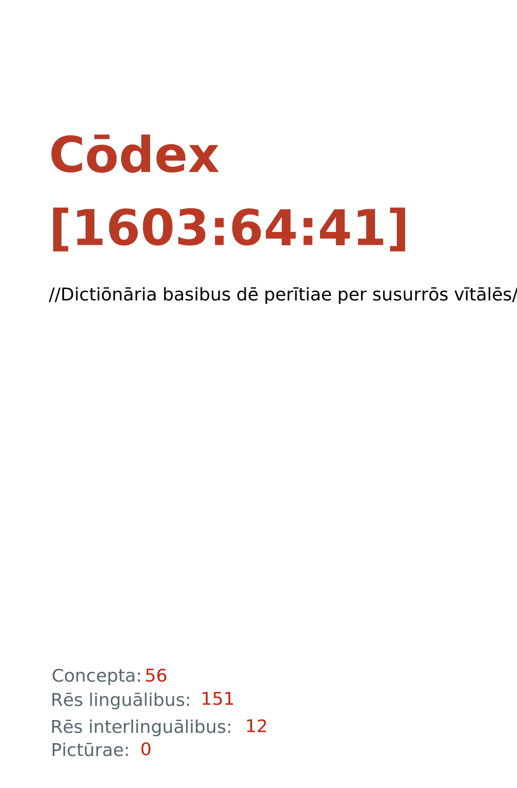

= Cōdex [1603:64:41]: //Dictiōnāria basibus dē perītiae per susurrōs vītālēs//
:doctype: book
:title: Cōdex [1603:64:41]: //Dictiōnāria basibus dē perītiae per susurrōs vītālēs//
:lang: la
:toc: macro
:toclevels: 5
:toc-title: Tabula contentorum
:table-caption: Tabula
:figure-caption: Pictūra
:example-caption: Exemplum
:last-update-label: Renovatio
:version-label: Versiō
:appendix-caption: Appendix
:source-highlighter: rouge
:warning-caption: Hic sunt dracones
:tip-caption: Commendātum
:front-cover-image: : //Dictiōnāria basibus dē perītiae per susurrōs vītālēs//",1050,1600]

{nbsp} +
{nbsp} +
[quote]
**Dedicação ao Domínio Público significa que cada grande problema comum só precisa ser resolvido uma vez**

'''

[%header,cols="25h,~a"]
|===
|
Rēs interlinguālibus
|
Factum

|
scrīptor
|
EticaAI

|
/cōdex pūblicandī/
|
EticaAI

|
/publication date/@eng-Latn
|
2022-04-25

|
numerus editionis
|
2022-04-30T03:31:24

|
/SPDX license ID/@eng-Latn
|
CC0-1.0

|===

ifndef::backend-epub3[]
<<<
toc::[]
<<<
endif::[]

[id=0_999_1603_1]
== Praefātiō 

Rēs linguālibus (1)::
  Lingua Anglica (Abecedarium Latinum):::
    _**Cōdex [1603:64:41]**_ é o formato de livro dos dados estruturados legíveis por máquina do grupo de dicionários _**[1603:64:41] //Dictiōnāria basibus dē perītiae per susurrōs vītālēs//**_, que são distribuídos para os implementadores usarem em aplicativos externos. Este livro pretende ser um recurso avançado para outros lexicógrafos e tradutores de terminologia, inclusive para detectar e relatar inconsistências. Ele pode, no entanto, ser usado como um dicionário ad hoc se não houver trabalho derivado focado em suas necessidades específicas.
    +++  +++
    **SOBRE LEXICOGRAFIA**
    +++  +++
    A lexicografia prática é a arte ou ofício de compilar, escrever e editar dicionários. O básico não é muito diferente de um milênio atrás: ainda é um trabalho muito humano e criativo. É preciso ser humilde: a maioria dos erros de tradutores, na verdade, não é culpa do tradutor, mas falhas metodológicas. Certificar-se de uma ideia de origem do que um conceito representa, mesmo que signifique reescrever e simplificar, anexar fotos, mostrar exemplos, fazer o que for para que seja entendido, faz com que até mesmo tradutores não profissionais que se preocupam com sua própria língua entreguem melhor resultados do que qualquer alternativa. Em outras palavras: mesmo as chamadas melhores práticas da indústria de pagar tradutores e revisores profissionais não podem superar termos de origem já mal explicados.
    +++  +++
    **SOBRE TIPOS DE DICIONÁRIOS QUE ESTAMOS COMPILANDO**
    +++  +++
    Estamos preocupados com um grupo de idéias (chamamos isso de grupo de dicionários de conceitos) que podem ser divididos em partes menores, revisados quanto a inconsistências, aprimorados para definições e depois traduzidos por voluntários. Códigos interlinguais, como o que poderia ser usado na troca de dados real, também são adicionados a cada conceito. Ambos os glossários, interfaces de usuário (como rótulos na coleta de dados) e, em alguns casos, até códigos padrão para o que iria em um campo de dados podem ser compilados dessa maneira.
    +++  +++
    Como a lista completa de dicionários-prototípicos e dicionários minimamente utilizáveis é enorme, um modo de citar público-alvos típicos é o seguinte:
    +++  +++
    . Ajuda humanitária
    . Ajuda ao desenvolvimento
    . Direitos humanos
    . Socorro militar (ou conceitos relacionados a conflitos e resolução de conflitos)
    +++  +++
    Os itens 1, 2 e 4 https://en.m.wikipedia.org/wiki/Humanitarian-Development_Nexus[são algumas vezes referidos como _nexus_] e são frequentemente encontrados ajudando _crise humanitária_. Já que a maioria dos colaboradores cujas ideias e críticas válidas são voluntárias, então 3 (direitos humanos, como na Anistia Internacional) para diferenciar do humanitarismo (como o Movimento da Cruz Vermelha é referência).
    +++  +++
    Observe que **dicionários não são guias de uso**. As instruções, quando existem, são principalmente dedicadas a lexicógrafos e tradutores.
    +++  +++
    **/PRO BONŌ PUBLICŌ/@lat-Latn**
    +++  +++
    As pessoas lexicógrafas deste trabalho são voluntárias, fazendo-o gratuitamente, pro bonō publicō, e não aceitam doações por causa dos dicionários reutilizáveis ​​de todos. O trabalho anterior existente muitas vezes é baseado em livros antigos de domínio público. A maioria dos tradutores de terminologia já seriam voluntários porque acreditam em uma causa. A melhor maneira de inspirar a colaboração é sermos nós mesmos exemplos.
    +++  +++
    Há um aspecto não moralista, bastante simples de entender: quão caro seria pagar pelo trabalho de todos considerando que é viável em mais de 200 idiomas? A logística para decidir quem deve ser pago, depois a transferência de dinheiro em todo o mundo (pode incluir pessoas de países embargados), depois os mecanismos tradicionais de auditoria para verificar o uso indevido que os doadores esperam, existe? Em terminologia especial (os próprios termos do dicionário) e tantas línguas, não existe dinheiro suficiente nem humanos interessados ​​em ser coordenadores.

<<<

== Methodī ex cōdice
=== Methodī ex dictiōnāriōrum corde
Rēs interlinguālibus (1)::
  /scope and content/@eng-Latn:::
    1603_64_41 //Dictiōnāria basibus dē perītiae per susurrōs vītālēs//

=== Methodī ex verbīs in dictiōnāriīs
NOTE: /No momento, não há fluxo de trabalho para usar https://www.wikidata.org/wiki/Wikidata:Lexicographical_data[Wikidata lexicographical data], que na verdade poderia ser usado como armazenamento para nomenclatura mais rigorosa. As implementações atuais usam apenas conceitos do Wikidata, os Q-items./@eng-Latn

==== Methodī ex verbīs in Vicidata (Q modō)
Rēs linguālibus (1)::
  Lingua Anglica (Abecedarium Latinum):::
    O ***[1603:64:41] //Dictiōnāria basibus dē perītiae per susurrōs vītālēs//*** usa o Wikidata como uma estratégia para conciliar termos linguísticos para um ou mais de seus conceitos.
    +++  +++
    Isso significa que este livro e os arquivos de dados de dicionários relacionados requerem atualizações periódicas para , no mínimo, sincronize e compartilhe novamente as traduções atualizadas.
    +++  +++
    **Qual a confiabilidade das traduções da comunidade (fonte Wikidata)?**
    +++  +++
    A resposta curta padrão é: **elas são confiáveis**, mesmo nos casos de não haver traduções oficiais para cada assunto.
    +++  +++
    Como referência, é provável que um tradutor profissional (sem acesso à Wikipedia ou bases de terminologia interna das organizações de controle) forneça resultados de qualidade inferior se você fizer testes cegos. Isso é possível porque não apenas o público médio, mas também terminólogos e tradutores profissionais ajudam a Wikipédia (e implicitamente o Wikidata).
    +++  +++
    No entanto, mesmo quando o resultado está correto, a versão atual precisa de diferenciação aprimorada, no mínimo, sigla e forma longa . Para grandes organizações, existem recursos como __P1813 nomes curtos__, mas ainda não foram compilados com o conjunto de dados atual.
    +++  +++
    **Os principais motivos para "traduções erradas" não são culpa dos tradutores**
    +++  +++
    DICA: Como regra geral, para conceitos já muito definidos em que você, como humano, pode verificar manualmente um ou mais termos traduzidos como um resultado decente, as outras traduções provavelmente serão aceitáveis. Dicionários com casos extremos (como nomes de territórios em disputa) teriam mais explicações.
    +++  +++
    A principal razão para "traduções erradas" são conceitos mal definidos usados ​​para explicar aos tradutores da comunidade como gerar traduções de terminologia. Isso tornaria as traduções existentes do Wikidata (usadas não apenas por nós) inconsistentes. A segunda razão é se os dicionários usam traduções para conceitos sem uma correspondência estrita; em outras palavras, se fizermos definições mais estritas do que significa conceito, mas reutilizarmos termos menos exatos da Wikidada. Também há problemas quando idiomas inteiros são codificados com códigos errados. Observe que todos esses casos **traduções erradas NÃO são estritamente culpa do tradutor, mas sim da lexicografia**.
    +++  +++
    Ainda é possível ter erros estritos no nível de tradução. Mas mesmo que indiquemos aos usuários como corrigir o Wikidata/Wikipedia (com base na melhor explicação contextual de um conceito, como este livro), os requisitos para dizer que o termo anterior foi objetivamente um erro de tradução humana errado (se seguir nossa seriedade na construção de dicionário) são muito elevados.
    +++  +++
    Do ponto de vista da conciliação de dados, a seguinte metodologia é utilizada para publicar as traduções da terminologia com a tabela de conceitos principais.
    +++  +++
    . A principal tabela lexicográfica artesanal (explicada no tópico anterior), também fornecida em `1603_64_41.no1.tm.hxl.csv`, pode fazer referência ao Wiki QID.
    . Cada QID exclusivo de `1603_64_41.no1.tm.hxl.csv`, juntamente com códigos de idioma de [`1603:1:51`] (que requer conhecimento de idiomas humanos), é usado para preparar uma consulta SPARQL otimizada para execução em https://query.wikidata.org/[Wikidata Query Service]. A consulta é tão grande que não é viável para links "Try it" (URL longo), como https://www.wikidata.org/wiki/Wikidata:SPARQL_query_service/queries/examples[como o que você encontraria nos Tutoriais Wikidata ], ***mas*** funciona!
    .. Note que o conhecimento é gratuito, as traduções estão lá, mas as necessidades humanitárias multilíngues podem faltar pessoas para preparar os arquivos e compartilhar do que para uso geral.
    . O resultado da consulta, com todos os QIDs e rótulos de termos, é compartilhado como `1603_64_41.wikiq.tm.hxl.csv`
    . As traduções revisadas pela comunidade de cada QID singular são pré-compiladas em um arquivo individual `1603_64_41.wikiq.tm.hxl.csv`
    . `1603_64_41.no1.tm.hxl.csv` mais `1603_64_41.wikiq.tm.hxl.csv` criado `1603_64_41.no11.tm.hxl.csv`

=== Rēs dē factō in dictiōnāriīs
==== Concepta: 56

==== Rēs linguālibus: 149

[%header,cols="15h,25a,~,17"]
|===
|
Cōdex linguae
|
Glotto cōdicī +++ +++ ISO 639-3 +++ +++ Wiki QID cōdicī
|
Nōmen Latīnum
|
Concepta

|
mul-Zyyy
|

+++ +++
https://iso639-3.sil.org/code/mul[mul]
+++ +++ 
|
Linguae multiplīs (Scrīptum incognitō)
|
56

|
ara-Arab
|
https://glottolog.org/resource/languoid/id/arab1395[arab1395]
+++ +++
https://iso639-3.sil.org/code/ara[ara]
+++ +++ https://www.wikidata.org/wiki/Q13955[Q13955]
|
Macrolingua Arabica (Abecedarium Arabicum)
|
37

|
hye-Armn
|
https://glottolog.org/resource/languoid/id/nucl1235[nucl1235]
+++ +++
https://iso639-3.sil.org/code/hye[hye]
+++ +++ https://www.wikidata.org/wiki/Q8785[Q8785]
|
Lingua Armenia (Alphabetum Armenium)
|
8

|
ben-Beng
|
https://glottolog.org/resource/languoid/id/beng1280[beng1280]
+++ +++
https://iso639-3.sil.org/code/ben[ben]
+++ +++ https://www.wikidata.org/wiki/Q9610[Q9610]
|
Lingua Bengali (/ISO 15924 Beng/)
|
4

|
rus-Cyrl
|
https://glottolog.org/resource/languoid/id/russ1263[russ1263]
+++ +++
https://iso639-3.sil.org/code/rus[rus]
+++ +++ https://www.wikidata.org/wiki/Q7737[Q7737]
|
Lingua Russica (Abecedarium Cyrillicum)
|
38

|
hin-Deva
|
https://glottolog.org/resource/languoid/id/hind1269[hind1269]
+++ +++
https://iso639-3.sil.org/code/hin[hin]
+++ +++ https://www.wikidata.org/wiki/Q1568[Q1568]
|
Lingua Hindica (Devanāgarī)
|
12

|
amh-Ethi
|
https://glottolog.org/resource/languoid/id/amha1245[amha1245]
+++ +++
https://iso639-3.sil.org/code/amh[amh]
+++ +++ https://www.wikidata.org/wiki/Q28244[Q28244]
|
Lingua Amharica (/ISO 15924 Ethi/)
|
1

|
kat-Geor
|
https://glottolog.org/resource/languoid/id/nucl1302[nucl1302]
+++ +++
https://iso639-3.sil.org/code/kat[kat]
+++ +++ https://www.wikidata.org/wiki/Q8108[Q8108]
|
Lingua Georgiana (Abecedarium Georgianum)
|
7

|
guj-Gujr
|
https://glottolog.org/resource/languoid/id/guja1252[guja1252]
+++ +++
https://iso639-3.sil.org/code/guj[guj]
+++ +++ https://www.wikidata.org/wiki/Q5137[Q5137]
|
Lingua Gujaratensis (/ISO 15924 Gujr/)
|
3

|
pan-Guru
|
https://glottolog.org/resource/languoid/id/panj1256[panj1256]
+++ +++
https://iso639-3.sil.org/code/pan[pan]
+++ +++ https://www.wikidata.org/wiki/Q58635[Q58635]
|
Lingua Paniabica (/ISO 15924 Guru/)
|
1

|
kan-Knda
|
https://glottolog.org/resource/languoid/id/nucl1305[nucl1305]
+++ +++
https://iso639-3.sil.org/code/kan[kan]
+++ +++ https://www.wikidata.org/wiki/Q33673[Q33673]
|
Lingua Cannadica (/ISO 15924 Knda/)
|
3

|
kor-Hang
|
https://glottolog.org/resource/languoid/id/kore1280[kore1280]
+++ +++
https://iso639-3.sil.org/code/kor[kor]
+++ +++ https://www.wikidata.org/wiki/Q9176[Q9176]
|
Lingua Coreana (Abecedarium Coreanum)
|
24

|
heb-Hebr
|
https://glottolog.org/resource/languoid/id/hebr1245[hebr1245]
+++ +++
https://iso639-3.sil.org/code/heb[heb]
+++ +++ https://www.wikidata.org/wiki/Q9288[Q9288]
|
Lingua Hebraica (Alphabetum Hebraicum)
|
27

|
lat-Latn
|
https://glottolog.org/resource/languoid/id/lati1261[lati1261]
+++ +++
https://iso639-3.sil.org/code/lat[lat]
+++ +++ https://www.wikidata.org/wiki/Q397[Q397]
|
Lingua Latina (Abecedarium Latinum)
|
8

|
mni-Mtei
|
https://glottolog.org/resource/languoid/id/mani1292[mani1292]
+++ +++
https://iso639-3.sil.org/code/mni[mni]
+++ +++ https://www.wikidata.org/wiki/Q33868[Q33868]
|
Lingua Meitei (/ISO 15924 Mtei/)
|
1

|
mnw-Mymr
|
https://glottolog.org/resource/languoid/id/monn1252[monn1252]
+++ +++
https://iso639-3.sil.org/code/mnw[mnw]
+++ +++ https://www.wikidata.org/wiki/Q13349[Q13349]
|
/Mon language/ (/ISO 15924 Mymr/)
|
1

|
ori-Orya
|

+++ +++
https://iso639-3.sil.org/code/ori[ori]
+++ +++ https://www.wikidata.org/wiki/Q33810[Q33810]
|
Macrolingua Orissensis (/ISO 15924 Orya/)
|
1

|
sin-Sinh
|
https://glottolog.org/resource/languoid/id/sinh1246[sinh1246]
+++ +++
https://iso639-3.sil.org/code/sin[sin]
+++ +++ https://www.wikidata.org/wiki/Q13267[Q13267]
|
Lingua Singhalensis (/ISO 15924 Sinh/)
|
2

|
tam-Taml
|
https://glottolog.org/resource/languoid/id/tami1289[tami1289]
+++ +++
https://iso639-3.sil.org/code/tam[tam]
+++ +++ https://www.wikidata.org/wiki/Q5885[Q5885]
|
Lingua Tamulica (/ISO 15924 Taml/)
|
12

|
tel-Telu
|
https://glottolog.org/resource/languoid/id/telu1262[telu1262]
+++ +++
https://iso639-3.sil.org/code/tel[tel]
+++ +++ https://www.wikidata.org/wiki/Q8097[Q8097]
|
Lingua Telingana (/ISO 15924 Telu/)
|
2

|
tha-Thai
|
https://glottolog.org/resource/languoid/id/thai1261[thai1261]
+++ +++
https://iso639-3.sil.org/code/tha[tha]
+++ +++ https://www.wikidata.org/wiki/Q9217[Q9217]
|
Lingua Thai (/ISO 15924 Thai/)
|
7

|
san-Zyyy
|
https://glottolog.org/resource/languoid/id/sans1269[sans1269]
+++ +++
https://iso639-3.sil.org/code/san[san]
+++ +++ https://www.wikidata.org/wiki/Q11059[Q11059]
|
Lingua Sanscrita (/ISO 15924 Zyyy/)
|
1

|
zho-Zyyy
|
https://glottolog.org/resource/languoid/id/sini1245[sini1245]
+++ +++
https://iso639-3.sil.org/code/zho[zho]
+++ +++ https://www.wikidata.org/wiki/Q7850[Q7850]
|
/Macrolingua Sinicae (/ISO 15924 Zyyy/)/
|
41

|
por-Latn
|
https://glottolog.org/resource/languoid/id/port1283[port1283]
+++ +++
https://iso639-3.sil.org/code/por[por]
+++ +++ https://www.wikidata.org/wiki/Q5146[Q5146]
|
Lingua Lusitana (Abecedarium Latinum)
|
29

|
eng-Latn
|
https://glottolog.org/resource/languoid/id/stan1293[stan1293]
+++ +++
https://iso639-3.sil.org/code/eng[eng]
+++ +++ https://www.wikidata.org/wiki/Q1860[Q1860]
|
Lingua Anglica (Abecedarium Latinum)
|
58

|
fra-Latn
|
https://glottolog.org/resource/languoid/id/stan1290[stan1290]
+++ +++
https://iso639-3.sil.org/code/fra[fra]
+++ +++ https://www.wikidata.org/wiki/Q150[Q150]
|
Lingua Francogallica (Abecedarium Latinum)
|
42

|
nld-Latn
|
https://glottolog.org/resource/languoid/id/mode1257[mode1257]
+++ +++
https://iso639-3.sil.org/code/nld[nld]
+++ +++ https://www.wikidata.org/wiki/Q7411[Q7411]
|
Lingua Batavica (Abecedarium Latinum)
|
23

|
deu-Latn
|
https://glottolog.org/resource/languoid/id/stan1295[stan1295]
+++ +++
https://iso639-3.sil.org/code/deu[deu]
+++ +++ https://www.wikidata.org/wiki/Q188[Q188]
|
Lingua Germanica (Abecedarium Latinum)
|
38

|
spa-Latn
|
https://glottolog.org/resource/languoid/id/stan1288[stan1288]
+++ +++
https://iso639-3.sil.org/code/spa[spa]
+++ +++ https://www.wikidata.org/wiki/Q1321[Q1321]
|
Lingua Hispanica (Abecedarium Latinum)
|
44

|
ita-Latn
|
https://glottolog.org/resource/languoid/id/ital1282[ital1282]
+++ +++
https://iso639-3.sil.org/code/ita[ita]
+++ +++ https://www.wikidata.org/wiki/Q652[Q652]
|
Lingua Italiana (Abecedarium Latinum)
|
34

|
gle-Latn
|
https://glottolog.org/resource/languoid/id/iris1253[iris1253]
+++ +++
https://iso639-3.sil.org/code/gle[gle]
+++ +++ https://www.wikidata.org/wiki/Q9142[Q9142]
|
Lingua Hibernica (Abecedarium Latinum)
|
4

|
swe-Latn
|
https://glottolog.org/resource/languoid/id/swed1254[swed1254]
+++ +++
https://iso639-3.sil.org/code/swe[swe]
+++ +++ https://www.wikidata.org/wiki/Q9027[Q9027]
|
Lingua Suecica (Abecedarium Latinum)
|
21

|
sqi-Latn
|
https://glottolog.org/resource/languoid/id/alba1267[alba1267]
+++ +++
https://iso639-3.sil.org/code/sqi[sqi]
+++ +++ https://www.wikidata.org/wiki/Q8748[Q8748]
|
Macrolingua Albanica (/Abecedarium Latinum/)
|
6

|
pol-Latn
|
https://glottolog.org/resource/languoid/id/poli1260[poli1260]
+++ +++
https://iso639-3.sil.org/code/pol[pol]
+++ +++ https://www.wikidata.org/wiki/Q809[Q809]
|
Lingua Polonica (Abecedarium Latinum)
|
24

|
fin-Latn
|
https://glottolog.org/resource/languoid/id/finn1318[finn1318]
+++ +++
https://iso639-3.sil.org/code/fin[fin]
+++ +++ https://www.wikidata.org/wiki/Q1412[Q1412]
|
Lingua Finnica (Abecedarium Latinum)
|
18

|
ron-Latn
|
https://glottolog.org/resource/languoid/id/roma1327[roma1327]
+++ +++
https://iso639-3.sil.org/code/ron[ron]
+++ +++ https://www.wikidata.org/wiki/Q7913[Q7913]
|
Lingua Dacoromanica (Abecedarium Latinum)
|
18

|
vie-Latn
|
https://glottolog.org/resource/languoid/id/viet1252[viet1252]
+++ +++
https://iso639-3.sil.org/code/vie[vie]
+++ +++ https://www.wikidata.org/wiki/Q9199[Q9199]
|
Lingua Vietnamensis (Abecedarium Latinum)
|
17

|
cat-Latn
|
https://glottolog.org/resource/languoid/id/stan1289[stan1289]
+++ +++
https://iso639-3.sil.org/code/cat[cat]
+++ +++ https://www.wikidata.org/wiki/Q7026[Q7026]
|
Lingua Catalana (Abecedarium Latinum)
|
26

|
ukr-Cyrl
|
https://glottolog.org/resource/languoid/id/ukra1253[ukra1253]
+++ +++
https://iso639-3.sil.org/code/ukr[ukr]
+++ +++ https://www.wikidata.org/wiki/Q8798[Q8798]
|
Lingua Ucrainica (Abecedarium Cyrillicum)
|
37

|
bul-Cyrl
|
https://glottolog.org/resource/languoid/id/bulg1262[bulg1262]
+++ +++
https://iso639-3.sil.org/code/bul[bul]
+++ +++ https://www.wikidata.org/wiki/Q7918[Q7918]
|
Lingua Bulgarica (Abecedarium Cyrillicum)
|
16

|
slv-Latn
|
https://glottolog.org/resource/languoid/id/slov1268[slov1268]
+++ +++
https://iso639-3.sil.org/code/slv[slv]
+++ +++ https://www.wikidata.org/wiki/Q9063[Q9063]
|
Lingua Slovena (Abecedarium Latinum)
|
9

|
war-Latn
|
https://glottolog.org/resource/languoid/id/wara1300[wara1300]
+++ +++
https://iso639-3.sil.org/code/war[war]
+++ +++ https://www.wikidata.org/wiki/Q34279[Q34279]
|
/Waray language/ (Abecedarium Latinum)
|
1

|
nob-Latn
|
https://glottolog.org/resource/languoid/id/norw1259[norw1259]
+++ +++
https://iso639-3.sil.org/code/nob[nob]
+++ +++ https://www.wikidata.org/wiki/Q25167[Q25167]
|
/Bokmål/ (Abecedarium Latinum)
|
16

|
ces-Latn
|
https://glottolog.org/resource/languoid/id/czec1258[czec1258]
+++ +++
https://iso639-3.sil.org/code/ces[ces]
+++ +++ https://www.wikidata.org/wiki/Q9056[Q9056]
|
Lingua Bohemica (Abecedarium Latinum)
|
23

|
dan-Latn
|
https://glottolog.org/resource/languoid/id/dani1285[dani1285]
+++ +++
https://iso639-3.sil.org/code/dan[dan]
+++ +++ https://www.wikidata.org/wiki/Q9035[Q9035]
|
Lingua Danica (Abecedarium Latinum)
|
12

|
jpn-Jpan
|
https://glottolog.org/resource/languoid/id/nucl1643[nucl1643]
+++ +++
https://iso639-3.sil.org/code/jpn[jpn]
+++ +++ https://www.wikidata.org/wiki/Q5287[Q5287]
|
Lingua Iaponica (Scriptura Iaponica)
|
39

|
nno-Latn
|
https://glottolog.org/resource/languoid/id/norw1262[norw1262]
+++ +++
https://iso639-3.sil.org/code/nno[nno]
+++ +++ https://www.wikidata.org/wiki/Q25164[Q25164]
|
/Nynorsk/ (Abecedarium Latinum)
|
9

|
mal-Mlym
|
https://glottolog.org/resource/languoid/id/mala1464[mala1464]
+++ +++
https://iso639-3.sil.org/code/mal[mal]
+++ +++ https://www.wikidata.org/wiki/Q36236[Q36236]
|
Lingua Malabarica (/Malayalam script/)
|
7

|
ind-Latn
|
https://glottolog.org/resource/languoid/id/indo1316[indo1316]
+++ +++
https://iso639-3.sil.org/code/ind[ind]
+++ +++ https://www.wikidata.org/wiki/Q9240[Q9240]
|
Lingua Indonesiana (Abecedarium Latinum)
|
21

|
fas-Zyyy
|

+++ +++
https://iso639-3.sil.org/code/fas[fas]
+++ +++ https://www.wikidata.org/wiki/Q9168[Q9168]
|
Macrolingua Persica (//Abecedarium Arabicum//)
|
35

|
hun-Latn
|
https://glottolog.org/resource/languoid/id/hung1274[hung1274]
+++ +++
https://iso639-3.sil.org/code/hun[hun]
+++ +++ https://www.wikidata.org/wiki/Q9067[Q9067]
|
Lingua Hungarica (Abecedarium Latinum)
|
13

|
eus-Latn
|
https://glottolog.org/resource/languoid/id/basq1248[basq1248]
+++ +++
https://iso639-3.sil.org/code/eus[eus]
+++ +++ https://www.wikidata.org/wiki/Q8752[Q8752]
|
Lingua Vasconica (Abecedarium Latinum)
|
12

|
cym-Latn
|
https://glottolog.org/resource/languoid/id/wels1247[wels1247]
+++ +++
https://iso639-3.sil.org/code/cym[cym]
+++ +++ https://www.wikidata.org/wiki/Q9309[Q9309]
|
Lingua Cambrica (Abecedarium Latinum)
|
1

|
glg-Latn
|
https://glottolog.org/resource/languoid/id/gali1258[gali1258]
+++ +++
https://iso639-3.sil.org/code/glg[glg]
+++ +++ https://www.wikidata.org/wiki/Q9307[Q9307]
|
Lingua Gallaica (Abecedarium Latinum)
|
11

|
slk-Latn
|
https://glottolog.org/resource/languoid/id/slov1269[slov1269]
+++ +++
https://iso639-3.sil.org/code/slk[slk]
+++ +++ https://www.wikidata.org/wiki/Q9058[Q9058]
|
Lingua Slovaca (Abecedarium Latinum)
|
10

|
epo-Latn
|
https://glottolog.org/resource/languoid/id/espe1235[espe1235]
+++ +++
https://iso639-3.sil.org/code/epo[epo]
+++ +++ https://www.wikidata.org/wiki/Q143[Q143]
|
Lingua Esperantica (Abecedarium Latinum)
|
22

|
msa-Zyyy
|

+++ +++
https://iso639-3.sil.org/code/msa[msa]
+++ +++ https://www.wikidata.org/wiki/Q9237[Q9237]
|
Macrolingua Malayana (/ISO 15924 Zyyy/)
|
10

|
est-Latn
|

+++ +++
https://iso639-3.sil.org/code/est[est]
+++ +++ https://www.wikidata.org/wiki/Q9072[Q9072]
|
Macrolingua Estonica (Abecedarium Latinum)
|
13

|
hrv-Latn
|
https://glottolog.org/resource/languoid/id/croa1245[croa1245]
+++ +++
https://iso639-3.sil.org/code/hrv[hrv]
+++ +++ https://www.wikidata.org/wiki/Q6654[Q6654]
|
Lingua Croatica (Abecedarium Latinum)
|
12

|
tur-Latn
|
https://glottolog.org/resource/languoid/id/nucl1301[nucl1301]
+++ +++
https://iso639-3.sil.org/code/tur[tur]
+++ +++ https://www.wikidata.org/wiki/Q256[Q256]
|
Lingua Turcica (Abecedarium Latinum)
|
20

|
oci-Latn
|
https://glottolog.org/resource/languoid/id/occi1239[occi1239]
+++ +++
https://iso639-3.sil.org/code/oci[oci]
+++ +++ https://www.wikidata.org/wiki/Q14185[Q14185]
|
Lingua Occitana (Abecedarium Latinum)
|
3

|
arz-Latn
|
https://glottolog.org/resource/languoid/id/egyp1253[egyp1253]
+++ +++
https://iso639-3.sil.org/code/arz[arz]
+++ +++ https://www.wikidata.org/wiki/Q29919[Q29919]
|
/Egyptian Arabic/ (Abecedarium Arabicum)
|
1

|
afr-Latn
|
https://glottolog.org/resource/languoid/id/afri1274[afri1274]
+++ +++
https://iso639-3.sil.org/code/afr[afr]
+++ +++ https://www.wikidata.org/wiki/Q14196[Q14196]
|
Lingua Batava Capitensis (Abecedarium Latinum)
|
4

|
sco-Latn
|
https://glottolog.org/resource/languoid/id/scot1243[scot1243]
+++ +++
https://iso639-3.sil.org/code/sco[sco]
+++ +++ https://www.wikidata.org/wiki/Q14549[Q14549]
|
Lingua Scotica quae Teutonica (Abecedarium Latinum)
|
2

|
arg-Latn
|
https://glottolog.org/resource/languoid/id/arag1245[arag1245]
+++ +++
https://iso639-3.sil.org/code/arg[arg]
+++ +++ https://www.wikidata.org/wiki/Q8765[Q8765]
|
Lingua Aragonensis (Abecedarium Latinum)
|
1

|
zho-Hant
|

+++ +++
https://iso639-3.sil.org/code/zho[zho]
+++ +++ https://www.wikidata.org/wiki/Q18130932[Q18130932]
|
//Traditional Chinese// (/ISO 15924 Hant/)
|
27

|
gsw-Latn
|
https://glottolog.org/resource/languoid/id/swis1247[swis1247]
+++ +++
https://iso639-3.sil.org/code/gsw[gsw]
+++ +++ https://www.wikidata.org/wiki/Q131339[Q131339]
|
Dialecti Alemannicae (Abecedarium Latinum)
|
4

|
isl-Latn
|
https://glottolog.org/resource/languoid/id/icel1247[icel1247]
+++ +++
https://iso639-3.sil.org/code/isl[isl]
+++ +++ https://www.wikidata.org/wiki/Q294[Q294]
|
Lingua Islandica (Abecedarium Latinum)
|
5

|
min-Latn
|
https://glottolog.org/resource/languoid/id/mina1268[mina1268]
+++ +++
https://iso639-3.sil.org/code/min[min]
+++ +++ https://www.wikidata.org/wiki/Q13324[Q13324]
|
/Minangkabau language/ (Abecedarium Latinum)
|
1

|
vec-Latn
|
https://glottolog.org/resource/languoid/id/vene1258[vene1258]
+++ +++
https://iso639-3.sil.org/code/vec[vec]
+++ +++ https://www.wikidata.org/wiki/Q32724[Q32724]
|
Lingua Veneta (Abecedarium Latinum)
|
5

|
scn-Latn
|
https://glottolog.org/resource/languoid/id/sici1248[sici1248]
+++ +++
https://iso639-3.sil.org/code/scn[scn]
+++ +++ https://www.wikidata.org/wiki/Q33973[Q33973]
|
Lingua Sicula (Abecedarium Latinum)
|
1

|
lim-Latn
|
https://glottolog.org/resource/languoid/id/limb1263[limb1263]
+++ +++
https://iso639-3.sil.org/code/lim[lim]
+++ +++ https://www.wikidata.org/wiki/Q102172[Q102172]
|
Lingua Limburgica (Abecedarium Latinum)
|
1

|
srp-Latn
|
https://glottolog.org/resource/languoid/id/serb1264[serb1264]
+++ +++
https://iso639-3.sil.org/code/srp[srp]
+++ +++ https://www.wikidata.org/wiki/Q21161949[Q21161949]
|
/Serbian/ (Abecedarium Latinum)
|
8

|
vls-Latn
|
https://glottolog.org/resource/languoid/id/vlaa1240[vlaa1240]
+++ +++
https://iso639-3.sil.org/code/vls[vls]
+++ +++ https://www.wikidata.org/wiki/Q100103[Q100103]
|
/West Flemish/ (Abecedarium Latinum)
|
1

|
fur-Latn
|
https://glottolog.org/resource/languoid/id/friu1240[friu1240]
+++ +++
https://iso639-3.sil.org/code/fur[fur]
+++ +++ https://www.wikidata.org/wiki/Q33441[Q33441]
|
Lingua Foroiuliensis (Abecedarium Latinum)
|
1

|
wuu-Zyyy
|
https://glottolog.org/resource/languoid/id/wuch1236[wuch1236]
+++ +++
https://iso639-3.sil.org/code/wuu[wuu]
+++ +++ https://www.wikidata.org/wiki/Q34290[Q34290]
|
//Macrolingua Wu// (/ISO 15924 Zyyy/)
|
5

|
srp-Cyrl
|
https://glottolog.org/resource/languoid/id/serb1264[serb1264]
+++ +++
https://iso639-3.sil.org/code/srp[srp]
+++ +++ https://www.wikidata.org/wiki/Q9299[Q9299]
|
Lingua Serbica (Abecedarium Cyrillicum)
|
22

|
urd-Arab
|
https://glottolog.org/resource/languoid/id/urdu1245[urdu1245]
+++ +++
https://iso639-3.sil.org/code/urd[urd]
+++ +++ https://www.wikidata.org/wiki/Q1617[Q1617]
|
Lingua Urdu (Abecedarium Arabicum)
|
3

|
gan-Zyyy
|
https://glottolog.org/resource/languoid/id/ganc1239[ganc1239]
+++ +++
https://iso639-3.sil.org/code/gan[gan]
+++ +++ https://www.wikidata.org/wiki/Q33475[Q33475]
|
Lingua Gan (/ISO 15924 Zyyy/)
|
1

|
lit-Latn
|
https://glottolog.org/resource/languoid/id/lith1251[lith1251]
+++ +++
https://iso639-3.sil.org/code/lit[lit]
+++ +++ https://www.wikidata.org/wiki/Q9083[Q9083]
|
Lingua Lithuanica (Abecedarium Latinum)
|
8

|
hbs-Latn
|
https://glottolog.org/resource/languoid/id/sout1528[sout1528]
+++ +++
https://iso639-3.sil.org/code/hbs[hbs]
+++ +++ https://www.wikidata.org/wiki/Q9301[Q9301]
|
Macrolingua Serbocroatica (Abecedarium Latinum)
|
10

|
lav-Latn
|
https://glottolog.org/resource/languoid/id/latv1249[latv1249]
+++ +++
https://iso639-3.sil.org/code/lav[lav]
+++ +++ https://www.wikidata.org/wiki/Q9078[Q9078]
|
Macrolingua Lettonica (Abecedarium Latinum)
|
8

|
bos-Latn
|
https://glottolog.org/resource/languoid/id/bosn1245[bosn1245]
+++ +++
https://iso639-3.sil.org/code/bos[bos]
+++ +++ https://www.wikidata.org/wiki/Q9303[Q9303]
|
Lingua Bosnica (Abecedarium Latinum)
|
6

|
azb-Arab
|
https://glottolog.org/resource/languoid/id/sout2697[sout2697]
+++ +++
https://iso639-3.sil.org/code/azb[azb]
+++ +++ https://www.wikidata.org/wiki/Q3449805[Q3449805]
|
/South Azerbaijani/ (Abecedarium Arabicum)
|
1

|
jav-Latn
|
https://glottolog.org/resource/languoid/id/java1254[java1254]
+++ +++
https://iso639-3.sil.org/code/jav[jav]
+++ +++ https://www.wikidata.org/wiki/Q33549[Q33549]
|
Lingua Iavanica (Abecedarium Latinum)
|
2

|
ell-Grek
|
https://glottolog.org/resource/languoid/id/mode1248[mode1248]
+++ +++
https://iso639-3.sil.org/code/ell[ell]
+++ +++ https://www.wikidata.org/wiki/Q36510[Q36510]
|
Lingua Neograeca (Alphabetum Graecum)
|
19

|
sun-Latn
|
https://glottolog.org/resource/languoid/id/sund1252[sund1252]
+++ +++
https://iso639-3.sil.org/code/sun[sun]
+++ +++ https://www.wikidata.org/wiki/Q34002[Q34002]
|
/Sundanese language/ (Abecedarium Latinum)
|
2

|
fry-Latn
|
https://glottolog.org/resource/languoid/id/west2354[west2354]
+++ +++
https://iso639-3.sil.org/code/fry[fry]
+++ +++ https://www.wikidata.org/wiki/Q27175[Q27175]
|
Lingua Frisice occidentalis (Abecedarium Latinum)
|
1

|
jam-Latn
|
https://glottolog.org/resource/languoid/id/jama1262[jama1262]
+++ +++
https://iso639-3.sil.org/code/jam[jam]
+++ +++ https://www.wikidata.org/wiki/Q35939[Q35939]
|
Lingua creola Iamaicana (Abecedarium Latinum)
|
1

|
bel-Cyrl
|
https://glottolog.org/resource/languoid/id/bela1254[bela1254]
+++ +++
https://iso639-3.sil.org/code/bel[bel]
+++ +++ https://www.wikidata.org/wiki/Q9091[Q9091]
|
Lingua Ruthenica Alba (Abecedarium Cyrillicum)
|
6

|
lmo-Latn
|
https://glottolog.org/resource/languoid/id/lomb1257[lomb1257]
+++ +++
https://iso639-3.sil.org/code/lmo[lmo]
+++ +++ https://www.wikidata.org/wiki/Q33754[Q33754]
|
Langobardus sermo (Abecedarium Latinum)
|
1

|
mar-Deva
|
https://glottolog.org/resource/languoid/id/mara1378[mara1378]
+++ +++
https://iso639-3.sil.org/code/mar[mar]
+++ +++ https://www.wikidata.org/wiki/Q1571[Q1571]
|
Lingua Marathica (Devanāgarī)
|
3

|
ast-Latn
|
https://glottolog.org/resource/languoid/id/astu1245[astu1245]
+++ +++
https://iso639-3.sil.org/code/ast[ast]
+++ +++ https://www.wikidata.org/wiki/Q29507[Q29507]
|
Lingua Asturiana (Abecedarium Latinum)
|
6

|
bho-Deva
|
https://glottolog.org/resource/languoid/id/bhoj1244[bhoj1244]
+++ +++
https://iso639-3.sil.org/code/bho[bho]
+++ +++ https://www.wikidata.org/wiki/Q33268[Q33268]
|
Lingua Bhojpuri (Devanāgarī)
|
1

|
bxr-Cyrl
|
https://glottolog.org/resource/languoid/id/russ1264[russ1264]
+++ +++
https://iso639-3.sil.org/code/bxr[bxr]
+++ +++ https://www.wikidata.org/wiki/Q33120[Q33120]
|
Lingua Buriatica (Abecedarium Cyrillicum)
|
2

|
diq-Latn
|
https://glottolog.org/resource/languoid/id/diml1238[diml1238]
+++ +++
https://iso639-3.sil.org/code/diq[diq]
+++ +++ https://www.wikidata.org/wiki/Q10199[Q10199]
|
Lingua Zazaca (Abecedarium Latinum)
|
2

|
gcr-Latn
|
https://glottolog.org/resource/languoid/id/guia1246[guia1246]
+++ +++
https://iso639-3.sil.org/code/gcr[gcr]
+++ +++ https://www.wikidata.org/wiki/Q1363072[Q1363072]
|
/Guianese Creole French/ (Abecedarium Latinum)
|
1

|
ilo-Latn
|
https://glottolog.org/resource/languoid/id/ilok1237[ilok1237]
+++ +++
https://iso639-3.sil.org/code/ilo[ilo]
+++ +++ https://www.wikidata.org/wiki/Q35936[Q35936]
|
Lingua Ilocana (Abecedarium Latinum)
|
1

|
kaa-Latn
|
https://glottolog.org/resource/languoid/id/kara1467[kara1467]
+++ +++
https://iso639-3.sil.org/code/kaa[kaa]
+++ +++ https://www.wikidata.org/wiki/Q33541[Q33541]
|
Lingua Karakalpakensis (Abecedarium Latinum)
|
1

|
nan-Latn
|
https://glottolog.org/resource/languoid/id/minn1241[minn1241]
+++ +++
https://iso639-3.sil.org/code/nan[nan]
+++ +++ https://www.wikidata.org/wiki/Q36495[Q36495]
|
/Min Nan Chinese/ (Abecedarium Latinum)
|
3

|
new-Deva
|
https://glottolog.org/resource/languoid/id/newa1246[newa1246]
+++ +++
https://iso639-3.sil.org/code/new[new]
+++ +++ https://www.wikidata.org/wiki/Q33979[Q33979]
|
Lingua Newari (Devanāgarī)
|
1

|
pnb-Arab
|
https://glottolog.org/resource/languoid/id/west2386[west2386]
+++ +++
https://iso639-3.sil.org/code/pnb[pnb]
+++ +++ https://www.wikidata.org/wiki/Q1389492[Q1389492]
|
Lingua Paniabica occidentalis (Abecedarium Arabicum)
|
1

|
rue-Cyrl
|
https://glottolog.org/resource/languoid/id/rusy1239[rusy1239]
+++ +++
https://iso639-3.sil.org/code/rue[rue]
+++ +++ https://www.wikidata.org/wiki/Q26245[Q26245]
|
Lingua Rusinica (Abecedarium Cyrillicum)
|
1

|
sah-Cyrl
|
https://glottolog.org/resource/languoid/id/yaku1245[yaku1245]
+++ +++
https://iso639-3.sil.org/code/sah[sah]
+++ +++ https://www.wikidata.org/wiki/Q34299[Q34299]
|
Lingua Iacutica (Abecedarium Cyrillicum)
|
1

|
sgs-Latn
|
https://glottolog.org/resource/languoid/id/samo1265[samo1265]
+++ +++
https://iso639-3.sil.org/code/sgs[sgs]
+++ +++ https://www.wikidata.org/wiki/Q213434[Q213434]
|
Lingua Samogitica (Abecedarium Latinum)
|
1

|
smn-Latn
|
https://glottolog.org/resource/languoid/id/inar1241[inar1241]
+++ +++
https://iso639-3.sil.org/code/smn[smn]
+++ +++ https://www.wikidata.org/wiki/Q33462[Q33462]
|
/Inari Sami/ (Abecedarium Latinum)
|
2

|
szl-Latn
|
https://glottolog.org/resource/languoid/id/sile1253[sile1253]
+++ +++
https://iso639-3.sil.org/code/szl[szl]
+++ +++ https://www.wikidata.org/wiki/Q30319[Q30319]
|
Lingua Silesica (Abecedarium Latinum)
|
1

|
udm-Cyrl
|
https://glottolog.org/resource/languoid/id/udmu1245[udmu1245]
+++ +++
https://iso639-3.sil.org/code/udm[udm]
+++ +++ https://www.wikidata.org/wiki/Q13238[Q13238]
|
Lingua Udmurtica (Abecedarium Cyrillicum)
|
1

|
vro-Latn
|
https://glottolog.org/resource/languoid/id/sout2679[sout2679]
+++ +++
https://iso639-3.sil.org/code/vro[vro]
+++ +++ https://www.wikidata.org/wiki/Q32762[Q32762]
|
Lingua Voruvica (Abecedarium Latinum)
|
1

|
yue-Zyyy
|
https://glottolog.org/resource/languoid/id/yuec1235[yuec1235]
+++ +++
https://iso639-3.sil.org/code/yue[yue]
+++ +++ https://www.wikidata.org/wiki/Q7033959[Q7033959]
|
Lingua Yue (/ISO 15924 Zyyy/)
|
19

|
swa-Latn
|

+++ +++
https://iso639-3.sil.org/code/swa[swa]
+++ +++ https://www.wikidata.org/wiki/Q7838[Q7838]
|
Macrolingua Suahelica (Abecedarium Latinum)
|
1

|
yid-Hebr
|
https://glottolog.org/resource/languoid/id/yidd1255[yidd1255]
+++ +++
https://iso639-3.sil.org/code/yid[yid]
+++ +++ https://www.wikidata.org/wiki/Q8641[Q8641]
|
Macrolingua Iudaeo-Germanica (Alphabetum Hebraicum)
|
3

|
uzb-Latn
|
https://glottolog.org/resource/languoid/id/uzbe1247[uzbe1247]
+++ +++
https://iso639-3.sil.org/code/uzb[uzb]
+++ +++ https://www.wikidata.org/wiki/Q9264[Q9264]
|
Macrolingua Uzbecica (Abecedarium Latinum)
|
4

|
uig-Zyyy
|
https://glottolog.org/resource/languoid/id/uigh1240[uigh1240]
+++ +++
https://iso639-3.sil.org/code/uig[uig]
+++ +++ https://www.wikidata.org/wiki/Q13263[Q13263]
|
Lingua Uigurica (/ISO 15924 Zyyy/)
|
1

|
tat-Zyyy
|
https://glottolog.org/resource/languoid/id/tata1255[tata1255]
+++ +++
https://iso639-3.sil.org/code/tat[tat]
+++ +++ https://www.wikidata.org/wiki/Q25285[Q25285]
|
Lingua Tatarica (/ISO 15924 Zyyy/)
|
4

|
tat-Cyrl
|
https://glottolog.org/resource/languoid/id/tata1255[tata1255]
+++ +++
https://iso639-3.sil.org/code/tat[tat]
+++ +++ https://www.wikidata.org/wiki/Q39132549[Q39132549]
|
Lingua Tatarica (Abecedarium Cyrillicum)
|
1

|
tgl-Latn
|
https://glottolog.org/resource/languoid/id/taga1270[taga1270]
+++ +++
https://iso639-3.sil.org/code/tgl[tgl]
+++ +++ https://www.wikidata.org/wiki/Q34057[Q34057]
|
Lingua Tagalog (Abecedarium Latinum)
|
4

|
tuk-Latn
|
https://glottolog.org/resource/languoid/id/turk1304[turk1304]
+++ +++
https://iso639-3.sil.org/code/tuk[tuk]
+++ +++ https://www.wikidata.org/wiki/Q9267[Q9267]
|
Lingua Turcomannica (Abecedarium Latinum)
|
1

|
asm-Beng
|
https://glottolog.org/resource/languoid/id/assa1263[assa1263]
+++ +++
https://iso639-3.sil.org/code/asm[asm]
+++ +++ https://www.wikidata.org/wiki/Q29401[Q29401]
|
Lingua Assamica (/ISO 15924 Beng/)
|
1

|
aze-Latn
|

+++ +++
https://iso639-3.sil.org/code/aze[aze]
+++ +++ https://www.wikidata.org/wiki/Q9292[Q9292]
|
Macrolingua Atropatenica (Abecedarium Latinum)
|
8

|
bak-Cyrl
|
https://glottolog.org/resource/languoid/id/bash1264[bash1264]
+++ +++
https://iso639-3.sil.org/code/bak[bak]
+++ +++ https://www.wikidata.org/wiki/Q13389[Q13389]
|
Lingua Baschkirica (Abecedarium Cyrillicum)
|
1

|
chv-Cyrl
|
https://glottolog.org/resource/languoid/id/chuv1255[chuv1255]
+++ +++
https://iso639-3.sil.org/code/chv[chv]
+++ +++ https://www.wikidata.org/wiki/Q33348[Q33348]
|
Lingua Tschuvaschica (Abecedarium Cyrillicum)
|
2

|
grn-Latn
|

+++ +++
https://iso639-3.sil.org/code/grn[grn]
+++ +++ https://www.wikidata.org/wiki/Q35876[Q35876]
|
Macrolingua Guaranica (Abecedarium Latinum)
|
1

|
hat-Latn
|
https://glottolog.org/resource/languoid/id/hait1244[hait1244]
+++ +++
https://iso639-3.sil.org/code/hat[hat]
+++ +++ https://www.wikidata.org/wiki/Q33491[Q33491]
|
Lingua creola Haitiana (Abecedarium Latinum)
|
3

|
xmf-Geor
|
https://glottolog.org/resource/languoid/id/ming1252[ming1252]
+++ +++
https://iso639-3.sil.org/code/xmf[xmf]
+++ +++ https://www.wikidata.org/wiki/Q13359[Q13359]
|
Lingua Mingrelica (Abecedarium Georgianum)
|
1

|
kaz-Zyyy
|
https://glottolog.org/resource/languoid/id/kaza1248[kaza1248]
+++ +++
https://iso639-3.sil.org/code/kaz[kaz]
+++ +++ https://www.wikidata.org/wiki/Q9252[Q9252]
|
Lingua Kazachica (/ISO 15924 Zyyy/)
|
10

|
kaz-Arab
|
https://glottolog.org/resource/languoid/id/kaza1248[kaza1248]
+++ +++
https://iso639-3.sil.org/code/kaz[kaz]
+++ +++ https://www.wikidata.org/wiki/Q64362991[Q64362991]
|
Lingua Kazachica (Abecedarium Arabicum)
|
6

|
kaz-Cyrl
|
https://glottolog.org/resource/languoid/id/kaza1248[kaza1248]
+++ +++
https://iso639-3.sil.org/code/kaz[kaz]
+++ +++ https://www.wikidata.org/wiki/Q64362992[Q64362992]
|
Lingua Kazachica (Abecedarium Cyrillicum)
|
6

|
kaz-Latn
|
https://glottolog.org/resource/languoid/id/kaza1248[kaza1248]
+++ +++
https://iso639-3.sil.org/code/kaz[kaz]
+++ +++ https://www.wikidata.org/wiki/Q64362993[Q64362993]
|
Lingua Kazachica (Abecedarium Latinum)
|
6

|
kur-Zyyy
|
https://glottolog.org/resource/languoid/id/kurd1259[kurd1259]
+++ +++
https://iso639-3.sil.org/code/kur[kur]
+++ +++ https://www.wikidata.org/wiki/Q36368[Q36368]
|
Macrolingua Curdica (/ISO 15924 Zyyy/)
|
2

|
kur-Arab
|

+++ +++
https://iso639-3.sil.org/code/kur[kur]
+++ +++ https://www.wikidata.org/wiki/Q64362996[Q64362996]
|
Macrolingua Curdica (Abecedarium Arabicum)
|
1

|
kur-Latn
|

+++ +++
https://iso639-3.sil.org/code/kur[kur]
+++ +++ https://www.wikidata.org/wiki/Q64362997[Q64362997]
|
Macrolingua Curdica (Abecedarium Latinum)
|
1

|
ckb-Arab
|
https://glottolog.org/resource/languoid/id/cent1972[cent1972]
+++ +++
https://iso639-3.sil.org/code/ckb[ckb]
+++ +++ https://www.wikidata.org/wiki/Q36811[Q36811]
|
/Central Kurdish/ (Abecedarium Arabicum)
|
3

|
kir-Zyyy
|
https://glottolog.org/resource/languoid/id/kirg1245[kirg1245]
+++ +++
https://iso639-3.sil.org/code/kir[kir]
+++ +++ https://www.wikidata.org/wiki/Q9255[Q9255]
|
Lingua Kyrgyzensis (/ISO 15924 Zyyy/)
|
7

|
mlg-Latn
|

+++ +++
https://iso639-3.sil.org/code/mlg[mlg]
+++ +++ https://www.wikidata.org/wiki/Q7930[Q7930]
|
Macrolingua Malagasiensis (Abecedarium Latinum)
|
2

|
mkd-Cyrl
|
https://glottolog.org/resource/languoid/id/mace1250[mace1250]
+++ +++
https://iso639-3.sil.org/code/mkd[mkd]
+++ +++ https://www.wikidata.org/wiki/Q9296[Q9296]
|
Lingua Macedonica (Abecedarium Cyrillicum)
|
13

|
mon-Cyrl
|
https://glottolog.org/resource/languoid/id/mong1331[mong1331]
+++ +++
https://iso639-3.sil.org/code/mon[mon]
+++ +++ https://www.wikidata.org/wiki/Q9246[Q9246]
|
Macrolingua Mongolica (Abecedarium Cyrillicum)
|
3

|
mlt-Latn
|
https://glottolog.org/resource/languoid/id/malt1254[malt1254]
+++ +++
https://iso639-3.sil.org/code/mlt[mlt]
+++ +++ https://www.wikidata.org/wiki/Q9166[Q9166]
|
Lingua Melitensis (Abecedarium Latinum)
|
1

|
mya-Mymr
|
https://glottolog.org/resource/languoid/id/nucl1310[nucl1310]
+++ +++
https://iso639-3.sil.org/code/mya[mya]
+++ +++ https://www.wikidata.org/wiki/Q9228[Q9228]
|
Lingua Birmanica (/ISO 15924 Mymr/)
|
2

|
nep-Deva
|
https://glottolog.org/resource/languoid/id/east1436[east1436]
+++ +++
https://iso639-3.sil.org/code/nep[nep]
+++ +++ https://www.wikidata.org/wiki/Q33823[Q33823]
|
Macrolingua Nepalensis (Devanāgarī)
|
2

|
pus-Arab
|
https://glottolog.org/resource/languoid/id/nucl1276[nucl1276]
+++ +++
https://iso639-3.sil.org/code/pus[pus]
+++ +++ https://www.wikidata.org/wiki/Q58680[Q58680]
|
Macrolingua Afganica (Abecedarium Arabicum)
|
1

|
snd-Arab
|
https://glottolog.org/resource/languoid/id/sind1272[sind1272]
+++ +++
https://iso639-3.sil.org/code/snd[snd]
+++ +++ https://www.wikidata.org/wiki/Q33997[Q33997]
|
Lingua Sindhuica (Abecedarium Arabicum)
|
1

|
sme-Latn
|
https://glottolog.org/resource/languoid/id/nort2671[nort2671]
+++ +++
https://iso639-3.sil.org/code/sme[sme]
+++ +++ https://www.wikidata.org/wiki/Q33947[Q33947]
|
Lingua Samica septentrionalis (Abecedarium Latinum)
|
2

|
tgk-Zyyy
|
https://glottolog.org/resource/languoid/id/taji1245[taji1245]
+++ +++
https://iso639-3.sil.org/code/tgk[tgk]
+++ +++ https://www.wikidata.org/wiki/Q9260[Q9260]
|
Lingua Tadzikica (/ISO 15924 Zyyy/)
|
2

|
ina-Latn
|
https://glottolog.org/resource/languoid/id/inte1239[inte1239]
+++ +++
https://iso639-3.sil.org/code/ina[ina]
+++ +++ https://www.wikidata.org/wiki/Q35934[Q35934]
|
Interlingua (Abecedarium Latinum)
|
3

|
ile-Latn
|
https://glottolog.org/resource/languoid/id/inte1260[inte1260]
+++ +++
https://iso639-3.sil.org/code/ile[ile]
+++ +++ https://www.wikidata.org/wiki/Q35850[Q35850]
|
Lingua Occidental (Abecedarium Latinum)
|
2

|
jbo-Latn
|
https://glottolog.org/resource/languoid/id/lojb1234[lojb1234]
+++ +++
https://iso639-3.sil.org/code/jbo[jbo]
+++ +++ https://www.wikidata.org/wiki/Q36350[Q36350]
|
Lojban (Abecedarium Latinum)
|
1

|
ido-Latn
|
https://glottolog.org/resource/languoid/id/idoo1234[idoo1234]
+++ +++
https://iso639-3.sil.org/code/ido[ido]
+++ +++ https://www.wikidata.org/wiki/Q35224[Q35224]
|
Ido (Abecedarium Latinum)
|
2

|
lfn-Latn
|
https://glottolog.org/resource/languoid/id/ling1267[ling1267]
+++ +++
https://iso639-3.sil.org/code/lfn[lfn]
+++ +++ https://www.wikidata.org/wiki/Q146803[Q146803]
|
Lingua Franca Nova (Abecedarium Latinum)
|
1

|===

==== Rēs interlinguālibus: 7
Rēs::
  /publication date/@eng-Latn:::
    Rēs interlinguālibus::::
      /Wiki P/;;
        https://www.wikidata.org/wiki/Property:P577[P577]

      ix_hxlix;;
        ix_wikip577

      ix_hxlvoc;;
        v_wiki_p_577

    Rēs linguālibus::::
      Lingua Latina (Abecedarium Latinum);;
        +++/publication date/@eng-Latn+++

      Lingua Anglica (Abecedarium Latinum);;
        +++Date or point in time when a work was first published or released+++

      Lingua Lusitana (Abecedarium Latinum);;
        +++Data ou ponto no tempo em que um trabalho foi publicado ou lançado pela primeira vez+++

  scrīptor:::
    Rēs interlinguālibus::::
      /Wiki P/;;
        https://www.wikidata.org/wiki/Property:P50[P50]

      ix_hxlix;;
        ix_wikip50

      ix_hxlvoc;;
        v_wiki_p_50

    Rēs linguālibus::::
      Lingua Latina (Abecedarium Latinum);;
        +++scrīptor+++

      Lingua Anglica (Abecedarium Latinum);;
        +++Main creator(s) of a written work (use on works, not humans)+++

      Lingua Lusitana (Abecedarium Latinum);;
        +++Principais criadores de uma obra escrita (uso em obras, não em humanos)+++

  /scope and content/@eng-Latn:::
    Rēs interlinguālibus::::
      /Wiki P/;;
        https://www.wikidata.org/wiki/Property:P7535[P7535]

      ix_hxlix;;
        ix_wikip7535

      ix_hxlvoc;;
        v_wiki_p_7535

    Rēs linguālibus::::
      Lingua Latina (Abecedarium Latinum);;
        +++/scope and content/@eng-Latn+++

      Lingua Anglica (Abecedarium Latinum);;
        +++a summary statement providing an overview of the archival collection+++

      Lingua Lusitana (Abecedarium Latinum);;
        +++uma declaração resumida fornecendo uma visão geral da coleção de arquivo+++

  /Wiki QID/:::
    Rēs interlinguālibus::::
      /rēgulam/;;
        Q[1-9]\d*

      ix_hxlix;;
        ix_wikiq

      ix_hxlvoc;;
        v_wiki_q

    Rēs linguālibus::::
      Lingua Latina (Abecedarium Latinum);;
        +++/Wiki QID/+++

      Lingua Anglica (Abecedarium Latinum);;
        +++QID (or Q number) is the unique identifier of a data item on Wikidata, comprising the letter "Q" followed by one or more digits. It is used to help people and machines understand the difference between items with the same or similar names e.g there are several places in the world called London and many people called James Smith. This number appears next to the name at the top of each Wikidata item.+++

      Lingua Lusitana (Abecedarium Latinum);;
        +++QID (ou número Q) é o identificador único de um item de dados no Wikidata, composto pela letra "Q" seguida por um ou mais dígitos. Ele é usado para ajudar pessoas e máquinas a entender a diferença entre itens com nomes iguais ou semelhantes, por exemplo, existem vários lugares no mundo chamados Londres e muitas pessoas chamadas James Smith. Este número aparece ao lado do nome na parte superior de cada item do Wikidata.+++

  /SPDX license ID/@eng-Latn:::
    Rēs interlinguālibus::::
      /Wiki P/;;
        https://www.wikidata.org/wiki/Property:P2479[P2479]

      /rēgulam/;;
        [0-9A-Za-z\.\-]{3,36}[+]?

      /formatter URL/@eng-Latn;;
        https://spdx.org/licenses/$1.html

      ix_hxlix;;
        ix_wikip2479

      ix_hxlvoc;;
        v_wiki_p_2479

    Rēs linguālibus::::
      Lingua Latina (Abecedarium Latinum);;
        +++/SPDX license ID/@eng-Latn+++

      Lingua Anglica (Abecedarium Latinum);;
        +++SPDX license identifier+++

      Lingua Lusitana (Abecedarium Latinum);;
        +++identificador de licença SPDX+++

  /cōdex pūblicandī/:::
    Rēs interlinguālibus::::
      /Wiki P/;;
        https://www.wikidata.org/wiki/Property:P123[P123]

      ix_hxlix;;
        ix_wikip123

      ix_hxlvoc;;
        v_wiki_p_123

    Rēs linguālibus::::
      Lingua Latina (Abecedarium Latinum);;
        +++/cōdex pūblicandī/+++

      Lingua Anglica (Abecedarium Latinum);;
        +++organization or person responsible for publishing books, periodicals, printed music, podcasts, games or software+++

      Lingua Lusitana (Abecedarium Latinum);;
        +++organização ou pessoa responsável pela publicação de livros, periódicos, música impressa, podcasts, jogos ou software+++

  numerus editionis:::
    Rēs interlinguālibus::::
      /Wiki P/;;
        https://www.wikidata.org/wiki/Property:P393[P393]

      ix_hxlix;;
        ix_wikip393

      ix_hxlvoc;;
        v_wiki_p_393

    Rēs linguālibus::::
      Lingua Latina (Abecedarium Latinum);;
        +++numerus editionis+++

      Lingua Anglica (Abecedarium Latinum);;
        +++number of an edition (first, second, ... as 1, 2, ...) or event+++

      Lingua Lusitana (Abecedarium Latinum);;
        +++número de uma edição (primeira, segunda, ... como 1, 2, ...) ou evento+++

<<<

== Archīa

Rēs linguālibus (1)::
  Lingua Anglica (Abecedarium Latinum):::
    **Informações de contexto**: ignorando por um momento o fato de ter várias traduções (e otimizadas para receber contribuições regularmente, não _apenas_ um trabalho estático), então a diferença real no fluxo de trabalho usado para gerar cada grupo de dicionários em um Cōdex como este é o seguinte fato: **fornecemos formatos de arquivos estruturados legíveis por máquina mesmo quando os equivalentes em _idiomas internacionais_, como o inglês, não possuem para áreas como ajuda humanitária, ajuda ao desenvolvimento e direitos humanos**. Os mais próximos desse multilinguismo (fora da Wikimedia) são o SEMIeu da União Europeia (até 24 idiomas), mas mesmo assim têm problemas ao compartilhar traduções em todos os idiomas. As traduções das Nações Unidas (até 6 idiomas, raramente mais) não estão disponíveis por agências humanitárias para ajudar nas traduções de terminologia.
    +++  +++
    **Implicação prática**: os documentos de texto em _Archīa prō cōdice_ (tradução literal em inglês: _File for book_) são alternativas a este formato de livro que são altamente automatizados usando apenas o formato de dados. No entanto, os formatos legíveis por máquina em _Archīa prō dictiōnāriīs_ (tradução literal em inglês: _Arquivos para dicionários_) são o foco e recomendados para trabalhos derivados e destinados a mitigar erros humanos adicionais. Podemos até criar novos formatos a pedido! O objetivo aqui é permitir tradutores de terminologia e uso de produção onde isso tenha um impacto positivo.

=== Archīa prō dictiōnāriīs: 4

==== 1603_64_41.no1.tm.hxl.csv

Rēs interlinguālibus::
  /download link/@eng-Latn::: link:1603_64_41.no1.tm.hxl.csv[1603_64_41.no1.tm.hxl.csv]
Rēs linguālibus::
  Lingua Anglica (Abecedarium Latinum):::
    /Numerordinatio no contêiner HXLTM/

==== 1603_64_41.no11.tm.hxl.csv

Rēs interlinguālibus::
  /download link/@eng-Latn::: link:1603_64_41.no11.tm.hxl.csv[1603_64_41.no11.tm.hxl.csv]
Rēs linguālibus::
  Lingua Anglica (Abecedarium Latinum):::
    /Numerordinatio no contêiner HXLTM (expandido com traduções de terminologia)/

==== 1603_64_41.wikiq.tm.hxl.csv

Rēs interlinguālibus::
  /download link/@eng-Latn::: link:1603_64_41.wikiq.tm.hxl.csv[1603_64_41.wikiq.tm.hxl.csv]
  /reference URL/@eng-Latn:::
    https://hxltm.etica.ai/

Rēs linguālibus::
  Lingua Anglica (Abecedarium Latinum):::
    Dialeto HXLTM do Padrão HXL em CSV RFC 4180. Resumidamente: wikiq significa que #item+conceptum+codicem são estritamente Wikidata QIDs.

==== 1603_64_41.no11.tbx

Rēs interlinguālibus::
  /download link/@eng-Latn::: link:1603_64_41.no11.tbx[1603_64_41.no11.tbx]
  /reference URL/@eng-Latn:::
    http://www.terminorgs.net/downloads/TBX_Basic_Version_3.1.pdf

Rēs linguālibus::
  Lingua Anglica (Abecedarium Latinum):::
    TBX-Basic é uma linguagem de marcação terminológica (TML) que é uma versão mais leve de TBX-Default, a TML que é definida na ISO 30042. TBX-Basic é projetada para o setor de localização e é baseada em informações de pesquisas e estudos que foram conduzida pelo LISA Term SIG sobre os tipos de dados de terminologia que o setor de localização exige.

==== 1603_64_41.no11.tmx

Rēs interlinguālibus::
  /download link/@eng-Latn::: link:1603_64_41.no11.tmx[1603_64_41.no11.tmx]
  /reference URL/@eng-Latn:::
    https://www.gala-global.org/tmx-14b

Rēs linguālibus::
  Lingua Anglica (Abecedarium Latinum):::
    O objetivo do formato Translation Memory eXchange (TMX) é fornecer um método padrão para descrever dados de memória de tradução que estão sendo trocados entre ferramentas e/ou fornecedores de tradução, ao mesmo tempo em que introduz pouca ou nenhuma perda de dados críticos durante o processo

=== Archīa prō cōdice: 2

==== 1603_64_41.mul-Latn.codex.adoc

Rēs interlinguālibus::
  /download link/@eng-Latn::: link:1603_64_41.mul-Latn.codex.adoc[1603_64_41.mul-Latn.codex.adoc]
  /reference URL/@eng-Latn:::
    https://docs.asciidoctor.org/

Rēs linguālibus::
  Lingua Anglica (Abecedarium Latinum):::
    AsciiDoc é um formato de autoria de texto simples (ou seja, linguagem de marcação leve) para escrever conteúdo técnico, como documentação, artigos e livros.

==== 1603_64_41.mul-Latn.codex.pdf

Rēs interlinguālibus::
  /download link/@eng-Latn::: link:1603_64_41.mul-Latn.codex.pdf[1603_64_41.mul-Latn.codex.pdf]
  /reference URL/@eng-Latn:::
    https://www.adobe.com/content/dam/acom/en/devnet/pdf/pdfs/PDF32000_2008.pdf

Rēs linguālibus::
  Lingua Anglica (Abecedarium Latinum):::
    Portable Document Format (PDF), padronizado como ISO 32000, é um formato de arquivo desenvolvido pela Adobe em 1992 para apresentar documentos, incluindo formatação de texto e imagens, de maneira independente do software aplicativo, hardware e sistemas operacionais.

<<<

[.text-center]

Dictiōnāria initiīs

<<<

== //Dictiōnāria basibus dē perītiae per susurrōs vītālēs//
<<<

[id='17']
=== [`17`] /Wikidata QIDs/

Rēs linguālibus (1)::
  Linguae multiplīs (Scrīptum incognitō):::
    /Wikidata QIDs/

[id='17_11660']
==== [`17_11660`] Intellegentia artificialis

Rēs interlinguālibus (1)::
  /Wiki QID/:::
    https://www.wikidata.org/wiki/Q11660[Q11660]

Rēs linguālibus (129)::
  Linguae multiplīs (Scrīptum incognitō):::
    /artificial intelligence - field of computer science and engineering practices for intelligence demonstrated by machines and intelligent agents/

  Macrolingua Arabica (Abecedarium Arabicum):::
    +++ذكاء اصطناعي+++

  Lingua Armenia (Alphabetum Armenium):::
    +++արհեստական բանականություն+++

  Lingua Bengali (/ISO 15924 Beng/):::
    +++কৃত্রিম বুদ্ধিমত্তা+++

  Lingua Russica (Abecedarium Cyrillicum):::
    +++искусственный интеллект+++

  Lingua Hindica (Devanāgarī):::
    +++कृत्रिम बुद्धिमत्ता+++

  Lingua Amharica (/ISO 15924 Ethi/):::
    +++ሠው ሰራሽ ዕውቀት+++

  Lingua Georgiana (Abecedarium Georgianum):::
    +++ხელოვნური ინტელექტი+++

  Lingua Paniabica (/ISO 15924 Guru/):::
    +++ਬਣਾਉਟੀ ਮਸ਼ੀਨੀ ਬੁੱਧੀ+++

  Lingua Cannadica (/ISO 15924 Knda/):::
    +++ಕೃತಕ ಬುದ್ಧಿಮತ್ತೆ+++

  Lingua Coreana (Abecedarium Coreanum):::
    +++인공지능+++

  Lingua Hebraica (Alphabetum Hebraicum):::
    +++בינה מלאכותית+++

  Lingua Latina (Abecedarium Latinum):::
    +++Intellegentia artificialis+++

  Macrolingua Orissensis (/ISO 15924 Orya/):::
    +++କୃତ୍ରିମ ବୁଦ୍ଧିମତ୍ତା+++

  Lingua Singhalensis (/ISO 15924 Sinh/):::
    +++කෘතීම බුද්ධිය+++

  Lingua Tamulica (/ISO 15924 Taml/):::
    +++செயற்கை அறிவுத்திறன்+++

  Lingua Telingana (/ISO 15924 Telu/):::
    +++కృత్రిమ మేధస్సు+++

  Lingua Thai (/ISO 15924 Thai/):::
    +++ปัญญาประดิษฐ์+++

  /Macrolingua Sinicae (/ISO 15924 Zyyy/)/:::
    +++人工智能+++

  Lingua Lusitana (Abecedarium Latinum):::
    +++inteligência artificial+++

  Lingua Anglica (Abecedarium Latinum):::
    +++artificial intelligence+++

  Lingua Francogallica (Abecedarium Latinum):::
    +++intelligence artificielle+++

  Lingua Batavica (Abecedarium Latinum):::
    +++kunstmatige intelligentie+++

  Lingua Germanica (Abecedarium Latinum):::
    +++künstliche Intelligenz+++

  Lingua Hispanica (Abecedarium Latinum):::
    +++inteligencia artificial+++

  Lingua Italiana (Abecedarium Latinum):::
    +++intelligenza artificiale+++

  Lingua Hibernica (Abecedarium Latinum):::
    +++intleacht shaorga+++

  Lingua Suecica (Abecedarium Latinum):::
    +++artificiell intelligens+++

  Macrolingua Albanica (/Abecedarium Latinum/):::
    +++Inteligjenca artificiale+++

  Lingua Polonica (Abecedarium Latinum):::
    +++sztuczna inteligencja+++

  Lingua Finnica (Abecedarium Latinum):::
    +++tekoäly+++

  Lingua Dacoromanica (Abecedarium Latinum):::
    +++inteligență artificială+++

  Lingua Vietnamensis (Abecedarium Latinum):::
    +++trí tuệ nhân tạo+++

  Lingua Catalana (Abecedarium Latinum):::
    +++intel·ligència artificial+++

  Lingua Ucrainica (Abecedarium Cyrillicum):::
    +++штучний інтелект+++

  Lingua Bulgarica (Abecedarium Cyrillicum):::
    +++Изкуствен интелект+++

  Lingua Slovena (Abecedarium Latinum):::
    +++umetna inteligenca+++

  /Waray language/ (Abecedarium Latinum):::
    +++Artipisyal nga intelihensya+++

  /Bokmål/ (Abecedarium Latinum):::
    +++Kunstig intelligens+++

  Lingua Bohemica (Abecedarium Latinum):::
    +++umělá inteligence+++

  Lingua Danica (Abecedarium Latinum):::
    +++kunstig intelligens+++

  Lingua Iaponica (Scriptura Iaponica):::
    +++人工知能+++

  /Nynorsk/ (Abecedarium Latinum):::
    +++kunstig intelligens+++

  Lingua Malabarica (/Malayalam script/):::
    +++കൃത്രിമബുദ്ധി+++

  Lingua Indonesiana (Abecedarium Latinum):::
    +++kecerdasan buatan+++

  Macrolingua Persica (//Abecedarium Arabicum//):::
    +++هوش مصنوعی+++

  Lingua Hungarica (Abecedarium Latinum):::
    +++mesterséges intelligencia+++

  Lingua Vasconica (Abecedarium Latinum):::
    +++adimen artifizial+++

  Lingua Cambrica (Abecedarium Latinum):::
    +++Deallusrwydd artiffisial+++

  Lingua Gallaica (Abecedarium Latinum):::
    +++intelixencia artificial+++

  Lingua Slovaca (Abecedarium Latinum):::
    +++Umelá inteligencia+++

  Lingua Esperantica (Abecedarium Latinum):::
    +++artefarita inteligenteco+++

  Macrolingua Malayana (/ISO 15924 Zyyy/):::
    +++kecerdasan buatan+++

  Macrolingua Estonica (Abecedarium Latinum):::
    +++tehisintellekt+++

  Lingua Croatica (Abecedarium Latinum):::
    +++umjetna inteligencija+++

  Lingua Turcica (Abecedarium Latinum):::
    +++yapay zekâ+++

  Lingua Occitana (Abecedarium Latinum):::
    +++Intelligéncia artificiala+++

  /Egyptian Arabic/ (Abecedarium Arabicum):::
    +++ذكاء صناعى+++

  Lingua Batava Capitensis (Abecedarium Latinum):::
    +++Kunsmatige intelligensie+++

  Lingua Scotica quae Teutonica (Abecedarium Latinum):::
    +++airtifeecial intelligence+++

  Lingua Aragonensis (Abecedarium Latinum):::
    +++Intelichencia artificial+++

  //Traditional Chinese// (/ISO 15924 Hant/):::
    +++人工智能+++

  Dialecti Alemannicae (Abecedarium Latinum):::
    +++Künstliche Intelligenz+++

  Lingua Islandica (Abecedarium Latinum):::
    +++Gervigreind+++

  /Minangkabau language/ (Abecedarium Latinum):::
    +++Kecerdasan buatan+++

  Lingua Veneta (Abecedarium Latinum):::
    +++Inteligensa artificial+++

  Lingua Limburgica (Abecedarium Latinum):::
    +++Kónsmaesige intelligentie+++

  /Serbian/ (Abecedarium Latinum):::
    +++vještačka inteligencija+++

  Lingua Foroiuliensis (Abecedarium Latinum):::
    +++Inteligjence artificiâl+++

  //Macrolingua Wu// (/ISO 15924 Zyyy/):::
    +++人工智能+++

  Lingua Serbica (Abecedarium Cyrillicum):::
    +++вјештачка интелигенција+++

  Lingua Urdu (Abecedarium Arabicum):::
    +++مصنوعی ذہانت+++

  Lingua Gan (/ISO 15924 Zyyy/):::
    +++人工智能+++

  Lingua Lithuanica (Abecedarium Latinum):::
    +++Dirbtinis intelektas+++

  Macrolingua Serbocroatica (Abecedarium Latinum):::
    +++Umjetna inteligencija+++

  Macrolingua Lettonica (Abecedarium Latinum):::
    +++mākslīgais intelekts+++

  Lingua Bosnica (Abecedarium Latinum):::
    +++vještačka inteligencija+++

  /South Azerbaijani/ (Abecedarium Arabicum):::
    +++مصنوعی ذکا+++

  Lingua Iavanica (Abecedarium Latinum):::
    +++Kacerdhasan gawéyan+++

  Lingua Neograeca (Alphabetum Graecum):::
    +++Τεχνητή νοημοσύνη+++

  Lingua creola Iamaicana (Abecedarium Latinum):::
    +++Aatifishal intelijens+++

  Lingua Ruthenica Alba (Abecedarium Cyrillicum):::
    +++штучны інтэлект+++

  Lingua Marathica (Devanāgarī):::
    +++कृत्रिम बुद्धिमत्ता+++

  Lingua Asturiana (Abecedarium Latinum):::
    +++intelixencia artificial+++

  Lingua Buriatica (Abecedarium Cyrillicum):::
    +++Хэмэл оюун+++

  Lingua Zazaca (Abecedarium Latinum):::
    +++Viro vıraştıkên+++

  /Guianese Creole French/ (Abecedarium Latinum):::
    +++Entélijans artifisyèl+++

  Lingua Ilocana (Abecedarium Latinum):::
    +++parbo a saririt+++

  /Min Nan Chinese/ (Abecedarium Latinum):::
    +++Jîn-kang tì-lêng+++

  Lingua Newari (Devanāgarī):::
    +++आर्टिफिसियल इन्टेलिजेन्स+++

  Lingua Paniabica occidentalis (Abecedarium Arabicum):::
    +++بنائی گئی ذہانت+++

  Lingua Rusinica (Abecedarium Cyrillicum):::
    +++Умела інтеліґенція+++

  Lingua Iacutica (Abecedarium Cyrillicum):::
    +++Оҥоһуу интеллект+++

  Lingua Samogitica (Abecedarium Latinum):::
    +++Dėrbtėns intelekts+++

  /Inari Sami/ (Abecedarium Latinum):::
    +++tahojiermi+++

  Lingua Voruvica (Abecedarium Latinum):::
    +++Kunstmõistus+++

  Lingua Yue (/ISO 15924 Zyyy/):::
    +++人工智能+++

  Macrolingua Suahelica (Abecedarium Latinum):::
    +++Akili bandia+++

  Macrolingua Iudaeo-Germanica (Alphabetum Hebraicum):::
    +++קינסטלעכע אינטעליגענץ+++

  Macrolingua Uzbecica (Abecedarium Latinum):::
    +++Sunʼiy ong+++

  Lingua Uigurica (/ISO 15924 Zyyy/):::
    +++سۈنئى ئىدىراك+++

  Lingua Tatarica (/ISO 15924 Zyyy/):::
    +++ясалма интеллект+++

  Lingua Tatarica (Abecedarium Cyrillicum):::
    +++ясалма интеллект+++

  Lingua Tagalog (Abecedarium Latinum):::
    +++Intelihensiyang artipisyal+++

  Lingua Turcomannica (Abecedarium Latinum):::
    +++Ýasama akyl+++

  Lingua Assamica (/ISO 15924 Beng/):::
    +++কৃত্ৰিম বুদ্ধিমত্তা+++

  Macrolingua Atropatenica (Abecedarium Latinum):::
    +++süni intellekt+++

  Lingua Baschkirica (Abecedarium Cyrillicum):::
    +++Яһалма интеллект+++

  Lingua Tschuvaschica (Abecedarium Cyrillicum):::
    +++Юрилле интеллект+++

  Macrolingua Guaranica (Abecedarium Latinum):::
    +++Ava japopyre arandu+++

  Lingua creola Haitiana (Abecedarium Latinum):::
    +++Entèlijans atifisyèl+++

  Lingua Kazachica (/ISO 15924 Zyyy/):::
    +++Жасанды интеллект+++

  Macrolingua Curdica (/ISO 15924 Zyyy/):::
    +++jîriya destkirî+++

  /Central Kurdish/ (Abecedarium Arabicum):::
    +++ژیریی دەستکرد+++

  Lingua Kyrgyzensis (/ISO 15924 Zyyy/):::
    +++Жасалма интеллект+++

  Macrolingua Malagasiensis (Abecedarium Latinum):::
    +++Haranita-tsaina voatrolombelona+++

  Lingua Macedonica (Abecedarium Cyrillicum):::
    +++вештачка интелигенција+++

  Macrolingua Mongolica (Abecedarium Cyrillicum):::
    +++Хиймэл оюун ухаан+++

  Lingua Melitensis (Abecedarium Latinum):::
    +++intelliġenza artifiċjali+++

  Lingua Birmanica (/ISO 15924 Mymr/):::
    +++ဉာဏ်တု+++

  Macrolingua Nepalensis (Devanāgarī):::
    +++कृत्रिम बौद्धिकता+++

  Macrolingua Afganica (Abecedarium Arabicum):::
    +++مصنوعي ځيرکتیا+++

  Lingua Samica septentrionalis (Abecedarium Latinum):::
    +++dahkujierbmi+++

  Lingua Tadzikica (/ISO 15924 Zyyy/):::
    +++ҳӯши маснуъӣ+++

  Interlingua (Abecedarium Latinum):::
    +++Intelligentia artificial+++

  Lingua Occidental (Abecedarium Latinum):::
    +++Inteligentie artificial+++

  Lojban (Abecedarium Latinum):::
    +++rutni menli+++

  Ido (Abecedarium Latinum):::
    +++Artifical inteligenteso+++

  Lingua Franca Nova (Abecedarium Latinum):::
    +++inteleto artifis+++

[id='17_94702']
==== [`17_94702`] /collaborative filtering - algorithm/

Rēs interlinguālibus (1)::
  /Wiki QID/:::
    https://www.wikidata.org/wiki/Q94702[Q94702]

Rēs linguālibus (22)::
  Linguae multiplīs (Scrīptum incognitō):::
    /collaborative filtering - algorithm/

  Macrolingua Arabica (Abecedarium Arabicum):::
    +++تصفية تشاركية+++

  Lingua Armenia (Alphabetum Armenium):::
    +++Կոլլաբորատիվ ֆիլտրացիա+++

  Lingua Russica (Abecedarium Cyrillicum):::
    +++Коллаборативная фильтрация+++

  Lingua Coreana (Abecedarium Coreanum):::
    +++협업 필터링+++

  Lingua Hebraica (Alphabetum Hebraicum):::
    +++סינון שיתופי+++

  /Macrolingua Sinicae (/ISO 15924 Zyyy/)/:::
    +++協同過濾+++

  Lingua Lusitana (Abecedarium Latinum):::
    +++filtragem colaborativa+++

  Lingua Anglica (Abecedarium Latinum):::
    +++collaborative filtering+++

  Lingua Francogallica (Abecedarium Latinum):::
    +++filtrage collaboratif+++

  Lingua Batavica (Abecedarium Latinum):::
    +++Collaborative filtering+++

  Lingua Germanica (Abecedarium Latinum):::
    +++Kollaboratives Filtern+++

  Lingua Hispanica (Abecedarium Latinum):::
    +++Filtrado colaborativo+++

  Lingua Italiana (Abecedarium Latinum):::
    +++Collaborative filtering+++

  Lingua Suecica (Abecedarium Latinum):::
    +++kollaborativ filtrering+++

  Lingua Catalana (Abecedarium Latinum):::
    +++filtre col·laboratiu+++

  Lingua Ucrainica (Abecedarium Cyrillicum):::
    +++Коллаборативна фільтрація+++

  Lingua Iaponica (Scriptura Iaponica):::
    +++協調フィルタリング+++

  Macrolingua Persica (//Abecedarium Arabicum//):::
    +++پالایش گروهی+++

  Lingua Turcica (Abecedarium Latinum):::
    +++İşbirlikçi filtreleme+++

  //Traditional Chinese// (/ISO 15924 Hant/):::
    +++協同過濾+++

  Lingua Yue (/ISO 15924 Zyyy/):::
    +++協同過濾+++

[id='17_161410']
==== [`17_161410`] /peer-to-peer - type of decentralized and distributed network architecture/

Rēs interlinguālibus (1)::
  /Wiki QID/:::
    https://www.wikidata.org/wiki/Q161410[Q161410]

Rēs linguālibus (63)::
  Linguae multiplīs (Scrīptum incognitō):::
    /peer-to-peer - type of decentralized and distributed network architecture/

  Macrolingua Arabica (Abecedarium Arabicum):::
    +++الند للند+++

  Lingua Bengali (/ISO 15924 Beng/):::
    +++পিয়ার-টু-পিয়ার+++

  Lingua Russica (Abecedarium Cyrillicum):::
    +++одноранговая сеть+++

  Lingua Hindica (Devanāgarī):::
    +++सहकर्मी-से-सहकर्मी+++

  Lingua Coreana (Abecedarium Coreanum):::
    +++P2P+++

  Lingua Hebraica (Alphabetum Hebraicum):::
    +++עמית לעמית+++

  Lingua Tamulica (/ISO 15924 Taml/):::
    +++சகா-சகா+++

  Lingua Thai (/ISO 15924 Thai/):::
    +++เพียร์ทูเพียร์+++

  /Macrolingua Sinicae (/ISO 15924 Zyyy/)/:::
    +++點對點技術+++

  Lingua Lusitana (Abecedarium Latinum):::
    +++peer-to-peer+++

  Lingua Anglica (Abecedarium Latinum):::
    +++peer-to-peer+++

  Lingua Francogallica (Abecedarium Latinum):::
    +++pair à pair+++

  Lingua Batavica (Abecedarium Latinum):::
    +++peer-to-peer+++

  Lingua Germanica (Abecedarium Latinum):::
    +++Peer-to-Peer+++

  Lingua Hispanica (Abecedarium Latinum):::
    +++peer-to-peer+++

  Lingua Italiana (Abecedarium Latinum):::
    +++peer-to-peer+++

  Lingua Suecica (Abecedarium Latinum):::
    +++P2P-nätverk+++

  Macrolingua Albanica (/Abecedarium Latinum/):::
    +++Peer-to-peer+++

  Lingua Polonica (Abecedarium Latinum):::
    +++peer-to-peer+++

  Lingua Finnica (Abecedarium Latinum):::
    +++vertaisverkko+++

  Lingua Dacoromanica (Abecedarium Latinum):::
    +++Peer-to-peer+++

  Lingua Vietnamensis (Abecedarium Latinum):::
    +++Mạng ngang hàng+++

  Lingua Catalana (Abecedarium Latinum):::
    +++d'igual a igual+++

  Lingua Ucrainica (Abecedarium Cyrillicum):::
    +++Peer-to-peer+++

  Lingua Bulgarica (Abecedarium Cyrillicum):::
    +++P2P+++

  /Bokmål/ (Abecedarium Latinum):::
    +++like-til-like+++

  Lingua Bohemica (Abecedarium Latinum):::
    +++Peer-to-peer+++

  Lingua Danica (Abecedarium Latinum):::
    +++Peer-to-peer+++

  Lingua Iaponica (Scriptura Iaponica):::
    +++Peer to Peer+++

  /Nynorsk/ (Abecedarium Latinum):::
    +++likemannsnettverk+++

  Lingua Malabarica (/Malayalam script/):::
    +++പിയർ-റ്റു-പിയർ നെറ്റ്വർക്ക്+++

  Lingua Indonesiana (Abecedarium Latinum):::
    +++P2P+++

  Macrolingua Persica (//Abecedarium Arabicum//):::
    +++همتا به همتا+++

  Lingua Hungarica (Abecedarium Latinum):::
    +++peer-to-peer+++

  Lingua Vasconica (Abecedarium Latinum):::
    +++P2P+++

  Lingua Gallaica (Abecedarium Latinum):::
    +++Peer-to-peer+++

  Lingua Slovaca (Abecedarium Latinum):::
    +++Sieť so vzájomným sprístupňovaním+++

  Lingua Esperantica (Abecedarium Latinum):::
    +++samtavola ŝutado+++

  Macrolingua Malayana (/ISO 15924 Zyyy/):::
    +++Rakan-ke-rakan+++

  Macrolingua Estonica (Abecedarium Latinum):::
    +++P2P-võrgustik+++

  Lingua Croatica (Abecedarium Latinum):::
    +++Peer to peer+++

  Lingua Turcica (Abecedarium Latinum):::
    +++Peer-to-peer+++

  Lingua Batava Capitensis (Abecedarium Latinum):::
    +++Eweknienetwerk+++

  //Traditional Chinese// (/ISO 15924 Hant/):::
    +++點對點技術+++

  Lingua Veneta (Abecedarium Latinum):::
    +++P2P+++

  /Serbian/ (Abecedarium Latinum):::
    +++P2P мрежа+++

  //Macrolingua Wu// (/ISO 15924 Zyyy/):::
    +++点对点网络+++

  Lingua Serbica (Abecedarium Cyrillicum):::
    +++P2P мрежа+++

  Lingua Urdu (Abecedarium Arabicum):::
    +++ہمتا بہ ہمتا+++

  Lingua Lithuanica (Abecedarium Latinum):::
    +++P2P+++

  Macrolingua Serbocroatica (Abecedarium Latinum):::
    +++Peer to peer+++

  Macrolingua Lettonica (Abecedarium Latinum):::
    +++Vienādranga tīkls+++

  Lingua Neograeca (Alphabetum Graecum):::
    +++δίκτυο ομότιμων κόμβων+++

  /Sundanese language/ (Abecedarium Latinum):::
    +++Peer to Peer+++

  Langobardus sermo (Abecedarium Latinum):::
    +++Peer-to-peer+++

  Lingua Silesica (Abecedarium Latinum):::
    +++P2P+++

  Lingua Yue (/ISO 15924 Zyyy/):::
    +++點對點+++

  Macrolingua Iudaeo-Germanica (Alphabetum Hebraicum):::
    +++קאלעג צו קאלעג+++

  Lingua Kyrgyzensis (/ISO 15924 Zyyy/):::
    +++Тегиз тармак+++

  Lingua Macedonica (Abecedarium Cyrillicum):::
    +++Peer-to-peer+++

  Macrolingua Mongolica (Abecedarium Cyrillicum):::
    +++Peer to peer computing+++

  Lingua Birmanica (/ISO 15924 Mymr/):::
    +++အုပ်စုတူအဆင့်တူအချင်းချင်းများ+++

[id='17_167323']
==== [`17_167323`] Altruismus

Rēs interlinguālibus (1)::
  /Wiki QID/:::
    https://www.wikidata.org/wiki/Q167323[Q167323]

Rēs linguālibus (76)::
  Linguae multiplīs (Scrīptum incognitō):::
    /altruism - principle or practice of concern for the welfare of others/

  Macrolingua Arabica (Abecedarium Arabicum):::
    +++إيثار+++

  Lingua Armenia (Alphabetum Armenium):::
    +++այլասիրություն+++

  Lingua Russica (Abecedarium Cyrillicum):::
    +++альтруизм+++

  Lingua Hindica (Devanāgarī):::
    +++पर्यायवाद+++

  Lingua Georgiana (Abecedarium Georgianum):::
    +++ალტრუიზმი+++

  Lingua Cannadica (/ISO 15924 Knda/):::
    +++ಪರಹಿತ ಚಿಂತನೆ+++

  Lingua Coreana (Abecedarium Coreanum):::
    +++이타주의+++

  Lingua Hebraica (Alphabetum Hebraicum):::
    +++זולתנות+++

  Lingua Latina (Abecedarium Latinum):::
    +++Altruismus+++

  Lingua Tamulica (/ISO 15924 Taml/):::
    +++ஒப்புரவாண்மை+++

  Lingua Sanscrita (/ISO 15924 Zyyy/):::
    +++परोपकारः+++

  /Macrolingua Sinicae (/ISO 15924 Zyyy/)/:::
    +++利他主义+++

  Lingua Lusitana (Abecedarium Latinum):::
    +++altruísmo+++

  Lingua Anglica (Abecedarium Latinum):::
    +++altruism+++

  Lingua Francogallica (Abecedarium Latinum):::
    +++altruisme+++

  Lingua Batavica (Abecedarium Latinum):::
    +++altruïsme+++

  Lingua Germanica (Abecedarium Latinum):::
    +++Altruismus+++

  Lingua Hispanica (Abecedarium Latinum):::
    +++altruismo+++

  Lingua Italiana (Abecedarium Latinum):::
    +++altruismo+++

  Lingua Suecica (Abecedarium Latinum):::
    +++altruism+++

  Macrolingua Albanica (/Abecedarium Latinum/):::
    +++Altruizmi+++

  Lingua Polonica (Abecedarium Latinum):::
    +++altruizm+++

  Lingua Finnica (Abecedarium Latinum):::
    +++Altruismi+++

  Lingua Dacoromanica (Abecedarium Latinum):::
    +++Altruism+++

  Lingua Vietnamensis (Abecedarium Latinum):::
    +++Chủ nghĩa vị tha+++

  Lingua Catalana (Abecedarium Latinum):::
    +++altruisme+++

  Lingua Ucrainica (Abecedarium Cyrillicum):::
    +++альтруїзм+++

  Lingua Bulgarica (Abecedarium Cyrillicum):::
    +++алтруизъм+++

  Lingua Slovena (Abecedarium Latinum):::
    +++Altruizem+++

  /Bokmål/ (Abecedarium Latinum):::
    +++altruisme+++

  Lingua Bohemica (Abecedarium Latinum):::
    +++Altruismus+++

  Lingua Danica (Abecedarium Latinum):::
    +++altruisme+++

  Lingua Iaponica (Scriptura Iaponica):::
    +++奉仕+++

  /Nynorsk/ (Abecedarium Latinum):::
    +++altruisme+++

  Lingua Malabarica (/Malayalam script/):::
    +++പരോപകാരകാംക്ഷ+++

  Lingua Indonesiana (Abecedarium Latinum):::
    +++altruisme+++

  Macrolingua Persica (//Abecedarium Arabicum//):::
    +++ایثار+++

  Lingua Hungarica (Abecedarium Latinum):::
    +++Altruizmus+++

  Lingua Vasconica (Abecedarium Latinum):::
    +++Altruismo+++

  Lingua Gallaica (Abecedarium Latinum):::
    +++Altruísmo+++

  Lingua Slovaca (Abecedarium Latinum):::
    +++Altruizmus+++

  Lingua Esperantica (Abecedarium Latinum):::
    +++altruismo+++

  Macrolingua Malayana (/ISO 15924 Zyyy/):::
    +++Altruisme+++

  Macrolingua Estonica (Abecedarium Latinum):::
    +++Altruism+++

  Lingua Croatica (Abecedarium Latinum):::
    +++Altruizam+++

  Lingua Turcica (Abecedarium Latinum):::
    +++diğerkâmlık+++

  Lingua Occitana (Abecedarium Latinum):::
    +++Altruisme+++

  Lingua Batava Capitensis (Abecedarium Latinum):::
    +++Altruïsme+++

  //Traditional Chinese// (/ISO 15924 Hant/):::
    +++利他主義+++

  Dialecti Alemannicae (Abecedarium Latinum):::
    +++Altruismus+++

  Lingua Islandica (Abecedarium Latinum):::
    +++Ósérplægni+++

  /Serbian/ (Abecedarium Latinum):::
    +++Altruizam+++

  //Macrolingua Wu// (/ISO 15924 Zyyy/):::
    +++利他主义+++

  Lingua Serbica (Abecedarium Cyrillicum):::
    +++алтруизам+++

  Lingua Lithuanica (Abecedarium Latinum):::
    +++Altruizmas+++

  Macrolingua Serbocroatica (Abecedarium Latinum):::
    +++Altruizam+++

  Macrolingua Lettonica (Abecedarium Latinum):::
    +++altruisms+++

  Lingua Bosnica (Abecedarium Latinum):::
    +++Altruizam+++

  Lingua Neograeca (Alphabetum Graecum):::
    +++αλτρουισμός+++

  Lingua Ruthenica Alba (Abecedarium Cyrillicum):::
    +++альтруізм+++

  Lingua Marathica (Devanāgarī):::
    +++निःस्वार्थीपणा+++

  Lingua Asturiana (Abecedarium Latinum):::
    +++Altruísmu+++

  /Min Nan Chinese/ (Abecedarium Latinum):::
    +++Lī-thaⁿ-chú-gī+++

  Lingua Yue (/ISO 15924 Zyyy/):::
    +++利他主義+++

  Macrolingua Uzbecica (Abecedarium Latinum):::
    +++Altruizm+++

  Lingua Tatarica (/ISO 15924 Zyyy/):::
    +++альтруистлык+++

  Lingua Tagalog (Abecedarium Latinum):::
    +++Altruismo+++

  Macrolingua Atropatenica (Abecedarium Latinum):::
    +++Altruizm+++

  Lingua Kazachica (/ISO 15924 Zyyy/):::
    +++альтруизм+++

  Lingua Kazachica (Abecedarium Arabicum):::
    +++الترۋىيزم+++

  Lingua Kazachica (Abecedarium Cyrillicum):::
    +++альтруизм+++

  Lingua Kazachica (Abecedarium Latinum):::
    +++Alʹtrwïzm+++

  Lingua Kyrgyzensis (/ISO 15924 Zyyy/):::
    +++Альтруизм+++

  Lingua Macedonica (Abecedarium Cyrillicum):::
    +++алтруизам+++

  Lingua Tadzikica (/ISO 15924 Zyyy/):::
    +++алтруизм+++

[id='17_180634']
==== [`17_180634`] /distributed computing - system whose components are located on different networked computers/

Rēs interlinguālibus (1)::
  /Wiki QID/:::
    https://www.wikidata.org/wiki/Q180634[Q180634]

Rēs linguālibus (55)::
  Linguae multiplīs (Scrīptum incognitō):::
    /distributed computing - system whose components are located on different networked computers/

  Macrolingua Arabica (Abecedarium Arabicum):::
    +++حوسبة موزعة+++

  Lingua Russica (Abecedarium Cyrillicum):::
    +++распределённые вычисления+++

  Lingua Georgiana (Abecedarium Georgianum):::
    +++განაწილებული სისტემა+++

  Lingua Coreana (Abecedarium Coreanum):::
    +++분산 컴퓨팅+++

  Lingua Hebraica (Alphabetum Hebraicum):::
    +++חישוב מבוזר+++

  Lingua Tamulica (/ISO 15924 Taml/):::
    +++விரவல் கணினி செய்முறை+++

  /Macrolingua Sinicae (/ISO 15924 Zyyy/)/:::
    +++分布式计算+++

  Lingua Lusitana (Abecedarium Latinum):::
    +++computação distribuída+++

  Lingua Anglica (Abecedarium Latinum):::
    +++distributed computing+++

  Lingua Francogallica (Abecedarium Latinum):::
    +++calcul distribué+++

  Lingua Batavica (Abecedarium Latinum):::
    +++distributed computing+++

  Lingua Germanica (Abecedarium Latinum):::
    +++Verteiltes Rechnen+++

  Lingua Hispanica (Abecedarium Latinum):::
    +++computación distribuida+++

  Lingua Italiana (Abecedarium Latinum):::
    +++calcolo distribuito+++

  Lingua Suecica (Abecedarium Latinum):::
    +++distributed computing+++

  Lingua Polonica (Abecedarium Latinum):::
    +++obliczenia rozproszone+++

  Lingua Finnica (Abecedarium Latinum):::
    +++Hajautetut järjestelmät+++

  Lingua Dacoromanica (Abecedarium Latinum):::
    +++vcalcul distribuit+++

  Lingua Vietnamensis (Abecedarium Latinum):::
    +++Điện toán phân tán+++

  Lingua Catalana (Abecedarium Latinum):::
    +++aplicació distribuïda+++

  Lingua Ucrainica (Abecedarium Cyrillicum):::
    +++розподілені обчислення+++

  Lingua Bulgarica (Abecedarium Cyrillicum):::
    +++Разпределени изчислителни системи+++

  Lingua Slovena (Abecedarium Latinum):::
    +++Porazdeljeno računalništvo+++

  /Bokmål/ (Abecedarium Latinum):::
    +++Distribuert databehandling+++

  Lingua Bohemica (Abecedarium Latinum):::
    +++distribuovaný výpočet+++

  Lingua Danica (Abecedarium Latinum):::
    +++distribuerede beregninger+++

  Lingua Iaponica (Scriptura Iaponica):::
    +++分散コンピューティング+++

  /Nynorsk/ (Abecedarium Latinum):::
    +++distribuert datahandsaming+++

  Lingua Malabarica (/Malayalam script/):::
    +++ഡിസ്ട്രിബൂട്ടഡ് കംപ്യൂട്ടിംഗ്+++

  Lingua Indonesiana (Abecedarium Latinum):::
    +++Komputasi terdistribusi+++

  Macrolingua Persica (//Abecedarium Arabicum//):::
    +++رایانش توزیعشده+++

  Lingua Hungarica (Abecedarium Latinum):::
    +++elosztott számítások+++

  Lingua Vasconica (Abecedarium Latinum):::
    +++konputazio banatu+++

  Lingua Slovaca (Abecedarium Latinum):::
    +++Distribuovaný výpočet+++

  Lingua Esperantica (Abecedarium Latinum):::
    +++disa komputado+++

  Macrolingua Malayana (/ISO 15924 Zyyy/):::
    +++Pengkomputeran teragih+++

  Macrolingua Estonica (Abecedarium Latinum):::
    +++Hajusarvutus+++

  Lingua Turcica (Abecedarium Latinum):::
    +++Dağıtık hesaplama+++

  //Traditional Chinese// (/ISO 15924 Hant/):::
    +++分布式計算+++

  Lingua Serbica (Abecedarium Cyrillicum):::
    +++Расподељено израчунавање+++

  Lingua Urdu (Abecedarium Arabicum):::
    +++منقسم شمارندکاری+++

  Lingua Lithuanica (Abecedarium Latinum):::
    +++Paskirstytasis skaičiavimas+++

  Macrolingua Lettonica (Abecedarium Latinum):::
    +++Izkliedētā skaitļošana+++

  Lingua Bosnica (Abecedarium Latinum):::
    +++Distribuirano računarstvo+++

  Lingua Neograeca (Alphabetum Graecum):::
    +++Παράλληλα και κατανεμημένα συστήματα+++

  Lingua Ruthenica Alba (Abecedarium Cyrillicum):::
    +++Размеркаваныя вылічэнні+++

  Lingua Yue (/ISO 15924 Zyyy/):::
    +++分散式運算+++

  Lingua Kazachica (/ISO 15924 Zyyy/):::
    +++Мәліметтерді үлестіре өңдеу+++

  Lingua Kazachica (Abecedarium Arabicum):::
    +++مالىمەتتەردى ۇلەستىرە وڭدەۋ+++

  Lingua Kazachica (Abecedarium Cyrillicum):::
    +++Мәліметтерді үлестіре өңдеу+++

  Lingua Kazachica (Abecedarium Latinum):::
    +++Mälimetterdi ülestire öñdew+++

  Lingua Macedonica (Abecedarium Cyrillicum):::
    +++распределено сметање+++

  Macrolingua Mongolica (Abecedarium Cyrillicum):::
    +++Хуваарилагдсан систем+++

  Ido (Abecedarium Latinum):::
    +++Sistemi descentraligita+++

[id='17_182985']
==== [`17_182985`] /electoral system - method by which voters make a choice between options/

Rēs interlinguālibus (1)::
  /Wiki QID/:::
    https://www.wikidata.org/wiki/Q182985[Q182985]

Rēs linguālibus (66)::
  Linguae multiplīs (Scrīptum incognitō):::
    /electoral system - method by which voters make a choice between options/

  Macrolingua Arabica (Abecedarium Arabicum):::
    +++نظام انتخابي+++

  Lingua Bengali (/ISO 15924 Beng/):::
    +++নির্বাচনী ব্যবস্থা+++

  Lingua Russica (Abecedarium Cyrillicum):::
    +++избирательная система+++

  Lingua Hindica (Devanāgarī):::
    +++निर्वाचन प्रणालियाँ+++

  Lingua Georgiana (Abecedarium Georgianum):::
    +++საარჩევნო სისტემა+++

  Lingua Coreana (Abecedarium Coreanum):::
    +++선거 제도+++

  Lingua Hebraica (Alphabetum Hebraicum):::
    +++שיטת בחירות+++

  /Mon language/ (/ISO 15924 Mymr/):::
    +++ရုဲမာဲ၊ သၞောတ်+++

  Lingua Tamulica (/ISO 15924 Taml/):::
    +++வாக்களிப்பு முறைகள்+++

  Lingua Thai (/ISO 15924 Thai/):::
    +++ระบบการลงคะแนน+++

  /Macrolingua Sinicae (/ISO 15924 Zyyy/)/:::
    +++投票制度+++

  Lingua Lusitana (Abecedarium Latinum):::
    +++sistema de votação+++

  Lingua Anglica (Abecedarium Latinum):::
    +++electoral system+++

  Lingua Francogallica (Abecedarium Latinum):::
    +++système électoral+++

  Lingua Batavica (Abecedarium Latinum):::
    +++kiessysteem+++

  Lingua Germanica (Abecedarium Latinum):::
    +++Wahlsystem+++

  Lingua Hispanica (Abecedarium Latinum):::
    +++sistema electoral+++

  Lingua Italiana (Abecedarium Latinum):::
    +++sistema elettorale+++

  Lingua Suecica (Abecedarium Latinum):::
    +++valsystem+++

  Macrolingua Albanica (/Abecedarium Latinum/):::
    +++Sistemi zgjedhor+++

  Lingua Polonica (Abecedarium Latinum):::
    +++ordynacja wyborcza+++

  Lingua Finnica (Abecedarium Latinum):::
    +++vaalitapa+++

  Lingua Dacoromanica (Abecedarium Latinum):::
    +++Sistem de vot+++

  Lingua Vietnamensis (Abecedarium Latinum):::
    +++Hệ thống đầu phiếu+++

  Lingua Catalana (Abecedarium Latinum):::
    +++sistema electoral+++

  Lingua Ucrainica (Abecedarium Cyrillicum):::
    +++виборча система+++

  Lingua Bulgarica (Abecedarium Cyrillicum):::
    +++избирателна система+++

  /Bokmål/ (Abecedarium Latinum):::
    +++valgordning+++

  Lingua Bohemica (Abecedarium Latinum):::
    +++volební systém+++

  Lingua Danica (Abecedarium Latinum):::
    +++valgsystem+++

  Lingua Iaponica (Scriptura Iaponica):::
    +++選挙方法+++

  Macrolingua Persica (//Abecedarium Arabicum//):::
    +++نظام انتخاباتی+++

  Lingua Hungarica (Abecedarium Latinum):::
    +++választási rendszer+++

  Lingua Vasconica (Abecedarium Latinum):::
    +++Hauteskunde sistema+++

  Lingua Gallaica (Abecedarium Latinum):::
    +++sistema electoral+++

  Lingua Slovaca (Abecedarium Latinum):::
    +++Volebný systém+++

  Lingua Esperantica (Abecedarium Latinum):::
    +++balotsistemo+++

  Macrolingua Malayana (/ISO 15924 Zyyy/):::
    +++Sistem pilihan raya+++

  Macrolingua Estonica (Abecedarium Latinum):::
    +++valimissüsteem+++

  Lingua Croatica (Abecedarium Latinum):::
    +++Izborni sustav+++

  Lingua Turcica (Abecedarium Latinum):::
    +++Seçim sistemi+++

  //Traditional Chinese// (/ISO 15924 Hant/):::
    +++投票制度+++

  Lingua Islandica (Abecedarium Latinum):::
    +++Kosningakerfi+++

  Lingua Veneta (Abecedarium Latinum):::
    +++Sistema de votasion+++

  Lingua Sicula (Abecedarium Latinum):::
    +++Sistema di vutazzioni+++

  /Serbian/ (Abecedarium Latinum):::
    +++izborni sistem+++

  Lingua Serbica (Abecedarium Cyrillicum):::
    +++изборни систем+++

  Lingua Lithuanica (Abecedarium Latinum):::
    +++Rinkimų sistema+++

  Macrolingua Serbocroatica (Abecedarium Latinum):::
    +++Izborni sistem+++

  Macrolingua Lettonica (Abecedarium Latinum):::
    +++Balsošanas sistēma+++

  Lingua Neograeca (Alphabetum Graecum):::
    +++Εκλογικό σύστημα+++

  Lingua Marathica (Devanāgarī):::
    +++मतदान प्रणाली+++

  Lingua Asturiana (Abecedarium Latinum):::
    +++Sistema de votación+++

  Lingua Zazaca (Abecedarium Latinum):::
    +++Sistemê weçinıtışi+++

  /Inari Sami/ (Abecedarium Latinum):::
    +++vaaljâvyehi+++

  Lingua Yue (/ISO 15924 Zyyy/):::
    +++投票制度+++

  Macrolingua Atropatenica (Abecedarium Latinum):::
    +++Seçki sistemi+++

  Lingua Kazachica (/ISO 15924 Zyyy/):::
    +++Сайлау жүйесі+++

  Lingua Kazachica (Abecedarium Arabicum):::
    +++سايلاۋ جۇيەسى+++

  Lingua Kazachica (Abecedarium Cyrillicum):::
    +++Сайлау жүйесі+++

  Lingua Kazachica (Abecedarium Latinum):::
    +++Saýlaw jüýesi+++

  Lingua Kyrgyzensis (/ISO 15924 Zyyy/):::
    +++Шайлоо тутуму+++

  Lingua Macedonica (Abecedarium Cyrillicum):::
    +++изборен систем+++

  Macrolingua Nepalensis (Devanāgarī):::
    +++निर्वाचन प्रणाली+++

  Lingua Samica septentrionalis (Abecedarium Latinum):::
    +++válgavuohki+++

[id='17_186368']
==== [`17_186368`] Mutualismus

Rēs interlinguālibus (1)::
  /Wiki QID/:::
    https://www.wikidata.org/wiki/Q186368[Q186368]

Rēs linguālibus (58)::
  Linguae multiplīs (Scrīptum incognitō):::
    /mutualism - organism relationship in which each individual benefits from the activity of the other/

  Macrolingua Arabica (Abecedarium Arabicum):::
    +++تقايض+++

  Lingua Armenia (Alphabetum Armenium):::
    +++Մուտուալիզմ+++

  Lingua Russica (Abecedarium Cyrillicum):::
    +++Мутуализм+++

  Lingua Hindica (Devanāgarī):::
    +++पारस्परण+++

  Lingua Coreana (Abecedarium Coreanum):::
    +++상리 공생+++

  Lingua Hebraica (Alphabetum Hebraicum):::
    +++הדדיות+++

  Lingua Latina (Abecedarium Latinum):::
    +++Mutualismus+++

  Lingua Meitei (/ISO 15924 Mtei/):::
    +++ꯀꯥꯡꯂꯨꯞ ꯃꯁꯦꯟ ꯇꯦꯡꯄꯥꯡꯅꯄ (ꯊꯋꯥꯢꯄꯥꯟꯄ ꯅꯩꯅꯂꯣꯟ)+++

  /Macrolingua Sinicae (/ISO 15924 Zyyy/)/:::
    +++互利共生+++

  Lingua Lusitana (Abecedarium Latinum):::
    +++mutualismo+++

  Lingua Anglica (Abecedarium Latinum):::
    +++mutualism+++

  Lingua Francogallica (Abecedarium Latinum):::
    +++mutualisme+++

  Lingua Batavica (Abecedarium Latinum):::
    +++mutualisme+++

  Lingua Germanica (Abecedarium Latinum):::
    +++Mutualismus+++

  Lingua Hispanica (Abecedarium Latinum):::
    +++mutualismo+++

  Lingua Italiana (Abecedarium Latinum):::
    +++mutualismo+++

  Lingua Hibernica (Abecedarium Latinum):::
    +++Comharaíocht+++

  Lingua Suecica (Abecedarium Latinum):::
    +++mutualism+++

  Lingua Polonica (Abecedarium Latinum):::
    +++mutualizm+++

  Lingua Finnica (Abecedarium Latinum):::
    +++mutualismi+++

  Lingua Dacoromanica (Abecedarium Latinum):::
    +++mutualism+++

  Lingua Vietnamensis (Abecedarium Latinum):::
    +++Thuyết hỗ sinh+++

  Lingua Catalana (Abecedarium Latinum):::
    +++mutualisme+++

  Lingua Ucrainica (Abecedarium Cyrillicum):::
    +++Мутуалізм+++

  Lingua Bulgarica (Abecedarium Cyrillicum):::
    +++Мутуализъм+++

  Lingua Slovena (Abecedarium Latinum):::
    +++Mutualizem+++

  /Bokmål/ (Abecedarium Latinum):::
    +++mutualisme+++

  Lingua Bohemica (Abecedarium Latinum):::
    +++mutualismus+++

  Lingua Danica (Abecedarium Latinum):::
    +++Mutualisme+++

  Lingua Iaponica (Scriptura Iaponica):::
    +++相利共生+++

  /Nynorsk/ (Abecedarium Latinum):::
    +++mutualisme+++

  Lingua Malabarica (/Malayalam script/):::
    +++സഹോപകാരിത+++

  Lingua Indonesiana (Abecedarium Latinum):::
    +++mutualisme+++

  Macrolingua Persica (//Abecedarium Arabicum//):::
    +++همزیستی دوسویه+++

  Lingua Hungarica (Abecedarium Latinum):::
    +++Mutualizmus (biológia)+++

  Lingua Vasconica (Abecedarium Latinum):::
    +++mutualismo+++

  Lingua Gallaica (Abecedarium Latinum):::
    +++mutualismo+++

  Lingua Esperantica (Abecedarium Latinum):::
    +++mutualismo+++

  Macrolingua Malayana (/ISO 15924 Zyyy/):::
    +++Kesalingan+++

  Macrolingua Estonica (Abecedarium Latinum):::
    +++mutualism+++

  Lingua Croatica (Abecedarium Latinum):::
    +++mutualizam+++

  Lingua Turcica (Abecedarium Latinum):::
    +++mutualizm+++

  //Traditional Chinese// (/ISO 15924 Hant/):::
    +++互利共生+++

  /Serbian/ (Abecedarium Latinum):::
    +++Mutualizam+++

  Lingua Serbica (Abecedarium Cyrillicum):::
    +++Мутуализам+++

  Lingua Lithuanica (Abecedarium Latinum):::
    +++mutualizmas+++

  Macrolingua Serbocroatica (Abecedarium Latinum):::
    +++Mutualizam+++

  Lingua Bosnica (Abecedarium Latinum):::
    +++Mutualizam+++

  Lingua Ruthenica Alba (Abecedarium Cyrillicum):::
    +++Мутуалізм+++

  Lingua Yue (/ISO 15924 Zyyy/):::
    +++互利共生+++

  Lingua creola Haitiana (Abecedarium Latinum):::
    +++mityalis+++

  Lingua Kazachica (/ISO 15924 Zyyy/):::
    +++Мутуализм+++

  Lingua Kazachica (Abecedarium Arabicum):::
    +++مۋتۋالىيزم+++

  Lingua Kazachica (Abecedarium Cyrillicum):::
    +++Мутуализм+++

  Lingua Kazachica (Abecedarium Latinum):::
    +++Mwtwalïzm+++

  /Central Kurdish/ (Abecedarium Arabicum):::
    +++سوود گۆڕکێ+++

  Lingua Macedonica (Abecedarium Cyrillicum):::
    +++Мутуализам+++

[id='17_188577']
==== [`17_188577`] /consensus decision-making -  Collective decision-making processes in which participants develop and decide on proposals with the aim, or requirement, of acceptance by all/

Rēs interlinguālibus (1)::
  /Wiki QID/:::
    https://www.wikidata.org/wiki/Q188577[Q188577]

Rēs linguālibus (28)::
  Linguae multiplīs (Scrīptum incognitō):::
    /consensus decision-making -  Collective decision-making processes in which participants develop and decide on proposals with the aim, or requirement, of acceptance by all/

  Macrolingua Arabica (Abecedarium Arabicum):::
    +++قرار بالإجماع+++

  Lingua Russica (Abecedarium Cyrillicum):::
    +++Принятие решения методом консенсуса+++

  Lingua Coreana (Abecedarium Coreanum):::
    +++합의 의사결정+++

  Lingua Hebraica (Alphabetum Hebraicum):::
    +++קבלת החלטות בקונצנזוס+++

  /Macrolingua Sinicae (/ISO 15924 Zyyy/)/:::
    +++共识决策法+++

  Lingua Lusitana (Abecedarium Latinum):::
    +++decisão por consenso+++

  Lingua Anglica (Abecedarium Latinum):::
    +++consensus decision-making+++

  Lingua Francogallica (Abecedarium Latinum):::
    +++méthode du consensus+++

  Lingua Germanica (Abecedarium Latinum):::
    +++Konsensprinzip+++

  Lingua Hispanica (Abecedarium Latinum):::
    +++decisión por consenso+++

  Lingua Italiana (Abecedarium Latinum):::
    +++metodo del consenso+++

  Lingua Polonica (Abecedarium Latinum):::
    +++podejmowanie decyzji w drodze konsensusu+++

  Lingua Finnica (Abecedarium Latinum):::
    +++Konsensus-päätöksenteko+++

  Lingua Catalana (Abecedarium Latinum):::
    +++decisió per consens+++

  Lingua Ucrainica (Abecedarium Cyrillicum):::
    +++Знаходження консенсусу+++

  Lingua Iaponica (Scriptura Iaponica):::
    +++合意形成+++

  Lingua Indonesiana (Abecedarium Latinum):::
    +++Musyawarah+++

  Macrolingua Persica (//Abecedarium Arabicum//):::
    +++تصمیم گیری اجماعی+++

  Lingua Croatica (Abecedarium Latinum):::
    +++Grupno odlučivanje+++

  //Traditional Chinese// (/ISO 15924 Hant/):::
    +++共識決策法+++

  Macrolingua Serbocroatica (Abecedarium Latinum):::
    +++Konsenzus+++

  Lingua Iavanica (Abecedarium Latinum):::
    +++Musyawarah+++

  Lingua Neograeca (Alphabetum Graecum):::
    +++Συναινετική λήψη αποφάσεων+++

  Lingua Asturiana (Abecedarium Latinum):::
    +++Decisión por consensu+++

  Macrolingua Iudaeo-Germanica (Alphabetum Hebraicum):::
    +++קאנסענסוס באשלוסן-אפמאכן+++

  Lingua Macedonica (Abecedarium Cyrillicum):::
    +++Консензус+++

  Lingua Sindhuica (Abecedarium Arabicum):::
    +++سهمتي+++

[id='17_188961']
==== [`17_188961`] Decentralizatio

Rēs interlinguālibus (1)::
  /Wiki QID/:::
    https://www.wikidata.org/wiki/Q188961[Q188961]

Rēs linguālibus (62)::
  Linguae multiplīs (Scrīptum incognitō):::
    /decentralization - process of redistributing or dispersing functions, powers, people or things away from a central location or authority/

  Macrolingua Arabica (Abecedarium Arabicum):::
    +++لامركزية+++

  Lingua Bengali (/ISO 15924 Beng/):::
    +++বিকেন্দ্রীকরণ+++

  Lingua Russica (Abecedarium Cyrillicum):::
    +++децентрализация+++

  Lingua Hindica (Devanāgarī):::
    +++विकेंद्रीकरण+++

  Lingua Georgiana (Abecedarium Georgianum):::
    +++დეცენტრალიზაცია+++

  Lingua Cannadica (/ISO 15924 Knda/):::
    +++ವಿಕೇಂದ್ರೀಕರಣ+++

  Lingua Coreana (Abecedarium Coreanum):::
    +++분권화+++

  Lingua Hebraica (Alphabetum Hebraicum):::
    +++ביזור+++

  Lingua Latina (Abecedarium Latinum):::
    +++Decentralizatio+++

  Lingua Tamulica (/ISO 15924 Taml/):::
    +++பரவலாக்கம்+++

  /Macrolingua Sinicae (/ISO 15924 Zyyy/)/:::
    +++地方分权+++

  Lingua Lusitana (Abecedarium Latinum):::
    +++descentralização+++

  Lingua Anglica (Abecedarium Latinum):::
    +++decentralization+++

  Lingua Francogallica (Abecedarium Latinum):::
    +++décentralisation+++

  Lingua Batavica (Abecedarium Latinum):::
    +++decentralisatie+++

  Lingua Germanica (Abecedarium Latinum):::
    +++Dezentralisation+++

  Lingua Hispanica (Abecedarium Latinum):::
    +++descentralización+++

  Lingua Italiana (Abecedarium Latinum):::
    +++decentramento+++

  Lingua Hibernica (Abecedarium Latinum):::
    +++Dílárú+++

  Lingua Suecica (Abecedarium Latinum):::
    +++decentralisering+++

  Macrolingua Albanica (/Abecedarium Latinum/):::
    +++Decentralizimi+++

  Lingua Polonica (Abecedarium Latinum):::
    +++decentralizacja+++

  Lingua Finnica (Abecedarium Latinum):::
    +++desentralisaatio+++

  Lingua Dacoromanica (Abecedarium Latinum):::
    +++Descentralizare+++

  Lingua Vietnamensis (Abecedarium Latinum):::
    +++Phi tập trung hóa+++

  Lingua Catalana (Abecedarium Latinum):::
    +++descentralització+++

  Lingua Ucrainica (Abecedarium Cyrillicum):::
    +++децентралізація+++

  Lingua Bulgarica (Abecedarium Cyrillicum):::
    +++Децентрализация+++

  /Bokmål/ (Abecedarium Latinum):::
    +++desentralisering+++

  Lingua Bohemica (Abecedarium Latinum):::
    +++decentralizace+++

  Lingua Danica (Abecedarium Latinum):::
    +++decentralisering+++

  Lingua Iaponica (Scriptura Iaponica):::
    +++地方分権+++

  /Nynorsk/ (Abecedarium Latinum):::
    +++desentralisering+++

  Lingua Indonesiana (Abecedarium Latinum):::
    +++Desentralisasi+++

  Macrolingua Persica (//Abecedarium Arabicum//):::
    +++تمرکززدایی+++

  Lingua Vasconica (Abecedarium Latinum):::
    +++Deszentralizazio+++

  Lingua Gallaica (Abecedarium Latinum):::
    +++Descentralización+++

  Lingua Slovaca (Abecedarium Latinum):::
    +++decentralizácia+++

  Lingua Esperantica (Abecedarium Latinum):::
    +++Malcentralizado+++

  Lingua Croatica (Abecedarium Latinum):::
    +++decentralizacija+++

  Lingua Turcica (Abecedarium Latinum):::
    +++Adem-i merkeziyetçilik+++

  Lingua Occitana (Abecedarium Latinum):::
    +++Descentralizacion+++

  /Serbian/ (Abecedarium Latinum):::
    +++Decentralizacija+++

  Lingua Serbica (Abecedarium Cyrillicum):::
    +++децентрализација+++

  Lingua Lithuanica (Abecedarium Latinum):::
    +++Decentralizacija+++

  Macrolingua Serbocroatica (Abecedarium Latinum):::
    +++Decentralizacija+++

  Lingua Bosnica (Abecedarium Latinum):::
    +++Decentralizacija+++

  Lingua Neograeca (Alphabetum Graecum):::
    +++Διοικητική αποκέντρωση+++

  Lingua Frisice occidentalis (Abecedarium Latinum):::
    +++Desintralisaasje+++

  Lingua Asturiana (Abecedarium Latinum):::
    +++Descentralización+++

  Lingua Buriatica (Abecedarium Cyrillicum):::
    +++Децентрализаци+++

  /Min Nan Chinese/ (Abecedarium Latinum):::
    +++Tē-hng hun-koân+++

  Lingua Tatarica (/ISO 15924 Zyyy/):::
    +++децентрализация+++

  Lingua Tagalog (Abecedarium Latinum):::
    +++Desentralisasyon+++

  Macrolingua Atropatenica (Abecedarium Latinum):::
    +++Desentralizasiya+++

  Lingua Kazachica (/ISO 15924 Zyyy/):::
    +++Орталықсыздандыру+++

  Lingua Kazachica (Abecedarium Arabicum):::
    +++ورتالىقسىزداندىرۋ+++

  Lingua Kazachica (Abecedarium Cyrillicum):::
    +++Орталықсыздандыру+++

  Lingua Kazachica (Abecedarium Latinum):::
    +++Ortalıqsızdandırw+++

  Lingua Kyrgyzensis (/ISO 15924 Zyyy/):::
    +++Децентрализация+++

  Lingua Macedonica (Abecedarium Cyrillicum):::
    +++Децентрализација+++

[id='17_191934']
==== [`17_191934`] Commensalismus

Rēs interlinguālibus (1)::
  /Wiki QID/:::
    https://www.wikidata.org/wiki/Q191934[Q191934]

Rēs linguālibus (64)::
  Linguae multiplīs (Scrīptum incognitō):::
    /commensalism - an interaction between two organisms living together in more or less intimate association in a relationship in which one benefits and the other is unaffected./

  Macrolingua Arabica (Abecedarium Arabicum):::
    +++معايشة+++

  Lingua Armenia (Alphabetum Armenium):::
    +++Կոմենսալիզմ+++

  Lingua Russica (Abecedarium Cyrillicum):::
    +++Комменсализм+++

  Lingua Hindica (Devanāgarī):::
    +++सहभोज+++

  Lingua Georgiana (Abecedarium Georgianum):::
    +++კომენსალიზმი+++

  Lingua Coreana (Abecedarium Coreanum):::
    +++편리 공생+++

  Lingua Hebraica (Alphabetum Hebraicum):::
    +++קומנסליזם+++

  Lingua Latina (Abecedarium Latinum):::
    +++Commensalismus+++

  Lingua Tamulica (/ISO 15924 Taml/):::
    +++கூட்டு வாழ்க்கை+++

  /Macrolingua Sinicae (/ISO 15924 Zyyy/)/:::
    +++偏利共生+++

  Lingua Lusitana (Abecedarium Latinum):::
    +++comensalismo+++

  Lingua Anglica (Abecedarium Latinum):::
    +++commensalism+++

  Lingua Francogallica (Abecedarium Latinum):::
    +++commensalisme+++

  Lingua Batavica (Abecedarium Latinum):::
    +++commensalisme+++

  Lingua Germanica (Abecedarium Latinum):::
    +++Kommensalismus+++

  Lingua Hispanica (Abecedarium Latinum):::
    +++comensalismo+++

  Lingua Italiana (Abecedarium Latinum):::
    +++commensalismo+++

  Lingua Hibernica (Abecedarium Latinum):::
    +++Comhthíosachas+++

  Lingua Polonica (Abecedarium Latinum):::
    +++Komensalizm+++

  Lingua Finnica (Abecedarium Latinum):::
    +++Kommensalismi+++

  Lingua Dacoromanica (Abecedarium Latinum):::
    +++Comensalism+++

  Lingua Vietnamensis (Abecedarium Latinum):::
    +++Hội sinh+++

  Lingua Catalana (Abecedarium Latinum):::
    +++comensalisme+++

  Lingua Ucrainica (Abecedarium Cyrillicum):::
    +++Коменсалізм+++

  Lingua Bulgarica (Abecedarium Cyrillicum):::
    +++Коменсализъм+++

  Lingua Slovena (Abecedarium Latinum):::
    +++Priskledništvo+++

  /Bokmål/ (Abecedarium Latinum):::
    +++kommensialisme+++

  Lingua Bohemica (Abecedarium Latinum):::
    +++Komenzálismus+++

  Lingua Danica (Abecedarium Latinum):::
    +++Kommensalisme+++

  Lingua Iaponica (Scriptura Iaponica):::
    +++片利共生+++

  /Nynorsk/ (Abecedarium Latinum):::
    +++kommensialisme+++

  Lingua Malabarica (/Malayalam script/):::
    +++സഹഭോജിത+++

  Lingua Indonesiana (Abecedarium Latinum):::
    +++komensalisme+++

  Macrolingua Persica (//Abecedarium Arabicum//):::
    +++همسفرگی+++

  Lingua Hungarica (Abecedarium Latinum):::
    +++Kommenzalizmus+++

  Lingua Vasconica (Abecedarium Latinum):::
    +++Komentsalismo+++

  Lingua Gallaica (Abecedarium Latinum):::
    +++Comensalismo+++

  Lingua Esperantica (Abecedarium Latinum):::
    +++Kunmanĝado+++

  Macrolingua Malayana (/ISO 15924 Zyyy/):::
    +++Komensalisme+++

  Macrolingua Estonica (Abecedarium Latinum):::
    +++Kommensalism+++

  Lingua Croatica (Abecedarium Latinum):::
    +++Komenzalizam+++

  Lingua Turcica (Abecedarium Latinum):::
    +++Kommensalizm+++

  Lingua Scotica quae Teutonica (Abecedarium Latinum):::
    +++commensalism+++

  //Traditional Chinese// (/ISO 15924 Hant/):::
    +++偏利共生+++

  Lingua Islandica (Abecedarium Latinum):::
    +++Gistilíf+++

  /Serbian/ (Abecedarium Latinum):::
    +++Komensalizam+++

  //Macrolingua Wu// (/ISO 15924 Zyyy/):::
    +++偏利共生+++

  Lingua Serbica (Abecedarium Cyrillicum):::
    +++Коменсализам+++

  Lingua Lithuanica (Abecedarium Latinum):::
    +++Komensalizmas+++

  Macrolingua Serbocroatica (Abecedarium Latinum):::
    +++Komenzalizam+++

  Lingua Bosnica (Abecedarium Latinum):::
    +++Komensalizam+++

  Lingua Ruthenica Alba (Abecedarium Cyrillicum):::
    +++Каменсалізм+++

  Lingua Yue (/ISO 15924 Zyyy/):::
    +++偏利共棲+++

  Macrolingua Uzbecica (Abecedarium Latinum):::
    +++Kommensalizm+++

  Macrolingua Atropatenica (Abecedarium Latinum):::
    +++Kommensalizm+++

  Lingua creola Haitiana (Abecedarium Latinum):::
    +++Kòmansalis+++

  Lingua Mingrelica (Abecedarium Georgianum):::
    +++კომენსალიზმი+++

  Lingua Kazachica (/ISO 15924 Zyyy/):::
    +++Комменсализм+++

  Macrolingua Curdica (/ISO 15924 Zyyy/):::
    +++Hevxwerî+++

  Macrolingua Curdica (Abecedarium Arabicum):::
    +++حەڤخوەری+++

  Macrolingua Curdica (Abecedarium Latinum):::
    +++Hevxwerî+++

  Lingua Kyrgyzensis (/ISO 15924 Zyyy/):::
    +++Комменсализм+++

  Lingua Macedonica (Abecedarium Cyrillicum):::
    +++Коменсализам+++

[id='17_215028']
==== [`17_215028`] /peer review - evaluation of work by one or more people of similar competence to the producers of the work/

Rēs interlinguālibus (1)::
  /Wiki QID/:::
    https://www.wikidata.org/wiki/Q215028[Q215028]

Rēs linguālibus (53)::
  Linguae multiplīs (Scrīptum incognitō):::
    /peer review - evaluation of work by one or more people of similar competence to the producers of the work/

  Macrolingua Arabica (Abecedarium Arabicum):::
    +++مراجعة الأقران+++

  Lingua Russica (Abecedarium Cyrillicum):::
    +++рецензирование+++

  Lingua Gujaratensis (/ISO 15924 Gujr/):::
    +++peer review journal+++

  Lingua Coreana (Abecedarium Coreanum):::
    +++동료평가+++

  Lingua Hebraica (Alphabetum Hebraicum):::
    +++ביקורת עמיתים+++

  Lingua Tamulica (/ISO 15924 Taml/):::
    +++சக மதிப்பாய்வு+++

  Lingua Thai (/ISO 15924 Thai/):::
    +++พิชญพิจารณ์+++

  /Macrolingua Sinicae (/ISO 15924 Zyyy/)/:::
    +++同行評審+++

  Lingua Lusitana (Abecedarium Latinum):::
    +++revisão por pares+++

  Lingua Anglica (Abecedarium Latinum):::
    +++peer review+++

  Lingua Francogallica (Abecedarium Latinum):::
    +++évaluation par les pairs+++

  Lingua Batavica (Abecedarium Latinum):::
    +++collegiale toetsing+++

  Lingua Germanica (Abecedarium Latinum):::
    +++Peer-Review+++

  Lingua Hispanica (Abecedarium Latinum):::
    +++revisión por pares+++

  Lingua Italiana (Abecedarium Latinum):::
    +++revisione paritaria+++

  Lingua Suecica (Abecedarium Latinum):::
    +++referentgranskning+++

  Lingua Polonica (Abecedarium Latinum):::
    +++recenzja naukowa+++

  Lingua Finnica (Abecedarium Latinum):::
    +++vertaisarviointi+++

  Lingua Dacoromanica (Abecedarium Latinum):::
    +++Comitet de referenți+++

  Lingua Vietnamensis (Abecedarium Latinum):::
    +++Bình duyệt+++

  Lingua Catalana (Abecedarium Latinum):::
    +++avaluació d'experts+++

  Lingua Ucrainica (Abecedarium Cyrillicum):::
    +++рецензування+++

  Lingua Bulgarica (Abecedarium Cyrillicum):::
    +++Рецензиране+++

  Lingua Slovena (Abecedarium Latinum):::
    +++Strokovna recenzija+++

  /Bokmål/ (Abecedarium Latinum):::
    +++Fagfellevurdering+++

  Lingua Bohemica (Abecedarium Latinum):::
    +++Peer review+++

  Lingua Danica (Abecedarium Latinum):::
    +++fagfællebedømmelse+++

  Lingua Iaponica (Scriptura Iaponica):::
    +++査読+++

  Lingua Malabarica (/Malayalam script/):::
    +++വിദഗ്ദ്ധ നിരൂപണം+++

  Lingua Indonesiana (Abecedarium Latinum):::
    +++penelaahan sejawat+++

  Macrolingua Persica (//Abecedarium Arabicum//):::
    +++داوری همتا+++

  Lingua Hungarica (Abecedarium Latinum):::
    +++kollegiális lektorálás+++

  Lingua Vasconica (Abecedarium Latinum):::
    +++Berdinen Ikuskapena+++

  Lingua Gallaica (Abecedarium Latinum):::
    +++Revisión por pares+++

  Lingua Slovaca (Abecedarium Latinum):::
    +++Peer review+++

  Lingua Esperantica (Abecedarium Latinum):::
    +++kolega reviziado+++

  Macrolingua Malayana (/ISO 15924 Zyyy/):::
    +++kajian semula setara+++

  Lingua Croatica (Abecedarium Latinum):::
    +++Peer review+++

  Lingua Turcica (Abecedarium Latinum):::
    +++akran denetimi+++

  Lingua Batava Capitensis (Abecedarium Latinum):::
    +++Kollegiale toetsing+++

  //Traditional Chinese// (/ISO 15924 Hant/):::
    +++同行評審+++

  Lingua Islandica (Abecedarium Latinum):::
    +++Ritrýni+++

  //Macrolingua Wu// (/ISO 15924 Zyyy/):::
    +++同行評審+++

  Lingua Serbica (Abecedarium Cyrillicum):::
    +++стручна рецензија+++

  Macrolingua Serbocroatica (Abecedarium Latinum):::
    +++Recenzija+++

  Lingua Neograeca (Alphabetum Graecum):::
    +++Ομότιμη αναθεώρηση+++

  Lingua Asturiana (Abecedarium Latinum):::
    +++revisión por pares+++

  Lingua Bhojpuri (Devanāgarī):::
    +++पियर रिव्यू+++

  Lingua Karakalpakensis (Abecedarium Latinum):::
    +++Retsenziya+++

  Lingua Yue (/ISO 15924 Zyyy/):::
    +++同儕互評+++

  Lingua Macedonica (Abecedarium Cyrillicum):::
    +++рецензија+++

  Interlingua (Abecedarium Latinum):::
    +++Revision per pares+++

[id='17_290036']
==== [`17_290036`] /network simulation - simulating computer networks/

Rēs interlinguālibus (1)::
  /Wiki QID/:::
    https://www.wikidata.org/wiki/Q290036[Q290036]

Rēs linguālibus (8)::
  Linguae multiplīs (Scrīptum incognitō):::
    /network simulation - simulating computer networks/

  Macrolingua Arabica (Abecedarium Arabicum):::
    +++محاكاة شبكات الحاسب+++

  Lingua Anglica (Abecedarium Latinum):::
    +++Network simulation+++

  Lingua Francogallica (Abecedarium Latinum):::
    +++Simulation réseau+++

  Lingua Ucrainica (Abecedarium Cyrillicum):::
    +++Мережна симуляція+++

  Lingua Iaponica (Scriptura Iaponica):::
    +++ネットワークシミュレーション+++

  Macrolingua Persica (//Abecedarium Arabicum//):::
    +++شبیهسازی شبکه+++

  Lingua Serbica (Abecedarium Cyrillicum):::
    +++Симулација мреже+++

[id='17_304922']
==== [`17_304922`] /social dynamics - study of behavior of groups/

Rēs interlinguālibus (1)::
  /Wiki QID/:::
    https://www.wikidata.org/wiki/Q304922[Q304922]

Rēs linguālibus (10)::
  Linguae multiplīs (Scrīptum incognitō):::
    /social dynamics - study of behavior of groups/

  Lingua Russica (Abecedarium Cyrillicum):::
    +++Социальная динамика+++

  Lingua Anglica (Abecedarium Latinum):::
    +++social dynamics+++

  Lingua Francogallica (Abecedarium Latinum):::
    +++dynamique sociale+++

  Lingua Germanica (Abecedarium Latinum):::
    +++Soziodynamik+++

  Lingua Hispanica (Abecedarium Latinum):::
    +++dinámica social+++

  Lingua Polonica (Abecedarium Latinum):::
    +++Dynamika społeczna+++

  Lingua Ucrainica (Abecedarium Cyrillicum):::
    +++Соціальна динаміка+++

  Lingua Indonesiana (Abecedarium Latinum):::
    +++Dinamika sosial+++

  Macrolingua Persica (//Abecedarium Arabicum//):::
    +++پویایی اجتماعی+++

[id='17_388791']
==== [`17_388791`] /group decision-making - situation faced when individuals collectively make a choice/

Rēs interlinguālibus (1)::
  /Wiki QID/:::
    https://www.wikidata.org/wiki/Q388791[Q388791]

Rēs linguālibus (12)::
  Linguae multiplīs (Scrīptum incognitō):::
    /group decision-making - situation faced when individuals collectively make a choice/

  /Macrolingua Sinicae (/ISO 15924 Zyyy/)/:::
    +++集体决策+++

  Lingua Anglica (Abecedarium Latinum):::
    +++group decision-making+++

  Lingua Francogallica (Abecedarium Latinum):::
    +++prise de décision collective+++

  Lingua Germanica (Abecedarium Latinum):::
    +++Entscheidungsverfahren+++

  Lingua Hispanica (Abecedarium Latinum):::
    +++toma de decisiones colaborativa+++

  Lingua Suecica (Abecedarium Latinum):::
    +++kollektivt beslutsfattande+++

  Lingua Catalana (Abecedarium Latinum):::
    +++presa de decisió en grup+++

  Lingua Iaponica (Scriptura Iaponica):::
    +++集団決定+++

  Lingua Indonesiana (Abecedarium Latinum):::
    +++pengambilan keputusan kelompok+++

  //Traditional Chinese// (/ISO 15924 Hant/):::
    +++集體決策+++

  Dialecti Alemannicae (Abecedarium Latinum):::
    +++Entscheidigsverfahre+++

[id='17_430880']
==== [`17_430880`] /collective consciousness - shared beliefs and ideas in society/

Rēs interlinguālibus (1)::
  /Wiki QID/:::
    https://www.wikidata.org/wiki/Q430880[Q430880]

Rēs linguālibus (28)::
  Linguae multiplīs (Scrīptum incognitō):::
    /collective consciousness - shared beliefs and ideas in society/

  Macrolingua Arabica (Abecedarium Arabicum):::
    +++ضمير جمعي+++

  Lingua Russica (Abecedarium Cyrillicum):::
    +++массовое сознание+++

  /Macrolingua Sinicae (/ISO 15924 Zyyy/)/:::
    +++集體意識+++

  Lingua Lusitana (Abecedarium Latinum):::
    +++consciência coletiva+++

  Lingua Anglica (Abecedarium Latinum):::
    +++collective consciousness+++

  Lingua Francogallica (Abecedarium Latinum):::
    +++conscience collective+++

  Lingua Batavica (Abecedarium Latinum):::
    +++collectief bewustzijn+++

  Lingua Germanica (Abecedarium Latinum):::
    +++Kollektivbewusstsein+++

  Lingua Hispanica (Abecedarium Latinum):::
    +++consciencia colectiva+++

  Lingua Italiana (Abecedarium Latinum):::
    +++coscienza collettiva+++

  Lingua Polonica (Abecedarium Latinum):::
    +++zbiorowa świadomość+++

  Lingua Finnica (Abecedarium Latinum):::
    +++Kollektiivinen tietoisuus+++

  Lingua Ucrainica (Abecedarium Cyrillicum):::
    +++Масова свідомість+++

  Lingua Iaponica (Scriptura Iaponica):::
    +++集合意識+++

  Lingua Indonesiana (Abecedarium Latinum):::
    +++Kesadaran bersama+++

  Macrolingua Persica (//Abecedarium Arabicum//):::
    +++آگاهی جمعی+++

  Lingua Hungarica (Abecedarium Latinum):::
    +++kollektív tudat+++

  Lingua Slovaca (Abecedarium Latinum):::
    +++Spoločenské vedomie+++

  Lingua Esperantica (Abecedarium Latinum):::
    +++kolektiva konscio+++

  Macrolingua Malayana (/ISO 15924 Zyyy/):::
    +++Kesedaran kolektif+++

  Lingua Turcica (Abecedarium Latinum):::
    +++Kolektif bilinç+++

  //Traditional Chinese// (/ISO 15924 Hant/):::
    +++集體意識+++

  Lingua Veneta (Abecedarium Latinum):::
    +++cosiensa cołetiva+++

  Lingua Serbica (Abecedarium Cyrillicum):::
    +++колективна свест+++

  Lingua Neograeca (Alphabetum Graecum):::
    +++Συλλογική συνείδηση+++

  Lingua Tatarica (/ISO 15924 Zyyy/):::
    +++Коллектив аң+++

  Lingua Kazachica (/ISO 15924 Zyyy/):::
    +++Бұқаралық сана+++

[id='17_432197']
==== [`17_432197`] /collective intelligence - group intelligence that emerges from collective efforts/

Rēs interlinguālibus (1)::
  /Wiki QID/:::
    https://www.wikidata.org/wiki/Q432197[Q432197]

Rēs linguālibus (31)::
  Linguae multiplīs (Scrīptum incognitō):::
    /collective intelligence - group intelligence that emerges from collective efforts/

  Macrolingua Arabica (Abecedarium Arabicum):::
    +++ذكاء جمعي+++

  Lingua Armenia (Alphabetum Armenium):::
    +++Կոլեկտիվ բանականություն+++

  Lingua Russica (Abecedarium Cyrillicum):::
    +++Коллективный интеллект+++

  Lingua Coreana (Abecedarium Coreanum):::
    +++집단 지성+++

  Lingua Hebraica (Alphabetum Hebraicum):::
    +++אינטליגנציה קולקטיבית+++

  Lingua Tamulica (/ISO 15924 Taml/):::
    +++கூட்டு மதிநுட்பம்+++

  /Macrolingua Sinicae (/ISO 15924 Zyyy/)/:::
    +++集體智慧+++

  Lingua Lusitana (Abecedarium Latinum):::
    +++inteligência coletiva+++

  Lingua Anglica (Abecedarium Latinum):::
    +++collective intelligence+++

  Lingua Francogallica (Abecedarium Latinum):::
    +++intelligence collective+++

  Lingua Batavica (Abecedarium Latinum):::
    +++collectieve intelligentie+++

  Lingua Germanica (Abecedarium Latinum):::
    +++kollektive Intelligenz+++

  Lingua Hispanica (Abecedarium Latinum):::
    +++inteligencia colectiva+++

  Lingua Italiana (Abecedarium Latinum):::
    +++intelligenza collettiva+++

  Lingua Suecica (Abecedarium Latinum):::
    +++Kollektiv intelligens+++

  Lingua Polonica (Abecedarium Latinum):::
    +++Inteligencja zbiorowa+++

  Lingua Finnica (Abecedarium Latinum):::
    +++Kollektiivinen älykkyys+++

  Lingua Vietnamensis (Abecedarium Latinum):::
    +++Trí tuệ tập thể+++

  Lingua Catalana (Abecedarium Latinum):::
    +++intel·ligència col·lectiva+++

  Lingua Ucrainica (Abecedarium Cyrillicum):::
    +++Колективний розум+++

  Lingua Bohemica (Abecedarium Latinum):::
    +++Kolektivní inteligence+++

  Lingua Danica (Abecedarium Latinum):::
    +++kollektiv intelligens+++

  Lingua Iaponica (Scriptura Iaponica):::
    +++集団的知性+++

  Macrolingua Persica (//Abecedarium Arabicum//):::
    +++هوش جمعی+++

  Lingua Esperantica (Abecedarium Latinum):::
    +++Kolektiva inteligento+++

  Lingua Croatica (Abecedarium Latinum):::
    +++Kolektivna inteligencija+++

  Lingua Turcica (Abecedarium Latinum):::
    +++Toplu zekâ+++

  Lingua Serbica (Abecedarium Cyrillicum):::
    +++Колективна интелигенција+++

  Lingua Neograeca (Alphabetum Graecum):::
    +++Συλλογική ευφυία+++

  Interlingua (Abecedarium Latinum):::
    +++Intelligentia collective+++

[id='17_460851']
==== [`17_460851`] /ant colony optimization algorithms/

Rēs interlinguālibus (1)::
  /Wiki QID/:::
    https://www.wikidata.org/wiki/Q460851[Q460851]

Rēs linguālibus (25)::
  Linguae multiplīs (Scrīptum incognitō):::
    /ant colony optimization algorithms/

  Macrolingua Arabica (Abecedarium Arabicum):::
    +++خوارزمية قرية النمل+++

  Lingua Russica (Abecedarium Cyrillicum):::
    +++муравьиный алгоритм+++

  Lingua Hebraica (Alphabetum Hebraicum):::
    +++אופטימיזציית קן הנמלים+++

  /Macrolingua Sinicae (/ISO 15924 Zyyy/)/:::
    +++蚁群算法+++

  Lingua Lusitana (Abecedarium Latinum):::
    +++Colônia de formigas (otimização)+++

  Lingua Anglica (Abecedarium Latinum):::
    +++ant colony optimization algorithms+++

  Lingua Francogallica (Abecedarium Latinum):::
    +++algorithme de colonies de fourmis+++

  Lingua Batavica (Abecedarium Latinum):::
    +++Ant colony optimization algorithms+++

  Lingua Germanica (Abecedarium Latinum):::
    +++Ameisenalgorithmus+++

  Lingua Hispanica (Abecedarium Latinum):::
    +++Algoritmo de la colonia de hormigas+++

  Lingua Italiana (Abecedarium Latinum):::
    +++Algoritmo delle colonie di formiche+++

  Lingua Polonica (Abecedarium Latinum):::
    +++Algorytm mrówkowy+++

  Lingua Dacoromanica (Abecedarium Latinum):::
    +++algoritmii coloniilor de furnici+++

  Lingua Catalana (Abecedarium Latinum):::
    +++Algorisme de la colònia de formigues+++

  Lingua Ucrainica (Abecedarium Cyrillicum):::
    +++мурашиний алгоритм+++

  Lingua Bulgarica (Abecedarium Cyrillicum):::
    +++Алгоритъм за оптимизация по метода на мравките+++

  Lingua Bohemica (Abecedarium Latinum):::
    +++Optimalizace mravenčí kolonií+++

  Lingua Iaponica (Scriptura Iaponica):::
    +++蟻コロニー最適化+++

  Lingua Indonesiana (Abecedarium Latinum):::
    +++Algoritma semut+++

  Macrolingua Persica (//Abecedarium Arabicum//):::
    +++روش بهینه سازی گروه مورچه ها+++

  Lingua Turcica (Abecedarium Latinum):::
    +++Karınca kolonisi optimizasyon algoritmasi+++

  Lingua Serbica (Abecedarium Cyrillicum):::
    +++Мрављи алгоритам+++

  Lingua Neograeca (Alphabetum Graecum):::
    +++Αλγόριθμοι βελτιστοποίησης αποικιών των μυρμηγκιών+++

  /Sundanese language/ (Abecedarium Latinum):::
    +++Algoritma sireum+++

[id='17_465266']
==== [`17_465266`] /crowd simulation - model of movement/

Rēs interlinguālibus (1)::
  /Wiki QID/:::
    https://www.wikidata.org/wiki/Q465266[Q465266]

Rēs linguālibus (13)::
  Linguae multiplīs (Scrīptum incognitō):::
    /crowd simulation - model of movement/

  Macrolingua Arabica (Abecedarium Arabicum):::
    +++محاكاة الحشد+++

  Lingua Hebraica (Alphabetum Hebraicum):::
    +++סימולציית קהל+++

  Lingua Singhalensis (/ISO 15924 Sinh/):::
    +++සමූහ උත්තේජනය+++

  Lingua Anglica (Abecedarium Latinum):::
    +++crowd simulation+++

  Lingua Francogallica (Abecedarium Latinum):::
    +++simulation de foule+++

  Lingua Germanica (Abecedarium Latinum):::
    +++Gruppensimulation+++

  Lingua Hispanica (Abecedarium Latinum):::
    +++simulación de multitudes+++

  Lingua Italiana (Abecedarium Latinum):::
    +++crowd simulation+++

  Lingua Ucrainica (Abecedarium Cyrillicum):::
    +++Моделювання типу скупчення+++

  Lingua Danica (Abecedarium Latinum):::
    +++fodgængerdynamik+++

  Lingua Iaponica (Scriptura Iaponica):::
    +++群衆シミュレーション+++

  Lingua Yue (/ISO 15924 Zyyy/):::
    +++人群模擬+++

[id='17_529909']
==== [`17_529909`] /multi-agent system/

Rēs interlinguālibus (1)::
  /Wiki QID/:::
    https://www.wikidata.org/wiki/Q529909[Q529909]

Rēs linguālibus (20)::
  Linguae multiplīs (Scrīptum incognitō):::
    /multi-agent system/

  Macrolingua Arabica (Abecedarium Arabicum):::
    +++نظام متعدد الوكلاء+++

  Lingua Russica (Abecedarium Cyrillicum):::
    +++Многоагентная система+++

  /Macrolingua Sinicae (/ISO 15924 Zyyy/)/:::
    +++多智能体系统+++

  Lingua Lusitana (Abecedarium Latinum):::
    +++sistema multiagente+++

  Lingua Anglica (Abecedarium Latinum):::
    +++multi-agent system+++

  Lingua Francogallica (Abecedarium Latinum):::
    +++système multi-agents+++

  Lingua Batavica (Abecedarium Latinum):::
    +++multi-agentsysteem+++

  Lingua Germanica (Abecedarium Latinum):::
    +++Multiagentensystem+++

  Lingua Hispanica (Abecedarium Latinum):::
    +++sistema multi-agente+++

  Lingua Italiana (Abecedarium Latinum):::
    +++sistema multiagente+++

  Lingua Polonica (Abecedarium Latinum):::
    +++System wieloagentowy+++

  Lingua Dacoromanica (Abecedarium Latinum):::
    +++Sistem multi-agent+++

  Lingua Ucrainica (Abecedarium Cyrillicum):::
    +++Багатоагентна система+++

  Lingua Bohemica (Abecedarium Latinum):::
    +++Multiagentní systém+++

  Lingua Iaponica (Scriptura Iaponica):::
    +++マルチエージェントシステム+++

  Macrolingua Persica (//Abecedarium Arabicum//):::
    +++سامانه چندعامله+++

  Lingua Neograeca (Alphabetum Graecum):::
    +++Πολυπρακτορικά Συστήματα+++

  Lingua Yue (/ISO 15924 Zyyy/):::
    +++多智能體系統+++

  Macrolingua Atropatenica (Abecedarium Latinum):::
    +++Çoxagentli sistem+++

[id='17_559688']
==== [`17_559688`] /network emulation - controlled environment simulating real-world network scenarios in order to validate realistic performance of products/

Rēs interlinguālibus (1)::
  /Wiki QID/:::
    https://www.wikidata.org/wiki/Q559688[Q559688]

Rēs linguālibus (7)::
  Linguae multiplīs (Scrīptum incognitō):::
    /network emulation - controlled environment simulating real-world network scenarios in order to validate realistic performance of products/

  Macrolingua Arabica (Abecedarium Arabicum):::
    +++محاكاة الشبكة+++

  Lingua Anglica (Abecedarium Latinum):::
    +++network emulation+++

  /Bokmål/ (Abecedarium Latinum):::
    +++nettverksemulering+++

  /Nynorsk/ (Abecedarium Latinum):::
    +++nettverksemulering+++

  Macrolingua Persica (//Abecedarium Arabicum//):::
    +++شبیهساز شبکه+++

  Lingua Serbica (Abecedarium Cyrillicum):::
    +++Емулација мреже+++

[id='17_574814']
==== [`17_574814`] /discrete event simulation - type of simulation/

Rēs interlinguālibus (1)::
  /Wiki QID/:::
    https://www.wikidata.org/wiki/Q574814[Q574814]

Rēs linguālibus (18)::
  Linguae multiplīs (Scrīptum incognitō):::
    /discrete event simulation - type of simulation/

  Lingua Russica (Abecedarium Cyrillicum):::
    +++Дискретно-событийное моделирование+++

  /Macrolingua Sinicae (/ISO 15924 Zyyy/)/:::
    +++离散事件仿真+++

  Lingua Lusitana (Abecedarium Latinum):::
    +++Simulação de eventos discretos+++

  Lingua Anglica (Abecedarium Latinum):::
    +++Discrete event simulation+++

  Lingua Francogallica (Abecedarium Latinum):::
    +++Simulation à événements discrets+++

  Lingua Germanica (Abecedarium Latinum):::
    +++Ereignisorientierte Simulation+++

  Lingua Hispanica (Abecedarium Latinum):::
    +++Simulación por eventos discretos+++

  Lingua Italiana (Abecedarium Latinum):::
    +++Materia:Sistemi a eventi discreti+++

  Lingua Polonica (Abecedarium Latinum):::
    +++Symulacja zdarzeń dyskretnych+++

  Lingua Ucrainica (Abecedarium Cyrillicum):::
    +++Дискретно-подійне моделювання+++

  Lingua Bohemica (Abecedarium Latinum):::
    +++Diskrétní simulace+++

  Lingua Iaponica (Scriptura Iaponica):::
    +++ディスクリート・イベント、またはプロセスセントリック+++

  Macrolingua Persica (//Abecedarium Arabicum//):::
    +++شبیهسازی رویداد گسسته+++

  Macrolingua Estonica (Abecedarium Latinum):::
    +++Diskreetne sündmuspõhine simulatsioon+++

  Lingua Turcica (Abecedarium Latinum):::
    +++Kesikli olay simülasyonu+++

  //Traditional Chinese// (/ISO 15924 Hant/):::
    +++離散事件仿真+++

  Lingua Yue (/ISO 15924 Zyyy/):::
    +++離散事件模擬+++

[id='17_609408']
==== [`17_609408`] /self-organization - process of creating order by local interactions/

Rēs interlinguālibus (1)::
  /Wiki QID/:::
    https://www.wikidata.org/wiki/Q609408[Q609408]

Rēs linguālibus (34)::
  Linguae multiplīs (Scrīptum incognitō):::
    /self-organization - process of creating order by local interactions/

  Macrolingua Arabica (Abecedarium Arabicum):::
    +++تنظيم ذاتي+++

  Lingua Russica (Abecedarium Cyrillicum):::
    +++самоорганизация+++

  Lingua Hindica (Devanāgarī):::
    +++स्वसंगठन+++

  Lingua Coreana (Abecedarium Coreanum):::
    +++자기조직화+++

  Lingua Hebraica (Alphabetum Hebraicum):::
    +++ארגון עצמי+++

  Lingua Thai (/ISO 15924 Thai/):::
    +++การจัดการตนเอง+++

  /Macrolingua Sinicae (/ISO 15924 Zyyy/)/:::
    +++自我組織+++

  Lingua Lusitana (Abecedarium Latinum):::
    +++auto-organização+++

  Lingua Anglica (Abecedarium Latinum):::
    +++self-organization+++

  Lingua Francogallica (Abecedarium Latinum):::
    +++auto-organisation+++

  Lingua Batavica (Abecedarium Latinum):::
    +++Zelforganisatie+++

  Lingua Germanica (Abecedarium Latinum):::
    +++Selbstorganisation+++

  Lingua Hispanica (Abecedarium Latinum):::
    +++Autoorganización+++

  Lingua Italiana (Abecedarium Latinum):::
    +++Auto-organizzazione+++

  Lingua Polonica (Abecedarium Latinum):::
    +++Samoorganizacja+++

  Lingua Finnica (Abecedarium Latinum):::
    +++Itseorganisoituminen+++

  Lingua Catalana (Abecedarium Latinum):::
    +++autoorganització+++

  Lingua Ucrainica (Abecedarium Cyrillicum):::
    +++Самоорганізація+++

  Lingua Bohemica (Abecedarium Latinum):::
    +++samoorganizace+++

  Lingua Iaponica (Scriptura Iaponica):::
    +++自己組織化+++

  Lingua Indonesiana (Abecedarium Latinum):::
    +++swaorganisasi+++

  Macrolingua Persica (//Abecedarium Arabicum//):::
    +++خودسازماندهی+++

  Lingua Gallaica (Abecedarium Latinum):::
    +++autoorganización+++

  Lingua Esperantica (Abecedarium Latinum):::
    +++sinorganzado+++

  Macrolingua Malayana (/ISO 15924 Zyyy/):::
    +++swaorganisasi+++

  Macrolingua Estonica (Abecedarium Latinum):::
    +++Iseorganiseeruvus+++

  //Traditional Chinese// (/ISO 15924 Hant/):::
    +++自我組織+++

  Lingua Serbica (Abecedarium Cyrillicum):::
    +++самоорганизација+++

  Macrolingua Lettonica (Abecedarium Latinum):::
    +++pašsakārtošanās+++

  Lingua Neograeca (Alphabetum Graecum):::
    +++Αυτο-οργάνωση+++

  Lingua Yue (/ISO 15924 Zyyy/):::
    +++自我組織+++

  Lingua Kazachica (/ISO 15924 Zyyy/):::
    +++Өздігінен ұйымдасу+++

  Lingua Macedonica (Abecedarium Cyrillicum):::
    +++самоорганизација+++

[id='17_729672']
==== [`17_729672`] /noosphere - sphere of human thought/

Rēs interlinguālibus (1)::
  /Wiki QID/:::
    https://www.wikidata.org/wiki/Q729672[Q729672]

Rēs linguālibus (40)::
  Linguae multiplīs (Scrīptum incognitō):::
    /noosphere - sphere of human thought/

  Macrolingua Arabica (Abecedarium Arabicum):::
    +++مجال نو+++

  Lingua Armenia (Alphabetum Armenium):::
    +++Նոոսֆերա+++

  Lingua Russica (Abecedarium Cyrillicum):::
    +++ноосфера+++

  Lingua Georgiana (Abecedarium Georgianum):::
    +++ნოოსფერო+++

  Lingua Coreana (Abecedarium Coreanum):::
    +++정신권+++

  Lingua Hebraica (Alphabetum Hebraicum):::
    +++נואוספירה+++

  Lingua Tamulica (/ISO 15924 Taml/):::
    +++சிந்தனைக் கோளம்+++

  /Macrolingua Sinicae (/ISO 15924 Zyyy/)/:::
    +++智力圈+++

  Lingua Lusitana (Abecedarium Latinum):::
    +++noosfera+++

  Lingua Anglica (Abecedarium Latinum):::
    +++noosphere+++

  Lingua Francogallica (Abecedarium Latinum):::
    +++noosphère+++

  Lingua Germanica (Abecedarium Latinum):::
    +++Noosphäre+++

  Lingua Hispanica (Abecedarium Latinum):::
    +++noosfera+++

  Lingua Italiana (Abecedarium Latinum):::
    +++noosfera+++

  Lingua Polonica (Abecedarium Latinum):::
    +++noosfera+++

  Lingua Catalana (Abecedarium Latinum):::
    +++noosfera+++

  Lingua Ucrainica (Abecedarium Cyrillicum):::
    +++ноосфера+++

  Lingua Bulgarica (Abecedarium Cyrillicum):::
    +++Ноосфера+++

  Lingua Bohemica (Abecedarium Latinum):::
    +++Noosféra+++

  Lingua Iaponica (Scriptura Iaponica):::
    +++ノウアスフィア+++

  Lingua Hungarica (Abecedarium Latinum):::
    +++Nooszféra+++

  Lingua Gallaica (Abecedarium Latinum):::
    +++Noosfera+++

  Lingua Slovaca (Abecedarium Latinum):::
    +++Noosféra+++

  Lingua Esperantica (Abecedarium Latinum):::
    +++Noosfero+++

  Macrolingua Estonica (Abecedarium Latinum):::
    +++Noosfäär+++

  Lingua Croatica (Abecedarium Latinum):::
    +++Noosfera+++

  Lingua Turcica (Abecedarium Latinum):::
    +++Noosfer+++

  Lingua Serbica (Abecedarium Cyrillicum):::
    +++Ноосфера+++

  Macrolingua Lettonica (Abecedarium Latinum):::
    +++noosfēra+++

  Lingua Ruthenica Alba (Abecedarium Cyrillicum):::
    +++Наасфера+++

  Macrolingua Uzbecica (Abecedarium Latinum):::
    +++Noosfera+++

  Lingua Tagalog (Abecedarium Latinum):::
    +++Noospera+++

  Macrolingua Atropatenica (Abecedarium Latinum):::
    +++Noosfer+++

  Lingua Kazachica (/ISO 15924 Zyyy/):::
    +++Ноосфера+++

  Lingua Kazachica (Abecedarium Arabicum):::
    +++نووسفەرا+++

  Lingua Kazachica (Abecedarium Cyrillicum):::
    +++Ноосфера+++

  Lingua Kazachica (Abecedarium Latinum):::
    +++Noosfera+++

  Lingua Kyrgyzensis (/ISO 15924 Zyyy/):::
    +++Ноосфера+++

  Macrolingua Malagasiensis (Abecedarium Latinum):::
    +++Nôôsfera+++

[id='17_753694']
==== [`17_753694`] Eusocialitas

Rēs interlinguālibus (1)::
  /Wiki QID/:::
    https://www.wikidata.org/wiki/Q753694[Q753694]

Rēs linguālibus (38)::
  Linguae multiplīs (Scrīptum incognitō):::
    /eusociality - highest level of animal sociality a species can attain/

  Macrolingua Arabica (Abecedarium Arabicum):::
    +++اجتماعية عليا+++

  Lingua Russica (Abecedarium Cyrillicum):::
    +++Эусоциальность+++

  Lingua Hindica (Devanāgarī):::
    +++सामाजिक कीट+++

  Lingua Coreana (Abecedarium Coreanum):::
    +++사회성 곤충+++

  Lingua Hebraica (Alphabetum Hebraicum):::
    +++איסוציאליות+++

  Lingua Latina (Abecedarium Latinum):::
    +++Eusocialitas+++

  /Macrolingua Sinicae (/ISO 15924 Zyyy/)/:::
    +++真社會性+++

  Lingua Lusitana (Abecedarium Latinum):::
    +++Eusocialidade+++

  Lingua Anglica (Abecedarium Latinum):::
    +++Eusociality+++

  Lingua Francogallica (Abecedarium Latinum):::
    +++Eusocialité+++

  Lingua Batavica (Abecedarium Latinum):::
    +++Eusocialiteit+++

  Lingua Germanica (Abecedarium Latinum):::
    +++Eusozialität+++

  Lingua Hispanica (Abecedarium Latinum):::
    +++Eusocialidad+++

  Lingua Italiana (Abecedarium Latinum):::
    +++Eusocialità+++

  Lingua Suecica (Abecedarium Latinum):::
    +++eusocialitet+++

  Lingua Polonica (Abecedarium Latinum):::
    +++Eusocjalność+++

  Lingua Finnica (Abecedarium Latinum):::
    +++Aitososiaalisuus+++

  Lingua Dacoromanica (Abecedarium Latinum):::
    +++Eusocialitate+++

  Lingua Vietnamensis (Abecedarium Latinum):::
    +++Eusociality+++

  Lingua Catalana (Abecedarium Latinum):::
    +++eusocialitat+++

  Lingua Ucrainica (Abecedarium Cyrillicum):::
    +++Еусоціальність+++

  Lingua Slovena (Abecedarium Latinum):::
    +++Evsocialnost+++

  /Bokmål/ (Abecedarium Latinum):::
    +++Eusosialitet+++

  Lingua Bohemica (Abecedarium Latinum):::
    +++eusocialita+++

  Lingua Danica (Abecedarium Latinum):::
    +++Eusocialitet+++

  Lingua Iaponica (Scriptura Iaponica):::
    +++真社会性+++

  /Nynorsk/ (Abecedarium Latinum):::
    +++Eusosialitet+++

  Lingua Indonesiana (Abecedarium Latinum):::
    +++Eusosialitas+++

  Lingua Vasconica (Abecedarium Latinum):::
    +++Eusozialitate+++

  Lingua Gallaica (Abecedarium Latinum):::
    +++Eusocialidade+++

  Lingua Esperantica (Abecedarium Latinum):::
    +++Bonsociemo+++

  Lingua Croatica (Abecedarium Latinum):::
    +++Eusocijalnost+++

  Lingua Turcica (Abecedarium Latinum):::
    +++Gerçek sosyal yaşam+++

  //Traditional Chinese// (/ISO 15924 Hant/):::
    +++真社會性+++

  Dialecti Alemannicae (Abecedarium Latinum):::
    +++Eusozialität+++

  /West Flemish/ (Abecedarium Latinum):::
    +++Eusosjalieteit+++

  Lingua Yue (/ISO 15924 Zyyy/):::
    +++真社會性+++

[id='17_780716']
==== [`17_780716`] /Social Exchange Theory - generalization theory/

Rēs interlinguālibus (1)::
  /Wiki QID/:::
    https://www.wikidata.org/wiki/Q780716[Q780716]

Rēs linguālibus (19)::
  Linguae multiplīs (Scrīptum incognitō):::
    /Social Exchange Theory - generalization theory/

  Macrolingua Arabica (Abecedarium Arabicum):::
    +++نظرية التبادل الاجتماعي+++

  Lingua Russica (Abecedarium Cyrillicum):::
    +++Теория социального обмена+++

  Lingua Coreana (Abecedarium Coreanum):::
    +++사회적 교환이론+++

  /Macrolingua Sinicae (/ISO 15924 Zyyy/)/:::
    +++社会交换论+++

  Lingua Anglica (Abecedarium Latinum):::
    +++Social Exchange Theory+++

  Lingua Francogallica (Abecedarium Latinum):::
    +++Théorie de l'échange social+++

  Lingua Batavica (Abecedarium Latinum):::
    +++Sociale ruil+++

  Lingua Germanica (Abecedarium Latinum):::
    +++Austauschtheorie+++

  Lingua Hispanica (Abecedarium Latinum):::
    +++Teoría de intercambio social+++

  Lingua Italiana (Abecedarium Latinum):::
    +++Teoria dello scambio sociale+++

  Lingua Polonica (Abecedarium Latinum):::
    +++Teoria wymiany+++

  Lingua Catalana (Abecedarium Latinum):::
    +++teoria de l'intercanvi social+++

  Lingua Ucrainica (Abecedarium Cyrillicum):::
    +++теорія соціального обміну+++

  Lingua Bohemica (Abecedarium Latinum):::
    +++Teorie sociální směny+++

  Lingua Iaponica (Scriptura Iaponica):::
    +++社会的交換理論+++

  Lingua Indonesiana (Abecedarium Latinum):::
    +++Teori pertukaran sosial+++

  Macrolingua Persica (//Abecedarium Arabicum//):::
    +++نظریه مبادله اجتماعی+++

  //Traditional Chinese// (/ISO 15924 Hant/):::
    +++社會交換論+++

[id='17_839578']
==== [`17_839578`] /group dynamics - system of behaviors and psychological processes occurring within a social group or between social groups/

Rēs interlinguālibus (1)::
  /Wiki QID/:::
    https://www.wikidata.org/wiki/Q839578[Q839578]

Rēs linguālibus (38)::
  Linguae multiplīs (Scrīptum incognitō):::
    /group dynamics - system of behaviors and psychological processes occurring within a social group or between social groups/

  Macrolingua Arabica (Abecedarium Arabicum):::
    +++دينامية الجماعة+++

  Lingua Russica (Abecedarium Cyrillicum):::
    +++Групповая динамика+++

  Lingua Hindica (Devanāgarī):::
    +++समूह गतिकी+++

  Lingua Coreana (Abecedarium Coreanum):::
    +++집단역학+++

  Lingua Hebraica (Alphabetum Hebraicum):::
    +++דינמיקה קבוצתית+++

  Lingua Thai (/ISO 15924 Thai/):::
    +++พลวัตกลุ่ม+++

  /Macrolingua Sinicae (/ISO 15924 Zyyy/)/:::
    +++群体动力学+++

  Lingua Lusitana (Abecedarium Latinum):::
    +++dinâmica de grupo+++

  Lingua Anglica (Abecedarium Latinum):::
    +++group dynamics+++

  Lingua Francogallica (Abecedarium Latinum):::
    +++dynamique de groupe+++

  Lingua Batavica (Abecedarium Latinum):::
    +++groepsdynamiek+++

  Lingua Germanica (Abecedarium Latinum):::
    +++Gruppendynamik+++

  Lingua Hispanica (Abecedarium Latinum):::
    +++dinámica de grupo+++

  Lingua Italiana (Abecedarium Latinum):::
    +++psicologia dei gruppi+++

  Lingua Suecica (Abecedarium Latinum):::
    +++Grupprocess+++

  Macrolingua Albanica (/Abecedarium Latinum/):::
    +++grupi i dinamikave+++

  Lingua Finnica (Abecedarium Latinum):::
    +++ryhmädynamiikka+++

  Lingua Catalana (Abecedarium Latinum):::
    +++dinàmica de grup+++

  Lingua Ucrainica (Abecedarium Cyrillicum):::
    +++Групова динаміка+++

  Lingua Slovena (Abecedarium Latinum):::
    +++Skupinska dinamika+++

  Lingua Bohemica (Abecedarium Latinum):::
    +++Skupinová dynamika+++

  Lingua Iaponica (Scriptura Iaponica):::
    +++集団力学+++

  Lingua Indonesiana (Abecedarium Latinum):::
    +++Dinamika kelompok+++

  Macrolingua Persica (//Abecedarium Arabicum//):::
    +++پویایی گروه+++

  Lingua Hungarica (Abecedarium Latinum):::
    +++csoportdinamika+++

  Lingua Vasconica (Abecedarium Latinum):::
    +++Talde-dinamika+++

  Lingua Slovaca (Abecedarium Latinum):::
    +++Skupinová dynamika+++

  Lingua Esperantica (Abecedarium Latinum):::
    +++Grupdinamiko+++

  Macrolingua Estonica (Abecedarium Latinum):::
    +++Grupidünaamika+++

  Lingua Turcica (Abecedarium Latinum):::
    +++Grup dinamiği+++

  //Traditional Chinese// (/ISO 15924 Hant/):::
    +++群體動力學+++

  /Serbian/ (Abecedarium Latinum):::
    +++Grupna dinamika+++

  Lingua Serbica (Abecedarium Cyrillicum):::
    +++групна динамика+++

  Macrolingua Lettonica (Abecedarium Latinum):::
    +++Kurta lewina skola+++

  Lingua Neograeca (Alphabetum Graecum):::
    +++δυναμική των ομάδων+++

  Lingua Yue (/ISO 15924 Zyyy/):::
    +++群體動力學+++

  /Central Kurdish/ (Abecedarium Arabicum):::
    +++جۆشی گرووپ+++

[id='17_863960']
==== [`17_863960`] Intellegentia examinis

Rēs interlinguālibus (1)::
  /Wiki QID/:::
    https://www.wikidata.org/wiki/Q863960[Q863960]

Rēs linguālibus (30)::
  Linguae multiplīs (Scrīptum incognitō):::
    /swarm intelligence - collective behavior of decentralized, self-organized systems/

  Macrolingua Arabica (Abecedarium Arabicum):::
    +++ذكاء السرب+++

  Lingua Russica (Abecedarium Cyrillicum):::
    +++Роевой интеллект+++

  Lingua Coreana (Abecedarium Coreanum):::
    +++떼 지능+++

  Lingua Hebraica (Alphabetum Hebraicum):::
    +++אינטליגנציית הנחיל+++

  Lingua Latina (Abecedarium Latinum):::
    +++Intellegentia examinis+++

  Lingua Tamulica (/ISO 15924 Taml/):::
    +++மந்தை புத்தி+++

  Lingua Thai (/ISO 15924 Thai/):::
    +++ความฉลาดแบบกลุ่ม+++

  /Macrolingua Sinicae (/ISO 15924 Zyyy/)/:::
    +++群体智能+++

  Lingua Lusitana (Abecedarium Latinum):::
    +++Swarm intelligence+++

  Lingua Anglica (Abecedarium Latinum):::
    +++swarm intelligence+++

  Lingua Francogallica (Abecedarium Latinum):::
    +++intelligence distribuée+++

  Lingua Batavica (Abecedarium Latinum):::
    +++Zwermintelligentie+++

  Lingua Germanica (Abecedarium Latinum):::
    +++Schwarmintelligenz+++

  Lingua Hispanica (Abecedarium Latinum):::
    +++Inteligencia de enjambre+++

  Lingua Italiana (Abecedarium Latinum):::
    +++swarm intelligence+++

  Lingua Suecica (Abecedarium Latinum):::
    +++svärmintelligens+++

  Lingua Polonica (Abecedarium Latinum):::
    +++inteligencja rozproszona+++

  Lingua Finnica (Abecedarium Latinum):::
    +++Parviäly+++

  Lingua Dacoromanica (Abecedarium Latinum):::
    +++Inteligență „roi”+++

  Lingua Catalana (Abecedarium Latinum):::
    +++intel·ligència d'eixam+++

  Lingua Ucrainica (Abecedarium Cyrillicum):::
    +++колективний інтелект+++

  Lingua Bohemica (Abecedarium Latinum):::
    +++Inteligence hejna+++

  Lingua Iaponica (Scriptura Iaponica):::
    +++群知能+++

  Lingua Indonesiana (Abecedarium Latinum):::
    +++Computational Swarm Intelligence+++

  Macrolingua Persica (//Abecedarium Arabicum//):::
    +++هوش گروهی+++

  Macrolingua Estonica (Abecedarium Latinum):::
    +++Tark parv+++

  //Traditional Chinese// (/ISO 15924 Hant/):::
    +++群體智能+++

  Lingua Neograeca (Alphabetum Graecum):::
    +++Νοημοσύνη σμήνους+++

  Lingua Yue (/ISO 15924 Zyyy/):::
    +++群體智能+++

[id='17_905036']
==== [`17_905036`] /computational sociology - branch of sociology that uses computational methods to study social phenomena/

Rēs interlinguālibus (1)::
  /Wiki QID/:::
    https://www.wikidata.org/wiki/Q905036[Q905036]

Rēs linguālibus (18)::
  Linguae multiplīs (Scrīptum incognitō):::
    /computational sociology - branch of sociology that uses computational methods to study social phenomena/

  Macrolingua Arabica (Abecedarium Arabicum):::
    +++علم اجتماع حاسوبي+++

  Lingua Russica (Abecedarium Cyrillicum):::
    +++вычислительная социология+++

  Lingua Coreana (Abecedarium Coreanum):::
    +++전산사회학+++

  /Macrolingua Sinicae (/ISO 15924 Zyyy/)/:::
    +++計算社會學+++

  Lingua Anglica (Abecedarium Latinum):::
    +++computational sociology+++

  Lingua Francogallica (Abecedarium Latinum):::
    +++sociologie informatique+++

  Lingua Hispanica (Abecedarium Latinum):::
    +++Sociología informática+++

  Lingua Italiana (Abecedarium Latinum):::
    +++sociologia computazionale+++

  Lingua Suecica (Abecedarium Latinum):::
    +++Datorunderstödd sociologi+++

  Lingua Ucrainica (Abecedarium Cyrillicum):::
    +++Обчислювальна соціологія+++

  Lingua Iaponica (Scriptura Iaponica):::
    +++計算社会学+++

  Lingua Indonesiana (Abecedarium Latinum):::
    +++Sosiologi komputasional+++

  Lingua Esperantica (Abecedarium Latinum):::
    +++komputa sociologio+++

  Lingua Turcica (Abecedarium Latinum):::
    +++İşlemsel sosyoloji+++

  //Traditional Chinese// (/ISO 15924 Hant/):::
    +++計算社會學+++

  Lingua Serbica (Abecedarium Cyrillicum):::
    +++Рачунарска социологија+++

  Lingua Yue (/ISO 15924 Zyyy/):::
    +++運算社會學+++

[id='17_1471594']
==== [`17_1471594`] /collective action - action taken together by a group of people whose goal is to enhance their status and achieve a common objective/

Rēs interlinguālibus (1)::
  /Wiki QID/:::
    https://www.wikidata.org/wiki/Q1471594[Q1471594]

Rēs linguālibus (18)::
  Linguae multiplīs (Scrīptum incognitō):::
    /collective action - action taken together by a group of people whose goal is to enhance their status and achieve a common objective/

  Macrolingua Arabica (Abecedarium Arabicum):::
    +++عمل جماعي+++

  Lingua Russica (Abecedarium Cyrillicum):::
    +++Коллективные действия (социология)+++

  Lingua Coreana (Abecedarium Coreanum):::
    +++집단 행위+++

  Lingua Hebraica (Alphabetum Hebraicum):::
    +++פעולה קולקטיבית+++

  /Macrolingua Sinicae (/ISO 15924 Zyyy/)/:::
    +++集體行動+++

  Lingua Lusitana (Abecedarium Latinum):::
    +++ação coletiva+++

  Lingua Anglica (Abecedarium Latinum):::
    +++collective action+++

  Lingua Francogallica (Abecedarium Latinum):::
    +++action collective+++

  Lingua Batavica (Abecedarium Latinum):::
    +++collectieve actie+++

  Lingua Germanica (Abecedarium Latinum):::
    +++Kollektives Handeln+++

  Lingua Hispanica (Abecedarium Latinum):::
    +++acción colectiva+++

  Lingua Suecica (Abecedarium Latinum):::
    +++Kollektivt handlande+++

  Lingua Catalana (Abecedarium Latinum):::
    +++acció col·lectiva+++

  /Bokmål/ (Abecedarium Latinum):::
    +++kollektiv handling+++

  Lingua Bohemica (Abecedarium Latinum):::
    +++Kolektivní jednání+++

  Lingua Esperantica (Abecedarium Latinum):::
    +++kolektiva agado+++

  Lingua Serbica (Abecedarium Cyrillicum):::
    +++колективна акција+++

[id='17_1753943']
==== [`17_1753943`] /wisdom of the crowd - collective perception of a group of people/

Rēs interlinguālibus (1)::
  /Wiki QID/:::
    https://www.wikidata.org/wiki/Q1753943[Q1753943]

Rēs linguālibus (23)::
  Linguae multiplīs (Scrīptum incognitō):::
    /wisdom of the crowd - collective perception of a group of people/

  Macrolingua Arabica (Abecedarium Arabicum):::
    +++حكمة الجمهور+++

  Lingua Hebraica (Alphabetum Hebraicum):::
    +++חוכמת ההמונים+++

  /Macrolingua Sinicae (/ISO 15924 Zyyy/)/:::
    +++群体的智慧+++

  Lingua Lusitana (Abecedarium Latinum):::
    +++Sabedoria das Multidões+++

  Lingua Anglica (Abecedarium Latinum):::
    +++wisdom of the crowd+++

  Lingua Francogallica (Abecedarium Latinum):::
    +++La Sagesse des foules+++

  Lingua Batavica (Abecedarium Latinum):::
    +++Wijsheid van de massa+++

  Lingua Germanica (Abecedarium Latinum):::
    +++Die Weisheit der Vielen+++

  Lingua Hispanica (Abecedarium Latinum):::
    +++Sabiduría de los grupos+++

  Lingua Italiana (Abecedarium Latinum):::
    +++Saggezza della folla+++

  Lingua Suecica (Abecedarium Latinum):::
    +++Massans visdom+++

  Lingua Polonica (Abecedarium Latinum):::
    +++Mądrość tłumu+++

  Lingua Finnica (Abecedarium Latinum):::
    +++joukkoäly+++

  Lingua Vietnamensis (Abecedarium Latinum):::
    +++Trí khôn của đám đông+++

  Lingua Bulgarica (Abecedarium Cyrillicum):::
    +++Мъдростта на тълпите+++

  Lingua Slovena (Abecedarium Latinum):::
    +++Modrost množic+++

  Lingua Iaponica (Scriptura Iaponica):::
    +++群衆の叡智+++

  Macrolingua Persica (//Abecedarium Arabicum//):::
    +++خرد جمعی+++

  //Traditional Chinese// (/ISO 15924 Hant/):::
    +++群體的智慧+++

  Lingua Serbica (Abecedarium Cyrillicum):::
    +++Мудрост гомиле+++

  Macrolingua Serbocroatica (Abecedarium Latinum):::
    +++Mudrost gomile+++

  Lingua Neograeca (Alphabetum Graecum):::
    +++Σοφία του πλήθους+++

[id='17_2052203']
==== [`17_2052203`] /multi-objective optimization - area of multiple criteria decision making, that is concerned with mathematical optimization problems involving more than one objective function to be optimized simultaneously/

Rēs interlinguālibus (1)::
  /Wiki QID/:::
    https://www.wikidata.org/wiki/Q2052203[Q2052203]

Rēs linguālibus (18)::
  Linguae multiplīs (Scrīptum incognitō):::
    /multi-objective optimization - area of multiple criteria decision making, that is concerned with mathematical optimization problems involving more than one objective function to be optimized simultaneously/

  Macrolingua Arabica (Abecedarium Arabicum):::
    +++الامثلة متعددة الاهداف+++

  Lingua Russica (Abecedarium Cyrillicum):::
    +++Многокритериальная оптимизация+++

  Lingua Coreana (Abecedarium Coreanum):::
    +++multiobjective optim+++

  Lingua Hebraica (Alphabetum Hebraicum):::
    +++אופטימיזציה וקטורית+++

  /Macrolingua Sinicae (/ISO 15924 Zyyy/)/:::
    +++多目標最佳控制+++

  Lingua Anglica (Abecedarium Latinum):::
    +++multi-objective optimization+++

  Lingua Francogallica (Abecedarium Latinum):::
    +++optimisation multiobjectif+++

  Lingua Germanica (Abecedarium Latinum):::
    +++Pareto-Optimierung+++

  Lingua Hispanica (Abecedarium Latinum):::
    +++Optimización multiobjetivo+++

  Lingua Dacoromanica (Abecedarium Latinum):::
    +++optimizare multiobiectiv+++

  Lingua Ucrainica (Abecedarium Cyrillicum):::
    +++Багатокритеріальна оптимізація+++

  Lingua Bohemica (Abecedarium Latinum):::
    +++Vícekriteriální programování+++

  Lingua Iaponica (Scriptura Iaponica):::
    +++多目的最適化+++

  Lingua Indonesiana (Abecedarium Latinum):::
    +++Optimisasi multiobjektif+++

  Lingua Turcica (Abecedarium Latinum):::
    +++pareto+++

  Lingua Serbica (Abecedarium Cyrillicum):::
    +++Вишекритеријумска оптимизација+++

  Lingua Neograeca (Alphabetum Graecum):::
    +++Βελτιστοποίηση με πολλαπλά κριτήρια+++

[id='17_2072794']
==== [`17_2072794`] /particle swarm optimization - optimization method that tries a set of candidate solutions (“particles“) moving around in the search-space, guided toward the best known positions as better positions are found by other particles/

Rēs interlinguālibus (1)::
  /Wiki QID/:::
    https://www.wikidata.org/wiki/Q2072794[Q2072794]

Rēs linguālibus (19)::
  Linguae multiplīs (Scrīptum incognitō):::
    /particle swarm optimization - optimization method that tries a set of candidate solutions (“particles“) moving around in the search-space, guided toward the best known positions as better positions are found by other particles/

  Macrolingua Arabica (Abecedarium Arabicum):::
    +++استمثال عناصر السرب+++

  Lingua Russica (Abecedarium Cyrillicum):::
    +++Метод роя частиц+++

  Lingua Hindica (Devanāgarī):::
    +++कण दल इष्टतमीकरण+++

  Lingua Hebraica (Alphabetum Hebraicum):::
    +++אופטימיזצית הנחיל+++

  /Macrolingua Sinicae (/ISO 15924 Zyyy/)/:::
    +++粒子群优化+++

  Lingua Lusitana (Abecedarium Latinum):::
    +++Optimização por enxame de partículas+++

  Lingua Anglica (Abecedarium Latinum):::
    +++particle swarm optimization+++

  Lingua Francogallica (Abecedarium Latinum):::
    +++Optimisation par essaims particulaires+++

  Lingua Germanica (Abecedarium Latinum):::
    +++Partikelschwarmoptimierung+++

  Lingua Hispanica (Abecedarium Latinum):::
    +++Optimización por enjambre de partículas+++

  Lingua Italiana (Abecedarium Latinum):::
    +++Particle Swarm Optimization+++

  Lingua Vietnamensis (Abecedarium Latinum):::
    +++Tối ưu bầy đàn+++

  Lingua Ucrainica (Abecedarium Cyrillicum):::
    +++Метод рою часток+++

  Lingua Bohemica (Abecedarium Latinum):::
    +++Optimalizace hejnem částic+++

  Lingua Iaponica (Scriptura Iaponica):::
    +++粒子群最適化+++

  Macrolingua Persica (//Abecedarium Arabicum//):::
    +++روش بهینهسازی ازدحام ذرات+++

  Lingua Esperantica (Abecedarium Latinum):::
    +++optimumigo per partiklaro+++

  //Traditional Chinese// (/ISO 15924 Hant/):::
    +++粒子群優化+++

[id='17_2446723']
==== [`17_2446723`] /swarm robotics - coordination of multiple robots as a system/

Rēs interlinguālibus (1)::
  /Wiki QID/:::
    https://www.wikidata.org/wiki/Q2446723[Q2446723]

Rēs linguālibus (16)::
  Linguae multiplīs (Scrīptum incognitō):::
    /swarm robotics - coordination of multiple robots as a system/

  Lingua Russica (Abecedarium Cyrillicum):::
    +++Групповая робототехника+++

  Lingua Gujaratensis (/ISO 15924 Gujr/):::
    +++swarm rootics+++

  /Macrolingua Sinicae (/ISO 15924 Zyyy/)/:::
    +++群機器人+++

  Lingua Lusitana (Abecedarium Latinum):::
    +++robótica de enxame+++

  Lingua Anglica (Abecedarium Latinum):::
    +++swarm robotics+++

  Lingua Francogallica (Abecedarium Latinum):::
    +++robotique en essaim+++

  Lingua Hispanica (Abecedarium Latinum):::
    +++robótica de enjambres+++

  Lingua Italiana (Abecedarium Latinum):::
    +++robotica degli sciami+++

  Lingua Polonica (Abecedarium Latinum):::
    +++robotyka ławicy+++

  Lingua Vietnamensis (Abecedarium Latinum):::
    +++Robot học bầy đàn+++

  Lingua Catalana (Abecedarium Latinum):::
    +++robòtica d'eixam+++

  Lingua Ucrainica (Abecedarium Cyrillicum):::
    +++Групова робототехніка+++

  Lingua Bulgarica (Abecedarium Cyrillicum):::
    +++Групова роботехника+++

  Lingua Iaponica (Scriptura Iaponica):::
    +++群ロボット工学+++

  Lingua Macedonica (Abecedarium Cyrillicum):::
    +++ројна роботика+++

[id='17_2548752']
==== [`17_2548752`] /collective behavior - /social processes and events which do not reflect existing social structure, but which emerge in a spontaneous way/

Rēs interlinguālibus (1)::
  /Wiki QID/:::
    https://www.wikidata.org/wiki/Q2548752[Q2548752]

Rēs linguālibus (19)::
  Linguae multiplīs (Scrīptum incognitō):::
    /collective behavior - /social processes and events which do not reflect existing social structure, but which emerge in a spontaneous way/

  Macrolingua Arabica (Abecedarium Arabicum):::
    +++السلوك الجماعي+++

  Lingua Russica (Abecedarium Cyrillicum):::
    +++коллективное поведение+++

  Lingua Gujaratensis (/ISO 15924 Gujr/):::
    +++સામૂહિક વર્તન+++

  Lingua Coreana (Abecedarium Coreanum):::
    +++집단행동+++

  /Macrolingua Sinicae (/ISO 15924 Zyyy/)/:::
    +++集合行为+++

  Lingua Anglica (Abecedarium Latinum):::
    +++collective behavior+++

  Lingua Francogallica (Abecedarium Latinum):::
    +++comportement collectif+++

  Lingua Batavica (Abecedarium Latinum):::
    +++collectief gedrag+++

  Lingua Germanica (Abecedarium Latinum):::
    +++Kollektives Verhalten+++

  Lingua Hispanica (Abecedarium Latinum):::
    +++comportamiento colectivo+++

  Lingua Italiana (Abecedarium Latinum):::
    +++comportamento collettivo+++

  Lingua Ucrainica (Abecedarium Cyrillicum):::
    +++колективна поведінка+++

  Lingua Iaponica (Scriptura Iaponica):::
    +++集団態度+++

  Lingua Indonesiana (Abecedarium Latinum):::
    +++collective behavior teory+++

  Macrolingua Persica (//Abecedarium Arabicum//):::
    +++رفتار جمعی+++

  Lingua Esperantica (Abecedarium Latinum):::
    +++amasa konduto+++

  //Traditional Chinese// (/ISO 15924 Hant/):::
    +++集合行為+++

  Lingua Macedonica (Abecedarium Cyrillicum):::
    +++Колективно однесување+++

[id='17_2631895']
==== [`17_2631895`] /automated planning and scheduling - branch of artificial intelligence that concerns the realization of strategies or action sequences/

Rēs interlinguālibus (1)::
  /Wiki QID/:::
    https://www.wikidata.org/wiki/Q2631895[Q2631895]

Rēs linguālibus (18)::
  Linguae multiplīs (Scrīptum incognitō):::
    /automated planning and scheduling - branch of artificial intelligence that concerns the realization of strategies or action sequences/

  Macrolingua Arabica (Abecedarium Arabicum):::
    +++التخطيط الآلي والجدولة+++

  Lingua Armenia (Alphabetum Armenium):::
    +++Ավտոմատացված պլանավորում+++

  Lingua Russica (Abecedarium Cyrillicum):::
    +++Автоматическое планирование и диспетчеризация+++

  Lingua Hebraica (Alphabetum Hebraicum):::
    +++תכנון אוטומטי+++

  /Macrolingua Sinicae (/ISO 15924 Zyyy/)/:::
    +++自動規劃+++

  Lingua Lusitana (Abecedarium Latinum):::
    +++Planejamento automatizado+++

  Lingua Anglica (Abecedarium Latinum):::
    +++automated planning and scheduling+++

  Lingua Francogallica (Abecedarium Latinum):::
    +++Planification+++

  Lingua Hispanica (Abecedarium Latinum):::
    +++Planificación automática+++

  Lingua Italiana (Abecedarium Latinum):::
    +++pianificazione automatica+++

  Lingua Suecica (Abecedarium Latinum):::
    +++automatisk planering+++

  Lingua Dacoromanica (Abecedarium Latinum):::
    +++planificare automată+++

  Lingua Ucrainica (Abecedarium Cyrillicum):::
    +++Автоматизоване планування та диспетчеризація+++

  Lingua Iaponica (Scriptura Iaponica):::
    +++自動計画+++

  Macrolingua Persica (//Abecedarium Arabicum//):::
    +++برنامهریزی خودکار+++

  //Traditional Chinese// (/ISO 15924 Hant/):::
    +++自動規劃和排程+++

  Lingua Yue (/ISO 15924 Zyyy/):::
    +++自動計劃+++

[id='17_2835898']
==== [`17_2835898`] /distributed algorithm - algorithm designed to run on computer hardware constructed from interconnected processors/

Rēs interlinguālibus (1)::
  /Wiki QID/:::
    https://www.wikidata.org/wiki/Q2835898[Q2835898]

Rēs linguālibus (13)::
  Linguae multiplīs (Scrīptum incognitō):::
    /distributed algorithm - algorithm designed to run on computer hardware constructed from interconnected processors/

  Lingua Russica (Abecedarium Cyrillicum):::
    +++распределённый алгоритм+++

  Lingua Coreana (Abecedarium Coreanum):::
    +++분산 알고리즘+++

  /Macrolingua Sinicae (/ISO 15924 Zyyy/)/:::
    +++分散式演算法+++

  Lingua Anglica (Abecedarium Latinum):::
    +++distributed algorithm+++

  Lingua Francogallica (Abecedarium Latinum):::
    +++algorithme réparti+++

  Lingua Hispanica (Abecedarium Latinum):::
    +++algoritmo distribuido+++

  Lingua Vietnamensis (Abecedarium Latinum):::
    +++Thuật toán phân tán+++

  Lingua Ucrainica (Abecedarium Cyrillicum):::
    +++розподілений алгоритм+++

  Lingua Iaponica (Scriptura Iaponica):::
    +++分散アルゴリズム+++

  Lingua Hungarica (Abecedarium Latinum):::
    +++elosztott algoritmus+++

  Lingua Esperantica (Abecedarium Latinum):::
    +++disa algoritmo+++

  Lingua Yue (/ISO 15924 Zyyy/):::
    +++分散式演算法+++

[id='17_3153007']
==== [`17_3153007`] /distributed artificial intelligence/

Rēs interlinguālibus (1)::
  /Wiki QID/:::
    https://www.wikidata.org/wiki/Q3153007[Q3153007]

Rēs linguālibus (11)::
  Linguae multiplīs (Scrīptum incognitō):::
    /distributed artificial intelligence/

  Lingua Lusitana (Abecedarium Latinum):::
    +++Inteligência artificial distribuída+++

  Lingua Anglica (Abecedarium Latinum):::
    +++distributed artificial intelligence+++

  Lingua Francogallica (Abecedarium Latinum):::
    +++Intelligence artificielle distribuée+++

  Lingua Germanica (Abecedarium Latinum):::
    +++Verteilte künstliche Intelligenz+++

  Lingua Hispanica (Abecedarium Latinum):::
    +++Inteligencia artificial distribuida+++

  Lingua Italiana (Abecedarium Latinum):::
    +++intelligenza artificiale distribuita+++

  Lingua Vietnamensis (Abecedarium Latinum):::
    +++Trí tuệ nhân tạo phân tán+++

  Lingua Catalana (Abecedarium Latinum):::
    +++Intel·ligència distribuïda+++

  Macrolingua Persica (//Abecedarium Arabicum//):::
    +++هوش مصنوعی توزیع شده+++

  Lingua Veneta (Abecedarium Latinum):::
    +++intełizensa artifisałe distribuia+++

[id='17_3497720']
==== [`17_3497720`] /bees algorithm/

Rēs interlinguālibus (1)::
  /Wiki QID/:::
    https://www.wikidata.org/wiki/Q3497720[Q3497720]

Rēs linguālibus (11)::
  Linguae multiplīs (Scrīptum incognitō):::
    /bees algorithm/

  Lingua Russica (Abecedarium Cyrillicum):::
    +++Пчелиный алгоритм+++

  /Macrolingua Sinicae (/ISO 15924 Zyyy/)/:::
    +++蜜蜂算法+++

  Lingua Anglica (Abecedarium Latinum):::
    +++Bees algorithm+++

  Lingua Ucrainica (Abecedarium Cyrillicum):::
    +++Бджолиний алгоритм+++

  Lingua Bulgarica (Abecedarium Cyrillicum):::
    +++Алгоритъм на пчелите+++

  Lingua Bohemica (Abecedarium Latinum):::
    +++Optimalizace včelím rojem+++

  Macrolingua Persica (//Abecedarium Arabicum//):::
    +++الگوریتم زنبور عسل+++

  //Traditional Chinese// (/ISO 15924 Hant/):::
    +++蜜蜂演算法+++

  Lingua Serbica (Abecedarium Cyrillicum):::
    +++Pčelinji algoritam+++

  Macrolingua Atropatenica (Abecedarium Latinum):::
    +++Arılar alqoritmi+++

[id='17_4801057']
==== [`17_4801057`] /artificial bee colony algorithm - /optimization algorithm based on the intelligent foraging behaviour of honey bee swarm

Rēs interlinguālibus (1)::
  /Wiki QID/:::
    https://www.wikidata.org/wiki/Q4801057[Q4801057]

Rēs linguālibus (10)::
  Linguae multiplīs (Scrīptum incognitō):::
    /artificial bee colony algorithm - /optimization algorithm based on the intelligent foraging behaviour of honey bee swarm

  Macrolingua Arabica (Abecedarium Arabicum):::
    +++خوارزمية مجتمع النحل الاصطناعي+++

  Lingua Russica (Abecedarium Cyrillicum):::
    +++алгоритм пчелиной колонии+++

  Lingua Telingana (/ISO 15924 Telu/):::
    +++ఆర్టిఫిషియల్ బీ కాలనీ (ఎబిసి)+++

  Lingua Anglica (Abecedarium Latinum):::
    +++artificial bee colony algorithm+++

  Lingua Hispanica (Abecedarium Latinum):::
    +++algoritmo colonia de abejas artificiales+++

  Lingua Ucrainica (Abecedarium Cyrillicum):::
    +++Штучний бджолиний рій+++

  Lingua Bulgarica (Abecedarium Cyrillicum):::
    +++алгоритъм на изкуствените пчелни семейства+++

  Lingua Iaponica (Scriptura Iaponica):::
    +++人工蜂コロニーアルゴリズム+++

  Macrolingua Persica (//Abecedarium Arabicum//):::
    +++الگوریتم کلونی زنبور عسل+++

[id='17_5130575']
==== [`17_5130575`] Symbiosis purgatoria

Rēs interlinguālibus (1)::
  /Wiki QID/:::
    https://www.wikidata.org/wiki/Q5130575[Q5130575]

Rēs linguālibus (15)::
  Linguae multiplīs (Scrīptum incognitō):::
    /cleaning symbiosis - m[utually beneficial association between individuals of two species/

  Lingua Hebraica (Alphabetum Hebraicum):::
    +++סימביוזת ניקוי+++

  Lingua Latina (Abecedarium Latinum):::
    +++Symbiosis purgatoria+++

  Lingua Tamulica (/ISO 15924 Taml/):::
    +++துப்பரவாக்கும் ஒன்றியவாழி+++

  /Macrolingua Sinicae (/ISO 15924 Zyyy/)/:::
    +++清除共生+++

  Lingua Anglica (Abecedarium Latinum):::
    +++cleaning symbiosis+++

  Lingua Francogallica (Abecedarium Latinum):::
    +++nettoyage symbiotique+++

  Lingua Germanica (Abecedarium Latinum):::
    +++Putzsymbiose+++

  Lingua Hispanica (Abecedarium Latinum):::
    +++Simbiosis de limpieza+++

  Lingua Italiana (Abecedarium Latinum):::
    +++Simbiosi di pulizia+++

  Lingua Suecica (Abecedarium Latinum):::
    +++Cleaning symbiosis+++

  Lingua Vietnamensis (Abecedarium Latinum):::
    +++Cộng sinh làm sạch+++

  Lingua Catalana (Abecedarium Latinum):::
    +++simbiosi de neteja+++

  Lingua Esperantica (Abecedarium Latinum):::
    +++puriga simbiozo+++

  Lingua Neograeca (Alphabetum Graecum):::
    +++Συμβίωση καθάρισης+++

[id='17_5162845']
==== [`17_5162845`] /consensus dynamics/

Rēs interlinguālibus (1)::
  /Wiki QID/:::
    https://www.wikidata.org/wiki/Q5162845[Q5162845]

Rēs linguālibus (4)::
  Linguae multiplīs (Scrīptum incognitō):::
    /consensus dynamics/

  /Macrolingua Sinicae (/ISO 15924 Zyyy/)/:::
    +++共識動力學+++

  Lingua Anglica (Abecedarium Latinum):::
    +++Consensus dynamics+++

  Macrolingua Persica (//Abecedarium Arabicum//):::
    +++دینامیک اجماع+++

[id='17_5167913']
==== [`17_5167913`] /cooperative distributed problem solving/

Rēs interlinguālibus (1)::
  /Wiki QID/:::
    https://www.wikidata.org/wiki/Q5167913[Q5167913]

Rēs linguālibus (3)::
  Linguae multiplīs (Scrīptum incognitō):::
    /cooperative distributed problem solving/

  Lingua Anglica (Abecedarium Latinum):::
    +++Cooperative distributed problem solving+++

  Lingua Ucrainica (Abecedarium Cyrillicum):::
    +++Розподільне кооперативне вирішення проблем+++

[id='17_5249081']
==== [`17_5249081`] /decentralized computing - concept in where a computer system can have many parts or nodes and still function fully if one of the parts or nodes fail/

Rēs interlinguālibus (1)::
  /Wiki QID/:::
    https://www.wikidata.org/wiki/Q5249081[Q5249081]

Rēs linguālibus (13)::
  Linguae multiplīs (Scrīptum incognitō):::
    /decentralized computing - concept in where a computer system can have many parts or nodes and still function fully if one of the parts or nodes fail/

  Macrolingua Arabica (Abecedarium Arabicum):::
    +++الحوسبة غير الممركزة+++

  Lingua Russica (Abecedarium Cyrillicum):::
    +++децентрализованные вычисления+++

  /Macrolingua Sinicae (/ISO 15924 Zyyy/)/:::
    +++去中心化计算+++

  Lingua Anglica (Abecedarium Latinum):::
    +++decentralized computing+++

  Lingua Francogallica (Abecedarium Latinum):::
    +++Architecture distribuée+++

  Lingua Germanica (Abecedarium Latinum):::
    +++Dezentrales Netzwerk+++

  Lingua Hispanica (Abecedarium Latinum):::
    +++computación descentralizada+++

  Lingua Catalana (Abecedarium Latinum):::
    +++arquitectura distribuïda+++

  /Bokmål/ (Abecedarium Latinum):::
    +++desentralisert nettverk+++

  Lingua Esperantica (Abecedarium Latinum):::
    +++malcentra komputado+++

  Macrolingua Estonica (Abecedarium Latinum):::
    +++Detsentraliseeritud andmetöötlusplatform+++

  //Traditional Chinese// (/ISO 15924 Hant/):::
    +++去中心化計算+++

[id='17_6839259']
==== [`17_6839259`] /microbial cooperation/

Rēs interlinguālibus (1)::
  /Wiki QID/:::
    https://www.wikidata.org/wiki/Q6839259[Q6839259]

Rēs linguālibus (4)::
  Linguae multiplīs (Scrīptum incognitō):::
    /microbial cooperation/

  Lingua Anglica (Abecedarium Latinum):::
    +++Microbial cooperation+++

  Lingua Hispanica (Abecedarium Latinum):::
    +++Cooperación microbiana+++

  Lingua Ucrainica (Abecedarium Cyrillicum):::
    +++Кооперація мікроорганізмів+++

[id='17_6839260']
==== [`17_6839260`] /microbial intelligence -adaptive behavior among bacteria and protists/

Rēs interlinguālibus (1)::
  /Wiki QID/:::
    https://www.wikidata.org/wiki/Q6839260[Q6839260]

Rēs linguālibus (6)::
  Linguae multiplīs (Scrīptum incognitō):::
    /microbial intelligence -adaptive behavior among bacteria and protists/

  Macrolingua Arabica (Abecedarium Arabicum):::
    +++ذكاء ميكروبي+++

  Lingua Russica (Abecedarium Cyrillicum):::
    +++Микробный интеллект+++

  Lingua Anglica (Abecedarium Latinum):::
    +++Microbial intelligence+++

  Lingua Hungarica (Abecedarium Latinum):::
    +++mikrobiális intelligencia+++

  Lingua Tschuvaschica (Abecedarium Cyrillicum):::
    +++Микробсен интеллекчĕ+++

[id='17_6934423']
==== [`17_6934423`] /multi-agent planning/

Rēs interlinguālibus (1)::
  /Wiki QID/:::
    https://www.wikidata.org/wiki/Q6934423[Q6934423]

Rēs linguālibus (4)::
  Linguae multiplīs (Scrīptum incognitō):::
    /multi-agent planning/

  Lingua Anglica (Abecedarium Latinum):::
    +++Multi-agent planning+++

  Lingua Francogallica (Abecedarium Latinum):::
    +++Multi-agent planning+++

  Lingua Germanica (Abecedarium Latinum):::
    +++Multi-Agenten-Ressourcen-Allokation+++

[id='17_6934508']
==== [`17_6934508`] /multi-swarm optimization/

Rēs interlinguālibus (1)::
  /Wiki QID/:::
    https://www.wikidata.org/wiki/Q6934508[Q6934508]

Rēs linguālibus (4)::
  Linguae multiplīs (Scrīptum incognitō):::
    /multi-swarm optimization/

  Lingua Anglica (Abecedarium Latinum):::
    +++Multi-swarm optimization+++

  Lingua Hispanica (Abecedarium Latinum):::
    +++Optimización multi-enjambre+++

  Lingua Iaponica (Scriptura Iaponica):::
    +++マルチスウォーム最適化+++

[id='17_6935067']
==== [`17_6935067`] /multiscale decision-making/

Rēs interlinguālibus (1)::
  /Wiki QID/:::
    https://www.wikidata.org/wiki/Q6935067[Q6935067]

Rēs linguālibus (2)::
  Linguae multiplīs (Scrīptum incognitō):::
    /multiscale decision-making/

  Lingua Anglica (Abecedarium Latinum):::
    +++Multiscale decision-making+++

[id='17_14915018']
==== [`17_14915018`] /swarm behaviour - collective behaviour of a large number of (usually) self-propelled entities of similar size/

Rēs interlinguālibus (1)::
  /Wiki QID/:::
    https://www.wikidata.org/wiki/Q14915018[Q14915018]

Rēs linguālibus (17)::
  Linguae multiplīs (Scrīptum incognitō):::
    /swarm behaviour - collective behaviour of a large number of (usually) self-propelled entities of similar size/

  Macrolingua Arabica (Abecedarium Arabicum):::
    +++سلوك السرب+++

  Lingua Russica (Abecedarium Cyrillicum):::
    +++ройное поведение+++

  Lingua Hindica (Devanāgarī):::
    +++झुंड व्यवहार+++

  Lingua Hebraica (Alphabetum Hebraicum):::
    +++התקהלות+++

  /Macrolingua Sinicae (/ISO 15924 Zyyy/)/:::
    +++群行行為+++

  Lingua Anglica (Abecedarium Latinum):::
    +++swarm behaviour+++

  Lingua Germanica (Abecedarium Latinum):::
    +++Schwarmverhalten+++

  Lingua Hispanica (Abecedarium Latinum):::
    +++comportamiento de enjambre+++

  Lingua Italiana (Abecedarium Latinum):::
    +++Formazione a sciame+++

  Lingua Suecica (Abecedarium Latinum):::
    +++Svärmning+++

  Lingua Finnica (Abecedarium Latinum):::
    +++parveilu+++

  Lingua Dacoromanica (Abecedarium Latinum):::
    +++roire+++

  Lingua Bulgarica (Abecedarium Cyrillicum):::
    +++Пасаж+++

  Lingua Iaponica (Scriptura Iaponica):::
    +++群行動+++

  Macrolingua Persica (//Abecedarium Arabicum//):::
    +++رفتار ازدحامی+++

  Lingua Turcica (Abecedarium Latinum):::
    +++Sürü davranışı+++

[id='17_18204722']
==== [`17_18204722`] /decentralized autonomous organization - computer network organization model/

Rēs interlinguālibus (1)::
  /Wiki QID/:::
    https://www.wikidata.org/wiki/Q18204722[Q18204722]

Rēs linguālibus (21)::
  Linguae multiplīs (Scrīptum incognitō):::
    /decentralized autonomous organization - computer network organization model/

  Lingua Russica (Abecedarium Cyrillicum):::
    +++Децентрализованная автономная организация+++

  Lingua Coreana (Abecedarium Coreanum):::
    +++탈중앙화된 자율조직+++

  Lingua Hebraica (Alphabetum Hebraicum):::
    +++ארגון אוטונומי מבוזר+++

  /Macrolingua Sinicae (/ISO 15924 Zyyy/)/:::
    +++分布式自治组织+++

  Lingua Lusitana (Abecedarium Latinum):::
    +++organização autônoma descentralizada+++

  Lingua Anglica (Abecedarium Latinum):::
    +++decentralized autonomous organization+++

  Lingua Francogallica (Abecedarium Latinum):::
    +++organisation autonome décentralisée+++

  Lingua Batavica (Abecedarium Latinum):::
    +++Decentralized autonomous organization+++

  Lingua Germanica (Abecedarium Latinum):::
    +++Dezentralisierte Autonome Organisation+++

  Lingua Hispanica (Abecedarium Latinum):::
    +++organización autónoma descentralizada+++

  Lingua Italiana (Abecedarium Latinum):::
    +++Decentralized autonomous organization+++

  Lingua Dacoromanica (Abecedarium Latinum):::
    +++Organizație Autonomă Descentralizată+++

  Lingua Catalana (Abecedarium Latinum):::
    +++Organització autònoma descentralitzada+++

  /Bokmål/ (Abecedarium Latinum):::
    +++Desentralisert autonom organisasjon+++

  Lingua Iaponica (Scriptura Iaponica):::
    +++分散型自律組織+++

  Macrolingua Persica (//Abecedarium Arabicum//):::
    +++سازمان نامتمرکز خودگردان+++

  Lingua Vasconica (Abecedarium Latinum):::
    +++Erakunde autonomo deszentralizatu (DAO)+++

  //Traditional Chinese// (/ISO 15924 Hant/):::
    +++去中心化自主組織+++

  Lingua Udmurtica (Abecedarium Cyrillicum):::
    +++пазям аскивалтӥськись огазеяськон+++

  Lingua Occidental (Abecedarium Latinum):::
    +++Decentralisat Autonom Organisation+++

[id='17_21281178']
==== [`17_21281178`] /distributed constrained optimisation problem/

Rēs interlinguālibus (1)::
  /Wiki QID/:::
    https://www.wikidata.org/wiki/Q21281178[Q21281178]

Rēs linguālibus (5)::
  Linguae multiplīs (Scrīptum incognitō):::
    /distributed constrained optimisation problem/

  /Macrolingua Sinicae (/ISO 15924 Zyyy/)/:::
    +++分佈式約束推理+++

  Lingua Anglica (Abecedarium Latinum):::
    +++distributed constrained optimisation problem+++

  Lingua Francogallica (Abecedarium Latinum):::
    +++optimisation distribuée sous contrainte+++

  //Traditional Chinese// (/ISO 15924 Hant/):::
    +++分散式約束推理+++

[id='17_28324877']
==== [`17_28324877`] /fish School Search/

Rēs interlinguālibus (1)::
  /Wiki QID/:::
    https://www.wikidata.org/wiki/Q28324877[Q28324877]

Rēs linguālibus (3)::
  Linguae multiplīs (Scrīptum incognitō):::
    /fish School Search/

  Macrolingua Arabica (Abecedarium Arabicum):::
    +++Fish School Search+++

  Lingua Anglica (Abecedarium Latinum):::
    +++Fish School Search+++

[id='17_50818671']
==== [`17_50818671`] /federated learning - method for artificial intelligence/

Rēs interlinguālibus (1)::
  /Wiki QID/:::
    https://www.wikidata.org/wiki/Q50818671[Q50818671]

Rēs linguālibus (12)::
  Linguae multiplīs (Scrīptum incognitō):::
    /federated learning - method for artificial intelligence/

  Macrolingua Arabica (Abecedarium Arabicum):::
    +++التعليم الموحد+++

  /Macrolingua Sinicae (/ISO 15924 Zyyy/)/:::
    +++聯邦學習+++

  Lingua Anglica (Abecedarium Latinum):::
    +++federated learning+++

  Lingua Francogallica (Abecedarium Latinum):::
    +++apprentissage fédéré+++

  Lingua Germanica (Abecedarium Latinum):::
    +++Föderales Lernen+++

  Lingua Hispanica (Abecedarium Latinum):::
    +++Aprendizaje federado+++

  Lingua Italiana (Abecedarium Latinum):::
    +++Apprendimento federato+++

  Lingua Suecica (Abecedarium Latinum):::
    +++Federerad inlärning+++

  /Bokmål/ (Abecedarium Latinum):::
    +++føderert læring+++

  Lingua Iaponica (Scriptura Iaponica):::
    +++連合学習+++

  Macrolingua Persica (//Abecedarium Arabicum//):::
    +++یادگیری فدرال+++

[id='17_55080113']
==== [`17_55080113`] /decentralized application - type of computer application/

Rēs interlinguālibus (1)::
  /Wiki QID/:::
    https://www.wikidata.org/wiki/Q55080113[Q55080113]

Rēs linguālibus (14)::
  Linguae multiplīs (Scrīptum incognitō):::
    /decentralized application - type of computer application/

  Lingua Russica (Abecedarium Cyrillicum):::
    +++Децентрализованное приложение+++

  /Macrolingua Sinicae (/ISO 15924 Zyyy/)/:::
    +++分散式應用程式+++

  Lingua Lusitana (Abecedarium Latinum):::
    +++Aplicativo descentralizado+++

  Lingua Anglica (Abecedarium Latinum):::
    +++Decentralized application+++

  Lingua Germanica (Abecedarium Latinum):::
    +++DApp+++

  Lingua Hispanica (Abecedarium Latinum):::
    +++Aplicación descentralizada+++

  Lingua Polonica (Abecedarium Latinum):::
    +++Zdecentralizowana aplikacja+++

  Lingua Dacoromanica (Abecedarium Latinum):::
    +++Aplicație descentralizată+++

  Lingua Ucrainica (Abecedarium Cyrillicum):::
    +++Децентралізований додаток+++

  /Bokmål/ (Abecedarium Latinum):::
    +++Desentralisert applikasjon+++

  Lingua Iaponica (Scriptura Iaponica):::
    +++分散型アプリケーション+++

  Macrolingua Persica (//Abecedarium Arabicum//):::
    +++اپلیکیشن غیرمتمرکز در بستر بلاکچین یا Dapp+++

  Lingua Neograeca (Alphabetum Graecum):::
    +++Αποκεντρωμένη εφαρμογή+++

[id='17_55080175']
==== [`17_55080175`] /dispersive flies optimisation/

Rēs interlinguālibus (1)::
  /Wiki QID/:::
    https://www.wikidata.org/wiki/Q55080175[Q55080175]

Rēs linguālibus (2)::
  Linguae multiplīs (Scrīptum incognitō):::
    /dispersive flies optimisation/

  Lingua Anglica (Abecedarium Latinum):::
    +++Dispersive flies optimisation+++

<<<

[.text-center]

Dictiōnāria fīnālī

<<<

== Notā bene

=== [PRECISAMOS DE AJUDA] O PDF gerado não tem as fontes corretas para todos os idiomas

Rēs linguālibus::
  Lingua Lusitana (Abecedarium Latinum):::
    Primeiro, desculpe se isso afeta seu idioma favorito :(. Estamos trabalhando nisso, mas ainda não estamos aperfeiçoando a geração de livros em tantos idiomas ao mesmo tempo.
    Se você tiver fontes instaladas em seu computador, provavelmente ainda poderá copiar e colar da versão eBook.
    Observe que todos os formatos destinados ao processamento de máquina funcionarão bem.

=== [eBook com Wikidata Q] Quero ajudar! Alguma tradução está faltando ou está errada! Como muda-la?

Rēs linguālibus::
  Lingua Lusitana (Abecedarium Latinum):::
    A maioria (mas não todos) os conceitos estão usando o Wikidata Q. Na verdade, na maioria das vezes melhoramos o Wikidata enquanto preparamos os dicionários! Verifique se o conceito exato que você deseja tem um Q ID e clique nele. Lá você pode adicionar traduções.
    A próxima versão (provavelmente semanal) terá seus envios sem a necessidade de nos contatar diretamente.

=== [eBook com Wikidata Q] Posso encontrar o conceito Wikidata, mas não consigo editar!

Rēs linguālibus::
  Lingua Lusitana (Abecedarium Latinum):::
    Embora o Wikidata seja mais flexível do que o da Wikipedia (por exemplo, permite conceitos sem a necessidade de criar páginas da Wikipedia), mesmo o Wikidata pode ter conceitos que exigem a criação de uma conta e não permitem edição anônima. Criar tal conta e confirmar e-mail é mais rápido do que pedir que outra pessoa faça isso por você.
    No entanto, embora o vandalismo no Wikidata seja raro, muito poucos conceitos exigirão uma conta com mais contribuições e não criada muito recentemente. Se este for o seu caso, ajude com os que você pode fazer sozinho e o resto peça para outra pessoa adicionar a você.

=== Ouvi dizer que há interesse em ter o Cōdex além da língua latina! Como fazer?!

Rēs linguālibus::
  Lingua Lusitana (Abecedarium Latinum):::
    Por favor, entre em contato conosco. Este livro usa latim (às vezes _latim macarrónico_) para documentar todos os outros idiomas, mas obviamente podemos automatizar a geração de livros para outros usando outros sistemas de escrita e algum idioma de referência. Precisamos de ajuda especial com sistemas de escrita como Bengali, Devanagari e Tamil. Para scripts da direita para a esquerda, apesar de poder renderizar o texto, a impressão do livro exigirá um modelo diferente. Apenas substituir o latim não funcionará, por isso estamos abertos a ideias para proporcionar uma ótima experiência ao usuário!

<<<

