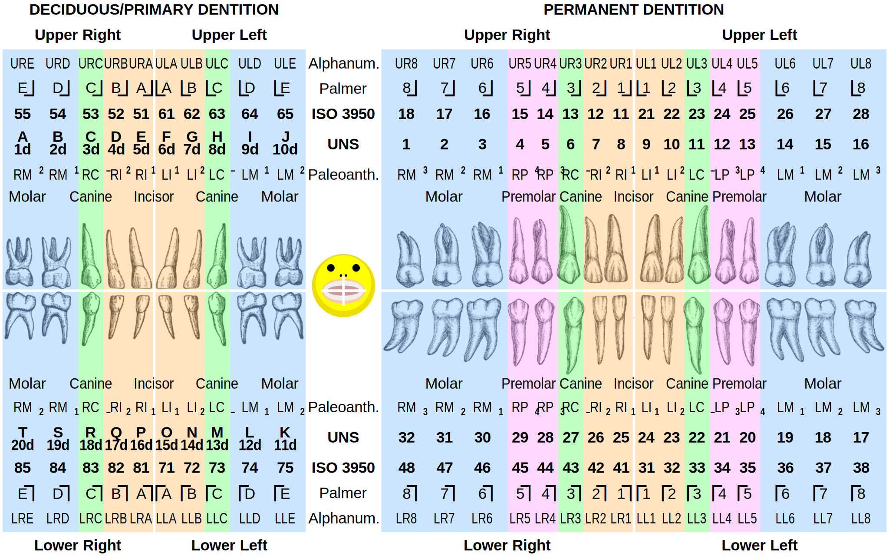

= Cōdex [1603:84:1]: /Dictiōnāria dentālium/
:doctype: book
:title: Cōdex [1603:84:1]: /Dictiōnāria dentālium/
:lang: la
:toc:
:toclevels: 4
:toc-title: Tabula contentorum
:table-caption: Tabula
:figure-caption: Pictūra
:example-caption: Exemplum
:last-update-label: Renovatio
:version-label: Versiō
:appendix-caption: Appendix
:source-highlighter: rouge
:warning-caption: Hic sunt dracones
:tip-caption: Commendātum

{nbsp} +
{nbsp} +
{nbsp} +
{nbsp} +
{nbsp} +
{nbsp} +
{nbsp} +
{nbsp} +
{nbsp} +
{nbsp} +
{nbsp} +
{nbsp} +
{nbsp} +
{nbsp} +
{nbsp} +
{nbsp} +
{nbsp} +
{nbsp} +
{nbsp} +
{nbsp} +
[quote]
/**Public domain means that each major common issue only needs to be resolved once**/@eng-Latn

<<<
toc::[]

[id=0_999_1603_1]
== Praefātiō 

[%header,cols="25h,~a"]
|===
|
Lingua de verba
|
Verba de conceptiō

|
Lingua Anglica (Abecedarium Latinum)
|
_**Cōdex [1603:84:1]**_ is the book format of the machine-readable dictionaries _**[1603:84:1] /Dictiōnāria dentālium/**_, which are distributed for implementers on external applications. This book is intended as advanced resource for other lexicographers and terminology translators, including detect and report inconsistencies.

Practical lexicography is the art or craft of compiling, writing and editing dictionaries. The basics are not far different than a millennia ago: it is still a very humane, creative work. It is necessary to be humble: most of the translator's mistakes are, in fact, not translator's fault, but methodological flaws. Making sure of a source idea of what a concept represents, even if it means rewrite and make simpler, annex pictures, show examples, do whatever to make it be understood, makes even non-professional translators that care about their own language deliver better results than any alternative. In other words: even the so-called industry best practices of paying professional translators and reviewers cannot overcome already poorly explained source terms.

The initiative behind this compilation is also doing other dictionaries and accepts new suggestions of relevant topics on data exchange for humanitarian use. All have in common the fact that both have human translations and (if any) external interlingual codes related to each concept while making the end result explicitly already ready to be usable on average softwares. Naturally, each book version gives extensive explanations for collaborators on how to correct itself which become part of the next weekly release.

|===

[%header,cols="25h,~a"]
|===
|
Rēs interlinguālibus
|
Factum

|
scrīptor
|
Multiplicēs scrīptōribus

|
/cōdex pūblicandī/
|
EticaAI

|
/publication date/@eng-Latn
|
2022-01-16

|
numerus editionis
|
2022-03-03T01:41:54

|
/SPDX license ID/@eng-Latn
|
CC0-1.0

|
/reference URL/@eng-Latn
|
https://github.com/EticaAI/multilingual-lexicography/issues/8

|===

<<<

== Methodī ex cōdice
=== Methodī ex dictiōnāriōrum corde
NOTE: #`0_1603_1_7_2616_7535` ?#

=== Rēs dē factō in dictiōnāriīs
==== Concepta: 60

==== Rēs linguālibus: 1

[%header,cols="15h,25a,~,15"]
|===
|
Cōdex linguae
|
Glotto cōdicī +++ +++ ISO 639-3 +++ +++ Wiki QID cōdicī
|
Nōmen Latīnum
|
Concepta

|
mul-Zyyy
|

+++ +++
https://iso639-3.sil.org/code/mul[mul]
+++ +++ 
|
Linguae multiplīs (Scrīptum incognitō)
|
7

|===

==== Rēs interlinguālibus: 6
[%header,cols="25h,~a"]
|===
|
Lingua de verba
|
Verba de conceptiō

|
Lingua Anglica (Abecedarium Latinum)
|
The result of this section is a preview. We're aware it is not well formatted for a book format. Sorry for the temporary inconvenience.

|===

scrīptor::
#item+rem+i_qcc+is_zxxx+ix_wikip::: P50
#item+rem+i_qcc+is_zxxx+ix_hxlix::: ix_wikip50
#item+rem+i_qcc+is_zxxx+ix_hxlvoc::: v_wiki_p_50
#item+rem+definitionem+i_eng+is_latn::: Main creator(s) of a written work (use on works, not humans)

/cōdex pūblicandī/::
#item+rem+i_qcc+is_zxxx+ix_wikip::: P123
#item+rem+i_qcc+is_zxxx+ix_hxlix::: ix_wikip123
#item+rem+i_qcc+is_zxxx+ix_hxlvoc::: v_wiki_p_123
#item+rem+definitionem+i_eng+is_latn::: organization or person responsible for publishing books, periodicals, printed music, podcasts, games or software

numerus editionis::
#item+rem+i_qcc+is_zxxx+ix_wikip::: P393
#item+rem+i_qcc+is_zxxx+ix_hxlix::: ix_wikip393
#item+rem+i_qcc+is_zxxx+ix_hxlvoc::: v_wiki_p_393
#item+rem+definitionem+i_eng+is_latn::: number of an edition (first, second, ... as 1, 2, ...) or event

/publication date/@eng-Latn::
#item+rem+i_qcc+is_zxxx+ix_wikip::: P577
#item+rem+i_qcc+is_zxxx+ix_hxlix::: ix_wikip577
#item+rem+i_qcc+is_zxxx+ix_hxlvoc::: v_wiki_p_577
#item+rem+definitionem+i_eng+is_latn::: Date or point in time when a work was first published or released

/reference URL/@eng-Latn::
#item+rem+i_qcc+is_zxxx+ix_wikip::: P854
#item+rem+i_qcc+is_zxxx+ix_hxlix::: ix_wikip854
#item+rem+i_qcc+is_zxxx+ix_hxlvoc::: v_wiki_p_854
#item+rem+definitionem+i_eng+is_latn::: should be used for Internet URLs as references

/SPDX license ID/@eng-Latn::
#item+rem+i_qcc+is_zxxx+ix_wikip::: P2479
#item+rem+i_qcc+is_zxxx+ix_regulam::: [0-9A-Za-z\.\-]{3,36}[+]?
#item+rem+i_qcc+is_zxxx+ix_wikip1630::: https://spdx.org/licenses/$1.html
#item+rem+i_qcc+is_zxxx+ix_hxlix::: ix_wikip2479
#item+rem+i_qcc+is_zxxx+ix_hxlvoc::: v_wiki_p_2479
#item+rem+definitionem+i_eng+is_latn::: SPDX license identifier

<<<

== Archīa

[%header,cols="25h,~a"]
|===
|
Lingua de verba
|
Verba de conceptiō

|
Lingua Anglica (Abecedarium Latinum)
|
**Context information**: ignoring for a moment the fact of having several translations (and optimized to receive contributions on a regular basis, not _just_ an static work), then the actual groundbreaking difference on the workflow used to generate every dictionaries on Cōdex such as this one are the following fact: **we provide well machine readable formats even when the equivalents on _international languages_, such as English, don't have for areas such as humanitarian aid, development aid and human rights**. The closest to such multilingualism (outside Wikimedia) are European Union SEMICeu (up to 24 languages), but even then have issues while sharing translations on all languages. United Nations translations (up to 6 languages, rarely more) are not available by humanitarian agencies to help with terminology translations.

**Practical implication**: machine-readable formats on _Archīa prō dictiōnāriīs_ (literal English translation: Files for dictionaries) are the focus and recommended for derived works and intended for mitigating additional human errors. We can even create new formats by request. The text documents on _Archīa prō cōdice_ (literal English translation: Files for book) are alternatives to this book format.

|===

=== Archīa prō dictiōnāriīs: 1

==== 1603_84_1.no1.tm.hxl.csv

Rēs interlinguālibus::
  /download link/@eng-Latn::: link:1603_84_1.no1.tm.hxl.csv[1603_84_1.no1.tm.hxl.csv]
Rēs linguālibus::
  Lingua Anglica (Abecedarium Latinum):::
    /Numerordinatio on HXLTM container/

=== Archīa prō cōdice: 2

==== 1603_84_1.mul-Latn.codex.adoc

Rēs interlinguālibus::
  /download link/@eng-Latn::: link:1603_84_1.mul-Latn.codex.adoc[1603_84_1.mul-Latn.codex.adoc]
  /reference URL/@eng-Latn:::
    https://docs.asciidoctor.org/

Rēs linguālibus::
  Lingua Anglica (Abecedarium Latinum):::
    AsciiDoc is a plain text authoring format (i.e., lightweight markup language) for writing technical content such as documentation, articles, and books.

==== 1603_84_1.mul-Latn.codex.pdf

Rēs interlinguālibus::
  /download link/@eng-Latn::: link:1603_84_1.mul-Latn.codex.pdf[1603_84_1.mul-Latn.codex.pdf]
  /reference URL/@eng-Latn:::
    https://en.wikipedia.org/wiki/PDF

Rēs linguālibus::
  Lingua Anglica (Abecedarium Latinum):::
    Portable Document Format (PDF), standardized as ISO 32000, is a file format developed by Adobe in 1992 to present documents, including text formatting and images, in a manner independent of application software, hardware, and operating systems.

<<<

[.text-center]

Dictiōnāria initiīs

<<<

== /Dictiōnāria dentālium/

Sine nomine

<<<

[id='1']
=== [`1`] /Quadrant codes - upper right permanent teeth/

[%header,cols="~,~"]
|===
| Lingua de verba
| Verba de conceptiō
| Linguae multiplīs (Scrīptum incognitō)
| +++/Quadrant codes - upper right permanent teeth/+++

|===

[id='1_1']
==== [`1_1`] 

[%header,cols="25h,~a"]
|===
|
Rēs interlinguālibus
|
Factum

|
ix_iso3950
|
11

|
ix_hxlix
|
ix_iso3950q1d1

|
ix_hxlvoc
|
v_iso3950q1d1

|===

[id='1_2']
==== [`1_2`] 

[%header,cols="25h,~a"]
|===
|
Rēs interlinguālibus
|
Factum

|
ix_iso3950
|
12

|
ix_hxlix
|
ix_iso3950q1d2

|
ix_hxlvoc
|
v_iso3950q1d2

|===

[id='1_3']
==== [`1_3`] 

[%header,cols="25h,~a"]
|===
|
Rēs interlinguālibus
|
Factum

|
ix_iso3950
|
13

|
ix_hxlix
|
ix_iso3950q1d3

|
ix_hxlvoc
|
v_iso3950q1d3

|===

[id='1_4']
==== [`1_4`] 

[%header,cols="25h,~a"]
|===
|
Rēs interlinguālibus
|
Factum

|
ix_iso3950
|
14

|
ix_hxlix
|
ix_iso3950q1d4

|
ix_hxlvoc
|
v_iso3950q1d4

|===

[id='1_5']
==== [`1_5`] 

[%header,cols="25h,~a"]
|===
|
Rēs interlinguālibus
|
Factum

|
ix_iso3950
|
15

|
ix_hxlix
|
ix_iso3950q1d5

|
ix_hxlvoc
|
v_iso3950q1d5

|===

[id='1_6']
==== [`1_6`] 

[%header,cols="25h,~a"]
|===
|
Rēs interlinguālibus
|
Factum

|
ix_iso3950
|
16

|
ix_hxlix
|
ix_iso3950q1d6

|
ix_hxlvoc
|
v_iso3950q1d6

|===

[id='1_7']
==== [`1_7`] 

[%header,cols="25h,~a"]
|===
|
Rēs interlinguālibus
|
Factum

|
ix_iso3950
|
17

|
ix_hxlix
|
ix_iso3950q1d7

|
ix_hxlvoc
|
v_iso3950q1d7

|===

[id='1_8']
==== [`1_8`] 

[%header,cols="25h,~a"]
|===
|
Rēs interlinguālibus
|
Factum

|
ix_iso3950
|
18

|
ix_hxlix
|
ix_iso3950q1d8

|
ix_hxlvoc
|
v_iso3950q1d8

|===

<<<

[id='2']
=== [`2`] /Quadrant codes - upper left permanent teeth/

[%header,cols="~,~"]
|===
| Lingua de verba
| Verba de conceptiō
| Linguae multiplīs (Scrīptum incognitō)
| +++/Quadrant codes - upper left permanent teeth/+++

|===

[id='2_1']
==== [`2_1`] 

[%header,cols="25h,~a"]
|===
|
Rēs interlinguālibus
|
Factum

|
ix_iso3950
|
21

|
ix_hxlix
|
ix_iso3950q2d1

|
ix_hxlvoc
|
v_iso3950q2d1

|===

[id='2_2']
==== [`2_2`] 

[%header,cols="25h,~a"]
|===
|
Rēs interlinguālibus
|
Factum

|
ix_iso3950
|
22

|
ix_hxlix
|
ix_iso3950q2d2

|
ix_hxlvoc
|
v_iso3950q2d2

|===

[id='2_3']
==== [`2_3`] 

[%header,cols="25h,~a"]
|===
|
Rēs interlinguālibus
|
Factum

|
ix_iso3950
|
23

|
ix_hxlix
|
ix_iso3950q2d3

|
ix_hxlvoc
|
v_iso3950q2d3

|===

[id='2_4']
==== [`2_4`] 

[%header,cols="25h,~a"]
|===
|
Rēs interlinguālibus
|
Factum

|
ix_iso3950
|
24

|
ix_hxlix
|
ix_iso3950q2d4

|
ix_hxlvoc
|
v_iso3950q2d4

|===

[id='2_5']
==== [`2_5`] 

[%header,cols="25h,~a"]
|===
|
Rēs interlinguālibus
|
Factum

|
ix_iso3950
|
25

|
ix_hxlix
|
ix_iso3950q2d5

|
ix_hxlvoc
|
v_iso3950q2d5

|===

[id='2_6']
==== [`2_6`] 

[%header,cols="25h,~a"]
|===
|
Rēs interlinguālibus
|
Factum

|
ix_iso3950
|
26

|
ix_hxlix
|
ix_iso3950q2d6

|
ix_hxlvoc
|
v_iso3950q2d6

|===

[id='2_7']
==== [`2_7`] 

[%header,cols="25h,~a"]
|===
|
Rēs interlinguālibus
|
Factum

|
ix_iso3950
|
27

|
ix_hxlix
|
ix_iso3950q2d7

|
ix_hxlvoc
|
v_iso3950q2d7

|===

[id='2_8']
==== [`2_8`] 

[%header,cols="25h,~a"]
|===
|
Rēs interlinguālibus
|
Factum

|
ix_iso3950
|
28

|
ix_hxlix
|
ix_iso3950q2d8

|
ix_hxlvoc
|
v_iso3950q2d8

|===

<<<

[id='3']
=== [`3`] /Quadrant codes - lower left permanent teeth/

[%header,cols="~,~"]
|===
| Lingua de verba
| Verba de conceptiō
| Linguae multiplīs (Scrīptum incognitō)
| +++/Quadrant codes - lower left permanent teeth/+++

|===

[id='3_1']
==== [`3_1`] 

[%header,cols="25h,~a"]
|===
|
Rēs interlinguālibus
|
Factum

|
ix_iso3950
|
31

|
ix_hxlix
|
ix_iso3950q3d1

|
ix_hxlvoc
|
v_iso3950q3d1

|===

[id='3_2']
==== [`3_2`] 

[%header,cols="25h,~a"]
|===
|
Rēs interlinguālibus
|
Factum

|
ix_iso3950
|
32

|
ix_hxlix
|
ix_iso3950q3d2

|
ix_hxlvoc
|
v_iso3950q3d2

|===

[id='3_3']
==== [`3_3`] 

[%header,cols="25h,~a"]
|===
|
Rēs interlinguālibus
|
Factum

|
ix_iso3950
|
33

|
ix_hxlix
|
ix_iso3950q3d3

|
ix_hxlvoc
|
v_iso3950q3d3

|===

[id='3_4']
==== [`3_4`] 

[%header,cols="25h,~a"]
|===
|
Rēs interlinguālibus
|
Factum

|
ix_iso3950
|
34

|
ix_hxlix
|
ix_iso3950q3d4

|
ix_hxlvoc
|
v_iso3950q3d4

|===

[id='3_5']
==== [`3_5`] 

[%header,cols="25h,~a"]
|===
|
Rēs interlinguālibus
|
Factum

|
ix_iso3950
|
35

|
ix_hxlix
|
ix_iso3950q3d5

|
ix_hxlvoc
|
v_iso3950q3d5

|===

[id='3_6']
==== [`3_6`] 

[%header,cols="25h,~a"]
|===
|
Rēs interlinguālibus
|
Factum

|
ix_iso3950
|
36

|
ix_hxlix
|
ix_iso3950q3d6

|
ix_hxlvoc
|
v_iso3950q3d6

|===

[id='3_7']
==== [`3_7`] 

[%header,cols="25h,~a"]
|===
|
Rēs interlinguālibus
|
Factum

|
ix_iso3950
|
37

|
ix_hxlix
|
ix_iso3950q3d7

|
ix_hxlvoc
|
v_iso3950q3d7

|===

[id='3_8']
==== [`3_8`] 

[%header,cols="25h,~a"]
|===
|
Rēs interlinguālibus
|
Factum

|
ix_iso3950
|
38

|
ix_hxlix
|
ix_iso3950q3d8

|
ix_hxlvoc
|
v_iso3950q3d8

|===

<<<

[id='4']
=== [`4`] /Quadrant codes - lower right permanent teeth/

[%header,cols="~,~"]
|===
| Lingua de verba
| Verba de conceptiō
| Linguae multiplīs (Scrīptum incognitō)
| +++/Quadrant codes - lower right permanent teeth/+++

|===

[id='4_1']
==== [`4_1`] 

[%header,cols="25h,~a"]
|===
|
Rēs interlinguālibus
|
Factum

|
ix_iso3950
|
41

|
ix_hxlix
|
ix_iso3950q4d1

|
ix_hxlvoc
|
v_iso3950q4d1

|===

[id='4_2']
==== [`4_2`] 

[%header,cols="25h,~a"]
|===
|
Rēs interlinguālibus
|
Factum

|
ix_iso3950
|
42

|
ix_hxlix
|
ix_iso3950q4d2

|
ix_hxlvoc
|
v_iso3950q4d2

|===

[id='4_3']
==== [`4_3`] 

[%header,cols="25h,~a"]
|===
|
Rēs interlinguālibus
|
Factum

|
ix_iso3950
|
43

|
ix_hxlix
|
ix_iso3950q4d3

|
ix_hxlvoc
|
v_iso3950q4d3

|===

[id='4_4']
==== [`4_4`] 

[%header,cols="25h,~a"]
|===
|
Rēs interlinguālibus
|
Factum

|
ix_iso3950
|
44

|
ix_hxlix
|
ix_iso3950q4d4

|
ix_hxlvoc
|
v_iso3950q4d4

|===

[id='4_5']
==== [`4_5`] 

[%header,cols="25h,~a"]
|===
|
Rēs interlinguālibus
|
Factum

|
ix_iso3950
|
45

|
ix_hxlix
|
ix_iso3950q4d5

|
ix_hxlvoc
|
v_iso3950q4d5

|===

[id='4_6']
==== [`4_6`] 

[%header,cols="25h,~a"]
|===
|
Rēs interlinguālibus
|
Factum

|
ix_iso3950
|
46

|
ix_hxlix
|
ix_iso3950q4d6

|
ix_hxlvoc
|
v_iso3950q4d6

|===

[id='4_7']
==== [`4_7`] 

[%header,cols="25h,~a"]
|===
|
Rēs interlinguālibus
|
Factum

|
ix_iso3950
|
47

|
ix_hxlix
|
ix_iso3950q4d7

|
ix_hxlvoc
|
v_iso3950q4d7

|===

[id='4_8']
==== [`4_8`] 

[%header,cols="25h,~a"]
|===
|
Rēs interlinguālibus
|
Factum

|
ix_iso3950
|
48

|
ix_hxlix
|
ix_iso3950q4d8

|
ix_hxlvoc
|
v_iso3950q4d8

|===

<<<

[id='5']
=== [`5`] /Quadrant codes - upper right deciduous teeth/

[%header,cols="~,~"]
|===
| Lingua de verba
| Verba de conceptiō
| Linguae multiplīs (Scrīptum incognitō)
| +++/Quadrant codes - upper right deciduous teeth/+++

|===

[id='5_1']
==== [`5_1`] 

[%header,cols="25h,~a"]
|===
|
Rēs interlinguālibus
|
Factum

|
ix_iso3950
|
51

|
ix_hxlix
|
ix_iso3950q5d1

|
ix_hxlvoc
|
v_iso3950q5d1

|===

[id='5_2']
==== [`5_2`] 

[%header,cols="25h,~a"]
|===
|
Rēs interlinguālibus
|
Factum

|
ix_iso3950
|
52

|
ix_hxlix
|
ix_iso3950q5d2

|
ix_hxlvoc
|
v_iso3950q5d2

|===

[id='5_3']
==== [`5_3`] 

[%header,cols="25h,~a"]
|===
|
Rēs interlinguālibus
|
Factum

|
ix_iso3950
|
53

|
ix_hxlix
|
ix_iso3950q5d3

|
ix_hxlvoc
|
v_iso3950q5d3

|===

[id='5_4']
==== [`5_4`] 

[%header,cols="25h,~a"]
|===
|
Rēs interlinguālibus
|
Factum

|
ix_iso3950
|
54

|
ix_hxlix
|
ix_iso3950q5d4

|
ix_hxlvoc
|
v_iso3950q5d4

|===

[id='5_5']
==== [`5_5`] 

[%header,cols="25h,~a"]
|===
|
Rēs interlinguālibus
|
Factum

|
ix_iso3950
|
55

|
ix_hxlix
|
ix_iso3950q5d5

|
ix_hxlvoc
|
v_iso3950q5d5

|===

<<<

[id='6']
=== [`6`] /Quadrant codes - upper left deciduous teeth/

[%header,cols="~,~"]
|===
| Lingua de verba
| Verba de conceptiō
| Linguae multiplīs (Scrīptum incognitō)
| +++/Quadrant codes - upper left deciduous teeth/+++

|===

[id='6_1']
==== [`6_1`] 

[%header,cols="25h,~a"]
|===
|
Rēs interlinguālibus
|
Factum

|
ix_iso3950
|
61

|
ix_hxlix
|
ix_iso3950q6d1

|
ix_hxlvoc
|
v_iso3950q6d1

|===

[id='6_2']
==== [`6_2`] 

[%header,cols="25h,~a"]
|===
|
Rēs interlinguālibus
|
Factum

|
ix_iso3950
|
62

|
ix_hxlix
|
ix_iso3950q6d2

|
ix_hxlvoc
|
v_iso3950q6d2

|===

[id='6_3']
==== [`6_3`] 

[%header,cols="25h,~a"]
|===
|
Rēs interlinguālibus
|
Factum

|
ix_iso3950
|
63

|
ix_hxlix
|
ix_iso3950q6d3

|
ix_hxlvoc
|
v_iso3950q6d3

|===

[id='6_4']
==== [`6_4`] 

[%header,cols="25h,~a"]
|===
|
Rēs interlinguālibus
|
Factum

|
ix_iso3950
|
64

|
ix_hxlix
|
ix_iso3950q6d4

|
ix_hxlvoc
|
v_iso3950q6d4

|===

[id='6_5']
==== [`6_5`] 

[%header,cols="25h,~a"]
|===
|
Rēs interlinguālibus
|
Factum

|
ix_iso3950
|
65

|
ix_hxlix
|
ix_iso3950q6d5

|
ix_hxlvoc
|
v_iso3950q6d5

|===

<<<

[id='7']
=== [`7`] /Quadrant codes - lower left deciduous teeth/

[%header,cols="~,~"]
|===
| Lingua de verba
| Verba de conceptiō
| Linguae multiplīs (Scrīptum incognitō)
| +++/Quadrant codes - lower left deciduous teeth/+++

|===

[id='7_1']
==== [`7_1`] 

[%header,cols="25h,~a"]
|===
|
Rēs interlinguālibus
|
Factum

|
ix_iso3950
|
71

|
ix_hxlix
|
ix_iso3950q7d1

|
ix_hxlvoc
|
v_iso3950q7d1

|===

[id='7_2']
==== [`7_2`] 

[%header,cols="25h,~a"]
|===
|
Rēs interlinguālibus
|
Factum

|
ix_iso3950
|
72

|
ix_hxlix
|
ix_iso3950q7d2

|
ix_hxlvoc
|
v_iso3950q7d2

|===

[id='7_3']
==== [`7_3`] 

[%header,cols="25h,~a"]
|===
|
Rēs interlinguālibus
|
Factum

|
ix_iso3950
|
73

|
ix_hxlix
|
ix_iso3950q7d3

|
ix_hxlvoc
|
v_iso3950q7d3

|===

[id='7_4']
==== [`7_4`] 

[%header,cols="25h,~a"]
|===
|
Rēs interlinguālibus
|
Factum

|
ix_iso3950
|
74

|
ix_hxlix
|
ix_iso3950q7d4

|
ix_hxlvoc
|
v_iso3950q7d4

|===

[id='7_5']
==== [`7_5`] 

[%header,cols="25h,~a"]
|===
|
Rēs interlinguālibus
|
Factum

|
ix_iso3950
|
75

|
ix_hxlix
|
ix_iso3950q7d5

|
ix_hxlvoc
|
v_iso3950q7d5

|===

<<<

[id='8']
=== [`8`] 

[id='8_1']
==== [`8_1`] 

[%header,cols="25h,~a"]
|===
|
Rēs interlinguālibus
|
Factum

|
ix_iso3950
|
81

|
ix_hxlix
|
ix_iso3950q8d1

|
ix_hxlvoc
|
v_iso3950q8d1

|===

[id='8_2']
==== [`8_2`] 

[%header,cols="25h,~a"]
|===
|
Rēs interlinguālibus
|
Factum

|
ix_iso3950
|
82

|
ix_hxlix
|
ix_iso3950q8d2

|
ix_hxlvoc
|
v_iso3950q8d2

|===

[id='8_3']
==== [`8_3`] 

[%header,cols="25h,~a"]
|===
|
Rēs interlinguālibus
|
Factum

|
ix_iso3950
|
83

|
ix_hxlix
|
ix_iso3950q8d3

|
ix_hxlvoc
|
v_iso3950q8d3

|===

[id='8_4']
==== [`8_4`] 

[%header,cols="25h,~a"]
|===
|
Rēs interlinguālibus
|
Factum

|
ix_iso3950
|
84

|
ix_hxlix
|
ix_iso3950q8d4

|
ix_hxlvoc
|
v_iso3950q8d4

|===

[id='8_5']
==== [`8_5`] 

[%header,cols="25h,~a"]
|===
|
Rēs interlinguālibus
|
Factum

|
ix_iso3950
|
85

|
ix_hxlix
|
ix_iso3950q8d5

|
ix_hxlvoc
|
v_iso3950q8d5

|===

<<<

== Notā bene

=== [HELP WANTED] Generated PDF don't have right fonts for all languages

Rēs linguālibus::
  Lingua Anglica (Abecedarium Latinum):::
    First, sorry if this affects your loved language. We're working on this, but we are still not perfected.
    If you have fonts installed on your computer, you very likely can still copy and paste from the eBook version.
    Please note that all formats intended for machine processing will work fine.

=== [Book with Wikidata Q] I want to help! Some translation is missing or is wrong! How to change it?

Rēs linguālibus::
  Lingua Anglica (Abecedarium Latinum):::
    Most (but not all) concepts are using Wikidata Q. In fact, most of the time we improve Wikidata while preparing the dictionaries. Please check if the exact concept you want have a Q ID then click. There you can add translations.
    The next release (likely weekly) will have your submissions without need to contact us directly.

=== [Book with Wikidata Q] I can find the Wikidata concept, but I'm unable to edit!

Rēs linguālibus::
  Lingua Anglica (Abecedarium Latinum):::
    While Wikidata is more flexible than Wikipedia's (for example, it allows concepts without need to create Wikipedia pages) even Wikidata can have concepts which require creating an account and don't allow anonymous editing. Creating such an account and confirming email is faster than asking someone else's do it for you.
    However, while vandalism on Wikidata is rare, very few concepts will require an account with more contributions and not created very recently. If this is your case, help with the ones you can do alone and the rest ask someone else to add to you.

=== I heard there is an interest in having Cōdex beyond Latin language! How to do it?!

Rēs linguālibus::
  Lingua Anglica (Abecedarium Latinum):::
    Please contact us. This book uses Latin (sometimes _dog Latin_) to document all other languages, but we obviously can automated generation of books for others using other writing systems and some reference language.

<<<

