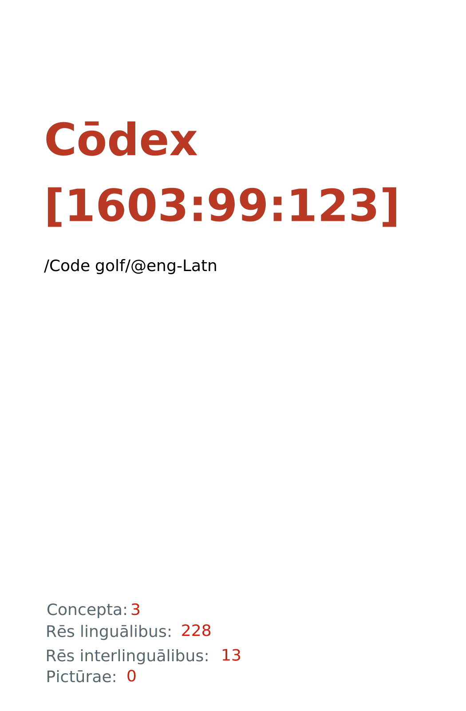

= Cōdex [1603:99:123]: /Code golf/@eng-Latn
:doctype: book
:title: Cōdex [1603:99:123]: /Code golf/@eng-Latn
:lang: la
:toc: macro
:toclevels: 5
:toc-title: Tabula contentorum
:table-caption: Tabula
:figure-caption: Pictūra
:example-caption: Exemplum
:last-update-label: Renovatio
:version-label: Versiō
:appendix-caption: Appendix
:source-highlighter: rouge
:warning-caption: Hic sunt dracones
:tip-caption: Commendātum
:front-cover-image: : /Code golf/@eng-Latn",1050,1600]

{nbsp} +
{nbsp} +
[quote]
**Dedicação ao Domínio Público significa que cada grande problema comum só precisa ser resolvido uma vez**

'''

[%header,cols="25h,~a"]
|===
|
Rēs interlinguālibus
|
Factum

|
/translator/@eng-Latn
|
Vicidata

|
/dictiōnārium ēditōrī/
|
EticaAI

|
/publication date/@eng-Latn
|
2022-04-03

|
numerus editionis
|
2022-05-11T22:20:50

|
/SPDX license ID/@eng-Latn
|
CC0-1.0

|
spōnsor
|
pro bonō publicō

|===

ifndef::backend-epub3[]
<<<
toc::[]
<<<
endif::[]

[id=0_999_1603_1]
== Praefātiō 

Rēs linguālibus (1)::
  Lingua Anglica (Abecedarium Latinum):::
    _**Cōdex [1603:99:123]**_ é o formato de livro dos dados estruturados legíveis por máquina do grupo de dicionários _**[1603:99:123] /Code golf/@eng-Latn**_, que são distribuídos para os implementadores usarem em aplicativos externos. Este livro pretende ser um recurso avançado para outros lexicógrafos e tradutores de terminologia, inclusive para detectar e relatar inconsistências. Ele pode, no entanto, ser usado como um dicionário ad hoc se não houver trabalho derivado focado em suas necessidades específicas.
    +++  +++
    **SOBRE LEXICOGRAFIA**
    +++  +++
    A lexicografia prática é a arte ou ofício de compilar, escrever e editar dicionários. O básico não é muito diferente de um milênio atrás: ainda é um trabalho muito humano e criativo. É preciso ser humilde: a maioria dos erros de tradutores, na verdade, não é culpa do tradutor, mas falhas metodológicas. Certificar-se de uma ideia de origem do que um conceito representa, mesmo que signifique reescrever e simplificar, anexar fotos, mostrar exemplos, fazer o que for para que seja entendido, faz com que até mesmo tradutores não profissionais que se preocupam com sua própria língua entreguem melhor resultados do que qualquer alternativa. Em outras palavras: mesmo as chamadas melhores práticas da indústria de pagar tradutores e revisores profissionais não podem superar termos de origem já mal explicados.
    +++  +++
    **SOBRE TIPOS DE DICIONÁRIOS QUE ESTAMOS COMPILANDO**
    +++  +++
    Estamos preocupados com um grupo de idéias (chamamos isso de grupo de dicionários de conceitos) que podem ser divididos em partes menores, revisados quanto a inconsistências, aprimorados para definições e depois traduzidos por voluntários. Códigos interlinguais, como o que poderia ser usado na troca de dados real, também são adicionados a cada conceito. Ambos os glossários, interfaces de usuário (como rótulos na coleta de dados) e, em alguns casos, até códigos padrão para o que iria em um campo de dados podem ser compilados dessa maneira.
    +++  +++
    Como a lista completa de dicionários-prototípicos e dicionários minimamente utilizáveis é enorme, um modo de citar público-alvos típicos é o seguinte:
    +++  +++
    . Ajuda humanitária
    . Ajuda ao desenvolvimento
    . Direitos humanos
    . Socorro militar (ou conceitos relacionados a conflitos e resolução de conflitos)
    +++  +++
    Os itens 1, 2 e 4 https://en.m.wikipedia.org/wiki/Humanitarian-Development_Nexus[são algumas vezes referidos como _nexus_] e são frequentemente encontrados ajudando _crise humanitária_. Já que a maioria dos colaboradores cujas ideias e críticas válidas são voluntárias, então 3 (direitos humanos, como na Anistia Internacional) para diferenciar do humanitarismo (como o Movimento da Cruz Vermelha é referência).
    +++  +++
    Observe que **dicionários não são guias de uso**. As instruções, quando existem, são principalmente dedicadas a lexicógrafos e tradutores.
    +++  +++
    **/PRO BONŌ PUBLICŌ/@lat-Latn**
    +++  +++
    As pessoas lexicógrafas deste trabalho são voluntárias, fazendo-o gratuitamente, pro bonō publicō, e não aceitam doações por causa dos dicionários reutilizáveis ​​de todos. O trabalho anterior existente muitas vezes é baseado em livros antigos de domínio público. A maioria dos tradutores de terminologia já seriam voluntários porque acreditam em uma causa. A melhor maneira de inspirar a colaboração é sermos nós mesmos exemplos.
    +++  +++
    Há um aspecto não moralista, bastante simples de entender: quão caro seria pagar pelo trabalho de todos considerando que é viável em mais de 200 idiomas? A logística para decidir quem deve ser pago, depois a transferência de dinheiro em todo o mundo (pode incluir pessoas de países embargados), depois os mecanismos tradicionais de auditoria para verificar o uso indevido que os doadores esperam, existe? Em terminologia especial (os próprios termos do dicionário) e tantas línguas, não existe dinheiro suficiente nem humanos interessados ​​em ser coordenadores.

<<<

== Methodī ex cōdice
=== Methodī ex dictiōnāriōrum corde
Rēs interlinguālibus (1)::
  /scope and content/@eng-Latn:::
    /Code golf/@eng-Latn

=== Methodī ex verbīs in dictiōnāriīs
NOTE: /No momento, não há fluxo de trabalho para usar https://www.wikidata.org/wiki/Wikidata:Lexicographical_data[Wikidata lexicographical data], que na verdade poderia ser usado como armazenamento para nomenclatura mais rigorosa. As implementações atuais usam apenas conceitos do Wikidata, os Q-items./@eng-Latn

==== Methodī ex verbīs in Vicidata (Q modō)
Rēs linguālibus (1)::
  Lingua Anglica (Abecedarium Latinum):::
    O ***[1603:99:123] /Code golf/@eng-Latn*** usa o Wikidata como uma estratégia para conciliar termos linguísticos para um ou mais de seus conceitos.
    +++  +++
    Isso significa que este livro e os arquivos de dados de dicionários relacionados requerem atualizações periódicas para , no mínimo, sincronize e compartilhe novamente as traduções atualizadas.
    +++  +++
    **Qual a confiabilidade das traduções da comunidade (fonte Wikidata)?**
    +++  +++
    A resposta curta padrão é: **elas são confiáveis**, mesmo nos casos de não haver traduções oficiais para cada assunto.
    +++  +++
    Como referência, é provável que um tradutor profissional (sem acesso à Wikipedia ou bases de terminologia interna das organizações de controle) forneça resultados de qualidade inferior se você fizer testes cegos. Isso é possível porque não apenas o público médio, mas também terminólogos e tradutores profissionais ajudam a Wikipédia (e implicitamente o Wikidata).
    +++  +++
    No entanto, mesmo quando o resultado está correto, a versão atual precisa de diferenciação aprimorada, no mínimo, sigla e forma longa . Para grandes organizações, existem recursos como __P1813 nomes curtos__, mas ainda não foram compilados com o conjunto de dados atual.
    +++  +++
    **Os principais motivos para "traduções erradas" não são culpa dos tradutores**
    +++  +++
    DICA: Como regra geral, para conceitos já muito definidos em que você, como humano, pode verificar manualmente um ou mais termos traduzidos como um resultado decente, as outras traduções provavelmente serão aceitáveis. Dicionários com casos extremos (como nomes de territórios em disputa) teriam mais explicações.
    +++  +++
    A principal razão para "traduções erradas" são conceitos mal definidos usados ​​para explicar aos tradutores da comunidade como gerar traduções de terminologia. Isso tornaria as traduções existentes do Wikidata (usadas não apenas por nós) inconsistentes. A segunda razão é se os dicionários usam traduções para conceitos sem uma correspondência estrita; em outras palavras, se fizermos definições mais estritas do que significa conceito, mas reutilizarmos termos menos exatos da Wikidada. Também há problemas quando idiomas inteiros são codificados com códigos errados. Observe que todos esses casos **traduções erradas NÃO são estritamente culpa do tradutor, mas sim da lexicografia**.
    +++  +++
    Ainda é possível ter erros estritos no nível de tradução. Mas mesmo que indiquemos aos usuários como corrigir o Wikidata/Wikipedia (com base na melhor explicação contextual de um conceito, como este livro), os requisitos para dizer que o termo anterior foi objetivamente um erro de tradução humana errado (se seguir nossa seriedade na construção de dicionário) são muito elevados.
    +++  +++
    Do ponto de vista da conciliação de dados, a seguinte metodologia é utilizada para publicar as traduções da terminologia com a tabela de conceitos principais.
    +++  +++
    . A principal tabela lexicográfica artesanal (explicada no tópico anterior), também fornecida em `1603_99_123.no1.tm.hxl.csv`, pode fazer referência ao Wiki QID.
    . Cada QID exclusivo de `1603_99_123.no1.tm.hxl.csv`, juntamente com códigos de idioma de [`1603:1:51`] (que requer conhecimento de idiomas humanos), é usado para preparar uma consulta SPARQL otimizada para execução em https://query.wikidata.org/[Wikidata Query Service]. A consulta é tão grande que não é viável para links "Try it" (URL longo), como https://www.wikidata.org/wiki/Wikidata:SPARQL_query_service/queries/examples[como o que você encontraria nos Tutoriais Wikidata ], ***mas*** funciona!
    .. Note que o conhecimento é gratuito, as traduções estão lá, mas as necessidades humanitárias multilíngues podem faltar pessoas para preparar os arquivos e compartilhar do que para uso geral.
    . O resultado da consulta, com todos os QIDs e rótulos de termos, é compartilhado como `1603_99_123.wikiq.tm.hxl.csv`
    . As traduções revisadas pela comunidade de cada QID singular são pré-compiladas em um arquivo individual `1603_99_123.wikiq.tm.hxl.csv`
    . `1603_99_123.no1.tm.hxl.csv` mais `1603_99_123.wikiq.tm.hxl.csv` criado `1603_99_123.no11.tm.hxl.csv`

=== Rēs dē factō in dictiōnāriīs
==== Concepta: 3

==== Rēs linguālibus: 226

[%header,cols="15h,25a,~,17"]
|===
|
Cōdex linguae
|
Glotto cōdicī +++ +++ ISO 639-3 +++ +++ Wiki QID cōdicī
|
Nōmen Latīnum
|
Concepta

|
mul-Zyyy
|

+++ +++
https://iso639-3.sil.org/code/mul[mul]
+++ +++ 
|
Linguae multiplīs (Scrīptum incognitō)
|
3

|
ara-Arab
|
https://glottolog.org/resource/languoid/id/arab1395[arab1395]
+++ +++
https://iso639-3.sil.org/code/ara[ara]
+++ +++ https://www.wikidata.org/wiki/Q13955[Q13955]
|
Macrolingua Arabica (Abecedarium Arabicum)
|
3

|
hye-Armn
|
https://glottolog.org/resource/languoid/id/nucl1235[nucl1235]
+++ +++
https://iso639-3.sil.org/code/hye[hye]
+++ +++ https://www.wikidata.org/wiki/Q8785[Q8785]
|
Lingua Armenia (Alphabetum Armenium)
|
3

|
ben-Beng
|
https://glottolog.org/resource/languoid/id/beng1280[beng1280]
+++ +++
https://iso639-3.sil.org/code/ben[ben]
+++ +++ https://www.wikidata.org/wiki/Q9610[Q9610]
|
Lingua Bengali (/ISO 15924 Beng/)
|
3

|
rus-Cyrl
|
https://glottolog.org/resource/languoid/id/russ1263[russ1263]
+++ +++
https://iso639-3.sil.org/code/rus[rus]
+++ +++ https://www.wikidata.org/wiki/Q7737[Q7737]
|
Lingua Russica (Abecedarium Cyrillicum)
|
3

|
hin-Deva
|
https://glottolog.org/resource/languoid/id/hind1269[hind1269]
+++ +++
https://iso639-3.sil.org/code/hin[hin]
+++ +++ https://www.wikidata.org/wiki/Q1568[Q1568]
|
Lingua Hindica (Devanāgarī)
|
3

|
amh-Ethi
|
https://glottolog.org/resource/languoid/id/amha1245[amha1245]
+++ +++
https://iso639-3.sil.org/code/amh[amh]
+++ +++ https://www.wikidata.org/wiki/Q28244[Q28244]
|
Lingua Amharica (/ISO 15924 Ethi/)
|
2

|
kat-Geor
|
https://glottolog.org/resource/languoid/id/nucl1302[nucl1302]
+++ +++
https://iso639-3.sil.org/code/kat[kat]
+++ +++ https://www.wikidata.org/wiki/Q8108[Q8108]
|
Lingua Georgiana (Abecedarium Georgianum)
|
2

|
guj-Gujr
|
https://glottolog.org/resource/languoid/id/guja1252[guja1252]
+++ +++
https://iso639-3.sil.org/code/guj[guj]
+++ +++ https://www.wikidata.org/wiki/Q5137[Q5137]
|
Lingua Gujaratensis (/ISO 15924 Gujr/)
|
2

|
pan-Guru
|
https://glottolog.org/resource/languoid/id/panj1256[panj1256]
+++ +++
https://iso639-3.sil.org/code/pan[pan]
+++ +++ https://www.wikidata.org/wiki/Q58635[Q58635]
|
Lingua Paniabica (/ISO 15924 Guru/)
|
3

|
kan-Knda
|
https://glottolog.org/resource/languoid/id/nucl1305[nucl1305]
+++ +++
https://iso639-3.sil.org/code/kan[kan]
+++ +++ https://www.wikidata.org/wiki/Q33673[Q33673]
|
Lingua Cannadica (/ISO 15924 Knda/)
|
3

|
kor-Hang
|
https://glottolog.org/resource/languoid/id/kore1280[kore1280]
+++ +++
https://iso639-3.sil.org/code/kor[kor]
+++ +++ https://www.wikidata.org/wiki/Q9176[Q9176]
|
Lingua Coreana (Abecedarium Coreanum)
|
3

|
lzh-Hant
|
https://glottolog.org/resource/languoid/id/lite1248[lite1248]
+++ +++
https://iso639-3.sil.org/code/lzh[lzh]
+++ +++ https://www.wikidata.org/wiki/Q37041[Q37041]
|
Lingua Sinica classica (/ISO 15924 Hant/)
|
2

|
heb-Hebr
|
https://glottolog.org/resource/languoid/id/hebr1245[hebr1245]
+++ +++
https://iso639-3.sil.org/code/heb[heb]
+++ +++ https://www.wikidata.org/wiki/Q9288[Q9288]
|
Lingua Hebraica (Alphabetum Hebraicum)
|
3

|
khm-Khmr
|
https://glottolog.org/resource/languoid/id/cent1989[cent1989]
+++ +++
https://iso639-3.sil.org/code/khm[khm]
+++ +++ https://www.wikidata.org/wiki/Q9205[Q9205]
|
Lingua Khmer (/ISO 15924 Khmr/)
|
1

|
lao-Laoo
|
https://glottolog.org/resource/languoid/id/laoo1244[laoo1244]
+++ +++
https://iso639-3.sil.org/code/lao[lao]
+++ +++ https://www.wikidata.org/wiki/Q9211[Q9211]
|
/Lao language/ (/ISO 15924 Laoo/)
|
1

|
lat-Latn
|
https://glottolog.org/resource/languoid/id/lati1261[lati1261]
+++ +++
https://iso639-3.sil.org/code/lat[lat]
+++ +++ https://www.wikidata.org/wiki/Q397[Q397]
|
Lingua Latina (Abecedarium Latinum)
|
3

|
mni-Mtei
|
https://glottolog.org/resource/languoid/id/mani1292[mani1292]
+++ +++
https://iso639-3.sil.org/code/mni[mni]
+++ +++ https://www.wikidata.org/wiki/Q33868[Q33868]
|
Lingua Meitei (/ISO 15924 Mtei/)
|
2

|
mnw-Mymr
|
https://glottolog.org/resource/languoid/id/monn1252[monn1252]
+++ +++
https://iso639-3.sil.org/code/mnw[mnw]
+++ +++ https://www.wikidata.org/wiki/Q13349[Q13349]
|
/Mon language/ (/ISO 15924 Mymr/)
|
1

|
nqo-Nkoo
|
https://glottolog.org/resource/languoid/id/nkoa1234[nkoa1234]
+++ +++
https://iso639-3.sil.org/code/nqo[nqo]
+++ +++ https://www.wikidata.org/wiki/Q18546266[Q18546266]
|
/N'Ko/ (/ISO 15924 Nkoo/)
|
2

|
sat-Olck
|
https://glottolog.org/resource/languoid/id/sant1410[sant1410]
+++ +++
https://iso639-3.sil.org/code/sat[sat]
+++ +++ https://www.wikidata.org/wiki/Q33965[Q33965]
|
Lingua Santali (/ISO 15924 Olck/)
|
2

|
ori-Orya
|

+++ +++
https://iso639-3.sil.org/code/ori[ori]
+++ +++ https://www.wikidata.org/wiki/Q33810[Q33810]
|
Macrolingua Orissensis (/ISO 15924 Orya/)
|
3

|
sin-Sinh
|
https://glottolog.org/resource/languoid/id/sinh1246[sinh1246]
+++ +++
https://iso639-3.sil.org/code/sin[sin]
+++ +++ https://www.wikidata.org/wiki/Q13267[Q13267]
|
Lingua Singhalensis (/ISO 15924 Sinh/)
|
3

|
tam-Taml
|
https://glottolog.org/resource/languoid/id/tami1289[tami1289]
+++ +++
https://iso639-3.sil.org/code/tam[tam]
+++ +++ https://www.wikidata.org/wiki/Q5885[Q5885]
|
Lingua Tamulica (/ISO 15924 Taml/)
|
3

|
tel-Telu
|
https://glottolog.org/resource/languoid/id/telu1262[telu1262]
+++ +++
https://iso639-3.sil.org/code/tel[tel]
+++ +++ https://www.wikidata.org/wiki/Q8097[Q8097]
|
Lingua Telingana (/ISO 15924 Telu/)
|
2

|
div-Thaa
|
https://glottolog.org/resource/languoid/id/dhiv1236[dhiv1236]
+++ +++
https://iso639-3.sil.org/code/div[div]
+++ +++ https://www.wikidata.org/wiki/Q32656[Q32656]
|
Lingua Dhivehi (/ISO 15924 Thaa/)
|
1

|
tha-Thai
|
https://glottolog.org/resource/languoid/id/thai1261[thai1261]
+++ +++
https://iso639-3.sil.org/code/tha[tha]
+++ +++ https://www.wikidata.org/wiki/Q9217[Q9217]
|
Lingua Thai (/ISO 15924 Thai/)
|
3

|
bod-Tibt
|
https://glottolog.org/resource/languoid/id/tibe1272[tibe1272]
+++ +++
https://iso639-3.sil.org/code/bod[bod]
+++ +++ https://www.wikidata.org/wiki/Q34271[Q34271]
|
Lingua Tibetana (Scriptura Tibetana)
|
1

|
san-Zyyy
|
https://glottolog.org/resource/languoid/id/sans1269[sans1269]
+++ +++
https://iso639-3.sil.org/code/san[san]
+++ +++ https://www.wikidata.org/wiki/Q11059[Q11059]
|
Lingua Sanscrita (/ISO 15924 Zyyy/)
|
2

|
zho-Zyyy
|
https://glottolog.org/resource/languoid/id/sini1245[sini1245]
+++ +++
https://iso639-3.sil.org/code/zho[zho]
+++ +++ https://www.wikidata.org/wiki/Q7850[Q7850]
|
/Macrolingua Sinicae (/ISO 15924 Zyyy/)/
|
3

|
por-Latn
|
https://glottolog.org/resource/languoid/id/port1283[port1283]
+++ +++
https://iso639-3.sil.org/code/por[por]
+++ +++ https://www.wikidata.org/wiki/Q5146[Q5146]
|
Lingua Lusitana (Abecedarium Latinum)
|
3

|
eng-Latn
|
https://glottolog.org/resource/languoid/id/stan1293[stan1293]
+++ +++
https://iso639-3.sil.org/code/eng[eng]
+++ +++ https://www.wikidata.org/wiki/Q1860[Q1860]
|
Lingua Anglica (Abecedarium Latinum)
|
6

|
fra-Latn
|
https://glottolog.org/resource/languoid/id/stan1290[stan1290]
+++ +++
https://iso639-3.sil.org/code/fra[fra]
+++ +++ https://www.wikidata.org/wiki/Q150[Q150]
|
Lingua Francogallica (Abecedarium Latinum)
|
3

|
nld-Latn
|
https://glottolog.org/resource/languoid/id/mode1257[mode1257]
+++ +++
https://iso639-3.sil.org/code/nld[nld]
+++ +++ https://www.wikidata.org/wiki/Q7411[Q7411]
|
Lingua Batavica (Abecedarium Latinum)
|
3

|
deu-Latn
|
https://glottolog.org/resource/languoid/id/stan1295[stan1295]
+++ +++
https://iso639-3.sil.org/code/deu[deu]
+++ +++ https://www.wikidata.org/wiki/Q188[Q188]
|
Lingua Germanica (Abecedarium Latinum)
|
3

|
spa-Latn
|
https://glottolog.org/resource/languoid/id/stan1288[stan1288]
+++ +++
https://iso639-3.sil.org/code/spa[spa]
+++ +++ https://www.wikidata.org/wiki/Q1321[Q1321]
|
Lingua Hispanica (Abecedarium Latinum)
|
3

|
ita-Latn
|
https://glottolog.org/resource/languoid/id/ital1282[ital1282]
+++ +++
https://iso639-3.sil.org/code/ita[ita]
+++ +++ https://www.wikidata.org/wiki/Q652[Q652]
|
Lingua Italiana (Abecedarium Latinum)
|
3

|
gle-Latn
|
https://glottolog.org/resource/languoid/id/iris1253[iris1253]
+++ +++
https://iso639-3.sil.org/code/gle[gle]
+++ +++ https://www.wikidata.org/wiki/Q9142[Q9142]
|
Lingua Hibernica (Abecedarium Latinum)
|
3

|
swe-Latn
|
https://glottolog.org/resource/languoid/id/swed1254[swed1254]
+++ +++
https://iso639-3.sil.org/code/swe[swe]
+++ +++ https://www.wikidata.org/wiki/Q9027[Q9027]
|
Lingua Suecica (Abecedarium Latinum)
|
3

|
ceb-Latn
|
https://glottolog.org/resource/languoid/id/cebu1242[cebu1242]
+++ +++
https://iso639-3.sil.org/code/ceb[ceb]
+++ +++ https://www.wikidata.org/wiki/Q33239[Q33239]
|
Lingua Caebuana (Abecedarium Latinum)
|
2

|
sqi-Latn
|
https://glottolog.org/resource/languoid/id/alba1267[alba1267]
+++ +++
https://iso639-3.sil.org/code/sqi[sqi]
+++ +++ https://www.wikidata.org/wiki/Q8748[Q8748]
|
Macrolingua Albanica (/Abecedarium Latinum/)
|
2

|
pol-Latn
|
https://glottolog.org/resource/languoid/id/poli1260[poli1260]
+++ +++
https://iso639-3.sil.org/code/pol[pol]
+++ +++ https://www.wikidata.org/wiki/Q809[Q809]
|
Lingua Polonica (Abecedarium Latinum)
|
3

|
fin-Latn
|
https://glottolog.org/resource/languoid/id/finn1318[finn1318]
+++ +++
https://iso639-3.sil.org/code/fin[fin]
+++ +++ https://www.wikidata.org/wiki/Q1412[Q1412]
|
Lingua Finnica (Abecedarium Latinum)
|
3

|
ron-Latn
|
https://glottolog.org/resource/languoid/id/roma1327[roma1327]
+++ +++
https://iso639-3.sil.org/code/ron[ron]
+++ +++ https://www.wikidata.org/wiki/Q7913[Q7913]
|
Lingua Dacoromanica (Abecedarium Latinum)
|
3

|
vie-Latn
|
https://glottolog.org/resource/languoid/id/viet1252[viet1252]
+++ +++
https://iso639-3.sil.org/code/vie[vie]
+++ +++ https://www.wikidata.org/wiki/Q9199[Q9199]
|
Lingua Vietnamensis (Abecedarium Latinum)
|
3

|
cat-Latn
|
https://glottolog.org/resource/languoid/id/stan1289[stan1289]
+++ +++
https://iso639-3.sil.org/code/cat[cat]
+++ +++ https://www.wikidata.org/wiki/Q7026[Q7026]
|
Lingua Catalana (Abecedarium Latinum)
|
3

|
ukr-Cyrl
|
https://glottolog.org/resource/languoid/id/ukra1253[ukra1253]
+++ +++
https://iso639-3.sil.org/code/ukr[ukr]
+++ +++ https://www.wikidata.org/wiki/Q8798[Q8798]
|
Lingua Ucrainica (Abecedarium Cyrillicum)
|
3

|
bul-Cyrl
|
https://glottolog.org/resource/languoid/id/bulg1262[bulg1262]
+++ +++
https://iso639-3.sil.org/code/bul[bul]
+++ +++ https://www.wikidata.org/wiki/Q7918[Q7918]
|
Lingua Bulgarica (Abecedarium Cyrillicum)
|
3

|
slv-Latn
|
https://glottolog.org/resource/languoid/id/slov1268[slov1268]
+++ +++
https://iso639-3.sil.org/code/slv[slv]
+++ +++ https://www.wikidata.org/wiki/Q9063[Q9063]
|
Lingua Slovena (Abecedarium Latinum)
|
3

|
war-Latn
|
https://glottolog.org/resource/languoid/id/wara1300[wara1300]
+++ +++
https://iso639-3.sil.org/code/war[war]
+++ +++ https://www.wikidata.org/wiki/Q34279[Q34279]
|
/Waray language/ (Abecedarium Latinum)
|
3

|
nob-Latn
|
https://glottolog.org/resource/languoid/id/norw1259[norw1259]
+++ +++
https://iso639-3.sil.org/code/nob[nob]
+++ +++ https://www.wikidata.org/wiki/Q25167[Q25167]
|
/Bokmål/ (Abecedarium Latinum)
|
3

|
ces-Latn
|
https://glottolog.org/resource/languoid/id/czec1258[czec1258]
+++ +++
https://iso639-3.sil.org/code/ces[ces]
+++ +++ https://www.wikidata.org/wiki/Q9056[Q9056]
|
Lingua Bohemica (Abecedarium Latinum)
|
3

|
dan-Latn
|
https://glottolog.org/resource/languoid/id/dani1285[dani1285]
+++ +++
https://iso639-3.sil.org/code/dan[dan]
+++ +++ https://www.wikidata.org/wiki/Q9035[Q9035]
|
Lingua Danica (Abecedarium Latinum)
|
3

|
jpn-Jpan
|
https://glottolog.org/resource/languoid/id/nucl1643[nucl1643]
+++ +++
https://iso639-3.sil.org/code/jpn[jpn]
+++ +++ https://www.wikidata.org/wiki/Q5287[Q5287]
|
Lingua Iaponica (Scriptura Iaponica)
|
3

|
nno-Latn
|
https://glottolog.org/resource/languoid/id/norw1262[norw1262]
+++ +++
https://iso639-3.sil.org/code/nno[nno]
+++ +++ https://www.wikidata.org/wiki/Q25164[Q25164]
|
/Nynorsk/ (Abecedarium Latinum)
|
3

|
mal-Mlym
|
https://glottolog.org/resource/languoid/id/mala1464[mala1464]
+++ +++
https://iso639-3.sil.org/code/mal[mal]
+++ +++ https://www.wikidata.org/wiki/Q36236[Q36236]
|
Lingua Malabarica (/Malayalam script/)
|
3

|
ind-Latn
|
https://glottolog.org/resource/languoid/id/indo1316[indo1316]
+++ +++
https://iso639-3.sil.org/code/ind[ind]
+++ +++ https://www.wikidata.org/wiki/Q9240[Q9240]
|
Lingua Indonesiana (Abecedarium Latinum)
|
3

|
fas-Zyyy
|

+++ +++
https://iso639-3.sil.org/code/fas[fas]
+++ +++ https://www.wikidata.org/wiki/Q9168[Q9168]
|
Macrolingua Persica (//Abecedarium Arabicum//)
|
3

|
hun-Latn
|
https://glottolog.org/resource/languoid/id/hung1274[hung1274]
+++ +++
https://iso639-3.sil.org/code/hun[hun]
+++ +++ https://www.wikidata.org/wiki/Q9067[Q9067]
|
Lingua Hungarica (Abecedarium Latinum)
|
3

|
eus-Latn
|
https://glottolog.org/resource/languoid/id/basq1248[basq1248]
+++ +++
https://iso639-3.sil.org/code/eus[eus]
+++ +++ https://www.wikidata.org/wiki/Q8752[Q8752]
|
Lingua Vasconica (Abecedarium Latinum)
|
3

|
cym-Latn
|
https://glottolog.org/resource/languoid/id/wels1247[wels1247]
+++ +++
https://iso639-3.sil.org/code/cym[cym]
+++ +++ https://www.wikidata.org/wiki/Q9309[Q9309]
|
Lingua Cambrica (Abecedarium Latinum)
|
3

|
glg-Latn
|
https://glottolog.org/resource/languoid/id/gali1258[gali1258]
+++ +++
https://iso639-3.sil.org/code/glg[glg]
+++ +++ https://www.wikidata.org/wiki/Q9307[Q9307]
|
Lingua Gallaica (Abecedarium Latinum)
|
3

|
slk-Latn
|
https://glottolog.org/resource/languoid/id/slov1269[slov1269]
+++ +++
https://iso639-3.sil.org/code/slk[slk]
+++ +++ https://www.wikidata.org/wiki/Q9058[Q9058]
|
Lingua Slovaca (Abecedarium Latinum)
|
3

|
epo-Latn
|
https://glottolog.org/resource/languoid/id/espe1235[espe1235]
+++ +++
https://iso639-3.sil.org/code/epo[epo]
+++ +++ https://www.wikidata.org/wiki/Q143[Q143]
|
Lingua Esperantica (Abecedarium Latinum)
|
3

|
msa-Zyyy
|

+++ +++
https://iso639-3.sil.org/code/msa[msa]
+++ +++ https://www.wikidata.org/wiki/Q9237[Q9237]
|
Macrolingua Malayana (/ISO 15924 Zyyy/)
|
3

|
est-Latn
|

+++ +++
https://iso639-3.sil.org/code/est[est]
+++ +++ https://www.wikidata.org/wiki/Q9072[Q9072]
|
Macrolingua Estonica (Abecedarium Latinum)
|
3

|
hrv-Latn
|
https://glottolog.org/resource/languoid/id/croa1245[croa1245]
+++ +++
https://iso639-3.sil.org/code/hrv[hrv]
+++ +++ https://www.wikidata.org/wiki/Q6654[Q6654]
|
Lingua Croatica (Abecedarium Latinum)
|
3

|
tur-Latn
|
https://glottolog.org/resource/languoid/id/nucl1301[nucl1301]
+++ +++
https://iso639-3.sil.org/code/tur[tur]
+++ +++ https://www.wikidata.org/wiki/Q256[Q256]
|
Lingua Turcica (Abecedarium Latinum)
|
3

|
nds-Latn
|
https://glottolog.org/resource/languoid/id/lowg1239[lowg1239]
+++ +++
https://iso639-3.sil.org/code/nds[nds]
+++ +++ https://www.wikidata.org/wiki/Q25433[Q25433]
|
Lingua Saxonica (Abecedarium Latinum)
|
2

|
oci-Latn
|
https://glottolog.org/resource/languoid/id/occi1239[occi1239]
+++ +++
https://iso639-3.sil.org/code/oci[oci]
+++ +++ https://www.wikidata.org/wiki/Q14185[Q14185]
|
Lingua Occitana (Abecedarium Latinum)
|
3

|
bre-Latn
|
https://glottolog.org/resource/languoid/id/bret1244[bret1244]
+++ +++
https://iso639-3.sil.org/code/bre[bre]
+++ +++ https://www.wikidata.org/wiki/Q12107[Q12107]
|
Lingua Britonica (Abecedarium Latinum)
|
3

|
arz-Latn
|
https://glottolog.org/resource/languoid/id/egyp1253[egyp1253]
+++ +++
https://iso639-3.sil.org/code/arz[arz]
+++ +++ https://www.wikidata.org/wiki/Q29919[Q29919]
|
/Egyptian Arabic/ (Abecedarium Arabicum)
|
3

|
afr-Latn
|
https://glottolog.org/resource/languoid/id/afri1274[afri1274]
+++ +++
https://iso639-3.sil.org/code/afr[afr]
+++ +++ https://www.wikidata.org/wiki/Q14196[Q14196]
|
Lingua Batava Capitensis (Abecedarium Latinum)
|
3

|
ltz-Latn
|
https://glottolog.org/resource/languoid/id/luxe1241[luxe1241]
+++ +++
https://iso639-3.sil.org/code/ltz[ltz]
+++ +++ https://www.wikidata.org/wiki/Q9051[Q9051]
|
Lingua Luxemburgensis (Abecedarium Latinum)
|
2

|
sco-Latn
|
https://glottolog.org/resource/languoid/id/scot1243[scot1243]
+++ +++
https://iso639-3.sil.org/code/sco[sco]
+++ +++ https://www.wikidata.org/wiki/Q14549[Q14549]
|
Lingua Scotica quae Teutonica (Abecedarium Latinum)
|
3

|
bar-Latn
|
https://glottolog.org/resource/languoid/id/bava1246[bava1246]
+++ +++
https://iso639-3.sil.org/code/bar[bar]
+++ +++ https://www.wikidata.org/wiki/Q29540[Q29540]
|
Lingua Bavarica (Abecedarium Latinum)
|
2

|
arg-Latn
|
https://glottolog.org/resource/languoid/id/arag1245[arag1245]
+++ +++
https://iso639-3.sil.org/code/arg[arg]
+++ +++ https://www.wikidata.org/wiki/Q8765[Q8765]
|
Lingua Aragonensis (Abecedarium Latinum)
|
3

|
zho-Hant
|

+++ +++
https://iso639-3.sil.org/code/zho[zho]
+++ +++ https://www.wikidata.org/wiki/Q18130932[Q18130932]
|
//Traditional Chinese// (/ISO 15924 Hant/)
|
3

|
pap-Latn
|
https://glottolog.org/resource/languoid/id/papi1253[papi1253]
+++ +++
https://iso639-3.sil.org/code/pap[pap]
+++ +++ https://www.wikidata.org/wiki/Q33856[Q33856]
|
/lingua Papiamentica/ (Abecedarium Latinum)
|
1

|
cos-Latn
|
https://glottolog.org/resource/languoid/id/cors1241[cors1241]
+++ +++
https://iso639-3.sil.org/code/cos[cos]
+++ +++ https://www.wikidata.org/wiki/Q33111[Q33111]
|
Lingua Corsica (Abecedarium Latinum)
|
1

|
gsw-Latn
|
https://glottolog.org/resource/languoid/id/swis1247[swis1247]
+++ +++
https://iso639-3.sil.org/code/gsw[gsw]
+++ +++ https://www.wikidata.org/wiki/Q131339[Q131339]
|
Dialecti Alemannicae (Abecedarium Latinum)
|
3

|
isl-Latn
|
https://glottolog.org/resource/languoid/id/icel1247[icel1247]
+++ +++
https://iso639-3.sil.org/code/isl[isl]
+++ +++ https://www.wikidata.org/wiki/Q294[Q294]
|
Lingua Islandica (Abecedarium Latinum)
|
3

|
min-Latn
|
https://glottolog.org/resource/languoid/id/mina1268[mina1268]
+++ +++
https://iso639-3.sil.org/code/min[min]
+++ +++ https://www.wikidata.org/wiki/Q13324[Q13324]
|
/Minangkabau language/ (Abecedarium Latinum)
|
2

|
vec-Latn
|
https://glottolog.org/resource/languoid/id/vene1258[vene1258]
+++ +++
https://iso639-3.sil.org/code/vec[vec]
+++ +++ https://www.wikidata.org/wiki/Q32724[Q32724]
|
Lingua Veneta (Abecedarium Latinum)
|
3

|
pms-Latn
|
https://glottolog.org/resource/languoid/id/piem1238[piem1238]
+++ +++
https://iso639-3.sil.org/code/pms[pms]
+++ +++ https://www.wikidata.org/wiki/Q15085[Q15085]
|
Lingua Pedemontana (Abecedarium Latinum)
|
1

|
scn-Latn
|
https://glottolog.org/resource/languoid/id/sici1248[sici1248]
+++ +++
https://iso639-3.sil.org/code/scn[scn]
+++ +++ https://www.wikidata.org/wiki/Q33973[Q33973]
|
Lingua Sicula (Abecedarium Latinum)
|
3

|
srd-Latn
|

+++ +++
https://iso639-3.sil.org/code/srd[srd]
+++ +++ https://www.wikidata.org/wiki/Q33976[Q33976]
|
Macrolingua Sarda (Abecedarium Latinum)
|
2

|
gla-Latn
|
https://glottolog.org/resource/languoid/id/scot1245[scot1245]
+++ +++
https://iso639-3.sil.org/code/gla[gla]
+++ +++ https://www.wikidata.org/wiki/Q9314[Q9314]
|
Lingua Scotica seu Scotica Gadelica (Abecedarium Latinum)
|
2

|
lim-Latn
|
https://glottolog.org/resource/languoid/id/limb1263[limb1263]
+++ +++
https://iso639-3.sil.org/code/lim[lim]
+++ +++ https://www.wikidata.org/wiki/Q102172[Q102172]
|
Lingua Limburgica (Abecedarium Latinum)
|
2

|
wln-Latn
|
https://glottolog.org/resource/languoid/id/wall1255[wall1255]
+++ +++
https://iso639-3.sil.org/code/wln[wln]
+++ +++ https://www.wikidata.org/wiki/Q34219[Q34219]
|
Lingua Vallonica (Abecedarium Latinum)
|
1

|
vls-Latn
|
https://glottolog.org/resource/languoid/id/vlaa1240[vlaa1240]
+++ +++
https://iso639-3.sil.org/code/vls[vls]
+++ +++ https://www.wikidata.org/wiki/Q100103[Q100103]
|
/West Flemish/ (Abecedarium Latinum)
|
1

|
nap-Latn
|
https://glottolog.org/resource/languoid/id/neap1235[neap1235]
+++ +++
https://iso639-3.sil.org/code/nap[nap]
+++ +++ https://www.wikidata.org/wiki/Q33845[Q33845]
|
Lingua Neapolitana (Abecedarium Latinum)
|
1

|
lij-Latn
|
https://glottolog.org/resource/languoid/id/ligu1248[ligu1248]
+++ +++
https://iso639-3.sil.org/code/lij[lij]
+++ +++ https://www.wikidata.org/wiki/Q36106[Q36106]
|
Lingua Ligustica (Abecedarium Latinum)
|
1

|
fur-Latn
|
https://glottolog.org/resource/languoid/id/friu1240[friu1240]
+++ +++
https://iso639-3.sil.org/code/fur[fur]
+++ +++ https://www.wikidata.org/wiki/Q33441[Q33441]
|
Lingua Foroiuliensis (Abecedarium Latinum)
|
1

|
pcd-Latn
|
https://glottolog.org/resource/languoid/id/pica1241[pica1241]
+++ +++
https://iso639-3.sil.org/code/pcd[pcd]
+++ +++ https://www.wikidata.org/wiki/Q34024[Q34024]
|
Lingua Picardica (Abecedarium Latinum)
|
1

|
wol-Latn
|
https://glottolog.org/resource/languoid/id/nucl1347[nucl1347]
+++ +++
https://iso639-3.sil.org/code/wol[wol]
+++ +++ https://www.wikidata.org/wiki/Q34257[Q34257]
|
/Wolof language/ (Abecedarium Latinum)
|
1

|
kon-Latn
|

+++ +++
https://iso639-3.sil.org/code/kon[kon]
+++ +++ https://www.wikidata.org/wiki/Q33702[Q33702]
|
/Kongo macrolanguage/ (Abecedarium Latinum)
|
1

|
wuu-Zyyy
|
https://glottolog.org/resource/languoid/id/wuch1236[wuch1236]
+++ +++
https://iso639-3.sil.org/code/wuu[wuu]
+++ +++ https://www.wikidata.org/wiki/Q34290[Q34290]
|
//Macrolingua Wu// (/ISO 15924 Zyyy/)
|
3

|
srp-Cyrl
|
https://glottolog.org/resource/languoid/id/serb1264[serb1264]
+++ +++
https://iso639-3.sil.org/code/srp[srp]
+++ +++ https://www.wikidata.org/wiki/Q9299[Q9299]
|
Lingua Serbica (Abecedarium Cyrillicum)
|
3

|
urd-Arab
|
https://glottolog.org/resource/languoid/id/urdu1245[urdu1245]
+++ +++
https://iso639-3.sil.org/code/urd[urd]
+++ +++ https://www.wikidata.org/wiki/Q1617[Q1617]
|
Lingua Urdu (Abecedarium Arabicum)
|
3

|
gan-Zyyy
|
https://glottolog.org/resource/languoid/id/ganc1239[ganc1239]
+++ +++
https://iso639-3.sil.org/code/gan[gan]
+++ +++ https://www.wikidata.org/wiki/Q33475[Q33475]
|
Lingua Gan (/ISO 15924 Zyyy/)
|
2

|
lit-Latn
|
https://glottolog.org/resource/languoid/id/lith1251[lith1251]
+++ +++
https://iso639-3.sil.org/code/lit[lit]
+++ +++ https://www.wikidata.org/wiki/Q9083[Q9083]
|
Lingua Lithuanica (Abecedarium Latinum)
|
3

|
hbs-Latn
|
https://glottolog.org/resource/languoid/id/sout1528[sout1528]
+++ +++
https://iso639-3.sil.org/code/hbs[hbs]
+++ +++ https://www.wikidata.org/wiki/Q9301[Q9301]
|
Macrolingua Serbocroatica (Abecedarium Latinum)
|
3

|
lav-Latn
|
https://glottolog.org/resource/languoid/id/latv1249[latv1249]
+++ +++
https://iso639-3.sil.org/code/lav[lav]
+++ +++ https://www.wikidata.org/wiki/Q9078[Q9078]
|
Macrolingua Lettonica (Abecedarium Latinum)
|
3

|
bos-Latn
|
https://glottolog.org/resource/languoid/id/bosn1245[bosn1245]
+++ +++
https://iso639-3.sil.org/code/bos[bos]
+++ +++ https://www.wikidata.org/wiki/Q9303[Q9303]
|
Lingua Bosnica (Abecedarium Latinum)
|
3

|
azb-Arab
|
https://glottolog.org/resource/languoid/id/sout2697[sout2697]
+++ +++
https://iso639-3.sil.org/code/azb[azb]
+++ +++ https://www.wikidata.org/wiki/Q3449805[Q3449805]
|
/South Azerbaijani/ (Abecedarium Arabicum)
|
3

|
jav-Latn
|
https://glottolog.org/resource/languoid/id/java1254[java1254]
+++ +++
https://iso639-3.sil.org/code/jav[jav]
+++ +++ https://www.wikidata.org/wiki/Q33549[Q33549]
|
Lingua Iavanica (Abecedarium Latinum)
|
3

|
ell-Grek
|
https://glottolog.org/resource/languoid/id/mode1248[mode1248]
+++ +++
https://iso639-3.sil.org/code/ell[ell]
+++ +++ https://www.wikidata.org/wiki/Q36510[Q36510]
|
Lingua Neograeca (Alphabetum Graecum)
|
3

|
sun-Latn
|
https://glottolog.org/resource/languoid/id/sund1252[sund1252]
+++ +++
https://iso639-3.sil.org/code/sun[sun]
+++ +++ https://www.wikidata.org/wiki/Q34002[Q34002]
|
/Sundanese language/ (Abecedarium Latinum)
|
2

|
fry-Latn
|
https://glottolog.org/resource/languoid/id/west2354[west2354]
+++ +++
https://iso639-3.sil.org/code/fry[fry]
+++ +++ https://www.wikidata.org/wiki/Q27175[Q27175]
|
Lingua Frisice occidentalis (Abecedarium Latinum)
|
3

|
ace-Latn
|
https://glottolog.org/resource/languoid/id/achi1257[achi1257]
+++ +++
https://iso639-3.sil.org/code/ace[ace]
+++ +++ https://www.wikidata.org/wiki/Q27683[Q27683]
|
/Acehnese language/ (Abecedarium Latinum)
|
1

|
jam-Latn
|
https://glottolog.org/resource/languoid/id/jama1262[jama1262]
+++ +++
https://iso639-3.sil.org/code/jam[jam]
+++ +++ https://www.wikidata.org/wiki/Q35939[Q35939]
|
Lingua creola Iamaicana (Abecedarium Latinum)
|
3

|
che-Cyrl
|
https://glottolog.org/resource/languoid/id/chec1245[chec1245]
+++ +++
https://iso639-3.sil.org/code/che[che]
+++ +++ https://www.wikidata.org/wiki/Q33350[Q33350]
|
Lingua Tsetsenica (Abecedarium Cyrillicum)
|
2

|
bel-Cyrl
|
https://glottolog.org/resource/languoid/id/bela1254[bela1254]
+++ +++
https://iso639-3.sil.org/code/bel[bel]
+++ +++ https://www.wikidata.org/wiki/Q9091[Q9091]
|
Lingua Ruthenica Alba (Abecedarium Cyrillicum)
|
3

|
kab-Latn
|
https://glottolog.org/resource/languoid/id/kaby1243[kaby1243]
+++ +++
https://iso639-3.sil.org/code/kab[kab]
+++ +++ https://www.wikidata.org/wiki/Q35853[Q35853]
|
/Kabyle language/ (Abecedarium Latinum)
|
3

|
fao-Latn
|
https://glottolog.org/resource/languoid/id/faro1244[faro1244]
+++ +++
https://iso639-3.sil.org/code/fao[fao]
+++ +++ https://www.wikidata.org/wiki/Q25258[Q25258]
|
Lingua Faeroensis (Abecedarium Latinum)
|
3

|
bam-Zyyy
|
https://glottolog.org/resource/languoid/id/bamb1269[bamb1269]
+++ +++
https://iso639-3.sil.org/code/bam[bam]
+++ +++ https://www.wikidata.org/wiki/Q33243[Q33243]
|
/Bambara language/ (/ISO 15924 Zyyy/)
|
2

|
lmo-Latn
|
https://glottolog.org/resource/languoid/id/lomb1257[lomb1257]
+++ +++
https://iso639-3.sil.org/code/lmo[lmo]
+++ +++ https://www.wikidata.org/wiki/Q33754[Q33754]
|
Langobardus sermo (Abecedarium Latinum)
|
2

|
mar-Deva
|
https://glottolog.org/resource/languoid/id/mara1378[mara1378]
+++ +++
https://iso639-3.sil.org/code/mar[mar]
+++ +++ https://www.wikidata.org/wiki/Q1571[Q1571]
|
Lingua Marathica (Devanāgarī)
|
3

|
ary-Arab
|
https://glottolog.org/resource/languoid/id/moro1292[moro1292]
+++ +++
https://iso639-3.sil.org/code/ary[ary]
+++ +++ https://www.wikidata.org/wiki/Q56426[Q56426]
|
/Moroccan Arabic/ (Abecedarium Arabicum)
|
1

|
awa-Deva
|
https://glottolog.org/resource/languoid/id/awad1243[awad1243]
+++ +++
https://iso639-3.sil.org/code/awa[awa]
+++ +++ https://www.wikidata.org/wiki/Q29579[Q29579]
|
/Awadhi/ (Devanāgarī)
|
1

|
ban-Latn
|
https://glottolog.org/resource/languoid/id/bali1278[bali1278]
+++ +++
https://iso639-3.sil.org/code/ban[ban]
+++ +++ https://www.wikidata.org/wiki/Q33070[Q33070]
|
/Balinese/ (Abecedarium Latinum)
|
1

|
ast-Latn
|
https://glottolog.org/resource/languoid/id/astu1245[astu1245]
+++ +++
https://iso639-3.sil.org/code/ast[ast]
+++ +++ https://www.wikidata.org/wiki/Q29507[Q29507]
|
Lingua Asturiana (Abecedarium Latinum)
|
3

|
bcl-Latn
|
https://glottolog.org/resource/languoid/id/cent2087[cent2087]
+++ +++
https://iso639-3.sil.org/code/bcl[bcl]
+++ +++ https://www.wikidata.org/wiki/Q33284[Q33284]
|
/Central Bikol/  (Abecedarium Latinum)
|
2

|
bho-Deva
|
https://glottolog.org/resource/languoid/id/bhoj1244[bhoj1244]
+++ +++
https://iso639-3.sil.org/code/bho[bho]
+++ +++ https://www.wikidata.org/wiki/Q33268[Q33268]
|
Lingua Bhojpuri (Devanāgarī)
|
3

|
bxr-Cyrl
|
https://glottolog.org/resource/languoid/id/russ1264[russ1264]
+++ +++
https://iso639-3.sil.org/code/bxr[bxr]
+++ +++ https://www.wikidata.org/wiki/Q33120[Q33120]
|
Lingua Buriatica (Abecedarium Cyrillicum)
|
2

|
cdo-Zyyy
|
https://glottolog.org/resource/languoid/id/mind1253[mind1253]
+++ +++
https://iso639-3.sil.org/code/cdo[cdo]
+++ +++ https://www.wikidata.org/wiki/Q36455[Q36455]
|
/Min Dong Chinese/ (/ISO 15924 Zyyy/)
|
2

|
diq-Latn
|
https://glottolog.org/resource/languoid/id/diml1238[diml1238]
+++ +++
https://iso639-3.sil.org/code/diq[diq]
+++ +++ https://www.wikidata.org/wiki/Q10199[Q10199]
|
Lingua Zazaca (Abecedarium Latinum)
|
1

|
dsb-Latn
|
https://glottolog.org/resource/languoid/id/lowe1385[lowe1385]
+++ +++
https://iso639-3.sil.org/code/dsb[dsb]
+++ +++ https://www.wikidata.org/wiki/Q13286[Q13286]
|
/Lower Sorbian/ (Abecedarium Latinum)
|
1

|
ext-Latn
|
https://glottolog.org/resource/languoid/id/extr1243[extr1243]
+++ +++
https://iso639-3.sil.org/code/ext[ext]
+++ +++ https://www.wikidata.org/wiki/Q30007[Q30007]
|
Lingua Extremadurensis (Abecedarium Latinum)
|
2

|
gcr-Latn
|
https://glottolog.org/resource/languoid/id/guia1246[guia1246]
+++ +++
https://iso639-3.sil.org/code/gcr[gcr]
+++ +++ https://www.wikidata.org/wiki/Q1363072[Q1363072]
|
/Guianese Creole French/ (Abecedarium Latinum)
|
3

|
gom-Zyyy
|
https://glottolog.org/resource/languoid/id/goan1235[goan1235]
+++ +++
https://iso639-3.sil.org/code/gom[gom]
+++ +++ https://www.wikidata.org/wiki/Q5575236[Q5575236]
|
/Goan Konkani/ (/ISO 15924 Zyyy/)
|
1

|
frr-latn
|
https://glottolog.org/resource/languoid/id/nort2626[nort2626]
+++ +++
https://iso639-3.sil.org/code/frr[frr]
+++ +++ https://www.wikidata.org/wiki/Q28224[Q28224]
|
/Northern Frisian/ (Abecedarium Latinum)
|
0

|
hak-Zyyy
|
https://glottolog.org/resource/languoid/id/hakk1236[hakk1236]
+++ +++
https://iso639-3.sil.org/code/hak[hak]
+++ +++ https://www.wikidata.org/wiki/Q33375[Q33375]
|
/Hakka Chinese/ (/ISO 15924 Zyyy/)
|
2

|
hif-Zyyy
|
https://glottolog.org/resource/languoid/id/fiji1242[fiji1242]
+++ +++
https://iso639-3.sil.org/code/hif[hif]
+++ +++ https://www.wikidata.org/wiki/Q46728[Q46728]
|
Lingua Hindi Vitiensis (/ISO 15924 Zyyy/)
|
2

|
hsb-Latn
|
https://glottolog.org/resource/languoid/id/uppe1395[uppe1395]
+++ +++
https://iso639-3.sil.org/code/hsb[hsb]
+++ +++ https://www.wikidata.org/wiki/Q13248[Q13248]
|
/Upper Sorbian/ (Abecedarium Latinum)
|
2

|
hyw-Armn
|
https://glottolog.org/resource/languoid/id/homs1234[homs1234]
+++ +++
https://iso639-3.sil.org/code/hyw[hyw]
+++ +++ https://www.wikidata.org/wiki/Q180945[Q180945]
|
/Western Armenian/ (Alphabetum Armenium)
|
2

|
ilo-Latn
|
https://glottolog.org/resource/languoid/id/ilok1237[ilok1237]
+++ +++
https://iso639-3.sil.org/code/ilo[ilo]
+++ +++ https://www.wikidata.org/wiki/Q35936[Q35936]
|
Lingua Ilocana (Abecedarium Latinum)
|
2

|
inh-Cyrl
|
https://glottolog.org/resource/languoid/id/ingu1240[ingu1240]
+++ +++
https://iso639-3.sil.org/code/inh[inh]
+++ +++ https://www.wikidata.org/wiki/Q33509[Q33509]
|
Lingua Ingussica (Abecedarium Cyrillicum)
|
1

|
kaa-Latn
|
https://glottolog.org/resource/languoid/id/kara1467[kara1467]
+++ +++
https://iso639-3.sil.org/code/kaa[kaa]
+++ +++ https://www.wikidata.org/wiki/Q33541[Q33541]
|
Lingua Karakalpakensis (Abecedarium Latinum)
|
2

|
kbp-Latn
|
https://glottolog.org/resource/languoid/id/kabi1261[kabi1261]
+++ +++
https://iso639-3.sil.org/code/kbp[kbp]
+++ +++ https://www.wikidata.org/wiki/Q35475[Q35475]
|
/Kabiye language/ (Abecedarium Latinum)
|
1

|
mai-Deva
|
https://glottolog.org/resource/languoid/id/mait1250[mait1250]
+++ +++
https://iso639-3.sil.org/code/mai[mai]
+++ +++ https://www.wikidata.org/wiki/Q36109[Q36109]
|
Lingua Maithili (Devanāgarī)
|
2

|
mhr-Cyrl
|
https://glottolog.org/resource/languoid/id/east2328[east2328]
+++ +++
https://iso639-3.sil.org/code/mhr[mhr]
+++ +++ https://www.wikidata.org/wiki/Q3906614[Q3906614]
|
Lingua Mari pratensis (Abecedarium Cyrillicum)
|
1

|
mwl-Latn
|
https://glottolog.org/resource/languoid/id/mira1251[mira1251]
+++ +++
https://iso639-3.sil.org/code/mwl[mwl]
+++ +++ https://www.wikidata.org/wiki/Q13330[Q13330]
|
Lingua Mirandica (Abecedarium Latinum)
|
2

|
mzn-Arab
|
https://glottolog.org/resource/languoid/id/maza1291[maza1291]
+++ +++
https://iso639-3.sil.org/code/mzn[mzn]
+++ +++ https://www.wikidata.org/wiki/Q13356[Q13356]
|
/Mazanderani language/ (Abecedarium Arabicum)
|
1

|
nah-Latn
|

+++ +++
https://iso639-3.sil.org/code/nah[nah]
+++ +++ https://www.wikidata.org/wiki/Q13300[Q13300]
|
Lingua Navatlaca (Abecedarium Latinum)
|
2

|
nan-Latn
|
https://glottolog.org/resource/languoid/id/minn1241[minn1241]
+++ +++
https://iso639-3.sil.org/code/nan[nan]
+++ +++ https://www.wikidata.org/wiki/Q36495[Q36495]
|
/Min Nan Chinese/ (Abecedarium Latinum)
|
3

|
new-Deva
|
https://glottolog.org/resource/languoid/id/newa1246[newa1246]
+++ +++
https://iso639-3.sil.org/code/new[new]
+++ +++ https://www.wikidata.org/wiki/Q33979[Q33979]
|
Lingua Newari (Devanāgarī)
|
2

|
pam-Latn
|
https://glottolog.org/resource/languoid/id/pamp1243[pamp1243]
+++ +++
https://iso639-3.sil.org/code/pam[pam]
+++ +++ https://www.wikidata.org/wiki/Q36121[Q36121]
|
/Kapampangan language/ (Abecedarium Latinum)
|
2

|
pfl-Latn
|
https://glottolog.org/resource/languoid/id/pala1330[pala1330]
+++ +++
https://iso639-3.sil.org/code/pfl[pfl]
+++ +++ https://www.wikidata.org/wiki/Q23014[Q23014]
|
/Palatine German language/ (Abecedarium Latinum)
|
1

|
pnb-Arab
|
https://glottolog.org/resource/languoid/id/west2386[west2386]
+++ +++
https://iso639-3.sil.org/code/pnb[pnb]
+++ +++ https://www.wikidata.org/wiki/Q1389492[Q1389492]
|
Lingua Paniabica occidentalis (Abecedarium Arabicum)
|
3

|
rue-Cyrl
|
https://glottolog.org/resource/languoid/id/rusy1239[rusy1239]
+++ +++
https://iso639-3.sil.org/code/rue[rue]
+++ +++ https://www.wikidata.org/wiki/Q26245[Q26245]
|
Lingua Rusinica (Abecedarium Cyrillicum)
|
2

|
rup-Latn
|
https://glottolog.org/resource/languoid/id/arom1237[arom1237]
+++ +++
https://iso639-3.sil.org/code/rup[rup]
+++ +++ https://www.wikidata.org/wiki/Q29316[Q29316]
|
Lingua aromanian (Abecedarium Latinum)
|
3

|
sah-Cyrl
|
https://glottolog.org/resource/languoid/id/yaku1245[yaku1245]
+++ +++
https://iso639-3.sil.org/code/sah[sah]
+++ +++ https://www.wikidata.org/wiki/Q34299[Q34299]
|
Lingua Iacutica (Abecedarium Cyrillicum)
|
3

|
sgs-Latn
|
https://glottolog.org/resource/languoid/id/samo1265[samo1265]
+++ +++
https://iso639-3.sil.org/code/sgs[sgs]
+++ +++ https://www.wikidata.org/wiki/Q213434[Q213434]
|
Lingua Samogitica (Abecedarium Latinum)
|
3

|
shi-Zyyy
|
https://glottolog.org/resource/languoid/id/tach1250[tach1250]
+++ +++
https://iso639-3.sil.org/code/shi[shi]
+++ +++ https://www.wikidata.org/wiki/Q34152[Q34152]
|
Shilha language (/ISO 15924 Zyyy/)
|
2

|
shn-Mymr
|
https://glottolog.org/resource/languoid/id/shan1277[shan1277]
+++ +++
https://iso639-3.sil.org/code/shn[shn]
+++ +++ https://www.wikidata.org/wiki/Q56482[Q56482]
|
Lingua Shan (/ISO 15924 Mymr/)
|
1

|
smn-Latn
|
https://glottolog.org/resource/languoid/id/inar1241[inar1241]
+++ +++
https://iso639-3.sil.org/code/smn[smn]
+++ +++ https://www.wikidata.org/wiki/Q33462[Q33462]
|
/Inari Sami/ (Abecedarium Latinum)
|
3

|
stq-Latn
|
https://glottolog.org/resource/languoid/id/sate1242[sate1242]
+++ +++
https://iso639-3.sil.org/code/stq[stq]
+++ +++ https://www.wikidata.org/wiki/Q27154[Q27154]
|
/Saterland Frisian language/ (Abecedarium Latinum)
|
1

|
szl-Latn
|
https://glottolog.org/resource/languoid/id/sile1253[sile1253]
+++ +++
https://iso639-3.sil.org/code/szl[szl]
+++ +++ https://www.wikidata.org/wiki/Q30319[Q30319]
|
Lingua Silesica (Abecedarium Latinum)
|
1

|
tcy-Zyyy
|
https://glottolog.org/resource/languoid/id/tulu1258[tulu1258]
+++ +++
https://iso639-3.sil.org/code/tcy[tcy]
+++ +++ https://www.wikidata.org/wiki/Q34251[Q34251]
|
Lingua Tuluva (/ISO 15924 Zyyy/)
|
1

|
udm-Cyrl
|
https://glottolog.org/resource/languoid/id/udmu1245[udmu1245]
+++ +++
https://iso639-3.sil.org/code/udm[udm]
+++ +++ https://www.wikidata.org/wiki/Q13238[Q13238]
|
Lingua Udmurtica (Abecedarium Cyrillicum)
|
2

|
vep-Latn
|
https://glottolog.org/resource/languoid/id/veps1250[veps1250]
+++ +++
https://iso639-3.sil.org/code/vep[vep]
+++ +++ https://www.wikidata.org/wiki/Q32747[Q32747]
|
Lingua Vepsica (Abecedarium Latinum)
|
3

|
vro-Latn
|
https://glottolog.org/resource/languoid/id/sout2679[sout2679]
+++ +++
https://iso639-3.sil.org/code/vro[vro]
+++ +++ https://www.wikidata.org/wiki/Q32762[Q32762]
|
Lingua Voruvica (Abecedarium Latinum)
|
3

|
yue-Zyyy
|
https://glottolog.org/resource/languoid/id/yuec1235[yuec1235]
+++ +++
https://iso639-3.sil.org/code/yue[yue]
+++ +++ https://www.wikidata.org/wiki/Q7033959[Q7033959]
|
Lingua Yue (/ISO 15924 Zyyy/)
|
3

|
crh-Latn
|
https://glottolog.org/resource/languoid/id/crim1257[crim1257]
+++ +++
https://iso639-3.sil.org/code/crh[crh]
+++ +++ https://www.wikidata.org/wiki/Q107557485[Q107557485]
|
Lingua Tatarica Crimensis (Abecedarium Latinum)
|
1

|
lad-Zyyy
|
https://glottolog.org/resource/languoid/id/ladi1251[ladi1251]
+++ +++
https://iso639-3.sil.org/code/lad[lad]
+++ +++ https://www.wikidata.org/wiki/Q36196[Q36196]
|
Lingua Iudaeo-Hispanica (/ISO 15924 Zyyy/)
|
1

|
lez-Cyrl
|
https://glottolog.org/resource/languoid/id/lezg1247[lezg1247]
+++ +++
https://iso639-3.sil.org/code/lez[lez]
+++ +++ https://www.wikidata.org/wiki/Q31746[Q31746]
|
Lingua Lesghica (Abecedarium Cyrillicum)
|
1

|
swa-Latn
|

+++ +++
https://iso639-3.sil.org/code/swa[swa]
+++ +++ https://www.wikidata.org/wiki/Q7838[Q7838]
|
Macrolingua Suahelica (Abecedarium Latinum)
|
3

|
zha-Zyyy
|
https://glottolog.org/resource/languoid/id/nort3180[nort3180]
+++ +++
https://iso639-3.sil.org/code/zha[zha]
+++ +++ https://www.wikidata.org/wiki/Q13216[Q13216]
|
/Zhuang languages/ (/ISO 15924 Zyyy/)
|
1

|
yor-Latn
|
https://glottolog.org/resource/languoid/id/yoru1245[yoru1245]
+++ +++
https://iso639-3.sil.org/code/yor[yor]
+++ +++ https://www.wikidata.org/wiki/Q34311[Q34311]
|
Lingua yoruba (Abecedarium Latinum)
|
2

|
yid-Hebr
|
https://glottolog.org/resource/languoid/id/yidd1255[yidd1255]
+++ +++
https://iso639-3.sil.org/code/yid[yid]
+++ +++ https://www.wikidata.org/wiki/Q8641[Q8641]
|
Macrolingua Iudaeo-Germanica (Alphabetum Hebraicum)
|
3

|
xho-Latn
|
https://glottolog.org/resource/languoid/id/xhos1239[xhos1239]
+++ +++
https://iso639-3.sil.org/code/xho[xho]
+++ +++ https://www.wikidata.org/wiki/Q13218[Q13218]
|
Lingua Xosana (Abecedarium Latinum)
|
2

|
uzb-Latn
|
https://glottolog.org/resource/languoid/id/uzbe1247[uzbe1247]
+++ +++
https://iso639-3.sil.org/code/uzb[uzb]
+++ +++ https://www.wikidata.org/wiki/Q9264[Q9264]
|
Macrolingua Uzbecica (Abecedarium Latinum)
|
3

|
uig-Zyyy
|
https://glottolog.org/resource/languoid/id/uigh1240[uigh1240]
+++ +++
https://iso639-3.sil.org/code/uig[uig]
+++ +++ https://www.wikidata.org/wiki/Q13263[Q13263]
|
Lingua Uigurica (/ISO 15924 Zyyy/)
|
1

|
tat-Zyyy
|
https://glottolog.org/resource/languoid/id/tata1255[tata1255]
+++ +++
https://iso639-3.sil.org/code/tat[tat]
+++ +++ https://www.wikidata.org/wiki/Q25285[Q25285]
|
Lingua Tatarica (/ISO 15924 Zyyy/)
|
3

|
tat-Cyrl
|
https://glottolog.org/resource/languoid/id/tata1255[tata1255]
+++ +++
https://iso639-3.sil.org/code/tat[tat]
+++ +++ https://www.wikidata.org/wiki/Q39132549[Q39132549]
|
Lingua Tatarica (Abecedarium Cyrillicum)
|
3

|
tat-Latn
|
https://glottolog.org/resource/languoid/id/tata1255[tata1255]
+++ +++
https://iso639-3.sil.org/code/tat[tat]
+++ +++ https://www.wikidata.org/wiki/Q39134544[Q39134544]
|
Lingua Tatarica (Abecedarium Latinum)
|
1

|
tso-Latn
|
https://glottolog.org/resource/languoid/id/tson1249[tson1249]
+++ +++
https://iso639-3.sil.org/code/tso[tso]
+++ +++ https://www.wikidata.org/wiki/Q34327[Q34327]
|
/Tsonga language/ (Abecedarium Latinum)
|
2

|
tgl-Latn
|
https://glottolog.org/resource/languoid/id/taga1270[taga1270]
+++ +++
https://iso639-3.sil.org/code/tgl[tgl]
+++ +++ https://www.wikidata.org/wiki/Q34057[Q34057]
|
Lingua Tagalog (Abecedarium Latinum)
|
2

|
tuk-Latn
|
https://glottolog.org/resource/languoid/id/turk1304[turk1304]
+++ +++
https://iso639-3.sil.org/code/tuk[tuk]
+++ +++ https://www.wikidata.org/wiki/Q9267[Q9267]
|
Lingua Turcomannica (Abecedarium Latinum)
|
1

|
abk-Cyrl
|
https://glottolog.org/resource/languoid/id/abkh1244[abkh1244]
+++ +++
https://iso639-3.sil.org/code/abk[abk]
+++ +++ https://www.wikidata.org/wiki/Q5111[Q5111]
|
Lingua Abasgica (Abecedarium Cyrillicum)
|
1

|
asm-Beng
|
https://glottolog.org/resource/languoid/id/assa1263[assa1263]
+++ +++
https://iso639-3.sil.org/code/asm[asm]
+++ +++ https://www.wikidata.org/wiki/Q29401[Q29401]
|
Lingua Assamica (/ISO 15924 Beng/)
|
3

|
ava-Cyrl
|
https://glottolog.org/resource/languoid/id/avar1256[avar1256]
+++ +++
https://iso639-3.sil.org/code/ava[ava]
+++ +++ https://www.wikidata.org/wiki/Q29561[Q29561]
|
Lingua Avarica (Abecedarium Cyrillicum)
|
1

|
aze-Latn
|

+++ +++
https://iso639-3.sil.org/code/aze[aze]
+++ +++ https://www.wikidata.org/wiki/Q9292[Q9292]
|
Macrolingua Atropatenica (Abecedarium Latinum)
|
3

|
bak-Cyrl
|
https://glottolog.org/resource/languoid/id/bash1264[bash1264]
+++ +++
https://iso639-3.sil.org/code/bak[bak]
+++ +++ https://www.wikidata.org/wiki/Q13389[Q13389]
|
Lingua Baschkirica (Abecedarium Cyrillicum)
|
3

|
bis-Latn
|
https://glottolog.org/resource/languoid/id/bisl1239[bisl1239]
+++ +++
https://iso639-3.sil.org/code/bis[bis]
+++ +++ https://www.wikidata.org/wiki/Q35452[Q35452]
|
Lingua Bislama (Abecedarium Latinum)
|
2

|
chv-Cyrl
|
https://glottolog.org/resource/languoid/id/chuv1255[chuv1255]
+++ +++
https://iso639-3.sil.org/code/chv[chv]
+++ +++ https://www.wikidata.org/wiki/Q33348[Q33348]
|
Lingua Tschuvaschica (Abecedarium Cyrillicum)
|
3

|
grn-Latn
|

+++ +++
https://iso639-3.sil.org/code/grn[grn]
+++ +++ https://www.wikidata.org/wiki/Q35876[Q35876]
|
Macrolingua Guaranica (Abecedarium Latinum)
|
3

|
glv-Latn
|
https://glottolog.org/resource/languoid/id/manx1243[manx1243]
+++ +++
https://iso639-3.sil.org/code/glv[glv]
+++ +++ https://www.wikidata.org/wiki/Q12175[Q12175]
|
Lingua Monensis (Abecedarium Latinum)
|
2

|
hau-Latn
|
https://glottolog.org/resource/languoid/id/haus1257[haus1257]
+++ +++
https://iso639-3.sil.org/code/hau[hau]
+++ +++ https://www.wikidata.org/wiki/Q56475[Q56475]
|
Lingua Haussana (Abecedarium Latinum)
|
3

|
hat-Latn
|
https://glottolog.org/resource/languoid/id/hait1244[hait1244]
+++ +++
https://iso639-3.sil.org/code/hat[hat]
+++ +++ https://www.wikidata.org/wiki/Q33491[Q33491]
|
Lingua creola Haitiana (Abecedarium Latinum)
|
1

|
xmf-Geor
|
https://glottolog.org/resource/languoid/id/ming1252[ming1252]
+++ +++
https://iso639-3.sil.org/code/xmf[xmf]
+++ +++ https://www.wikidata.org/wiki/Q13359[Q13359]
|
Lingua Mingrelica (Abecedarium Georgianum)
|
3

|
kaz-Zyyy
|
https://glottolog.org/resource/languoid/id/kaza1248[kaza1248]
+++ +++
https://iso639-3.sil.org/code/kaz[kaz]
+++ +++ https://www.wikidata.org/wiki/Q9252[Q9252]
|
Lingua Kazachica (/ISO 15924 Zyyy/)
|
3

|
kur-Zyyy
|
https://glottolog.org/resource/languoid/id/kurd1259[kurd1259]
+++ +++
https://iso639-3.sil.org/code/kur[kur]
+++ +++ https://www.wikidata.org/wiki/Q36368[Q36368]
|
Macrolingua Curdica (/ISO 15924 Zyyy/)
|
3

|
ckb-Arab
|
https://glottolog.org/resource/languoid/id/cent1972[cent1972]
+++ +++
https://iso639-3.sil.org/code/ckb[ckb]
+++ +++ https://www.wikidata.org/wiki/Q36811[Q36811]
|
/Central Kurdish/ (Abecedarium Arabicum)
|
3

|
cor-Latn
|
https://glottolog.org/resource/languoid/id/corn1251[corn1251]
+++ +++
https://iso639-3.sil.org/code/cor[cor]
+++ +++ https://www.wikidata.org/wiki/Q25289[Q25289]
|
Lingua Cornubica (Abecedarium Latinum)
|
3

|
kir-Zyyy
|
https://glottolog.org/resource/languoid/id/kirg1245[kirg1245]
+++ +++
https://iso639-3.sil.org/code/kir[kir]
+++ +++ https://www.wikidata.org/wiki/Q9255[Q9255]
|
Lingua Kyrgyzensis (/ISO 15924 Zyyy/)
|
3

|
lld-Latn
|
https://glottolog.org/resource/languoid/id/ladi1250[ladi1250]
+++ +++
https://iso639-3.sil.org/code/lld[lld]
+++ +++ https://www.wikidata.org/wiki/Q36202[Q36202]
|
/Lingua Ladina-Dolomiana/ (Abecedarium Latinum)
|
1

|
lin-Latn
|
https://glottolog.org/resource/languoid/id/ling1263[ling1263]
+++ +++
https://iso639-3.sil.org/code/lin[lin]
+++ +++ https://www.wikidata.org/wiki/Q36217[Q36217]
|
/Lingala/ (Abecedarium Latinum)
|
3

|
mlg-Latn
|

+++ +++
https://iso639-3.sil.org/code/mlg[mlg]
+++ +++ https://www.wikidata.org/wiki/Q7930[Q7930]
|
Macrolingua Malagasiensis (Abecedarium Latinum)
|
3

|
mkd-Cyrl
|
https://glottolog.org/resource/languoid/id/mace1250[mace1250]
+++ +++
https://iso639-3.sil.org/code/mkd[mkd]
+++ +++ https://www.wikidata.org/wiki/Q9296[Q9296]
|
Lingua Macedonica (Abecedarium Cyrillicum)
|
3

|
mon-Cyrl
|
https://glottolog.org/resource/languoid/id/mong1331[mong1331]
+++ +++
https://iso639-3.sil.org/code/mon[mon]
+++ +++ https://www.wikidata.org/wiki/Q9246[Q9246]
|
Macrolingua Mongolica (Abecedarium Cyrillicum)
|
3

|
mlt-Latn
|
https://glottolog.org/resource/languoid/id/malt1254[malt1254]
+++ +++
https://iso639-3.sil.org/code/mlt[mlt]
+++ +++ https://www.wikidata.org/wiki/Q9166[Q9166]
|
Lingua Melitensis (Abecedarium Latinum)
|
1

|
mya-Mymr
|
https://glottolog.org/resource/languoid/id/nucl1310[nucl1310]
+++ +++
https://iso639-3.sil.org/code/mya[mya]
+++ +++ https://www.wikidata.org/wiki/Q9228[Q9228]
|
Lingua Birmanica (/ISO 15924 Mymr/)
|
3

|
nep-Deva
|
https://glottolog.org/resource/languoid/id/east1436[east1436]
+++ +++
https://iso639-3.sil.org/code/nep[nep]
+++ +++ https://www.wikidata.org/wiki/Q33823[Q33823]
|
Macrolingua Nepalensis (Devanāgarī)
|
2

|
dty-Deva
|
https://glottolog.org/resource/languoid/id/doty1234[doty1234]
+++ +++
https://iso639-3.sil.org/code/dty[dty]
+++ +++ https://www.wikidata.org/wiki/Q18415595[Q18415595]
|
/Dotyali/ (Devanāgarī)
|
3

|
nav-Latn
|
https://glottolog.org/resource/languoid/id/nava1243[nava1243]
+++ +++
https://iso639-3.sil.org/code/nav[nav]
+++ +++ https://www.wikidata.org/wiki/Q13310[Q13310]
|
/Navajo/ (Abecedarium Arabicum)
|
2

|
oss-Cyrl
|
https://glottolog.org/resource/languoid/id/iron1242[iron1242]
+++ +++
https://iso639-3.sil.org/code/oss[oss]
+++ +++ https://www.wikidata.org/wiki/Q33968[Q33968]
|
Lingua Ossetica (Abecedarium Cyrillicum)
|
2

|
pus-Arab
|
https://glottolog.org/resource/languoid/id/nucl1276[nucl1276]
+++ +++
https://iso639-3.sil.org/code/pus[pus]
+++ +++ https://www.wikidata.org/wiki/Q58680[Q58680]
|
Macrolingua Afganica (Abecedarium Arabicum)
|
3

|
que-Latn
|

+++ +++
https://iso639-3.sil.org/code/que[que]
+++ +++ https://www.wikidata.org/wiki/Q5218[Q5218]
|
Macrolinguae Quechuae (Abecedarium Latinum)
|
3

|
snd-Arab
|
https://glottolog.org/resource/languoid/id/sind1272[sind1272]
+++ +++
https://iso639-3.sil.org/code/snd[snd]
+++ +++ https://www.wikidata.org/wiki/Q33997[Q33997]
|
Lingua Sindhuica (Abecedarium Arabicum)
|
1

|
sme-Latn
|
https://glottolog.org/resource/languoid/id/nort2671[nort2671]
+++ +++
https://iso639-3.sil.org/code/sme[sme]
+++ +++ https://www.wikidata.org/wiki/Q33947[Q33947]
|
Lingua Samica septentrionalis (Abecedarium Latinum)
|
3

|
smo-Latn
|
https://glottolog.org/resource/languoid/id/samo1305[samo1305]
+++ +++
https://iso639-3.sil.org/code/smo[smo]
+++ +++ https://www.wikidata.org/wiki/Q34011[Q34011]
|
Lingua Samoana (Abecedarium Latinum)
|
1

|
sna-Latn
|
https://glottolog.org/resource/languoid/id/shon1251[shon1251]
+++ +++
https://iso639-3.sil.org/code/sna[sna]
+++ +++ https://www.wikidata.org/wiki/Q34004[Q34004]
|
/Shona/ (Abecedarium Latinum)
|
2

|
som-Latn
|
https://glottolog.org/resource/languoid/id/soma1255[soma1255]
+++ +++
https://iso639-3.sil.org/code/som[som]
+++ +++ https://www.wikidata.org/wiki/Q13275[Q13275]
|
Lingua Somalica (Abecedarium Latinum)
|
2

|
tgk-Zyyy
|
https://glottolog.org/resource/languoid/id/taji1245[taji1245]
+++ +++
https://iso639-3.sil.org/code/tgk[tgk]
+++ +++ https://www.wikidata.org/wiki/Q9260[Q9260]
|
Lingua Tadzikica (/ISO 15924 Zyyy/)
|
3

|
tgk-Cyrl
|
https://glottolog.org/resource/languoid/id/taji1245[taji1245]
+++ +++

+++ +++ https://www.wikidata.org/wiki/Q64363004[Q64363004]
|
Lingua Tadzikica (Abecedarium Cyrillicum)
|
1

|
zul-Latn
|
https://glottolog.org/resource/languoid/id/zulu1248[zulu1248]
+++ +++
https://iso639-3.sil.org/code/zul[zul]
+++ +++ https://www.wikidata.org/wiki/Q10179[Q10179]
|
Lingua Zuluana (Abecedarium Latinum)
|
2

|
vol-Latn
|
https://glottolog.org/resource/languoid/id/vola1234[vola1234]
+++ +++
https://iso639-3.sil.org/code/vol[vol]
+++ +++ https://www.wikidata.org/wiki/Q36986[Q36986]
|
Volapük (Abecedarium Latinum)
|
2

|
ina-Latn
|
https://glottolog.org/resource/languoid/id/inte1239[inte1239]
+++ +++
https://iso639-3.sil.org/code/ina[ina]
+++ +++ https://www.wikidata.org/wiki/Q35934[Q35934]
|
Interlingua (Abecedarium Latinum)
|
3

|
ile-Latn
|
https://glottolog.org/resource/languoid/id/inte1260[inte1260]
+++ +++
https://iso639-3.sil.org/code/ile[ile]
+++ +++ https://www.wikidata.org/wiki/Q35850[Q35850]
|
Lingua Occidental (Abecedarium Latinum)
|
1

|
jbo-Latn
|
https://glottolog.org/resource/languoid/id/lojb1234[lojb1234]
+++ +++
https://iso639-3.sil.org/code/jbo[jbo]
+++ +++ https://www.wikidata.org/wiki/Q36350[Q36350]
|
Lojban (Abecedarium Latinum)
|
2

|
nov-Latn
|
https://glottolog.org/resource/languoid/id/novi1234[novi1234]
+++ +++
https://iso639-3.sil.org/code/nov[nov]
+++ +++ https://www.wikidata.org/wiki/Q36738[Q36738]
|
Lingua Novial (Abecedarium Latinum)
|
1

|
ido-Latn
|
https://glottolog.org/resource/languoid/id/idoo1234[idoo1234]
+++ +++
https://iso639-3.sil.org/code/ido[ido]
+++ +++ https://www.wikidata.org/wiki/Q35224[Q35224]
|
Ido (Abecedarium Latinum)
|
2

|
lfn-Latn
|
https://glottolog.org/resource/languoid/id/ling1267[ling1267]
+++ +++
https://iso639-3.sil.org/code/lfn[lfn]
+++ +++ https://www.wikidata.org/wiki/Q146803[Q146803]
|
Lingua Franca Nova (Abecedarium Latinum)
|
1

|===

==== Rēs interlinguālibus: 8
Rēs::
  /Wiki QID/:::
    Rēs interlinguālibus::::
      /rēgulam/;;
        Q[1-9]\d*

      ix_hxlix;;
        ix_wikiq

      ix_hxlvoc;;
        v_wiki_q

    Rēs linguālibus::::
      Lingua Latina (Abecedarium Latinum);;
        +++/Wiki QID/+++

      Lingua Anglica (Abecedarium Latinum);;
        +++QID (or Q number) is the unique identifier of a data item on Wikidata, comprising the letter "Q" followed by one or more digits. It is used to help people and machines understand the difference between items with the same or similar names e.g there are several places in the world called London and many people called James Smith. This number appears next to the name at the top of each Wikidata item.+++

      Lingua Lusitana (Abecedarium Latinum);;
        +++QID (ou número Q) é o identificador único de um item de dados no Wikidata, composto pela letra "Q" seguida por um ou mais dígitos. Ele é usado para ajudar pessoas e máquinas a entender a diferença entre itens com nomes iguais ou semelhantes, por exemplo, existem vários lugares no mundo chamados Londres e muitas pessoas chamadas James Smith. Este número aparece ao lado do nome na parte superior de cada item do Wikidata.+++

  /scope and content/@eng-Latn:::
    Rēs interlinguālibus::::
      /Wiki P/;;
        https://www.wikidata.org/wiki/Property:P7535[P7535]

      ix_hxlix;;
        ix_wikip7535

      ix_hxlvoc;;
        v_wiki_p_7535

    Rēs linguālibus::::
      Lingua Latina (Abecedarium Latinum);;
        +++/scope and content/@eng-Latn+++

      Lingua Anglica (Abecedarium Latinum);;
        +++a summary statement providing an overview of the archival collection+++

      Lingua Lusitana (Abecedarium Latinum);;
        +++uma declaração resumida fornecendo uma visão geral da coleção de arquivo+++

  /dictiōnārium ēditōrī/:::
    Rēs interlinguālibus::::
      /Wiki P/;;
        https://www.wikidata.org/wiki/Property:P98[P98]

      ix_hxlix;;
        ix_wikip98

      ix_hxlvoc;;
        v_wiki_p_98

    Rēs linguālibus::::
      Lingua Latina (Abecedarium Latinum);;
        +++/dictiōnārium ēditōrī/+++

      Lingua Anglica (Abecedarium Latinum);;
        +++editor of a compiled work such as a book or a periodical (newspaper or an academic journal)+++

      Lingua Lusitana (Abecedarium Latinum);;
        +++editor de um trabalho compilado, como um livro ou um periódico (jornal ou revista acadêmica)+++

  numerus editionis:::
    Rēs interlinguālibus::::
      /Wiki P/;;
        https://www.wikidata.org/wiki/Property:P393[P393]

      ix_hxlix;;
        ix_wikip393

      ix_hxlvoc;;
        v_wiki_p_393

    Rēs linguālibus::::
      Lingua Latina (Abecedarium Latinum);;
        +++numerus editionis+++

      Lingua Anglica (Abecedarium Latinum);;
        +++number of an edition (first, second, ... as 1, 2, ...) or event+++

      Lingua Lusitana (Abecedarium Latinum);;
        +++número de uma edição (primeira, segunda, ... como 1, 2, ...) ou evento+++

  /translator/@eng-Latn:::
    Rēs interlinguālibus::::
      /Wiki P/;;
        https://www.wikidata.org/wiki/Property:P655[P655]

      ix_hxlix;;
        ix_wikip655

      ix_hxlvoc;;
        v_wiki_p_655

    Rēs linguālibus::::
      Lingua Latina (Abecedarium Latinum);;
        +++/translator/@eng-Latn+++

      Lingua Anglica (Abecedarium Latinum);;
        +++agent who adapts any kind of written text from one language to another+++

      Lingua Lusitana (Abecedarium Latinum);;
        +++agente que adapta qualquer tipo de texto escrito de um idioma para outro+++

  /publication date/@eng-Latn:::
    Rēs interlinguālibus::::
      /Wiki P/;;
        https://www.wikidata.org/wiki/Property:P577[P577]

      ix_hxlix;;
        ix_wikip577

      ix_hxlvoc;;
        v_wiki_p_577

    Rēs linguālibus::::
      Lingua Latina (Abecedarium Latinum);;
        +++/publication date/@eng-Latn+++

      Lingua Anglica (Abecedarium Latinum);;
        +++Date or point in time when a work was first published or released+++

      Lingua Lusitana (Abecedarium Latinum);;
        +++Data ou ponto no tempo em que um trabalho foi publicado ou lançado pela primeira vez+++

  /SPDX license ID/@eng-Latn:::
    Rēs interlinguālibus::::
      /Wiki P/;;
        https://www.wikidata.org/wiki/Property:P2479[P2479]

      /rēgulam/;;
        [0-9A-Za-z\.\-]{3,36}[+]?

      /formatter URL/@eng-Latn;;
        https://spdx.org/licenses/$1.html

      ix_hxlix;;
        ix_wikip2479

      ix_hxlvoc;;
        v_wiki_p_2479

    Rēs linguālibus::::
      Lingua Latina (Abecedarium Latinum);;
        +++/SPDX license ID/@eng-Latn+++

      Lingua Anglica (Abecedarium Latinum);;
        +++SPDX license identifier+++

      Lingua Lusitana (Abecedarium Latinum);;
        +++identificador de licença SPDX+++

  spōnsor:::
    Rēs interlinguālibus::::
      /Wiki P/;;
        https://www.wikidata.org/wiki/Property:P859[P859]

      ix_hxlix;;
        ix_wikip859

      ix_hxlvoc;;
        v_wiki_p_859

    Rēs linguālibus::::
      Lingua Latina (Abecedarium Latinum);;
        +++spōnsor+++

      Lingua Anglica (Abecedarium Latinum);;
        +++organization or individual that sponsors this item+++

      Lingua Lusitana (Abecedarium Latinum);;
        +++organização ou indivíduo que patrocina este item+++

<<<

== Archīa

Rēs linguālibus (1)::
  Lingua Anglica (Abecedarium Latinum):::
    **Informações de contexto**: ignorando por um momento o fato de ter várias traduções (e otimizadas para receber contribuições regularmente, não _apenas_ um trabalho estático), então a diferença real no fluxo de trabalho usado para gerar cada grupo de dicionários em um Cōdex como este é o seguinte fato: **fornecemos formatos de arquivos estruturados legíveis por máquina mesmo quando os equivalentes em _idiomas internacionais_, como o inglês, não possuem para áreas como ajuda humanitária, ajuda ao desenvolvimento e direitos humanos**. Os mais próximos desse multilinguismo (fora da Wikimedia) são o SEMIeu da União Europeia (até 24 idiomas), mas mesmo assim têm problemas ao compartilhar traduções em todos os idiomas. As traduções das Nações Unidas (até 6 idiomas, raramente mais) não estão disponíveis por agências humanitárias para ajudar nas traduções de terminologia.
    +++  +++
    **Implicação prática**: os documentos de texto em _Archīa prō cōdice_ (tradução literal em inglês: _File for book_) são alternativas a este formato de livro que são altamente automatizados usando apenas o formato de dados. No entanto, os formatos legíveis por máquina em _Archīa prō dictiōnāriīs_ (tradução literal em inglês: _Arquivos para dicionários_) são o foco e recomendados para trabalhos derivados e destinados a mitigar erros humanos adicionais. Podemos até criar novos formatos a pedido! O objetivo aqui é permitir tradutores de terminologia e uso de produção onde isso tenha um impacto positivo.

=== Archīa prō dictiōnāriīs: 4

==== 1603_99_123.no1.tm.hxl.csv

Rēs interlinguālibus::
  /download link/@eng-Latn::: link:1603_99_123.no1.tm.hxl.csv[1603_99_123.no1.tm.hxl.csv]
Rēs linguālibus::
  Lingua Anglica (Abecedarium Latinum):::
    /Numerordinatio no contêiner HXLTM/

==== 1603_99_123.no11.tm.hxl.csv

Rēs interlinguālibus::
  /download link/@eng-Latn::: link:1603_99_123.no11.tm.hxl.csv[1603_99_123.no11.tm.hxl.csv]
Rēs linguālibus::
  Lingua Anglica (Abecedarium Latinum):::
    /Numerordinatio no contêiner HXLTM (expandido com traduções de terminologia)/

==== 1603_99_123.wikiq.tm.hxl.csv

Rēs interlinguālibus::
  /download link/@eng-Latn::: link:1603_99_123.wikiq.tm.hxl.csv[1603_99_123.wikiq.tm.hxl.csv]
  /reference URL/@eng-Latn:::
    https://hxltm.etica.ai/

Rēs linguālibus::
  Lingua Anglica (Abecedarium Latinum):::
    Dialeto HXLTM do Padrão HXL em CSV RFC 4180. Resumidamente: wikiq significa que #item+conceptum+codicem são estritamente Wikidata QIDs.

==== 1603_99_123.no11.tbx

Rēs interlinguālibus::
  /download link/@eng-Latn::: link:1603_99_123.no11.tbx[1603_99_123.no11.tbx]
  /reference URL/@eng-Latn:::
    http://www.terminorgs.net/downloads/TBX_Basic_Version_3.1.pdf

Rēs linguālibus::
  Lingua Anglica (Abecedarium Latinum):::
    TBX-Basic é uma linguagem de marcação terminológica (TML) que é uma versão mais leve de TBX-Default, a TML que é definida na ISO 30042. TBX-Basic é projetada para o setor de localização e é baseada em informações de pesquisas e estudos que foram conduzida pelo LISA Term SIG sobre os tipos de dados de terminologia que o setor de localização exige.

==== 1603_99_123.no11.tmx

Rēs interlinguālibus::
  /download link/@eng-Latn::: link:1603_99_123.no11.tmx[1603_99_123.no11.tmx]
  /reference URL/@eng-Latn:::
    https://www.gala-global.org/tmx-14b

Rēs linguālibus::
  Lingua Anglica (Abecedarium Latinum):::
    O objetivo do formato Translation Memory eXchange (TMX) é fornecer um método padrão para descrever dados de memória de tradução que estão sendo trocados entre ferramentas e/ou fornecedores de tradução, ao mesmo tempo em que introduz pouca ou nenhuma perda de dados críticos durante o processo

=== Archīa prō cōdice: 2

==== 1603_99_123.mul-Latn.codex.adoc

Rēs interlinguālibus::
  /download link/@eng-Latn::: link:1603_99_123.mul-Latn.codex.adoc[1603_99_123.mul-Latn.codex.adoc]
  /reference URL/@eng-Latn:::
    https://docs.asciidoctor.org/

Rēs linguālibus::
  Lingua Anglica (Abecedarium Latinum):::
    AsciiDoc é um formato de autoria de texto simples (ou seja, linguagem de marcação leve) para escrever conteúdo técnico, como documentação, artigos e livros.

==== 1603_99_123.mul-Latn.codex.pdf

Rēs interlinguālibus::
  /download link/@eng-Latn::: link:1603_99_123.mul-Latn.codex.pdf[1603_99_123.mul-Latn.codex.pdf]
  /reference URL/@eng-Latn:::
    https://www.adobe.com/content/dam/acom/en/devnet/pdf/pdfs/PDF32000_2008.pdf

Rēs linguālibus::
  Lingua Anglica (Abecedarium Latinum):::
    Portable Document Format (PDF), padronizado como ISO 32000, é um formato de arquivo desenvolvido pela Adobe em 1992 para apresentar documentos, incluindo formatação de texto e imagens, de maneira independente do software aplicativo, hardware e sistemas operacionais.

<<<

[.text-center]

Dictiōnāria initiīs

<<<

== /Code golf/@eng-Latn
<<<

[id='1']
=== [`1`] aqua

Rēs interlinguālibus (1)::
  /Wiki QID/:::
    https://www.wikidata.org/wiki/Q283[Q283]

Rēs linguālibus (219)::
  Linguae multiplīs (Scrīptum incognitō):::
    aqua

  Macrolingua Arabica (Abecedarium Arabicum):::
    +++ماء+++

  Lingua Armenia (Alphabetum Armenium):::
    +++ջուր+++

  Lingua Bengali (/ISO 15924 Beng/):::
    +++পানি+++

  Lingua Russica (Abecedarium Cyrillicum):::
    +++вода+++

  Lingua Hindica (Devanāgarī):::
    +++जल+++

  Lingua Amharica (/ISO 15924 Ethi/):::
    +++ውሃ+++

  Lingua Georgiana (Abecedarium Georgianum):::
    +++წყალი+++

  Lingua Gujaratensis (/ISO 15924 Gujr/):::
    +++પાણી+++

  Lingua Paniabica (/ISO 15924 Guru/):::
    +++ਪਾਣੀ+++

  Lingua Cannadica (/ISO 15924 Knda/):::
    +++ನೀರು+++

  Lingua Coreana (Abecedarium Coreanum):::
    +++물+++

  Lingua Sinica classica (/ISO 15924 Hant/):::
    +++水+++

  Lingua Hebraica (Alphabetum Hebraicum):::
    +++מים+++

  Lingua Khmer (/ISO 15924 Khmr/):::
    +++ទឹក+++

  Lingua Latina (Abecedarium Latinum):::
    +++aqua+++

  Lingua Meitei (/ISO 15924 Mtei/):::
    +++ꯏꯁꯤꯡ+++

  /N'Ko/ (/ISO 15924 Nkoo/):::
    +++ߖߌ+++

  Lingua Santali (/ISO 15924 Olck/):::
    +++ᱫᱟᱜ+++

  Macrolingua Orissensis (/ISO 15924 Orya/):::
    +++ଜଳ+++

  Lingua Singhalensis (/ISO 15924 Sinh/):::
    +++ජලය+++

  Lingua Tamulica (/ISO 15924 Taml/):::
    +++நீர்+++

  Lingua Telingana (/ISO 15924 Telu/):::
    +++నీరు+++

  Lingua Dhivehi (/ISO 15924 Thaa/):::
    +++ފެން+++

  Lingua Thai (/ISO 15924 Thai/):::
    +++น้ำ+++

  Lingua Tibetana (Scriptura Tibetana):::
    +++ཆུ།+++

  Lingua Sanscrita (/ISO 15924 Zyyy/):::
    +++जलम्+++

  /Macrolingua Sinicae (/ISO 15924 Zyyy/)/:::
    +++水+++

  Lingua Lusitana (Abecedarium Latinum):::
    +++água+++

  Lingua Anglica (Abecedarium Latinum):::
    +++water+++

  Lingua Francogallica (Abecedarium Latinum):::
    +++eau+++

  Lingua Batavica (Abecedarium Latinum):::
    +++water+++

  Lingua Germanica (Abecedarium Latinum):::
    +++Wasser+++

  Lingua Hispanica (Abecedarium Latinum):::
    +++agua+++

  Lingua Italiana (Abecedarium Latinum):::
    +++acqua+++

  Lingua Hibernica (Abecedarium Latinum):::
    +++uisce+++

  Lingua Suecica (Abecedarium Latinum):::
    +++vatten+++

  Lingua Caebuana (Abecedarium Latinum):::
    +++tubig+++

  Macrolingua Albanica (/Abecedarium Latinum/):::
    +++uji+++

  Lingua Polonica (Abecedarium Latinum):::
    +++woda+++

  Lingua Finnica (Abecedarium Latinum):::
    +++vesi+++

  Lingua Dacoromanica (Abecedarium Latinum):::
    +++apă+++

  Lingua Vietnamensis (Abecedarium Latinum):::
    +++nước+++

  Lingua Catalana (Abecedarium Latinum):::
    +++aigua+++

  Lingua Ucrainica (Abecedarium Cyrillicum):::
    +++вода+++

  Lingua Bulgarica (Abecedarium Cyrillicum):::
    +++вода+++

  Lingua Slovena (Abecedarium Latinum):::
    +++voda+++

  /Waray language/ (Abecedarium Latinum):::
    +++tubig+++

  /Bokmål/ (Abecedarium Latinum):::
    +++vann+++

  Lingua Bohemica (Abecedarium Latinum):::
    +++voda+++

  Lingua Danica (Abecedarium Latinum):::
    +++vand+++

  Lingua Iaponica (Scriptura Iaponica):::
    +++水+++

  /Nynorsk/ (Abecedarium Latinum):::
    +++vatn+++

  Lingua Malabarica (/Malayalam script/):::
    +++ജലം+++

  Lingua Indonesiana (Abecedarium Latinum):::
    +++air+++

  Macrolingua Persica (//Abecedarium Arabicum//):::
    +++آب+++

  Lingua Hungarica (Abecedarium Latinum):::
    +++víz+++

  Lingua Vasconica (Abecedarium Latinum):::
    +++ura+++

  Lingua Cambrica (Abecedarium Latinum):::
    +++dŵr+++

  Lingua Gallaica (Abecedarium Latinum):::
    +++auga+++

  Lingua Slovaca (Abecedarium Latinum):::
    +++voda+++

  Lingua Esperantica (Abecedarium Latinum):::
    +++akvo+++

  Macrolingua Malayana (/ISO 15924 Zyyy/):::
    +++air+++

  Macrolingua Estonica (Abecedarium Latinum):::
    +++vesi+++

  Lingua Croatica (Abecedarium Latinum):::
    +++voda+++

  Lingua Turcica (Abecedarium Latinum):::
    +++su+++

  Lingua Saxonica (Abecedarium Latinum):::
    +++Water+++

  Lingua Occitana (Abecedarium Latinum):::
    +++aiga+++

  Lingua Britonica (Abecedarium Latinum):::
    +++dour+++

  /Egyptian Arabic/ (Abecedarium Arabicum):::
    +++ميه+++

  Lingua Batava Capitensis (Abecedarium Latinum):::
    +++water+++

  Lingua Luxemburgensis (Abecedarium Latinum):::
    +++Waasser+++

  Lingua Scotica quae Teutonica (Abecedarium Latinum):::
    +++watter+++

  Lingua Bavarica (Abecedarium Latinum):::
    +++Wossa+++

  Lingua Aragonensis (Abecedarium Latinum):::
    +++augua+++

  //Traditional Chinese// (/ISO 15924 Hant/):::
    +++水+++

  /lingua Papiamentica/ (Abecedarium Latinum):::
    +++awa+++

  Lingua Corsica (Abecedarium Latinum):::
    +++acqua+++

  Dialecti Alemannicae (Abecedarium Latinum):::
    +++Wasser+++

  Lingua Islandica (Abecedarium Latinum):::
    +++vatn+++

  /Minangkabau language/ (Abecedarium Latinum):::
    +++aia+++

  Lingua Veneta (Abecedarium Latinum):::
    +++àcua+++

  Lingua Pedemontana (Abecedarium Latinum):::
    +++eva+++

  Lingua Sicula (Abecedarium Latinum):::
    +++acqua+++

  Macrolingua Sarda (Abecedarium Latinum):::
    +++aba+++

  Lingua Scotica seu Scotica Gadelica (Abecedarium Latinum):::
    +++uisge+++

  Lingua Limburgica (Abecedarium Latinum):::
    +++water+++

  /West Flemish/ (Abecedarium Latinum):::
    +++woater+++

  Lingua Neapolitana (Abecedarium Latinum):::
    +++acqua+++

  Lingua Ligustica (Abecedarium Latinum):::
    +++ægoa+++

  Lingua Foroiuliensis (Abecedarium Latinum):::
    +++aghe+++

  Lingua Picardica (Abecedarium Latinum):::
    +++Ieu+++

  /Wolof language/ (Abecedarium Latinum):::
    +++ndox+++

  /Kongo macrolanguage/ (Abecedarium Latinum):::
    +++maza+++

  //Macrolingua Wu// (/ISO 15924 Zyyy/):::
    +++水+++

  Lingua Serbica (Abecedarium Cyrillicum):::
    +++вода+++

  Lingua Urdu (Abecedarium Arabicum):::
    +++پانی+++

  Lingua Gan (/ISO 15924 Zyyy/):::
    +++水+++

  Lingua Lithuanica (Abecedarium Latinum):::
    +++vanduo+++

  Macrolingua Serbocroatica (Abecedarium Latinum):::
    +++voda+++

  Macrolingua Lettonica (Abecedarium Latinum):::
    +++ūdens+++

  Lingua Bosnica (Abecedarium Latinum):::
    +++voda+++

  /South Azerbaijani/ (Abecedarium Arabicum):::
    +++سو+++

  Lingua Iavanica (Abecedarium Latinum):::
    +++banyu+++

  Lingua Neograeca (Alphabetum Graecum):::
    +++νερό+++

  /Sundanese language/ (Abecedarium Latinum):::
    +++cai+++

  Lingua Frisice occidentalis (Abecedarium Latinum):::
    +++wetter+++

  /Acehnese language/ (Abecedarium Latinum):::
    +++ie+++

  Lingua creola Iamaicana (Abecedarium Latinum):::
    +++waata+++

  Lingua Tsetsenica (Abecedarium Cyrillicum):::
    +++хи+++

  Lingua Ruthenica Alba (Abecedarium Cyrillicum):::
    +++вада+++

  /Kabyle language/ (Abecedarium Latinum):::
    +++aman+++

  Lingua Faeroensis (Abecedarium Latinum):::
    +++vatn+++

  /Bambara language/ (/ISO 15924 Zyyy/):::
    +++Ji+++

  Langobardus sermo (Abecedarium Latinum):::
    +++aqua+++

  Lingua Marathica (Devanāgarī):::
    +++पाणी+++

  /Moroccan Arabic/ (Abecedarium Arabicum):::
    +++ما+++

  /Awadhi/ (Devanāgarī):::
    +++पानी+++

  /Balinese/ (Abecedarium Latinum):::
    +++toya+++

  Lingua Asturiana (Abecedarium Latinum):::
    +++agua+++

  /Central Bikol/  (Abecedarium Latinum):::
    +++Tubig+++

  Lingua Bhojpuri (Devanāgarī):::
    +++पानी+++

  Lingua Buriatica (Abecedarium Cyrillicum):::
    +++уһан+++

  /Min Dong Chinese/ (/ISO 15924 Zyyy/):::
    +++cūi+++

  Lingua Zazaca (Abecedarium Latinum):::
    +++Awe+++

  /Lower Sorbian/ (Abecedarium Latinum):::
    +++wóda+++

  Lingua Extremadurensis (Abecedarium Latinum):::
    +++augua+++

  /Guianese Creole French/ (Abecedarium Latinum):::
    +++dilo+++

  /Goan Konkani/ (/ISO 15924 Zyyy/):::
    +++udok+++

  /Northern Frisian/ (Abecedarium Latinum):::
    +++Weeder+++

  /Hakka Chinese/ (/ISO 15924 Zyyy/):::
    +++súi+++

  Lingua Hindi Vitiensis (/ISO 15924 Zyyy/):::
    +++paani+++

  /Upper Sorbian/ (Abecedarium Latinum):::
    +++woda+++

  /Western Armenian/ (Alphabetum Armenium):::
    +++ջուր+++

  Lingua Ilocana (Abecedarium Latinum):::
    +++danum+++

  Lingua Ingussica (Abecedarium Cyrillicum):::
    +++Хий+++

  Lingua Karakalpakensis (Abecedarium Latinum):::
    +++suw+++

  /Kabiye language/ (Abecedarium Latinum):::
    +++lɩm+++

  Lingua Maithili (Devanāgarī):::
    +++पानी+++

  Lingua Mirandica (Abecedarium Latinum):::
    +++auga+++

  /Mazanderani language/ (Abecedarium Arabicum):::
    +++ئو+++

  Lingua Navatlaca (Abecedarium Latinum):::
    +++ātl+++

  /Min Nan Chinese/ (Abecedarium Latinum):::
    +++Chúi+++

  Lingua Newari (Devanāgarī):::
    +++लः+++

  /Kapampangan language/ (Abecedarium Latinum):::
    +++danum+++

  /Palatine German language/ (Abecedarium Latinum):::
    +++Wassa+++

  Lingua Paniabica occidentalis (Abecedarium Arabicum):::
    +++پانی+++

  Lingua Rusinica (Abecedarium Cyrillicum):::
    +++вода+++

  Lingua aromanian (Abecedarium Latinum):::
    +++Apâ+++

  Lingua Iacutica (Abecedarium Cyrillicum):::
    +++уу+++

  Lingua Samogitica (Abecedarium Latinum):::
    +++Ondou+++

  Shilha language (/ISO 15924 Zyyy/):::
    +++Aman+++

  Lingua Shan (/ISO 15924 Mymr/):::
    +++ၼမ်ႉ+++

  /Inari Sami/ (Abecedarium Latinum):::
    +++čääci+++

  /Saterland Frisian language/ (Abecedarium Latinum):::
    +++Woater+++

  Lingua Silesica (Abecedarium Latinum):::
    +++woda+++

  Lingua Tuluva (/ISO 15924 Zyyy/):::
    +++ನೀರ್+++

  Lingua Udmurtica (Abecedarium Cyrillicum):::
    +++ву+++

  Lingua Vepsica (Abecedarium Latinum):::
    +++vezi+++

  Lingua Voruvica (Abecedarium Latinum):::
    +++Vesi+++

  Lingua Yue (/ISO 15924 Zyyy/):::
    +++水+++

  Lingua Tatarica Crimensis (Abecedarium Latinum):::
    +++Suv+++

  Lingua Iudaeo-Hispanica (/ISO 15924 Zyyy/):::
    +++agua+++

  Lingua Lesghica (Abecedarium Cyrillicum):::
    +++яд+++

  Macrolingua Suahelica (Abecedarium Latinum):::
    +++maji+++

  /Zhuang languages/ (/ISO 15924 Zyyy/):::
    +++raemx+++

  Lingua yoruba (Abecedarium Latinum):::
    +++omi+++

  Macrolingua Iudaeo-Germanica (Alphabetum Hebraicum):::
    +++װאַסער+++

  Lingua Xosana (Abecedarium Latinum):::
    +++amanzi+++

  Macrolingua Uzbecica (Abecedarium Latinum):::
    +++suv+++

  Lingua Uigurica (/ISO 15924 Zyyy/):::
    +++سۇ+++

  Lingua Tatarica (/ISO 15924 Zyyy/):::
    +++су+++

  Lingua Tatarica (Abecedarium Cyrillicum):::
    +++су+++

  Lingua Tatarica (Abecedarium Latinum):::
    +++su+++

  /Tsonga language/ (Abecedarium Latinum):::
    +++mati+++

  Lingua Tagalog (Abecedarium Latinum):::
    +++tubig+++

  Lingua Turcomannica (Abecedarium Latinum):::
    +++suw+++

  Lingua Abasgica (Abecedarium Cyrillicum):::
    +++аӡы+++

  Lingua Assamica (/ISO 15924 Beng/):::
    +++পানী+++

  Lingua Avarica (Abecedarium Cyrillicum):::
    +++лъим+++

  Macrolingua Atropatenica (Abecedarium Latinum):::
    +++su+++

  Lingua Baschkirica (Abecedarium Cyrillicum):::
    +++Һыу+++

  Lingua Bislama (Abecedarium Latinum):::
    +++wota+++

  Lingua Tschuvaschica (Abecedarium Cyrillicum):::
    +++шыв+++

  Macrolingua Guaranica (Abecedarium Latinum):::
    +++y+++

  Lingua Monensis (Abecedarium Latinum):::
    +++ushtey+++

  Lingua Haussana (Abecedarium Latinum):::
    +++ruwa+++

  Lingua creola Haitiana (Abecedarium Latinum):::
    +++dlo+++

  Lingua Mingrelica (Abecedarium Georgianum):::
    +++წყარი+++

  Lingua Kazachica (/ISO 15924 Zyyy/):::
    +++су+++

  Macrolingua Curdica (/ISO 15924 Zyyy/):::
    +++av+++

  /Central Kurdish/ (Abecedarium Arabicum):::
    +++ئاو+++

  Lingua Cornubica (Abecedarium Latinum):::
    +++Dowr+++

  Lingua Kyrgyzensis (/ISO 15924 Zyyy/):::
    +++суу+++

  /Lingua Ladina-Dolomiana/ (Abecedarium Latinum):::
    +++Èga+++

  /Lingala/ (Abecedarium Latinum):::
    +++mái+++

  Macrolingua Malagasiensis (Abecedarium Latinum):::
    +++rano+++

  Lingua Macedonica (Abecedarium Cyrillicum):::
    +++вода+++

  Macrolingua Mongolica (Abecedarium Cyrillicum):::
    +++Ус+++

  Lingua Birmanica (/ISO 15924 Mymr/):::
    +++ရေ+++

  Macrolingua Nepalensis (Devanāgarī):::
    +++पानी+++

  /Dotyali/ (Devanāgarī):::
    +++पानी+++

  /Navajo/ (Abecedarium Arabicum):::
    +++tó+++

  Lingua Ossetica (Abecedarium Cyrillicum):::
    +++дон+++

  Macrolingua Afganica (Abecedarium Arabicum):::
    +++اوبه+++

  Macrolinguae Quechuae (Abecedarium Latinum):::
    +++yaku+++

  Lingua Sindhuica (Abecedarium Arabicum):::
    +++پاڻي+++

  Lingua Samica septentrionalis (Abecedarium Latinum):::
    +++čáhci+++

  Lingua Samoana (Abecedarium Latinum):::
    +++vai+++

  /Shona/ (Abecedarium Latinum):::
    +++mvura+++

  Lingua Somalica (Abecedarium Latinum):::
    +++biyo+++

  Lingua Tadzikica (/ISO 15924 Zyyy/):::
    +++об+++

  Lingua Zuluana (Abecedarium Latinum):::
    +++amanzi+++

  Volapük (Abecedarium Latinum):::
    +++vat+++

  Interlingua (Abecedarium Latinum):::
    +++aqua+++

  Lingua Occidental (Abecedarium Latinum):::
    +++aqua+++

  Lojban (Abecedarium Latinum):::
    +++djacu+++

  Ido (Abecedarium Latinum):::
    +++aquo+++

  Lingua Franca Nova (Abecedarium Latinum):::
    +++acua+++

<<<

[id='2']
=== [`2`] alimentum

Rēs interlinguālibus (1)::
  /Wiki QID/:::
    https://www.wikidata.org/wiki/Q2095[Q2095]

Rēs linguālibus (172)::
  Linguae multiplīs (Scrīptum incognitō):::
    alimentum

  Macrolingua Arabica (Abecedarium Arabicum):::
    +++طعام+++

  Lingua Armenia (Alphabetum Armenium):::
    +++սննդամթերք+++

  Lingua Bengali (/ISO 15924 Beng/):::
    +++খাদ্য+++

  Lingua Russica (Abecedarium Cyrillicum):::
    +++пища+++

  Lingua Hindica (Devanāgarī):::
    +++भोजन+++

  Lingua Amharica (/ISO 15924 Ethi/):::
    +++ምግብ+++

  Lingua Georgiana (Abecedarium Georgianum):::
    +++საკვები+++

  Lingua Gujaratensis (/ISO 15924 Gujr/):::
    +++ખોરાક+++

  Lingua Paniabica (/ISO 15924 Guru/):::
    +++ਭੋਜਨ+++

  Lingua Cannadica (/ISO 15924 Knda/):::
    +++ಆಹಾರ+++

  Lingua Coreana (Abecedarium Coreanum):::
    +++음식+++

  Lingua Sinica classica (/ISO 15924 Hant/):::
    +++食+++

  Lingua Hebraica (Alphabetum Hebraicum):::
    +++מזון+++

  /Lao language/ (/ISO 15924 Laoo/):::
    +++ອາຫານ+++

  Lingua Latina (Abecedarium Latinum):::
    +++alimentum+++

  Lingua Meitei (/ISO 15924 Mtei/):::
    +++ꯆꯤꯟꯖꯥꯛ+++

  /Mon language/ (/ISO 15924 Mymr/):::
    +++စၞအာဟာရ+++

  /N'Ko/ (/ISO 15924 Nkoo/):::
    +++ߛߎ߬ߡߊ߲+++

  Lingua Santali (/ISO 15924 Olck/):::
    +++ᱡᱚᱢᱟᱜ+++

  Macrolingua Orissensis (/ISO 15924 Orya/):::
    +++ଖାଦ୍ୟ+++

  Lingua Singhalensis (/ISO 15924 Sinh/):::
    +++මිනිසාගේ ආහාර+++

  Lingua Tamulica (/ISO 15924 Taml/):::
    +++உணவு+++

  Lingua Telingana (/ISO 15924 Telu/):::
    +++ఆహారం+++

  Lingua Thai (/ISO 15924 Thai/):::
    +++อาหาร+++

  Lingua Sanscrita (/ISO 15924 Zyyy/):::
    +++आहारः+++

  /Macrolingua Sinicae (/ISO 15924 Zyyy/)/:::
    +++食物+++

  Lingua Lusitana (Abecedarium Latinum):::
    +++alimento+++

  Lingua Anglica (Abecedarium Latinum):::
    +++food+++

  Lingua Francogallica (Abecedarium Latinum):::
    +++nourriture+++

  Lingua Batavica (Abecedarium Latinum):::
    +++voedsel+++

  Lingua Germanica (Abecedarium Latinum):::
    +++Lebensmittel+++

  Lingua Hispanica (Abecedarium Latinum):::
    +++alimento+++

  Lingua Italiana (Abecedarium Latinum):::
    +++alimento+++

  Lingua Hibernica (Abecedarium Latinum):::
    +++bia+++

  Lingua Suecica (Abecedarium Latinum):::
    +++mat+++

  Lingua Caebuana (Abecedarium Latinum):::
    +++Pagkaon+++

  Macrolingua Albanica (/Abecedarium Latinum/):::
    +++ushqim+++

  Lingua Polonica (Abecedarium Latinum):::
    +++żywność+++

  Lingua Finnica (Abecedarium Latinum):::
    +++ruoka+++

  Lingua Dacoromanica (Abecedarium Latinum):::
    +++mâncare+++

  Lingua Vietnamensis (Abecedarium Latinum):::
    +++thực phẩm+++

  Lingua Catalana (Abecedarium Latinum):::
    +++aliment+++

  Lingua Ucrainica (Abecedarium Cyrillicum):::
    +++їжа+++

  Lingua Bulgarica (Abecedarium Cyrillicum):::
    +++Храна+++

  Lingua Slovena (Abecedarium Latinum):::
    +++hrana+++

  /Waray language/ (Abecedarium Latinum):::
    +++Karaonon+++

  /Bokmål/ (Abecedarium Latinum):::
    +++mat+++

  Lingua Bohemica (Abecedarium Latinum):::
    +++potravina+++

  Lingua Danica (Abecedarium Latinum):::
    +++mad+++

  Lingua Iaponica (Scriptura Iaponica):::
    +++食物+++

  /Nynorsk/ (Abecedarium Latinum):::
    +++mat+++

  Lingua Malabarica (/Malayalam script/):::
    +++ആഹാരം+++

  Lingua Indonesiana (Abecedarium Latinum):::
    +++makanan+++

  Macrolingua Persica (//Abecedarium Arabicum//):::
    +++خوراک+++

  Lingua Hungarica (Abecedarium Latinum):::
    +++étel+++

  Lingua Vasconica (Abecedarium Latinum):::
    +++janari+++

  Lingua Cambrica (Abecedarium Latinum):::
    +++bwyd+++

  Lingua Gallaica (Abecedarium Latinum):::
    +++alimento+++

  Lingua Slovaca (Abecedarium Latinum):::
    +++potrava+++

  Lingua Esperantica (Abecedarium Latinum):::
    +++manĝaĵo+++

  Macrolingua Malayana (/ISO 15924 Zyyy/):::
    +++makanan+++

  Macrolingua Estonica (Abecedarium Latinum):::
    +++toit+++

  Lingua Croatica (Abecedarium Latinum):::
    +++Hrana+++

  Lingua Turcica (Abecedarium Latinum):::
    +++yiyecek+++

  Lingua Saxonica (Abecedarium Latinum):::
    +++Eten+++

  Lingua Occitana (Abecedarium Latinum):::
    +++noiridura+++

  Lingua Britonica (Abecedarium Latinum):::
    +++boued+++

  /Egyptian Arabic/ (Abecedarium Arabicum):::
    +++اكل+++

  Lingua Batava Capitensis (Abecedarium Latinum):::
    +++Voedsel+++

  Lingua Luxemburgensis (Abecedarium Latinum):::
    +++Liewensmëttel+++

  Lingua Scotica quae Teutonica (Abecedarium Latinum):::
    +++fuid+++

  Lingua Bavarica (Abecedarium Latinum):::
    +++Viktualien+++

  Lingua Aragonensis (Abecedarium Latinum):::
    +++Alimento+++

  //Traditional Chinese// (/ISO 15924 Hant/):::
    +++食物+++

  Dialecti Alemannicae (Abecedarium Latinum):::
    +++Läbesmittel+++

  Lingua Islandica (Abecedarium Latinum):::
    +++Matur+++

  /Minangkabau language/ (Abecedarium Latinum):::
    +++Makanan+++

  Lingua Veneta (Abecedarium Latinum):::
    +++magnar+++

  Lingua Sicula (Abecedarium Latinum):::
    +++manciari+++

  Macrolingua Sarda (Abecedarium Latinum):::
    +++Màndigu+++

  Lingua Scotica seu Scotica Gadelica (Abecedarium Latinum):::
    +++biadh+++

  Lingua Limburgica (Abecedarium Latinum):::
    +++Voeding+++

  Lingua Vallonica (Abecedarium Latinum):::
    +++Amagnî+++

  //Macrolingua Wu// (/ISO 15924 Zyyy/):::
    +++食物+++

  Lingua Serbica (Abecedarium Cyrillicum):::
    +++храна+++

  Lingua Urdu (Abecedarium Arabicum):::
    +++غذا+++

  Lingua Gan (/ISO 15924 Zyyy/):::
    +++喫嗰+++

  Lingua Lithuanica (Abecedarium Latinum):::
    +++Maistas+++

  Macrolingua Serbocroatica (Abecedarium Latinum):::
    +++hrana+++

  Macrolingua Lettonica (Abecedarium Latinum):::
    +++pārtika+++

  Lingua Bosnica (Abecedarium Latinum):::
    +++hrana+++

  /South Azerbaijani/ (Abecedarium Arabicum):::
    +++یئیهجک+++

  Lingua Iavanica (Abecedarium Latinum):::
    +++Pangan+++

  Lingua Neograeca (Alphabetum Graecum):::
    +++τροφή+++

  /Sundanese language/ (Abecedarium Latinum):::
    +++Pangan+++

  Lingua Frisice occidentalis (Abecedarium Latinum):::
    +++fiedsel+++

  Lingua creola Iamaicana (Abecedarium Latinum):::
    +++Fuud+++

  Lingua Tsetsenica (Abecedarium Cyrillicum):::
    +++Кхача+++

  Lingua Ruthenica Alba (Abecedarium Cyrillicum):::
    +++ежа+++

  /Kabyle language/ (Abecedarium Latinum):::
    +++Učči+++

  Lingua Faeroensis (Abecedarium Latinum):::
    +++Matur+++

  /Bambara language/ (/ISO 15924 Zyyy/):::
    +++Dumuni+++

  Lingua Marathica (Devanāgarī):::
    +++अन्न+++

  Lingua Asturiana (Abecedarium Latinum):::
    +++alimentu+++

  /Central Bikol/  (Abecedarium Latinum):::
    +++Pagkakan+++

  Lingua Bhojpuri (Devanāgarī):::
    +++भोजन+++

  /Min Dong Chinese/ (/ISO 15924 Zyyy/):::
    +++Siăh gì nó̤h+++

  Lingua Extremadurensis (Abecedarium Latinum):::
    +++Alimentu+++

  /Guianese Creole French/ (Abecedarium Latinum):::
    +++Nouritir+++

  /Northern Frisian/ (Abecedarium Latinum):::
    +++iidj an drank+++

  /Hakka Chinese/ (/ISO 15924 Zyyy/):::
    +++Sṳ̍t-vu̍t+++

  Lingua Hindi Vitiensis (/ISO 15924 Zyyy/):::
    +++Khana+++

  /Upper Sorbian/ (Abecedarium Latinum):::
    +++zežiwidła+++

  Lingua Ilocana (Abecedarium Latinum):::
    +++makan+++

  Lingua Maithili (Devanāgarī):::
    +++खाद्यपदार्थ+++

  Lingua Mirandica (Abecedarium Latinum):::
    +++Quemido+++

  Lingua Navatlaca (Abecedarium Latinum):::
    +++Tlacualli+++

  /Min Nan Chinese/ (Abecedarium Latinum):::
    +++Chia̍h-mi̍h+++

  Lingua Newari (Devanāgarī):::
    +++नसात्वँसा+++

  Lingua Paniabica occidentalis (Abecedarium Arabicum):::
    +++کھانا+++

  Lingua Rusinica (Abecedarium Cyrillicum):::
    +++Їджіня+++

  Lingua aromanian (Abecedarium Latinum):::
    +++Mâcari+++

  Lingua Iacutica (Abecedarium Cyrillicum):::
    +++Ас+++

  Lingua Samogitica (Abecedarium Latinum):::
    +++Jiedis+++

  /Inari Sami/ (Abecedarium Latinum):::
    +++piämmu+++

  Lingua Vepsica (Abecedarium Latinum):::
    +++Söm+++

  Lingua Voruvica (Abecedarium Latinum):::
    +++Süük+++

  Lingua Yue (/ISO 15924 Zyyy/):::
    +++嘢食+++

  Macrolingua Suahelica (Abecedarium Latinum):::
    +++Chakula+++

  Lingua yoruba (Abecedarium Latinum):::
    +++oúnjẹ+++

  Macrolingua Iudaeo-Germanica (Alphabetum Hebraicum):::
    +++עסנווארג+++

  Lingua Xosana (Abecedarium Latinum):::
    +++Ukutya+++

  Macrolingua Uzbecica (Abecedarium Latinum):::
    +++Oziq-ovqat+++

  Lingua Tatarica (/ISO 15924 Zyyy/):::
    +++ризык+++

  Lingua Tatarica (Abecedarium Cyrillicum):::
    +++ризык+++

  /Tsonga language/ (Abecedarium Latinum):::
    +++Swakudya+++

  Lingua Tagalog (Abecedarium Latinum):::
    +++Pagkain+++

  Lingua Assamica (/ISO 15924 Beng/):::
    +++খাদ্য+++

  Macrolingua Atropatenica (Abecedarium Latinum):::
    +++Qida+++

  Lingua Baschkirica (Abecedarium Cyrillicum):::
    +++Аҙыҡ+++

  Lingua Bislama (Abecedarium Latinum):::
    +++Kakae+++

  Lingua Tschuvaschica (Abecedarium Cyrillicum):::
    +++Апат-çимĕç+++

  Macrolingua Guaranica (Abecedarium Latinum):::
    +++Hi'upy+++

  Lingua Haussana (Abecedarium Latinum):::
    +++abinci+++

  Lingua Mingrelica (Abecedarium Georgianum):::
    +++ოჭკომალი+++

  Lingua Kazachica (/ISO 15924 Zyyy/):::
    +++Азық-түлік+++

  Macrolingua Curdica (/ISO 15924 Zyyy/):::
    +++xurek+++

  /Central Kurdish/ (Abecedarium Arabicum):::
    +++خۆراک+++

  Lingua Cornubica (Abecedarium Latinum):::
    +++boos+++

  Lingua Kyrgyzensis (/ISO 15924 Zyyy/):::
    +++Тамак-аш+++

  /Lingala/ (Abecedarium Latinum):::
    +++Biléi+++

  Macrolingua Malagasiensis (Abecedarium Latinum):::
    +++Sakafo+++

  Lingua Macedonica (Abecedarium Cyrillicum):::
    +++храна+++

  Macrolingua Mongolica (Abecedarium Cyrillicum):::
    +++Хоол+++

  Lingua Melitensis (Abecedarium Latinum):::
    +++ikel+++

  Lingua Birmanica (/ISO 15924 Mymr/):::
    +++အစားအစာ+++

  Macrolingua Nepalensis (Devanāgarī):::
    +++भोजन+++

  /Dotyali/ (Devanāgarī):::
    +++खाद्यपदार्थ+++

  /Navajo/ (Abecedarium Arabicum):::
    +++Chʼiyáán+++

  Lingua Ossetica (Abecedarium Cyrillicum):::
    +++Хæринаг+++

  Macrolingua Afganica (Abecedarium Arabicum):::
    +++خواړه+++

  Macrolinguae Quechuae (Abecedarium Latinum):::
    +++Mikhuna+++

  Lingua Samica septentrionalis (Abecedarium Latinum):::
    +++biebmu+++

  /Shona/ (Abecedarium Latinum):::
    +++Kudya+++

  Lingua Somalica (Abecedarium Latinum):::
    +++Cunto+++

  Lingua Tadzikica (/ISO 15924 Zyyy/):::
    +++ғизо+++

  Lingua Zuluana (Abecedarium Latinum):::
    +++Ukudla+++

  Volapük (Abecedarium Latinum):::
    +++Fid+++

  Interlingua (Abecedarium Latinum):::
    +++alimento+++

  Lojban (Abecedarium Latinum):::
    +++cidja+++

  Lingua Novial (Abecedarium Latinum):::
    +++manjaje+++

<<<

[id='3']
=== [`3`] medicamentum pharmaceuticum

Rēs interlinguālibus (1)::
  /Wiki QID/:::
    https://www.wikidata.org/wiki/Q12140[Q12140]

Rēs linguālibus (130)::
  Linguae multiplīs (Scrīptum incognitō):::
    medicamentum pharmaceuticum

  Macrolingua Arabica (Abecedarium Arabicum):::
    +++دواء+++

  Lingua Armenia (Alphabetum Armenium):::
    +++դեղանյութեր+++

  Lingua Bengali (/ISO 15924 Beng/):::
    +++ডাক্তারি ঔষধ+++

  Lingua Russica (Abecedarium Cyrillicum):::
    +++лекарственное средство+++

  Lingua Hindica (Devanāgarī):::
    +++औषधि+++

  Lingua Paniabica (/ISO 15924 Guru/):::
    +++ਕੈਮੀਕਲ ਦਵਾਈ+++

  Lingua Cannadica (/ISO 15924 Knda/):::
    +++ಔಷಧ+++

  Lingua Coreana (Abecedarium Coreanum):::
    +++의약품+++

  Lingua Hebraica (Alphabetum Hebraicum):::
    +++תרופה+++

  Lingua Latina (Abecedarium Latinum):::
    +++medicamentum pharmaceuticum+++

  Macrolingua Orissensis (/ISO 15924 Orya/):::
    +++ଡାକ୍ତରୀ ଔଷଧ+++

  Lingua Singhalensis (/ISO 15924 Sinh/):::
    +++ඖෂධ+++

  Lingua Tamulica (/ISO 15924 Taml/):::
    +++மருந்து+++

  Lingua Thai (/ISO 15924 Thai/):::
    +++ยา+++

  /Macrolingua Sinicae (/ISO 15924 Zyyy/)/:::
    +++医疗药物+++

  Lingua Lusitana (Abecedarium Latinum):::
    +++medicamento+++

  Lingua Anglica (Abecedarium Latinum):::
    +++medication+++

  Lingua Francogallica (Abecedarium Latinum):::
    +++médicament+++

  Lingua Batavica (Abecedarium Latinum):::
    +++geneesmiddel+++

  Lingua Germanica (Abecedarium Latinum):::
    +++Arzneimittel+++

  Lingua Hispanica (Abecedarium Latinum):::
    +++medicamento+++

  Lingua Italiana (Abecedarium Latinum):::
    +++farmaco+++

  Lingua Hibernica (Abecedarium Latinum):::
    +++cógais+++

  Lingua Suecica (Abecedarium Latinum):::
    +++läkemedel+++

  Lingua Polonica (Abecedarium Latinum):::
    +++lek+++

  Lingua Finnica (Abecedarium Latinum):::
    +++lääke+++

  Lingua Dacoromanica (Abecedarium Latinum):::
    +++medicament+++

  Lingua Vietnamensis (Abecedarium Latinum):::
    +++dược phẩm+++

  Lingua Catalana (Abecedarium Latinum):::
    +++medicament+++

  Lingua Ucrainica (Abecedarium Cyrillicum):::
    +++лікарський засіб+++

  Lingua Bulgarica (Abecedarium Cyrillicum):::
    +++Лекарство+++

  Lingua Slovena (Abecedarium Latinum):::
    +++zdravilo+++

  /Waray language/ (Abecedarium Latinum):::
    +++Medikasyon+++

  /Bokmål/ (Abecedarium Latinum):::
    +++legemiddel+++

  Lingua Bohemica (Abecedarium Latinum):::
    +++léčivo+++

  Lingua Danica (Abecedarium Latinum):::
    +++lægemiddel+++

  Lingua Iaponica (Scriptura Iaponica):::
    +++医薬品+++

  /Nynorsk/ (Abecedarium Latinum):::
    +++legemiddel+++

  Lingua Malabarica (/Malayalam script/):::
    +++ഔഷധം+++

  Lingua Indonesiana (Abecedarium Latinum):::
    +++obat+++

  Macrolingua Persica (//Abecedarium Arabicum//):::
    +++داروی تجویزی+++

  Lingua Hungarica (Abecedarium Latinum):::
    +++gyógyszer+++

  Lingua Vasconica (Abecedarium Latinum):::
    +++farmako+++

  Lingua Cambrica (Abecedarium Latinum):::
    +++cyffur meddygol+++

  Lingua Gallaica (Abecedarium Latinum):::
    +++fármaco+++

  Lingua Slovaca (Abecedarium Latinum):::
    +++liečivo+++

  Lingua Esperantica (Abecedarium Latinum):::
    +++kuracilo+++

  Macrolingua Malayana (/ISO 15924 Zyyy/):::
    +++ubat+++

  Macrolingua Estonica (Abecedarium Latinum):::
    +++ravim+++

  Lingua Croatica (Abecedarium Latinum):::
    +++lijek+++

  Lingua Turcica (Abecedarium Latinum):::
    +++ilaç+++

  Lingua Occitana (Abecedarium Latinum):::
    +++medicament+++

  Lingua Britonica (Abecedarium Latinum):::
    +++Louzoù+++

  /Egyptian Arabic/ (Abecedarium Arabicum):::
    +++دوا+++

  Lingua Batava Capitensis (Abecedarium Latinum):::
    +++Geneesmiddel+++

  Lingua Scotica quae Teutonica (Abecedarium Latinum):::
    +++pharmaceutical drug+++

  Lingua Aragonensis (Abecedarium Latinum):::
    +++Merecina+++

  //Traditional Chinese// (/ISO 15924 Hant/):::
    +++醫療藥物+++

  Dialecti Alemannicae (Abecedarium Latinum):::
    +++Medikament+++

  Lingua Islandica (Abecedarium Latinum):::
    +++Lyf+++

  Lingua Veneta (Abecedarium Latinum):::
    +++medegamento+++

  Lingua Sicula (Abecedarium Latinum):::
    +++Fàrmacu+++

  //Macrolingua Wu// (/ISO 15924 Zyyy/):::
    +++药品+++

  Lingua Serbica (Abecedarium Cyrillicum):::
    +++лек+++

  Lingua Urdu (Abecedarium Arabicum):::
    +++دوا+++

  Lingua Lithuanica (Abecedarium Latinum):::
    +++vaistas+++

  Macrolingua Serbocroatica (Abecedarium Latinum):::
    +++lijek+++

  Macrolingua Lettonica (Abecedarium Latinum):::
    +++zāles+++

  Lingua Bosnica (Abecedarium Latinum):::
    +++lijek+++

  /South Azerbaijani/ (Abecedarium Arabicum):::
    +++درمان+++

  Lingua Iavanica (Abecedarium Latinum):::
    +++Obat+++

  Lingua Neograeca (Alphabetum Graecum):::
    +++φάρμακο+++

  Lingua Frisice occidentalis (Abecedarium Latinum):::
    +++Genêsmiddel+++

  Lingua creola Iamaicana (Abecedarium Latinum):::
    +++Medikieshan+++

  Lingua Ruthenica Alba (Abecedarium Cyrillicum):::
    +++лекі+++

  /Kabyle language/ (Abecedarium Latinum):::
    +++asafar+++

  Lingua Faeroensis (Abecedarium Latinum):::
    +++Heilivágur+++

  Langobardus sermo (Abecedarium Latinum):::
    +++Droga farmaceutega+++

  Lingua Marathica (Devanāgarī):::
    +++औषध+++

  Lingua Asturiana (Abecedarium Latinum):::
    +++Melecina+++

  Lingua Bhojpuri (Devanāgarī):::
    +++दवाई+++

  Lingua Buriatica (Abecedarium Cyrillicum):::
    +++Эм+++

  /Guianese Creole French/ (Abecedarium Latinum):::
    +++Ladròg+++

  /Western Armenian/ (Alphabetum Armenium):::
    +++Դեղանիւթեր+++

  Lingua Karakalpakensis (Abecedarium Latinum):::
    +++Da'ri+++

  Lingua Mari pratensis (Abecedarium Cyrillicum):::
    +++эм+++

  /Min Nan Chinese/ (Abecedarium Latinum):::
    +++Io̍h-phín+++

  /Kapampangan language/ (Abecedarium Latinum):::
    +++Panulu+++

  Lingua Paniabica occidentalis (Abecedarium Arabicum):::
    +++کیمیائی دوائی+++

  Lingua aromanian (Abecedarium Latinum):::
    +++Aradamatã cu yitrii+++

  Lingua Iacutica (Abecedarium Cyrillicum):::
    +++Эмп+++

  Lingua Samogitica (Abecedarium Latinum):::
    +++Liekarsta+++

  Shilha language (/ISO 15924 Zyyy/):::
    +++asafar+++

  /Inari Sami/ (Abecedarium Latinum):::
    +++taalhâs+++

  Lingua Udmurtica (Abecedarium Cyrillicum):::
    +++эмъюм+++

  Lingua Vepsica (Abecedarium Latinum):::
    +++Zell'+++

  Lingua Voruvica (Abecedarium Latinum):::
    +++Ruuh+++

  Lingua Yue (/ISO 15924 Zyyy/):::
    +++藥療+++

  Macrolingua Suahelica (Abecedarium Latinum):::
    +++Dawa ya famasia+++

  Macrolingua Iudaeo-Germanica (Alphabetum Hebraicum):::
    +++מעדיקאמענט+++

  Macrolingua Uzbecica (Abecedarium Latinum):::
    +++Dori+++

  Lingua Tatarica (/ISO 15924 Zyyy/):::
    +++дару+++

  Lingua Tatarica (Abecedarium Cyrillicum):::
    +++дару+++

  Lingua Assamica (/ISO 15924 Beng/):::
    +++ঔষধ+++

  Macrolingua Atropatenica (Abecedarium Latinum):::
    +++dərman+++

  Lingua Baschkirica (Abecedarium Cyrillicum):::
    +++Дауа саралары+++

  Lingua Tschuvaschica (Abecedarium Cyrillicum):::
    +++Эмел+++

  Macrolingua Guaranica (Abecedarium Latinum):::
    +++pohã+++

  Lingua Monensis (Abecedarium Latinum):::
    +++potacareeagh+++

  Lingua Haussana (Abecedarium Latinum):::
    +++magani+++

  Lingua Mingrelica (Abecedarium Georgianum):::
    +++ოსქილადე წამალი+++

  Lingua Kazachica (/ISO 15924 Zyyy/):::
    +++Дәрі-дәрмек+++

  Macrolingua Curdica (/ISO 15924 Zyyy/):::
    +++Derman+++

  /Central Kurdish/ (Abecedarium Arabicum):::
    +++دەرمان+++

  Lingua Cornubica (Abecedarium Latinum):::
    +++medhegneth+++

  Lingua Kyrgyzensis (/ISO 15924 Zyyy/):::
    +++Дары-дармек каражаттары+++

  /Lingala/ (Abecedarium Latinum):::
    +++Nkísi+++

  Macrolingua Malagasiensis (Abecedarium Latinum):::
    +++Fanafody+++

  Lingua Macedonica (Abecedarium Cyrillicum):::
    +++лек+++

  Macrolingua Mongolica (Abecedarium Cyrillicum):::
    +++Эм+++

  Lingua Birmanica (/ISO 15924 Mymr/):::
    +++ဆေးဝါး+++

  /Dotyali/ (Devanāgarī):::
    +++चिकित्सा+++

  Macrolingua Afganica (Abecedarium Arabicum):::
    +++درمل+++

  Macrolinguae Quechuae (Abecedarium Latinum):::
    +++Hampi+++

  Lingua Samica septentrionalis (Abecedarium Latinum):::
    +++dálkkas+++

  Lingua Tadzikica (/ISO 15924 Zyyy/):::
    +++Даво+++

  Lingua Tadzikica (Abecedarium Cyrillicum):::
    +++Дору+++

  Interlingua (Abecedarium Latinum):::
    +++Medicamento+++

  Ido (Abecedarium Latinum):::
    +++Medikamento+++

<<<

[.text-center]

Dictiōnāria fīnālī

<<<

== Notā bene

=== [PRECISAMOS DE AJUDA] O PDF gerado não tem as fontes corretas para todos os idiomas

Rēs linguālibus::
  Lingua Lusitana (Abecedarium Latinum):::
    Primeiro, desculpe se isso afeta seu idioma favorito :(. Estamos trabalhando nisso, mas ainda não estamos aperfeiçoando a geração de livros em tantos idiomas ao mesmo tempo.
    Se você tiver fontes instaladas em seu computador, provavelmente ainda poderá copiar e colar da versão eBook.
    Observe que todos os formatos destinados ao processamento de máquina funcionarão bem.

=== [eBook com Wikidata Q] Quero ajudar! Alguma tradução está faltando ou está errada! Como muda-la?

Rēs linguālibus::
  Lingua Lusitana (Abecedarium Latinum):::
    A maioria (mas não todos) os conceitos estão usando o Wikidata Q. Na verdade, na maioria das vezes melhoramos o Wikidata enquanto preparamos os dicionários! Verifique se o conceito exato que você deseja tem um Q ID e clique nele. Lá você pode adicionar traduções.
    A próxima versão (provavelmente semanal) terá seus envios sem a necessidade de nos contatar diretamente.

=== [eBook com Wikidata Q] Posso encontrar o conceito Wikidata, mas não consigo editar!

Rēs linguālibus::
  Lingua Lusitana (Abecedarium Latinum):::
    Embora o Wikidata seja mais flexível do que o da Wikipedia (por exemplo, permite conceitos sem a necessidade de criar páginas da Wikipedia), mesmo o Wikidata pode ter conceitos que exigem a criação de uma conta e não permitem edição anônima. Criar tal conta e confirmar e-mail é mais rápido do que pedir que outra pessoa faça isso por você.
    No entanto, embora o vandalismo no Wikidata seja raro, muito poucos conceitos exigirão uma conta com mais contribuições e não criada muito recentemente. Se este for o seu caso, ajude com os que você pode fazer sozinho e o resto peça para outra pessoa adicionar a você.

=== Ouvi dizer que há interesse em ter o Cōdex além da língua latina! Como fazer?!

Rēs linguālibus::
  Lingua Lusitana (Abecedarium Latinum):::
    Por favor, entre em contato conosco. Este livro usa latim (às vezes _latim macarrónico_) para documentar todos os outros idiomas, mas obviamente podemos automatizar a geração de livros para outros usando outros sistemas de escrita e algum idioma de referência. Precisamos de ajuda especial com sistemas de escrita como Bengali, Devanagari e Tamil. Para scripts da direita para a esquerda, apesar de poder renderizar o texto, a impressão do livro exigirá um modelo diferente. Apenas substituir o latim não funcionará, por isso estamos abertos a ideias para proporcionar uma ótima experiência ao usuário!

<<<

